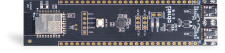
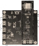
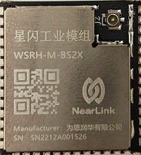
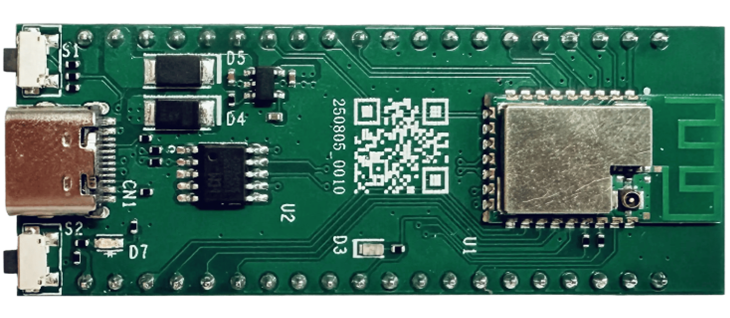

# fbb_bs2x开发指南

## 介绍

  fbb_bs2x仓是星闪bs20/bs21e/bs22解决方案代码仓，搭载LiteOS系统，主要用于鼠标、键盘、测距、电子消费类等应用场景，该SDK包从统一开发平台FBB（Family Big Box，统一开发框架，统一API）构建而来，在该平台上开发的应用很容易被移植到其他星闪解决方案上，有效降低开发者门槛，缩短开发周期，支持开发者快速开发星闪产品。软件文档在线化链接：https://docs.hisilicon.com/repos/fbb_bs2x/zh-CN/master/

## 规格

| BS2X系列规格对比 | BS20  | BS21E  | BS22   |
| ---------------- | ----- | ------ | ------ |
| CPU主频          | 64M   | 64M    | 64M    |
| FLASH            | 1M    | 1M     | 1M     |
| RAM              | 128K  | 160K   | 160K   |
| SLE              | 1K    | 2K     | 4K     |
| 空口速率         | 4Mbps | 12Mbps | 12Mbps |
| USB              | 支持  | 支持   | 支持   |
| 有线回报率       | 1K    | 4K     | 8K     |
| 测距             | 支持  | 支持   | 支持   |

## Release-notes

[BS2X-1.0.17](docs/zh-CN/software/release-notes/BS2X-1.0.17.md)

## 目录介绍

| 目录   | 介绍                                                         |
| ------ | ------------------------------------------------------------ |
| docs   | 存放软件资料手册、IO复用关系表、用户指南手册，帮助用户快速了解bs21e系列 |
| src    | 开发接入SDK源码包，用户基于源码进行二次开发                  |
| tools  | 开发工具及环境搭建指南文档，帮助用户搭建开发环境             |
| vendor | 存放合作产商的开发板硬件和软件资料，包含案例代码、硬件原理图、案例开发指南文档 |

## 购买渠道

| 硬件资料                                                     | 介绍                                                         | 二维码购买链接                                               |
| ------------------------------------------------------------ | ------------------------------------------------------------ | ------------------------------------------------------------ |
| [购买链接](https://www.ickey.cn/detail/1003001022725627/BS21Q331.html#) | 云汉芯城可购买BS21E芯片，内置星闪BS21E解决方案，SLE回报率2k  |  |
| [购买链接](https://www.ickey.cn/detail/1003001026273687/BS20Q332.html) | 云汉芯城可购买BS20芯片，内置星闪BS20解决方案，SLE回报率1k    |  |
| [购买链接](https://www.ickey.cn/detail/1003001026273686/BS22Q332.html) | 云汉芯城可购买BS22芯片，内置星闪BS22解决方案，SLE回报率4k    |  |
| [购买链接](https://item.taobao.com/item.htm?ft=t&id=1027829631332) | 利尔达EB21 星闪模组（BS21），包含[模组封装](https://alidocs.dingtalk.com/i/nodes/l6Pm2Db8D4PY6PZLTXpO6ZmE8xLq0Ee4?utm_scene=team_space)，[模组硬件设计指南](https://alidocs.dingtalk.com/i/nodes/bva6QBXJwaGg4GRjHl5659PbWn4qY5Pr?utm_scene=team_space) |                                                              |

**免费样片申请活动：[活动链接](https://developers.hisilicon.com/active?activity_id=4112f69ad3c0430fb1d488da2616aa7f&channelCode=hispark)**

模组等产品均由相应产家自行销售，由其对产品质量负责，如侵犯他人知识产权的由其自行承担全部责任及赔偿。海思不提供任何保证及担保，亦不承担任何责任及赔偿。

## 软件资料介绍

| 名称                                                         | 介绍                                                         |
| ------------------------------------------------------------ | ------------------------------------------------------------ |
| [SDK软件在线系列文档](https://docs.hisilicon.com/repos/fbb_bs2x/zh-CN/master/) | 该系列文档主要包括IO复用关系表、 AT命令开发指南、 DFU升级APK开发指南、设备驱动开发指南、NV存储开发指南、 功率配置开发指南、音频编解码开发指南、蓝牙软件开发指南、SDK Sample开发指南等文档，文档路径存放于docs/software、docs/debug、docs/tool |
| [开发环境搭建文档](tools/README.md)                          | 主要包括windows系统编译工具搭建、SDK包下载，Linux系统编译工具搭建及SDK包下载，路径：toos |

##  支持的开发板

| 开发板介绍                              | 购买链接                                                     | 开发板图片                                                   |
| --------------------------------------- | ------------------------------------------------------------ | ------------------------------------------------------------ |
| HH-D03开发板（润和软件）                | [润和软件HH-D03开发板购买链接（淘宝）](https://e.tb.cn/h.6QTzoydYS0mUA5g?tk=aKlIV23zcP3) |  |
| BearPi-Pico_H2821E开发板（小熊派）      | [小熊派BearPi-Pico_H2821E开发板购买链接（淘宝）](https://item.taobao.com/item.htm?id=803331789469) |  |
| DK221星闪2K鼠标完整解决方案（方格电子） | [方格电子DK221星闪2K鼠标解决方案购买链接（淘宝）](https://e.tb.cn/h.69IMdsPhGFQWDgS?tk=b25cVdob237) | 后续提供                                                     |
| EB21开发板(利尔达)                      | [利尔达EB21开发板购买链接  (淘宝)](https://item.taobao.com/item.htm?ft=t&id=1027829631332) |  |
| 2825星闪外设板（利尔达）                | [利尔达2825星闪外设板（淘宝）](https://e.tb.cn/h.h9s5pP5eEBYr5M5?tk=gimv4WfzzIG) |  |
| WSRH_M_BS2X（星闪工业模组）             | [星闪工业模组购买链接（邮箱）](https://gitee.com/shenzhen-city-for-sirunhua/wr_-bs282-x-m1) |  |
| HH-D121开发板（润和软件）               | [润和软件HH-D121开发板购买链接（淘宝）](https://e.tb.cn/h.SEFRVWVPfNL9cQQ?tk=MJ3KfOVwlPg) |  |

开发板等产品均由相应产家自行销售，由其对产品质量负责，如侵犯他人知识产权的由其自行承担全部责任及赔偿。海思不提供任何保证及担保，亦不承担任何责任及赔偿。

## 开发板资料

| 开发板型号                              | 案例开发指南                                                 | 硬件资料                                                     |
| --------------------------------------- | ------------------------------------------------------------ | ------------------------------------------------------------ |
| HH-D03开发板（润和软件）                | [润和开发板星闪案例开发指南](vendor/HH-D03/demo)             | [HH-D03开发板硬件原理图及HH-D03 星闪开发板规格说明书](vendor/HH-D03/doc/hardware) |
| HH-D121开发板（润和软件）               | [润和开发板星闪案例开发指南](vendor/HH-D03/demo)             | [HH-D121开发板硬件原理图及HH-D121 星闪开发板规格说明书](vendor/HH-D121/doc) |
| BearPi-Pico_H2821E开发板（小熊派）      | [小熊派开发板星闪案例开发指南](vendor/BearPi-Pico_H2821E/doc/README.md) | [BearPi-Pico_H2821E开发板硬件原理图](vendor/BearPi-Pico_H2821E/doc/hardware/) |
| EB21开发板(利尔达)                      | [利尔达EB21开发板硬件说明书](https://alidocs.dingtalk.com/i/nodes/NkDwLng8ZLZX5ZOwSjpgbqZqVKMEvZBY?utm_scene=team_space) |[EB21开发板硬件原理图](https://alidocs.dingtalk.com/i/nodes/mweZ92PV6MrNmrpGuvqnAq3LWxEKBD6p?utm_scene=team_space)|
| DK221星闪2K鼠标完整解决方案（方格电子） | 暂不提供                                                     | 暂不提供                                                     |

## 示例教程

HH-D03、HH-D121开发板示例教程

| 一级分类     | 子分类          | 应用示例                                                     | 应用示例                                                  | 应用示例                                      |
| :----------- | --------------- | ------------------------------------------------------------ | --------------------------------------------------------- | --------------------------------------------- |
| **基础驱动** | **GPIO**        | [点亮LED灯案例](vendor/HH-D03/demo/led)                      | [按键检测](vendor/HH-D03/demo/buttondemo)                 | [交通灯案例](vendor/HH-D03/demo/trafficlight) |
|              | **UART**        | [串口通信案例](vendor/HH-D03/demo/uartdemo)                  |                                                           |                                               |
|              | **I2C**         | [0.96寸OLED屏幕驱动案例](vendor/HH-D03/demo/oled)            | [环境监测](vendor/HH-D03/demo/environment)                |                                               |
|              | **PWM**         | [蜂鸣器鸣响](vendor/HH-D03/demo/beep)                        | [RGB灯案例](vendor/HH-D03/demo/pwm_rgb_led)               |                                               |
|              | **watchdog**    | [看门狗案例](src/application/samples/peripheral/watchdog)    |                                                           |                                               |
|              | **i2s**         | [I2S通信案例](src/application/samples/peripheral/i2s)        | I[2S+DMA通信](src/application/samples/peripheral/i2s_dma) |                                               |
|              | **keyscan**     | [键盘扫描](src/application/samples/peripheral/keyscan)       |                                                           |                                               |
|              | **spi**         | [SPI通信案例](src/application/samples/peripheral/spi)        |                                                           |                                               |
|              | **timer**       | [定时器案例](src/application/samples/peripheral/timer)       |                                                           |                                               |
| **操作系统** | **Thread**      | [任务调度使用案例](vendor/HH-D03/demo/thread)                |                                                           |                                               |
|              | **Event**       | [事件使用案例](vendor/HH-D03/demo/event)                     |                                                           |                                               |
|              | **Mutex**       | [互斥锁使用案例](vendor/HH-D03/demo/mutex)                   |                                                           |                                               |
|              | **MessgeQueue** | [消息队列使用案例](vendor/HH-D03/demo/message)               |                                                           |                                               |
| **usb**      | **usb**         | [usb通信案例](vendor/HH-D03/demo/usb_demo)                   | [USB键盘](src/application/samples/products/usb_keyboard)  |                                               |
| **星闪**     | **SLE**         | [sle_uart串口透传](src/application/samples/products/sle_uart) | [SLE测距](vendor/HH-D03/demo/sle_measure_dis)             |                                               |
| **蓝牙**     | **BLE**         | [蓝牙串口透传](src/application/samples/products/ble_uart)    | [蓝牙键盘](src/application/samples/products/ble_keyboard) |                                               |

BearPi-Pico_H2821E开发板示例教程

| 一级分类     | 子分类          | 应用示例                                                     | 应用示例                                                  | 应用示例                                      |
| :----------- | --------------- | ------------------------------------------------------------ | --------------------------------------------------------- | --------------------------------------------- |
| **基础驱动** | **GPIO**        | [点亮LED灯案例](https://www.bearpi.cn/core_board/bearpi/pico/h2821E/software/study/1.GPIO%E7%82%B9%E4%BA%AELED%E7%81%AF%E6%B5%8B%E8%AF%95.html)                      | [按键检测](https://www.bearpi.cn/core_board/bearpi/pico/h2821E/software/study/2.GPIO%E6%8C%89%E9%94%AE%E4%B8%AD%E6%96%AD%E6%B5%8B%E8%AF%95.html)                 | |
|              | **UART**        | [串口通信案例](https://www.bearpi.cn/core_board/bearpi/pico/h2821E/software/study/10.UART%E6%95%B0%E6%8D%AE%E4%BC%A0%E8%BE%93%E8%BE%93%E5%87%BA%E6%B5%8B%E8%AF%95.html)                  |                                                           |                                               |
|              | **I2C**         | [I2C通信案例](https://www.bearpi.cn/core_board/bearpi/pico/h2821E/software/study/5.I2C%E4%B8%BB%E4%BB%8E%E6%95%B0%E6%8D%AE%E4%BC%A0%E8%BE%93%E6%B5%8B%E8%AF%95.html)            |                |                                               |
|              | **PWM**         | [PWM输出案例](https://www.bearpi.cn/core_board/bearpi/pico/h2821E/software/study/9.PWM%E8%BE%93%E5%87%BA%E6%B5%8B%E8%AF%95.html)                        |               |                                               |
|              | **watchdog**    | [看门狗案例](src/application/samples/peripheral/watchdog)    |                                                           |                                               |
|              | **i2s**         | [I2S通信案例](https://www.bearpi.cn/core_board/bearpi/pico/h2821E/software/study/6.I2S%E4%B8%BB%E4%BB%8E%E6%95%B0%E6%8D%AE%E4%BC%A0%E8%BE%93%E6%B5%8B%E8%AF%95.html)        | [I2S+DMA通信](src/application/samples/peripheral/i2s_dma) |                                               |
|              | **keyscan**     | [键盘扫描](https://www.bearpi.cn/core_board/bearpi/pico/h2821E/software/study/8.KEYSCAN%E7%9F%A9%E9%98%B5%E9%94%AE%E7%9B%98%E6%89%AB%E6%8F%8F%E6%B5%8B%E8%AF%95.html)       |                                                           |                                               |
|              | **spi**         | [SPI通信案例](https://www.bearpi.cn/core_board/bearpi/pico/h2821E/software/study/7.SPI%E4%B8%BB%E4%BB%8E%E6%95%B0%E6%8D%AE%E4%BC%A0%E8%BE%93%E6%B5%8B%E8%AF%95.html)        |                                                           |                                               |
|              | **timer**       | [定时器案例](src/application/samples/peripheral/timer)       |                                                           |                                               |
| **usb**      | **usb**         |   [USB键盘](src/application/samples/products/usb_keyboard)  |                                               |
| **星闪**     | **SLE**         | [sle_uart串口透传](https://www.bearpi.cn/core_board/bearpi/pico/h2821E/software/SLE%E4%B8%B2%E5%8F%A3%E9%80%8F%E4%BC%A0%E6%B5%8B%E8%AF%95.html) | [SLE测距](src/application/samples/products/sle_measure_dis)             |                                               |
| **蓝牙**     | **BLE**         | [蓝牙串口透传](https://www.bearpi.cn/core_board/bearpi/pico/h2821E/software/BLE%E4%B8%B2%E5%8F%A3%E9%80%8F%E4%BC%A0%E6%B5%8B%E8%AF%95.html)    | [蓝牙键盘](src/application/samples/products/ble_keyboard) |                                               |

## 参与贡献

- 参考[社区参与贡献指南](https://gitcode.com/HiSpark/docs/blob/master/contribute/%E7%A4%BE%E5%8C%BA%E5%8F%82%E4%B8%8E%E8%B4%A1%E7%8C%AE%E6%8C%87%E5%8D%97.md)
