# Preface<a name="ZH-CN_TOPIC_0000001790806532"></a>

**Overview<a name="section669mcpsimp"></a>**

BS2X provides users with sample programs (Samples) to guide them in quickly using the capabilities provided by the BS2X platform and accelerating product development (some examples in this document use BS21).

**Product Version<a name="section673mcpsimp"></a>**

The product versions corresponding to this document are as follows.

<a name="table676mcpsimp"></a>
<table><thead align="left"><tr id="row681mcpsimp"><th class="cellrowborder" valign="top" width="36.9%" id="mcps1.1.3.1.1"><p id="p683mcpsimp"><a name="p683mcpsimp"></a><a name="p683mcpsimp"></a><strong id="b684mcpsimp"><a name="b684mcpsimp"></a><a name="b684mcpsimp"></a>Product Name</strong></p>
</th>
<th class="cellrowborder" valign="top" width="63.1%" id="mcps1.1.3.1.2"><p id="p686mcpsimp"><a name="p686mcpsimp"></a><a name="p686mcpsimp"></a><strong id="b687mcpsimp"><a name="b687mcpsimp"></a><a name="b687mcpsimp"></a>Product Version</strong></p>
</th>
</tr>
</thead>
<tbody><tr id="row689mcpsimp"><td class="cellrowborder" valign="top" width="36.9%" headers="mcps1.1.3.1.1 "><p id="p691mcpsimp"><a name="p691mcpsimp"></a><a name="p691mcpsimp"></a>BS2X</p>
</td>
<td class="cellrowborder" valign="top" width="63.1%" headers="mcps1.1.3.1.2 "><p id="p693mcpsimp"><a name="p693mcpsimp"></a><a name="p693mcpsimp"></a>V100</p>
</td>
</tr>
</tbody>
</table>

**Reader Audience<a name="section694mcpsimp"></a>**

This document is mainly applicable to the following engineers:

-   Technical Support Engineer
-   Software Development Engineer

**Symbol Conventions<a name="section133020216410"></a>**

The following symbols may appear in this document. Their meanings are as follows.

<a name="table2622507016410"></a>
<table><thead align="left"><tr id="row1530720816410"><th class="cellrowborder" valign="top" width="20.580000000000002%" id="mcps1.1.3.1.1"><p id="p6450074116410"><a name="p6450074116410"></a><a name="p6450074116410"></a><strong id="b2136615816410"><a name="b2136615816410"></a><a name="b2136615816410"></a>Symbol</strong></p>
</th>
<th class="cellrowborder" valign="top" width="79.42%" id="mcps1.1.3.1.2"><p id="p5435366816410"><a name="p5435366816410"></a><a name="p5435366816410"></a><strong id="b5941558116410"><a name="b5941558116410"></a><a name="b5941558116410"></a>Description</strong></p>
</th>
</tr>
</thead>
<tbody><tr id="row1372280416410"><td class="cellrowborder" valign="top" width="20.580000000000002%" headers="mcps1.1.3.1.1 "><p id="p3734547016410"><a name="p3734547016410"></a><a name="p3734547016410"></a><a name="image2670064316410"></a><a name="image2670064316410"></a><span></span></p>
</td>
<td class="cellrowborder" valign="top" width="79.42%" headers="mcps1.1.3.1.2 "><p id="p1757432116410"><a name="p1757432116410"></a><a name="p1757432116410"></a>Indicates a hazard with a high level of risk which, if not avoided, will result in death or serious injury.</p>
</td>
</tr>
<tr id="row466863216410"><td class="cellrowborder" valign="top" width="20.580000000000002%" headers="mcps1.1.3.1.1 "><p id="p1432579516410"><a name="p1432579516410"></a><a name="p1432579516410"></a><a name="image4895582316410"></a><a name="image4895582316410"></a><span></span></p>
</td>
<td class="cellrowborder" valign="top" width="79.42%" headers="mcps1.1.3.1.2 "><p id="p959197916410"><a name="p959197916410"></a><a name="p959197916410"></a>Indicates a hazard with a medium level of risk which, if not avoided, could result in death or serious injury.</p>
</td>
</tr>
<tr id="row123863216410"><td class="cellrowborder" valign="top" width="20.580000000000002%" headers="mcps1.1.3.1.1 "><p id="p1232579516410"><a name="p1232579516410"></a><a name="p1232579516410"></a><a name="image1235582316410"></a><a name="image1235582316410"></a><span></span></p>
</td>
<td class="cellrowborder" valign="top" width="79.42%" headers="mcps1.1.3.1.2 "><p id="p123197916410"><a name="p123197916410"></a><a name="p123197916410"></a>Indicates a hazard with a low level of risk which, if not avoided, could result in minor or moderate injury.</p>
</td>
</tr>
<tr id="row5786682116410"><td class="cellrowborder" valign="top" width="20.580000000000002%" headers="mcps1.1.3.1.1 "><p id="p2204984716410"><a name="p2204984716410"></a><a name="p2204984716410"></a><a name="image4504446716410"></a><a name="image4504446716410"></a><span></span></p>
</td>
<td class="cellrowborder" valign="top" width="79.42%" headers="mcps1.1.3.1.2 "><p id="p4388861916410"><a name="p4388861916410"></a><a name="p4388861916410"></a>Used to convey safety warning information about equipment or the environment. If not avoided, it may result in equipment damage, data loss, degraded equipment performance, or other unpredictable consequences.</p>
<p id="p1238861916410"><a name="p1238861916410"></a><a name="p1238861916410"></a>"Notice" does not involve personal injury.</p>
</td>
</tr>
<tr id="row2856923116410"><td class="cellrowborder" valign="top" width="20.580000000000002%" headers="mcps1.1.3.1.1 "><p id="p5555360116410"><a name="p5555360116410"></a><a name="p5555360116410"></a><a name="image799324016410"></a><a name="image799324016410"></a><span></span></p>
</td>
<td class="cellrowborder" valign="top" width="79.42%" headers="mcps1.1.3.1.2 "><p id="p4612588116410"><a name="p4612588116410"></a><a name="p4612588116410"></a>Supplementary explanation of key information in the main text.</p>
<p id="p1232588116410"><a name="p1232588116410"></a><a name="p1232588116410"></a>"Description" is not safety warning information and does not involve personal, equipment, or environmental damage information.</p>
</td>
</tr>
</tbody>
</table>

**Modification Record<a name="section2467512116410"></a>**

<a name="table1557726816410"></a>
<table><thead align="left"><tr id="row2942532716410"><th class="cellrowborder" valign="top" width="18.990000000000002%" id="mcps1.1.4.1.1"><p id="p3778275416410"><a name="p3778275416410"></a><a name="p3778275416410"></a><strong id="b5687322716410"><a name="b5687322716410"></a><a name="b5687322716410"></a>Document Version</strong></p>
</th>
<th class="cellrowborder" valign="top" width="25.629999999999995%" id="mcps1.1.4.1.2"><p id="p5627845516410"><a name="p5627845516410"></a><a name="p5627845516410"></a><strong id="b5800814916410"><a name="b5800814916410"></a><a name="b5800814916410"></a>Release Date</strong></p>
</th>
<th class="cellrowborder" valign="top" width="55.379999999999995%" id="mcps1.1.4.1.3"><p id="p2382284816410"><a name="p2382284816410"></a><a name="p2382284816410"></a><strong id="b3316380216410"><a name="b3316380216410"></a><a name="b3316380216410"></a>Modification Description</strong></p>
</th>
</tr>
</thead>
<tbody><tr id="row16891115106"><td class="cellrowborder" valign="top" width="18.990000000000002%" headers="mcps1.1.4.1.1 "><p id="p1489215305"><a name="p1489215305"></a><a name="p1489215305"></a>08</p>
</td>
<td class="cellrowborder" valign="top" width="25.629999999999995%" headers="mcps1.1.4.1.2 "><p id="p1190191515017"><a name="p1190191515017"></a><a name="p1190191515017"></a>2025-12-01</p>
</td>
<td class="cellrowborder" valign="top" width="55.379999999999995%" headers="mcps1.1.4.1.3 "><a name="ul852363320013"></a><a name="ul852363320013"></a><ul id="ul852363320013"><li>Updated the content of the "<a href="SLE-measure-dis.md">SLE measure dis</a>"<span id="ph194316451461"><a name="ph194316451461"></a><a name="ph194316451461"></a> section</span>.</li></ul>
</td>
</tr>
<tr id="row1621142111115"><td class="cellrowborder" valign="top" width="18.990000000000002%" headers="mcps1.1.4.1.1 "><p id="p17210427110"><a name="p17210427110"></a><a name="p17210427110"></a>07</p>
</td>
<td class="cellrowborder" valign="top" width="25.629999999999995%" headers="mcps1.1.4.1.2 "><p id="p62112425111"><a name="p62112425111"></a><a name="p62112425111"></a>2025-08-07</p>
</td>
<td class="cellrowborder" valign="top" width="55.379999999999995%" headers="mcps1.1.4.1.3 "><a name="ul87311555191115"></a><a name="ul87311555191115"></a><ul id="ul87311555191115"><li>Updated the content of the "<a href="SLE-UART-Sample.md">SLE UART Sample</a>" section.</li><li>Updated the content of the "<a href="BLE-Lowpower-Sample.md">BLE Lowpower Sample</a>" section.</li><li>Updated the content of the "<a href="RCU.md">RCU</a>" section.</li><li>Updated the content of the "<a href="多连接.md">Multi-Connection</a>" section.</li></ul>
</td>
</tr>
<tr id="row05565141001"><td class="cellrowborder" valign="top" width="18.990000000000002%" headers="mcps1.1.4.1.1 "><p id="p17572111515019"><a name="p17572111515019"></a><a name="p17572111515019"></a>06</p>
</td>
<td class="cellrowborder" valign="top" width="25.629999999999995%" headers="mcps1.1.4.1.2 "><p id="p3556101415014"><a name="p3556101415014"></a><a name="p3556101415014"></a>2025-05-30</p>
</td>
<td class="cellrowborder" valign="top" width="55.379999999999995%" headers="mcps1.1.4.1.3 "><a name="ul7978102710017"></a><a name="ul7978102710017"></a><ul id="ul7978102710017"><li>Updated the content of the "<a href="SLE-UART-Sample.md">SLE UART Sample</a>" section.</li><li>Updated the content of the "<a href="SLE-microphone.md">SLE microphone</a>" section.</li><li>Added the "<a href="BLE-Lowpower-Sample.md">BLE Lowpower Sample</a>" section.</li><li>Updated the content of the "<a href="USB-AMIC-VDT-Sample.md">USB AMIC VDT Sample</a>" section.</li><li>Updated the content of the "<a href="RCU.md">RCU</a>" section.</li><li>Added the "<a href="air-mouse.md">air mouse</a>" to "<a href="BLE-UUID.md">BLE UUID</a>" sections.</li></ul>
</td>
</tr>
<tr id="row2081910408147"><td class="cellrowborder" valign="top" width="18.990000000000002%" headers="mcps1.1.4.1.1 "><p id="p1881994017142"><a name="p1881994017142"></a><a name="p1881994017142"></a>05</p>
</td>
<td class="cellrowborder" valign="top" width="25.629999999999995%" headers="mcps1.1.4.1.2 "><p id="p13819164016144"><a name="p13819164016144"></a><a name="p13819164016144"></a>2025-01-24</p>
</td>
<td class="cellrowborder" valign="top" width="55.379999999999995%" headers="mcps1.1.4.1.3 "><a name="ul1621516468141"></a><a name="ul1621516468141"></a><ul id="ul1621516468141"><li>Updated the content of the "<a href="编译-56.md">Compilation</a>" section.</li><li>Added the "<a href="SLE-UART-DMA-Sample.md">SLE UART DMA Sample</a>" section.</li><li>Added the "<a href="多连接.md">Multi-Connection</a>" section.</li></ul>
</td>
</tr>
<tr id="row1923465519811"><td class="cellrowborder" valign="top" width="18.990000000000002%" headers="mcps1.1.4.1.1 "><p id="p1723419554814"><a name="p1723419554814"></a><a name="p1723419554814"></a>04</p>
</td>
<td class="cellrowborder" valign="top" width="25.629999999999995%" headers="mcps1.1.4.1.2 "><p id="p023455513813"><a name="p023455513813"></a><a name="p023455513813"></a>2024-08-29</p>
</td>
<td class="cellrowborder" valign="top" width="55.379999999999995%" headers="mcps1.1.4.1.3 "><a name="ul199311581786"></a><a name="ul199311581786"></a><ul id="ul199311581786"><li>Updated the content of the "<a href="外设-Sample.md">Peripheral Sample</a>" section.</li><li>Updated the content of the "<a href="SLE-Mouse-Sample.md">SLE Mouse Sample</a>" section.</li><li>Updated the content of the "<a href="USB-Mouse-Sample.md">USB Mouse Sample</a>" section.</li></ul>
</td>
</tr>
<tr id="row8379153135317"><td class="cellrowborder" valign="top" width="18.990000000000002%" headers="mcps1.1.4.1.1 "><p id="p12379183175316"><a name="p12379183175316"></a><a name="p12379183175316"></a>03</p>
</td>
<td class="cellrowborder" valign="top" width="25.629999999999995%" headers="mcps1.1.4.1.2 "><p id="p1537963135317"><a name="p1537963135317"></a><a name="p1537963135317"></a>2024-07-04</p>
</td>
<td class="cellrowborder" valign="top" width="55.379999999999995%" headers="mcps1.1.4.1.3 "><a name="ul798516106533"></a><a name="ul798516106533"></a><ul id="ul798516106533"><li>Updated the content of the "<a href="外设-Sample.md">Peripheral Sample</a>" section.</li><li>Updated the content of the "<a href="校准.md">Calibration</a>" subsection.</li></ul>
</td>
</tr>
<tr id="row1192555211176"><td class="cellrowborder" valign="top" width="18.990000000000002%" headers="mcps1.1.4.1.1 "><p id="p12925752111711"><a name="p12925752111711"></a><a name="p12925752111711"></a>02</p>
</td>
<td class="cellrowborder" valign="top" width="25.629999999999995%" headers="mcps1.1.4.1.2 "><p id="p1292595241719"><a name="p1292595241719"></a><a name="p1292595241719"></a>2024-06-04</p>
</td>
<td class="cellrowborder" valign="top" width="55.379999999999995%" headers="mcps1.1.4.1.3 "><p id="p59257521177"><a name="p59257521177"></a><a name="p59257521177"></a>Added the "<a href="SLE-measure-dis.md">SLE measure dis</a>" section.</p>
</td>
</tr>
<tr id="row7148081818"><td class="cellrowborder" valign="top" width="18.990000000000002%" headers="mcps1.1.4.1.1 "><p id="p131480181812"><a name="p131480181812"></a><a name="p131480181812"></a>01</p>
</td>
<td class="cellrowborder" valign="top" width="25.629999999999995%" headers="mcps1.1.4.1.2 "><p id="p1814150161818"><a name="p1814150161818"></a><a name="p1814150161818"></a>2024-05-22</p>
</td>
<td class="cellrowborder" valign="top" width="55.379999999999995%" headers="mcps1.1.4.1.3 "><p id="p12991124711568"><a name="p12991124711568"></a><a name="p12991124711568"></a>First official version released.</p>
<a name="ul15576154015617"></a><a name="ul15576154015617"></a><ul id="ul15576154015617"><li>Updated the content of the "<a href="外设-Sample.md">Peripheral Sample</a>" section.</li><li>Updated the content of the "<a href="USB-AMIC-VDT-Sample.md">USB AMIC VDT Sample</a>" section.</li></ul>
</td>
</tr>
<tr id="row203281634153518"><td class="cellrowborder" valign="top" width="18.990000000000002%" headers="mcps1.1.4.1.1 "><p id="p17328534153515"><a name="p17328534153515"></a><a name="p17328534153515"></a>00B03</p>
</td>
<td class="cellrowborder" valign="top" width="25.629999999999995%" headers="mcps1.1.4.1.2 "><p id="p163286345353"><a name="p163286345353"></a><a name="p163286345353"></a>2024-04-25</p>
</td>
<td class="cellrowborder" valign="top" width="55.379999999999995%" headers="mcps1.1.4.1.3 "><a name="ul1814552619395"></a><a name="ul1814552619395"></a><ul id="ul1814552619395"><li>Updated the content of the "<a href="支持的外设Sample列表.md">Supported Peripheral Sample List</a>" subsection.</li><li>Updated the content of the "<a href="编译-52.md">Compilation</a>" subsection.</li></ul>
</td>
</tr>
<tr id="row18484101192910"><td class="cellrowborder" valign="top" width="18.990000000000002%" headers="mcps1.1.4.1.1 "><p id="p94841315295"><a name="p94841315295"></a><a name="p94841315295"></a>00B02</p>
</td>
<td class="cellrowborder" valign="top" width="25.629999999999995%" headers="mcps1.1.4.1.2 "><p id="p34854114298"><a name="p34854114298"></a><a name="p34854114298"></a>2024-03-29</p>
</td>
<td class="cellrowborder" valign="top" width="55.379999999999995%" headers="mcps1.1.4.1.3 "><p id="p72578361298"><a name="p72578361298"></a><a name="p72578361298"></a>Updated the content of the "<a href="支持的外设Sample列表.md">Supported Peripheral Sample List</a>" subsection.</p>
</td>
</tr>
<tr id="row528931342314"><td class="cellrowborder" valign="top" width="18.990000000000002%" headers="mcps1.1.4.1.1 "><p id="p1685385611545"><a name="p1685385611545"></a><a name="p1685385611545"></a>00B01</p>
</td>
<td class="cellrowborder" valign="top" width="25.629999999999995%" headers="mcps1.1.4.1.2 "><p id="p1341465819419"><a name="p1341465819419"></a><a name="p1341465819419"></a>2024-03-11</p>
</td>
<td class="cellrowborder" valign="top" width="55.379999999999995%" headers="mcps1.1.4.1.3 "><p id="p3853115665417"><a name="p3853115665417"></a><a name="p3853115665417"></a>First temporary version released.</p>
</td>
</tr>
</tbody>
</table>

# Overview<a name="ZH-CN_TOPIC_0000001837765693"></a>

Samples provided by BS2X are divided into lightweight samples and heavyweight samples.

-   Lightweight sample: used to demonstrate the usage of the APIs of each peripheral interface.
-   Heavyweight sample: used to simulate various real products as well as business samples with BSLE communication, such as mouse, keyboard, UART DTU, etc.

> **Description:** 
>Samples are still being enriched continuously.

# Sample Framework<a name="ZH-CN_TOPIC_0000001790966280"></a>


## Overall Solution<a name="ZH-CN_TOPIC_0000001790966300"></a>

**Figure 1**  Software Layering Diagram<a name="fig176891918596"></a>  
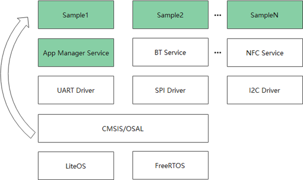

**Figure 2**  Overall Solution Diagram<a name="fig15348753018"></a>  
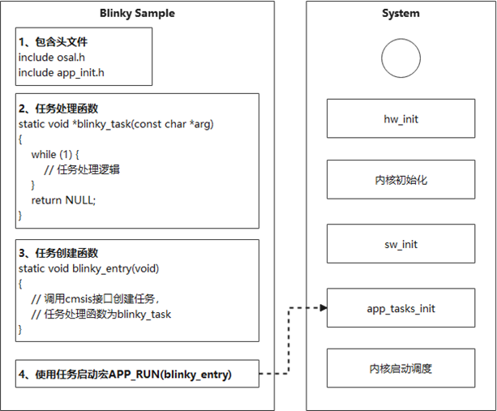

## Sample Startup and Running<a name="ZH-CN_TOPIC_0000001790966236"></a>

1.  Each sample exists independently in the form of an OS task.
2.  When adding or deleting tasks, the system startup-related logic must not be modified. Compilation and linking should be used to isolate tasks from task startup.

## Sample Selection<a name="ZH-CN_TOPIC_0000001790966212"></a>

The samples to be compiled into the system are selected through Kconfig (menuconfig), as shown in [Figure 1](#fig483419344517).

**Figure 1**  Selecting the Sample to Compile via Kconfig<a name="fig483419344517"></a>  

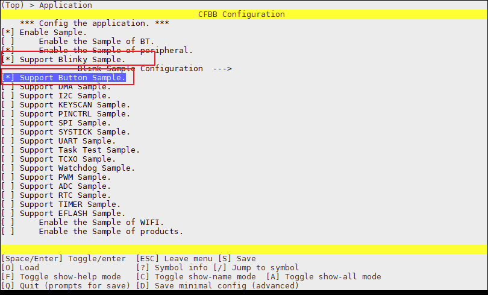

# Peripheral Sample<a name="ZH-CN_TOPIC_0000001837765765"></a>


## Overview<a name="ZH-CN_TOPIC_0000001790806512"></a>

Peripheral samples basically belong to lightweight samples and are only used to demonstrate the complete usage flow of each driver.

## Supported Peripheral Sample List<a name="ZH-CN_TOPIC_0000001790806636"></a>

The supported peripheral sample list is shown in [Table 1](#table1639651217379), and the interface presented in Kconfig is shown in [Figure 1](#fig143181123124).

**Table 1**  Supported Peripheral Sample List

<a name="table1639651217379"></a>
<table><thead align="left"><tr id="row103971012123714"><th class="cellrowborder" valign="top" width="49.97%" id="mcps1.2.3.1.1"><p id="p19397131233713"><a name="p19397131233713"></a><a name="p19397131233713"></a>Sample Name</p>
</th>
<th class="cellrowborder" valign="top" width="50.029999999999994%" id="mcps1.2.3.1.2"><p id="p53971212113715"><a name="p53971212113715"></a><a name="p53971212113715"></a>Function Description</p>
</th>
</tr>
</thead>
<tbody><tr id="row12397161210372"><td class="cellrowborder" valign="top" width="49.97%" headers="mcps1.2.3.1.1 "><p id="p639711213712"><a name="p639711213712"></a><a name="p639711213712"></a>adc</p>
</td>
<td class="cellrowborder" valign="top" width="50.029999999999994%" headers="mcps1.2.3.1.2 "><p id="p149542551406"><a name="p149542551406"></a><a name="p149542551406"></a>Demonstrates the usage of the ADC API.</p>
</td>
</tr>
<tr id="row85276580913"><td class="cellrowborder" valign="top" width="49.97%" headers="mcps1.2.3.1.1 "><p id="p2052719581895"><a name="p2052719581895"></a><a name="p2052719581895"></a>can</p>
</td>
<td class="cellrowborder" valign="top" width="50.029999999999994%" headers="mcps1.2.3.1.2 "><p id="p20527135820910"><a name="p20527135820910"></a><a name="p20527135820910"></a>Demonstrates the usage of the Can API.</p>
</td>
</tr>
<tr id="row439713129373"><td class="cellrowborder" valign="top" width="49.97%" headers="mcps1.2.3.1.1 "><p id="p1539751203710"><a name="p1539751203710"></a><a name="p1539751203710"></a>dma</p>
</td>
<td class="cellrowborder" valign="top" width="50.029999999999994%" headers="mcps1.2.3.1.2 "><p id="p29543555409"><a name="p29543555409"></a><a name="p29543555409"></a>Demonstrates the usage of the DMA API.</p>
</td>
</tr>
<tr id="row73971312143710"><td class="cellrowborder" valign="top" width="49.97%" headers="mcps1.2.3.1.1 "><p id="p20397171243716"><a name="p20397171243716"></a><a name="p20397171243716"></a>i2c</p>
</td>
<td class="cellrowborder" valign="top" width="50.029999999999994%" headers="mcps1.2.3.1.2 "><p id="p2095535584019"><a name="p2095535584019"></a><a name="p2095535584019"></a>Demonstrates the usage of the I2C API.</p>
</td>
</tr>
<tr id="row22310304331"><td class="cellrowborder" valign="top" width="49.97%" headers="mcps1.2.3.1.1 "><p id="p1323110307335"><a name="p1323110307335"></a><a name="p1323110307335"></a>i2s/i2s_dma_lli</p>
</td>
<td class="cellrowborder" valign="top" width="50.029999999999994%" headers="mcps1.2.3.1.2 "><p id="p112311330163313"><a name="p112311330163313"></a><a name="p112311330163313"></a>Demonstrates the usage of the I2S (including I2S DMA mode) API.</p>
</td>
</tr>
<tr id="row04232081383"><td class="cellrowborder" valign="top" width="49.97%" headers="mcps1.2.3.1.1 "><p id="p542319883813"><a name="p542319883813"></a><a name="p542319883813"></a>keyscan</p>
</td>
<td class="cellrowborder" valign="top" width="50.029999999999994%" headers="mcps1.2.3.1.2 "><p id="p7955105513401"><a name="p7955105513401"></a><a name="p7955105513401"></a>Demonstrates the usage of the Keyscan API.</p>
</td>
</tr>
<tr id="row13337143353517"><td class="cellrowborder" valign="top" width="49.97%" headers="mcps1.2.3.1.1 "><p id="p193387331353"><a name="p193387331353"></a><a name="p193387331353"></a>pdm</p>
</td>
<td class="cellrowborder" valign="top" width="50.029999999999994%" headers="mcps1.2.3.1.2 "><p id="p233873316353"><a name="p233873316353"></a><a name="p233873316353"></a>Demonstrates the usage of the PDM API.</p>
</td>
</tr>
<tr id="row13888193619384"><td class="cellrowborder" valign="top" width="49.97%" headers="mcps1.2.3.1.1 "><p id="p8888123693817"><a name="p8888123693817"></a><a name="p8888123693817"></a>pinctrl</p>
</td>
<td class="cellrowborder" valign="top" width="50.029999999999994%" headers="mcps1.2.3.1.2 "><p id="p18955655104016"><a name="p18955655104016"></a><a name="p18955655104016"></a>Demonstrates the usage of the Pinctrl API.</p>
</td>
</tr>
<tr id="row53581353133820"><td class="cellrowborder" valign="top" width="49.97%" headers="mcps1.2.3.1.1 "><p id="p12359753123820"><a name="p12359753123820"></a><a name="p12359753123820"></a>pwm</p>
</td>
<td class="cellrowborder" valign="top" width="50.029999999999994%" headers="mcps1.2.3.1.2 "><p id="p8955155134010"><a name="p8955155134010"></a><a name="p8955155134010"></a>Demonstrates the usage of the PWM API.</p>
</td>
</tr>
<tr id="row0488862363"><td class="cellrowborder" valign="top" width="49.97%" headers="mcps1.2.3.1.1 "><p id="p648811618363"><a name="p648811618363"></a><a name="p648811618363"></a>qdec</p>
</td>
<td class="cellrowborder" valign="top" width="50.029999999999994%" headers="mcps1.2.3.1.2 "><p id="p048886113613"><a name="p048886113613"></a><a name="p048886113613"></a>Demonstrates the usage of the QDEC API.</p>
</td>
</tr>
<tr id="row2031635873817"><td class="cellrowborder" valign="top" width="49.97%" headers="mcps1.2.3.1.1 "><p id="p5316105813814"><a name="p5316105813814"></a><a name="p5316105813814"></a>rtc</p>
</td>
<td class="cellrowborder" valign="top" width="50.029999999999994%" headers="mcps1.2.3.1.2 "><p id="p1595565517405"><a name="p1595565517405"></a><a name="p1595565517405"></a>Demonstrates the usage of the RTC API.</p>
</td>
</tr>
<tr id="row6968172643815"><td class="cellrowborder" valign="top" width="49.97%" headers="mcps1.2.3.1.1 "><p id="p1796842611387"><a name="p1796842611387"></a><a name="p1796842611387"></a>spi</p>
</td>
<td class="cellrowborder" valign="top" width="50.029999999999994%" headers="mcps1.2.3.1.2 "><p id="p18955125524017"><a name="p18955125524017"></a><a name="p18955125524017"></a>Demonstrates the usage of the SPI API.</p>
</td>
</tr>
<tr id="row1784018554389"><td class="cellrowborder" valign="top" width="49.97%" headers="mcps1.2.3.1.1 "><p id="p1484016553383"><a name="p1484016553383"></a><a name="p1484016553383"></a>systick</p>
</td>
<td class="cellrowborder" valign="top" width="50.029999999999994%" headers="mcps1.2.3.1.2 "><p id="p129558557405"><a name="p129558557405"></a><a name="p129558557405"></a>Demonstrates the usage of the Systick API.</p>
</td>
</tr>
<tr id="row994123283820"><td class="cellrowborder" valign="top" width="49.97%" headers="mcps1.2.3.1.1 "><p id="p17941632163810"><a name="p17941632163810"></a><a name="p17941632163810"></a>tasks</p>
</td>
<td class="cellrowborder" valign="top" width="50.029999999999994%" headers="mcps1.2.3.1.2 "><p id="p4955355194015"><a name="p4955355194015"></a><a name="p4955355194015"></a>Demonstrates the usage of the Tasks API.</p>
</td>
</tr>
<tr id="row9137201723810"><td class="cellrowborder" valign="top" width="49.97%" headers="mcps1.2.3.1.1 "><p id="p8137317203813"><a name="p8137317203813"></a><a name="p8137317203813"></a>tcxo</p>
</td>
<td class="cellrowborder" valign="top" width="50.029999999999994%" headers="mcps1.2.3.1.2 "><p id="p995511555409"><a name="p995511555409"></a><a name="p995511555409"></a>Demonstrates the usage of the TCXO API.</p>
</td>
</tr>
<tr id="row322733843917"><td class="cellrowborder" valign="top" width="49.97%" headers="mcps1.2.3.1.1 "><p id="p922733883912"><a name="p922733883912"></a><a name="p922733883912"></a>timer</p>
</td>
<td class="cellrowborder" valign="top" width="50.029999999999994%" headers="mcps1.2.3.1.2 "><p id="p15955155515402"><a name="p15955155515402"></a><a name="p15955155515402"></a>Demonstrates the usage of the Timer API.</p>
</td>
</tr>
<tr id="row755364033913"><td class="cellrowborder" valign="top" width="49.97%" headers="mcps1.2.3.1.1 "><p id="p355317403392"><a name="p355317403392"></a><a name="p355317403392"></a>uart</p>
</td>
<td class="cellrowborder" valign="top" width="50.029999999999994%" headers="mcps1.2.3.1.2 "><p id="p109558552405"><a name="p109558552405"></a><a name="p109558552405"></a>Demonstrates the usage of the UART API.</p>
</td>
</tr>
<tr id="row0584174416398"><td class="cellrowborder" valign="top" width="49.97%" headers="mcps1.2.3.1.1 "><p id="p185841344203915"><a name="p185841344203915"></a><a name="p185841344203915"></a>watchdog</p>
</td>
<td class="cellrowborder" valign="top" width="50.029999999999994%" headers="mcps1.2.3.1.2 "><p id="p5955955104014"><a name="p5955955104014"></a><a name="p5955955104014"></a>Demonstrates the usage of the WatchDog API.</p>
</td>
</tr>
</tbody>
</table>

**Figure 1**  Peripheral Sample Kconfig Interface<a name="fig143181123124"></a>  
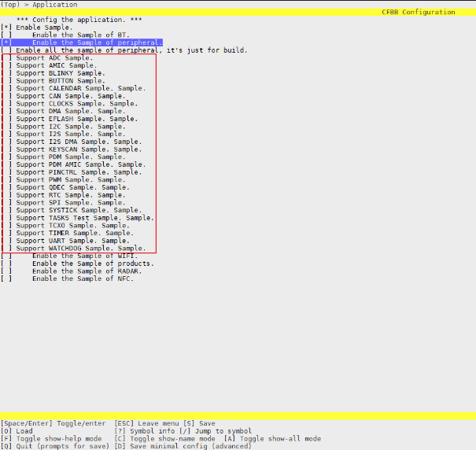


### ADC<a name="ZH-CN_TOPIC_0000001823409002"></a>


#### Compilation<a name="ZH-CN_TOPIC_0000001823580808"></a>

> **Description:** 
>When running this sample, you need to select the KCONFIG configuration in other directories according to actual requirements. Refer to the "KCONFIG Configuration" section of the <BS2XV100 Device Driver Development Guide>.

1.  Run the command "python build.py standard-bs21 menuconfig" in the command line to open the menuconfig configuration interface.
2.  Select ADC Sample in the menuconfig interface, as shown in [Figure 1](#fig10563812175115); if the current sample supports Timer operation, continue to select as shown in [Figure 2](#fig873353011112). After the selection is completed, press "Q" or "q" and select "y" to save and exit.
3.  Compile the version using the IDE. The compiled version package is in the "output\\bs21\\fwpkg\\xxx" path, as shown in [Figure 3](#fig1486953181217).
4.  Burn the compiled version to the board according to "[Burning and Running](烧录及运行-57.md)" of "[SLE Mouse Sample](SLE-Mouse-Sample.md)".

**Figure 1**  Selecting the ADC Sample<a name="fig10563812175115"></a>  
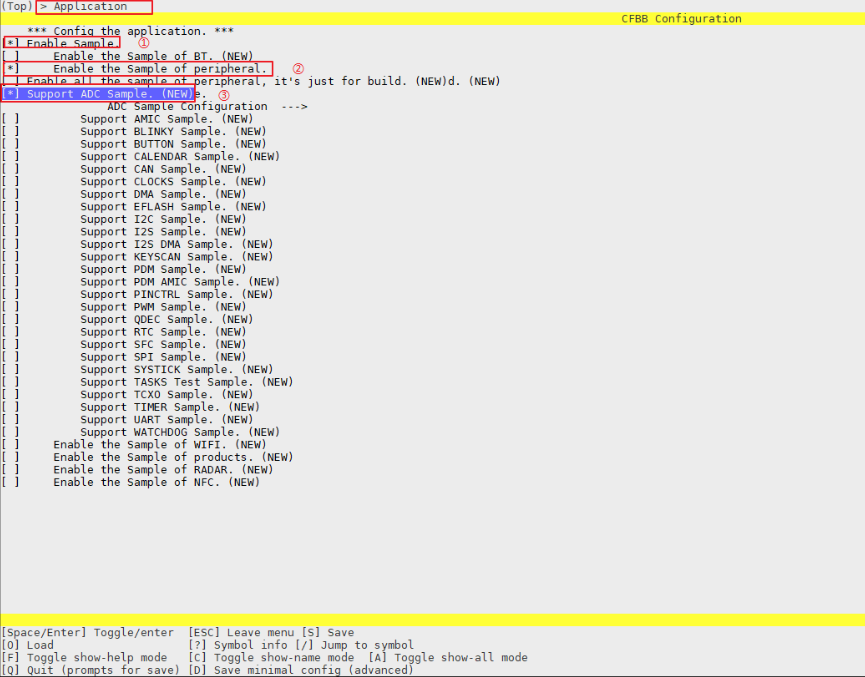

**Figure 2**  Selecting Timer Operation for ADC<a name="fig873353011112"></a>  
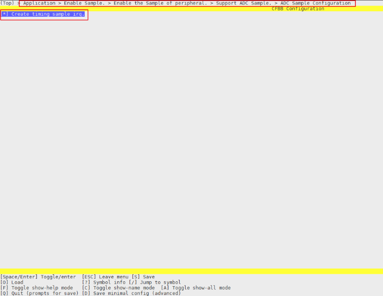

**Figure 3**  Compiled fwpkg<a name="fig1486953181217"></a>  
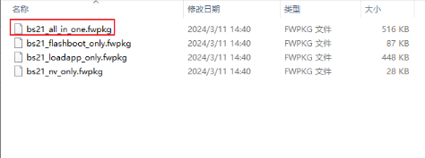

#### Running<a name="ZH-CN_TOPIC_0000001823591700"></a>

1.  adc sampling uses channel0 by default. After the board is reset, apply voltage to the pin of channel0, and the serial port displays the result as shown in [Figure 1](#fig193968010441).
2.  adc timer sampling uses channel0 and channel5 by default. Apply different voltages to the pins of channel0 and channel5, and the serial port displays the results as shown in [Figure 2](#fig1140385554410) and [Figure 3](#fig156221333154514).

**Figure 1**  ADC Sampling Running Result<a name="fig193968010441"></a>  
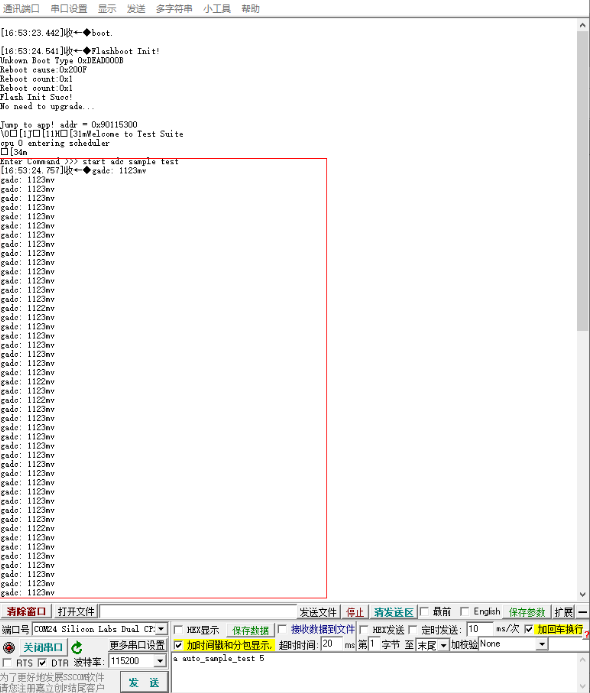

**Figure 2**  ADC Timer Sampling Running Result<a name="fig1140385554410"></a>  
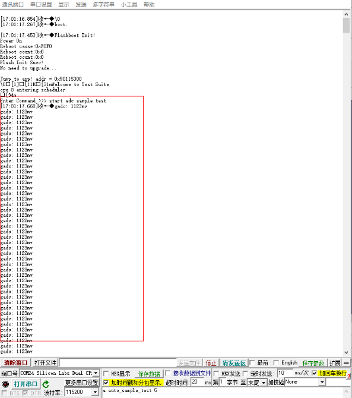

**Figure 3**  ADC Timer Sampling Running Result 2<a name="fig156221333154514"></a>  
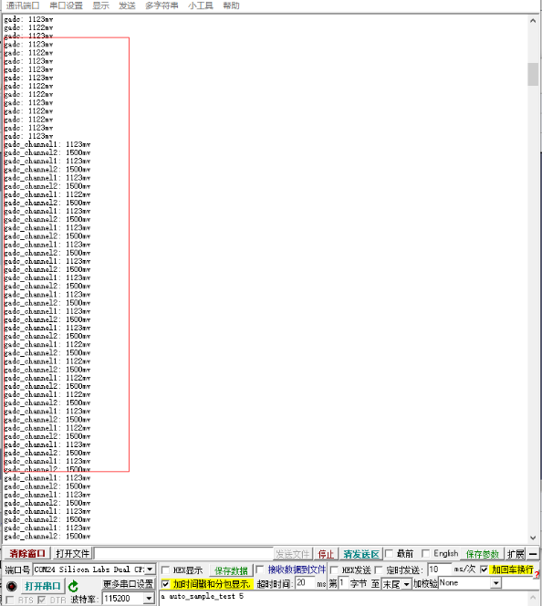

### BLINKY<a name="ZH-CN_TOPIC_0000002031870881"></a>


#### Compilation<a name="ZH-CN_TOPIC_0000001995512912"></a>

> **Description:** 
>When running this sample, select the KCONFIG configuration in other directories according to actual requirements. Refer to the "KCONFIG Configuration" section of the BS2XV100 Device Driver Development Guide.

1.  Run the command "python build.py standard-bs21 menuconfig" in the command line, or click the menuconfig button in the IDE tool, to open the menuconfig configuration interface.
2.  Select BLINKY Sample in the menuconfig interface, as shown in [Figure 1](#fig13722850165011); if you need to select the pin used by the sample, continue to select as shown in [Figure 2](#fig191542445515). After the selection is completed, press "Q" or "q" and select "y" to save and exit.
3.  Compile the version using the IDE. The compiled version package is in the "output\\bs21\\fwpkg\\xxx" path, as shown in [Figure 3](#fig13120173845312).
4.  Burn the compiled version to the board according to "[Burning and Running](烧录及运行-57.md)" of "[SLE Mouse Sample](SLE-Mouse-Sample.md)".

**Figure 1**  Kconfig Sample Selection<a name="fig13722850165011"></a>  
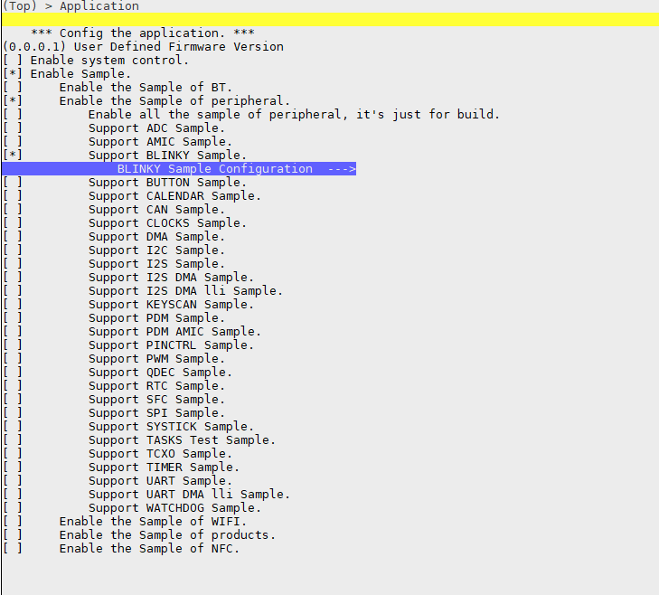

**Figure 2**  Blinky Pin Selection<a name="fig191542445515"></a>  
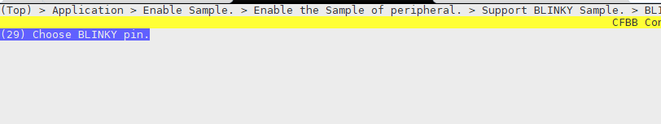

**Figure 3**  Compiled fwpkg<a name="fig13120173845312"></a>  
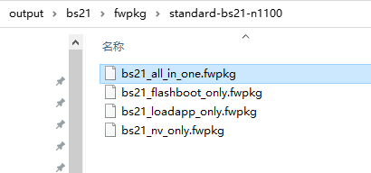

#### Running<a name="ZH-CN_TOPIC_0000002031992233"></a>

1.  After burning, power-on and reset, the serial port prints the "Blinky working" log every 500ms.
2.  Use a tool to measure the level status of the configured pin, as shown in [Figure 1](#fig17708205416574).

**Figure 1**  Measured Level Status<a name="fig17708205416574"></a>  
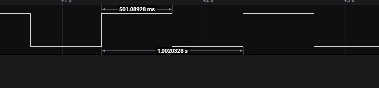

### BUTTON<a name="ZH-CN_TOPIC_0000002032039529"></a>


#### Compilation<a name="ZH-CN_TOPIC_0000002032159125"></a>

> **Description:** 
>When running this sample, select the KCONFIG configuration in other directories according to actual requirements. Refer to the "KCONFIG Configuration" section of the BS2XV100 Device Driver Development Guide.

1.  Run the command "python build.py standard-bs21 menuconfig" in the command line, or click the menuconfig button in the IDE tool, to open the menuconfig configuration interface.
2.  Select BUTTON Sample in the menuconfig interface, as shown in [Figure 1](#fig994215245370); if you need to select the pin used by the sample, continue to select as shown in [Figure 2](#fig215510307384). After the selection is completed, press "Q" or "q" and select "y" to save and exit.
3.  Compile the version using the IDE. The compiled version package is in the "output\\bs21\\fwpkg\\xxx" path, as shown in [Figure 3](#fig41393494020).
4.  Burn the compiled version to the board according to "[Burning and Running](烧录及运行-57.md)" of "[SLE Mouse Sample](SLE-Mouse-Sample.md)".

**Figure 1**  Selecting the BUTTON Sample<a name="fig994215245370"></a>  
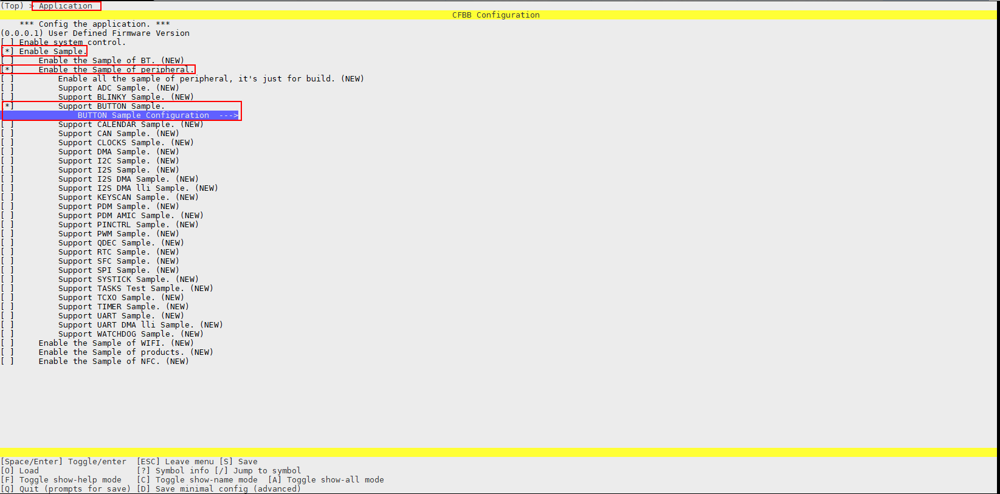

**Figure 2**  Selecting the Pins Supported by BUTTON<a name="fig215510307384"></a>  
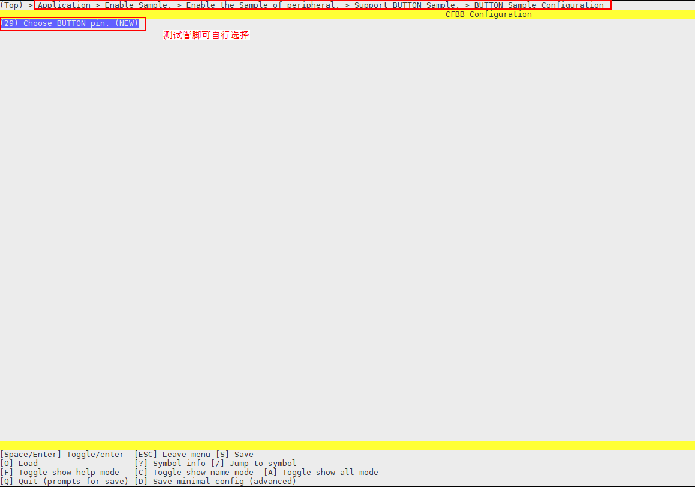

**Figure 3**  Compiled fwpkg<a name="fig41393494020"></a>  
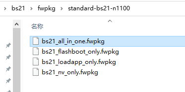

#### Running<a name="ZH-CN_TOPIC_0000001995559790"></a>

1.  After reset and power-on, BUTTON is initialized.
2.  Click BUTTON, and the log shown in [Figure 1](#fig1670512206265) appears.

**Figure 1**  BUTTON Pressed and Released<a name="fig1670512206265"></a>  
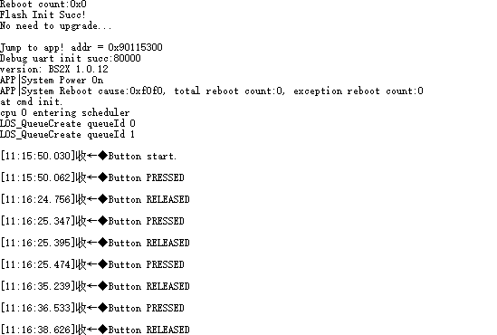

### CAN<a name="ZH-CN_TOPIC_0000001862278082"></a>


#### Compilation<a name="ZH-CN_TOPIC_0000001862118266"></a>

> **Description:** 
>When running this sample, select the KCONFIG configuration in other directories according to actual requirements. Refer to the "KCONFIG Configuration" section of the BS2XV100 Device Driver Development Guide.

1.  Run the command "python build.py standard-bs21a-1M menuconfig" in the command line to open the menuconfig configuration interface.
2.  Select CAN Sample in the menuconfig interface, as shown in [Figure 1](#fig10563812175115); if you need to modify the CAN mode, continue to select as shown in [Figure 2](#fig873353011112). After the selection is completed, press "Q" or "q" and select "y" to save and exit.
3.  Compile the version using the IDE. The compiled version package is in the "output\\bs21a\\fwpkg\\xxx" path, as shown in [Figure 3](#fig1486953181217).
4.  Burn the compiled version to the board according to "[Burning and Running](烧录及运行-57.md)" of "[SLE Mouse Sample](SLE-Mouse-Sample.md)".

**Figure 1**  Selecting the CAN Sample<a name="fig10563812175115"></a>  
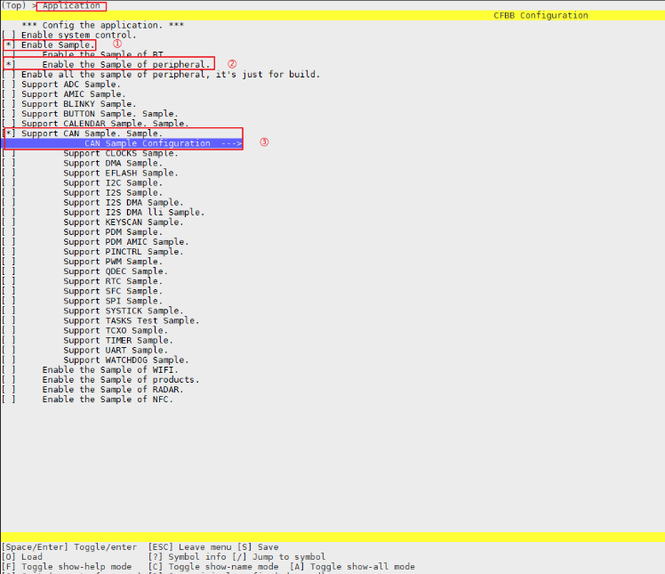

**Figure 2**  CANMODE<a name="fig873353011112"></a>  
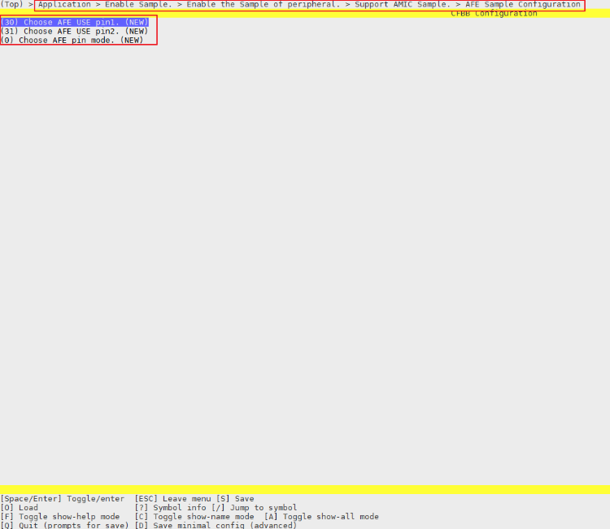

**Figure 3**  Compiled fwpkg<a name="fig1486953181217"></a>  
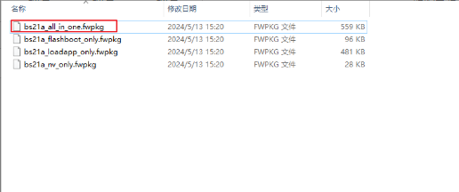

#### Running<a name="ZH-CN_TOPIC_0000001908117725"></a>

The CAN single-board execution results are shown in [Figure 1](#fig92641450144612) and [Figure 2](#fig10171526114717). Currently, CAN works in loop mode by default.

**Figure 1**  CAN Running Result 1<a name="fig92641450144612"></a>  
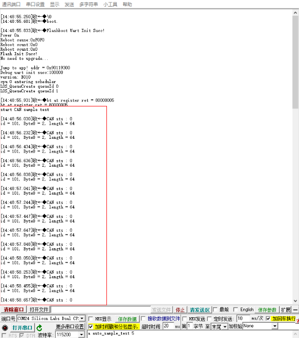

**Figure 2**  CAN Running Result 2<a name="fig10171526114717"></a>  
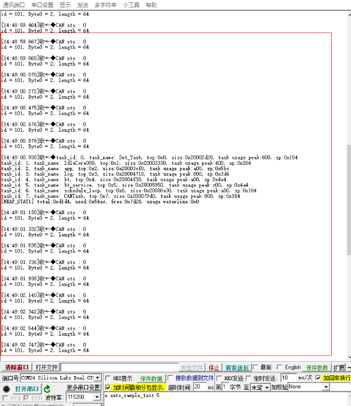

### CLOCK<a name="ZH-CN_TOPIC_0000002000214892"></a>


#### Compilation<a name="ZH-CN_TOPIC_0000002036453213"></a>

> **Description:** 
>When running this sample, select the KCONFIG configuration in other directories according to actual requirements. Refer to the "KCONFIG Configuration" section of the BS2XV100 Device Driver Development Guide.

1.  Run the command "python build.py standard-bs21 menuconfig" in the command line to open the menuconfig configuration interface.
2.  Select CLOCK Sample in the menuconfig interface, as shown in [Figure 1](#fig157571841142713); after the selection is completed, press "Q" or "q" and select "y" to save and exit.
3.  Compile the version using the IDE. The compiled version package is in the "output\\bs21\\fwpkg\\xxx" path, as shown in [Figure 2](#fig5575113515288).
4.  Burn the compiled version to the board according to "[Burning and Running](烧录及运行-57.md)" of "[SLE Mouse Sample](SLE-Mouse-Sample.md)".

**Figure 1**  Selecting the CLOCK Sample<a name="fig157571841142713"></a>  
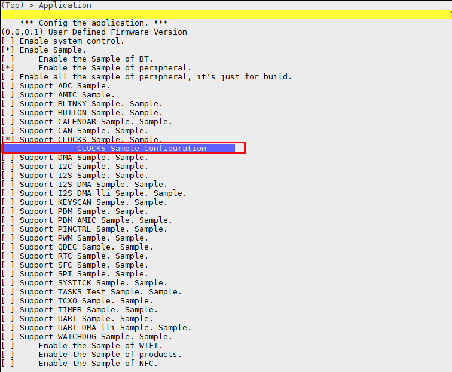

**Figure 2**  Compiled fwpkg<a name="fig5575113515288"></a>  
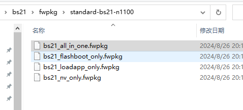

#### Running<a name="ZH-CN_TOPIC_0000002000373198"></a>

Burn the compiled version and it can run directly.

### DMA<a name="ZH-CN_TOPIC_0000001823606460"></a>


#### Compilation<a name="ZH-CN_TOPIC_0000001823446628"></a>

> **Description:** 
>When running this sample, select the KCONFIG configuration in other directories according to actual requirements. Refer to the corresponding "KCONFIG Configuration" section of the BS2XV100 Device Driver Development Guide.

1.  Run the command "python build.py standard-bs21 menuconfig" in the command line to open the menuconfig configuration interface.
2.  Select DMA Sample in the menuconfig interface, as shown in [Figure 1](#fig10563812175115); if memory-to-memory supports the linked-list mode, continue to select as shown in [Figure 2](#fig873353011112). After the selection is completed, press "Q" or "q" and select "y" to save and exit.
3.  Compile the version using the IDE. The compiled version package is in the "output\\bs21\\fwpkg\\xxx" path, as shown in [Figure 3](#fig1486953181217).
4.  Burn the compiled version to the board according to "[Burning and Running](烧录及运行-57.md)" of "[SLE Mouse Sample](SLE-Mouse-Sample.md)".

**Figure 1**  Selecting the DMA Sample<a name="fig10563812175115"></a>  
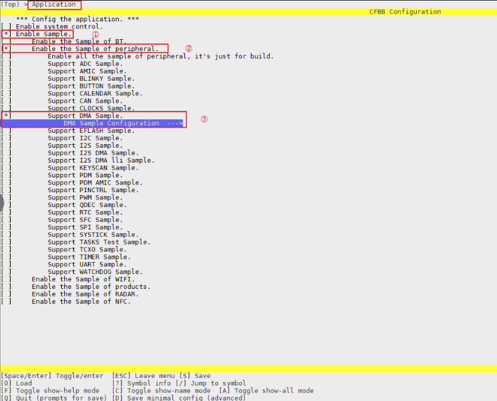

**Figure 2**  DMA MEMORY LLI<a name="fig873353011112"></a>  
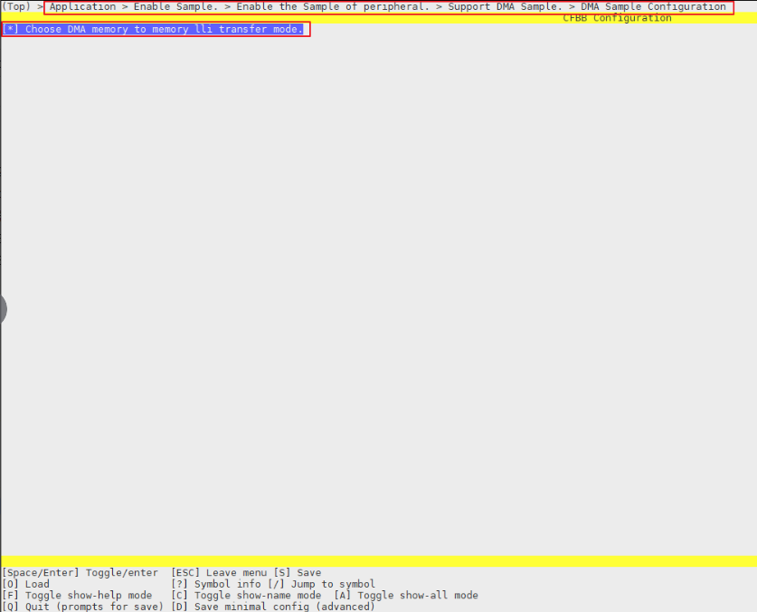

**Figure 3**  Compiled fwpkg<a name="fig1486953181217"></a>  
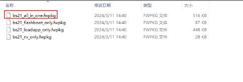

#### Running<a name="ZH-CN_TOPIC_0000001870326233"></a>

The DMA single-board execution result is shown in [Figure 1](#fig17590124125414), and the memory-to-memory result using the linked list is shown in [Figure 2](#fig68119910323).

**Figure 1**  DMA Running Result<a name="fig17590124125414"></a>  
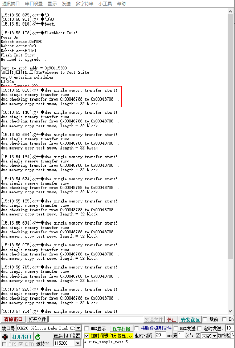

**Figure 2**  DMA Linked-List Running Result<a name="fig68119910323"></a>  
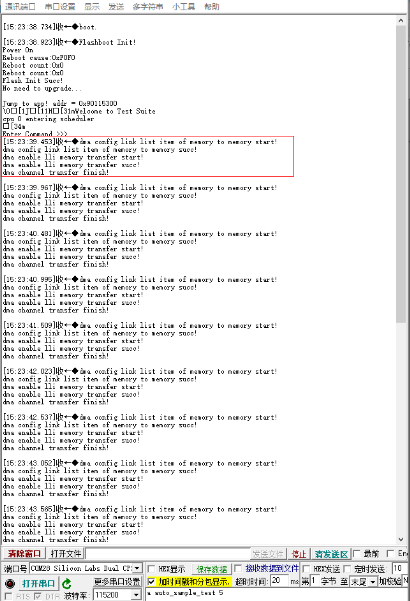

> **Description:** 
>For the usage of other DMA-related interfaces, refer to the usage of other IP samples, such as I2S DMA, I2S DMA LLI, I2C, SPI, etc.

### I2C<a name="ZH-CN_TOPIC_0000001870351697"></a>


#### Compilation<a name="ZH-CN_TOPIC_0000001870351961"></a>

> **Description:** 
>When running this sample, select the KCONFIG configuration in other directories according to actual requirements. Refer to the "KCONFIG Configuration" section of the BS2XV100 Device Driver Development Guide.

1.  <a name="li168261215195810"></a>Run the command "python build.py standard-bs21 menuconfig" in the command line to open the menuconfig configuration interface.
2.  Select I2C Sample in the menuconfig interface, as shown in [Figure 1](#fig10563812175115).
3.  <a name="li329013398596"></a>On the master side, continue to select as shown in [Figure 2](#fig873353011112) (if the master side of the current sample supports the writeread interface, continue to select as shown in [Figure 3](#fig11952330135615)).
4.  Go to the "drivers/drivers" path and enable I2C as shown in [Figure 4](#fig17384141642219), then enter the configuration as shown in [Figure 5](#fig154728249225) to complete the basic I2C configuration. At this point, I2C is in polling mode; you can modify it on this basis to configure I2C into interrupt mode ([Figure 6](#fig1693117307224)), dma mode ([Figure 7](#fig1916793718221)), or poll\_dma switching mode ([Figure 8](#fig21871444162213)).
5.  Go to the "drivers/chips/Chip Configurations for bs2x" path and modify the number of I2C bus ports. If the bus used is 1, as shown in [Figure 2](#fig873353011112), with bus\_id of 1, you need to modify the number of I2C buses to 2, as shown in [Figure 9](#fig3541217182311); if the bus used is 0, you do not need to modify the number of buses. After the selection is completed, press "Q" or "q" and select "y" to save and exit.
6.  <a name="li0964101511569"></a>Compile the version using the IDE. The compiled version package is in the "output\\bs21\\fwpkg\\xxx" path, as shown in [Figure 11](#fig1486953181217).
7.  Burn the compiled version to the master-side board according to "[Burning and Running](烧录及运行-57.md)" of "[SLE Mouse Sample](SLE-Mouse-Sample.md)"; similarly, on the slave side, execute [Step 1](#li168261215195810) to [Step 6](#li0964101511569) in sequence, but select as shown in [Figure 10](#fig885542191110) for [Step 3](#li329013398596), and burn the compiled version to the slave-side board according to "[Burning and Running](烧录及运行-57.md)" of "[SLE Mouse Sample](SLE-Mouse-Sample.md)".

**Figure 1**  Selecting the I2C Sample<a name="fig10563812175115"></a>  
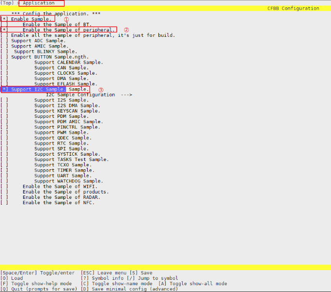

**Figure 2**  I2C Host Selection<a name="fig873353011112"></a>  
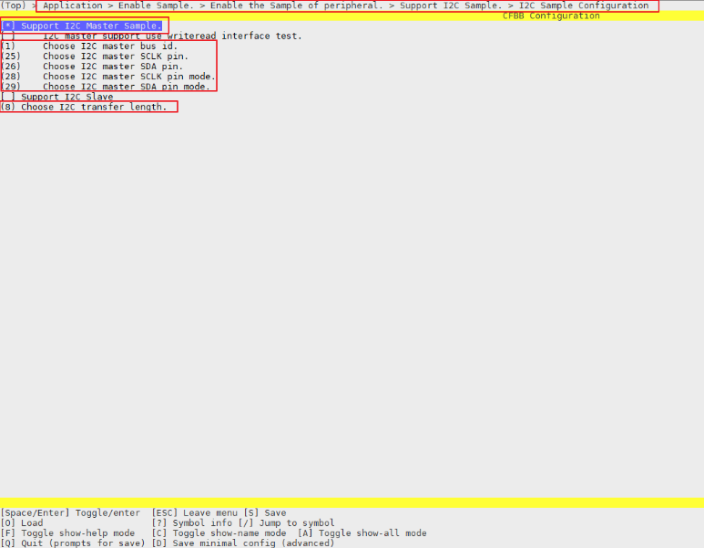

**Figure 3**  The Master Side of I2C Supports the Writeread Interface<a name="fig11952330135615"></a>  
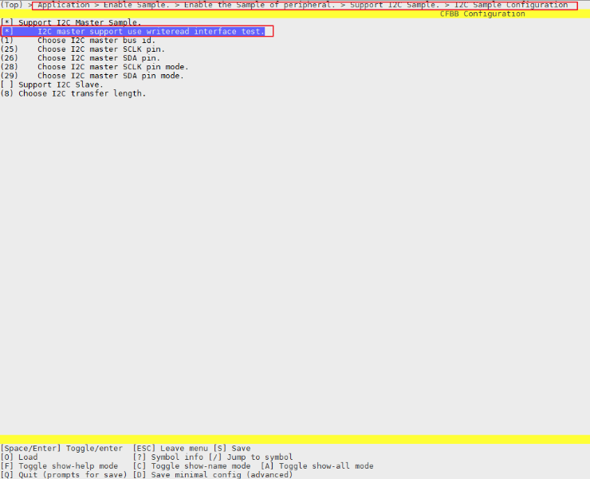

**Figure 4**  Enabling the I2C Function<a name="fig17384141642219"></a>  
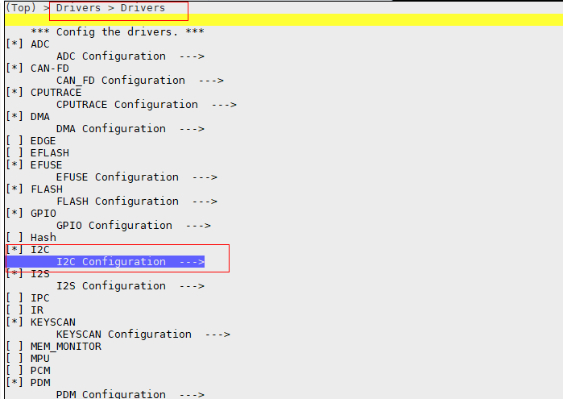

**Figure 5**  I2C Polling Mode Configuration<a name="fig154728249225"></a>  
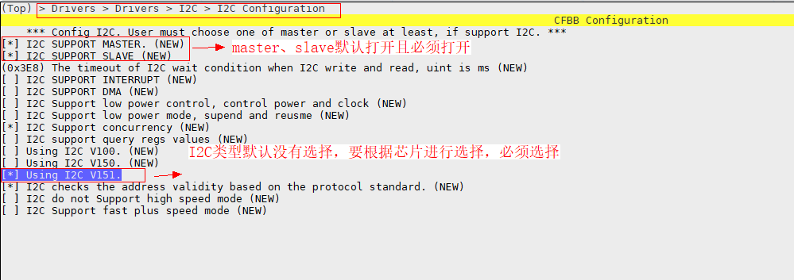

**Figure 6**  I2C Interrupt Mode Configuration<a name="fig1693117307224"></a>  
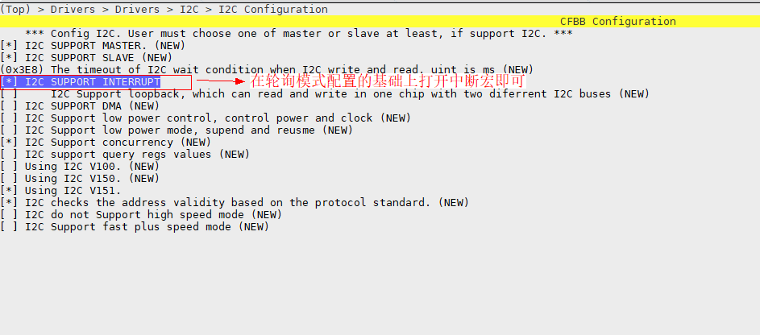

**Figure 7**  I2C DMA Mode Configuration<a name="fig1916793718221"></a>  

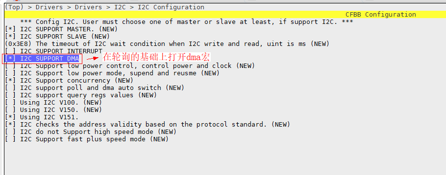

**Figure 8**  I2C Polling and DMA Auto-Switching Mode Configuration<a name="fig21871444162213"></a>  
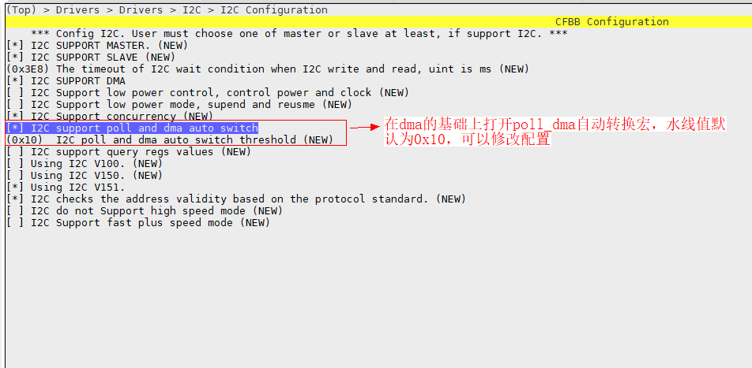

**Figure 9**  Modifying the Number of I2C Buses<a name="fig3541217182311"></a>  
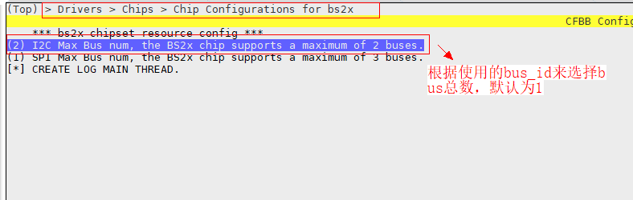

> **Description:** 
>The writeread interface is only available in polling (poll) mode and will be continuously enriched later.

**Figure 10**  I2C Slave Selection<a name="fig885542191110"></a>  
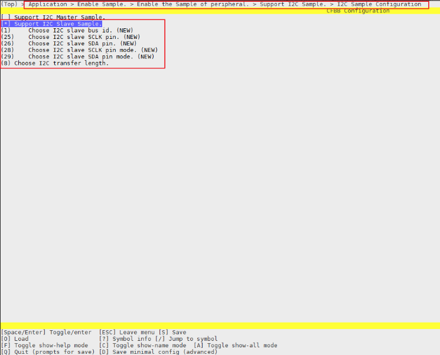

**Figure 11**  Compiled fwpkg<a name="fig1486953181217"></a>  
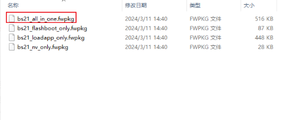

#### Running<a name="ZH-CN_TOPIC_0000001870312781"></a>

The I2C two-board execution results are shown in [Figure 1](#fig14932149182315) to [Figure 5](#fig16331837162315).

**Figure 1**  I2C Polling Two-Board Master-Slave Interaction Result<a name="fig14932149182315"></a>  
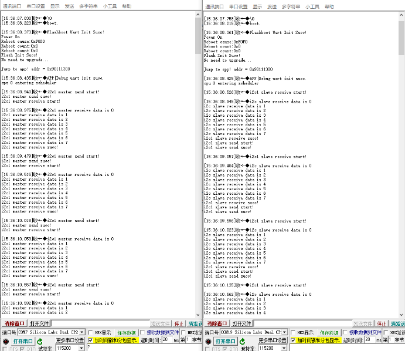

**Figure 2**  I2C Polling Two-Board Master-Slave Interaction (Master Side Using the Writeread Interface)<a name="fig13818412254"></a>  
")

**Figure 3**  I2C Interrupt Two-Board Master-Slave Interaction Result<a name="fig469312791816"></a>  
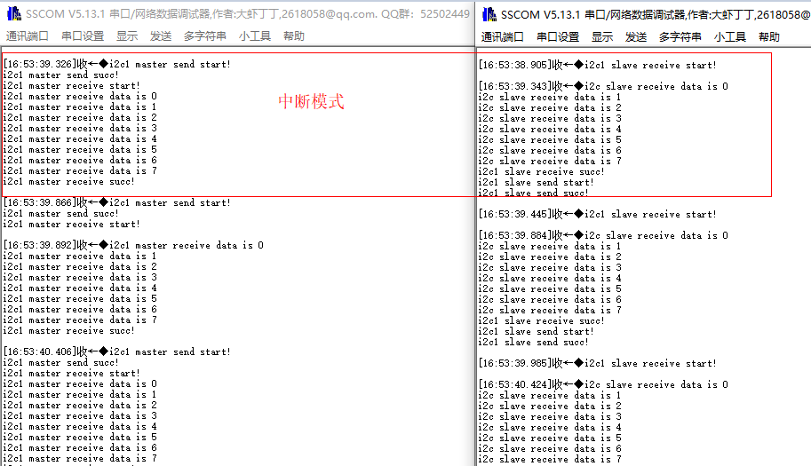

**Figure 4**  I2C DMA Two-Board Master-Slave Interaction Result<a name="fig11389201319188"></a>  
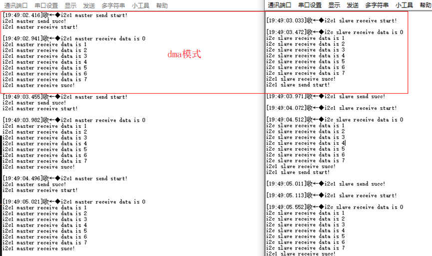

**Figure 5**  I2C Poll and DMA Auto-Switching Two-Board Master-Slave Interaction Result<a name="fig16331837162315"></a>  
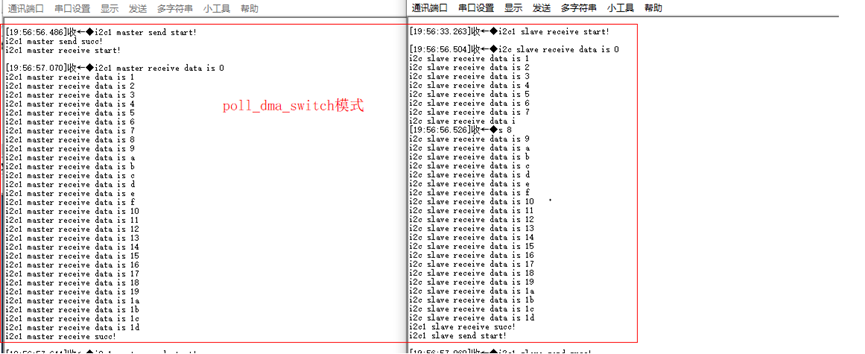

> **Description:** 
>The pins used by I2C must have pull-up resistors, and the host needs to know the slave address to send data. Therefore, the slave initialization operation must be performed first, so reset the slave first and then the master.

### I2S<a name="ZH-CN_TOPIC_0000001908119057"></a>


#### Compilation<a name="ZH-CN_TOPIC_0000001862279462"></a>

1.  <a name="li372316212512"></a>Run the command "python build.py standard-bs21 menuconfig" in the command line to open the menuconfig configuration interface.
2.  Select I2S Sample in the menuconfig interface, as shown in [Figure 1](#fig207248212254).
3.  <a name="li17233292516"></a>On the master side, select as shown in [Figure 2](#fig872442152517). After the selection is completed, press "Q" or "q" and select "y" to save and exit.
4.  <a name="li172313217254"></a>Compile the version using the IDE. The compiled version package is in the "output\\bs21\\fwpkg\\xxx" path, as shown in [Figure 4](#fig27241427257).
5.  Burn the compiled version to the master-side board according to "[Burning and Running](烧录及运行-57.md)" of "[SLE Mouse Sample](SLE-Mouse-Sample.md)"; similarly, on the slave side, execute [Step 1](#li372316212512) to [Step 4](#li172313217254) in sequence, but select as shown in [Figure 3](#fig18724122172510) for [Step 3](#li17233292516), and burn the compiled version to the slave-side board according to "[Burning and Running](烧录及运行-57.md)" of "[SLE Mouse Sample](SLE-Mouse-Sample.md)".

**Figure 1**  Selecting the I2S Sample<a name="fig207248212254"></a>  
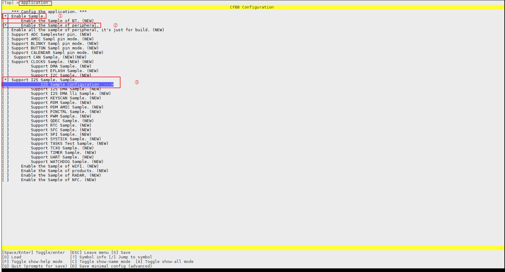

**Figure 2**  I2S MASTER Selection<a name="fig872442152517"></a>  
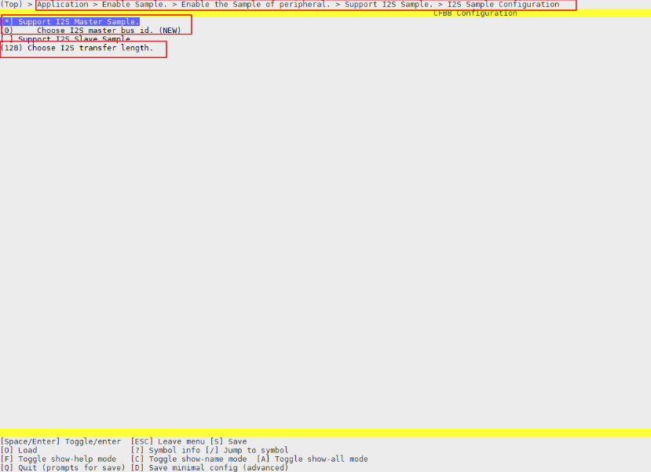

**Figure 3**  I2S SLAVE Selection<a name="fig18724122172510"></a>  
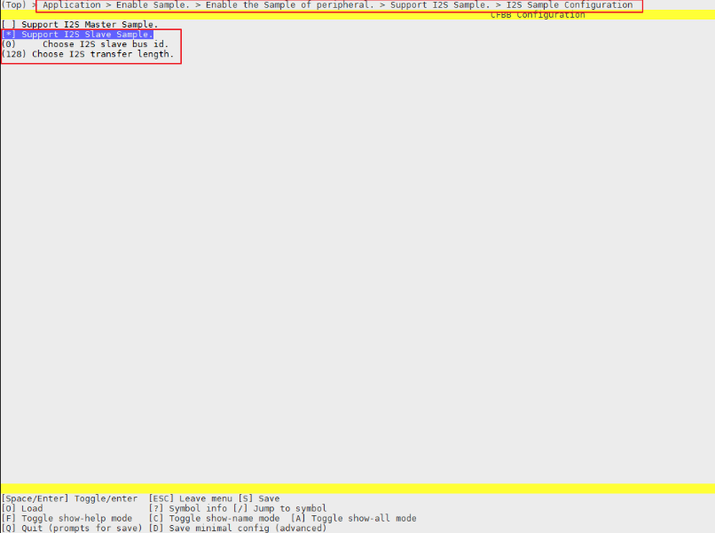

**Figure 4**  Compiled fwpkg<a name="fig27241427257"></a>  
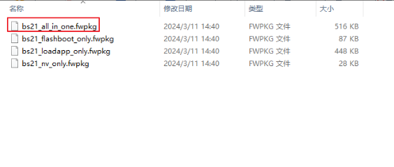

#### Running<a name="ZH-CN_TOPIC_0000001908199377"></a>

The I2S two-board execution result is shown in [Figure 1](#fig17590124125414). Adding prints during I2S running will cause untimely CPU processing and loss of received data on the slave side. The prints are only used to verify whether the master and slave communicate normally; it is not recommended to add prints in actual use.

**Figure 1**  I2S Running Result<a name="fig17590124125414"></a>  
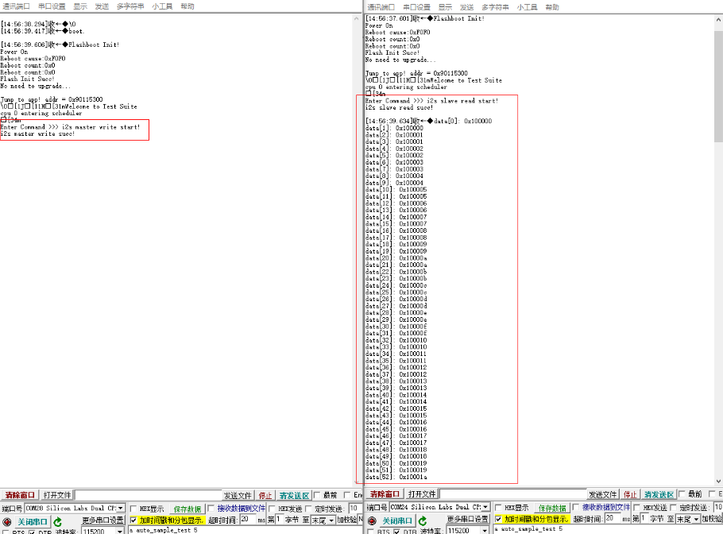

### I2S DMA<a name="ZH-CN_TOPIC_0000001870352841"></a>


#### Compilation<a name="ZH-CN_TOPIC_0000001870353417"></a>

1.  <a name="li168261215195810"></a>Run the command "python build.py standard-bs21 menuconfig" in the command line to open the menuconfig configuration interface.
2.  Select I2S DMA Sample in the menuconfig interface, as shown in [Figure 1](#fig10563812175115).
3.  <a name="li1870123015263"></a>On the master side, select as shown in [Figure 2](#fig873353011112). After the selection is completed, press "Q" or "q" and select "y" to save and exit.
4.  <a name="li46811335327"></a>Compile the version using the IDE. The compiled version package is in the "output\\bs21\\fwpkg\\xxx" path, as shown in [Figure 4](#fig1486953181217).
5.  Burn the compiled version to the master-side board according to "[Burning and Running](烧录及运行-57.md)" of "[SLE Mouse Sample](SLE-Mouse-Sample.md)"; similarly, on the slave side, execute [Step 1](#li168261215195810) to [Step 4](#li46811335327) in sequence, but select as shown in [Figure 3](#fig11952330135615) for [Step 3](#li1870123015263), and burn the compiled version to the slave-side board according to "[Burning and Running](烧录及运行-57.md)" of "[SLE Mouse Sample](SLE-Mouse-Sample.md)".

**Figure 1**  Selecting the I2S DMA Sample<a name="fig10563812175115"></a>  
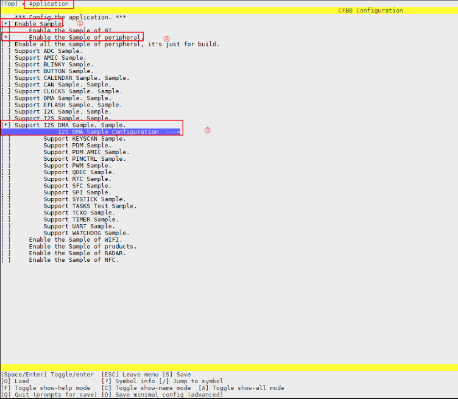

**Figure 2**  I2S DMA MASTER Selection<a name="fig873353011112"></a>  
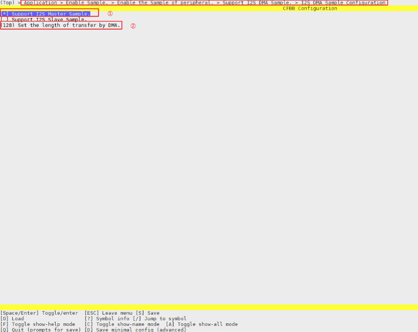

**Figure 3**  I2S DMA SLAVE Selection<a name="fig11952330135615"></a>  
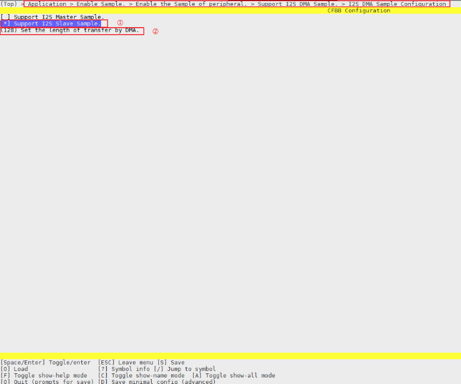

**Figure 4**  Compiled fwpkg<a name="fig1486953181217"></a>  
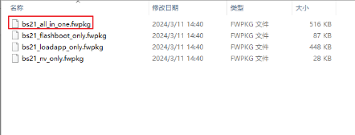

#### Running<a name="ZH-CN_TOPIC_0000001870353929"></a>

The I2S DMA two-board execution result is shown in [Figure 1](#fig17590124125414).

**Figure 1**  I2S DMA Running Result<a name="fig17590124125414"></a>  
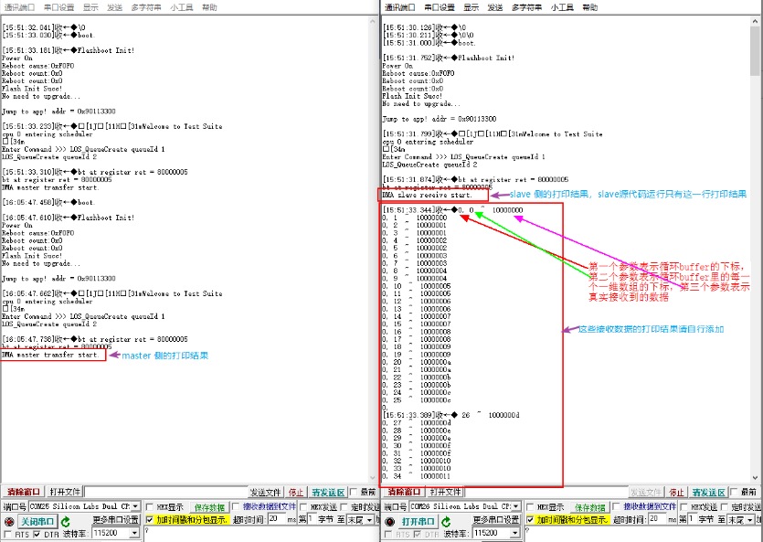

> **Description:** 
>The slave-side source code does not include a log for displaying the received data. You need to add it yourself, and to ensure the data is fully received, refer to "[I2S DMA LLI](I2S-DMA-LLI.md)".

### I2S DMA LLI<a name="ZH-CN_TOPIC_0000001867203060"></a>


#### Compilation<a name="ZH-CN_TOPIC_0000001913162337"></a>

1.  <a name="li168261215195810"></a>Run the command "python build.py standard-bs21 menuconfig" in the command line to open the menuconfig configuration interface.
2.  Select I2S DMA LLI Sample in the menuconfig interface, as shown in [Figure 1](#fig10563812175115).
3.  <a name="li1870123015263"></a>On the master side, select as shown in [Figure 2](#fig873353011112). After the selection is completed, press "Q" or "q" and select "y" to save and exit.
4.  <a name="li46811335327"></a>Compile the version using the IDE. The compiled version package is in the "output\\bs21\\fwpkg\\xxx" path, as shown in [Figure 4](#fig1486953181217).
5.  Burn the compiled version to the master-side board according to "[Burning and Running](烧录及运行-57.md)" of "[SLE Mouse Sample](SLE-Mouse-Sample.md)"; similarly, on the slave side, execute [Step 1](#li168261215195810) to [Step 4](#li46811335327) in sequence, but select as shown in [Figure 3](#fig11952330135615) for [Step 3](#li1870123015263), and burn the compiled version to the slave-side board according to "[Burning and Running](烧录及运行-57.md)" of "[SLE Mouse Sample](SLE-Mouse-Sample.md)".

**Figure 1**  Selecting the I2S DMA LLI Sample<a name="fig10563812175115"></a>  
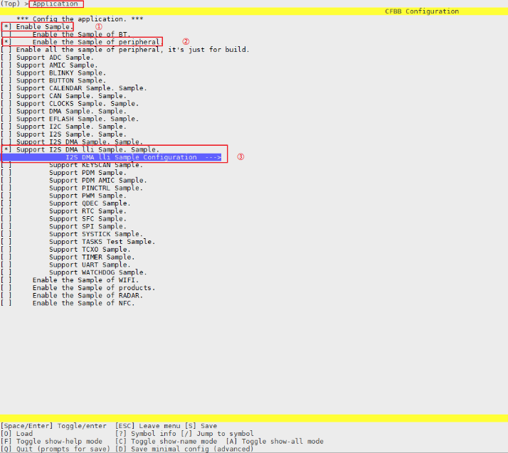

**Figure 2**  I2S DMA LLI MASTER Selection<a name="fig873353011112"></a>  
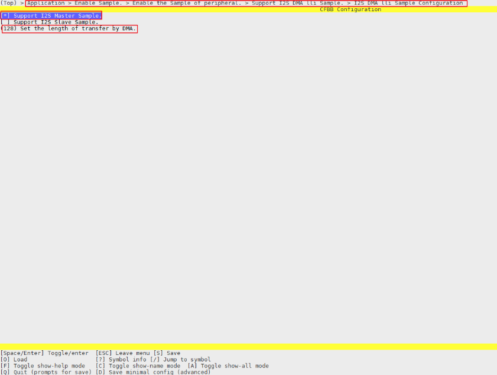

**Figure 3**  I2S DMA LLI SLAVE Selection<a name="fig11952330135615"></a>  
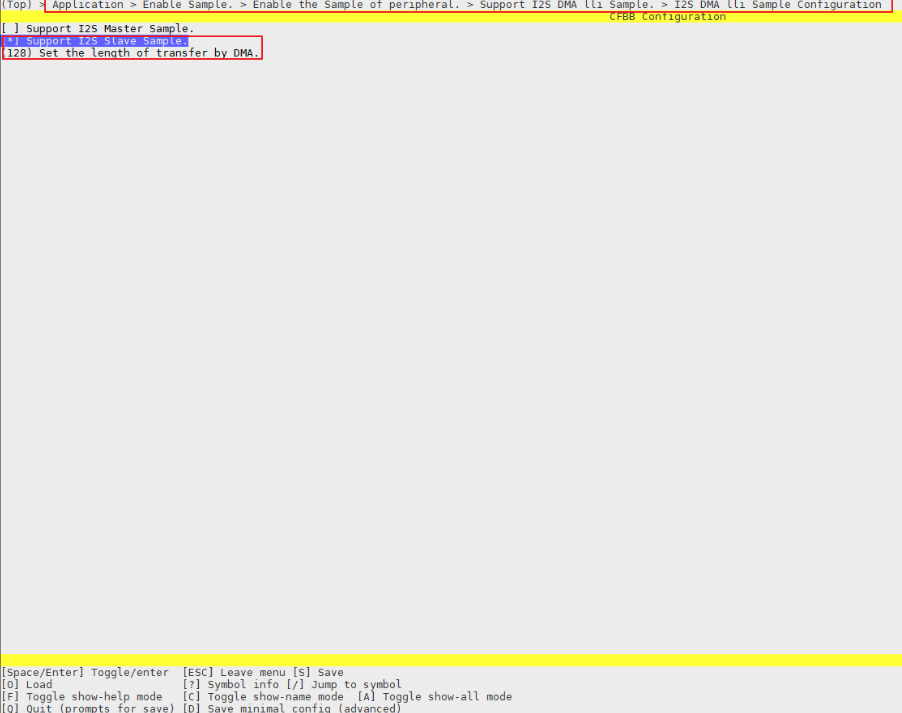

**Figure 4**  Compiled fwpkg<a name="fig1486953181217"></a>  
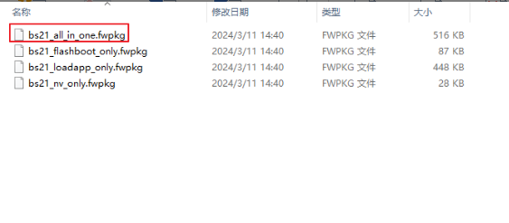

#### Running<a name="ZH-CN_TOPIC_0000001867362940"></a>

The I2S DMA LLI two-board execution result is shown in [Figure 1](#fig17590124125414).

**Figure 1**  I2S DMA LLI Running Result<a name="fig17590124125414"></a>  
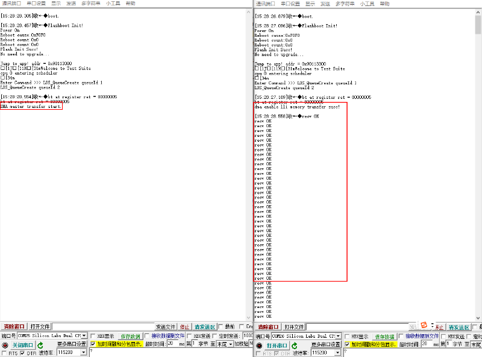

When running this sample, the two macros shown in [Figure 2](#fig23511954195910) must be enabled.

**Figure 2**  DMA-Related Macros<a name="fig23511954195910"></a>  
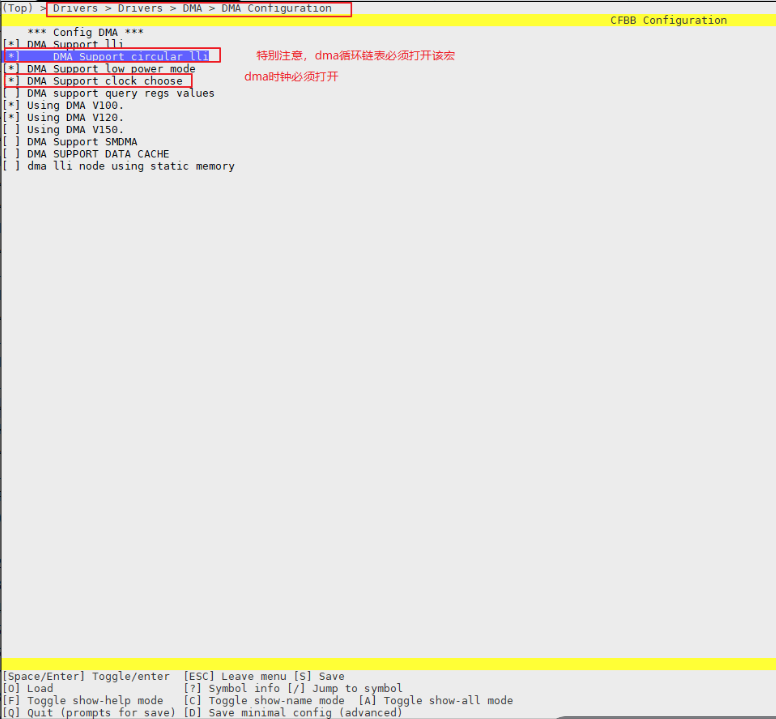

### KEYSCAN<a name="ZH-CN_TOPIC_0000001862280158"></a>


#### Compilation<a name="ZH-CN_TOPIC_0000001908119773"></a>

> **Description:** 
>When running this sample, select the KCONFIG configuration in other directories according to actual requirements. Refer to the "KCONFIG Configuration" section of the BS2XV100 Device Driver Development Guide.

1.  Run the command "python build.py standard-bs21 menuconfig" in the command line to open the menuconfig configuration interface.
2.  Select KEYSCAN Sample in the menuconfig interface, as shown in [Figure 1](#fig276708102). After the selection is completed, press "Q" or "q" and select "y" to save and exit.
3.  Compile the version using the IDE. The compiled version package is in the "output\\bs21\\fwpkg\\xxx" path, as shown in [Figure 2](#fig77615081019).
4.  Burn the compiled version to the board according to "[Burning and Running](烧录及运行-57.md)" of "[SLE Mouse Sample](SLE-Mouse-Sample.md)".

**Figure 1**  Selecting the KEYSCAN Sample<a name="fig276708102"></a>  
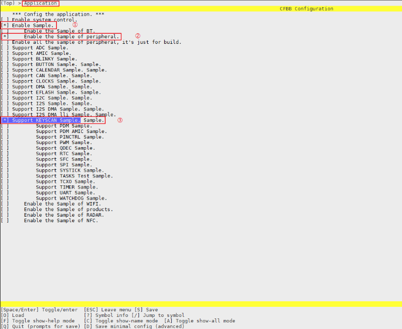

**Figure 2**  Compiled fwpkg<a name="fig77615081019"></a>  
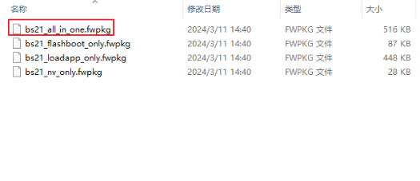

#### Running<a name="ZH-CN_TOPIC_0000001908200057"></a>

After reset, press keys and the serial port displays the corresponding key values. The KEYSCAN single-board execution result is shown in [Figure 1](#fig6427733121611), using only six keys as an example.

**Figure 1**  KEYSCAN Running Result<a name="fig6427733121611"></a>  
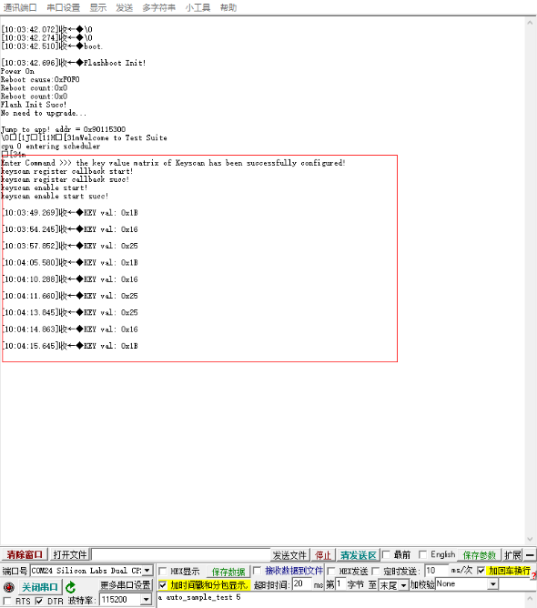

### PDM<a name="ZH-CN_TOPIC_0000001908200573"></a>


#### Compilation<a name="ZH-CN_TOPIC_0000001908120285"></a>

> **Description:** 
>When running this sample, select the KCONFIG configuration in other directories according to actual requirements. Refer to the "KCONFIG Configuration" sections for DMA and PDM in the BS2XV100 Device Driver Development Guide.

1.  Run the command "python build.py standard-bs21 menuconfig" in the command line to open the menuconfig configuration interface.
2.  Select PDM Sample in the menuconfig interface, as shown in [Figure 1](#fig106431326122119); if you need to modify the configuration options, continue to select as shown in [Figure 2](#fig56435266213). After the selection is completed, press "Q" or "q" and select "y" to save and exit.
3.  Compile the version using the IDE. The compiled version package is in the "output\\bs21\\fwpkg\\xxx" path.
4.  Burn the compiled version to the board according to "[Burning and Running](烧录及运行-57.md)" of "[SLE Mouse Sample](SLE-Mouse-Sample.md)".

**Figure 1**  Selecting the PDM Sample<a name="fig106431326122119"></a>  
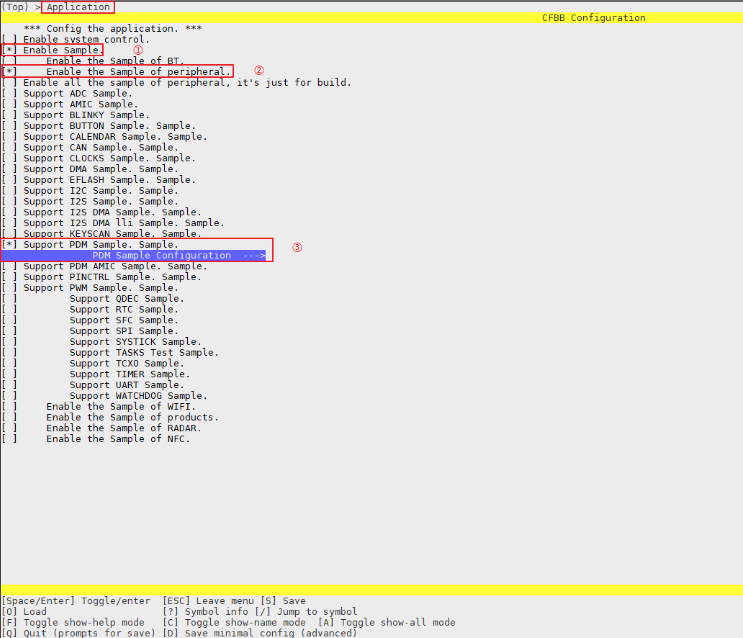

**Figure 2**  PDM Config Selection<a name="fig56435266213"></a>  
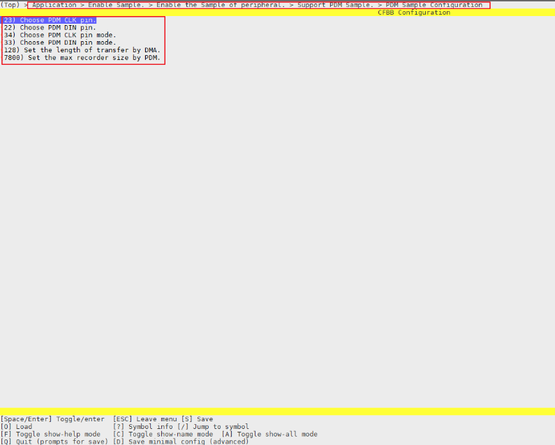

**Figure 3**  Compiled fwpkg<a name="fig116431126152115"></a>  
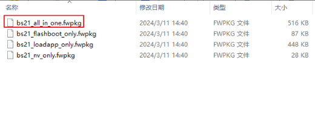

#### Running<a name="ZH-CN_TOPIC_0000001862120830"></a>

1.  After the board is reset, input a sound source and start recording immediately. The serial port displays the result as shown in [Figure 1](#fig993812131095).
2.  Connect Jlink and save the data using the "savebin <filename\> <addr\> <numBytes\[hex\]\>" command, as shown in [Figure 2](#fig1979815471591), then open the file with Notepad, as shown in [Figure 3](#fig181856142113).
3.  Use the Audacity audio tool, click File -\> Import -\> Raw Data, import the saved audio data, and select the configuration options as shown in [Figure 4](#fig1659419568113). The result is shown in [Figure 5](#fig1080713579213).
4.  Click Play and listen with headphones. The sound can be played normally.

**Figure 1**  PDM Running Result<a name="fig993812131095"></a>  
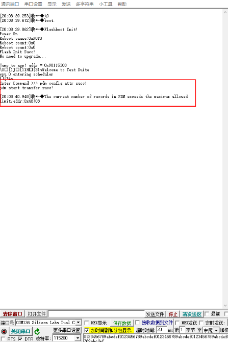

**Figure 2**  Jlink Data Saving<a name="fig1979815471591"></a>  
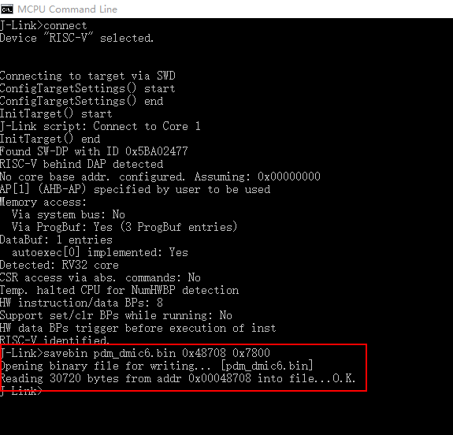

**Figure 3**  Notepad Data Display<a name="fig181856142113"></a>  
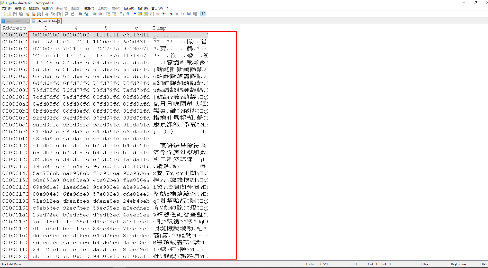

**Figure 4**  Audacity Configuration Options<a name="fig1659419568113"></a>  
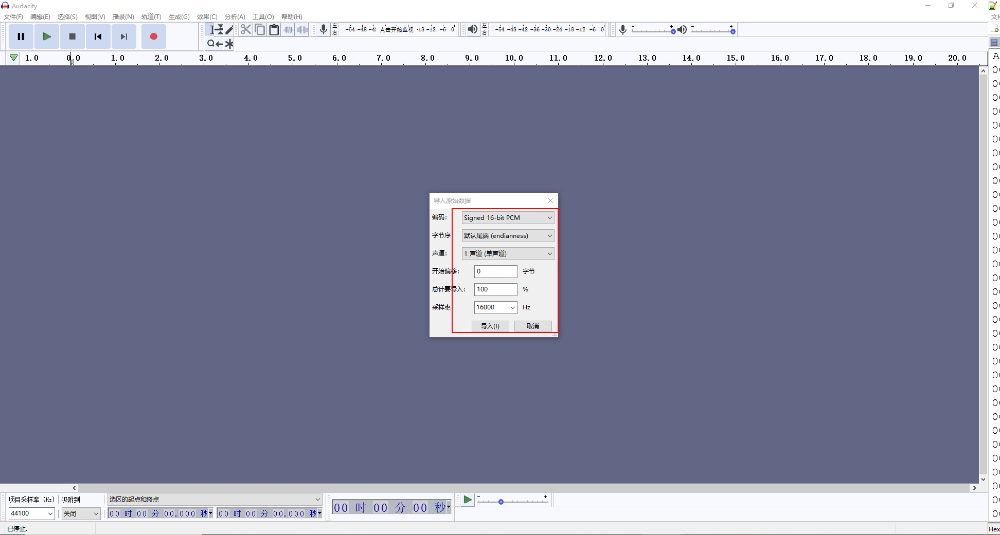

**Figure 5**  Audacity Audio Result<a name="fig1080713579213"></a>  
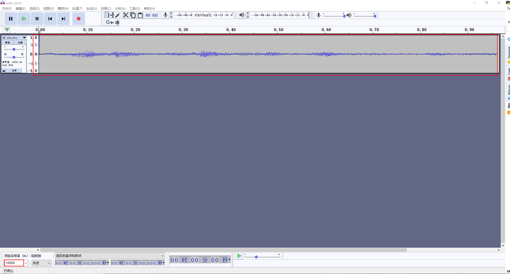

### PDM AMIC<a name="ZH-CN_TOPIC_0000001929763781"></a>


#### Compilation<a name="ZH-CN_TOPIC_0000001883964914"></a>

> **Description:** 
>When running this sample, select the KCONFIG configuration in other directories according to actual requirements. Refer to the "KCONFIG Configuration" sections for DMA and PDM in the BS2XV100 Device Driver Development Guide.

1.  Run the command "python build.py standard-bs21 menuconfig" in the command line to open the menuconfig configuration interface.
2.  Select PDM AMIC Sample in the menuconfig interface, as shown in [Figure 1](#fig106431326122119); if you need to modify the configuration options, continue to select as shown in [Figure 2](#fig56435266213). After the selection is completed, press "Q" or "q" and select "y" to save and exit.
3.  Compile the version using the IDE. The compiled version package is in the "output\\bs21\\fwpkg\\xxx" path.
4.  Burn the compiled version to the board according to "[Burning and Running](烧录及运行-57.md)" of "[SLE Mouse Sample](SLE-Mouse-Sample.md)".

**Figure 1**  Selecting the PDM AMIC Sample<a name="fig106431326122119"></a>  
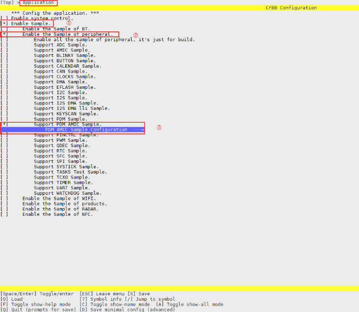

**Figure 2**  PDM AMIC Config Selection<a name="fig56435266213"></a>  
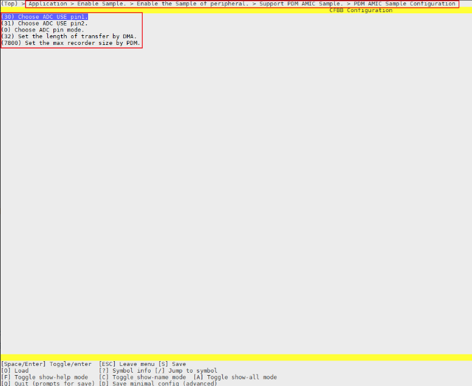

**Figure 3**  Compiled fwpkg<a name="fig116431126152115"></a>  
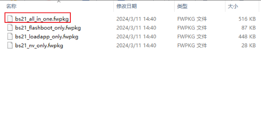

#### Running<a name="ZH-CN_TOPIC_0000001929844121"></a>

1.  After the board is reset, input a sound source and start recording immediately. The serial port displays the result as shown in [Figure 1](#fig993812131095).
2.  Connect Jlink and save the data using the "savebin <filename\> <addr\> <numBytes\[hex\]\>" command, as shown in [Figure 2](#fig1979815471591), then open the file with Notepad, as shown in [Figure 3](#fig181856142113).
3.  Use the Audacity audio tool, click File -\> Import -\> Raw Data, import the saved audio data, and select the configuration options as shown in [Figure 4](#fig1659419568113). The result is shown in [Figure 5](#fig1080713579213).
4.  Click Play and listen with headphones. The sound can be played normally.

**Figure 1**  PDM AMIC Running Result<a name="fig993812131095"></a>  
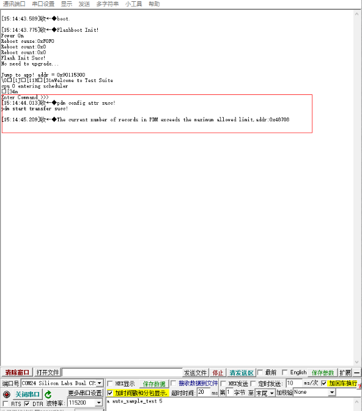

**Figure 2**  Jlink Data Saving<a name="fig1979815471591"></a>  
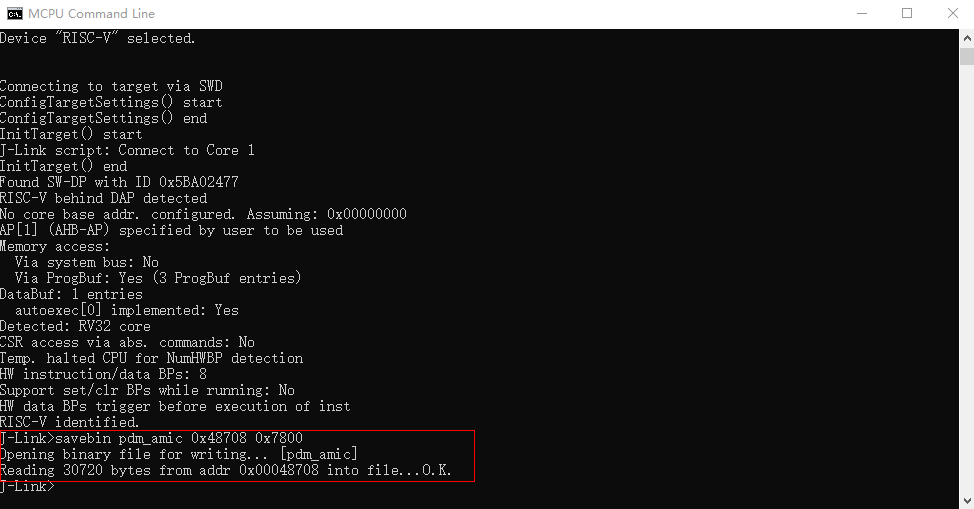

**Figure 3**  Notepad Data Display<a name="fig181856142113"></a>  
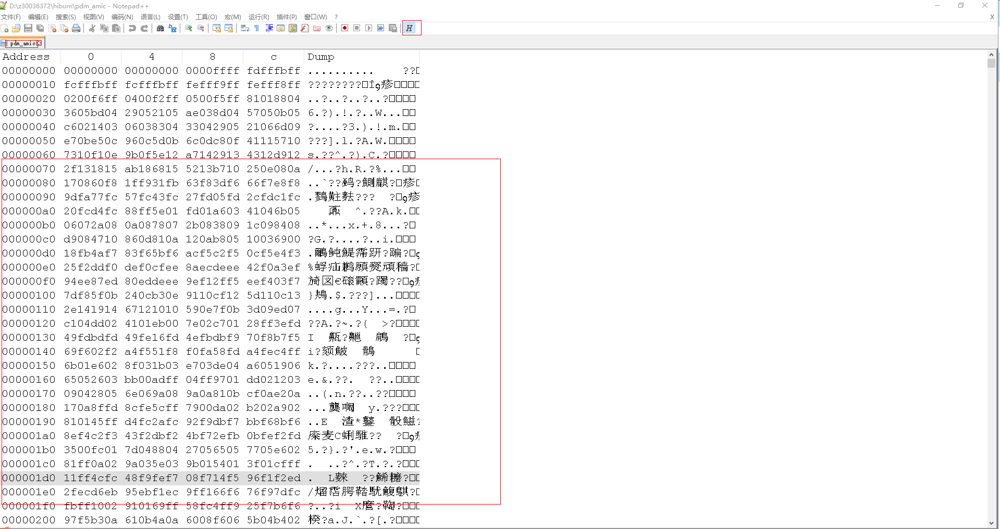

**Figure 4**  Audacity Configuration Options<a name="fig1659419568113"></a>  
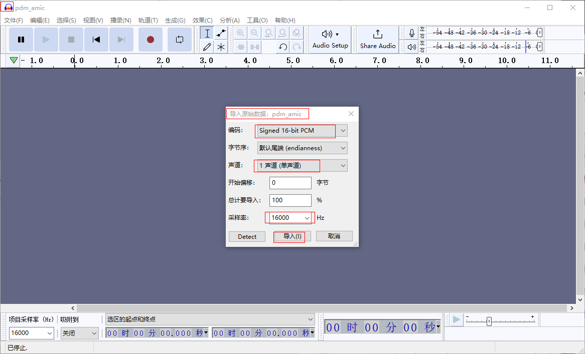

**Figure 5**  Audacity Audio Result<a name="fig1080713579213"></a>  
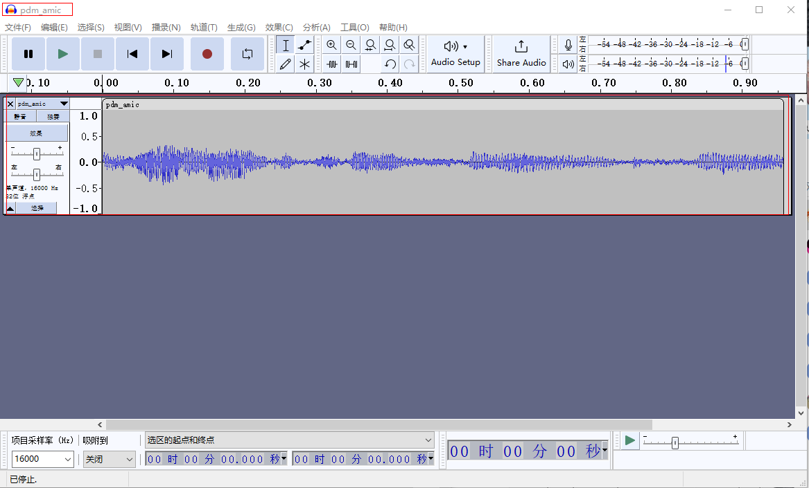

### PINCTRL<a name="ZH-CN_TOPIC_0000001908120485"></a>


#### Compilation<a name="ZH-CN_TOPIC_0000001862121050"></a>

> **Description:** 
>When running this sample, select the KCONFIG configuration in other directories according to actual requirements. Refer to the "KCONFIG Configuration" section of the BS2XV100 Device Driver Development Guide.

1.  Run the command "python build.py standard-bs21 menuconfig" in the command line to open the menuconfig configuration interface.
2.  Select PINCTRL Sample in the menuconfig interface, as shown in [Figure 1](#fig106431326122119); if you need to modify the test pin, continue to select as shown in [Figure 2](#fig56435266213). After the selection is completed, press "Q" or "q" and select "y" to save and exit.
3.  Compile the version using the IDE. The compiled version package is in the "output\\bs21\\fwpkg\\xxx" path, as shown in [Figure 3](#fig116431126152115).
4.  Burn the compiled version to the board according to "[Burning and Running](烧录及运行-57.md)" of "[SLE Mouse Sample](SLE-Mouse-Sample.md)".

**Figure 1**  Selecting the PINCTRL Sample<a name="fig106431326122119"></a>  
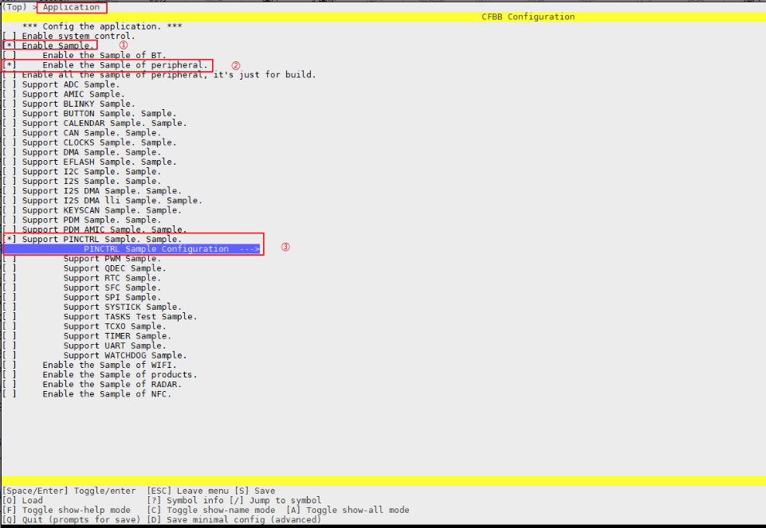

**Figure 2**  PINCTRL PIN Selection<a name="fig56435266213"></a>  
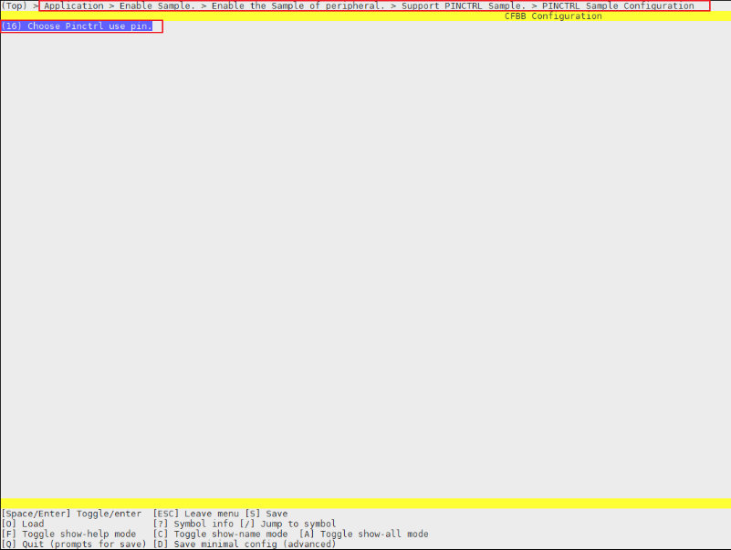

**Figure 3**  Compiled fwpkg<a name="fig116431126152115"></a>  
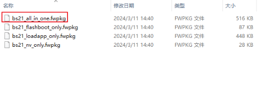

#### Running<a name="ZH-CN_TOPIC_0000001908200781"></a>

The PINCTRL single-board execution result is shown in [Figure 1](#fig17590124125414).

**Figure 1**  PINCTRL Running Result<a name="fig17590124125414"></a>  
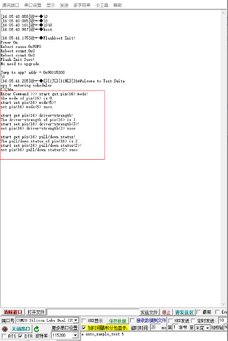

### PWM<a name="ZH-CN_TOPIC_0000001862281258"></a>


#### Compilation<a name="ZH-CN_TOPIC_0000001908201169"></a>

> **Description:** 
>When running this sample, select the KCONFIG configuration in other directories according to actual requirements. Refer to the "KCONFIG Configuration" section of the BS2XV100 Device Driver Development Guide.

1.  Run the command "python build.py standard-bs21 menuconfig" in the command line to open the menuconfig configuration interface.
2.  Select PWM Sample in the menuconfig interface, as shown in [Figure 1](#fig106431326122119); if you need to modify the configuration options, continue to select as shown in [Figure 2](#fig56435266213). After the selection is completed, press "Q" or "q" and select "y" to save and exit.
3.  The correspondence between channel and pin mode is shown in [Figure 4](#fig9985131131317).
4.  Compile the version using the IDE. The compiled version package is in the "output\\bs21\\fwpkg\\xxx" path, as shown in [Figure 3](#fig116431126152115).
5.  Burn the compiled version to the board according to "[Burning and Running](烧录及运行-57.md)" of "[SLE Mouse Sample](SLE-Mouse-Sample.md)".

**Figure 1**  Selecting the PWM Sample<a name="fig106431326122119"></a>  
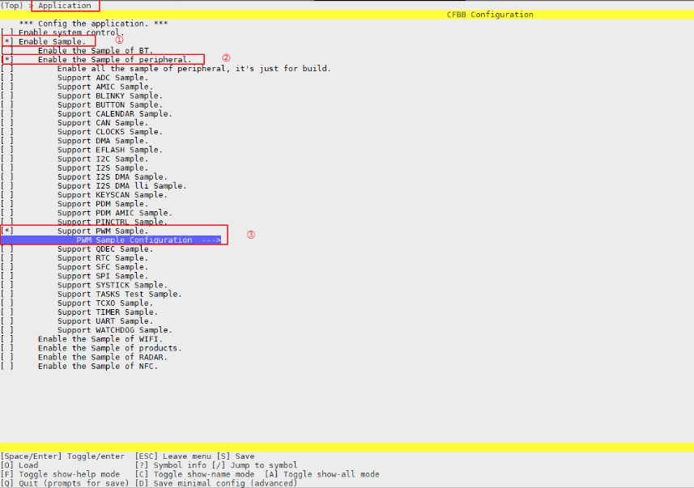

**Figure 2**  PWM Config Selection<a name="fig56435266213"></a>  
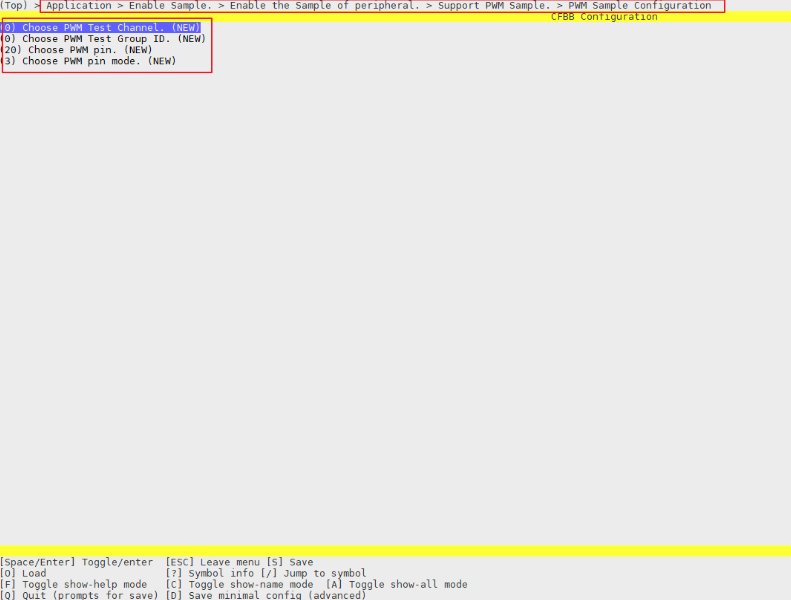

**Figure 3**  Compiled fwpkg<a name="fig116431126152115"></a>  
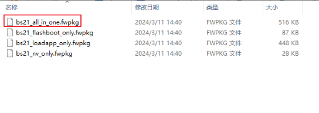

**Figure 4**  Correspondence Between Channel and Pin Mode<a name="fig9985131131317"></a>  
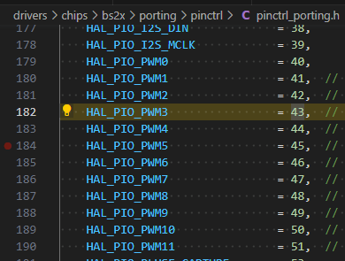

#### Running<a name="ZH-CN_TOPIC_0000001862121438"></a>

The PWM single-board execution result is shown in [Figure 1](#fig17590124125414), and the waveform captured with a logic analyzer is shown in [Figure 2](#fig17322123210289).

**Figure 1**  PWM Running Result<a name="fig17590124125414"></a>  
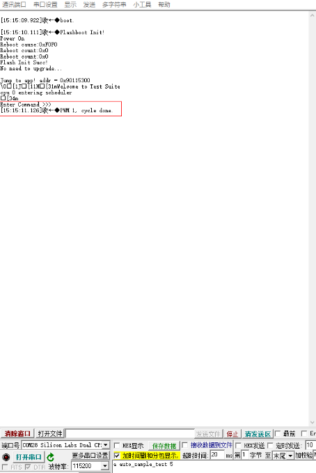

**Figure 2**  PWM Waveform<a name="fig17322123210289"></a>  
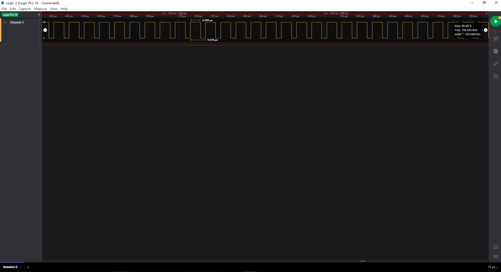

### QDEC<a name="ZH-CN_TOPIC_0000001908201641"></a>


#### Compilation<a name="ZH-CN_TOPIC_0000001862121894"></a>

1.  Run the command "python build.py standard-bs21 menuconfig" in the command line to open the menuconfig configuration interface.
2.  Select QDEC Sample in the menuconfig interface, as shown in [Figure 1](#fig5310123193014). If you need to modify the QDEC pin configuration options, continue to configure and select as shown in [Figure 2](#fig69077322315). After the selection is completed, press "Q" or "q" and select "y" to save and exit.
3.  Compile the version using the IDE. The compiled version package is in the "output\\bs21\\fwpkg\\xxx" path, as shown in [Figure 3](#fig1467312273252).
4.  Burn the compiled version to the board according to "[Burning and Running](烧录及运行-57.md)" of "[SLE Mouse Sample](SLE-Mouse-Sample.md)".

**Figure 1**  Selecting the QDEC Sample and Configuring QDEC<a name="fig5310123193014"></a>  
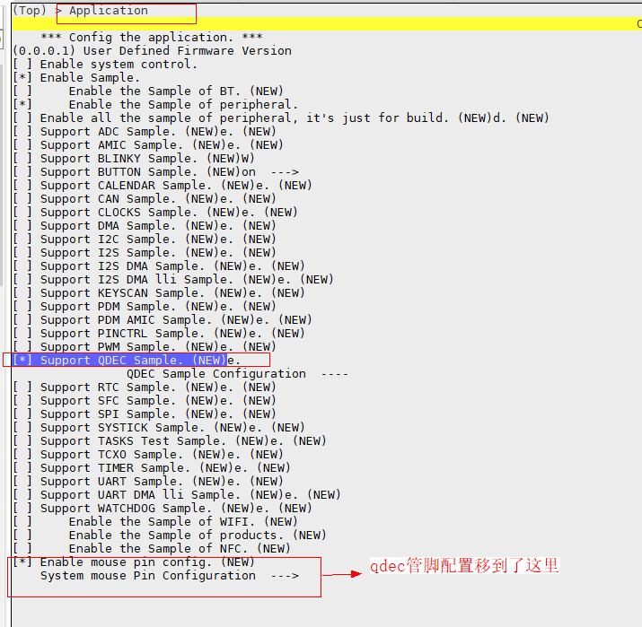

**Figure 2**  QDEC Pin Configuration<a name="fig69077322315"></a>  
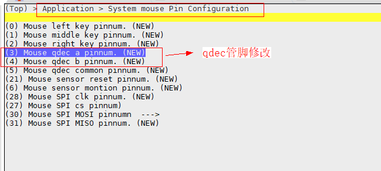

**Figure 3**  Compiled fwpkg<a name="fig1467312273252"></a>  
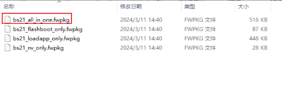

#### Running<a name="ZH-CN_TOPIC_0000001908121357"></a>

After reset, rotate the wheel and the serial port displays the change of the corresponding value. The QDEC single-board execution result is shown in [Figure 1](#fig6427733121611).

**Figure 1**  QDEC Running Result<a name="fig6427733121611"></a>  
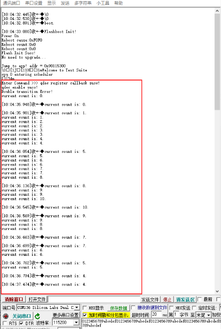

### RTC<a name="ZH-CN_TOPIC_0000001908201905"></a>


#### Compilation<a name="ZH-CN_TOPIC_0000001862281998"></a>

1.  Run the command "python build.py standard-bs21 menuconfig" in the command line to open the menuconfig configuration interface.
2.  Select RTC Sample in the menuconfig interface, as shown in [Figure 1](#fig106431326122119). After the selection is completed, press "Q" or "q" and select "y" to save and exit.
3.  Compile the version using the IDE. The compiled version package is in the "output\\bs21\\fwpkg\\xxx" path, as shown in [Figure 2](#fig116431126152115).
4.  Burn the compiled version to the board according to "[Burning and Running](烧录及运行-57.md)" of "[SLE Mouse Sample](SLE-Mouse-Sample.md)".

**Figure 1**  Selecting the RTC Sample<a name="fig106431326122119"></a>  
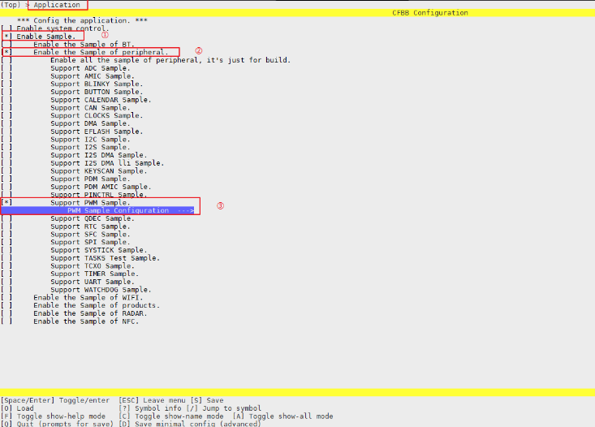

**Figure 2**  Compiled fwpkg<a name="fig116431126152115"></a>  
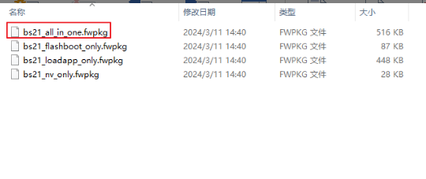

#### Running<a name="ZH-CN_TOPIC_0000001862122150"></a>

The RTC single-board execution result is shown in [Figure 1](#fig993812131095).

**Figure 1**  RTC Running Result<a name="fig993812131095"></a>  
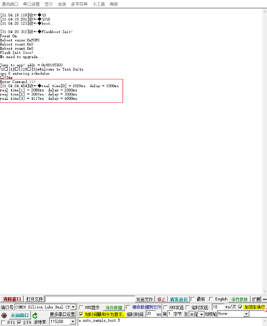

### SFC<a name="ZH-CN_TOPIC_0000002034968981"></a>


#### Compilation<a name="ZH-CN_TOPIC_0000001998891920"></a>

1.  Run the command "python build.py standard-bs21 menuconfig" in the command line to open the menuconfig configuration interface.
2.  Select SFC Sample in the menuconfig interface, as shown in [Figure 1](#fig1370984312265). After the selection is completed, press "Q" or "q" and select "y" to save and exit.
3.  Compile the version using the IDE. The compiled version package is in the "output\\bs21\\fwpkg\\xxx" path, as shown in [Figure 2](#fig14215115217298).
4.  Burn the compiled version to the board according to "[Burning and Running](烧录及运行-57.md)" of "[SLE Mouse Sample](SLE-Mouse-Sample.md)".

**Figure 1**  SFC Sample Selection<a name="fig1370984312265"></a>  
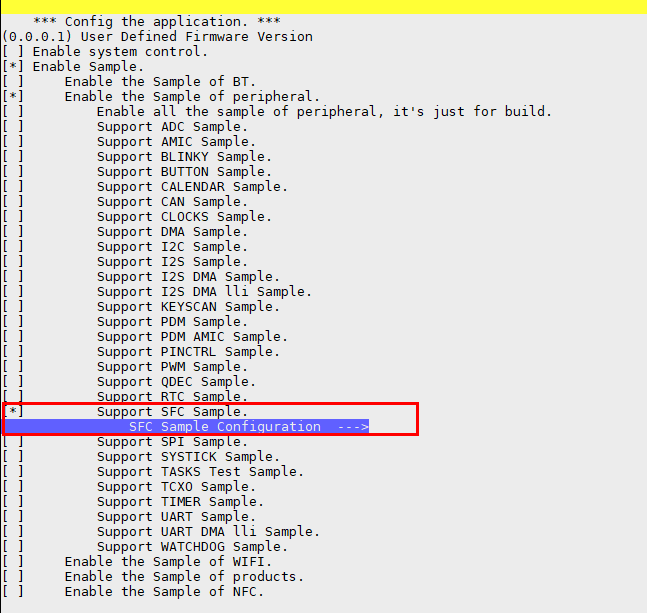

**Figure 2**  Compiled fwpkg<a name="fig14215115217298"></a>  
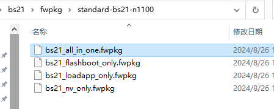

#### Running<a name="ZH-CN_TOPIC_0000002035090253"></a>

The SFC single-board execution results are shown in [Figure 1](#fig10873195615346) and [Figure 2](#fig441010374359).

**Figure 1**  SFC Startup Running<a name="fig10873195615346"></a>  
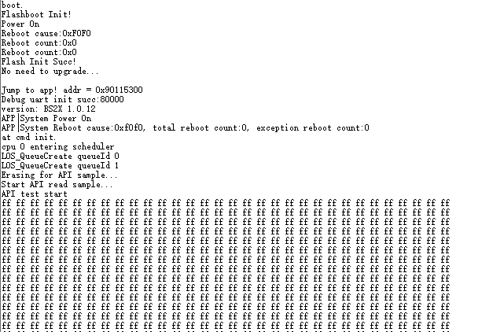

**Figure 2**  SFC Running Result Verification<a name="fig441010374359"></a>  
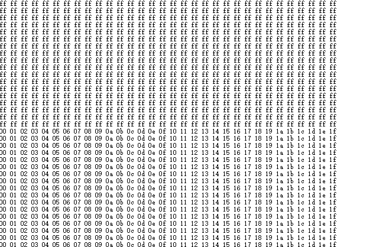

### SPI<a name="ZH-CN_TOPIC_0000001870354253"></a>


#### Compilation<a name="ZH-CN_TOPIC_0000001870314465"></a>

> **Description:** 
>When running this sample, select the KCONFIG configuration in other directories according to actual requirements. Refer to the "KCONFIG Configuration" section of the BS2XV100 Device Driver Development Guide.

1.  <a name="li168261215195810"></a>Run the command "python build.py standard-bs21 menuconfig" in the command line to open the menuconfig configuration interface.
2.  Select SPI Sample in the menuconfig interface, as shown in [Figure 1](#fig10563812175115).
3.  <a name="li1870123015263"></a>On the master side, continue to select as shown in [Figure 2](#fig873353011112) (if the master side of the current sample supports the writeread interface, continue to select as shown in [Figure 3](#fig11952330135615)). After the selection is completed, press "Q" or "q" and select "y" to save and exit.
4.  <a name="li46811335327"></a>Compile the version using the IDE. The compiled version package is in the "output\\bs21\\fwpkg\\xxx" path, as shown in [Figure 5](#fig1486953181217).
5.  Burn the compiled version to the master-side board according to "[Burning and Running](烧录及运行-57.md)" of "[SLE Mouse Sample](SLE-Mouse-Sample.md)"; similarly, on the slave side, execute [Step 1](#li168261215195810) to [Step 4](#li46811335327) in sequence, but select as shown in [Figure 4](#fig885542191110) for [Step 3](#li1870123015263), and burn the compiled version to the slave-side board according to "[Burning and Running](烧录及运行-57.md)" of "[SLE Mouse Sample](SLE-Mouse-Sample.md)".

**Figure 1**  Selecting the SPI Sample<a name="fig10563812175115"></a>  
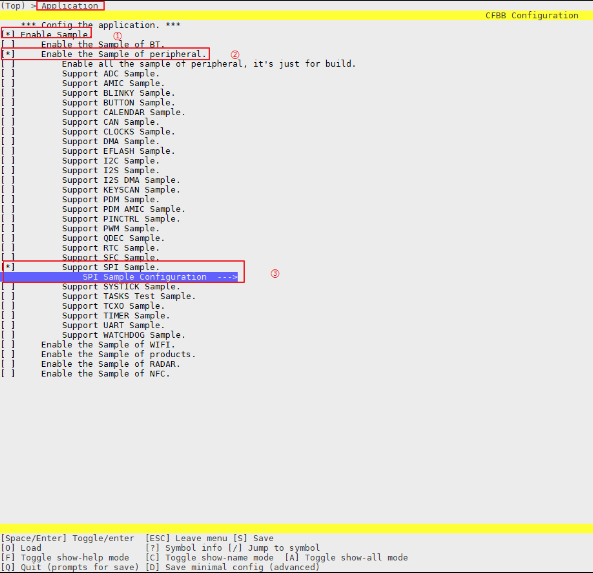

**Figure 2**  SPI MASTER Selection<a name="fig873353011112"></a>  
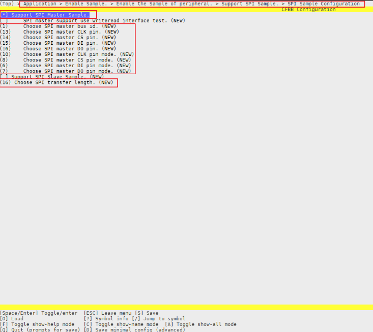

**Figure 3**  SPI MASTER Supports the Writeread Interface<a name="fig11952330135615"></a>  
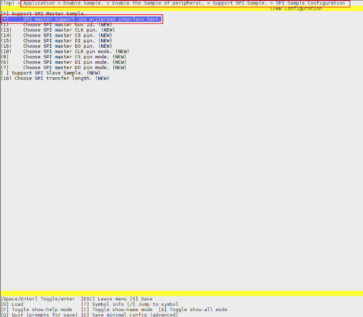

**Figure 4**  SPI SLAVE Selection<a name="fig885542191110"></a>  
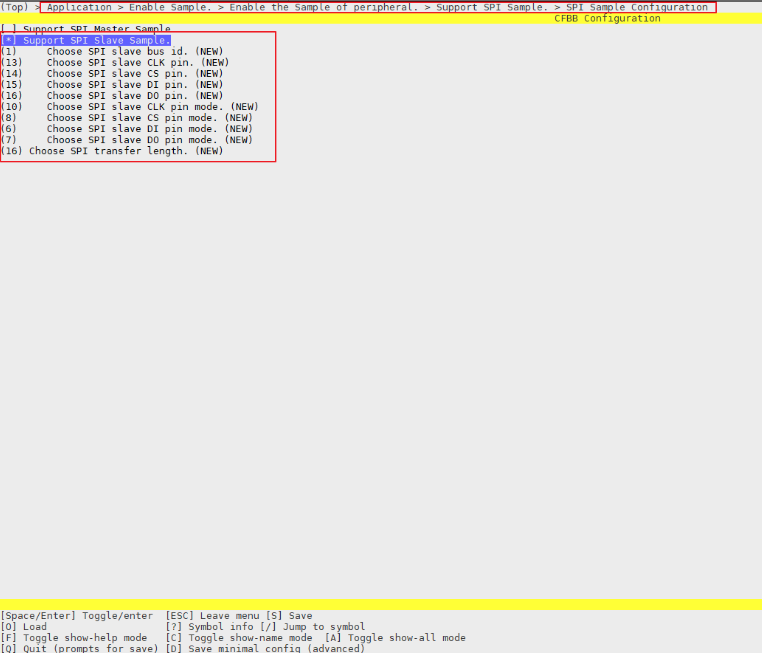

**Figure 5**  Compiled fwpkg<a name="fig1486953181217"></a>  
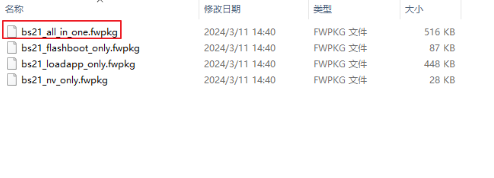

#### Running<a name="ZH-CN_TOPIC_0000001823434888"></a>

The SPI two-board execution results are divided into the following cases:

Case 1: SPI polling mode, as shown in [Figure 1](#fig14932149182315) or [Figure 2](#fig13818412254).

**Figure 1**  SPI Two-Board Polling Master-Slave Interaction Result<a name="fig14932149182315"></a>  
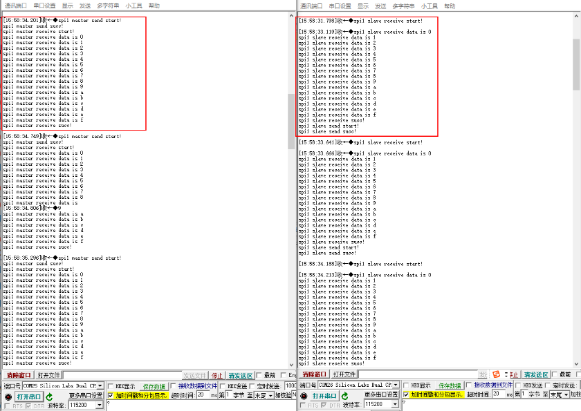

**Figure 2**  SPI Two-Board Polling Master-Slave Interaction (Master Side Using the Writeread Interface)<a name="fig13818412254"></a>  
")

Case 2: SPI interrupt mode, as shown in [Figure 4](#fig675113984719) or [Figure 5](#fig128511040184913).

**Figure 3**  SPI Interrupt Configuration<a name="fig446166104615"></a>  
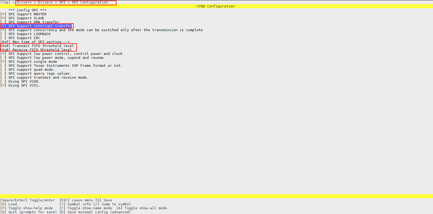

**Figure 4**  SPI Two-Board Interrupt Master-Slave Interaction<a name="fig675113984719"></a>  
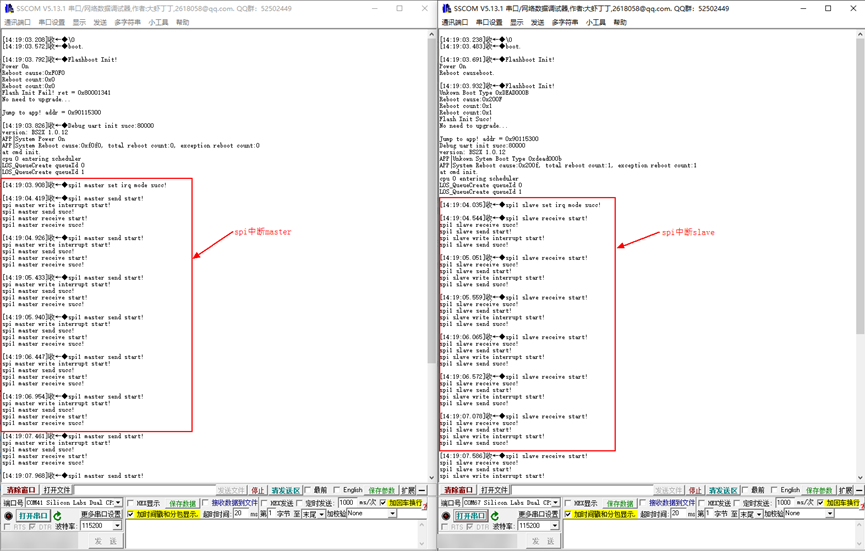

**Figure 5**  SPI Two-Board Interrupt Master-Slave Interaction (Master Side Using the Writeread Interface)<a name="fig128511040184913"></a>  
")

Case 3: SPI DMA mode, as shown in [Figure 8](#fig9103328135414), [Figure 9](#fig189697218577), or [Figure 11](#fig74556310420).

**Figure 6**  SPI DMA Configuration<a name="fig5300123411517"></a>  
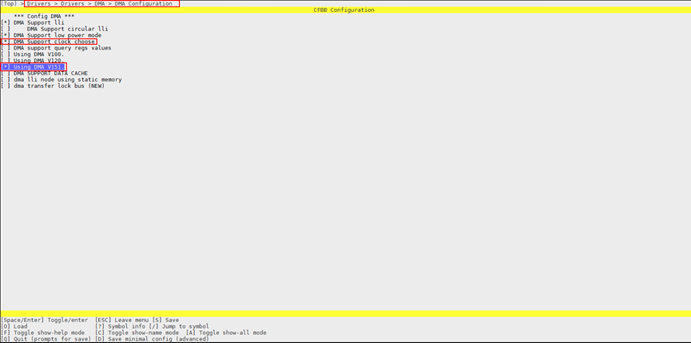

**Figure 7**  SPI DMA Configuration 2<a name="fig8148722185212"></a>  
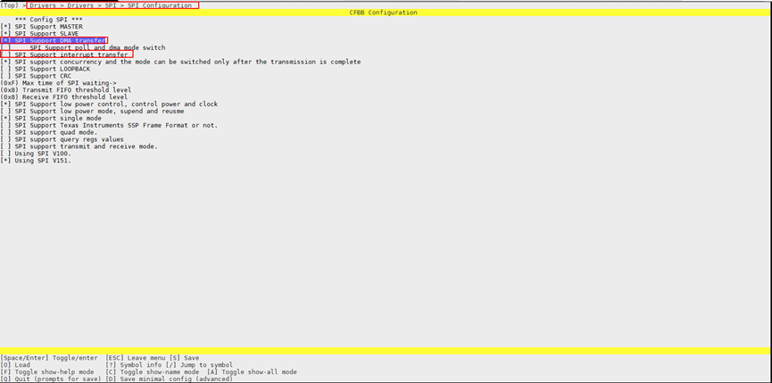

**Figure 8**  SPI Two-Board DMA Master-Slave Interaction<a name="fig9103328135414"></a>  
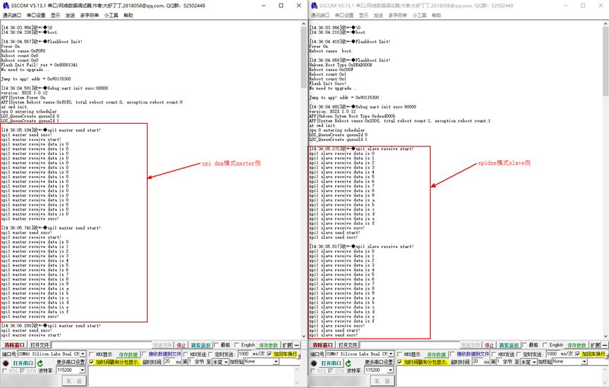

**Figure 9**  SPI Two-Board DMA Master-Slave Interaction (Master Side Using the Writeread Interface)<a name="fig189697218577"></a>  
")

**Figure 10**  SPI DMA Enabling the Polling and DMA Auto-Switching Configuration<a name="fig86062179581"></a>  
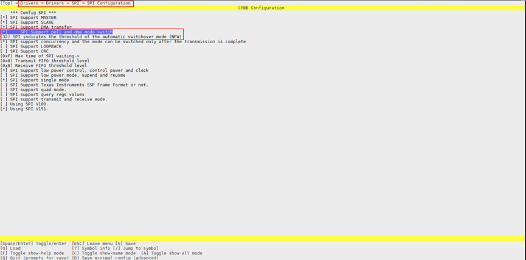

**Figure 11**  SPI Two-Board DMA Master-Slave Interaction (Both Sides Using the Writeread Interface)<a name="fig74556310420"></a>  
")

> **Description:** 
>Note: After enabling the CONFIG\_SPI\_SUPPORT\_POLL\_AND\_DMA\_AUTO\_SWITCH macro, when the amount of data sent is greater than
>the threshold configured by the CONFIG\_SPI\_AUTO\_SWITCH\_DMA\_THRESHOLD macro, the DMA mode is used; otherwise, the POLL polling mode is used, and the amount of data sent by SPI needs to be aligned with the bit width.

### SYSTICK<a name="ZH-CN_TOPIC_0000001908203921"></a>


#### Compilation<a name="ZH-CN_TOPIC_0000001908123609"></a>

> **Description:** 
>When running this sample, select the KCONFIG configuration in other directories according to actual requirements. Refer to the "KCONFIG Configuration" section of the BS2XV100 Device Driver Development Guide.

1.  Run the command "python build.py standard-bs21 menuconfig" in the command line to open the menuconfig configuration interface.
2.  Select SYSTICK Sample in the menuconfig interface, as shown in [Figure 1](#fig106431326122119). After the selection is completed, press "Q" or "q" and select "y" to save and exit.
3.  Compile the version using the IDE. The compiled version package is in the "output\\bs21\\fwpkg\\xxx" path, as shown in [Figure 2](#fig116431126152115).
4.  Burn the compiled version to the board according to "[Burning and Running](烧录及运行-57.md)" of "[SLE Mouse Sample](SLE-Mouse-Sample.md)".

**Figure 1**  Selecting the SYSTICK Sample<a name="fig106431326122119"></a>  
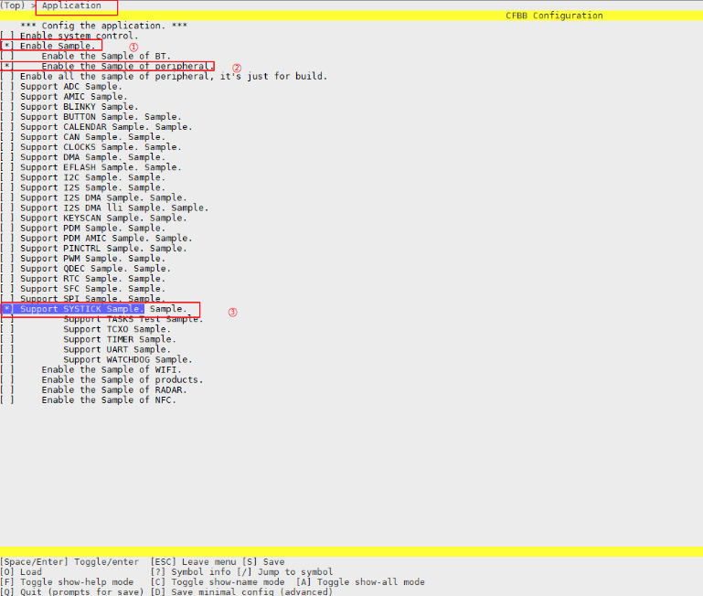

**Figure 2**  Compiled fwpkg<a name="fig116431126152115"></a>  
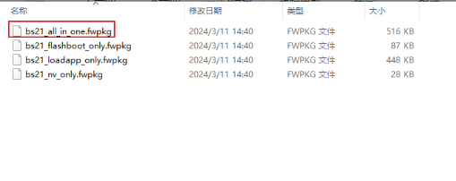

#### Running<a name="ZH-CN_TOPIC_0000001862124186"></a>

The SYSTICK single-board execution result is shown in [Figure 1](#fig993812131095).

**Figure 1**  SYSTICK Running Result<a name="fig993812131095"></a>  
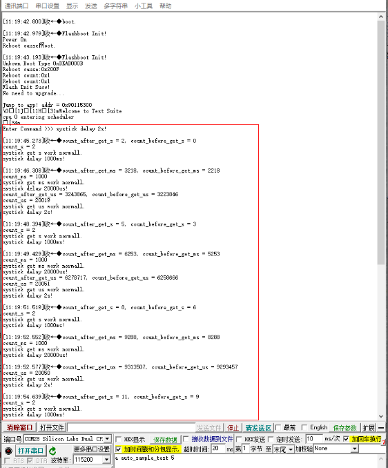

### TASK<a name="ZH-CN_TOPIC_0000002036494105"></a>


#### Compilation<a name="ZH-CN_TOPIC_0000002000214896"></a>

> **Description:** 
>When running this sample, select the KCONFIG configuration in other directories according to actual requirements. Refer to the "KCONFIG Configuration" section of the BS2XV100 Device Driver Development Guide.

1.  Run the command "python build.py standard-bs21 menuconfig" in the command line to open the menuconfig configuration interface.
2.  Select TASK Sample in the menuconfig interface, as shown in [Figure 1](#fig519832653110). After the selection is completed, press "Q" or "q" and select "y" to save and exit.
3.  Compile the version using the IDE. The compiled version package is in the "output\\bs21\\fwpkg\\xxx" path, as shown in [Figure 2](#fig5575113515288).
4.  Burn the compiled version to the board according to "[Burning and Running](烧录及运行-57.md)" of "[SLE Mouse Sample](SLE-Mouse-Sample.md)".

**Figure 1**  Selecting the TASK Sample<a name="fig519832653110"></a>  
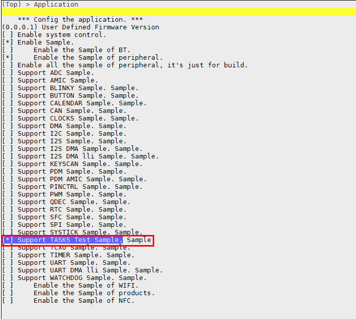

**Figure 2**  Compiled fwpkg<a name="fig5575113515288"></a>  


#### Running<a name="ZH-CN_TOPIC_0000002036453221"></a>

Burn the compiled version and it can run directly.

### TCXO<a name="ZH-CN_TOPIC_0000001908204329"></a>


#### Compilation<a name="ZH-CN_TOPIC_0000001908124053"></a>

> **Description:** 
>When running this sample, select the KCONFIG configuration in other directories according to actual requirements. Refer to the "KCONFIG Configuration" section of the BS2XV100 Device Driver Development Guide.

1.  Run the command "python build.py standard-bs21 menuconfig" in the command line to open the menuconfig configuration interface.
2.  Select TCXO Sample in the menuconfig interface, as shown in [Figure 1](#fig106431326122119). After the selection is completed, press "Q" or "q" and select "y" to save and exit.
3.  Compile the version using the IDE. The compiled version package is in the "output\\bs21\\fwpkg\\xxx" path, as shown in [Figure 2](#fig116431126152115).
4.  Burn the compiled version to the board according to "[Burning and Running](烧录及运行-57.md)" of "[SLE Mouse Sample](SLE-Mouse-Sample.md)".

**Figure 1**  Selecting the TCXO Sample<a name="fig106431326122119"></a>  
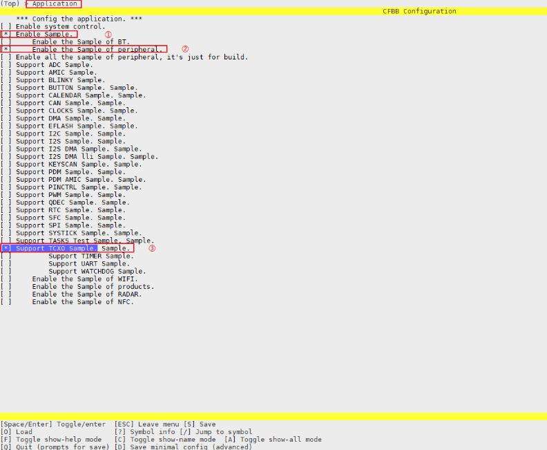

**Figure 2**  Compiled fwpkg<a name="fig116431126152115"></a>  
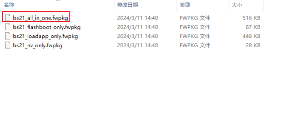

#### Running<a name="ZH-CN_TOPIC_0000001862124598"></a>

The TCXO single-board execution result is shown in [Figure 1](#fig993812131095).

**Figure 1**  TCXO Running Result<a name="fig993812131095"></a>  
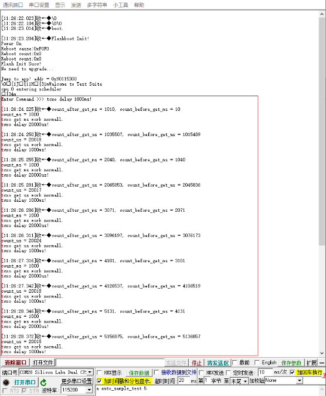

### TIMER<a name="ZH-CN_TOPIC_0000001862125598"></a>


#### Compilation<a name="ZH-CN_TOPIC_0000001862285434"></a>

> **Description:** 
>When running this sample, select the KCONFIG configuration in other directories according to actual requirements. Refer to the "KCONFIG Configuration" section of the BS2XV100 Device Driver Development Guide.

1.  Run the command "python build.py standard-bs21 menuconfig" in the command line to open the menuconfig configuration interface.
2.  Select TIMER Sample in the menuconfig interface, as shown in [Figure 1](#fig106431326122119). After the selection is completed, press "Q" or "q" and select "y" to save and exit.
3.  Select the TIMER driver in the menuconfig interface, as shown in [Figure 2](#fig4761185411100), and select the number of software timers.
4.  Compile the version using the IDE. The compiled version package is in the "output\\bs21\\fwpkg\\xxx" path, as shown in [Figure 3](#fig116431126152115).
5.  Burn the compiled version to the board according to "[Burning and Running](烧录及运行-57.md)" of "[SLE Mouse Sample](SLE-Mouse-Sample.md)".

**Figure 1**  Selecting the TIMER Sample<a name="fig106431326122119"></a>  
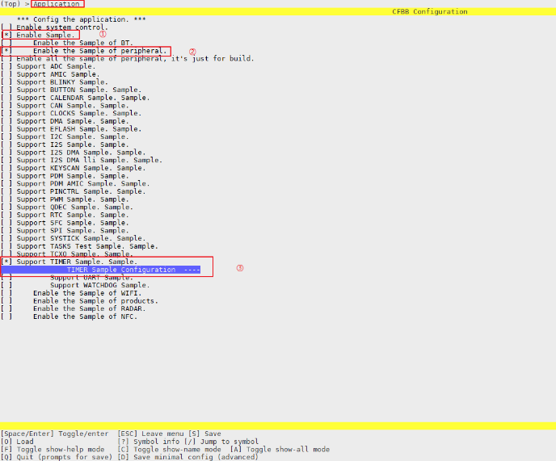

**Figure 2**  Selecting the Number of Software Timers<a name="fig4761185411100"></a>  
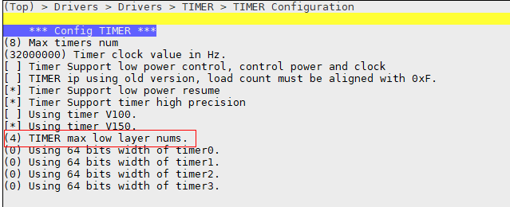

**Figure 3**  Compiled fwpkg<a name="fig116431126152115"></a>  
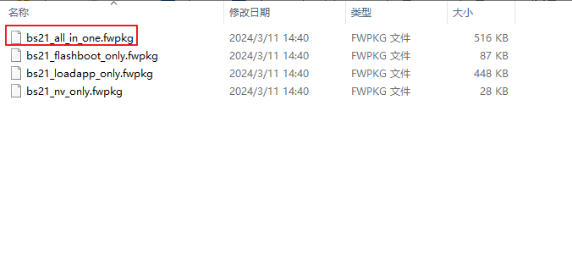

#### Running<a name="ZH-CN_TOPIC_0000001908125037"></a>

The TIMER single-board execution result is shown in [Figure 1](#fig993812131095).

**Figure 1**  TIMER Running Result<a name="fig993812131095"></a>  
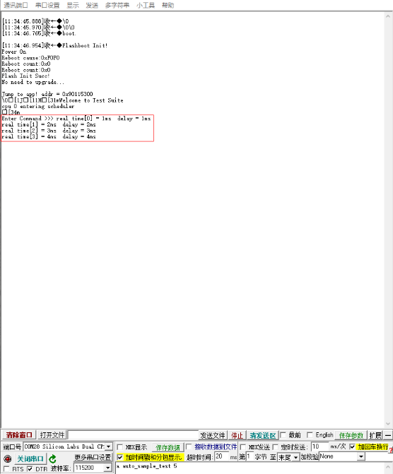

### UART<a name="ZH-CN_TOPIC_0000001873124797"></a>


#### Compilation<a name="ZH-CN_TOPIC_0000001873244621"></a>

> **Description:** 
>When running this sample, select the KCONFIG configuration in other directories according to actual requirements. Refer to the "KCONFIG Configuration" section of the BS2XV100 Device Driver Development Guide.

1.  Run the command "python build.py standard-bs21 menuconfig" in the command line to open the menuconfig configuration interface.
2.  In the menuconfig interface, select the UART Sample, as shown in [Figure 1](#fig10563812175115). If you need to modify certain parameter configurations of the current Sample, continue by following [Figure 2](#fig873353011112); the default is poll mode. If the current UART supports DMA LLI transmission, continue by selecting as shown in [Figure 3](#fig4301151111715). If the current UART supports INT transmission, continue by selecting as shown in [Figure 4](#fig1111723425614). After the selection is completed, press "Q" or "q" and select "y" to save and exit.
3.  Compile the version using the IDE. The compiled version package is in the "output\\bs21\\fwpkg\\xxx" path, as shown in [Figure 5](#fig1486953181217).
4.  Burn the compiled version to the board according to "[Burning and Running](烧录及运行-57.md)" of "[SLE Mouse Sample](SLE-Mouse-Sample.md)".

**Figure 1**  Selecting the UART Sample<a name="fig10563812175115"></a>  
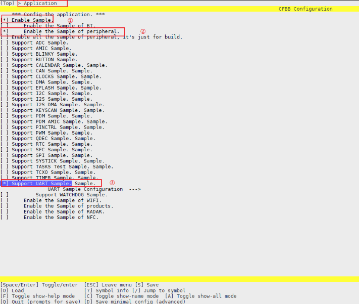

**Figure 2**  UART Sample Parameter Configuration<a name="fig873353011112"></a>  
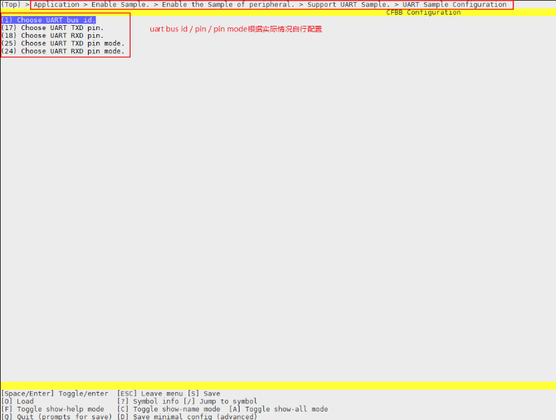

**Figure 3**  UART DMA Configuration<a name="fig4301151111715"></a>  

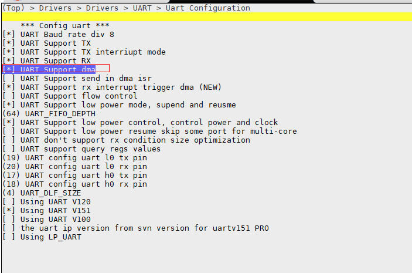

**Figure 4**  UART INT Configuration<a name="fig1111723425614"></a>  
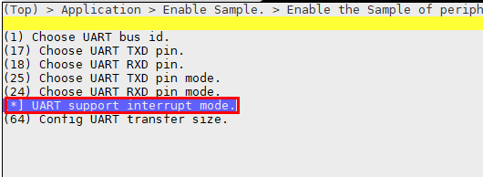

**Figure 5**  Compiled fwpkg<a name="fig1486953181217"></a>  
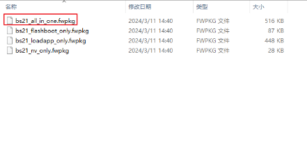

#### Running<a name="ZH-CN_TOPIC_0000001826285298"></a>

The current UART Sample uses UART\_BUS\_1 (H0) for data read/write and UART\_BUS\_0 (L0) for printing log information. The execution sequence is as follows: first, send data of a certain length to the H0 port through the PC serial port; the H0 port receives the data and sends it out again. The sent and received data can be observed on the H0 serial port. The single-board execution result of the UART is shown in [Figure 1](#fig14932149182315) below (taking poll mode as an example only), and the execution result of the UART DMA LLI is shown in [Figure 2](#fig197795185202).

**Figure 1**  UART Single-Board Dual-Serial-Port Interaction Result<a name="fig14932149182315"></a>  
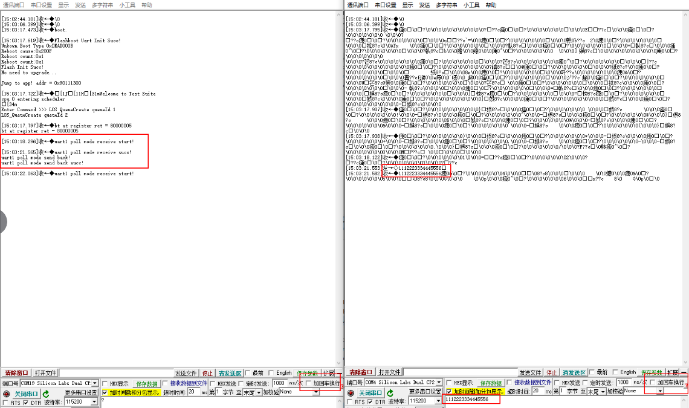

**Figure 2**  UART DMA LLI Single-Board Execution Result<a name="fig197795185202"></a>  
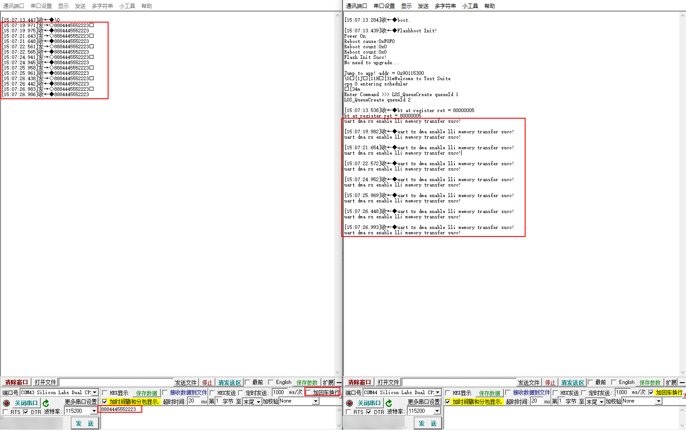

### UART DMA LLI<a name="ZH-CN_TOPIC_0000001922345534"></a>


#### Compilation<a name="ZH-CN_TOPIC_0000001922185890"></a>

> **Description:** 
>When running this sample, select the KCONFIG configuration in other directories according to actual requirements. Refer to the "KCONFIG Configuration" sections for DMA and UART in the BS2XV100 Device Driver Development Guide.

1.  <a name="li168261215195810"></a>Run the command "python build.py standard-bs21 menuconfig" in the command line to open the menuconfig configuration interface.
2.  In the menuconfig interface, select the UART DMA LLI Sample, as shown in [Figure 1](#fig10563812175115).
3.  <a name="li5749746152511"></a>On the master side, select as shown in [Figure 2](#fig873353011112). After the selection is completed, press "Q" or "q" and select "y" to save and exit.
4.  <a name="li10749146162515"></a>Compile the version using the IDE. The compiled version package is in the "output\\bs21\\fwpkg\\xxx" path, as shown in [Figure 4](#fig1486953181217).
5.  Burn the compiled version to the master-side board according to "[Burning and Running](烧录及运行-57.md)" of "[SLE Mouse Sample](SLE-Mouse-Sample.md)". Similarly, on the slave side, execute steps [1](#li168261215195810)\~[4](#li10749146162515) in sequence, but for step [3](#li5749746152511), select as shown in [Figure 3](#fig4301151111715), and burn the compiled version to the slave-side board according to "[Burning and Running](烧录及运行-57.md)" of "[SLE Mouse Sample](SLE-Mouse-Sample.md)".

**Figure 1**  Selecting the UART DMA LLI Sample<a name="fig10563812175115"></a>  
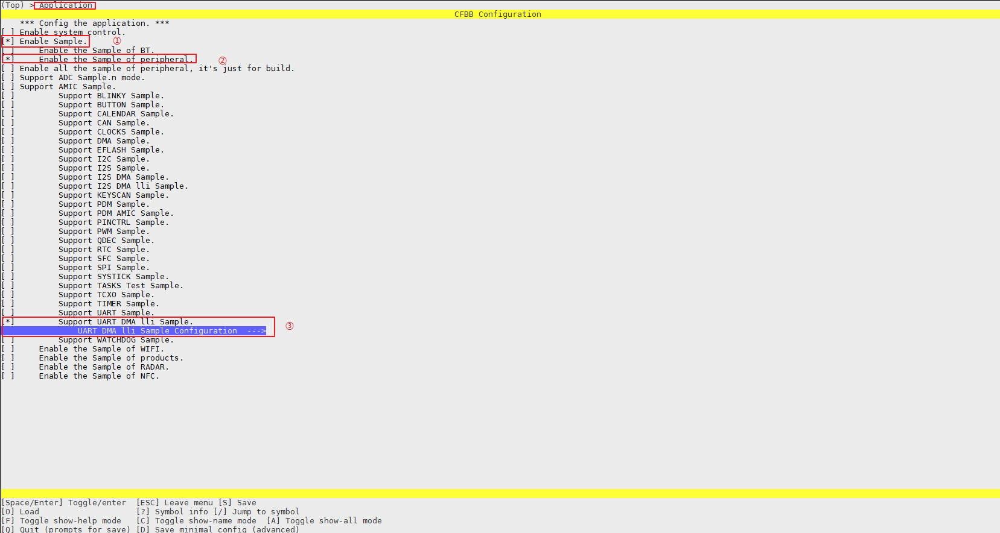

**Figure 2**  UART DMA LLI Master Parameter Configuration<a name="fig873353011112"></a>  
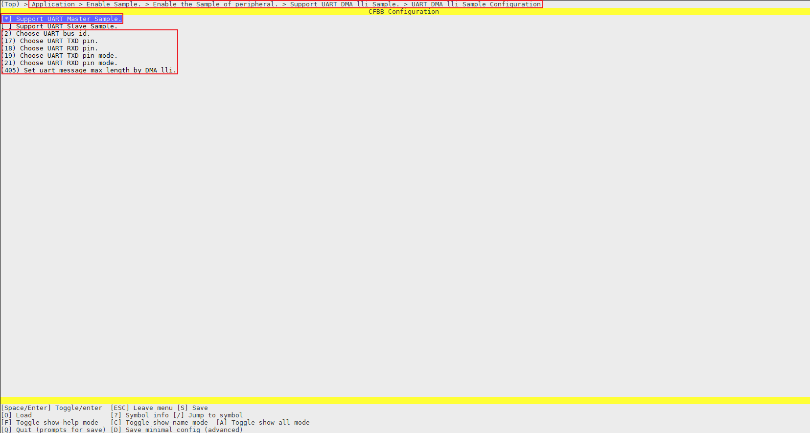

**Figure 3**  UART DMA LLI Slave Parameter Configuration<a name="fig4301151111715"></a>  
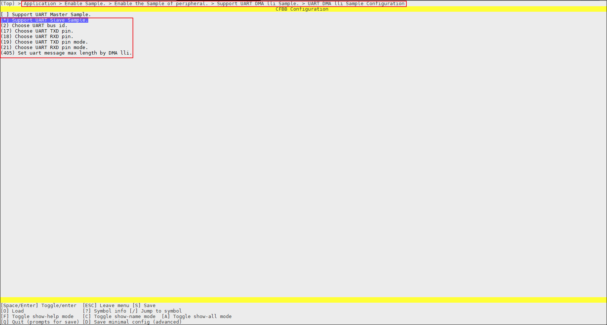

**Figure 4**  Compiled fwpkg<a name="fig1486953181217"></a>  


#### Running<a name="ZH-CN_TOPIC_0000001950064745"></a>

The current UART Sample uses UART\_BUS\_2 (L1) and UART\_BUS\_2 (L1) for data interaction by default. After the version is burned successfully, connect the pins used by UART\_BUS\_2 on the two boards in a cross manner (TX to RX, RX to TX), then reset them simultaneously. The serial port execution result is shown in [Figure 1](#fig14932149182315).

**Figure 1**  UART Dual-Board Interaction Result<a name="fig14932149182315"></a>  
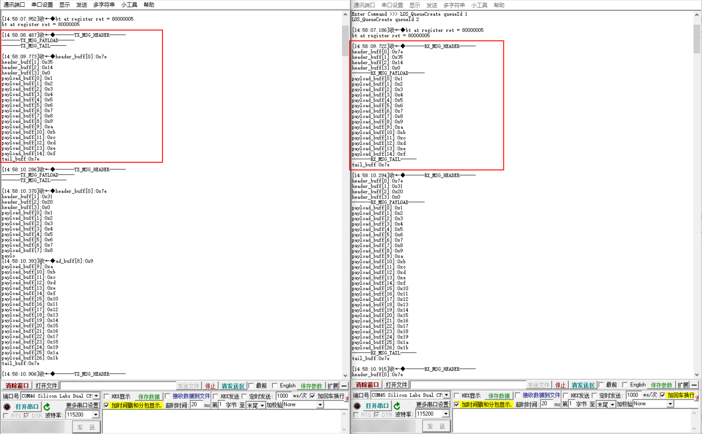

### WATCHDOG<a name="ZH-CN_TOPIC_0000001862126826"></a>


#### Compilation<a name="ZH-CN_TOPIC_0000001862286678"></a>

> **Description:** 
>When running this sample, select the KCONFIG configuration in other directories according to actual requirements. Refer to the "KCONFIG Configuration" section of the BS2XV100 Device Driver Development Guide.

1.  Run the command "python build.py standard-bs21 menuconfig" in the command line to open the menuconfig configuration interface.
2.  In the menuconfig interface, select the WATCHDOG Sample, as shown in [Figure 1](#fig106431326122119). If timeout is selected, continue by selecting as shown in [Figure 2](#fig116431126152115). If feed the watchdog is selected, continue by selecting as shown in [Figure 3](#fig2787175743). After the selection is completed, press "Q" or "q" and select "y" to save and exit.
3.  Compile the version using the IDE. The compiled version package is in the "output\\bs21\\fwpkg\\xxx" path, as shown in [Figure 4](#fig1889013402418).
4.  Burn the compiled version to the board according to "[Burning and Running](烧录及运行-57.md)" of "[SLE Mouse Sample](SLE-Mouse-Sample.md)".

**Figure 1**  Selecting the WATCHDOG Sample<a name="fig106431326122119"></a>  
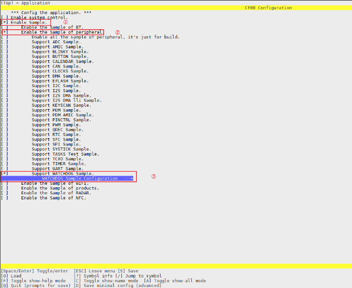

**Figure 2**  WATCHDOG Timeout<a name="fig116431126152115"></a>  
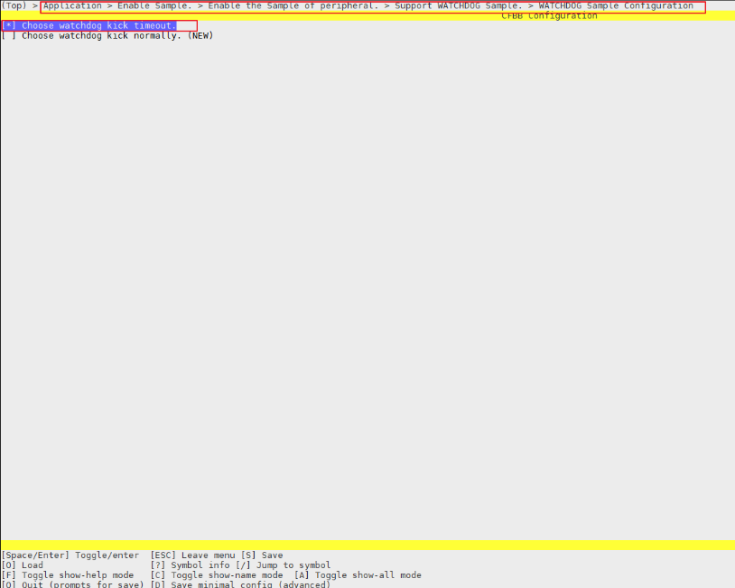

**Figure 3**  WATCHDOG Feed the Watchdog<a name="fig2787175743"></a>  
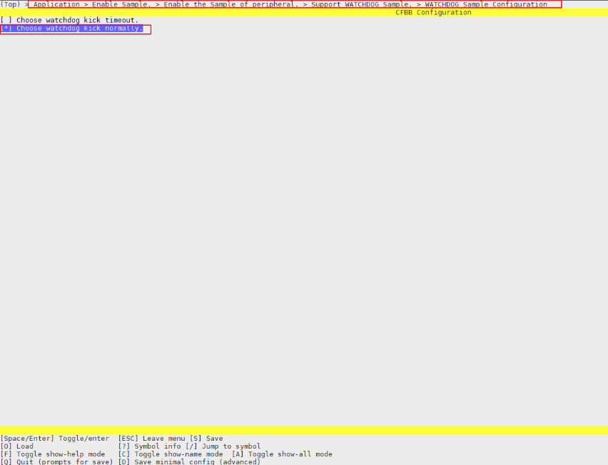

**Figure 4**  Compiled fwpkg<a name="fig1889013402418"></a>  
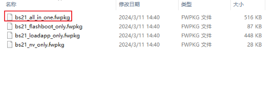

#### Running<a name="ZH-CN_TOPIC_0000001908206573"></a>

The single-board timeout execution result of the WATCHDOG is shown in [Figure 1](#fig993812131095), and the execution result after feeding the watchdog is shown in [Figure 2](#fig586414171377).

**Figure 1**  WATCHDOG Timeout Running Result<a name="fig993812131095"></a>  
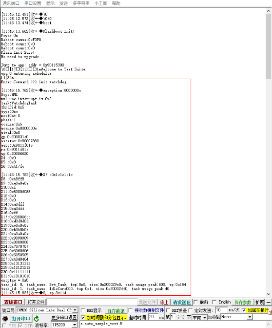

**Figure 2**  WATCHDOG Feed-the-Watchdog Running Result<a name="fig586414171377"></a>  
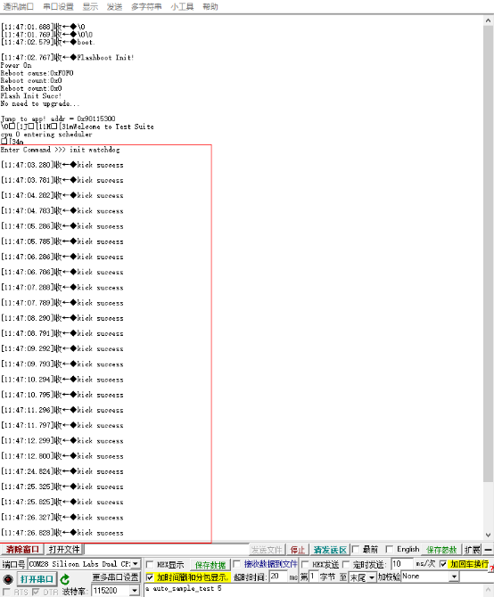

# SLE UART Sample<a name="ZH-CN_TOPIC_0000001790806616"></a>


## Overview<a name="ZH-CN_TOPIC_0000001837765685"></a>

B/SLE UART Sample can be divided in detail into the SLE UART transparent transmission function and the BLE UART transparent transmission function. Among them, SLE supports three modes in total: the SLE UART transparent transmission function, the SLE Low Latency UART transparent transmission function, and the SLE Performance data streaming function. The overall connection relationship and data flow diagram are shown in [Figure 1](#fig1856117391419). The three modes of the SLE UART Sample are controlled by Kconfig options during compilation. The default mode is the SLE UART transparent transmission function. Selecting the Low Latency option enables the SLE Low Latency UART transparent transmission function, and further selecting the Performance option on this basis enables the SLE Performance data streaming function. The functions of other options remain unchanged. For details, refer to "[Compilation](编译-52.md)" of "[SLE UART Sample](SLE-UART-Sample.md)".

**Figure 1**  B/SLE Function Block Diagram<a name="fig1856117391419"></a>  
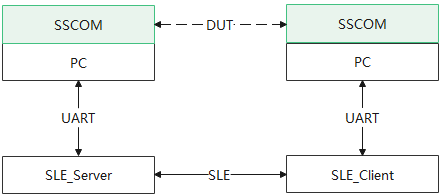

## Server-Side Process<a name="ZH-CN_TOPIC_0000001837645785"></a>

**Figure 1**  Server-Side Flow Chart<a name="fig145218281341"></a>  
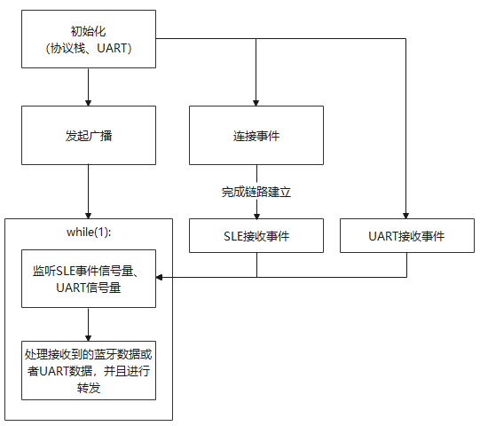

## Client-Side Process<a name="ZH-CN_TOPIC_0000001790806552"></a>

**Figure 1**  Client-Side Flow Chart<a name="fig94842535407"></a>  
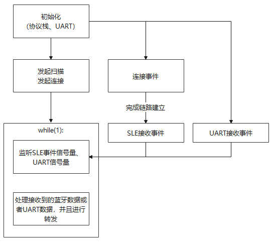

## Compilation<a name="ZH-CN_TOPIC_0000001837765649"></a>

1.  Enter the SDK directory, open the menuconfig configuration interface in the command line, and run the command "python build.py standard-bs21-n1100 menuconfig" (taking the compilation of the corresponding firmware for the bs21 development board as an example).
2.  Select SLE Uart Sample Performance mode (optional, switch to data transmission mode)
    1.  \(Top\) → Application → Enable Sample. → Enable the Sample of products. → Support SLE UART sample. → SLE UART Sample Configuration → Select SLE UART sample mode → Select sle uart sample type→ Enable SLE UART low latency sample
    2.  \(Top\) → Application → Enable Sample. → Enable the Sample of products. → Support SLE UART sample. → SLE UART Sample Configuration → Select SLE UART sample mode → Set the currrent sample in PERFORMANCE mode.

3.  <a name="li1870123015263"></a>In the menuconfig interface, select the SLE UART Sample, as shown in [Figure 1](#fig1228918832814).
4.  In the menuconfig interface, select the UART BUS used by the current Sample, as shown in [Figure 3](#fig1727441418301).
5.  In the menuconfig interface, select SLE UART Server, as shown in [Figure 4](#fig12415145983216).
6.  After the selection is completed, press "Q" to save and exit.
7.  Run "python build.py standard-bs21-n1100" in the command line, or compile using the IDE (ensure the permissions of the files in the sdk package before compilation). The compiled version package is in the "tools\\pkg\\fwpkg\\bs2x" path, as shown in [Figure 5](#fig7726546133717).
8.  Restart and open the menuconfig configuration interface, and follow steps [3](#li1870123015263)\~[\#ZH-CN\_TOPIC\_0000001837765649/li8164191173710](#li8164191173710) to select SLE UART Client, as shown in [Figure 6](#fig827416371394), compile, and burn the version successfully.

**Figure 1**  Selecting the SLE UART Sample<a name="fig1228918832814"></a>  
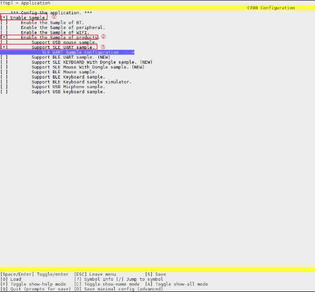

**Figure 2**  Selecting the SLE UART Sample Performance Mode (Optional)<a name="fig1076820561381"></a>  
")

**Figure 3**  Selecting the UART BUS<a name="fig1727441418301"></a>  
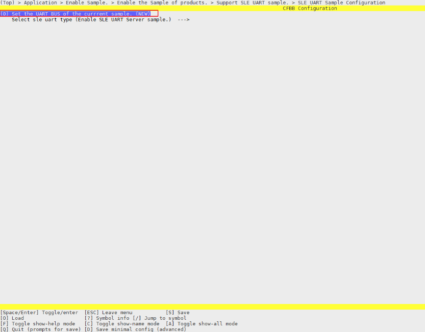

**Figure 4**  Selecting SLE UART Server<a name="fig12415145983216"></a>  
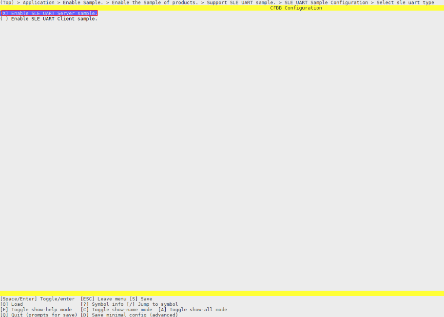

**Figure 5**  Compiled Version<a name="fig7726546133717"></a>  


**Figure 6**  Selecting SLE UART Client<a name="fig827416371394"></a>  
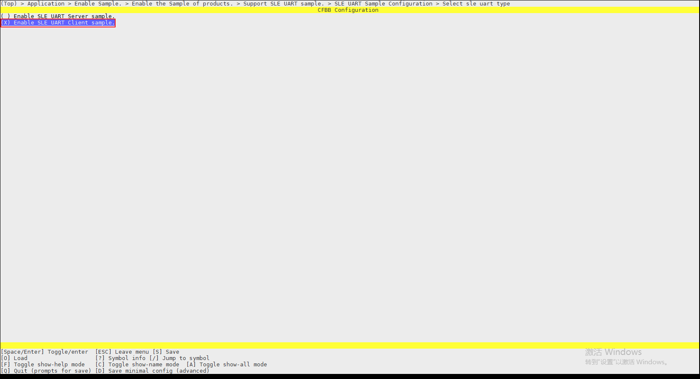

## Burning and Running<a name="ZH-CN_TOPIC_0000001790806624"></a>

**Burning<a name="section11501615135313"></a>**

For the version burning method, refer to the BS2XV100 HiSpark Studio User Guide.

**Running<a name="section11367201532211"></a>**

1.  Prepare two single boards, which serve as the Server end and the Client end respectively. On each single board, connect UART-L0 and UART-L2 to the PC through a serial port board.
2.  Burn the compiled Server version and Client version to the single boards through UART-L0 respectively.
3.  On the PC, connect the UART-L2 of the two single boards through two serial port assistants respectively, set the serial port to a baud rate of 115200, and open the serial ports.
4.  Enter characters in the two serial port assistants respectively, and observe whether the peer serial port can receive them. If the peer can receive them, the pass-through is successful.

# SLE UART DMA Sample<a name="ZH-CN_TOPIC_0000002091115513"></a>


## Overview<a name="ZH-CN_TOPIC_0000002054918226"></a>

SLE UART DMA Sample is used to implement the end-to-end uart->sle->uart data streaming process, and currently supports a maximum data streaming speed of 2.2M. The overall connection relationship and data flow diagram are shown in the following figure, where the four modes of the sle uart dma sample are controlled by Kconfig options. SLE supports the normal mode and the low-latency mode. By default, the connection mode with a connection interval of 25ms is used, and 240-byte data is sent each time.

The UART driver supports the use of three interfaces, namely the uart\_dma\_lli interface, the uart\_raw\_data\_lli interface, and the uart\_read\_by\_dma interface. For specific usage scenarios, refer to the following figure.

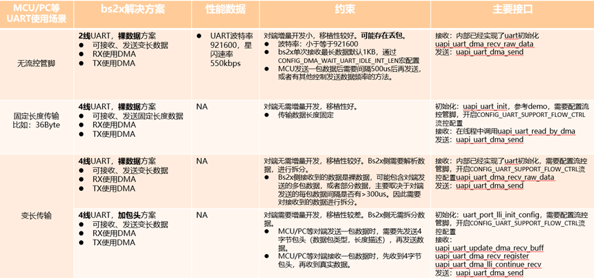

SLE connection supports the normal mode and the low-latency mode. By default, the connection mode with a connection interval of 25ms is used, and 236-byte data is sent each time.

## Overall Process Introduction<a name="ZH-CN_TOPIC_0000002091076957"></a>

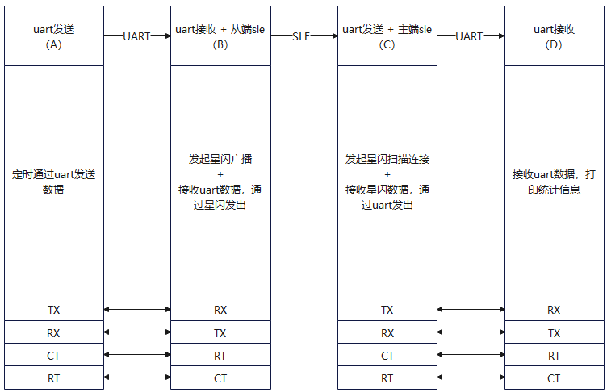


### (End A) Data Sending End<a name="ZH-CN_TOPIC_0000002055076550"></a>

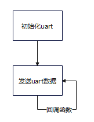

### (End B) SparkLink Data Sending End<a name="ZH-CN_TOPIC_0000002091115517"></a>

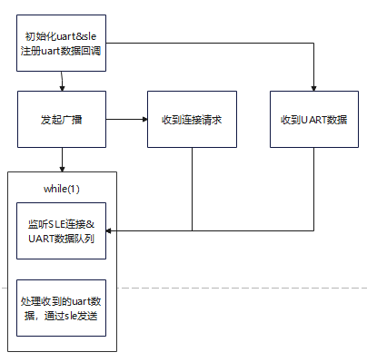

### (End C) SparkLink Data Receiving End<a name="ZH-CN_TOPIC_0000002054918230"></a>

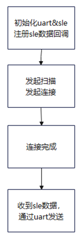

### (End D) Data Receiving End<a name="ZH-CN_TOPIC_0000002091076961"></a>

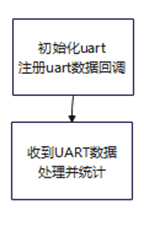

## Compilation Process<a name="ZH-CN_TOPIC_0000002055076554"></a>

1.  Open the menuconfig configuration interface in the command line and run the command: ./build.py -c standard-bs21-n1100 menuconfig
2.  Select the uart configuration:

    1. (Top) → Application → Enable Sample. → Enable the Sample of products. → Support SLE UART DMA sample. → SLE UART DMA Sample Configuration → Select UART Config → Choice Target UART DMA Sample Mode

    Select the uart driver configuration you want to use. Currently, the following three UART driver interfaces are supported.

    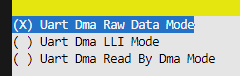

    2. (Top) → Application → Enable Sample. → Enable the Sample of products. → Support SLE UART DMA sample. → SLE UART DMA Sample Configuration

    Configure the uart serial port to be used. BUS1: H0 serial port; BUS2: L1 serial port. The default is BUS1, which supports a maximum baud rate of 4M.

    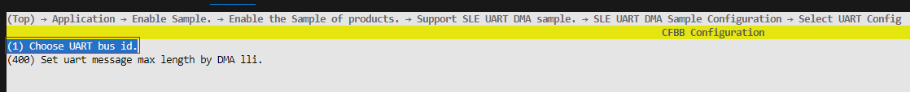

    **Note that the uart-related serial port configuration in the driver config must also be configured at the same time** because this demo runs based on the uart dma driver. Refer to the following figure for the configuration according to the UART driver interface to be used. For configuration details, refer to the "UART" section of the BS2XV100 Device Driver Development Guide.

    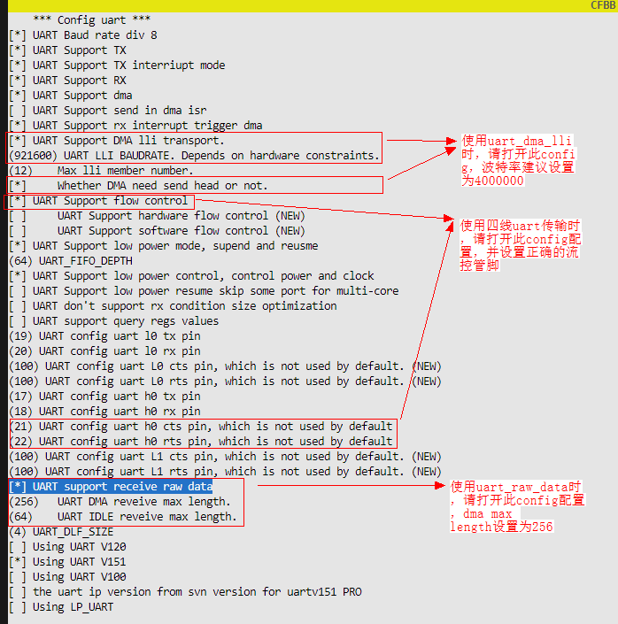

    **When using the H0 serial port, disable the log thread to prevent the log from using the same serial port as uart, which may cause exceptions.**

    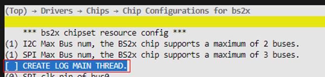

3.  Select the target data streaming configuration.

    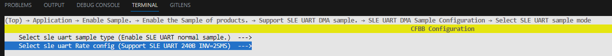

First, select the desired SparkLink mode.

(Top) → Application → Enable Sample. → Enable the Sample of products. → Support SLE UART DMA sample. → SLE UART DMA Sample Configuration → Select SLE UART sample mode → Select sle uart sample type

Then, select the specific data streaming configuration.

(Top) → Application → Enable Sample. → Enable the Sample of products. → Support SLE UART DMA sample. → SLE UART DMA Sample Configuration → Select SLE UART sample mode → Select sle uart Rate config

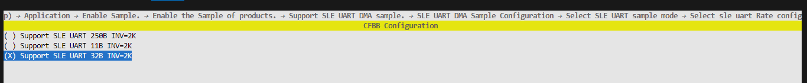

**Before compiling a version using the low latency mode, modify the em\_size size configuration in nv**. byte4 and byte5 form the size of em\_size, and byte6 is the maximum number of connections. The size of em size is obtained by concatenating byte4 and byte5, two uint8\_t values, into one uint16\_t value, with the high byte in byte5 and the low byte in byte4. As shown in the following figure, 08,01 represents setting the em size to 264 bytes.

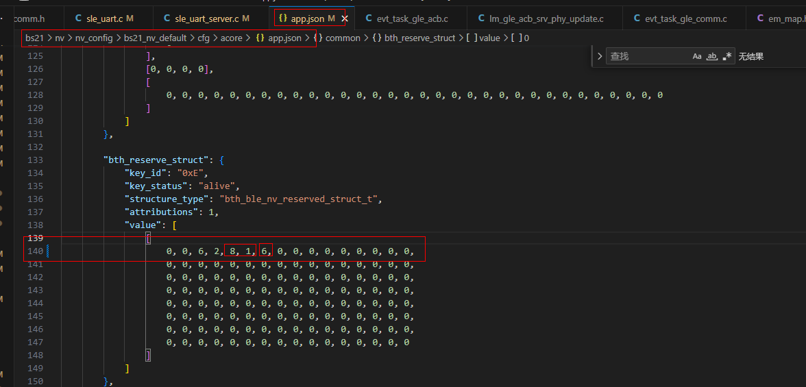

1.  <a name="li92491245378"></a>Select the sample version to be compiled. As shown in the following figure, UART Master, UART Master Sle, UART Slave sle, and UART Slave correspond to the uart data sending end, sle data sending end, sle data receiving end, and uart data receiving end described above respectively.

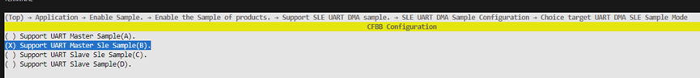

1.  After the configuration is completed, press "Q" and then "Y" to save and exit menuconfig.
2.  Compile the version using the IDE. The compiled version package is in the path: output\\bs21\\fwpkg\\standard-bs21-n1100
3.  <a name="li4667441203710"></a>Use the burning tool to burn the compiled version to the single board.
4.  Repeat steps [Step 4](#li92491245378)\~[Step 7](#li4667441203710) to compile the corresponding four versions and burn them to the single boards.

## Burning and Running<a name="ZH-CN_TOPIC_0000002091115521"></a>

**Burning:**

For the burning method, refer to the BS2XV100 HiSpark Studio User Guide.

**Running:**

1.  Prepare 4 single boards, which serve as the UART data sending end, SLE data sending end, SLE data receiving end, and UART data receiving end respectively. Connect the serial port pins and flow control pins of the UART data sending end and SLE data sending end in a reversed manner; connect the serial port pins and flow control pins of the SLE data receiving end and UART data receiving end in a reversed manner. The H0 pin configuration of the chip is used by default.
2.  Use the version burning tool to burn the versions to the four single boards respectively.
3.  Use the PC serial port tool to connect to the L0 ports of the four single boards to observe the data transmission.
4.  **Start the four single boards in the order of A->C->D->B**, and observe the serial port log printing. If the UART data receiving end can print statistics data on time, the running is normal.

## Optional Parameter Configuration<a name="ZH-CN_TOPIC_0000002054918234"></a>

<a name="table135533517260"></a>
<table><thead align="left"><tr id="row125691755265"><th class="cellrowborder" valign="top" width="25%" id="mcps1.1.5.1.1"><p id="p25696552616"><a name="p25696552616"></a><a name="p25696552616"></a>Packet Length</p>
</th>
<th class="cellrowborder" valign="top" width="25%" id="mcps1.1.5.1.2"><p id="p65691357262"><a name="p65691357262"></a><a name="p65691357262"></a>Connection Interval</p>
</th>
<th class="cellrowborder" valign="top" width="25%" id="mcps1.1.5.1.3"><p id="p75691153265"><a name="p75691153265"></a><a name="p75691153265"></a>PHY Type</p>
</th>
<th class="cellrowborder" valign="top" width="25%" id="mcps1.1.5.1.4"><p id="p185691559263"><a name="p185691559263"></a><a name="p185691559263"></a>Theoretical Data Streaming Speed</p>
</th>
</tr>
</thead>
<tbody><tr id="row145692513265"><td class="cellrowborder" valign="top" width="25%" headers="mcps1.1.5.1.1 "><p id="p256995112617"><a name="p256995112617"></a><a name="p256995112617"></a>236B</p>
</td>
<td class="cellrowborder" valign="top" width="25%" headers="mcps1.1.5.1.2 "><p id="p1656911519265"><a name="p1656911519265"></a><a name="p1656911519265"></a>25ms</p>
</td>
<td class="cellrowborder" valign="top" width="25%" headers="mcps1.1.5.1.3 "><p id="p10569205152617"><a name="p10569205152617"></a><a name="p10569205152617"></a>4M QPSK</p>
</td>
<td class="cellrowborder" valign="top" width="25%" headers="mcps1.1.5.1.4 "><p id="p9569559267"><a name="p9569559267"></a><a name="p9569559267"></a>75kbps</p>
</td>
</tr>
<tr id="row1056916518269"><td class="cellrowborder" valign="top" width="25%" headers="mcps1.1.5.1.1 "><p id="p6569759268"><a name="p6569759268"></a><a name="p6569759268"></a>236B</p>
</td>
<td class="cellrowborder" valign="top" width="25%" headers="mcps1.1.5.1.2 "><p id="p1569185172610"><a name="p1569185172610"></a><a name="p1569185172610"></a>2ms</p>
</td>
<td class="cellrowborder" valign="top" width="25%" headers="mcps1.1.5.1.3 "><p id="p1056914522617"><a name="p1056914522617"></a><a name="p1056914522617"></a>4M QPSK</p>
</td>
<td class="cellrowborder" valign="top" width="25%" headers="mcps1.1.5.1.4 "><p id="p856918522618"><a name="p856918522618"></a><a name="p856918522618"></a>940kbps</p>
</td>
</tr>
<tr id="row185696532619"><td class="cellrowborder" valign="top" width="25%" headers="mcps1.1.5.1.1 "><p id="p156975162613"><a name="p156975162613"></a><a name="p156975162613"></a>250B</p>
</td>
<td class="cellrowborder" valign="top" width="25%" headers="mcps1.1.5.1.2 "><p id="p656919512610"><a name="p656919512610"></a><a name="p656919512610"></a>1k (low latency)</p>
</td>
<td class="cellrowborder" valign="top" width="25%" headers="mcps1.1.5.1.3 "><p id="p1656918516262"><a name="p1656918516262"></a><a name="p1656918516262"></a>2M QPSK</p>
</td>
<td class="cellrowborder" valign="top" width="25%" headers="mcps1.1.5.1.4 "><p id="p1156910572610"><a name="p1156910572610"></a><a name="p1156910572610"></a>2000kbps</p>
</td>
</tr>
<tr id="row1569652267"><td class="cellrowborder" valign="top" width="25%" headers="mcps1.1.5.1.1 "><p id="p956916592618"><a name="p956916592618"></a><a name="p956916592618"></a>36B</p>
</td>
<td class="cellrowborder" valign="top" width="25%" headers="mcps1.1.5.1.2 "><p id="p1956911552614"><a name="p1956911552614"></a><a name="p1956911552614"></a>1k (low latency)</p>
</td>
<td class="cellrowborder" valign="top" width="25%" headers="mcps1.1.5.1.3 "><p id="p156911572613"><a name="p156911572613"></a><a name="p156911572613"></a>2M QPSK</p>
</td>
<td class="cellrowborder" valign="top" width="25%" headers="mcps1.1.5.1.4 "><p id="p2056913572616"><a name="p2056913572616"></a><a name="p2056913572616"></a>288kbps</p>
</td>
</tr>
<tr id="row145690572615"><td class="cellrowborder" valign="top" width="25%" headers="mcps1.1.5.1.1 "><p id="p75692511264"><a name="p75692511264"></a><a name="p75692511264"></a>36B</p>
</td>
<td class="cellrowborder" valign="top" width="25%" headers="mcps1.1.5.1.2 "><p id="p125690562613"><a name="p125690562613"></a><a name="p125690562613"></a>2k (low latency)</p>
</td>
<td class="cellrowborder" valign="top" width="25%" headers="mcps1.1.5.1.3 "><p id="p256915552610"><a name="p256915552610"></a><a name="p256915552610"></a>2M QPSK</p>
</td>
<td class="cellrowborder" valign="top" width="25%" headers="mcps1.1.5.1.4 "><p id="p1456916582614"><a name="p1456916582614"></a><a name="p1456916582614"></a>576kbps</p>
</td>
</tr>
</tbody>
</table>

The theoretical data streaming speed is calculated based on the maximum SparkLink configuration under the current configuration. The actual speed may be affected by chip performance, air interface quality, and other factors.

SparkLink speed = number of scheduling times per second × number of bytes sent per packet × 8 (number of bits) / 1000 (unit conversion). For example, in configuration 3, with a packet length of 250B and a connection interval of 1k, the theoretical speed is 1000×250×8/1000=2000kbps.

The UART data streaming speed is generally about the baud rate × 0.6. When the baud rate is set to 4000000, UART can achieve a speed of 2400kbps.

## Usage Instructions and Restrictions<a name="ZH-CN_TOPIC_0000002091076965"></a>

1.  When using the low-latency mode, note that a chip supporting the low-latency function, such as the 282x series, should be used.

<a name="table2405437122616"></a>
<table><thead align="left"><tr id="row10415103718260"><th class="cellrowborder" valign="top" width="39.64%" id="mcps1.1.3.1.1"><p id="p18415143718269"><a name="p18415143718269"></a><a name="p18415143718269"></a><strong id="b141510374263"><a name="b141510374263"></a><a name="b141510374263"></a>Chip</strong></p>
</th>
<th class="cellrowborder" valign="top" width="60.36%" id="mcps1.1.3.1.2"><p id="p8415183722612"><a name="p8415183722612"></a><a name="p8415183722612"></a><strong id="b9415193782619"><a name="b9415193782619"></a><a name="b9415193782619"></a>Low-Latency Mode Support</strong></p>
</th>
</tr>
</thead>
<tbody><tr id="row74151637182611"><td class="cellrowborder" valign="top" width="39.64%" headers="mcps1.1.3.1.1 "><p id="p4415937152615"><a name="p4415937152615"></a><a name="p4415937152615"></a>2821/2821E</p>
</td>
<td class="cellrowborder" valign="top" width="60.36%" headers="mcps1.1.3.1.2 "><p id="p74151037162611"><a name="p74151037162611"></a><a name="p74151037162611"></a>1k、2k</p>
</td>
</tr>
<tr id="row12415437142611"><td class="cellrowborder" valign="top" width="39.64%" headers="mcps1.1.3.1.1 "><p id="p1141523715269"><a name="p1141523715269"></a><a name="p1141523715269"></a>2820</p>
</td>
<td class="cellrowborder" valign="top" width="60.36%" headers="mcps1.1.3.1.2 "><p id="p10415193752613"><a name="p10415193752613"></a><a name="p10415193752613"></a>1k</p>
</td>
</tr>
</tbody>
</table>

1.  Due to the limitation of the chip rx buffer size, when actually using the low-latency mode, do not set data exceeding the Buffer size. The content of data packets larger than this size will be incorrect.

<a name="table166621514113915"></a>
<table><thead align="left"><tr id="row12669114113910"><th class="cellrowborder" valign="top" width="39.57%" id="mcps1.1.3.1.1"><p id="p7669111414396"><a name="p7669111414396"></a><a name="p7669111414396"></a><strong id="b106695147398"><a name="b106695147398"></a><a name="b106695147398"></a>Chip</strong></p>
</th>
<th class="cellrowborder" valign="top" width="60.42999999999999%" id="mcps1.1.3.1.2"><p id="p186698147391"><a name="p186698147391"></a><a name="p186698147391"></a><strong id="b11669161463916"><a name="b11669161463916"></a><a name="b11669161463916"></a>Size</strong></p>
</th>
</tr>
</thead>
<tbody><tr id="row466961416399"><td class="cellrowborder" valign="top" width="39.57%" headers="mcps1.1.3.1.1 "><p id="p17669111415393"><a name="p17669111415393"></a><a name="p17669111415393"></a>282X</p>
</td>
<td class="cellrowborder" valign="top" width="60.42999999999999%" headers="mcps1.1.3.1.2 "><p id="p1566991418396"><a name="p1566991418396"></a><a name="p1566991418396"></a>250</p>
</td>
</tr>
</tbody>
</table>

1.  Due to the limitation of the chip TRx Buffer size, the data size of a single transmission over the air is limited. When using the ssap message interface to send data, refer to the chip buffer size to send data, so as to avoid air interface resource waste caused by packets that are too large and need to be fragmented, or too small.
2.  When the TRx buffer is 260, the maximum data packet size over the air is 252 bytes. When the application layer calls the interface to send data, the data first needs to be encapsulated with a 10-byte protocol-layer packet header by the host, which contains information such as tcid and tm\_len. When sent out from the BTC, the BTC encapsulates a 2-byte packet header. If encryption is enabled, an additional 4-byte MIC length is required. In summary, it is recommended that the application layer limit each data send to an integer multiple of 236 bytes or less.

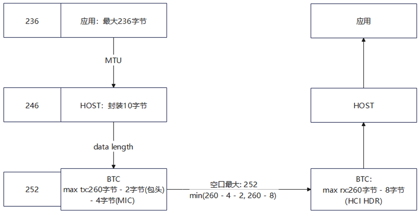

# SLE Mouse Sample<a name="ZH-CN_TOPIC_0000001837765793"></a>


## Overview<a name="ZH-CN_TOPIC_0000001837765713"></a>

This Sample demonstrates a real SLE-based mouse solution. The current mouse supports sliding, left/right key, and wheel functions.

## Configuration<a name="ZH-CN_TOPIC_0000001790966336"></a>

1.  Open the menuconfig configuration interface in the command line and run the command "python build.py standard-bs21-n1100 menuconfig".
2.  In the menuconfig interface, enter "application/System mouse Pin Configuration", as shown in Mouse Pin Config.
3.  After the selection is completed, press "Q" and "Y" to save and exit.

> **Description:** 
>The pin configuration described above is only applicable to the BS2X project. The pin configuration of different projects needs to be adjusted appropriately according to their own conditions.

**Figure 1**  Mouse Pin Config<a name="fig73272401110"></a>  


## Compilation<a name="ZH-CN_TOPIC_0000001837645773"></a>

1.  Open the menuconfig configuration interface in the command line and run the command "python build.py standard-bs21-n1100 menuconfig".
2.  In the menuconfig interface, select the mouse Sample, as shown in [Figure 2](#fig165461512707).
3.  <a name="li147941742506"></a>In the menuconfig interface, select the mouse, as shown in [Figure 3](#fig354495715112), and select the appropriate sensor, as shown in [Figure 4](#fig422011815401).
4.  After the selection is completed, press "Q" to save and exit.
5.  Compile the version using the IDE. The compiled version package is in the "tools\\pkg\\fwpkg\\bs2x" path, as shown in [Figure 5](#fig063518437312).
6.  <a name="li1443621546"></a>Burn the compiled version to the mouse board according to "[Burning and Running](烧录及运行-57.md)" of "[SLE Mouse Sample](SLE-Mouse-Sample.md)".
7.  Restart and open the menuconfig configuration interface, and follow steps [3](#li147941742506)\~[6](#li1443621546) to select Dongle, compile, and burn the version to the Dongle board.

**Figure 1**  Selecting the SLE Mouse Service<a name="fig52068218146"></a>  
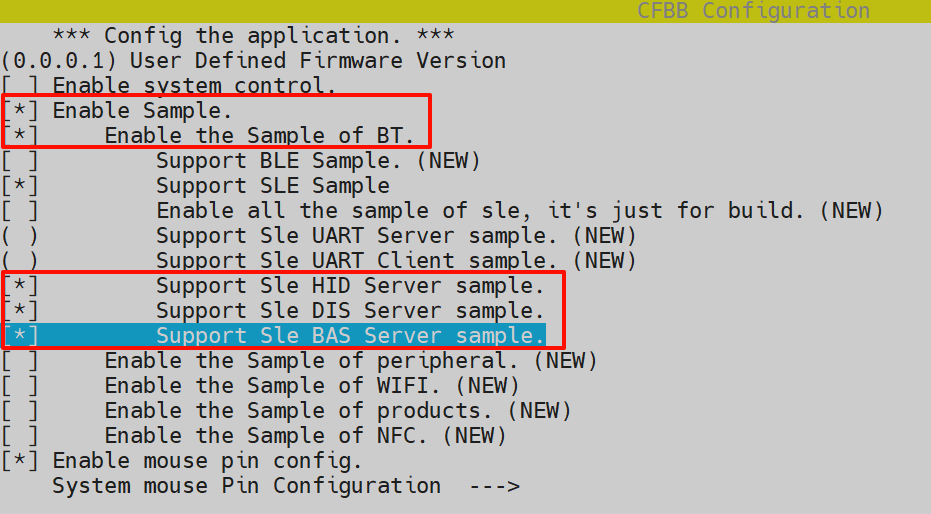

**Figure 2**  Selecting the SLE Mouse Sample<a name="fig165461512707"></a>  
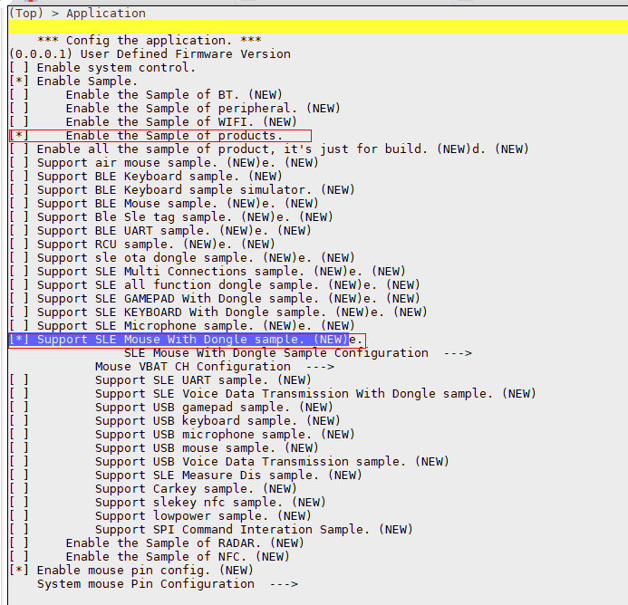

**Figure 3**  Selecting the Mouse or Dongle<a name="fig354495715112"></a>  
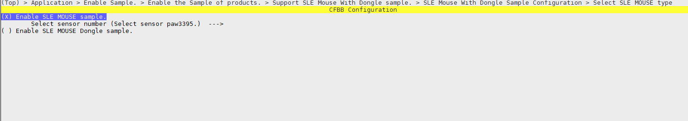

**Figure 4**  Selecting the Mouse Sensor<a name="fig422011815401"></a>  
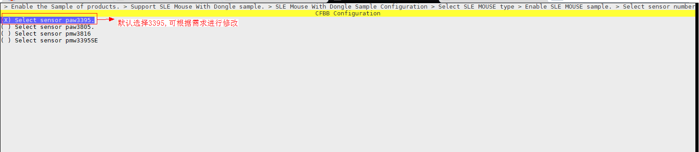

**Figure 5**  Compiled Version<a name="fig063518437312"></a>  


## Burning and Running<a name="ZH-CN_TOPIC_0000001837645745"></a>

**Burning<a name="section948712445453"></a>**

Burn the compiled mouse version and Dongle version to the mouse board and Dongle board respectively. For the version burning method, refer to the BS2XV100 HiSpark Studio User Guide.

**Running<a name="section9308175717452"></a>**

1.  Power on the mouse board and the Dongle separately. The Dongle is powered on by plugging it directly into the computer via USB.
2.  Observe the log information on UART-H0 of the mouse board and Dongle board. If "CONNECTED" appears, the connection has been completed.
3.  If the mouse movement, button clicks, and other functions can work normally as observed on the PC, the SLE Mouse function is normal.
4.  During use, if the mouse or Dongle is powered on again, it can reconnect, and the functions work normally.

## Precautions<a name="ZH-CN_TOPIC_0000001790966216"></a>

> **Notice:** 
>The SLE mouse of the current SDK version only supports the paw3395 sensor, and more sensor support will be added later.

# SLE amic vdt with dongle<a name="ZH-CN_TOPIC_0000001790966248"></a>


## Overview<a name="ZH-CN_TOPIC_0000001837645733"></a>

This Sample demonstrates a real SLE-based dongle amic audio solution. The overall connection relationship and data flow diagram are shown in [Figure 1](#fig441524312714).

**Figure 1**  SLE amic Data Flow Diagram<a name="fig441524312714"></a>  
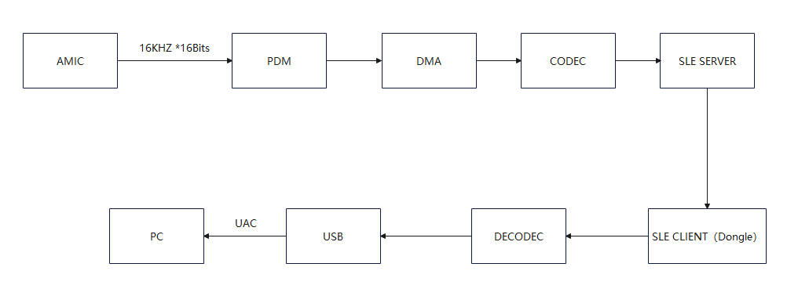

## Compilation<a name="ZH-CN_TOPIC_0000001837645689"></a>

1.  Open the menuconfig configuration interface in the command line and run the command "python build.py standard-bs21 menuconfig".
2.  In the menuconfig interface, select the SLE AMIC Sample, as shown in [Figure 1](#fig1435112258397).
3.  <a name="li86517304586"></a>In the menuconfig interface, select the current SLE type as the Server end, as shown in [Figure 2](#fig1874015168504). If you need to adjust the adc pin, the single uac and dma transmission quantity, and the sampling rate is 16KHZ by default, continue by selecting as shown in [Figure 3](#fig128231255526) and [Figure 4](#fig172753104212). After the selection is completed, press "Q" or "q" to save and exit.
4.  Compile the version using the IDE. The compiled version package is in the "tools\\pkg\\fwpkg\\bs21" path, as shown in [Figure 6](#fig116431126152115).
5.  Burn the compiled version according to "[Burning and Running](烧录及运行-63.md)" of "[SLE microphone](SLE-microphone.md)".
6.  <a name="li1716542814517"></a>Restart and open the menuconfig configuration interface, and follow steps [3](#li86517304586)\~[6](#li1716542814517) to select SLE AMIC Client (Dongle), as shown in [Figure 5](#fig1593135913428), compile, and burn the version successfully.

**Figure 1**  Selecting the SLE AMIC Sample<a name="fig1435112258397"></a>  
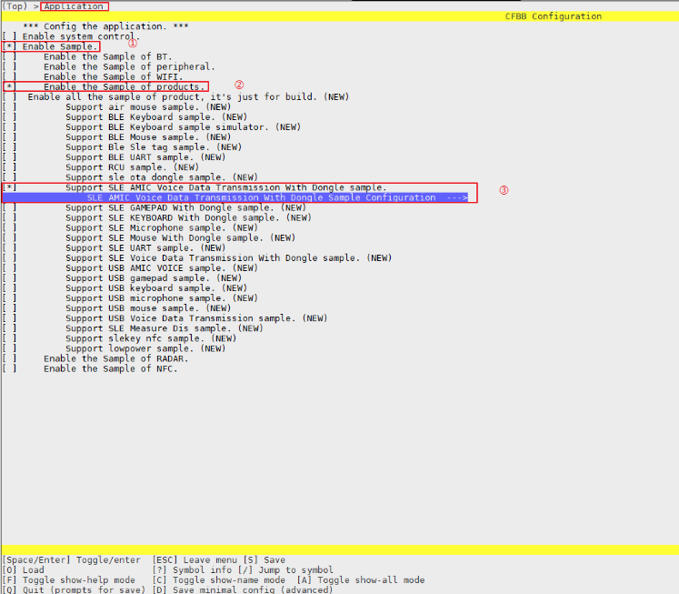

**Figure 2**  Selecting SLE AMIC SERVER<a name="fig1874015168504"></a>  
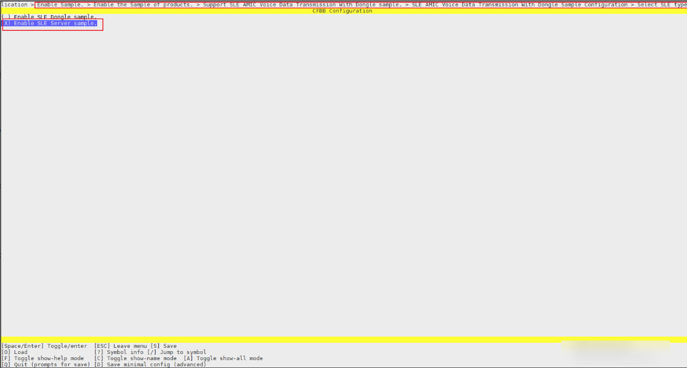

**Figure 3**  Configuring the Server-End Related Parameters<a name="fig128231255526"></a>  
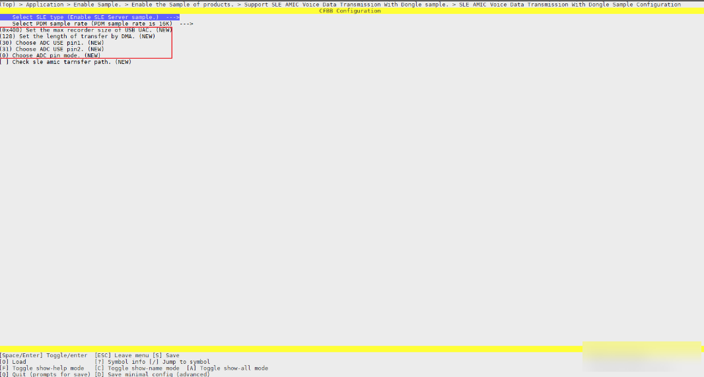

**Figure 4**  Server-End Sampling Rate<a name="fig172753104212"></a>  
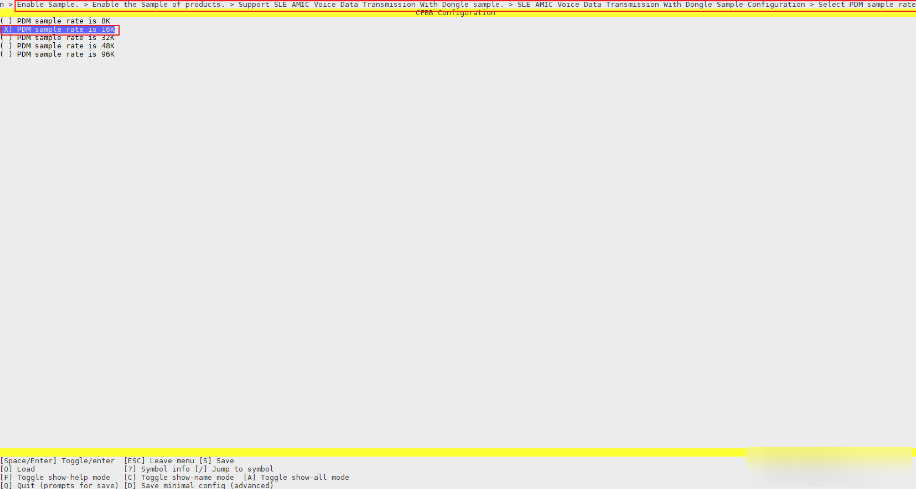

**Figure 5**  Selecting SLE AMIC DONGLE<a name="fig1593135913428"></a>  
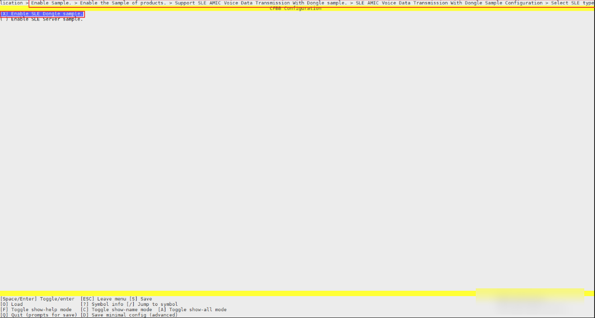

**Figure 6**  Compiled fwpkg<a name="fig116431126152115"></a>  


## Burning and Running<a name="ZH-CN_TOPIC_0000001790806612"></a>

1.  Prepare two single boards, which serve as the Server end and the Client (dongle) end respectively. After the versions are burned and the boards are reset normally, the serial port prints "Connected", indicating that the connection is successful. Check the audio device identified in the device manager.
2.  In the PC sound settings, select the input device and the related configuration, as shown in [Figure 1](#fig113541425612).
3.  Open the sound control panel, as shown in [Figure 2](#fig15350184932415). Listen to the current device's sound by selecting the headphones or the default playback device, and configure the sampling rate to 16KHZ×16Bits, as shown in [Figure 3](#fig1530715253257) and [Figure 4](#fig527531420260).
4.  Collect sound with the Server single board. If the corresponding audio can be heard on the PC headphone, the pass-through is successful.

**Figure 1**  Sound Settings<a name="fig113541425612"></a>  
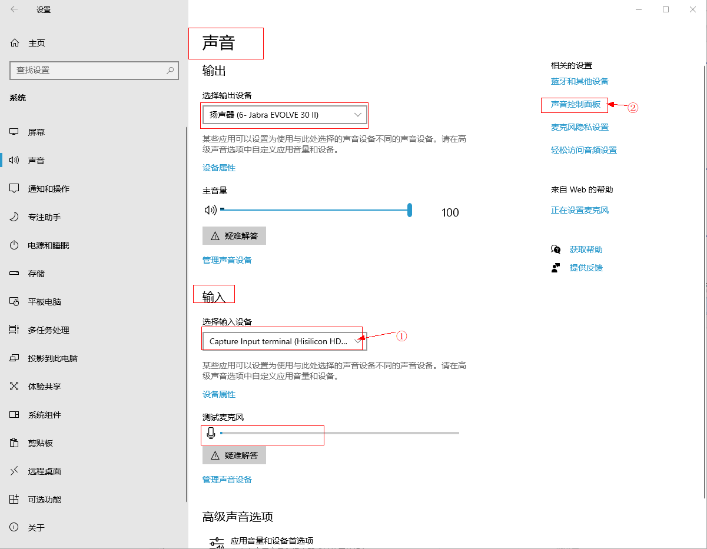

**Figure 2**  Sound Control Panel<a name="fig15350184932415"></a>  
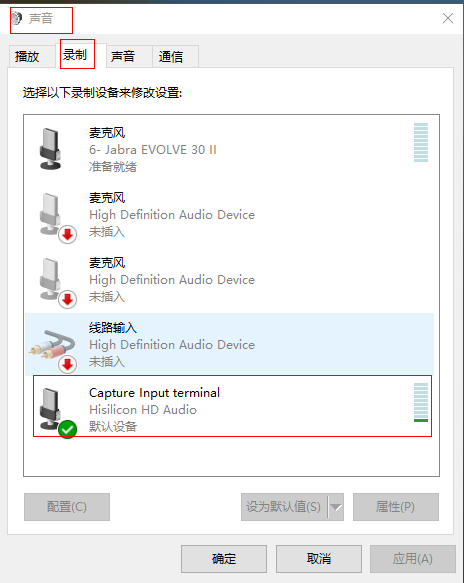

**Figure 3**  Device Property Listening<a name="fig1530715253257"></a>  
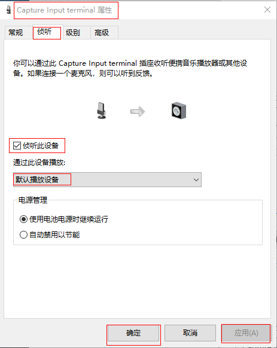

**Figure 4**  Device Property Configuration<a name="fig527531420260"></a>  
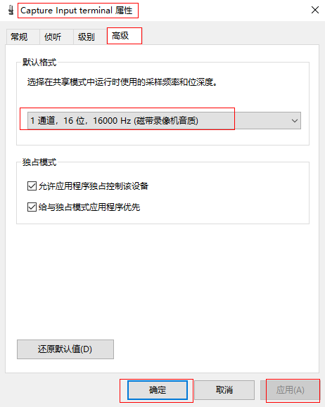

# SLE microphone<a name="ZH-CN_TOPIC_0000001866496702"></a>


## Overview<a name="ZH-CN_TOPIC_0000001912456317"></a>

This Sample demonstrates a real SLE-based dongle microphone solution. The overall connection relationship and data flow diagram are shown in [Figure 1](#fig1324737135918).

**Figure 1**  SLE microphone Function Block Diagram<a name="fig1324737135918"></a>  
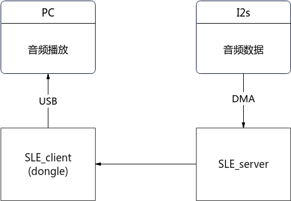

## Compilation<a name="ZH-CN_TOPIC_0000001912535977"></a>

1.  Open the menuconfig configuration interface in the command line and run the command "python build.py standard-bs21-n1100 menuconfig".
2.  In the menuconfig interface, select the SLE Microphone Sample, as shown in [Figure 1](#fig1435112258397).
3.  <a name="li86517304586"></a>In the menuconfig interface, select the current Microphone type as the Server end, as shown in [Figure 2](#fig1874015168504).
4.  In the menuconfig interface, select the single uac transmission quantity and the address and name of the SLE as the Server end, as shown in [Figure 3](#fig128231255526).
5.  After the selection is completed, press "Q" to save and exit.
6.  Compile the version using the IDE. The compiled version package is in the "tools\\pkg\\fwpkg\\bs21" path, as shown below.
7.  <a name="li8164191173710"></a>Burn the compiled version according to "[Burning and Running](烧录及运行-63.md)" of "[SLE microphone](SLE-microphone.md)".
8.  Restart and open the menuconfig configuration interface, and follow steps [3](#li86517304586)\~[7](#li8164191173710) to select SLE Microphone Client (Dongle), as shown, compile, and burn the version successfully.

**Figure 1**  Selecting the Sample<a name="fig1435112258397"></a>  
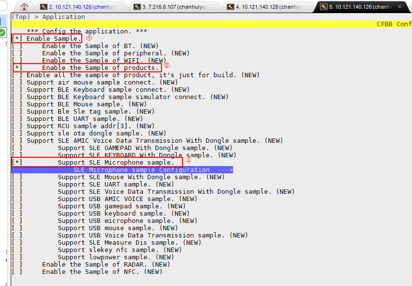

**Figure 2**  Selecting the Type<a name="fig1874015168504"></a>  
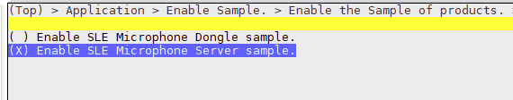

**Figure 3**  Configuring the Server-End Related Parameters<a name="fig128231255526"></a>  
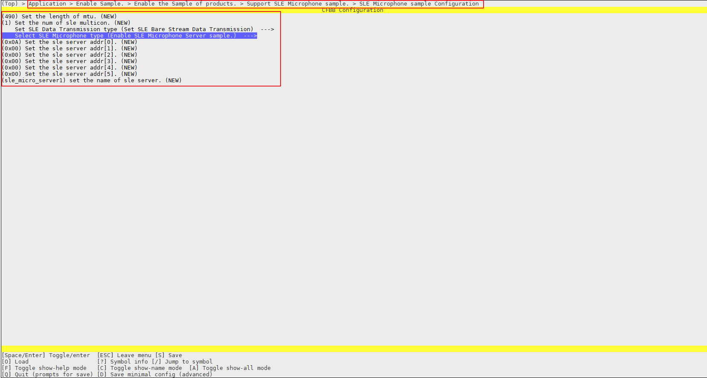

## Burning and Running<a name="ZH-CN_TOPIC_0000001866656542"></a>

**Burning<a name="section948712445453"></a>**

Burn the compiled microphone version to the single board. For the version burning method, refer to the BS2XV100 HiSpark Studio User Guide.

**Running<a name="section4415921314"></a>**

1.  Prepare two single boards, which serve as the Server end and the Client end respectively. After burning, the serial port prints "Connected" respectively, and an audio device will appear in the device manager.
2.  In the PC sound settings, select the input device, as shown in [Figure 1](#fig113541425612).
3.  Collect sound with the Server single board. If the corresponding audio can be heard on the PC headphone, the pass-through is successful.

**Figure 1**  Sound Settings<a name="fig113541425612"></a>  
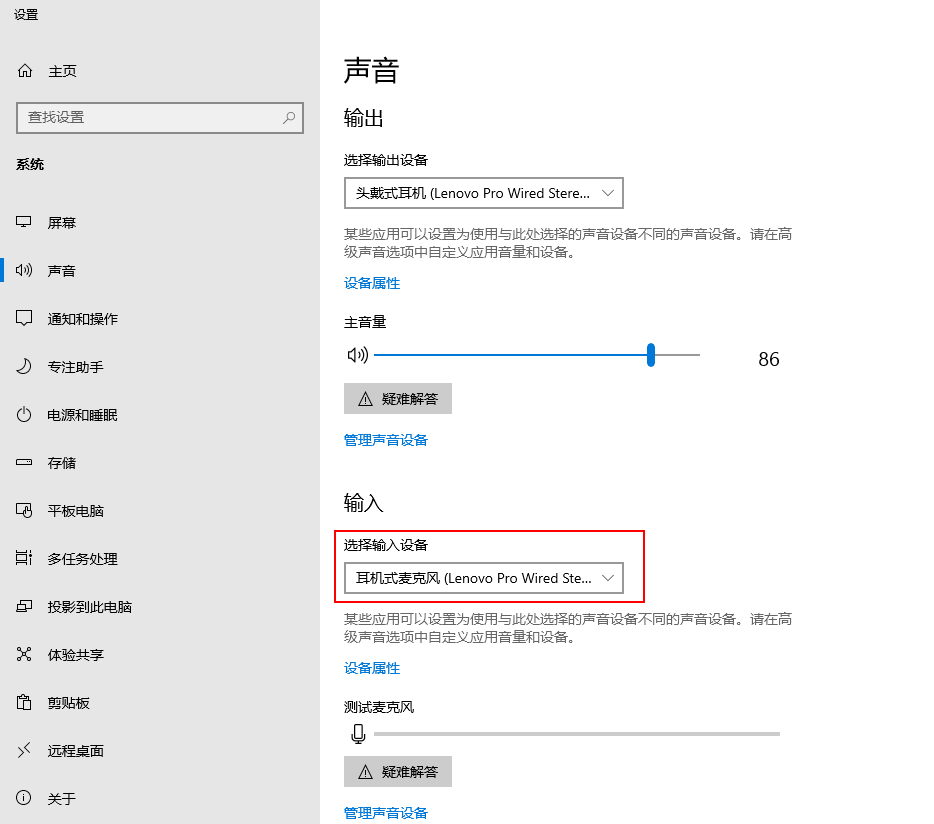

# SLE measure dis<a name="ZH-CN_TOPIC_0000001906107162"></a>


## Overview<a name="ZH-CN_TOPIC_0000001906113682"></a>

This Sample is an SLE-based ranging solution. The server end (broadcasting) and the client end (scanning) establish an sle connection, and the server end calculates the distance.

## Compilation<a name="ZH-CN_TOPIC_0000001941996837"></a>

1.  Open the menuconfig configuration interface in the command line and run the command "python build.py standard-bs21-n1100 menuconfig".
2.  In the menuconfig interface, select the SLE Measure Dis Sample, as shown in [Figure 1](#fig361683385814).
3.  In the menuconfig interface, select Enable SLE MEASURE DIS Server sample, indicating that the current compilation selects the Server end, as shown in [Figure 1](#fig361683385814).
4.  After the selection is completed, press "Q" to save and exit.
5.  Compile the version using the IDE. The compiled version package is in the "tools\\pkg\\fwpkg\\bs2x" path, as shown in [Figure 3](#fig156732614012).
6.  Burn the compiled version according to the "[Burning and Running](烧录及运行-57.md)" section of "[SLE Mouse Sample](SLE-Mouse-Sample.md)".
7.  Restart and open the menuconfig configuration interface, and follow [Figure 2](#fig128317412598) to select Enable SLE MEASURE DIS Client sample, indicating that the current compilation selects the Client end, as shown in [Figure 2](#fig128317412598), compile, and burn the version successfully.

**Figure 1**  Selecting the Server Sample<a name="fig361683385814"></a>  
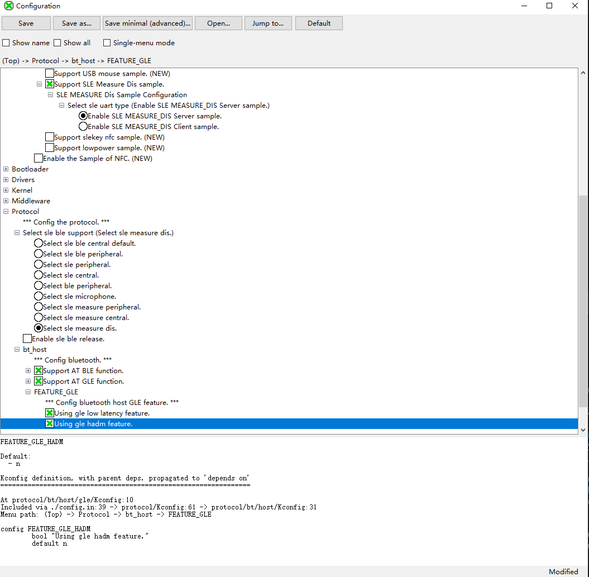

**Figure 2**  Selecting the Client Sample<a name="fig128317412598"></a>  
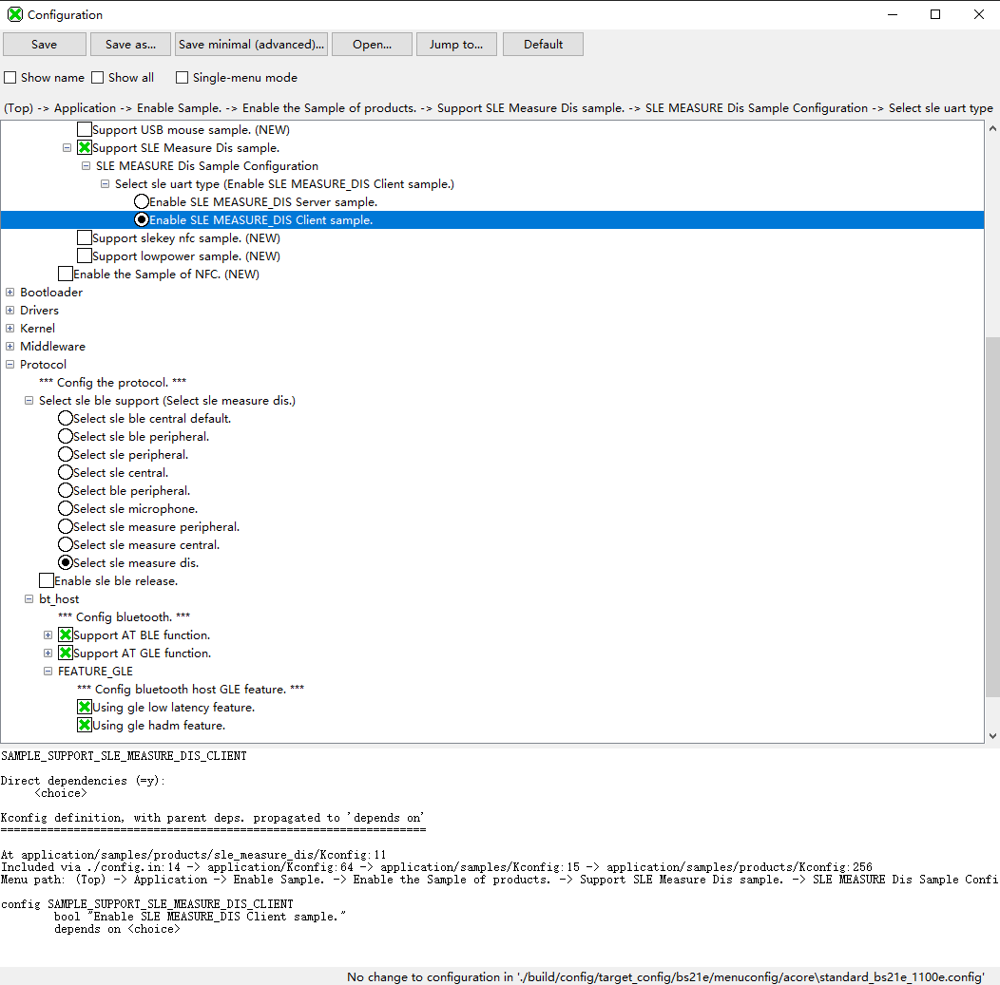

**Figure 3**  Version Path<a name="fig156732614012"></a>  
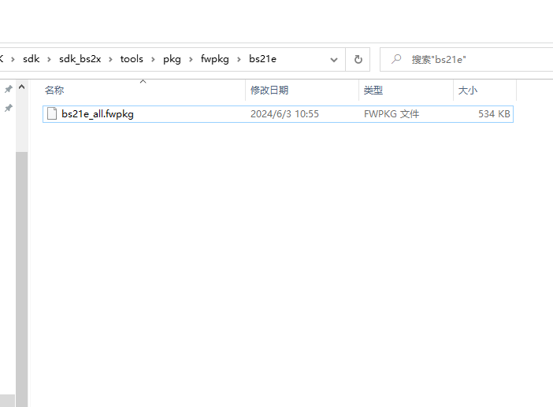

## Burning and Running<a name="ZH-CN_TOPIC_0000001905957586"></a>

**Burning<a name="section948712445453"></a>**

Burn the compiled server and client versions to the two single boards respectively. For the version burning method, refer to the BS2XV100 HiSpark Studio User Guide.

**Running<a name="section4415921314"></a>**

1.  Prepare two single boards, which serve as the Server end and the Client end respectively. After burning, the serial port prints "Connected" respectively.
2.  Connect the serial port and check the server printing. The distance value can be seen output.

## Calibration<a name="ZH-CN_TOPIC_0000001960441469"></a>

**Figure 1**  Calibration Diagram<a name="fig051614178524"></a>  
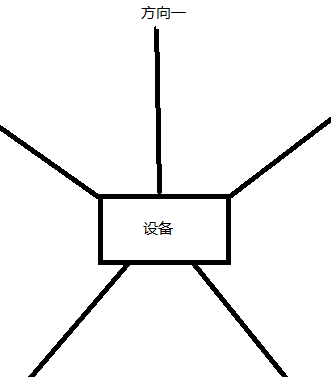

**Figure 2**  Modification Location<a name="fig14390201615514"></a>  
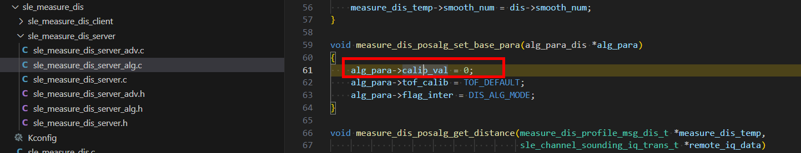

**Test Environment:**

The area within 3m around the anchor point is open and free of obstructions, such as walls, columns, metals, and other obstacles.

**Test Method:**

1.  As shown in [Figure 1](#fig051614178524), perform 5 distance measurements at the 1m position in 5 directions around the device. The calibration value of anchor A is the average of the 5 measured values minus 1.
2.  Add the calibration value at the code location shown in [Figure 2](#fig14390201615514). application\\samples\\products\\sle\_measure\_dis\\sle\_measure\_dis\_server\\sle\_measure\_dis\_server\_alg.c

# BLE Lowpower Sample<a name="ZH-CN_TOPIC_0000002223691665"></a>


## Overview<a name="ZH-CN_TOPIC_0000002223737241"></a>

BLE Lowpower Sample mainly demonstrates the registration of low-power related callbacks ([Figure 1](#fig14760201154415)) and the operation of the sleep timer. At that time, the corresponding callback in the handler is triggered, and the corresponding operations can be implemented in the corresponding registration function. Note that sleep can only transition to work. The transitions of the specific 3 states are shown in [Figure 2](#fig12407141754210).

**Figure 1**  Low-Power Related Callback Registration<a name="fig14760201154415"></a>  
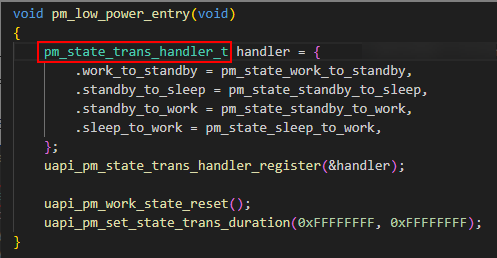

**Figure 2**  State Transition<a name="fig12407141754210"></a>  
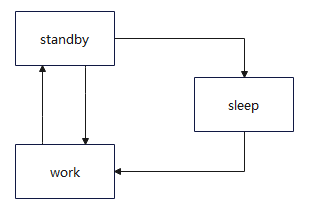

## Compilation<a name="ZH-CN_TOPIC_0000002188451282"></a>

1.  Open the menuconfig configuration interface in the command line and run the command "python build.py standard-bs21-n1100 menuconfig".
2.  In the menuconfig interface, select the BLE UART Sample, as shown in [Figure 1](#fig169801446114114).
3.  After the selection is completed, press "Q" to save and exit.
4.  Compile the version using the IDE. The compiled version package is in the "tools\\pkg\\fwpkg\\bs2x" path, as shown in [Figure 2](#fig6475121654313).
5.  Burn the compiled version according to "[Burning and Running](烧录及运行-57.md)" of "[SLE Mouse Sample](SLE-Mouse-Sample.md)".

**Figure 1**  Selecting the BLE Lowpower Sample<a name="fig169801446114114"></a>  
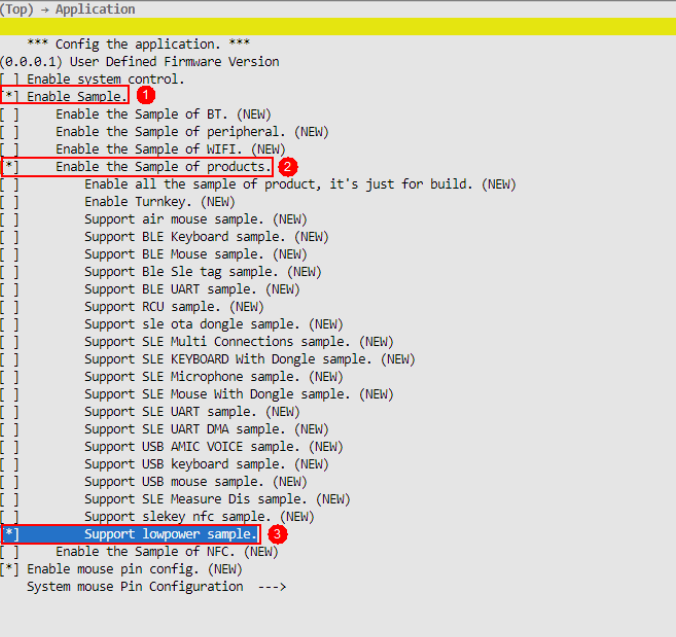

**Figure 2**  Compiled Version<a name="fig6475121654313"></a>  


## Burning and Running<a name="ZH-CN_TOPIC_0000002188291582"></a>

**Burning<a name="section11501615135313"></a>**

For the version burning method, refer to the BS2XV100 HiSpark Studio User Guide.

**Running<a name="section370983782713"></a>**

1.  Prepare a single board, which serves as the Server end. On the single board, connect UART-L0 and UART-L2 to the PC through a serial port board.
2.  Burn the compiled Server version to the single board through UART-L0.
3.  On the PC, connect the UART-L2 of the single board through a serial port assistant, set the serial port to a baud rate of 115200, and open the serial port.

# BLE UART Sample<a name="ZH-CN_TOPIC_0000001790806492"></a>


## Overview<a name="ZH-CN_TOPIC_0000001837645729"></a>

The implementation principle and solution of BLE UART are consistent with those of SLE UART. The only difference is that the air interface transmission is changed from SparkLink transmission to BLE transmission. Refer to "[Overview](概述-51.md)".

## Compilation<a name="ZH-CN_TOPIC_0000001837765661"></a>

1.  Open the menuconfig configuration interface in the command line and run the command "python build.py standard-bs21-n1100 menuconfig".
2.  <a name="li1870123015263"></a>In the menuconfig interface, select the BLE UART Sample, as shown in [Figure 1](#fig169801446114114).
3.  In the menuconfig interface, select the UART BUS used by the current Sample, as shown in [Figure 2](#fig6475121654313).
4.  In the menuconfig interface, select BLE UART Server, as shown in [Figure 3](#fig17183141313443).
5.  After the selection is completed, press "Q" to save and exit.
6.  Compile the version using the IDE. The compiled version package is in the "tools\\pkg\\fwpkg\\bs2x" path, as shown in [Figure 4](#fig172231859194418).
7.  <a name="li8164191173710"></a>Burn the compiled version according to "[Burning and Running](烧录及运行-57.md)" of "[SLE Mouse Sample](SLE-Mouse-Sample.md)".
8.  Restart and open the menuconfig configuration interface, and follow steps [2](#li1870123015263)\~[7](#li8164191173710) to select BLE UART Client, as shown in [Figure 5](#fig10113182954618), compile, and burn the version successfully.

**Figure 1**  Selecting the BLE UART Sample<a name="fig169801446114114"></a>  
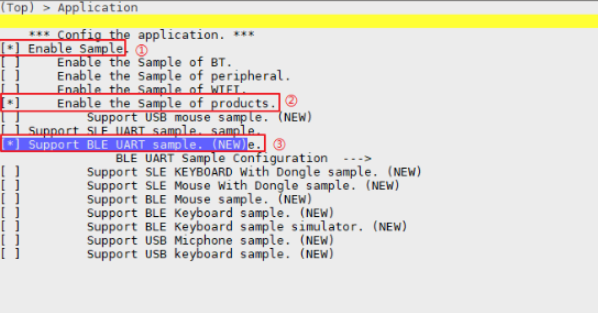

**Figure 2**  Selecting the BLE UART BUS<a name="fig6475121654313"></a>  
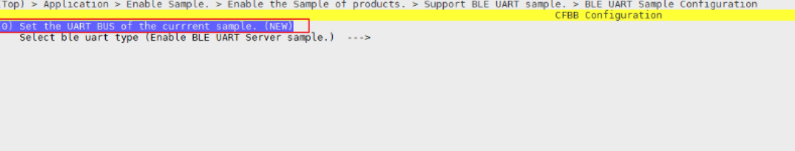

**Figure 3**  Selecting BLE UART Server<a name="fig17183141313443"></a>  
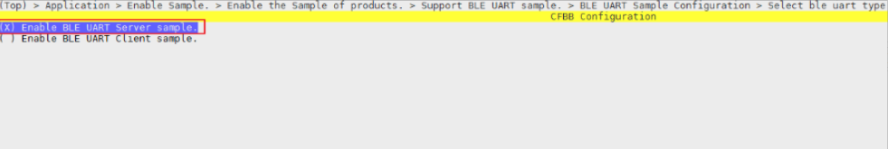

**Figure 4**  Compiled Version<a name="fig172231859194418"></a>  


**Figure 5**  Selecting BLE UART Client<a name="fig10113182954618"></a>  
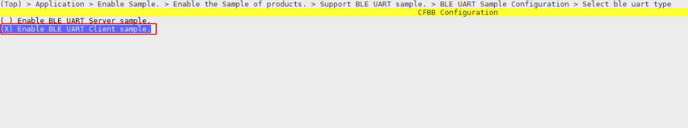

## Burning and Running<a name="ZH-CN_TOPIC_0000001790966344"></a>

The burning and running methods of BLE UART are the same as those of SLE UART. Refer to "[Burning and Running](烧录及运行.md)" of "[SLE UART Sample](SLE-UART-Sample.md)".

# BLE Keyboard Sample<a name="ZH-CN_TOPIC_0000001837645741"></a>


## Overview<a name="ZH-CN_TOPIC_0000001790966308"></a>

This Sample demonstrates a real BLE-based keyboard solution without a dongle. Currently, the keyboard Sample supports two keyboard specifications: a 2×3 matrix keyboard and an 8×16 matrix keyboard (full keyboard).

## Compilation<a name="ZH-CN_TOPIC_0000001790966284"></a>

1.  Open the menuconfig configuration interface in the command line and run the command "python build.py standard-bs21-n1100 menuconfig".
2.  In the menuconfig interface, select the BLE keyboard Sample, as shown in [Figure 1](#fig11819102410515).
3.  After the selection is completed, press "Q" to save and exit.
4.  Compile the version using the IDE. The compiled version package is in the "tools\\pkg\\fwpkg\\bs2x" path, as shown in [Figure 2](#fig57581930962).
5.  Burn the compiled version according to "[Burning and Running](烧录及运行-57.md)" of "[SLE Mouse Sample](SLE-Mouse-Sample.md)".

**Figure 1**  Selecting the BLE Keyboard Sample<a name="fig11819102410515"></a>  
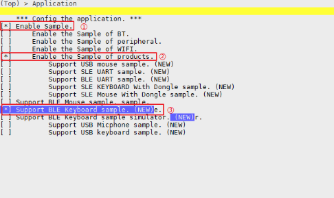

**Figure 2**  Compiled Version<a name="fig57581930962"></a>  


## Burning and Running<a name="ZH-CN_TOPIC_0000001837765753"></a>

**Burning<a name="section948712445453"></a>**

Burn the compiled keyboard version to the keyboard board. For the version burning method, refer to the BS2XV100 HiSpark Studio User Guide.

**Running<a name="section520612111327"></a>**

1.  Power on the keyboard board.
2.  On the computer (supporting the BLE keyboard), search for the device named "ble\_keyboard" and connect to it.
3.  Open Notepad on the PC and input information through the keyboard. If the input information can be displayed in Notepad, the BLE Keyboard function is normal.
4.  During use, if the keyboard is powered on again, it can reconnect, and the functions work normally.

# BLE SLE TAG Sample<a name="ZH-CN_TOPIC_0000002224187053"></a>


## Overview<a name="ZH-CN_TOPIC_0000002188830814"></a>

This Sample demonstrates a solution that supports both Bluetooth and SLE, and can establish an SLE or Bluetooth connection.

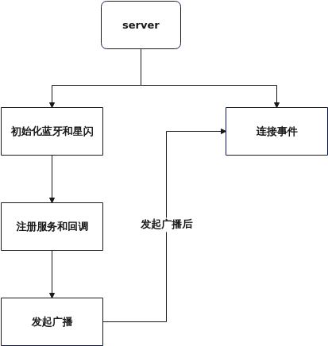

## Compilation<a name="ZH-CN_TOPIC_0000002224116761"></a>

1.  Open the menuconfig configuration interface in the command line and run the command "python build.py standard-bs21-n1100 menuconfig".
2.  In the menuconfig interface, select the Ble Sle tag sample, as shown in [Ble Sle tag sample](#fig6953174811455).
3.  After the selection is completed, press "Q" to save and exit.
4.  Compile the version using the sdk. The compiled version package is in the "output\\bs21\\fwpkg\\standard-bs21-n1100" path, as shown in [Figure 2](#fig1741282616472).
5.  Burn the compiled version according to "[Burning and Running](烧录及运行-78.md)" of "[BLE SLE TAG Sample](BLE-SLE-TAG-Sample.md)".

**Figure 1**  Ble Sle tag sample<a name="fig6953174811455"></a>  
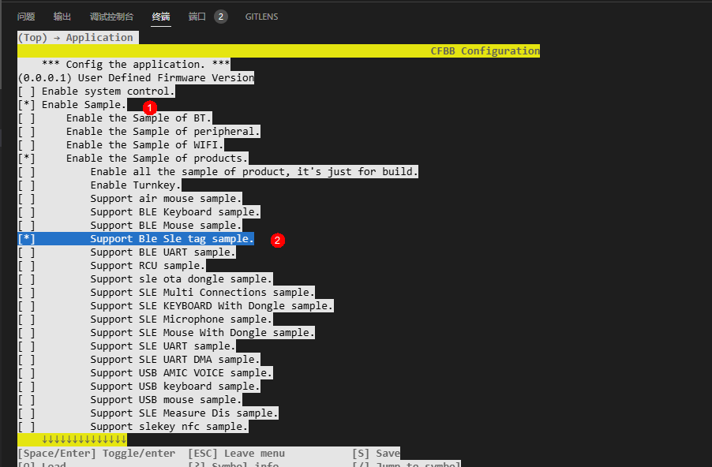

**Figure 2**  Generated Image After Compilation<a name="fig1741282616472"></a>  
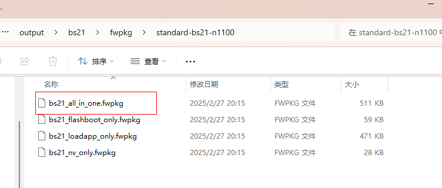

## Burning and Running<a name="ZH-CN_TOPIC_0000002224191209"></a>

**Burning<a name="section11501615135313"></a>**

For the version burning method, refer to the BS2XV100 HiSpark Studio User Guide.

**Running<a name="section20261858162412"></a>**

1.  Prepare a single board. On each single board, connect UART-L0 and UART-L2 to the PC through a serial port board.
2.  Burn the compiled Server version and Client version to the single boards through UART-L0 respectively.
3.  On the PC, connect the UART-L2 of the single board through a serial port assistant, set the serial port to a baud rate of 115200, and open the serial port.
4.  After power-on, the processes of registering the service and starting the broadcast can be seen. At this time, a scanning device can be used to connect to the single board.

# BLE Mouse Sample<a name="ZH-CN_TOPIC_0000001837765673"></a>


## Overview<a name="ZH-CN_TOPIC_0000001790966316"></a>

This Sample demonstrates a real BLE-based mouse solution without a dongle. Currently, the mouse supports sliding, left/right buttons, and scroll wheel functions.

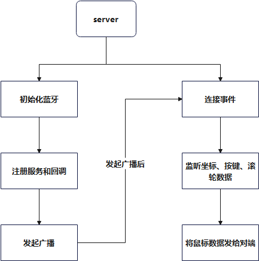

**Figure 1**  Main Functions for Sending Mouse Data<a name="fig1757182433419"></a>  
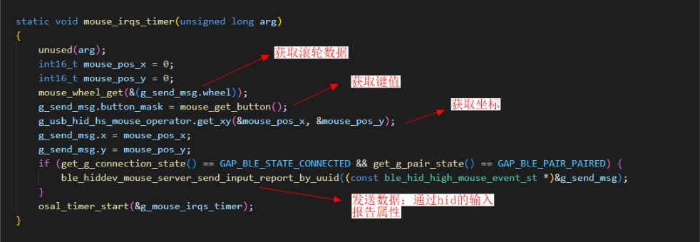

## Compilation<a name="ZH-CN_TOPIC_0000001790966288"></a>

1.  Open the menuconfig configuration interface in the command line and run the command "python build.py standard-bs21-n1100 menuconfig".
2.  In the menuconfig interface, enter "application/System mouse Pin Configuration" to configure the mouse pins, as shown in [Figure 1](#fig8838117174110).
3.  In the menuconfig interface, select the BLE mouse Sample, as shown in [Figure 2](#fig13269153654114).
4.  In the menuconfig interface, select the Sensor of the BLE mouse, as shown in [Figure 3](#fig19164185324114).
5.  After the selection is completed, press "Q" and "Y" to save and exit.
6.  Compile the version using the IDE. The compiled version package is in the "tools\\pkg\\fwpkg\\bs21" path, as shown in [Figure 4](#fig1461617221592).
7.  Burn the compiled version to the mouse board according to "[Burning and Running](烧录及运行-57.md)" of "[SLE Mouse Sample](SLE-Mouse-Sample.md)".

**Figure 1**  Mouse Pin Config<a name="fig8838117174110"></a>  


**Figure 2**  Selecting the BLE Mouse Sample<a name="fig13269153654114"></a>  
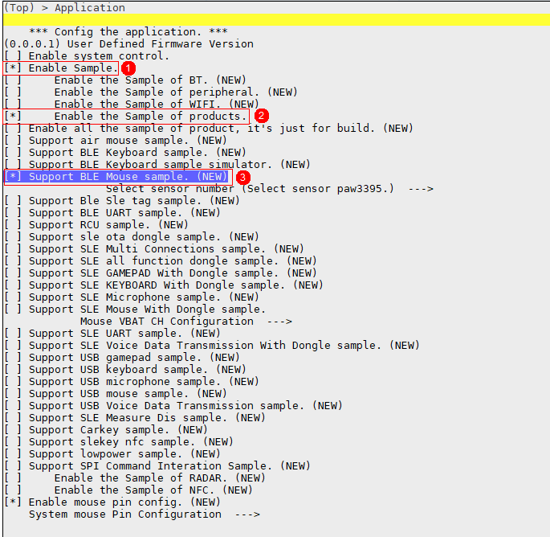

**Figure 3**  Selecting the Sensor Model<a name="fig19164185324114"></a>  
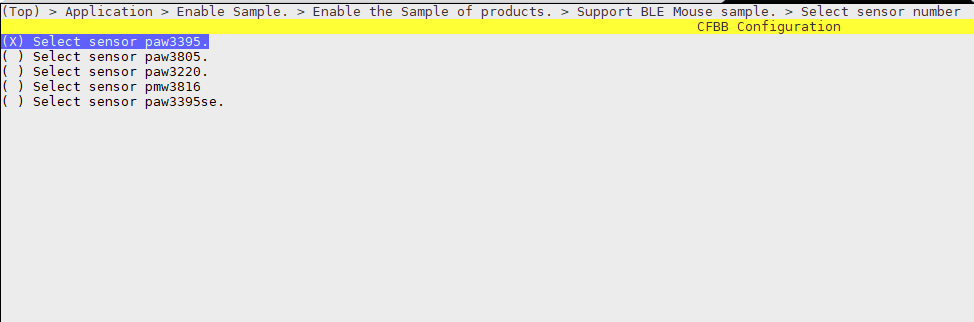

**Figure 4**  Compiled Version<a name="fig1461617221592"></a>  
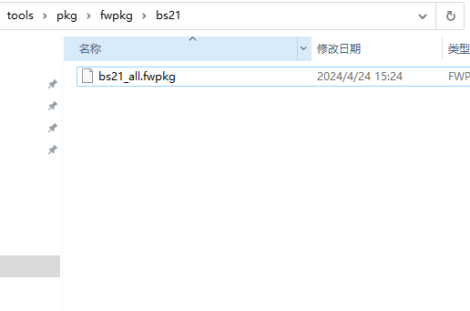

## Burning and Running<a name="ZH-CN_TOPIC_0000001790806572"></a>

**Burning<a name="section948712445453"></a>**

Burn the compiled mouse version to the mouse board. For the version burning method, refer to the BS2XV100 HiSpark Studio User Guide.

**Running<a name="section520612111327"></a>**

1.  Power on the mouse board.
2.  On the computer (supporting the BLE mouse), search for the device named "ble\_mouse" and connect to it.
3.  If the mouse movement, button clicks, and other functions can work normally as observed on the PC, the BLE Mouse function is normal.
4.  During use, if the mouse is powered on again, it can reconnect, and the functions work normally.

# USB Keyboard Sample<a name="ZH-CN_TOPIC_0000001837765805"></a>


## Overview<a name="ZH-CN_TOPIC_0000001790966268"></a>

This Sample demonstrates a real USB-based solution. Currently, the keyboard Sample supports two keyboard specifications: a 2×3 matrix keyboard and an 8×16 matrix keyboard (full keyboard).

## Compilation<a name="ZH-CN_TOPIC_0000001790806604"></a>

1.  Open the menuconfig configuration interface in the command line and run the command "python build.py standard-bs21-n1100 menuconfig".
2.  In the menuconfig interface, select the USB keyboard Sample, as shown in [Figure 1](#fig640715522143).
3.  After the selection is completed, press "Q" to save and exit.
4.  Compile the version using the IDE. The compiled version package is in the "tools\\pkg\\fwpkg\\bs2x" path, as shown in [Figure 2](#fig824144515155).
5.  Burn the compiled version according to "[Burning and Running](烧录及运行-57.md)" of "[SLE Mouse Sample](SLE-Mouse-Sample.md)".

**Figure 1**  Selecting the USB Keyboard Sample<a name="fig640715522143"></a>  
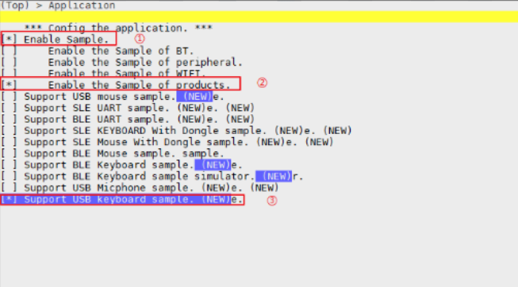

**Figure 2**  Compiled Version<a name="fig824144515155"></a>  
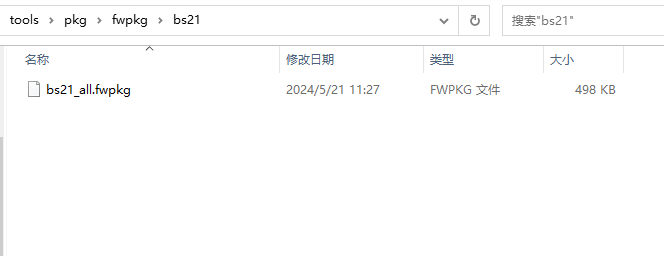

## Burning and Running<a name="ZH-CN_TOPIC_0000001837765785"></a>

**Burning<a name="section948712445453"></a>**

Burn the compiled keyboard version to the keyboard board. For the version burning method, refer to the BS2XV100 HiSpark Studio User Guide.

**Running<a name="section520612111327"></a>**

1.  Power on the keyboard board.
2.  If it is a single board not powered by USB, connect the USB to the computer.
3.  Open Notepad on the PC and input information through the keyboard. If the input information can be displayed in Notepad, the USB Keyboard function is normal.
4.  During use, if the keyboard is powered on again, it can reconnect, and the functions work normally.

# USB Mouse Sample<a name="ZH-CN_TOPIC_0000001790966348"></a>


## Overview<a name="ZH-CN_TOPIC_0000001790806648"></a>

This Sample demonstrates a real USB-based mouse solution without a dongle. Currently, the mouse supports sliding, left/right buttons, and scroll wheel functions.

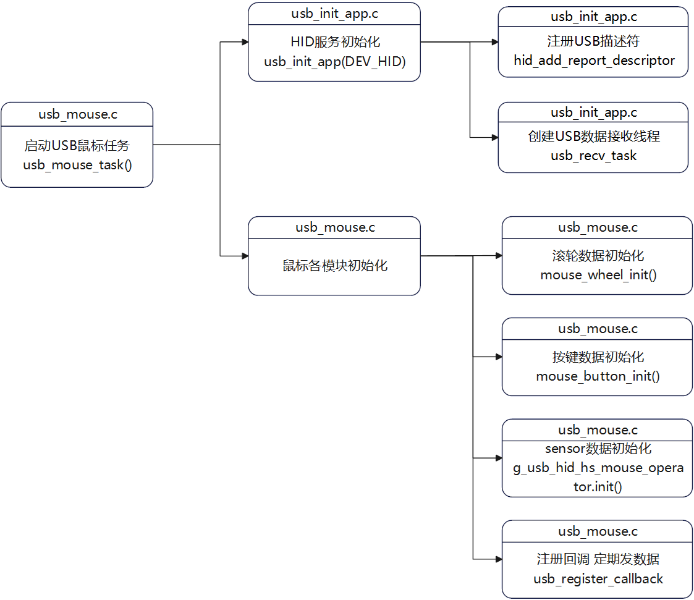

## Compilation<a name="ZH-CN_TOPIC_0000001790806592"></a>

1.  Open the menuconfig configuration interface in the command line and run the command "python build.py standard-bs21-n1100 menuconfig".
2.  In the menuconfig interface, enter "application/System mouse Pin Configuration", as shown in [Figure 1](#fig196586534423).
3.  In the menuconfig interface, select the USB mouse Sample, as shown in [Figure 2](#fig1097181594319), and select the appropriate sensor, as shown in [Figure 3](#fig1815914230436).
4.  After the selection is completed, press "Q" and "Y" to save and exit.
5.  Compile the version using the IDE. The compiled version package is in the "tools\\pkg\\fwpkg\\bs2x" path, as shown in [Figure 4](#fig73971256134).
6.  Burn the compiled version to the mouse board according to "[Burning and Running](烧录及运行-57.md)" of "[SLE Mouse Sample](SLE-Mouse-Sample.md)".

**Figure 1**  Mouse Pin Config<a name="fig196586534423"></a>  
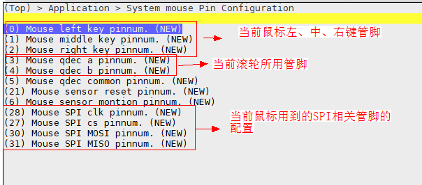

**Figure 2**  Selecting the USB Mouse Sample<a name="fig1097181594319"></a>  
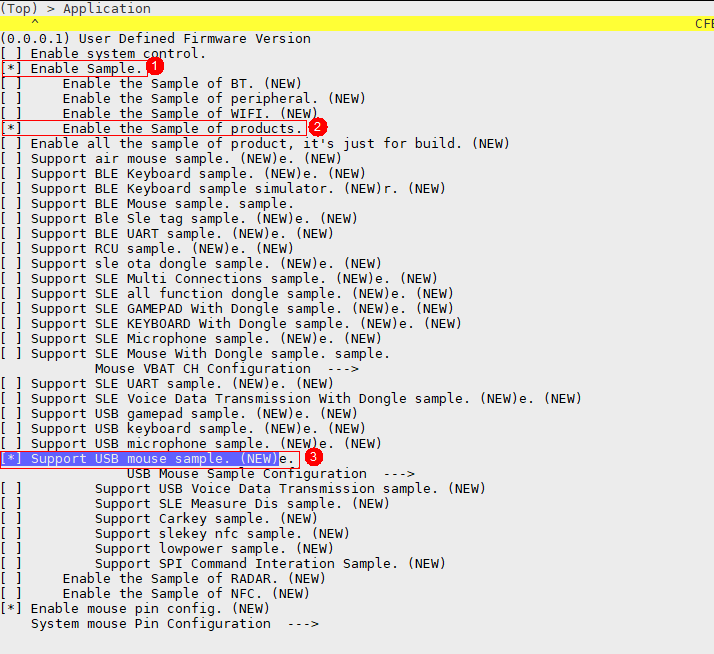

**Figure 3**  Selecting the Mouse Sensor<a name="fig1815914230436"></a>  
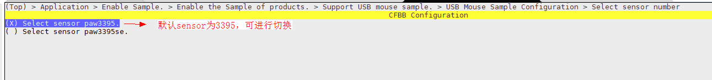

**Figure 4**  Compiled Version<a name="fig73971256134"></a>  


## Burning and Running<a name="ZH-CN_TOPIC_0000001790966340"></a>

**Burning<a name="section948712445453"></a>**

Burn the compiled mouse version to the mouse board. For the version burning method, refer to the BS2XV100 HiSpark Studio User Guide.

**Running<a name="section520612111327"></a>**

1.  Power on the mouse board.
2.  If it is a single board not powered by USB, connect the USB to the computer.
3.  If the mouse movement, button clicks, and other functions can work normally as observed on the PC, the BLE Mouse function is normal.
4.  During use, if the mouse is powered on again, it can reconnect, and the functions work normally.

# USB AMIC VDT Sample<a name="ZH-CN_TOPIC_0000001837645701"></a>


## Overview<a name="ZH-CN_TOPIC_0000001790806568"></a>

This Sample demonstrates a USB AMIC audio data transmission solution. Currently, it supports a 16 kHz sampling rate and 16-bit sampling width.

## Solution<a name="ZH-CN_TOPIC_0000001790806576"></a>

**Figure 1**  USB AMIC Data Flow Diagram<a name="fig49003499385"></a>  
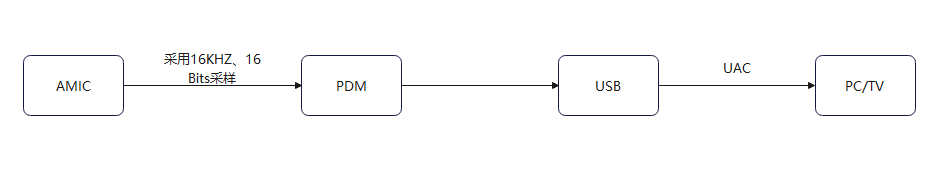

**Figure 2**  USB AMIC Flow Chart<a name="fig1251651174619"></a>  

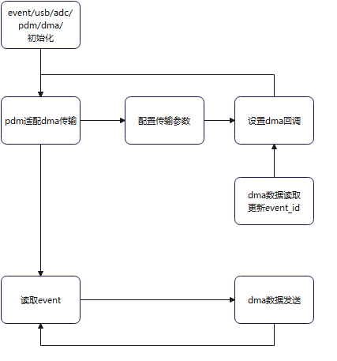

## Compilation<a name="ZH-CN_TOPIC_0000001837765761"></a>

1.  Open the menuconfig configuration interface in the command line and run the command "python build.py standard-bs21-n1100 menuconfig".
2.  In the menuconfig interface, select the USB AMIC Sample, as shown in [Figure 1](#fig55441733151812).
3.  In the menuconfig interface, select the USB AMIC related configuration, as shown in [Figure 2](#fig24175441916).
4.  After the selection is completed, press "Q" or "q" to save and exit.
5.  Compile the version using the IDE. The compiled version package is in the "output\\bs21\\fwpkg\\xxx" path, as shown in [Figure 3](#fig37779292111).
6.  Burn the compiled version according to "[Burning and Running](烧录及运行-57.md)" of "[SLE Mouse Sample](SLE-Mouse-Sample.md)".

**Figure 1**  USB AMIC Sample<a name="fig55441733151812"></a>  
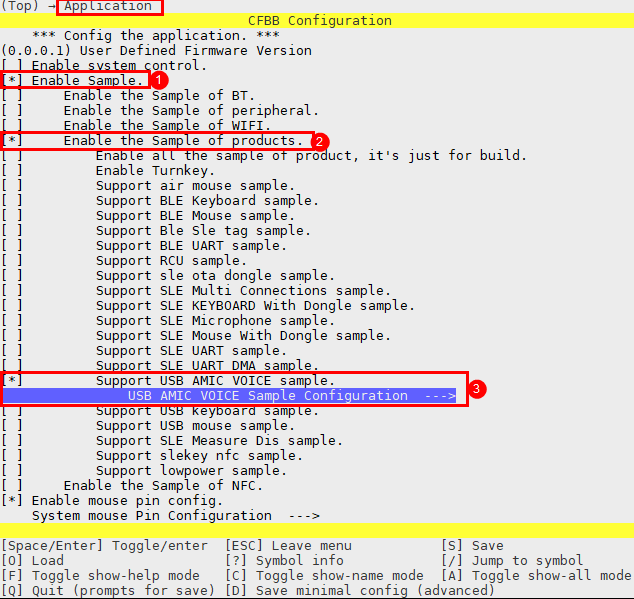

**Figure 2**  USB AMIC Configuration Items<a name="fig24175441916"></a>  
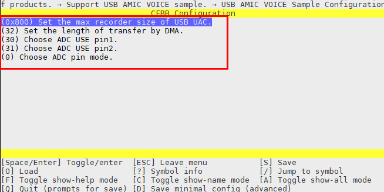

**Figure 3**  Compiled Version<a name="fig37779292111"></a>  
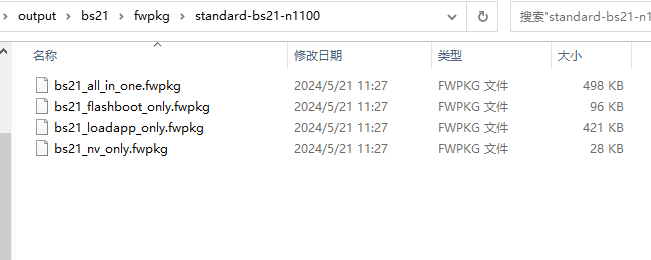

## Burning and Running<a name="ZH-CN_TOPIC_0000001790806584"></a>

**Burning<a name="section948712445453"></a>**

Burn the compiled audio data transmission version to the single board. For the version burning method, refer to the BS2XV100 HiSpark Studio User Guide.

**Running<a name="section520612111327"></a>**

1.  Prepare a single board. After the version is burned and the board is reset normally, open the serial port and sound settings, and select the related configuration, as shown in [Figure 1](#fig192771141194516) and [Figure 2](#fig18881202411465).
2.  Listen to the current device's sound through headphones. It can be seen that there is sound fluctuation and the human voice is clear, as shown in [Figure 3](#fig3936180154716) and [Figure 4](#fig1328363512472).

**Figure 1**  USB AMIC Configuration Property 1<a name="fig192771141194516"></a>  
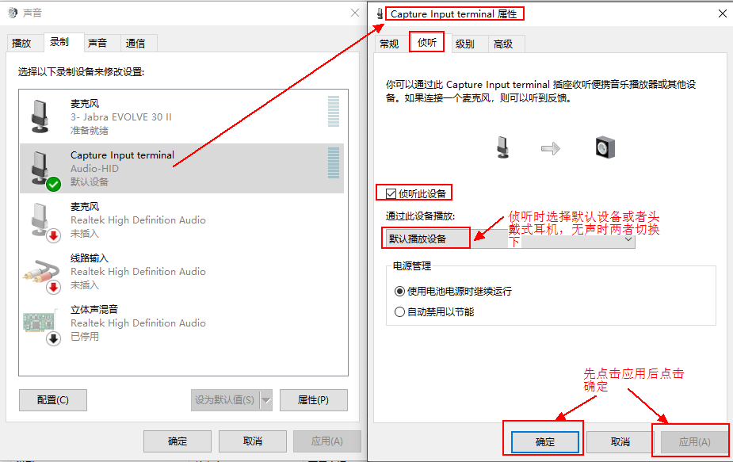

**Figure 2**  USB AMIC Configuration Property 2<a name="fig18881202411465"></a>  
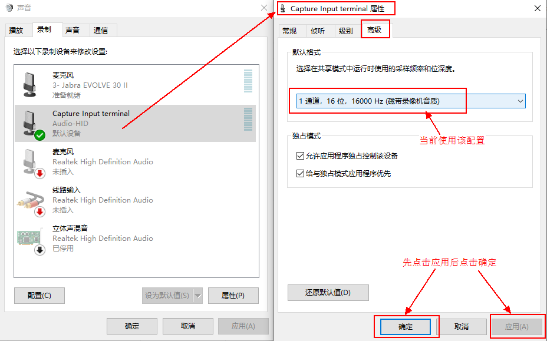

**Figure 3**  USB AMIC Running<a name="fig3936180154716"></a>  
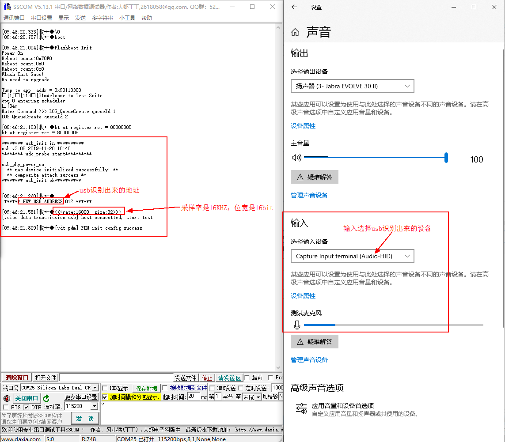

**Figure 4**  USB AMIC Running 2<a name="fig1328363512472"></a>  
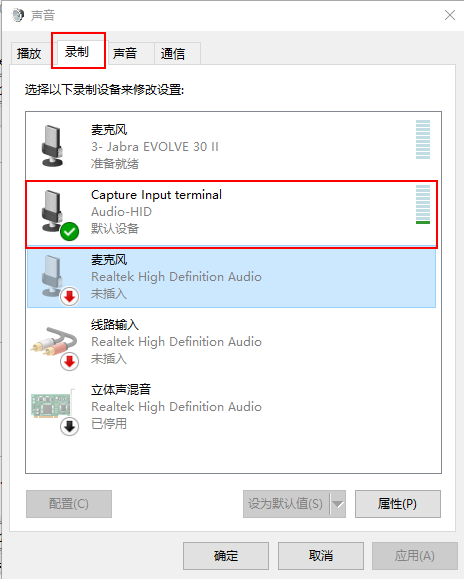

# RCU<a name="ZH-CN_TOPIC_0000001864690254"></a>


## Overview<a name="ZH-CN_TOPIC_0000001913821721"></a>

This Sample demonstrates a real remote control solution based on SLE, BLE, and IR. Currently, it supports custom key specifications.

## Solution<a name="ZH-CN_TOPIC_0000002200425542"></a>

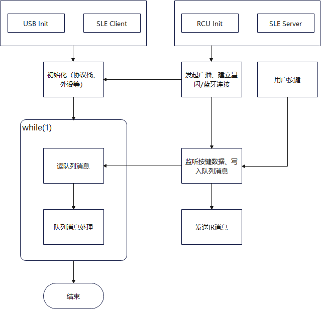

## Compilation<a name="ZH-CN_TOPIC_0000001910689933"></a>

The current RCU Sample supports two keyboard specifications. The keyboard specification is selected in the Kconfig option of the Keyscan driver. The default configuration is a six-key keyboard with 3 rows and 2 columns. Users can also select the custom key specification for configuration. The configuration options are shown in [Figure 1](#fig936317130595) and [Figure 2](#fig131111112145819).

**SLE RCU SAMPLE Compilation Configuration<a name="section13353101213720"></a>**

**Figure 1**  Selecting the Six-Key Configuration<a name="fig936317130595"></a>  
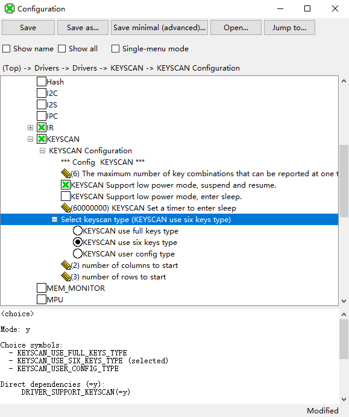

**Figure 2**  Selecting the Custom Configuration<a name="fig131111112145819"></a>  
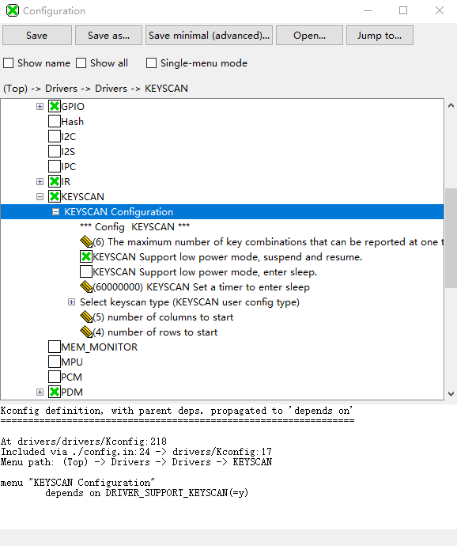

The compilation steps are as follows:

1.  **Open the menuconfig configuration interface**:

    1. Open the project in the IDE tool.

    2. Click the KConfig button to enter the menuconfig configuration interface.

2.  **Select the keyboard specification:**
    1.  In the menuconfig interface, navigate to the keyboard specification configuration option.
    2.  If a keyboard with more than six keys is required, select the user config type option. As shown in [Figure: Selecting the Six-Key Configuration](#fig936317130595) and [Figure 2](#fig131111112145819).
    3.  Edit the sdk/application/samples/products/rcu/rcu/keyscan/app\_keyscan.c file and change the keyboard registration configuration to adapt to the custom key layout.

3.  <a name="li10426165014812"></a>**Select Sample**
    1.  In the menuconfig interface, navigate to the Sample option.
    2.  Select SLE RCU Server, as shown in [Figure 3](#fig39485019229).
    3.  Configure the RCU local address to ensure it is consistent with the actual usage scenario.

4.  **Enable Low Power**
    1.  In the menuconfig interface, navigate to the low power configuration option.
    2.  Select to enable the low power mode, as shown in [Figure 4](#fig255692722613).

5.  **Save Configuration**: After completing all configurations, click the Save button to save the configuration and exit the menuconfig interface.
6.  **Compile the Version**: Compile the project using the IDE. The compiled version package will be in the output\\bs21\\fwpkg\\bs21-1100-rcu path, as shown in [Figure 5](#fig18317193617319).
7.  **Burn the RCU Server Version**: Burn the compiled RCU Server version to the board.
8.  **Configure RCU Dongle**:
    1.  In the menuconfig interface, navigate to the Sample option.
    2.  Select SLE RCU Dongle. As shown in [Figure 6](#fig18137152003317).
    3.  Configure the target server address to keep it consistent with the RCU Server address configured in step [3](#li10426165014812) (if there are multiple dongles, conflicts may occur, so the address needs to be modified to avoid conflicts).

9.  **Compile the RCU Dongle Version**: After completing all configurations, click the Save button to save the configuration and exit the menuconfig interface for compilation.
10. **Burn the RCU Dongle Version**

**Figure 3**  Selecting the SLE RCU Server Sample<a name="fig39485019229"></a>  
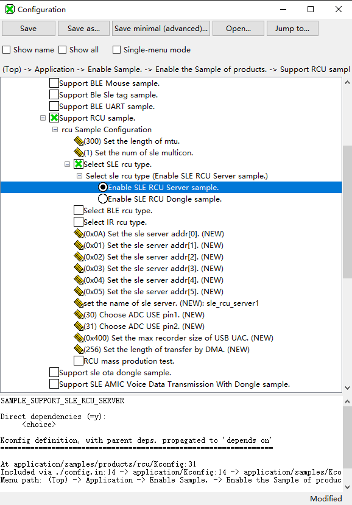

**Figure 4**  Selecting RCU Server Low Power<a name="fig255692722613"></a>  
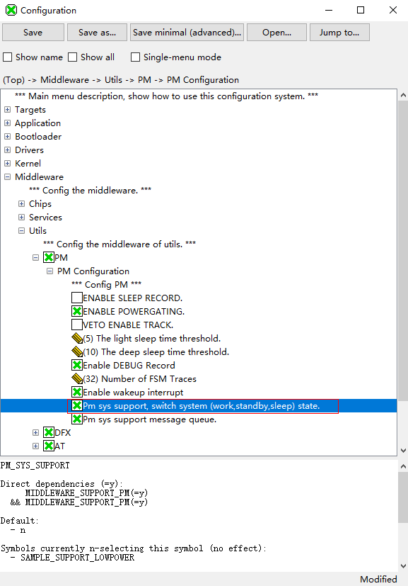

**Figure 5**  Compiled Version<a name="fig18317193617319"></a>  
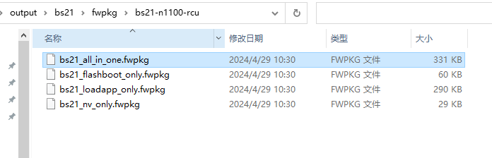

**Figure 6**  Selecting the SLE RCU Dongle Sample<a name="fig18137152003317"></a>  
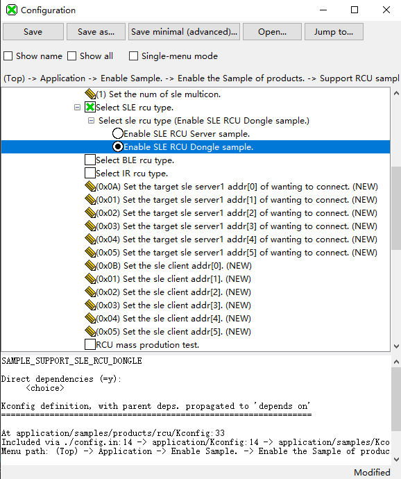

Note: After the USB initialization, the microphone + HID device must be selected on the PC before the initialization can be fully completed.

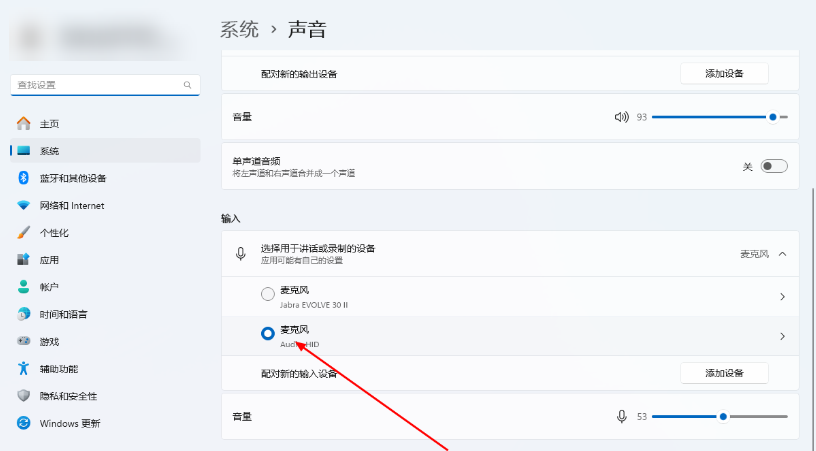

**BLE RCU SAMPLE<a name="section165583283914"></a>**

The compilation steps are as follows:

1.  Open the menuconfig configuration interface in the IDE tool, and click the KConfig button.
2.  In the menuconfig interface, select the keyboard specification, as shown in [Figure 1](#fig936317130595) and [Figure 2](#fig131111112145819).
3.  In the menuconfig interface, select the Sample, select SLE rcu server, and configure the RCU local address, as shown in [Figure 7](#fig1325416121258).
4.  In the menuconfig interface, select to enable low power, as shown in [Figure 4](#fig255692722613).
5.  After the selection is completed, click save to save and exit.
6.  Compile the version using the IDE. The compiled version package is in the "output\\bs21\\fwpkg\\bs21-1100-rcu" path, as shown in [Figure 5](#fig18317193617319).
7.  Burn the compiled server version to the board.

**Figure 7**  BLE RCU SAMPLE Selection<a name="fig1325416121258"></a>  
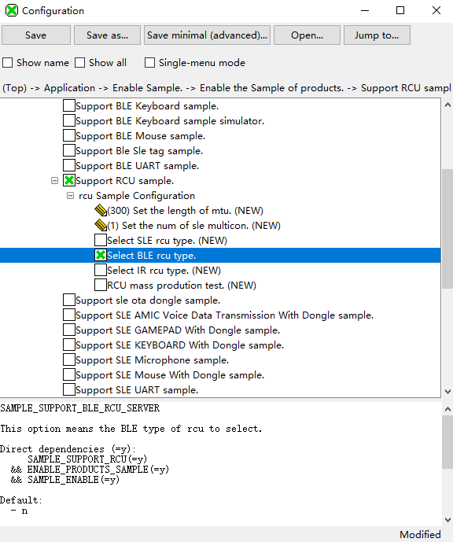

**IR RCU SAMPLE<a name="section128421237134012"></a>**

The compilation steps are as follows:

1.  Open the menuconfig configuration interface in the IDE tool, and click the KConfig button.
2.  In the menuconfig interface, select the keyboard specification, as shown in [Figure 1](#fig936317130595) and [Figure 2](#fig131111112145819).
3.  In the menuconfig interface, select the Sample, select IR rcu server, as shown in [Figure 8](#fig20486387221).
4.  In the menuconfig interface, enable the learning function and select the IR pin, as shown in [Figure 9](#fig334214366349).
5.  After the selection is completed, click save to save and exit.
6.  Compile the version using the IDE. The compiled version package is in the "output\\bs21\\fwpkg\\bs21-1100-rcu" path, as shown in [Figure 5](#fig18317193617319).
7.  Burn the compiled server version to the board.

**Figure 8**  IR RCU SAMPLE Selection<a name="fig20486387221"></a>  
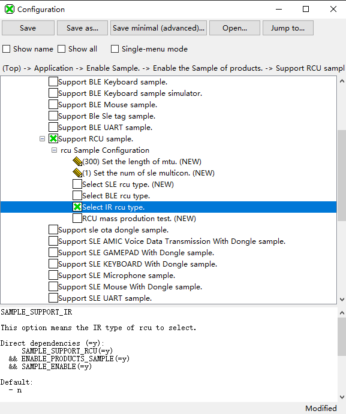

**Figure 9**  RCU IR Selection<a name="fig334214366349"></a>  
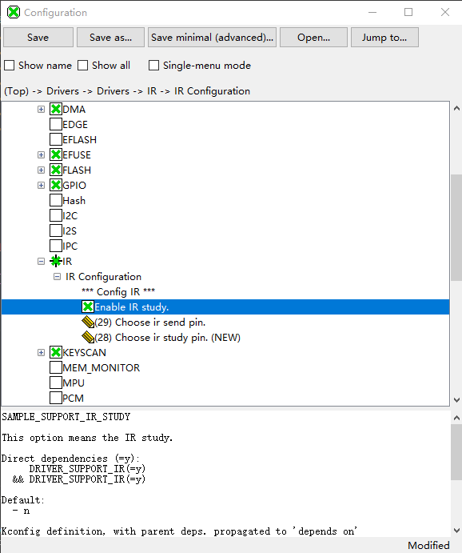

## Burning and Running<a name="ZH-CN_TOPIC_0000001864690258"></a>


### Burning<a name="ZH-CN_TOPIC_0000001913715465"></a>

Burn the compiled RCU Server version and Dongle version to the Server and Dongle boards respectively. For the version burning method, refer to the BS2XV100 HiSpark Studio User Guide.

### Running<a name="ZH-CN_TOPIC_0000001913795781"></a>

1.  After the Server and Dongle boards are burned, power them on separately. The Dongle is powered on by plugging it directly into the computer via USB.
2.  After the Dongle is powered on, open the sound settings and set the sampling rate to 1 channel 16KHZ 16 bits, as shown in [Figure 1](#fig210111299229).
3.  Observe the log information of the Server and Dongle boards on the serial port assistant. If "CONNECTED" appears, the connection has been completed. Some special remote controllers need to press the "shortcut key" to initiate broadcast to establish a connection.
4.  Press keys on the Server end and observe the host actions on the Dongle end, such as the volume up/down keys.
    1.  Volume test: Press the volume up/down keys and observe whether the volume on the host changes.
    2.  Direction key test: Position the cursor at a location in the text, press the direction keys, and observe the cursor direction changes.
    3.  Voice reporting function: Open the host microphone, press the voice key on the remote controller, and observe whether sound is input to the microphone test window.
    4.  Potential errors:

        If the serial port tool does not show connected on either the server end or the dongle end, the key registration may have failed.

        If the serial port tool does not show connected only on the dongle end and the keys do not respond, the server may have connected to another dongle. Reset the address.

5.  Reconnection test:

    When the RCU and the dongle end have established a connection, if either side restarts, it will reconnect immediately.

    After re-burning the RCU server end firmware, reconnection is required after restart.

**Figure 1**  Microphone Selection<a name="fig210111299229"></a>  
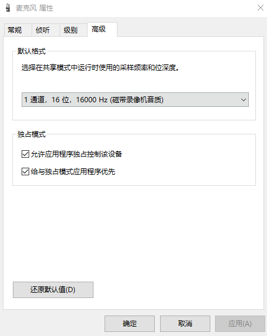

[Figure 2 Testing the Microphone](#fig210111299229)


Learning function debugging:

1.  Enter the production test mode: press and hold the left and right keys at the same time, then press and hold the up key.
2.  Learn remote controller keys: place the remote controller to be learned 2-5cm in front of the SparkLink remote controller and press the key to be learned once.
3.  Exit the production test mode: press and hold the left and right keys at the same time.
4.  Aim the SparkLink remote controller at a TV or set-top box that can be controlled by the "learned remote controller".

# Multi-Connection<a name="ZH-CN_TOPIC_0000002027698718"></a>


## SLE Multi-Connection Sample<a name="ZH-CN_TOPIC_0000002413901908"></a>


### Overview<a name="ZH-CN_TOPIC_0000002027857158"></a>

This Sample demonstrates a real SLE-based multi-connection solution. An image can be compiled with either the client or the server identity, but cannot have both the client and server identities at the same time. After the client is powered on, it automatically starts scanning. When a server is scanned, the client proactively initiates a connection, and after the connection is established, it cyclically sends data to the server. The operations for running the Sample include: configuring the compilation macro, compiling, burning, and powering on. The client and server differ only in the step of configuring the compilation macro, and the other operation steps are the same.

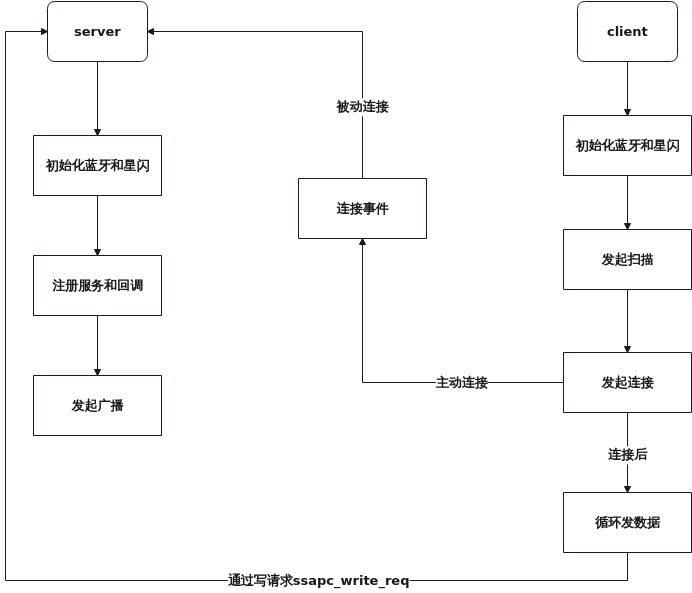

### Compilation<a name="ZH-CN_TOPIC_0000002063856925"></a>

The compilation is divided into Client-end compilation and Server-end compilation, and 1 Client connects to multiple Servers.


#### Client Compilation Configuration<a name="ZH-CN_TOPIC_0000002063877285"></a>

**Figure 1**  Kconfig Configuration Items<a name="fig1867564210161"></a>  
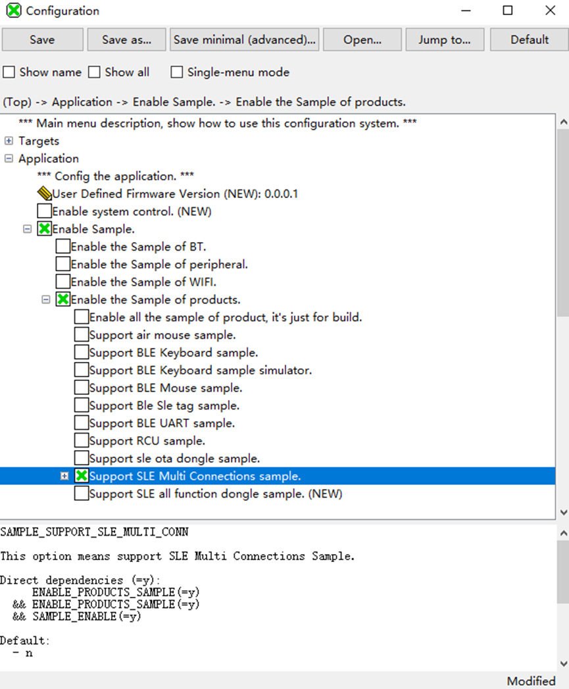

**Figure 2**  Selecting Client<a name="fig183190588168"></a>  
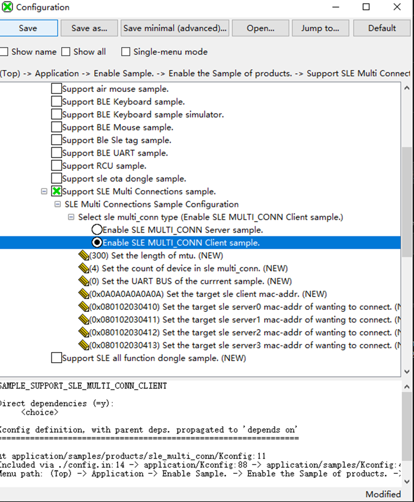

The configurable options include: mtu length, the number of Server ends to be connected, the printing serial port of the Client end, the MAC address of the Client end, and the MAC address of the Server end. Default configurations can be used for the above options. After the address information of the Client end is configured, the address configured on the Server end does not need to be changed, and remains consistent with the address information set on the Client.

The compilation steps are as follows:

1.  Open the "menuconfig" configuration interface in the IDE tool, and click the "KConfig" button.
2.  In the "menuconfig" interface, select the supported Sample: "SLE Multi Connections sample".
3.  In the "menuconfig" interface, select "Enable SLE MULTI\_CONN Client sample".
4.  Other configuration items can be modified according to actual usage.
5.  After the selection is completed, click "save" to save and exit.
6.  Compile the version using the IDE. The compiled version package is in the "tools\\pkg\\fwpkg\\bs2x\\evb\_all.fwpkg" path.
7.  Burn the compiled client version to the single board.

#### Server Compilation Configuration<a name="ZH-CN_TOPIC_0000002027719082"></a>

**Figure 1**  Kconfig Configuration Items<a name="fig1315912214183"></a>  
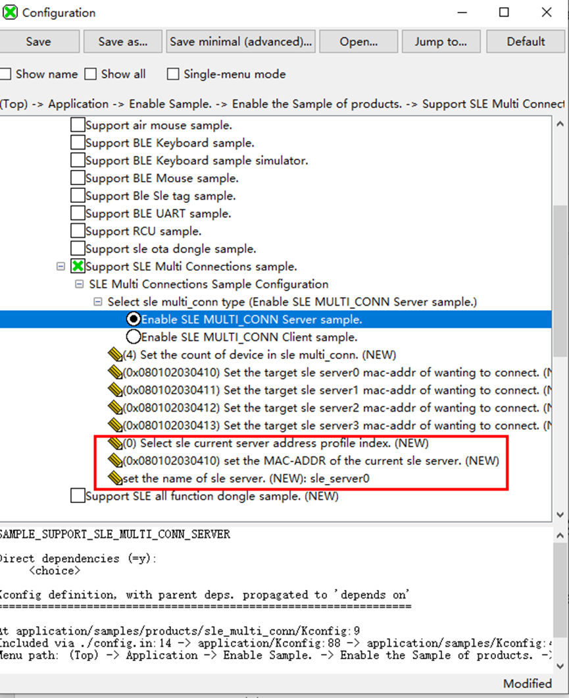

The configurable options include: the index number of the current server end, the mac address, and the name.

The compilation steps are as follows:

1.  Open the menuconfig configuration interface in the IDE tool, and click the "KConfig" button.
2.  In the "menuconfig" interface, select the supported Sample: "SLE Multi Connections sample".
3.  In the "menuconfig" interface, select "Enable SLE MULTI\_CONN Server sample".
4.  Other configuration items can be modified according to actual usage. Usually, only the index number of the server end needs to be configured, and the mac address and server name configuration items will be updated automatically.
5.  After the selection is completed, click "save" to save and exit.
6.  Compile the version using the IDE. The compiled version package is in the "tools\\pkg\\fwpkg\\bs2x\\evb\_all.fwpkg" path.
7.  Burn the compiled server version to the single board.

### Burning and Running<a name="ZH-CN_TOPIC_0000002063898241"></a>


#### Burning<a name="ZH-CN_TOPIC_0000002027698722"></a>

Burn the compiled Server version and Client version to the Server and Client boards respectively. For the version burning method, refer to the BS2XV100 HiSpark Studio User Guide.

#### Running<a name="ZH-CN_TOPIC_0000002027857162"></a>

1.  After the Client and Server boards are burned, power them on separately.
2.  Observe the log information of the Server and Client boards on the serial port assistant. If "CONNECTED" appears, the connection has been completed.
3.  The powered-on Server end continuously sends the sample data abcd to the Client end.

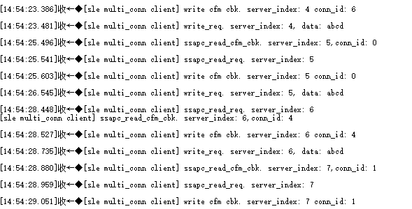

## BLE Multi-Connection Precautions<a name="ZH-CN_TOPIC_0000002447580901"></a>

In the connected state, scanning should be enabled after service discovery (including discovering services, discovering characteristics, discovering characteristic values, and discovering descriptors).

# air mouse<a name="ZH-CN_TOPIC_0000002173690000"></a>


## Overview<a name="ZH-CN_TOPIC_0000002173849740"></a>

This Sample demonstrates a real air mouse solution based on SLE+SLP.

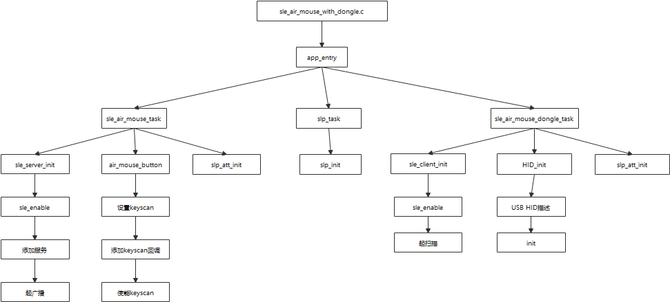

## Compilation<a name="ZH-CN_TOPIC_0000002209256101"></a>

1.  Enter "python ./build.py -c bs21e-1100e-slp menuconfig" in the command line.
2.  If you need to compile server, configure according to 1.server; if you need to compile dongle, configure according to 2.dongle.
    1.  server:  (Top) → Application → Enable Sample. → Enable the Sample of products. → Support air mouse sample. → Air Mouse Sample Configuration → Select AIR MOUSE type → Enable AIR MOUSE sample
    2.  dongle:  (Top) → Application → Enable Sample. → Enable the Sample of products. → Support air mouse sample. → Air Mouse Sample Configuration → Select AIR MOUSE type → Enable AIR MOUSE Dongle sample.

3.  After the selection is completed, press "Q" to save and exit.
4.  Compile "python ./build.py -c bs21e-1100e-slp".
5.  The compilation result is in "output/bs21e/fwpkg/bs21e-1100e-slp/bs21e\_all\_in\_one.fwpkg".

menuconfig selection

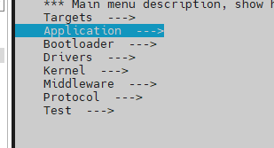

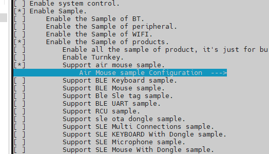

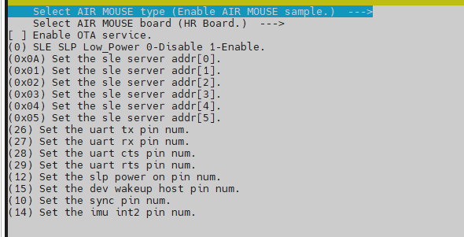

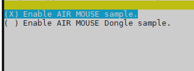

Compilation result:

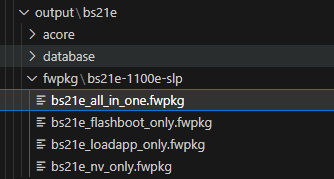

## Burning<a name="ZH-CN_TOPIC_0000002209170473"></a>

For the version burning method, refer to the BS2XV100 HiSpark Studio User Guide.

## Running<a name="ZH-CN_TOPIC_0000002173690004"></a>

1.  Prepare two single boards, which serve as the Server end and the Client end respectively.
2.  After burning, power off and power on.
3.  Check whether the SLE is connected normally and the pointing function works.

# SLE MOUSE with Dongle<a name="ZH-CN_TOPIC_0000002174786036"></a>


## Overview<a name="ZH-CN_TOPIC_0000002174627248"></a>

This Sample demonstrates a real SLE-based mouse dongle solution. The operations for running the Sample include: configuring the compilation macro, compiling, burning, and powering on. The mouse reporting rate can be adjusted.

The dongle end and the mouse end differ in the step of configuring the compilation macro.

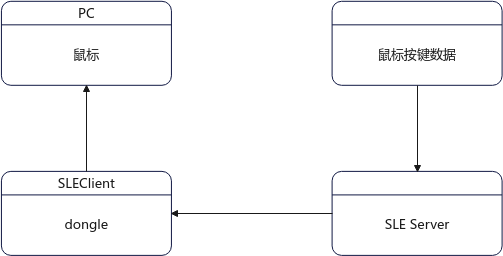

## Compilation<a name="ZH-CN_TOPIC_0000002210073333"></a>


### Compiling SLE MOUSE<a name="ZH-CN_TOPIC_0000002188022822"></a>

1.  Open the menuconfig configuration interface in the command line and run the command "python build.py standard-bs21-n1100 menuconfig".
2.  In the menuconfig interface, enter "application/System mouse Pin Configuration" to configure the mouse pins, as shown in [Figure 1](#fig21391015105815).
3.  In the menuconfig interface, select the SLE mouse Sample, as shown in [Figure 2](#fig1295982895918).
4.  In the menuconfig interface, select the SLE mouse, as shown in [Figure 3](#fig591412161217).
5.  After the selection is completed, press "Q" and "Y" to save and exit.
6.  Compile the version using the IDE. The compiled version package is in the "tools\\pkg\\fwpkg\\bs21" path, as shown in [Figure 4](#fig11751945612).
7.  Burn the compiled version to the mouse board according to "[Burning and Running](烧录及运行-57.md)" of "[SLE Mouse Sample](SLE-Mouse-Sample.md)".

**Figure 1**  Mouse Pin Config<a name="fig21391015105815"></a>  


**Figure 2**  Modifying the Sample Configuration<a name="fig1295982895918"></a>  

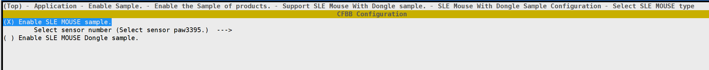

**Figure 3**  Modifying the Sensor Number<a name="fig591412161217"></a>  

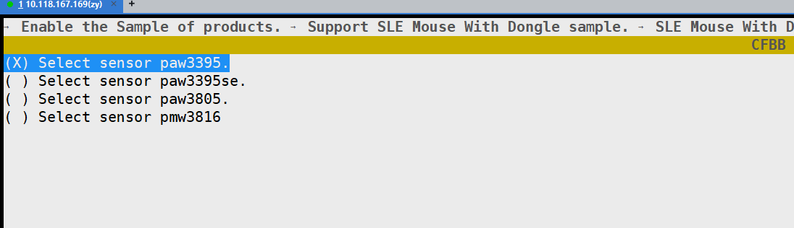

**Figure 4**  Compiled Version<a name="fig11751945612"></a>  


### Compiling SLEMOUSE with Dongle<a name="ZH-CN_TOPIC_0000002188182526"></a>

1.  Open the menuconfig configuration interface in the command line and run the command "python build.py standard-bs21-n1100 menuconfig".
2.  In the menuconfig interface, select the SLE mouse Sample, as shown in [Figure 1](#fig1295982895918).
3.  In the menuconfig interface, select the SLE mouse, as shown in [Figure 2](#fig591412161217).
4.  After the selection is completed, press "Q" and "Y" to save and exit.
5.  Compile the version using the IDE. The compiled version package is in the "tools\\pkg\\fwpkg\\bs21" path, as shown in [Figure 3](#fig11751945612).
6.  Burn the compiled version to the mouse board according to "[Burning and Running](烧录及运行-57.md)" of "[SLE Mouse Sample](SLE-Mouse-Sample.md)".

**Figure 1**  Modifying the Sample Configuration<a name="fig1295982895918"></a>  
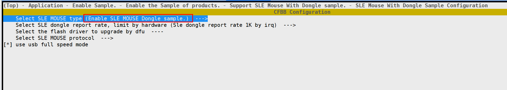

**Figure 2**  Modifying the Mouse Reporting Rate<a name="fig591412161217"></a>  
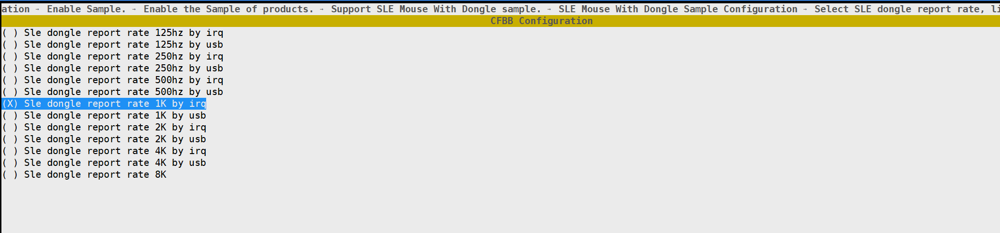

**Figure 3**  Compiled Version<a name="fig11751945612"></a>  


## Burning and Running<a name="ZH-CN_TOPIC_0000002210187685"></a>

**Burning<a name="section948712445453"></a>**

Burn the compiled mouse version to the mouse board. For the version burning method, refer to the BS2XV100 HiSpark Studio User Guide.

**Running<a name="section20698141827"></a>**

1.  Power on the mouse board.
2.  If it is a single board not powered by USB, connect the USB to the computer.
3.  If the mouse movement, button clicks, and other functions can work normally as observed on the PC, the BLE Mouse function is normal.
4.  During use, if the mouse is powered on again, it can reconnect, and the functions work normally.

# SLE OTA dongle<a name="ZH-CN_TOPIC_0000002183778646"></a>


## Overview<a name="ZH-CN_TOPIC_0000002219679749"></a>

This Sample is used to demonstrate the OTA upgrade solution in which a dongle upgrades the SLE module.

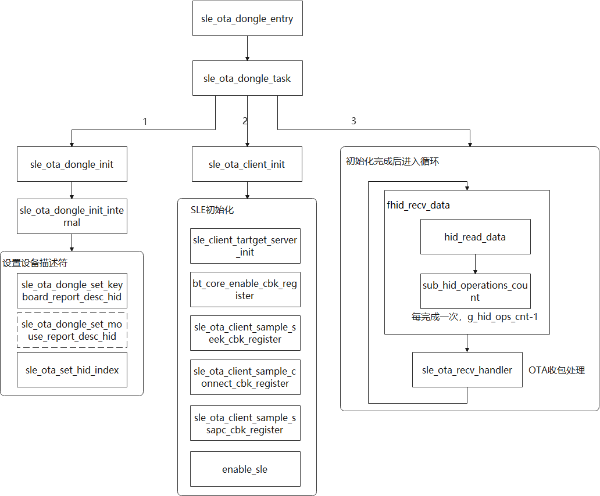

## Compilation<a name="ZH-CN_TOPIC_0000002219754189"></a>

1.  Enter "python3 build.py standard-bs21-n1100 menuconfig" in the SDK root path.
2.  Enter "Application" and enable "Enable sample".
3.  Select "Enable the Sample of products" and "Support sle ota dongle sample" in sequence.
4.  Configure the parameters in "sle ota dongle Sample Configuration" as needed.
5.  Save and exit, then run "python3 build.py standard-bs21-n1100" to start compilation.

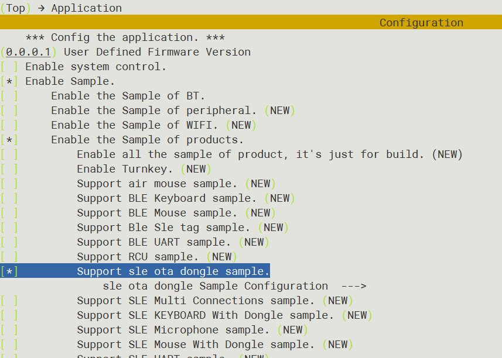

## Burning and Running<a name="ZH-CN_TOPIC_0000002184234000"></a>

For the version burning method, refer to the BS2XV100 HiSpark Studio User Guide.

# game mouse<a name="ZH-CN_TOPIC_0000002185692000"></a>

This document mainly introduces the specifications and implementation of the SparkLink mouse turnkey solution, helping developers quickly get started with the turnkey solution code logic and related interfaces.


## Overview<a name="ZH-CN_TOPIC_0000002221058057"></a>

The software platform shields the underlying layers from the application software and directly provides the API (Application Program Interface) to the application software to implement the corresponding functions. A typical system framework is shown in [Figure 1](#fig6589183165917).

**Figure 1**  System Block Diagram<a name="fig6589183165917"></a>  


The framework can be divided into the following layers:

-   APP layer

    The APP layer includes the SLE communication function, supports the SLE mode, BLE mode, and USB mode, and supports different product categories. The APP layer also supports customers in developing other applications based on the interfaces provided by the SDK.

-   Host layer

    Host is the upper-layer implementation of the protocol stack and the abstraction of hardware, including logical link control, adaptation protocol, security manager, attribute protocol, generic attribute profile, and services.

-   Controller layer

    Controller is the lower-layer implementation of the protocol stack, directly related to hardware, and implemented by the chip manufacturer, including the physical layer, link layer, host controller interface, etc.

-   Peripheral and driver layer

    Provides peripheral and system related capabilities and interfaces.

turnkey code directory description:

```
├── app_public
├── ble_mouse_server                // Bluetooth service
├── CMakeLists.txt
├── Kconfig
├── mouse_button                    // 8k mouse keys
├── mouse_data_transfer_manage.c    // Mouse data transfer
├── mouse_data_transfer_manage.h
├── mouse_flash                     // Read/write flash
├── mouse_key                       // 2k mouse keys
├── mouse_light                     // LED light control
├── mouse_log.h
├── mouse_mac_rules                 // MAC address management when switching channels
├── mouse_mode_manage.c             // Bluetooth, SparkLink, and wired mode management, mouse task entry
├── mouse_mode_manage.h
├── mouse_power                     // Power and low power
├── mouse_sensor                    // Sensor related
├── mouse_status                    // Broadcast, pairing, and disconnection handling
├── mouse_usb                       // USB initialization and receive handling
├── mouse_wheel                     // Wheel
├── sfc_flash
├── sle_low_latency_service.c       // SparkLink mouse low latency service
├── sle_low_latency_service.h
├── sle_mouse_client                // SparkLink mouse client-end management
├── sle_mouse_dongle.c              // SparkLink mouse dongle task entry
├── sle_mouse_dongle.h
└── sle_mouse_server                // SparkLink mouse server-end management
```


## Compilation<a name="ZH-CN_TOPIC_0000002185532312"></a>

1.  Install the deveco plugin and import the sdk project.
2.  Select the compilation target. Currently, the turnkey code can be compiled for four chips: BS20, BS21E, BS22, and BS26.

    **Figure 1**  Importing the Compilation Target<a name="fig516873345218"></a>  
    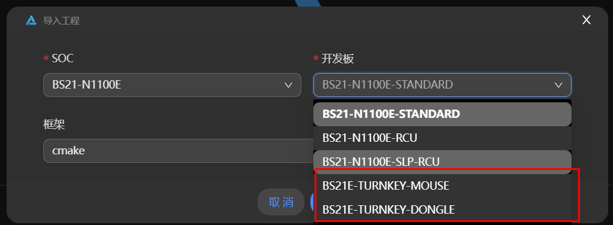

3.  Modify the kconfig. The target is configured with a set of defaults by default and can be compiled directly. If modification is required, refer to [Figure 2](#fig1659117286129) and [Figure 3](#fig1079613541155).

    **Figure 2**  kconfig Configuration Introduction 1<a name="fig1659117286129"></a>  
    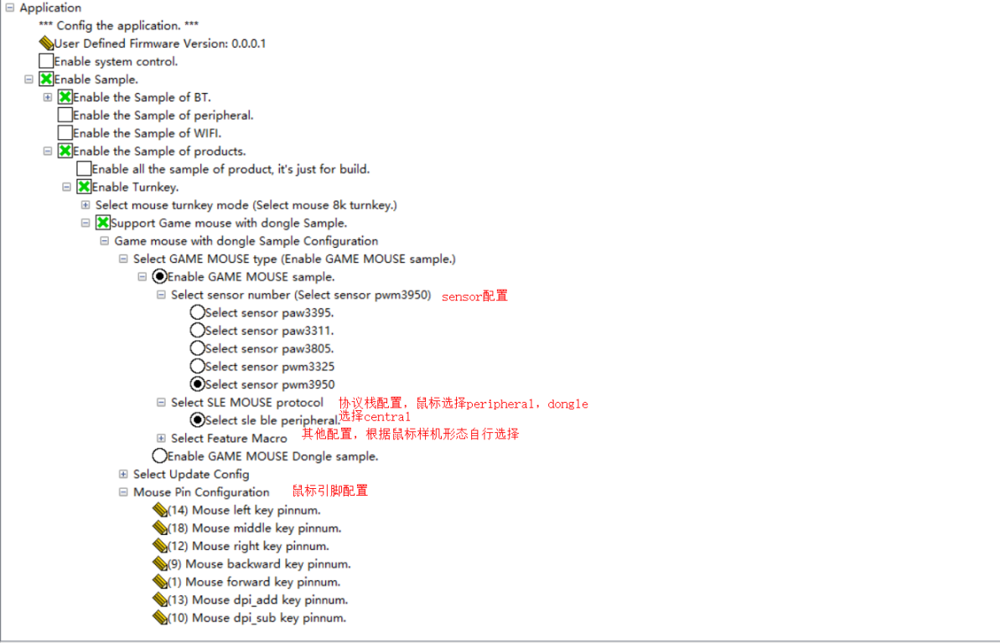

    **Figure 3**  kconfig Configuration Introduction 2<a name="fig1079613541155"></a>  
    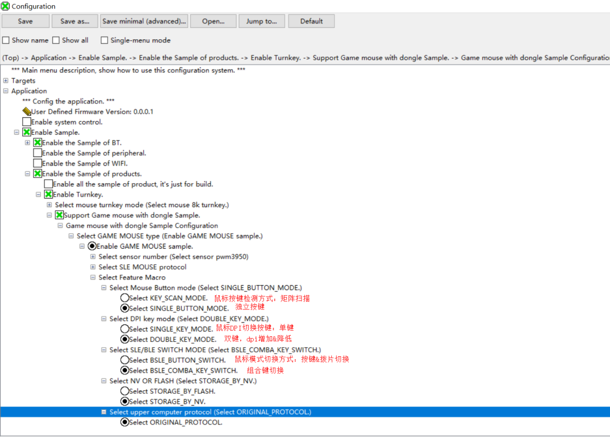

    > **Description:** 
    >When compiling the dongle, if a receiver is used, the ldo power supply needs to be enabled.

    **Figure 4**  ldo Power Supply<a name="fig1942913321615"></a>  
    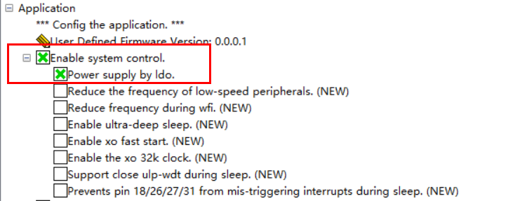

4.  To modify or add the default configuration of the compilation target, modify it in build\\config\\target\_config\\deveco\_config.json.

## Burning and Running<a name="ZH-CN_TOPIC_0000002220972485"></a>

Burn the compiled TurnkeyMouse Server version and Dongle version to the Server and Dongle boards respectively. For the version burning method, refer to the BS2XV100 HiSpark Studio User Guide.

For the detailed functions of each module, refer to the document "BS2XV100 SparkLink Mouse Application Solution Development User Guide".

# BLE UUID<a name="ZH-CN_TOPIC_0000002194802088"></a>


## Overview<a name="ZH-CN_TOPIC_0000002230361941"></a>

This document mainly introduces the interfaces provided by the BLE UUID sample and the compilation method. This sample only provides interfaces and cannot be used directly. Users need to call the related interfaces.

## Compilation<a name="ZH-CN_TOPIC_0000002230363373"></a>

To use the interfaces of this sample, menuconfig needs to be configured. The specific configuration steps are as follows:

1.  Click the "KConfig" button.

    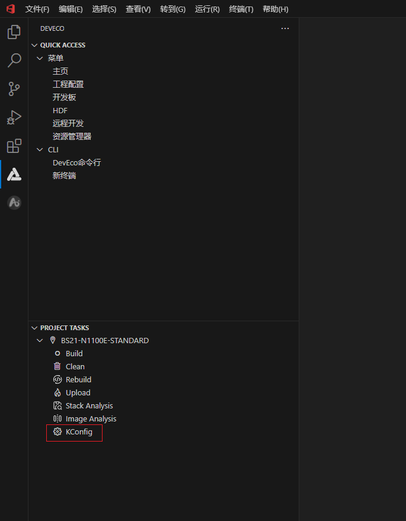

2.  Click "Application".

    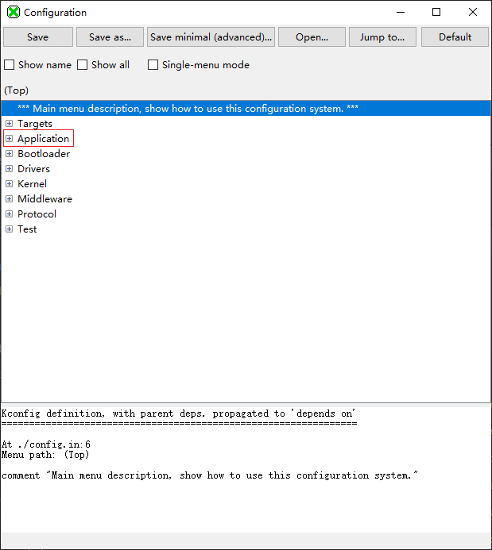

3.  Click "Enable Sample".

    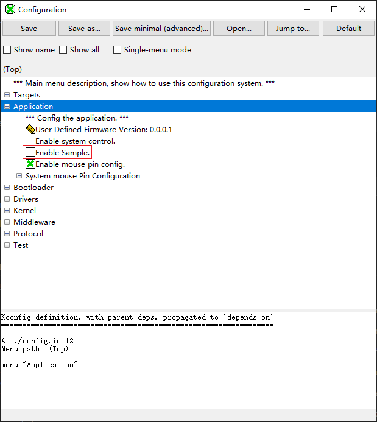

4.  Click "Enable the Sample BT".

    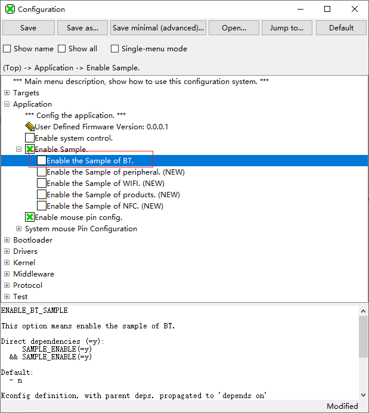

5.  Click "Support BLE Sample".

    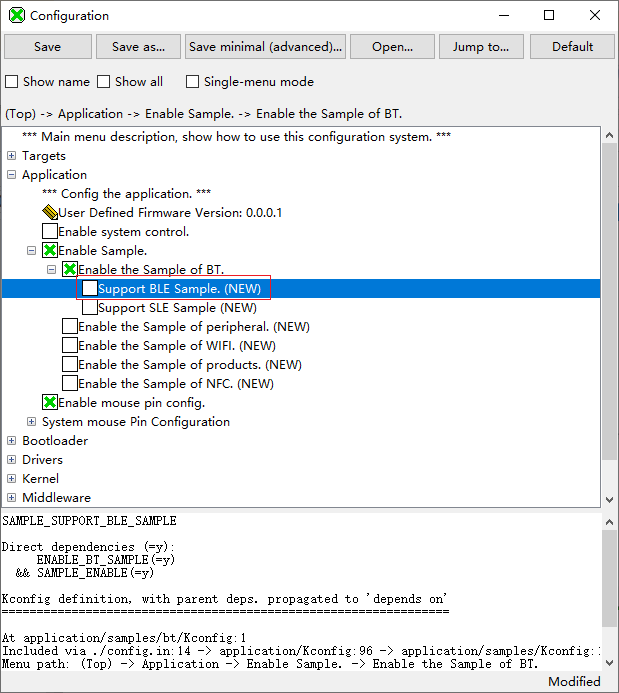

6.  Click "Support Ble uuid server sample".

    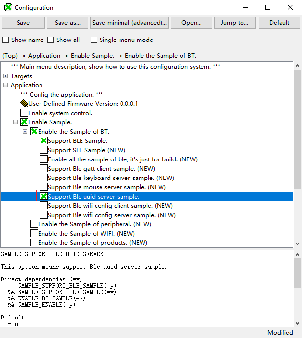

7.  Return to vscode and click "Build" to compile.

    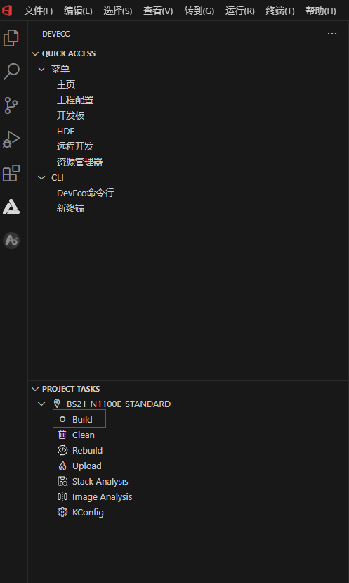

## Interfaces<a name="ZH-CN_TOPIC_0000002230287425"></a>

**Table 1**  Interface List

<a name="table826693164614"></a>
<table><thead align="left"><tr id="row1726613354611"><th class="cellrowborder" valign="top" width="50%" id="mcps1.2.3.1.1"><p id="p1626603194610"><a name="p1626603194610"></a><a name="p1626603194610"></a>Function</p>
</th>
<th class="cellrowborder" valign="top" width="50%" id="mcps1.2.3.1.2"><p id="p526633164618"><a name="p526633164618"></a><a name="p526633164618"></a>Description</p>
</th>
</tr>
</thead>
<tbody><tr id="row16266203104618"><td class="cellrowborder" valign="top" width="50%" headers="mcps1.2.3.1.1 "><p id="p179138345466"><a name="p179138345466"></a><a name="p179138345466"></a>errcode_t ble_uuid_server_init(void);</p>
</td>
<td class="cellrowborder" valign="top" width="50%" headers="mcps1.2.3.1.2 "><p id="p93862414474"><a name="p93862414474"></a><a name="p93862414474"></a>BLE UUID server initialization</p>
</td>
</tr>
<tr id="row202662334610"><td class="cellrowborder" valign="top" width="50%" headers="mcps1.2.3.1.1 "><p id="p14266133124612"><a name="p14266133124612"></a><a name="p14266133124612"></a>errcode_t ble_uuid_server_send_report_by_uuid(const uint8_t *data, uint8_t len);</p>
</td>
<td class="cellrowborder" valign="top" width="50%" headers="mcps1.2.3.1.2 "><p id="p19986183819475"><a name="p19986183819475"></a><a name="p19986183819475"></a>Send data to the peer end through the uuid server</p>
</td>
</tr>
<tr id="row12669344619"><td class="cellrowborder" valign="top" width="50%" headers="mcps1.2.3.1.1 "><p id="p18266339468"><a name="p18266339468"></a><a name="p18266339468"></a>errcode_t ble_uuid_server_send_report_by_handle(uint16_t attr_handle, const uint8_t *data, uint8_t len);</p>
</td>
<td class="cellrowborder" valign="top" width="50%" headers="mcps1.2.3.1.2 "><p id="p29260209481"><a name="p29260209481"></a><a name="p29260209481"></a>Send data to the peer end through the uuid server</p>
</td>
</tr>
<tr id="row1826683164619"><td class="cellrowborder" valign="top" width="50%" headers="mcps1.2.3.1.1 "><p id="p626617315467"><a name="p626617315467"></a><a name="p626617315467"></a>uint8_t ble_start_adv(void);</p>
</td>
<td class="cellrowborder" valign="top" width="50%" headers="mcps1.2.3.1.2 "><p id="p1091235914812"><a name="p1091235914812"></a><a name="p1091235914812"></a>Enable BLE broadcasting</p>
</td>
</tr>
<tr id="row031571254917"><td class="cellrowborder" valign="top" width="50%" headers="mcps1.2.3.1.1 "><p id="p15316161218499"><a name="p15316161218499"></a><a name="p15316161218499"></a>uint8_t ble_set_adv_data(void);</p>
</td>
<td class="cellrowborder" valign="top" width="50%" headers="mcps1.2.3.1.2 "><p id="p833315574911"><a name="p833315574911"></a><a name="p833315574911"></a>BLE broadcasting data configuration</p>
</td>
</tr>
</tbody>
</table>

For detailed interface information, see the sdk: application/samples/bt/ble/ble\_uuid\_server/inc.

# Abbreviations<a name="ZH-CN_TOPIC_0000001837645673"></a>

<a name="table1647mcpsimp"></a>
<table><tbody><tr id="row1659mcpsimp"><td class="nocellnorowborder" style="border:none" valign="top" width="22.3%"><p id="p1661mcpsimp"><a name="p1661mcpsimp"></a><a name="p1661mcpsimp"></a><strong id="b1662mcpsimp"><a name="b1662mcpsimp"></a><a name="b1662mcpsimp"></a>A</strong></p>
</td>
<td class="nocellnorowborder" style="border:none" valign="top" width="44.7%">&nbsp;&nbsp;</td>
<td class="cell-norowborder" style="border:none" valign="top" width="33%">&nbsp;&nbsp;</td>
</tr>
<tr id="row1269431618349"><td class="cellrowborder" style="border:none" valign="top" width="22.3%"><p id="p96588910301"><a name="p96588910301"></a><a name="p96588910301"></a><strong id="b18473738578"><a name="b18473738578"></a><a name="b18473738578"></a>ADC</strong></p>
</td>
<td class="cellrowborder" style="border:none" valign="top" width="44.7%"><p id="p18157613184118"><a name="p18157613184118"></a><a name="p18157613184118"></a>Analog-to-Digital Converter</p>
</td>
<td class="cellrowborder" style="border:none" valign="top" width="33%"><p id="p19659498305"><a name="p19659498305"></a><a name="p19659498305"></a>Analog-to-Digital Converter</p>
</td>
</tr>
<tr id="row1665mcpsimp"><td class="nocellnorowborder" style="border:none" valign="top" width="22.3%"><p id="p1667mcpsimp"><a name="p1667mcpsimp"></a><a name="p1667mcpsimp"></a><strong id="b1668mcpsimp"><a name="b1668mcpsimp"></a><a name="b1668mcpsimp"></a>AFE</strong></p>
</td>
<td class="nocellnorowborder" style="border:none" valign="top" width="44.7%"><p xml:lang="x-NONE" id="p1670mcpsimp"><a name="p1670mcpsimp"></a><a name="p1670mcpsimp"></a>Analog Front-End</p>
</td>
<td class="cell-norowborder" style="border:none" valign="top" width="33%"><p id="p1675mcpsimp"><a name="p1675mcpsimp"></a><a name="p1675mcpsimp"></a>Analog Front-End</p>
</td>
</tr>
<tr id="row1676mcpsimp"><td class="nocellnorowborder" style="border:none" valign="top" width="22.3%">&nbsp;&nbsp;</td>
<td class="nocellnorowborder" style="border:none" valign="top" width="44.7%">&nbsp;&nbsp;</td>
<td class="cell-norowborder" style="border:none" valign="top" width="33%">&nbsp;&nbsp;</td>
</tr>
<tr id="row1680mcpsimp"><td class="nocellnorowborder" style="border:none" valign="top" width="22.3%"><p id="p1682mcpsimp"><a name="p1682mcpsimp"></a><a name="p1682mcpsimp"></a><strong id="b1683mcpsimp"><a name="b1683mcpsimp"></a><a name="b1683mcpsimp"></a>B</strong></p>
</td>
<td class="nocellnorowborder" style="border:none" valign="top" width="44.7%">&nbsp;&nbsp;</td>
<td class="cell-norowborder" style="border:none" valign="top" width="33%">&nbsp;&nbsp;</td>
</tr>
<tr id="row1706mcpsimp"><td class="nocellnorowborder" style="border:none" valign="top" width="22.3%"><p id="p1708mcpsimp"><a name="p1708mcpsimp"></a><a name="p1708mcpsimp"></a><strong id="b1709mcpsimp"><a name="b1709mcpsimp"></a><a name="b1709mcpsimp"></a>BLE</strong></p>
</td>
<td class="nocellnorowborder" style="border:none" valign="top" width="44.7%"><p id="p1711mcpsimp"><a name="p1711mcpsimp"></a><a name="p1711mcpsimp"></a>Bluetooth Low Energy</p>
</td>
<td class="cell-norowborder" style="border:none" valign="top" width="33%"><p id="p1716mcpsimp"><a name="p1716mcpsimp"></a><a name="p1716mcpsimp"></a>Bluetooth Low Energy</p>
</td>
</tr>
<tr id="row9244173316716"><td class="cellrowborder" style="border:none" valign="top" width="22.3%"><p id="p138951537154517"><a name="p138951537154517"></a><a name="p138951537154517"></a><strong id="b4895183718455"><a name="b4895183718455"></a><a name="b4895183718455"></a>BT</strong></p>
</td>
<td class="cellrowborder" style="border:none" valign="top" width="44.7%"><p id="p489583718456"><a name="p489583718456"></a><a name="p489583718456"></a>Bluetooth</p>
</td>
<td class="cellrowborder" style="border:none" valign="top" width="33%"><p id="p189593720453"><a name="p189593720453"></a><a name="p189593720453"></a>Bluetooth</p>
</td>
</tr>
<tr id="row123463564514"><td class="cellrowborder" style="border:none" valign="top" width="22.3%">&nbsp;&nbsp;</td>
<td class="cellrowborder" style="border:none" valign="top" width="44.7%">&nbsp;&nbsp;</td>
<td class="cellrowborder" style="border:none" valign="top" width="33%">&nbsp;&nbsp;</td>
</tr>
<tr id="row1721mcpsimp"><td class="nocellnorowborder" style="border:none" valign="top" width="22.3%"><p id="p1723mcpsimp"><a name="p1723mcpsimp"></a><a name="p1723mcpsimp"></a><strong id="b1724mcpsimp"><a name="b1724mcpsimp"></a><a name="b1724mcpsimp"></a>C</strong></p>
</td>
<td class="nocellnorowborder" style="border:none" valign="top" width="44.7%">&nbsp;&nbsp;</td>
<td class="cell-norowborder" style="border:none" valign="top" width="33%">&nbsp;&nbsp;</td>
</tr>
<tr id="row02831918295"><td class="cellrowborder" style="border:none" valign="top" width="22.3%"><p id="p1166989143017"><a name="p1166989143017"></a><a name="p1166989143017"></a><strong id="b047843165717"><a name="b047843165717"></a><a name="b047843165717"></a>CPU</strong></p>
</td>
<td class="cellrowborder" style="border:none" valign="top" width="44.7%"><p id="p1466989203013"><a name="p1466989203013"></a><a name="p1466989203013"></a>Central Processing Unit</p>
</td>
<td class="cellrowborder" style="border:none" valign="top" width="33%"><p id="p366917903015"><a name="p366917903015"></a><a name="p366917903015"></a>Central Processing Unit</p>
</td>
</tr>
<tr id="row1738mcpsimp"><td class="nocellnorowborder" style="border:none" valign="top" width="22.3%">&nbsp;&nbsp;</td>
<td class="nocellnorowborder" style="border:none" valign="top" width="44.7%">&nbsp;&nbsp;</td>
<td class="cell-norowborder" style="border:none" valign="top" width="33%">&nbsp;&nbsp;</td>
</tr>
<tr id="row1742mcpsimp"><td class="nocellnorowborder" style="border:none" valign="top" width="22.3%"><p id="p1744mcpsimp"><a name="p1744mcpsimp"></a><a name="p1744mcpsimp"></a><strong id="b1745mcpsimp"><a name="b1745mcpsimp"></a><a name="b1745mcpsimp"></a>G</strong></p>
</td>
<td class="nocellnorowborder" style="border:none" valign="top" width="44.7%">&nbsp;&nbsp;</td>
<td class="cell-norowborder" style="border:none" valign="top" width="33%">&nbsp;&nbsp;</td>
</tr>
<tr id="row1748mcpsimp"><td class="nocellnorowborder" style="border:none" valign="top" width="22.3%"><p xml:lang="x-NONE" id="p1750mcpsimp"><a name="p1750mcpsimp"></a><a name="p1750mcpsimp"></a><strong id="b1751mcpsimp"><a name="b1751mcpsimp"></a><a name="b1751mcpsimp"></a>GAFE</strong></p>
</td>
<td class="nocellnorowborder" style="border:none" valign="top" width="44.7%"><p xml:lang="x-NONE" id="p1753mcpsimp"><a name="p1753mcpsimp"></a><a name="p1753mcpsimp"></a>General Analog Front-End</p>
</td>
<td class="cell-norowborder" style="border:none" valign="top" width="33%"><p id="p1759mcpsimp"><a name="p1759mcpsimp"></a><a name="p1759mcpsimp"></a>General Analog Front-End</p>
</td>
</tr>
<tr id="row1760mcpsimp"><td class="nocellnorowborder" style="border:none" valign="top" width="22.3%">&nbsp;&nbsp;</td>
<td class="nocellnorowborder" style="border:none" valign="top" width="44.7%">&nbsp;&nbsp;</td>
<td class="cell-norowborder" style="border:none" valign="top" width="33%">&nbsp;&nbsp;</td>
</tr>
<tr id="row1764mcpsimp"><td class="nocellnorowborder" style="border:none" valign="top" width="22.3%"><p id="p1766mcpsimp"><a name="p1766mcpsimp"></a><a name="p1766mcpsimp"></a><strong id="b1767mcpsimp"><a name="b1767mcpsimp"></a><a name="b1767mcpsimp"></a>H</strong></p>
</td>
<td class="nocellnorowborder" style="border:none" valign="top" width="44.7%">&nbsp;&nbsp;</td>
<td class="cell-norowborder" style="border:none" valign="top" width="33%">&nbsp;&nbsp;</td>
</tr>
<tr id="row1770mcpsimp"><td class="nocellnorowborder" style="border:none" valign="top" width="22.3%"><p id="p1772mcpsimp"><a name="p1772mcpsimp"></a><a name="p1772mcpsimp"></a><strong id="b1773mcpsimp"><a name="b1773mcpsimp"></a><a name="b1773mcpsimp"></a>HAFE</strong></p>
</td>
<td class="nocellnorowborder" style="border:none" valign="top" width="44.7%"><p xml:lang="x-NONE" id="p1775mcpsimp"><a name="p1775mcpsimp"></a><a name="p1775mcpsimp"></a>High precision Analog Front-End</p>
</td>
<td class="cell-norowborder" style="border:none" valign="top" width="33%"><p id="p1781mcpsimp"><a name="p1781mcpsimp"></a><a name="p1781mcpsimp"></a>High Precision Analog Front-End</p>
</td>
</tr>
<tr id="row1782mcpsimp"><td class="nocellnorowborder" style="border:none" valign="top" width="22.3%">&nbsp;&nbsp;</td>
<td class="nocellnorowborder" style="border:none" valign="top" width="44.7%">&nbsp;&nbsp;</td>
<td class="cell-norowborder" style="border:none" valign="top" width="33%">&nbsp;&nbsp;</td>
</tr>
<tr id="row1319413917379"><td class="cellrowborder" style="border:none" valign="top" width="22.3%"><p id="p1219473943711"><a name="p1219473943711"></a><a name="p1219473943711"></a><strong id="b16554145112372"><a name="b16554145112372"></a><a name="b16554145112372"></a>I</strong></p>
</td>
<td class="cellrowborder" style="border:none" valign="top" width="44.7%">&nbsp;&nbsp;</td>
<td class="cellrowborder" style="border:none" valign="top" width="33%">&nbsp;&nbsp;</td>
</tr>
<tr id="row46665348376"><td class="cellrowborder" style="border:none" valign="top" width="22.3%"><p id="p101369324208"><a name="p101369324208"></a><a name="p101369324208"></a><strong id="b775711152214"><a name="b775711152214"></a><a name="b775711152214"></a>IoT</strong></p>
</td>
<td class="cellrowborder" style="border:none" valign="top" width="44.7%"><p id="p29071215192112"><a name="p29071215192112"></a><a name="p29071215192112"></a>Internet of Things</p>
</td>
<td class="cellrowborder" style="border:none" valign="top" width="33%"><p id="p171365321209"><a name="p171365321209"></a><a name="p171365321209"></a>Internet of Things</p>
</td>
</tr>
<tr id="row1656663217372"><td class="cellrowborder" style="border:none" valign="top" width="22.3%">&nbsp;&nbsp;</td>
<td class="cellrowborder" style="border:none" valign="top" width="44.7%">&nbsp;&nbsp;</td>
<td class="cellrowborder" style="border:none" valign="top" width="33%">&nbsp;&nbsp;</td>
</tr>
<tr id="row5201338496"><td class="cellrowborder" style="border:none" valign="top" width="22.3%"><p id="p9202312491"><a name="p9202312491"></a><a name="p9202312491"></a><strong id="b15743185054913"><a name="b15743185054913"></a><a name="b15743185054913"></a>L</strong></p>
</td>
<td class="cellrowborder" style="border:none" valign="top" width="44.7%">&nbsp;&nbsp;</td>
<td class="cellrowborder" style="border:none" valign="top" width="33%">&nbsp;&nbsp;</td>
</tr>
<tr id="row8460111435113"><td class="cellrowborder" style="border:none" valign="top" width="22.3%">&nbsp;&nbsp;</td>
<td class="cellrowborder" style="border:none" valign="top" width="44.7%">&nbsp;&nbsp;</td>
<td class="cellrowborder" style="border:none" valign="top" width="33%">&nbsp;&nbsp;</td>
</tr>
<tr id="row6491154495"><td class="cellrowborder" style="border:none" valign="top" width="22.3%"><p id="p349112516493"><a name="p349112516493"></a><a name="p349112516493"></a><strong id="b186913271511"><a name="b186913271511"></a><a name="b186913271511"></a>M</strong></p>
</td>
<td class="cellrowborder" style="border:none" valign="top" width="44.7%">&nbsp;&nbsp;</td>
<td class="cellrowborder" style="border:none" valign="top" width="33%">&nbsp;&nbsp;</td>
</tr>
<tr id="row311941014516"><td class="cellrowborder" style="border:none" valign="top" width="22.3%"><p id="p16451194273814"><a name="p16451194273814"></a><a name="p16451194273814"></a><strong id="b15671626115116"><a name="b15671626115116"></a><a name="b15671626115116"></a>MCU</strong></p>
</td>
<td class="cellrowborder" style="border:none" valign="top" width="44.7%"><p id="p1745154203815"><a name="p1745154203815"></a><a name="p1745154203815"></a>Main Control Unit</p>
</td>
<td class="cellrowborder" style="border:none" valign="top" width="33%"><p id="p145111425382"><a name="p145111425382"></a><a name="p145111425382"></a>Main Control Unit</p>
</td>
</tr>
<tr id="row7181321145115"><td class="cellrowborder" style="border:none" valign="top" width="22.3%">&nbsp;&nbsp;</td>
<td class="cellrowborder" style="border:none" valign="top" width="44.7%">&nbsp;&nbsp;</td>
<td class="cellrowborder" style="border:none" valign="top" width="33%">&nbsp;&nbsp;</td>
</tr>
<tr id="row1786mcpsimp"><td class="nocellnorowborder" style="border:none" valign="top" width="22.3%"><p id="p1788mcpsimp"><a name="p1788mcpsimp"></a><a name="p1788mcpsimp"></a><strong id="b1789mcpsimp"><a name="b1789mcpsimp"></a><a name="b1789mcpsimp"></a>P</strong></p>
</td>
<td class="nocellnorowborder" style="border:none" valign="top" width="44.7%">&nbsp;&nbsp;</td>
<td class="cell-norowborder" style="border:none" valign="top" width="33%">&nbsp;&nbsp;</td>
</tr>
<tr id="row128241110153618"><td class="cellrowborder" style="border:none" valign="top" width="22.3%"><p id="p64528428385"><a name="p64528428385"></a><a name="p64528428385"></a><strong id="b193141617103613"><a name="b193141617103613"></a><a name="b193141617103613"></a>PA</strong></p>
</td>
<td class="cellrowborder" style="border:none" valign="top" width="44.7%"><p id="p0452194214382"><a name="p0452194214382"></a><a name="p0452194214382"></a>Power Amplifier</p>
</td>
<td class="cellrowborder" style="border:none" valign="top" width="33%"><p id="p0452204217386"><a name="p0452204217386"></a><a name="p0452204217386"></a>Power Amplifier</p>
</td>
</tr>
<tr id="row77880149547"><td class="cellrowborder" style="border:none" valign="top" width="22.3%"><p id="p678821475419"><a name="p678821475419"></a><a name="p678821475419"></a><strong id="b9335721115416"><a name="b9335721115416"></a><a name="b9335721115416"></a>PCM</strong></p>
</td>
<td class="cellrowborder" style="border:none" valign="top" width="44.7%"><p id="p97881314155412"><a name="p97881314155412"></a><a name="p97881314155412"></a>Pulse-Code Modulation</p>
</td>
<td class="cellrowborder" style="border:none" valign="top" width="33%"><p id="p14316214104911"><a name="p14316214104911"></a><a name="p14316214104911"></a>Pulse-Code Modulation</p>
</td>
</tr>
<tr id="row44102543917"><td class="cellrowborder" style="border:none" valign="top" width="22.3%"><p id="p1816mcpsimp"><a name="p1816mcpsimp"></a><a name="p1816mcpsimp"></a><strong id="b1817mcpsimp"><a name="b1817mcpsimp"></a><a name="b1817mcpsimp"></a>PDM</strong></p>
</td>
<td class="cellrowborder" style="border:none" valign="top" width="44.7%"><p id="p1819mcpsimp"><a name="p1819mcpsimp"></a><a name="p1819mcpsimp"></a>Pulse Density Modulation</p>
</td>
<td class="cellrowborder" style="border:none" valign="top" width="33%"><p id="p1824mcpsimp"><a name="p1824mcpsimp"></a><a name="p1824mcpsimp"></a>Pulse Density Modulation</p>
</td>
</tr>
<tr id="row71311819132610"><td class="cellrowborder" style="border:none" valign="top" width="22.3%"><p id="p2131619162617"><a name="p2131619162617"></a><a name="p2131619162617"></a><strong id="b1215419207275"><a name="b1215419207275"></a><a name="b1215419207275"></a>PER</strong></p>
</td>
<td class="cellrowborder" style="border:none" valign="top" width="44.7%"><p id="p15156155972613"><a name="p15156155972613"></a><a name="p15156155972613"></a>Packet Error Rate</p>
</td>
<td class="cellrowborder" style="border:none" valign="top" width="33%"><p id="p16132111913262"><a name="p16132111913262"></a><a name="p16132111913262"></a>Packet Error Rate</p>
</td>
</tr>
<tr id="row1792mcpsimp"><td class="nocellnorowborder" style="border:none" valign="top" width="22.3%"><p id="p1794mcpsimp"><a name="p1794mcpsimp"></a><a name="p1794mcpsimp"></a><strong id="b1795mcpsimp"><a name="b1795mcpsimp"></a><a name="b1795mcpsimp"></a>PMU</strong></p>
</td>
<td class="nocellnorowborder" style="border:none" valign="top" width="44.7%"><p id="p1797mcpsimp"><a name="p1797mcpsimp"></a><a name="p1797mcpsimp"></a>Power Management Unit</p>
</td>
<td class="cell-norowborder" style="border:none" valign="top" width="33%"><p id="p1802mcpsimp"><a name="p1802mcpsimp"></a><a name="p1802mcpsimp"></a>Power Management Unit</p>
</td>
</tr>
<tr id="row1803mcpsimp"><td class="nocellnorowborder" style="border:none" valign="top" width="22.3%"><p id="p1805mcpsimp"><a name="p1805mcpsimp"></a><a name="p1805mcpsimp"></a><strong id="b1806mcpsimp"><a name="b1806mcpsimp"></a><a name="b1806mcpsimp"></a>PWM</strong></p>
</td>
<td class="nocellnorowborder" style="border:none" valign="top" width="44.7%"><p id="p1808mcpsimp"><a name="p1808mcpsimp"></a><a name="p1808mcpsimp"></a>Pulse-width Modulation</p>
</td>
<td class="cell-norowborder" style="border:none" valign="top" width="33%"><p id="p1813mcpsimp"><a name="p1813mcpsimp"></a><a name="p1813mcpsimp"></a>Pulse-Width Modulation</p>
</td>
</tr>
<tr id="row1825mcpsimp"><td class="nocellnorowborder" style="border:none" valign="top" width="22.3%">&nbsp;&nbsp;</td>
<td class="nocellnorowborder" style="border:none" valign="top" width="44.7%">&nbsp;&nbsp;</td>
<td class="cell-norowborder" style="border:none" valign="top" width="33%">&nbsp;&nbsp;</td>
</tr>
<tr id="row1829mcpsimp"><td class="nocellnorowborder" style="border:none" valign="top" width="22.3%"><p id="p1831mcpsimp"><a name="p1831mcpsimp"></a><a name="p1831mcpsimp"></a><strong id="b1832mcpsimp"><a name="b1832mcpsimp"></a><a name="b1832mcpsimp"></a>R</strong></p>
</td>
<td class="nocellnorowborder" style="border:none" valign="top" width="44.7%">&nbsp;&nbsp;</td>
<td class="cell-norowborder" style="border:none" valign="top" width="33%">&nbsp;&nbsp;</td>
</tr>
<tr id="row277319365281"><td class="cellrowborder" style="border:none" valign="top" width="22.3%"><p id="p1461891613124"><a name="p1461891613124"></a><a name="p1461891613124"></a><strong id="b1549715318577"><a name="b1549715318577"></a><a name="b1549715318577"></a>RAM</strong></p>
</td>
<td class="cellrowborder" style="border:none" valign="top" width="44.7%"><p id="p16618121661213"><a name="p16618121661213"></a><a name="p16618121661213"></a>Random Access Memory</p>
</td>
<td class="cellrowborder" style="border:none" valign="top" width="33%"><p id="p96182168122"><a name="p96182168122"></a><a name="p96182168122"></a>Random Access Memory</p>
</td>
</tr>
<tr id="row1835mcpsimp"><td class="nocellnorowborder" style="border:none" valign="top" width="22.3%"><p id="p1837mcpsimp"><a name="p1837mcpsimp"></a><a name="p1837mcpsimp"></a><strong id="b1838mcpsimp"><a name="b1838mcpsimp"></a><a name="b1838mcpsimp"></a>RF</strong></p>
</td>
<td class="nocellnorowborder" style="border:none" valign="top" width="44.7%"><p id="p1840mcpsimp"><a name="p1840mcpsimp"></a><a name="p1840mcpsimp"></a>Radio Freqency</p>
</td>
<td class="cell-norowborder" style="border:none" valign="top" width="33%"><p id="p1844mcpsimp"><a name="p1844mcpsimp"></a><a name="p1844mcpsimp"></a>Radio Frequency</p>
</td>
</tr>
<tr id="row189121329114419"><td class="cellrowborder" style="border:none" valign="top" width="22.3%"><p id="p13913102914416"><a name="p13913102914416"></a><a name="p13913102914416"></a><strong id="b613683717440"><a name="b613683717440"></a><a name="b613683717440"></a>RPA</strong></p>
</td>
<td class="cellrowborder" style="border:none" valign="top" width="44.7%"><p id="p1291382919447"><a name="p1291382919447"></a><a name="p1291382919447"></a>Resolvable Private Address</p>
</td>
<td class="cellrowborder" style="border:none" valign="top" width="33%"><p id="p591392924412"><a name="p591392924412"></a><a name="p591392924412"></a>Resolvable Private Address</p>
</td>
</tr>
<tr id="row1139962863011"><td class="cellrowborder" style="border:none" valign="top" width="22.3%"><p id="p18907531093"><a name="p18907531093"></a><a name="p18907531093"></a><strong id="b14499832572"><a name="b14499832572"></a><a name="b14499832572"></a>RSA</strong></p>
</td>
<td class="cellrowborder" style="border:none" valign="top" width="44.7%"><p id="p19907536911"><a name="p19907536911"></a><a name="p19907536911"></a>Rivest-Shamir-Adleman</p>
</td>
<td class="cellrowborder" style="border:none" valign="top" width="33%"><p id="p09017534911"><a name="p09017534911"></a><a name="p09017534911"></a>Rivest-Shamir-Adleman</p>
</td>
</tr>
<tr id="row1845mcpsimp"><td class="nocellnorowborder" style="border:none" valign="top" width="22.3%"><p id="p072020983013"><a name="p072020983013"></a><a name="p072020983013"></a><strong id="b84991311574"><a name="b84991311574"></a><a name="b84991311574"></a>RX</strong></p>
</td>
<td class="nocellnorowborder" style="border:none" valign="top" width="44.7%"><p id="p17721139103014"><a name="p17721139103014"></a><a name="p17721139103014"></a>Receiver</p>
</td>
<td class="cell-norowborder" style="border:none" valign="top" width="33%"><p id="p10721795307"><a name="p10721795307"></a><a name="p10721795307"></a>Receiver</p>
</td>
</tr>
<tr id="row37421747124612"><td class="cellrowborder" style="border:none" valign="top" width="22.3%">&nbsp;&nbsp;</td>
<td class="cellrowborder" style="border:none" valign="top" width="44.7%">&nbsp;&nbsp;</td>
<td class="cellrowborder" style="border:none" valign="top" width="33%">&nbsp;&nbsp;</td>
</tr>
<tr id="row1849mcpsimp"><td class="nocellnorowborder" style="border:none" valign="top" width="22.3%"><p id="p1851mcpsimp"><a name="p1851mcpsimp"></a><a name="p1851mcpsimp"></a><strong id="b1852mcpsimp"><a name="b1852mcpsimp"></a><a name="b1852mcpsimp"></a>S</strong></p>
</td>
<td class="nocellnorowborder" style="border:none" valign="top" width="44.7%">&nbsp;&nbsp;</td>
<td class="cell-norowborder" style="border:none" valign="top" width="33%">&nbsp;&nbsp;</td>
</tr>
<tr id="row1271339123415"><td class="cellrowborder" style="border:none" valign="top" width="22.3%"><p id="p578913482118"><a name="p578913482118"></a><a name="p578913482118"></a><strong id="b1750014395718"><a name="b1750014395718"></a><a name="b1750014395718"></a>SAR</strong></p>
</td>
<td class="cellrowborder" style="border:none" valign="top" width="44.7%"><p id="p137890340210"><a name="p137890340210"></a><a name="p137890340210"></a>Successive Approximations Register</p>
</td>
<td class="cellrowborder" style="border:none" valign="top" width="33%"><p id="p3789203414217"><a name="p3789203414217"></a><a name="p3789203414217"></a>Successive Approximations Register</p>
</td>
</tr>
<tr id="row189119183020"><td class="cellrowborder" style="border:none" valign="top" width="22.3%"><p id="p1990025955916"><a name="p1990025955916"></a><a name="p1990025955916"></a><strong id="b850116395718"><a name="b850116395718"></a><a name="b850116395718"></a>SHA</strong></p>
</td>
<td class="cellrowborder" style="border:none" valign="top" width="44.7%"><p id="p159001359115917"><a name="p159001359115917"></a><a name="p159001359115917"></a>Secure Hash Algorithm</p>
</td>
<td class="cellrowborder" style="border:none" valign="top" width="33%"><p id="p1090075910598"><a name="p1090075910598"></a><a name="p1090075910598"></a>Secure Hash Algorithm</p>
</td>
</tr>
<tr id="row1010514282438"><td class="cellrowborder" style="border:none" valign="top" width="22.3%"><p id="p1868mcpsimp"><a name="p1868mcpsimp"></a><a name="p1868mcpsimp"></a><strong id="b1869mcpsimp"><a name="b1869mcpsimp"></a><a name="b1869mcpsimp"></a>SLE</strong></p>
</td>
<td class="cellrowborder" style="border:none" valign="top" width="44.7%"><p id="p1871mcpsimp"><a name="p1871mcpsimp"></a><a name="p1871mcpsimp"></a>SparkLink Low Energy</p>
</td>
<td class="cellrowborder" style="border:none" valign="top" width="33%"><p id="p1876mcpsimp"><a name="p1876mcpsimp"></a><a name="p1876mcpsimp"></a>SparkLink Low Energy</p>
</td>
</tr>
<tr id="row1855mcpsimp"><td class="nocellnorowborder" style="border:none" valign="top" width="22.3%"><p id="p1857mcpsimp"><a name="p1857mcpsimp"></a><a name="p1857mcpsimp"></a><strong id="b1858mcpsimp"><a name="b1858mcpsimp"></a><a name="b1858mcpsimp"></a>SOC</strong></p>
</td>
<td class="nocellnorowborder" style="border:none" valign="top" width="44.7%"><p id="p1860mcpsimp"><a name="p1860mcpsimp"></a><a name="p1860mcpsimp"></a>System On Chip</p>
</td>
<td class="cell-norowborder" style="border:none" valign="top" width="33%"><p id="p1865mcpsimp"><a name="p1865mcpsimp"></a><a name="p1865mcpsimp"></a>System On Chip</p>
</td>
</tr>
<tr id="row7721393452"><td class="cellrowborder" style="border:none" valign="top" width="22.3%"><p id="p107261896307"><a name="p107261896307"></a><a name="p107261896307"></a><strong id="b250215315710"><a name="b250215315710"></a><a name="b250215315710"></a>SPI</strong></p>
</td>
<td class="cellrowborder" style="border:none" valign="top" width="44.7%"><p id="p1947615419468"><a name="p1947615419468"></a><a name="p1947615419468"></a>Serial Peripheral Interface</p>
</td>
<td class="cellrowborder" style="border:none" valign="top" width="33%"><p id="p172619913305"><a name="p172619913305"></a><a name="p172619913305"></a>Serial Peripheral Interface</p>
</td>
</tr>
<tr id="row13271925123511"><td class="cellrowborder" style="border:none" valign="top" width="22.3%"><p id="p207279910305"><a name="p207279910305"></a><a name="p207279910305"></a><strong id="b1950315310577"><a name="b1950315310577"></a><a name="b1950315310577"></a>SRAM</strong></p>
</td>
<td class="cellrowborder" style="border:none" valign="top" width="44.7%"><p id="p42201546183016"><a name="p42201546183016"></a><a name="p42201546183016"></a>Static Random Access Memory</p>
</td>
<td class="cellrowborder" style="border:none" valign="top" width="33%"><p id="p572719203017"><a name="p572719203017"></a><a name="p572719203017"></a>Static Random Access Memory</p>
</td>
</tr>
<tr id="row1877mcpsimp"><td class="nocellnorowborder" style="border:none" valign="top" width="22.3%"><p id="p727406184520"><a name="p727406184520"></a><a name="p727406184520"></a><strong id="b15037318577"><a name="b15037318577"></a><a name="b15037318577"></a>SWD</strong></p>
</td>
<td class="nocellnorowborder" style="border:none" valign="top" width="44.7%"><p id="p82740614453"><a name="p82740614453"></a><a name="p82740614453"></a>Serial Wire Debug</p>
</td>
<td class="cell-norowborder" style="border:none" valign="top" width="33%"><p id="p2274206154515"><a name="p2274206154515"></a><a name="p2274206154515"></a>Serial Wire Debug</p>
</td>
</tr>
<tr id="row284281520524"><td class="cellrowborder" style="border:none" valign="top" width="22.3%">&nbsp;&nbsp;</td>
<td class="cellrowborder" style="border:none" valign="top" width="44.7%">&nbsp;&nbsp;</td>
<td class="cellrowborder" style="border:none" valign="top" width="33%">&nbsp;&nbsp;</td>
</tr>
<tr id="row271523184612"><td class="cellrowborder" style="border:none" valign="top" width="22.3%"><p id="p1950510542558"><a name="p1950510542558"></a><a name="p1950510542558"></a><strong id="b11505639570"><a name="b11505639570"></a><a name="b11505639570"></a>T</strong></p>
</td>
<td class="cellrowborder" style="border:none" valign="top" width="44.7%">&nbsp;&nbsp;</td>
<td class="cellrowborder" style="border:none" valign="top" width="33%">&nbsp;&nbsp;</td>
</tr>
<tr id="row01839158462"><td class="cellrowborder" style="border:none" valign="top" width="22.3%"><p id="p7729149173018"><a name="p7729149173018"></a><a name="p7729149173018"></a><strong id="b1450518314577"><a name="b1450518314577"></a><a name="b1450518314577"></a>TX</strong></p>
</td>
<td class="cellrowborder" style="border:none" valign="top" width="44.7%"><p id="p872913993019"><a name="p872913993019"></a><a name="p872913993019"></a>Transmitter</p>
</td>
<td class="cellrowborder" style="border:none" valign="top" width="33%"><p id="p67291698305"><a name="p67291698305"></a><a name="p67291698305"></a>Transmitter</p>
</td>
</tr>
<tr id="row584063494611"><td class="cellrowborder" style="border:none" valign="top" width="22.3%">&nbsp;&nbsp;</td>
<td class="cellrowborder" style="border:none" valign="top" width="44.7%">&nbsp;&nbsp;</td>
<td class="cellrowborder" style="border:none" valign="top" width="33%">&nbsp;&nbsp;</td>
</tr>
<tr id="row47891052313"><td class="cellrowborder" style="border:none" valign="top" width="22.3%"><p id="p14730199103019"><a name="p14730199103019"></a><a name="p14730199103019"></a><strong id="b175068319577"><a name="b175068319577"></a><a name="b175068319577"></a>U</strong></p>
</td>
<td class="cellrowborder" style="border:none" valign="top" width="44.7%">&nbsp;&nbsp;</td>
<td class="cellrowborder" style="border:none" valign="top" width="33%">&nbsp;&nbsp;</td>
</tr>
<tr id="row15666124132320"><td class="cellrowborder" style="border:none" valign="top" width="22.3%"><p id="p7730189163010"><a name="p7730189163010"></a><a name="p7730189163010"></a><strong id="b15506163155711"><a name="b15506163155711"></a><a name="b15506163155711"></a>UART</strong></p>
</td>
<td class="cellrowborder" style="border:none" valign="top" width="44.7%"><p id="p1773019933020"><a name="p1773019933020"></a><a name="p1773019933020"></a>Universal Asynchronous Receiver &amp; Transmitter</p>
</td>
<td class="cellrowborder" style="border:none" valign="top" width="33%"><p id="p673049173013"><a name="p673049173013"></a><a name="p673049173013"></a>Universal Asynchronous Receiver &amp; Transmitter</p>
</td>
</tr>
<tr id="row13153444135910"><td class="cellrowborder" style="border:none" valign="top" width="22.3%">&nbsp;&nbsp;</td>
<td class="cellrowborder" style="border:none" valign="top" width="44.7%">&nbsp;&nbsp;</td>
<td class="cellrowborder" style="border:none" valign="top" width="33%">&nbsp;&nbsp;</td>
</tr>
<tr id="row15900547185917"><td class="cellrowborder" style="border:none" valign="top" width="22.3%"><p id="p190144715593"><a name="p190144715593"></a><a name="p190144715593"></a><strong id="b147351961902"><a name="b147351961902"></a><a name="b147351961902"></a>V</strong></p>
</td>
<td class="cellrowborder" style="border:none" valign="top" width="44.7%">&nbsp;&nbsp;</td>
<td class="cellrowborder" style="border:none" valign="top" width="33%">&nbsp;&nbsp;</td>
</tr>
<tr id="row1550537172316"><td class="cellrowborder" style="border:none" valign="top" width="22.3%">&nbsp;&nbsp;</td>
<td class="cellrowborder" style="border:none" valign="top" width="44.7%">&nbsp;&nbsp;</td>
<td class="cellrowborder" style="border:none" valign="top" width="33%">&nbsp;&nbsp;</td>
</tr>
<tr id="row1881mcpsimp"><td class="nocellnorowborder" style="border:none" valign="top" width="22.3%"><p id="p1883mcpsimp"><a name="p1883mcpsimp"></a><a name="p1883mcpsimp"></a><strong id="b1884mcpsimp"><a name="b1884mcpsimp"></a><a name="b1884mcpsimp"></a>W</strong></p>
</td>
<td class="nocellnorowborder" style="border:none" valign="top" width="44.7%">&nbsp;&nbsp;</td>
<td class="cell-norowborder" style="border:none" valign="top" width="33%">&nbsp;&nbsp;</td>
</tr>
<tr id="row19395193315514"><td class="cellrowborder" style="border:none" valign="top" width="22.3%">&nbsp;&nbsp;</td>
<td class="cellrowborder" style="border:none" valign="top" width="44.7%">&nbsp;&nbsp;</td>
<td class="cellrowborder" style="border:none" valign="top" width="33%">&nbsp;&nbsp;</td>
</tr>
<tr id="row16517140105113"><td class="cellrowborder" style="border:none" valign="top" width="22.3%"><p id="p1451744020517"><a name="p1451744020517"></a><a name="p1451744020517"></a><strong id="b835265185110"><a name="b835265185110"></a><a name="b835265185110"></a>X</strong></p>
</td>
<td class="cellrowborder" style="border:none" valign="top" width="44.7%">&nbsp;&nbsp;</td>
<td class="cellrowborder" style="border:none" valign="top" width="33%">&nbsp;&nbsp;</td>
</tr>
<tr id="row1777453775120"><td class="cellrowborder" style="border:none" valign="top" width="22.3%"><p id="p64623422389"><a name="p64623422389"></a><a name="p64623422389"></a><strong id="b11469165511519"><a name="b11469165511519"></a><a name="b11469165511519"></a>XIP</strong></p>
</td>
<td class="cellrowborder" style="border:none" valign="top" width="44.7%"><p id="p6462142153817"><a name="p6462142153817"></a><a name="p6462142153817"></a>Executed In Place</p>
</td>
<td class="cellrowborder" style="border:none" valign="top" width="33%"><p id="p1462134217386"><a name="p1462134217386"></a><a name="p1462134217386"></a>Executed In Place</p>
</td>
</tr>
</tbody>
</table>

