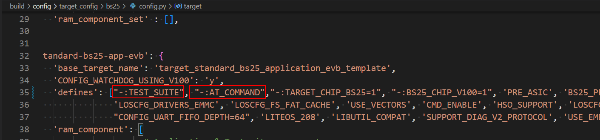
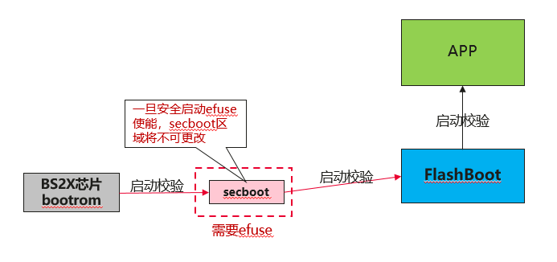
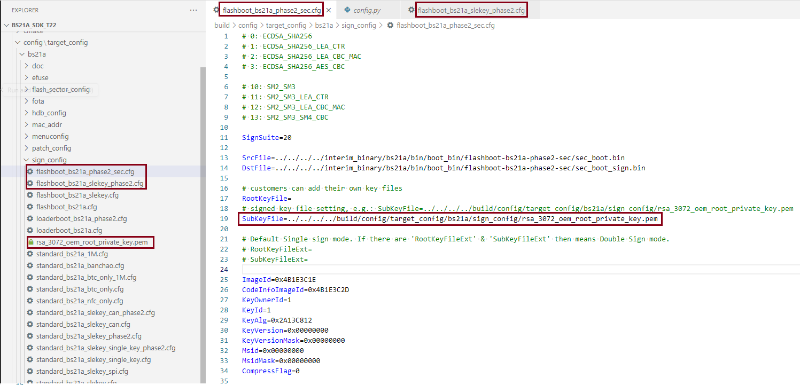

# Preface

**Overview**

The BS2XV100 delivery package is a chip solution delivery package, mainly including chip materials, hardware materials, the SDK software package, software reference designs, and software materials. Users can develop various customized products based on this chip solution delivery package.

From the perspective of network security, this document highlights the network-security threats that a product developed based on this delivery package may face during use and that are related to the SDK software package in this delivery package. At the same time, it provides corresponding solutions in a targeted manner.

**Product Versions**

The product versions corresponding to this document are as follows.

<table><thead align="left"><tr id="row63051425"><th class="cellrowborder" valign="top" width="40.400000000000006%" id="mcps1.1.3.1.1">
<strong id="b3756104316114">Product Name</strong>

</th>
<th class="cellrowborder" valign="top" width="59.599999999999994%" id="mcps1.1.3.1.2">
<strong id="b1676784314119">Product Version</strong>

</th>
</tr>
</thead>
<tbody><tr id="row52579486"><td class="cellrowborder" valign="top" width="40.400000000000006%" headers="mcps1.1.3.1.1 ">
BS2X

</td>
<td class="cellrowborder" valign="top" width="59.599999999999994%" headers="mcps1.1.3.1.2 ">
V100

</td>
</tr>
</tbody>
</table>

**Reader Audience**

This document is mainly applicable to the following engineers:

-   Technical support engineers
-   Software development engineers

**Symbol Conventions**

The following symbols may appear in this document, and their meanings are as follows.

<table><thead align="left"><tr id="row1530720816410"><th class="cellrowborder" valign="top" width="20.580000000000002%" id="mcps1.1.3.1.1">
<strong id="b2136615816410">Symbol</strong>

</th>
<th class="cellrowborder" valign="top" width="79.42%" id="mcps1.1.3.1.2">
<strong id="b5941558116410">Description</strong>

</th>
</tr>
</thead>
<tbody><tr id="row1372280416410"><td class="cellrowborder" valign="top" width="20.580000000000002%" headers="mcps1.1.3.1.1 ">

</td>
<td class="cellrowborder" valign="top" width="79.42%" headers="mcps1.1.3.1.2 ">
Indicates a hazard with a high level of risk that, if not avoided, will result in death or serious injury.

</td>
</tr>
<tr id="row466863216410"><td class="cellrowborder" valign="top" width="20.580000000000002%" headers="mcps1.1.3.1.1 ">

</td>
<td class="cellrowborder" valign="top" width="79.42%" headers="mcps1.1.3.1.2 ">
Indicates a hazard with a medium level of risk that, if not avoided, may result in death or serious injury.

</td>
</tr>
<tr id="row123863216410"><td class="cellrowborder" valign="top" width="20.580000000000002%" headers="mcps1.1.3.1.1 ">

</td>
<td class="cellrowborder" valign="top" width="79.42%" headers="mcps1.1.3.1.2 ">
Indicates a hazard with a low level of risk that, if not avoided, may result in minor or moderate injury.

</td>
</tr>
<tr id="row5786682116410"><td class="cellrowborder" valign="top" width="20.580000000000002%" headers="mcps1.1.3.1.1 ">

</td>
<td class="cellrowborder" valign="top" width="79.42%" headers="mcps1.1.3.1.2 ">
Used to deliver device- or environment-safety warning information. If not avoided, it may cause equipment damage, data loss, degraded equipment performance, or other unpredictable results.

"Cautions" do not involve personal injury.

</td>
</tr>
<tr id="row2856923116410"><td class="cellrowborder" valign="top" width="20.580000000000002%" headers="mcps1.1.3.1.1 ">

</td>
<td class="cellrowborder" valign="top" width="79.42%" headers="mcps1.1.3.1.2 ">
Supplementary explanation of key information in the main text.

"Notes" are not safety warning information and do not involve personal, equipment, or environmental injury information.

</td>
</tr>
</tbody>
</table>

**Modification Records**

<table><thead align="left"><tr id="row2942532716410"><th class="cellrowborder" valign="top" width="18.39%" id="mcps1.1.4.1.1">
<strong id="b5687322716410">Doc Version</strong>

</th>
<th class="cellrowborder" valign="top" width="20.849999999999998%" id="mcps1.1.4.1.2">
<strong id="b5800814916410">Release Date</strong>

</th>
<th class="cellrowborder" valign="top" width="60.760000000000005%" id="mcps1.1.4.1.3">
<strong id="b3316380216410">Modification Description</strong>

</th>
</tr>
</thead>
<tbody><tr id="row6317125412115"><td class="cellrowborder" valign="top" width="18.39%" headers="mcps1.1.4.1.1 ">
03

</td>
<td class="cellrowborder" valign="top" width="20.849999999999998%" headers="mcps1.1.4.1.2 ">
2025-05-30

</td>
<td class="cellrowborder" valign="top" width="60.760000000000005%" headers="mcps1.1.4.1.3 ">
Updated the content of the "<a href="安全启动.md">Secure Boot</a>" section.

</td>
</tr>
<tr id="row161011912164316"><td class="cellrowborder" valign="top" width="18.39%" headers="mcps1.1.4.1.1 ">
02

</td>
<td class="cellrowborder" valign="top" width="20.849999999999998%" headers="mcps1.1.4.1.2 ">
2025-01-14

</td>
<td class="cellrowborder" valign="top" width="60.760000000000005%" headers="mcps1.1.4.1.3 "><ul id="ul1647540141116"><li>Added the content of the "<a href="免责声明.md">Disclaimer</a>" section.</li><li>Updated the content of the "<a href="安全升级.md">Secure Upgrade</a>" section.</li><li>Updated the content of the "<a href="可维可测注意事项.md">Serviceability and Testability Notes</a>" section.</li></ul>
</td>
</tr>
<tr id="row20774832175918"><td class="cellrowborder" valign="top" width="18.39%" headers="mcps1.1.4.1.1 ">
01

</td>
<td class="cellrowborder" valign="top" width="20.849999999999998%" headers="mcps1.1.4.1.2 ">
2024-08-29

</td>
<td class="cellrowborder" valign="top" width="60.760000000000005%" headers="mcps1.1.4.1.3 "><ul id="ul372682112432"><li>Updated the content of the "<a href="安全架构.md">Security Architecture</a>" section.</li><li>Updated the content of the "<a href="安全启动开关.md">Secure Boot Switch</a>" and "<a href="安全启动流程.md">Secure Boot Process</a>" sections.</li><li>Added the content of the "<a href="密钥的配置和替换.md">Key Configuration and Replacement</a>" section.</li><li>Updated the content of the "<a href="关键数据安全存储.md">Secure Storage of Critical Data</a>" section.</li></ul>
</td>
</tr>
<tr id="row186991428102517"><td class="cellrowborder" valign="top" width="18.39%" headers="mcps1.1.4.1.1 ">
00B02

</td>
<td class="cellrowborder" valign="top" width="20.849999999999998%" headers="mcps1.1.4.1.2 ">
2024-01-08

</td>
<td class="cellrowborder" valign="top" width="60.760000000000005%" headers="mcps1.1.4.1.3 ">
Updated the content of the "<a href="设备安全.md">Device Security</a>" section.

</td>
</tr>
<tr id="row5947359616410"><td class="cellrowborder" valign="top" width="18.39%" headers="mcps1.1.4.1.1 ">
00B01

</td>
<td class="cellrowborder" valign="top" width="20.849999999999998%" headers="mcps1.1.4.1.2 ">
2023-12-15

</td>
<td class="cellrowborder" valign="top" width="60.760000000000005%" headers="mcps1.1.4.1.3 ">
First interim version release.

</td>
</tr>
</tbody>
</table>

# Product Security Solution

## Disclaimer

Customers should fully evaluate the network-security requirements of their own products (including but not limited to: selecting secure encryption/decryption algorithms in mass-production products, disabling insecure protocols such as telnet, disabling unnecessary debug interfaces and commands) and bear the ultimate responsibility. The notes document provided by this product helps customers harden the network security of their own products.

Some of the functions described in this document for this product use keys to provide security mechanisms. Customers need to properly generate, burn/flash, use, and manage the keys (including but not limited to asymmetric keys, symmetric keys, etc.); otherwise, they will bear the associated risks themselves.

## Security Architecture

The network security of a product is a systematic engineering effort that involves every layer of the entire product.

The threats that the BS2X version may involve are as follows:

-   Startup and boot security

    This mainly involves the verification mechanism for each level of image during the system startup process. BS2X provides a secure boot solution, including a complete boot trust chain verification. The trust root is BootRom and EFUSE. First, BootRom verifies secboot and the root public key; then secboot verifies and boots flashboot; then flashboot verifies and boots the APP. For the detailed secure boot process, please refer to "<a href="安全启动流程.md">Secure Boot Process</a>".

-   System upgrade security

    The SDK provides image upgrade functionality, including upgrading flashboot and the APP. Among these, flashboot uses a dual-backup mechanism that prevents the risk of flashboot being damaged due to a power cut during upgrade writing. The system provides an upgrade image verification function: before writing to flash, the system image is verified to ensure the security of the image being written.

-   JTAG secure debugging

    The JTAG debug function is enabled by default. For formal commercial release, the JTAG debug function needs to be disabled. JTAG is disabled through the operation of the corresponding bit in EFUSE. The SDK provides a dedicated secure-boot-enabling patch package to disable JTAG.

-   UART burn/flash port

    Disabling is not supported.

-   Command serial port

    The command serial port function is enabled by default for customer debugging convenience. When not in use, customers need to disable the TEST_SUITE, AT_COMMAND, and SW_UART_DEBUG macros.

    

## Device Security

For security considerations, it is recommended that users implement the following measures in the final product:

-   Enable the secure boot feature.
-   Permanently disable the JTAG debug function.
-   Permanently disable the UART burn/flash port.

## Secure Boot

BS2X supports secure boot.

### Secure Boot Switch

Secure boot of the BS2X chip needs to be enabled through the chip's efuse.

Before enabling security, the hash value of the secboot image (including the public key and other information) needs to be burned into the efuse area. Once the hash value of the secboot image is burned into the efuse area, it cannot be changed. Therefore, you must ensure that the signed secboot image can no longer change.

After the hash value of the secboot image is burned, secure boot must be enabled through efuse. Once the enable bit is successfully burned, the chip will perform secure verification after restart.

The SDK will provide a dedicated security-enabling patch package for customer use. This patch package includes the secure boot efuse function.

### Secure Boot Process

The execution process of secure boot verification of BS2X is shown in [Figure 1](#fig856593710917).

**Figure 1** Secure Boot Execution Diagram  

1.  BootRom booting the secboot process:

    BootRom is fixed in the chip and does not change by itself; it can be guaranteed secure and trustworthy. After BootRom starts, it loads the secondary bootloader secboot.

    The process by which BootRom verifies and loads secboot:

    1.  BootRom reads the secboot image (including the public key and other data information), performs a hash calculation on the image, and computes the Hash value.
    2.  BootRom reads the pre-programmed secboot hash value from the efuse and compares it.
    3.  If the comparison succeeds, it proves that secboot has not been tampered with, and booting continues to execute secboot.
    4.  If the comparison fails, it proves that secboot has been damaged, and the chip terminates startup.

2.  secboot boots the flashboot image.

    After secboot starts successfully, it performs a boot verification on flashboot.

    seboot uses the verified public key to perform signature verification on flashboot. If the verification succeeds, flashboot is booted.

    flashboot uses a dual-copy mechanism. If verification of flashboot region A fails, secboot will attempt to verify flashboot region B.

    If verification of both partitions fails, startup is terminated.

3.  flashboot verifies and boots the APP image.

    After flashboot starts successfully, it begins signature verification of the APP image; users can generate a separate public key for the APP, or use the same public key as flashboot.

    If APP verification fails, startup is terminated.

### Key Configuration and Replacement

The SDK provides the signing configuration files for each system, used to sign the secboot, flashboot, and APP images respectively.

> **Cautions:** 
>The key files provided by the SDK are only for development reference; customers must replace them with their own key files.

Taking BS21A as an example:

build\config\target_config\bs21a\sign_config\flashboot_bs21a_n1200_sec.cfg

build\config\target_config\bs21a\sign_config\flashboot_bs21a_slekey_n1200.cfg

build\config\target_config\bs21a\standard_bs21a_slekey_can_n1200.cfg

Customers can configure the keys as shown in the figure:

The key files used for signing are stored in the following directory:

build\config\target_config\bs21a\sign_config\rsa_3072_oem_root_private_key.pem

## Secure Upgrade

BS2X supports secure upgrade. For the detailed upgrade processing, please refer to the "BS2XV100 Upgrade Solution Usage Guide".

## Secure Storage of Critical Data

When users record confidential information such as accounts and passwords, they need to ensure the storage security of this data. Therefore, this data is required to be encrypted for protection before storage.

## Driver Security Notes

### Cipher Driver

The Cipher driver implements the standard symmetric encryption AES, asymmetric encryption RSA, digest algorithm SHA256, and key derivation algorithms, and does not use any proprietary algorithms.

When using it, please note: the longer the Cipher key length, the higher the security level. Therefore, it is recommended to use AES keys of 128-bit and above, and RSA keys of 3072-bit and above.

## Other Security Notes for Use

### Code Security Notes

Network-security problems caused by code errors usually stem from basic code-specification issues, such as pointer out-of-bounds, array out-of-bounds, and unverified input parameters. It is recommended to check through the following methods:

-   Use industry-standard code health scanning tools to perform full-coverage scanning.
-   Use fuzzing tools to perform full-range fuzz testing on all API interfaces (including device driver interfaces).
-   Use industry-standard vulnerability scanning tools to scan the open-source software used.

### Serviceability and Testability Notes

-   The serviceability and testability solution is enabled only during debugging; it is recommended that users disable it in the Release version.
-   The HSO debug tool is currently used only for debugging/measurement log printing during SDK problem localization.
-   For the detailed usage of the serviceability and testability interfaces, please refer to the descriptions in the BS2X measurement series of documents.

# Conclusion

It is necessary for the BS2X product to take corresponding security measures based on security threat analysis. The following security principles are provided for reference:

-   Appropriate security

    Security design is based on the analysis of specific security hazard scenarios. Considering performance, cost, and business impact, the most appropriate security measures are decided upon.

-   Least privilege

    According to role needs, grant users, maintenance personnel, network elements, programs, processes, etc., the minimum privileges and resources. This can reduce potential security risks.

-   Proactive collaborative defense

    Identify malicious attack sources in a timely manner and automatically remove the connection between malicious users and the network before the attack causes significant harm. The connection bandwidth and quality of service can also be reduced to minimize negative impact.

-   Defense in depth

    The defense-in-depth principle involves multiple layers of defense against threats. For example, when one defense layer is insufficient, another defense layer will prevent further damage.
