# Preface

**Overview**

This document describes the SDK development environment for BS2X series chips (including SDK compilation, application development, etc.), helping users quickly understand the development environment and compile executable files for secondary development.

**Product Version**

The product version corresponding to this document is as follows.

<table><thead align="left"><tr id="row15364171712479"><th class="cellrowborder" valign="top" width="31.759999999999998%" id="mcps1.1.3.1.1">
<strong id="b12222191212104">Product Name</strong>

</th>
<th class="cellrowborder" valign="top" width="68.24%" id="mcps1.1.3.1.2">
<strong id="b1523661211108">Product Version</strong>

</th>
</tr>
</thead>
<tbody><tr id="row19364317104716"><td class="cellrowborder" valign="top" width="31.759999999999998%" headers="mcps1.1.3.1.1 ">
BS2X

</td>
<td class="cellrowborder" valign="top" width="68.24%" headers="mcps1.1.3.1.2 ">
V100

</td>
</tr>
</tbody>
</table>

**Reader Audience**

This document is mainly applicable to the following engineers:

-   Technical support engineer
-   Software development engineer

**Symbol Conventions**

The following symbols may appear in this document. Their meanings are as follows.

<table><thead align="left"><tr id="row1530720816410"><th class="cellrowborder" valign="top" width="20.580000000000002%" id="mcps1.1.3.1.1">
<strong id="b2136615816410">Symbol</strong>

</th>
<th class="cellrowborder" valign="top" width="79.42%" id="mcps1.1.3.1.2">
<strong id="b5941558116410">Description</strong>

</th>
</tr>
</thead>
<tbody><tr id="row1372280416410"><td class="cellrowborder" valign="top" width="20.580000000000002%" headers="mcps1.1.3.1.1 ">

</td>
<td class="cellrowborder" valign="top" width="79.42%" headers="mcps1.1.3.1.2 ">
Indicates a hazard with a high level of risk which, if not avoided, will result in death or serious injury.

</td>
</tr>
<tr id="row466863216410"><td class="cellrowborder" valign="top" width="20.580000000000002%" headers="mcps1.1.3.1.1 ">

</td>
<td class="cellrowborder" valign="top" width="79.42%" headers="mcps1.1.3.1.2 ">
Indicates a hazard with a medium level of risk which, if not avoided, could result in death or serious injury.

</td>
</tr>
<tr id="row123863216410"><td class="cellrowborder" valign="top" width="20.580000000000002%" headers="mcps1.1.3.1.1 ">

</td>
<td class="cellrowborder" valign="top" width="79.42%" headers="mcps1.1.3.1.2 ">
Indicates a hazard with a low level of risk which, if not avoided, could result in minor or moderate injury.

</td>
</tr>
<tr id="row5786682116410"><td class="cellrowborder" valign="top" width="20.580000000000002%" headers="mcps1.1.3.1.1 ">

</td>
<td class="cellrowborder" valign="top" width="79.42%" headers="mcps1.1.3.1.2 ">
Used to convey equipment or environment safety warnings. If not avoided, it may result in equipment damage, data loss, degraded equipment performance, or other unpredictable results.

"Notice" does not involve personal injury.

</td>
</tr>
<tr id="row2856923116410"><td class="cellrowborder" valign="top" width="20.580000000000002%" headers="mcps1.1.3.1.1 ">

</td>
<td class="cellrowborder" valign="top" width="79.42%" headers="mcps1.1.3.1.2 ">
Supplementary description of key information in the main text.

"Note" is not a safety warning and does not involve personal, equipment, or environmental damage.

</td>
</tr>
</tbody>
</table>

**Modification Record**

<table><thead align="left"><tr id="row2942532716410"><th class="cellrowborder" valign="top" width="19.580000000000002%" id="mcps1.1.4.1.1">
<strong id="b5687322716410">Document Version</strong>

</th>
<th class="cellrowborder" valign="top" width="19.11%" id="mcps1.1.4.1.2">
<strong id="b5800814916410">Release Date</strong>

</th>
<th class="cellrowborder" valign="top" width="61.309999999999995%" id="mcps1.1.4.1.3">
<strong id="b3316380216410">Modification Description</strong>

</th>
</tr>
</thead>
<tbody><tr id="row34241947105220"><td class="cellrowborder" valign="top" width="19.580000000000002%" headers="mcps1.1.4.1.1 ">
04

</td>
<td class="cellrowborder" valign="top" width="19.11%" headers="mcps1.1.4.1.2 ">
2025-08-07

</td>
<td class="cellrowborder" valign="top" width="61.309999999999995%" headers="mcps1.1.4.1.3 ">
Updated the content of the "<a href="打包添加其他bin文件.md">Packaging and Adding Other bin Files</a>" subsection.

</td>
</tr>
<tr id="row372895021211"><td class="cellrowborder" valign="top" width="19.580000000000002%" headers="mcps1.1.4.1.1 ">
03

</td>
<td class="cellrowborder" valign="top" width="19.11%" headers="mcps1.1.4.1.2 ">
2025-05-30

</td>
<td class="cellrowborder" valign="top" width="61.309999999999995%" headers="mcps1.1.4.1.3 ">
Updated the content of the "<a href="flash分区表配置.md">Flash Partition Table Configuration</a>" subsection.

</td>
</tr>
<tr id="row31617137538"><td class="cellrowborder" valign="top" width="19.580000000000002%" headers="mcps1.1.4.1.1 ">
02

</td>
<td class="cellrowborder" valign="top" width="19.11%" headers="mcps1.1.4.1.2 ">
2025-01-24

</td>
<td class="cellrowborder" valign="top" width="61.309999999999995%" headers="mcps1.1.4.1.3 "><ul id="ul1051218445539"><li>Adjusted the document structure.</li><li>Added the content of the "<a href="搭建Windows开发环境.md">Setting Up the Windows Development Environment</a>" subsection.</li><li>Added the content of the "<a href="编译SDK（Cmake）.md">Compiling the SDK (Cmake)</a>" subsection.</li></ul>
</td>
</tr>
<tr id="row58810414523"><td class="cellrowborder" valign="top" width="19.580000000000002%" headers="mcps1.1.4.1.1 ">
01

</td>
<td class="cellrowborder" valign="top" width="19.11%" headers="mcps1.1.4.1.2 ">
2024-05-15

</td>
<td class="cellrowborder" valign="top" width="61.309999999999995%" headers="mcps1.1.4.1.3 ">
First official release.

</td>
</tr>
<tr id="row6236545165217"><td class="cellrowborder" valign="top" width="19.580000000000002%" headers="mcps1.1.4.1.1 ">
00B03

</td>
<td class="cellrowborder" valign="top" width="19.11%" headers="mcps1.1.4.1.2 ">
2024-02-29

</td>
<td class="cellrowborder" valign="top" width="61.309999999999995%" headers="mcps1.1.4.1.3 ">
Updated the content of the "Version Compilation" subsection.

</td>
</tr>
<tr id="row12832184925218"><td class="cellrowborder" valign="top" width="19.580000000000002%" headers="mcps1.1.4.1.1 ">
00B02

00B01

</td>
<td class="cellrowborder" valign="top" width="19.11%" headers="mcps1.1.4.1.2 ">
2023-12-04

2023-10-27

</td>
<td class="cellrowborder" valign="top" width="61.309999999999995%" headers="mcps1.1.4.1.3 ">
Updated the content of the "Starting Compilation" subsection.

First temporary release.

</td>
</tr>
</tbody>
</table>

# Setting Up the Development Environment

## SDK Development Environment Overview

A typical SDK development environment mainly includes:

-   Linux server

    A Linux server is mainly used to set up the cross-compilation environment to compile executable code that can run on the target board.

-   Workstation

    A workstation is mainly used for target board flashing and debugging. It connects to the target board over a serial port, allowing developers to flash target board images and debug programs from the workstation. The workstation usually requires terminal tools for logging in to the Linux server and the target board and viewing the target board's print output. The workstation typically runs Windows or Linux. Common terminal tools on Windows or Linux workstations include SecureCRT, Putty, miniCom, etc., which need to be downloaded from their official websites.

-   Target board

    This document uses the DEMO board as an example of a target board. The DEMO board connects to the workstation via a USB-to-serial adapter. The workstation flashes the cross-compiled DEMO board image to the DEMO board over the serial port, as shown in [Figure 1](#fig1236915206315).

    **Figure 1**  SDK Development Environment  
    
    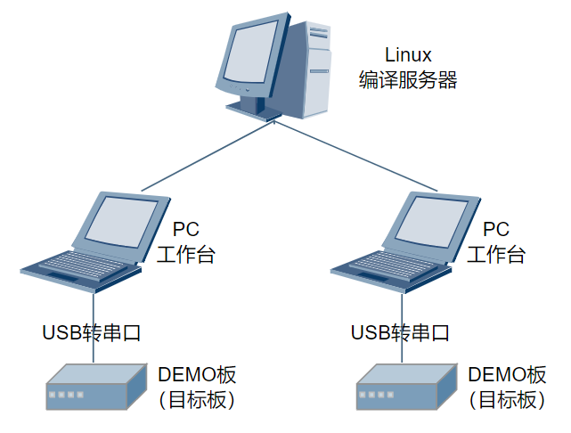

## Setting Up the Windows Development Environment

The BS2X solution provides IDE development tools for Windows that support one-click version builds. For setting up an IDE-based compilation environment, refer to the "BS2X V100 IDE Tool Usage Guide". This document does not repeat the details.

## Setting Up the Linux Development Environment

Ubuntu 20.04 or later is recommended for the Linux system, with bash as the Shell. The SDK is compiled with Cmake (3.14.1 or later). Compilation tools also include Python (3.8.0 or later), etc.

### Configuring the Shell

Configure bash as the default shell. Open a Linux terminal and run the command "sudo dpkg-reconfigure dash", then select no.

### Installing Cmake

Open a Linux terminal and run the command "sudo apt install cmake" to complete the Cmake installation.

### Installing the Python Environment

1.  Open a Linux terminal, enter the command "python3 -V" to check the Python version. Python 3.8.0 or later is recommended.
2.  If the Python version is too old, run "sudo apt-get update" to update the system to the latest version, or install Python3 with the command "sudo apt-get install python3 -y" (root/sudo privileges are required). After installation, check the Python version again.

    If the version requirement is still not met, download the source package of the corresponding version from "[https://www.python.org/downloads/source/](https://www.python.org/downloads/source/)  ". For download and installation instructions, refer to  [https://wiki.python.org/moin/BeginnersGuide/Download](https://wiki.python.org/moin/BeginnersGuide/Download)  and the README in the source package.

3.  Install the Python package management tools by running the command "sudo apt-get install python3-setuptools python3-pip -y" (root/sudo privileges are required).
4.  Install Kconfiglib 14.1.0+. Use the command "sudo pip3 install kconfiglib" (root/sudo privileges are required), or download the .whl file (for example, kconfiglib-14.1.0-py2.py3-none-any.whl) from "[https://pypi.org/project/kconfiglib](https://pypi.org/project/kconfiglib)" and install it with "pip3 install kconfiglib-xxx.whl" (root/sudo privileges are required). Alternatively, download the source package, extract it locally, and install it with "python setup.py install" (root/sudo privileges are required). The installation completion screen is shown in [Figure 1](#fig743717512220).

    **Figure 1**  Example of Completed Kconfiglib Component Installation  
    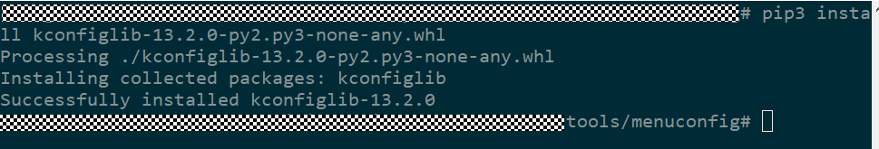

5.  Install the Python component packages required for upgrade file signing.

    Install pycparser:

    After downloading the .whl file (for example, pycparser-2.21-py2.py3-none-any.whl) from "[https://pypi.org/project/pycparser/](https://pypi.org/project/pycparser/)", install it with "pip3 install pycparser-xxx.whl" (root/sudo privileges are required). Alternatively, download the source package, extract it locally, and install it with "python setup.py install" (root/sudo privileges are required). After the installation is complete, the interface will prompt "Successfully intalled pycparser-2.21".

> **Note:** 
>If the build environment contains multiple python versions, especially multiple python versions of the same version, and the user cannot identify which one is being used, it is recommended to install Python component packages from the component package source code in this case.

# Compiling the SDK

## SDK Directory Structure

The SDK root directory structure is shown in [Table 1](#table13927142512394).

**Table 1**  SDK Root Directory

<table><thead align="left"><tr id="row15927132514396"><th class="cellrowborder" valign="top" width="27.38%" id="mcps1.2.3.1.1">
Directory

</th>
<th class="cellrowborder" valign="top" width="72.61999999999999%" id="mcps1.2.3.1.2">
Description

</th>
</tr>
</thead>
<tbody><tr id="row292882517399"><td class="cellrowborder" valign="top" width="27.38%" headers="mcps1.2.3.1.1 ">
application

</td>
<td class="cellrowborder" valign="top" width="72.61999999999999%" headers="mcps1.2.3.1.2 ">
Application layer code (including demo programs as reference examples).

</td>
</tr>
<tr id="row12308241122019"><td class="cellrowborder" valign="top" width="27.38%" headers="mcps1.2.3.1.1 ">
build

</td>
<td class="cellrowborder" valign="top" width="72.61999999999999%" headers="mcps1.2.3.1.2 ">
Scripts and configuration files required for SDK builds.

</td>
</tr>
<tr id="row1653555018202"><td class="cellrowborder" valign="top" width="27.38%" headers="mcps1.2.3.1.1 ">
build.py

</td>
<td class="cellrowborder" valign="top" width="72.61999999999999%" headers="mcps1.2.3.1.2 ">
Entry script for compilation.

</td>
</tr>
<tr id="row10787191320215"><td class="cellrowborder" valign="top" width="27.38%" headers="mcps1.2.3.1.1 ">
CMakeLists.txt

</td>
<td class="cellrowborder" valign="top" width="72.61999999999999%" headers="mcps1.2.3.1.2 ">
Top-level "CMakeLists.txt" file of the Cmake project.

</td>
</tr>
<tr id="row109286253399"><td class="cellrowborder" valign="top" width="27.38%" headers="mcps1.2.3.1.1 ">
config.in

</td>
<td class="cellrowborder" valign="top" width="72.61999999999999%" headers="mcps1.2.3.1.2 ">
Kconfig configuration file.

</td>
</tr>
<tr id="row15928132512396"><td class="cellrowborder" valign="top" width="27.38%" headers="mcps1.2.3.1.1 ">
drivers

</td>
<td class="cellrowborder" valign="top" width="72.61999999999999%" headers="mcps1.2.3.1.2 ">
Driver code.

</td>
</tr>
<tr id="row415218166102"><td class="cellrowborder" valign="top" width="27.38%" headers="mcps1.2.3.1.1 ">
include

</td>
<td class="cellrowborder" valign="top" width="72.61999999999999%" headers="mcps1.2.3.1.2 ">
Directory for storing API header files.

</td>
</tr>
<tr id="row75842056117"><td class="cellrowborder" valign="top" width="27.38%" headers="mcps1.2.3.1.1 ">
interim_binary

</td>
<td class="cellrowborder" valign="top" width="72.61999999999999%" headers="mcps1.2.3.1.2 ">
Directory for storing libraries.

</td>
</tr>
<tr id="row152262035269"><td class="cellrowborder" valign="top" width="27.38%" headers="mcps1.2.3.1.1 ">
kernel

</td>
<td class="cellrowborder" valign="top" width="72.61999999999999%" headers="mcps1.2.3.1.2 ">
Kernel code and OS interface adaptation layer code.

</td>
</tr>
<tr id="row26011201747"><td class="cellrowborder" valign="top" width="27.38%" headers="mcps1.2.3.1.1 ">
middleware

</td>
<td class="cellrowborder" valign="top" width="72.61999999999999%" headers="mcps1.2.3.1.2 ">
Middleware code.

</td>
</tr>
<tr id="row17392173512420"><td class="cellrowborder" valign="top" width="27.38%" headers="mcps1.2.3.1.1 ">
open_source

</td>
<td class="cellrowborder" valign="top" width="72.61999999999999%" headers="mcps1.2.3.1.2 ">
Open-source code.

</td>
</tr>
<tr id="row17747172410413"><td class="cellrowborder" valign="top" width="27.38%" headers="mcps1.2.3.1.1 ">
protocol

</td>
<td class="cellrowborder" valign="top" width="72.61999999999999%" headers="mcps1.2.3.1.2 ">
Protocol stacks such as BLE and SLE.

</td>
</tr>
<tr id="row768611001510"><td class="cellrowborder" valign="top" width="27.38%" headers="mcps1.2.3.1.1 ">
test

</td>
<td class="cellrowborder" valign="top" width="72.61999999999999%" headers="mcps1.2.3.1.2 ">
Test suite code.

</td>
</tr>
<tr id="row44171914181911"><td class="cellrowborder" valign="top" width="27.38%" headers="mcps1.2.3.1.1 ">
tools

</td>
<td class="cellrowborder" valign="top" width="72.61999999999999%" headers="mcps1.2.3.1.2 ">
Contains the compilation toolchain (for both Linux and Windows), image packaging scripts, NV creation tools, and signing scripts, etc.

</td>
</tr>
<tr id="row15401556194817"><td class="cellrowborder" valign="top" width="27.38%" headers="mcps1.2.3.1.1 ">
output

</td>
<td class="cellrowborder" valign="top" width="72.61999999999999%" headers="mcps1.2.3.1.2 ">
Object files and intermediate files generated during compilation (including library files, printed logs, generated binary files, etc.).

</td>
</tr>
</tbody>
</table>

Note: The output directory described in the table above is generated after compilation. The root directory after decompressing the SDK is shown in [Figure 1](#fig112752111447).

**Figure 1**  Example of Decompressing the SDK  

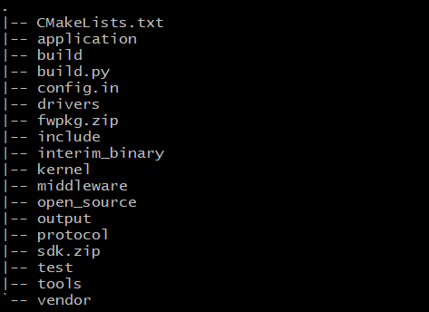

## Compiling the SDK (Cmake)

### Compilation Methods

Run the "python3 build.py" command in the root directory to run the compilation script and compile the corresponding SDK program. The compilation commands are listed in [Table 1](#table1646491114816). standard-bs21-n1100 is used as an example here; compilation targets may differ across BS2X projects.

**Table 1**  build.sh Parameter List

<table><thead align="left"><tr id="row44654114810"><th class="cellrowborder" valign="top" width="12.76%" id="mcps1.2.4.1.1">
Parameter

</th>
<th class="cellrowborder" valign="top" width="40.35%" id="mcps1.2.4.1.2">
Example

</th>
<th class="cellrowborder" valign="top" width="46.89%" id="mcps1.2.4.1.3">
Description

</th>
</tr>
</thead>
<tbody><tr id="row746513144812"><td class="cellrowborder" valign="top" width="12.76%" headers="mcps1.2.4.1.1 ">
None

</td>
<td class="cellrowborder" valign="top" width="40.35%" headers="mcps1.2.4.1.2 ">
python3 build.py standard-bs21-n1100

</td>
<td class="cellrowborder" valign="top" width="46.89%" headers="mcps1.2.4.1.3 ">
Starts incremental compilation for the standard-bs21-n1100 target.

</td>
</tr>
<tr id="row04651218489"><td class="cellrowborder" valign="top" width="12.76%" headers="mcps1.2.4.1.1 ">
-c

</td>
<td class="cellrowborder" valign="top" width="40.35%" headers="mcps1.2.4.1.2 ">
python3 build.py -c standard-bs21-n1100

</td>
<td class="cellrowborder" valign="top" width="46.89%" headers="mcps1.2.4.1.3 ">
Starts full compilation for the standard-bs21-n1100 target.

</td>
</tr>
<tr id="row11696675533"><td class="cellrowborder" valign="top" width="12.76%" headers="mcps1.2.4.1.1 ">
menuconfig

</td>
<td class="cellrowborder" valign="top" width="40.35%" headers="mcps1.2.4.1.2 ">
python3 build.py standard-bs21-n1100 menuconfig

</td>
<td class="cellrowborder" valign="top" width="46.89%" headers="mcps1.2.4.1.3 ">
Starts the menuconfig graphical configuration interface for the standard-bs21-n1100 target.

</td>
</tr>
</tbody>
</table>

**Table 2**  Compilation Target Introduction

<table><thead align="left"><tr id="row1898820470542"><th class="cellrowborder" valign="top" width="42.96%" id="mcps1.2.3.1.1">
Compilation Target

</th>
<th class="cellrowborder" valign="top" width="57.04%" id="mcps1.2.3.1.2">
Description

</th>
</tr>
</thead>
<tbody><tr id="row20988114713546"><td class="cellrowborder" valign="top" width="42.96%" headers="mcps1.2.3.1.1 ">
python3 build.py -c standard-bs21-n1100

</td>
<td class="cellrowborder" valign="top" width="57.04%" headers="mcps1.2.3.1.2 ">
Compilation target for the app version (flashboot will be packaged into the compilation output).

</td>
</tr>
<tr id="row14862228125611"><td class="cellrowborder" valign="top" width="42.96%" headers="mcps1.2.3.1.1 ">
python3 build.py -c flashboot-bs21-n1100

</td>
<td class="cellrowborder" valign="top" width="57.04%" headers="mcps1.2.3.1.2 ">
Compilation target for the flashboot image.

</td>
</tr>
</tbody>
</table>

The compiled flash images are located in the "output/bs21/fwpkg/standard-bs21-n1100" directory (see [Table 3](#table5535429403)).

**Table 3**  Flash Images

<table><thead align="left"><tr id="row1353722184019"><th class="cellrowborder" valign="top" width="35.449999999999996%" id="mcps1.2.3.1.1">
File Name

</th>
<th class="cellrowborder" valign="top" width="64.55%" id="mcps1.2.3.1.2">
Description

</th>
</tr>
</thead>
<tbody><tr id="row75376234019"><td class="cellrowborder" valign="top" width="35.449999999999996%" headers="mcps1.2.3.1.1 ">
bs21_all_in_one.fwpkg

</td>
<td class="cellrowborder" valign="top" width="64.55%" headers="mcps1.2.3.1.2 ">
When flashing a blank chip, this file must be flashed. It contains all the content that needs to be flashed, including: loaderboot_sign.bin, flashboot_sign_a.bin, flashboot_sign_b.bin, bs21_all_nv.bin, and application_sign.bin.

The files are described as follows:

loaderboot_sign.bin: the image file of loaderboot. When an upgrade starts, the romboot hardened in the chip receives this image file, loads it into memory, and runs it. loaderboot is responsible for receiving subsequent image files. Note: This image runs only in RAM during the upgrade phase and is not stored in flash.

flashboot_sign_a.bin: the image file of flashboot. After flashing is complete, this is the primary flashboot image to execute. Its integrity is verified at startup.

flashboot_sign_b.bin: the backup image file of flashboot. This image is loaded when the primary flashboot image is checked as invalid or corrupted.

bs21_all_nv.bin: the image file of the parameter area.

application_sign.bin: the image file of the application version.

</td>
</tr>
<tr id="row15537132114020"><td class="cellrowborder" valign="top" width="35.449999999999996%" headers="mcps1.2.3.1.1 ">
bs21_loadapp_only.fwpkg

</td>
<td class="cellrowborder" valign="top" width="64.55%" headers="mcps1.2.3.1.2 ">
Upgrade packaging file, including: loaderboot_sign.bin and application_sign.bin. Does not include flashboot-related content.

After the chip has been flashed with the "bs21_all_in_one.fwpkg" image, if subsequent modifications do not involve flashboot or nv changes, this file can be used for upgrading.

</td>
</tr>
<tr id="row14916571496"><td class="cellrowborder" valign="top" width="35.449999999999996%" headers="mcps1.2.3.1.1 ">
bs21_flashboot_only.fwpkg

</td>
<td class="cellrowborder" valign="top" width="64.55%" headers="mcps1.2.3.1.2 ">
Boot upgrade packaging file, including: loaderboot_sign.bin, flashboot_sign_a.bin, and flashboot_sign_b.bin. Does not include application-related content.

After the chip has been flashed with the "bs21_all_in_one.fwpkg" image, if there is a need to upgrade flashboot, this file can be used for upgrading.

</td>
</tr>
<tr id="row1972752413919"><td class="cellrowborder" valign="top" width="35.449999999999996%" headers="mcps1.2.3.1.1 ">
bs21_nv_only.fwpkg

</td>
<td class="cellrowborder" valign="top" width="64.55%" headers="mcps1.2.3.1.2 ">
nv upgrade packaging file, including loaderboot_sign.bin and bs21_all_nv.bin. Does not include application or flashboot-related content.

After the chip has been flashed with the "bs21_all_in_one.fwpkg" image, if there is a need to upgrade nv parameters, this file can be used for upgrading.

</td>
</tr>
</tbody>
</table>

Note: The intermediate files generated by compilation are located in the "output/bs21/acore/standard-bs21-n1100" directory.

### Compilation Parameters in Detail

The parameters accepted by the compilation command and their explanations are shown in [Table 1](#table36913222319).

**Table 1**  Compilation Parameter Information

<table><thead align="left"><tr id="row205261342910"><th class="cellrowborder" valign="top" width="20.65%" id="mcps1.2.3.1.1">
Parameter

</th>
<th class="cellrowborder" valign="top" width="79.35%" id="mcps1.2.3.1.2">
Parameter Information

</th>
</tr>
</thead>
<tbody><tr id="row1289314403919"><td class="cellrowborder" valign="top" width="20.65%" headers="mcps1.2.3.1.1 ">
-c

</td>
<td class="cellrowborder" valign="top" width="79.35%" headers="mcps1.2.3.1.2 ">
Compiles after clean.

</td>
</tr>
<tr id="row9701422193117"><td class="cellrowborder" valign="top" width="20.65%" headers="mcps1.2.3.1.1 ">
-j

</td>
<td class="cellrowborder" valign="top" width="79.35%" headers="mcps1.2.3.1.2 ">
-j&lt;num&gt;: executes compilation with num threads, for example -j16 or -j8.

Uses the maximum number of threads by default.

</td>
</tr>
<tr id="row270622113120"><td class="cellrowborder" valign="top" width="20.65%" headers="mcps1.2.3.1.1 ">
-def=

</td>
<td class="cellrowborder" valign="top" width="79.35%" headers="mcps1.2.3.1.2 ">
-def=XXX,YYY,ZZZ=x,...  Adds the XXX, YYY, and ZZZ=x compilation macros to the current compilation target.

Use -def=-:XXX to disable the XXX macro;

Use -def=-:ZZZ=x to add or modify the ZZZ macro.

</td>
</tr>
<tr id="row5701722153118"><td class="cellrowborder" valign="top" width="20.65%" headers="mcps1.2.3.1.1 ">
-component=

</td>
<td class="cellrowborder" valign="top" width="79.35%" headers="mcps1.2.3.1.2 ">
-component=XXX,YYY,...  Compiles only the XXX and YYY components.

</td>
</tr>
<tr id="row12380153694910"><td class="cellrowborder" valign="top" width="20.65%" headers="mcps1.2.3.1.1 ">
-ninja

</td>
<td class="cellrowborder" valign="top" width="79.35%" headers="mcps1.2.3.1.2 ">
Uses ninja to generate intermediate files. Unix makefile is used by default.

</td>
</tr>
<tr id="row57010229319"><td class="cellrowborder" valign="top" width="20.65%" headers="mcps1.2.3.1.1 ">
-[release / debug]

</td>
<td class="cellrowborder" valign="top" width="79.35%" headers="mcps1.2.3.1.2 ">
release:  Saves time when generating disassembly files;

debug:   Provides more comprehensive information when generating disassembly files but takes longer.

debug is used by default.

</td>
</tr>
<tr id="row187072220311"><td class="cellrowborder" valign="top" width="20.65%" headers="mcps1.2.3.1.1 ">
-dump

</td>
<td class="cellrowborder" valign="top" width="79.35%" headers="mcps1.2.3.1.2 ">
Outputs all parameter lists of the target in the terminal during compilation (including compilation macros, components, compilation options, etc.).

</td>
</tr>
<tr id="row1170152283114"><td class="cellrowborder" valign="top" width="20.65%" headers="mcps1.2.3.1.1 ">
-nhso

</td>
<td class="cellrowborder" valign="top" width="79.35%" headers="mcps1.2.3.1.2 ">
Does not update the HSO database.

</td>
</tr>
<tr id="row87082218313"><td class="cellrowborder" valign="top" width="20.65%" headers="mcps1.2.3.1.1 ">
-out_libs

</td>
<td class="cellrowborder" valign="top" width="79.35%" headers="mcps1.2.3.1.2 ">
-out_libs=file_path: instead of linking into an elf, packages all .a files into one large .a file.

</td>
</tr>
<tr id="row57062212312"><td class="cellrowborder" valign="top" width="20.65%" headers="mcps1.2.3.1.1 ">
others

</td>
<td class="cellrowborder" valign="top" width="79.35%" headers="mcps1.2.3.1.2 ">
Used as a keyword for matching compilation target_names.

</td>
</tr>
</tbody>
</table>

### Compilation Options in Detail

bs2x configures compilation options in .py files in different directories, as shown in [Table 1](#table20340122212538).

**Table 1**  BS2X Common Component Compilation Options

<table><thead align="left"><tr id="row5340132295310"><th class="cellrowborder" align="center" valign="top" width="15.85%" id="mcps1.2.5.1.1">
Compilation Option Type

</th>
<th class="cellrowborder" align="center" valign="top" width="16.68%" id="mcps1.2.5.1.2">
Description

</th>
<th class="cellrowborder" align="center" valign="top" width="42.47%" id="mcps1.2.5.1.3">
Content

</th>
<th class="cellrowborder" align="center" valign="top" width="25%" id="mcps1.2.5.1.4">
Corresponding File Control Path

</th>
</tr>
</thead>
<tbody><tr id="row1234092285320"><td class="cellrowborder" align="left" valign="top" width="15.85%" headers="mcps1.2.5.1.1 ">
common_ccflags

</td>
<td class="cellrowborder" align="left" valign="top" width="16.68%" headers="mcps1.2.5.1.2 ">
Basic compilation option

</td>
<td class="cellrowborder" align="left" valign="top" width="42.47%" headers="mcps1.2.5.1.3 ">
-std=gnu99 -Wall -Werror -Wextra -Winit-self -Wpointer-arith -Wstrict-prototypes -Wno-type-limits -fno-strict-aliasing -Os -fno-unwind-tables

</td>
<td class="cellrowborder" align="left" valign="top" width="25%" headers="mcps1.2.5.1.4 ">
\sdk\build\config\target_config\common_config.py

</td>
</tr>
<tr id="row1534012216539"><td class="cellrowborder" align="left" valign="top" width="15.85%" headers="mcps1.2.5.1.1 ">
riscv31

</td>
<td class="cellrowborder" align="left" valign="top" width="16.68%" headers="mcps1.2.5.1.2 ">
Chip type compilation option

</td>
<td class="cellrowborder" align="left" valign="top" width="42.47%" headers="mcps1.2.5.1.3 ">
-ffreestanding -fdata-sections -Wno-implicit-fallthrough -ffunction-sections -nostdlib -pipe -fno-tree-scev-cprop -fno-common -mpush-pop -msmall-data-limit=0 -fno-ipa-ra -Wtrampolines -Wlogical-op -Wjump-misses-init -Wa,-enable-c-lbu-sb -Wa,-enable-c-lhu-sh -fimm-compare -femit-muliadd -fmerge-immshf -femit-uxtb-uxth -femit-lli -femit-clz -fldm-stm-optimize -g

</td>
<td class="cellrowborder" align="left" valign="top" width="25%" headers="mcps1.2.5.1.4 ">
\sdk\build\config\target_config\common_config.py

</td>
</tr>
<tr id="row143404224531"><td class="cellrowborder" align="left" valign="top" width="15.85%" headers="mcps1.2.5.1.1 ">
fp_flags

</td>
<td class="cellrowborder" align="left" valign="top" width="16.68%" headers="mcps1.2.5.1.2 ">
Hard floating-point compilation option

</td>
<td class="cellrowborder" align="left" valign="top" width="42.47%" headers="mcps1.2.5.1.3 ">
-march=rv32imfc -mabi=ilp32f

</td>
<td class="cellrowborder" align="left" valign="top" width="25%" headers="mcps1.2.5.1.4 ">
\sdk\build\config\target_config\bs21\target_config.py

</td>
</tr>
<tr id="row20340322205313"><td class="cellrowborder" align="left" valign="top" width="15.85%" headers="mcps1.2.5.1.1 ">
codesize_flags

</td>
<td class="cellrowborder" align="left" valign="top" width="16.68%" headers="mcps1.2.5.1.2 ">
codesize optimization option

</td>
<td class="cellrowborder" align="left" valign="top" width="42.47%" headers="mcps1.2.5.1.3 ">
--short-enums -madjust-regorder -madjust-const-cost -freorder-commu-args -fimm-compare-expand -frmv-str-zero -mfp-const-opt -frtl-sequence-abstract -frtl-hoist-sink -fsafe-alias-multipointer -finline-optimize-size -fmuliadd-expand -mlli-expand -Wa,-mcjal-expand -foptimize-reg-alloc -fsplit-multi-zero-assignments -floop-optimize-size -Wa,-mlli-relax -mpattern-abstract -foptimize-pro-and-epilogue

</td>
<td class="cellrowborder" align="left" valign="top" width="25%" headers="mcps1.2.5.1.4 ">
\sdk\build\config\target_config\bs21\target_config.py

</td>
</tr>
</tbody>
</table>

The detailed descriptions of the compilation options are shown in [Table 2](#table5190336213).

**Table 2**  Detailed Compilation Option Descriptions

<table><thead align="left"><tr id="row1319033617116"><th class="cellrowborder" valign="top" width="23.27%" id="mcps1.2.3.1.1">
Option

</th>
<th class="cellrowborder" valign="top" width="76.73%" id="mcps1.2.3.1.2">
Description

</th>
</tr>
</thead>
<tbody><tr id="row71905363117"><td class="cellrowborder" valign="top" width="23.27%" headers="mcps1.2.3.1.1 ">
-std=gnu99

</td>
<td class="cellrowborder" valign="top" width="76.73%" headers="mcps1.2.3.1.2 ">
Uses the ISO C99 standard plus GNU extensions.

</td>
</tr>
<tr id="row12190103614112"><td class="cellrowborder" valign="top" width="23.27%" headers="mcps1.2.3.1.1 ">
-Wall

</td>
<td class="cellrowborder" valign="top" width="76.73%" headers="mcps1.2.3.1.2 ">
Displays all warnings after compilation.

</td>
</tr>
<tr id="row101901836410"><td class="cellrowborder" valign="top" width="23.27%" headers="mcps1.2.3.1.1 ">
-Werror

</td>
<td class="cellrowborder" valign="top" width="76.73%" headers="mcps1.2.3.1.2 ">
Upgrades all warnings to errors.

</td>
</tr>
<tr id="row1119017361713"><td class="cellrowborder" valign="top" width="23.27%" headers="mcps1.2.3.1.1 ">
-Wextra

</td>
<td class="cellrowborder" valign="top" width="76.73%" headers="mcps1.2.3.1.2 ">
Enables additional warning information (a supplement to -Wall).

</td>
</tr>
<tr id="row619013367118"><td class="cellrowborder" valign="top" width="23.27%" headers="mcps1.2.3.1.1 ">
-Winit-self

</td>
<td class="cellrowborder" valign="top" width="76.73%" headers="mcps1.2.3.1.2 ">
Warns about uninitialized variables that are initialized with themselves.

</td>
</tr>
<tr id="row719019363117"><td class="cellrowborder" valign="top" width="23.27%" headers="mcps1.2.3.1.1 ">
-Wpointer-arith

</td>
<td class="cellrowborder" valign="top" width="76.73%" headers="mcps1.2.3.1.2 ">
Warns about anything that depends on the size of a function type or of void.

</td>
</tr>
<tr id="row14190153619116"><td class="cellrowborder" valign="top" width="23.27%" headers="mcps1.2.3.1.1 ">
-Wstrict-prototypes

</td>
<td class="cellrowborder" valign="top" width="76.73%" headers="mcps1.2.3.1.2 ">
Warns if a function is declared or defined without specifying argument types.

</td>
</tr>
<tr id="row1291829722"><td class="cellrowborder" valign="top" width="23.27%" headers="mcps1.2.3.1.1 ">
-Wno-type-limits

</td>
<td class="cellrowborder" valign="top" width="76.73%" headers="mcps1.2.3.1.2 ">
Suppresses warnings about comparisons that are always true or always false due to the limited range of data types.

</td>
</tr>
<tr id="row358111191722"><td class="cellrowborder" valign="top" width="23.27%" headers="mcps1.2.3.1.1 ">
-fno-strict-aliasing

</td>
<td class="cellrowborder" valign="top" width="76.73%" headers="mcps1.2.3.1.2 ">
Disables the strict-aliasing optimization rule: pointers of different types never point to the same memory area.

</td>
</tr>
<tr id="row8581919926"><td class="cellrowborder" valign="top" width="23.27%" headers="mcps1.2.3.1.1 ">
-Os

</td>
<td class="cellrowborder" valign="top" width="76.73%" headers="mcps1.2.3.1.2 ">
Optimizes the object file size specifically, performing all -O2 optimization options that do not increase the object file size. In addition, -Os also performs options that further optimize the program.

</td>
</tr>
<tr id="row16125102412213"><td class="cellrowborder" valign="top" width="23.27%" headers="mcps1.2.3.1.1 ">
-fno-unwind-tables

</td>
<td class="cellrowborder" valign="top" width="76.73%" headers="mcps1.2.3.1.2 ">
Deletes the unwind debugging information.

</td>
</tr>
<tr id="row1012518241212"><td class="cellrowborder" valign="top" width="23.27%" headers="mcps1.2.3.1.1 ">
-ffreestanding

</td>
<td class="cellrowborder" valign="top" width="76.73%" headers="mcps1.2.3.1.2 ">
Asserts that compilation occurs in a freestanding environment.

</td>
</tr>
<tr id="row31251624524"><td class="cellrowborder" valign="top" width="23.27%" headers="mcps1.2.3.1.1 ">
-fdata-sections

</td>
<td class="cellrowborder" valign="top" width="76.73%" headers="mcps1.2.3.1.2 ">
Places each data item in its own section (ELF only).

</td>
</tr>
<tr id="row1912517240210"><td class="cellrowborder" valign="top" width="23.27%" headers="mcps1.2.3.1.1 ">
-Wno-implicit-fallthrough

</td>
<td class="cellrowborder" valign="top" width="76.73%" headers="mcps1.2.3.1.2 ">
Ignores errors about missing break statements in switch-case during compilation.

</td>
</tr>
<tr id="row19253297218"><td class="cellrowborder" valign="top" width="23.27%" headers="mcps1.2.3.1.1 ">
-ffunction-sections

</td>
<td class="cellrowborder" valign="top" width="76.73%" headers="mcps1.2.3.1.2 ">
Places each function in its own section (ELF only).

</td>
</tr>
<tr id="row0223859152611"><td class="cellrowborder" valign="top" width="23.27%" headers="mcps1.2.3.1.1 ">
-nostdlib

</td>
<td class="cellrowborder" valign="top" width="76.73%" headers="mcps1.2.3.1.2 ">
Disables the default header file and library file search directories.

</td>
</tr>
<tr id="row82231359192613"><td class="cellrowborder" valign="top" width="23.27%" headers="mcps1.2.3.1.1 ">
-pipe

</td>
<td class="cellrowborder" valign="top" width="76.73%" headers="mcps1.2.3.1.2 ">
Uses pipes during compilation, leveraging GCC's pipe functionality to improve compilation speed.

</td>
</tr>
<tr id="row4223185992617"><td class="cellrowborder" valign="top" width="23.27%" headers="mcps1.2.3.1.1 ">
-fno-tree-scev-cprop

</td>
<td class="cellrowborder" valign="top" width="76.73%" headers="mcps1.2.3.1.2 ">
Disables copy propagation using scalar evolution information, related to code space optimization.

</td>
</tr>
<tr id="row42231559132610"><td class="cellrowborder" valign="top" width="23.27%" headers="mcps1.2.3.1.1 ">
-fno-common

</td>
<td class="cellrowborder" valign="top" width="76.73%" headers="mcps1.2.3.1.2 ">
Can change uninitialized global variables in static libraries from weak symbols to strong symbols. When all static libraries are linked into an executable file, if there are two or more strong symbols with the same name at the same time, the linker will report an error.

</td>
</tr>
<tr id="row222315919261"><td class="cellrowborder" valign="top" width="23.27%" headers="mcps1.2.3.1.1 ">
-mpush-pop

</td>
<td class="cellrowborder" valign="top" width="76.73%" headers="mcps1.2.3.1.2 ">
CodeSize optimization. This compilation option requires the CPU version to support instructions such as push/pop/popret/lwm/swm.

</td>
</tr>
<tr id="row52231259132616"><td class="cellrowborder" valign="top" width="23.27%" headers="mcps1.2.3.1.1 ">
-msmall-data-limit=0

</td>
<td class="cellrowborder" valign="top" width="76.73%" headers="mcps1.2.3.1.2 ">
CodeSize optimization. This compilation option requires the CPU version to support instructions such as push/pop/popret/lwm/swm.

</td>
</tr>
<tr id="row1422318591268"><td class="cellrowborder" valign="top" width="23.27%" headers="mcps1.2.3.1.1 ">
-fno-ipa-ra

</td>
<td class="cellrowborder" valign="top" width="76.73%" headers="mcps1.2.3.1.2 ">
Disables the compiler's optimization for leaf functions (caused by the -fipa-ra parameter when the -O2 optimization option is added to compilation options).

</td>
</tr>
<tr id="row112231859142619"><td class="cellrowborder" valign="top" width="23.27%" headers="mcps1.2.3.1.1 ">
-Wtrampolines

</td>
<td class="cellrowborder" valign="top" width="76.73%" headers="mcps1.2.3.1.2 ">
This option is used to check whether the code contains nested functions. GCC has a special name for nested functions: trampoline.

</td>
</tr>
<tr id="row822315592263"><td class="cellrowborder" valign="top" width="23.27%" headers="mcps1.2.3.1.1 ">
-Wlogical-op

</td>
<td class="cellrowborder" valign="top" width="76.73%" headers="mcps1.2.3.1.2 ">
Gives a warning when the result of a logical operation always appears to be true or false.

</td>
</tr>
<tr id="row3223159172612"><td class="cellrowborder" valign="top" width="23.27%" headers="mcps1.2.3.1.1 ">
-Wjump-misses-init

</td>
<td class="cellrowborder" valign="top" width="76.73%" headers="mcps1.2.3.1.2 ">
Warns about variables declared and initialized after switch or goto statements.

</td>
</tr>
<tr id="row16223205992611"><td class="cellrowborder" valign="top" width="23.27%" headers="mcps1.2.3.1.1 ">
-Wa,-enable-c-lbu-sb

</td>
<td class="cellrowborder" valign="top" width="76.73%" headers="mcps1.2.3.1.2 ">
Assembler optimization, disabled by default. If this optimization is enabled, the assembler will use compressed lbu &amp; sb to replace lbu &amp; sb.

</td>
</tr>
<tr id="row12223145992612"><td class="cellrowborder" valign="top" width="23.27%" headers="mcps1.2.3.1.1 ">
-Wa,-enable-c-lhu-sh

</td>
<td class="cellrowborder" valign="top" width="76.73%" headers="mcps1.2.3.1.2 ">
Assembler optimization, disabled by default. If this optimization is enabled, the assembler will use compressed lhu &amp; sh to replace lhu &amp; sh.

</td>
</tr>
<tr id="row922385932618"><td class="cellrowborder" valign="top" width="23.27%" headers="mcps1.2.3.1.1 ">
-fimm-compare

</td>
<td class="cellrowborder" valign="top" width="76.73%" headers="mcps1.2.3.1.2 ">
Code size optimization. It can merge the two instructions (li, bxx) for non-zero immediate comparisons into one instruction (bxxi).

</td>
</tr>
<tr id="row17223155916263"><td class="cellrowborder" valign="top" width="23.27%" headers="mcps1.2.3.1.1 ">
-femit-muliadd

</td>
<td class="cellrowborder" valign="top" width="76.73%" headers="mcps1.2.3.1.2 ">
CodeSize optimization. It can merge multiple add-tree instructions into one instruction.

</td>
</tr>
<tr id="row14223145912610"><td class="cellrowborder" valign="top" width="23.27%" headers="mcps1.2.3.1.1 ">
-fmerge-immshf

</td>
<td class="cellrowborder" valign="top" width="76.73%" headers="mcps1.2.3.1.2 ">
CodeSize optimization. It can merge immediate shifts into one instruction. The combination takes effect only with options above -O1.

</td>
</tr>
<tr id="row122385912614"><td class="cellrowborder" valign="top" width="23.27%" headers="mcps1.2.3.1.1 ">
-femit-uxtb-uxth

</td>
<td class="cellrowborder" valign="top" width="76.73%" headers="mcps1.2.3.1.2 ">
CodeSize optimization. Optimizes unsigned extended bytes and unsigned extended half-words into uxtb and uxth (16 bytes). The combination is available only with options above -O1.

</td>
</tr>
<tr id="row10223135911262"><td class="cellrowborder" valign="top" width="23.27%" headers="mcps1.2.3.1.1 ">
-femit-lli

</td>
<td class="cellrowborder" valign="top" width="76.73%" headers="mcps1.2.3.1.2 ">
Uses the 48-bit l.li instruction instead of the 64-bit lui + addi instruction for 32-bit long immediate loading. This optimization is used in combination with the insn combination.

</td>
</tr>
<tr id="row522395932614"><td class="cellrowborder" valign="top" width="23.27%" headers="mcps1.2.3.1.1 ">
-femit-clz

</td>
<td class="cellrowborder" valign="top" width="76.73%" headers="mcps1.2.3.1.2 ">
Supports the CLZ instruction. All calls to the __builtin_clz function will be optimized into the CLZ instruction.

</td>
</tr>
<tr id="row152221259102610"><td class="cellrowborder" valign="top" width="23.27%" headers="mcps1.2.3.1.1 ">
-fldm-stm-optimize

</td>
<td class="cellrowborder" valign="top" width="76.73%" headers="mcps1.2.3.1.2 ">
Enables the optimization that replaces consecutive WORD loads/stores with ldmia/stmia, disabled by default.

</td>
</tr>
<tr id="row19222195911264"><td class="cellrowborder" valign="top" width="23.27%" headers="mcps1.2.3.1.1 ">
-g

</td>
<td class="cellrowborder" valign="top" width="76.73%" headers="mcps1.2.3.1.2 ">
Debug compilation option. For executable binary files, the following method can be used to determine whether debugging information is included.

</td>
</tr>
<tr id="row8222125972613"><td class="cellrowborder" valign="top" width="23.27%" headers="mcps1.2.3.1.1 ">
-mabi=ilp32f

</td>
<td class="cellrowborder" valign="top" width="76.73%" headers="mcps1.2.3.1.2 ">
Supports hard floating point (specifies the integer and floating-point calling conventions).

</td>
</tr>
<tr id="row62223599267"><td class="cellrowborder" valign="top" width="23.27%" headers="mcps1.2.3.1.1 ">
-march=rv32imfc

</td>
<td class="cellrowborder" valign="top" width="76.73%" headers="mcps1.2.3.1.2 ">
Supports hard floating point (generates code for the given RISC-V ISA).

</td>
</tr>
<tr id="row022216592268"><td class="cellrowborder" valign="top" width="23.27%" headers="mcps1.2.3.1.1 ">
--short-enums

</td>
<td class="cellrowborder" valign="top" width="76.73%" headers="mcps1.2.3.1.2 ">
CodeSize optimization. enum types equal the smallest integer type large enough.

</td>
</tr>
<tr id="row17222125972619"><td class="cellrowborder" valign="top" width="23.27%" headers="mcps1.2.3.1.1 ">
-madjust-regorder

</td>
<td class="cellrowborder" valign="top" width="76.73%" headers="mcps1.2.3.1.2 ">
Register allocation optimization - adjusts the register allocation order.

</td>
</tr>
<tr id="row42226593261"><td class="cellrowborder" valign="top" width="23.27%" headers="mcps1.2.3.1.1 ">
-madjust-const-cost

</td>
<td class="cellrowborder" valign="top" width="76.73%" headers="mcps1.2.3.1.2 ">
Immediate value repeated-loading optimization.

</td>
</tr>
<tr id="row7222165972619"><td class="cellrowborder" valign="top" width="23.27%" headers="mcps1.2.3.1.1 ">
-freorder-commu-args

</td>
<td class="cellrowborder" valign="top" width="76.73%" headers="mcps1.2.3.1.2 ">
Floating-point operation commutative operand optimization.

</td>
</tr>
<tr id="row1922295942618"><td class="cellrowborder" valign="top" width="23.27%" headers="mcps1.2.3.1.1 ">
-fimm-compare-expand

</td>
<td class="cellrowborder" valign="top" width="76.73%" headers="mcps1.2.3.1.2 ">
Extended instruction constant comparison instruction optimization.

</td>
</tr>
<tr id="row62227599269"><td class="cellrowborder" valign="top" width="23.27%" headers="mcps1.2.3.1.1 ">
-frmv-str-zero

</td>
<td class="cellrowborder" valign="top" width="76.73%" headers="mcps1.2.3.1.2 ">
rodata section constant string alignment optimization.

</td>
</tr>
<tr id="row20222125911269"><td class="cellrowborder" valign="top" width="23.27%" headers="mcps1.2.3.1.1 ">
-mfp-const-opt

</td>
<td class="cellrowborder" valign="top" width="76.73%" headers="mcps1.2.3.1.2 ">
Floating-point constant loading optimization.

</td>
</tr>
<tr id="row322255912263"><td class="cellrowborder" valign="top" width="23.27%" headers="mcps1.2.3.1.1 ">
-mswitch-jump-table

</td>
<td class="cellrowborder" valign="top" width="76.73%" headers="mcps1.2.3.1.2 ">
switch-case jump table optimization.

</td>
</tr>
<tr id="row1422275916266"><td class="cellrowborder" valign="top" width="23.27%" headers="mcps1.2.3.1.1 ">
-frtl-sequence-abstract

</td>
<td class="cellrowborder" valign="top" width="76.73%" headers="mcps1.2.3.1.2 ">
Intra-function procedure optimization.

</td>
</tr>
<tr id="row192221459112614"><td class="cellrowborder" valign="top" width="23.27%" headers="mcps1.2.3.1.1 ">
-frtl-hoist-sink

</td>
<td class="cellrowborder" valign="top" width="76.73%" headers="mcps1.2.3.1.2 ">
Code movement optimization.

</td>
</tr>
<tr id="row22221659202615"><td class="cellrowborder" valign="top" width="23.27%" headers="mcps1.2.3.1.1 ">
-fsafe-alias-multipointer

</td>
<td class="cellrowborder" valign="top" width="76.73%" headers="mcps1.2.3.1.2 ">
Multi-level pointer repeated-loading optimization.

</td>
</tr>
<tr id="row52220590262"><td class="cellrowborder" valign="top" width="23.27%" headers="mcps1.2.3.1.1 ">
-finline-optimize-size

</td>
<td class="cellrowborder" valign="top" width="76.73%" headers="mcps1.2.3.1.2 ">
inline inlining cost model optimization.

</td>
</tr>
<tr id="row422255910268"><td class="cellrowborder" valign="top" width="23.27%" headers="mcps1.2.3.1.1 ">
-fmuliadd-expand

</td>
<td class="cellrowborder" valign="top" width="76.73%" headers="mcps1.2.3.1.2 ">
Extended instruction multiply-add instruction optimization (muliadd optimization).

</td>
</tr>
<tr id="row1022225915261"><td class="cellrowborder" valign="top" width="23.27%" headers="mcps1.2.3.1.1 ">
-mlli-expand

</td>
<td class="cellrowborder" valign="top" width="76.73%" headers="mcps1.2.3.1.2 ">
Extended instruction l.li instruction optimization.

</td>
</tr>
<tr id="row162222059172614"><td class="cellrowborder" valign="top" width="23.27%" headers="mcps1.2.3.1.1 ">
-Wa,-mcjal-expand

</td>
<td class="cellrowborder" valign="top" width="76.73%" headers="mcps1.2.3.1.2 ">
Assembler jal compressed instruction optimization.

</td>
</tr>
<tr id="row9222135920268"><td class="cellrowborder" valign="top" width="23.27%" headers="mcps1.2.3.1.1 ">
-foptimize-reg-alloc

</td>
<td class="cellrowborder" valign="top" width="76.73%" headers="mcps1.2.3.1.2 ">
Register allocation optimization - adjusts the register allocation priority.

</td>
</tr>
<tr id="row102227596265"><td class="cellrowborder" valign="top" width="23.27%" headers="mcps1.2.3.1.1 ">
-fsplit-multi-zero-assignments

</td>
<td class="cellrowborder" valign="top" width="76.73%" headers="mcps1.2.3.1.2 ">
Consecutive zero-value assignment optimization.

</td>
</tr>
<tr id="row18222135932618"><td class="cellrowborder" valign="top" width="23.27%" headers="mcps1.2.3.1.1 ">
-floop-optimize-size

</td>
<td class="cellrowborder" valign="top" width="76.73%" headers="mcps1.2.3.1.2 ">
Loop structure optimization.

</td>
</tr>
<tr id="row622212598262"><td class="cellrowborder" valign="top" width="23.27%" headers="mcps1.2.3.1.1 ">
-Wa,-mlli-relax

</td>
<td class="cellrowborder" valign="top" width="76.73%" headers="mcps1.2.3.1.2 ">
High-frequency immediate value loading optimization (coordinated optimization between the assembler and the linker).

</td>
</tr>
<tr id="row19222459132612"><td class="cellrowborder" valign="top" width="23.27%" headers="mcps1.2.3.1.1 ">
-mpattern-abstract

</td>
<td class="cellrowborder" valign="top" width="76.73%" headers="mcps1.2.3.1.2 ">
Interprocedural abstraction optimization (abstracts and optimizes based on known patterns).

</td>
</tr>
<tr id="row112215590261"><td class="cellrowborder" valign="top" width="23.27%" headers="mcps1.2.3.1.1 ">
-foptimize-pro-and-epilogue

</td>
<td class="cellrowborder" valign="top" width="76.73%" headers="mcps1.2.3.1.2 ">
Function prologue and epilogue optimization.

</td>
</tr>
</tbody>
</table>

### Packaging and Adding Other bin Files

Currently, when bs21 compiles bs21\_all\_in\_one.fwpkg, the bs21\_all\_nv.bin and application\_sign.bin files are compiled by default, and the loaderboot\_sign.bin, flashboot\_sign\_a.bin, and flashboot\_sign\_b.bin files are added during packaging. The files are described in [Table 3](编译方法.md#table5535429403).

To package other bin files, add them as follows:

1.  Open the /tools/pkg/chip\_packet/bs2x/packet.py file in the root path.
2.  Add code in the make\_all\_in\_one\_packet function, as shown in [Figure 1](#fig9503124071916).

    **Figure 1**  File Path and Function to Be Added  
    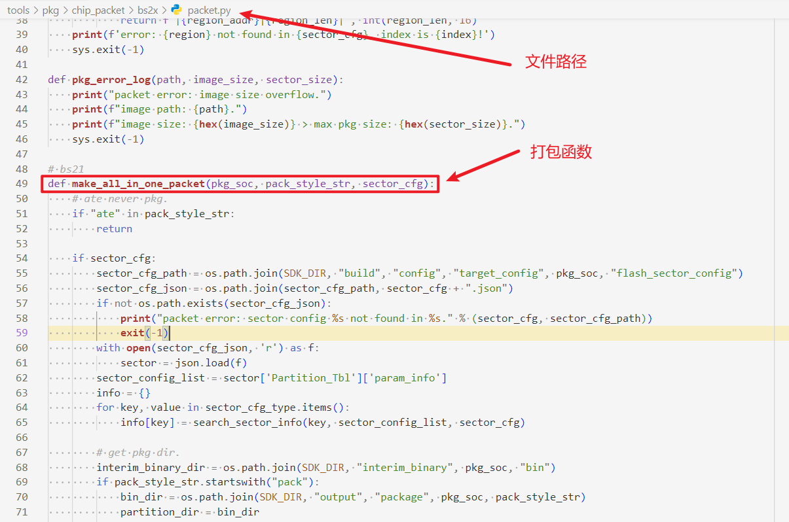

3.  Add the bin file path in the function, using partition.bin as an example.

    Each concatenated string represents one directory level (folder name and file name).

    The actual path of the concatenated partition.bin: sdk\\interim\_binary\\bs21\\bin\\boot\_bin\\loaderboot\_sign.bin.

    **Figure 2**  bin File Path Diagram  
    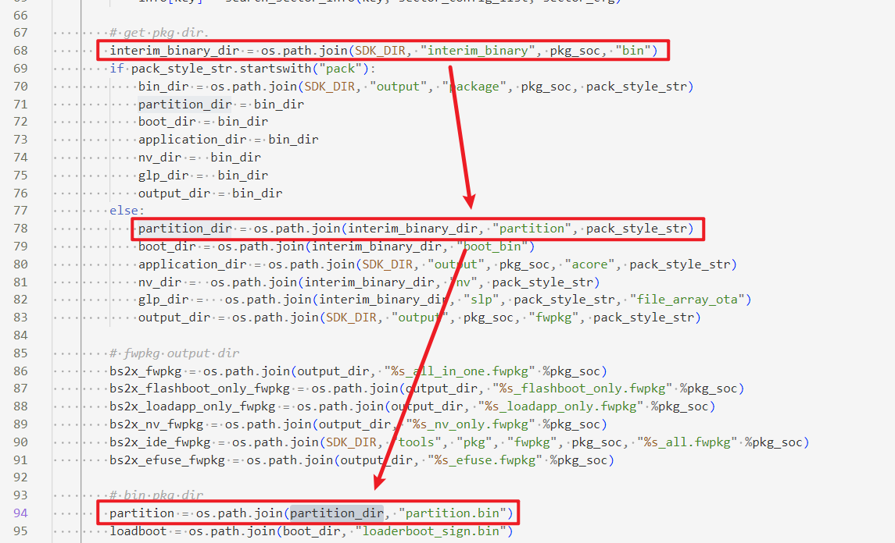

4.  Set the packaging parameters, separating parameters with "|", as shown in [Figure 3](#fig149913416201).

    **Figure 3**  bin File Compilation Parameters  
    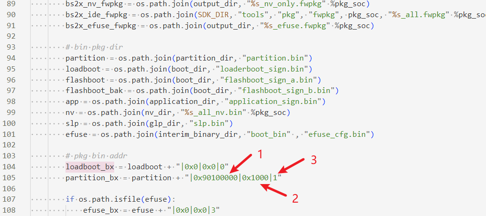

    1. Flash location. The remaining addresses of the single board can be found in the sdk\\build\\config\\target\_config\\bs2x\\flash\_sector\_config\\bs2x-xxx.json file.

    2. The occupied space size.

    3. The file type.

    -   0: loader.
    -   1: indicates a normal flash file, flashed to flash.
    -   3: eFuse.
    -   4: OTP.

5.  At the end of the function, add the variables with the compilation parameters and paths set to the compilation list, as shown in [Figure 3](#fig149913416201).

    **Figure 4**  Adding the Path to the Compilation List  
    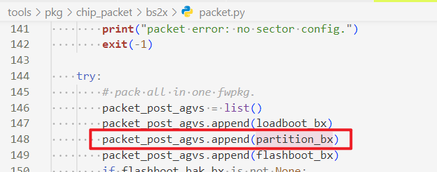

6.  The compilation result is shown in [Figure 5](#fig131271820142012).

    **Figure 5**  Compilation Result  
    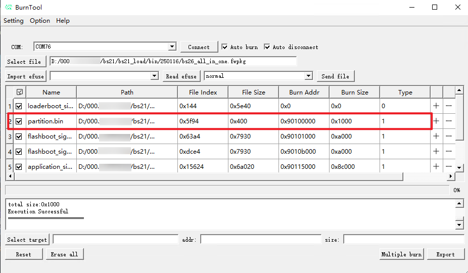

> **Note:** 
>If the newly added bin files need to be upgraded via OTA, refer to the corresponding content in the "BS2X V100 Upgrade Solution Usage Guide" to adapt OTA upgrade support for the newly added bin files.

### Flash Partition Table Configuration

The path of the partition table configuration file is "sdk\\build\\config\\target\_config\\bs21\\flash\_sector\_config\\xxx.json".

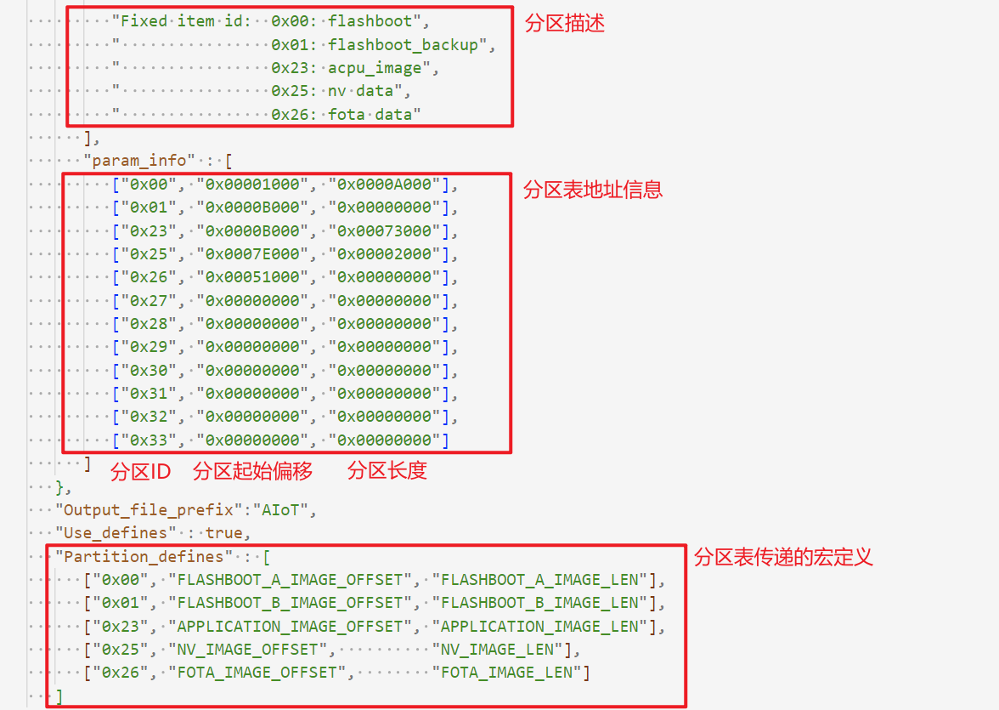

**Table 1**  Partition Table Description

<table><thead align="left"><tr id="row1056221715324"><th class="cellrowborder" valign="top" width="10.24%" id="mcps1.2.5.1.1">
Partition Table Id

</th>
<th class="cellrowborder" valign="top" width="19.3%" id="mcps1.2.5.1.2">
Start Address

</th>
<th class="cellrowborder" valign="top" width="20.72%" id="mcps1.2.5.1.3">
Partition Length

</th>
<th class="cellrowborder" valign="top" width="49.74%" id="mcps1.2.5.1.4">
Description

</th>
</tr>
</thead>
<tbody><tr id="row14562917143214"><td class="cellrowborder" valign="top" width="10.24%" headers="mcps1.2.5.1.1 ">
0x00

</td>
<td class="cellrowborder" valign="top" width="19.3%" headers="mcps1.2.5.1.2 ">
0x00001000

</td>
<td class="cellrowborder" valign="top" width="20.72%" headers="mcps1.2.5.1.3 ">
0x0000A000

</td>
<td class="cellrowborder" valign="top" width="49.74%" headers="mcps1.2.5.1.4 ">
flashboot a: secondary boot main area (size is configured based on the actual usage).

</td>
</tr>
<tr id="row2056251723219"><td class="cellrowborder" valign="top" width="10.24%" headers="mcps1.2.5.1.1 ">
0x01

</td>
<td class="cellrowborder" valign="top" width="19.3%" headers="mcps1.2.5.1.2 ">
0x0000B000

</td>
<td class="cellrowborder" valign="top" width="20.72%" headers="mcps1.2.5.1.3 ">
0x00000000

</td>
<td class="cellrowborder" valign="top" width="49.74%" headers="mcps1.2.5.1.4 ">
flashboot b: secondary boot backup area (size is configured based on the actual usage).

</td>
</tr>
<tr id="row956271715322"><td class="cellrowborder" valign="top" width="10.24%" headers="mcps1.2.5.1.1 ">
0x23

</td>
<td class="cellrowborder" valign="top" width="19.3%" headers="mcps1.2.5.1.2 ">
0x0000B000

</td>
<td class="cellrowborder" valign="top" width="20.72%" headers="mcps1.2.5.1.3 ">
0x00073000

</td>
<td class="cellrowborder" valign="top" width="49.74%" headers="mcps1.2.5.1.4 ">
acpu image: application partition.

</td>
</tr>
<tr id="row956213171329"><td class="cellrowborder" valign="top" width="10.24%" headers="mcps1.2.5.1.1 ">
0x25

</td>
<td class="cellrowborder" valign="top" width="19.3%" headers="mcps1.2.5.1.2 ">
0x00000000

</td>
<td class="cellrowborder" valign="top" width="20.72%" headers="mcps1.2.5.1.3 ">
0x00000080

</td>
<td class="cellrowborder" valign="top" width="49.74%" headers="mcps1.2.5.1.4 ">
nv data: nv data area.

</td>
</tr>
<tr id="row165621117193217"><td class="cellrowborder" valign="top" width="10.24%" headers="mcps1.2.5.1.1 ">
0x26

</td>
<td class="cellrowborder" valign="top" width="19.3%" headers="mcps1.2.5.1.2 ">
0x00000080

</td>
<td class="cellrowborder" valign="top" width="20.72%" headers="mcps1.2.5.1.3 ">
0x00000700

</td>
<td class="cellrowborder" valign="top" width="49.74%" headers="mcps1.2.5.1.4 ">
fota dat: fota backup area.

</td>
</tr>
<tr id="row17562121773213"><td class="cellrowborder" valign="top" width="10.24%" headers="mcps1.2.5.1.1 ">
0x27

</td>
<td class="cellrowborder" valign="top" width="19.3%" headers="mcps1.2.5.1.2 ">
0x00000000

</td>
<td class="cellrowborder" valign="top" width="20.72%" headers="mcps1.2.5.1.3 ">
0x00000000

</td>
<td class="cellrowborder" valign="top" width="49.74%" headers="mcps1.2.5.1.4 ">
rsv1: reserved partition 1.

</td>
</tr>
<tr id="row256313170321"><td class="cellrowborder" valign="top" width="10.24%" headers="mcps1.2.5.1.1 ">
0x28

</td>
<td class="cellrowborder" valign="top" width="19.3%" headers="mcps1.2.5.1.2 ">
0x00000000

</td>
<td class="cellrowborder" valign="top" width="20.72%" headers="mcps1.2.5.1.3 ">
0x00000000

</td>
<td class="cellrowborder" valign="top" width="49.74%" headers="mcps1.2.5.1.4 ">
rsv1: reserved partition 2.

</td>
</tr>
<tr id="row13563101716328"><td class="cellrowborder" valign="top" width="10.24%" headers="mcps1.2.5.1.1 ">
0x29

</td>
<td class="cellrowborder" valign="top" width="19.3%" headers="mcps1.2.5.1.2 ">
0x00000000

</td>
<td class="cellrowborder" valign="top" width="20.72%" headers="mcps1.2.5.1.3 ">
0x00000000

</td>
<td class="cellrowborder" valign="top" width="49.74%" headers="mcps1.2.5.1.4 ">
rsv1: reserved partition 3.

</td>
</tr>
<tr id="row35636173326"><td class="cellrowborder" valign="top" width="10.24%" headers="mcps1.2.5.1.1 ">
0x30

</td>
<td class="cellrowborder" valign="top" width="19.3%" headers="mcps1.2.5.1.2 ">
0x00000000

</td>
<td class="cellrowborder" valign="top" width="20.72%" headers="mcps1.2.5.1.3 ">
0x00000000

</td>
<td class="cellrowborder" valign="top" width="49.74%" headers="mcps1.2.5.1.4 ">
rsv1: reserved partition 4.

</td>
</tr>
<tr id="row55638179321"><td class="cellrowborder" valign="top" width="10.24%" headers="mcps1.2.5.1.1 ">
0x31

</td>
<td class="cellrowborder" valign="top" width="19.3%" headers="mcps1.2.5.1.2 ">
0x00000000

</td>
<td class="cellrowborder" valign="top" width="20.72%" headers="mcps1.2.5.1.3 ">
0x00000000

</td>
<td class="cellrowborder" valign="top" width="49.74%" headers="mcps1.2.5.1.4 ">
rsv1: reserved partition 5.

</td>
</tr>
<tr id="row1756314172327"><td class="cellrowborder" valign="top" width="10.24%" headers="mcps1.2.5.1.1 ">
0x32

</td>
<td class="cellrowborder" valign="top" width="19.3%" headers="mcps1.2.5.1.2 ">
0x00000000

</td>
<td class="cellrowborder" valign="top" width="20.72%" headers="mcps1.2.5.1.3 ">
0x00000000

</td>
<td class="cellrowborder" valign="top" width="49.74%" headers="mcps1.2.5.1.4 ">
rsv1: reserved partition 6.

</td>
</tr>
<tr id="row1356361733214"><td class="cellrowborder" valign="top" width="10.24%" headers="mcps1.2.5.1.1 ">
0x33

</td>
<td class="cellrowborder" valign="top" width="19.3%" headers="mcps1.2.5.1.2 ">
0x00000000

</td>
<td class="cellrowborder" valign="top" width="20.72%" headers="mcps1.2.5.1.3 ">
0x00000000

</td>
<td class="cellrowborder" valign="top" width="49.74%" headers="mcps1.2.5.1.4 ">
rsv1: reserved partition 7.

</td>
</tr>
</tbody>
</table>

> **Note:** 
>The partition information with partition table Ids in the range [0x0, 0x26] is used for image loading, startup, and OTA upgrades. Please modify it with caution. Partition table information can be obtained by passing the partition Id to the uapi\_partition\_get\_info interface, which returns the corresponding address and length.
>Partition\_defines passes the partition table macro definitions as parameters. When Use\_defines is enabled, the partition table offset and size of the corresponding ID are passed to the subsequent build stages according to the specified macro definitions, and can be directly referenced in the code.

### Menuconfig Configuration

Running the "python3 build.py -c standard-bs21-n1100 menuconfig" script starts the Menuconfig program, through which users can configure compilation and system functions, as shown in [Figure 1](#fig155343385597).

The SDK integrates default configurations, but users are advised to make appropriate configurations on the first run to reduce problems caused by configuration. Users can run "python3 build.py -c standard-bs21-n1100 menuconfig" at any time to change the configuration.

**Figure 1**  Menuconfig Running Interface  
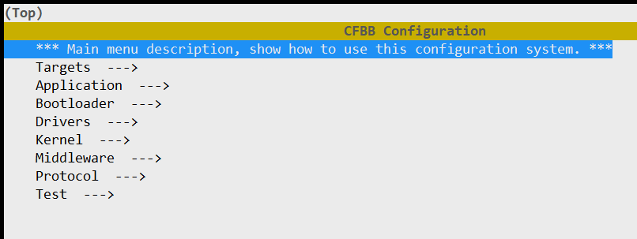

Note: If the interface differs, the actual version prevails.

The Menuconfig operation instructions are shown in [Table 1](#table364152210248). Shortcut keys can be entered in the Menuconfig interface for configuration.

**Table 1**  Menuconfig Common Operation Commands

<table><thead align="left"><tr id="row2642122213247"><th class="cellrowborder" valign="top" width="17%" id="mcps1.2.3.1.1">
Shortcut Key

</th>
<th class="cellrowborder" valign="top" width="83%" id="mcps1.2.3.1.2">
Description

</th>
</tr>
</thead>
<tbody><tr id="row146421622162417"><td class="cellrowborder" valign="top" width="17%" headers="mcps1.2.3.1.1 ">
Space, Enter

</td>
<td class="cellrowborder" valign="top" width="83%" headers="mcps1.2.3.1.2 ">
Selects or deselects.

</td>
</tr>
<tr id="row0235155732813"><td class="cellrowborder" valign="top" width="17%" headers="mcps1.2.3.1.1 ">
ESC

</td>
<td class="cellrowborder" valign="top" width="83%" headers="mcps1.2.3.1.2 ">
Returns to the previous menu or exits the interface.

</td>
</tr>
<tr id="row1425985152914"><td class="cellrowborder" valign="top" width="17%" headers="mcps1.2.3.1.1 ">
Q

</td>
<td class="cellrowborder" valign="top" width="83%" headers="mcps1.2.3.1.2 ">
Exits the interface.

</td>
</tr>
<tr id="row161871942143019"><td class="cellrowborder" valign="top" width="17%" headers="mcps1.2.3.1.1 ">
S

</td>
<td class="cellrowborder" valign="top" width="83%" headers="mcps1.2.3.1.2 ">
Saves the configuration.

</td>
</tr>
<tr id="row1661115053113"><td class="cellrowborder" valign="top" width="17%" headers="mcps1.2.3.1.1 ">
F

</td>
<td class="cellrowborder" valign="top" width="83%" headers="mcps1.2.3.1.2 ">
Displays the help menu.

</td>
</tr>
</tbody>
</table>

All commands can be viewed in the Menuconfig official help at the bottom of the Menuconfig interface, as shown in [Figure 2](#fig14504171214012).

**Figure 2**  Menuconfig Command Help Bar  
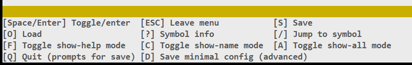

**Table 2**  Menuconfig Menu Item Description

<table><thead align="left"><tr id="row31102115020"><th class="cellrowborder" valign="top" width="28.48%" id="mcps1.2.3.1.1">
Menu

</th>
<th class="cellrowborder" valign="top" width="71.52%" id="mcps1.2.3.1.2">
Description

</th>
</tr>
</thead>
<tbody><tr id="row171109113504"><td class="cellrowborder" valign="top" width="28.48%" headers="mcps1.2.3.1.1 ">
Targets

</td>
<td class="cellrowborder" valign="top" width="71.52%" headers="mcps1.2.3.1.2 ">
Compilation target-related configuration.

</td>
</tr>
<tr id="row211021195018"><td class="cellrowborder" valign="top" width="28.48%" headers="mcps1.2.3.1.1 ">
Application

</td>
<td class="cellrowborder" valign="top" width="71.52%" headers="mcps1.2.3.1.2 ">
Application-related configuration (mainly sample-related).

</td>
</tr>
<tr id="row161103165010"><td class="cellrowborder" valign="top" width="28.48%" headers="mcps1.2.3.1.1 ">
Bootloader

</td>
<td class="cellrowborder" valign="top" width="71.52%" headers="mcps1.2.3.1.2 ">
boot-related configuration.

</td>
</tr>
<tr id="row1211071175013"><td class="cellrowborder" valign="top" width="28.48%" headers="mcps1.2.3.1.1 ">
Drivers

</td>
<td class="cellrowborder" valign="top" width="71.52%" headers="mcps1.2.3.1.2 ">
Peripheral driver-related configuration and board-level configuration.

</td>
</tr>
<tr id="row1511031125010"><td class="cellrowborder" valign="top" width="28.48%" headers="mcps1.2.3.1.1 ">
Kernel

</td>
<td class="cellrowborder" valign="top" width="71.52%" headers="mcps1.2.3.1.2 ">
Kernel-related configuration.

</td>
</tr>
<tr id="row161106115504"><td class="cellrowborder" valign="top" width="28.48%" headers="mcps1.2.3.1.1 ">
Middleware

</td>
<td class="cellrowborder" valign="top" width="71.52%" headers="mcps1.2.3.1.2 ">
Middleware-related configuration (NV, FOTA, AT, DFX, PM, etc.).

</td>
</tr>
<tr id="row94651621525"><td class="cellrowborder" valign="top" width="28.48%" headers="mcps1.2.3.1.1 ">
Protocol

</td>
<td class="cellrowborder" valign="top" width="71.52%" headers="mcps1.2.3.1.2 ">
SparkLink and Bluetooth-related configuration.

</td>
</tr>
<tr id="row1453145185216"><td class="cellrowborder" valign="top" width="28.48%" headers="mcps1.2.3.1.1 ">
Test

</td>
<td class="cellrowborder" valign="top" width="71.52%" headers="mcps1.2.3.1.2 ">
Test suite-related configuration.

</td>
</tr>
</tbody>
</table>

### Precautions

-   If "./build.py" reports a permission error, run "chmod +x build.py" to add the execution permission, or run "python3./build.py".
-   If a package is reported missing during compilation, check whether the corresponding component has been installed for the python in the environment. If the build environment contains multiple python versions, especially multiple python versions of the same version, and the user cannot identify which one is being used, it is recommended to install Python component packages from the component package source code in this case.
-   The system gives priority to the configuration made by the user through Menuconfig. If the user has not configured it, the system will compile with the default configuration.

# Creating a New APP

## Creating a Source Directory

> **Note:** 
>Users can create an app in the directory at the same level as "application/bs21" by referring to the "standard-bs21-n1100" directory. The following uses "my\_demo" as an example.

The steps are as follows:

1.  Create the "application/bs21/my\_demo" directory to store the source files of "my\_demo".
2.  Copy "application/bs21/standard/CMakeLists.txt" to "application/bs21/my\_demo/CmakeLists.txt", and place the source files in the "application/bs21/my\_demo" directory.
3.  Modify the "application/bs21/my\_demo/CmakeLists.txt" file. The meanings of the variables are shown in [Table 1](#table89969106362).

    **Table 1**  Meanings of Variables in the Component's CmakeLists.txt

    
    <table><thead align="left"><tr id="row69971710143612"><th class="cellrowborder" valign="top" width="27.900000000000002%" id="mcps1.2.3.1.1">
Variable Name

    </th>
    <th class="cellrowborder" valign="top" width="72.1%" id="mcps1.2.3.1.2">
Variable Meaning

    </th>
    </tr>
    </thead>
    <tbody><tr id="row77088920486"><td class="cellrowborder" valign="top" width="27.900000000000002%" headers="mcps1.2.3.1.1 ">
COMPONENT_NAME

    </td>
    <td class="cellrowborder" valign="top" width="72.1%" headers="mcps1.2.3.1.2 ">
Name of the current component, for example "my_demo".

    </td>
    </tr>
    <tr id="row99971710133619"><td class="cellrowborder" valign="top" width="27.900000000000002%" headers="mcps1.2.3.1.1 ">
SOURCES

    </td>
    <td class="cellrowborder" valign="top" width="72.1%" headers="mcps1.2.3.1.2 ">
List of C files of the current component. The CMAKE_CURRENT_SOURCE_DIR variable identifies the path where the current CMakeLists.txt is located.

    </td>
    </tr>
    <tr id="row5997910163618"><td class="cellrowborder" valign="top" width="27.900000000000002%" headers="mcps1.2.3.1.1 ">
PUBLIC_HEADER

    </td>
    <td class="cellrowborder" valign="top" width="72.1%" headers="mcps1.2.3.1.2 ">
Paths of the header files that the current component needs to expose externally.

    </td>
    </tr>
    <tr id="row1199791011363"><td class="cellrowborder" valign="top" width="27.900000000000002%" headers="mcps1.2.3.1.1 ">
PRIVATE_HEADER

    </td>
    <td class="cellrowborder" valign="top" width="72.1%" headers="mcps1.2.3.1.2 ">
Header file search paths internal to the current component.

    </td>
    </tr>
    <tr id="row99971610193616"><td class="cellrowborder" valign="top" width="27.900000000000002%" headers="mcps1.2.3.1.1 ">
PRIVATE_DEFINES

    </td>
    <td class="cellrowborder" valign="top" width="72.1%" headers="mcps1.2.3.1.2 ">
Macro definitions effective within the current component.

    </td>
    </tr>
    <tr id="row12997210203618"><td class="cellrowborder" valign="top" width="27.900000000000002%" headers="mcps1.2.3.1.1 ">
PUBLIC_DEFINES

    </td>
    <td class="cellrowborder" valign="top" width="72.1%" headers="mcps1.2.3.1.2 ">
Macro definitions that the current component needs to expose externally.

    </td>
    </tr>
    <tr id="row12716914103914"><td class="cellrowborder" valign="top" width="27.900000000000002%" headers="mcps1.2.3.1.1 ">
COMPONENT_PUBLIC_CCFLAGS

    </td>
    <td class="cellrowborder" valign="top" width="72.1%" headers="mcps1.2.3.1.2 ">
Compilation options that the current component needs to expose externally.

    </td>
    </tr>
    <tr id="row22992182396"><td class="cellrowborder" valign="top" width="27.900000000000002%" headers="mcps1.2.3.1.1 ">
COMPONENT_CCFLAGS

    </td>
    <td class="cellrowborder" valign="top" width="72.1%" headers="mcps1.2.3.1.2 ">
Compilation options effective within the current component.

    </td>
    </tr>
    </tbody>
    </table>

4.  Modify "application/bs21/CMakeLists.txt" to add the my\_demo directory to compilation.
5.  Modify "build/config/target\_config/bs21/config.py" and add 'my\_demo' to the ram\_component field to register the my\_demo component in the compilation system.

## Developing Code

After the directory structure is created, start developing the code (users can refer to "application/samples" for porting). After the code development is complete, use "python3 build.py -c standard-bs21-n1100" to compile my\_demo for code compilation and debugging.

## Image Flashing

For the image flashing method, refer to the "Operation Guide" section in the "BS2X V100 BurnTool Tool Usage Guide".

