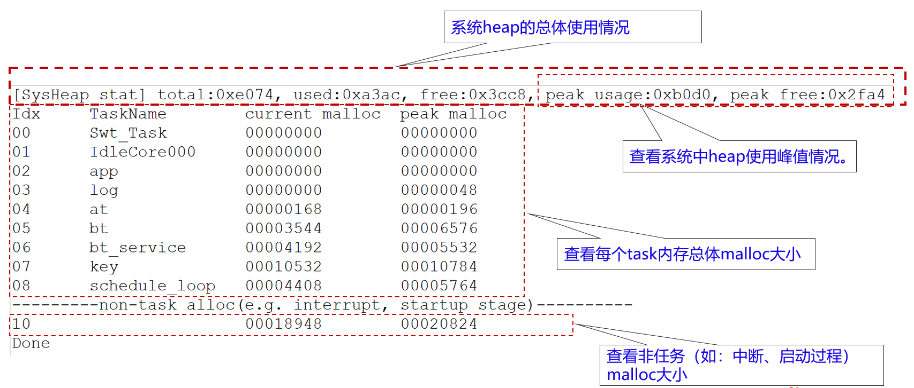
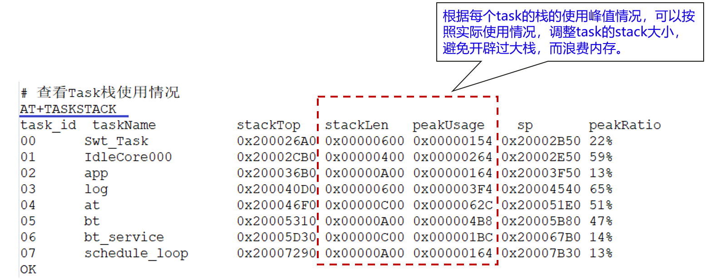
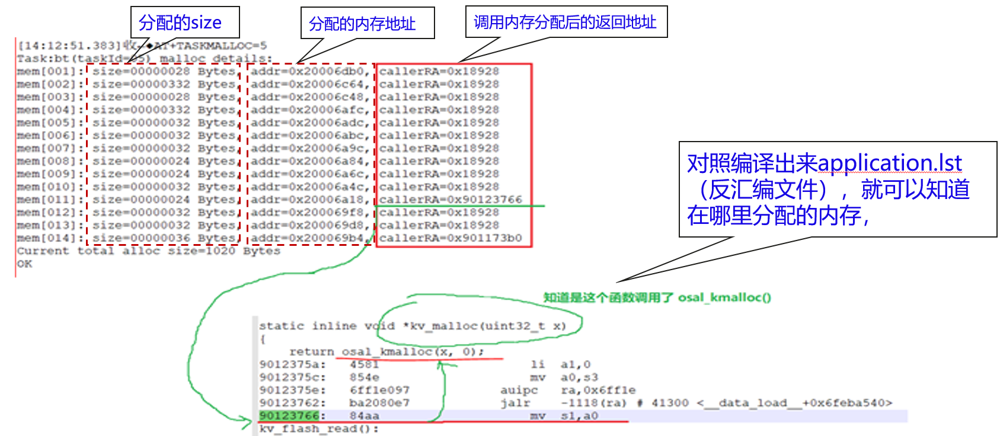

# Preface<a name="ZH-CN_TOPIC_0000001927231182"></a>

**Overview<a name="section4537382116410"></a>**

This document provides memory measurement/serviceability guidance for the various services of the PLT.

**Reader Audience<a name="section4378592816410"></a>**

This document is mainly applicable to the following engineers:

-   Technical support engineers
-   Product testing engineers
-   Maintenance engineers

**Symbol Conventions<a name="section133020216410"></a>**

The following symbols may appear in this document, and their meanings are as follows.

<a name="table2622507016410"></a>
<table><thead align="left"><tr id="row1530720816410"><th class="cellrowborder" valign="top" width="20.580000000000002%" id="mcps1.1.3.1.1"><p id="p6450074116410"><a name="p6450074116410"></a><a name="p6450074116410"></a><strong id="b2136615816410"><a name="b2136615816410"></a><a name="b2136615816410"></a>Symbol</strong></p>
</th>
<th class="cellrowborder" valign="top" width="79.42%" id="mcps1.1.3.1.2"><p id="p5435366816410"><a name="p5435366816410"></a><a name="p5435366816410"></a><strong id="b5941558116410"><a name="b5941558116410"></a><a name="b5941558116410"></a>Description</strong></p>
</th>
</tr>
</thead>
<tbody><tr id="row1372280416410"><td class="cellrowborder" valign="top" width="20.580000000000002%" headers="mcps1.1.3.1.1 "><p id="p3734547016410"><a name="p3734547016410"></a><a name="p3734547016410"></a><a name="image2670064316410"></a><a name="image2670064316410"></a><span></span></p>
</td>
<td class="cellrowborder" valign="top" width="79.42%" headers="mcps1.1.3.1.2 "><p id="p1757432116410"><a name="p1757432116410"></a><a name="p1757432116410"></a>Indicates a hazard with a high level of risk that, if not avoided, will result in death or serious injury.</p>
</td>
</tr>
<tr id="row466863216410"><td class="cellrowborder" valign="top" width="20.580000000000002%" headers="mcps1.1.3.1.1 "><p id="p1432579516410"><a name="p1432579516410"></a><a name="p1432579516410"></a><a name="image4895582316410"></a><a name="image4895582316410"></a><span></span></p>
</td>
<td class="cellrowborder" valign="top" width="79.42%" headers="mcps1.1.3.1.2 "><p id="p959197916410"><a name="p959197916410"></a><a name="p959197916410"></a>Indicates a hazard with a medium level of risk that, if not avoided, may result in death or serious injury.</p>
</td>
</tr>
<tr id="row123863216410"><td class="cellrowborder" valign="top" width="20.580000000000002%" headers="mcps1.1.3.1.1 "><p id="p1232579516410"><a name="p1232579516410"></a><a name="p1232579516410"></a><a name="image1235582316410"></a><a name="image1235582316410"></a><span></span></p>
</td>
<td class="cellrowborder" valign="top" width="79.42%" headers="mcps1.1.3.1.2 "><p id="p123197916410"><a name="p123197916410"></a><a name="p123197916410"></a>Indicates a hazard with a low level of risk that, if not avoided, may result in minor or moderate injury.</p>
</td>
</tr>
<tr id="row5786682116410"><td class="cellrowborder" valign="top" width="20.580000000000002%" headers="mcps1.1.3.1.1 "><p id="p2204984716410"><a name="p2204984716410"></a><a name="p2204984716410"></a><a name="image4504446716410"></a><a name="image4504446716410"></a><span></span></p>
</td>
<td class="cellrowborder" valign="top" width="79.42%" headers="mcps1.1.3.1.2 "><p id="p4388861916410"><a name="p4388861916410"></a><a name="p4388861916410"></a>Used to deliver device- or environment-safety warning information. If not avoided, it may cause equipment damage, data loss, degraded equipment performance, or other unpredictable results.</p>
<p id="p1238861916410"><a name="p1238861916410"></a><a name="p1238861916410"></a>"Cautions" do not involve personal injury.</p>
</td>
</tr>
<tr id="row2856923116410"><td class="cellrowborder" valign="top" width="20.580000000000002%" headers="mcps1.1.3.1.1 "><p id="p5555360116410"><a name="p5555360116410"></a><a name="p5555360116410"></a><a name="image799324016410"></a><a name="image799324016410"></a><span></span></p>
</td>
<td class="cellrowborder" valign="top" width="79.42%" headers="mcps1.1.3.1.2 "><p id="p4612588116410"><a name="p4612588116410"></a><a name="p4612588116410"></a>Supplementary explanation of key information in the main text.</p>
<p id="p1232588116410"><a name="p1232588116410"></a><a name="p1232588116410"></a>"Notes" are not safety warning information and do not involve personal, equipment, or environmental injury information.</p>
</td>
</tr>
</tbody>
</table>

**Modification Records<a name="section2467512116410"></a>**

<a name="table1557726816410"></a>
<table><thead align="left"><tr id="row2942532716410"><th class="cellrowborder" valign="top" width="20.72%" id="mcps1.1.4.1.1"><p id="p3778275416410"><a name="p3778275416410"></a><a name="p3778275416410"></a><strong id="b5687322716410"><a name="b5687322716410"></a><a name="b5687322716410"></a>Doc Version</strong></p>
</th>
<th class="cellrowborder" valign="top" width="26.119999999999997%" id="mcps1.1.4.1.2"><p id="p5627845516410"><a name="p5627845516410"></a><a name="p5627845516410"></a><strong id="b5800814916410"><a name="b5800814916410"></a><a name="b5800814916410"></a>Release Date</strong></p>
</th>
<th class="cellrowborder" valign="top" width="53.16%" id="mcps1.1.4.1.3"><p id="p2382284816410"><a name="p2382284816410"></a><a name="p2382284816410"></a><strong id="b3316380216410"><a name="b3316380216410"></a><a name="b3316380216410"></a>Modification Description</strong></p>
</th>
</tr>
</thead>
<tbody><tr id="row523572084413"><td class="cellrowborder" valign="top" width="20.72%" headers="mcps1.1.4.1.1 "><p id="p192361620204412"><a name="p192361620204412"></a><a name="p192361620204412"></a>02</p>
</td>
<td class="cellrowborder" valign="top" width="26.119999999999997%" headers="mcps1.1.4.1.2 "><p id="p023672017445"><a name="p023672017445"></a><a name="p023672017445"></a>2024-09-14</p>
</td>
<td class="cellrowborder" valign="top" width="53.16%" headers="mcps1.1.4.1.3 "><p id="p123642084419"><a name="p123642084419"></a><a name="p123642084419"></a>Updated the content of the "<a href="内存维测开关.md">Memory Measurement/Serviceability Switch</a>" chapter.</p>
</td>
</tr>
<tr id="row5947359616410"><td class="cellrowborder" valign="top" width="20.72%" headers="mcps1.1.4.1.1 "><p id="p2149706016410"><a name="p2149706016410"></a><a name="p2149706016410"></a>01</p>
</td>
<td class="cellrowborder" valign="top" width="26.119999999999997%" headers="mcps1.1.4.1.2 "><p id="p648803616410"><a name="p648803616410"></a><a name="p648803616410"></a>2024-07-03</p>
</td>
<td class="cellrowborder" valign="top" width="53.16%" headers="mcps1.1.4.1.3 "><p id="p1946537916410"><a name="p1946537916410"></a><a name="p1946537916410"></a>First official version release.</p>
</td>
</tr>
</tbody>
</table>

# Introduction<a name="ZH-CN_TOPIC_0000001927230230"></a>

Memory measurement/serviceability is a very critical function in system measurement. For example, you may want to know the current allocation and usage of memory in the system; the stack usage of each task; and the specific memory allocation of a particular task. This memory information is crucial for memory optimization and memory localization (such as memory leaks).

This document describes how to perform memory measurement on the BS2X series, including:

-   Viewing the overall allocation and usage of the system heap memory.
-   Viewing the malloc situation of each task (current allocation and peak allocation).
-   Viewing the stack allocation and usage of each task (current usage and peak usage).
-   Viewing where each memory allocation occurs.

    The memory measurement commands have been integrated into the AT commands, and users can use them directly.

# Memory Measurement Features<a name="ZH-CN_TOPIC_0000001954269813"></a>


## Viewing Overall System heap Information<a name="ZH-CN_TOPIC_0000001927070902"></a>

This measurement feature is used to view the usage of heap memory in the system.

**Command to view system heap information: AT+HEAPSTAT**



## Viewing task Stack Usage<a name="ZH-CN_TOPIC_0000001954389593"></a>

This measurement feature is used to view the allocation and usage of each task's stack.

You can use this command to optimize and adjust the stack allocation size and save memory.

**Command to view task stack usage: AT+TASKSTACK**



## Viewing Each task's Memory Allocation<a name="ZH-CN_TOPIC_0000001927230234"></a>

To view the malloc situation of a certain task: AT+TASKMALLOC="task id";

The "task id" here can be obtained through the "AT+HEAPSTAT" or "AT+TASKSTACK" command.



## Viewing Memory Allocations in Interrupts and during Startup<a name="ZH-CN_TOPIC_0000001954269817"></a>

In the system, besides memory allocated in tasks, there is also memory allocated in interrupts and memory allocated during the system startup stage. These allocations have no corresponding task, so they are uniformly classified into a special id.

You can use the "AT+HEAPSTAT" command to obtain the id corresponding to non-task alloc.

The command to view memory allocations in non-task contexts is also: AT+TASKMALLOC="id", and the display format is the same.


## Memory Measurement/Serviceability Switch<a name="ZH-CN_TOPIC_0000001927070906"></a>

Memory measurement is enabled and disabled through configuration macros. You need to enter the "kernel\liteos\liteos_v208.6.0_b017\Huawei_LiteOS\tools\build\config\" directory, find the config file used by the project. Taking BS21A as an example, you need to open bs21a_key.config and modify the following macro control switches:

Disable the memory debugging function:

```
# LOSCFG_MEM_TASK_STAT=y is not set
# LOSCFG_MEM_DFX_SHOW_CALLER_RA is not set
```

Enable the memory debugging function:

```
LOSCFG_MEM_TASK_STAT=y
LOSCFG_MEM_DFX_SHOW_CALLER_RA=y
```

> **Notes:** 
>-   You must find the config file corresponding to the correct project, and enable/disable the measurement configuration.
>-   LOSCFG_MEM_DFX_SHOW_CALLER_RA is used to view where the memory allocation function is called. Opening this macro consumes a certain amount of memory space; it is recommended to disable this macro during the commercial stage.
>-   **After modifying the memory configuration macros, you must perform a clean full compilation of the SDK; otherwise, the changes may not take effect.**
