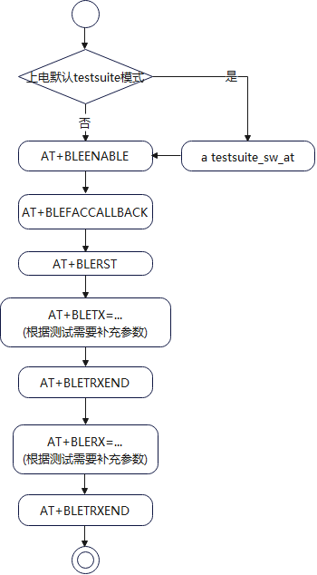
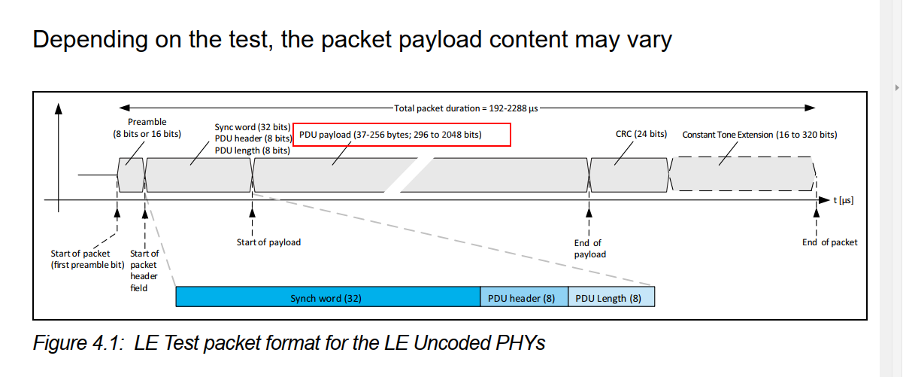
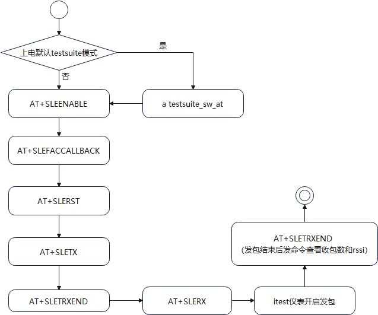
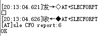
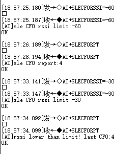
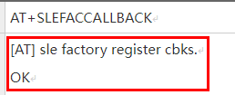
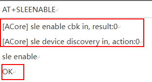
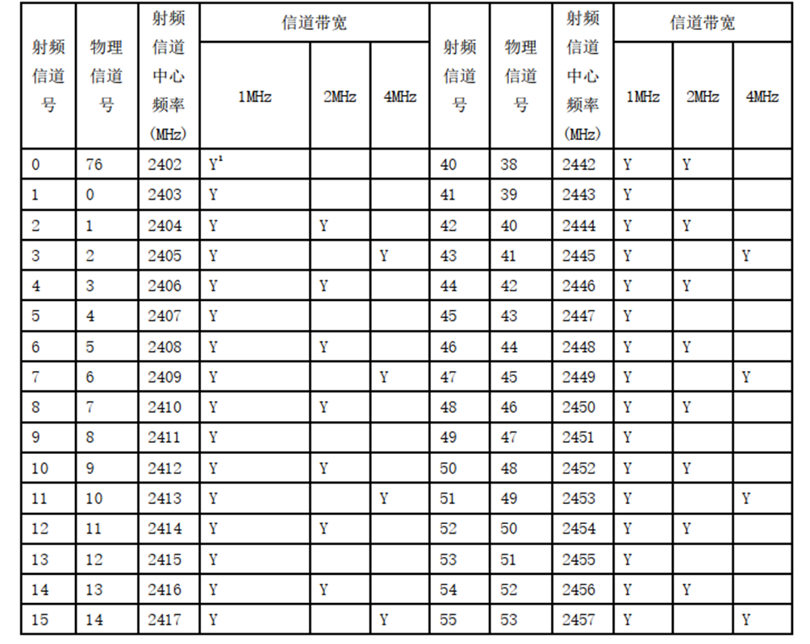
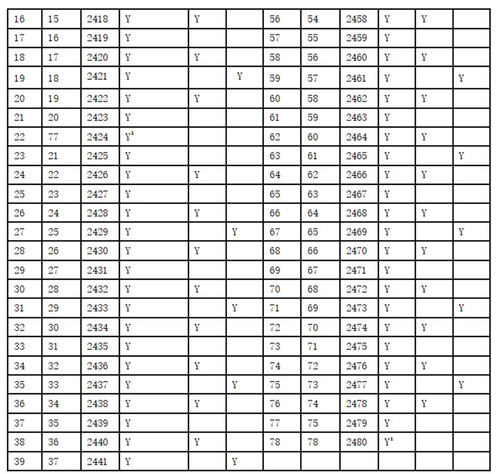

# 前言

**概述**

本文档主要介绍BS2XV100的射频非信令相关的测试指令和指令的组包示例，测试前务必阅读注意事项。

**产品版本**

与本文档相对应的产品版本如下。

<table><thead align="left"><tr id="row8991374"><th class="cellrowborder" valign="top" width="31.31%" id="mcps1.1.3.1.1">
<strong id="b6322135815819">产品名称</strong>

</th>
<th class="cellrowborder" valign="top" width="68.69%" id="mcps1.1.3.1.2">
<strong id="b19345175815810">产品版本</strong>

</th>
</tr>
</thead>
<tbody><tr id="row32779375"><td class="cellrowborder" valign="top" width="31.31%" headers="mcps1.1.3.1.1 ">
BS2X

</td>
<td class="cellrowborder" valign="top" width="68.69%" headers="mcps1.1.3.1.2 ">
V100

</td>
</tr>
</tbody>
</table>

**读者对象**

本文档主要适用于以下工程师：

-   技术支持工程师。
-   软件开发工程师。

**符号约定**

在本文中可能出现下列标志,它们所代表的含义如下。

<table><thead align="left"><tr id="row1530720816410"><th class="cellrowborder" valign="top" width="20.580000000000002%" id="mcps1.1.3.1.1">
<strong id="b2136615816410">符号</strong>

</th>
<th class="cellrowborder" valign="top" width="79.42%" id="mcps1.1.3.1.2">
<strong id="b5941558116410">说明</strong>

</th>
</tr>
</thead>
<tbody><tr id="row1372280416410"><td class="cellrowborder" valign="top" width="20.580000000000002%" headers="mcps1.1.3.1.1 ">

</td>
<td class="cellrowborder" valign="top" width="79.42%" headers="mcps1.1.3.1.2 ">
表示如不避免则将会导致死亡或严重伤害的具有高等级风险的危害。

</td>
</tr>
<tr id="row466863216410"><td class="cellrowborder" valign="top" width="20.580000000000002%" headers="mcps1.1.3.1.1 ">

</td>
<td class="cellrowborder" valign="top" width="79.42%" headers="mcps1.1.3.1.2 ">
表示如不避免则可能导致死亡或严重伤害的具有中等级风险的危害。

</td>
</tr>
<tr id="row123863216410"><td class="cellrowborder" valign="top" width="20.580000000000002%" headers="mcps1.1.3.1.1 ">

</td>
<td class="cellrowborder" valign="top" width="79.42%" headers="mcps1.1.3.1.2 ">
表示如不避免则可能导致轻微或中度伤害的具有低等级风险的危害。

</td>
</tr>
<tr id="row5786682116410"><td class="cellrowborder" valign="top" width="20.580000000000002%" headers="mcps1.1.3.1.1 ">

</td>
<td class="cellrowborder" valign="top" width="79.42%" headers="mcps1.1.3.1.2 ">
用于传递设备或环境安全警示信息。如不避免则可能会导致设备损坏、数据丢失、设备性能降低或其它不可预知的结果。

“须知”不涉及人身伤害。

</td>
</tr>
<tr id="row2856923116410"><td class="cellrowborder" valign="top" width="20.580000000000002%" headers="mcps1.1.3.1.1 ">

</td>
<td class="cellrowborder" valign="top" width="79.42%" headers="mcps1.1.3.1.2 ">
对正文中重点信息的补充说明。

“说明”不是安全警示信息,不涉及人身、设备及环境伤害信息。

</td>
</tr>
</tbody>
</table>

**修改记录**

<table><thead align="left"><tr id="row2942532716410"><th class="cellrowborder" valign="top" width="18.22%" id="mcps1.1.4.1.1">
<strong id="b5687322716410">文档版本</strong>

</th>
<th class="cellrowborder" valign="top" width="24.58%" id="mcps1.1.4.1.2">
<strong id="b5800814916410">发布日期</strong>

</th>
<th class="cellrowborder" valign="top" width="57.199999999999996%" id="mcps1.1.4.1.3">
<strong id="b3316380216410">修改说明</strong>

</th>
</tr>
</thead>
<tbody><tr id="row2018655514115"><td class="cellrowborder" valign="top" width="18.22%" headers="mcps1.1.4.1.1 ">
04

</td>
<td class="cellrowborder" valign="top" width="24.58%" headers="mcps1.1.4.1.2 ">
2025-05-30

</td>
<td class="cellrowborder" valign="top" width="57.199999999999996%" headers="mcps1.1.4.1.3 "><ul id="ul0312173511218"><li>更新“<a href="常发指令.md">常发指令</a>”小节内容。</li><li>更新“<a href="常收指令.md">常收指令</a>”小节内容。</li><li>更新“<a href="常发指令-0.md">常发指令</a>”小节内容。</li><li>更新“<a href="常收指令-1.md">常收指令</a>”小节内容。</li><li>更新“<a href="常发常收停止指令-2.md">常发常收停止指令</a>”小节内容。</li></ul>
</td>
</tr>
<tr id="row117388126717"><td class="cellrowborder" valign="top" width="18.22%" headers="mcps1.1.4.1.1 ">
03

</td>
<td class="cellrowborder" valign="top" width="24.58%" headers="mcps1.1.4.1.2 ">
2025-01-14

</td>
<td class="cellrowborder" valign="top" width="57.199999999999996%" headers="mcps1.1.4.1.3 ">
更新“<a href="常发指令-0.md">常发指令</a>”小节内容。

</td>
</tr>
<tr id="row19990216115416"><td class="cellrowborder" valign="top" width="18.22%" headers="mcps1.1.4.1.1 ">
02

</td>
<td class="cellrowborder" valign="top" width="24.58%" headers="mcps1.1.4.1.2 ">
2024-08-29

</td>
<td class="cellrowborder" valign="top" width="57.199999999999996%" headers="mcps1.1.4.1.3 "><ul id="ul0587122420549"><li>更新“<a href="射频测试相关AT指令一览表.md">射频测试相关AT指令一览表</a>”、“<a href="射频单音.md">射频单音</a>”、“<a href="CTRIM校准值写入EFUSE-FLASH指令.md">CTRIM校准值写入EFUSE / FLASH指令</a>”、“<a href="CFO动态校准上报（可选）.md">CFO动态校准上报（可选）</a>”小节内容。</li><li>更新“<a href="AT指令组包示例.md">AT指令组包示例</a>”小节内容。</li><li>更新“<a href="部分指令返回值为十六进制.md">部分指令返回值为十六进制</a>”、“<a href="串口回复说明.md">串口回复说明</a>”、“<a href="星闪协议频点表.md">星闪协议频点表</a>”小节内容。</li></ul>
</td>
</tr>
<tr id="row1847819476327"><td class="cellrowborder" valign="top" width="18.22%" headers="mcps1.1.4.1.1 ">
01

</td>
<td class="cellrowborder" valign="top" width="24.58%" headers="mcps1.1.4.1.2 ">
2024-05-24

</td>
<td class="cellrowborder" valign="top" width="57.199999999999996%" headers="mcps1.1.4.1.3 ">
第一次正式版本发布。

<ul id="ul116718118206"><li>更新“<a href="射频测试相关AT指令一览表.md">射频测试相关AT指令一览表</a>”小节内容。</li><li>新增“<a href="RT201-FEM使能（可选）.md">RT201 FEM使能（可选）</a>”小节内容。</li></ul>
</td>
</tr>
<tr id="row18799647121615"><td class="cellrowborder" valign="top" width="18.22%" headers="mcps1.1.4.1.1 ">
00B05

</td>
<td class="cellrowborder" valign="top" width="24.58%" headers="mcps1.1.4.1.2 ">
2024-03-29

</td>
<td class="cellrowborder" valign="top" width="57.199999999999996%" headers="mcps1.1.4.1.3 ">
更新“<a href="BLE业务使能.md">BLE业务使能</a>”小节内容。

</td>
</tr>
<tr id="row6559125613117"><td class="cellrowborder" valign="top" width="18.22%" headers="mcps1.1.4.1.1 ">
00B04

</td>
<td class="cellrowborder" valign="top" width="24.58%" headers="mcps1.1.4.1.2 ">
2024-03-15

</td>
<td class="cellrowborder" valign="top" width="57.199999999999996%" headers="mcps1.1.4.1.3 "><ul id="ul6572422143319"><li>更新“<a href="射频测试相关AT指令一览表.md">射频测试相关AT指令一览表</a>”小节内容。</li><li>更新“<a href="BLE射频测试相关AT指令描述.md">BLE射频测试相关AT指令描述</a>”小节内容。</li><li>更新“<a href="SLE射频测试相关AT指令描述.md">SLE射频测试相关AT指令描述</a>”小节内容。</li></ul>
</td>
</tr>
<tr id="row84652012919"><td class="cellrowborder" valign="top" width="18.22%" headers="mcps1.1.4.1.1 ">
00B03

</td>
<td class="cellrowborder" valign="top" width="24.58%" headers="mcps1.1.4.1.2 ">
2024-01-18

</td>
<td class="cellrowborder" valign="top" width="57.199999999999996%" headers="mcps1.1.4.1.3 ">
更新“<a href="AT指令组包示例.md">AT指令组包示例</a>”章节内容。

</td>
</tr>
<tr id="row12410423145215"><td class="cellrowborder" valign="top" width="18.22%" headers="mcps1.1.4.1.1 ">
00B02

</td>
<td class="cellrowborder" valign="top" width="24.58%" headers="mcps1.1.4.1.2 ">
2023-12-28

</td>
<td class="cellrowborder" valign="top" width="57.199999999999996%" headers="mcps1.1.4.1.3 ">
更新“<a href="常发指令-0.md">常发指令</a>”小节内容。

</td>
</tr>
<tr id="row5947359616410"><td class="cellrowborder" valign="top" width="18.22%" headers="mcps1.1.4.1.1 ">
00B01

</td>
<td class="cellrowborder" valign="top" width="24.58%" headers="mcps1.1.4.1.2 ">
2023-11-01

</td>
<td class="cellrowborder" valign="top" width="57.199999999999996%" headers="mcps1.1.4.1.3 ">
第一次临时版本发布。

</td>
</tr>
</tbody>
</table>

# 射频测试AT指令

## 射频测试相关AT指令一览表

<table><thead align="left"><tr id="row929mcpsimp"><th class="cellrowborder" valign="top" width="30.659999999999997%" id="mcps1.1.3.1.1">
指令

</th>
<th class="cellrowborder" valign="top" width="69.34%" id="mcps1.1.3.1.2">
描述

</th>
</tr>
</thead>
<tbody><tr id="row8488114014377"><td class="cellrowborder" valign="top" width="30.659999999999997%" headers="mcps1.1.3.1.1 ">
a testsuite_sw_at

</td>
<td class="cellrowborder" valign="top" width="69.34%" headers="mcps1.1.3.1.2 ">
从testsuite进入AT模式（最新版本删除）。

</td>
</tr>
<tr id="row1667763273710"><td class="cellrowborder" valign="top" width="30.659999999999997%" headers="mcps1.1.3.1.1 ">
AT+TESTSUITE

</td>
<td class="cellrowborder" valign="top" width="69.34%" headers="mcps1.1.3.1.2 ">
退出AT模式。（最新版本删除）

</td>
</tr>
<tr id="row62124430577"><td class="cellrowborder" valign="top" width="30.659999999999997%" headers="mcps1.1.3.1.1 ">
AT+BLEENABLE

</td>
<td class="cellrowborder" valign="top" width="69.34%" headers="mcps1.1.3.1.2 ">
BLE业务使能

</td>
</tr>
<tr id="row1150616561211"><td class="cellrowborder" valign="top" width="30.659999999999997%" headers="mcps1.1.3.1.1 ">
AT+BLEFACCALLBACK

</td>
<td class="cellrowborder" valign="top" width="69.34%" headers="mcps1.1.3.1.2 ">
注册BLE命令上报回调（没有相应退出操作）。

</td>
</tr>
<tr id="row934mcpsimp"><td class="cellrowborder" valign="top" width="30.659999999999997%" headers="mcps1.1.3.1.1 ">
AT+BLETX

</td>
<td class="cellrowborder" valign="top" width="69.34%" headers="mcps1.1.3.1.2 ">
BLE常发指令。

</td>
</tr>
<tr id="row940mcpsimp"><td class="cellrowborder" valign="top" width="30.659999999999997%" headers="mcps1.1.3.1.1 ">
AT+BLERX

</td>
<td class="cellrowborder" valign="top" width="69.34%" headers="mcps1.1.3.1.2 ">
BLE常收指令。

</td>
</tr>
<tr id="row946mcpsimp"><td class="cellrowborder" valign="top" width="30.659999999999997%" headers="mcps1.1.3.1.1 ">
AT+BLETRXEND

</td>
<td class="cellrowborder" valign="top" width="69.34%" headers="mcps1.1.3.1.2 ">
BLE常发、常收停止指令。

</td>
</tr>
<tr id="row952mcpsimp"><td class="cellrowborder" valign="top" width="30.659999999999997%" headers="mcps1.1.3.1.1 ">
AT+BLERST

</td>
<td class="cellrowborder" valign="top" width="69.34%" headers="mcps1.1.3.1.2 ">
BLE软件复位指令。

</td>
</tr>
<tr id="row106370376445"><td class="cellrowborder" valign="top" width="30.659999999999997%" headers="mcps1.1.3.1.1 ">
AT+SLEENABLE

</td>
<td class="cellrowborder" valign="top" width="69.34%" headers="mcps1.1.3.1.2 ">
SLE使能指令（没有相应退出操作）。

</td>
</tr>
<tr id="row148978381669"><td class="cellrowborder" valign="top" width="30.659999999999997%" headers="mcps1.1.3.1.1 ">
AT+SLEFACCALLBACK

</td>
<td class="cellrowborder" valign="top" width="69.34%" headers="mcps1.1.3.1.2 ">
注册SLE命令上报回调（没有相应退出操作）。

</td>
</tr>
<tr id="row958mcpsimp"><td class="cellrowborder" valign="top" width="30.659999999999997%" headers="mcps1.1.3.1.1 ">
AT+SLETX

</td>
<td class="cellrowborder" valign="top" width="69.34%" headers="mcps1.1.3.1.2 ">
SLE常发指令。

</td>
</tr>
<tr id="row964mcpsimp"><td class="cellrowborder" valign="top" width="30.659999999999997%" headers="mcps1.1.3.1.1 ">
AT+SLERX

</td>
<td class="cellrowborder" valign="top" width="69.34%" headers="mcps1.1.3.1.2 ">
SLE常收指令。

</td>
</tr>
<tr id="row970mcpsimp"><td class="cellrowborder" valign="top" width="30.659999999999997%" headers="mcps1.1.3.1.1 ">
AT+SLETRXEND

</td>
<td class="cellrowborder" valign="top" width="69.34%" headers="mcps1.1.3.1.2 ">
SLE常发、常收停止指令。

</td>
</tr>
<tr id="row976mcpsimp"><td class="cellrowborder" valign="top" width="30.659999999999997%" headers="mcps1.1.3.1.1 ">
AT+SLERST

</td>
<td class="cellrowborder" valign="top" width="69.34%" headers="mcps1.1.3.1.2 ">
SLE软件复位指令。

</td>
</tr>
<tr id="row982mcpsimp"><td class="cellrowborder" valign="top" width="30.659999999999997%" headers="mcps1.1.3.1.1 ">
AT+BTRFCALI

</td>
<td class="cellrowborder" valign="top" width="69.34%" headers="mcps1.1.3.1.2 ">
射频自校准指令。

</td>
</tr>
<tr id="row988mcpsimp"><td class="cellrowborder" valign="top" width="30.659999999999997%" headers="mcps1.1.3.1.1 ">
AT+BTTXLO

</td>
<td class="cellrowborder" valign="top" width="69.34%" headers="mcps1.1.3.1.2 ">
射频单音指令。

</td>
</tr>
<tr id="row1771253713110"><td class="cellrowborder" valign="top" width="30.659999999999997%" headers="mcps1.1.3.1.1 ">
AT+XOREGVAL

</td>
<td class="cellrowborder" valign="top" width="69.34%" headers="mcps1.1.3.1.2 ">
读取当前校准寄存器配置指令。

</td>
</tr>
<tr id="row1000mcpsimp"><td class="cellrowborder" valign="top" width="30.659999999999997%" headers="mcps1.1.3.1.1 ">
AT+XOCALI

</td>
<td class="cellrowborder" valign="top" width="69.34%" headers="mcps1.1.3.1.2 ">
晶体频偏校准指令。

</td>
</tr>
<tr id="row1007mcpsimp"><td class="cellrowborder" valign="top" width="30.659999999999997%" headers="mcps1.1.3.1.1 ">
AT+XOSETEFUSE

</td>
<td class="cellrowborder" valign="top" width="69.34%" headers="mcps1.1.3.1.2 ">
频偏校准值写EFUSE指令。

</td>
</tr>
<tr id="row46311553212"><td class="cellrowborder" valign="top" width="30.659999999999997%" headers="mcps1.1.3.1.1 ">
AT+XOSETFLASH

</td>
<td class="cellrowborder" valign="top" width="69.34%" headers="mcps1.1.3.1.2 ">
频偏校准值写FLASH指令。

</td>
</tr>
<tr id="row1756819437321"><td class="cellrowborder" valign="top" width="30.659999999999997%" headers="mcps1.1.3.1.1 ">
AT+FEMENABLE

</td>
<td class="cellrowborder" valign="top" width="69.34%" headers="mcps1.1.3.1.2 ">
RT201 FEM配置使能（重启生效）。

</td>
</tr>
<tr id="row1762713484211"><td class="cellrowborder" valign="top" width="30.659999999999997%" headers="mcps1.1.3.1.1 ">
AT+SLECFORPT

</td>
<td class="cellrowborder" valign="top" width="69.34%" headers="mcps1.1.3.1.2 ">
SLE测试模式对通场景cfo上报指令。

</td>
</tr>
<tr id="row1254120334380"><td class="cellrowborder" valign="top" width="30.659999999999997%" headers="mcps1.1.3.1.1 ">
AT+SLECFORSSI

</td>
<td class="cellrowborder" valign="top" width="69.34%" headers="mcps1.1.3.1.2 ">
设置SLE测试模式对通场景cfo上报的rssi门限。

</td>
</tr>
</tbody>
</table>

## 通用AT指令

> **说明：** 
>若当前软件版本同时支持testsuite模式和AT模式，则两种模式串口复用，需要通过以下两条指令相互切换，如果当前版本只支持其中一种模式，则忽略本章节。

### 进入AT模式

<table><tbody><tr id="row715mcpsimp"><th class="firstcol" valign="top" width="18%" id="mcps1.1.3.1.1">
格式

</th>
<td class="cellrowborder" valign="top" width="82%" headers="mcps1.1.3.1.1 ">
a testsuite_sw_at

</td>
</tr>
<tr id="row721mcpsimp"><th class="firstcol" valign="top" width="18%" id="mcps1.1.3.2.1">
响应

</th>
<td class="cellrowborder" valign="top" width="82%" headers="mcps1.1.3.2.1 ">
[TEST_PASSED!]

<ul id="ul15946141215233"><li>成功：OK</li><li>失败：[TEST_FAILED : ERROR CODE]</li></ul>
</td>
</tr>
<tr id="row754mcpsimp"><th class="firstcol" valign="top" width="18%" id="mcps1.1.3.3.1">
示例

</th>
<td class="cellrowborder" valign="top" width="82%" headers="mcps1.1.3.3.1 ">
a testsuite_sw_at

</td>
</tr>
<tr id="row760mcpsimp"><th class="firstcol" valign="top" width="18%" id="mcps1.1.3.4.1">
注意

</th>
<td class="cellrowborder" valign="top" width="82%" headers="mcps1.1.3.4.1 ">
上电时如果默认为testsuite模式，需要由testsuite模式切换到AT模式，测试AT指令的前置条件。

</td>
</tr>
</tbody>
</table>

### 退出AT模式

<table><tbody><tr id="row715mcpsimp"><th class="firstcol" valign="top" width="17.87%" id="mcps1.1.3.1.1">
格式

</th>
<td class="cellrowborder" valign="top" width="82.13000000000001%" headers="mcps1.1.3.1.1 ">
AT+TESTSUITE

</td>
</tr>
<tr id="row721mcpsimp"><th class="firstcol" valign="top" width="17.87%" id="mcps1.1.3.2.1">
响应

</th>
<td class="cellrowborder" valign="top" width="82.13000000000001%" headers="mcps1.1.3.2.1 "><ul id="ul13125247182319"><li>成功：OK</li><li>失败：ERROR</li></ul>
</td>
</tr>
<tr id="row754mcpsimp"><th class="firstcol" valign="top" width="17.87%" id="mcps1.1.3.3.1">
示例

</th>
<td class="cellrowborder" valign="top" width="82.13000000000001%" headers="mcps1.1.3.3.1 ">
AT+TESTSUITE

</td>
</tr>
<tr id="row760mcpsimp"><th class="firstcol" valign="top" width="17.87%" id="mcps1.1.3.4.1">
注意

</th>
<td class="cellrowborder" valign="top" width="82.13000000000001%" headers="mcps1.1.3.4.1 ">
由AT模式切到testsuite模式。

</td>
</tr>
</tbody>
</table>

## BLE射频测试相关AT指令描述

### BLE测试建议流程

**图 1**  BLE产测AT测试流程  

### BLE业务使能

<table><tbody><tr id="row175mcpsimp"><th class="firstcol" valign="top" width="18.43%" id="mcps1.1.3.1.1">
格式

</th>
<td class="cellrowborder" valign="top" width="81.57%" headers="mcps1.1.3.1.1 ">
AT+BLEENABLE

</td>
</tr>
<tr id="row181mcpsimp"><th class="firstcol" valign="top" width="18.43%" id="mcps1.1.3.2.1">
响应

</th>
<td class="cellrowborder" valign="top" width="81.57%" headers="mcps1.1.3.2.1 ">
[ACore] ble enable cbk in, result:0

ble enable

<ul id="ul1315815292311"><li>成功：OK</li><li>失败：ERROR</li></ul>
</td>
</tr>
<tr id="row188mcpsimp"><th class="firstcol" valign="top" width="18.43%" id="mcps1.1.3.3.1">
示例

</th>
<td class="cellrowborder" valign="top" width="81.57%" headers="mcps1.1.3.3.1 ">
AT+BLEENABLE

回复：

OK

</td>
</tr>
<tr id="row194mcpsimp"><th class="firstcol" valign="top" width="18.43%" id="mcps1.1.3.4.1">
注意

</th>
<td class="cellrowborder" valign="top" width="81.57%" headers="mcps1.1.3.4.1 ">
在进行BLE所有指令前，必须先执行BLE使能指令，使能BLE相关业务接口。

本使能指令没有相应退出操作，测试BLE指令的前置条件之一。

上电后发一次即可，重复发易出现问题。

</td>
</tr>
</tbody>
</table>

### BLE注册回调

<table><tbody><tr id="row715mcpsimp"><th class="firstcol" valign="top" width="18.05%" id="mcps1.1.3.1.1">
格式

</th>
<td class="cellrowborder" valign="top" width="81.95%" headers="mcps1.1.3.1.1 ">
AT+BLEFACCALLBACK

</td>
</tr>
<tr id="row721mcpsimp"><th class="firstcol" valign="top" width="18.05%" id="mcps1.1.3.2.1">
响应

</th>
<td class="cellrowborder" valign="top" width="81.95%" headers="mcps1.1.3.2.1 "><ul id="ul1971665714232"><li>成功：OK</li><li>失败：ERROR</li></ul>
</td>
</tr>
<tr id="row754mcpsimp"><th class="firstcol" valign="top" width="18.05%" id="mcps1.1.3.3.1">
示例

</th>
<td class="cellrowborder" valign="top" width="81.95%" headers="mcps1.1.3.3.1 ">
AT+BLEFACCALLBACK

</td>
</tr>
<tr id="row760mcpsimp"><th class="firstcol" valign="top" width="18.05%" id="mcps1.1.3.4.1">
注意

</th>
<td class="cellrowborder" valign="top" width="81.95%" headers="mcps1.1.3.4.1 ">
BLE测试前先注册上报回调，否则业务指令没有上报状态打印。没有相应退出操作，测试BLE指令的前置条件，上电后发一次即可，重复发易出现问题。

</td>
</tr>
</tbody>
</table>

### 常发指令

<table><tbody><tr id="row715mcpsimp"><th class="firstcol" valign="top" width="24%" id="mcps1.1.3.1.1">
格式

</th>
<td class="cellrowborder" valign="top" width="76%" headers="mcps1.1.3.1.1 ">
AT+BLETX=&lt;freq&gt;,&lt;payload_len&gt;,&lt;payload_type&gt;,&lt;phy&gt;

</td>
</tr>
<tr id="row721mcpsimp"><th class="firstcol" valign="top" width="24%" id="mcps1.1.3.2.1">
响应

</th>
<td class="cellrowborder" valign="top" width="76%" headers="mcps1.1.3.2.1 "><ul id="ul0492142418"><li>成功：OK
status：0x0

注意：status为非0值表示该指令执行出错。

</li><li>失败：ERROR
ERROR原因：指令不支持或格式错误。

</li></ul>
</td>
</tr>
<tr id="row728mcpsimp"><th class="firstcol" valign="top" width="24%" id="mcps1.1.3.3.1">
参数说明

</th>
<td class="cellrowborder" valign="top" width="76%" headers="mcps1.1.3.3.1 "><ul id="ul43281136162820"><li>&lt;freq&gt;：发送频点
发送频率范围是（2N+2402）MHz，其中N即freq，范围0～39，频率有效范围为2402MHz～2480MHz。

</li><li>&lt;payload_len&gt;：包长度
37～255 Byte，蓝牙Core_v5.3协议定义，如<a href="#fig1312932419464">图1</a>所示。

</li><li>&lt;payload_type&gt;：发包模式
0：PRBS9

1：11110000

2：10101010

3：PRBS15

4：11111111

5：00000000

6：00001111

7：01010101

</li><li>&lt;phy&gt;：PHY类型
1：1M PHY

2：2M PHY

3：Coded PHY with S=8 data coding

4：Coded PHY with S=2 data coding

</li></ul>
</td>
</tr>
<tr id="row754mcpsimp"><th class="firstcol" valign="top" width="24%" id="mcps1.1.3.4.1">
示例

</th>
<td class="cellrowborder" valign="top" width="76%" headers="mcps1.1.3.4.1 ">
AT+BLETX=0,255,0,1

</td>
</tr>
<tr id="row760mcpsimp"><th class="firstcol" valign="top" width="24%" id="mcps1.1.3.5.1">
注意

</th>
<td class="cellrowborder" valign="top" width="76%" headers="mcps1.1.3.5.1 ">
参数为十进制,中间“,”不可省略。

</td>
</tr>
</tbody>
</table>

**图 1**  BLE 非编码测试包结构  

### 常收指令

<table><tbody><tr id="row305mcpsimp"><th class="firstcol" valign="top" width="21.55%" id="mcps1.1.3.1.1">
格式

</th>
<td class="cellrowborder" valign="top" width="78.45%" headers="mcps1.1.3.1.1 ">
AT+BLERX=&lt;freq&gt;,&lt;phy&gt;,&lt;modulation_index&gt;

</td>
</tr>
<tr id="row311mcpsimp"><th class="firstcol" valign="top" width="21.55%" id="mcps1.1.3.2.1">
响应

</th>
<td class="cellrowborder" valign="top" width="78.45%" headers="mcps1.1.3.2.1 "><ul id="ul0492142418"><li>成功：OK
status：0x0

注意：status为非0值表示该指令执行出错。

</li><li>失败：ERROR
ERROR原因：指令不支持或格式错误。

</li></ul>
</td>
</tr>
<tr id="row318mcpsimp"><th class="firstcol" valign="top" width="21.55%" id="mcps1.1.3.3.1">
参数说明

</th>
<td class="cellrowborder" valign="top" width="78.45%" headers="mcps1.1.3.3.1 "><ul id="ul89431242152913"><li>&lt;freq&gt;：发送频点
发送频率范围是（2N+2402）MHz，其中N即freq，范围0～39，频率有效范围2402MHz～2480MHz。

</li></ul>
<ul id="ul1699614419296"><li>&lt;phy&gt;：PHY类型
1:1M PHY

2:2M PHY

3:Coded PHY with S=8 data coding

4:Coded PHY with S=2 data coding

</li></ul>
<ul id="ul118264142918"><li>&lt; modulation_index &gt;：调制指数
0:Assume transmitter will have a standard modulation index

1:Assume transmitter will have a stable modulation index

2～256:Reserved

</li></ul>
</td>
</tr>
<tr id="row336mcpsimp"><th class="firstcol" valign="top" width="21.55%" id="mcps1.1.3.4.1">
示例

</th>
<td class="cellrowborder" valign="top" width="78.45%" headers="mcps1.1.3.4.1 ">
AT+BLERX=0,1,0

</td>
</tr>
<tr id="row342mcpsimp"><th class="firstcol" valign="top" width="21.55%" id="mcps1.1.3.5.1">
注意

</th>
<td class="cellrowborder" valign="top" width="78.45%" headers="mcps1.1.3.5.1 ">
参数为十进制,中间“,”不可省略。

</td>
</tr>
</tbody>
</table>

### 常发常收停止指令

<table><tbody><tr id="row771mcpsimp"><th class="firstcol" valign="top" width="18%" id="mcps1.1.3.1.1">
格式

</th>
<td class="cellrowborder" valign="top" width="82%" headers="mcps1.1.3.1.1 ">
AT+BLETRXEND

</td>
</tr>
<tr id="row777mcpsimp"><th class="firstcol" valign="top" width="18%" id="mcps1.1.3.2.1">
响应

</th>
<td class="cellrowborder" valign="top" width="82%" headers="mcps1.1.3.2.1 "><ul id="ul0492142418"><li>成功：OK
status：0x0, num_packets:0x3e8

</li><li>失败：ERROR</li></ul>
</td>
</tr>
<tr id="row784mcpsimp"><th class="firstcol" valign="top" width="18%" id="mcps1.1.3.3.1">
示例

</th>
<td class="cellrowborder" valign="top" width="82%" headers="mcps1.1.3.3.1 ">
AT+BLETRXEND

回复：

OK

status:0x0, num_packets:0x3e8

说明：在RX结束后发送收包指令得到回复num_packets:0x3e8说明收到1000包。

</td>
</tr>
<tr id="row790mcpsimp"><th class="firstcol" valign="top" width="18%" id="mcps1.1.3.4.1">
注意

</th>
<td class="cellrowborder" valign="top" width="82%" headers="mcps1.1.3.4.1 ">
停止RX时保证在仪表发完包后执行。

num_packet在RX结束后关注， num_packet：收包数。

为避免丢包，停止RX时要保证在仪表完成发包后执行。

</td>
</tr>
</tbody>
</table>

### BLE 复位指令

<table><tbody><tr id="row175mcpsimp"><th class="firstcol" valign="top" width="17.65%" id="mcps1.1.3.1.1">
格式

</th>
<td class="cellrowborder" valign="top" width="82.35%" headers="mcps1.1.3.1.1 ">
AT+BLERST

</td>
</tr>
<tr id="row181mcpsimp"><th class="firstcol" valign="top" width="17.65%" id="mcps1.1.3.2.1">
响应

</th>
<td class="cellrowborder" valign="top" width="82.35%" headers="mcps1.1.3.2.1 "><ul id="ul0492142418"><li>成功：OK
status：0x0

</li><li>失败：ERROR</li></ul>
</td>
</tr>
<tr id="row188mcpsimp"><th class="firstcol" valign="top" width="17.65%" id="mcps1.1.3.3.1">
示例

</th>
<td class="cellrowborder" valign="top" width="82.35%" headers="mcps1.1.3.3.1 ">
AT+BLERST

</td>
</tr>
<tr id="row194mcpsimp"><th class="firstcol" valign="top" width="17.65%" id="mcps1.1.3.4.1">
注意

</th>
<td class="cellrowborder" valign="top" width="82.35%" headers="mcps1.1.3.4.1 ">
BLE软件复位指令，在进行BLE RF测试前先发BLE复位指令恢复软件状态。

</td>
</tr>
</tbody>
</table>

## SLE射频测试相关AT指令描述

### SLE测试建议流程

**图 1**  SLE产测AT测试流程  

### SLE使能指令

<table><tbody><tr id="row175mcpsimp"><th class="firstcol" valign="top" width="18%" id="mcps1.1.3.1.1">
格式

</th>
<td class="cellrowborder" valign="top" width="82%" headers="mcps1.1.3.1.1 ">
AT+SLEENABLE

</td>
</tr>
<tr id="row181mcpsimp"><th class="firstcol" valign="top" width="18%" id="mcps1.1.3.2.1">
响应

</th>
<td class="cellrowborder" valign="top" width="82%" headers="mcps1.1.3.2.1 ">
[ACore] sle enable cbk in, result:0

[ACore] sle device discovery in, action:0

sle enable

<ul id="ul122864642510"><li>成功：OK</li><li>失败：ERROR</li></ul>
</td>
</tr>
<tr id="row188mcpsimp"><th class="firstcol" valign="top" width="18%" id="mcps1.1.3.3.1">
示例

</th>
<td class="cellrowborder" valign="top" width="82%" headers="mcps1.1.3.3.1 ">
AT+SLEENABLE

回复：

OK

</td>
</tr>
<tr id="row194mcpsimp"><th class="firstcol" valign="top" width="18%" id="mcps1.1.3.4.1">
注意

</th>
<td class="cellrowborder" valign="top" width="82%" headers="mcps1.1.3.4.1 ">
在进行SLE所有指令前，必须先执行SLE使能指令。

本使能指令没有相应退出操作，测试SLE指令的前置条件之一。

上电后发一次即可，重复发易出现问题。

</td>
</tr>
</tbody>
</table>

### SLE注册回调

<table><tbody><tr id="row715mcpsimp"><th class="firstcol" valign="top" width="18%" id="mcps1.1.3.1.1">
格式

</th>
<td class="cellrowborder" valign="top" width="82%" headers="mcps1.1.3.1.1 ">
AT+SLEFACCALLBACK

</td>
</tr>
<tr id="row721mcpsimp"><th class="firstcol" valign="top" width="18%" id="mcps1.1.3.2.1">
响应

</th>
<td class="cellrowborder" valign="top" width="82%" headers="mcps1.1.3.2.1 ">
[AT] sle factory register cbks.

<ul id="ul1814913916254"><li>成功：OK</li><li>失败：ERROR</li></ul>
</td>
</tr>
<tr id="row754mcpsimp"><th class="firstcol" valign="top" width="18%" id="mcps1.1.3.3.1">
示例

</th>
<td class="cellrowborder" valign="top" width="82%" headers="mcps1.1.3.3.1 ">
AT+SLEFACCALLBACK

</td>
</tr>
<tr id="row760mcpsimp"><th class="firstcol" valign="top" width="18%" id="mcps1.1.3.4.1">
注意

</th>
<td class="cellrowborder" valign="top" width="82%" headers="mcps1.1.3.4.1 ">
SLE测试前先注册回调，没有相应退出操作，测试SLE指令的前置条件之一。

上电后发一次即可，重复发易出现问题。

</td>
</tr>
</tbody>
</table>

### 常发指令

<table><tbody><tr id="row841mcpsimp"><th class="firstcol" valign="top" width="18%" id="mcps1.1.3.1.1">
格式

</th>
<td class="cellrowborder" valign="top" width="82%" headers="mcps1.1.3.1.1 ">
AT+SLETX=&lt;freq&gt;,&lt;pwr&gt;,&lt;payload_len&gt;,&lt;payload_type&gt;,&lt;phy&gt;,&lt;format&gt;,&lt;TX_rate&gt;,&lt;pilot&gt;,&lt;polar&gt;,&lt;interval&gt;

</td>
</tr>
<tr id="row847mcpsimp"><th class="firstcol" valign="top" width="18%" id="mcps1.1.3.2.1">
响应

</th>
<td class="cellrowborder" valign="top" width="82%" headers="mcps1.1.3.2.1 "><ul id="ul557114134252"><li>成功：OK
general event report opcode[04]

status：0

注意：status为非0值表示该指令执行出错。

常见场景，重复发送（不生效）status：b

</li><li>失败：ERROR</li></ul>

ERROR原因：指令不支持或格式错误。

</td>
</tr>
<tr id="row854mcpsimp"><th class="firstcol" valign="top" width="18%" id="mcps1.1.3.3.1">
参数说明

</th>
<td class="cellrowborder" valign="top" width="82%" headers="mcps1.1.3.3.1 "><ul id="ul5234101317310"><li>&lt;freq&gt;：发送频点
0～78：射频信道号依次对应对应2402MHz～2480MHz，详见<a href="星闪协议频点表.md#fig12728841183211">图1</a>和<a href="星闪协议频点表.md#fig3784926143510">图2</a>。

</li><li>&lt;pwr&gt;: 发送功率<ul id="ul11870527173711"><li>GFSK：
0：-4dBm

1：-2dBm

2：0dBm

3：2dBm

4：4dBm

5：6dBm

</li><li>QPSK/8PSK：
0：-8dBm

1：-6dBm

2：-4dBm

3：-2dBm

4：0dBm

5：2dBm

</li></ul>
</li><li>&lt;payload_len&gt;：包长度
根据星闪协议，包长范围是0～255Byte

</li><li>&lt;payload_type&gt;：发包模式
0：PRBS9

1：11110000

2：10101010

3：PRBS15

4：11111111

5：00000000

6：00001111

7：01010101

</li><li>&lt;phy&gt;：PHY类型
0: 1M

1: 2M

4: 4M

</li><li>&lt;format&gt;：帧类型
0：无线帧类型1

2：无线帧类型2

说明：无线帧类型1对应GFSK速率，无线帧类型2对应PSK速率

</li><li>&lt;TX_rate&gt;：速率
0：GFSK

2：QPSK

3：8PSK

</li><li>&lt;pilot&gt;：导频
0：无导频

1：8:1

2：4:1

3：16:1

</li><li>&lt;polar&gt;: 编码
0：无编码

2：3/4

</li><li>&lt;interval&gt;: 间隔
经验证间隔需要[6,255] （单位125μs）, payload length为255Byte时，建议interval设置为50。

</li></ul>
</td>
</tr>
<tr id="row912mcpsimp"><th class="firstcol" valign="top" width="18%" id="mcps1.1.3.4.1">
示例

</th>
<td class="cellrowborder" valign="top" width="82%" headers="mcps1.1.3.4.1 ">
AT+SLETX=0,5,255,0,1,2,2,0,0,50

</td>
</tr>
<tr id="row918mcpsimp"><th class="firstcol" valign="top" width="18%" id="mcps1.1.3.5.1">
注意

</th>
<td class="cellrowborder" valign="top" width="82%" headers="mcps1.1.3.5.1 ">
参数均为十进制,中间“,”不可省略。

</td>
</tr>
</tbody>
</table>

### 常收指令

<table><tbody><tr id="row613mcpsimp"><th class="firstcol" valign="top" width="18%" id="mcps1.1.3.1.1">
格式

</th>
<td class="cellrowborder" valign="top" width="82%" headers="mcps1.1.3.1.1 ">
AT+SLERX=&lt;freq&gt;,&lt;phy&gt;,&lt;format&gt;,&lt;pilot&gt;,&lt;interval&gt;

</td>
</tr>
<tr id="row619mcpsimp"><th class="firstcol" valign="top" width="18%" id="mcps1.1.3.2.1">
响应

</th>
<td class="cellrowborder" valign="top" width="82%" headers="mcps1.1.3.2.1 "><ul id="ul169551831172513"><li>成功：OK
status：0

注意：status为非0值表示该指令执行出错。

常见场景，重复发送（不生效）status：b

</li><li>失败：ERROR</li></ul>
</td>
</tr>
<tr id="row626mcpsimp"><th class="firstcol" valign="top" width="18%" id="mcps1.1.3.3.1">
参数说明

</th>
<td class="cellrowborder" valign="top" width="82%" headers="mcps1.1.3.3.1 "><ul id="ul2073045574113"><li>&lt;freq&gt;：发送频点
0～78：射频信道号依次对应对应2402～2480 MHz，详见<a href="星闪协议频点表.md#fig12728841183211">图1</a>和<a href="星闪协议频点表.md#fig3784926143510">图2</a>

</li><li>&lt;phy&gt;：PHY类型
0: 1M

1: 2M

4: 4M

</li><li>&lt;format&gt;：帧类型
0：无线帧类型1

2：无线帧类型2

说明：无线帧类型1对应GFSK速率，无线帧类型2对应PSK速率

</li><li>&lt;pilot&gt;：导频
0：无导频

1：1:1

2：4:1

3：16:1

</li><li>&lt;interval&gt;：间隔
经验证间隔需要[6,255] （单位125μs）, payload length为255Byte时，建议interval设置为50。

</li></ul>
</td>
</tr>
<tr id="row652mcpsimp"><th class="firstcol" valign="top" width="18%" id="mcps1.1.3.4.1">
示例

</th>
<td class="cellrowborder" valign="top" width="82%" headers="mcps1.1.3.4.1 ">
AT+SLERX=0,0,0,0,50

</td>
</tr>
<tr id="row658mcpsimp"><th class="firstcol" valign="top" width="18%" id="mcps1.1.3.5.1">
注意

</th>
<td class="cellrowborder" valign="top" width="82%" headers="mcps1.1.3.5.1 ">
参数为十进制,中间“,”不可省略。

</td>
</tr>
</tbody>
</table>

### 常发常收停止指令

<table><tbody><tr id="row801mcpsimp"><th class="firstcol" valign="top" width="18.029999999999998%" id="mcps1.1.3.1.1">
格式

</th>
<td class="cellrowborder" valign="top" width="81.97%" headers="mcps1.1.3.1.1 ">
AT+SLETRXEND

</td>
</tr>
<tr id="row807mcpsimp"><th class="firstcol" valign="top" width="18.029999999999998%" id="mcps1.1.3.2.1">
响应

</th>
<td class="cellrowborder" valign="top" width="81.97%" headers="mcps1.1.3.2.1 "><ul id="ul243013532612"><li>成功：OK
general event report opcode[06]

status：0,num_packet:3e8,rssi:81

注意：status为非0值表示该指令执行出错。

常见场景，重复发送（不生效）status：b

</li><li>失败：ERROR</li></ul>
</td>
</tr>
<tr id="row824mcpsimp"><th class="firstcol" valign="top" width="18.029999999999998%" id="mcps1.1.3.3.1">
示例

</th>
<td class="cellrowborder" valign="top" width="81.97%" headers="mcps1.1.3.3.1 ">
AT+SLETRXEND

回复：

OK

sle radio frequency tx|rx end status:0x0,num_packet:0x3e8,rssi:0x81

说明：如仪表发1000包后发结束指令，测试RX的收报数为1000包（0x3e8），测试RX的接收能量rssi为-127dbm（0x81）

如果发TX后执行结束指令，则收报数为0， rssi为0。

</td>
</tr>
<tr id="row830mcpsimp"><th class="firstcol" valign="top" width="18.029999999999998%" id="mcps1.1.3.4.1">
注意

</th>
<td class="cellrowborder" valign="top" width="81.97%" headers="mcps1.1.3.4.1 ">
此指令在执行SLE RF TX、RX后需要停止时执行。

rssi和num_packet在RX结束后关注。

<ul id="ul19293817552"><li>rssi：接收能量值；</li><li>num_packet：收包数。</li></ul>

为避免丢包，停止RX指令发送前要保证仪表已经完成发包

</td>
</tr>
</tbody>
</table>

### SLE 复位指令

<table><tbody><tr id="row142mcpsimp"><th class="firstcol" valign="top" width="16.17%" id="mcps1.1.3.1.1">
格式

</th>
<td class="cellrowborder" valign="top" width="83.83%" headers="mcps1.1.3.1.1 ">
AT+SLERST

</td>
</tr>
<tr id="row148mcpsimp"><th class="firstcol" valign="top" width="16.17%" id="mcps1.1.3.2.1">
响应

</th>
<td class="cellrowborder" valign="top" width="83.83%" headers="mcps1.1.3.2.1 "><ul id="ul104486224265"><li>成功：OK
general event report opcode[07]

status:0

</li><li>失败：ERROR</li></ul>
</td>
</tr>
<tr id="row155mcpsimp"><th class="firstcol" valign="top" width="16.17%" id="mcps1.1.3.3.1">
示例

</th>
<td class="cellrowborder" valign="top" width="83.83%" headers="mcps1.1.3.3.1 ">
AT+SLERST

</td>
</tr>
<tr id="row161mcpsimp"><th class="firstcol" valign="top" width="16.17%" id="mcps1.1.3.4.1">
注意

</th>
<td class="cellrowborder" valign="top" width="83.83%" headers="mcps1.1.3.4.1 ">
软件复位指令。

</td>
</tr>
</tbody>
</table>

## 射频单音

<table><tbody><tr id="row205mcpsimp"><th class="firstcol" valign="top" width="16.439999999999998%" id="mcps1.1.3.1.1">
格式

</th>
<td class="cellrowborder" valign="top" width="83.56%" headers="mcps1.1.3.1.1 ">
AT+BTTXLO=&lt;freq&gt;,&lt;mode&gt;

</td>
</tr>
<tr id="row211mcpsimp"><th class="firstcol" valign="top" width="16.439999999999998%" id="mcps1.1.3.2.1">
响应

</th>
<td class="cellrowborder" valign="top" width="83.56%" headers="mcps1.1.3.2.1 "><ul id="ul1626613812261"><li>成功：OK</li><li>失败：ERROR</li></ul>
</td>
</tr>
<tr id="row218mcpsimp"><th class="firstcol" valign="top" width="16.439999999999998%" id="mcps1.1.3.3.1">
参数说明

</th>
<td class="cellrowborder" valign="top" width="83.56%" headers="mcps1.1.3.3.1 "><ul id="ul14483426194314"><li>&lt;freq&gt;: 频点
0～78：射频信道号依次对应对应2402～2480 MHz，详见<a href="星闪协议频点表.md#fig12728841183211">图1</a>和<a href="星闪协议频点表.md#fig3784926143510">图2</a>

</li><li>&lt;mode&gt;：开关
0：发单音；

255：停止单音；

其他值无效。

</li></ul>
</td>
</tr>
<tr id="row230mcpsimp"><th class="firstcol" valign="top" width="16.439999999999998%" id="mcps1.1.3.4.1">
示例

</th>
<td class="cellrowborder" valign="top" width="83.56%" headers="mcps1.1.3.4.1 "><ul id="ul528816452518"><li>AT+BTTXLO=4,0
说明：在（2402+4）MHz发单音。

</li><li>AT+BTTXLO=4,255
说明：在（2402+4）MHz停止单音。

</li></ul>
</td>
</tr>
<tr id="row236mcpsimp"><th class="firstcol" valign="top" width="16.439999999999998%" id="mcps1.1.3.5.1">
注意

</th>
<td class="cellrowborder" valign="top" width="83.56%" headers="mcps1.1.3.5.1 ">
1. 发单音后不会自动停止，测试TRX性能前需要发指令AT+BTTXLO=0,255停止单音，避免影响。

2. 最新版本单音不再打印status：0，且不再依赖BLE使能，不与BLE业务耦合，单SLE版本也可以使用发单音和停止单音指令。

</td>
</tr>
</tbody>
</table>

## XO 32M校准（可选）

### 执行CTRIM校准指令

<table><tbody><tr id="row427mcpsimp"><th class="firstcol" valign="top" width="17.549999999999997%" id="mcps1.1.3.1.1">
格式

</th>
<td class="cellrowborder" valign="top" width="82.45%" headers="mcps1.1.3.1.1 ">
AT+ XOCALI=&lt;increase&gt;,&lt;step_num&gt;

</td>
</tr>
<tr id="row434mcpsimp"><th class="firstcol" valign="top" width="17.549999999999997%" id="mcps1.1.3.2.1">
响应

</th>
<td class="cellrowborder" valign="top" width="82.45%" headers="mcps1.1.3.2.1 ">
xo_ctrim_reg_val:0x0

<ul id="ul185881851172219"><li>成功：OK</li><li>失败：ERROR</li></ul>
</td>
</tr>
<tr id="row441mcpsimp"><th class="firstcol" valign="top" width="17.549999999999997%" id="mcps1.1.3.3.1">
参数说明

</th>
<td class="cellrowborder" valign="top" width="82.45%" headers="mcps1.1.3.3.1 "><ul id="ul1226823164815"><li>&lt; increase &gt;: 增加或减小电容值
1：增加

0：减小

</li><li>&lt; step_num &gt;:<strong id="b255221810489"> </strong>电容值调整步进
取值范围[0,255]，默认0（十进制）

</li></ul>
</td>
</tr>
<tr id="row460mcpsimp"><th class="firstcol" valign="top" width="17.549999999999997%" id="mcps1.1.3.4.1">
示例

</th>
<td class="cellrowborder" valign="top" width="82.45%" headers="mcps1.1.3.4.1 "><ul id="ul623313239496"><li>AT+ XOCALI=1,10

返回值：

xo_ctrim_reg_val:0x10

OK

说明：给电容增加10steps，具体效果通过发送单音或调制信号观测

</li><li>AT+ XOCALI=0,20
返回值：

xo_ctrim_reg_val:0x0

OK

说明：电容在第一步增加10后减少20，超出范围，默认减为最小值0。

</li></ul>
</td>
</tr>
<tr id="row476mcpsimp"><th class="firstcol" valign="top" width="17.549999999999997%" id="mcps1.1.3.5.1">
注意

</th>
<td class="cellrowborder" valign="top" width="82.45%" headers="mcps1.1.3.5.1 ">
超出[0,255]的步进无效，默认按照最大/最小配置寄存器，校准时无特殊环境约束。

步进和电容变化非严格线性变化，需要上位机程序使用二分法调整步进，通常常温频偏门限为&plusmn;24kHz。

</td>
</tr>
</tbody>
</table>

### CTRIM校准值写入EFUSE / FLASH指令

<table><tbody><tr id="row108mcpsimp"><th class="firstcol" valign="top" width="18%" id="mcps1.1.3.1.1">
格式

</th>
<td class="cellrowborder" valign="top" width="82%" headers="mcps1.1.3.1.1 ">
AT+ XOSETEFUSE

</td>
</tr>
<tr id="row115mcpsimp"><th class="firstcol" valign="top" width="18%" id="mcps1.1.3.2.1">
响应

</th>
<td class="cellrowborder" valign="top" width="82%" headers="mcps1.1.3.2.1 ">
efuse_val: 0x0

<ul id="ul1134104815221"><li>成功：OK</li><li>失败：ERROR</li></ul>
</td>
</tr>
<tr id="row125mcpsimp"><th class="firstcol" valign="top" width="18%" id="mcps1.1.3.3.1">
示例

</th>
<td class="cellrowborder" valign="top" width="82%" headers="mcps1.1.3.3.1 ">
AT+ XOSETEFUSE

返回值：

efuse_val: 0x2

说明：当前寄存器配置的电容步进为2，写入EFUSE成功后回读EFUSE值为0x2。

</td>
</tr>
<tr id="row131mcpsimp"><th class="firstcol" valign="top" width="18%" id="mcps1.1.3.4.1">
注意

</th>
<td class="cellrowborder" valign="top" width="82%" headers="mcps1.1.3.4.1 ">
由于EFUSE只能写入一次,根据回报值“efuse_val: 0x2“判断是否写入成功。

</td>
</tr>
</tbody>
</table>

<table><tbody><tr id="row114745451213"><th class="firstcol" valign="top" width="18%" id="mcps1.1.3.1.1">
格式

</th>
<td class="cellrowborder" valign="top" width="82%" headers="mcps1.1.3.1.1 ">
AT+ XOSETFLASH

</td>
</tr>
<tr id="row44746441217"><th class="firstcol" valign="top" width="18%" id="mcps1.1.3.2.1">
响应

</th>
<td class="cellrowborder" valign="top" width="82%" headers="mcps1.1.3.2.1 ">
flash_val: 0x2

<ul id="ul4474443128"><li>成功：OK</li><li>失败：ERROR</li></ul>
</td>
</tr>
<tr id="row847417461214"><th class="firstcol" valign="top" width="18%" id="mcps1.1.3.3.1">
示例

</th>
<td class="cellrowborder" valign="top" width="82%" headers="mcps1.1.3.3.1 ">
AT+ XOSETFLASH

返回值：

flash_val: 0x2

说明：当前寄存器配置的电容步进为2，写入FLASH成功后回读FLASH值为0x2。

</td>
</tr>
<tr id="row947484131219"><th class="firstcol" valign="top" width="18%" id="mcps1.1.3.4.1">
注意

</th>
<td class="cellrowborder" valign="top" width="82%" headers="mcps1.1.3.4.1 ">
根据回报值“flash_val: 0x2“判断是否写入成功。

</td>
</tr>
</tbody>
</table>

### 读取当前CTRIM寄存器配置

<table><tbody><tr id="row108mcpsimp"><th class="firstcol" valign="top" width="18%" id="mcps1.1.3.1.1">
格式

</th>
<td class="cellrowborder" valign="top" width="82%" headers="mcps1.1.3.1.1 ">
AT+ XOREGVAL

</td>
</tr>
<tr id="row115mcpsimp"><th class="firstcol" valign="top" width="18%" id="mcps1.1.3.2.1">
响应

</th>
<td class="cellrowborder" valign="top" width="82%" headers="mcps1.1.3.2.1 ">
reg_val: 0x0

<ul id="ul1719017449227"><li>成功：OK</li><li>失败：ERROR</li></ul>
</td>
</tr>
<tr id="row125mcpsimp"><th class="firstcol" valign="top" width="18%" id="mcps1.1.3.3.1">
示例

</th>
<td class="cellrowborder" valign="top" width="82%" headers="mcps1.1.3.3.1 ">
AT+ XOREGVAL

返回值：

reg_val: 0x0

OK

说明：当前XO_CORE_CTRIM寄存器值为0x0。

</td>
</tr>
<tr id="row131mcpsimp"><th class="firstcol" valign="top" width="18%" id="mcps1.1.3.4.1">
注意

</th>
<td class="cellrowborder" valign="top" width="82%" headers="mcps1.1.3.4.1 ">
上电后默认从EFUSE中读出校准值应用到寄存器，若EFUSE为空，寄存器默认值为0x0。

</td>
</tr>
</tbody>
</table>

## CFO动态校准上报（可选）

> **说明：** 
>“[XO 32M校准（可选）](XO-32M校准（可选）.md)”中ctrim校准时需要用蓝牙综测仪或频谱仪观测定频信号的频谱，通过调整ctrim电容值来改变XO 32M频偏；如果没有仪表，则可以考虑本小节中CF0动态上报的校准方式，通过将DUT与一块golden板对通实现，具体流程见《BS2XV100 产测指导书》。

<table><tbody><tr id="row427mcpsimp"><th class="firstcol" valign="top" width="18%" id="mcps1.1.3.1.1">
格式

</th>
<td class="cellrowborder" valign="top" width="82%" headers="mcps1.1.3.1.1 ">
AT+SLECFORPT

</td>
</tr>
<tr id="row434mcpsimp"><th class="firstcol" valign="top" width="18%" id="mcps1.1.3.2.1">
响应

</th>
<td class="cellrowborder" valign="top" width="82%" headers="mcps1.1.3.2.1 ">
[AT]sle CFO report:6

<ul id="ul185881851172219"><li>成功：OK</li><li>失败：ERROR</li></ul>
</td>
</tr>
<tr id="row460mcpsimp"><th class="firstcol" valign="top" width="18%" id="mcps1.1.3.3.1">
示例

</th>
<td class="cellrowborder" valign="top" width="82%" headers="mcps1.1.3.3.1 ">
AT+SLECFORPT

[AT]sle CFO report:6

OK

注意："6"为十进制数，代表当前DUT比golden板频偏相差6*3.9kHz = 23.4kHz

</td>
</tr>
<tr id="row476mcpsimp"><th class="firstcol" valign="top" width="18%" id="mcps1.1.3.4.1">
注意

</th>
<td class="cellrowborder" valign="top" width="82%" headers="mcps1.1.3.4.1 ">
1. AT+SLEENABLE

2. AT+SLEFACCALLBACK

3. AT+SLERX=0,0,0,0,50  (2402MHz 1M GFSK)

测试前先通过以上3条指令使得DUT处于RX常收状态，然后通过CFO上报指令查看当前CFO值，上报值为十进制有符号数，校准门限为CFO∈[-6,6], 即&plusmn;24kHz。

</td>
</tr>
</tbody>
</table>

指令串口示例：

<table><tbody><tr id="row1534211121848"><th class="firstcol" valign="top" width="18%" id="mcps1.1.3.1.1">
格式

</th>
<td class="cellrowborder" valign="top" width="82%" headers="mcps1.1.3.1.1 ">
AT+SLECFORSSI=&lt;rssi&gt;

</td>
</tr>
<tr id="row634261211416"><th class="firstcol" valign="top" width="18%" id="mcps1.1.3.2.1">
响应

</th>
<td class="cellrowborder" valign="top" width="82%" headers="mcps1.1.3.2.1 ">
[AT]sle CFO rssi limit:-60

<ul id="ul93425126413"><li>成功：OK</li><li>失败：ERROR</li></ul>
</td>
</tr>
<tr id="row183421712041"><th class="firstcol" valign="top" width="18%" id="mcps1.1.3.3.1">
示例

</th>
<td class="cellrowborder" valign="top" width="82%" headers="mcps1.1.3.3.1 ">
AT+SLECFORSSI=-60

[AT]sle CFO rssi limit:-60

OK

注意："-60"为十进制有符号数，代表当前DUT接收能量大于-60的信号作为cfo上报的依据，小于-60dBm的信号将被视为干扰信号。

</td>
</tr>
<tr id="row73426121414"><th class="firstcol" valign="top" width="18%" id="mcps1.1.3.4.1">
注意

</th>
<td class="cellrowborder" valign="top" width="82%" headers="mcps1.1.3.4.1 ">
1. AT+SLEENABLE

2. AT+SLEFACCALLBACK

3. AT+SLERX=0,0,0,0,50  (2402MHz 1M GFSK)

测试前先通过以上3条指令使得DUT处于RX常收状态，然后通过CFO rssi 门限设置指令配置信号过滤门限，防止干扰信号影响上报结果。

</td>
</tr>
</tbody>
</table>

指令串口示例：

## RT201 FEM使能（可选）

> **说明：** 
>本章仅供前端使用RT201型号的FEM模组的产品参考。

<table><tbody><tr id="row108mcpsimp"><th class="firstcol" valign="top" width="18%" id="mcps1.1.3.1.1">
格式

</th>
<td class="cellrowborder" valign="top" width="82%" headers="mcps1.1.3.1.1 ">
AT+ FEMENABLE=&lt;fem_switch&gt;

</td>
</tr>
<tr id="row115mcpsimp"><th class="firstcol" valign="top" width="18%" id="mcps1.1.3.2.1">
响应

</th>
<td class="cellrowborder" valign="top" width="82%" headers="mcps1.1.3.2.1 "><ul id="ul1719017449227"><li>成功：OK</li><li>失败：ERROR</li></ul>
</td>
</tr>
<tr id="row4508152863814"><th class="firstcol" valign="top" width="18%" id="mcps1.1.3.3.1">
参数说明

</th>
<td class="cellrowborder" valign="top" width="82%" headers="mcps1.1.3.3.1 ">
&lt;fem_switch&gt;：发送频点

0：关闭fem配置；

1：使能fem配置。

</td>
</tr>
<tr id="row125mcpsimp"><th class="firstcol" valign="top" width="18%" id="mcps1.1.3.4.1">
示例

</th>
<td class="cellrowborder" valign="top" width="82%" headers="mcps1.1.3.4.1 ">
AT+ FEMENABLE=1

返回值：

OK

AT+ FEMENABLE=0

返回值：

OK

说明：入参写1使能fem配置，写0去使能，重启上下电后生效。

</td>
</tr>
<tr id="row131mcpsimp"><th class="firstcol" valign="top" width="18%" id="mcps1.1.3.5.1">
注意

</th>
<td class="cellrowborder" valign="top" width="82%" headers="mcps1.1.3.5.1 ">
使能fem的版本，由于fem器件限制输入功率，不能通过NV过指令自定义修改最大功率。

</td>
</tr>
</tbody>
</table>

# AT指令组包示例

以下为AT常发常收指令的组包示例

**表 1**  SLE TX 组包

<table><thead align="left"><tr id="row1259615103143"><th class="cellrowborder" valign="top" width="24.822482248224823%" id="mcps1.2.4.1.1">
调制速率

</th>
<th class="cellrowborder" valign="top" width="22.182218221822183%" id="mcps1.2.4.1.2">
信道

</th>
<th class="cellrowborder" valign="top" width="52.995299529953%" id="mcps1.2.4.1.3">
指令组包

</th>
</tr>
</thead>
<tbody><tr id="row43371150145820"><td class="cellrowborder" rowspan="3" valign="top" width="24.822482248224823%" headers="mcps1.2.4.1.1 ">
1M GFSK

</td>
<td class="cellrowborder" valign="top" width="22.182218221822183%" headers="mcps1.2.4.1.2 ">
2402

</td>
<td class="cellrowborder" valign="top" width="52.995299529953%" headers="mcps1.2.4.1.3 ">
AT+SLETX=0,5,255,0,0,0,0,0,0,50

</td>
</tr>
<tr id="row113370500581"><td class="cellrowborder" valign="top" headers="mcps1.2.4.1.1 ">
2440

</td>
<td class="cellrowborder" valign="top" headers="mcps1.2.4.1.2 ">
AT+SLETX=38,5,255,0,0,0,0,0,0,50

</td>
</tr>
<tr id="row1133725045811"><td class="cellrowborder" valign="top" headers="mcps1.2.4.1.1 ">
2480

</td>
<td class="cellrowborder" valign="top" headers="mcps1.2.4.1.2 ">
AT+SLETX=78,5,255,0,0,0,0,0,0,50

</td>
</tr>
<tr id="row533765015582"><td class="cellrowborder" rowspan="3" valign="top" width="24.822482248224823%" headers="mcps1.2.4.1.1 ">
2M GFSK

</td>
<td class="cellrowborder" valign="top" width="22.182218221822183%" headers="mcps1.2.4.1.2 ">
2404

</td>
<td class="cellrowborder" valign="top" width="52.995299529953%" headers="mcps1.2.4.1.3 ">
AT+SLETX=2,5,255,0,1,0,0,0,0,50

</td>
</tr>
<tr id="row1533716501581"><td class="cellrowborder" valign="top" headers="mcps1.2.4.1.1 ">
2440

</td>
<td class="cellrowborder" valign="top" headers="mcps1.2.4.1.2 ">
AT+SLETX=38,5,255,0,1,0,0,0,0,50

</td>
</tr>
<tr id="row93376502585"><td class="cellrowborder" valign="top" headers="mcps1.2.4.1.1 ">
2478

</td>
<td class="cellrowborder" valign="top" headers="mcps1.2.4.1.2 ">
AT+SLETX=76,5,255,0,1,0,0,0,0,50

</td>
</tr>
<tr id="row3337195019589"><td class="cellrowborder" rowspan="3" valign="top" width="24.822482248224823%" headers="mcps1.2.4.1.1 ">
4M GFSK

</td>
<td class="cellrowborder" valign="top" width="22.182218221822183%" headers="mcps1.2.4.1.2 ">
2405

</td>
<td class="cellrowborder" valign="top" width="52.995299529953%" headers="mcps1.2.4.1.3 ">
AT+SLETX=3,5,255,0,4,0,0,0,0,50

</td>
</tr>
<tr id="row333716500585"><td class="cellrowborder" valign="top" headers="mcps1.2.4.1.1 ">
2441

</td>
<td class="cellrowborder" valign="top" headers="mcps1.2.4.1.2 ">
AT+SLETX=39,5,255,0,4,0,0,0,0,50

</td>
</tr>
<tr id="row16337195015585"><td class="cellrowborder" valign="top" headers="mcps1.2.4.1.1 ">
2477

</td>
<td class="cellrowborder" valign="top" headers="mcps1.2.4.1.2 ">
AT+SLETX=75,5,255,0,4,0,0,0,0,50

</td>
</tr>
<tr id="row18337155013582"><td class="cellrowborder" rowspan="3" valign="top" width="24.822482248224823%" headers="mcps1.2.4.1.1 ">
1M QPSK

</td>
<td class="cellrowborder" valign="top" width="22.182218221822183%" headers="mcps1.2.4.1.2 ">
2402

</td>
<td class="cellrowborder" valign="top" width="52.995299529953%" headers="mcps1.2.4.1.3 ">
AT+SLETX=0,5,255,0,0,2,2,3,2,50

</td>
</tr>
<tr id="row1433725025811"><td class="cellrowborder" valign="top" headers="mcps1.2.4.1.1 ">
2440

</td>
<td class="cellrowborder" valign="top" headers="mcps1.2.4.1.2 ">
AT+SLETX=38,5,255,0,0,2,2,3,2,50

</td>
</tr>
<tr id="row533735095816"><td class="cellrowborder" valign="top" headers="mcps1.2.4.1.1 ">
2480

</td>
<td class="cellrowborder" valign="top" headers="mcps1.2.4.1.2 ">
AT+SLETX=78,5,255,0,0,2,2,3,2,50

</td>
</tr>
<tr id="row23377509588"><td class="cellrowborder" rowspan="3" valign="top" width="24.822482248224823%" headers="mcps1.2.4.1.1 ">
2M QPSK

</td>
<td class="cellrowborder" valign="top" width="22.182218221822183%" headers="mcps1.2.4.1.2 ">
2404

</td>
<td class="cellrowborder" valign="top" width="52.995299529953%" headers="mcps1.2.4.1.3 ">
AT+SLETX=2,5,255,0,1,2,2,3,2,50

</td>
</tr>
<tr id="row5337135020583"><td class="cellrowborder" valign="top" headers="mcps1.2.4.1.1 ">
2440

</td>
<td class="cellrowborder" valign="top" headers="mcps1.2.4.1.2 ">
AT+SLETX=38,5,255,0,1,2,2,3,2,50

</td>
</tr>
<tr id="row93371450105817"><td class="cellrowborder" valign="top" headers="mcps1.2.4.1.1 ">
2478

</td>
<td class="cellrowborder" valign="top" headers="mcps1.2.4.1.2 ">
AT+SLETX=76,5,255,0,1,2,2,3,2,50

</td>
</tr>
<tr id="row103378505588"><td class="cellrowborder" rowspan="3" valign="top" width="24.822482248224823%" headers="mcps1.2.4.1.1 ">
4M QPSK

</td>
<td class="cellrowborder" valign="top" width="22.182218221822183%" headers="mcps1.2.4.1.2 ">
2405

</td>
<td class="cellrowborder" valign="top" width="52.995299529953%" headers="mcps1.2.4.1.3 ">
AT+SLETX=3,5,255,0,4,2,2,3,2,50

</td>
</tr>
<tr id="row23375506588"><td class="cellrowborder" valign="top" headers="mcps1.2.4.1.1 ">
2441

</td>
<td class="cellrowborder" valign="top" headers="mcps1.2.4.1.2 ">
AT+SLETX=38,5,255,0,4,2,2,3,2,50

</td>
</tr>
<tr id="row15338250195812"><td class="cellrowborder" valign="top" headers="mcps1.2.4.1.1 ">
2477

</td>
<td class="cellrowborder" valign="top" headers="mcps1.2.4.1.2 ">
AT+SLETX=75,5,255,0,4,2,2,3,2,50

</td>
</tr>
<tr id="row5338650175811"><td class="cellrowborder" rowspan="3" valign="top" width="24.822482248224823%" headers="mcps1.2.4.1.1 ">
1M 8PSK

</td>
<td class="cellrowborder" valign="top" width="22.182218221822183%" headers="mcps1.2.4.1.2 ">
2402

</td>
<td class="cellrowborder" valign="top" width="52.995299529953%" headers="mcps1.2.4.1.3 ">
AT+SLETX=0,5,255,0,0,2,3,3,2,50

</td>
</tr>
<tr id="row153381350195818"><td class="cellrowborder" valign="top" headers="mcps1.2.4.1.1 ">
2440

</td>
<td class="cellrowborder" valign="top" headers="mcps1.2.4.1.2 ">
AT+SLETX=38,5,255,0,0,2,3,3,2,50

</td>
</tr>
<tr id="row2338350195815"><td class="cellrowborder" valign="top" headers="mcps1.2.4.1.1 ">
2480

</td>
<td class="cellrowborder" valign="top" headers="mcps1.2.4.1.2 ">
AT+SLETX=78,5,255,0,0,2,3,3,2,50

</td>
</tr>
<tr id="row163385502585"><td class="cellrowborder" rowspan="3" valign="top" width="24.822482248224823%" headers="mcps1.2.4.1.1 ">
2M 8PSK

</td>
<td class="cellrowborder" valign="top" width="22.182218221822183%" headers="mcps1.2.4.1.2 ">
2404

</td>
<td class="cellrowborder" valign="top" width="52.995299529953%" headers="mcps1.2.4.1.3 ">
AT+SLETX=2,5,255,0,1,2,3,3,2,50

</td>
</tr>
<tr id="row533819503584"><td class="cellrowborder" valign="top" headers="mcps1.2.4.1.1 ">
2440

</td>
<td class="cellrowborder" valign="top" headers="mcps1.2.4.1.2 ">
AT+SLETX=38,5,255,0,1,2,3,3,2,50

</td>
</tr>
<tr id="row83384503581"><td class="cellrowborder" valign="top" headers="mcps1.2.4.1.1 ">
2478

</td>
<td class="cellrowborder" valign="top" headers="mcps1.2.4.1.2 ">
AT+SLETX=76,5,255,0,1,2,3,3,2,50

</td>
</tr>
<tr id="row123381750105811"><td class="cellrowborder" rowspan="3" valign="top" width="24.822482248224823%" headers="mcps1.2.4.1.1 ">
4M 8PSK

</td>
<td class="cellrowborder" valign="top" width="22.182218221822183%" headers="mcps1.2.4.1.2 ">
2405

</td>
<td class="cellrowborder" valign="top" width="52.995299529953%" headers="mcps1.2.4.1.3 ">
AT+SLETX=3,5,255,0,4,2,3,3,2,50

</td>
</tr>
<tr id="row8339105018584"><td class="cellrowborder" valign="top" headers="mcps1.2.4.1.1 ">
2441

</td>
<td class="cellrowborder" valign="top" headers="mcps1.2.4.1.2 ">
AT+SLETX=39,5,255,0,4,2,3,3,2,50

</td>
</tr>
<tr id="row23391050145813"><td class="cellrowborder" valign="top" headers="mcps1.2.4.1.1 ">
2477

</td>
<td class="cellrowborder" valign="top" headers="mcps1.2.4.1.2 ">
AT+SLETX=75,5,255,0,4,2,3,3,2,50

</td>
</tr>
</tbody>
</table>

**表 2**  SLE RX 组包

<table><thead align="left"><tr id="row1110821314352"><th class="cellrowborder" valign="top" width="24.832483248324834%" id="mcps1.2.4.1.1">
调制速率

</th>
<th class="cellrowborder" valign="top" width="22.922292229222922%" id="mcps1.2.4.1.2">
信道

</th>
<th class="cellrowborder" valign="top" width="52.24522452245224%" id="mcps1.2.4.1.3">
指令组包

</th>
</tr>
</thead>
<tbody><tr id="row177419817451"><td class="cellrowborder" rowspan="3" valign="top" width="24.832483248324834%" headers="mcps1.2.4.1.1 ">
1M GFSK

</td>
<td class="cellrowborder" valign="top" width="22.922292229222922%" headers="mcps1.2.4.1.2 ">
2402

</td>
<td class="cellrowborder" valign="top" width="52.24522452245224%" headers="mcps1.2.4.1.3 ">
AT+SLERX=0,0,0,0,19

</td>
</tr>
<tr id="row1974888452"><td class="cellrowborder" valign="top" headers="mcps1.2.4.1.1 ">
2440

</td>
<td class="cellrowborder" valign="top" headers="mcps1.2.4.1.2 ">
AT+SLERX=38,0,0,0,19

</td>
</tr>
<tr id="row375118154510"><td class="cellrowborder" valign="top" headers="mcps1.2.4.1.1 ">
2480

</td>
<td class="cellrowborder" valign="top" headers="mcps1.2.4.1.2 ">
AT+SLERX=78,0,0,0,19

</td>
</tr>
<tr id="row3750814512"><td class="cellrowborder" rowspan="3" valign="top" width="24.832483248324834%" headers="mcps1.2.4.1.1 ">
2M GFSK

</td>
<td class="cellrowborder" valign="top" width="22.922292229222922%" headers="mcps1.2.4.1.2 ">
2404

</td>
<td class="cellrowborder" valign="top" width="52.24522452245224%" headers="mcps1.2.4.1.3 ">
AT+SLERX=2,1,0,0,10

</td>
</tr>
<tr id="row117508124512"><td class="cellrowborder" valign="top" headers="mcps1.2.4.1.1 ">
2440

</td>
<td class="cellrowborder" valign="top" headers="mcps1.2.4.1.2 ">
AT+SLERX=38,0,0,0,10

</td>
</tr>
<tr id="row187528144517"><td class="cellrowborder" valign="top" headers="mcps1.2.4.1.1 ">
2478

</td>
<td class="cellrowborder" valign="top" headers="mcps1.2.4.1.2 ">
AT+SLERX=76,1,0,0,10

</td>
</tr>
<tr id="row197519812458"><td class="cellrowborder" rowspan="3" valign="top" width="24.832483248324834%" headers="mcps1.2.4.1.1 ">
4M GFSK

</td>
<td class="cellrowborder" valign="top" width="22.922292229222922%" headers="mcps1.2.4.1.2 ">
2405

</td>
<td class="cellrowborder" valign="top" width="52.24522452245224%" headers="mcps1.2.4.1.3 ">
AT+SLERX=3,4,0,0,6

</td>
</tr>
<tr id="row6752819456"><td class="cellrowborder" valign="top" headers="mcps1.2.4.1.1 ">
2441

</td>
<td class="cellrowborder" valign="top" headers="mcps1.2.4.1.2 ">
AT+SLERX=39,4,0,0,6

</td>
</tr>
<tr id="row157538164511"><td class="cellrowborder" valign="top" headers="mcps1.2.4.1.1 ">
2477

</td>
<td class="cellrowborder" valign="top" headers="mcps1.2.4.1.2 ">
AT+SLERX=75,4,0,0,6

</td>
</tr>
<tr id="row47519812453"><td class="cellrowborder" rowspan="3" valign="top" width="24.832483248324834%" headers="mcps1.2.4.1.1 ">
1M QPSK

</td>
<td class="cellrowborder" valign="top" width="22.922292229222922%" headers="mcps1.2.4.1.2 ">
2402

</td>
<td class="cellrowborder" valign="top" width="52.24522452245224%" headers="mcps1.2.4.1.3 ">
AT+SLERX=0,0,2,3,14

</td>
</tr>
<tr id="row17516814515"><td class="cellrowborder" valign="top" headers="mcps1.2.4.1.1 ">
2440

</td>
<td class="cellrowborder" valign="top" headers="mcps1.2.4.1.2 ">
AT+SLERX=38,0,2,3,14

</td>
</tr>
<tr id="row17510854515"><td class="cellrowborder" valign="top" headers="mcps1.2.4.1.1 ">
2480

</td>
<td class="cellrowborder" valign="top" headers="mcps1.2.4.1.2 ">
AT+SLERX=78,0,2,3,14

</td>
</tr>
<tr id="row57558194511"><td class="cellrowborder" rowspan="3" valign="top" width="24.832483248324834%" headers="mcps1.2.4.1.1 ">
2M QPSK

</td>
<td class="cellrowborder" valign="top" width="22.922292229222922%" headers="mcps1.2.4.1.2 ">
2404

</td>
<td class="cellrowborder" valign="top" width="52.24522452245224%" headers="mcps1.2.4.1.3 ">
AT+SLERX=2,1,2,3,8

</td>
</tr>
<tr id="row4751811459"><td class="cellrowborder" valign="top" headers="mcps1.2.4.1.1 ">
2440

</td>
<td class="cellrowborder" valign="top" headers="mcps1.2.4.1.2 ">
AT+SLERX=38,1,2,3,8

</td>
</tr>
<tr id="row1075281451"><td class="cellrowborder" valign="top" headers="mcps1.2.4.1.1 ">
2478

</td>
<td class="cellrowborder" valign="top" headers="mcps1.2.4.1.2 ">
AT+SLERX=76,1,2,3,8

</td>
</tr>
<tr id="row97519844514"><td class="cellrowborder" rowspan="3" valign="top" width="24.832483248324834%" headers="mcps1.2.4.1.1 ">
4M QPSK

</td>
<td class="cellrowborder" valign="top" width="22.922292229222922%" headers="mcps1.2.4.1.2 ">
2405

</td>
<td class="cellrowborder" valign="top" width="52.24522452245224%" headers="mcps1.2.4.1.3 ">
AT+SLERX=3,4,2,3,6

</td>
</tr>
<tr id="row1675788455"><td class="cellrowborder" valign="top" headers="mcps1.2.4.1.1 ">
2441

</td>
<td class="cellrowborder" valign="top" headers="mcps1.2.4.1.2 ">
AT+SLERX=39,4,2,3,6

</td>
</tr>
<tr id="row187512820451"><td class="cellrowborder" valign="top" headers="mcps1.2.4.1.1 ">
2477

</td>
<td class="cellrowborder" valign="top" headers="mcps1.2.4.1.2 ">
AT+SLERX=75,4,2,3,6

</td>
</tr>
<tr id="row1075886457"><td class="cellrowborder" rowspan="3" valign="top" width="24.832483248324834%" headers="mcps1.2.4.1.1 ">
1M 8PSK

</td>
<td class="cellrowborder" valign="top" width="22.922292229222922%" headers="mcps1.2.4.1.2 ">
2402

</td>
<td class="cellrowborder" valign="top" width="52.24522452245224%" headers="mcps1.2.4.1.3 ">
AT+SLERX=0,0,2,3,10

</td>
</tr>
<tr id="row975986457"><td class="cellrowborder" valign="top" headers="mcps1.2.4.1.1 ">
2440

</td>
<td class="cellrowborder" valign="top" headers="mcps1.2.4.1.2 ">
AT+SLERX=38,0,2,3,10

</td>
</tr>
<tr id="row176188134516"><td class="cellrowborder" valign="top" headers="mcps1.2.4.1.1 ">
2480

</td>
<td class="cellrowborder" valign="top" headers="mcps1.2.4.1.2 ">
AT+SLERX=78,0,2,3,10

</td>
</tr>
<tr id="row137618884514"><td class="cellrowborder" rowspan="3" valign="top" width="24.832483248324834%" headers="mcps1.2.4.1.1 ">
2M 8PSK

</td>
<td class="cellrowborder" valign="top" width="22.922292229222922%" headers="mcps1.2.4.1.2 ">
2404

</td>
<td class="cellrowborder" valign="top" width="52.24522452245224%" headers="mcps1.2.4.1.3 ">
AT+SLERX=2,1,2,3,6

</td>
</tr>
<tr id="row187617884510"><td class="cellrowborder" valign="top" headers="mcps1.2.4.1.1 ">
2440

</td>
<td class="cellrowborder" valign="top" headers="mcps1.2.4.1.2 ">
AT+SLERX=38,1,2,3,6

</td>
</tr>
<tr id="row11765814511"><td class="cellrowborder" valign="top" headers="mcps1.2.4.1.1 ">
2478

</td>
<td class="cellrowborder" valign="top" headers="mcps1.2.4.1.2 ">
AT+SLERX=76,1,2,3,6

</td>
</tr>
<tr id="row137613854519"><td class="cellrowborder" rowspan="3" valign="top" width="24.832483248324834%" headers="mcps1.2.4.1.1 ">
4M 8PSK

</td>
<td class="cellrowborder" valign="top" width="22.922292229222922%" headers="mcps1.2.4.1.2 ">
2405

</td>
<td class="cellrowborder" valign="top" width="52.24522452245224%" headers="mcps1.2.4.1.3 ">
AT+SLERX=3,4,2,3,6

</td>
</tr>
<tr id="row117612816452"><td class="cellrowborder" valign="top" headers="mcps1.2.4.1.1 ">
2441

</td>
<td class="cellrowborder" valign="top" headers="mcps1.2.4.1.2 ">
AT+SLERX=39,4,2,3,6

</td>
</tr>
<tr id="row3761782453"><td class="cellrowborder" valign="top" headers="mcps1.2.4.1.1 ">
2477

</td>
<td class="cellrowborder" valign="top" headers="mcps1.2.4.1.2 ">
AT+SLERX=75,4,2,3,6

</td>
</tr>
</tbody>
</table>

# 注意事项

## 所有指令的参数输入格式必须为十进制

例如当包长0xFF需输入255时：

-   正确示例： AT+SLETX=0,5,255,0,1,2,2,0,0,50
-   错误示例： AT+SLETX=0,5,FF,0,1,2,2,0,0,50

> **说明：** 
>参数必须是十进制。

## 部分指令返回值为十六进制

发送：

AT+SLETRXEND

回复：

OK

status:0x0, num\_packet:0x3e8, rssi:0x81

> **说明：** 
>测试RX的收报数为1000包（0x3e8\)，RX的当前接收rssi为0x81，即-127dbm。

## 所有参数的间隔符逗号为英文字符","

示例如下：

-   正确示例：AT+SLETX=0,5,255,0,1,2,2,0,0,50
-   错误示例：AT+SLETX=0，5，55,0,1,2,2,0,0,50

    > **说明：** 
    >不识别中文字符逗号。

## 串口回复说明

**图 1**  串口回复示例1  

**图 2**  串口回复示例2  

> **说明：** 
>-   TRX射频指令测试时，串口回复重点关注“status:0“、“num\_packets:3e8“、“rssi:81“等字样。
>-   由于指令执行时序异步，“OK“和其他业务上报打印的先后顺序不是固定的，且涉及BLE/SLE TRX业务的指令，回复”OK”不代表指令正常执行。

## 星闪协议频点表

星闪协议拼点如[图1](#fig12728841183211)和[图2](#fig3784926143510)所示。

**图 1**  2400MHz频段不同带宽信道对应的射频信道中心频率和射频信道号1  

**图 2**  2400MHz频段不同带宽信道对应的射频信道中心频率和射频信道号2  

> **说明：** 
>注意不同带宽的射频测试项需要测的频点不同，例如SLE 4M GFSK指令，测试低频的频点为2405MHz，而不是2402MHz。

