# Preface<a name="ZH-CN_TOPIC_0000001959534789"></a>

**Overview<a name="section4537382116410"></a>**

This document mainly provides guidance on BS2X platform log analysis, including platform log classification, restart scenarios, panic types, etc. It serves as a reference for developers, verification engineers, and users to improve the efficiency of problem locating.

**Reader Audience<a name="section4378592816410"></a>**

This document applies to the following engineers:

-   Technical support engineers
-   Software development engineers

**Symbol Conventions<a name="section133020216410"></a>**

The following symbols may appear in this document. They indicate the following.

<a name="table2622507016410"></a>
<table><thead align="left"><tr id="row1530720816410"><th class="cellrowborder" align="center" valign="top" width="20.580000000000002%" id="mcps1.1.3.1.1"><p id="p6450074116410"><a name="p6450074116410"></a><a name="p6450074116410"></a><strong id="b2136615816410"><a name="b2136615816410"></a><a name="b2136615816410"></a>Symbol</strong></p>
</th>
<th class="cellrowborder" align="center" valign="top" width="79.42%" id="mcps1.1.3.1.2"><p id="p5435366816410"><a name="p5435366816410"></a><a name="p5435366816410"></a><strong id="b5941558116410"><a name="b5941558116410"></a><a name="b5941558116410"></a>Description</strong></p>
</th>
</tr>
</thead>
<tbody><tr id="row1372280416410"><td class="cellrowborder" align="center" valign="top" width="20.580000000000002%" headers="mcps1.1.3.1.1 "><p id="p3734547016410"><a name="p3734547016410"></a><a name="p3734547016410"></a><a name="image2670064316410"></a><a name="image2670064316410"></a><span></span></p>
</td>
<td class="cellrowborder" align="left" valign="top" width="79.42%" headers="mcps1.1.3.1.2 "><p id="p1757432116410"><a name="p1757432116410"></a><a name="p1757432116410"></a>Indicates a hazard with a high level of risk which, if not avoided, will result in death or serious injury.</p>
</td>
</tr>
<tr id="row466863216410"><td class="cellrowborder" align="center" valign="top" width="20.580000000000002%" headers="mcps1.1.3.1.1 "><p id="p1432579516410"><a name="p1432579516410"></a><a name="p1432579516410"></a><a name="image4895582316410"></a><a name="image4895582316410"></a><span></span></p>
</td>
<td class="cellrowborder" align="left" valign="top" width="79.42%" headers="mcps1.1.3.1.2 "><p id="p959197916410"><a name="p959197916410"></a><a name="p959197916410"></a>Indicates a hazard with a medium level of risk which, if not avoided, could result in death or serious injury.</p>
</td>
</tr>
<tr id="row123863216410"><td class="cellrowborder" align="center" valign="top" width="20.580000000000002%" headers="mcps1.1.3.1.1 "><p id="p1232579516410"><a name="p1232579516410"></a><a name="p1232579516410"></a><a name="image1235582316410"></a><a name="image1235582316410"></a><span></span></p>
</td>
<td class="cellrowborder" align="left" valign="top" width="79.42%" headers="mcps1.1.3.1.2 "><p id="p123197916410"><a name="p123197916410"></a><a name="p123197916410"></a>Indicates a hazard with a low level of risk which, if not avoided, could result in minor or moderate injury.</p>
</td>
</tr>
<tr id="row5786682116410"><td class="cellrowborder" align="center" valign="top" width="20.580000000000002%" headers="mcps1.1.3.1.1 "><p id="p2204984716410"><a name="p2204984716410"></a><a name="p2204984716410"></a><a name="image4504446716410"></a><a name="image4504446716410"></a><span></span></p>
</td>
<td class="cellrowborder" align="left" valign="top" width="79.42%" headers="mcps1.1.3.1.2 "><p id="p4388861916410"><a name="p4388861916410"></a><a name="p4388861916410"></a>Used to convey equipment or environment safety warnings. If not avoided, it may result in equipment damage, data loss, degraded equipment performance, or other unpredictable results.</p>
<p id="p1238861916410"><a name="p1238861916410"></a><a name="p1238861916410"></a>"Notice" does not involve personal injury.</p>
</td>
</tr>
<tr id="row2856923116410"><td class="cellrowborder" align="center" valign="top" width="20.580000000000002%" headers="mcps1.1.3.1.1 "><p id="p5555360116410"><a name="p5555360116410"></a><a name="p5555360116410"></a><a name="image799324016410"></a><a name="image799324016410"></a><span></span></p>
</td>
<td class="cellrowborder" align="left" valign="top" width="79.42%" headers="mcps1.1.3.1.2 "><p id="p4612588116410"><a name="p4612588116410"></a><a name="p4612588116410"></a>Supplementary description of key information in the main text.</p>
<p id="p1232588116410"><a name="p1232588116410"></a><a name="p1232588116410"></a>"Description" is not a safety warning and does not involve personal, equipment, or environmental injury information.</p>
</td>
</tr>
</tbody>
</table>

**Modification Record<a name="section2467512116410"></a>**

<a name="table1557726816410"></a>
<table><thead align="left"><tr id="row2942532716410"><th class="cellrowborder" align="left" valign="top" width="19.009999999999998%" id="mcps1.1.4.1.1"><p id="p3778275416410"><a name="p3778275416410"></a><a name="p3778275416410"></a><strong id="b5687322716410"><a name="b5687322716410"></a><a name="b5687322716410"></a>Document Version</strong></p>
</th>
<th class="cellrowborder" align="left" valign="top" width="25.629999999999995%" id="mcps1.1.4.1.2"><p id="p5627845516410"><a name="p5627845516410"></a><a name="p5627845516410"></a><strong id="b5800814916410"><a name="b5800814916410"></a><a name="b5800814916410"></a>Release Date</strong></p>
</th>
<th class="cellrowborder" align="left" valign="top" width="55.36%" id="mcps1.1.4.1.3"><p id="p2382284816410"><a name="p2382284816410"></a><a name="p2382284816410"></a><strong id="b3316380216410"><a name="b3316380216410"></a><a name="b3316380216410"></a>Modification Description</strong></p>
</th>
</tr>
</thead>
<tbody><tr id="row11370151214913"><td class="cellrowborder" valign="top" width="19.009999999999998%" headers="mcps1.1.4.1.1 "><p id="p73709129914"><a name="p73709129914"></a><a name="p73709129914"></a><span id="ph14652513597"><a name="ph14652513597"></a><a name="ph14652513597"></a>03</span></p>
</td>
<td class="cellrowborder" valign="top" width="25.629999999999995%" headers="mcps1.1.4.1.2 "><p id="p1237071216920"><a name="p1237071216920"></a><a name="p1237071216920"></a><span id="ph182647151398"><a name="ph182647151398"></a><a name="ph182647151398"></a>2025-06-20</span></p>
</td>
<td class="cellrowborder" valign="top" width="55.36%" headers="mcps1.1.4.1.3 "><a name="ul060651912916"></a><a name="ul060651912916"></a><ul id="ul060651912916"><li>Updated the content of the "<a href="维侧日志解析.md">Maintenance Log Parsing</a>" section.</li></ul>
</td>
</tr>
<tr id="row13833140540"><td class="cellrowborder" valign="top" width="19.009999999999998%" headers="mcps1.1.4.1.1 "><p id="p1983111465412"><a name="p1983111465412"></a><a name="p1983111465412"></a>02</p>
</td>
<td class="cellrowborder" valign="top" width="25.629999999999995%" headers="mcps1.1.4.1.2 "><p id="p18841614145420"><a name="p18841614145420"></a><a name="p18841614145420"></a>2025-05-30</p>
</td>
<td class="cellrowborder" valign="top" width="55.36%" headers="mcps1.1.4.1.3 "><a name="ul33774525917"></a><a name="ul33774525917"></a><ul id="ul33774525917"><li>Deleted the "BT Sleep Log" section.</li><li>Deleted the "BT panic log" section.</li><li>Updated the content of the "<a href="异常类型描述.md">Exception Type Description</a>" section.</li><li>Deleted the "BT Core NMI Exception" section.</li><li>Deleted the "BT PANIC Exception" section.</li><li>Updated the content of the "<a href="ADC常见问题排查.md">ADC Common Problem Troubleshooting</a>" section.</li></ul>
</td>
</tr>
<tr id="row1194513119152"><td class="cellrowborder" align="left" valign="top" width="19.009999999999998%" headers="mcps1.1.4.1.1 "><p id="p127628371694"><a name="p127628371694"></a><a name="p127628371694"></a>01</p>
</td>
<td class="cellrowborder" align="left" valign="top" width="25.629999999999995%" headers="mcps1.1.4.1.2 "><p id="p14762133718911"><a name="p14762133718911"></a><a name="p14762133718911"></a>2024-07-05</p>
</td>
<td class="cellrowborder" align="left" valign="top" width="55.36%" headers="mcps1.1.4.1.3 "><p id="p169114261115"><a name="p169114261115"></a><a name="p169114261115"></a>First official release.</p>
</td>
</tr>
</tbody>
</table>

# Overview<a name="ZH-CN_TOPIC_0000001932217844"></a>

This document provides maintenance and testability guidance for various PLT services, covering log types, exception scenarios, and other aspects.

# Log Description<a name="ZH-CN_TOPIC_0000001959437721"></a>


## Platform Log Interface<a name="ZH-CN_TOPIC_0000001959517505"></a>

The BS2X SDK provides two serial LOG printing modes: normal serial printing and HSO (protocol log) serial printing, helping users add and analyze maintenance and testability information.


### Normal Serial Printing<a name="ZH-CN_TOPIC_0000001932198946"></a>

The normal printing mode directly parses logs through a serial port tool. By default, UART\_BUS0 (UART handle name selected by software configuration parameters) (UART\_L0 (hardware PIN name)) is used to print serial logs and send AT commands. The specific UART BUS mapping is shown in [Table 1](#table16157211132719). To use the normal printing interface, include the soc\_osal.h header file and call the osal\_printk interface for formatted LOG output.

**Table 1**  Default UART mapping table

<a name="table16157211132719"></a>
<table><thead align="left"><tr id="row815714119270"><th class="cellrowborder" align="left" valign="top" width="50%" id="mcps1.2.3.1.1"><p id="p3157811172714"><a name="p3157811172714"></a><a name="p3157811172714"></a>UART handle name (software configuration parameter)</p>
</th>
<th class="cellrowborder" align="left" valign="top" width="50%" id="mcps1.2.3.1.2"><p id="p16157191152713"><a name="p16157191152713"></a><a name="p16157191152713"></a>Hardware PIN name</p>
</th>
</tr>
</thead>
<tbody><tr id="row17157911162715"><td class="cellrowborder" align="left" valign="top" width="50%" headers="mcps1.2.3.1.1 "><p id="p2157161110278"><a name="p2157161110278"></a><a name="p2157161110278"></a>UART_BUS0</p>
</td>
<td class="cellrowborder" align="left" valign="top" width="50%" headers="mcps1.2.3.1.2 "><p id="p15157141112274"><a name="p15157141112274"></a><a name="p15157141112274"></a>UART_L0</p>
</td>
</tr>
<tr id="row8157101192710"><td class="cellrowborder" align="left" valign="top" width="50%" headers="mcps1.2.3.1.1 "><p id="p5157191132717"><a name="p5157191132717"></a><a name="p5157191132717"></a>UART_BUS1</p>
</td>
<td class="cellrowborder" align="left" valign="top" width="50%" headers="mcps1.2.3.1.2 "><p id="p315713113278"><a name="p315713113278"></a><a name="p315713113278"></a>UART_H0</p>
</td>
</tr>
<tr id="row815717115279"><td class="cellrowborder" align="left" valign="top" width="50%" headers="mcps1.2.3.1.1 "><p id="p16542210292"><a name="p16542210292"></a><a name="p16542210292"></a>UART_BUS2</p>
</td>
<td class="cellrowborder" align="left" valign="top" width="50%" headers="mcps1.2.3.1.2 "><p id="p171571011142712"><a name="p171571011142712"></a><a name="p171571011142712"></a>UART_L1</p>
</td>
</tr>
</tbody>
</table>

### DIAG Serial Printing<a name="ZH-CN_TOPIC_0000001932358334"></a>

The DIAG printing mode parses logs through the DebugKits tool. By default, UART\_BUS1 (UART handle name selected by software configuration parameters) (UART\_H0 (hardware PIN name)) is used to print DIAG logs. The HSO maintenance and testability function module provides the following functions:

-   Log printing. Users can print debugging information to the Message view of DebugKits through the log printing interface.
-   Command registration and processing. Users can register commands and command processing functions to enter commands in the command-line view of DebugKits to control board-side operations.
-   System maintenance and testability information collection. DIAG supports obtaining system statistics (such as memory usage and task information) to help users locate problems.

Taking the example of adding debugging logs in chips/bs2x/main\_init/app\_os\_init.c, the process is as follows:

1.  Call the log printing interface in chips/bs2x/main\_init/app\_os\_init.c to output debugging information. Include the log\_def.h and log\_common.h header files.

    <a name="table1077mcpsimp"></a>
    <table><thead align="left"><tr id="row1082mcpsimp"><th class="cellrowborder" align="left" valign="top" width="27%" id="mcps1.1.3.1.1"><p id="p1084mcpsimp"><a name="p1084mcpsimp"></a><a name="p1084mcpsimp"></a>Function</p>
    </th>
    <th class="cellrowborder" align="left" valign="top" width="73%" id="mcps1.1.3.1.2"><p id="p1086mcpsimp"><a name="p1086mcpsimp"></a><a name="p1086mcpsimp"></a>Description</p>
    </th>
    </tr>
    </thead>
    <tbody><tr id="row1088mcpsimp"><td class="cellrowborder" valign="top" width="27%" headers="mcps1.1.3.1.1 "><p id="p1090mcpsimp"><a name="p1090mcpsimp"></a><a name="p1090mcpsimp"></a>oml_pf_log_print0(mid, lognum, lvl, fmt)</p>
    </td>
    <td class="cellrowborder" valign="top" width="73%" headers="mcps1.1.3.1.2 "><p id="p1093mcpsimp"><a name="p1093mcpsimp"></a><a name="p1093mcpsimp"></a>mid: module to which this print belongs; use the LOG_PFMODULE module for debugging.</p>
    <p id="p1094mcpsimp"><a name="p1094mcpsimp"></a><a name="p1094mcpsimp"></a>lognum: log number of the print; use LOG_NUM_DEBUG for debugging.</p>
    <p id="p1095mcpsimp"><a name="p1095mcpsimp"></a><a name="p1095mcpsimp"></a>lvl: print level, defined in middleware/utils/common_headers/log_types.h.</p>
    <p id="p1096mcpsimp"><a name="p1096mcpsimp"></a><a name="p1096mcpsimp"></a>fmt: print string.</p>
    </td>
    </tr>
    <tr id="row74271547131817"><td class="cellrowborder" valign="top" width="27%" headers="mcps1.1.3.1.1 "><p id="p189521686199"><a name="p189521686199"></a><a name="p189521686199"></a>oml_pf_log_print1(mid, lognum, lvl, fmt, p1)</p>
    </td>
    <td class="cellrowborder" valign="top" width="73%" headers="mcps1.1.3.1.2 "><p id="p18428947121812"><a name="p18428947121812"></a><a name="p18428947121812"></a>The meanings of the first four parameters are the same as those described for the oml_pf_log_print0 interface. p1 indicates one parameter carried in the print string.</p>
    </td>
    </tr>
    <tr id="row277455141820"><td class="cellrowborder" valign="top" width="27%" headers="mcps1.1.3.1.1 "><p id="p386689191915"><a name="p386689191915"></a><a name="p386689191915"></a>oml_pf_log_print2(mid, lognum, lvl, fmt, p1, p2)</p>
    </td>
    <td class="cellrowborder" valign="top" width="73%" headers="mcps1.1.3.1.2 "><p id="p622445010227"><a name="p622445010227"></a><a name="p622445010227"></a>The meanings of the first four parameters are the same as those described for the oml_pf_log_print0 interface. p1 and p2 indicate two parameters carried in the print string.</p>
    </td>
    </tr>
    <tr id="row480135491814"><td class="cellrowborder" valign="top" width="27%" headers="mcps1.1.3.1.1 "><p id="p2220161121913"><a name="p2220161121913"></a><a name="p2220161121913"></a>oml_pf_log_print3(mid, lognum, lvl, fmt, p1, p2, p3)</p>
    </td>
    <td class="cellrowborder" valign="top" width="73%" headers="mcps1.1.3.1.2 "><p id="p1899514142512"><a name="p1899514142512"></a><a name="p1899514142512"></a>The meanings of the first four parameters are the same as those described for the oml_pf_log_print0 interface. p1, p2, and p3 indicate three parameters carried in the print string.</p>
    </td>
    </tr>
    <tr id="row15683058101812"><td class="cellrowborder" valign="top" width="27%" headers="mcps1.1.3.1.1 "><p id="p14991712191913"><a name="p14991712191913"></a><a name="p14991712191913"></a>oml_pf_log_print4(mid, lognum, lvl, fmt, p1, p2, p3, p4)</p>
    </td>
    <td class="cellrowborder" valign="top" width="73%" headers="mcps1.1.3.1.2 "><p id="p178954742516"><a name="p178954742516"></a><a name="p178954742516"></a>The meanings of the first four parameters are the same as those described for the oml_pf_log_print0 interface. p1, p2, p3, and p4 indicate four parameters carried in the print string.</p>
    </td>
    </tr>
    </tbody>
    </table>

1.  Before using DIAG logs, users need to confirm whether the file that calls the interface has been added to the module. For example, if the LOG_PFMODULE printing interface is used in chips/bs2x/main\_init/app\_os\_init.c, you need to add a file ID in chips/bs2x/dfx/include/log\_def\_pf.h. The file ID format is: the file name of the file calling the log interface in uppercase with a \_C suffix, such as MAIN\_C.
2.  <a name="li196373711251"></a>Compile the program. The output/bs2x/database\_evb directory will be generated during compilation.
3.  In DebugKits, run update HDB to update the database generated in "[Step 3](#li196373711251)" to the DebugKits database. Open the Message view of DebugKits to view log information (see "BS2XV100 DebugKits Tool User Guide").

> **Note:** 
>Note that DIAG logs support only parameters with a length of 32 bits or less, such as "%d", "%u", "%x", and "%p". They do not support parameters with a length greater than 32 bits, such as "%ld" and "%s", nor floating-point parameters, such as "%f".
>The normal printing mode outputs logs through the serial port directly at the interface call location. If there are too many logs, the current caller thread may be blocked, causing unexpected phenomena. The DIAG printing mode throws messages to the log thread through events for printing and does not block the printing caller, but it increases the codesize. It is recommended to use it when memory is sufficient, as it is more flexible than the normal mode. Choose the appropriate mode based on the actual scenario.

## Platform Log Classification<a name="ZH-CN_TOPIC_0000001959437725"></a>


### SDK Startup Log<a name="ZH-CN_TOPIC_0000001959517509"></a>

As shown in [Figure 1](#fig955mcpsimp), after power-on and Flashboot initialization, the serial port prints the system startup reason, system startup count, and abnormal startup count. After the APP starts, the log initialization, AT initialization, and SDK version number are printed. As shown in [Figure 2](#fig957mcpsimp), HSO prints the system power-on indication, restart reason, restart count, and abnormal restart count.

**Figure 1**  Platform startup log (Serial port)<a name="fig955mcpsimp"></a>  
")

**Figure 2**  Platform startup log (HSO)<a name="fig957mcpsimp"></a>  
")

### APP Sleep Log<a name="ZH-CN_TOPIC_0000001932198950"></a>

By default, the App records the scheduling idle time through HSO logs at intervals. While printing sleep statistics, the watchdog is fed (if no printing occurs for a long time, the watchdog may time out, so the watchdog is fed), as shown in [Figure 1](#fig1901mcpsimp). This maintenance and testability function depends on the PM_MCPU_MIPS_STATISTICS_ENABLE macro, which is disabled by default. Select it based on actual conditions; users may ignore it.

**Figure 1**  APP sleep log<a name="fig1901mcpsimp"></a>  
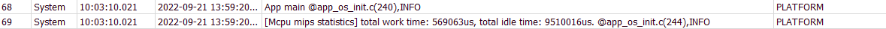

### APP Panic Log<a name="ZH-CN_TOPIC_0000001959437729"></a>

A kernel panic is an action taken by the operating system when it detects an internal fatal error and cannot safely handle the error. When the kernel encounters an exception, it runs the kernel\_panic function and prints all the information obtained when the exception occurs as much as possible.

-   Principle

    There are various causes of exceptions. Through the call information printed for the exception, find the reason for calling kernel\_panic. Common causes include kernel stack overflow, divide-by-zero exceptions in kernel space, out-of-bounds memory access, and kernel deadlocks.

-   Triggering method

    Read address 0 in kernel mode.

When a panic exception occurs on the APP core, the panic reason 0x2003 and the corresponding panic id are printed, as shown in [APP panic log](APP-panic日志.md). For the panic id, see [Table 1](PANIC-ID.md#table279mcpsimp).

**Figure 1**  APP panic exception<a name="fig1896mcpsimp"></a>  
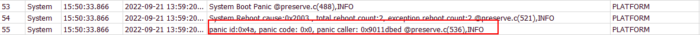

### APP Abnormal Restart<a name="ZH-CN_TOPIC_0000001932198954"></a>

When exceptions such as xip exception, hardfault, and watchdog timeout occur on the APP core, the restart reason 0x200x and the pc and lr values are printed, as shown in [Figure 1](#fig167mcpsimp) and [Table 1](#table169mcpsimp).

**Figure 1**  APP abnormal restart<a name="fig167mcpsimp"></a>  
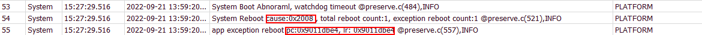

**Table 1**  APP restart reasons

<a name="table169mcpsimp"></a>
<table><thead align="left"><tr id="row176mcpsimp"><th class="cellrowborder" align="left" valign="top" width="40.59405940594059%" id="mcps1.2.4.1.1"><p id="p178mcpsimp"><a name="p178mcpsimp"></a><a name="p178mcpsimp"></a>Exception type</p>
</th>
<th class="cellrowborder" align="left" valign="top" width="33.663366336633665%" id="mcps1.2.4.1.2"><p id="p181mcpsimp"><a name="p181mcpsimp"></a><a name="p181mcpsimp"></a>Log type</p>
</th>
<th class="cellrowborder" align="left" valign="top" width="25.742574257425744%" id="mcps1.2.4.1.3"><p id="p184mcpsimp"><a name="p184mcpsimp"></a><a name="p184mcpsimp"></a>Restart reason</p>
</th>
</tr>
</thead>
<tbody><tr id="row186mcpsimp"><td class="cellrowborder" align="left" valign="top" width="40.59405940594059%" headers="mcps1.2.4.1.1 "><p id="p188mcpsimp"><a name="p188mcpsimp"></a><a name="p188mcpsimp"></a>Active restart</p>
</td>
<td class="cellrowborder" align="left" valign="top" width="33.663366336633665%" headers="mcps1.2.4.1.2 "><p id="p191mcpsimp"><a name="p191mcpsimp"></a><a name="p191mcpsimp"></a>Log_FLATFORM</p>
</td>
<td class="cellrowborder" align="left" valign="top" width="25.742574257425744%" headers="mcps1.2.4.1.3 "><p id="p193mcpsimp"><a name="p193mcpsimp"></a><a name="p193mcpsimp"></a>0x2001</p>
</td>
</tr>
<tr id="row194mcpsimp"><td class="cellrowborder" align="left" valign="top" width="40.59405940594059%" headers="mcps1.2.4.1.1 "><p id="p196mcpsimp"><a name="p196mcpsimp"></a><a name="p196mcpsimp"></a>panic</p>
</td>
<td class="cellrowborder" align="left" valign="top" width="33.663366336633665%" headers="mcps1.2.4.1.2 "><p id="p199mcpsimp"><a name="p199mcpsimp"></a><a name="p199mcpsimp"></a>Log_FLATFORM</p>
</td>
<td class="cellrowborder" align="left" valign="top" width="25.742574257425744%" headers="mcps1.2.4.1.3 "><p id="p201mcpsimp"><a name="p201mcpsimp"></a><a name="p201mcpsimp"></a>0x2003</p>
</td>
</tr>
<tr id="row202mcpsimp"><td class="cellrowborder" align="left" valign="top" width="40.59405940594059%" headers="mcps1.2.4.1.1 "><p id="p204mcpsimp"><a name="p204mcpsimp"></a><a name="p204mcpsimp"></a>hardfault</p>
</td>
<td class="cellrowborder" align="left" valign="top" width="33.663366336633665%" headers="mcps1.2.4.1.2 "><p id="p207mcpsimp"><a name="p207mcpsimp"></a><a name="p207mcpsimp"></a>Log_FLATFORM</p>
</td>
<td class="cellrowborder" align="left" valign="top" width="25.742574257425744%" headers="mcps1.2.4.1.3 "><p id="p209mcpsimp"><a name="p209mcpsimp"></a><a name="p209mcpsimp"></a>0x2004</p>
</td>
</tr>
<tr id="row210mcpsimp"><td class="cellrowborder" align="left" valign="top" width="40.59405940594059%" headers="mcps1.2.4.1.1 "><p id="p212mcpsimp"><a name="p212mcpsimp"></a><a name="p212mcpsimp"></a>nmi</p>
</td>
<td class="cellrowborder" align="left" valign="top" width="33.663366336633665%" headers="mcps1.2.4.1.2 "><p id="p215mcpsimp"><a name="p215mcpsimp"></a><a name="p215mcpsimp"></a>Log_FLATFORM</p>
</td>
<td class="cellrowborder" align="left" valign="top" width="25.742574257425744%" headers="mcps1.2.4.1.3 "><p id="p217mcpsimp"><a name="p217mcpsimp"></a><a name="p217mcpsimp"></a>0x2005</p>
</td>
</tr>
<tr id="row218mcpsimp"><td class="cellrowborder" align="left" valign="top" width="40.59405940594059%" headers="mcps1.2.4.1.1 "><p id="p220mcpsimp"><a name="p220mcpsimp"></a><a name="p220mcpsimp"></a>Watchdog timeout</p>
</td>
<td class="cellrowborder" align="left" valign="top" width="33.663366336633665%" headers="mcps1.2.4.1.2 "><p id="p223mcpsimp"><a name="p223mcpsimp"></a><a name="p223mcpsimp"></a>Log_FLATFORM</p>
</td>
<td class="cellrowborder" align="left" valign="top" width="25.742574257425744%" headers="mcps1.2.4.1.3 "><p id="p225mcpsimp"><a name="p225mcpsimp"></a><a name="p225mcpsimp"></a>0x2008</p>
</td>
</tr>
<tr id="row226mcpsimp"><td class="cellrowborder" align="left" valign="top" width="40.59405940594059%" headers="mcps1.2.4.1.1 "><p id="p228mcpsimp"><a name="p228mcpsimp"></a><a name="p228mcpsimp"></a>xip exception</p>
</td>
<td class="cellrowborder" align="left" valign="top" width="33.663366336633665%" headers="mcps1.2.4.1.2 "><p id="p231mcpsimp"><a name="p231mcpsimp"></a><a name="p231mcpsimp"></a>Log_FLATFORM</p>
</td>
<td class="cellrowborder" align="left" valign="top" width="25.742574257425744%" headers="mcps1.2.4.1.3 "><p id="p233mcpsimp"><a name="p233mcpsimp"></a><a name="p233mcpsimp"></a>0x2009</p>
</td>
</tr>
<tr id="row234mcpsimp"><td class="cellrowborder" align="left" valign="top" width="40.59405940594059%" headers="mcps1.2.4.1.1 "><p id="p236mcpsimp"><a name="p236mcpsimp"></a><a name="p236mcpsimp"></a>xip cache exception</p>
</td>
<td class="cellrowborder" align="left" valign="top" width="33.663366336633665%" headers="mcps1.2.4.1.2 "><p id="p239mcpsimp"><a name="p239mcpsimp"></a><a name="p239mcpsimp"></a>Log_FLATFORM</p>
</td>
<td class="cellrowborder" align="left" valign="top" width="25.742574257425744%" headers="mcps1.2.4.1.3 "><p id="p241mcpsimp"><a name="p241mcpsimp"></a><a name="p241mcpsimp"></a>0x200a</p>
</td>
</tr>
<tr id="row242mcpsimp"><td class="cellrowborder" align="left" valign="top" width="40.59405940594059%" headers="mcps1.2.4.1.1 "><p id="p244mcpsimp"><a name="p244mcpsimp"></a><a name="p244mcpsimp"></a>mdma exception</p>
</td>
<td class="cellrowborder" align="left" valign="top" width="33.663366336633665%" headers="mcps1.2.4.1.2 "><p id="p247mcpsimp"><a name="p247mcpsimp"></a><a name="p247mcpsimp"></a>Log_FLATFORM</p>
</td>
<td class="cellrowborder" align="left" valign="top" width="25.742574257425744%" headers="mcps1.2.4.1.3 "><p id="p249mcpsimp"><a name="p249mcpsimp"></a><a name="p249mcpsimp"></a>0x200b</p>
</td>
</tr>
<tr id="row250mcpsimp"><td class="cellrowborder" align="left" valign="top" width="40.59405940594059%" headers="mcps1.2.4.1.1 "><p id="p252mcpsimp"><a name="p252mcpsimp"></a><a name="p252mcpsimp"></a>smdma exception</p>
</td>
<td class="cellrowborder" align="left" valign="top" width="33.663366336633665%" headers="mcps1.2.4.1.2 "><p id="p255mcpsimp"><a name="p255mcpsimp"></a><a name="p255mcpsimp"></a>Log_FLATFORM</p>
</td>
<td class="cellrowborder" align="left" valign="top" width="25.742574257425744%" headers="mcps1.2.4.1.3 "><p id="p257mcpsimp"><a name="p257mcpsimp"></a><a name="p257mcpsimp"></a>0x200c</p>
</td>
</tr>
<tr id="row258mcpsimp"><td class="cellrowborder" align="left" valign="top" width="40.59405940594059%" headers="mcps1.2.4.1.1 "><p id="p260mcpsimp"><a name="p260mcpsimp"></a><a name="p260mcpsimp"></a>Forced watchdog reset</p>
</td>
<td class="cellrowborder" align="left" valign="top" width="33.663366336633665%" headers="mcps1.2.4.1.2 "><p id="p263mcpsimp"><a name="p263mcpsimp"></a><a name="p263mcpsimp"></a>Log_FLATFORM</p>
</td>
<td class="cellrowborder" align="left" valign="top" width="25.742574257425744%" headers="mcps1.2.4.1.3 "><p id="p265mcpsimp"><a name="p265mcpsimp"></a><a name="p265mcpsimp"></a>0x200d</p>
</td>
</tr>
<tr id="row266mcpsimp"><td class="cellrowborder" align="left" valign="top" width="40.59405940594059%" headers="mcps1.2.4.1.1 "><p id="p268mcpsimp"><a name="p268mcpsimp"></a><a name="p268mcpsimp"></a>lp watchdog/uvlo restart</p>
</td>
<td class="cellrowborder" align="left" valign="top" width="33.663366336633665%" headers="mcps1.2.4.1.2 "><p id="p271mcpsimp"><a name="p271mcpsimp"></a><a name="p271mcpsimp"></a>Log_FLATFORM</p>
</td>
<td class="cellrowborder" align="left" valign="top" width="25.742574257425744%" headers="mcps1.2.4.1.3 "><p id="p273mcpsimp"><a name="p273mcpsimp"></a><a name="p273mcpsimp"></a>0x200f</p>
</td>
</tr>
</tbody>
</table>

### Exception Type Description<a name="ZH-CN_TOPIC_0000001959517517"></a>

**Table 1**  Restart description analysis (middleware/utils/dfx/dfx\_reboot/reboot/shared/non\_os\_reboot.h)

<a name="table1276mcpsimp"></a>
<table><thead align="left"><tr id="row1283mcpsimp"><th class="cellrowborder" align="left" valign="top" width="19.74%" id="mcps1.2.4.1.1"><p id="p1285mcpsimp"><a name="p1285mcpsimp"></a><a name="p1285mcpsimp"></a>id</p>
</th>
<th class="cellrowborder" align="left" valign="top" width="17.03%" id="mcps1.2.4.1.2"><p id="p1288mcpsimp"><a name="p1288mcpsimp"></a><a name="p1288mcpsimp"></a>Description</p>
</th>
<th class="cellrowborder" align="left" valign="top" width="63.23%" id="mcps1.2.4.1.3"><p id="p1291mcpsimp"><a name="p1291mcpsimp"></a><a name="p1291mcpsimp"></a>Cause analysis of abnormal restart scenarios</p>
</th>
</tr>
</thead>
<tbody><tr id="row1293mcpsimp"><td class="cellrowborder" align="left" valign="top" width="19.74%" headers="mcps1.2.4.1.1 "><p id="p1295mcpsimp"><a name="p1295mcpsimp"></a><a name="p1295mcpsimp"></a>0x0</p>
</td>
<td class="cellrowborder" align="left" valign="top" width="17.03%" headers="mcps1.2.4.1.2 "><p id="p1298mcpsimp"><a name="p1298mcpsimp"></a><a name="p1298mcpsimp"></a>Unknown restart reason</p>
</td>
<td class="cellrowborder" align="left" valign="top" width="63.23%" headers="mcps1.2.4.1.3 "><p id="p1300mcpsimp"><a name="p1300mcpsimp"></a><a name="p1300mcpsimp"></a>Caused by directly writing to registers to restart in user code</p>
</td>
</tr>
<tr id="row1301mcpsimp"><td class="cellrowborder" align="left" valign="top" width="19.74%" headers="mcps1.2.4.1.1 "><p id="p1303mcpsimp"><a name="p1303mcpsimp"></a><a name="p1303mcpsimp"></a>0x2001</p>
</td>
<td class="cellrowborder" align="left" valign="top" width="17.03%" headers="mcps1.2.4.1.2 "><p id="p1306mcpsimp"><a name="p1306mcpsimp"></a><a name="p1306mcpsimp"></a>Active restart of the application core</p>
</td>
<td class="cellrowborder" align="left" valign="top" width="63.23%" headers="mcps1.2.4.1.3 "><p id="entry1307mcpsimpp0"><a name="entry1307mcpsimpp0"></a><a name="entry1307mcpsimpp0"></a>-</p>
</td>
</tr>
<tr id="row1308mcpsimp"><td class="cellrowborder" align="left" valign="top" width="19.74%" headers="mcps1.2.4.1.1 "><p id="p1310mcpsimp"><a name="p1310mcpsimp"></a><a name="p1310mcpsimp"></a>0x2003</p>
</td>
<td class="cellrowborder" align="left" valign="top" width="17.03%" headers="mcps1.2.4.1.2 "><p id="p1313mcpsimp"><a name="p1313mcpsimp"></a><a name="p1313mcpsimp"></a>APP panic exception</p>
</td>
<td class="cellrowborder" align="left" valign="top" width="63.23%" headers="mcps1.2.4.1.3 "><p id="p1315mcpsimp"><a name="p1315mcpsimp"></a><a name="p1315mcpsimp"></a>Check the panic id in "<a href="PANIC-ID.md">PANIC ID</a>" for further analysis</p>
</td>
</tr>
<tr id="row1316mcpsimp"><td class="cellrowborder" align="left" valign="top" width="19.74%" headers="mcps1.2.4.1.1 "><p id="p1318mcpsimp"><a name="p1318mcpsimp"></a><a name="p1318mcpsimp"></a>0x2004</p>
</td>
<td class="cellrowborder" align="left" valign="top" width="17.03%" headers="mcps1.2.4.1.2 "><p id="p1321mcpsimp"><a name="p1321mcpsimp"></a><a name="p1321mcpsimp"></a>Hardfault exception</p>
</td>
<td class="cellrowborder" align="left" valign="top" width="63.23%" headers="mcps1.2.4.1.3 "><p id="p1323mcpsimp"><a name="p1323mcpsimp"></a><a name="p1323mcpsimp"></a>Illegal address;</p>
<p id="p1324mcpsimp"><a name="p1324mcpsimp"></a><a name="p1324mcpsimp"></a>Null pointer;</p>
<p id="p1325mcpsimp"><a name="p1325mcpsimp"></a><a name="p1325mcpsimp"></a>The XXX module is not initialized;</p>
<p id="p1326mcpsimp"><a name="p1326mcpsimp"></a><a name="p1326mcpsimp"></a>The XXX module has no clock;</p>
<p id="p1327mcpsimp"><a name="p1327mcpsimp"></a><a name="p1327mcpsimp"></a>Further locating is required by combining mepc, ra, mtval, and general registers in the last words.</p>
</td>
</tr>
<tr id="row1328mcpsimp"><td class="cellrowborder" align="left" valign="top" width="19.74%" headers="mcps1.2.4.1.1 "><p id="p1330mcpsimp"><a name="p1330mcpsimp"></a><a name="p1330mcpsimp"></a>0x2008</p>
</td>
<td class="cellrowborder" align="left" valign="top" width="17.03%" headers="mcps1.2.4.1.2 "><p id="p1333mcpsimp"><a name="p1333mcpsimp"></a><a name="p1333mcpsimp"></a>APP watchdog timeout</p>
</td>
<td class="cellrowborder" align="left" valign="top" width="63.23%" headers="mcps1.2.4.1.3 "><p id="p1335mcpsimp"><a name="p1335mcpsimp"></a><a name="p1335mcpsimp"></a>Analyze by combining the CPU trace and logs.</p>
<p id="p1336mcpsimp"><a name="p1336mcpsimp"></a><a name="p1336mcpsimp"></a>Generally, high-priority tasks/interrupt flows are being executed continuously, preventing the low-priority watchdog feeding task from being scheduled.</p>
</td>
</tr>
<tr id="row1337mcpsimp"><td class="cellrowborder" align="left" valign="top" width="19.74%" headers="mcps1.2.4.1.1 "><p id="p1339mcpsimp"><a name="p1339mcpsimp"></a><a name="p1339mcpsimp"></a>0x200D</p>
</td>
<td class="cellrowborder" align="left" valign="top" width="17.03%" headers="mcps1.2.4.1.2 "><p id="p1342mcpsimp"><a name="p1342mcpsimp"></a><a name="p1342mcpsimp"></a>APP hard watchdog timeout</p>
</td>
<td class="cellrowborder" align="left" valign="top" width="63.23%" headers="mcps1.2.4.1.3 "><p id="p1344mcpsimp"><a name="p1344mcpsimp"></a><a name="p1344mcpsimp"></a>After the system hangs, it cannot respond to the watchdog timeout interrupt. Analyze by combining the CPU trace.</p>
</td>
</tr>
<tr id="row1345mcpsimp"><td class="cellrowborder" align="left" valign="top" width="19.74%" headers="mcps1.2.4.1.1 "><p id="p1347mcpsimp"><a name="p1347mcpsimp"></a><a name="p1347mcpsimp"></a>0x200f</p>
</td>
<td class="cellrowborder" align="left" valign="top" width="17.03%" headers="mcps1.2.4.1.2 "><p id="p1350mcpsimp"><a name="p1350mcpsimp"></a><a name="p1350mcpsimp"></a>ulp watchdog timeout/uvlo restart</p>
</td>
<td class="cellrowborder" align="left" valign="top" width="63.23%" headers="mcps1.2.4.1.3 "><p id="p1352mcpsimp"><a name="p1352mcpsimp"></a><a name="p1352mcpsimp"></a>Add ulp watchdog feeding logs for further analysis</p>
</td>
</tr>
<tr id="row1353mcpsimp"><td class="cellrowborder" align="left" valign="top" width="19.74%" headers="mcps1.2.4.1.1 "><p id="p1355mcpsimp"><a name="p1355mcpsimp"></a><a name="p1355mcpsimp"></a>0x2010</p>
</td>
<td class="cellrowborder" align="left" valign="top" width="17.03%" headers="mcps1.2.4.1.2 "><p id="p1358mcpsimp"><a name="p1358mcpsimp"></a><a name="p1358mcpsimp"></a>Pin reset</p>
</td>
<td class="cellrowborder" align="left" valign="top" width="63.23%" headers="mcps1.2.4.1.3 "><p id="entry1359mcpsimpp0"><a name="entry1359mcpsimpp0"></a><a name="entry1359mcpsimpp0"></a>-</p>
</td>
</tr>
<tr id="row1360mcpsimp"><td class="cellrowborder" align="left" valign="top" width="19.74%" headers="mcps1.2.4.1.1 "><p id="p1362mcpsimp"><a name="p1362mcpsimp"></a><a name="p1362mcpsimp"></a>0x2040</p>
</td>
<td class="cellrowborder" align="left" valign="top" width="17.03%" headers="mcps1.2.4.1.2 "><p id="p1365mcpsimp"><a name="p1365mcpsimp"></a><a name="p1365mcpsimp"></a>Upgrade completed</p>
</td>
<td class="cellrowborder" align="left" valign="top" width="63.23%" headers="mcps1.2.4.1.3 "><p id="entry1366mcpsimpp0"><a name="entry1366mcpsimpp0"></a><a name="entry1366mcpsimpp0"></a>-</p>
</td>
</tr>
<tr id="row1367mcpsimp"><td class="cellrowborder" align="left" valign="top" width="19.74%" headers="mcps1.2.4.1.1 "><p id="p1369mcpsimp"><a name="p1369mcpsimp"></a><a name="p1369mcpsimp"></a>0x2042</p>
</td>
<td class="cellrowborder" align="left" valign="top" width="17.03%" headers="mcps1.2.4.1.2 "><p id="p1372mcpsimp"><a name="p1372mcpsimp"></a><a name="p1372mcpsimp"></a>Upgrade failed</p>
</td>
<td class="cellrowborder" align="left" valign="top" width="63.23%" headers="mcps1.2.4.1.3 "><p id="entry1373mcpsimpp0"><a name="entry1373mcpsimpp0"></a><a name="entry1373mcpsimpp0"></a>-</p>
</td>
</tr>
<tr id="row1374mcpsimp"><td class="cellrowborder" align="left" valign="top" width="19.74%" headers="mcps1.2.4.1.1 "><p id="p1376mcpsimp"><a name="p1376mcpsimp"></a><a name="p1376mcpsimp"></a>0xf0f0</p>
</td>
<td class="cellrowborder" align="left" valign="top" width="17.03%" headers="mcps1.2.4.1.2 "><p id="p1379mcpsimp"><a name="p1379mcpsimp"></a><a name="p1379mcpsimp"></a>System power-on</p>
</td>
<td class="cellrowborder" align="left" valign="top" width="63.23%" headers="mcps1.2.4.1.3 "><p id="entry1380mcpsimpp0"><a name="entry1380mcpsimpp0"></a><a name="entry1380mcpsimpp0"></a>-</p>
</td>
</tr>
</tbody>
</table>

# Log Analysis<a name="ZH-CN_TOPIC_0000001932198958"></a>

Common exception scenarios include watchdog timeout, hardfault, mem fault, bus fault, usage fault, panic exceptions, forced watchdog reset, and so on. When an exception occurs, the abnormal restart reason is printed and the system restarts. APP restart exceptions are represented by 0x2xxx, specifically 0x2000\~0x2010, 0x2040\~0x2044, 0x2080, and 0x2100.


## Obtaining Halt Information<a name="ZH-CN_TOPIC_0000001932358346"></a>


### Obtaining Maintenance and Testability Information from the Normal Printing Port<a name="ZH-CN_TOPIC_0000001959437741"></a>

-   When the hardware is connected to the serial port tool, if the board halts, the serial port tool can receive the halt information printed by the DFX process before reset. Users can locate the halt cause by analyzing the halt information. The halt LOG of the normal printing port is divided into four parts:
-   Halt scene: records the live values of RISCV general registers and some CSR registers when the halt occurs. For the description of each register, see [Viewing exception information](_异常信息查看.md#_异常信息查看) in the appendix.

    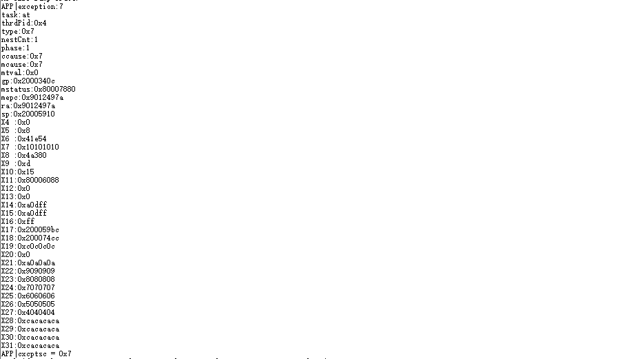

-   Thread stack information: records the stack top, stack size, and stack usage peak of the running thread stack when the halt occurs.

    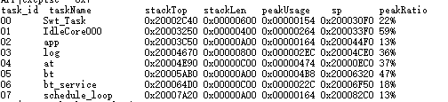

-   Stack backtrace: traces the halt stack information. traceback 0 is the stack top position, sp addr and current sp are the current stack position, and sp content is the stack content.

    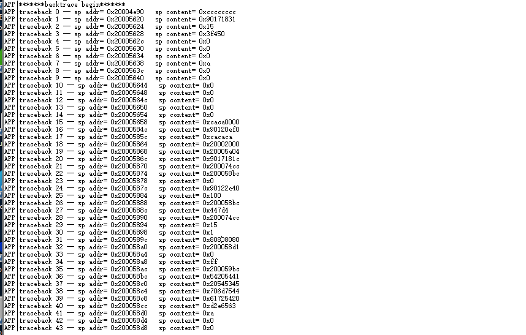

-   CPU Trace: records the PC and LR executed by the CPU over a period of time. step time stores the recording time. The larger the value, the closer the recorded time is to the halt scene.

> **Note:** 
    >Note: This is a data acquisition function. The recorded PC values may differ from the actual execution trace and may not correspond completely!

    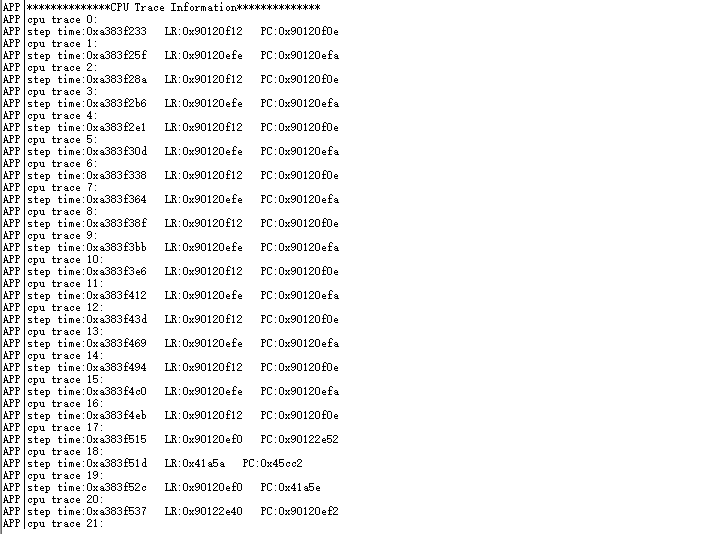

    There are two ways to analyze the Trace:

    Method 1: Users can find the functions corresponding to the LR and PC addresses in the application.lst file generated during compilation to locate the halt execution scene.

    Method 2: Users can use the CFBB Tools provided by the IDE to parse the Trace. Open the tool and select the target used by the user.

    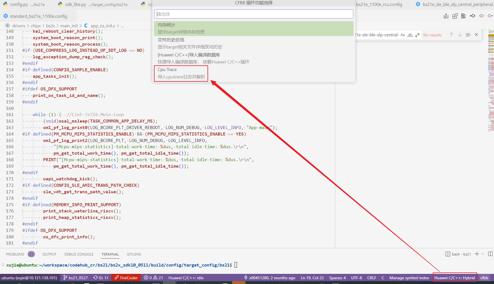

    Import the CPU Trace Information to the Trace information of CPU Trace end, click Parse to obtain the execution information of the past period, and locate the halt cause:

    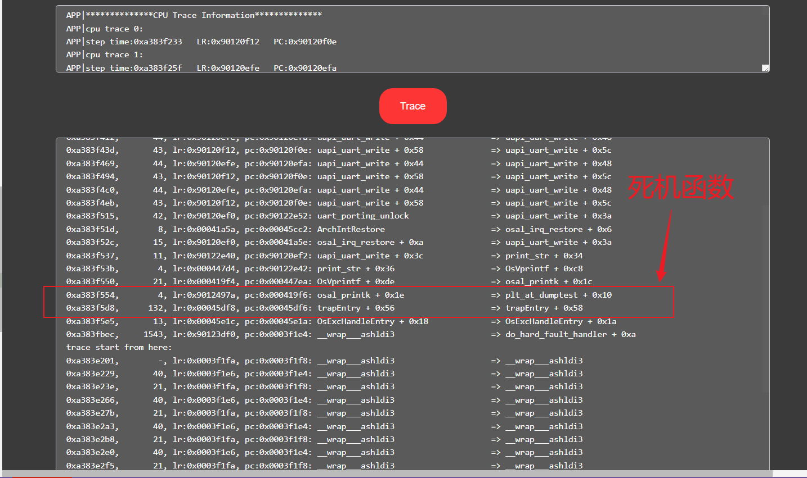

### Obtaining Halt Dump Information<a name="ZH-CN_TOPIC_0000001959517521"></a>

The DebugKits tool provides a function to export the memory of the halt scene in binary format when a halt occurs, providing reference information to help developers locate and analyze halt issues. For detailed tool installation and usage, see "BS2XV100 DebugKits Tool User Guide". Only the Dump information export process is described here.

First, enter the tool page, click Options, and then select Change Chip. In the pop-up box, select BS2X to confirm the chip type. Refer to the figure to select the chip.

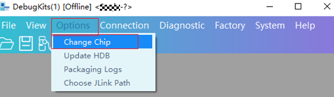

Then click Connection and select Connect. In the pop-up window, select the connection mode and the corresponding channel number to connect. Refer to the figure to connect the chip.


If it is the first time to connect the chip or the chip has a new version of the program, you need to update the HDB and reconnect before the log printing can be displayed correctly. Under the Option menu, select Update HDB, select the generated database directory (\\output\\bs2x\\database\_evb), and click OK to complete the configuration. For details, see the following figure: Configuring the database.

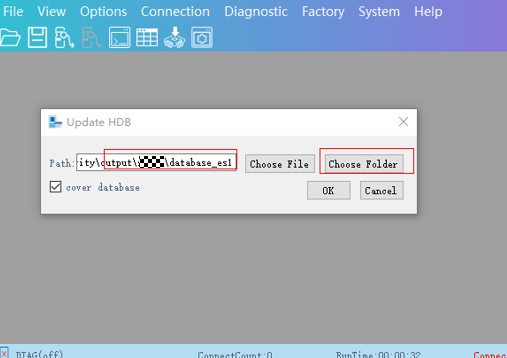

Through the DebugKits tool, you can observe the specific information printed by the chip during runtime in real time. Refer to Figure DebugKits log printing. When a halt occurs, the Message view prints the last word and last dump information.

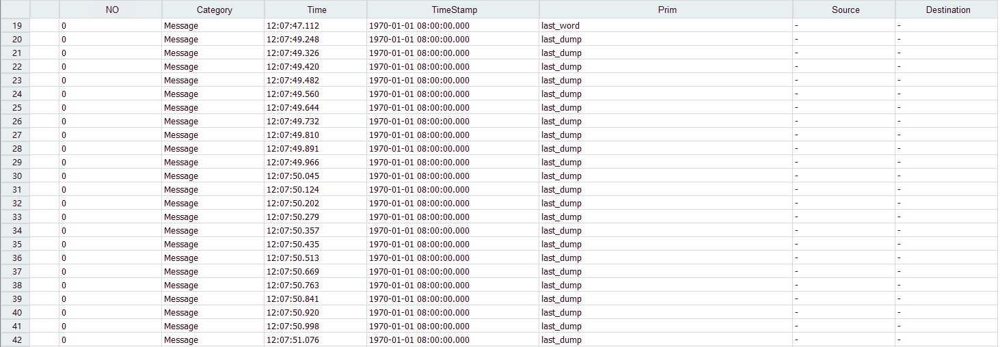

The last word information sends the PC address, return address, stack address, and CPU register information when a halt occurs. Users can analyze the error type and locate the error cause based on the specific last word information. For details, see the following figure: last word information.


The last dump information packages part of the information in memory into a bin file and stores it in the DumpInfo subdirectory of the DebugKits installation directory. For details, see the following figure: last dump generated file.

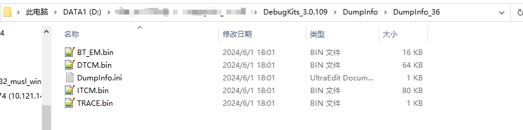

> **Note:** 
>Note: Dumping memory to DebugKits takes some time (1–2 min). Therefore, if you need to use last dump to analyze halt information, do not reset immediately after a halt fault occurs; otherwise, the last dump information may not be completely obtained.

### Exporting by Connecting to the J-Link Debugger<a name="ZH-CN_TOPIC_0000001932198962"></a>

In scenarios where connecting a JTAG debugger is allowed, users can connect tools such as the J-Link emulator to further obtain information related to the halt scene. The following mainly describes the process of obtaining halt-related information through the J-Link emulator.

This section mainly describes the process of using the J-Link debugger at the halt scene to export halt information.

To debug with the J-Link emulator, first connect the chip SWD pins. The specific location is subject to the actual product. After the hardware is connected, run the Commandline\_bs2x\_mcpu.bat script in the toolkit (sdk\\tools\\bin\\jlink\_tool\\bs2x). The script will automatically connect (for other cores, the connection procedure can refer to this method).

Schematic diagram of J-Link connecting to MCPU

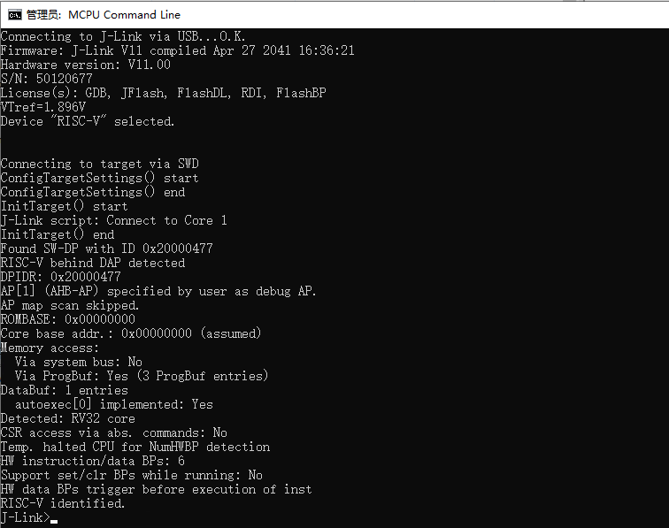

After connecting J-Link, you can use JLink commands to debug the chip and obtain chip operation information. Common JLink commands are as follows: J-Link common commands

<a name="table1568mcpsimp"></a>
<table><thead align="left"><tr id="row1573mcpsimp"><th class="cellrowborder" align="left" valign="top" width="20%" id="mcps1.1.3.1.1"><p id="p1575mcpsimp"><a name="p1575mcpsimp"></a><a name="p1575mcpsimp"></a>Command</p>
</th>
<th class="cellrowborder" align="left" valign="top" width="80%" id="mcps1.1.3.1.2"><p id="p1577mcpsimp"><a name="p1577mcpsimp"></a><a name="p1577mcpsimp"></a>Description</p>
</th>
</tr>
</thead>
<tbody><tr id="row1579mcpsimp"><td class="cellrowborder" align="left" valign="top" width="20%" headers="mcps1.1.3.1.1 "><p id="p1581mcpsimp"><a name="p1581mcpsimp"></a><a name="p1581mcpsimp"></a>con/connect</p>
</td>
<td class="cellrowborder" align="left" valign="top" width="80%" headers="mcps1.1.3.1.2 "><p id="p1583mcpsimp"><a name="p1583mcpsimp"></a><a name="p1583mcpsimp"></a>Connect.</p>
</td>
</tr>
<tr id="row1584mcpsimp"><td class="cellrowborder" align="left" valign="top" width="20%" headers="mcps1.1.3.1.1 "><p id="p1586mcpsimp"><a name="p1586mcpsimp"></a><a name="p1586mcpsimp"></a>h/halt</p>
</td>
<td class="cellrowborder" align="left" valign="top" width="80%" headers="mcps1.1.3.1.2 "><p id="p1588mcpsimp"><a name="p1588mcpsimp"></a><a name="p1588mcpsimp"></a>Halt.</p>
</td>
</tr>
<tr id="row1589mcpsimp"><td class="cellrowborder" align="left" valign="top" width="20%" headers="mcps1.1.3.1.1 "><p id="p1591mcpsimp"><a name="p1591mcpsimp"></a><a name="p1591mcpsimp"></a>g/go</p>
</td>
<td class="cellrowborder" align="left" valign="top" width="80%" headers="mcps1.1.3.1.2 "><p id="p1593mcpsimp"><a name="p1593mcpsimp"></a><a name="p1593mcpsimp"></a>Resume, run.</p>
</td>
</tr>
<tr id="row1594mcpsimp"><td class="cellrowborder" align="left" valign="top" width="20%" headers="mcps1.1.3.1.1 "><p id="p1596mcpsimp"><a name="p1596mcpsimp"></a><a name="p1596mcpsimp"></a>mem32</p>
<p id="p1597mcpsimp"><a name="p1597mcpsimp"></a><a name="p1597mcpsimp"></a>mem16</p>
<p id="p1598mcpsimp"><a name="p1598mcpsimp"></a><a name="p1598mcpsimp"></a>mem8</p>
</td>
<td class="cellrowborder" align="left" valign="top" width="80%" headers="mcps1.1.3.1.2 "><p id="p1600mcpsimp"><a name="p1600mcpsimp"></a><a name="p1600mcpsimp"></a>I/O read 32bit: mem32 &lt;Addr&gt;, &lt;NumItems&gt; (hex) (Addr indicates the memory address, and NumItems indicates the number of consecutive 32-bit values to read starting from Addr)</p>
<p id="p1601mcpsimp"><a name="p1601mcpsimp"></a><a name="p1601mcpsimp"></a>I/O read 16bit: mem16 &lt;Addr&gt;, &lt;NumItems&gt; (hex)</p>
<p id="p1602mcpsimp"><a name="p1602mcpsimp"></a><a name="p1602mcpsimp"></a>I/O read 8bit: mem8 &lt;Addr&gt;, &lt;NumItems&gt; (hex)</p>
</td>
</tr>
<tr id="row1603mcpsimp"><td class="cellrowborder" align="left" valign="top" width="20%" headers="mcps1.1.3.1.1 "><p id="p1605mcpsimp"><a name="p1605mcpsimp"></a><a name="p1605mcpsimp"></a>w4</p>
<p id="p1606mcpsimp"><a name="p1606mcpsimp"></a><a name="p1606mcpsimp"></a>w2</p>
<p id="p1607mcpsimp"><a name="p1607mcpsimp"></a><a name="p1607mcpsimp"></a>w1</p>
</td>
<td class="cellrowborder" align="left" valign="top" width="80%" headers="mcps1.1.3.1.2 "><p id="p1609mcpsimp"><a name="p1609mcpsimp"></a><a name="p1609mcpsimp"></a>I/O write 4Byte: w4 &lt;Addr&gt;, &lt;Data&gt; (hex)</p>
<p id="p1610mcpsimp"><a name="p1610mcpsimp"></a><a name="p1610mcpsimp"></a>I/O write 2Byte: w2 &lt;Addr&gt;, &lt;Data&gt; (hex)</p>
<p id="p1611mcpsimp"><a name="p1611mcpsimp"></a><a name="p1611mcpsimp"></a>I/O write 1Byte: w1 &lt;Addr&gt;, &lt;Data&gt; (hex)</p>
</td>
</tr>
<tr id="row1612mcpsimp"><td class="cellrowborder" align="left" valign="top" width="20%" headers="mcps1.1.3.1.1 "><p id="p1614mcpsimp"><a name="p1614mcpsimp"></a><a name="p1614mcpsimp"></a>readcsr</p>
</td>
<td class="cellrowborder" align="left" valign="top" width="80%" headers="mcps1.1.3.1.2 "><p id="p1616mcpsimp"><a name="p1616mcpsimp"></a><a name="p1616mcpsimp"></a>Read the RISC-V CSR register: ReadCSR &lt;RegIndex&gt;</p>
</td>
</tr>
<tr id="row1617mcpsimp"><td class="cellrowborder" align="left" valign="top" width="20%" headers="mcps1.1.3.1.1 "><p id="p1619mcpsimp"><a name="p1619mcpsimp"></a><a name="p1619mcpsimp"></a>writecsr</p>
</td>
<td class="cellrowborder" align="left" valign="top" width="80%" headers="mcps1.1.3.1.2 "><p id="p1621mcpsimp"><a name="p1621mcpsimp"></a><a name="p1621mcpsimp"></a>Write the RISC-V CSR register: WriteCSR &lt;RegIndex&gt;,&lt;Value&gt;</p>
</td>
</tr>
</tbody>
</table>

The procedure for querying information is as follows:

-   Query the CPU register information, as shown in Figure Querying CPU Register Values.

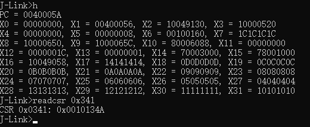

-   Query the memory information to obtain the maintenance variable values or ordinary variable values.

Obtain the nm file from \\output\bs2x\xxx\_core\xxx\_bs2x\_xxx\xxx.nm, and obtain the address of the variable to be queried from the nm file. As shown in Figure Variable Address, the address of the "g-exception-dump-callback" variable is 0x20025950.


Obtain the status information through J-Link, as shown in Figure Variable Value.


> **Note:** 
>For RISC-V architecture processors, a **J-Link debugger of V10 or a later version** is required.
>When connecting the J-Link, ensure the chip is in the working state; it cannot be connected in the sleep state.

## Watchdog Timeout Restart<a name="ZH-CN_TOPIC_0000001932358350"></a>

Watchdog timeout restarts fall into two types: CWDT and ULP WDT restarts. When the APP encounters a watchdog timeout (CWDT timeout), HSO logs and UART logs are printed, showing the corresponding pc and lr, and the memory information is exported.

When the APP core encounters a watchdog timeout, the system restarts. After the system restart, the serial port prints the pc and lr at the time of the exception, as shown in [Figure 1](#fig156mcpsimp). The HSO log also prints the restart cause 0x2008 and the corresponding pc and lr, as shown in [Figure 2](#fig158mcpsimp). You can look up the pc value in the lst file to determine the problem attribution. The pc pointer range of the APP core is shown in Table 3-1.

**Table 1**  APP Code Space Range

<a name="table115mcpsimp"></a>
<table><thead align="left"><tr id="row122mcpsimp"><th class="cellrowborder" align="left" valign="top" width="29.292929292929294%" id="mcps1.2.4.1.1"><p id="p124mcpsimp"><a name="p124mcpsimp"></a><a name="p124mcpsimp"></a>Memory Name</p>
</th>
<th class="cellrowborder" align="left" valign="top" width="37.37373737373737%" id="mcps1.2.4.1.2"><p id="p127mcpsimp"><a name="p127mcpsimp"></a><a name="p127mcpsimp"></a>Start Address</p>
</th>
<th class="cellrowborder" align="left" valign="top" width="33.33333333333333%" id="mcps1.2.4.1.3"><p id="p130mcpsimp"><a name="p130mcpsimp"></a><a name="p130mcpsimp"></a>End Address</p>
</th>
</tr>
</thead>
<tbody><tr id="row132mcpsimp"><td class="cellrowborder" align="left" valign="top" width="29.292929292929294%" headers="mcps1.2.4.1.1 "><p id="p134mcpsimp"><a name="p134mcpsimp"></a><a name="p134mcpsimp"></a>ITCM</p>
</td>
<td class="cellrowborder" align="left" valign="top" width="37.37373737373737%" headers="mcps1.2.4.1.2 "><p id="p137mcpsimp"><a name="p137mcpsimp"></a><a name="p137mcpsimp"></a>0x42000</p>
</td>
<td class="cellrowborder" align="left" valign="top" width="33.33333333333333%" headers="mcps1.2.4.1.3 "><p id="p139mcpsimp"><a name="p139mcpsimp"></a><a name="p139mcpsimp"></a>0x56000</p>
</td>
</tr>
<tr id="row140mcpsimp"><td class="cellrowborder" align="left" valign="top" width="29.292929292929294%" headers="mcps1.2.4.1.1 "><p id="p142mcpsimp"><a name="p142mcpsimp"></a><a name="p142mcpsimp"></a>DTCM</p>
</td>
<td class="cellrowborder" align="left" valign="top" width="37.37373737373737%" headers="mcps1.2.4.1.2 "><p id="p145mcpsimp"><a name="p145mcpsimp"></a><a name="p145mcpsimp"></a>0x20000000</p>
</td>
<td class="cellrowborder" align="left" valign="top" width="33.33333333333333%" headers="mcps1.2.4.1.3 "><p id="p147mcpsimp"><a name="p147mcpsimp"></a><a name="p147mcpsimp"></a>0x20010000</p>
</td>
</tr>
<tr id="row148mcpsimp"><td class="cellrowborder" align="left" valign="top" width="29.292929292929294%" headers="mcps1.2.4.1.1 "><p id="p150mcpsimp"><a name="p150mcpsimp"></a><a name="p150mcpsimp"></a>SFC</p>
</td>
<td class="cellrowborder" align="left" valign="top" width="37.37373737373737%" headers="mcps1.2.4.1.2 "><p id="p153mcpsimp"><a name="p153mcpsimp"></a><a name="p153mcpsimp"></a>0x90100000</p>
</td>
<td class="cellrowborder" align="left" valign="top" width="33.33333333333333%" headers="mcps1.2.4.1.3 "><p id="p155mcpsimp"><a name="p155mcpsimp"></a><a name="p155mcpsimp"></a>0x90180000</p>
</td>
</tr>
</tbody>
</table>

**Figure 1**  CWDT Timeout Restart UART Printing<a name="fig156mcpsimp"></a>  
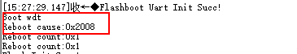

**Figure 2**  CWDT Timeout Restart HSO Log Printing<a name="fig158mcpsimp"></a>  


### ULP\_WDT Timeout<a name="ZH-CN_TOPIC_0000001959437745"></a>

When the APP enters sleep mode, the CWDT is powered off and the WDT function is implemented by the ULP\_WDT. When a watchdog timeout occurs, the system restarts. After the system restart, the serial port and HSO log also print the restart cause 0x200f, as shown in [Figure 1](#fig1150mcpsimp).

**Figure 1**  WDT Timeout Restart UART Printing<a name="fig1150mcpsimp"></a>  
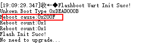

## hardfault, MEM fault, BUS fault, and Usage fault Exceptions<a name="ZH-CN_TOPIC_0000001959517525"></a>

When the system encounters any of the preceding exceptions, the HSO log records the pc, lr, and mtval at the time of the exception, as shown in [Figure 1](APP核异常.md#fig1214mcpsimp).

After the system restart, the restart cause and the corresponding pc, lr, and mtval are also printed, as shown in [Figure 2](APP核异常.md#fig1216mcpsimp).


### APP Core Exception<a name="ZH-CN_TOPIC_0000001932198966"></a>

When the APP core encounters the preceding restart, it prints the restart cause 0x2004.

**Figure 1**  APP hardfault Restart HSO Log<a name="fig1214mcpsimp"></a>  
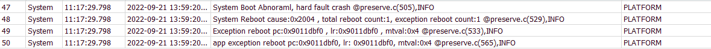

**Figure 2**  APP hardfault Restart UART Printing<a name="fig1216mcpsimp"></a>  
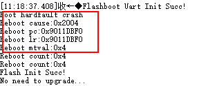

## NMI Exception<a name="ZH-CN_TOPIC_0000001959437749"></a>

When the system encounters one of the following NMI exceptions, it prints the corresponding restart cause after the restart. The HSO log records the pc, lr, and mtval.


### XIP Exception<a name="ZH-CN_TOPIC_0000001959517529"></a>

When the system encounters an XIP restart, it prints the restart cause 0x2009. The HSO log outputs the pc, lr, and mtval, as shown in [Figure 1](#fig1639mcpsimp) and [Figure 2](#fig1641mcpsimp).

**Figure 1**  XIP Restart HSO Log<a name="fig1639mcpsimp"></a>  
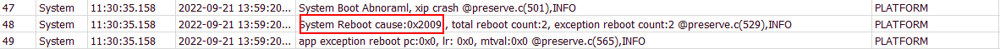

**Figure 2**  XIP Restart UART Printing<a name="fig1641mcpsimp"></a>  
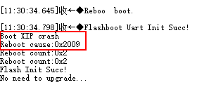

### XIP CACHE Exception<a name="ZH-CN_TOPIC_0000001932198970"></a>

When the system encounters an XIP cache exception, it prints the restart cause 0x200a. The HSO log records the pc, lr, and mtval, as shown in [Figure 1](#fig1144mcpsimp) and [Figure 2](#fig1146mcpsimp).

**Figure 1**  XIP cache Exception HSO Log<a name="fig1144mcpsimp"></a>  


**Figure 2**  XIP cache Exception UART Printing<a name="fig1146mcpsimp"></a>  
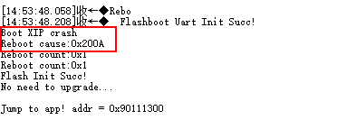

### MDMA Exception<a name="ZH-CN_TOPIC_0000001932358358"></a>

When the system encounters an MDMA exception, it prints the restart cause 0x200b. The HSO log records the pc, lr, and mtval, as shown in [Figure 1](#fig1680mcpsimp) and [Figure 2](#fig1682mcpsimp).

**Figure 1**  MDMA Exception HSO Log<a name="fig1680mcpsimp"></a>  
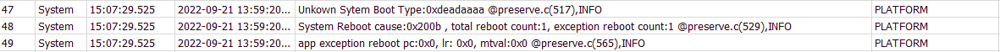

**Figure 2**  MDMA Exception UART Printing<a name="fig1682mcpsimp"></a>  
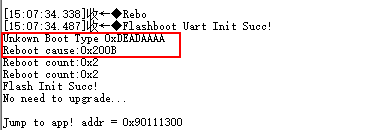

### SMDMA Exception<a name="ZH-CN_TOPIC_0000001959437753"></a>

When the system encounters an SMDMA exception, it prints the restart cause 0x200c. The HSO log records the pc, lr, and mtval, as shown in [Figure 1](#fig965mcpsimp) and [Figure 2](#fig967mcpsimp).

**Figure 1**  SMDMA Exception HSO Log<a name="fig965mcpsimp"></a>  
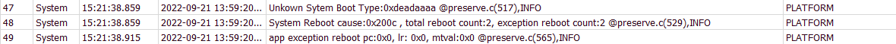

**Figure 2**  SMDMA Exception UART Printing<a name="fig967mcpsimp"></a>  
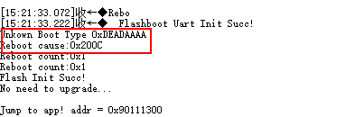

### A-core NMI Exception<a name="ZH-CN_TOPIC_0000001959517533"></a>

When the A-core encounters an NMI exception, it prints the restart cause 0x2005. The HSO log records the pc, lr, and mtval, as shown in [Figure 1](#fig1691mcpsimp) and [Figure 2](#fig1693mcpsimp).

**Figure 1**  A-core NMI Exception HSO Log<a name="fig1691mcpsimp"></a>  
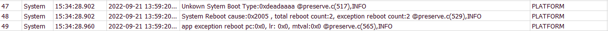

**Figure 2**  A-core NMI Exception UART Printing<a name="fig1693mcpsimp"></a>  
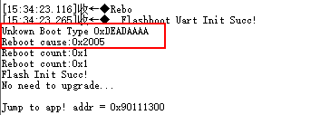

## panic Exception<a name="ZH-CN_TOPIC_0000001932358362"></a>

When a panic exception occurs, the panic id, code, and the lr of the call are printed, and the pc and lr of the peer core are obtained, where normal core indicates the peer core. Normal core being 0 indicates an A-core exception, and normal core being 1 indicates a BT-core exception.


### APP PANIC Exception<a name="ZH-CN_TOPIC_0000001959437757"></a>

An APP Panic exception prints the restart cause 0x2003 and the panic log, as shown in [Figure 1](#fig1668mcpsimp) and [Figure 2](#fig1670mcpsimp).

**Figure 1**  panic Exception HSO Log<a name="fig1668mcpsimp"></a>  


**Figure 2**  panic Exception UART Printing<a name="fig1670mcpsimp"></a>  
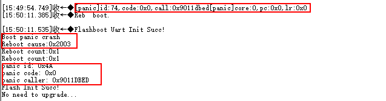

### PANIC ID<a name="ZH-CN_TOPIC_0000001932198978"></a>

**Table 1**  PANIC ID Description (middleware/utils/dfx/panic/public/panic.h)

<a name="table279mcpsimp"></a>
<table><thead align="left"><tr id="row286mcpsimp"><th class="cellrowborder" align="left" valign="top" width="18.13%" id="mcps1.2.4.1.1"><p id="p288mcpsimp"><a name="p288mcpsimp"></a><a name="p288mcpsimp"></a>id (decimal)</p>
</th>
<th class="cellrowborder" align="left" valign="top" width="52.87%" id="mcps1.2.4.1.2"><p id="p291mcpsimp"><a name="p291mcpsimp"></a><a name="p291mcpsimp"></a>Description</p>
</th>
<th class="cellrowborder" align="left" valign="top" width="28.999999999999996%" id="mcps1.2.4.1.3"><p id="p294mcpsimp"><a name="p294mcpsimp"></a><a name="p294mcpsimp"></a>Remarks</p>
</th>
</tr>
</thead>
<tbody><tr id="row296mcpsimp"><td class="cellrowborder" align="left" valign="top" width="18.13%" headers="mcps1.2.4.1.1 "><p id="p298mcpsimp"><a name="p298mcpsimp"></a><a name="p298mcpsimp"></a>0</p>
</td>
<td class="cellrowborder" align="left" valign="top" width="52.87%" headers="mcps1.2.4.1.2 "><p id="p301mcpsimp"><a name="p301mcpsimp"></a><a name="p301mcpsimp"></a>no panic</p>
</td>
<td class="cellrowborder" align="left" valign="top" width="28.999999999999996%" headers="mcps1.2.4.1.3 "><p id="p303mcpsimp"><a name="p303mcpsimp"></a><a name="p303mcpsimp"></a>NO USE</p>
</td>
</tr>
<tr id="row304mcpsimp"><td class="cellrowborder" align="left" valign="top" width="18.13%" headers="mcps1.2.4.1.1 "><p id="p306mcpsimp"><a name="p306mcpsimp"></a><a name="p306mcpsimp"></a>1</p>
</td>
<td class="cellrowborder" align="left" valign="top" width="52.87%" headers="mcps1.2.4.1.2 "><p id="p309mcpsimp"><a name="p309mcpsimp"></a><a name="p309mcpsimp"></a>arm core</p>
</td>
<td class="cellrowborder" align="left" valign="top" width="28.999999999999996%" headers="mcps1.2.4.1.3 "><p id="p311mcpsimp"><a name="p311mcpsimp"></a><a name="p311mcpsimp"></a>NO USE</p>
</td>
</tr>
<tr id="row312mcpsimp"><td class="cellrowborder" align="left" valign="top" width="18.13%" headers="mcps1.2.4.1.1 "><p id="p314mcpsimp"><a name="p314mcpsimp"></a><a name="p314mcpsimp"></a>2</p>
</td>
<td class="cellrowborder" align="left" valign="top" width="52.87%" headers="mcps1.2.4.1.2 "><p id="p317mcpsimp"><a name="p317mcpsimp"></a><a name="p317mcpsimp"></a>HAL</p>
</td>
<td class="cellrowborder" align="left" valign="top" width="28.999999999999996%" headers="mcps1.2.4.1.3 "><p id="p319mcpsimp"><a name="p319mcpsimp"></a><a name="p319mcpsimp"></a>NO USE</p>
</td>
</tr>
<tr id="row320mcpsimp"><td class="cellrowborder" align="left" valign="top" width="18.13%" headers="mcps1.2.4.1.1 "><p id="p322mcpsimp"><a name="p322mcpsimp"></a><a name="p322mcpsimp"></a>3</p>
</td>
<td class="cellrowborder" align="left" valign="top" width="52.87%" headers="mcps1.2.4.1.2 "><p id="p325mcpsimp"><a name="p325mcpsimp"></a><a name="p325mcpsimp"></a>DSP</p>
</td>
<td class="cellrowborder" align="left" valign="top" width="28.999999999999996%" headers="mcps1.2.4.1.3 "><p id="p327mcpsimp"><a name="p327mcpsimp"></a><a name="p327mcpsimp"></a>NO USE</p>
</td>
</tr>
<tr id="row328mcpsimp"><td class="cellrowborder" align="left" valign="top" width="18.13%" headers="mcps1.2.4.1.1 "><p id="p330mcpsimp"><a name="p330mcpsimp"></a><a name="p330mcpsimp"></a>4</p>
</td>
<td class="cellrowborder" align="left" valign="top" width="52.87%" headers="mcps1.2.4.1.2 "><p id="p333mcpsimp"><a name="p333mcpsimp"></a><a name="p333mcpsimp"></a>malloc</p>
</td>
<td class="cellrowborder" align="left" valign="top" width="28.999999999999996%" headers="mcps1.2.4.1.3 "><p id="p335mcpsimp"><a name="p335mcpsimp"></a><a name="p335mcpsimp"></a>BT/APP</p>
</td>
</tr>
<tr id="row336mcpsimp"><td class="cellrowborder" align="left" valign="top" width="18.13%" headers="mcps1.2.4.1.1 "><p id="p338mcpsimp"><a name="p338mcpsimp"></a><a name="p338mcpsimp"></a>5</p>
</td>
<td class="cellrowborder" align="left" valign="top" width="52.87%" headers="mcps1.2.4.1.2 "><p id="p341mcpsimp"><a name="p341mcpsimp"></a><a name="p341mcpsimp"></a>uart</p>
</td>
<td class="cellrowborder" align="left" valign="top" width="28.999999999999996%" headers="mcps1.2.4.1.3 "><p id="p343mcpsimp"><a name="p343mcpsimp"></a><a name="p343mcpsimp"></a>BT/APP</p>
</td>
</tr>
<tr id="row344mcpsimp"><td class="cellrowborder" align="left" valign="top" width="18.13%" headers="mcps1.2.4.1.1 "><p id="p346mcpsimp"><a name="p346mcpsimp"></a><a name="p346mcpsimp"></a>6</p>
</td>
<td class="cellrowborder" align="left" valign="top" width="52.87%" headers="mcps1.2.4.1.2 "><p id="p349mcpsimp"><a name="p349mcpsimp"></a><a name="p349mcpsimp"></a>flash</p>
</td>
<td class="cellrowborder" align="left" valign="top" width="28.999999999999996%" headers="mcps1.2.4.1.3 "><p id="p351mcpsimp"><a name="p351mcpsimp"></a><a name="p351mcpsimp"></a>APP</p>
</td>
</tr>
<tr id="row352mcpsimp"><td class="cellrowborder" align="left" valign="top" width="18.13%" headers="mcps1.2.4.1.1 "><p id="p354mcpsimp"><a name="p354mcpsimp"></a><a name="p354mcpsimp"></a>7</p>
</td>
<td class="cellrowborder" align="left" valign="top" width="52.87%" headers="mcps1.2.4.1.2 "><p id="p357mcpsimp"><a name="p357mcpsimp"></a><a name="p357mcpsimp"></a>adc</p>
</td>
<td class="cellrowborder" align="left" valign="top" width="28.999999999999996%" headers="mcps1.2.4.1.3 "><p id="p359mcpsimp"><a name="p359mcpsimp"></a><a name="p359mcpsimp"></a>APP</p>
</td>
</tr>
<tr id="row360mcpsimp"><td class="cellrowborder" align="left" valign="top" width="18.13%" headers="mcps1.2.4.1.1 "><p id="p362mcpsimp"><a name="p362mcpsimp"></a><a name="p362mcpsimp"></a>8</p>
</td>
<td class="cellrowborder" align="left" valign="top" width="52.87%" headers="mcps1.2.4.1.2 "><p id="p365mcpsimp"><a name="p365mcpsimp"></a><a name="p365mcpsimp"></a>watchdog</p>
</td>
<td class="cellrowborder" align="left" valign="top" width="28.999999999999996%" headers="mcps1.2.4.1.3 "><p id="p367mcpsimp"><a name="p367mcpsimp"></a><a name="p367mcpsimp"></a>NO USE</p>
</td>
</tr>
<tr id="row368mcpsimp"><td class="cellrowborder" align="left" valign="top" width="18.13%" headers="mcps1.2.4.1.1 "><p id="p370mcpsimp"><a name="p370mcpsimp"></a><a name="p370mcpsimp"></a>9</p>
</td>
<td class="cellrowborder" align="left" valign="top" width="52.87%" headers="mcps1.2.4.1.2 "><p id="p373mcpsimp"><a name="p373mcpsimp"></a><a name="p373mcpsimp"></a>log</p>
</td>
<td class="cellrowborder" align="left" valign="top" width="28.999999999999996%" headers="mcps1.2.4.1.3 "><p id="p375mcpsimp"><a name="p375mcpsimp"></a><a name="p375mcpsimp"></a>BT/APP</p>
</td>
</tr>
<tr id="row376mcpsimp"><td class="cellrowborder" align="left" valign="top" width="18.13%" headers="mcps1.2.4.1.1 "><p id="p378mcpsimp"><a name="p378mcpsimp"></a><a name="p378mcpsimp"></a>10</p>
</td>
<td class="cellrowborder" align="left" valign="top" width="52.87%" headers="mcps1.2.4.1.2 "><p id="p381mcpsimp"><a name="p381mcpsimp"></a><a name="p381mcpsimp"></a>dma</p>
</td>
<td class="cellrowborder" align="left" valign="top" width="28.999999999999996%" headers="mcps1.2.4.1.3 "><p id="p383mcpsimp"><a name="p383mcpsimp"></a><a name="p383mcpsimp"></a>BT/APP</p>
</td>
</tr>
<tr id="row384mcpsimp"><td class="cellrowborder" align="left" valign="top" width="18.13%" headers="mcps1.2.4.1.1 "><p id="p386mcpsimp"><a name="p386mcpsimp"></a><a name="p386mcpsimp"></a>11</p>
</td>
<td class="cellrowborder" align="left" valign="top" width="52.87%" headers="mcps1.2.4.1.2 "><p id="p389mcpsimp"><a name="p389mcpsimp"></a><a name="p389mcpsimp"></a>assert</p>
</td>
<td class="cellrowborder" align="left" valign="top" width="28.999999999999996%" headers="mcps1.2.4.1.3 "><p id="p391mcpsimp"><a name="p391mcpsimp"></a><a name="p391mcpsimp"></a>BT/APP</p>
</td>
</tr>
<tr id="row392mcpsimp"><td class="cellrowborder" align="left" valign="top" width="18.13%" headers="mcps1.2.4.1.1 "><p id="p394mcpsimp"><a name="p394mcpsimp"></a><a name="p394mcpsimp"></a>12</p>
</td>
<td class="cellrowborder" align="left" valign="top" width="52.87%" headers="mcps1.2.4.1.2 "><p id="p397mcpsimp"><a name="p397mcpsimp"></a><a name="p397mcpsimp"></a>reboot</p>
</td>
<td class="cellrowborder" align="left" valign="top" width="28.999999999999996%" headers="mcps1.2.4.1.3 "><p id="p399mcpsimp"><a name="p399mcpsimp"></a><a name="p399mcpsimp"></a>NO USE</p>
</td>
</tr>
<tr id="row400mcpsimp"><td class="cellrowborder" align="left" valign="top" width="18.13%" headers="mcps1.2.4.1.1 "><p id="p402mcpsimp"><a name="p402mcpsimp"></a><a name="p402mcpsimp"></a>13</p>
</td>
<td class="cellrowborder" align="left" valign="top" width="52.87%" headers="mcps1.2.4.1.2 "><p id="p405mcpsimp"><a name="p405mcpsimp"></a><a name="p405mcpsimp"></a>update</p>
</td>
<td class="cellrowborder" align="left" valign="top" width="28.999999999999996%" headers="mcps1.2.4.1.3 "><p id="p407mcpsimp"><a name="p407mcpsimp"></a><a name="p407mcpsimp"></a>NO USE</p>
</td>
</tr>
<tr id="row408mcpsimp"><td class="cellrowborder" align="left" valign="top" width="18.13%" headers="mcps1.2.4.1.1 "><p id="p410mcpsimp"><a name="p410mcpsimp"></a><a name="p410mcpsimp"></a>14</p>
</td>
<td class="cellrowborder" align="left" valign="top" width="52.87%" headers="mcps1.2.4.1.2 "><p id="p413mcpsimp"><a name="p413mcpsimp"></a><a name="p413mcpsimp"></a>I2C0</p>
</td>
<td class="cellrowborder" align="left" valign="top" width="28.999999999999996%" headers="mcps1.2.4.1.3 "><p id="p415mcpsimp"><a name="p415mcpsimp"></a><a name="p415mcpsimp"></a>APP</p>
</td>
</tr>
<tr id="row416mcpsimp"><td class="cellrowborder" align="left" valign="top" width="18.13%" headers="mcps1.2.4.1.1 "><p id="p418mcpsimp"><a name="p418mcpsimp"></a><a name="p418mcpsimp"></a>15</p>
</td>
<td class="cellrowborder" align="left" valign="top" width="52.87%" headers="mcps1.2.4.1.2 "><p id="p421mcpsimp"><a name="p421mcpsimp"></a><a name="p421mcpsimp"></a>I2C1</p>
</td>
<td class="cellrowborder" align="left" valign="top" width="28.999999999999996%" headers="mcps1.2.4.1.3 "><p id="p423mcpsimp"><a name="p423mcpsimp"></a><a name="p423mcpsimp"></a>APP</p>
</td>
</tr>
<tr id="row424mcpsimp"><td class="cellrowborder" align="left" valign="top" width="18.13%" headers="mcps1.2.4.1.1 "><p id="p426mcpsimp"><a name="p426mcpsimp"></a><a name="p426mcpsimp"></a>16</p>
</td>
<td class="cellrowborder" align="left" valign="top" width="52.87%" headers="mcps1.2.4.1.2 "><p id="p429mcpsimp"><a name="p429mcpsimp"></a><a name="p429mcpsimp"></a>I2C2</p>
</td>
<td class="cellrowborder" align="left" valign="top" width="28.999999999999996%" headers="mcps1.2.4.1.3 "><p id="p431mcpsimp"><a name="p431mcpsimp"></a><a name="p431mcpsimp"></a>APP</p>
</td>
</tr>
<tr id="row432mcpsimp"><td class="cellrowborder" align="left" valign="top" width="18.13%" headers="mcps1.2.4.1.1 "><p id="p434mcpsimp"><a name="p434mcpsimp"></a><a name="p434mcpsimp"></a>17</p>
</td>
<td class="cellrowborder" align="left" valign="top" width="52.87%" headers="mcps1.2.4.1.2 "><p id="p437mcpsimp"><a name="p437mcpsimp"></a><a name="p437mcpsimp"></a>SPI0</p>
</td>
<td class="cellrowborder" align="left" valign="top" width="28.999999999999996%" headers="mcps1.2.4.1.3 "><p id="p439mcpsimp"><a name="p439mcpsimp"></a><a name="p439mcpsimp"></a>APP</p>
</td>
</tr>
<tr id="row440mcpsimp"><td class="cellrowborder" align="left" valign="top" width="18.13%" headers="mcps1.2.4.1.1 "><p id="p442mcpsimp"><a name="p442mcpsimp"></a><a name="p442mcpsimp"></a>18</p>
</td>
<td class="cellrowborder" align="left" valign="top" width="52.87%" headers="mcps1.2.4.1.2 "><p id="p445mcpsimp"><a name="p445mcpsimp"></a><a name="p445mcpsimp"></a>SPI1</p>
</td>
<td class="cellrowborder" align="left" valign="top" width="28.999999999999996%" headers="mcps1.2.4.1.3 "><p id="p447mcpsimp"><a name="p447mcpsimp"></a><a name="p447mcpsimp"></a>APP</p>
</td>
</tr>
<tr id="row448mcpsimp"><td class="cellrowborder" align="left" valign="top" width="18.13%" headers="mcps1.2.4.1.1 "><p id="p450mcpsimp"><a name="p450mcpsimp"></a><a name="p450mcpsimp"></a>19</p>
</td>
<td class="cellrowborder" align="left" valign="top" width="52.87%" headers="mcps1.2.4.1.2 "><p id="p453mcpsimp"><a name="p453mcpsimp"></a><a name="p453mcpsimp"></a>SPI2</p>
</td>
<td class="cellrowborder" align="left" valign="top" width="28.999999999999996%" headers="mcps1.2.4.1.3 "><p id="p455mcpsimp"><a name="p455mcpsimp"></a><a name="p455mcpsimp"></a>APP</p>
</td>
</tr>
<tr id="row456mcpsimp"><td class="cellrowborder" align="left" valign="top" width="18.13%" headers="mcps1.2.4.1.1 "><p id="p458mcpsimp"><a name="p458mcpsimp"></a><a name="p458mcpsimp"></a>20</p>
</td>
<td class="cellrowborder" align="left" valign="top" width="52.87%" headers="mcps1.2.4.1.2 "><p id="p461mcpsimp"><a name="p461mcpsimp"></a><a name="p461mcpsimp"></a>SPI4</p>
</td>
<td class="cellrowborder" align="left" valign="top" width="28.999999999999996%" headers="mcps1.2.4.1.3 "><p id="p463mcpsimp"><a name="p463mcpsimp"></a><a name="p463mcpsimp"></a>APP</p>
</td>
</tr>
<tr id="row464mcpsimp"><td class="cellrowborder" align="left" valign="top" width="18.13%" headers="mcps1.2.4.1.1 "><p id="p466mcpsimp"><a name="p466mcpsimp"></a><a name="p466mcpsimp"></a>21</p>
</td>
<td class="cellrowborder" align="left" valign="top" width="52.87%" headers="mcps1.2.4.1.2 "><p id="p469mcpsimp"><a name="p469mcpsimp"></a><a name="p469mcpsimp"></a>SPI5</p>
</td>
<td class="cellrowborder" align="left" valign="top" width="28.999999999999996%" headers="mcps1.2.4.1.3 "><p id="p471mcpsimp"><a name="p471mcpsimp"></a><a name="p471mcpsimp"></a>APP</p>
</td>
</tr>
<tr id="row472mcpsimp"><td class="cellrowborder" align="left" valign="top" width="18.13%" headers="mcps1.2.4.1.1 "><p id="p474mcpsimp"><a name="p474mcpsimp"></a><a name="p474mcpsimp"></a>22</p>
</td>
<td class="cellrowborder" align="left" valign="top" width="52.87%" headers="mcps1.2.4.1.2 "><p id="p477mcpsimp"><a name="p477mcpsimp"></a><a name="p477mcpsimp"></a>RPC</p>
</td>
<td class="cellrowborder" align="left" valign="top" width="28.999999999999996%" headers="mcps1.2.4.1.3 "><p id="p479mcpsimp"><a name="p479mcpsimp"></a><a name="p479mcpsimp"></a>BT/APP</p>
</td>
</tr>
<tr id="row480mcpsimp"><td class="cellrowborder" align="left" valign="top" width="18.13%" headers="mcps1.2.4.1.1 "><p id="p482mcpsimp"><a name="p482mcpsimp"></a><a name="p482mcpsimp"></a>23</p>
</td>
<td class="cellrowborder" align="left" valign="top" width="52.87%" headers="mcps1.2.4.1.2 "><p id="p485mcpsimp"><a name="p485mcpsimp"></a><a name="p485mcpsimp"></a>mem monitor</p>
</td>
<td class="cellrowborder" align="left" valign="top" width="28.999999999999996%" headers="mcps1.2.4.1.3 "><p id="p487mcpsimp"><a name="p487mcpsimp"></a><a name="p487mcpsimp"></a>BT/APP</p>
</td>
</tr>
<tr id="row488mcpsimp"><td class="cellrowborder" align="left" valign="top" width="18.13%" headers="mcps1.2.4.1.1 "><p id="p490mcpsimp"><a name="p490mcpsimp"></a><a name="p490mcpsimp"></a>24</p>
</td>
<td class="cellrowborder" align="left" valign="top" width="52.87%" headers="mcps1.2.4.1.2 "><p id="p493mcpsimp"><a name="p493mcpsimp"></a><a name="p493mcpsimp"></a>panic exit</p>
</td>
<td class="cellrowborder" align="left" valign="top" width="28.999999999999996%" headers="mcps1.2.4.1.3 "><p id="p495mcpsimp"><a name="p495mcpsimp"></a><a name="p495mcpsimp"></a>NO USE</p>
</td>
</tr>
<tr id="row496mcpsimp"><td class="cellrowborder" align="left" valign="top" width="18.13%" headers="mcps1.2.4.1.1 "><p id="p498mcpsimp"><a name="p498mcpsimp"></a><a name="p498mcpsimp"></a>25</p>
</td>
<td class="cellrowborder" align="left" valign="top" width="52.87%" headers="mcps1.2.4.1.2 "><p id="p501mcpsimp"><a name="p501mcpsimp"></a><a name="p501mcpsimp"></a>create task</p>
</td>
<td class="cellrowborder" align="left" valign="top" width="28.999999999999996%" headers="mcps1.2.4.1.3 "><p id="p503mcpsimp"><a name="p503mcpsimp"></a><a name="p503mcpsimp"></a>liteOS</p>
</td>
</tr>
<tr id="row504mcpsimp"><td class="cellrowborder" align="left" valign="top" width="18.13%" headers="mcps1.2.4.1.1 "><p id="p506mcpsimp"><a name="p506mcpsimp"></a><a name="p506mcpsimp"></a>26</p>
</td>
<td class="cellrowborder" align="left" valign="top" width="52.87%" headers="mcps1.2.4.1.2 "><p id="p509mcpsimp"><a name="p509mcpsimp"></a><a name="p509mcpsimp"></a>memcpy buffer overlap</p>
</td>
<td class="cellrowborder" align="left" valign="top" width="28.999999999999996%" headers="mcps1.2.4.1.3 "><p id="p511mcpsimp"><a name="p511mcpsimp"></a><a name="p511mcpsimp"></a>NO USE</p>
</td>
</tr>
<tr id="row512mcpsimp"><td class="cellrowborder" align="left" valign="top" width="18.13%" headers="mcps1.2.4.1.1 "><p id="p514mcpsimp"><a name="p514mcpsimp"></a><a name="p514mcpsimp"></a>27</p>
</td>
<td class="cellrowborder" align="left" valign="top" width="52.87%" headers="mcps1.2.4.1.2 "><p id="p517mcpsimp"><a name="p517mcpsimp"></a><a name="p517mcpsimp"></a>xip</p>
</td>
<td class="cellrowborder" align="left" valign="top" width="28.999999999999996%" headers="mcps1.2.4.1.3 "><p id="p519mcpsimp"><a name="p519mcpsimp"></a><a name="p519mcpsimp"></a>APP</p>
</td>
</tr>
<tr id="row520mcpsimp"><td class="cellrowborder" align="left" valign="top" width="18.13%" headers="mcps1.2.4.1.1 "><p id="p522mcpsimp"><a name="p522mcpsimp"></a><a name="p522mcpsimp"></a>28</p>
</td>
<td class="cellrowborder" align="left" valign="top" width="52.87%" headers="mcps1.2.4.1.2 "><p id="p525mcpsimp"><a name="p525mcpsimp"></a><a name="p525mcpsimp"></a>btc malloc fail</p>
</td>
<td class="cellrowborder" align="left" valign="top" width="28.999999999999996%" headers="mcps1.2.4.1.3 "><p id="p527mcpsimp"><a name="p527mcpsimp"></a><a name="p527mcpsimp"></a>BTC</p>
</td>
</tr>
<tr id="row528mcpsimp"><td class="cellrowborder" align="left" valign="top" width="18.13%" headers="mcps1.2.4.1.1 "><p id="p530mcpsimp"><a name="p530mcpsimp"></a><a name="p530mcpsimp"></a>29</p>
</td>
<td class="cellrowborder" align="left" valign="top" width="52.87%" headers="mcps1.2.4.1.2 "><p id="p533mcpsimp"><a name="p533mcpsimp"></a><a name="p533mcpsimp"></a>low power</p>
</td>
<td class="cellrowborder" align="left" valign="top" width="28.999999999999996%" headers="mcps1.2.4.1.3 "><p id="p535mcpsimp"><a name="p535mcpsimp"></a><a name="p535mcpsimp"></a>BT/APP</p>
</td>
</tr>
<tr id="row536mcpsimp"><td class="cellrowborder" align="left" valign="top" width="18.13%" headers="mcps1.2.4.1.1 "><p id="p538mcpsimp"><a name="p538mcpsimp"></a><a name="p538mcpsimp"></a>30</p>
</td>
<td class="cellrowborder" align="left" valign="top" width="52.87%" headers="mcps1.2.4.1.2 "><p id="p541mcpsimp"><a name="p541mcpsimp"></a><a name="p541mcpsimp"></a>system status</p>
</td>
<td class="cellrowborder" align="left" valign="top" width="28.999999999999996%" headers="mcps1.2.4.1.3 "><p id="p543mcpsimp"><a name="p543mcpsimp"></a><a name="p543mcpsimp"></a>BT/APP</p>
</td>
</tr>
<tr id="row544mcpsimp"><td class="cellrowborder" align="left" valign="top" width="18.13%" headers="mcps1.2.4.1.1 "><p id="p546mcpsimp"><a name="p546mcpsimp"></a><a name="p546mcpsimp"></a>31</p>
</td>
<td class="cellrowborder" align="left" valign="top" width="52.87%" headers="mcps1.2.4.1.2 "><p id="p549mcpsimp"><a name="p549mcpsimp"></a><a name="p549mcpsimp"></a>Btc int err</p>
</td>
<td class="cellrowborder" align="left" valign="top" width="28.999999999999996%" headers="mcps1.2.4.1.3 "><p id="p551mcpsimp"><a name="p551mcpsimp"></a><a name="p551mcpsimp"></a>BTC</p>
</td>
</tr>
<tr id="row552mcpsimp"><td class="cellrowborder" align="left" valign="top" width="18.13%" headers="mcps1.2.4.1.1 "><p id="p554mcpsimp"><a name="p554mcpsimp"></a><a name="p554mcpsimp"></a>32</p>
</td>
<td class="cellrowborder" align="left" valign="top" width="52.87%" headers="mcps1.2.4.1.2 "><p id="p557mcpsimp"><a name="p557mcpsimp"></a><a name="p557mcpsimp"></a>Lpc wakeup fail</p>
</td>
<td class="cellrowborder" align="left" valign="top" width="28.999999999999996%" headers="mcps1.2.4.1.3 "><p id="p559mcpsimp"><a name="p559mcpsimp"></a><a name="p559mcpsimp"></a>APP</p>
</td>
</tr>
<tr id="row560mcpsimp"><td class="cellrowborder" align="left" valign="top" width="18.13%" headers="mcps1.2.4.1.1 "><p id="p562mcpsimp"><a name="p562mcpsimp"></a><a name="p562mcpsimp"></a>33</p>
</td>
<td class="cellrowborder" align="left" valign="top" width="52.87%" headers="mcps1.2.4.1.2 "><p id="p565mcpsimp"><a name="p565mcpsimp"></a><a name="p565mcpsimp"></a>Clock glb err</p>
</td>
<td class="cellrowborder" align="left" valign="top" width="28.999999999999996%" headers="mcps1.2.4.1.3 "><p id="p567mcpsimp"><a name="p567mcpsimp"></a><a name="p567mcpsimp"></a>BT/APP</p>
</td>
</tr>
<tr id="row568mcpsimp"><td class="cellrowborder" align="left" valign="top" width="18.13%" headers="mcps1.2.4.1.1 "><p id="p570mcpsimp"><a name="p570mcpsimp"></a><a name="p570mcpsimp"></a>34</p>
</td>
<td class="cellrowborder" align="left" valign="top" width="52.87%" headers="mcps1.2.4.1.2 "><p id="p573mcpsimp"><a name="p573mcpsimp"></a><a name="p573mcpsimp"></a>Pmu cmu</p>
</td>
<td class="cellrowborder" align="left" valign="top" width="28.999999999999996%" headers="mcps1.2.4.1.3 "><p id="p575mcpsimp"><a name="p575mcpsimp"></a><a name="p575mcpsimp"></a>APP</p>
</td>
</tr>
<tr id="row576mcpsimp"><td class="cellrowborder" align="left" valign="top" width="18.13%" headers="mcps1.2.4.1.1 "><p id="p578mcpsimp"><a name="p578mcpsimp"></a><a name="p578mcpsimp"></a>35</p>
</td>
<td class="cellrowborder" align="left" valign="top" width="52.87%" headers="mcps1.2.4.1.2 "><p id="p581mcpsimp"><a name="p581mcpsimp"></a><a name="p581mcpsimp"></a>Pmu ldo</p>
</td>
<td class="cellrowborder" align="left" valign="top" width="28.999999999999996%" headers="mcps1.2.4.1.3 "><p id="p583mcpsimp"><a name="p583mcpsimp"></a><a name="p583mcpsimp"></a>APP</p>
</td>
</tr>
<tr id="row584mcpsimp"><td class="cellrowborder" align="left" valign="top" width="18.13%" headers="mcps1.2.4.1.1 "><p id="p586mcpsimp"><a name="p586mcpsimp"></a><a name="p586mcpsimp"></a>36</p>
</td>
<td class="cellrowborder" align="left" valign="top" width="52.87%" headers="mcps1.2.4.1.2 "><p id="p589mcpsimp"><a name="p589mcpsimp"></a><a name="p589mcpsimp"></a>Chip wdt frst</p>
</td>
<td class="cellrowborder" align="left" valign="top" width="28.999999999999996%" headers="mcps1.2.4.1.3 "><p id="p591mcpsimp"><a name="p591mcpsimp"></a><a name="p591mcpsimp"></a>APP</p>
</td>
</tr>
<tr id="row592mcpsimp"><td class="cellrowborder" align="left" valign="top" width="18.13%" headers="mcps1.2.4.1.1 "><p id="p594mcpsimp"><a name="p594mcpsimp"></a><a name="p594mcpsimp"></a>37</p>
</td>
<td class="cellrowborder" align="left" valign="top" width="52.87%" headers="mcps1.2.4.1.2 "><p id="p597mcpsimp"><a name="p597mcpsimp"></a><a name="p597mcpsimp"></a>Non os</p>
</td>
<td class="cellrowborder" align="left" valign="top" width="28.999999999999996%" headers="mcps1.2.4.1.3 "><p id="p599mcpsimp"><a name="p599mcpsimp"></a><a name="p599mcpsimp"></a>NO USE</p>
</td>
</tr>
<tr id="row600mcpsimp"><td class="cellrowborder" align="left" valign="top" width="18.13%" headers="mcps1.2.4.1.1 "><p id="p602mcpsimp"><a name="p602mcpsimp"></a><a name="p602mcpsimp"></a>38</p>
</td>
<td class="cellrowborder" align="left" valign="top" width="52.87%" headers="mcps1.2.4.1.2 "><p id="p605mcpsimp"><a name="p605mcpsimp"></a><a name="p605mcpsimp"></a>Lpc veto</p>
</td>
<td class="cellrowborder" align="left" valign="top" width="28.999999999999996%" headers="mcps1.2.4.1.3 "><p id="p607mcpsimp"><a name="p607mcpsimp"></a><a name="p607mcpsimp"></a>BT/APP</p>
</td>
</tr>
<tr id="row608mcpsimp"><td class="cellrowborder" align="left" valign="top" width="18.13%" headers="mcps1.2.4.1.1 "><p id="p610mcpsimp"><a name="p610mcpsimp"></a><a name="p610mcpsimp"></a>39</p>
</td>
<td class="cellrowborder" align="left" valign="top" width="52.87%" headers="mcps1.2.4.1.2 "><p id="p613mcpsimp"><a name="p613mcpsimp"></a><a name="p613mcpsimp"></a>timer</p>
</td>
<td class="cellrowborder" align="left" valign="top" width="28.999999999999996%" headers="mcps1.2.4.1.3 "><p id="p615mcpsimp"><a name="p615mcpsimp"></a><a name="p615mcpsimp"></a>BT/APP</p>
</td>
</tr>
<tr id="row616mcpsimp"><td class="cellrowborder" align="left" valign="top" width="18.13%" headers="mcps1.2.4.1.1 "><p id="p618mcpsimp"><a name="p618mcpsimp"></a><a name="p618mcpsimp"></a>40</p>
</td>
<td class="cellrowborder" align="left" valign="top" width="52.87%" headers="mcps1.2.4.1.2 "><p id="p621mcpsimp"><a name="p621mcpsimp"></a><a name="p621mcpsimp"></a>lpc</p>
</td>
<td class="cellrowborder" align="left" valign="top" width="28.999999999999996%" headers="mcps1.2.4.1.3 "><p id="p623mcpsimp"><a name="p623mcpsimp"></a><a name="p623mcpsimp"></a>BT/APP</p>
</td>
</tr>
<tr id="row624mcpsimp"><td class="cellrowborder" align="left" valign="top" width="18.13%" headers="mcps1.2.4.1.1 "><p id="p626mcpsimp"><a name="p626mcpsimp"></a><a name="p626mcpsimp"></a>41</p>
</td>
<td class="cellrowborder" align="left" valign="top" width="52.87%" headers="mcps1.2.4.1.2 "><p id="p629mcpsimp"><a name="p629mcpsimp"></a><a name="p629mcpsimp"></a>rtc</p>
</td>
<td class="cellrowborder" align="left" valign="top" width="28.999999999999996%" headers="mcps1.2.4.1.3 "><p id="p631mcpsimp"><a name="p631mcpsimp"></a><a name="p631mcpsimp"></a>BT/APP</p>
</td>
</tr>
<tr id="row632mcpsimp"><td class="cellrowborder" align="left" valign="top" width="18.13%" headers="mcps1.2.4.1.1 "><p id="p634mcpsimp"><a name="p634mcpsimp"></a><a name="p634mcpsimp"></a>42</p>
</td>
<td class="cellrowborder" align="left" valign="top" width="52.87%" headers="mcps1.2.4.1.2 "><p id="p637mcpsimp"><a name="p637mcpsimp"></a><a name="p637mcpsimp"></a>memory</p>
</td>
<td class="cellrowborder" align="left" valign="top" width="28.999999999999996%" headers="mcps1.2.4.1.3 "><p id="p639mcpsimp"><a name="p639mcpsimp"></a><a name="p639mcpsimp"></a>BT/APP</p>
</td>
</tr>
<tr id="row640mcpsimp"><td class="cellrowborder" align="left" valign="top" width="18.13%" headers="mcps1.2.4.1.1 "><p id="p642mcpsimp"><a name="p642mcpsimp"></a><a name="p642mcpsimp"></a>43</p>
</td>
<td class="cellrowborder" align="left" valign="top" width="52.87%" headers="mcps1.2.4.1.2 "><p id="p645mcpsimp"><a name="p645mcpsimp"></a><a name="p645mcpsimp"></a>Cpu hifi</p>
</td>
<td class="cellrowborder" align="left" valign="top" width="28.999999999999996%" headers="mcps1.2.4.1.3 "><p id="p647mcpsimp"><a name="p647mcpsimp"></a><a name="p647mcpsimp"></a>APP</p>
</td>
</tr>
<tr id="row648mcpsimp"><td class="cellrowborder" align="left" valign="top" width="18.13%" headers="mcps1.2.4.1.1 "><p id="p650mcpsimp"><a name="p650mcpsimp"></a><a name="p650mcpsimp"></a>44</p>
</td>
<td class="cellrowborder" align="left" valign="top" width="52.87%" headers="mcps1.2.4.1.2 "><p id="p653mcpsimp"><a name="p653mcpsimp"></a><a name="p653mcpsimp"></a>Exception test</p>
</td>
<td class="cellrowborder" align="left" valign="top" width="28.999999999999996%" headers="mcps1.2.4.1.3 "><p id="p655mcpsimp"><a name="p655mcpsimp"></a><a name="p655mcpsimp"></a>APP</p>
</td>
</tr>
<tr id="row656mcpsimp"><td class="cellrowborder" align="left" valign="top" width="18.13%" headers="mcps1.2.4.1.1 "><p id="p658mcpsimp"><a name="p658mcpsimp"></a><a name="p658mcpsimp"></a>45</p>
</td>
<td class="cellrowborder" align="left" valign="top" width="52.87%" headers="mcps1.2.4.1.2 "><p id="p661mcpsimp"><a name="p661mcpsimp"></a><a name="p661mcpsimp"></a>kv</p>
</td>
<td class="cellrowborder" align="left" valign="top" width="28.999999999999996%" headers="mcps1.2.4.1.3 "><p id="p663mcpsimp"><a name="p663mcpsimp"></a><a name="p663mcpsimp"></a>SSB ONLY</p>
</td>
</tr>
<tr id="row664mcpsimp"><td class="cellrowborder" align="left" valign="top" width="18.13%" headers="mcps1.2.4.1.1 "><p id="p666mcpsimp"><a name="p666mcpsimp"></a><a name="p666mcpsimp"></a>46</p>
</td>
<td class="cellrowborder" align="left" valign="top" width="52.87%" headers="mcps1.2.4.1.2 "><p id="p669mcpsimp"><a name="p669mcpsimp"></a><a name="p669mcpsimp"></a>eflash</p>
</td>
<td class="cellrowborder" align="left" valign="top" width="28.999999999999996%" headers="mcps1.2.4.1.3 "><p id="p671mcpsimp"><a name="p671mcpsimp"></a><a name="p671mcpsimp"></a>APP</p>
</td>
</tr>
<tr id="row672mcpsimp"><td class="cellrowborder" align="left" valign="top" width="18.13%" headers="mcps1.2.4.1.1 "><p id="p674mcpsimp"><a name="p674mcpsimp"></a><a name="p674mcpsimp"></a>47</p>
</td>
<td class="cellrowborder" align="left" valign="top" width="52.87%" headers="mcps1.2.4.1.2 "><p id="p677mcpsimp"><a name="p677mcpsimp"></a><a name="p677mcpsimp"></a>lib</p>
</td>
<td class="cellrowborder" align="left" valign="top" width="28.999999999999996%" headers="mcps1.2.4.1.3 "><p id="p679mcpsimp"><a name="p679mcpsimp"></a><a name="p679mcpsimp"></a>NO USE</p>
</td>
</tr>
<tr id="row680mcpsimp"><td class="cellrowborder" align="left" valign="top" width="18.13%" headers="mcps1.2.4.1.1 "><p id="p682mcpsimp"><a name="p682mcpsimp"></a><a name="p682mcpsimp"></a>48</p>
</td>
<td class="cellrowborder" align="left" valign="top" width="52.87%" headers="mcps1.2.4.1.2 "><p id="p685mcpsimp"><a name="p685mcpsimp"></a><a name="p685mcpsimp"></a>codeloader</p>
</td>
<td class="cellrowborder" align="left" valign="top" width="28.999999999999996%" headers="mcps1.2.4.1.3 "><p id="p687mcpsimp"><a name="p687mcpsimp"></a><a name="p687mcpsimp"></a>SSB ONLY</p>
</td>
</tr>
<tr id="row688mcpsimp"><td class="cellrowborder" align="left" valign="top" width="18.13%" headers="mcps1.2.4.1.1 "><p id="p690mcpsimp"><a name="p690mcpsimp"></a><a name="p690mcpsimp"></a>49</p>
</td>
<td class="cellrowborder" align="left" valign="top" width="52.87%" headers="mcps1.2.4.1.2 "><p id="p693mcpsimp"><a name="p693mcpsimp"></a><a name="p693mcpsimp"></a>criticla</p>
</td>
<td class="cellrowborder" align="left" valign="top" width="28.999999999999996%" headers="mcps1.2.4.1.3 "><p id="p695mcpsimp"><a name="p695mcpsimp"></a><a name="p695mcpsimp"></a>BT/APP</p>
</td>
</tr>
<tr id="row696mcpsimp"><td class="cellrowborder" align="left" valign="top" width="18.13%" headers="mcps1.2.4.1.1 "><p id="p698mcpsimp"><a name="p698mcpsimp"></a><a name="p698mcpsimp"></a>50</p>
</td>
<td class="cellrowborder" align="left" valign="top" width="52.87%" headers="mcps1.2.4.1.2 "><p id="p701mcpsimp"><a name="p701mcpsimp"></a><a name="p701mcpsimp"></a>ipc</p>
</td>
<td class="cellrowborder" align="left" valign="top" width="28.999999999999996%" headers="mcps1.2.4.1.3 "><p id="p703mcpsimp"><a name="p703mcpsimp"></a><a name="p703mcpsimp"></a>BT/APP</p>
</td>
</tr>
<tr id="row704mcpsimp"><td class="cellrowborder" align="left" valign="top" width="18.13%" headers="mcps1.2.4.1.1 "><p id="p706mcpsimp"><a name="p706mcpsimp"></a><a name="p706mcpsimp"></a>51</p>
</td>
<td class="cellrowborder" align="left" valign="top" width="52.87%" headers="mcps1.2.4.1.2 "><p id="p709mcpsimp"><a name="p709mcpsimp"></a><a name="p709mcpsimp"></a>int</p>
</td>
<td class="cellrowborder" align="left" valign="top" width="28.999999999999996%" headers="mcps1.2.4.1.3 "><p id="p711mcpsimp"><a name="p711mcpsimp"></a><a name="p711mcpsimp"></a>BT/APP</p>
</td>
</tr>
<tr id="row712mcpsimp"><td class="cellrowborder" align="left" valign="top" width="18.13%" headers="mcps1.2.4.1.1 "><p id="p714mcpsimp"><a name="p714mcpsimp"></a><a name="p714mcpsimp"></a>52</p>
</td>
<td class="cellrowborder" align="left" valign="top" width="52.87%" headers="mcps1.2.4.1.2 "><p id="p717mcpsimp"><a name="p717mcpsimp"></a><a name="p717mcpsimp"></a>os</p>
</td>
<td class="cellrowborder" align="left" valign="top" width="28.999999999999996%" headers="mcps1.2.4.1.3 "><p id="p719mcpsimp"><a name="p719mcpsimp"></a><a name="p719mcpsimp"></a>liteOS</p>
</td>
</tr>
<tr id="row720mcpsimp"><td class="cellrowborder" align="left" valign="top" width="18.13%" headers="mcps1.2.4.1.1 "><p id="p722mcpsimp"><a name="p722mcpsimp"></a><a name="p722mcpsimp"></a>53</p>
</td>
<td class="cellrowborder" align="left" valign="top" width="52.87%" headers="mcps1.2.4.1.2 "><p id="p725mcpsimp"><a name="p725mcpsimp"></a><a name="p725mcpsimp"></a>Lpc wakeup time</p>
</td>
<td class="cellrowborder" align="left" valign="top" width="28.999999999999996%" headers="mcps1.2.4.1.3 "><p id="p727mcpsimp"><a name="p727mcpsimp"></a><a name="p727mcpsimp"></a>BT/APP</p>
</td>
</tr>
<tr id="row728mcpsimp"><td class="cellrowborder" align="left" valign="top" width="18.13%" headers="mcps1.2.4.1.1 "><p id="p730mcpsimp"><a name="p730mcpsimp"></a><a name="p730mcpsimp"></a>54</p>
</td>
<td class="cellrowborder" align="left" valign="top" width="52.87%" headers="mcps1.2.4.1.2 "><p id="p733mcpsimp"><a name="p733mcpsimp"></a><a name="p733mcpsimp"></a>btc bt frm dismatch1</p>
</td>
<td class="cellrowborder" align="left" valign="top" width="28.999999999999996%" headers="mcps1.2.4.1.3 "><p id="p735mcpsimp"><a name="p735mcpsimp"></a><a name="p735mcpsimp"></a>BTC</p>
</td>
</tr>
<tr id="row736mcpsimp"><td class="cellrowborder" align="left" valign="top" width="18.13%" headers="mcps1.2.4.1.1 "><p id="p738mcpsimp"><a name="p738mcpsimp"></a><a name="p738mcpsimp"></a>55</p>
</td>
<td class="cellrowborder" align="left" valign="top" width="52.87%" headers="mcps1.2.4.1.2 "><p id="p741mcpsimp"><a name="p741mcpsimp"></a><a name="p741mcpsimp"></a>btc bt frm dismatch2</p>
</td>
<td class="cellrowborder" align="left" valign="top" width="28.999999999999996%" headers="mcps1.2.4.1.3 "><p id="p743mcpsimp"><a name="p743mcpsimp"></a><a name="p743mcpsimp"></a>BTC</p>
</td>
</tr>
<tr id="row744mcpsimp"><td class="cellrowborder" align="left" valign="top" width="18.13%" headers="mcps1.2.4.1.1 "><p id="p746mcpsimp"><a name="p746mcpsimp"></a><a name="p746mcpsimp"></a>56</p>
</td>
<td class="cellrowborder" align="left" valign="top" width="52.87%" headers="mcps1.2.4.1.2 "><p id="p749mcpsimp"><a name="p749mcpsimp"></a><a name="p749mcpsimp"></a>btc ble frm dismatch</p>
</td>
<td class="cellrowborder" align="left" valign="top" width="28.999999999999996%" headers="mcps1.2.4.1.3 "><p id="p751mcpsimp"><a name="p751mcpsimp"></a><a name="p751mcpsimp"></a>BTC</p>
</td>
</tr>
<tr id="row752mcpsimp"><td class="cellrowborder" align="left" valign="top" width="18.13%" headers="mcps1.2.4.1.1 "><p id="p754mcpsimp"><a name="p754mcpsimp"></a><a name="p754mcpsimp"></a>57</p>
</td>
<td class="cellrowborder" align="left" valign="top" width="52.87%" headers="mcps1.2.4.1.2 "><p id="p757mcpsimp"><a name="p757mcpsimp"></a><a name="p757mcpsimp"></a>btc wakeup</p>
</td>
<td class="cellrowborder" align="left" valign="top" width="28.999999999999996%" headers="mcps1.2.4.1.3 "><p id="p759mcpsimp"><a name="p759mcpsimp"></a><a name="p759mcpsimp"></a>BTC</p>
</td>
</tr>
<tr id="row760mcpsimp"><td class="cellrowborder" align="left" valign="top" width="18.13%" headers="mcps1.2.4.1.1 "><p id="p762mcpsimp"><a name="p762mcpsimp"></a><a name="p762mcpsimp"></a>58</p>
</td>
<td class="cellrowborder" align="left" valign="top" width="52.87%" headers="mcps1.2.4.1.2 "><p id="p765mcpsimp"><a name="p765mcpsimp"></a><a name="p765mcpsimp"></a>bth memory</p>
</td>
<td class="cellrowborder" align="left" valign="top" width="28.999999999999996%" headers="mcps1.2.4.1.3 "><p id="p767mcpsimp"><a name="p767mcpsimp"></a><a name="p767mcpsimp"></a>BTH</p>
</td>
</tr>
<tr id="row768mcpsimp"><td class="cellrowborder" align="left" valign="top" width="18.13%" headers="mcps1.2.4.1.1 "><p id="p770mcpsimp"><a name="p770mcpsimp"></a><a name="p770mcpsimp"></a>59</p>
</td>
<td class="cellrowborder" align="left" valign="top" width="52.87%" headers="mcps1.2.4.1.2 "><p id="p773mcpsimp"><a name="p773mcpsimp"></a><a name="p773mcpsimp"></a>mpu config</p>
</td>
<td class="cellrowborder" align="left" valign="top" width="28.999999999999996%" headers="mcps1.2.4.1.3 "><p id="p775mcpsimp"><a name="p775mcpsimp"></a><a name="p775mcpsimp"></a>BT/APP</p>
</td>
</tr>
<tr id="row776mcpsimp"><td class="cellrowborder" align="left" valign="top" width="18.13%" headers="mcps1.2.4.1.1 "><p id="p778mcpsimp"><a name="p778mcpsimp"></a><a name="p778mcpsimp"></a>60</p>
</td>
<td class="cellrowborder" align="left" valign="top" width="52.87%" headers="mcps1.2.4.1.2 "><p id="p781mcpsimp"><a name="p781mcpsimp"></a><a name="p781mcpsimp"></a>gpu</p>
</td>
<td class="cellrowborder" align="left" valign="top" width="28.999999999999996%" headers="mcps1.2.4.1.3 "><p id="p783mcpsimp"><a name="p783mcpsimp"></a><a name="p783mcpsimp"></a>wear APP</p>
</td>
</tr>
<tr id="row784mcpsimp"><td class="cellrowborder" align="left" valign="top" width="18.13%" headers="mcps1.2.4.1.1 "><p id="p786mcpsimp"><a name="p786mcpsimp"></a><a name="p786mcpsimp"></a>61</p>
</td>
<td class="cellrowborder" align="left" valign="top" width="52.87%" headers="mcps1.2.4.1.2 "><p id="p789mcpsimp"><a name="p789mcpsimp"></a><a name="p789mcpsimp"></a>sdio</p>
</td>
<td class="cellrowborder" align="left" valign="top" width="28.999999999999996%" headers="mcps1.2.4.1.3 "><p id="p791mcpsimp"><a name="p791mcpsimp"></a><a name="p791mcpsimp"></a>wear APP</p>
</td>
</tr>
<tr id="row792mcpsimp"><td class="cellrowborder" align="left" valign="top" width="18.13%" headers="mcps1.2.4.1.1 "><p id="p794mcpsimp"><a name="p794mcpsimp"></a><a name="p794mcpsimp"></a>62</p>
</td>
<td class="cellrowborder" align="left" valign="top" width="52.87%" headers="mcps1.2.4.1.2 "><p id="p797mcpsimp"><a name="p797mcpsimp"></a><a name="p797mcpsimp"></a>ir</p>
</td>
<td class="cellrowborder" align="left" valign="top" width="28.999999999999996%" headers="mcps1.2.4.1.3 "><p id="p799mcpsimp"><a name="p799mcpsimp"></a><a name="p799mcpsimp"></a>wear APP</p>
</td>
</tr>
<tr id="row800mcpsimp"><td class="cellrowborder" align="left" valign="top" width="18.13%" headers="mcps1.2.4.1.1 "><p id="p802mcpsimp"><a name="p802mcpsimp"></a><a name="p802mcpsimp"></a>63</p>
</td>
<td class="cellrowborder" align="left" valign="top" width="52.87%" headers="mcps1.2.4.1.2 "><p id="p805mcpsimp"><a name="p805mcpsimp"></a><a name="p805mcpsimp"></a>btc cmd</p>
</td>
<td class="cellrowborder" align="left" valign="top" width="28.999999999999996%" headers="mcps1.2.4.1.3 "><p id="p807mcpsimp"><a name="p807mcpsimp"></a><a name="p807mcpsimp"></a>BTC</p>
</td>
</tr>
<tr id="row808mcpsimp"><td class="cellrowborder" align="left" valign="top" width="18.13%" headers="mcps1.2.4.1.1 "><p id="p810mcpsimp"><a name="p810mcpsimp"></a><a name="p810mcpsimp"></a>64</p>
</td>
<td class="cellrowborder" align="left" valign="top" width="52.87%" headers="mcps1.2.4.1.2 "><p id="p813mcpsimp"><a name="p813mcpsimp"></a><a name="p813mcpsimp"></a>cap</p>
</td>
<td class="cellrowborder" align="left" valign="top" width="28.999999999999996%" headers="mcps1.2.4.1.3 "><p id="p815mcpsimp"><a name="p815mcpsimp"></a><a name="p815mcpsimp"></a>APP</p>
</td>
</tr>
<tr id="row816mcpsimp"><td class="cellrowborder" align="left" valign="top" width="18.13%" headers="mcps1.2.4.1.1 "><p id="p818mcpsimp"><a name="p818mcpsimp"></a><a name="p818mcpsimp"></a>65</p>
</td>
<td class="cellrowborder" align="left" valign="top" width="52.87%" headers="mcps1.2.4.1.2 "><p id="p821mcpsimp"><a name="p821mcpsimp"></a><a name="p821mcpsimp"></a>epmu</p>
</td>
<td class="cellrowborder" align="left" valign="top" width="28.999999999999996%" headers="mcps1.2.4.1.3 "><p id="p823mcpsimp"><a name="p823mcpsimp"></a><a name="p823mcpsimp"></a>APP</p>
</td>
</tr>
<tr id="row824mcpsimp"><td class="cellrowborder" align="left" valign="top" width="18.13%" headers="mcps1.2.4.1.1 "><p id="p826mcpsimp"><a name="p826mcpsimp"></a><a name="p826mcpsimp"></a>66</p>
</td>
<td class="cellrowborder" align="left" valign="top" width="52.87%" headers="mcps1.2.4.1.2 "><p id="p829mcpsimp"><a name="p829mcpsimp"></a><a name="p829mcpsimp"></a>bts writeproperty</p>
</td>
<td class="cellrowborder" align="left" valign="top" width="28.999999999999996%" headers="mcps1.2.4.1.3 "><p id="p831mcpsimp"><a name="p831mcpsimp"></a><a name="p831mcpsimp"></a>BTS</p>
</td>
</tr>
<tr id="row832mcpsimp"><td class="cellrowborder" align="left" valign="top" width="18.13%" headers="mcps1.2.4.1.1 "><p id="p834mcpsimp"><a name="p834mcpsimp"></a><a name="p834mcpsimp"></a>67</p>
</td>
<td class="cellrowborder" align="left" valign="top" width="52.87%" headers="mcps1.2.4.1.2 "><p id="p837mcpsimp"><a name="p837mcpsimp"></a><a name="p837mcpsimp"></a>mmc host</p>
</td>
<td class="cellrowborder" align="left" valign="top" width="28.999999999999996%" headers="mcps1.2.4.1.3 "><p id="p839mcpsimp"><a name="p839mcpsimp"></a><a name="p839mcpsimp"></a>wear APP</p>
</td>
</tr>
<tr id="row840mcpsimp"><td class="cellrowborder" align="left" valign="top" width="18.13%" headers="mcps1.2.4.1.1 "><p id="p842mcpsimp"><a name="p842mcpsimp"></a><a name="p842mcpsimp"></a>68</p>
</td>
<td class="cellrowborder" align="left" valign="top" width="52.87%" headers="mcps1.2.4.1.2 "><p id="p845mcpsimp"><a name="p845mcpsimp"></a><a name="p845mcpsimp"></a>btc oscen</p>
</td>
<td class="cellrowborder" align="left" valign="top" width="28.999999999999996%" headers="mcps1.2.4.1.3 "><p id="p847mcpsimp"><a name="p847mcpsimp"></a><a name="p847mcpsimp"></a>BTC</p>
</td>
</tr>
<tr id="row848mcpsimp"><td class="cellrowborder" align="left" valign="top" width="18.13%" headers="mcps1.2.4.1.1 "><p id="p850mcpsimp"><a name="p850mcpsimp"></a><a name="p850mcpsimp"></a>69</p>
</td>
<td class="cellrowborder" align="left" valign="top" width="52.87%" headers="mcps1.2.4.1.2 "><p id="p853mcpsimp"><a name="p853mcpsimp"></a><a name="p853mcpsimp"></a>I2C3</p>
</td>
<td class="cellrowborder" align="left" valign="top" width="28.999999999999996%" headers="mcps1.2.4.1.3 "><p id="p855mcpsimp"><a name="p855mcpsimp"></a><a name="p855mcpsimp"></a>APP</p>
</td>
</tr>
<tr id="row856mcpsimp"><td class="cellrowborder" align="left" valign="top" width="18.13%" headers="mcps1.2.4.1.1 "><p id="p858mcpsimp"><a name="p858mcpsimp"></a><a name="p858mcpsimp"></a>70</p>
</td>
<td class="cellrowborder" align="left" valign="top" width="52.87%" headers="mcps1.2.4.1.2 "><p id="p861mcpsimp"><a name="p861mcpsimp"></a><a name="p861mcpsimp"></a>RGB888</p>
</td>
<td class="cellrowborder" align="left" valign="top" width="28.999999999999996%" headers="mcps1.2.4.1.3 "><p id="p863mcpsimp"><a name="p863mcpsimp"></a><a name="p863mcpsimp"></a>wear APP</p>
</td>
</tr>
<tr id="row864mcpsimp"><td class="cellrowborder" align="left" valign="top" width="18.13%" headers="mcps1.2.4.1.1 "><p id="p866mcpsimp"><a name="p866mcpsimp"></a><a name="p866mcpsimp"></a>71</p>
</td>
<td class="cellrowborder" align="left" valign="top" width="52.87%" headers="mcps1.2.4.1.2 "><p id="p869mcpsimp"><a name="p869mcpsimp"></a><a name="p869mcpsimp"></a>ap commu</p>
</td>
<td class="cellrowborder" align="left" valign="top" width="28.999999999999996%" headers="mcps1.2.4.1.3 "><p id="p871mcpsimp"><a name="p871mcpsimp"></a><a name="p871mcpsimp"></a>BTC</p>
</td>
</tr>
<tr id="row872mcpsimp"><td class="cellrowborder" align="left" valign="top" width="18.13%" headers="mcps1.2.4.1.1 "><p id="p874mcpsimp"><a name="p874mcpsimp"></a><a name="p874mcpsimp"></a>72</p>
</td>
<td class="cellrowborder" align="left" valign="top" width="52.87%" headers="mcps1.2.4.1.2 "><p id="p877mcpsimp"><a name="p877mcpsimp"></a><a name="p877mcpsimp"></a>Cpu clocks</p>
</td>
<td class="cellrowborder" align="left" valign="top" width="28.999999999999996%" headers="mcps1.2.4.1.3 "><p id="p879mcpsimp"><a name="p879mcpsimp"></a><a name="p879mcpsimp"></a>BT/APP</p>
</td>
</tr>
<tr id="row880mcpsimp"><td class="cellrowborder" align="left" valign="top" width="18.13%" headers="mcps1.2.4.1.1 "><p id="p882mcpsimp"><a name="p882mcpsimp"></a><a name="p882mcpsimp"></a>73</p>
</td>
<td class="cellrowborder" align="left" valign="top" width="52.87%" headers="mcps1.2.4.1.2 "><p id="p885mcpsimp"><a name="p885mcpsimp"></a><a name="p885mcpsimp"></a>clocks switch</p>
</td>
<td class="cellrowborder" align="left" valign="top" width="28.999999999999996%" headers="mcps1.2.4.1.3 "><p id="p887mcpsimp"><a name="p887mcpsimp"></a><a name="p887mcpsimp"></a>APP</p>
</td>
</tr>
<tr id="row888mcpsimp"><td class="cellrowborder" align="left" valign="top" width="18.13%" headers="mcps1.2.4.1.1 "><p id="p890mcpsimp"><a name="p890mcpsimp"></a><a name="p890mcpsimp"></a>74</p>
</td>
<td class="cellrowborder" align="left" valign="top" width="52.87%" headers="mcps1.2.4.1.2 "><p id="p893mcpsimp"><a name="p893mcpsimp"></a><a name="p893mcpsimp"></a>pmu</p>
</td>
<td class="cellrowborder" align="left" valign="top" width="28.999999999999996%" headers="mcps1.2.4.1.3 "><p id="p895mcpsimp"><a name="p895mcpsimp"></a><a name="p895mcpsimp"></a>NO USE</p>
</td>
</tr>
<tr id="row896mcpsimp"><td class="cellrowborder" align="left" valign="top" width="18.13%" headers="mcps1.2.4.1.1 "><p id="p898mcpsimp"><a name="p898mcpsimp"></a><a name="p898mcpsimp"></a>75</p>
</td>
<td class="cellrowborder" align="left" valign="top" width="52.87%" headers="mcps1.2.4.1.2 "><p id="p901mcpsimp"><a name="p901mcpsimp"></a><a name="p901mcpsimp"></a>log dump</p>
</td>
<td class="cellrowborder" align="left" valign="top" width="28.999999999999996%" headers="mcps1.2.4.1.3 "><p id="p903mcpsimp"><a name="p903mcpsimp"></a><a name="p903mcpsimp"></a>BT/APP</p>
</td>
</tr>
<tr id="row904mcpsimp"><td class="cellrowborder" align="left" valign="top" width="18.13%" headers="mcps1.2.4.1.1 "><p id="p906mcpsimp"><a name="p906mcpsimp"></a><a name="p906mcpsimp"></a>76</p>
</td>
<td class="cellrowborder" align="left" valign="top" width="52.87%" headers="mcps1.2.4.1.2 "><p id="p909mcpsimp"><a name="p909mcpsimp"></a><a name="p909mcpsimp"></a>coul</p>
</td>
<td class="cellrowborder" align="left" valign="top" width="28.999999999999996%" headers="mcps1.2.4.1.3 "><p id="p911mcpsimp"><a name="p911mcpsimp"></a><a name="p911mcpsimp"></a>APP</p>
</td>
</tr>
<tr id="row912mcpsimp"><td class="cellrowborder" align="left" valign="top" width="18.13%" headers="mcps1.2.4.1.1 "><p id="p914mcpsimp"><a name="p914mcpsimp"></a><a name="p914mcpsimp"></a>77</p>
</td>
<td class="cellrowborder" align="left" valign="top" width="52.87%" headers="mcps1.2.4.1.2 "><p id="p917mcpsimp"><a name="p917mcpsimp"></a><a name="p917mcpsimp"></a>dsp0 power off</p>
</td>
<td class="cellrowborder" align="left" valign="top" width="28.999999999999996%" headers="mcps1.2.4.1.3 "><p id="p919mcpsimp"><a name="p919mcpsimp"></a><a name="p919mcpsimp"></a>BT/APP</p>
</td>
</tr>
<tr id="row920mcpsimp"><td class="cellrowborder" align="left" valign="top" width="18.13%" headers="mcps1.2.4.1.1 "><p id="p922mcpsimp"><a name="p922mcpsimp"></a><a name="p922mcpsimp"></a>78</p>
</td>
<td class="cellrowborder" align="left" valign="top" width="52.87%" headers="mcps1.2.4.1.2 "><p id="p925mcpsimp"><a name="p925mcpsimp"></a><a name="p925mcpsimp"></a>dsp1 power off</p>
</td>
<td class="cellrowborder" align="left" valign="top" width="28.999999999999996%" headers="mcps1.2.4.1.3 "><p id="p927mcpsimp"><a name="p927mcpsimp"></a><a name="p927mcpsimp"></a>BT/APP</p>
</td>
</tr>
<tr id="row928mcpsimp"><td class="cellrowborder" align="left" valign="top" width="18.13%" headers="mcps1.2.4.1.1 "><p id="p930mcpsimp"><a name="p930mcpsimp"></a><a name="p930mcpsimp"></a>98</p>
</td>
<td class="cellrowborder" align="left" valign="top" width="52.87%" headers="mcps1.2.4.1.2 "><p id="p933mcpsimp"><a name="p933mcpsimp"></a><a name="p933mcpsimp"></a>UT</p>
</td>
<td class="cellrowborder" align="left" valign="top" width="28.999999999999996%" headers="mcps1.2.4.1.3 "><p id="p935mcpsimp"><a name="p935mcpsimp"></a><a name="p935mcpsimp"></a>PLT UT</p>
</td>
</tr>
<tr id="row936mcpsimp"><td class="cellrowborder" align="left" valign="top" width="18.13%" headers="mcps1.2.4.1.1 "><p id="p938mcpsimp"><a name="p938mcpsimp"></a><a name="p938mcpsimp"></a>99</p>
</td>
<td class="cellrowborder" align="left" valign="top" width="52.87%" headers="mcps1.2.4.1.2 "><p id="p941mcpsimp"><a name="p941mcpsimp"></a><a name="p941mcpsimp"></a>testsuite</p>
</td>
<td class="cellrowborder" align="left" valign="top" width="28.999999999999996%" headers="mcps1.2.4.1.3 "><p id="p943mcpsimp"><a name="p943mcpsimp"></a><a name="p943mcpsimp"></a>PLT UT</p>
</td>
</tr>
</tbody>
</table>

## Forced Watchdog Reset<a name="ZH-CN_TOPIC_0000001932358366"></a>

When a forced watchdog reset occurs, the system does not proactively trigger a hardfault or NMI exception. After waiting for the watchdog inside the chip to time out, the chip proactively triggers a reset. After the chip resets, it detects the reset cause 0x200d, triggers a panic exception, exports the last CPU trace, and triggers a restart. After the system restarts, it prints the panic restart: restart cause 0x2003, panic id 0x24, as shown in [Figure 1](#fig1156mcpsimp).

**Figure 1**  ULP RTC Timeout Restart Printing<a name="fig1156mcpsimp"></a>  
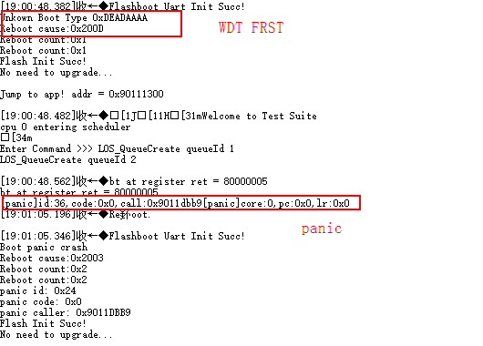

# Problem Locating<a name="ZH-CN_TOPIC_0000001959437761"></a>


## Peripheral Problem Locating Method<a name="ZH-CN_TOPIC_0000001959517541"></a>

Most peripheral exceptions are caused by incomplete initialization.

Peripheral initialization mainly consists of the following steps:

1.  Power on and enable the clock.
2.  Configure the pin mode.
3.  Register the HAL-layer callback functions.
4.  Register callbacks.
5.  Initialize the register configurations.

Troubleshooting ideas:

-   First check whether the clock/power supply is enabled. By default, the clocks of most drivers are disabled. Before use, check whether the CONFIG\_XXX\_SUPPORT\_LPC macro is enabled in the XXX driver initialization code. If it is not enabled, accessing the registers related to the XXX driver immediately causes a hang.
-   Check the return value of uapi\_xxx\_init to confirm whether the initialization is complete.
-   Check the software process (see the "BS2XV100 Device Driver Development Guide").
-   Check the hardware: whether the power-on is normal, whether the peripheral current is normal, and whether the same software burned into different hardware produces consistent results.
-   For other peripheral problems, refer to the peripheral description.

## System Halt Problem Locating Method<a name="ZH-CN_TOPIC_0000001932198982"></a>

**Figure 1**  Locating Steps<a name="fig696517441388"></a>  
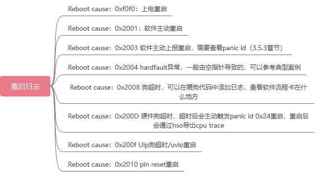

## Low Power Consumption Problem Locating Method<a name="ZH-CN_TOPIC_0000001932358370"></a>


### Pin Leakage Troubleshooting<a name="ZH-CN_TOPIC_0000001959437765"></a>

If the chip power consumption does not meet the requirement in the sleep state, the user needs to troubleshoot IO leakage as follows:

1.  For IO pins on the board-level circuit:
    -   If a pull-up resistor is externally connected to the pin, the pin needs to be configured as floating.
    -   If a pull-down resistor is externally connected to the pin, the pin can be configured as pull-down.
    -   In other cases, configure the pin as pull-down.

2.  For pins connected to external devices:
    -   Refer to the peripheral manual. If the peripheral has internal pull-up/pull-down resistors, configure the pin according to the preceding description.
    -   For other problems, refer to the "BS2XV100 Low Power Consumption FAQ".

## OSAL Interface Maintenance and Testability Method<a name="ZH-CN_TOPIC_0000001959517545"></a>

The BS2X SDK provides OSAL interfaces to help users use the RTOS. Before using the interfaces, refer to the "BS2XV100 SDK Development Guide" to avoid interface usage errors. When developing with OSAL interfaces, customers can perform maintenance and testing by checking the return values of the OSAL interfaces or printing the return values of the OSAL interfaces. For OSAL interface error codes, refer to the "BS2XV100 SDK Development Guide".

## Memory Maintenance and Testability Function<a name="ZH-CN_TOPIC_0000001932198986"></a>

Memory maintenance and testability is an important maintenance and testability method in any system. For example, you may want to know the current memory allocation and occupancy of the system, the stack occupancy of each task, and the specific memory allocation of a task. This memory information is crucial for memory optimization and memory problem locating (such as memory leakage).

This document describes how to perform memory maintenance and testability on the B2X series, including:

-   Viewing the overall allocation and usage of the system heap memory.
-   Viewing the malloc status of each task (current allocation and peak allocation).
-   Viewing the stack allocation and usage of each task (current usage and peak usage).
-   Viewing where each memory is allocated.

    The memory maintenance and testability commands of AIOT have been integrated into AT commands, and users can directly use these commands.


### Viewing the System Heap Overview<a name="ZH-CN_TOPIC_0000001932358374"></a>

This maintenance and testability function is used to view the heap memory usage of the system.

Command for viewing system heap information: AT+HEAPSTAT


### Viewing the Task Stack Usage<a name="ZH-CN_TOPIC_0000001959437769"></a>

This maintenance and testability function is used to view the stack allocation and usage of each task.

You can use this command to optimize and adjust the stack allocation size and save memory.

Command for viewing task stack usage: AT+TASKSTACK


### Viewing the Memory Allocation of Each Task<a name="ZH-CN_TOPIC_0000001959517549"></a>

Command for viewing the malloc status of a task: AT+TASKMALLOC="task id"

The "task id" here can be obtained through the "AT+HEAPSTAT" or "AT+TASKSTACK" command.


### Viewing the Memory Allocation in Interrupts and the Startup Phase<a name="ZH-CN_TOPIC_0000001932198990"></a>

In the system, in addition to the memory allocated in tasks, there is also memory allocated in interrupts and in the system startup phase. These allocations do not belong to any task, so they are classified into a special id.

You can obtain the id corresponding to the non-task alloc through the "AT+HEAPSTAT" command.

The command for viewing the memory allocation in non-task scenarios is also: AT+TASKMALLOC="id", and the display format is the same.

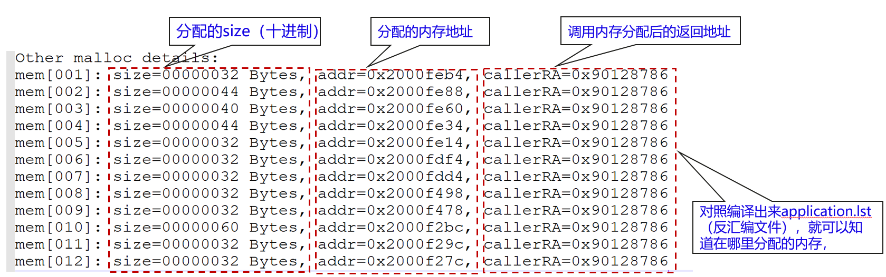

### Memory Maintenance and Testability Switch<a name="ZH-CN_TOPIC_0000001932358378"></a>

Because memory maintenance and testability consumes a certain amount of memory space, it is disabled by default and needs to be manually enabled.

Taking BS21E as an example, enabling the memory maintenance and testability function requires enabling the following two macros: open "kernel\\liteos\\liteos\_v208.6.0\_b017\\Huawei\_LiteOS\\tools\\build\\config\\bs21e.config", and change

```
# LOSCFG_MEM_TASK_STAT is not set
# LOSCFG_MEM_DFX_SHOW_CALLER_RA is not set
```

Change it to:

```
LOSCFG_MEM_TASK_STAT=y
LOSCFG_MEM_DFX_SHOW_CALLER_RA=y
```

**Precautions**

> **Note:** 
>-   Make sure that the config file corresponding to the project is found.
>-   LOSCFG\_MEM\_DFX\_SHOW\_CALLER\_RA is used to view where the memory allocation function is called. Enabling this macro occupies a certain amount of memory space. If you only need to perform memory statistics, you can keep it disabled.
>-   After the function is enabled, the SDK needs to be fully compiled; otherwise, the function may not take effect.

## OS and Interrupt Maintenance and Testability<a name="ZH-CN_TOPIC_0000001945717598"></a>


### Maintenance and Testability Principle<a name="ZH-CN_TOPIC_0000001972716697"></a>

Use the OSCFG\_HWI\_PRE\_POST\_PROCESS and LOSCFG\_BASE\_CORE\_TSK\_MONITOR features (enabled by default in the liteos menuconfig) provided by LiteOS to record the interrupt and task calling traces. This function is disabled by default. When using it, users need to manually enable the OS\_DFX\_SUPPORT and USER\_PRINT\_OS\_DFX macros.

Caution:

1.  Enabling this function may increase the stack space of some tasks and cause a system halt (see "[Case 1 Stack Overflow](案例一-栈溢出.md)"). You need to adjust the corresponding task stack size.
2.  Enabling this function causes frequent printing that cannot be interrupted. For interrupts that do not need to be observed, they can be manually disabled. Refer to the following figure to disable the interrupts that do not need to be observed.

    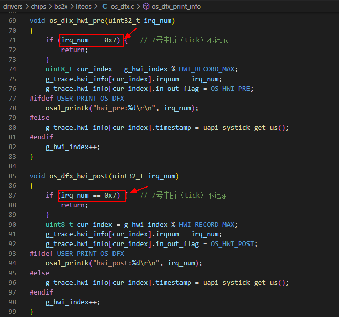

3.  This function may cause some performance issues. When locating watchdog timeout problems, you can temporarily enable this function.

### Maintenance Log Parsing<a name="ZH-CN_TOPIC_0000001972836441"></a>

1.  Interrupt maintenance and testability:

    The following maintenance log indicates entering the interrupt handling function 75 (indicated by hwi\_pre). During the processing of interrupt 75, it is interrupted by interrupt 66 (interrupt nesting is supported, and 66 has a higher priority). After interrupt 66 is processed twice consecutively, interrupt 75 cannot exit, which is most likely because the interrupt stack overflowed. In this case, the interrupt stack size needs to be modified. Refer to the following figure:

    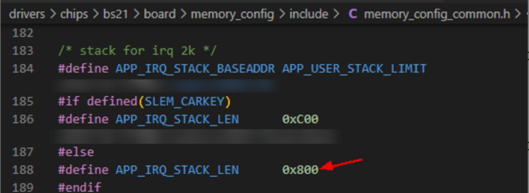

    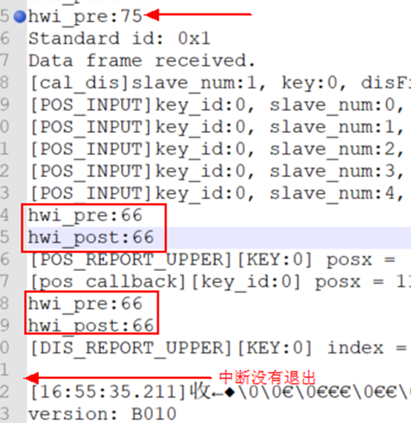

2.  Task scheduling maintenance and testability:

    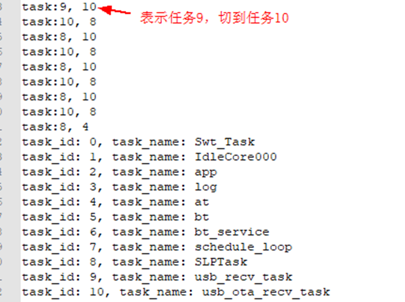

## Interrupt Lock Time and Interrupt Time Maintenance and Testability<a name="ZH-CN_TOPIC_0000001945558290"></a>


### Maintenance and Testability Principle<a name="ZH-CN_TOPIC_0000001972716701"></a>

Use the interrupt lock time and interrupt time maintenance and testability features provided by osal to record the interrupt lock time and interrupt time. This function is disabled by default. When using it, users need to manually add the osal\_adapt component and enable the OSAL\_IRQ\_RECORD\_DEBUG macro. Set the parameter of the osal\_irq\_record\_flag\_set function to 1 to collect the interrupt lock time, and to 2 to collect the interrupt time.

Caution:

1.  Enabling this function may increase the stack space of some tasks and cause a system halt (see "[Case 1 Stack Overflow](案例一-栈溢出.md)"). You need to adjust the corresponding task stack size.
2.  After this function is enabled, interrupts that do not need to be observed can be manually disabled. Refer to the following figure to disable the interrupts that do not need to be observed.

    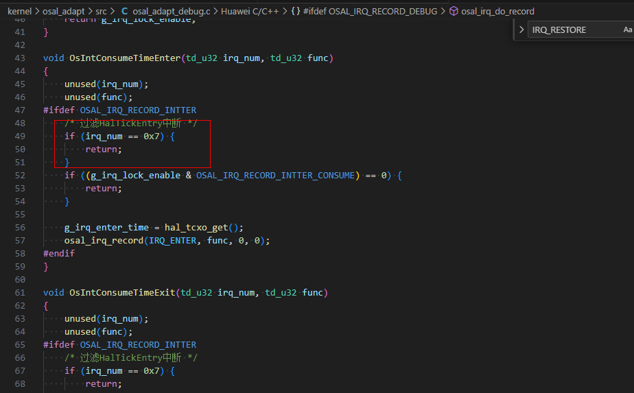

3.  Use the maintenance time printing function in app\_os\_init to print out the recorded time.

    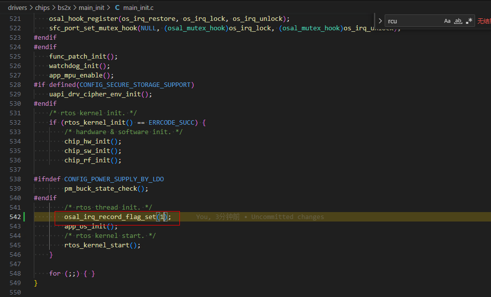

    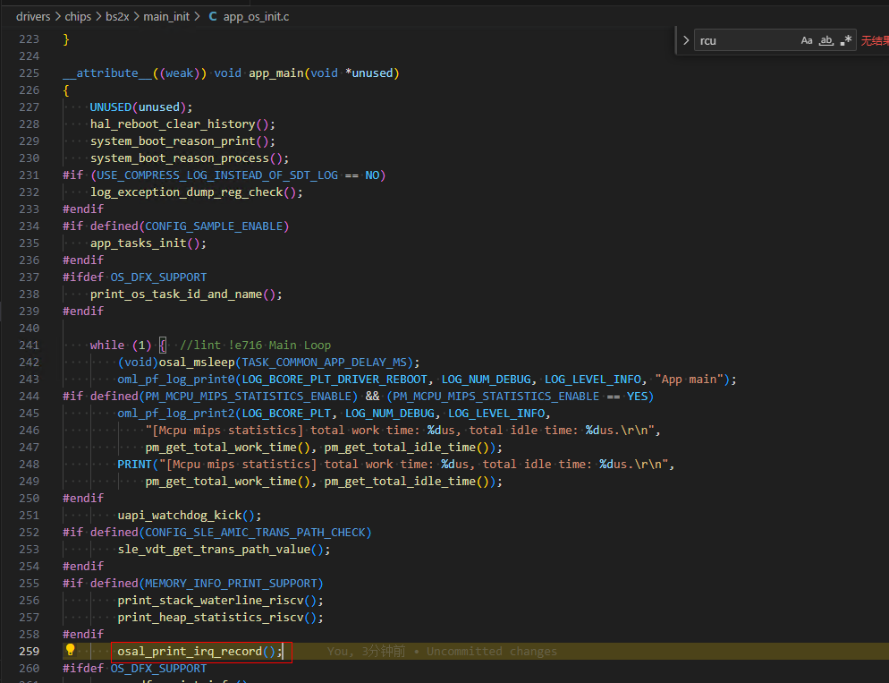

### Maintenance Log Parsing<a name="ZH-CN_TOPIC_0000001972836445"></a>

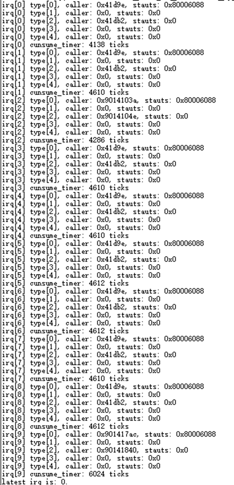

## System CPU Occupancy Query and Maintenance Function<a name="ZH-CN_TOPIC_0000001983447369"></a>

CPU occupancy statistics is an important maintenance and testability method for analyzing the system load. For example, use the CPU occupancy to determine whether the current system load exceeds the design specification, and use the CPU occupancy of each task to determine whether it meets the design expectation.


### Viewing the CPU Occupancy of Each Task and Interrupt<a name="ZH-CN_TOPIC_0000001951327926"></a>

You can use the following command to view the CPU occupancy of each task and interrupt: AT+CPUP

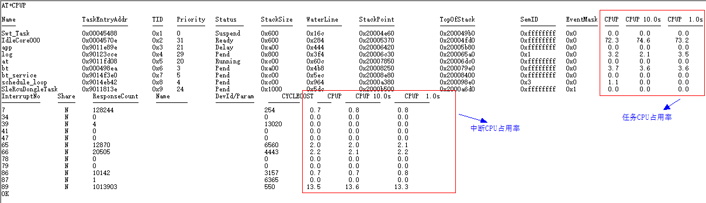

> **Note:** 
>-   CPU occupancy is displayed as a percentage.
>-   CPU occupancy calculation method: total running time of the task (or interrupt)/total running time of the system.
>-   The CPUP column displays the total CPU occupancy from system startup to now.
>-   The CPUP 10.0s column displays the CPU occupancy of the system in the last 10s.
>-   The CPUP 1.0s column displays the CPU occupancy of the system in the last 1s.

### Maintenance and Testability Switch<a name="ZH-CN_TOPIC_0000001983287497"></a>

CPU occupancy statistics affects performance. Generally, you only need to know the occupancy of each task during the development phase, so this function is disabled by default. To use this function, you need to enable it manually.

Taking BS21E as an example, open "kernel\\liteos\\liteos\_v208.6.0\_b017\\Huawei\_LiteOS\\tools\\build\\config\\bs21e.config". For the CPUP maintenance and testability function, the following macros need to be enabled:

```
LOSCFG_KERNEL_EXTKERNEL=y
LOSCFG_KERNEL_CPUP=y
LOSCFG_CPUP_INCLUDE_IRQ=y
LOSCFG_CPUP_SAMPLE_PERIOD=1000
LOSCFG_CPUP_HISTORY_RECORD_NUM=10
LOSCFG_DEBUG_VERSION=y
LOSCFG_DEBUG_KERNEL=y
LOSCFG_DEBUG_TASK=y
LOSCFG_DEBUG_HWI=y
```

**Precautions**

> **Note:** 
>-   Make sure that the config file corresponding to the project is found.
>-   After the function is enabled, the SDK needs to be fully compiled; otherwise, the function may not take effect.
>-   After the configuration item LOSCFG\_CPUP\_INCLUDE\_IRQ is disabled, the interrupt time consumption in the system is counted into the task where the interrupt occurs, that is, the task interrupted by the interrupt.

# Typical Cases<a name="ZH-CN_TOPIC_0000001959437773"></a>


## Case 1 Stack Overflow<a name="ZH-CN_TOPIC_0000001959517553"></a>

**Stack Overflow<a name="section11963144154817"></a>**

The halt scene is as follows:

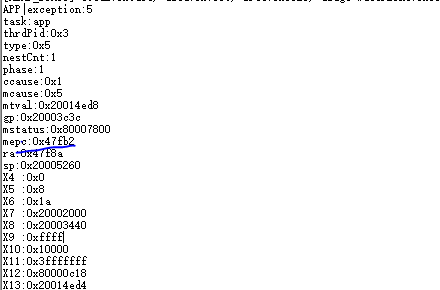

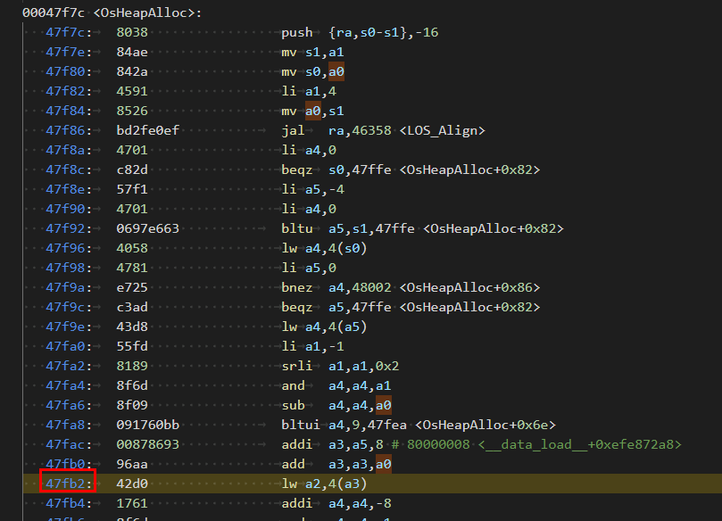

If it halts in OsHeapAlloc, you can add logs at the following positions to print the stack statistics when the halt occurs:

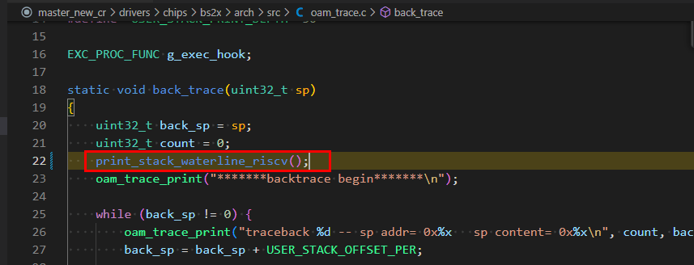

The printing result is as follows:

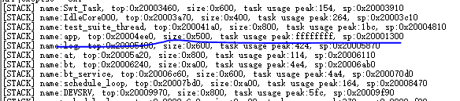

It can be concluded that the app stack is exhausted, and the thread stack size needs to be increased.

## Case 2 Analysis Using MEPC<a name="ZH-CN_TOPIC_0000001932198994"></a>

**Analyzing the Halt Based on mepc<a name="section264151694919"></a>**

The halt scene is as follows:

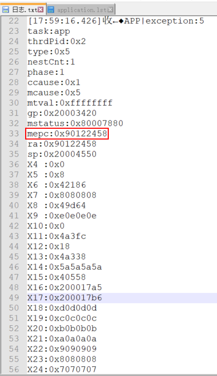

**Problem Analysis<a name="section967022310497"></a>**

1.  It halts in "app", and the mepc is 0x90122458, and the mtval is 0xffffffff.
2.  Find the assembly code corresponding to mepc in the lst file.

    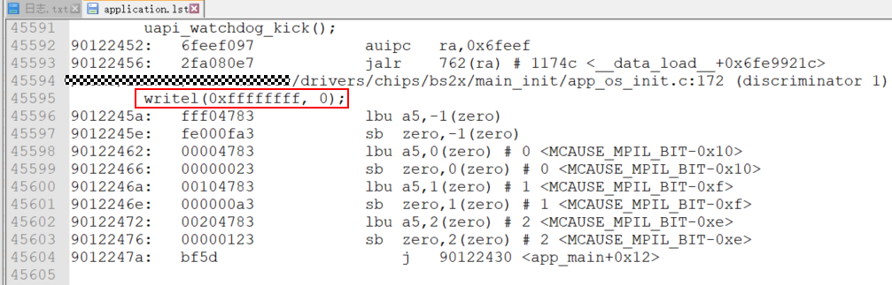

3.  It is confirmed that the halt is caused by the software operating on the illegal address writel\(0xffffffff, 0\).

## Case 3 Analysis Using RA<a name="ZH-CN_TOPIC_0000001932358382"></a>

**Abnormal PC: Analyzing the Halt Based on RA<a name="section1157716329499"></a>**

The halt scene is as follows:

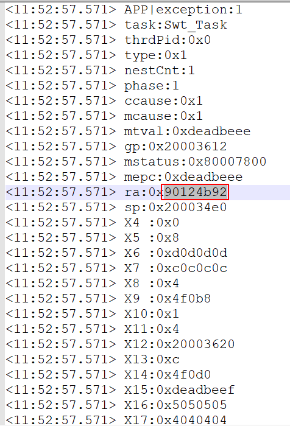

**Problem Analysis<a name="section17931546104920"></a>**

1.  It halts in "Swt\_Task", and the pc is illegal; only the ra can be seen.
2.  According to the lst file, an exception is found when jumping to "g\_hal\_funcs-\>set\_group".

    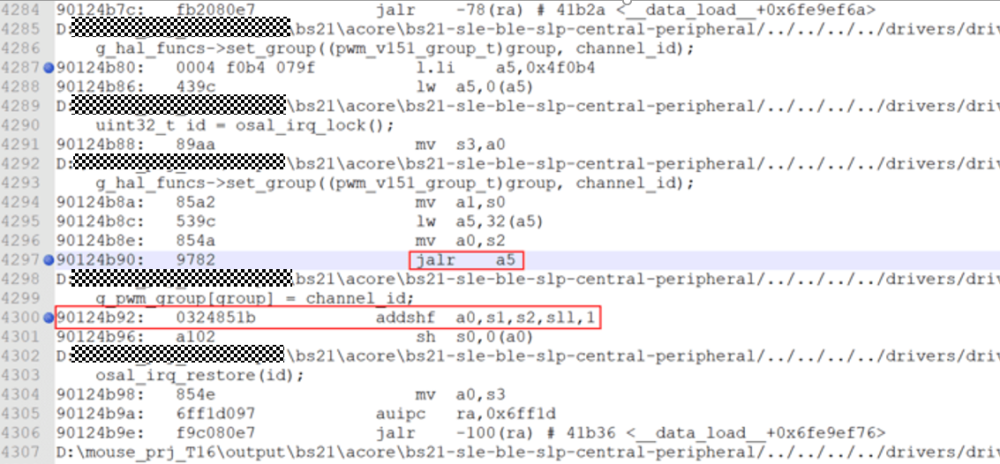

3.  It is suspected that g\_hal\_funcs-\>set\_group is null. Continue to check the pwm initialization code in the lst file. It is found that it is only called in ir, and infrared learning was not performed when the problem occurred.

    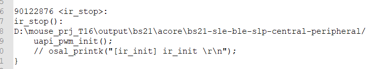

4.  Confirm with the customer. The customer did delete the pwm initialization code. After adding the initialization code, the problem is resolved.

**Problem Extension<a name="section1767759508"></a>**

1.  If the customer checks the return value of uapi\_pwm\_open, this problem can be quickly discovered.

    The software code can add a check so that the system does not halt on exceptions.

    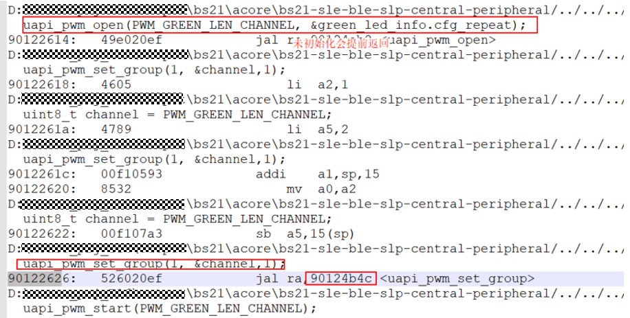

2.  Why does the pc become deadbeee when the system halts?

    Note: The chip initializes 0x0\~0x10000 to 0xDEADBEEF, and bit0 of mepc is forced to 0.

    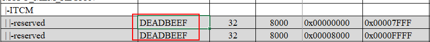

    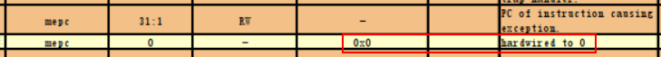

    -   Analysis: assembly code g\_hal\_funcs

    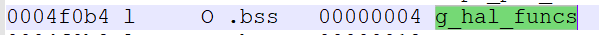

    g\_hal\_funcs is in the bss section and is initialized to 0. When it is not assigned, the value in g\_hal\_funcs is 0.

    -   Assembly process

    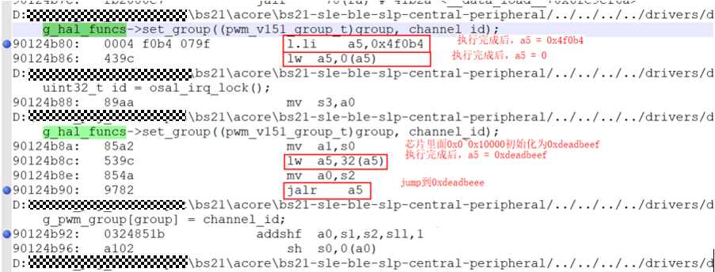

## Case 4 Accessing a Null Pointer Causing a Halt<a name="ZH-CN_TOPIC_0000001959437777"></a>

During software execution, problems such as code logic errors or memory corruption often cause some data to become null addresses or other illegal addresses, resulting in a halt when accessed. This case uses an example to analyze and locate null pointer execution by combining the halt maintenance and testability methods provided by BS2X. The following figure shows the halt log caused by executing a null pointer:

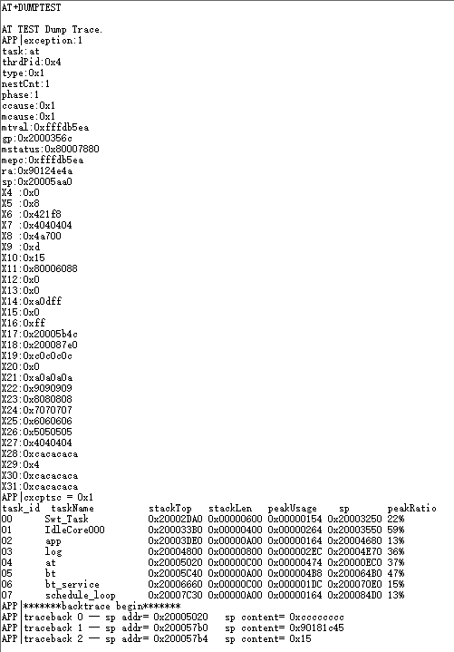

First refer to the [Normal Printing Port Maintenance Information Acquisition](_普通打印口维测信息获取.md#_普通打印口维测信息获取) section to analyze the halt scene. The current mcause is 1. Referring to the mcause comparison table, the halt is caused by an instruction access error. At the same time, mepc and ra are both set to address values that are difficult to trace directly through the application.lst or application.asm assembly files. For such problems, the CPU Trace tool is usually used to parse the serial port Trace and analyze the execution flow before the halt. Using the tool to parse the serial port Trace, the last function executed before entering the exception is plt\_at\_dumptest:

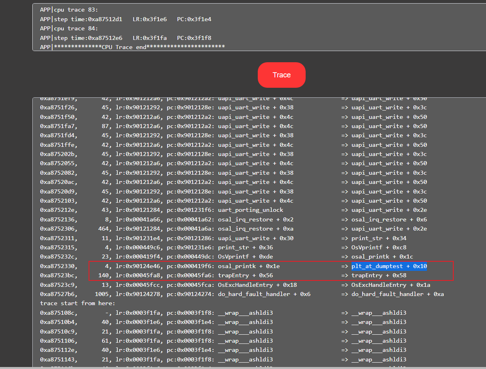

Find the offset 0x10 position of the plt\_at\_dumptest function in the application.lst file. A null pointer access operation is performed here, causing the halt.

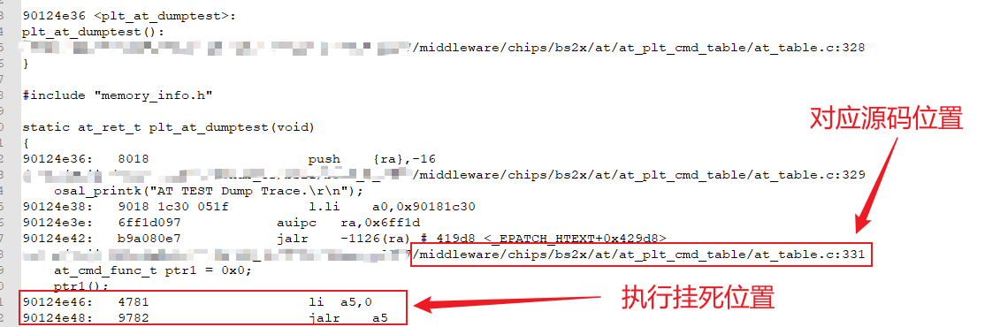

**Summary: For instruction access halts with mcause types such as 0x0, 0x1, and 0x2, when the registers in the halt scene are difficult to trace the exception location, use the serial port Trace parsing tool to parse the Trace and combine it with the application.lst file to trace the halt flow.**

## Case 5 Memory Malloc Failure<a name="ZH-CN_TOPIC_0000001959517557"></a>

If a panic due to insufficient memory or a malloc failure occurs during code execution, you can use the current memory maintenance and testability interfaces for maintenance and testing:

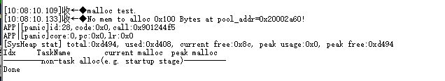

Refer to the "[Memory Maintenance and Testability Switch](内存维测开关.md)" section to enable the memory maintenance and testability switch. After it is enabled, the memory usage information is printed when a panic occurs. As shown in the following figure, after the memory maintenance and testability is enabled, when the memory allocation is insufficient, the maintenance information prints the memory usage information of each thread, as well as the memory information of each thread when the halt occurs.

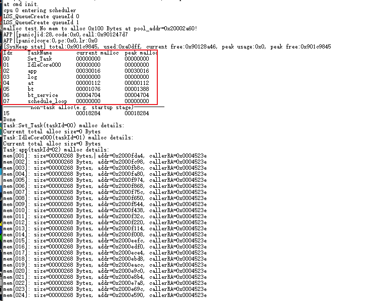

Refer to the following figure. The peak value of the app thread is abnormal. According to the detailed memory usage information, it can be seen that the 0x4523e address frequently allocates memory.

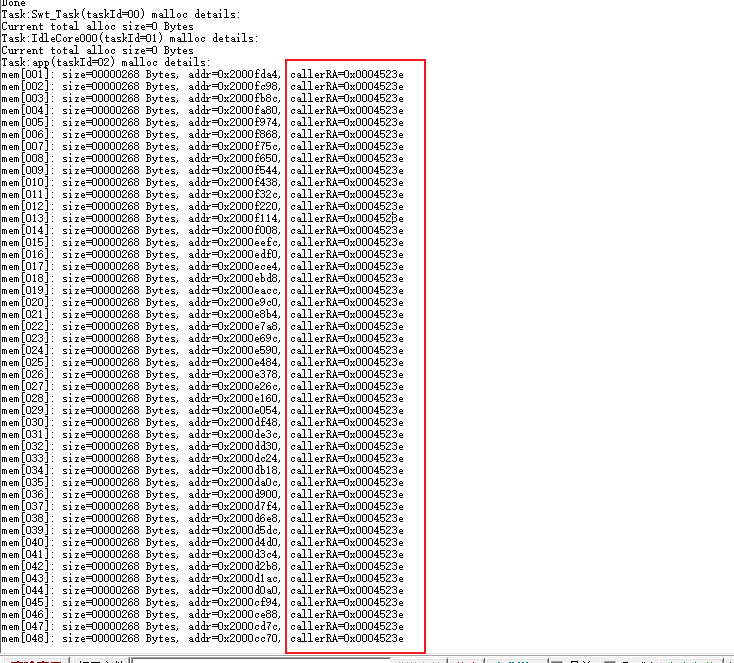

Observe the calling position in the lst file. It can be seen that the abnormal calling function allocates memory abnormally without releasing it.

# Frequently Asked Questions (FAQ)<a name="ZH-CN_TOPIC_0000001932375632"></a>


## Viewing Exception Information<a name="ZH-CN_TOPIC_0000001959659841"></a>


### Exception Information Summary<a name="ZH-CN_TOPIC_0000001932421106"></a>

**Table 1**  Exception Information Description

<a name="table18567165914116"></a>
<table><thead align="left"><tr id="row258225911118"><th class="cellrowborder" align="left" valign="top" width="17.5%" id="mcps1.2.3.1.1"><p id="p6582759819"><a name="p6582759819"></a><a name="p6582759819"></a>Member</p>
</th>
<th class="cellrowborder" align="left" valign="top" width="82.5%" id="mcps1.2.3.1.2"><p id="p558219591118"><a name="p558219591118"></a><a name="p558219591118"></a>Description</p>
</th>
</tr>
</thead>
<tbody><tr id="row1058210597111"><td class="cellrowborder" align="left" valign="top" width="17.5%" headers="mcps1.2.3.1.1 "><p id="p0582759512"><a name="p0582759512"></a><a name="p0582759512"></a>task</p>
</td>
<td class="cellrowborder" align="left" valign="top" width="82.5%" headers="mcps1.2.3.1.2 "><p id="p16582115918112"><a name="p16582115918112"></a><a name="p16582115918112"></a>Name of the task where the halt occurs.</p>
</td>
</tr>
<tr id="row125820591610"><td class="cellrowborder" align="left" valign="top" width="17.5%" headers="mcps1.2.3.1.1 "><p id="p3582155910111"><a name="p3582155910111"></a><a name="p3582155910111"></a>thrdPid</p>
</td>
<td class="cellrowborder" align="left" valign="top" width="82.5%" headers="mcps1.2.3.1.2 "><p id="p185828591014"><a name="p185828591014"></a><a name="p185828591014"></a>ID of the task where the halt occurs.</p>
</td>
</tr>
<tr id="row358215591612"><td class="cellrowborder" align="left" valign="top" width="17.5%" headers="mcps1.2.3.1.1 "><p id="p1658285912119"><a name="p1658285912119"></a><a name="p1658285912119"></a>type</p>
</td>
<td class="cellrowborder" align="left" valign="top" width="82.5%" headers="mcps1.2.3.1.2 "><p id="p1258217591816"><a name="p1258217591816"></a><a name="p1258217591816"></a>Halt type.</p>
</td>
</tr>
</tbody>
</table>

### CPU Register Information<a name="ZH-CN_TOPIC_0000001959579629"></a>

**Table 1**  CPU Register Description Related to Halt

<a name="table1962201118214"></a>
<table><thead align="left"><tr id="row12791211328"><th class="cellrowborder" align="left" valign="top" width="14.57%" id="mcps1.2.3.1.1"><p id="p5791011427"><a name="p5791011427"></a><a name="p5791011427"></a>Member</p>
</th>
<th class="cellrowborder" align="left" valign="top" width="85.42999999999999%" id="mcps1.2.3.1.2"><p id="p1779171111213"><a name="p1779171111213"></a><a name="p1779171111213"></a>Description</p>
</th>
</tr>
</thead>
<tbody><tr id="row7792112021"><td class="cellrowborder" align="left" valign="top" width="14.57%" headers="mcps1.2.3.1.1 "><p id="p117921110213"><a name="p117921110213"></a><a name="p117921110213"></a>mepc</p>
</td>
<td class="cellrowborder" align="left" valign="top" width="85.42999999999999%" headers="mcps1.2.3.1.2 "><p id="p779201113215"><a name="p779201113215"></a><a name="p779201113215"></a>Machine exception program counter. When an exception occurs, mepc points to the instruction that causes the exception. For interrupts, mepc points to the position that should be restored after the interrupt is processed.</p>
</td>
</tr>
<tr id="row14795115214"><td class="cellrowborder" align="left" valign="top" width="14.57%" headers="mcps1.2.3.1.1 "><p id="p197913119214"><a name="p197913119214"></a><a name="p197913119214"></a>mstatus</p>
</td>
<td class="cellrowborder" align="left" valign="top" width="85.42999999999999%" headers="mcps1.2.3.1.2 "><p id="p1279201111211"><a name="p1279201111211"></a><a name="p1279201111211"></a>Machine status register.</p>
</td>
</tr>
<tr id="row10791111228"><td class="cellrowborder" align="left" valign="top" width="14.57%" headers="mcps1.2.3.1.1 "><p id="p167931110220"><a name="p167931110220"></a><a name="p167931110220"></a>mtval</p>
</td>
<td class="cellrowborder" align="left" valign="top" width="85.42999999999999%" headers="mcps1.2.3.1.2 "><p id="p9792112214"><a name="p9792112214"></a><a name="p9792112214"></a>Machine trap register. It saves the address in error for an address exception or the instruction itself for an instruction exception. For other errors, its value is zero.</p>
</td>
</tr>
<tr id="row5795111026"><td class="cellrowborder" align="left" valign="top" width="14.57%" headers="mcps1.2.3.1.1 "><p id="p1379611526"><a name="p1379611526"></a><a name="p1379611526"></a>mcause</p>
</td>
<td class="cellrowborder" align="left" valign="top" width="85.42999999999999%" headers="mcps1.2.3.1.2 "><p id="p079151110214"><a name="p079151110214"></a><a name="p079151110214"></a>Machine exception register. It saves the cause of the current exception or interrupt. Query the mcause&ccause exception description table to obtain the type of the current exception or interrupt.</p>
</td>
</tr>
<tr id="row1779121115210"><td class="cellrowborder" align="left" valign="top" width="14.57%" headers="mcps1.2.3.1.1 "><p id="p147921120212"><a name="p147921120212"></a><a name="p147921120212"></a>ccause</p>
</td>
<td class="cellrowborder" align="left" valign="top" width="85.42999999999999%" headers="mcps1.2.3.1.2 "><p id="p97915111825"><a name="p97915111825"></a><a name="p97915111825"></a>Similar to mcause, ccause is a supplementary description of mcause. For some exceptions, the exception type can be further clarified by reading the ccause register content.</p>
</td>
</tr>
<tr id="row20799118219"><td class="cellrowborder" align="left" valign="top" width="14.57%" headers="mcps1.2.3.1.1 "><p id="p679611022"><a name="p679611022"></a><a name="p679611022"></a>ra</p>
</td>
<td class="cellrowborder" align="left" valign="top" width="85.42999999999999%" headers="mcps1.2.3.1.2 "><p id="p5791211528"><a name="p5791211528"></a><a name="p5791211528"></a>Return address.</p>
</td>
</tr>
</tbody>
</table>

**Table 2**  mcause&ccause Exception Description Table

<a name="table104371519523"></a>
<table><thead align="left"><tr id="row8462919626"><th class="cellrowborder" align="left" valign="top" width="14.771477147714771%" id="mcps1.2.4.1.1"><p id="p84629198217"><a name="p84629198217"></a><a name="p84629198217"></a>Exception code</p>
</th>
<th class="cellrowborder" align="left" valign="top" width="37.24372437243724%" id="mcps1.2.4.1.2"><p id="p9462161912215"><a name="p9462161912215"></a><a name="p9462161912215"></a>mcause exception description</p>
</th>
<th class="cellrowborder" align="left" valign="top" width="47.98479847984798%" id="mcps1.2.4.1.3"><p id="p24621219925"><a name="p24621219925"></a><a name="p24621219925"></a>ccause exception description</p>
</th>
</tr>
</thead>
<tbody><tr id="row746271911214"><td class="cellrowborder" align="left" valign="top" width="14.771477147714771%" headers="mcps1.2.4.1.1 "><p id="p24623191223"><a name="p24623191223"></a><a name="p24623191223"></a>0x0</p>
</td>
<td class="cellrowborder" align="left" valign="top" width="37.24372437243724%" headers="mcps1.2.4.1.2 "><p id="p11462121912213"><a name="p11462121912213"></a><a name="p11462121912213"></a>Instruction address misaligned</p>
</td>
<td class="cellrowborder" align="left" valign="top" width="47.98479847984798%" headers="mcps1.2.4.1.3 "><p id="p8462131917219"><a name="p8462131917219"></a><a name="p8462131917219"></a>Not available</p>
</td>
</tr>
<tr id="row1346216191929"><td class="cellrowborder" align="left" valign="top" width="14.771477147714771%" headers="mcps1.2.4.1.1 "><p id="p17462019125"><a name="p17462019125"></a><a name="p17462019125"></a>0x1</p>
</td>
<td class="cellrowborder" align="left" valign="top" width="37.24372437243724%" headers="mcps1.2.4.1.2 "><p id="p1546221917217"><a name="p1546221917217"></a><a name="p1546221917217"></a>Instruction access fault</p>
</td>
<td class="cellrowborder" align="left" valign="top" width="47.98479847984798%" headers="mcps1.2.4.1.3 "><p id="p146361911211"><a name="p146361911211"></a><a name="p146361911211"></a>Memory map region access fault</p>
</td>
</tr>
<tr id="row1146319191029"><td class="cellrowborder" align="left" valign="top" width="14.771477147714771%" headers="mcps1.2.4.1.1 "><p id="p114638191722"><a name="p114638191722"></a><a name="p114638191722"></a>0x2</p>
</td>
<td class="cellrowborder" align="left" valign="top" width="37.24372437243724%" headers="mcps1.2.4.1.2 "><p id="p3463181912217"><a name="p3463181912217"></a><a name="p3463181912217"></a>Illegal instruction</p>
</td>
<td class="cellrowborder" align="left" valign="top" width="47.98479847984798%" headers="mcps1.2.4.1.3 "><p id="p144631191621"><a name="p144631191621"></a><a name="p144631191621"></a>AXIM error response</p>
</td>
</tr>
<tr id="row646319196218"><td class="cellrowborder" align="left" valign="top" width="14.771477147714771%" headers="mcps1.2.4.1.1 "><p id="p1446319191728"><a name="p1446319191728"></a><a name="p1446319191728"></a>0x3</p>
</td>
<td class="cellrowborder" align="left" valign="top" width="37.24372437243724%" headers="mcps1.2.4.1.2 "><p id="p144631119029"><a name="p144631119029"></a><a name="p144631119029"></a>Breakpoint</p>
</td>
<td class="cellrowborder" align="left" valign="top" width="47.98479847984798%" headers="mcps1.2.4.1.3 "><p id="p10463719827"><a name="p10463719827"></a><a name="p10463719827"></a>AHBM error response</p>
</td>
</tr>
<tr id="row3463519323"><td class="cellrowborder" align="left" valign="top" width="14.771477147714771%" headers="mcps1.2.4.1.1 "><p id="p646361920220"><a name="p646361920220"></a><a name="p646361920220"></a>0x4</p>
</td>
<td class="cellrowborder" align="left" valign="top" width="37.24372437243724%" headers="mcps1.2.4.1.2 "><p id="p1846361914219"><a name="p1846361914219"></a><a name="p1846361914219"></a>Load address misaligned</p>
</td>
<td class="cellrowborder" align="left" valign="top" width="47.98479847984798%" headers="mcps1.2.4.1.3 "><p id="p446310190213"><a name="p446310190213"></a><a name="p446310190213"></a>Crossing PMP entries</p>
</td>
</tr>
<tr id="row246381918210"><td class="cellrowborder" align="left" valign="top" width="14.771477147714771%" headers="mcps1.2.4.1.1 "><p id="p1946315199214"><a name="p1946315199214"></a><a name="p1946315199214"></a>0x5</p>
</td>
<td class="cellrowborder" align="left" valign="top" width="37.24372437243724%" headers="mcps1.2.4.1.2 "><p id="p74637195213"><a name="p74637195213"></a><a name="p74637195213"></a>Load access fault</p>
</td>
<td class="cellrowborder" align="left" valign="top" width="47.98479847984798%" headers="mcps1.2.4.1.3 "><p id="p204634193210"><a name="p204634193210"></a><a name="p204634193210"></a>System register access fault</p>
</td>
</tr>
<tr id="row1246311190217"><td class="cellrowborder" align="left" valign="top" width="14.771477147714771%" headers="mcps1.2.4.1.1 "><p id="p146316191820"><a name="p146316191820"></a><a name="p146316191820"></a>0x6</p>
</td>
<td class="cellrowborder" align="left" valign="top" width="37.24372437243724%" headers="mcps1.2.4.1.2 "><p id="p34633192022"><a name="p34633192022"></a><a name="p34633192022"></a>Store/AMO address misaligned</p>
</td>
<td class="cellrowborder" align="left" valign="top" width="47.98479847984798%" headers="mcps1.2.4.1.3 "><p id="p44631719624"><a name="p44631719624"></a><a name="p44631719624"></a>No PMP entry matched</p>
</td>
</tr>
<tr id="row246311917218"><td class="cellrowborder" align="left" valign="top" width="14.771477147714771%" headers="mcps1.2.4.1.1 "><p id="p13463919722"><a name="p13463919722"></a><a name="p13463919722"></a>0x7</p>
</td>
<td class="cellrowborder" align="left" valign="top" width="37.24372437243724%" headers="mcps1.2.4.1.2 "><p id="p104635193217"><a name="p104635193217"></a><a name="p104635193217"></a>Store/AMO access fault</p>
</td>
<td class="cellrowborder" align="left" valign="top" width="47.98479847984798%" headers="mcps1.2.4.1.3 "><p id="p84630191726"><a name="p84630191726"></a><a name="p84630191726"></a>PMP access fault</p>
</td>
</tr>
<tr id="row144631019626"><td class="cellrowborder" align="left" valign="top" width="14.771477147714771%" headers="mcps1.2.4.1.1 "><p id="p2463101914219"><a name="p2463101914219"></a><a name="p2463101914219"></a>0x8</p>
</td>
<td class="cellrowborder" align="left" valign="top" width="37.24372437243724%" headers="mcps1.2.4.1.2 "><p id="p114637194213"><a name="p114637194213"></a><a name="p114637194213"></a>Environment call from U-mode</p>
</td>
<td class="cellrowborder" align="left" valign="top" width="47.98479847984798%" headers="mcps1.2.4.1.3 "><p id="p846321919217"><a name="p846321919217"></a><a name="p846321919217"></a>CMO access fault</p>
</td>
</tr>
<tr id="row84638197213"><td class="cellrowborder" align="left" valign="top" width="14.771477147714771%" headers="mcps1.2.4.1.1 "><p id="p1346318191224"><a name="p1346318191224"></a><a name="p1346318191224"></a>0x9</p>
</td>
<td class="cellrowborder" align="left" valign="top" width="37.24372437243724%" headers="mcps1.2.4.1.2 "><p id="p8463319628"><a name="p8463319628"></a><a name="p8463319628"></a>Environment call from S-mode</p>
</td>
<td class="cellrowborder" align="left" valign="top" width="47.98479847984798%" headers="mcps1.2.4.1.3 "><p id="p7463181916219"><a name="p7463181916219"></a><a name="p7463181916219"></a>CSR access fault</p>
</td>
</tr>
<tr id="row1046341913212"><td class="cellrowborder" align="left" valign="top" width="14.771477147714771%" headers="mcps1.2.4.1.1 "><p id="p1946316194210"><a name="p1946316194210"></a><a name="p1946316194210"></a>0xa</p>
</td>
<td class="cellrowborder" align="left" valign="top" width="37.24372437243724%" headers="mcps1.2.4.1.2 "><p id="p1246316191218"><a name="p1246316191218"></a><a name="p1246316191218"></a>Reserved</p>
</td>
<td class="cellrowborder" align="left" valign="top" width="47.98479847984798%" headers="mcps1.2.4.1.3 "><p id="p10463201920219"><a name="p10463201920219"></a><a name="p10463201920219"></a>LDM/STMIA instruction</p>
</td>
</tr>
<tr id="row1346316194211"><td class="cellrowborder" align="left" valign="top" width="14.771477147714771%" headers="mcps1.2.4.1.1 "><p id="p1646391914215"><a name="p1646391914215"></a><a name="p1646391914215"></a>0xb</p>
</td>
<td class="cellrowborder" align="left" valign="top" width="37.24372437243724%" headers="mcps1.2.4.1.2 "><p id="p346312198219"><a name="p346312198219"></a><a name="p346312198219"></a>Environment call from M-mode</p>
</td>
<td class="cellrowborder" align="left" valign="top" width="47.98479847984798%" headers="mcps1.2.4.1.3 "><p id="p1146311913213"><a name="p1146311913213"></a><a name="p1146311913213"></a>ITCM write access fault</p>
</td>
</tr>
<tr id="row246310190210"><td class="cellrowborder" align="left" valign="top" width="14.771477147714771%" headers="mcps1.2.4.1.1 "><p id="p11463119522"><a name="p11463119522"></a><a name="p11463119522"></a>0xc</p>
</td>
<td class="cellrowborder" align="left" valign="top" width="37.24372437243724%" headers="mcps1.2.4.1.2 "><p id="p846361916219"><a name="p846361916219"></a><a name="p846361916219"></a>Instruction page fault</p>
</td>
<td class="cellrowborder" align="left" valign="top" width="47.98479847984798%" headers="mcps1.2.4.1.3 "><p id="p64632192217"><a name="p64632192217"></a><a name="p64632192217"></a>Not available</p>
</td>
</tr>
<tr id="row346315191727"><td class="cellrowborder" align="left" valign="top" width="14.771477147714771%" headers="mcps1.2.4.1.1 "><p id="p204633198210"><a name="p204633198210"></a><a name="p204633198210"></a>0xd</p>
</td>
<td class="cellrowborder" align="left" valign="top" width="37.24372437243724%" headers="mcps1.2.4.1.2 "><p id="p1546319191529"><a name="p1546319191529"></a><a name="p1546319191529"></a>Load page fault</p>
</td>
<td class="cellrowborder" align="left" valign="top" width="47.98479847984798%" headers="mcps1.2.4.1.3 "><p id="p146313191525"><a name="p146313191525"></a><a name="p146313191525"></a>Not available</p>
</td>
</tr>
<tr id="row74631519124"><td class="cellrowborder" align="left" valign="top" width="14.771477147714771%" headers="mcps1.2.4.1.1 "><p id="p846316191724"><a name="p846316191724"></a><a name="p846316191724"></a>0xe</p>
</td>
<td class="cellrowborder" align="left" valign="top" width="37.24372437243724%" headers="mcps1.2.4.1.2 "><p id="p10463151916213"><a name="p10463151916213"></a><a name="p10463151916213"></a>Reserved</p>
</td>
<td class="cellrowborder" align="left" valign="top" width="47.98479847984798%" headers="mcps1.2.4.1.3 "><p id="p1346416192220"><a name="p1346416192220"></a><a name="p1346416192220"></a>Not available</p>
</td>
</tr>
<tr id="row204646191429"><td class="cellrowborder" align="left" valign="top" width="14.771477147714771%" headers="mcps1.2.4.1.1 "><p id="p1346412192210"><a name="p1346412192210"></a><a name="p1346412192210"></a>0xf</p>
</td>
<td class="cellrowborder" align="left" valign="top" width="37.24372437243724%" headers="mcps1.2.4.1.2 "><p id="p16464919421"><a name="p16464919421"></a><a name="p16464919421"></a>Store/AMO page fault</p>
</td>
<td class="cellrowborder" align="left" valign="top" width="47.98479847984798%" headers="mcps1.2.4.1.3 "><p id="p15464019325"><a name="p15464019325"></a><a name="p15464019325"></a>Not available</p>
</td>
</tr>
<tr id="row946415192023"><td class="cellrowborder" align="left" valign="top" width="14.771477147714771%" headers="mcps1.2.4.1.1 "><p id="p134644191726"><a name="p134644191726"></a><a name="p134644191726"></a>＞0xf</p>
</td>
<td class="cellrowborder" align="left" valign="top" width="37.24372437243724%" headers="mcps1.2.4.1.2 "><p id="p54641619622"><a name="p54641619622"></a><a name="p54641619622"></a>Reserved</p>
</td>
<td class="cellrowborder" align="left" valign="top" width="47.98479847984798%" headers="mcps1.2.4.1.3 "><p id="p14464719127"><a name="p14464719127"></a><a name="p14464719127"></a>Not available</p>
</td>
</tr>
</tbody>
</table>

### General Register Information<a name="ZH-CN_TOPIC_0000001932580502"></a>

**Table 1**  General Register Description

<a name="table540153175920"></a>
<table><thead align="left"><tr id="row24493375916"><th class="cellrowborder" colspan="2" align="left" valign="top" id="mcps1.2.6.1.1"><p id="p9440204410212"><a name="p9440204410212"></a><a name="p9440204410212"></a>Register</p>
</th>
<th class="cellrowborder" align="left" valign="top" id="mcps1.2.6.1.2"><p id="p164501365917"><a name="p164501365917"></a><a name="p164501365917"></a>ABI Name</p>
</th>
<th class="cellrowborder" align="left" valign="top" id="mcps1.2.6.1.3"><p id="p1745015315595"><a name="p1745015315595"></a><a name="p1745015315595"></a>Preserved by</p>
</th>
<th class="cellrowborder" align="left" valign="top" id="mcps1.2.6.1.4"><p id="p745083145919"><a name="p745083145919"></a><a name="p745083145919"></a>Purpose</p>
</th>
</tr>
</thead>
<tbody><tr id="row10450153175919"><td class="cellrowborder" rowspan="12" align="left" valign="top" width="18.01%" headers="mcps1.2.6.1.1 "><p id="p4424193015415"><a name="p4424193015415"></a><a name="p4424193015415"></a>Integer general-purpose registers</p>
</td>
<td class="cellrowborder" align="left" valign="top" width="12.629999999999999%" headers="mcps1.2.6.1.1 "><p id="p114501335918"><a name="p114501335918"></a><a name="p114501335918"></a>x0</p>
</td>
<td class="cellrowborder" align="left" valign="top" width="23.330000000000002%" headers="mcps1.2.6.1.2 "><p id="p845033165918"><a name="p845033165918"></a><a name="p845033165918"></a>zero</p>
</td>
<td class="cellrowborder" align="left" valign="top" width="22.91%" headers="mcps1.2.6.1.3 "><p id="p1145093125918"><a name="p1145093125918"></a><a name="p1145093125918"></a>—</p>
</td>
<td class="cellrowborder" align="left" valign="top" width="23.119999999999997%" headers="mcps1.2.6.1.4 "><p id="p15450143125913"><a name="p15450143125913"></a><a name="p15450143125913"></a>Hardwired to 0. Writes are ignored, and reads always return 0.</p>
</td>
</tr>
<tr id="row104509318597"><td class="cellrowborder" align="left" valign="top" headers="mcps1.2.6.1.1 "><p id="p9450437594"><a name="p9450437594"></a><a name="p9450437594"></a>x1</p>
</td>
<td class="cellrowborder" align="left" valign="top" headers="mcps1.2.6.1.1 "><p id="p845093145919"><a name="p845093145919"></a><a name="p845093145919"></a>ra</p>
</td>
<td class="cellrowborder" align="left" valign="top" headers="mcps1.2.6.1.2 "><p id="p18450339594"><a name="p18450339594"></a><a name="p18450339594"></a>Caller</p>
</td>
<td class="cellrowborder" align="left" valign="top" headers="mcps1.2.6.1.3 "><p id="p194509318594"><a name="p194509318594"></a><a name="p194509318594"></a>Return address of a function call</p>
</td>
</tr>
<tr id="row545014345915"><td class="cellrowborder" align="left" valign="top" headers="mcps1.2.6.1.1 "><p id="p1345013195914"><a name="p1345013195914"></a><a name="p1345013195914"></a>x2</p>
</td>
<td class="cellrowborder" align="left" valign="top" headers="mcps1.2.6.1.1 "><p id="p84504325920"><a name="p84504325920"></a><a name="p84504325920"></a>sp</p>
</td>
<td class="cellrowborder" align="left" valign="top" headers="mcps1.2.6.1.2 "><p id="p19450173125916"><a name="p19450173125916"></a><a name="p19450173125916"></a>Callee</p>
</td>
<td class="cellrowborder" align="left" valign="top" headers="mcps1.2.6.1.3 "><p id="p2045015315599"><a name="p2045015315599"></a><a name="p2045015315599"></a>Stack pointer</p>
</td>
</tr>
<tr id="row184501632594"><td class="cellrowborder" align="left" valign="top" headers="mcps1.2.6.1.1 "><p id="p19450434591"><a name="p19450434591"></a><a name="p19450434591"></a>x3</p>
</td>
<td class="cellrowborder" align="left" valign="top" headers="mcps1.2.6.1.1 "><p id="p745017314596"><a name="p745017314596"></a><a name="p745017314596"></a>gp</p>
</td>
<td class="cellrowborder" align="left" valign="top" headers="mcps1.2.6.1.2 "><p id="p64501634593"><a name="p64501634593"></a><a name="p64501634593"></a>—</p>
</td>
<td class="cellrowborder" align="left" valign="top" headers="mcps1.2.6.1.3 "><p id="p1645013312598"><a name="p1645013312598"></a><a name="p1645013312598"></a>Global pointer</p>
</td>
</tr>
<tr id="row245114335912"><td class="cellrowborder" align="left" valign="top" headers="mcps1.2.6.1.1 "><p id="p14451113195915"><a name="p14451113195915"></a><a name="p14451113195915"></a>x4</p>
</td>
<td class="cellrowborder" align="left" valign="top" headers="mcps1.2.6.1.1 "><p id="p15451338597"><a name="p15451338597"></a><a name="p15451338597"></a>tp</p>
</td>
<td class="cellrowborder" align="left" valign="top" headers="mcps1.2.6.1.2 "><p id="p54511305910"><a name="p54511305910"></a><a name="p54511305910"></a>—</p>
</td>
<td class="cellrowborder" align="left" valign="top" headers="mcps1.2.6.1.3 "><p id="p74515355911"><a name="p74515355911"></a><a name="p74515355911"></a>Thread pointer</p>
</td>
</tr>
<tr id="row13451193195910"><td class="cellrowborder" align="left" valign="top" headers="mcps1.2.6.1.1 "><p id="p1245117385911"><a name="p1245117385911"></a><a name="p1245117385911"></a>x5-x7</p>
</td>
<td class="cellrowborder" align="left" valign="top" headers="mcps1.2.6.1.1 "><p id="p1545110315915"><a name="p1545110315915"></a><a name="p1545110315915"></a>t0-2</p>
</td>
<td class="cellrowborder" align="left" valign="top" headers="mcps1.2.6.1.2 "><p id="p1845110316592"><a name="p1845110316592"></a><a name="p1845110316592"></a>Caller</p>
</td>
<td class="cellrowborder" align="left" valign="top" headers="mcps1.2.6.1.3 "><p id="p145118335917"><a name="p145118335917"></a><a name="p145118335917"></a>Temporary register</p>
</td>
</tr>
<tr id="row1245112317595"><td class="cellrowborder" align="left" valign="top" headers="mcps1.2.6.1.1 "><p id="p24517395920"><a name="p24517395920"></a><a name="p24517395920"></a>x8</p>
</td>
<td class="cellrowborder" align="left" valign="top" headers="mcps1.2.6.1.1 "><p id="p84511320596"><a name="p84511320596"></a><a name="p84511320596"></a>s0/fp</p>
</td>
<td class="cellrowborder" align="left" valign="top" headers="mcps1.2.6.1.2 "><p id="p34512317594"><a name="p34512317594"></a><a name="p34512317594"></a>Callee</p>
</td>
<td class="cellrowborder" align="left" valign="top" headers="mcps1.2.6.1.3 "><p id="p645103135918"><a name="p645103135918"></a><a name="p645103135918"></a>Register that needs to be preserved or the frame pointer register</p>
</td>
</tr>
<tr id="row154518314594"><td class="cellrowborder" align="left" valign="top" headers="mcps1.2.6.1.1 "><p id="p10452736596"><a name="p10452736596"></a><a name="p10452736596"></a>x9</p>
</td>
<td class="cellrowborder" align="left" valign="top" headers="mcps1.2.6.1.1 "><p id="p7452131594"><a name="p7452131594"></a><a name="p7452131594"></a>s1</p>
</td>
<td class="cellrowborder" align="left" valign="top" headers="mcps1.2.6.1.2 "><p id="p3452103125913"><a name="p3452103125913"></a><a name="p3452103125913"></a>Callee</p>
</td>
<td class="cellrowborder" align="left" valign="top" headers="mcps1.2.6.1.3 "><p id="p11281174818262"><a name="p11281174818262"></a><a name="p11281174818262"></a>Register that needs to be preserved. It saves the key data of the original process to avoid being corrupted during function calls.</p>
</td>
</tr>
<tr id="row1545219305918"><td class="cellrowborder" align="left" valign="top" headers="mcps1.2.6.1.1 "><p id="p1845217305911"><a name="p1845217305911"></a><a name="p1845217305911"></a>x10~x11</p>
</td>
<td class="cellrowborder" align="left" valign="top" headers="mcps1.2.6.1.1 "><p id="p4452635593"><a name="p4452635593"></a><a name="p4452635593"></a>a0~1</p>
</td>
<td class="cellrowborder" align="left" valign="top" headers="mcps1.2.6.1.2 "><p id="p1745212312595"><a name="p1745212312595"></a><a name="p1745212312595"></a>Caller</p>
</td>
<td class="cellrowborder" align="left" valign="top" headers="mcps1.2.6.1.3 "><p id="p245217385912"><a name="p245217385912"></a><a name="p245217385912"></a>Function parameters/return value</p>
</td>
</tr>
<tr id="row34522318596"><td class="cellrowborder" align="left" valign="top" headers="mcps1.2.6.1.1 "><p id="p5452113155914"><a name="p5452113155914"></a><a name="p5452113155914"></a>x12~x17</p>
</td>
<td class="cellrowborder" align="left" valign="top" headers="mcps1.2.6.1.1 "><p id="p184524345915"><a name="p184524345915"></a><a name="p184524345915"></a>a2~7</p>
</td>
<td class="cellrowborder" align="left" valign="top" headers="mcps1.2.6.1.2 "><p id="p1745253105910"><a name="p1745253105910"></a><a name="p1745253105910"></a>Caller</p>
</td>
<td class="cellrowborder" align="left" valign="top" headers="mcps1.2.6.1.3 "><p id="p1445219365910"><a name="p1445219365910"></a><a name="p1445219365910"></a>Function parameters</p>
</td>
</tr>
<tr id="row6452183155912"><td class="cellrowborder" align="left" valign="top" headers="mcps1.2.6.1.1 "><p id="p204526335914"><a name="p204526335914"></a><a name="p204526335914"></a>x18~x27</p>
</td>
<td class="cellrowborder" align="left" valign="top" headers="mcps1.2.6.1.1 "><p id="p1945217320594"><a name="p1945217320594"></a><a name="p1945217320594"></a>s2~11</p>
</td>
<td class="cellrowborder" align="left" valign="top" headers="mcps1.2.6.1.2 "><p id="p104521535598"><a name="p104521535598"></a><a name="p104521535598"></a>Callee</p>
</td>
<td class="cellrowborder" align="left" valign="top" headers="mcps1.2.6.1.3 "><p id="p24521531595"><a name="p24521531595"></a><a name="p24521531595"></a>Register that needs to be preserved</p>
</td>
</tr>
<tr id="row54523311598"><td class="cellrowborder" align="left" valign="top" headers="mcps1.2.6.1.1 "><p id="p1145214385917"><a name="p1145214385917"></a><a name="p1145214385917"></a>x28~x31</p>
</td>
<td class="cellrowborder" align="left" valign="top" headers="mcps1.2.6.1.1 "><p id="p1545263165915"><a name="p1545263165915"></a><a name="p1545263165915"></a>t3~6</p>
</td>
<td class="cellrowborder" align="left" valign="top" headers="mcps1.2.6.1.2 "><p id="p174521639598"><a name="p174521639598"></a><a name="p174521639598"></a>Caller</p>
</td>
<td class="cellrowborder" align="left" valign="top" headers="mcps1.2.6.1.3 "><p id="p194527312597"><a name="p194527312597"></a><a name="p194527312597"></a>Temporary register</p>
</td>
</tr>
<tr id="row8586194695918"><td class="cellrowborder" rowspan="6" align="left" valign="top" width="18.01%" headers="mcps1.2.6.1.1 "><p id="p1435201118517"><a name="p1435201118517"></a><a name="p1435201118517"></a>Floating-point general-purpose registers</p>
</td>
<td class="cellrowborder" align="left" valign="top" width="12.629999999999999%" headers="mcps1.2.6.1.1 "><p id="p358684695910"><a name="p358684695910"></a><a name="p358684695910"></a>f0~f7</p>
</td>
<td class="cellrowborder" align="left" valign="top" width="23.330000000000002%" headers="mcps1.2.6.1.2 "><p id="p145860463595"><a name="p145860463595"></a><a name="p145860463595"></a>ft0~7</p>
</td>
<td class="cellrowborder" align="left" valign="top" width="22.91%" headers="mcps1.2.6.1.3 "><p id="p9586174615591"><a name="p9586174615591"></a><a name="p9586174615591"></a>Caller</p>
</td>
<td class="cellrowborder" align="left" valign="top" width="23.119999999999997%" headers="mcps1.2.6.1.4 "><p id="p1158616467596"><a name="p1158616467596"></a><a name="p1158616467596"></a>FP temporary variable</p>
</td>
</tr>
<tr id="row1557685217410"><td class="cellrowborder" align="left" valign="top" headers="mcps1.2.6.1.1 "><p id="p17576145217413"><a name="p17576145217413"></a><a name="p17576145217413"></a>f8~f9</p>
</td>
<td class="cellrowborder" align="left" valign="top" headers="mcps1.2.6.1.1 "><p id="p75761552143"><a name="p75761552143"></a><a name="p75761552143"></a>fs0~1</p>
</td>
<td class="cellrowborder" align="left" valign="top" headers="mcps1.2.6.1.2 "><p id="p1319172363319"><a name="p1319172363319"></a><a name="p1319172363319"></a>Callee</p>
</td>
<td class="cellrowborder" align="left" valign="top" headers="mcps1.2.6.1.3 "><p id="p1457620521844"><a name="p1457620521844"></a><a name="p1457620521844"></a>FP-preserved register</p>
</td>
</tr>
<tr id="row73640553419"><td class="cellrowborder" align="left" valign="top" headers="mcps1.2.6.1.1 "><p id="p536415551941"><a name="p536415551941"></a><a name="p536415551941"></a>f10~f11</p>
</td>
<td class="cellrowborder" align="left" valign="top" headers="mcps1.2.6.1.1 "><p id="p11364855244"><a name="p11364855244"></a><a name="p11364855244"></a>fa0~fa1</p>
</td>
<td class="cellrowborder" align="left" valign="top" headers="mcps1.2.6.1.2 "><p id="p536417555416"><a name="p536417555416"></a><a name="p536417555416"></a>Caller</p>
</td>
<td class="cellrowborder" align="left" valign="top" headers="mcps1.2.6.1.3 "><p id="p236411551047"><a name="p236411551047"></a><a name="p236411551047"></a>FP parameters/return value</p>
</td>
</tr>
<tr id="row821116589416"><td class="cellrowborder" align="left" valign="top" headers="mcps1.2.6.1.1 "><p id="p62111258145"><a name="p62111258145"></a><a name="p62111258145"></a>f12~f17</p>
</td>
<td class="cellrowborder" align="left" valign="top" headers="mcps1.2.6.1.1 "><p id="p42111758644"><a name="p42111758644"></a><a name="p42111758644"></a>fa2~fa7</p>
</td>
<td class="cellrowborder" align="left" valign="top" headers="mcps1.2.6.1.2 "><p id="p2211155811416"><a name="p2211155811416"></a><a name="p2211155811416"></a>Caller</p>
</td>
<td class="cellrowborder" align="left" valign="top" headers="mcps1.2.6.1.3 "><p id="p421111581742"><a name="p421111581742"></a><a name="p421111581742"></a>FP parameters</p>
</td>
</tr>
<tr id="row24171911955"><td class="cellrowborder" align="left" valign="top" headers="mcps1.2.6.1.1 "><p id="p24171815519"><a name="p24171815519"></a><a name="p24171815519"></a>f18~f27</p>
</td>
<td class="cellrowborder" align="left" valign="top" headers="mcps1.2.6.1.1 "><p id="p838584011325"><a name="p838584011325"></a><a name="p838584011325"></a>fs2~fs11</p>
</td>
<td class="cellrowborder" align="left" valign="top" headers="mcps1.2.6.1.2 "><p id="p1154017428335"><a name="p1154017428335"></a><a name="p1154017428335"></a>Callee</p>
</td>
<td class="cellrowborder" align="left" valign="top" headers="mcps1.2.6.1.3 "><p id="p134171120515"><a name="p134171120515"></a><a name="p134171120515"></a>FP-preserved register</p>
</td>
</tr>
<tr id="row1043395459"><td class="cellrowborder" align="left" valign="top" headers="mcps1.2.6.1.1 "><p id="p64337518511"><a name="p64337518511"></a><a name="p64337518511"></a>f28~f31</p>
</td>
<td class="cellrowborder" align="left" valign="top" headers="mcps1.2.6.1.1 "><p id="p158615504325"><a name="p158615504325"></a><a name="p158615504325"></a>ft8~ft11</p>
</td>
<td class="cellrowborder" align="left" valign="top" headers="mcps1.2.6.1.2 "><p id="p58505352339"><a name="p58505352339"></a><a name="p58505352339"></a>Caller</p>
</td>
<td class="cellrowborder" align="left" valign="top" headers="mcps1.2.6.1.3 "><p id="p6433051158"><a name="p6433051158"></a><a name="p6433051158"></a>FP temporary variable</p>
</td>
</tr>
</tbody>
</table>

## ADC Common Problem Troubleshooting<a name="ZH-CN_TOPIC_0000001959659845"></a>

1.  Sampling hangs

    There are three common causes of sampling hangs:

    -   The clock or power supply is disabled abnormally: When the ADC is powered on, the required clocks are already enabled. If the required clocks are disabled when entering low power consumption or in other business flows, the calibration sampling and so on may fail. The clocks to be checked include XO\_2\_AFE 0x57008410 bit4 and XO\_2\_ADC 0x57008410 bit1. The power supplies to be checked include NFCLDO 0x5702C230 bit0:3 configured as 0xA, and AFELDO, ADCLDO, and VREFLDO. If the ADC is used for audio sampling, the MICLDO power supply also needs to be enabled and configured as 2.0V.
    -   AMIC and GADC are multiplexed. Because audio sampling and voltage acquisition share the same circuit, time-division multiplexing is required.
    -   ADC sampling does not lock the interrupt. The sampling may hang because it is interrupted by other interrupts.

2.  Abnormal sampling values

    Abnormal sampling values have multiple causes and manifestations. Some typical scenarios and troubleshooting methods are listed as follows:

    -   The error ratio between the sampling value and the actual value is constant, that is, the larger the sampling value, the larger the deviation: Because the ADC range used by BS2X is 0\~1.5V, a voltage divider circuit is often used to divide the voltage to be measured before passing it to the ADC. The accuracy of the divider resistors may introduce errors. Resistors with 1% accuracy are required to reduce the deviation, and the conversion formula must be applied strictly according to the resistor values. Do not use approximate processing. Because floating-point operations are not supported, it is recommended to multiply first and then divide.
    -   The sampling value is low after the first power-on or after waking from sleep: As described above, the voltage divider circuit generally has a capacitor to ground. The measured charging time for a 100nF capacitor to stabilize is about 60ms.
    -   The collected voltage is inaccurate when sampling with the recorded calibration values: Because flashing the recorded calibration values replaces the calibration process, reducing the startup time by about 180ms. During this period, the circuit may not be stable yet. If the recorded calibration values are used, it is recommended to delay 10\~20ms before sampling.

    Troubleshooting methods:

    -   The ADC has a group of critical calibration values, stored in 0x570360D4\~0x570360F4, 9 values in total. Their default values are:

        0x00008000 0x00004000 0x00002000 0x00001000 0x00000800 0x00000800 0x00000400 0x00000200

        Generally, the absolute difference between the calibration result and the default value is within 0x20. A large deviation indicates abnormal calibration. If all values are default values, calibration has not been performed. Calibration values obtained from multiple calibrations may be different, but the difference is extremely small.

    -   The three LDOs of the ADC have their own trim values stored in the efuse. During initialization, they are read and written to the ADC. You can compare whether the values in the two address groups are equal:

        efuse: 0x5702886C\[0-3\], AFELDO\_trim: 0x570363F0\[4-7\]

        efuse: 0x5702886C\[4-7\], ADCLDO\_trim: 0x570363E8\[4-7\]

        efuse: 0x5702886C\[8-11\], VREFLDO\_trim: 0x570363F4\[5-8\]

