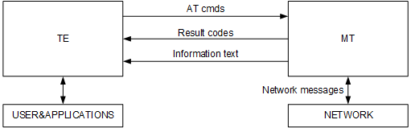
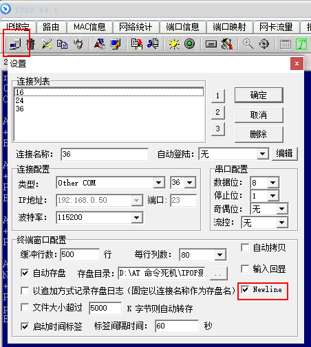
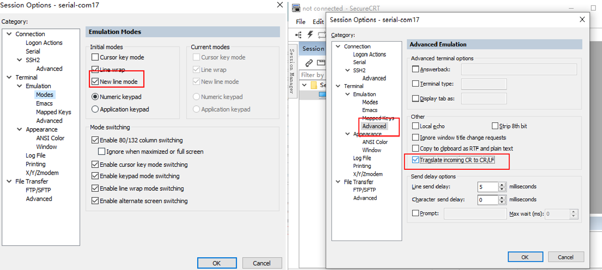
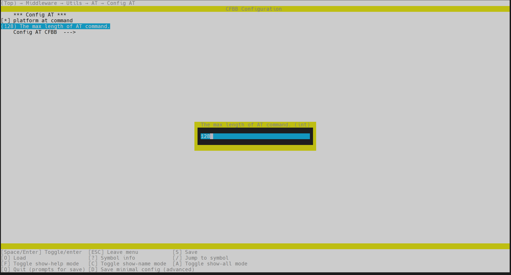
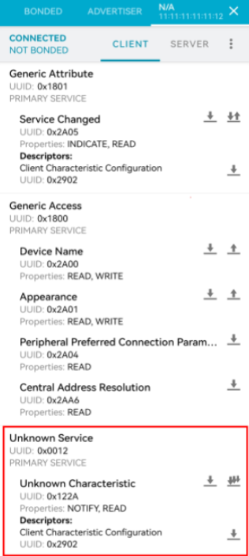
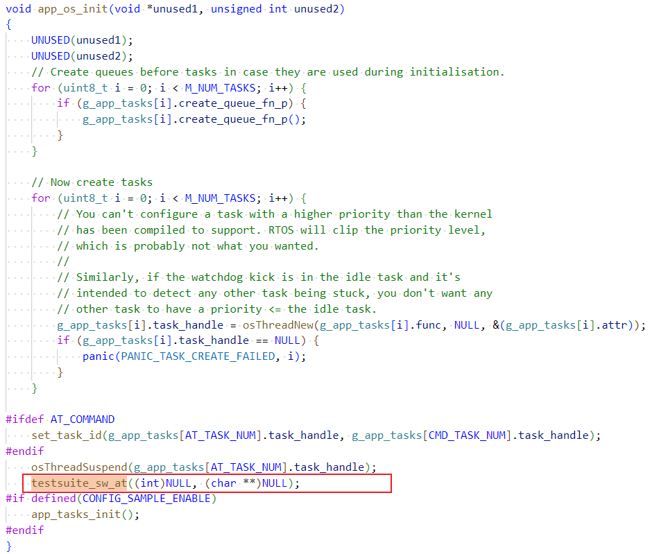
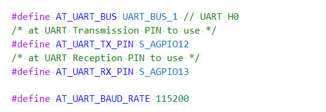
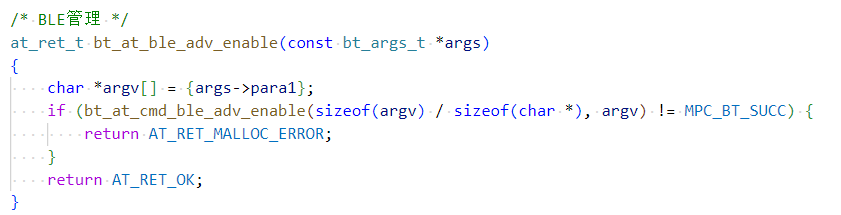
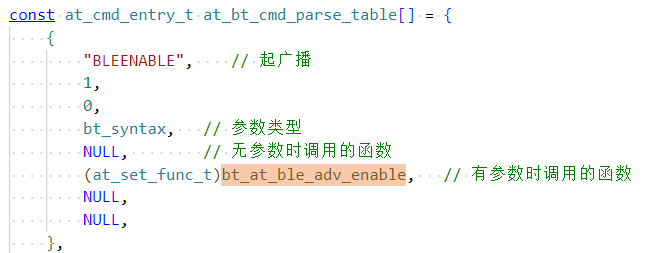

# Preface<a name="ZH-CN_TOPIC_0000001767879382"></a>

**Overview<a name="section4537382116410"></a>**

This document introduces the AT commands and scenarios of BS2XV100, providing users with corresponding command formats and parameter examples (This document uses BS21 as an example; no further notes will be made later).

**Product Version<a name="section111371595118"></a>**

The product versions corresponding to this document are as follows.

<a name="table22377277"></a>
<table><thead align="left"><tr id="row63051425"><th class="cellrowborder" valign="top" width="40.400000000000006%" id="mcps1.1.3.1.1"><p id="p6891761"><a name="p6891761"></a><a name="p6891761"></a><strong id="b3756104316114"><a name="b3756104316114"></a><a name="b3756104316114"></a>Product Name</strong></p>
</th>
<th class="cellrowborder" valign="top" width="59.599999999999994%" id="mcps1.1.3.1.2"><p id="p21361741"><a name="p21361741"></a><a name="p21361741"></a><strong id="b1676784314119"><a name="b1676784314119"></a><a name="b1676784314119"></a>Product Version</strong></p>
</th>
</tr>
</thead>
<tbody><tr id="row52579486"><td class="cellrowborder" valign="top" width="40.400000000000006%" headers="mcps1.1.3.1.1 "><p id="p31080012"><a name="p31080012"></a><a name="p31080012"></a>BS2X</p>
</td>
<td class="cellrowborder" valign="top" width="59.599999999999994%" headers="mcps1.1.3.1.2 "><p id="p34453054"><a name="p34453054"></a><a name="p34453054"></a>V100</p>
</td>
</tr>
</tbody>
</table>

**Reader Audience<a name="section4378592816410"></a>**

This document is mainly applicable to the following engineers:

-   Technical support engineers
-   Software development engineers

**Symbol Conventions<a name="section133020216410"></a>**

The following symbols may appear in this document, and their meanings are as follows:

<a name="table2622507016410"></a>
<table><thead align="left"><tr id="row1530720816410"><th class="cellrowborder" valign="top" width="20.580000000000002%" id="mcps1.1.3.1.1"><p id="p6450074116410"><a name="p6450074116410"></a><a name="p6450074116410"></a><strong id="b2136615816410"><a name="b2136615816410"></a><a name="b2136615816410"></a>Symbol</strong></p>
</th>
<th class="cellrowborder" valign="top" width="79.42%" id="mcps1.1.3.1.2"><p id="p5435366816410"><a name="p5435366816410"></a><a name="p5435366816410"></a><strong id="b5941558116410"><a name="b5941558116410"></a><a name="b5941558116410"></a>Description</strong></p>
</th>
</tr>
</thead>
<tbody><tr id="row1372280416410"><td class="cellrowborder" valign="top" width="20.580000000000002%" headers="mcps1.1.3.1.1 "><p id="p3734547016410"><a name="p3734547016410"></a><a name="p3734547016410"></a><a name="image2670064316410"></a><a name="image2670064316410"></a><span></span></p>
</td>
<td class="cellrowborder" valign="top" width="79.42%" headers="mcps1.1.3.1.2 "><p id="p1757432116410"><a name="p1757432116410"></a><a name="p1757432116410"></a>Indicates a high-level risk hazard that will result in death or serious injury if not avoided.</p>
</td>
</tr>
<tr id="row466863216410"><td class="cellrowborder" valign="top" width="20.580000000000002%" headers="mcps1.1.3.1.1 "><p id="p1432579516410"><a name="p1432579516410"></a><a name="p1432579516410"></a><a name="image4895582316410"></a><a name="image4895582316410"></a><span></span></p>
</td>
<td class="cellrowborder" valign="top" width="79.42%" headers="mcps1.1.3.1.2 "><p id="p959197916410"><a name="p959197916410"></a><a name="p959197916410"></a>Indicates a medium-level risk hazard that may result in death or serious injury if not avoided.</p>
</td>
</tr>
<tr id="row123863216410"><td class="cellrowborder" valign="top" width="20.580000000000002%" headers="mcps1.1.3.1.1 "><p id="p1232579516410"><a name="p1232579516410"></a><a name="p1232579516410"></a><a name="image1235582316410"></a><a name="image1235582316410"></a><span></span></p>
</td>
<td class="cellrowborder" valign="top" width="79.42%" headers="mcps1.1.3.1.2 "><p id="p123197916410"><a name="p123197916410"></a><a name="p123197916410"></a>Indicates a low-level risk hazard that may result in minor or moderate injury if not avoided.</p>
</td>
</tr>
<tr id="row5786682116410"><td class="cellrowborder" valign="top" width="20.580000000000002%" headers="mcps1.1.3.1.1 "><p id="p2204984716410"><a name="p2204984716410"></a><a name="p2204984716410"></a><a name="image4504446716410"></a><a name="image4504446716410"></a><span></span></p>
</td>
<td class="cellrowborder" valign="top" width="79.42%" headers="mcps1.1.3.1.2 "><p id="p4388861916410"><a name="p4388861916410"></a><a name="p4388861916410"></a>Used to convey device or environment safety warning information. If not avoided, it may result in device damage, data loss, reduced device performance, or other unpredictable consequences.</p>
<p id="p1238861916410"><a name="p1238861916410"></a><a name="p1238861916410"></a>"Notice" does not involve personal injury.</p>
</td>
</tr>
<tr id="row2856923116410"><td class="cellrowborder" valign="top" width="20.580000000000002%" headers="mcps1.1.3.1.1 "><p id="p5555360116410"><a name="p5555360116410"></a><a name="p5555360116410"></a><a name="image799324016410"></a><a name="image799324016410"></a><span></span></p>
</td>
<td class="cellrowborder" valign="top" width="79.42%" headers="mcps1.1.3.1.2 "><p id="p4612588116410"><a name="p4612588116410"></a><a name="p4612588116410"></a>Supplementary explanation of key information in the main text.</p>
<p id="p1232588116410"><a name="p1232588116410"></a><a name="p1232588116410"></a>"Note" is not safety warning information and does not involve personal, device, or environmental injury information.</p>
</td>
</tr>
</tbody>
</table>

**Modification Record<a name="section2467512116410"></a>**

<a name="table1557726816410"></a>
<table><thead align="left"><tr id="row2942532716410"><th class="cellrowborder" valign="top" width="18.22%" id="mcps1.1.4.1.1"><p id="p3778275416410"><a name="p3778275416410"></a><a name="p3778275416410"></a><strong id="b5687322716410"><a name="b5687322716410"></a><a name="b5687322716410"></a>Document Version</strong></p>
</th>
<th class="cellrowborder" valign="top" width="24.75%" id="mcps1.1.4.1.2"><p id="p5627845516410"><a name="p5627845516410"></a><a name="p5627845516410"></a><strong id="b5800814916410"><a name="b5800814916410"></a><a name="b5800814916410"></a>Release Date</strong></p>
</th>
<th class="cellrowborder" valign="top" width="57.03%" id="mcps1.1.4.1.3"><p id="p2382284816410"><a name="p2382284816410"></a><a name="p2382284816410"></a><strong id="b3316380216410"><a name="b3316380216410"></a><a name="b3316380216410"></a>Modification Description</strong></p>
</th>
</tr>
</thead>
<tbody><tr id="row7150936185414"><td class="cellrowborder" valign="top" width="18.22%" headers="mcps1.1.4.1.1 "><p id="p1715153620545"><a name="p1715153620545"></a><a name="p1715153620545"></a>07</p>
</td>
<td class="cellrowborder" valign="top" width="24.75%" headers="mcps1.1.4.1.2 "><p id="p0151736195411"><a name="p0151736195411"></a><a name="p0151736195411"></a>2025-12-01</p>
</td>
<td class="cellrowborder" valign="top" width="57.03%" headers="mcps1.1.4.1.3 "><p id="p2113165112544"><a name="p2113165112544"></a><a name="p2113165112544"></a>Updated the "<a href="服务端发送响应.md">Sending a response from the server</a>" section.</p>
</td>
</tr>
<tr id="row10128437185512"><td class="cellrowborder" valign="top" width="18.22%" headers="mcps1.1.4.1.1 "><p id="p612933775513"><a name="p612933775513"></a><a name="p612933775513"></a>06</p>
</td>
<td class="cellrowborder" valign="top" width="24.75%" headers="mcps1.1.4.1.2 "><p id="p19129337105519"><a name="p19129337105519"></a><a name="p19129337105519"></a>2025-11-07</p>
</td>
<td class="cellrowborder" valign="top" width="57.03%" headers="mcps1.1.4.1.3 "><a name="ul171248241568"></a><a name="ul171248241568"></a><ul id="ul171248241568"><li>Updated the "<a href="指令说明.md">Command Description</a>" of the "<a href="注意事项.md">Precautions</a>" section.</li><li>Updated the "<a href="BLE-5.md">BLE</a>" of the "<a href="配置server.md">Configuring a server</a>" section.</li></ul>
</td>
</tr>
<tr id="row125941950111315"><td class="cellrowborder" valign="top" width="18.22%" headers="mcps1.1.4.1.1 "><p id="p10596650151316"><a name="p10596650151316"></a><a name="p10596650151316"></a>05</p>
</td>
<td class="cellrowborder" valign="top" width="24.75%" headers="mcps1.1.4.1.2 "><p id="p115961150181320"><a name="p115961150181320"></a><a name="p115961150181320"></a>2025-08-29</p>
</td>
<td class="cellrowborder" valign="top" width="57.03%" headers="mcps1.1.4.1.3 "><a name="ul47423051611"></a><a name="ul47423051611"></a><ul id="ul47423051611"><li>Updated the "<a href="BT业务AT指令一览表.md">BT Service AT Command List</a>" of the "<a href="gatts模块AT命令.md">GATTS Module AT Commands</a>" section.</li><li>Updated the "<a href="BT业务AT指令描述.md">BT Service AT Command Description</a>" of the "<a href="AT+GATTSUNREG-删除GATT-server-释放资源.md">AT+GATTSUNREG Delete a GATT server and release resources</a>" section.</li><li>Added the "<a href="注册SLE连接模块和安全模块AT指令的串口打印回调函数.md">Register the serial port print callback function for SLE connection module and security module AT commands</a>" section.</li></ul>
</td>
</tr>
<tr id="row138037202114"><td class="cellrowborder" valign="top" width="18.22%" headers="mcps1.1.4.1.1 "><p id="p6801722120"><a name="p6801722120"></a><a name="p6801722120"></a>04</p>
</td>
<td class="cellrowborder" valign="top" width="24.75%" headers="mcps1.1.4.1.2 "><p id="p8808712117"><a name="p8808712117"></a><a name="p8808712117"></a>2025-05-30</p>
</td>
<td class="cellrowborder" valign="top" width="57.03%" headers="mcps1.1.4.1.3 "><a name="ul1649714318467"></a><a name="ul1649714318467"></a><ul id="ul1649714318467"><li>Updated the "<a href="通用AT指令一览表.md">General AT Command List</a>" section.</li><li>Updated the "<a href="通用AT指令描述.md">General AT Command Description</a>" section.</li><li>Added the "<a href="AT+BLESETPHY-设置phy.md">AT+BLESETPHY Set PHY</a>" section.</li><li>Updated the "<a href="获取设备配对状态.md">Get the device pairing status</a>" section.</li><li>Updated the "<a href="服务端向客户端发送通知.md">Sending a notification from the server to the client</a>" section.</li><li>Added the "<a href="常用AT指令示例.md">Common AT Command Examples</a>" section.</li></ul>
</td>
</tr>
<tr id="row197934519345"><td class="cellrowborder" valign="top" width="18.22%" headers="mcps1.1.4.1.1 "><p id="p1779414513345"><a name="p1779414513345"></a><a name="p1779414513345"></a>03</p>
</td>
<td class="cellrowborder" valign="top" width="24.75%" headers="mcps1.1.4.1.2 "><p id="p13794155143415"><a name="p13794155143415"></a><a name="p13794155143415"></a>2025-01-14</p>
</td>
<td class="cellrowborder" valign="top" width="57.03%" headers="mcps1.1.4.1.3 "><p id="p134931512211"><a name="p134931512211"></a><a name="p134931512211"></a>Updated the "<a href="星闪读取远端rssi.md">Reading remote RSSI via SLE</a>" section.</p>
</td>
</tr>
<tr id="row6340192413432"><td class="cellrowborder" valign="top" width="18.22%" headers="mcps1.1.4.1.1 "><p id="p1534116242438"><a name="p1534116242438"></a><a name="p1534116242438"></a>02</p>
</td>
<td class="cellrowborder" valign="top" width="24.75%" headers="mcps1.1.4.1.2 "><p id="p143417243438"><a name="p143417243438"></a><a name="p143417243438"></a>2024-09-13</p>
</td>
<td class="cellrowborder" valign="top" width="57.03%" headers="mcps1.1.4.1.3 "><a name="ul1522544216436"></a><a name="ul1522544216436"></a><ul id="ul1522544216436"><li>Added the "<a href="AT+BLESETDATALEN-设置发送数据包数据长度.md">AT+BLESETDATALEN Set the data length of sent data packets</a>" section.</li><li>Updated the "<a href="新增AT指令方法.md">Adding New AT Commands</a>" section.</li></ul>
</td>
</tr>
<tr id="row3223143583610"><td class="cellrowborder" valign="top" width="18.22%" headers="mcps1.1.4.1.1 "><p id="p6235113713360"><a name="p6235113713360"></a><a name="p6235113713360"></a>01</p>
</td>
<td class="cellrowborder" valign="top" width="24.75%" headers="mcps1.1.4.1.2 "><p id="p523593712360"><a name="p523593712360"></a><a name="p523593712360"></a>2024-05-15</p>
</td>
<td class="cellrowborder" valign="top" width="57.03%" headers="mcps1.1.4.1.3 "><p id="p1423523783610"><a name="p1423523783610"></a><a name="p1423523783610"></a>First official version release.</p>
</td>
</tr>
<tr id="row13221654193319"><td class="cellrowborder" valign="top" width="18.22%" headers="mcps1.1.4.1.1 "><p id="p8221154143313"><a name="p8221154143313"></a><a name="p8221154143313"></a>00B02</p>
</td>
<td class="cellrowborder" valign="top" width="24.75%" headers="mcps1.1.4.1.2 "><p id="p192214541338"><a name="p192214541338"></a><a name="p192214541338"></a>2024-03-01</p>
</td>
<td class="cellrowborder" valign="top" width="57.03%" headers="mcps1.1.4.1.3 "><a name="ul19744136143413"></a><a name="ul19744136143413"></a><ul id="ul19744136143413"><li>Added the "<a href="BT业务AT指令.md">BT Service AT Commands</a>" of the "<a href="BLE-0.md">BLE</a>" section.</li><li>Added the "<a href="BT业务AT指令.md">BT Service AT Commands</a>" of the "<a href="SLE-4.md">SLE</a>" section.</li></ul>
</td>
</tr>
<tr id="row5947359616410"><td class="cellrowborder" valign="top" width="18.22%" headers="mcps1.1.4.1.1 "><p id="p2149706016410"><a name="p2149706016410"></a><a name="p2149706016410"></a>00B01</p>
</td>
<td class="cellrowborder" valign="top" width="24.75%" headers="mcps1.1.4.1.2 "><p id="p648803616410"><a name="p648803616410"></a><a name="p648803616410"></a>2024-01-08</p>
</td>
<td class="cellrowborder" valign="top" width="57.03%" headers="mcps1.1.4.1.3 "><p id="p1946537916410"><a name="p1946537916410"></a><a name="p1946537916410"></a>First interim version release.</p>
</td>
</tr>
</tbody>
</table>

# Command Description<a name="ZH-CN_TOPIC_0000001814519533"></a>


## Command Introduction<a name="ZH-CN_TOPIC_0000001767719722"></a>

AT commands are used for the exchange of control information between TE (Terminal Equipment, e.g., PC and other user terminals) and MT (Mobile Termination, e.g., mobile stations and other mobile terminals), as shown in [Figure 1](#fig171281854102013).

**Figure 1**  AT Command Schematic Diagram<a name="fig171281854102013"></a>  


## Command Types<a name="ZH-CN_TOPIC_0000001767879374"></a>

AT command types are shown in [Table 1](#table838912210233).

**Table 1**  AT Command Types Description

<a name="table838912210233"></a>
<table><thead align="left"><tr id="row173891322132320"><th class="cellrowborder" valign="top" width="25.292529252925295%" id="mcps1.2.4.1.1"><p id="p14585143712315"><a name="p14585143712315"></a><a name="p14585143712315"></a>Type</p>
</th>
<th class="cellrowborder" valign="top" width="31.883188318831877%" id="mcps1.2.4.1.2"><p id="p4585237122320"><a name="p4585237122320"></a><a name="p4585237122320"></a>Format</p>
</th>
<th class="cellrowborder" valign="top" width="42.824282428242824%" id="mcps1.2.4.1.3"><p id="p105852373232"><a name="p105852373232"></a><a name="p105852373232"></a>Purpose</p>
</th>
</tr>
</thead>
<tbody><tr id="row133901022132313"><td class="cellrowborder" valign="top" width="25.292529252925295%" headers="mcps1.2.4.1.1 "><p id="p158673792311"><a name="p158673792311"></a><a name="p158673792311"></a>Test Command</p>
</td>
<td class="cellrowborder" valign="top" width="31.883188318831877%" headers="mcps1.2.4.1.2 "><p id="p658683712313"><a name="p658683712313"></a><a name="p658683712313"></a>AT+&lt;cmd&gt;=?</p>
</td>
<td class="cellrowborder" valign="top" width="42.824282428242824%" headers="mcps1.2.4.1.3 "><p id="p1586133792316"><a name="p1586133792316"></a><a name="p1586133792316"></a>This command is used to query the parameters and value ranges of a set command.</p>
</td>
</tr>
<tr id="row1839062292313"><td class="cellrowborder" valign="top" width="25.292529252925295%" headers="mcps1.2.4.1.1 "><p id="p1758653710235"><a name="p1758653710235"></a><a name="p1758653710235"></a>Query Command</p>
</td>
<td class="cellrowborder" valign="top" width="31.883188318831877%" headers="mcps1.2.4.1.2 "><p id="p11586113712315"><a name="p11586113712315"></a><a name="p11586113712315"></a>AT+&lt;cmd&gt;?</p>
</td>
<td class="cellrowborder" valign="top" width="42.824282428242824%" headers="mcps1.2.4.1.3 "><p id="p758653719235"><a name="p758653719235"></a><a name="p758653719235"></a>This command is used to return the current value of the parameter.</p>
</td>
</tr>
<tr id="row1939012220233"><td class="cellrowborder" valign="top" width="25.292529252925295%" headers="mcps1.2.4.1.1 "><p id="p3587183711237"><a name="p3587183711237"></a><a name="p3587183711237"></a>Set Command</p>
</td>
<td class="cellrowborder" valign="top" width="31.883188318831877%" headers="mcps1.2.4.1.2 "><p id="p358715379239"><a name="p358715379239"></a><a name="p358715379239"></a>AT+&lt;cmd&gt;=&lt;parameter&gt;,…</p>
</td>
<td class="cellrowborder" valign="top" width="42.824282428242824%" headers="mcps1.2.4.1.3 "><p id="p5587183712234"><a name="p5587183712234"></a><a name="p5587183712234"></a>Set parameter values or execute.</p>
</td>
</tr>
<tr id="row7390172217239"><td class="cellrowborder" valign="top" width="25.292529252925295%" headers="mcps1.2.4.1.1 "><p id="p85871377234"><a name="p85871377234"></a><a name="p85871377234"></a>Execute Command</p>
</td>
<td class="cellrowborder" valign="top" width="31.883188318831877%" headers="mcps1.2.4.1.2 "><p id="p0587737182311"><a name="p0587737182311"></a><a name="p0587737182311"></a>AT+&lt;cmd&gt;</p>
</td>
<td class="cellrowborder" valign="top" width="42.824282428242824%" headers="mcps1.2.4.1.3 "><p id="p958723712239"><a name="p958723712239"></a><a name="p958723712239"></a>Used to execute the function of this command.</p>
</td>
</tr>
</tbody>
</table>

## Precautions<a name="ZH-CN_TOPIC_0000001767719710"></a>

-   Not every command has all four types of commands listed above.
-   AT commands that appear in this document but are not supported by the current software version will return ERROR:TBD.
-   Double quotes indicate string data "string", for example: AT+SCANSSID="string".
-   Serial port communication default: baud rate 115200, 8 data bits, 1 stop bit, no parity.
-   Values in [ ] are optional; parameters are optional.
-   Parameters in a command are separated by ",", and parameters themselves cannot contain "," except for string parameters enclosed in double quotes.
-   AT command parameters cannot contain extra spaces.
-   AT commands must be in uppercase and must end with a carriage return line feed (CR LF). Some serial port tools only send a carriage return (CR) without a line feed (LF) when the user presses the Enter key, causing AT commands to be unrecognizable. If you need to manually enter AT commands using a serial port tool, you must set the Enter key to carriage return (CR) + line feed (LF) in the serial port tool. Take IPOP V4.1 and SecureCRT8.1 as examples, as shown in [Figure 1](#fig69728515262) and [Figure 2](#fig931533818276).

    **Figure 1**  IPOP V4.1 CR+LF Setting Example<a name="fig69728515262"></a>  
    

    **Figure 2**  SecureCRT8.1 CR+LF Setting Example<a name="fig931533818276"></a>  
    

-   The default maximum length of an AT command is 128 characters, and the parameter is configurable. Modify the "The max length of AT comand" parameter through Kconfig (menuconfig), (Top)->Middleware->Utils->AT->Config AT.

    

-   The default maximum length of a single AT command parameter is 128 bytes, and the parameter is configurable. Modify the AT_RX_BUFF_SIZE size in middleware/chips/bs2x/at/at_cmd_porting/at_porting.c.

# General AT Commands<a name="ZH-CN_TOPIC_0000001814599437"></a>


## General AT Command List<a name="ZH-CN_TOPIC_0000001767879378"></a>

**Table 1**  General AT Commands Description

<a name="table39682040"></a>
<table><thead align="left"><tr id="row63739165"><th class="cellrowborder" valign="top" width="32.32%" id="mcps1.2.3.1.1"><p id="p62598754"><a name="p62598754"></a><a name="p62598754"></a>Command</p>
</th>
<th class="cellrowborder" valign="top" width="67.67999999999999%" id="mcps1.2.3.1.2"><p id="p37334299"><a name="p37334299"></a><a name="p37334299"></a>Description</p>
</th>
</tr>
</thead>
<tbody><tr id="row4179377"><td class="cellrowborder" valign="top" width="32.32%" headers="mcps1.2.3.1.1 "><p id="p2985227"><a name="p2985227"></a><a name="p2985227"></a>AT</p>
</td>
<td class="cellrowborder" valign="top" width="67.67999999999999%" headers="mcps1.2.3.1.2 "><p id="p40476817"><a name="p40476817"></a><a name="p40476817"></a>Test AT functionality.</p>
</td>
</tr>
<tr id="row32444864"><td class="cellrowborder" valign="top" width="32.32%" headers="mcps1.2.3.1.1 "><p id="p10788361"><a name="p10788361"></a><a name="p10788361"></a>AT+TESTSUITE</p>
</td>
<td class="cellrowborder" valign="top" width="67.67999999999999%" headers="mcps1.2.3.1.2 "><p id="p1442054"><a name="p1442054"></a><a name="p1442054"></a>Switch AT debugging to TESTSUITE debugging.</p>
</td>
</tr>
<tr id="row472714018213"><td class="cellrowborder" valign="top" width="32.32%" headers="mcps1.2.3.1.1 "><p id="p17390102315616"><a name="p17390102315616"></a><a name="p17390102315616"></a>AT+REBOOT</p>
</td>
<td class="cellrowborder" valign="top" width="67.67999999999999%" headers="mcps1.2.3.1.2 "><p id="p5727104010219"><a name="p5727104010219"></a><a name="p5727104010219"></a>Chip software reset.</p>
</td>
</tr>
<tr id="row1621312581125"><td class="cellrowborder" valign="top" width="32.32%" headers="mcps1.2.3.1.1 "><p id="p14403141465715"><a name="p14403141465715"></a><a name="p14403141465715"></a>AT+WRITEREG</p>
</td>
<td class="cellrowborder" valign="top" width="67.67999999999999%" headers="mcps1.2.3.1.2 "><p id="p721365815212"><a name="p721365815212"></a><a name="p721365815212"></a>Write register via AT. Requires enabling the macro REG_OPERATION.</p>
</td>
</tr>
<tr id="row8420137231"><td class="cellrowborder" valign="top" width="32.32%" headers="mcps1.2.3.1.1 "><p id="p12761728155710"><a name="p12761728155710"></a><a name="p12761728155710"></a>AT+READREG</p>
</td>
<td class="cellrowborder" valign="top" width="67.67999999999999%" headers="mcps1.2.3.1.2 "><p id="p9420474320"><a name="p9420474320"></a><a name="p9420474320"></a>Read register via AT. Requires enabling the macro REG_OPERATION.</p>
</td>
</tr>
<tr id="row1068312125315"><td class="cellrowborder" valign="top" width="32.32%" headers="mcps1.2.3.1.1 "><p id="p1266620464571"><a name="p1266620464571"></a><a name="p1266620464571"></a>AT+SETSLEEP</p>
</td>
<td class="cellrowborder" valign="top" width="67.67999999999999%" headers="mcps1.2.3.1.2 "><p id="p668320121539"><a name="p668320121539"></a><a name="p668320121539"></a>Cast a sleep veto via AT. Requires enabling the macro SLP_VETO_AT_SUPPORT.</p>
</td>
</tr>
<tr id="row14390920332"><td class="cellrowborder" valign="top" width="32.32%" headers="mcps1.2.3.1.1 "><p id="p191331225819"><a name="p191331225819"></a><a name="p191331225819"></a>AT+HEAPSTAT</p>
</td>
<td class="cellrowborder" valign="top" width="67.67999999999999%" headers="mcps1.2.3.1.2 "><p id="p133901420438"><a name="p133901420438"></a><a name="p133901420438"></a>Print heap usage.</p>
</td>
</tr>
<tr id="row1411152316318"><td class="cellrowborder" valign="top" width="32.32%" headers="mcps1.2.3.1.1 "><p id="p18931951585"><a name="p18931951585"></a><a name="p18931951585"></a>AT+TASKSTACK</p>
</td>
<td class="cellrowborder" valign="top" width="67.67999999999999%" headers="mcps1.2.3.1.2 "><p id="p1341119231534"><a name="p1341119231534"></a><a name="p1341119231534"></a>Print the stack usage of each task.</p>
</td>
</tr>
<tr id="row34183392312"><td class="cellrowborder" valign="top" width="32.32%" headers="mcps1.2.3.1.1 "><p id="p78261995817"><a name="p78261995817"></a><a name="p78261995817"></a>AT+TASKMALLOC</p>
</td>
<td class="cellrowborder" valign="top" width="67.67999999999999%" headers="mcps1.2.3.1.2 "><p id="p1841993919315"><a name="p1841993919315"></a><a name="p1841993919315"></a>Print the memory allocation of each task.</p>
</td>
</tr>
<tr id="row17741203175618"><td class="cellrowborder" valign="top" width="32.32%" headers="mcps1.2.3.1.1 "><p id="p19951920175817"><a name="p19951920175817"></a><a name="p19951920175817"></a>AT+INTLOCKDUMP</p>
</td>
<td class="cellrowborder" valign="top" width="67.67999999999999%" headers="mcps1.2.3.1.2 "><p id="p167418316561"><a name="p167418316561"></a><a name="p167418316561"></a>Print the top 10 functions by interrupt lock duration.</p>
</td>
</tr>
<tr id="row154514613563"><td class="cellrowborder" valign="top" width="32.32%" headers="mcps1.2.3.1.1 "><p id="p394714242585"><a name="p394714242585"></a><a name="p394714242585"></a>AT+OSTIMERPRINT</p>
</td>
<td class="cellrowborder" valign="top" width="67.67999999999999%" headers="mcps1.2.3.1.2 "><p id="p18455610569"><a name="p18455610569"></a><a name="p18455610569"></a>Print the currently created timers.</p>
</td>
</tr>
<tr id="row167310845618"><td class="cellrowborder" valign="top" width="32.32%" headers="mcps1.2.3.1.1 "><p id="p1955215285581"><a name="p1955215285581"></a><a name="p1955215285581"></a>AT+OSDFXPRINT</p>
</td>
<td class="cellrowborder" valign="top" width="67.67999999999999%" headers="mcps1.2.3.1.2 "><p id="p1967338175613"><a name="p1967338175613"></a><a name="p1967338175613"></a>Print the thread switching trace and the last 10 interrupts.</p>
</td>
</tr>
<tr id="row815111155618"><td class="cellrowborder" valign="top" width="32.32%" headers="mcps1.2.3.1.1 "><p id="p1556843295818"><a name="p1556843295818"></a><a name="p1556843295818"></a>AT+PMVETOINFO</p>
</td>
<td class="cellrowborder" valign="top" width="67.67999999999999%" headers="mcps1.2.3.1.2 "><p id="p115111135613"><a name="p115111135613"></a><a name="p115111135613"></a>Cast a low-power veto via AT. Requires enabling the macro SLP_VETO_AT_SUPPORT.</p>
</td>
</tr>
<tr id="row15506842732"><td class="cellrowborder" valign="top" width="32.32%" headers="mcps1.2.3.1.1 "><p id="p421793685816"><a name="p421793685816"></a><a name="p421793685816"></a>AT+CPUP</p>
</td>
<td class="cellrowborder" valign="top" width="67.67999999999999%" headers="mcps1.2.3.1.2 "><p id="p8506114215315"><a name="p8506114215315"></a><a name="p8506114215315"></a>Print CPU usage via AT. Requires enabling the macro LOSCFG_KERNEL_CPUP in the LiteOS version.</p>
</td>
</tr>
</tbody>
</table>

## General AT Command Description<a name="ZH-CN_TOPIC_0000001767719718"></a>


### AT Test AT Functionality<a name="ZH-CN_TOPIC_0000001814519529"></a>

**Table 1**  AT Test Description

<a name="table7446205412415"></a>
<table><tbody><tr id="row2446554102419"><th class="firstcol" valign="top" width="17.419999999999998%" id="mcps1.2.3.1.1"><p id="p6446125414243"><a name="p6446125414243"></a><a name="p6446125414243"></a>Format</p>
</th>
<td class="cellrowborder" valign="top" width="82.58%" headers="mcps1.2.3.1.1 "><p id="p154469545241"><a name="p154469545241"></a><a name="p154469545241"></a>AT</p>
</td>
</tr>
<tr id="row1144614547243"><th class="firstcol" valign="top" width="17.419999999999998%" id="mcps1.2.3.2.1"><p id="p84462054152419"><a name="p84462054152419"></a><a name="p84462054152419"></a>Response</p>
</th>
<td class="cellrowborder" valign="top" width="82.58%" headers="mcps1.2.3.2.1 "><p id="p24467549246"><a name="p24467549246"></a><a name="p24467549246"></a>OK</p>
</td>
</tr>
<tr id="row544675411244"><th class="firstcol" valign="top" width="17.419999999999998%" id="mcps1.2.3.3.1"><p id="p15447185432416"><a name="p15447185432416"></a><a name="p15447185432416"></a>Parameter Description</p>
</th>
<td class="cellrowborder" valign="top" width="82.58%" headers="mcps1.2.3.3.1 "><p id="p1744795414240"><a name="p1744795414240"></a><a name="p1744795414240"></a>-</p>
</td>
</tr>
<tr id="row1444717544244"><th class="firstcol" valign="top" width="17.419999999999998%" id="mcps1.2.3.4.1"><p id="p0447654192418"><a name="p0447654192418"></a><a name="p0447654192418"></a>Example</p>
</th>
<td class="cellrowborder" valign="top" width="82.58%" headers="mcps1.2.3.4.1 "><p id="p244785492412"><a name="p244785492412"></a><a name="p244785492412"></a>AT</p>
</td>
</tr>
<tr id="row19447115472412"><th class="firstcol" valign="top" width="17.419999999999998%" id="mcps1.2.3.5.1"><p id="p1744735472419"><a name="p1744735472419"></a><a name="p1744735472419"></a>Note</p>
</th>
<td class="cellrowborder" valign="top" width="82.58%" headers="mcps1.2.3.5.1 "><p id="p124471554142419"><a name="p124471554142419"></a><a name="p124471554142419"></a>-</p>
</td>
</tr>
</tbody>
</table>

### AT+HELP View Currently Available AT Commands<a name="ZH-CN_TOPIC_0000001814599441"></a>

**Table 1**  Viewing Available AT Commands Description

<a name="table41995683"></a>
<table><tbody><tr id="row60142677"><th class="firstcol" valign="top" width="17.8%" id="mcps1.2.3.1.1"><p id="p39718677"><a name="p39718677"></a><a name="p39718677"></a>Format</p>
</th>
<td class="cellrowborder" valign="top" width="82.19999999999999%" headers="mcps1.2.3.1.1 "><p id="p63096249"><a name="p63096249"></a><a name="p63096249"></a>AT+HELP</p>
</td>
</tr>
<tr id="row30995332"><th class="firstcol" valign="top" width="17.8%" id="mcps1.2.3.2.1"><p id="p27593978"><a name="p27593978"></a><a name="p27593978"></a>Response</p>
</th>
<td class="cellrowborder" valign="top" width="82.19999999999999%" headers="mcps1.2.3.2.1 "><p id="p20519752"><a name="p20519752"></a><a name="p20519752"></a>+HELP:</p>
<p id="p50460048"><a name="p50460048"></a><a name="p50460048"></a>Display the currently supported AT commands</p>
<p id="p51487255"><a name="p51487255"></a><a name="p51487255"></a>OK</p>
</td>
</tr>
<tr id="row60732119"><th class="firstcol" valign="top" width="17.8%" id="mcps1.2.3.3.1"><p id="p20354569"><a name="p20354569"></a><a name="p20354569"></a>Parameter Description</p>
</th>
<td class="cellrowborder" valign="top" width="82.19999999999999%" headers="mcps1.2.3.3.1 "><p id="p38107408"><a name="p38107408"></a><a name="p38107408"></a>-</p>
</td>
</tr>
<tr id="row7422359"><th class="firstcol" valign="top" width="17.8%" id="mcps1.2.3.4.1"><p id="p64340216"><a name="p64340216"></a><a name="p64340216"></a>Example</p>
</th>
<td class="cellrowborder" valign="top" width="82.19999999999999%" headers="mcps1.2.3.4.1 "><p id="p44175009"><a name="p44175009"></a><a name="p44175009"></a>AT+HELP</p>
</td>
</tr>
<tr id="row62030769"><th class="firstcol" valign="top" width="17.8%" id="mcps1.2.3.5.1"><p id="p58436378"><a name="p58436378"></a><a name="p58436378"></a>Note</p>
</th>
<td class="cellrowborder" valign="top" width="82.19999999999999%" headers="mcps1.2.3.5.1 "><p id="p35726176"><a name="p35726176"></a><a name="p35726176"></a>-</p>
</td>
</tr>
</tbody>
</table>

### AT+REBOOT<a name="ZH-CN_TOPIC_0000002276017906"></a>

<a name="table41995683"></a>
<table><tbody><tr id="row60142677"><th class="firstcol" valign="top" width="17.8%" id="mcps1.1.3.1.1"><p id="p39718677"><a name="p39718677"></a><a name="p39718677"></a>Format</p>
</th>
<td class="cellrowborder" valign="top" width="82.19999999999999%" headers="mcps1.1.3.1.1 "><p id="p63096249"><a name="p63096249"></a><a name="p63096249"></a>AT+REBOOT</p>
</td>
</tr>
<tr id="row30995332"><th class="firstcol" valign="top" width="17.8%" id="mcps1.1.3.2.1"><p id="p27593978"><a name="p27593978"></a><a name="p27593978"></a>Response</p>
</th>
<td class="cellrowborder" valign="top" width="82.19999999999999%" headers="mcps1.1.3.2.1 "><p id="p50460048"><a name="p50460048"></a><a name="p50460048"></a>Software reset the chip</p>
<p id="p51487255"><a name="p51487255"></a><a name="p51487255"></a>OK</p>
</td>
</tr>
<tr id="row60732119"><th class="firstcol" valign="top" width="17.8%" id="mcps1.1.3.3.1"><p id="p20354569"><a name="p20354569"></a><a name="p20354569"></a>Parameter Description</p>
</th>
<td class="cellrowborder" valign="top" width="82.19999999999999%" headers="mcps1.1.3.3.1 "><p id="p38107408"><a name="p38107408"></a><a name="p38107408"></a>-</p>
</td>
</tr>
<tr id="row7422359"><th class="firstcol" valign="top" width="17.8%" id="mcps1.1.3.4.1"><p id="p64340216"><a name="p64340216"></a><a name="p64340216"></a>Example</p>
</th>
<td class="cellrowborder" valign="top" width="82.19999999999999%" headers="mcps1.1.3.4.1 "><p id="p44175009"><a name="p44175009"></a><a name="p44175009"></a>AT+REBOOT</p>
</td>
</tr>
<tr id="row62030769"><th class="firstcol" valign="top" width="17.8%" id="mcps1.1.3.5.1"><p id="p58436378"><a name="p58436378"></a><a name="p58436378"></a>Note</p>
</th>
<td class="cellrowborder" valign="top" width="82.19999999999999%" headers="mcps1.1.3.5.1 "><p id="p35726176"><a name="p35726176"></a><a name="p35726176"></a>-</p>
</td>
</tr>
</tbody>
</table>

### AT+SETSLEEP<a name="ZH-CN_TOPIC_0000002310777645"></a>

<a name="table41995683"></a>
<table><tbody><tr id="row60142677"><th class="firstcol" valign="top" width="17.8%" id="mcps1.1.3.1.1"><p id="p39718677"><a name="p39718677"></a><a name="p39718677"></a>Format</p>
</th>
<td class="cellrowborder" valign="top" width="82.19999999999999%" headers="mcps1.1.3.1.1 "><p id="p63096249"><a name="p63096249"></a><a name="p63096249"></a>AT+SETSLEEP=para</p>
</td>
</tr>
<tr id="row30995332"><th class="firstcol" valign="top" width="17.8%" id="mcps1.1.3.2.1"><p id="p27593978"><a name="p27593978"></a><a name="p27593978"></a>Response</p>
</th>
<td class="cellrowborder" valign="top" width="82.19999999999999%" headers="mcps1.1.3.2.1 "><p id="p442121919215"><a name="p442121919215"></a><a name="p442121919215"></a>disable enter sleep.</p>
<p id="p51487255"><a name="p51487255"></a><a name="p51487255"></a>OK</p>
<p id="p15209033172120"><a name="p15209033172120"></a><a name="p15209033172120"></a>enable enter sleep.</p>
<p id="p13951143711215"><a name="p13951143711215"></a><a name="p13951143711215"></a>OK</p>
</td>
</tr>
<tr id="row60732119"><th class="firstcol" valign="top" width="17.8%" id="mcps1.1.3.3.1"><p id="p20354569"><a name="p20354569"></a><a name="p20354569"></a>Parameter Description</p>
</th>
<td class="cellrowborder" valign="top" width="82.19999999999999%" headers="mcps1.1.3.3.1 "><a name="ul69373212479"></a><a name="ul69373212479"></a><ul id="ul69373212479"><li>0: Prohibit entering sleep</li><li>1: Allow entering sleep</li></ul>
</td>
</tr>
<tr id="row7422359"><th class="firstcol" valign="top" width="17.8%" id="mcps1.1.3.4.1"><p id="p64340216"><a name="p64340216"></a><a name="p64340216"></a>Example</p>
</th>
<td class="cellrowborder" valign="top" width="82.19999999999999%" headers="mcps1.1.3.4.1 "><p id="p44175009"><a name="p44175009"></a><a name="p44175009"></a>AT+HELP=0</p>
</td>
</tr>
<tr id="row62030769"><th class="firstcol" valign="top" width="17.8%" id="mcps1.1.3.5.1"><p id="p58436378"><a name="p58436378"></a><a name="p58436378"></a>Note</p>
</th>
<td class="cellrowborder" valign="top" width="82.19999999999999%" headers="mcps1.1.3.5.1 "><p id="p35726176"><a name="p35726176"></a><a name="p35726176"></a>Requires enabling ENABLE_LOW_POWER</p>
</td>
</tr>
</tbody>
</table>

### AT+CACHESTATISTIC<a name="ZH-CN_TOPIC_0000002310650673"></a>

<a name="table41995683"></a>
<table><tbody><tr id="row60142677"><th class="firstcol" valign="top" width="17.8%" id="mcps1.1.3.1.1"><p id="p39718677"><a name="p39718677"></a><a name="p39718677"></a>Format</p>
</th>
<td class="cellrowborder" valign="top" width="82.19999999999999%" headers="mcps1.1.3.1.1 "><p id="p63096249"><a name="p63096249"></a><a name="p63096249"></a>AT+CACHESTATISTIC=para</p>
</td>
</tr>
<tr id="row30995332"><th class="firstcol" valign="top" width="17.8%" id="mcps1.1.3.2.1"><p id="p27593978"><a name="p27593978"></a><a name="p27593978"></a>Response</p>
</th>
<td class="cellrowborder" valign="top" width="82.19999999999999%" headers="mcps1.1.3.2.1 "><p id="p50460048"><a name="p50460048"></a><a name="p50460048"></a>Enable or disable cache hit rate statistics</p>
<p id="p51487255"><a name="p51487255"></a><a name="p51487255"></a>OK</p>
</td>
</tr>
<tr id="row60732119"><th class="firstcol" valign="top" width="17.8%" id="mcps1.1.3.3.1"><p id="p20354569"><a name="p20354569"></a><a name="p20354569"></a>Parameter Description</p>
</th>
<td class="cellrowborder" valign="top" width="82.19999999999999%" headers="mcps1.1.3.3.1 "><p id="p178342010478"><a name="p178342010478"></a><a name="p178342010478"></a>para：</p>
<a name="ul69373212479"></a><a name="ul69373212479"></a><ul id="ul69373212479"><li>0: Disable</li><li>1: Enable</li></ul>
</td>
</tr>
<tr id="row7422359"><th class="firstcol" valign="top" width="17.8%" id="mcps1.1.3.4.1"><p id="p64340216"><a name="p64340216"></a><a name="p64340216"></a>Example</p>
</th>
<td class="cellrowborder" valign="top" width="82.19999999999999%" headers="mcps1.1.3.4.1 "><p id="p44175009"><a name="p44175009"></a><a name="p44175009"></a>AT+CACHESTATISTIC=1</p>
</td>
</tr>
<tr id="row62030769"><th class="firstcol" valign="top" width="17.8%" id="mcps1.1.3.5.1"><p id="p58436378"><a name="p58436378"></a><a name="p58436378"></a>Note</p>
</th>
<td class="cellrowborder" valign="top" width="82.19999999999999%" headers="mcps1.1.3.5.1 "><p id="p35726176"><a name="p35726176"></a><a name="p35726176"></a>Requires enabling CACHE_SUPPORT_DEBUG</p>
</td>
</tr>
</tbody>
</table>

### AT+HEAPSTAT<a name="ZH-CN_TOPIC_0000002276121058"></a>

<a name="table41995683"></a>
<table><tbody><tr id="row60142677"><th class="firstcol" valign="top" width="17.8%" id="mcps1.1.3.1.1"><p id="p39718677"><a name="p39718677"></a><a name="p39718677"></a>Format</p>
</th>
<td class="cellrowborder" valign="top" width="82.19999999999999%" headers="mcps1.1.3.1.1 "><p id="p63096249"><a name="p63096249"></a><a name="p63096249"></a>AT+HEAPSTAT</p>
</td>
</tr>
<tr id="row30995332"><th class="firstcol" valign="top" width="17.8%" id="mcps1.1.3.2.1"><p id="p27593978"><a name="p27593978"></a><a name="p27593978"></a>Response</p>
</th>
<td class="cellrowborder" valign="top" width="82.19999999999999%" headers="mcps1.1.3.2.1 "><p id="p50460048"><a name="p50460048"></a><a name="p50460048"></a>Print heap memory allocation information for all threads</p>
<p id="p51487255"><a name="p51487255"></a><a name="p51487255"></a>OK</p>
</td>
</tr>
<tr id="row60732119"><th class="firstcol" valign="top" width="17.8%" id="mcps1.1.3.3.1"><p id="p20354569"><a name="p20354569"></a><a name="p20354569"></a>Parameter Description</p>
</th>
<td class="cellrowborder" valign="top" width="82.19999999999999%" headers="mcps1.1.3.3.1 "><p id="p38107408"><a name="p38107408"></a><a name="p38107408"></a>-</p>
</td>
</tr>
<tr id="row7422359"><th class="firstcol" valign="top" width="17.8%" id="mcps1.1.3.4.1"><p id="p64340216"><a name="p64340216"></a><a name="p64340216"></a>Example</p>
</th>
<td class="cellrowborder" valign="top" width="82.19999999999999%" headers="mcps1.1.3.4.1 "><p id="p44175009"><a name="p44175009"></a><a name="p44175009"></a>AT+HEAPSTAT</p>
</td>
</tr>
<tr id="row62030769"><th class="firstcol" valign="top" width="17.8%" id="mcps1.1.3.5.1"><p id="p58436378"><a name="p58436378"></a><a name="p58436378"></a>Note</p>
</th>
<td class="cellrowborder" valign="top" width="82.19999999999999%" headers="mcps1.1.3.5.1 "><p id="p35726176"><a name="p35726176"></a><a name="p35726176"></a>-</p>
</td>
</tr>
</tbody>
</table>

### AT+TASKSTACK<a name="ZH-CN_TOPIC_0000002276017926"></a>

<a name="table41995683"></a>
<table><tbody><tr id="row60142677"><th class="firstcol" valign="top" width="17.8%" id="mcps1.1.3.1.1"><p id="p39718677"><a name="p39718677"></a><a name="p39718677"></a>Format</p>
</th>
<td class="cellrowborder" valign="top" width="82.19999999999999%" headers="mcps1.1.3.1.1 "><p id="p63096249"><a name="p63096249"></a><a name="p63096249"></a>AT+TASKSTACK</p>
</td>
</tr>
<tr id="row30995332"><th class="firstcol" valign="top" width="17.8%" id="mcps1.1.3.2.1"><p id="p27593978"><a name="p27593978"></a><a name="p27593978"></a>Response</p>
</th>
<td class="cellrowborder" valign="top" width="82.19999999999999%" headers="mcps1.1.3.2.1 "><p id="p50460048"><a name="p50460048"></a><a name="p50460048"></a>Print stack information for all threads</p>
<p id="p51487255"><a name="p51487255"></a><a name="p51487255"></a>OK</p>
</td>
</tr>
<tr id="row60732119"><th class="firstcol" valign="top" width="17.8%" id="mcps1.1.3.3.1"><p id="p20354569"><a name="p20354569"></a><a name="p20354569"></a>Parameter Description</p>
</th>
<td class="cellrowborder" valign="top" width="82.19999999999999%" headers="mcps1.1.3.3.1 "><p id="p38107408"><a name="p38107408"></a><a name="p38107408"></a>-</p>
</td>
</tr>
<tr id="row7422359"><th class="firstcol" valign="top" width="17.8%" id="mcps1.1.3.4.1"><p id="p64340216"><a name="p64340216"></a><a name="p64340216"></a>Example</p>
</th>
<td class="cellrowborder" valign="top" width="82.19999999999999%" headers="mcps1.1.3.4.1 "><p id="p44175009"><a name="p44175009"></a><a name="p44175009"></a>AT+TASKSTACK</p>
</td>
</tr>
<tr id="row62030769"><th class="firstcol" valign="top" width="17.8%" id="mcps1.1.3.5.1"><p id="p58436378"><a name="p58436378"></a><a name="p58436378"></a>Note</p>
</th>
<td class="cellrowborder" valign="top" width="82.19999999999999%" headers="mcps1.1.3.5.1 "><p id="p35726176"><a name="p35726176"></a><a name="p35726176"></a>-</p>
</td>
</tr>
</tbody>
</table>

### AT+TASKMALLOC<a name="ZH-CN_TOPIC_0000002310777649"></a>

<a name="table41995683"></a>
<table><tbody><tr id="row60142677"><th class="firstcol" valign="top" width="17.8%" id="mcps1.1.3.1.1"><p id="p39718677"><a name="p39718677"></a><a name="p39718677"></a>Format</p>
</th>
<td class="cellrowborder" valign="top" width="82.19999999999999%" headers="mcps1.1.3.1.1 "><p id="p63096249"><a name="p63096249"></a><a name="p63096249"></a>AT+TASKMALLOC=para</p>
</td>
</tr>
<tr id="row30995332"><th class="firstcol" valign="top" width="17.8%" id="mcps1.1.3.2.1"><p id="p27593978"><a name="p27593978"></a><a name="p27593978"></a>Response</p>
</th>
<td class="cellrowborder" valign="top" width="82.19999999999999%" headers="mcps1.1.3.2.1 "><p id="p50460048"><a name="p50460048"></a><a name="p50460048"></a>Print heap memory allocation information for a specific thread</p>
<p id="p51487255"><a name="p51487255"></a><a name="p51487255"></a>OK</p>
</td>
</tr>
<tr id="row60732119"><th class="firstcol" valign="top" width="17.8%" id="mcps1.1.3.3.1"><p id="p20354569"><a name="p20354569"></a><a name="p20354569"></a>Parameter Description</p>
</th>
<td class="cellrowborder" valign="top" width="82.19999999999999%" headers="mcps1.1.3.3.1 "><p id="p38107408"><a name="p38107408"></a><a name="p38107408"></a>&lt;task_id&gt;: Thread ID</p>
</td>
</tr>
<tr id="row7422359"><th class="firstcol" valign="top" width="17.8%" id="mcps1.1.3.4.1"><p id="p64340216"><a name="p64340216"></a><a name="p64340216"></a>Example</p>
</th>
<td class="cellrowborder" valign="top" width="82.19999999999999%" headers="mcps1.1.3.4.1 "><p id="p44175009"><a name="p44175009"></a><a name="p44175009"></a>AT+TASKMALLOC=2</p>
</td>
</tr>
<tr id="row62030769"><th class="firstcol" valign="top" width="17.8%" id="mcps1.1.3.5.1"><p id="p58436378"><a name="p58436378"></a><a name="p58436378"></a>Note</p>
</th>
<td class="cellrowborder" valign="top" width="82.19999999999999%" headers="mcps1.1.3.5.1 "><p id="p35726176"><a name="p35726176"></a><a name="p35726176"></a>-</p>
</td>
</tr>
</tbody>
</table>

### AT+WRITEREG<a name="ZH-CN_TOPIC_0000002310650681"></a>

<a name="table41995683"></a>
<table><tbody><tr id="row60142677"><th class="firstcol" valign="top" width="17.8%" id="mcps1.1.3.1.1"><p id="p39718677"><a name="p39718677"></a><a name="p39718677"></a>Format</p>
</th>
<td class="cellrowborder" valign="top" width="82.19999999999999%" headers="mcps1.1.3.1.1 "><p id="p63096249"><a name="p63096249"></a><a name="p63096249"></a>AT+WRITEREG=para0,para1</p>
</td>
</tr>
<tr id="row30995332"><th class="firstcol" valign="top" width="17.8%" id="mcps1.1.3.2.1"><p id="p27593978"><a name="p27593978"></a><a name="p27593978"></a>Response</p>
</th>
<td class="cellrowborder" valign="top" width="82.19999999999999%" headers="mcps1.1.3.2.1 "><p id="p33991077324"><a name="p33991077324"></a><a name="p33991077324"></a>Write register</p>
<p id="p51487255"><a name="p51487255"></a><a name="p51487255"></a>OK</p>
</td>
</tr>
<tr id="row60732119"><th class="firstcol" valign="top" width="17.8%" id="mcps1.1.3.3.1"><p id="p20354569"><a name="p20354569"></a><a name="p20354569"></a>Parameter Description</p>
</th>
<td class="cellrowborder" valign="top" width="82.19999999999999%" headers="mcps1.1.3.3.1 "><a name="ul18353837161913"></a><a name="ul18353837161913"></a><ul id="ul18353837161913"><li>para0: Register address</li><li>para1: Value to write to the register</li></ul>
</td>
</tr>
<tr id="row7422359"><th class="firstcol" valign="top" width="17.8%" id="mcps1.1.3.4.1"><p id="p64340216"><a name="p64340216"></a><a name="p64340216"></a>Example</p>
</th>
<td class="cellrowborder" valign="top" width="82.19999999999999%" headers="mcps1.1.3.4.1 "><p id="p44175009"><a name="p44175009"></a><a name="p44175009"></a>AT+WRITEREG=0x57000014,0x5a5a</p>
</td>
</tr>
<tr id="row62030769"><th class="firstcol" valign="top" width="17.8%" id="mcps1.1.3.5.1"><p id="p58436378"><a name="p58436378"></a><a name="p58436378"></a>Note</p>
</th>
<td class="cellrowborder" valign="top" width="82.19999999999999%" headers="mcps1.1.3.5.1 "><p id="p35726176"><a name="p35726176"></a><a name="p35726176"></a>Requires enabling REG_OPERATION</p>
</td>
</tr>
</tbody>
</table>

### AT+READREG<a name="ZH-CN_TOPIC_0000002276121074"></a>

<a name="table41995683"></a>
<table><tbody><tr id="row60142677"><th class="firstcol" valign="top" width="17.8%" id="mcps1.1.3.1.1"><p id="p39718677"><a name="p39718677"></a><a name="p39718677"></a>Format</p>
</th>
<td class="cellrowborder" valign="top" width="82.19999999999999%" headers="mcps1.1.3.1.1 "><p id="p63096249"><a name="p63096249"></a><a name="p63096249"></a>AT+READREG=para0,para1</p>
</td>
</tr>
<tr id="row30995332"><th class="firstcol" valign="top" width="17.8%" id="mcps1.1.3.2.1"><p id="p27593978"><a name="p27593978"></a><a name="p27593978"></a>Response</p>
</th>
<td class="cellrowborder" valign="top" width="82.19999999999999%" headers="mcps1.1.3.2.1 "><p id="p50460048"><a name="p50460048"></a><a name="p50460048"></a>Read register</p>
<p id="p584351033420"><a name="p584351033420"></a><a name="p584351033420"></a>addr：para0 = value</p>
<p id="p51487255"><a name="p51487255"></a><a name="p51487255"></a>OK</p>
</td>
</tr>
<tr id="row60732119"><th class="firstcol" valign="top" width="17.8%" id="mcps1.1.3.3.1"><p id="p20354569"><a name="p20354569"></a><a name="p20354569"></a>Parameter Description</p>
</th>
<td class="cellrowborder" valign="top" width="82.19999999999999%" headers="mcps1.1.3.3.1 "><a name="ul10543050191910"></a><a name="ul10543050191910"></a><ul id="ul10543050191910"><li>para0: Start address for reading the register</li><li>para1: Length for reading the register</li></ul>
</td>
</tr>
<tr id="row7422359"><th class="firstcol" valign="top" width="17.8%" id="mcps1.1.3.4.1"><p id="p64340216"><a name="p64340216"></a><a name="p64340216"></a>Example</p>
</th>
<td class="cellrowborder" valign="top" width="82.19999999999999%" headers="mcps1.1.3.4.1 "><p id="p44175009"><a name="p44175009"></a><a name="p44175009"></a>AT+READREG=0x57000010,4</p>
</td>
</tr>
<tr id="row62030769"><th class="firstcol" valign="top" width="17.8%" id="mcps1.1.3.5.1"><p id="p58436378"><a name="p58436378"></a><a name="p58436378"></a>Note</p>
</th>
<td class="cellrowborder" valign="top" width="82.19999999999999%" headers="mcps1.1.3.5.1 "><p id="p35726176"><a name="p35726176"></a><a name="p35726176"></a>Requires enabling REG_OPERATION</p>
</td>
</tr>
</tbody>
</table>

### AT+INTLOCKDUMP<a name="ZH-CN_TOPIC_0000002276017938"></a>

<a name="table41995683"></a>
<table><tbody><tr id="row60142677"><th class="firstcol" valign="top" width="17.8%" id="mcps1.1.3.1.1"><p id="p39718677"><a name="p39718677"></a><a name="p39718677"></a>Format</p>
</th>
<td class="cellrowborder" valign="top" width="82.19999999999999%" headers="mcps1.1.3.1.1 "><p id="p63096249"><a name="p63096249"></a><a name="p63096249"></a>AT+INTLOCKDUMP</p>
</td>
</tr>
<tr id="row30995332"><th class="firstcol" valign="top" width="17.8%" id="mcps1.1.3.2.1"><p id="p27593978"><a name="p27593978"></a><a name="p27593978"></a>Response</p>
</th>
<td class="cellrowborder" valign="top" width="82.19999999999999%" headers="mcps1.1.3.2.1 "><p id="p50460048"><a name="p50460048"></a><a name="p50460048"></a>Print the top 10 functions by interrupt lock duration</p>
<p id="p1098194220526"><a name="p1098194220526"></a><a name="p1098194220526"></a>osal_print_irq_record: type[0:lock, 1:unlock, 2:restore 3 enter 4 exit]</p>
<p id="p51487255"><a name="p51487255"></a><a name="p51487255"></a>OK</p>
</td>
</tr>
<tr id="row60732119"><th class="firstcol" valign="top" width="17.8%" id="mcps1.1.3.3.1"><p id="p20354569"><a name="p20354569"></a><a name="p20354569"></a>Parameter Description</p>
</th>
<td class="cellrowborder" valign="top" width="82.19999999999999%" headers="mcps1.1.3.3.1 "><p id="p38107408"><a name="p38107408"></a><a name="p38107408"></a>-</p>
</td>
</tr>
<tr id="row7422359"><th class="firstcol" valign="top" width="17.8%" id="mcps1.1.3.4.1"><p id="p64340216"><a name="p64340216"></a><a name="p64340216"></a>Example</p>
</th>
<td class="cellrowborder" valign="top" width="82.19999999999999%" headers="mcps1.1.3.4.1 "><p id="p44175009"><a name="p44175009"></a><a name="p44175009"></a>AT+INTLOCKDUMP</p>
</td>
</tr>
<tr id="row62030769"><th class="firstcol" valign="top" width="17.8%" id="mcps1.1.3.5.1"><p id="p58436378"><a name="p58436378"></a><a name="p58436378"></a>Note</p>
</th>
<td class="cellrowborder" valign="top" width="82.19999999999999%" headers="mcps1.1.3.5.1 "><p id="p35726176"><a name="p35726176"></a><a name="p35726176"></a>Requires enabling OSAL_IRQ_RECORD_DEBUG</p>
</td>
</tr>
</tbody>
</table>

### AT+OSTIMERPRINT<a name="ZH-CN_TOPIC_0000002310777673"></a>

<a name="table41995683"></a>
<table><tbody><tr id="row60142677"><th class="firstcol" valign="top" width="17.8%" id="mcps1.1.3.1.1"><p id="p39718677"><a name="p39718677"></a><a name="p39718677"></a>Format</p>
</th>
<td class="cellrowborder" valign="top" width="82.19999999999999%" headers="mcps1.1.3.1.1 "><p id="p63096249"><a name="p63096249"></a><a name="p63096249"></a>AT+OSTIMERPRINT</p>
</td>
</tr>
<tr id="row30995332"><th class="firstcol" valign="top" width="17.8%" id="mcps1.1.3.2.1"><p id="p27593978"><a name="p27593978"></a><a name="p27593978"></a>Response</p>
</th>
<td class="cellrowborder" valign="top" width="82.19999999999999%" headers="mcps1.1.3.2.1 "><p id="p50460048"><a name="p50460048"></a><a name="p50460048"></a>Print the currently created threads with delays and software timers</p>
<p id="p1627219421142"><a name="p1627219421142"></a><a name="p1627219421142"></a>[task]: taskId = %d, taskName = %s, taskStatus = %d</p>
<p id="p12741160161519"><a name="p12741160161519"></a><a name="p12741160161519"></a>[swtmr]: timerId = 0x%x, handler = 0x%x, interval = %d, state = %d</p>
<p id="p51487255"><a name="p51487255"></a><a name="p51487255"></a>OK</p>
</td>
</tr>
<tr id="row60732119"><th class="firstcol" valign="top" width="17.8%" id="mcps1.1.3.3.1"><p id="p20354569"><a name="p20354569"></a><a name="p20354569"></a>Parameter Description</p>
</th>
<td class="cellrowborder" valign="top" width="82.19999999999999%" headers="mcps1.1.3.3.1 "><p id="p38107408"><a name="p38107408"></a><a name="p38107408"></a>-</p>
</td>
</tr>
<tr id="row7422359"><th class="firstcol" valign="top" width="17.8%" id="mcps1.1.3.4.1"><p id="p64340216"><a name="p64340216"></a><a name="p64340216"></a>Example</p>
</th>
<td class="cellrowborder" valign="top" width="82.19999999999999%" headers="mcps1.1.3.4.1 "><p id="p44175009"><a name="p44175009"></a><a name="p44175009"></a>AT+OSTIMERPRINT</p>
</td>
</tr>
<tr id="row62030769"><th class="firstcol" valign="top" width="17.8%" id="mcps1.1.3.5.1"><p id="p58436378"><a name="p58436378"></a><a name="p58436378"></a>Note</p>
</th>
<td class="cellrowborder" valign="top" width="82.19999999999999%" headers="mcps1.1.3.5.1 "><p id="p35726176"><a name="p35726176"></a><a name="p35726176"></a>Requires enabling OS_TIMER_DEBUG_SUPPORT. The status corresponding to the status field can be found in los_task_base.h and los_swtmr_pri.h.</p>
</td>
</tr>
</tbody>
</table>

### AT+OSDFXPRINT<a name="ZH-CN_TOPIC_0000002310650705"></a>

<a name="table41995683"></a>
<table><tbody><tr id="row60142677"><th class="firstcol" valign="top" width="17.8%" id="mcps1.1.3.1.1"><p id="p39718677"><a name="p39718677"></a><a name="p39718677"></a>Format</p>
</th>
<td class="cellrowborder" valign="top" width="82.19999999999999%" headers="mcps1.1.3.1.1 "><p id="p63096249"><a name="p63096249"></a><a name="p63096249"></a>AT+OSDFXPRINT</p>
</td>
</tr>
<tr id="row30995332"><th class="firstcol" valign="top" width="17.8%" id="mcps1.1.3.2.1"><p id="p27593978"><a name="p27593978"></a><a name="p27593978"></a>Response</p>
</th>
<td class="cellrowborder" valign="top" width="82.19999999999999%" headers="mcps1.1.3.2.1 "><p id="p50460048"><a name="p50460048"></a><a name="p50460048"></a>Print the thread switching trace and the last 10 interrupts</p>
<p id="p991611125111"><a name="p991611125111"></a><a name="p991611125111"></a>&lt;Task id&gt;:x x x x x x</p>
<p id="p828616349511"><a name="p828616349511"></a><a name="p828616349511"></a>&lt;Interrupt num&gt;: x x x</p>
<p id="p51487255"><a name="p51487255"></a><a name="p51487255"></a>OK</p>
</td>
</tr>
<tr id="row60732119"><th class="firstcol" valign="top" width="17.8%" id="mcps1.1.3.3.1"><p id="p20354569"><a name="p20354569"></a><a name="p20354569"></a>Parameter Description</p>
</th>
<td class="cellrowborder" valign="top" width="82.19999999999999%" headers="mcps1.1.3.3.1 "><p id="p38107408"><a name="p38107408"></a><a name="p38107408"></a>-</p>
</td>
</tr>
<tr id="row7422359"><th class="firstcol" valign="top" width="17.8%" id="mcps1.1.3.4.1"><p id="p64340216"><a name="p64340216"></a><a name="p64340216"></a>Example</p>
</th>
<td class="cellrowborder" valign="top" width="82.19999999999999%" headers="mcps1.1.3.4.1 "><p id="p44175009"><a name="p44175009"></a><a name="p44175009"></a>AT+OSDFXPRINT</p>
</td>
</tr>
<tr id="row62030769"><th class="firstcol" valign="top" width="17.8%" id="mcps1.1.3.5.1"><p id="p58436378"><a name="p58436378"></a><a name="p58436378"></a>Note</p>
</th>
<td class="cellrowborder" valign="top" width="82.19999999999999%" headers="mcps1.1.3.5.1 "><p id="p35726176"><a name="p35726176"></a><a name="p35726176"></a>Requires enabling OS_DFX_SUPPORT</p>
</td>
</tr>
</tbody>
</table>

### AT+PMVETOINFO<a name="ZH-CN_TOPIC_0000002276121090"></a>

<a name="table41995683"></a>
<table><tbody><tr id="row60142677"><th class="firstcol" valign="top" width="17.8%" id="mcps1.1.3.1.1"><p id="p39718677"><a name="p39718677"></a><a name="p39718677"></a>Format</p>
</th>
<td class="cellrowborder" valign="top" width="82.19999999999999%" headers="mcps1.1.3.1.1 "><p id="p63096249"><a name="p63096249"></a><a name="p63096249"></a>AT+PMVETOINFO</p>
</td>
</tr>
<tr id="row30995332"><th class="firstcol" valign="top" width="17.8%" id="mcps1.1.3.2.1"><p id="p27593978"><a name="p27593978"></a><a name="p27593978"></a>Response</p>
</th>
<td class="cellrowborder" valign="top" width="82.19999999999999%" headers="mcps1.1.3.2.1 "><p id="p4772148134015"><a name="p4772148134015"></a><a name="p4772148134015"></a>[pm_veto]: total_counts =</p>
<p id="p652773874014"><a name="p652773874014"></a><a name="p652773874014"></a>Cast a low-power veto via AT</p>
<p id="p51487255"><a name="p51487255"></a><a name="p51487255"></a>OK</p>
</td>
</tr>
<tr id="row60732119"><th class="firstcol" valign="top" width="17.8%" id="mcps1.1.3.3.1"><p id="p20354569"><a name="p20354569"></a><a name="p20354569"></a>Parameter Description</p>
</th>
<td class="cellrowborder" valign="top" width="82.19999999999999%" headers="mcps1.1.3.3.1 "><p id="p38107408"><a name="p38107408"></a><a name="p38107408"></a>-</p>
</td>
</tr>
<tr id="row7422359"><th class="firstcol" valign="top" width="17.8%" id="mcps1.1.3.4.1"><p id="p64340216"><a name="p64340216"></a><a name="p64340216"></a>Example</p>
</th>
<td class="cellrowborder" valign="top" width="82.19999999999999%" headers="mcps1.1.3.4.1 "><p id="p44175009"><a name="p44175009"></a><a name="p44175009"></a>AT+PMVETOINFO</p>
</td>
</tr>
<tr id="row62030769"><th class="firstcol" valign="top" width="17.8%" id="mcps1.1.3.5.1"><p id="p58436378"><a name="p58436378"></a><a name="p58436378"></a>Note</p>
</th>
<td class="cellrowborder" valign="top" width="82.19999999999999%" headers="mcps1.1.3.5.1 "><p id="p35726176"><a name="p35726176"></a><a name="p35726176"></a>Requires enabling SLP_VETO_AT_SUPPORT</p>
</td>
</tr>
</tbody>
</table>

### AT+CPUP<a name="ZH-CN_TOPIC_0000002276017954"></a>

<a name="table41995683"></a>
<table><tbody><tr id="row60142677"><th class="firstcol" valign="top" width="17.8%" id="mcps1.1.3.1.1"><p id="p39718677"><a name="p39718677"></a><a name="p39718677"></a>Format</p>
</th>
<td class="cellrowborder" valign="top" width="82.19999999999999%" headers="mcps1.1.3.1.1 "><p id="p63096249"><a name="p63096249"></a><a name="p63096249"></a>AT+CPUP</p>
</td>
</tr>
<tr id="row30995332"><th class="firstcol" valign="top" width="17.8%" id="mcps1.1.3.2.1"><p id="p27593978"><a name="p27593978"></a><a name="p27593978"></a>Response</p>
</th>
<td class="cellrowborder" valign="top" width="82.19999999999999%" headers="mcps1.1.3.2.1 "><p id="p50460048"><a name="p50460048"></a><a name="p50460048"></a>Count CPU usage</p>
<p id="p51487255"><a name="p51487255"></a><a name="p51487255"></a>OK</p>
</td>
</tr>
<tr id="row60732119"><th class="firstcol" valign="top" width="17.8%" id="mcps1.1.3.3.1"><p id="p20354569"><a name="p20354569"></a><a name="p20354569"></a>Parameter Description</p>
</th>
<td class="cellrowborder" valign="top" width="82.19999999999999%" headers="mcps1.1.3.3.1 "><p id="p38107408"><a name="p38107408"></a><a name="p38107408"></a>-</p>
</td>
</tr>
<tr id="row7422359"><th class="firstcol" valign="top" width="17.8%" id="mcps1.1.3.4.1"><p id="p64340216"><a name="p64340216"></a><a name="p64340216"></a>Example</p>
</th>
<td class="cellrowborder" valign="top" width="82.19999999999999%" headers="mcps1.1.3.4.1 "><p id="p44175009"><a name="p44175009"></a><a name="p44175009"></a>AT+CPUP</p>
</td>
</tr>
<tr id="row62030769"><th class="firstcol" valign="top" width="17.8%" id="mcps1.1.3.5.1"><p id="p58436378"><a name="p58436378"></a><a name="p58436378"></a>Note</p>
</th>
<td class="cellrowborder" valign="top" width="82.19999999999999%" headers="mcps1.1.3.5.1 "><p id="p35726176"><a name="p35726176"></a><a name="p35726176"></a>Requires enabling the macros LOSCFG_KERNEL_CPUP, LOSCFG_DEBUG_TASK, and LOSCFG_DEBUG_HWI in the LiteOS version</p>
</td>
</tr>
</tbody>
</table>

### AT+GPIODEBUG<a name="ZH-CN_TOPIC_0000002310777681"></a>

<a name="table41995683"></a>
<table><tbody><tr id="row60142677"><th class="firstcol" valign="top" width="17.8%" id="mcps1.1.3.1.1"><p id="p39718677"><a name="p39718677"></a><a name="p39718677"></a>Format</p>
</th>
<td class="cellrowborder" valign="top" width="82.19999999999999%" headers="mcps1.1.3.1.1 "><p id="p63096249"><a name="p63096249"></a><a name="p63096249"></a>AT+GPIODEBUG</p>
</td>
</tr>
<tr id="row30995332"><th class="firstcol" valign="top" width="17.8%" id="mcps1.1.3.2.1"><p id="p27593978"><a name="p27593978"></a><a name="p27593978"></a>Response</p>
</th>
<td class="cellrowborder" valign="top" width="82.19999999999999%" headers="mcps1.1.3.2.1 "><p id="p134951538194217"><a name="p134951538194217"></a><a name="p134951538194217"></a>Print the configuration of each GPIO direction and output high/low level, etc.</p>
<p id="p51487255"><a name="p51487255"></a><a name="p51487255"></a>OK</p>
</td>
</tr>
<tr id="row60732119"><th class="firstcol" valign="top" width="17.8%" id="mcps1.1.3.3.1"><p id="p20354569"><a name="p20354569"></a><a name="p20354569"></a>Parameter Description</p>
</th>
<td class="cellrowborder" valign="top" width="82.19999999999999%" headers="mcps1.1.3.3.1 "><p id="p38107408"><a name="p38107408"></a><a name="p38107408"></a>-</p>
</td>
</tr>
<tr id="row7422359"><th class="firstcol" valign="top" width="17.8%" id="mcps1.1.3.4.1"><p id="p64340216"><a name="p64340216"></a><a name="p64340216"></a>Example</p>
</th>
<td class="cellrowborder" valign="top" width="82.19999999999999%" headers="mcps1.1.3.4.1 "><p id="p44175009"><a name="p44175009"></a><a name="p44175009"></a>AT+GPIODEBUG</p>
</td>
</tr>
<tr id="row62030769"><th class="firstcol" valign="top" width="17.8%" id="mcps1.1.3.5.1"><p id="p58436378"><a name="p58436378"></a><a name="p58436378"></a>Note</p>
</th>
<td class="cellrowborder" valign="top" width="82.19999999999999%" headers="mcps1.1.3.5.1 "><p id="p35726176"><a name="p35726176"></a><a name="p35726176"></a>Requires enabling GPIO_SUPPORT_DEBUG</p>
</td>
</tr>
</tbody>
</table>

### AT+UARTINONE<a name="ZH-CN_TOPIC_0000002310650713"></a>

<a name="table41995683"></a>
<table><tbody><tr id="row60142677"><th class="firstcol" valign="top" width="17.8%" id="mcps1.1.3.1.1"><p id="p39718677"><a name="p39718677"></a><a name="p39718677"></a>Format</p>
</th>
<td class="cellrowborder" valign="top" width="82.19999999999999%" headers="mcps1.1.3.1.1 "><p id="p63096249"><a name="p63096249"></a><a name="p63096249"></a>AT+UARTINONE=para</p>
</td>
</tr>
<tr id="row30995332"><th class="firstcol" valign="top" width="17.8%" id="mcps1.1.3.2.1"><p id="p27593978"><a name="p27593978"></a><a name="p27593978"></a>Response</p>
</th>
<td class="cellrowborder" valign="top" width="82.19999999999999%" headers="mcps1.1.3.2.1 "><p id="p135051546134310"><a name="p135051546134310"></a><a name="p135051546134310"></a>Output the AT serial port to HSO</p>
<p id="p51487255"><a name="p51487255"></a><a name="p51487255"></a>OK</p>
</td>
</tr>
<tr id="row60732119"><th class="firstcol" valign="top" width="17.8%" id="mcps1.1.3.3.1"><p id="p20354569"><a name="p20354569"></a><a name="p20354569"></a>Parameter Description</p>
</th>
<td class="cellrowborder" valign="top" width="82.19999999999999%" headers="mcps1.1.3.3.1 "><p id="p38107408"><a name="p38107408"></a><a name="p38107408"></a>para: 1 indicates outputting the AT serial port to HSO</p>
</td>
</tr>
<tr id="row7422359"><th class="firstcol" valign="top" width="17.8%" id="mcps1.1.3.4.1"><p id="p64340216"><a name="p64340216"></a><a name="p64340216"></a>Example</p>
</th>
<td class="cellrowborder" valign="top" width="82.19999999999999%" headers="mcps1.1.3.4.1 "><p id="p44175009"><a name="p44175009"></a><a name="p44175009"></a>AT+UARTINONE=1</p>
</td>
</tr>
<tr id="row62030769"><th class="firstcol" valign="top" width="17.8%" id="mcps1.1.3.5.1"><p id="p58436378"><a name="p58436378"></a><a name="p58436378"></a>Note</p>
</th>
<td class="cellrowborder" valign="top" width="82.19999999999999%" headers="mcps1.1.3.5.1 "><p id="p35726176"><a name="p35726176"></a><a name="p35726176"></a>Requires enabling UART_SUPPORT_ALL_IN_ONE</p>
</td>
</tr>
</tbody>
</table>

# BT Service AT Commands<a name="ZH-CN_TOPIC_0000001767879386"></a>


## BT Service AT Command List<a name="ZH-CN_TOPIC_0000001767879390"></a>


### BLE<a name="ZH-CN_TOPIC_0000001856225189"></a>


#### GAP Module AT Commands<a name="ZH-CN_TOPIC_0000001856145165"></a>

<a name="table26801527135418"></a>
<table><thead align="left"><tr id="row17800122775416"><th class="cellrowborder" valign="top" width="50%" id="mcps1.1.3.1.1"><p id="p1280042718544"><a name="p1280042718544"></a><a name="p1280042718544"></a>Command</p>
</th>
<th class="cellrowborder" valign="top" width="50%" id="mcps1.1.3.1.2"><p id="p380052735420"><a name="p380052735420"></a><a name="p380052735420"></a>Description</p>
</th>
</tr>
</thead>
<tbody><tr id="row5800122713541"><td class="cellrowborder" valign="top" width="50%" headers="mcps1.1.3.1.1 "><p id="p88001227165412"><a name="p88001227165412"></a><a name="p88001227165412"></a>AT+BLEENABLE</p>
</td>
<td class="cellrowborder" valign="top" width="50%" headers="mcps1.1.3.1.2 "><p id="p1380072745419"><a name="p1380072745419"></a><a name="p1380072745419"></a>Enable the BLE protocol stack.</p>
</td>
</tr>
<tr id="row28002027185411"><td class="cellrowborder" valign="top" width="50%" headers="mcps1.1.3.1.1 "><p id="p18800142716540"><a name="p18800142716540"></a><a name="p18800142716540"></a>AT+BLEDISABLE</p>
</td>
<td class="cellrowborder" valign="top" width="50%" headers="mcps1.1.3.1.2 "><p id="p38001427135412"><a name="p38001427135412"></a><a name="p38001427135412"></a>Disable the BLE protocol stack.</p>
</td>
</tr>
<tr id="row2800182716546"><td class="cellrowborder" valign="top" width="50%" headers="mcps1.1.3.1.1 "><p id="p118001327125414"><a name="p118001327125414"></a><a name="p118001327125414"></a>AT+BLESETADDR=&lt;parameter&gt;</p>
</td>
<td class="cellrowborder" valign="top" width="50%" headers="mcps1.1.3.1.2 "><p id="p1980042735416"><a name="p1980042735416"></a><a name="p1980042735416"></a>Set the local device address.</p>
</td>
</tr>
<tr id="row138001727195414"><td class="cellrowborder" valign="top" width="50%" headers="mcps1.1.3.1.1 "><p id="p5800162755417"><a name="p5800162755417"></a><a name="p5800162755417"></a>AT+BLEGETADDR</p>
</td>
<td class="cellrowborder" valign="top" width="50%" headers="mcps1.1.3.1.2 "><p id="p1680018271549"><a name="p1680018271549"></a><a name="p1680018271549"></a>Get the local device address.</p>
</td>
</tr>
<tr id="row1280013274540"><td class="cellrowborder" valign="top" width="50%" headers="mcps1.1.3.1.1 "><p id="p15800152755416"><a name="p15800152755416"></a><a name="p15800152755416"></a>AT+BLESETNAME=&lt;parameter&gt;</p>
</td>
<td class="cellrowborder" valign="top" width="50%" headers="mcps1.1.3.1.2 "><p id="p7800192718545"><a name="p7800192718545"></a><a name="p7800192718545"></a>Set the local device name.</p>
</td>
</tr>
<tr id="row880072795416"><td class="cellrowborder" valign="top" width="50%" headers="mcps1.1.3.1.1 "><p id="p780062735419"><a name="p780062735419"></a><a name="p780062735419"></a>AT+BLEGETNAME</p>
</td>
<td class="cellrowborder" valign="top" width="50%" headers="mcps1.1.3.1.2 "><p id="p8800172714542"><a name="p8800172714542"></a><a name="p8800172714542"></a>Get the local device name.</p>
</td>
</tr>
<tr id="row380042718543"><td class="cellrowborder" valign="top" width="50%" headers="mcps1.1.3.1.1 "><p id="p380062785416"><a name="p380062785416"></a><a name="p380062785416"></a>AT+BLESETAPPEARANCE=&lt;parameter&gt;</p>
</td>
<td class="cellrowborder" valign="top" width="50%" headers="mcps1.1.3.1.2 "><p id="p1800172720549"><a name="p1800172720549"></a><a name="p1800172720549"></a>Set the local device appearance.</p>
</td>
</tr>
<tr id="row1980052725410"><td class="cellrowborder" valign="top" width="50%" headers="mcps1.1.3.1.1 "><p id="p880012775414"><a name="p880012775414"></a><a name="p880012775414"></a>AT+BLESETADVDATA=&lt;parameter&gt;</p>
</td>
<td class="cellrowborder" valign="top" width="50%" headers="mcps1.1.3.1.2 "><p id="p10800727135411"><a name="p10800727135411"></a><a name="p10800727135411"></a>Set the BLE advertising data.</p>
</td>
</tr>
<tr id="row13800112745410"><td class="cellrowborder" valign="top" width="50%" headers="mcps1.1.3.1.1 "><p id="p1180072795419"><a name="p1180072795419"></a><a name="p1180072795419"></a>AT+BLESETADVPAR=&lt;parameter&gt;</p>
</td>
<td class="cellrowborder" valign="top" width="50%" headers="mcps1.1.3.1.2 "><p id="p7801112745416"><a name="p7801112745416"></a><a name="p7801112745416"></a>Set the BLE advertising parameters.</p>
</td>
</tr>
<tr id="row13801112720541"><td class="cellrowborder" valign="top" width="50%" headers="mcps1.1.3.1.1 "><p id="p108011327135418"><a name="p108011327135418"></a><a name="p108011327135418"></a>AT+BLESTARTADV=&lt;parameter&gt;</p>
</td>
<td class="cellrowborder" valign="top" width="50%" headers="mcps1.1.3.1.2 "><p id="p118011127195420"><a name="p118011127195420"></a><a name="p118011127195420"></a>Start BLE advertising.</p>
</td>
</tr>
<tr id="row1080122720541"><td class="cellrowborder" valign="top" width="50%" headers="mcps1.1.3.1.1 "><p id="p208018274549"><a name="p208018274549"></a><a name="p208018274549"></a>AT+BLESTOPADV=&lt;parameter&gt;</p>
</td>
<td class="cellrowborder" valign="top" width="50%" headers="mcps1.1.3.1.2 "><p id="p480112273542"><a name="p480112273542"></a><a name="p480112273542"></a>Stop BLE advertising.</p>
</td>
</tr>
<tr id="row11801142725415"><td class="cellrowborder" valign="top" width="50%" headers="mcps1.1.3.1.1 "><p id="p17801192705414"><a name="p17801192705414"></a><a name="p17801192705414"></a>AT+BLESETSCANPAR=&lt;parameter&gt;</p>
</td>
<td class="cellrowborder" valign="top" width="50%" headers="mcps1.1.3.1.2 "><p id="p68011127175415"><a name="p68011127175415"></a><a name="p68011127175415"></a>Set the BLE scan parameters.</p>
</td>
</tr>
<tr id="row12801327145411"><td class="cellrowborder" valign="top" width="50%" headers="mcps1.1.3.1.1 "><p id="p138011227135411"><a name="p138011227135411"></a><a name="p138011227135411"></a>AT+BLESTARTSCAN</p>
</td>
<td class="cellrowborder" valign="top" width="50%" headers="mcps1.1.3.1.2 "><p id="p1801827125419"><a name="p1801827125419"></a><a name="p1801827125419"></a>Start BLE scanning.</p>
</td>
</tr>
<tr id="row1880192720540"><td class="cellrowborder" valign="top" width="50%" headers="mcps1.1.3.1.1 "><p id="p12801627125410"><a name="p12801627125410"></a><a name="p12801627125410"></a>AT+BLESTOPSCAN</p>
</td>
<td class="cellrowborder" valign="top" width="50%" headers="mcps1.1.3.1.2 "><p id="p5801142715546"><a name="p5801142715546"></a><a name="p5801142715546"></a>Stop BLE scanning.</p>
</td>
</tr>
<tr id="row17801927135418"><td class="cellrowborder" valign="top" width="50%" headers="mcps1.1.3.1.1 "><p id="p580115274546"><a name="p580115274546"></a><a name="p580115274546"></a>AT+BLEPAIR=&lt;parameter&gt;</p>
</td>
<td class="cellrowborder" valign="top" width="50%" headers="mcps1.1.3.1.2 "><p id="p20801927125418"><a name="p20801927125418"></a><a name="p20801927125418"></a>Initiate pairing with the peer device.</p>
</td>
</tr>
<tr id="row2801182710541"><td class="cellrowborder" valign="top" width="50%" headers="mcps1.1.3.1.1 "><p id="p1380182717547"><a name="p1380182717547"></a><a name="p1380182717547"></a>AT+BLEGETPAIREDNUM</p>
</td>
<td class="cellrowborder" valign="top" width="50%" headers="mcps1.1.3.1.2 "><p id="p2080111274540"><a name="p2080111274540"></a><a name="p2080111274540"></a>Get the number of paired BLE devices.</p>
</td>
</tr>
<tr id="row580102718542"><td class="cellrowborder" valign="top" width="50%" headers="mcps1.1.3.1.1 "><p id="p38011727165410"><a name="p38011727165410"></a><a name="p38011727165410"></a>AT+BLEGETPAIREDDEV</p>
</td>
<td class="cellrowborder" valign="top" width="50%" headers="mcps1.1.3.1.2 "><p id="p128011127105412"><a name="p128011127105412"></a><a name="p128011127105412"></a>Get the paired BLE devices.</p>
</td>
</tr>
<tr id="row148011427105413"><td class="cellrowborder" valign="top" width="50%" headers="mcps1.1.3.1.1 "><p id="p6801427135416"><a name="p6801427135416"></a><a name="p6801427135416"></a>AT+BLEGETPAIREDSTA=&lt;parameter&gt;</p>
</td>
<td class="cellrowborder" valign="top" width="50%" headers="mcps1.1.3.1.2 "><p id="p2080122712543"><a name="p2080122712543"></a><a name="p2080122712543"></a>Get the BLE device pairing status.</p>
</td>
</tr>
<tr id="row168011271544"><td class="cellrowborder" valign="top" width="50%" headers="mcps1.1.3.1.1 "><p id="p38011427125410"><a name="p38011427125410"></a><a name="p38011427125410"></a>AT+BLEUNPAIR=&lt;parameter&gt;</p>
</td>
<td class="cellrowborder" valign="top" width="50%" headers="mcps1.1.3.1.2 "><p id="p9801192715413"><a name="p9801192715413"></a><a name="p9801192715413"></a>Cancel pairing.</p>
</td>
</tr>
<tr id="row20801927165415"><td class="cellrowborder" valign="top" width="50%" headers="mcps1.1.3.1.1 "><p id="p780116275542"><a name="p780116275542"></a><a name="p780116275542"></a>AT+BLEUNPAIRALL</p>
</td>
<td class="cellrowborder" valign="top" width="50%" headers="mcps1.1.3.1.2 "><p id="p88011427125417"><a name="p88011427125417"></a><a name="p88011427125417"></a>Cancel all pairing.</p>
</td>
</tr>
<tr id="row11801102720545"><td class="cellrowborder" valign="top" width="50%" headers="mcps1.1.3.1.1 "><p id="p168011527155412"><a name="p168011527155412"></a><a name="p168011527155412"></a>AT+BLECONNPARUPD=&lt;parameter&gt;</p>
</td>
<td class="cellrowborder" valign="top" width="50%" headers="mcps1.1.3.1.2 "><p id="p8801132717549"><a name="p8801132717549"></a><a name="p8801132717549"></a>Connection parameter update.</p>
</td>
</tr>
<tr id="row12801172717542"><td class="cellrowborder" valign="top" width="50%" headers="mcps1.1.3.1.1 "><p id="p18011277547"><a name="p18011277547"></a><a name="p18011277547"></a>AT+BLECONN=&lt;parameter&gt;</p>
</td>
<td class="cellrowborder" valign="top" width="50%" headers="mcps1.1.3.1.2 "><p id="p68011427135413"><a name="p68011427135413"></a><a name="p68011427135413"></a>Connect to a BLE device.</p>
</td>
</tr>
<tr id="row78011527135415"><td class="cellrowborder" valign="top" width="50%" headers="mcps1.1.3.1.1 "><p id="p118019276545"><a name="p118019276545"></a><a name="p118019276545"></a>AT+BLEDISCONN=&lt;parameter&gt;</p>
</td>
<td class="cellrowborder" valign="top" width="50%" headers="mcps1.1.3.1.2 "><p id="p7801122715413"><a name="p7801122715413"></a><a name="p7801122715413"></a>Disconnect from a BLE device.</p>
</td>
</tr>
<tr id="row88011427205411"><td class="cellrowborder" valign="top" width="50%" headers="mcps1.1.3.1.1 "><p id="p68011427195416"><a name="p68011427195416"></a><a name="p68011427195416"></a>AT+BLEGAPREGCBK</p>
</td>
<td class="cellrowborder" valign="top" width="50%" headers="mcps1.1.3.1.2 "><p id="p9801202785416"><a name="p9801202785416"></a><a name="p9801202785416"></a>Register the GAP callback function.</p>
</td>
</tr>
<tr id="row15891013111"><td class="cellrowborder" valign="top" width="50%" headers="mcps1.1.3.1.1 "><p id="p2598107119"><a name="p2598107119"></a><a name="p2598107119"></a>AT+BLESETDATALEN=&lt;parameter&gt;</p>
</td>
<td class="cellrowborder" valign="top" width="50%" headers="mcps1.1.3.1.2 "><p id="p859111017112"><a name="p859111017112"></a><a name="p859111017112"></a>Set the data length of link data packets.</p>
</td>
</tr>
</tbody>
</table>

#### GATTS Module AT Commands<a name="ZH-CN_TOPIC_0000001809506380"></a>

<a name="table63229348554"></a>
<table><thead align="left"><tr id="row335443435510"><th class="cellrowborder" valign="top" width="49.94%" id="mcps1.1.3.1.1"><p id="p935453495513"><a name="p935453495513"></a><a name="p935453495513"></a>Command</p>
</th>
<th class="cellrowborder" valign="top" width="50.06%" id="mcps1.1.3.1.2"><p id="p113541534125518"><a name="p113541534125518"></a><a name="p113541534125518"></a>Description</p>
</th>
</tr>
</thead>
<tbody><tr id="row18354134175517"><td class="cellrowborder" valign="top" width="49.94%" headers="mcps1.1.3.1.1 "><p id="p7260639103917"><a name="p7260639103917"></a><a name="p7260639103917"></a>AT+GATTSREGSRV=&lt;parameter&gt;</p>
</td>
<td class="cellrowborder" valign="top" width="50.06%" headers="mcps1.1.3.1.2 "><p id="p2354734195518"><a name="p2354734195518"></a><a name="p2354734195518"></a>Create a GATT server.</p>
</td>
</tr>
<tr id="row14354163455514"><td class="cellrowborder" valign="top" width="49.94%" headers="mcps1.1.3.1.1 "><p id="p133605153390"><a name="p133605153390"></a><a name="p133605153390"></a>AT+GATTSUNREG=&lt;parameter&gt;</p>
</td>
<td class="cellrowborder" valign="top" width="50.06%" headers="mcps1.1.3.1.2 "><p id="p14354193410552"><a name="p14354193410552"></a><a name="p14354193410552"></a>Delete a GATT server and release resources.</p>
</td>
</tr>
<tr id="row11354534195510"><td class="cellrowborder" valign="top" width="49.94%" headers="mcps1.1.3.1.1 "><p id="p3354153412557"><a name="p3354153412557"></a><a name="p3354153412557"></a>AT+GATTSADDSERV=&lt;parameter&gt;</p>
</td>
<td class="cellrowborder" valign="top" width="50.06%" headers="mcps1.1.3.1.2 "><p id="p15354153415551"><a name="p15354153415551"></a><a name="p15354153415551"></a>Add a GATT service.</p>
</td>
</tr>
<tr id="row4354193415554"><td class="cellrowborder" valign="top" width="49.94%" headers="mcps1.1.3.1.1 "><p id="p1435419343552"><a name="p1435419343552"></a><a name="p1435419343552"></a>AT+GATTSSYNCADDSERV=&lt;parameter&gt;</p>
</td>
<td class="cellrowborder" valign="top" width="50.06%" headers="mcps1.1.3.1.2 "><p id="p1435419345558"><a name="p1435419345558"></a><a name="p1435419345558"></a>Add a GATT service (synchronous).</p>
</td>
</tr>
<tr id="row73541234155513"><td class="cellrowborder" valign="top" width="49.94%" headers="mcps1.1.3.1.1 "><p id="p15354133416552"><a name="p15354133416552"></a><a name="p15354133416552"></a>AT+GATTSADDCHAR=&lt;parameter&gt;</p>
</td>
<td class="cellrowborder" valign="top" width="50.06%" headers="mcps1.1.3.1.2 "><p id="p1935473417557"><a name="p1935473417557"></a><a name="p1935473417557"></a>Add a characteristic to the GATT service.</p>
</td>
</tr>
<tr id="row1935483410557"><td class="cellrowborder" valign="top" width="49.94%" headers="mcps1.1.3.1.1 "><p id="p535417347558"><a name="p535417347558"></a><a name="p535417347558"></a>AT+GATTSSYNCADDCHAR=&lt;parameter&gt;</p>
</td>
<td class="cellrowborder" valign="top" width="50.06%" headers="mcps1.1.3.1.2 "><p id="p19354934165519"><a name="p19354934165519"></a><a name="p19354934165519"></a>Add a characteristic to the GATT service (synchronous).</p>
</td>
</tr>
<tr id="row63541734155517"><td class="cellrowborder" valign="top" width="49.94%" headers="mcps1.1.3.1.1 "><p id="p3354173475515"><a name="p3354173475515"></a><a name="p3354173475515"></a>AT+GATTSADDDESCR=&lt;parameter&gt;</p>
</td>
<td class="cellrowborder" valign="top" width="50.06%" headers="mcps1.1.3.1.2 "><p id="p635473411556"><a name="p635473411556"></a><a name="p635473411556"></a>Add a descriptor to the latest characteristic.</p>
</td>
</tr>
<tr id="row2035443455511"><td class="cellrowborder" valign="top" width="49.94%" headers="mcps1.1.3.1.1 "><p id="p435416344556"><a name="p435416344556"></a><a name="p435416344556"></a>AT+GATTSSYNCADDDESCR=&lt;parameter&gt;</p>
</td>
<td class="cellrowborder" valign="top" width="50.06%" headers="mcps1.1.3.1.2 "><p id="p53547343551"><a name="p53547343551"></a><a name="p53547343551"></a>Add a descriptor to the latest characteristic (synchronous).</p>
</td>
</tr>
<tr id="row435493485515"><td class="cellrowborder" valign="top" width="49.94%" headers="mcps1.1.3.1.1 "><p id="p133541934135515"><a name="p133541934135515"></a><a name="p133541934135515"></a>AT+GATTSSTARTSERV=&lt;parameter&gt;</p>
</td>
<td class="cellrowborder" valign="top" width="50.06%" headers="mcps1.1.3.1.2 "><p id="p5354103425520"><a name="p5354103425520"></a><a name="p5354103425520"></a>Start the specified GATT service.</p>
</td>
</tr>
<tr id="row5354103413552"><td class="cellrowborder" valign="top" width="49.94%" headers="mcps1.1.3.1.1 "><p id="p8354153417554"><a name="p8354153417554"></a><a name="p8354153417554"></a>AT+GATTSDELALLSERV=&lt;parameter&gt;</p>
</td>
<td class="cellrowborder" valign="top" width="50.06%" headers="mcps1.1.3.1.2 "><p id="p11354153415518"><a name="p11354153415518"></a><a name="p11354153415518"></a>Delete all services on the specified server.</p>
</td>
</tr>
<tr id="row13354163419551"><td class="cellrowborder" valign="top" width="49.94%" headers="mcps1.1.3.1.1 "><p id="p14354934125516"><a name="p14354934125516"></a><a name="p14354934125516"></a>AT+GATTSSENDRSP=&lt;parameter&gt;</p>
</td>
<td class="cellrowborder" valign="top" width="50.06%" headers="mcps1.1.3.1.2 "><p id="p33541334145519"><a name="p33541334145519"></a><a name="p33541334145519"></a>Send a response.</p>
</td>
</tr>
<tr id="row10354143420557"><td class="cellrowborder" valign="top" width="49.94%" headers="mcps1.1.3.1.1 "><p id="p83549349558"><a name="p83549349558"></a><a name="p83549349558"></a>AT+GATTSSNDNTFY=&lt;parameter&gt;</p>
</td>
<td class="cellrowborder" valign="top" width="50.06%" headers="mcps1.1.3.1.2 "><p id="p163544345557"><a name="p163544345557"></a><a name="p163544345557"></a>Send a notification or indication.</p>
</td>
</tr>
<tr id="row7354133485511"><td class="cellrowborder" valign="top" width="49.94%" headers="mcps1.1.3.1.1 "><p id="p12354123435510"><a name="p12354123435510"></a><a name="p12354123435510"></a>AT+GATTSSNDNTFYBYUUID=&lt;parameter&gt;</p>
</td>
<td class="cellrowborder" valign="top" width="50.06%" headers="mcps1.1.3.1.2 "><p id="p11355113405511"><a name="p11355113405511"></a><a name="p11355113405511"></a>Send a notification or indication based on the UUID.</p>
</td>
</tr>
<tr id="row235593465511"><td class="cellrowborder" valign="top" width="49.94%" headers="mcps1.1.3.1.1 "><p id="p435520345552"><a name="p435520345552"></a><a name="p435520345552"></a>AT+GATTSREGCBK</p>
</td>
<td class="cellrowborder" valign="top" width="50.06%" headers="mcps1.1.3.1.2 "><p id="p123551034135515"><a name="p123551034135515"></a><a name="p123551034135515"></a>Register the GATT server callback function.</p>
</td>
</tr>
<tr id="row12355534115514"><td class="cellrowborder" valign="top" width="49.94%" headers="mcps1.1.3.1.1 "><p id="p13551634105517"><a name="p13551634105517"></a><a name="p13551634105517"></a>AT+GATTSSETMTU=&lt;parameter&gt;</p>
</td>
<td class="cellrowborder" valign="top" width="50.06%" headers="mcps1.1.3.1.2 "><p id="p18355143412552"><a name="p18355143412552"></a><a name="p18355143412552"></a>Set the server RX MTU before connection.</p>
</td>
</tr>
</tbody>
</table>

#### GATTC Module AT Commands<a name="ZH-CN_TOPIC_0000001809346532"></a>

<a name="table219715570559"></a>
<table><thead align="left"><tr id="row132141157135511"><th class="cellrowborder" valign="top" width="50%" id="mcps1.1.3.1.1"><p id="p18214357205520"><a name="p18214357205520"></a><a name="p18214357205520"></a>Command</p>
</th>
<th class="cellrowborder" valign="top" width="50%" id="mcps1.1.3.1.2"><p id="p15214105712556"><a name="p15214105712556"></a><a name="p15214105712556"></a>Description</p>
</th>
</tr>
</thead>
<tbody><tr id="row6214125717558"><td class="cellrowborder" valign="top" width="50%" headers="mcps1.1.3.1.1 "><p id="p1214205716554"><a name="p1214205716554"></a><a name="p1214205716554"></a>AT+GATTCREG=&lt;parameter&gt;</p>
</td>
<td class="cellrowborder" valign="top" width="50%" headers="mcps1.1.3.1.2 "><p id="p121410575556"><a name="p121410575556"></a><a name="p121410575556"></a>Create a GATT client.</p>
</td>
</tr>
<tr id="row1021420572555"><td class="cellrowborder" valign="top" width="50%" headers="mcps1.1.3.1.1 "><p id="p421411574555"><a name="p421411574555"></a><a name="p421411574555"></a>AT+GATTCUNREG=&lt;parameter&gt;</p>
</td>
<td class="cellrowborder" valign="top" width="50%" headers="mcps1.1.3.1.2 "><p id="p92143570558"><a name="p92143570558"></a><a name="p92143570558"></a>Delete a GATT client and release resources.</p>
</td>
</tr>
<tr id="row172141557165512"><td class="cellrowborder" valign="top" width="50%" headers="mcps1.1.3.1.1 "><p id="p1021516570556"><a name="p1021516570556"></a><a name="p1021516570556"></a>AT+GATTCFNDSERV=&lt;parameter&gt;</p>
</td>
<td class="cellrowborder" valign="top" width="50%" headers="mcps1.1.3.1.2 "><p id="p82157576551"><a name="p82157576551"></a><a name="p82157576551"></a>Discover all services (by UUID).</p>
</td>
</tr>
<tr id="row20215357145512"><td class="cellrowborder" valign="top" width="50%" headers="mcps1.1.3.1.1 "><p id="p9215155795515"><a name="p9215155795515"></a><a name="p9215155795515"></a>AT+GATTCFNDCHAR=&lt;parameter&gt;</p>
</td>
<td class="cellrowborder" valign="top" width="50%" headers="mcps1.1.3.1.2 "><p id="p7215185765519"><a name="p7215185765519"></a><a name="p7215185765519"></a>Discover all characteristics.</p>
</td>
</tr>
<tr id="row721575717554"><td class="cellrowborder" valign="top" width="50%" headers="mcps1.1.3.1.1 "><p id="p0215165765517"><a name="p0215165765517"></a><a name="p0215165765517"></a>AT+GATTCFNDDESCR=&lt;parameter&gt;</p>
</td>
<td class="cellrowborder" valign="top" width="50%" headers="mcps1.1.3.1.2 "><p id="p18215757145516"><a name="p18215757145516"></a><a name="p18215757145516"></a>Discover all descriptors.</p>
</td>
</tr>
<tr id="row162151557185514"><td class="cellrowborder" valign="top" width="50%" headers="mcps1.1.3.1.1 "><p id="p18215115795514"><a name="p18215115795514"></a><a name="p18215115795514"></a>AT+GATTCREADBYHDL=&lt;parameter&gt;</p>
</td>
<td class="cellrowborder" valign="top" width="50%" headers="mcps1.1.3.1.2 "><p id="p6215557115515"><a name="p6215557115515"></a><a name="p6215557115515"></a>Read by handle.</p>
</td>
</tr>
<tr id="row5215105716555"><td class="cellrowborder" valign="top" width="50%" headers="mcps1.1.3.1.1 "><p id="p0215957115513"><a name="p0215957115513"></a><a name="p0215957115513"></a>AT+GATTCREADBYUUID=&lt;parameter&gt;</p>
</td>
<td class="cellrowborder" valign="top" width="50%" headers="mcps1.1.3.1.2 "><p id="p132151257155518"><a name="p132151257155518"></a><a name="p132151257155518"></a>Read by UUID</p>
</td>
</tr>
<tr id="row11215757195518"><td class="cellrowborder" valign="top" width="50%" headers="mcps1.1.3.1.1 "><p id="p7215135715518"><a name="p7215135715518"></a><a name="p7215135715518"></a>AT+GATTCWRITEREQ=&lt;parameter&gt;</p>
</td>
<td class="cellrowborder" valign="top" width="50%" headers="mcps1.1.3.1.2 "><p id="p12215155714551"><a name="p12215155714551"></a><a name="p12215155714551"></a>Write by handle (request).</p>
</td>
</tr>
<tr id="row20215145717551"><td class="cellrowborder" valign="top" width="50%" headers="mcps1.1.3.1.1 "><p id="p102151957195511"><a name="p102151957195511"></a><a name="p102151957195511"></a>AT+GATTCWRITECMD=&lt;parameter&gt;</p>
</td>
<td class="cellrowborder" valign="top" width="50%" headers="mcps1.1.3.1.2 "><p id="p4215175717558"><a name="p4215175717558"></a><a name="p4215175717558"></a>Write by handle (command).</p>
</td>
</tr>
<tr id="row321565775519"><td class="cellrowborder" valign="top" width="50%" headers="mcps1.1.3.1.1 "><p id="p19215125765512"><a name="p19215125765512"></a><a name="p19215125765512"></a>AT+GATTCEXCHMTU=&lt;parameter&gt;</p>
</td>
<td class="cellrowborder" valign="top" width="50%" headers="mcps1.1.3.1.2 "><p id="p13215175717557"><a name="p13215175717557"></a><a name="p13215175717557"></a>Exchange MTU request.</p>
</td>
</tr>
<tr id="row1521595715550"><td class="cellrowborder" valign="top" width="50%" headers="mcps1.1.3.1.1 "><p id="p22151657125514"><a name="p22151657125514"></a><a name="p22151657125514"></a>AT+GATTCREGCBK</p>
</td>
<td class="cellrowborder" valign="top" width="50%" headers="mcps1.1.3.1.2 "><p id="p4215165765513"><a name="p4215165765513"></a><a name="p4215165765513"></a>Register the GATT client callback function.</p>
</td>
</tr>
</tbody>
</table>

### SLE<a name="ZH-CN_TOPIC_0000001856225193"></a>

<a name="table2154132319579"></a>
<table><thead align="left"><tr id="row0193132317579"><th class="cellrowborder" valign="top" width="50.46000000000001%" id="mcps1.1.3.1.1"><p id="p12193423175714"><a name="p12193423175714"></a><a name="p12193423175714"></a>Command</p>
</th>
<th class="cellrowborder" valign="top" width="49.54%" id="mcps1.1.3.1.2"><p id="p61931723115716"><a name="p61931723115716"></a><a name="p61931723115716"></a>Description</p>
</th>
</tr>
</thead>
<tbody><tr id="row8193202319572"><td class="cellrowborder" valign="top" width="50.46000000000001%" headers="mcps1.1.3.1.1 "><p id="p31931223155712"><a name="p31931223155712"></a><a name="p31931223155712"></a>AT+SLEENABLE</p>
</td>
<td class="cellrowborder" valign="top" width="49.54%" headers="mcps1.1.3.1.2 "><p id="p151931238570"><a name="p151931238570"></a><a name="p151931238570"></a>Enable SLE.</p>
</td>
</tr>
<tr id="row819314233577"><td class="cellrowborder" valign="top" width="50.46000000000001%" headers="mcps1.1.3.1.1 "><p id="p20193623135712"><a name="p20193623135712"></a><a name="p20193623135712"></a>AT+SLESETADVPAR</p>
</td>
<td class="cellrowborder" valign="top" width="49.54%" headers="mcps1.1.3.1.2 "><p id="p1619342313572"><a name="p1619342313572"></a><a name="p1619342313572"></a>Set the SLE advertising parameters.</p>
</td>
</tr>
<tr id="row1019342311574"><td class="cellrowborder" valign="top" width="50.46000000000001%" headers="mcps1.1.3.1.1 "><p id="p18193142314572"><a name="p18193142314572"></a><a name="p18193142314572"></a>AT+SLESETADVDATA</p>
</td>
<td class="cellrowborder" valign="top" width="49.54%" headers="mcps1.1.3.1.2 "><p id="p819352305717"><a name="p819352305717"></a><a name="p819352305717"></a>Set command.</p>
</td>
</tr>
<tr id="row319392313574"><td class="cellrowborder" valign="top" width="50.46000000000001%" headers="mcps1.1.3.1.1 "><p id="p91931723115717"><a name="p91931723115717"></a><a name="p91931723115717"></a>AT+SLESTARTADV</p>
</td>
<td class="cellrowborder" valign="top" width="49.54%" headers="mcps1.1.3.1.2 "><p id="p2019372395720"><a name="p2019372395720"></a><a name="p2019372395720"></a>Start SLE advertising.</p>
</td>
</tr>
<tr id="row2193182365711"><td class="cellrowborder" valign="top" width="50.46000000000001%" headers="mcps1.1.3.1.1 "><p id="p14193192345719"><a name="p14193192345719"></a><a name="p14193192345719"></a>AT+SLESTOPADV</p>
</td>
<td class="cellrowborder" valign="top" width="49.54%" headers="mcps1.1.3.1.2 "><p id="p2019342315710"><a name="p2019342315710"></a><a name="p2019342315710"></a>Stop SLE advertising.</p>
</td>
</tr>
<tr id="row31931123205717"><td class="cellrowborder" valign="top" width="50.46000000000001%" headers="mcps1.1.3.1.1 "><p id="p1619322315719"><a name="p1619322315719"></a><a name="p1619322315719"></a>AT+SLESTARTSCAN</p>
</td>
<td class="cellrowborder" valign="top" width="49.54%" headers="mcps1.1.3.1.2 "><p id="p519312231573"><a name="p519312231573"></a><a name="p519312231573"></a>Start scanning.</p>
</td>
</tr>
<tr id="row319342325720"><td class="cellrowborder" valign="top" width="50.46000000000001%" headers="mcps1.1.3.1.1 "><p id="p201931239574"><a name="p201931239574"></a><a name="p201931239574"></a>AT+SLESTOPSCAN</p>
</td>
<td class="cellrowborder" valign="top" width="49.54%" headers="mcps1.1.3.1.2 "><p id="p181931723135720"><a name="p181931723135720"></a><a name="p181931723135720"></a>Stop scanning.</p>
</td>
</tr>
<tr id="row1919342319576"><td class="cellrowborder" valign="top" width="50.46000000000001%" headers="mcps1.1.3.1.1 "><p id="p719342375719"><a name="p719342375719"></a><a name="p719342375719"></a>AT+SLESETNAME</p>
</td>
<td class="cellrowborder" valign="top" width="49.54%" headers="mcps1.1.3.1.2 "><p id="p10193723155710"><a name="p10193723155710"></a><a name="p10193723155710"></a>Set the local device name.</p>
</td>
</tr>
<tr id="row10193182314579"><td class="cellrowborder" valign="top" width="50.46000000000001%" headers="mcps1.1.3.1.1 "><p id="p919312236573"><a name="p919312236573"></a><a name="p919312236573"></a>AT+SLEGETNAME</p>
</td>
<td class="cellrowborder" valign="top" width="49.54%" headers="mcps1.1.3.1.2 "><p id="p5193423175718"><a name="p5193423175718"></a><a name="p5193423175718"></a>Get the local device name.</p>
</td>
</tr>
<tr id="row7193112313573"><td class="cellrowborder" valign="top" width="50.46000000000001%" headers="mcps1.1.3.1.1 "><p id="p11193523195719"><a name="p11193523195719"></a><a name="p11193523195719"></a>AT+SLESETADDR</p>
</td>
<td class="cellrowborder" valign="top" width="49.54%" headers="mcps1.1.3.1.2 "><p id="p201937236579"><a name="p201937236579"></a><a name="p201937236579"></a>Set the local device address.</p>
</td>
</tr>
<tr id="row1119382310571"><td class="cellrowborder" valign="top" width="50.46000000000001%" headers="mcps1.1.3.1.1 "><p id="p5193223105716"><a name="p5193223105716"></a><a name="p5193223105716"></a>AT+SLEGETADDR</p>
</td>
<td class="cellrowborder" valign="top" width="49.54%" headers="mcps1.1.3.1.2 "><p id="p15193823145715"><a name="p15193823145715"></a><a name="p15193823145715"></a>Get the local device address.</p>
</td>
</tr>
<tr id="row019312395716"><td class="cellrowborder" valign="top" width="50.46000000000001%" headers="mcps1.1.3.1.1 "><p id="p1193162315579"><a name="p1193162315579"></a><a name="p1193162315579"></a>AT+SLECONN</p>
</td>
<td class="cellrowborder" valign="top" width="49.54%" headers="mcps1.1.3.1.2 "><p id="p9193223185720"><a name="p9193223185720"></a><a name="p9193223185720"></a>Establish an SLE connection.</p>
</td>
</tr>
<tr id="row81931423165717"><td class="cellrowborder" valign="top" width="50.46000000000001%" headers="mcps1.1.3.1.1 "><p id="p1719372325710"><a name="p1719372325710"></a><a name="p1719372325710"></a>AT+SLEDISCONN</p>
</td>
<td class="cellrowborder" valign="top" width="49.54%" headers="mcps1.1.3.1.2 "><p id="p1919315236574"><a name="p1919315236574"></a><a name="p1919315236574"></a>Disconnect an SLE connection.</p>
</td>
</tr>
<tr id="row4193923135714"><td class="cellrowborder" valign="top" width="50.46000000000001%" headers="mcps1.1.3.1.1 "><p id="p1319382355715"><a name="p1319382355715"></a><a name="p1319382355715"></a>AT+SLESETPHY</p>
</td>
<td class="cellrowborder" valign="top" width="49.54%" headers="mcps1.1.3.1.2 "><p id="p71931123185717"><a name="p71931123185717"></a><a name="p71931123185717"></a>Set the SLE PHY.</p>
</td>
</tr>
<tr id="row1019312395717"><td class="cellrowborder" valign="top" width="50.46000000000001%" headers="mcps1.1.3.1.1 "><p id="p161931823195714"><a name="p161931823195714"></a><a name="p161931823195714"></a>AT+SLESETDEFAULTCONNP</p>
</td>
<td class="cellrowborder" valign="top" width="49.54%" headers="mcps1.1.3.1.2 "><p id="p16193123115712"><a name="p16193123115712"></a><a name="p16193123115712"></a>Set the SLE default connection parameters.</p>
</td>
</tr>
<tr id="row819318233571"><td class="cellrowborder" valign="top" width="50.46000000000001%" headers="mcps1.1.3.1.1 "><p id="p019317235575"><a name="p019317235575"></a><a name="p019317235575"></a>AT+SLEPAIR</p>
</td>
<td class="cellrowborder" valign="top" width="49.54%" headers="mcps1.1.3.1.2 "><p id="p14193122320571"><a name="p14193122320571"></a><a name="p14193122320571"></a>Perform encrypted pairing.</p>
</td>
</tr>
<tr id="row01931223205718"><td class="cellrowborder" valign="top" width="50.46000000000001%" headers="mcps1.1.3.1.1 "><p id="p121930234576"><a name="p121930234576"></a><a name="p121930234576"></a>AT+SLEUNPAIR</p>
</td>
<td class="cellrowborder" valign="top" width="49.54%" headers="mcps1.1.3.1.2 "><p id="p1219312234576"><a name="p1219312234576"></a><a name="p1219312234576"></a>Remove encrypted pairing.</p>
</td>
</tr>
<tr id="row81934233577"><td class="cellrowborder" valign="top" width="50.46000000000001%" headers="mcps1.1.3.1.1 "><p id="p11193182315571"><a name="p11193182315571"></a><a name="p11193182315571"></a>AT+SLEGETPAIREDNUM</p>
</td>
<td class="cellrowborder" valign="top" width="49.54%" headers="mcps1.1.3.1.2 "><p id="p419362355711"><a name="p419362355711"></a><a name="p419362355711"></a>Get the number of paired devices.</p>
</td>
</tr>
<tr id="row21931123165710"><td class="cellrowborder" valign="top" width="50.46000000000001%" headers="mcps1.1.3.1.1 "><p id="p171936236579"><a name="p171936236579"></a><a name="p171936236579"></a>AT+SLEGETPAIRDEV</p>
</td>
<td class="cellrowborder" valign="top" width="49.54%" headers="mcps1.1.3.1.2 "><p id="p16193182325713"><a name="p16193182325713"></a><a name="p16193182325713"></a>Get the paired devices.</p>
</td>
</tr>
<tr id="row419313237575"><td class="cellrowborder" valign="top" width="50.46000000000001%" headers="mcps1.1.3.1.1 "><p id="p5193132375717"><a name="p5193132375717"></a><a name="p5193132375717"></a>AT+SLEGETPAIRSTA</p>
</td>
<td class="cellrowborder" valign="top" width="49.54%" headers="mcps1.1.3.1.2 "><p id="p121931223185717"><a name="p121931223185717"></a><a name="p121931223185717"></a>Get the pairing status.</p>
</td>
</tr>
<tr id="row16193172318578"><td class="cellrowborder" valign="top" width="50.46000000000001%" headers="mcps1.1.3.1.1 "><p id="p1119372313579"><a name="p1119372313579"></a><a name="p1119372313579"></a>AT+SLEGETBONDDEV</p>
</td>
<td class="cellrowborder" valign="top" width="49.54%" headers="mcps1.1.3.1.2 "><p id="p6193102385710"><a name="p6193102385710"></a><a name="p6193102385710"></a>Get the bonded device status.</p>
</td>
</tr>
<tr id="row819310230572"><td class="cellrowborder" valign="top" width="50.46000000000001%" headers="mcps1.1.3.1.1 "><p id="p19193122355713"><a name="p19193122355713"></a><a name="p19193122355713"></a>AT+SLECONNPARUPD</p>
</td>
<td class="cellrowborder" valign="top" width="49.54%" headers="mcps1.1.3.1.2 "><p id="p9193172365717"><a name="p9193172365717"></a><a name="p9193172365717"></a>Update SLE logic link parameters.</p>
</td>
</tr>
<tr id="row131931235572"><td class="cellrowborder" valign="top" width="50.46000000000001%" headers="mcps1.1.3.1.1 "><p id="p219302315571"><a name="p219302315571"></a><a name="p219302315571"></a>AT+SLEREADPEERRSSI</p>
</td>
<td class="cellrowborder" valign="top" width="49.54%" headers="mcps1.1.3.1.2 "><p id="p11193323145717"><a name="p11193323145717"></a><a name="p11193323145717"></a>Read the peer RSSI.</p>
</td>
</tr>
<tr id="row17130320134110"><td class="cellrowborder" valign="top" width="50.46000000000001%" headers="mcps1.1.3.1.1 "><p id="p12130192034110"><a name="p12130192034110"></a><a name="p12130192034110"></a>AT+SLEREGCONNCBK</p>
</td>
<td class="cellrowborder" valign="top" width="49.54%" headers="mcps1.1.3.1.2 "><p id="p9130142064116"><a name="p9130142064116"></a><a name="p9130142064116"></a>Register the serial port print callback function for SLE connection module and security module AT commands</p>
</td>
</tr>
<tr id="row31930233570"><td class="cellrowborder" valign="top" width="50.46000000000001%" headers="mcps1.1.3.1.1 "><p id="p17193323105717"><a name="p17193323105717"></a><a name="p17193323105717"></a>AT+SSAPSADDSRV</p>
</td>
<td class="cellrowborder" valign="top" width="49.54%" headers="mcps1.1.3.1.2 "><p id="p619492317579"><a name="p619492317579"></a><a name="p619492317579"></a>Register a server.</p>
</td>
</tr>
<tr id="row6194023185716"><td class="cellrowborder" valign="top" width="50.46000000000001%" headers="mcps1.1.3.1.1 "><p id="p1819416238577"><a name="p1819416238577"></a><a name="p1819416238577"></a>AT+SSAPSDELALLSRV</p>
</td>
<td class="cellrowborder" valign="top" width="49.54%" headers="mcps1.1.3.1.2 "><p id="p111941023165711"><a name="p111941023165711"></a><a name="p111941023165711"></a>Delete a server.</p>
</td>
</tr>
<tr id="row719402315714"><td class="cellrowborder" valign="top" width="50.46000000000001%" headers="mcps1.1.3.1.1 "><p id="p17194162335716"><a name="p17194162335716"></a><a name="p17194162335716"></a>AT+SSAPSADDSERV</p>
</td>
<td class="cellrowborder" valign="top" width="49.54%" headers="mcps1.1.3.1.2 "><p id="p1519462315712"><a name="p1519462315712"></a><a name="p1519462315712"></a>Add a service.</p>
</td>
</tr>
<tr id="row13194182355716"><td class="cellrowborder" valign="top" width="50.46000000000001%" headers="mcps1.1.3.1.1 "><p id="p119422315710"><a name="p119422315710"></a><a name="p119422315710"></a>AT+SSAPSSYNCADDSERV</p>
</td>
<td class="cellrowborder" valign="top" width="49.54%" headers="mcps1.1.3.1.2 "><p id="p319402395711"><a name="p319402395711"></a><a name="p319402395711"></a>Add a service (synchronous).</p>
</td>
</tr>
<tr id="row171941623145710"><td class="cellrowborder" valign="top" width="50.46000000000001%" headers="mcps1.1.3.1.1 "><p id="p91941237574"><a name="p91941237574"></a><a name="p91941237574"></a>AT+SSAPSADDPROPERTY</p>
</td>
<td class="cellrowborder" valign="top" width="49.54%" headers="mcps1.1.3.1.2 "><p id="p6194142375716"><a name="p6194142375716"></a><a name="p6194142375716"></a>Add a property.</p>
</td>
</tr>
<tr id="row1194132314578"><td class="cellrowborder" valign="top" width="50.46000000000001%" headers="mcps1.1.3.1.1 "><p id="p1519402312576"><a name="p1519402312576"></a><a name="p1519402312576"></a>AT+SSAPSSYNCADDPROPERTY</p>
</td>
<td class="cellrowborder" valign="top" width="49.54%" headers="mcps1.1.3.1.2 "><p id="p319472385719"><a name="p319472385719"></a><a name="p319472385719"></a>Add a property (synchronous).</p>
</td>
</tr>
<tr id="row1919442319572"><td class="cellrowborder" valign="top" width="50.46000000000001%" headers="mcps1.1.3.1.1 "><p id="p1194223145714"><a name="p1194223145714"></a><a name="p1194223145714"></a>AT+SSAPSADDDESCR</p>
</td>
<td class="cellrowborder" valign="top" width="49.54%" headers="mcps1.1.3.1.2 "><p id="p8194122355716"><a name="p8194122355716"></a><a name="p8194122355716"></a>Add a property descriptor.</p>
</td>
</tr>
<tr id="row519411232577"><td class="cellrowborder" valign="top" width="50.46000000000001%" headers="mcps1.1.3.1.1 "><p id="p2194102319571"><a name="p2194102319571"></a><a name="p2194102319571"></a>AT+SSAPSSYNCADDDESCR</p>
</td>
<td class="cellrowborder" valign="top" width="49.54%" headers="mcps1.1.3.1.2 "><p id="p19194152315714"><a name="p19194152315714"></a><a name="p19194152315714"></a>Add a property descriptor (synchronous).</p>
</td>
</tr>
<tr id="row1119472317572"><td class="cellrowborder" valign="top" width="50.46000000000001%" headers="mcps1.1.3.1.1 "><p id="p2194112312577"><a name="p2194112312577"></a><a name="p2194112312577"></a>AT+SSAPSSTARTSERV</p>
</td>
<td class="cellrowborder" valign="top" width="49.54%" headers="mcps1.1.3.1.2 "><p id="p31942239576"><a name="p31942239576"></a><a name="p31942239576"></a>start service。</p>
</td>
</tr>
<tr id="row51945232572"><td class="cellrowborder" valign="top" width="50.46000000000001%" headers="mcps1.1.3.1.1 "><p id="p19194172315712"><a name="p19194172315712"></a><a name="p19194172315712"></a>AT+SSAPSSNDNTFY</p>
</td>
<td class="cellrowborder" valign="top" width="49.54%" headers="mcps1.1.3.1.2 "><p id="p17194142312576"><a name="p17194142312576"></a><a name="p17194142312576"></a>Send a notification from the server to the client.</p>
</td>
</tr>
<tr id="row9194112395716"><td class="cellrowborder" valign="top" width="50.46000000000001%" headers="mcps1.1.3.1.1 "><p id="p1519402355719"><a name="p1519402355719"></a><a name="p1519402355719"></a>AT+SSAPSNTFYBYUUID</p>
</td>
<td class="cellrowborder" valign="top" width="49.54%" headers="mcps1.1.3.1.2 "><p id="p1119402310579"><a name="p1119402310579"></a><a name="p1119402310579"></a>Send a notification from the server to the client by UUID.</p>
</td>
</tr>
<tr id="row519411230572"><td class="cellrowborder" valign="top" width="50.46000000000001%" headers="mcps1.1.3.1.1 "><p id="p17194202315716"><a name="p17194202315716"></a><a name="p17194202315716"></a>AT+SSAPSSNDRESP</p>
</td>
<td class="cellrowborder" valign="top" width="49.54%" headers="mcps1.1.3.1.2 "><p id="p171947238576"><a name="p171947238576"></a><a name="p171947238576"></a>Send a response from the server to the client.</p>
</td>
</tr>
<tr id="row3194023185716"><td class="cellrowborder" valign="top" width="50.46000000000001%" headers="mcps1.1.3.1.1 "><p id="p819432313571"><a name="p819432313571"></a><a name="p819432313571"></a>AT+SSAPSREGCBK</p>
</td>
<td class="cellrowborder" valign="top" width="49.54%" headers="mcps1.1.3.1.2 "><p id="p151940230571"><a name="p151940230571"></a><a name="p151940230571"></a>Register the server callback function.</p>
</td>
</tr>
<tr id="row1519419237571"><td class="cellrowborder" valign="top" width="50.46000000000001%" headers="mcps1.1.3.1.1 "><p id="p219415232572"><a name="p219415232572"></a><a name="p219415232572"></a>AT+SSAPCREGCBK</p>
</td>
<td class="cellrowborder" valign="top" width="49.54%" headers="mcps1.1.3.1.2 "><p id="p15194123145716"><a name="p15194123145716"></a><a name="p15194123145716"></a>Register the SSAPC callback function.</p>
</td>
</tr>
<tr id="row1519413231576"><td class="cellrowborder" valign="top" width="50.46000000000001%" headers="mcps1.1.3.1.1 "><p id="p119432319579"><a name="p119432319579"></a><a name="p119432319579"></a>AT+SSAPCFNDSTRU</p>
</td>
<td class="cellrowborder" valign="top" width="49.54%" headers="mcps1.1.3.1.2 "><p id="p8194112312574"><a name="p8194112312574"></a><a name="p8194112312574"></a>Discover services.</p>
</td>
</tr>
<tr id="row12195323185718"><td class="cellrowborder" valign="top" width="50.46000000000001%" headers="mcps1.1.3.1.1 "><p id="p17195523205715"><a name="p17195523205715"></a><a name="p17195523205715"></a>AT+SSAPCWRITECMD</p>
</td>
<td class="cellrowborder" valign="top" width="49.54%" headers="mcps1.1.3.1.2 "><p id="p8195142395710"><a name="p8195142395710"></a><a name="p8195142395710"></a>Write data from the client to the server.</p>
</td>
</tr>
<tr id="row1819572318572"><td class="cellrowborder" valign="top" width="50.46000000000001%" headers="mcps1.1.3.1.1 "><p id="p5195112315712"><a name="p5195112315712"></a><a name="p5195112315712"></a>AT+SSAPCWRITEREQ</p>
</td>
<td class="cellrowborder" valign="top" width="49.54%" headers="mcps1.1.3.1.2 "><p id="p1019562305711"><a name="p1019562305711"></a><a name="p1019562305711"></a>Send a write request from the client to the server.</p>
</td>
</tr>
<tr id="row151951523145711"><td class="cellrowborder" valign="top" width="50.46000000000001%" headers="mcps1.1.3.1.1 "><p id="p4195172319573"><a name="p4195172319573"></a><a name="p4195172319573"></a>AT+SSAPCEXCHINFO</p>
</td>
<td class="cellrowborder" valign="top" width="49.54%" headers="mcps1.1.3.1.2 "><p id="p51951423175712"><a name="p51951423175712"></a><a name="p51951423175712"></a>The client initiates information exchange.</p>
</td>
</tr>
<tr id="row2195112316577"><td class="cellrowborder" valign="top" width="50.46000000000001%" headers="mcps1.1.3.1.1 "><p id="p19195152365712"><a name="p19195152365712"></a><a name="p19195152365712"></a>AT+SSAPCREADBYUUID</p>
</td>
<td class="cellrowborder" valign="top" width="49.54%" headers="mcps1.1.3.1.2 "><p id="p1919510235575"><a name="p1919510235575"></a><a name="p1919510235575"></a>Send a read request from the client by UUID.</p>
</td>
</tr>
<tr id="row319552313578"><td class="cellrowborder" valign="top" width="50.46000000000001%" headers="mcps1.1.3.1.1 "><p id="p61951023135720"><a name="p61951023135720"></a><a name="p61951023135720"></a>AT+SSAPCREADREQ</p>
</td>
<td class="cellrowborder" valign="top" width="49.54%" headers="mcps1.1.3.1.2 "><p id="p17195202318574"><a name="p17195202318574"></a><a name="p17195202318574"></a>The client reads server property data.</p>
</td>
</tr>
<tr id="row41951523185719"><td class="cellrowborder" valign="top" width="50.46000000000001%" headers="mcps1.1.3.1.1 "><p id="p6195142318571"><a name="p6195142318571"></a><a name="p6195142318571"></a>AT+SLESETSCANPAR</p>
</td>
<td class="cellrowborder" valign="top" width="49.54%" headers="mcps1.1.3.1.2 "><p id="p41951723115715"><a name="p41951723115715"></a><a name="p41951723115715"></a>Set the scan parameters.</p>
</td>
</tr>
<tr id="row85442222295"><td class="cellrowborder" valign="top" width="50.46000000000001%" headers="mcps1.1.3.1.1 "><p id="p1254402214291"><a name="p1254402214291"></a><a name="p1254402214291"></a>AT+SLEDISCONNALL</p>
</td>
<td class="cellrowborder" valign="top" width="49.54%" headers="mcps1.1.3.1.2 "><p id="p25441222162913"><a name="p25441222162913"></a><a name="p25441222162913"></a>Disconnect all SLE connections.</p>
</td>
</tr>
</tbody>
</table>

## BT Service AT Command Description<a name="ZH-CN_TOPIC_0000001814599445"></a>


### BLE<a name="ZH-CN_TOPIC_0000001809358732"></a>


#### GAP Module AT Commands<a name="ZH-CN_TOPIC_0000001856237381"></a>


##### AT+BLEENABLE Enable the BLE protocol stack<a name="ZH-CN_TOPIC_0000001809695878"></a>

<a name="table9251447946"></a>
<table><tbody><tr id="row114119471643"><th class="firstcol" valign="top" width="18.25%" id="mcps1.1.3.1.1"><p id="p54117472049"><a name="p54117472049"></a><a name="p54117472049"></a>Format</p>
</th>
<td class="cellrowborder" valign="top" width="81.75%" headers="mcps1.1.3.1.1 "><p id="p154114472412"><a name="p154114472412"></a><a name="p154114472412"></a>AT+BLEENABLE</p>
</td>
</tr>
<tr id="row14194712419"><th class="firstcol" valign="top" width="18.25%" id="mcps1.1.3.2.1"><p id="p941147848"><a name="p941147848"></a><a name="p941147848"></a>Response</p>
</th>
<td class="cellrowborder" valign="top" width="81.75%" headers="mcps1.1.3.2.1 "><p id="p1684587132"><a name="p1684587132"></a><a name="p1684587132"></a>Enable the BLE switch</p>
<p id="p94281448151317"><a name="p94281448151317"></a><a name="p94281448151317"></a>Success: OK</p>
</td>
</tr>
<tr id="row11419478414"><th class="firstcol" valign="top" width="18.25%" id="mcps1.1.3.3.1"><p id="p3411747244"><a name="p3411747244"></a><a name="p3411747244"></a>Parameter Description</p>
</th>
<td class="cellrowborder" valign="top" width="81.75%" headers="mcps1.1.3.3.1 "><p id="p5415477411"><a name="p5415477411"></a><a name="p5415477411"></a>-</p>
</td>
</tr>
<tr id="row17411247440"><th class="firstcol" valign="top" width="18.25%" id="mcps1.1.3.4.1"><p id="p74114472414"><a name="p74114472414"></a><a name="p74114472414"></a>Example</p>
</th>
<td class="cellrowborder" valign="top" width="81.75%" headers="mcps1.1.3.4.1 "><p id="p174124713414"><a name="p174124713414"></a><a name="p174124713414"></a>AT+BLEENABLE</p>
</td>
</tr>
<tr id="row10415470414"><th class="firstcol" valign="top" width="18.25%" id="mcps1.1.3.5.1"><p id="p54115471940"><a name="p54115471940"></a><a name="p54115471940"></a>Note</p>
</th>
<td class="cellrowborder" valign="top" width="81.75%" headers="mcps1.1.3.5.1 "><p id="p4411547545"><a name="p4411547545"></a><a name="p4411547545"></a>-</p>
</td>
</tr>
</tbody>
</table>

##### AT+BLEDISABLE Disable the BLE protocol stack<a name="ZH-CN_TOPIC_0000001856334681"></a>

<a name="table1983240851"></a>
<table><tbody><tr id="row58435019518"><th class="firstcol" valign="top" width="18%" id="mcps1.1.3.1.1"><p id="p68431501355"><a name="p68431501355"></a><a name="p68431501355"></a>Format</p>
</th>
<td class="cellrowborder" valign="top" width="82%" headers="mcps1.1.3.1.1 "><p id="p0843100054"><a name="p0843100054"></a><a name="p0843100054"></a>AT+BLEDISABLE</p>
</td>
</tr>
<tr id="row15843207510"><th class="firstcol" valign="top" width="18%" id="mcps1.1.3.2.1"><p id="p11843202052"><a name="p11843202052"></a><a name="p11843202052"></a>Response</p>
</th>
<td class="cellrowborder" valign="top" width="82%" headers="mcps1.1.3.2.1 "><p id="p486414818143"><a name="p486414818143"></a><a name="p486414818143"></a>Disable the BLE switch</p>
<p id="p94281448151317"><a name="p94281448151317"></a><a name="p94281448151317"></a>Success: OK</p>
</td>
</tr>
<tr id="row9843901258"><th class="firstcol" valign="top" width="18%" id="mcps1.1.3.3.1"><p id="p78431800510"><a name="p78431800510"></a><a name="p78431800510"></a>Parameter Description</p>
</th>
<td class="cellrowborder" valign="top" width="82%" headers="mcps1.1.3.3.1 "><p id="p484330155"><a name="p484330155"></a><a name="p484330155"></a>-</p>
</td>
</tr>
<tr id="row14843601359"><th class="firstcol" valign="top" width="18%" id="mcps1.1.3.4.1"><p id="p148431601458"><a name="p148431601458"></a><a name="p148431601458"></a>Example</p>
</th>
<td class="cellrowborder" valign="top" width="82%" headers="mcps1.1.3.4.1 "><p id="p3843607516"><a name="p3843607516"></a><a name="p3843607516"></a>AT+BLEDISABLE</p>
</td>
</tr>
<tr id="row9843507518"><th class="firstcol" valign="top" width="18%" id="mcps1.1.3.5.1"><p id="p2843701759"><a name="p2843701759"></a><a name="p2843701759"></a>Note</p>
</th>
<td class="cellrowborder" valign="top" width="82%" headers="mcps1.1.3.5.1 "><p id="p13843901558"><a name="p13843901558"></a><a name="p13843901558"></a>-</p>
</td>
</tr>
</tbody>
</table>

##### AT+BLESETADDR Set the local device address<a name="ZH-CN_TOPIC_0000001856254689"></a>

<a name="table206451191050"></a>
<table><tbody><tr id="row1657161915513"><th class="firstcol" valign="top" width="18.26%" id="mcps1.1.3.1.1"><p id="p14657919454"><a name="p14657919454"></a><a name="p14657919454"></a>Format</p>
</th>
<td class="cellrowborder" valign="top" width="81.74%" headers="mcps1.1.3.1.1 "><p id="p19657619455"><a name="p19657619455"></a><a name="p19657619455"></a>AT+BLESETADDR=&lt;addr_type,addr&gt;</p>
</td>
</tr>
<tr id="row96571519355"><th class="firstcol" valign="top" width="18.26%" id="mcps1.1.3.2.1"><p id="p196571191513"><a name="p196571191513"></a><a name="p196571191513"></a>Response</p>
</th>
<td class="cellrowborder" valign="top" width="81.74%" headers="mcps1.1.3.2.1 "><a name="ul1513171018487"></a><a name="ul1513171018487"></a><ul id="ul1513171018487"><li>Success: OK</li><li>Failure: ERROR</li></ul>
</td>
</tr>
<tr id="row86572191458"><th class="firstcol" valign="top" width="18.26%" id="mcps1.1.3.3.1"><p id="p19657131916518"><a name="p19657131916518"></a><a name="p19657131916518"></a>Parameter Description</p>
</th>
<td class="cellrowborder" valign="top" width="81.74%" headers="mcps1.1.3.3.1 "><a name="ul191911329164011"></a><a name="ul191911329164011"></a><ul id="ul191911329164011"><li>&lt;addr_type&gt;: Bluetooth device type</li><li>&lt;addr&gt;: Bluetooth device address</li></ul>
</td>
</tr>
<tr id="row06574194512"><th class="firstcol" valign="top" width="18.26%" id="mcps1.1.3.4.1"><p id="p96571199520"><a name="p96571199520"></a><a name="p96571199520"></a>Example</p>
</th>
<td class="cellrowborder" valign="top" width="81.74%" headers="mcps1.1.3.4.1 "><p id="p146579193516"><a name="p146579193516"></a><a name="p146579193516"></a>AT+BLESETADDR=0,0x112233445566</p>
</td>
</tr>
<tr id="row46576199515"><th class="firstcol" valign="top" width="18.26%" id="mcps1.1.3.5.1"><p id="p16657111919512"><a name="p16657111919512"></a><a name="p16657111919512"></a>Note</p>
</th>
<td class="cellrowborder" valign="top" width="81.74%" headers="mcps1.1.3.5.1 "><p id="p1465715192057"><a name="p1465715192057"></a><a name="p1465715192057"></a>Device type value range:</p>
<a name="ul09146499304"></a><a name="ul09146499304"></a><ul id="ul09146499304"><li>0: Public device address</li><li>1: Random device address</li><li>2: Public local address</li><li>3: Random static local address</li></ul>
<p id="p59804519302"><a name="p59804519302"></a><a name="p59804519302"></a>The device address is a string with a length of 14</p>
</td>
</tr>
</tbody>
</table>

##### AT+BLEGETADDR Get the local device address<a name="ZH-CN_TOPIC_0000001809536034"></a>

<a name="table16101113019519"></a>
<table><tbody><tr id="row91116306518"><th class="firstcol" valign="top" width="18.34%" id="mcps1.1.3.1.1"><p id="p1011110302510"><a name="p1011110302510"></a><a name="p1011110302510"></a>Format</p>
</th>
<td class="cellrowborder" valign="top" width="81.66%" headers="mcps1.1.3.1.1 "><p id="p2111133018514"><a name="p2111133018514"></a><a name="p2111133018514"></a>AT+BLEGETADDR</p>
</td>
</tr>
<tr id="row121112307518"><th class="firstcol" valign="top" width="18.34%" id="mcps1.1.3.2.1"><p id="p2011123017518"><a name="p2011123017518"></a><a name="p2011123017518"></a>Response</p>
</th>
<td class="cellrowborder" valign="top" width="81.66%" headers="mcps1.1.3.2.1 "><a name="ul1513171018487"></a><a name="ul1513171018487"></a><ul id="ul1513171018487"><li>Success: Local device address</li><li>Failure: ERROR</li></ul>
</td>
</tr>
<tr id="row111111930753"><th class="firstcol" valign="top" width="18.34%" id="mcps1.1.3.3.1"><p id="p17111113014510"><a name="p17111113014510"></a><a name="p17111113014510"></a>Parameter Description</p>
</th>
<td class="cellrowborder" valign="top" width="81.66%" headers="mcps1.1.3.3.1 "><p id="p191114304516"><a name="p191114304516"></a><a name="p191114304516"></a>-</p>
</td>
</tr>
<tr id="row1711163019520"><th class="firstcol" valign="top" width="18.34%" id="mcps1.1.3.4.1"><p id="p411153012511"><a name="p411153012511"></a><a name="p411153012511"></a>Example</p>
</th>
<td class="cellrowborder" valign="top" width="81.66%" headers="mcps1.1.3.4.1 "><p id="p811110301854"><a name="p811110301854"></a><a name="p811110301854"></a>AT+BLEGETADDR</p>
</td>
</tr>
<tr id="row14111103016510"><th class="firstcol" valign="top" width="18.34%" id="mcps1.1.3.5.1"><p id="p711183017516"><a name="p711183017516"></a><a name="p711183017516"></a>Note</p>
</th>
<td class="cellrowborder" valign="top" width="81.66%" headers="mcps1.1.3.5.1 "><p id="p151111030157"><a name="p151111030157"></a><a name="p151111030157"></a>-</p>
</td>
</tr>
</tbody>
</table>

##### AT+BLESETNAME Set the local device name<a name="ZH-CN_TOPIC_0000001809695882"></a>

<a name="table126521503519"></a>
<table><tbody><tr id="row7664165012517"><th class="firstcol" valign="top" width="18.16%" id="mcps1.1.3.1.1"><p id="p2066418501159"><a name="p2066418501159"></a><a name="p2066418501159"></a>Format</p>
</th>
<td class="cellrowborder" valign="top" width="81.84%" headers="mcps1.1.3.1.1 "><p id="p166411501356"><a name="p166411501356"></a><a name="p166411501356"></a>AT+BLESETNAME=&lt;len,name&gt;</p>
</td>
</tr>
<tr id="row1066415012510"><th class="firstcol" valign="top" width="18.16%" id="mcps1.1.3.2.1"><p id="p36644501750"><a name="p36644501750"></a><a name="p36644501750"></a>Response</p>
</th>
<td class="cellrowborder" valign="top" width="81.84%" headers="mcps1.1.3.2.1 "><a name="ul1513171018487"></a><a name="ul1513171018487"></a><ul id="ul1513171018487"><li>Success: OK</li><li>Failure: ERROR</li></ul>
</td>
</tr>
<tr id="row96644509515"><th class="firstcol" valign="top" width="18.16%" id="mcps1.1.3.3.1"><p id="p156642508517"><a name="p156642508517"></a><a name="p156642508517"></a>Parameter Description</p>
</th>
<td class="cellrowborder" valign="top" width="81.84%" headers="mcps1.1.3.3.1 "><a name="ul1034857162316"></a><a name="ul1034857162316"></a><ul id="ul1034857162316"><li>&lt;len&gt;: Length of the local device name</li><li>&lt;name&gt;: Local device name</li></ul>
</td>
</tr>
<tr id="row176641350555"><th class="firstcol" valign="top" width="18.16%" id="mcps1.1.3.4.1"><p id="p3664185011519"><a name="p3664185011519"></a><a name="p3664185011519"></a>Example</p>
</th>
<td class="cellrowborder" valign="top" width="81.84%" headers="mcps1.1.3.4.1 "><p id="p1866418501355"><a name="p1866418501355"></a><a name="p1866418501355"></a>AT+BLESETNAME=10,atcmdtest</p>
</td>
</tr>
<tr id="row16642501853"><th class="firstcol" valign="top" width="18.16%" id="mcps1.1.3.5.1"><p id="p766485018515"><a name="p766485018515"></a><a name="p766485018515"></a>Note</p>
</th>
<td class="cellrowborder" valign="top" width="81.84%" headers="mcps1.1.3.5.1 "><p id="p1466415502050"><a name="p1466415502050"></a><a name="p1466415502050"></a>The name length ranges from [0,255]. The device name is a string with a length of len-1, and the name ends with '/0' by default</p>
</td>
</tr>
</tbody>
</table>

##### AT+BLEGETNAME Get the local device name<a name="ZH-CN_TOPIC_0000001856334685"></a>

<a name="table58001551462"></a>
<table><tbody><tr id="row58096518615"><th class="firstcol" valign="top" width="17%" id="mcps1.1.3.1.1"><p id="p158091158615"><a name="p158091158615"></a><a name="p158091158615"></a>Format</p>
</th>
<td class="cellrowborder" valign="top" width="83%" headers="mcps1.1.3.1.1 "><p id="p080916519616"><a name="p080916519616"></a><a name="p080916519616"></a>AT+BLEGETNAME</p>
</td>
</tr>
<tr id="row19809659618"><th class="firstcol" valign="top" width="17%" id="mcps1.1.3.2.1"><p id="p58091157612"><a name="p58091157612"></a><a name="p58091157612"></a>Response</p>
</th>
<td class="cellrowborder" valign="top" width="83%" headers="mcps1.1.3.2.1 "><a name="ul1513171018487"></a><a name="ul1513171018487"></a><ul id="ul1513171018487"><li>Success: Local device name</li><li>Failure: ERROR</li></ul>
</td>
</tr>
<tr id="row16809125569"><th class="firstcol" valign="top" width="17%" id="mcps1.1.3.3.1"><p id="p98097510617"><a name="p98097510617"></a><a name="p98097510617"></a>Parameter Description</p>
</th>
<td class="cellrowborder" valign="top" width="83%" headers="mcps1.1.3.3.1 "><p id="p10809175266"><a name="p10809175266"></a><a name="p10809175266"></a>-</p>
</td>
</tr>
<tr id="row1980919517620"><th class="firstcol" valign="top" width="17%" id="mcps1.1.3.4.1"><p id="p148092054618"><a name="p148092054618"></a><a name="p148092054618"></a>Example</p>
</th>
<td class="cellrowborder" valign="top" width="83%" headers="mcps1.1.3.4.1 "><p id="p4809205665"><a name="p4809205665"></a><a name="p4809205665"></a>AT+BLEGETNAME</p>
</td>
</tr>
<tr id="row68091151864"><th class="firstcol" valign="top" width="17%" id="mcps1.1.3.5.1"><p id="p380916514612"><a name="p380916514612"></a><a name="p380916514612"></a>Note</p>
</th>
<td class="cellrowborder" valign="top" width="83%" headers="mcps1.1.3.5.1 "><p id="p68091853619"><a name="p68091853619"></a><a name="p68091853619"></a>-</p>
</td>
</tr>
</tbody>
</table>

##### AT+BLESETAPPEARANCE Set the local device appearance<a name="ZH-CN_TOPIC_0000001856254693"></a>

<a name="table1970421813612"></a>
<table><tbody><tr id="row07173181268"><th class="firstcol" valign="top" width="17.88%" id="mcps1.1.3.1.1"><p id="p4717191817611"><a name="p4717191817611"></a><a name="p4717191817611"></a>Format</p>
</th>
<td class="cellrowborder" valign="top" width="82.12%" headers="mcps1.1.3.1.1 "><p id="p157174188613"><a name="p157174188613"></a><a name="p157174188613"></a>AT+BLESETAPPEARANCE=&lt;appearance&gt;</p>
</td>
</tr>
<tr id="row771714181765"><th class="firstcol" valign="top" width="17.88%" id="mcps1.1.3.2.1"><p id="p1717018069"><a name="p1717018069"></a><a name="p1717018069"></a>Response</p>
</th>
<td class="cellrowborder" valign="top" width="82.12%" headers="mcps1.1.3.2.1 "><a name="ul1513171018487"></a><a name="ul1513171018487"></a><ul id="ul1513171018487"><li>Success: OK</li><li>Failure: ERROR</li></ul>
</td>
</tr>
<tr id="row18717518463"><th class="firstcol" valign="top" width="17.88%" id="mcps1.1.3.3.1"><p id="p77171118861"><a name="p77171118861"></a><a name="p77171118861"></a>Parameter Description</p>
</th>
<td class="cellrowborder" valign="top" width="82.12%" headers="mcps1.1.3.3.1 "><p id="p671741820612"><a name="p671741820612"></a><a name="p671741820612"></a>&lt;appearance&gt;: Local device appearance</p>
</td>
</tr>
<tr id="row117178185617"><th class="firstcol" valign="top" width="17.88%" id="mcps1.1.3.4.1"><p id="p1371716187611"><a name="p1371716187611"></a><a name="p1371716187611"></a>Example</p>
</th>
<td class="cellrowborder" valign="top" width="82.12%" headers="mcps1.1.3.4.1 "><p id="p1471712189610"><a name="p1471712189610"></a><a name="p1471712189610"></a>AT+BLESETAPPEARANCE=961</p>
</td>
</tr>
<tr id="row19717718763"><th class="firstcol" valign="top" width="17.88%" id="mcps1.1.3.5.1"><p id="p1371714181564"><a name="p1371714181564"></a><a name="p1371714181564"></a>Note</p>
</th>
<td class="cellrowborder" valign="top" width="82.12%" headers="mcps1.1.3.5.1 "><p id="p147172018566"><a name="p147172018566"></a><a name="p147172018566"></a>The parameter value should be a specified value. In the example, 961 is the appearance value of a keyboard. For details, refer to<a href="客户端读取服务端属性数据.md#table1171182324011">Table 1</a></p>
</td>
</tr>
</tbody>
</table>

##### AT+BLESETADVDATA Set the BLE advertising data<a name="ZH-CN_TOPIC_0000001809536038"></a>

<a name="table8933383620"></a>
<table><tbody><tr id="row31094383616"><th class="firstcol" valign="top" width="18.279999999999998%" id="mcps1.1.3.1.1"><p id="p1510910388612"><a name="p1510910388612"></a><a name="p1510910388612"></a>Format</p>
</th>
<td class="cellrowborder" valign="top" width="81.72%" headers="mcps1.1.3.1.1 "><p id="p1510910381618"><a name="p1510910381618"></a><a name="p1510910381618"></a>AT+BLESETADVDATA=&lt;adv_length,adv_data,scan_rsp_length,scan_rsp_data,adv_id&gt;</p>
</td>
</tr>
<tr id="row210973810612"><th class="firstcol" valign="top" width="18.279999999999998%" id="mcps1.1.3.2.1"><p id="p910923817613"><a name="p910923817613"></a><a name="p910923817613"></a>Response</p>
</th>
<td class="cellrowborder" valign="top" width="81.72%" headers="mcps1.1.3.2.1 "><a name="ul1513171018487"></a><a name="ul1513171018487"></a><ul id="ul1513171018487"><li>Success: OK</li><li>Failure: ERROR</li></ul>
</td>
</tr>
<tr id="row10109153815610"><th class="firstcol" valign="top" width="18.279999999999998%" id="mcps1.1.3.3.1"><p id="p101091838669"><a name="p101091838669"></a><a name="p101091838669"></a>Parameter Description</p>
</th>
<td class="cellrowborder" valign="top" width="81.72%" headers="mcps1.1.3.3.1 "><a name="ul1081116491153"></a><a name="ul1081116491153"></a><ul id="ul1081116491153"><li>&lt;adv_length&gt;: Advertising data length (the maximum length of ordinary advertising data is 31 bytes, and the maximum length of extended advertising data is 251 bytes (actually 190 bytes, limited by BTC))</li><li>&lt;adv_data&gt;: Advertising data</li><li>&lt;scan_rsp_length&gt;: Scan response data length</li><li>&lt;scan_rsp_data&gt;: Scan response data</li><li>&lt;adv_id&gt;: Advertising ID</li></ul>
</td>
</tr>
<tr id="row151091238967"><th class="firstcol" valign="top" width="18.279999999999998%" id="mcps1.1.3.4.1"><p id="p111091381361"><a name="p111091381361"></a><a name="p111091381361"></a>Example</p>
</th>
<td class="cellrowborder" valign="top" width="81.72%" headers="mcps1.1.3.4.1 "><p id="p1210912381068"><a name="p1210912381068"></a><a name="p1210912381068"></a>AT+BLESETADVDATA=6,0x112233445566,0,0,1</p>
</td>
</tr>
<tr id="row9109938261"><th class="firstcol" valign="top" width="18.279999999999998%" id="mcps1.1.3.5.1"><p id="p1910915380615"><a name="p1910915380615"></a><a name="p1910915380615"></a>Note</p>
</th>
<td class="cellrowborder" valign="top" width="81.72%" headers="mcps1.1.3.5.1 "><p id="p10109638362"><a name="p10109638362"></a><a name="p10109638362"></a>The advertising data length is in bytes, so the advertising data should be a string twice the length; the scan response data is the same. The advertising ID ranges from 1 to 255</p>
</td>
</tr>
</tbody>
</table>

##### AT+BLESETADVPAR Set the advertising data parameters<a name="ZH-CN_TOPIC_0000001809695886"></a>

<a name="table88371058777"></a>
<table><tbody><tr id="row1585112581979"><th class="firstcol" valign="top" width="17.66%" id="mcps1.1.3.1.1"><p id="p158511158070"><a name="p158511158070"></a><a name="p158511158070"></a>Format</p>
</th>
<td class="cellrowborder" valign="top" width="82.34%" headers="mcps1.1.3.1.1 "><p id="p58514581074"><a name="p58514581074"></a><a name="p58514581074"></a>AT+BLESETADVPAR=&lt;min_interval,max_interval,adv_type,own_addr,peer_addr_type,peer_addr,channel_map,adv_filter_policy,tx_power,duration,adv_id&gt;</p>
</td>
</tr>
<tr id="row188510589715"><th class="firstcol" valign="top" width="17.66%" id="mcps1.1.3.2.1"><p id="p98510583715"><a name="p98510583715"></a><a name="p98510583715"></a>Response</p>
</th>
<td class="cellrowborder" valign="top" width="82.34%" headers="mcps1.1.3.2.1 "><a name="ul1513171018487"></a><a name="ul1513171018487"></a><ul id="ul1513171018487"><li>Success: OK</li><li>Failure: ERROR</li></ul>
</td>
</tr>
<tr id="row13851125817716"><th class="firstcol" valign="top" width="17.66%" id="mcps1.1.3.3.1"><p id="p13851145813718"><a name="p13851145813718"></a><a name="p13851145813718"></a>Parameter Description</p>
</th>
<td class="cellrowborder" valign="top" width="82.34%" headers="mcps1.1.3.3.1 "><a name="ul9679212151915"></a><a name="ul9679212151915"></a><ul id="ul9679212151915"><li>&lt;min_interval&gt;: Minimum scan interval; value range [0x20, 0x4000], Time=N*0.625ms</li><li>&lt;max_interval&gt;: Maximum scan interval; value range [0x20, 0x4000], Time=N*0.625ms</li><li>&lt;adv_type&gt;: Advertising type</li><li>&lt;own_addr&gt;: Local address</li><li>&lt;peer_addr_type&gt;: Peer address type</li><li>&lt;peer_addr&gt;: Peer address</li><li>&lt;channel_map&gt;: Channel; value range [0x01, 0x07]</li><li>&lt;adv_filter_policy&gt;: Filter policy</li><li>&lt;tx_power&gt;: Scan power</li><li>&lt;duration&gt;: Scan duration; only the value 0 is supported</li><li>&lt;adv_id&gt;: Advertising ID; value range 1~255</li></ul>
</td>
</tr>
<tr id="row18518582078"><th class="firstcol" valign="top" width="17.66%" id="mcps1.1.3.4.1"><p id="p485155816714"><a name="p485155816714"></a><a name="p485155816714"></a>Example</p>
</th>
<td class="cellrowborder" valign="top" width="82.34%" headers="mcps1.1.3.4.1 "><p id="p085145813710"><a name="p085145813710"></a><a name="p085145813710"></a>AT+BLESETADVPAR=48,48,0,0x112233445577,0,0x112233445566,7,0,1,0,1</p>
</td>
</tr>
<tr id="row385117581716"><th class="firstcol" valign="top" width="17.66%" id="mcps1.1.3.5.1"><p id="p17851125814713"><a name="p17851125814713"></a><a name="p17851125814713"></a>Note</p>
</th>
<td class="cellrowborder" valign="top" width="82.34%" headers="mcps1.1.3.5.1 "><p id="p28510588717"><a name="p28510588717"></a><a name="p28510588717"></a>-</p>
</td>
</tr>
</tbody>
</table>

##### AT+BLESTARTADV Start BLE advertising<a name="ZH-CN_TOPIC_0000001856334689"></a>

<a name="table161885231785"></a>
<table><tbody><tr id="row161991823382"><th class="firstcol" valign="top" width="17.45%" id="mcps1.1.3.1.1"><p id="p1219919231286"><a name="p1219919231286"></a><a name="p1219919231286"></a>Format</p>
</th>
<td class="cellrowborder" valign="top" width="82.55%" headers="mcps1.1.3.1.1 "><p id="p12199423185"><a name="p12199423185"></a><a name="p12199423185"></a>AT+BLESTARTADV=&lt;adv_id&gt;</p>
</td>
</tr>
<tr id="row18199423681"><th class="firstcol" valign="top" width="17.45%" id="mcps1.1.3.2.1"><p id="p1019922314818"><a name="p1019922314818"></a><a name="p1019922314818"></a>Response</p>
</th>
<td class="cellrowborder" valign="top" width="82.55%" headers="mcps1.1.3.2.1 "><a name="ul1513171018487"></a><a name="ul1513171018487"></a><ul id="ul1513171018487"><li>Success: OK</li><li>Failure: ERROR</li></ul>
</td>
</tr>
<tr id="row81990231486"><th class="firstcol" valign="top" width="17.45%" id="mcps1.1.3.3.1"><p id="p6199202313817"><a name="p6199202313817"></a><a name="p6199202313817"></a>Parameter Description</p>
</th>
<td class="cellrowborder" valign="top" width="82.55%" headers="mcps1.1.3.3.1 "><p id="p1320002314820"><a name="p1320002314820"></a><a name="p1320002314820"></a>&lt;adv_id&gt;: Advertising ID</p>
</td>
</tr>
<tr id="row8200223483"><th class="firstcol" valign="top" width="17.45%" id="mcps1.1.3.4.1"><p id="p1320022318814"><a name="p1320022318814"></a><a name="p1320022318814"></a>Example</p>
</th>
<td class="cellrowborder" valign="top" width="82.55%" headers="mcps1.1.3.4.1 "><p id="p1120013231185"><a name="p1120013231185"></a><a name="p1120013231185"></a>AT+BLESTARTADV=1</p>
</td>
</tr>
<tr id="row620011232087"><th class="firstcol" valign="top" width="17.45%" id="mcps1.1.3.5.1"><p id="p1200523286"><a name="p1200523286"></a><a name="p1200523286"></a>Note</p>
</th>
<td class="cellrowborder" valign="top" width="82.55%" headers="mcps1.1.3.5.1 "><p id="p13200192319820"><a name="p13200192319820"></a><a name="p13200192319820"></a>-</p>
</td>
</tr>
</tbody>
</table>

##### AT+BLESTOPADV Stop BLE advertising<a name="ZH-CN_TOPIC_0000001856254697"></a>

<a name="table11491342816"></a>
<table><tbody><tr id="row121601134887"><th class="firstcol" valign="top" width="17.96%" id="mcps1.1.3.1.1"><p id="p71606341684"><a name="p71606341684"></a><a name="p71606341684"></a>Format</p>
</th>
<td class="cellrowborder" valign="top" width="82.04%" headers="mcps1.1.3.1.1 "><p id="p131607342088"><a name="p131607342088"></a><a name="p131607342088"></a>AT+BLESTOPADV=&lt;adv_id&gt;</p>
</td>
</tr>
<tr id="row416020349814"><th class="firstcol" valign="top" width="17.96%" id="mcps1.1.3.2.1"><p id="p0160133419814"><a name="p0160133419814"></a><a name="p0160133419814"></a>Response</p>
</th>
<td class="cellrowborder" valign="top" width="82.04%" headers="mcps1.1.3.2.1 "><a name="ul1513171018487"></a><a name="ul1513171018487"></a><ul id="ul1513171018487"><li>Success: OK</li><li>Failure: ERROR</li></ul>
</td>
</tr>
<tr id="row121600341381"><th class="firstcol" valign="top" width="17.96%" id="mcps1.1.3.3.1"><p id="p1116013413815"><a name="p1116013413815"></a><a name="p1116013413815"></a>Parameter Description</p>
</th>
<td class="cellrowborder" valign="top" width="82.04%" headers="mcps1.1.3.3.1 "><p id="p816017341584"><a name="p816017341584"></a><a name="p816017341584"></a>&lt;adv_id&gt;: Advertising ID</p>
</td>
</tr>
<tr id="row81604348820"><th class="firstcol" valign="top" width="17.96%" id="mcps1.1.3.4.1"><p id="p1616012341582"><a name="p1616012341582"></a><a name="p1616012341582"></a>Example</p>
</th>
<td class="cellrowborder" valign="top" width="82.04%" headers="mcps1.1.3.4.1 "><p id="p9160834788"><a name="p9160834788"></a><a name="p9160834788"></a>AT+BLESTOPADV=1</p>
</td>
</tr>
<tr id="row131601534184"><th class="firstcol" valign="top" width="17.96%" id="mcps1.1.3.5.1"><p id="p16160434481"><a name="p16160434481"></a><a name="p16160434481"></a>Note</p>
</th>
<td class="cellrowborder" valign="top" width="82.04%" headers="mcps1.1.3.5.1 "><p id="p17160173419816"><a name="p17160173419816"></a><a name="p17160173419816"></a>-</p>
</td>
</tr>
</tbody>
</table>

##### AT+BLESETSCANPAR Set the BLE scan parameters<a name="ZH-CN_TOPIC_0000001809536042"></a>

<a name="table1120219468811"></a>
<table><tbody><tr id="row1321710460816"><th class="firstcol" valign="top" width="18.16%" id="mcps1.1.3.1.1"><p id="p192174464813"><a name="p192174464813"></a><a name="p192174464813"></a>Format</p>
</th>
<td class="cellrowborder" valign="top" width="81.84%" headers="mcps1.1.3.1.1 "><p id="p32171146885"><a name="p32171146885"></a><a name="p32171146885"></a>AT+BLESETSCANPAR=&lt;scan_interval,scan_window,scan_type,scan_phy,scan_rsp_policy&gt;</p>
</td>
</tr>
<tr id="row1921714610815"><th class="firstcol" valign="top" width="18.16%" id="mcps1.1.3.2.1"><p id="p19217946883"><a name="p19217946883"></a><a name="p19217946883"></a>Response</p>
</th>
<td class="cellrowborder" valign="top" width="81.84%" headers="mcps1.1.3.2.1 "><a name="ul1513171018487"></a><a name="ul1513171018487"></a><ul id="ul1513171018487"><li>Success: OK</li><li>Failure: ERROR</li></ul>
</td>
</tr>
<tr id="row121710464814"><th class="firstcol" valign="top" width="18.16%" id="mcps1.1.3.3.1"><p id="p521713469812"><a name="p521713469812"></a><a name="p521713469812"></a>Parameter Description</p>
</th>
<td class="cellrowborder" valign="top" width="81.84%" headers="mcps1.1.3.3.1 "><a name="ul22082053102420"></a><a name="ul22082053102420"></a><ul id="ul22082053102420"><li>&lt;scan_interval&gt;: Scan interval; value range [0x04, 0x4000], Time=N*0.625ms</li><li>&lt;scan_window&gt;: Scan window; value range [0x04, 0x4000], Time=N*0.625ms</li><li>&lt;scan_type&gt;: Scan type; {0 (passive scan), 1 (active scan)}</li><li>&lt;scan_phy&gt;: Scan PHY</li><li>&lt;scan_rsp_policy&gt;: Scan filter policy</li></ul>
</td>
</tr>
<tr id="row6217246983"><th class="firstcol" valign="top" width="18.16%" id="mcps1.1.3.4.1"><p id="p2021711462815"><a name="p2021711462815"></a><a name="p2021711462815"></a>Example</p>
</th>
<td class="cellrowborder" valign="top" width="81.84%" headers="mcps1.1.3.4.1 "><p id="p1021714462087"><a name="p1021714462087"></a><a name="p1021714462087"></a>AT+BLESETSCANPAR=0x48,0x48,0,1,0</p>
</td>
</tr>
<tr id="row1217746281"><th class="firstcol" valign="top" width="18.16%" id="mcps1.1.3.5.1"><p id="p11217046785"><a name="p11217046785"></a><a name="p11217046785"></a>Note</p>
</th>
<td class="cellrowborder" valign="top" width="81.84%" headers="mcps1.1.3.5.1 "><p id="p021764610813"><a name="p021764610813"></a><a name="p021764610813"></a>-</p>
</td>
</tr>
</tbody>
</table>

##### AT+BLESTARTSCAN Start BLE scanning<a name="ZH-CN_TOPIC_0000001809695890"></a>

<a name="table6208401297"></a>
<table><tbody><tr id="row152181108919"><th class="firstcol" valign="top" width="17.78%" id="mcps1.1.3.1.1"><p id="p10218140791"><a name="p10218140791"></a><a name="p10218140791"></a>Format</p>
</th>
<td class="cellrowborder" valign="top" width="82.22%" headers="mcps1.1.3.1.1 "><p id="p162183016910"><a name="p162183016910"></a><a name="p162183016910"></a>AT+BLESTARTSCAN</p>
</td>
</tr>
<tr id="row15218140899"><th class="firstcol" valign="top" width="17.78%" id="mcps1.1.3.2.1"><p id="p18218201195"><a name="p18218201195"></a><a name="p18218201195"></a>Response</p>
</th>
<td class="cellrowborder" valign="top" width="82.22%" headers="mcps1.1.3.2.1 "><a name="ul1513171018487"></a><a name="ul1513171018487"></a><ul id="ul1513171018487"><li>Success: OK</li><li>Failure: ERROR</li></ul>
</td>
</tr>
<tr id="row1821817013910"><th class="firstcol" valign="top" width="17.78%" id="mcps1.1.3.3.1"><p id="p6218140190"><a name="p6218140190"></a><a name="p6218140190"></a>Parameter Description</p>
</th>
<td class="cellrowborder" valign="top" width="82.22%" headers="mcps1.1.3.3.1 "><p id="p82186016913"><a name="p82186016913"></a><a name="p82186016913"></a>-</p>
</td>
</tr>
<tr id="row12218001390"><th class="firstcol" valign="top" width="17.78%" id="mcps1.1.3.4.1"><p id="p32181901197"><a name="p32181901197"></a><a name="p32181901197"></a>Example</p>
</th>
<td class="cellrowborder" valign="top" width="82.22%" headers="mcps1.1.3.4.1 "><p id="p321880991"><a name="p321880991"></a><a name="p321880991"></a>AT+BLESTARTSCAN</p>
</td>
</tr>
<tr id="row72181507918"><th class="firstcol" valign="top" width="17.78%" id="mcps1.1.3.5.1"><p id="p122181004912"><a name="p122181004912"></a><a name="p122181004912"></a>Note</p>
</th>
<td class="cellrowborder" valign="top" width="82.22%" headers="mcps1.1.3.5.1 "><p id="p1221870392"><a name="p1221870392"></a><a name="p1221870392"></a>-</p>
</td>
</tr>
</tbody>
</table>

##### AT+BLESTOPSCAN Stop BLE scanning<a name="ZH-CN_TOPIC_0000001856334693"></a>

<a name="table19717111492"></a>
<table><tbody><tr id="row1710711116920"><th class="firstcol" valign="top" width="17.44%" id="mcps1.1.3.1.1"><p id="p1210711119913"><a name="p1210711119913"></a><a name="p1210711119913"></a>Format</p>
</th>
<td class="cellrowborder" valign="top" width="82.56%" headers="mcps1.1.3.1.1 "><p id="p2010711117912"><a name="p2010711117912"></a><a name="p2010711117912"></a>AT+BLESTOPSCAN</p>
</td>
</tr>
<tr id="row9107211093"><th class="firstcol" valign="top" width="17.44%" id="mcps1.1.3.2.1"><p id="p11107511194"><a name="p11107511194"></a><a name="p11107511194"></a>Response</p>
</th>
<td class="cellrowborder" valign="top" width="82.56%" headers="mcps1.1.3.2.1 "><a name="ul1513171018487"></a><a name="ul1513171018487"></a><ul id="ul1513171018487"><li>Success: OK</li><li>Failure: ERROR</li></ul>
</td>
</tr>
<tr id="row161073111797"><th class="firstcol" valign="top" width="17.44%" id="mcps1.1.3.3.1"><p id="p20107121116917"><a name="p20107121116917"></a><a name="p20107121116917"></a>Parameter Description</p>
</th>
<td class="cellrowborder" valign="top" width="82.56%" headers="mcps1.1.3.3.1 "><p id="p1210817111097"><a name="p1210817111097"></a><a name="p1210817111097"></a>-</p>
</td>
</tr>
<tr id="row161085111399"><th class="firstcol" valign="top" width="17.44%" id="mcps1.1.3.4.1"><p id="p910810111999"><a name="p910810111999"></a><a name="p910810111999"></a>Example</p>
</th>
<td class="cellrowborder" valign="top" width="82.56%" headers="mcps1.1.3.4.1 "><p id="p14108171117917"><a name="p14108171117917"></a><a name="p14108171117917"></a>AT+BLESTOPSCAN</p>
</td>
</tr>
<tr id="row01082114917"><th class="firstcol" valign="top" width="17.44%" id="mcps1.1.3.5.1"><p id="p181086111796"><a name="p181086111796"></a><a name="p181086111796"></a>Note</p>
</th>
<td class="cellrowborder" valign="top" width="82.56%" headers="mcps1.1.3.5.1 "><p id="p1710819117912"><a name="p1710819117912"></a><a name="p1710819117912"></a>-</p>
</td>
</tr>
</tbody>
</table>

##### AT+BLEPAIR Initiate pairing with the peer device<a name="ZH-CN_TOPIC_0000001856254701"></a>

<a name="table1633712241295"></a>
<table><tbody><tr id="row12349142413915"><th class="firstcol" valign="top" width="17.7%" id="mcps1.1.3.1.1"><p id="p17349142419914"><a name="p17349142419914"></a><a name="p17349142419914"></a>Format</p>
</th>
<td class="cellrowborder" valign="top" width="82.3%" headers="mcps1.1.3.1.1 "><p id="p1834917243917"><a name="p1834917243917"></a><a name="p1834917243917"></a>AT+BLEPAIR=&lt;addr_type,addr&gt;</p>
</td>
</tr>
<tr id="row634917247910"><th class="firstcol" valign="top" width="17.7%" id="mcps1.1.3.2.1"><p id="p0349124493"><a name="p0349124493"></a><a name="p0349124493"></a>Response</p>
</th>
<td class="cellrowborder" valign="top" width="82.3%" headers="mcps1.1.3.2.1 "><a name="ul1513171018487"></a><a name="ul1513171018487"></a><ul id="ul1513171018487"><li>Success: OK</li><li>Failure: ERROR</li></ul>
</td>
</tr>
<tr id="row4349102416916"><th class="firstcol" valign="top" width="17.7%" id="mcps1.1.3.3.1"><p id="p134912417920"><a name="p134912417920"></a><a name="p134912417920"></a>Parameter Description</p>
</th>
<td class="cellrowborder" valign="top" width="82.3%" headers="mcps1.1.3.3.1 "><a name="ul9824185142015"></a><a name="ul9824185142015"></a><ul id="ul9824185142015"><li>&lt;addr_type&gt;: Bluetooth device type</li><li>&lt;addr&gt;: Bluetooth device address</li></ul>
</td>
</tr>
<tr id="row123499240910"><th class="firstcol" valign="top" width="17.7%" id="mcps1.1.3.4.1"><p id="p134919241696"><a name="p134919241696"></a><a name="p134919241696"></a>Example</p>
</th>
<td class="cellrowborder" valign="top" width="82.3%" headers="mcps1.1.3.4.1 "><p id="p73491924899"><a name="p73491924899"></a><a name="p73491924899"></a>AT+BLEPAIR=0,0x112233445566</p>
</td>
</tr>
<tr id="row6349152420912"><th class="firstcol" valign="top" width="17.7%" id="mcps1.1.3.5.1"><p id="p1634919247911"><a name="p1634919247911"></a><a name="p1634919247911"></a>Note</p>
</th>
<td class="cellrowborder" valign="top" width="82.3%" headers="mcps1.1.3.5.1 "><p id="p11697152193114"><a name="p11697152193114"></a><a name="p11697152193114"></a>Device type value range:</p>
<a name="ul09146499304"></a><a name="ul09146499304"></a><ul id="ul09146499304"><li>0: Public device address</li><li>1: Random device address</li><li>2: Public local address</li><li>3: Random static local address</li></ul>
<p id="p19349824995"><a name="p19349824995"></a><a name="p19349824995"></a>The device address is a string with a length of 14; connect before pairing</p>
</td>
</tr>
</tbody>
</table>

##### AT+BLEGETPAIREDNUM Get the number of paired BLE devices<a name="ZH-CN_TOPIC_0000001809536050"></a>

<a name="table119176371099"></a>
<table><tbody><tr id="row1192663715911"><th class="firstcol" valign="top" width="17.599999999999998%" id="mcps1.1.3.1.1"><p id="p1926163711920"><a name="p1926163711920"></a><a name="p1926163711920"></a>Format</p>
</th>
<td class="cellrowborder" valign="top" width="82.39999999999999%" headers="mcps1.1.3.1.1 "><p id="p3926103714915"><a name="p3926103714915"></a><a name="p3926103714915"></a>AT+BLEGETPAIREDNUM</p>
</td>
</tr>
<tr id="row119261037598"><th class="firstcol" valign="top" width="17.599999999999998%" id="mcps1.1.3.2.1"><p id="p69261371091"><a name="p69261371091"></a><a name="p69261371091"></a>Response</p>
</th>
<td class="cellrowborder" valign="top" width="82.39999999999999%" headers="mcps1.1.3.2.1 "><a name="ul1513171018487"></a><a name="ul1513171018487"></a><ul id="ul1513171018487"><li>Success: Number of paired devices</li><li>Failure: ERROR</li></ul>
</td>
</tr>
<tr id="row189261371198"><th class="firstcol" valign="top" width="17.599999999999998%" id="mcps1.1.3.3.1"><p id="p169261037491"><a name="p169261037491"></a><a name="p169261037491"></a>Parameter Description</p>
</th>
<td class="cellrowborder" valign="top" width="82.39999999999999%" headers="mcps1.1.3.3.1 "><p id="p1992693717910"><a name="p1992693717910"></a><a name="p1992693717910"></a>-</p>
</td>
</tr>
<tr id="row19265371196"><th class="firstcol" valign="top" width="17.599999999999998%" id="mcps1.1.3.4.1"><p id="p592611374911"><a name="p592611374911"></a><a name="p592611374911"></a>Example</p>
</th>
<td class="cellrowborder" valign="top" width="82.39999999999999%" headers="mcps1.1.3.4.1 "><p id="p592616376913"><a name="p592616376913"></a><a name="p592616376913"></a>AT+BLEGETPAIREDNUM</p>
</td>
</tr>
<tr id="row2092617371695"><th class="firstcol" valign="top" width="17.599999999999998%" id="mcps1.1.3.5.1"><p id="p16926133711917"><a name="p16926133711917"></a><a name="p16926133711917"></a>Note</p>
</th>
<td class="cellrowborder" valign="top" width="82.39999999999999%" headers="mcps1.1.3.5.1 "><p id="p119262379919"><a name="p119262379919"></a><a name="p119262379919"></a>-</p>
</td>
</tr>
</tbody>
</table>

##### AT+BLEGETPAIREDDEV Get the paired BLE devices<a name="ZH-CN_TOPIC_0000001809695894"></a>

<a name="table17656950997"></a>
<table><tbody><tr id="row12666165017915"><th class="firstcol" valign="top" width="17.84%" id="mcps1.1.3.1.1"><p id="p1866617508917"><a name="p1866617508917"></a><a name="p1866617508917"></a>Format</p>
</th>
<td class="cellrowborder" valign="top" width="82.16%" headers="mcps1.1.3.1.1 "><p id="p13666135016916"><a name="p13666135016916"></a><a name="p13666135016916"></a>AT+BLEGETPAIREDDEV</p>
</td>
</tr>
<tr id="row466618501390"><th class="firstcol" valign="top" width="17.84%" id="mcps1.1.3.2.1"><p id="p866611501910"><a name="p866611501910"></a><a name="p866611501910"></a>Response</p>
</th>
<td class="cellrowborder" valign="top" width="82.16%" headers="mcps1.1.3.2.1 "><a name="ul1513171018487"></a><a name="ul1513171018487"></a><ul id="ul1513171018487"><li>Success: Paired device address</li><li>Failure: ERROR</li></ul>
</td>
</tr>
<tr id="row1366618506910"><th class="firstcol" valign="top" width="17.84%" id="mcps1.1.3.3.1"><p id="p126666505912"><a name="p126666505912"></a><a name="p126666505912"></a>Parameter Description</p>
</th>
<td class="cellrowborder" valign="top" width="82.16%" headers="mcps1.1.3.3.1 "><p id="p136661450890"><a name="p136661450890"></a><a name="p136661450890"></a>-</p>
</td>
</tr>
<tr id="row126661450398"><th class="firstcol" valign="top" width="17.84%" id="mcps1.1.3.4.1"><p id="p16666175019918"><a name="p16666175019918"></a><a name="p16666175019918"></a>Example</p>
</th>
<td class="cellrowborder" valign="top" width="82.16%" headers="mcps1.1.3.4.1 "><p id="p126661250295"><a name="p126661250295"></a><a name="p126661250295"></a>AT+BLEGETPAIREDDEV</p>
</td>
</tr>
<tr id="row156665501490"><th class="firstcol" valign="top" width="17.84%" id="mcps1.1.3.5.1"><p id="p1266611508913"><a name="p1266611508913"></a><a name="p1266611508913"></a>Note</p>
</th>
<td class="cellrowborder" valign="top" width="82.16%" headers="mcps1.1.3.5.1 "><p id="p5666950993"><a name="p5666950993"></a><a name="p5666950993"></a>-</p>
</td>
</tr>
</tbody>
</table>

##### AT+BLEGETPAIREDSTA Get the BLE device pairing status<a name="ZH-CN_TOPIC_0000001856334697"></a>

<a name="table194971837106"></a>
<table><tbody><tr id="row650816310103"><th class="firstcol" valign="top" width="17.95%" id="mcps1.1.3.1.1"><p id="p1750863131015"><a name="p1750863131015"></a><a name="p1750863131015"></a>Format</p>
</th>
<td class="cellrowborder" valign="top" width="82.05%" headers="mcps1.1.3.1.1 "><p id="p350843141020"><a name="p350843141020"></a><a name="p350843141020"></a>AT+BLEGETPAIREDSTA=&lt;addr_type,addr&gt;</p>
</td>
</tr>
<tr id="row8508134104"><th class="firstcol" valign="top" width="17.95%" id="mcps1.1.3.2.1"><p id="p135084314107"><a name="p135084314107"></a><a name="p135084314107"></a>Response</p>
</th>
<td class="cellrowborder" valign="top" width="82.05%" headers="mcps1.1.3.2.1 "><a name="ul1513171018487"></a><a name="ul1513171018487"></a><ul id="ul1513171018487"><li>Success: BLE device pairing status</li><li>Failure: ERROR</li></ul>
</td>
</tr>
<tr id="row165081315103"><th class="firstcol" valign="top" width="17.95%" id="mcps1.1.3.3.1"><p id="p19508133181017"><a name="p19508133181017"></a><a name="p19508133181017"></a>Parameter Description</p>
</th>
<td class="cellrowborder" valign="top" width="82.05%" headers="mcps1.1.3.3.1 "><a name="ul1366615201252"></a><a name="ul1366615201252"></a><ul id="ul1366615201252"><li>&lt;addr_type&gt;: Bluetooth device type</li><li>&lt;addr&gt;: Bluetooth device address</li></ul>
</td>
</tr>
<tr id="row11508030105"><th class="firstcol" valign="top" width="17.95%" id="mcps1.1.3.4.1"><p id="p175089361018"><a name="p175089361018"></a><a name="p175089361018"></a>Example</p>
</th>
<td class="cellrowborder" valign="top" width="82.05%" headers="mcps1.1.3.4.1 "><p id="p15081133108"><a name="p15081133108"></a><a name="p15081133108"></a>AT+BLEGETPAIREDSTA=0,0x112233445566</p>
</td>
</tr>
<tr id="row1150814301019"><th class="firstcol" valign="top" width="17.95%" id="mcps1.1.3.5.1"><p id="p0508730100"><a name="p0508730100"></a><a name="p0508730100"></a>Note</p>
</th>
<td class="cellrowborder" valign="top" width="82.05%" headers="mcps1.1.3.5.1 "><p id="p11697152193114"><a name="p11697152193114"></a><a name="p11697152193114"></a>Device type value range:</p>
<a name="ul09146499304"></a><a name="ul09146499304"></a><ul id="ul09146499304"><li>0: Public device address</li><li>1: Random device address</li><li>2: Public local address</li><li>3: Random static local address</li></ul>
<p id="p59804519302"><a name="p59804519302"></a><a name="p59804519302"></a>The device address is a string with a length of 14</p>
</td>
</tr>
</tbody>
</table>

##### AT+BLEUNPAIR Cancel pairing<a name="ZH-CN_TOPIC_0000001856254705"></a>

<a name="table756961981018"></a>
<table><tbody><tr id="row6582161961017"><th class="firstcol" valign="top" width="17.94%" id="mcps1.1.3.1.1"><p id="p17582819131015"><a name="p17582819131015"></a><a name="p17582819131015"></a>Format</p>
</th>
<td class="cellrowborder" valign="top" width="82.06%" headers="mcps1.1.3.1.1 "><p id="p18582201911013"><a name="p18582201911013"></a><a name="p18582201911013"></a>AT+BLEUNPAIR=&lt;addr_type,addr&gt;</p>
</td>
</tr>
<tr id="row14582181981012"><th class="firstcol" valign="top" width="17.94%" id="mcps1.1.3.2.1"><p id="p1558214199102"><a name="p1558214199102"></a><a name="p1558214199102"></a>Response</p>
</th>
<td class="cellrowborder" valign="top" width="82.06%" headers="mcps1.1.3.2.1 "><a name="ul1513171018487"></a><a name="ul1513171018487"></a><ul id="ul1513171018487"><li>Success: Disconnected</li><li>Failure: ERROR</li></ul>
</td>
</tr>
<tr id="row125823196101"><th class="firstcol" valign="top" width="17.94%" id="mcps1.1.3.3.1"><p id="p8582319171018"><a name="p8582319171018"></a><a name="p8582319171018"></a>Parameter Description</p>
</th>
<td class="cellrowborder" valign="top" width="82.06%" headers="mcps1.1.3.3.1 "><a name="ul17836133152519"></a><a name="ul17836133152519"></a><ul id="ul17836133152519"><li>&lt;addr_type&gt;: Bluetooth device type</li><li>&lt;addr&gt;: Bluetooth device address</li></ul>
</td>
</tr>
<tr id="row18582419151018"><th class="firstcol" valign="top" width="17.94%" id="mcps1.1.3.4.1"><p id="p858211198109"><a name="p858211198109"></a><a name="p858211198109"></a>Example</p>
</th>
<td class="cellrowborder" valign="top" width="82.06%" headers="mcps1.1.3.4.1 "><p id="p35821519191017"><a name="p35821519191017"></a><a name="p35821519191017"></a>AT+BLEUNPAIR=0,0x112233445566</p>
</td>
</tr>
<tr id="row1458261971011"><th class="firstcol" valign="top" width="17.94%" id="mcps1.1.3.5.1"><p id="p0582219161012"><a name="p0582219161012"></a><a name="p0582219161012"></a>Note</p>
</th>
<td class="cellrowborder" valign="top" width="82.06%" headers="mcps1.1.3.5.1 "><p id="p11697152193114"><a name="p11697152193114"></a><a name="p11697152193114"></a>Device type value range:</p>
<a name="ul09146499304"></a><a name="ul09146499304"></a><ul id="ul09146499304"><li>0: Public device address</li><li>1: Random device address</li><li>2: Public local address</li><li>3: Random static local address</li></ul>
<p id="p59804519302"><a name="p59804519302"></a><a name="p59804519302"></a>The device address is a string with a length of 14</p>
</td>
</tr>
</tbody>
</table>

##### AT+BLEUNPAIR Cancel all pairing<a name="ZH-CN_TOPIC_0000001809536054"></a>

<a name="table1889683181014"></a>
<table><tbody><tr id="row1190613111020"><th class="firstcol" valign="top" width="17.580000000000002%" id="mcps1.1.3.1.1"><p id="p1190643191012"><a name="p1190643191012"></a><a name="p1190643191012"></a>Format</p>
</th>
<td class="cellrowborder" valign="top" width="82.42%" headers="mcps1.1.3.1.1 "><p id="p1906193191019"><a name="p1906193191019"></a><a name="p1906193191019"></a>AT+BLEUNPAIR</p>
</td>
</tr>
<tr id="row29061731181019"><th class="firstcol" valign="top" width="17.580000000000002%" id="mcps1.1.3.2.1"><p id="p69061931191013"><a name="p69061931191013"></a><a name="p69061931191013"></a>Response</p>
</th>
<td class="cellrowborder" valign="top" width="82.42%" headers="mcps1.1.3.2.1 "><a name="ul1513171018487"></a><a name="ul1513171018487"></a><ul id="ul1513171018487"><li>Success: Disconnected</li><li>Failure: ERROR</li></ul>
</td>
</tr>
<tr id="row1090623116101"><th class="firstcol" valign="top" width="17.580000000000002%" id="mcps1.1.3.3.1"><p id="p1590623141010"><a name="p1590623141010"></a><a name="p1590623141010"></a>Parameter Description</p>
</th>
<td class="cellrowborder" valign="top" width="82.42%" headers="mcps1.1.3.3.1 "><p id="p16906123113101"><a name="p16906123113101"></a><a name="p16906123113101"></a>-</p>
</td>
</tr>
<tr id="row0906163151014"><th class="firstcol" valign="top" width="17.580000000000002%" id="mcps1.1.3.4.1"><p id="p9906103171012"><a name="p9906103171012"></a><a name="p9906103171012"></a>Example</p>
</th>
<td class="cellrowborder" valign="top" width="82.42%" headers="mcps1.1.3.4.1 "><p id="p169069313108"><a name="p169069313108"></a><a name="p169069313108"></a>AT+BLEUNPAIR</p>
</td>
</tr>
<tr id="row690653191020"><th class="firstcol" valign="top" width="17.580000000000002%" id="mcps1.1.3.5.1"><p id="p129061931141017"><a name="p129061931141017"></a><a name="p129061931141017"></a>Note</p>
</th>
<td class="cellrowborder" valign="top" width="82.42%" headers="mcps1.1.3.5.1 "><p id="p29061531121013"><a name="p29061531121013"></a><a name="p29061531121013"></a>-</p>
</td>
</tr>
</tbody>
</table>

##### AT+BLECONNPARUPD Update connection parameters<a name="ZH-CN_TOPIC_0000001809695898"></a>

<a name="table14298164410100"></a>
<table><tbody><tr id="row17314184441012"><th class="firstcol" valign="top" width="17.29%" id="mcps1.1.3.1.1"><p id="p1831411447106"><a name="p1831411447106"></a><a name="p1831411447106"></a>Format</p>
</th>
<td class="cellrowborder" valign="top" width="82.71%" headers="mcps1.1.3.1.1 "><p id="p1631404416103"><a name="p1631404416103"></a><a name="p1631404416103"></a>AT+BLECONNPARUPD=&lt;conn_handle,interval_min,interval_max,slave_latency,timeout_multiplier&gt;</p>
</td>
</tr>
<tr id="row3314194415106"><th class="firstcol" valign="top" width="17.29%" id="mcps1.1.3.2.1"><p id="p73141944121011"><a name="p73141944121011"></a><a name="p73141944121011"></a>Response</p>
</th>
<td class="cellrowborder" valign="top" width="82.71%" headers="mcps1.1.3.2.1 "><a name="ul1513171018487"></a><a name="ul1513171018487"></a><ul id="ul1513171018487"><li>Success: OK</li><li>Failure: ERROR</li></ul>
</td>
</tr>
<tr id="row431434410107"><th class="firstcol" valign="top" width="17.29%" id="mcps1.1.3.3.1"><p id="p9314144419106"><a name="p9314144419106"></a><a name="p9314144419106"></a>Parameter Description</p>
</th>
<td class="cellrowborder" valign="top" width="82.71%" headers="mcps1.1.3.3.1 "><a name="ul156921535142018"></a><a name="ul156921535142018"></a><ul id="ul156921535142018"><li>&lt;conn_handle&gt;: Connection handle</li><li>&lt;interval_min&gt;: Minimum link scheduling interval, [0x06, 0x0C80], Time=N*1.25ms</li><li>&lt;interval_max&gt;: Maximum link scheduling interval, [0x06, 0x0C80], Time=N*1.25ms</li><li>&lt;slave_latency&gt;: Latency period, in slots (this value indicates that the device may not reply within the period of the set value; 0 means every packet must be replied to)</li><li>&lt;timeout_multiplier&gt;: Timeout disconnection interval</li></ul>
</td>
</tr>
<tr id="row93148444104"><th class="firstcol" valign="top" width="17.29%" id="mcps1.1.3.4.1"><p id="p93148442106"><a name="p93148442106"></a><a name="p93148442106"></a>Example</p>
</th>
<td class="cellrowborder" valign="top" width="82.71%" headers="mcps1.1.3.4.1 "><p id="p1731484401019"><a name="p1731484401019"></a><a name="p1731484401019"></a>AT+BLECONNPARUPD=0，0x48,0x48,0,500</p>
</td>
</tr>
<tr id="row1831434411108"><th class="firstcol" valign="top" width="17.29%" id="mcps1.1.3.5.1"><p id="p5314134416105"><a name="p5314134416105"></a><a name="p5314134416105"></a>Note</p>
</th>
<td class="cellrowborder" valign="top" width="82.71%" headers="mcps1.1.3.5.1 "><p id="p93142447105"><a name="p93142447105"></a><a name="p93142447105"></a>-</p>
</td>
</tr>
</tbody>
</table>

##### AT+BLECONN Connect to a BLE device<a name="ZH-CN_TOPIC_0000001856334701"></a>

<a name="table109137587108"></a>
<table><tbody><tr id="row189269583107"><th class="firstcol" valign="top" width="17.34%" id="mcps1.1.3.1.1"><p id="p392616587105"><a name="p392616587105"></a><a name="p392616587105"></a>Format</p>
</th>
<td class="cellrowborder" valign="top" width="82.66%" headers="mcps1.1.3.1.1 "><p id="p199261158171017"><a name="p199261158171017"></a><a name="p199261158171017"></a>AT+BLECONN=&lt;addr_type,addr&gt;</p>
</td>
</tr>
<tr id="row1592615582104"><th class="firstcol" valign="top" width="17.34%" id="mcps1.1.3.2.1"><p id="p992685813108"><a name="p992685813108"></a><a name="p992685813108"></a>Response</p>
</th>
<td class="cellrowborder" valign="top" width="82.66%" headers="mcps1.1.3.2.1 "><a name="ul1513171018487"></a><a name="ul1513171018487"></a><ul id="ul1513171018487"><li>Success: OK</li><li>Failure: ERROR</li></ul>
</td>
</tr>
<tr id="row992619584107"><th class="firstcol" valign="top" width="17.34%" id="mcps1.1.3.3.1"><p id="p3926258151010"><a name="p3926258151010"></a><a name="p3926258151010"></a>Parameter Description</p>
</th>
<td class="cellrowborder" valign="top" width="82.66%" headers="mcps1.1.3.3.1 "><a name="ul118711956192017"></a><a name="ul118711956192017"></a><ul id="ul118711956192017"><li>&lt;addr_type&gt;: Bluetooth device type</li><li>&lt;addr&gt;: Bluetooth device address</li></ul>
</td>
</tr>
<tr id="row11926125831016"><th class="firstcol" valign="top" width="17.34%" id="mcps1.1.3.4.1"><p id="p13926858101018"><a name="p13926858101018"></a><a name="p13926858101018"></a>Example</p>
</th>
<td class="cellrowborder" valign="top" width="82.66%" headers="mcps1.1.3.4.1 "><p id="p892665818108"><a name="p892665818108"></a><a name="p892665818108"></a>AT+BLECONN=0,0x112233445566</p>
</td>
</tr>
<tr id="row15926175811017"><th class="firstcol" valign="top" width="17.34%" id="mcps1.1.3.5.1"><p id="p8926165851019"><a name="p8926165851019"></a><a name="p8926165851019"></a>Note</p>
</th>
<td class="cellrowborder" valign="top" width="82.66%" headers="mcps1.1.3.5.1 "><p id="p11697152193114"><a name="p11697152193114"></a><a name="p11697152193114"></a>Device type value range:</p>
<a name="ul09146499304"></a><a name="ul09146499304"></a><ul id="ul09146499304"><li>0: Public device address</li><li>1: Random device address</li><li>2: Public local address</li><li>3: Random static local address</li></ul>
<p id="p59804519302"><a name="p59804519302"></a><a name="p59804519302"></a>The device address is a string with a length of 14</p>
</td>
</tr>
</tbody>
</table>

##### AT+BLEDISCONN Disconnect from a BLE device<a name="ZH-CN_TOPIC_0000001856254713"></a>

<a name="table19461514116"></a>
<table><tbody><tr id="row17105131511118"><th class="firstcol" valign="top" width="18.05%" id="mcps1.1.3.1.1"><p id="p1710581551116"><a name="p1710581551116"></a><a name="p1710581551116"></a>Format</p>
</th>
<td class="cellrowborder" valign="top" width="81.95%" headers="mcps1.1.3.1.1 "><p id="p310518154115"><a name="p310518154115"></a><a name="p310518154115"></a>AT+BLEDISCONN=&lt;addr_type,addr&gt;</p>
</td>
</tr>
<tr id="row310514158111"><th class="firstcol" valign="top" width="18.05%" id="mcps1.1.3.2.1"><p id="p1610511154112"><a name="p1610511154112"></a><a name="p1610511154112"></a>Response</p>
</th>
<td class="cellrowborder" valign="top" width="81.95%" headers="mcps1.1.3.2.1 "><a name="ul1513171018487"></a><a name="ul1513171018487"></a><ul id="ul1513171018487"><li>Success: OK</li><li>Failure: ERROR</li></ul>
</td>
</tr>
<tr id="row10105121521115"><th class="firstcol" valign="top" width="18.05%" id="mcps1.1.3.3.1"><p id="p16105141501111"><a name="p16105141501111"></a><a name="p16105141501111"></a>Parameter Description</p>
</th>
<td class="cellrowborder" valign="top" width="81.95%" headers="mcps1.1.3.3.1 "><a name="ul11150105942018"></a><a name="ul11150105942018"></a><ul id="ul11150105942018"><li>&lt;addr_type&gt;: Bluetooth device type</li><li>&lt;addr&gt;: Bluetooth device address</li></ul>
</td>
</tr>
<tr id="row16105141581117"><th class="firstcol" valign="top" width="18.05%" id="mcps1.1.3.4.1"><p id="p310511157114"><a name="p310511157114"></a><a name="p310511157114"></a>Example</p>
</th>
<td class="cellrowborder" valign="top" width="81.95%" headers="mcps1.1.3.4.1 "><p id="p2105215171110"><a name="p2105215171110"></a><a name="p2105215171110"></a>AT+BLEDISCONN=0,0x112233445566</p>
</td>
</tr>
<tr id="row610519156117"><th class="firstcol" valign="top" width="18.05%" id="mcps1.1.3.5.1"><p id="p11055153112"><a name="p11055153112"></a><a name="p11055153112"></a>Note</p>
</th>
<td class="cellrowborder" valign="top" width="81.95%" headers="mcps1.1.3.5.1 "><p id="p11697152193114"><a name="p11697152193114"></a><a name="p11697152193114"></a>Device type value range:</p>
<a name="ul09146499304"></a><a name="ul09146499304"></a><ul id="ul09146499304"><li>0: Public device address</li><li>1: Random device address</li><li>2: Public local address</li><li>3: Random static local address</li></ul>
<p id="p59804519302"><a name="p59804519302"></a><a name="p59804519302"></a>The device address is a string with a length of 14</p>
</td>
</tr>
</tbody>
</table>

##### AT+BLEGAPREGCBK Register the BLE callback function<a name="ZH-CN_TOPIC_0000001809536058"></a>

<a name="table1447522613114"></a>
<table><tbody><tr id="row1248662641115"><th class="firstcol" valign="top" width="17.87%" id="mcps1.1.3.1.1"><p id="p10486626131120"><a name="p10486626131120"></a><a name="p10486626131120"></a>Format</p>
</th>
<td class="cellrowborder" valign="top" width="82.13000000000001%" headers="mcps1.1.3.1.1 "><p id="p17486726191118"><a name="p17486726191118"></a><a name="p17486726191118"></a>AT+BLEGAPREGCBK</p>
</td>
</tr>
<tr id="row4486526131110"><th class="firstcol" valign="top" width="17.87%" id="mcps1.1.3.2.1"><p id="p748642610119"><a name="p748642610119"></a><a name="p748642610119"></a>Response</p>
</th>
<td class="cellrowborder" valign="top" width="82.13000000000001%" headers="mcps1.1.3.2.1 "><a name="ul1513171018487"></a><a name="ul1513171018487"></a><ul id="ul1513171018487"><li>Success: OK</li><li>Failure: ERROR</li></ul>
</td>
</tr>
<tr id="row24861326111115"><th class="firstcol" valign="top" width="17.87%" id="mcps1.1.3.3.1"><p id="p348614267116"><a name="p348614267116"></a><a name="p348614267116"></a>Parameter Description</p>
</th>
<td class="cellrowborder" valign="top" width="82.13000000000001%" headers="mcps1.1.3.3.1 "><p id="p1148652611111"><a name="p1148652611111"></a><a name="p1148652611111"></a>-</p>
</td>
</tr>
<tr id="row54861326161112"><th class="firstcol" valign="top" width="17.87%" id="mcps1.1.3.4.1"><p id="p10486202641117"><a name="p10486202641117"></a><a name="p10486202641117"></a>Example</p>
</th>
<td class="cellrowborder" valign="top" width="82.13000000000001%" headers="mcps1.1.3.4.1 "><p id="p1486726151110"><a name="p1486726151110"></a><a name="p1486726151110"></a>AT+BLEGAPREGCBK</p>
</td>
</tr>
<tr id="row15486726111113"><th class="firstcol" valign="top" width="17.87%" id="mcps1.1.3.5.1"><p id="p948616268113"><a name="p948616268113"></a><a name="p948616268113"></a>Note</p>
</th>
<td class="cellrowborder" valign="top" width="82.13000000000001%" headers="mcps1.1.3.5.1 "><p id="p948662616114"><a name="p948662616114"></a><a name="p948662616114"></a>-</p>
</td>
</tr>
</tbody>
</table>

##### AT+BLESETDATALEN Set the data length of sent data packets<a name="ZH-CN_TOPIC_0000002018206862"></a>

<a name="table1447522613114"></a>
<table><tbody><tr id="row1248662641115"><th class="firstcol" valign="top" width="17%" id="mcps1.1.3.1.1"><p id="p10486626131120"><a name="p10486626131120"></a><a name="p10486626131120"></a>Format</p>
</th>
<td class="cellrowborder" valign="top" width="83%" headers="mcps1.1.3.1.1 "><p id="p17486726191118"><a name="p17486726191118"></a><a name="p17486726191118"></a>AT+BLESETDATALEN</p>
</td>
</tr>
<tr id="row4486526131110"><th class="firstcol" valign="top" width="17%" id="mcps1.1.3.2.1"><p id="p748642610119"><a name="p748642610119"></a><a name="p748642610119"></a>Response</p>
</th>
<td class="cellrowborder" valign="top" width="83%" headers="mcps1.1.3.2.1 "><a name="ul1513171018487"></a><a name="ul1513171018487"></a><ul id="ul1513171018487"><li>Success: OK</li><li>Failure: ERROR</li></ul>
</td>
</tr>
<tr id="row24861326111115"><th class="firstcol" valign="top" width="17%" id="mcps1.1.3.3.1"><p id="p348614267116"><a name="p348614267116"></a><a name="p348614267116"></a>Parameter Description</p>
</th>
<td class="cellrowborder" valign="top" width="83%" headers="mcps1.1.3.3.1 "><a name="ul11150105942018"></a><a name="ul11150105942018"></a><ul id="ul11150105942018"><li>&lt;conn_handle&gt;: Connection handle</li><li>&lt;maxtxoctets&gt;: Maximum number of bytes</li><li>&lt;maxtxtime&gt;: Maximum transmission time</li></ul>
</td>
</tr>
<tr id="row54861326161112"><th class="firstcol" valign="top" width="17%" id="mcps1.1.3.4.1"><p id="p10486202641117"><a name="p10486202641117"></a><a name="p10486202641117"></a>Example</p>
</th>
<td class="cellrowborder" valign="top" width="83%" headers="mcps1.1.3.4.1 "><p id="p1486726151110"><a name="p1486726151110"></a><a name="p1486726151110"></a>AT+BLESETDATALEN=0,100,100</p>
</td>
</tr>
<tr id="row15486726111113"><th class="firstcol" valign="top" width="17%" id="mcps1.1.3.5.1"><p id="p948616268113"><a name="p948616268113"></a><a name="p948616268113"></a>Note</p>
</th>
<td class="cellrowborder" valign="top" width="83%" headers="mcps1.1.3.5.1 "><p id="p948662616114"><a name="p948662616114"></a><a name="p948662616114"></a>-</p>
</td>
</tr>
</tbody>
</table>

##### AT+BLESETPHY Set PHY<a name="ZH-CN_TOPIC_0000002260061077"></a>

<a name="table1447522613114"></a>
<table><tbody><tr id="row1248662641115"><th class="firstcol" valign="top" width="17.93%" id="mcps1.1.3.1.1"><p id="p4636229233"><a name="p4636229233"></a><a name="p4636229233"></a>Format</p>
</th>
<td class="cellrowborder" valign="top" width="82.07%" headers="mcps1.1.3.1.1 "><p id="p4631722152310"><a name="p4631722152310"></a><a name="p4631722152310"></a>AT+BLESETPHY=&lt;conn_handle&gt;,&lt;all_phys&gt;,&lt;tx_phys&gt;,&lt;rx_phys&gt;,&lt;phy_options&gt;</p>
</td>
</tr>
<tr id="row4486526131110"><th class="firstcol" valign="top" width="17.93%" id="mcps1.1.3.2.1"><p id="p76318228230"><a name="p76318228230"></a><a name="p76318228230"></a>Response</p>
</th>
<td class="cellrowborder" valign="top" width="82.07%" headers="mcps1.1.3.2.1 "><a name="ul1513171018487"></a><a name="ul1513171018487"></a><ul id="ul1513171018487"><li>Success: OK</li><li>Failure: ERROR</li></ul>
</td>
</tr>
<tr id="row24861326111115"><th class="firstcol" valign="top" width="17.93%" id="mcps1.1.3.3.1"><p id="p17649229233"><a name="p17649229233"></a><a name="p17649229233"></a>Parameter Description</p>
</th>
<td class="cellrowborder" valign="top" width="82.07%" headers="mcps1.1.3.3.1 "><a name="ul91942026122212"></a><a name="ul91942026122212"></a><ul id="ul91942026122212"><li>&lt;conn_handle&gt;: Connection handle</li><li>&lt;all_phys&gt;:<p id="p8832143319249"><a name="p8832143319249"></a><a name="p8832143319249"></a>0: TX/RX PHY effective</p>
<p id="p571817377242"><a name="p571817377242"></a><a name="p571817377242"></a>1: TX PHY not effective</p>
<p id="p12651144032419"><a name="p12651144032419"></a><a name="p12651144032419"></a>2: RX PHY not effective</p>
<p id="p149322442417"><a name="p149322442417"></a><a name="p149322442417"></a>3: Neither TX nor RX PHY is effective</p>
</li></ul>
<a name="ul13929113155219"></a><a name="ul13929113155219"></a><ul id="ul13929113155219"><li>&lt;tx_phy&gt;: TX PHY value<p id="p206412212312"><a name="p206412212312"></a><a name="p206412212312"></a>0：1M PHY</p>
<p id="p146419228239"><a name="p146419228239"></a><a name="p146419228239"></a>1：2M PHY</p>
<p id="p36582219237"><a name="p36582219237"></a><a name="p36582219237"></a>2：Code PHY</p>
</li><li>&lt;rx_phy&gt;: RX PHY value<p id="p1265162232317"><a name="p1265162232317"></a><a name="p1265162232317"></a>0：1M PHY</p>
<p id="p96572219236"><a name="p96572219236"></a><a name="p96572219236"></a>1：2M PHY</p>
<p id="p1565182213231"><a name="p1565182213231"></a><a name="p1565182213231"></a>2：Code PHY</p>
</li><li>&lt;phy_options&gt;: PHY option<p id="p156522242313"><a name="p156522242313"></a><a name="p156522242313"></a>0: The host has no preferred coding</p>
<p id="p2655228230"><a name="p2655228230"></a><a name="p2655228230"></a>1: Use S=2 coded PHY (1M/2=512k)</p>
<p id="p15651822192317"><a name="p15651822192317"></a><a name="p15651822192317"></a>2: Use S=8 coded PHY (1M/8=128k)</p>
</li></ul>
</td>
</tr>
<tr id="row54861326161112"><th class="firstcol" valign="top" width="17.93%" id="mcps1.1.3.4.1"><p id="p9651722122315"><a name="p9651722122315"></a><a name="p9651722122315"></a>Example</p>
</th>
<td class="cellrowborder" valign="top" width="82.07%" headers="mcps1.1.3.4.1 "><p id="p4654229233"><a name="p4654229233"></a><a name="p4654229233"></a>AT+BLESETPHY=0,2,1,1,0</p>
</td>
</tr>
<tr id="row15486726111113"><th class="firstcol" valign="top" width="17.93%" id="mcps1.1.3.5.1"><p id="p965202262310"><a name="p965202262310"></a><a name="p965202262310"></a>Note</p>
</th>
<td class="cellrowborder" valign="top" width="82.07%" headers="mcps1.1.3.5.1 "><p id="p2650227237"><a name="p2650227237"></a><a name="p2650227237"></a>Example values not listed for the above parameters are reserved fields. The AT side does not intercept them. After sending, BTC will reply with abnormal parameters. Please pay attention to the abnormal log printing in the callback</p>
</td>
</tr>
</tbody>
</table>

#### GATTS Module AT Commands<a name="ZH-CN_TOPIC_0000001809518600"></a>


##### AT+GATTSREGSRV Create a GATT server<a name="ZH-CN_TOPIC_0000001856621445"></a>

<a name="table269484015112"></a>
<table><tbody><tr id="row12703114016118"><th class="firstcol" valign="top" width="17.72%" id="mcps1.1.3.1.1"><p id="p470312404112"><a name="p470312404112"></a><a name="p470312404112"></a>Format</p>
</th>
<td class="cellrowborder" valign="top" width="82.28%" headers="mcps1.1.3.1.1 "><p id="p14703040171113"><a name="p14703040171113"></a><a name="p14703040171113"></a>AT+GATTSREGSRV=&lt;uuid&gt;</p>
</td>
</tr>
<tr id="row14703184019119"><th class="firstcol" valign="top" width="17.72%" id="mcps1.1.3.2.1"><p id="p12703194021117"><a name="p12703194021117"></a><a name="p12703194021117"></a>Response</p>
</th>
<td class="cellrowborder" valign="top" width="82.28%" headers="mcps1.1.3.2.1 "><a name="ul1513171018487"></a><a name="ul1513171018487"></a><ul id="ul1513171018487"><li>Success: OK</li><li>Failure: ERROR</li></ul>
</td>
</tr>
<tr id="row870364091117"><th class="firstcol" valign="top" width="17.72%" id="mcps1.1.3.3.1"><p id="p870354019112"><a name="p870354019112"></a><a name="p870354019112"></a>Parameter Description</p>
</th>
<td class="cellrowborder" valign="top" width="82.28%" headers="mcps1.1.3.3.1 "><p id="p77034404118"><a name="p77034404118"></a><a name="p77034404118"></a>&lt;uuid&gt;: Application UUID</p>
</td>
</tr>
<tr id="row07036408117"><th class="firstcol" valign="top" width="17.72%" id="mcps1.1.3.4.1"><p id="p127039409111"><a name="p127039409111"></a><a name="p127039409111"></a>Example</p>
</th>
<td class="cellrowborder" valign="top" width="82.28%" headers="mcps1.1.3.4.1 "><p id="p6703134014118"><a name="p6703134014118"></a><a name="p6703134014118"></a>AT+GATTSREGSRV=0x1122</p>
</td>
</tr>
<tr id="row117038409112"><th class="firstcol" valign="top" width="17.72%" id="mcps1.1.3.5.1"><p id="p19703104011116"><a name="p19703104011116"></a><a name="p19703104011116"></a>Note</p>
</th>
<td class="cellrowborder" valign="top" width="82.28%" headers="mcps1.1.3.5.1 "><p id="p1703144018116"><a name="p1703144018116"></a><a name="p1703144018116"></a>-</p>
</td>
</tr>
</tbody>
</table>

##### AT+GATTSUNREG Delete a GATT server and release resources<a name="ZH-CN_TOPIC_0000001809862838"></a>

<a name="table559210122129"></a>
<table><tbody><tr id="row7603161201220"><th class="firstcol" valign="top" width="17.299999999999997%" id="mcps1.1.3.1.1"><p id="p0603161211210"><a name="p0603161211210"></a><a name="p0603161211210"></a>Format</p>
</th>
<td class="cellrowborder" valign="top" width="82.69999999999999%" headers="mcps1.1.3.1.1 "><p id="p16033126124"><a name="p16033126124"></a><a name="p16033126124"></a>AT+GATTSUNREG=&lt;uuid&gt;</p>
</td>
</tr>
<tr id="row16603412101212"><th class="firstcol" valign="top" width="17.299999999999997%" id="mcps1.1.3.2.1"><p id="p106033128121"><a name="p106033128121"></a><a name="p106033128121"></a>Response</p>
</th>
<td class="cellrowborder" valign="top" width="82.69999999999999%" headers="mcps1.1.3.2.1 "><a name="ul1513171018487"></a><a name="ul1513171018487"></a><ul id="ul1513171018487"><li>Success: OK</li><li>Failure: ERROR</li></ul>
</td>
</tr>
<tr id="row1260341241215"><th class="firstcol" valign="top" width="17.299999999999997%" id="mcps1.1.3.3.1"><p id="p156031512131211"><a name="p156031512131211"></a><a name="p156031512131211"></a>Parameter Description</p>
</th>
<td class="cellrowborder" valign="top" width="82.69999999999999%" headers="mcps1.1.3.3.1 "><p id="p15603912171217"><a name="p15603912171217"></a><a name="p15603912171217"></a>&lt;server_id&gt;: Server ID</p>
</td>
</tr>
<tr id="row860351219125"><th class="firstcol" valign="top" width="17.299999999999997%" id="mcps1.1.3.4.1"><p id="p660391212129"><a name="p660391212129"></a><a name="p660391212129"></a>Example</p>
</th>
<td class="cellrowborder" valign="top" width="82.69999999999999%" headers="mcps1.1.3.4.1 "><p id="p1603181251220"><a name="p1603181251220"></a><a name="p1603181251220"></a>AT+GATTSUNREG=1</p>
</td>
</tr>
<tr id="row2060341218129"><th class="firstcol" valign="top" width="17.299999999999997%" id="mcps1.1.3.5.1"><p id="p9603141215129"><a name="p9603141215129"></a><a name="p9603141215129"></a>Note</p>
</th>
<td class="cellrowborder" valign="top" width="82.69999999999999%" headers="mcps1.1.3.5.1 "><p id="p1603312181217"><a name="p1603312181217"></a><a name="p1603312181217"></a>-</p>
</td>
</tr>
</tbody>
</table>

##### AT+GATTSADDSERV Add a GATT service<a name="ZH-CN_TOPIC_0000001810022678"></a>

<a name="table13315132591216"></a>
<table><tbody><tr id="row23261725171220"><th class="firstcol" valign="top" width="17.599999999999998%" id="mcps1.1.3.1.1"><p id="p73261258126"><a name="p73261258126"></a><a name="p73261258126"></a>Format</p>
</th>
<td class="cellrowborder" valign="top" width="82.39999999999999%" headers="mcps1.1.3.1.1 "><p id="p1532672516122"><a name="p1532672516122"></a><a name="p1532672516122"></a>AT+GATTSADDSERV=&lt;server_id,svc_uuid,is_primary_flag&gt;</p>
</td>
</tr>
<tr id="row832622581219"><th class="firstcol" valign="top" width="17.599999999999998%" id="mcps1.1.3.2.1"><p id="p6326132521215"><a name="p6326132521215"></a><a name="p6326132521215"></a>Response</p>
</th>
<td class="cellrowborder" valign="top" width="82.39999999999999%" headers="mcps1.1.3.2.1 "><a name="ul1513171018487"></a><a name="ul1513171018487"></a><ul id="ul1513171018487"><li>Success: OK</li><li>Failure: ERROR</li></ul>
</td>
</tr>
<tr id="row832617255125"><th class="firstcol" valign="top" width="17.599999999999998%" id="mcps1.1.3.3.1"><p id="p133267258121"><a name="p133267258121"></a><a name="p133267258121"></a>Parameter Description</p>
</th>
<td class="cellrowborder" valign="top" width="82.39999999999999%" headers="mcps1.1.3.3.1 "><a name="ul17313121072110"></a><a name="ul17313121072110"></a><ul id="ul17313121072110"><li>&lt;server_id&gt;: Server ID</li><li>&lt;svc_uuid&gt;: Service UUID</li><li>&lt;is_primary_flag&gt;: Whether it is the primary service</li></ul>
</td>
</tr>
<tr id="row6326192571212"><th class="firstcol" valign="top" width="17.599999999999998%" id="mcps1.1.3.4.1"><p id="p1432612519120"><a name="p1432612519120"></a><a name="p1432612519120"></a>Example</p>
</th>
<td class="cellrowborder" valign="top" width="82.39999999999999%" headers="mcps1.1.3.4.1 "><p id="p18326202510123"><a name="p18326202510123"></a><a name="p18326202510123"></a>AT+GATTSADDSERV=1,0x1812,1</p>
</td>
</tr>
<tr id="row63261325131214"><th class="firstcol" valign="top" width="17.599999999999998%" id="mcps1.1.3.5.1"><p id="p123263258124"><a name="p123263258124"></a><a name="p123263258124"></a>Note</p>
</th>
<td class="cellrowborder" valign="top" width="82.39999999999999%" headers="mcps1.1.3.5.1 "><p id="p153264254122"><a name="p153264254122"></a><a name="p153264254122"></a>-</p>
</td>
</tr>
</tbody>
</table>

##### AT+GATTSSYNCADDSERV Add a GATT service (synchronous)<a name="ZH-CN_TOPIC_0000001856541485"></a>

<a name="table41157380122"></a>
<table><tbody><tr id="row161265388120"><th class="firstcol" valign="top" width="17.299999999999997%" id="mcps1.1.3.1.1"><p id="p1812653841218"><a name="p1812653841218"></a><a name="p1812653841218"></a>Format</p>
</th>
<td class="cellrowborder" valign="top" width="82.69999999999999%" headers="mcps1.1.3.1.1 "><p id="p61268389128"><a name="p61268389128"></a><a name="p61268389128"></a>AT+GATTSSYNCADDSERV=&lt;server_id,svc_uuid,is_primary_flag&gt;</p>
</td>
</tr>
<tr id="row5126193891213"><th class="firstcol" valign="top" width="17.299999999999997%" id="mcps1.1.3.2.1"><p id="p1212643801219"><a name="p1212643801219"></a><a name="p1212643801219"></a>Response</p>
</th>
<td class="cellrowborder" valign="top" width="82.69999999999999%" headers="mcps1.1.3.2.1 "><a name="ul1513171018487"></a><a name="ul1513171018487"></a><ul id="ul1513171018487"><li>Success: OK</li><li>Failure: ERROR</li></ul>
</td>
</tr>
<tr id="row1126173813123"><th class="firstcol" valign="top" width="17.299999999999997%" id="mcps1.1.3.3.1"><p id="p12126738161218"><a name="p12126738161218"></a><a name="p12126738161218"></a>Parameter Description</p>
</th>
<td class="cellrowborder" valign="top" width="82.69999999999999%" headers="mcps1.1.3.3.1 "><a name="ul1220861310213"></a><a name="ul1220861310213"></a><ul id="ul1220861310213"><li>&lt;server_id&gt;: Server ID</li><li>&lt;svc_uuid&gt;: Service UUID</li><li>&lt;is_primary_flag&gt;: Whether it is the primary service</li></ul>
</td>
</tr>
<tr id="row191261538181215"><th class="firstcol" valign="top" width="17.299999999999997%" id="mcps1.1.3.4.1"><p id="p21262387129"><a name="p21262387129"></a><a name="p21262387129"></a>Example</p>
</th>
<td class="cellrowborder" valign="top" width="82.69999999999999%" headers="mcps1.1.3.4.1 "><p id="p512623819124"><a name="p512623819124"></a><a name="p512623819124"></a>AT+GATTSSYNCADDSERV=1,0x1812,1</p>
</td>
</tr>
<tr id="row1512612384126"><th class="firstcol" valign="top" width="17.299999999999997%" id="mcps1.1.3.5.1"><p id="p1912611380129"><a name="p1912611380129"></a><a name="p1912611380129"></a>Note</p>
</th>
<td class="cellrowborder" valign="top" width="82.69999999999999%" headers="mcps1.1.3.5.1 "><p id="p1312633831212"><a name="p1312633831212"></a><a name="p1312633831212"></a>-</p>
</td>
</tr>
</tbody>
</table>

##### AT+GATTSADDCHAR Add a characteristic to the GATT service<a name="ZH-CN_TOPIC_0000001856621449"></a>

<a name="table5169856101213"></a>
<table><tbody><tr id="row17180105651215"><th class="firstcol" valign="top" width="17.78%" id="mcps1.1.3.1.1"><p id="p18180756131219"><a name="p18180756131219"></a><a name="p18180756131219"></a>Format</p>
</th>
<td class="cellrowborder" valign="top" width="82.22%" headers="mcps1.1.3.1.1 "><p id="p7180125618127"><a name="p7180125618127"></a><a name="p7180125618127"></a>AT+GATTSADDCHAR=&lt;server_id,service_handle,chara_uuid,permissions,properties,value_len,value&gt;</p>
</td>
</tr>
<tr id="row13180165661210"><th class="firstcol" valign="top" width="17.78%" id="mcps1.1.3.2.1"><p id="p121801656121217"><a name="p121801656121217"></a><a name="p121801656121217"></a>Response</p>
</th>
<td class="cellrowborder" valign="top" width="82.22%" headers="mcps1.1.3.2.1 "><a name="ul1513171018487"></a><a name="ul1513171018487"></a><ul id="ul1513171018487"><li>Success: OK</li><li>Failure: ERROR</li></ul>
</td>
</tr>
<tr id="row12180195620126"><th class="firstcol" valign="top" width="17.78%" id="mcps1.1.3.3.1"><p id="p1018025691216"><a name="p1018025691216"></a><a name="p1018025691216"></a>Parameter Description</p>
</th>
<td class="cellrowborder" valign="top" width="82.22%" headers="mcps1.1.3.3.1 "><a name="ul5715526102114"></a><a name="ul5715526102114"></a><ul id="ul5715526102114"><li>&lt;server_id&gt;: Server ID</li><li>&lt;service_handle&gt;: Service handle</li><li>&lt;chara_uuid&gt;: Characteristic UUID</li><li>&lt;permissions&gt;: Permissions</li><li>&lt;propertise&gt;: Property</li><li>&lt;value_len&gt;: Value length</li><li>&lt;value&gt;: Value</li></ul>
</td>
</tr>
<tr id="row1180165612123"><th class="firstcol" valign="top" width="17.78%" id="mcps1.1.3.4.1"><p id="p14180155618129"><a name="p14180155618129"></a><a name="p14180155618129"></a>Example</p>
</th>
<td class="cellrowborder" valign="top" width="82.22%" headers="mcps1.1.3.4.1 "><p id="p111806562128"><a name="p111806562128"></a><a name="p111806562128"></a>AT+GATTSADDCHAR=1,1,0x2a4a,0x01,0x02,4,01010003</p>
</td>
</tr>
<tr id="row518012566122"><th class="firstcol" valign="top" width="17.78%" id="mcps1.1.3.5.1"><p id="p171801256151215"><a name="p171801256151215"></a><a name="p171801256151215"></a>Note</p>
</th>
<td class="cellrowborder" valign="top" width="82.22%" headers="mcps1.1.3.5.1 "><p id="p2018095651215"><a name="p2018095651215"></a><a name="p2018095651215"></a>The value is a string with a length twice the value length</p>
</td>
</tr>
</tbody>
</table>

##### AT+GATTSSYNCADDCHAR Add a characteristic to the GATT service (synchronous)<a name="ZH-CN_TOPIC_0000001809862842"></a>

<a name="table13486151451310"></a>
<table><tbody><tr id="row649819148137"><th class="firstcol" valign="top" width="17.04%" id="mcps1.1.3.1.1"><p id="p249913142138"><a name="p249913142138"></a><a name="p249913142138"></a>Format</p>
</th>
<td class="cellrowborder" valign="top" width="82.96%" headers="mcps1.1.3.1.1 "><p id="p749911411314"><a name="p749911411314"></a><a name="p749911411314"></a>AT+GATTSSYNCADDCHAR=&lt;server_id,service_handle,chara_uuid,permissions,properties,value_len,value&gt;</p>
</td>
</tr>
<tr id="row549931417135"><th class="firstcol" valign="top" width="17.04%" id="mcps1.1.3.2.1"><p id="p849941413132"><a name="p849941413132"></a><a name="p849941413132"></a>Response</p>
</th>
<td class="cellrowborder" valign="top" width="82.96%" headers="mcps1.1.3.2.1 "><a name="ul1513171018487"></a><a name="ul1513171018487"></a><ul id="ul1513171018487"><li>Success: OK</li><li>Failure: ERROR</li></ul>
</td>
</tr>
<tr id="row1349951418134"><th class="firstcol" valign="top" width="17.04%" id="mcps1.1.3.3.1"><p id="p2499151401310"><a name="p2499151401310"></a><a name="p2499151401310"></a>Parameter Description</p>
</th>
<td class="cellrowborder" valign="top" width="82.96%" headers="mcps1.1.3.3.1 "><a name="ul4580230172112"></a><a name="ul4580230172112"></a><ul id="ul4580230172112"><li>&lt;server_id&gt;: Server ID</li><li>&lt;service_handle&gt;: Service handle</li><li>&lt;chara_uuid&gt;: Characteristic UUID</li><li>&lt;permissions&gt;: Permissions</li><li>&lt;propertise&gt;: Property</li><li>&lt;value_len&gt;: Value length</li><li>&lt;value&gt;: Value</li></ul>
</td>
</tr>
<tr id="row1349915149137"><th class="firstcol" valign="top" width="17.04%" id="mcps1.1.3.4.1"><p id="p194991414181319"><a name="p194991414181319"></a><a name="p194991414181319"></a>Example</p>
</th>
<td class="cellrowborder" valign="top" width="82.96%" headers="mcps1.1.3.4.1 "><p id="p5499114191313"><a name="p5499114191313"></a><a name="p5499114191313"></a>AT+GATTSSYNCADDCHAR=1,1,0x2a4a,0x01,0x02,4,01010003</p>
</td>
</tr>
<tr id="row1849911417137"><th class="firstcol" valign="top" width="17.04%" id="mcps1.1.3.5.1"><p id="p174994148133"><a name="p174994148133"></a><a name="p174994148133"></a>Note</p>
</th>
<td class="cellrowborder" valign="top" width="82.96%" headers="mcps1.1.3.5.1 "><p id="p6499181471314"><a name="p6499181471314"></a><a name="p6499181471314"></a>The value is a string with a length twice the value length</p>
</td>
</tr>
</tbody>
</table>

##### AT+GATTSADDDESCR Add a descriptor to the latest characteristic<a name="ZH-CN_TOPIC_0000001810022682"></a>

<a name="table1535510345134"></a>
<table><tbody><tr id="row13368234171315"><th class="firstcol" valign="top" width="17.66%" id="mcps1.1.3.1.1"><p id="p2368734111320"><a name="p2368734111320"></a><a name="p2368734111320"></a>Format</p>
</th>
<td class="cellrowborder" valign="top" width="82.34%" headers="mcps1.1.3.1.1 "><p id="p13368153431310"><a name="p13368153431310"></a><a name="p13368153431310"></a>AT+GATTSADDDESCR=&lt;server_id,service_handle,chara_uuid,permissions,value_len,value&gt;</p>
</td>
</tr>
<tr id="row53681534161314"><th class="firstcol" valign="top" width="17.66%" id="mcps1.1.3.2.1"><p id="p15368113419136"><a name="p15368113419136"></a><a name="p15368113419136"></a>Response</p>
</th>
<td class="cellrowborder" valign="top" width="82.34%" headers="mcps1.1.3.2.1 "><a name="ul1513171018487"></a><a name="ul1513171018487"></a><ul id="ul1513171018487"><li>Success: OK</li><li>Failure: ERROR</li></ul>
</td>
</tr>
<tr id="row8368193415138"><th class="firstcol" valign="top" width="17.66%" id="mcps1.1.3.3.1"><p id="p036813420139"><a name="p036813420139"></a><a name="p036813420139"></a>Parameter Description</p>
</th>
<td class="cellrowborder" valign="top" width="82.34%" headers="mcps1.1.3.3.1 "><a name="ul7999120142210"></a><a name="ul7999120142210"></a><ul id="ul7999120142210"><li>&lt;server_id&gt;: Server ID</li><li>&lt;service_handle&gt;: Service handle</li><li>&lt;chara_uuid&gt;: Characteristic UUID</li><li>&lt;permissions&gt;: Permissions</li><li>&lt;value_len&gt;: Value length</li><li>&lt;value&gt;: Value</li></ul>
</td>
</tr>
<tr id="row536843441314"><th class="firstcol" valign="top" width="17.66%" id="mcps1.1.3.4.1"><p id="p636863471314"><a name="p636863471314"></a><a name="p636863471314"></a>Example</p>
</th>
<td class="cellrowborder" valign="top" width="82.34%" headers="mcps1.1.3.4.1 "><p id="p1368153461315"><a name="p1368153461315"></a><a name="p1368153461315"></a>AT+GATTSADDDESCR=1,1,0x2902,0x03,2,0100</p>
</td>
</tr>
<tr id="row9368734151311"><th class="firstcol" valign="top" width="17.66%" id="mcps1.1.3.5.1"><p id="p123683344131"><a name="p123683344131"></a><a name="p123683344131"></a>Note</p>
</th>
<td class="cellrowborder" valign="top" width="82.34%" headers="mcps1.1.3.5.1 "><p id="p11368143416137"><a name="p11368143416137"></a><a name="p11368143416137"></a>The value is a string with a length twice the value length</p>
</td>
</tr>
</tbody>
</table>

##### AT+GATTSSYNCADDDESCR Add a descriptor to the latest characteristic (synchronous)<a name="ZH-CN_TOPIC_0000001856541489"></a>

<a name="table16765155161312"></a>
<table><tbody><tr id="row7777205151312"><th class="firstcol" valign="top" width="17.91%" id="mcps1.1.3.1.1"><p id="p167771851191319"><a name="p167771851191319"></a><a name="p167771851191319"></a>Format</p>
</th>
<td class="cellrowborder" valign="top" width="82.09%" headers="mcps1.1.3.1.1 "><p id="p3777851171312"><a name="p3777851171312"></a><a name="p3777851171312"></a>AT+GATTSSYNCADDDESCR=&lt;server_id,service_handle,chara_uuid,permissions,value_len,value&gt;</p>
</td>
</tr>
<tr id="row1577785116131"><th class="firstcol" valign="top" width="17.91%" id="mcps1.1.3.2.1"><p id="p14777105115134"><a name="p14777105115134"></a><a name="p14777105115134"></a>Response</p>
</th>
<td class="cellrowborder" valign="top" width="82.09%" headers="mcps1.1.3.2.1 "><a name="ul1513171018487"></a><a name="ul1513171018487"></a><ul id="ul1513171018487"><li>Success: OK</li><li>Failure: ERROR</li></ul>
</td>
</tr>
<tr id="row57771051141316"><th class="firstcol" valign="top" width="17.91%" id="mcps1.1.3.3.1"><p id="p1177725110130"><a name="p1177725110130"></a><a name="p1177725110130"></a>Parameter Description</p>
</th>
<td class="cellrowborder" valign="top" width="82.09%" headers="mcps1.1.3.3.1 "><a name="ul1628815410228"></a><a name="ul1628815410228"></a><ul id="ul1628815410228"><li>&lt;server_id&gt;: Server ID</li><li>&lt;service_handle&gt;: Service handle</li><li>&lt;chara_uuid&gt;: Characteristic UUID</li><li>&lt;permissions&gt;: Permissions</li><li>&lt;value_len&gt;: Value length</li><li>&lt;value&gt;: Value</li></ul>
</td>
</tr>
<tr id="row13777451121320"><th class="firstcol" valign="top" width="17.91%" id="mcps1.1.3.4.1"><p id="p8777251191311"><a name="p8777251191311"></a><a name="p8777251191311"></a>Example</p>
</th>
<td class="cellrowborder" valign="top" width="82.09%" headers="mcps1.1.3.4.1 "><p id="p977719516136"><a name="p977719516136"></a><a name="p977719516136"></a>AT+GATTSSYNCADDDESCR=1,1,0x2902,0x03,2,0100</p>
</td>
</tr>
<tr id="row57771251171312"><th class="firstcol" valign="top" width="17.91%" id="mcps1.1.3.5.1"><p id="p377765113136"><a name="p377765113136"></a><a name="p377765113136"></a>Note</p>
</th>
<td class="cellrowborder" valign="top" width="82.09%" headers="mcps1.1.3.5.1 "><p id="p157771751171315"><a name="p157771751171315"></a><a name="p157771751171315"></a>The value is a string with a length twice the value length</p>
</td>
</tr>
</tbody>
</table>

##### AT+GATTSSTARTSERV Start the specified GATT service<a name="ZH-CN_TOPIC_0000001856621453"></a>

<a name="table83904461416"></a>
<table><tbody><tr id="row240210416144"><th class="firstcol" valign="top" width="17.75%" id="mcps1.1.3.1.1"><p id="p2402442146"><a name="p2402442146"></a><a name="p2402442146"></a>Format</p>
</th>
<td class="cellrowborder" valign="top" width="82.25%" headers="mcps1.1.3.1.1 "><p id="p64025461414"><a name="p64025461414"></a><a name="p64025461414"></a>AT+GATTSSTARTSERV=&lt;server_id,service_handle&gt;</p>
</td>
</tr>
<tr id="row204029417143"><th class="firstcol" valign="top" width="17.75%" id="mcps1.1.3.2.1"><p id="p1640294121410"><a name="p1640294121410"></a><a name="p1640294121410"></a>Response</p>
</th>
<td class="cellrowborder" valign="top" width="82.25%" headers="mcps1.1.3.2.1 "><a name="ul1513171018487"></a><a name="ul1513171018487"></a><ul id="ul1513171018487"><li>Success: OK</li><li>Failure: ERROR</li></ul>
</td>
</tr>
<tr id="row1440244131415"><th class="firstcol" valign="top" width="17.75%" id="mcps1.1.3.3.1"><p id="p2040214418149"><a name="p2040214418149"></a><a name="p2040214418149"></a>Parameter Description</p>
</th>
<td class="cellrowborder" valign="top" width="82.25%" headers="mcps1.1.3.3.1 "><a name="ul1611251411228"></a><a name="ul1611251411228"></a><ul id="ul1611251411228"><li>&lt;server_id&gt;: Server ID</li><li>&lt;service_handle&gt;: Service handle</li></ul>
</td>
</tr>
<tr id="row1140219401410"><th class="firstcol" valign="top" width="17.75%" id="mcps1.1.3.4.1"><p id="p184027421416"><a name="p184027421416"></a><a name="p184027421416"></a>Example</p>
</th>
<td class="cellrowborder" valign="top" width="82.25%" headers="mcps1.1.3.4.1 "><p id="p440216481411"><a name="p440216481411"></a><a name="p440216481411"></a>AT+GATTSSTARTSERV=1,1</p>
</td>
</tr>
<tr id="row7402104101414"><th class="firstcol" valign="top" width="17.75%" id="mcps1.1.3.5.1"><p id="p20402442149"><a name="p20402442149"></a><a name="p20402442149"></a>Note</p>
</th>
<td class="cellrowborder" valign="top" width="82.25%" headers="mcps1.1.3.5.1 "><p id="p1340219411144"><a name="p1340219411144"></a><a name="p1340219411144"></a>-</p>
</td>
</tr>
</tbody>
</table>

##### AT+GATTSDELALLSERV Delete all services on the specified server<a name="ZH-CN_TOPIC_0000001809862850"></a>

<a name="table499165341416"></a>
<table><tbody><tr id="row8185471419"><th class="firstcol" valign="top" width="17.93%" id="mcps1.1.3.1.1"><p id="p1135413148"><a name="p1135413148"></a><a name="p1135413148"></a>Format</p>
</th>
<td class="cellrowborder" valign="top" width="82.07%" headers="mcps1.1.3.1.1 "><p id="p15195431419"><a name="p15195431419"></a><a name="p15195431419"></a>AT+GATTSDELALLSERV=&lt;server_id&gt;</p>
</td>
</tr>
<tr id="row10112548142"><th class="firstcol" valign="top" width="17.93%" id="mcps1.1.3.2.1"><p id="p315549149"><a name="p315549149"></a><a name="p315549149"></a>Response</p>
</th>
<td class="cellrowborder" valign="top" width="82.07%" headers="mcps1.1.3.2.1 "><a name="ul1513171018487"></a><a name="ul1513171018487"></a><ul id="ul1513171018487"><li>Success: OK</li><li>Failure: ERROR</li></ul>
</td>
</tr>
<tr id="row17125411149"><th class="firstcol" valign="top" width="17.93%" id="mcps1.1.3.3.1"><p id="p101754191417"><a name="p101754191417"></a><a name="p101754191417"></a>Parameter Description</p>
</th>
<td class="cellrowborder" valign="top" width="82.07%" headers="mcps1.1.3.3.1 "><p id="p4117540141"><a name="p4117540141"></a><a name="p4117540141"></a>&lt;server_id&gt;: Server ID</p>
</td>
</tr>
<tr id="row0112548143"><th class="firstcol" valign="top" width="17.93%" id="mcps1.1.3.4.1"><p id="p11155419144"><a name="p11155419144"></a><a name="p11155419144"></a>Example</p>
</th>
<td class="cellrowborder" valign="top" width="82.07%" headers="mcps1.1.3.4.1 "><p id="p31185441414"><a name="p31185441414"></a><a name="p31185441414"></a>AT+GATTSDELALLSERV=1</p>
</td>
</tr>
<tr id="row9145491417"><th class="firstcol" valign="top" width="17.93%" id="mcps1.1.3.5.1"><p id="p712548142"><a name="p712548142"></a><a name="p712548142"></a>Note</p>
</th>
<td class="cellrowborder" valign="top" width="82.07%" headers="mcps1.1.3.5.1 "><p id="p2011654101412"><a name="p2011654101412"></a><a name="p2011654101412"></a>-</p>
</td>
</tr>
</tbody>
</table>

##### AT+GATTSSENDRSP Send a response<a name="ZH-CN_TOPIC_0000001810022686"></a>

<a name="table27412831512"></a>
<table><tbody><tr id="row975415820153"><th class="firstcol" valign="top" width="17.91%" id="mcps1.1.3.1.1"><p id="p9754138151512"><a name="p9754138151512"></a><a name="p9754138151512"></a>Format</p>
</th>
<td class="cellrowborder" valign="top" width="82.09%" headers="mcps1.1.3.1.1 "><p id="p177543819156"><a name="p177543819156"></a><a name="p177543819156"></a>AT+GATTSSENDRSP=&lt;server_id,conn_handle,request_id,status,offset,value_len,value&gt;</p>
</td>
</tr>
<tr id="row375415841510"><th class="firstcol" valign="top" width="17.91%" id="mcps1.1.3.2.1"><p id="p1175418811515"><a name="p1175418811515"></a><a name="p1175418811515"></a>Response</p>
</th>
<td class="cellrowborder" valign="top" width="82.09%" headers="mcps1.1.3.2.1 "><a name="ul1513171018487"></a><a name="ul1513171018487"></a><ul id="ul1513171018487"><li>Success: OK</li><li>Failure: ERROR</li></ul>
</td>
</tr>
<tr id="row775518815157"><th class="firstcol" valign="top" width="17.91%" id="mcps1.1.3.3.1"><p id="p475538141510"><a name="p475538141510"></a><a name="p475538141510"></a>Parameter Description</p>
</th>
<td class="cellrowborder" valign="top" width="82.09%" headers="mcps1.1.3.3.1 "><a name="ul91942026122212"></a><a name="ul91942026122212"></a><ul id="ul91942026122212"><li>&lt;server_id&gt;: Server ID</li><li>&lt;conn_handle&gt;: Connection handle</li><li>&lt;request_id&gt;: Request ID</li><li>&lt;status&gt;: Request result</li><li>&lt;offset&gt;: Offset</li><li>&lt;value_len&gt;: Value length</li><li>&lt;value&gt;: Value</li></ul>
</td>
</tr>
<tr id="row3755108201511"><th class="firstcol" valign="top" width="17.91%" id="mcps1.1.3.4.1"><p id="p0755188131512"><a name="p0755188131512"></a><a name="p0755188131512"></a>Example</p>
</th>
<td class="cellrowborder" valign="top" width="82.09%" headers="mcps1.1.3.4.1 "><p id="p1475512812159"><a name="p1475512812159"></a><a name="p1475512812159"></a>AT+GATTSSENDRSP=1,0,req_id,0,0,2,0x4562</p>
</td>
</tr>
<tr id="row07559881515"><th class="firstcol" valign="top" width="17.91%" id="mcps1.1.3.5.1"><p id="p47552821512"><a name="p47552821512"></a><a name="p47552821512"></a>Note</p>
</th>
<td class="cellrowborder" valign="top" width="82.09%" headers="mcps1.1.3.5.1 "><p id="p075520881512"><a name="p075520881512"></a><a name="p075520881512"></a>The value is a string with a length twice the value length</p>
</td>
</tr>
</tbody>
</table>

##### AT+GATTSSNDNTFY Send a notification or indication<a name="ZH-CN_TOPIC_0000001856541493"></a>

<a name="table1531212221513"></a>
<table><tbody><tr id="row4327152212152"><th class="firstcol" valign="top" width="18.11%" id="mcps1.1.3.1.1"><p id="p632720227153"><a name="p632720227153"></a><a name="p632720227153"></a>Format</p>
</th>
<td class="cellrowborder" valign="top" width="81.89%" headers="mcps1.1.3.1.1 "><p id="p15327172218152"><a name="p15327172218152"></a><a name="p15327172218152"></a>AT+GATTSSNDNTFY=&lt;server_id,conn_handle,attr_handle,value_len,value&gt;</p>
</td>
</tr>
<tr id="row163271422131518"><th class="firstcol" valign="top" width="18.11%" id="mcps1.1.3.2.1"><p id="p732762211151"><a name="p732762211151"></a><a name="p732762211151"></a>Response</p>
</th>
<td class="cellrowborder" valign="top" width="81.89%" headers="mcps1.1.3.2.1 "><a name="ul1513171018487"></a><a name="ul1513171018487"></a><ul id="ul1513171018487"><li>Success: OK</li><li>Failure: ERROR</li></ul>
</td>
</tr>
<tr id="row1932782217154"><th class="firstcol" valign="top" width="18.11%" id="mcps1.1.3.3.1"><p id="p6327142219153"><a name="p6327142219153"></a><a name="p6327142219153"></a>Parameter Description</p>
</th>
<td class="cellrowborder" valign="top" width="81.89%" headers="mcps1.1.3.3.1 "><a name="ul992952892213"></a><a name="ul992952892213"></a><ul id="ul992952892213"><li>&lt;server_id&gt;: Server ID</li><li>&lt;conn_handle&gt;: Connection handle</li><li>&lt;attr_handle&gt;: Offset</li><li>&lt;value_len&gt;: Value length</li><li>&lt;value&gt;: Value</li></ul>
</td>
</tr>
<tr id="row15327182221512"><th class="firstcol" valign="top" width="18.11%" id="mcps1.1.3.4.1"><p id="p132792201519"><a name="p132792201519"></a><a name="p132792201519"></a>Example</p>
</th>
<td class="cellrowborder" valign="top" width="81.89%" headers="mcps1.1.3.4.1 "><p id="p20327822101520"><a name="p20327822101520"></a><a name="p20327822101520"></a>AT+GATTSSNDNTFY=1,0,9,7,0x00000000000014</p>
</td>
</tr>
<tr id="row83271622101515"><th class="firstcol" valign="top" width="18.11%" id="mcps1.1.3.5.1"><p id="p10327822171513"><a name="p10327822171513"></a><a name="p10327822171513"></a>Note</p>
</th>
<td class="cellrowborder" valign="top" width="81.89%" headers="mcps1.1.3.5.1 "><p id="p13276220154"><a name="p13276220154"></a><a name="p13276220154"></a>The value is a string with a length twice the value length</p>
</td>
</tr>
</tbody>
</table>

##### AT+GATTSSNDNTFYBYUUID Send a notification or indication based on the UUID<a name="ZH-CN_TOPIC_0000001856621457"></a>

<a name="table11851174131510"></a>
<table><tbody><tr id="row1086244117159"><th class="firstcol" valign="top" width="17.78%" id="mcps1.1.3.1.1"><p id="p9862341131512"><a name="p9862341131512"></a><a name="p9862341131512"></a>Format</p>
</th>
<td class="cellrowborder" valign="top" width="82.22%" headers="mcps1.1.3.1.1 "><p id="p16862174112151"><a name="p16862174112151"></a><a name="p16862174112151"></a>AT+GATTSSNDNTFYBYUUID=&lt;server_id,conn_handle,chara_uuid,start_handle,end_handle,value_len,value&gt;</p>
</td>
</tr>
<tr id="row586212413150"><th class="firstcol" valign="top" width="17.78%" id="mcps1.1.3.2.1"><p id="p158621741131510"><a name="p158621741131510"></a><a name="p158621741131510"></a>Response</p>
</th>
<td class="cellrowborder" valign="top" width="82.22%" headers="mcps1.1.3.2.1 "><a name="ul1513171018487"></a><a name="ul1513171018487"></a><ul id="ul1513171018487"><li>Success: OK</li><li>Failure: ERROR</li></ul>
</td>
</tr>
<tr id="row17862104117157"><th class="firstcol" valign="top" width="17.78%" id="mcps1.1.3.3.1"><p id="p486254115159"><a name="p486254115159"></a><a name="p486254115159"></a>Parameter Description</p>
</th>
<td class="cellrowborder" valign="top" width="82.22%" headers="mcps1.1.3.3.1 "><a name="ul4841044142214"></a><a name="ul4841044142214"></a><ul id="ul4841044142214"><li>&lt;server_id&gt;: Server ID</li><li>&lt;conn_handle&gt;: Connection handle</li><li>&lt;chara_uuid&gt;: Characteristic UUID</li><li>&lt;start_handle&gt;: Start handle</li><li>&lt;end_handle&gt;: End handle</li><li>&lt;value_len&gt;: Value length</li><li>&lt;value&gt;: Value</li></ul>
</td>
</tr>
<tr id="row18631841121510"><th class="firstcol" valign="top" width="17.78%" id="mcps1.1.3.4.1"><p id="p286311411156"><a name="p286311411156"></a><a name="p286311411156"></a>Example</p>
</th>
<td class="cellrowborder" valign="top" width="82.22%" headers="mcps1.1.3.4.1 "><p id="p3863541181517"><a name="p3863541181517"></a><a name="p3863541181517"></a>AT+GATTSSNDNTFYBYUUID=1,0,0x2a4d,1,9,7,0x00000000000014</p>
</td>
</tr>
<tr id="row986384181516"><th class="firstcol" valign="top" width="17.78%" id="mcps1.1.3.5.1"><p id="p11863241151518"><a name="p11863241151518"></a><a name="p11863241151518"></a>Note</p>
</th>
<td class="cellrowborder" valign="top" width="82.22%" headers="mcps1.1.3.5.1 "><p id="p686314413152"><a name="p686314413152"></a><a name="p686314413152"></a>The value is a string with a length twice the value length</p>
</td>
</tr>
</tbody>
</table>

##### AT+GATTSREGCBK Register the GATT server callback function<a name="ZH-CN_TOPIC_0000001809862854"></a>

<a name="table783795616151"></a>
<table><tbody><tr id="row9846956141515"><th class="firstcol" valign="top" width="18.17%" id="mcps1.1.3.1.1"><p id="p884635641510"><a name="p884635641510"></a><a name="p884635641510"></a>Format</p>
</th>
<td class="cellrowborder" valign="top" width="81.83%" headers="mcps1.1.3.1.1 "><p id="p3846556151511"><a name="p3846556151511"></a><a name="p3846556151511"></a>AT+GATTSREGCBK</p>
</td>
</tr>
<tr id="row5846175641513"><th class="firstcol" valign="top" width="18.17%" id="mcps1.1.3.2.1"><p id="p58461756141512"><a name="p58461756141512"></a><a name="p58461756141512"></a>Response</p>
</th>
<td class="cellrowborder" valign="top" width="81.83%" headers="mcps1.1.3.2.1 "><a name="ul1513171018487"></a><a name="ul1513171018487"></a><ul id="ul1513171018487"><li>Success: OK</li><li>Failure: ERROR</li></ul>
</td>
</tr>
<tr id="row384635621513"><th class="firstcol" valign="top" width="18.17%" id="mcps1.1.3.3.1"><p id="p18461856151512"><a name="p18461856151512"></a><a name="p18461856151512"></a>Parameter Description</p>
</th>
<td class="cellrowborder" valign="top" width="81.83%" headers="mcps1.1.3.3.1 "><p id="p484615611511"><a name="p484615611511"></a><a name="p484615611511"></a>-</p>
</td>
</tr>
<tr id="row20846056201519"><th class="firstcol" valign="top" width="18.17%" id="mcps1.1.3.4.1"><p id="p1684615651514"><a name="p1684615651514"></a><a name="p1684615651514"></a>Example</p>
</th>
<td class="cellrowborder" valign="top" width="81.83%" headers="mcps1.1.3.4.1 "><p id="p1884615621518"><a name="p1884615621518"></a><a name="p1884615621518"></a>AT+GATTSREGCBK</p>
</td>
</tr>
<tr id="row1846556181514"><th class="firstcol" valign="top" width="18.17%" id="mcps1.1.3.5.1"><p id="p6846145612158"><a name="p6846145612158"></a><a name="p6846145612158"></a>Note</p>
</th>
<td class="cellrowborder" valign="top" width="81.83%" headers="mcps1.1.3.5.1 "><p id="p13846256141513"><a name="p13846256141513"></a><a name="p13846256141513"></a>-</p>
</td>
</tr>
</tbody>
</table>

##### AT+GATTSSETMTU Set the server RX MTU before connection<a name="ZH-CN_TOPIC_0000001810022690"></a>

<a name="table149086112160"></a>
<table><tbody><tr id="row16918191117162"><th class="firstcol" valign="top" width="18%" id="mcps1.1.3.1.1"><p id="p209181811141614"><a name="p209181811141614"></a><a name="p209181811141614"></a>Format</p>
</th>
<td class="cellrowborder" valign="top" width="82%" headers="mcps1.1.3.1.1 "><p id="p11918151101617"><a name="p11918151101617"></a><a name="p11918151101617"></a>AT+GATTSSETMTU=&lt;server_id,mtu_size&gt;</p>
</td>
</tr>
<tr id="row8918211111615"><th class="firstcol" valign="top" width="18%" id="mcps1.1.3.2.1"><p id="p1191881112164"><a name="p1191881112164"></a><a name="p1191881112164"></a>Response</p>
</th>
<td class="cellrowborder" valign="top" width="82%" headers="mcps1.1.3.2.1 "><a name="ul1513171018487"></a><a name="ul1513171018487"></a><ul id="ul1513171018487"><li>Success: OK</li><li>Failure: ERROR</li></ul>
</td>
</tr>
<tr id="row109181411121617"><th class="firstcol" valign="top" width="18%" id="mcps1.1.3.3.1"><p id="p4918181161616"><a name="p4918181161616"></a><a name="p4918181161616"></a>Parameter Description</p>
</th>
<td class="cellrowborder" valign="top" width="82%" headers="mcps1.1.3.3.1 "><a name="ul455419503229"></a><a name="ul455419503229"></a><ul id="ul455419503229"><li>&lt;server_id&gt;: Server ID</li><li>&lt;mtu_size&gt;: MTU size</li></ul>
</td>
</tr>
<tr id="row29181311141619"><th class="firstcol" valign="top" width="18%" id="mcps1.1.3.4.1"><p id="p99181711171613"><a name="p99181711171613"></a><a name="p99181711171613"></a>Example</p>
</th>
<td class="cellrowborder" valign="top" width="82%" headers="mcps1.1.3.4.1 "><p id="p89186111169"><a name="p89186111169"></a><a name="p89186111169"></a>AT+GATTSSETMTU=1,23</p>
</td>
</tr>
<tr id="row14918161111160"><th class="firstcol" valign="top" width="18%" id="mcps1.1.3.5.1"><p id="p1791801151619"><a name="p1791801151619"></a><a name="p1791801151619"></a>Note</p>
</th>
<td class="cellrowborder" valign="top" width="82%" headers="mcps1.1.3.5.1 "><p id="p13918131113161"><a name="p13918131113161"></a><a name="p13918131113161"></a>-</p>
</td>
</tr>
</tbody>
</table>

#### GATTC Module AT Commands<a name="ZH-CN_TOPIC_0000001856157381"></a>


##### AT+GATTCREG Create a GATT client<a name="ZH-CN_TOPIC_0000001856541497"></a>

<a name="table17932153061616"></a>
<table><tbody><tr id="row1294163013166"><th class="firstcol" valign="top" width="17.75%" id="mcps1.1.3.1.1"><p id="p1394114309169"><a name="p1394114309169"></a><a name="p1394114309169"></a>Format</p>
</th>
<td class="cellrowborder" valign="top" width="82.25%" headers="mcps1.1.3.1.1 "><p id="p1494143011613"><a name="p1494143011613"></a><a name="p1494143011613"></a>AT+GATTCREG=&lt;uuid&gt;</p>
</td>
</tr>
<tr id="row17941113017162"><th class="firstcol" valign="top" width="17.75%" id="mcps1.1.3.2.1"><p id="p3941203091611"><a name="p3941203091611"></a><a name="p3941203091611"></a>Response</p>
</th>
<td class="cellrowborder" valign="top" width="82.25%" headers="mcps1.1.3.2.1 "><a name="ul1513171018487"></a><a name="ul1513171018487"></a><ul id="ul1513171018487"><li>Success: OK</li><li>Failure: ERROR</li></ul>
</td>
</tr>
<tr id="row13941103021611"><th class="firstcol" valign="top" width="17.75%" id="mcps1.1.3.3.1"><p id="p10941130171614"><a name="p10941130171614"></a><a name="p10941130171614"></a>Parameter Description</p>
</th>
<td class="cellrowborder" valign="top" width="82.25%" headers="mcps1.1.3.3.1 "><p id="p1294117303167"><a name="p1294117303167"></a><a name="p1294117303167"></a>&lt;uuid&gt;: Application UUID</p>
</td>
</tr>
<tr id="row794153019167"><th class="firstcol" valign="top" width="17.75%" id="mcps1.1.3.4.1"><p id="p1394133010166"><a name="p1394133010166"></a><a name="p1394133010166"></a>Example</p>
</th>
<td class="cellrowborder" valign="top" width="82.25%" headers="mcps1.1.3.4.1 "><p id="p139411030201618"><a name="p139411030201618"></a><a name="p139411030201618"></a>AT+GATTCREG=0x1212</p>
</td>
</tr>
<tr id="row18941130161618"><th class="firstcol" valign="top" width="17.75%" id="mcps1.1.3.5.1"><p id="p20941173021610"><a name="p20941173021610"></a><a name="p20941173021610"></a>Note</p>
</th>
<td class="cellrowborder" valign="top" width="82.25%" headers="mcps1.1.3.5.1 "><p id="p8941630131617"><a name="p8941630131617"></a><a name="p8941630131617"></a>-</p>
</td>
</tr>
</tbody>
</table>

##### AT+GATTCUNREG Delete a GATT client and release resources<a name="ZH-CN_TOPIC_0000001856621461"></a>

<a name="table9178104516166"></a>
<table><tbody><tr id="row6187134519167"><th class="firstcol" valign="top" width="17.78%" id="mcps1.1.3.1.1"><p id="p1618713458169"><a name="p1618713458169"></a><a name="p1618713458169"></a>Format</p>
</th>
<td class="cellrowborder" valign="top" width="82.22%" headers="mcps1.1.3.1.1 "><p id="p12187945161619"><a name="p12187945161619"></a><a name="p12187945161619"></a>AT+GATTCUNREG=&lt;client_id&gt;</p>
</td>
</tr>
<tr id="row218854514169"><th class="firstcol" valign="top" width="17.78%" id="mcps1.1.3.2.1"><p id="p7188154512161"><a name="p7188154512161"></a><a name="p7188154512161"></a>Response</p>
</th>
<td class="cellrowborder" valign="top" width="82.22%" headers="mcps1.1.3.2.1 "><a name="ul1513171018487"></a><a name="ul1513171018487"></a><ul id="ul1513171018487"><li>Success: OK</li><li>Failure: ERROR</li></ul>
</td>
</tr>
<tr id="row1718874501620"><th class="firstcol" valign="top" width="17.78%" id="mcps1.1.3.3.1"><p id="p718844519164"><a name="p718844519164"></a><a name="p718844519164"></a>Parameter Description</p>
</th>
<td class="cellrowborder" valign="top" width="82.22%" headers="mcps1.1.3.3.1 "><p id="p41881453160"><a name="p41881453160"></a><a name="p41881453160"></a>&lt;client_id&gt;: Client ID</p>
</td>
</tr>
<tr id="row17188124531611"><th class="firstcol" valign="top" width="17.78%" id="mcps1.1.3.4.1"><p id="p1188154514163"><a name="p1188154514163"></a><a name="p1188154514163"></a>Example</p>
</th>
<td class="cellrowborder" valign="top" width="82.22%" headers="mcps1.1.3.4.1 "><p id="p1318874512162"><a name="p1318874512162"></a><a name="p1318874512162"></a>AT+GATTCUNREG=1</p>
</td>
</tr>
<tr id="row14188134521610"><th class="firstcol" valign="top" width="17.78%" id="mcps1.1.3.5.1"><p id="p6188345161616"><a name="p6188345161616"></a><a name="p6188345161616"></a>Note</p>
</th>
<td class="cellrowborder" valign="top" width="82.22%" headers="mcps1.1.3.5.1 "><p id="p918818456167"><a name="p918818456167"></a><a name="p918818456167"></a>-</p>
</td>
</tr>
</tbody>
</table>

##### AT+GATTCFNDSERV Discover services<a name="ZH-CN_TOPIC_0000001809862858"></a>

<a name="table16243125716168"></a>
<table><tbody><tr id="row02536579164"><th class="firstcol" valign="top" width="17.9%" id="mcps1.1.3.1.1"><p id="p17253457171611"><a name="p17253457171611"></a><a name="p17253457171611"></a>Format</p>
</th>
<td class="cellrowborder" valign="top" width="82.1%" headers="mcps1.1.3.1.1 "><p id="p225345714160"><a name="p225345714160"></a><a name="p225345714160"></a>AT+GATTCFNDSERV=&lt;client_id,conn_id,uuid&gt;</p>
</td>
</tr>
<tr id="row13253155791614"><th class="firstcol" valign="top" width="17.9%" id="mcps1.1.3.2.1"><p id="p625395715161"><a name="p625395715161"></a><a name="p625395715161"></a>Response</p>
</th>
<td class="cellrowborder" valign="top" width="82.1%" headers="mcps1.1.3.2.1 "><a name="ul1513171018487"></a><a name="ul1513171018487"></a><ul id="ul1513171018487"><li>Success: OK</li><li>Failure: ERROR</li></ul>
</td>
</tr>
<tr id="row152537575166"><th class="firstcol" valign="top" width="17.9%" id="mcps1.1.3.3.1"><p id="p16253125781612"><a name="p16253125781612"></a><a name="p16253125781612"></a>Parameter Description</p>
</th>
<td class="cellrowborder" valign="top" width="82.1%" headers="mcps1.1.3.3.1 "><a name="ul10653143515279"></a><a name="ul10653143515279"></a><ul id="ul10653143515279"><li>&lt;client_id&gt;: Client ID</li><li>&lt;conn_id&gt;: Connection ID</li><li>&lt;uuid&gt;: Application UUID</li></ul>
</td>
</tr>
<tr id="row19253125771616"><th class="firstcol" valign="top" width="17.9%" id="mcps1.1.3.4.1"><p id="p225345716163"><a name="p225345716163"></a><a name="p225345716163"></a>Example</p>
</th>
<td class="cellrowborder" valign="top" width="82.1%" headers="mcps1.1.3.4.1 "><p id="p192531557131611"><a name="p192531557131611"></a><a name="p192531557131611"></a>AT+GATTCFNDSERV=1,1,0x1212</p>
</td>
</tr>
<tr id="row1325335731610"><th class="firstcol" valign="top" width="17.9%" id="mcps1.1.3.5.1"><p id="p13253657131611"><a name="p13253657131611"></a><a name="p13253657131611"></a>Note</p>
</th>
<td class="cellrowborder" valign="top" width="82.1%" headers="mcps1.1.3.5.1 "><p id="p9253757191610"><a name="p9253757191610"></a><a name="p9253757191610"></a>-</p>
</td>
</tr>
</tbody>
</table>

##### AT+GATTCFNDCHAR Discover characteristics<a name="ZH-CN_TOPIC_0000001810022698"></a>

<a name="table184771112177"></a>
<table><tbody><tr id="row04881911131717"><th class="firstcol" valign="top" width="17.78%" id="mcps1.1.3.1.1"><p id="p04889113174"><a name="p04889113174"></a><a name="p04889113174"></a>Format</p>
</th>
<td class="cellrowborder" valign="top" width="82.22%" headers="mcps1.1.3.1.1 "><p id="p1148810111177"><a name="p1148810111177"></a><a name="p1148810111177"></a>AT+GATTCFNDCHAR=&lt;client_id,conn_id,server_handle,uuid&gt;</p>
</td>
</tr>
<tr id="row3488151116174"><th class="firstcol" valign="top" width="17.78%" id="mcps1.1.3.2.1"><p id="p7488511181716"><a name="p7488511181716"></a><a name="p7488511181716"></a>Response</p>
</th>
<td class="cellrowborder" valign="top" width="82.22%" headers="mcps1.1.3.2.1 "><a name="ul1513171018487"></a><a name="ul1513171018487"></a><ul id="ul1513171018487"><li>Success: OK</li><li>Failure: ERROR</li></ul>
</td>
</tr>
<tr id="row0488131131710"><th class="firstcol" valign="top" width="17.78%" id="mcps1.1.3.3.1"><p id="p1948811113176"><a name="p1948811113176"></a><a name="p1948811113176"></a>Parameter Description</p>
</th>
<td class="cellrowborder" valign="top" width="82.22%" headers="mcps1.1.3.3.1 "><a name="ul3356257122219"></a><a name="ul3356257122219"></a><ul id="ul3356257122219"><li>&lt;client_id&gt;: Client ID</li><li>&lt;conn_id&gt;: Connection ID</li><li>&lt;server_handle&gt;: Service handle</li><li>&lt;uuid&gt;: Application UUID</li></ul>
</td>
</tr>
<tr id="row20488161181716"><th class="firstcol" valign="top" width="17.78%" id="mcps1.1.3.4.1"><p id="p204888118173"><a name="p204888118173"></a><a name="p204888118173"></a>Example</p>
</th>
<td class="cellrowborder" valign="top" width="82.22%" headers="mcps1.1.3.4.1 "><p id="p1348819117171"><a name="p1348819117171"></a><a name="p1348819117171"></a>AT+GATTCFNDCHAR=1,1,0,0x1212</p>
</td>
</tr>
<tr id="row6488711191712"><th class="firstcol" valign="top" width="17.78%" id="mcps1.1.3.5.1"><p id="p1748821117171"><a name="p1748821117171"></a><a name="p1748821117171"></a>Note</p>
</th>
<td class="cellrowborder" valign="top" width="82.22%" headers="mcps1.1.3.5.1 "><p id="p3488211191719"><a name="p3488211191719"></a><a name="p3488211191719"></a>-</p>
</td>
</tr>
</tbody>
</table>

##### AT+GATTCFNDDESCR Discover descriptors<a name="ZH-CN_TOPIC_0000001856541505"></a>

<a name="table117367241170"></a>
<table><tbody><tr id="row8747182417179"><th class="firstcol" valign="top" width="17.98%" id="mcps1.1.3.1.1"><p id="p1474772416178"><a name="p1474772416178"></a><a name="p1474772416178"></a>Format</p>
</th>
<td class="cellrowborder" valign="top" width="82.02000000000001%" headers="mcps1.1.3.1.1 "><p id="p1574710240176"><a name="p1574710240176"></a><a name="p1574710240176"></a>AT+GATTCFNDDESCR=&lt;client_id,conn_id,handle&gt;</p>
</td>
</tr>
<tr id="row77473243174"><th class="firstcol" valign="top" width="17.98%" id="mcps1.1.3.2.1"><p id="p10747172471717"><a name="p10747172471717"></a><a name="p10747172471717"></a>Response</p>
</th>
<td class="cellrowborder" valign="top" width="82.02000000000001%" headers="mcps1.1.3.2.1 "><a name="ul1513171018487"></a><a name="ul1513171018487"></a><ul id="ul1513171018487"><li>Success: OK</li><li>Failure: ERROR</li></ul>
</td>
</tr>
<tr id="row77471524151713"><th class="firstcol" valign="top" width="17.98%" id="mcps1.1.3.3.1"><p id="p4747162461714"><a name="p4747162461714"></a><a name="p4747162461714"></a>Parameter Description</p>
</th>
<td class="cellrowborder" valign="top" width="82.02000000000001%" headers="mcps1.1.3.3.1 "><a name="ul192921222319"></a><a name="ul192921222319"></a><ul id="ul192921222319"><li>&lt;client_id&gt;: Client ID</li><li>&lt;conn_id&gt;: Connection ID</li><li>&lt;handle&gt;: Service handle</li></ul>
</td>
</tr>
<tr id="row77471824191714"><th class="firstcol" valign="top" width="17.98%" id="mcps1.1.3.4.1"><p id="p5747924141716"><a name="p5747924141716"></a><a name="p5747924141716"></a>Example</p>
</th>
<td class="cellrowborder" valign="top" width="82.02000000000001%" headers="mcps1.1.3.4.1 "><p id="p187475248170"><a name="p187475248170"></a><a name="p187475248170"></a>AT+GATTCFNDDESCR=1,1,0</p>
</td>
</tr>
<tr id="row9747824181716"><th class="firstcol" valign="top" width="17.98%" id="mcps1.1.3.5.1"><p id="p7747162413179"><a name="p7747162413179"></a><a name="p7747162413179"></a>Note</p>
</th>
<td class="cellrowborder" valign="top" width="82.02000000000001%" headers="mcps1.1.3.5.1 "><p id="p77473244174"><a name="p77473244174"></a><a name="p77473244174"></a>-</p>
</td>
</tr>
</tbody>
</table>

##### AT+GATTCREADBYHDL Read by handle<a name="ZH-CN_TOPIC_0000001856621465"></a>

<a name="table192771736121720"></a>
<table><tbody><tr id="row162877366174"><th class="firstcol" valign="top" width="17.8%" id="mcps1.1.3.1.1"><p id="p11287163619175"><a name="p11287163619175"></a><a name="p11287163619175"></a>Format</p>
</th>
<td class="cellrowborder" valign="top" width="82.19999999999999%" headers="mcps1.1.3.1.1 "><p id="p328710362177"><a name="p328710362177"></a><a name="p328710362177"></a>AT+GATTCREADBYHDL=&lt;client_id,conn_id,handle&gt;</p>
</td>
</tr>
<tr id="row128793691716"><th class="firstcol" valign="top" width="17.8%" id="mcps1.1.3.2.1"><p id="p1328783631717"><a name="p1328783631717"></a><a name="p1328783631717"></a>Response</p>
</th>
<td class="cellrowborder" valign="top" width="82.19999999999999%" headers="mcps1.1.3.2.1 "><a name="ul1513171018487"></a><a name="ul1513171018487"></a><ul id="ul1513171018487"><li>Success: OK</li><li>Failure: ERROR</li></ul>
</td>
</tr>
<tr id="row202871236141716"><th class="firstcol" valign="top" width="17.8%" id="mcps1.1.3.3.1"><p id="p10287123611712"><a name="p10287123611712"></a><a name="p10287123611712"></a>Parameter Description</p>
</th>
<td class="cellrowborder" valign="top" width="82.19999999999999%" headers="mcps1.1.3.3.1 "><a name="ul1090919442320"></a><a name="ul1090919442320"></a><ul id="ul1090919442320"><li>&lt;client_id&gt;: Client ID</li><li>&lt;conn_id&gt;: Connection ID</li><li>&lt;handle&gt;: Service handle</li></ul>
</td>
</tr>
<tr id="row8287436141712"><th class="firstcol" valign="top" width="17.8%" id="mcps1.1.3.4.1"><p id="p122881362179"><a name="p122881362179"></a><a name="p122881362179"></a>Example</p>
</th>
<td class="cellrowborder" valign="top" width="82.19999999999999%" headers="mcps1.1.3.4.1 "><p id="p22881536161719"><a name="p22881536161719"></a><a name="p22881536161719"></a>AT+GATTCREADBYHDL=1,1,0</p>
</td>
</tr>
<tr id="row728812365172"><th class="firstcol" valign="top" width="17.8%" id="mcps1.1.3.5.1"><p id="p628817367179"><a name="p628817367179"></a><a name="p628817367179"></a>Note</p>
</th>
<td class="cellrowborder" valign="top" width="82.19999999999999%" headers="mcps1.1.3.5.1 "><p id="p1928863661720"><a name="p1928863661720"></a><a name="p1928863661720"></a>-</p>
</td>
</tr>
</tbody>
</table>

##### AT+GATTCREADBYUUID Read by UUID<a name="ZH-CN_TOPIC_0000001809862866"></a>

<a name="table1467924917179"></a>
<table><tbody><tr id="row1969084916179"><th class="firstcol" valign="top" width="17.5%" id="mcps1.1.3.1.1"><p id="p1569044991719"><a name="p1569044991719"></a><a name="p1569044991719"></a>Format</p>
</th>
<td class="cellrowborder" valign="top" width="82.5%" headers="mcps1.1.3.1.1 "><p id="p1169004911715"><a name="p1169004911715"></a><a name="p1169004911715"></a>AT+GATTCREADBYUUID=&lt;client_id,conn_id,start_hdl,end_hdl,uuid&gt;</p>
</td>
</tr>
<tr id="row1669013495170"><th class="firstcol" valign="top" width="17.5%" id="mcps1.1.3.2.1"><p id="p2069024951710"><a name="p2069024951710"></a><a name="p2069024951710"></a>Response</p>
</th>
<td class="cellrowborder" valign="top" width="82.5%" headers="mcps1.1.3.2.1 "><a name="ul1513171018487"></a><a name="ul1513171018487"></a><ul id="ul1513171018487"><li>Success: OK</li><li>Failure: ERROR</li></ul>
</td>
</tr>
<tr id="row9690184912178"><th class="firstcol" valign="top" width="17.5%" id="mcps1.1.3.3.1"><p id="p569074951715"><a name="p569074951715"></a><a name="p569074951715"></a>Parameter Description</p>
</th>
<td class="cellrowborder" valign="top" width="82.5%" headers="mcps1.1.3.3.1 "><a name="ul47502913237"></a><a name="ul47502913237"></a><ul id="ul47502913237"><li>&lt;client_id&gt;: Client ID</li><li>&lt;conn_id&gt;: Connection ID</li><li>&lt;start_hdl&gt;: Start handle</li><li>&lt;end_hdl&gt;: End handle</li><li>&lt;uuid&gt;: The UUID to read</li></ul>
</td>
</tr>
<tr id="row3690194916174"><th class="firstcol" valign="top" width="17.5%" id="mcps1.1.3.4.1"><p id="p1269013492179"><a name="p1269013492179"></a><a name="p1269013492179"></a>Example</p>
</th>
<td class="cellrowborder" valign="top" width="82.5%" headers="mcps1.1.3.4.1 "><p id="p18690154916177"><a name="p18690154916177"></a><a name="p18690154916177"></a>AT+GATTCREADBYUUID=1,0,13,13,2a4d</p>
</td>
</tr>
<tr id="row146901949201716"><th class="firstcol" valign="top" width="17.5%" id="mcps1.1.3.5.1"><p id="p6690154912176"><a name="p6690154912176"></a><a name="p6690154912176"></a>Note</p>
</th>
<td class="cellrowborder" valign="top" width="82.5%" headers="mcps1.1.3.5.1 "><p id="p269018493179"><a name="p269018493179"></a><a name="p269018493179"></a>-</p>
</td>
</tr>
</tbody>
</table>

##### AT+GATTCWRITEREQ Write by handle (request)<a name="ZH-CN_TOPIC_0000001810022702"></a>

<a name="table1688994181810"></a>
<table><tbody><tr id="row88996413181"><th class="firstcol" valign="top" width="17.299999999999997%" id="mcps1.1.3.1.1"><p id="p5899642186"><a name="p5899642186"></a><a name="p5899642186"></a>Format</p>
</th>
<td class="cellrowborder" valign="top" width="82.69999999999999%" headers="mcps1.1.3.1.1 "><p id="p10899546182"><a name="p10899546182"></a><a name="p10899546182"></a>AT+GATTCWRITEREQ=&lt;client_id,conn_id,handle,data_len,data&gt;</p>
</td>
</tr>
<tr id="row208995414183"><th class="firstcol" valign="top" width="17.299999999999997%" id="mcps1.1.3.2.1"><p id="p889964141812"><a name="p889964141812"></a><a name="p889964141812"></a>Response</p>
</th>
<td class="cellrowborder" valign="top" width="82.69999999999999%" headers="mcps1.1.3.2.1 "><a name="ul1513171018487"></a><a name="ul1513171018487"></a><ul id="ul1513171018487"><li>Success: OK</li><li>Failure: ERROR</li></ul>
</td>
</tr>
<tr id="row389994161810"><th class="firstcol" valign="top" width="17.299999999999997%" id="mcps1.1.3.3.1"><p id="p4899154191813"><a name="p4899154191813"></a><a name="p4899154191813"></a>Parameter Description</p>
</th>
<td class="cellrowborder" valign="top" width="82.69999999999999%" headers="mcps1.1.3.3.1 "><a name="ul15480161415235"></a><a name="ul15480161415235"></a><ul id="ul15480161415235"><li>&lt;client_id&gt;: Client ID</li><li>&lt;conn_id&gt;: Connection ID</li><li>&lt;handle&gt;: Handle</li><li>&lt;data_len&gt;: Data length</li><li>&lt;data&gt;: Data</li></ul>
</td>
</tr>
<tr id="row789984121810"><th class="firstcol" valign="top" width="17.299999999999997%" id="mcps1.1.3.4.1"><p id="p79005410185"><a name="p79005410185"></a><a name="p79005410185"></a>Example</p>
</th>
<td class="cellrowborder" valign="top" width="82.69999999999999%" headers="mcps1.1.3.4.1 "><p id="p79001243189"><a name="p79001243189"></a><a name="p79001243189"></a>AT+GATTCWRITEREQ=1,0,13,1,0x11</p>
</td>
</tr>
<tr id="row390017419187"><th class="firstcol" valign="top" width="17.299999999999997%" id="mcps1.1.3.5.1"><p id="p390064171813"><a name="p390064171813"></a><a name="p390064171813"></a>Note</p>
</th>
<td class="cellrowborder" valign="top" width="82.69999999999999%" headers="mcps1.1.3.5.1 "><p id="p190074161816"><a name="p190074161816"></a><a name="p190074161816"></a>-</p>
</td>
</tr>
</tbody>
</table>

##### AT+GATTCWRITECMD Write by handle (command)<a name="ZH-CN_TOPIC_0000001856541509"></a>

<a name="table716731819181"></a>
<table><tbody><tr id="row16177518121813"><th class="firstcol" valign="top" width="17.06%" id="mcps1.1.3.1.1"><p id="p2177111841810"><a name="p2177111841810"></a><a name="p2177111841810"></a>Format</p>
</th>
<td class="cellrowborder" valign="top" width="82.94%" headers="mcps1.1.3.1.1 "><p id="p1417731815188"><a name="p1417731815188"></a><a name="p1417731815188"></a>AT+GATTCWRITECMD=&lt;client_id,conn_id,handle,data_len,data&gt;</p>
</td>
</tr>
<tr id="row21776188186"><th class="firstcol" valign="top" width="17.06%" id="mcps1.1.3.2.1"><p id="p181775187181"><a name="p181775187181"></a><a name="p181775187181"></a>Response</p>
</th>
<td class="cellrowborder" valign="top" width="82.94%" headers="mcps1.1.3.2.1 "><a name="ul1513171018487"></a><a name="ul1513171018487"></a><ul id="ul1513171018487"><li>Success: OK</li><li>Failure: ERROR</li></ul>
</td>
</tr>
<tr id="row11177518191819"><th class="firstcol" valign="top" width="17.06%" id="mcps1.1.3.3.1"><p id="p61771318111818"><a name="p61771318111818"></a><a name="p61771318111818"></a>Parameter Description</p>
</th>
<td class="cellrowborder" valign="top" width="82.94%" headers="mcps1.1.3.3.1 "><a name="ul765518187234"></a><a name="ul765518187234"></a><ul id="ul765518187234"><li>&lt;client_id&gt;: Client ID</li><li>&lt;conn_id&gt;: Connection ID</li><li>&lt;handle&gt;: Handle</li><li>&lt;data_len&gt;: Data length</li><li>&lt;data&gt;: Data</li></ul>
</td>
</tr>
<tr id="row121774189186"><th class="firstcol" valign="top" width="17.06%" id="mcps1.1.3.4.1"><p id="p1517741816183"><a name="p1517741816183"></a><a name="p1517741816183"></a>Example</p>
</th>
<td class="cellrowborder" valign="top" width="82.94%" headers="mcps1.1.3.4.1 "><p id="p12177618151813"><a name="p12177618151813"></a><a name="p12177618151813"></a>AT+GATTCWRITECMD=1,0,13,1,0x11</p>
</td>
</tr>
<tr id="row14177141811814"><th class="firstcol" valign="top" width="17.06%" id="mcps1.1.3.5.1"><p id="p191771218151818"><a name="p191771218151818"></a><a name="p191771218151818"></a>Note</p>
</th>
<td class="cellrowborder" valign="top" width="82.94%" headers="mcps1.1.3.5.1 "><p id="p181771018141818"><a name="p181771018141818"></a><a name="p181771018141818"></a>-</p>
</td>
</tr>
</tbody>
</table>

##### AT+GATTCEXCHMTU Exchange MTU request<a name="ZH-CN_TOPIC_0000001856621473"></a>

<a name="table20288123111183"></a>
<table><tbody><tr id="row2299831101813"><th class="firstcol" valign="top" width="16.99%" id="mcps1.1.3.1.1"><p id="p5299133161812"><a name="p5299133161812"></a><a name="p5299133161812"></a>Format</p>
</th>
<td class="cellrowborder" valign="top" width="83.00999999999999%" headers="mcps1.1.3.1.1 "><p id="p72991318184"><a name="p72991318184"></a><a name="p72991318184"></a>AT+GATTCEXCHMTU=&lt;server_id,conn_id,mtu_size&gt;</p>
</td>
</tr>
<tr id="row5299153116182"><th class="firstcol" valign="top" width="16.99%" id="mcps1.1.3.2.1"><p id="p1429993171814"><a name="p1429993171814"></a><a name="p1429993171814"></a>Response</p>
</th>
<td class="cellrowborder" valign="top" width="83.00999999999999%" headers="mcps1.1.3.2.1 "><a name="ul1513171018487"></a><a name="ul1513171018487"></a><ul id="ul1513171018487"><li>Success: OK</li><li>Failure: ERROR</li></ul>
</td>
</tr>
<tr id="row152991231131810"><th class="firstcol" valign="top" width="16.99%" id="mcps1.1.3.3.1"><p id="p22991931181819"><a name="p22991931181819"></a><a name="p22991931181819"></a>Parameter Description</p>
</th>
<td class="cellrowborder" valign="top" width="83.00999999999999%" headers="mcps1.1.3.3.1 "><a name="ul123858211233"></a><a name="ul123858211233"></a><ul id="ul123858211233"><li>&lt;server_id&gt;: Server ID</li><li>&lt;conn_id&gt;: Connection ID</li><li>&lt;mtu_size&gt;: Client RX MTU size</li></ul>
</td>
</tr>
<tr id="row172992317185"><th class="firstcol" valign="top" width="16.99%" id="mcps1.1.3.4.1"><p id="p9299133117184"><a name="p9299133117184"></a><a name="p9299133117184"></a>Example</p>
</th>
<td class="cellrowborder" valign="top" width="83.00999999999999%" headers="mcps1.1.3.4.1 "><p id="p82991531181811"><a name="p82991531181811"></a><a name="p82991531181811"></a>AT+GATTCEXCHMTU=1,0,100</p>
</td>
</tr>
<tr id="row1629919315181"><th class="firstcol" valign="top" width="16.99%" id="mcps1.1.3.5.1"><p id="p1829993118188"><a name="p1829993118188"></a><a name="p1829993118188"></a>Note</p>
</th>
<td class="cellrowborder" valign="top" width="83.00999999999999%" headers="mcps1.1.3.5.1 "><p id="p1329913101815"><a name="p1329913101815"></a><a name="p1329913101815"></a>-</p>
</td>
</tr>
</tbody>
</table>

##### AT+GATTCREGCBK Register the GATT client callback function<a name="ZH-CN_TOPIC_0000001809862874"></a>

<a name="table177612425186"></a>
<table><tbody><tr id="row1978619424187"><th class="firstcol" valign="top" width="17.45%" id="mcps1.1.3.1.1"><p id="p1678664261820"><a name="p1678664261820"></a><a name="p1678664261820"></a>Format</p>
</th>
<td class="cellrowborder" valign="top" width="82.55%" headers="mcps1.1.3.1.1 "><p id="p97861142181811"><a name="p97861142181811"></a><a name="p97861142181811"></a>AT+GATTCREGCBK</p>
</td>
</tr>
<tr id="row10787114221810"><th class="firstcol" valign="top" width="17.45%" id="mcps1.1.3.2.1"><p id="p178714423189"><a name="p178714423189"></a><a name="p178714423189"></a>Response</p>
</th>
<td class="cellrowborder" valign="top" width="82.55%" headers="mcps1.1.3.2.1 "><a name="ul1513171018487"></a><a name="ul1513171018487"></a><ul id="ul1513171018487"><li>Success: OK</li><li>Failure: ERROR</li></ul>
</td>
</tr>
<tr id="row12787194261814"><th class="firstcol" valign="top" width="17.45%" id="mcps1.1.3.3.1"><p id="p6787124271814"><a name="p6787124271814"></a><a name="p6787124271814"></a>Parameter Description</p>
</th>
<td class="cellrowborder" valign="top" width="82.55%" headers="mcps1.1.3.3.1 "><p id="p1978710429181"><a name="p1978710429181"></a><a name="p1978710429181"></a>-</p>
</td>
</tr>
<tr id="row37871042111813"><th class="firstcol" valign="top" width="17.45%" id="mcps1.1.3.4.1"><p id="p778784216187"><a name="p778784216187"></a><a name="p778784216187"></a>Example</p>
</th>
<td class="cellrowborder" valign="top" width="82.55%" headers="mcps1.1.3.4.1 "><p id="p5787542191816"><a name="p5787542191816"></a><a name="p5787542191816"></a>AT+GATTCREGCBK</p>
</td>
</tr>
<tr id="row6787204201816"><th class="firstcol" valign="top" width="17.45%" id="mcps1.1.3.5.1"><p id="p7787114212183"><a name="p7787114212183"></a><a name="p7787114212183"></a>Note</p>
</th>
<td class="cellrowborder" valign="top" width="82.55%" headers="mcps1.1.3.5.1 "><p id="p14787742171817"><a name="p14787742171817"></a><a name="p14787742171817"></a>-</p>
</td>
</tr>
</tbody>
</table>

### SLE<a name="ZH-CN_TOPIC_0000001809358736"></a>


#### SLE Device Discovery Module Command Description<a name="ZH-CN_TOPIC_0000001856237385"></a>


##### Enable SLE<a name="ZH-CN_TOPIC_0000001810022706"></a>

<a name="table64156921915"></a>
<table><tbody><tr id="row64251295190"><th class="firstcol" valign="top" width="17.28%" id="mcps1.1.3.1.1"><p id="p842520914190"><a name="p842520914190"></a><a name="p842520914190"></a>Set Command</p>
</th>
<td class="cellrowborder" valign="top" width="82.72%" headers="mcps1.1.3.1.1 "><p id="p14251498195"><a name="p14251498195"></a><a name="p14251498195"></a>AT+SLEENABLE</p>
</td>
</tr>
<tr id="row442509151915"><th class="firstcol" valign="top" width="17.28%" id="mcps1.1.3.2.1"><p id="p1442511912195"><a name="p1442511912195"></a><a name="p1442511912195"></a>Response</p>
</th>
<td class="cellrowborder" valign="top" width="82.72%" headers="mcps1.1.3.2.1 "><a name="ul1513171018487"></a><a name="ul1513171018487"></a><ul id="ul1513171018487"><li>Success: OK</li><li>Failure: ERROR</li></ul>
</td>
</tr>
<tr id="row14254915195"><th class="firstcol" valign="top" width="17.28%" id="mcps1.1.3.3.1"><p id="p1425109121913"><a name="p1425109121913"></a><a name="p1425109121913"></a>Parameter Description</p>
</th>
<td class="cellrowborder" valign="top" width="82.72%" headers="mcps1.1.3.3.1 "><p id="p124256931912"><a name="p124256931912"></a><a name="p124256931912"></a>-</p>
</td>
</tr>
<tr id="row04254921911"><th class="firstcol" valign="top" width="17.28%" id="mcps1.1.3.4.1"><p id="p54252910194"><a name="p54252910194"></a><a name="p54252910194"></a>Example</p>
</th>
<td class="cellrowborder" valign="top" width="82.72%" headers="mcps1.1.3.4.1 "><p id="p04256961920"><a name="p04256961920"></a><a name="p04256961920"></a>AT+SLEENABLE</p>
</td>
</tr>
<tr id="row1542513911193"><th class="firstcol" valign="top" width="17.28%" id="mcps1.1.3.5.1"><p id="p1142510911910"><a name="p1142510911910"></a><a name="p1142510911910"></a>Note</p>
</th>
<td class="cellrowborder" valign="top" width="82.72%" headers="mcps1.1.3.5.1 "><p id="p44251391192"><a name="p44251391192"></a><a name="p44251391192"></a>-</p>
</td>
</tr>
</tbody>
</table>

##### Disable SLE<a name="ZH-CN_TOPIC_0000001856541513"></a>

<a name="table288273051914"></a>
<table><tbody><tr id="row68921730141917"><th class="firstcol" valign="top" width="17.599999999999998%" id="mcps1.1.3.1.1"><p id="p989283012194"><a name="p989283012194"></a><a name="p989283012194"></a>Set Command</p>
</th>
<td class="cellrowborder" valign="top" width="82.39999999999999%" headers="mcps1.1.3.1.1 "><p id="p17892193020192"><a name="p17892193020192"></a><a name="p17892193020192"></a>AT+SLEDISABLE</p>
</td>
</tr>
<tr id="row11892183013198"><th class="firstcol" valign="top" width="17.599999999999998%" id="mcps1.1.3.2.1"><p id="p1189213021912"><a name="p1189213021912"></a><a name="p1189213021912"></a>Response</p>
</th>
<td class="cellrowborder" valign="top" width="82.39999999999999%" headers="mcps1.1.3.2.1 "><a name="ul1513171018487"></a><a name="ul1513171018487"></a><ul id="ul1513171018487"><li>Success: OK</li><li>Failure: ERROR</li></ul>
</td>
</tr>
<tr id="row12892173021911"><th class="firstcol" valign="top" width="17.599999999999998%" id="mcps1.1.3.3.1"><p id="p78921030151913"><a name="p78921030151913"></a><a name="p78921030151913"></a>Parameter Description</p>
</th>
<td class="cellrowborder" valign="top" width="82.39999999999999%" headers="mcps1.1.3.3.1 "><p id="p38921330101920"><a name="p38921330101920"></a><a name="p38921330101920"></a>-</p>
</td>
</tr>
<tr id="row5893130171920"><th class="firstcol" valign="top" width="17.599999999999998%" id="mcps1.1.3.4.1"><p id="p118931530191913"><a name="p118931530191913"></a><a name="p118931530191913"></a>Example</p>
</th>
<td class="cellrowborder" valign="top" width="82.39999999999999%" headers="mcps1.1.3.4.1 "><p id="p989353018190"><a name="p989353018190"></a><a name="p989353018190"></a>AT+SLEDISABLE</p>
</td>
</tr>
<tr id="row5893183001918"><th class="firstcol" valign="top" width="17.599999999999998%" id="mcps1.1.3.5.1"><p id="p198931830111915"><a name="p198931830111915"></a><a name="p198931830111915"></a>Note</p>
</th>
<td class="cellrowborder" valign="top" width="82.39999999999999%" headers="mcps1.1.3.5.1 "><p id="p1189313308197"><a name="p1189313308197"></a><a name="p1189313308197"></a>-</p>
</td>
</tr>
</tbody>
</table>

##### Set the SLE advertising parameters<a name="ZH-CN_TOPIC_0000001856621481"></a>

<a name="table792924619190"></a>
<table><tbody><tr id="row169451446101918"><th class="firstcol" valign="top" width="16.73%" id="mcps1.1.3.1.1"><p id="p109451946141911"><a name="p109451946141911"></a><a name="p109451946141911"></a>Set Command</p>
</th>
<td class="cellrowborder" valign="top" width="83.27%" headers="mcps1.1.3.1.1 "><p id="p1945164614194"><a name="p1945164614194"></a><a name="p1945164614194"></a>AT+SLESETADVPAR=&lt;announce_handle&gt;,&lt;announce_mode&gt;,&lt;announce_interval_min&gt;,&lt;announce_interval_max&gt;,&lt;own_addr_type&gt;,&lt;own_addr_addr&gt;,&lt;peer_addr_type&gt;,&lt;peer_addr_addr&gt;</p>
</td>
</tr>
<tr id="row99452046151917"><th class="firstcol" valign="top" width="16.73%" id="mcps1.1.3.2.1"><p id="p1494534616194"><a name="p1494534616194"></a><a name="p1494534616194"></a>Response</p>
</th>
<td class="cellrowborder" valign="top" width="83.27%" headers="mcps1.1.3.2.1 "><a name="ul1513171018487"></a><a name="ul1513171018487"></a><ul id="ul1513171018487"><li>Success: OK</li><li>Failure: ERROR</li></ul>
</td>
</tr>
<tr id="row179451846131913"><th class="firstcol" valign="top" width="16.73%" id="mcps1.1.3.3.1"><p id="p694510461197"><a name="p694510461197"></a><a name="p694510461197"></a>Parameter Description</p>
</th>
<td class="cellrowborder" valign="top" width="83.27%" headers="mcps1.1.3.3.1 "><a name="ul1578915377236"></a><a name="ul1578915377236"></a><ul id="ul1578915377236"><li>&lt;announce_handle&gt;: Device announce handle, value range [0, 0x10]</li><li>&lt;announce_mode&gt;: Device announce type<p id="p999673914233"><a name="p999673914233"></a><a name="p999673914233"></a>/*Connectable and scannable*/</p>
</li><li>&lt;announce_interval_min&gt;: Minimum device announce interval, 0x000020~0xffffff, in units of 125us</li><li>&lt;announce_interval_max&gt;: Maximum device announce interval, 0x000020~0xffffff, in units of 125us</li><li>&lt;own_addr_type&gt;: SLE local address type<p id="p15395185222320"><a name="p15395185222320"></a><a name="p15395185222320"></a>0: Public address,</p>
<p id="p964974232310"><a name="p964974232310"></a><a name="p964974232310"></a>6: Random address</p>
</li><li>&lt;own_addr_addr&gt;: SLE local device address</li><li>&lt;peer_addr_type&gt;: SLE peer device address type<p id="p16726122112412"><a name="p16726122112412"></a><a name="p16726122112412"></a>0: Public address,</p>
<p id="p167273210240"><a name="p167273210240"></a><a name="p167273210240"></a>6: Random address</p>
</li><li>&lt;peer_addr_addr&gt;: SLE peer device address</li></ul>
</td>
</tr>
<tr id="row149458467199"><th class="firstcol" valign="top" width="16.73%" id="mcps1.1.3.4.1"><p id="p1094518463195"><a name="p1094518463195"></a><a name="p1094518463195"></a>Example</p>
</th>
<td class="cellrowborder" valign="top" width="83.27%" headers="mcps1.1.3.4.1 "><p id="p49451746101914"><a name="p49451746101914"></a><a name="p49451746101914"></a>AT+SLESETADVPAR=1,3,200,200,0,000000000000,0,000000000000</p>
</td>
</tr>
<tr id="row99451746131919"><th class="firstcol" valign="top" width="16.73%" id="mcps1.1.3.5.1"><p id="p1294564618194"><a name="p1294564618194"></a><a name="p1294564618194"></a>Note</p>
</th>
<td class="cellrowborder" valign="top" width="83.27%" headers="mcps1.1.3.5.1 "><p id="p13945144619199"><a name="p13945144619199"></a><a name="p13945144619199"></a>This command must be sent after SLE is enabled with AT+SLEENABLE</p>
</td>
</tr>
</tbody>
</table>

##### Set the SLE advertising data<a name="ZH-CN_TOPIC_0000001809862878"></a>

<a name="table9764195112010"></a>
<table><tbody><tr id="row877613542019"><th class="firstcol" valign="top" width="17.23%" id="mcps1.1.3.1.1"><p id="p13776155162017"><a name="p13776155162017"></a><a name="p13776155162017"></a>Set Command</p>
</th>
<td class="cellrowborder" valign="top" width="82.77%" headers="mcps1.1.3.1.1 "><p id="p87761150205"><a name="p87761150205"></a><a name="p87761150205"></a>AT+SLESETADVDATA=&lt;adv_handle&gt;,&lt;announce_data_len&gt;,&lt;seek_rsp_data_len&gt;,&lt;announce_data&gt;,&lt;seek_rsp_data&gt;</p>
</td>
</tr>
<tr id="row16776185102016"><th class="firstcol" valign="top" width="17.23%" id="mcps1.1.3.2.1"><p id="p11776257208"><a name="p11776257208"></a><a name="p11776257208"></a>Response</p>
</th>
<td class="cellrowborder" valign="top" width="82.77%" headers="mcps1.1.3.2.1 "><a name="ul1513171018487"></a><a name="ul1513171018487"></a><ul id="ul1513171018487"><li>Success: OK</li><li>Failure: ERROR</li></ul>
</td>
</tr>
<tr id="row107765542014"><th class="firstcol" valign="top" width="17.23%" id="mcps1.1.3.3.1"><p id="p1577615515203"><a name="p1577615515203"></a><a name="p1577615515203"></a>Parameter Description</p>
</th>
<td class="cellrowborder" valign="top" width="82.77%" headers="mcps1.1.3.3.1 "><a name="ul2180183519248"></a><a name="ul2180183519248"></a><ul id="ul2180183519248"><li>&lt;adv_handle&gt;: Advertising handle, value range [0, 0x10]</li><li>&lt;announce_data_len&gt;: Device announce data length</li><li>&lt;seek_rsp_data_len&gt;: Scan response data length</li><li>&lt;announce_data&gt;: Device announce data (hex string, maximum length 521 characters)</li><li>&lt;seek_rsp_data&gt;: Scan response data (hex string, maximum length 521 characters)</li></ul>
</td>
</tr>
<tr id="row9776254207"><th class="firstcol" valign="top" width="17.23%" id="mcps1.1.3.4.1"><p id="p14776145142013"><a name="p14776145142013"></a><a name="p14776145142013"></a>Example</p>
</th>
<td class="cellrowborder" valign="top" width="82.77%" headers="mcps1.1.3.4.1 "><p id="p5776175112012"><a name="p5776175112012"></a><a name="p5776175112012"></a>AT+SLESETADVDATA=1,10,4,aabbccddeeff11223344,11224455</p>
</td>
</tr>
<tr id="row7776750205"><th class="firstcol" valign="top" width="17.23%" id="mcps1.1.3.5.1"><p id="p1977610519201"><a name="p1977610519201"></a><a name="p1977610519201"></a>Note</p>
</th>
<td class="cellrowborder" valign="top" width="82.77%" headers="mcps1.1.3.5.1 "><p id="p077617572015"><a name="p077617572015"></a><a name="p077617572015"></a>This command must be sent after SLE is enabled with AT+SLEENABLE</p>
</td>
</tr>
</tbody>
</table>

##### Start SLE advertising<a name="ZH-CN_TOPIC_0000001810022710"></a>

<a name="table19844519172020"></a>
<table><tbody><tr id="row1885511911207"><th class="firstcol" valign="top" width="17.73%" id="mcps1.1.3.1.1"><p id="p1285531922011"><a name="p1285531922011"></a><a name="p1285531922011"></a>Set Command</p>
</th>
<td class="cellrowborder" valign="top" width="82.27%" headers="mcps1.1.3.1.1 "><p id="p14855181912018"><a name="p14855181912018"></a><a name="p14855181912018"></a>AT+SLESTARTADV=&lt;adv_enable&gt;</p>
</td>
</tr>
<tr id="row68551619142016"><th class="firstcol" valign="top" width="17.73%" id="mcps1.1.3.2.1"><p id="p185511932011"><a name="p185511932011"></a><a name="p185511932011"></a>Response</p>
</th>
<td class="cellrowborder" valign="top" width="82.27%" headers="mcps1.1.3.2.1 "><a name="ul1513171018487"></a><a name="ul1513171018487"></a><ul id="ul1513171018487"><li>Success: OK</li><li>Failure: ERROR</li></ul>
</td>
</tr>
<tr id="row785591918205"><th class="firstcol" valign="top" width="17.73%" id="mcps1.1.3.3.1"><p id="p585671910203"><a name="p585671910203"></a><a name="p585671910203"></a>Parameter Description</p>
</th>
<td class="cellrowborder" valign="top" width="82.27%" headers="mcps1.1.3.3.1 "><p id="p13856101910209"><a name="p13856101910209"></a><a name="p13856101910209"></a>&lt;adv_handle&gt;: Advertising handle, value range [0, 0x10]</p>
</td>
</tr>
<tr id="row1285641902013"><th class="firstcol" valign="top" width="17.73%" id="mcps1.1.3.4.1"><p id="p19856161911209"><a name="p19856161911209"></a><a name="p19856161911209"></a>Example</p>
</th>
<td class="cellrowborder" valign="top" width="82.27%" headers="mcps1.1.3.4.1 "><p id="p2856819202012"><a name="p2856819202012"></a><a name="p2856819202012"></a>AT+SLESTARTADV=1</p>
</td>
</tr>
<tr id="row1885616190209"><th class="firstcol" valign="top" width="17.73%" id="mcps1.1.3.5.1"><p id="p985615197209"><a name="p985615197209"></a><a name="p985615197209"></a>Note</p>
</th>
<td class="cellrowborder" valign="top" width="82.27%" headers="mcps1.1.3.5.1 "><p id="p13856141918207"><a name="p13856141918207"></a><a name="p13856141918207"></a>This command must be sent after SLE is enabled with AT+SLEENABLE</p>
</td>
</tr>
</tbody>
</table>

##### Stop SLE advertising<a name="ZH-CN_TOPIC_0000001856541517"></a>

<a name="table148643022014"></a>
<table><tbody><tr id="row1749663012020"><th class="firstcol" valign="top" width="17.1%" id="mcps1.1.3.1.1"><p id="p114971830142014"><a name="p114971830142014"></a><a name="p114971830142014"></a>Set Command</p>
</th>
<td class="cellrowborder" valign="top" width="82.89999999999999%" headers="mcps1.1.3.1.1 "><p id="p249711303202"><a name="p249711303202"></a><a name="p249711303202"></a>AT+SLESTOPADV=&lt;adv_handle&gt;</p>
</td>
</tr>
<tr id="row5497730142010"><th class="firstcol" valign="top" width="17.1%" id="mcps1.1.3.2.1"><p id="p154979306209"><a name="p154979306209"></a><a name="p154979306209"></a>Response</p>
</th>
<td class="cellrowborder" valign="top" width="82.89999999999999%" headers="mcps1.1.3.2.1 "><a name="ul1513171018487"></a><a name="ul1513171018487"></a><ul id="ul1513171018487"><li>Success: OK</li><li>Failure: ERROR</li></ul>
</td>
</tr>
<tr id="row14497630122014"><th class="firstcol" valign="top" width="17.1%" id="mcps1.1.3.3.1"><p id="p3497103012010"><a name="p3497103012010"></a><a name="p3497103012010"></a>Parameter Description</p>
</th>
<td class="cellrowborder" valign="top" width="82.89999999999999%" headers="mcps1.1.3.3.1 "><p id="p8497830132015"><a name="p8497830132015"></a><a name="p8497830132015"></a>&lt;adv_handle&gt;：adv handle</p>
</td>
</tr>
<tr id="row17497630182013"><th class="firstcol" valign="top" width="17.1%" id="mcps1.1.3.4.1"><p id="p16497173092010"><a name="p16497173092010"></a><a name="p16497173092010"></a>Example</p>
</th>
<td class="cellrowborder" valign="top" width="82.89999999999999%" headers="mcps1.1.3.4.1 "><p id="p84977302200"><a name="p84977302200"></a><a name="p84977302200"></a>AT+SLESTOPADV=1</p>
</td>
</tr>
<tr id="row164974305207"><th class="firstcol" valign="top" width="17.1%" id="mcps1.1.3.5.1"><p id="p14497123062016"><a name="p14497123062016"></a><a name="p14497123062016"></a>Note</p>
</th>
<td class="cellrowborder" valign="top" width="82.89999999999999%" headers="mcps1.1.3.5.1 "><p id="p17497630152018"><a name="p17497630152018"></a><a name="p17497630152018"></a>This command must be sent after SLE advertising is started with AT+SLESTARTADV=1</p>
</td>
</tr>
</tbody>
</table>

##### Set the scan parameters<a name="ZH-CN_TOPIC_0000001856621485"></a>

<a name="table4515446172019"></a>
<table><tbody><tr id="row452610465204"><th class="firstcol" valign="top" width="17.599999999999998%" id="mcps1.1.3.1.1"><p id="p2052684616207"><a name="p2052684616207"></a><a name="p2052684616207"></a>Set Command</p>
</th>
<td class="cellrowborder" valign="top" width="82.39999999999999%" headers="mcps1.1.3.1.1 "><p id="p1352684662015"><a name="p1352684662015"></a><a name="p1352684662015"></a>AT+SLESETSCANPAR=&lt;scan_type&gt;,&lt;scan_interval&gt;,&lt;scan_window&gt;</p>
</td>
</tr>
<tr id="row18526114662011"><th class="firstcol" valign="top" width="17.599999999999998%" id="mcps1.1.3.2.1"><p id="p1252694632013"><a name="p1252694632013"></a><a name="p1252694632013"></a>Response</p>
</th>
<td class="cellrowborder" valign="top" width="82.39999999999999%" headers="mcps1.1.3.2.1 "><a name="ul1513171018487"></a><a name="ul1513171018487"></a><ul id="ul1513171018487"><li>Success: OK</li><li>Failure: ERROR</li></ul>
</td>
</tr>
<tr id="row752654610204"><th class="firstcol" valign="top" width="17.599999999999998%" id="mcps1.1.3.3.1"><p id="p45261246122010"><a name="p45261246122010"></a><a name="p45261246122010"></a>Parameter Description</p>
</th>
<td class="cellrowborder" valign="top" width="82.39999999999999%" headers="mcps1.1.3.3.1 "><a name="ul1874242262518"></a><a name="ul1874242262518"></a><ul id="ul1874242262518"><li>&lt;scan_type&gt;: Scan type<p id="p740333662518"><a name="p740333662518"></a><a name="p740333662518"></a>0: Passive scan</p>
<p id="p10853163414258"><a name="p10853163414258"></a><a name="p10853163414258"></a>1: Active scan</p>
</li><li>&lt;scan_interval&gt;: Scan interval, value range [0x14, 0xFFFF], in units of 125us</li><li>&lt;scan_window&gt;: Scan window, value range [0x14, 0xFFFF], in units of 125us</li></ul>
</td>
</tr>
<tr id="row6527194614207"><th class="firstcol" valign="top" width="17.599999999999998%" id="mcps1.1.3.4.1"><p id="p1152724612202"><a name="p1152724612202"></a><a name="p1152724612202"></a>Example</p>
</th>
<td class="cellrowborder" valign="top" width="82.39999999999999%" headers="mcps1.1.3.4.1 "><p id="p252713468202"><a name="p252713468202"></a><a name="p252713468202"></a>AT+SLESETSCANPAR=0,0x48,0x48</p>
</td>
</tr>
<tr id="row12527846182019"><th class="firstcol" valign="top" width="17.599999999999998%" id="mcps1.1.3.5.1"><p id="p12527546142010"><a name="p12527546142010"></a><a name="p12527546142010"></a>Note</p>
</th>
<td class="cellrowborder" valign="top" width="82.39999999999999%" headers="mcps1.1.3.5.1 "><p id="p252704622016"><a name="p252704622016"></a><a name="p252704622016"></a>This command must be sent before SLE scanning is started with AT+SLESTARTSCAN</p>
</td>
</tr>
</tbody>
</table>

##### Enable scanning<a name="ZH-CN_TOPIC_0000001809862882"></a>

<a name="table19910857132013"></a>
<table><tbody><tr id="row15920457142019"><th class="firstcol" valign="top" width="17.849999999999998%" id="mcps1.1.3.1.1"><p id="p1092017573206"><a name="p1092017573206"></a><a name="p1092017573206"></a>Set Command</p>
</th>
<td class="cellrowborder" valign="top" width="82.15%" headers="mcps1.1.3.1.1 "><p id="p189201457192019"><a name="p189201457192019"></a><a name="p189201457192019"></a>AT+SLESTARTSCAN</p>
</td>
</tr>
<tr id="row592055719205"><th class="firstcol" valign="top" width="17.849999999999998%" id="mcps1.1.3.2.1"><p id="p149204575201"><a name="p149204575201"></a><a name="p149204575201"></a>Response</p>
</th>
<td class="cellrowborder" valign="top" width="82.15%" headers="mcps1.1.3.2.1 "><a name="ul1513171018487"></a><a name="ul1513171018487"></a><ul id="ul1513171018487"><li>Success: OK</li><li>Failure: ERROR</li></ul>
</td>
</tr>
<tr id="row18920195719206"><th class="firstcol" valign="top" width="17.849999999999998%" id="mcps1.1.3.3.1"><p id="p17920557152014"><a name="p17920557152014"></a><a name="p17920557152014"></a>Parameter Description</p>
</th>
<td class="cellrowborder" valign="top" width="82.15%" headers="mcps1.1.3.3.1 "><p id="p992035722012"><a name="p992035722012"></a><a name="p992035722012"></a>-</p>
</td>
</tr>
<tr id="row12920135712202"><th class="firstcol" valign="top" width="17.849999999999998%" id="mcps1.1.3.4.1"><p id="p1092035792013"><a name="p1092035792013"></a><a name="p1092035792013"></a>Example</p>
</th>
<td class="cellrowborder" valign="top" width="82.15%" headers="mcps1.1.3.4.1 "><p id="p11920205742015"><a name="p11920205742015"></a><a name="p11920205742015"></a>AT+SLESTARTSCAN</p>
</td>
</tr>
<tr id="row16920105762011"><th class="firstcol" valign="top" width="17.849999999999998%" id="mcps1.1.3.5.1"><p id="p392065772011"><a name="p392065772011"></a><a name="p392065772011"></a>Note</p>
</th>
<td class="cellrowborder" valign="top" width="82.15%" headers="mcps1.1.3.5.1 "><p id="p492045722014"><a name="p492045722014"></a><a name="p492045722014"></a>-</p>
</td>
</tr>
</tbody>
</table>

##### Disable scanning<a name="ZH-CN_TOPIC_0000001810022718"></a>

<a name="table877021392110"></a>
<table><tbody><tr id="row578016132219"><th class="firstcol" valign="top" width="17.599999999999998%" id="mcps1.1.3.1.1"><p id="p1978051317218"><a name="p1978051317218"></a><a name="p1978051317218"></a>Set Command</p>
</th>
<td class="cellrowborder" valign="top" width="82.39999999999999%" headers="mcps1.1.3.1.1 "><p id="p27802135211"><a name="p27802135211"></a><a name="p27802135211"></a>AT+SLESTOPSCAN</p>
</td>
</tr>
<tr id="row17780121342117"><th class="firstcol" valign="top" width="17.599999999999998%" id="mcps1.1.3.2.1"><p id="p1178015131217"><a name="p1178015131217"></a><a name="p1178015131217"></a>Response</p>
</th>
<td class="cellrowborder" valign="top" width="82.39999999999999%" headers="mcps1.1.3.2.1 "><a name="ul1513171018487"></a><a name="ul1513171018487"></a><ul id="ul1513171018487"><li>Success: OK</li><li>Failure: ERROR</li></ul>
</td>
</tr>
<tr id="row278011312212"><th class="firstcol" valign="top" width="17.599999999999998%" id="mcps1.1.3.3.1"><p id="p1278031382119"><a name="p1278031382119"></a><a name="p1278031382119"></a>Parameter Description</p>
</th>
<td class="cellrowborder" valign="top" width="82.39999999999999%" headers="mcps1.1.3.3.1 "><p id="p8780141362112"><a name="p8780141362112"></a><a name="p8780141362112"></a>-</p>
</td>
</tr>
<tr id="row197801813112118"><th class="firstcol" valign="top" width="17.599999999999998%" id="mcps1.1.3.4.1"><p id="p17780913122117"><a name="p17780913122117"></a><a name="p17780913122117"></a>Example</p>
</th>
<td class="cellrowborder" valign="top" width="82.39999999999999%" headers="mcps1.1.3.4.1 "><p id="p57801413172119"><a name="p57801413172119"></a><a name="p57801413172119"></a>AT+SLESTOPSCAN</p>
</td>
</tr>
<tr id="row978051342114"><th class="firstcol" valign="top" width="17.599999999999998%" id="mcps1.1.3.5.1"><p id="p77801313122115"><a name="p77801313122115"></a><a name="p77801313122115"></a>Note</p>
</th>
<td class="cellrowborder" valign="top" width="82.39999999999999%" headers="mcps1.1.3.5.1 "><p id="p12780131315214"><a name="p12780131315214"></a><a name="p12780131315214"></a>-</p>
</td>
</tr>
</tbody>
</table>

##### Set the local device name<a name="ZH-CN_TOPIC_0000001856541521"></a>

<a name="table1576910282218"></a>
<table><tbody><tr id="row6778628172111"><th class="firstcol" valign="top" width="17.599999999999998%" id="mcps1.1.3.1.1"><p id="p1877892872119"><a name="p1877892872119"></a><a name="p1877892872119"></a>Set Command</p>
</th>
<td class="cellrowborder" valign="top" width="82.39999999999999%" headers="mcps1.1.3.1.1 "><p id="p17796282219"><a name="p17796282219"></a><a name="p17796282219"></a>AT+SLESETNAME</p>
</td>
</tr>
<tr id="row2779192816210"><th class="firstcol" valign="top" width="17.599999999999998%" id="mcps1.1.3.2.1"><p id="p137792282213"><a name="p137792282213"></a><a name="p137792282213"></a>Response</p>
</th>
<td class="cellrowborder" valign="top" width="82.39999999999999%" headers="mcps1.1.3.2.1 "><a name="ul1513171018487"></a><a name="ul1513171018487"></a><ul id="ul1513171018487"><li>Success: OK</li><li>Failure: ERROR</li></ul>
</td>
</tr>
<tr id="row2779182812217"><th class="firstcol" valign="top" width="17.599999999999998%" id="mcps1.1.3.3.1"><p id="p37791028102117"><a name="p37791028102117"></a><a name="p37791028102117"></a>Parameter Description</p>
</th>
<td class="cellrowborder" valign="top" width="82.39999999999999%" headers="mcps1.1.3.3.1 "><p id="p3779152815219"><a name="p3779152815219"></a><a name="p3779152815219"></a>&lt;len&gt;: Name length</p>
<p id="p2779228142116"><a name="p2779228142116"></a><a name="p2779228142116"></a>&lt;name&gt;: Name</p>
</td>
</tr>
<tr id="row777992822116"><th class="firstcol" valign="top" width="17.599999999999998%" id="mcps1.1.3.4.1"><p id="p1477922814211"><a name="p1477922814211"></a><a name="p1477922814211"></a>Example</p>
</th>
<td class="cellrowborder" valign="top" width="82.39999999999999%" headers="mcps1.1.3.4.1 "><p id="p977922811210"><a name="p977922811210"></a><a name="p977922811210"></a>AT+SLESETNAME=7,SDKTEST</p>
</td>
</tr>
<tr id="row577952842114"><th class="firstcol" valign="top" width="17.599999999999998%" id="mcps1.1.3.5.1"><p id="p11779102817211"><a name="p11779102817211"></a><a name="p11779102817211"></a>Note</p>
</th>
<td class="cellrowborder" valign="top" width="82.39999999999999%" headers="mcps1.1.3.5.1 "><p id="p6779628142111"><a name="p6779628142111"></a><a name="p6779628142111"></a>-</p>
</td>
</tr>
</tbody>
</table>

##### Get the local device name<a name="ZH-CN_TOPIC_0000001856621489"></a>

<a name="table88521346122120"></a>
<table><tbody><tr id="row108621846192113"><th class="firstcol" valign="top" width="16.36%" id="mcps1.1.3.1.1"><p id="p686234642117"><a name="p686234642117"></a><a name="p686234642117"></a>Set Command</p>
</th>
<td class="cellrowborder" valign="top" width="83.64%" headers="mcps1.1.3.1.1 "><p id="p1286216469215"><a name="p1286216469215"></a><a name="p1286216469215"></a>AT+SLEGETNAME</p>
</td>
</tr>
<tr id="row108621846122111"><th class="firstcol" valign="top" width="16.36%" id="mcps1.1.3.2.1"><p id="p8862184632115"><a name="p8862184632115"></a><a name="p8862184632115"></a>Response</p>
</th>
<td class="cellrowborder" valign="top" width="83.64%" headers="mcps1.1.3.2.1 "><a name="ul1513171018487"></a><a name="ul1513171018487"></a><ul id="ul1513171018487"><li>Success: OK</li><li>Failure: ERROR</li></ul>
</td>
</tr>
<tr id="row17862194612212"><th class="firstcol" valign="top" width="16.36%" id="mcps1.1.3.3.1"><p id="p786204632110"><a name="p786204632110"></a><a name="p786204632110"></a>Parameter Description</p>
</th>
<td class="cellrowborder" valign="top" width="83.64%" headers="mcps1.1.3.3.1 "><p id="p586211462214"><a name="p586211462214"></a><a name="p586211462214"></a>-</p>
</td>
</tr>
<tr id="row118621546112113"><th class="firstcol" valign="top" width="16.36%" id="mcps1.1.3.4.1"><p id="p4862184662116"><a name="p4862184662116"></a><a name="p4862184662116"></a>Example</p>
</th>
<td class="cellrowborder" valign="top" width="83.64%" headers="mcps1.1.3.4.1 "><p id="p1786314619217"><a name="p1786314619217"></a><a name="p1786314619217"></a>AT+SLEGETNAME</p>
</td>
</tr>
<tr id="row1086344617212"><th class="firstcol" valign="top" width="16.36%" id="mcps1.1.3.5.1"><p id="p1886319463217"><a name="p1886319463217"></a><a name="p1886319463217"></a>Note</p>
</th>
<td class="cellrowborder" valign="top" width="83.64%" headers="mcps1.1.3.5.1 "><p id="p68639468213"><a name="p68639468213"></a><a name="p68639468213"></a>-</p>
</td>
</tr>
</tbody>
</table>

##### Set the local device address<a name="ZH-CN_TOPIC_0000001809862886"></a>

<a name="table179119562215"></a>
<table><tbody><tr id="row1592116512226"><th class="firstcol" valign="top" width="16.56%" id="mcps1.1.3.1.1"><p id="p1592195182217"><a name="p1592195182217"></a><a name="p1592195182217"></a>Set Command</p>
</th>
<td class="cellrowborder" valign="top" width="83.44%" headers="mcps1.1.3.1.1 "><p id="p9921856226"><a name="p9921856226"></a><a name="p9921856226"></a>AT+SLESETADDR</p>
</td>
</tr>
<tr id="row14921135152216"><th class="firstcol" valign="top" width="16.56%" id="mcps1.1.3.2.1"><p id="p59211854225"><a name="p59211854225"></a><a name="p59211854225"></a>Response</p>
</th>
<td class="cellrowborder" valign="top" width="83.44%" headers="mcps1.1.3.2.1 "><a name="ul1513171018487"></a><a name="ul1513171018487"></a><ul id="ul1513171018487"><li>Success: OK</li><li>Failure: ERROR</li></ul>
</td>
</tr>
<tr id="row119211511222"><th class="firstcol" valign="top" width="16.56%" id="mcps1.1.3.3.1"><p id="p15921165122211"><a name="p15921165122211"></a><a name="p15921165122211"></a>Parameter Description</p>
</th>
<td class="cellrowborder" valign="top" width="83.44%" headers="mcps1.1.3.3.1 "><a name="ul8833101072610"></a><a name="ul8833101072610"></a><ul id="ul8833101072610"><li>&lt;addr_type&gt;: Address type</li><li>&lt;addr&gt;: Address</li></ul>
</td>
</tr>
<tr id="row59218562216"><th class="firstcol" valign="top" width="16.56%" id="mcps1.1.3.4.1"><p id="p1692118517226"><a name="p1692118517226"></a><a name="p1692118517226"></a>Example</p>
</th>
<td class="cellrowborder" valign="top" width="83.44%" headers="mcps1.1.3.4.1 "><p id="p2921175142213"><a name="p2921175142213"></a><a name="p2921175142213"></a>AT+SLESETADDR=0,0x000000000001</p>
</td>
</tr>
<tr id="row6921175152212"><th class="firstcol" valign="top" width="16.56%" id="mcps1.1.3.5.1"><p id="p179211758226"><a name="p179211758226"></a><a name="p179211758226"></a>Note</p>
</th>
<td class="cellrowborder" valign="top" width="83.44%" headers="mcps1.1.3.5.1 "><p id="p1792116511221"><a name="p1792116511221"></a><a name="p1792116511221"></a>-</p>
</td>
</tr>
</tbody>
</table>

##### Get the local device address<a name="ZH-CN_TOPIC_0000001810022722"></a>

<a name="table410182010224"></a>
<table><tbody><tr id="row1219320172218"><th class="firstcol" valign="top" width="17.23%" id="mcps1.1.3.1.1"><p id="p31911208228"><a name="p31911208228"></a><a name="p31911208228"></a>Set Command</p>
</th>
<td class="cellrowborder" valign="top" width="82.77%" headers="mcps1.1.3.1.1 "><p id="p101982022216"><a name="p101982022216"></a><a name="p101982022216"></a>AT+SLEGETADDR</p>
</td>
</tr>
<tr id="row14191620102215"><th class="firstcol" valign="top" width="17.23%" id="mcps1.1.3.2.1"><p id="p419152022212"><a name="p419152022212"></a><a name="p419152022212"></a>Response</p>
</th>
<td class="cellrowborder" valign="top" width="82.77%" headers="mcps1.1.3.2.1 "><a name="ul1513171018487"></a><a name="ul1513171018487"></a><ul id="ul1513171018487"><li>Success: OK</li><li>Failure: ERROR</li></ul>
</td>
</tr>
<tr id="row1819122013223"><th class="firstcol" valign="top" width="17.23%" id="mcps1.1.3.3.1"><p id="p61902012220"><a name="p61902012220"></a><a name="p61902012220"></a>Parameter Description</p>
</th>
<td class="cellrowborder" valign="top" width="82.77%" headers="mcps1.1.3.3.1 "><p id="p1919720102220"><a name="p1919720102220"></a><a name="p1919720102220"></a>-</p>
</td>
</tr>
<tr id="row151912203227"><th class="firstcol" valign="top" width="17.23%" id="mcps1.1.3.4.1"><p id="p12191220112212"><a name="p12191220112212"></a><a name="p12191220112212"></a>Example</p>
</th>
<td class="cellrowborder" valign="top" width="82.77%" headers="mcps1.1.3.4.1 "><p id="p319820192217"><a name="p319820192217"></a><a name="p319820192217"></a>AT+SLEGETADDR</p>
</td>
</tr>
<tr id="row141918206226"><th class="firstcol" valign="top" width="17.23%" id="mcps1.1.3.5.1"><p id="p1193208220"><a name="p1193208220"></a><a name="p1193208220"></a>Note</p>
</th>
<td class="cellrowborder" valign="top" width="82.77%" headers="mcps1.1.3.5.1 "><p id="p5191020132210"><a name="p5191020132210"></a><a name="p5191020132210"></a>-</p>
</td>
</tr>
</tbody>
</table>

#### SLE Connection Manager Module Command Description<a name="ZH-CN_TOPIC_0000001809518612"></a>


##### Establish an SLE connection<a name="ZH-CN_TOPIC_0000001856541525"></a>

Currently, only 0 and 6 are supported, and type 0 is commonly used. The address type is verified; if it does not match, an error will be returned.

<a name="table031631202318"></a>
<table><tbody><tr id="row18329131215238"><th class="firstcol" valign="top" width="17.23%" id="mcps1.1.3.1.1"><p id="p143299121233"><a name="p143299121233"></a><a name="p143299121233"></a>Set Command</p>
</th>
<td class="cellrowborder" valign="top" width="82.77%" headers="mcps1.1.3.1.1 "><p id="p14329712172316"><a name="p14329712172316"></a><a name="p14329712172316"></a>AT+SLECONN=&lt;sle_addr_type&gt;,&lt;sle_addr&gt;</p>
</td>
</tr>
<tr id="row1732981252315"><th class="firstcol" valign="top" width="17.23%" id="mcps1.1.3.2.1"><p id="p0329412192315"><a name="p0329412192315"></a><a name="p0329412192315"></a>Response</p>
</th>
<td class="cellrowborder" valign="top" width="82.77%" headers="mcps1.1.3.2.1 "><a name="ul1513171018487"></a><a name="ul1513171018487"></a><ul id="ul1513171018487"><li>Success: OK</li><li>Failure: ERROR</li></ul>
<p id="p232941210237"><a name="p232941210237"></a><a name="p232941210237"></a>After a successful connection, the string [connected] and the peer device address and handle value will be printed</p>
</td>
</tr>
<tr id="row032951219232"><th class="firstcol" valign="top" width="17.23%" id="mcps1.1.3.3.1"><p id="p1132901282320"><a name="p1132901282320"></a><a name="p1132901282320"></a>Parameter Description</p>
</th>
<td class="cellrowborder" valign="top" width="82.77%" headers="mcps1.1.3.3.1 "><a name="ul1130141916260"></a><a name="ul1130141916260"></a><ul id="ul1130141916260"><li>&lt;sle_addr_type&gt;: SLE device address type<p id="p727412318267"><a name="p727412318267"></a><a name="p727412318267"></a>0: Public address</p>
<p id="p123291812112313"><a name="p123291812112313"></a><a name="p123291812112313"></a>6: Random address</p>
</li><li>&lt;sle_addr&gt;: SLE device address</li></ul>
</td>
</tr>
<tr id="row6329141272312"><th class="firstcol" valign="top" width="17.23%" id="mcps1.1.3.4.1"><p id="p2329181215230"><a name="p2329181215230"></a><a name="p2329181215230"></a>Example</p>
</th>
<td class="cellrowborder" valign="top" width="82.77%" headers="mcps1.1.3.4.1 "><p id="p032915127234"><a name="p032915127234"></a><a name="p032915127234"></a>AT+SLECONN=0,0x000000000000</p>
</td>
</tr>
<tr id="row1832921232311"><th class="firstcol" valign="top" width="17.23%" id="mcps1.1.3.5.1"><p id="p183291212162311"><a name="p183291212162311"></a><a name="p183291212162311"></a>Note</p>
</th>
<td class="cellrowborder" valign="top" width="82.77%" headers="mcps1.1.3.5.1 "><p id="p103291912152317"><a name="p103291912152317"></a><a name="p103291912152317"></a>-</p>
</td>
</tr>
</tbody>
</table>

##### Update SLE logic link parameters<a name="ZH-CN_TOPIC_0000001856621493"></a>

<a name="table741411241239"></a>
<table><tbody><tr id="row13428424182318"><th class="firstcol" valign="top" width="17.1%" id="mcps1.1.3.1.1"><p id="p1642813247231"><a name="p1642813247231"></a><a name="p1642813247231"></a>Set Command</p>
</th>
<td class="cellrowborder" valign="top" width="82.89999999999999%" headers="mcps1.1.3.1.1 "><p id="p184281224192311"><a name="p184281224192311"></a><a name="p184281224192311"></a>AT+SLECONNPARUPD=&lt;conn_id&gt;,&lt;interval_min&gt;,&lt;interval_max&gt;,&lt;max_latency&gt;,&lt;supervision_timeout&gt;</p>
</td>
</tr>
<tr id="row11428152411232"><th class="firstcol" valign="top" width="17.1%" id="mcps1.1.3.2.1"><p id="p144281224192312"><a name="p144281224192312"></a><a name="p144281224192312"></a>Response</p>
</th>
<td class="cellrowborder" valign="top" width="82.89999999999999%" headers="mcps1.1.3.2.1 "><a name="ul1513171018487"></a><a name="ul1513171018487"></a><ul id="ul1513171018487"><li>Success: OK</li><li>Failure: ERROR</li></ul>
</td>
</tr>
<tr id="row16428132452317"><th class="firstcol" valign="top" width="17.1%" id="mcps1.1.3.3.1"><p id="p16428524112316"><a name="p16428524112316"></a><a name="p16428524112316"></a>Parameter Description</p>
</th>
<td class="cellrowborder" valign="top" width="82.89999999999999%" headers="mcps1.1.3.3.1 "><a name="ul1062763642619"></a><a name="ul1062763642619"></a><ul id="ul1062763642619"><li>&lt;conn_id&gt;: Connection ID</li><li>&lt;interval_min&gt;: Minimum link scheduling interval, value range [0x0002, 0x32000], in units of 125us</li><li>&lt;interval_max&gt;: Maximum link scheduling interval, value range [0x0002, 0x32000], in units of 125us</li><li>&lt;max_latency&gt;: Latency period, in slots (this value indicates that the device may not reply within the period of the set value; 0 means every packet must be replied to)</li><li>&lt;supervision_timeout&gt;: Timeout period, in units of 10ms</li></ul>
</td>
</tr>
<tr id="row142832414236"><th class="firstcol" valign="top" width="17.1%" id="mcps1.1.3.4.1"><p id="p1042822492313"><a name="p1042822492313"></a><a name="p1042822492313"></a>Example</p>
</th>
<td class="cellrowborder" valign="top" width="82.89999999999999%" headers="mcps1.1.3.4.1 "><p id="p1428424202315"><a name="p1428424202315"></a><a name="p1428424202315"></a>AT+SLECONNPARUPD=0,20,20,0,500</p>
</td>
</tr>
<tr id="row8428524152315"><th class="firstcol" valign="top" width="17.1%" id="mcps1.1.3.5.1"><p id="p14428224112317"><a name="p14428224112317"></a><a name="p14428224112317"></a>Note</p>
</th>
<td class="cellrowborder" valign="top" width="82.89999999999999%" headers="mcps1.1.3.5.1 "><p id="p15428152462312"><a name="p15428152462312"></a><a name="p15428152462312"></a>-</p>
</td>
</tr>
</tbody>
</table>

##### Read remote RSSI via SLE<a name="ZH-CN_TOPIC_0000001809862890"></a>

Function of this command: read the RSSI signal strength of the current SLE ACB link. RSSI (Received Signal Strength Indicator) indicates the strength of the received signal.

<a name="table5420838142314"></a>
<table><tbody><tr id="row543363813239"><th class="firstcol" valign="top" width="17.419999999999998%" id="mcps1.1.3.1.1"><p id="p04331638122319"><a name="p04331638122319"></a><a name="p04331638122319"></a>Set Command</p>
</th>
<td class="cellrowborder" valign="top" width="82.58%" headers="mcps1.1.3.1.1 "><p id="p12433638152312"><a name="p12433638152312"></a><a name="p12433638152312"></a>AT+SLEREADPEERRSSI=&lt;conn_id&gt;</p>
</td>
</tr>
<tr id="row54337380235"><th class="firstcol" valign="top" width="17.419999999999998%" id="mcps1.1.3.2.1"><p id="p54331738172318"><a name="p54331738172318"></a><a name="p54331738172318"></a>Response</p>
</th>
<td class="cellrowborder" valign="top" width="82.58%" headers="mcps1.1.3.2.1 "><a name="ul1513171018487"></a><a name="ul1513171018487"></a><ul id="ul1513171018487"><li>Success: OK</li><li>Failure: ERROR</li></ul>
</td>
</tr>
<tr id="row10433838132319"><th class="firstcol" valign="top" width="17.419999999999998%" id="mcps1.1.3.3.1"><p id="p134331838132317"><a name="p134331838132317"></a><a name="p134331838132317"></a>Parameter Description</p>
</th>
<td class="cellrowborder" valign="top" width="82.58%" headers="mcps1.1.3.3.1 "><p id="p143310385230"><a name="p143310385230"></a><a name="p143310385230"></a>&lt;conn_id&gt;: Connection ID</p>
</td>
</tr>
<tr id="row74333381234"><th class="firstcol" valign="top" width="17.419999999999998%" id="mcps1.1.3.4.1"><p id="p1343383822315"><a name="p1343383822315"></a><a name="p1343383822315"></a>Example</p>
</th>
<td class="cellrowborder" valign="top" width="82.58%" headers="mcps1.1.3.4.1 "><p id="p043383817239"><a name="p043383817239"></a><a name="p043383817239"></a>AT+SLEREADPEERRSSI=0</p>
</td>
</tr>
<tr id="row4433173812312"><th class="firstcol" valign="top" width="17.419999999999998%" id="mcps1.1.3.5.1"><p id="p134346389231"><a name="p134346389231"></a><a name="p134346389231"></a>Note</p>
</th>
<td class="cellrowborder" valign="top" width="82.58%" headers="mcps1.1.3.5.1 "><p id="p144347389235"><a name="p144347389235"></a><a name="p144347389235"></a>Send this command after a connection is established</p>
</td>
</tr>
</tbody>
</table>

##### Register the serial port print callback function for SLE connection module and security module AT commands<a name="ZH-CN_TOPIC_0000002380559480"></a>

<a name="table192821844145016"></a>
<table><tbody><tr id="row19282104495014"><th class="firstcol" valign="top" width="16.72%" id="mcps1.1.3.1.1"><p id="p1828212447504"><a name="p1828212447504"></a><a name="p1828212447504"></a>Set Command</p>
</th>
<td class="cellrowborder" valign="top" width="83.28%" headers="mcps1.1.3.1.1 "><p id="p228224435017"><a name="p228224435017"></a><a name="p228224435017"></a>AT+SLEREGCONNCBK</p>
</td>
</tr>
<tr id="row132825444505"><th class="firstcol" valign="top" width="16.72%" id="mcps1.1.3.2.1"><p id="p9282144415020"><a name="p9282144415020"></a><a name="p9282144415020"></a>Response</p>
</th>
<td class="cellrowborder" valign="top" width="83.28%" headers="mcps1.1.3.2.1 "><a name="ul20282154417503"></a><a name="ul20282154417503"></a><ul id="ul20282154417503"><li>Success: OK</li><li>Failure: ERROR</li></ul>
</td>
</tr>
<tr id="row3282144412507"><th class="firstcol" valign="top" width="16.72%" id="mcps1.1.3.3.1"><p id="p1928213443504"><a name="p1928213443504"></a><a name="p1928213443504"></a>Parameter Description</p>
</th>
<td class="cellrowborder" valign="top" width="83.28%" headers="mcps1.1.3.3.1 "><p id="p528214441502"><a name="p528214441502"></a><a name="p528214441502"></a>-</p>
</td>
</tr>
<tr id="row7282144414509"><th class="firstcol" valign="top" width="16.72%" id="mcps1.1.3.4.1"><p id="p172826446506"><a name="p172826446506"></a><a name="p172826446506"></a>Example</p>
</th>
<td class="cellrowborder" valign="top" width="83.28%" headers="mcps1.1.3.4.1 "><p id="p4282144417501"><a name="p4282144417501"></a><a name="p4282144417501"></a>AT+SLEREGCONNCBK</p>
</td>
</tr>
<tr id="row1128218442501"><th class="firstcol" valign="top" width="16.72%" id="mcps1.1.3.5.1"><p id="p14282844115017"><a name="p14282844115017"></a><a name="p14282844115017"></a>Note</p>
</th>
<td class="cellrowborder" valign="top" width="83.28%" headers="mcps1.1.3.5.1 "><p id="p22821944205010"><a name="p22821944205010"></a><a name="p22821944205010"></a>-</p>
</td>
</tr>
</tbody>
</table>

##### Disconnect an SLE connection<a name="ZH-CN_TOPIC_0000001810022726"></a>

<a name="table1254995210238"></a>
<table><tbody><tr id="row1156117525234"><th class="firstcol" valign="top" width="17.48%" id="mcps1.1.3.1.1"><p id="p85611752132312"><a name="p85611752132312"></a><a name="p85611752132312"></a>Set Command</p>
</th>
<td class="cellrowborder" valign="top" width="82.52000000000001%" headers="mcps1.1.3.1.1 "><p id="p11561135252314"><a name="p11561135252314"></a><a name="p11561135252314"></a>AT+SLEDISCONN=&lt;sle_addr_type&gt;,&lt;sle_addr&gt;</p>
</td>
</tr>
<tr id="row125611552142316"><th class="firstcol" valign="top" width="17.48%" id="mcps1.1.3.2.1"><p id="p15611552112311"><a name="p15611552112311"></a><a name="p15611552112311"></a>Response</p>
</th>
<td class="cellrowborder" valign="top" width="82.52000000000001%" headers="mcps1.1.3.2.1 "><a name="ul1513171018487"></a><a name="ul1513171018487"></a><ul id="ul1513171018487"><li>Success: OK</li><li>Failure: ERROR</li></ul>
<p id="p17561125218236"><a name="p17561125218236"></a><a name="p17561125218236"></a>After a disconnection, the string [disconnected] and the peer device address and handle value will be printed</p>
</td>
</tr>
<tr id="row95615521234"><th class="firstcol" valign="top" width="17.48%" id="mcps1.1.3.3.1"><p id="p1556119526238"><a name="p1556119526238"></a><a name="p1556119526238"></a>Parameter Description</p>
</th>
<td class="cellrowborder" valign="top" width="82.52000000000001%" headers="mcps1.1.3.3.1 "><a name="ul7534616182710"></a><a name="ul7534616182710"></a><ul id="ul7534616182710"><li>&lt;sle_addr_type&gt;: SLE device address type<p id="p17732220182712"><a name="p17732220182712"></a><a name="p17732220182712"></a>0: Public address</p>
<p id="p15101018182718"><a name="p15101018182718"></a><a name="p15101018182718"></a>6: Random address</p>
</li><li>&lt;sle_addr&gt;: SLE device address</li></ul>
</td>
</tr>
<tr id="row1056175210236"><th class="firstcol" valign="top" width="17.48%" id="mcps1.1.3.4.1"><p id="p656115252316"><a name="p656115252316"></a><a name="p656115252316"></a>Example</p>
</th>
<td class="cellrowborder" valign="top" width="82.52000000000001%" headers="mcps1.1.3.4.1 "><p id="p1356105222317"><a name="p1356105222317"></a><a name="p1356105222317"></a>AT+SLEDISCONN=0,000000000000</p>
</td>
</tr>
<tr id="row856125232311"><th class="firstcol" valign="top" width="17.48%" id="mcps1.1.3.5.1"><p id="p5561165222314"><a name="p5561165222314"></a><a name="p5561165222314"></a>Note</p>
</th>
<td class="cellrowborder" valign="top" width="82.52000000000001%" headers="mcps1.1.3.5.1 "><p id="p135611852192310"><a name="p135611852192310"></a><a name="p135611852192310"></a>-</p>
</td>
</tr>
</tbody>
</table>

##### Set the SLE PHY<a name="ZH-CN_TOPIC_0000001856541529"></a>

By default, 1M and 4M are temporarily not supported.

Function of this command: In some scenarios, a high transmission rate is required. In this case, set the tx_phy and rx_phy parameters to 2M. The setting can succeed only when both ends support 2M.

<a name="table2903272240"></a>
<table><tbody><tr id="row791812762411"><th class="firstcol" valign="top" width="17.73%" id="mcps1.1.3.1.1"><p id="p79186710245"><a name="p79186710245"></a><a name="p79186710245"></a>Set Command</p>
</th>
<td class="cellrowborder" valign="top" width="82.27%" headers="mcps1.1.3.1.1 "><p id="p991816715246"><a name="p991816715246"></a><a name="p991816715246"></a>AT+SLESETPHY=&lt;conn_id&gt;,&lt;tx_phy&gt;,&lt;rx_phy&gt;</p>
</td>
</tr>
<tr id="row1591817712419"><th class="firstcol" valign="top" width="17.73%" id="mcps1.1.3.2.1"><p id="p1391816772417"><a name="p1391816772417"></a><a name="p1391816772417"></a>Response</p>
</th>
<td class="cellrowborder" valign="top" width="82.27%" headers="mcps1.1.3.2.1 "><a name="ul1513171018487"></a><a name="ul1513171018487"></a><ul id="ul1513171018487"><li>Success: OK</li><li>Failure: ERROR</li></ul>
</td>
</tr>
<tr id="row169181772419"><th class="firstcol" valign="top" width="17.73%" id="mcps1.1.3.3.1"><p id="p9918127172418"><a name="p9918127172418"></a><a name="p9918127172418"></a>Parameter Description</p>
</th>
<td class="cellrowborder" valign="top" width="82.27%" headers="mcps1.1.3.3.1 "><a name="ul1361610250272"></a><a name="ul1361610250272"></a><ul id="ul1361610250272"><li>&lt;conn_id&gt;: Connection ID</li><li>&lt;tx_phy&gt;: TX PHY value<p id="p2067133319276"><a name="p2067133319276"></a><a name="p2067133319276"></a>0：1M PHY</p>
<p id="p3732103520275"><a name="p3732103520275"></a><a name="p3732103520275"></a>1：2M PHY</p>
<p id="p263122818278"><a name="p263122818278"></a><a name="p263122818278"></a>2：4M PHY</p>
</li><li>&lt;rx_phy&gt;: TX PHY value<p id="p3532135012714"><a name="p3532135012714"></a><a name="p3532135012714"></a>0：1M PHY</p>
<p id="p184611452182717"><a name="p184611452182717"></a><a name="p184611452182717"></a>1：2M PHY</p>
<p id="p92167482272"><a name="p92167482272"></a><a name="p92167482272"></a>2：4M PHY</p>
</li></ul>
</td>
</tr>
<tr id="row169186752410"><th class="firstcol" valign="top" width="17.73%" id="mcps1.1.3.4.1"><p id="p291887192412"><a name="p291887192412"></a><a name="p291887192412"></a>Example</p>
</th>
<td class="cellrowborder" valign="top" width="82.27%" headers="mcps1.1.3.4.1 "><p id="p291812792417"><a name="p291812792417"></a><a name="p291812792417"></a>AT+SLESETPHY=0,1,1</p>
</td>
</tr>
<tr id="row17918107112420"><th class="firstcol" valign="top" width="17.73%" id="mcps1.1.3.5.1"><p id="p1291847142412"><a name="p1291847142412"></a><a name="p1291847142412"></a>Note</p>
</th>
<td class="cellrowborder" valign="top" width="82.27%" headers="mcps1.1.3.5.1 "><p id="p5918187192410"><a name="p5918187192410"></a><a name="p5918187192410"></a>-</p>
</td>
</tr>
</tbody>
</table>

##### Set the SLE default connection parameters<a name="ZH-CN_TOPIC_0000001856621497"></a>

<a name="table65261020132415"></a>
<table><tbody><tr id="row854232082419"><th class="firstcol" valign="top" width="17.98%" id="mcps1.1.3.1.1"><p id="p12542122017241"><a name="p12542122017241"></a><a name="p12542122017241"></a>Set Command</p>
</th>
<td class="cellrowborder" valign="top" width="82.02000000000001%" headers="mcps1.1.3.1.1 "><p id="p65421020152414"><a name="p65421020152414"></a><a name="p65421020152414"></a>AT+ SLESETDEFAULTCONNP =&lt;enable_filter_policy&gt;,&lt;initiate_phys&gt;,&lt;gt_negotiate&gt;,&lt;scan_interval&gt;,&lt;scan_window&gt;,&lt;max_interval&gt;,&lt;min_interval&gt;,&lt;timeout&gt;</p>
</td>
</tr>
<tr id="row1654222014242"><th class="firstcol" valign="top" width="17.98%" id="mcps1.1.3.2.1"><p id="p12542112052419"><a name="p12542112052419"></a><a name="p12542112052419"></a>Response</p>
</th>
<td class="cellrowborder" valign="top" width="82.02000000000001%" headers="mcps1.1.3.2.1 "><a name="ul1513171018487"></a><a name="ul1513171018487"></a><ul id="ul1513171018487"><li>Success: OK</li><li>Failure: ERROR</li></ul>
</td>
</tr>
<tr id="row454215202249"><th class="firstcol" valign="top" width="17.98%" id="mcps1.1.3.3.1"><p id="p2542152022418"><a name="p2542152022418"></a><a name="p2542152022418"></a>Parameter Description</p>
</th>
<td class="cellrowborder" valign="top" width="82.02000000000001%" headers="mcps1.1.3.3.1 "><a name="ul175825588276"></a><a name="ul175825588276"></a><ul id="ul175825588276"><li>&lt;enable_filter_policy&gt;: Whether to enable link filtering</li><li>&lt;initiate_phys&gt;: Link scan bandwidth</li><li>&lt;gt_negotiate&gt;: Whether to perform G and T interaction during link establishment</li><li>&lt;scan_interval&gt;: Interval for scanning the peer device<p id="p128712012132816"><a name="p128712012132816"></a><a name="p128712012132816"></a>Minimum value: 0x14</p>
<p id="p164014152812"><a name="p164014152812"></a><a name="p164014152812"></a>Maximum value: No upper limit</p>
</li><li>&lt;scan_window&gt;: Window for scanning the peer device<p id="p2496322112813"><a name="p2496322112813"></a><a name="p2496322112813"></a>Minimum value: 0x14</p>
<p id="p1549652262817"><a name="p1549652262817"></a><a name="p1549652262817"></a>Maximum value: The passed &lt;scan_interval&gt;</p>
</li><li>&lt;max_interval&gt;: Maximum link scheduling interval<p id="p117701425182819"><a name="p117701425182819"></a><a name="p117701425182819"></a>Maximum value: 32000</p>
</li><li>&lt;min_interval&gt;: Minimum link scheduling interval<p id="p1076142814283"><a name="p1076142814283"></a><a name="p1076142814283"></a>Minimum value: 10</p>
</li><li>&lt;timeout&gt;: Link timeout (N*10ms)<p id="p697117343289"><a name="p697117343289"></a><a name="p697117343289"></a>Minimum value: 10</p>
<p id="p17803429142810"><a name="p17803429142810"></a><a name="p17803429142810"></a>Maximum value: 3200</p>
</li></ul>
</td>
</tr>
<tr id="row854242013245"><th class="firstcol" valign="top" width="17.98%" id="mcps1.1.3.4.1"><p id="p19542182017245"><a name="p19542182017245"></a><a name="p19542182017245"></a>Example</p>
</th>
<td class="cellrowborder" valign="top" width="82.02000000000001%" headers="mcps1.1.3.4.1 "><p id="p254217205247"><a name="p254217205247"></a><a name="p254217205247"></a>AT+SLESETDEFAULTCONNP=0,1,0x1,0x20,0x20,0x64,0x64,0x1FC</p>
</td>
</tr>
<tr id="row5542192032420"><th class="firstcol" valign="top" width="17.98%" id="mcps1.1.3.5.1"><p id="p105421205243"><a name="p105421205243"></a><a name="p105421205243"></a>Note</p>
</th>
<td class="cellrowborder" valign="top" width="82.02000000000001%" headers="mcps1.1.3.5.1 "><p id="p13542162016245"><a name="p13542162016245"></a><a name="p13542162016245"></a>-</p>
</td>
</tr>
</tbody>
</table>

##### Disconnect all SLE connections<a name="ZH-CN_TOPIC_0000001810772466"></a>

<a name="table920414133259"></a>
<table><tbody><tr id="row521311132253"><th class="firstcol" valign="top" width="17.599999999999998%" id="mcps1.1.3.1.1"><p id="p62132130256"><a name="p62132130256"></a><a name="p62132130256"></a>Set Command</p>
</th>
<td class="cellrowborder" valign="top" width="82.39999999999999%" headers="mcps1.1.3.1.1 "><p id="p20213131315253"><a name="p20213131315253"></a><a name="p20213131315253"></a>AT+SLEDISCONNALL</p>
</td>
</tr>
<tr id="row10213181362516"><th class="firstcol" valign="top" width="17.599999999999998%" id="mcps1.1.3.2.1"><p id="p621381322517"><a name="p621381322517"></a><a name="p621381322517"></a>Response</p>
</th>
<td class="cellrowborder" valign="top" width="82.39999999999999%" headers="mcps1.1.3.2.1 "><a name="ul1513171018487"></a><a name="ul1513171018487"></a><ul id="ul1513171018487"><li>Success: OK</li><li>Failure: ERROR</li></ul>
</td>
</tr>
<tr id="row152143136255"><th class="firstcol" valign="top" width="17.599999999999998%" id="mcps1.1.3.3.1"><p id="p10214171314258"><a name="p10214171314258"></a><a name="p10214171314258"></a>Parameter Description</p>
</th>
<td class="cellrowborder" valign="top" width="82.39999999999999%" headers="mcps1.1.3.3.1 ">&nbsp;&nbsp;</td>
</tr>
<tr id="row1221417137254"><th class="firstcol" valign="top" width="17.599999999999998%" id="mcps1.1.3.4.1"><p id="p121420136253"><a name="p121420136253"></a><a name="p121420136253"></a>Example</p>
</th>
<td class="cellrowborder" valign="top" width="82.39999999999999%" headers="mcps1.1.3.4.1 "><p id="p1161661943212"><a name="p1161661943212"></a><a name="p1161661943212"></a>AT+SLEDISCONNALL</p>
</td>
</tr>
<tr id="row12214121320255"><th class="firstcol" valign="top" width="17.599999999999998%" id="mcps1.1.3.5.1"><p id="p621431318255"><a name="p621431318255"></a><a name="p621431318255"></a>Note</p>
</th>
<td class="cellrowborder" valign="top" width="82.39999999999999%" headers="mcps1.1.3.5.1 "><p id="p192141413122513"><a name="p192141413122513"></a><a name="p192141413122513"></a>-</p>
</td>
</tr>
</tbody>
</table>

#### SLE Security Management Module Command Description<a name="ZH-CN_TOPIC_0000001856157385"></a>


##### Perform encrypted pairing<a name="ZH-CN_TOPIC_0000001810075588"></a>

<a name="table7229155152412"></a>
<table><tbody><tr id="row122411514249"><th class="firstcol" valign="top" width="17.73%" id="mcps1.1.3.1.1"><p id="p1724155132417"><a name="p1724155132417"></a><a name="p1724155132417"></a>Set Command</p>
</th>
<td class="cellrowborder" valign="top" width="82.27%" headers="mcps1.1.3.1.1 "><p id="p62411851182411"><a name="p62411851182411"></a><a name="p62411851182411"></a>AT+SLEPAIR=&lt;sle_addr_type&gt;,&lt;sle_addr&gt;</p>
</td>
</tr>
<tr id="row1241165142412"><th class="firstcol" valign="top" width="17.73%" id="mcps1.1.3.2.1"><p id="p10241155132416"><a name="p10241155132416"></a><a name="p10241155132416"></a>Response</p>
</th>
<td class="cellrowborder" valign="top" width="82.27%" headers="mcps1.1.3.2.1 "><a name="ul1513171018487"></a><a name="ul1513171018487"></a><ul id="ul1513171018487"><li>Success: OK</li><li>Failure: ERROR</li></ul>
</td>
</tr>
<tr id="row192410511247"><th class="firstcol" valign="top" width="17.73%" id="mcps1.1.3.3.1"><p id="p1241105112248"><a name="p1241105112248"></a><a name="p1241105112248"></a>Parameter Description</p>
</th>
<td class="cellrowborder" valign="top" width="82.27%" headers="mcps1.1.3.3.1 "><a name="ul8600115211283"></a><a name="ul8600115211283"></a><ul id="ul8600115211283"><li>&lt;sle_addr_type&gt;: SLE device address type<p id="p18842166182916"><a name="p18842166182916"></a><a name="p18842166182916"></a>0: Public address</p>
<p id="p14161135914289"><a name="p14161135914289"></a><a name="p14161135914289"></a>6: Random address</p>
</li></ul>
<a name="ul1037416544282"></a><a name="ul1037416544282"></a><ul id="ul1037416544282"><li>&lt;sle_addr&gt;: SLE device address</li></ul>
</td>
</tr>
<tr id="row1224135116249"><th class="firstcol" valign="top" width="17.73%" id="mcps1.1.3.4.1"><p id="p4241105112415"><a name="p4241105112415"></a><a name="p4241105112415"></a>Example</p>
</th>
<td class="cellrowborder" valign="top" width="82.27%" headers="mcps1.1.3.4.1 "><p id="p0241451162414"><a name="p0241451162414"></a><a name="p0241451162414"></a>AT+SLEPAIR=0,000000000000</p>
</td>
</tr>
<tr id="row724110514249"><th class="firstcol" valign="top" width="17.73%" id="mcps1.1.3.5.1"><p id="p18241251142416"><a name="p18241251142416"></a><a name="p18241251142416"></a>Note</p>
</th>
<td class="cellrowborder" valign="top" width="82.27%" headers="mcps1.1.3.5.1 "><p id="p15241651172414"><a name="p15241651172414"></a><a name="p15241651172414"></a>After an SLE connection is established, initiate encrypted pairing with the peer device</p>
</td>
</tr>
</tbody>
</table>

##### Remove encrypted pairing<a name="ZH-CN_TOPIC_0000001809915724"></a>

<a name="table95461915255"></a>
<table><tbody><tr id="row455618132518"><th class="firstcol" valign="top" width="17.48%" id="mcps1.1.3.1.1"><p id="p95561118252"><a name="p95561118252"></a><a name="p95561118252"></a>Set Command</p>
</th>
<td class="cellrowborder" valign="top" width="82.52000000000001%" headers="mcps1.1.3.1.1 "><p id="p1755651182516"><a name="p1755651182516"></a><a name="p1755651182516"></a>AT+SLEUNPAIR=&lt;sle_addr_type&gt;,&lt;sle_addr&gt;</p>
</td>
</tr>
<tr id="row14556151162510"><th class="firstcol" valign="top" width="17.48%" id="mcps1.1.3.2.1"><p id="p45568110256"><a name="p45568110256"></a><a name="p45568110256"></a>Response</p>
</th>
<td class="cellrowborder" valign="top" width="82.52000000000001%" headers="mcps1.1.3.2.1 "><a name="ul1513171018487"></a><a name="ul1513171018487"></a><ul id="ul1513171018487"><li>Success: OK</li><li>Failure: ERROR</li></ul>
</td>
</tr>
<tr id="row14557191142514"><th class="firstcol" valign="top" width="17.48%" id="mcps1.1.3.3.1"><p id="p1955751112515"><a name="p1955751112515"></a><a name="p1955751112515"></a>Parameter Description</p>
</th>
<td class="cellrowborder" valign="top" width="82.52000000000001%" headers="mcps1.1.3.3.1 "><a name="ul74241919192914"></a><a name="ul74241919192914"></a><ul id="ul74241919192914"><li>&lt;sle_addr_type&gt;: SLE device address type<p id="p213192242913"><a name="p213192242913"></a><a name="p213192242913"></a>0: Public address,</p>
<p id="p111317220292"><a name="p111317220292"></a><a name="p111317220292"></a>6: Random address</p>
</li><li>&lt;sle_addr&gt;: SLE device address</li></ul>
</td>
</tr>
<tr id="row255741162510"><th class="firstcol" valign="top" width="17.48%" id="mcps1.1.3.4.1"><p id="p355713116259"><a name="p355713116259"></a><a name="p355713116259"></a>Example</p>
</th>
<td class="cellrowborder" valign="top" width="82.52000000000001%" headers="mcps1.1.3.4.1 "><p id="p165572112517"><a name="p165572112517"></a><a name="p165572112517"></a>AT+SLEUNPAIR=0,000000000000</p>
</td>
</tr>
<tr id="row20557010257"><th class="firstcol" valign="top" width="17.48%" id="mcps1.1.3.5.1"><p id="p6557512257"><a name="p6557512257"></a><a name="p6557512257"></a>Note</p>
</th>
<td class="cellrowborder" valign="top" width="82.52000000000001%" headers="mcps1.1.3.5.1 "><p id="p955751112519"><a name="p955751112519"></a><a name="p955751112519"></a>-</p>
</td>
</tr>
</tbody>
</table>

##### Get the number of paired devices<a name="ZH-CN_TOPIC_0000001856754389"></a>

<a name="table920414133259"></a>
<table><tbody><tr id="row521311132253"><th class="firstcol" valign="top" width="17.1%" id="mcps1.1.3.1.1"><p id="p62132130256"><a name="p62132130256"></a><a name="p62132130256"></a>Set Command</p>
</th>
<td class="cellrowborder" valign="top" width="82.89999999999999%" headers="mcps1.1.3.1.1 "><p id="p20213131315253"><a name="p20213131315253"></a><a name="p20213131315253"></a>AT+SLEGETPAIREDNUM</p>
</td>
</tr>
<tr id="row10213181362516"><th class="firstcol" valign="top" width="17.1%" id="mcps1.1.3.2.1"><p id="p621381322517"><a name="p621381322517"></a><a name="p621381322517"></a>Response</p>
</th>
<td class="cellrowborder" valign="top" width="82.89999999999999%" headers="mcps1.1.3.2.1 "><a name="ul1513171018487"></a><a name="ul1513171018487"></a><ul id="ul1513171018487"><li>Success: OK</li><li>Failure: ERROR</li></ul>
</td>
</tr>
<tr id="row152143136255"><th class="firstcol" valign="top" width="17.1%" id="mcps1.1.3.3.1"><p id="p10214171314258"><a name="p10214171314258"></a><a name="p10214171314258"></a>Parameter Description</p>
</th>
<td class="cellrowborder" valign="top" width="82.89999999999999%" headers="mcps1.1.3.3.1 "><p id="p1321419131251"><a name="p1321419131251"></a><a name="p1321419131251"></a>-</p>
</td>
</tr>
<tr id="row1221417137254"><th class="firstcol" valign="top" width="17.1%" id="mcps1.1.3.4.1"><p id="p121420136253"><a name="p121420136253"></a><a name="p121420136253"></a>Example</p>
</th>
<td class="cellrowborder" valign="top" width="82.89999999999999%" headers="mcps1.1.3.4.1 "><p id="p17214161311258"><a name="p17214161311258"></a><a name="p17214161311258"></a>AT+SLEGETPAIREDNUM</p>
</td>
</tr>
<tr id="row12214121320255"><th class="firstcol" valign="top" width="17.1%" id="mcps1.1.3.5.1"><p id="p621431318255"><a name="p621431318255"></a><a name="p621431318255"></a>Note</p>
</th>
<td class="cellrowborder" valign="top" width="82.89999999999999%" headers="mcps1.1.3.5.1 "><p id="p192141413122513"><a name="p192141413122513"></a><a name="p192141413122513"></a>-</p>
</td>
</tr>
</tbody>
</table>

##### Get the paired devices<a name="ZH-CN_TOPIC_0000001856674357"></a>

<a name="table1345472313252"></a>
<table><tbody><tr id="row2465162318255"><th class="firstcol" valign="top" width="17.1%" id="mcps1.1.3.1.1"><p id="p3465182352510"><a name="p3465182352510"></a><a name="p3465182352510"></a>Set Command</p>
</th>
<td class="cellrowborder" valign="top" width="82.89999999999999%" headers="mcps1.1.3.1.1 "><p id="p134651723172517"><a name="p134651723172517"></a><a name="p134651723172517"></a>AT+SLEGETPAIRDEV</p>
</td>
</tr>
<tr id="row104651123172517"><th class="firstcol" valign="top" width="17.1%" id="mcps1.1.3.2.1"><p id="p946552319251"><a name="p946552319251"></a><a name="p946552319251"></a>Response</p>
</th>
<td class="cellrowborder" valign="top" width="82.89999999999999%" headers="mcps1.1.3.2.1 "><a name="ul1513171018487"></a><a name="ul1513171018487"></a><ul id="ul1513171018487"><li>Success: OK</li><li>Failure: ERROR</li></ul>
</td>
</tr>
<tr id="row5465182315259"><th class="firstcol" valign="top" width="17.1%" id="mcps1.1.3.3.1"><p id="p164651023122513"><a name="p164651023122513"></a><a name="p164651023122513"></a>Parameter Description</p>
</th>
<td class="cellrowborder" valign="top" width="82.89999999999999%" headers="mcps1.1.3.3.1 "><p id="p19465102313253"><a name="p19465102313253"></a><a name="p19465102313253"></a>-</p>
</td>
</tr>
<tr id="row946510237251"><th class="firstcol" valign="top" width="17.1%" id="mcps1.1.3.4.1"><p id="p9465223172512"><a name="p9465223172512"></a><a name="p9465223172512"></a>Example</p>
</th>
<td class="cellrowborder" valign="top" width="82.89999999999999%" headers="mcps1.1.3.4.1 "><p id="p15465132322517"><a name="p15465132322517"></a><a name="p15465132322517"></a>AT+SLEGETPAIRDEV</p>
</td>
</tr>
<tr id="row446519233251"><th class="firstcol" valign="top" width="17.1%" id="mcps1.1.3.5.1"><p id="p20465223162510"><a name="p20465223162510"></a><a name="p20465223162510"></a>Note</p>
</th>
<td class="cellrowborder" valign="top" width="82.89999999999999%" headers="mcps1.1.3.5.1 "><p id="p1746522311259"><a name="p1746522311259"></a><a name="p1746522311259"></a>--</p>
</td>
</tr>
</tbody>
</table>

##### Get the device pairing status<a name="ZH-CN_TOPIC_0000001810075592"></a>

<a name="table7391153310255"></a>
<table><tbody><tr id="row140420339251"><th class="firstcol" valign="top" width="17.23%" id="mcps1.1.3.1.1"><p id="p34041433152520"><a name="p34041433152520"></a><a name="p34041433152520"></a>Set Command</p>
</th>
<td class="cellrowborder" valign="top" width="82.77%" headers="mcps1.1.3.1.1 "><p id="p10404193352516"><a name="p10404193352516"></a><a name="p10404193352516"></a>AT+SLEGETPAIRSTA=&lt;sle_addr_type&gt;,&lt;sle_addr&gt;</p>
</td>
</tr>
<tr id="row940433318253"><th class="firstcol" valign="top" width="17.23%" id="mcps1.1.3.2.1"><p id="p1140483315254"><a name="p1140483315254"></a><a name="p1140483315254"></a>Response</p>
</th>
<td class="cellrowborder" valign="top" width="82.77%" headers="mcps1.1.3.2.1 "><a name="ul1513171018487"></a><a name="ul1513171018487"></a><ul id="ul1513171018487"><li>Success: OK</li><li>Failure: ERROR</li></ul>
</td>
</tr>
<tr id="row104046337259"><th class="firstcol" valign="top" width="17.23%" id="mcps1.1.3.3.1"><p id="p1040403312259"><a name="p1040403312259"></a><a name="p1040403312259"></a>Parameter Description</p>
</th>
<td class="cellrowborder" valign="top" width="82.77%" headers="mcps1.1.3.3.1 "><a name="ul1526514474294"></a><a name="ul1526514474294"></a><ul id="ul1526514474294"><li>&lt;sle_addr_type&gt;: SLE device address type<p id="p155815497291"><a name="p155815497291"></a><a name="p155815497291"></a>0: Public address</p>
<p id="p658149182916"><a name="p658149182916"></a><a name="p658149182916"></a>6: Random address</p>
</li><li>&lt;sle_addr&gt;: SLE device address</li></ul>
</td>
</tr>
<tr id="row840413312513"><th class="firstcol" valign="top" width="17.23%" id="mcps1.1.3.4.1"><p id="p1440423312511"><a name="p1440423312511"></a><a name="p1440423312511"></a>Example</p>
</th>
<td class="cellrowborder" valign="top" width="82.77%" headers="mcps1.1.3.4.1 "><p id="p440433319256"><a name="p440433319256"></a><a name="p440433319256"></a>AT+SLEGETPAIRSTA=0,000000000000</p>
</td>
</tr>
<tr id="row1404193317255"><th class="firstcol" valign="top" width="17.23%" id="mcps1.1.3.5.1"><p id="p11404113332516"><a name="p11404113332516"></a><a name="p11404113332516"></a>Note</p>
</th>
<td class="cellrowborder" valign="top" width="82.77%" headers="mcps1.1.3.5.1 "><p id="p1640433352511"><a name="p1640433352511"></a><a name="p1640433352511"></a>-</p>
</td>
</tr>
</tbody>
</table>

##### Get the bonded devices<a name="ZH-CN_TOPIC_0000001809915728"></a>

<a name="table15514174732517"></a>
<table><tbody><tr id="row552344714257"><th class="firstcol" valign="top" width="17.1%" id="mcps1.1.3.1.1"><p id="p2052318477259"><a name="p2052318477259"></a><a name="p2052318477259"></a>Set Command</p>
</th>
<td class="cellrowborder" valign="top" width="82.89999999999999%" headers="mcps1.1.3.1.1 "><p id="p11523647182511"><a name="p11523647182511"></a><a name="p11523647182511"></a>AT+SLEGETBONDDEV</p>
</td>
</tr>
<tr id="row5523144711255"><th class="firstcol" valign="top" width="17.1%" id="mcps1.1.3.2.1"><p id="p052394742516"><a name="p052394742516"></a><a name="p052394742516"></a>Response</p>
</th>
<td class="cellrowborder" valign="top" width="82.89999999999999%" headers="mcps1.1.3.2.1 "><a name="ul1513171018487"></a><a name="ul1513171018487"></a><ul id="ul1513171018487"><li>Success: OK</li><li>Failure: ERROR</li></ul>
</td>
</tr>
<tr id="row105231347112517"><th class="firstcol" valign="top" width="17.1%" id="mcps1.1.3.3.1"><p id="p125237471252"><a name="p125237471252"></a><a name="p125237471252"></a>Parameter Description</p>
</th>
<td class="cellrowborder" valign="top" width="82.89999999999999%" headers="mcps1.1.3.3.1 "><p id="p752318476258"><a name="p752318476258"></a><a name="p752318476258"></a>-</p>
</td>
</tr>
<tr id="row14523347192511"><th class="firstcol" valign="top" width="17.1%" id="mcps1.1.3.4.1"><p id="p0523047192511"><a name="p0523047192511"></a><a name="p0523047192511"></a>Example</p>
</th>
<td class="cellrowborder" valign="top" width="82.89999999999999%" headers="mcps1.1.3.4.1 "><p id="p16523124710258"><a name="p16523124710258"></a><a name="p16523124710258"></a>AT+SLEGETBONDDEV</p>
</td>
</tr>
<tr id="row752354718257"><th class="firstcol" valign="top" width="17.1%" id="mcps1.1.3.5.1"><p id="p1152344711250"><a name="p1152344711250"></a><a name="p1152344711250"></a>Note</p>
</th>
<td class="cellrowborder" valign="top" width="82.89999999999999%" headers="mcps1.1.3.5.1 "><p id="p125231147172520"><a name="p125231147172520"></a><a name="p125231147172520"></a>-</p>
</td>
</tr>
</tbody>
</table>

#### SSAP Server Module Command Description<a name="ZH-CN_TOPIC_0000001809358740"></a>


##### Register a server<a name="ZH-CN_TOPIC_0000001856754393"></a>

<a name="table874485420267"></a>
<table><tbody><tr id="row27547547261"><th class="firstcol" valign="top" width="17.73%" id="mcps1.1.3.1.1"><p id="p1754105415261"><a name="p1754105415261"></a><a name="p1754105415261"></a>Set Command</p>
</th>
<td class="cellrowborder" valign="top" width="82.27%" headers="mcps1.1.3.1.1 "><p id="p37541554162612"><a name="p37541554162612"></a><a name="p37541554162612"></a>AT+SSAPSADDSRV=&lt;uuid&gt;</p>
</td>
</tr>
<tr id="row147541549265"><th class="firstcol" valign="top" width="17.73%" id="mcps1.1.3.2.1"><p id="p1975445472619"><a name="p1975445472619"></a><a name="p1975445472619"></a>Response</p>
</th>
<td class="cellrowborder" valign="top" width="82.27%" headers="mcps1.1.3.2.1 "><a name="ul1513171018487"></a><a name="ul1513171018487"></a><ul id="ul1513171018487"><li>Success: OK</li><li>Failure: ERROR</li></ul>
</td>
</tr>
<tr id="row8754145432611"><th class="firstcol" valign="top" width="17.73%" id="mcps1.1.3.3.1"><p id="p12754195415266"><a name="p12754195415266"></a><a name="p12754195415266"></a>Parameter Description</p>
</th>
<td class="cellrowborder" valign="top" width="82.27%" headers="mcps1.1.3.3.1 "><p id="p10754354192614"><a name="p10754354192614"></a><a name="p10754354192614"></a>-</p>
</td>
</tr>
<tr id="row15754155414264"><th class="firstcol" valign="top" width="17.73%" id="mcps1.1.3.4.1"><p id="p775465442610"><a name="p775465442610"></a><a name="p775465442610"></a>Example</p>
</th>
<td class="cellrowborder" valign="top" width="82.27%" headers="mcps1.1.3.4.1 "><p id="p77541354152614"><a name="p77541354152614"></a><a name="p77541354152614"></a>AT+SSAPSADDSRV=0x1234</p>
</td>
</tr>
<tr id="row27541854112615"><th class="firstcol" valign="top" width="17.73%" id="mcps1.1.3.5.1"><p id="p167548546266"><a name="p167548546266"></a><a name="p167548546266"></a>Note</p>
</th>
<td class="cellrowborder" valign="top" width="82.27%" headers="mcps1.1.3.5.1 "><p id="p57545548263"><a name="p57545548263"></a><a name="p57545548263"></a>-</p>
</td>
</tr>
</tbody>
</table>

##### Unregister a server<a name="ZH-CN_TOPIC_0000001856674361"></a>

<a name="table68365132719"></a>
<table><tbody><tr id="row1191135112718"><th class="firstcol" valign="top" width="16.6%" id="mcps1.1.3.1.1"><p id="p18913592720"><a name="p18913592720"></a><a name="p18913592720"></a>Set Command</p>
</th>
<td class="cellrowborder" valign="top" width="83.39999999999999%" headers="mcps1.1.3.1.1 "><p id="p191205112711"><a name="p191205112711"></a><a name="p191205112711"></a>AT+SSAPSDELALLSRV</p>
</td>
</tr>
<tr id="row1891251273"><th class="firstcol" valign="top" width="16.6%" id="mcps1.1.3.2.1"><p id="p69111572717"><a name="p69111572717"></a><a name="p69111572717"></a>Response</p>
</th>
<td class="cellrowborder" valign="top" width="83.39999999999999%" headers="mcps1.1.3.2.1 "><a name="ul1513171018487"></a><a name="ul1513171018487"></a><ul id="ul1513171018487"><li>Success: OK</li><li>Failure: ERROR</li></ul>
</td>
</tr>
<tr id="row15915572717"><th class="firstcol" valign="top" width="16.6%" id="mcps1.1.3.3.1"><p id="p149120512274"><a name="p149120512274"></a><a name="p149120512274"></a>Parameter Description</p>
</th>
<td class="cellrowborder" valign="top" width="83.39999999999999%" headers="mcps1.1.3.3.1 "><p id="p17914542719"><a name="p17914542719"></a><a name="p17914542719"></a>-</p>
</td>
</tr>
<tr id="row99112582716"><th class="firstcol" valign="top" width="16.6%" id="mcps1.1.3.4.1"><p id="p6922512274"><a name="p6922512274"></a><a name="p6922512274"></a>Example</p>
</th>
<td class="cellrowborder" valign="top" width="83.39999999999999%" headers="mcps1.1.3.4.1 "><p id="p39215516278"><a name="p39215516278"></a><a name="p39215516278"></a>AT+SSAPSDELALLSRV</p>
</td>
</tr>
<tr id="row392755273"><th class="firstcol" valign="top" width="16.6%" id="mcps1.1.3.5.1"><p id="p292755279"><a name="p292755279"></a><a name="p292755279"></a>Note</p>
</th>
<td class="cellrowborder" valign="top" width="83.39999999999999%" headers="mcps1.1.3.5.1 "><p id="p29218552711"><a name="p29218552711"></a><a name="p29218552711"></a>-</p>
</td>
</tr>
</tbody>
</table>

##### Add a service<a name="ZH-CN_TOPIC_0000001810075596"></a>

Registering as a "secondary service" has no impact. Currently, all services are primary services, and the concept of secondary services has been weakened. Therefore, services are usually registered as primary services.

<a name="table205667169272"></a>
<table><tbody><tr id="row14576131611272"><th class="firstcol" valign="top" width="17.48%" id="mcps1.1.3.1.1"><p id="p1457681662719"><a name="p1457681662719"></a><a name="p1457681662719"></a>Set Command</p>
</th>
<td class="cellrowborder" valign="top" width="82.52000000000001%" headers="mcps1.1.3.1.1 "><p id="p257671682720"><a name="p257671682720"></a><a name="p257671682720"></a>AT+SSAPSADDSERV=&lt;uuid&gt;,&lt;is_primary&gt;</p>
</td>
</tr>
<tr id="row0577151642712"><th class="firstcol" valign="top" width="17.48%" id="mcps1.1.3.2.1"><p id="p1657771615274"><a name="p1657771615274"></a><a name="p1657771615274"></a>Response</p>
</th>
<td class="cellrowborder" valign="top" width="82.52000000000001%" headers="mcps1.1.3.2.1 "><a name="ul1513171018487"></a><a name="ul1513171018487"></a><ul id="ul1513171018487"><li>Success: OK</li><li>Failure: ERROR</li></ul>
</td>
</tr>
<tr id="row057781602713"><th class="firstcol" valign="top" width="17.48%" id="mcps1.1.3.3.1"><p id="p145771816142715"><a name="p145771816142715"></a><a name="p145771816142715"></a>Parameter Description</p>
</th>
<td class="cellrowborder" valign="top" width="82.52000000000001%" headers="mcps1.1.3.3.1 "><p id="p45771816172715"><a name="p45771816172715"></a><a name="p45771816172715"></a>-</p>
</td>
</tr>
<tr id="row457713163274"><th class="firstcol" valign="top" width="17.48%" id="mcps1.1.3.4.1"><p id="p657711602713"><a name="p657711602713"></a><a name="p657711602713"></a>Example</p>
</th>
<td class="cellrowborder" valign="top" width="82.52000000000001%" headers="mcps1.1.3.4.1 "><p id="p1577916202710"><a name="p1577916202710"></a><a name="p1577916202710"></a>AT+SSAPSADDSERV=0x2222,1</p>
</td>
</tr>
<tr id="row13577131612274"><th class="firstcol" valign="top" width="17.48%" id="mcps1.1.3.5.1"><p id="p2577111642714"><a name="p2577111642714"></a><a name="p2577111642714"></a>Note</p>
</th>
<td class="cellrowborder" valign="top" width="82.52000000000001%" headers="mcps1.1.3.5.1 "><p id="p55774163273"><a name="p55774163273"></a><a name="p55774163273"></a>-</p>
</td>
</tr>
</tbody>
</table>

##### Add a service (synchronous)<a name="ZH-CN_TOPIC_0000001809915732"></a>

<a name="table35004413282"></a>
<table><tbody><tr id="row185131949281"><th class="firstcol" valign="top" width="17.849999999999998%" id="mcps1.1.3.1.1"><p id="p1513134182815"><a name="p1513134182815"></a><a name="p1513134182815"></a>Set Command</p>
</th>
<td class="cellrowborder" valign="top" width="82.15%" headers="mcps1.1.3.1.1 "><p id="p15131441287"><a name="p15131441287"></a><a name="p15131441287"></a>AT+SSAPSSYNCADDSERV=&lt;uuid&gt;,&lt;is_primary&gt;</p>
</td>
</tr>
<tr id="row1651374202816"><th class="firstcol" valign="top" width="17.849999999999998%" id="mcps1.1.3.2.1"><p id="p1513449281"><a name="p1513449281"></a><a name="p1513449281"></a>Response</p>
</th>
<td class="cellrowborder" valign="top" width="82.15%" headers="mcps1.1.3.2.1 "><a name="ul1513171018487"></a><a name="ul1513171018487"></a><ul id="ul1513171018487"><li>Success: OK</li><li>Failure: ERROR</li></ul>
</td>
</tr>
<tr id="row55132462816"><th class="firstcol" valign="top" width="17.849999999999998%" id="mcps1.1.3.3.1"><p id="p1151314192812"><a name="p1151314192812"></a><a name="p1151314192812"></a>Parameter Description</p>
</th>
<td class="cellrowborder" valign="top" width="82.15%" headers="mcps1.1.3.3.1 "><p id="p155134482812"><a name="p155134482812"></a><a name="p155134482812"></a>-</p>
</td>
</tr>
<tr id="row751320419284"><th class="firstcol" valign="top" width="17.849999999999998%" id="mcps1.1.3.4.1"><p id="p15131042286"><a name="p15131042286"></a><a name="p15131042286"></a>Example</p>
</th>
<td class="cellrowborder" valign="top" width="82.15%" headers="mcps1.1.3.4.1 "><p id="p65131417280"><a name="p65131417280"></a><a name="p65131417280"></a>AT+SSAPSSYNCADDSERV=0x2222,1</p>
</td>
</tr>
<tr id="row2513164162810"><th class="firstcol" valign="top" width="17.849999999999998%" id="mcps1.1.3.5.1"><p id="p1513142289"><a name="p1513142289"></a><a name="p1513142289"></a>Note</p>
</th>
<td class="cellrowborder" valign="top" width="82.15%" headers="mcps1.1.3.5.1 "><p id="p65137419288"><a name="p65137419288"></a><a name="p65137419288"></a>-</p>
</td>
</tr>
</tbody>
</table>

Property parameter description:

```
typedef enum {
    SSAP_PERMISSION_READ                  = 0x01,      /*Readable*/
    SSAP_PERMISSION_WRITE                 = 0x02,      /*Writable*/
    SSAP_PERMISSION_ENCRYPTION_NEED       = 0x04,      /*Encryption required*/
    SSAP_PERMISSION_AUTHENTICATION_NEED   = 0x08,      /*Authentication required*/
    SSAP_PERMISSION_AUTHORIZATION_NEED    = 0x10,      /*Authorization required*/
} ssap_permission_t;
```

```
typedef enum {
    SSAP_OPERATE_INDICATION_BIT_READ = 0x01,          /*The data value can be read*/
    SSAP_OPERATE_INDICATION_BIT_WRITE_NO_RSP = 0x02,  /*The data value can be written, with no feedback after writing*/
    SSAP_OPERATE_INDICATION_BIT_WRITE = 0x04,         /*The data value can be written, with feedback generated to the client after writing*/
    SSAP_OPERATE_INDICATION_BIT_NOTIFY = 0x08,        /*The data value is delivered to the client by notification*/
    SSAP_OPERATE_INDICATION_BIT_INDICATE = 0x10,      /*The data value is delivered to the client by indication*/
    SSAP_OPERATE_INDICATION_BIT_BROADCAST = 0x20,     /*The data value can be carried in advertising*/
    SSAP_OPERATE_INDICATION_BIT_DESCRITOR_WRITE = 0x100,  /*The descriptor describing the data value can be written*/
    SSAP_OPERATE_INDICATION_MAX,                      /*Maximum operation indication value */
} ssap_operate_indication_t;
```

##### Add a property<a name="ZH-CN_TOPIC_0000001856754397"></a>

<a name="table104441920112816"></a>
<table><tbody><tr id="row164557206282"><th class="firstcol" valign="top" width="17.599999999999998%" id="mcps1.1.3.1.1"><p id="p144550208289"><a name="p144550208289"></a><a name="p144550208289"></a>Set Command</p>
</th>
<td class="cellrowborder" valign="top" width="82.39999999999999%" headers="mcps1.1.3.1.1 "><p id="p745518201282"><a name="p745518201282"></a><a name="p745518201282"></a>AT+SSAPSADDPROPERTY=&lt;service_handle&gt;,&lt;uuid&gt;,&lt;permissions&gt;,&lt;operate_indication&gt;,&lt;value_len&gt;,&lt;value&gt;</p>
</td>
</tr>
<tr id="row194551120102814"><th class="firstcol" valign="top" width="17.599999999999998%" id="mcps1.1.3.2.1"><p id="p2045542016286"><a name="p2045542016286"></a><a name="p2045542016286"></a>Response</p>
</th>
<td class="cellrowborder" valign="top" width="82.39999999999999%" headers="mcps1.1.3.2.1 "><a name="ul1513171018487"></a><a name="ul1513171018487"></a><ul id="ul1513171018487"><li>Success: OK</li><li>Failure: ERROR</li></ul>
</td>
</tr>
<tr id="row74551420112816"><th class="firstcol" valign="top" width="17.599999999999998%" id="mcps1.1.3.3.1"><p id="p6455120112811"><a name="p6455120112811"></a><a name="p6455120112811"></a>Parameter Description</p>
</th>
<td class="cellrowborder" valign="top" width="82.39999999999999%" headers="mcps1.1.3.3.1 "><a name="ul18136171516303"></a><a name="ul18136171516303"></a><ul id="ul18136171516303"><li>&lt;service_handle&gt;: Service handle</li><li>&lt;uuid&gt;: SSAP characteristic UUID</li><li>&lt;permissions&gt;: Characteristic permissions</li><li>&lt;operate_indication&gt;: Operation indication</li><li>&lt;value_len&gt;: Length of the response data</li><li>&lt;value&gt;: Response data</li></ul>
</td>
</tr>
<tr id="row14455142015288"><th class="firstcol" valign="top" width="17.599999999999998%" id="mcps1.1.3.4.1"><p id="p1045532022813"><a name="p1045532022813"></a><a name="p1045532022813"></a>Example</p>
</th>
<td class="cellrowborder" valign="top" width="82.39999999999999%" headers="mcps1.1.3.4.1 "><p id="p8455620142810"><a name="p8455620142810"></a><a name="p8455620142810"></a>AT+SSAPSADDPROPERTY=1,0x2323,5,5,2,0x1234</p>
</td>
</tr>
<tr id="row15455122052810"><th class="firstcol" valign="top" width="17.599999999999998%" id="mcps1.1.3.5.1"><p id="p154558208289"><a name="p154558208289"></a><a name="p154558208289"></a>Note</p>
</th>
<td class="cellrowborder" valign="top" width="82.39999999999999%" headers="mcps1.1.3.5.1 "><p id="p1145512032817"><a name="p1145512032817"></a><a name="p1145512032817"></a>-</p>
</td>
</tr>
</tbody>
</table>

##### Add a property (synchronous)<a name="ZH-CN_TOPIC_0000001856674369"></a>

<a name="table1513153117286"></a>
<table><tbody><tr id="row1125931112810"><th class="firstcol" valign="top" width="17.849999999999998%" id="mcps1.1.3.1.1"><p id="p1825123117285"><a name="p1825123117285"></a><a name="p1825123117285"></a>Set Command</p>
</th>
<td class="cellrowborder" valign="top" width="82.15%" headers="mcps1.1.3.1.1 "><p id="p2257318286"><a name="p2257318286"></a><a name="p2257318286"></a>AT+SSAPSSYNCADDPROPERTY=&lt;service_handle&gt;,&lt;uuid&gt;,&lt;permissions&gt;,&lt;operate_indication&gt;,&lt;value_len&gt;,&lt;value&gt;</p>
</td>
</tr>
<tr id="row125133162810"><th class="firstcol" valign="top" width="17.849999999999998%" id="mcps1.1.3.2.1"><p id="p325031112816"><a name="p325031112816"></a><a name="p325031112816"></a>Response</p>
</th>
<td class="cellrowborder" valign="top" width="82.15%" headers="mcps1.1.3.2.1 "><a name="ul1513171018487"></a><a name="ul1513171018487"></a><ul id="ul1513171018487"><li>Success: OK</li><li>Failure: ERROR</li></ul>
</td>
</tr>
<tr id="row112615315280"><th class="firstcol" valign="top" width="17.849999999999998%" id="mcps1.1.3.3.1"><p id="p192633112814"><a name="p192633112814"></a><a name="p192633112814"></a>Parameter Description</p>
</th>
<td class="cellrowborder" valign="top" width="82.15%" headers="mcps1.1.3.3.1 "><a name="ul1426711287308"></a><a name="ul1426711287308"></a><ul id="ul1426711287308"><li>&lt;service_handle&gt;: Service handle</li><li>&lt;uuid&gt;: SSAP characteristic UUID</li><li>&lt;permissions&gt;: Characteristic permissions</li><li>&lt;operate_indication&gt;: Operation indication</li><li>&lt;value_len&gt;: Length of the response data</li><li>&lt;value&gt;: Response data</li></ul>
</td>
</tr>
<tr id="row132683117284"><th class="firstcol" valign="top" width="17.849999999999998%" id="mcps1.1.3.4.1"><p id="p62643152817"><a name="p62643152817"></a><a name="p62643152817"></a>Example</p>
</th>
<td class="cellrowborder" valign="top" width="82.15%" headers="mcps1.1.3.4.1 "><p id="p1426153116280"><a name="p1426153116280"></a><a name="p1426153116280"></a>AT+SSAPSSYNCADDPROPERTY=1,0x2323,5,5,2,0x1234</p>
</td>
</tr>
<tr id="row16268315284"><th class="firstcol" valign="top" width="17.849999999999998%" id="mcps1.1.3.5.1"><p id="p1026143172811"><a name="p1026143172811"></a><a name="p1026143172811"></a>Note</p>
</th>
<td class="cellrowborder" valign="top" width="82.15%" headers="mcps1.1.3.5.1 "><p id="p1826153110288"><a name="p1826153110288"></a><a name="p1826153110288"></a>-</p>
</td>
</tr>
</tbody>
</table>

##### Add a property descriptor<a name="ZH-CN_TOPIC_0000001810075604"></a>

<a name="table191222459288"></a>
<table><tbody><tr id="row1513513459282"><th class="firstcol" valign="top" width="18.099999999999998%" id="mcps1.1.3.1.1"><p id="p513516450287"><a name="p513516450287"></a><a name="p513516450287"></a>Set Command</p>
</th>
<td class="cellrowborder" valign="top" width="81.89999999999999%" headers="mcps1.1.3.1.1 "><p id="p1135124510287"><a name="p1135124510287"></a><a name="p1135124510287"></a>AT+SSAPSADDDESCR=&lt;service_handle&gt;,&lt;property_handle&gt;,&lt;uuid&gt;,&lt;permissions&gt;,&lt;operate_indication&gt;,&lt;type&gt;,&lt;value_len&gt;,&lt;value&gt;</p>
</td>
</tr>
<tr id="row10135124519289"><th class="firstcol" valign="top" width="18.099999999999998%" id="mcps1.1.3.2.1"><p id="p18135145152813"><a name="p18135145152813"></a><a name="p18135145152813"></a>Response</p>
</th>
<td class="cellrowborder" valign="top" width="81.89999999999999%" headers="mcps1.1.3.2.1 "><a name="ul1513171018487"></a><a name="ul1513171018487"></a><ul id="ul1513171018487"><li>Success: OK</li><li>Failure: ERROR</li></ul>
</td>
</tr>
<tr id="row13135114512813"><th class="firstcol" valign="top" width="18.099999999999998%" id="mcps1.1.3.3.1"><p id="p81351245112813"><a name="p81351245112813"></a><a name="p81351245112813"></a>Parameter Description</p>
</th>
<td class="cellrowborder" valign="top" width="81.89999999999999%" headers="mcps1.1.3.3.1 "><a name="ul14459431153016"></a><a name="ul14459431153016"></a><ul id="ul14459431153016"><li>&lt;service_handle&gt;: Service handle</li><li>&lt;property_handle&gt;: Property handle</li><li>&lt;uuid&gt;: SSAP descriptor UUID</li><li>&lt;permissions&gt;: Characteristic permissions</li><li>&lt;operate_indication&gt;: Operation indication</li><li>&lt;type&gt;: Descriptor type</li><li>&lt;value_len&gt;: Data length</li><li>&lt;value&gt;: Data</li></ul>
</td>
</tr>
<tr id="row101351145162818"><th class="firstcol" valign="top" width="18.099999999999998%" id="mcps1.1.3.4.1"><p id="p81352045162817"><a name="p81352045162817"></a><a name="p81352045162817"></a>Example</p>
</th>
<td class="cellrowborder" valign="top" width="81.89999999999999%" headers="mcps1.1.3.4.1 "><p id="p1413512459286"><a name="p1413512459286"></a><a name="p1413512459286"></a>AT+SSAPSADDDESCR=1,2,0x3333,5,5,2,2,0x0200</p>
</td>
</tr>
<tr id="row213554582812"><th class="firstcol" valign="top" width="18.099999999999998%" id="mcps1.1.3.5.1"><p id="p713524516284"><a name="p713524516284"></a><a name="p713524516284"></a>Note</p>
</th>
<td class="cellrowborder" valign="top" width="81.89999999999999%" headers="mcps1.1.3.5.1 "><p id="p613517459280"><a name="p613517459280"></a><a name="p613517459280"></a>When the property descriptor value is 0100, it indicates notify; when it is 0200, it indicates indicate; when it is 0, it means that the peer cannot be notified or indicated</p>
</td>
</tr>
</tbody>
</table>

##### Add a property descriptor (synchronous)<a name="ZH-CN_TOPIC_0000001809915740"></a>

<a name="table613518252296"></a>
<table><tbody><tr id="row9148825182910"><th class="firstcol" valign="top" width="17.349999999999998%" id="mcps1.1.3.1.1"><p id="p191485257293"><a name="p191485257293"></a><a name="p191485257293"></a>Set Command</p>
</th>
<td class="cellrowborder" valign="top" width="82.65%" headers="mcps1.1.3.1.1 "><p id="p10148025172911"><a name="p10148025172911"></a><a name="p10148025172911"></a>AT+SSAPSSYNCADDDESCR=&lt;service_handle&gt;,&lt;property_handle&gt;,&lt;uuid&gt;,&lt;permissions&gt;,&lt;operate_indication&gt;,&lt;type&gt;,&lt;value_len&gt;,&lt;value&gt;</p>
</td>
</tr>
<tr id="row171485251293"><th class="firstcol" valign="top" width="17.349999999999998%" id="mcps1.1.3.2.1"><p id="p21481925192914"><a name="p21481925192914"></a><a name="p21481925192914"></a>Response</p>
</th>
<td class="cellrowborder" valign="top" width="82.65%" headers="mcps1.1.3.2.1 "><a name="ul1513171018487"></a><a name="ul1513171018487"></a><ul id="ul1513171018487"><li>Success: OK</li><li>Failure: ERROR</li></ul>
</td>
</tr>
<tr id="row9148112562914"><th class="firstcol" valign="top" width="17.349999999999998%" id="mcps1.1.3.3.1"><p id="p8148102519295"><a name="p8148102519295"></a><a name="p8148102519295"></a>Parameter Description</p>
</th>
<td class="cellrowborder" valign="top" width="82.65%" headers="mcps1.1.3.3.1 "><a name="ul5876338203018"></a><a name="ul5876338203018"></a><ul id="ul5876338203018"><li>&lt;service_handle&gt;: Service handle</li><li>&lt;property_handle&gt;: Property handle</li><li>&lt;uuid&gt;: SSAP descriptor UUID</li><li>&lt;permissions&gt;: Characteristic permissions</li><li>&lt;operate_indication&gt;: Operation indication</li><li>&lt;type&gt;: Descriptor type</li><li>&lt;value_len&gt;: Data length</li><li>&lt;value&gt;: Data</li></ul>
</td>
</tr>
<tr id="row121481225172912"><th class="firstcol" valign="top" width="17.349999999999998%" id="mcps1.1.3.4.1"><p id="p17148142532918"><a name="p17148142532918"></a><a name="p17148142532918"></a>Example</p>
</th>
<td class="cellrowborder" valign="top" width="82.65%" headers="mcps1.1.3.4.1 "><p id="p181481925122915"><a name="p181481925122915"></a><a name="p181481925122915"></a>AT+SSAPSSYNCADDDESCR=1,2,0x3333,5,5,2,2,0x0200</p>
</td>
</tr>
<tr id="row1814814257296"><th class="firstcol" valign="top" width="17.349999999999998%" id="mcps1.1.3.5.1"><p id="p1214872512293"><a name="p1214872512293"></a><a name="p1214872512293"></a>Note</p>
</th>
<td class="cellrowborder" valign="top" width="82.65%" headers="mcps1.1.3.5.1 "><p id="p61491825172913"><a name="p61491825172913"></a><a name="p61491825172913"></a>-</p>
</td>
</tr>
</tbody>
</table>

##### Send a notification from the server to the client<a name="ZH-CN_TOPIC_0000001856754405"></a>

<a name="table556815486291"></a>
<table><tbody><tr id="row658314818299"><th class="firstcol" valign="top" width="17.349999999999998%" id="mcps1.1.3.1.1"><p id="p105831148162911"><a name="p105831148162911"></a><a name="p105831148162911"></a>Set Command</p>
</th>
<td class="cellrowborder" valign="top" width="82.65%" headers="mcps1.1.3.1.1 "><p id="p3583144815295"><a name="p3583144815295"></a><a name="p3583144815295"></a>AT+SSAPSSNDNTFY=&lt;conn_id&gt;,&lt;handle&gt;,&lt;type&gt;,&lt;value_len&gt;,&lt;value&gt;</p>
</td>
</tr>
<tr id="row25838482298"><th class="firstcol" valign="top" width="17.349999999999998%" id="mcps1.1.3.2.1"><p id="p10583114813290"><a name="p10583114813290"></a><a name="p10583114813290"></a>Response</p>
</th>
<td class="cellrowborder" valign="top" width="82.65%" headers="mcps1.1.3.2.1 "><a name="ul1513171018487"></a><a name="ul1513171018487"></a><ul id="ul1513171018487"><li>Success: OK</li><li>Failure: ERROR</li></ul>
</td>
</tr>
<tr id="row25831548122914"><th class="firstcol" valign="top" width="17.349999999999998%" id="mcps1.1.3.3.1"><p id="p205831148142913"><a name="p205831148142913"></a><a name="p205831148142913"></a>Parameter Description</p>
</th>
<td class="cellrowborder" valign="top" width="82.65%" headers="mcps1.1.3.3.1 "><a name="ul279995253014"></a><a name="ul279995253014"></a><ul id="ul279995253014"><li>&lt;conn_id&gt;: Connection handle</li><li>&lt;handle&gt;: Property handle</li><li>&lt;type&gt;: SSAP characteristic type<p id="p1941195683018"><a name="p1941195683018"></a><a name="p1941195683018"></a>0: Characteristic value</p>
<p id="p241155673012"><a name="p241155673012"></a><a name="p241155673012"></a>1: Characteristic description descriptor</p>
<p id="p18411656193016"><a name="p18411656193016"></a><a name="p18411656193016"></a>2: Client configuration descriptor</p>
<p id="p134165611301"><a name="p134165611301"></a><a name="p134165611301"></a>3: Server configuration descriptor</p>
<p id="p241145643015"><a name="p241145643015"></a><a name="p241145643015"></a>4: Format descriptor</p>
<p id="p144110568307"><a name="p144110568307"></a><a name="p144110568307"></a>5: Server management reserved descriptor, 0x05-0x1F</p>
<p id="p057015581306"><a name="p057015581306"></a><a name="p057015581306"></a>0xFF: Vendor-defined descriptor</p>
</li><li>&lt;value_len&gt;: Data length</li><li>&lt;value&gt;: Data</li></ul>
</td>
</tr>
<tr id="row25837489297"><th class="firstcol" valign="top" width="17.349999999999998%" id="mcps1.1.3.4.1"><p id="p20583154812919"><a name="p20583154812919"></a><a name="p20583154812919"></a>Example</p>
</th>
<td class="cellrowborder" valign="top" width="82.65%" headers="mcps1.1.3.4.1 "><p id="p45831486296"><a name="p45831486296"></a><a name="p45831486296"></a>AT+SSAPSSNDNTFY=0,2,0,2,0x0200</p>
</td>
</tr>
<tr id="row8583848122915"><th class="firstcol" valign="top" width="17.349999999999998%" id="mcps1.1.3.5.1"><p id="p19583144817292"><a name="p19583144817292"></a><a name="p19583144817292"></a>Note</p>
</th>
<td class="cellrowborder" valign="top" width="82.65%" headers="mcps1.1.3.5.1 "><p id="p758319485293"><a name="p758319485293"></a><a name="p758319485293"></a>-</p>
</td>
</tr>
</tbody>
</table>

##### Send a notification from the server to the client by UUID<a name="ZH-CN_TOPIC_0000001856674377"></a>

<a name="table284712820352"></a>
<table><tbody><tr id="row286202843510"><th class="firstcol" valign="top" width="17.599999999999998%" id="mcps1.1.3.1.1"><p id="p9862128143516"><a name="p9862128143516"></a><a name="p9862128143516"></a>Set Command</p>
</th>
<td class="cellrowborder" valign="top" width="82.39999999999999%" headers="mcps1.1.3.1.1 "><p id="p986282803511"><a name="p986282803511"></a><a name="p986282803511"></a>AT+SSAPSNTFYBYUUID=&lt;conn_id&gt;,&lt;uuid&gt;,&lt;start_hdl&gt;,&lt;end_hdl&gt;,&lt;type&gt;,&lt;value_len&gt;,&lt;value&gt;</p>
</td>
</tr>
<tr id="row786215281355"><th class="firstcol" valign="top" width="17.599999999999998%" id="mcps1.1.3.2.1"><p id="p1386222819357"><a name="p1386222819357"></a><a name="p1386222819357"></a>Response</p>
</th>
<td class="cellrowborder" valign="top" width="82.39999999999999%" headers="mcps1.1.3.2.1 "><a name="ul1513171018487"></a><a name="ul1513171018487"></a><ul id="ul1513171018487"><li>Success: OK</li><li>Failure: ERROR</li></ul>
</td>
</tr>
<tr id="row7862132833516"><th class="firstcol" valign="top" width="17.599999999999998%" id="mcps1.1.3.3.1"><p id="p1286282819358"><a name="p1286282819358"></a><a name="p1286282819358"></a>Parameter Description</p>
</th>
<td class="cellrowborder" valign="top" width="82.39999999999999%" headers="mcps1.1.3.3.1 "><a name="ul547316893118"></a><a name="ul547316893118"></a><ul id="ul547316893118"><li>&lt;conn_id&gt;: Connection handle</li><li>&lt;uuid&gt;: Property UUID</li><li>&lt;start_hdl&gt;: Start handle</li><li>&lt;end_hdl&gt;: End handle</li><li>&lt;type&gt;: SSAP characteristic type<p id="p1081581803117"><a name="p1081581803117"></a><a name="p1081581803117"></a>0: Characteristic value</p>
<p id="p178151318103112"><a name="p178151318103112"></a><a name="p178151318103112"></a>1: Characteristic description descriptor</p>
<p id="p13815118123117"><a name="p13815118123117"></a><a name="p13815118123117"></a>2: Client configuration descriptor</p>
<p id="p281591893113"><a name="p281591893113"></a><a name="p281591893113"></a>3: Server configuration descriptor</p>
<p id="p5815191813111"><a name="p5815191813111"></a><a name="p5815191813111"></a>4: Format descriptor</p>
<p id="p18815151816316"><a name="p18815151816316"></a><a name="p18815151816316"></a>5: Server management reserved descriptor, 0x05-0x1F</p>
<p id="p3815141843114"><a name="p3815141843114"></a><a name="p3815141843114"></a>0xFF: Vendor-defined descriptor</p>
</li><li>&lt;value_len&gt;: Data length</li><li>&lt;value&gt;: Data</li></ul>
</td>
</tr>
<tr id="row58627284351"><th class="firstcol" valign="top" width="17.599999999999998%" id="mcps1.1.3.4.1"><p id="p8862192818357"><a name="p8862192818357"></a><a name="p8862192818357"></a>Example</p>
</th>
<td class="cellrowborder" valign="top" width="82.39999999999999%" headers="mcps1.1.3.4.1 "><p id="p14862728203515"><a name="p14862728203515"></a><a name="p14862728203515"></a>AT+SSAPSNTFYBYUUID=0,0x1234,0,0xFFFF,0,2,0x0200</p>
</td>
</tr>
<tr id="row9862142815355"><th class="firstcol" valign="top" width="17.599999999999998%" id="mcps1.1.3.5.1"><p id="p1386232819352"><a name="p1386232819352"></a><a name="p1386232819352"></a>Note</p>
</th>
<td class="cellrowborder" valign="top" width="82.39999999999999%" headers="mcps1.1.3.5.1 "><p id="p13862162803516"><a name="p13862162803516"></a><a name="p13862162803516"></a>-</p>
</td>
</tr>
</tbody>
</table>

##### Send a response from the server<a name="ZH-CN_TOPIC_0000001810075608"></a>

Description of response reasons:

```
typedef enum {
    ERRCODE_SSAP_INVALID_PDU = ERRCODE_SLE_SSAP_BASE + 0x01,                      /*The PDU received by the server is invalid*/
    ERRCODE_SSAP_PDU_NOT_SUPPORT = ERRCODE_SLE_SSAP_BASE + 0x02,                  /*The server does not support processing the received PDU*/
    ERRCODE_SSAP_UNKNOW = ERRCODE_SLE_SSAP_BASE + 0x03,                           /*An unknown error occurred while the server executed the request*/
    ERRCODE_SSAP_INVALID_HANDLE = ERRCODE_SLE_SSAP_BASE + 0x04,                   /*The handle in the request is invalid*/
    ERRCODE_SSAP_INSUFFICIENT_RESOURCES = ERRCODE_SLE_SSAP_BASE + 0x05,           /*The server does not have sufficient resources to complete the request*/
    ERRCODE_SSAP_PROHIBIT_READING = ERRCODE_SLE_SSAP_BASE + 0x06,                 /*The server prohibits the client from reading the value*/
    ERRCODE_SSAP_PROHIBIT_WRITE = ERRCODE_SLE_SSAP_BASE + 0x07,                   /*The server prohibits the client from writing the value*/
    ERRCODE_SSAP_CLIENT_NOT_AUTHENTICATED = ERRCODE_SLE_SSAP_BASE + 0x08,         /*The client is not authenticated*/
    ERRCODE_SSAP_CLIENT_NOT_AUTHORIZATION = ERRCODE_SLE_SSAP_BASE + 0x09,         /*The client is not authorized*/
    ERRCODE_SSAP_BEARER_NOT_ENCRYPTED = ERRCODE_SLE_SSAP_BASE + 0x0A,             /*The bearer transmitting the PDU is not encrypted*/
    ERRCODE_SSAP_ENTRIES_NOT_FOUND = ERRCODE_SLE_SSAP_BASE + 0x0B,                /*The server did not find the corresponding entry*/
    ERRCODE_SSAP_INVALID_METHOD_CALL = ERRCODE_SLE_SSAP_BASE + 0x0C,                   /*Method access error*/
    ERRCODE_SSAP_INCORRECT_DATA_TYPE = ERRCODE_SLE_SSAP_BASE + 0x0D,              /*The client sends a write data type mismatch error*/
    ERRCODE_SSAP_INCORRECT_DATA_VALUE_LENGTH = ERRCODE_SLE_SSAP_BASE + 0x0E,             /*The client sends a write value length mismatch error*/
    ERRCODE_SSAP_VALUE_OUT_OF_RANGE = ERRCODE_SLE_SSAP_BASE + 0x0F,               /*The value written by the client is out of range*/
    ERRCODE_SSAP_SUBCONTRACT_NOT_SUPPORT = ERRCODE_SLE_SSAP_BASE + 0x10,          /*The server does not support packetized sending of signaling*/
    ERRCODE_SSAP_ATTRIBUTE_NUM_OVER_LIMIT = ERRCODE_SLE_SSAP_BASE + 0x11,         /*The number of requests exceeds the server's support capability*/
    ERRCODE_SSAP_FRAGMENT_NUMBER_NOT_SUPPORT = ERRCODE_SLE_SSAP_BASE + 0x12,      /*The server does not support the signaling fragment sequence number function*/
    ERRCODE_SSAP_SUBCONTRACT_NOT_FULLY_RECEIVE = ERRCODE_SLE_SSAP_BASE + 0x13,    /*The server did not receive all packets*/
    ERRCODE_SSAP_TRANSACTION_NUM_NOT_SUPPORT = ERRCODE_SLE_SSAP_BASE + 0x14,      /*The server does not support the message transaction number*/
    ERRCODE_SSAP_RELIABLE_MODE_NOT_SUPPORT = ERRCODE_SLE_SSAP_BASE + 0x15,        /*The server does not support the reliable mode*/
    ERRCODE_SSAP_UPPERLAYER_APPLICATION_ERROR_MIN = ERRCODE_SLE_SSAP_BASE + 0xAF, /*Reserved for upper-layer protocols to define application errors*/
    ERRCODE_SSAP_UPPERLAYER_APPLICATION_ERROR_MAX = ERRCODE_SLE_SSAP_BASE + 0xFF, /*Reserved for upper-layer protocols to define application errors*/
} errcode_sle_ssap_t;
```

<a name="table1866545483510"></a>
<table><tbody><tr id="row12679115483516"><th class="firstcol" valign="top" width="17.23%" id="mcps1.1.3.1.1"><p id="p268025433514"><a name="p268025433514"></a><a name="p268025433514"></a>Set Command</p>
</th>
<td class="cellrowborder" valign="top" width="82.77%" headers="mcps1.1.3.1.1 "><p id="p96801454133512"><a name="p96801454133512"></a><a name="p96801454133512"></a>AT+SSAPSSNDRESP=&lt;conn_id&gt;,&lt;request_id&gt;,&lt;status&gt;,&lt;value_len&gt;,&lt;value&gt;</p>
</td>
</tr>
<tr id="row10680155463520"><th class="firstcol" valign="top" width="17.23%" id="mcps1.1.3.2.1"><p id="p7680185419351"><a name="p7680185419351"></a><a name="p7680185419351"></a>Response</p>
</th>
<td class="cellrowborder" valign="top" width="82.77%" headers="mcps1.1.3.2.1 "><a name="ul1513171018487"></a><a name="ul1513171018487"></a><ul id="ul1513171018487"><li>Success: OK</li><li>Failure: ERROR</li></ul>
</td>
</tr>
<tr id="row5680354183515"><th class="firstcol" valign="top" width="17.23%" id="mcps1.1.3.3.1"><p id="p1968035414353"><a name="p1968035414353"></a><a name="p1968035414353"></a>Parameter Description</p>
</th>
<td class="cellrowborder" valign="top" width="82.77%" headers="mcps1.1.3.3.1 "><a name="ul191745352312"></a><a name="ul191745352312"></a><ul id="ul191745352312"><li>&lt;conn_id&gt;: Service handle</li><li>&lt;request_id&gt;: Request ID</li><li>&lt;status&gt;: Response reason</li><li>&lt;value_len&gt;: Data length</li><li>&lt;value&gt;: Data</li></ul>
</td>
</tr>
<tr id="row13680454173513"><th class="firstcol" valign="top" width="17.23%" id="mcps1.1.3.4.1"><p id="p868016543356"><a name="p868016543356"></a><a name="p868016543356"></a>Example</p>
</th>
<td class="cellrowborder" valign="top" width="82.77%" headers="mcps1.1.3.4.1 "><p id="p1968055443512"><a name="p1968055443512"></a><a name="p1968055443512"></a>AT+SSAPSSNDRESP=0,0,1,2,0x0200</p>
</td>
</tr>
<tr id="row1768045403510"><th class="firstcol" valign="top" width="17.23%" id="mcps1.1.3.5.1"><p id="p1868015418356"><a name="p1868015418356"></a><a name="p1868015418356"></a>Note</p>
</th>
<td class="cellrowborder" valign="top" width="82.77%" headers="mcps1.1.3.5.1 "><p id="p1068014543358"><a name="p1068014543358"></a><a name="p1068014543358"></a>-</p>
</td>
</tr>
</tbody>
</table>

##### Register the server callback<a name="ZH-CN_TOPIC_0000001809915744"></a>

<a name="table1468013190363"></a>
<table><tbody><tr id="row2069018198364"><th class="firstcol" valign="top" width="17.599999999999998%" id="mcps1.1.3.1.1"><p id="p6690519183610"><a name="p6690519183610"></a><a name="p6690519183610"></a>Set Command</p>
</th>
<td class="cellrowborder" valign="top" width="82.39999999999999%" headers="mcps1.1.3.1.1 "><p id="p46906197366"><a name="p46906197366"></a><a name="p46906197366"></a>AT+SSAPSREGCBK</p>
</td>
</tr>
<tr id="row86901219143612"><th class="firstcol" valign="top" width="17.599999999999998%" id="mcps1.1.3.2.1"><p id="p136901219123611"><a name="p136901219123611"></a><a name="p136901219123611"></a>Response</p>
</th>
<td class="cellrowborder" valign="top" width="82.39999999999999%" headers="mcps1.1.3.2.1 "><a name="ul1513171018487"></a><a name="ul1513171018487"></a><ul id="ul1513171018487"><li>Success: OK</li><li>Failure: ERROR</li></ul>
</td>
</tr>
<tr id="row2690619143615"><th class="firstcol" valign="top" width="17.599999999999998%" id="mcps1.1.3.3.1"><p id="p186902019113615"><a name="p186902019113615"></a><a name="p186902019113615"></a>Parameter Description</p>
</th>
<td class="cellrowborder" valign="top" width="82.39999999999999%" headers="mcps1.1.3.3.1 "><p id="p66901219123613"><a name="p66901219123613"></a><a name="p66901219123613"></a>-</p>
</td>
</tr>
<tr id="row76901119123614"><th class="firstcol" valign="top" width="17.599999999999998%" id="mcps1.1.3.4.1"><p id="p1869010195366"><a name="p1869010195366"></a><a name="p1869010195366"></a>Example</p>
</th>
<td class="cellrowborder" valign="top" width="82.39999999999999%" headers="mcps1.1.3.4.1 "><p id="p0690141917369"><a name="p0690141917369"></a><a name="p0690141917369"></a>AT+SSAPSREGCBK</p>
</td>
</tr>
<tr id="row969031933614"><th class="firstcol" valign="top" width="17.599999999999998%" id="mcps1.1.3.5.1"><p id="p146901919113610"><a name="p146901919113610"></a><a name="p146901919113610"></a>Note</p>
</th>
<td class="cellrowborder" valign="top" width="82.39999999999999%" headers="mcps1.1.3.5.1 "><p id="p16901219173618"><a name="p16901219173618"></a><a name="p16901219173618"></a>-</p>
</td>
</tr>
</tbody>
</table>

##### start service<a name="ZH-CN_TOPIC_0000001856754413"></a>

<a name="table1012914366366"></a>
<table><tbody><tr id="row4138153663619"><th class="firstcol" valign="top" width="17.349999999999998%" id="mcps1.1.3.1.1"><p id="p213816360368"><a name="p213816360368"></a><a name="p213816360368"></a>Set Command</p>
</th>
<td class="cellrowborder" valign="top" width="82.65%" headers="mcps1.1.3.1.1 "><p id="p313873611365"><a name="p313873611365"></a><a name="p313873611365"></a>AT+SSAPSSTARTSERV=&lt;service_handle&gt;</p>
</td>
</tr>
<tr id="row101382368369"><th class="firstcol" valign="top" width="17.349999999999998%" id="mcps1.1.3.2.1"><p id="p1113883611361"><a name="p1113883611361"></a><a name="p1113883611361"></a>Response</p>
</th>
<td class="cellrowborder" valign="top" width="82.65%" headers="mcps1.1.3.2.1 "><a name="ul1513171018487"></a><a name="ul1513171018487"></a><ul id="ul1513171018487"><li>Success: OK</li><li>Failure: ERROR</li></ul>
</td>
</tr>
<tr id="row413810360363"><th class="firstcol" valign="top" width="17.349999999999998%" id="mcps1.1.3.3.1"><p id="p813815368367"><a name="p813815368367"></a><a name="p813815368367"></a>Parameter Description</p>
</th>
<td class="cellrowborder" valign="top" width="82.65%" headers="mcps1.1.3.3.1 "><p id="p9138036173617"><a name="p9138036173617"></a><a name="p9138036173617"></a>&lt;service_handle&gt;: Service handle</p>
</td>
</tr>
<tr id="row5138143623619"><th class="firstcol" valign="top" width="17.349999999999998%" id="mcps1.1.3.4.1"><p id="p513843612362"><a name="p513843612362"></a><a name="p513843612362"></a>Example</p>
</th>
<td class="cellrowborder" valign="top" width="82.65%" headers="mcps1.1.3.4.1 "><p id="p113810364369"><a name="p113810364369"></a><a name="p113810364369"></a>AT+SSAPSSTARTSERV=1</p>
</td>
</tr>
<tr id="row813853663611"><th class="firstcol" valign="top" width="17.349999999999998%" id="mcps1.1.3.5.1"><p id="p213816362365"><a name="p213816362365"></a><a name="p213816362365"></a>Note</p>
</th>
<td class="cellrowborder" valign="top" width="82.65%" headers="mcps1.1.3.5.1 "><p id="p13138636173610"><a name="p13138636173610"></a><a name="p13138636173610"></a>-</p>
</td>
</tr>
</tbody>
</table>

#### SSAP Client Module Command Description<a name="ZH-CN_TOPIC_0000001856237397"></a>


##### Register the SSAPC callback function<a name="ZH-CN_TOPIC_0000001856674381"></a>

<a name="table19667252183619"></a>
<table><tbody><tr id="row116771352103617"><th class="firstcol" valign="top" width="17.48%" id="mcps1.1.3.1.1"><p id="p867785263613"><a name="p867785263613"></a><a name="p867785263613"></a>Set Command</p>
</th>
<td class="cellrowborder" valign="top" width="82.52000000000001%" headers="mcps1.1.3.1.1 "><p id="p1967711523367"><a name="p1967711523367"></a><a name="p1967711523367"></a>AT+SSAPCREGCBK</p>
</td>
</tr>
<tr id="row18677165220368"><th class="firstcol" valign="top" width="17.48%" id="mcps1.1.3.2.1"><p id="p167725218364"><a name="p167725218364"></a><a name="p167725218364"></a>Response</p>
</th>
<td class="cellrowborder" valign="top" width="82.52000000000001%" headers="mcps1.1.3.2.1 "><a name="ul1513171018487"></a><a name="ul1513171018487"></a><ul id="ul1513171018487"><li>Success: OK</li><li>Failure: ERROR</li></ul>
</td>
</tr>
<tr id="row9677125212362"><th class="firstcol" valign="top" width="17.48%" id="mcps1.1.3.3.1"><p id="p1767735218367"><a name="p1767735218367"></a><a name="p1767735218367"></a>Parameter Description</p>
</th>
<td class="cellrowborder" valign="top" width="82.52000000000001%" headers="mcps1.1.3.3.1 "><p id="p176771752173617"><a name="p176771752173617"></a><a name="p176771752173617"></a>-</p>
</td>
</tr>
<tr id="row156771252163611"><th class="firstcol" valign="top" width="17.48%" id="mcps1.1.3.4.1"><p id="p1567715220361"><a name="p1567715220361"></a><a name="p1567715220361"></a>Example</p>
</th>
<td class="cellrowborder" valign="top" width="82.52000000000001%" headers="mcps1.1.3.4.1 "><p id="p6677952193618"><a name="p6677952193618"></a><a name="p6677952193618"></a>AT+SSAPCREGCBK</p>
</td>
</tr>
<tr id="row967713527363"><th class="firstcol" valign="top" width="17.48%" id="mcps1.1.3.5.1"><p id="p18677115283614"><a name="p18677115283614"></a><a name="p18677115283614"></a>Note</p>
</th>
<td class="cellrowborder" valign="top" width="82.52000000000001%" headers="mcps1.1.3.5.1 "><p id="p76772520369"><a name="p76772520369"></a><a name="p76772520369"></a>-</p>
</td>
</tr>
</tbody>
</table>

##### Discover services<a name="ZH-CN_TOPIC_0000001810075612"></a>

Description of the find type field:

```
typedef enum {
    SSAP_FIND_TYPE_SERVICE_STRUCTURE = 0x00,     /*Service structure*/
    SSAP_FIND_TYPE_PRIMARY_SERVICE   = 0x01,     /*Primary service*/
    SSAP_FIND_TYPE_REFERENCE_SERVICE = 0x02,     /*Reference service*/
    SSAP_FIND_TYPE_PROPERTY          = 0x03,     /*Property*/
    SSAP_FIND_TYPE_METHOD            = 0x04,     /*Method*/
    SSAP_FIND_TYPE_EVENT             = 0x05,     /*Event*/
} ssap_find_type_t;
```

<a name="table38941984373"></a>
<table><tbody><tr id="row199084820371"><th class="firstcol" valign="top" width="16.98%" id="mcps1.1.3.1.1"><p id="p49087820376"><a name="p49087820376"></a><a name="p49087820376"></a>Set Command</p>
</th>
<td class="cellrowborder" valign="top" width="83.02000000000001%" headers="mcps1.1.3.1.1 "><p id="p19084873717"><a name="p19084873717"></a><a name="p19084873717"></a>AT+SSAPCFNDSTRU=&lt;client_id&gt;,&lt;conn_id&gt;,&lt;type&gt;,&lt;uuid&gt;,&lt;start_hdl&gt;,&lt;end_hdl&gt;</p>
</td>
</tr>
<tr id="row1190828123715"><th class="firstcol" valign="top" width="16.98%" id="mcps1.1.3.2.1"><p id="p5908984374"><a name="p5908984374"></a><a name="p5908984374"></a>Response</p>
</th>
<td class="cellrowborder" valign="top" width="83.02000000000001%" headers="mcps1.1.3.2.1 "><a name="ul1513171018487"></a><a name="ul1513171018487"></a><ul id="ul1513171018487"><li>Success: OK</li><li>Failure: ERROR</li></ul>
</td>
</tr>
<tr id="row1090820812377"><th class="firstcol" valign="top" width="16.98%" id="mcps1.1.3.3.1"><p id="p1390812819378"><a name="p1390812819378"></a><a name="p1390812819378"></a>Parameter Description</p>
</th>
<td class="cellrowborder" valign="top" width="83.02000000000001%" headers="mcps1.1.3.3.1 "><a name="ul186028210123"></a><a name="ul186028210123"></a><ul id="ul186028210123"><li>&lt;client_id&gt;: Client ID</li><li>&lt;conn_id&gt;: Connection ID</li><li>&lt;type&gt;: Find type<p id="p1788697101218"><a name="p1788697101218"></a><a name="p1788697101218"></a>0: Service structure</p>
<p id="p119554861219"><a name="p119554861219"></a><a name="p119554861219"></a>1: Primary service</p>
<p id="p15908158183710"><a name="p15908158183710"></a><a name="p15908158183710"></a>3: Property</p>
</li></ul>
</td>
</tr>
<tr id="row1190888133714"><th class="firstcol" valign="top" width="16.98%" id="mcps1.1.3.4.1"><p id="p3908785374"><a name="p3908785374"></a><a name="p3908785374"></a>Example</p>
</th>
<td class="cellrowborder" valign="top" width="83.02000000000001%" headers="mcps1.1.3.4.1 "><p id="p1790858113712"><a name="p1790858113712"></a><a name="p1790858113712"></a>AT+SSAPCFNDSTRU=0,0,1,0x1234,0,0xff</p>
</td>
</tr>
<tr id="row590812893717"><th class="firstcol" valign="top" width="16.98%" id="mcps1.1.3.5.1"><p id="p13908789373"><a name="p13908789373"></a><a name="p13908789373"></a>Note</p>
</th>
<td class="cellrowborder" valign="top" width="83.02000000000001%" headers="mcps1.1.3.5.1 "><p id="p89087820372"><a name="p89087820372"></a><a name="p89087820372"></a>-</p>
</td>
</tr>
</tbody>
</table>

##### Write data from the client to the server<a name="ZH-CN_TOPIC_0000001809915748"></a>

<a name="table10301122313714"></a>
<table><tbody><tr id="row831352311373"><th class="firstcol" valign="top" width="16.85%" id="mcps1.1.3.1.1"><p id="p11313723143710"><a name="p11313723143710"></a><a name="p11313723143710"></a>Set Command</p>
</th>
<td class="cellrowborder" valign="top" width="83.15%" headers="mcps1.1.3.1.1 "><p id="p1331319236372"><a name="p1331319236372"></a><a name="p1331319236372"></a>AT+SSAPCWRITECMD=&lt;client_id&gt;,&lt;conn_id&gt;,&lt;handle&gt;,&lt;type&gt;,&lt;len&gt;,&lt;write_data&gt;</p>
</td>
</tr>
<tr id="row93135233378"><th class="firstcol" valign="top" width="16.85%" id="mcps1.1.3.2.1"><p id="p231302363716"><a name="p231302363716"></a><a name="p231302363716"></a>Response</p>
</th>
<td class="cellrowborder" valign="top" width="83.15%" headers="mcps1.1.3.2.1 "><a name="ul1513171018487"></a><a name="ul1513171018487"></a><ul id="ul1513171018487"><li>Success: OK</li><li>Failure: ERROR</li></ul>
</td>
</tr>
<tr id="row231342303720"><th class="firstcol" valign="top" width="16.85%" id="mcps1.1.3.3.1"><p id="p93131323183712"><a name="p93131323183712"></a><a name="p93131323183712"></a>Parameter Description</p>
</th>
<td class="cellrowborder" valign="top" width="83.15%" headers="mcps1.1.3.3.1 "><a name="ul8235113219010"></a><a name="ul8235113219010"></a><ul id="ul8235113219010"><li>&lt;client_id&gt;: Client ID</li><li>&lt;conn_id&gt;: Connection ID</li><li>&lt;handle&gt;: Property handle</li><li>&lt;type&gt;: Client type, value: 0/1/3</li><li>&lt;len&gt;: Length of the data to write</li><li>&lt;write_data&gt;: Data segment to write</li></ul>
</td>
</tr>
<tr id="row143131523133713"><th class="firstcol" valign="top" width="16.85%" id="mcps1.1.3.4.1"><p id="p1231372343717"><a name="p1231372343717"></a><a name="p1231372343717"></a>Example</p>
</th>
<td class="cellrowborder" valign="top" width="83.15%" headers="mcps1.1.3.4.1 "><p id="p731362313374"><a name="p731362313374"></a><a name="p731362313374"></a>AT+SSAPCWRITECMD=0,0,2,0,2,0x8899</p>
</td>
</tr>
<tr id="row13131023163715"><th class="firstcol" valign="top" width="16.85%" id="mcps1.1.3.5.1"><p id="p1531312238372"><a name="p1531312238372"></a><a name="p1531312238372"></a>Note</p>
</th>
<td class="cellrowborder" valign="top" width="83.15%" headers="mcps1.1.3.5.1 "><p id="p11313123193712"><a name="p11313123193712"></a><a name="p11313123193712"></a>-</p>
</td>
</tr>
</tbody>
</table>

##### Send a write request from the client to the server<a name="ZH-CN_TOPIC_0000001856754417"></a>

<a name="table1227993893714"></a>
<table><tbody><tr id="row52921738103713"><th class="firstcol" valign="top" width="16.73%" id="mcps1.1.3.1.1"><p id="p129263816374"><a name="p129263816374"></a><a name="p129263816374"></a>Set Command</p>
</th>
<td class="cellrowborder" valign="top" width="83.27%" headers="mcps1.1.3.1.1 "><p id="p162921382379"><a name="p162921382379"></a><a name="p162921382379"></a>AT+SSAPCWRITEREQ=&lt;client_id&gt;,&lt;conn_id&gt;,&lt;handle&gt;,&lt;type&gt;,&lt;len&gt;,&lt;write_data&gt;</p>
</td>
</tr>
<tr id="row5292163819371"><th class="firstcol" valign="top" width="16.73%" id="mcps1.1.3.2.1"><p id="p1229215381378"><a name="p1229215381378"></a><a name="p1229215381378"></a>Response</p>
</th>
<td class="cellrowborder" valign="top" width="83.27%" headers="mcps1.1.3.2.1 "><a name="ul1513171018487"></a><a name="ul1513171018487"></a><ul id="ul1513171018487"><li>Success: OK</li><li>Failure: ERROR</li></ul>
</td>
</tr>
<tr id="row529343883712"><th class="firstcol" valign="top" width="16.73%" id="mcps1.1.3.3.1"><p id="p10293438143716"><a name="p10293438143716"></a><a name="p10293438143716"></a>Parameter Description</p>
</th>
<td class="cellrowborder" valign="top" width="83.27%" headers="mcps1.1.3.3.1 "><a name="ul93816111107"></a><a name="ul93816111107"></a><ul id="ul93816111107"><li>&lt;client_id&gt;: Client ID</li><li>&lt;conn_id&gt;: Connection ID</li><li>&lt;handle&gt;: Property handle</li><li>&lt;type&gt;: Client type, value: 0/1/3</li><li>&lt;len&gt;: Length of the data to write</li><li>&lt;write_data&gt;: Data segment to write</li></ul>
</td>
</tr>
<tr id="row3293538163715"><th class="firstcol" valign="top" width="16.73%" id="mcps1.1.3.4.1"><p id="p42931138103712"><a name="p42931138103712"></a><a name="p42931138103712"></a>Example</p>
</th>
<td class="cellrowborder" valign="top" width="83.27%" headers="mcps1.1.3.4.1 "><p id="p0293038103716"><a name="p0293038103716"></a><a name="p0293038103716"></a>AT+SSAPCWRITEREQ=0,0,2,0,2,0x8899</p>
</td>
</tr>
<tr id="row1729323815373"><th class="firstcol" valign="top" width="16.73%" id="mcps1.1.3.5.1"><p id="p429323810377"><a name="p429323810377"></a><a name="p429323810377"></a>Note</p>
</th>
<td class="cellrowborder" valign="top" width="83.27%" headers="mcps1.1.3.5.1 "><p id="p82931538133714"><a name="p82931538133714"></a><a name="p82931538133714"></a>-</p>
</td>
</tr>
</tbody>
</table>

##### The client initiates information exchange<a name="ZH-CN_TOPIC_0000001856674385"></a>

<a name="table1265225012378"></a>
<table><tbody><tr id="row2665175020378"><th class="firstcol" valign="top" width="17.48%" id="mcps1.1.3.1.1"><p id="p1166595010379"><a name="p1166595010379"></a><a name="p1166595010379"></a>Set Command</p>
</th>
<td class="cellrowborder" valign="top" width="82.52000000000001%" headers="mcps1.1.3.1.1 "><p id="p116658505373"><a name="p116658505373"></a><a name="p116658505373"></a>AT+SSAPCEXCHINFO=&lt;client_id&gt;,&lt;conn_id&gt;,&lt;mtu_size&gt;,&lt;version&gt;</p>
</td>
</tr>
<tr id="row26656501375"><th class="firstcol" valign="top" width="17.48%" id="mcps1.1.3.2.1"><p id="p266585023719"><a name="p266585023719"></a><a name="p266585023719"></a>Response</p>
</th>
<td class="cellrowborder" valign="top" width="82.52000000000001%" headers="mcps1.1.3.2.1 "><a name="ul1513171018487"></a><a name="ul1513171018487"></a><ul id="ul1513171018487"><li>Success: OK</li><li>Failure: ERROR</li></ul>
</td>
</tr>
<tr id="row11665185018376"><th class="firstcol" valign="top" width="17.48%" id="mcps1.1.3.3.1"><p id="p11665165018378"><a name="p11665165018378"></a><a name="p11665165018378"></a>Parameter Description</p>
</th>
<td class="cellrowborder" valign="top" width="82.52000000000001%" headers="mcps1.1.3.3.1 "><a name="ul13888169145910"></a><a name="ul13888169145910"></a><ul id="ul13888169145910"><li>&lt;client_id&gt;: Client ID</li><li>&lt;conn_id&gt;: Connection ID</li><li>&lt;mtu_size&gt;: SSAP channel MTU<p id="p349735110598"><a name="p349735110598"></a><a name="p349735110598"></a>Minimum value: 251</p>
<p id="p6739547175913"><a name="p6739547175913"></a><a name="p6739547175913"></a>Maximum value: 520</p>
</li><li>&lt;version&gt;: Version number<p id="p19313449596"><a name="p19313449596"></a><a name="p19313449596"></a>0：BLE</p>
<p id="p39315449591"><a name="p39315449591"></a><a name="p39315449591"></a>1：SLE</p>
</li></ul>
</td>
</tr>
<tr id="row136661550203712"><th class="firstcol" valign="top" width="17.48%" id="mcps1.1.3.4.1"><p id="p166625073712"><a name="p166625073712"></a><a name="p166625073712"></a>Example</p>
</th>
<td class="cellrowborder" valign="top" width="82.52000000000001%" headers="mcps1.1.3.4.1 "><p id="p36661150193714"><a name="p36661150193714"></a><a name="p36661150193714"></a>AT+SSAPCEXCHINFO=0,0,251,1</p>
</td>
</tr>
<tr id="row1666105033717"><th class="firstcol" valign="top" width="17.48%" id="mcps1.1.3.5.1"><p id="p366625013718"><a name="p366625013718"></a><a name="p366625013718"></a>Note</p>
</th>
<td class="cellrowborder" valign="top" width="82.52000000000001%" headers="mcps1.1.3.5.1 "><p id="p176662050133718"><a name="p176662050133718"></a><a name="p176662050133718"></a>-</p>
</td>
</tr>
</tbody>
</table>

##### Send a read request from the client by UUID<a name="ZH-CN_TOPIC_0000001810075616"></a>

<a name="table65485503813"></a>
<table><tbody><tr id="row15611053380"><th class="firstcol" valign="top" width="17.23%" id="mcps1.1.3.1.1"><p id="p756125173814"><a name="p756125173814"></a><a name="p756125173814"></a>Set Command</p>
</th>
<td class="cellrowborder" valign="top" width="82.77%" headers="mcps1.1.3.1.1 "><p id="p1156118516383"><a name="p1156118516383"></a><a name="p1156118516383"></a>AT+SSAPCREADBYUUID=&lt;client_id&gt;,&lt;conn_id&gt;,&lt;uuid&gt;,&lt;type&gt;,&lt;start_hdl&gt;,&lt;end_hdl&gt;</p>
</td>
</tr>
<tr id="row17561154389"><th class="firstcol" valign="top" width="17.23%" id="mcps1.1.3.2.1"><p id="p115611851389"><a name="p115611851389"></a><a name="p115611851389"></a>Response</p>
</th>
<td class="cellrowborder" valign="top" width="82.77%" headers="mcps1.1.3.2.1 "><a name="ul1513171018487"></a><a name="ul1513171018487"></a><ul id="ul1513171018487"><li>Success: OK</li><li>Failure: ERROR</li></ul>
</td>
</tr>
<tr id="row155615513813"><th class="firstcol" valign="top" width="17.23%" id="mcps1.1.3.3.1"><p id="p1561135153812"><a name="p1561135153812"></a><a name="p1561135153812"></a>Parameter Description</p>
</th>
<td class="cellrowborder" valign="top" width="82.77%" headers="mcps1.1.3.3.1 "><a name="ul036425417584"></a><a name="ul036425417584"></a><ul id="ul036425417584"><li>&lt;client_id&gt;: Client ID</li><li>&lt;conn_id&gt;: Connection ID</li><li>&lt;uuid&gt;：uuid</li><li>&lt;type&gt;: Client type, value: 0/1/3</li><li>&lt;start_hdl&gt;: Start handle</li><li>&lt;end_hdl&gt;: End handle</li></ul>
</td>
</tr>
<tr id="row45625523814"><th class="firstcol" valign="top" width="17.23%" id="mcps1.1.3.4.1"><p id="p17562658385"><a name="p17562658385"></a><a name="p17562658385"></a>Example</p>
</th>
<td class="cellrowborder" valign="top" width="82.77%" headers="mcps1.1.3.4.1 "><p id="p145627516387"><a name="p145627516387"></a><a name="p145627516387"></a>AT+SSAPCREADBYUUID=0,0,0x1234,0,0,0xFFFF</p>
</td>
</tr>
<tr id="row1956235133819"><th class="firstcol" valign="top" width="17.23%" id="mcps1.1.3.5.1"><p id="p105621158383"><a name="p105621158383"></a><a name="p105621158383"></a>Note</p>
</th>
<td class="cellrowborder" valign="top" width="82.77%" headers="mcps1.1.3.5.1 "><p id="p6562105123810"><a name="p6562105123810"></a><a name="p6562105123810"></a>-</p>
</td>
</tr>
</tbody>
</table>

##### The client reads server property data<a name="ZH-CN_TOPIC_0000001809915752"></a>

<a name="table1571882219387"></a>
<table><tbody><tr id="row16730162213380"><th class="firstcol" valign="top" width="17.599999999999998%" id="mcps1.1.3.1.1"><p id="p87306228387"><a name="p87306228387"></a><a name="p87306228387"></a>Set Command</p>
</th>
<td class="cellrowborder" valign="top" width="82.39999999999999%" headers="mcps1.1.3.1.1 "><p id="p13730022173811"><a name="p13730022173811"></a><a name="p13730022173811"></a>AT+SSAPCREADREQ=&lt;client_id&gt;,&lt;conn_id&gt;,&lt;handle&gt;,&lt;type&gt;</p>
</td>
</tr>
<tr id="row1173018224389"><th class="firstcol" valign="top" width="17.599999999999998%" id="mcps1.1.3.2.1"><p id="p187301922133816"><a name="p187301922133816"></a><a name="p187301922133816"></a>Response</p>
</th>
<td class="cellrowborder" valign="top" width="82.39999999999999%" headers="mcps1.1.3.2.1 "><a name="ul1513171018487"></a><a name="ul1513171018487"></a><ul id="ul1513171018487"><li>Success: OK</li><li>Failure: ERROR</li></ul>
</td>
</tr>
<tr id="row14730422193818"><th class="firstcol" valign="top" width="17.599999999999998%" id="mcps1.1.3.3.1"><p id="p20730822203819"><a name="p20730822203819"></a><a name="p20730822203819"></a>Parameter Description</p>
</th>
<td class="cellrowborder" valign="top" width="82.39999999999999%" headers="mcps1.1.3.3.1 "><a name="ul612464115711"></a><a name="ul612464115711"></a><ul id="ul612464115711"><li>&lt;client_id&gt;: Client ID (reserved parameter)</li><li>&lt;conn_id&gt;: Connection ID</li><li>&lt;handle&gt;: Property handle (printed in the callback after a successful connection)</li><li>&lt;type&gt;: Client type, value: 0/1/3</li></ul>
</td>
</tr>
<tr id="row18730622133813"><th class="firstcol" valign="top" width="17.599999999999998%" id="mcps1.1.3.4.1"><p id="p19730152215388"><a name="p19730152215388"></a><a name="p19730152215388"></a>Example</p>
</th>
<td class="cellrowborder" valign="top" width="82.39999999999999%" headers="mcps1.1.3.4.1 "><p id="p8730172213817"><a name="p8730172213817"></a><a name="p8730172213817"></a>AT+SSAPCREADREQ=0,0,2,0</p>
</td>
</tr>
<tr id="row573012223812"><th class="firstcol" valign="top" width="17.599999999999998%" id="mcps1.1.3.5.1"><p id="p173042220380"><a name="p173042220380"></a><a name="p173042220380"></a>Note</p>
</th>
<td class="cellrowborder" valign="top" width="82.39999999999999%" headers="mcps1.1.3.5.1 "><p id="p473014222388"><a name="p473014222388"></a><a name="p473014222388"></a>The handle used to read data must be the same as the handle used to write data</p>
</td>
</tr>
</tbody>
</table>

**Table 1**  Device Appearance Values

<a name="table1171182324011"></a>
<table><thead align="left"><tr id="row1321542344018"><th class="cellrowborder" valign="top" width="49.494949494949495%" id="mcps1.2.4.1.1"><p id="p18215123204016"><a name="p18215123204016"></a><a name="p18215123204016"></a>Device appearance</p>
</th>
<th class="cellrowborder" valign="top" width="17.171717171717173%" id="mcps1.2.4.1.2"><p id="p132152237402"><a name="p132152237402"></a><a name="p132152237402"></a>Value</p>
</th>
<th class="cellrowborder" valign="top" width="33.333333333333336%" id="mcps1.2.4.1.3"><p id="p92151323184015"><a name="p92151323184015"></a><a name="p92151323184015"></a>Description</p>
</th>
</tr>
</thead>
<tbody><tr id="row152151223104011"><td class="cellrowborder" valign="top" width="49.494949494949495%" headers="mcps1.2.4.1.1 "><p id="p82159236400"><a name="p82159236400"></a><a name="p82159236400"></a>BLE_APPEARANCE_UNKNOWN</p>
</td>
<td class="cellrowborder" valign="top" width="17.171717171717173%" headers="mcps1.2.4.1.2 "><p id="p17215023184017"><a name="p17215023184017"></a><a name="p17215023184017"></a>0</p>
</td>
<td class="cellrowborder" valign="top" width="33.333333333333336%" headers="mcps1.2.4.1.3 "><p id="p52153237405"><a name="p52153237405"></a><a name="p52153237405"></a>None</p>
</td>
</tr>
<tr id="row52151223174018"><td class="cellrowborder" valign="top" width="49.494949494949495%" headers="mcps1.2.4.1.1 "><p id="p14215182324019"><a name="p14215182324019"></a><a name="p14215182324019"></a>BLE_APPEARANCE_GENERIC_PHONE</p>
</td>
<td class="cellrowborder" valign="top" width="17.171717171717173%" headers="mcps1.2.4.1.2 "><p id="p421552311401"><a name="p421552311401"></a><a name="p421552311401"></a>64</p>
</td>
<td class="cellrowborder" valign="top" width="33.333333333333336%" headers="mcps1.2.4.1.3 "><p id="p0215523104020"><a name="p0215523104020"></a><a name="p0215523104020"></a>Generic category</p>
</td>
</tr>
<tr id="row1321518232406"><td class="cellrowborder" valign="top" width="49.494949494949495%" headers="mcps1.2.4.1.1 "><p id="p8215223114010"><a name="p8215223114010"></a><a name="p8215223114010"></a>BLE_APPEARANCE_GENERIC_COMPUTER</p>
</td>
<td class="cellrowborder" valign="top" width="17.171717171717173%" headers="mcps1.2.4.1.2 "><p id="p1421512374019"><a name="p1421512374019"></a><a name="p1421512374019"></a>128</p>
</td>
<td class="cellrowborder" valign="top" width="33.333333333333336%" headers="mcps1.2.4.1.3 "><p id="p202151623114013"><a name="p202151623114013"></a><a name="p202151623114013"></a>Generic category</p>
</td>
</tr>
<tr id="row1221542311401"><td class="cellrowborder" valign="top" width="49.494949494949495%" headers="mcps1.2.4.1.1 "><p id="p14215523184019"><a name="p14215523184019"></a><a name="p14215523184019"></a>BLE_APPEARANCE_GENERIC_WATCH</p>
</td>
<td class="cellrowborder" valign="top" width="17.171717171717173%" headers="mcps1.2.4.1.2 "><p id="p12161723134017"><a name="p12161723134017"></a><a name="p12161723134017"></a>192</p>
</td>
<td class="cellrowborder" valign="top" width="33.333333333333336%" headers="mcps1.2.4.1.3 "><p id="p62161323144012"><a name="p62161323144012"></a><a name="p62161323144012"></a>Generic category</p>
</td>
</tr>
<tr id="row12216182318408"><td class="cellrowborder" valign="top" width="49.494949494949495%" headers="mcps1.2.4.1.1 "><p id="p1421682364014"><a name="p1421682364014"></a><a name="p1421682364014"></a>BLE_APPEARANCE_WATCH_SPORTS_WATCH</p>
</td>
<td class="cellrowborder" valign="top" width="17.171717171717173%" headers="mcps1.2.4.1.2 "><p id="p321632319408"><a name="p321632319408"></a><a name="p321632319408"></a>193</p>
</td>
<td class="cellrowborder" valign="top" width="33.333333333333336%" headers="mcps1.2.4.1.3 "><p id="p1621612239406"><a name="p1621612239406"></a><a name="p1621612239406"></a>Watch subtype</p>
</td>
</tr>
<tr id="row721622334012"><td class="cellrowborder" valign="top" width="49.494949494949495%" headers="mcps1.2.4.1.1 "><p id="p921622334014"><a name="p921622334014"></a><a name="p921622334014"></a>BLE_APPEARANCE_GENERIC_CLOCK</p>
</td>
<td class="cellrowborder" valign="top" width="17.171717171717173%" headers="mcps1.2.4.1.2 "><p id="p17216172334015"><a name="p17216172334015"></a><a name="p17216172334015"></a>256</p>
</td>
<td class="cellrowborder" valign="top" width="33.333333333333336%" headers="mcps1.2.4.1.3 "><p id="p102165237404"><a name="p102165237404"></a><a name="p102165237404"></a>Generic category</p>
</td>
</tr>
<tr id="row17216623204014"><td class="cellrowborder" valign="top" width="49.494949494949495%" headers="mcps1.2.4.1.1 "><p id="p321632344018"><a name="p321632344018"></a><a name="p321632344018"></a>BLE_APPEARANCE_GENERIC_DISPLAY</p>
</td>
<td class="cellrowborder" valign="top" width="17.171717171717173%" headers="mcps1.2.4.1.2 "><p id="p1421610231408"><a name="p1421610231408"></a><a name="p1421610231408"></a>320</p>
</td>
<td class="cellrowborder" valign="top" width="33.333333333333336%" headers="mcps1.2.4.1.3 "><p id="p1121652374013"><a name="p1121652374013"></a><a name="p1121652374013"></a>Generic category</p>
</td>
</tr>
<tr id="row1621614236405"><td class="cellrowborder" valign="top" width="49.494949494949495%" headers="mcps1.2.4.1.1 "><p id="p1721692313401"><a name="p1721692313401"></a><a name="p1721692313401"></a>BLE_APPEARANCE_GENERIC_REMOTE_CONTROL</p>
</td>
<td class="cellrowborder" valign="top" width="17.171717171717173%" headers="mcps1.2.4.1.2 "><p id="p14216152320406"><a name="p14216152320406"></a><a name="p14216152320406"></a>384</p>
</td>
<td class="cellrowborder" valign="top" width="33.333333333333336%" headers="mcps1.2.4.1.3 "><p id="p172161723114011"><a name="p172161723114011"></a><a name="p172161723114011"></a>Generic category</p>
</td>
</tr>
<tr id="row5216182394010"><td class="cellrowborder" valign="top" width="49.494949494949495%" headers="mcps1.2.4.1.1 "><p id="p0216132334018"><a name="p0216132334018"></a><a name="p0216132334018"></a>BLE_APPEARANCE_GENERIC_EYE_GLASSES</p>
</td>
<td class="cellrowborder" valign="top" width="17.171717171717173%" headers="mcps1.2.4.1.2 "><p id="p621642318401"><a name="p621642318401"></a><a name="p621642318401"></a>448</p>
</td>
<td class="cellrowborder" valign="top" width="33.333333333333336%" headers="mcps1.2.4.1.3 "><p id="p221682310409"><a name="p221682310409"></a><a name="p221682310409"></a>Generic category</p>
</td>
</tr>
<tr id="row16216112384010"><td class="cellrowborder" valign="top" width="49.494949494949495%" headers="mcps1.2.4.1.1 "><p id="p82161823184016"><a name="p82161823184016"></a><a name="p82161823184016"></a>BLE_APPEARANCE_GENERIC_TAG</p>
</td>
<td class="cellrowborder" valign="top" width="17.171717171717173%" headers="mcps1.2.4.1.2 "><p id="p10216723144014"><a name="p10216723144014"></a><a name="p10216723144014"></a>512</p>
</td>
<td class="cellrowborder" valign="top" width="33.333333333333336%" headers="mcps1.2.4.1.3 "><p id="p62161237400"><a name="p62161237400"></a><a name="p62161237400"></a>Generic category</p>
</td>
</tr>
<tr id="row42161823144012"><td class="cellrowborder" valign="top" width="49.494949494949495%" headers="mcps1.2.4.1.1 "><p id="p321612384013"><a name="p321612384013"></a><a name="p321612384013"></a>BLE_APPEARANCE_GENERIC_KEYRING</p>
</td>
<td class="cellrowborder" valign="top" width="17.171717171717173%" headers="mcps1.2.4.1.2 "><p id="p42161023154010"><a name="p42161023154010"></a><a name="p42161023154010"></a>576</p>
</td>
<td class="cellrowborder" valign="top" width="33.333333333333336%" headers="mcps1.2.4.1.3 "><p id="p1421652394012"><a name="p1421652394012"></a><a name="p1421652394012"></a>Generic category</p>
</td>
</tr>
<tr id="row1521632304011"><td class="cellrowborder" valign="top" width="49.494949494949495%" headers="mcps1.2.4.1.1 "><p id="p172162239404"><a name="p172162239404"></a><a name="p172162239404"></a>BLE_APPEARANCE_GENERIC_MEDIA_PLAYER</p>
</td>
<td class="cellrowborder" valign="top" width="17.171717171717173%" headers="mcps1.2.4.1.2 "><p id="p521612334019"><a name="p521612334019"></a><a name="p521612334019"></a>640</p>
</td>
<td class="cellrowborder" valign="top" width="33.333333333333336%" headers="mcps1.2.4.1.3 "><p id="p19216423154012"><a name="p19216423154012"></a><a name="p19216423154012"></a>Generic category</p>
</td>
</tr>
<tr id="row132162232409"><td class="cellrowborder" valign="top" width="49.494949494949495%" headers="mcps1.2.4.1.1 "><p id="p132161723144010"><a name="p132161723144010"></a><a name="p132161723144010"></a>BLE_APPEARANCE_GENERIC_BARCODE_SCANNER</p>
</td>
<td class="cellrowborder" valign="top" width="17.171717171717173%" headers="mcps1.2.4.1.2 "><p id="p62161823114013"><a name="p62161823114013"></a><a name="p62161823114013"></a>704</p>
</td>
<td class="cellrowborder" valign="top" width="33.333333333333336%" headers="mcps1.2.4.1.3 "><p id="p13216192334011"><a name="p13216192334011"></a><a name="p13216192334011"></a>Generic category</p>
</td>
</tr>
<tr id="row1021692312404"><td class="cellrowborder" valign="top" width="49.494949494949495%" headers="mcps1.2.4.1.1 "><p id="p102161423204010"><a name="p102161423204010"></a><a name="p102161423204010"></a>BLE_APPEARANCE_GENERIC_THERMOMETER</p>
</td>
<td class="cellrowborder" valign="top" width="17.171717171717173%" headers="mcps1.2.4.1.2 "><p id="p16216923194018"><a name="p16216923194018"></a><a name="p16216923194018"></a>768</p>
</td>
<td class="cellrowborder" valign="top" width="33.333333333333336%" headers="mcps1.2.4.1.3 "><p id="p11216192334020"><a name="p11216192334020"></a><a name="p11216192334020"></a>Generic category</p>
</td>
</tr>
<tr id="row02161123114020"><td class="cellrowborder" valign="top" width="49.494949494949495%" headers="mcps1.2.4.1.1 "><p id="p1216152304013"><a name="p1216152304013"></a><a name="p1216152304013"></a>BLE_APPEARANCE_THERMOMETER_EAR</p>
</td>
<td class="cellrowborder" valign="top" width="17.171717171717173%" headers="mcps1.2.4.1.2 "><p id="p9216142334015"><a name="p9216142334015"></a><a name="p9216142334015"></a>769</p>
</td>
<td class="cellrowborder" valign="top" width="33.333333333333336%" headers="mcps1.2.4.1.3 "><p id="p17216623194015"><a name="p17216623194015"></a><a name="p17216623194015"></a>Thermometer subtype</p>
</td>
</tr>
<tr id="row16216162394012"><td class="cellrowborder" valign="top" width="49.494949494949495%" headers="mcps1.2.4.1.1 "><p id="p1721692318406"><a name="p1721692318406"></a><a name="p1721692318406"></a>BLE_APPEARANCE_GENERIC_HEART_RATE_SENSOR</p>
</td>
<td class="cellrowborder" valign="top" width="17.171717171717173%" headers="mcps1.2.4.1.2 "><p id="p1021612304016"><a name="p1021612304016"></a><a name="p1021612304016"></a>832</p>
</td>
<td class="cellrowborder" valign="top" width="33.333333333333336%" headers="mcps1.2.4.1.3 "><p id="p12216623144019"><a name="p12216623144019"></a><a name="p12216623144019"></a>Generic category</p>
</td>
</tr>
<tr id="row14216423134015"><td class="cellrowborder" valign="top" width="49.494949494949495%" headers="mcps1.2.4.1.1 "><p id="p72161623144016"><a name="p72161623144016"></a><a name="p72161623144016"></a>BLE_APPEARANCE_HEART_RATE_SENSOR_HEART_RATE_BELT</p>
</td>
<td class="cellrowborder" valign="top" width="17.171717171717173%" headers="mcps1.2.4.1.2 "><p id="p02166235404"><a name="p02166235404"></a><a name="p02166235404"></a>833</p>
</td>
<td class="cellrowborder" valign="top" width="33.333333333333336%" headers="mcps1.2.4.1.3 "><p id="p2021622319402"><a name="p2021622319402"></a><a name="p2021622319402"></a>Heart Rate Sensor subtype</p>
</td>
</tr>
<tr id="row15216323134012"><td class="cellrowborder" valign="top" width="49.494949494949495%" headers="mcps1.2.4.1.1 "><p id="p4216223174015"><a name="p4216223174015"></a><a name="p4216223174015"></a>BLE_APPEARANCE_GENERIC_BLOOD_PRESSURE</p>
</td>
<td class="cellrowborder" valign="top" width="17.171717171717173%" headers="mcps1.2.4.1.2 "><p id="p62161823134015"><a name="p62161823134015"></a><a name="p62161823134015"></a>896</p>
</td>
<td class="cellrowborder" valign="top" width="33.333333333333336%" headers="mcps1.2.4.1.3 "><p id="p1721672384011"><a name="p1721672384011"></a><a name="p1721672384011"></a>Generic category</p>
</td>
</tr>
<tr id="row8216182324018"><td class="cellrowborder" valign="top" width="49.494949494949495%" headers="mcps1.2.4.1.1 "><p id="p221622314019"><a name="p221622314019"></a><a name="p221622314019"></a>BLE_APPEARANCE_BLOOD_PRESSURE_ARM</p>
</td>
<td class="cellrowborder" valign="top" width="17.171717171717173%" headers="mcps1.2.4.1.2 "><p id="p3216192344020"><a name="p3216192344020"></a><a name="p3216192344020"></a>897</p>
</td>
<td class="cellrowborder" valign="top" width="33.333333333333336%" headers="mcps1.2.4.1.3 "><p id="p72165236408"><a name="p72165236408"></a><a name="p72165236408"></a>Blood Pressure subtype</p>
</td>
</tr>
<tr id="row12161223164015"><td class="cellrowborder" valign="top" width="49.494949494949495%" headers="mcps1.2.4.1.1 "><p id="p1021615233402"><a name="p1021615233402"></a><a name="p1021615233402"></a>BLE_APPEARANCE_BLOOD_PRESSURE_WRIST</p>
</td>
<td class="cellrowborder" valign="top" width="17.171717171717173%" headers="mcps1.2.4.1.2 "><p id="p521622320408"><a name="p521622320408"></a><a name="p521622320408"></a>898</p>
</td>
<td class="cellrowborder" valign="top" width="33.333333333333336%" headers="mcps1.2.4.1.3 "><p id="p4216162318402"><a name="p4216162318402"></a><a name="p4216162318402"></a>Blood Pressure subtype</p>
</td>
</tr>
<tr id="row921615237406"><td class="cellrowborder" valign="top" width="49.494949494949495%" headers="mcps1.2.4.1.1 "><p id="p172161423114018"><a name="p172161423114018"></a><a name="p172161423114018"></a>BLE_APPEARANCE_HUMAN_INTERFACE_DEVICE_HID</p>
</td>
<td class="cellrowborder" valign="top" width="17.171717171717173%" headers="mcps1.2.4.1.2 "><p id="p421622314409"><a name="p421622314409"></a><a name="p421622314409"></a>960</p>
</td>
<td class="cellrowborder" valign="top" width="33.333333333333336%" headers="mcps1.2.4.1.3 "><p id="p62161323154012"><a name="p62161323154012"></a><a name="p62161323154012"></a>HID Generic</p>
</td>
</tr>
<tr id="row20216122354016"><td class="cellrowborder" valign="top" width="49.494949494949495%" headers="mcps1.2.4.1.1 "><p id="p112161235404"><a name="p112161235404"></a><a name="p112161235404"></a>BLE_APPEARANCE_KEYBOARD</p>
</td>
<td class="cellrowborder" valign="top" width="17.171717171717173%" headers="mcps1.2.4.1.2 "><p id="p192161123104019"><a name="p192161123104019"></a><a name="p192161123104019"></a>961</p>
</td>
<td class="cellrowborder" valign="top" width="33.333333333333336%" headers="mcps1.2.4.1.3 "><p id="p1221613233405"><a name="p1221613233405"></a><a name="p1221613233405"></a>HID subtype</p>
</td>
</tr>
<tr id="row7216202344011"><td class="cellrowborder" valign="top" width="49.494949494949495%" headers="mcps1.2.4.1.1 "><p id="p921652364020"><a name="p921652364020"></a><a name="p921652364020"></a>BLE_APPEARANCE_MOUSE</p>
</td>
<td class="cellrowborder" valign="top" width="17.171717171717173%" headers="mcps1.2.4.1.2 "><p id="p17216423204014"><a name="p17216423204014"></a><a name="p17216423204014"></a>962</p>
</td>
<td class="cellrowborder" valign="top" width="33.333333333333336%" headers="mcps1.2.4.1.3 "><p id="p62171023104011"><a name="p62171023104011"></a><a name="p62171023104011"></a>HID subtype</p>
</td>
</tr>
<tr id="row12217192344011"><td class="cellrowborder" valign="top" width="49.494949494949495%" headers="mcps1.2.4.1.1 "><p id="p521715239404"><a name="p521715239404"></a><a name="p521715239404"></a>BLE_APPEARANCE_JOYSTICK</p>
</td>
<td class="cellrowborder" valign="top" width="17.171717171717173%" headers="mcps1.2.4.1.2 "><p id="p821742334015"><a name="p821742334015"></a><a name="p821742334015"></a>963</p>
</td>
<td class="cellrowborder" valign="top" width="33.333333333333336%" headers="mcps1.2.4.1.3 "><p id="p0217132314019"><a name="p0217132314019"></a><a name="p0217132314019"></a>HID subtype</p>
</td>
</tr>
<tr id="row102172023134016"><td class="cellrowborder" valign="top" width="49.494949494949495%" headers="mcps1.2.4.1.1 "><p id="p521772310408"><a name="p521772310408"></a><a name="p521772310408"></a>BLE_APPEARANCE_GAMEPAD</p>
</td>
<td class="cellrowborder" valign="top" width="17.171717171717173%" headers="mcps1.2.4.1.2 "><p id="p621712344020"><a name="p621712344020"></a><a name="p621712344020"></a>964</p>
</td>
<td class="cellrowborder" valign="top" width="33.333333333333336%" headers="mcps1.2.4.1.3 "><p id="p152171623174010"><a name="p152171623174010"></a><a name="p152171623174010"></a>HID subtype</p>
</td>
</tr>
<tr id="row12171723134019"><td class="cellrowborder" valign="top" width="49.494949494949495%" headers="mcps1.2.4.1.1 "><p id="p17217112315403"><a name="p17217112315403"></a><a name="p17217112315403"></a>BLE_APPEARANCE_DIGITIZER_TABLET</p>
</td>
<td class="cellrowborder" valign="top" width="17.171717171717173%" headers="mcps1.2.4.1.2 "><p id="p02171123174015"><a name="p02171123174015"></a><a name="p02171123174015"></a>965</p>
</td>
<td class="cellrowborder" valign="top" width="33.333333333333336%" headers="mcps1.2.4.1.3 "><p id="p16217202314408"><a name="p16217202314408"></a><a name="p16217202314408"></a>HID subtype</p>
</td>
</tr>
<tr id="row22171223124018"><td class="cellrowborder" valign="top" width="49.494949494949495%" headers="mcps1.2.4.1.1 "><p id="p1121712314402"><a name="p1121712314402"></a><a name="p1121712314402"></a>BLE_APPEARANCE_CARD_READER</p>
</td>
<td class="cellrowborder" valign="top" width="17.171717171717173%" headers="mcps1.2.4.1.2 "><p id="p4217923134011"><a name="p4217923134011"></a><a name="p4217923134011"></a>966</p>
</td>
<td class="cellrowborder" valign="top" width="33.333333333333336%" headers="mcps1.2.4.1.3 "><p id="p15217132315408"><a name="p15217132315408"></a><a name="p15217132315408"></a>HID subtype</p>
</td>
</tr>
<tr id="row192171523154016"><td class="cellrowborder" valign="top" width="49.494949494949495%" headers="mcps1.2.4.1.1 "><p id="p19217102315402"><a name="p19217102315402"></a><a name="p19217102315402"></a>BLE_APPEARANCE_DIGITAL_PEN</p>
</td>
<td class="cellrowborder" valign="top" width="17.171717171717173%" headers="mcps1.2.4.1.2 "><p id="p4217202334018"><a name="p4217202334018"></a><a name="p4217202334018"></a>967</p>
</td>
<td class="cellrowborder" valign="top" width="33.333333333333336%" headers="mcps1.2.4.1.3 "><p id="p4217112314406"><a name="p4217112314406"></a><a name="p4217112314406"></a>HID subtype</p>
</td>
</tr>
<tr id="row14217523164010"><td class="cellrowborder" valign="top" width="49.494949494949495%" headers="mcps1.2.4.1.1 "><p id="p72171623144012"><a name="p72171623144012"></a><a name="p72171623144012"></a>BLE_APPEARANCE_BARCODE_SCANNER</p>
</td>
<td class="cellrowborder" valign="top" width="17.171717171717173%" headers="mcps1.2.4.1.2 "><p id="p1921722314402"><a name="p1921722314402"></a><a name="p1921722314402"></a>968</p>
</td>
<td class="cellrowborder" valign="top" width="33.333333333333336%" headers="mcps1.2.4.1.3 "><p id="p32173239408"><a name="p32173239408"></a><a name="p32173239408"></a>HID subtype</p>
</td>
</tr>
<tr id="row9217192319400"><td class="cellrowborder" valign="top" width="49.494949494949495%" headers="mcps1.2.4.1.1 "><p id="p821720238404"><a name="p821720238404"></a><a name="p821720238404"></a>BLE_APPEARANCE_GENERIC_GLUCOSE_METER</p>
</td>
<td class="cellrowborder" valign="top" width="17.171717171717173%" headers="mcps1.2.4.1.2 "><p id="p22171823104013"><a name="p22171823104013"></a><a name="p22171823104013"></a>1024</p>
</td>
<td class="cellrowborder" valign="top" width="33.333333333333336%" headers="mcps1.2.4.1.3 "><p id="p1921772317406"><a name="p1921772317406"></a><a name="p1921772317406"></a>Generic category</p>
</td>
</tr>
<tr id="row0217132374012"><td class="cellrowborder" valign="top" width="49.494949494949495%" headers="mcps1.2.4.1.1 "><p id="p14217623164013"><a name="p14217623164013"></a><a name="p14217623164013"></a>BLE_APPEARANCE_GENERIC_RUNNING_WALKING_SENSOR</p>
</td>
<td class="cellrowborder" valign="top" width="17.171717171717173%" headers="mcps1.2.4.1.2 "><p id="p82174232409"><a name="p82174232409"></a><a name="p82174232409"></a>1088</p>
</td>
<td class="cellrowborder" valign="top" width="33.333333333333336%" headers="mcps1.2.4.1.3 "><p id="p12217142304013"><a name="p12217142304013"></a><a name="p12217142304013"></a>Generic category</p>
</td>
</tr>
<tr id="row19217122344017"><td class="cellrowborder" valign="top" width="49.494949494949495%" headers="mcps1.2.4.1.1 "><p id="p17217142374017"><a name="p17217142374017"></a><a name="p17217142374017"></a>BLE_APPEARANCE_RUNNING_WALKING_SENSOR_IN_SHOE</p>
</td>
<td class="cellrowborder" valign="top" width="17.171717171717173%" headers="mcps1.2.4.1.2 "><p id="p821715236404"><a name="p821715236404"></a><a name="p821715236404"></a>1089</p>
</td>
<td class="cellrowborder" valign="top" width="33.333333333333336%" headers="mcps1.2.4.1.3 "><p id="p3217132334015"><a name="p3217132334015"></a><a name="p3217132334015"></a>Running Walking Sensor subtype</p>
</td>
</tr>
<tr id="row221762311408"><td class="cellrowborder" valign="top" width="49.494949494949495%" headers="mcps1.2.4.1.1 "><p id="p10217923184019"><a name="p10217923184019"></a><a name="p10217923184019"></a>BLE_APPEARANCE_RUNNING_WALKING_SENSOR_ON_SHOE</p>
</td>
<td class="cellrowborder" valign="top" width="17.171717171717173%" headers="mcps1.2.4.1.2 "><p id="p1621716236408"><a name="p1621716236408"></a><a name="p1621716236408"></a>1090</p>
</td>
<td class="cellrowborder" valign="top" width="33.333333333333336%" headers="mcps1.2.4.1.3 "><p id="p221732314016"><a name="p221732314016"></a><a name="p221732314016"></a>Running Walking Sensor subtype</p>
</td>
</tr>
<tr id="row721782316403"><td class="cellrowborder" valign="top" width="49.494949494949495%" headers="mcps1.2.4.1.1 "><p id="p82173239401"><a name="p82173239401"></a><a name="p82173239401"></a>BLE_APPEARANCE_RUNNING_WALKING_SENSOR_ON_HIP</p>
</td>
<td class="cellrowborder" valign="top" width="17.171717171717173%" headers="mcps1.2.4.1.2 "><p id="p9217223144010"><a name="p9217223144010"></a><a name="p9217223144010"></a>1091</p>
</td>
<td class="cellrowborder" valign="top" width="33.333333333333336%" headers="mcps1.2.4.1.3 "><p id="p3217172354017"><a name="p3217172354017"></a><a name="p3217172354017"></a>Running Walking Sensor subtype</p>
</td>
</tr>
<tr id="row162171223164010"><td class="cellrowborder" valign="top" width="49.494949494949495%" headers="mcps1.2.4.1.1 "><p id="p521712384012"><a name="p521712384012"></a><a name="p521712384012"></a>BLE_APPEARANCE_GENERIC_CYCLING</p>
</td>
<td class="cellrowborder" valign="top" width="17.171717171717173%" headers="mcps1.2.4.1.2 "><p id="p192171723154015"><a name="p192171723154015"></a><a name="p192171723154015"></a>1152</p>
</td>
<td class="cellrowborder" valign="top" width="33.333333333333336%" headers="mcps1.2.4.1.3 "><p id="p521772374015"><a name="p521772374015"></a><a name="p521772374015"></a>Generic category</p>
</td>
</tr>
<tr id="row162176230409"><td class="cellrowborder" valign="top" width="49.494949494949495%" headers="mcps1.2.4.1.1 "><p id="p1921715235404"><a name="p1921715235404"></a><a name="p1921715235404"></a>BLE_APPEARANCE_CYCLING_CYCLING_COMPUTER</p>
</td>
<td class="cellrowborder" valign="top" width="17.171717171717173%" headers="mcps1.2.4.1.2 "><p id="p1321720234409"><a name="p1321720234409"></a><a name="p1321720234409"></a>1153</p>
</td>
<td class="cellrowborder" valign="top" width="33.333333333333336%" headers="mcps1.2.4.1.3 "><p id="p1021792364013"><a name="p1021792364013"></a><a name="p1021792364013"></a>Cycling subtype</p>
</td>
</tr>
<tr id="row2217172316406"><td class="cellrowborder" valign="top" width="49.494949494949495%" headers="mcps1.2.4.1.1 "><p id="p16217112312409"><a name="p16217112312409"></a><a name="p16217112312409"></a>BLE_APPEARANCE_CYCLING_SPEED_SENSOR</p>
</td>
<td class="cellrowborder" valign="top" width="17.171717171717173%" headers="mcps1.2.4.1.2 "><p id="p1421717230402"><a name="p1421717230402"></a><a name="p1421717230402"></a>1154</p>
</td>
<td class="cellrowborder" valign="top" width="33.333333333333336%" headers="mcps1.2.4.1.3 "><p id="p192177233403"><a name="p192177233403"></a><a name="p192177233403"></a>Cycling subtype</p>
</td>
</tr>
<tr id="row721762316405"><td class="cellrowborder" valign="top" width="49.494949494949495%" headers="mcps1.2.4.1.1 "><p id="p62174231401"><a name="p62174231401"></a><a name="p62174231401"></a>BLE_APPEARANCE_CYCLING_CADENCE_SENSOR</p>
</td>
<td class="cellrowborder" valign="top" width="17.171717171717173%" headers="mcps1.2.4.1.2 "><p id="p7217152374011"><a name="p7217152374011"></a><a name="p7217152374011"></a>1155</p>
</td>
<td class="cellrowborder" valign="top" width="33.333333333333336%" headers="mcps1.2.4.1.3 "><p id="p021792314409"><a name="p021792314409"></a><a name="p021792314409"></a>Cycling subtype</p>
</td>
</tr>
<tr id="row821712304016"><td class="cellrowborder" valign="top" width="49.494949494949495%" headers="mcps1.2.4.1.1 "><p id="p18217102324015"><a name="p18217102324015"></a><a name="p18217102324015"></a>BLE_APPEARANCE_CYCLING_POWER_SENSOR</p>
</td>
<td class="cellrowborder" valign="top" width="17.171717171717173%" headers="mcps1.2.4.1.2 "><p id="p1821715239409"><a name="p1821715239409"></a><a name="p1821715239409"></a>1156</p>
</td>
<td class="cellrowborder" valign="top" width="33.333333333333336%" headers="mcps1.2.4.1.3 "><p id="p821702334020"><a name="p821702334020"></a><a name="p821702334020"></a>Cycling subtype</p>
</td>
</tr>
<tr id="row152173238406"><td class="cellrowborder" valign="top" width="49.494949494949495%" headers="mcps1.2.4.1.1 "><p id="p821720238409"><a name="p821720238409"></a><a name="p821720238409"></a>BLE_APPEARANCE_CYCLING_SPEED_AND_CADENCE_SENSOR</p>
</td>
<td class="cellrowborder" valign="top" width="17.171717171717173%" headers="mcps1.2.4.1.2 "><p id="p1421772354015"><a name="p1421772354015"></a><a name="p1421772354015"></a>1157</p>
</td>
<td class="cellrowborder" valign="top" width="33.333333333333336%" headers="mcps1.2.4.1.3 "><p id="p15218152304014"><a name="p15218152304014"></a><a name="p15218152304014"></a>Cycling subtype</p>
</td>
</tr>
<tr id="row321832304011"><td class="cellrowborder" valign="top" width="49.494949494949495%" headers="mcps1.2.4.1.1 "><p id="p12181723114018"><a name="p12181723114018"></a><a name="p12181723114018"></a>BLE_APPEARANCE_INVALID</p>
</td>
<td class="cellrowborder" valign="top" width="17.171717171717173%" headers="mcps1.2.4.1.2 "><p id="p1721842317408"><a name="p1721842317408"></a><a name="p1721842317408"></a>65536</p>
</td>
<td class="cellrowborder" valign="top" width="33.333333333333336%" headers="mcps1.2.4.1.3 "><p id="p1021892319400"><a name="p1021892319400"></a><a name="p1021892319400"></a>out of uint16_t</p>
</td>
</tr>
</tbody>
</table>

## Common AT Command Examples<a name="ZH-CN_TOPIC_0000002304360933"></a>


### BLE<a name="ZH-CN_TOPIC_0000002304434037"></a>


#### Configuring a server<a name="ZH-CN_TOPIC_0000002270767498"></a>

1.  Enable BLE.

    ```
    AT+BLEENABLE
    [Acore] ble enable cbk in, event:c
    OK
    ```

    -   Command description: Enable the BLE protocol stack.
    -   Print description: Enablement successful.

2.  Set the local address.

    ```
    AT+BLESETADDR=0,0x111111111112
    OK
    ```

    -   Command description: Configure the BLE local address as 0x111111111112, with the address type being a public device address.

        > **Note:**
        >Device type values:
        >0: Public device address
        >1: Random device address
        >2: Public local address
        >3: Random static local address

    -   Print description: Local address configured successfully. After configuration, you can use the AT+BLEGETADDR command to view the current local address:

        ```
        AT+BLEGETADDR
        ble at cmd gap ble get local addr:
          0x11 0x11 0x11 0x11 0x11 0x12
        OK
        ```

3.  Set the local device name.

    ```
    AT+BLESETNAME=11,testnamesrv
    OK
    ```

    -   Command description: Set the device name. The name length ranges from [0,255]. The actual device name is a string with a length of len+1, and the name ends with '/0' by default. In this example, the name has no ' ' after it when set, but a ' ' appears after the name when the device name is read.
    -   Print description: Setting successful.

        > **Note:**
        >After setting, you can verify whether the setting is successful by using the command:
        >```
        >AT+BLEGETNAME
        > ble at cmd gap ble get local name:testnamesrv
        >OK
        >```

4.  Register the GAP callback function.

    ```
    AT+BLEGAPREGCBK
    OK
    ```

    -   Command description: Register the GAP layer callback function.
    -   Print description: Registration successful.

5.  Register a GATT server.

    ```
    AT+GATTSREGSRV=0x1122
    [GAP service register][device name] handle: 0x0006, value handle: 0x0007
    [GAP service register][device appearance] handle: 0x0008, value handle: 0x0009
    [GAP service register][prefer conn param] handle: 0x000a, value handle: 0x000b
    [GATTServer]register server: 1
    OK
    ```

    -   Command description: Register a GATT server and configure the server's UUID as 0x1122.
    -   Print description: The GAP service registrar automatically registers a Generic Access service (including three characteristics: device name, device appearance, and preferred connection parameters), with handle IDs starting from 0x6 to 0xb. Then a GATT server is successfully registered, with server ID=1 and server hdl=5.

6.  <a name="li1423412550612"></a>Register the GATT server callback function

    ```
    AT+GATTSREGCBK
    OK
    ```

    -   Command description: Register the GATT server callback function.
    -   Print description: Registration successful.

7.  Add a GATT service (synchronous)

    ```
    AT+GATTSSYNCADDSERV=1,0x0012,1
    ble at gatts add service sync register srv_handle:14
    OK
    ```

    -   Command description: Register a service in the server with server id=1, configure the service UUID as 0x0012, and this service is the primary service.
    -   Print description: A GATT service (synchronous) was successfully added, with service handle=14. The service handle can be used for subsequent operations on this service.

8.  Add a characteristic to the GATT service (synchronous)

    ```
    AT+GATTSSYNCADDCHAR=1,14,0x122a,0x03,0x12,4,01010003
    [gatts_add_characteristic_sync] register handle:15, value_handle:16
    OK
    ```

    -   Command description: Add a characteristic to the specified service (service handle=14) in the specified server (server ID=1). The characteristic's UUID is 0x122a, the permissions are 0x3 (readable and writable), the property is 0x12 (notify characteristic value + read characteristic value), the (maximum) value length is 4 bytes, and the value is 0x01010003 (the service handle comes from the data returned in step 5).

        > **Note:**
        >Permission parameter value range:
        >0x01: Readable
        >0x02: Writable
        >0x04: Encryption required
        >0x08: Authentication required
        >0x10: Authorization required
        >0x20: MITM protection required

        > **Note:**
        >Property parameter value range:
        >0x01: Broadcast characteristic value
        >0x02: Read characteristic value
        >0x04: Write characteristic value without response
        >0x08: Write characteristic value
        >0x10: Notify characteristic value
        >0x20: Indicate characteristic value
        >0x40: Signed write characteristic value
        >0x80: Additional characteristic properties defined in the characteristic extended properties descriptor

    -   Print description: Characteristic added successfully, register handle=15, value handle=16

9.  Add a descriptor to the latest characteristic (synchronous).

    ```
    AT+GATTSSYNCADDDESCR=1,14,0x2902,0x03,2,0100
    [gatts_add_descriptor_sync] register descriptor handle:17
    OK
    ```

    -   Command description: Add a descriptor to the latest characteristic of the specified service (service handle=14) in the specified server (server id=1). The descriptor's UUID is 0x2902, the permissions are 0x03 (readable and writable), the value length is 2 bytes, and the value is 0x0100. The permission values are the same as those in [6](#li1423412550612).
    -   Print description: Descriptor added successfully, descriptor handle=17.

10. Register a characteristic that is readable and writable and requires a response, allows indication, and has two descriptors; register a characteristic that is readable and writable but does not require a response, and allows indication.

    ```
    AT+GATTSSYNCADDCHAR=1,14,0x122b,0x03,0x2a,4,01010003
    [gatts_add_characteristic_sync] register handle:18, value_handle:19
    OK
    AT+GATTSSYNCADDDESCR=1,14,0x2904,0x03,2,1110
    [gatts_add_descriptor_sync] register descriptor handle:20
    OK
    AT+GATTSSYNCADDDESCR=1,14,0x2905,0x03,2,2220
    [gatts_add_descriptor_sync] register descriptor handle:21
    OK
    AT+GATTSSYNCADDCHAR=1,14,0x122c,0x03,0x26,4,01010003
    [gatts_add_characteristic_sync] register handle:22, value_handle:23
    OK
    ```

11. Start the specified GATT service.

    ```
    AT+GATTSSTARTSERV=1,14
    [GATTServer]ServiceStartCallback server: 1 srv_hdl: 14 status: 0
    OK
    ```

    -   Command description: Start the service with service handle=14 in the specified GATT server (server id=1).
    -   Print description: The service with handle=14 in server 1 started successfully.

    > **Note:**
    >A new service can be added only after a service has been started.

12. Set the advertising parameters.

    ```
    AT+BLESETADVPAR=0x32,0x32,0,0x000000000000,0,0x000000000000,7,0,1,0,0x1
    [ACore] ble set adv param min_interval:0x32, max interval:0x32, adv_type:0, duration:0
    [ACore] ble set adv param, own addr:0x00:**:**:**:00:00
    [ACore] ble set adv param, peer addr:0x00:**:**:**:00:00
    AdvParamCallback adv_id: 1 status: 0
    OK
    ```

    -   Command description: Set the transmission parameters of the advertising with id=1.
    -   Print description: Advertising parameters set successfully.

1.  Set the advertising data.

    ```
    AT+BLESETADVDATA=0,0,0,0,1
    AdvDataCallback adv_id: 1 status: 0
    OK
    ```

    -   Command description: Set the transmission data of the specified advertising (id=1).
    -   Print description: The transmission data of advertising 1 was set successfully.

2.  Start advertising.

    ```
    AT+BLESTARTADV=1
    [ACore] gap ble start adv in, adv_id:1
    AdvEnableCallback adv_id: 1, start success
    OK
    ```

    -   Command description: Start sending BLE advertising with id=1.
    -   Print description: Started sending BLE advertising with id=1, and the callback prints that the sending was successful.

    > **Note:**
    >After connecting to the device using the nRF Connect tool, you can see the registered services, as shown in [Figure 1](#fig569194295117).

    **Figure 1**  Device Connection Page Diagram<a name="fig569194295117"></a>  
    

    > **Notice:**
    >The subsequent steps take effect only after the corresponding service is discovered on the client side.

3.  <a name="li836512891212"></a>Send a notification or indication.

    ```
    AT+GATTSSNDNTFY=1,0,16,7,0x00000000000014
    OK
    ```

    -   Command description: Let the specified characteristic (hdl=16) send notify or indicate (depending on the property of the characteristic) to the peer of the specified connection (conn id=0) of the specified server (id=1), with the content being 7 bytes of data, and the data content being 0x00000000000014. In this example, setting the third parameter of the command to 15 or 16 is acceptable.
    -   Print description: Sending successful.

        > **Note:**
        >After the client successfully receives the notify/indicate, a callback is triggered and the corresponding information is printed.
        >Print when the characteristic property allows notify:
        >```
        >[GATTClient]Receive notification----client:1 conn_id:0
        >handle:16 data_len:7
        >data:00 00 00 00 00 00 14
        >status:0
        >```

        > **Note:**
        >The property of the characteristic with hdl=2 is indicate, and using this command will indicate.
        >```
        >AT+GATTSSNDNTFY=1,0,2,4,0x00000001
        >OK
        >```
        >At this time, the client's callback prints:
        >```
        >[GATTClient]Receive indication----client:1 conn_id:0
        >handle:3 data_len:4
        >data:00 00 00 00
        >status:0
        >```

4.  Send a notification or indication based on the UUID.

    ```
    AT+GATTSSNDNTFYBYUUID=1,0,0x122a,14,17,2,0x0101
    OK
    ```

    -   Command description: Let the specified characteristic (uuid=0x122a, characteristic start hdl=14, end hdl=17) send notify or indicate (depending on the property of the characteristic) to the peer of the specified connection (conn id=0) of the specified server (id=1), with the content being 7 bytes of data, and the data content being 0x00000000000014.
    -   Print description: Sending successful.

        > **Note:**
        >After the client successfully receives the notify, a callback is triggered and the corresponding information is printed:
        >```
        >[GATTClient]Receive notification----client:1 conn_id:0
        >handle:16 data_len:2
        >data:01 01
        >status:0
        >```

        The indicate method is the same as [15](#li836512891212).

#### Configuring a client<a name="ZH-CN_TOPIC_0000002270824406"></a>

1.  Enable BLE.

    ```
    AT+BLEENABLE
    [ACore] ble enable cbk in, event:c
    OK
    ```

    -   Command description: Enable the BLE protocol stack.
    -   Print description: Enablement successful.

2.  Set the local address.

    ```
    AT+BLESETADDR=0,0x000000000002
    OK
    ```

    -   Command description: Same as when configuring the server, configure the BLE local address as 0x111111111112, with the address type being a public device address.
    -   Print description: Local address configured successfully.

3.  Register the GAP callback function.

    ```
    AT+BLEGAPREGCBK
    OK
    ```

    -   Command description: Register the GAP layer callback function.
    -   Print description: Registration successful.

4.  Register the GATT client callback function.

    ```
    AT+GATTCREGCBK
    OK
    ```

    -   Command description: Register the GATT client callback function.
    -   Print description: Registration successful.

5.  Register a GATT client.

    ```
    AT+GATTCREG=0x1234
    [GATTClient] client: 1
    OK
    ```

    -   Command description: Register a GATT client and configure the client's UUID as 0x1234.
    -   Print description: A GATT client was successfully added, with its client id=1 (the client id can be used for subsequent operations on this client).

6.  Connect to the BLE device.

    ```
    AT+BLECONN=0,0x111111111112
    [Connected] addr:12:**:**:**:11:11, conn_id:00 addr type 0
    conn_id: 0 conn_state: 1 pair_status: 1 addrtype 0 disc_reason 0
    [GATTClient]Mtu changed----client:1 conn_id:0 mtu size:23
    status:0
    OK
    ```

    -   Command description: Connect to the device with the specified address, and the peer address type is a public device address.

        > **Note:**
        >Device type parameter value range:
        >0: Public device address
        >1: Random device address
        >2: Public local address
        >3: Random static local address

    -   Print description: Connected to the target device successfully, connection id=0, connection status=1, pairing status=1, and both ends exchanged MTU information.

        > **Note:**
        >During the connection, the peer device also prints connection information, and the server side also stops advertising. The stopped advertising ID is 1 at this time.
        >```
        >[Connected] addr:02:**:**:**:00:00, conn_id:00 addr type 0
        >[ACore] ble gap adv set terminated cbk event:9
        >conn_id: 0 conn_state: 1 pair_status: 1 addrtype 0 disc_reason 0
        >[GATTServer]ExchangeMtuReqReceiveCallback--server_id:1 conn_id:0
        >req_mtu_size:23
        >status:0
        >AdvTerminateCallback adv_id: 1 status: 0
        >```

7.  Initiate pairing with the peer device.

    ```
    AT+BLEPAIR=0,0x111111111112
    OK
    PairCompleteCallback con_id: 0 status: 0
    PairCompleteCallback addr:12:**:**:**:11:11
    ```

    -   Command description: Pair with the device with the specified address. Both devices must be connected before pairing.
    -   Print description: Device pairing successful, and the callback prints the pairing success information.

        > **Note:**
        >After successful pairing, the peer device also triggers a callback and prints the pairing information:
        >```
        >PairCompleteCallback con_id: 0 status: 0
        >PairCompleteCallback addr:02:**:**:**:00:00
        >```

8.  Discover services.

    ```
    AT+GATTCFNDSERV=1,0,0x0012
    [GATTClient]Discovery service----client:1 conn_id:0
    start handle:14 end handle:21 uuid_len:2
    uuid:0012
    status:0
    [GATTClient]Discovery service complete----client:1 conn_id:0 uuid len:2
    uuid:0012status:0
    OK
    ```

    -   Command description: Discover the service with UUID=0x0012 on the specified connection (conn id=0) of the specified client (id=1).
    -   Print description: The service with UUID=0x0012 was discovered on the specified connection (conn id=0) of the specified client (id=1). The service's start handle=14, last handle=21, and UUID length=2 bytes. The handle information is needed for subsequent characteristic discovery or read/write operations.

9.  Discover characteristics.

    ```
    AT+GATTCFNDCHAR=1,0,14,0x122a
    [GATTClient]Discovery character----client:1 conn_id:0 uuid_len:2
    uuid:122a
    declare handle:15 value handle:16 properties:12
    status:0
    [GATTClient]Discovery character----client:1 conn_id:0 uuid_len:2
    uuid:122b
    declare handle:18 value handle:19 properties:2a
    status:0
    [GATTClient]Discovery character----client:1 conn_id:0 uuid_len:2
    uuid:122c
    declare handle:22 value handle:23 properties:26
    status:0
    [GATTClient]Discovery character complete----client:1 conn_id:0 uuid len:2
    uuid:0012
    service handle:29
    status:0
    OK
    ```

    -   Command description: Discover the characteristic with UUID=0x122a in the specified service (server hdl=14) of the specified connection (conn id=0) of the specified client (id=1).
    -   Print description: The characteristic with UUID=0x122a was discovered in the specified service (server hdl=14) of the specified connection (conn id=0) of the specified client (id=1). This characteristic has declare hdl=15, value hdl=16, and property=0x12 (notify characteristic value + read characteristic value).

    > **Note:**
    >From the callback print information, it can be seen that this command actually discovers all characteristics of the specified service. In this example, the characteristics with uuid=122a and uuid=122b in server 14 were discovered.

    > **Note:**
    >In this AT command, whether the UUID is filled with the service UUID 0x0012 or the characteristic UUID 0x122a, the characteristics in the service (server hdl=14) can be successfully discovered:
    >```
    >AT+GATTCFNDCHAR=1,0,14,0x0012
    >[GATTClient]Discovery character----client:1 conn_id:0 uuid_len:2
    >uuid:122a
    >declare handle:15 value handle:16 properties:12
    >status:0
    >[GATTClient]Discovery character----client:1 conn_id:0 uuid_len:2
    >uuid:122b
    >declare handle:18 value handle:19 properties:2a
    >status:0
    >[GATTClient]Discovery character----client:1 conn_id:0 uuid_len:2
    >uuid:122c
    >declare handle:22 value handle:23 properties:26
    >status:0
    >[GATTClient]Discovery character complete----client:1 conn_id:0 uuid len:2
    >uuid:0012
    >service handle:55
    >status:0
    >OK
    >```

1.  Discover descriptors.

    ```
    AT+GATTCFNDDESCR=1,0,15
    [GATTClient]Discovery descriptor----client:1 conn_id:0 uuid len:2
    uuid:2902
    descriptor handle:17
    status:0
    [GATTClient]Discovery descriptor complete----client:1 conn_id:0
    charatcer handle:65535
    status:0
    OK
    ```

    -   Command description: Discover all descriptors of the specified characteristic (declare hdl=15) on the specified connection (conn id=0) of the specified client (id=1) (a characteristic starts from its declaration attribute).
    -   Print description: All descriptors of the specified characteristic were discovered on the specified connection (conn id=0) of the specified client (id=1). This characteristic contains one descriptor (hdl=17).

    Then discover all descriptors of the second characteristic:

    ```
    AT+GATTCFNDDESCR=1,0,18
    [GATTClient]Discovery descriptor----client:1 conn_id:0 uuid len:2
    uuid:2904
    descriptor handle:20
    status:0
    [GATTClient]Discovery descriptor----client:1 conn_id:0 uuid len:2
    uuid:2905
    descriptor handle:21
    status:0
    [GATTClient]Discovery descriptor complete----client:1 conn_id:0
    charatcer handle:36882
    status:0
    OK
    ```

2.  Read server information by handle.

    ```
    AT+GATTCREADBYHDL=1,0,16
    OK
    [GATTClient]Read result----client:1 conn_id:0
    handle:16 data_len:4
    data:01 01 00 03
    status:0
    ```

    -   Command description: On the specified connection (conn id=0) of the specified client (id=1), request to read the data at hdl=16 on the server side.
    -   Print description: The request succeeded and data was read from the server side. The read result returned 4 bytes of data, with the data content being (0x)01 01 00 03.

    > **Note:**
    >In the previous section, when we registered the server, the system automatically registered a service, in which one characteristic is the device name, and its value has handle=7. We can try to read it.
    >The return value of a successful read is (0x)74 65 73 74 6e 61 6d 65 73 72 76, which is "testnamesrv" when converted to ASCII, that is, the device name we set when configuring the server.

    > **Note:**
    >When the server side receives the request, there will be callback print information:
    >```
    >[GATTServer]ReadReqReceiveCallback--server_id:1 conn_id:0
    >request_id:7 handle:7 offset:0 need_authorize:0 need_rsp:1 is_long:0
    >status:0
    >```

    > **Note:**
    >When using the command, it is found that (as in this example) the client side does not need to discover services or characteristics first before performing a read request, and it can succeed.

3.  Read by UUID.

    ```
    AT+GATTCREADBYUUID=1,0,15,16,0x122a
    OK
    [GATTClient]Read result----client:1 conn_id:0
    handle:16 data_len:4
    data:01 01 00 03 
    status:0
    [GATTClient]Read by uuid complete----client:1 conn_id:0
    start handle:15 end handle:16 uuid len:2
    uuid:122a
    status:0
    ```

    -   Command description: Within the specified hdl range (hdl in [15,16]) of the specified connection (conn id=0) of the specified client (id=1), request to read the data with uuid=0x122a on the server side.
    -   Print description: The request succeeded and data was read from the server side. The read result returned 4 bytes of data, with the data content being (0x)01 01 00 03.

        > **Note:**
        >With this read method, the server side has no callback print.

4.  Write by handle (request).

    ```
    AT+GATTCWRITEREQ=1,0,19,4,0xaabbccdd
    [GATTClient]Write result----client:1 conn_id:0 handle:19
    status:0
    OK
    ```

    -   Command description: Send a write request to the specified hdl (=19) of the specified connection (conn id=0) of the specified client (id=1), requesting to write 4 bytes of data with the value 0xaabbccdd. In this case, the characteristic property must include 0x8 (write characteristic value).

        > **Note:**
        >The data length configured when registering a characteristic is also the fixed length of the attribute. If the length of the attribute value to be written is less than or equal to this fixed length, the part of the attribute value that includes the written attribute value length should be written with the new attribute value, while the remaining part should remain unchanged (for example, if the original attribute fixed length is 4 bytes and value=0x01010003, when a 3-byte write of 0xaabbcc is requested, the value after successful writing will be 0xaabbcc03). If the length of the attribute value to be written is greater than the fixed length of the attribute value, the server will ignore the write request. Notify or indicate on the server side is not restricted by the fixed length.

    -   Print description: Write request successful.

        > **Note:**
        >When the server side receives a write request, there will be callback print:
        >```
        >[GATTServer]WriteReqReceiveCallback--server_id:1 conn_id:0
        >request_id:22 handle:19 offset:0 need_authorize:0 need_rsp:1 is_prep:0
        >data_len:4 data:
        >aa bb cc dd
        >status:0
        >```

        > **Note:**
        >You can verify whether the write is successful through a read request:
        >```
        >AT+GATTCREADBYHDL=1,0,19
        >OK
        >[GATTClient]Read result----client:1 conn_id:0
        >handle:19 data_len:4
        >data:aa bb cc dd
        >status:0
        >```

5.  Write by handle (command) (a characteristic containing 0x4 must be registered first).

    ```
    AT+GATTCWRITECMD=1,0,23,3,0xaabbee
    [GATTClient]Write result----client:1 conn_id:0 handle:23
    status:0
    OK
    ```

    -   Command description: Send a write request to the specified hdl (=19) of the specified connection (conn id=0) of the specified client (id=1), requesting to write 3 bytes of data with the value 0xaabbee. In this case, the characteristic property must include 0x4, that is, write characteristic value without response.

    -   Print description: Write request successful.

        > **Note:**
        >When the server side receives a write request, there will be callback print:
        >```
        >[GATTServer]WriteReqReceiveCallback--server_id:1 conn_id:0
        >request_id:3 handle:23 offset:0 need_authorize:0 need_rsp:0 is_prep:0
        >data_len:3 data:
        >aa bb ee
        >status:0
        >```

    > **Note:**
    >Verify whether the write is successful through a read request:
    >```
    >AT+GATTCREADBYHDL=1,0,23
    >OK
    >[GATTClient]Read result----client:1 conn_id:0
    >handle:23 data_len:4
    >data:aa bb ee 03
    >status:0
    >```

#### Other AT Command Examples<a name="ZH-CN_TOPIC_0000002270769238"></a>


##### Scan Parameter Setting<a name="ZH-CN_TOPIC_0000002305698501"></a>

-   Set the BLE scan parameters.

    ```
    AT+BLESETSCANPAR=0x48,0x48,0,1,0
    ScanParameterSetCompletedCallback status: 0
    OK
    ```

    Command description: Configure the scan interval as 0x48 * 0.625ms, the scan window as 0x48 * 0.625ms, the scan type as passive scan, scan the LE 1M PHY, and the scan filter policy as receiving all advertising (except that directed to other devices).

    > **Note:**
    >Scan PHY parameter value range:
    >0x0: No advertising packets
    >0x1：1M PHY
    >0x2：2M PHY
    >0x3：Coded PHY

    > **Note:**
    >Scan filter policy parameter value range:
    >0x0: Receive all advertising, and do not receive directed advertising whose target address is not the local device address;
    >0x1: Only receive advertising from devices in the whitelist, and do not receive directed advertising whose target address is not the local device address;
    >0x2: Receive all non-directed advertising, directed advertising sent by advertisers whose addresses are resolvable private addresses, and directed advertising sent to this device;
    >0x3: Receive all non-directed advertising in the whitelist, directed advertising sent by advertisers whose addresses are resolvable private addresses, and directed advertising sent to this device.

    Print description: Parameter setting successful, and the callback prints.

##### Start Scanning<a name="ZH-CN_TOPIC_0000002271145582"></a>

-   Start BLE scanning.

    ```
    AT+BLESTARTSCAN
    OK
    ```

    ScanResult primPhy: 1 secPhy: 0 event\_type: 19 data\_status: 0 data\_len: 31,         addr\_type:0x1 addr:0xa6:2e:e5:07:59:58

    ScanResult primPhy: 1 secPhy: 0 event\_type: 19 data\_status: 0 data\_len: 12,         addr\_type:0x1 addr:0x91:28:08:07:b6:d2

    ScanResult primPhy: 1 secPhy: 0 event\_type: 19 data\_status: 0 data\_len: 30,         addr\_type:0x0 addr:0x5f:10:00:10:10:d8

    ScanResult primPhy: 1 secPhy: 0 event\_type: 19 data\_status: 0 data\_len: 0,         addr\_type:0x0 addr:0x12:11:11:11:11:11

    Command description: Start the BLE scanning function.

    Print description: Scanning started successfully, and the scan results are printed on the screen. Each print record indicates: the primary advertising PHY type (primPhy), the secondary advertising PHY type (secPhy), the scan result advertising type (event_type), the scan result data status, the advertising data length, the advertising address type, and the advertising address.

    > **Note:**
    >Scan result advertising types:
    >0x00: Extended non-connectable non-scannable non-directed;
    >0x01: Extended connectable non-directed;
    >0x02: Extended scannable non-directed;
    >0x04: Extended non-connectable non-scannable directed;
    >0x05: Extended connectable directed;
    >0x06: Extended scannable directed;
    >0x10: Legacy non-connectable non-directed;
    >0x12: Legacy scannable non-directed;
    >0x13: Legacy connectable scannable non-directed;
    >0x15: Legacy connectable directed;
    >0x1A: Legacy scan response corresponding to ADV_SCAN_IND;
    >0x1B: Legacy scan response corresponding to ADV_IND.

    > **Note:**
    >Scan result advertising types:
    >0x00: Complete data or the last fragment
    >0x01: Incomplete data
    >0x02: Truncated incomplete data

    > **Note:**
    >After BLE scanning is started, the scan results will flood the screen.

### SLE<a name="ZH-CN_TOPIC_0000002269784194"></a>


#### Configuring a server<a name="ZH-CN_TOPIC_0000002305385925"></a>

1.  Enable SLE.

    ```
    AT+SLEENABLE
    OK
    ```

    -   Command description: Enable the SLE protocol stack.
    -   Print description: Enablement successful.

2.  Set the SLE local address.

    ```
    AT+SLESETADDR=0,0x000000001111
    OK
    ```

    -   Command description: Enable the SLE protocol stack.
    -   Print description: Enablement successful.

    > **Note:**
    >You can use the AT+SLEGETADDR command to view the current local address:
    >```
    >AT+SLEGETADDR
    >[SLE DD SDK] get addr: 00:00:00:00:11:11
    >OK
    >```

3.  Set the local device name.

    ```
    AT+SLESETNAME=11,BLETESTNAME
    OK
    ```

    -   Command description: Set the device name.
    -   Print description: Setting successful.

        > **Note:**
        >You can use the AT+SLEGETNAME command to view it:
        >```
        >AT+SLEGETNAME
        >[SLE DD SDK] get name: BLETESTNAME
        >OK
        >```
        >Unlike BLE, no ' ' is appended after the device name set in SLE.

4.  Register the server callback.

    ```
    AT+SSAPSREGCBK
    [AT] ssaps register cbks.
    OK
    ```

    -   Command description: Register the SLE server callback function.
    -   Print description: Callback registration successful.

5.  Register the SLE server.

    ```
    AT+SSAPSADDSRV=0x1234
    ssaps register server handle (1).
    OK
    ```

    -   Command description: Register the SLE server, and set the server UUID as 0x1234.
    -   Print description: Server registration successful, server handle=1.

6.  Add a service (synchronous).

    ```
    AT+SSAPSSYNCADDSERV=0x2222,1
    ssaps add service sync handle (16), ret:0.
    OK
    ```

    -   Command description: Add a service in a synchronous manner, service uuid=0x2222, and 1 indicates registering this service as the primary service.
    -   Print description: Service registration successful, service handle hdl=16.

7.  Add a property (synchronous).

    ```
    AT+SSAPSSYNCADDPROPERTY=16,0x2424,0x3,0xb,2,0x0101
    ssaps add property sync handle (17), ret:0.
    OK
    ```

    -   Command description: Add a property to the service with handle=16 in a synchronous manner. The property's UUID is 0x2424, the property permissions are 3 (readable and writable), the operation indication is 0xb (readable and writable, no feedback after writing, notify allowed), the data length is 2 bytes, and the data value is 0x0101.

        > **Note:**
        >Property permission parameter value range:
        >0x1: Readable
        >0x2: Writable
        >0x4: Encryption required
        >0x8: Authentication required
        >0x10: Authorization required

        > **Note:**
        >Operate indication parameter value range:
        >0x01: The data value can be read;
        >0x02: The data value can be written, with no feedback after writing;
        >0x04: The data value can be written, with feedback generated to the client after writing;
        >0x08: The data value is delivered to the client by notification;
        >0x10: The data value is delivered to the client by indication;
        >0x20: The data value can be carried in advertising;
        >0x100: The descriptor describing the data value can be written;
        >0x200: The client descriptor can be written;
        >0x400: The server descriptor can be written;
        >0x7FF: Maximum operation indication value.

    -   Print description: Property added successfully, property handle=17.

8.  <a name="li623465516611"></a>Add a property descriptor (synchronous)

    ```
    AT+SSAPSSYNCADDDESCR=16,17,0x2425,5,5,3,2,0x0100
    ssaps add descriptor sync ret (0).
    OK
    ```

    -   Command description: Add a descriptor to the specified property (property handle=17) of the specified service (handle=16). The descriptor's UUID is 0x2425, the descriptor permissions are 5, and the operation indication is 5 (the value ranges of these two parameters are the same as those in step 6). The descriptor type is 2, the data length is 2 bytes, and the data value is 0x0100, indicating notify.

        > **Note:**
        >Descriptor type parameter value range:
        >0x00: Characteristic value;
        >0x01: Characteristic description descriptor;
        >0x02: Client configuration descriptor;
        >0x03: Server configuration descriptor;
        >0x04: Format descriptor;
        >0x05~0x1F: Server management reserved descriptor;
        >0xFF: Vendor-defined descriptor.

        > **Note:**
        >Meaning of the value field of the property descriptor:
        >0100：notify；
        >0200：indicate；
        >0: Cannot notify or indicate to the peer.

    -   Print description: Descriptor added successfully

9.  Add a property (synchronous).

    ```
    AT+SSAPSSYNCADDPROPERTY=16,0x2525,0x3,0x15,2,0x0202
    ssaps add property sync handle (18), ret:0.
    OK
    ```

    Command description: Add another property to the service with handle=16 in a synchronous manner. The property's UUID is 0x2525, the property permissions are 3 (readable and writable), the operation indication is 0x15 (readable and writable, with feedback after writing, indicate allowed), the data length is 2 bytes, and the data value is 0x0202.

10. Add a property descriptor (synchronous).

    ```
    AT+SSAPSSYNCADDDESCR=16,18,0x2526,5,0x15,2,2,0x0200
    ssaps add descriptor sync ret (0).
    OK
    ```

    Command description: Add a descriptor to the specified property (property handle=17) of the specified service (handle=16). The descriptor's UUID is 0x2526, the descriptor permissions are 5, and the operation indication is 5. The descriptor type is 2, the data length is 2 bytes, and the data value is 0x020, indicating indicate.

11. Start the service

    ```
    AT+SSAPSSTARTSERV=16
    [AT] ssaps start service cb server_id(1) handle(16) status(0).
    ssaps start_service handle:10, ret:0.
    OK
    ```

    -   Command description: Start the service with handle=16.
    -   Print description: Start successful, server id=1, service handle=16.

12. Set the SLE advertising parameters

    ```
    AT+SLESETADVPAR=1,3,200,200,0,000000001111,0,000000000000
    [ACore] sle set announce param, handle:1, mode:3, min_interval:c8, max_interval:c8, tx_power: 127
    [ACore] sle set announce param, own addr:0x00:**:**:**:11:11
    [ACore] sle set announce param, peer addr:0x00:**:**:**:00:00
    OK
    ```

    -   Command description: Set the advertising parameters, set advertising handle=1, and the handle value range is [0, 0x10]. The device is in the 0x03 connectable and scannable state, the minimum announce interval is 200 * 125us, the maximum is 200*125us, the local address is a public device address with the address 0x000000001111, and the peer address is a public device address with the address all 0.

        > **Note:**
        >Device announce type parameter value range:
        >0x00: Non-connectable non-scannable;
        >0x01: Connectable non-scannable;
        >0x02: Non-connectable scannable;
        >0x03: Connectable scannable;
        >0x07: Connectable scannable, directed.

        > **Note:**
        >Address type parameters:
        >0: Public address;
        >6: Random address.

    -   Print description: Advertising parameters set successfully. The advertising parameters of hdl=1 are printed, where tx_power: 127 indicates that no specific transmission power is set.

1.  Set the SLE advertising data.

    ```
    AT+SLESETADVDATA=1,10,4,aabbccddeeff11223344,11224455
    OK
    ```

    -   Command description: Set the transmission data of the advertising with handle=1. The advertising data length is 10 bytes, and the scan response data length is 4 bytes. The advertising data is aabbccddeeff11223344, and the response data is set to 11224455.
    -   Print description: Advertising data set successfully.

2.  Start SLE advertising: AT+SLESTARTADV=1

    ```
    AT+SLESTARTADV=1
    [ACore] sle start announce in, adv_id:1
    [ACore] sle adv cbk in, event:0 status:0
    [ACore] sle adv cbk in, event:1 status:0
    [ACore] sle adv cbk in, event:2 status:0
    [ACore] sle adv cbk in, event:3 status:0
    OK
    ```

    -   Command description: Start sending SLE advertising with id=1.
    -   Print description: Started sending SLE advertising with id=1.

    > **Note:**
    >The following steps take effect only after the corresponding service is discovered on the client side.

3.  Send a notification from the server to the client (NTF or IND)

    ```
    AT+SSAPSSNDNTFY=0,0x11,0,2,0x1010
    OK
    ```

    -   Command description: Send notify or indicate (determined by the property value of the property) to the client on the peer of the specified connection (conn id=0), notifying the data of the specific property (hdl=0x11), with the data type being 0 (see the descriptor type in [8](#li623465516611)) and 2 bytes of data, with the data content being 0x0200.
    -   Print description: Sending successful.

        > **Note:**
        >After the client successfully receives the notify, the callback is triggered and the corresponding information is printed:
        >```
        >[ssap client] notification info cbk client 0,handle:0x11, type:0x0, status:0x0
        >------------data-----------------
        >10 10
        >---------------------------------
        >```

        > **Note:**
        >The property with handle=0x12 allows indicate, and this command can be used to perform an indicate operation:
        >```
        >AT+SSAPSSNDNTFY=0,0x12,0,2,0x2020
        >OK
        >```
        >At this time, the peer triggers the indicate callback, and the printed information is as follows:
        >```
        >[ssap client] indication info cbk conn_id 0,data_len:2, data_type:0x0, status:0x0
        >```

        > **Note:**
        >Which callback is triggered depends on the permission configuration of the sender's property (whether notify or indicate is allowed) and the value of its descriptor:
        >-   When the property allows notify, the descriptor value of the property must be set to 0x0100;
        >-   When the property allows indicate, the descriptor value of the property must be set to 0x0200.

4.  Send a notification or indication based on the UUID.

    ```
    AT+SSAPSNTFYBYUUID=0,0x2424,16,17,0,2,0xaabb
    OK
    ```

    -   Command description: Send notify or indicate (determined by the property of the property) to the client on the peer of the specified connection (conn id=0), notifying the data of the specific property (uuid=0x2424), with the data type being 0 (see the descriptor type in [8](#li623465516611)) and the content being 2 bytes of data, with the data content being 0x0200. This command has the same effect as SSAPSSNDNTFY.
    -   Print description: Sending successful.

        > **Note:**
        >After the client successfully receives the notify, the callback is triggered and the corresponding information is printed:
        >```
        >[ssap client] notification info cbk client 0,handle:0x11, type:0x0, status:0x0
        >------------data-----------------
        >aa bb
        >---------------------------------
        >```

        > **Note:**
        >The property allows indicate, and this command can be used to perform an indicate operation:
        >```
        >AT+SSAPSNTFYBYUUID=0,0x2525,18,19,0,2,0xaabb
        >OK
        >```
        >At this time, the peer triggers the indicate callback, and the printed information is as follows:
        >```
        >[ssap client] indication info cbk conn_id 0,data_len:2, data_type:0x0, status:0x0
        >```

#### Configuring a client<a name="ZH-CN_TOPIC_0000002270826110"></a>

1.  Enable SLE.

    ```
    AT+SLEENABLE
    OK
    ```

    -   Command description: Enable the SLE protocol stack.
    -   Print description: Enablement successful.

2.  Set the local address.

    ```
    AT+SLESETADDR=0,0X000000888888
    OK
    ```

    -   Command description: Set the local address.
    -   Print description: Setting completed successfully.

        > **Note:**
        >You can use the AT+SLEGETADDR command to view the current local address to verify whether the setting is successful:
        >```
        >AT+SLEGETADDR
        >[SLE DD SDK] get addr: 00:00:00:88:88:88
        >OK
        >```

3.  Register the SLE client callback.

    ```
    AT+SSAPCREGCBK
    [ssap client] client register cbk
    OK
    ```

    -   Command description: Register the SLE client callback (the client is also registered).
    -   Print description: Registration successful.

4.  Set the SLE default connection parameters.

    ```
    AT+SLESETDEFAULTCONNP=0,1,0x1,0x20,0x20,0x64,0x64,0x1FC
    OK
    ```

    -   Command description: Set the default connection parameters, configured as follows: do not enable link filtering, initialize the scan bandwidth as 1 (1 indicates 1M, 2 indicates 2M), perform G/T interaction during link establishment, scan interval=0x20 (minimum allowed 0x14), scan window=0x20, maximum link interval=0x64, minimum link interval=0x64, and timeout=0x1FC (in units of 10ms).
    -   Print description: Configuration successful.

5.  Connect to the SLE device

    ```
    AT+SLECONN=0,0X000000001111
    OK
    [Connected]
    addr:00:**:**:**:11:11, handle:00
    ```

    -   Command description: Establish a connection with the device at address 0X000000001111. In the AT command for establishing an SLE connection, the peer device address value must be the local address value carried in the advertising sent by the peer device.
    -   Print description: Connection successful, connection hdl=0.

        > **Note:**
        >After the connection is established, the server side also prints the connection information:
        >```
        >[Connected]
        >addr:00:**:**:**:88:88, handle:00
        >[ACore] sle adv cbk in, event:7 status:0
        >```
        >The last line indicates that the server side triggered the advertising event callback (the advertising with ID=1 has stopped).

6.  Perform encrypted pairing.

    ```
    AT+SLEPAIR=0,0X000000001111
    OK
    ```

    -   Command description: Perform encrypted pairing with the device at address 0X000000001111. It can succeed only after a connection is established.
    -   Print description: Pairing successful.

7.  Get the paired devices

    ```
    AT+SLEGETPAIRDEV
    [SLE CM SDK] get paired num: 1
    [SLE CM SDK] addr: 00:00:**:**:**:11
    OK
    ```

    -   Command description: Get the number of paired devices.
    -   Print description: The number of paired devices is 1, and the peer address is printed.

    > **Note:**
    >In addition, you can use the AT+SLEGETPAIREDNUM command to separately obtain the number of paired devices:
    >```
    >AT+SLEGETPAIREDNUM
    >[SLE CM SDK] get paired num: 1
    >OK
    >```

8.  <a name="li5246143733911"></a>Get the device pairing status.

    ```
    AT+SLEGETPAIRSTA=0,0X000000001111
    [SLE CM SDK] state: 3
    OK
    ```

    -   Command description: Get the pairing status of the device at address 0X000000001111.
    -   Print description: Paired with this device.

    > **Note:**
    >Pairing status value description:
    >0x1: Not paired
    >0x2: Pairing in progress
    >0x3: Paired

9.  Get the bonded devices

    ```
    AT+SLEGETBONDDEV
    [SLE CM SDK] get bonded num: 1
    [SLE CM SDK] addr: 00:00:**:**:**:11
    OK
    ```

    -   Command description: Get the information of bonded devices.
    -   Print description: The number of currently bonded devices is 1, and the bonded device address is 00:00:**:**:**:11.

1.  Discover services and properties

    ```
    AT+SSAPCFNDSTRU=0,0,1,0x2222,0,0xff
    sle at cmd discovery structure type = 1, uuid_len = 2, start_hdl: 0x0, end_hdl: 0xff
    OK
    [ssap client] find structure cbk client: 0 conn_id:0 status: 0x0
    [ssap client] find structure structure start_hdl:[0x10], end_hdl:[0x12], uuid len:2
    [ssap client] structure uuid:[0x22][0x22]
    [ssap client] find structure complete cbk client: 0 conn_id:0 status:0x0, type:1
    ```

    -   Command description: On the specified connection (conn id/conn hdl=0, the connection ID or handle value is printed by the callback function when the connection is established, see step 5) of the specified client (id=0, the server ID defaults to 0 and currently has no callback printing), discover a primary service with structure uuid=0x2222, with the search start handle=0 and search end handle=0xff. In this example, the target service is the one in step 6 of section 3.3.2.1.

        > **Note:**
        >Service type parameter value range:
        >0x00: SERVICE_STRUCTURE service structure
        >0x01: PRIMARY_SERVICE primary service
        >0x02: REFERENCE_SERVICE reference service
        >0x03: PROPERTY property
        >0x04: METHOD method
        >0x05: EVENT event

    -   Print description: The target structure was discovered, with its start hdl=0x10, end hdl=0x12, and other printed information.

    > **Note:**
    >By setting the third parameter to 0x3, this command can be used to discover properties:
    >```
    >AT+SSAPCFNDSTRU=0,0,3,0x2424,0,0xff
    >sle at cmd discovery structure type = 3, uuid_len = 2, start_hdl: 0x0, end_hdl: 0xff
    >OK
    >[ssap client] find property cbk client: 0 conn_id:0 status: 0x0
    >[ssap client] find property hdl:[0x11]
    >[ssap client] uuid:[0x24][0x24]
    >[ssap client] descriptors[0]: type = 0x03
    >[ssap client] find structure complete cbk client: 0 conn_id:0 status:0x0, type:3
    >```
    >```
    >AT+SSAPCFNDSTRU=0,0,3,0x2525,0,0xff
    >sle at cmd discovery structure type = 3, uuid_len = 2, start_hdl: 0x0, end_hdl: 0xff
    >OK
    >[ssap client] find property cbk client: 0 conn_id:0 status: 0x0
    >[ssap client] find property hdl:[0x12]
    >[ssap client] uuid:[0x25][0x25]
    >[ssap client] descriptors[0]: type = 0x02
    >[ssap client] find structure complete cbk client: 0 conn_id:0 status:0x0, type:3
    >```

2.  Read server information by UUID.

    ```
    AT+SSAPCREADBYUUID=0,0,0x2424,0,0,0xff
    OK
    [ssap client] read cfm cbk client: 0 conn_id:0 status: 0x0. handle:0x11
    ------------data-----------------
    01 01
    ---------------------------------
    [ssap client] read by uuid complete cbk client: 0 conn_id:0 status: 0x0. type:0x0
    [ssap client] read by uuid complete cbk start_hdl:[0x00], end_hdl:[0xff], uuid len:2
    [ssap client] uuid:[0x24][0x24]
    ```

    -   Command description: Request to read the data with type 0 (see the descriptor type in step 8 of section 3.3.2.1) and uuid=0x2424 on the specified connection (conn hdl=0) of the specified client (id=0), with the search hdl range being [0, 0xff].
    -   Print description: The request succeeded and data was read from the server side. The read value is 0x0101.

        > **Note:**
        >When the server side receives the request, there will be callback printing:
        >```
        >[AT] ssaps read by uuid cb server_id(1) conn id(0)         begin handle(0x0000) end handle (0x00ff) status(0).
        >[AT] ssaps read by uuid cb request_id(0) type(0) need_rsp(0) need_authorize(0).
        >[AT] ssaps read by uuid cb uuid len(2) 37 be
        >```

    > **Note:**
    >By setting the fourth parameter to 3, you can read the value of the descriptor of this property:
    >```
    >AT+SSAPCREADBYUUID=0,0,0x2424,3,0,0xff
    >OK
    >[ssap client] read cfm cbk client: 0 conn_id:0 status: 0x0. handle:0x11
    >------------data-----------------
    >01 00
    >---------------------------------
    >[ssap client] read by uuid complete cbk client: 0 conn_id:0 status: 0x0. type:0x3
    >[ssap client] read by uuid complete cbk start_hdl:[0x00], end_hdl:[0xff], uuid len:2
    >[ssap client] uuid:[0x24][0x24]
    >```

3.  Read by handle.

    ```
    AT+SSAPCREADREQ=0,0,0X12,0
    OK
    [ssap client] read cfm cbk client: 0 conn_id:0 status: 0x0. handle:0x0
    ------------data-----------------
    02 02
    ---------------------------------
    ```

    -   Command description: Request to read the data with hdl=0x12 and type 0 (see the descriptor type in [8](#li5246143733911)) on the specified connection (conn hdl=0) of the specified client (id=0).
    -   Print description: The request succeeded and data was read from the server side. The read value is 0x0202.

        > **Note:**
        >When the server side receives the request, a callback is triggered and prints as follows:
        >```
        >[AT] ssaps read cb server_id(1) conn id(0) handle(18) status(0).
        >[AT] ssaps read request cb request_id(0) type(0) need_rsp(0) need_authorize(0).
        >```

    > **Note:**
    >With SSAPCWRITEREQ, set the fourth parameter to 2 to read the value of the descriptor of this property:
    >```
    >AT+SSAPCREADREQ=0,0,0x12,2
    >OK
    >[ssap client] read cfm cbk client: 0 conn_id:0 status: 0x0. handle:0x0
    >------------data-----------------
    >02 00
    >---------------------------------
    >```

4.  Send a write request (request mode).

    ```
    AT+SSAPCWRITEREQ=0,0,0x12,0,3,0x778899
    OK
    [ssap client] write cfm cbk client: 0 conn_id:0 status: 0x0. handle:0x12
    ------------data-----------------
    77 88 99
    
    ---------------------------------
    ```

    -   Command description: Send a write request to the specified hdl (=0x12) of the specified connection (conn id=0) of the specified client (id=0), requesting to write 3 bytes of data with the value 0x778899 to the entry with type 0 (see the descriptor type in step 8 of section 3.3.2.1). In the request mode, the target property must contain the 0x4 property (that is, writing is allowed with feedback after writing).
    -   Print description: Write request successful.

        > **Note:**
        >When the server side receives the write request, a callback is triggered and prints as follows:
        >```
        >[AT] ssaps write cb server_id(1) conn id(0) handle(18) status(0).
        >[AT] ssaps write cb request cb request_id(0) type(0) need_rsp(0) need_authorize(0).
        >[AT] ssaps write cb request cb data len(3).
        >------------data-----------------
        >77 88 99
        >---------------------------------
        >```

        > **Note:**
        >You can verify whether the write is successful through a read request:
        >```
        >AT+SSAPCREADREQ=0,0,0x12,0
        >OK
        >[ssap client] read cfm cbk client: 0 conn_id:0 status: 0x0. handle:0x0
        >------------data-----------------
        >77 88 99
        >---------------------------------
        >```

5.  Write data to the server (command mode).

    ```
    AT+SSAPCWRITECMD=0,0,0x11,0,3,0xaabbcc
    OK
    ```

    -   Command description: Send a write request to the specified hdl (=0x11) of the specified connection (conn id=0) of the specified client (id=0), writing 3 bytes of data with the value 0xaabbcc to the entry with type 0 (see the descriptor type in [8](#li5246143733911)). In the command write mode, the target property must contain the 0x2 property (that is, writing is allowed with no feedback after writing).
    -   Print description: Command sent successfully.

        > **Note:**
        >The peer triggers a callback and prints as follows:
        >```
        >[AT] ssaps write cb server_id(1) conn id(0) handle(17) status(0).
        >[AT] ssaps write cb request cb request_id(0) type(0) need_rsp(0) need_authorize(0).
        >[AT] ssaps write cb request cb data len(3).
        >------------data-----------------
        >aa bb cc
        >---------------------------------
        >```

        > **Note:**
        >You can verify whether the write is successful through a read request:
        >```
        >AT+SSAPCREADREQ=0,0,0x11,0
        >OK
        >[ssap client] read cfm cbk client: 0 conn_id:0 status: 0x0. handle:0x0
        >------------data-----------------
        >aa bb cc
        >---------------------------------
        >```

#### Other AT Command Examples<a name="ZH-CN_TOPIC_0000002305419029"></a>


##### Start Scanning<a name="ZH-CN_TOPIC_0000002306374549"></a>

-   Start scanning

```
AT+SLESTARTSCAN
OK
[adv_report] event_type: 0x03, addr_type: 0x00, addr: 00:3e:37:0f:01:00
[adv_report] data length: 36
[adv_report] event_type: 0x03, addr_type: 0x00, addr: 00:3e:37:0f:01:00
[adv_report] data length: 36
[adv_report] event_type: 0x03, addr_type: 0x00, addr: 00:01:09:07:b0:55
```

Command description: Start SLE advertising scanning.

Print description: Start successful. The scan results are printed on the screen. Each scan result occupies two lines. The first line prints the data indicating: the scan result advertising type (event_type), the advertising address type, and the advertising address. The second line prints the data indicating: the advertising data length.

> **Note:**
>You need to use the command AT+SLEATCOMMONREGCBK to register the SLE common callback (including the advertising and scanning callbacks) so that the scan results can be printed.

> **Note:**
>Scan result advertising types:
>Bit    |    Description
>0            |    Connectable GLE advertising packet
>1            |    Scannable GLE advertising packet
>2            |    Direct GLE packet
>3            |    Scan response packet
>4            |    First channel advertising packet
>5-6         |    Data status
>|    0b00, complete advertising report
>|    0b01, incomplete advertising report, more data is following
>|    0b10, incomplete advertising report, data is truncated
>|    0b11，RFU

> **Note:**
>After SLE scanning is started, the scan results will flood the screen.

# Adding New AT Commands<a name="ZH-CN_TOPIC_0000001814519541"></a>


## Adding AT Debugging<a name="ZH-CN_TOPIC_0000001814519537"></a>

AT debugging supports TESTSUITE and AT sharing one serial port for switching. Currently, the SDK disables TESTSUITE by default. If it is enabled by default, you need to enter the following in the TESTSUITE command line to start AT:

```
a testsuite_sw_at
```

If you need to modify the default mode, modify the initialization of the AT task in application/bs21/bs21_acore/app_os_init.c, and append the following content at the location highlighted in the box in the figure below:



The configuration of the AT debugging serial port can be modified in middleware/chips/bs2x/at/at_bt_cmd/at/at_bt.h:



## Adding Custom Commands<a name="ZH-CN_TOPIC_0000001767719714"></a>

Adding commands involves two files: "middleware/chips/bs2x/at/at_btc_cmd_table/at_btc_product.c" and "middleware/chips/bs2x/at/at_btc_cmd_table/at_bt_cmd_table.c".

Add the function entity for executing the AT command in at_btc_product.c, taking the following function as an example:



After writing the function entity, register the relevant AT command in the table of the at_bt_cmd_table.c file:



Registration structure format:

```
typedef struct {
    const char *name;    /*!< The name cannot be duplicate. */
    const uint16_t cmd_id;    /*!< The cmd_id cannot be duplicate. */
    const uint16_t attribute;
    const at_para_parse_syntax_t *syntax;
    at_cmd_func_t cmd;
    at_set_func_t set;
    at_read_func_t read;
    at_test_func_t test;
} at_cmd_entry_t;
```

**Table 1**  Custom Command Parameters

<a name="table1938361072417"></a>
<table><thead align="left"><tr id="row43831010182417"><th class="cellrowborder" valign="top" width="28.89%" id="mcps1.2.3.1.1"><p id="p5383410182418"><a name="p5383410182418"></a><a name="p5383410182418"></a>Parameter</p>
</th>
<th class="cellrowborder" valign="top" width="71.11%" id="mcps1.2.3.1.2"><p id="p638371022413"><a name="p638371022413"></a><a name="p638371022413"></a>Function</p>
</th>
</tr>
</thead>
<tbody><tr id="row18383121042413"><td class="cellrowborder" valign="top" width="28.89%" headers="mcps1.2.3.1.1 "><p id="p173831610112418"><a name="p173831610112418"></a><a name="p173831610112418"></a>name</p>
</td>
<td class="cellrowborder" valign="top" width="71.11%" headers="mcps1.2.3.1.2 "><p id="p4383191062412"><a name="p4383191062412"></a><a name="p4383191062412"></a>AT command name.</p>
</td>
</tr>
<tr id="row2383131012418"><td class="cellrowborder" valign="top" width="28.89%" headers="mcps1.2.3.1.1 "><p id="p14383610112410"><a name="p14383610112410"></a><a name="p14383610112410"></a>cmd_id</p>
</td>
<td class="cellrowborder" valign="top" width="71.11%" headers="mcps1.2.3.1.2 "><p id="p5383161017242"><a name="p5383161017242"></a><a name="p5383161017242"></a>Command ID number, which must not be duplicated.</p>
</td>
</tr>
<tr id="row638321019248"><td class="cellrowborder" valign="top" width="28.89%" headers="mcps1.2.3.1.1 "><p id="p2383161012241"><a name="p2383161012241"></a><a name="p2383161012241"></a>attribute</p>
</td>
<td class="cellrowborder" valign="top" width="71.11%" headers="mcps1.2.3.1.2 "><p id="p1383181014244"><a name="p1383181014244"></a><a name="p1383181014244"></a>Identifier verification.</p>
<pre class="codeblock" id="codeblock10390427153713"><a name="codeblock10390427153713"></a><a name="codeblock10390427153713"></a>    Indicates that this parameter is currently not supported.
    AT_SYNTAX_ATTR_NOT_SUPPORTED    = 0x0001,
    Indicates that this parameter can be omitted. To ensure the parameter order, the ',' must not be omitted when a parameter is omitted.
    AT_SYNTAX_ATTR_OPTIONAL         = 0x0002,
    This attribute indicates that the verification method is minimum value verification.
    AT_SYNTAX_ATTR_AT_MIN_VALUE     = 0x0004,
    This attribute indicates that the verification method is maximum value verification.
    AT_SYNTAX_ATTR_AT_MAX_VALUE     = 0x0008,
    This attribute indicates that the verification method is whitelist verification.
    AT_SYNTAX_ATTR_LIST_VALUE       = 0x0010,
    This attribute indicates that the verification method is length verification.
    AT_SYNTAX_ATTR_MAX_LENGTH       = 0x0020,
    This attribute indicates that a length field is added for this parameter.
    AT_SYNTAX_ATTR_ADD_LENGTH       = 0x0040,
    This parameter is used for strings and indicates that the string supports mixed case.
    AT_SYNTAX_ATTR_FIX_CASE         = 0x0080,
    This attribute indicates that a length field has been preset for this parameter.
    AT_SYNTAX_ATTR_LENGTH_FIELD     = 0x0100</pre>
</td>
</tr>
<tr id="row73831610142413"><td class="cellrowborder" valign="top" width="28.89%" headers="mcps1.2.3.1.1 "><p id="p938351022412"><a name="p938351022412"></a><a name="p938351022412"></a>syntax</p>
</td>
<td class="cellrowborder" valign="top" width="71.11%" headers="mcps1.2.3.1.2 "><p id="p19383141032415"><a name="p19383141032415"></a><a name="p19383141032415"></a>Defines the AT parameter verification format.</p>
</td>
</tr>
<tr id="row10383151018241"><td class="cellrowborder" valign="top" width="28.89%" headers="mcps1.2.3.1.1 "><p id="p9383121013249"><a name="p9383121013249"></a><a name="p9383121013249"></a>cmd</p>
</td>
<td class="cellrowborder" valign="top" width="71.11%" headers="mcps1.2.3.1.2 "><p id="p14384131022419"><a name="p14384131022419"></a><a name="p14384131022419"></a>AT command execution callback function, e.g., the callback when AT+TEST is sent.</p>
</td>
</tr>
<tr id="row33841810112410"><td class="cellrowborder" valign="top" width="28.89%" headers="mcps1.2.3.1.1 "><p id="p17384110102414"><a name="p17384110102414"></a><a name="p17384110102414"></a>set</p>
</td>
<td class="cellrowborder" valign="top" width="71.11%" headers="mcps1.2.3.1.2 "><p id="p433914393310"><a name="p433914393310"></a><a name="p433914393310"></a>AT set execution callback function, e.g., the callback when AT+TEST=520 is sent.</p>
</td>
</tr>
<tr id="row1567412449243"><td class="cellrowborder" valign="top" width="28.89%" headers="mcps1.2.3.1.1 "><p id="p1267417442241"><a name="p1267417442241"></a><a name="p1267417442241"></a>read</p>
</td>
<td class="cellrowborder" valign="top" width="71.11%" headers="mcps1.2.3.1.2 "><p id="p1799413393318"><a name="p1799413393318"></a><a name="p1799413393318"></a>AT read execution callback function, e.g., the callback when AT+TEST? is sent.</p>
</td>
</tr>
<tr id="row1893417415243"><td class="cellrowborder" valign="top" width="28.89%" headers="mcps1.2.3.1.1 "><p id="p193454114244"><a name="p193454114244"></a><a name="p193454114244"></a>test</p>
</td>
<td class="cellrowborder" valign="top" width="71.11%" headers="mcps1.2.3.1.2 "><p id="p125477415337"><a name="p125477415337"></a><a name="p125477415337"></a>AT test execution callback function, e.g., the callback when AT+TEST=? is sent.</p>
</td>
</tr>
</tbody>
</table>

