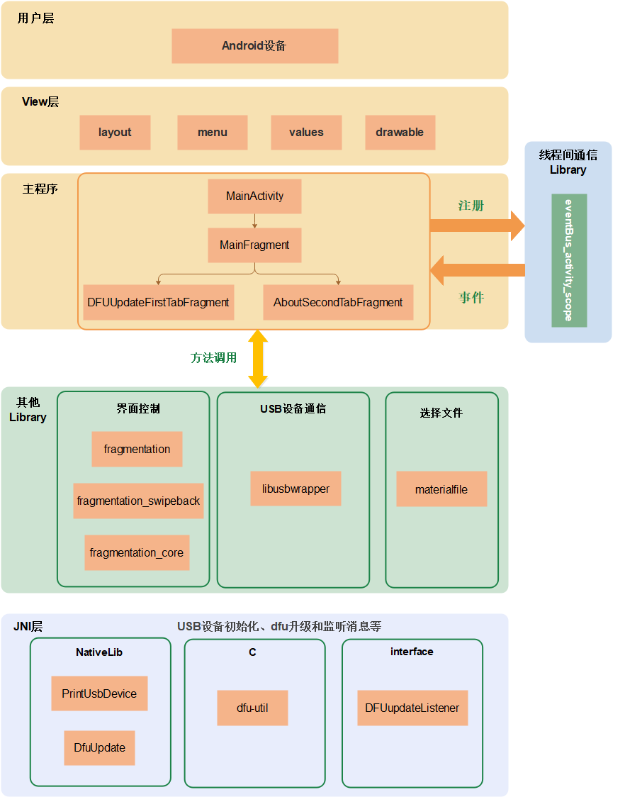
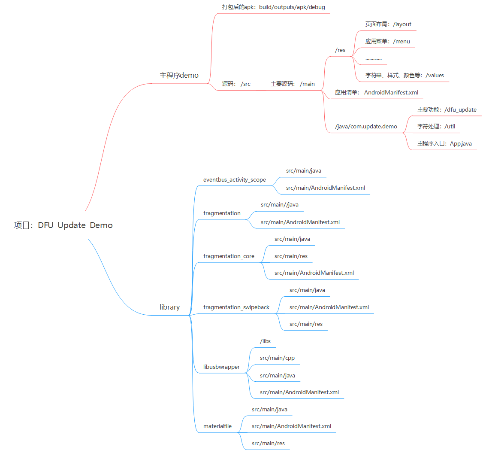

# Preface<a name="ZH-CN_TOPIC_0000001942862112"></a>

This document introduces the development and implementation of the DFU upgrade APK, including the system framework, interface implementation, and methods for implementing the main features.

**Product Version<a name="section27775771"></a>**

The product version corresponding to this document is as follows.

<a name="table52250146"></a>
<table><thead align="left"><tr id="row55967882"><th class="cellrowborder" valign="top" width="39.39%" id="mcps1.1.3.1.1"><p id="p37104584"><a name="p37104584"></a><a name="p37104584"></a><strong id="b48174912328"><a name="b48174912328"></a><a name="b48174912328"></a>Product Name</strong></p>
</th>
<th class="cellrowborder" valign="top" width="60.61%" id="mcps1.1.3.1.2"><p id="p52681331"><a name="p52681331"></a><a name="p52681331"></a><strong id="b682239163211"><a name="b682239163211"></a><a name="b682239163211"></a>Product Version</strong></p>
</th>
</tr>
</thead>
<tbody><tr id="row39329394"><td class="cellrowborder" valign="top" width="39.39%" headers="mcps1.1.3.1.1 "><p id="p31080012"><a name="p31080012"></a><a name="p31080012"></a>BS2X</p>
</td>
<td class="cellrowborder" valign="top" width="60.61%" headers="mcps1.1.3.1.2 "><p id="p34453054"><a name="p34453054"></a><a name="p34453054"></a>V100</p>
</td>
</tr>
</tbody>
</table>

**Reader Audience<a name="section4378592816410"></a>**

This document is primarily intended for the following engineers:

-   Technical support engineers
-   Software engineers

**Symbol Conventions<a name="section133020216410"></a>**

The following symbols may appear in this document, and their meanings are as follows.

<a name="table2622507016410"></a>
<table><thead align="left"><tr id="row1530720816410"><th class="cellrowborder" valign="top" width="20.580000000000002%" id="mcps1.1.3.1.1"><p id="p6450074116410"><a name="p6450074116410"></a><a name="p6450074116410"></a><strong id="b2136615816410"><a name="b2136615816410"></a><a name="b2136615816410"></a>Symbol</strong></p>
</th>
<th class="cellrowborder" valign="top" width="79.42%" id="mcps1.1.3.1.2"><p id="p5435366816410"><a name="p5435366816410"></a><a name="p5435366816410"></a><strong id="b5941558116410"><a name="b5941558116410"></a><a name="b5941558116410"></a>Description</strong></p>
</th>
</tr>
</thead>
<tbody><tr id="row1372280416410"><td class="cellrowborder" valign="top" width="20.580000000000002%" headers="mcps1.1.3.1.1 "><p id="p3734547016410"><a name="p3734547016410"></a><a name="p3734547016410"></a><a name="image2670064316410"></a><a name="image2670064316410"></a><span></span></p>
</td>
<td class="cellrowborder" valign="top" width="79.42%" headers="mcps1.1.3.1.2 "><p id="p1757432116410"><a name="p1757432116410"></a><a name="p1757432116410"></a>Indicates a hazard with a high level of risk that, if not avoided, will result in death or serious injury.</p>
</td>
</tr>
<tr id="row466863216410"><td class="cellrowborder" valign="top" width="20.580000000000002%" headers="mcps1.1.3.1.1 "><p id="p1432579516410"><a name="p1432579516410"></a><a name="p1432579516410"></a><a name="image4895582316410"></a><a name="image4895582316410"></a><span></span></p>
</td>
<td class="cellrowborder" valign="top" width="79.42%" headers="mcps1.1.3.1.2 "><p id="p959197916410"><a name="p959197916410"></a><a name="p959197916410"></a>Indicates a hazard with a medium level of risk that, if not avoided, could result in death or serious injury.</p>
</td>
</tr>
<tr id="row123863216410"><td class="cellrowborder" valign="top" width="20.580000000000002%" headers="mcps1.1.3.1.1 "><p id="p1232579516410"><a name="p1232579516410"></a><a name="p1232579516410"></a><a name="image1235582316410"></a><a name="image1235582316410"></a><span></span></p>
</td>
<td class="cellrowborder" valign="top" width="79.42%" headers="mcps1.1.3.1.2 "><p id="p123197916410"><a name="p123197916410"></a><a name="p123197916410"></a>Indicates a hazard with a low level of risk that, if not avoided, could result in minor or moderate injury.</p>
</td>
</tr>
<tr id="row5786682116410"><td class="cellrowborder" valign="top" width="20.580000000000002%" headers="mcps1.1.3.1.1 "><p id="p2204984716410"><a name="p2204984716410"></a><a name="p2204984716410"></a><a name="image4504446716410"></a><a name="image4504446716410"></a><span></span></p>
</td>
<td class="cellrowborder" valign="top" width="79.42%" headers="mcps1.1.3.1.2 "><p id="p4388861916410"><a name="p4388861916410"></a><a name="p4388861916410"></a>Used to convey device or environmental safety warning information. If not avoided, it may result in equipment damage, data loss, performance degradation, or other unpredictable outcomes.</p>
<p id="p1238861916410"><a name="p1238861916410"></a><a name="p1238861916410"></a>"NOTICE" does not involve personal injury.</p>
</td>
</tr>
<tr id="row2856923116410"><td class="cellrowborder" valign="top" width="20.580000000000002%" headers="mcps1.1.3.1.1 "><p id="p5555360116410"><a name="p5555360116410"></a><a name="p5555360116410"></a><a name="image799324016410"></a><a name="image799324016410"></a><span></span></p>
</td>
<td class="cellrowborder" valign="top" width="79.42%" headers="mcps1.1.3.1.2 "><p id="p4612588116410"><a name="p4612588116410"></a><a name="p4612588116410"></a>Provides supplementary information about key points in the main text.</p>
<p id="p1232588116410"><a name="p1232588116410"></a><a name="p1232588116410"></a>"NOTE" is not a safety warning and does not involve personal, equipment, or environmental injury information.</p>
</td>
</tr>
</tbody>
</table>

**Modification Record<a name="section2467512116410"></a>**

<a name="table1557726816410"></a>
<table><thead align="left"><tr id="row2942532716410"><th class="cellrowborder" valign="top" width="19.009999999999998%" id="mcps1.1.4.1.1"><p id="p3778275416410"><a name="p3778275416410"></a><a name="p3778275416410"></a><strong id="b5687322716410"><a name="b5687322716410"></a><a name="b5687322716410"></a>Document Version</strong></p>
</th>
<th class="cellrowborder" valign="top" width="25.629999999999995%" id="mcps1.1.4.1.2"><p id="p5627845516410"><a name="p5627845516410"></a><a name="p5627845516410"></a><strong id="b5800814916410"><a name="b5800814916410"></a><a name="b5800814916410"></a>Release Date</strong></p>
</th>
<th class="cellrowborder" valign="top" width="55.36%" id="mcps1.1.4.1.3"><p id="p2382284816410"><a name="p2382284816410"></a><a name="p2382284816410"></a><strong id="b3316380216410"><a name="b3316380216410"></a><a name="b3316380216410"></a>Modification Description</strong></p>
</th>
</tr>
</thead>
<tbody><tr id="row10752003556"><td class="cellrowborder" valign="top" width="19.009999999999998%" headers="mcps1.1.4.1.1 "><p id="p12752018559"><a name="p12752018559"></a><a name="p12752018559"></a>02</p>
</td>
<td class="cellrowborder" valign="top" width="25.629999999999995%" headers="mcps1.1.4.1.2 "><p id="p87510115512"><a name="p87510115512"></a><a name="p87510115512"></a>2025-05-30</p>
</td>
<td class="cellrowborder" valign="top" width="55.36%" headers="mcps1.1.4.1.3 "><p id="p12759013557"><a name="p12759013557"></a><a name="p12759013557"></a>Updated "<a href="与USB设备通信.md">Communicating with USB Devices</a>" subsection content.</p>
</td>
</tr>
<tr id="row15142143811166"><td class="cellrowborder" valign="top" width="19.009999999999998%" headers="mcps1.1.4.1.1 "><p id="p182910614321"><a name="p182910614321"></a><a name="p182910614321"></a>01</p>
</td>
<td class="cellrowborder" valign="top" width="25.629999999999995%" headers="mcps1.1.4.1.2 "><p id="p52917613321"><a name="p52917613321"></a><a name="p52917613321"></a>2024-07-04</p>
</td>
<td class="cellrowborder" valign="top" width="55.36%" headers="mcps1.1.4.1.3 "><p id="p1290663212"><a name="p1290663212"></a><a name="p1290663212"></a>First official release.</p>
</td>
</tr>
</tbody>
</table>

# Features<a name="ZH-CN_TOPIC_0000001956125929"></a>

The main functions of this APK include: obtaining and displaying information about connected USB devices, communicating with USB devices, selecting upgrade files, USB device initialization, and DFU upgrade functionality.


## Displaying Connected USB Device Information<a name="ZH-CN_TOPIC_0000001956603777"></a>

The device information displayed in the interface includes:

-   Device Path：The path of the device file for the device in the usbfs file system.
-   Device Class：The device's class field.
-   Vendor ID：The vendor ID for the device.
-   Vendor Name：The manufacturer name of the device.
-   Product ID：The product ID for the device.
-   Product Name：The product name of the device.
-   Interface ID：The interface's bInterfaceNumber field.

## Communicating with USB Devices<a name="ZH-CN_TOPIC_0000001956443977"></a>

Establishing a connection and communicating with USB devices involves different statuses that indicate the success or failure of communication. There are 9 statuses, as shown in [Table 1](#table532084312568).

**Table 1**  Status Code

<a name="table532084312568"></a>
<table><thead align="left"><tr id="row132074335613"><th class="cellrowborder" valign="top" width="25.192519251925187%" id="mcps1.2.4.1.1"><p id="p113209435561"><a name="p113209435561"></a><a name="p113209435561"></a>No.</p>
</th>
<th class="cellrowborder" valign="top" width="30.573057305730572%" id="mcps1.2.4.1.2"><p id="p93201433566"><a name="p93201433566"></a><a name="p93201433566"></a>Status Code (Custom)</p>
</th>
<th class="cellrowborder" valign="top" width="44.23442344234424%" id="mcps1.2.4.1.3"><p id="p183201743205615"><a name="p183201743205615"></a><a name="p183201743205615"></a>Description</p>
</th>
</tr>
</thead>
<tbody><tr id="row13207435563"><td class="cellrowborder" valign="top" width="25.192519251925187%" headers="mcps1.2.4.1.1 "><p id="p173204435561"><a name="p173204435561"></a><a name="p173204435561"></a>1</p>
</td>
<td class="cellrowborder" valign="top" width="30.573057305730572%" headers="mcps1.2.4.1.2 "><p id="p1232019434564"><a name="p1232019434564"></a><a name="p1232019434564"></a>10000</p>
</td>
<td class="cellrowborder" valign="top" width="44.23442344234424%" headers="mcps1.2.4.1.3 "><p id="p832064316566"><a name="p832064316566"></a><a name="p832064316566"></a>USB opened normally</p>
</td>
</tr>
<tr id="row132018430567"><td class="cellrowborder" valign="top" width="25.192519251925187%" headers="mcps1.2.4.1.1 "><p id="p5320184316562"><a name="p5320184316562"></a><a name="p5320184316562"></a>2</p>
</td>
<td class="cellrowborder" valign="top" width="30.573057305730572%" headers="mcps1.2.4.1.2 "><p id="p14320204335617"><a name="p14320204335617"></a><a name="p14320204335617"></a>10001</p>
</td>
<td class="cellrowborder" valign="top" width="44.23442344234424%" headers="mcps1.2.4.1.3 "><p id="p2320114335619"><a name="p2320114335619"></a><a name="p2320114335619"></a>USB authorization successful</p>
</td>
</tr>
<tr id="row332004311564"><td class="cellrowborder" valign="top" width="25.192519251925187%" headers="mcps1.2.4.1.1 "><p id="p143201243115611"><a name="p143201243115611"></a><a name="p143201243115611"></a>3</p>
</td>
<td class="cellrowborder" valign="top" width="30.573057305730572%" headers="mcps1.2.4.1.2 "><p id="p1332064319565"><a name="p1332064319565"></a><a name="p1332064319565"></a>10002</p>
</td>
<td class="cellrowborder" valign="top" width="44.23442344234424%" headers="mcps1.2.4.1.3 "><p id="p03208430567"><a name="p03208430567"></a><a name="p03208430567"></a>USB authorization failed</p>
</td>
</tr>
<tr id="row1732074385611"><td class="cellrowborder" valign="top" width="25.192519251925187%" headers="mcps1.2.4.1.1 "><p id="p532113434568"><a name="p532113434568"></a><a name="p532113434568"></a>4</p>
</td>
<td class="cellrowborder" valign="top" width="30.573057305730572%" headers="mcps1.2.4.1.2 "><p id="p183211043145612"><a name="p183211043145612"></a><a name="p183211043145612"></a>10003</p>
</td>
<td class="cellrowborder" valign="top" width="44.23442344234424%" headers="mcps1.2.4.1.3 "><p id="p4321184320563"><a name="p4321184320563"></a><a name="p4321184320563"></a>Specified device not found</p>
</td>
</tr>
<tr id="row832144305614"><td class="cellrowborder" valign="top" width="25.192519251925187%" headers="mcps1.2.4.1.1 "><p id="p1132114375616"><a name="p1132114375616"></a><a name="p1132114375616"></a>5</p>
</td>
<td class="cellrowborder" valign="top" width="30.573057305730572%" headers="mcps1.2.4.1.2 "><p id="p63211143135616"><a name="p63211143135616"></a><a name="p63211143135616"></a>10004</p>
</td>
<td class="cellrowborder" valign="top" width="44.23442344234424%" headers="mcps1.2.4.1.3 "><p id="p93211743175615"><a name="p93211743175615"></a><a name="p93211743175615"></a>No device found</p>
</td>
</tr>
<tr id="row73217434563"><td class="cellrowborder" valign="top" width="25.192519251925187%" headers="mcps1.2.4.1.1 "><p id="p17321104320563"><a name="p17321104320563"></a><a name="p17321104320563"></a>6</p>
</td>
<td class="cellrowborder" valign="top" width="30.573057305730572%" headers="mcps1.2.4.1.2 "><p id="p83216436564"><a name="p83216436564"></a><a name="p83216436564"></a>10005</p>
</td>
<td class="cellrowborder" valign="top" width="44.23442344234424%" headers="mcps1.2.4.1.3 "><p id="p173212434569"><a name="p173212434569"></a><a name="p173212434569"></a>USB device open failed</p>
</td>
</tr>
<tr id="row1321164325615"><td class="cellrowborder" valign="top" width="25.192519251925187%" headers="mcps1.2.4.1.1 "><p id="p6321134320563"><a name="p6321134320563"></a><a name="p6321134320563"></a>7</p>
</td>
<td class="cellrowborder" valign="top" width="30.573057305730572%" headers="mcps1.2.4.1.2 "><p id="p23211543175612"><a name="p23211543175612"></a><a name="p23211543175612"></a>10006</p>
</td>
<td class="cellrowborder" valign="top" width="44.23442344234424%" headers="mcps1.2.4.1.3 "><p id="p632115431567"><a name="p632115431567"></a><a name="p632115431567"></a>USB channel open failed</p>
</td>
</tr>
<tr id="row63211843185612"><td class="cellrowborder" valign="top" width="25.192519251925187%" headers="mcps1.2.4.1.1 "><p id="p10321194315566"><a name="p10321194315566"></a><a name="p10321194315566"></a>8</p>
</td>
<td class="cellrowborder" valign="top" width="30.573057305730572%" headers="mcps1.2.4.1.2 "><p id="p23219431562"><a name="p23219431562"></a><a name="p23219431562"></a>10007</p>
</td>
<td class="cellrowborder" valign="top" width="44.23442344234424%" headers="mcps1.2.4.1.3 "><p id="p113219439567"><a name="p113219439567"></a><a name="p113219439567"></a>USB data sent successfully</p>
</td>
</tr>
<tr id="row854153255919"><td class="cellrowborder" valign="top" width="25.192519251925187%" headers="mcps1.2.4.1.1 "><p id="p125415325593"><a name="p125415325593"></a><a name="p125415325593"></a>9</p>
</td>
<td class="cellrowborder" valign="top" width="30.573057305730572%" headers="mcps1.2.4.1.2 "><p id="p554133210598"><a name="p554133210598"></a><a name="p554133210598"></a>10008</p>
</td>
<td class="cellrowborder" valign="top" width="44.23442344234424%" headers="mcps1.2.4.1.3 "><p id="p655103205920"><a name="p655103205920"></a><a name="p655103205920"></a>USB data send failed</p>
</td>
</tr>
</tbody>
</table>

## Selecting Upgrade File<a name="ZH-CN_TOPIC_0000001929285140"></a>

The upgrade file selection function mainly includes the following features:

-   Supports selecting upgrade files stored in the sdcard directory.
-   Supports selecting upgrade files from any subfolder under the sdcard directory.
-   After selecting an upgrade file, the absolute path of the file stored on the Android device can be obtained.
-   After selecting an upgrade file, the upgrade version information in the file can be obtained.
-   After selecting an upgrade file, the upgrade file can be correctly read.

## USB Device Initialization<a name="ZH-CN_TOPIC_0000001929444524"></a>

USB device initialization operations include:

1.  Opening the USB device.
2.  Opening the USB device channel.

## DFU Upgrade<a name="ZH-CN_TOPIC_0000001956603789"></a>

The DFU upgrade mainly includes the following steps:

1.  Sending commands to the USB device to put the HID device into DFU mode.
2.  After switching the state, re-obtaining and updating device information.
3.  Sending the pre-upgrade info packet to the device.
4.  Loading the upgrade file and performing the DFU upgrade operation.

# System Framework<a name="ZH-CN_TOPIC_0000001928927258"></a>

The system framework of the DFU upgrade APK is shown in [Figure 1](#fig7593026111616). It is mainly divided into the View layer, the main program, and multiple libraries.

**Figure 1**  System Framework<a name="fig7593026111616"></a>  


-   View layer: Responsible for interface display, where the layout folder stores page layout files, menu stores menu files, values stores configuration files such as strings and colors, and drawable stores images and runtime icons.
-   Main program: Consists primarily of activity and fragment components, responsible for responding to user operations on the View layer and displaying data passed from the data access layer to the View layer.
-   Library: Includes eventBus\_activity\_scope for inter-thread communication, fragmentation, fragmentation\_swipeback, fragmentation\_core for interface control, and materialfile for supporting the file selection function.

# Project File Deployment<a name="ZH-CN_TOPIC_0000001928927262"></a>

The project file deployment of the DFU upgrade APK is shown in [Figure 1](#fig106032417492).

**Figure 1**  File Deployment<a name="fig106032417492"></a>  


# Interface Implementation<a name="ZH-CN_TOPIC_0000001956125937"></a>

Application is a system component in the Android system framework. When an Android application starts, the system creates an Application class object and only creates one, which is used to store some system information. That is, Application is a singleton.

Application is typically used to perform some global initialization tasks when the application starts. When the application starts, Application is synchronously created and launched. The system creates a PID, i.e., process ID, and all Activities will run on this process. In the DFU Update Demo, the file for creating Application is App.java, which inherits from the Application class.


## Application Implementation<a name="ZH-CN_TOPIC_0000001934832786"></a>

onCreate\(\) is a lifecycle method of Application and is automatically called when Application is created.

The setDefaultFontPath method is called to unify the font across the entire Application.

Example:

```
@Override
public void onCreate() {
    super.onCreate();
    // Unified font
    ViewPump.init(ViewPump.builder()
    .addInterceptor(new CalligraphyInterceptor(
    new CalligraphyConfig.Builder()
    .setDefaultFontPath("fonts/Avenir-Book-01.ttf")
    .setFontAttrId(R.attr.fontPath)
    .build()))
    .build());
}
```

## Activity Implementation<a name="ZH-CN_TOPIC_0000001929111452"></a>

**Development Guide<a name="section133020216410"></a>**

1.  Add <intent-filter\> in AndroidManifest.xml to launch the activity.
2.  Implement and call the verifyStoragePermission method in MainActivity.java to request and confirm read/write permissions for the sdcard.
3.  Implement the layout of MainActivity in R.layout.dfu\_update\_activity\_main.xml.
4.  Load MainFragment in the onCreate method of MainActivity.java.

Example:

```
<activity
android:name="com.update.demo.dfu_update.MainActivity"
android:label="@string/app_name">
<intent-filter>
<action android:name="android.intent.action.MAIN"/>
<category android:name="android.intent.category.LAUNCHER"/>
</intent-filter>
</activity>

private static final int REQUEST_EXTERNAL_STORAGE = 1;
private static String[] PERMISSIONS_STORAGE = {
    "android.permission.READ_EXTERNAL_STORAGE",
    "android.permission.WRITE_EXTERNAL_STORAGE"
};

public void verifyStoragePermission(Activity activity) {
    try {
        int permission = ActivityCompat.checkSelfPermission(activity, "android.permission.WRITE_EXTERNAL_STORAGE");
        int readPermission = ActivityCompat.checkSelfPermission(activity, "android.permission.READ_EXTERNAL_STORAGE");
        if (permission != PackageManager.PERMISSION_GRANTED || readPermission != PackageManager.PERMISSION_GRANTED) {
            ActivityCompat.requestPermissions(activity, PERMISSIONS_STORAGE, REQUEST_EXTERNAL_STORAGE);
        }
    }catch (Exception e){
        e.printStackTrace();
    }
}

<?xml version="1.0" encoding="utf-8"?>
<FrameLayout
android:id="@+id/fl_container"
xmlns:android="http://schemas.android.com/apk/res/android"
android:layout_width="match_parent"
android:layout_height="match_parent"/>

@Override
protected void onCreate(@Nullable Bundle savedInstanceState) {
    super.onCreate(savedInstanceState);
    setContentView(R.layout.dfu_update_activity_main);
    verifyStoragePermission(this); // Confirm whether the SD card permission is available

    if (findFragment(MainFragment.class) == null) {
        loadRootFragment(R.id.fl_container, MainFragment.newInstance()); // Load MainFragment
    }
}
```

## MainFragment Implementation<a name="ZH-CN_TOPIC_0000001956150921"></a>

**Development Guide<a name="section133020216410"></a>**

1.  Implement the MainFragment newInstance\(\) method to create a MainFragment instance.
2.  Implement the layout of MainFragment in R.layout.dfu\_update\_fragment\_main.xml.
3.  Implement the initView\(view\) method to initialize the interface view.
4.  Call the initView method in the onCreateView of MainFragment.
5.  Implement obtaining multiple Fragment objects in the onActivityCreated method.

Example:

```
public static MainFragment newInstance() {
    Bundle args = new Bundle();
    MainFragment fragment = new MainFragment();
    fragment.setArguments(args);
    return fragment;
}
```

Example:

```
<?xml version="1.0" encoding="utf-8"?>
<FrameLayout xmlns:android="http://schemas.android.com/apk/res/android"
android:layout_width="match_parent"
android:layout_height="match_parent"
android:orientation="vertical">
<FrameLayout
android:id="@+id/fl_tab_container"
android:layout_width="match_parent"
android:layout_marginBottom="@dimen/bottombar_wechat_height"
android:layout_height="match_parent"/>

<com.update.demo.dfu_update.ui.view.BottomBar
android:id="@+id/bottomBar"
android:layout_width="match_parent"
android:layout_height="@dimen/bottombar_wechat_height"
android:background="@color/backgroundColor_1"
android:layout_gravity="bottom"/>
</FrameLayout>

private void initView(View view) {
    mBottomBar = (BottomBar) view.findViewById(R.id.bottomBar);
    mBottomBar
    .addItem(new BottomBarTab(_mActivity, R.drawable.ic_dfu_update_white_24dp, getString(R.string.dfu_update)))
    .addItem(new BottomBarTab(_mActivity, R.drawable.ic_account_circle_white_24dp, getString(R.string.about)));

    mBottomBar.setOnTabSelectedListener(new BottomBar.OnTabSelectedListener() {
        @Override
            public void onTabSelected(int position, int prePosition) {
                showHideFragment(mFragments[position], mFragments[prePosition]);
                BottomBarTab tab = mBottomBar.getItem(FIRST);
            }

            @Override
            public void onTabUnselected(int position) { }

            @Override
            public void onTabReselected(int position) {
                EventBusActivityScope.getDefault(_mActivity).post(new TabSelectedEvent(position));
            }
        });
    }

    @Override
    public View onCreateView(LayoutInflater inflater, @Nullable ViewGroup container, @Nullable Bundle savedInstanceState) {
        View view = inflater.inflate(R.layout.dfu_update_fragment_main, container, false);
        initView(view);
        return view;
    }

    public static final int FIRST = 0;
    public static final int SECOND = 1;
    private SupportFragment[] mFragments = new SupportFragment[2];
    private BottomBar mBottomBar;
    @Override
    public void onActivityCreated(@Nullable Bundle savedInstanceState) {
        super.onActivityCreated(savedInstanceState);
        SupportFragment firstFragment = findChildFragment(DFUUpdateFirstTabFragment.class);
        if (firstFragment == null) {
            mFragments[FIRST] = DFUUpdateFirstTabFragment.newInstance();
            mFragments[SECOND] = AboutSecondTabFragment.newInstance();

            loadMultipleRootFragment(R.id.fl_tab_container, FIRST,
            mFragments[FIRST],
            mFragments[SECOND]);
        } else {
        mFragments[FIRST] = firstFragment;
        mFragments[SECOND] = findChildFragment(AboutSecondTabFragment.class);
    }
}
```

# Upgrade Interface Fragment Implementation<a name="ZH-CN_TOPIC_0000001956006133"></a>

This is the main interface of this APK and the homepage of the tab.


## Interface Layout Implementation<a name="ZH-CN_TOPIC_0000001956270733"></a>

**Development Guide<a name="section133020216410"></a>**

1.  In the onCreate method of DFUUpdateFirstTabFragment.java, implement the initialization of multiple broadcast variables and register the broadcast.
2.  Implement the layout of the Fragment in R.layout.dfu\_update\_fragment\_tab\_first.xml.
3.  Implement the initView method for view initialization.
4.  Implement the onClick method to listen for button click events, including R.id.btn\_select\_file for file selection, R.id.btn\_open\_hid for HID device initialization, and R.id.btn\_update for DFU update.

Example:

```
@Override
public void onCreate(@Nullable @org.jetbrains.annotations.Nullable Bundle savedInstanceState) {
    super.onCreate(savedInstanceState);
    usbManager = (UsbManager) _mActivity.getSystemService(Context.USB_SERVICE);
    permissionIntent = PendingIntent.getBroadcast(_mActivity, 0, new Intent(Constants.ACTION_USB_PERMISSION), 0);
    _mActivity.registerReceiver(broadcastReceiver, new IntentFilter(Constants.ACTION_USB_PERMISSION));
}

<?xml version="1.0" encoding="utf-8"?>
<LinearLayout
android:id="@+id/fl_container"
xmlns:android="http://schemas.android.com/apk/res/android"
android:layout_width="match_parent"
android:layout_height="match_parent"
android:orientation="vertical">

<include layout="@layout/toolbar"/>

<LinearLayout
android:layout_width="match_parent"
android:layout_height="wrap_content"
android:orientation="vertical"
android:padding="@dimen/padding_space">
……
</LinearLayout>
<RelativeLayout
android:layout_width="match_parent"
android:layout_height="match_parent"
android:layout_margin="@dimen/padding_space"
android:background="@drawable/custom_border">
……
</RelativeLayout>

</LinearLayout>

private void initView(View view) {
    mToolbar = (Toolbar) view.findViewById(R.id.toolbar);
    EventBusActivityScope.getDefault(_mActivity).register(this);

    mToolbar.setTitle(R.string.dfu_update);
    mToolbar.inflateMenu(R.menu.menu_main);
    mToolbar.setOnMenuItemClickListener(this);

    viewHolder = new UsbInfoViewHolder(view);

    mUSBSpinner = view.findViewById(R.id.usb_spinner);

    mTVProgress = view.findViewById(R.id.tv_process);
    mTVProgress.setMovementMethod(ScrollingMovementMethod.getInstance());
    setSpinnerAdapter();

    mBtnSelectFile = view.findViewById(R.id.btn_select_file);
    mBtnSelectFile.setOnClickListener(this);
    mBtnOpenHid = view.findViewById(R.id.btn_open_hid);
    mBtnOpenHid.setOnClickListener(this);
    mBtnUpdate = view.findViewById(R.id.btn_update);
    mBtnUpdate.setOnClickListener(this);
    setButtonState(false);

    NativeLib.setmDFUupdateListener(mdfuUpdateListener);
}

@Override
public void onClick(View v) {
    switch (v.getId()) {
        case R.id.btn_select_file:
        openFilePicker();
        break;
        case R.id.btn_open_hid:
        int status = initHID();
        addProgressLog("Connection status: " + status);
        NativeLib nativeLibDFU = new NativeLib();
        nativeLibDFU.PrintUsbDevices(mConn.getFileDescriptor());
        break;
        case R.id.btn_update:
        ……
        break;
    }
}
```

## Implementation of USB Information Retrieval and Display<a name="ZH-CN_TOPIC_0000001928952080"></a>

**Development Guide<a name="section133020216410"></a>**

1.  Implement refreshUsbDeviceList\(\) to obtain the latest USB list and derive mUSBList.
2.  Implement setSpinnerAdapter\(\) to iterate through mUSBList and store USB devices in the mUSBSpinner control items in the format of productName + "\(vid:" + vendorId + ", pid:" + productId + ", interface id: " + mUSBList.get\(i\).getInterface\(j\).getId\(\) + "\)".
3.  Implement the dropdown list selection event OnItemSelected to get the selected device.
4.  Implement initUsbData\(\) to display the information of the selected device.

Example:

```
private void refreshUsbDeviceList() {
    mUSBList.clear();
    device = null;

    Map<String, UsbDevice> mDeviceMap = usbManager.getDeviceList();
    Iterator<UsbDevice> deviceIterator = mDeviceMap.values().iterator();
    if (mDeviceMap.size() == 0) {  // When the USB device list is empty
        mUSBSpinner.setAdapter(null);
        viewHolder.getVid().setText("");
        viewHolder.getPid().setText("");
        viewHolder.getDevicePath().setText("");
        viewHolder.getDeviceClass().setText("");

        viewHolder.getReportedVendor().setText("");
        viewHolder.getReportedProduct().setText("");
        viewHolder.getTvInterfaceID().setText("");
        statue = USBStatus.usb_find_all_fail;
        addProgressLog("Device status: " + statue);
        return;
    }

    while (deviceIterator.hasNext()) {
        UsbDevice currentDevice = deviceIterator.next();
        mUSBList.add(currentDevice);
    }
    if (mUSBList != null) {
        mUSBList = CommonHelper.sortList(mUSBList);
    }
}

private void setSpinnerAdapter() {
    refreshUsbDeviceList();
    if (mUSBInfoList.size() > 0)
    mUSBInfoList.clear();
    List<String> usbInfoList = new ArrayList<>();
    for (int i = 0; i < mUSBList.size(); i++) {
        String vendorId = StringUtils.padLeft(Integer.toHexString(mUSBList.get(i).getVendorId()), '0', 4);
        String productId = StringUtils.padLeft(Integer.toHexString(mUSBList.get(i).getProductId()), '0', 4);
        String productName = "";
        if (mUSBList.get(i).getProductName() != null) {
            productName = mUSBList.get(i).getProductName();
        }

        int interfaceCount = mUSBList.get(i).getInterfaceCount();
        Log.i(TAG, "interfaceCount:" + interfaceCount);
        if (interfaceCount > 0) {
            for (int j = 0; j < interfaceCount; j++) {
                usbInfoList.add(productName + "(vid:" + vendorId + ", pid:" + productId
                + ", interface id: " + mUSBList.get(i).getInterface(j).getId() + ")");
                DeviceInfo deviceInfo = new DeviceInfo(mUSBList.get(i).getVendorId(),
                mUSBList.get(i).getProductId(), mUSBList.get(i).getInterface(j).getId(), mUSBList.get(i));
                mUSBInfoList.add(deviceInfo);
            }
        }
    }

    mUSBArray = new String[usbInfoList.size()];
    for (int i = 0; i < usbInfoList.size(); i++) {
        mUSBArray[i] = usbInfoList.get(i);
    }
    ArrayAdapter<String> spinnerArray = new ArrayAdapter<String>(_mActivity, R.layout.item_select, mUSBArray);
    mUSBSpinner.setAdapter(spinnerArray);
    mUSBSpinner.setOnItemSelectedListener(this);
}

@Override
public void onItemSelected(AdapterView<?> parent, View view, int position, long id) {
    device = mUSBInfoList.get(position).getDevice();
    mVid = mUSBInfoList.get(position).getVendorId();
    mPid = mUSBInfoList.get(position).getProductId();
    mUsbInterface = device.getInterface(mUSBInfoList.get(position).getInterfaceId());
    initUsbData();
    addProgressLog("Device status: " + statue);
}

private void initUsbData() {
    final String vid = StringUtils.padLeft(Integer.toHexString(device.getVendorId()), '0', 4);
    final String pid = StringUtils.padLeft(Integer.toHexString(device.getProductId()), '0', 4);
    final String deviceClass = UsbConstantResolver.resolveUsbClass(device.getDeviceClass());

    viewHolder.getVid().setText(vid);
    viewHolder.getPid().setText(pid);
    if (device.getDeviceName() != null) {
        viewHolder.getDevicePath().setText(device.getDeviceName());
    } else {
        viewHolder.getDevicePath().setText("");
    }
    viewHolder.getDeviceClass().setText(deviceClass);

    viewHolder.getReportedVendor().setText(device.getManufacturerName());
    if (device.getProductName() != null) {
        viewHolder.getReportedProduct().setText(device.getProductName());
    } else {
        viewHolder.getReportedProduct().setText("");
    }
    viewHolder.getTvInterfaceID().setText(String.valueOf(mUsbInterface.getId()));

    // Request permission
    usbManager.requestPermission(device, permissionIntent);
}
```

## Implementation of Upgrade File Selection<a name="ZH-CN_TOPIC_0000001929111456"></a>

**Development Guide<a name="section133020216410"></a>**

1.  Call the MaterialFilePicker method from the materialfile library to create the file selection interface and configure the listed files.
2.  Create an ActivityResultLauncher object to obtain the absolute path of the selected file.

Example:

```
private void openFilePicker() {
    File externalStorage = FileUtils.getFile(_mActivity, null);  // Get the file under sdcard
    Log.i(TAG, "externalStorage.getAbsolutePath():" + externalStorage.getAbsolutePath());

    new MaterialFilePicker()
    // Pass a source of context. Can be:
    .withActivity(_mActivity)
    // With cross icon on the right side of toolbar for closing picker straight away
    .withCloseMenu(true)
    // Entry point path (user will start from it)
    // Root path (user won't be able to come higher than it)
    .withRootPath(externalStorage.getAbsolutePath())
    // Showing hidden files
    .withHiddenFiles(false)
    // Want to choose any file
    .withFilter(Pattern.compile(".*\\.[a-z0-9]*"))
    // Don't apply filter to directories names
    .withFilterDirectories(false)
    .withTitle("Please select a file")
    .withActivityResultApi(startForResultFiles)
    .start();
}

private ActivityResultLauncher<Intent> startForResultFiles = registerForActivityResult(
new ActivityResultContracts.StartActivityForResult(),
new ActivityResultCallback<ActivityResult>() {
    @Override
    public void onActivityResult(ActivityResult result) {
        // Check whether the correct result is passed in
        if (result.getResultCode() == RESULT_OK) {
            Intent intent = result.getData();   // Obtain the Intent returned by the previous activity
            // Check whether the Intent of the previous activity exists. If yes, print it in the log
            if (intent != null) {
                mUpdateBinPath = intent.getStringExtra(FilePickerActivity.RESULT_FILE_PATH);
                Log.d(TAG, "mUpdateBinPath: " + mUpdateBinPath);
                setButtonState(true);
                // Obtain the version information of the file to be upgraded
                String version = CommonHelper.readFotaFwpkgVersion(mUpdateBinPath);
                Log.d(TAG, "Bin Version:" + version);

            }
        }
    }
});
```

## Implementation of USB Device Initialization<a name="ZH-CN_TOPIC_0000001956150925"></a>

**Development Guide<a name="section133020216410"></a>**

1.  Implement the initHID\(\) method to open the device and device channel.
2.  Call methods such as libusb\_init to initialize the USB device and call the print\_device method. If the device information can be correctly printed, the initialization is successful.

Example:

```
private int initHID() {
    if (device == null) {
        Log.e(TAG, "Target device not found");
        return statue;
    }
    int endpointCount = 0;
    endpointCount = mUsbInterface.getEndpointCount();
    for (int i = 0; i < endpointCount; i++) {
        UsbEndpoint ep = mUsbInterface.getEndpoint(i);
        switch (ep.getType()) {
            case UsbConstants.USB_ENDPOINT_XFER_BULK:// USB endpoint transfer
            if (UsbConstants.USB_DIR_OUT == ep.getDirection()) {// Output
                epBulkOut = ep;
                Log.e(TAG, "Obtain the endpoint for sending data");
            } else {
                epBulkIn = ep;
                Log.e(TAG, "Obtain the endpoint for receiving data");
            }
            break;
            default:
            break;
        }
    }
    if (usbManager.hasPermission((device))) {
        mConn = usbManager.openDevice(device);
    } else {
        Log.e(TAG, "No permission");
        statue = USBStatus.usb_permission_fail;
    }
    if (null == mConn) {
        Log.e(TAG, "Failed to connect to the device");
        statue = USBStatus.usb_open_fail;
        return statue;
    }
    if (mConn.claimInterface(mUsbInterface, true)) {
        if (mConn != null)// At this point, your Android device has connected to the Zigbee device
        Log.i(TAG, "Device opened successfully!");
        final String mySerial = mConn.getSerial();
        Log.i(TAG, "Device serial number: " + mySerial);
        statue = USBStatus.usb_ok;
    } else {
        Log.i(TAG, "Failed to open the connection channel.");
        statue = USBStatus.usb_passway_fail;
        mConn.close();
    }
    return statue;
}

NativeLib nativeLibDFU = new NativeLib();
nativeLibDFU.PrintUsbDevices(mConn.getFileDescriptor());
void PrintUsbDevices(JNIEnv *env, jclass thiz, jint descript)
{
    unrooted_usb_description(descript);
}

The unrooted_usb_description method is implemented in libusbwrapper.cpp in the src/main/cpp directory of the libusbwrapper library.
int unrooted_usb_description(int fileDescriptor)
{
    libusb_context *ctx = NULL;
    libusb_device_handle *devh = NULL;
    int r = 0;
    verbose = 1;
    r = libusb_set_option(NULL, LIBUSB_OPTION_NO_DEVICE_DISCOVERY, NULL);
    if (r != LIBUSB_SUCCESS) {
        LOGD("libusb_set_option failed: %d\n", r);
        return -1;
    }
    r = libusb_init(&ctx);
    if (r < 0) {
        LOGD("libusb_init failed: %d\n", r);
        return r;
    }
    r = libusb_wrap_sys_device(ctx, (intptr_t)fileDescriptor, &devh);
    if (r < 0) {
        LOGD("libusb_wrap_sys_device failed: %d\n", r);
        return r;
    } else if (devh == NULL) {
        LOGD("libusb_wrap_sys_device returned invalid handle\n");
        return r;
    }
    print_device(libusb_get_device(devh), devh);
    return r;
}
```

## Implementation of DFU Upgrade Functionality<a name="ZH-CN_TOPIC_0000001956270737"></a>

**Development Guide<a name="section133020216410"></a>**

1.  After successful initialization, call the sendData method to transition the USB device from HID mode to DFU ready mode.
2.  Use a delayed execution method to update the device information in the interface and re-authorize the device.
3.  Create a BroadcastReceiver authorization-allowed broadcast object to re-open the device and channel.
4.  Call the DfuUpdate method to perform the DFU upgrade.
5.  Call the dfuload\_do\_dnload method to execute the upgrade, which includes sending the pre-upgrade info packet and sending the upgrade data.

Example:

```
byte[] data = new byte[]{0x08, (byte) 0xc8, (byte) 0xd7, (byte) 0xe6, (byte) 0xf5, 0x0c, 0x00, 0x1e, (byte) 0xe1, 0x00, 0x00, 0x00, 0x00};
int sendStatus = sendData(data, data.length);
addProgressLog("Send status: " + sendStatus);
mConn.close();
private int sendData(byte[] buffer, int byteLength) {
    if (mConn == null || epBulkOut == null) statue = USBStatus.usb_open_fail;
    if (mConn.controlTransfer(0x21, 0x09, 0x0200, mUsbInterface.getId(), buffer, byteLength, 100) >= 0) {
        // 0 or a positive number indicates success
        Log.i(TAG, "Sent successfully");
        statue = USBStatus.usb_send_data_ok;
    } else {
        Log.i(TAG, "Failed to send");
        statue = USBStatus.usb_send_data_fail;
    }
    return statue;
}

TimerTask task = new TimerTask() {
    @Override
    public void run() {
        _mActivity.runOnUiThread(new Runnable() {
            @Override
            public void run() {
                setSpinnerAdapter();
                mUSBSpinner.invalidate();
                for (int i = 0; i < mUSBInfoList.size(); i++) {
                    if (mUSBInfoList.get(i).getVendorId() == mVid) {
                        device = mUSBInfoList.get(i).getDevice();
                        mUsbInterface = mUSBInfoList.get(i).getDevice().getInterface(mUSBInfoList.get(i).getInterfaceId());
                        Log.i(TAG, "device:" + device.getVendorId() + "," + device.getProductId() + "," + mUsbInterface.getId());
                        mUSBSpinner.setSelection(i);
                        break;
                    }
                }
            }
        });
        updateFlag = 1;
    }
};
Timer timer = new Timer();
timer.schedule(task, 2000);

private BroadcastReceiver broadcastReceiver = new BroadcastReceiver() {
    @Override
    public void onReceive(Context context, Intent intent) {
        String action = intent.getAction();
        if (Constants.ACTION_USB_PERMISSION.equals(action)) {
            statue = USBStatus.usb_permission_ok;
            if (updateFlag == 1) {
                Log.i("dfuupdatetest", "mConn.getProductId():" + device.getProductId());
                Log.i(TAG, "usbManager.hasPermission((device)):" + usbManager.hasPermission((device)));
                int status = initHID();
                addProgressLog("Connection status: " + status);

                if (mConn != null) {
                    Thread thread = new Thread(new Runnable() {
                        @Override
                        public void run() {
                            NativeLib nativeLib1 = new NativeLib();
                            int desc = mConn.getFileDescriptor();
                            int ret = nativeLib1.DfuUpdate(mUpdateBinPath.replaceAll("\0", ""), desc);
                            if(ret == 0){
                                addProgressLog("Done!");
                            }else{
                                addProgressLog("Download fail!");
                            }
                            mConn.close();
                            updateFlag = 0;
                        }
                    });
                    thread.start();

                } else {
                    Log.i(TAG, "mConn is null!");
                    updateFlag = 0;
                }

            }
        } else {
            statue = USBStatus.usb_permission_fail;
        }
    }
};

int DfuUpdate(JNIEnv *env, jclass thiz, jstring path, jint descript)
{
    const char *update_path = env->GetStringUTFChars(path, 0);
    __android_log_print(ANDROID_LOG_DEBUG, "DFUupdateTest", "update_path:%s", update_path);

    int ret = dfu_update(update_path, descript);
    env->ReleaseStringUTFChars(path, update_path);
    return ret;
}

The dfu_update method is implemented in main.c in the src/main/cpp/dfu-util-0.11 directory of the libusbwrapper library, and most of the implementation follows the source code.

typedef struct {
    unsigned int startFlag;
    unsigned short packetSize;
    unsigned char frameType;
    unsigned char frameTypeReverse;
    unsigned int fileAddr;
    unsigned int fileLen;
    unsigned int eraseSize;
    unsigned char formal;
    unsigned char formalReverse;
    unsigned short checkSum;
}SEBOOT_DOWNLOAD_FLASHIMAGE;
int dfuload_do_dnload(struct dfu_if *dif, int xfer_size, struct dfu_file *file)
{
    ……
    // Send the info packet
    SEBOOT_DOWNLOAD_FLASHIMAGE data;
    data.fileAddr = 0;
    data.fileLen = expected_size;
    data.eraseSize = 0x200000;
    data.startFlag = 0xf5e6d7c8;
    data.packetSize = 0x18;
    data.frameType = 0xd2;
    data.frameTypeReverse = 0x2d;
    data.formal = 0;
    data.formalReverse = 0xff;
    data.checkSum = SopCrc16((char *)&data.startFlag, data.packetSize - 2);

    unsigned char newBuf[4096];

    int retMemcpy = memcpy(newBuf, &data, sizeof(data));

    if (retMemcpy != 0) {
        printf("Error memcpy");
    }
    ret = dfu_download(dif->dev_handle, dif->interface, 4096, transaction++, newBuf);
    if (ret < 0) {
        warnx("Error during download (%s)", libusb_error_name(ret));
    }

    do {
        ret = dfu_get_status(dif, &dst);
        if (ret < 0) {
            errx(EX_IOERR, "Error during download get_status (%s)", libusb_error_name(ret));
        }

        if (dst.bState == DFU_STATE_dfuDNLOAD_IDLE || dst.bState == DFU_STATE_dfuERROR)
        break;

        /* Wait while device executes flashing */
        milli_sleep(dst.bwPollTimeout);
        if (verbose > 1)
        fprintf(stderr, "Poll timeout %i ms\n", dst.bwPollTimeout);

    } while (1);
    ……
    // Send the upgrade data to perform the upgrade
    while (bytes_sent < expected_size) {
        __android_log_print(ANDROID_LOG_DEBUG, "DFUupdateTest","bytes_sent < expected_size:%d",(bytes_sent < expected_size));
        off_t bytes_left;
        int chunk_size;

        bytes_left = expected_size - bytes_sent;
        __android_log_print(ANDROID_LOG_DEBUG, "DFUupdateTest","bytes_left:%d",bytes_left);
        if (bytes_left < xfer_size)
        chunk_size = (int) bytes_left;
        else
        chunk_size = xfer_size;

        __android_log_print(ANDROID_LOG_DEBUG, "DFUupdateTest","chunk_size%d",
        chunk_size);

        ret = dfu_download(dif->dev_handle, dif->interface,
        chunk_size, transaction++, chunk_size ? buf : NULL);
        __android_log_print(ANDROID_LOG_DEBUG, "DFUupdateTest","Error during download (%s)",
        libusb_error_name(ret));
        if (ret < 0) {
            warnx("Error during download (%s)",
            libusb_error_name(ret));
            goto out;
        }
        bytes_sent += chunk_size;
        buf += chunk_size;

        __android_log_print(ANDROID_LOG_DEBUG, "DFUupdateTest","dfu_get_status...:142");

        do {
            ret = dfu_get_status(dif, &dst);
            if (ret < 0) {
                __android_log_print(ANDROID_LOG_DEBUG, "DFUupdateTest","Error during download get_status (%s)",
                libusb_error_name(ret));
                errx(EX_IOERR, "Error during download get_status (%s)",
                libusb_error_name(ret));
                goto out;
            }

            if (dst.bState == DFU_STATE_dfuDNLOAD_IDLE ||
            dst.bState == DFU_STATE_dfuERROR)
            break;

            /* Wait while device executes flashing */
            milli_sleep(dst.bwPollTimeout);
            if (verbose > 1)
            fprintf(stderr, "Poll timeout %i ms\n", dst.bwPollTimeout);

        } while (1);

        if (dst.bStatus != DFU_STATUS_OK) {
            __android_log_print(ANDROID_LOG_DEBUG, "DFUupdateTest","failed\n");
            __android_log_print(ANDROID_LOG_DEBUG, "DFUupdateTest","DFU state(%u) = %s, status(%u) = %s\n", dst.bState,
            dfu_state_to_string(dst.bState), dst.bStatus,
            dfu_status_to_string(dst.bStatus));

            printf(" failed!\n");
            printf("DFU state(%u) = %s, status(%u) = %s\n", dst.bState,
            dfu_state_to_string(dst.bState), dst.bStatus,
            dfu_status_to_string(dst.bStatus));
            ret = -1;
            goto out;
        }
        dfu_progress_bar("Download", bytes_sent, bytes_sent + bytes_left);
    }
}
```

## JNI Implementation Method for Calling dfu-util<a name="ZH-CN_TOPIC_0000001928952084"></a>

In the implementation of the DFU upgrade functionality, methods from dfu-util are called, and dfu-util is implemented in C, which involves the JNI mechanism. JNI is an application programming interface provided by Android for interacting with native system code in cross-platform systems. Using the NDK tool provided by Android, it can be quickly integrated into Android projects.

**Development Guide<a name="section133020216410"></a>**

1.  Implement the PrintUsbDevices method in src/main/cpp/libusbwrapper.cpp in the libusbwrapper library.
2.  Register it in the JNI\_OnLoad method.
3.  Declare the native method in the NativeLib class for the Java layer to call.

Example:

```
JNIEnv *env = NULL;
JavaVM *jvm = NULL;

void PrintUsbDevices(JNIEnv *env, jclass thiz, jint descript);
int DfuUpdate(JNIEnv *env, jclass thiz, jstring path, jint descript);

JNIEXPORT jint JNI_OnLoad(JavaVM *vm, void *reserved)
{
    // Print the log to indicate that JNI_OnLoad has been entered
    __android_log_print(ANDROID_LOG_DEBUG, "JNITag", "enter jni_onload");
    jint result = -1;
    jvm = vm;
    // Check whether the environment is correct
    if (vm->GetEnv((void **)&env, JNI_VERSION_1_6)) {
        return result;
    }

    // Register methods. Pay attention to the signatures.
    const JNINativeMethod method[] = {
        {"PrintUsbDevices", "(I)V", (void *)PrintUsbDevices},
        {"DfuUpdate", "(Ljava/lang/String;I)I", (void *)DfuUpdate}
    };
    // Find the corresponding JNITools class
    jclass jClassName = env->FindClass("com/example/libusbwrapper/NativeLib");
    // Start registration
    int method_len = sizeof(method) / sizeof(method[0]);
    __android_log_print(ANDROID_LOG_DEBUG, "JNITag", "method_len：%d", method_len);
    jint ret = env->RegisterNatives(jClassName, method, method_len);  // 4:NELEM(method)
    // If registration fails, print the log
    if (ret != JNI_OK) {
        __android_log_print(ANDROID_LOG_DEBUG, "JNITag", "jni_register Error");
        return -1;
    } else {
        __android_log_print(ANDROID_LOG_DEBUG, "JNITag", "jni_register success");
    }
    return JNI_VERSION_1_6;
}
void PrintUsbDevices(JNIEnv *env, jclass thiz, jint descript)
{
    // TODO: implement PrintUsbDevices()
    unrooted_usb_description(descript);
}

public class NativeLib {
    // Used to load the 'libusbwrapper' library on application startup.
    static {
        System.loadLibrary("libusbwrapper");
    }
    public native void PrintUsbDevices(int descript);
    public native int DfuUpdate(String path, int descript);
}
```

When needed, creating a NativeLib object allows access to methods such as PrintUsbDevices, as follows:

```
NativeLib nativeLibDFU = new NativeLib();
nativeLibDFU.PrintUsbDevices(mConn.getFileDescriptor());
```

## Implementation of Log Output Printing<a name="ZH-CN_TOPIC_0000001929111460"></a>

In the implementation of the upgrade functionality, the upgrade process logs need to be printed, which involves the JNI C-to-Java calling mechanism.

**Development Guide<a name="section133020216410"></a>**

1.  Declare an interface to listen for log printing via the reportProgress method.
2.  Implement the printDFUProgress method in the NativeLib class to call the reportProgress method.
3.  Implement print\_progress\_info in src/main/cpp/libusbwrapper.cpp in the libusbwrapper library. This method calls the printDFUProgress method in the NativeLib class for printing logs.
4.  Add print\_progress\_info to the dfu\_progress\_bar method called during the upgrade process.
5.  Implement the reportProgress method in DFUupdateListener in the interface to print the upgrade logs to the interface.

Example:

```
public interface DFUupdateListener {
    public void reportProgress(String progress);
}

private static DFUupdateListener mDFUupdateListener;
public static void setmDFUupdateListener(DFUupdateListener dfUupdateListener){
    mDFUupdateListener = dfUupdateListener;
}
public void printDFUProgress(String info){
    Log.i("DFUupdateProgress", "from C :"+ info);
    if(mDFUupdateListener != null){
        mDFUupdateListener.reportProgress(info);
    }
}

jboolean print_progress_info(char info[1024]);
jboolean print_progress_info(char *info)
{
    JNIEnv *helperEnv;
    jvm->AttachCurrentThread(&helperEnv, NULL);
    jclass jClassName = helperEnv->FindClass("com/example/libusbwrapper/NativeLib");
    jmethodID jmidprintDFUProgress = helperEnv->GetMethodID(jClassName, "printDFUProgress", "(Ljava/lang/String;)V");
    // Convert char to jstring
    jmethodID constructMethod = helperEnv->GetMethodID(jClassName, "<init>", "()V");
    jobject objCallBack = helperEnv->NewObject(jClassName, constructMethod);
    jstring info_str = helperEnv->NewStringUTF(info);

    helperEnv->CallVoidMethod(objCallBack, jmidprintDFUProgress, info_str);
    if (helperEnv->ExceptionCheck()) {
        helperEnv->ExceptionDescribe();
        helperEnv->ExceptionClear();
    }
    return JNI_TRUE;
}

void dfu_progress_bar(const char *desc, unsigned long long curr,
unsigned long long max)
{
    static char buf[PROGRESS_BAR_WIDTH + 1];
    static unsigned long long last_progress = -1;
    static time_t last_time;
    time_t curr_time = time(NULL);
    unsigned long long progress;
    unsigned long long x;
    /* check for not known maximum */
    if (max < curr)
    max = curr + 1;
    /* make none out of none give zero */
    if (max == 0 && curr == 0)
    max = 1;
    /* compute completion */
    progress = (PROGRESS_BAR_WIDTH * curr) / max;
    if (progress > PROGRESS_BAR_WIDTH)
    progress = PROGRESS_BAR_WIDTH;
    if (progress == last_progress &&
    curr_time == last_time)
    return;
    last_progress = progress;
    last_time = curr_time;

    for (x = 0; x != PROGRESS_BAR_WIDTH; x++) {
        if (x < progress)
        buf[x] = '=';
        else
        buf[x] = ' ';
    }
    buf[x] = 0;

    printf("\r%s\t[%s] %3llu%% %12llu bytes", desc, buf,
    (100ULL * curr) / max, curr);
    LOGI("\r%s\t[%s] %3llu%% %12llu bytes", desc, buf,
    (100ULL * curr) / max, curr);
    vspfunc("\r%s\t[%s] %3llu%% %12llu bytes", desc, buf,
    (100ULL * curr) / max, curr);
    print_progress_info(print_buffer);

    if (progress == PROGRESS_BAR_WIDTH){
        LOGI("\n%s done.\n", desc);
        printf("\n%s done.\n", desc);
        vspfunc("\n%s done.\n", desc);
        print_progress_info(print_buffer);
    }
}

Here, print_buffer is used to format the printing information.
char print_buffer[1024] = {0};

int vspfunc(char *format, ...)
{
    va_list aptr;
    int ret;
    va_start(aptr, format);
    ret = vsprintf(print_buffer, format, aptr);
    va_end(aptr);
    return (ret);
}

private DFUupdateListener mdfuUpdateListener = new DFUupdateListener() {
    @Override
    public void reportProgress(String progress) {
        addProgressLog(progress);
    }
};
NativeLib.setmDFUupdateListener(mdfuUpdateListener);
```

# About Interface Fragment Implementation<a name="ZH-CN_TOPIC_0000001929086630"></a>

An About interface is added to the APK. This interface introduces the APK, mainly including the APK name and version, as well as the main functions of the APK. Tapping the version display area will pop up the version build time.

**Development Guide<a name="section133020216410"></a>**

1.  Implement the interface layout in res/layout/dfu\_update\_fragment\_tab\_second.xml.
2.  Implement the initView method for component initialization.
3.  Call the initView method in onCreateView.

Example:

```
<?xml version="1.0" encoding="utf-8"?>
<LinearLayout
android:id="@+id/fl_container"
xmlns:android="http://schemas.android.com/apk/res/android"
android:layout_width="match_parent"
android:layout_height="match_parent"
android:orientation="vertical">

<include layout="@layout/toolbar"/>

<include layout="@layout/nav_header_main"/>

<RelativeLayout
android:background="@android:color/white"
android:layout_width="match_parent"
android:layout_height="match_parent">
<TextView
android:id="@+id/tv_intro_label"
android:layout_width="match_parent"
android:layout_height="wrap_content"
android:padding="10dp"
android:background="#EBEBEB"
android:text="@string/intro_label"/>

<TextView
android:layout_width="match_parent"
android:layout_height="wrap_content"
android:layout_marginTop="10dp"
android:padding="10dp"
android:textStyle="bold"
android:layout_below="@id/tv_intro_label"
android:text="@string/intro_content"/>
</RelativeLayout>

</LinearLayout>

private void initView(View view) {
    mToolbar = (Toolbar) view.findViewById(R.id.toolbar);
    mToolbar.setTitle(R.string.about);

    final RelativeLayout relativeNavHeader = (RelativeLayout) view.findViewById(R.id.ll_nav_header);
    relativeNavHeader.setOnClickListener(new View.OnClickListener() {
        @Override
        public void onClick(View v) {
            relativeNavHeader.postDelayed(new Runnable() {
                @Override
                public void run() {
                    new AlertDialog.Builder(getContext())
                    .setTitle(getContext().getText(R.string.version_build_time))
                    .setMessage(getContext().getText(R.string.build_time) + ":  " +
                    CommonHelper.getVersionCode(getContext(), "versionCode"))
                    .setIcon(R.drawable.ic_info)
                    .show();
                }
            }, 250);
        }
    });

    mTextViewVersion = view.findViewById(R.id.tv_version);
    mTextViewVersion.setText(getContext().getText(R.string.version_label) + CommonHelper.getVersionName(getContext(), "versionName"));
}

@Nullable
@Override
public View onCreateView(LayoutInflater inflater, @Nullable ViewGroup container, @Nullable Bundle savedInstanceState) {
    View view = inflater.inflate(R.layout.dfu_update_fragment_tab_second, container, false);
    initView(view);
    return view;
}
```

# Application Manifest AndroidManifest<a name="ZH-CN_TOPIC_0000001956006145"></a>

This is the configuration file of the Android project. All four major components defined in the program must be registered in this file. Additionally, permission declarations can be added to the application in this file.

Example:

```
demo/src/main/AndroidManifest.xml

<?xml version="1.0" encoding="utf-8"?>
<manifest package="com.update.demo"
xmlns:android="http://schemas.android.com/apk/res/android">

<uses-permission android:name="android.permission.INTERNET" />
<uses-permission android:name="android.permission.READ_EXTERNAL_STORAGE"/>
<uses-permission android:name="android.permission.WRITE_EXTERNAL_STORAGE"/>
<uses-feature android:name="android.hardware.usb.host" android:required="true" />

<application
android:name="com.update.demo.App"
android:icon="@drawable/ic_launcher"
android:label="@string/app_name"
android:requestLegacyExternalStorage="true"
android:theme="@style/AppTheme.NoActionBar">

<meta-data
android:name="versionTime"
android:value="${versionTime}"/>

<meta-data
android:name="versionCode"
android:value="${versionCode}"/>

<meta-data
android:name="versionName"
android:value="${versionName}"/>

<activity
android:name="com.update.demo.dfu_update.MainActivity"
android:label="@string/app_name">
<intent-filter>
<action android:name="android.intent.action.MAIN"/>
<category android:name="android.intent.category.LAUNCHER"/>
</intent-filter>
</activity>
</application>

</manifest>
```