# Preface<a name="ZH-CN_TOPIC_0000001790807036"></a>

**Overview<a name="section141mcpsimp"></a>**

This document mainly describes the BS2X DFX functions and usage guide, including the DIAG diagnosis function, crash diagnosis, Dump analysis, and so on, to facilitate business diagnosis and crash analysis.

**Product Version<a name="section144mcpsimp"></a>**

The product versions corresponding to this document are as follows.

<a name="table147mcpsimp"></a>
<table><thead align="left"><tr id="row152mcpsimp"><th class="cellrowborder" valign="top" width="30.94%" id="mcps1.1.3.1.1"><p id="p154mcpsimp"><a name="p154mcpsimp"></a><a name="p154mcpsimp"></a>Product Name</p>
</th>
<th class="cellrowborder" valign="top" width="69.06%" id="mcps1.1.3.1.2"><p id="p156mcpsimp"><a name="p156mcpsimp"></a><a name="p156mcpsimp"></a>Product Version</p>
</th>
</tr>
</thead>
<tbody><tr id="row158mcpsimp"><td class="cellrowborder" valign="top" width="30.94%" headers="mcps1.1.3.1.1 "><p id="p160mcpsimp"><a name="p160mcpsimp"></a><a name="p160mcpsimp"></a>BS2X</p>
</td>
<td class="cellrowborder" valign="top" width="69.06%" headers="mcps1.1.3.1.2 "><p id="p162mcpsimp"><a name="p162mcpsimp"></a><a name="p162mcpsimp"></a>V100</p>
</td>
</tr>
</tbody>
</table>

**Reader Audience<a name="section163mcpsimp"></a>**

This document is mainly applicable to the following engineers:

-   Software engineer
-   Technical support engineer

**Symbol Conventions<a name="section133020216410"></a>**

The following symbols may appear in this document. Their meanings are as follows.

<a name="table2622507016410"></a>
<table><thead align="left"><tr id="row1530720816410"><th class="cellrowborder" valign="top" width="20.580000000000002%" id="mcps1.1.3.1.1"><p id="p6450074116410"><a name="p6450074116410"></a><a name="p6450074116410"></a><strong id="b2136615816410"><a name="b2136615816410"></a><a name="b2136615816410"></a>Symbol</strong></p>
</th>
<th class="cellrowborder" valign="top" width="79.42%" id="mcps1.1.3.1.2"><p id="p5435366816410"><a name="p5435366816410"></a><a name="p5435366816410"></a><strong id="b5941558116410"><a name="b5941558116410"></a><a name="b5941558116410"></a>Description</strong></p>
</th>
</tr>
</thead>
<tbody><tr id="row1372280416410"><td class="cellrowborder" valign="top" width="20.580000000000002%" headers="mcps1.1.3.1.1 "><p id="p3734547016410"><a name="p3734547016410"></a><a name="p3734547016410"></a><a name="image2670064316410"></a><a name="image2670064316410"></a><span></span></p>
</td>
<td class="cellrowborder" valign="top" width="79.42%" headers="mcps1.1.3.1.2 "><p id="p1757432116410"><a name="p1757432116410"></a><a name="p1757432116410"></a>Indicates a high-level hazard that, if not avoided, will result in death or serious injury.</p>
</td>
</tr>
<tr id="row466863216410"><td class="cellrowborder" valign="top" width="20.580000000000002%" headers="mcps1.1.3.1.1 "><p id="p1432579516410"><a name="p1432579516410"></a><a name="p1432579516410"></a><a name="image4895582316410"></a><a name="image4895582316410"></a><span></span></p>
</td>
<td class="cellrowborder" valign="top" width="79.42%" headers="mcps1.1.3.1.2 "><p id="p959197916410"><a name="p959197916410"></a><a name="p959197916410"></a>Indicates a medium-level hazard that, if not avoided, could result in death or serious injury.</p>
</td>
</tr>
<tr id="row123863216410"><td class="cellrowborder" valign="top" width="20.580000000000002%" headers="mcps1.1.3.1.1 "><p id="p1232579516410"><a name="p1232579516410"></a><a name="p1232579516410"></a><a name="image1235582316410"></a><a name="image1235582316410"></a><span></span></p>
</td>
<td class="cellrowborder" valign="top" width="79.42%" headers="mcps1.1.3.1.2 "><p id="p123197916410"><a name="p123197916410"></a><a name="p123197916410"></a>Indicates a low-level hazard that, if not avoided, could result in minor or moderate injury.</p>
</td>
</tr>
<tr id="row5786682116410"><td class="cellrowborder" valign="top" width="20.580000000000002%" headers="mcps1.1.3.1.1 "><p id="p2204984716410"><a name="p2204984716410"></a><a name="p2204984716410"></a><a name="image4504446716410"></a><a name="image4504446716410"></a><span></span></p>
</td>
<td class="cellrowborder" valign="top" width="79.42%" headers="mcps1.1.3.1.2 "><p id="p4388861916410"><a name="p4388861916410"></a><a name="p4388861916410"></a>Used to convey equipment or environment safety warning information. If not avoided, it may result in equipment damage, data loss, degraded equipment performance, or other unpredictable results.</p>
<p id="p1238861916410"><a name="p1238861916410"></a><a name="p1238861916410"></a>"Note" does not involve personal injury.</p>
</td>
</tr>
<tr id="row2856923116410"><td class="cellrowborder" valign="top" width="20.580000000000002%" headers="mcps1.1.3.1.1 "><p id="p5555360116410"><a name="p5555360116410"></a><a name="p5555360116410"></a><a name="image799324016410"></a><a name="image799324016410"></a><span></span></p>
</td>
<td class="cellrowborder" valign="top" width="79.42%" headers="mcps1.1.3.1.2 "><p id="p4612588116410"><a name="p4612588116410"></a><a name="p4612588116410"></a>Supplementary description of key information in the main text.</p>
<p id="p1232588116410"><a name="p1232588116410"></a><a name="p1232588116410"></a>"Description" is not safety warning information and does not involve personal, equipment, or environmental injury information.</p>
</td>
</tr>
</tbody>
</table>

**Modification Record<a name="section2467512116410"></a>**

<a name="table1557726816410"></a>
<table><thead align="left"><tr id="row2942532716410"><th class="cellrowborder" valign="top" width="19.21%" id="mcps1.1.4.1.1"><p id="p3778275416410"><a name="p3778275416410"></a><a name="p3778275416410"></a><strong id="b5687322716410"><a name="b5687322716410"></a><a name="b5687322716410"></a>Document Version</strong></p>
</th>
<th class="cellrowborder" valign="top" width="24.38%" id="mcps1.1.4.1.2"><p id="p5627845516410"><a name="p5627845516410"></a><a name="p5627845516410"></a><strong id="b5800814916410"><a name="b5800814916410"></a><a name="b5800814916410"></a>Release Date</strong></p>
</th>
<th class="cellrowborder" valign="top" width="56.410000000000004%" id="mcps1.1.4.1.3"><p id="p2382284816410"><a name="p2382284816410"></a><a name="p2382284816410"></a><strong id="b3316380216410"><a name="b3316380216410"></a><a name="b3316380216410"></a>Modification Description</strong></p>
</th>
</tr>
</thead>
<tbody><tr id="row0499640161910"><td class="cellrowborder" valign="top" width="19.21%" headers="mcps1.1.4.1.1 "><p id="p10390144316197"><a name="p10390144316197"></a><a name="p10390144316197"></a>04</p>
</td>
<td class="cellrowborder" valign="top" width="24.38%" headers="mcps1.1.4.1.2 "><p id="p104991340141913"><a name="p104991340141913"></a><a name="p104991340141913"></a>2025-08-07</p>
</td>
<td class="cellrowborder" valign="top" width="56.410000000000004%" headers="mcps1.1.4.1.3 "><p id="p840121419208"><a name="p840121419208"></a><a name="p840121419208"></a>Updated the content of the "<a href="代码示例.md">Code Example</a>" section.</p>
</td>
</tr>
<tr id="row1356491214816"><td class="cellrowborder" valign="top" width="19.21%" headers="mcps1.1.4.1.1 "><p id="p556411126483"><a name="p556411126483"></a><a name="p556411126483"></a>03</p>
</td>
<td class="cellrowborder" valign="top" width="24.38%" headers="mcps1.1.4.1.2 "><p id="p17565131244816"><a name="p17565131244816"></a><a name="p17565131244816"></a>2025-03-26</p>
</td>
<td class="cellrowborder" valign="top" width="56.410000000000004%" headers="mcps1.1.4.1.3 "><p id="p18583183015498"><a name="p18583183015498"></a><a name="p18583183015498"></a>Updated the content of the "<a href="系统维测接口.md">System Diagnosis Interface</a>" section.</p>
</td>
</tr>
<tr id="row1086921664"><td class="cellrowborder" valign="top" width="19.21%" headers="mcps1.1.4.1.1 "><p id="p128691814616"><a name="p128691814616"></a><a name="p128691814616"></a>02</p>
</td>
<td class="cellrowborder" valign="top" width="24.38%" headers="mcps1.1.4.1.2 "><p id="p1869161762"><a name="p1869161762"></a><a name="p1869161762"></a>2024-07-04</p>
</td>
<td class="cellrowborder" valign="top" width="56.410000000000004%" headers="mcps1.1.4.1.3 "><a name="ul639617131167"></a><a name="ul639617131167"></a><ul id="ul639617131167"><li>Updated the content of the "<a href="工作流程.md">Work Flow</a>" section of "<a href="日志打印功能.md">Log Printing Function</a>".</li><li>Updated the content of the "<a href="DebugKits工具获取信息.md">Acquiring Information via DebugKits Tool</a>" section.</li></ul>
</td>
</tr>
<tr id="row1534851124217"><td class="cellrowborder" valign="top" width="19.21%" headers="mcps1.1.4.1.1 "><p id="p934881112421"><a name="p934881112421"></a><a name="p934881112421"></a>01</p>
</td>
<td class="cellrowborder" valign="top" width="24.38%" headers="mcps1.1.4.1.2 "><p id="p93481211114210"><a name="p93481211114210"></a><a name="p93481211114210"></a>2024-05-15</p>
</td>
<td class="cellrowborder" valign="top" width="56.410000000000004%" headers="mcps1.1.4.1.3 "><p id="p13348121174220"><a name="p13348121174220"></a><a name="p13348121174220"></a>First formal version release.</p>
</td>
</tr>
<tr id="row5947359616410"><td class="cellrowborder" valign="top" width="19.21%" headers="mcps1.1.4.1.1 "><p id="p2149706016410"><a name="p2149706016410"></a><a name="p2149706016410"></a>00B01</p>
</td>
<td class="cellrowborder" valign="top" width="24.38%" headers="mcps1.1.4.1.2 "><p id="p648803616410"><a name="p648803616410"></a><a name="p648803616410"></a>2024-04-10</p>
</td>
<td class="cellrowborder" valign="top" width="56.410000000000004%" headers="mcps1.1.4.1.3 "><p id="p1946537916410"><a name="p1946537916410"></a><a name="p1946537916410"></a>First interim version release.</p>
</td>
</tr>
</tbody>
</table>

# DIAG Diagnosis Function<a name="ZH-CN_TOPIC_0000001790807044"></a>


## Overview<a name="ZH-CN_TOPIC_0000001790966744"></a>

The DIAG diagnosis function is based on the interaction between the board and the DebugKits tool, supporting the development of board diagnosis services and other diagnosis-related services.

## Function Description<a name="ZH-CN_TOPIC_0000001837766173"></a>

The DIAG diagnosis function module provides the following functions:

-   Log printing. Users can print debug information to the Message interface of DebugKits through the log printing interface.
-   Command registration and processing. Users can register commands and command processing functions, so that commands can be entered in the command line interface of the DebugKits tool to control operations on the board.
-   System diagnosis information acquisition. DIAG supports acquiring system statistics information (such as memory usage and task information) to help users locate problems.

## Log Printing Function<a name="ZH-CN_TOPIC_0000001837766177"></a>


### Scenario Description<a name="ZH-CN_TOPIC_0000001837766181"></a>

When users need to add some debug logs to locate problems, they can print debug information to the Message interface of DebugKits through the log printing interface provided by DIAG.

### Work Flow<a name="ZH-CN_TOPIC_0000001837646229"></a>

Taking the example of adding debug logs in drivers/chips/bs2x/app\_os\_init.c, the flow is as follows:

1.  Call the log printing interface in drivers/chips/bs2x/app\_os\_init.c to output debug information. The diag\_log header file must be included.

    **Table 1**  Log printing interface

    <a name="table1187512371538"></a>
    <table><thead align="left"><tr id="row6875437195311"><th class="cellrowborder" valign="top" width="34.47%" id="mcps1.2.3.1.1"><p id="p88756379537"><a name="p88756379537"></a><a name="p88756379537"></a>Function</p>
    </th>
    <th class="cellrowborder" valign="top" width="65.53%" id="mcps1.2.3.1.2"><p id="p78751337125312"><a name="p78751337125312"></a><a name="p78751337125312"></a>Description</p>
    </th>
    </tr>
    </thead>
    <tbody><tr id="row18456011153916"><td class="cellrowborder" valign="top" width="34.47%" headers="mcps1.2.3.1.1 "><p id="p2045621153915"><a name="p2045621153915"></a><a name="p2045621153915"></a>uapi_diag_error_log</p>
    </td>
    <td class="cellrowborder" valign="top" width="65.53%" headers="mcps1.2.3.1.2 "><p id="p845671183916"><a name="p845671183916"></a><a name="p845671183916"></a>Outputs an ERROR-level debug log (variable arguments), with up to 10 arguments.</p>
    </td>
    </tr>
    <tr id="row1338714163401"><td class="cellrowborder" valign="top" width="34.47%" headers="mcps1.2.3.1.1 "><p id="p13387216184010"><a name="p13387216184010"></a><a name="p13387216184010"></a>uapi_diag_warning_log</p>
    </td>
    <td class="cellrowborder" valign="top" width="65.53%" headers="mcps1.2.3.1.2 "><p id="p143875168408"><a name="p143875168408"></a><a name="p143875168408"></a>Outputs a WARNING-level debug log (variable arguments), with up to 10 arguments.</p>
    </td>
    </tr>
    <tr id="row19855115916408"><td class="cellrowborder" valign="top" width="34.47%" headers="mcps1.2.3.1.1 "><p id="p1085605994019"><a name="p1085605994019"></a><a name="p1085605994019"></a>uapi_diag_info_log</p>
    </td>
    <td class="cellrowborder" valign="top" width="65.53%" headers="mcps1.2.3.1.2 "><p id="p158561859134012"><a name="p158561859134012"></a><a name="p158561859134012"></a>Outputs an INFO-level debug log (variable arguments), with up to 10 arguments.</p>
    </td>
    </tr>
    <tr id="row8502193517414"><td class="cellrowborder" valign="top" width="34.47%" headers="mcps1.2.3.1.1 "><p id="p15021357416"><a name="p15021357416"></a><a name="p15021357416"></a>uapi_diag_debug_log</p>
    </td>
    <td class="cellrowborder" valign="top" width="65.53%" headers="mcps1.2.3.1.2 "><p id="p195024353411"><a name="p195024353411"></a><a name="p195024353411"></a>Outputs a DEBUG-level debug log (variable arguments), with up to 10 arguments.</p>
    </td>
    </tr>
    </tbody>
    </table>

2.  Before using DIAG logs, users need to confirm the module to be used. The LOG\_PFMODULE module is used by default in the drivers/chips/bs2x/main\_init.c file. For the definition of the module ID, see the middleware/utils/dfx/log/include/log\_module\_id.h file.

    If users use logs in their own code in a custom directory, they need to add the following commands to the CMakeLists.txt file in that directory:

    ```
    set(MODULE_NAME "app")
    set(AUTO_DEF_FILE_ID TRUE)
    ```

    Here, "app" is the module name, indicating that users use the logs of the app module (module ID LOG\_APPMODULE) in this component.

3.  Define the file ID of this file and add it to the file ID list file of the corresponding module.

    For example:

    -   The ID list file of the PF module is: middleware/chips/bx2x/dfx/include/log\_def\_pf.h
    -   The ID list file of the APP module is: middleware/chips/bx2x/dfx/include/log\_def\_app.h

    Other modules follow the same pattern.

    The format of the file ID is: the name of the file that calls the log interface, in uppercase, with the \_C suffix, for example, MAIN\_C and APP\_OS\_INIT\_C.

4.  Compile the program. During compilation, the output/bx2x/database\_evb directory will be generated.
5.  Execute update HDB in DebugKits to update the database generated in the previous step to the DebugKits database. Open the Message interface of DebugKits to view log information (for details, see the BS2XV100 DebugKits Tool User Guide).

### Code Example<a name="ZH-CN_TOPIC_0000001790807040"></a>

```
#include "diag_log.h"
int main()
{
    uapi_diag_info_log(0, "test out info log. value = %d", 1);
    uapi_diag_error_log(0, "test out error log. a = %d, b = %d\r\n", 3, 4);
    uapi_diag_warning_log(0, "test out warning log. a = %d, b = %d c= 0x%x\r\n", 3, 4, 5);
}
```

> **Note:** 
>Note that DIAG logs only support arguments with a length of 32 bits or less, such as "%d", "%u", "%x", and "%p". Arguments with a length greater than 32 bits, such as "%ld" and "%s", and floating-point arguments, such as "%f", are not supported.

## Command Registration Function<a name="ZH-CN_TOPIC_0000001837646225"></a>


### Scenario Description<a name="ZH-CN_TOPIC_0000001790966752"></a>

Users can register commands and command processing functions, so that commands can be entered in the command line interface of the DebugKits tool to control operations on the board.

### Work Flow<a name="ZH-CN_TOPIC_0000001790966748"></a>

To control board operations through DIAG commands, DIAG (board side) and DebugKits (tool side) need to agree on the IDs of commands and responses, as well as the data structures of the data sent in commands and responses. These agreements need to be defined through pre-configured XML files.

Taking the example of adding a "get\_user\_info" command, the flow is as follows:

1.  Define the command ID in the middleware/chips/bx2x/dfx/include/soc\_diag\_cmd\_id.h file. Ensure that it does not conflict with existing command IDs.

    The code example is as follows:

    ```
    #define DIAG_CMD_GET_USER_INFO        0x8011
    ```

2.  <a name="li6506105619817"></a>Call the uapi\_zdiag\_register\_cmd function to register the callback function of this command.

    The first parameter "cmd\_tbl" indicates the registered command table, and cmd\_num indicates the number of commands in the command table. You can refer to the implementation of the register\_default\_diag\_cmd function in the middleware/chips/bx2x/dfx/dfx\_system\_init.c file.

    The code example is as follows:

    ```
    zdiag_cmd_reg_obj_t g_diag_user_cmd_tbl[] = {
        { DIAG_CMD_GET_USER_INFO, DIAG_CMD_GET_USER_INFO, diag_cmd_get_user_info},
    };
    
    static errcode_t register_diag_user_cmd(void)
    {
        return uapi_zdiag_register_cmd(g_diag_user_cmd_tbl,
        sizeof(g_diag_user_cmd_tbl) / sizeof(g_diag_user_cmd_tbl[0]));
    }
    ```

3.  In the callback function diag\_cmd\_get\_user\_info registered in [2](#li6506105619817), implement the operations to be performed after receiving the command. If a response needs to be sent to the DebugKits tool, call the uapi\_zdiag\_report\_packet function to report the packet.

    cmd\_id is the reporting ID, option is initialized with the DIAG\_OPTION\_INIT\_VAL macro, packet is the pointer to the reported data content, packet\_size is the size of the reported data content, and sync indicates synchronous or asynchronous reporting.

    The code example is as follows:

    ```
    errcode_t diag_cmd_get_mem_info(uint16_t cmd_id, void * cmd_param, uint16_t cmd_param_size, diag_option_t *option)
    {
        errcode_t ret;
        mdm_user_info_t info;
    
        uapi_unused(cmd_param);
        uapi_unused(cmd_param_size);
        
        /* Get the user data information */
        ret = dfx_mem_get_sys_user_info(&info);
        if (ret != ERRCODE_SUCC) {
            return ret;
        }
    
        /* Send the user data information to DebugKits */
        uapi_zdiag_report_packet(cmd_id, option, (uint8_t *)&info, (uint16_t)sizeof(mdm_user_info_t), true);
        return ERRCODE_SUCC;
    }
    ```

4.  Define the command in the build/config/target\_config/bx2x/hdb\_config/database\_template/acore/system/hdbcfg/mss\_cmd\_db.xm file. The code example is as follows:

    ```
    <DebugKits>
      <GROUP NAME="AUTO" DATA_STRUCT_FILE="..\diag\apps_core_hso_msg_struct_def.txt" MULTIMODE="Firefly" PLUGIN="0x111,0x110(1),0x252">
      </GROUP>
      <GROUP NAME="FIX" DATA_STRUCT_FILE="..\diag\fix_struct_def.txt" MULTIMODE="Firefly" AUTO_STRUCT="YES" PLUGIN="0x111,0x110(1),0x252">
        <CMD ID="0x5071" NAME="get_user_info" DESCRIPTION="get_mem_info" PLUGIN="0x100,0x102" TYPE="REQ_IND">
          <REQ STRUCTURE="tool_null_stru" TYPE="Auto" PARAM_VALUE="" />
          <IND STRUCTURE="mdm_user_info_t" TYPE="Auto" RESULT_CODE="" />
        </CMD>
        <CMD ID="0x71C0" NAME="diag_dfx" DESCRIPTION="diag_test_cmd" PLUGIN="0x100,0x252" TYPE="REQ_IND">
          <REQ STRUCTURE="diag_dfx_cmd_req_st" TYPE="Auto" PARAM_VALUE="" />
          <IND STRUCTURE="diag_dfx_cmd_ind_st" TYPE="Auto" RESULT_CODE="" />
        </CMD>
        <CMD ID="0x71C1" NAME="ind_diag_dfx_stat" DESCRIPTION="diag_test_cmd" PLUGIN="0x100,0x252" TYPE="IND">
          <IND STRUCTURE="zdiag_dfx_stat" TYPE="Auto" RESULT_CODE="" />
        </CMD>
        <CMD ID="0x5073" NAME="get_task_info" DESCRIPTION="get_task_info" PLUGIN="0x100,0x102" TYPE="REQ_IND">
          <REQ STRUCTURE="tool_null_stru" TYPE="Auto" PARAM_VALUE="" />
          <IND STRUCTURE="ext_task_info" TYPE="Auto" RESULT_CODE="" />
        </CMD>
        <CMD ID="0x5074" NAME="mem32" DESCRIPTION="mem32" PLUGIN="0x100,0x102,0x259" TYPE="REQ_IND">
          <REQ STRUCTURE="mem_read_cmd_t" TYPE="Auto" PARAM_VALUE="" />
          <IND STRUCTURE="mem_read32_ind_t" TYPE="Auto" RESULT_CODE="" />
        </CMD>
        <CMD ID="0x5075" NAME="mem16" DESCRIPTION="mem16" PLUGIN="0x100,0x102,0x259" TYPE="REQ_IND">
          <REQ STRUCTURE="mem_read_cmd_t" TYPE="Auto" PARAM_VALUE="" />
          <IND STRUCTURE="mem_read16_ind_t" TYPE="Auto" RESULT_CODE="" />
        </CMD>
         <CMD ID="0x5076" NAME="mem8" DESCRIPTION="mem8" PLUGIN="0x100,0x102,0x259" TYPE="REQ_IND">
          <REQ STRUCTURE="mem_read_cmd_t" TYPE="Auto" PARAM_VALUE="" />
          <IND STRUCTURE="mem_read8_ind_t" TYPE="Auto" RESULT_CODE="" />
        </CMD>
         <CMD ID="0x5077" NAME="w1" DESCRIPTION="w1" PLUGIN="0x100,0x102,0x259" TYPE="REQ_IND">
          <REQ STRUCTURE="mem_write_cmd_t" TYPE="Auto" PARAM_VALUE="" />
          <IND STRUCTURE="mem_write_ind_t" TYPE="Auto" RESULT_CODE="" />
        </CMD>
         <CMD ID="0x5078" NAME="w2" DESCRIPTION="w2" PLUGIN="0x100,0x102,0x259" TYPE="REQ_IND">
          <REQ STRUCTURE="mem_write_cmd_t" TYPE="Auto" PARAM_VALUE="" />
          <IND STRUCTURE="mem_write_ind_t" TYPE="Auto" RESULT_CODE="" />
        </CMD>
         <CMD ID="0x5079" NAME="w4" DESCRIPTION="w4" PLUGIN="0x100,0x102,0x259" TYPE="REQ_IND">
          <REQ STRUCTURE="mem_write_cmd_t" TYPE="Auto" PARAM_VALUE="" />
          <IND STRUCTURE="mem_write_ind_t" TYPE="Auto" RESULT_CODE="" />
        </CMD>
        <CMD ID="0x7194" NAME="tranmit_reply" DESCRIPTION="" PLUGIN="0x100,0x259,0x261" TYPE="IND">
          <IND STRUCTURE="transmit_data_reply_pkt" TYPE="Auto" />
        </CMD>
        <CMD ID="0x71D2" NAME="sample_data" DESCRIPTION="" PLUGIN="0x100,0x259" TYPE="REQ_IND">
          <REQ STRUCTURE="diag_sample_data_cmd_t" TYPE="Auto" PARAM_VALUE="" />
          <IND STRUCTURE="diag_sample_data_ind_t" TYPE="Auto" />
        </CMD>
        <CMD ID="0x71A4" NAME="last_dump" DESCRIPTION="" PLUGIN="0x100,0x110,0x261" TYPE="IND">
          <IND STRUCTURE="last_dump_data_ind_t" TYPE="Auto" />
        </CMD>
        <CMD ID="0x71A5" NAME="last_dump_finish" DESCRIPTION="" PLUGIN="0x100,0x110,0x261" TYPE="IND">
          <IND STRUCTURE="last_dump_data_ind_finish_t" TYPE="Auto" />
        </CMD>
        <CMD ID="0x71A6" NAME="last_word" DESCRIPTION="" PLUGIN="0x100,0x110" TYPE="IND">
          <IND STRUCTURE="diag_last_word_ind_t" TYPE="Auto" />
        </CMD>
      </GROUP>
    </DebugKits>
    ```

5.  Update the mss\_cmd\_db.xml database file to the DebugKits tool database, open the DebugKits command line interface, and enter the get\_user\_info command to implement the function of acquiring user data information.

### Database Modification<a name="ZH-CN_TOPIC_0000001790966740"></a>

The mss\_cmd\_db.xml file modified in "[4](工作流程-1.md#li159212322136)" in the preceding work flow is the key to the data structure agreement between DIAG and DebugKits. The following describes it in detail:

-   The mss\_cmd\_db.xml file has two layers: GROUP and CMD. Each GROUP can contain multiple CMD commands.
-   The file name pointed to by the DATA\_STRUCT\_FILE field in GROUP indicates that the data structures involved in the commands under this GROUP are all stored in this file.
-   The REQ STRUCTURE field in CMD points to the structure corresponding to the data carried in the request command, and the IND STRUCTURE field points to the structure corresponding to the data carried in the response command.
-   The PLUGIN field in CMD indicates the interface where the command takes effect in DebugKits:
    -   0x100: Command line page
    -   0x259: system page
    -   0x110: message page

-   The AUTO\_STRUCT field in GROUP is used to configure whether structures are automatically generated. YES indicates that the structures of the database are automatically generated during the build process. Otherwise, you need to manually add the structure to the file pointed to by the DATA\_STRUCT\_FILE field. For example:

    ```
    /*Add a get_user_info command to mss_cmd_db.xml, with the CMD ID 0x5071*/
        <CMD ID="0x5071" NAME="get_user_info" DESCRIPTION="get_user_info" PLUGIN="0x100,0x102" TYPE="REQ_IND">
          <REQ STRUCTURE="tool_null_stru" TYPE="Auto" PARAM_VALUE="" />
          <IND STRUCTURE="mdm_user_info_t" TYPE="Auto" RESULT_CODE="" />
        </CMD>
    /*Add the structure definition to fix_struct_def.txt*/
    typedef struct {
        uint32_t user_info1;
        uint32_t user_info2;
        uint32_t user_info3;
        uint32_t user_info4;
        uint32_t user_info5;
        uint32_t user_info6;
    } mdm_user_info_t;
    ```

## System Diagnosis Interface<a name="ZH-CN_TOPIC_0000001837646221"></a>

The system diagnosis function provides the following interfaces:

-   Memory usage statistics interface
-   Task information statistics interface

### Memory Usage Statistics<a name="ZH-CN_TOPIC_0000001837646217"></a>

The memory usage statistics function provides users with an interface for querying memory usage information, allowing real-time acquisition of information such as memory usage size and peak usage.

**Function Description<a name="section147977016413"></a>**

DIAG provides the memory usage statistics query interface diag\_cmd\_get\_mem\_info. Calling this interface can acquire information such as the total size of the system memory pool, used space, free space, the number of free nodes, the number of used nodes in the memory pool, the size of the largest node in the free space of the memory pool, and the peak memory usage. The above information is sent to DebugKits in the format of the mdm\_mem\_info\_t structure and displayed.

```
typedef struct {
    uint32_t total;                /* Total space of the memory pool (unit: byte).
                                    CNcomment:Total size of the memory pool (unit: byte)CNend */
    uint32_t used;                 /* Used space of the memory pool (unit: byte).
                                    CNcomment:Used size of the memory pool (unit: byte)CNend */
    uint32_t free;                 /* Free space of the memory pool (unit: byte).
                                    CNcomment:Free space of the memory pool (unit: byte)CNend */
    uint32_t free_node_num;        /* Number of free nodes in the memory pool.
                                    CNcomment:Number of free nodes in the memory pool CNend */
    uint32_t used_node_num;        /* Number of used nodes in the memory pool.
                                    CNcomment:Number of used nodes in the memory pool CNend */
    uint32_t max_free_node_size;   /* Maximum size of the node in the free space of the memory pool (unit: byte).
                                    CNcomment:Size of the largest node in the free space of the memory pool (unit: byte)CNend */
    uint32_t peek_size;            /* Peak memory usage of the memory pool.CNcomment:Peak memory usage of the memory poolCNend */
} mdm_mem_info_t;
```

**Command Line Code Example<a name="section1720772918419"></a>**

```
errcode_t diag_cmd_get_mem_info(uint16_t cmd_id, void * cmd_param, uint16_t cmd_param_size, diag_option *option)
{
    errcode_t ret;
    mdm_mem_info_t info;
    uapi_unused(cmd_param);
    uapi_unused(cmd_param_size);
    ret = dfx_mem_get_sys_pool_info(&info);
    if (ret != ERRCODE_SUCC) {
        return ret;
    }
    uapi_zdiag_report_packet(cmd_id, option, (uint8_t)&info, (uint16_t)sizeof(mdm_mem_info_t), true);
    return ERRCODE_SUCC;
}
```

### Task Information Statistics<a name="ZH-CN_TOPIC_0000001837646213"></a>

The task information statistics function can query information such as the task name, task status, current SP, priority, stack peak, and stack size.

**Function Description<a name="section207220286518"></a>**

Provides the task statistics query interface diag\_cmd\_get\_task\_info. Calling this interface can acquire, in real time, information such as the current system task ID, task status, task priority, semaphore, stack peak, and stack size. The above data is sent to DebugKits in the format of the task\_info\_t structure and displayed, as shown in [Figure 1](#fig894881312109).

**Figure 1**  Example of task information statistics<a name="fig894881312109"></a>  

```
typedef struct {
    char name[DFX_TASK_NAME_LEN]; /* Task entrance function.CNcomment:Entrance functionCNend */
    bool valid;
    uint32_t id;                      /* Task ID.CNcomment:Task ID CNend */
    uint16_t status;                  /* Task status. Status detail see los_task_pri.h.CNcomment:Task status.
                                          For detailed status codes, refer to los_task_pri.h CNend */
    uint16_t priority;                /* Task priority.CNcomment:Task priority CNend */
    void *task_sem;                   /* Semaphore pointer.CNcomment:Semaphore pointerCNend */
    void *task_mutex;                 /* Mutex pointer.CNcomment:Mutex pointerCNend */
    uint32_t event_stru[3];           /* Event: 3 nums.CNcomment:3 eventsCNend */
    uint32_t event_mask;              /* Event mask.CNcomment:Event maskCNend */
    uint32_t stack_size;              /* Task stack size.CNcomment:Stack sizeCNend */
    uint32_t top_of_stack;            /* Task stack top.CNcomment:Stack topCNend */
    uint32_t bottom_of_stack;         /* Task stack bottom.CNcomment:Stack bottomCNend */
    uint32_t sp;                      /* Task SP pointer.CNcomment:Current SP.CNend */
    uint32_t curr_used;               /* Current task stack usage.CNcomment:Current task stack usageCNend */
    uint32_t peak_used;               /* Task stack usage peak.CNcomment:Stack usage peakCNend */
    uint32_t overflow_flag;           /* Flag that indicates whether a task stack overflow occurs.
                                       CNcomment:Stack overflow flag bitCNend */
} task_info_t;
```

**Command Line Code Example<a name="section88152441754"></a>**

```
errcode_t diag_cmd_get_task_info(uint16_t cmd_id, void * cmd_param, uint16_t cmd_param_size, diag_option *option)
{
    uint32_t task_cnt;
    errcode_t ret;
    task_info_t *infs = NULL;
    uapi_unused(cmd_param);
    uapi_unused(cmd_param_size);
    task_cnt = dfx_os_get_task_cnt();
    if (task_cnt == 0) {
        return ERRCODE_FAIL;
    }
    infs = dfx_malloc(0, task_cnt * sizeof(ext_task_info));
    if (infs == TD_NULL) {
        return ERRCODE_FAIL;
    }
    ret = dfx_os_get_all_task_info(infs, task_cnt);
    if (ret != ERRCODE_SUCC) {
        dfx_free(0, infs);
        return ret;
    }
    for (unsigned i = 0; i < task_cnt; i++) {
        task_info_t *inf = &infs[i];
        if (inf->valid) {
            uapi_zdiag_report_packet(cmd_id, option, (uint8_t *)inf, (uint16_t)sizeof(task_info_t), true);
        }
    }
    dfx_free(0, infs);
    return ERRCODE_SUCC;
}
```

# Crash Diagnosis<a name="ZH-CN_TOPIC_0000001790807008"></a>


## Overview<a name="ZH-CN_TOPIC_0000001837766165"></a>

BS2X abnormal resets include system abnormal resets and Panic proactive resets.

An abnormal reset records system exception information, collectively referred to as crash information. This includes the PC address, return address, stack address, CPU register information, and some memory information at the crash site. In the proactive reset scenario, user-imported diagnosis information is also recorded. Crash information can be acquired through serial port printing, connecting the J-Link tool, or connecting the DebugKits tool. Users can acquire and analyze the information based on the actual usage scenario.

> **Note:** 
>Capturing crash information through the serial port is usually used in development and test scenarios such as daily code development, debugging, and business testing. Some memory information not printed by the serial port can be acquired by connecting through the J-Link tool. In scenarios without a debug serial port, it is recommended to analyze and locate problems using the crash information provided by the DebugKits tool.

## Crash Information Acquisition<a name="ZH-CN_TOPIC_0000001790966724"></a>

Crash information can be acquired through the following methods:

-   Acquire crash printing information through the serial port tool.
-   Acquire crash information through the DebugKits tool.
-   Connect the J-Link debugger to acquire crash information.

The specific connection methods for each tool will be described in the following subsections. In the development and test laboratory debugging scenario, all three methods above are applicable. In the external network scenario, crash information can be acquired through the DebugKits tool.

> **Note:** 
>Crash information is printed through the serial port. Ensure that the board is connected to the serial port tool when a crash occurs.

### Serial Port Interface Output<a name="ZH-CN_TOPIC_0000001790966732"></a>

After the hardware is connected, open the serial port tool interface. Select the corresponding port number, then click Open Serial Port to connect, and set the baud rate to 115200, as shown in [Figure 1](#fig6889135720320).

**Figure 1**  Serial port connection<a name="fig6889135720320"></a>  
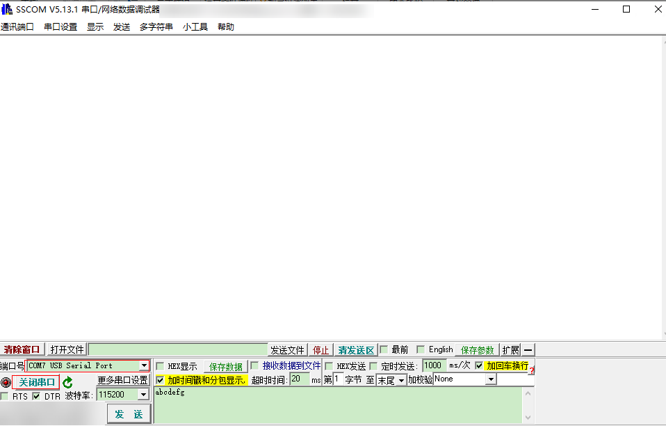

When the hardware is connected to the serial port tool, if a crash occurs on the board, the serial port tool can receive the crash information printed by the OS before the reset, as shown in [Figure 2](#fig18838131174015).

**Figure 2**  Crash information captured in the serial port tool<a name="fig18838131174015"></a>  
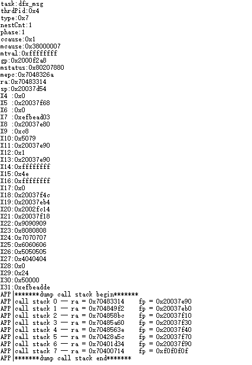

### Acquiring Information via DebugKits Tool<a name="ZH-CN_TOPIC_0000001837766153"></a>

**Tool Preparation<a name="section1975118511320"></a>**

First, enter the tool page, click options, and then select change chip. In the pop-up dialog box, select BS2X to confirm the chip type, as shown in [Figure 1](#fig3383638205710).

**Figure 1**  Selecting the chip<a name="fig3383638205710"></a>  


**Figure 2**  Changing the chip type to BS21<a name="fig159105010441"></a>  
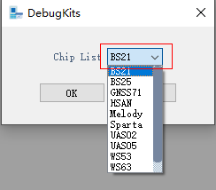

Then click Connection and select Connect. In the pop-up dialog box, select the connection mode and the corresponding channel number to connect, as shown in [Figure 3](#fig7102432074).

**Figure 3**  Connecting the chip<a name="fig7102432074"></a>  
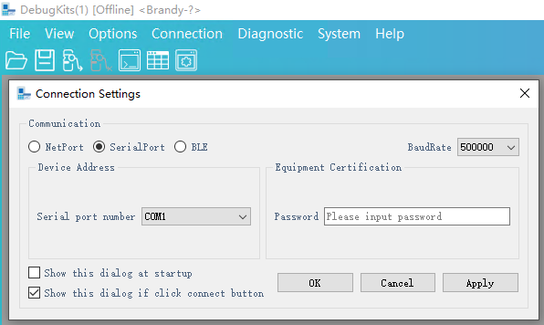

If it is the first time connecting the chip or the chip has a new version of the program, you need to update the HDB and reconnect so that log printing can be displayed correctly. Under the Option menu, select Update HDB, select the generated database directory (\\output\\bx2x\\database\_evb), and then click OK to complete the configuration. For details, see [Figure 4](#fig173346313114).

**Figure 4**  Configuring the database<a name="fig173346313114"></a>  


Through the DebugKits tool, you can observe in real time the specific information printed by the chip during running, as shown in [Figure 5](#fig1915112116514). When a crash occurs, the Message view prints the last word and last dump information.

**Figure 5**  DebugKits log printing<a name="fig1915112116514"></a>  


**Acquiring last word<a name="section293192518313"></a>**

The last word information sends the PC address, return address, stack address, and CPU register information when a crash occurs. Users can analyze the error type and locate the cause of the error based on the specific last word information, as shown in [Figure 6](#fig09401013124317).

**Figure 6**  last word information<a name="fig09401013124317"></a>  
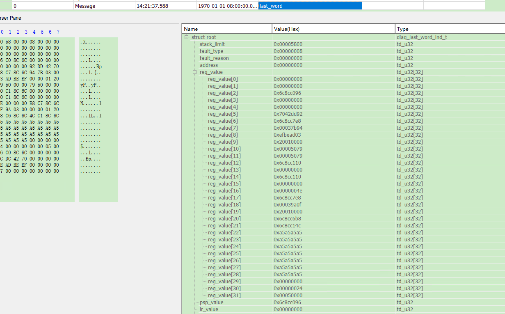

**Acquiring last dump information<a name="section12903431310"></a>**

The last dump information packages part of the memory content into a bin file and stores it in the DumpInfo subdirectory of the DebugKits installation directory, as shown in [Figure 7](#fig1695614017813). Users can locate the error location by analyzing these files. For usage, see [Dump Analysis](Dump解析.md).

**Figure 7**  Files generated by last dump<a name="fig1695614017813"></a>  
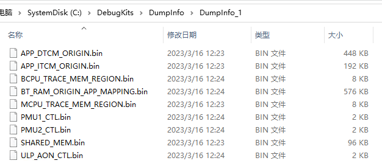

> **Note:** 
>Dumping the memory to DebugKits takes a certain amount of time (Liteos: 1 to 2 min, FreeRtos: 4 to 5 min). Therefore, if you need to use last dump to analyze crash information, do not reset immediately after a crash. Otherwise, the last dump information may not be completely acquired.

### Connecting the J-Link Debugger for Export<a name="ZH-CN_TOPIC_0000001790807024"></a>

In scenarios where connecting a JTAG debugger is allowed, users can connect tools such as the Lauterbach or J-Link emulator to further acquire related information at the crash site. The following mainly describes the process of acquiring crash-related information through the J-Link emulator.

If conditions permit, it is recommended to enable the no-reset-after-crash function for crash location. At the crash site, connect J-Link to view the information shown in the "[Serial Port Interface Output](串口界面输出.md)" section, and also query richer data such as memory information, stack information, peripheral registers, and diagnosis variables. This section mainly describes the process of exporting a crash using the J-Link debugger at the crash site.

To use the J-Link emulator for debugging, you must first connect the 20-pin header of the board. The specific header position is subject to the actual product.

After the hardware is connected, double-click the Commandline\_bx2x\_mcpu.bat script in the tool package (sdk\\tools\\bin\\jlink\_tool\\bx2x). The script automatically connects (for connecting other cores, refer to this method).

**Figure 1**  J-Link connecting to the MCPU schematic<a name="fig14167439113313"></a>  


> **Note:** 
>Note that a J-Link emulator of V10 or later is required for RISC-V architecture processors.

**Table 1**  Common J-Link commands

<a name="table1061103533519"></a>
<table><thead align="left"><tr id="row116113515356"><th class="cellrowborder" valign="top" width="32.18%" id="mcps1.2.3.1.1"><p id="p762153512353"><a name="p762153512353"></a><a name="p762153512353"></a>Command</p>
</th>
<th class="cellrowborder" valign="top" width="67.82000000000001%" id="mcps1.2.3.1.2"><p id="p186214355358"><a name="p186214355358"></a><a name="p186214355358"></a>Description</p>
</th>
</tr>
</thead>
<tbody><tr id="row7621535103515"><td class="cellrowborder" valign="top" width="32.18%" headers="mcps1.2.3.1.1 "><p id="p13621135173511"><a name="p13621135173511"></a><a name="p13621135173511"></a>con/connect</p>
</td>
<td class="cellrowborder" valign="top" width="67.82000000000001%" headers="mcps1.2.3.1.2 "><p id="p962735173518"><a name="p962735173518"></a><a name="p962735173518"></a>Connect.</p>
</td>
</tr>
<tr id="row1462535133520"><td class="cellrowborder" valign="top" width="32.18%" headers="mcps1.2.3.1.1 "><p id="p96273533516"><a name="p96273533516"></a><a name="p96273533516"></a>h/halt</p>
</td>
<td class="cellrowborder" valign="top" width="67.82000000000001%" headers="mcps1.2.3.1.2 "><p id="p962183593518"><a name="p962183593518"></a><a name="p962183593518"></a>Pause, stop.</p>
</td>
</tr>
<tr id="row76216355359"><td class="cellrowborder" valign="top" width="32.18%" headers="mcps1.2.3.1.1 "><p id="p66253515351"><a name="p66253515351"></a><a name="p66253515351"></a>g/go</p>
</td>
<td class="cellrowborder" valign="top" width="67.82000000000001%" headers="mcps1.2.3.1.2 "><p id="p762735133516"><a name="p762735133516"></a><a name="p762735133516"></a>Continue, run.</p>
</td>
</tr>
<tr id="row186210355352"><td class="cellrowborder" valign="top" width="32.18%" headers="mcps1.2.3.1.1 "><p id="p1606533664"><a name="p1606533664"></a><a name="p1606533664"></a>mem32</p>
<p id="p362153519353"><a name="p362153519353"></a><a name="p362153519353"></a>mem16</p>
<p id="p1682961920116"><a name="p1682961920116"></a><a name="p1682961920116"></a>mem8</p>
</td>
<td class="cellrowborder" valign="top" width="67.82000000000001%" headers="mcps1.2.3.1.2 "><p id="p7623350357"><a name="p7623350357"></a><a name="p7623350357"></a>I/O read 32-bit: mem32 &lt;Addr&gt;, &lt;NumItems&gt; (hex) (Addr indicates the memory address, and NumItems indicates the number of consecutive 32-bit values to read starting from Addr)</p>
<p id="p13585583213"><a name="p13585583213"></a><a name="p13585583213"></a>I/O read 16-bit: mem16 &lt;Addr&gt;, &lt;NumItems&gt; (hex)</p>
<p id="p6973914223"><a name="p6973914223"></a><a name="p6973914223"></a>I/O read 8-bit: mem8 &lt;Addr&gt;, &lt;NumItems&gt; (hex)</p>
</td>
</tr>
<tr id="row106243513510"><td class="cellrowborder" valign="top" width="32.18%" headers="mcps1.2.3.1.1 "><p id="p1111715614617"><a name="p1111715614617"></a><a name="p1111715614617"></a>w4</p>
<p id="p6510013716"><a name="p6510013716"></a><a name="p6510013716"></a>w2</p>
<p id="p96217354358"><a name="p96217354358"></a><a name="p96217354358"></a>w1</p>
</td>
<td class="cellrowborder" valign="top" width="67.82000000000001%" headers="mcps1.2.3.1.2 "><p id="p988117579397"><a name="p988117579397"></a><a name="p988117579397"></a>I/O write 4 bytes: w4 &lt;Addr&gt;, &lt;Data&gt; (hex)</p>
<p id="p1874975115281"><a name="p1874975115281"></a><a name="p1874975115281"></a>I/O write 2 bytes: w2 &lt;Addr&gt;, &lt;Data&gt; (hex)</p>
<p id="p132883527285"><a name="p132883527285"></a><a name="p132883527285"></a>I/O write 1 byte: w1 &lt;Addr&gt;, &lt;Data&gt; (hex)</p>
</td>
</tr>
<tr id="row14970194993820"><td class="cellrowborder" valign="top" width="32.18%" headers="mcps1.2.3.1.1 "><p id="p1197154963810"><a name="p1197154963810"></a><a name="p1197154963810"></a>readcsr</p>
</td>
<td class="cellrowborder" valign="top" width="67.82000000000001%" headers="mcps1.2.3.1.2 "><p id="p39711649103817"><a name="p39711649103817"></a><a name="p39711649103817"></a>Read riscv csr register: ReadCSR &lt;RegIndex&gt;</p>
</td>
</tr>
<tr id="row054423113918"><td class="cellrowborder" valign="top" width="32.18%" headers="mcps1.2.3.1.1 "><p id="p4544933392"><a name="p4544933392"></a><a name="p4544933392"></a>writecsr</p>
</td>
<td class="cellrowborder" valign="top" width="67.82000000000001%" headers="mcps1.2.3.1.2 "><p id="p15442373913"><a name="p15442373913"></a><a name="p15442373913"></a>Write riscv csr register: WriteCSR &lt;RegIndex&gt;,&lt;Value&gt;</p>
</td>
</tr>
</tbody>
</table>

**Querying I/O Information<a name="section329mcpsimp"></a>**

1.  Query CPU register information, as shown in [Figure 2](#fig17023605514).

    **Figure 2**  Querying CPU register values<a name="fig17023605514"></a>  
    

2.  Query memory information to acquire diagnosis variable values or common variable values.
    1.  Obtain the nm file in \\output\\bx2x\\xxx\_core\\xxx\_bx2x\_xxx\\xxx.nm, and obtain the address of the variable to be queried from the nm file. For example, in [Figure 3](#fig47228444013), the address of the "g-exception-dump-callback" variable is 0x20025950.

        **Figure 3**  Variable address<a name="fig47228444013"></a>  
        

    2.  Acquire status information through J-Link, as shown in [Figure 4](#fig1027883918595).

        **Figure 4**  Variable value<a name="fig1027883918595"></a>  
        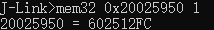

> **Note:** 
>The address information above is for demonstration purposes only. The query steps are for user reference.

## Crash Problem Location<a name="ZH-CN_TOPIC_0000001790807032"></a>

### Viewing Serial Port Crash Information<a name="ZH-CN_TOPIC_0000001837646201"></a>

When a crash occurs, the crash information described in [Serial Port Interface Output](串口界面输出.md) is generally output to the serial port. It contains several parts: exception information summary, CPU register information, and function call stack information.

#### Exception Information Summary<a name="ZH-CN_TOPIC_0000001790807016"></a>

**Table 1**  Exception information summary

<a name="table123725012514"></a>
<table><thead align="left"><tr id="row19376506258"><th class="cellrowborder" valign="top" width="19.439999999999998%" id="mcps1.2.3.1.1"><p id="p133735018259"><a name="p133735018259"></a><a name="p133735018259"></a>Member</p>
</th>
<th class="cellrowborder" valign="top" width="80.56%" id="mcps1.2.3.1.2"><p id="p1737175052516"><a name="p1737175052516"></a><a name="p1737175052516"></a>Description</p>
</th>
</tr>
</thead>
<tbody><tr id="row037135012253"><td class="cellrowborder" valign="top" width="19.439999999999998%" headers="mcps1.2.3.1.1 "><p id="p203718501253"><a name="p203718501253"></a><a name="p203718501253"></a>task</p>
</td>
<td class="cellrowborder" valign="top" width="80.56%" headers="mcps1.2.3.1.2 "><p id="p03755010251"><a name="p03755010251"></a><a name="p03755010251"></a>The name of the task that crashed.</p>
</td>
</tr>
<tr id="row23713503252"><td class="cellrowborder" valign="top" width="19.439999999999998%" headers="mcps1.2.3.1.1 "><p id="p183712502254"><a name="p183712502254"></a><a name="p183712502254"></a>thrdPid</p>
</td>
<td class="cellrowborder" valign="top" width="80.56%" headers="mcps1.2.3.1.2 "><p id="p17373506254"><a name="p17373506254"></a><a name="p17373506254"></a>The ID of the task that crashed.</p>
</td>
</tr>
<tr id="row123715019250"><td class="cellrowborder" valign="top" width="19.439999999999998%" headers="mcps1.2.3.1.1 "><p id="p1137250142513"><a name="p1137250142513"></a><a name="p1137250142513"></a>type</p>
</td>
<td class="cellrowborder" valign="top" width="80.56%" headers="mcps1.2.3.1.2 "><p id="p173785013251"><a name="p173785013251"></a><a name="p173785013251"></a>Crash type.</p>
</td>
</tr>
</tbody>
</table>

#### CPU Register Information<a name="ZH-CN_TOPIC_0000001790966736"></a>

**Table 1**  CPU register descriptions related to crashes

<a name="table452381744315"></a>
<table><thead align="left"><tr id="row185241717104310"><th class="cellrowborder" valign="top" width="18.38%" id="mcps1.2.3.1.1"><p id="p1449123094319"><a name="p1449123094319"></a><a name="p1449123094319"></a>Member</p>
</th>
<th class="cellrowborder" valign="top" width="81.62%" id="mcps1.2.3.1.2"><p id="p135245172436"><a name="p135245172436"></a><a name="p135245172436"></a>Description</p>
</th>
</tr>
</thead>
<tbody><tr id="row18524191734320"><td class="cellrowborder" valign="top" width="18.38%" headers="mcps1.2.3.1.1 "><p id="p35245177430"><a name="p35245177430"></a><a name="p35245177430"></a>mepc</p>
</td>
<td class="cellrowborder" valign="top" width="81.62%" headers="mcps1.2.3.1.2 "><p id="p7524717164320"><a name="p7524717164320"></a><a name="p7524717164320"></a>Machine exception program counter. When an exception occurs, mepc points to the instruction that caused the exception; for interrupts, mepc points to the location that should be restored after interrupt handling.</p>
</td>
</tr>
<tr id="row17524121712434"><td class="cellrowborder" valign="top" width="18.38%" headers="mcps1.2.3.1.1 "><p id="p20524171715438"><a name="p20524171715438"></a><a name="p20524171715438"></a>mstatus</p>
</td>
<td class="cellrowborder" valign="top" width="81.62%" headers="mcps1.2.3.1.2 "><p id="p9524191734312"><a name="p9524191734312"></a><a name="p9524191734312"></a>Machine status register.</p>
</td>
</tr>
<tr id="row11524717104319"><td class="cellrowborder" valign="top" width="18.38%" headers="mcps1.2.3.1.1 "><p id="p13524171716432"><a name="p13524171716432"></a><a name="p13524171716432"></a>mtval</p>
</td>
<td class="cellrowborder" valign="top" width="81.62%" headers="mcps1.2.3.1.2 "><p id="p5524171715436"><a name="p5524171715436"></a><a name="p5524171715436"></a>Machine trap register. It stores the address where an address exception occurred or the instruction itself when an instruction exception occurs. For other errors, its value is zero.</p>
</td>
</tr>
<tr id="row8524151794317"><td class="cellrowborder" valign="top" width="18.38%" headers="mcps1.2.3.1.1 "><p id="p1952411714436"><a name="p1952411714436"></a><a name="p1952411714436"></a>mcause</p>
</td>
<td class="cellrowborder" valign="top" width="81.62%" headers="mcps1.2.3.1.2 "><p id="p0526121714431"><a name="p0526121714431"></a><a name="p0526121714431"></a>Machine exception register. It stores the cause of the current exception or interrupt. Query the type of the current exception or interrupt by referring to <a href="#table349710585554">Table 2</a>.</p>
</td>
</tr>
<tr id="row2526517194317"><td class="cellrowborder" valign="top" width="18.38%" headers="mcps1.2.3.1.1 "><p id="p852641716436"><a name="p852641716436"></a><a name="p852641716436"></a>ccause</p>
</td>
<td class="cellrowborder" valign="top" width="81.62%" headers="mcps1.2.3.1.2 "><p id="p1352621713435"><a name="p1352621713435"></a><a name="p1352621713435"></a>Similar to mcause, ccause is a supplementary description of mcause. For some exceptions, the exception type can be further clarified by reading the content of the ccause register.</p>
</td>
</tr>
</tbody>
</table>

**Table 2**  mcause and ccause exception description table

<a name="table349710585554"></a>
<table><thead align="left"><tr id="row6497105820558"><th class="cellrowborder" valign="top" width="22.759999999999998%" id="mcps1.2.4.1.1"><p id="p94972588556"><a name="p94972588556"></a><a name="p94972588556"></a>Exception code</p>
</th>
<th class="cellrowborder" valign="top" width="43.91%" id="mcps1.2.4.1.2"><p id="p54971586557"><a name="p54971586557"></a><a name="p54971586557"></a>mcause exception description</p>
</th>
<th class="cellrowborder" valign="top" width="33.33%" id="mcps1.2.4.1.3"><p id="p04981958155512"><a name="p04981958155512"></a><a name="p04981958155512"></a>ccause exception description</p>
</th>
</tr>
</thead>
<tbody><tr id="row204988584551"><td class="cellrowborder" valign="top" width="22.759999999999998%" headers="mcps1.2.4.1.1 "><p id="p1949895895513"><a name="p1949895895513"></a><a name="p1949895895513"></a>0x0</p>
</td>
<td class="cellrowborder" valign="top" width="43.91%" headers="mcps1.2.4.1.2 "><p id="p2498105815510"><a name="p2498105815510"></a><a name="p2498105815510"></a>Instruction address misaligned</p>
</td>
<td class="cellrowborder" valign="top" width="33.33%" headers="mcps1.2.4.1.3 "><p id="p0498155810551"><a name="p0498155810551"></a><a name="p0498155810551"></a>Not available</p>
</td>
</tr>
<tr id="row54981582554"><td class="cellrowborder" valign="top" width="22.759999999999998%" headers="mcps1.2.4.1.1 "><p id="p102006432594"><a name="p102006432594"></a><a name="p102006432594"></a>0x1</p>
</td>
<td class="cellrowborder" valign="top" width="43.91%" headers="mcps1.2.4.1.2 "><p id="p12498458105520"><a name="p12498458105520"></a><a name="p12498458105520"></a>Instruction access fault</p>
</td>
<td class="cellrowborder" valign="top" width="33.33%" headers="mcps1.2.4.1.3 "><p id="p64981585551"><a name="p64981585551"></a><a name="p64981585551"></a>Memory map region access fault</p>
</td>
</tr>
<tr id="row1149814587552"><td class="cellrowborder" valign="top" width="22.759999999999998%" headers="mcps1.2.4.1.1 "><p id="p44981358105510"><a name="p44981358105510"></a><a name="p44981358105510"></a>0x2</p>
</td>
<td class="cellrowborder" valign="top" width="43.91%" headers="mcps1.2.4.1.2 "><p id="p849855805510"><a name="p849855805510"></a><a name="p849855805510"></a>Illegal instruction</p>
</td>
<td class="cellrowborder" valign="top" width="33.33%" headers="mcps1.2.4.1.3 "><p id="p1749812588553"><a name="p1749812588553"></a><a name="p1749812588553"></a>AXIM error response</p>
</td>
</tr>
<tr id="row17498175835510"><td class="cellrowborder" valign="top" width="22.759999999999998%" headers="mcps1.2.4.1.1 "><p id="p24981958105516"><a name="p24981958105516"></a><a name="p24981958105516"></a>0x3</p>
</td>
<td class="cellrowborder" valign="top" width="43.91%" headers="mcps1.2.4.1.2 "><p id="p9498125865517"><a name="p9498125865517"></a><a name="p9498125865517"></a>Breakpoint</p>
</td>
<td class="cellrowborder" valign="top" width="33.33%" headers="mcps1.2.4.1.3 "><p id="p1499105814555"><a name="p1499105814555"></a><a name="p1499105814555"></a>AHBM error response</p>
</td>
</tr>
<tr id="row114991558175514"><td class="cellrowborder" valign="top" width="22.759999999999998%" headers="mcps1.2.4.1.1 "><p id="p2499185813555"><a name="p2499185813555"></a><a name="p2499185813555"></a>0x4</p>
</td>
<td class="cellrowborder" valign="top" width="43.91%" headers="mcps1.2.4.1.2 "><p id="p164995588559"><a name="p164995588559"></a><a name="p164995588559"></a>Load address misaligned</p>
</td>
<td class="cellrowborder" valign="top" width="33.33%" headers="mcps1.2.4.1.3 "><p id="p6500758115511"><a name="p6500758115511"></a><a name="p6500758115511"></a>Crossing PMP entries</p>
</td>
</tr>
<tr id="row650018588556"><td class="cellrowborder" valign="top" width="22.759999999999998%" headers="mcps1.2.4.1.1 "><p id="p050065845510"><a name="p050065845510"></a><a name="p050065845510"></a>0x5</p>
</td>
<td class="cellrowborder" valign="top" width="43.91%" headers="mcps1.2.4.1.2 "><p id="p1250055820559"><a name="p1250055820559"></a><a name="p1250055820559"></a>Load access fault</p>
</td>
<td class="cellrowborder" valign="top" width="33.33%" headers="mcps1.2.4.1.3 "><p id="p1250025819557"><a name="p1250025819557"></a><a name="p1250025819557"></a>System register access fault</p>
</td>
</tr>
<tr id="row11501558135518"><td class="cellrowborder" valign="top" width="22.759999999999998%" headers="mcps1.2.4.1.1 "><p id="p16501758125520"><a name="p16501758125520"></a><a name="p16501758125520"></a>0x6</p>
</td>
<td class="cellrowborder" valign="top" width="43.91%" headers="mcps1.2.4.1.2 "><p id="p350175815518"><a name="p350175815518"></a><a name="p350175815518"></a>Store/AMO address misaligned</p>
</td>
<td class="cellrowborder" valign="top" width="33.33%" headers="mcps1.2.4.1.3 "><p id="p13501105865514"><a name="p13501105865514"></a><a name="p13501105865514"></a>No PMP entry matched</p>
</td>
</tr>
<tr id="row85012058175517"><td class="cellrowborder" valign="top" width="22.759999999999998%" headers="mcps1.2.4.1.1 "><p id="p175017585553"><a name="p175017585553"></a><a name="p175017585553"></a>0x7</p>
</td>
<td class="cellrowborder" valign="top" width="43.91%" headers="mcps1.2.4.1.2 "><p id="p105018585556"><a name="p105018585556"></a><a name="p105018585556"></a>Store/AMO access fault</p>
</td>
<td class="cellrowborder" valign="top" width="33.33%" headers="mcps1.2.4.1.3 "><p id="p5501105817553"><a name="p5501105817553"></a><a name="p5501105817553"></a>PMP access fault</p>
</td>
</tr>
<tr id="row1950195816557"><td class="cellrowborder" valign="top" width="22.759999999999998%" headers="mcps1.2.4.1.1 "><p id="p1250120588557"><a name="p1250120588557"></a><a name="p1250120588557"></a>0x8</p>
</td>
<td class="cellrowborder" valign="top" width="43.91%" headers="mcps1.2.4.1.2 "><p id="p1650125813555"><a name="p1650125813555"></a><a name="p1650125813555"></a>Environment call from U-mode</p>
</td>
<td class="cellrowborder" valign="top" width="33.33%" headers="mcps1.2.4.1.3 "><p id="p1950165885513"><a name="p1950165885513"></a><a name="p1950165885513"></a>CMO access fault</p>
</td>
</tr>
<tr id="row10501105875514"><td class="cellrowborder" valign="top" width="22.759999999999998%" headers="mcps1.2.4.1.1 "><p id="p850111588558"><a name="p850111588558"></a><a name="p850111588558"></a>0x9</p>
</td>
<td class="cellrowborder" valign="top" width="43.91%" headers="mcps1.2.4.1.2 "><p id="p7693831744"><a name="p7693831744"></a><a name="p7693831744"></a>Environment call from S-mode</p>
</td>
<td class="cellrowborder" valign="top" width="33.33%" headers="mcps1.2.4.1.3 "><p id="p1250185865514"><a name="p1250185865514"></a><a name="p1250185865514"></a>CSR access fault</p>
</td>
</tr>
<tr id="row175013580553"><td class="cellrowborder" valign="top" width="22.759999999999998%" headers="mcps1.2.4.1.1 "><p id="p17501155813558"><a name="p17501155813558"></a><a name="p17501155813558"></a>0xa</p>
</td>
<td class="cellrowborder" valign="top" width="43.91%" headers="mcps1.2.4.1.2 "><p id="p02523325418"><a name="p02523325418"></a><a name="p02523325418"></a>Reserved</p>
</td>
<td class="cellrowborder" valign="top" width="33.33%" headers="mcps1.2.4.1.3 "><p id="p2050120588551"><a name="p2050120588551"></a><a name="p2050120588551"></a>LDM/STMIA instruction</p>
</td>
</tr>
<tr id="row10501105814557"><td class="cellrowborder" valign="top" width="22.759999999999998%" headers="mcps1.2.4.1.1 "><p id="p15501115819555"><a name="p15501115819555"></a><a name="p15501115819555"></a>0xb</p>
</td>
<td class="cellrowborder" valign="top" width="43.91%" headers="mcps1.2.4.1.2 "><p id="p145011058175510"><a name="p145011058175510"></a><a name="p145011058175510"></a>Environment call from M-mode</p>
</td>
<td class="cellrowborder" valign="top" width="33.33%" headers="mcps1.2.4.1.3 "><p id="p1350165816551"><a name="p1350165816551"></a><a name="p1350165816551"></a>ITCM write access fault</p>
</td>
</tr>
<tr id="row75011581553"><td class="cellrowborder" valign="top" width="22.759999999999998%" headers="mcps1.2.4.1.1 "><p id="p125011558105513"><a name="p125011558105513"></a><a name="p125011558105513"></a>0xc</p>
</td>
<td class="cellrowborder" valign="top" width="43.91%" headers="mcps1.2.4.1.2 "><p id="p15501258135511"><a name="p15501258135511"></a><a name="p15501258135511"></a>Instruction page fault</p>
</td>
<td class="cellrowborder" valign="top" width="33.33%" headers="mcps1.2.4.1.3 "><p id="p145031958105511"><a name="p145031958105511"></a><a name="p145031958105511"></a>Not available</p>
</td>
</tr>
<tr id="row10503125825516"><td class="cellrowborder" valign="top" width="22.759999999999998%" headers="mcps1.2.4.1.1 "><p id="p14503858115514"><a name="p14503858115514"></a><a name="p14503858115514"></a>0xd</p>
</td>
<td class="cellrowborder" valign="top" width="43.91%" headers="mcps1.2.4.1.2 "><p id="p20503125814554"><a name="p20503125814554"></a><a name="p20503125814554"></a>Load page fault</p>
</td>
<td class="cellrowborder" valign="top" width="33.33%" headers="mcps1.2.4.1.3 "><p id="p1250319581557"><a name="p1250319581557"></a><a name="p1250319581557"></a>Not available</p>
</td>
</tr>
<tr id="row850325875515"><td class="cellrowborder" valign="top" width="22.759999999999998%" headers="mcps1.2.4.1.1 "><p id="p1950315865519"><a name="p1950315865519"></a><a name="p1950315865519"></a>0xe</p>
</td>
<td class="cellrowborder" valign="top" width="43.91%" headers="mcps1.2.4.1.2 "><p id="p950318582553"><a name="p950318582553"></a><a name="p950318582553"></a>Reserved</p>
</td>
<td class="cellrowborder" valign="top" width="33.33%" headers="mcps1.2.4.1.3 "><p id="p11503135810550"><a name="p11503135810550"></a><a name="p11503135810550"></a>Not available</p>
</td>
</tr>
<tr id="row195031758175511"><td class="cellrowborder" valign="top" width="22.759999999999998%" headers="mcps1.2.4.1.1 "><p id="p115035586556"><a name="p115035586556"></a><a name="p115035586556"></a>0xf</p>
</td>
<td class="cellrowborder" valign="top" width="43.91%" headers="mcps1.2.4.1.2 "><p id="p165034584555"><a name="p165034584555"></a><a name="p165034584555"></a>Store/AMO page fault</p>
</td>
<td class="cellrowborder" valign="top" width="33.33%" headers="mcps1.2.4.1.3 "><p id="p1250335815514"><a name="p1250335815514"></a><a name="p1250335815514"></a>Not available</p>
</td>
</tr>
<tr id="row850335811557"><td class="cellrowborder" valign="top" width="22.759999999999998%" headers="mcps1.2.4.1.1 "><p id="p4503858195518"><a name="p4503858195518"></a><a name="p4503858195518"></a>＞0xf</p>
</td>
<td class="cellrowborder" valign="top" width="43.91%" headers="mcps1.2.4.1.2 "><p id="p19503135845514"><a name="p19503135845514"></a><a name="p19503135845514"></a>Reserved</p>
</td>
<td class="cellrowborder" valign="top" width="33.33%" headers="mcps1.2.4.1.3 "><p id="p350315585555"><a name="p350315585555"></a><a name="p350315585555"></a>Not available</p>
</td>
</tr>
</tbody>
</table>

#### Function Call Stack Information<a name="ZH-CN_TOPIC_0000001837646205"></a>

The function call stack displays all function call instructions related to the exception. Users can check the context of function calls when the exception occurs based on the call stack for problem location. call back 0 is the top function of the stack, and its corresponding ra is the address of the top function, and so on.

Users can find the corresponding function in output/bx2x/acore/standard-bx2x-app-evb/application.lst.

### Viewing last word Information<a name="ZH-CN_TOPIC_0000001790807020"></a>

As described in "[Acquiring Information via DebugKits Tool](DebugKits工具获取信息.md)", when a crash occurs, the last word information is also sent to the DebugKits tool.

The content and meaning of the last word report are shown in [Table 1](#table32188330) (the items in parentheses in the specific meanings are aliases).

**Table 1**  last word content

<a name="table32188330"></a>
<table><thead align="left"><tr id="row132168232"><th class="cellrowborder" valign="top" width="50%" id="mcps1.2.3.1.1"><p id="p14211086312"><a name="p14211086312"></a><a name="p14211086312"></a>Variable name</p>
</th>
<th class="cellrowborder" valign="top" width="50%" id="mcps1.2.3.1.2"><p id="p521186311"><a name="p521186311"></a><a name="p521186311"></a>Specific meaning</p>
</th>
</tr>
</thead>
<tbody><tr id="row2021481336"><td class="cellrowborder" valign="top" width="50%" headers="mcps1.2.3.1.1 "><p id="p1721781136"><a name="p1721781136"></a><a name="p1721781136"></a>stack_limit</p>
</td>
<td class="cellrowborder" valign="top" width="50%" headers="mcps1.2.3.1.2 "><p id="p321981832"><a name="p321981832"></a><a name="p321981832"></a>System stack size.</p>
</td>
</tr>
<tr id="row1521681638"><td class="cellrowborder" valign="top" width="50%" headers="mcps1.2.3.1.1 "><p id="p16211080317"><a name="p16211080317"></a><a name="p16211080317"></a>fault_type</p>
</td>
<td class="cellrowborder" valign="top" width="50%" headers="mcps1.2.3.1.2 "><p id="p721881238"><a name="p721881238"></a><a name="p721881238"></a>Error type.</p>
</td>
</tr>
<tr id="row0213819318"><td class="cellrowborder" valign="top" width="50%" headers="mcps1.2.3.1.1 "><p id="p421481031"><a name="p421481031"></a><a name="p421481031"></a>fault_address</p>
</td>
<td class="cellrowborder" valign="top" width="50%" headers="mcps1.2.3.1.2 "><p id="p1211811317"><a name="p1211811317"></a><a name="p1211811317"></a>Fault address. The attribute value is meaningless.</p>
</td>
</tr>
<tr id="row921208930"><td class="cellrowborder" valign="top" width="50%" headers="mcps1.2.3.1.1 "><p id="p1821288317"><a name="p1821288317"></a><a name="p1821288317"></a>fault_reason</p>
</td>
<td class="cellrowborder" valign="top" width="50%" headers="mcps1.2.3.1.2 "><p id="p121818339414"><a name="p121818339414"></a><a name="p121818339414"></a>Fault reason. The attribute value is meaningless.</p>
</td>
</tr>
<tr id="row182112819317"><td class="cellrowborder" valign="top" width="50%" headers="mcps1.2.3.1.1 "><p id="p15211281633"><a name="p15211281633"></a><a name="p15211281633"></a>reg_value</p>
</td>
<td class="cellrowborder" valign="top" width="50%" headers="mcps1.2.3.1.2 "><p id="p16211282314"><a name="p16211282314"></a><a name="p16211282314"></a>Saved register value.</p>
</td>
</tr>
<tr id="row9211682313"><td class="cellrowborder" valign="top" width="50%" headers="mcps1.2.3.1.1 "><p id="p1922158931"><a name="p1922158931"></a><a name="p1922158931"></a>psp_value</p>
</td>
<td class="cellrowborder" valign="top" width="50%" headers="mcps1.2.3.1.2 "><p id="p1522198635"><a name="p1522198635"></a><a name="p1522198635"></a>Stack pointer.</p>
</td>
</tr>
<tr id="row22248238"><td class="cellrowborder" valign="top" width="50%" headers="mcps1.2.3.1.1 "><p id="p172213816319"><a name="p172213816319"></a><a name="p172213816319"></a>lr_value</p>
</td>
<td class="cellrowborder" valign="top" width="50%" headers="mcps1.2.3.1.2 "><p id="p1122178435"><a name="p1122178435"></a><a name="p1122178435"></a>Return address.</p>
</td>
</tr>
<tr id="row1221681316"><td class="cellrowborder" valign="top" width="50%" headers="mcps1.2.3.1.1 "><p id="p15226814313"><a name="p15226814313"></a><a name="p15226814313"></a>pc_value</p>
</td>
<td class="cellrowborder" valign="top" width="50%" headers="mcps1.2.3.1.2 "><p id="p202208236"><a name="p202208236"></a><a name="p202208236"></a>The instruction address where the error occurred (mepc).</p>
</td>
</tr>
<tr id="row1022188317"><td class="cellrowborder" valign="top" width="50%" headers="mcps1.2.3.1.1 "><p id="p4221181739"><a name="p4221181739"></a><a name="p4221181739"></a>psps_value</p>
</td>
<td class="cellrowborder" valign="top" width="50%" headers="mcps1.2.3.1.2 "><p id="p192217815312"><a name="p192217815312"></a><a name="p192217815312"></a>Global pointer.</p>
</td>
</tr>
<tr id="row1822148636"><td class="cellrowborder" valign="top" width="50%" headers="mcps1.2.3.1.1 "><p id="p6221281433"><a name="p6221281433"></a><a name="p6221281433"></a>primask_value</p>
</td>
<td class="cellrowborder" valign="top" width="50%" headers="mcps1.2.3.1.2 "><p id="p15221689316"><a name="p15221689316"></a><a name="p15221689316"></a>Exception status register (mstatus).</p>
</td>
</tr>
<tr id="row322988310"><td class="cellrowborder" valign="top" width="50%" headers="mcps1.2.3.1.1 "><p id="p1422682030"><a name="p1422682030"></a><a name="p1422682030"></a>fault_mask_value</p>
</td>
<td class="cellrowborder" valign="top" width="50%" headers="mcps1.2.3.1.2 "><p id="p8221485314"><a name="p8221485314"></a><a name="p8221485314"></a>The abnormal address or value accessed by the CPU (mtval).</p>
</td>
</tr>
<tr id="row1522385318"><td class="cellrowborder" valign="top" width="50%" headers="mcps1.2.3.1.1 "><p id="p10224819314"><a name="p10224819314"></a><a name="p10224819314"></a>bserpri_value</p>
</td>
<td class="cellrowborder" valign="top" width="50%" headers="mcps1.2.3.1.2 "><p id="p13221181531"><a name="p13221181531"></a><a name="p13221181531"></a>Custom exception status register (ccause).</p>
</td>
</tr>
<tr id="row12227818311"><td class="cellrowborder" valign="top" width="50%" headers="mcps1.2.3.1.1 "><p id="p8221781932"><a name="p8221781932"></a><a name="p8221781932"></a>control_value</p>
</td>
<td class="cellrowborder" valign="top" width="50%" headers="mcps1.2.3.1.2 "><p id="p6727111512519"><a name="p6727111512519"></a><a name="p6727111512519"></a>The abnormal address or value accessed by the CPU (mtval).</p>
</td>
</tr>
</tbody>
</table>

The specific meanings of the register values (reg\_value) saved in the last word content above are shown in [Table 2](#table16496164717509).

**Table 2**  Meanings of reg\_value members

<a name="table16496164717509"></a>
<table><thead align="left"><tr id="row949644775019"><th class="cellrowborder" valign="top" width="33.96%" id="mcps1.2.3.1.1"><p id="p10496134712503"><a name="p10496134712503"></a><a name="p10496134712503"></a>Member name</p>
</th>
<th class="cellrowborder" valign="top" width="66.03999999999999%" id="mcps1.2.3.1.2"><p id="p349620477502"><a name="p349620477502"></a><a name="p349620477502"></a>Member meaning</p>
</th>
</tr>
</thead>
<tbody><tr id="row149744710505"><td class="cellrowborder" valign="top" width="33.96%" headers="mcps1.2.3.1.1 "><p id="p1249764755017"><a name="p1249764755017"></a><a name="p1249764755017"></a>reg_value[0]</p>
</td>
<td class="cellrowborder" valign="top" width="66.03999999999999%" headers="mcps1.2.3.1.2 "><p id="p949718471504"><a name="p949718471504"></a><a name="p949718471504"></a>No meaning</p>
</td>
</tr>
<tr id="row11497144711501"><td class="cellrowborder" valign="top" width="33.96%" headers="mcps1.2.3.1.1 "><p id="p11393645125612"><a name="p11393645125612"></a><a name="p11393645125612"></a>reg_value[1]</p>
</td>
<td class="cellrowborder" valign="top" width="66.03999999999999%" headers="mcps1.2.3.1.2 "><p id="p184975478503"><a name="p184975478503"></a><a name="p184975478503"></a>Return address (ra)</p>
</td>
</tr>
<tr id="row1817123814524"><td class="cellrowborder" valign="top" width="33.96%" headers="mcps1.2.3.1.1 "><p id="p7981144555618"><a name="p7981144555618"></a><a name="p7981144555618"></a>reg_value[2]</p>
</td>
<td class="cellrowborder" valign="top" width="66.03999999999999%" headers="mcps1.2.3.1.2 "><p id="p17172133812521"><a name="p17172133812521"></a><a name="p17172133812521"></a>Stack pointer (sp)</p>
</td>
</tr>
<tr id="row9645151920526"><td class="cellrowborder" valign="top" width="33.96%" headers="mcps1.2.3.1.1 "><p id="p761315466563"><a name="p761315466563"></a><a name="p761315466563"></a>reg_value[3]</p>
</td>
<td class="cellrowborder" valign="top" width="66.03999999999999%" headers="mcps1.2.3.1.2 "><p id="p10645019195212"><a name="p10645019195212"></a><a name="p10645019195212"></a>Global pointer (gp)</p>
</td>
</tr>
<tr id="row9335436155212"><td class="cellrowborder" valign="top" width="33.96%" headers="mcps1.2.3.1.1 "><p id="p22201047145614"><a name="p22201047145614"></a><a name="p22201047145614"></a>reg_value[4]</p>
</td>
<td class="cellrowborder" valign="top" width="66.03999999999999%" headers="mcps1.2.3.1.2 "><p id="p8335436155210"><a name="p8335436155210"></a><a name="p8335436155210"></a>Thread pointer (tp)</p>
</td>
</tr>
<tr id="row84231634105219"><td class="cellrowborder" valign="top" width="33.96%" headers="mcps1.2.3.1.1 "><p id="p411394915566"><a name="p411394915566"></a><a name="p411394915566"></a>reg_value[5]</p>
</td>
<td class="cellrowborder" valign="top" width="66.03999999999999%" headers="mcps1.2.3.1.2 "><p id="p1642373465219"><a name="p1642373465219"></a><a name="p1642373465219"></a>Temporary register (t0)</p>
</td>
</tr>
<tr id="row1769632105214"><td class="cellrowborder" valign="top" width="33.96%" headers="mcps1.2.3.1.1 "><p id="p782218499565"><a name="p782218499565"></a><a name="p782218499565"></a>reg_value[6]</p>
</td>
<td class="cellrowborder" valign="top" width="66.03999999999999%" headers="mcps1.2.3.1.2 "><p id="p46933295211"><a name="p46933295211"></a><a name="p46933295211"></a>Temporary register (t1)</p>
</td>
</tr>
<tr id="row18984182945213"><td class="cellrowborder" valign="top" width="33.96%" headers="mcps1.2.3.1.1 "><p id="p15210105119566"><a name="p15210105119566"></a><a name="p15210105119566"></a>reg_value[7]</p>
</td>
<td class="cellrowborder" valign="top" width="66.03999999999999%" headers="mcps1.2.3.1.2 "><p id="p10984129145210"><a name="p10984129145210"></a><a name="p10984129145210"></a>Temporary register (t2)</p>
</td>
</tr>
<tr id="row579252714525"><td class="cellrowborder" valign="top" width="33.96%" headers="mcps1.2.3.1.1 "><p id="p9583451135614"><a name="p9583451135614"></a><a name="p9583451135614"></a>reg_value[8]</p>
</td>
<td class="cellrowborder" valign="top" width="66.03999999999999%" headers="mcps1.2.3.1.2 "><p id="p8792027105216"><a name="p8792027105216"></a><a name="p8792027105216"></a>Register that must be saved by the called function / frame pointer of the call stack (s0)</p>
</td>
</tr>
<tr id="row5789132517525"><td class="cellrowborder" valign="top" width="33.96%" headers="mcps1.2.3.1.1 "><p id="p2951135105616"><a name="p2951135105616"></a><a name="p2951135105616"></a>reg_value[9]</p>
</td>
<td class="cellrowborder" valign="top" width="66.03999999999999%" headers="mcps1.2.3.1.2 "><p id="p14789525165220"><a name="p14789525165220"></a><a name="p14789525165220"></a>Register that must be saved by the called function (s1)</p>
</td>
</tr>
<tr id="row20513202316522"><td class="cellrowborder" valign="top" width="33.96%" headers="mcps1.2.3.1.1 "><p id="p7352952165616"><a name="p7352952165616"></a><a name="p7352952165616"></a>reg_value[10]</p>
</td>
<td class="cellrowborder" valign="top" width="66.03999999999999%" headers="mcps1.2.3.1.2 "><p id="p05131623115216"><a name="p05131623115216"></a><a name="p05131623115216"></a>Function argument/return value (a0)</p>
</td>
</tr>
<tr id="row20940235529"><td class="cellrowborder" valign="top" width="33.96%" headers="mcps1.2.3.1.1 "><p id="p980415265615"><a name="p980415265615"></a><a name="p980415265615"></a>reg_value[11]</p>
</td>
<td class="cellrowborder" valign="top" width="66.03999999999999%" headers="mcps1.2.3.1.2 "><p id="p1594014313523"><a name="p1594014313523"></a><a name="p1594014313523"></a>Function argument/return value (a1)</p>
</td>
</tr>
<tr id="row7511112111521"><td class="cellrowborder" valign="top" width="33.96%" headers="mcps1.2.3.1.1 "><p id="p931116539566"><a name="p931116539566"></a><a name="p931116539566"></a>reg_value[12]</p>
</td>
<td class="cellrowborder" valign="top" width="66.03999999999999%" headers="mcps1.2.3.1.2 "><p id="p1951115213526"><a name="p1951115213526"></a><a name="p1951115213526"></a>Function argument (a2)</p>
</td>
</tr>
<tr id="row1647621795216"><td class="cellrowborder" valign="top" width="33.96%" headers="mcps1.2.3.1.1 "><p id="p18770195311567"><a name="p18770195311567"></a><a name="p18770195311567"></a>reg_value[13]</p>
</td>
<td class="cellrowborder" valign="top" width="66.03999999999999%" headers="mcps1.2.3.1.2 "><p id="p54764170525"><a name="p54764170525"></a><a name="p54764170525"></a>Function argument (a3)</p>
</td>
</tr>
<tr id="row13577111525214"><td class="cellrowborder" valign="top" width="33.96%" headers="mcps1.2.3.1.1 "><p id="p9172654145617"><a name="p9172654145617"></a><a name="p9172654145617"></a>reg_value[14]</p>
</td>
<td class="cellrowborder" valign="top" width="66.03999999999999%" headers="mcps1.2.3.1.2 "><p id="p9577815195215"><a name="p9577815195215"></a><a name="p9577815195215"></a>Function argument (a4)</p>
</td>
</tr>
<tr id="row125031113175216"><td class="cellrowborder" valign="top" width="33.96%" headers="mcps1.2.3.1.1 "><p id="p757015415617"><a name="p757015415617"></a><a name="p757015415617"></a>reg_value[15]</p>
</td>
<td class="cellrowborder" valign="top" width="66.03999999999999%" headers="mcps1.2.3.1.2 "><p id="p150351316529"><a name="p150351316529"></a><a name="p150351316529"></a>Function argument (a5)</p>
</td>
</tr>
<tr id="row1571931015211"><td class="cellrowborder" valign="top" width="33.96%" headers="mcps1.2.3.1.1 "><p id="p1210145555615"><a name="p1210145555615"></a><a name="p1210145555615"></a>reg_value[16]</p>
</td>
<td class="cellrowborder" valign="top" width="66.03999999999999%" headers="mcps1.2.3.1.2 "><p id="p1671951016529"><a name="p1671951016529"></a><a name="p1671951016529"></a>Function argument (a6)</p>
</td>
</tr>
<tr id="row19609168115213"><td class="cellrowborder" valign="top" width="33.96%" headers="mcps1.2.3.1.1 "><p id="p7430145555619"><a name="p7430145555619"></a><a name="p7430145555619"></a>reg_value[17]</p>
</td>
<td class="cellrowborder" valign="top" width="66.03999999999999%" headers="mcps1.2.3.1.2 "><p id="p126101689526"><a name="p126101689526"></a><a name="p126101689526"></a>Function argument (a7)</p>
</td>
</tr>
<tr id="row1581136125211"><td class="cellrowborder" valign="top" width="33.96%" headers="mcps1.2.3.1.1 "><p id="p13790135595614"><a name="p13790135595614"></a><a name="p13790135595614"></a>reg_value[18]</p>
</td>
<td class="cellrowborder" valign="top" width="66.03999999999999%" headers="mcps1.2.3.1.2 "><p id="p98216605211"><a name="p98216605211"></a><a name="p98216605211"></a>Register that must be saved by the called function (s2)</p>
</td>
</tr>
<tr id="row2959195516512"><td class="cellrowborder" valign="top" width="33.96%" headers="mcps1.2.3.1.1 "><p id="p91609565567"><a name="p91609565567"></a><a name="p91609565567"></a>reg_value[19]</p>
</td>
<td class="cellrowborder" valign="top" width="66.03999999999999%" headers="mcps1.2.3.1.2 "><p id="p1196055518516"><a name="p1196055518516"></a><a name="p1196055518516"></a>Register that must be saved by the called function (s3)</p>
</td>
</tr>
<tr id="row1793412125218"><td class="cellrowborder" valign="top" width="33.96%" headers="mcps1.2.3.1.1 "><p id="p115691956125611"><a name="p115691956125611"></a><a name="p115691956125611"></a>reg_value[20]</p>
</td>
<td class="cellrowborder" valign="top" width="66.03999999999999%" headers="mcps1.2.3.1.2 "><p id="p593415165212"><a name="p593415165212"></a><a name="p593415165212"></a>Register that must be saved by the called function (s4)</p>
</td>
</tr>
<tr id="row641945355118"><td class="cellrowborder" valign="top" width="33.96%" headers="mcps1.2.3.1.1 "><p id="p4973185635616"><a name="p4973185635616"></a><a name="p4973185635616"></a>reg_value[21]</p>
</td>
<td class="cellrowborder" valign="top" width="66.03999999999999%" headers="mcps1.2.3.1.2 "><p id="p54191253205115"><a name="p54191253205115"></a><a name="p54191253205115"></a>Register that must be saved by the called function (s5)</p>
</td>
</tr>
<tr id="row1179985816517"><td class="cellrowborder" valign="top" width="33.96%" headers="mcps1.2.3.1.1 "><p id="p3380135785619"><a name="p3380135785619"></a><a name="p3380135785619"></a>reg_value[22]</p>
</td>
<td class="cellrowborder" valign="top" width="66.03999999999999%" headers="mcps1.2.3.1.2 "><p id="p1280011581516"><a name="p1280011581516"></a><a name="p1280011581516"></a>Register that must be saved by the called function (s6)</p>
</td>
</tr>
<tr id="row1749734712502"><td class="cellrowborder" valign="top" width="33.96%" headers="mcps1.2.3.1.1 "><p id="p27815575563"><a name="p27815575563"></a><a name="p27815575563"></a>reg_value[23]</p>
</td>
<td class="cellrowborder" valign="top" width="66.03999999999999%" headers="mcps1.2.3.1.2 "><p id="p0497204711504"><a name="p0497204711504"></a><a name="p0497204711504"></a>Register that must be saved by the called function (s7)</p>
</td>
</tr>
<tr id="row1549717476501"><td class="cellrowborder" valign="top" width="33.96%" headers="mcps1.2.3.1.1 "><p id="p3162205813564"><a name="p3162205813564"></a><a name="p3162205813564"></a>reg_value[24]</p>
</td>
<td class="cellrowborder" valign="top" width="66.03999999999999%" headers="mcps1.2.3.1.2 "><p id="p849744711509"><a name="p849744711509"></a><a name="p849744711509"></a>Register that must be saved by the called function (s8)</p>
</td>
</tr>
<tr id="row734435185114"><td class="cellrowborder" valign="top" width="33.96%" headers="mcps1.2.3.1.1 "><p id="p460155818560"><a name="p460155818560"></a><a name="p460155818560"></a>reg_value[25]</p>
</td>
<td class="cellrowborder" valign="top" width="66.03999999999999%" headers="mcps1.2.3.1.2 "><p id="p934415175111"><a name="p934415175111"></a><a name="p934415175111"></a>Register that must be saved by the called function (s9)</p>
</td>
</tr>
<tr id="row936913487516"><td class="cellrowborder" valign="top" width="33.96%" headers="mcps1.2.3.1.1 "><p id="p4101959145618"><a name="p4101959145618"></a><a name="p4101959145618"></a>reg_value[26]</p>
</td>
<td class="cellrowborder" valign="top" width="66.03999999999999%" headers="mcps1.2.3.1.2 "><p id="p43701748165116"><a name="p43701748165116"></a><a name="p43701748165116"></a>Register that must be saved by the called function (s10)</p>
</td>
</tr>
<tr id="row4497144719505"><td class="cellrowborder" valign="top" width="33.96%" headers="mcps1.2.3.1.1 "><p id="p193801059135611"><a name="p193801059135611"></a><a name="p193801059135611"></a>reg_value[27]</p>
</td>
<td class="cellrowborder" valign="top" width="66.03999999999999%" headers="mcps1.2.3.1.2 "><p id="p3497164775013"><a name="p3497164775013"></a><a name="p3497164775013"></a>Register that must be saved by the called function (s11)</p>
</td>
</tr>
<tr id="row10497154735017"><td class="cellrowborder" valign="top" width="33.96%" headers="mcps1.2.3.1.1 "><p id="p15810155913568"><a name="p15810155913568"></a><a name="p15810155913568"></a>reg_value[28]</p>
</td>
<td class="cellrowborder" valign="top" width="66.03999999999999%" headers="mcps1.2.3.1.2 "><p id="p6497184775015"><a name="p6497184775015"></a><a name="p6497184775015"></a>Temporary register (t3)</p>
</td>
</tr>
<tr id="row15701523155110"><td class="cellrowborder" valign="top" width="33.96%" headers="mcps1.2.3.1.1 "><p id="p022280165710"><a name="p022280165710"></a><a name="p022280165710"></a>reg_value[29]</p>
</td>
<td class="cellrowborder" valign="top" width="66.03999999999999%" headers="mcps1.2.3.1.2 "><p id="p12711523105120"><a name="p12711523105120"></a><a name="p12711523105120"></a>Temporary register (t4)</p>
</td>
</tr>
<tr id="row12814184417517"><td class="cellrowborder" valign="top" width="33.96%" headers="mcps1.2.3.1.1 "><p id="p1567312017572"><a name="p1567312017572"></a><a name="p1567312017572"></a>reg_value[30]</p>
</td>
<td class="cellrowborder" valign="top" width="66.03999999999999%" headers="mcps1.2.3.1.2 "><p id="p8814144445113"><a name="p8814144445113"></a><a name="p8814144445113"></a>Temporary register (t5)</p>
</td>
</tr>
<tr id="row114975476505"><td class="cellrowborder" valign="top" width="33.96%" headers="mcps1.2.3.1.1 "><p id="p910015116578"><a name="p910015116578"></a><a name="p910015116578"></a>reg_value[31]</p>
</td>
<td class="cellrowborder" valign="top" width="66.03999999999999%" headers="mcps1.2.3.1.2 "><p id="p154971747185019"><a name="p154971747185019"></a><a name="p154971747185019"></a>Temporary register (t6)</p>
</td>
</tr>
</tbody>
</table>

### Viewing Memory last dump Information<a name="ZH-CN_TOPIC_0000001790807028"></a>

As described in "[Acquiring Information via DebugKits Tool](DebugKits工具获取信息.md)", when a crash occurs, the current memory is dumped to DebugKits and saved, and related tools can be used for further analysis. For detailed usage, see "[Dump Analysis](Dump解析.md)".

### Watchdog Restart Problem Location<a name="ZH-CN_TOPIC_0000001837766145"></a>

Restart problems caused by watchdog crashes are most likely caused by infinite loops in the code (including loops with a large number of iterations) or a service that is always being executed (for example, packet injection), which prevents the IDLE task from being scheduled, and the watchdog is not fed within the specified time, resulting in a restart. The specific crash location can usually be determined using the information in [Table 1](#_table23412448246) together with the lst file.

**Table 1**  Key information about watchdog crashes

<a name="_table23412448246"></a>
<table><thead align="left"><tr id="row622mcpsimp"><th class="cellrowborder" valign="top" width="21.42%" id="mcps1.2.3.1.1"><p id="p624mcpsimp"><a name="p624mcpsimp"></a><a name="p624mcpsimp"></a>Member</p>
</th>
<th class="cellrowborder" valign="top" width="78.58000000000001%" id="mcps1.2.3.1.2"><p id="p626mcpsimp"><a name="p626mcpsimp"></a><a name="p626mcpsimp"></a>Description</p>
</th>
</tr>
</thead>
<tbody><tr id="row628mcpsimp"><td class="cellrowborder" valign="top" width="21.42%" headers="mcps1.2.3.1.1 "><p id="p630mcpsimp"><a name="p630mcpsimp"></a><a name="p630mcpsimp"></a>mepc</p>
</td>
<td class="cellrowborder" valign="top" width="78.58000000000001%" headers="mcps1.2.3.1.2 "><p id="p632mcpsimp"><a name="p632mcpsimp"></a><a name="p632mcpsimp"></a>Use mepc to determine the pc when the watchdog expires. Based on probability, this code is basically the code that is called in an infinite loop.</p>
</td>
</tr>
<tr id="row633mcpsimp"><td class="cellrowborder" valign="top" width="21.42%" headers="mcps1.2.3.1.1 "><p id="p635mcpsimp"><a name="p635mcpsimp"></a><a name="p635mcpsimp"></a>Return address (ra) and stack</p>
</td>
<td class="cellrowborder" valign="top" width="78.58000000000001%" headers="mcps1.2.3.1.2 "><p id="p637mcpsimp"><a name="p637mcpsimp"></a><a name="p637mcpsimp"></a>If mepc is in a common function, such as memcpy, the function call flow can be further confirmed through ra and stack contents.</p>
</td>
</tr>
</tbody>
</table>

### CPU Exception-Triggered Restart Problem Location<a name="ZH-CN_TOPIC_0000001837766161"></a>

Based on the description of the fault\_type value, you can confirm which type of crash the CPU exception-triggered restart is.

**Table 1**  Meanings of fault\_type for CPU exceptions

<a name="table640mcpsimp"></a>
<table><thead align="left"><tr id="row645mcpsimp"><th class="cellrowborder" valign="top" width="30.72%" id="mcps1.2.3.1.1"><p id="p34162013141819"><a name="p34162013141819"></a><a name="p34162013141819"></a>fault\_type error</p>
</th>
<th class="cellrowborder" valign="top" width="69.28%" id="mcps1.2.3.1.2"><p id="p649mcpsimp"><a name="p649mcpsimp"></a><a name="p649mcpsimp"></a>Description</p>
</th>
</tr>
</thead>
<tbody><tr id="row11380187131915"><td class="cellrowborder" valign="top" width="30.72%" headers="mcps1.2.3.1.1 "><p id="p2381676194"><a name="p2381676194"></a><a name="p2381676194"></a>Instruction address misaligned</p>
</td>
<td class="cellrowborder" valign="top" width="69.28%" headers="mcps1.2.3.1.2 "><p id="p19381175191"><a name="p19381175191"></a><a name="p19381175191"></a>The fetch address is not aligned. RISC-V requires instructions to be aligned at two-byte boundaries.</p>
</td>
</tr>
<tr id="row1324782415194"><td class="cellrowborder" valign="top" width="30.72%" headers="mcps1.2.3.1.1 "><p id="p1624752419197"><a name="p1624752419197"></a><a name="p1624752419197"></a>Instruction access fault</p>
</td>
<td class="cellrowborder" valign="top" width="69.28%" headers="mcps1.2.3.1.2 "><p id="p152471224171919"><a name="p152471224171919"></a><a name="p152471224171919"></a>The fetch address is abnormal.</p>
</td>
</tr>
<tr id="row2606112118196"><td class="cellrowborder" valign="top" width="30.72%" headers="mcps1.2.3.1.1 "><p id="p7606321161910"><a name="p7606321161910"></a><a name="p7606321161910"></a>Illegal instruction</p>
</td>
<td class="cellrowborder" valign="top" width="69.28%" headers="mcps1.2.3.1.2 "><p id="p2606192191916"><a name="p2606192191916"></a><a name="p2606192191916"></a>Illegal instruction.</p>
</td>
</tr>
<tr id="row1683141831915"><td class="cellrowborder" valign="top" width="30.72%" headers="mcps1.2.3.1.1 "><p id="p1683131821913"><a name="p1683131821913"></a><a name="p1683131821913"></a>Load address misaligned</p>
</td>
<td class="cellrowborder" valign="top" width="69.28%" headers="mcps1.2.3.1.2 "><p id="p116831318171910"><a name="p116831318171910"></a><a name="p116831318171910"></a>The target address for data loading is not aligned.</p>
</td>
</tr>
<tr id="row09211510191"><td class="cellrowborder" valign="top" width="30.72%" headers="mcps1.2.3.1.1 "><p id="p892141531913"><a name="p892141531913"></a><a name="p892141531913"></a>Load access fault</p>
</td>
<td class="cellrowborder" valign="top" width="69.28%" headers="mcps1.2.3.1.2 "><p id="p179271513194"><a name="p179271513194"></a><a name="p179271513194"></a>The destination address for data loading is an address where read operations are prohibited.</p>
</td>
</tr>
<tr id="row16523112101913"><td class="cellrowborder" valign="top" width="30.72%" headers="mcps1.2.3.1.1 "><p id="p05238122193"><a name="p05238122193"></a><a name="p05238122193"></a>Store/AMO address misaligned</p>
</td>
<td class="cellrowborder" valign="top" width="69.28%" headers="mcps1.2.3.1.2 "><p id="p145231512131917"><a name="p145231512131917"></a><a name="p145231512131917"></a>The target address for storing data is not aligned.</p>
</td>
</tr>
<tr id="row651mcpsimp"><td class="cellrowborder" valign="top" width="30.72%" headers="mcps1.2.3.1.1 "><p id="p23463717202"><a name="p23463717202"></a><a name="p23463717202"></a>Store/AMO access fault</p>
</td>
<td class="cellrowborder" valign="top" width="69.28%" headers="mcps1.2.3.1.2 "><p id="p2804105410207"><a name="p2804105410207"></a><a name="p2804105410207"></a>The destination address for storing data is an address where write operations are prohibited.</p>
</td>
</tr>
</tbody>
</table>


#### Store or Load Exception<a name="ZH-CN_TOPIC_0000001837646197"></a>

**Table 1**  Key information about store or load exceptions

<a name="table183011652142212"></a>
<table><thead align="left"><tr id="row33025520220"><th class="cellrowborder" valign="top" width="18.63%" id="mcps1.2.3.1.1"><p id="p16104162815230"><a name="p16104162815230"></a><a name="p16104162815230"></a>Member</p>
</th>
<th class="cellrowborder" valign="top" width="81.37%" id="mcps1.2.3.1.2"><p id="p11302165272210"><a name="p11302165272210"></a><a name="p11302165272210"></a>Description</p>
</th>
</tr>
</thead>
<tbody><tr id="row10302175252219"><td class="cellrowborder" valign="top" width="18.63%" headers="mcps1.2.3.1.1 "><p id="p1946383218239"><a name="p1946383218239"></a><a name="p1946383218239"></a>mepc</p>
</td>
<td class="cellrowborder" valign="top" width="81.37%" headers="mcps1.2.3.1.2 "><p id="p130225252216"><a name="p130225252216"></a><a name="p130225252216"></a>Use mepc to determine the abnormal instruction.</p>
</td>
</tr>
<tr id="row3302115218221"><td class="cellrowborder" valign="top" width="18.63%" headers="mcps1.2.3.1.1 "><p id="p635mcpsimp"><a name="p635mcpsimp"></a><a name="p635mcpsimp"></a>Return address (ra) and stack</p>
</td>
<td class="cellrowborder" valign="top" width="81.37%" headers="mcps1.2.3.1.2 "><p id="p1330213529221"><a name="p1330213529221"></a><a name="p1330213529221"></a>If mepc is in a common function, such as memcpy, the function call flow can be further confirmed through ra and stack contents.</p>
</td>
</tr>
<tr id="row113021552122212"><td class="cellrowborder" valign="top" width="18.63%" headers="mcps1.2.3.1.1 "><p id="p413113782311"><a name="p413113782311"></a><a name="p413113782311"></a>mtval</p>
</td>
<td class="cellrowborder" valign="top" width="81.37%" headers="mcps1.2.3.1.2 "><p id="p12302652182219"><a name="p12302652182219"></a><a name="p12302652182219"></a>Use mtval to confirm the abnormal address being accessed.</p>
</td>
</tr>
<tr id="row73023528223"><td class="cellrowborder" valign="top" width="18.63%" headers="mcps1.2.3.1.1 "><p id="p16302165215222"><a name="p16302165215222"></a><a name="p16302165215222"></a>Register value</p>
</td>
<td class="cellrowborder" valign="top" width="81.37%" headers="mcps1.2.3.1.2 "><p id="p9802596234"><a name="p9802596234"></a><a name="p9802596234"></a>For example, when mepc points to the following instruction, you can confirm whether the a1 value is valid.</p>
<a name="ul14809599237"></a><a name="ul14809599237"></a><ul id="ul14809599237"><li>lw a0,0(a1): Store a0 to the location pointed to by a1.</li><li>sw a0,0(a1): Get the content from the location pointed to by a1 to a0.</li></ul>
</td>
</tr>
</tbody>
</table>

> **Note:** 
>Because storage is asynchronous, the instruction pointed to by mepc when a store exception occurs may not be the abnormal instruction.

#### Instruction Fetch Exception<a name="ZH-CN_TOPIC_0000001837766149"></a>

Instruction fetch exceptions are usually caused by the PC running away. First, you can confirm whether the range of mepc is normal. The location where the code runs away can be confirmed through ra and call stack analysis.

The main causes of code running away are as follows:

-   The hook variable storing the function jump address is corrupted, causing the function to jump to an illegal address.
-   The stack is corrupted, causing the function to fail to return correctly to the previous-level function and run away.
-   The code segment itself is corrupted.

# Dump Analysis<a name="ZH-CN_TOPIC_0000001837766169"></a>


## Overview<a name="ZH-CN_TOPIC_0000001790966716"></a>

The Dump analysis function analyzes the content of crash export files, parsing .bin files into readable text files to provide reference information for problem location.

## Function Description<a name="ZH-CN_TOPIC_0000001790966720"></a>

The Dump analysis function mainly consists of two parts:

-   The first part mainly parses the .debug\_info section of the DWARF information in the elf file, parses the corresponding tags to generate class files in Python format, and parses the symbol table to acquire global variable information. This step is currently integrated into the version build process and is controlled by the gen\_prase\_tools macro in build/config/target\_config/bx2x/target\_config.py. When set to True, the data required for DebugKits analysis is generated during compilation.
-   The second part mainly uses the files generated in the first step as input to parse the crash Dump file and generate text information. This step is currently integrated into the DebugKits tool.

### Scenario Description<a name="ZH-CN_TOPIC_0000001837646209"></a>

For scenarios where crash problem location information is insufficient and problem location is difficult, the Dump analysis function is provided to offer more reference information for crash problem location.

### Work Flow<a name="ZH-CN_TOPIC_0000001837766157"></a>

1.  Acquire the crash dump file. Refer to "[Acquiring Information via DebugKits Tool](DebugKits工具获取信息.md)". Among them, the last dump file exported by the DebugKits tool is the crash file to be parsed (whether the last dump function is enabled is controlled by the DUMP\_NUM\_SUPPORT, DUMP\_REG\_SUPPORT, and SUPPORT\_DFX\_EXCEPTION macros).
2.  Compile and build to generate the analysis tool. As introduced above, the first step of the analysis function is integrated into the version build process. Before dump analysis, the version must be compiled and built first to obtain the parse\_tool analysis tool.
    1.  Obtain the source code and compile the version. The compilation environment must support Python 3. The scripts and intermediate files required by the dump analysis function are generated during the version compilation process. During compilation, the following message is displayed: Build parse tool success.
    2.  Confirm the compilation result. The application.nm, application.info, and parse\_tool folders are generated in the output/bx2x/acore/<target-name\>/ directory, where the parse\_tool folder contains the following files.

        ├── auto\_class.py        This file is generated during the compilation process. It is a Python module that the memory analysis script needs to import.

        ├── auto\_struct.txt     Automatic structure generation result for the structures in the mss\_cmd\_db.xml file under the database path. It can be copied to the database path of the DebugKits tool for log analysis by the DebugKits tool.

        ├── global.txt    This file is generated during the compilation process and contains the global variable information to be imported during memory analysis.

        ├── config.py      Memory analysis script configuration file

        **├── **parse\_basic.py   Memory analysis script

        ├── parse\_elf.py       Memory analysis script

        ├── parse\_freertos.py  FreeRTOS system analysis script

        ├── parse\_liteos.py    LiteOS system analysis script

        ├── parse\_main\_phase1.py    Entry point of the first phase of the memory analysis script. It is integrated into the compilation and build process, with the main purpose of generating the auto\_class.py, auto\_struct.txt, and global.txt files above.

        ├──parse\_main\_liteos206\_phase2.py    Entry point of the second phase of the memory analysis script for the LiteOS 206 version, corresponding to the analysis of the LiteOS 206 version. It is called from the DebugKits tool interface to parse the full-memory .bin file into text information visible to users.

        ├──parse\_main\_liteos207\_phase2.py    Entry point of the second phase of the memory analysis script for the LiteOS 207 version, corresponding to the analysis of the LiteOS 207 version. It is called from the DebugKits tool interface to parse the full-memory .bin file into text information visible to users.

        ├──parse\_main\_liteos208\_phase2.py    Entry point of the second phase of the memory analysis script for the LiteOS 208 version, corresponding to the analysis of the LiteOS 208 version. It is called from the DebugKits tool interface to parse the full-memory .bin file into text information visible to users.

        ├── parse\_main\_freertos\_phase2.py  Entry point of the second phase of the memory analysis script for the FreeRTOS version, corresponding to the analysis of the FreeRTOS version. It is called from the DebugKits tool interface to parse the full-memory .bin file into text information visible to users.

        ├── parse\_print\_global\_var.py  Memory analysis script

        └── xml\_main.py  Memory analysis script

3.  Perform dump analysis. Before performing dump analysis, ensure that Python 3 and the DebugKits tool are installed on the PC running the analysis tool.
    1.  On the System interface of the DebugKits tool, select the DumpAnalys option and select the corresponding path in the corresponding options, as shown in [Figure 1](#fig4649846102019). (Note: You can also copy the compiled parse\_tool folder, application.nm file, and last dump memory export file to a local PC for processing, and then select the corresponding path in the tool.)

        **Figure 1**  Dump analysis interface of the DebugKits tool<a name="fig4649846102019"></a>  
        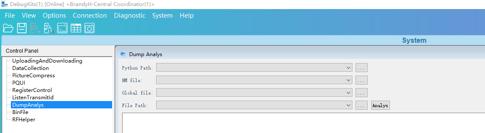

        -   Python Path is the path of the analysis script and needs to be selected by the user. For example, /output/bx2x/acore/<target-name\>/parse\_tool/ parse\_main\_\*\*\*\*\_phase2.py. Depending on the OS used by the user, the LiteOS version uses parse\_main\_liteos208\_phase2.py.
        -   NM file is the input file of the memory analysis script. It is generated by parsing the elf file through the compilation command during version build. The path is /output/bx2x/acore/<target-name\>/application.nm.
        -   Global file contains the global variable information to be imported during memory analysis. It is generated through the first step of the analysis script during version build. The path is /output/bx2x/acore/<target-name\>/parse\_tool/global.txt.
        -   File Path is the path of the memory file to be parsed (that is, the storage path of the memory bin file exported by the DebugKits tool). You only need to select the path, and the tool automatically loads the related .bin files under this path.

    2.  Click the Analys button on the Dump Analys interface. Under normal circumstances, the DebugKits tool interface displays the analysis result, and the memory\_result.txt analysis result is generated under the File Path (that is, the memory .bin file path selected by the tool). If no result is displayed, refer to the description in "[Exception Handling](异常处理.md)" for handling.

        **Figure 2**  Dump analysis result file<a name="fig09111234111616"></a>  
        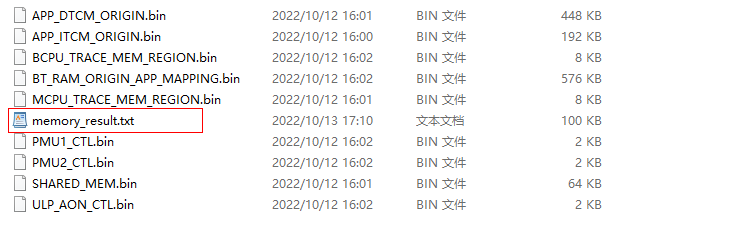

    3.  Analyze the analysis result.

        Open the memory\_result.txt file to query information such as the current interrupt information, task information, message queues, semaphores, global variables, and crash information.

        **Figure 3**  Dump analysis result fragment<a name="fig1299610121443"></a>  
        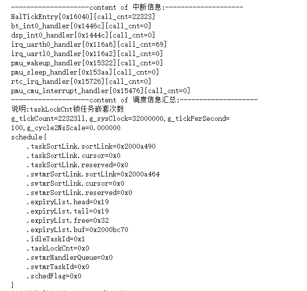

### Exception Handling<a name="ZH-CN_TOPIC_0000001790807012"></a>

1.  If the DebugKits tool does not display the analysis result after performing Dump analysis, first confirm whether the application.nm file, application.info file, parse\_tool scripts, and exported .bin files come from the same software version. Mismatched inputs from different versions may cause exceptions.
2.  When importing the .bin file to be parsed, the DebugKits tool selects the entire directory. Ensure that the configuration in the DebugKits tool configuration file \\DebugKits\\Source-Datas\\bin\\config\\config.ini is consistent with the address and size of the exported files in the DumpInfo folder. Otherwise, analysis exceptions may also occur.

    You can compare the DumpInfo configuration item in config.ini with the elements in the g\_mem\_dump\_info array in the source code middleware\\chips\\bx2x\\dfx\\last\_dump\_adapt.c. If they are inconsistent, modify the DumpInfo configuration item in config.ini according to the definition of the g\_mem\_dump\_info array.

    For example, the value of APP\_ITCM\_ORIGIN\_StartAddr in [Figure 1](#fig11424194165912) should be equal to the value of APP\_ITCM\_ORIGIN in [Figure 2](#fig169099423153), and the value of APP\_ITCM\_ORIGIN\_Length should be equal to APP\_ITCM\_LENGTH.

    **Figure 1**  Configuration information in config.ini<a name="fig11424194165912"></a>  
    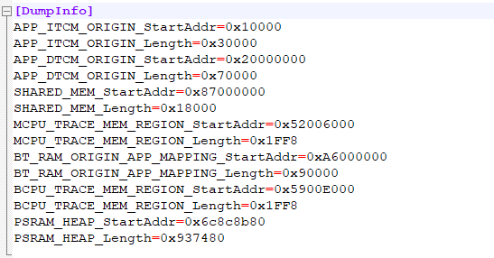

    **Figure 2**  g\_mem\_dump\_info array<a name="fig169099423153"></a>  
    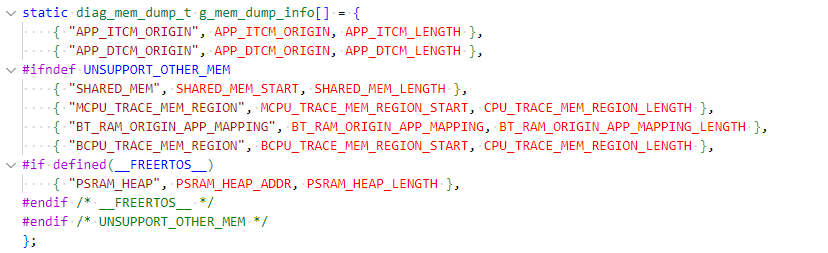

3.  After the above two points have been checked and no problems are found, you need to manually execute the script for problem location.

    The method is as follows:

    1.  Open log.txt in the DebugKits tool installation directory and find the command used by the tool to invoke the analysis script. The content within the double quotation marks after cmd in [Figure 3](#fig1279412154) is the command for performing dump analysis. Note that the escape character "\\" in it needs to be removed.

        **Figure 3**  Command used by the DebugKits tool to invoke the analysis script<a name="fig1279412154"></a>  
        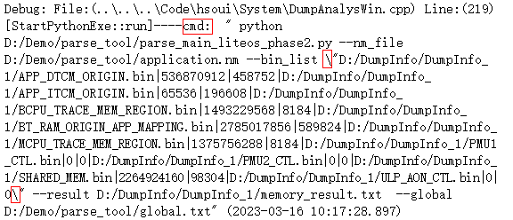

    2.  Copy the command to the cmd window and execute it. You can see the execution result of the analysis script. [Figure 4](#fig15249427161813) shows the result of correct execution. If an error occurs, you can further locate the problem based on the error message.

        **Figure 4**  Dump analysis execution result in the command line window<a name="fig15249427161813"></a>  
        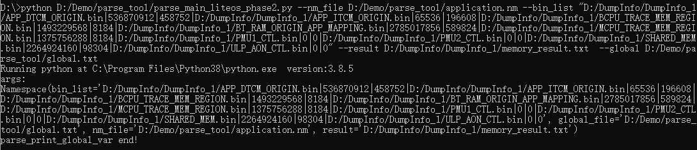

