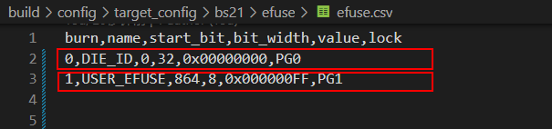
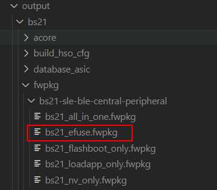
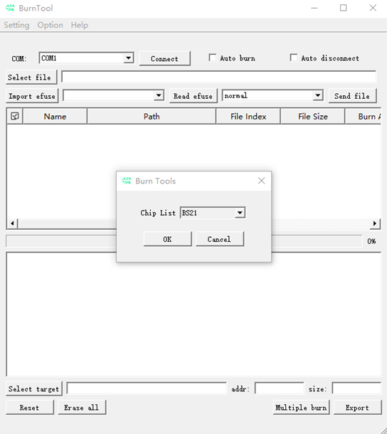
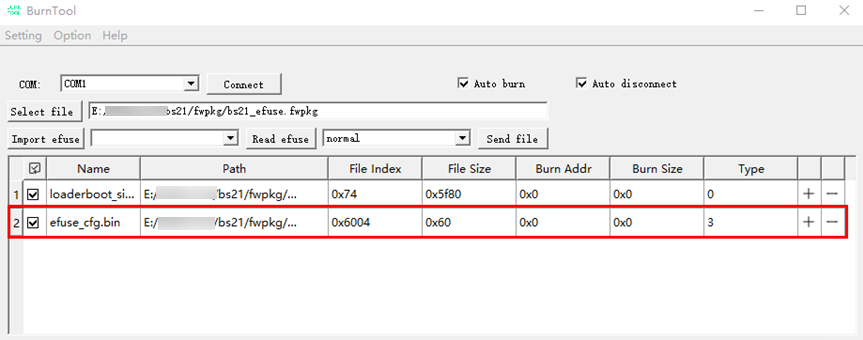
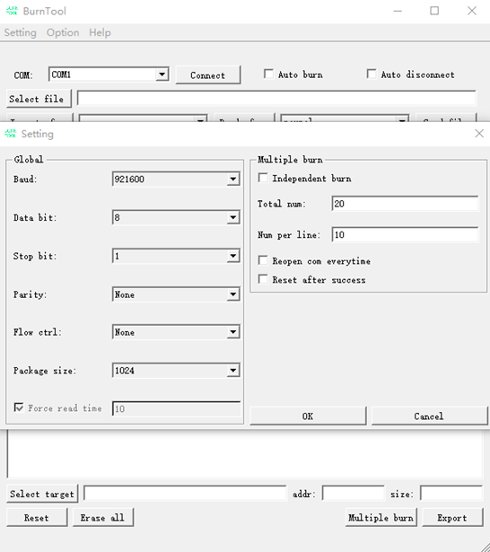
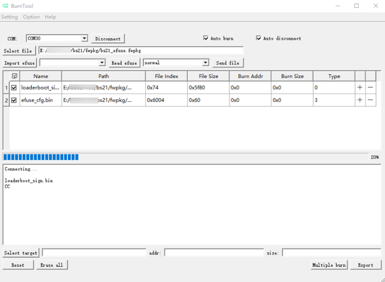
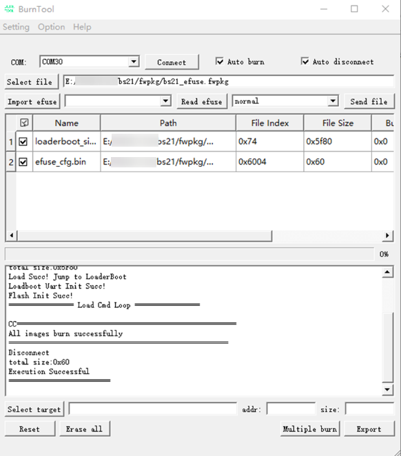

# Preface<a name="ZH-CN_TOPIC_0000001884238273"></a>

**Overview<a name="section4537382116410"></a>**

This document mainly describes the usage of the customer-reserved EFUSE bit fields of the BS2XV100.

**Product Versions<a name="section578420251745"></a>**

The product versions corresponding to this document are as follows.

| Product Name | Product Version |
| --- | --- |
| BS2X | V100 |

**Reader Audience<a name="section4378592816410"></a>**

This document is mainly applicable to the following personnel:

- Technical support engineers
- Software development engineers

**Symbol Conventions<a name="section133020216410"></a>**

The following symbols may appear in this document, and their meanings are as follows.

| Symbol | Description |
| --- | --- |
| [Image] | Indicates a hazard with a high level of risk that, if not avoided, will result in death or serious injury. |
| [Image] | Indicates a hazard with a medium level of risk that, if not avoided, may result in death or serious injury. |
| [Image] | Indicates a hazard with a low level of risk that, if not avoided, may result in minor or moderate injury. |
| [Image] | Used to deliver device- or environment-safety warning information. If not avoided, it may cause equipment damage, data loss, degraded equipment performance, or other unpredictable results. "Cautions" do not involve personal injury. |
| [Image] | Supplementary explanation of key information in the main text. "Notes" are not safety warning information and do not involve personal, equipment, or environmental injury information. |

**Modification Records<a name="section2467512116410"></a>**

| Doc Version | Release Date | Modification Description |
| --- | --- | --- |
| 04 | 2025-08-07 | Updated the content of the "[Flashing Process](烧录流程.md)" chapter. |
| 03 | 2025-05-30 | Updated the content of the "[Overview](概述.md)" chapter. Updated the content of the "[Reading and Writing EFUSE Using the Software Interface](使用软件接口读写EFUSE.md)" chapter. |
| 02 | 2025-01-24 | Updated the content of the "[Reading and Writing EFUSE Using the Software Interface](使用软件接口读写EFUSE.md)" chapter. |
| 01 | 2024-05-15 | First official version release. |

# Overview<a name="ZH-CN_TOPIC_0000001838078500"></a>

EFUSE is a programmable storage cell. Because it can only be programmed once, it is mostly used on chips to save the Chip ID, keys, or other one-time stored data. On the current BS2x chip, there are 128 Bytes in total, and users can use a total of 18 Bytes of EFUSE. If the user does not need to use the secure boot function, the 32 bytes of the Boot Hash Value part can also be custom-used by the user. In the address 0x5702_8894, Bit15 to Bit8 can be used by customers.

>  **Caution:**
> EFUSE addresses follow 32-bit alignment, and each address contains 16 bits of valid EFUSE bit fields.

BS2X provides two usage methods:

- Directly read and write the EFUSE space reserved for users through software driver interfaces.
- Operate the EFUSE space reserved for users through the burn/flash tool.
- Read and write the EFUSE space reserved for users through JLink.

# Reading and Writing EFUSE Using the Software Interface<a name="ZH-CN_TOPIC_0000001838237236"></a>

The interfaces and functions provided by the EFUSE module are as follows:

Header file path: include\driver\efuseh

- uapi_efuse_read_bit: reads the specified bit in EFUSE. uapi_efuse_read_buffer: reads multiple bytes from EFUSE into the provided buffer.
- uapi_efuse_write_bit: writes the specified bit in EFUSE.
- uapi_efuse_write_buffer: writes multiple bytes from the provided buffer to EFUSE.

>  **Caution:**
> Before calling the API to write EFUSE, you need to first power on the LDO. After the write is complete, power it off. The specific execution process is shown in the example below, which calls the pm_efuse_ldo_power interface to perform power-on and power-off. Reading EFUSE does not require separately performing power-on.
> If bit operations are to be performed, you first need to enable the EFUSE_BIT_OPERATION macro, by adding it to the macro list in config.py.

Example:

1. Write the EFUSE value according to the buffer.

```
uint8_t efuse_data[8] = {0x11,0x22,0x33,0x44,0x55,0x66,0x77,0x88};
uint32_t byte_number = 1;
uint16_t length = 8;
uint32_t ret;
// Starting from the 1st byte, write 8 bytes
ret = uapi_efuse_write_buffer(byte_number, efuse_data, length);
if (ret != 0) {
    // Exception handling
}
```

2. Read the EFUSE value according to the buffer.

```
uint8_t efuse_data[8] = {0};
uint32_t byte_number = 1;
uint16_t length = 8;
uint32_t ret;
// Starting from the 1st byte, read 8 bytes
ret = uapi_efuse_read_bit(byte_number, efuse_data, length);
if (ret != 0) {
    // Exception handling
}
```

3. Read the EFUSE value by bit.

```
uint8_t bit_pos = 1;
uint8_t value;
uint32_t byte_number = 1;
uint32_t ret;
// Read the value of bit1 of the first byte and store it in value (0 or 1)
ret = uapi_efuse_read_bit(byte_number, bit_pos, &value);
if (ret != 0) {
    // Exception handling
}
```

4. Write the EFUSE value by bit.

```
uint8_t value;
uint32_t byte_number = 1;
uint32_t ret;
// Write 1 to bit1 of the first byte
ret = uapi_efuse_write_bit(byte_number, bit_pos);
if (ret != 0) {
    // Exception handling
}
```

# Burning/flashing EFUSE Using BurnTool<a name="ZH-CN_TOPIC_0000001838078508"></a>

## Generating efuse_cfg.bin<a name="ZH-CN_TOPIC_0000001884397793"></a>

1. Data preparation (path: build\config\target_config\bs21\efuse\efuse.csv)

   **Figure 1** efuse.csv Configuration
   

   As shown in [Figure 1](#fig188866401584), the field descriptions are:

   - burn:
     0: the current bit field is not burned;
     1: the current bit field is burned.
   - name: the name of the current EFUSE bit field.
   - start_bit: the starting bit of the bit field.
   - bit_width: the bit length of the current bit field.
   - values: the burn value.
   - lock: the lock bit.

   Example:

   0,DIE_ID,0,32,0x00000000,PG0: die_id starts from bit0, with a length of 32 bits, and is not burned;

   1,USER_EFUSE,864,8,0x000000FF,PG1: USER_EFUSE starts from bit864, with a length of 8 bits, and the burn value is 0xFF.

2. Generation of the burn file

3. Call the script efuse_cfg_gen.py to generate efuse_cfg.bin, path: build\config\target_config\bs21\efuse\efuse_cfg_gen.py.
4. Compile the corresponding application.bin. After a successful compilation, efuse_cfg.bin will be packaged separately into an fwpkg, as shown in [Figure 2](#fig15214153395819).

   **Figure 2** EFUSE Burn Version
   

>  **Note:**
> In BS2X, the user-configurable efuse number is 108-125, with a length of 18 Bytes, i.e., starting from bit864, with a length of 144 bits.

## Flashing Process<a name="ZH-CN_TOPIC_0000001884238265"></a>

Prepare the burn tool "BurnTool" to burn the image through the BurnTool tool. The specific steps are as follows:

1. In the BurnTool interface, click the "Option" button, select "Change chip", select "BS21" from the "Chip List" drop-down menu, and click "OK", as shown in [Figure 1](#fig749721661114).

   **Figure 1** BurnTool Chip Change Example
   

2. In the BurnTool interface, click the "COM" button to select the PC serial port (for serial port selection, please refer to the development board usage guide); click the "Select file" button, select the firmware package compiled and generated by each product, and click "OK", as shown in [Figure 2](#fig524843652914). efuse_cfg.bin is the data to be burned, and the burn type is 3.

   **Figure 2** Burn File Selection Example
   

3. Check the "Auto burn" and "Auto disconnect" options;

   Select "Setting" → "Settings" to configure the serial port parameters. The default configuration is shown in [Figure 3](#fig327052934116), with the baud configured as 921600.

   >  **Note:**
   > Force Read Time: the time for periodic reading, in milliseconds. When checked, the serial port is read periodically; when unchecked, the serial port is read on event trigger. It is applicable to scenarios where the burn cannot normally proceed when the option is left unchecked.

   **Figure 3** Serial Port Settings Example
   

   Select the target serial port number and click the "Connect" button (after clicking, "Connect" becomes "Disconnect"), and reset the board. The automatic burn effect is shown in [Figure 4](#fig680845815298).

   **Figure 4** Automatic Burn Diagram
   

   Wait for the transmission to complete, then the burn ends. When the burn is complete, "All images burn successfully" appears. The completion effect is shown in [Figure 5](#zh-cn_topic_0000001162123482_zh-cn_topic_0279549073_fig11410377529).

   **Figure 5** Burn Completion Diagram
   
