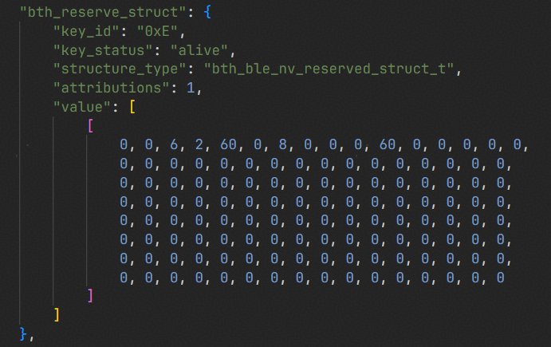

# Preface<a name="ZH-CN_TOPIC_0000001790966320"></a>

**Overview<a name="section4537382116410"></a>**

This document mainly introduces the use of the NV storage module in the BS2X chip, to guide engineering personnel in quickly using the NV module for secondary development.

**Product Version<a name="section27775771"></a>**

| Product Name | Product Version |
| --- | --- |
| BS2X | V100 |

**Reader Audience<a name="section4378592816410"></a>**

This document is mainly applicable to the following engineers:

- Technical support engineers
- Software engineers

**Symbol Conventions<a name="section133020216410"></a>**

The following symbols may appear in this document, and their meanings are as follows.

| Symbol | Description |
| --- | --- |
| [Image] | Indicates a hazard with a high level of risk that, if not avoided, will result in death or serious injury. |
| [Image] | Indicates a hazard with a medium level of risk that, if not avoided, may result in death or serious injury. |
| [Image] | Indicates a hazard with a low level of risk that, if not avoided, may result in minor or moderate injury. |
| [Image] | Used to deliver device- or environment-safety warning information. If not avoided, it may cause equipment damage, data loss, degraded equipment performance, or other unpredictable results. "Cautions" do not involve personal injury. |
| [Image] | Supplementary explanation of key information in the main text. "Notes" are not safety warning information and do not involve personal, equipment, or environmental injury information. |

**Modification Records<a name="section2467512116410"></a>**

| Doc Version | Release Date | Modification Description |
| --- | --- | --- |
| 03 | 2025-12-01 | Added the content of the "[Introduction to Using the Customized NV Structure](定制化NV结构使用介绍.md)" chapter. Added the content of the "[Customizing the Maximum Transmission Data Length Through NV](通过NV自定义传输数据最大长度.md)" chapter. |
| 02 | 2025-03-26 | Updated the content of the "[Adding a New NV Item](新增NV项.md)" chapter. |
| 01 | 2024-05-15 | First official version release. |
| 00B02 | 2024-02-29 | Updated the content of the "[Adding a New NV Item](新增NV项.md)" chapter. Updated the content of the "[Compiling to Generate the NV Image](编译生成NV镜像.md)" chapter. |
| 00B01 | 2024-02-05 | First interim version release. |

# NV Introduction<a name="ZH-CN_TOPIC_0000001837765725"></a>

The NV module is used to store non-volatile data in the local storage. Each data item in NV is defined in a key-value-like manner. The data item contains a unique index key and a value of a custom data type.

NV items can be stored in two ways: compile-time presetting and API writing.

- Compile-time presetting refers to developers being able, at the code compilation stage, to generate a customized NV image by modifying the NV header file and the NV configuration file, and to flash the image into the storage medium uniformly during the image flashing process. The preset NV can be read and updated through API interfaces during the code runtime. For the specific usage method, see the "[NV Compile-time Presetting](NV编译预置.md)" chapter.
- API writing refers to users being able to directly call API interfaces in the code to write new NV items. For the specific usage method, see the "[NV API Guide](NV-API指南.md)" chapter.

Taking Flash as an example, when NV items are stored in Flash, they are managed in units of sectors of the Flash device. Each page of NV is the size of one sector (4096 Byte), and the number of NV pages is configured as 2 pages by default. Except for the management structure, the maximum valid data of a single non-encrypted NV item should not exceed 4060 Byte.

# NV Compile-time Presetting<a name="ZH-CN_TOPIC_0000001790966304"></a>

## Adding a New NV Item<a name="ZH-CN_TOPIC_0000001837645765"></a>

### Adding a New NV Item Process<a name="ZH-CN_TOPIC_0000001837765733"></a>

1. Add the data type definition of kvalue in the header file (not mandatory; this step can be ignored if it is a common-type data).
2. Add the NV description item in the json file.

**Adding a kvalue Data Type<a name="section206861047121115"></a>**

- Common data types:

  unit8_t, unit16_t, unit32_t, bool.

- Custom data types:

  Supports custom enumeration (enum) types and structure (struct) types.

- Custom data type storage path:

  Taking bs21 as an example: middleware\chips\bs21\nv\nv_config\bs21_nv_default\include\common.h, where bs21_nv_default corresponds to 'nv_cfg': 'bs21_nv_default' in "build\config\target_config\bs21\config.py", and the mode is configured as bs21_nv_default.

- When users use common or already-defined data types, this section does not need to be modified; when users want to add an enumeration or structure type, it needs to be defined in the above file.

**Adding an NV Description Item<a name="section13134513141310"></a>**

- NV description item file path: taking bs21 as an example, middleware\chips\bs21\nv\nv_config\bs21_nv_default\cfg\acore\app.json, where bs21_nv_default corresponds to 'nv_cfg': 'bs21_nv_default' in "build\config\target_config\bs21\config.py", and the mode is configured as bs21_nv_default.
- The definition description is shown in [Table 1](#table8802115017551).

  **Table 1** NV Configuration Option Description

  | NV Configuration Option | Description |
  | --- | --- |
  | key_id | The ID of the NV item. |
  | key_status | The status of the NV item. |
  | structure_type | The data structure type of the NV item. |
  | attributions | The attribute value of the NV item. |
  | value | The data of the NV item. |

  NV configuration file example:

  ```
  {
      "common":{
          "module_id": "0x0",
          "host_config": {
              "key_id": "0x1",
              "key_status": "alive",
              "structure_type": "uint8_t",
              "attributions": 1,
              "value": 15
          },
          "sample1": {
              "key_id": "0x2",
              "key_status": "alive",
              "structure_type": "sample_type_t",
              "attributions": 1,
              "value": [1,2,3,4,5]    
          }
      }
  }
  ```

  In the NV configuration, the detailed description of each field is as follows:

  - key_id:

    The NV item ID given in hexadecimal form. key_id must be unique and cannot be repeated. Therefore, it is recommended that users manage the value of key_id, such as: key_id is composed of 16 bits. It can be specified that the high 8 bits are the module_id in the module where it resides, and the low 8 bits take values within the module, to avoid different modules using NV and affecting each other.

  - key_status:

    Used to mark whether the NV value of this item is compiled into the generated bin file. If this field is "alive", it means the NV item is in effect and the current firmware version is using this key; if it is another field or empty, it is not in effect.

  - structure_type:

    The data type of the NV item. For the specific description, see the detailed description in "[Adding a kvalue Data Type](#section206861047121115)".

  - attributions: the attribute value of the NV item.

    1, 2, and 4 are mutually exclusive; choose one of the three.

    1: Normal NV.
    2: Permanent NV (not modifiable).
    4: Un-upgrade NV (not modified with version upgrades, not used).

  - value: if value is not one of the above common data types, any structure must be written in list form.

    The value assignment has the following two situations:

    1. All members of the list are assigned.
    2. Only the first several members of the list are assigned. (Members at the end that are not assigned default to 0).

    Note: assignment only supports decimal format.

### New Node 1<a name="ZH-CN_TOPIC_0000002482769782"></a>

### Adding a New NV Item Example<a name="ZH-CN_TOPIC_0000001790966292"></a>

- Taking BS21 as an example, add a custom structure in the middleware\chips\bs21\nv\nv_config\bs21_nv_default\include\common.h file. An example of adding a custom data type is as follows.
  - Adding a structure type where all structure members are base types:

    ```
    typedef struct {
        int8_t param1;
        int8_t param2;
        int8_t param3;
        int8_t param4;
        int8_t param5;
        uint32_t param6;
        uint32_t param7;
        int32_t param8;
        uint32_t param9;
        uint32_t param10;
        uint32_t param11;
        uint32_t param12;
        uint32_t param13;
        uint32_t param14;
        uint32_t param15;
        uint32_t param16;
        uint32_t param17;
    } sample_type_t;
    ```

  - Adding a structure type where the structure contains an array type:

    ```
    typedef struct {
        uint16_t param1; 
        uint16_t param2; 
        uint16_t param3;
        uint16_t param4[2];
    } sample_two;
    ```

  - Adding an enumeration type:

    ```
    typedef enum {
        PARAM1,
        PARAM2,
        PARAM3,
        PARAM4
    } sample_three;
    ```

- Taking bs21 as an example, add a new NV item in the middleware\chips\bs21\nv\nv_config\bs21_nv_default\cfg\acore\app.json file.
  - When the kvalue preset value type is a base type, add the kvalue preset value as shown in [Figure 1](#fig1025212135315). It can be added directly in the app.json configuration file, without needing to add it in the header file.

    **Figure 1** Adding the kvalue preset value as a base type

    ```
    "sample1": {
        "key_id": "0x1",
        "key_status": "alive",
        "structure_type": "uint8_t",
        "attributions": 1,
        "value": 0    
    }
    ```

  - When the kvalue preset value type is a structure type, add the kvalue preset value as shown in [Figure 2](#fig655920623220). This kvalue value must correspond to an existing structure in the header file; if there is no such structure, a custom structure needs to be manually added.

    **Figure 2** Adding the kvalue preset value as a structure type

    ```
    "sample2": {
        "key_id": "0x2",
        "key_status": "alive",
        "structure_type": "sample_type_t",
        "attributions": 1,
        "value": [1,2,3,4,5,6,7,8,9,10,11,12,13,14,15,16,17]    
    }
    ```

## NV Position Adjustment<a name="ZH-CN_TOPIC_0000001837765745"></a>

### Function Description<a name="ZH-CN_TOPIC_0000001837765757"></a>

NV is located in the storage area on Flash, and its position and size support custom adjustment. The relevant configuration files are as follows (taking BS21 as an example):

- Position- and size-related macro configuration file:

  middleware\chips\bs21\nv\include\nv_config.h

- bin-generation-related configuration file:

  middleware\chips\bs21\nv\nv_config\nv_target.json

- Packaging-related file:

  tools\pkg\chip_packet\bs21\packet.py

### Configuration Modification<a name="ZH-CN_TOPIC_0000001790806580"></a>

1. Modify the nv_config.h macro definitions:

   ```
   #define KV_STORE_DATA_SIZE            NV_LENGTH
   #define KV_STORE_START_ADDR           (NV_STATR_ADDR)
   #define KV_STORE_PAGES_ACPU           1
   ```

   - Modify KV_STORE_DATA_SIZE to the target NV size. The SIZE size is an integer multiple of the sector (0x1000), and the minimum SIZE is 2×FLASH_PAGE_SIZE.
   - Modify KV_STORE_START_ADDR to the memory space mapped by the target position.
   - Modify KV_STORE_PAGES_ACPU to the number of A-core sectors. Currently, BS2X NV operations are performed on the A core, so only ACPU needs to be adapted.

2. Modify the nv_target.json generation information:

   Modify flash_size to the KV_STORE_DATA_SIZE size, and also modify page_nums so that it corresponds to KV_STORE_PAGES_ACPU.

   ```
   {
       "size":{
           "flash_size" : "0x2000",
           "page_size" : "0x1000"
       },
       "cores" :{
           "app" : {
               "page_nums" : 4,
               "page_id_start" : "0x254D"
           }
       },
       "acore_test_nv":{
           "TYPE" :  "nv",
           "CHIP" :  "bs21",
           "CORE" :  "app",
           "KERNEL_BIN" : "acore",
           "COMPONENT" : ["app"]
       }
   }
   ```

3. Modify the packet.py packaging script:

   Modify the NV bin packaging address in the packaging script.

   ```
       nv = os.path.join(SDK_DIR, "interim_binary", "bs21", "bin", "bs21_all_nv.bin")
       nv_bx = nv + "|0x8c5fc000|0x4000|100"
   ```

   The NV bin code packaging format is nv_bx = nv + "|address|size|download type". After users complete the modification of the NV address and size, they need to make the address and size in the code correspond to the address and size in nv_config.h, and keep the download type unchanged.

## Compiling to Generate the NV Image<a name="ZH-CN_TOPIC_0000001790806608"></a>

Currently, the SDK NV bin is updated together with the APP compilation. After modifying the NV parameters and address information, recompile the APP. The NV bin will be automatically updated to (taking bs21 as an example) the interim_binary\bs21\bin\bs21_all_nv.bin path, and packaged into the tools\pkg\fwpkg\bs21\bs21_all.fwpkg path. Users can download it using BurnTool.

# NV API Guide<a name="ZH-CN_TOPIC_0000001790966312"></a>

## Function Description<a name="ZH-CN_TOPIC_0000001837645757"></a>

NV APIs mainly provide the following functions:

- NV item writing:

  Saves the formatted data that needs to be stored, and can also define three attributes of the written data: whether it is permanently stored, whether it is encrypted storage, and whether it is not upgradeable.

- NV item reading:

  Reads NV data from the local storage.

- NV information querying:
  - Querying whether the NV has been stored in the local storage.
  - Querying the usage status of the NV space.

The NV item writing interface can set the attributes of the NV item. For NV items dynamically added through APIs, the special attributes it owns can be passed in its writing interface.

## Interface Description<a name="ZH-CN_TOPIC_0000001790806596"></a>

The NV module mainly provides the following APIs:

| uapi_nv_init | Initializes the NV module, including the nv area map. It must be called before using nv functions. |
| --- | --- |
| NULL | NULL |

| uapi_nv_write | Writes an NV data item; the default attribute is Normal, with no callback function. |
| --- | --- |
| key | The key ID of the NV item to be written, used for indexing. |
| *kvalue | A pointer to the value of the NV item to be written. |
| kvalue_length | The length of the data to be written, unit: Byte. |

| uapi_nv_write_with_attr | Writes an NV data item and configures the attributes and callback function according to business requirements. |
| --- | --- |
| key | The key ID of the NV item to be written, used for indexing. |
| *kvalue | A pointer to the value of the NV item to be written. |
| kvalue_length | The length of the data to be written, unit: Byte. |
| *attr | The attributes of the NV item to be configured. |
| func | The callback function called after kvalue is written to Flash. |

| uapi_nv_read | Reads the value of the specified NV data item; by default it does not obtain the key attribute value. |
| --- | --- |
| key | The key ID of the NV item to be read, used for indexing. |
| kvalue_max_length | The maximum length of data allowed to be stored, unit: Byte. |
| *kvalue_length | The actual length of the data read (read with four-byte alignment). |
| *kvalue | A pointer to the buffer that stores the read data. |

| uapi_nv_read_with_attr | Reads the value of the specified NV data item and also obtains the key attribute value. |
| --- | --- |
| key | The key ID of the NV item to be read, used for indexing. |
| kvalue_max_length | The maximum length of data allowed to be stored, unit: Byte. |
| *kvalue_length | The actual length of the data read (read with four-byte alignment). |
| *kvalue | A pointer to the buffer that stores the read data. |
| *attr | The attribute of the NV item obtained. |

| uapi_nv_get_store_status | Gets the NV storage space usage. |
| --- | --- |
| *status | A pointer to the data that stores the NV status. |

## Development Guide<a name="ZH-CN_TOPIC_0000001790806588"></a>

The following steps are the guide for NV read and write operations:

1. Write a default Normal-type NV.

   ```
   uint8_t *test_nv_value; /* the NV value to be written is stored in test_nv_value */
   uint32_t test_len = 15; /* the length is test_len, 15 in the example */

   uint16_t key = TEST_KEY; /* TEST_KEY is the ID of this key */
   uint16_t key_len= test_len;
   uint8_t *write_value = uapi_malloc(key_len);
   (void)memcpy_s(write_value, key_len, test_nv_value, key_len);
   errcode_t nv_ret_value = uapi_nv_write(key, write_value, key_len);
   if (nv_ret_value != ERRCODE_SUCC) {
       /* ERROR PROCESS */
       uapi_free(wrt_value);
       return ERRCODE_FAIL;
   }
   /* APP PROCESS */
   uapi_free(wrt_value);
   return ERRCODE_SUCC;
   ```

2. Write an NV with attributes (configure the encryption attribute; others omitted).

   ```
   uint8_t *test_nv_value; /* the NV value to be written is stored in test_nv_value */
   uint32_t test_len = 15; /* the length is test_len, 15 in the example */

   uint16_t key = TEST_KEY;
   uint16_t key_len= test_len;

   nv_key_attr_t attr = {0};
   attr.permanent = false;
   attr.encrypted = true; /* set the encryption attribute to true */
   attr.non_upgrade = false
   uint8_t *write_value= uapi_malloc(key_len);
   (void)memcpy_s(write_value, key_len, test_nv_value, key_len);
   errcode_t nv_ret_value = uapi_nv_write_with_attr(key, write_value, key_len, &attr, NULL);
   if (nv_ret_value != ERRCODE_SUCC) {
       /* ERROR PROCESS */
       uapi_free(write_value);
       return ERRCODE_FAIL;
   }
   /* APP PROCESS */
   uapi_free(write_value);
   return ERRCODE_SUCC;
   ```

3. Read NV.

   ```
   uint16_t key = TEST_KEY;
   uint16_t key_len= test_len;
   uint16_t real_len= 0;
   uint8_t *read_value = uapi_malloc(key_len);
   if (uapi_nv_read(key, key_len, &real_len, read_value) != ERRCODE_SUCC) {
       /* ERROR PROCESS */
       uapi_free(read_value);
       return ERRCODE_FAIL;
   }
   /* APP PROCESS */
   uapi_free(read_value);
   return ERRCODE_SUCC;
   ```

4. Read NV and attributes.

   ```
   uint16_t key = TEST_KEY;
   uint16_t key_len = test_len;
   uint16_t real_len = 0;
   uint8_t *read_value = uapi_malloc(key_len);
   nv_key_attr_t attr = {false, false, false, 0};
   ext_errno nv_ret = uapi_nv_read_with_attr(key, key_len, &real_len, read_value, &attr);
   if (nv_ret != ERRCODE_SUCC ) {
       /* ERROR PROCESS */
       uapi_free(read_value);
       return ERRCODE_FAIL;
   } 
   /* APP PROCESS */
   uapi_free(read_value);
   return ERRCODE_SUCC;
   ```

5. Query the NV space status.

   ```
   nv_store_status status;
   if (uapi_nv_get_store_status(&status) == ERRCODE_SUCC) {
       /* APP PROCESS */
       printf("Total:      %d Bytes\r\n", status.total_space);
       printf("used:       %d Bytes\r\n", status.used_space);
       printf("reclaimable:%d Bytes\r\n", status.reclaimable_space);
       printf("corrupted:  %d Bytes\r\n", status.corrupted_space);
       printf("max_key:    %d Bytes\r\n", status.max_key_space);
   }
   ```

>  **Note:**
> The development guide is only a test case for the API interfaces, providing users with a simple sample reference. In the sample, the definition processes of macros, some variables, callback functions, and the business processing process are omitted.

## Precautions<a name="ZH-CN_TOPIC_0000001837645749"></a>

- uapi_nv_write: by default, no additional attributes (such as whether it is permanently stored, whether it is encrypted storage, etc.) are added to the stored key.
- uapi_nv_write_with_attr: the key attributes can be configured and the callback function can be registered at the same time. Currently, the callback function is not used in the NV code; passing NULL to ignore it is sufficient.
- For the descriptions of the NV attribute structure and the NV space status structure, see the nv.h file.
- The NV write and read interfaces use a semaphore for synchronous acquisition and are prohibited from being used in interrupt callbacks.

# Introduction to Using the Customized NV Structure<a name="ZH-CN_TOPIC_0000002482689810"></a>

**bth_ble_nv_reserved_struct_t<a name="section677114221918"></a>**

**Table 1** Basic Information of the bth_ble_nv_reserved_struct_t Structure

| key_id | 0xE |
| --- | --- |
| Structure name | bth_ble_nv_reserved_struct_t |
| Length | 128 bytes (each 0 is one byte, the default value is a decimal number) |

**Table 2** Byte Usage Record

| Byte Offset | Byte Description | Function Description |
| --- | --- | --- |
| 0 | customize_flag | Customization enable flag; each bit corresponds to a customization switch. |
| 1 | customize_flag | |
| 2 | gfsk power | Power customization for the GFSK (BLE and GLE frame 1) modulation type. |
| 3 | psk power | Power customization for the GLE PSK modulation type. |
| 4 | low 8 bits of em_customized_data_tx_size | The maximum transmit packet length required by the business during StarFlash low-latency transmission. |
| 5 | high 8 bits of em_customized_data_tx_size | The maximum transmit packet length required by the business during StarFlash low-latency transmission. |
| 6 | max_nb_active_link | The maximum number of links required by the business during StarFlash low-latency transmission. |
| 7 | fem switch | RT201 fem pin adaptation switch. |
| 8 | ctrim_flag | The flag bit indicating that the XO ctrim capacitance value has been written to flash. |
| 9 | ctrim_value | The XO ctrim capacitance value. |
| 10 | low 8 bits of em_customized_data_rx_size | The low 8 bits of the rx em buffer size. |
| 11 | high 8 bits of em_customized_data_rx_size | The high 8 bits of the rx em buffer size. |
| 12 | em_customized_acl_txbuff_nb | The number of customized ACL EM DATA TXBUFFs. |
| 13 | em_customized_acl_data_size | The customized ACL EM DATA size. |
| 14 | g_max_temp | Records the highest and lowest temperatures of the chip. The initial highest temperature of the chip is set to -40, and the lowest temperature is initially set to 125. The data type used for saving in nv differs from that used in actual use; -40 is converted to 216. Therefore, the initial value of the highest temperature actually configured in nv is 216. |
| 15 | g_min_temp | |

# Customizing the Maximum Transmission Data Length Through NV<a name="ZH-CN_TOPIC_0000002523876767"></a>

NV can set the length of the data to be sent according to the byte usage record table, as modified in [Figure 1](#fig73832028619).

**Figure 1** NV-customized transmission data length 60-byte example


It should be noted that:

- For low-latency mode, the capability of the maximum data length that can be sent differs under different reporting rates. The 8K reporting rate supports up to 5 Byte per user send, 4K supports up to 16 Byte, 2K supports up to 36 Byte, and 1K supports up to 250 Byte per user send.
- For non-low-latency mode, up to 255 Byte per user send is supported.
- em_customized_data_tx_size and em_customized_data_rx_size should be set to the maximum length of the transmitted data as needed.
- max_nb_active_link needs to be set to a non-zero value, with a maximum value of 8.
