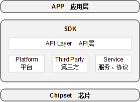

# Preface<a name="ZH-CN_TOPIC_0000001665142194"></a>

**Overview<a name="section4537382116410"></a>**

This document mainly describes the SDK development of BS2X, including the SDK architecture, interface implementation mechanism, and usage instructions (including working principles, interface usage methods and precautions described by scenario).

Note: This document uses BS21 as an example and will not elaborate separately.

**Product Version<a name="section12266191774710"></a>**

The product versions corresponding to this document are as follows.

<a name="table2270181717471"></a>
<table><thead align="left"><tr id="row15364171712479"><th class="cellrowborder" valign="top" width="31.759999999999998%" id="mcps1.1.3.1.1"><p id="p123646174478"><a name="p123646174478"></a><a name="p123646174478"></a><strong id="b26989121817"><a name="b26989121817"></a><a name="b26989121817"></a>Product Name</strong></p>
</th>
<th class="cellrowborder" valign="top" width="68.24%" id="mcps1.1.3.1.2"><p id="p1936401717470"><a name="p1936401717470"></a><a name="p1936401717470"></a><strong id="b271120129810"><a name="b271120129810"></a><a name="b271120129810"></a>Product Version</strong></p>
</th>
</tr>
</thead>
<tbody><tr id="row19364317104716"><td class="cellrowborder" valign="top" width="31.759999999999998%" headers="mcps1.1.3.1.1 "><p id="p31080012"><a name="p31080012"></a><a name="p31080012"></a>BS2X</p>
</td>
<td class="cellrowborder" valign="top" width="68.24%" headers="mcps1.1.3.1.2 "><p id="p34453054"><a name="p34453054"></a><a name="p34453054"></a>V100</p>
</td>
</tr>
</tbody>
</table>

**Reader Audience<a name="section4378592816410"></a>**

This document is mainly applicable to the following engineers:

-   Technical Support Engineer
-   Software Development Engineer

**Symbol Conventions<a name="section133020216410"></a>**

The following signs may appear in this document, and their meanings are as follows.

<a name="table2622507016410"></a>
<table><thead align="left"><tr id="row1530720816410"><th class="cellrowborder" valign="top" width="20.580000000000002%" id="mcps1.1.3.1.1"><p id="p6450074116410"><a name="p6450074116410"></a><a name="p6450074116410"></a><strong id="b2136615816410"><a name="b2136615816410"></a><a name="b2136615816410"></a>Symbol</strong></p>
</th>
<th class="cellrowborder" valign="top" width="79.42%" id="mcps1.1.3.1.2"><p id="p5435366816410"><a name="p5435366816410"></a><a name="p5435366816410"></a><strong id="b5941558116410"><a name="b5941558116410"></a><a name="b5941558116410"></a>Description</strong></p>
</th>
</tr>
</thead>
<tbody><tr id="row1372280416410"><td class="cellrowborder" valign="top" width="20.580000000000002%" headers="mcps1.1.3.1.1 "><p id="p3734547016410"><a name="p3734547016410"></a><a name="p3734547016410"></a><a name="image2670064316410"></a><a name="image2670064316410"></a><span></span></p>
</td>
<td class="cellrowborder" valign="top" width="79.42%" headers="mcps1.1.3.1.2 "><p id="p1757432116410"><a name="p1757432116410"></a><a name="p1757432116410"></a>Indicates a high-level risk hazard that will result in death or serious injury if not avoided.</p>
</td>
</tr>
<tr id="row466863216410"><td class="cellrowborder" valign="top" width="20.580000000000002%" headers="mcps1.1.3.1.1 "><p id="p1432579516410"><a name="p1432579516410"></a><a name="p1432579516410"></a><a name="image4895582316410"></a><a name="image4895582316410"></a><span></span></p>
</td>
<td class="cellrowborder" valign="top" width="79.42%" headers="mcps1.1.3.1.2 "><p id="p959197916410"><a name="p959197916410"></a><a name="p959197916410"></a>Indicates a medium-level risk hazard that may result in death or serious injury if not avoided.</p>
</td>
</tr>
<tr id="row123863216410"><td class="cellrowborder" valign="top" width="20.580000000000002%" headers="mcps1.1.3.1.1 "><p id="p1232579516410"><a name="p1232579516410"></a><a name="p1232579516410"></a><a name="image1235582316410"></a><a name="image1235582316410"></a><span></span></p>
</td>
<td class="cellrowborder" valign="top" width="79.42%" headers="mcps1.1.3.1.2 "><p id="p123197916410"><a name="p123197916410"></a><a name="p123197916410"></a>Indicates a low-level risk hazard that may result in minor or moderate injury if not avoided.</p>
</td>
</tr>
<tr id="row5786682116410"><td class="cellrowborder" valign="top" width="20.580000000000002%" headers="mcps1.1.3.1.1 "><p id="p2204984716410"><a name="p2204984716410"></a><a name="p2204984716410"></a><a name="image4504446716410"></a><a name="image4504446716410"></a><span></span></p>
</td>
<td class="cellrowborder" valign="top" width="79.42%" headers="mcps1.1.3.1.2 "><p id="p4388861916410"><a name="p4388861916410"></a><a name="p4388861916410"></a>Used to convey equipment or environment safety warning information. If not avoided, it may result in equipment damage, data loss, degraded equipment performance, or other unpredictable results.</p>
<p id="p1238861916410"><a name="p1238861916410"></a><a name="p1238861916410"></a>"Note" does not involve personal injury.</p>
</td>
</tr>
<tr id="row2856923116410"><td class="cellrowborder" valign="top" width="20.580000000000002%" headers="mcps1.1.3.1.1 "><p id="p5555360116410"><a name="p5555360116410"></a><a name="p5555360116410"></a><a name="image799324016410"></a><a name="image799324016410"></a><span></span></p>
</td>
<td class="cellrowborder" valign="top" width="79.42%" headers="mcps1.1.3.1.2 "><p id="p4612588116410"><a name="p4612588116410"></a><a name="p4612588116410"></a>Supplementary explanation of key information in the main text.</p>
<p id="p1232588116410"><a name="p1232588116410"></a><a name="p1232588116410"></a>"Note" is not a safety warning and does not involve personal, equipment, or environmental injury information.</p>
</td>
</tr>
</tbody>
</table>

**Modification Record<a name="section2467512116410"></a>**

<a name="table1557726816410"></a>
<table><thead align="left"><tr id="row2942532716410"><th class="cellrowborder" valign="top" width="16.1%" id="mcps1.1.4.1.1"><p id="p3778275416410"><a name="p3778275416410"></a><a name="p3778275416410"></a><strong id="b5687322716410"><a name="b5687322716410"></a><a name="b5687322716410"></a>Document Version</strong></p>
</th>
<th class="cellrowborder" valign="top" width="21.29%" id="mcps1.1.4.1.2"><p id="p5627845516410"><a name="p5627845516410"></a><a name="p5627845516410"></a><strong id="b5800814916410"><a name="b5800814916410"></a><a name="b5800814916410"></a>Release Date</strong></p>
</th>
<th class="cellrowborder" valign="top" width="62.61%" id="mcps1.1.4.1.3"><p id="p2382284816410"><a name="p2382284816410"></a><a name="p2382284816410"></a><strong id="b3316380216410"><a name="b3316380216410"></a><a name="b3316380216410"></a>Modification Description</strong></p>
</th>
</tr>
</thead>
<tbody><tr id="row169853804119"><td class="cellrowborder" valign="top" width="16.1%" headers="mcps1.1.4.1.1 "><p id="p6986484417"><a name="p6986484417"></a><a name="p6986484417"></a>03</p>
</td>
<td class="cellrowborder" valign="top" width="21.29%" headers="mcps1.1.4.1.2 "><p id="p5986118204118"><a name="p5986118204118"></a><a name="p5986118204118"></a>2025-01-24</p>
</td>
<td class="cellrowborder" valign="top" width="62.61%" headers="mcps1.1.4.1.3 "><p id="p06691169419"><a name="p06691169419"></a><a name="p06691169419"></a>Updated the content of the "<a href="注意事项-8.md">Precautions</a>" section of <span id="ph12218150245"><a name="ph12218150245"></a><a name="ph12218150245"></a>"<a href="中断机制.md">Interrupt Mechanism</a>"</span>.</p>
</td>
</tr>
<tr id="row133411721194217"><td class="cellrowborder" valign="top" width="16.1%" headers="mcps1.1.4.1.1 "><p id="p13341172174219"><a name="p13341172174219"></a><a name="p13341172174219"></a>02</p>
</td>
<td class="cellrowborder" valign="top" width="21.29%" headers="mcps1.1.4.1.2 "><p id="p1734192119425"><a name="p1734192119425"></a><a name="p1734192119425"></a>2024-07-04</p>
</td>
<td class="cellrowborder" valign="top" width="62.61%" headers="mcps1.1.4.1.3 "><p id="p16598129194216"><a name="p16598129194216"></a><a name="p16598129194216"></a>Updated the content of the "<a href="使用约束.md">Usage Constraints</a>" section.</p>
</td>
</tr>
<tr id="row1695234912313"><td class="cellrowborder" valign="top" width="16.1%" headers="mcps1.1.4.1.1 "><p id="p182910614321"><a name="p182910614321"></a><a name="p182910614321"></a>01</p>
</td>
<td class="cellrowborder" valign="top" width="21.29%" headers="mcps1.1.4.1.2 "><p id="p52917613321"><a name="p52917613321"></a><a name="p52917613321"></a>2024-05-15</p>
</td>
<td class="cellrowborder" valign="top" width="62.61%" headers="mcps1.1.4.1.3 "><p id="p1290663212"><a name="p1290663212"></a><a name="p1290663212"></a>First official version released.</p>
</td>
</tr>
<tr id="row12907103279"><td class="cellrowborder" valign="top" width="16.1%" headers="mcps1.1.4.1.1 "><p id="p7911910172719"><a name="p7911910172719"></a><a name="p7911910172719"></a>00B03</p>
</td>
<td class="cellrowborder" valign="top" width="21.29%" headers="mcps1.1.4.1.2 "><p id="p139161062713"><a name="p139161062713"></a><a name="p139161062713"></a>2024-02-29</p>
</td>
<td class="cellrowborder" valign="top" width="62.61%" headers="mcps1.1.4.1.3 "><p id="p179161022718"><a name="p179161022718"></a><a name="p179161022718"></a>Updated the content of the "<a href="使用约束.md">Usage Constraints</a>" section.</p>
</td>
</tr>
<tr id="row324613324336"><td class="cellrowborder" valign="top" width="16.1%" headers="mcps1.1.4.1.1 "><p id="p4246532113318"><a name="p4246532113318"></a><a name="p4246532113318"></a>00B02</p>
</td>
<td class="cellrowborder" valign="top" width="21.29%" headers="mcps1.1.4.1.2 "><p id="p12246153217339"><a name="p12246153217339"></a><a name="p12246153217339"></a>2023-10-27</p>
</td>
<td class="cellrowborder" valign="top" width="62.61%" headers="mcps1.1.4.1.3 "><p id="p109124293312"><a name="p109124293312"></a><a name="p109124293312"></a>Second temporary version released.</p>
</td>
</tr>
<tr id="row5947359616410"><td class="cellrowborder" valign="top" width="16.1%" headers="mcps1.1.4.1.1 "><p id="p2149706016410"><a name="p2149706016410"></a><a name="p2149706016410"></a>00B01</p>
</td>
<td class="cellrowborder" valign="top" width="21.29%" headers="mcps1.1.4.1.2 "><p id="p648803616410"><a name="p648803616410"></a><a name="p648803616410"></a>2023-09-27</p>
</td>
<td class="cellrowborder" valign="top" width="62.61%" headers="mcps1.1.4.1.3 "><p id="p1946537916410"><a name="p1946537916410"></a><a name="p1946537916410"></a>First temporary version released.</p>
</td>
</tr>
</tbody>
</table>

# Overview<a name="ZH-CN_TOPIC_0000001664982518"></a>


## Background Introduction<a name="ZH-CN_TOPIC_0000001713022045"></a>

The platform software of the BS2X series shields the underlying layer from the application layer and directly provides API (Application Programming Interface) interfaces to application software to implement corresponding functions. A typical system application architecture is shown in [Figure 1](#fig16620102217403).

**Figure 1**  System application architecture diagram<a name="fig16620102217403"></a>  


The framework can be divided into the following layers:

-   APP layer: the application layer.
-   API layer: provides common interfaces for SDK-based development.
-   Platform layer: provides the SOC board-level support package, including the following functions.
    -   Chip and peripheral device drivers.
    -   Operating system.
    -   System management.

-   Service layer: provides application protocol stacks including BT. Used by upper-layer application software for operations such as data transmission and reception.
-   Third-party libraries: third-party software libraries provided to the Service layer or the application layer.

## Usage Constraints<a name="ZH-CN_TOPIC_0000001665142230"></a>

-   During the system startup process, the initialization of drivers such as UART, Flash, WDT, and NV has been completed. During development, do not re-initialize these modules; otherwise, system errors may occur.
-   After the system starts running, it occupies some system resources: interrupts, memory, tasks, message queues, events, semaphores, timers, mutexes, etc. When releasing resources during application-layer development, users can only release resources applied for by the user; do not release system resources.
-   The LiteOS system resource configuration is located in "sdk/kernel/liteos/liteos\_v208.6.0\_b017/Huawei\_LiteOS/tools/build/config/bs2x.config" (bs2x.config corresponds to the chip by default; for special versions, it corresponds to the liteos\_kconfig option in build/config/target\_config/bs20(bs21/bs21a/bs22/bs26)/config.py.) Taking bs21 as an example, sdk/kernel/liteos/liteos\_v208.6.0\_b017/Huawei\_LiteOS/tools/build/config/bs21.config is used by default;

    If liteos\_kconfig': 'bs21\_rcu' is configured for bs21-rcu in config.py, the "sdk/kernel/liteos/liteos\_v208.6.0\_b017/Huawei\_LiteOS/tools/build/config/bs21\_rcu.config" file is used. When users adjust resource usage, this file needs to be modified.

# System Interface<a name="ZH-CN_TOPIC_0000001713102053"></a>


## Overview<a name="ZH-CN_TOPIC_0000001713102061"></a>

System interfaces are interfaces for performing required operations on system resources such as tasks and events.

SDK supports user customization of system resources. Taking BS21 as an example, resource configuration requires editing the "sdk\\kernel\\liteos\\liteos\_v208.5.0\\Huawei\_LiteOS\\tools\\build\\config\\bs21.config" file. Reasonable configuration of resource items as needed can effectively reduce system resource waste, improve operating efficiency, and avoid resource shortage. Common configuration items are shown in [Table 1](#table1130973994118).

**Table 1**  Common resource configuration items in bs21.config

<a name="table1130973994118"></a>
<table><thead align="left"><tr id="row1730913924111"><th class="cellrowborder" valign="top" width="44.1%" id="mcps1.2.3.1.1"><p id="p1030911396414"><a name="p1030911396414"></a><a name="p1030911396414"></a>Configuration Item</p>
</th>
<th class="cellrowborder" valign="top" width="55.900000000000006%" id="mcps1.2.3.1.2"><p id="p163101039184114"><a name="p163101039184114"></a><a name="p163101039184114"></a>Description</p>
</th>
</tr>
</thead>
<tbody><tr id="row7310103920418"><td class="cellrowborder" valign="top" width="44.1%" headers="mcps1.2.3.1.1 "><p id="p0310939194115"><a name="p0310939194115"></a><a name="p0310939194115"></a>LOSCFG_BASE_CORE_TSK_LIMIT</p>
</td>
<td class="cellrowborder" valign="top" width="55.900000000000006%" headers="mcps1.2.3.1.2 "><p id="p17310173918418"><a name="p17310173918418"></a><a name="p17310173918418"></a>Upper limit of the number of system tasks. If the ID exceeds this value when creating a task, the creation fails.</p>
</td>
</tr>
<tr id="row6310193984115"><td class="cellrowborder" valign="top" width="44.1%" headers="mcps1.2.3.1.1 "><p id="p193216106472"><a name="p193216106472"></a><a name="p193216106472"></a>LOSCFG_BASE_IPC_SEM_LIMIT</p>
</td>
<td class="cellrowborder" valign="top" width="55.900000000000006%" headers="mcps1.2.3.1.2 "><p id="p15310439124111"><a name="p15310439124111"></a><a name="p15310439124111"></a>Upper limit of the number of system semaphores. Insufficient resources cause semaphore creation failures.</p>
</td>
</tr>
<tr id="row531015392416"><td class="cellrowborder" valign="top" width="44.1%" headers="mcps1.2.3.1.1 "><p id="p531033904111"><a name="p531033904111"></a><a name="p531033904111"></a>LOSCFG_BASE_IPC_MUX_LIMIT</p>
</td>
<td class="cellrowborder" valign="top" width="55.900000000000006%" headers="mcps1.2.3.1.2 "><p id="p113107392415"><a name="p113107392415"></a><a name="p113107392415"></a>Upper limit of the number of system mutexes. Insufficient resources cause mutex creation failures.</p>
</td>
</tr>
<tr id="row18310173974113"><td class="cellrowborder" valign="top" width="44.1%" headers="mcps1.2.3.1.1 "><p id="p318655018472"><a name="p318655018472"></a><a name="p318655018472"></a>LOSCFG_BASE_IPC_QUEUE_LIMIT</p>
</td>
<td class="cellrowborder" valign="top" width="55.900000000000006%" headers="mcps1.2.3.1.2 "><p id="p8310173917417"><a name="p8310173917417"></a><a name="p8310173917417"></a>Upper limit of the number of message queues. Insufficient resources cause message queue creation failures.</p>
</td>
</tr>
<tr id="row4488132611506"><td class="cellrowborder" valign="top" width="44.1%" headers="mcps1.2.3.1.1 "><p id="p154898266503"><a name="p154898266503"></a><a name="p154898266503"></a>LOSCFG_BASE_CORE_SWTMR_LIMIT</p>
</td>
<td class="cellrowborder" valign="top" width="55.900000000000006%" headers="mcps1.2.3.1.2 "><p id="p154891526185012"><a name="p154891526185012"></a><a name="p154891526185012"></a>Upper limit of the number of software timers. Insufficient resources cause software timer creation failures.</p>
</td>
</tr>
<tr id="row434413401517"><td class="cellrowborder" valign="top" width="44.1%" headers="mcps1.2.3.1.1 "><p id="p73451640155113"><a name="p73451640155113"></a><a name="p73451640155113"></a>LOSCFG_BASE_CORE_TSK_IDLE_STACK_SIZE</p>
</td>
<td class="cellrowborder" valign="top" width="55.900000000000006%" headers="mcps1.2.3.1.2 "><p id="p1034520401512"><a name="p1034520401512"></a><a name="p1034520401512"></a>Stack size of the IDLE task.</p>
</td>
</tr>
<tr id="row37134175535"><td class="cellrowborder" valign="top" width="44.1%" headers="mcps1.2.3.1.1 "><p id="p11712162924811"><a name="p11712162924811"></a><a name="p11712162924811"></a>LOSCFG_BASE_CORE_TSK_SWTMR_STACK_SIZE</p>
</td>
<td class="cellrowborder" valign="top" width="55.900000000000006%" headers="mcps1.2.3.1.2 "><p id="p57131317195314"><a name="p57131317195314"></a><a name="p57131317195314"></a>Stack size of the software timer task.</p>
</td>
</tr>
</tbody>
</table>

## Task<a name="ZH-CN_TOPIC_0000001664982514"></a>


### Overview<a name="ZH-CN_TOPIC_0000001713102057"></a>

A task is the smallest running unit that competes for system resources. A task can use or wait for system resources such as the CPU and memory space, and runs independently of other tasks. The task module provides multiple tasks to users, implements switching and communication between tasks, and helps users manage business process flows. The task module has the following characteristics:

-   Supports multiple tasks; one task represents one thread.
-   Tasks use the preemptive scheduling mechanism and also support the round-robin scheduling mode.
-   High-priority tasks can preempt low-priority tasks. Low-priority tasks can be scheduled only after high-priority tasks are blocked or terminated.
-   There are 32 priorities [0, 31], with the highest priority being 0 and the lowest being 31. Because system tasks need to be scheduled in time, it is recommended that users use tasks in the priority range [10, 30]. Application-level tasks are recommended to use priorities lower than those of system-level tasks.

**Key Concepts<a name="section068413489911"></a>**

-   Task State

    Each task in the system has multiple running states. After system initialization is completed, created tasks can compete for certain resources in the system and are scheduled by the kernel.

    Task states are usually divided into the following 4 types:

    -   Ready state (Ready): The task is in the ready list and only waits for the CPU.
    -   Running state (Running): The task is being executed.
    -   Blocked state (Blocked): The task is not in the ready list. This includes the task being suspended, the task being delayed, the task waiting for a semaphore, reading/writing a queue, or waiting to read an event, etc.
    -   Dead state (Dead): The task has finished running and waits for the system to reclaim resources.

    **Figure 1**  Task state diagram<a name="fig109201259173111"></a>  
    
    

    Task state transition description:

    -   Ready state→Running state:

        After a task is created, it enters the ready state. When task switching occurs, the highest-priority task in the ready list is executed and enters the running state, but the task remains in the ready list at this moment.

    -   Running state→Blocked state:

        When a running task becomes blocked (suspended, delayed, reading a semaphore, etc.), the task is removed from the ready list, and its state changes from running state to blocked state. Then task switching occurs, and the remaining highest-priority task in the ready list runs.

    -   Blocked state→Ready state (Blocked state→Running state):

        After a blocked task is resumed (task resume, delay timeout, semaphore read timeout or semaphore read, etc.), the resumed task is added to the ready list, changing from blocked state to ready state. If the priority of the resumed task is higher than that of the running task, task switching occurs, changing the task from ready state to running state.

    -   Ready state→Blocked state:

        A task may also be blocked (suspended) while in the ready state. In this case, the task state changes from ready state to blocked state. The task is removed from the ready list and does not participate in task scheduling until the task is resumed.

    -   Running state→Ready state:

        After a higher-priority task is created or resumed, task scheduling occurs. At this moment, the highest-priority task in the ready list changes to running state, and the originally running task changes from running state to ready state, still remaining in the ready list.

    -   Running state→Dead state

        When a running task finishes running, its state changes from running state to dead state. The dead state includes the normal exit after the task finishes running and the Invalid state. For example, a task without the detach attribute (LOS\_TASK\_STATUS\_DETACHED) presents the Invalid state after finishing running, which is the dead state.

    -   Blocked state→Dead state

        When a blocked task calls the delete interface, its state changes from blocked state to dead state.

-   Task ID

    The task ID is returned to the user as a parameter when the task is created and serves as a very important identifier of the task. Users can use the task ID to suspend a specified task, resume a task, query the task name, etc.

-   Task Priority

    The priority indicates the execution order of tasks. The task priority determines which task will be executed next when task switching occurs. The highest-priority task in the ready list will be executed.

-   Task Entry Function

    The function that each new task will execute after being scheduled. This function is implemented by the user and specified through the task creation structure when the task is created.

-   Task Control Block (TCB)

    Each task contains a task control block (TCB). The TCB contains information such as the task context stack pointer, task state, task priority, task ID, task name, and task stack size. The TCB reflects the running status of each task.

-   Task Stack

    Each task has an independent stack space, which is called the task stack. The information saved in the stack space includes local variables, registers, function parameters, function return addresses, etc. During task switching, the context information of the switched-out task is saved in its own task stack space so that the scene can be restored when the task resumes, allowing execution to continue from the switch-out point after the task is resumed.

-   Task Context

    Some resources used by a task during running, such as registers, are called the task context. When a task is suspended, other tasks continue to execute. If the task context is not saved after the task is resumed, task switching may modify the values in the registers, causing unknown errors. Therefore, when a task is suspended, the task context information of the task is saved in its own task stack so that after the task is resumed, the context information at the time of suspension can be restored from the stack space, allowing execution of the interrupted code to continue.

-   Task Switching

    Task switching includes actions such as obtaining the highest-priority task in the ready list, saving the context of the switched-out task, and restoring the context of the switched-in task.

**Operating Mechanism<a name="section1860719353913"></a>**

The system task management module provides the following functions:

-   Task creation.
-   Task delay.
-   Task suspension and task resume.
-   Locking task scheduling and unlocking task scheduling.
-   Query task control block information by ID.

When a user creates a task, the system initializes the task stack and presets the context. In addition, the system places the address of the "task entry function" in the data structure related to system task control. In this way, when the task is started for the first time and enters the running state, the "task entry function" will be executed.

### Development Process<a name="ZH-CN_TOPIC_0000001664982522"></a>

**Usage Scenario<a name="section6187155810234"></a>**

After a task is created, the kernel can perform operations such as locking task scheduling, unlocking task scheduling, suspending, resuming, and delaying, and can also set the task priority and obtain the task priority. When a task ends, if the task state is the self-delete state (LOS\_TASK\_STATUS\_DETACHED), the current task performs self-deletion.

User code needs to implement the app\_main interface. During the system initialization phase, the app\_main interface is called, and user initialization operations can be completed in app\_main. If users need multiple tasks, they can create new tasks in app\_main. It is recommended that users use tasks in the priority range of 10 to 30. Application-level tasks are recommended to use priorities lower than those of system-level tasks.

**Function Description<a name="section17138981244"></a>**

The functions provided by the task management module to users are shown in [Table 1](#table1899129194418).

**Table 1**  Interface description of the system task management module

<a name="table1899129194418"></a>
<table><thead align="left"><tr id="row49915915447"><th class="cellrowborder" valign="top" width="27.99%" id="mcps1.2.3.1.1"><p id="p179911497446"><a name="p179911497446"></a><a name="p179911497446"></a>Interface Name</p>
</th>
<th class="cellrowborder" valign="top" width="72.00999999999999%" id="mcps1.2.3.1.2"><p id="p1799129184416"><a name="p1799129184416"></a><a name="p1799129184416"></a>Description</p>
</th>
</tr>
</thead>
<tbody><tr id="row1999215994416"><td class="cellrowborder" valign="top" width="27.99%" headers="mcps1.2.3.1.1 "><p id="p31364121914"><a name="p31364121914"></a><a name="p31364121914"></a>osal_kthread_create</p>
</td>
<td class="cellrowborder" valign="top" width="72.00999999999999%" headers="mcps1.2.3.1.2 "><p id="p188819218451"><a name="p188819218451"></a><a name="p188819218451"></a>Creates a task.</p>
</td>
</tr>
<tr id="row1899220920447"><td class="cellrowborder" valign="top" width="27.99%" headers="mcps1.2.3.1.1 "><p id="p137209575913"><a name="p137209575913"></a><a name="p137209575913"></a>osal_kthread_destroy</p>
</td>
<td class="cellrowborder" valign="top" width="72.00999999999999%" headers="mcps1.2.3.1.2 "><p id="p1799210994414"><a name="p1799210994414"></a><a name="p1799210994414"></a>Deletes the specified task</p>
</td>
</tr>
<tr id="row19921199447"><td class="cellrowborder" valign="top" width="27.99%" headers="mcps1.2.3.1.1 "><p id="p178692012192617"><a name="p178692012192617"></a><a name="p178692012192617"></a>osal_kthread_suspend</p>
</td>
<td class="cellrowborder" valign="top" width="72.00999999999999%" headers="mcps1.2.3.1.2 "><p id="p189921997446"><a name="p189921997446"></a><a name="p189921997446"></a>Suspends the specified task.</p>
</td>
</tr>
<tr id="row799211964413"><td class="cellrowborder" valign="top" width="27.99%" headers="mcps1.2.3.1.1 "><p id="p127061418172611"><a name="p127061418172611"></a><a name="p127061418172611"></a>osal_kthread_resume</p>
</td>
<td class="cellrowborder" valign="top" width="72.00999999999999%" headers="mcps1.2.3.1.2 "><p id="p139921195446"><a name="p139921195446"></a><a name="p139921195446"></a>Resumes the specified suspended task.</p>
</td>
</tr>
<tr id="row49921397448"><td class="cellrowborder" valign="top" width="27.99%" headers="mcps1.2.3.1.1 "><p id="p193561321113517"><a name="p193561321113517"></a><a name="p193561321113517"></a>osal_kthread_set_priority</p>
</td>
<td class="cellrowborder" valign="top" width="72.00999999999999%" headers="mcps1.2.3.1.2 "><p id="p799209154420"><a name="p799209154420"></a><a name="p799209154420"></a>Sets the task priority.</p>
</td>
</tr>
<tr id="row1141917445544"><td class="cellrowborder" valign="top" width="27.99%" headers="mcps1.2.3.1.1 "><p id="p348754514238"><a name="p348754514238"></a><a name="p348754514238"></a>osal_get_current_tid</p>
</td>
<td class="cellrowborder" valign="top" width="72.00999999999999%" headers="mcps1.2.3.1.2 "><p id="p5419134485412"><a name="p5419134485412"></a><a name="p5419134485412"></a>Obtains the current task ID.</p>
</td>
</tr>
<tr id="row436565435417"><td class="cellrowborder" valign="top" width="27.99%" headers="mcps1.2.3.1.1 "><p id="p197162276912"><a name="p197162276912"></a><a name="p197162276912"></a>osal_kthread_lock</p>
</td>
<td class="cellrowborder" valign="top" width="72.00999999999999%" headers="mcps1.2.3.1.2 "><p id="p193661154145417"><a name="p193661154145417"></a><a name="p193661154145417"></a>Disables system task scheduling.</p>
</td>
</tr>
<tr id="row1929216285520"><td class="cellrowborder" valign="top" width="27.99%" headers="mcps1.2.3.1.1 "><p id="p18593113217916"><a name="p18593113217916"></a><a name="p18593113217916"></a>osal_kthread_unlock</p>
</td>
<td class="cellrowborder" valign="top" width="72.00999999999999%" headers="mcps1.2.3.1.2 "><p id="p62921255519"><a name="p62921255519"></a><a name="p62921255519"></a>Enables system task scheduling.</p>
</td>
</tr>
<tr id="row132351610145513"><td class="cellrowborder" valign="top" width="27.99%" headers="mcps1.2.3.1.1 "><p id="p17687173611255"><a name="p17687173611255"></a><a name="p17687173611255"></a>osal_msleep</p>
</td>
<td class="cellrowborder" valign="top" width="72.00999999999999%" headers="mcps1.2.3.1.2 "><p id="p16236210175515"><a name="p16236210175515"></a><a name="p16236210175515"></a>Puts the task to sleep, in ms.</p>
</td>
</tr>
</tbody>
</table>

**Development Process<a name="section8617161982617"></a>**

Taking task creation on bs21 as an example, the development process of creating a task:

1.  Configure the number of tasks in bs21.config.

    Configure the maximum number of tasks supported by the system through LOSCFG\_BASE\_CORE\_TSK\_LIMIT based on user requirements.

2.  Call the task lock interface: osal\_kthread\_lock, to lock the task and prevent scheduling of high-priority tasks.
3.  Call the task creation interface: osal\_kthread\_create.
4.  Call the task unlock interface: osal\_kthread\_unlock, to allow tasks to be scheduled according to priority.
5.  Call the interface to suspend the specified task: osal\_kthread\_suspend, to suspend the task and wait for a resume operation.
6.  Call the interface to resume the suspended task: osal\_kthread\_resume.

**Error Code<a name="section713711582716"></a>**

The osal interface supports the diagnostic print switch. After disabling the OSALLOG\_DISABLE macro definition, abnormal results during the execution of osal interfaces will print abnormal information.

For abnormal error codes, refer to the error description in "sdk\\kernel\\liteos\\liteos\_v208.5.0\\Huawei\_LiteOS\\kernel\\include\\los\_task.h".

Task error codes are shown in [Table 2](#table17697228719).

**Table 2**  Task error code description

<a name="table17697228719"></a>
<table><thead align="left"><tr id="row569762976"><th class="cellrowborder" valign="top" width="6.3100000000000005%" id="mcps1.2.6.1.1"><p id="p1927051110717"><a name="p1927051110717"></a><a name="p1927051110717"></a>No.</p>
</th>
<th class="cellrowborder" valign="top" width="26.38%" id="mcps1.2.6.1.2"><p id="p62701111274"><a name="p62701111274"></a><a name="p62701111274"></a>Definition</p>
</th>
<th class="cellrowborder" valign="top" width="12.34%" id="mcps1.2.6.1.3"><p id="p62707111778"><a name="p62707111778"></a><a name="p62707111778"></a>Actual Value</p>
</th>
<th class="cellrowborder" valign="top" width="26.58%" id="mcps1.2.6.1.4"><p id="p18270811475"><a name="p18270811475"></a><a name="p18270811475"></a>Description</p>
</th>
<th class="cellrowborder" valign="top" width="28.389999999999997%" id="mcps1.2.6.1.5"><p id="p62704117715"><a name="p62704117715"></a><a name="p62704117715"></a>Reference Solution</p>
</th>
</tr>
</thead>
<tbody><tr id="row11697028713"><td class="cellrowborder" valign="top" width="6.3100000000000005%" headers="mcps1.2.6.1.1 "><p id="p1027014111779"><a name="p1027014111779"></a><a name="p1027014111779"></a>1</p>
</td>
<td class="cellrowborder" valign="top" width="26.38%" headers="mcps1.2.6.1.2 "><p id="p172707112077"><a name="p172707112077"></a><a name="p172707112077"></a>LOS_ERRNO_TSK_NO_MEMORY</p>
</td>
<td class="cellrowborder" valign="top" width="12.34%" headers="mcps1.2.6.1.3 "><p id="p1927010111274"><a name="p1927010111274"></a><a name="p1927010111274"></a>0x03000200</p>
</td>
<td class="cellrowborder" valign="top" width="26.58%" headers="mcps1.2.6.1.4 "><p id="p82708110720"><a name="p82708110720"></a><a name="p82708110720"></a>Insufficient memory space.</p>
</td>
<td class="cellrowborder" valign="top" width="28.389999999999997%" headers="mcps1.2.6.1.5 "><p id="p927014117713"><a name="p927014117713"></a><a name="p927014117713"></a>Increase the dynamic memory space. This can be done in two ways:</p>
<a name="ul1627010111371"></a><a name="ul1627010111371"></a><ul id="ul1627010111371"><li>Set a larger system dynamic memory pool.</li><li>Release part of the dynamic memory.</li></ul>
<p id="p17270171120715"><a name="p17270171120715"></a><a name="p17270171120715"></a>If the error occurs during task initialization in the LiteOS startup process, it can also be solved by reducing the maximum number of tasks supported by the system. If the error occurs during task creation, it can also be solved by reducing the task stack size.</p>
</td>
</tr>
<tr id="row1669752574"><td class="cellrowborder" valign="top" width="6.3100000000000005%" headers="mcps1.2.6.1.1 "><p id="p627012111272"><a name="p627012111272"></a><a name="p627012111272"></a>2</p>
</td>
<td class="cellrowborder" valign="top" width="26.38%" headers="mcps1.2.6.1.2 "><p id="p32707111373"><a name="p32707111373"></a><a name="p32707111373"></a>LOS_ERRNO_TSK_PTR_NULL</p>
</td>
<td class="cellrowborder" valign="top" width="12.34%" headers="mcps1.2.6.1.3 "><p id="p3270201113714"><a name="p3270201113714"></a><a name="p3270201113714"></a>0x02000201</p>
</td>
<td class="cellrowborder" valign="top" width="26.58%" headers="mcps1.2.6.1.4 "><p id="p172702117715"><a name="p172702117715"></a><a name="p172702117715"></a>The task parameter passed to the task creation interface is a null pointer, or the parameter passed to the task information acquisition interface is a null pointer.</p>
</td>
<td class="cellrowborder" valign="top" width="28.389999999999997%" headers="mcps1.2.6.1.5 "><p id="p132709111478"><a name="p132709111478"></a><a name="p132709111478"></a>Ensure that the passed parameter is not a null pointer.</p>
</td>
</tr>
<tr id="row196975219719"><td class="cellrowborder" valign="top" width="6.3100000000000005%" headers="mcps1.2.6.1.1 "><p id="p132701011977"><a name="p132701011977"></a><a name="p132701011977"></a>3</p>
</td>
<td class="cellrowborder" valign="top" width="26.38%" headers="mcps1.2.6.1.2 "><p id="p227021113714"><a name="p227021113714"></a><a name="p227021113714"></a>LOS_ERRNO_TSK_PRIOR_ERROR</p>
</td>
<td class="cellrowborder" valign="top" width="12.34%" headers="mcps1.2.6.1.3 "><p id="p427020111871"><a name="p427020111871"></a><a name="p427020111871"></a>0x02000203</p>
</td>
<td class="cellrowborder" valign="top" width="26.58%" headers="mcps1.2.6.1.4 "><p id="p1727012111371"><a name="p1727012111371"></a><a name="p1727012111371"></a>When creating a task or setting the task priority, the priority parameter passed in is incorrect.</p>
</td>
<td class="cellrowborder" valign="top" width="28.389999999999997%" headers="mcps1.2.6.1.5 "><p id="p16270141114715"><a name="p16270141114715"></a><a name="p16270141114715"></a>Check the task priority; it must be in the range of 0 to 31.</p>
</td>
</tr>
<tr id="row19697121719"><td class="cellrowborder" valign="top" width="6.3100000000000005%" headers="mcps1.2.6.1.1 "><p id="p0270111118714"><a name="p0270111118714"></a><a name="p0270111118714"></a>4</p>
</td>
<td class="cellrowborder" valign="top" width="26.38%" headers="mcps1.2.6.1.2 "><p id="p027011119717"><a name="p027011119717"></a><a name="p027011119717"></a>LOS_ERRNO_TSK_ENTRY_NULL</p>
</td>
<td class="cellrowborder" valign="top" width="12.34%" headers="mcps1.2.6.1.3 "><p id="p1727013111273"><a name="p1727013111273"></a><a name="p1727013111273"></a>0x02000204</p>
</td>
<td class="cellrowborder" valign="top" width="26.58%" headers="mcps1.2.6.1.4 "><p id="p5270101111714"><a name="p5270101111714"></a><a name="p5270101111714"></a>The task entry function passed in when creating a task is a null pointer.</p>
</td>
<td class="cellrowborder" valign="top" width="28.389999999999997%" headers="mcps1.2.6.1.5 "><p id="p1327041119718"><a name="p1327041119718"></a><a name="p1327041119718"></a>Define the task entry function.</p>
</td>
</tr>
<tr id="row26972021173"><td class="cellrowborder" valign="top" width="6.3100000000000005%" headers="mcps1.2.6.1.1 "><p id="p152707111172"><a name="p152707111172"></a><a name="p152707111172"></a>5</p>
</td>
<td class="cellrowborder" valign="top" width="26.38%" headers="mcps1.2.6.1.2 "><p id="p13270181112712"><a name="p13270181112712"></a><a name="p13270181112712"></a>LOS_ERRNO_TSK_NAME_EMPTY</p>
</td>
<td class="cellrowborder" valign="top" width="12.34%" headers="mcps1.2.6.1.3 "><p id="p1627010111974"><a name="p1627010111974"></a><a name="p1627010111974"></a>0x02000205</p>
</td>
<td class="cellrowborder" valign="top" width="26.58%" headers="mcps1.2.6.1.4 "><p id="p527010111071"><a name="p527010111071"></a><a name="p527010111071"></a>The task name passed in when creating a task is a null pointer.</p>
</td>
<td class="cellrowborder" valign="top" width="28.389999999999997%" headers="mcps1.2.6.1.5 "><p id="p10270101117720"><a name="p10270101117720"></a><a name="p10270101117720"></a>Set the task name.</p>
</td>
</tr>
<tr id="row26981021173"><td class="cellrowborder" valign="top" width="6.3100000000000005%" headers="mcps1.2.6.1.1 "><p id="p12270131117712"><a name="p12270131117712"></a><a name="p12270131117712"></a>6</p>
</td>
<td class="cellrowborder" valign="top" width="26.38%" headers="mcps1.2.6.1.2 "><p id="p52700115712"><a name="p52700115712"></a><a name="p52700115712"></a>LOS_ERRNO_TSK_STKSZ_TOO_SMALL</p>
</td>
<td class="cellrowborder" valign="top" width="12.34%" headers="mcps1.2.6.1.3 "><p id="p12709111072"><a name="p12709111072"></a><a name="p12709111072"></a>0x02000206</p>
</td>
<td class="cellrowborder" valign="top" width="26.58%" headers="mcps1.2.6.1.4 "><p id="p327116111875"><a name="p327116111875"></a><a name="p327116111875"></a>The task stack passed in when creating a task is too small.</p>
</td>
<td class="cellrowborder" valign="top" width="28.389999999999997%" headers="mcps1.2.6.1.5 "><p id="p182714111272"><a name="p182714111272"></a><a name="p182714111272"></a>Increase the task stack size so that it is not smaller than the minimum task stack size set by the system.</p>
</td>
</tr>
<tr id="row36981221179"><td class="cellrowborder" valign="top" width="6.3100000000000005%" headers="mcps1.2.6.1.1 "><p id="p192701311875"><a name="p192701311875"></a><a name="p192701311875"></a>7</p>
</td>
<td class="cellrowborder" valign="top" width="26.38%" headers="mcps1.2.6.1.2 "><p id="p627114114711"><a name="p627114114711"></a><a name="p627114114711"></a>LOS_ERRNO_TSK_ID_INVALID</p>
</td>
<td class="cellrowborder" valign="top" width="12.34%" headers="mcps1.2.6.1.3 "><p id="p227181110719"><a name="p227181110719"></a><a name="p227181110719"></a>0x02000207</p>
</td>
<td class="cellrowborder" valign="top" width="26.58%" headers="mcps1.2.6.1.4 "><p id="p52711117710"><a name="p52711117710"></a><a name="p52711117710"></a>An invalid task ID beyond the range supported by the OS.</p>
</td>
<td class="cellrowborder" valign="top" width="28.389999999999997%" headers="mcps1.2.6.1.5 "><p id="p127113116717"><a name="p127113116717"></a><a name="p127113116717"></a>Check the task ID.</p>
</td>
</tr>
<tr id="row146981027712"><td class="cellrowborder" valign="top" width="6.3100000000000005%" headers="mcps1.2.6.1.1 "><p id="p1827116112711"><a name="p1827116112711"></a><a name="p1827116112711"></a>8</p>
</td>
<td class="cellrowborder" valign="top" width="26.38%" headers="mcps1.2.6.1.2 "><p id="p827131119716"><a name="p827131119716"></a><a name="p827131119716"></a>LOS_ERRNO_TSK_ALREADY_SUSPENDED</p>
</td>
<td class="cellrowborder" valign="top" width="12.34%" headers="mcps1.2.6.1.3 "><p id="p1727111112716"><a name="p1727111112716"></a><a name="p1727111112716"></a>0x02000208</p>
</td>
<td class="cellrowborder" valign="top" width="26.58%" headers="mcps1.2.6.1.4 "><p id="p927119111279"><a name="p927119111279"></a><a name="p927119111279"></a>When suspending a task, it is found that the task has already been suspended.</p>
</td>
<td class="cellrowborder" valign="top" width="28.389999999999997%" headers="mcps1.2.6.1.5 "><p id="p3271611978"><a name="p3271611978"></a><a name="p3271611978"></a>Wait until the task is resumed, then try to suspend the task again.</p>
</td>
</tr>
<tr id="row206982021874"><td class="cellrowborder" valign="top" width="6.3100000000000005%" headers="mcps1.2.6.1.1 "><p id="p1227121112712"><a name="p1227121112712"></a><a name="p1227121112712"></a>9</p>
</td>
<td class="cellrowborder" valign="top" width="26.38%" headers="mcps1.2.6.1.2 "><p id="p327120111578"><a name="p327120111578"></a><a name="p327120111578"></a>LOS_ERRNO_TSK_NOT_SUSPENDED</p>
</td>
<td class="cellrowborder" valign="top" width="12.34%" headers="mcps1.2.6.1.3 "><p id="p927141115713"><a name="p927141115713"></a><a name="p927141115713"></a>0x02000209</p>
</td>
<td class="cellrowborder" valign="top" width="26.58%" headers="mcps1.2.6.1.4 "><p id="p1027112111675"><a name="p1027112111675"></a><a name="p1027112111675"></a>When resuming a task, it is found that the task has not been suspended.</p>
</td>
<td class="cellrowborder" valign="top" width="28.389999999999997%" headers="mcps1.2.6.1.5 "><p id="p102711211975"><a name="p102711211975"></a><a name="p102711211975"></a>After suspending the task, try to resume it again.</p>
</td>
</tr>
<tr id="row2069820218720"><td class="cellrowborder" valign="top" width="6.3100000000000005%" headers="mcps1.2.6.1.1 "><p id="p14271411979"><a name="p14271411979"></a><a name="p14271411979"></a>10</p>
</td>
<td class="cellrowborder" valign="top" width="26.38%" headers="mcps1.2.6.1.2 "><p id="p92202509811"><a name="p92202509811"></a><a name="p92202509811"></a>LOS_ERRNO_TSK_NOT_CREATED</p>
</td>
<td class="cellrowborder" valign="top" width="12.34%" headers="mcps1.2.6.1.3 "><p id="p16220450181"><a name="p16220450181"></a><a name="p16220450181"></a>0x0200020a</p>
</td>
<td class="cellrowborder" valign="top" width="26.58%" headers="mcps1.2.6.1.4 "><p id="p192204501281"><a name="p192204501281"></a><a name="p192204501281"></a>The task has not been created.</p>
</td>
<td class="cellrowborder" valign="top" width="28.389999999999997%" headers="mcps1.2.6.1.5 "><p id="p16220115020818"><a name="p16220115020818"></a><a name="p16220115020818"></a>Create the task. This error may occur in the following operations:</p>
<a name="ul1622016501084"></a><a name="ul1622016501084"></a><ul id="ul1622016501084"><li>Deleting a task.</li><li>Resuming/suspending a task.</li><li>Setting the priority of the specified task.</li><li>Obtaining the information of the specified task.</li><li>Setting the running CPU set of the specified task.</li></ul>
</td>
</tr>
<tr id="row136981125710"><td class="cellrowborder" valign="top" width="6.3100000000000005%" headers="mcps1.2.6.1.1 "><p id="p162201750885"><a name="p162201750885"></a><a name="p162201750885"></a>11</p>
</td>
<td class="cellrowborder" valign="top" width="26.38%" headers="mcps1.2.6.1.2 "><p id="p4221150381"><a name="p4221150381"></a><a name="p4221150381"></a>LOS_ERRNO_TSK_DELETE_LOCKED</p>
</td>
<td class="cellrowborder" valign="top" width="12.34%" headers="mcps1.2.6.1.3 "><p id="p132217501583"><a name="p132217501583"></a><a name="p132217501583"></a>0x0300020b</p>
</td>
<td class="cellrowborder" valign="top" width="26.58%" headers="mcps1.2.6.1.4 "><p id="p82216504811"><a name="p82216504811"></a><a name="p82216504811"></a>When deleting a task, the task is in the locked state.</p>
</td>
<td class="cellrowborder" valign="top" width="28.389999999999997%" headers="mcps1.2.6.1.5 "><p id="p9221550785"><a name="p9221550785"></a><a name="p9221550785"></a>Unlock the task before deleting it.</p>
</td>
</tr>
<tr id="row14698162679"><td class="cellrowborder" valign="top" width="6.3100000000000005%" headers="mcps1.2.6.1.1 "><p id="p42218501812"><a name="p42218501812"></a><a name="p42218501812"></a>12</p>
</td>
<td class="cellrowborder" valign="top" width="26.38%" headers="mcps1.2.6.1.2 "><p id="p172213500816"><a name="p172213500816"></a><a name="p172213500816"></a>LOS_ERRNO_TSK_DELAY_IN_INT</p>
</td>
<td class="cellrowborder" valign="top" width="12.34%" headers="mcps1.2.6.1.3 "><p id="p1922117508813"><a name="p1922117508813"></a><a name="p1922117508813"></a>0x0300020d</p>
</td>
<td class="cellrowborder" valign="top" width="26.58%" headers="mcps1.2.6.1.4 "><p id="p112211850282"><a name="p112211850282"></a><a name="p112211850282"></a>Performing task delay during an interrupt.</p>
</td>
<td class="cellrowborder" valign="top" width="28.389999999999997%" headers="mcps1.2.6.1.5 "><p id="p52211750785"><a name="p52211750785"></a><a name="p52211750785"></a>Wait until the interrupt exits before performing the delay operation.</p>
</td>
</tr>
<tr id="row10698221573"><td class="cellrowborder" valign="top" width="6.3100000000000005%" headers="mcps1.2.6.1.1 "><p id="p16221450489"><a name="p16221450489"></a><a name="p16221450489"></a>13</p>
</td>
<td class="cellrowborder" valign="top" width="26.38%" headers="mcps1.2.6.1.2 "><p id="p10221550784"><a name="p10221550784"></a><a name="p10221550784"></a>LOS_ERRNO_TSK_DELAY_IN_LOCK</p>
</td>
<td class="cellrowborder" valign="top" width="12.34%" headers="mcps1.2.6.1.3 "><p id="p72217501984"><a name="p72217501984"></a><a name="p72217501984"></a>0x0200020e</p>
</td>
<td class="cellrowborder" valign="top" width="26.58%" headers="mcps1.2.6.1.4 "><p id="p1422115020810"><a name="p1422115020810"></a><a name="p1422115020810"></a>Delaying the task while the task scheduling is locked.</p>
</td>
<td class="cellrowborder" valign="top" width="28.389999999999997%" headers="mcps1.2.6.1.5 "><p id="p922115501883"><a name="p922115501883"></a><a name="p922115501883"></a>Unlock the task before delaying it.</p>
</td>
</tr>
<tr id="row869982773"><td class="cellrowborder" valign="top" width="6.3100000000000005%" headers="mcps1.2.6.1.1 "><p id="p1822115501985"><a name="p1822115501985"></a><a name="p1822115501985"></a>14</p>
</td>
<td class="cellrowborder" valign="top" width="26.38%" headers="mcps1.2.6.1.2 "><p id="p125687238915"><a name="p125687238915"></a><a name="p125687238915"></a>LOS_ERRNO_TSK_SUSPEND_LOCKED</p>
</td>
<td class="cellrowborder" valign="top" width="12.34%" headers="mcps1.2.6.1.3 "><p id="p10568723199"><a name="p10568723199"></a><a name="p10568723199"></a>0x03000215</p>
</td>
<td class="cellrowborder" valign="top" width="26.58%" headers="mcps1.2.6.1.4 "><p id="p8568192315913"><a name="p8568192315913"></a><a name="p8568192315913"></a>A task in the locked state cannot be suspended.</p>
</td>
<td class="cellrowborder" valign="top" width="28.389999999999997%" headers="mcps1.2.6.1.5 "><p id="p17568723794"><a name="p17568723794"></a><a name="p17568723794"></a>After the task is unlocked, try to suspend the task again.</p>
</td>
</tr>
</tbody>
</table>

### Precautions<a name="ZH-CN_TOPIC_0000001665142234"></a>

-   When creating a new task, the task control block and task stack of previously deleted tasks will be reclaimed.
-   The task name pointer has no allocated space. When setting the task name, do not assign the address of a local variable to the task name pointer.
-   If the specified task stack size is 0, the default task stack size in the configuration is used.
-   The task stack size is aligned to 16 bytes. The principle for determining the task stack size is that it should be sufficient: too large wastes memory, too small causes task stack overflow.
-   The current task and locked tasks cannot be suspended.
-   The Idle task and software timer task cannot be suspended or deleted.
-   Locking task scheduling does not disable interrupts, so tasks can still be preempted by interrupts.
-   Locking task scheduling must be used together with unlocking task scheduling.
-   Task scheduling may occur when setting the task priority.
-   The number of configurable task resources in the system refers to the total number of task resources in the entire system, not the number of task resources available to users. For example, if the system software timer occupies one more task resource, the configurable task resources of the system will decrease by one.
-   It is not recommended to use the osal\_kthread\_set\_priority interface to modify the priority of the software timer task; otherwise, system problems may occur.
-   The osal\_kthread\_set\_priority interface cannot be used in an interrupt.
-   When deleting a task, ensure that the resources applied for by the task (such as mutexes and semaphores) have been released.
-   Create as few tasks as possible. A memory pool scheme can be used to avoid memory fragmentation.

### Programming Example<a name="ZH-CN_TOPIC_0000001713022049"></a>

The following example describes the basic operation methods of tasks:

Code example:

```
#include "common_def.h"
#include "soc_osal.h"
#define TASK_PRI            25      /* Task priority range, from high to low: 0~31 */
#define TASK_STACK_SIZE     0x1000
static void example_task_entry(void* arg)
{
    unused(arg);
    osal_printk("Example task is running!\n");
}
void example_task_init(void)
{
    uint32_t ret;
    osal_task *example_task_info;
    /* Lock task scheduling during task creation */
    osal_kthread_lock();
    /* Create a thread */
    example_task_info = osal_kthread_create((osal_kthread_handler)example_task_entry, NULL, "example_task", TASK_STACK_SIZE);
    /* Set the thread priority */
    ret = osal_kthread_set_priority(example_task_info->task, TASK_PRI);
    if (ret != OSAL_SUCCESS) {
        osal_printk("Example_task create failed!\n");
    }
    /* Unlock task scheduling after task creation */
    osal_kthread_unlock();
    /* The task starts scheduling */
}
```

Result verification:

```
Example task is running!
```

## Memory Management<a name="ZH-CN_TOPIC_0000001713022005"></a>


### Overview<a name="ZH-CN_TOPIC_0000001664982498"></a>

The memory management module manages the system memory resources. Through memory allocation/free operations, it manages the use of memory by users and the OS, optimizing memory utilization and efficiency and minimizing the system memory fragmentation problem. The OS memory management is dynamic memory management, providing functions such as memory initialization, allocation, and release.

Dynamic memory refers to memory blocks of a user-specified size allocated from the dynamic memory pool.

-   Advantages: allocate on demand.
-   Disadvantages: fragmentation may occur in the memory pool.

### Development Process<a name="ZH-CN_TOPIC_0000001665142218"></a>

**Usage Scenario<a name="section103708451342"></a>**

The main task of memory management is to dynamically divide and manage the memory areas allocated by users. Dynamic memory management is mainly used in scenarios where users need memory blocks of different sizes. When users need to allocate memory, they can use the dynamic memory allocation function of the OS to obtain a memory block of a specified size. Once the usage is completed, the occupied memory is returned through the dynamic memory free function so that it can be reused.

> **Note:** 
>For scenarios where the OS memory pool is not used by default and memory areas are separately divided for use, users need to modify the boot and kernel link scripts. For detailed steps, refer to "[Programming Example](编程实例-5.md)".

**Function Description<a name="section197367536413"></a>**

The interfaces provided by the dynamic memory management module are shown in [Table 1](#table16057272231).

**Table 1**  Dynamic memory management interface description

<a name="table16057272231"></a>
<table><thead align="left"><tr id="row15605427142315"><th class="cellrowborder" valign="top" width="20.630000000000003%" id="mcps1.2.3.1.1"><p id="p8567041112312"><a name="p8567041112312"></a><a name="p8567041112312"></a>Interface Name</p>
</th>
<th class="cellrowborder" valign="top" width="79.36999999999999%" id="mcps1.2.3.1.2"><p id="p13567114118235"><a name="p13567114118235"></a><a name="p13567114118235"></a>Description</p>
</th>
</tr>
</thead>
<tbody><tr id="row20605162752314"><td class="cellrowborder" valign="top" width="20.630000000000003%" headers="mcps1.2.3.1.1 "><p id="p133013210420"><a name="p133013210420"></a><a name="p133013210420"></a>osal_kmalloc</p>
</td>
<td class="cellrowborder" valign="top" width="79.36999999999999%" headers="mcps1.2.3.1.2 "><p id="p13567134162313"><a name="p13567134162313"></a><a name="p13567134162313"></a>Allocates a memory block from the system dynamic memory pool.</p>
</td>
</tr>
<tr id="row11605192713236"><td class="cellrowborder" valign="top" width="20.630000000000003%" headers="mcps1.2.3.1.1 "><p id="p935084617428"><a name="p935084617428"></a><a name="p935084617428"></a>osal_kfree</p>
</td>
<td class="cellrowborder" valign="top" width="79.36999999999999%" headers="mcps1.2.3.1.2 "><p id="p4567104118231"><a name="p4567104118231"></a><a name="p4567104118231"></a>Frees an allocated memory block from the system memory pool.</p>
</td>
</tr>
<tr id="row35272508452"><td class="cellrowborder" valign="top" width="20.630000000000003%" headers="mcps1.2.3.1.1 "><p id="p13611865462"><a name="p13611865462"></a><a name="p13611865462"></a>osal_kmalloc_align</p>
</td>
<td class="cellrowborder" valign="top" width="79.36999999999999%" headers="mcps1.2.3.1.2 "><p id="p1047417541458"><a name="p1047417541458"></a><a name="p1047417541458"></a>Allocates an address-aligned memory block from the system memory pool.</p>
</td>
</tr>
<tr id="row7439553124516"><td class="cellrowborder" valign="top" width="20.630000000000003%" headers="mcps1.2.3.1.1 "><p id="p10990125214616"><a name="p10990125214616"></a><a name="p10990125214616"></a>osal_pool_mem_init</p>
</td>
<td class="cellrowborder" valign="top" width="79.36999999999999%" headers="mcps1.2.3.1.2 "><p id="p134744548450"><a name="p134744548450"></a><a name="p134744548450"></a>Initializes a memory pool.</p>
</td>
</tr>
<tr id="row1564344713465"><td class="cellrowborder" valign="top" width="20.630000000000003%" headers="mcps1.2.3.1.1 "><p id="p174511164715"><a name="p174511164715"></a><a name="p174511164715"></a>osal_pool_mem_alloc</p>
</td>
<td class="cellrowborder" valign="top" width="79.36999999999999%" headers="mcps1.2.3.1.2 "><p id="p46431147164612"><a name="p46431147164612"></a><a name="p46431147164612"></a>Allocates a memory block from the specified memory pool.</p>
</td>
</tr>
<tr id="row1914199124714"><td class="cellrowborder" valign="top" width="20.630000000000003%" headers="mcps1.2.3.1.1 "><p id="p4445826124720"><a name="p4445826124720"></a><a name="p4445826124720"></a>osal_pool_mem_alloc_align</p>
</td>
<td class="cellrowborder" valign="top" width="79.36999999999999%" headers="mcps1.2.3.1.2 "><p id="p9141209194716"><a name="p9141209194716"></a><a name="p9141209194716"></a>Allocates an address-aligned memory block from the specified memory pool.</p>
</td>
</tr>
<tr id="row16940161324711"><td class="cellrowborder" valign="top" width="20.630000000000003%" headers="mcps1.2.3.1.1 "><p id="p1315211315477"><a name="p1315211315477"></a><a name="p1315211315477"></a>osal_pool_mem_free</p>
</td>
<td class="cellrowborder" valign="top" width="79.36999999999999%" headers="mcps1.2.3.1.2 "><p id="p994011314713"><a name="p994011314713"></a><a name="p994011314713"></a>Frees an allocated memory block from the specified memory pool.</p>
</td>
</tr>
</tbody>
</table>

**Error Code<a name="section19288114756"></a>**

A successful memory allocation returns the address of the allocated memory; if the allocation fails, NULL is returned.

### Precautions<a name="ZH-CN_TOPIC_0000001713022009"></a>

-   In the system, if the osal\_kmalloc\_xxx and osal\_pool\_mem\_alloc\_xxx functions are allocated successfully, the pointer to the allocated memory is returned. If the allocation fails, NULL is returned.
-   When the osal free interface is called multiple times in the system, the first call returns success, but repeatedly freeing the same memory block multiple times causes illegal pointer operations, and the result is unpredictable.
-   For global variables stored in user-specified memory areas, the system does not initialize or clear them at startup; users need to manage them by themselves.

### Programming Example<a name="ZH-CN_TOPIC_0000001713102033"></a>

Example 1: Demonstrates the memory allocation and free operations at the APP layer.

Code example:

```
#include "common_def.h"
#include "soc_osal.h"
#define EXAMPLE_MEM_SIZE 100
void example_mem(void)
{
    /* Allocate memory */
    void* mem = osal_kmalloc(EXAMPLE_MEM_SIZE,  NULL);
    if (mem == NULL) {
        osal_printk("Malloc failed!\n");
    }
    osal_printk("Using memory as expected!\n");
    /* Free memory */
    osal_kfree(mem);
}
```

Result verification

```
Using memory as expected!
```

## Interrupt Mechanism<a name="ZH-CN_TOPIC_0000001664982510"></a>


### Overview<a name="ZH-CN_TOPIC_0000001713102017"></a>

An interrupt is a process in which the CPU suspends the execution of the current program and executes a new program instead. Interrupt-related hardware can be divided into 3 categories:

-   Device: the source that initiates the interrupt. When a device needs to request the CPU, it generates an interrupt signal, which is connected to the interrupt controller.
-   Interrupt controller: receives interrupt inputs and reports them to the CPU. It can perform operations such as setting the priority and trigger mode of the interrupt source, and enabling or disabling it.
-   CPU: judges and executes the interrupt task.

Explanation of terms related to interrupts:

-   Interrupt number: Each interrupt request signal has a specific flag that enables the computer to determine which device has raised the interrupt request. This flag is the interrupt number.
-   Interrupt request: An "urgent event" needs to apply to the CPU (by sending an electrical pulse signal) for interruption, requiring the CPU to suspend the currently executing task and handle the "urgent event" instead. This application process is called an interrupt request.
-   Interrupt priority: To enable the system to respond to and handle all interrupts in time, the system divides interrupt sources into several levels according to the importance and urgency of interrupt events, which are called interrupt priorities. All interrupt sources in the system have the same priority, and interrupt nesting or preemption is not supported.
-   Interrupt handler: After a peripheral generates an interrupt request, the CPU suspends the current task and responds to the interrupt request, that is, executes the interrupt handler.
-   Interrupt trigger: The interrupt source sends a control signal to the CPU and sets the interrupt trigger on the interface card to "1", indicating that the interrupt source has generated an interrupt and requires the CPU to respond to it. The CPU suspends the current task and executes the corresponding interrupt handler.
-   Interrupt trigger type: An external interrupt request is sent to the CPU through a physical signal, which can be level-triggered or edge-triggered.
-   Interrupt vector: the entry address of the interrupt service routine.
-   Interrupt vector table: a storage area that stores interrupt vectors. Interrupt vectors correspond to interrupt numbers and are stored in the interrupt vector table in the order of interrupt numbers.

### Development Process<a name="ZH-CN_TOPIC_0000001664982494"></a>

**Usage Scenario<a name="section1148812535378"></a>**

When an interrupt request is generated, the CPU suspends the current task and responds to the peripheral request. As needed, users can register an interrupt handler through an interrupt request and specify the specific operations to be performed when the CPU responds to the interrupt request.

**Function Description<a name="section472215313389"></a>**

The interrupt mechanism interfaces supported by the system are shown in [Table 1](#table1656932151615).

**Table 1**  Interrupt mechanism interface description

<a name="table1656932151615"></a>
<table><thead align="left"><tr id="row456920219161"><th class="cellrowborder" valign="top" width="20.51%" id="mcps1.2.3.1.1"><p id="p11569162151614"><a name="p11569162151614"></a><a name="p11569162151614"></a>Interface Name</p>
</th>
<th class="cellrowborder" valign="top" width="79.49000000000001%" id="mcps1.2.3.1.2"><p id="p156932181615"><a name="p156932181615"></a><a name="p156932181615"></a>Description</p>
</th>
</tr>
</thead>
<tbody><tr id="row1156914231611"><td class="cellrowborder" valign="top" width="20.51%" headers="mcps1.2.3.1.1 "><p id="p158954075110"><a name="p158954075110"></a><a name="p158954075110"></a>osal_irq_lock</p>
</td>
<td class="cellrowborder" valign="top" width="79.49000000000001%" headers="mcps1.2.3.1.2 "><p id="p59103382198"><a name="p59103382198"></a><a name="p59103382198"></a>Disables all interrupts.</p>
<p id="p2056918218167"><a name="p2056918218167"></a><a name="p2056918218167"></a>After disabling interrupts, functions that cause scheduling, such as osal_sleep or other blocking interfaces, cannot be executed.</p>
<p id="p6563184451720"><a name="p6563184451720"></a><a name="p6563184451720"></a>Disabling interrupts only protects predictable short-duration operations; otherwise, interrupt response is affected, which may cause performance problems.</p>
<p id="p626616329536"><a name="p626616329536"></a><a name="p626616329536"></a>The return value is the current interrupt state, that is, the CPSR value.</p>
</td>
</tr>
<tr id="row11569926161"><td class="cellrowborder" valign="top" width="20.51%" headers="mcps1.2.3.1.1 "><p id="p1740259145214"><a name="p1740259145214"></a><a name="p1740259145214"></a>osal_irq_restore</p>
</td>
<td class="cellrowborder" valign="top" width="79.49000000000001%" headers="mcps1.2.3.1.2 "><p id="p7569202151617"><a name="p7569202151617"></a><a name="p7569202151617"></a>Restores the state before interrupts were disabled.</p>
<p id="p556918241620"><a name="p556918241620"></a><a name="p556918241620"></a>The input parameter must be the CPSR value saved before interrupts were disabled at the time of the corresponding interrupt disable.</p>
</td>
</tr>
<tr id="row99572612218"><td class="cellrowborder" valign="top" width="20.51%" headers="mcps1.2.3.1.1 "><p id="p199781392512"><a name="p199781392512"></a><a name="p199781392512"></a>osal_in_interrupt</p>
</td>
<td class="cellrowborder" valign="top" width="79.49000000000001%" headers="mcps1.2.3.1.2 "><p id="p563711511195"><a name="p563711511195"></a><a name="p563711511195"></a>Checks whether the current context is an interrupt context.</p>
</td>
</tr>
<tr id="row35697271611"><td class="cellrowborder" valign="top" width="20.51%" headers="mcps1.2.3.1.1 "><p id="p1785622535119"><a name="p1785622535119"></a><a name="p1785622535119"></a>osal_irq_enable</p>
</td>
<td class="cellrowborder" valign="top" width="79.49000000000001%" headers="mcps1.2.3.1.2 "><p id="p125698211612"><a name="p125698211612"></a><a name="p125698211612"></a>Enables the specified interrupt.</p>
</td>
</tr>
<tr id="row195694271617"><td class="cellrowborder" valign="top" width="20.51%" headers="mcps1.2.3.1.1 "><p id="p5375183220513"><a name="p5375183220513"></a><a name="p5375183220513"></a>osal_irq_disable</p>
</td>
<td class="cellrowborder" valign="top" width="79.49000000000001%" headers="mcps1.2.3.1.2 "><p id="p1056914251610"><a name="p1056914251610"></a><a name="p1056914251610"></a>Disables the specified interrupt.</p>
</td>
</tr>
<tr id="row62036499187"><td class="cellrowborder" valign="top" width="20.51%" headers="mcps1.2.3.1.1 "><p id="p39731045205019"><a name="p39731045205019"></a><a name="p39731045205019"></a>osal_irq_request</p>
</td>
<td class="cellrowborder" valign="top" width="79.49000000000001%" headers="mcps1.2.3.1.2 "><p id="p520494921815"><a name="p520494921815"></a><a name="p520494921815"></a>Registers an interrupt.</p>
</td>
</tr>
<tr id="row189171403192"><td class="cellrowborder" valign="top" width="20.51%" headers="mcps1.2.3.1.1 "><p id="p289735310506"><a name="p289735310506"></a><a name="p289735310506"></a>osal_irq_free</p>
</td>
<td class="cellrowborder" valign="top" width="79.49000000000001%" headers="mcps1.2.3.1.2 "><p id="p8918307196"><a name="p8918307196"></a><a name="p8918307196"></a>Clears the registered interrupt.</p>
</td>
</tr>
<tr id="row4685198529"><td class="cellrowborder" valign="top" width="20.51%" headers="mcps1.2.3.1.1 "><p id="p71916308553"><a name="p71916308553"></a><a name="p71916308553"></a>osal_irq_set_priority</p>
</td>
<td class="cellrowborder" valign="top" width="79.49000000000001%" headers="mcps1.2.3.1.2 "><p id="p368131985216"><a name="p368131985216"></a><a name="p368131985216"></a>Sets the interrupt priority.</p>
</td>
</tr>
<tr id="row0521142145217"><td class="cellrowborder" valign="top" width="20.51%" headers="mcps1.2.3.1.1 "><p id="p1284945035514"><a name="p1284945035514"></a><a name="p1284945035514"></a>osal_irq_clear</p>
</td>
<td class="cellrowborder" valign="top" width="79.49000000000001%" headers="mcps1.2.3.1.2 "><p id="p95221211522"><a name="p95221211522"></a><a name="p95221211522"></a>Clears the interrupt flag.</p>
</td>
</tr>
</tbody>
</table>

**Error Code<a name="section15175858164315"></a>**

The OSAL interface supports the diagnostic print switch. After disabling the OSALLOG\_DISABLE macro definition, the kernel interfaces encapsulated by OSAL will print abnormal information values during execution, facilitating rapid problem location.

Interrupt mechanism error codes are shown in [Table 2](#table0241246183012).

**Table 2**  Interrupt mechanism error code description

<a name="table0241246183012"></a>
<table><thead align="left"><tr id="row1724046173013"><th class="cellrowborder" valign="top" width="6.751543209876544%" id="mcps1.2.6.1.1"><p id="p82415465307"><a name="p82415465307"></a><a name="p82415465307"></a>No.</p>
</th>
<th class="cellrowborder" valign="top" width="18.71141975308642%" id="mcps1.2.6.1.2"><p id="p124846193012"><a name="p124846193012"></a><a name="p124846193012"></a>Definition</p>
</th>
<th class="cellrowborder" valign="top" width="7.108410493827161%" id="mcps1.2.6.1.3"><p id="p824124663020"><a name="p824124663020"></a><a name="p824124663020"></a>Actual Value</p>
</th>
<th class="cellrowborder" valign="top" width="28.848379629629626%" id="mcps1.2.6.1.4"><p id="p1624346123017"><a name="p1624346123017"></a><a name="p1624346123017"></a>Description</p>
</th>
<th class="cellrowborder" valign="top" width="38.580246913580254%" id="mcps1.2.6.1.5"><p id="p13241946133018"><a name="p13241946133018"></a><a name="p13241946133018"></a>Reference Solution</p>
</th>
</tr>
</thead>
<tbody><tr id="row16242046173014"><td class="cellrowborder" valign="top" width="6.751543209876544%" headers="mcps1.2.6.1.1 "><p id="p16927457191817"><a name="p16927457191817"></a><a name="p16927457191817"></a>1</p>
</td>
<td class="cellrowborder" valign="top" width="18.71141975308642%" headers="mcps1.2.6.1.2 "><p id="p1992713577189"><a name="p1992713577189"></a><a name="p1992713577189"></a>LOS_ERRNO_HWI_NUM_INVALID</p>
</td>
<td class="cellrowborder" valign="top" width="7.108410493827161%" headers="mcps1.2.6.1.3 "><p id="p1092714572182"><a name="p1092714572182"></a><a name="p1092714572182"></a>0x02000900</p>
</td>
<td class="cellrowborder" valign="top" width="28.848379629629626%" headers="mcps1.2.6.1.4 "><p id="p14927165717183"><a name="p14927165717183"></a><a name="p14927165717183"></a>When creating or deleting an interrupt, an invalid interrupt number was passed in.</p>
</td>
<td class="cellrowborder" valign="top" width="38.580246913580254%" headers="mcps1.2.6.1.5 "><p id="p1392713574187"><a name="p1392713574187"></a><a name="p1392713574187"></a>Check the interrupt number and provide a valid interrupt number.</p>
</td>
</tr>
<tr id="row124046133020"><td class="cellrowborder" valign="top" width="6.751543209876544%" headers="mcps1.2.6.1.1 "><p id="p14927115713183"><a name="p14927115713183"></a><a name="p14927115713183"></a>2</p>
</td>
<td class="cellrowborder" valign="top" width="18.71141975308642%" headers="mcps1.2.6.1.2 "><p id="p1992716574182"><a name="p1992716574182"></a><a name="p1992716574182"></a>LOS_ERRNO_HWI_PROC_FUNC_NULL</p>
</td>
<td class="cellrowborder" valign="top" width="7.108410493827161%" headers="mcps1.2.6.1.3 "><p id="p14927195716180"><a name="p14927195716180"></a><a name="p14927195716180"></a>0x02000901</p>
</td>
<td class="cellrowborder" valign="top" width="28.848379629629626%" headers="mcps1.2.6.1.4 "><p id="p10927185791820"><a name="p10927185791820"></a><a name="p10927185791820"></a>When creating an interrupt, the interrupt handler pointer passed in is null; if this error code is returned when calling other interfaces, it means the interface function is not supported.</p>
</td>
<td class="cellrowborder" valign="top" width="38.580246913580254%" headers="mcps1.2.6.1.5 "><p id="p109276576182"><a name="p109276576182"></a><a name="p109276576182"></a>Pass in a non-null interrupt handler pointer.</p>
</td>
</tr>
<tr id="row1966754951413"><td class="cellrowborder" valign="top" width="6.751543209876544%" headers="mcps1.2.6.1.1 "><p id="p892714578181"><a name="p892714578181"></a><a name="p892714578181"></a>3</p>
</td>
<td class="cellrowborder" valign="top" width="18.71141975308642%" headers="mcps1.2.6.1.2 "><p id="p1492745714187"><a name="p1492745714187"></a><a name="p1492745714187"></a>LOS_ERRNO_HWI_NO_MEMORY</p>
</td>
<td class="cellrowborder" valign="top" width="7.108410493827161%" headers="mcps1.2.6.1.3 "><p id="p3927175701813"><a name="p3927175701813"></a><a name="p3927175701813"></a>0x02000903</p>
</td>
<td class="cellrowborder" valign="top" width="28.848379629629626%" headers="mcps1.2.6.1.4 "><p id="p149274576181"><a name="p149274576181"></a><a name="p149274576181"></a>Insufficient memory occurs when creating an interrupt.</p>
</td>
<td class="cellrowborder" valign="top" width="38.580246913580254%" headers="mcps1.2.6.1.5 "><p id="p5927185761819"><a name="p5927185761819"></a><a name="p5927185761819"></a>Increase the dynamic memory space. This can be achieved in two ways:</p>
<a name="ul1492775741815"></a><a name="ul1492775741815"></a><ul id="ul1492775741815"><li>Set a larger system dynamic memory pool.</li><li>Release part of the dynamic memory.</li></ul>
</td>
</tr>
<tr id="row454645861420"><td class="cellrowborder" valign="top" width="6.751543209876544%" headers="mcps1.2.6.1.1 "><p id="p1492855712184"><a name="p1492855712184"></a><a name="p1492855712184"></a>4</p>
</td>
<td class="cellrowborder" valign="top" width="18.71141975308642%" headers="mcps1.2.6.1.2 "><p id="p1592819574181"><a name="p1592819574181"></a><a name="p1592819574181"></a>LOS_ERRNO_HWI_ALREADY_CREATED</p>
</td>
<td class="cellrowborder" valign="top" width="7.108410493827161%" headers="mcps1.2.6.1.3 "><p id="p092812575182"><a name="p092812575182"></a><a name="p092812575182"></a>0x02000904</p>
</td>
<td class="cellrowborder" valign="top" width="28.848379629629626%" headers="mcps1.2.6.1.4 "><p id="p09283574184"><a name="p09283574184"></a><a name="p09283574184"></a>When creating an interrupt, it is found that the interrupt number to be registered has already been created.</p>
</td>
<td class="cellrowborder" valign="top" width="38.580246913580254%" headers="mcps1.2.6.1.5 "><p id="p10928125717182"><a name="p10928125717182"></a><a name="p10928125717182"></a>For non-shared interrupt numbers, check whether the passed interrupt number has already been created; for shared interrupt numbers, check whether the linked list of the passed interrupt number already contains a device ID matching the function parameter.</p>
</td>
</tr>
<tr id="row10321135610317"><td class="cellrowborder" valign="top" width="6.751543209876544%" headers="mcps1.2.6.1.1 "><p id="p19928105714184"><a name="p19928105714184"></a><a name="p19928105714184"></a>5</p>
</td>
<td class="cellrowborder" valign="top" width="18.71141975308642%" headers="mcps1.2.6.1.2 "><p id="p13928257101812"><a name="p13928257101812"></a><a name="p13928257101812"></a>LOS_ERRNO_HWI_PRIO_INVALID</p>
</td>
<td class="cellrowborder" valign="top" width="7.108410493827161%" headers="mcps1.2.6.1.3 "><p id="p179281857151812"><a name="p179281857151812"></a><a name="p179281857151812"></a>0x02000905</p>
</td>
<td class="cellrowborder" valign="top" width="28.848379629629626%" headers="mcps1.2.6.1.4 "><p id="p592805712188"><a name="p592805712188"></a><a name="p592805712188"></a>The set interrupt priority is invalid.</p>
</td>
<td class="cellrowborder" valign="top" width="38.580246913580254%" headers="mcps1.2.6.1.5 "><p id="p16928757141815"><a name="p16928757141815"></a><a name="p16928757141815"></a>Pass in a valid interrupt priority. The valid priority range depends on the hardware and is externally configurable.</p>
</td>
</tr>
<tr id="row83991271323"><td class="cellrowborder" valign="top" width="6.751543209876544%" headers="mcps1.2.6.1.1 "><p id="p14928135710181"><a name="p14928135710181"></a><a name="p14928135710181"></a>6</p>
</td>
<td class="cellrowborder" valign="top" width="18.71141975308642%" headers="mcps1.2.6.1.2 "><p id="p15928157201819"><a name="p15928157201819"></a><a name="p15928157201819"></a>LOS_ERRNO_HWI_INTERR</p>
</td>
<td class="cellrowborder" valign="top" width="7.108410493827161%" headers="mcps1.2.6.1.3 "><p id="p69281570182"><a name="p69281570182"></a><a name="p69281570182"></a>0x02000908</p>
</td>
<td class="cellrowborder" valign="top" width="28.848379629629626%" headers="mcps1.2.6.1.4 "><p id="p1792865761819"><a name="p1792865761819"></a><a name="p1792865761819"></a>Calling the osal_irq_request interface in an interrupt.</p>
</td>
<td class="cellrowborder" valign="top" width="38.580246913580254%" headers="mcps1.2.6.1.5 "><p id="p19928957191813"><a name="p19928957191813"></a><a name="p19928957191813"></a>Check whether the osal_irq_request interface is used correctly.</p>
</td>
</tr>
</tbody>
</table>

### Precautions<a name="ZH-CN_TOPIC_0000001664982506"></a>

-   According to the specific hardware, configure the maximum number of supported interrupts and the register address for interrupt initialization.
-   The interrupt handler should not take too long, as this affects the CPU's timely response to interrupts.
-   During interrupt response, functions that cause task scheduling cannot be executed.
-   The input parameter of the interrupt restore osal\_irq\_restore() must be the CPSR value saved by the corresponding osal\_irq\_lock() before interrupts were disabled.
-   In interrupt handlers, the mutex, malloc, sleep, and delay functions cannot be used. The code must be as short as possible and run fast. For more complex operations, events need to be posted to the bottom half of the interrupt for processing.
-   The bs21.config configuration file of the BS2X kernel enables interrupt nesting (LOSCFG\_ARCH\_INTERRUPT\_PREEMPTION) by default. When interrupt nesting is enabled on the BS2X RISC-V kernel, for level-triggered mode, the osal\_irq\_clear interface needs to be called at the end of the interrupt handler to actively clear the interrupt register state. This interface only takes effect in the interrupt nesting scenario. In the non-nesting scenario, users do not need to clear the interrupt controller state.
-   After enabling interrupt nesting, it is strictly forbidden to adjust the interrupt priority in an interrupt. Abnormally increasing the priority may cause interrupt re-entry.

### Programming Example<a name="ZH-CN_TOPIC_0000001664982502"></a>

This example implements the following functions:

-   Disable all interrupts.
-   Enable an interrupt.
-   Disable an interrupt.
-   Restore the state before interrupts were disabled.

Code example:

```
#include "common_def.h"
#include "soc_osal.h"
#define UART_HANDLE_PRIO    1    /* Interrupt priority range, from high to low: 0-7 */
void uart_irqhandle(int32_t irq,void *dev)
{
    unused(irq);
    unused(dev);
    osal_printk("\n int the func uart_irqhandle \n");
}
void example_irq(void)
{
    uint32_t irq_idx = 10;
    uint32_t uvIntSave;
    /* Disable all interrupts */
    uvIntSave = osal_irq_lock();
    osal_irq_restore(uvIntSave);
    /* Register an interrupt */
    osal_irq_request(irq_idx, (osal_irq_handler)uart_irqhandle, NULL, "uart irq", NULL);
    /* Set the interrupt priority */
    osal_irq_set_priority(irq_idx, UART_HANDLE_PRIO);
    /* Enable the interrupt */
    osal_irq_enable(irq_idx);
    /* Disable the interrupt */
    osal_irq_disable(irq_idx);
}
```

## Queue<a name="ZH-CN_TOPIC_0000001713022037"></a>


### Overview<a name="ZH-CN_TOPIC_0000001665142198"></a>

A queue, also called a message queue, is a data structure commonly used for inter-task communication. It implements the reception of messages of variable length from tasks or interrupts, and the receiver reads messages based on the message ID.

A task can read messages from the queue:

-   When the queue is empty, suspend the reading task.
-   When a new message arrives in the queue, the suspended reading task is awakened and processes the new message.
-   When processing business, the message queue provides an asynchronous processing mechanism that allows a message to be placed in the queue without being processed immediately. Meanwhile, the queue can also buffer messages.

The system uses the queue data structure to implement asynchronous communication between tasks, with the following characteristics:

-   Messages are queued in a first-in-first-out manner, and asynchronous read/write is supported.
-   Both reading from and writing to a queue support the timeout mechanism.
-   The message type is agreed upon by both communicating parties. Messages of different lengths (not exceeding the maximum queue node size) are allowed.
-   A task can receive and send messages from/to any message queue.
-   Multiple tasks can receive and send messages from/to the same message queue.
-   After the queue is no longer used, if the memory was dynamically allocated, it needs to be reclaimed through the memory free function.

### Development Process<a name="ZH-CN_TOPIC_0000001665142210"></a>

**Usage Scenario<a name="section1139054114508"></a>**

Communication between multiple tasks can be completed through message queues.

**Function Description<a name="section98536495216"></a>**

The interfaces provided by the message queue are shown in [Table 1](#table12647151885317).

**Table 1**  Queue interface description

<a name="table12647151885317"></a>
<table><thead align="left"><tr id="row1647161818530"><th class="cellrowborder" valign="top" width="35.68%" id="mcps1.2.3.1.1"><p id="p364720181536"><a name="p364720181536"></a><a name="p364720181536"></a>Interface Name</p>
</th>
<th class="cellrowborder" valign="top" width="64.32%" id="mcps1.2.3.1.2"><p id="p176381812471"><a name="p176381812471"></a><a name="p176381812471"></a>Description</p>
</th>
</tr>
</thead>
<tbody><tr id="row16471218135320"><td class="cellrowborder" valign="top" width="35.68%" headers="mcps1.2.3.1.1 "><p id="p71418386511"><a name="p71418386511"></a><a name="p71418386511"></a>osal_msg_queue_create</p>
</td>
<td class="cellrowborder" valign="top" width="64.32%" headers="mcps1.2.3.1.2 "><p id="p66471218175319"><a name="p66471218175319"></a><a name="p66471218175319"></a>Creates a message queue.</p>
</td>
</tr>
<tr id="row206471118165319"><td class="cellrowborder" valign="top" width="35.68%" headers="mcps1.2.3.1.1 "><p id="p15365171420589"><a name="p15365171420589"></a><a name="p15365171420589"></a>osal_msg_queue_delete</p>
</td>
<td class="cellrowborder" valign="top" width="64.32%" headers="mcps1.2.3.1.2 "><p id="p564718189532"><a name="p564718189532"></a><a name="p564718189532"></a>Deletes a message queue.</p>
</td>
</tr>
<tr id="row1647191875311"><td class="cellrowborder" valign="top" width="35.68%" headers="mcps1.2.3.1.1 "><p id="p10143810115919"><a name="p10143810115919"></a><a name="p10143810115919"></a>osal_msg_queue_write_copy</p>
</td>
<td class="cellrowborder" valign="top" width="64.32%" headers="mcps1.2.3.1.2 "><p id="p6647418205314"><a name="p6647418205314"></a><a name="p6647418205314"></a>Sends a message to the end of the queue.</p>
</td>
</tr>
<tr id="row597131510414"><td class="cellrowborder" valign="top" width="35.68%" headers="mcps1.2.3.1.1 "><p id="p576416144015"><a name="p576416144015"></a><a name="p576416144015"></a>osal_msg_queue_write_head_copy</p>
</td>
<td class="cellrowborder" valign="top" width="64.32%" headers="mcps1.2.3.1.2 "><p id="p64942916266"><a name="p64942916266"></a><a name="p64942916266"></a>Sends a message to the head of the queue.</p>
</td>
</tr>
<tr id="row13647191885318"><td class="cellrowborder" valign="top" width="35.68%" headers="mcps1.2.3.1.1 "><p id="p147097540597"><a name="p147097540597"></a><a name="p147097540597"></a>osal_msg_queue_read_copy</p>
</td>
<td class="cellrowborder" valign="top" width="64.32%" headers="mcps1.2.3.1.2 "><p id="p1764713184532"><a name="p1764713184532"></a><a name="p1764713184532"></a>Blocking reception of messages, in ms.</p>
</td>
</tr>
<tr id="row10711235165416"><td class="cellrowborder" valign="top" width="35.68%" headers="mcps1.2.3.1.1 "><p id="p20724162555812"><a name="p20724162555812"></a><a name="p20724162555812"></a>osal_msg_queue_is_full</p>
</td>
<td class="cellrowborder" valign="top" width="64.32%" headers="mcps1.2.3.1.2 "><p id="p16721335165412"><a name="p16721335165412"></a><a name="p16721335165412"></a>Checks whether the message queue is full.</p>
</td>
</tr>
<tr id="row1824574610542"><td class="cellrowborder" valign="top" width="35.68%" headers="mcps1.2.3.1.1 "><p id="p16311249155817"><a name="p16311249155817"></a><a name="p16311249155817"></a>osal_msg_queue_get_msg_num</p>
</td>
<td class="cellrowborder" valign="top" width="64.32%" headers="mcps1.2.3.1.2 "><p id="p424513460545"><a name="p424513460545"></a><a name="p424513460545"></a>Obtains the number of currently used message queues.</p>
</td>
</tr>
</tbody>
</table>

**Development Process<a name="section12845154711528"></a>**

Typical process of using the queue module:

1.  Create a message queue using osal\_msg\_queue\_create. After successful creation, the ID value of the message queue can be obtained.
2.  Send a message using osal\_msg\_queue\_write\_copy.
3.  Wait to receive a message using osal\_msg\_queue\_read\_copy.
4.  Manage the queue state using osal\_msg\_queue\_is\_full and osal\_msg\_queue\_get\_msg\_num.
5.  Delete the queue using osal\_msg\_queue\_delete.

**Error Code<a name="section076573115314"></a>**

The OSAL interface supports the diagnostic print switch. After disabling the OSALLOG\_DISABLE macro definition, the kernel interfaces encapsulated by OSAL will print abnormal information values during execution, facilitating rapid error cause location.

Error codes for queue operation failures are shown in [Table 2](#table19356240184719).

**Table 2**  Queue error code description

<a name="table19356240184719"></a>
<table><thead align="left"><tr id="row135711407473"><th class="cellrowborder" valign="top" width="6.740491092922484%" id="mcps1.2.6.1.1"><p id="p1964046154812"><a name="p1964046154812"></a><a name="p1964046154812"></a>No.</p>
</th>
<th class="cellrowborder" valign="top" width="22.37843042850265%" id="mcps1.2.6.1.2"><p id="p364013618484"><a name="p364013618484"></a><a name="p364013618484"></a>Definition</p>
</th>
<th class="cellrowborder" valign="top" width="8.021184400577756%" id="mcps1.2.6.1.3"><p id="p9640146144817"><a name="p9640146144817"></a><a name="p9640146144817"></a>Actual Value</p>
</th>
<th class="cellrowborder" valign="top" width="36.53346172363987%" id="mcps1.2.6.1.4"><p id="p186400619480"><a name="p186400619480"></a><a name="p186400619480"></a>Description</p>
</th>
<th class="cellrowborder" valign="top" width="26.326432354357244%" id="mcps1.2.6.1.5"><p id="p1664014610485"><a name="p1664014610485"></a><a name="p1664014610485"></a>Reference Solution</p>
</th>
</tr>
</thead>
<tbody><tr id="row33572403475"><td class="cellrowborder" valign="top" width="6.740491092922484%" headers="mcps1.2.6.1.1 "><p id="p136411968485"><a name="p136411968485"></a><a name="p136411968485"></a>1</p>
</td>
<td class="cellrowborder" valign="top" width="22.37843042850265%" headers="mcps1.2.6.1.2 "><p id="p364112654816"><a name="p364112654816"></a><a name="p364112654816"></a>LOS_ERRNO_QUEUE_NO_MEMORY</p>
</td>
<td class="cellrowborder" valign="top" width="8.021184400577756%" headers="mcps1.2.6.1.3 "><p id="p964111620481"><a name="p964111620481"></a><a name="p964111620481"></a>0x02000601</p>
</td>
<td class="cellrowborder" valign="top" width="36.53346172363987%" headers="mcps1.2.6.1.4 "><p id="p86418610482"><a name="p86418610482"></a><a name="p86418610482"></a>When the queue is initialized, memory allocation from the dynamic memory pool fails.</p>
</td>
<td class="cellrowborder" valign="top" width="26.326432354357244%" headers="mcps1.2.6.1.5 "><p id="p136411561482"><a name="p136411561482"></a><a name="p136411561482"></a>Set a larger system dynamic memory pool through the OS_SYS_MEM_SIZE configuration item, or reduce the maximum number of queues supported by the system.</p>
</td>
</tr>
<tr id="row1535724044719"><td class="cellrowborder" valign="top" width="6.740491092922484%" headers="mcps1.2.6.1.1 "><p id="p17641565485"><a name="p17641565485"></a><a name="p17641565485"></a>2</p>
</td>
<td class="cellrowborder" valign="top" width="22.37843042850265%" headers="mcps1.2.6.1.2 "><p id="p1264120674817"><a name="p1264120674817"></a><a name="p1264120674817"></a>LOS_ERRNO_QUEUE_CREATE_NO_MEMORY</p>
</td>
<td class="cellrowborder" valign="top" width="8.021184400577756%" headers="mcps1.2.6.1.3 "><p id="p186411361484"><a name="p186411361484"></a><a name="p186411361484"></a>0x02000602</p>
</td>
<td class="cellrowborder" valign="top" width="36.53346172363987%" headers="mcps1.2.6.1.4 "><p id="p136416619485"><a name="p136416619485"></a><a name="p136416619485"></a>When creating a queue, memory allocation from the dynamic memory pool fails.</p>
</td>
<td class="cellrowborder" valign="top" width="26.326432354357244%" headers="mcps1.2.6.1.5 "><p id="p166411566481"><a name="p166411566481"></a><a name="p166411566481"></a>Set a larger system dynamic memory pool through the OS_SYS_MEM_SIZE configuration item, or reduce the queue length and message node size of the queue to be created.</p>
</td>
</tr>
<tr id="row035754010475"><td class="cellrowborder" valign="top" width="6.740491092922484%" headers="mcps1.2.6.1.1 "><p id="p96418664812"><a name="p96418664812"></a><a name="p96418664812"></a>3</p>
</td>
<td class="cellrowborder" valign="top" width="22.37843042850265%" headers="mcps1.2.6.1.2 "><p id="p764118615487"><a name="p764118615487"></a><a name="p764118615487"></a>LOS_ERRNO_QUEUE_SIZE_TOO_BIG</p>
</td>
<td class="cellrowborder" valign="top" width="8.021184400577756%" headers="mcps1.2.6.1.3 "><p id="p11641126104810"><a name="p11641126104810"></a><a name="p11641126104810"></a>0x02000603</p>
</td>
<td class="cellrowborder" valign="top" width="36.53346172363987%" headers="mcps1.2.6.1.4 "><p id="p4641561489"><a name="p4641561489"></a><a name="p4641561489"></a>When creating a queue, the message node size exceeds the upper limit.</p>
</td>
<td class="cellrowborder" valign="top" width="26.326432354357244%" headers="mcps1.2.6.1.5 "><p id="p1464116611488"><a name="p1464116611488"></a><a name="p1464116611488"></a>Change the input message node size so that it does not exceed the upper limit.</p>
</td>
</tr>
<tr id="row173577409470"><td class="cellrowborder" valign="top" width="6.740491092922484%" headers="mcps1.2.6.1.1 "><p id="p56412620482"><a name="p56412620482"></a><a name="p56412620482"></a>4</p>
</td>
<td class="cellrowborder" valign="top" width="22.37843042850265%" headers="mcps1.2.6.1.2 "><p id="p10641116144819"><a name="p10641116144819"></a><a name="p10641116144819"></a>LOS_ERRNO_QUEUE_CB_UNAVAILABLE</p>
</td>
<td class="cellrowborder" valign="top" width="8.021184400577756%" headers="mcps1.2.6.1.3 "><p id="p186411169480"><a name="p186411169480"></a><a name="p186411169480"></a>0x02000604</p>
</td>
<td class="cellrowborder" valign="top" width="36.53346172363987%" headers="mcps1.2.6.1.4 "><p id="p86417674815"><a name="p86417674815"></a><a name="p86417674815"></a>When creating a queue, there is no free queue available in the system.</p>
</td>
<td class="cellrowborder" valign="top" width="26.326432354357244%" headers="mcps1.2.6.1.5 "><p id="p26413612483"><a name="p26413612483"></a><a name="p26413612483"></a>Increase the maximum number of queues supported by the system.</p>
</td>
</tr>
<tr id="row93572040114713"><td class="cellrowborder" valign="top" width="6.740491092922484%" headers="mcps1.2.6.1.1 "><p id="p564176194813"><a name="p564176194813"></a><a name="p564176194813"></a>5</p>
</td>
<td class="cellrowborder" valign="top" width="22.37843042850265%" headers="mcps1.2.6.1.2 "><p id="p964116612486"><a name="p964116612486"></a><a name="p964116612486"></a>LOS_ERRNO_QUEUE_NOT_FOUND</p>
</td>
<td class="cellrowborder" valign="top" width="8.021184400577756%" headers="mcps1.2.6.1.3 "><p id="p06417615486"><a name="p06417615486"></a><a name="p06417615486"></a>0x02000605</p>
</td>
<td class="cellrowborder" valign="top" width="36.53346172363987%" headers="mcps1.2.6.1.4 "><p id="p1464118614483"><a name="p1464118614483"></a><a name="p1464118614483"></a>The queue ID passed to the delete queue interface is greater than or equal to the maximum number of queues supported by the system.</p>
</td>
<td class="cellrowborder" valign="top" width="26.326432354357244%" headers="mcps1.2.6.1.5 "><p id="p1264119664817"><a name="p1264119664817"></a><a name="p1264119664817"></a>Ensure that the queue ID is valid.</p>
</td>
</tr>
<tr id="row1835754019479"><td class="cellrowborder" valign="top" width="6.740491092922484%" headers="mcps1.2.6.1.1 "><p id="p156411634817"><a name="p156411634817"></a><a name="p156411634817"></a>6</p>
</td>
<td class="cellrowborder" valign="top" width="22.37843042850265%" headers="mcps1.2.6.1.2 "><p id="p26412674810"><a name="p26412674810"></a><a name="p26412674810"></a>LOS_ERRNO_QUEUE_PEND_IN_LOCK</p>
</td>
<td class="cellrowborder" valign="top" width="8.021184400577756%" headers="mcps1.2.6.1.3 "><p id="p2064116624813"><a name="p2064116624813"></a><a name="p2064116624813"></a>0x02000606</p>
</td>
<td class="cellrowborder" valign="top" width="36.53346172363987%" headers="mcps1.2.6.1.4 "><p id="p166411469483"><a name="p166411469483"></a><a name="p166411469483"></a>When the task is locked, it is forbidden to block waiting to write or read messages in the queue.</p>
</td>
<td class="cellrowborder" valign="top" width="26.326432354357244%" headers="mcps1.2.6.1.5 "><p id="p964114614488"><a name="p964114614488"></a><a name="p964114614488"></a>Unlock the task before using the queue.</p>
</td>
</tr>
<tr id="row6357134016474"><td class="cellrowborder" valign="top" width="6.740491092922484%" headers="mcps1.2.6.1.1 "><p id="p864156184816"><a name="p864156184816"></a><a name="p864156184816"></a>7</p>
</td>
<td class="cellrowborder" valign="top" width="22.37843042850265%" headers="mcps1.2.6.1.2 "><p id="p6641466485"><a name="p6641466485"></a><a name="p6641466485"></a>LOS_ERRNO_QUEUE_TIMEOUT</p>
</td>
<td class="cellrowborder" valign="top" width="8.021184400577756%" headers="mcps1.2.6.1.3 "><p id="p1764111615481"><a name="p1764111615481"></a><a name="p1764111615481"></a>0x02000607</p>
</td>
<td class="cellrowborder" valign="top" width="36.53346172363987%" headers="mcps1.2.6.1.4 "><p id="p964176194814"><a name="p964176194814"></a><a name="p964176194814"></a>Waiting to process the queue timed out.</p>
</td>
<td class="cellrowborder" valign="top" width="26.326432354357244%" headers="mcps1.2.6.1.5 "><p id="p1164146114813"><a name="p1164146114813"></a><a name="p1164146114813"></a>Check whether the set timeout is appropriate.</p>
</td>
</tr>
<tr id="row7357340124718"><td class="cellrowborder" valign="top" width="6.740491092922484%" headers="mcps1.2.6.1.1 "><p id="p564113694815"><a name="p564113694815"></a><a name="p564113694815"></a>8</p>
</td>
<td class="cellrowborder" valign="top" width="22.37843042850265%" headers="mcps1.2.6.1.2 "><p id="p864119617483"><a name="p864119617483"></a><a name="p864119617483"></a>LOS_ERRNO_QUEUE_IN_TSKUSE</p>
</td>
<td class="cellrowborder" valign="top" width="8.021184400577756%" headers="mcps1.2.6.1.3 "><p id="p1964111617484"><a name="p1964111617484"></a><a name="p1964111617484"></a>0x02000608</p>
</td>
<td class="cellrowborder" valign="top" width="36.53346172363987%" headers="mcps1.2.6.1.4 "><p id="p9641126134812"><a name="p9641126134812"></a><a name="p9641126134812"></a>The queue has blocked tasks and cannot be deleted.</p>
</td>
<td class="cellrowborder" valign="top" width="26.326432354357244%" headers="mcps1.2.6.1.5 "><p id="p96413634810"><a name="p96413634810"></a><a name="p96413634810"></a>Enable tasks to obtain resources instead of being blocked in the queue.</p>
</td>
</tr>
<tr id="row13358154064711"><td class="cellrowborder" valign="top" width="6.740491092922484%" headers="mcps1.2.6.1.1 "><p id="p46419664818"><a name="p46419664818"></a><a name="p46419664818"></a>9</p>
</td>
<td class="cellrowborder" valign="top" width="22.37843042850265%" headers="mcps1.2.6.1.2 "><p id="p12641136134819"><a name="p12641136134819"></a><a name="p12641136134819"></a>LOS_ERRNO_QUEUE_WRITE_IN_INTERRUPT</p>
</td>
<td class="cellrowborder" valign="top" width="8.021184400577756%" headers="mcps1.2.6.1.3 "><p id="p17641669480"><a name="p17641669480"></a><a name="p17641669480"></a>0x02000609</p>
</td>
<td class="cellrowborder" valign="top" width="36.53346172363987%" headers="mcps1.2.6.1.4 "><p id="p264112684812"><a name="p264112684812"></a><a name="p264112684812"></a>In an interrupt handler, the queue cannot be written in blocking mode.</p>
</td>
<td class="cellrowborder" valign="top" width="26.326432354357244%" headers="mcps1.2.6.1.5 "><p id="p26411368487"><a name="p26411368487"></a><a name="p26411368487"></a>Set the write queue to non-blocking mode, that is, set the write queue timeout to 0.</p>
</td>
</tr>
<tr id="row43581640124712"><td class="cellrowborder" valign="top" width="6.740491092922484%" headers="mcps1.2.6.1.1 "><p id="p11641864484"><a name="p11641864484"></a><a name="p11641864484"></a>10</p>
</td>
<td class="cellrowborder" valign="top" width="22.37843042850265%" headers="mcps1.2.6.1.2 "><p id="p18641176194817"><a name="p18641176194817"></a><a name="p18641176194817"></a>LOS_ERRNO_QUEUE_NOT_CREATE</p>
</td>
<td class="cellrowborder" valign="top" width="8.021184400577756%" headers="mcps1.2.6.1.3 "><p id="p8641156144814"><a name="p8641156144814"></a><a name="p8641156144814"></a>0x0200060a</p>
</td>
<td class="cellrowborder" valign="top" width="36.53346172363987%" headers="mcps1.2.6.1.4 "><p id="p9641866485"><a name="p9641866485"></a><a name="p9641866485"></a>The queue has not been created.</p>
</td>
<td class="cellrowborder" valign="top" width="26.326432354357244%" headers="mcps1.2.6.1.5 "><p id="p564113619485"><a name="p564113619485"></a><a name="p564113619485"></a>Create the queue, or replace it with an already created queue.</p>
</td>
</tr>
<tr id="row6358184010472"><td class="cellrowborder" valign="top" width="6.740491092922484%" headers="mcps1.2.6.1.1 "><p id="p19641168487"><a name="p19641168487"></a><a name="p19641168487"></a>11</p>
</td>
<td class="cellrowborder" valign="top" width="22.37843042850265%" headers="mcps1.2.6.1.2 "><p id="p1064118618480"><a name="p1064118618480"></a><a name="p1064118618480"></a>LOS_ERRNO_QUEUE_IN_TSKWRITE</p>
</td>
<td class="cellrowborder" valign="top" width="8.021184400577756%" headers="mcps1.2.6.1.3 "><p id="p96419694814"><a name="p96419694814"></a><a name="p96419694814"></a>0x0200060b</p>
</td>
<td class="cellrowborder" valign="top" width="36.53346172363987%" headers="mcps1.2.6.1.4 "><p id="p186426617482"><a name="p186426617482"></a><a name="p186426617482"></a>Queue read/write is not synchronized.</p>
</td>
<td class="cellrowborder" valign="top" width="26.326432354357244%" headers="mcps1.2.6.1.5 "><p id="p136421965484"><a name="p136421965484"></a><a name="p136421965484"></a>Synchronize the read/write of the queue, that is, multiple tasks cannot read/write the same queue concurrently.</p>
</td>
</tr>
<tr id="row14358114064718"><td class="cellrowborder" valign="top" width="6.740491092922484%" headers="mcps1.2.6.1.1 "><p id="p664276194816"><a name="p664276194816"></a><a name="p664276194816"></a>12</p>
</td>
<td class="cellrowborder" valign="top" width="22.37843042850265%" headers="mcps1.2.6.1.2 "><p id="p1964212612485"><a name="p1964212612485"></a><a name="p1964212612485"></a>LOS_ERRNO_QUEUE_CREAT_PTR_NULL</p>
</td>
<td class="cellrowborder" valign="top" width="8.021184400577756%" headers="mcps1.2.6.1.3 "><p id="p126421468482"><a name="p126421468482"></a><a name="p126421468482"></a>0x0200060c</p>
</td>
<td class="cellrowborder" valign="top" width="36.53346172363987%" headers="mcps1.2.6.1.4 "><p id="p5642136124818"><a name="p5642136124818"></a><a name="p5642136124818"></a>For the queue creation interface, the input parameter that stores the queue ID is a null pointer.</p>
</td>
<td class="cellrowborder" valign="top" width="26.326432354357244%" headers="mcps1.2.6.1.5 "><p id="p86427674813"><a name="p86427674813"></a><a name="p86427674813"></a>Ensure that the passed parameter is not a null pointer.</p>
</td>
</tr>
<tr id="row1235814034718"><td class="cellrowborder" valign="top" width="6.740491092922484%" headers="mcps1.2.6.1.1 "><p id="p13642156144811"><a name="p13642156144811"></a><a name="p13642156144811"></a>13</p>
</td>
<td class="cellrowborder" valign="top" width="22.37843042850265%" headers="mcps1.2.6.1.2 "><p id="p1364212694815"><a name="p1364212694815"></a><a name="p1364212694815"></a>LOS_ERRNO_QUEUE_PARA_ISZERO</p>
</td>
<td class="cellrowborder" valign="top" width="8.021184400577756%" headers="mcps1.2.6.1.3 "><p id="p66421665485"><a name="p66421665485"></a><a name="p66421665485"></a>0x0200060d</p>
</td>
<td class="cellrowborder" valign="top" width="36.53346172363987%" headers="mcps1.2.6.1.4 "><p id="p36421869484"><a name="p36421869484"></a><a name="p36421869484"></a>For the queue creation interface, the input queue length or message node size is 0.</p>
</td>
<td class="cellrowborder" valign="top" width="26.326432354357244%" headers="mcps1.2.6.1.5 "><p id="p146428619486"><a name="p146428619486"></a><a name="p146428619486"></a>Pass in the correct queue length and message node size.</p>
</td>
</tr>
<tr id="row4358134064710"><td class="cellrowborder" valign="top" width="6.740491092922484%" headers="mcps1.2.6.1.1 "><p id="p116421168486"><a name="p116421168486"></a><a name="p116421168486"></a>14</p>
</td>
<td class="cellrowborder" valign="top" width="22.37843042850265%" headers="mcps1.2.6.1.2 "><p id="p196421624816"><a name="p196421624816"></a><a name="p196421624816"></a>LOS_ERRNO_QUEUE_INVALID</p>
</td>
<td class="cellrowborder" valign="top" width="8.021184400577756%" headers="mcps1.2.6.1.3 "><p id="p1264214694818"><a name="p1264214694818"></a><a name="p1264214694818"></a>0x0200060e</p>
</td>
<td class="cellrowborder" valign="top" width="36.53346172363987%" headers="mcps1.2.6.1.4 "><p id="p66429610483"><a name="p66429610483"></a><a name="p66429610483"></a>The queue ID passed to the read queue, write queue, or queue information acquisition interface is greater than or equal to the maximum number of queues supported by the system.</p>
</td>
<td class="cellrowborder" valign="top" width="26.326432354357244%" headers="mcps1.2.6.1.5 "><p id="p176421616487"><a name="p176421616487"></a><a name="p176421616487"></a>Ensure that the queue ID is valid.</p>
</td>
</tr>
<tr id="row1835811404474"><td class="cellrowborder" valign="top" width="6.740491092922484%" headers="mcps1.2.6.1.1 "><p id="p12642176194818"><a name="p12642176194818"></a><a name="p12642176194818"></a>15</p>
</td>
<td class="cellrowborder" valign="top" width="22.37843042850265%" headers="mcps1.2.6.1.2 "><p id="p764219620481"><a name="p764219620481"></a><a name="p764219620481"></a>LOS_ERRNO_QUEUE_READ_PTR_NULL</p>
</td>
<td class="cellrowborder" valign="top" width="8.021184400577756%" headers="mcps1.2.6.1.3 "><p id="p1264276204812"><a name="p1264276204812"></a><a name="p1264276204812"></a>0x0200060f</p>
</td>
<td class="cellrowborder" valign="top" width="36.53346172363987%" headers="mcps1.2.6.1.4 "><p id="p10642156164818"><a name="p10642156164818"></a><a name="p10642156164818"></a>The pointer passed to the read queue interface is null.</p>
</td>
<td class="cellrowborder" valign="top" width="26.326432354357244%" headers="mcps1.2.6.1.5 "><p id="p1064219612489"><a name="p1064219612489"></a><a name="p1064219612489"></a>Ensure that the passed parameter is not a null pointer.</p>
</td>
</tr>
<tr id="row1335834084714"><td class="cellrowborder" valign="top" width="6.740491092922484%" headers="mcps1.2.6.1.1 "><p id="p206429674812"><a name="p206429674812"></a><a name="p206429674812"></a>16</p>
</td>
<td class="cellrowborder" valign="top" width="22.37843042850265%" headers="mcps1.2.6.1.2 "><p id="p17642186144818"><a name="p17642186144818"></a><a name="p17642186144818"></a>LOS_ERRNO_QUEUE_READSIZE_IS_INVALID</p>
</td>
<td class="cellrowborder" valign="top" width="8.021184400577756%" headers="mcps1.2.6.1.3 "><p id="p17642106144810"><a name="p17642106144810"></a><a name="p17642106144810"></a>0x02000610</p>
</td>
<td class="cellrowborder" valign="top" width="36.53346172363987%" headers="mcps1.2.6.1.4 "><p id="p86421769489"><a name="p86421769489"></a><a name="p86421769489"></a>The buffer size passed to the read queue interface is 0 or greater than 0xFFFB.</p>
</td>
<td class="cellrowborder" valign="top" width="26.326432354357244%" headers="mcps1.2.6.1.5 "><p id="p1464217619485"><a name="p1464217619485"></a><a name="p1464217619485"></a>A correct buffer size passed in needs to be greater than 0 and less than 0xFFFC.</p>
</td>
</tr>
<tr id="row10358140174713"><td class="cellrowborder" valign="top" width="6.740491092922484%" headers="mcps1.2.6.1.1 "><p id="p116426634812"><a name="p116426634812"></a><a name="p116426634812"></a>17</p>
</td>
<td class="cellrowborder" valign="top" width="22.37843042850265%" headers="mcps1.2.6.1.2 "><p id="p3642967487"><a name="p3642967487"></a><a name="p3642967487"></a>LOS_ERRNO_QUEUE_WRITE_PTR_NULL</p>
</td>
<td class="cellrowborder" valign="top" width="8.021184400577756%" headers="mcps1.2.6.1.3 "><p id="p14642761487"><a name="p14642761487"></a><a name="p14642761487"></a>0x02000612</p>
</td>
<td class="cellrowborder" valign="top" width="36.53346172363987%" headers="mcps1.2.6.1.4 "><p id="p156429617481"><a name="p156429617481"></a><a name="p156429617481"></a>The buffer pointer passed to the write queue interface is null.</p>
</td>
<td class="cellrowborder" valign="top" width="26.326432354357244%" headers="mcps1.2.6.1.5 "><p id="p9642176174818"><a name="p9642176174818"></a><a name="p9642176174818"></a>Ensure that the passed parameter is not a null pointer.</p>
</td>
</tr>
<tr id="row1135817404479"><td class="cellrowborder" valign="top" width="6.740491092922484%" headers="mcps1.2.6.1.1 "><p id="p16421861484"><a name="p16421861484"></a><a name="p16421861484"></a>18</p>
</td>
<td class="cellrowborder" valign="top" width="22.37843042850265%" headers="mcps1.2.6.1.2 "><p id="p86422614482"><a name="p86422614482"></a><a name="p86422614482"></a>LOS_ERRNO_QUEUE_WRITESIZE_ISZERO</p>
</td>
<td class="cellrowborder" valign="top" width="8.021184400577756%" headers="mcps1.2.6.1.3 "><p id="p36424615484"><a name="p36424615484"></a><a name="p36424615484"></a>0x02000613</p>
</td>
<td class="cellrowborder" valign="top" width="36.53346172363987%" headers="mcps1.2.6.1.4 "><p id="p136426664816"><a name="p136426664816"></a><a name="p136426664816"></a>The buffer size passed to the write queue interface is 0.</p>
</td>
<td class="cellrowborder" valign="top" width="26.326432354357244%" headers="mcps1.2.6.1.5 "><p id="p6642361484"><a name="p6642361484"></a><a name="p6642361484"></a>Pass in the correct buffer size.</p>
</td>
</tr>
<tr id="row53588402476"><td class="cellrowborder" valign="top" width="6.740491092922484%" headers="mcps1.2.6.1.1 "><p id="p764296104818"><a name="p764296104818"></a><a name="p764296104818"></a>19</p>
</td>
<td class="cellrowborder" valign="top" width="22.37843042850265%" headers="mcps1.2.6.1.2 "><p id="p664220617483"><a name="p664220617483"></a><a name="p664220617483"></a>LOS_ERRNO_QUEUE_WRITE_SIZE_TOO_BIG</p>
</td>
<td class="cellrowborder" valign="top" width="8.021184400577756%" headers="mcps1.2.6.1.3 "><p id="p76423619483"><a name="p76423619483"></a><a name="p76423619483"></a>0x02000615</p>
</td>
<td class="cellrowborder" valign="top" width="36.53346172363987%" headers="mcps1.2.6.1.4 "><p id="p1864220616489"><a name="p1864220616489"></a><a name="p1864220616489"></a>The buffer size passed to the write queue interface is larger than the message node size of the queue.</p>
</td>
<td class="cellrowborder" valign="top" width="26.326432354357244%" headers="mcps1.2.6.1.5 "><p id="p15642867488"><a name="p15642867488"></a><a name="p15642867488"></a>Reduce the buffer size, or increase the message node size of the queue.</p>
</td>
</tr>
<tr id="row435918402475"><td class="cellrowborder" valign="top" width="6.740491092922484%" headers="mcps1.2.6.1.1 "><p id="p764215694820"><a name="p764215694820"></a><a name="p764215694820"></a>20</p>
</td>
<td class="cellrowborder" valign="top" width="22.37843042850265%" headers="mcps1.2.6.1.2 "><p id="p4642146134819"><a name="p4642146134819"></a><a name="p4642146134819"></a>LOS_ERRNO_QUEUE_ISFULL</p>
</td>
<td class="cellrowborder" valign="top" width="8.021184400577756%" headers="mcps1.2.6.1.3 "><p id="p146428611484"><a name="p146428611484"></a><a name="p146428611484"></a>0x02000616</p>
</td>
<td class="cellrowborder" valign="top" width="36.53346172363987%" headers="mcps1.2.6.1.4 "><p id="p136421260487"><a name="p136421260487"></a><a name="p136421260487"></a>There is no free node available when writing to the queue.</p>
</td>
<td class="cellrowborder" valign="top" width="26.326432354357244%" headers="mcps1.2.6.1.5 "><p id="p1864236144810"><a name="p1864236144810"></a><a name="p1864236144810"></a>Before writing to the queue, ensure that there is a free node available in the queue, or use the blocking mode to write to the queue, that is, set the write queue timeout to a value greater than 0.</p>
</td>
</tr>
<tr id="row1735912406477"><td class="cellrowborder" valign="top" width="6.740491092922484%" headers="mcps1.2.6.1.1 "><p id="p166424654818"><a name="p166424654818"></a><a name="p166424654818"></a>21</p>
</td>
<td class="cellrowborder" valign="top" width="22.37843042850265%" headers="mcps1.2.6.1.2 "><p id="p116421619489"><a name="p116421619489"></a><a name="p116421619489"></a>LOS_ERRNO_QUEUE_PTR_NULL</p>
</td>
<td class="cellrowborder" valign="top" width="8.021184400577756%" headers="mcps1.2.6.1.3 "><p id="p06426618486"><a name="p06426618486"></a><a name="p06426618486"></a>0x02000617</p>
</td>
<td class="cellrowborder" valign="top" width="36.53346172363987%" headers="mcps1.2.6.1.4 "><p id="p86438644811"><a name="p86438644811"></a><a name="p86438644811"></a>The pointer passed to the queue information acquisition interface is null.</p>
</td>
<td class="cellrowborder" valign="top" width="26.326432354357244%" headers="mcps1.2.6.1.5 "><p id="p864318613485"><a name="p864318613485"></a><a name="p864318613485"></a>Ensure that the passed parameter is not a null pointer.</p>
</td>
</tr>
<tr id="row133591402470"><td class="cellrowborder" valign="top" width="6.740491092922484%" headers="mcps1.2.6.1.1 "><p id="p19643196114815"><a name="p19643196114815"></a><a name="p19643196114815"></a>22</p>
</td>
<td class="cellrowborder" valign="top" width="22.37843042850265%" headers="mcps1.2.6.1.2 "><p id="p664306204814"><a name="p664306204814"></a><a name="p664306204814"></a>LOS_ERRNO_QUEUE_READ_IN_INTERRUPT</p>
</td>
<td class="cellrowborder" valign="top" width="8.021184400577756%" headers="mcps1.2.6.1.3 "><p id="p9643146134820"><a name="p9643146134820"></a><a name="p9643146134820"></a>0x02000618</p>
</td>
<td class="cellrowborder" valign="top" width="36.53346172363987%" headers="mcps1.2.6.1.4 "><p id="p3643368484"><a name="p3643368484"></a><a name="p3643368484"></a>In an interrupt handler, the queue cannot be read in blocking mode.</p>
</td>
<td class="cellrowborder" valign="top" width="26.326432354357244%" headers="mcps1.2.6.1.5 "><p id="p664318684814"><a name="p664318684814"></a><a name="p664318684814"></a>Set the read queue to non-blocking mode, that is, set the read queue timeout to 0.</p>
</td>
</tr>
<tr id="row1935964020472"><td class="cellrowborder" valign="top" width="6.740491092922484%" headers="mcps1.2.6.1.1 "><p id="p964366164815"><a name="p964366164815"></a><a name="p964366164815"></a>23</p>
</td>
<td class="cellrowborder" valign="top" width="22.37843042850265%" headers="mcps1.2.6.1.2 "><p id="p76431674811"><a name="p76431674811"></a><a name="p76431674811"></a>LOS_ERRNO_QUEUE_ISEMPTY</p>
</td>
<td class="cellrowborder" valign="top" width="8.021184400577756%" headers="mcps1.2.6.1.3 "><p id="p1864326134815"><a name="p1864326134815"></a><a name="p1864326134815"></a>0x0200061d</p>
</td>
<td class="cellrowborder" valign="top" width="36.53346172363987%" headers="mcps1.2.6.1.4 "><p id="p5643064485"><a name="p5643064485"></a><a name="p5643064485"></a>The queue is empty.</p>
</td>
<td class="cellrowborder" valign="top" width="26.326432354357244%" headers="mcps1.2.6.1.5 "><p id="p86439615484"><a name="p86439615484"></a><a name="p86439615484"></a>Before reading the queue, ensure that there are unread messages in the queue, or use the blocking mode to read the queue, that is, set the read queue timeout to a value greater than 0.</p>
</td>
</tr>
<tr id="row12359140174713"><td class="cellrowborder" valign="top" width="6.740491092922484%" headers="mcps1.2.6.1.1 "><p id="p116431362489"><a name="p116431362489"></a><a name="p116431362489"></a>24</p>
</td>
<td class="cellrowborder" valign="top" width="22.37843042850265%" headers="mcps1.2.6.1.2 "><p id="p14643196164817"><a name="p14643196164817"></a><a name="p14643196164817"></a>LOS_ERRNO_QUEUE_READ_SIZE_TOO_SMALL</p>
</td>
<td class="cellrowborder" valign="top" width="8.021184400577756%" headers="mcps1.2.6.1.3 "><p id="p12643196134811"><a name="p12643196134811"></a><a name="p12643196134811"></a>0x0200061f</p>
</td>
<td class="cellrowborder" valign="top" width="36.53346172363987%" headers="mcps1.2.6.1.4 "><p id="p146438617483"><a name="p146438617483"></a><a name="p146438617483"></a>The read buffer size passed to the read queue interface is smaller than the message node size of the queue.</p>
</td>
<td class="cellrowborder" valign="top" width="26.326432354357244%" headers="mcps1.2.6.1.5 "><p id="p14643136164811"><a name="p14643136164811"></a><a name="p14643136164811"></a>Increase the buffer size, or reduce the message node size of the queue.</p>
</td>
</tr>
</tbody>
</table>

### Precautions<a name="ZH-CN_TOPIC_0000001713102049"></a>

-   Waiting for messages: In interrupt, interrupt-disabled, and task-locked contexts, calling the message waiting interface is prohibited, as it may cause uncontrollable abnormal scheduling.
-   Sending messages: In interrupt-disabled contexts, calling the message sending interface is prohibited, as it may cause uncontrollable abnormal scheduling.
-   Sending messages (non-zero timeout): In interrupt and task-locked contexts, calling the message sending interface with a non-zero timeout is prohibited, as it may cause uncontrollable abnormal scheduling.
-   The number of configurable queue resources refers to the total number of queue resources in the entire system, not the number available for user use. For example, if the system software timer occupies one additional queue resource, the number of configurable queue resources in the system decreases by one.
-   The input parameter timeout in the queue interface functions refers to relative time.
-   When the queue is no longer used, if memory was dynamically allocated, such memory must be released in a timely manner.

### Programming Example<a name="ZH-CN_TOPIC_0000001665142222"></a>

Create a queue and two tasks:

-   Task 1 calls the sending interface to send a message.
-   Task 2 receives the message through the receiving interface.

The steps are as follows:

1.  Create task 1 and task 2 through osal\_kthread\_create.
2.  Create a message queue through osal\_msg\_queue\_create.
3.  In task 1, call osal\_msg\_queue\_write\_copy to send a message.
4.  In task 2, call osal\_msg\_queue\_read\_copy to receive a message.
5.  Delete the queue through osal\_msg\_queue\_delete.

Code example:

```
#include "common_def.h"
#include "soc_osal.h"
#define TASK_PRI1       25
#define TASK_PRI2       26
#define MSP_QUEUE_SIZE  15
#define MSG_MAX_LEN     50
static unsigned long g_msg_queue;
uint8_t abuf[] = "test is message x";
/*Task 1 sends data*/
void example_send_task(void *arg)
{
    uint32_t i = 0,ret = 0;
    uint32_t uwlen = sizeof(abuf);
    unused(arg);
    while (i < 5) {
        abuf[uwlen - 2] = '0' + i;
        i++;
        /*Write the data in abuf to the queue*/
        ret = osal_msg_queue_write_copy(g_msg_queue, abuf, sizeof(abuf), OSAL_WAIT_FOREVER);
        if(ret != OSAL_SUCCESS) {
            osal_printk("send message failure,error:%x\n",ret);
        }
        osal_msleep(5);
    }
}
/*Task 2 receives data*/
void example_recv_task(void *arg)
{
    unused(arg);
    uint8_t msg[50] = {0};
    uint32_t ret = 0;
    /*Set the buffer size and the size of the received message*/
    uint32_t msg_rev_size = 50;
    while (1) {
        /*Read the data in the queue into msg*/
        ret = osal_msg_queue_read_copy(g_msg_queue, msg, &msg_rev_size, OSAL_WAIT_FOREVER);
        if(ret != OSAL_SUCCESS) {
            osal_printk("recv message failure,error:%x\n",ret);
            break;
        }
        osal_printk("recv message:%s\n", (char *)msg);
        osal_msleep(5);
    }
    /*Delete the queue. Delete the queue only as needed. In most cases, there is no need to delete the queue, and deleting the queue when a task is still using it will fail. The following code is only for API demonstration*/
    osal_msg_queue_delete(g_msg_queue);
}
int example_msg_queue(void)
{
    uint32_t ret = 0;
    osal_task *example_task1_info, *example_task2_info;
    /* Create the queue */
    ret = osal_msg_queue_create("name", MSP_QUEUE_SIZE, &g_msg_queue, NULL, MSG_MAX_LEN);
    if(ret != OSAL_SUCCESS) {
        osal_printk("create queue failure!,error:%x\n",ret);
    }
    osal_printk("create the queue success! queue_id = %d\n", g_msg_queue);
    /* Lock task scheduling during task creation */
    osal_kthread_lock();
    /* Create task 1 */
    example_task1_info = osal_kthread_create((osal_kthread_handler)example_send_task, NULL, "example_task1", TASK_STACK_SIZE);
    ret = osal_kthread_set_priority(example_task1_info->task, TASK_PRI1);
    if (ret != OSAL_SUCCESS) {
        osal_printk("Example_task create failed!\n");
    }
    /* Create task 2 */
    example_task2_info = osal_kthread_create((osal_kthread_handler)example_recv_task, NULL, "example_task2", TASK_STACK_SIZE);
    ret = osal_kthread_set_priority(example_task2_info->task, TASK_PRI2);
    if (ret != OSAL_SUCCESS) {
        osal_printk("Example_task create failed!\n");
    }
    /* Unlock task scheduling after task creation is complete */
    osal_kthread_unlock();
    return ret;
}
```

Result verification:

```
create the queue success! queue_id = 2
recv message:test is message 0
recv message:test is message 1
recv message:test is message 2
recv message:test is message 3
recv message:test is message 4
```

## Event<a name="ZH-CN_TOPIC_0000001713102045"></a>


### Overview<a name="ZH-CN_TOPIC_0000001713102021"></a>

An event is an inter-task communication mechanism that can be used to implement synchronization between tasks.

In a multi-task environment, tasks often need synchronous operations. A wait is a synchronization. Events can provide one-to-many and many-to-many synchronous operations.

-   One-to-many synchronization model: one task waits for the trigger of multiple events.
-   Many-to-many synchronization model: multiple tasks wait for the trigger of multiple events.

A task can trigger and wait for events by creating an event control block.

Event interfaces have the following features:

-   Events are not associated with tasks and are independent of each other. Internally, an event is implemented as a 32-bit unsigned integer variable used to identify the event type that occurs in the task, where each bit indicates one event type.
    -   0: The event type has not occurred.
    -   1: The event type has occurred.

-   Events are only used for synchronization between tasks and do not provide data transmission.
-   Sending the same event type to a task multiple times is equivalent to sending it only once.
-   Multiple tasks can read and write the same event.
-   Timeout mechanisms are supported for event reading and writing.

When reading an event, you can select a read mode. The read modes are as follows:

-   All events (OSAL\_WAITMODE\_AND): Read all event types in the mask. Only when all the read event types have occurred can the read succeed.
-   Any event (OSAL\_WAITMODE\_OR): Read any event type in the mask. The read succeeds if any of the read event types has occurred.
-   Clear events (OSAL\_WAITMODE\_CLR): This is an additional read mode that can be used in combination with OSAL\_WAITMODE\_AND and OSAL\_WAITMODE\_OR (OSAL\_WAITMODE\_AND| OSAL\_WAITMODE\_CLR or OSAL\_WAITMODE\_OR| OSAL\_WAITMODE\_CLR). With this mode enabled, the corresponding event type bits are automatically cleared after a successful read.

Working mechanism:

When reading an event, you can read one or more event types based on the input event mask type. After an event read succeeds, if OSAL\_WAITMODE\_CLR is set, the read event types are cleared; otherwise, the read event types are not cleared and must be cleared explicitly. You can use the input parameter to select the read mode, that is, whether to read all events or any event in the event mask type.

-   When writing an event, write the specified event types to the specified event. Multiple event types can be written at one time. Writing an event triggers task scheduling.
-   When clearing an event, based on the input event and the event types to be cleared, clear the corresponding bits of the event to 0.

### Development Flow<a name="ZH-CN_TOPIC_0000001713022029"></a>

**Application Scenarios<a name="section57961452195911"></a>**

Events can be applied to various task synchronization scenarios and can replace semaphores in some synchronization scenarios.

**Function Description<a name="section1962095915597"></a>**

The interfaces provided by the event module in the system for users are shown in [Table 1](#table15447173212416).

**Table 1**  Description of event interfaces

<a name="table15447173212416"></a>
<table><thead align="left"><tr id="row9561163274115"><th class="cellrowborder" valign="top" width="42.11%" id="mcps1.2.3.1.1"><p id="p85611032184113"><a name="p85611032184113"></a><a name="p85611032184113"></a>Interface Name</p>
</th>
<th class="cellrowborder" valign="top" width="57.89%" id="mcps1.2.3.1.2"><p id="p2561183217419"><a name="p2561183217419"></a><a name="p2561183217419"></a>Description</p>
</th>
</tr>
</thead>
<tbody><tr id="row8382719151718"><td class="cellrowborder" valign="top" width="42.11%" headers="mcps1.2.3.1.1 "><p id="p459318468266"><a name="p459318468266"></a><a name="p459318468266"></a>osal_event_init</p>
</td>
<td class="cellrowborder" valign="top" width="57.89%" headers="mcps1.2.3.1.2 "><p id="p738314199170"><a name="p738314199170"></a><a name="p738314199170"></a>Initializes an event control block.</p>
</td>
</tr>
<tr id="row145611932104114"><td class="cellrowborder" valign="top" width="42.11%" headers="mcps1.2.3.1.1 "><p id="p3178516142614"><a name="p3178516142614"></a><a name="p3178516142614"></a>osal_event_read</p>
</td>
<td class="cellrowborder" valign="top" width="57.89%" headers="mcps1.2.3.1.2 "><p id="p1556123284110"><a name="p1556123284110"></a><a name="p1556123284110"></a>Blocking read of the specified event types. The wait timeout is relative time, in ms.</p>
</td>
</tr>
<tr id="row1056253217417"><td class="cellrowborder" valign="top" width="42.11%" headers="mcps1.2.3.1.1 "><p id="p6436107132613"><a name="p6436107132613"></a><a name="p6436107132613"></a>osal_event_write</p>
</td>
<td class="cellrowborder" valign="top" width="57.89%" headers="mcps1.2.3.1.2 "><p id="p1356223219412"><a name="p1356223219412"></a><a name="p1356223219412"></a>Writes the specified event types.</p>
</td>
</tr>
<tr id="row356233254111"><td class="cellrowborder" valign="top" width="42.11%" headers="mcps1.2.3.1.1 "><p id="p185012720266"><a name="p185012720266"></a><a name="p185012720266"></a>osal_event_clear</p>
</td>
<td class="cellrowborder" valign="top" width="57.89%" headers="mcps1.2.3.1.2 "><p id="p2562832114120"><a name="p2562832114120"></a><a name="p2562832114120"></a>Clears the specified event types.</p>
</td>
</tr>
<tr id="row0562113216414"><td class="cellrowborder" valign="top" width="42.11%" headers="mcps1.2.3.1.1 "><p id="p1716293312615"><a name="p1716293312615"></a><a name="p1716293312615"></a>osal_event_destroy</p>
</td>
<td class="cellrowborder" valign="top" width="57.89%" headers="mcps1.2.3.1.2 "><p id="p356218329419"><a name="p356218329419"></a><a name="p356218329419"></a>Destroys the specified event control block.</p>
</td>
</tr>
</tbody>
</table>

**Development Flow<a name="section2294508013"></a>**

A typical flow of using the event module is as follows:

1.  Call the event initialization interface osal\_event\_init to initialize the event wait queue.
2.  Write events through osal\_event\_write to configure the event mask type.
3.  Read events through osal\_event\_read and select the read mode.
4.  Clear events through osal\_event\_clear to clear the specified event types.
5.  Call osal\_event\_destroy to recycle event resources.

**Error Codes<a name="section15980814711"></a>**

The OSAL interface supports a fault detection and printing switch. After the OSALLOG\_DISABLE macro is disabled, if an exception occurs during the running of the kernel interfaces encapsulated by OSAL, the exception information value will be printed. Operations that may cause event failure include: event initialization, event destruction, event reading/writing, and event clearing, which facilitates rapid fault location.

The event error codes are shown in [Table 2](#table254317371422).

**Table 2**  Description of event error codes

<a name="table254317371422"></a>
<table><thead align="left"><tr id="row10720143794217"><th class="cellrowborder" valign="top" width="6.6293370662933695%" id="mcps1.2.6.1.1"><p id="p187201371424"><a name="p187201371424"></a><a name="p187201371424"></a>No.</p>
</th>
<th class="cellrowborder" valign="top" width="23.23767623237676%" id="mcps1.2.6.1.2"><p id="p67204379423"><a name="p67204379423"></a><a name="p67204379423"></a>Definition</p>
</th>
<th class="cellrowborder" valign="top" width="8.63913608639136%" id="mcps1.2.6.1.3"><p id="p27201337164217"><a name="p27201337164217"></a><a name="p27201337164217"></a>Actual Value</p>
</th>
<th class="cellrowborder" valign="top" width="41.975802419758026%" id="mcps1.2.6.1.4"><p id="p1572043715422"><a name="p1572043715422"></a><a name="p1572043715422"></a>Description</p>
</th>
<th class="cellrowborder" valign="top" width="19.518048195180484%" id="mcps1.2.6.1.5"><p id="p16721163784218"><a name="p16721163784218"></a><a name="p16721163784218"></a>Reference Solution</p>
</th>
</tr>
</thead>
<tbody><tr id="row5721137104218"><td class="cellrowborder" valign="top" width="6.6293370662933695%" headers="mcps1.2.6.1.1 "><p id="p19856191693318"><a name="p19856191693318"></a><a name="p19856191693318"></a>1</p>
</td>
<td class="cellrowborder" valign="top" width="23.23767623237676%" headers="mcps1.2.6.1.2 "><p id="p285691613332"><a name="p285691613332"></a><a name="p285691613332"></a>LOS_ERRNO_EVENT_SETBIT_INVALID</p>
</td>
<td class="cellrowborder" valign="top" width="8.63913608639136%" headers="mcps1.2.6.1.3 "><p id="p2856131693317"><a name="p2856131693317"></a><a name="p2856131693317"></a>0x02001c00</p>
</td>
<td class="cellrowborder" valign="top" width="41.975802419758026%" headers="mcps1.2.6.1.4 "><p id="p138566161339"><a name="p138566161339"></a><a name="p138566161339"></a>When writing an event, the 25th bit of the event ID is set to 1. This bit is reserved by the OS internally and cannot be set to 1.</p>
</td>
<td class="cellrowborder" valign="top" width="19.518048195180484%" headers="mcps1.2.6.1.5 "><p id="p1985641612332"><a name="p1985641612332"></a><a name="p1985641612332"></a>Set the 25th bit of the event ID to 0.</p>
</td>
</tr>
<tr id="row177211237194215"><td class="cellrowborder" valign="top" width="6.6293370662933695%" headers="mcps1.2.6.1.1 "><p id="p2085615160335"><a name="p2085615160335"></a><a name="p2085615160335"></a>2</p>
</td>
<td class="cellrowborder" valign="top" width="23.23767623237676%" headers="mcps1.2.6.1.2 "><p id="p8856416163317"><a name="p8856416163317"></a><a name="p8856416163317"></a>LOS_ERRNO_EVENT_READ_TIMEOUT</p>
</td>
<td class="cellrowborder" valign="top" width="8.63913608639136%" headers="mcps1.2.6.1.3 "><p id="p3856161633316"><a name="p3856161633316"></a><a name="p3856161633316"></a>0x02001c01</p>
</td>
<td class="cellrowborder" valign="top" width="41.975802419758026%" headers="mcps1.2.6.1.4 "><p id="p1285614165339"><a name="p1285614165339"></a><a name="p1285614165339"></a>Event read timeout.</p>
</td>
<td class="cellrowborder" valign="top" width="19.518048195180484%" headers="mcps1.2.6.1.5 "><p id="p108562161331"><a name="p108562161331"></a><a name="p108562161331"></a>Increase the wait time or read again.</p>
</td>
</tr>
<tr id="row117211337134213"><td class="cellrowborder" valign="top" width="6.6293370662933695%" headers="mcps1.2.6.1.1 "><p id="p128561316143310"><a name="p128561316143310"></a><a name="p128561316143310"></a>3</p>
</td>
<td class="cellrowborder" valign="top" width="23.23767623237676%" headers="mcps1.2.6.1.2 "><p id="p5856716143311"><a name="p5856716143311"></a><a name="p5856716143311"></a>LOS_ERRNO_EVENT_EVENTMASK_INVALID</p>
</td>
<td class="cellrowborder" valign="top" width="8.63913608639136%" headers="mcps1.2.6.1.3 "><p id="p178561116193314"><a name="p178561116193314"></a><a name="p178561116193314"></a>0x02001c02</p>
</td>
<td class="cellrowborder" valign="top" width="41.975802419758026%" headers="mcps1.2.6.1.4 "><p id="p1985617168333"><a name="p1985617168333"></a><a name="p1985617168333"></a>The input event ID is invalid.</p>
</td>
<td class="cellrowborder" valign="top" width="19.518048195180484%" headers="mcps1.2.6.1.5 "><p id="p4856151613315"><a name="p4856151613315"></a><a name="p4856151613315"></a>Pass a valid event ID parameter.</p>
</td>
</tr>
<tr id="row17211637174218"><td class="cellrowborder" valign="top" width="6.6293370662933695%" headers="mcps1.2.6.1.1 "><p id="p1985641613333"><a name="p1985641613333"></a><a name="p1985641613333"></a>4</p>
</td>
<td class="cellrowborder" valign="top" width="23.23767623237676%" headers="mcps1.2.6.1.2 "><p id="p785661611332"><a name="p785661611332"></a><a name="p785661611332"></a>LOS_ERRNO_EVENT_READ_IN_INTERRUPT</p>
</td>
<td class="cellrowborder" valign="top" width="8.63913608639136%" headers="mcps1.2.6.1.3 "><p id="p15856151623317"><a name="p15856151623317"></a><a name="p15856151623317"></a>0x02001c03</p>
</td>
<td class="cellrowborder" valign="top" width="41.975802419758026%" headers="mcps1.2.6.1.4 "><p id="p685651616330"><a name="p685651616330"></a><a name="p685651616330"></a>Reading an event in an interrupt.</p>
</td>
<td class="cellrowborder" valign="top" width="19.518048195180484%" headers="mcps1.2.6.1.5 "><p id="p98564168336"><a name="p98564168336"></a><a name="p98564168336"></a>Start a new task to read the event.</p>
</td>
</tr>
<tr id="row1072113379429"><td class="cellrowborder" valign="top" width="6.6293370662933695%" headers="mcps1.2.6.1.1 "><p id="p2856716193313"><a name="p2856716193313"></a><a name="p2856716193313"></a>5</p>
</td>
<td class="cellrowborder" valign="top" width="23.23767623237676%" headers="mcps1.2.6.1.2 "><p id="p9856916143310"><a name="p9856916143310"></a><a name="p9856916143310"></a>LOS_ERRNO_EVENT_FLAGS_INVALID</p>
</td>
<td class="cellrowborder" valign="top" width="8.63913608639136%" headers="mcps1.2.6.1.3 "><p id="p085614161334"><a name="p085614161334"></a><a name="p085614161334"></a>0x02001c04</p>
</td>
<td class="cellrowborder" valign="top" width="41.975802419758026%" headers="mcps1.2.6.1.4 "><p id="p285611162334"><a name="p285611162334"></a><a name="p285611162334"></a>The mode for reading events is invalid.</p>
</td>
<td class="cellrowborder" valign="top" width="19.518048195180484%" headers="mcps1.2.6.1.5 "><p id="p13856916193310"><a name="p13856916193310"></a><a name="p13856916193310"></a>Pass a valid mode parameter.</p>
</td>
</tr>
<tr id="row772210373424"><td class="cellrowborder" valign="top" width="6.6293370662933695%" headers="mcps1.2.6.1.1 "><p id="p18856151616334"><a name="p18856151616334"></a><a name="p18856151616334"></a>6</p>
</td>
<td class="cellrowborder" valign="top" width="23.23767623237676%" headers="mcps1.2.6.1.2 "><p id="p11856111617332"><a name="p11856111617332"></a><a name="p11856111617332"></a>LOS_ERRNO_EVENT_READ_IN_LOCK</p>
</td>
<td class="cellrowborder" valign="top" width="8.63913608639136%" headers="mcps1.2.6.1.3 "><p id="p17856191611338"><a name="p17856191611338"></a><a name="p17856191611338"></a>0x02001c05</p>
</td>
<td class="cellrowborder" valign="top" width="41.975802419758026%" headers="mcps1.2.6.1.4 "><p id="p98563160337"><a name="p98563160337"></a><a name="p98563160337"></a>The task is locked and events cannot be read.</p>
</td>
<td class="cellrowborder" valign="top" width="19.518048195180484%" headers="mcps1.2.6.1.5 "><p id="p16856161693319"><a name="p16856161693319"></a><a name="p16856161693319"></a>Unlock the task and then read events.</p>
</td>
</tr>
<tr id="row177228375429"><td class="cellrowborder" valign="top" width="6.6293370662933695%" headers="mcps1.2.6.1.1 "><p id="p885681618333"><a name="p885681618333"></a><a name="p885681618333"></a>7</p>
</td>
<td class="cellrowborder" valign="top" width="23.23767623237676%" headers="mcps1.2.6.1.2 "><p id="p7856131613314"><a name="p7856131613314"></a><a name="p7856131613314"></a>LOS_ERRNO_EVENT_PTR_NULL</p>
</td>
<td class="cellrowborder" valign="top" width="8.63913608639136%" headers="mcps1.2.6.1.3 "><p id="p985610162331"><a name="p985610162331"></a><a name="p985610162331"></a>0x02001c06</p>
</td>
<td class="cellrowborder" valign="top" width="41.975802419758026%" headers="mcps1.2.6.1.4 "><p id="p158561316203316"><a name="p158561316203316"></a><a name="p158561316203316"></a>The input parameter is a null pointer.</p>
</td>
<td class="cellrowborder" valign="top" width="19.518048195180484%" headers="mcps1.2.6.1.5 "><p id="p585641617333"><a name="p585641617333"></a><a name="p585641617333"></a>Pass a non-null input parameter.</p>
</td>
</tr>
<tr id="row6722203724218"><td class="cellrowborder" valign="top" width="6.6293370662933695%" headers="mcps1.2.6.1.1 "><p id="p12856516123314"><a name="p12856516123314"></a><a name="p12856516123314"></a>8</p>
</td>
<td class="cellrowborder" valign="top" width="23.23767623237676%" headers="mcps1.2.6.1.2 "><p id="p285631643317"><a name="p285631643317"></a><a name="p285631643317"></a>LOS_ERRNO_EVENT_SHOULD_NOT_DESTORY</p>
</td>
<td class="cellrowborder" valign="top" width="8.63913608639136%" headers="mcps1.2.6.1.3 "><p id="p1856141643311"><a name="p1856141643311"></a><a name="p1856141643311"></a>0x02001c08</p>
</td>
<td class="cellrowborder" valign="top" width="41.975802419758026%" headers="mcps1.2.6.1.4 "><p id="p7856181613331"><a name="p7856181613331"></a><a name="p7856181613331"></a>There are still tasks on the event linked list, so the event cannot be destroyed.</p>
</td>
<td class="cellrowborder" valign="top" width="19.518048195180484%" headers="mcps1.2.6.1.5 "><p id="p085611693315"><a name="p085611693315"></a><a name="p085611693315"></a>Check whether the event linked list is empty.</p>
</td>
</tr>
</tbody>
</table>

### Precautions<a name="ZH-CN_TOPIC_0000001713102041"></a>

-   The event reading and writing interfaces cannot be called before system initialization. Otherwise, the system will not run properly.
-   In an interrupt, event objects can be written but cannot be read.
-   When task scheduling is locked, tasks are prohibited from blocking and reading events.
-   The input value of hi\_event\_clear is the bitwise NOT of the specified event types to be cleared (\~event\_bits).
-   The event mask supports bit[0] to bit[23]; bit[24] to bit[31] are not supported.

### Programming Example<a name="ZH-CN_TOPIC_0000001665142214"></a>

In this example, task example\_task\_entry\_event creates a task example\_event. example\_event blocks when reading an event, and example\_task\_entry\_event writes an event to that task.

1.  In task example\_task\_entry\_event, create task example\_event, where the priority of task example\_event is higher than that of example\_task\_entry\_event.
2.  In task example\_event, read event 0x00000001 and block, causing a task switch to execute task example\_task\_entry\_event.
3.  In task example\_task\_entry\_event, write event 0x00000001 to task Example\_Event, causing a task switch to execute task example\_event.
4.  example\_event executes until the task ends.
5.  example\_task\_entry\_event executes until the task ends.

Code example:

```
#include "common_def.h"
#include "soc_osal.h"
#define TEST_EVENT          (1 << 0)
#define TASK_PRI_EVENT      27
static osal_event g_event_id;
void example_event(void* param)
{
    uint32_t ret;
    unused(param);
    /* Read events in timeout wait mode. The timeout is wait forever */
    osal_printk("example_event wait event 0x%x \n", TEST_EVENT);
    ret = osal_event_read(&g_event_id, TEST_EVENT, OSAL_WAIT_FOREVER, OSAL_WAITMODE_AND);
    if (ret == OSAL_SUCCESS) {
        osal_printk("example_event read event :0x%x\n", TEST_EVENT);
    } else {
        osal_printk("example_event read event fail!\n");
    }
}
uint32_t example_task_entry_event(void)
{
    uint32_t ret = 0;
    osal_task *example_task1_info;
    /* Initialize the event */
    osal_event_init(&g_event_id);
    /* Lock task scheduling during task creation */
    osal_kthread_lock();
    /* Create task 1 */
    example_task1_info = osal_kthread_create((osal_kthread_handler)example_event, NULL, "example_task1", TASK_STACK_SIZE);
    ret = osal_kthread_set_priority(example_task1_info->task, TASK_PRI_EVENT);
    if (ret != OSAL_SUCCESS) {
        osal_printk("Example_task create failed!\n");
    }
    /* Unlock task scheduling after task creation is complete */
    osal_kthread_unlock();
    /* Write the event that the test case task is waiting for */
    osal_printk("example_task_entry_event write event.\n");
    ret = osal_event_write(&g_event_id, TEST_EVENT);
    if(ret != OSAL_SUCCESS){
        osal_printk("event write failed .\n");
        return OSAL_FAILURE;
    }
    osal_printk("example_task_entry_event event write success .\n");
    /* Clear the flag bits */
    ret = osal_event_clear(&g_event_id, TEST_EVENT);
    if (ret != OSAL_SUCCESS) {
        osal_printk("event clear failed .\n");
        return OSAL_FAILURE;
    }
    osal_printk("example_task_entry_event event clear success.\n");
    /* Delete the task */
    osal_kthread_destroy(example_task1_info->task, 0);
    return OSAL_SUCCESS;
}
```

Result verification:

```
example_event wait event 0x1
example_task_entry_event write event .
example_event read event :0x1
example_task_entry_event event write success .
example_task_entry_event event clear success.
```

## Mutex<a name="ZH-CN_TOPIC_0000001665142190"></a>


### Overview<a name="ZH-CN_TOPIC_0000001713022033"></a>

A mutex, also known as a mutex semaphore, is a special binary semaphore used to implement exclusive processing of shared resources. At any time, a mutex has only two states:

-   Locked: When a task holds the mutex, the mutex is in the locked state, and this task obtains the ownership of the mutex.
-   Unlocked: When the task releases the mutex, the mutex is unlocked and the task loses the ownership of the mutex.

When a task holds a mutex, other tasks cannot unlock or hold the mutex. In a multi-task environment, multiple tasks often compete for the same shared resource. A mutex can be used to protect shared resources and achieve exclusive access. In addition, a mutex can solve the priority inversion problem that exists with semaphores.

Mutex interfaces have the following feature:

It solves the priority inversion problem through the priority inheritance algorithm.

### Development Flow<a name="ZH-CN_TOPIC_0000001664982482"></a>

**Application Scenarios<a name="section8966815172611"></a>**

Mutexes can provide a mutual exclusion mechanism between tasks to prevent two tasks from accessing the same shared resource at the same time.

**Function Description<a name="section9663523102618"></a>**

The functions provided by the mutex module in the system for users are shown in [Table 1](#table15447173212416).

**Table 1**  Description of mutex interfaces

<a name="table15447173212416"></a>
<table><thead align="left"><tr id="row9561163274115"><th class="cellrowborder" valign="top" width="31.759999999999998%" id="mcps1.2.3.1.1"><p id="p85611032184113"><a name="p85611032184113"></a><a name="p85611032184113"></a>Interface Name</p>
</th>
<th class="cellrowborder" valign="top" width="68.24%" id="mcps1.2.3.1.2"><p id="p2561183217419"><a name="p2561183217419"></a><a name="p2561183217419"></a>Description</p>
</th>
</tr>
</thead>
<tbody><tr id="row1556153214412"><td class="cellrowborder" valign="top" width="31.759999999999998%" headers="mcps1.2.3.1.1 "><p id="p1653152834718"><a name="p1653152834718"></a><a name="p1653152834718"></a>osal_mutex_init</p>
</td>
<td class="cellrowborder" valign="top" width="68.24%" headers="mcps1.2.3.1.2 "><p id="p710662151514"><a name="p710662151514"></a><a name="p710662151514"></a>Initializes a mutex.</p>
</td>
</tr>
<tr id="row145611932104114"><td class="cellrowborder" valign="top" width="31.759999999999998%" headers="mcps1.2.3.1.1 "><p id="p1052833534712"><a name="p1052833534712"></a><a name="p1052833534712"></a>osal_mutex_destroy</p>
</td>
<td class="cellrowborder" valign="top" width="68.24%" headers="mcps1.2.3.1.2 "><p id="p19992856141415"><a name="p19992856141415"></a><a name="p19992856141415"></a>Deletes the specified mutex.</p>
</td>
</tr>
<tr id="row8159205284713"><td class="cellrowborder" valign="top" width="31.759999999999998%" headers="mcps1.2.3.1.1 "><p id="p1983025574714"><a name="p1983025574714"></a><a name="p1983025574714"></a>osal_mutex_lock_timeout</p>
</td>
<td class="cellrowborder" valign="top" width="68.24%" headers="mcps1.2.3.1.2 "><p id="p515945219472"><a name="p515945219472"></a><a name="p515945219472"></a>Blocking acquisition of a mutex, in ms.</p>
</td>
</tr>
<tr id="row356233254111"><td class="cellrowborder" valign="top" width="31.759999999999998%" headers="mcps1.2.3.1.1 "><p id="p16971152124910"><a name="p16971152124910"></a><a name="p16971152124910"></a>osal_mutex_unlock</p>
</td>
<td class="cellrowborder" valign="top" width="68.24%" headers="mcps1.2.3.1.2 "><p id="p2562832114120"><a name="p2562832114120"></a><a name="p2562832114120"></a>Releases the specified mutex.</p>
</td>
</tr>
</tbody>
</table>

**Development Flow<a name="section13174122111285"></a>**

Development flow of typical mutex scenarios:

1.  Create a mutex through osal\_mutex\_init.
2.  Apply for a mutex through osal\_mutex\_lock\_timeout.

    There are three application modes:

    -   Non-blocking mode: A task needs to apply for a mutex. If no task currently holds the mutex, or the task holding the mutex is the same task applying for it, the application succeeds. Set the timeout to 0.
    -   Wait-forever mode: A task needs to apply for a mutex. If the mutex is not currently occupied, the application succeeds. Otherwise, the task enters the blocked state, and the system switches to the ready task with the highest priority to continue execution. After the task enters the blocked state, it will not resume execution until another task releases the mutex. Set the timeout to OSAL\_MUTEX\_WAIT\_FOREVER.
    -   Timed blocking mode: A task needs to apply for a mutex. If the mutex is not currently occupied, the application succeeds. Otherwise, the task enters the blocked state, and the system switches to the ready task with the highest priority to continue execution. After the task enters the blocked state, it will not resume execution until another task releases the mutex before the specified timeout, or until the user-specified timeout expires. Set the timeout to a reasonable timeout value.

3.  Release the mutex through osal\_mutex\_unlock.
    -   If a task is blocked on the specified mutex, wake up the blocked task with the highest priority. The task enters the ready state and task scheduling is performed.
    -   If no task is blocked on the specified mutex, the mutex is released successfully.

4.  Delete the mutex through osal\_mutex\_destroy.

**Error Codes<a name="section19993054135111"></a>**

The OSAL interface supports a fault detection and printing switch. After the OSALLOG\_DISABLE macro is disabled, if an exception occurs during the running of the kernel interfaces encapsulated by OSAL, the exception information value will be printed, which facilitates rapid fault location.

The mutex error codes are described in [Table 2](#table1522683775714).

**Table 2**  Description of mutex error codes

<a name="table1522683775714"></a>
<table><thead align="left"><tr id="row1422673745719"><th class="cellrowborder" valign="top" width="6.766553890768488%" id="mcps1.2.6.1.1"><p id="p16579339175712"><a name="p16579339175712"></a><a name="p16579339175712"></a>No.</p>
</th>
<th class="cellrowborder" valign="top" width="17.38037699371677%" id="mcps1.2.6.1.2"><p id="p2579239195713"><a name="p2579239195713"></a><a name="p2579239195713"></a>Definition</p>
</th>
<th class="cellrowborder" valign="top" width="7.897535041082648%" id="mcps1.2.6.1.3"><p id="p65791839145720"><a name="p65791839145720"></a><a name="p65791839145720"></a>Actual Value</p>
</th>
<th class="cellrowborder" valign="top" width="23.653939101014984%" id="mcps1.2.6.1.4"><p id="p17579339145720"><a name="p17579339145720"></a><a name="p17579339145720"></a>Description</p>
</th>
<th class="cellrowborder" valign="top" width="44.30159497341711%" id="mcps1.2.6.1.5"><p id="p12579139105716"><a name="p12579139105716"></a><a name="p12579139105716"></a>Reference Solution</p>
</th>
</tr>
</thead>
<tbody><tr id="row22261637195717"><td class="cellrowborder" valign="top" width="6.766553890768488%" headers="mcps1.2.6.1.1 "><p id="p4579153925713"><a name="p4579153925713"></a><a name="p4579153925713"></a>1</p>
</td>
<td class="cellrowborder" valign="top" width="17.38037699371677%" headers="mcps1.2.6.1.2 "><p id="p757919399575"><a name="p757919399575"></a><a name="p757919399575"></a>LOS_ERRNO_MUX_NO_MEMORY</p>
</td>
<td class="cellrowborder" valign="top" width="7.897535041082648%" headers="mcps1.2.6.1.3 "><p id="p35794398573"><a name="p35794398573"></a><a name="p35794398573"></a>0x02001d00</p>
</td>
<td class="cellrowborder" valign="top" width="23.653939101014984%" headers="mcps1.2.6.1.4 "><p id="p1157993985717"><a name="p1157993985717"></a><a name="p1157993985717"></a>When initializing the mutex module, the memory is insufficient.</p>
</td>
<td class="cellrowborder" valign="top" width="44.30159497341711%" headers="mcps1.2.6.1.5 "><p id="p5579639135715"><a name="p5579639135715"></a><a name="p5579639135715"></a>Set a larger system dynamic memory pool. The configuration item is OS_SYS_MEM_SIZE, or reduce the maximum number of mutexes supported by the system.</p>
</td>
</tr>
<tr id="row22261437175714"><td class="cellrowborder" valign="top" width="6.766553890768488%" headers="mcps1.2.6.1.1 "><p id="p1957919399572"><a name="p1957919399572"></a><a name="p1957919399572"></a>2</p>
</td>
<td class="cellrowborder" valign="top" width="17.38037699371677%" headers="mcps1.2.6.1.2 "><p id="p45791439185715"><a name="p45791439185715"></a><a name="p45791439185715"></a>LOS_ERRNO_MUX_INVALID</p>
</td>
<td class="cellrowborder" valign="top" width="7.897535041082648%" headers="mcps1.2.6.1.3 "><p id="p757963912576"><a name="p757963912576"></a><a name="p757963912576"></a>0x02001d01</p>
</td>
<td class="cellrowborder" valign="top" width="23.653939101014984%" headers="mcps1.2.6.1.4 "><p id="p1257953975716"><a name="p1257953975716"></a><a name="p1257953975716"></a>The mutex is unavailable.</p>
</td>
<td class="cellrowborder" valign="top" width="44.30159497341711%" headers="mcps1.2.6.1.5 "><p id="p175791539145710"><a name="p175791539145710"></a><a name="p175791539145710"></a>Pass a valid mutex ID.</p>
</td>
</tr>
<tr id="row14226937155716"><td class="cellrowborder" valign="top" width="6.766553890768488%" headers="mcps1.2.6.1.1 "><p id="p457983918572"><a name="p457983918572"></a><a name="p457983918572"></a>3</p>
</td>
<td class="cellrowborder" valign="top" width="17.38037699371677%" headers="mcps1.2.6.1.2 "><p id="p15579103975710"><a name="p15579103975710"></a><a name="p15579103975710"></a>LOS_ERRNO_MUX_PTR_NULL</p>
</td>
<td class="cellrowborder" valign="top" width="7.897535041082648%" headers="mcps1.2.6.1.3 "><p id="p657933919573"><a name="p657933919573"></a><a name="p657933919573"></a>0x02001d02</p>
</td>
<td class="cellrowborder" valign="top" width="23.653939101014984%" headers="mcps1.2.6.1.4 "><p id="p165791639155715"><a name="p165791639155715"></a><a name="p165791639155715"></a>When creating a mutex, the input parameter is a null pointer.</p>
</td>
<td class="cellrowborder" valign="top" width="44.30159497341711%" headers="mcps1.2.6.1.5 "><p id="p4579193985712"><a name="p4579193985712"></a><a name="p4579193985712"></a>Pass a valid pointer.</p>
</td>
</tr>
<tr id="row622643765718"><td class="cellrowborder" valign="top" width="6.766553890768488%" headers="mcps1.2.6.1.1 "><p id="p3579203914578"><a name="p3579203914578"></a><a name="p3579203914578"></a>4</p>
</td>
<td class="cellrowborder" valign="top" width="17.38037699371677%" headers="mcps1.2.6.1.2 "><p id="p1257923919571"><a name="p1257923919571"></a><a name="p1257923919571"></a>LOS_ERRNO_MUX_ALL_BUSY</p>
</td>
<td class="cellrowborder" valign="top" width="7.897535041082648%" headers="mcps1.2.6.1.3 "><p id="p1457913918577"><a name="p1457913918577"></a><a name="p1457913918577"></a>0x02001d03</p>
</td>
<td class="cellrowborder" valign="top" width="23.653939101014984%" headers="mcps1.2.6.1.4 "><p id="p95791539155717"><a name="p95791539155717"></a><a name="p95791539155717"></a>When creating a mutex, there is no available mutex in the system.</p>
</td>
<td class="cellrowborder" valign="top" width="44.30159497341711%" headers="mcps1.2.6.1.5 "><p id="p175793395573"><a name="p175793395573"></a><a name="p175793395573"></a>Increase the maximum number of mutexes supported by the system.</p>
</td>
</tr>
<tr id="row192261337145711"><td class="cellrowborder" valign="top" width="6.766553890768488%" headers="mcps1.2.6.1.1 "><p id="p358043917575"><a name="p358043917575"></a><a name="p358043917575"></a>5</p>
</td>
<td class="cellrowborder" valign="top" width="17.38037699371677%" headers="mcps1.2.6.1.2 "><p id="p55801396571"><a name="p55801396571"></a><a name="p55801396571"></a>LOS_ERRNO_MUX_UNAVAILABLE</p>
</td>
<td class="cellrowborder" valign="top" width="7.897535041082648%" headers="mcps1.2.6.1.3 "><p id="p11580173925712"><a name="p11580173925712"></a><a name="p11580173925712"></a>0x02001d04</p>
</td>
<td class="cellrowborder" valign="top" width="23.653939101014984%" headers="mcps1.2.6.1.4 "><p id="p95809396576"><a name="p95809396576"></a><a name="p95809396576"></a>The mutex application fails because the lock is already held by another thread.</p>
</td>
<td class="cellrowborder" valign="top" width="44.30159497341711%" headers="mcps1.2.6.1.5 "><p id="p0580139145713"><a name="p0580139145713"></a><a name="p0580139145713"></a>Wait for other threads to unlock or set a wait time.</p>
</td>
</tr>
<tr id="row9226437175713"><td class="cellrowborder" valign="top" width="6.766553890768488%" headers="mcps1.2.6.1.1 "><p id="p158093975713"><a name="p158093975713"></a><a name="p158093975713"></a>6</p>
</td>
<td class="cellrowborder" valign="top" width="17.38037699371677%" headers="mcps1.2.6.1.2 "><p id="p135801039105712"><a name="p135801039105712"></a><a name="p135801039105712"></a>LOS_ERRNO_MUX_PEND_INTERR</p>
</td>
<td class="cellrowborder" valign="top" width="7.897535041082648%" headers="mcps1.2.6.1.3 "><p id="p13580183917574"><a name="p13580183917574"></a><a name="p13580183917574"></a>0x02001d05</p>
</td>
<td class="cellrowborder" valign="top" width="23.653939101014984%" headers="mcps1.2.6.1.4 "><p id="p558015396579"><a name="p558015396579"></a><a name="p558015396579"></a>Using a mutex in an interrupt.</p>
</td>
<td class="cellrowborder" valign="top" width="44.30159497341711%" headers="mcps1.2.6.1.5 "><p id="p95801439135711"><a name="p95801439135711"></a><a name="p95801439135711"></a>Applying for/releasing a mutex in an interrupt is prohibited.</p>
</td>
</tr>
<tr id="row12227143713571"><td class="cellrowborder" valign="top" width="6.766553890768488%" headers="mcps1.2.6.1.1 "><p id="p105809390570"><a name="p105809390570"></a><a name="p105809390570"></a>7</p>
</td>
<td class="cellrowborder" valign="top" width="17.38037699371677%" headers="mcps1.2.6.1.2 "><p id="p0580113975714"><a name="p0580113975714"></a><a name="p0580113975714"></a>LOS_ERRNO_MUX_PEND_IN_LOCK</p>
</td>
<td class="cellrowborder" valign="top" width="7.897535041082648%" headers="mcps1.2.6.1.3 "><p id="p658019393575"><a name="p658019393575"></a><a name="p658019393575"></a>0x02001d06</p>
</td>
<td class="cellrowborder" valign="top" width="23.653939101014984%" headers="mcps1.2.6.1.4 "><p id="p15805391573"><a name="p15805391573"></a><a name="p15805391573"></a>When task scheduling is locked, it is not allowed to apply for a mutex in blocking mode.</p>
</td>
<td class="cellrowborder" valign="top" width="44.30159497341711%" headers="mcps1.2.6.1.5 "><p id="p1858043965711"><a name="p1858043965711"></a><a name="p1858043965711"></a>Apply for a mutex in non-blocking mode, or enable task scheduling before applying for a mutex in blocking mode.</p>
</td>
</tr>
<tr id="row1422773745715"><td class="cellrowborder" valign="top" width="6.766553890768488%" headers="mcps1.2.6.1.1 "><p id="p1158023913571"><a name="p1158023913571"></a><a name="p1158023913571"></a>8</p>
</td>
<td class="cellrowborder" valign="top" width="17.38037699371677%" headers="mcps1.2.6.1.2 "><p id="p11580339175711"><a name="p11580339175711"></a><a name="p11580339175711"></a>LOS_ERRNO_MUX_TIMEOUT</p>
</td>
<td class="cellrowborder" valign="top" width="7.897535041082648%" headers="mcps1.2.6.1.3 "><p id="p35804394574"><a name="p35804394574"></a><a name="p35804394574"></a>0x02001d07</p>
</td>
<td class="cellrowborder" valign="top" width="23.653939101014984%" headers="mcps1.2.6.1.4 "><p id="p758083913576"><a name="p758083913576"></a><a name="p758083913576"></a>The mutex application times out.</p>
</td>
<td class="cellrowborder" valign="top" width="44.30159497341711%" headers="mcps1.2.6.1.5 "><p id="p3580173905712"><a name="p3580173905712"></a><a name="p3580173905712"></a>Increase the wait time or use the wait-forever mode.</p>
</td>
</tr>
<tr id="row18227103718577"><td class="cellrowborder" valign="top" width="6.766553890768488%" headers="mcps1.2.6.1.1 "><p id="p75801839175710"><a name="p75801839175710"></a><a name="p75801839175710"></a>9</p>
</td>
<td class="cellrowborder" valign="top" width="17.38037699371677%" headers="mcps1.2.6.1.2 "><p id="p19580173915570"><a name="p19580173915570"></a><a name="p19580173915570"></a>LOS_ERRNO_MUX_PENDED</p>
</td>
<td class="cellrowborder" valign="top" width="7.897535041082648%" headers="mcps1.2.6.1.3 "><p id="p658016395571"><a name="p658016395571"></a><a name="p658016395571"></a>0x02001d09</p>
</td>
<td class="cellrowborder" valign="top" width="23.653939101014984%" headers="mcps1.2.6.1.4 "><p id="p175801039175714"><a name="p175801039175714"></a><a name="p175801039175714"></a>Deleting a mutex that is in use.</p>
</td>
<td class="cellrowborder" valign="top" width="44.30159497341711%" headers="mcps1.2.6.1.5 "><p id="p4580139135714"><a name="p4580139135714"></a><a name="p4580139135714"></a>Wait until the mutex is unlocked before deleting it.</p>
</td>
</tr>
</tbody>
</table>

### Precautions<a name="ZH-CN_TOPIC_0000001713022021"></a>

-   If mutex creation fails because the mutex quantity upper limit is reached, you can increase the mutex quantity upper limit by configuring LOSCFG\_BASE\_IPC\_MUX\_LIMIT in the "bs25.config" file.
-   Two tasks cannot lock the same mutex. If a task locks a mutex that is already held, the task will be suspended until the task holding the mutex unlocks it; only then can the task perform the lock operation on the mutex.
-   Mutexes cannot be used in interrupt service routines.
-   As a real-time operating system, the system needs to ensure the real-time performance of task scheduling and avoid long-term blocking of tasks as much as possible. Therefore, after obtaining a mutex, the mutex should be released as soon as possible.
-   While holding a mutex, interfaces such as osal\_kthread\_set\_priority must not be called to change the priority of the task holding the mutex.

### Programming Example<a name="ZH-CN_TOPIC_0000001713022041"></a>

This example implements the following flow:

1.  Task example\_task\_entry\_mux creates a mutex, locks task scheduling, creates two tasks example\_mutex\_task1 and example\_mutex\_task2 (example\_mutex\_task2 has a higher priority than example\_mutex\_task1), and unlocks task scheduling.
2.  example\_mutex\_task2 is scheduled, permanently applies for the mutex, and then sleeps for 100 ms. example\_mutex\_task2 is suspended, and example\_mutex\_task1 is woken up.
3.  example\_mutex\_task1 applies for the mutex with a wait time of 10 ms. Because the mutex is still held by example\_mutex\_task2, example\_mutex\_task1 is suspended. After 10 ms, the mutex is still not obtained, example\_mutex\_task1 is woken up and tries to apply for the mutex in wait-forever mode, and example\_mutex\_task1 is suspended.
4.  After 100 ms, example\_mutex\_task2 wakes up. After releasing the mutex, example\_mutex\_task1 is scheduled to run and then releases the mutex.
5.  After example\_mutex\_task1 finishes execution, task example\_task\_entry\_mux is scheduled to run 300 ms later and deletes the mutex.

Code example:

```
#include "common_def.h"
#include "soc_osal.h"
#define TASK_PRI_TASK1      21          
#define TASK_PRI_TASK2      20  
static osal_mutex g_mux_id;
void example_mutex_task1(void* param)
{
    unused(param);
    uint32_t ret;
    osal_printk("task1 try to get mutex,wait 10 ms.\n");
    ret = osal_mutex_lock_timeout(&g_mux_id, 10);
    if (ret == OSAL_SUCCESS) {
        osal_printk("task1 get mutex g_mux_id.\n");
        osal_mutex_unlock(&g_mux_id);
    }else {
        osal_printk("task1 timeout and try to get  mutex, wait forever.\n");
        ret= osal_mutex_lock_timeout(&g_mux_id, OSAL_WAIT_FOREVER);
        if (ret == OSAL_SUCCESS) {
            osal_printk("task1 wait forever,get mutex g_mux_id.\n");
            osal_mutex_unlock(&g_mux_id);
        }
    }
}
void example_mutex_task2(void* param)
{
    unused(param);
    osal_printk("task2 try to get mutex, wait forever.\n");
    osal_mutex_lock_timeout(&g_mux_id, OSAL_WAIT_FOREVER);
    osal_printk("task2 get mutex g_mux_id and suspend 100 ms.\n");
    osal_msleep(100);
    osal_printk("task2 resumed and post the g_mux_id\n");
    osal_mutex_unlock(&g_mux_id);
}
uint32_t example_task_entry_mutex(void)
{
    uint32_t ret = 0;
    osal_task *example_task1_info, *example_task2_info;
    /* Create the mutex */
    osal_mutex_init(&g_mux_id);
    /* Lock task scheduling during task creation */
    osal_kthread_lock();
    /* Create task 1 */
    example_task1_info = osal_kthread_create((osal_kthread_handler)example_mutex_task1, NULL, "example_task1", TASK_STACK_SIZE);
    ret = osal_kthread_set_priority(example_task1_info->task, TASK_PRI_TASK1);
    if (ret != OSAL_SUCCESS) {
        osal_printk("Example_task create failed!\n");
    }
    /* Create task 2 */
    example_task2_info = osal_kthread_create((osal_kthread_handler)example_mutex_task2, NULL, "example_task2", TASK_STACK_SIZE);
    ret = osal_kthread_set_priority(example_task2_info->task, TASK_PRI_TASK2);
    if (ret != OSAL_SUCCESS) {
        osal_printk("Example_task create failed!\n");
    }
    /* Unlock task scheduling after task creation is complete */
    osal_kthread_unlock();
    /* Delay 3s to recycle resources */
    osal_msleep(3000);
    osal_mutex_destroy(&g_mux_id);
    osal_kthread_destroy(example_task1_info->task, 0);
    osal_kthread_destroy(example_task2_info->task, 0);
    return OSAL_SUCCESS;
}
```

Result verification:

```
task2 try to get mutex, wait forever.
task2 get mutx g_mux_id and suspend 100 ms.
task1 try to get mutex, wait 10 ms.
task1 timeout and try to get mutex, wait forever.
task2 resumed and post the g_mux_id.
task1 wait forever,get mutex g_mux_id.
```

## Semaphore<a name="ZH-CN_TOPIC_0000001665142226"></a>


### Overview<a name="ZH-CN_TOPIC_0000001713022013"></a>

A semaphore is a mechanism for implementing inter-task communication, enabling synchronization between tasks or mutually exclusive access to critical resources. It is commonly used to assist a group of competing tasks in accessing critical resources.

In a multi-task system, tasks need to synchronize or mutually exclude each other to protect critical resources. The semaphore function can provide users with support in this regard. Usually, the count value of a semaphore corresponds to the number of valid resources, indicating the number of remaining mutex resources that can be occupied. The meaning of the value is divided into two cases:

-   0: There are no accumulated Post operations, and there may be tasks blocked on this semaphore.
-   Positive value: There are one or more accumulated release operations (Posts).

When a semaphore is used for synchronization versus mutual exclusion, the usage differs as follows:

-   When used for synchronization, the semaphore is set empty after creation. Task 1 acquires the semaphore and blocks. When a certain condition occurs, task 2 releases the semaphore, so task 1 can enter the READY or RUNNING state, thus achieving synchronization between the two tasks.
-   When used for mutual exclusion, the count of the semaphore is full after creation. When a critical resource needs to be used, the semaphore is first acquired to make it empty, so that other tasks needing the critical resource will block because they cannot acquire the semaphore, thereby ensuring the safety of the critical resource.

Semaphore working principle:

-   Semaphore initialization: Allocate memory for the configured N semaphores (the value of N can be configured by the user, subject to memory constraints), initialize all semaphores as unused, and add them to the unused linked list for system use.
-   Semaphore creation: Obtain one semaphore resource from the unused semaphore linked list and set its initial value.
-   Semaphore acquisition: If the counter value > 0, directly decrement by 1 and return success. Otherwise, the task blocks and waits for other tasks to release the semaphore. The wait timeout can be set. When a task is blocked by a semaphore, the task is appended to the tail of the semaphore wait task queue. When the semaphore is released, if no task is waiting for the semaphore, the counter is directly incremented by 1 and returned. Otherwise, the first task on the semaphore wait task queue is woken up.
-   Semaphore deletion: Set the in-use semaphore as unused and add it back to the unused linked list.

A semaphore allows multiple tasks to access the same resource at the same time, but limits the maximum number of tasks accessing the resource at the same time. When the number of tasks accessing the same resource reaches the maximum number of the resource, other tasks trying to acquire the resource will be blocked until a task releases the semaphore.

### Development Flow<a name="ZH-CN_TOPIC_0000001713102013"></a>

**Application Scenarios<a name="section1236713352318"></a>**

A semaphore is a very flexible synchronization method that can be used in a variety of occasions to implement functions such as locking, synchronization, and resource counting. It can also be conveniently used for synchronization between tasks, and between interrupts and tasks.

**Function Description<a name="section366174316314"></a>**

The functions provided by the semaphore module in the system for users are shown in [Table 1](#table15447173212416).

**Table 1**  Description of semaphore interfaces

<a name="table15447173212416"></a>
<table><thead align="left"><tr id="row9561163274115"><th class="cellrowborder" valign="top" width="33.17%" id="mcps1.2.3.1.1"><p id="p85611032184113"><a name="p85611032184113"></a><a name="p85611032184113"></a>Interface Name</p>
</th>
<th class="cellrowborder" valign="top" width="66.83%" id="mcps1.2.3.1.2"><p id="p2561183217419"><a name="p2561183217419"></a><a name="p2561183217419"></a>Description</p>
</th>
</tr>
</thead>
<tbody><tr id="row1556153214412"><td class="cellrowborder" valign="top" width="33.17%" headers="mcps1.2.3.1.1 "><p id="p1076011319141"><a name="p1076011319141"></a><a name="p1076011319141"></a>osal_sem_init</p>
</td>
<td class="cellrowborder" valign="top" width="66.83%" headers="mcps1.2.3.1.2 "><p id="p710662151514"><a name="p710662151514"></a><a name="p710662151514"></a>Creates a semaphore.</p>
</td>
</tr>
<tr id="row7874202653318"><td class="cellrowborder" valign="top" width="33.17%" headers="mcps1.2.3.1.1 "><p id="p18874142612335"><a name="p18874142612335"></a><a name="p18874142612335"></a>osal_sem_binary_sem_init</p>
</td>
<td class="cellrowborder" valign="top" width="66.83%" headers="mcps1.2.3.1.2 "><p id="p42301031173417"><a name="p42301031173417"></a><a name="p42301031173417"></a>Creates a binary semaphore.</p>
</td>
</tr>
<tr id="row145611932104114"><td class="cellrowborder" valign="top" width="33.17%" headers="mcps1.2.3.1.1 "><p id="p19931185314146"><a name="p19931185314146"></a><a name="p19931185314146"></a>osal_sem_destroy</p>
</td>
<td class="cellrowborder" valign="top" width="66.83%" headers="mcps1.2.3.1.2 "><p id="p19992856141415"><a name="p19992856141415"></a><a name="p19992856141415"></a>Destroys the specified semaphore.</p>
</td>
</tr>
<tr id="row1056253217417"><td class="cellrowborder" valign="top" width="33.17%" headers="mcps1.2.3.1.1 "><p id="p1281720203151"><a name="p1281720203151"></a><a name="p1281720203151"></a>osal_sem_down_timeout</p>
</td>
<td class="cellrowborder" valign="top" width="66.83%" headers="mcps1.2.3.1.2 "><p id="p1356223219412"><a name="p1356223219412"></a><a name="p1356223219412"></a>Blocking acquisition of the specified semaphore, in ms.</p>
</td>
</tr>
<tr id="row356233254111"><td class="cellrowborder" valign="top" width="33.17%" headers="mcps1.2.3.1.1 "><p id="p248125911154"><a name="p248125911154"></a><a name="p248125911154"></a>osal_sem_up</p>
</td>
<td class="cellrowborder" valign="top" width="66.83%" headers="mcps1.2.3.1.2 "><p id="p2562832114120"><a name="p2562832114120"></a><a name="p2562832114120"></a>Releases the specified semaphore.</p>
</td>
</tr>
</tbody>
</table>

**Development Flow<a name="section955317245419"></a>**

Typical semaphore development flow:

1.  Create a semaphore through osal\_sem\_init or osal\_sem\_binary\_sem\_init.
2.  Acquire a semaphore through osal\_sem\_down\_timeout.

    There are three semaphore acquisition modes:

    -   Non-blocking mode: A task needs to acquire a semaphore. If the current number of tasks using the semaphore has not reached the upper limit set for the semaphore, the acquisition succeeds. Otherwise, the acquisition failure is returned immediately. Set the timeout to 0.
    -   Wait-forever mode: A task needs to acquire a semaphore. If the current number of tasks using the semaphore has not reached the upper limit set for the semaphore, the acquisition succeeds. Otherwise, the task enters the blocked state, and the system switches to the ready task with the highest priority to continue execution. After the task enters the blocked state, it will not resume execution until another task releases the semaphore. Set the timeout to OSAL\_SEM\_WAIT\_FOREVER.
    -   Timed blocking mode: A task needs to acquire a semaphore. If the current number of tasks using the semaphore has not reached the upper limit set for the semaphore, the acquisition succeeds. Otherwise, the task enters the blocked state, and the system switches to the ready task with the highest priority to continue execution. After the task enters the blocked state, it will not resume execution until another task releases the semaphore before the specified timeout, or until the user-specified timeout expires. Set the timeout to a reasonable value.

3.  Release the semaphore through osal\_sem\_up.
    -   If a task is blocked on the specified semaphore, wake up the first task on the semaphore blocking queue. The task enters the ready state and is scheduled.
    -   If no task is blocked on the specified semaphore, the semaphore is released successfully.

4.  Delete the semaphore through osal\_sem\_destroy.

**Error Codes<a name="section6206046547"></a>**

The OSAL interface supports a fault detection and printing switch. After the OSALLOG\_DISABLE macro is disabled, if an exception occurs during the running of the kernel interfaces encapsulated by OSAL, the exception information value will be printed, including the error code of the semaphore operation failure, so that the cause of the error can be quickly located.

The semaphore error codes are described in [Table 2](#table6488173252113).

**Table 2**  Description of semaphore error codes

<a name="table6488173252113"></a>
<table><thead align="left"><tr id="row048813320217"><th class="cellrowborder" valign="top" width="5.75%" id="mcps1.2.6.1.1"><p id="p534873462117"><a name="p534873462117"></a><a name="p534873462117"></a>No.</p>
</th>
<th class="cellrowborder" valign="top" width="25.740000000000002%" id="mcps1.2.6.1.2"><p id="p53485347213"><a name="p53485347213"></a><a name="p53485347213"></a>Definition</p>
</th>
<th class="cellrowborder" valign="top" width="12.790000000000001%" id="mcps1.2.6.1.3"><p id="p2348113412114"><a name="p2348113412114"></a><a name="p2348113412114"></a>Actual Value</p>
</th>
<th class="cellrowborder" valign="top" width="31.080000000000002%" id="mcps1.2.6.1.4"><p id="p13348143472114"><a name="p13348143472114"></a><a name="p13348143472114"></a>Description</p>
</th>
<th class="cellrowborder" valign="top" width="24.64%" id="mcps1.2.6.1.5"><p id="p634883482119"><a name="p634883482119"></a><a name="p634883482119"></a>Reference Solution</p>
</th>
</tr>
</thead>
<tbody><tr id="row3488132162113"><td class="cellrowborder" valign="top" width="5.75%" headers="mcps1.2.6.1.1 "><p id="p5348734152112"><a name="p5348734152112"></a><a name="p5348734152112"></a>1</p>
</td>
<td class="cellrowborder" valign="top" width="25.740000000000002%" headers="mcps1.2.6.1.2 "><p id="p12348934182110"><a name="p12348934182110"></a><a name="p12348934182110"></a>LOS_ERRNO_SEM_NO_MEMORY</p>
</td>
<td class="cellrowborder" valign="top" width="12.790000000000001%" headers="mcps1.2.6.1.3 "><p id="p33481634152111"><a name="p33481634152111"></a><a name="p33481634152111"></a>0x02000700</p>
</td>
<td class="cellrowborder" valign="top" width="31.080000000000002%" headers="mcps1.2.6.1.4 "><p id="p123488342219"><a name="p123488342219"></a><a name="p123488342219"></a>When initializing a semaphore, the memory space is insufficient.</p>
</td>
<td class="cellrowborder" valign="top" width="24.64%" headers="mcps1.2.6.1.5 "><p id="p183485349216"><a name="p183485349216"></a><a name="p183485349216"></a>Adjust OS_SYS_MEM_SIZE to ensure sufficient memory for semaphores, or reduce the maximum number of semaphores supported by the system, LOSCFG_BASE_IPC_SEM_LIMIT.</p>
</td>
</tr>
<tr id="row104881032102112"><td class="cellrowborder" valign="top" width="5.75%" headers="mcps1.2.6.1.1 "><p id="p1534893417214"><a name="p1534893417214"></a><a name="p1534893417214"></a>2</p>
</td>
<td class="cellrowborder" valign="top" width="25.740000000000002%" headers="mcps1.2.6.1.2 "><p id="p163481734162117"><a name="p163481734162117"></a><a name="p163481734162117"></a>LOS_ERRNO_SEM_INVALID</p>
</td>
<td class="cellrowborder" valign="top" width="12.790000000000001%" headers="mcps1.2.6.1.3 "><p id="p2348123412217"><a name="p2348123412217"></a><a name="p2348123412217"></a>0x02000701</p>
</td>
<td class="cellrowborder" valign="top" width="31.080000000000002%" headers="mcps1.2.6.1.4 "><p id="p11348133462114"><a name="p11348133462114"></a><a name="p11348133462114"></a>The semaphore ID is incorrect or the semaphore has not been created.</p>
</td>
<td class="cellrowborder" valign="top" width="24.64%" headers="mcps1.2.6.1.5 "><p id="p934883422113"><a name="p934883422113"></a><a name="p934883422113"></a>Pass the correct semaphore ID, or create the semaphore before use.</p>
</td>
</tr>
<tr id="row1748913323215"><td class="cellrowborder" valign="top" width="5.75%" headers="mcps1.2.6.1.1 "><p id="p33486344218"><a name="p33486344218"></a><a name="p33486344218"></a>3</p>
</td>
<td class="cellrowborder" valign="top" width="25.740000000000002%" headers="mcps1.2.6.1.2 "><p id="p2348153419210"><a name="p2348153419210"></a><a name="p2348153419210"></a>LOS_ERRNO_SEM_PTR_NULL</p>
</td>
<td class="cellrowborder" valign="top" width="12.790000000000001%" headers="mcps1.2.6.1.3 "><p id="p11348173402114"><a name="p11348173402114"></a><a name="p11348173402114"></a>0x02000702</p>
</td>
<td class="cellrowborder" valign="top" width="31.080000000000002%" headers="mcps1.2.6.1.4 "><p id="p1334833413213"><a name="p1334833413213"></a><a name="p1334833413213"></a>A null pointer is passed.</p>
</td>
<td class="cellrowborder" valign="top" width="24.64%" headers="mcps1.2.6.1.5 "><p id="p134811344215"><a name="p134811344215"></a><a name="p134811344215"></a>Pass a valid pointer.</p>
</td>
</tr>
<tr id="row17489432162110"><td class="cellrowborder" valign="top" width="5.75%" headers="mcps1.2.6.1.1 "><p id="p17348334132113"><a name="p17348334132113"></a><a name="p17348334132113"></a>4</p>
</td>
<td class="cellrowborder" valign="top" width="25.740000000000002%" headers="mcps1.2.6.1.2 "><p id="p83481234172112"><a name="p83481234172112"></a><a name="p83481234172112"></a>LOS_ERRNO_SEM_ALL_BUSY</p>
</td>
<td class="cellrowborder" valign="top" width="12.790000000000001%" headers="mcps1.2.6.1.3 "><p id="p134853415212"><a name="p134853415212"></a><a name="p134853415212"></a>0x02000703</p>
</td>
<td class="cellrowborder" valign="top" width="31.080000000000002%" headers="mcps1.2.6.1.4 "><p id="p834813413217"><a name="p834813413217"></a><a name="p834813413217"></a>When creating a semaphore, there is no unused semaphore in the system.</p>
</td>
<td class="cellrowborder" valign="top" width="24.64%" headers="mcps1.2.6.1.5 "><p id="p034811349213"><a name="p034811349213"></a><a name="p034811349213"></a>Delete unused semaphores in a timely manner or increase the maximum number of semaphores supported by the system, LOSCFG_BASE_IPC_SEM_LIMIT.</p>
</td>
</tr>
<tr id="row64898320219"><td class="cellrowborder" valign="top" width="5.75%" headers="mcps1.2.6.1.1 "><p id="p12348534192113"><a name="p12348534192113"></a><a name="p12348534192113"></a>5</p>
</td>
<td class="cellrowborder" valign="top" width="25.740000000000002%" headers="mcps1.2.6.1.2 "><p id="p1348113419213"><a name="p1348113419213"></a><a name="p1348113419213"></a>LOS_ERRNO_SEM_UNAVAILABLE</p>
</td>
<td class="cellrowborder" valign="top" width="12.790000000000001%" headers="mcps1.2.6.1.3 "><p id="p6348534202120"><a name="p6348534202120"></a><a name="p6348534202120"></a>0x02000704</p>
</td>
<td class="cellrowborder" valign="top" width="31.080000000000002%" headers="mcps1.2.6.1.4 "><p id="p18348123442110"><a name="p18348123442110"></a><a name="p18348123442110"></a>The semaphore was not obtained in non-blocking mode.</p>
</td>
<td class="cellrowborder" valign="top" width="24.64%" headers="mcps1.2.6.1.5 "><p id="p14348134182117"><a name="p14348134182117"></a><a name="p14348134182117"></a>Choose blocking wait or handle it appropriately based on this error code.</p>
</td>
</tr>
<tr id="row18489163232115"><td class="cellrowborder" valign="top" width="5.75%" headers="mcps1.2.6.1.1 "><p id="p034883452115"><a name="p034883452115"></a><a name="p034883452115"></a>6</p>
</td>
<td class="cellrowborder" valign="top" width="25.740000000000002%" headers="mcps1.2.6.1.2 "><p id="p123481634122112"><a name="p123481634122112"></a><a name="p123481634122112"></a>LOS_ERRNO_SEM_PEND_INTERR</p>
</td>
<td class="cellrowborder" valign="top" width="12.790000000000001%" headers="mcps1.2.6.1.3 "><p id="p53488343211"><a name="p53488343211"></a><a name="p53488343211"></a>0x02000705</p>
</td>
<td class="cellrowborder" valign="top" width="31.080000000000002%" headers="mcps1.2.6.1.4 "><p id="p16348193462118"><a name="p16348193462118"></a><a name="p16348193462118"></a>Illegally calling osal_sem_down_timeout to acquire a semaphore during an interrupt.</p>
</td>
<td class="cellrowborder" valign="top" width="24.64%" headers="mcps1.2.6.1.5 "><p id="p11348103416214"><a name="p11348103416214"></a><a name="p11348103416214"></a>Calling osal_sem_down_timeout during an interrupt is prohibited.</p>
</td>
</tr>
<tr id="row54891332162119"><td class="cellrowborder" valign="top" width="5.75%" headers="mcps1.2.6.1.1 "><p id="p153487345219"><a name="p153487345219"></a><a name="p153487345219"></a>7</p>
</td>
<td class="cellrowborder" valign="top" width="25.740000000000002%" headers="mcps1.2.6.1.2 "><p id="p03481934162112"><a name="p03481934162112"></a><a name="p03481934162112"></a>LOS_ERRNO_SEM_PEND_IN_LOCK</p>
</td>
<td class="cellrowborder" valign="top" width="12.790000000000001%" headers="mcps1.2.6.1.3 "><p id="p1134813432110"><a name="p1134813432110"></a><a name="p1134813432110"></a>0x02000706</p>
</td>
<td class="cellrowborder" valign="top" width="31.080000000000002%" headers="mcps1.2.6.1.4 "><p id="p23482344215"><a name="p23482344215"></a><a name="p23482344215"></a>The task is locked and cannot obtain a semaphore.</p>
</td>
<td class="cellrowborder" valign="top" width="24.64%" headers="mcps1.2.6.1.5 "><p id="p1349133422117"><a name="p1349133422117"></a><a name="p1349133422117"></a>When the task is locked, osal_sem_down_timeout cannot be called to acquire a semaphore.</p>
</td>
</tr>
<tr id="row1948913272111"><td class="cellrowborder" valign="top" width="5.75%" headers="mcps1.2.6.1.1 "><p id="p193491334112110"><a name="p193491334112110"></a><a name="p193491334112110"></a>8</p>
</td>
<td class="cellrowborder" valign="top" width="25.740000000000002%" headers="mcps1.2.6.1.2 "><p id="p734903420213"><a name="p734903420213"></a><a name="p734903420213"></a>LOS_ERRNO_SEM_TIMEOUT</p>
</td>
<td class="cellrowborder" valign="top" width="12.790000000000001%" headers="mcps1.2.6.1.3 "><p id="p153491534122110"><a name="p153491534122110"></a><a name="p153491534122110"></a>0x02000707</p>
</td>
<td class="cellrowborder" valign="top" width="31.080000000000002%" headers="mcps1.2.6.1.4 "><p id="p6349103416211"><a name="p6349103416211"></a><a name="p6349103416211"></a>Semaphore acquisition timed out.</p>
</td>
<td class="cellrowborder" valign="top" width="24.64%" headers="mcps1.2.6.1.5 "><p id="p19349183452116"><a name="p19349183452116"></a><a name="p19349183452116"></a>Set the time to a reasonable range.</p>
</td>
</tr>
<tr id="row16490432132112"><td class="cellrowborder" valign="top" width="5.75%" headers="mcps1.2.6.1.1 "><p id="p23491348217"><a name="p23491348217"></a><a name="p23491348217"></a>9</p>
</td>
<td class="cellrowborder" valign="top" width="25.740000000000002%" headers="mcps1.2.6.1.2 "><p id="p7349734172116"><a name="p7349734172116"></a><a name="p7349734172116"></a>LOS_ERRNO_SEM_OVERFLOW</p>
</td>
<td class="cellrowborder" valign="top" width="12.790000000000001%" headers="mcps1.2.6.1.3 "><p id="p1034918345211"><a name="p1034918345211"></a><a name="p1034918345211"></a>0x02000708</p>
</td>
<td class="cellrowborder" valign="top" width="31.080000000000002%" headers="mcps1.2.6.1.4 "><p id="p23491345214"><a name="p23491345214"></a><a name="p23491345214"></a>The semaphore count has reached the maximum value, and the semaphore cannot be released further.</p>
</td>
<td class="cellrowborder" valign="top" width="24.64%" headers="mcps1.2.6.1.5 "><p id="p173491934112114"><a name="p173491934112114"></a><a name="p173491934112114"></a>Handle it appropriately based on this error code.</p>
</td>
</tr>
<tr id="row34901332112117"><td class="cellrowborder" valign="top" width="5.75%" headers="mcps1.2.6.1.1 "><p id="p14349834202115"><a name="p14349834202115"></a><a name="p14349834202115"></a>10</p>
</td>
<td class="cellrowborder" valign="top" width="25.740000000000002%" headers="mcps1.2.6.1.2 "><p id="p8349203442120"><a name="p8349203442120"></a><a name="p8349203442120"></a>LOS_ERRNO_SEM_PENDED</p>
</td>
<td class="cellrowborder" valign="top" width="12.790000000000001%" headers="mcps1.2.6.1.3 "><p id="p1034923412213"><a name="p1034923412213"></a><a name="p1034923412213"></a>0x02000709</p>
</td>
<td class="cellrowborder" valign="top" width="31.080000000000002%" headers="mcps1.2.6.1.4 "><p id="p13349173452119"><a name="p13349173452119"></a><a name="p13349173452119"></a>The task queue waiting for the semaphore is not empty.</p>
</td>
<td class="cellrowborder" valign="top" width="24.64%" headers="mcps1.2.6.1.5 "><p id="p113491934182119"><a name="p113491934182119"></a><a name="p113491934182119"></a>Wake up all tasks waiting for the semaphore before deleting it.</p>
</td>
</tr>
</tbody>
</table>

### Precautions<a name="ZH-CN_TOPIC_0000001713022017"></a>

Because interrupts cannot be blocked, the blocking mode cannot be used in interrupts when acquiring a semaphore.

### Programming Example<a name="ZH-CN_TOPIC_0000001713102029"></a>

This example implements the function of two tasks synchronously acquiring a semaphore. The steps are as follows:

1.  Test task example\_task\_entry\_sem creates a semaphore, locks task scheduling, and creates two tasks example\_sem\_task1 and example\_sem\_task2 (example\_sem\_task2 has a higher priority than example\_sem\_task1). Both tasks apply for the same semaphore. After task scheduling is unlocked, the two tasks block, and test task example\_task\_entry\_sem releases the semaphore.
2.  example\_sem\_task2 obtains the semaphore, is scheduled, and then sleeps for 200 ms. example\_sem\_task2 is delayed, and example\_sem\_task1 is woken up.
3.  example\_sem\_task1 acquires the semaphore in timed blocking mode with a wait time of 100 ms. Because the semaphore is still held by example\_semtask2, example\_sem\_task1 is suspended. After 100 ms, the semaphore is still not obtained, example\_sem\_task1 is woken up and tries to acquire the semaphore in wait-forever blocking mode, and example\_sem\_task1 is suspended.
4.  After 200 ms, example\_sem\_task2 wakes up. After releasing the semaphore, example\_sem\_task1 obtains the semaphore and is scheduled to run, and then releases the semaphore.
5.  After example\_sem\_task1 finishes execution, task example\_task\_entry\_sem is woken up 400 ms later, deletes the semaphore, and deletes the two tasks.

Code example:

```
#include "common_def.h"
#include "soc_osal.h"
#define TASK_PRIO_TEST 21
static osal_semaphore g_sem_id;
void example_sem_task1(void* param)
{
    unused(param);
    uint32_t ret;
    osal_printk("example_sem_task1 try get sem g_sem_id ,timeout 100 ms.\n");
    /* Acquire the semaphore in timed blocking mode, with a timing of 100 ms */
    ret = osal_sem_down_timeout(&g_sem_id, 100);
    /* Semaphore acquired */
    if(ret == OSAL_SUCCESS) {
        osal_sem_up(&g_sem_id);
    } else {
        /* The timed wait expired and the semaphore was not acquired */
        osal_printk("example_sem_task1 timeout and try get sem g_sem_id wait forever.\n");
        /* Acquire the semaphore in wait-forever blocking mode */
        ret = osal_sem_down_timeout(&g_sem_id, OSAL_WAIT_FOREVER);
        osal_printk("example_sem_task1 wait_forever and get sem g_sem_id .\n");
        if (ret == OSAL_SUCCESS) {
            osal_sem_up(&g_sem_id);
        }
    }
}
void example_sem_task2(void* param)
{
    unused(param);
    uint32_t ret;
    osal_printk("example_sem_task2 try get sem g_sem_id wait forever.\n");
    /* Acquire the semaphore in wait-forever blocking mode */
    ret = osal_sem_down_timeout(&g_sem_id, OSAL_WAIT_FOREVER);
    if (ret == OSAL_SUCCESS) {
        osal_printk("example_sem_task2 get sem g_sem_id and then delay 200ms .\n");
    }
    /* The task sleeps for 200 ms */
    osal_msleep(200);
    osal_printk("example_sem_task2 post sem g_sem_id .\n");
    /* Release the semaphore */
    osal_sem_up(&g_sem_id);
}
uint32_t example_task_entry_sem(void)
{
    uint32_t ret;
    osal_task *example_task1_info, *example_task2_info;
    /* Create the semaphore */
    osal_sem_init(&g_sem_id, 0);
    /* Lock task scheduling during task creation */
    osal_kthread_lock();
    /* Create task 1 */
    example_task1_info = osal_kthread_create((osal_kthread_handler)example_sem_task1, NULL, "example_task1", TASK_STACK_SIZE);
    ret = osal_kthread_set_priority(example_task1_info->task, TASK_PRI_TASK1);
    if (ret != OSAL_SUCCESS) {
        osal_printk("Example_task create failed!\n");
    }
    /* Create task 2 */
    example_task2_info = osal_kthread_create((osal_kthread_handler)example_sem_task2, NULL, "example_task2", TASK_STACK_SIZE);
    ret = osal_kthread_set_priority(example_task2_info->task, TASK_PRI_TASK2);
    if (ret != OSAL_SUCCESS) {
        osal_printk("Example_task create failed!\n");
    }
    /* Unlock task scheduling after task creation is complete */
    osal_kthread_unlock();
    osal_sem_up(&g_sem_id);
    /*The task sleeps for 400 ms*/
    osal_msleep(400);
    /*Delete the semaphore*/
    osal_sem_destroy(&g_sem_id);
    /*Delete task 1*/
    osal_kthread_destroy(example_task1_info->task, 0);
    /*Delete task 2*/
    osal_kthread_destroy(example_task2_info->task, 0);
    return OSAL_SUCCESS;
}
```

Result verification:

The result obtained after compilation and running is:

```
example_sem_task2 try get sem g_sem_id wait forever.
example_sem_task1 try get sem g_sem_id ,timeout 100 ms.
example_sem_task2 get sem g_sem_id and then delay 200ms.
example_sem_task1 timeout and tty get sem g_sem_id wait forever.
example_sem_task2 post sem g_sem_id.
example_sem_task1 wait_forever and get sem g_sem_id.
```

## Time Management<a name="ZH-CN_TOPIC_0000001664982490"></a>


### Overview<a name="ZH-CN_TOPIC_0000001664982478"></a>

Time management is based on the system clock and provides all time-related services to applications. The time management module in the system provides time conversion, statistics, and delay functions to meet users' time-related requirements.

-   Cycle system: The smallest timing unit. The duration of a Cycle is determined by the system main frequency, which is the number of Cycles per second.
-   Tick: The basic time unit of the operating system. Its corresponding duration is determined by the system main frequency and the number of Ticks per second. By default, there are 1000 ticks per second, that is, each tick lasts 1 ms.

The main functions provided by the time management interfaces are shown in [Table 1](#table15447173212416).

**Table 1**  Description of time management interfaces

<a name="table15447173212416"></a>
<table><thead align="left"><tr id="row9561163274115"><th class="cellrowborder" valign="top" width="40.6%" id="mcps1.2.3.1.1"><p id="p85611032184113"><a name="p85611032184113"></a><a name="p85611032184113"></a>Interface Name</p>
</th>
<th class="cellrowborder" valign="top" width="59.4%" id="mcps1.2.3.1.2"><p id="p2561183217419"><a name="p2561183217419"></a><a name="p2561183217419"></a>Description</p>
</th>
</tr>
</thead>
<tbody><tr id="row14691149122015"><td class="cellrowborder" valign="top" width="40.6%" headers="mcps1.2.3.1.1 "><p id="p166612027164119"><a name="p166612027164119"></a><a name="p166612027164119"></a>osal_udelay</p>
</td>
<td class="cellrowborder" valign="top" width="59.4%" headers="mcps1.2.3.1.2 "><p id="p1069220902010"><a name="p1069220902010"></a><a name="p1069220902010"></a>CPU idle waiting time (in μs).</p>
</td>
</tr>
<tr id="row852650194211"><td class="cellrowborder" valign="top" width="40.6%" headers="mcps1.2.3.1.1 "><p id="p26713414214"><a name="p26713414214"></a><a name="p26713414214"></a>osal_mdelay</p>
</td>
<td class="cellrowborder" valign="top" width="59.4%" headers="mcps1.2.3.1.2 "><p id="p172311911421"><a name="p172311911421"></a><a name="p172311911421"></a>CPU idle waiting time (in ms).</p>
</td>
</tr>
<tr id="row145611932104114"><td class="cellrowborder" valign="top" width="40.6%" headers="mcps1.2.3.1.1 "><p id="p1937112635612"><a name="p1937112635612"></a><a name="p1937112635612"></a>osal_get_jiffies</p>
</td>
<td class="cellrowborder" valign="top" width="59.4%" headers="mcps1.2.3.1.2 "><p id="p1043513610573"><a name="p1043513610573"></a><a name="p1043513610573"></a>Obtains the current number of Ticks.</p>
</td>
</tr>
<tr id="row356233254111"><td class="cellrowborder" valign="top" width="40.6%" headers="mcps1.2.3.1.1 "><p id="p115568714445"><a name="p115568714445"></a><a name="p115568714445"></a>osal_jiffies_to_msecs</p>
</td>
<td class="cellrowborder" valign="top" width="59.4%" headers="mcps1.2.3.1.2 "><p id="p2562832114120"><a name="p2562832114120"></a><a name="p2562832114120"></a>Converts Ticks to milliseconds.</p>
</td>
</tr>
</tbody>
</table>

### Development Flow<a name="ZH-CN_TOPIC_0000001665142206"></a>

**Application Scenarios<a name="section1665230102210"></a>**

Users need to know the current system running time and the conversion relationship between Ticks and milliseconds, and may need LiteOS to provide dead delays at the μs or ms level.

**Development Flow<a name="section44971610182116"></a>**

Common delay functions in time management:

1.  Obtain the current timestamp.
2.  Call the delay interface osal\_mdelay.
3.  Obtain the timestamp after the delay.

**Error Codes<a name="section361815619203"></a>**

None

### Precautions<a name="ZH-CN_TOPIC_0000001664982474"></a>

-   The system Tick count is not counted when interrupts are disabled, so the system Tick count cannot be used for accurate time calculation. For scenarios requiring high delay accuracy, you can use the TCXO counting interface derived from the 32M clock. For usage, see the "TCXO" chapter in the BS25 Device Driver Development Guide.
-   The tick obtained by the osal\_get\_jiffies interface is reset after each restart, and starts counting after the kernel starts. Please pay attention when using it.
-   When using osal\_xdelay, the underlying implementation is a busy-wait delay. When the task scheduler is enabled, tasks with higher priorities can still interrupt the delayed task, while tasks with lower priorities than the delayed task will not be scheduled during the delay.

### Programming Example<a name="ZH-CN_TOPIC_0000001665142186"></a>

The following is a code example for counting the change of count before and after osal\_mdelay:

```
#include "common_def.h"
#include "soc_osal.h"
void example_delay_init(void)
{
    uint64_t timer1 = osal_get_jiffies();
    osal_mdelay(100);
    uint64_t timer2 = osal_get_jiffies();
    osal_printk("Example_task time delay count = %lld!\n", (uint64_t)(timer2 - timer1));
}
```

## Software Timer<a name="ZH-CN_TOPIC_0000001664982486"></a>


### Overview<a name="ZH-CN_TOPIC_0000001713102025"></a>

Hardware timers are limited by hardware, and their quantity is insufficient to meet users' actual requirements. Therefore, to meet user requirements and provide more timers, the system provides the software timer function. A software timer is a timer based on the system Tick clock interrupt and simulated by software. When the set Tick clock count is reached, the user-defined callback function is triggered. The timing accuracy is related to the period of the system Tick clock. Software timers expand the number of timers and allow more timer services to be created. The software timer function supports:

-   Software timer creation.
-   Software timer startup.
-   Software timer stop.
-   Software timer deletion.

Working mechanism:

-   Software timers use one queue and one task resource of the system, in first-in-first-out order. Timers with shorter timing are always closer to the head of the queue than those with longer timing, satisfying the rule of being triggered first.
-   When a Tick interrupt arrives, the timing task of software timers is scanned in the Tick interrupt handler function to check whether any timer has timed out. If so, the timed-out timer is recorded in the kernel data structure.
-   After the Tick interrupt handler function ends, the software timer task (with the highest priority) is woken up, and the callback function of the timed-out timer is called in this task.

Software timers provide two types of timer mechanisms:

-   One-shot timer: The timer event is triggered only once after startup.
-   Periodic timer: The timer event is triggered periodically until the user manually stops the timer; otherwise, it will continue executing forever.

### Development Flow<a name="ZH-CN_TOPIC_0000001713022025"></a>

**Application Scenarios<a name="section4856133722815"></a>**

-   Create a one-shot timer, and execute the callback function after timeout.
-   Create a periodic timer, and execute the user-defined callback function after timeout.

**Function Description<a name="section241595618287"></a>**

The functions provided by the software timer module in the system for users are shown in [Table 1](#table15447173212416).

**Table 1**  Description of software timer interfaces

<a name="table15447173212416"></a>
<table><thead align="left"><tr id="row9561163274115"><th class="cellrowborder" valign="top" width="39.6%" id="mcps1.2.3.1.1"><p id="p85611032184113"><a name="p85611032184113"></a><a name="p85611032184113"></a>Interface Name</p>
</th>
<th class="cellrowborder" valign="top" width="60.4%" id="mcps1.2.3.1.2"><p id="p2561183217419"><a name="p2561183217419"></a><a name="p2561183217419"></a>Description</p>
</th>
</tr>
</thead>
<tbody><tr id="row1556153214412"><td class="cellrowborder" valign="top" width="39.6%" headers="mcps1.2.3.1.1 "><p id="p831382575013"><a name="p831382575013"></a><a name="p831382575013"></a>osal_timer_init</p>
</td>
<td class="cellrowborder" valign="top" width="60.4%" headers="mcps1.2.3.1.2 "><p id="p1438733716431"><a name="p1438733716431"></a><a name="p1438733716431"></a>Creates a timer.</p>
</td>
</tr>
<tr id="row145611932104114"><td class="cellrowborder" valign="top" width="39.6%" headers="mcps1.2.3.1.1 "><p id="p155995655019"><a name="p155995655019"></a><a name="p155995655019"></a>osal_timer_destroy</p>
</td>
<td class="cellrowborder" valign="top" width="60.4%" headers="mcps1.2.3.1.2 "><p id="p1043513610573"><a name="p1043513610573"></a><a name="p1043513610573"></a>Deletes a timer.</p>
</td>
</tr>
<tr id="row51642022710"><td class="cellrowborder" valign="top" width="39.6%" headers="mcps1.2.3.1.1 "><p id="p10735245145013"><a name="p10735245145013"></a><a name="p10735245145013"></a>osal_timer_start</p>
</td>
<td class="cellrowborder" valign="top" width="60.4%" headers="mcps1.2.3.1.2 "><p id="p151646225110"><a name="p151646225110"></a><a name="p151646225110"></a>Starts the timer. Timer timeout duration (in ms).</p>
</td>
</tr>
<tr id="row178911453412"><td class="cellrowborder" valign="top" width="39.6%" headers="mcps1.2.3.1.1 "><p id="p182531050135014"><a name="p182531050135014"></a><a name="p182531050135014"></a>osal_timer_stop</p>
</td>
<td class="cellrowborder" valign="top" width="60.4%" headers="mcps1.2.3.1.2 "><p id="p17756042194315"><a name="p17756042194315"></a><a name="p17756042194315"></a>Stops the timer.</p>
</td>
</tr>
<tr id="row328010243238"><td class="cellrowborder" valign="top" width="39.6%" headers="mcps1.2.3.1.1 "><p id="p20539205513524"><a name="p20539205513524"></a><a name="p20539205513524"></a>osal_timer_mod</p>
</td>
<td class="cellrowborder" valign="top" width="60.4%" headers="mcps1.2.3.1.2 "><p id="p18280172417236"><a name="p18280172417236"></a><a name="p18280172417236"></a>Modifies the timer. After execution, the timer will restart.</p>
</td>
</tr>
</tbody>
</table>

**Development Flow<a name="section155678417297"></a>**

Typical development flow of ms-level software timers:

1.  Create a timer through osal\_timer\_init. The function execution result (success or failure) is returned.

1.  Start the timer through osal\_timer\_start.
2.  Stop the timer through osal\_timer\_stop.
3.  Delete the timer through osal\_timer\_destroy.

**Error Codes<a name="section653513309300"></a>**

Operations that may fail on software timers include: creation, deletion, pause, and restart of timers. Each of them must return a corresponding error code so that the cause of the error can be quickly located.

The software timer error codes are shown in [Table 2](#table1639141191519).

**Table 2**  Description of software timer error codes

<a name="table1639141191519"></a>
<table><thead align="left"><tr id="row964014117154"><th class="cellrowborder" valign="top" width="7.48%" id="mcps1.2.6.1.1"><p id="p132254171517"><a name="p132254171517"></a><a name="p132254171517"></a>No.</p>
</th>
<th class="cellrowborder" valign="top" width="31.269999999999996%" id="mcps1.2.6.1.2"><p id="p112215412153"><a name="p112215412153"></a><a name="p112215412153"></a>Definition</p>
</th>
<th class="cellrowborder" valign="top" width="15.440000000000001%" id="mcps1.2.6.1.3"><p id="p722174181515"><a name="p722174181515"></a><a name="p722174181515"></a>Actual Value</p>
</th>
<th class="cellrowborder" valign="top" width="25.81%" id="mcps1.2.6.1.4"><p id="p1323144101510"><a name="p1323144101510"></a><a name="p1323144101510"></a>Description</p>
</th>
<th class="cellrowborder" valign="top" width="20%" id="mcps1.2.6.1.5"><p id="p52314118156"><a name="p52314118156"></a><a name="p52314118156"></a>Reference Solution</p>
</th>
</tr>
</thead>
<tbody><tr id="row116401914152"><td class="cellrowborder" valign="top" width="7.48%" headers="mcps1.2.6.1.1 "><p id="p1928612121542"><a name="p1928612121542"></a><a name="p1928612121542"></a>1</p>
</td>
<td class="cellrowborder" valign="top" width="31.269999999999996%" headers="mcps1.2.6.1.2 "><p id="p132863128545"><a name="p132863128545"></a><a name="p132863128545"></a>LOS_ERRNO_SWTMR_PTR_NULL</p>
</td>
<td class="cellrowborder" valign="top" width="15.440000000000001%" headers="mcps1.2.6.1.3 "><p id="p1228671235412"><a name="p1228671235412"></a><a name="p1228671235412"></a>0x02000300</p>
</td>
<td class="cellrowborder" valign="top" width="25.81%" headers="mcps1.2.6.1.4 "><p id="p42861912135412"><a name="p42861912135412"></a><a name="p42861912135412"></a>The software timer callback function is empty.</p>
</td>
<td class="cellrowborder" valign="top" width="20%" headers="mcps1.2.6.1.5 "><p id="p5286191214543"><a name="p5286191214543"></a><a name="p5286191214543"></a>Define the software timer callback function.</p>
</td>
</tr>
<tr id="row164119112158"><td class="cellrowborder" valign="top" width="7.48%" headers="mcps1.2.6.1.1 "><p id="p182861112205414"><a name="p182861112205414"></a><a name="p182861112205414"></a>2</p>
</td>
<td class="cellrowborder" valign="top" width="31.269999999999996%" headers="mcps1.2.6.1.2 "><p id="p11286101245418"><a name="p11286101245418"></a><a name="p11286101245418"></a>LOS_ERRNO_SWTMR_INTERVAL_NOT_SUITED</p>
</td>
<td class="cellrowborder" valign="top" width="15.440000000000001%" headers="mcps1.2.6.1.3 "><p id="p1328611120544"><a name="p1328611120544"></a><a name="p1328611120544"></a>0x02000301</p>
</td>
<td class="cellrowborder" valign="top" width="25.81%" headers="mcps1.2.6.1.4 "><p id="p228641212542"><a name="p228641212542"></a><a name="p228641212542"></a>The timing duration of the software timer is 0.</p>
</td>
<td class="cellrowborder" valign="top" width="20%" headers="mcps1.2.6.1.5 "><p id="p5286191217542"><a name="p5286191217542"></a><a name="p5286191217542"></a>Redefine the timing duration of the timer.</p>
</td>
</tr>
<tr id="row106411131511"><td class="cellrowborder" valign="top" width="7.48%" headers="mcps1.2.6.1.1 "><p id="p12286181275413"><a name="p12286181275413"></a><a name="p12286181275413"></a>3</p>
</td>
<td class="cellrowborder" valign="top" width="31.269999999999996%" headers="mcps1.2.6.1.2 "><p id="p02866128542"><a name="p02866128542"></a><a name="p02866128542"></a>LOS_ERRNO_SWTMR_MODE_INVALID</p>
</td>
<td class="cellrowborder" valign="top" width="15.440000000000001%" headers="mcps1.2.6.1.3 "><p id="p1528691215544"><a name="p1528691215544"></a><a name="p1528691215544"></a>0x02000302</p>
</td>
<td class="cellrowborder" valign="top" width="25.81%" headers="mcps1.2.6.1.4 "><p id="p13286612185416"><a name="p13286612185416"></a><a name="p13286612185416"></a>Incorrect software timer mode.</p>
</td>
<td class="cellrowborder" valign="top" width="20%" headers="mcps1.2.6.1.5 "><p id="p102861129541"><a name="p102861129541"></a><a name="p102861129541"></a>Confirm the software timer mode. The range is 0 to 2.</p>
</td>
</tr>
<tr id="row6641161141518"><td class="cellrowborder" valign="top" width="7.48%" headers="mcps1.2.6.1.1 "><p id="p1728671245414"><a name="p1728671245414"></a><a name="p1728671245414"></a>4</p>
</td>
<td class="cellrowborder" valign="top" width="31.269999999999996%" headers="mcps1.2.6.1.2 "><p id="p1528691215545"><a name="p1528691215545"></a><a name="p1528691215545"></a>LOS_ERRNO_SWTMR_RET_PTR_NULL</p>
</td>
<td class="cellrowborder" valign="top" width="15.440000000000001%" headers="mcps1.2.6.1.3 "><p id="p328621245410"><a name="p328621245410"></a><a name="p328621245410"></a>0x02000303</p>
</td>
<td class="cellrowborder" valign="top" width="25.81%" headers="mcps1.2.6.1.4 "><p id="p4287111235412"><a name="p4287111235412"></a><a name="p4287111235412"></a>The input software timer ID pointer is NULL.</p>
</td>
<td class="cellrowborder" valign="top" width="20%" headers="mcps1.2.6.1.5 "><p id="p228781285418"><a name="p228781285418"></a><a name="p228781285418"></a>Define the ID variable and pass a valid pointer.</p>
</td>
</tr>
<tr id="row1564211191511"><td class="cellrowborder" valign="top" width="7.48%" headers="mcps1.2.6.1.1 "><p id="p52871112195419"><a name="p52871112195419"></a><a name="p52871112195419"></a>5</p>
</td>
<td class="cellrowborder" valign="top" width="31.269999999999996%" headers="mcps1.2.6.1.2 "><p id="p16287912195420"><a name="p16287912195420"></a><a name="p16287912195420"></a>LOS_ERRNO_SWTMR_MAXSIZE</p>
</td>
<td class="cellrowborder" valign="top" width="15.440000000000001%" headers="mcps1.2.6.1.3 "><p id="p15287151215413"><a name="p15287151215413"></a><a name="p15287151215413"></a>0x02000304</p>
</td>
<td class="cellrowborder" valign="top" width="25.81%" headers="mcps1.2.6.1.4 "><p id="p4287121235410"><a name="p4287121235410"></a><a name="p4287121235410"></a>The number of software timers exceeds the maximum value.</p>
</td>
<td class="cellrowborder" valign="top" width="20%" headers="mcps1.2.6.1.5 "><p id="p428711122540"><a name="p428711122540"></a><a name="p428711122540"></a>Reset the maximum number of software timers, or wait for a software timer to release its resources.</p>
</td>
</tr>
<tr id="row864251181519"><td class="cellrowborder" valign="top" width="7.48%" headers="mcps1.2.6.1.1 "><p id="p52871312145418"><a name="p52871312145418"></a><a name="p52871312145418"></a>6</p>
</td>
<td class="cellrowborder" valign="top" width="31.269999999999996%" headers="mcps1.2.6.1.2 "><p id="p192871412185411"><a name="p192871412185411"></a><a name="p192871412185411"></a>LOS_ERRNO_SWTMR_ID_INVALID</p>
</td>
<td class="cellrowborder" valign="top" width="15.440000000000001%" headers="mcps1.2.6.1.3 "><p id="p428731214546"><a name="p428731214546"></a><a name="p428731214546"></a>0x02000305</p>
</td>
<td class="cellrowborder" valign="top" width="25.81%" headers="mcps1.2.6.1.4 "><p id="p172870123544"><a name="p172870123544"></a><a name="p172870123544"></a>The input software timer ID is incorrect.</p>
</td>
<td class="cellrowborder" valign="top" width="20%" headers="mcps1.2.6.1.5 "><p id="p0287612115412"><a name="p0287612115412"></a><a name="p0287612115412"></a>Ensure the input parameter is valid.</p>
</td>
</tr>
<tr id="row176439111515"><td class="cellrowborder" valign="top" width="7.48%" headers="mcps1.2.6.1.1 "><p id="p16287171219541"><a name="p16287171219541"></a><a name="p16287171219541"></a>7</p>
</td>
<td class="cellrowborder" valign="top" width="31.269999999999996%" headers="mcps1.2.6.1.2 "><p id="p112877125543"><a name="p112877125543"></a><a name="p112877125543"></a>LOS_ERRNO_SWTMR_NOT_CREATED</p>
</td>
<td class="cellrowborder" valign="top" width="15.440000000000001%" headers="mcps1.2.6.1.3 "><p id="p928719122542"><a name="p928719122542"></a><a name="p928719122542"></a>0x02000306</p>
</td>
<td class="cellrowborder" valign="top" width="25.81%" headers="mcps1.2.6.1.4 "><p id="p10287161216547"><a name="p10287161216547"></a><a name="p10287161216547"></a>The software timer has not been created.</p>
</td>
<td class="cellrowborder" valign="top" width="20%" headers="mcps1.2.6.1.5 "><p id="p1328715124547"><a name="p1328715124547"></a><a name="p1328715124547"></a>Create the software timer.</p>
</td>
</tr>
<tr id="row1424918184158"><td class="cellrowborder" valign="top" width="7.48%" headers="mcps1.2.6.1.1 "><p id="p1228718125543"><a name="p1228718125543"></a><a name="p1228718125543"></a>8</p>
</td>
<td class="cellrowborder" valign="top" width="31.269999999999996%" headers="mcps1.2.6.1.2 "><p id="p828751217543"><a name="p828751217543"></a><a name="p828751217543"></a>LOS_ERRNO_SWTMR_NO_MEMORY</p>
</td>
<td class="cellrowborder" valign="top" width="15.440000000000001%" headers="mcps1.2.6.1.3 "><p id="p1428741214549"><a name="p1428741214549"></a><a name="p1428741214549"></a>0x02000307</p>
</td>
<td class="cellrowborder" valign="top" width="25.81%" headers="mcps1.2.6.1.4 "><p id="p92871612165419"><a name="p92871612165419"></a><a name="p92871612165419"></a>When initializing the software timer module, the memory is insufficient.</p>
</td>
<td class="cellrowborder" valign="top" width="20%" headers="mcps1.2.6.1.5 "><p id="p528731205417"><a name="p528731205417"></a><a name="p528731205417"></a>Adjust OS_SYS_MEM_SIZE to ensure sufficient memory for software timers.</p>
</td>
</tr>
<tr id="row3249171851519"><td class="cellrowborder" valign="top" width="7.48%" headers="mcps1.2.6.1.1 "><p id="p19287181213542"><a name="p19287181213542"></a><a name="p19287181213542"></a>9</p>
</td>
<td class="cellrowborder" valign="top" width="31.269999999999996%" headers="mcps1.2.6.1.2 "><p id="p728791235420"><a name="p728791235420"></a><a name="p728791235420"></a>LOS_ERRNO_SWTMR_HWI_ACTIVE</p>
</td>
<td class="cellrowborder" valign="top" width="15.440000000000001%" headers="mcps1.2.6.1.3 "><p id="p12287512105416"><a name="p12287512105416"></a><a name="p12287512105416"></a>0x02000309</p>
</td>
<td class="cellrowborder" valign="top" width="25.81%" headers="mcps1.2.6.1.4 "><p id="p528701210543"><a name="p528701210543"></a><a name="p528701210543"></a>Using a timer in an interrupt.</p>
</td>
<td class="cellrowborder" valign="top" width="20%" headers="mcps1.2.6.1.5 "><p id="p228711128546"><a name="p228711128546"></a><a name="p228711128546"></a>Modify the source code to ensure the timer is not used in an interrupt.</p>
</td>
</tr>
<tr id="row133559267151"><td class="cellrowborder" valign="top" width="7.48%" headers="mcps1.2.6.1.1 "><p id="p12287131215420"><a name="p12287131215420"></a><a name="p12287131215420"></a>10</p>
</td>
<td class="cellrowborder" valign="top" width="31.269999999999996%" headers="mcps1.2.6.1.2 "><p id="p18287912155416"><a name="p18287912155416"></a><a name="p18287912155416"></a>LOS_ERRNO_SWTMR_QUEUE_CREATE_FAILED</p>
</td>
<td class="cellrowborder" valign="top" width="15.440000000000001%" headers="mcps1.2.6.1.3 "><p id="p228761245419"><a name="p228761245419"></a><a name="p228761245419"></a>0x0200030b</p>
</td>
<td class="cellrowborder" valign="top" width="25.81%" headers="mcps1.2.6.1.4 "><p id="p10287111212546"><a name="p10287111212546"></a><a name="p10287111212546"></a>When initializing software timers, the timer queue creation fails.</p>
</td>
<td class="cellrowborder" valign="top" width="20%" headers="mcps1.2.6.1.5 "><p id="p2287111235412"><a name="p2287111235412"></a><a name="p2287111235412"></a>Adjust OS_SYS_MEM_SIZE to ensure sufficient memory for the software timer to create the queue.</p>
</td>
</tr>
<tr id="row3249818181520"><td class="cellrowborder" valign="top" width="7.48%" headers="mcps1.2.6.1.1 "><p id="p328713122549"><a name="p328713122549"></a><a name="p328713122549"></a>11</p>
</td>
<td class="cellrowborder" valign="top" width="31.269999999999996%" headers="mcps1.2.6.1.2 "><p id="p628721212540"><a name="p628721212540"></a><a name="p628721212540"></a>LOS_ERRNO_SWTMR_TASK_CREATE_FAILED</p>
</td>
<td class="cellrowborder" valign="top" width="15.440000000000001%" headers="mcps1.2.6.1.3 "><p id="p828731255412"><a name="p828731255412"></a><a name="p828731255412"></a>0x0200030c</p>
</td>
<td class="cellrowborder" valign="top" width="25.81%" headers="mcps1.2.6.1.4 "><p id="p528771217544"><a name="p528771217544"></a><a name="p528771217544"></a>When initializing software timers, the timer task creation fails.</p>
</td>
<td class="cellrowborder" valign="top" width="20%" headers="mcps1.2.6.1.5 "><p id="p1287121205411"><a name="p1287121205411"></a><a name="p1287121205411"></a>Adjust OS_SYS_MEM_SIZE to ensure sufficient memory for the software timer to create the task.</p>
</td>
</tr>
<tr id="row10249151819157"><td class="cellrowborder" valign="top" width="7.48%" headers="mcps1.2.6.1.1 "><p id="p72872012185416"><a name="p72872012185416"></a><a name="p72872012185416"></a>12</p>
</td>
<td class="cellrowborder" valign="top" width="31.269999999999996%" headers="mcps1.2.6.1.2 "><p id="p10287181215413"><a name="p10287181215413"></a><a name="p10287181215413"></a>LOS_ERRNO_SWTMR_NOT_STARTED</p>
</td>
<td class="cellrowborder" valign="top" width="15.440000000000001%" headers="mcps1.2.6.1.3 "><p id="p1128771225413"><a name="p1128771225413"></a><a name="p1128771225413"></a>0x0200030d</p>
</td>
<td class="cellrowborder" valign="top" width="25.81%" headers="mcps1.2.6.1.4 "><p id="p1028761216541"><a name="p1028761216541"></a><a name="p1028761216541"></a>The software timer has not been started.</p>
</td>
<td class="cellrowborder" valign="top" width="20%" headers="mcps1.2.6.1.5 "><p id="p9287191210548"><a name="p9287191210548"></a><a name="p9287191210548"></a>Start the software timer.</p>
</td>
</tr>
<tr id="row72491818151511"><td class="cellrowborder" valign="top" width="7.48%" headers="mcps1.2.6.1.1 "><p id="p42879125549"><a name="p42879125549"></a><a name="p42879125549"></a>13</p>
</td>
<td class="cellrowborder" valign="top" width="31.269999999999996%" headers="mcps1.2.6.1.2 "><p id="p1287111255411"><a name="p1287111255411"></a><a name="p1287111255411"></a>LOS_ERRNO_SWTMR_STATUS_INVALID</p>
</td>
<td class="cellrowborder" valign="top" width="15.440000000000001%" headers="mcps1.2.6.1.3 "><p id="p192876122545"><a name="p192876122545"></a><a name="p192876122545"></a>0x0200030e</p>
</td>
<td class="cellrowborder" valign="top" width="25.81%" headers="mcps1.2.6.1.4 "><p id="p1528781220540"><a name="p1528781220540"></a><a name="p1528781220540"></a>Incorrect software timer status.</p>
</td>
<td class="cellrowborder" valign="top" width="20%" headers="mcps1.2.6.1.5 "><p id="p1228731215420"><a name="p1228731215420"></a><a name="p1228731215420"></a>Check and confirm the software timer status.</p>
</td>
</tr>
<tr id="row924810180157"><td class="cellrowborder" valign="top" width="7.48%" headers="mcps1.2.6.1.1 "><p id="p4287141217541"><a name="p4287141217541"></a><a name="p4287141217541"></a>14</p>
</td>
<td class="cellrowborder" valign="top" width="31.269999999999996%" headers="mcps1.2.6.1.2 "><p id="p1728771218549"><a name="p1728771218549"></a><a name="p1728771218549"></a>LOS_ERRNO_SWTMR_TICK_PTR_NULL</p>
</td>
<td class="cellrowborder" valign="top" width="15.440000000000001%" headers="mcps1.2.6.1.3 "><p id="p14287181214544"><a name="p14287181214544"></a><a name="p14287181214544"></a>0x02000310</p>
</td>
<td class="cellrowborder" valign="top" width="25.81%" headers="mcps1.2.6.1.4 "><p id="p1628791225412"><a name="p1628791225412"></a><a name="p1628791225412"></a>The input pointer used to obtain the remaining Tick count of the software timer is NULL.</p>
</td>
<td class="cellrowborder" valign="top" width="20%" headers="mcps1.2.6.1.5 "><p id="p20287612155415"><a name="p20287612155415"></a><a name="p20287612155415"></a>Define a valid variable and pass a valid pointer.</p>
</td>
</tr>
<tr id="row142118311541"><td class="cellrowborder" valign="top" width="7.48%" headers="mcps1.2.6.1.1 "><p id="p428781245419"><a name="p428781245419"></a><a name="p428781245419"></a>15</p>
</td>
<td class="cellrowborder" valign="top" width="31.269999999999996%" headers="mcps1.2.6.1.2 "><p id="p1728771215540"><a name="p1728771215540"></a><a name="p1728771215540"></a>LOS_ERRNO_SWTMR_SORTLINK_CREATE_FAILED</p>
</td>
<td class="cellrowborder" valign="top" width="15.440000000000001%" headers="mcps1.2.6.1.3 "><p id="p192881412105419"><a name="p192881412105419"></a><a name="p192881412105419"></a>0x02000311</p>
</td>
<td class="cellrowborder" valign="top" width="25.81%" headers="mcps1.2.6.1.4 "><p id="p128818122540"><a name="p128818122540"></a><a name="p128818122540"></a>When initializing software timers, the timer linked list creation fails.</p>
</td>
<td class="cellrowborder" valign="top" width="20%" headers="mcps1.2.6.1.5 "><p id="p10288112155410"><a name="p10288112155410"></a><a name="p10288112155410"></a>Adjust OS_SYS_MEM_SIZE to ensure sufficient memory for the software timer to create the linked list.</p>
</td>
</tr>
<tr id="row1945910618545"><td class="cellrowborder" valign="top" width="7.48%" headers="mcps1.2.6.1.1 "><p id="p4288171285416"><a name="p4288171285416"></a><a name="p4288171285416"></a>16</p>
</td>
<td class="cellrowborder" valign="top" width="31.269999999999996%" headers="mcps1.2.6.1.2 "><p id="p16288191225412"><a name="p16288191225412"></a><a name="p16288191225412"></a>LOS_ERRNO_SWTMR_INVALID_SYNCDEL</p>
</td>
<td class="cellrowborder" valign="top" width="15.440000000000001%" headers="mcps1.2.6.1.3 "><p id="p42881212145410"><a name="p42881212145410"></a><a name="p42881212145410"></a>0x02000312</p>
</td>
<td class="cellrowborder" valign="top" width="25.81%" headers="mcps1.2.6.1.4 "><p id="p82881612115411"><a name="p82881612115411"></a><a name="p82881612115411"></a>Attempting to synchronously delete a timer in an interrupt or in a software timer callback. The deletion fails.</p>
</td>
<td class="cellrowborder" valign="top" width="20%" headers="mcps1.2.6.1.5 "><p id="p16288312195413"><a name="p16288312195413"></a><a name="p16288312195413"></a>Adjust the code logic to avoid synchronously deleting software timers in interrupts or in software timer callbacks.</p>
</td>
</tr>
</tbody>
</table>

### Precautions<a name="ZH-CN_TOPIC_0000001665142202"></a>

-   Do not perform too many operations in the software timer callback function, and do not use interfaces or operations that may cause task suspension or blocking.
-   Software timers use one queue and one task resource of the system. The priority of the software timer task is set to 0 and cannot be modified.
-   The number of configurable software timer resources refers to the total number of software timer resources available to the entire system, not the number of software timer resources available to users. For example, if the system software timer occupies one additional software timer resource, the number of software timer resources available to users decreases by one.
-   After a timer is created, it will not be automatically deleted by the system. Users need to call the timer deletion interface to delete the timer and recycle timer resources to avoid resource leakage.

### Programming Example<a name="ZH-CN_TOPIC_0000001713102037"></a>

In the following example, the following functions are demonstrated:

-   Software timer creation, startup, deletion, and pause operations.
-   Usage of one-shot software timers and periodic software timers.

Code example:

```
#include "common_def.h"
#include "soc_osal.h"
static uint32_t g_timercount1 = 0;
static uint32_t g_timercount2 = 0;
osal_timer timer_id1, timer_id2;
void test_timer1_callback(unsigned long arg)  // Callback function 1
{
    unused(arg);
    g_timercount1++;
    osal_printk("g_timercount1=%d\n",g_timercount1);
    /* Start the next software timer timing */
    osal_timer_start(&timer_id1);
}
void test_timer2_callback(unsigned long arg)  // Callback function 2
{
    unused(arg);
    g_timercount2 ++;
    osal_printk("g_timercount2=%d\n",g_timercount2);
    /* Start the next software timer timing */
    osal_timer_start(&timer_id2);
}
void example_task_entry_timer(void)
{
    uint32_t ret;
    /* Create a one-shot software timer with a duration of 1000 ms. When the 1000 ms count is reached, callback function 1 is executed */
    timer_id1.timer = NULL;
    timer_id1.data = NULL;
    timer_id1.handler = test_timer1_callback; /* Callback function */
    timer_id1.interval = 1000; /* 1000ms */
    ret = osal_timer_init(&timer_id1);
    if (ret != OSAL_SUCCESS) {
        osal_printk("Example_task timer1 create failed!\n");
    }
    osal_printk("create Timer1 success\n");
    /* Start one software timer timing */
    osal_timer_start(&timer_id1);
    osal_printk("start Timer1 success\n");
    osal_msleep(1200);//Delay 1200ms
    osal_timer_stop(&timer_id1);
    osal_timer_destroy(&timer_id1);//Delete the software timer
    osal_printk("delete Timer1 success\n");
    /* Create a one-shot software timer. Callback function 2 is executed every 100 ms */
    timer_id2.timer = NULL;
    timer_id2.data = NULL;
    timer_id2.handler = test_timer2_callback; /* Callback function */
    timer_id2.interval = 100; /* 100ms */
    ret = osal_timer_init(&timer_id2);
    if (ret != OSAL_SUCCESS) {
        osal_printk("Example_task timer2 create failed!\n");
    }
    osal_printk("create Timer2 success\n");
    osal_timer_start(&timer_id2);//Start the periodic software timer
    osal_printk("start Timer2\n");
    osal_msleep(1000);
    osal_timer_stop(&timer_id2);
    osal_timer_destroy(&timer_id2);
    osal_printk("delete Timer2 success\n");
}
```

Result verification:

```
create Timer1 success
start Timer1 success
g_timercount1=1
delete Timer1 success
start Timer2
g_timercount2=1
g_timercount2=2
g_timercount2=3
g_timercount2=4
g_timercount2=5
g_timercount2=6
g_timercount2=7
g_timercount2=8
g_timercount2=9
g_timercount2=10
stop Timer2 success
delete Timer2 success
```

