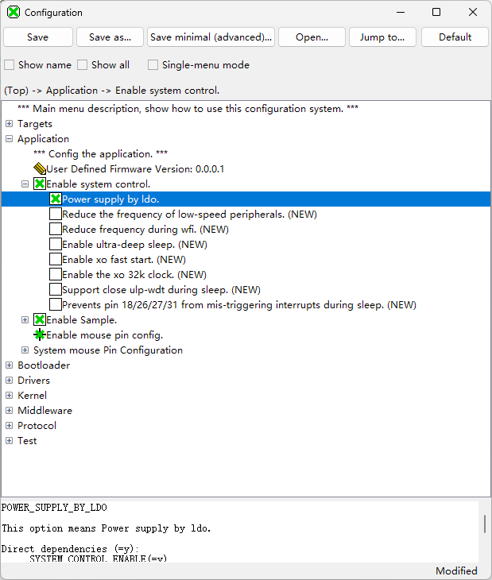
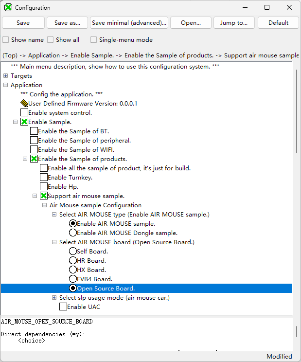
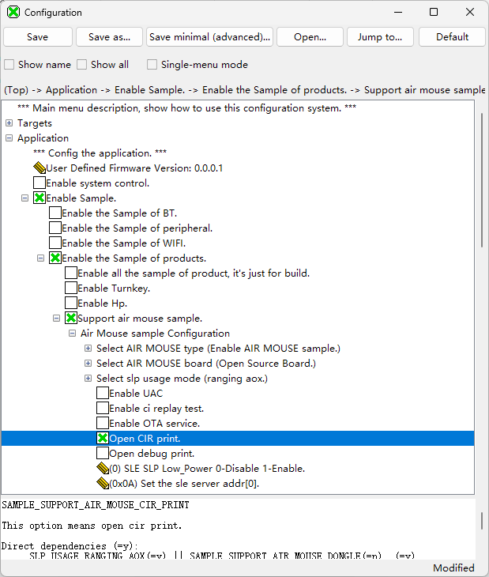
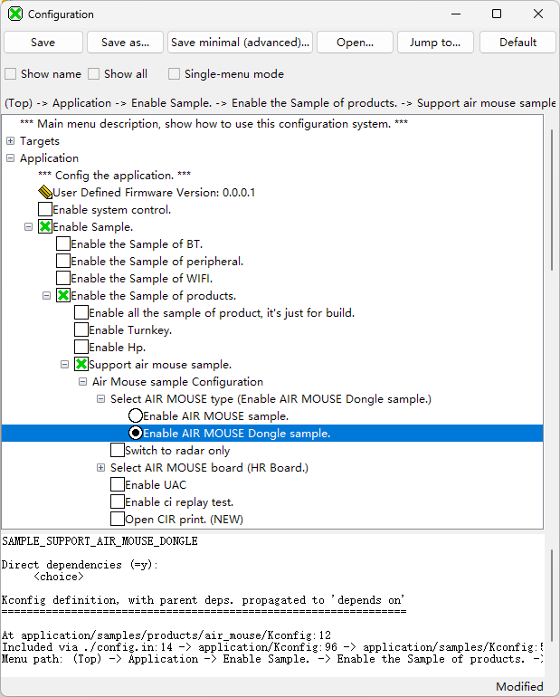
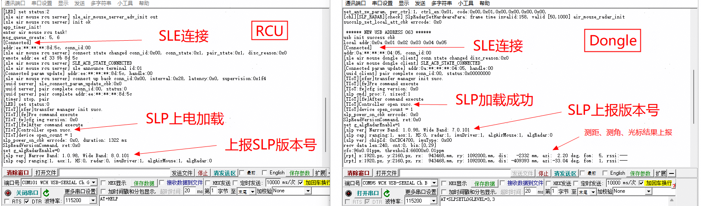

# 开源版本

开源版本支持SLP基础功能，示例代码中包含了SLP测距、SLP测角、SLP CIR上报、USB等功能的实现，可供开发人员参考。下文以生态三天线板指向单板作为

## 编译步骤

需编译RCU和Dongle两个版本，单板类型默认使用三天线单板，使用SDK搭配SLP固件进行编译，SDK由BS2X提供，以下章节主要介绍配置项的修改。

### Initiator编译

> **说明：** 
>SDK中已经包含配套的SLP固件，位于middleware\\services\\srv\_tiot\_host\\tiot\_driver\\product\_porting\\air\_mouse\\firmware目录下，若非版本升级则不需要更新，下文的“[1](#li9714185916249)”是固件更新的操作流程，可跳过。

1.  更新SLP固件（SDK中自带版本，无更新时可跳过该步骤）。在SDK的interim\_binary\\bs21a\\bin目录下，新建slp\\firmware目录，将SP31A的版本文件夹中的“file\_array”和“file\_array\_ota”放入“interim\_binary\\bs21a\\bin\\slp\\firmware”目录下。

    **图 1**  SLP固件存放位置  
    

2.  打开Visual Studio Code工具，根据BS2X的版本文档，导入SDK工程。
3.  打开KConfig，开启LDO模式，如下图所示。

    **图 2**  Initiator开启LDO模式  
    

4.  将AIR MOUSE type设置为Enable AIR MOUSE sample，如下图所示。

    **图 3**  Initiator配置Enable AIR MOUSE sample模式  
    

5.  将Select AIR MOUSE board设置为Open Source Board，如下图所示。

    **图 4**  Initiator配置Open Source Board类型  
    

6.  若需要打印CIR，可开启Open Cir print模式，如下图所示。

    **图 5**  Initiator开启Open Cir print模式  
    

7.  修改UART管脚配置，H0TX=26，H0RX=27，H0CTS=28，H0RTS=29

    **图 6**  Initiator修改UART管脚配置  
    

8.  单击Rebuild，进行版本编译，编译成功后的版本路径：tools\\pkg\\fwpkg\\bs21a，版本文件名称：bs21a\_all.fwpkg。

### Responder编译

1.  更新SLP固件（SDK中自带版本，无更新时可跳过该步骤）。在SDK的interim\_binary\\bs21a\\bin目录下，新建SLP\\firmware目录，将SP31A的版本文件夹中的“file\_array”和“file\_array\_ota”放入“interim\_binary\\bs21a\\bin\\slp\\firmware”目录下。

    **图 1**  SLP固件存放位置  
    

2.  打开Visual Studio Code工具，根据BS2X的版本文档，导入SDK工程。
3.  打开KConfig，开启LDO模式，如下图所示。

    **图 2**  Responder开启LDO模式  
    

4.  打开KConfig，将AIR MOUSE type改为 Enable AIR MOUSE Dongle sample，如下图所示。

    **图 3**  Responder配置Enable AIR MOUSE Dongle sample模式  
    

5.  将Select AIR MOUSE board设置为Open Source Board，如下图所示。

    **图 4**  Responder配置Open Source Board类型  
    

6.  若需要打印CIR，可开启Open Cir print模式，如下图所示。

    **图 5**  Responder开启Open Cir print模式  
    

7.  修改UART管脚配置，H0TX=26，H0RX=27，H0CTS=28，H0RTS=9

    **图 6**  Responder修改UART管脚配置  
    

8.  单击Rebuild，进行版本编译，编译成功后的版本路径：tools\\pkg\\fwpkg\\bs21a，版本文件名称：bs21a\_all.fwpkg。

## 使用方法

1.  Initiator侧和Responder侧各自烧录对应版本。
2.  Initiator侧和Responder侧重新上电。Initiator侧上电后SLE启动广播。Responder侧通过USB连接主机设备，上电后SLE启动扫描、USB初始化和枚举设备等操作，主机设备会识别到HID设备。
3.  等待SLE建链。
4.  待SLE连接配对成功后，两端会自动加载SLP固件，加载成功后会上报SLP版本号信息（可检查版本是否正确），之后会自动启动SLP业务，若业务流程正常则在Responder侧的串口日志中周期性打印测距、测角等上报信息，主机屏幕上会显示光标。两端日志如下图所示，启动流程可参考“[启动流程](zh-cn_topic_0000002511270377.md)”。

    **图 1**  指向遥控器RCU、Dongle串口日志  
    

5.  若开启了CIR功能，则在USB串口中打印CIR数据。

    **图 2**  USB串口中CIR日志上报  
    

## 启动流程

**图 1**  CIR上报业务简易流程  

## 可用功能

### 虚拟串口

USB类型默认设置为DEV\_SER\_HID（HID和虚拟串口设备），将单板通过USB线连接主机后，主机端会识别到一个串口设备和HID设备（见下图），其中HID设备用来显示光标，串口设备可收发数据，进行发送CIR数据或接收产测命令等操作。

**图 1**  主机USB设备显示  

### CIR上报功能

> **须知：** 
>该功能占用资源较多，仅部分版本支持。

示例中的Sample代码已实现CIR上报功能，可参考[编译步骤](编译步骤.md)章节进行配置，设备建链后会在USB串口中打印CIR数据。示例代码中相关函数如下表所示。

<table><thead align="left"><tr id="row2797mcpsimp"><th class="cellrowborder" valign="top" width="20.32%" id="mcps1.1.4.1.1">
函数名称

</th>
<th class="cellrowborder" valign="top" width="53.16000000000001%" id="mcps1.1.4.1.2">
描述

</th>
<th class="cellrowborder" valign="top" width="26.520000000000003%" id="mcps1.1.4.1.3">
所在文件

</th>
</tr>
</thead>
<tbody><tr id="row58808436812"><td class="cellrowborder" valign="top" width="20.32%" headers="mcps1.1.4.1.1 ">
set_slp_start_ranging_param

</td>
<td class="cellrowborder" valign="top" width="53.16000000000001%" headers="mcps1.1.4.1.2 ">
启动测距测角业务，CIR开启时默认频率设置为15Hz

</td>
<td class="cellrowborder" valign="top" width="26.520000000000003%" headers="mcps1.1.4.1.3 ">
sle_air_mouse_server.c

</td>
</tr>
<tr id="row7575449135816"><td class="cellrowborder" valign="top" width="20.32%" headers="mcps1.1.4.1.1 ">
rpt_cir_cbk

</td>
<td class="cellrowborder" valign="top" width="53.16000000000001%" headers="mcps1.1.4.1.2 ">
Initiator侧挂载的cir上报回调函数

</td>
<td class="cellrowborder" valign="top" width="26.520000000000003%" headers="mcps1.1.4.1.3 ">
sle_air_mouse_server.c

</td>
</tr>
<tr id="row1461511578714"><td class="cellrowborder" valign="top" width="20.32%" headers="mcps1.1.4.1.1 ">
rpt_cir_cbk

</td>
<td class="cellrowborder" valign="top" width="53.16000000000001%" headers="mcps1.1.4.1.2 ">
Responder侧挂载的cir上报回调函数

</td>
<td class="cellrowborder" valign="top" width="26.520000000000003%" headers="mcps1.1.4.1.3 ">
sle_air_mouse_client.c

</td>
</tr>
<tr id="row1555614172115"><td class="cellrowborder" valign="top" width="20.32%" headers="mcps1.1.4.1.1 ">
air_mouse_print

</td>
<td class="cellrowborder" valign="top" width="53.16000000000001%" headers="mcps1.1.4.1.2 ">
自定义的打印函数，CIR数据优先从USB串口中输出，若USB没有被枚举到，则从烧录串口中打印。

</td>
<td class="cellrowborder" valign="top" width="26.520000000000003%" headers="mcps1.1.4.1.3 ">
air_mouse_common.c

</td>
</tr>
</tbody>
</table>

