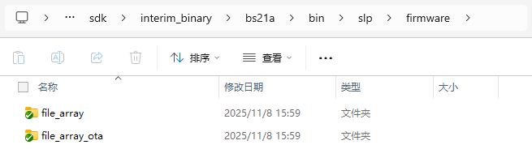
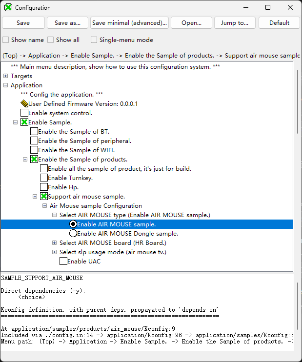
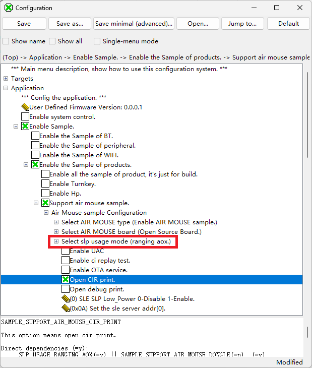
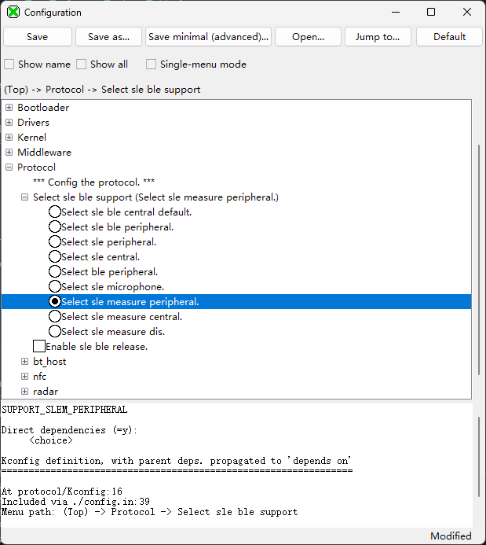
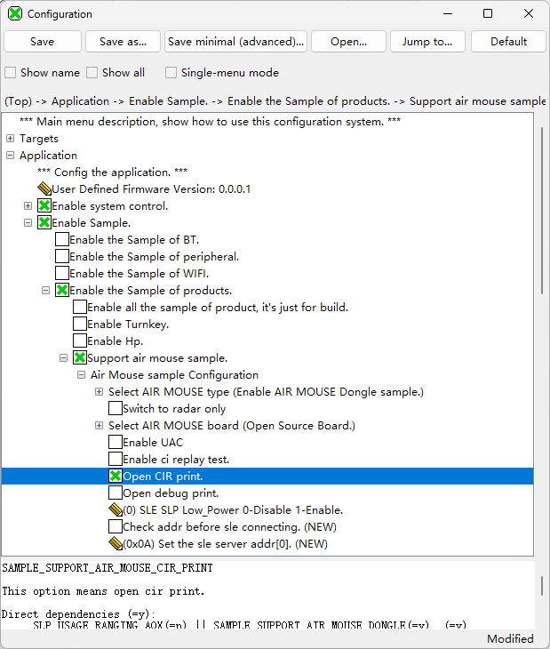
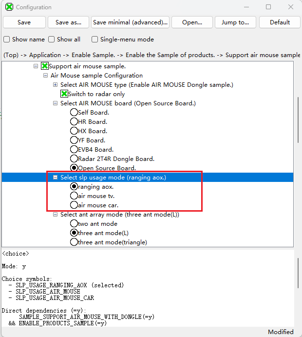
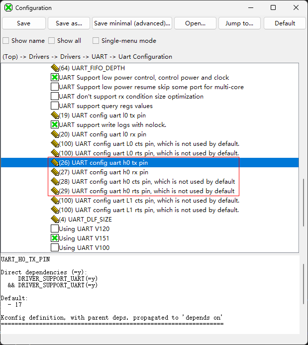
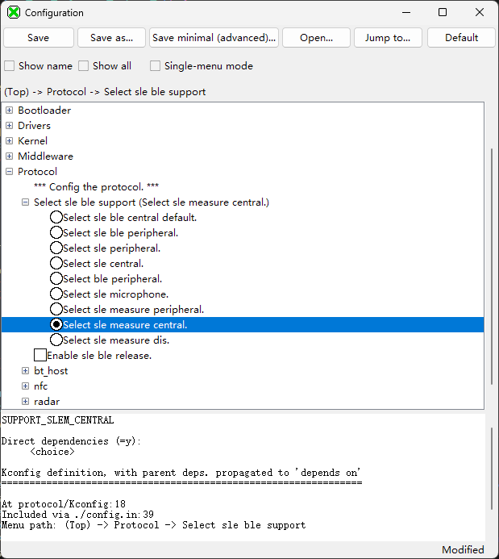
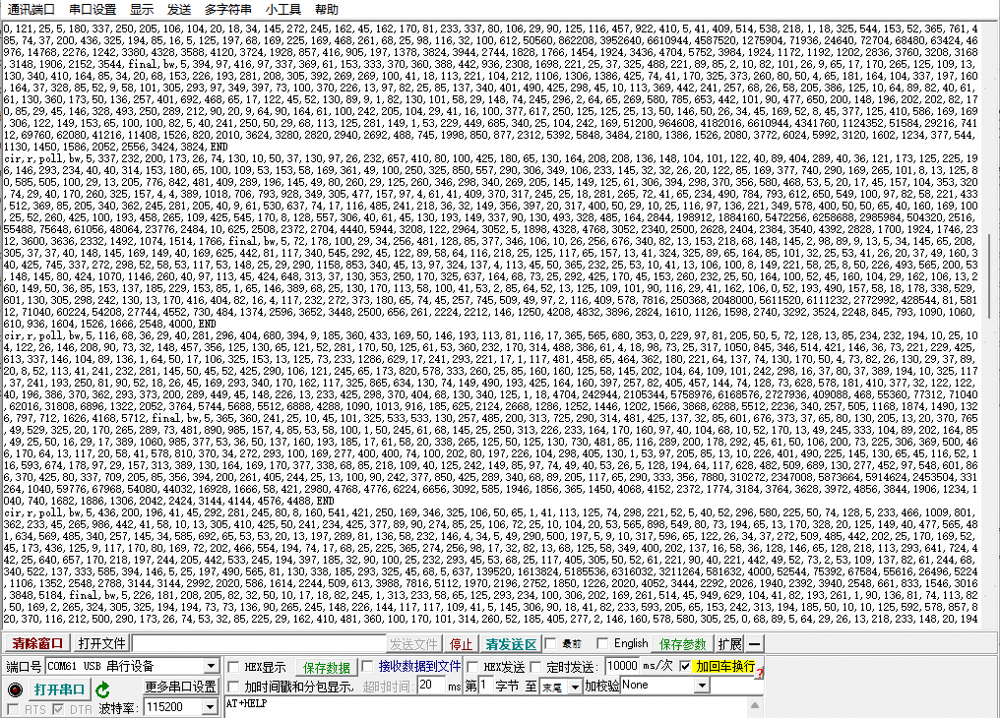
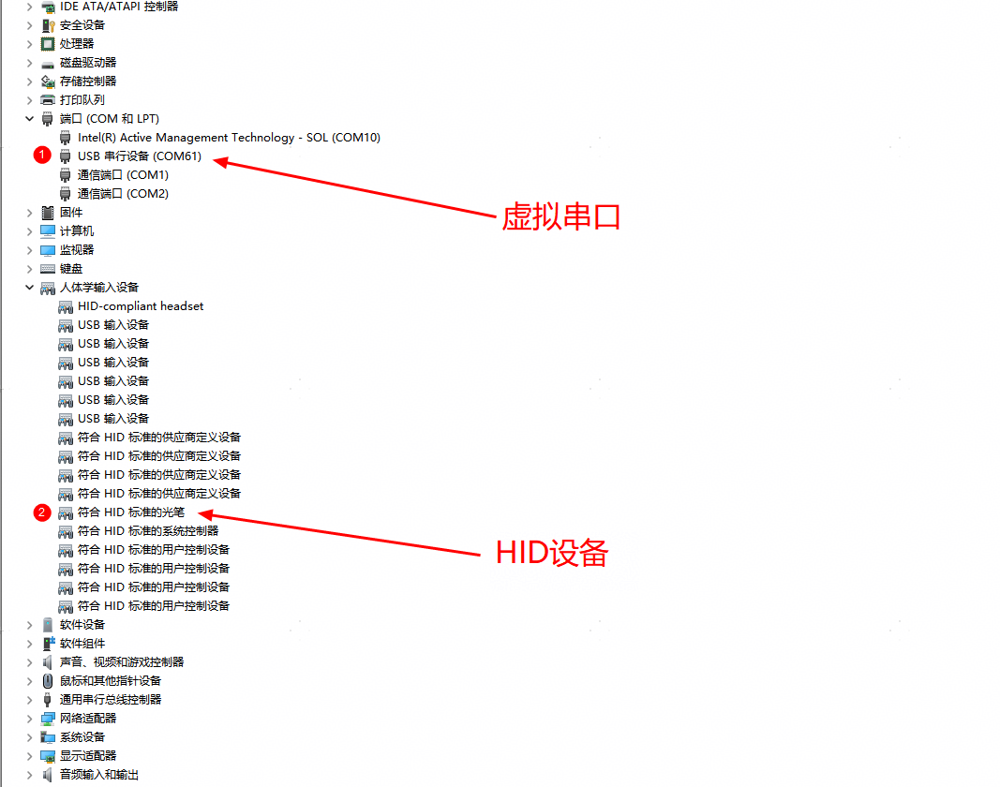

# Preface

**Overview**

This document describes the usage guide for the SP31 air mouse sample, including the sample-based compilation version, sample usage steps, and the SLE and SLP working flows in the sample.

Sample code path: application/samples/products/air\_mouse

**Reader Audience**

This document mainly applies to the following engineers:

-   Technical Support Engineer
-   Software Development Engineer

# Open Source Version

The open source version supports the SLP basic functions. The sample code contains implementations of SLP ranging, SLP angle measurement, SLP CIR reporting, USB, and other functions, which can be used as a reference for developers. The following uses the ecosystem three-antenna board pointing to the single board as a reference example.

-   **[Compilation Steps](#ZH-CN_TOPIC_0000002511180011)**  

-   **[Usage Method](#ZH-CN_TOPIC_0000002511271327)**  

-   **[Startup Flow](#ZH-CN_TOPIC_0000002183826164)**  

-   **[Available Functions](#ZH-CN_TOPIC_0000002479311386)**  

## Compilation Steps

Both the RCU and Dongle versions need to be compiled. The three-antenna board is used as the default board type. The SDK is compiled together with the SLP firmware. The SDK is provided by BS2X. The following sections mainly describe the modification of configuration items.

-   **[Initiator Compilation](#ZH-CN_TOPIC_0000002511178895)**  

-   **[Responder Compilation](#ZH-CN_TOPIC_0000002511258921)**  

### Initiator Compilation

> **Description:** 
>The SDK already contains the supporting SLP firmware, located in the middleware\\services\\srv\_tiot\_host\\tiot\_driver\\product\_porting\\air\_mouse\\firmware directory. Unless there is a version upgrade, no update is required. Step "[1](#li9714185916249)" below is the firmware update procedure and can be skipped.

1.  Update the SLP firmware (The SDK comes with a bundled version. If there is no update, this step can be skipped.). In the interim\_binary\\bs21e\\bin directory of the SDK, create a new slp\\firmware directory, and place the "file\_array" and "file\_array\_ota" files from the SP31 version folder into the "interim\_binary\\bs21e\\bin\\slp\\firmware" directory.

    **Figure 1**  SLP firmware storage location  
    

2.  Open the Visual Studio Code tool and import the SDK project according to the BS2X version document.
3.  Open KConfig and enable the LDO mode, as shown in [Figure 2](#fig1016819411818).

    **Figure 2**  Initiator enabling LDO mode  
    

4.  Set AIR MOUSE type to Enable AIR MOUSE sample, as shown in [Figure 3](#fig16824040135012).

    **Figure 3**  Initiator configuring Enable AIR MOUSE sample mode  
    

5.  Set Select AIR MOUSE board to Open Source Board, as shown in [Figure 4](#fig193145223319).

    **Figure 4**  Initiator configuring Open Source Board type  
    

6.  If you need to print CIR, you can enable the Open Cir print mode, as shown in [Figure 5](#fig19740161964118). Note: Enabling it may cause insufficient serial port resources and cause a system hang. It is recommended to enable it as needed.

    **Figure 5**  Initiator enabling Open Cir print mode  
    

7.  Modify the sample Usage and set it to ranging aox mode, as shown in [Figure 6](#fig354184517193).

    **Figure 6**  Initiator setting ranging aox mode  
    

8.  Modify the antenna arrangement selection and set it to three ant mode\(L\) type, as shown in [Figure 7](#fig158661417182211).

    **Figure 7**  Initiator setting the antenna to three ant mode\(L\) mode  
    模式.png "Initiator setting the antenna to three ant mode(L) mode")

9.  Modify the UART pin configuration: H0TX=26, H0RX=27, H0CTS=28, H0RTS=29, as shown in [Figure 8](#fig2423046749).

    **Figure 8**  Initiator modifying UART pin configuration  
    

10. Modify the SLE protocol configuration and select "sle measure peripheral", as shown in [Figure 9](#fig51862553222).

    **Figure 9**  Initiator modifying the SLE protocol  
    

11. Click Rebuild to compile the version. After a successful compilation, the version path is: tools\\pkg\\fwpkg\\bs21e, and the version file name is: bs21e\_all.fwpkg.

### Responder Compilation

1.  Update the SLP firmware (The SDK comes with a bundled version. If there is no update, this step can be skipped.). In the interim\_binary\\bs21e\\bin directory of the SDK, create a new SLP\\firmware directory, and place the "file\_array" and "file\_array\_ota" files from the SP31 version folder into the "interim\_binary\\bs21e\\bin\\slp\\firmware" directory.

    **Figure 1**  SLP firmware storage location  
    

2.  Open the Visual Studio Code tool and import the SDK project according to the BS2X version document.
3.  Open KConfig and enable the LDO mode, as shown in [Figure 2](#fig1016819411818).

    **Figure 2**  Responder enabling LDO mode  
    

4.  Open KConfig and change the AIR MOUSE type to Enable AIR MOUSE Dongle sample, as shown in [Figure 3](#fig16301151185520).

    **Figure 3**  Responder configuring Enable AIR MOUSE Dongle sample mode  
    

5.  Set Select AIR MOUSE board to Open Source Board, as shown in [Figure 4](#fig193145223319).

    **Figure 4**  Responder configuring Open Source Board type  
    

6.  If you need to print CIR, you can enable the Open Cir print mode, as shown in [Figure 5](#fig19740161964118).

    **Figure 5**  Responder enabling Open Cir print mode  
    

7.  Modify the sample Usage and set it to ranging aox mode, as shown in [Figure 6](#fig89364313162)

    **Figure 6**  Responder setting ranging aox mode  
    

8.  Modify the antenna arrangement selection and set it to three ant mode\(L\) type, as shown in [Figure 7](#fig13802161819127)

    **Figure 7**  Responder setting the antenna to three ant mode\(L\) mode  
    模式.png "Responder setting the antenna to three ant mode(L) mode")

9.  Modify the UART pin configuration: H0TX=26, H0RX=27, H0CTS=28, H0RTS=29, as shown in [Figure 8](#fig2423046749).

    **Figure 8**  Responder modifying UART pin configuration  
    

10. Modify the SLE protocol configuration and select "sle measure central", as shown in [Figure 9](#fig551558172315).

    **Figure 9**  Responder modifying the SLE protocol  
    

11. Click Rebuild to compile the version. After a successful compilation, the version path is: tools\\pkg\\fwpkg\\bs21e, and the version file name is: bs21e\_all.fwpkg.

## Usage Method

1.  Burn the corresponding versions on the Initiator side and Responder side respectively.
2.  Power cycle the Initiator side and Responder side. After the Initiator side is powered on, the SLE starts broadcasting. The Responder side is connected to the host device through USB. After power-on, the SLE starts scanning, USB initialization, and device enumeration operations. The host device will recognize the HID device.
3.  Wait for the SLE link establishment.
4.  After the SLE connection pairing succeeds, both sides will automatically load the SLP firmware. After the loading succeeds, the SLP version information will be reported (you can check whether the version is correct). Then the SLP service will start automatically. If the service flow is normal, ranging, angle measurement, and other reported information will be printed periodically in the serial port log on the Responder side, and the cursor will be displayed on the host screen. The logs of both sides are shown in the following figure. For the startup flow, refer to "[Startup Flow](#ZH-CN_TOPIC_0000002511270377)".

    **Figure 1**  Serial port logs of the pointing remote control RCU and Dongle  
    

5.  If the CIR function is enabled, CIR data will be printed in the USB serial port.

    **Figure 2**  CIR log reporting in the USB serial port  
    

## Startup Flow

**Figure 1**  Simplified flow of the CIR reporting service  

## Available Functions

-   **[Virtual Serial Port](#ZH-CN_TOPIC_0000002479153320)**  

-   **[CIR Reporting Function](#ZH-CN_TOPIC_0000002479313296)**  

### Virtual Serial Port

The USB type is set to DEV\_SER\_HID (HID and virtual serial port device) by default. After the board is connected to the host through the USB cable, the host will recognize a serial port device and a HID device (see the figure below). The HID device is used to display the cursor, and the serial port device can send and receive data, such as sending CIR data or receiving production test commands.

**Figure 1**  USB devices displayed on the host  

### CIR Reporting Function

> **Notice:** 
>This function occupies many resources and is supported only in some versions.

The Sample code in the sample has implemented the CIR reporting function. You can configure it by referring to the [Compilation Steps](#ZH-CN_TOPIC_0000002511180011) section. After the device link is established, CIR data will be printed in the USB serial port. The relevant functions in the sample code are shown in the following table.

<table><thead align="left"><tr id="row2797mcpsimp"><th class="cellrowborder" valign="top" width="20.32%" id="mcps1.1.4.1.1">
Function Name

</th>
<th class="cellrowborder" valign="top" width="53.16000000000001%" id="mcps1.1.4.1.2">
Description

</th>
<th class="cellrowborder" valign="top" width="26.520000000000003%" id="mcps1.1.4.1.3">
File

</th>
</tr>
</thead>
<tbody><tr id="row58808436812"><td class="cellrowborder" valign="top" width="20.32%" headers="mcps1.1.4.1.1 ">
set_slp_start_ranging_param

</td>
<td class="cellrowborder" valign="top" width="53.16000000000001%" headers="mcps1.1.4.1.2 ">
Start the ranging and angle measurement service. When CIR is enabled, the default frequency is set to 15 Hz

</td>
<td class="cellrowborder" valign="top" width="26.520000000000003%" headers="mcps1.1.4.1.3 ">
sle_air_mouse_server.c

</td>
</tr>
<tr id="row7575449135816"><td class="cellrowborder" valign="top" width="20.32%" headers="mcps1.1.4.1.1 ">
rpt_cir_cbk

</td>
<td class="cellrowborder" valign="top" width="53.16000000000001%" headers="mcps1.1.4.1.2 ">
CIR reporting callback function mounted on the Initiator side

</td>
<td class="cellrowborder" valign="top" width="26.520000000000003%" headers="mcps1.1.4.1.3 ">
sle_air_mouse_server.c

</td>
</tr>
<tr id="row1461511578714"><td class="cellrowborder" valign="top" width="20.32%" headers="mcps1.1.4.1.1 ">
rpt_cir_cbk

</td>
<td class="cellrowborder" valign="top" width="53.16000000000001%" headers="mcps1.1.4.1.2 ">
CIR reporting callback function mounted on the Responder side

</td>
<td class="cellrowborder" valign="top" width="26.520000000000003%" headers="mcps1.1.4.1.3 ">
sle_air_mouse_client.c

</td>
</tr>
<tr id="row1555614172115"><td class="cellrowborder" valign="top" width="20.32%" headers="mcps1.1.4.1.1 ">
air_mouse_print

</td>
<td class="cellrowborder" valign="top" width="53.16000000000001%" headers="mcps1.1.4.1.2 ">
Customized print function. CIR data is preferentially output from the USB serial port. If the USB device is not enumerated, it is printed from the burn serial port.

</td>
<td class="cellrowborder" valign="top" width="26.520000000000003%" headers="mcps1.1.4.1.3 ">
air_mouse_common.c

</td>
</tr>
</tbody>
</table>

# AT Commands

The following table summarizes the SLP AT commands.

<table><thead align="left"><tr id="row93083484514"><th class="cellrowborder" rowspan="2" valign="top" id="mcps1.1.9.1.1">
No.

</th>
<th class="cellrowborder" rowspan="2" valign="top" id="mcps1.1.9.1.2">
Command

</th>
<th class="cellrowborder" rowspan="2" valign="top" id="mcps1.1.9.1.3">
Description

</th>
<th class="cellrowborder" colspan="5" valign="top" id="mcps1.1.9.1.4">
Whether the command can be called in each state

</th>
</tr>
<tr id="row229mcpsimp"><th class="cellrowborder" valign="top" id="mcps1.1.9.2.1">
Power-off

</th>
<th class="cellrowborder" valign="top" id="mcps1.1.9.2.2">
Powered on without ranging

</th>
<th class="cellrowborder" valign="top" id="mcps1.1.9.2.3">
Ranging in progress

</th>
<th class="cellrowborder" valign="top" id="mcps1.1.9.2.4">
Ranging paused

</th>
<th class="cellrowborder" valign="top" id="mcps1.1.9.2.5">
Sleep

</th>
</tr>
</thead>
<tbody><tr id="row235mcpsimp"><td class="cellrowborder" valign="top" width="7.5200000000000005%" headers="mcps1.1.9.1.1 mcps1.1.9.2.1 ">
1

</td>
<td class="cellrowborder" valign="top" width="28.83%" headers="mcps1.1.9.1.2 mcps1.1.9.2.2 ">
AT+SLPPOWERON

</td>
<td class="cellrowborder" valign="top" width="22.040000000000003%" headers="mcps1.1.9.1.3 mcps1.1.9.2.3 ">
Power on SLP to complete SLP loading

</td>
<td class="cellrowborder" valign="top" width="6.3100000000000005%" headers="mcps1.1.9.1.4 mcps1.1.9.2.4 ">
√

</td>
<td class="cellrowborder" valign="top" width="10.34%" headers="mcps1.1.9.1.4 mcps1.1.9.2.5 ">
-

</td>
<td class="cellrowborder" valign="top" width="8.309999999999999%" headers="mcps1.1.9.1.4 ">
-

</td>
<td class="cellrowborder" valign="top" width="8.33%" headers="mcps1.1.9.1.4 ">
-

</td>
<td class="cellrowborder" valign="top" width="8.32%" headers="mcps1.1.9.1.4 ">
-

</td>
</tr>
<tr id="row240mcpsimp"><td class="cellrowborder" valign="top" width="7.5200000000000005%" headers="mcps1.1.9.1.1 mcps1.1.9.2.1 ">
2

</td>
<td class="cellrowborder" valign="top" width="28.83%" headers="mcps1.1.9.1.2 mcps1.1.9.2.2 ">
AT+SLPSTARTRANGING=&lt;parameters&gt;

</td>
<td class="cellrowborder" valign="top" width="22.040000000000003%" headers="mcps1.1.9.1.3 mcps1.1.9.2.3 ">
Start SLP ranging

</td>
<td class="cellrowborder" valign="top" width="6.3100000000000005%" headers="mcps1.1.9.1.4 mcps1.1.9.2.4 ">
-

</td>
<td class="cellrowborder" valign="top" width="10.34%" headers="mcps1.1.9.1.4 mcps1.1.9.2.5 ">
√

</td>
<td class="cellrowborder" valign="top" width="8.309999999999999%" headers="mcps1.1.9.1.4 ">
-

</td>
<td class="cellrowborder" valign="top" width="8.33%" headers="mcps1.1.9.1.4 ">
-

</td>
<td class="cellrowborder" valign="top" width="8.32%" headers="mcps1.1.9.1.4 ">
√

</td>
</tr>
<tr id="row245mcpsimp"><td class="cellrowborder" valign="top" width="7.5200000000000005%" headers="mcps1.1.9.1.1 mcps1.1.9.2.1 ">
3

</td>
<td class="cellrowborder" valign="top" width="28.83%" headers="mcps1.1.9.1.2 mcps1.1.9.2.2 ">
AT+SLPPOWEROFF

</td>
<td class="cellrowborder" valign="top" width="22.040000000000003%" headers="mcps1.1.9.1.3 mcps1.1.9.2.3 ">
Power off SLP

</td>
<td class="cellrowborder" valign="top" width="6.3100000000000005%" headers="mcps1.1.9.1.4 mcps1.1.9.2.4 ">
-

</td>
<td class="cellrowborder" valign="top" width="10.34%" headers="mcps1.1.9.1.4 mcps1.1.9.2.5 ">
√

</td>
<td class="cellrowborder" valign="top" width="8.309999999999999%" headers="mcps1.1.9.1.4 ">
√

</td>
<td class="cellrowborder" valign="top" width="8.33%" headers="mcps1.1.9.1.4 ">
√

</td>
<td class="cellrowborder" valign="top" width="8.32%" headers="mcps1.1.9.1.4 ">
√

</td>
</tr>
<tr id="row1127728442"><td class="cellrowborder" valign="top" width="7.5200000000000005%" headers="mcps1.1.9.1.1 mcps1.1.9.2.1 ">
4

</td>
<td class="cellrowborder" valign="top" width="28.83%" headers="mcps1.1.9.1.2 mcps1.1.9.2.2 ">
AT+SLPSLEEP

</td>
<td class="cellrowborder" valign="top" width="22.040000000000003%" headers="mcps1.1.9.1.3 mcps1.1.9.2.3 ">
Put SLP to sleep

</td>
<td class="cellrowborder" valign="top" width="6.3100000000000005%" headers="mcps1.1.9.1.4 mcps1.1.9.2.4 ">
-

</td>
<td class="cellrowborder" valign="top" width="10.34%" headers="mcps1.1.9.1.4 mcps1.1.9.2.5 ">
√

</td>
<td class="cellrowborder" valign="top" width="8.309999999999999%" headers="mcps1.1.9.1.4 ">
√

</td>
<td class="cellrowborder" valign="top" width="8.33%" headers="mcps1.1.9.1.4 ">
√

</td>
<td class="cellrowborder" valign="top" width="8.32%" headers="mcps1.1.9.1.4 ">
√

</td>
</tr>
<tr id="row101421612104212"><td class="cellrowborder" valign="top" width="7.5200000000000005%" headers="mcps1.1.9.1.1 mcps1.1.9.2.1 ">
5

</td>
<td class="cellrowborder" valign="top" width="28.83%" headers="mcps1.1.9.1.2 mcps1.1.9.2.2 ">
AT+SLPSTOPRANGING

</td>
<td class="cellrowborder" valign="top" width="22.040000000000003%" headers="mcps1.1.9.1.3 mcps1.1.9.2.3 ">
Stop the SLP ranging and angle measurement services

</td>
<td class="cellrowborder" valign="top" width="6.3100000000000005%" headers="mcps1.1.9.1.4 mcps1.1.9.2.4 ">
-

</td>
<td class="cellrowborder" valign="top" width="10.34%" headers="mcps1.1.9.1.4 mcps1.1.9.2.5 ">
-

</td>
<td class="cellrowborder" valign="top" width="8.309999999999999%" headers="mcps1.1.9.1.4 ">
√

</td>
<td class="cellrowborder" valign="top" width="8.33%" headers="mcps1.1.9.1.4 ">
√

</td>
<td class="cellrowborder" valign="top" width="8.32%" headers="mcps1.1.9.1.4 ">
-

</td>
</tr>
<tr id="row99021216319"><td class="cellrowborder" valign="top" width="7.5200000000000005%" headers="mcps1.1.9.1.1 mcps1.1.9.2.1 ">
6

</td>
<td class="cellrowborder" valign="top" width="28.83%" headers="mcps1.1.9.1.2 mcps1.1.9.2.2 ">
AT+SLPPAUSERANGING

</td>
<td class="cellrowborder" valign="top" width="22.040000000000003%" headers="mcps1.1.9.1.3 mcps1.1.9.2.3 ">
Pause the SLP ranging and angle measurement services

</td>
<td class="cellrowborder" valign="top" width="6.3100000000000005%" headers="mcps1.1.9.1.4 mcps1.1.9.2.4 ">
-

</td>
<td class="cellrowborder" valign="top" width="10.34%" headers="mcps1.1.9.1.4 mcps1.1.9.2.5 ">
-

</td>
<td class="cellrowborder" valign="top" width="8.309999999999999%" headers="mcps1.1.9.1.4 ">
√

</td>
<td class="cellrowborder" valign="top" width="8.33%" headers="mcps1.1.9.1.4 ">
-

</td>
<td class="cellrowborder" valign="top" width="8.32%" headers="mcps1.1.9.1.4 ">
-

</td>
</tr>
<tr id="row4127171615312"><td class="cellrowborder" valign="top" width="7.5200000000000005%" headers="mcps1.1.9.1.1 mcps1.1.9.2.1 ">
7

</td>
<td class="cellrowborder" valign="top" width="28.83%" headers="mcps1.1.9.1.2 mcps1.1.9.2.2 ">
AT+SLPCONTINUERANGING

</td>
<td class="cellrowborder" valign="top" width="22.040000000000003%" headers="mcps1.1.9.1.3 mcps1.1.9.2.3 ">
Continue the SLP ranging and angle measurement services

</td>
<td class="cellrowborder" valign="top" width="6.3100000000000005%" headers="mcps1.1.9.1.4 mcps1.1.9.2.4 ">
-

</td>
<td class="cellrowborder" valign="top" width="10.34%" headers="mcps1.1.9.1.4 mcps1.1.9.2.5 ">
-

</td>
<td class="cellrowborder" valign="top" width="8.309999999999999%" headers="mcps1.1.9.1.4 ">
-

</td>
<td class="cellrowborder" valign="top" width="8.33%" headers="mcps1.1.9.1.4 ">
√

</td>
<td class="cellrowborder" valign="top" width="8.32%" headers="mcps1.1.9.1.4 ">
-

</td>
</tr>
<tr id="row165221259123210"><td class="cellrowborder" valign="top" width="7.5200000000000005%" headers="mcps1.1.9.1.1 mcps1.1.9.2.1 ">
8

</td>
<td class="cellrowborder" valign="top" width="28.83%" headers="mcps1.1.9.1.2 mcps1.1.9.2.2 ">
AT+SLPWRITEAOXCALIPARA=&lt;parameters&gt;

</td>
<td class="cellrowborder" valign="top" width="22.040000000000003%" headers="mcps1.1.9.1.3 mcps1.1.9.2.3 ">
Write the SLP angle measurement calibration value

</td>
<td class="cellrowborder" valign="top" width="6.3100000000000005%" headers="mcps1.1.9.1.4 mcps1.1.9.2.4 ">
√

</td>
<td class="cellrowborder" valign="top" width="10.34%" headers="mcps1.1.9.1.4 mcps1.1.9.2.5 ">
√

</td>
<td class="cellrowborder" valign="top" width="8.309999999999999%" headers="mcps1.1.9.1.4 ">
√

</td>
<td class="cellrowborder" valign="top" width="8.33%" headers="mcps1.1.9.1.4 ">
√

</td>
<td class="cellrowborder" valign="top" width="8.32%" headers="mcps1.1.9.1.4 ">
√

</td>
</tr>
<tr id="row814165153319"><td class="cellrowborder" valign="top" width="7.5200000000000005%" headers="mcps1.1.9.1.1 mcps1.1.9.2.1 ">
9

</td>
<td class="cellrowborder" valign="top" width="28.83%" headers="mcps1.1.9.1.2 mcps1.1.9.2.2 ">
AT+SLPREADAOXCALIPARA

</td>
<td class="cellrowborder" valign="top" width="22.040000000000003%" headers="mcps1.1.9.1.3 mcps1.1.9.2.3 ">
Read the SLP angle measurement calibration value

</td>
<td class="cellrowborder" valign="top" width="6.3100000000000005%" headers="mcps1.1.9.1.4 mcps1.1.9.2.4 ">
√

</td>
<td class="cellrowborder" valign="top" width="10.34%" headers="mcps1.1.9.1.4 mcps1.1.9.2.5 ">
√

</td>
<td class="cellrowborder" valign="top" width="8.309999999999999%" headers="mcps1.1.9.1.4 ">
√

</td>
<td class="cellrowborder" valign="top" width="8.33%" headers="mcps1.1.9.1.4 ">
√

</td>
<td class="cellrowborder" valign="top" width="8.32%" headers="mcps1.1.9.1.4 ">
√

</td>
</tr>
<tr id="row129333803318"><td class="cellrowborder" valign="top" width="7.5200000000000005%" headers="mcps1.1.9.1.1 mcps1.1.9.2.1 ">
10

</td>
<td class="cellrowborder" valign="top" width="28.83%" headers="mcps1.1.9.1.2 mcps1.1.9.2.2 ">
AT+SLPWRITETXPOWER=&lt;parameters&gt;

</td>
<td class="cellrowborder" valign="top" width="22.040000000000003%" headers="mcps1.1.9.1.3 mcps1.1.9.2.3 ">
Write the SLP power value

</td>
<td class="cellrowborder" valign="top" width="6.3100000000000005%" headers="mcps1.1.9.1.4 mcps1.1.9.2.4 ">
√

</td>
<td class="cellrowborder" valign="top" width="10.34%" headers="mcps1.1.9.1.4 mcps1.1.9.2.5 ">
√

</td>
<td class="cellrowborder" valign="top" width="8.309999999999999%" headers="mcps1.1.9.1.4 ">
√

</td>
<td class="cellrowborder" valign="top" width="8.33%" headers="mcps1.1.9.1.4 ">
√

</td>
<td class="cellrowborder" valign="top" width="8.32%" headers="mcps1.1.9.1.4 ">
√

</td>
</tr>
<tr id="row83201312163311"><td class="cellrowborder" valign="top" width="7.5200000000000005%" headers="mcps1.1.9.1.1 mcps1.1.9.2.1 ">
11

</td>
<td class="cellrowborder" valign="top" width="28.83%" headers="mcps1.1.9.1.2 mcps1.1.9.2.2 ">
AT+SLPREADTXPOWER

</td>
<td class="cellrowborder" valign="top" width="22.040000000000003%" headers="mcps1.1.9.1.3 mcps1.1.9.2.3 ">
Read the SLP power value

</td>
<td class="cellrowborder" valign="top" width="6.3100000000000005%" headers="mcps1.1.9.1.4 mcps1.1.9.2.4 ">
√

</td>
<td class="cellrowborder" valign="top" width="10.34%" headers="mcps1.1.9.1.4 mcps1.1.9.2.5 ">
√

</td>
<td class="cellrowborder" valign="top" width="8.309999999999999%" headers="mcps1.1.9.1.4 ">
√

</td>
<td class="cellrowborder" valign="top" width="8.33%" headers="mcps1.1.9.1.4 ">
√

</td>
<td class="cellrowborder" valign="top" width="8.32%" headers="mcps1.1.9.1.4 ">
√

</td>
</tr>
<tr id="row31356222333"><td class="cellrowborder" valign="top" width="7.5200000000000005%" headers="mcps1.1.9.1.1 mcps1.1.9.2.1 ">
12

</td>
<td class="cellrowborder" valign="top" width="28.83%" headers="mcps1.1.9.1.2 mcps1.1.9.2.2 ">
AT+SLPWRITETRXDELAY=&lt;parameters&gt;

</td>
<td class="cellrowborder" valign="top" width="22.040000000000003%" headers="mcps1.1.9.1.3 mcps1.1.9.2.3 ">
Write the SLP board-level and antenna delay calibration

</td>
<td class="cellrowborder" valign="top" width="6.3100000000000005%" headers="mcps1.1.9.1.4 mcps1.1.9.2.4 ">
√

</td>
<td class="cellrowborder" valign="top" width="10.34%" headers="mcps1.1.9.1.4 mcps1.1.9.2.5 ">
√

</td>
<td class="cellrowborder" valign="top" width="8.309999999999999%" headers="mcps1.1.9.1.4 ">
√

</td>
<td class="cellrowborder" valign="top" width="8.33%" headers="mcps1.1.9.1.4 ">
√

</td>
<td class="cellrowborder" valign="top" width="8.32%" headers="mcps1.1.9.1.4 ">
√

</td>
</tr>
<tr id="row121211825133318"><td class="cellrowborder" valign="top" width="7.5200000000000005%" headers="mcps1.1.9.1.1 mcps1.1.9.2.1 ">
13

</td>
<td class="cellrowborder" valign="top" width="28.83%" headers="mcps1.1.9.1.2 mcps1.1.9.2.2 ">
AT+SLPREADTRXDELAY

</td>
<td class="cellrowborder" valign="top" width="22.040000000000003%" headers="mcps1.1.9.1.3 mcps1.1.9.2.3 ">
Read the SLP board-level and antenna delay calibration

</td>
<td class="cellrowborder" valign="top" width="6.3100000000000005%" headers="mcps1.1.9.1.4 mcps1.1.9.2.4 ">
√

</td>
<td class="cellrowborder" valign="top" width="10.34%" headers="mcps1.1.9.1.4 mcps1.1.9.2.5 ">
√

</td>
<td class="cellrowborder" valign="top" width="8.309999999999999%" headers="mcps1.1.9.1.4 ">
√

</td>
<td class="cellrowborder" valign="top" width="8.33%" headers="mcps1.1.9.1.4 ">
√

</td>
<td class="cellrowborder" valign="top" width="8.32%" headers="mcps1.1.9.1.4 ">
√

</td>
</tr>
<tr id="row52471857122"><td class="cellrowborder" valign="top" width="7.5200000000000005%" headers="mcps1.1.9.1.1 mcps1.1.9.2.1 ">
14

</td>
<td class="cellrowborder" valign="top" width="28.83%" headers="mcps1.1.9.1.2 mcps1.1.9.2.2 ">
AT+SLPENABLEIMUDETECTION

</td>
<td class="cellrowborder" valign="top" width="22.040000000000003%" headers="mcps1.1.9.1.3 mcps1.1.9.2.3 ">
Enable SLP IMU detection

</td>
<td class="cellrowborder" valign="top" width="6.3100000000000005%" headers="mcps1.1.9.1.4 mcps1.1.9.2.4 ">
√

</td>
<td class="cellrowborder" valign="top" width="10.34%" headers="mcps1.1.9.1.4 mcps1.1.9.2.5 ">
-

</td>
<td class="cellrowborder" valign="top" width="8.309999999999999%" headers="mcps1.1.9.1.4 ">
-

</td>
<td class="cellrowborder" valign="top" width="8.33%" headers="mcps1.1.9.1.4 ">
-

</td>
<td class="cellrowborder" valign="top" width="8.32%" headers="mcps1.1.9.1.4 ">
-

</td>
</tr>
<tr id="row363415771120"><td class="cellrowborder" valign="top" width="7.5200000000000005%" headers="mcps1.1.9.1.1 mcps1.1.9.2.1 ">
15

</td>
<td class="cellrowborder" valign="top" width="28.83%" headers="mcps1.1.9.1.2 mcps1.1.9.2.2 ">
AT+SLPREADGYROZEROOFFSET

</td>
<td class="cellrowborder" valign="top" width="22.040000000000003%" headers="mcps1.1.9.1.3 mcps1.1.9.2.3 ">
Read the SLP GYRO zero offset value

</td>
<td class="cellrowborder" valign="top" width="6.3100000000000005%" headers="mcps1.1.9.1.4 mcps1.1.9.2.4 ">
√

</td>
<td class="cellrowborder" valign="top" width="10.34%" headers="mcps1.1.9.1.4 mcps1.1.9.2.5 ">
√

</td>
<td class="cellrowborder" valign="top" width="8.309999999999999%" headers="mcps1.1.9.1.4 ">
√

</td>
<td class="cellrowborder" valign="top" width="8.33%" headers="mcps1.1.9.1.4 ">
√

</td>
<td class="cellrowborder" valign="top" width="8.32%" headers="mcps1.1.9.1.4 ">
√

</td>
</tr>
<tr id="row1389518019123"><td class="cellrowborder" valign="top" width="7.5200000000000005%" headers="mcps1.1.9.1.1 mcps1.1.9.2.1 ">
16

</td>
<td class="cellrowborder" valign="top" width="28.83%" headers="mcps1.1.9.1.2 mcps1.1.9.2.2 ">
AT+SLPSETRFSWPARAM=&lt;parameters&gt;

</td>
<td class="cellrowborder" valign="top" width="22.040000000000003%" headers="mcps1.1.9.1.3 mcps1.1.9.2.3 ">
Set the SLP RF front-end configuration parameters

</td>
<td class="cellrowborder" valign="top" width="6.3100000000000005%" headers="mcps1.1.9.1.4 mcps1.1.9.2.4 ">
√

</td>
<td class="cellrowborder" valign="top" width="10.34%" headers="mcps1.1.9.1.4 mcps1.1.9.2.5 ">
√

</td>
<td class="cellrowborder" valign="top" width="8.309999999999999%" headers="mcps1.1.9.1.4 ">
√

</td>
<td class="cellrowborder" valign="top" width="8.33%" headers="mcps1.1.9.1.4 ">
√

</td>
<td class="cellrowborder" valign="top" width="8.32%" headers="mcps1.1.9.1.4 ">
√

</td>
</tr>
<tr id="row15695131814131"><td class="cellrowborder" valign="top" width="7.5200000000000005%" headers="mcps1.1.9.1.1 mcps1.1.9.2.1 ">
17

</td>
<td class="cellrowborder" valign="top" width="28.83%" headers="mcps1.1.9.1.2 mcps1.1.9.2.2 ">
AT+SLPSETCURSORSPEED=&lt;parameters&gt;

</td>
<td class="cellrowborder" valign="top" width="22.040000000000003%" headers="mcps1.1.9.1.3 mcps1.1.9.2.3 ">
Set the SLP cursor sensitivity

</td>
<td class="cellrowborder" valign="top" width="6.3100000000000005%" headers="mcps1.1.9.1.4 mcps1.1.9.2.4 ">
√

</td>
<td class="cellrowborder" valign="top" width="10.34%" headers="mcps1.1.9.1.4 mcps1.1.9.2.5 ">
√

</td>
<td class="cellrowborder" valign="top" width="8.309999999999999%" headers="mcps1.1.9.1.4 ">
√

</td>
<td class="cellrowborder" valign="top" width="8.33%" headers="mcps1.1.9.1.4 ">
√

</td>
<td class="cellrowborder" valign="top" width="8.32%" headers="mcps1.1.9.1.4 ">
√

</td>
</tr>
<tr id="row13551192218139"><td class="cellrowborder" valign="top" width="7.5200000000000005%" headers="mcps1.1.9.1.1 mcps1.1.9.2.1 ">
18

</td>
<td class="cellrowborder" valign="top" width="28.83%" headers="mcps1.1.9.1.2 mcps1.1.9.2.2 ">
AT+SLPSETFTMODE=&lt;parameters&gt;

</td>
<td class="cellrowborder" valign="top" width="22.040000000000003%" headers="mcps1.1.9.1.3 mcps1.1.9.2.3 ">
Set the SLP production test mode

</td>
<td class="cellrowborder" valign="top" width="6.3100000000000005%" headers="mcps1.1.9.1.4 mcps1.1.9.2.4 ">
√

</td>
<td class="cellrowborder" valign="top" width="10.34%" headers="mcps1.1.9.1.4 mcps1.1.9.2.5 ">
√

</td>
<td class="cellrowborder" valign="top" width="8.309999999999999%" headers="mcps1.1.9.1.4 ">
√

</td>
<td class="cellrowborder" valign="top" width="8.33%" headers="mcps1.1.9.1.4 ">
√

</td>
<td class="cellrowborder" valign="top" width="8.32%" headers="mcps1.1.9.1.4 ">
√

</td>
</tr>
<tr id="row117930983318"><td class="cellrowborder" valign="top" width="7.5200000000000005%" headers="mcps1.1.9.1.1 mcps1.1.9.2.1 ">
19

</td>
<td class="cellrowborder" valign="top" width="28.83%" headers="mcps1.1.9.1.2 mcps1.1.9.2.2 ">
AT+SLPREADVERSION

</td>
<td class="cellrowborder" valign="top" width="22.040000000000003%" headers="mcps1.1.9.1.3 mcps1.1.9.2.3 ">
Read the SLP version information

</td>
<td class="cellrowborder" valign="top" width="6.3100000000000005%" headers="mcps1.1.9.1.4 mcps1.1.9.2.4 ">
-

</td>
<td class="cellrowborder" valign="top" width="10.34%" headers="mcps1.1.9.1.4 mcps1.1.9.2.5 ">
√

</td>
<td class="cellrowborder" valign="top" width="8.309999999999999%" headers="mcps1.1.9.1.4 ">
√

</td>
<td class="cellrowborder" valign="top" width="8.33%" headers="mcps1.1.9.1.4 ">
√

</td>
<td class="cellrowborder" valign="top" width="8.32%" headers="mcps1.1.9.1.4 ">
√

</td>
</tr>
<tr id="row27907160334"><td class="cellrowborder" valign="top" width="7.5200000000000005%" headers="mcps1.1.9.1.1 mcps1.1.9.2.1 ">
20

</td>
<td class="cellrowborder" valign="top" width="28.83%" headers="mcps1.1.9.1.2 mcps1.1.9.2.2 ">
AT+SLPSETTRANSFORM

</td>
<td class="cellrowborder" valign="top" width="22.040000000000003%" headers="mcps1.1.9.1.3 mcps1.1.9.2.3 ">
Set the SLP coordinate transformation parameters

</td>
<td class="cellrowborder" valign="top" width="6.3100000000000005%" headers="mcps1.1.9.1.4 mcps1.1.9.2.4 ">
√

</td>
<td class="cellrowborder" valign="top" width="10.34%" headers="mcps1.1.9.1.4 mcps1.1.9.2.5 ">
√

</td>
<td class="cellrowborder" valign="top" width="8.309999999999999%" headers="mcps1.1.9.1.4 ">
-

</td>
<td class="cellrowborder" valign="top" width="8.33%" headers="mcps1.1.9.1.4 ">
-

</td>
<td class="cellrowborder" valign="top" width="8.32%" headers="mcps1.1.9.1.4 ">
-

</td>
</tr>
<tr id="row127416204337"><td class="cellrowborder" valign="top" width="7.5200000000000005%" headers="mcps1.1.9.1.1 mcps1.1.9.2.1 ">
21

</td>
<td class="cellrowborder" valign="top" width="28.83%" headers="mcps1.1.9.1.2 mcps1.1.9.2.2 ">
AT+SLPSETINSTPARA

</td>
<td class="cellrowborder" valign="top" width="22.040000000000003%" headers="mcps1.1.9.1.3 mcps1.1.9.2.3 ">
Set the SLP installation parameters

</td>
<td class="cellrowborder" valign="top" width="6.3100000000000005%" headers="mcps1.1.9.1.4 mcps1.1.9.2.4 ">
√

</td>
<td class="cellrowborder" valign="top" width="10.34%" headers="mcps1.1.9.1.4 mcps1.1.9.2.5 ">
√

</td>
<td class="cellrowborder" valign="top" width="8.309999999999999%" headers="mcps1.1.9.1.4 ">
-

</td>
<td class="cellrowborder" valign="top" width="8.33%" headers="mcps1.1.9.1.4 ">
-

</td>
<td class="cellrowborder" valign="top" width="8.32%" headers="mcps1.1.9.1.4 ">
-

</td>
</tr>
<tr id="row887075019559"><td class="cellrowborder" valign="top" width="7.5200000000000005%" headers="mcps1.1.9.1.1 mcps1.1.9.2.1 ">
22

</td>
<td class="cellrowborder" valign="top" width="28.83%" headers="mcps1.1.9.1.2 mcps1.1.9.2.2 ">
AT+SLPSETCLICK

</td>
<td class="cellrowborder" valign="top" width="22.040000000000003%" headers="mcps1.1.9.1.3 mcps1.1.9.2.3 ">
Set the SLP key state

</td>
<td class="cellrowborder" valign="top" width="6.3100000000000005%" headers="mcps1.1.9.1.4 mcps1.1.9.2.4 ">
-

</td>
<td class="cellrowborder" valign="top" width="10.34%" headers="mcps1.1.9.1.4 mcps1.1.9.2.5 ">
-

</td>
<td class="cellrowborder" valign="top" width="8.309999999999999%" headers="mcps1.1.9.1.4 ">
√

</td>
<td class="cellrowborder" valign="top" width="8.33%" headers="mcps1.1.9.1.4 ">
√

</td>
<td class="cellrowborder" valign="top" width="8.32%" headers="mcps1.1.9.1.4 ">
√

</td>
</tr>
<tr id="row6302171813115"><td class="cellrowborder" valign="top" width="7.5200000000000005%" headers="mcps1.1.9.1.1 mcps1.1.9.2.1 ">
23

</td>
<td class="cellrowborder" valign="top" width="28.83%" headers="mcps1.1.9.1.2 mcps1.1.9.2.2 ">
AT+SLPREADTSENSOR

</td>
<td class="cellrowborder" valign="top" width="22.040000000000003%" headers="mcps1.1.9.1.3 mcps1.1.9.2.3 ">
Read the SLP temperature

</td>
<td class="cellrowborder" valign="top" width="6.3100000000000005%" headers="mcps1.1.9.1.4 mcps1.1.9.2.4 ">
-

</td>
<td class="cellrowborder" valign="top" width="10.34%" headers="mcps1.1.9.1.4 mcps1.1.9.2.5 ">
√

</td>
<td class="cellrowborder" valign="top" width="8.309999999999999%" headers="mcps1.1.9.1.4 ">
√

</td>
<td class="cellrowborder" valign="top" width="8.33%" headers="mcps1.1.9.1.4 ">
√

</td>
<td class="cellrowborder" valign="top" width="8.32%" headers="mcps1.1.9.1.4 ">
√

</td>
</tr>
<tr id="row1348513211015"><td class="cellrowborder" valign="top" width="7.5200000000000005%" headers="mcps1.1.9.1.1 mcps1.1.9.2.1 ">
24

</td>
<td class="cellrowborder" valign="top" width="28.83%" headers="mcps1.1.9.1.2 mcps1.1.9.2.2 ">
AT+SLPSETLOGLEVEL

</td>
<td class="cellrowborder" valign="top" width="22.040000000000003%" headers="mcps1.1.9.1.3 mcps1.1.9.2.3 ">
Set the SLP log print level

</td>
<td class="cellrowborder" valign="top" width="6.3100000000000005%" headers="mcps1.1.9.1.4 mcps1.1.9.2.4 ">
√

</td>
<td class="cellrowborder" valign="top" width="10.34%" headers="mcps1.1.9.1.4 mcps1.1.9.2.5 ">
√

</td>
<td class="cellrowborder" valign="top" width="8.309999999999999%" headers="mcps1.1.9.1.4 ">
√

</td>
<td class="cellrowborder" valign="top" width="8.33%" headers="mcps1.1.9.1.4 ">
√

</td>
<td class="cellrowborder" valign="top" width="8.32%" headers="mcps1.1.9.1.4 ">
√

</td>
</tr>
<tr id="row206401459110"><td class="cellrowborder" valign="top" width="7.5200000000000005%" headers="mcps1.1.9.1.1 mcps1.1.9.2.1 ">
25

</td>
<td class="cellrowborder" valign="top" width="28.83%" headers="mcps1.1.9.1.2 mcps1.1.9.2.2 ">
AT+SLPDISABLEIMUDETECTION

</td>
<td class="cellrowborder" valign="top" width="22.040000000000003%" headers="mcps1.1.9.1.3 mcps1.1.9.2.3 ">
Disable SLP IMU detection

</td>
<td class="cellrowborder" valign="top" width="6.3100000000000005%" headers="mcps1.1.9.1.4 mcps1.1.9.2.4 ">
√

</td>
<td class="cellrowborder" valign="top" width="10.34%" headers="mcps1.1.9.1.4 mcps1.1.9.2.5 ">
√

</td>
<td class="cellrowborder" valign="top" width="8.309999999999999%" headers="mcps1.1.9.1.4 ">
-

</td>
<td class="cellrowborder" valign="top" width="8.33%" headers="mcps1.1.9.1.4 ">
-

</td>
<td class="cellrowborder" valign="top" width="8.32%" headers="mcps1.1.9.1.4 ">
-

</td>
</tr>
<tr id="row1765685142318"><td class="cellrowborder" valign="top" width="7.5200000000000005%" headers="mcps1.1.9.1.1 mcps1.1.9.2.1 ">
26

</td>
<td class="cellrowborder" valign="top" width="28.83%" headers="mcps1.1.9.1.2 mcps1.1.9.2.2 ">
AT+SLPSETIMURPTFREQ

</td>
<td class="cellrowborder" valign="top" width="22.040000000000003%" headers="mcps1.1.9.1.3 mcps1.1.9.2.3 ">
Set the SLP IMU raw data reporting frequency

</td>
<td class="cellrowborder" valign="top" width="6.3100000000000005%" headers="mcps1.1.9.1.4 mcps1.1.9.2.4 ">
√

</td>
<td class="cellrowborder" valign="top" width="10.34%" headers="mcps1.1.9.1.4 mcps1.1.9.2.5 ">
√

</td>
<td class="cellrowborder" valign="top" width="8.309999999999999%" headers="mcps1.1.9.1.4 ">
-

</td>
<td class="cellrowborder" valign="top" width="8.33%" headers="mcps1.1.9.1.4 ">
-

</td>
<td class="cellrowborder" valign="top" width="8.32%" headers="mcps1.1.9.1.4 ">
√

</td>
</tr>
<tr id="row3121997239"><td class="cellrowborder" valign="top" width="7.5200000000000005%" headers="mcps1.1.9.1.1 mcps1.1.9.2.1 ">
27

</td>
<td class="cellrowborder" valign="top" width="28.83%" headers="mcps1.1.9.1.2 mcps1.1.9.2.2 ">
AT+SLPSETCORRECTMODE

</td>
<td class="cellrowborder" valign="top" width="22.040000000000003%" headers="mcps1.1.9.1.3 mcps1.1.9.2.3 ">
Set the SLP cursor correction mode

</td>
<td class="cellrowborder" valign="top" width="6.3100000000000005%" headers="mcps1.1.9.1.4 mcps1.1.9.2.4 ">
√

</td>
<td class="cellrowborder" valign="top" width="10.34%" headers="mcps1.1.9.1.4 mcps1.1.9.2.5 ">
√

</td>
<td class="cellrowborder" valign="top" width="8.309999999999999%" headers="mcps1.1.9.1.4 ">
-

</td>
<td class="cellrowborder" valign="top" width="8.33%" headers="mcps1.1.9.1.4 ">
-

</td>
<td class="cellrowborder" valign="top" width="8.32%" headers="mcps1.1.9.1.4 ">
√

</td>
</tr>
<tr id="row14745161113418"><td class="cellrowborder" valign="top" width="7.5200000000000005%" headers="mcps1.1.9.1.1 mcps1.1.9.2.1 ">
28

</td>
<td class="cellrowborder" valign="top" width="28.83%" headers="mcps1.1.9.1.2 mcps1.1.9.2.2 ">
AT+SLPREADDIEID

</td>
<td class="cellrowborder" valign="top" width="22.040000000000003%" headers="mcps1.1.9.1.3 mcps1.1.9.2.3 ">
Read the SLP chip DIE ID

</td>
<td class="cellrowborder" valign="top" width="6.3100000000000005%" headers="mcps1.1.9.1.4 mcps1.1.9.2.4 ">
-

</td>
<td class="cellrowborder" valign="top" width="10.34%" headers="mcps1.1.9.1.4 mcps1.1.9.2.5 ">
√

</td>
<td class="cellrowborder" valign="top" width="8.309999999999999%" headers="mcps1.1.9.1.4 ">
√

</td>
<td class="cellrowborder" valign="top" width="8.33%" headers="mcps1.1.9.1.4 ">
√

</td>
<td class="cellrowborder" valign="top" width="8.32%" headers="mcps1.1.9.1.4 ">
√

</td>
</tr>
<tr id="row3870035103612"><td class="cellrowborder" valign="top" width="7.5200000000000005%" headers="mcps1.1.9.1.1 mcps1.1.9.2.1 ">
29

</td>
<td class="cellrowborder" valign="top" width="28.83%" headers="mcps1.1.9.1.2 mcps1.1.9.2.2 ">
AT+SLPRCUSLEEP

</td>
<td class="cellrowborder" valign="top" width="22.040000000000003%" headers="mcps1.1.9.1.3 mcps1.1.9.2.3 ">
Put the RCU side into system sleep

</td>
<td class="cellrowborder" valign="top" width="6.3100000000000005%" headers="mcps1.1.9.1.4 mcps1.1.9.2.4 ">
-

</td>
<td class="cellrowborder" valign="top" width="10.34%" headers="mcps1.1.9.1.4 mcps1.1.9.2.5 ">
√

</td>
<td class="cellrowborder" valign="top" width="8.309999999999999%" headers="mcps1.1.9.1.4 ">
√

</td>
<td class="cellrowborder" valign="top" width="8.33%" headers="mcps1.1.9.1.4 ">
√

</td>
<td class="cellrowborder" valign="top" width="8.32%" headers="mcps1.1.9.1.4 ">
-

</td>
</tr>
<tr id="row13691639153611"><td class="cellrowborder" valign="top" width="7.5200000000000005%" headers="mcps1.1.9.1.1 mcps1.1.9.2.1 ">
30

</td>
<td class="cellrowborder" valign="top" width="28.83%" headers="mcps1.1.9.1.2 mcps1.1.9.2.2 ">
AT+SLPAMDISCONNECT

</td>
<td class="cellrowborder" valign="top" width="22.040000000000003%" headers="mcps1.1.9.1.3 mcps1.1.9.2.3 ">
On the RCU side, the SLE actively disconnects and disables broadcasting without clearing the pairing records

</td>
<td class="cellrowborder" valign="top" width="6.3100000000000005%" headers="mcps1.1.9.1.4 mcps1.1.9.2.4 ">
√

</td>
<td class="cellrowborder" valign="top" width="10.34%" headers="mcps1.1.9.1.4 mcps1.1.9.2.5 ">
√

</td>
<td class="cellrowborder" valign="top" width="8.309999999999999%" headers="mcps1.1.9.1.4 ">
√

</td>
<td class="cellrowborder" valign="top" width="8.33%" headers="mcps1.1.9.1.4 ">
√

</td>
<td class="cellrowborder" valign="top" width="8.32%" headers="mcps1.1.9.1.4 ">
√

</td>
</tr>
<tr id="row6877204263616"><td class="cellrowborder" valign="top" width="7.5200000000000005%" headers="mcps1.1.9.1.1 mcps1.1.9.2.1 ">
31

</td>
<td class="cellrowborder" valign="top" width="28.83%" headers="mcps1.1.9.1.2 mcps1.1.9.2.2 ">
AT+SLPAMSTARTANNOUNCE

</td>
<td class="cellrowborder" valign="top" width="22.040000000000003%" headers="mcps1.1.9.1.3 mcps1.1.9.2.3 ">
Enable broadcasting on the RCU side

</td>
<td class="cellrowborder" valign="top" width="6.3100000000000005%" headers="mcps1.1.9.1.4 mcps1.1.9.2.4 ">
√

</td>
<td class="cellrowborder" valign="top" width="10.34%" headers="mcps1.1.9.1.4 mcps1.1.9.2.5 ">
√

</td>
<td class="cellrowborder" valign="top" width="8.309999999999999%" headers="mcps1.1.9.1.4 ">
√

</td>
<td class="cellrowborder" valign="top" width="8.33%" headers="mcps1.1.9.1.4 ">
√

</td>
<td class="cellrowborder" valign="top" width="8.32%" headers="mcps1.1.9.1.4 ">
√

</td>
</tr>
<tr id="row1977814563614"><td class="cellrowborder" valign="top" width="7.5200000000000005%" headers="mcps1.1.9.1.1 mcps1.1.9.2.1 ">
32

</td>
<td class="cellrowborder" valign="top" width="28.83%" headers="mcps1.1.9.1.2 mcps1.1.9.2.2 ">
AT+AMSETCURSORSPEED=&lt;mode&gt;

</td>
<td class="cellrowborder" valign="top" width="22.040000000000003%" headers="mcps1.1.9.1.3 mcps1.1.9.2.3 ">
On the Dongle side, switch the pointing cursor speed and update the log print flag

</td>
<td class="cellrowborder" valign="top" width="6.3100000000000005%" headers="mcps1.1.9.1.4 mcps1.1.9.2.4 ">
√

</td>
<td class="cellrowborder" valign="top" width="10.34%" headers="mcps1.1.9.1.4 mcps1.1.9.2.5 ">
√

</td>
<td class="cellrowborder" valign="top" width="8.309999999999999%" headers="mcps1.1.9.1.4 ">
√

</td>
<td class="cellrowborder" valign="top" width="8.33%" headers="mcps1.1.9.1.4 ">
√

</td>
<td class="cellrowborder" valign="top" width="8.32%" headers="mcps1.1.9.1.4 ">
√

</td>
</tr>
<tr id="row8513164914239"><td class="cellrowborder" valign="top" width="7.5200000000000005%" headers="mcps1.1.9.1.1 mcps1.1.9.2.1 ">
33

</td>
<td class="cellrowborder" valign="top" width="28.83%" headers="mcps1.1.9.1.2 mcps1.1.9.2.2 ">
AT+SLPREADTRIANTCALIPARA

</td>
<td class="cellrowborder" valign="top" width="22.040000000000003%" headers="mcps1.1.9.1.3 mcps1.1.9.2.3 ">
Read the SLP three-antenna calibration parameters

</td>
<td class="cellrowborder" valign="top" width="6.3100000000000005%" headers="mcps1.1.9.1.4 mcps1.1.9.2.4 ">
√

</td>
<td class="cellrowborder" valign="top" width="10.34%" headers="mcps1.1.9.1.4 mcps1.1.9.2.5 ">
√

</td>
<td class="cellrowborder" valign="top" width="8.309999999999999%" headers="mcps1.1.9.1.4 ">
√

</td>
<td class="cellrowborder" valign="top" width="8.33%" headers="mcps1.1.9.1.4 ">
√

</td>
<td class="cellrowborder" valign="top" width="8.32%" headers="mcps1.1.9.1.4 ">
√

</td>
</tr>
<tr id="row119281052112320"><td class="cellrowborder" valign="top" width="7.5200000000000005%" headers="mcps1.1.9.1.1 mcps1.1.9.2.1 ">
34

</td>
<td class="cellrowborder" valign="top" width="28.83%" headers="mcps1.1.9.1.2 mcps1.1.9.2.2 ">
AT+SLPWRITETRIANTCALIPARA=&lt;parameters&gt;

</td>
<td class="cellrowborder" valign="top" width="22.040000000000003%" headers="mcps1.1.9.1.3 mcps1.1.9.2.3 ">
Write the SLP three-antenna calibration parameters

</td>
<td class="cellrowborder" valign="top" width="6.3100000000000005%" headers="mcps1.1.9.1.4 mcps1.1.9.2.4 ">
√

</td>
<td class="cellrowborder" valign="top" width="10.34%" headers="mcps1.1.9.1.4 mcps1.1.9.2.5 ">
√

</td>
<td class="cellrowborder" valign="top" width="8.309999999999999%" headers="mcps1.1.9.1.4 ">
√

</td>
<td class="cellrowborder" valign="top" width="8.33%" headers="mcps1.1.9.1.4 ">
√

</td>
<td class="cellrowborder" valign="top" width="8.32%" headers="mcps1.1.9.1.4 ">
√

</td>
</tr>
</tbody>
</table>

-   **[SLP Power-on Loading](#ZH-CN_TOPIC_0000002219226389)**  

-   **[SLP Power-off](#ZH-CN_TOPIC_0000002219226385)**  

-   **[SLP Sleep](#ZH-CN_TOPIC_0000002219311953)**  

-   **[SLP Start Ranging](#ZH-CN_TOPIC_0000002183826184)**  

-   **[SLP Stop Ranging](#ZH-CN_TOPIC_0000002183985848)**  

-   **[SLP Pause Ranging](#ZH-CN_TOPIC_0000002219311949)**  

-   **[SLP Continue Ranging](#ZH-CN_TOPIC_0000002183826180)**  

-   **[SLP Write Angle Measurement Calibration Value](#ZH-CN_TOPIC_0000002219311929)**  

-   **[SLP Read Angle Measurement Calibration Value](#ZH-CN_TOPIC_0000002183985832)**  

-   **[SLP Write TX Transmit Power Codeword](#ZH-CN_TOPIC_0000002183985824)**  

-   **[SLP Read TX Transmit Power Codeword](#ZH-CN_TOPIC_0000002183985840)**  

-   **[SLP Write Board-Level and Antenna Delay Calibration Value](#ZH-CN_TOPIC_0000002183826196)**  

-   **[SLP Read Board-Level and Antenna Delay Calibration Value](#ZH-CN_TOPIC_0000002219311941)**  

-   **[SLP Enable IMU Detection](#ZH-CN_TOPIC_0000002371423284)**  

-   **[SLP Read GYRO Zero Offset Value](#ZH-CN_TOPIC_0000002405262773)**  

-   **[SLP Set RF Front-End Configuration Parameters](#ZH-CN_TOPIC_0000002405142921)**  

-   **[SLP Set Cursor Sensitivity](#ZH-CN_TOPIC_0000002371585692)**  

-   **[SLP Set Production Test Mode](#ZH-CN_TOPIC_0000002405265461)**  

-   **[SLP Read Version Information](#ZH-CN_TOPIC_0000002371586072)**  

-   **[SLP Set Coordinate Transformation Parameters](#ZH-CN_TOPIC_0000002481431717)**  

-   **[SLP Set Installation Parameters](#ZH-CN_TOPIC_0000002481631685)**  

-   **[SLP Set Key State](#ZH-CN_TOPIC_0000002453803022)**  

-   **[SLP Read Temperature Value](#ZH-CN_TOPIC_0000002513368031)**  

-   **[SLP Set Log Print Level](#ZH-CN_TOPIC_0000002513488003)**  

-   **[SLP Disable IMU Detection](#ZH-CN_TOPIC_0000002481568130)**  

-   **[SLP Set IMU Raw Data Reporting Frequency](#ZH-CN_TOPIC_0000002509642402)**  

-   **[SLP Set Cursor Correction Mode](#ZH-CN_TOPIC_0000002509682422)**  

-   **[SLP Read Chip DIE ID](#ZH-CN_TOPIC_0000002551238893)**  

-   **[RCU Side System Sleep](#ZH-CN_TOPIC_0000002543745535)**  

-   **[RCU Side SLE Active Disconnection with Broadcast Disabled but Pairing Records Not Cleared](#ZH-CN_TOPIC_0000002543825541)**  

-   **[RCU Side Enable Broadcasting](#ZH-CN_TOPIC_0000002543745533)**  

-   **[Dongle Side Switch Pointing Cursor Speed and Update Log Print Flag](#ZH-CN_TOPIC_0000002543825539)**  

-   **[SLP Read Three-Antenna Calibration Parameters](#ZH-CN_TOPIC_0000002522946218)**  

-   **[SLP Write Three-Antenna Calibration Parameters](#ZH-CN_TOPIC_0000002522786214)**  

-   **[Dongle Side Read Screen Size Parameters](#ZH-CN_TOPIC_0000002531808984)**  

-   **[Dongle Side Set Preset Screen Size Parameters](#ZH-CN_TOPIC_0000002531649448)**  

-   **[Dongle Side Set Custom Screen Size Parameters](#ZH-CN_TOPIC_0000002562729317)**  

-   **[Dongle Side Read Coordinate Reporting Rate](#ZH-CN_TOPIC_0000002531809378)**  

-   **[Dongle Side Set Coordinate Reporting Rate](#ZH-CN_TOPIC_0000002562569353)**  

-   **[AT Command Usage Description](#ZH-CN_TOPIC_0000002183826172)**  

## SLP Power-on Loading

<table><tbody><tr id="row107mcpsimp"><th class="firstcol" valign="top" width="13.819999999999999%" id="mcps1.1.3.1.1">
Format

</th>
<td class="cellrowborder" valign="top" width="86.18%" headers="mcps1.1.3.1.1 ">
AT+SLPPOWERON

</td>
</tr>
<tr id="row112mcpsimp"><th class="firstcol" valign="top" width="13.819999999999999%" id="mcps1.1.3.2.1">
Response

</th>
<td class="cellrowborder" valign="top" width="86.18%" headers="mcps1.1.3.2.1 ">
On success: OK;

On failure: ERROR.

</td>
</tr>
<tr id="row119mcpsimp"><th class="firstcol" valign="top" width="13.819999999999999%" id="mcps1.1.3.3.1">
Parameter Description

</th>
<td class="cellrowborder" valign="top" width="86.18%" headers="mcps1.1.3.3.1 ">
-

</td>
</tr>
<tr id="row124mcpsimp"><th class="firstcol" valign="top" width="13.819999999999999%" id="mcps1.1.3.4.1">
Example

</th>
<td class="cellrowborder" valign="top" width="86.18%" headers="mcps1.1.3.4.1 ">
AT+SLPPOWERON

</td>
</tr>
<tr id="row129mcpsimp"><th class="firstcol" valign="top" width="13.819999999999999%" id="mcps1.1.3.5.1">
Note

</th>
<td class="cellrowborder" valign="top" width="86.18%" headers="mcps1.1.3.5.1 ">
-

</td>
</tr>
</tbody>
</table>

## SLP Power-off

<table><tbody><tr id="row140mcpsimp"><th class="firstcol" valign="top" width="14.000000000000002%" id="mcps1.1.3.1.1">
Format

</th>
<td class="cellrowborder" valign="top" width="86%" headers="mcps1.1.3.1.1 ">
AT+SLPPOWEROFF

</td>
</tr>
<tr id="row145mcpsimp"><th class="firstcol" valign="top" width="14.000000000000002%" id="mcps1.1.3.2.1">
Response

</th>
<td class="cellrowborder" valign="top" width="86%" headers="mcps1.1.3.2.1 ">
On success: OK;

On failure: ERROR.

</td>
</tr>
<tr id="row152mcpsimp"><th class="firstcol" valign="top" width="14.000000000000002%" id="mcps1.1.3.3.1">
Parameter Description

</th>
<td class="cellrowborder" valign="top" width="86%" headers="mcps1.1.3.3.1 ">
-

</td>
</tr>
<tr id="row157mcpsimp"><th class="firstcol" valign="top" width="14.000000000000002%" id="mcps1.1.3.4.1">
Example

</th>
<td class="cellrowborder" valign="top" width="86%" headers="mcps1.1.3.4.1 ">
AT+SLPPOWEROFF

</td>
</tr>
<tr id="row162mcpsimp"><th class="firstcol" valign="top" width="14.000000000000002%" id="mcps1.1.3.5.1">
Note

</th>
<td class="cellrowborder" valign="top" width="86%" headers="mcps1.1.3.5.1 ">
-

</td>
</tr>
</tbody>
</table>

## SLP Sleep

<table><tbody><tr id="row140mcpsimp"><th class="firstcol" valign="top" width="14.000000000000002%" id="mcps1.1.3.1.1">
Format

</th>
<td class="cellrowborder" valign="top" width="86%" headers="mcps1.1.3.1.1 ">
AT+SLPSLEEP

</td>
</tr>
<tr id="row145mcpsimp"><th class="firstcol" valign="top" width="14.000000000000002%" id="mcps1.1.3.2.1">
Response

</th>
<td class="cellrowborder" valign="top" width="86%" headers="mcps1.1.3.2.1 ">
On success: OK;

On failure: ERROR.

</td>
</tr>
<tr id="row152mcpsimp"><th class="firstcol" valign="top" width="14.000000000000002%" id="mcps1.1.3.3.1">
Parameter Description

</th>
<td class="cellrowborder" valign="top" width="86%" headers="mcps1.1.3.3.1 ">
-

</td>
</tr>
<tr id="row157mcpsimp"><th class="firstcol" valign="top" width="14.000000000000002%" id="mcps1.1.3.4.1">
Example

</th>
<td class="cellrowborder" valign="top" width="86%" headers="mcps1.1.3.4.1 ">
AT+SLPSLEEP

</td>
</tr>
<tr id="row162mcpsimp"><th class="firstcol" valign="top" width="14.000000000000002%" id="mcps1.1.3.5.1">
Note

</th>
<td class="cellrowborder" valign="top" width="86%" headers="mcps1.1.3.5.1 ">
-

</td>
</tr>
</tbody>
</table>

## SLP Start Ranging

<table><tbody><tr id="row176mcpsimp"><th class="firstcol" valign="top" width="14.000000000000002%" id="mcps1.1.3.1.1">
Format

</th>
<td class="cellrowborder" valign="top" width="86%" headers="mcps1.1.3.1.1 ">
AT+SLPSTARTRANGING=&lt;usageMode,rangingMode,aoxDirection,mrSource,roundNum,rangingFreq,txMode,txPowerHigh,txPowerLow&gt;

</td>
</tr>
<tr id="row181mcpsimp"><th class="firstcol" valign="top" width="14.000000000000002%" id="mcps1.1.3.2.1">
Response

</th>
<td class="cellrowborder" valign="top" width="86%" headers="mcps1.1.3.2.1 ">
On success: OK;

On failure: ERROR.

</td>
</tr>
<tr id="row188mcpsimp"><th class="firstcol" valign="top" width="14.000000000000002%" id="mcps1.1.3.3.1">
Parameter Description

</th>
<td class="cellrowborder" valign="top" width="86%" headers="mcps1.1.3.3.1 "><ul id="ul193881124125412"><li>&lt;usageMode&gt;: Usage mode.
0: Ranging and angle measurement mode;

1: Air mouse mode.

2: Vehicle air mouse mode;

</li><li>&lt;rangingMode&gt;: Ranging mode.
0: Ranging only;

1: Ranging and AOA angle measurement;

2: Ranging and AOD angle measurement.

</li><li>&lt;aoxDirection&gt;: Angle measurement direction.
0: The initiator side sends the angle measurement frame;

1: The responder side sends the angle measurement frame;

2: Two-sided angle measurement.

</li><li>&lt;mrSource&gt;: Measurement value request source.
0: Measurement value receiver;

1: Measurement value sender.

</li><li>&lt;roundNum&gt;: Number of ranging rounds, value range: 0 to 255; 0 indicates unlimited rounds.</li><li>&lt;rangingFreq&gt;: Ranging frequency, value range: 1 to 20, unit: Hz.</li><li>&lt;txMode&gt;: TX transmission mode.
0: Normal service mode;

1: TX always-on mode;

</li><li>&lt;txPowerHigh&gt;: High 16 bits of the TX transmit power. (Valid only in the production line TX power calibration test. Configure it to 0 outside production.)</li><li>&lt;txPowerLow&gt;: Low 16 bits of the TX transmit power. (Valid only in the production line TX power calibration test. Configure it to 0 outside production.)</li></ul>
</td>
</tr>
<tr id="row198mcpsimp"><th class="firstcol" valign="top" width="14.000000000000002%" id="mcps1.1.3.4.1">
Example

</th>
<td class="cellrowborder" valign="top" width="86%" headers="mcps1.1.3.4.1 ">
AT+SLPSTARTRANGING=2,1,1,0,0,18,0,0xA54A,0x254A

</td>
</tr>
<tr id="row203mcpsimp"><th class="firstcol" valign="top" width="14.000000000000002%" id="mcps1.1.3.5.1">
Note

</th>
<td class="cellrowborder" valign="top" width="86%" headers="mcps1.1.3.5.1 ">
-

</td>
</tr>
</tbody>
</table>

## SLP Stop Ranging

<table><tbody><tr id="row140mcpsimp"><th class="firstcol" valign="top" width="14.000000000000002%" id="mcps1.1.3.1.1">
Format

</th>
<td class="cellrowborder" valign="top" width="86%" headers="mcps1.1.3.1.1 ">
AT+SLPSTOPRANGING

</td>
</tr>
<tr id="row145mcpsimp"><th class="firstcol" valign="top" width="14.000000000000002%" id="mcps1.1.3.2.1">
Response

</th>
<td class="cellrowborder" valign="top" width="86%" headers="mcps1.1.3.2.1 ">
On success: OK;

On failure: ERROR.

</td>
</tr>
<tr id="row152mcpsimp"><th class="firstcol" valign="top" width="14.000000000000002%" id="mcps1.1.3.3.1">
Parameter Description

</th>
<td class="cellrowborder" valign="top" width="86%" headers="mcps1.1.3.3.1 ">
-

</td>
</tr>
<tr id="row157mcpsimp"><th class="firstcol" valign="top" width="14.000000000000002%" id="mcps1.1.3.4.1">
Example

</th>
<td class="cellrowborder" valign="top" width="86%" headers="mcps1.1.3.4.1 ">
AT+SLPSTOPRANGING

</td>
</tr>
<tr id="row162mcpsimp"><th class="firstcol" valign="top" width="14.000000000000002%" id="mcps1.1.3.5.1">
Note

</th>
<td class="cellrowborder" valign="top" width="86%" headers="mcps1.1.3.5.1 ">
-

</td>
</tr>
</tbody>
</table>

## SLP Pause Ranging

<table><tbody><tr id="row140mcpsimp"><th class="firstcol" valign="top" width="14.000000000000002%" id="mcps1.1.3.1.1">
Format

</th>
<td class="cellrowborder" valign="top" width="86%" headers="mcps1.1.3.1.1 ">
AT+SLPPAUSERANGING

</td>
</tr>
<tr id="row145mcpsimp"><th class="firstcol" valign="top" width="14.000000000000002%" id="mcps1.1.3.2.1">
Response

</th>
<td class="cellrowborder" valign="top" width="86%" headers="mcps1.1.3.2.1 ">
On success: OK;

On failure: ERROR.

</td>
</tr>
<tr id="row152mcpsimp"><th class="firstcol" valign="top" width="14.000000000000002%" id="mcps1.1.3.3.1">
Parameter Description

</th>
<td class="cellrowborder" valign="top" width="86%" headers="mcps1.1.3.3.1 ">
-

</td>
</tr>
<tr id="row157mcpsimp"><th class="firstcol" valign="top" width="14.000000000000002%" id="mcps1.1.3.4.1">
Example

</th>
<td class="cellrowborder" valign="top" width="86%" headers="mcps1.1.3.4.1 ">
AT+SLPPAUSERANGING

</td>
</tr>
<tr id="row162mcpsimp"><th class="firstcol" valign="top" width="14.000000000000002%" id="mcps1.1.3.5.1">
Note

</th>
<td class="cellrowborder" valign="top" width="86%" headers="mcps1.1.3.5.1 ">
-

</td>
</tr>
</tbody>
</table>

## SLP Continue Ranging

<table><tbody><tr id="row140mcpsimp"><th class="firstcol" valign="top" width="14.000000000000002%" id="mcps1.1.3.1.1">
Format

</th>
<td class="cellrowborder" valign="top" width="86%" headers="mcps1.1.3.1.1 ">
AT+SLPCONTINUERANGING

</td>
</tr>
<tr id="row145mcpsimp"><th class="firstcol" valign="top" width="14.000000000000002%" id="mcps1.1.3.2.1">
Response

</th>
<td class="cellrowborder" valign="top" width="86%" headers="mcps1.1.3.2.1 ">
On success: OK;

On failure: ERROR.

</td>
</tr>
<tr id="row152mcpsimp"><th class="firstcol" valign="top" width="14.000000000000002%" id="mcps1.1.3.3.1">
Parameter Description

</th>
<td class="cellrowborder" valign="top" width="86%" headers="mcps1.1.3.3.1 ">
-

</td>
</tr>
<tr id="row157mcpsimp"><th class="firstcol" valign="top" width="14.000000000000002%" id="mcps1.1.3.4.1">
Example

</th>
<td class="cellrowborder" valign="top" width="86%" headers="mcps1.1.3.4.1 ">
AT+SLPCONTINUERANGING

</td>
</tr>
<tr id="row162mcpsimp"><th class="firstcol" valign="top" width="14.000000000000002%" id="mcps1.1.3.5.1">
Note

</th>
<td class="cellrowborder" valign="top" width="86%" headers="mcps1.1.3.5.1 ">
-

</td>
</tr>
</tbody>
</table>

## SLP Write Angle Measurement Calibration Value

<table><tbody><tr id="row140mcpsimp"><th class="firstcol" valign="top" width="14.000000000000002%" id="mcps1.1.3.1.1">
Format

</th>
<td class="cellrowborder" valign="top" width="86%" headers="mcps1.1.3.1.1 ">
AT+SLPWRITEAOXCALIPARA=&lt;d0,d1,d2,d3,d4,d5,d6,d7&gt;

</td>
</tr>
<tr id="row145mcpsimp"><th class="firstcol" valign="top" width="14.000000000000002%" id="mcps1.1.3.2.1">
Response

</th>
<td class="cellrowborder" valign="top" width="86%" headers="mcps1.1.3.2.1 ">
On success: OK;

On failure: ERROR.

</td>
</tr>
<tr id="row152mcpsimp"><th class="firstcol" valign="top" width="14.000000000000002%" id="mcps1.1.3.3.1">
Parameter Description

</th>
<td class="cellrowborder" valign="top" width="86%" headers="mcps1.1.3.3.1 "><ul id="ul193881124125412"><li>&lt;d0&gt;: Angle measurement calibration result d0, value range: -2147483648 to +2147483647</li><li>&lt;d1&gt;: Angle measurement calibration result d1, value range: -2147483648 to +2147483647</li><li>&lt;d2&gt;: Angle measurement calibration result d2, value range: -2147483648 to +2147483647</li><li>&lt;d3&gt;: Angle measurement calibration result d3, value range: -2147483648 to +2147483647</li><li>&lt;d4&gt;: Angle measurement calibration result d4, value range: -2147483648 to +2147483647</li><li>&lt;d5&gt;: Angle measurement calibration result d5, value range: -2147483648 to +2147483647</li><li>&lt;d6&gt;: Angle measurement calibration result d6, value range: -2147483648 to +2147483647</li></ul>
<ul id="ul2797173417163"><li>&lt;d7&gt;: Angle measurement calibration result d7, value range: -2147483648 to +2147483647</li></ul>
</td>
</tr>
<tr id="row157mcpsimp"><th class="firstcol" valign="top" width="14.000000000000002%" id="mcps1.1.3.4.1">
Example

</th>
<td class="cellrowborder" valign="top" width="86%" headers="mcps1.1.3.4.1 ">
AT+SLPWRITEAOXCALIPARA=9194023, 388905, 2489162, -1720910, -1638230, 791743, 5058826, -3502109

</td>
</tr>
<tr id="row162mcpsimp"><th class="firstcol" valign="top" width="14.000000000000002%" id="mcps1.1.3.5.1">
Note

</th>
<td class="cellrowborder" valign="top" width="86%" headers="mcps1.1.3.5.1 ">

</td>
</tr>
</tbody>
</table>

## SLP Read Angle Measurement Calibration Value

<table><tbody><tr id="row140mcpsimp"><th class="firstcol" valign="top" width="14.000000000000002%" id="mcps1.1.3.1.1">
Format

</th>
<td class="cellrowborder" valign="top" width="86%" headers="mcps1.1.3.1.1 ">
AT+SLPREADAOXCALIPARA

</td>
</tr>
<tr id="row145mcpsimp"><th class="firstcol" valign="top" width="14.000000000000002%" id="mcps1.1.3.2.1">
Response

</th>
<td class="cellrowborder" valign="top" width="86%" headers="mcps1.1.3.2.1 ">
On success: angle measurement calibration result.

On failure: ERROR.

</td>
</tr>
<tr id="row152mcpsimp"><th class="firstcol" valign="top" width="14.000000000000002%" id="mcps1.1.3.3.1">
Parameter Description

</th>
<td class="cellrowborder" valign="top" width="86%" headers="mcps1.1.3.3.1 ">
-

</td>
</tr>
<tr id="row157mcpsimp"><th class="firstcol" valign="top" width="14.000000000000002%" id="mcps1.1.3.4.1">
Example

</th>
<td class="cellrowborder" valign="top" width="86%" headers="mcps1.1.3.4.1 ">
AT+SLPREADAOXCALIPARA

</td>
</tr>
<tr id="row162mcpsimp"><th class="firstcol" valign="top" width="14.000000000000002%" id="mcps1.1.3.5.1">
Note

</th>
<td class="cellrowborder" valign="top" width="86%" headers="mcps1.1.3.5.1 ">
-

</td>
</tr>
</tbody>
</table>

## SLP Write TX Transmit Power Codeword

<table><tbody><tr id="row140mcpsimp"><th class="firstcol" valign="top" width="14.000000000000002%" id="mcps1.1.3.1.1">
Format

</th>
<td class="cellrowborder" valign="top" width="86%" headers="mcps1.1.3.1.1 ">
AT+SLPWRITETXPOWER=&lt;txPowerHigh,txPowerLow&gt;

</td>
</tr>
<tr id="row145mcpsimp"><th class="firstcol" valign="top" width="14.000000000000002%" id="mcps1.1.3.2.1">
Response

</th>
<td class="cellrowborder" valign="top" width="86%" headers="mcps1.1.3.2.1 ">
On success: OK;

On failure: ERROR.

</td>
</tr>
<tr id="row152mcpsimp"><th class="firstcol" valign="top" width="14.000000000000002%" id="mcps1.1.3.3.1">
Parameter Description

</th>
<td class="cellrowborder" valign="top" width="86%" headers="mcps1.1.3.3.1 "><ul id="ul193568184239"><li>&lt;txPowerHigh&gt;: High 16 bits of the TX transmit power codeword.</li><li>&lt;txPowerLow&gt;: Low 16 bits of the TX transmit power codeword.</li></ul>
</td>
</tr>
<tr id="row157mcpsimp"><th class="firstcol" valign="top" width="14.000000000000002%" id="mcps1.1.3.4.1">
Example

</th>
<td class="cellrowborder" valign="top" width="86%" headers="mcps1.1.3.4.1 ">
AT+SLPWRITETXPOWER=0xA54A, 0x254A

</td>
</tr>
<tr id="row162mcpsimp"><th class="firstcol" valign="top" width="14.000000000000002%" id="mcps1.1.3.5.1">
Note

</th>
<td class="cellrowborder" valign="top" width="86%" headers="mcps1.1.3.5.1 ">
-

</td>
</tr>
</tbody>
</table>

## SLP Read TX Transmit Power Codeword

<table><tbody><tr id="row140mcpsimp"><th class="firstcol" valign="top" width="14.000000000000002%" id="mcps1.1.3.1.1">
Format

</th>
<td class="cellrowborder" valign="top" width="86%" headers="mcps1.1.3.1.1 ">
AT+SLPREADTXPOWER

</td>
</tr>
<tr id="row145mcpsimp"><th class="firstcol" valign="top" width="14.000000000000002%" id="mcps1.1.3.2.1">
Response

</th>
<td class="cellrowborder" valign="top" width="86%" headers="mcps1.1.3.2.1 ">
On success: TX transmit power codeword;

On failure: ERROR.

</td>
</tr>
<tr id="row152mcpsimp"><th class="firstcol" valign="top" width="14.000000000000002%" id="mcps1.1.3.3.1">
Parameter Description

</th>
<td class="cellrowborder" valign="top" width="86%" headers="mcps1.1.3.3.1 ">
-

</td>
</tr>
<tr id="row157mcpsimp"><th class="firstcol" valign="top" width="14.000000000000002%" id="mcps1.1.3.4.1">
Example

</th>
<td class="cellrowborder" valign="top" width="86%" headers="mcps1.1.3.4.1 ">
AT+SLPREADTXPOWER

</td>
</tr>
<tr id="row162mcpsimp"><th class="firstcol" valign="top" width="14.000000000000002%" id="mcps1.1.3.5.1">
Note

</th>
<td class="cellrowborder" valign="top" width="86%" headers="mcps1.1.3.5.1 ">
-

</td>
</tr>
</tbody>
</table>

## SLP Write Board-Level and Antenna Delay Calibration Value

<table><tbody><tr id="row140mcpsimp"><th class="firstcol" valign="top" width="14.000000000000002%" id="mcps1.1.3.1.1">
Format

</th>
<td class="cellrowborder" valign="top" width="86%" headers="mcps1.1.3.1.1 ">
AT+SLPWRITETRXDELAY=&lt;timeDelay&gt;

</td>
</tr>
<tr id="row145mcpsimp"><th class="firstcol" valign="top" width="14.000000000000002%" id="mcps1.1.3.2.1">
Response

</th>
<td class="cellrowborder" valign="top" width="86%" headers="mcps1.1.3.2.1 ">
On success: OK;

On failure: ERROR.

</td>
</tr>
<tr id="row152mcpsimp"><th class="firstcol" valign="top" width="14.000000000000002%" id="mcps1.1.3.3.1">
Parameter Description

</th>
<td class="cellrowborder" valign="top" width="86%" headers="mcps1.1.3.3.1 ">
&lt;timeDelay&gt;: Total TRX delay calibration value of the board and antenna, value range: 0 to 4294967295, unit: 1e-5 ns.

</td>
</tr>
<tr id="row157mcpsimp"><th class="firstcol" valign="top" width="14.000000000000002%" id="mcps1.1.3.4.1">
Example

</th>
<td class="cellrowborder" valign="top" width="86%" headers="mcps1.1.3.4.1 ">
AT+SLPWRITETRXDELAY=271617

</td>
</tr>
</tbody>
</table>

## SLP Read Board-Level and Antenna Delay Calibration Value

<table><tbody><tr id="row140mcpsimp"><th class="firstcol" valign="top" width="14.000000000000002%" id="mcps1.1.3.1.1">
Format

</th>
<td class="cellrowborder" valign="top" width="86%" headers="mcps1.1.3.1.1 ">
AT+SLPREADTRXDELAY

</td>
</tr>
<tr id="row145mcpsimp"><th class="firstcol" valign="top" width="14.000000000000002%" id="mcps1.1.3.2.1">
Response

</th>
<td class="cellrowborder" valign="top" width="86%" headers="mcps1.1.3.2.1 ">
On success: Total TRX delay calibration value of the board and antenna;

On failure: ERROR.

</td>
</tr>
<tr id="row152mcpsimp"><th class="firstcol" valign="top" width="14.000000000000002%" id="mcps1.1.3.3.1">
Parameter Description

</th>
<td class="cellrowborder" valign="top" width="86%" headers="mcps1.1.3.3.1 ">
-

</td>
</tr>
<tr id="row157mcpsimp"><th class="firstcol" valign="top" width="14.000000000000002%" id="mcps1.1.3.4.1">
Example

</th>
<td class="cellrowborder" valign="top" width="86%" headers="mcps1.1.3.4.1 ">
AT+SLPREADTRXDELAY

</td>
</tr>
<tr id="row162mcpsimp"><th class="firstcol" valign="top" width="14.000000000000002%" id="mcps1.1.3.5.1">
Note

</th>
<td class="cellrowborder" valign="top" width="86%" headers="mcps1.1.3.5.1 ">
-

</td>
</tr>
</tbody>
</table>

## SLP Enable IMU Detection

<table><tbody><tr id="row140mcpsimp"><th class="firstcol" valign="top" width="14.000000000000002%" id="mcps1.1.3.1.1">
Format

</th>
<td class="cellrowborder" valign="top" width="86%" headers="mcps1.1.3.1.1 ">
AT+SLPENABLEIMUDETECTION

</td>
</tr>
<tr id="row145mcpsimp"><th class="firstcol" valign="top" width="14.000000000000002%" id="mcps1.1.3.2.1">
Response

</th>
<td class="cellrowborder" valign="top" width="86%" headers="mcps1.1.3.2.1 ">
On success: OK;

On failure: ERROR.

</td>
</tr>
<tr id="row152mcpsimp"><th class="firstcol" valign="top" width="14.000000000000002%" id="mcps1.1.3.3.1">
Parameter Description

</th>
<td class="cellrowborder" valign="top" width="86%" headers="mcps1.1.3.3.1 "><ul id="ul19718948132416"><li>&lt;updateNV&gt;: Whether to update NV.
0: Do not update;

1: Update.

</li></ul>
</td>
</tr>
<tr id="row157mcpsimp"><th class="firstcol" valign="top" width="14.000000000000002%" id="mcps1.1.3.4.1">
Example

</th>
<td class="cellrowborder" valign="top" width="86%" headers="mcps1.1.3.4.1 ">
AT+SLPENABLEIMUDETECTION=1

</td>
</tr>
<tr id="row162mcpsimp"><th class="firstcol" valign="top" width="14.000000000000002%" id="mcps1.1.3.5.1">
Note

</th>
<td class="cellrowborder" valign="top" width="86%" headers="mcps1.1.3.5.1 ">
Can only be called when SLP is powered off. After the call, SLP automatically powers on, loads, and starts the IMU detection process. To disable it, send the power-off command.

</td>
</tr>
</tbody>
</table>

## SLP Read GYRO Zero Offset Value

<table><tbody><tr id="row140mcpsimp"><th class="firstcol" valign="top" width="14.000000000000002%" id="mcps1.1.3.1.1">
Format

</th>
<td class="cellrowborder" valign="top" width="86%" headers="mcps1.1.3.1.1 ">
AT+SLPREADGYROZEROOFFSET

</td>
</tr>
<tr id="row145mcpsimp"><th class="firstcol" valign="top" width="14.000000000000002%" id="mcps1.1.3.2.1">
Response

</th>
<td class="cellrowborder" valign="top" width="86%" headers="mcps1.1.3.2.1 ">
On success: GYRO zero offset value.

On failure: ERROR.

</td>
</tr>
<tr id="row152mcpsimp"><th class="firstcol" valign="top" width="14.000000000000002%" id="mcps1.1.3.3.1">
Parameter Description

</th>
<td class="cellrowborder" valign="top" width="86%" headers="mcps1.1.3.3.1 ">
-

</td>
</tr>
<tr id="row157mcpsimp"><th class="firstcol" valign="top" width="14.000000000000002%" id="mcps1.1.3.4.1">
Example

</th>
<td class="cellrowborder" valign="top" width="86%" headers="mcps1.1.3.4.1 ">
AT+SLPREADGYROZEROOFFSET

</td>
</tr>
<tr id="row162mcpsimp"><th class="firstcol" valign="top" width="14.000000000000002%" id="mcps1.1.3.5.1">
Note

</th>
<td class="cellrowborder" valign="top" width="86%" headers="mcps1.1.3.5.1 ">
-

</td>
</tr>
</tbody>
</table>

## SLP Set RF Front-End Configuration Parameters

<table><tbody><tr id="row140mcpsimp"><th class="firstcol" valign="top" width="14.000000000000002%" id="mcps1.1.3.1.1">
Format

</th>
<td class="cellrowborder" valign="top" width="86%" headers="mcps1.1.3.1.1 ">
AT+SLPSETRFSWPARAM=&lt;pwrCtrl,antSwCtrlEn,ant0CodeTx,ant0CodeRx,ant1CodeTx,ant1CodeRx,ant2CodeTx,ant2CodeRx&gt;

</td>
</tr>
<tr id="row145mcpsimp"><th class="firstcol" valign="top" width="14.000000000000002%" id="mcps1.1.3.2.1">
Response

</th>
<td class="cellrowborder" valign="top" width="86%" headers="mcps1.1.3.2.1 ">
On success: RF front-end configuration parameters.

On failure: ERROR.

</td>
</tr>
<tr id="row152mcpsimp"><th class="firstcol" valign="top" width="14.000000000000002%" id="mcps1.1.3.3.1">
Parameter Description

</th>
<td class="cellrowborder" valign="top" width="86%" headers="mcps1.1.3.3.1 "><ul id="ul193881124125412"><li>&lt;pwrCtrl&gt;: Whether the power supply of the RF switch is independently controlled.
0: No;

1: Yes.

</li><li>&lt;antSwCtrlEn&gt;: Enable the RF switch control pin, value range: 0x0 to 0xFF.</li><li>&lt;ant0CodeTx&gt;: Switching codeword of antenna 0 TX, value range: 0x0 to 0xFF.</li><li>&lt;ant0CodeRx&gt;: Switching codeword of antenna 0 RX, value range: 0x0 to 0xFF.</li><li>&lt;ant1CodeTx&gt;: Switching codeword of antenna 1 TX, value range: 0x0 to 0xFF.</li><li>&lt;ant1CodeRx&gt;: Switching codeword of antenna 1 RX, value range: 0x0 to 0xFF.</li><li>&lt;ant2CodeTx&gt;: Switching codeword of antenna 2 TX, value range: 0x0 to 0xFF.</li><li>&lt;ant2CodeRx&gt;: Switching codeword of antenna 2 RX, value range: 0x0 to 0xFF.</li></ul>
</td>
</tr>
<tr id="row157mcpsimp"><th class="firstcol" valign="top" width="14.000000000000002%" id="mcps1.1.3.4.1">
Example

</th>
<td class="cellrowborder" valign="top" width="86%" headers="mcps1.1.3.4.1 ">
AT+SLPSETRFSWPARAM=0,3,2,0,0,0,0,0

</td>
</tr>
<tr id="row162mcpsimp"><th class="firstcol" valign="top" width="14.000000000000002%" id="mcps1.1.3.5.1">
Note

</th>
<td class="cellrowborder" valign="top" width="86%" headers="mcps1.1.3.5.1 ">
The configuration parameters must be consistent with the RF front-end design of the board. The configuration takes effect only when it is done before starting ranging.

The TX always-on command is sent from ant0 by default, so only the TX of ant0 needs to be configured.

</td>
</tr>
</tbody>
</table>

## SLP Set Cursor Sensitivity

<table><tbody><tr id="row140mcpsimp"><th class="firstcol" valign="top" width="14.000000000000002%" id="mcps1.1.3.1.1">
Format

</th>
<td class="cellrowborder" valign="top" width="86%" headers="mcps1.1.3.1.1 ">
AT+SLPSETCURSORSPEED=&lt;speedMode&gt;

</td>
</tr>
<tr id="row145mcpsimp"><th class="firstcol" valign="top" width="14.000000000000002%" id="mcps1.1.3.2.1">
Response

</th>
<td class="cellrowborder" valign="top" width="86%" headers="mcps1.1.3.2.1 ">
On success: cursor sensitivity.

On failure: ERROR.

</td>
</tr>
<tr id="row152mcpsimp"><th class="firstcol" valign="top" width="14.000000000000002%" id="mcps1.1.3.3.1">
Parameter Description

</th>
<td class="cellrowborder" valign="top" width="86%" headers="mcps1.1.3.3.1 "><ul id="ul1382173655619"><li>&lt;speedMode&gt;: Sensitivity level.
0: Low;

1: Medium;

2: High.

</li></ul>
</td>
</tr>
<tr id="row157mcpsimp"><th class="firstcol" valign="top" width="14.000000000000002%" id="mcps1.1.3.4.1">
Example

</th>
<td class="cellrowborder" valign="top" width="86%" headers="mcps1.1.3.4.1 ">
AT+SLPSETCURSORSPEED=1

</td>
</tr>
<tr id="row162mcpsimp"><th class="firstcol" valign="top" width="14.000000000000002%" id="mcps1.1.3.5.1">
Note

</th>
<td class="cellrowborder" valign="top" width="86%" headers="mcps1.1.3.5.1 ">
-

</td>
</tr>
</tbody>
</table>

## SLP Set Production Test Mode

<table><tbody><tr id="row140mcpsimp"><th class="firstcol" valign="top" width="14.000000000000002%" id="mcps1.1.3.1.1">
Format

</th>
<td class="cellrowborder" valign="top" width="86%" headers="mcps1.1.3.1.1 ">
AT+SLPSETFTMODE=&lt;facMode&gt;

</td>
</tr>
<tr id="row145mcpsimp"><th class="firstcol" valign="top" width="14.000000000000002%" id="mcps1.1.3.2.1">
Response

</th>
<td class="cellrowborder" valign="top" width="86%" headers="mcps1.1.3.2.1 ">
On success: production test mode.

On failure: ERROR.

</td>
</tr>
<tr id="row152mcpsimp"><th class="firstcol" valign="top" width="14.000000000000002%" id="mcps1.1.3.3.1">
Parameter Description

</th>
<td class="cellrowborder" valign="top" width="86%" headers="mcps1.1.3.3.1 "><ul id="ul64024418562"><li>&lt;facMode&gt;: Production test mode.
0: Normal service;

1: RCU production test;

2: IMU detection.

</li></ul>
</td>
</tr>
<tr id="row157mcpsimp"><th class="firstcol" valign="top" width="14.000000000000002%" id="mcps1.1.3.4.1">
Example

</th>
<td class="cellrowborder" valign="top" width="86%" headers="mcps1.1.3.4.1 ">
AT+SLPSETFTMODE=1

</td>
</tr>
<tr id="row162mcpsimp"><th class="firstcol" valign="top" width="14.000000000000002%" id="mcps1.1.3.5.1">
Note

</th>
<td class="cellrowborder" valign="top" width="86%" headers="mcps1.1.3.5.1 ">
-

</td>
</tr>
</tbody>
</table>

## SLP Read Version Information

<table><tbody><tr id="row140mcpsimp"><th class="firstcol" valign="top" width="14.000000000000002%" id="mcps1.1.3.1.1">
Format

</th>
<td class="cellrowborder" valign="top" width="86%" headers="mcps1.1.3.1.1 ">
AT+SLPREADVERSION

</td>
</tr>
<tr id="row145mcpsimp"><th class="firstcol" valign="top" width="14.000000000000002%" id="mcps1.1.3.2.1">
Response

</th>
<td class="cellrowborder" valign="top" width="86%" headers="mcps1.1.3.2.1 ">
On success: OK.

On failure: ERROR.

</td>
</tr>
<tr id="row152mcpsimp"><th class="firstcol" valign="top" width="14.000000000000002%" id="mcps1.1.3.3.1">
Parameter Description

</th>
<td class="cellrowborder" valign="top" width="86%" headers="mcps1.1.3.3.1 ">
-

</td>
</tr>
<tr id="row157mcpsimp"><th class="firstcol" valign="top" width="14.000000000000002%" id="mcps1.1.3.4.1">
Example

</th>
<td class="cellrowborder" valign="top" width="86%" headers="mcps1.1.3.4.1 ">
AT+SLPREADVERSION

</td>
</tr>
<tr id="row162mcpsimp"><th class="firstcol" valign="top" width="14.000000000000002%" id="mcps1.1.3.5.1">
Note

</th>
<td class="cellrowborder" valign="top" width="86%" headers="mcps1.1.3.5.1 ">
Can be called after power-on loading succeeds. After the call succeeds, version-related parameters will be reported in the SlpReportVersionCallback callback.

</td>
</tr>
</tbody>
</table>

## SLP Set Coordinate Transformation Parameters

<table><tbody><tr id="row140mcpsimp"><th class="firstcol" valign="top" width="12.85%" id="mcps1.1.3.1.1">
Format

</th>
<td class="cellrowborder" valign="top" width="87.15%" headers="mcps1.1.3.1.1 ">
AT+SLPSETTRANSFORM=&lt;frontAxisIdx,frontDirection,rightAxisIdx,rightDirection,downAxisIdx,downDirection&gt;

</td>
</tr>
<tr id="row145mcpsimp"><th class="firstcol" valign="top" width="12.85%" id="mcps1.1.3.2.1">
Response

</th>
<td class="cellrowborder" valign="top" width="87.15%" headers="mcps1.1.3.2.1 ">
On success: OK.

On failure: ERROR.

</td>
</tr>
<tr id="row152mcpsimp"><th class="firstcol" valign="top" width="12.85%" id="mcps1.1.3.3.1">
Parameter Description

</th>
<td class="cellrowborder" valign="top" width="87.15%" headers="mcps1.1.3.3.1 "><ul id="ul193881124125412"><li>&lt;frontAxisIdx&gt;: IMU coordinate axis index corresponding to the front direction.
0: X axis defined by the IMU

1: Y axis defined by the IMU

2: Z axis defined by the IMU

</li><li>&lt;frontDirection&gt;: IMU coordinate axis direction corresponding to the front direction.
1: Same direction

-1: Opposite direction

</li><li>&lt;rightAxisIdx&gt;: IMU coordinate axis index corresponding to the right direction.
0: X axis defined by the IMU

1: Y axis defined by the IMU

2: Z axis defined by the IMU

</li><li>&lt;rightDirection&gt;: IMU coordinate axis direction corresponding to the right direction.
1: Same direction

-1: Opposite direction

</li><li>&lt;downAxisIdx&gt;: IMU coordinate axis index corresponding to the down direction.
0: X axis defined by the IMU

1: Y axis defined by the IMU

2: Z axis defined by the IMU

</li><li>&lt;downDirection&gt;: IMU coordinate axis direction corresponding to the down direction.
1: Same direction

-1: Opposite direction

</li></ul>
</td>
</tr>
<tr id="row157mcpsimp"><th class="firstcol" valign="top" width="12.85%" id="mcps1.1.3.4.1">
Example

</th>
<td class="cellrowborder" valign="top" width="87.15%" headers="mcps1.1.3.4.1 ">
AT+SLPSETTRANSFORM=2,-1,0,-1,1,1

</td>
</tr>
<tr id="row162mcpsimp"><th class="firstcol" valign="top" width="12.85%" id="mcps1.1.3.5.1">
Note

</th>
<td class="cellrowborder" valign="top" width="87.15%" headers="mcps1.1.3.5.1 ">
Can be called before the ranging service starts. All three coordinate axes need to be configured.

</td>
</tr>
</tbody>
</table>

## SLP Set Installation Parameters

<table><tbody><tr id="row140mcpsimp"><th class="firstcol" valign="top" width="14.000000000000002%" id="mcps1.1.3.1.1">
Format

</th>
<td class="cellrowborder" valign="top" width="86%" headers="mcps1.1.3.1.1 ">
AT+SLPSETINSTPARA=&lt;downtilt,verDisToCarSeat,verDisToSreenTop,horDisToSreen&gt;

</td>
</tr>
<tr id="row145mcpsimp"><th class="firstcol" valign="top" width="14.000000000000002%" id="mcps1.1.3.2.1">
Response

</th>
<td class="cellrowborder" valign="top" width="86%" headers="mcps1.1.3.2.1 ">
On success: OK.

On failure: ERROR.

</td>
</tr>
<tr id="row152mcpsimp"><th class="firstcol" valign="top" width="14.000000000000002%" id="mcps1.1.3.3.1">
Parameter Description

</th>
<td class="cellrowborder" valign="top" width="86%" headers="mcps1.1.3.3.1 "><ul id="ul193881124125412"><li>&lt;downtilt&gt;: Downtilt angle of the Dongle tail, unit: degree, value range: [-45, 45].</li><li>&lt;verDisToCarSeat&gt;: Vertical distance from the Dongle to the car seat. Positive when the car seat is below, unit: millimeter.</li><li>&lt;verDisToSreenTop&gt;: Vertical distance from the Dongle to the top of the screen. Positive when the top of the screen is below, unit: millimeter.</li><li>&lt;horDisToSreen&gt;: Horizontal distance from the Dongle to the screen. Positive when the screen is in front, unit: millimeter.</li></ul>
</td>
</tr>
<tr id="row157mcpsimp"><th class="firstcol" valign="top" width="14.000000000000002%" id="mcps1.1.3.4.1">
Example

</th>
<td class="cellrowborder" valign="top" width="86%" headers="mcps1.1.3.4.1 ">
AT+SLPSETINSTPARA=45,500,-100,-600

</td>
</tr>
<tr id="row162mcpsimp"><th class="firstcol" valign="top" width="14.000000000000002%" id="mcps1.1.3.5.1">
Note

</th>
<td class="cellrowborder" valign="top" width="86%" headers="mcps1.1.3.5.1 ">
Can be called before the ranging service starts.

</td>
</tr>
</tbody>
</table>

**Figure 1**  Dongle installation parameter diagram  

## SLP Set Key State

<table><tbody><tr id="row140mcpsimp"><th class="firstcol" valign="top" width="14.000000000000002%" id="mcps1.1.3.1.1">
Format

</th>
<td class="cellrowborder" valign="top" width="86%" headers="mcps1.1.3.1.1 ">
AT+SLPSETCLICK=&lt;state&gt;

</td>
</tr>
<tr id="row145mcpsimp"><th class="firstcol" valign="top" width="14.000000000000002%" id="mcps1.1.3.2.1">
Response

</th>
<td class="cellrowborder" valign="top" width="86%" headers="mcps1.1.3.2.1 ">
On success: OK.

On failure: ERROR.

</td>
</tr>
<tr id="row152mcpsimp"><th class="firstcol" valign="top" width="14.000000000000002%" id="mcps1.1.3.3.1">
Parameter Description

</th>
<td class="cellrowborder" valign="top" width="86%" headers="mcps1.1.3.3.1 "><ul id="ul193881124125412"><li>&lt;state&gt;: Key state.
0: Released

1: Pressed

</li></ul>
</td>
</tr>
<tr id="row157mcpsimp"><th class="firstcol" valign="top" width="14.000000000000002%" id="mcps1.1.3.4.1">
Example

</th>
<td class="cellrowborder" valign="top" width="86%" headers="mcps1.1.3.4.1 ">
AT+SLPSETCLICK=1

</td>
</tr>
<tr id="row162mcpsimp"><th class="firstcol" valign="top" width="14.000000000000002%" id="mcps1.1.3.5.1">
Note

</th>
<td class="cellrowborder" valign="top" width="86%" headers="mcps1.1.3.5.1 ">
Can be called after the pointing service starts.

</td>
</tr>
</tbody>
</table>

## SLP Read Temperature Value

<table><tbody><tr id="row140mcpsimp"><th class="firstcol" valign="top" width="14.000000000000002%" id="mcps1.1.3.1.1">
Format

</th>
<td class="cellrowborder" valign="top" width="86%" headers="mcps1.1.3.1.1 ">
AT+SLPREADTSENSOR

</td>
</tr>
<tr id="row145mcpsimp"><th class="firstcol" valign="top" width="14.000000000000002%" id="mcps1.1.3.2.1">
Response

</th>
<td class="cellrowborder" valign="top" width="86%" headers="mcps1.1.3.2.1 ">
On success: OK.

On failure: ERROR.

</td>
</tr>
<tr id="row152mcpsimp"><th class="firstcol" valign="top" width="14.000000000000002%" id="mcps1.1.3.3.1">
Parameter Description

</th>
<td class="cellrowborder" valign="top" width="86%" headers="mcps1.1.3.3.1 ">
-

</td>
</tr>
<tr id="row157mcpsimp"><th class="firstcol" valign="top" width="14.000000000000002%" id="mcps1.1.3.4.1">
Example

</th>
<td class="cellrowborder" valign="top" width="86%" headers="mcps1.1.3.4.1 ">
AT+SLPREADTSENSOR

</td>
</tr>
<tr id="row162mcpsimp"><th class="firstcol" valign="top" width="14.000000000000002%" id="mcps1.1.3.5.1">
Note

</th>
<td class="cellrowborder" valign="top" width="86%" headers="mcps1.1.3.5.1 ">
Can be called after power-on.

</td>
</tr>
</tbody>
</table>

## SLP Set Log Print Level

<table><tbody><tr id="row140mcpsimp"><th class="firstcol" valign="top" width="14.000000000000002%" id="mcps1.1.3.1.1">
Format

</th>
<td class="cellrowborder" valign="top" width="86%" headers="mcps1.1.3.1.1 ">
AT+SLPSETLOGLEVEL=&lt;nbLogLevel,wbLogLevel&gt;

</td>
</tr>
<tr id="row145mcpsimp"><th class="firstcol" valign="top" width="14.000000000000002%" id="mcps1.1.3.2.1">
Response

</th>
<td class="cellrowborder" valign="top" width="86%" headers="mcps1.1.3.2.1 ">
On success: OK.

On failure: ERROR.

</td>
</tr>
<tr id="row152mcpsimp"><th class="firstcol" valign="top" width="14.000000000000002%" id="mcps1.1.3.3.1">
Parameter Description

</th>
<td class="cellrowborder" valign="top" width="86%" headers="mcps1.1.3.3.1 "><ul id="ul193881124125412"><li>&lt;nbLogLevel&gt;: Narrowband log print level;</li><li>&lt;wbLogLevel&gt;: Wideband log print level.</li></ul>

Value range:

<ul id="ul3904133013387"><li>0：NONE；</li><li>1：ERR；</li><li>2：WAR；</li><li>3：INFO；</li><li>4：DBG</li></ul>
</td>
</tr>
<tr id="row157mcpsimp"><th class="firstcol" valign="top" width="14.000000000000002%" id="mcps1.1.3.4.1">
Example

</th>
<td class="cellrowborder" valign="top" width="86%" headers="mcps1.1.3.4.1 ">
AT+SLPSETLOGLEVEL=3,3

</td>
</tr>
<tr id="row162mcpsimp"><th class="firstcol" valign="top" width="14.000000000000002%" id="mcps1.1.3.5.1">
Note

</th>
<td class="cellrowborder" valign="top" width="86%" headers="mcps1.1.3.5.1 ">
-

</td>
</tr>
</tbody>
</table>

## SLP Disable IMU Detection

<table><tbody><tr id="row140mcpsimp"><th class="firstcol" valign="top" width="13.889999999999999%" id="mcps1.1.3.1.1">
Format

</th>
<td class="cellrowborder" valign="top" width="86.11%" headers="mcps1.1.3.1.1 ">
AT+SLPDISABLEIMUDETECTION

</td>
</tr>
<tr id="row145mcpsimp"><th class="firstcol" valign="top" width="13.889999999999999%" id="mcps1.1.3.2.1">
Response

</th>
<td class="cellrowborder" valign="top" width="86.11%" headers="mcps1.1.3.2.1 ">
On success: OK.

On failure: ERROR.

</td>
</tr>
<tr id="row152mcpsimp"><th class="firstcol" valign="top" width="13.889999999999999%" id="mcps1.1.3.3.1">
Parameter Description

</th>
<td class="cellrowborder" valign="top" width="86.11%" headers="mcps1.1.3.3.1 ">
-

</td>
</tr>
<tr id="row157mcpsimp"><th class="firstcol" valign="top" width="13.889999999999999%" id="mcps1.1.3.4.1">
Example

</th>
<td class="cellrowborder" valign="top" width="86.11%" headers="mcps1.1.3.4.1 ">
AT+SLPDISABLEIMUDETECTION

</td>
</tr>
<tr id="row162mcpsimp"><th class="firstcol" valign="top" width="13.889999999999999%" id="mcps1.1.3.5.1">
Note

</th>
<td class="cellrowborder" valign="top" width="86.11%" headers="mcps1.1.3.5.1 ">
-

</td>
</tr>
</tbody>
</table>

## SLP Set IMU Raw Data Reporting Frequency

<table><tbody><tr id="row128141850134912"><th class="firstcol" valign="top" width="13.83%" id="mcps1.1.3.1.1">
Format

</th>
<td class="cellrowborder" valign="top" width="86.17%" headers="mcps1.1.3.1.1 ">
AT+SLPSETIMURPTFREQ=&lt;freq&gt;

</td>
</tr>
<tr id="row7814850164915"><th class="firstcol" valign="top" width="13.83%" id="mcps1.1.3.2.1">
Response

</th>
<td class="cellrowborder" valign="top" width="86.17%" headers="mcps1.1.3.2.1 ">
On success: OK.

On failure: ERROR.

</td>
</tr>
<tr id="row8814175018497"><th class="firstcol" valign="top" width="13.83%" id="mcps1.1.3.3.1">
Parameter Description

</th>
<td class="cellrowborder" valign="top" width="86.17%" headers="mcps1.1.3.3.1 ">
l &lt;freq&gt;: IMU raw data reporting frequency, unit: Hz, value range: 1,2,3,4,5,6,8,10,12,15,16,20,24,30,40,48,60,80,120

</td>
</tr>
<tr id="row6814155017496"><th class="firstcol" valign="top" width="13.83%" id="mcps1.1.3.4.1">
Example

</th>
<td class="cellrowborder" valign="top" width="86.17%" headers="mcps1.1.3.4.1 ">
AT+SLPSETIMURPTFREQ=1

</td>
</tr>
<tr id="row1681419505497"><th class="firstcol" valign="top" width="13.83%" id="mcps1.1.3.5.1">
Note

</th>
<td class="cellrowborder" valign="top" width="86.17%" headers="mcps1.1.3.5.1 ">
-

</td>
</tr>
</tbody>
</table>

## SLP Set Cursor Correction Mode

<table><tbody><tr id="row697520375013"><th class="firstcol" valign="top" width="13.83%" id="mcps1.1.3.1.1">
Format

</th>
<td class="cellrowborder" valign="top" width="86.17%" headers="mcps1.1.3.1.1 ">
AT+SLPSETCORRECTMODE=&lt;mode&gt;

</td>
</tr>
<tr id="row119755313507"><th class="firstcol" valign="top" width="13.83%" id="mcps1.1.3.2.1">
Response

</th>
<td class="cellrowborder" valign="top" width="86.17%" headers="mcps1.1.3.2.1 ">
On success: OK.

On failure: ERROR.

</td>
</tr>
<tr id="row1397512312503"><th class="firstcol" valign="top" width="13.83%" id="mcps1.1.3.3.1">
Parameter Description

</th>
<td class="cellrowborder" valign="top" width="86.17%" headers="mcps1.1.3.3.1 ">
&lt;mode&gt;: Cursor correction mode.

0: Automatic switching mode

1: Pointing mode

2: Air mouse mode

</td>
</tr>
<tr id="row19756311505"><th class="firstcol" valign="top" width="13.83%" id="mcps1.1.3.4.1">
Example

</th>
<td class="cellrowborder" valign="top" width="86.17%" headers="mcps1.1.3.4.1 ">
AT+SLPSETCORRECTMODE=0

</td>
</tr>
<tr id="row69750315010"><th class="firstcol" valign="top" width="13.83%" id="mcps1.1.3.5.1">
Note

</th>
<td class="cellrowborder" valign="top" width="86.17%" headers="mcps1.1.3.5.1 ">
-

</td>
</tr>
</tbody>
</table>

## SLP Read Chip DIE ID

<table><tbody><tr id="row13418182844013"><th class="firstcol" valign="top" width="13.83%" id="mcps1.1.3.1.1">
Format

</th>
<td class="cellrowborder" valign="top" width="86.17%" headers="mcps1.1.3.1.1 ">
AT+SLPREADDIEID

</td>
</tr>
<tr id="row1141813284407"><th class="firstcol" valign="top" width="13.83%" id="mcps1.1.3.2.1">
Response

</th>
<td class="cellrowborder" valign="top" width="86.17%" headers="mcps1.1.3.2.1 ">
On success: OK.

On failure: ERROR.

</td>
</tr>
<tr id="row154187280403"><th class="firstcol" valign="top" width="13.83%" id="mcps1.1.3.3.1">
Parameter Description

</th>
<td class="cellrowborder" valign="top" width="86.17%" headers="mcps1.1.3.3.1 ">
-

</td>
</tr>
<tr id="row941812816409"><th class="firstcol" valign="top" width="13.83%" id="mcps1.1.3.4.1">
Example

</th>
<td class="cellrowborder" valign="top" width="86.17%" headers="mcps1.1.3.4.1 ">
AT+SLPREADDIEID

</td>
</tr>
<tr id="row1141842815404"><th class="firstcol" valign="top" width="13.83%" id="mcps1.1.3.5.1">
Note

</th>
<td class="cellrowborder" valign="top" width="86.17%" headers="mcps1.1.3.5.1 "><ol id="ol201431920121918"><li>Can be called only after power-on.</li><li>The result is reported in the rptDieIdCbk callback.</li></ol>
</td>
</tr>
</tbody>
</table>

## RCU Side System Sleep

<table><tbody><tr id="row268118536341"><th class="firstcol" valign="top" width="13.83%" id="mcps1.1.3.1.1">
Format

</th>
<td class="cellrowborder" valign="top" width="86.17%" headers="mcps1.1.3.1.1 ">
AT+SLPRCUSLEEP

</td>
</tr>
<tr id="row1168117533348"><th class="firstcol" valign="top" width="13.83%" id="mcps1.1.3.2.1">
Response

</th>
<td class="cellrowborder" valign="top" width="86.17%" headers="mcps1.1.3.2.1 ">
On success: OK.

On failure: ERROR.

</td>
</tr>
<tr id="row20681953153413"><th class="firstcol" valign="top" width="13.83%" id="mcps1.1.3.3.1">
Parameter Description

</th>
<td class="cellrowborder" valign="top" width="86.17%" headers="mcps1.1.3.3.1 ">
-

</td>
</tr>
<tr id="row1668110530342"><th class="firstcol" valign="top" width="13.83%" id="mcps1.1.3.4.1">
Example

</th>
<td class="cellrowborder" valign="top" width="86.17%" headers="mcps1.1.3.4.1 ">
AT+SLPRCUSLEEP

</td>
</tr>
<tr id="row1568175314344"><th class="firstcol" valign="top" width="13.83%" id="mcps1.1.3.5.1">
Note

</th>
<td class="cellrowborder" valign="top" width="86.17%" headers="mcps1.1.3.5.1 ">
Can be called only on the RCU side. It is defined in air_mouse_rcu_at.c and is used only for maintenance testing.

</td>
</tr>
</tbody>
</table>

## RCU Side SLE Active Disconnection with Broadcast Disabled but Pairing Records Not Cleared

<table><tbody><tr id="row8894203183510"><th class="firstcol" valign="top" width="13.83%" id="mcps1.1.3.1.1">
Format

</th>
<td class="cellrowborder" valign="top" width="86.17%" headers="mcps1.1.3.1.1 ">
AT+SLPAMDISCONNECT

</td>
</tr>
<tr id="row2089433203514"><th class="firstcol" valign="top" width="13.83%" id="mcps1.1.3.2.1">
Response

</th>
<td class="cellrowborder" valign="top" width="86.17%" headers="mcps1.1.3.2.1 ">
On success: OK.

On failure: ERROR.

</td>
</tr>
<tr id="row7894103163513"><th class="firstcol" valign="top" width="13.83%" id="mcps1.1.3.3.1">
Parameter Description

</th>
<td class="cellrowborder" valign="top" width="86.17%" headers="mcps1.1.3.3.1 ">
-

</td>
</tr>
<tr id="row68946314351"><th class="firstcol" valign="top" width="13.83%" id="mcps1.1.3.4.1">
Example

</th>
<td class="cellrowborder" valign="top" width="86.17%" headers="mcps1.1.3.4.1 ">
AT+ SLPAMDISCONNECT

</td>
</tr>
<tr id="row14894193103517"><th class="firstcol" valign="top" width="13.83%" id="mcps1.1.3.5.1">
Note

</th>
<td class="cellrowborder" valign="top" width="86.17%" headers="mcps1.1.3.5.1 ">
Can be called only on the RCU side. It is defined in air_mouse_rcu_at.c and is used only for maintenance testing.

</td>
</tr>
</tbody>
</table>

## RCU Side Enable Broadcasting

<table><tbody><tr id="row71091632164015"><th class="firstcol" valign="top" width="13.83%" id="mcps1.1.3.1.1">
Format

</th>
<td class="cellrowborder" valign="top" width="86.17%" headers="mcps1.1.3.1.1 ">
AT+SLPAMSTARTANNOUNCE

</td>
</tr>
<tr id="row9109632134011"><th class="firstcol" valign="top" width="13.83%" id="mcps1.1.3.2.1">
Response

</th>
<td class="cellrowborder" valign="top" width="86.17%" headers="mcps1.1.3.2.1 ">
On success: OK.

On failure: ERROR.

</td>
</tr>
<tr id="row171098324408"><th class="firstcol" valign="top" width="13.83%" id="mcps1.1.3.3.1">
Parameter Description

</th>
<td class="cellrowborder" valign="top" width="86.17%" headers="mcps1.1.3.3.1 ">
-

</td>
</tr>
<tr id="row141101232194018"><th class="firstcol" valign="top" width="13.83%" id="mcps1.1.3.4.1">
Example

</th>
<td class="cellrowborder" valign="top" width="86.17%" headers="mcps1.1.3.4.1 ">
AT+SLPAMSTARTANNOUNCE

</td>
</tr>
<tr id="row181102032134012"><th class="firstcol" valign="top" width="13.83%" id="mcps1.1.3.5.1">
Note

</th>
<td class="cellrowborder" valign="top" width="86.17%" headers="mcps1.1.3.5.1 ">
Can be called only on the RCU side. It is defined in air_mouse_rcu_at.c and is used only for maintenance testing.

</td>
</tr>
</tbody>
</table>

## Dongle Side Switch Pointing Cursor Speed and Update Log Print Flag

<table><tbody><tr id="row2730104074011"><th class="firstcol" valign="top" width="13.83%" id="mcps1.1.3.1.1">
Format

</th>
<td class="cellrowborder" valign="top" width="86.17%" headers="mcps1.1.3.1.1 ">
AT+AMSETCURSORSPEED=&lt;mode&gt;

</td>
</tr>
<tr id="row273064034015"><th class="firstcol" valign="top" width="13.83%" id="mcps1.1.3.2.1">
Response

</th>
<td class="cellrowborder" valign="top" width="86.17%" headers="mcps1.1.3.2.1 ">
On success: OK.

On failure: ERROR.

</td>
</tr>
<tr id="row207301940114020"><th class="firstcol" valign="top" width="13.83%" id="mcps1.1.3.3.1">
Parameter Description

</th>
<td class="cellrowborder" valign="top" width="86.17%" headers="mcps1.1.3.3.1 ">
-&lt;mode&gt;: Cursor movement speed.

0: Low speed

1: Medium speed

2: High speed

3: Medium-low speed

4: Medium-high speed

</td>
</tr>
<tr id="row1730540184015"><th class="firstcol" valign="top" width="13.83%" id="mcps1.1.3.4.1">
Example

</th>
<td class="cellrowborder" valign="top" width="86.17%" headers="mcps1.1.3.4.1 ">
AT+AMSETCURSORSPEED=1

</td>
</tr>
<tr id="row1473014034011"><th class="firstcol" valign="top" width="13.83%" id="mcps1.1.3.5.1">
Note

</th>
<td class="cellrowborder" valign="top" width="86.17%" headers="mcps1.1.3.5.1 ">
Can be called only on the Dongle side. It is defined in air_mouse_dongle_at.c and is used only for maintenance testing.

</td>
</tr>
</tbody>
</table>

## SLP Read Three-Antenna Calibration Parameters

<table><tbody><tr id="row166853519351"><th class="firstcol" valign="top" width="13.83%" id="mcps1.1.3.1.1">
Format

</th>
<td class="cellrowborder" valign="top" width="86.17%" headers="mcps1.1.3.1.1 ">
AT+SLPREADTRIANTCALIPARA

</td>
</tr>
<tr id="row12668163593511"><th class="firstcol" valign="top" width="13.83%" id="mcps1.1.3.2.1">
Response

</th>
<td class="cellrowborder" valign="top" width="86.17%" headers="mcps1.1.3.2.1 ">
On success: three-antenna calibration parameters.

On failure: ERROR.

</td>
</tr>
<tr id="row666893533520"><th class="firstcol" valign="top" width="13.83%" id="mcps1.1.3.3.1">
Parameter Description

</th>
<td class="cellrowborder" valign="top" width="86.17%" headers="mcps1.1.3.3.1 ">
-

</td>
</tr>
<tr id="row10668335193510"><th class="firstcol" valign="top" width="13.83%" id="mcps1.1.3.4.1">
Example

</th>
<td class="cellrowborder" valign="top" width="86.17%" headers="mcps1.1.3.4.1 ">
AT+SLPREADTRIANTCALIPARA

</td>
</tr>
<tr id="row196681335173520"><th class="firstcol" valign="top" width="13.83%" id="mcps1.1.3.5.1">
Note

</th>
<td class="cellrowborder" valign="top" width="86.17%" headers="mcps1.1.3.5.1 ">
-

</td>
</tr>
</tbody>
</table>

## SLP Write Three-Antenna Calibration Parameters

<table><tbody><tr id="row3585246134911"><th class="firstcol" valign="top" width="13.83%" id="mcps1.1.3.1.1">
Format

</th>
<td class="cellrowborder" valign="top" width="86.17%" headers="mcps1.1.3.1.1 ">
AT+SLPWRITETRIANTCALIPARA=&lt;d0,d1,d2,d3,d4,d5,d6,d7,d8,d9,d10,d11,d12,d13,d14,d15,d16,d17&gt;

</td>
</tr>
<tr id="row1858534664912"><th class="firstcol" valign="top" width="13.83%" id="mcps1.1.3.2.1">
Response

</th>
<td class="cellrowborder" valign="top" width="86.17%" headers="mcps1.1.3.2.1 ">
On success: OK.

On failure: ERROR.

</td>
</tr>
<tr id="row1358584624910"><th class="firstcol" valign="top" width="13.83%" id="mcps1.1.3.3.1">
Parameter Description

</th>
<td class="cellrowborder" valign="top" width="86.17%" headers="mcps1.1.3.3.1 "><ul id="ul65855463496"><li>&lt;d0&gt;: Angle measurement calibration result d0, value range: 0 to +2147483647</li><li>&lt;d1&gt;: Angle measurement calibration result d1, value range: 0 to +2147483647</li><li>&lt;d2&gt;: Angle measurement calibration result d2, value range: -2147483648 to +2147483647</li><li>&lt;d3&gt;: Angle measurement calibration result d3, value range: -2147483648 to +2147483647</li><li>&lt;d4&gt;: Angle measurement calibration result d4, value range: -2147483648 to +2147483647</li><li>&lt;d5&gt;: Angle measurement calibration result d5, value range: -2147483648 to +2147483647</li><li>&lt;d6&gt;: Angle measurement calibration result d6, value range: -2147483648 to +2147483647</li></ul>
<ul id="ul8585114694915"><li>&lt;d7&gt;: Angle measurement calibration result d7, value range: -2147483648 to +2147483647</li></ul>
<ul id="ul658511461497"><li>&lt;d8&gt;: Angle measurement calibration result d8, value range: -2147483648 to +2147483647</li><li>&lt;d9&gt;: Angle measurement calibration result d9, value range: -2147483648 to +2147483647</li><li>&lt;d10&gt;: Angle measurement calibration result d10, value range: -2147483648 to +2147483647</li><li>&lt;d11&gt;: Angle measurement calibration result d11, value range: -2147483648 to +2147483647</li><li>&lt;d12&gt;: Angle measurement calibration result d12, value range: -2147483648 to +2147483647</li><li>&lt;d13&gt;: Angle measurement calibration result d13, value range: -2147483648 to +2147483647</li><li>&lt;d14&gt;: Angle measurement calibration result d14, value range: -2147483648 to +2147483647</li></ul>
<ul id="ul20586846124910"><li>&lt;d15&gt;: Angle measurement calibration result d15, value range: -2147483648 to +2147483647</li></ul>
<ul id="ul65861146164916"><li>&lt;d16&gt;: Angle measurement calibration result d16, value range: -2147483648 to +2147483647</li><li>&lt;d17&gt;: Angle measurement calibration result d17, value range: -2147483648 to +2147483647</li></ul>
</td>
</tr>
<tr id="row358616464495"><th class="firstcol" valign="top" width="13.83%" id="mcps1.1.3.4.1">
Example

</th>
<td class="cellrowborder" valign="top" width="86.17%" headers="mcps1.1.3.4.1 ">
AT+SLPWRITETRIANTCALIPARA=16319,19754,-1570034,-183423,920318,800092,2163947,-2404308,6413900,-2743629,-496770,292733,14186,-1283284,132692,-509492,-5410657,-3064726

</td>
</tr>
<tr id="row5586134618492"><th class="firstcol" valign="top" width="13.83%" id="mcps1.1.3.5.1">
Note

</th>
<td class="cellrowborder" valign="top" width="86.17%" headers="mcps1.1.3.5.1 ">
Calibration parameters d0 and d1 must not be negative. Writing a negative value causes the write to fail.

</td>
</tr>
</tbody>
</table>

## Dongle Side Read Screen Size Parameters

<table><tbody><tr id="row159246197317"><th class="firstcol" valign="top" width="13.83%" id="mcps1.1.3.1.1">
Response

</th>
<td class="cellrowborder" valign="top" width="86.17%" headers="mcps1.1.3.1.1 ">
On success: OK.

On failure: ERROR.

</td>
</tr>
<tr id="row10924319837"><th class="firstcol" valign="top" width="13.83%" id="mcps1.1.3.2.1">
Parameter Description

</th>
<td class="cellrowborder" valign="top" width="86.17%" headers="mcps1.1.3.2.1 ">
-

</td>
</tr>
<tr id="row199247199311"><th class="firstcol" valign="top" width="13.83%" id="mcps1.1.3.3.1">
Example

</th>
<td class="cellrowborder" valign="top" width="86.17%" headers="mcps1.1.3.3.1 ">
AT+AMREADSCREENSIZE

</td>
</tr>
<tr id="row199241619236"><th class="firstcol" valign="top" width="13.83%" id="mcps1.1.3.4.1">
Log Output

</th>
<td class="cellrowborder" valign="top" width="86.17%" headers="mcps1.1.3.4.1 ">
[AM][AT] screen size:1887x1092

</td>
</tr>
<tr id="row149248191537"><th class="firstcol" valign="top" width="13.83%" id="mcps1.1.3.5.1">
Note

</th>
<td class="cellrowborder" valign="top" width="86.17%" headers="mcps1.1.3.5.1 ">
Can be called only on the Dongle side. It is defined in air_mouse_dongle_at.c and is used only for maintenance testing.

</td>
</tr>
</tbody>
</table>

## Dongle Side Set Preset Screen Size Parameters

<table><tbody><tr id="row1292413195319"><th class="firstcol" valign="top" width="13.83%" id="mcps1.1.3.1.1">
Response

</th>
<td class="cellrowborder" valign="top" width="86.17%" headers="mcps1.1.3.1.1 ">
On success: OK.

On failure: ERROR.

</td>
</tr>
<tr id="row10924181917311"><th class="firstcol" valign="top" width="13.83%" id="mcps1.1.3.2.1">
Parameter Description

</th>
<td class="cellrowborder" valign="top" width="86.17%" headers="mcps1.1.3.2.1 ">
0: 16:9, 98 inches, 2162*1217;

1: 16:9, 85 inches, 1887*1092;

2: 16:9, 32 inches, 670*340;

3: 16:9, 17.3 inches, 382*215

4: 16:9, 15.6 inches, 345*194;

5: 16:9, 13.2 inches, 292*164;

</td>
</tr>
<tr id="row79251819735"><th class="firstcol" valign="top" width="13.83%" id="mcps1.1.3.3.1">
Example

</th>
<td class="cellrowborder" valign="top" width="86.17%" headers="mcps1.1.3.3.1 ">
AT+AMSETSCREENSIZE=2

</td>
</tr>
<tr id="row1692514191936"><th class="firstcol" valign="top" width="13.83%" id="mcps1.1.3.4.1">
Note

</th>
<td class="cellrowborder" valign="top" width="86.17%" headers="mcps1.1.3.4.1 ">
Can be called only on the Dongle side. It is defined in air_mouse_dongle_at.c and is used only for maintenance testing.

</td>
</tr>
</tbody>
</table>

## Dongle Side Set Custom Screen Size Parameters

<table><tbody><tr id="row139251019830"><th class="firstcol" valign="top" width="13.83%" id="mcps1.1.3.1.1">
Response

</th>
<td class="cellrowborder" valign="top" width="86.17%" headers="mcps1.1.3.1.1 ">
On success: OK.

On failure: ERROR.

</td>
</tr>
<tr id="row2925101920312"><th class="firstcol" valign="top" width="13.83%" id="mcps1.1.3.2.1">
Parameter Description

</th>
<td class="cellrowborder" valign="top" width="86.17%" headers="mcps1.1.3.2.1 ">
-

</td>
</tr>
<tr id="row892581919320"><th class="firstcol" valign="top" width="13.83%" id="mcps1.1.3.3.1">
Example

</th>
<td class="cellrowborder" valign="top" width="86.17%" headers="mcps1.1.3.3.1 ">
AT+AMSETCUSTOMSCREENSIZE=1887,1092

</td>
</tr>
<tr id="row5925519135"><th class="firstcol" valign="top" width="13.83%" id="mcps1.1.3.4.1">
Log Output

</th>
<td class="cellrowborder" valign="top" width="86.17%" headers="mcps1.1.3.4.1 ">
set screen size, mode:5, size:1887x1092

</td>
</tr>
<tr id="row199257191430"><th class="firstcol" valign="top" width="13.83%" id="mcps1.1.3.5.1">
Note

</th>
<td class="cellrowborder" valign="top" width="86.17%" headers="mcps1.1.3.5.1 ">
Can be called only on the Dongle side. It is defined in air_mouse_dongle_at.c and is used only for maintenance testing.

</td>
</tr>
<tr id="row89251719237"><th class="firstcol" valign="top" width="13.83%" id="mcps1.1.3.6.1">
Remark

</th>
<td class="cellrowborder" valign="top" width="86.17%" headers="mcps1.1.3.6.1 ">
-

</td>
</tr>
</tbody>
</table>

## Dongle Side Read Coordinate Reporting Rate

<table><tbody><tr id="row3925171920310"><th class="firstcol" valign="top" width="13.83%" id="mcps1.1.3.1.1">
Response

</th>
<td class="cellrowborder" valign="top" width="86.17%" headers="mcps1.1.3.1.1 ">
On success: OK.

On failure: ERROR.

</td>
</tr>
<tr id="row99261191317"><th class="firstcol" valign="top" width="13.83%" id="mcps1.1.3.2.1">
Parameter Description

</th>
<td class="cellrowborder" valign="top" width="86.17%" headers="mcps1.1.3.2.1 ">
-

</td>
</tr>
<tr id="row119267191038"><th class="firstcol" valign="top" width="13.83%" id="mcps1.1.3.3.1">
Example

</th>
<td class="cellrowborder" valign="top" width="86.17%" headers="mcps1.1.3.3.1 ">
AT+AMREADCURSORRPTRATE

</td>
</tr>
<tr id="row3926519339"><th class="firstcol" valign="top" width="13.83%" id="mcps1.1.3.4.1">
Log Output

</th>
<td class="cellrowborder" valign="top" width="86.17%" headers="mcps1.1.3.4.1 ">
[AM][AT] cursor rpt rate:0

</td>
</tr>
<tr id="row1692621911312"><th class="firstcol" valign="top" width="13.83%" id="mcps1.1.3.5.1">
Note

</th>
<td class="cellrowborder" valign="top" width="86.17%" headers="mcps1.1.3.5.1 ">
Can be called only on the Dongle side. It is defined in air_mouse_dongle_at.c and is used only for maintenance testing.

</td>
</tr>
</tbody>
</table>

## Dongle Side Set Coordinate Reporting Rate

<table><tbody><tr id="row792671912319"><th class="firstcol" valign="top" width="13.83%" id="mcps1.1.3.1.1">
Response

</th>
<td class="cellrowborder" valign="top" width="86.17%" headers="mcps1.1.3.1.1 ">
On success: OK.

On failure: ERROR.

</td>
</tr>
<tr id="row39263198316"><th class="firstcol" valign="top" width="13.83%" id="mcps1.1.3.2.1">
Parameter Description

</th>
<td class="cellrowborder" valign="top" width="86.17%" headers="mcps1.1.3.2.1 ">
-

</td>
</tr>
<tr id="row16926101918313"><th class="firstcol" valign="top" width="13.83%" id="mcps1.1.3.3.1">
Example

</th>
<td class="cellrowborder" valign="top" width="86.17%" headers="mcps1.1.3.3.1 ">
AT+AMSETCURSORRPTRATE=0

</td>
</tr>
<tr id="row29262191534"><th class="firstcol" valign="top" width="13.83%" id="mcps1.1.3.4.1">
Log Output

</th>
<td class="cellrowborder" valign="top" width="86.17%" headers="mcps1.1.3.4.1 ">
AT set_cursor_rpt_rate:0

</td>
</tr>
<tr id="row1592711198310"><th class="firstcol" valign="top" width="13.83%" id="mcps1.1.3.5.1">
Note

</th>
<td class="cellrowborder" valign="top" width="86.17%" headers="mcps1.1.3.5.1 ">
Can be called only on the Dongle side. It is defined in air_mouse_dongle_at.c and is used only for maintenance testing.

</td>
</tr>
<tr id="row292714198317"><th class="firstcol" valign="top" width="13.83%" id="mcps1.1.3.6.1">
Remark

</th>
<td class="cellrowborder" valign="top" width="86.17%" headers="mcps1.1.3.6.1 ">
This function is not implemented yet.

</td>
</tr>
</tbody>
</table>

## AT Command Usage Description

-   **[RCU](#ZH-CN_TOPIC_0000002219226377)**  

-   **[Dongle](#ZH-CN_TOPIC_0000002219226405)**  

### RCU

If you modify the sample code so that the sample does not automatically load the SLP (comment out the SLP power-on interface SlpPowerOnCommand and the start ranging interface SlpStartRangingCommand called in sle\_air\_mouse\_server.c in the sample), you can also control it through AT commands:

1.  To load the SLP, send the AT command: AT+SLPPOWERON.
2.  After the RCU and Dongle connect successfully, send the AT command: AT+SLPSTARTRANGING=1,1,1,0,0,20,0,0xA54A,0x254A.
3.  To put the SLP to sleep, send the AT command: AT+SLPSLEEP. To wake it up, resend the command: AT+SLPSTARTRANGING=1,1,1,0,0,20,0,0xA54A,0x254A.
4.  To power off the SLP, send the AT command: AT+SLPPOWEROFF.
5.  To stop ranging, send the AT command: AT+SLPSTOPRANGING. Ranging is stopped on the Dongle side simultaneously.
6.  To pause ranging, send the AT command: AT+SLPPAUSERANGING. Ranging is paused on the Dongle side simultaneously.
7.  To continue ranging, send the AT command: AT+SLPCONTINUERANGING. Ranging is continued on the Dongle side simultaneously.

### Dongle

If you modify the sample code so that the sample does not automatically load the SLP (comment out the SLP power-on interface SlpPowerOnCommand called in sle\_air\_mouse\_client.c in the sample), you can also control it through AT commands:

1.  To load the SLP, send the AT command: AT+SLPPOWERON.
2.  To put the SLP to sleep, send the AT command: AT+SLPSLEEP. Wake-up is controlled by the RCU side.
3.  To power off the SLP, send the AT command: AT+SLPPOWEROFF.

# Abbreviations

<table><tbody><tr id="row12655112220491"><td class="cellrowborder" style="border:none" valign="top" width="19.15191519151915%">
<strong id="b1479453812516">A</strong>

</td>
<td class="cellrowborder" style="border:none" valign="top" width="47.51475147514751%">&nbsp;&nbsp;</td>
<td class="cellrowborder" style="border:none" valign="top" width="33.33333333333333%">&nbsp;&nbsp;</td>
</tr>
<tr id="row7115411154914"><td class="nocellnorowborder" style="border:none" valign="top" width="19.15191519151915%">
<strong id="b1380663811519">AOX</strong>

</td>
<td class="nocellnorowborder" style="border:none" valign="top" width="47.51475147514751%">
AOA（angle of arrival）/AOD（angle of departure）

</td>
<td class="cell-norowborder" style="border:none" valign="top" width="33.33333333333333%">
General term for angle of arrival/departure

</td>
</tr>
<tr id="row771967114312"><td class="cellrowborder" style="border:none" valign="top" width="19.15191519151915%">&nbsp;&nbsp;</td>
<td class="cellrowborder" style="border:none" valign="top" width="47.51475147514751%">&nbsp;&nbsp;</td>
<td class="cellrowborder" style="border:none" valign="top" width="33.33333333333333%">&nbsp;&nbsp;</td>
</tr>
<tr id="row59593433"><td class="cellrowborder" style="border:none" valign="top" width="19.15191519151915%">
<strong id="b168196381858">F</strong>

</td>
<td class="cellrowborder" style="border:none" valign="top" width="47.51475147514751%">&nbsp;&nbsp;</td>
<td class="cellrowborder" style="border:none" valign="top" width="33.33333333333333%">&nbsp;&nbsp;</td>
</tr>
<tr id="row1991894431"><td class="nocellnorowborder" style="border:none" valign="top" width="19.15191519151915%">
<strong id="b118204381258">FREQ</strong>

</td>
<td class="nocellnorowborder" style="border:none" valign="top" width="47.51475147514751%">
Frequency

</td>
<td class="cell-norowborder" style="border:none" valign="top" width="33.33333333333333%">
Frequency

</td>
</tr>
<tr id="row74552894413"><td class="cellrowborder" style="border:none" valign="top" width="19.15191519151915%">&nbsp;&nbsp;</td>
<td class="cellrowborder" style="border:none" valign="top" width="47.51475147514751%">&nbsp;&nbsp;</td>
<td class="cellrowborder" style="border:none" valign="top" width="33.33333333333333%">&nbsp;&nbsp;</td>
</tr>
<tr id="row1248016964410"><td class="cellrowborder" style="border:none" valign="top" width="19.15191519151915%">
<strong id="b38213381055">M</strong>

</td>
<td class="cellrowborder" style="border:none" valign="top" width="47.51475147514751%">&nbsp;&nbsp;</td>
<td class="cellrowborder" style="border:none" valign="top" width="33.33333333333333%">&nbsp;&nbsp;</td>
</tr>
<tr id="row12480391448"><td class="row-nocellborder" style="border:none" valign="top" width="19.15191519151915%">
<strong id="b982114381254">MRSOURCE</strong>

</td>
<td class="row-nocellborder" style="border:none" valign="top" width="47.51475147514751%">
Measurement Request  Source

</td>
<td class="cellrowborder" style="border:none" valign="top" width="33.33333333333333%">
SLP measurement value request source

</td>
</tr>
</tbody>
</table>

