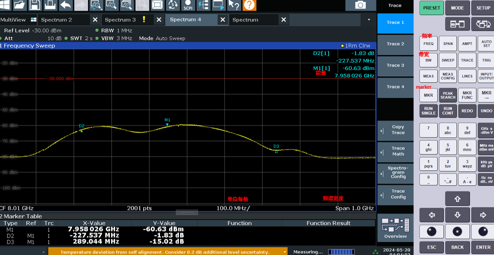
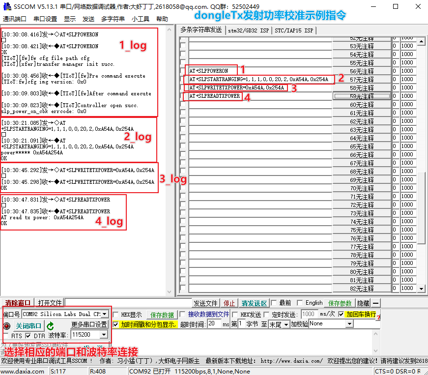
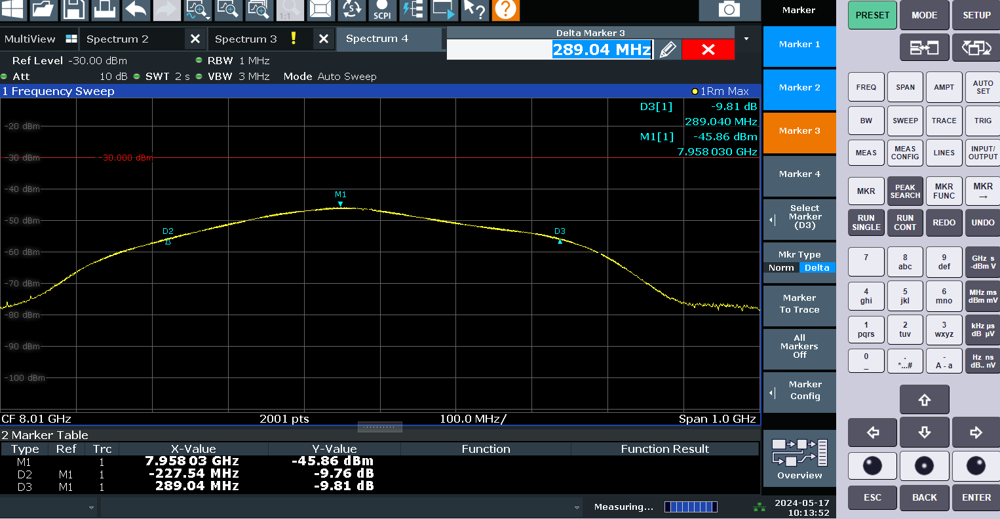

# 前言

**概述**

本文档主要针对SLP进行相关射频测试，供相关人员参考。

**读者对象**

-   软件开发工程师
-   技术支持工程师
-   硬件开发工程师

# TX测试

-   **[流程图](#ZH-CN_TOPIC_0000002219309477)**  

-   **[频谱仪设置](#ZH-CN_TOPIC_0000002183823696)**  

-   **[功率配置](#ZH-CN_TOPIC_0000002219223889)**  

-   **[结果图例](#ZH-CN_TOPIC_0000002183983380)**  

## 流程图

遥控器侧和dongle侧都需要进行发射功率校准，以及-10dB带宽是否大于500MHz的频谱验证，此项测试不需要遥控器和dongle交互，完成上电校准之后单独进行校准验证即可，此过程需要保证蓝牙断连情况下不能对SLP下电，具体流程如[图1](#fig2338518690)所示。

**图 1**  TX功率校准和-10dB带宽检测流程图  

## 频谱仪设置

频谱仪的频率范围至少覆盖6\~8.5GHz，参数设置（设置项见具体的频谱仪按钮标识）：

Freq=7.9872GHz

Span=1GHz

RBW=1MHz

VBW=3MHz

Sweep time=2s

Sweep points=2001

Trace mode=max hold

Detector=RMS

Offset=频谱仪和线缆的损耗

**图 1**  频谱仪设置典型参数（仅供参考）  

TX常发AT命令操作流程示例：

1.  加载SLP固件：AT+SLPPOWERON。
2.  设置射频参数：AT+SLPSETRFSWPARAM=0,3,2,0,0,0,0,0（示例，实际数值需要和单板设计匹配，详见《Sample 使用指南》）
3.  开启TX常发：AT+SLPSTARTRANGING=1,1,1,0,0,20,1,0xA54A,0x254A
4.  关闭tx常发：AT+SLPSTARTRANGING=1,1,1,0,0,20,2,0xA54A,0x254A

## 功率配置

> **说明：** 
>功率配置如[表2](#table197284439185)所示，此过程需要保证蓝牙断连情况下不能对SLP下电。

图1 校准指令示例

**表 1**  发射功率校准SLP接口

<table><thead align="left"><tr id="row1137193713332"><th class="cellrowborder" valign="top" width="19.15%" id="mcps1.2.3.1.1">
功能

</th>
<th class="cellrowborder" valign="top" width="80.85%" id="mcps1.2.3.1.2">
命令

</th>
</tr>
</thead>
<tbody><tr id="row713714377336"><td class="cellrowborder" valign="top" width="19.15%" headers="mcps1.2.3.1.1 ">
加载SLP固件

</td>
<td class="cellrowborder" valign="top" width="80.85%" headers="mcps1.2.3.1.2 ">
AT+SLPPOWERON

</td>
</tr>
<tr id="row13681531141"><td class="cellrowborder" valign="top" width="19.15%" headers="mcps1.2.3.1.1 ">
配置天线码字

</td>
<td class="cellrowborder" valign="top" width="80.85%" headers="mcps1.2.3.1.2 ">
AT+SLPSETRFSWPARAM=0,3,2,0,0,0,0,0（示例，实际数值需要和单板设计匹配，详见《Sample 使用指南》）

</td>
</tr>
<tr id="row161375376331"><td class="cellrowborder" valign="top" width="19.15%" headers="mcps1.2.3.1.1 ">
常发TX

</td>
<td class="cellrowborder" valign="top" width="80.85%" headers="mcps1.2.3.1.2 ">
AT+SLPSTARTRANGING=1,1,1,0,0,20,1,0xA54A,0x254A

</td>
</tr>
<tr id="row2137203720336"><td class="cellrowborder" valign="top" width="19.15%" headers="mcps1.2.3.1.1 ">
关闭常发TX

</td>
<td class="cellrowborder" valign="top" width="80.85%" headers="mcps1.2.3.1.2 ">
AT+SLPSTARTRANGING=1,1,1,0,0,20,2,0xA54A,0x254A

</td>
</tr>
<tr id="row12137113711337"><td class="cellrowborder" valign="top" width="19.15%" headers="mcps1.2.3.1.1 ">
写TX发射功率至NV

</td>
<td class="cellrowborder" valign="top" width="80.85%" headers="mcps1.2.3.1.2 ">
AT+SLPWRITETXPOWER=0xA54A,0x254A

</td>
</tr>
<tr id="row4137133753314"><td class="cellrowborder" valign="top" width="19.15%" headers="mcps1.2.3.1.1 ">
从NV读取TX发射功率

</td>
<td class="cellrowborder" valign="top" width="80.85%" headers="mcps1.2.3.1.2 ">
AT+SLPREADTXPOWER

</td>
</tr>
</tbody>
</table>

**表 2**  功率档位表

<table><thead align="left"><tr id="row15782104315187"><th class="cellrowborder" valign="top" width="20.68%" id="mcps1.2.4.1.1">
功率档位索引

</th>
<th class="cellrowborder" valign="top" width="33.21%" id="mcps1.2.4.1.2">
芯片口实际功率单位（dBm）

</th>
<th class="cellrowborder" valign="top" width="46.11%" id="mcps1.2.4.1.3">
线控功率码字（16进制）

</th>
</tr>
</thead>
<tbody><tr id="row3783124316189"><td class="cellrowborder" valign="top" width="20.68%" headers="mcps1.2.4.1.1 ">
0

</td>
<td class="cellrowborder" valign="top" width="33.21%" headers="mcps1.2.4.1.2 ">
14

</td>
<td class="cellrowborder" valign="top" width="46.11%" headers="mcps1.2.4.1.3 ">
0x20402040

</td>
</tr>
<tr id="row177831443101814"><td class="cellrowborder" valign="top" width="20.68%" headers="mcps1.2.4.1.1 ">
1

</td>
<td class="cellrowborder" valign="top" width="33.21%" headers="mcps1.2.4.1.2 ">
13.5

</td>
<td class="cellrowborder" valign="top" width="46.11%" headers="mcps1.2.4.1.3 ">
0x22c522c5

</td>
</tr>
<tr id="row13783443141817"><td class="cellrowborder" valign="top" width="20.68%" headers="mcps1.2.4.1.1 ">
2

</td>
<td class="cellrowborder" valign="top" width="33.21%" headers="mcps1.2.4.1.2 ">
13

</td>
<td class="cellrowborder" valign="top" width="46.11%" headers="mcps1.2.4.1.3 ">
0x254a254a

</td>
</tr>
<tr id="row97831043171817"><td class="cellrowborder" valign="top" width="20.68%" headers="mcps1.2.4.1.1 ">
3

</td>
<td class="cellrowborder" valign="top" width="33.21%" headers="mcps1.2.4.1.2 ">
12.5

</td>
<td class="cellrowborder" valign="top" width="46.11%" headers="mcps1.2.4.1.3 ">
0x26cd26cd

</td>
</tr>
<tr id="row1378364361818"><td class="cellrowborder" valign="top" width="20.68%" headers="mcps1.2.4.1.1 ">
4

</td>
<td class="cellrowborder" valign="top" width="33.21%" headers="mcps1.2.4.1.2 ">
12

</td>
<td class="cellrowborder" valign="top" width="46.11%" headers="mcps1.2.4.1.3 ">
0x28D128D1

</td>
</tr>
<tr id="row15783143171816"><td class="cellrowborder" valign="top" width="20.68%" headers="mcps1.2.4.1.1 ">
5

</td>
<td class="cellrowborder" valign="top" width="33.21%" headers="mcps1.2.4.1.2 ">
11.5

</td>
<td class="cellrowborder" valign="top" width="46.11%" headers="mcps1.2.4.1.3 ">
0x402040

</td>
</tr>
<tr id="row1978364311816"><td class="cellrowborder" valign="top" width="20.68%" headers="mcps1.2.4.1.1 ">
6

</td>
<td class="cellrowborder" valign="top" width="33.21%" headers="mcps1.2.4.1.2 ">
11

</td>
<td class="cellrowborder" valign="top" width="46.11%" headers="mcps1.2.4.1.3 ">
0x2C522C5

</td>
</tr>
<tr id="row378317435184"><td class="cellrowborder" valign="top" width="20.68%" headers="mcps1.2.4.1.1 ">
7

</td>
<td class="cellrowborder" valign="top" width="33.21%" headers="mcps1.2.4.1.2 ">
10.5

</td>
<td class="cellrowborder" valign="top" width="46.11%" headers="mcps1.2.4.1.3 ">
0x54A254A

</td>
</tr>
<tr id="row147834439182"><td class="cellrowborder" valign="top" width="20.68%" headers="mcps1.2.4.1.1 ">
8

</td>
<td class="cellrowborder" valign="top" width="33.21%" headers="mcps1.2.4.1.2 ">
10

</td>
<td class="cellrowborder" valign="top" width="46.11%" headers="mcps1.2.4.1.3 ">
0x6CD26CD

</td>
</tr>
<tr id="row1578364361820"><td class="cellrowborder" valign="top" width="20.68%" headers="mcps1.2.4.1.1 ">
9

</td>
<td class="cellrowborder" valign="top" width="33.21%" headers="mcps1.2.4.1.2 ">
9.5

</td>
<td class="cellrowborder" valign="top" width="46.11%" headers="mcps1.2.4.1.3 ">
0x8D128D1

</td>
</tr>
<tr id="row19783134341812"><td class="cellrowborder" valign="top" width="20.68%" headers="mcps1.2.4.1.1 ">
10

</td>
<td class="cellrowborder" valign="top" width="33.21%" headers="mcps1.2.4.1.2 ">
9

</td>
<td class="cellrowborder" valign="top" width="46.11%" headers="mcps1.2.4.1.3 ">
0x40402040

</td>
</tr>
<tr id="row27832439183"><td class="cellrowborder" valign="top" width="20.68%" headers="mcps1.2.4.1.1 ">
11

</td>
<td class="cellrowborder" valign="top" width="33.21%" headers="mcps1.2.4.1.2 ">
8.5

</td>
<td class="cellrowborder" valign="top" width="46.11%" headers="mcps1.2.4.1.3 ">
0x42C522C5

</td>
</tr>
<tr id="row1078354321818"><td class="cellrowborder" valign="top" width="20.68%" headers="mcps1.2.4.1.1 ">
12

</td>
<td class="cellrowborder" valign="top" width="33.21%" headers="mcps1.2.4.1.2 ">
8

</td>
<td class="cellrowborder" valign="top" width="46.11%" headers="mcps1.2.4.1.3 ">
0x454A254A

</td>
</tr>
<tr id="row878413436188"><td class="cellrowborder" valign="top" width="20.68%" headers="mcps1.2.4.1.1 ">
13

</td>
<td class="cellrowborder" valign="top" width="33.21%" headers="mcps1.2.4.1.2 ">
7.5

</td>
<td class="cellrowborder" valign="top" width="46.11%" headers="mcps1.2.4.1.3 ">
0x474E274E

</td>
</tr>
<tr id="row107848434185"><td class="cellrowborder" valign="top" width="20.68%" headers="mcps1.2.4.1.1 ">
14

</td>
<td class="cellrowborder" valign="top" width="33.21%" headers="mcps1.2.4.1.2 ">
7

</td>
<td class="cellrowborder" valign="top" width="46.11%" headers="mcps1.2.4.1.3 ">
0xA0402040

</td>
</tr>
<tr id="row6784943161812"><td class="cellrowborder" valign="top" width="20.68%" headers="mcps1.2.4.1.1 ">
15

</td>
<td class="cellrowborder" valign="top" width="33.21%" headers="mcps1.2.4.1.2 ">
6.5

</td>
<td class="cellrowborder" valign="top" width="46.11%" headers="mcps1.2.4.1.3 ">
0xA2C522C5

</td>
</tr>
<tr id="row15784843131811"><td class="cellrowborder" valign="top" width="20.68%" headers="mcps1.2.4.1.1 ">
16

</td>
<td class="cellrowborder" valign="top" width="33.21%" headers="mcps1.2.4.1.2 ">
6

</td>
<td class="cellrowborder" valign="top" width="46.11%" headers="mcps1.2.4.1.3 ">
0xA54A254A

</td>
</tr>
<tr id="row4784114321812"><td class="cellrowborder" valign="top" width="20.68%" headers="mcps1.2.4.1.1 ">
17

</td>
<td class="cellrowborder" valign="top" width="33.21%" headers="mcps1.2.4.1.2 ">
5.5

</td>
<td class="cellrowborder" valign="top" width="46.11%" headers="mcps1.2.4.1.3 ">
0xA7CF27CF

</td>
</tr>
<tr id="row1878404311814"><td class="cellrowborder" valign="top" width="20.68%" headers="mcps1.2.4.1.1 ">
18

</td>
<td class="cellrowborder" valign="top" width="33.21%" headers="mcps1.2.4.1.2 ">
5

</td>
<td class="cellrowborder" valign="top" width="46.11%" headers="mcps1.2.4.1.3 ">
0xA9522952

</td>
</tr>
<tr id="row20784124361816"><td class="cellrowborder" valign="top" width="20.68%" headers="mcps1.2.4.1.1 ">
19

</td>
<td class="cellrowborder" valign="top" width="33.21%" headers="mcps1.2.4.1.2 ">
4.5

</td>
<td class="cellrowborder" valign="top" width="46.11%" headers="mcps1.2.4.1.3 ">
0x80402040

</td>
</tr>
<tr id="row1178417438184"><td class="cellrowborder" valign="top" width="20.68%" headers="mcps1.2.4.1.1 ">
20

</td>
<td class="cellrowborder" valign="top" width="33.21%" headers="mcps1.2.4.1.2 ">
4

</td>
<td class="cellrowborder" valign="top" width="46.11%" headers="mcps1.2.4.1.3 ">
0x82C522C5

</td>
</tr>
<tr id="row2784243141819"><td class="cellrowborder" valign="top" width="20.68%" headers="mcps1.2.4.1.1 ">
21

</td>
<td class="cellrowborder" valign="top" width="33.21%" headers="mcps1.2.4.1.2 ">
3.5

</td>
<td class="cellrowborder" valign="top" width="46.11%" headers="mcps1.2.4.1.3 ">
0x854A254A

</td>
</tr>
<tr id="row147841438183"><td class="cellrowborder" valign="top" width="20.68%" headers="mcps1.2.4.1.1 ">
22

</td>
<td class="cellrowborder" valign="top" width="33.21%" headers="mcps1.2.4.1.2 ">
3

</td>
<td class="cellrowborder" valign="top" width="46.11%" headers="mcps1.2.4.1.3 ">
0x874E274E

</td>
</tr>
<tr id="row57841843101815"><td class="cellrowborder" valign="top" width="20.68%" headers="mcps1.2.4.1.1 ">
23

</td>
<td class="cellrowborder" valign="top" width="33.21%" headers="mcps1.2.4.1.2 ">
2.5

</td>
<td class="cellrowborder" valign="top" width="46.11%" headers="mcps1.2.4.1.3 ">
0x89522952

</td>
</tr>
<tr id="row978474381819"><td class="cellrowborder" valign="top" width="20.68%" headers="mcps1.2.4.1.1 ">
24

</td>
<td class="cellrowborder" valign="top" width="33.21%" headers="mcps1.2.4.1.2 ">
2

</td>
<td class="cellrowborder" valign="top" width="46.11%" headers="mcps1.2.4.1.3 ">
0x8AD52AD5

</td>
</tr>
<tr id="row13784343101817"><td class="cellrowborder" valign="top" width="20.68%" headers="mcps1.2.4.1.1 ">
25

</td>
<td class="cellrowborder" valign="top" width="33.21%" headers="mcps1.2.4.1.2 ">
1.5

</td>
<td class="cellrowborder" valign="top" width="46.11%" headers="mcps1.2.4.1.3 ">
0x18301C3

</td>
</tr>
<tr id="row5784194361812"><td class="cellrowborder" valign="top" width="20.68%" headers="mcps1.2.4.1.1 ">
26

</td>
<td class="cellrowborder" valign="top" width="33.21%" headers="mcps1.2.4.1.2 ">
1

</td>
<td class="cellrowborder" valign="top" width="46.11%" headers="mcps1.2.4.1.3 ">
0x4080448

</td>
</tr>
<tr id="row87841243141815"><td class="cellrowborder" valign="top" width="20.68%" headers="mcps1.2.4.1.1 ">
27

</td>
<td class="cellrowborder" valign="top" width="33.21%" headers="mcps1.2.4.1.2 ">
0.5

</td>
<td class="cellrowborder" valign="top" width="46.11%" headers="mcps1.2.4.1.3 ">
0x60C064C

</td>
</tr>
<tr id="row1578518433182"><td class="cellrowborder" valign="top" width="20.68%" headers="mcps1.2.4.1.1 ">
28

</td>
<td class="cellrowborder" valign="top" width="33.21%" headers="mcps1.2.4.1.2 ">
0

</td>
<td class="cellrowborder" valign="top" width="46.11%" headers="mcps1.2.4.1.3 ">
0x8100850

</td>
</tr>
<tr id="row17785134371810"><td class="cellrowborder" valign="top" width="20.68%" headers="mcps1.2.4.1.1 ">
29

</td>
<td class="cellrowborder" valign="top" width="33.21%" headers="mcps1.2.4.1.2 ">
-0.5

</td>
<td class="cellrowborder" valign="top" width="46.11%" headers="mcps1.2.4.1.3 ">
0x99309D3

</td>
</tr>
<tr id="row27852438189"><td class="cellrowborder" valign="top" width="20.68%" headers="mcps1.2.4.1.1 ">
30

</td>
<td class="cellrowborder" valign="top" width="33.21%" headers="mcps1.2.4.1.2 ">
-1

</td>
<td class="cellrowborder" valign="top" width="46.11%" headers="mcps1.2.4.1.3 ">
0x418301C3

</td>
</tr>
<tr id="row17785154314180"><td class="cellrowborder" valign="top" width="20.68%" headers="mcps1.2.4.1.1 ">
31

</td>
<td class="cellrowborder" valign="top" width="33.21%" headers="mcps1.2.4.1.2 ">
-1.5

</td>
<td class="cellrowborder" valign="top" width="46.11%" headers="mcps1.2.4.1.3 ">
0x44080448

</td>
</tr>
<tr id="row378534317187"><td class="cellrowborder" valign="top" width="20.68%" headers="mcps1.2.4.1.1 ">
32

</td>
<td class="cellrowborder" valign="top" width="33.21%" headers="mcps1.2.4.1.2 ">
-2

</td>
<td class="cellrowborder" valign="top" width="46.11%" headers="mcps1.2.4.1.3 ">
0x460C064C

</td>
</tr>
<tr id="row178564351819"><td class="cellrowborder" valign="top" width="20.68%" headers="mcps1.2.4.1.1 ">
33

</td>
<td class="cellrowborder" valign="top" width="33.21%" headers="mcps1.2.4.1.2 ">
-2.5

</td>
<td class="cellrowborder" valign="top" width="46.11%" headers="mcps1.2.4.1.3 ">
0x48100850

</td>
</tr>
<tr id="row978524312181"><td class="cellrowborder" valign="top" width="20.68%" headers="mcps1.2.4.1.1 ">
34

</td>
<td class="cellrowborder" valign="top" width="33.21%" headers="mcps1.2.4.1.2 ">
-3

</td>
<td class="cellrowborder" valign="top" width="46.11%" headers="mcps1.2.4.1.3 ">
0x499309D3

</td>
</tr>
<tr id="row978574311188"><td class="cellrowborder" valign="top" width="20.68%" headers="mcps1.2.4.1.1 ">
35

</td>
<td class="cellrowborder" valign="top" width="33.21%" headers="mcps1.2.4.1.2 ">
-3.5

</td>
<td class="cellrowborder" valign="top" width="46.11%" headers="mcps1.2.4.1.3 ">
0xC18301C3

</td>
</tr>
<tr id="row13785144315182"><td class="cellrowborder" valign="top" width="20.68%" headers="mcps1.2.4.1.1 ">
36

</td>
<td class="cellrowborder" valign="top" width="33.21%" headers="mcps1.2.4.1.2 ">
-4

</td>
<td class="cellrowborder" valign="top" width="46.11%" headers="mcps1.2.4.1.3 ">
0xC4080448

</td>
</tr>
<tr id="row778534321814"><td class="cellrowborder" valign="top" width="20.68%" headers="mcps1.2.4.1.1 ">
37

</td>
<td class="cellrowborder" valign="top" width="33.21%" headers="mcps1.2.4.1.2 ">
-4.5

</td>
<td class="cellrowborder" valign="top" width="46.11%" headers="mcps1.2.4.1.3 ">
0xC60C064C

</td>
</tr>
<tr id="row19785124391816"><td class="cellrowborder" valign="top" width="20.68%" headers="mcps1.2.4.1.1 ">
38

</td>
<td class="cellrowborder" valign="top" width="33.21%" headers="mcps1.2.4.1.2 ">
-5

</td>
<td class="cellrowborder" valign="top" width="46.11%" headers="mcps1.2.4.1.3 ">
0xC8100850

</td>
</tr>
</tbody>
</table>

## 结果图例

超宽带频谱测试结果如[图1](#fig544403131312)所示，最大辐射功率谱密度在7.958GHz的M1处，功率谱密度为-45.86dBm/MHz，D2至D3（-10dB带宽）带宽为227+289=516MHz，传导测试结果满足国家无线电管理委员会的认证标准。

**图 1**  超宽带频谱测试结果示意图  

