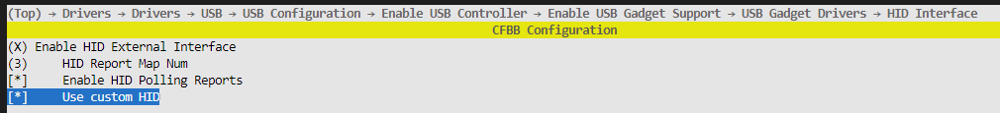
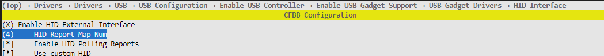

# Preface<a name="ZH-CN_TOPIC_0000001790806556"></a>

**Overview<a name="section4537382116410"></a>**

This document describes two implementation methods for the BS2X USB HID composite device.

**Reader Audience<a name="section4378592816410"></a>**

This document is mainly applicable to the following engineers:

- Product software development engineers
- Technical support engineers

**Symbol Conventions<a name="section133020216410"></a>**

The following symbols may appear in this document, and their meanings are as follows.

| Symbol | Description |
| --- | --- |
| [Image] | Indicates a hazard with a high level of risk that, if not avoided, will result in death or serious injury. |
| [Image] | Indicates a hazard with a medium level of risk that, if not avoided, may result in death or serious injury. |
| [Image] | Indicates a hazard with a low level of risk that, if not avoided, may result in minor or moderate injury. |
| [Image] | Used to deliver device- or environment-safety warning information. If not avoided, it may cause equipment damage, data loss, degraded equipment performance, or other unpredictable results. "Cautions" do not involve personal injury. |
| [Image] | Supplementary explanation of key information in the main text. "Notes" are not safety warning information and do not involve personal, equipment, or environmental injury information. |

**Modification Records<a name="section2467512116410"></a>**

| Doc Version | Release Date | Modification Description |
| --- | --- | --- |
| 02 | 2024-08-20 | Updated the content of the "[Implementation Method](实现方式.md)" chapter. |
| 01 | 2024-05-15 | First official version release. |
| 00B01 | 2024-03-08 | First interim version release. |

# Overview<a name="ZH-CN_TOPIC_0000001790966272"></a>

The function of a USB device is carried by interfaces, which correspond in code to interface descriptors. Generally, one interface is one function. This function may be a mouse, keyboard, gamepad, etc., or a custom function. An HID composite device is a type of multi-function device, such as mouse + keyboard, gamepad + keyboard, etc.

# Implementation Method<a name="ZH-CN_TOPIC_0000001837765697"></a>

Adding any type of HID device requires calling the interface hid_add_report_descriptor. "hid_add_report_descriptor" is defined in "f_hid.c", and its parameters and functions are as follows:

| Parameter | Description |
| --- | --- |
| report_desc | The first address of the report descriptor. |
| report_desc_len | The length of the report descriptor. |
| protocol | The protocol type of the report descriptor (0=none, 1=keyboard, 2=mouse), which corresponds to the bInterfaceProtocol field of the interface descriptor. |

Function function: adding a report descriptor and associating it with an interface automatically creates the interface descriptor, HID descriptor, and endpoint descriptor.

Function return value: the id number corresponding to the device function.

## One Interface Implementing Multiple Functions<a name="ZH-CN_TOPIC_0000001991265549"></a>

In an HID device, one interface corresponds to one report descriptor, and the report descriptor describes the function of the interface. The report descriptor can distinguish different functions of the same report descriptor through the report_id item.

Report descriptor 1 is as follows:

```
// Keyboard device
usage_page(1),      0x01,
usage(1),           0x06,
collection(1),      0x01,
report_id(1),       0x01,
usage_page(1),      0x07,
usage_minimum(1),   0xE0,
usage_maximum(1),   0xE7,
logical_minimum(1), 0x00,
logical_maximum(1), 0x01,
report_size(1),     0x01,
report_count(1),    0x08,
input(1),           0x02,
report_count(1),    0x01,
report_size(1),     0x08,
input(1),           0x01,
report_count(1),    0x05,
report_size(1),     0x01,
usage_page(1),      0x08,
usage_minimum(1),   0x01,
usage_maximum(1),   0x05,
output(1),          0x02,
report_count(1),    0x01,
report_size(1),     0x03,
output(1),          0x01,
report_count(1),    0x06,
report_size(1),     0x08,
logical_minimum(1), 0x00,
logical_maximum(1), 0x65,
usage_page(1),      0x07,
usage_minimum(1),   0x00,
usage_maximum(1),   0x65,
input(1),           0x00,
end_collection(0),
// Custom data reception
usage_page(2), 0xB1, 0xFF,
usage(1),           0x1,
collection(1),      0x01,
report_id(1),       0x08,
collection(1),      0x00,
report_count(1),    0xc,
report_size(1),     0x8,
usage_minimum(1),   0x0,
usage_maximum(1),   0xFF,
output(1),           2,
end_collection(0),
end_collection(0),
// Custom data transmission/reception
usage_page(2), 0xB2, 0xFF,
usage(1),           0x1,
collection(1),      0x01,
report_id(1),       0x09,
collection(1),      0x00,
report_count(1),    0x3f,
report_size(1),     0x8,
usage_minimum(1),   0x0,
usage_maximum(1),   0xFF,
output(1),           2,
usage(1),           0x2,
report_count(1),    0x3f,
report_size(1),     0x8,
usage_minimum(1),   0x0,
usage_maximum(1),   0xFF,
input(1),           0,
end_collection(0),
end_collection(0),
```

The above report descriptor defines a composite device with three functions: a keyboard device + custom data reception + custom data transmission/reception. They distinguish functions through the report_id + data method. That is, for a report descriptor with only one function, the data can be sent directly when sending. For a report descriptor with multiple functions, the report_id needs to be added to the head of the data when sending.

## Multiple Interfaces Implementing Multiple Functions<a name="ZH-CN_TOPIC_0000001991145381"></a>

In an HID device, one interface corresponds to one report descriptor, and the report descriptor describes the function of the interface. Therefore, multiple interfaces with multiple report descriptors can also implement a composite device function. Except for endpoint 0, the BS2X chip has a total of three IN endpoints and three OUT endpoints, so it supports up to three interfaces.

An example of multiple interfaces with multiple report descriptors is as follows.

Report descriptor 1 is as follows:

```
usage_page(1),      0x01,
usage(1),         0x06,
collection(1),      0x01,
report_id(1),       0x01,
usage_page(1),      0x07,
usage_minimum(1),    0xE0,
usage_maximum(1),    0xE7,
logical_minimum(1),   0x00,
logical_maximum(1),   0x01,
report_size(1),     0x01,
report_count(1),    0x08,
input(1),         0x02,
report_count(1),    0x01,
report_size(1),     0x08,
input(1),         0x01,
report_count(1),    0x05,
report_size(1),     0x01,
usage_page(1),      0x08,
usage_minimum(1),    0x01,
usage_maximum(1),    0x05,
output(1),        0x02,
report_count(1),    0x01,
report_size(1),     0x03,
output(1),        0x01,
report_count(1),    0x06,
report_size(1),     0x08,
logical_minimum(1),   0x00,
logical_maximum(1),   0x65,
usage_page(1),      0x07,
usage_minimum(1),    0x00,
usage_maximum(1),    0x65,
input(1),         0x00,
end_collection(0),
// Custom data reception
usage_page(2),       0xB1, 0xFF,
usage(1),         0x1,
collection(1),      0x01,
report_id(1),       0x08,
collection(1),     0x00,
report_count(1),    0xc,
report_size(1),     0x8,
usage_minimum(1),    0x0,
usage_maximum(1),    0xFF,
output(1),         2,
end_collection(0),
end_collection(0),
// Custom data transmission/reception
usage_page(2),        0xB2, 0xFF,
usage(1),          0x1,
collection(1),      0x01,
report_id(1),       0x09,
collection(1),      0x00,
report_count(1),      0x3f,
report_size(1),      0x8,
usage_minimum(1),     0x0,
usage_maximum(1),     0xFF,
output(1),         2,
usage(1),          0x2,
report_count(1),      0x3f,
report_size(1),      0x8,
usage_minimum(1),      0x0,
usage_maximum(1),     0xFF,
input(1),           0,
end_collection(0),
end_collection(0),
```

The above report descriptor defines a composite device with three functions: a keyboard device + custom data reception + custom data transmission/reception. They distinguish functions through the report_id + data method. That is, for a report descriptor with only one function, the data can be sent directly when sending. For a report descriptor with multiple functions, the "report_id" needs to be added to the head of the data when sending. This descriptor can be registered to interface 0 through the "hid_add_report_descriptor" function.

Report descriptor 2 is as follows:

```
usage_page(1),      0x01,
usage(1),          0x02,
collection(1),      0x01,
usage(1),          0x01,
report_count(1),     0x03,
report_size(1),      0x01,
usage_page(1),      0x09,
usage_minimum(1),     0x1,
usage_maximum(1),     0x3,
logical_minimum(1),    0x00,
logical_maximum(1),    0x01,
input(1),          0x02,
report_count(1),     0x01,
report_size(1),      0x05,
input(1),          0x01,
usage_page(1),      0x01,
usage(1),          0x38,
report_count(1),     0x01,
report_size(1),      0x08,
logical_minimum(1),    0x81,
logical_maximum(1),    0x7f,
input(1),          0x06,
usage(1),          0x30,
usage(1),          0x31,
report_count(1),     0x02,
report_size(1),      0x10,
logical_minimum(2),   0x01, 0x80,
logical_maximum(2),   0xff, 0x7f,
input(1),          0x06,
end_collection(0)
```

This descriptor describes the mouse function. By calling the "hid_add_report_descriptor" function again, this descriptor can be registered to interface 1, which automatically creates the interface descriptor, HID descriptor, and endpoint descriptor without needing to modify "f_hid.c".

At this point, a composite device with two interfaces has been implemented, where interface 0 implements the three functions of keyboard device + custom data reception + custom data transmission/reception, and interface 1 implements the mouse function. For the example code, see "application/samples/products/usb_mouse/mouse_usb/usb_init_app.c".

If you need deeper customization, such as adding an out endpoint / adding an empty interface, you need to enable HID Custom in kconfig (as shown below):



After enabling, f_hid_custom.c will be compiled instead of f_hid.c. At this time, you need to modify the f_hid_desc_array array in f_hid_custom.c yourself to customize the config descriptor (only the config descriptor needs to be changed; operations such as endpoint initialization will be completed automatically). Note: how many interfaces are customized is how many times the hid_add_report_descriptor function should be called. For an empty interface, you can call hid_add_report_descriptor and pass NULL.

For example: implement 4 interfaces. The first interface uses 1 in endpoint, the second interface is an empty interface, and the last two interfaces each use 2 endpoints, 1 in and 1 out.

To implement 4 interfaces, you need to change the maximum number of report descriptors to 4 in Kconfig and enable custom HID as shown below:



Then modify the configuration descriptor as follows. For 4 interfaces, you need to call hid_add_report_descriptor 4 times at the application layer to register the report descriptors to the corresponding interfaces. The second is an empty interface, so pass NULL when calling hid_add_report_descriptor the second time; the other three times need to pass the report descriptors of the corresponding functions.

```
static struct usb_cfgdesc_s g_fhid_config_desc =
{
    .len         = sizeof(struct usb_cfgdesc_s),
    .type        = USB_DESC_TYPE_CONFIG,
    HSETW(.totallen, 0), /* Size of all descriptors, set later */
    .ninterfaces = 0x1,  /* Number of Interfaces */
    .cfgvalue    = 0x1,  /* ID of this configuration */
    .icfg        = 0x0,  /* Index of string descriptor */
    .attr        = 0xa0, /* Bus-powered and remote wakeup */
    .mxpower     = 0x32  /* Maximum power consumption from the bus */
};
static struct usb_ifdesc_s g_fhid_intf_desc =
{
    .len      = sizeof(struct usb_ifdesc_s),
    .type     = USB_DESC_TYPE_INTERFACE,
    .ifno     = 0,    /* Index number of this interface */
    .alt      = 0,    /* Index of this settings */
    .neps     = 1,    /* Number of endpoint */
    .classid  = 0x03, /* bInterfaceClass: HID */
    .subclass = 1,    /* bInterfaceSubClass : 1=BOOT, 0=no boot */
    .protocol = 0,    /* bInterfaceProtocol : 0=none, 1=keyboard, 2=mouse */
    .iif      = 0     /* Index of string descriptor */
};
static struct usb_hid_desc g_fhid_desc =
{
    .bLength          = sizeof(struct usb_hid_desc),
    .bDescriptorType  = USB_DESC_TYPE_HID, /* HID type is 0x21 */
    HSETW(.bcdHID, 0x0110),                /* bcdHID: HID Class Spec release number HID 1.1 */
    .bCountryCode     = 0x00,              /* bCountryCode: Hardware target country */
    .bNumDescriptors  = 0x01,              /* bNumDescriptors: Number of HID class descriptors to follow */
    {
        {
            .bDescriptorType = 0x22,       /* bDescriptorType */
        }
    }
};
static struct usb_epdesc_s g_fhid_in_ep_desc =
{
    .len      = sizeof(struct usb_epdesc_s),
    .type     = USB_DESC_TYPE_ENDPOINT,
    .addr     = USB_DIR_IN | 0x01,
    .attr     = 0x03,                       /* bmAttributes = 00000011b */
    HSETW(.mxpacketsize, HID_IN_DATA_SIZE), /* wMaxPacketSize = 64 */
    .interval = 1                           /* bInterval = 125us */
};
static struct usb_ifdesc_s g_fhid_intf_desc_null =
{
    .len      = sizeof(struct usb_ifdesc_s),
    .type     = USB_DESC_TYPE_INTERFACE,
    .ifno     = 0,    /* Index number of this interface */
    .alt      = 0,    /* Index of this settings */
    .neps     = 0,    /* Number of endpoint */
    .classid  = 0,    /* bInterfaceClass: HID */
    .subclass = 0,    /* bInterfaceSubClass : 1=BOOT, 0=no boot */
    .protocol = 0,    /* bInterfaceProtocol : 0=none, 1=keyboard, 2=mouse */
    .iif      = 0     /* Index of string descriptor */
};
static struct usb_ifdesc_s g_fhid_intf2_desc =
{
    .len      = sizeof(struct usb_ifdesc_s),
    .type     = USB_DESC_TYPE_INTERFACE,
    .ifno     = 0,    /* Index number of this interface */
    .alt      = 0,    /* Index of this settings */
    .neps     = 2,    /* Number of endpoint */
    .classid  = 0x03, /* bInterfaceClass: HID */
    .subclass = 1,    /* bInterfaceSubClass : 1=BOOT, 0=no boot */
    .protocol = 0,    /* bInterfaceProtocol : 0=none, 1=keyboard, 2=mouse */
    .iif      = 0     /* Index of string descriptor */
};
static struct usb_hid_desc g_fhid2_desc =
{
    .bLength          = sizeof(struct usb_hid_desc),
    .bDescriptorType  = USB_DESC_TYPE_HID, /* HID type is 0x21 */
    HSETW(.bcdHID, 0x0110),                /* bcdHID: HID Class Spec release number HID 1.1 */
    .bCountryCode     = 0x00,              /* bCountryCode: Hardware target country */
    .bNumDescriptors  = 0x01,              /* bNumDescriptors: Number of HID class descriptors to follow */
    {
        {
            .bDescriptorType = 0x22,       /* bDescriptorType */
        }
    }
};
static struct usb_epdesc_s g_fhid_in_ep2_desc =
{
    .len      = sizeof(struct usb_epdesc_s),
    .type     = USB_DESC_TYPE_ENDPOINT,
    .addr     = USB_DIR_IN | 0x02,
    .attr     = 0x03,                       /* bmAttributes = 00000011b */
    HSETW(.mxpacketsize, HID_IN_DATA_SIZE), /* wMaxPacketSize = 64 */
    .interval = 1                           /* bInterval = 125us */
};
static struct usb_epdesc_s g_fhid_out_ep_desc =
{
    .len      = sizeof(struct usb_epdesc_s),
    .type     = USB_DESC_TYPE_ENDPOINT,
    .addr     = USB_DIR_OUT | 0x01,
    .attr     = 0x03,                        /* bmAttributes = 00000011b */
    HSETW(.mxpacketsize, HID_OUT_DATA_SIZE), /* wMaxPacketSize */
    .interval = 1                            /* bInterval = 125us */
};
static struct usb_ifdesc_s g_fhid_intf3_desc =
{
    .len      = sizeof(struct usb_ifdesc_s),
    .type     = USB_DESC_TYPE_INTERFACE,
    .ifno     = 0,    /* Index number of this interface */
    .alt      = 0,    /* Index of this settings */
    .neps     = 2,    /* Number of endpoint */
    .classid  = 0x03, /* bInterfaceClass: HID */
    .subclass = 1,    /* bInterfaceSubClass : 1=BOOT, 0=no boot */
    .protocol = 0,    /* bInterfaceProtocol : 0=none, 1=keyboard, 2=mouse */
    .iif      = 0     /* Index of string descriptor */
};
static struct usb_hid_desc g_fhid3_desc =
{
    .bLength          = sizeof(struct usb_hid_desc),
    .bDescriptorType  = USB_DESC_TYPE_HID, /* HID type is 0x21 */
    HSETW(.bcdHID, 0x0110),                /* bcdHID: HID Class Spec release number HID 1.1 */
    .bCountryCode     = 0x00,              /* bCountryCode: Hardware target country */
    .bNumDescriptors  = 0x01,              /* bNumDescriptors: Number of HID class descriptors to follow */
    {
        {
            .bDescriptorType = 0x22,       /* bDescriptorType */
        }
    }
};
static struct usb_epdesc_s g_fhid_in_ep3_desc =
{
    .len      = sizeof(struct usb_epdesc_s),
    .type     = USB_DESC_TYPE_ENDPOINT,
    .addr     = USB_DIR_IN | 0x03,
    .attr     = 0x03,                       /* bmAttributes = 00000011b */
    HSETW(.mxpacketsize, HID_IN_DATA_SIZE), /* wMaxPacketSize = 64 */
    .interval = 1                           /* bInterval = 125us */
};
static struct usb_epdesc_s g_fhid_out_ep2_desc =
{
    .len      = sizeof(struct usb_epdesc_s),
    .type     = USB_DESC_TYPE_ENDPOINT,
    .addr     = USB_DIR_OUT | 0x02,
    .attr     = 0x03,                        /* bmAttributes = 00000011b */
    HSETW(.mxpacketsize, HID_OUT_DATA_SIZE), /* wMaxPacketSize */
    .interval = 1                            /* bInterval = 125us */
};
/* fhid desc array includes:
 * 1. config_desc (for all report map)
 * 2. iface_desc、hid_desc、in ep_desc (report map 0)
 * 3. iface_desc、hid_desc、in ep_desc (report map 1)
 * ...
 * n+1. iface_desc、hid_desc、in ep_desc (report map n-1)
 *
 * g_fhid_desc_array is like this:
 *
 * config_desc  iface_desc(0)  hid_desc(0)  ep_desc(0) [ep_desc(0)]  iface_desc(1)  hid_desc(1)  ep_desc(1) [ep_desc(1)].. NULL
 *                  |                                     |              |                                     |
 *                  |_ _ _ _ _ _ report map 0 _ _ _ _ _ _ |              |_ _ _ _ _ _ report map 1 _ _ _ _ _ _ |
 *
 * Total Length : 2 + (4) * n
 */
#define HID_SINGLE_PROTOCOL_DESC_NUM 4
#define HID_DESC_ARRAY_MAX_NUM (1 + (HID_SINGLE_PROTOCOL_DESC_NUM) * HID_REPORT_MAP_NUM)
static const uint8_t *g_fhid_desc_array[HID_DESC_ARRAY_MAX_NUM] =
{
    (const uint8_t *)&g_fhid_config_desc,
    (const uint8_t *)&g_fhid_intf_desc,
    (const uint8_t *)&g_fhid_desc,
    (const uint8_t *)&g_fhid_in_ep_desc,
    (const uint8_t *)&g_fhid_intf_desc_null,
    (const uint8_t *)&g_fhid_intf2_desc,
    (const uint8_t *)&g_fhid2_desc,
    (const uint8_t *)&g_fhid_in_ep2_desc,
    (const uint8_t *)&g_fhid_out_ep_desc,
    (const uint8_t *)&g_fhid_intf3_desc,
    (const uint8_t *)&g_fhid3_desc,
    (const uint8_t *)&g_fhid_in_ep3_desc,
    (const uint8_t *)&g_fhid_out_ep2_desc,
    NULL,
};
```

## Implementing the Virtual Serial Port Function<a name="ZH-CN_TOPIC_0000001991139601"></a>

The virtual serial port device type is DEV_SERIAL, but usually we use an HID+ACM composite device, i.e., the type DEV_SER_HID. Because the ACM device is not an HID device, the report descriptor does not need to be modified. The report descriptors in sections 2.1 and 2.2 can be passed to hid_add_report_descriptor, and then call usbd_set_device_info(DEV_SER_HID, &str_manufacturer, &str_product, &str_serial_number, dev_id) and usb_init(DEVICE, DEV_SER_HID) to enumerate the HID device and the ACM serial port.

The ACM serial port needs a new thread for data reception. If the board side writes data to be sent to the USB host, call the write interface directly. If the board side reads data sent from the USB host, after opening the serial port, first call the ioctl interface, then call the read interface. The ioctl usage is as follows:

usb_serial_ioctl(0, CONSOLE_CMD_RD_BLOCK_SERIAL, 1);

Create a 4096-byte buffer to store the read value (the virtual serial port supports reading and writing up to 4096 bytes of data)usb_serial_read(0, g_usb_serial_recv_data, SERIAL_RECV_DATA_MAX_LEN); the return value of usb_serial_read is the length of the read data.

usb_serial_write(0, g_usb_serial_recv_data, recv_len);

For the example code, see "application/samples/products/sle_dongle/sle_dongle_hid_serial.c".

## Implementing the Upgrade Function (DFU)<a name="ZH-CN_TOPIC_0000001968134540"></a>

The DFU function relies on the BurnTool tool. It is recommended to download and use the newest possible version of BurnTool.

The BurnTool tool can perform DFU upgrades on devices whose Usage Page is set to 0xFFB1, as in the descriptor below:

```
usage_page(2),      0xB1, 0xFF,
usage(1),        0x1,
collection(1),     0x01,
report_id(1),      0x08,
collection(1),     0x00,
report_count(1),    0xc,
report_size(1),    0x8,
usage_minimum(1),   0x0,
usage_maximum(1),   0xFF,
output(1),        2,
end_collection(0),
end_collection(0),
```

Add a branch for processing the upgrade message sent by BurnTool in the thread that receives HID data. When an upgrade package is sent through BurnTool, BurnTool issues a message with frame_type 0x1e:

```
if (command.frame_type == 0x1e) {
    osal_printk("start dfu\n");
    usb_deinit();
    osal_msleep(USB_DEINIT_DELAY);
    usb_dfu_init();
    usb_dfu_wait_ugrade_done_and_reset();
    break;
 }
```

In middleware/utils/usb_class/f_dfu.c, a weak function named usb_dfu_download_callback is defined, which is called when the upgrade starts. The user needs to implement this function themselves to complete the upgrade process. For the specific implementation, refer to "application/samples/products/sle_dongle/sle_dongle_hid_serial.c".

## Implementing the Audio Data Interface (UAC)<a name="ZH-CN_TOPIC_0000001968294344"></a>

The audio data interface device type is DEV_UAC. After initialization is complete, the uac_wait_host interface needs to be called to wait for the host to send the signal identifying the UAC device. Passing 1 as the input parameter generally indicates WAIT_HOST_FOREVER, i.e., selecting the device in sound settings -> input is required to complete the UAC initialization. UAC1.0 supports up to two-channel 192Khz 16b audio sources, while the UAC driver provided by LiteOS is 16Khz 16b. Fill the 16-bit audio data to be sent into the buffer and use the vdt_usb_uac_send_data(buffer, buffer_len) interface to send it. For the specific implementation, refer to "application/samples/products/usb_amic_vdt/vdt_usb/vdt_usb.c".
