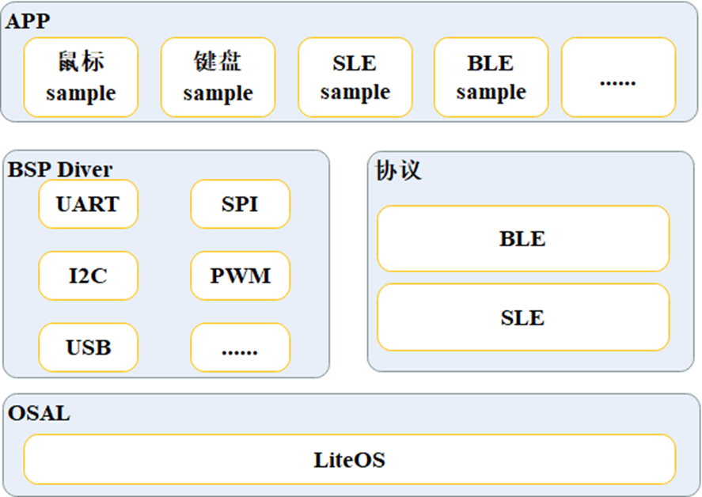

# Preface<a name="ZH-CN_TOPIC_0000001792814238"></a>

**Overview<a name="section4537382116410"></a>**

Introduces the module framework and description of the BS2X SDK, helping developers get started quickly with BS2X SDK development.

**Reader Audience<a name="section4378592816410"></a>**

This document is mainly applicable to the following engineers:

- Technical support engineers
- Software development engineers

**Symbol Conventions<a name="section133020216410"></a>**

The following symbols may appear in this document, and their meanings are as follows.

| Symbol | Description |
| --- | --- |
| [Image] | Indicates a hazard with a high level of risk that, if not avoided, will result in death or serious injury. |
| [Image] | Indicates a hazard with a medium level of risk that, if not avoided, may result in death or serious injury. |
| [Image] | Indicates a hazard with a low level of risk that, if not avoided, may result in minor or moderate injury. |
| [Image] | Used to deliver device- or environment-safety warning information. If not avoided, it may cause equipment damage, data loss, degraded equipment performance, or other unpredictable results. "Cautions" do not involve personal injury. |
| [Image] | Supplementary explanation of key information in the main text. "Notes" are not safety warning information and do not involve personal, equipment, or environmental injury information. |

**Modification Records<a name="section2467512116410"></a>**

| Doc Version | Release Date | Modification Description |
| --- | --- | --- |
| 02 | 2024-07-04 | Updated the content of the "[SDK Directory Structure](SDK目录结构.md)" chapter. |
| 01 | 2024-05-15 | First official version release. |
| 00B01 | 2024-02-01 | First interim version release. |

# SDK Module Framework<a name="ZH-CN_TOPIC_0000001811411477"></a>

**Figure 1** BS2X Solution Overall Architecture


**Table 1** SDK Root Directory

| No. | Module Name | Function Description |
| --- | --- | --- |
| 1 | application | Application directory, supporting incremental development of upper-layer system content and application content under this directory. The code for starting the entire system is also under this directory. The system startup entry is the main function in main.c. |
| 2 | build | Compilation and build project code, including feature macro addition, enable/disable, and other operations all completed under this directory. |
| 3 | drivers | Peripheral driver source code. |
| 4 | include | Public header files. All external interfaces of the SDK are placed in this folder for customers to call. |
| 5 | interim_binary | Software library, binary file storage directory. The bin files of the bt core are stored under this directory. |
| 6 | kernel | Operating system and operating system function encapsulation code, including liteOS, non_os (supporting scenarios without an operating system), and osal interfaces for adapting to other operating systems. |
| 7 | middleware | Middleware code, providing system framework code, dfx debugging-related code, nv items, ota, and other functional code. |
| 8 | open_source | Open-source third-party component code. |
| 9 | output | Files generated by compilation, generated during the compilation process. The initial SDK package does not have this folder. |
| 10 | protocol | BLE/SLE protocol stack library files. |
| 11 | test | Test code, providing reference for customer application development. Test code cases are executed by calling through commands. |
| 12 | tools | Tools directory. After IDE tool compilation is complete, the image files are packaged, and the packaged files are stored under this directory. |
| 13 | build.py | Compilation script. |

# SDK Directory Structure<a name="ZH-CN_TOPIC_0000001764412052"></a>

```
.                                # [repo] root_dir repository
├── application               # Application layer, examples below
│   ├── bs20                 # [repo] bs20 application
│   ├── bs21                 # [repo] bs21 application
│   ├── bs21a                # [repo] bs21a application
│   ├── bs22                 # [repo] bs22 application
│   ├── bs26                 # [repo] bs26 application
│   └── sample               # [repo] sample project
├── bootloader                # Startup code
│   ├── flashboot            # [repo] ssb/reeboot, add a new directory if there is a teeboot
│   └── provision            # [repo] for production and flashing with hiburn & bootrom, similar to codeloader; loaded from the client and runs in ram
├── build
├── docs
├── drivers
│   ├── boards               # Board-level configuration
│   ├── chips                # Chip-level configuration; users can make differential modifications based on the actual situation
│   └── drivers              # Driver code
│       ├── driver           # Driver external interface layer
│       ├── hal              # HAL layer, register operations
├── include                   # [repo] public header files
├── kernel                    # Kernel code, including nonos, osal; cmsis is included in the kernel code
│   ├── liteos               # [repo] liteos
│   │  └── liteos_208.6.0   # [repo] liteos 208
│   └── osal                 # [repo] osal directory
│       ├── include          # [repo] osal header files
│       └── src              # osal source files
├── middleware                # Framework, services, and other middleware
│   ├── chips                # Middle layer chip customization code
│   ├── services             # HLD components
│   └── utils                # LLD components
├── open_source               # IoT protocols are all open-source software, placed in the open_source directory, mapped to the central repository
├── protocol                  # Connection protocol directory, CFBB has no entity repository
│   ├── bt
├── tools                     # Tool code repository, maintained by the tools team
└── vendor                    # Software provided by third-party suppliers
└── segger                    # [repo] segger code repository
```

# SDK Directory Description<a name="ZH-CN_TOPIC_0000001811292377"></a>

**Table 1** afe Example

| No. | Module Name | File Name | Function Description |
| --- | --- | --- | --- |
| 1 | Kconfig | Kconfig | afe_sample-related configuration. |
| 2 | afe_demo.c | afe_demo.c | afe-related example code, providing the afe acquisition function. |
| 3 | afe.code-workspace | afe.code-workspace | vscode project configuration; users do not need to modify it. |
| 4 | Compilation script | CMakeLists.txt | afe-related compilation script. |
