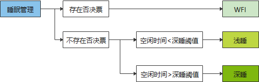
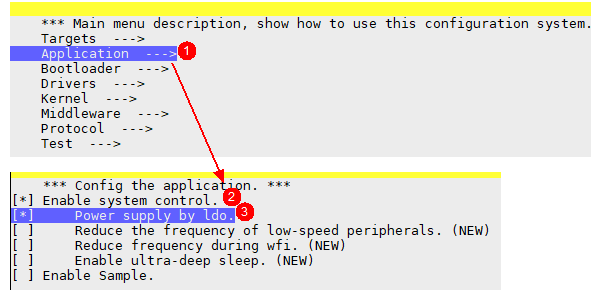
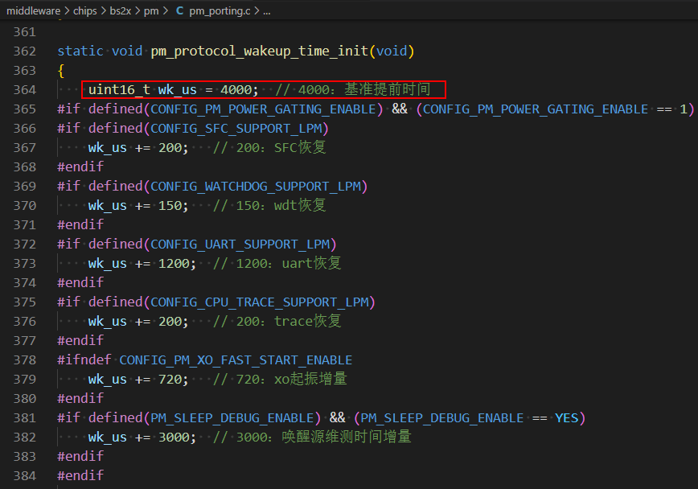

# Preface<a name="ZH-CN_TOPIC_0000001800389360"></a>

**Overview<a name="section4537382116410"></a>**

This document describes in detail the problems that may be encountered during BS2XV100 low-power debugging, and provides problem-solving methods based on experience. Users can refer to it when encountering problems during low-power debugging.

**Reader Audience<a name="section4378592816410"></a>**

This document is mainly applicable to the following engineers:

- Technical support engineers
- Software development engineers

**Symbol Conventions<a name="section133020216410"></a>**

The following symbols may appear in this document, and their meanings are as follows.

| Symbol | Description |
| --- | --- |
| [Image] | Indicates a hazard with a high level of risk that, if not avoided, will result in death or serious injury. |
| [Image] | Indicates a hazard with a medium level of risk that, if not avoided, may result in death or serious injury. |
| [Image] | Indicates a hazard with a low level of risk that, if not avoided, may result in minor or moderate injury. |
| [Image] | Used to deliver device- or environment-safety warning information. If not avoided, it may cause equipment damage, data loss, degraded equipment performance, or other unpredictable results. "Cautions" do not involve personal injury. |
| [Image] | Supplementary explanation of key information in the main text. "Notes" are not safety warning information and do not involve personal, equipment, or environmental injury information. |

**Modification Records<a name="section12787162012256"></a>**

| Doc Version | Release Date | Modification Description |
| --- | --- | --- |
| 04 | 2025-03-26 | Updated the content of the "[IO Cannot Wake Up the System](IO无法唤醒系统.md)" chapter. |
| 03 | 2024-08-29 | Updated the content of the "[Low Power Causing OTA Upgrade Abnormality](低功耗导致OTA升级异常.md)" chapter. Added the content of the "[Early Wake-up Time Problem](提前唤醒时间问题.md)" chapter. |
| 02 | 2024-07-04 | Updated the content of the "[System Cannot Sleep](系统无法睡眠.md)" chapter. Updated the content of the "[IO Cannot Wake Up the System](IO无法唤醒系统.md)" chapter. |
| 01 | 2024-05-24 | First official version release. Updated the content of the "[Power Consumption Higher Than Expected](功耗比预期高.md)" chapter. Added the content of the "Power Supply Mode & Software Configuration" chapter. |
| 00B02 | 2024-04-12 | Updated the content of the "[System Cannot Sleep](系统无法睡眠.md)" chapter. |
| 00B01 | 2024-03-01 | First interim version release. |

# System Cannot Sleep<a name="ZH-CN_TOPIC_0000001800548732"></a>

Refer to the "BS2XV100 Low Power Development Guide". For BS2X to enter sleep, two conditions must be satisfied, namely "there is no sleep veto" and "the system idle time is sufficient".

**Figure 1** Sleep Conditions


- Sleep veto vote

  1. Total vote count: votes added by uapi_pm_add_sleep_veto must be removed using uapi_pm_remove_sleep_veto.
  2. Timeout vote: the time for which uapi_pm_add_sleep_veto_with_timeout vetoes sleep.
  3. Customized vote: pm_port_get_customized_sleep_veto.

  For the above votes, if any one exists, the sleep condition is not satisfied. The vote-type information can be obtained through uapi_pm_veto_get_info. By viewing the veto_counts member, you can view the current vote box status.

- System idle time

  The system idle time is managed by LiteOS. When the sleep vote is satisfied, the sleep management interface will determine whether the sleep time meets the deep-sleep threshold; if so, it enters the deep-sleep flow.

Based on the above introduction of sleep conditions, some causes are illustrated below:

1. Unreasonable timer (timer time less than the sleep threshold)
   - Example: starting a 10ms periodic timer.
   - Analysis: before the system enters sleep, it checks whether any timer is about to expire. If a timer is about to expire, the system does not allow entry into sleep mode.
   - Suggestion: start the timer based on actual business. Before the business enters sleep, properly disable the timer.

2. Unreasonable task
   - Example: a loop operation in the task body, where osal_msleep yields the CPU for too short a time, or semaphores/events/messages are triggered too frequently.
   - Analysis: before the system enters sleep, it checks the task blocking time. If the task yields for too short a time, the system also cannot sleep.
   - Suggestion: the task should set a reasonable blocking time. If the blocking time required differs between scenarios, you can also set different blocking times through judgment; or suspend the task before sleep and resume it upon wake-up.

3. Unreasonable use of the veto interface
   - Example: the veto interface is not used in pairs.
   - Analysis: before sleep, the system checks the sleep veto status. As long as a veto vote exists, the system cannot sleep.
   - Suggestion: strictly check that they are used in pairs, and ensure that the veto sleep time is as short as possible, so that the system can sleep more.

4. Unreasonable log printing
   - Example: printing added before judging the sleep veto.
   - Analysis: the customized sleep veto interface (pm_port_get_customized_sleep_veto) checks whether UART TX has data. If TX still has data, a veto vote is cast.
   - Suggestion: reduce log printing and avoid adding unreasonable measurement in the sleep flow.

5. Unreasonable Bluetooth parameter settings
   - Example: BT connection parameter configuration problems, such as an interval configured too short.
   - Analysis: an interval configured too short causes the system to be unable to sleep or to be woken up immediately after sleeping.
   - Suggestion: set the BT connection parameters reasonably, or capture data packets to check the BT data packet interval. Generally, if the interval is too short, sleep is not possible.

6. Frequent abnormal interrupts
   - Example: an interrupt is triggered frequently on a certain GPIO pin due to configuration or hardware problems. For example, the gpio17 pin cannot maintain pull-up during system deep sleep; gpio9 and gpio10 sometimes have their waveforms frequently changing due to NFC influence.
   - Analysis: frequent interrupts, on the one hand, cause interrupt handling to consume large amounts of CPU time, resulting in low idle time; on the other hand, when an interrupt arrives, it is reported to the CPU and thereby interrupts the WFI flow.
   - Suggestion: troubleshoot using the measurement method described in the "BS21V100 Low Power Development Guide".

>  **Note:**
> "System cannot sleep" is sometimes not a case of "not sleeping" but of "frequent waking up". The measurement analysis should be used appropriately.
> Business development users should be very familiar with the operation of the entire system. After becoming familiar, it is not only conducive to problem localization, but also more conducive to writing better software code, thereby reducing power consumption.

# IO Cannot Wake Up the System<a name="ZH-CN_TOPIC_0000001849335705"></a>

1. On the hardware, the IO pin indeed does not trigger the corresponding interrupt pulse.
   - Example: after the mouse sleeps, buttons can wake it up, but movement cannot.
   - Explanation: when the mouse moves, it pulls the motion pin low; when sensor data is read, it pulls the motion pin high. Generally, before sleep, the falling-edge interrupt of the motion pin is registered. If the motion data is not read out before sleep, then after sleep, moving the mouse will not produce a falling-edge waveform on the motion pin, and thus no GPIO interrupt is generated, so the system cannot wake up.
   - Analysis: capture the hardware waveform to assist with software analysis.

2. The pulse/level parameters set during interrupt registration are unreasonable.
3. The ulp_gpio interface is not initialized, or the ulp_gpio interrupt setting is wrong.
4. The IO pin is not configured as gpio mode before sleep.
   - Explanation: because before sleeping, the system writes all the gpio pin information to the pad_out_en and pad_out registers, the previously saved information of other pin modes will be overwritten, so the corresponding pin cannot work normally during deep sleep.
   - Analysis: check the pin waveform, then read the 0x5702c820 ~ 0x5702c82c registers to see whether the IO pin mode has been overwritten.
   - Solution: in the suspend function corresponding to the function, configure the pin as gpio mode using uapi_pin_set_mode().
   - Supplementary explanation:

     When BS2XV100 sleeps, uapi_gpio is powered off, so interrupts registered through the uapi_gpio interface cannot wake up the system. You need to switch to ulp_gpio to register interrupts to wake up the system.

     ulp_gpio and IO pins do not have a one-to-one relationship; there are only 8 ulp_gpios.

     The low-power sample contains an example of ulp_gpio usage, as shown below.

     ```
     static ulp_gpio_int_wkup_cfg_t g_pm_wk_cfg[] = {
         { 0, PM_SAMPLE_GPIO_NUM, true, ULP_GPIO_INTERRUPT_FALLING_EDGE, pm_ulpgpio_wkup_handler },    // ulpgpio wake-up
     };
     static void pm_gpio_slp_cfg(void)
     {
         uapi_gpio_deinit();
         ulp_gpio_init();
         ulp_gpio_int_wkup_config(g_pm_wk_cfg, sizeof(g_pm_wk_cfg) / sizeof(ulp_gpio_int_wkup_cfg_t));
     }
     ```

# Peripheral Abnormality after Wake-up<a name="ZH-CN_TOPIC_0000001802656662"></a>

1. Peripheral not restored after wake-up.

   >  **Note:**
   > During sleep, the CPU and most peripherals are powered off. After wake-up, the SDK only restores the CPU and some necessary peripherals (tcxo, sfc, uart, etc.).
   > Therefore, peripherals initialized by the user, such as spi, qdec, adc, pwm, etc., should be restored by the user after wake-up and before use. Peripheral restoration takes time. The SDK cannot restore these peripherals after every wake-up, because this would increase the connection-hold power consumption.

2. Abnormal peripheral access after wake-up.
   - Example: the system hangs when reading spi data after wake-up.
   - Analysis: the wake-up flow may take a long time. If the spi reading data interface is called before the spi is restored, this operation will definitely cause a system abnormality.
   - Suggestion: many low-power problems are often business state machine management problems. If the business code is designed reasonably, these stability problems can naturally be avoided.

# Low Power Causing OTA Upgrade Abnormality<a name="ZH-CN_TOPIC_0000001849215661"></a>

1. The system sleeps halfway through an OTA upgrade.

   This is a system state machine management problem. During an OTA upgrade, the system state should be guaranteed not to be passively switched. The code should be designed reasonably to actively eliminate this possibility.

2. An OTA upgrade is triggered while the system is in a non-working state.

   Before an OTA upgrade, you need to ensure that the current state is a working state. If it is a non-working state, you need to switch the system to the working state.

3. OTA upgrade fails after wake-up.
   - If the OTA upgrade uses an external Flash, ensure that the external Flash has been properly restored before the upgrade.

# Power Consumption Higher Than Expected<a name="ZH-CN_TOPIC_0000001802496858"></a>

1. Chip power consumption is normal, but the power consumption of the whole device is high.
   - The Sensor works abnormally. An unreasonable reset pin configuration can cause the sensor to be unable to enter the low-power state. Ensure that the reset pin maintains a normal level during sleep.
   - The external Flash works abnormally. Pulling the spi_cs pin low makes the Flash think it is in the working state. Ensure that this pin's current remains pulled high.
   - Unreasonable IO level settings cause the board level to leak current to the chip: for example, the board level is high, while the chip pin is configured as an input with pull-down.

     IO configuration in the sleep state:

     - If the pin has an external pull-up resistor, the pin needs to be configured as floating.
     - If the pin has an external pull-down resistor, the pin can be configured as pull-down.
     - In other cases, configure the pin as pull-down.

2. The chip working current is higher than expected.
   - The main frequency is set to 64M, causing increased power consumption.
   - Hotspot functions are executed in Flash, resulting in a low CPU WFI duty cycle.
   - Abnormal interrupts keep arriving, preventing the CPU from being idle.
   - Some peripherals that do not need to be always on are not turned off promptly after use.
   - Both BLE and SLE are enabled at the same time.
   - Some IO configurations are unreasonable, causing current leakage.
   - Too many logs reduce CPU idle time.
   - Unreasonable businesses often operate.

3. The chip sleep current is higher than expected.
   - Some IO configurations are unreasonable, causing current leakage.
   - Periodic tasks or timers cause the system to wake up frequently.
   - Unreasonable BT connection parameter settings, short connection-hold period, and frequent system wake-ups.
   - Too many logs printed after each wake-up cause a long working time after wake-up.

# Locking Interrupts Causing BT Business Blockage<a name="ZH-CN_TOPIC_0000001849646005"></a>

The wake-up restoration lock interrupt time is too long:

- Flows that take too long to operate are not suitable for simply locking interrupts by adding more locks. When interrupts are locked, BT business cannot respond in a timely manner, and stability problems are likely.
- Do good business overall management. During restoration, there is no need at all to avoid system management problems through excessively long lock interrupts.

# Probabilistic Watchdog Timeout<a name="ZH-CN_TOPIC_0000001802847186"></a>

The watchdog times out during wake-up restoration:

If the restoration flow is long, it is recommended to feed the watchdog before restoration.

# Power Supply Mode & Software Configuration<a name="ZH-CN_TOPIC_0000001891763188"></a>

The chip supports two power supply modes: BUCK and LDO. The default SDK version uses BUCK mode. When using LDO mode, you need to enable the macro (CONFIG_POWER_SUPPLY_BY_LDO). The configuration is as follows:



# Early Wake-up Time Problem<a name="ZH-CN_TOPIC_0000002007260232"></a>

To ensure that BT performs TRX in a fixed time window during system sleep, the system needs to be woken up in advance before the BT business interrupt comes. After wake-up, the system performs software and hardware restoration, and the software will configure and reserve this restoration time.



If in some software versions, due to some link script modifications, the software processing becomes slower, the following time may be insufficient, and the Bluetooth business interrupt may be lost, thereby causing abnormal sleep/wake-up. If sleep is normal without Bluetooth business, and with Bluetooth business the interval/latency has also been properly increased, the system cannot sleep and the Bluetooth business is abnormal, it is likely that this time is insufficient and needs to be appropriately increased to solve the problem.
