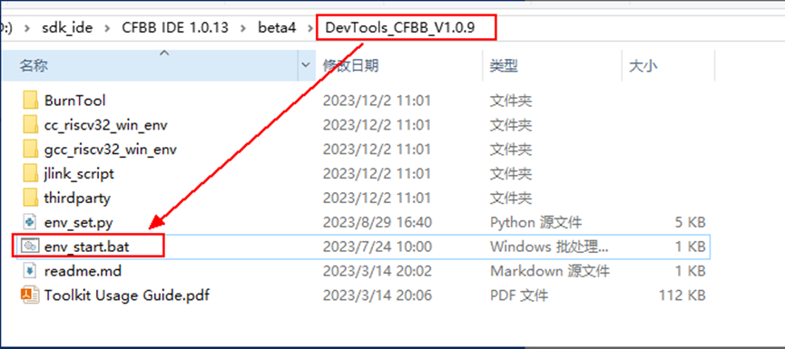
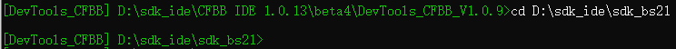
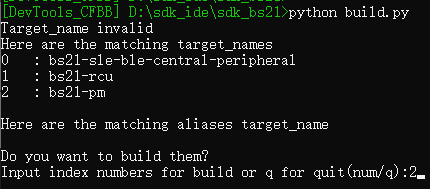
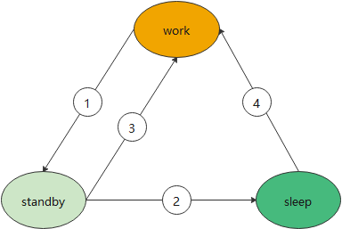
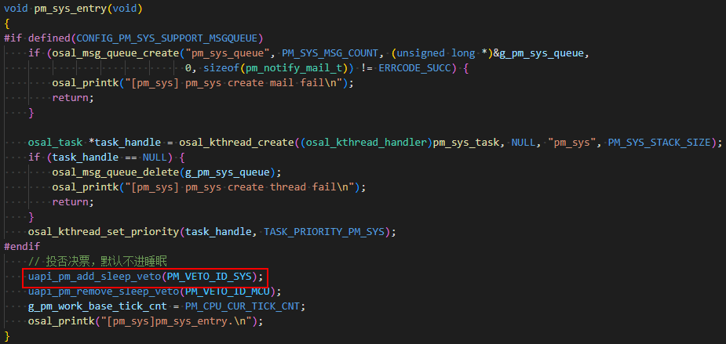
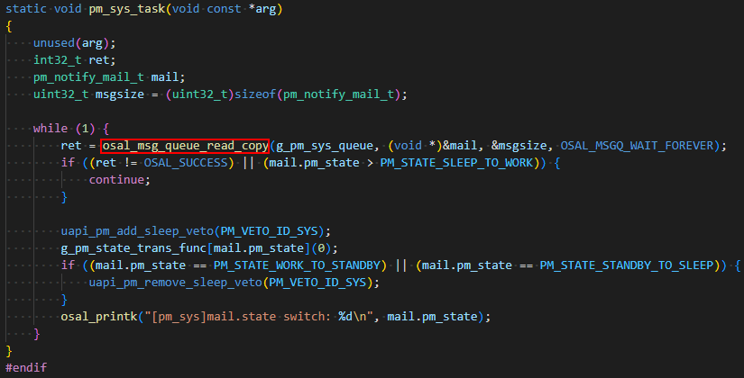
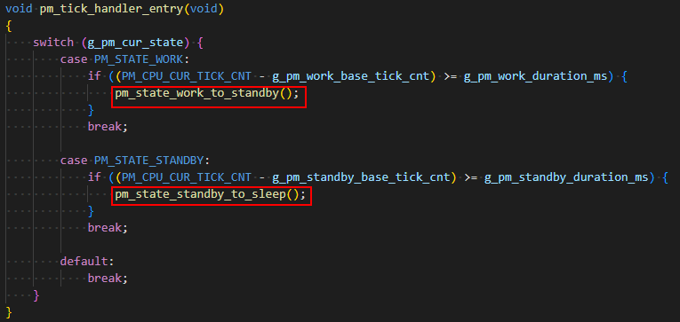
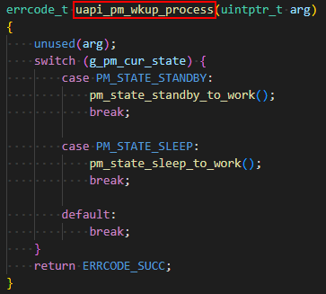
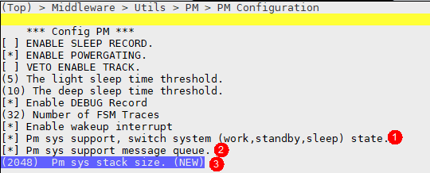

# Preface<a name="ZH-CN_TOPIC_0000001800390676"></a>

**Overview<a name="section4537382116410"></a>**

This document introduces in detail the usage of the BS2XV100 low-power sample, aiming to facilitate user development. In actual development, users can completely write a new set of state management code, or use this sample for extended development.

The BS2X series includes BS21/BS22/BS26. This document uses BS21 as an example.

**Reader Audience<a name="section4378592816410"></a>**

This document is mainly applicable to the following engineers:

- Technical support engineers
- Software development engineers

**Symbol Conventions<a name="section133020216410"></a>**

The following symbols may appear in this document, and their meanings are as follows.

| Symbol | Description |
| --- | --- |
| [Image] | Indicates a hazard with a high level of risk that, if not avoided, will result in death or serious injury. |
| [Image] | Indicates a hazard with a medium level of risk that, if not avoided, may result in death or serious injury. |
| [Image] | Indicates a hazard with a low level of risk that, if not avoided, may result in minor or moderate injury. |
| [Image] | Used to deliver device- or environment-safety warning information. If not avoided, it may cause equipment damage, data loss, degraded equipment performance, or other unpredictable results. "Cautions" do not involve personal injury. |
| [Image] | Supplementary explanation of key information in the main text. "Notes" are not safety warning information and do not involve personal, equipment, or environmental injury information. |

**Modification Records<a name="section12787162012256"></a>**

| Doc Version | Release Date | Modification Description |
| --- | --- | --- |
| 04 | 2025-08-07 | Updated the content of the "[Detailed Introduction](详细介绍.md)" chapter. |
| 03 | 2025-05-30 | Updated the content of the "[User Guide](用户指南.md)" chapter. |
| 02 | 2025-01-14 | Updated the content of the "[User Guide](用户指南.md)" chapter. |
| 01 | 2024-05-15 | First official version release. |
| 00B01 | 2024-03-01 | First interim version release. |

# Compilation & Testing<a name="ZH-CN_TOPIC_0000001800390348"></a>

## Compilation Description<a name="ZH-CN_TOPIC_0000001848689813"></a>

1. Open the IDE tool directory and double-click env_start.bat to open the terminal command line.

   

2. Go to the corresponding SDK path on the command line.

   

3. Execute "python build.py".

   

   Enter bs21-pm sequence number and press Enter to execute the compilation.

4. Go to the tools\pkg\fwpkg\bs21 directory under the SDK to obtain the image package and flash it.

## Testing Description<a name="ZH-CN_TOPIC_0000001801930964"></a>

1. Flash the image corresponding to bs21-pm.
2. Search for and connect to the Bluetooth "BS21-pm-demo" (configured in pm_ble_server_adv.c).
3. The system enters connection-hold according to the time set by the macro DURATION_MS_OF_WORK_TO_STANDBY.
4. The system enters sleep according to the time set by the macro DURATION_MS_OF_STANDBY_TO_SLEEP.
5. The system wakes up when the pin set by the macro PM_SAMPLE_GPIO_NUM is pulled low, and then repeats steps 3 and 4.

# System State Management<a name="ZH-CN_TOPIC_0000001802052154"></a>

## System States<a name="ZH-CN_TOPIC_0000001848849777"></a>

In the low-power sample, the system states are divided into work, standby, and sleep, and the state transitions are shown in [Figure 1](#fig310616017135).

**Figure 1** System State Machine


1. After a period of idle in the work state, transition to the standby (connection-hold) state.
2. After a period of idle in the standby (connection-hold) state, transition to the deep-sleep state.
3. After being woken up in the standby (connection-hold) state, transition to the work state.
4. After being woken up in the deep-sleep state, transition to the work state.

>  **Note:**
> The system also enters sleep in the standby state. In this sample, "standby" means the Bluetooth is not disconnected, while "sleep" means the Bluetooth is disconnected.
> If the user does not need "connection-hold" or "disconnection", then the system only needs to enter the "standby" state, and the user only needs to implement the corresponding functions in the state transition callback functions.

## Interface Description<a name="ZH-CN_TOPIC_0000001802090744"></a>

- Register the low-power state management interface: errcode_t uapi_pm_state_trans_handler_register(pm_state_trans_handler_t *handler);

  ```
  typedef struct pm_state_trans_handler {
      pm_state_trans_func_t work_to_standby;  /* transition from work state to standby state (e.g., increase interval) */
      pm_state_trans_func_t standby_to_sleep; /* transition from work state to deep-sleep state (e.g., disconnect, turn off advertising) */
      pm_state_trans_func_t standby_to_work;  /* transition from standby state to work state (e.g., decrease interval) */
      pm_state_trans_func_t sleep_to_work;    /* transition from deep-sleep state to work state (e.g., turn on advertising) */
  } pm_state_trans_handler_t;
  ```

- Set the low-power state transition time: errcode_t uapi_pm_set_state_trans_duration(uint32_t work_to_standby, uint32_t standby_to_sleep);
  - work_to_standby: the time from work to standby, unit: ms.
  - standby_to_sleep: the time from standby to sleep, unit: ms.

- Reset the work state interface (reset the timer from work to standby): errcode_t uapi_pm_work_state_reset(void);
- Low-power wake-up processing interface (called to switch to the work state when a peripheral wakes up): errcode_t uapi_pm_wkup_process(uintptr_t arg);

## State Machine Principle<a name="ZH-CN_TOPIC_0000001848689817"></a>

### Overview<a name="ZH-CN_TOPIC_0000001848891933"></a>

From the introduction in the "BS2XV100 Low Power Development Guide", it can be known that the sleep management module is called in the LiteOS IDLE thread, and the system enters sleep when the sleep conditions are satisfied.

**Figure 1** Sleep Conditions


One of the conditions is "there is no sleep veto vote". A sleep veto vote is cast at the entry of the system state machine, as shown in [Figure 2](#fig37501916123).

**Figure 2** pm_sys Initialization


When the sleep management interface determines that a veto vote exists, it does not enter sleep. When the veto vote is removed at the "appropriate" time, the system can enter sleep.

For the BS2X product form, it is generally necessary to control "when" the system enters the connection-hold state and "when" it enters the sleep state. Therefore, there must be a "timer" here.

The low-power sample uses OsTick to implement this timing function (of course, users can also implement it using a soft Timer or a periodic thread).

### Detailed Introduction<a name="ZH-CN_TOPIC_0000001848731989"></a>

When pm_sys_entry is initialized, a thread, i.e., pm_sys_task, is created, which is triggered to enter through a message:



The message queue is written in the following scenarios:

1. The "work-to-standby" or "standby-to-sleep" timing time expires, as follows:

   

2. When woken up from the "standby" state or the "sleep" state, actively switch to the "work" state, as follows:

   

During a state transition, the state transition callback function registered by the user through the uapi_pm_state_trans_handler_register interface is called. The user needs to implement parameter configurations such as BT connection-hold, disconnection, and wake-up reconnection in this callback function.

In addition, when the system is sleeping (standby or sleep), the user needs to register the wake-up source in the corresponding callback function, and the peripherals used by the user need to be restored when waking up.

For an example, see: application/samples/products/lowpower/lowpower.c

>  **Note:**
> When BS2XV100 sleeps, the CPU and most peripherals are powered off. After wake-up, the SDK restores the CPU and some common peripherals. Peripherals initialized by the user need to be restored by the user in the state machine management interface.
> For details, see the "BS2XV100 Low Power Development Guide".

## Usage Configuration Description<a name="ZH-CN_TOPIC_0000001849591453"></a>

**Figure 1** KConfig Configuration


- Enable macro 1 in KConfig to turn on the pm_sys driver. After that, use the interface descriptions in section 2.2.
- Enable macro 2 in KConfig to turn on the message queue function of pm_sys. It is recommended to enable it.
- Modify macro 3 in KConfig to adjust the message queue stack space size, defaulting to 2K.

>  **Note:**
> The message queue can serve the purposes of buffering, asynchronicity, and decoupling. It is more suitable to use a message queue here, but the message queue uses a thread, which increases some space overhead. Theoretically, unless memory is scarce, it is strongly recommended to use a message queue.
> Although the non-message-queue method saves some space, many software processes are directly performed in interrupts. Here, a long software processing time may cause other interrupts to be blocked.
> In addition, the message queue method is more scalable, making it more convenient for users to add new instances or nodes in subsequent extended development.

# User Guide<a name="ZH-CN_TOPIC_0000001801892382"></a>

1. The low-power sample provides a business state machine management method. This layer of code belongs to business logic and should be implemented by the user. In the SDK, this sample demonstrates a set of state management example methods to users, aiming to facilitate user development. In actual development, users can completely write a new set of state management code, or use this sample for extended development.
2. The low-power sample is relatively simple. If users base their development on this sample in actual use, they will definitely need to extend it appropriately.
3. The BT-related interfaces used in the low-power sample are provided only for reference. For subsequent extended function development by customers, please refer to the protocol description.
4. The low-power sample aims to demonstrate the low-power management/development method and only borrows the BLE interface as a demonstration. Users will also encounter the SLE scenario and the BLE-SLE coexistence scenario in actual development, for which this development guidance cannot be provided here.
5. Before developing and extending, users can first do a simple power consumption test based on this sample to get a rough understanding of the power consumption situation.
6. The priority of the pm_sys timed state machine task is set to the lowest priority of 30. If used, please pay attention to the task priority relationship. It is not recommended to set the priority of other tasks to 30.

>  **Note:**
> uapi_pm_work_state_reset is used to reset the timer. If it is not reset, the system will enter standby when the set time of "work_to_standby" is reached. In this sample, this interface is called to reset the timer when PM_SAMPLE_GPIO_NUM is pulled low. Actual usage scenarios may be more complex, and sometimes it may not be possible to call this interface in time to reset the timer.
> In actual use, besides the uapi_pm_work_state_reset interface, the uapi_pm_set_state_trans_duration interface can also be used flexibly. This interface controls the timer time of "work_to_standby" and "standby_to_sleep". Flexibly setting this time can also achieve the effect of controlling "not entering sleep" and "when to enter sleep".
