# Preface<a name="ZH-CN_TOPIC_0000001820546189"></a>

**Overview<a name="section4537382116410"></a>**

This document describes in detail the system low-power modes and application development guide of the BS2XV100, to guide users in low-power development.

**Product Version<a name="section578420251745"></a>**

The product version corresponding to this document is as follows.

| Product Name | Product Version |
| --- | --- |
| BS2X | V100 |

**Reader Audience<a name="section4378592816410"></a>**

This document is mainly applicable to the following engineers:

- Technical support engineers
- Software development engineers

**Symbol Conventions<a name="section133020216410"></a>**

The following symbols may appear in this document, and their meanings are as follows.

| Symbol | Description |
| --- | --- |
| [Image] | Indicates a hazard with a high level of risk that, if not avoided, will result in death or serious injury. |
| [Image] | Indicates a hazard with a medium level of risk that, if not avoided, may result in death or serious injury. |
| [Image] | Indicates a hazard with a low level of risk that, if not avoided, may result in minor or moderate injury. |
| [Image] | Used to deliver device- or environment-safety warning information. If not avoided, it may cause equipment damage, data loss, degraded equipment performance, or other unpredictable results. "Cautions" do not involve personal injury. |
| [Image] | Supplementary explanation of key information in the main text. "Notes" are not safety warning information and do not involve personal, equipment, or environmental injury information. |

**Modification Records<a name="section2467512116410"></a>**

| Doc Version | Release Date | Modification Description |
| --- | --- | --- |
| 03 | 2024-08-29 | Updated the content of the "[Low-Power Measurement and Test](低功耗维测.md)" subsection. |
| 02 | 2024-07-04 | Updated the content of the "[Low-Power Measurement and Test](低功耗维测.md)" subsection. |
| 01 | 2024-05-15 | First official version release. Updated the content of the "[Main Frequency & Sleep Veto](主频-睡眠投票.md)" subsection. Updated the content of the "[Low-Power Development Description](低功耗开发说明.md)" subsection. |
| 00B04 | 2024-04-12 | Updated the content of the "[Low-Power Mode](低功耗模式.md)" subsection. Updated the content of the "[Main Frequency & Sleep Veto](主频-睡眠投票.md)" subsection. Updated the content of the "[Connection-Hold Current](保连电流.md)" subsection. |
| 00B03 | 2024-03-18 | Updated the content of the "[Low-Power Principle](低功耗原理.md)" subsection. Updated the content of the "[Low-Power Mode](低功耗模式.md)" subsection. |
| 00B02 | 2024-02-29 | Updated the content of the "[Sleep and Wake-up Process](睡眠唤醒流程.md)" subsection. Updated the content of the "[Peripheral Power-off](外设下电.md)" subsection. Updated the content of the "[Main Frequency & Sleep Veto](主频-睡眠投票.md)" subsection. Updated the content of the "[Low-Power Measurement and Test](低功耗维测.md)" subsection. |
| 00B01 | 2024-01-26 | First interim version release. |

# Low-Power Overview<a name="ZH-CN_TOPIC_0000001773746488"></a>

## Low-Power Principle<a name="ZH-CN_TOPIC_0000001773906196"></a>

The essence of low power is to optimize the design of electronic devices from the perspective of power consumption, so as to reduce power consumption as much as possible while satisfying functional requirements. This usually involves in-depth research and optimization of hardware design, software optimization, material selection, and other aspects. For software design, power consumption can be optimized by stopping the CPU when the system is idle, and continuing to work after interrupt or event wake-up. For systems running without an OS, the program can enter low power "anytime, anywhere"; but for systems with an OS, the system cannot do so "anytime, anywhere" and must follow the OS running process.

In an OS, there is usually an IDLE task with the lowest priority that always stays in the ready state. When a high-priority task blocks, the OS executes the IDLE task. Generally, when no low-power processing is performed, the CPU executes empty instructions in a loop in the IDLE task. The low-power management component, in the IDLE task, effectively reduces the system power consumption by managing the CPU, clock, and devices. When the system wakes up, it restores the CPU, clock, and devices, thereby ensuring that the program can run normally after exiting low power.

**Figure 1** OS Low Power
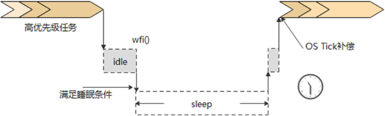

The operating system used by BS2XV100 is LiteOS. The low-power management interface has been called in the IDLE thread of LiteOS. There is no need for the application layer to call it actively; the system can enter sleep when the sleep conditions are satisfied.

## Low-Power Modes<a name="ZH-CN_TOPIC_0000001820426129"></a>

**Table 1** Low-Power Mode Description

| Mode | Chip State | Features |
| --- | --- | --- |
| WFI mode | CPU stops working. Some clocks are frequency-reduced/off. | WFI is Wait For Interrupt; all interrupts can break this state and allow the CPU to continue working. OsTick is maintained normally (period: 1ms). |
| Light-sleep mode | CPU is not powered off, RAM is not powered off, and all peripherals can be powered off controllably. Only some peripheral interrupts support wake-up. | Bluetooth/StarFlash advertising/connection is maintained normally. GPIO output level hold is supported. |
| Deep-sleep mode | CPU is powered off, RAM is not powered off, and all peripherals except ULP_GPIO and ULP_WDT are powered off. Only a few peripheral interrupts support wake-up. | Bluetooth/StarFlash advertising/connection is maintained normally. uapi_gpio_set_val output hold does not take effect; uapi_pin_set_pull pin pull-up/pull-down continues to take effect. The osal_timer timing function is not affected. For peripherals initialized by the user, they need to be restored by the user after wake-up. |

# Low-Power Solution<a name="ZH-CN_TOPIC_0000001773906200"></a>

## Sleep Conditions<a name="ZH-CN_TOPIC_0000001820426137"></a>

**Figure 1** Sleep Conditions


- Sleep veto vote

  Add sleep veto vote interface: errcode_t uapi_pm_add_sleep_veto(pm_veto_id_t veto_id)

  Remove sleep veto vote interface: errcode_t uapi_pm_remove_sleep_veto(pm_veto_id_t veto_id)

  During system initialization, the "uapi_pm_add_sleep_veto(PM_VETO_ID_MCU)" interface is called to cast a sleep veto vote. To allow the system to enter sleep, this veto vote needs to be removed by calling "uapi_pm_remove_sleep_veto(PM_VETO_ID_MCU)".

- Idle time

  The system idle time is managed by LiteOS. When the sleep vote condition is satisfied, the sleep management interface determines whether the sleep time meets the deep-sleep threshold. If it does, the deep-sleep process is entered. The low-power management interface adds a wake-up timer based on the system idle time to ensure that the system wakes up at the expected time point.

>  **Note:**
> - The system idle time is affected by threads/timers created by the user. If all sleep veto votes have been removed but the system cannot sleep or is frequently woken up, please check whether there is unreasonable design in the business code.
> - If the system is currently in the advertising/connected state, the system will also wake up periodically to maintain advertising/connection.

## Sleep and Wake-up Process<a name="ZH-CN_TOPIC_0000001820546197"></a>

**Figure 1** Sleep and Wake-up Process
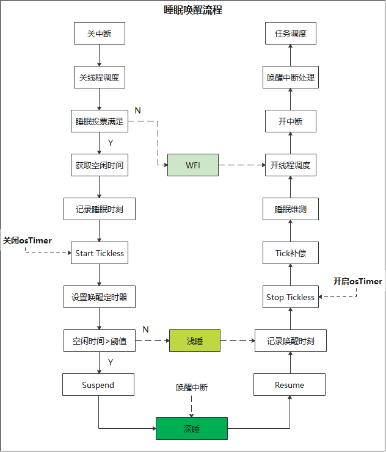

The above process is shown in the "uapi_pm_enter_sleep" interface in "pm_sleep.c".

>  **Note:**
> Tickless: that is, OsTick reduction. The OsTick of BS2X is implemented using an external Timer interrupt (period: 1ms). The system actively turns off this Timer before sleeping, and compensates the OsTick according to the actual sleep time after waking up, to ensure that the OS thread/timer scheduling is not affected by sleep.

## Wake-up Sources<a name="ZH-CN_TOPIC_0000001773746492"></a>

- Light-sleep wake-up sources

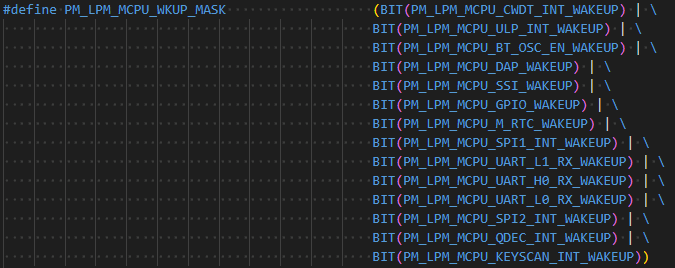

- Deep-sleep wake-up sources

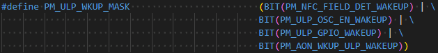

Code location: middleware/chips/bs2x/pm/pm_sleep/pm_sleep_porting.c

>  **Note:**
> 1. Enabling a wake-up source does not itself increase power consumption. Do not intrusively modify/delete wake-up sources just because the system is frequently woken up. For abnormal wake-ups, locate the cause normally. It is not recommended to avoid the problem by deleting wake-up sources!
> 2. In fact, after the user votes for sleep, all peripherals can be considered powered off. Ultimately, peripheral wake-up is achieved through ulp_gpio wake-up.
> 3. If the user has a timed wake-up requirement, there are two ways to achieve it. The first is to wait through a thread delay (osal_msleep), and the second is a soft Timer (osal_timer_start).

## Peripheral Power-off<a name="ZH-CN_TOPIC_0000001773746496"></a>

**Table 1** Peripheral Power-off

| No. | Driver | Deep-Sleep Peripheral Power-off Description | Recovery Description |
| --- | --- | --- | --- |
| 1 | Pinctrl | mode is powered off, pull is not powered off, ds is not powered off. | Directly use uapi_pin_set_mode to recover the pin modes of each peripheral. |
| 2 | uapi_gpio | Powered off. Sleep does not support wake-up; the wake-up interrupt needs to be registered in ulp_gpio. After wake-up, interrupts mounted on this IP can respond normally. During sleep, uapi_gpio itself is powered off. The SDK has synchronized the uapi_gpio output configuration to ulp_gpio, so the IO output can be held during sleep. | Recover in accordance with the normal process. |
| 3 | UART | Powered off. On wake-up, it has been restored by default in the SDK code. | CONFIG_UART_SUPPORT_LPM controls whether the SDK restores UART. |
| 4 | I2C | Powered off; needs to be restored by the user. | In accordance with the normal process. |
| 5 | ADC | Powered off; needs to be restored by the user. | In accordance with the normal process. |
| 6 | DMA | Powered off; needs to be restored by the user. | In accordance with the normal process. |
| 7 | PWM | Powered off; needs to be restored by the user. | In accordance with the normal process. |
| 8 | WDT | Powered off. On SDK wake-up, it has been restored by default. | CONFIG_WATCHDOG_SUPPORT_LPM controls whether the SDK restores WDT. |
| 9 | uapi_timer | Powered off; can be restored and compensated by the SDK. | Controlled by CONFIG_TIMER_SUPPORT_LPM (Not recommended to enable; it increases the working time of the connection-hold scenario). |
| 10 | uapi_rtc | Powered off; needs to be restored by the user. | Controlled by CONFIG_RTC_SUPPORT_LPM (Not recommended to enable; it increases the working time of the connection-hold scenario). |
| 11 | Systick | Powered off; needs to be restored by the user. | CONFIG_SYSTICK_SUPPORT_LPM controls whether the SDK restores it. |
| 12 | Tcxo | Powered off. On wake-up, it has been restored by default in the SDK code. | CONFIG_TCXO_SUPPORT_LPM controls whether the SDK restores it. |
| 13 | SFC | Powered off. On wake-up, it has been restored by default in the SDK code. | CONFIG_SFC_SUPPORT_LPM controls whether the SDK restores it. |
| 14 | External Flash | Not powered by the chip. The SPI used by the Flash, etc., needs to be restored by the user. | - |
| 15 | SPI | Powered off; needs to be restored by the user. | uapi_spi_suspend/uapi_spi_resume. |
| 16 | Qdec | Powered off; needs to be restored by the user. | In accordance with the normal process. |
| 17 | Keyscan | Powered off; needs to be restored by the user. | In accordance with the normal process. |
| 18 | osal_timer | Powered off. On wake-up, it has been restored by default in the SDK code. | - |
| 19 | ulp_gpio | Not powered off. It is recommended that this GPIO only be used for wake-up. | - |
| 20 | ulp_rtc | Only used for timing wake-up in the sleep process and calculating timer compensation. | - |
| 21 | ulp_wdt | Not powered off. In the sleep scenario, if this wdt is kept on, attention must be paid to feeding the watchdog. | - |
| 22 | RAM & internal Flash | Not powered off. | - |

>  **Note:**
> When the BS2X system is in deep sleep, most peripherals are powered off. Basic peripherals such as sfc, wdt, tcxo, uart, and osal_timer are restored in the SDK. Other peripherals initialized by the user need to be restored by the user after wake-up. This process can be placed in the user's low-power state machine for self-management.

# Development Guide<a name="ZH-CN_TOPIC_0000001773906184"></a>

The clock/power management logic has been configured in the SDK. Users do not need to care about the specific structure of the clock tree/power tree. The low-power-related interfaces needed by users are introduced below.

## Main Frequency & Sleep Veto<a name="ZH-CN_TOPIC_0000001773906204"></a>

1. Main frequency configuration

   Two levels are provided for CPU frequency configuration, namely 32M and 64M, by calling the following interfaces respectively:

   (requires #include "pm_clock.h")

   - Main frequency 32M:

     uapi_clock_control(CLOCK_CONTROL_FREQ_LEVEL_CONFIG, CLOCK_FREQ_LEVEL_LOW_POWER);

   - Main frequency 64M:

     uapi_clock_control(CLOCK_CONTROL_FREQ_LEVEL_CONFIG, CLOCK_FREQ_LEVEL_HIGH);

   - Get the main frequency:

     uapi_clock_crg_get_freq(CLOCK_CRG_ID_MCU_CORE);

2. Sleep veto

   (requires #include "pm_veto.h")

   - Add a sleep veto vote: errcode_t uapi_pm_add_sleep_veto(pm_veto_id_t veto_id)
   - Remove a sleep veto vote: errcode_t uapi_pm_remove_sleep_veto(pm_veto_id_t veto_id)
   - Add a sleep veto vote with timeout: errcode_t uapi_pm_add_sleep_veto_with_timeout(pm_veto_id_t veto_id, uint32_t timeout_ms),

     which can control the system not to enter sleep within a specified time. After the timeout time has passed, the veto vote is automatically cleared.

## Low-Power Development Description<a name="ZH-CN_TOPIC_0000001773906188"></a>

BS2X sleep voting uses the veto vote interface, i.e., if no module casts a vote, the system enters deep sleep when the idle time is satisfied.

The SDK currently casts one veto vote, i.e., "uapi_pm_add_sleep_veto(PM_VETO_ID_MCU);" is called in "uapi_pm_lpc_init" to cast a veto vote, as shown in [Figure 1](#fig44554298155).

**Figure 1** SDK Default Veto Vote
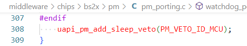

Therefore, the current SDK only enters "WFI" when the system is idle. If users need the system to enter sleep, they still need to configure it according to the following.

- If users need the MCU to enter sleep, they can call the "uapi_pm_remove_sleep_veto(PM_VETO_ID_MCU);" interface. When the veto vote is 0, the system can enter sleep.
- uapi_pm_add_sleep_veto and uapi_pm_remove_sleep_veto appear in pairs. Calling uapi_pm_add_sleep_veto adds a veto vote (the system cannot sleep), and calling uapi_pm_remove_sleep_veto removes a veto vote (the system can sleep).
- In addition, the voting interface with timeout "uapi_pm_add_sleep_veto_with_timeout" is also provided. When calling this interface, a timeout time parameter (unit: ms) needs to be passed in, which can control the system not to enter sleep within a specified time. After the timeout time has passed, the veto vote is automatically cleared.

>  **Note:**
> In low-power management, users should design the system state machine themselves, such as when to enter connection-hold, when to enter sleep, connection-hold parameter configuration, parameter recovery on wake-up, etc. These can only be implemented by the upper-layer business, which controls the system state transitions by calling the "add/remove sleep veto vote" interfaces.
> The BS2X SDK provides a set of simple state machine management code. For the detailed description, see the "BS2XV100 Low-Power sample User Guide".

## Low-Power Measurement and Test<a name="ZH-CN_TOPIC_0000001801391326"></a>

1. Interrupt & task scheduling

   Add the compilation macro (added in config.py): OS_DFX_SUPPORT. When the program runs, the following will be printed:

   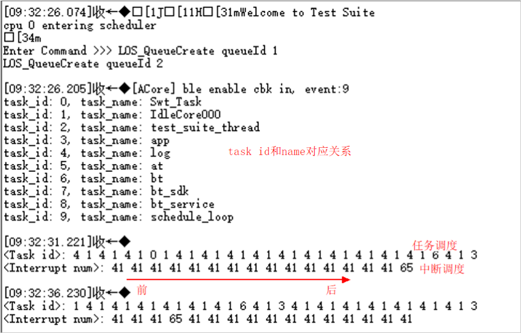

   - The correspondence between the task id and the task name is printed when app_main is initialized; or the AT command "AT+OSDFXPRINT" can be sent for printing.
   - In the periodic task, according to the call order, print the "task ID" and "interrupt number" from front to back.
   - For the interrupt number, see: chip_core_irq.h.

2. Working & idle time statistics

   In the product_evb_standard.h file, enable the macro: PM_MCPU_MIPS_STATISTICS_ENABLE

3. Wake-up reason printing

   In the product_evb_standard.h file, enable the macro: PM_SLEEP_DEBUG_ENABLE. For the deep-sleep process wake-up source, see the print "ulp-wkup evt". A corresponding bit of 1 indicates that this wake-up source caused the wake-up. The wake-up sources corresponding to each bit are:

   bit1: ulp_gpio;

   bit2: ulp_rtc (includes the osal_msleep behavior periodic scheduling in tasks and osal_timer soft scheduling);

   bit3: osc_en (related to BT business; it needs to be woken up in advance before sending and receiving data);

   bit4: NFC;

   bit0: is relatively special. It is generally caused by being woken up by other wake-up sources during sleep. To locate the cause, the other bits still need to be checked.

4. Get the veto information: pm_veto_t *uapi_pm_veto_get_info(void)
5. Get the sleep information: sleep_info_t *uapi_pm_get_sleep_info(void); the kconfig macro CONFIG_PM_SLEEP_RECORD_ENABLE needs to be enabled.
6. Task timer and sw timer printing: enable the macro OS_TIMER_DEBUG_SUPPORT and send the AT command "AT+OSTIMERPRINT"; or call the interfaces os_task_timer_print and os_sw_timer_print for printing. To view only the sw timer, the interface os_sw_timer_print_flag_set can also be called to control printing when the soft timer is scheduled.
7. Sleep veto and BT status printing: enable the macro SLP_VETO_AT_SUPPORT and send the AT command "AT+PMVETOINFO" to print the veto information and BT status information.

>  **Note:**
> Measurement and test will increase the software running time. It can be enabled during early debugging and problem location, but it is recommended that all be turned off in the formal version.

## Other Descriptions<a name="ZH-CN_TOPIC_0000001899142830"></a>

### BUCK/LDO Power Supply Mode Configuration<a name="ZH-CN_TOPIC_0000001900710056"></a>

Refer to the "BS2XV100 Hardware Guide". The internal power module of the chip supports BUCK mode and LDO mode power supply.

Usually, it is recommended that the chip be designed with the circuit in BUCK mode for high efficiency. If there are constraints on PCB area and the module power consumption is not sensitive, the LDO mode can be used.

The default SDK version uses BUCK mode. When using LDO mode, the macro (CONFIG_POWER_SUPPLY_BY_LDO) needs to be enabled. The configuration is as follows:

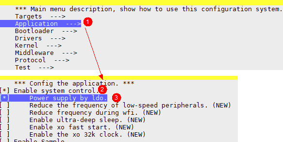

### 32K Clock Switching<a name="ZH-CN_TOPIC_0000001900550168"></a>

The 32K clock of the BS2X chip can use either the internal RC or the external XO. The SDK uses the internal RC32K clock by default. If users want to use XO32K, they can switch by configuring the macro "CONFIG_XO_32K_ENABLE", as shown below:

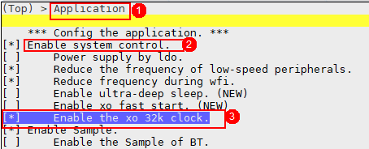

### GPIO-related<a name="ZH-CN_TOPIC_0000001939309589"></a>

**GPIO Interrupt Registration<a name="section14838743121218"></a>**

During sleep, the driver corresponding to the uapi_gpio interface will all be powered off, so the uapi_gpio interrupt registered during work cannot be used to wake up. Users need to register the interrupt through the ulp_gpio interface. uapi_gpio can register 32 interrupts, corresponding one-to-one to Pin pins; ulp_gpio can only register 8 interrupts and requires custom Pin binding.

- Wake-up interrupt configuration interface: void ulp_gpio_int_wkup_config(ulp_gpio_int_wkup_cfg_t *cfg, uint8_t array_num). Register the required IO to the wake-up interrupt before sleep. In general, only one of uapi_gpio and ulp_gpio can be used, so before sleep, uapi_gpio needs to be deinitialized, ulp_gpio initialized, and then the ulp_gpio interrupt registered. Taking a mouse button as an example, the usage example is as follows:

  ```
  static ulp_gpio_int_wkup_cfg_t g_wk_cfg[] = {
      { 1, CONFIG_MOUSE_PIN_QDEC_A, true, ULP_GPIO_INTERRUPT_FALLING_EDGE, ulp_gpio_wkup_handler },    // qdec wake-up
      { 2, CONFIG_MOUSE_PIN_LEFT, true, ULP_GPIO_INTERRUPT_FALLING_EDGE, ulp_gpio_wkup_handler },      // left button wake-up
      { 3, CONFIG_MOUSE_PIN_RIGHT, true, ULP_GPIO_INTERRUPT_FALLING_EDGE, ulp_gpio_wkup_handler },     // right button wake-up
      { 4, CONFIG_MOUSE_PIN_MID, true, ULP_GPIO_INTERRUPT_FALLING_EDGE, ulp_gpio_wkup_handler },       // middle button wake-up
      { 5, CONFIG_MOUSE_PIN_MONTION, true, ULP_GPIO_INTERRUPT_FALLING_EDGE, ulp_gpio_wkup_handler },   // Sensor wake-up
  };
  // switch to ulp_gpio and register interrupt before sleep
  static void mouse_enable_ulpgpio_wkup(void)
  {
      uapi_gpio_deinit();
      ulp_gpio_init();
      ulp_gpio_int_wkup_config(g_wk_cfg, sizeof(g_wk_cfg) / sizeof(ulp_gpio_int_wkup_cfg_t));
  }
  // switch back to uapi_gpio after wake-up
  static void mouse_disable_ulpgpio_wkup(void)
  {
      ulp_gpio_deinit();
      uapi_gpio_init();
  }
  ```

- Multiple IO ports bound to one mask interface: void ulp_gpio_mask_pin_set(ulp_gpio_wk_t wk_sel, uint32_t pin_map). ulp_gpio can only register 8 interrupts. If more than 8 IO ports need to respond to the wake-up interrupt, this interface needs to be used to bind multiple IO ports to one mask. Each bit of the parameter pin_map corresponds to one IO (bit0 is s_mgpio0). A corresponding bit of 1 indicates that the corresponding IO is selected.
- Parameter description:

  ```
  typedef struct ulp_gpio_int_wkup_cfg {
  /* ulp_gpio has 8 in total (0~7) */
  uint8_t ulp_gpio;
  /**
  *0~31: IO pins, refer to pin_t.
  *32: swd_clk pin
  *33: swd_io pin
  *34: gpio OR mask0, low level: 0, high level: 1. Multiple low-level pins can be bound into OR mask0. The interrupt trigger selects rising edge or high level. When one pin is pulled high, the interrupt is triggered.
  *35: gpio AND mask0, low level: 0, high level: 1. Multiple high-level pins can be bound into AND mask0. The interrupt trigger selects falling edge or low level. When one pin is pulled low, the interrupt is triggered.
  *36: gpio OR mask1, low level: 0, high level: 1. Multiple low-level pins can be bound into OR mask1. The interrupt trigger selects rising edge or high level. When one pin is pulled high, the interrupt is triggered.
  *37: gpio AND mask1, low level: 0, high level: 1. Multiple high-level pins can be bound into AND mask1. The interrupt trigger selects falling edge or low level. When one pin is pulled low, the interrupt is triggered.
  Supplement: the mask pin binding can use the interface ulp_gpio_mask_pin_set.
  */
  uint8_t wk_mux;
  bool int_enable;
  ulp_gpio_interrupt_t trigger;
  ulp_gpio_irq_cb_t irq_cb;
  } ulp_gpio_int_wkup_cfg_t;
  ```

**GPIO Output Hold<a name="section13722120139"></a>**

When the system is in deep sleep, uapi_gpio is powered off, so the GPIO output needs to be performed through ulp_gpio during sleep. Currently, the SDK has automatically synchronized the uapi_gpio output configuration to ulp_gpio during sleep, and synchronized it back after wake-up. If there is a GPIO output requirement, directly use the uapi_gpio interface for configuration. If users do not need to keep the GPIO output function, similarly use the uapi_gpio_set_dir interface to configure it as an input function.

**IO Pin IE Configuration<a name="section384062701318"></a>**

IE is Input Enable. When the IO needs to be kept as an input function (to receive interrupts), the uapi_pin_set_ie interface needs to be used to enable the corresponding IO port.

To avoid unnecessary leakage on the IO, the current SDK has disabled the IE function of the default pins. If users need a corresponding IO port to respond to GPIO interrupts, they need to enable IE. In addition, the IE of pins such as UART RX also needs to be enabled, and the current SDK has also been configured as needed.

**IO State Print & Configuration Interface<a name="section379114631312"></a>**

- State print interface: void pm_gpio_state_print(void). This interface can be called before sleep to print the pin ID, pin mode, input/output direction, internal pull-up/pull-down state, and output state of all pins.

- IO state configuration interface: void pm_gpio_group_config(gpio_info_cfg_t *cfg, uint8_t array_num). The purpose of this interface is to provide users with a method for overall IO configuration (which can also be implemented by the user), and it is used in conjunction with the state print interface. IO configuration and display can be performed before sleep, thereby assisting power consumption optimization.

>  **Note:**
> The investigation of system deep-sleep power consumption is mainly about investigating IO leakage, and the IO pull-up/pull-down/input-output configuration is generally related to the peripheral circuit. The IO state print & configuration interface can perform overall IO configuration and printing, and thus align with hardware colleagues.

### 32K Clock Observation<a name="ZH-CN_TOPIC_0000001900710060"></a>

The SDK provides an interface for observing the 32K clock: uapi_clock_control(CLOCK_CONTROL_32K_TEST_ENABLE, xxx), i.e., use Pin xxx to observe the 32K clock. When using this interface, the macro "CLOCK_TEST_ENABLE" needs to be enabled.

### XO Fast Start-up Configuration<a name="ZH-CN_TOPIC_0000001900550172"></a>

In the current SDK, the XO start-up time is configured as 1ms. If the XO crystal capacitance is 8pF, the XO start-up time can be shortened to 250us. The macro CONFIG_PM_XO_FAST_START_ENABLE can be enabled to shorten the XO start-up time, thereby reducing "working time" and lowering power consumption. The macro configuration is as follows:

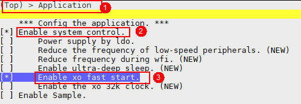

### Peripheral Save and Recovery<a name="ZH-CN_TOPIC_0000001948369757"></a>

According to section 2.4, most peripherals automatically lose power during sleep, and the software process needs to be reconfigured to recover on wake-up. The current SDK has performed partial peripheral recovery by default.

For some peripherals, users can also configure not to recover, to reduce the software working time after wake-up and thereby lower some connection-hold power consumption. These peripherals include: watchdog, uart, and cpu_trace, and the macros CONFIG_WATCHDOG_SUPPORT_LPM, CONFIG_UART_SUPPORT_LPM, and CONFIG_CPU_TRACE_SUPPORT_LPM can be turned off respectively.

- uapi_watchdog is powered off during sleep and is powered on by default after wake-up (the timeout time is 8s). Not proactively recovering it after wake-up does not affect its function. During sleep, ulp_wdt can be kept powered on and can play a protective role during sleep.
- uart currently performs save and recovery before and after sleep wake-up. This operation can be done in the user's own code; simply call the deinit and init interfaces to reinitialize.
- The cpu_trace function records at every function jump. After an exception, the trace can be exported to analyze the function interface call trace. This function can also be considered to be turned off in the formal commercial version.

### Low-Speed Peripheral Frequency Reduction<a name="ZH-CN_TOPIC_0000001918890744"></a>

The current SDK fixes the frequency of the clock source of low-speed peripherals (including timer, uart l0, uart l1, i2c, keyscan, and qdec) to 32M. To further reduce working power consumption, users can enable the macro CONFIG_REDUCE_PERP_LS_FREQ to reduce the frequency of the low-speed peripheral clock source (8M), as shown below:

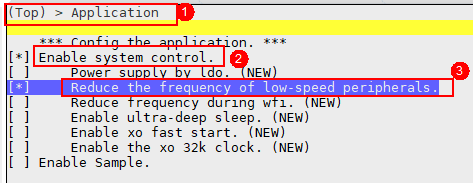

When this macro is enabled, the bus frequency of some peripherals will be reduced, and the performance of the above peripherals will be slightly affected. Users can consider bringing this optimization configuration according to the test situation.

### WFI State Frequency Reduction<a name="ZH-CN_TOPIC_0000001918730808"></a>

>  **Caution:**
> "Low-speed peripheral frequency reduction" and "WFI state frequency reduction" should be used with caution in the USB working scenario (insufficient performance). No problems have been found in other scenarios so far.

When the CPU is idle, the system enters the WFI state. To further reduce the power consumption in this state, the macro CONFIG_REDUCE_FREQ_DURING_WFI can be enabled to reduce the CPU and bus frequency in this state, and temporarily turn off the flash clock. The configuration is as follows:

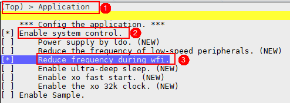

### Turning Off ulp_wdt During Sleep<a name="ZH-CN_TOPIC_0000001926907686"></a>

>  **Caution:**
> 1. When ulp_wdt is turned off through the above method, the software will simultaneously reduce the drive capability of the 32k clock (built-in RC32K), so the accuracy of the 32k clock will be affected. Therefore, it is recommended to use it only in GPIO-only wake-up scenarios, i.e., when disconnected and there are no periodic timers or tasks.
> 2. If ulp_wdt is turned off during sleep, some software and hardware processes during the sleep wake-up period cannot be guarded. If the chip is abnormal during this period, the system cannot reset itself. It is not recommended for products without an active reset button or without battery removal reset.

When the system sleeps, uapi_watchdog is powered off, and ulp_wdt is not powered off. In the deep-sleep scenario, to prevent the watchdog from timing out, the system needs to wake up to feed the watchdog. For scenarios with long periods of inactivity, having the system wake up each time specifically to feed the watchdog both increases power consumption and seems unnecessary. Therefore, users can enable the macro CONFIG_SUPPORT_CLOSE_ULP_WDT_DURING_SLP to control the system to turn off ulp_wdt during sleep, as follows:

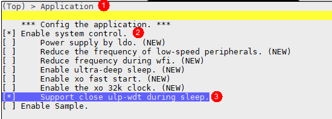

After enabling the above macro, the interface void pm_close_ulp_wdt_during_slp(bool close) can be used to control whether ulp_wdt is turned off during sleep.

# Power Consumption Optimization<a name="ZH-CN_TOPIC_0000001820426133"></a>

Chip power consumption is divided into static power consumption and dynamic power consumption. When optimizing deep-sleep power consumption, since all clocks are turned off, there is basically no dynamic power consumption, and the static power consumption is mainly optimized. For working scenarios, the dynamic power consumption is mainly optimized. The optimization methods for sleep current and working current are introduced in detail below.

## Sleep Current<a name="ZH-CN_TOPIC_0000001820426117"></a>

When the system sleeps, the high-frequency clocks are all turned off, and the CPU and peripherals are all powered off. If the current is abnormal in this scenario, it is mainly caused by IO leakage.

- On the hardware side, the voltage of each IO pin can be measured to determine the leakage situation, and then the software can be used to level-match the IO voltage.
- GPIO should not be configured as output mode if not necessary; it is recommended to configure it as input mode.
- If no external device is connected to the IO pin, it is recommended to configure the IO pin as input with pull-down.
- For some pins, such as I2C and QSPI_CS, configuring them as input with pull-up generally has the lowest power consumption. Users can investigate and test this themselves.
- If the IO pin is configured as a high-impedance state, charge may accumulate on the IO pin. In general, configuring it as a pull-up/pull-down state is better.

>  **Note:**
> The A/B pins used by Qdec: to reduce leakage, a pull-up resistor is generally added at the board level for these pins. Since the state of this pin is indeterminate, configuring either pull-up or pull-down in software will cause leakage, so this pin is generally configured as a floating state.

## Working Current<a name="ZH-CN_TOPIC_0000001820426125"></a>

- The SDK has already adaptively switched the power and clock on and off, so for working power consumption optimization, the main focus is on main frequency configuration and IO configuration.
- The CPU working duty cycle will affect power consumption. For example, more log printing will shorten the time the CPU enters WFI, thereby increasing power consumption. In addition, the execution speed of code compiled in RAM is much higher than in Flash, so to further reduce the working current, users need to extract hot functions to RAM.
- In addition, parameters configured by users through the BTH interface, such as interval, latency, and transmit power, will also affect working power consumption.

## Connection-Hold Current<a name="ZH-CN_TOPIC_0000001848004021"></a>

Generally, after the sleep current and working current are optimized, the connection-hold current does not need additional optimization. The connection-hold current is greatly affected by the connection parameters interval and latency.

# Common Problems<a name="ZH-CN_TOPIC_0000001820546177"></a>

Please refer to the "BS2XV100 Low-Power FAQ".
