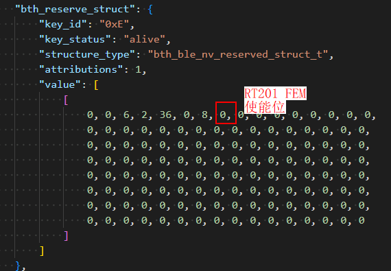
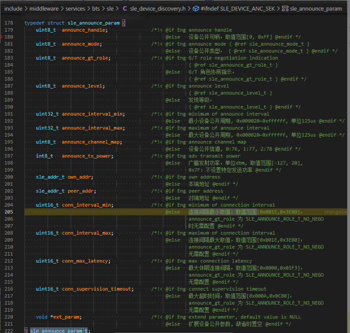
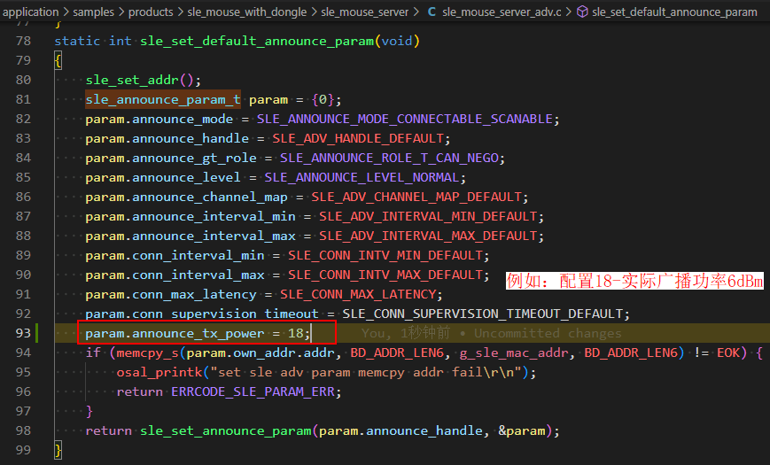
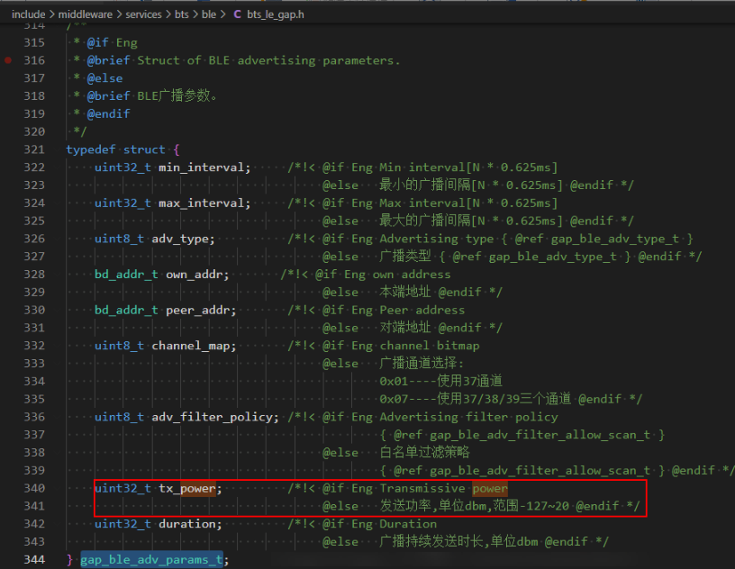
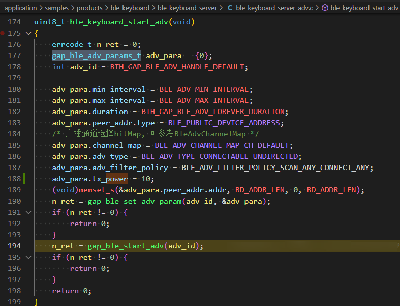

# Preface<a name="ZH-CN_TOPIC_0000001890222464"></a>

**Overview<a name="section4537382116410"></a>**

This document describes in detail the power adjustment methods and specific operation guidance for BS2X in various scenarios, and also provides common precautions.

**Reader Audience<a name="section4378592816410"></a>**

This document is mainly applicable to the following engineers:

- Technical support engineers
- Software development engineers

**Symbol Conventions<a name="section133020216410"></a>**

The following symbols may appear in this document, and their meanings are as follows.

| Symbol | Description |
| --- | --- |
| [Image] | Indicates a hazard with a high level of risk that, if not avoided, will result in death or serious injury. |
| [Image] | Indicates a hazard with a medium level of risk that, if not avoided, may result in death or serious injury. |
| [Image] | Indicates a hazard with a low level of risk that, if not avoided, may result in minor or moderate injury. |
| [Image] | Used to deliver device- or environment-safety warning information. If not avoided, it may cause equipment damage, data loss, degraded equipment performance, or other unpredictable results. "Cautions" do not involve personal injury. |
| [Image] | Supplementary explanation of key information in the main text. "Notes" are not safety warning information and do not involve personal, equipment, or environmental injury information. |

**Modification Records<a name="section12787162012256"></a>**

| Doc Version | Release Date | Modification Description |
| --- | --- | --- |
| 04 | 2025-08-07 | Updated the content of the "[BLE Advertising Parameter Structure](BLE广播参数结构.md)" section. |
| 03 | 2025-01-14 | Updated the content of the "[Customized NV Structure](定制化NV结构.md)" section. |
| 02 | 2024-09-13 | Updated the content of the "[Customized NV Structure](定制化NV结构.md)" section. |
| 01 | 2024-05-22 | First official version release. |

# RF Power Configuration Description<a name="ZH-CN_TOPIC_0000001920407529"></a>

## Production Line TX Test Power<a name="ZH-CN_TOPIC_0000001874288514"></a>

### BLE/SLE GFSK TX<a name="ZH-CN_TOPIC_0000001874448378"></a>

#### Power Level Description<a name="ZH-CN_TOPIC_0000001920287873"></a>

BS2X BLE/SLE GFSK defines a total of 6 power levels from 0 to 5, with the maximum level being level 5, defaulting to 6dBm. Each level down decreases by 2dB.

| Level | Parameter Description |
| --- | --- |
| 5 | 6dBm |
| 4 | 4dBm |
| 3 | 2dBm |
| 2 | 0dBm |
| 1 | -2dBm |
| 0 | -4dBm |

>  **Note:**
> The power of the production test BLE test mode continuous-transmission (non-signaling) is the maximum power level by default after power-on, and can only be modified by configuring the "maximum power" (see "[Customized Maximum Power](定制化最大功率.md)"). It cannot be adjusted through the command parameters to change the power level.

The power adjustment of SLE GFSK modulation in test mode can be implemented by modifying the second parameter of the AT command.

1M GFSK test mode TX:

```
AT+SLETX=0,5,255,0,0,0,0,0,0,50
```

The second parameter is 5, indicating that the transmit power at this time is the maximum level of 6dBm.

### SLE PSK TX<a name="ZH-CN_TOPIC_0000001920407533"></a>

#### Power Level Description<a name="ZH-CN_TOPIC_0000001874288518"></a>

BS2X SLE PSK defines a total of 6 power levels from 0 to 5, with the maximum level being level 5, defaulting to 2dBm. Each level down decreases by 2dB.

| Level | Parameter Description |
| --- | --- |
| 5 | 2dBm |
| 4 | 0dBm |
| 3 | -2dBm |
| 2 | -4dBm |
| 1 | -6dBm |
| 0 | -8dBm |

The power adjustment of SLE PSK modulation in test mode can be implemented by modifying the second parameter of the AT command.

1M QPSK test mode TX:

AT+SLETX=0,5,255,0,0,2,2,3,2,50

The second parameter is 5, indicating that the transmit power at this time is the maximum level of 2dBm.

For the configuration of parameters such as phy, frame type, pilot, and coding, please refer to the "BS2XV100 RF AT Test Guide".

## Customized Maximum Power<a name="ZH-CN_TOPIC_0000001874448382"></a>

### NV Storage Customized Power<a name="ZH-CN_TOPIC_0000001920287877"></a>

Due to differences in product features, SDK developers can modify the maximum power of the BLE TX and SLE TX signals according to their needs. After modification, the maximum power in the production line test and the actual business scenarios of the commercial version will be customized, i.e., the actual power of the maximum level (level 5) becomes the customized power, and levels 4 to 0 decrease by 2dB in sequence.

Since the register configuration that actually affects the power will be cleared after power-off, the power configuration needs to be saved in a non-volatile memory (NV, Non-Volatile Memory).

Note: modifying the NV configuration maximum power affects the RF TX of the entire chip, i.e., including the TX signal strength of the production line test and the maximum level transmit signal strength of the actual business.

#### NV Introduction<a name="ZH-CN_TOPIC_0000001920407537"></a>

NV stands for Non-Volatile Memory, i.e., non-volatile memory. The NV of BS2X is a flash memory.

#### Customized NV Structure<a name="ZH-CN_TOPIC_0000001874288522"></a>

#define BTH_BLE_NV_RESERVED_ID 0xE

The NV structure uses the reserved structure with ID 0xE.

```
typedef struct {            /* Keys that indexes by addr */
    uint8_t reserve[BTH_BLE_RESERVE_LEN];
} bth_ble_nv_reserved_struct_t;
"bth_reserve_struct": {
    "key_id": "0xE",
    "key_status": "alive",
    "structure_type": "bth_ble_nv_reserved_struct_t",
    "attributions": 1,
    "value": [
    [
    01, 02, 63, 24, 36, 0, 8, 05, 0, 0, 0, 0, 0, 0, 0, 0,
    0, 0, 0, 0, 0, 0, 0, 0, 0, 0, 0, 0, 0, 0, 0, 0,
    0, 0, 0, 0, 0, 0, 0, 0, 0, 0, 0, 0, 0, 0, 0, 0,
    0, 0, 0, 0, 0, 0, 0, 0, 0, 0, 0, 0, 0, 0, 0, 0,
    0, 0, 0, 0, 0, 0, 0, 0, 0, 0, 0, 0, 0, 0, 0, 0,
    0, 0, 0, 0, 0, 0, 0, 0, 0, 0, 0, 0, 0, 0, 0, 0,
    0, 0, 0, 0, 0, 0, 0, 0, 0, 0, 0, 0, 0, 0, 0, 0,
    0, 0, 0, 0, 0, 0, 0, 0, 0, 0, 0, 0, 0, 0, 0, 0
    ]
    ]
},
```

The currently used bytes are as follows:

| No. | Byte Offset | Meaning |
| --- | --- | --- |
| 1, 2 | 0 to 1 Byte | Customization enable flag, with bit[0]: enables the BLE and SLE GFSK power; bit[1]: enables the SLE PSK power. |
| 3 | 2 Byte | BLE, SLE GFSK maximum power. Range: [-12, 6], unit: dBm.<br/>*For high-power scenarios: configure 7 or 8, and the actual power can reach about 8dBm. |
| 4 | 3 Byte | SLE PSK maximum power. Range: [-16, 2], unit: dBm.<br/>Note: for high-power scenarios: configure 7 or 8 in the BLE field, and the actual SLE power can reach about 4dBm. (The SLE field does not need to be modified; it defaults to 2dBm) |

For example: to modify the maximum power of the BLE and SLE GFSK modulated signals to 2dBm (the default maximum is 6dBm), and modify the maximum power of the SLE PSK modulation to -2dBm (the default maximum is 2dBm), you need to modify the following points:

- Change the 6 in the third byte to 2 (decimal); change the fourth byte from to -2 (decimal, write the - sign directly for negative numbers).
- Write 1 to bit[0] of the first byte, i.e., enable the BLE power configuration; write 1 to bit[1], i.e., enable the SLE PSK modulation power configuration. Combined, the low two bits of the first byte are pulled high, i.e., 0b00000011, and the first byte is written as 3 (decimal).

**Note: both of the above two modifications are indispensable. When modifying NV through the interface, the flag bit of the first byte also needs to be modified.**

#### NV Reading and Writing<a name="ZH-CN_TOPIC_0000001874448386"></a>

NV can only be read and written as a whole block according to the structure ID; it cannot read only a few bytes separately. When writing NV, you need to first read out the whole block, and you can write back after modifying part of the content according to the offset.

#### Read NV Interface<a name="ZH-CN_TOPIC_0000001920287881"></a>

errcode_t uapi_nv_read(uint16_t key, uint16_t kvalue_max_length, uint16_t *kvalue_length, uint8_t *kvalue);

| Parameter | Description |
| --- | --- |
| uapi_nv_read | Reads the value of the specified NV data item; by default it does not obtain the key attribute value. |
| key | The key ID of the NV item to be read, used for indexing. |
| kvalue_max_length | The maximum length of data allowed to be stored, unit: Byte. |
| *kvalue_length | The actual length of the data read (read with four-byte alignment). |
| *kvalue | A pointer to the buffer that stores the read data. |

Usage example:

```
uint16_t key = TEST_KEY;
uint16_t key_len= test_len;
uint16_t real_len= 0;
uint8_t *read_value = uapi_malloc(key_len);
if (uapi_nv_read(key, key_len, &real_len, read_value) != ERRCODE_SUCC) {
    /* ERROR PROCESS */
    uapi_free(read_value);
    return ERRCODE_FAIL;
}
/* APP PROCESS */
uapi_free(read_value);
return ERRCODE_SUCC;
```

#### Write NV Interface<a name="ZH-CN_TOPIC_0000001920407541"></a>

errcode_t uapi_nv_write(uint16_t key, const uint8_t *kvalue, uint16_t kvalue_length);

| Parameter | Description |
| --- | --- |
| uapi_nv_write | Writes an NV data item; the default attribute is Normal, with no callback function. |
| key | The key ID of the NV item to be written, used for indexing. |
| *kvalue | A pointer to the value of the NV item to be written. |
| kvalue_length | The length of the data to be written, unit: Byte. |

Usage example:

Write a default Normal type NV.

```
uint8_t *test_nv_value;  /* the NV value to be written is stored in test_nv_value */
uint32_t test_len = 15;  /* the length is test_len, 15 in the example */
uint16_t key = TEST_KEY; /* TEST_KEY is the ID of the key */
uint16_t key_len= test_len;
uint8_t *write_value = uapi_malloc(key_len);
(void)memcpy_s(write_value, key_len, test_nv_value, key_len);
errcode_t nv_ret_value = uapi_nv_write(key, write_value, key_len);
if (nv_ret_value != ERRCODE_SUCC) {
    /* ERROR PROCESS */
    uapi_free(wrt_value);
    return ERRCODE_FAIL;
}
/* APP PROCESS */
uapi_free(wrt_value);
return ERRCODE_SUCC;
```

### Application NV Configuration<a name="ZH-CN_TOPIC_0000001874288526"></a>

At power-on, call the read NV interface to read out the power configuration and configure it into the register that actually takes effect. The application code is not visible in the SDK.

## RT201 FEM Configuration Description<a name="ZH-CN_TOPIC_0000001883149946"></a>

>  **Note:**
> This chapter is only for product reference where the front end uses FEM modules of the RT201 model.

For the NV structure, see the "[Customized NV Structure](定制化NV结构.md)" chapter.

The byte that controls the RT201 FEM enable is the 7th byte. Writing 1 indicates that the version carries the FEM configuration.



In addition to modifying app.json, the AT commands "AT+FEMENABLE=1" and "AT+FEMENABLE=0" are also provided to enable and disable the FEM configuration. After sending the AT command, the device needs to be powered on and off again for it to take effect.

## Sample Advertising Power<a name="ZH-CN_TOPIC_0000001874448390"></a>

When the SDK develops a sample, the advertising parameters need to be manually configured, and the advertising power can also be configured through parameters.

### SLE Advertising<a name="ZH-CN_TOPIC_0000001920287885"></a>

#### SLE Advertising Parameter Structure<a name="ZH-CN_TOPIC_0000001920407545"></a>



As shown in the figure, announce_tx_power is the advertising power parameter, with a value range of [20, -127].

>  **Note:**
> The unit of the value range is dBm. The actual maximum advertising transmit power depends on the customized maximum power configuration in Chapter 2. If it is not customized, it defaults to 6dBm.

#### Advertising Power Configuration<a name="ZH-CN_TOPIC_0000001874288530"></a>

The actual power level is the level power closest to the currently configured power in the downward direction.

For example: if announce_tx_power is configured as 18, the actual transmitted advertising power is the maximum level of 6dBm. If the configured value is less than -4, it directly returns 0, i.e., the lowest level, and the actual transmitted power is -4dBm.



### BLE Advertising<a name="ZH-CN_TOPIC_0000001874448394"></a>

#### BLE Advertising Parameter Structure<a name="ZH-CN_TOPIC_0000001920287889"></a>



The actual power level is the level power closest to the currently configured power in the downward direction.

For example: if tx_power is configured as 10, the actual transmitted advertising power is the maximum level of 6dBm. If the configured value is less than -4, it directly returns 0, i.e., the lowest level, and the actual transmitted power is -4dBm.


