# Preface<a name="ZH-CN_TOPIC_0000001803362588"></a>

**Overview<a name="section4537382116410"></a>**

This document describes the BS2XV100 upgrade flow and operation guidance for related tools, and provides answers to common questions and troubleshooting methods.

The BS2X series includes BS21/BS21E/BS22/BS26. This document uses BS21 as an example.

**Product Version<a name="section673mcpsimp"></a>**

The product version corresponding to this document is as follows.

<a name="table676mcpsimp"></a>
<table><thead align="left"><tr id="row681mcpsimp"><th class="cellrowborder" valign="top" width="50%" id="mcps1.1.3.1.1"><p id="p683mcpsimp"><a name="p683mcpsimp"></a><a name="p683mcpsimp"></a><strong id="b684mcpsimp"><a name="b684mcpsimp"></a><a name="b684mcpsimp"></a>Product Name</strong></p>
</th>
<th class="cellrowborder" valign="top" width="50%" id="mcps1.1.3.1.2"><p id="p686mcpsimp"><a name="p686mcpsimp"></a><a name="p686mcpsimp"></a><strong id="b687mcpsimp"><a name="b687mcpsimp"></a><a name="b687mcpsimp"></a>Product Version</strong></p>
</th>
</tr>
</thead>
<tbody><tr id="row689mcpsimp"><td class="cellrowborder" valign="top" width="50%" headers="mcps1.1.3.1.1 "><p id="p691mcpsimp"><a name="p691mcpsimp"></a><a name="p691mcpsimp"></a>BS2X</p>
</td>
<td class="cellrowborder" valign="top" width="50%" headers="mcps1.1.3.1.2 "><p id="p693mcpsimp"><a name="p693mcpsimp"></a><a name="p693mcpsimp"></a>V100</p>
</td>
</tr>
</tbody>
</table>

**Reader Audience<a name="section694mcpsimp"></a>**

This document is mainly applicable to the following engineers:

-   Technical support engineers
-   Software development engineers

**Symbol Conventions<a name="section133020216410"></a>**

The following symbols may appear in this document. Their meanings are as follows.

<a name="table2622507016410"></a>
<table><thead align="left"><tr id="row1530720816410"><th class="cellrowborder" valign="top" width="20.580000000000002%" id="mcps1.1.3.1.1"><p id="p6450074116410"><a name="p6450074116410"></a><a name="p6450074116410"></a><strong id="b2136615816410"><a name="b2136615816410"></a><a name="b2136615816410"></a>Symbol</strong></p>
</th>
<th class="cellrowborder" valign="top" width="79.42%" id="mcps1.1.3.1.2"><p id="p5435366816410"><a name="p5435366816410"></a><a name="p5435366816410"></a><strong id="b5941558116410"><a name="b5941558116410"></a><a name="b5941558116410"></a>Description</strong></p>
</th>
</tr>
</thead>
<tbody><tr id="row1372280416410"><td class="cellrowborder" valign="top" width="20.580000000000002%" headers="mcps1.1.3.1.1 "><p id="p3734547016410"><a name="p3734547016410"></a><a name="p3734547016410"></a><a name="image2670064316410"></a><a name="image2670064316410"></a><span></span></p>
</td>
<td class="cellrowborder" valign="top" width="79.42%" headers="mcps1.1.3.1.2 "><p id="p1757432116410"><a name="p1757432116410"></a><a name="p1757432116410"></a>Indicates a high-level hazard that will result in death or serious injury if not avoided.</p>
</td>
</tr>
<tr id="row466863216410"><td class="cellrowborder" valign="top" width="20.580000000000002%" headers="mcps1.1.3.1.1 "><p id="p1432579516410"><a name="p1432579516410"></a><a name="p1432579516410"></a><a name="image4895582316410"></a><a name="image4895582316410"></a><span></span></p>
</td>
<td class="cellrowborder" valign="top" width="79.42%" headers="mcps1.1.3.1.2 "><p id="p959197916410"><a name="p959197916410"></a><a name="p959197916410"></a>Indicates a medium-level hazard that could result in death or serious injury if not avoided.</p>
</td>
</tr>
<tr id="row123863216410"><td class="cellrowborder" valign="top" width="20.580000000000002%" headers="mcps1.1.3.1.1 "><p id="p1232579516410"><a name="p1232579516410"></a><a name="p1232579516410"></a><a name="image1235582316410"></a><a name="image1235582316410"></a><span></span></p>
</td>
<td class="cellrowborder" valign="top" width="79.42%" headers="mcps1.1.3.1.2 "><p id="p123197916410"><a name="p123197916410"></a><a name="p123197916410"></a>Indicates a low-level hazard that could result in minor or moderate injury if not avoided.</p>
</td>
</tr>
<tr id="row5786682116410"><td class="cellrowborder" valign="top" width="20.580000000000002%" headers="mcps1.1.3.1.1 "><p id="p2204984716410"><a name="p2204984716410"></a><a name="p2204984716410"></a><a name="image4504446716410"></a><a name="image4504446716410"></a><span></span></p>
</td>
<td class="cellrowborder" valign="top" width="79.42%" headers="mcps1.1.3.1.2 "><p id="p4388861916410"><a name="p4388861916410"></a><a name="p4388861916410"></a>Used to convey equipment or environment safety warning information. If not avoided, it may result in equipment damage, data loss, degraded equipment performance, or other unpredictable results.</p>
<p id="p1238861916410"><a name="p1238861916410"></a><a name="p1238861916410"></a>"Notice" does not involve personal injury.</p>
</td>
</tr>
<tr id="row2856923116410"><td class="cellrowborder" valign="top" width="20.580000000000002%" headers="mcps1.1.3.1.1 "><p id="p5555360116410"><a name="p5555360116410"></a><a name="p5555360116410"></a><a name="image799324016410"></a><a name="image799324016410"></a><span></span></p>
</td>
<td class="cellrowborder" valign="top" width="79.42%" headers="mcps1.1.3.1.2 "><p id="p4612588116410"><a name="p4612588116410"></a><a name="p4612588116410"></a>Supplementary description of key information in the text.</p>
<p id="p1232588116410"><a name="p1232588116410"></a><a name="p1232588116410"></a>"Note" is not safety warning information and does not involve personal, equipment, or environmental damage information.</p>
</td>
</tr>
</tbody>
</table>

**Modification Record<a name="section2467512116410"></a>**

<a name="table1557726816410"></a>
<table><thead align="left"><tr id="row2942532716410"><th class="cellrowborder" valign="top" width="20.72%" id="mcps1.1.4.1.1"><p id="p3778275416410"><a name="p3778275416410"></a><a name="p3778275416410"></a><strong id="b5687322716410"><a name="b5687322716410"></a><a name="b5687322716410"></a>Document Version</strong></p>
</th>
<th class="cellrowborder" valign="top" width="26.119999999999997%" id="mcps1.1.4.1.2"><p id="p5627845516410"><a name="p5627845516410"></a><a name="p5627845516410"></a><strong id="b5800814916410"><a name="b5800814916410"></a><a name="b5800814916410"></a>Release Date</strong></p>
</th>
<th class="cellrowborder" valign="top" width="53.16%" id="mcps1.1.4.1.3"><p id="p2382284816410"><a name="p2382284816410"></a><a name="p2382284816410"></a><strong id="b3316380216410"><a name="b3316380216410"></a><a name="b3316380216410"></a>Modification Description</strong></p>
</th>
</tr>
</thead>
<tbody><tr id="row391812411162"><td class="cellrowborder" valign="top" width="20.72%" headers="mcps1.1.4.1.1 "><p id="p3918174141619"><a name="p3918174141619"></a><a name="p3918174141619"></a>06</p>
</td>
<td class="cellrowborder" valign="top" width="26.119999999999997%" headers="mcps1.1.4.1.2 "><p id="p3919541101612"><a name="p3919541101612"></a><a name="p3919541101612"></a>2025-08-07</p>
</td>
<td class="cellrowborder" valign="top" width="53.16%" headers="mcps1.1.4.1.3 "><a name="ul164431841913"></a><a name="ul164431841913"></a><ul id="ul164431841913"><li>Updated the "<a href="HID升级.md">HID Upgrade</a>" chapter.</li><li>Updated the "<a href="FAQ.md">FAQ</a>" chapter.</li></ul>
</td>
</tr>
<tr id="row83031033182413"><td class="cellrowborder" valign="top" width="20.72%" headers="mcps1.1.4.1.1 "><p id="p6303103312418"><a name="p6303103312418"></a><a name="p6303103312418"></a>05</p>
</td>
<td class="cellrowborder" valign="top" width="26.119999999999997%" headers="mcps1.1.4.1.2 "><p id="p10303173312245"><a name="p10303173312245"></a><a name="p10303173312245"></a>2025-05-30</p>
</td>
<td class="cellrowborder" valign="top" width="53.16%" headers="mcps1.1.4.1.3 "><p id="p1216195014242"><a name="p1216195014242"></a><a name="p1216195014242"></a>Updated the "<a href="BLE传输.md">BLE Transmission</a>" chapter.</p>
</td>
</tr>
<tr id="row1026716361689"><td class="cellrowborder" valign="top" width="20.72%" headers="mcps1.1.4.1.1 "><p id="p92682361089"><a name="p92682361089"></a><a name="p92682361089"></a>04</p>
</td>
<td class="cellrowborder" valign="top" width="26.119999999999997%" headers="mcps1.1.4.1.2 "><p id="p926817365819"><a name="p926817365819"></a><a name="p926817365819"></a>2025-01-14</p>
</td>
<td class="cellrowborder" valign="top" width="53.16%" headers="mcps1.1.4.1.3 "><p id="p644127151415"><a name="p644127151415"></a><a name="p644127151415"></a>The document name was changed from "BS2XV100 NearLink &amp; BLE OTA Upgrade Solution Guide" to "BS2XV100 Upgrade Solution User Guide"</p>
<a name="ul6546340101010"></a><a name="ul6546340101010"></a><ul id="ul6546340101010"><li>Updated the "<a href="升级包制作.md">Upgrade Package Creation</a>" chapter.</li><li>Updated the "<a href="星闪传输.md">NearLink Transmission</a>" chapter.</li><li>Added the "<a href="HID升级.md">HID Upgrade</a>" and "<a href="上位机控制HID升级.md">Host-Controlled HID Upgrade</a>" chapters.</li></ul>
</td>
</tr>
<tr id="row19550991909"><td class="cellrowborder" valign="top" width="20.72%" headers="mcps1.1.4.1.1 "><p id="p15551991606"><a name="p15551991606"></a><a name="p15551991606"></a>03</p>
</td>
<td class="cellrowborder" valign="top" width="26.119999999999997%" headers="mcps1.1.4.1.2 "><p id="p25511991208"><a name="p25511991208"></a><a name="p25511991208"></a>2024-08-29</p>
</td>
<td class="cellrowborder" valign="top" width="53.16%" headers="mcps1.1.4.1.3 "><a name="ul1390015421011"></a><a name="ul1390015421011"></a><ul id="ul1390015421011"><li>Updated the "<a href="DFU升级.md">DFU Upgrade</a>" chapter.</li><li>Updated the "<a href="FAQ.md">FAQ</a>" chapter.</li></ul>
</td>
</tr>
<tr id="row315182111915"><td class="cellrowborder" valign="top" width="20.72%" headers="mcps1.1.4.1.1 "><p id="p41511121191"><a name="p41511121191"></a><a name="p41511121191"></a>02</p>
</td>
<td class="cellrowborder" valign="top" width="26.119999999999997%" headers="mcps1.1.4.1.2 "><p id="p1615192131915"><a name="p1615192131915"></a><a name="p1615192131915"></a>2024-07-04</p>
</td>
<td class="cellrowborder" valign="top" width="53.16%" headers="mcps1.1.4.1.3 "><a name="ul2231844152410"></a><a name="ul2231844152410"></a><ul id="ul2231844152410"><li>Updated the "<a href="升级包制作.md">Upgrade Package Creation</a>" chapter.</li><li>Updated the "<a href="星闪传输.md">NearLink Transmission</a>" and "<a href="星闪Dongle传输.md">NearLink Dongle Transmission</a>" chapters.</li><li>Updated the "<a href="Flash分区.md">Flash Partition</a>" chapter.</li><li>Updated the "<a href="FAQ.md">FAQ</a>" chapter.</li></ul>
</td>
</tr>
<tr id="row295671719278"><td class="cellrowborder" valign="top" width="20.72%" headers="mcps1.1.4.1.1 "><p id="p0413131712"><a name="p0413131712"></a><a name="p0413131712"></a>01</p>
</td>
<td class="cellrowborder" valign="top" width="26.119999999999997%" headers="mcps1.1.4.1.2 "><p id="p184131311111"><a name="p184131311111"></a><a name="p184131311111"></a>2024-05-24</p>
</td>
<td class="cellrowborder" valign="top" width="53.16%" headers="mcps1.1.4.1.3 "><p id="p169114261115"><a name="p169114261115"></a><a name="p169114261115"></a>First official version release.</p>
<p id="p10740111417401"><a name="p10740111417401"></a><a name="p10740111417401"></a>Updated the "<a href="升级包传输.md">Upgrade Package Transmission</a>" chapter.</p>
</td>
</tr>
<tr id="row5947359616410"><td class="cellrowborder" valign="top" width="20.72%" headers="mcps1.1.4.1.1 "><p id="p2149706016410"><a name="p2149706016410"></a><a name="p2149706016410"></a>00B01</p>
</td>
<td class="cellrowborder" valign="top" width="26.119999999999997%" headers="mcps1.1.4.1.2 "><p id="p648803616410"><a name="p648803616410"></a><a name="p648803616410"></a>2024-02-28</p>
</td>
<td class="cellrowborder" valign="top" width="53.16%" headers="mcps1.1.4.1.3 "><p id="p1946537916410"><a name="p1946537916410"></a><a name="p1946537916410"></a>First interim version release.</p>
</td>
</tr>
</tbody>
</table>

# Overview<a name="ZH-CN_TOPIC_0000001802979890"></a>


## Function Description<a name="ZH-CN_TOPIC_0000001805091786"></a>

The firmware upgrade function can be used to update the firmware of the chip on a single board.

The BS2X firmware includes the partition table, secondary bootloader (Flashboot), user firmware image (Application), and NV image. It supports upgrading the secondary bootloader and user firmware image. Currently, the upgrade modes include full image upgrade and compressed upgrade.

-   Full image upgrade: The new firmware image is packaged into the firmware upgrade package (hereinafter referred to as the "upgrade package") without processing, and is directly updated to the target location on the single board.
-   Compressed upgrade: The new firmware image is compressed and packaged into the upgrade package. It is decompressed and restored on the device first, and then updated to the target location.

## Firmware Upgrade Flow<a name="ZH-CN_TOPIC_0000001805252022"></a>

From an end-to-end perspective, the entire chip firmware upgrade operation includes the following processes, as shown in [Figure 1](#fig16865101514911).

-   Upgrade package creation: After the firmware development is complete, the process of packaging the firmware images to be upgraded into a firmware upgrade package file based on the actual situation.
-   Upgrade package transmission: Transmitting the upgrade package to the single board. Depending on the actual situation, there may be multiple transmission methods, such as BLE, NearLink, UART, USB, and so on.
-   Upgrade package storage: Saving the firmware upgrade package transmitted to the single board to the local storage. In BS2X, the firmware upgrade package is stored in Flash.
-   Local verification of the upgrade package: Before the upgrade program is replaced, the integrity and validity of the upgrade package are verified on the single board.
-   Local upgrade using the upgrade package: Updating the new firmware to the target location on the single board. In BS2X, the Flashboot program is responsible for upgrading the Flashboot itself and the APP image.

**Figure 1**  Firmware Upgrade Flow<a name="fig16865101514911"></a>  
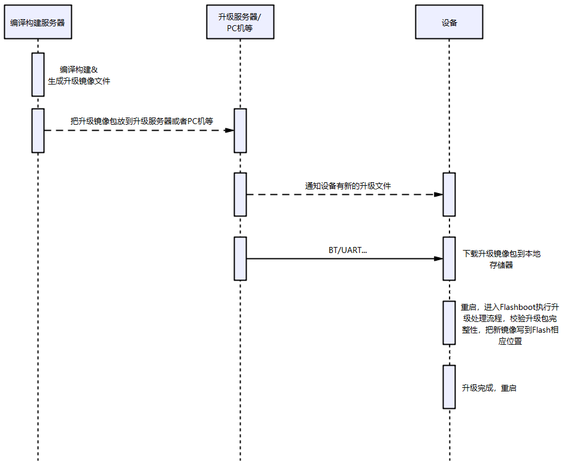

# Upgrade Package Creation<a name="ZH-CN_TOPIC_0000001851901485"></a>


## Flow Principle<a name="ZH-CN_TOPIC_0000001805112244"></a>

**Figure 1**  Upgrade Package Creation Flow<a name="fig47601738135110"></a>  
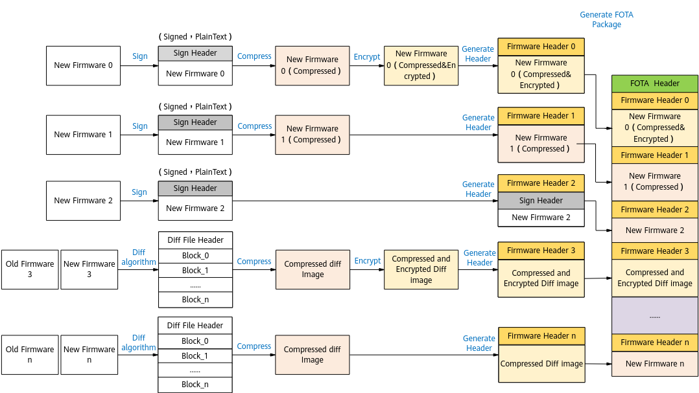

The upgrade package creation flow is shown in [Figure 1](#fig47601738135110). The specific operation steps are as follows:

1.  <a name="li8171529465"></a>Compile and generate a signed plaintext new image.
2.  <a name="li205945352468"></a>Process the new image. The processing methods include the following scenarios:
    -   Compress the new image to generate a compressed new image.
    -   Leave the new image unprocessed.

3.  <a name="li25431424820"></a>Add an upgrade image header to the image generated in [Step 2](#li205945352468).
4.  Perform [Step 1](#li8171529465) to [Step 3](#li25431424820) on all images to be upgraded according to the selected processing methods.
5.  <a name="li783094165412"></a>Merge all generated upgrade image files with upgrade image headers into the final upgrade package, add an upgrade package header to the entire package, and perform digital signature.

> **Note:** 
>BS2X does not support secure upgrade. No digital signature is added in [Step 5](#li783094165412).

## Upgrade Package Format<a name="ZH-CN_TOPIC_0000001940964372"></a>

The upgrade package format is shown in [Figure 1](#fig9148219135615). It mainly consists of the upgrade key area, upgrade info area, image header area, and image area, with each area keeping 16-byte alignment. The corresponding structures can be found in include/middleware/utils/upg.h.

**Figure 1**  Upgrade Package Structure<a name="fig9148219135615"></a>  
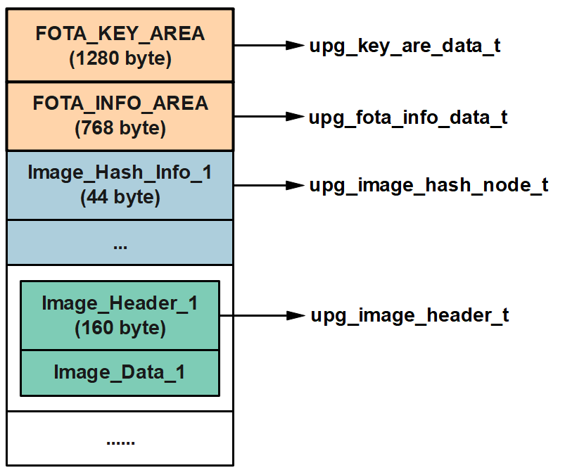

## Development Flow<a name="ZH-CN_TOPIC_0000001805272080"></a>

After all images are compiled, the upgrade package can be created by executing "build/config/target\_config/bs21/build\_bs21\_update.py". In the "build\_bs21\_update.py" file, configure the paths of each image and other parameters required by the scripts, and invoke the upgrade package creation script "build/script/build\_upg\_pkg.py". The paths configured in "build\_bs21\_update.py" can be modified according to the actual paths. The scripts and configuration files are described as follows:

-   When BS2X compiles and generates a new firmware, it automatically packages the generated firmware into an upgrade package. Users only need to select the firmware to be upgraded. Configure the file path of the firmware to be upgraded: build/config/target\_config/bs21/config.py. As shown in [Figure 1](#fig77657269522), select the firmware to be upgraded in the upg\_pkg option. The supported firmware for upgrade includes: flashboot and application.

    **Figure 1**  Adding an Upgrade Image to the Upgrade Package<a name="fig77657269522"></a>  
    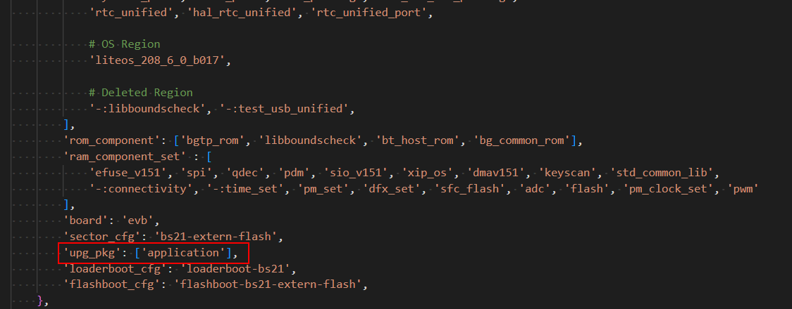

-   Upgrade package path: output/bs21/acore/bs21-sle-ble-central-peripheral/fota.fwpkg.
-   The upgrade package creation script is build/script/build\_upg\_pkg.py. The parameter descriptions of the upgrade package creation script are shown in [Table 1](#table2035291410209).
-   The configuration file is build/config/target\_config/bs21/fota/1M\_flash/fota.cfg (for the external flash version, build/config/target\_config/bs21/fota/extern\_flash/fota.cfg). The fields in the configuration file are described in [Table 2](#table4436131111208).
-   The upgrade image mode can be configured in the configuration file "fota.cfg". As shown by the upgrade image mode flag DecompressFlag in [Table 2](#table4436131111208), two upgrade modes are supported: compressed and full.
-   When generating the fota package, a version feature code is inserted based on the chip type and the feature code configured by the user. A consistency check is performed during the upgrade. The feature macro configuration is shown in the following figure. If the consistency check fails, the upgrade stops and the currently stored upgrade package is deleted.

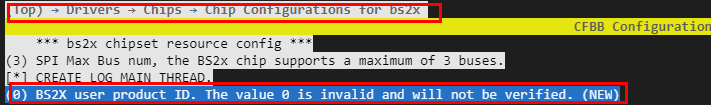

**Table 1**  Parameter Description of build\_upg\_pkg.py

<a name="table2035291410209"></a>
<table><thead align="left"><tr id="row143529145203"><th class="cellrowborder" valign="top" width="17.150000000000002%" id="mcps1.2.4.1.1"><p id="p735211142205"><a name="p735211142205"></a><a name="p735211142205"></a>Parameter</p>
</th>
<th class="cellrowborder" valign="top" width="18.310000000000002%" id="mcps1.2.4.1.2"><p id="p53521142204"><a name="p53521142204"></a><a name="p53521142204"></a>Parameter Value</p>
</th>
<th class="cellrowborder" valign="top" width="64.53999999999999%" id="mcps1.2.4.1.3"><p id="p163521314152015"><a name="p163521314152015"></a><a name="p163521314152015"></a>Description</p>
</th>
</tr>
</thead>
<tbody><tr id="row15352131452018"><td class="cellrowborder" valign="top" width="17.150000000000002%" headers="mcps1.2.4.1.1 "><p id="p15352131417205"><a name="p15352131417205"></a><a name="p15352131417205"></a>-app_name</p>
</td>
<td class="cellrowborder" valign="top" width="18.310000000000002%" headers="mcps1.2.4.1.2 "><p id="p173521914192019"><a name="p173521914192019"></a><a name="p173521914192019"></a>File name</p>
</td>
<td class="cellrowborder" valign="top" width="64.53999999999999%" headers="mcps1.2.4.1.3 "><p id="p133521414102013"><a name="p133521414102013"></a><a name="p133521414102013"></a>The file name of the generated upgrade package, and the name prefix of some intermediate files.</p>
</td>
</tr>
<tr id="row34091350135712"><td class="cellrowborder" valign="top" width="17.150000000000002%" headers="mcps1.2.4.1.1 "><p id="p2040905010579"><a name="p2040905010579"></a><a name="p2040905010579"></a>-upg_format_path</p>
</td>
<td class="cellrowborder" valign="top" width="18.310000000000002%" headers="mcps1.2.4.1.2 "><p id="p3409195055719"><a name="p3409195055719"></a><a name="p3409195055719"></a>Upgrade package structure configuration file</p>
</td>
<td class="cellrowborder" valign="top" width="64.53999999999999%" headers="mcps1.2.4.1.3 "><p id="p1040935075719"><a name="p1040935075719"></a><a name="p1040935075719"></a>The package header structure of the upgrade package, including the "fota_key_area" and "fota_info_area" parts.</p>
</td>
</tr>
<tr id="row13352514102019"><td class="cellrowborder" valign="top" width="17.150000000000002%" headers="mcps1.2.4.1.1 "><p id="p19352141472015"><a name="p19352141472015"></a><a name="p19352141472015"></a>-base</p>
</td>
<td class="cellrowborder" valign="top" width="18.310000000000002%" headers="mcps1.2.4.1.2 "><p id="p1435201418201"><a name="p1435201418201"></a><a name="p1435201418201"></a>Base configuration file path</p>
</td>
<td class="cellrowborder" valign="top" width="64.53999999999999%" headers="mcps1.2.4.1.3 "><p id="p935241418203"><a name="p935241418203"></a><a name="p935241418203"></a>Base configuration file path. See <a href="#table4436131111208">Table 2</a>.</p>
<p id="p10352161482010"><a name="p10352161482010"></a><a name="p10352161482010"></a>During the upgrade package creation process, an intermediate configuration file is generated based on this file, or the configuration values in this file are used directly.</p>
</td>
</tr>
<tr id="row1435261402012"><td class="cellrowborder" valign="top" width="17.150000000000002%" headers="mcps1.2.4.1.1 "><p id="p1835218142206"><a name="p1835218142206"></a><a name="p1835218142206"></a>-temp_dir</p>
</td>
<td class="cellrowborder" valign="top" width="18.310000000000002%" headers="mcps1.2.4.1.2 "><p id="p4352141422013"><a name="p4352141422013"></a><a name="p4352141422013"></a>Directory for storing temporary files</p>
</td>
<td class="cellrowborder" valign="top" width="64.53999999999999%" headers="mcps1.2.4.1.3 "><p id="p17352314132014"><a name="p17352314132014"></a><a name="p17352314132014"></a>The path for storing intermediate files.</p>
</td>
</tr>
<tr id="row1435217148209"><td class="cellrowborder" valign="top" width="17.150000000000002%" headers="mcps1.2.4.1.1 "><p id="p435281412203"><a name="p435281412203"></a><a name="p435281412203"></a>-new_images</p>
</td>
<td class="cellrowborder" valign="top" width="18.310000000000002%" headers="mcps1.2.4.1.2 "><p id="p18352181402016"><a name="p18352181402016"></a><a name="p18352181402016"></a>New image list</p>
</td>
<td class="cellrowborder" valign="top" width="64.53999999999999%" headers="mcps1.2.4.1.3 "><p id="p935311411201"><a name="p935311411201"></a><a name="p935311411201"></a>The path and type of the images to be upgraded. The format of each image is "image path:image type", and images are separated by "|". The image type corresponds one-to-one to the type of each image in the file specified by the base parameter.</p>
<p id="p183537147203"><a name="p183537147203"></a><a name="p183537147203"></a>List format example:</p>
<p id="p13537146201"><a name="p13537146201"></a><a name="p13537146201"></a>"image 1 path:image type 1|image 2 path:image type 2|...|image N path:image type N"</p>
</td>
</tr>
<tr id="row135341492013"><td class="cellrowborder" valign="top" width="17.150000000000002%" headers="mcps1.2.4.1.1 "><p id="p13353101482015"><a name="p13353101482015"></a><a name="p13353101482015"></a>-output_dir</p>
</td>
<td class="cellrowborder" valign="top" width="18.310000000000002%" headers="mcps1.2.4.1.2 "><p id="p1235351418207"><a name="p1235351418207"></a><a name="p1235351418207"></a>Directory for storing upgrade files</p>
</td>
<td class="cellrowborder" valign="top" width="64.53999999999999%" headers="mcps1.2.4.1.3 "><p id="p11353111416207"><a name="p11353111416207"></a><a name="p11353111416207"></a>If the paths of the upgrade image and signed image are not specified in the file specified by the base parameter, they are placed in this directory and named with "app_name" as the prefix.</p>
</td>
</tr>
</tbody>
</table>

**Table 2**  Main Content Description of fota.cfg

<a name="table4436131111208"></a>
<table><thead align="left"><tr id="row94334119200"><th class="cellrowborder" valign="top" width="23.352335233523352%" id="mcps1.2.4.1.1"><p id="p443331110204"><a name="p443331110204"></a><a name="p443331110204"></a>Label</p>
</th>
<th class="cellrowborder" valign="top" width="25.16251625162516%" id="mcps1.2.4.1.2"><p id="p174331411162013"><a name="p174331411162013"></a><a name="p174331411162013"></a>Attribute</p>
</th>
<th class="cellrowborder" valign="top" width="51.48514851485149%" id="mcps1.2.4.1.3"><p id="p943314117205"><a name="p943314117205"></a><a name="p943314117205"></a>Description</p>
</th>
</tr>
</thead>
<tbody><tr id="row34331511142017"><td class="cellrowborder" rowspan="6" valign="top" width="23.352335233523352%" headers="mcps1.2.4.1.1 "><p id="p1433111117204"><a name="p1433111117204"></a><a name="p1433111117204"></a>[SIGN_CFG]</p>
</td>
<td class="cellrowborder" valign="top" width="25.16251625162516%" headers="mcps1.2.4.1.2 "><p id="p1843331112202"><a name="p1843331112202"></a><a name="p1843331112202"></a>-</p>
</td>
<td class="cellrowborder" valign="top" width="51.48514851485149%" headers="mcps1.2.4.1.3 "><p id="p643321111203"><a name="p643321111203"></a><a name="p643321111203"></a>Signature-related attributes.</p>
</td>
</tr>
<tr id="row134341115204"><td class="cellrowborder" valign="top" headers="mcps1.2.4.1.1 "><p id="p2433811102017"><a name="p2433811102017"></a><a name="p2433811102017"></a>SignSuite</p>
</td>
<td class="cellrowborder" valign="top" headers="mcps1.2.4.1.2 "><p id="p043361152015"><a name="p043361152015"></a><a name="p043361152015"></a>Signature key type.</p>
<a name="ul1072114011138"></a><a name="ul1072114011138"></a><ul id="ul1072114011138"><li>30：RSA_4096</li><li>34：SHA256(RSA_4096)</li></ul>
</td>
</tr>
<tr id="row1843412110201"><td class="cellrowborder" valign="top" headers="mcps1.2.4.1.1 "><p id="p1394516578212"><a name="p1394516578212"></a><a name="p1394516578212"></a>UpgImagePath</p>
</td>
<td class="cellrowborder" valign="top" headers="mcps1.2.4.1.2 "><p id="p19434181117209"><a name="p19434181117209"></a><a name="p19434181117209"></a>The path and name of the upgrade package file.</p>
</td>
</tr>
<tr id="row843491119204"><td class="cellrowborder" valign="top" headers="mcps1.2.4.1.1 "><p id="p1255613792220"><a name="p1255613792220"></a><a name="p1255613792220"></a>UpgSignedImagePath</p>
</td>
<td class="cellrowborder" valign="top" headers="mcps1.2.4.1.2 "><p id="p5434141192011"><a name="p5434141192011"></a><a name="p5434141192011"></a>The path and name of the signed upgrade package.</p>
</td>
</tr>
<tr id="row17434181132012"><td class="cellrowborder" valign="top" headers="mcps1.2.4.1.1 "><p id="p15434121192020"><a name="p15434121192020"></a><a name="p15434121192020"></a>RootKeyFile</p>
</td>
<td class="cellrowborder" valign="top" headers="mcps1.2.4.1.2 "><p id="p1843415116207"><a name="p1843415116207"></a><a name="p1843415116207"></a>The path of the root key file.</p>
</td>
</tr>
<tr id="row6434611112013"><td class="cellrowborder" valign="top" headers="mcps1.2.4.1.1 "><p id="p843415117201"><a name="p843415117201"></a><a name="p843415117201"></a>SubKeyFile</p>
</td>
<td class="cellrowborder" valign="top" headers="mcps1.2.4.1.2 "><p id="p9434151152019"><a name="p9434151152019"></a><a name="p9434151152019"></a>The path of the secondary key file.</p>
</td>
</tr>
<tr id="row134343117207"><td class="cellrowborder" rowspan="3" valign="top" width="23.352335233523352%" headers="mcps1.2.4.1.1 "><p id="p2434311202014"><a name="p2434311202014"></a><a name="p2434311202014"></a>[TOOLS]</p>
</td>
<td class="cellrowborder" valign="top" width="25.16251625162516%" headers="mcps1.2.4.1.2 "><p id="p164344110200"><a name="p164344110200"></a><a name="p164344110200"></a>-</p>
</td>
<td class="cellrowborder" valign="top" width="51.48514851485149%" headers="mcps1.2.4.1.3 "><p id="p1543471111209"><a name="p1543471111209"></a><a name="p1543471111209"></a>Creation tool configuration attributes.</p>
</td>
</tr>
<tr id="row12434191172013"><td class="cellrowborder" valign="top" headers="mcps1.2.4.1.1 "><p id="p34341911162015"><a name="p34341911162015"></a><a name="p34341911162015"></a>UpgToolPath</p>
</td>
<td class="cellrowborder" valign="top" headers="mcps1.2.4.1.2 "><p id="p4434411132010"><a name="p4434411132010"></a><a name="p4434411132010"></a>The path and name of the upgrade tool (the upgrade tool can be used to create differential files and signature files).</p>
</td>
</tr>
<tr id="row14344111208"><td class="cellrowborder" valign="top" headers="mcps1.2.4.1.1 "><p id="p343411116201"><a name="p343411116201"></a><a name="p343411116201"></a>LzmaToolPath</p>
</td>
<td class="cellrowborder" valign="top" headers="mcps1.2.4.1.2 "><p id="p343419115205"><a name="p343419115205"></a><a name="p343419115205"></a>The path and name of the compression tool.</p>
</td>
</tr>
<tr id="row243451115201"><td class="cellrowborder" rowspan="7" valign="top" width="23.352335233523352%" headers="mcps1.2.4.1.1 "><p id="p1843451112018"><a name="p1843451112018"></a><a name="p1843451112018"></a>[FOTA_KEY_AREA]</p>
</td>
<td class="cellrowborder" valign="top" width="25.16251625162516%" headers="mcps1.2.4.1.2 "><p id="p1643471110203"><a name="p1643471110203"></a><a name="p1643471110203"></a>-</p>
</td>
<td class="cellrowborder" valign="top" width="51.48514851485149%" headers="mcps1.2.4.1.3 "><p id="p13434911142016"><a name="p13434911142016"></a><a name="p13434911142016"></a>Upgrade package key area attributes.</p>
</td>
</tr>
<tr id="row2434171172018"><td class="cellrowborder" valign="top" headers="mcps1.2.4.1.1 "><p id="p9434201152020"><a name="p9434201152020"></a><a name="p9434201152020"></a>ImageId</p>
</td>
<td class="cellrowborder" valign="top" headers="mcps1.2.4.1.2 "><p id="p114349117208"><a name="p114349117208"></a><a name="p114349117208"></a>The image ID of the upgrade package key area, fixed at 0xCB8D154E.</p>
</td>
</tr>
<tr id="row114351411182013"><td class="cellrowborder" valign="top" headers="mcps1.2.4.1.1 "><p id="p124343115208"><a name="p124343115208"></a><a name="p124343115208"></a>KeyAlg</p>
</td>
<td class="cellrowborder" valign="top" headers="mcps1.2.4.1.2 "><p id="p3434511142018"><a name="p3434511142018"></a><a name="p3434511142018"></a>The key algorithm type of the upgrade package key area.</p>
<a name="ul114351711202019"></a><a name="ul114351711202019"></a><ul id="ul114351711202019"><li>0x2A13C845：RSA4096+SHA256</li><li>0x2A13C867：SHA256(RSA4096 Format)</li><li>Other values: invalid.</li></ul>
</td>
</tr>
<tr id="row164358115205"><td class="cellrowborder" valign="top" headers="mcps1.2.4.1.1 "><p id="p15435161110203"><a name="p15435161110203"></a><a name="p15435161110203"></a>KeyVersion</p>
</td>
<td class="cellrowborder" valign="top" headers="mcps1.2.4.1.2 "><p id="p164352115201"><a name="p164352115201"></a><a name="p164352115201"></a>The version number of the upgrade package key area.</p>
</td>
</tr>
<tr id="row7435411102015"><td class="cellrowborder" valign="top" headers="mcps1.2.4.1.1 "><p id="p1543511112206"><a name="p1543511112206"></a><a name="p1543511112206"></a>KeyVersionMask</p>
</td>
<td class="cellrowborder" valign="top" headers="mcps1.2.4.1.2 "><p id="p643517110206"><a name="p643517110206"></a><a name="p643517110206"></a>The version number mask of the upgrade package key area.</p>
</td>
</tr>
<tr id="row14308115819439"><td class="cellrowborder" valign="top" headers="mcps1.2.4.1.1 "><p id="p9308195819435"><a name="p9308195819435"></a><a name="p9308195819435"></a>Msid</p>
</td>
<td class="cellrowborder" valign="top" headers="mcps1.2.4.1.2 "><p id="p230855884314"><a name="p230855884314"></a><a name="p230855884314"></a>Market segment ID.</p>
</td>
</tr>
<tr id="row16820174184419"><td class="cellrowborder" valign="top" headers="mcps1.2.4.1.1 "><p id="p128208404411"><a name="p128208404411"></a><a name="p128208404411"></a>MsidMask</p>
</td>
<td class="cellrowborder" valign="top" headers="mcps1.2.4.1.2 "><p id="p1782017464415"><a name="p1782017464415"></a><a name="p1782017464415"></a>Market segment ID mask.</p>
</td>
</tr>
<tr id="row243581132019"><td class="cellrowborder" rowspan="5" valign="top" width="23.352335233523352%" headers="mcps1.2.4.1.1 "><p id="p16435131152015"><a name="p16435131152015"></a><a name="p16435131152015"></a>[FOTA_INFO_AREA]</p>
</td>
<td class="cellrowborder" valign="top" width="25.16251625162516%" headers="mcps1.2.4.1.2 "><p id="p13435201152011"><a name="p13435201152011"></a><a name="p13435201152011"></a>-</p>
</td>
<td class="cellrowborder" valign="top" width="51.48514851485149%" headers="mcps1.2.4.1.3 "><p id="p14351113205"><a name="p14351113205"></a><a name="p14351113205"></a>Upgrade package INFO area attributes.</p>
</td>
</tr>
<tr id="row14351011192019"><td class="cellrowborder" valign="top" headers="mcps1.2.4.1.1 "><p id="p543561112012"><a name="p543561112012"></a><a name="p543561112012"></a>ImageId</p>
</td>
<td class="cellrowborder" valign="top" headers="mcps1.2.4.1.2 "><p id="p943515113207"><a name="p943515113207"></a><a name="p943515113207"></a>The image ID of the upgrade package INFO area, fixed at 0xCB8D154E.</p>
</td>
</tr>
<tr id="row184351711192013"><td class="cellrowborder" valign="top" headers="mcps1.2.4.1.1 "><p id="p1443561113205"><a name="p1443561113205"></a><a name="p1443561113205"></a>HardwareID</p>
</td>
<td class="cellrowborder" valign="top" headers="mcps1.2.4.1.2 "><p id="p2435121110206"><a name="p2435121110206"></a><a name="p2435121110206"></a>Hardware version number.</p>
</td>
</tr>
<tr id="row2043515114201"><td class="cellrowborder" valign="top" headers="mcps1.2.4.1.1 "><p id="p104350112209"><a name="p104350112209"></a><a name="p104350112209"></a>Msid</p>
</td>
<td class="cellrowborder" valign="top" headers="mcps1.2.4.1.2 "><p id="p443517114208"><a name="p443517114208"></a><a name="p443517114208"></a>Market segment ID.</p>
</td>
</tr>
<tr id="row184351911192010"><td class="cellrowborder" valign="top" headers="mcps1.2.4.1.1 "><p id="p443571102015"><a name="p443571102015"></a><a name="p443571102015"></a>MsidMask</p>
</td>
<td class="cellrowborder" valign="top" headers="mcps1.2.4.1.2 "><p id="p16435191182017"><a name="p16435191182017"></a><a name="p16435191182017"></a>Market segment ID mask.</p>
</td>
</tr>
<tr id="row14351411112018"><td class="cellrowborder" rowspan="5" valign="top" width="23.352335233523352%" headers="mcps1.2.4.1.1 "><p id="p144351411172010"><a name="p144351411172010"></a><a name="p144351411172010"></a>[flashboot/application]</p>
</td>
<td class="cellrowborder" valign="top" width="25.16251625162516%" headers="mcps1.2.4.1.2 "><p id="p144351119206"><a name="p144351119206"></a><a name="p144351119206"></a>-</p>
</td>
<td class="cellrowborder" valign="top" width="51.48514851485149%" headers="mcps1.2.4.1.3 "><p id="p114351411142020"><a name="p114351411142020"></a><a name="p114351411142020"></a>Image type name.</p>
</td>
</tr>
<tr id="row0435101162016"><td class="cellrowborder" valign="top" headers="mcps1.2.4.1.1 "><p id="p54351211122019"><a name="p54351211122019"></a><a name="p54351211122019"></a>HeaderMagic</p>
</td>
<td class="cellrowborder" valign="top" headers="mcps1.2.4.1.2 "><p id="p743581172016"><a name="p743581172016"></a><a name="p743581172016"></a>The magic word of the header structure, fixed at 0x464F5451.</p>
</td>
</tr>
<tr id="row943571182018"><td class="cellrowborder" valign="top" headers="mcps1.2.4.1.1 "><p id="p04351011112012"><a name="p04351011112012"></a><a name="p04351011112012"></a>ImageId</p>
</td>
<td class="cellrowborder" valign="top" headers="mcps1.2.4.1.2 "><p id="p1043517113206"><a name="p1043517113206"></a><a name="p1043517113206"></a>The upgrade image ID, which is the same as the ImageId of the original image. For the image ID, see middleware/chips/bs2x/update/include/upg_definitions_porting.h.</p>
</td>
</tr>
<tr id="row164364117208"><td class="cellrowborder" valign="top" headers="mcps1.2.4.1.1 "><p id="p144351911172015"><a name="p144351911172015"></a><a name="p144351911172015"></a>DecompressFlag</p>
</td>
<td class="cellrowborder" valign="top" headers="mcps1.2.4.1.2 "><p id="p12435151117203"><a name="p12435151117203"></a><a name="p12435151117203"></a>Upgrade image mode flag.</p>
<a name="ul1436711112015"></a><a name="ul1436711112015"></a><ul id="ul1436711112015"><li>0x3C7896E1: compressed.</li><li>Others: the original image is not processed.</li></ul>
</td>
</tr>
<tr id="row843651132015"><td class="cellrowborder" valign="top" headers="mcps1.2.4.1.1 "><p id="p1743661119202"><a name="p1743661119202"></a><a name="p1743661119202"></a>ReRncFlag</p>
</td>
<td class="cellrowborder" valign="top" headers="mcps1.2.4.1.2 "><p id="p194361114207"><a name="p194361114207"></a><a name="p194361114207"></a>Upgrade image encryption flag.</p>
<a name="ul1743611111208"></a><a name="ul1743611111208"></a><ul id="ul1743611111208"><li>0x3C7896E1: encrypted.</li><li>Others: not encrypted.</li></ul>
</td>
</tr>
</tbody>
</table>

> **Note:** 
>1.  The external flash version supports only full upgrade, while the internal flash version supports full upgrade and compressed upgrade.
>2.  For the maximum size of the upgrade package, see the fota\_data (0x26) area in the partition table configuration file in "[Flash Partition](Flash分区.md)". Its size minus the 4K upgrade flag area is the maximum size of the upgrade package.
>3.  The upgrade package configuration file fota.cfg configures the fields to be verified during the upgrade process. If users need to add fields to the upgrade package, secondary development of build\_upg\_pkg.py is required. For the upgrade package structure and fields, see "[Upgrade Package Format](升级包格式.md)" and include/middleware/utils/upg.h.

# Upgrade Package Transmission<a name="ZH-CN_TOPIC_0000001805270688"></a>

The transmission of the upgrade package is implemented by the application program and can use multiple methods, including Bluetooth, NearLink, USB, and UART. The following describes the basic flow of each transmission method and the usage of related tools.


## BLE Transmission<a name="ZH-CN_TOPIC_0000001852130093"></a>

The BLE end-to-end upgrade interaction flow of BS2X is shown in [Figure 1](#fig209801945145517). To enable BLE OTA upgrade on the Server side, the BLE OTA channel needs to be registered first, as shown in [Figure 2](#fig5764163615120), and then the BLE OTA service needs to be registered, as shown in [Figure 3](#fig165212612217). You can refer to the BLE UART Sample, with the code path application/samples/products/ble\_uart.

**Figure 1**  Upgrade Flow<a name="fig209801945145517"></a>  
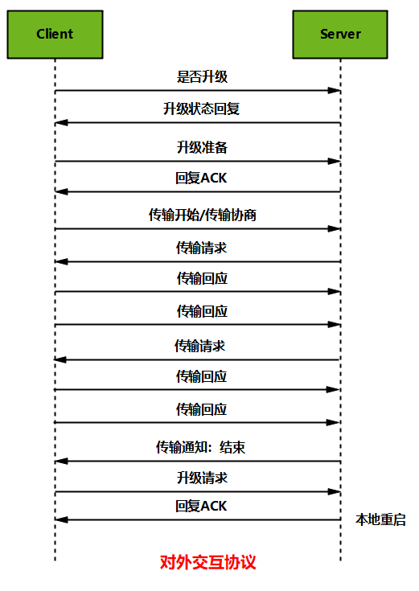

**Figure 2**  Registering the BLE OTA Channel<a name="fig5764163615120"></a>  
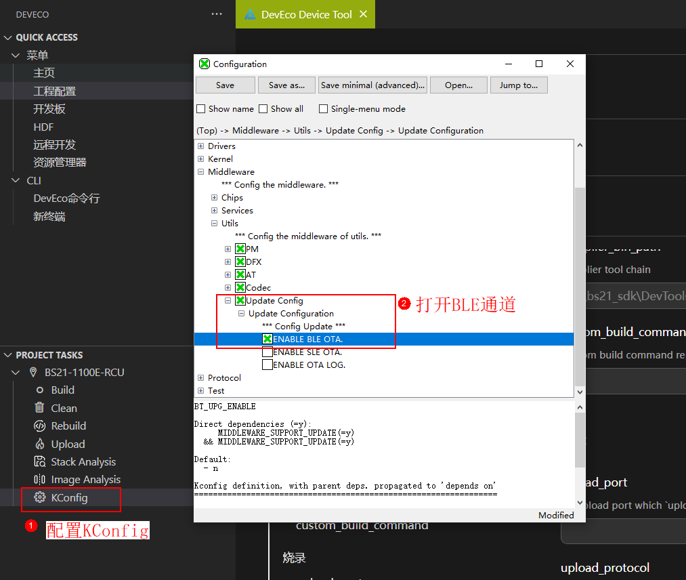

**Figure 3**  Registering the BLE OTA Service<a name="fig165212612217"></a>  
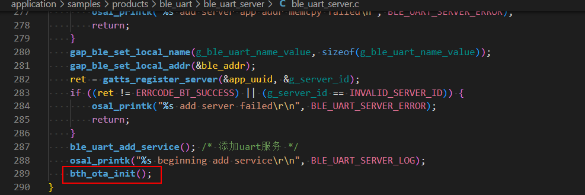

Use the DebugKits tool to transmit the upgrade package to the single board over Bluetooth. The operation flow is as follows.

1.  Scan for devices, as shown in [Figure 4](#fig115471151202620).

    **Figure 4**  Scanning for Devices<a name="fig115471151202620"></a>  
    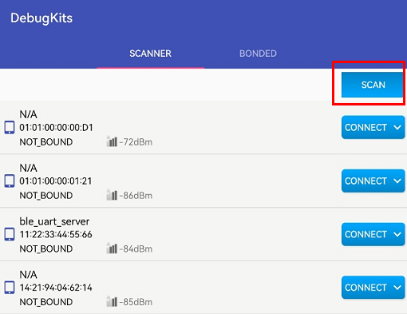

2.  Select the target device to connect to, as shown in [Figure 5](#fig025433292712).

    **Figure 5**  Selecting the Target Device<a name="fig025433292712"></a>  
    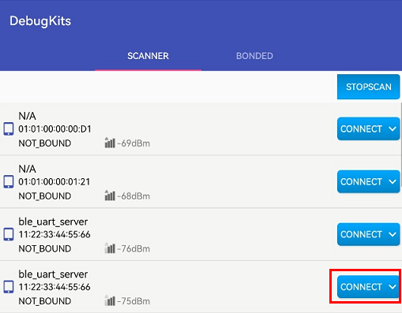

3.  Select bind pairing, as shown in [Figure 6](#fig1727451573410).

    **Figure 6**  Binding<a name="fig1727451573410"></a>  
    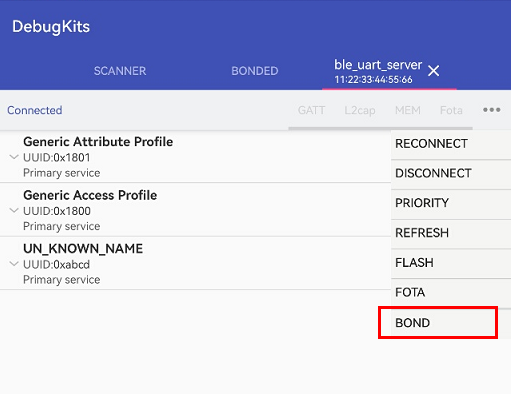

4.  Enter the OTA upgrade screen, as shown in [Figure 7](#fig341511309368), select the upgrade package, select the single-packet data length of 128 bytes, and click START.

    **Figure 7**  BLE OTA Upgrade Screen<a name="fig341511309368"></a>  
    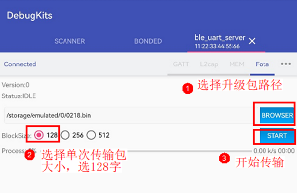

## NearLink Transmission<a name="ZH-CN_TOPIC_0000001805211364"></a>

The NearLink end-to-end upgrade interaction flow is the same as that of BLE transmission.

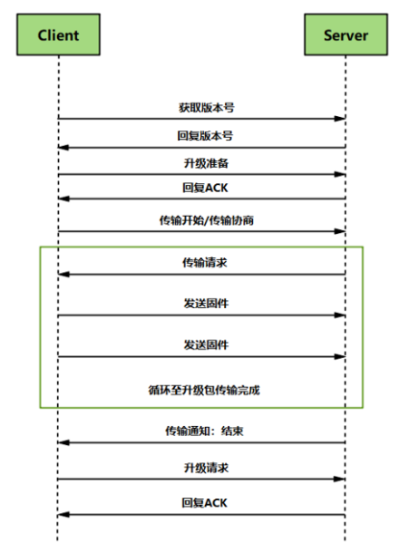

1.  Register the NearLink OTA channel, as shown in [Figure 1](#fig366716102117).
2.  Register the NearLink OTA service, as shown in [Figure 2](#fig129151340121115).
3.  Register the NearLink OTA hook, as shown in [Figure: Registering the OTA Hook Function](#fig893135119203).

    For details, refer to the RCU Sample, with the code path application/samples/products/rcu.

**Figure 1**  Registering the NearLink OTA Channel<a name="fig366716102117"></a>  
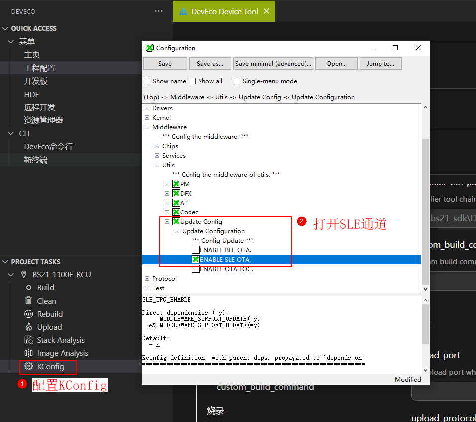

**Figure 2**  Registering the NearLink OTA Service<a name="fig129151340121115"></a>  
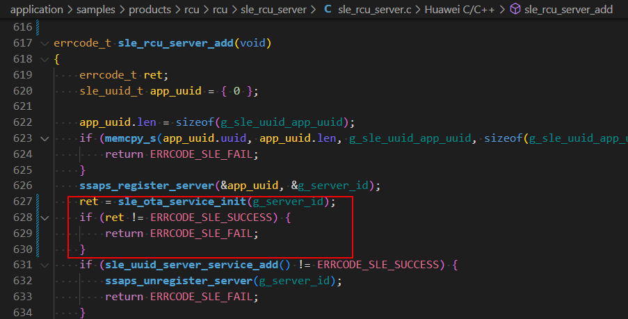

**Figure 3**  Registering the OTA Hook Function<a name="fig893135119203"></a>  
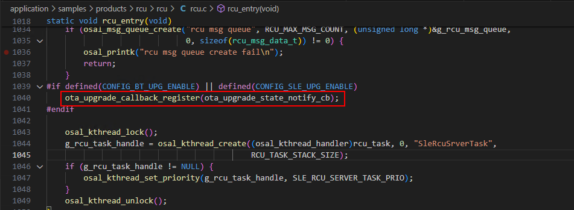

The specific operation flow of the NearLink upgrade tool is as follows. Note: Tool name: SleOta\_时间.apk

1.  Click SCAN to start scanning devices.

    **Figure 4**  Scanning for Devices<a name="fig748016464426"></a>  
    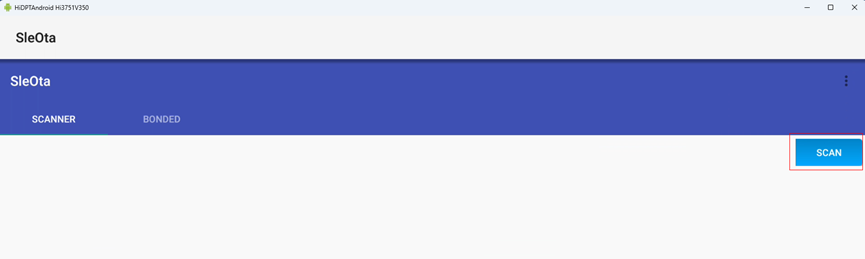

2.  Click STOPSCAN to stop scanning devices.

    **Figure 5**  Stopping the Scan<a name="fig16178235165514"></a>  
    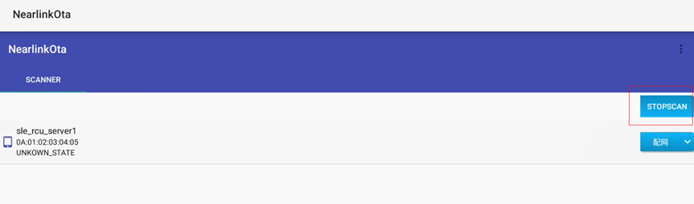

3.  Click Network Configuration to enter the upgrade screen of the device.

    **Figure 6**  Clicking Network Configuration<a name="fig182662419476"></a>  
    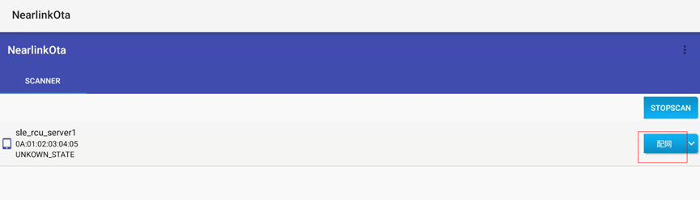

4.  Upgrade screen: If the device status is connected, it means the device is connected. If it is disconnected, it means the device is not connected.

    **Figure 7**  SLE OTA Upgrade Screen<a name="fig680385216497"></a>  
    
    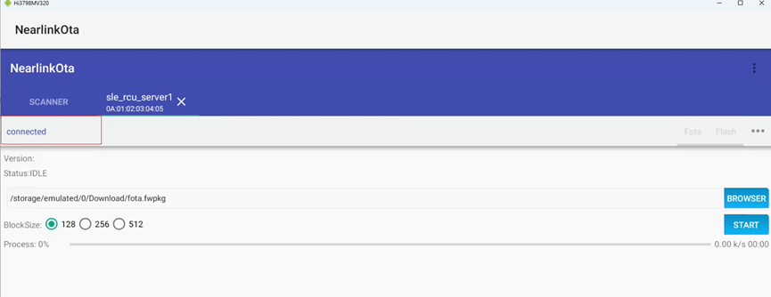

5.  Click BROWSER to select the upgrade file. If the connection status is disconnected, the file cannot be selected. During testing, the file is generally placed in the sdcard/Download directory (for reference only).

    **Figure 8**  Selecting a File<a name="fig278874510181"></a>  
    
    

6.  After selecting the upgrade file, click START to start the upgrade. After the upgrade starts successfully, the progress bar will advance.

    **Figure 9**  Starting the Upgrade<a name="fig671663517191"></a>  
    
    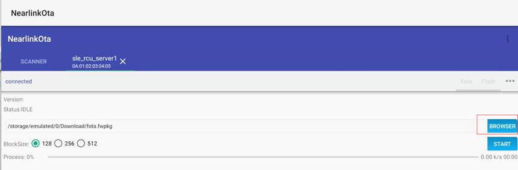

> **Note:** 
>1.  If pairing fails, you can turn the NearLink switch off and on again and restart the APK to pair.
>2.  After entering the OTA upgrade screen, check whether the device connection status is connected. If the permission screen pops up after selecting the bin file, you need to manually allow the APK to access all files.

## NearLink Dongle Transmission<a name="ZH-CN_TOPIC_0000001852626669"></a>

The NearLink protocol requires both the slave side and the host side to be equipped with NearLink chips for interaction. Since most products on the market use host-side main SoCs that do not support the NearLink function when the chips are sold overseas, a Dongle with a built-in NearLink chip is added on the host side to enable NearLink interaction with the slave side. The implementation flow is shown in [Figure 1](#fig3901191442020). For details, refer to the SLE OTA Dongle Sample, with the path application/samples/products/sle\_ota\_dongle. For the interaction protocol between the Dongle and the slave, refer to the document "BS2XV100 NearLink Application Layer SLE-Link Protocol".

**Figure 1**  SLE Dongle Transmission Flow<a name="fig3901191442020"></a>  
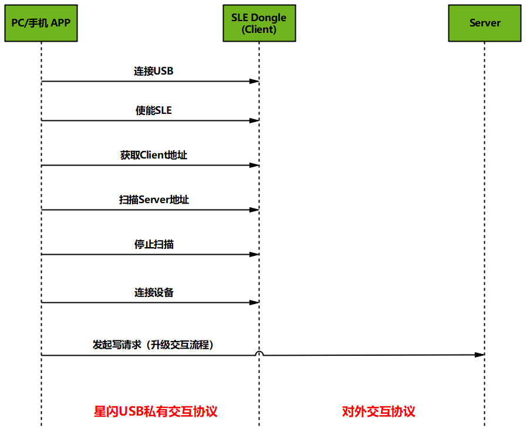

The NearLink Dongle tool is available in Android and Windows versions. The Android tool is Debugkits. The operation flow is as follows.

1.  Set the SLE address of the peer target device, as shown in [Figure 2](#fig1418111449257).

    **Figure 2**  Setting the Peer Address<a name="fig1418111449257"></a>  
    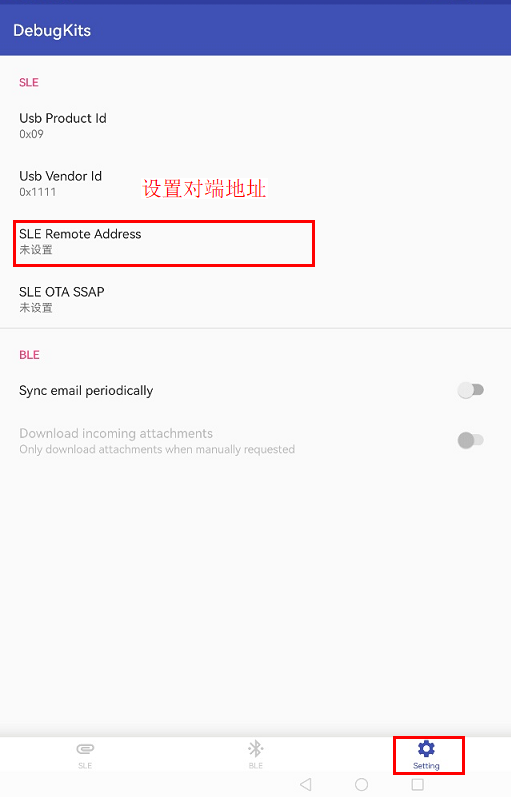

2.  Click the CONNUSB button to establish a connection with the Dongle USB, as shown in [Figure 3](#fig4838181307).

    **Figure 3**  Connecting USB<a name="fig4838181307"></a>  
    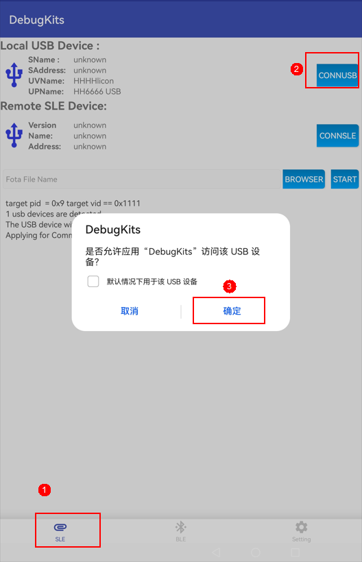

3.  Click the CONNUSB button again to enable SLE and obtain the Client address. Then click the CONNSLE button to scan and connect to the target device, as shown in [Figure 4](#fig12866171923810). If the target device address and version number (0) are displayed, the connection is successful.

    **Figure 4**  Connecting to the Target Device<a name="fig12866171923810"></a>  
    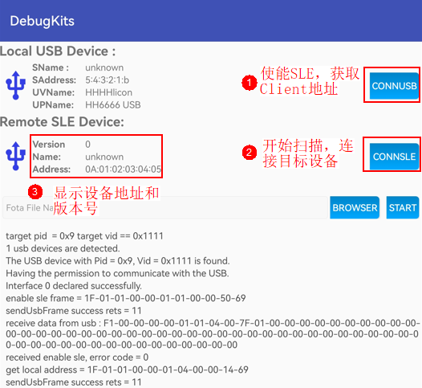

4.  Select the upgrade package path and start transmission, as shown in [Figure 5](#fig1933412570491)

    **Figure 5**  Transmitting the Upgrade Package<a name="fig1933412570491"></a>  
    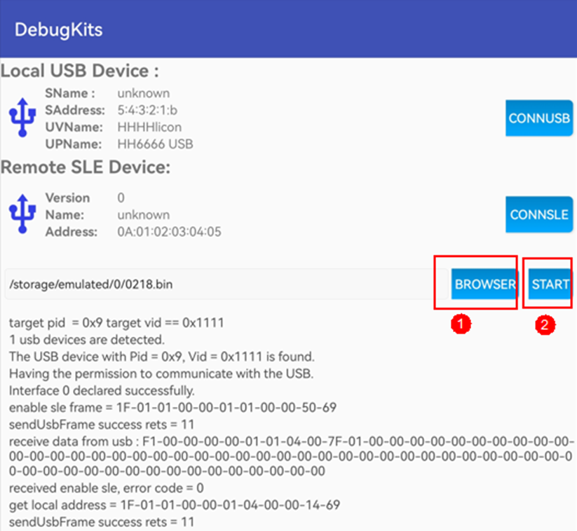

The Windows tool is the Burntool. In the Option option, select Change chip and choose the BS2X-SLE module. After entering the screen, the operation flow is as follows.

1.  Select the USB device, whose usage page is 0xffb2. As shown in [Figure 6](#fig17788525132220).

    **Figure 6**  Selecting a Device<a name="fig17788525132220"></a>  
    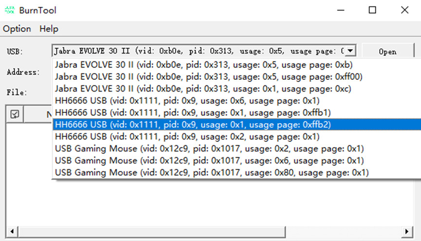

2.  Click Open to connect to the USB device. As shown in [Figure 7](#fig1544721015234).

    **Figure 7**  Connecting to a USB Device<a name="fig1544721015234"></a>  
    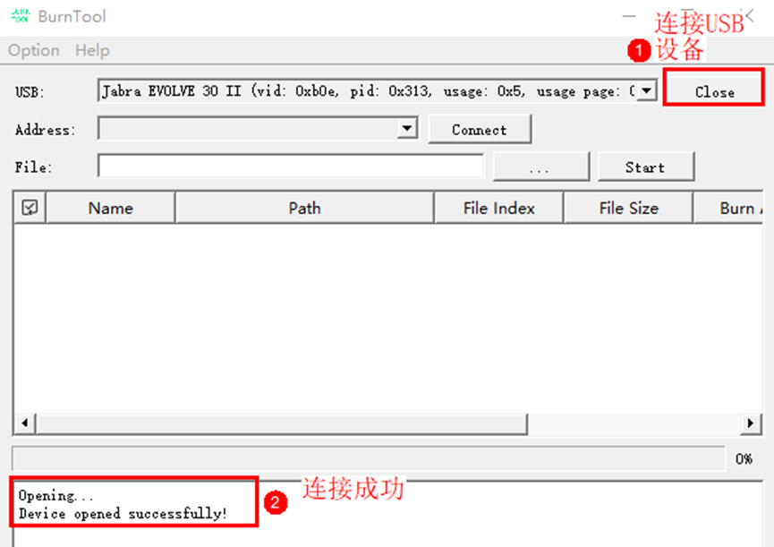

3.  After connecting to the USB device, the Address box displays the scanned device addresses. Select the peer device address. As shown in [Figure 8](#fig62256917243).

    **Figure 8**  Selecting the Peer Address<a name="fig62256917243"></a>  
    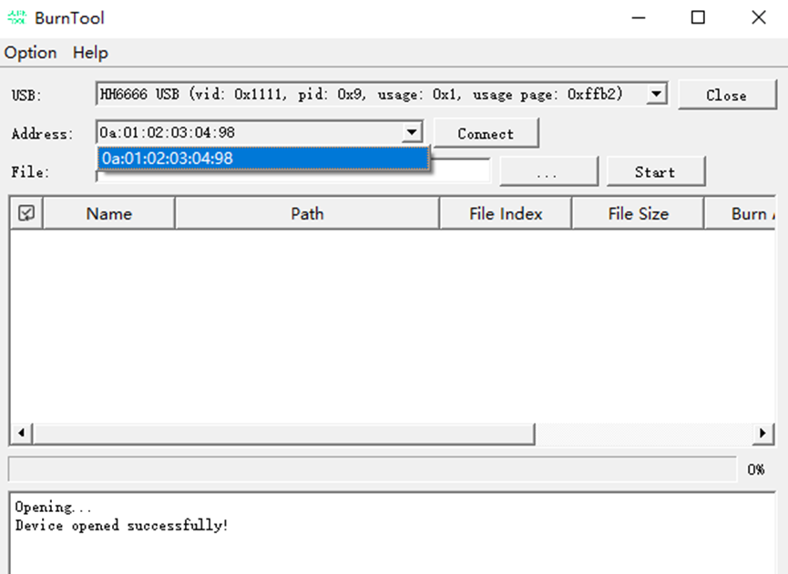

4.  Click Connect to connect to the target peer device. As shown in [Figure 9](#fig1236075011247).

    **Figure 9**  Connecting to a Device<a name="fig1236075011247"></a>  
    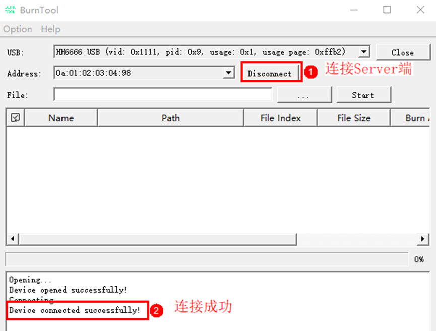

5.  Select the upgrade package path and click Start to start transmitting the upgrade package. As shown in [Figure 10](#fig125139221256).

    **Figure 10**  Clicking Start to Transmit<a name="fig125139221256"></a>  
    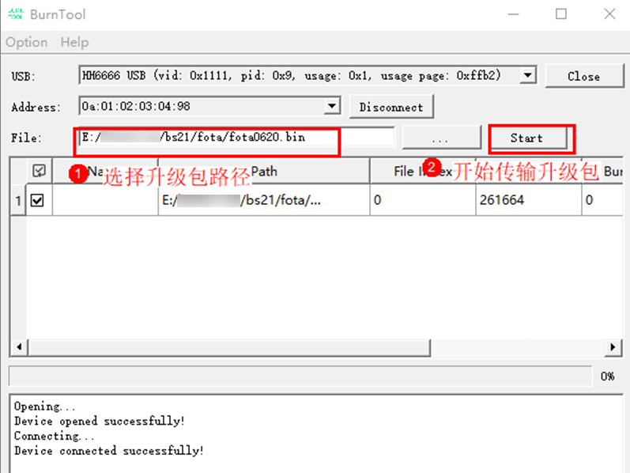

6.  Wait until the progress bar reaches 100%, and the transmission is complete. As shown in [Figure 11](#fig491435382519).

    **Figure 11**  Transmission Complete<a name="fig491435382519"></a>  
    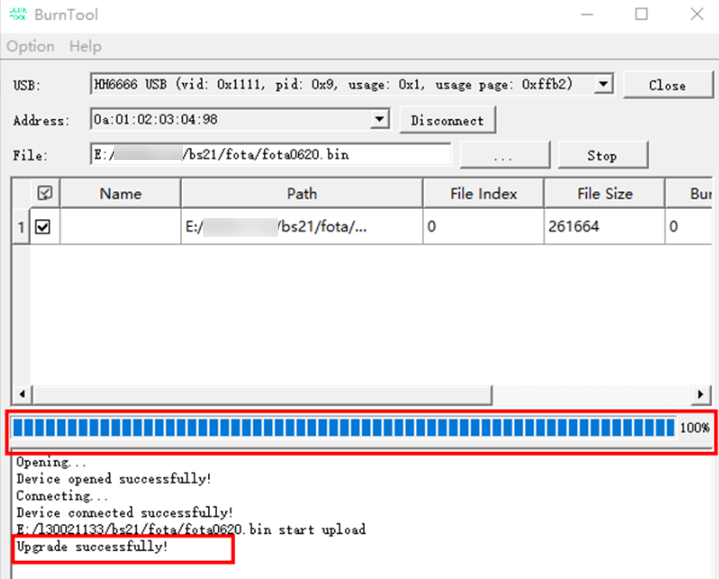

## DFU Upgrade<a name="ZH-CN_TOPIC_0000001852050149"></a>

The DFU upgrade interaction flow is shown in [Figure 1](#fig10847101116313). The first packet of upgrade transmission is the upgrade preparation flow. The tool sends one packet of data describing the upgrade package information, including the start mark, upgrade package address, upgrade package size, and so on. For details, see dfu\_packge\_header\_t, with the file path application/samples/products/sle\_mouse\_with\_dongle/mouse\_usb/usb\_dfu.c. After receiving the first packet, the Dongle side erases the fota area based on the file length. Starting from the second packet, the tool sends upgrade package data in packets of 4 KB each until the upgrade package data is fully transmitted. After the upgrade package transmission ends, the dongle side writes the upgrade flag and restarts locally.

**Figure 1**  DFU Upgrade Interaction Flow<a name="fig10847101116313"></a>  
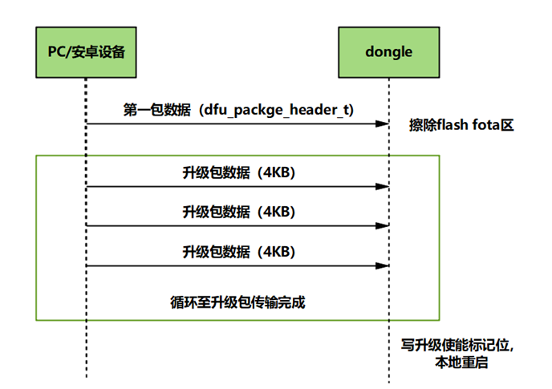

For the DFU-related code implementation, refer to the SLE Mouse Sample, with the code path application/samples/products/sle\_mouse\_with\_dongle. The operation flow of the tool is as follows.

1.  Open the program with administrator permissions (right-click the application and click Run as administrator, as shown in [Figure 2](#fig76119547597)).

    **Figure 2**  Burntool Running<a name="fig76119547597"></a>  
    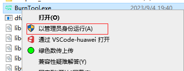

2.  In the option option of Burntool, select "BS2X-USB".
3.  In the USB area of the BurnTool screen, select the desired USB device. As shown in [Figure 3](#fig2014515319119).

    **Figure 3**  Burntool Screen Options<a name="fig2014515319119"></a>  
    

4.  In the BurnTool screen, click the "Select file" button, select the firmware package generated by the product compilation, and click "Open".
5.  In the table, select the file to be burned.
6.  Click the "Start burn" button (after clicking, "Start burn" changes to "Stop burn").
7.  Wait for the transmission to complete, and the burning ends. When the burning is complete, "All images burn successfully" is displayed. The effect after burning is shown in [Figure 4](#fig79226391163).

    **Figure 4**  DFU Burning Complete<a name="fig79226391163"></a>  
    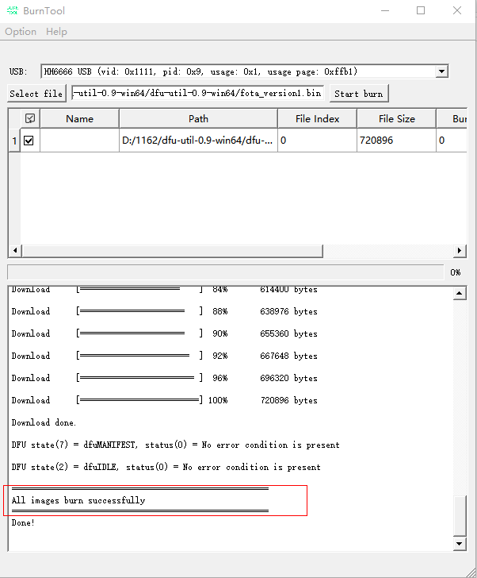

## UART Upgrade<a name="ZH-CN_TOPIC_0000001805371192"></a>

Production lines generally burn firmware to blank chips over UART. Usually, the production test version is burned before the commercial version for testing, calibration, and so on. To reduce the steps of burning the commercial version, the commercial firmware can be packaged as an upgrade package and burned to the chip Flash together with the production test firmware. After the production test is completed, write the upgrade flag and reset the chip to enter the Flashboot local upgrade flow, which upgrades the production test firmware to the commercial firmware. The UART transmission of the upgrade package is implemented by the Loaderboot program. The specific adaptation flow is as follows.


### Packaging the Production Test Firmware and Commercial Firmware<a name="ZH-CN_TOPIC_0000001852151117"></a>

Modify the packaging script of the production test firmware to package the upgrade package of the commercial firmware together with the production test firmware into one fwpkg. The production line only needs to burn this firmware during production. The packaging script path is tools/pkg/chip\_packet/bs2x/packet.py. The modification is shown in [Figure 1](#fig1233114218332). The upgrade package path in the figure should be modified according to the actual situation. This document only provides an example.

**Figure 1**  Adding the Upgrade Package to the Firmware to Be Burned<a name="fig1233114218332"></a>  
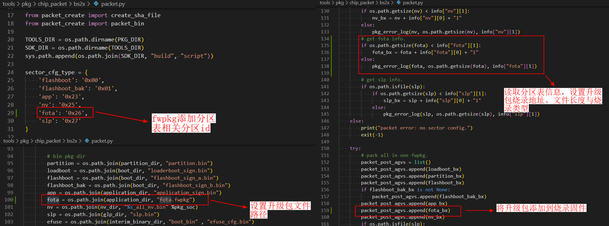

### Upgrading the Production Test Firmware to the Commercial Firmware<a name="ZH-CN_TOPIC_0000001852071177"></a>

After the production test is completed, the operation of writing the upgrade flag needs to be performed, and the local upgrade flow needs to be entered. The upgrade flag area is located in the last 4 KB space of the upgrade package area, with the format as follows. For the structure of the upgrade flag, see middleware/utils/update/inner\_include/upg\_definitions.h.

```
typedef struct fota_upgrade_flag_area {
    uint32_t head_magic;
    uint32_t head_before_offset;
    uint32_t package_length;
    uint32_t firmware_num;
    uint8_t  firmware_flag[UPG_FIRMWARE_MAX_NUM][UPG_FLAG_RETYR_TIMES];
    uint8_t  nv_flag[UPG_FLAG_RETYR_TIMES];
    uint8_t  ver_change_flag;
    uint32_t update_result;
    uint32_t nv_data_offset;
    uint32_t nv_data_len;
    uint32_t nv_hash_offset;
    uint32_t nv_hash_len;
    uint32_t complete_flag;
    uint32_t head_end_magic;
} fota_upgrade_flag_area_t;
```

The following is a code example for writing the enable flag, for reference:

```
    fota_upgrade_flag_area_t fota_flag;
    memset_s((uint8_t *)&fota_flag, sizeof(fota_upgrade_flag_area_t), 0xff, sizeof(fota_upgrade_flag_area_t));
    fota_flag.head_magic = 0x55aa55aa;
    fota_flag.head_before_offset = 0;
    fota_flag.package_length = fota_len;  // Upgrade package size
    fota_flag.firmware_num = fw_num;  // Number of firmware images in the upgrade package
    fota_flag.head_end_magic = 0xaa55aa55;
    partition_information_t info;
    uapi_partition_init();
    errcode_t ret_val = uapi_partition_get_info(PARTITION_FOTA_DATA, &info);
    uint32_t flag_address = info.part_info.addr_info.addr + info.part_info.addr_info.size - 0x1000;
    uint32_t status = (uint32_t)osal_irq_lock();
    uapi_sfc_reg_erase(flag_address, 0x1000);
    uapi_sfc_reg_write(flag_address, (uint8_t *)&fota_flag, sizeof(fota_upgrade_flag_area_t));
    // uapi_flash_block_erase(0, flag_address, 0x1000);    // External flash version
    // uapi_flash_write_data(0, flag_address, (uint8_t *)&fota_flag, sizeof(fota_upgrade_flag_area_t));    // External flash version
    osal_irq_restore(status);
    upg_reboot();  // Reset the single board
```

> **Note:** 
>In the preceding code, users need to adjust the variables fota\_len and fw\_num. fota\_len is the upgrade package size, and fw\_num is the number of firmware images in the upgrade package. For example, if the upgrade package contains only Application.bin, then fw\_num = 1.

## HID Upgrade<a name="ZH-CN_TOPIC_0000002096253060"></a>

Taking BS26 as an example, the SDK provides three flashboot images:

-   flashboot-bs26-n1200: Supports OTA upgrade. That is, after the OTA upgrade is complete, the FOTA area data is decompressed and copied to the APP main area.
-   flashboot-bs26-n1200-usb: Supports USB HID upgrade, but does not support the copy after OTA upgrade.
-   flashboot-bs26-n1200-usb-with-ota: Supports USB HID upgrade and the copy after OTA upgrade.

Therefore, if the flashboot needs to have the HID upgrade function, flashboot-bs26-n1200-usb or flashboot-bs26-n1200-usb-with-ota should be used. That is, configure 'flashboot\_cfg' to the required flashboot in the corresponding config.py.

The flashboot image with the USB HID upgrade function is larger, so attention is required when dividing partitions.

USB HID upgrade requires an additional 4 KB partition to be used as the upgrade flag determination, that is, the fota data with the partition ID of 0x26. Different from other OTA upgrade methods, HID upgrade only needs the last 4K of the fota data to store the upgrade flag information, while other OTA upgrade methods need to store the upgrade image in the fota area.

In addition, USB HID upgrade requires an additional ID 0x29 in the partition table to store the vid, pid, and io detection information.

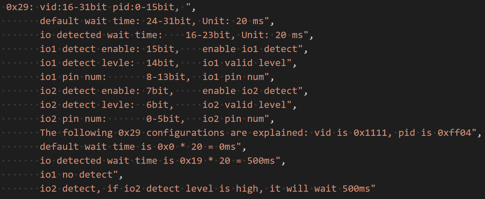

An example is as follows:

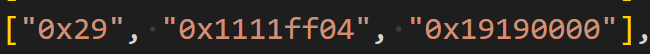

As shown in the following figure, after configuring the vid and pid, click Start burn, and then the download starts after plugging in/removing or restarting.

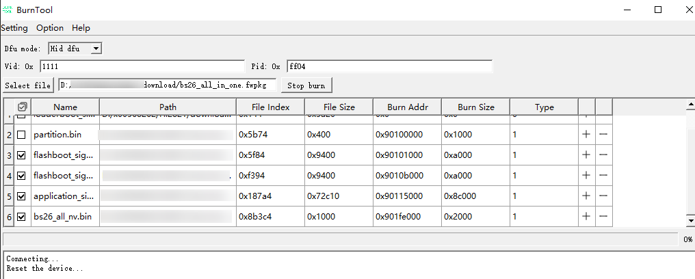

## Host-Controlled HID Upgrade<a name="ZH-CN_TOPIC_0000002174742721"></a>

HID upgrade initializes USB at power-on (plugging in/removing the USB) and waits for burntool to send the USB upgrade command, so the power-on time is increased. To reduce the power-on time, a flashboot version for host-controlled HID upgrade is added. Taking BS26 as an example:

flashboot-bs21e-1100e-usb-with-control and flashboot-bs21e-1100e-usb-with-ota-with-control.

When packaging the fwpkg, select the flashboot version with '-with-control'. By default, HID upgrade is not performed at power-on. The host needs to send commands to control bs2x to write the HID upgrade flag register and the software reset register. After the software reset, HID upgrade is performed.

1.  HID upgrade flag register: Write 0x5A to 0x5702C010.
2.  Software reset register: Write 0 to 0x57004600.

# Upgrade Package Storage<a name="ZH-CN_TOPIC_0000001805110840"></a>

In BS2X, the upgrade package is stored in Flash, including the internal Flash and the external Flash. Users can choose different solutions based on product requirements. The Flash memory distribution is as follows (internal Flash base address: 0x90100000).


## Flash Partition<a name="ZH-CN_TOPIC_0000001805718378"></a>

In BS2X, customers can divide Flash partitions as needed. Modify the corresponding partition in the sector\_cfg option of the version. The partition table path is build/config/target\_config/bs21/flash\_sector\_config. As shown in [Figure 1](#fig1811911550539).

**Figure 1**  Partition Table Configuration<a name="fig1811911550539"></a>  
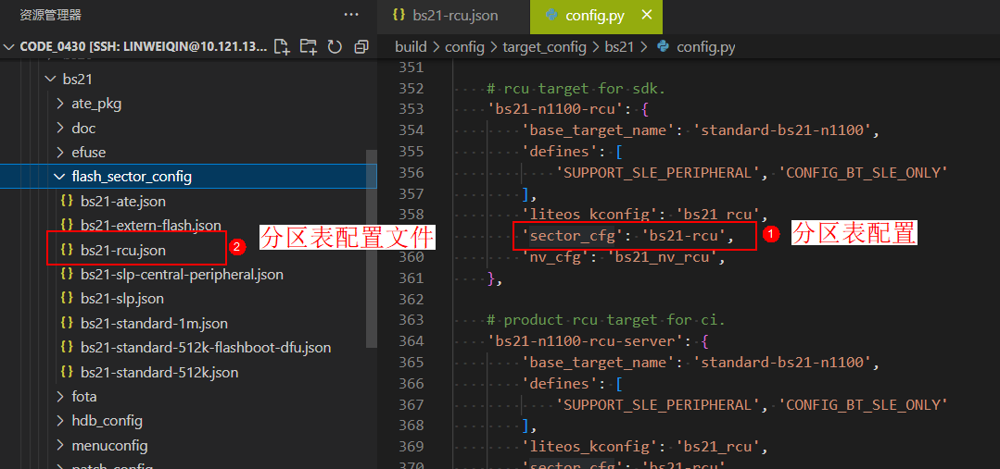

-   512 KB internal Flash partition, as shown in [Figure 2](#fig17849157161413). For specific configuration, see build/config/target\_config/bs21/flash\_sector\_config/bs21-standard-512k.json.

    **Figure 2**  512 KB Internal Flash Partition<a name="fig17849157161413"></a>  
    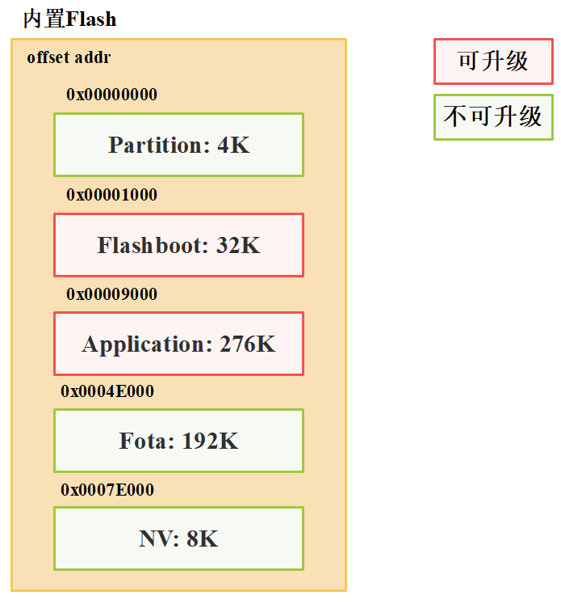

-   1M internal Flash partition, as shown in [Figure 3](#fig9266101461711). For specific configuration, see build/config/target\_config/bs21/flash\_sector\_config/bs21-standard-1m.json.

    **Figure 3**  1M Internal Flash Partition<a name="fig9266101461711"></a>  
    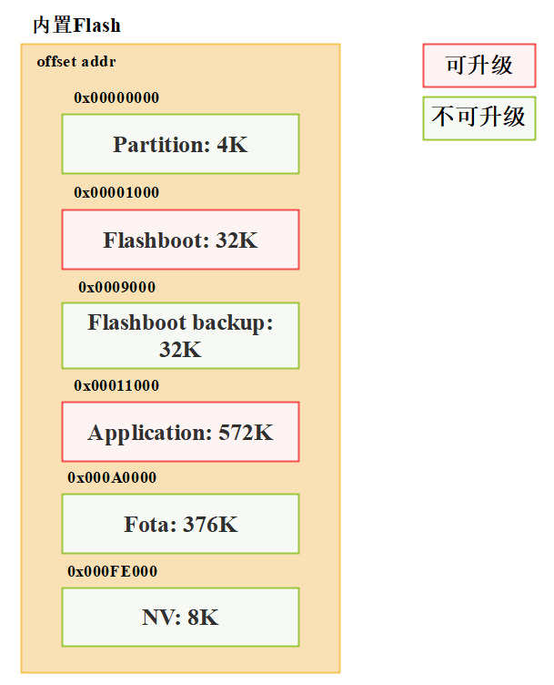

-   512K internal Flash plus external Flash (the external Flash size can be adjusted according to user requirements, and should not be smaller than 512K), as shown in [Figure 4](#fig161271414194). For specific configuration, see build/config/target\_config/bs21/flash\_sector\_config/bs21-extern-flash.json.

    **Figure 4**  512 KB Internal Flash and External Flash Partitions<a name="fig161271414194"></a>  
    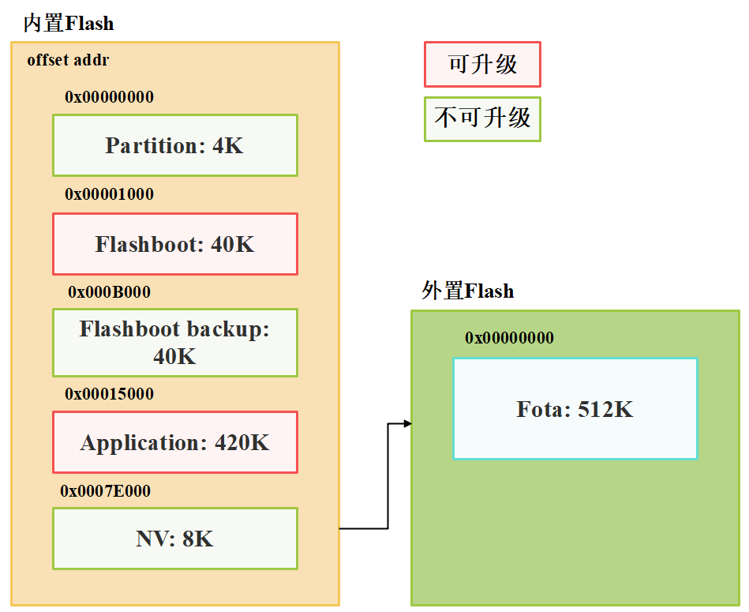

## External Flash Adaptation<a name="ZH-CN_TOPIC_0000001852477161"></a>

-   External Flash model selection

    For the external Flash models currently supported by BS2X, see include/driver/flash/flash\_common\_config.h, as shown in [Figure 1](#fig1979922617314). For Flash types not listed in other header files, users need to adapt them by themselves.

    **Figure 1**  External Flash Models Supported by the Flash Driver<a name="fig1979922617314"></a>  
    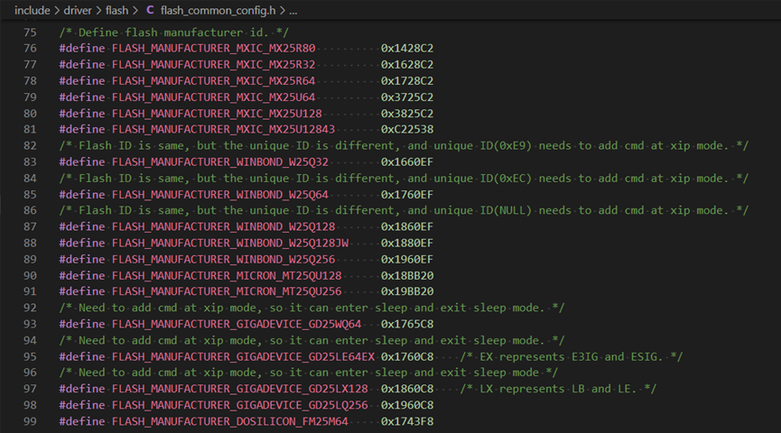

-   External Flash adaptation
    -   Flash initialization: refer to the ota\_extern\_flash\_init\(\) function in drivers/chips/bs2x/main\_init/main\_init.c. Users can modify the pin configuration of the flash\_porting\_pinmux\_cfg function as needed. As shown in [Figure 2](#fig98971054182219).
    -   Add the manufacturer id of the Flash to the driver. Taking GD25WD40 as an example, modify the file path include/driver/flash/flash\_common\_config.h. As shown in [Figure 3](#fig02552034132211).
    -   Modify the file path include/driver/flash/flash\_config\_info.h. As shown in [Figure 4](#fig18792111432217).

**Figure 2**  Flash Initialization<a name="fig98971054182219"></a>  
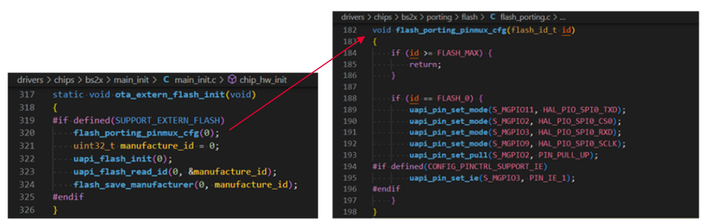

**Figure 3**  Adding the Manufacturer ID to the Flash Driver<a name="fig02552034132211"></a>  
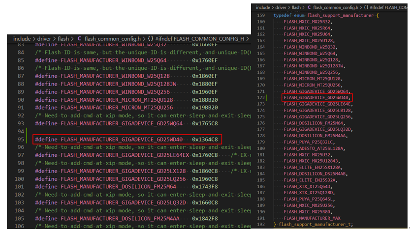

**Figure 4**  Modifying the Flash Driver info<a name="fig18792111432217"></a>  
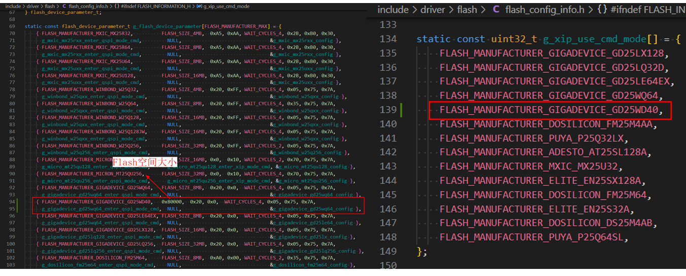

# Local Upgrade Using the Upgrade Package<a name="ZH-CN_TOPIC_0000001805091538"></a>

In BS2X, the local upgrade program mainly runs in the Flashboot program. The upgradeable images are Flashboot and Application.

When the Flashboot program upgrades the Flashboot itself, it copies the Flashboot to the Flashboot backup area to avoid abnormal power-off. After all images are updated, the single board automatically resets, and the Application image is entered after the reset.

# FAQ<a name="ZH-CN_TOPIC_0000001893361348"></a>

**Question 1: The mobile phone and the Server side are connected normally, but clicking Start cannot transmit.<a name="section1266514922617"></a>**

Troubleshooting ideas:

1.  You can first enable the Log switch of the OTA service, as shown in [Figure 1](#fig94541436565). Check whether the version has registered the OTA service and whether DFX has registered the OTA channel. For details, refer to "[BLE Transmission](BLE传输.md)" and "[NearLink Transmission](星闪传输.md)". For example, when DFX has not registered the OTA channel, the Client side (mobile phone APK or NearLink Dongle) fails to read the peer version number, as shown in [Figure 2](#fig187017175015). If the OTA service is not registered, the upgrade screen cannot be entered, as shown in [Figure 3](#fig163782447162).

    **Figure 1**  Enabling Server-Side OTA Logs<a name="fig94541436565"></a>  
    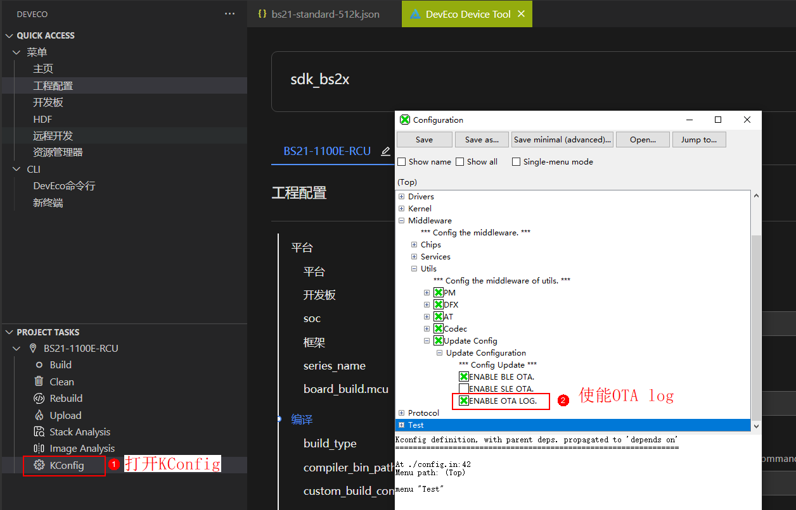

    **Figure 2**  OTA Version Number Reading Failure<a name="fig187017175015"></a>  
    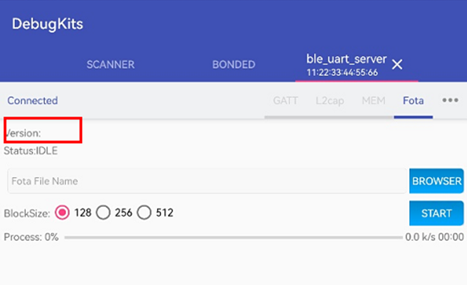

    **Figure 3**  APK Upgrade Screen Entry Failure<a name="fig163782447162"></a>  
    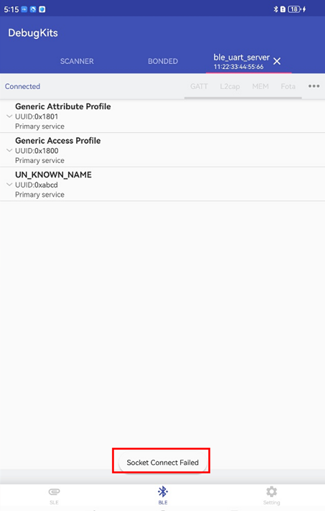

2.  The upgrade package is too large and exceeds the FOTA partition size. The log is shown in [Figure 4](#fig2071344413612).

    **Figure 4**  Upgrade Package Exceeding the FOTA Partition<a name="fig2071344413612"></a>  
    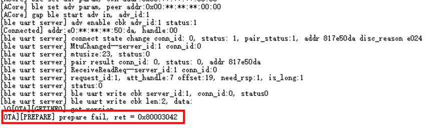

**Question 2: The progress bar is stuck during upgrade package transmission, or the transmission time exceeds 10 minutes<a name="section634173919267"></a>**

Troubleshooting ideas:

It may be that packet loss occurs during transmission, or the Client sends packets too slowly, causing the Server side to continuously send retransmission requests to the Client side. If it is a NearLink Dongle upgrade, check whether too many logs are added to the Dongle, which affects the transmission rate.

**Question 3: The Server side does not reset after the upgrade package transmission is complete<a name="section12846195192617"></a>**

Troubleshooting ideas:

The upgrade package format is incorrect. Check whether the upgrade package version is incorrect. The upgrade package version path is shown in [Figure 5](#fig9604195211819).

**Figure 5**  Reset Failure after Server-Side Transmission<a name="fig9604195211819"></a>  
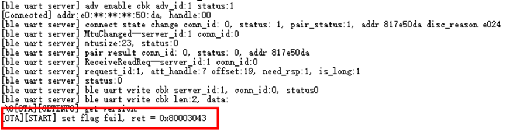

**Question 4: The device becomes bricked after the upgrade package transmission is complete and the firmware is updated and reset<a name="section5450102275"></a>**

Troubleshooting ideas:

This is caused by the anti-mixing mechanism, which is related to the Flashboot version. The Flashboot version needs to be updated. The Flashboot version and the Application version must come from the same SDK.

**Question 5: Power is lost while the upgrade package updates and moves the firmware, and the device becomes bricked after the reset<a name="section1086114872718"></a>**

Troubleshooting ideas:

BS2X has a local upgrade power-loss protection mechanism. If the device becomes bricked after being powered off and powered on again, it may be caused by the anti-mixing mechanism. The Flashboot version needs to be updated. The Flashboot version and the Application version must come from the same SDK.

**Question 6: How to upgrade the partition table<a name="section17608334185212"></a>**

To upgrade from an old partition table to a new one, two upgrades are required for a complete update.

> **Notice:** 
>1.  The partition table upgrade flow carries the risk of bricking the device. Users should operate with caution and ensure that power is not lost during the upgrade.
>2.  Both the BS2X startup and upgrade flows depend on the partition table. In principle, the partition table should not be upgraded. The partition table must be fixed before product production and should not be modified afterwards. The above method of upgrading the partition table is not recommended for the mass production phase.

The specific steps are as follows:

1.  Add the following modifications based on the old version and compile an intermediate version.
2.  Before the Application initializes the partition table, modify the information in the partition table upgrade area of the old version to make it consistent with the new version. The code modification is shown in [Figure 6](#fig12844144505817).

    **Figure 6**  Modifying the Partition Table Upgrade Area Information before Initializing the Partition Table<a name="fig12844144505817"></a>  
    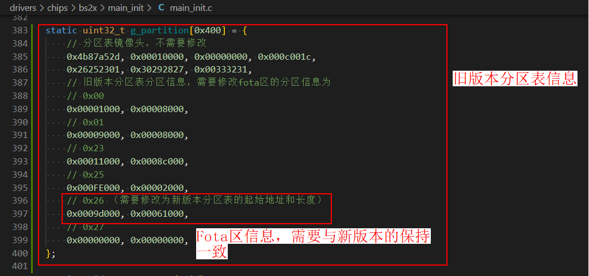

    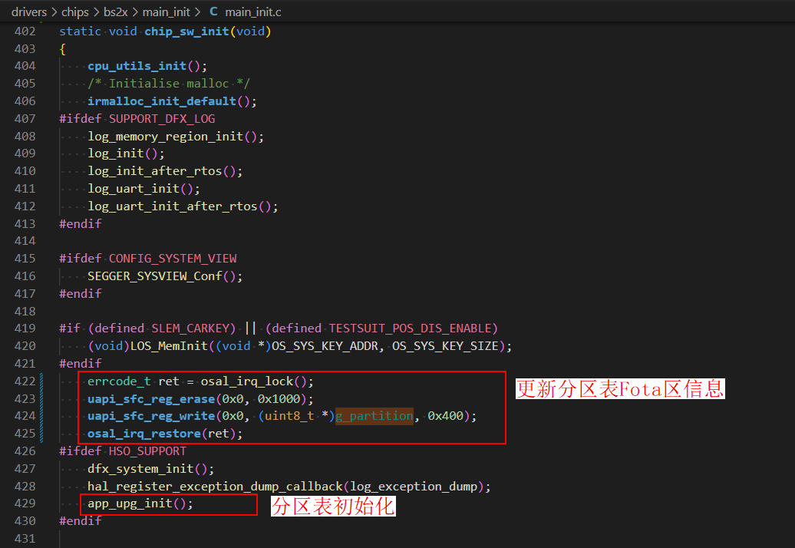

    Code example:

    ```
    static uint32_t g_partition[0x400] = {
        // Partition table image header, no modification required
        0x4b87a52d, 0x00010000, 0x00000000, 0x000c001c,
        0x26252301, 0x30292827, 0x00333231,
        // 0x00
        0x00001000, 0x00008000,
        // 0x01
        0x00009000, 0x00008000,
        // 0x23
        0x00011000, 0x0008c000,
        // 0x25
        0x000FE000, 0x00002000,
        // 0x26
        0x0009d000, 0x00061000,
        // 0x27
        0x00000000, 0x00000000,
    };
    errcode_t ret = osal_irq_lock();
    uapi_sfc_reg_erase(0x0, 0x1000);
    uapi_sfc_reg_write(0x0, (uint8_t *)g_partition, 0x400);
    osal_irq_restore(ret);
    ```

3.  After the upgrade transmission flow ends and before the single board resets, modify other areas of the old version partition table so that the partition table remains consistent with the new version partition table. The code modification for the DFU upgrade is shown in [Figure 7](#fig114581012115813), and the code modification for the OTA upgrade is shown in [Figure 8](#fig1350478132410).

    **Figure 7**  Updating the Partition Table after the DFU Upgrade Transmission Flow Ends<a name="fig114581012115813"></a>  
    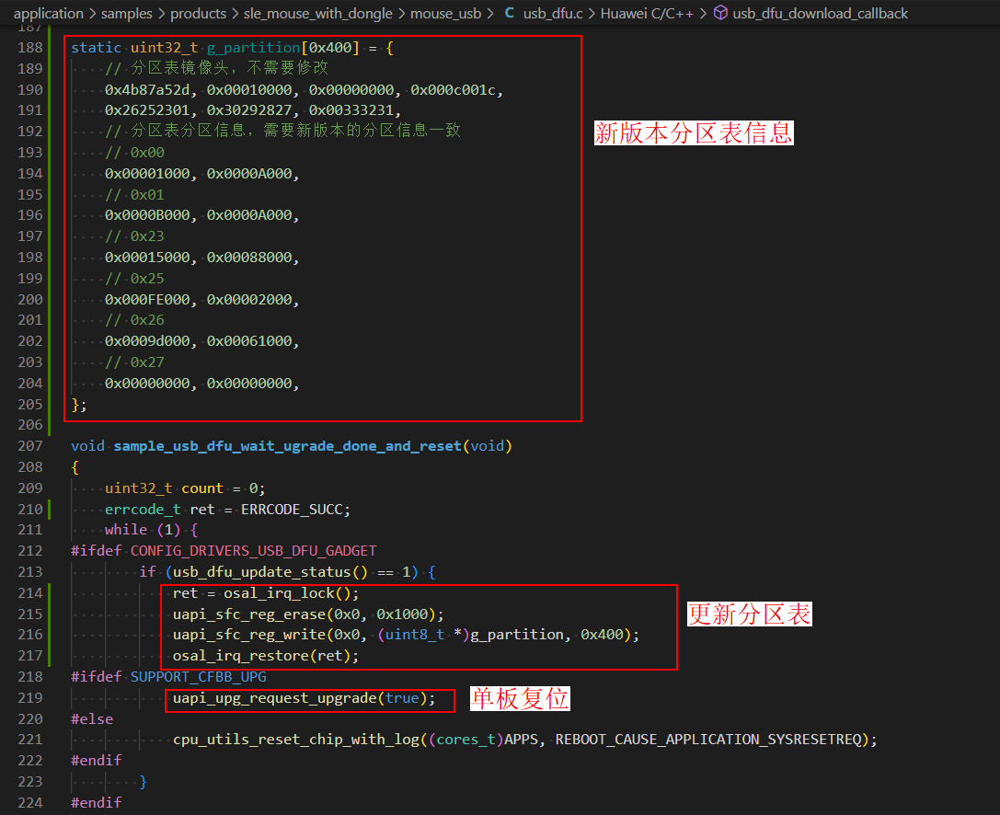

    **Figure 8**  Updating the Partition Table after the OTA Upgrade Transmission Flow Ends<a name="fig1350478132410"></a>  
    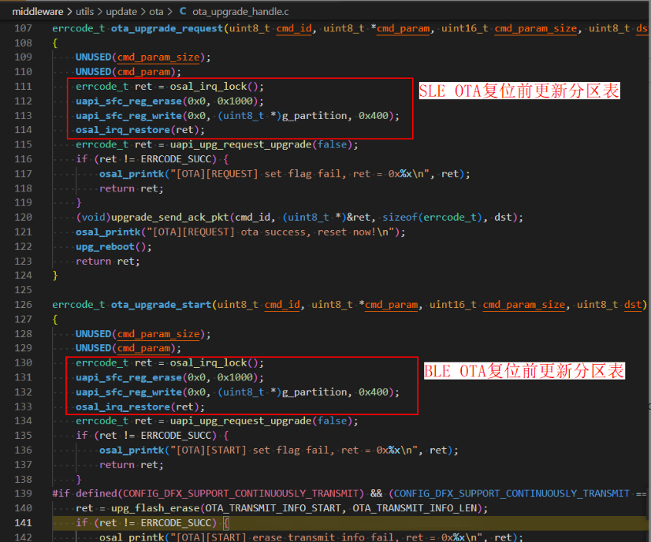

4.  Based on the above modifications, compile the intermediate version. Upgrade the old version to this intermediate version to complete the update of the partition table upgrade area. Then upgrade to the new version firmware (including the new Flashboot and App images) to complete the partition table update.

