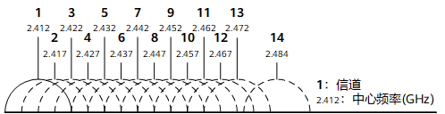

# 前言

**概述**

BS2XV100通过API（Application Programming Interface）向开发者提供接入和使用星闪低功耗的相关接口，包括广播、连接以及SSAP服务注册、服务发现等，其他协议相关接口将在后续增量发布。

**产品版本**

与本文档对应的产品版本如下。

<table><thead align="left"><tr id="row681mcpsimp"><th class="cellrowborder" valign="top" width="50%" id="mcps1.1.3.1.1">
<strong id="b684mcpsimp">产品名称</strong>

</th>
<th class="cellrowborder" valign="top" width="50%" id="mcps1.1.3.1.2">
<strong id="b687mcpsimp">产品版本</strong>

</th>
</tr>
</thead>
<tbody><tr id="row689mcpsimp"><td class="cellrowborder" valign="top" width="50%" headers="mcps1.1.3.1.1 ">
BS2X

</td>
<td class="cellrowborder" valign="top" width="50%" headers="mcps1.1.3.1.2 ">
V100

</td>
</tr>
</tbody>
</table>

**读者对象**

本文档主要适用以下工程师：

-   技术支持工程
-   软件开发工程师

**符号约定**

在本文中可能出现下列标志，它们所代表的含义如下。

<table><thead align="left"><tr id="row1530720816410"><th class="cellrowborder" valign="top" width="20.580000000000002%" id="mcps1.1.3.1.1">
<strong id="b2136615816410">符号</strong>

</th>
<th class="cellrowborder" valign="top" width="79.42%" id="mcps1.1.3.1.2">
<strong id="b5941558116410">说明</strong>

</th>
</tr>
</thead>
<tbody><tr id="row1372280416410"><td class="cellrowborder" valign="top" width="20.580000000000002%" headers="mcps1.1.3.1.1 ">

</td>
<td class="cellrowborder" valign="top" width="79.42%" headers="mcps1.1.3.1.2 ">
表示如不避免则将会导致死亡或严重伤害的具有高等级风险的危害。

</td>
</tr>
<tr id="row466863216410"><td class="cellrowborder" valign="top" width="20.580000000000002%" headers="mcps1.1.3.1.1 ">

</td>
<td class="cellrowborder" valign="top" width="79.42%" headers="mcps1.1.3.1.2 ">
表示如不避免则可能导致死亡或严重伤害的具有中等级风险的危害。

</td>
</tr>
<tr id="row123863216410"><td class="cellrowborder" valign="top" width="20.580000000000002%" headers="mcps1.1.3.1.1 ">

</td>
<td class="cellrowborder" valign="top" width="79.42%" headers="mcps1.1.3.1.2 ">
表示如不避免则可能导致轻微或中度伤害的具有低等级风险的危害。

</td>
</tr>
<tr id="row5786682116410"><td class="cellrowborder" valign="top" width="20.580000000000002%" headers="mcps1.1.3.1.1 ">

</td>
<td class="cellrowborder" valign="top" width="79.42%" headers="mcps1.1.3.1.2 ">
用于传递设备或环境安全警示信息。如不避免则可能会导致设备损坏、数据丢失、设备性能降低或其它不可预知的结果。

“须知”不涉及人身伤害。

</td>
</tr>
<tr id="row2856923116410"><td class="cellrowborder" valign="top" width="20.580000000000002%" headers="mcps1.1.3.1.1 ">

</td>
<td class="cellrowborder" valign="top" width="79.42%" headers="mcps1.1.3.1.2 ">
对正文中重点信息的补充说明。

“说明”不是安全警示信息，不涉及人身、设备及环境伤害信息。

</td>
</tr>
</tbody>
</table>

**修改记录**

<table><thead align="left"><tr id="row2942532716410"><th class="cellrowborder" valign="top" width="19.11%" id="mcps1.1.4.1.1">
<strong id="b5687322716410">文档版本</strong>

</th>
<th class="cellrowborder" valign="top" width="25.47%" id="mcps1.1.4.1.2">
<strong id="b5800814916410">发布日期</strong>

</th>
<th class="cellrowborder" valign="top" width="55.42%" id="mcps1.1.4.1.3">
<strong id="b3316380216410">修改说明</strong>

</th>
</tr>
</thead>
<tbody><tr id="row286919353233"><td class="cellrowborder" valign="top" width="19.11%" headers="mcps1.1.4.1.1 ">
06

</td>
<td class="cellrowborder" valign="top" width="25.47%" headers="mcps1.1.4.1.2 ">
2025-11-07

</td>
<td class="cellrowborder" valign="top" width="55.42%" headers="mcps1.1.4.1.3 "><ul id="ul52211252759"><li>更新“<a href="SLE-Passkey接口.md">SLE Passkey接口</a>”章节内容的“<a href="开发流程-12.md">开发流程</a>”章节内容。</li><li>新增“<a href="SLE-Channel-Map-接口.md">SLE Channel Map 接口</a>”章节内容。</li></ul>
</td>
</tr>
<tr id="row139211916143017"><td class="cellrowborder" valign="top" width="19.11%" headers="mcps1.1.4.1.1 ">
05

</td>
<td class="cellrowborder" valign="top" width="25.47%" headers="mcps1.1.4.1.2 ">
2025-05-30

</td>
<td class="cellrowborder" valign="top" width="55.42%" headers="mcps1.1.4.1.3 ">
更新“<a href="错误码.md">错误码</a>”章节内容。

</td>
</tr>
<tr id="row571052994013"><td class="cellrowborder" valign="top" width="19.11%" headers="mcps1.1.4.1.1 ">
04

</td>
<td class="cellrowborder" valign="top" width="25.47%" headers="mcps1.1.4.1.2 ">
2025-01-24

</td>
<td class="cellrowborder" valign="top" width="55.42%" headers="mcps1.1.4.1.3 ">
新增“<a href="SLE-Passkey接口.md">SLE Passkey接口</a>”章节内容。

</td>
</tr>
<tr id="row137112470231"><td class="cellrowborder" valign="top" width="19.11%" headers="mcps1.1.4.1.1 ">
03

</td>
<td class="cellrowborder" valign="top" width="25.47%" headers="mcps1.1.4.1.2 ">
2024-09-13

</td>
<td class="cellrowborder" valign="top" width="55.42%" headers="mcps1.1.4.1.3 "><ul id="ul10871154016303"><li>更新“<a href="错误码.md">错误码</a>”章节内容。</li><li>更新“<a href="Connection-Manager接口.md">Connection Manager接口</a>”的“<a href="开发流程-2.md">开发流程</a>”章节内容。</li><li>更新“<a href="SSAP-Server接口.md">SSAP Server接口</a>”的“<a href="开发流程-4.md">开发流程</a>”章节内容。</li></ul>
</td>
</tr>
<tr id="row310415618442"><td class="cellrowborder" valign="top" width="19.11%" headers="mcps1.1.4.1.1 ">
02

</td>
<td class="cellrowborder" valign="top" width="25.47%" headers="mcps1.1.4.1.2 ">
2024-08-02

</td>
<td class="cellrowborder" valign="top" width="55.42%" headers="mcps1.1.4.1.3 ">
更新“<a href="Connection-Manager接口.md">Connection Manager接口</a>”的“<a href="开发流程-2.md">开发流程</a>”章节内容。

</td>
</tr>
<tr id="row143689493249"><td class="cellrowborder" valign="top" width="19.11%" headers="mcps1.1.4.1.1 ">
01

</td>
<td class="cellrowborder" valign="top" width="25.47%" headers="mcps1.1.4.1.2 ">
2024-05-15

</td>
<td class="cellrowborder" valign="top" width="55.42%" headers="mcps1.1.4.1.3 ">
第一次正式版本发布。

新增“<a href="Transmission-Manager接口.md">Transmission Manager接口</a>”章节内容。

</td>
</tr>
<tr id="row10827102717595"><td class="cellrowborder" valign="top" width="19.11%" headers="mcps1.1.4.1.1 ">
00B04

</td>
<td class="cellrowborder" valign="top" width="25.47%" headers="mcps1.1.4.1.2 ">
2024-04-25

</td>
<td class="cellrowborder" valign="top" width="55.42%" headers="mcps1.1.4.1.3 ">
更新“<a href="Connection-Manager接口.md">Connection Manager接口</a>”章节内容。

</td>
</tr>
<tr id="row1732717673314"><td class="cellrowborder" valign="top" width="19.11%" headers="mcps1.1.4.1.1 ">
00B03

</td>
<td class="cellrowborder" valign="top" width="25.47%" headers="mcps1.1.4.1.2 ">
2024-01-08

</td>
<td class="cellrowborder" valign="top" width="55.42%" headers="mcps1.1.4.1.3 ">
更新“<a href="Device-Discovery接口.md">Device Discovery接口</a>”的“<a href="注意事项.md">注意事项</a>”章节内容。

</td>
</tr>
<tr id="row9154161512215"><td class="cellrowborder" valign="top" width="19.11%" headers="mcps1.1.4.1.1 ">
00B02

</td>
<td class="cellrowborder" valign="top" width="25.47%" headers="mcps1.1.4.1.2 ">
2023-12-08

</td>
<td class="cellrowborder" valign="top" width="55.42%" headers="mcps1.1.4.1.3 ">
更新“<a href="Connection-Manager接口.md">Connection Manager接口</a>”的“<a href="开发流程-2.md">开发流程</a>”章节内容。

</td>
</tr>
<tr id="row5947359616410"><td class="cellrowborder" valign="top" width="19.11%" headers="mcps1.1.4.1.1 ">
00B01

</td>
<td class="cellrowborder" valign="top" width="25.47%" headers="mcps1.1.4.1.2 ">
2023-09-27

</td>
<td class="cellrowborder" valign="top" width="55.42%" headers="mcps1.1.4.1.3 ">
第一次临时版本发布。

</td>
</tr>
</tbody>
</table>

# 概述

BS2XV100通过API（Application Programming Interface）面向开发者提供SLE功能的开发和应用接口，包括Device Discovery, Connection Manager, SSAP等。

各组件功能说明如下：

-   Device Discovery：星闪设备发现协议，包括设备管理、设备公开和设备发现接口。
-   Connection Manager：星闪连接管理协议，包括设备连接、配对相关接口。
-   SSAP：星闪服务交互协议（SparkLink Service Access Protocol），包含服务注册、服务发现、属性数据读写等功能相关接口。
-   Low Latency：低时延初始化和低时延数据收发接口。

> **说明：** 
>该文档描述各个模块功能的基本流程和API接口描述。

## 错误码

SLE SDK使用错误码指示用户当前任务执行结果，如[表1](#table9501182016504)所示。

**表 1**  错误码

<table><thead align="left"><tr id="row950292085010"><th class="cellrowborder" valign="top" width="9%" id="mcps1.2.5.1.1">
序号

</th>
<th class="cellrowborder" valign="top" width="34.88%" id="mcps1.2.5.1.2">
定义

</th>
<th class="cellrowborder" valign="top" width="19.66%" id="mcps1.2.5.1.3">
实际数值

</th>
<th class="cellrowborder" valign="top" width="36.46%" id="mcps1.2.5.1.4">
描述

</th>
</tr>
</thead>
<tbody><tr id="row10502132020509"><td class="cellrowborder" valign="top" width="9%" headers="mcps1.2.5.1.1 ">
1

</td>
<td class="cellrowborder" valign="top" width="34.88%" headers="mcps1.2.5.1.2 ">
ERRCODE_SLE_SUCCESS

</td>
<td class="cellrowborder" valign="top" width="19.66%" headers="mcps1.2.5.1.3 ">
0

</td>
<td class="cellrowborder" valign="top" width="36.46%" headers="mcps1.2.5.1.4 ">
执行成功错误码。

</td>
</tr>
<tr id="row950211209505"><td class="cellrowborder" valign="top" width="9%" headers="mcps1.2.5.1.1 ">
2

</td>
<td class="cellrowborder" valign="top" width="34.88%" headers="mcps1.2.5.1.2 ">
ERRCODE_SLE_CONTINUE

</td>
<td class="cellrowborder" valign="top" width="19.66%" headers="mcps1.2.5.1.3 ">
0x80006000

</td>
<td class="cellrowborder" valign="top" width="36.46%" headers="mcps1.2.5.1.4 ">
继续执行错误码。

</td>
</tr>
<tr id="row647004635216"><td class="cellrowborder" valign="top" width="9%" headers="mcps1.2.5.1.1 ">
3

</td>
<td class="cellrowborder" valign="top" width="34.88%" headers="mcps1.2.5.1.2 ">
ERRCODE_SLE_DIRECT_RETURN

</td>
<td class="cellrowborder" valign="top" width="19.66%" headers="mcps1.2.5.1.3 ">
0x80006001

</td>
<td class="cellrowborder" valign="top" width="36.46%" headers="mcps1.2.5.1.4 ">
直接返回错误码。

</td>
</tr>
<tr id="row1046837194414"><td class="cellrowborder" valign="top" width="9%" headers="mcps1.2.5.1.1 ">
4

</td>
<td class="cellrowborder" valign="top" width="34.88%" headers="mcps1.2.5.1.2 ">
ERRCODE_SLE_NO_ATTATION

</td>
<td class="cellrowborder" valign="top" width="19.66%" headers="mcps1.2.5.1.3 ">
0x80006002

</td>
<td class="cellrowborder" valign="top" width="36.46%" headers="mcps1.2.5.1.4 ">
-

</td>
</tr>
<tr id="row208504495415"><td class="cellrowborder" valign="top" width="9%" headers="mcps1.2.5.1.1 ">
5

</td>
<td class="cellrowborder" valign="top" width="34.88%" headers="mcps1.2.5.1.2 ">
ERRCODE_SLE_PARAM_ERR

</td>
<td class="cellrowborder" valign="top" width="19.66%" headers="mcps1.2.5.1.3 ">
0x80006003

</td>
<td class="cellrowborder" valign="top" width="36.46%" headers="mcps1.2.5.1.4 ">
参数错误错误码。

</td>
</tr>
<tr id="row2914115711542"><td class="cellrowborder" valign="top" width="9%" headers="mcps1.2.5.1.1 ">
6

</td>
<td class="cellrowborder" valign="top" width="34.88%" headers="mcps1.2.5.1.2 ">
ERRCODE_SLE_FAIL

</td>
<td class="cellrowborder" valign="top" width="19.66%" headers="mcps1.2.5.1.3 ">
0x80006004

</td>
<td class="cellrowborder" valign="top" width="36.46%" headers="mcps1.2.5.1.4 ">
执行失败错误码。

</td>
</tr>
<tr id="row13726122553"><td class="cellrowborder" valign="top" width="9%" headers="mcps1.2.5.1.1 ">
7

</td>
<td class="cellrowborder" valign="top" width="34.88%" headers="mcps1.2.5.1.2 ">
ERRCODE_SLE_TIMEOUT

</td>
<td class="cellrowborder" valign="top" width="19.66%" headers="mcps1.2.5.1.3 ">
0x80006005

</td>
<td class="cellrowborder" valign="top" width="36.46%" headers="mcps1.2.5.1.4 ">
执行超时错误码。

</td>
</tr>
<tr id="row119961302554"><td class="cellrowborder" valign="top" width="9%" headers="mcps1.2.5.1.1 ">
8

</td>
<td class="cellrowborder" valign="top" width="34.88%" headers="mcps1.2.5.1.2 ">
ERRCODE_SLE_UNSUPPORTED

</td>
<td class="cellrowborder" valign="top" width="19.66%" headers="mcps1.2.5.1.3 ">
0x80006006

</td>
<td class="cellrowborder" valign="top" width="36.46%" headers="mcps1.2.5.1.4 ">
参数不支持错误码。

</td>
</tr>
<tr id="row121607340559"><td class="cellrowborder" valign="top" width="9%" headers="mcps1.2.5.1.1 ">
9

</td>
<td class="cellrowborder" valign="top" width="34.88%" headers="mcps1.2.5.1.2 ">
ERRCODE_SLE_GETRECORD_FAIL

</td>
<td class="cellrowborder" valign="top" width="19.66%" headers="mcps1.2.5.1.3 ">
0x80006007

</td>
<td class="cellrowborder" valign="top" width="36.46%" headers="mcps1.2.5.1.4 ">
获取当前记录失败错误码。

</td>
</tr>
<tr id="row13618338115517"><td class="cellrowborder" valign="top" width="9%" headers="mcps1.2.5.1.1 ">
10

</td>
<td class="cellrowborder" valign="top" width="34.88%" headers="mcps1.2.5.1.2 ">
ERRCODE_SLE_POINTER_NULL

</td>
<td class="cellrowborder" valign="top" width="19.66%" headers="mcps1.2.5.1.3 ">
0x80006008

</td>
<td class="cellrowborder" valign="top" width="36.46%" headers="mcps1.2.5.1.4 ">
指针为空错误码。

</td>
</tr>
<tr id="row179331321145612"><td class="cellrowborder" valign="top" width="9%" headers="mcps1.2.5.1.1 ">
11

</td>
<td class="cellrowborder" valign="top" width="34.88%" headers="mcps1.2.5.1.2 ">
ERRCODE_SLE_NO_RECORD

</td>
<td class="cellrowborder" valign="top" width="19.66%" headers="mcps1.2.5.1.3 ">
0x80006009

</td>
<td class="cellrowborder" valign="top" width="36.46%" headers="mcps1.2.5.1.4 ">
无记录返回错误码。

</td>
</tr>
<tr id="row24341235135618"><td class="cellrowborder" valign="top" width="9%" headers="mcps1.2.5.1.1 ">
12

</td>
<td class="cellrowborder" valign="top" width="34.88%" headers="mcps1.2.5.1.2 ">
ERRCODE_SLE_STATUS_ERR

</td>
<td class="cellrowborder" valign="top" width="19.66%" headers="mcps1.2.5.1.3 ">
0x8000600a

</td>
<td class="cellrowborder" valign="top" width="36.46%" headers="mcps1.2.5.1.4 ">
状态错误错误码。

</td>
</tr>
<tr id="row625216013410"><td class="cellrowborder" valign="top" width="9%" headers="mcps1.2.5.1.1 ">
13

</td>
<td class="cellrowborder" valign="top" width="34.88%" headers="mcps1.2.5.1.2 ">
ERRCODE_SLE_NOMEM

</td>
<td class="cellrowborder" valign="top" width="19.66%" headers="mcps1.2.5.1.3 ">
0x8000600b

</td>
<td class="cellrowborder" valign="top" width="36.46%" headers="mcps1.2.5.1.4 ">
内存不足错误码。

</td>
</tr>
<tr id="row22071149346"><td class="cellrowborder" valign="top" width="9%" headers="mcps1.2.5.1.1 ">
14

</td>
<td class="cellrowborder" valign="top" width="34.88%" headers="mcps1.2.5.1.2 ">
ERRCODE_SLE_AUTH_FAIL

</td>
<td class="cellrowborder" valign="top" width="19.66%" headers="mcps1.2.5.1.3 ">
0x8000600c

</td>
<td class="cellrowborder" valign="top" width="36.46%" headers="mcps1.2.5.1.4 ">
认证失败错误码。

</td>
</tr>
<tr id="row19824101991719"><td class="cellrowborder" valign="top" width="9%" headers="mcps1.2.5.1.1 ">
15

</td>
<td class="cellrowborder" valign="top" width="34.88%" headers="mcps1.2.5.1.2 ">
ERRCODE_SLE_AUTH_PKEY_MISS

</td>
<td class="cellrowborder" valign="top" width="19.66%" headers="mcps1.2.5.1.3 ">
0x8000600d

</td>
<td class="cellrowborder" valign="top" width="36.46%" headers="mcps1.2.5.1.4 ">
PIN码或密钥丢失致认证失败错误码。

</td>
</tr>
<tr id="row1812615238178"><td class="cellrowborder" valign="top" width="9%" headers="mcps1.2.5.1.1 ">
16

</td>
<td class="cellrowborder" valign="top" width="34.88%" headers="mcps1.2.5.1.2 ">
ERRCODE_SLE_RMT_DEV_DOWN

</td>
<td class="cellrowborder" valign="top" width="19.66%" headers="mcps1.2.5.1.3 ">
0x8000600e

</td>
<td class="cellrowborder" valign="top" width="36.46%" headers="mcps1.2.5.1.4 ">
对端设备关闭错误码。

</td>
</tr>
<tr id="row128112720177"><td class="cellrowborder" valign="top" width="9%" headers="mcps1.2.5.1.1 ">
17

</td>
<td class="cellrowborder" valign="top" width="34.88%" headers="mcps1.2.5.1.2 ">
ERRCODE_SLE_PAIRING_REJECT

</td>
<td class="cellrowborder" valign="top" width="19.66%" headers="mcps1.2.5.1.3 ">
0x8000600f

</td>
<td class="cellrowborder" valign="top" width="36.46%" headers="mcps1.2.5.1.4 ">
配对拒绝错误码。

</td>
</tr>
<tr id="row1674155911712"><td class="cellrowborder" valign="top" width="9%" headers="mcps1.2.5.1.1 ">
18

</td>
<td class="cellrowborder" valign="top" width="34.88%" headers="mcps1.2.5.1.2 ">
ERRCODE_SLE_BUSY

</td>
<td class="cellrowborder" valign="top" width="19.66%" headers="mcps1.2.5.1.3 ">
0x80006010

</td>
<td class="cellrowborder" valign="top" width="36.46%" headers="mcps1.2.5.1.4 ">
系统繁忙错误码。

</td>
</tr>
<tr id="row895417313189"><td class="cellrowborder" valign="top" width="9%" headers="mcps1.2.5.1.1 ">
19

</td>
<td class="cellrowborder" valign="top" width="34.88%" headers="mcps1.2.5.1.2 ">
ERRCODE_SLE_NOT_READY

</td>
<td class="cellrowborder" valign="top" width="19.66%" headers="mcps1.2.5.1.3 ">
0x80006011

</td>
<td class="cellrowborder" valign="top" width="36.46%" headers="mcps1.2.5.1.4 ">
系统未准备好错误码。

</td>
</tr>
<tr id="row536982318185"><td class="cellrowborder" valign="top" width="9%" headers="mcps1.2.5.1.1 ">
20

</td>
<td class="cellrowborder" valign="top" width="34.88%" headers="mcps1.2.5.1.2 ">
ERRCODE_SLE_CONN_FAIL

</td>
<td class="cellrowborder" valign="top" width="19.66%" headers="mcps1.2.5.1.3 ">
0x80006012

</td>
<td class="cellrowborder" valign="top" width="36.46%" headers="mcps1.2.5.1.4 ">
连接失败错误码。

</td>
</tr>
<tr id="row571652611817"><td class="cellrowborder" valign="top" width="9%" headers="mcps1.2.5.1.1 ">
21

</td>
<td class="cellrowborder" valign="top" width="34.88%" headers="mcps1.2.5.1.2 ">
ERRCODE_SLE_OUT_OF_RANGE

</td>
<td class="cellrowborder" valign="top" width="19.66%" headers="mcps1.2.5.1.3 ">
0x80006013

</td>
<td class="cellrowborder" valign="top" width="36.46%" headers="mcps1.2.5.1.4 ">
越界错误码。

</td>
</tr>
<tr id="row19347112020180"><td class="cellrowborder" valign="top" width="9%" headers="mcps1.2.5.1.1 ">
22

</td>
<td class="cellrowborder" valign="top" width="34.88%" headers="mcps1.2.5.1.2 ">
ERRCODE_SLE_MEMCPY_FAIL

</td>
<td class="cellrowborder" valign="top" width="19.66%" headers="mcps1.2.5.1.3 ">
0x80006014

</td>
<td class="cellrowborder" valign="top" width="36.46%" headers="mcps1.2.5.1.4 ">
拷贝失败错误码。

</td>
</tr>
<tr id="row118631840181910"><td class="cellrowborder" valign="top" width="9%" headers="mcps1.2.5.1.1 ">
23

</td>
<td class="cellrowborder" valign="top" width="34.88%" headers="mcps1.2.5.1.2 ">
ERRCODE_SLE_MALLOC_FAIL

</td>
<td class="cellrowborder" valign="top" width="19.66%" headers="mcps1.2.5.1.3 ">
0x80006015

</td>
<td class="cellrowborder" valign="top" width="36.46%" headers="mcps1.2.5.1.4 ">
内存申请失败错误码。

</td>
</tr>
</tbody>
</table>

**断连原因**

异常断连原因如[表2](#table1546843103312)所示。

**表 2**  断连原因

<table><thead align="left"><tr id="row9467437331"><th class="cellrowborder" valign="top" width="9%" id="mcps1.2.5.1.1">
序号

</th>
<th class="cellrowborder" valign="top" width="34.88%" id="mcps1.2.5.1.2">
定义

</th>
<th class="cellrowborder" valign="top" width="19.68%" id="mcps1.2.5.1.3">
实际数值

</th>
<th class="cellrowborder" valign="top" width="36.44%" id="mcps1.2.5.1.4">
描述

</th>
</tr>
</thead>
<tbody><tr id="row1461443153319"><td class="cellrowborder" valign="top" width="9%" headers="mcps1.2.5.1.1 ">
1

</td>
<td class="cellrowborder" valign="top" width="34.88%" headers="mcps1.2.5.1.2 ">
SLE_DISCONNECT_UNKNOWN

</td>
<td class="cellrowborder" valign="top" width="19.68%" headers="mcps1.2.5.1.3 ">
0x00

</td>
<td class="cellrowborder" valign="top" width="36.44%" headers="mcps1.2.5.1.4 ">
未知原因断连。

</td>
</tr>
<tr id="row184614393319"><td class="cellrowborder" valign="top" width="9%" headers="mcps1.2.5.1.1 ">
2

</td>
<td class="cellrowborder" valign="top" width="34.88%" headers="mcps1.2.5.1.2 ">
SLE_DISCONNECT_BY_PIN_OR_KEY_MISSING

</td>
<td class="cellrowborder" valign="top" width="19.68%" headers="mcps1.2.5.1.3 ">
0x05

</td>
<td class="cellrowborder" valign="top" width="36.44%" headers="mcps1.2.5.1.4 ">
pin或key丢失导致断连。

</td>
</tr>
<tr id="row18461543163319"><td class="cellrowborder" valign="top" width="9%" headers="mcps1.2.5.1.1 ">
3

</td>
<td class="cellrowborder" valign="top" width="34.88%" headers="mcps1.2.5.1.2 ">
SLE_DISCONNECT_BY_CONNECT_TIMEOUT

</td>
<td class="cellrowborder" valign="top" width="19.68%" headers="mcps1.2.5.1.3 ">
0x07

</td>
<td class="cellrowborder" valign="top" width="36.44%" headers="mcps1.2.5.1.4 ">
连接超时断连。

</td>
</tr>
<tr id="row174794383315"><td class="cellrowborder" valign="top" width="9%" headers="mcps1.2.5.1.1 ">
5

</td>
<td class="cellrowborder" valign="top" width="34.88%" headers="mcps1.2.5.1.2 ">
SLE_D ISCONNECT_BY_REMOTE_USER

</td>
<td class="cellrowborder" valign="top" width="19.68%" headers="mcps1.2.5.1.3 ">
0x10

</td>
<td class="cellrowborder" valign="top" width="36.44%" headers="mcps1.2.5.1.4 ">
远端用户断连。

</td>
</tr>
<tr id="row547164393311"><td class="cellrowborder" valign="top" width="9%" headers="mcps1.2.5.1.1 ">
6

</td>
<td class="cellrowborder" valign="top" width="34.88%" headers="mcps1.2.5.1.2 ">
SLE_DISCONNECT_BY_LOCAL_HOST

</td>
<td class="cellrowborder" valign="top" width="19.68%" headers="mcps1.2.5.1.3 ">
0x11

</td>
<td class="cellrowborder" valign="top" width="36.44%" headers="mcps1.2.5.1.4 ">
本端host断连。

</td>
</tr>
<tr id="row194714312335"><td class="cellrowborder" valign="top" width="9%" headers="mcps1.2.5.1.1 ">
7

</td>
<td class="cellrowborder" valign="top" width="34.88%" headers="mcps1.2.5.1.2 ">
SLE_DISCONNECT_BY_MIC_ERROR

</td>
<td class="cellrowborder" valign="top" width="19.68%" headers="mcps1.2.5.1.3 ">
0x1B

</td>
<td class="cellrowborder" valign="top" width="36.44%" headers="mcps1.2.5.1.4 ">
MIC error断连。

</td>
</tr>
<tr id="row746817284367"><td class="cellrowborder" valign="top" width="9%" headers="mcps1.2.5.1.1 ">
8

</td>
<td class="cellrowborder" valign="top" width="34.88%" headers="mcps1.2.5.1.2 ">
SLE_ESTABLISH_CONNECT_FAIL

</td>
<td class="cellrowborder" valign="top" width="19.68%" headers="mcps1.2.5.1.3 ">
0x1C

</td>
<td class="cellrowborder" valign="top" width="36.44%" headers="mcps1.2.5.1.4 ">
建连异常。

</td>
</tr>
</tbody>
</table>

# Device Discovery接口

## 概述

Device Discovery接口是星闪设备发现协议的软件实现，主要功能有SLE设备开关、设备管理、设备公开和设备发现。

## 开发流程

**使用场景**

打开SLE设备开关是使用SLE功能的首要条件，SLE启动后可进行设备信息管理，包括获取与设置本地设备名称、获取与设置本地设备地址和设置本地设备外观。

-   当SLE设备需要进行设备公开时，可先设置设备公开参数、设备公开数据，然后使能设备公开。
-   当SLE设备需要进行设备发现时，可先设置设备发现参数，然后使能设备发现，并通过回调函数观察发现到的设备公开数据包。

**功能**

Device Discovery提供的接口如[表1](#_table213321716161)所示。

**表 1**  Device Discovery接口描述

<table><thead align="left"><tr id="row788mcpsimp"><th class="cellrowborder" valign="top" width="22.63%" id="mcps1.2.5.1.1">
接口名称

</th>
<th class="cellrowborder" valign="top" width="21.790000000000003%" id="mcps1.2.5.1.2">
描述

</th>
<th class="cellrowborder" valign="top" width="24.9%" id="mcps1.2.5.1.3">
参数说明

</th>
<th class="cellrowborder" valign="top" width="30.680000000000003%" id="mcps1.2.5.1.4">
返回信息说明

</th>
</tr>
</thead>
<tbody><tr id="row154823161515"><td class="cellrowborder" valign="top" width="22.63%" headers="mcps1.2.5.1.1 ">
enable_sle

</td>
<td class="cellrowborder" valign="top" width="21.790000000000003%" headers="mcps1.2.5.1.2 ">
使能SLE。

</td>
<td class="cellrowborder" valign="top" width="24.9%" headers="mcps1.2.5.1.3 ">
-

</td>
<td class="cellrowborder" valign="top" width="30.680000000000003%" headers="mcps1.2.5.1.4 ">
接口返回值：错误码。

</td>
</tr>
<tr id="row43102035171512"><td class="cellrowborder" valign="top" width="22.63%" headers="mcps1.2.5.1.1 ">
disable_sle

</td>
<td class="cellrowborder" valign="top" width="21.790000000000003%" headers="mcps1.2.5.1.2 ">
去使能SLE。

</td>
<td class="cellrowborder" valign="top" width="24.9%" headers="mcps1.2.5.1.3 ">
-

</td>
<td class="cellrowborder" valign="top" width="30.680000000000003%" headers="mcps1.2.5.1.4 ">
接口返回值：错误码。

</td>
</tr>
<tr id="row106094013183"><td class="cellrowborder" valign="top" width="22.63%" headers="mcps1.2.5.1.1 ">
sle_set_local_addr

</td>
<td class="cellrowborder" valign="top" width="21.790000000000003%" headers="mcps1.2.5.1.2 ">
设置本地设备地址。

</td>
<td class="cellrowborder" valign="top" width="24.9%" headers="mcps1.2.5.1.3 ">
addr：本地设备地址。

</td>
<td class="cellrowborder" valign="top" width="30.680000000000003%" headers="mcps1.2.5.1.4 ">
接口返回值：错误码。

</td>
</tr>
<tr id="row804mcpsimp"><td class="cellrowborder" valign="top" width="22.63%" headers="mcps1.2.5.1.1 ">
sle_get_local_addr

</td>
<td class="cellrowborder" valign="top" width="21.790000000000003%" headers="mcps1.2.5.1.2 ">
获取本地设备地址。

</td>
<td class="cellrowborder" valign="top" width="24.9%" headers="mcps1.2.5.1.3 ">
addr：[out]本地设备地址。

</td>
<td class="cellrowborder" valign="top" width="30.680000000000003%" headers="mcps1.2.5.1.4 ">
接口返回值：错误码。

</td>
</tr>
<tr id="row809mcpsimp"><td class="cellrowborder" valign="top" width="22.63%" headers="mcps1.2.5.1.1 ">
sle_set_local_name

</td>
<td class="cellrowborder" valign="top" width="21.790000000000003%" headers="mcps1.2.5.1.2 ">
设置本地设备名称。

</td>
<td class="cellrowborder" valign="top" width="24.9%" headers="mcps1.2.5.1.3 ">
name：本地设备名称；

len：本地设备名称长度。

</td>
<td class="cellrowborder" valign="top" width="30.680000000000003%" headers="mcps1.2.5.1.4 ">
接口返回值：错误码。

</td>
</tr>
<tr id="row814mcpsimp"><td class="cellrowborder" valign="top" width="22.63%" headers="mcps1.2.5.1.1 ">
sle_get_local_name

</td>
<td class="cellrowborder" valign="top" width="21.790000000000003%" headers="mcps1.2.5.1.2 ">
获取本地设备名称。

</td>
<td class="cellrowborder" valign="top" width="24.9%" headers="mcps1.2.5.1.3 ">
name：[out]本地设备名称；

len：[inout]入参时为用户预留内存大小，出参时为本地设备名称长度。

</td>
<td class="cellrowborder" valign="top" width="30.680000000000003%" headers="mcps1.2.5.1.4 ">
接口返回值：错误码。

</td>
</tr>
<tr id="row188161146102212"><td class="cellrowborder" valign="top" width="22.63%" headers="mcps1.2.5.1.1 ">
sle_set_announce_data

</td>
<td class="cellrowborder" valign="top" width="21.790000000000003%" headers="mcps1.2.5.1.2 ">
设置设备公开数据。

</td>
<td class="cellrowborder" valign="top" width="24.9%" headers="mcps1.2.5.1.3 ">
announce_id：设备公开ID；

data：设备公开数据。

</td>
<td class="cellrowborder" valign="top" width="30.680000000000003%" headers="mcps1.2.5.1.4 ">
接口返回值：错误码。

</td>
</tr>
<tr id="row112552812172"><td class="cellrowborder" valign="top" width="22.63%" headers="mcps1.2.5.1.1 ">
sle_set_announce_param

</td>
<td class="cellrowborder" valign="top" width="21.790000000000003%" headers="mcps1.2.5.1.2 ">
设置设备公开参数。

</td>
<td class="cellrowborder" valign="top" width="24.9%" headers="mcps1.2.5.1.3 ">
announce_id：设备公开ID；

data：设备公开参数。

</td>
<td class="cellrowborder" valign="top" width="30.680000000000003%" headers="mcps1.2.5.1.4 ">
接口返回值：错误码。

</td>
</tr>
<tr id="row2075810103373"><td class="cellrowborder" valign="top" width="22.63%" headers="mcps1.2.5.1.1 ">
sle_start_announce

</td>
<td class="cellrowborder" valign="top" width="21.790000000000003%" headers="mcps1.2.5.1.2 ">
开始设备公开。

</td>
<td class="cellrowborder" valign="top" width="24.9%" headers="mcps1.2.5.1.3 ">
announce_id：设备公开ID。

</td>
<td class="cellrowborder" valign="top" width="30.680000000000003%" headers="mcps1.2.5.1.4 ">
接口返回值：错误码。

</td>
</tr>
<tr id="row196751322103710"><td class="cellrowborder" valign="top" width="22.63%" headers="mcps1.2.5.1.1 ">
sle_stop_announce

</td>
<td class="cellrowborder" valign="top" width="21.790000000000003%" headers="mcps1.2.5.1.2 ">
停止设备公开。

</td>
<td class="cellrowborder" valign="top" width="24.9%" headers="mcps1.2.5.1.3 ">
announce_id：设备公开ID。

</td>
<td class="cellrowborder" valign="top" width="30.680000000000003%" headers="mcps1.2.5.1.4 ">
接口返回值：错误码。

</td>
</tr>
<tr id="row8699192713372"><td class="cellrowborder" valign="top" width="22.63%" headers="mcps1.2.5.1.1 ">
sle_set_seek_param

</td>
<td class="cellrowborder" valign="top" width="21.790000000000003%" headers="mcps1.2.5.1.2 ">
设置设备发现参数。

</td>
<td class="cellrowborder" valign="top" width="24.9%" headers="mcps1.2.5.1.3 ">
param：设备发现参数。

</td>
<td class="cellrowborder" valign="top" width="30.680000000000003%" headers="mcps1.2.5.1.4 ">
接口返回值：错误码。

</td>
</tr>
<tr id="row12968154314372"><td class="cellrowborder" valign="top" width="22.63%" headers="mcps1.2.5.1.1 ">
sle_start_seek

</td>
<td class="cellrowborder" valign="top" width="21.790000000000003%" headers="mcps1.2.5.1.2 ">
开始设备发现。

</td>
<td class="cellrowborder" valign="top" width="24.9%" headers="mcps1.2.5.1.3 ">
-

</td>
<td class="cellrowborder" valign="top" width="30.680000000000003%" headers="mcps1.2.5.1.4 ">
接口返回值：错误码。

</td>
</tr>
<tr id="row0662155743714"><td class="cellrowborder" valign="top" width="22.63%" headers="mcps1.2.5.1.1 ">
sle_stop_seek

</td>
<td class="cellrowborder" valign="top" width="21.790000000000003%" headers="mcps1.2.5.1.2 ">
停止设备发现。

</td>
<td class="cellrowborder" valign="top" width="24.9%" headers="mcps1.2.5.1.3 ">
-

</td>
<td class="cellrowborder" valign="top" width="30.680000000000003%" headers="mcps1.2.5.1.4 ">
接口返回值：错误码。

</td>
</tr>
<tr id="row196417663815"><td class="cellrowborder" valign="top" width="22.63%" headers="mcps1.2.5.1.1 ">
sle_announce_seek_register_callbacks

</td>
<td class="cellrowborder" valign="top" width="21.790000000000003%" headers="mcps1.2.5.1.2 ">
注册设备公开和设备发现回调函数。

</td>
<td class="cellrowborder" valign="top" width="24.9%" headers="mcps1.2.5.1.3 ">
func：用户回调函数。

</td>
<td class="cellrowborder" valign="top" width="30.680000000000003%" headers="mcps1.2.5.1.4 ">
接口返回值：错误码。

</td>
</tr>
</tbody>
</table>

**开发流程**

Device Discovery开发的典型流程如下，具体编程实例可参考application/samples/bt。

**Terminal Node：**

1.  调用enable\_sle，打开SLE开关。
2.  调用sle\_announce\_seek\_register\_callbacks，注册设备公开和设备发现回调函数。
3.  调用sle\_set\_local\_addr，设置本地设备地址。
4.  调用sle\_set\_local\_name，设置本地设备名称。
5.  调用sle\_set\_announce\_param，设置设备公开参数
6.  调用sle\_set\_announce\_data，设置设备公开数据
7.  调用sle\_start\_announce，启动设备公开。

**Grant Node：**

1.  调用enable\_sle，打开SLE开关。
2.  调用sle\_announce\_seek\_register\_callbacks，注册设备公开和设备发现回调函数。
3.  调用sle\_set\_local\_addr，设置本地设备地址。
4.  调用sle\_set\_local\_name，设置本地设备名称。
5.  调用sle\_set\_seek\_param，设置设备发现参数。
6.  调用sle\_start\_seek，启动设备发现，并在回调函数中获得正在进行设备公开的设备信息。

## 注意事项

-   BS2XV100产品只作为SLE设备工作时，最多只支持八路连接，同时作为BLE和SLE设备工作时，一共支持八路连接。
-   若扫描不到设备，请先检查设备是否已在配对设备列表中，或者设备是否已与其他设备配对（此情况下需要先清除设备端配对信息）。

# Connection Manager接口

## 概述

Connection Manager接口是星闪连接管理协议的软件实现，主要功能有连接、配对和读远端设备RSSI值。

## 开发流程

**使用场景**

当设备需要与对端设备建立连接时，可向对端设备发起连接请求。在连接过程中，设备可读取远端设备RSSI值，当设备需要更新连接参数时，可向对端设备发起连接参数更新请求，当设备需要与对端设备配对时，可向对端设备发起配对请求。在配对过程中，可获取当前本端设备与指定对端设备的配对状态。设备可获取当前配对设备数量以及当前配对设备信息链表，当前的链路角色。

**功能**

Connection Manager提供的接口如[表1](#_table213321716161)所示。

**表 1**  Connection Manager接口描述

<table><thead align="left"><tr id="row788mcpsimp"><th class="cellrowborder" valign="top" width="20.42204220422042%" id="mcps1.2.5.1.1">
接口名称

</th>
<th class="cellrowborder" valign="top" width="28.63286328632863%" id="mcps1.2.5.1.2">
描述

</th>
<th class="cellrowborder" valign="top" width="27.58275827582758%" id="mcps1.2.5.1.3">
参数说明

</th>
<th class="cellrowborder" valign="top" width="23.362336233623363%" id="mcps1.2.5.1.4">
返回信息说明

</th>
</tr>
</thead>
<tbody><tr id="row794mcpsimp"><td class="cellrowborder" valign="top" width="20.42204220422042%" headers="mcps1.2.5.1.1 ">
sle_connect_remote_device

</td>
<td class="cellrowborder" valign="top" width="28.63286328632863%" headers="mcps1.2.5.1.2 ">
向对端设备发起连接请求。

</td>
<td class="cellrowborder" valign="top" width="27.58275827582758%" headers="mcps1.2.5.1.3 ">
addr：对端设备地址。

</td>
<td class="cellrowborder" valign="top" width="23.362336233623363%" headers="mcps1.2.5.1.4 ">
接口返回值：错误码。

</td>
</tr>
<tr id="row799mcpsimp"><td class="cellrowborder" valign="top" width="20.42204220422042%" headers="mcps1.2.5.1.1 ">
sle_disconnect_remote_device

</td>
<td class="cellrowborder" valign="top" width="28.63286328632863%" headers="mcps1.2.5.1.2 ">
向对端设备发起断连请求。

</td>
<td class="cellrowborder" valign="top" width="27.58275827582758%" headers="mcps1.2.5.1.3 ">
addr：对端设备地址。

</td>
<td class="cellrowborder" valign="top" width="23.362336233623363%" headers="mcps1.2.5.1.4 ">
接口返回值：错误码。

</td>
</tr>
<tr id="row809mcpsimp"><td class="cellrowborder" valign="top" width="20.42204220422042%" headers="mcps1.2.5.1.1 ">
sle_update_connect_param

</td>
<td class="cellrowborder" valign="top" width="28.63286328632863%" headers="mcps1.2.5.1.2 ">
连接参数更新。

</td>
<td class="cellrowborder" valign="top" width="27.58275827582758%" headers="mcps1.2.5.1.3 ">
params：连接参数

</td>
<td class="cellrowborder" valign="top" width="23.362336233623363%" headers="mcps1.2.5.1.4 ">
接口返回值：错误码。

</td>
</tr>
<tr id="row14457165322015"><td class="cellrowborder" valign="top" width="20.42204220422042%" headers="mcps1.2.5.1.1 ">
sle_pair_remote_device

</td>
<td class="cellrowborder" valign="top" width="28.63286328632863%" headers="mcps1.2.5.1.2 ">
向对端设备发起配对请求。

（目前星闪鉴权流程仅支持免输入模式）

</td>
<td class="cellrowborder" valign="top" width="27.58275827582758%" headers="mcps1.2.5.1.3 ">
addr：对端设备地址。

</td>
<td class="cellrowborder" valign="top" width="23.362336233623363%" headers="mcps1.2.5.1.4 ">
接口返回值：错误码。

</td>
</tr>
<tr id="row824mcpsimp"><td class="cellrowborder" valign="top" width="20.42204220422042%" headers="mcps1.2.5.1.1 ">
sle_remove_paired_remote_device

</td>
<td class="cellrowborder" valign="top" width="28.63286328632863%" headers="mcps1.2.5.1.2 ">
与对端设备取消配对。

</td>
<td class="cellrowborder" valign="top" width="27.58275827582758%" headers="mcps1.2.5.1.3 ">
addr：对端设备地址。

</td>
<td class="cellrowborder" valign="top" width="23.362336233623363%" headers="mcps1.2.5.1.4 ">
接口返回值：错误码。

</td>
</tr>
<tr id="row1257712474513"><td class="cellrowborder" valign="top" width="20.42204220422042%" headers="mcps1.2.5.1.1 ">
sle_remove_all_pairs

</td>
<td class="cellrowborder" valign="top" width="28.63286328632863%" headers="mcps1.2.5.1.2 ">
取消与所有对端设备的配对。

</td>
<td class="cellrowborder" valign="top" width="27.58275827582758%" headers="mcps1.2.5.1.3 ">
-

</td>
<td class="cellrowborder" valign="top" width="23.362336233623363%" headers="mcps1.2.5.1.4 ">
接口返回值：错误码。

</td>
</tr>
<tr id="row386531016"><td class="cellrowborder" valign="top" width="20.42204220422042%" headers="mcps1.2.5.1.1 ">
sle_get_paired_devices_num

</td>
<td class="cellrowborder" valign="top" width="28.63286328632863%" headers="mcps1.2.5.1.2 ">
获取配对设备数量。

</td>
<td class="cellrowborder" valign="top" width="27.58275827582758%" headers="mcps1.2.5.1.3 ">
number：[out]配对设备数量。

</td>
<td class="cellrowborder" valign="top" width="23.362336233623363%" headers="mcps1.2.5.1.4 ">
接口返回值：错误码。

</td>
</tr>
<tr id="row1913210313121"><td class="cellrowborder" valign="top" width="20.42204220422042%" headers="mcps1.2.5.1.1 ">
sle_get_paired_devices

</td>
<td class="cellrowborder" valign="top" width="28.63286328632863%" headers="mcps1.2.5.1.2 ">
获取配对设备信息。

</td>
<td class="cellrowborder" valign="top" width="27.58275827582758%" headers="mcps1.2.5.1.3 ">
addr：[out]设备地址链表；

number：[inout]入参时为用户预留内存大小，出参时为设备数量。

</td>
<td class="cellrowborder" valign="top" width="23.362336233623363%" headers="mcps1.2.5.1.4 ">
接口返回值：错误码。

</td>
</tr>
<tr id="row829mcpsimp"><td class="cellrowborder" valign="top" width="20.42204220422042%" headers="mcps1.2.5.1.1 ">
sle_get_pair_state

</td>
<td class="cellrowborder" valign="top" width="28.63286328632863%" headers="mcps1.2.5.1.2 ">
获取配对状态。

</td>
<td class="cellrowborder" valign="top" width="27.58275827582758%" headers="mcps1.2.5.1.3 ">
addr：设备地址；

state：[out]配对状态。

</td>
<td class="cellrowborder" valign="top" width="23.362336233623363%" headers="mcps1.2.5.1.4 ">
接口返回值：错误码。

</td>
</tr>
<tr id="row1549875915535"><td class="cellrowborder" valign="top" width="20.42204220422042%" headers="mcps1.2.5.1.1 ">
sle_get_connect_role

</td>
<td class="cellrowborder" valign="top" width="28.63286328632863%" headers="mcps1.2.5.1.2 ">
获取链路角色。

</td>
<td class="cellrowborder" valign="top" width="27.58275827582758%" headers="mcps1.2.5.1.3 ">
conn_id: 连接id；

role: [out]链路角色。

</td>
<td class="cellrowborder" valign="top" width="23.362336233623363%" headers="mcps1.2.5.1.4 ">
接口返回值：错误码。

</td>
</tr>
<tr id="row834mcpsimp"><td class="cellrowborder" valign="top" width="20.42204220422042%" headers="mcps1.2.5.1.1 ">
sle_read_remote_device_rssi

</td>
<td class="cellrowborder" valign="top" width="28.63286328632863%" headers="mcps1.2.5.1.2 ">
读对端设备RSSI值。

</td>
<td class="cellrowborder" valign="top" width="27.58275827582758%" headers="mcps1.2.5.1.3 ">
conn_id：连接id。

</td>
<td class="cellrowborder" valign="top" width="23.362336233623363%" headers="mcps1.2.5.1.4 ">
接口返回值：错误码。

</td>
</tr>
<tr id="row960313012613"><td class="cellrowborder" valign="top" width="20.42204220422042%" headers="mcps1.2.5.1.1 ">
sle_set_phy_param

</td>
<td class="cellrowborder" valign="top" width="28.63286328632863%" headers="mcps1.2.5.1.2 ">
更新星闪phy参数。

</td>
<td class="cellrowborder" valign="top" width="27.58275827582758%" headers="mcps1.2.5.1.3 ">
conn_id：连接id;

param：phy更新的配置参数。

</td>
<td class="cellrowborder" valign="top" width="23.362336233623363%" headers="mcps1.2.5.1.4 ">
接口返回值：错误码。

</td>
</tr>
<tr id="row844mcpsimp"><td class="cellrowborder" valign="top" width="20.42204220422042%" headers="mcps1.2.5.1.1 ">
sle_connection_register_callbacks

</td>
<td class="cellrowborder" valign="top" width="28.63286328632863%" headers="mcps1.2.5.1.2 ">
注册连接管理回调函数。

</td>
<td class="cellrowborder" valign="top" width="27.58275827582758%" headers="mcps1.2.5.1.3 ">
func：用户回调函数。

</td>
<td class="cellrowborder" valign="top" width="23.362336233623363%" headers="mcps1.2.5.1.4 ">
接口返回值：错误码。

</td>
</tr>
</tbody>
</table>

**开发流程**

Connection Manager开发的典型流程如下，具体编程实例可参考application/samples/bt。

**Terminal Node：**

1.  调用enable\_sle，打开SLE开关。
2.  调用sle\_announce\_seek\_register\_callbacks，注册设备公开和设备发现回调函数。
3.  调用sle\_connection\_register\_callbacks，注册连接管理回调函数。
4.  调用sle\_set\_local\_addr，设置本地设备地址。
5.  调用sle\_set\_local\_name，设置本地设备名称。
6.  调用sle\_set\_announce\_param，设置设备公开参数
7.  调用sle\_set\_announce\_data，设置设备公开数据
8.  调用sle\_start\_announce，启动设备公开。

**Grant Node：**

1.  调用enable\_sle，打开SLE开关。
2.  调用sle\_announce\_seek\_register\_callbacks，注册设备公开和设备发现回调函数。
3.  调用sle\_connection\_register\_callbacks，注册连接管理回调函数。
4.  调用sle\_set\_local\_addr，设置本地设备地址。
5.  调用sle\_set\_local\_name，设置本地设备名称。
6.  调用sle\_set\_seek\_param，设置设备发现参数。
7.  调用sle\_start\_seek，启动设备发现，并在回调函数中获得正在进行设备公开的设备信息。
8.  调用sle\_connect\_remote\_device，向对端设备发起连接请求。
9.  调用sle\_pair\_remote\_device，向对端设备发起配对请求。
10. 调用sle\_get\_paired\_devices\_num，获取当前配对设备数量。
11. 调用sle\_get\_paired\_devices，获取当前配对设备信息。
12. 调用sle\_get\_pair\_state，获取配对状态。
13. 调用sle\_get\_connect\_role，获取链路角色。

# SSAP Server接口

## 概述

SSAP是SLE发送和接收数据的通用规范，支持在两个SLE设备间进行数据传输。

## 开发流程

**使用场景**

SSAP Server主要接收对端的请求和命令，向对端发送响应、通知和指示。

**功能**

SSAP Server提供的接口如[表1](#_table213321716161)所示。

**表 1**  SSAP Server接口描述

<table><thead align="left"><tr id="row788mcpsimp"><th class="cellrowborder" valign="top" width="15.981598159815983%" id="mcps1.2.5.1.1">
接口名称

</th>
<th class="cellrowborder" valign="top" width="33.093309330933096%" id="mcps1.2.5.1.2">
描述

</th>
<th class="cellrowborder" valign="top" width="27.562756275627564%" id="mcps1.2.5.1.3">
参数说明

</th>
<th class="cellrowborder" valign="top" width="23.362336233623363%" id="mcps1.2.5.1.4">
返回信息说明

</th>
</tr>
</thead>
<tbody><tr id="row794mcpsimp"><td class="cellrowborder" valign="top" width="15.981598159815983%" headers="mcps1.2.5.1.1 ">
ssaps_register_server

</td>
<td class="cellrowborder" valign="top" width="33.093309330933096%" headers="mcps1.2.5.1.2 ">
注册SSAP server。

<strong id="b938141312474">注：目前只支持注册一个SSAP  server。</strong>

</td>
<td class="cellrowborder" valign="top" width="27.562756275627564%" headers="mcps1.2.5.1.3 ">
app_uuid：应用UUID指针；

server_id：[out] server id指针。

</td>
<td class="cellrowborder" valign="top" width="23.362336233623363%" headers="mcps1.2.5.1.4 ">
接口返回值：错误码。

</td>
</tr>
<tr id="row799mcpsimp"><td class="cellrowborder" valign="top" width="15.981598159815983%" headers="mcps1.2.5.1.1 ">
ssaps_unregister_server

</td>
<td class="cellrowborder" valign="top" width="33.093309330933096%" headers="mcps1.2.5.1.2 ">
注销SSAP server。

</td>
<td class="cellrowborder" valign="top" width="27.562756275627564%" headers="mcps1.2.5.1.3 ">
server_id：server id。

</td>
<td class="cellrowborder" valign="top" width="23.362336233623363%" headers="mcps1.2.5.1.4 ">
接口返回值：错误码。

</td>
</tr>
<tr id="row809mcpsimp"><td class="cellrowborder" valign="top" width="15.981598159815983%" headers="mcps1.2.5.1.1 ">
ssaps_add_service

</td>
<td class="cellrowborder" valign="top" width="33.093309330933096%" headers="mcps1.2.5.1.2 ">
添加服务。

</td>
<td class="cellrowborder" valign="top" width="27.562756275627564%" headers="mcps1.2.5.1.3 ">
server_id：server id；

service_uuid：服务UUID；

is_primary：是否是首要服务。

</td>
<td class="cellrowborder" valign="top" width="23.362336233623363%" headers="mcps1.2.5.1.4 ">
接口返回值：错误码。

</td>
</tr>
<tr id="row14457165322015"><td class="cellrowborder" valign="top" width="15.981598159815983%" headers="mcps1.2.5.1.1 ">
ssaps_add_property

</td>
<td class="cellrowborder" valign="top" width="33.093309330933096%" headers="mcps1.2.5.1.2 ">
添加特征。

</td>
<td class="cellrowborder" valign="top" width="27.562756275627564%" headers="mcps1.2.5.1.3 ">
server_id：server id；

service_handle：服务句柄；

property：特征信息。

</td>
<td class="cellrowborder" valign="top" width="23.362336233623363%" headers="mcps1.2.5.1.4 ">
接口返回值：错误码。

</td>
</tr>
<tr id="row824mcpsimp"><td class="cellrowborder" valign="top" width="15.981598159815983%" headers="mcps1.2.5.1.1 ">
ssaps_add_descriptor

</td>
<td class="cellrowborder" valign="top" width="33.093309330933096%" headers="mcps1.2.5.1.2 ">
添加特征描述符。

</td>
<td class="cellrowborder" valign="top" width="27.562756275627564%" headers="mcps1.2.5.1.3 ">
server_id：server id；

service_handle：服务句柄；

property_handle：特征句柄；

descriptor：描述符信息。

</td>
<td class="cellrowborder" valign="top" width="23.362336233623363%" headers="mcps1.2.5.1.4 ">
接口返回值：错误码。

</td>
</tr>
<tr id="row1257712474513"><td class="cellrowborder" valign="top" width="15.981598159815983%" headers="mcps1.2.5.1.1 ">
ssaps_add_service_sync

</td>
<td class="cellrowborder" valign="top" width="33.093309330933096%" headers="mcps1.2.5.1.2 ">
添加服务同步接口，服务句柄同步返回。

</td>
<td class="cellrowborder" valign="top" width="27.562756275627564%" headers="mcps1.2.5.1.3 ">
server_id：server id；

service_uuid：服务UUID；

is_primary：是否是首要服务；

handle：[out]服务句柄指针。

</td>
<td class="cellrowborder" valign="top" width="23.362336233623363%" headers="mcps1.2.5.1.4 ">
接口返回值：错误码。

</td>
</tr>
<tr id="row386531016"><td class="cellrowborder" valign="top" width="15.981598159815983%" headers="mcps1.2.5.1.1 ">
ssaps_add_property_sync

</td>
<td class="cellrowborder" valign="top" width="33.093309330933096%" headers="mcps1.2.5.1.2 ">
添加特征同步接口，特征句柄同步返回。

</td>
<td class="cellrowborder" valign="top" width="27.562756275627564%" headers="mcps1.2.5.1.3 ">
server_id：server id；

service_handle：服务句柄；

property：特征；

handle：[out]特征句柄指针。

</td>
<td class="cellrowborder" valign="top" width="23.362336233623363%" headers="mcps1.2.5.1.4 ">
接口返回值：错误码。

</td>
</tr>
<tr id="row1913210313121"><td class="cellrowborder" valign="top" width="15.981598159815983%" headers="mcps1.2.5.1.1 ">
ssaps_add_descriptor_sync

</td>
<td class="cellrowborder" valign="top" width="33.093309330933096%" headers="mcps1.2.5.1.2 ">
添加特征描述符同步接口，特征描述符句柄同步返回。

</td>
<td class="cellrowborder" valign="top" width="27.562756275627564%" headers="mcps1.2.5.1.3 ">
server_id：server id；

service_handle：服务句柄；

property_handle：特征句柄；

descriptor：特征描述符；

</td>
<td class="cellrowborder" valign="top" width="23.362336233623363%" headers="mcps1.2.5.1.4 ">
接口返回值：错误码。

</td>
</tr>
<tr id="row829mcpsimp"><td class="cellrowborder" valign="top" width="15.981598159815983%" headers="mcps1.2.5.1.1 ">
ssaps_start_service

</td>
<td class="cellrowborder" valign="top" width="33.093309330933096%" headers="mcps1.2.5.1.2 ">
启动服务。

</td>
<td class="cellrowborder" valign="top" width="27.562756275627564%" headers="mcps1.2.5.1.3 ">
server_id：server id；

service_handle：服务句柄。

</td>
<td class="cellrowborder" valign="top" width="23.362336233623363%" headers="mcps1.2.5.1.4 ">
接口返回值：错误码。

</td>
</tr>
<tr id="row834mcpsimp"><td class="cellrowborder" valign="top" width="15.981598159815983%" headers="mcps1.2.5.1.1 ">
ssaps_delete_all_services

</td>
<td class="cellrowborder" valign="top" width="33.093309330933096%" headers="mcps1.2.5.1.2 ">
删除所有服务。

</td>
<td class="cellrowborder" valign="top" width="27.562756275627564%" headers="mcps1.2.5.1.3 ">
server_id：server id。

</td>
<td class="cellrowborder" valign="top" width="23.362336233623363%" headers="mcps1.2.5.1.4 ">
接口返回值：错误码。

</td>
</tr>
<tr id="row844mcpsimp"><td class="cellrowborder" valign="top" width="15.981598159815983%" headers="mcps1.2.5.1.1 ">
ssaps_send_response

</td>
<td class="cellrowborder" valign="top" width="33.093309330933096%" headers="mcps1.2.5.1.2 ">
发送响应。

</td>
<td class="cellrowborder" valign="top" width="27.562756275627564%" headers="mcps1.2.5.1.3 ">
server_id：server id；

conn_id：连接ID；

param：响应参数。

</td>
<td class="cellrowborder" valign="top" width="23.362336233623363%" headers="mcps1.2.5.1.4 ">
接口返回值：错误码。

</td>
</tr>
<tr id="row854mcpsimp"><td class="cellrowborder" valign="top" width="15.981598159815983%" headers="mcps1.2.5.1.1 ">
ssaps_notify_indicate

</td>
<td class="cellrowborder" valign="top" width="33.093309330933096%" headers="mcps1.2.5.1.2 ">
给对端发送通知或指示。

</td>
<td class="cellrowborder" valign="top" width="27.562756275627564%" headers="mcps1.2.5.1.3 ">
server_id：server id；

conn_id：连接ID；

param：通知或指示参数。

</td>
<td class="cellrowborder" valign="top" width="23.362336233623363%" headers="mcps1.2.5.1.4 ">
接口返回值：错误码。

</td>
</tr>
<tr id="row93013312138"><td class="cellrowborder" valign="top" width="15.981598159815983%" headers="mcps1.2.5.1.1 ">
ssaps_notify_indicate_by_uuid

</td>
<td class="cellrowborder" valign="top" width="33.093309330933096%" headers="mcps1.2.5.1.2 ">
按照uuid给对端发送通知或指示。

</td>
<td class="cellrowborder" valign="top" width="27.562756275627564%" headers="mcps1.2.5.1.3 ">
server_id：server id；

conn_id：连接ID；

param：通知或指示参数。

</td>
<td class="cellrowborder" valign="top" width="23.362336233623363%" headers="mcps1.2.5.1.4 ">
接口返回值：错误码。

</td>
</tr>
<tr id="row15903162713231"><td class="cellrowborder" valign="top" width="15.981598159815983%" headers="mcps1.2.5.1.1 ">
ssaps_set_info

</td>
<td class="cellrowborder" valign="top" width="33.093309330933096%" headers="mcps1.2.5.1.2 ">
在连接之前设置 server信息。

</td>
<td class="cellrowborder" valign="top" width="27.562756275627564%" headers="mcps1.2.5.1.3 ">
server_id：server id；

info： server信息。

</td>
<td class="cellrowborder" valign="top" width="23.362336233623363%" headers="mcps1.2.5.1.4 ">
接口返回值：错误码。

</td>
</tr>
<tr id="row859mcpsimp"><td class="cellrowborder" valign="top" width="15.981598159815983%" headers="mcps1.2.5.1.1 ">
ssaps_register_callbacks

</td>
<td class="cellrowborder" valign="top" width="33.093309330933096%" headers="mcps1.2.5.1.2 ">
注册SSAP server回调函数。

</td>
<td class="cellrowborder" valign="top" width="27.562756275627564%" headers="mcps1.2.5.1.3 ">
func：用户回调函数。

</td>
<td class="cellrowborder" valign="top" width="23.362336233623363%" headers="mcps1.2.5.1.4 ">
接口返回值：错误码。

</td>
</tr>
</tbody>
</table>

**开发流程**

SSAP server开发的典型流程：注册SSAP server，注册本端属性数据库，接收对端的请求和命令，向对端发送通知和指示，具体编程实例可参考application/samples/bt。

1.  调用enable\_sle，打开SLE开关。
2.  调用ssaps\_register\_callbacks，注册SSAP server回调。
3.  调用sle\_announce\_seek\_register\_callbacks，注册设备公开和设备发现回调函数。
4.  调用ssaps\_register\_server，创建一个server实体。
5.  调用ssaps\_add\_service\_sync、ssaps\_add\_property\_sync、ssaps\_add\_descriptor\_sync和ssaps\_start\_service注册本端属性数据库，每一个服务及其内容添加完成后调用ssaps\_start\_service启动服务。
6.  调用sle\_set\_local\_addr，设置本地设备地址。
7.  调用sle\_set\_local\_name，设置本地设备名称。
8.  调用sle\_set\_announce\_param，设置设备公开参数。
9.  调用sle\_set\_announce\_data，设置设备公开数据。
10. 调用sle\_start\_announce，启动设备公开。
11. 连接建立。
12. 接收对端设备的读写请求，当对端设备读写需要授权的特征或描述符时，调用ssaps\_send\_response向对端发送响应并修改本端特征值。
13. 当某个特征的客户端特征配置描述符为0x0001时，在特征值变化时调用ssaps\_notify\_indicate向对端设备发送通知，当某个特征的客户端特征配置描述符为0x0002时，在特征值变化时调用ssaps\_notify\_indicate向对端设备发送指示。

# SSAP client接口

## 概述

SSAP是SLE发送和接收数据的通用规范，支持在两个SLE设备间进行数据传输。

## 开发流程

**使用场景**

SSAP Client主要向对端发送请求和命令，接收对端的响应、通知和指示。

**功能**

SSAP Client提供的接口如[表1](#_table213321716161)所示。

**表 1**  SSAP Client接口描述

<table><thead align="left"><tr id="row788mcpsimp"><th class="cellrowborder" valign="top" width="17.911791179117913%" id="mcps1.2.5.1.1">
接口名称

</th>
<th class="cellrowborder" valign="top" width="31.16311631163116%" id="mcps1.2.5.1.2">
描述

</th>
<th class="cellrowborder" valign="top" width="27.562756275627564%" id="mcps1.2.5.1.3">
参数说明

</th>
<th class="cellrowborder" valign="top" width="23.362336233623363%" id="mcps1.2.5.1.4">
返回信息说明

</th>
</tr>
</thead>
<tbody><tr id="row794mcpsimp"><td class="cellrowborder" valign="top" width="17.911791179117913%" headers="mcps1.2.5.1.1 ">
ssapc_register_client

</td>
<td class="cellrowborder" valign="top" width="31.16311631163116%" headers="mcps1.2.5.1.2 ">
注册SSAP client。

<strong id="b938141312474">注：目前只支持注册一个SSAP  client。</strong>

</td>
<td class="cellrowborder" valign="top" width="27.562756275627564%" headers="mcps1.2.5.1.3 ">
app_uuid：应用UUID指针；

client_id：[out] client id指针。

</td>
<td class="cellrowborder" valign="top" width="23.362336233623363%" headers="mcps1.2.5.1.4 ">
接口返回值：错误码。

</td>
</tr>
<tr id="row799mcpsimp"><td class="cellrowborder" valign="top" width="17.911791179117913%" headers="mcps1.2.5.1.1 ">
ssapc_unregister_client

</td>
<td class="cellrowborder" valign="top" width="31.16311631163116%" headers="mcps1.2.5.1.2 ">
注销SSAP client。

</td>
<td class="cellrowborder" valign="top" width="27.562756275627564%" headers="mcps1.2.5.1.3 ">
client_id：client id。

</td>
<td class="cellrowborder" valign="top" width="23.362336233623363%" headers="mcps1.2.5.1.4 ">
接口返回值：错误码。

</td>
</tr>
<tr id="row809mcpsimp"><td class="cellrowborder" valign="top" width="17.911791179117913%" headers="mcps1.2.5.1.1 ">
ssapc_find_structure

</td>
<td class="cellrowborder" valign="top" width="31.16311631163116%" headers="mcps1.2.5.1.2 ">
查找对端服务、特征和描述符。

</td>
<td class="cellrowborder" valign="top" width="27.562756275627564%" headers="mcps1.2.5.1.3 ">
client_id：client id；

conn_id：连接ID；

param：查找参数。

</td>
<td class="cellrowborder" valign="top" width="23.362336233623363%" headers="mcps1.2.5.1.4 ">
接口返回值：错误码。

</td>
</tr>
<tr id="row14457165322015"><td class="cellrowborder" valign="top" width="17.911791179117913%" headers="mcps1.2.5.1.1 ">
ssapc_read_req_by_uuid

</td>
<td class="cellrowborder" valign="top" width="31.16311631163116%" headers="mcps1.2.5.1.2 ">
向对端发送按照uuid读取请求。

</td>
<td class="cellrowborder" valign="top" width="27.562756275627564%" headers="mcps1.2.5.1.3 ">
client_id：client id；

conn_id：连接ID；

param：读取参数。

</td>
<td class="cellrowborder" valign="top" width="23.362336233623363%" headers="mcps1.2.5.1.4 ">
接口返回值：错误码。

</td>
</tr>
<tr id="row824mcpsimp"><td class="cellrowborder" valign="top" width="17.911791179117913%" headers="mcps1.2.5.1.1 ">
ssapc_read_req

</td>
<td class="cellrowborder" valign="top" width="31.16311631163116%" headers="mcps1.2.5.1.2 ">
向对端发送读取请求。

</td>
<td class="cellrowborder" valign="top" width="27.562756275627564%" headers="mcps1.2.5.1.3 ">
client_id：client id；

conn_id：连接ID；

handle：句柄；

type：类型。

</td>
<td class="cellrowborder" valign="top" width="23.362336233623363%" headers="mcps1.2.5.1.4 ">
接口返回值：错误码。

</td>
</tr>
<tr id="row1257712474513"><td class="cellrowborder" valign="top" width="17.911791179117913%" headers="mcps1.2.5.1.1 ">
ssapc_write_req

</td>
<td class="cellrowborder" valign="top" width="31.16311631163116%" headers="mcps1.2.5.1.2 ">
向对端发送写请求。

</td>
<td class="cellrowborder" valign="top" width="27.562756275627564%" headers="mcps1.2.5.1.3 ">
client_id：client id；

conn_id：连接ID；

param：写参数。

</td>
<td class="cellrowborder" valign="top" width="23.362336233623363%" headers="mcps1.2.5.1.4 ">
接口返回值：错误码。

</td>
</tr>
<tr id="row386531016"><td class="cellrowborder" valign="top" width="17.911791179117913%" headers="mcps1.2.5.1.1 ">
ssapc_write_cmd

</td>
<td class="cellrowborder" valign="top" width="31.16311631163116%" headers="mcps1.2.5.1.2 ">
向对端发送写命令。

</td>
<td class="cellrowborder" valign="top" width="27.562756275627564%" headers="mcps1.2.5.1.3 ">
client_id：client id；

conn_id：连接ID；

param：写参数。

</td>
<td class="cellrowborder" valign="top" width="23.362336233623363%" headers="mcps1.2.5.1.4 ">
接口返回值：错误码。

</td>
</tr>
<tr id="row1913210313121"><td class="cellrowborder" valign="top" width="17.911791179117913%" headers="mcps1.2.5.1.1 ">
ssapc_exchange_info_req

</td>
<td class="cellrowborder" valign="top" width="31.16311631163116%" headers="mcps1.2.5.1.2 ">
向对端发送交换信息请求。

</td>
<td class="cellrowborder" valign="top" width="27.562756275627564%" headers="mcps1.2.5.1.3 ">
client_id：client id；

conn_id：连接ID；

param：交换信息参数。

</td>
<td class="cellrowborder" valign="top" width="23.362336233623363%" headers="mcps1.2.5.1.4 ">
接口返回值：错误码。

</td>
</tr>
<tr id="row829mcpsimp"><td class="cellrowborder" valign="top" width="17.911791179117913%" headers="mcps1.2.5.1.1 ">
ssapc_register_callbacks

</td>
<td class="cellrowborder" valign="top" width="31.16311631163116%" headers="mcps1.2.5.1.2 ">
注册SSAP client回调函数。

</td>
<td class="cellrowborder" valign="top" width="27.562756275627564%" headers="mcps1.2.5.1.3 ">
func：用户回调函数。

</td>
<td class="cellrowborder" valign="top" width="23.362336233623363%" headers="mcps1.2.5.1.4 ">
接口返回值：错误码。

</td>
</tr>
</tbody>
</table>

**开发流程**

SSAP Client开发的典型流程：注册SSAP Client，查找对端属性数据库，向对端发送请求和命令，接收对端的通知和指示，具体编程实例可参考application/samples/bt。

**SSAP Server：**

1.  调用enable\_sle，打开SLE开关。
2.  调用ssaps\_register\_callbacks，注册SSAP server回调。
3.  调用sle\_announce\_seek\_register\_callbacks，注册设备公开和设备发现回调函数。
4.  调用ssaps\_register\_server，创建一个server实体。
5.  调用ssaps\_add\_service\_sync、ssaps\_add\_property\_sync、ssaps\_add\_descriptor\_sync和ssaps\_start\_service注册本端属性数据库，每一个服务及其内容添加完成后调用ssaps\_start\_service启动服务。
6.  调用sle\_set\_local\_addr，设置本地设备地址。
7.  调用sle\_set\_local\_name，设置本地设备名称。
8.  调用sle\_set\_announce\_param，设置设备公开参数。
9.  调用sle\_set\_announce\_data，设置设备公开数据。
10. 调用sle\_start\_announce，启动设备公开。
11. 连接建立。
12. 接收对端设备的读写请求，当对端设备读写需要授权的特征或描述符时，调用ssaps\_send\_response向对端发送响应并修改本端特征值。
13. 当某个特征的客户端特征配置描述符为0x0001时，在特征值变化时向对端设备发送通知，当某个特征的客户端特征配置描述符为0x0002时，在特征值变化时向对端设备发送指示。

**SSAP Client：**

1.  调用enable\_sle，打开SLE开关。
2.  调用ssapc\_register\_callbacks，注册SSAP client回调。
3.  调用sle\_announce\_seek\_register\_callbacks，注册设备公开和设备发现回调函数。
4.  调用ssapc\_register\_client，创建一个client实体。
5.  递归调用ssapc\_find\_structure查找对端属性数据库。
6.  如果关注对端某个特征，可调用ssapc\_write\_req或ssapc\_write\_cmd将该特征的客户端特征配置描述符写为0x0001或0x0002，前者可使能对端特征通知，后者可使能对端特征指示。
7.  调用读接口ssapc\_read\_req和写接口ssapc\_write\_req操作对端属性数据库。

# Low Latency接口

## 概述

Low Latency模块使用星闪协议以极低时延在服务端和客户端之间进行数据传输。

## 开发流程

**使用场景**

Low Latency模块的功能是开关服务端和客户端的低时延通道，在服务端发送传感器内数据，在客户端侧接收客户端数据。

**功能**

Low Latency提供的接口如[表1](#_table213321716161)所示。

**表 1**  Low Latency接口描述

<table><thead align="left"><tr id="row788mcpsimp"><th class="cellrowborder" valign="top" width="25.232523252325233%" id="mcps1.2.5.1.1">
接口名称

</th>
<th class="cellrowborder" valign="top" width="23.84238423842384%" id="mcps1.2.5.1.2">
描述

</th>
<th class="cellrowborder" valign="top" width="27.562756275627564%" id="mcps1.2.5.1.3">
参数说明

</th>
<th class="cellrowborder" valign="top" width="23.362336233623363%" id="mcps1.2.5.1.4">
返回信息说明

</th>
</tr>
</thead>
<tbody><tr id="row794mcpsimp"><td class="cellrowborder" valign="top" width="25.232523252325233%" headers="mcps1.2.5.1.1 ">
sle_low_latency_mouse_enable

</td>
<td class="cellrowborder" valign="top" width="23.84238423842384%" headers="mcps1.2.5.1.2 ">
打开低时延鼠标。

</td>
<td class="cellrowborder" valign="top" width="27.562756275627564%" headers="mcps1.2.5.1.3 ">
-

</td>
<td class="cellrowborder" valign="top" width="23.362336233623363%" headers="mcps1.2.5.1.4 ">
接口返回值：错误码。

</td>
</tr>
<tr id="row290325123919"><td class="cellrowborder" valign="top" width="25.232523252325233%" headers="mcps1.2.5.1.1 ">
sle_low_latency_dongle_enable

</td>
<td class="cellrowborder" valign="top" width="23.84238423842384%" headers="mcps1.2.5.1.2 ">
打开低时延dongle。

</td>
<td class="cellrowborder" valign="top" width="27.562756275627564%" headers="mcps1.2.5.1.3 ">
-

</td>
<td class="cellrowborder" valign="top" width="23.362336233623363%" headers="mcps1.2.5.1.4 ">
接口返回值：错误码。

</td>
</tr>
<tr id="row799mcpsimp"><td class="cellrowborder" valign="top" width="25.232523252325233%" headers="mcps1.2.5.1.1 ">
sle_low_latency_mouse_register_callbacks

</td>
<td class="cellrowborder" valign="top" width="23.84238423842384%" headers="mcps1.2.5.1.2 ">
注册低时延鼠标回调函数。

</td>
<td class="cellrowborder" valign="top" width="27.562756275627564%" headers="mcps1.2.5.1.3 ">
mouse_cbk：鼠标数据回调函数。

</td>
<td class="cellrowborder" valign="top" width="23.362336233623363%" headers="mcps1.2.5.1.4 ">
接口返回值：错误码。

</td>
</tr>
<tr id="row283328115910"><td class="cellrowborder" valign="top" width="25.232523252325233%" headers="mcps1.2.5.1.1 ">
sle_low_latency_set

</td>
<td class="cellrowborder" valign="top" width="23.84238423842384%" headers="mcps1.2.5.1.2 ">
设置低时延速率，打开或关闭低时延。

</td>
<td class="cellrowborder" valign="top" width="27.562756275627564%" headers="mcps1.2.5.1.3 ">
conn_id：连接ID；

enable：是否打开低时延；

rate：速率。

</td>
<td class="cellrowborder" valign="top" width="23.362336233623363%" headers="mcps1.2.5.1.4 ">
接口返回值：错误码。

</td>
</tr>
<tr id="row824mcpsimp"><td class="cellrowborder" valign="top" width="25.232523252325233%" headers="mcps1.2.5.1.1 ">
sle_low_latency_dongle_register_callbacks

</td>
<td class="cellrowborder" valign="top" width="23.84238423842384%" headers="mcps1.2.5.1.2 ">
注册低时延dongle回调函数。

</td>
<td class="cellrowborder" valign="top" width="27.562756275627564%" headers="mcps1.2.5.1.3 ">
dongle_cbk：dongle数据回调函数。

</td>
<td class="cellrowborder" valign="top" width="23.362336233623363%" headers="mcps1.2.5.1.4 ">
接口返回值：错误码。

</td>
</tr>
</tbody>
</table>

**开发流程**

Low Latency开发的典型流程如下：

**Dongle：**

1.  调用sle\_low\_latency\_dongle\_register\_callbacks，注册dongle数据回调函数。
2.  调用sle\_low\_latency\_dongle\_enable接口，打开dongle低时延通道。
3.  调用sle\_low\_latency\_set设置低时延速率。
4.  接收鼠标数据。

**鼠标：**

1.  调用sle\_low\_latency\_mouse\_register\_callbacks，注册鼠标数据回调函数。
2.  调用sle\_low\_latency\_mouse\_enable接口，打开鼠标低时延通道。
3.  移动鼠标。

# Transmission Manager接口

## 概述

Transmission Manager模块负责SLE的数据发送，保障了数据成功传输到底层。

## 开发流程

**使用场景**

Transmission Manager模块实时监控了底层缓冲区数量，数据包因为底层发送繁忙没有发出去时，就会上报发送繁忙通知。

**功能**

Transmission Manager提供的接口如[表1](#table63362010299)所示。

**表 1**  Transmission Manager接口描述

<table><thead align="left"><tr id="row113402013297"><th class="cellrowborder" valign="top" width="25%" id="mcps1.2.5.1.1">
接口描述

</th>
<th class="cellrowborder" valign="top" width="25%" id="mcps1.2.5.1.2">
描述

</th>
<th class="cellrowborder" valign="top" width="25%" id="mcps1.2.5.1.3">
参数说明

</th>
<th class="cellrowborder" valign="top" width="25%" id="mcps1.2.5.1.4">
返回信息说明

</th>
</tr>
</thead>
<tbody><tr id="row7345201299"><td class="cellrowborder" valign="top" width="25%" headers="mcps1.2.5.1.1 ">
send_data_cb

</td>
<td class="cellrowborder" valign="top" width="25%" headers="mcps1.2.5.1.2 ">
SLE发送数据繁忙回调勾子。

</td>
<td class="cellrowborder" valign="top" width="25%" headers="mcps1.2.5.1.3 ">
-

</td>
<td class="cellrowborder" valign="top" width="25%" headers="mcps1.2.5.1.4 ">
-

</td>
</tr>
<tr id="row81161808346"><td class="cellrowborder" valign="top" width="25%" headers="mcps1.2.5.1.1 ">
sle_transmission_register_callbacks

</td>
<td class="cellrowborder" valign="top" width="25%" headers="mcps1.2.5.1.2 ">
注册SLE传输管理回调函数。

</td>
<td class="cellrowborder" valign="top" width="25%" headers="mcps1.2.5.1.3 ">
func：用户回调函数。

</td>
<td class="cellrowborder" valign="top" width="25%" headers="mcps1.2.5.1.4 ">
接口返回值：错误码。

</td>
</tr>
</tbody>
</table>

**开发流程**

Transmission Manager典型开发流程如下：

**SERVER端：**

1.  调用sle\_transmission\_register\_callbacks，注册SLE传输管理回调函数。
2.  每次发包前，根据回调勾子反馈的系统忙闲状态，若是空闲状态，继续高速发包；若是流控状态，减小发包速率；若是繁忙状态，停止发包。

# SLE Passkey接口

## 概述

星闪配对有多种鉴权方式可以选择，passkey鉴权是其中之一，passkey鉴权提供了防中间人攻击能力，安全性相对免输入鉴权有提升。

## 开发流程

**使用场景**

发起星闪配对后，根据用户设置的IO（Input Output）能力决策的鉴权方式决策鉴权方式，当满足条件时，协议栈能够自动协商为passkey鉴权。

**功能**

SLE提供的passkey相关接口如SLE Passkey接口描述如[表1](#table63362010299)所示。

**表 1**  SLE Passkey接口描述

<table><thead align="left"><tr id="row113402013297"><th class="cellrowborder" valign="top" width="25%" id="mcps1.2.5.1.1">
接口描述

</th>
<th class="cellrowborder" valign="top" width="17.23%" id="mcps1.2.5.1.2">
描述

</th>
<th class="cellrowborder" valign="top" width="29.189999999999998%" id="mcps1.2.5.1.3">
参数说明

</th>
<th class="cellrowborder" valign="top" width="28.58%" id="mcps1.2.5.1.4">
返回信息说明

</th>
</tr>
</thead>
<tbody><tr id="row7345201299"><td class="cellrowborder" valign="top" width="25%" headers="mcps1.2.5.1.1 ">
passkey_req_cb

</td>
<td class="cellrowborder" valign="top" width="17.23%" headers="mcps1.2.5.1.2 ">
SLE配对发起后，passkey请求回调勾子。

</td>
<td class="cellrowborder" valign="top" width="29.189999999999998%" headers="mcps1.2.5.1.3 ">
conn_id：SLE连接ID。

</td>
<td class="cellrowborder" valign="top" width="28.58%" headers="mcps1.2.5.1.4 ">
-

</td>
</tr>
<tr id="row1026520252104"><td class="cellrowborder" valign="top" width="25%" headers="mcps1.2.5.1.1 ">
passkey_notify_cb

</td>
<td class="cellrowborder" valign="top" width="17.23%" headers="mcps1.2.5.1.2 ">
SLE配对发起后，passkey确认回调勾子。

</td>
<td class="cellrowborder" valign="top" width="29.189999999999998%" headers="mcps1.2.5.1.3 ">
conn_id：SLE连接ID；

passkey：通行码数据指针；

len：通行码数据长度。

</td>
<td class="cellrowborder" valign="top" width="28.58%" headers="mcps1.2.5.1.4 ">
-

</td>
</tr>
<tr id="row1825034913128"><td class="cellrowborder" valign="top" width="25%" headers="mcps1.2.5.1.1 ">
sle_passkey_entry

</td>
<td class="cellrowborder" valign="top" width="17.23%" headers="mcps1.2.5.1.2 ">
通行码输入。

</td>
<td class="cellrowborder" valign="top" width="29.189999999999998%" headers="mcps1.2.5.1.3 ">
conn_id：SLE连接ID；

passkey：转为数字的通信码数据。

</td>
<td class="cellrowborder" valign="top" width="28.58%" headers="mcps1.2.5.1.4 ">
成功：ERRCODE_SLE_SUCCESS；

失败：对应错误码。

</td>
</tr>
</tbody>
</table>

SLE提供的安全参数设置接口如SLE安全参数设置接口描述如[表2](#table496914359166)所示。

**表 2**  SLE安全参数设置接口描述

<table><thead align="left"><tr id="row896918355165"><th class="cellrowborder" valign="top" width="25%" id="mcps1.2.5.1.1">
接口描述

</th>
<th class="cellrowborder" valign="top" width="17.23%" id="mcps1.2.5.1.2">
描述

</th>
<th class="cellrowborder" valign="top" width="29.189999999999998%" id="mcps1.2.5.1.3">
参数说明

</th>
<th class="cellrowborder" valign="top" width="28.58%" id="mcps1.2.5.1.4">
返回信息说明

</th>
</tr>
</thead>
<tbody><tr id="row149691235181615"><td class="cellrowborder" valign="top" width="25%" headers="mcps1.2.5.1.1 ">
sle_set_sec_param

</td>
<td class="cellrowborder" valign="top" width="17.23%" headers="mcps1.2.5.1.2 ">
SLE设置安全参数。

</td>
<td class="cellrowborder" valign="top" width="29.189999999999998%" headers="mcps1.2.5.1.3 ">
sec_params：SLE安全参数，包含IO能力、配对绑定地址、配对防中间人攻击、地址隐私使能。

</td>
<td class="cellrowborder" valign="top" width="28.58%" headers="mcps1.2.5.1.4 ">
成功：ERRCODE_SLE_SUCCESS；

失败：对应错误码。

</td>
</tr>
</tbody>
</table>

SLE协议提供的IO能力和鉴权方式对应关系如SLE鉴权方式决策描述如[表3](#table025793011253)所示。

**表 3**  SLE鉴权方式决策描述

<table><tbody><tr id="row22571730162515"><td class="cellrowborder" colspan="2" valign="top">
-

</td>
<td class="cellrowborder" colspan="5" valign="top">
G节点IO能力

</td>
</tr>
<tr id="row825793072517"><td class="cellrowborder" colspan="2" valign="top">
-

</td>
<td class="cellrowborder" valign="top">
只展示

</td>
<td class="cellrowborder" valign="top">
展示，并且可以选择Yes或者No

</td>
<td class="cellrowborder" valign="top">
只支持键盘

</td>
<td class="cellrowborder" valign="top">
没有输入输出

</td>
<td class="cellrowborder" valign="top">
支持键盘和展示

</td>
</tr>
<tr id="row3257330192512"><td class="cellrowborder" rowspan="5" valign="top" width="7.787663700889732%">
T节点IO能力

</td>
<td class="cellrowborder" valign="top" width="15.595321403578927%">
只展示

</td>
<td class="cellrowborder" valign="top" width="13.86584024792562%">
免输入

</td>
<td class="cellrowborder" valign="top" width="15.545336399080275%">
免输入

</td>
<td class="cellrowborder" valign="top" width="16.934919524142757%">
Passkey通行码鉴权

</td>
<td class="cellrowborder" valign="top" width="15.985204438668399%">
免输入

</td>
<td class="cellrowborder" valign="top" width="14.285714285714285%">
Passkey通行码鉴权

</td>
</tr>
<tr id="row2025733022516"><td class="cellrowborder" valign="top">
展示，并且可以选择Yes或者No

</td>
<td class="cellrowborder" valign="top">
免输入

</td>
<td class="cellrowborder" valign="top">
-

</td>
<td class="cellrowborder" valign="top">
Passkey通行码鉴权

</td>
<td class="cellrowborder" valign="top">
免输入

</td>
<td class="cellrowborder" valign="top">
-

</td>
</tr>
<tr id="row12258153082519"><td class="cellrowborder" valign="top">
只支持键盘

</td>
<td class="cellrowborder" valign="top">
Passkey通行码鉴权

</td>
<td class="cellrowborder" valign="top">
Passkey通行码鉴权

</td>
<td class="cellrowborder" valign="top">
-

</td>
<td class="cellrowborder" valign="top">
免输入

</td>
<td class="cellrowborder" valign="top">
-

</td>
</tr>
<tr id="row12258193062512"><td class="cellrowborder" valign="top">
没有输入输出

</td>
<td class="cellrowborder" valign="top">
免输入

</td>
<td class="cellrowborder" valign="top">
免输入

</td>
<td class="cellrowborder" valign="top">
免输入

</td>
<td class="cellrowborder" valign="top">
免输入

</td>
<td class="cellrowborder" valign="top">
免输入

</td>
</tr>
<tr id="row192581230102519"><td class="cellrowborder" valign="top">
支持键盘和展示

</td>
<td class="cellrowborder" valign="top">
Passkey通行码鉴权

</td>
<td class="cellrowborder" valign="top">
-

</td>
<td class="cellrowborder" valign="top">
-

</td>
<td class="cellrowborder" valign="top">
免输入

</td>
<td class="cellrowborder" valign="top">
-

</td>
</tr>
</tbody>
</table>

IO能力定义参考枚举：sle\_io\_ability\_t

**开发流程**

SLE Passkey鉴权典型开发流程如下：

1.  初始化SLE协议栈之后，互联的两个设备必须调用安全参数设置接口，配置双方设备的IO能力、防中间人攻击标识。

    配对决策使用passkey鉴权时，需将防中间人攻击标识置为：SLE\_PAIRING\_DEFEND\_MITM，双方设备的IO能力按照表SLE鉴权方式决策描述进行设置。

2.  连接端发起连接，并确保连接完成。
3.  连接完成后，调用配对发起接口：sle\_pair\_remote\_device，该接口在G、T节点均可调用。
4.  通过安全参数设置接口，配置为显示设备（IO能力为：只展示或展示并可以选择Yes或者No），则该设备只会收到passkey\_notify\_cb回调，此时该设备需要将数据显示，passkey在当前设备上由协议栈生成随机6位数字。
5.  通过安全参数设置接口，配置为输入设备（IO能力为：只支持键盘或支持键盘和展示），则该设备只会收到passkey\_req\_cb回调，此时该设备需要用户输入对端设备显示的passkey。
6.  输入设备调用passkey输入接口成功后，等待配对完成，典型时长2s\~4s。

SLE配对，选择Passkey鉴权异常处理如SLE Passkey异常处理描述，如[表4](#table541115919524)所示。

**表 4**  SLE Passkey异常处理描述

<table><thead align="left"><tr id="row16411175918523"><th class="cellrowborder" valign="top" width="16.181618161816182%" id="mcps1.2.4.1.1">
异常情形

</th>
<th class="cellrowborder" valign="top" width="61.37613761376137%" id="mcps1.2.4.1.2">
异常处理

</th>
<th class="cellrowborder" valign="top" width="22.442244224422442%" id="mcps1.2.4.1.3">
异常影响或措施

</th>
</tr>
</thead>
<tbody><tr id="row1411059155214"><td class="cellrowborder" valign="top" width="16.181618161816182%" headers="mcps1.2.4.1.1 ">
passkey输入超时

</td>
<td class="cellrowborder" valign="top" width="61.37613761376137%" headers="mcps1.2.4.1.2 ">
当输入设备端，超过30s没有调用passkey输入接口时，协议栈断开连接。

</td>
<td class="cellrowborder" valign="top" width="22.442244224422442%" headers="mcps1.2.4.1.3 ">
断开后可以重新发起配对

</td>
</tr>
<tr id="row5229151195516"><td class="cellrowborder" valign="top" width="16.181618161816182%" headers="mcps1.2.4.1.1 ">
passkey输入错误

</td>
<td class="cellrowborder" valign="top" width="61.37613761376137%" headers="mcps1.2.4.1.2 ">
当输入设备端，输入的passkey值和显示设备不一致时，协议栈直接断开连接。

</td>
<td class="cellrowborder" valign="top" width="22.442244224422442%" headers="mcps1.2.4.1.3 ">
断开后可以重新发起配对

</td>
</tr>
</tbody>
</table>

SLE配对，选择Passkey鉴权时，显示设备可选设置默认显示的passkey：

1.  初始化SLE协议栈后，调用安全参数设置接口。
2.  连接端发起连接，连接成功。
3.  显示设备（IO能力：只展示或展示并可以选择Yes或者No）在连接成功后，调用sle\_passkey\_entry接口设置显示端默认passkey。
4.  任意设备调用配对发起接口，发起配对。
5.  输入设备（IO能力为：只支持键盘或支持键盘和展示）上收到请求后，输入默认passkey。
6.  等待配对完成。

若需要配对密钥在nv中加密存储，需要打开宏CONFIG\_NV\_SUPPORT\_ENCRYPT。在配置界面Middleware-\>Utils-\>勾选nv\_support encrypt。并在使能协议之前设置配对密钥在nv的保存方式为加密保存，这个设置对蓝牙和星闪同时生效。接口请参考《BS2X100 蓝牙软件开发 指导书》中的**gap\_ble\_set\_nv\_store\_smp\_keys\_mode。**

# SLE Channel Map 接口

## 概述

星闪跳频支持用户自定义跳频信道。

## 开发流程

**使用场景**

SLE Channel Map 接口典型使用场景是对wifi占用信道进行避让，如wifi为20M，使用信道6，推荐对2427-2447信道进行避让。

如下图，WiFi在2.4g频段被分为14个交叠的、错列的20MHz信道，信道编码从1到14，邻近的信道之间存在一定的重叠范围。

为了提高无线终端无线网络速率，可以增加射频的信道工作带宽。如果把两个20MHz信道捆绑在一起成为40MHz信道，其中一个是主信道，一个是从信道。如果主信道的中心频率高于从信道的中心频率，则为40MHz-，反之则为40MHz+。在2.4G中，两个绑定的信道间隔为4（如1,5；2,6）。

**功能**

SLE Channel Map提供的接口如[表1](#table105401783531)所示。

**表 1**  SLE Channel Map接口描述

<table><thead align="left"><tr id="row10540168165313"><th class="cellrowborder" valign="top" width="25%" id="mcps1.2.5.1.1">
接口描述

</th>
<th class="cellrowborder" valign="top" width="25%" id="mcps1.2.5.1.2">
描述

</th>
<th class="cellrowborder" valign="top" width="25%" id="mcps1.2.5.1.3">
参数说明

</th>
<th class="cellrowborder" valign="top" width="25%" id="mcps1.2.5.1.4">
返回信息说明

</th>
</tr>
</thead>
<tbody><tr id="row3540158155311"><td class="cellrowborder" valign="top" width="25%" headers="mcps1.2.5.1.1 ">
sle_channel_map

</td>
<td class="cellrowborder" valign="top" width="25%" headers="mcps1.2.5.1.2 ">
设置Host信道偏好。

广播信道不受此接口影响。

</td>
<td class="cellrowborder" valign="top" width="25%" headers="mcps1.2.5.1.3 ">
channel_map: 信道偏好，长度为10的数组，其中每个bit表示当前信道能否使用。

</td>
<td class="cellrowborder" valign="top" width="25%" headers="mcps1.2.5.1.4 ">
接口返回值：错误码。

</td>
</tr>
</tbody>
</table>

对于2.4GHz频段，不同带宽信道对应的射频信道中心频率和射频信道号如[表2](#table71441338181118)规定。channel\_map为一个长度为十的数组，其中每个bit表示当前信道能否使用，字节内信道按照从低到高的顺序，1代表可用，0代表不可用，如数组第二字节为0x03，代表2410，2411信道可用。如果感知周围特定信道收到干扰，可通过 SLE Channel Map 接口规避使用受干扰信道。

**表 2**  2400MHz频段不同带宽信道对应的射频信道中心频率和射频信道号

<table><tbody><tr id="row5301438171113"><td class="cellrowborder" rowspan="2" valign="top">
<strong id="b1230193815114">射频信道号</strong>

</td>
<td class="cellrowborder" rowspan="2" valign="top">
<strong id="b33011738141110">物理信道号</strong>

</td>
<td class="cellrowborder" rowspan="2" valign="top">
<strong id="b93011738171117">射频信道中心频率(MHz)</strong>

</td>
<td class="cellrowborder" colspan="3" valign="top">
<strong id="b730117389111">信道带宽</strong>

</td>
<td class="cellrowborder" rowspan="2" valign="top">
<strong id="b1301173814118">射频信道号</strong>

</td>
<td class="cellrowborder" rowspan="2" valign="top">
<strong id="b830119382119">物理信道号</strong>

</td>
<td class="cellrowborder" rowspan="2" valign="top">
<strong id="b330123813115">射频信道中心频率(MHz)</strong>

</td>
<td class="cellrowborder" colspan="3" valign="top">
<strong id="b143018384118">信道带宽</strong>

</td>
</tr>
<tr id="row16301438191114"><td class="cellrowborder" valign="top">
<strong id="b1830113819113">1MHz</strong>

</td>
<td class="cellrowborder" valign="top">
<strong id="b0301738141117">2MHz</strong>

</td>
<td class="cellrowborder" valign="top">
<strong id="b18301153811116">4MHz</strong>

</td>
<td class="cellrowborder" valign="top">
<strong id="b143019382114">1MHz</strong>

</td>
<td class="cellrowborder" valign="top">
<strong id="b630153821113">2MHz</strong>

</td>
<td class="cellrowborder" valign="top">
<strong id="b8301163810115">4MHz</strong>

</td>
</tr>
<tr id="row10301173871110"><td class="cellrowborder" valign="top" width="7.1428571428571415%">
0

</td>
<td class="cellrowborder" valign="top" width="8.163265306122447%">
76

</td>
<td class="cellrowborder" valign="top" width="8.163265306122447%">
2402

</td>
<td class="cellrowborder" valign="top" width="9.86394557823129%">
Y1

</td>
<td class="cellrowborder" valign="top" width="9.86394557823129%">
-

</td>
<td class="cellrowborder" valign="top" width="9.86394557823129%">
-

</td>
<td class="cellrowborder" valign="top" width="7.1428571428571415%">
40

</td>
<td class="cellrowborder" valign="top" width="8.163265306122447%">
38

</td>
<td class="cellrowborder" valign="top" width="8.163265306122447%">
2442

</td>
<td class="cellrowborder" valign="top" width="7.82312925170068%">
Y

</td>
<td class="cellrowborder" valign="top" width="7.82312925170068%">
Y

</td>
<td class="cellrowborder" valign="top" width="7.82312925170068%">
-

</td>
</tr>
<tr id="row1930119382114"><td class="cellrowborder" valign="top" width="7.1428571428571415%">
1

</td>
<td class="cellrowborder" valign="top" width="8.163265306122447%">
0

</td>
<td class="cellrowborder" valign="top" width="8.163265306122447%">
2403

</td>
<td class="cellrowborder" valign="top" width="9.86394557823129%">
Y

</td>
<td class="cellrowborder" valign="top" width="9.86394557823129%">
-

</td>
<td class="cellrowborder" valign="top" width="9.86394557823129%">
-

</td>
<td class="cellrowborder" valign="top" width="7.1428571428571415%">
41

</td>
<td class="cellrowborder" valign="top" width="8.163265306122447%">
39

</td>
<td class="cellrowborder" valign="top" width="8.163265306122447%">
2443

</td>
<td class="cellrowborder" valign="top" width="7.82312925170068%">
Y

</td>
<td class="cellrowborder" valign="top" width="7.82312925170068%">
-

</td>
<td class="cellrowborder" valign="top" width="7.82312925170068%">
-

</td>
</tr>
<tr id="row530193891115"><td class="cellrowborder" valign="top" width="7.1428571428571415%">
2

</td>
<td class="cellrowborder" valign="top" width="8.163265306122447%">
1

</td>
<td class="cellrowborder" valign="top" width="8.163265306122447%">
2404

</td>
<td class="cellrowborder" valign="top" width="9.86394557823129%">
Y

</td>
<td class="cellrowborder" valign="top" width="9.86394557823129%">
Y

</td>
<td class="cellrowborder" valign="top" width="9.86394557823129%">
-

</td>
<td class="cellrowborder" valign="top" width="7.1428571428571415%">
42

</td>
<td class="cellrowborder" valign="top" width="8.163265306122447%">
40

</td>
<td class="cellrowborder" valign="top" width="8.163265306122447%">
2444

</td>
<td class="cellrowborder" valign="top" width="7.82312925170068%">
Y

</td>
<td class="cellrowborder" valign="top" width="7.82312925170068%">
Y

</td>
<td class="cellrowborder" valign="top" width="7.82312925170068%">&nbsp;&nbsp;</td>
</tr>
<tr id="row23016382117"><td class="cellrowborder" valign="top" width="7.1428571428571415%">
3

</td>
<td class="cellrowborder" valign="top" width="8.163265306122447%">
2

</td>
<td class="cellrowborder" valign="top" width="8.163265306122447%">
2405

</td>
<td class="cellrowborder" valign="top" width="9.86394557823129%">
Y

</td>
<td class="cellrowborder" valign="top" width="9.86394557823129%">
-

</td>
<td class="cellrowborder" valign="top" width="9.86394557823129%">
Y

</td>
<td class="cellrowborder" valign="top" width="7.1428571428571415%">
43

</td>
<td class="cellrowborder" valign="top" width="8.163265306122447%">
41

</td>
<td class="cellrowborder" valign="top" width="8.163265306122447%">
2445

</td>
<td class="cellrowborder" valign="top" width="7.82312925170068%">
Y

</td>
<td class="cellrowborder" valign="top" width="7.82312925170068%">&nbsp;&nbsp;</td>
<td class="cellrowborder" valign="top" width="7.82312925170068%">
Y

</td>
</tr>
<tr id="row14302938181119"><td class="cellrowborder" valign="top" width="7.1428571428571415%">
4

</td>
<td class="cellrowborder" valign="top" width="8.163265306122447%">
3

</td>
<td class="cellrowborder" valign="top" width="8.163265306122447%">
2406

</td>
<td class="cellrowborder" valign="top" width="9.86394557823129%">
Y

</td>
<td class="cellrowborder" valign="top" width="9.86394557823129%">
Y

</td>
<td class="cellrowborder" valign="top" width="9.86394557823129%">
-

</td>
<td class="cellrowborder" valign="top" width="7.1428571428571415%">
44

</td>
<td class="cellrowborder" valign="top" width="8.163265306122447%">
42

</td>
<td class="cellrowborder" valign="top" width="8.163265306122447%">
2446

</td>
<td class="cellrowborder" valign="top" width="7.82312925170068%">
Y

</td>
<td class="cellrowborder" valign="top" width="7.82312925170068%">
Y

</td>
<td class="cellrowborder" valign="top" width="7.82312925170068%">
-

</td>
</tr>
<tr id="row93029381114"><td class="cellrowborder" valign="top" width="7.1428571428571415%">
5

</td>
<td class="cellrowborder" valign="top" width="8.163265306122447%">
4

</td>
<td class="cellrowborder" valign="top" width="8.163265306122447%">
2407

</td>
<td class="cellrowborder" valign="top" width="9.86394557823129%">
Y

</td>
<td class="cellrowborder" valign="top" width="9.86394557823129%">
-

</td>
<td class="cellrowborder" valign="top" width="9.86394557823129%">
-

</td>
<td class="cellrowborder" valign="top" width="7.1428571428571415%">
45

</td>
<td class="cellrowborder" valign="top" width="8.163265306122447%">
43

</td>
<td class="cellrowborder" valign="top" width="8.163265306122447%">
2447

</td>
<td class="cellrowborder" valign="top" width="7.82312925170068%">
Y

</td>
<td class="cellrowborder" valign="top" width="7.82312925170068%">
-

</td>
<td class="cellrowborder" valign="top" width="7.82312925170068%">
-

</td>
</tr>
<tr id="row7302153810113"><td class="cellrowborder" valign="top" width="7.1428571428571415%">
6

</td>
<td class="cellrowborder" valign="top" width="8.163265306122447%">
5

</td>
<td class="cellrowborder" valign="top" width="8.163265306122447%">
2408

</td>
<td class="cellrowborder" valign="top" width="9.86394557823129%">
Y

</td>
<td class="cellrowborder" valign="top" width="9.86394557823129%">
Y

</td>
<td class="cellrowborder" valign="top" width="9.86394557823129%">&nbsp;&nbsp;</td>
<td class="cellrowborder" valign="top" width="7.1428571428571415%">
46

</td>
<td class="cellrowborder" valign="top" width="8.163265306122447%">
44

</td>
<td class="cellrowborder" valign="top" width="8.163265306122447%">
2448

</td>
<td class="cellrowborder" valign="top" width="7.82312925170068%">
Y

</td>
<td class="cellrowborder" valign="top" width="7.82312925170068%">
Y

</td>
<td class="cellrowborder" valign="top" width="7.82312925170068%">
-

</td>
</tr>
<tr id="row8302138111117"><td class="cellrowborder" valign="top" width="7.1428571428571415%">
7

</td>
<td class="cellrowborder" valign="top" width="8.163265306122447%">
6

</td>
<td class="cellrowborder" valign="top" width="8.163265306122447%">
2409

</td>
<td class="cellrowborder" valign="top" width="9.86394557823129%">
Y

</td>
<td class="cellrowborder" valign="top" width="9.86394557823129%">&nbsp;&nbsp;</td>
<td class="cellrowborder" valign="top" width="9.86394557823129%">
Y

</td>
<td class="cellrowborder" valign="top" width="7.1428571428571415%">
47

</td>
<td class="cellrowborder" valign="top" width="8.163265306122447%">
45

</td>
<td class="cellrowborder" valign="top" width="8.163265306122447%">
2449

</td>
<td class="cellrowborder" valign="top" width="7.82312925170068%">
Y

</td>
<td class="cellrowborder" valign="top" width="7.82312925170068%">
-

</td>
<td class="cellrowborder" valign="top" width="7.82312925170068%">
Y

</td>
</tr>
<tr id="row53021238101118"><td class="cellrowborder" valign="top" width="7.1428571428571415%">
8

</td>
<td class="cellrowborder" valign="top" width="8.163265306122447%">
7

</td>
<td class="cellrowborder" valign="top" width="8.163265306122447%">
2410

</td>
<td class="cellrowborder" valign="top" width="9.86394557823129%">
Y

</td>
<td class="cellrowborder" valign="top" width="9.86394557823129%">
Y

</td>
<td class="cellrowborder" valign="top" width="9.86394557823129%">
-

</td>
<td class="cellrowborder" valign="top" width="7.1428571428571415%">
48

</td>
<td class="cellrowborder" valign="top" width="8.163265306122447%">
46

</td>
<td class="cellrowborder" valign="top" width="8.163265306122447%">
2450

</td>
<td class="cellrowborder" valign="top" width="7.82312925170068%">
Y

</td>
<td class="cellrowborder" valign="top" width="7.82312925170068%">
Y

</td>
<td class="cellrowborder" valign="top" width="7.82312925170068%">
-

</td>
</tr>
<tr id="row9303338131119"><td class="cellrowborder" valign="top" width="7.1428571428571415%">
9

</td>
<td class="cellrowborder" valign="top" width="8.163265306122447%">
8

</td>
<td class="cellrowborder" valign="top" width="8.163265306122447%">
2411

</td>
<td class="cellrowborder" valign="top" width="9.86394557823129%">
Y

</td>
<td class="cellrowborder" valign="top" width="9.86394557823129%">
-

</td>
<td class="cellrowborder" valign="top" width="9.86394557823129%">
-

</td>
<td class="cellrowborder" valign="top" width="7.1428571428571415%">
49

</td>
<td class="cellrowborder" valign="top" width="8.163265306122447%">
47

</td>
<td class="cellrowborder" valign="top" width="8.163265306122447%">
2451

</td>
<td class="cellrowborder" valign="top" width="7.82312925170068%">
Y

</td>
<td class="cellrowborder" valign="top" width="7.82312925170068%">
-

</td>
<td class="cellrowborder" valign="top" width="7.82312925170068%">
-

</td>
</tr>
<tr id="row5303163818114"><td class="cellrowborder" valign="top" width="7.1428571428571415%">
10

</td>
<td class="cellrowborder" valign="top" width="8.163265306122447%">
9

</td>
<td class="cellrowborder" valign="top" width="8.163265306122447%">
2412

</td>
<td class="cellrowborder" valign="top" width="9.86394557823129%">
Y

</td>
<td class="cellrowborder" valign="top" width="9.86394557823129%">
Y

</td>
<td class="cellrowborder" valign="top" width="9.86394557823129%">
-

</td>
<td class="cellrowborder" valign="top" width="7.1428571428571415%">
50

</td>
<td class="cellrowborder" valign="top" width="8.163265306122447%">
48

</td>
<td class="cellrowborder" valign="top" width="8.163265306122447%">
2452

</td>
<td class="cellrowborder" valign="top" width="7.82312925170068%">
Y

</td>
<td class="cellrowborder" valign="top" width="7.82312925170068%">
Y

</td>
<td class="cellrowborder" valign="top" width="7.82312925170068%">
-

</td>
</tr>
<tr id="row9303173820118"><td class="cellrowborder" valign="top" width="7.1428571428571415%">
11

</td>
<td class="cellrowborder" valign="top" width="8.163265306122447%">
10

</td>
<td class="cellrowborder" valign="top" width="8.163265306122447%">
2413

</td>
<td class="cellrowborder" valign="top" width="9.86394557823129%">
Y

</td>
<td class="cellrowborder" valign="top" width="9.86394557823129%">
-

</td>
<td class="cellrowborder" valign="top" width="9.86394557823129%">
Y

</td>
<td class="cellrowborder" valign="top" width="7.1428571428571415%">
51

</td>
<td class="cellrowborder" valign="top" width="8.163265306122447%">
49

</td>
<td class="cellrowborder" valign="top" width="8.163265306122447%">
2453

</td>
<td class="cellrowborder" valign="top" width="7.82312925170068%">
Y

</td>
<td class="cellrowborder" valign="top" width="7.82312925170068%">
-

</td>
<td class="cellrowborder" valign="top" width="7.82312925170068%">
Y

</td>
</tr>
<tr id="row73031138141117"><td class="cellrowborder" valign="top" width="7.1428571428571415%">
12

</td>
<td class="cellrowborder" valign="top" width="8.163265306122447%">
11

</td>
<td class="cellrowborder" valign="top" width="8.163265306122447%">
2414

</td>
<td class="cellrowborder" valign="top" width="9.86394557823129%">
Y

</td>
<td class="cellrowborder" valign="top" width="9.86394557823129%">
Y

</td>
<td class="cellrowborder" valign="top" width="9.86394557823129%">
-

</td>
<td class="cellrowborder" valign="top" width="7.1428571428571415%">
52

</td>
<td class="cellrowborder" valign="top" width="8.163265306122447%">
50

</td>
<td class="cellrowborder" valign="top" width="8.163265306122447%">
2454

</td>
<td class="cellrowborder" valign="top" width="7.82312925170068%">
Y

</td>
<td class="cellrowborder" valign="top" width="7.82312925170068%">
Y

</td>
<td class="cellrowborder" valign="top" width="7.82312925170068%">
-

</td>
</tr>
<tr id="row730393881113"><td class="cellrowborder" valign="top" width="7.1428571428571415%">
13

</td>
<td class="cellrowborder" valign="top" width="8.163265306122447%">
12

</td>
<td class="cellrowborder" valign="top" width="8.163265306122447%">
2415

</td>
<td class="cellrowborder" valign="top" width="9.86394557823129%">
Y

</td>
<td class="cellrowborder" valign="top" width="9.86394557823129%">
-

</td>
<td class="cellrowborder" valign="top" width="9.86394557823129%">
-

</td>
<td class="cellrowborder" valign="top" width="7.1428571428571415%">
53

</td>
<td class="cellrowborder" valign="top" width="8.163265306122447%">
51

</td>
<td class="cellrowborder" valign="top" width="8.163265306122447%">
2455

</td>
<td class="cellrowborder" valign="top" width="7.82312925170068%">
Y

</td>
<td class="cellrowborder" valign="top" width="7.82312925170068%">
-

</td>
<td class="cellrowborder" valign="top" width="7.82312925170068%">
-

</td>
</tr>
<tr id="row530313383116"><td class="cellrowborder" valign="top" width="7.1428571428571415%">
14

</td>
<td class="cellrowborder" valign="top" width="8.163265306122447%">
13

</td>
<td class="cellrowborder" valign="top" width="8.163265306122447%">
2416

</td>
<td class="cellrowborder" valign="top" width="9.86394557823129%">
Y

</td>
<td class="cellrowborder" valign="top" width="9.86394557823129%">
Y

</td>
<td class="cellrowborder" valign="top" width="9.86394557823129%">
-

</td>
<td class="cellrowborder" valign="top" width="7.1428571428571415%">
54

</td>
<td class="cellrowborder" valign="top" width="8.163265306122447%">
52

</td>
<td class="cellrowborder" valign="top" width="8.163265306122447%">
2456

</td>
<td class="cellrowborder" valign="top" width="7.82312925170068%">
Y

</td>
<td class="cellrowborder" valign="top" width="7.82312925170068%">
Y

</td>
<td class="cellrowborder" valign="top" width="7.82312925170068%">
-

</td>
</tr>
<tr id="row16304153814115"><td class="cellrowborder" valign="top" width="7.1428571428571415%">
15

</td>
<td class="cellrowborder" valign="top" width="8.163265306122447%">
14

</td>
<td class="cellrowborder" valign="top" width="8.163265306122447%">
2417

</td>
<td class="cellrowborder" valign="top" width="9.86394557823129%">
Y

</td>
<td class="cellrowborder" valign="top" width="9.86394557823129%">
-

</td>
<td class="cellrowborder" valign="top" width="9.86394557823129%">
Y

</td>
<td class="cellrowborder" valign="top" width="7.1428571428571415%">
55

</td>
<td class="cellrowborder" valign="top" width="8.163265306122447%">
53

</td>
<td class="cellrowborder" valign="top" width="8.163265306122447%">
2457

</td>
<td class="cellrowborder" valign="top" width="7.82312925170068%">
Y

</td>
<td class="cellrowborder" valign="top" width="7.82312925170068%">
-

</td>
<td class="cellrowborder" valign="top" width="7.82312925170068%">
Y

</td>
</tr>
<tr id="row330473881115"><td class="cellrowborder" valign="top" width="7.1428571428571415%">
16

</td>
<td class="cellrowborder" valign="top" width="8.163265306122447%">
15

</td>
<td class="cellrowborder" valign="top" width="8.163265306122447%">
2418

</td>
<td class="cellrowborder" valign="top" width="9.86394557823129%">
Y

</td>
<td class="cellrowborder" valign="top" width="9.86394557823129%">
Y

</td>
<td class="cellrowborder" valign="top" width="9.86394557823129%">
-

</td>
<td class="cellrowborder" valign="top" width="7.1428571428571415%">
56

</td>
<td class="cellrowborder" valign="top" width="8.163265306122447%">
54

</td>
<td class="cellrowborder" valign="top" width="8.163265306122447%">
2458

</td>
<td class="cellrowborder" valign="top" width="7.82312925170068%">
Y

</td>
<td class="cellrowborder" valign="top" width="7.82312925170068%">
Y

</td>
<td class="cellrowborder" valign="top" width="7.82312925170068%">
-

</td>
</tr>
<tr id="row7304938181115"><td class="cellrowborder" valign="top" width="7.1428571428571415%">
17

</td>
<td class="cellrowborder" valign="top" width="8.163265306122447%">
16

</td>
<td class="cellrowborder" valign="top" width="8.163265306122447%">
2419

</td>
<td class="cellrowborder" valign="top" width="9.86394557823129%">
Y

</td>
<td class="cellrowborder" valign="top" width="9.86394557823129%">
-

</td>
<td class="cellrowborder" valign="top" width="9.86394557823129%">
-

</td>
<td class="cellrowborder" valign="top" width="7.1428571428571415%">
57

</td>
<td class="cellrowborder" valign="top" width="8.163265306122447%">
55

</td>
<td class="cellrowborder" valign="top" width="8.163265306122447%">
2459

</td>
<td class="cellrowborder" valign="top" width="7.82312925170068%">
Y

</td>
<td class="cellrowborder" valign="top" width="7.82312925170068%">
-

</td>
<td class="cellrowborder" valign="top" width="7.82312925170068%">
-

</td>
</tr>
<tr id="row12304153817116"><td class="cellrowborder" valign="top" width="7.1428571428571415%">
18

</td>
<td class="cellrowborder" valign="top" width="8.163265306122447%">
17

</td>
<td class="cellrowborder" valign="top" width="8.163265306122447%">
2420

</td>
<td class="cellrowborder" valign="top" width="9.86394557823129%">
Y

</td>
<td class="cellrowborder" valign="top" width="9.86394557823129%">
Y

</td>
<td class="cellrowborder" valign="top" width="9.86394557823129%">
-

</td>
<td class="cellrowborder" valign="top" width="7.1428571428571415%">
58

</td>
<td class="cellrowborder" valign="top" width="8.163265306122447%">
56

</td>
<td class="cellrowborder" valign="top" width="8.163265306122447%">
2460

</td>
<td class="cellrowborder" valign="top" width="7.82312925170068%">
Y

</td>
<td class="cellrowborder" valign="top" width="7.82312925170068%">
Y

</td>
<td class="cellrowborder" valign="top" width="7.82312925170068%">
-

</td>
</tr>
<tr id="row030418389116"><td class="cellrowborder" valign="top" width="7.1428571428571415%">
19

</td>
<td class="cellrowborder" valign="top" width="8.163265306122447%">
18

</td>
<td class="cellrowborder" valign="top" width="8.163265306122447%">
2421

</td>
<td class="cellrowborder" valign="top" width="9.86394557823129%">
Y

</td>
<td class="cellrowborder" valign="top" width="9.86394557823129%">
-

</td>
<td class="cellrowborder" valign="top" width="9.86394557823129%">
Y

</td>
<td class="cellrowborder" valign="top" width="7.1428571428571415%">
59

</td>
<td class="cellrowborder" valign="top" width="8.163265306122447%">
57

</td>
<td class="cellrowborder" valign="top" width="8.163265306122447%">
2461

</td>
<td class="cellrowborder" valign="top" width="7.82312925170068%">
Y

</td>
<td class="cellrowborder" valign="top" width="7.82312925170068%">
-

</td>
<td class="cellrowborder" valign="top" width="7.82312925170068%">
Y

</td>
</tr>
<tr id="row1830443861110"><td class="cellrowborder" valign="top" width="7.1428571428571415%">
20

</td>
<td class="cellrowborder" valign="top" width="8.163265306122447%">
19

</td>
<td class="cellrowborder" valign="top" width="8.163265306122447%">
2422

</td>
<td class="cellrowborder" valign="top" width="9.86394557823129%">
Y

</td>
<td class="cellrowborder" valign="top" width="9.86394557823129%">
Y

</td>
<td class="cellrowborder" valign="top" width="9.86394557823129%">
-

</td>
<td class="cellrowborder" valign="top" width="7.1428571428571415%">
60

</td>
<td class="cellrowborder" valign="top" width="8.163265306122447%">
58

</td>
<td class="cellrowborder" valign="top" width="8.163265306122447%">
2462

</td>
<td class="cellrowborder" valign="top" width="7.82312925170068%">
Y

</td>
<td class="cellrowborder" valign="top" width="7.82312925170068%">
Y

</td>
<td class="cellrowborder" valign="top" width="7.82312925170068%">
-

</td>
</tr>
<tr id="row183059380114"><td class="cellrowborder" valign="top" width="7.1428571428571415%">
21

</td>
<td class="cellrowborder" valign="top" width="8.163265306122447%">
20

</td>
<td class="cellrowborder" valign="top" width="8.163265306122447%">
2423

</td>
<td class="cellrowborder" valign="top" width="9.86394557823129%">
Y

</td>
<td class="cellrowborder" valign="top" width="9.86394557823129%">
-

</td>
<td class="cellrowborder" valign="top" width="9.86394557823129%">
-

</td>
<td class="cellrowborder" valign="top" width="7.1428571428571415%">
61

</td>
<td class="cellrowborder" valign="top" width="8.163265306122447%">
59

</td>
<td class="cellrowborder" valign="top" width="8.163265306122447%">
2463

</td>
<td class="cellrowborder" valign="top" width="7.82312925170068%">
Y

</td>
<td class="cellrowborder" valign="top" width="7.82312925170068%">
-

</td>
<td class="cellrowborder" valign="top" width="7.82312925170068%">
-

</td>
</tr>
<tr id="row5305838111117"><td class="cellrowborder" valign="top" width="7.1428571428571415%">
22

</td>
<td class="cellrowborder" valign="top" width="8.163265306122447%">
77

</td>
<td class="cellrowborder" valign="top" width="8.163265306122447%">
2424

</td>
<td class="cellrowborder" valign="top" width="9.86394557823129%">
Y1

</td>
<td class="cellrowborder" valign="top" width="9.86394557823129%">
-

</td>
<td class="cellrowborder" valign="top" width="9.86394557823129%">
-

</td>
<td class="cellrowborder" valign="top" width="7.1428571428571415%">
62

</td>
<td class="cellrowborder" valign="top" width="8.163265306122447%">
60

</td>
<td class="cellrowborder" valign="top" width="8.163265306122447%">
2464

</td>
<td class="cellrowborder" valign="top" width="7.82312925170068%">
Y

</td>
<td class="cellrowborder" valign="top" width="7.82312925170068%">
Y

</td>
<td class="cellrowborder" valign="top" width="7.82312925170068%">
-

</td>
</tr>
<tr id="row103051138141119"><td class="cellrowborder" valign="top" width="7.1428571428571415%">
23

</td>
<td class="cellrowborder" valign="top" width="8.163265306122447%">
21

</td>
<td class="cellrowborder" valign="top" width="8.163265306122447%">
2425

</td>
<td class="cellrowborder" valign="top" width="9.86394557823129%">
Y

</td>
<td class="cellrowborder" valign="top" width="9.86394557823129%">
-

</td>
<td class="cellrowborder" valign="top" width="9.86394557823129%">
-

</td>
<td class="cellrowborder" valign="top" width="7.1428571428571415%">
63

</td>
<td class="cellrowborder" valign="top" width="8.163265306122447%">
61

</td>
<td class="cellrowborder" valign="top" width="8.163265306122447%">
2465

</td>
<td class="cellrowborder" valign="top" width="7.82312925170068%">
Y

</td>
<td class="cellrowborder" valign="top" width="7.82312925170068%">
-

</td>
<td class="cellrowborder" valign="top" width="7.82312925170068%">
Y

</td>
</tr>
<tr id="row2030593851113"><td class="cellrowborder" valign="top" width="7.1428571428571415%">
24

</td>
<td class="cellrowborder" valign="top" width="8.163265306122447%">
22

</td>
<td class="cellrowborder" valign="top" width="8.163265306122447%">
2426

</td>
<td class="cellrowborder" valign="top" width="9.86394557823129%">
Y

</td>
<td class="cellrowborder" valign="top" width="9.86394557823129%">
Y

</td>
<td class="cellrowborder" valign="top" width="9.86394557823129%">
-

</td>
<td class="cellrowborder" valign="top" width="7.1428571428571415%">
64

</td>
<td class="cellrowborder" valign="top" width="8.163265306122447%">
62

</td>
<td class="cellrowborder" valign="top" width="8.163265306122447%">
2466

</td>
<td class="cellrowborder" valign="top" width="7.82312925170068%">
Y

</td>
<td class="cellrowborder" valign="top" width="7.82312925170068%">
Y

</td>
<td class="cellrowborder" valign="top" width="7.82312925170068%">
-

</td>
</tr>
<tr id="row630583871110"><td class="cellrowborder" valign="top" width="7.1428571428571415%">
25

</td>
<td class="cellrowborder" valign="top" width="8.163265306122447%">
23

</td>
<td class="cellrowborder" valign="top" width="8.163265306122447%">
2427

</td>
<td class="cellrowborder" valign="top" width="9.86394557823129%">
Y

</td>
<td class="cellrowborder" valign="top" width="9.86394557823129%">
-

</td>
<td class="cellrowborder" valign="top" width="9.86394557823129%">
-

</td>
<td class="cellrowborder" valign="top" width="7.1428571428571415%">
65

</td>
<td class="cellrowborder" valign="top" width="8.163265306122447%">
63

</td>
<td class="cellrowborder" valign="top" width="8.163265306122447%">
2467

</td>
<td class="cellrowborder" valign="top" width="7.82312925170068%">
Y

</td>
<td class="cellrowborder" valign="top" width="7.82312925170068%">
-

</td>
<td class="cellrowborder" valign="top" width="7.82312925170068%">
-

</td>
</tr>
<tr id="row2305153821119"><td class="cellrowborder" valign="top" width="7.1428571428571415%">
26

</td>
<td class="cellrowborder" valign="top" width="8.163265306122447%">
24

</td>
<td class="cellrowborder" valign="top" width="8.163265306122447%">
2428

</td>
<td class="cellrowborder" valign="top" width="9.86394557823129%">
Y

</td>
<td class="cellrowborder" valign="top" width="9.86394557823129%">
Y

</td>
<td class="cellrowborder" valign="top" width="9.86394557823129%">
-

</td>
<td class="cellrowborder" valign="top" width="7.1428571428571415%">
66

</td>
<td class="cellrowborder" valign="top" width="8.163265306122447%">
64

</td>
<td class="cellrowborder" valign="top" width="8.163265306122447%">
2468

</td>
<td class="cellrowborder" valign="top" width="7.82312925170068%">
Y

</td>
<td class="cellrowborder" valign="top" width="7.82312925170068%">
Y

</td>
<td class="cellrowborder" valign="top" width="7.82312925170068%">
-

</td>
</tr>
<tr id="row13066380116"><td class="cellrowborder" valign="top" width="7.1428571428571415%">
27

</td>
<td class="cellrowborder" valign="top" width="8.163265306122447%">
25

</td>
<td class="cellrowborder" valign="top" width="8.163265306122447%">
2429

</td>
<td class="cellrowborder" valign="top" width="9.86394557823129%">
Y

</td>
<td class="cellrowborder" valign="top" width="9.86394557823129%">
-

</td>
<td class="cellrowborder" valign="top" width="9.86394557823129%">
Y

</td>
<td class="cellrowborder" valign="top" width="7.1428571428571415%">
67

</td>
<td class="cellrowborder" valign="top" width="8.163265306122447%">
65

</td>
<td class="cellrowborder" valign="top" width="8.163265306122447%">
2469

</td>
<td class="cellrowborder" valign="top" width="7.82312925170068%">
Y

</td>
<td class="cellrowborder" valign="top" width="7.82312925170068%">
-

</td>
<td class="cellrowborder" valign="top" width="7.82312925170068%">
Y

</td>
</tr>
<tr id="row930653815110"><td class="cellrowborder" valign="top" width="7.1428571428571415%">
28

</td>
<td class="cellrowborder" valign="top" width="8.163265306122447%">
26

</td>
<td class="cellrowborder" valign="top" width="8.163265306122447%">
2430

</td>
<td class="cellrowborder" valign="top" width="9.86394557823129%">
Y

</td>
<td class="cellrowborder" valign="top" width="9.86394557823129%">
Y

</td>
<td class="cellrowborder" valign="top" width="9.86394557823129%">
-

</td>
<td class="cellrowborder" valign="top" width="7.1428571428571415%">
68

</td>
<td class="cellrowborder" valign="top" width="8.163265306122447%">
66

</td>
<td class="cellrowborder" valign="top" width="8.163265306122447%">
2470

</td>
<td class="cellrowborder" valign="top" width="7.82312925170068%">
Y

</td>
<td class="cellrowborder" valign="top" width="7.82312925170068%">
Y

</td>
<td class="cellrowborder" valign="top" width="7.82312925170068%">
-

</td>
</tr>
<tr id="row23073389119"><td class="cellrowborder" valign="top" width="7.1428571428571415%">
29

</td>
<td class="cellrowborder" valign="top" width="8.163265306122447%">
27

</td>
<td class="cellrowborder" valign="top" width="8.163265306122447%">
2431

</td>
<td class="cellrowborder" valign="top" width="9.86394557823129%">
Y

</td>
<td class="cellrowborder" valign="top" width="9.86394557823129%">
-

</td>
<td class="cellrowborder" valign="top" width="9.86394557823129%">
-

</td>
<td class="cellrowborder" valign="top" width="7.1428571428571415%">
69

</td>
<td class="cellrowborder" valign="top" width="8.163265306122447%">
67

</td>
<td class="cellrowborder" valign="top" width="8.163265306122447%">
2471

</td>
<td class="cellrowborder" valign="top" width="7.82312925170068%">
Y

</td>
<td class="cellrowborder" valign="top" width="7.82312925170068%">
-

</td>
<td class="cellrowborder" valign="top" width="7.82312925170068%">
-

</td>
</tr>
<tr id="row3307143820119"><td class="cellrowborder" valign="top" width="7.1428571428571415%">
30

</td>
<td class="cellrowborder" valign="top" width="8.163265306122447%">
28

</td>
<td class="cellrowborder" valign="top" width="8.163265306122447%">
2432

</td>
<td class="cellrowborder" valign="top" width="9.86394557823129%">
Y

</td>
<td class="cellrowborder" valign="top" width="9.86394557823129%">
Y

</td>
<td class="cellrowborder" valign="top" width="9.86394557823129%">
-

</td>
<td class="cellrowborder" valign="top" width="7.1428571428571415%">
70

</td>
<td class="cellrowborder" valign="top" width="8.163265306122447%">
68

</td>
<td class="cellrowborder" valign="top" width="8.163265306122447%">
2472

</td>
<td class="cellrowborder" valign="top" width="7.82312925170068%">
Y

</td>
<td class="cellrowborder" valign="top" width="7.82312925170068%">
Y

</td>
<td class="cellrowborder" valign="top" width="7.82312925170068%">
-

</td>
</tr>
<tr id="row130773817119"><td class="cellrowborder" valign="top" width="7.1428571428571415%">
31

</td>
<td class="cellrowborder" valign="top" width="8.163265306122447%">
29

</td>
<td class="cellrowborder" valign="top" width="8.163265306122447%">
2433

</td>
<td class="cellrowborder" valign="top" width="9.86394557823129%">
Y

</td>
<td class="cellrowborder" valign="top" width="9.86394557823129%">
-

</td>
<td class="cellrowborder" valign="top" width="9.86394557823129%">
Y

</td>
<td class="cellrowborder" valign="top" width="7.1428571428571415%">
71

</td>
<td class="cellrowborder" valign="top" width="8.163265306122447%">
69

</td>
<td class="cellrowborder" valign="top" width="8.163265306122447%">
2473

</td>
<td class="cellrowborder" valign="top" width="7.82312925170068%">
Y

</td>
<td class="cellrowborder" valign="top" width="7.82312925170068%">
-

</td>
<td class="cellrowborder" valign="top" width="7.82312925170068%">
Y

</td>
</tr>
<tr id="row530715388117"><td class="cellrowborder" valign="top" width="7.1428571428571415%">
32

</td>
<td class="cellrowborder" valign="top" width="8.163265306122447%">
30

</td>
<td class="cellrowborder" valign="top" width="8.163265306122447%">
2434

</td>
<td class="cellrowborder" valign="top" width="9.86394557823129%">
Y

</td>
<td class="cellrowborder" valign="top" width="9.86394557823129%">
Y

</td>
<td class="cellrowborder" valign="top" width="9.86394557823129%">
-

</td>
<td class="cellrowborder" valign="top" width="7.1428571428571415%">
72

</td>
<td class="cellrowborder" valign="top" width="8.163265306122447%">
70

</td>
<td class="cellrowborder" valign="top" width="8.163265306122447%">
2474

</td>
<td class="cellrowborder" valign="top" width="7.82312925170068%">
Y

</td>
<td class="cellrowborder" valign="top" width="7.82312925170068%">
Y

</td>
<td class="cellrowborder" valign="top" width="7.82312925170068%">
-

</td>
</tr>
<tr id="row1030711389114"><td class="cellrowborder" valign="top" width="7.1428571428571415%">
33

</td>
<td class="cellrowborder" valign="top" width="8.163265306122447%">
31

</td>
<td class="cellrowborder" valign="top" width="8.163265306122447%">
2435

</td>
<td class="cellrowborder" valign="top" width="9.86394557823129%">
Y

</td>
<td class="cellrowborder" valign="top" width="9.86394557823129%">
-

</td>
<td class="cellrowborder" valign="top" width="9.86394557823129%">
-

</td>
<td class="cellrowborder" valign="top" width="7.1428571428571415%">
73

</td>
<td class="cellrowborder" valign="top" width="8.163265306122447%">
71

</td>
<td class="cellrowborder" valign="top" width="8.163265306122447%">
2475

</td>
<td class="cellrowborder" valign="top" width="7.82312925170068%">
Y

</td>
<td class="cellrowborder" valign="top" width="7.82312925170068%">
-

</td>
<td class="cellrowborder" valign="top" width="7.82312925170068%">
-

</td>
</tr>
<tr id="row4307338131119"><td class="cellrowborder" valign="top" width="7.1428571428571415%">
34

</td>
<td class="cellrowborder" valign="top" width="8.163265306122447%">
32

</td>
<td class="cellrowborder" valign="top" width="8.163265306122447%">
2436

</td>
<td class="cellrowborder" valign="top" width="9.86394557823129%">
Y

</td>
<td class="cellrowborder" valign="top" width="9.86394557823129%">
Y

</td>
<td class="cellrowborder" valign="top" width="9.86394557823129%">
-

</td>
<td class="cellrowborder" valign="top" width="7.1428571428571415%">
74

</td>
<td class="cellrowborder" valign="top" width="8.163265306122447%">
72

</td>
<td class="cellrowborder" valign="top" width="8.163265306122447%">
2476

</td>
<td class="cellrowborder" valign="top" width="7.82312925170068%">
Y

</td>
<td class="cellrowborder" valign="top" width="7.82312925170068%">
Y

</td>
<td class="cellrowborder" valign="top" width="7.82312925170068%">
-

</td>
</tr>
<tr id="row930823851111"><td class="cellrowborder" valign="top" width="7.1428571428571415%">
35

</td>
<td class="cellrowborder" valign="top" width="8.163265306122447%">
33

</td>
<td class="cellrowborder" valign="top" width="8.163265306122447%">
2437

</td>
<td class="cellrowborder" valign="top" width="9.86394557823129%">
Y

</td>
<td class="cellrowborder" valign="top" width="9.86394557823129%">
-

</td>
<td class="cellrowborder" valign="top" width="9.86394557823129%">
Y

</td>
<td class="cellrowborder" valign="top" width="7.1428571428571415%">
75

</td>
<td class="cellrowborder" valign="top" width="8.163265306122447%">
73

</td>
<td class="cellrowborder" valign="top" width="8.163265306122447%">
2477

</td>
<td class="cellrowborder" valign="top" width="7.82312925170068%">
Y

</td>
<td class="cellrowborder" valign="top" width="7.82312925170068%">
-

</td>
<td class="cellrowborder" valign="top" width="7.82312925170068%">
Y

</td>
</tr>
<tr id="row2308338171114"><td class="cellrowborder" valign="top" width="7.1428571428571415%">
36

</td>
<td class="cellrowborder" valign="top" width="8.163265306122447%">
34

</td>
<td class="cellrowborder" valign="top" width="8.163265306122447%">
2438

</td>
<td class="cellrowborder" valign="top" width="9.86394557823129%">
Y

</td>
<td class="cellrowborder" valign="top" width="9.86394557823129%">
Y

</td>
<td class="cellrowborder" valign="top" width="9.86394557823129%">
-

</td>
<td class="cellrowborder" valign="top" width="7.1428571428571415%">
76

</td>
<td class="cellrowborder" valign="top" width="8.163265306122447%">
74

</td>
<td class="cellrowborder" valign="top" width="8.163265306122447%">
2478

</td>
<td class="cellrowborder" valign="top" width="7.82312925170068%">
Y

</td>
<td class="cellrowborder" valign="top" width="7.82312925170068%">
Y

</td>
<td class="cellrowborder" valign="top" width="7.82312925170068%">
-

</td>
</tr>
<tr id="row230815388113"><td class="cellrowborder" valign="top" width="7.1428571428571415%">
37

</td>
<td class="cellrowborder" valign="top" width="8.163265306122447%">
35

</td>
<td class="cellrowborder" valign="top" width="8.163265306122447%">
2439

</td>
<td class="cellrowborder" valign="top" width="9.86394557823129%">
Y

</td>
<td class="cellrowborder" valign="top" width="9.86394557823129%">
-

</td>
<td class="cellrowborder" valign="top" width="9.86394557823129%">
-

</td>
<td class="cellrowborder" valign="top" width="7.1428571428571415%">
77

</td>
<td class="cellrowborder" valign="top" width="8.163265306122447%">
75

</td>
<td class="cellrowborder" valign="top" width="8.163265306122447%">
2479

</td>
<td class="cellrowborder" valign="top" width="7.82312925170068%">
Y

</td>
<td class="cellrowborder" valign="top" width="7.82312925170068%">
-

</td>
<td class="cellrowborder" valign="top" width="7.82312925170068%">
-

</td>
</tr>
<tr id="row3308838131113"><td class="cellrowborder" valign="top" width="7.1428571428571415%">
38

</td>
<td class="cellrowborder" valign="top" width="8.163265306122447%">
36

</td>
<td class="cellrowborder" valign="top" width="8.163265306122447%">
2440

</td>
<td class="cellrowborder" valign="top" width="9.86394557823129%">
Y

</td>
<td class="cellrowborder" valign="top" width="9.86394557823129%">
Y

</td>
<td class="cellrowborder" valign="top" width="9.86394557823129%">
-

</td>
<td class="cellrowborder" valign="top" width="7.1428571428571415%">
78

</td>
<td class="cellrowborder" valign="top" width="8.163265306122447%">
78

</td>
<td class="cellrowborder" valign="top" width="8.163265306122447%">
2480

</td>
<td class="cellrowborder" valign="top" width="7.82312925170068%">
Y1

</td>
<td class="cellrowborder" valign="top" width="7.82312925170068%">
-

</td>
<td class="cellrowborder" valign="top" width="7.82312925170068%">
-

</td>
</tr>
<tr id="row630811385117"><td class="cellrowborder" valign="top" width="7.1428571428571415%">
39

</td>
<td class="cellrowborder" valign="top" width="8.163265306122447%">
37

</td>
<td class="cellrowborder" valign="top" width="8.163265306122447%">
2441

</td>
<td class="cellrowborder" valign="top" width="9.86394557823129%">
Y

</td>
<td class="cellrowborder" valign="top" width="9.86394557823129%">
-

</td>
<td class="cellrowborder" valign="top" width="9.86394557823129%">
Y

</td>
<td class="cellrowborder" valign="top" width="7.1428571428571415%">
-

</td>
<td class="cellrowborder" valign="top" width="8.163265306122447%">
-

</td>
<td class="cellrowborder" valign="top" width="8.163265306122447%">
-

</td>
<td class="cellrowborder" valign="top" width="7.82312925170068%">
-

</td>
<td class="cellrowborder" valign="top" width="7.82312925170068%">
-

</td>
<td class="cellrowborder" valign="top" width="7.82312925170068%">
-

</td>
</tr>
</tbody>
</table>

注1：射频信道号0，22和78对应1MHz信道为广播信道，物理信道号76，77和78对应1MHz信道为广播信道。

**开发流程**

SLE Channel Map典型开发流程如下：

**CLIENT端：**

1.  当上报连接成功时调用sle\_channel\_map，设置信道偏好。

