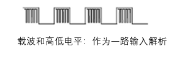
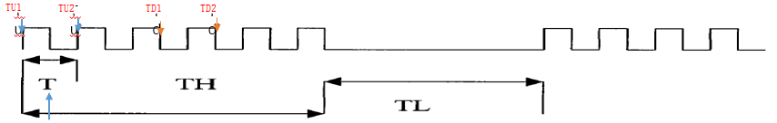
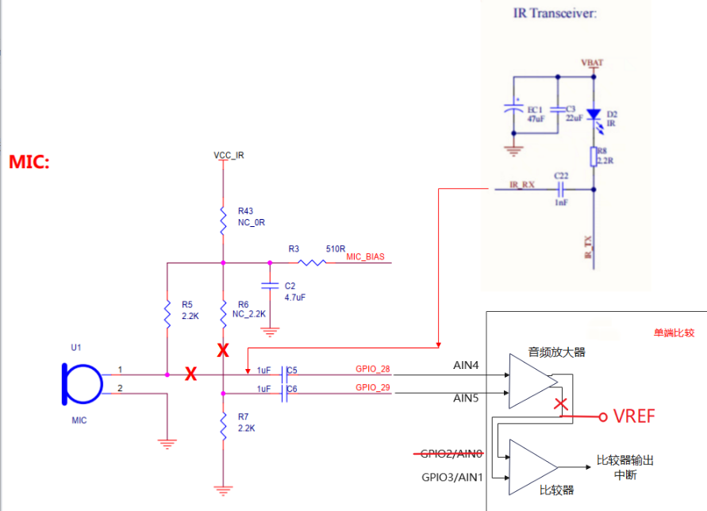

# Preface<a name="ZH-CN_TOPIC_0000001916630580"></a>

**Overview<a name="section4537382116410"></a>**

BS2XV100 provides developers with IR learning-related interfaces through APIs (Application Programming Interfaces), including interfaces related to IR learning, transmission, and restoring default settings.

**Reader Audience<a name="section4378592816410"></a>**

This document is mainly applicable to the following engineers:

- Technical support engineers
- Software development engineers
- Software test engineers

**Symbol Conventions<a name="section133020216410"></a>**

The following symbols may appear in this document, and their meanings are as follows.

| Symbol | Description |
| --- | --- |
| [Image] | Indicates a hazard with a high level of risk that, if not avoided, will result in death or serious injury. |
| [Image] | Indicates a hazard with a medium level of risk that, if not avoided, may result in death or serious injury. |
| [Image] | Indicates a hazard with a low level of risk that, if not avoided, may result in minor or moderate injury. |
| [Image] | Used to deliver device- or environment-safety warning information. If not avoided, it may cause equipment damage, data loss, degraded equipment performance, or other unpredictable results. "Cautions" do not involve personal injury. |
| [Image] | Supplementary explanation of key information in the main text. "Notes" are not safety warning information and do not involve personal, equipment, or environmental injury information. |

**Modification Records<a name="section2467512116410"></a>**

| Doc Version | Release Date | Modification Description |
| --- | --- | --- |
| 03 | 2025-12-01 | Updated the content of the "[IR Learning Through the Comparator](通过比较器进行红外学习.md)" chapter. |
| 02 | 2025-05-30 | Updated the content of the "[IR Learning Method](红外学习方式.md)" chapter. Updated the content of the "[IR Learning Through the Comparator](通过比较器进行红外学习.md)" chapter. |
| 01 | 2024-07-03 | First official version release. |

# IR Learning Method<a name="ZH-CN_TOPIC_0000001939306369"></a>

**Waveform Copy Learning Method<a name="section648524210116"></a>**

Description method: **carrier frequency + high and low level duration times, i.e., the high and low level description method.**

Design idea: completely copy the signal emitted by the original remote control, regardless of the format of the remote control. Currently, the learned waveform data is stored through the SFC interface into the IR Region address defined in memory_config_common.h, and when sending, the data is read out and sent.

Advantages: very good universality, can describe some protocols without caring about the definition of logical values. The carrier frequency and high and low levels are also information that is very easy to obtain.

Waveform copy learning method analysis:

Environment preparation: the IR receiver needs to be able to receive the IR carrier and input it, analyzing the carrier period together with the high and low levels.



**Carrier Frequency Resolution Method<a name="section267555215112"></a>**

Calculate the time difference between two falling edges. Carrier period: Td1 – Td2 (us); carrier frequency: 1/(Td1 – Td2) (us). Use tcxo to record the times of the two falling edges separately, calculate the difference, and after learning ends, average all the differences to calculate the carrier frequency.

Calculate the time difference between two rising edges. Carrier period: Tu1 – Tu2 (us); carrier frequency: 1/(Td1 – Td2) (us). Use tcxo to record the times of the two rising/falling edges separately, calculate the difference, and after learning ends, average all the differences to calculate the carrier frequency.

**Figure 1** IR Carrier Calculation


**High and Low Level Resolution Method<a name="section1726914719127"></a>**

1. Record the current time at Tu. After calculating the carrier frequency, start a timer of approximately two carrier periods.
2. When the next gpio interrupt arrives, clear and restart the timer.
3. When the timer interrupt is entered, it means there is no more gpio interrupt, and the IR waveform has entered the low-level phase. At this point, calculate TH (the previous high-level time), and start a timeout timer for 200ms on the first timer interrupt, used for the learning-end processing interrupt.
4. Enter the gpio interrupt the next time, and calculate TL (the previous low-level time). Then repeat steps 1 to 3.

In this way, the high and low level times are calculated.

```
static void ir_tickentry(void)
{
    uint64_t current_time = uapi_tcxo_get_us();
    if (g_rx_count == 0) {
        g_carrier_timer = (g_carrier_timer / IR_TICK_COUNT) + IR_TIMER_DELAY;
    }
    g_rx_pattern[g_rx_count] = (int16_t)(current_time - IR_TIMER1_OUT_US + g_carrier_timer - g_rx_start);
    g_rx_count++;
    g_rx_start = current_time  - IR_TIMER1_OUT_US;
    g_timer_flag = true;
    if (g_rx_count == 1) {
        ir_clock_check_study_end(IR_TIMER0_OUT_US);
    }
ir_port_tick_timer1_eoi_clr();
osal_irq_clear(TIMER_1_IRQN);
}
```

# IR Learning Through the Comparator<a name="ZH-CN_TOPIC_0000001900706844"></a>

A new uapi_ir_study_by_cmp_start interface has been added, which requires a hardware board modification and is not yet used in the demo. To reduce the BOM cost of the remote control, there is an attempt to use the comparator inside the chip as the IR RX, so as to reduce the number of board-level active devices and thereby reduce the BOM cost.

The IR transceiver pin R2 is connected to the IR control pin IR_TX through the current-limiting resistor R8. In the IR receiving state, IR_TX is pulled up to a high level. Under IR light, D2 generates a photosensitive voltage, which is AC-coupled through C22 to the comparator input pin of BS2X. The chip comparator of BS2X requires a DC bias, which is generated by a 20k/10k resistor to produce a 1/3VDD bias. Meanwhile, to reduce the static leakage of this resistor, it can be turned off and controlled through GPIO.

**Figure 1** IR Learning Schematic


**Comparator Learning Method<a name="section4754184811318"></a>**

Use the comparator interrupt to replace the original IR RX gpio input interrupt. The resolution method is the same as that in "[IR Learning Method](红外学习方式.md)". Other operations remain unchanged; simply call uapi_ir_study_by_cmp_start.

# Usage Guide<a name="ZH-CN_TOPIC_0000001900546940"></a>

1. Call the uapi_ir_study_start interface to start learning. The parameter is the key value of the button to be learned.

   ```
   void uapi_ir_study_start(uint8_t key_value)
   {
       g_rx_key = key_value;
       g_rx_count = 0;
       g_rx_start = 0;
       g_carrier_count = 0;
       g_carrier_timer_start = 0;
       g_carrier_timer = 0;
       g_carrier_flag = false;
       g_timer_flag = false;
       (void)memset_s(g_rx_pattern, PATTERN_LEN * sizeof(int16_t), 0, PATTERN_LEN * sizeof(int16_t));
       ir_port_flash_reg_read(IR_FLASH_OFFSET, (uint8_t*)(g_study_tmp_buff[0]), 0xFA0);
       ir_port_flash_reg_erase(IR_FLASH_OFFSET, 0x1000);
       ir_flash_write(key_value, (uint32_t**)g_study_tmp_buff);
       ir_port_unregister_irq(TIMER_1_IRQN);
       ir_port_register_irq(TIMER_1_IRQN, (osal_irq_handler)ir_tickentry);
       ir_port_unregister_irq(TIMER_0_IRQN);
       ir_port_register_irq(TIMER_0_IRQN, (osal_irq_handler)ir_study_end_tickentry);
       ir_port_gpio_init();
       ir_port_unregister_irq(GPIO_0_IRQN);
       ir_port_register_irq(GPIO_0_IRQN, (osal_irq_handler)ir_gpio_irq_handler);
   }
   ```

2. Timer1 is the carrier timeout interrupt. Only after approximately two carrier periods without a gpio interrupt will the timer1 interrupt function be entered. When entering the timer1 interrupt function, the gpio level is maintained at an idle/sustained low level, and at this time the previous high-level period is calculated.

   ```
   static void ir_tickentry(void)
   {
       uint64_t current_time = uapi_tcxo_get_us();
       if (g_rx_count == 0) {
           g_carrier_timer = (g_carrier_timer / IR_TICK_COUNT) + IR_TIMER_DELAY;
       }
       g_rx_pattern[g_rx_count] = (int16_t)(current_time - IR_TIMER1_OUT_US + g_carrier_timer - g_rx_start);
       g_rx_count++;
       g_rx_start = current_time  - IR_TIMER1_OUT_US;
       g_timer_flag = true;
       if (g_rx_count == 1) {
           ir_clock_check_study_end(IR_TIMER0_OUT_US);
       }
       ir_port_tick_timer1_eoi_clr();
       osal_irq_clear(TIMER_1_IRQN);
   }
   ```

3. Timer0 is the learning timeout/end interrupt. It starts timing the first time the timer1 interrupt function is entered, for a period of 200ms. In this interrupt function, the learned carrier data is written to the flash.

   ```
   static void ir_study_end_tickentry(void)
   {
       ir_port_tick_timer1_disable();
       ir_port_tick_timer0_disable();
       ir_port_gpio_mask_interrupt();
       uint32_t addr = 0;
       rx_pattern_info_t rx_info;
       rx_info.length = (uint32_t)g_rx_count;
       g_rx_count = 0;
       rx_info.rx_buff = g_rx_pattern;
       uint32_t irq_sts = osal_irq_lock();
       for (uint8_t i = 0; i < IR_KEY_NUM; i++) {
           if (g_rx_key == g_rx_key_index[i]) {
               addr = g_rx_addr_map[i];
               break;
           }
   }

   ir_study_freq_set(&rx_info.freq);

   if (rx_info.freq == 0 && g_ir_cb_register_flag == true) {
       g_ir_callback(IR_STUDY_FAILURE);
   }

   if (addr < IR_FLASH_OFFSET || addr > IR_FLASH_OFFSET + IR_FLASH_LENGTH) {
       osal_irq_restore(irq_sts);
       ir_port_cmp_deinit();
       osal_irq_clear(TIMER_0_IRQN);
       osal_printk("ir study addr error:0x%x\n", addr);
       return;
   }
   ir_port_flash_reg_write(addr, (uint8_t *)(&rx_info),
                           sizeof(uint32_t) * IR_FLASH_REG_OFFSET);
   ir_port_flash_reg_write(addr + sizeof(uint32_t) * IR_FLASH_REG_OFFSET, (uint8_t *) 
                          (rx_info.rx_buff), (rx_info.length) * sizeof(int16_t));
   if (g_ir_cb_register_flag == true) {
       g_ir_callback(IR_STUDY_SUCCESS);
   }
   osal_irq_restore(irq_sts);
   ir_port_tick_timer0_eoi_clr();
   osal_irq_clear(TIMER_0_IRQN);
   }
   ```

Note: the flash space currently reserved for IR learning is 4K, and the starting address is IR_FLASH_OFFSET.
