# Preface<a name="ZH-CN_TOPIC_0000001664984038"></a>

**Overview<a name="section4537382116410"></a>**

This document mainly describes BS2X device driver development, including working principles, interface usage described by scenario, and precautions.

This document uses BS21 as an example for illustration. It will not be explained separately later. Please be aware of this.

All driver interfaces return a value. When using them, it is recommended that you check the return value of each interface to determine whether the execution succeeded. For the error codes of return values, see "include/errcode.h".

**Product Version<a name="section12266191774710"></a>**

<a name="table2270181717471"></a>
<table><thead align="left"><tr id="row15364171712479"><th class="cellrowborder" valign="top" width="31.759999999999998%" id="mcps1.1.3.1.1"><p id="p123646174478"><a name="p123646174478"></a><a name="p123646174478"></a><strong id="b4974171818546"><a name="b4974171818546"></a><a name="b4974171818546"></a>Product Name</strong></p>
</th>
<th class="cellrowborder" valign="top" width="68.24%" id="mcps1.1.3.1.2"><p id="p1936401717470"><a name="p1936401717470"></a><a name="p1936401717470"></a><strong id="b14976118115417"><a name="b14976118115417"></a><a name="b14976118115417"></a>Product Version</strong></p>
</th>
</tr>
</thead>
<tbody><tr id="row19364317104716"><td class="cellrowborder" valign="top" width="31.759999999999998%" headers="mcps1.1.3.1.1 "><p id="p14623132513473"><a name="p14623132513473"></a><a name="p14623132513473"></a>BS2X</p>
</td>
<td class="cellrowborder" valign="top" width="68.24%" headers="mcps1.1.3.1.2 "><p id="p56214251471"><a name="p56214251471"></a><a name="p56214251471"></a>V100</p>
</td>
</tr>
</tbody>
</table>

**Reader Audience<a name="section4378592816410"></a>**

This document is mainly applicable to the following engineers:

-   Technical support engineer
-   Software development engineer

**Symbol Conventions<a name="section133020216410"></a>**

The following symbols may appear in this document, and their meanings are as follows.

<a name="table2622507016410"></a>
<table><thead align="left"><tr id="row1530720816410"><th class="cellrowborder" valign="top" width="20.580000000000002%" id="mcps1.1.3.1.1"><p id="p6450074116410"><a name="p6450074116410"></a><a name="p6450074116410"></a><strong id="b2136615816410"><a name="b2136615816410"></a><a name="b2136615816410"></a>Symbol</strong></p>
</th>
<th class="cellrowborder" valign="top" width="79.42%" id="mcps1.1.3.1.2"><p id="p5435366816410"><a name="p5435366816410"></a><a name="p5435366816410"></a><strong id="b5941558116410"><a name="b5941558116410"></a><a name="b5941558116410"></a>Description</strong></p>
</th>
</tr>
</thead>
<tbody><tr id="row1372280416410"><td class="cellrowborder" valign="top" width="20.580000000000002%" headers="mcps1.1.3.1.1 "><p id="p3734547016410"><a name="p3734547016410"></a><a name="p3734547016410"></a><a name="image2670064316410"></a><a name="image2670064316410"></a><span></span></p>
</td>
<td class="cellrowborder" valign="top" width="79.42%" headers="mcps1.1.3.1.2 "><p id="p1757432116410"><a name="p1757432116410"></a><a name="p1757432116410"></a>Indicates a high-level risk hazard that, if not avoided, will result in death or serious injury.</p>
</td>
</tr>
<tr id="row466863216410"><td class="cellrowborder" valign="top" width="20.580000000000002%" headers="mcps1.1.3.1.1 "><p id="p1432579516410"><a name="p1432579516410"></a><a name="p1432579516410"></a><a name="image4895582316410"></a><a name="image4895582316410"></a><span></span></p>
</td>
<td class="cellrowborder" valign="top" width="79.42%" headers="mcps1.1.3.1.2 "><p id="p959197916410"><a name="p959197916410"></a><a name="p959197916410"></a>Indicates a medium-level risk hazard that, if not avoided, could result in death or serious injury.</p>
</td>
</tr>
<tr id="row123863216410"><td class="cellrowborder" valign="top" width="20.580000000000002%" headers="mcps1.1.3.1.1 "><p id="p1232579516410"><a name="p1232579516410"></a><a name="p1232579516410"></a><a name="image1235582316410"></a><a name="image1235582316410"></a><span></span></p>
</td>
<td class="cellrowborder" valign="top" width="79.42%" headers="mcps1.1.3.1.2 "><p id="p123197916410"><a name="p123197916410"></a><a name="p123197916410"></a>Indicates a low-level risk hazard that, if not avoided, could result in minor or moderate injury.</p>
</td>
</tr>
<tr id="row5786682116410"><td class="cellrowborder" valign="top" width="20.580000000000002%" headers="mcps1.1.3.1.1 "><p id="p2204984716410"><a name="p2204984716410"></a><a name="p2204984716410"></a><a name="image4504446716410"></a><a name="image4504446716410"></a><span></span></p>
</td>
<td class="cellrowborder" valign="top" width="79.42%" headers="mcps1.1.3.1.2 "><p id="p4388861916410"><a name="p4388861916410"></a><a name="p4388861916410"></a>Used to convey safety warning information about equipment or the environment. If not avoided, it may result in equipment damage, data loss, reduced equipment performance, or other unpredictable consequences.</p>
<p id="p1238861916410"><a name="p1238861916410"></a><a name="p1238861916410"></a>"Notice" does not involve personal injury.</p>
</td>
</tr>
<tr id="row2856923116410"><td class="cellrowborder" valign="top" width="20.580000000000002%" headers="mcps1.1.3.1.1 "><p id="p5555360116410"><a name="p5555360116410"></a><a name="p5555360116410"></a><a name="image799324016410"></a><a name="image799324016410"></a><span></span></p>
</td>
<td class="cellrowborder" valign="top" width="79.42%" headers="mcps1.1.3.1.2 "><p id="p4612588116410"><a name="p4612588116410"></a><a name="p4612588116410"></a>Supplementary description of key information in the text.</p>
<p id="p1232588116410"><a name="p1232588116410"></a><a name="p1232588116410"></a>"Note" is not safety warning information and does not involve personal, equipment, or environmental injury information.</p>
</td>
</tr>
</tbody>
</table>

**Modification Record<a name="section2467512116410"></a>**

<a name="table1557726816410"></a>
<table><thead align="left"><tr id="row2942532716410"><th class="cellrowborder" valign="top" width="18.7%" id="mcps1.1.4.1.1"><p id="p3778275416410"><a name="p3778275416410"></a><a name="p3778275416410"></a><strong id="b5687322716410"><a name="b5687322716410"></a><a name="b5687322716410"></a>Document Version</strong></p>
</th>
<th class="cellrowborder" valign="top" width="20.24%" id="mcps1.1.4.1.2"><p id="p5627845516410"><a name="p5627845516410"></a><a name="p5627845516410"></a><strong id="b5800814916410"><a name="b5800814916410"></a><a name="b5800814916410"></a>Release Date</strong></p>
</th>
<th class="cellrowborder" valign="top" width="61.06%" id="mcps1.1.4.1.3"><p id="p2382284816410"><a name="p2382284816410"></a><a name="p2382284816410"></a><strong id="b3316380216410"><a name="b3316380216410"></a><a name="b3316380216410"></a>Modification Description</strong></p>
</th>
</tr>
</thead>
<tbody><tr id="row1266933416359"><td class="cellrowborder" valign="top" width="18.7%" headers="mcps1.1.4.1.1 "><p id="p17670143415352"><a name="p17670143415352"></a><a name="p17670143415352"></a>07</p>
</td>
<td class="cellrowborder" valign="top" width="20.24%" headers="mcps1.1.4.1.2 "><p id="p16701034113518"><a name="p16701034113518"></a><a name="p16701034113518"></a>2025-11-07</p>
</td>
<td class="cellrowborder" valign="top" width="61.06%" headers="mcps1.1.4.1.3 "><a name="ul935793153613"></a><a name="ul935793153613"></a><ul id="ul935793153613"><li>Updated the "<a href="概述-10.md">Overview</a>" section of "<a href="SPI.md">SPI</a>".</li><li>Updated the "<a href="功能描述-16.md">Function Description</a>" section of "<a href="I2C.md">I2C</a>".</li><li>Added the "<a href="TRNG.md">TRNG</a>" section.</li></ul>
</td>
</tr>
<tr id="row44971270352"><td class="cellrowborder" valign="top" width="18.7%" headers="mcps1.1.4.1.1 "><p id="p0498927143517"><a name="p0498927143517"></a><a name="p0498927143517"></a>06</p>
</td>
<td class="cellrowborder" valign="top" width="20.24%" headers="mcps1.1.4.1.2 "><p id="p649814275359"><a name="p649814275359"></a><a name="p649814275359"></a>2025-08-07</p>
</td>
<td class="cellrowborder" valign="top" width="61.06%" headers="mcps1.1.4.1.3 "><a name="ul15657113573710"></a><a name="ul15657113573710"></a><ul id="ul15657113573710"><li>Updated the "<a href="注意事项.md">Precautions</a>" section of "<a href="Pinctrl.md">Pinctrl</a>".</li><li>Updated the "<a href="KCONFIG配置-7.md">KCONFIG Configuration</a>" section of "<a href="UART.md">UART</a>".</li><li>Updated the "<a href="开发指引-13.md">Development Guide</a>" section of "<a href="SPI.md">SPI</a>".</li></ul>
</td>
</tr>
<tr id="row38251145121716"><td class="cellrowborder" valign="top" width="18.7%" headers="mcps1.1.4.1.1 "><p id="p78261345151715"><a name="p78261345151715"></a><a name="p78261345151715"></a>05</p>
</td>
<td class="cellrowborder" valign="top" width="20.24%" headers="mcps1.1.4.1.2 "><p id="p682619456178"><a name="p682619456178"></a><a name="p682619456178"></a>2025-05-30</p>
</td>
<td class="cellrowborder" valign="top" width="61.06%" headers="mcps1.1.4.1.3 "><a name="ul63460595179"></a><a name="ul63460595179"></a><ul id="ul63460595179"><li>Updated the "<a href="Pinctrl.md">Pinctrl</a>" section.</li><li>Updated the "<a href="SPI.md">SPI</a>" section.</li><li>Updated the "<a href="KCONFIG配置-17.md">KCONFIG Configuration</a>" section of "<a href="I2C.md">I2C</a>".</li><li>Updated the "<a href="ADC.md">ADC</a>" section.</li><li>Updated the "<a href="Flash.md">Flash</a>" section.</li><li>Updated the "<a href="PDM.md">PDM</a>" section.</li></ul>
</td>
</tr>
<tr id="row164061558155320"><td class="cellrowborder" valign="top" width="18.7%" headers="mcps1.1.4.1.1 "><p id="p1440611586536"><a name="p1440611586536"></a><a name="p1440611586536"></a>04</p>
</td>
<td class="cellrowborder" valign="top" width="20.24%" headers="mcps1.1.4.1.2 "><p id="p640615810534"><a name="p640615810534"></a><a name="p640615810534"></a>2025-01-24</p>
</td>
<td class="cellrowborder" valign="top" width="61.06%" headers="mcps1.1.4.1.3 "><a name="ul615755620593"></a><a name="ul615755620593"></a><ul id="ul615755620593"><li>Updated the "<a href="Pinctrl.md">Pinctrl</a>" section.</li><li>Updated the "<a href="GPIO.md">GPIO</a>" section.</li><li>Updated the "<a href="UART.md">UART</a>" section.</li><li>Updated the "<a href="SPI.md">SPI</a>" section.</li><li>Updated the "<a href="ADC.md">ADC</a>" section.</li><li>Updated the "<a href="注意事项-29.md">Precautions</a>" section of "<a href="DMA.md">DMA</a>".</li><li>Updated the "<a href="功能描述-56.md">Function Description</a>" section of "<a href="Flash.md">Flash</a>".</li><li>Updated the "<a href="开发指引-72.md">Development Guide</a>" section of "<a href="KEYSCAN.md">KEYSCAN</a>".</li></ul>
</td>
</tr>
<tr id="row414616224214"><td class="cellrowborder" valign="top" width="18.7%" headers="mcps1.1.4.1.1 "><p id="p1814732211217"><a name="p1814732211217"></a><a name="p1814732211217"></a>03</p>
</td>
<td class="cellrowborder" valign="top" width="20.24%" headers="mcps1.1.4.1.2 "><p id="p121473221426"><a name="p121473221426"></a><a name="p121473221426"></a>2024-08-29</p>
</td>
<td class="cellrowborder" valign="top" width="61.06%" headers="mcps1.1.4.1.3 "><a name="ul1445518311325"></a><a name="ul1445518311325"></a><ul id="ul1445518311325"><li>Updated the sections from "<a href="UART.md">UART</a>" to "<a href="KEYSCAN.md">KEYSCAN</a>".</li><li>Added the "<a href="附-MIDDLEWARE.md">Appendix: MIDDLEWARE</a>" section.</li></ul>
</td>
</tr>
<tr id="row56526215381"><td class="cellrowborder" valign="top" width="18.7%" headers="mcps1.1.4.1.1 "><p id="p196527203819"><a name="p196527203819"></a><a name="p196527203819"></a>02</p>
</td>
<td class="cellrowborder" valign="top" width="20.24%" headers="mcps1.1.4.1.2 "><p id="p26526219385"><a name="p26526219385"></a><a name="p26526219385"></a>2024-07-05</p>
</td>
<td class="cellrowborder" valign="top" width="61.06%" headers="mcps1.1.4.1.3 "><a name="ul61901041124413"></a><a name="ul61901041124413"></a><ul id="ul61901041124413"><li>Updated the "<a href="GPIO.md">GPIO</a>" section.</li><li>Updated the "<a href="UART.md">UART</a>" section.</li><li>Updated the "<a href="SPI.md">SPI</a>" section.</li><li>Updated the "<a href="I2C.md">I2C</a>" section.</li><li>Updated the "<a href="ADC.md">ADC</a>" section.</li><li>Updated the "<a href="PWM.md">PWM</a>" section.</li><li>Updated the "<a href="WDT.md">WDT</a>" section.</li><li>Updated the "<a href="Timer.md">Timer</a>" section.</li><li>Added the "<a href="SFC.md">SFC</a>" section.</li><li>Updated the "<a href="KEYSCAN.md">KEYSCAN</a>" section.</li></ul>
</td>
</tr>
<tr id="row476215371297"><td class="cellrowborder" valign="top" width="18.7%" headers="mcps1.1.4.1.1 "><p id="p127628371694"><a name="p127628371694"></a><a name="p127628371694"></a>01</p>
</td>
<td class="cellrowborder" valign="top" width="20.24%" headers="mcps1.1.4.1.2 "><p id="p14762133718911"><a name="p14762133718911"></a><a name="p14762133718911"></a>2024-05-24</p>
</td>
<td class="cellrowborder" valign="top" width="61.06%" headers="mcps1.1.4.1.3 "><p id="p169114261115"><a name="p169114261115"></a><a name="p169114261115"></a>First official version released.</p>
</td>
</tr>
<tr id="row17170182910502"><td class="cellrowborder" valign="top" width="18.7%" headers="mcps1.1.4.1.1 "><p id="p71709297505"><a name="p71709297505"></a><a name="p71709297505"></a>00B03</p>
</td>
<td class="cellrowborder" valign="top" width="20.24%" headers="mcps1.1.4.1.2 "><p id="p1017016291507"><a name="p1017016291507"></a><a name="p1017016291507"></a>2024-03-01</p>
</td>
<td class="cellrowborder" valign="top" width="61.06%" headers="mcps1.1.4.1.3 "><a name="ul086961118191"></a><a name="ul086961118191"></a><ul id="ul086961118191"><li>Added the "<a href="ADC.md">ADC</a>" section.</li><li>Added the "<a href="Flash.md">Flash</a>" section.</li></ul>
</td>
</tr>
<tr id="row1451783420416"><td class="cellrowborder" valign="top" width="18.7%" headers="mcps1.1.4.1.1 "><p id="p45178349411"><a name="p45178349411"></a><a name="p45178349411"></a>00B02</p>
</td>
<td class="cellrowborder" valign="top" width="20.24%" headers="mcps1.1.4.1.2 "><p id="p139931361649"><a name="p139931361649"></a><a name="p139931361649"></a>2023-10-27</p>
</td>
<td class="cellrowborder" valign="top" width="61.06%" headers="mcps1.1.4.1.3 "><p id="p13313221169"><a name="p13313221169"></a><a name="p13313221169"></a>Added the "<a href="USB_DFU.md">USB_DFU</a>" section.</p>
</td>
</tr>
<tr id="row5947359616410"><td class="cellrowborder" valign="top" width="18.7%" headers="mcps1.1.4.1.1 "><p id="p2149706016410"><a name="p2149706016410"></a><a name="p2149706016410"></a>00B01</p>
</td>
<td class="cellrowborder" valign="top" width="20.24%" headers="mcps1.1.4.1.2 "><p id="p648803616410"><a name="p648803616410"></a><a name="p648803616410"></a>2023-09-27</p>
</td>
<td class="cellrowborder" valign="top" width="61.06%" headers="mcps1.1.4.1.3 "><p id="p1946537916410"><a name="p1946537916410"></a><a name="p1946537916410"></a>First provisional version released.</p>
</td>
</tr>
</tbody>
</table>

# Pinctrl<a name="ZH-CN_TOPIC_0000001665143778"></a>


## Overview<a name="ZH-CN_TOPIC_0000001713103581"></a>

The Pinctrl controller is provided to control the multiplexing function of IO pins. The configurable specifications are as follows:

-   Supports configuring 32 IO pins.
-   Supports configuring IO drive strength, IO function multiplexing, and setting IO pull-up/pull-down states.

## Function Description<a name="ZH-CN_TOPIC_0000001665143782"></a>

The interfaces and functions provided by the Pinctrl driver module are as follows:

-   uapi\_pin\_init(void): Initializes Pinctrl.
-   uapi\_pin\_deinit(void): Deinitializes Pinctrl.
-   uapi\_pin\_set\_mode(pin\_t pin, pin\_mode\_t mode): Sets the multiplexing mode of the specified IO (pin indicates the current IO pin, and mode indicates the multiplexing mode to be configured for the current pin).
-   uapi\_pin\_get\_mode(pin\_t pin): Gets the multiplexing mode of the specified IO (pin indicates the current IO pin).
-   uapi\_pin\_set\_ds(pin\_t pin, pin\_drive\_strength\_t ds): Sets the drive strength of the specified IO (pin indicates the current IO pin, and ds indicates the drive strength to be configured for the current pin).
-   uapi\_pin\_get\_ds(pin\_t pin): Gets the drive strength of the specified IO (pin indicates the current IO pin).
-   uapi\_pin\_set\_pull(pin\_t pin, pin\_pull\_t pull\_type): Sets the pull-up/pull-down state of the specified IO (pin indicates the current IO pin, and pull\_type indicates the pull-up/pull-down state to be configured for the current pin).
-   uapi\_pin\_get\_pull(pin\_t pin): Gets the pull-up/pull-down state of the specified IO (pin indicates the current IO pin).
-   uapi\_pin\_set\_ie(pin\_t pin, pin\_input\_enable\_t ie): Sets the IE enable/disable of the specified IO (pin indicates the current IO pin, and ie indicates the input interrupt enable state to be configured for the current pin). (It is available only when the CONFIG\_PINCTRL\_SUPPORT\_IE macro is enabled)
-   uapi\_pin\_get\_ie(pin\_t pin): Gets the IE enable/disable of the specified IO (pin indicates the current IO pin). (It is available only when the CONFIG\_PINCTRL\_SUPPORT\_IE macro is enabled)

## KCONFIG Configuration<a name="ZH-CN_TOPIC_0000001896045838"></a>

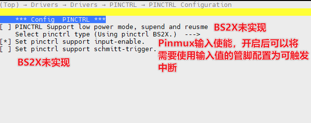

> **Note:** 
>If the content shown in the above figure is inconsistent with the description in [Table 1](#table16629938173916), refer to [Table 1](#table16629938173916).

The specific descriptions of the configuration macros are shown in [Table 1](#table16629938173916).

**Table 1**  Descriptions of PINCTRL-related macros

<a name="table16629938173916"></a>
<table><thead align="left"><tr id="row1462913813915"><th class="cellrowborder" valign="top" width="22.657734226577347%" id="mcps1.2.7.1.1"><p id="p1962923853920"><a name="p1962923853920"></a><a name="p1962923853920"></a>Macro name (CONFIG_ is the prefix added by default)</p>
</th>
<th class="cellrowborder" valign="top" width="21.1078892110789%" id="mcps1.2.7.1.2"><p id="p962916388395"><a name="p962916388395"></a><a name="p962916388395"></a>Specific description displayed on the Kconfig interface</p>
</th>
<th class="cellrowborder" valign="top" width="19.878012198780127%" id="mcps1.2.7.1.3"><p id="p18731420115119"><a name="p18731420115119"></a><a name="p18731420115119"></a>Usage scenario</p>
</th>
<th class="cellrowborder" valign="top" width="10.618938106189384%" id="mcps1.2.7.1.4"><p id="p537485457"><a name="p537485457"></a><a name="p537485457"></a>Implemented</p>
</th>
<th class="cellrowborder" valign="top" width="11.338866113388663%" id="mcps1.2.7.1.5"><p id="p1162915382392"><a name="p1162915382392"></a><a name="p1162915382392"></a>Depends on other macros</p>
</th>
<th class="cellrowborder" valign="top" width="14.398560143985604%" id="mcps1.2.7.1.6"><p id="p1162923893911"><a name="p1162923893911"></a><a name="p1162923893911"></a>Whether to enable</p>
</th>
</tr>
</thead>
<tbody><tr id="row16629338103916"><td class="cellrowborder" valign="top" width="22.657734226577347%" headers="mcps1.2.7.1.1 "><p id="p166291338133910"><a name="p166291338133910"></a><a name="p166291338133910"></a>CONFIG_PINCTRL_SUPPORT_LPM</p>
</td>
<td class="cellrowborder" valign="top" width="21.1078892110789%" headers="mcps1.2.7.1.2 "><p id="p106291638163910"><a name="p106291638163910"></a><a name="p106291638163910"></a>PINCTRL support low power mode, supend and reusme.</p>
</td>
<td class="cellrowborder" valign="top" width="19.878012198780127%" headers="mcps1.2.7.1.3 "><p id="p77352085114"><a name="p77352085114"></a><a name="p77352085114"></a>This macro is used only in low-power scenarios.</p>
</td>
<td class="cellrowborder" valign="top" width="10.618938106189384%" headers="mcps1.2.7.1.4 "><p id="p166297382397"><a name="p166297382397"></a><a name="p166297382397"></a>No</p>
</td>
<td class="cellrowborder" valign="top" width="11.338866113388663%" headers="mcps1.2.7.1.5 "><p id="p162983873917"><a name="p162983873917"></a><a name="p162983873917"></a>No</p>
</td>
<td class="cellrowborder" valign="top" width="14.398560143985604%" headers="mcps1.2.7.1.6 "><p id="p0629838133914"><a name="p0629838133914"></a><a name="p0629838133914"></a>Enabled by default, but not yet implemented in this product; it is recommended to disable it.</p>
</td>
</tr>
<tr id="row166299383394"><td class="cellrowborder" valign="top" width="22.657734226577347%" headers="mcps1.2.7.1.1 "><p id="p14629173813920"><a name="p14629173813920"></a><a name="p14629173813920"></a>CONFIG_PINCTRL_USING_BS2X</p>
</td>
<td class="cellrowborder" valign="top" width="21.1078892110789%" headers="mcps1.2.7.1.2 "><p id="p962923816395"><a name="p962923816395"></a><a name="p962923816395"></a>Using pinctrl BS2X.</p>
</td>
<td class="cellrowborder" valign="top" width="19.878012198780127%" headers="mcps1.2.7.1.3 "><p id="p1373182005115"><a name="p1373182005115"></a><a name="p1373182005115"></a>A macro specific to the BS2X series</p>
</td>
<td class="cellrowborder" valign="top" width="10.618938106189384%" headers="mcps1.2.7.1.4 "><p id="p166291838143916"><a name="p166291838143916"></a><a name="p166291838143916"></a>Yes</p>
</td>
<td class="cellrowborder" valign="top" width="11.338866113388663%" headers="mcps1.2.7.1.5 "><p id="p2629138193917"><a name="p2629138193917"></a><a name="p2629138193917"></a>No</p>
</td>
<td class="cellrowborder" valign="top" width="14.398560143985604%" headers="mcps1.2.7.1.6 "><p id="p126297381398"><a name="p126297381398"></a><a name="p126297381398"></a>Enabled by default. Mandatory.</p>
</td>
</tr>
<tr id="row3629193823919"><td class="cellrowborder" valign="top" width="22.657734226577347%" headers="mcps1.2.7.1.1 "><p id="p262983811395"><a name="p262983811395"></a><a name="p262983811395"></a>CONFIG_PINCTRL_SUPPORT_IE</p>
</td>
<td class="cellrowborder" valign="top" width="21.1078892110789%" headers="mcps1.2.7.1.2 "><p id="p9629538173914"><a name="p9629538173914"></a><a name="p9629538173914"></a>Set pinctrl support input-enable.</p>
</td>
<td class="cellrowborder" valign="top" width="19.878012198780127%" headers="mcps1.2.7.1.3 "><p id="p117352016518"><a name="p117352016518"></a><a name="p117352016518"></a>This macro represents the input interrupt enable of Pinctrl. If a pin is configured as an input mode or has an input function, this macro must be enabled for its input value or input interrupt to take effect; otherwise, enable it as appropriate.</p>
</td>
<td class="cellrowborder" valign="top" width="10.618938106189384%" headers="mcps1.2.7.1.4 "><p id="p3629133873917"><a name="p3629133873917"></a><a name="p3629133873917"></a>Yes</p>
</td>
<td class="cellrowborder" valign="top" width="11.338866113388663%" headers="mcps1.2.7.1.5 "><p id="p062910387397"><a name="p062910387397"></a><a name="p062910387397"></a>No</p>
</td>
<td class="cellrowborder" valign="top" width="14.398560143985604%" headers="mcps1.2.7.1.6 "><p id="p1963621910"><a name="p1963621910"></a><a name="p1963621910"></a>Enabled by default. Recommended to enable.</p>
</td>
</tr>
<tr id="row962920381394"><td class="cellrowborder" valign="top" width="22.657734226577347%" headers="mcps1.2.7.1.1 "><p id="p1629738173912"><a name="p1629738173912"></a><a name="p1629738173912"></a>CONFIG_PINCTRL_SUPPORT_ST</p>
</td>
<td class="cellrowborder" valign="top" width="21.1078892110789%" headers="mcps1.2.7.1.2 "><p id="p186301738203918"><a name="p186301738203918"></a><a name="p186301738203918"></a>Set pinctrl support schmitt-trigger.</p>
</td>
<td class="cellrowborder" valign="top" width="19.878012198780127%" headers="mcps1.2.7.1.3 "><p id="p12731220125113"><a name="p12731220125113"></a><a name="p12731220125113"></a>Pinctrl supports Schmitt trigger.</p>
</td>
<td class="cellrowborder" valign="top" width="10.618938106189384%" headers="mcps1.2.7.1.4 "><p id="p7630938143910"><a name="p7630938143910"></a><a name="p7630938143910"></a>No</p>
</td>
<td class="cellrowborder" valign="top" width="11.338866113388663%" headers="mcps1.2.7.1.5 "><p id="p56301938153913"><a name="p56301938153913"></a><a name="p56301938153913"></a>No</p>
</td>
<td class="cellrowborder" valign="top" width="14.398560143985604%" headers="mcps1.2.7.1.6 "><p id="p19630238203917"><a name="p19630238203917"></a><a name="p19630238203917"></a>Disabled by default, but not yet implemented in this product; it is recommended to disable it.</p>
</td>
</tr>
</tbody>
</table>

## Development Guide<a name="ZH-CN_TOPIC_0000001665143786"></a>

The usage of the Pinctrl interface follows the steps below (the following steps are optional based on actual needs):

1.  Call the uapi\_pin\_init interface to initialize the PINCTRL module.
2.  Call the uapi\_pin\_set\_ie and uapi\_pin\_get\_ie interfaces to set/query the IE input interrupt enable/disable of the specified IO.
3.  Call the uapi\_pin\_set\_mode and uapi\_pin\_get\_mode interfaces to set/query the multiplexing mode of the specified IO.
4.  Call the uapi\_pin\_set\_ds and uapi\_pin\_get\_ds interfaces to set/query the drive strength of the specified IO.
5.  Call the uapi\_pin\_set\_pull and uapi\_pin\_get\_pull interfaces to set/query the pull-up/pull-down state of the specified IO.
6.  Call the uapi\_pin\_deinit interface to deinitialize the PINCTRL module.

Example:

```
    /* Initialize the PINCTRL module */ 
    uapi_pin_init();
    /* Enable the IE of S_MGPIO19 */
    uapi_pin_set_ie(S_MGPIO19, PIN_IE_1);
    /* Set the multiplexing function of S_MGPIO19 to GPIO */
    uapi_pin_set_mode(S_MGPIO19, HAL_PIO_FUNC_GPIO);
    /* Get the multiplexing function of S_MGPIO19 (GPIO) */
    pin_mode_t mode = uapi_pin_get_mode(S_MGPIO19);
    /* Set the drive strength of S_MGPIO19 to PIN_DS_2 */
    uapi_pin_set_ds(S_MGPIO19, PIN_DS_2);
    /* Get the drive strength of S_MGPIO19 (PIN_DS_2) */
    pin_drive_strength_t ds = uapi_pin_get_ds(S_MGPIO19);
    /* Set S_MGPIO19 to pull-up mode */
    uapi_pin_set_pull(S_MGPIO19, PIN_PULL_UP);
    /* Get S_MGPIO19 (pull-up mode) */
    pin_pull_t pull = uapi_pin_get_pull(S_MGPIO19);
    /* Deinitialize the PINCTRL module */ 
    uapi_pin_deinit();
```

## Precautions<a name="ZH-CN_TOPIC_0000001664984034"></a>

1.  When configuring the IO multiplexing function, pay attention to whether the IO supports the target function or has been multiplexed to other functions, to avoid affecting existing functions. For IO multiplexing, refer to the definition of the "pin\_mode\_t" structure in the source code "sdk\\drivers\\chips\\bs2x\\porting\\pinctrl\\pinctrl\_porting.h".

1.  By default, the SDK configures the IE of all pins as enabled. Generally, for pins on which interrupts may occur or which are responsible for data transmission, IE must be enabled to avoid affecting the IP functions. For other pins, IE can be disabled to avoid unnecessary IO leakage current that affects power consumption.

    This product has configured the pins that require IE enablement in the corresponding drivers.

    Configuration process: Use the function uapi\_pin\_set\_ie\(pin, PIN\_IE\_0/PIN\_IE\_1\) to disable/enable IE, and ensure that the CONFIG\_PINCTRL\_SUPPORT\_IE macro is enabled.

2.  PIN\_DS\_0 provides the weakest drive strength, and PIN\_DS\_3 provides the strongest.

> **Note:** 
>If IE is not enabled but a GPIO low-level interrupt is registered, the CPU will keep receiving interrupts.
>IE controls the input interrupt enable function. If GPIO is configured to output a high level, it is recommended to configure Pinctrl pull-up; otherwise, leakage current may occur.

# GPIO<a name="ZH-CN_TOPIC_0000001664984030"></a>


## Overview<a name="ZH-CN_TOPIC_0000001713023593"></a>

GPIO (General-purpose input/output) is the abbreviation for general-purpose input/output, a universal I/O interface standard. It can be configured as input or output mode to control external devices or communicate with other devices. It can be used to connect various devices, such as LED lights, sensors, actuators, and so on.

The GPIO specifications are as follows:

-   Supports setting/getting the GPIO pin direction and setting/getting the output level state.
-   Supports external level interrupt and external edge interrupt reporting.
-   Supports an independent interrupt for each GPIO.

## Function Description<a name="ZH-CN_TOPIC_0000001713023597"></a>

The interfaces and functions provided by the GPIO module are as follows:

-   uapi\_gpio\_init(void): Initializes GPIO.
-   uapi\_gpio\_deinit(void): Deinitializes GPIO.
-   uapi\_gpio\_set\_dir(pin\_t pin, gpio\_direction\_t dir): Sets the direction (input/output) of the specified GPIO (pin indicates the current IO pin, and dir indicates the input/output direction to be configured for the current pin).
-   uapi\_gpio\_get\_dir(pin\_t pin): Gets the direction (input/output) of the specified GPIO (pin indicates the current IO pin).
-   uapi\_gpio\_set\_val(pin\_t pin, gpio\_level\_t level): Sets the output level state of the specified GPIO (pin indicates the current IO pin, and level indicates the level state to be configured for the current pin).
-   uapi\_gpio\_get\_val(pin\_t pin): Gets the input level state of the specified GPIO (pin indicates the current IO pin).
-   uapi\_gpio\_get\_output\_val(pin\_t pin): Gets the output level state of the specified GPIO (pin indicates the current IO pin).
-   uapi\_gpio\_toggle(pin\_t pin): Toggles the output level state of GPIO (pin indicates the current IO pin).
-   uapi\_gpio\_register\_isr\_func(pin\_t pin, uint32\_t trigger, gpio\_callback\_t callback): Registers the interrupt of the specified GPIO (pin indicates the current IO pin, trigger indicates the interrupt type to be configured for the current pin, and callback indicates the callback function configured for the current pin).
-   uapi\_gpio\_unregister\_isr\_func(pin\_t pin): Unregisters the interrupt of the specified GPIO (pin indicates the current IO pin).
-   uapi\_gpio\_enable\_interrupt(pin\_t pin): Enables the GPIO interrupt (pin indicates the current IO pin).
-   uapi\_gpio\_disable\_interrupt(pin\_t pin): Disables the GPIO interrupt (pin indicates the current IO pin).
-   uapi\_gpio\_clear\_interrupt(pin\_t pin): Clears the GPIO interrupt (pin indicates the current IO pin).

## KCONFIG Configuration<a name="ZH-CN_TOPIC_0000001896206494"></a>

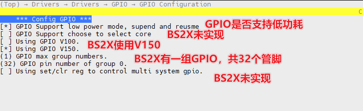

> **Note:** 
>If the content shown in the above figure is inconsistent with the description in [Table 1](#table16629938173916), refer to the table.

The specific descriptions of the configuration macros are shown in [Table 1](#table16629938173916).

**Table 1**  Descriptions of GPIO-related macros

<a name="table16629938173916"></a>
<table><thead align="left"><tr id="row1462913813915"><th class="cellrowborder" valign="top" width="22.62773722627738%" id="mcps1.2.7.1.1"><p id="p1962923853920"><a name="p1962923853920"></a><a name="p1962923853920"></a>Macro name (CONFIG_ is the prefix added by default)</p>
</th>
<th class="cellrowborder" valign="top" width="21.137886211378866%" id="mcps1.2.7.1.2"><p id="p962916388395"><a name="p962916388395"></a><a name="p962916388395"></a>Specific description displayed on the Kconfig interface</p>
</th>
<th class="cellrowborder" valign="top" width="19.878012198780127%" id="mcps1.2.7.1.3"><p id="p18731420115119"><a name="p18731420115119"></a><a name="p18731420115119"></a>Usage scenario</p>
</th>
<th class="cellrowborder" valign="top" width="10.618938106189384%" id="mcps1.2.7.1.4"><p id="p537485457"><a name="p537485457"></a><a name="p537485457"></a>Implemented</p>
</th>
<th class="cellrowborder" valign="top" width="11.338866113388663%" id="mcps1.2.7.1.5"><p id="p1162915382392"><a name="p1162915382392"></a><a name="p1162915382392"></a>Depends on other macros</p>
</th>
<th class="cellrowborder" valign="top" width="14.398560143985604%" id="mcps1.2.7.1.6"><p id="p1449914917569"><a name="p1449914917569"></a><a name="p1449914917569"></a>Whether to enable or modify the configuration</p>
</th>
</tr>
</thead>
<tbody><tr id="row16629338103916"><td class="cellrowborder" valign="top" width="22.62773722627738%" headers="mcps1.2.7.1.1 "><p id="p166291338133910"><a name="p166291338133910"></a><a name="p166291338133910"></a>CONFIG_GPIO_SUPPORT_LPM</p>
</td>
<td class="cellrowborder" valign="top" width="21.137886211378866%" headers="mcps1.2.7.1.2 "><p id="p106291638163910"><a name="p106291638163910"></a><a name="p106291638163910"></a>GPIO support low power mode, supend and reusme.</p>
</td>
<td class="cellrowborder" valign="top" width="19.878012198780127%" headers="mcps1.2.7.1.3 "><p id="p77352085114"><a name="p77352085114"></a><a name="p77352085114"></a>This macro is used only in low-power scenarios.</p>
</td>
<td class="cellrowborder" valign="top" width="10.618938106189384%" headers="mcps1.2.7.1.4 "><p id="p166297382397"><a name="p166297382397"></a><a name="p166297382397"></a>Yes</p>
</td>
<td class="cellrowborder" valign="top" width="11.338866113388663%" headers="mcps1.2.7.1.5 "><p id="p162983873917"><a name="p162983873917"></a><a name="p162983873917"></a>No</p>
</td>
<td class="cellrowborder" valign="top" width="14.398560143985604%" headers="mcps1.2.7.1.6 "><p id="p0629838133914"><a name="p0629838133914"></a><a name="p0629838133914"></a>Enabled by default. Enable it as appropriate; it is recommended to enable it.</p>
</td>
</tr>
<tr id="row166299383394"><td class="cellrowborder" valign="top" width="22.62773722627738%" headers="mcps1.2.7.1.1 "><p id="p14629173813920"><a name="p14629173813920"></a><a name="p14629173813920"></a>CONFIG_GPIO_SELECT_CORE</p>
</td>
<td class="cellrowborder" valign="top" width="21.137886211378866%" headers="mcps1.2.7.1.2 "><p id="p962923816395"><a name="p962923816395"></a><a name="p962923816395"></a>GPIO support choose to select core.</p>
</td>
<td class="cellrowborder" valign="top" width="19.878012198780127%" headers="mcps1.2.7.1.3 "><p id="p1373182005115"><a name="p1373182005115"></a><a name="p1373182005115"></a>GPIO supports multi-core selection, which is not used in this single-core product.</p>
</td>
<td class="cellrowborder" valign="top" width="10.618938106189384%" headers="mcps1.2.7.1.4 "><p id="p166291838143916"><a name="p166291838143916"></a><a name="p166291838143916"></a>No</p>
</td>
<td class="cellrowborder" valign="top" width="11.338866113388663%" headers="mcps1.2.7.1.5 "><p id="p2629138193917"><a name="p2629138193917"></a><a name="p2629138193917"></a>No</p>
</td>
<td class="cellrowborder" valign="top" width="14.398560143985604%" headers="mcps1.2.7.1.6 "><p id="p126297381398"><a name="p126297381398"></a><a name="p126297381398"></a>Disabled by default. It is not used in this product. It is recommended to disable it.</p>
</td>
</tr>
<tr id="row3629193823919"><td class="cellrowborder" valign="top" width="22.62773722627738%" headers="mcps1.2.7.1.1 "><p id="p262983811395"><a name="p262983811395"></a><a name="p262983811395"></a>CONFIG_GPIO_USING_V100</p>
</td>
<td class="cellrowborder" valign="top" width="21.137886211378866%" headers="mcps1.2.7.1.2 "><p id="p1173515130188"><a name="p1173515130188"></a><a name="p1173515130188"></a>Using GPIO V100.</p>
</td>
<td class="cellrowborder" valign="top" width="19.878012198780127%" headers="mcps1.2.7.1.3 "><p id="p117352016518"><a name="p117352016518"></a><a name="p117352016518"></a>This macro indicates the GPIO V100 driver specification, which is not used in this product.</p>
</td>
<td class="cellrowborder" valign="top" width="10.618938106189384%" headers="mcps1.2.7.1.4 "><p id="p3629133873917"><a name="p3629133873917"></a><a name="p3629133873917"></a>Yes</p>
</td>
<td class="cellrowborder" valign="top" width="11.338866113388663%" headers="mcps1.2.7.1.5 "><p id="p062910387397"><a name="p062910387397"></a><a name="p062910387397"></a>No</p>
</td>
<td class="cellrowborder" valign="top" width="14.398560143985604%" headers="mcps1.2.7.1.6 "><p id="p1963621910"><a name="p1963621910"></a><a name="p1963621910"></a>Disabled by default. It must be disabled.</p>
</td>
</tr>
<tr id="row962920381394"><td class="cellrowborder" valign="top" width="22.62773722627738%" headers="mcps1.2.7.1.1 "><p id="p1629738173912"><a name="p1629738173912"></a><a name="p1629738173912"></a>CONFIG_GPIO_USING_V150</p>
</td>
<td class="cellrowborder" valign="top" width="21.137886211378866%" headers="mcps1.2.7.1.2 "><p id="p1286173422617"><a name="p1286173422617"></a><a name="p1286173422617"></a>Using GPIO V150.</p>
</td>
<td class="cellrowborder" valign="top" width="19.878012198780127%" headers="mcps1.2.7.1.3 "><p id="p1391712438269"><a name="p1391712438269"></a><a name="p1391712438269"></a>This macro indicates the GPIO V150 driver specification, which is used by default in this product.</p>
</td>
<td class="cellrowborder" valign="top" width="10.618938106189384%" headers="mcps1.2.7.1.4 "><p id="p7630938143910"><a name="p7630938143910"></a><a name="p7630938143910"></a>Yes</p>
</td>
<td class="cellrowborder" valign="top" width="11.338866113388663%" headers="mcps1.2.7.1.5 "><p id="p56301938153913"><a name="p56301938153913"></a><a name="p56301938153913"></a>No</p>
</td>
<td class="cellrowborder" valign="top" width="14.398560143985604%" headers="mcps1.2.7.1.6 "><p id="p19630238203917"><a name="p19630238203917"></a><a name="p19630238203917"></a>Enabled by default. Mandatory.</p>
</td>
</tr>
<tr id="row62681237271"><td class="cellrowborder" valign="top" width="22.62773722627738%" headers="mcps1.2.7.1.1 "><p id="p112401826112812"><a name="p112401826112812"></a><a name="p112401826112812"></a>CONFIG_GPIO_BANK_NUM</p>
</td>
<td class="cellrowborder" valign="top" width="21.137886211378866%" headers="mcps1.2.7.1.2 "><p id="p73358962919"><a name="p73358962919"></a><a name="p73358962919"></a>GPIO max group numbers.</p>
</td>
<td class="cellrowborder" valign="top" width="19.878012198780127%" headers="mcps1.2.7.1.3 "><p id="p826922312278"><a name="p826922312278"></a><a name="p826922312278"></a>The product currently supports only one GPIO group with 32 pins by default.</p>
</td>
<td class="cellrowborder" valign="top" width="10.618938106189384%" headers="mcps1.2.7.1.4 "><p id="p5269202314277"><a name="p5269202314277"></a><a name="p5269202314277"></a>Yes</p>
</td>
<td class="cellrowborder" valign="top" width="11.338866113388663%" headers="mcps1.2.7.1.5 "><p id="p2269122314274"><a name="p2269122314274"></a><a name="p2269122314274"></a>No</p>
</td>
<td class="cellrowborder" valign="top" width="14.398560143985604%" headers="mcps1.2.7.1.6 "><p id="p12269623182717"><a name="p12269623182717"></a><a name="p12269623182717"></a>The default value is 1. It is recommended not to modify it.</p>
</td>
</tr>
<tr id="row17817572040"><td class="cellrowborder" valign="top" width="22.62773722627738%" headers="mcps1.2.7.1.1 "><p id="p53019141514"><a name="p53019141514"></a><a name="p53019141514"></a>CONFIG_GPIO0_WIDTH</p>
</td>
<td class="cellrowborder" valign="top" width="21.137886211378866%" headers="mcps1.2.7.1.2 "><p id="p36957616613"><a name="p36957616613"></a><a name="p36957616613"></a>GPIO pin number of  group 0.</p>
</td>
<td class="cellrowborder" valign="top" width="19.878012198780127%" headers="mcps1.2.7.1.3 "><p id="p391457342"><a name="p391457342"></a><a name="p391457342"></a>The default number of pins in the only GPIO group supported by this product.</p>
</td>
<td class="cellrowborder" valign="top" width="10.618938106189384%" headers="mcps1.2.7.1.4 "><p id="p17919571246"><a name="p17919571246"></a><a name="p17919571246"></a>Yes</p>
</td>
<td class="cellrowborder" valign="top" width="11.338866113388663%" headers="mcps1.2.7.1.5 "><p id="p79175714418"><a name="p79175714418"></a><a name="p79175714418"></a>No</p>
</td>
<td class="cellrowborder" valign="top" width="14.398560143985604%" headers="mcps1.2.7.1.6 "><p id="p10915715416"><a name="p10915715416"></a><a name="p10915715416"></a>The default value is 32. It is recommended not to modify it.</p>
</td>
</tr>
<tr id="row040511461781"><td class="cellrowborder" valign="top" width="22.62773722627738%" headers="mcps1.2.7.1.1 "><p id="p2085465116817"><a name="p2085465116817"></a><a name="p2085465116817"></a>CONFIG_GPIO_SUPPORT_MULTISYSTEM</p>
</td>
<td class="cellrowborder" valign="top" width="21.137886211378866%" headers="mcps1.2.7.1.2 "><p id="p2424598911"><a name="p2424598911"></a><a name="p2424598911"></a>Using set/clr reg to control multi system gpio.</p>
</td>
<td class="cellrowborder" valign="top" width="19.878012198780127%" headers="mcps1.2.7.1.3 "><p id="p10405246788"><a name="p10405246788"></a><a name="p10405246788"></a>GPIO supports multiple subsystems, which is not used in this product.</p>
</td>
<td class="cellrowborder" valign="top" width="10.618938106189384%" headers="mcps1.2.7.1.4 "><p id="p1640513469812"><a name="p1640513469812"></a><a name="p1640513469812"></a>Yes</p>
</td>
<td class="cellrowborder" valign="top" width="11.338866113388663%" headers="mcps1.2.7.1.5 "><p id="p194051046681"><a name="p194051046681"></a><a name="p194051046681"></a>No</p>
</td>
<td class="cellrowborder" valign="top" width="14.398560143985604%" headers="mcps1.2.7.1.6 "><p id="p154053469813"><a name="p154053469813"></a><a name="p154053469813"></a>Disabled by default. It is not used in this product. It is recommended to disable it.</p>
</td>
</tr>
</tbody>
</table>

## Development Guide<a name="ZH-CN_TOPIC_0000001713103585"></a>

The GPIO interface usage follows these steps:

1.  Call the uapi\_pin\_init and uapi\_gpio\_init interfaces to initialize the PINCTRL and GPIO modules.
2.  Call the uapi\_pin\_set\_mode interface to set the PIN mux to the GPIO function.
3.  Based on development requirements, the GPIO interface can be set to output, input, and interrupt modes as follows:
    -   Output mode:
        1.  Call the uapi\_gpio\_set\_dir interface to set the GPIO direction to OUT. You can call the uapi\_gpio\_get\_dir interface to check whether the GPIO direction is set correctly.
        2.  Call the uapi\_gpio\_set\_val interface to set the GPIO output level (high/low).

    -   Input mode:
        1.  Call the uapi\_gpio\_set\_dir interface to set the GPIO direction to IN. You can call the uapi\_gpio\_get\_dir interface to check whether the GPIO direction is set correctly.
        2.  Call the uapi\_pin\_set\_pull interface to configure pull up, pull down, or pull none.
        3.  Call the uapi\_gpio\_get\_val interface to obtain the GPIO input level.

    -   Interrupt mode:
        1.  Call the uapi\_gpio\_set\_dir interface to set the GPIO direction to IN. You can call the uapi\_gpio\_get\_dir interface to check whether the GPIO direction is set correctly.
        2.  Call the uapi\_gpio\_register\_isr\_func interface to register the GPIO interrupt callback function.
        3.  Call the uapi\_gpio\_enable\_interrupt interface to enable the GPIO interrupt.
        4.  Call the uapi\_gpio\_unregister\_isr\_func interface to unregister the GPIO interrupt callback function (called when deregistering the interrupt).
        5.  Call the uapi\_gpio\_disable\_interrupt interface to disable the GPIO interrupt.
        6.  Call the uapi\_gpio\_clear\_interrupt interface to clear the GPIO interrupt.

4.  Call the uapi\_gpio\_deinit interface to deinitialize the GPIO module.

The following uses input mode as an example:

```
#include "gpio.h"
void gpio_callback_func(pin_t pin, uintptr_t param)
{
    unused(param);
    uapi_gpio_disable_interrupt(pin);
    osal_printk("PIN:%d interrupt success. \r\n", pin);
}
errcode_t sample_gpio_test(pin_t pin)
{
    uapi_pin_init();
    uapi_gpio_init();
    uapi_pin_set_mode(pin, HAL_PIO_FUNC_GPIO); /* Set the specified IO mux to GPIO mode */
    uapi_gpio_set_dir(pin, GPIO_DIRECTION_INPUT); /* Set the specified GPIO to input mode */
    /* Register the rising-edge interrupt of the specified GPIO with gpio_callback_func as the callback */
    if (uapi_gpio_register_isr_func(pin, GPIO_INTERRUPT_RISING_EDGE, gpio_callback_func) != ERRCODE_SUCC) {
        uapi_gpio_unregister_isr_func(pin); /* Clear the residual state */
        return ERRCODE_FAIL;
    }
    uapi_gpio_enable_interrupt(pin)；
    return ERRCODE_SUCC;
}
```

## Precautions<a name="ZH-CN_TOPIC_0000001713103577"></a>

-   When using the GPIO level interrupt, clear the interrupt and temporarily disable the level trigger in the callback function. Otherwise, the system will stay in interrupt handling and cannot execute other functions.
-   When there is no explicit requirement, it is recommended to use the default configuration for the trigger.

# UART<a name="ZH-CN_TOPIC_0000001665143766"></a>


## Overview<a name="ZH-CN_TOPIC_0000001665143762"></a>

UART (Universal Asynchronous Receiver/Transmitter) is a serial, asynchronous, full-duplex communication protocol used for data transmission between devices. It is one of the most commonly used communication protocols between devices. When properly configured, UART can work with many different types of serial protocols that involve sending and receiving serial data.

The MCU side of the chip provides three configurable UART peripheral units: UART0 (UART\_L0), UART1 (UART\_H0), and UART2 (UART\_L1).

The UART specifications are as follows:

-   Programmable data bits, stop bits, and parity bits are supported.
-   UART supports the flow control working mode and RTS waterline configuration.
-   TX and RX FIFOs of 64x8 are provided.
-   Interrupt masking and response for receive FIFO, transmit FIFO, receive timeout, and error interrupts are supported.
-   The DMA data transfer mode is supported.

## Function Description<a name="ZH-CN_TOPIC_0000001664984006"></a>

> **Note:** 
>If the UART driver needs to support DMA data transmission and reception, ensure that the DMA driver has been initialized. For DMA initialization, refer to “[DMA](DMA.md)”.

The driver code declares UART driver functions in include\\driver\\uart.h. The interfaces and functions provided are as follows:

-   uapi\_uart\_init（uart\_bus\_t bus, const uart\_pin\_config\_t \*pins, const uart\_attr\_t \*attr, const uart\_extra\_attr\_t \*extra\_attr, uart\_buffer\_config\_t \*uart\_buffer\_config）：Initialize the UART module（bus indicates the current UART bus number，pins indicates the PINs used by UART, including TX, RX, RTS, and CTS，attr indicates the basic configuration parameters of UART，extra\_attr indicates the advanced configuration parameters of UART，uart\_buffer\_config indicates the receive buffer specified for UART）。
-   uapi\_uart\_deinit（uart\_bus\_t bus）：Deinitialize UART（bus indicates the current UART bus number）。
-   uapi\_uart\_set\_attr（uart\_bus\_t bus, const uart\_attr\_t \*attr）：Set the UART configuration parameters（bus indicates the current UART bus number，attr indicates the basic configuration parameters of UART）。
-   uapi\_uart\_get\_attr（uart\_bus\_t bus, const uart\_attr\_t \*attr）：Get the UART configuration parameters（bus indicates the current UART bus number，attr indicates the basic configuration parameters of UART）。
-   uapi\_uart\_has\_pending\_transmissions（uart\_bus\_t bus）：Query whether UART is transmitting data（bus indicates the current UART bus number）。
-   uapi\_uart\_rx\_fifo\_is\_empty（uart\_bus\_t bus）：Check whether the RX FIFO is empty（bus indicates the current UART bus number）。
-   uapi\_uart\_tx\_fifo\_is\_empty（uart\_bus\_t bus）：Check whether the TX FIFO is empty（bus indicates the current UART bus number）。
-   uapi\_uart\_write（uart\_bus\_t bus, const uint8\_t \*buffer, uint32\_t length, uint32\_t timeout）：Send data to the opened UART in direct transmission mode（bus indicates the current UART bus number，buffer indicates the buffer for data to be sent，length indicates the length of the buffer for data to be sent，timeout indicates the timeout period. This parameter is not used for the time being.(CONFIG\_SUPPORT\_UART\_TX\_POLL\_TIMEOUT must be enabled for the timeout parameter to take effect)）。(It can be used only when the CONFIG\_UART\_SUPPORT\_TX macro is enabled.)
-   uapi\_uart\_write\_nolock（uart\_bus\_t bus, const uint8\_t \*buffer, uint32\_t length, uint32\_t timeout）：Send data to the opened UART without locking interrupts in direct transmission mode（bus indicates the current UART bus number，buffer indicates the buffer for data to be sent，length indicates the length of the buffer for data to be sent，timeout indicates the timeout period. This parameter is not used for the time being.(CONFIG\_SUPPORT\_UART\_TX\_POLL\_TIMEOUT must be enabled for the timeout parameter to take effect)）。(It can be used only when the CONFIG\_UART\_SUPPORT\_TX macro is enabled.)
-   uapi\_uart\_write\_int（uart\_bus\_t bus, const uint8\_t \*buffer, uint32\_t length, void \*params, uart\_tx\_callback\_t finished\_with\_buffer\_func）：Send data to the opened UART in interrupt mode. When data transmission is complete, the callback function is called（bus indicates the current UART bus number，buffer indicates the buffer for data to be sent，length indicates the length of the buffer for data to be sent，params indicates the parameters passed to the callback function when transmission is complete，finished\_with\_buffer\_func indicates the callback function called after data sending is complete）。(It can be used only when the CONFIG\_UART\_SUPPORT\_TX macro is enabled.)
-   uapi\_uart\_write\_by\_dma（uart\_bus\_t bus, const void \*buffer, uint32\_t length, uart\_write\_dma\_config\_t \*dma\_cfg）：Send data through DMA（bus indicates the current UART bus number，buffer indicates the buffer for data to be sent，length indicates the length of the buffer for data to be sent，dma\_cfg indicates the DMA configuration for sending data）。(It can be used only when the CONFIG\_UART\_SUPPORT\_TX and CONFIG\_UART\_SUPPORT\_DMA macros are enabled.)
-   uapi\_uart\_read\_by\_dma（uart\_bus\_t bus, const void \*buffer, uint32\_t length, uart\_write\_dma\_config\_t \*dma\_cfg）：Receive data through DMA（bus indicates the current UART bus number，buffer indicates the buffer for storing received data，length indicates the length of the buffer for storing received data，dma\_cfg indicates the DMA configuration for receiving data）。(It can be used only when the CONFIG\_UART\_SUPPORT\_TX and CONFIG\_UART\_SUPPORT\_DMA macros are enabled.)
-   uapi\_uart\_register\_read\_by\_dma\_callback（uart\_bus\_t bus, uart\_write\_dma\_config\_t \*dma\_cfg）：Register the callback for triggering DMA transfer by interrupt（bus indicates the current UART bus number，dma\_cfg indicates the DMA configuration for receiving data）。

    (It can be used only when the CONFIG\_UART\_SUPPORT\_TX, CONFIG\_UART\_SUPPORT\_DMA, and CONFIG\_UART\_SUPPORT\_INT\_TRIGGER\_DMA macros are enabled.)

-   uapi\_uart\_unregister\_read\_by\_dma\_callback（uart\_bus\_t bus）：Deregister the callback for triggering DMA transfer by interrupt（bus indicates the current UART bus number）。(It can be used only when the CONFIG\_UART\_SUPPORT\_TX, CONFIG\_UART\_SUPPORT\_DMA, and CONFIG\_UART\_SUPPORT\_INT\_TRIGGER\_DMA macros are enabled.)
-   uapi\_uart\_register\_write\_by\_dma\_callback（uart\_bus\_t bus, uart\_tx\_by\_dma\_callback\_t tx\_dma\_cb）：Register the callback function that directly calls DMA write in the DMA interrupt（bus indicates the current UART bus number，tx\_dma\_cb indicates the callback function that calls DMA write in the DMA completion interrupt）。(It can be used only when the CONFIG\_UART\_SUPPORT\_SEND\_IN\_DMA\_ISR macro is enabled.)
-   uapi\_uart\_register\_rx\_callback（uart\_bus\_t bus, uart\_rx\_condition\_t condition, uint32\_t size, uart\_rx\_callback\_t callback）：Register the receive callback function, which is triggered based on the trigger condition and size（bus indicates the current UART bus number，condition indicates the condition for triggering the callback，size indicates the required data length when the trigger condition involves the data length，callback indicates the callback function called after data is received）。(It can be used only when the CONFIG\_UART\_SUPPORT\_RX macro is enabled.)
-   uapi\_uart\_unregister\_rx\_callback（uart\_bus\_t bus）：Cancel the registration of the receive callback function（bus indicates the current UART bus number）。(It can be used only when the CONFIG\_UART\_SUPPORT\_RX macro is enabled.)
-   uapi\_uart\_register\_parity\_error\_callback（uart\_bus\_t bus, uart\_error\_callback\_t callback）：Register the callback function for parity error handling（bus indicates the current UART bus number，callback indicates the callback function for parity error handling）。(It can be used only when the CONFIG\_UART\_SUPPORT\_RX macro is enabled.)
-   uapi\_uart\_register\_frame\_error\_callback（uart\_bus\_t bus, uart\_error\_callback\_t callback）：Register the callback function for frame error handling（bus indicates the current UART bus number，callback indicates the callback function for frame error handling）。(It can be used only when the CONFIG\_UART\_SUPPORT\_RX macro is enabled.)
-   uapi\_uart\_register\_overrun\_error\_callback（uart\_bus\_t bus, uart\_error\_callback\_t callback）：Register the callback function for overrun error handling（bus indicates the current UART bus number，callback indicates the callback function for overrun error handling）。(It can be used only when the CONFIG\_UART\_SUPPORT\_RX macro is enabled.)
-   uapi\_uart\_read（uart\_bus\_t bus, const uint8\_t \*buffer, uint32\_t length, uint32\_t timeout）：Read data from UART（bus indicates the current UART bus number，buffer indicates the buffer for storing received data，length indicates the length of the buffer for storing received data，timeout indicates the timeout period. This parameter is not used for the time being.）。(It can be used only when the CONFIG\_UART\_SUPPORT\_RX macro is enabled.)
-   uapi\_uart\_flush\_rx\_data（uart\_bus\_t bus）：Flush the data in the UART receive buffer（bus indicates the current UART bus number）。(It can be used only when the CONFIG\_UART\_SUPPORT\_RX macro is enabled.)
-   uapi\_uart\_update\_rx\_buffer（uart\_bus\_t bus, uint8\_t \*rx\_buffer, uint16\_t rx\_buffer\_size）：Update the address and length of the UART receive buffer（bus indicates the current UART bus number，rx\_buffer indicates the buffer for storing received data，length indicates the length of the buffer for storing received data）。(It can be used only when the CONFIG\_UART\_SUPPORT\_RX macro is enabled.)
-   uapi\_uart\_suspend（uintptr\_t arg）：Suspend all UART channels for low-power scenarios（arg indicates the parameters required for suspension）。(It can be used only when the CONFIG\_UART\_SUPPORT\_LPM macro is enabled.)
-   uapi\_uart\_resume（uintptr\_t arg）：Resume all UART channels for low-power scenarios（arg indicates the parameters required for resume）。(It can be used only when the CONFIG\_UART\_SUPPORT\_LPM macro is enabled.)
-   uart\_port\_lli\_init\_config：Interface for configuring the pins required by UART. The input parameter is the UART channel required for the test.
-   uapi\_uart\_dma\_send: An interface for sending data through the UART-DMA circular linked list. The input parameters include the UART used for the test, the buffer address of the data to be sent, the length of the data, and the callback function after data sending. The callback function type is typedef void (*uart\_data\_send\_cb\_t)(uint8\_t channel, errcode\_t result). errcode\_t result returns the type of error that occurs during data sending. This interface sends data once per call, and multi-packet transmission requires repeated calls. Whether to send the packet header can be controlled through the Kconfig option (Top) -> Drivers -> Drivers -> UART -> Uart Configuration -> Whether DMA need send head or not. If packets of variable length are to be sent, the packet header must be sent. If packets of fixed length are to be sent, the data length can be confirmed in the DMA initialization configuration.
-   uapi\_uart\_dma\_recv\_register: An interface for initializing reception through UART-DMA. The input parameters include the UART used for the test, the buffer address for receiving data, the length of the data to be received, and the callback function after data reception. The callback function type is typedef bool (*uart\_data\_recv\_cb\_t)(uint8\_t channel, uint16\_t length, errcode\_t result). The Boolean return value tells the driver whether it can continue receiving, and errcode\_t result returns the type of error that occurs during data reception. For data reception, you only need to register the callback and reception is automatic, so the interface only needs to be called once.
-   uapi\_uart\_dma\_recv\_register: An interface for resuming UART-DMA circular linked-list reception. The receiver can return false in the callback function of the uapi\_uart\_dma\_recv\_register function to pause reception, and call uapi\_uart\_dma\_lli\_continue\_recv to resume reception when needed.
-   uapi\_uart\_update\_dma\_recv\_buff: An interface for switching the receive buffer address of the UART-DMA circular linked list. The receiver can use this interface to implement functions such as a ping-pong buffer.


### Interrupt Description<a name="ZH-CN_TOPIC_0000002023581769"></a>

The driver code declares the UART interrupt types in the drivers\\drivers\\hal\\uart\\v151\\hal\_uart\_v151\_regs\_op.h file, as shown in [Figure 1](#fig1254135332116). For details, see [Table 1](#table2970103418466).

**Figure 1**  UART interrupt types<a name="fig1254135332116"></a>  
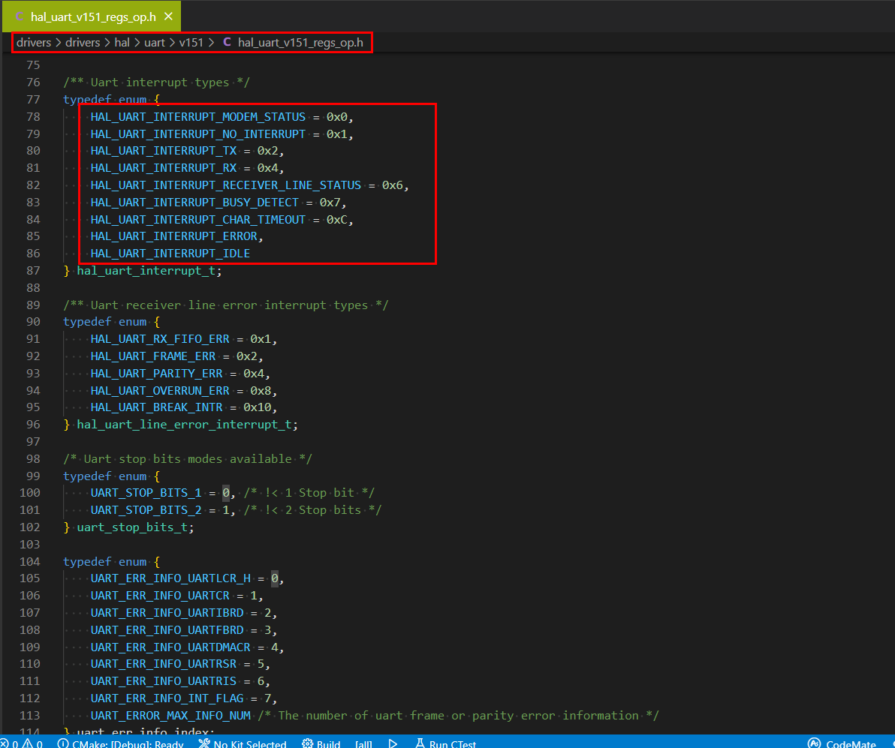

**Table 1**  Interrupt description

<a name="table2970103418466"></a>
<table><thead align="left"><tr id="row6971153414617"><th class="cellrowborder" valign="top" width="14.478552144785523%" id="mcps1.2.5.1.1"><p id="p2097116346466"><a name="p2097116346466"></a><a name="p2097116346466"></a>Interrupt ID</p>
</th>
<th class="cellrowborder" valign="top" width="22.277772222777724%" id="mcps1.2.5.1.2"><p id="p17974667489"><a name="p17974667489"></a><a name="p17974667489"></a>Interrupt  Type</p>
</th>
<th class="cellrowborder" valign="top" width="32.41675832416758%" id="mcps1.2.5.1.3"><p id="p152252210511"><a name="p152252210511"></a><a name="p152252210511"></a>Software Interrupt  Type</p>
</th>
<th class="cellrowborder" valign="top" width="30.826917308269174%" id="mcps1.2.5.1.4"><p id="p197123444612"><a name="p197123444612"></a><a name="p197123444612"></a>Interrupt Source</p>
</th>
</tr>
</thead>
<tbody><tr id="row1597173414461"><td class="cellrowborder" valign="top" width="14.478552144785523%" headers="mcps1.2.5.1.1 "><p id="p597120340468"><a name="p597120340468"></a><a name="p597120340468"></a>0x0</p>
</td>
<td class="cellrowborder" valign="top" width="22.277772222777724%" headers="mcps1.2.5.1.2 "><p id="p5971143418466"><a name="p5971143418466"></a><a name="p5971143418466"></a>Modem status</p>
</td>
<td class="cellrowborder" valign="top" width="32.41675832416758%" headers="mcps1.2.5.1.3 "><p id="p2023122214517"><a name="p2023122214517"></a><a name="p2023122214517"></a>HAL_UART_INTERRUPT_MODEM_STATUS</p>
</td>
<td class="cellrowborder" valign="top" width="30.826917308269174%" headers="mcps1.2.5.1.4 "><p id="p1530041112710"><a name="p1530041112710"></a><a name="p1530041112710"></a>Clear to send, data set ready, or data carrier detect. If automatic flow control mode is enabled, CTS changes do not cause an interrupt.</p>
<p id="p0411163505211"><a name="p0411163505211"></a><a name="p0411163505211"></a><strong id="b16741943102717"><a name="b16741943102717"></a><a name="b16741943102717"></a>This interrupt is not involved in this product.</strong></p>
</td>
</tr>
<tr id="row14971123464614"><td class="cellrowborder" valign="top" width="14.478552144785523%" headers="mcps1.2.5.1.1 "><p id="p79711134194612"><a name="p79711134194612"></a><a name="p79711134194612"></a>0x1</p>
</td>
<td class="cellrowborder" valign="top" width="22.277772222777724%" headers="mcps1.2.5.1.2 "><p id="p1397153474618"><a name="p1397153474618"></a><a name="p1397153474618"></a>None</p>
</td>
<td class="cellrowborder" valign="top" width="32.41675832416758%" headers="mcps1.2.5.1.3 "><p id="p223162217518"><a name="p223162217518"></a><a name="p223162217518"></a>HAL_UART_INTERRUPT_NO_INTERRUPT</p>
</td>
<td class="cellrowborder" valign="top" width="30.826917308269174%" headers="mcps1.2.5.1.4 "><p id="p7971234174611"><a name="p7971234174611"></a><a name="p7971234174611"></a>None</p>
</td>
</tr>
<tr id="row0971834124618"><td class="cellrowborder" valign="top" width="14.478552144785523%" headers="mcps1.2.5.1.1 "><p id="p1971334184618"><a name="p1971334184618"></a><a name="p1971334184618"></a>0x2</p>
</td>
<td class="cellrowborder" valign="top" width="22.277772222777724%" headers="mcps1.2.5.1.2 "><p id="p4971183454610"><a name="p4971183454610"></a><a name="p4971183454610"></a>Transmit holding register empty</p>
</td>
<td class="cellrowborder" valign="top" width="32.41675832416758%" headers="mcps1.2.5.1.3 "><p id="p13238225518"><a name="p13238225518"></a><a name="p13238225518"></a>HAL_UART_INTERRUPT_TX</p>
</td>
<td class="cellrowborder" valign="top" width="30.826917308269174%" headers="mcps1.2.5.1.4 "><p id="p185939542515"><a name="p185939542515"></a><a name="p185939542515"></a>Case 1: The transmit holding register is empty (THRE mode is disabled).</p>
<p id="p179712344469"><a name="p179712344469"></a><a name="p179712344469"></a>Case 2: The FIFO is below the threshold (THRE mode is enabled).</p>
</td>
</tr>
<tr id="row1597183414469"><td class="cellrowborder" valign="top" width="14.478552144785523%" headers="mcps1.2.5.1.1 "><p id="p11971133414465"><a name="p11971133414465"></a><a name="p11971133414465"></a>0x4</p>
</td>
<td class="cellrowborder" valign="top" width="22.277772222777724%" headers="mcps1.2.5.1.2 "><p id="p17971334144612"><a name="p17971334144612"></a><a name="p17971334144612"></a>Received data available</p>
</td>
<td class="cellrowborder" valign="top" width="32.41675832416758%" headers="mcps1.2.5.1.3 "><p id="p223172214516"><a name="p223172214516"></a><a name="p223172214516"></a>HAL_UART_INTERRUPT_RX</p>
</td>
<td class="cellrowborder" valign="top" width="30.826917308269174%" headers="mcps1.2.5.1.4 "><p id="p15609152715250"><a name="p15609152715250"></a><a name="p15609152715250"></a>Case 1: Received data is available (non-FIFO mode or FIFO is disabled).</p>
<p id="p7474115114611"><a name="p7474115114611"></a><a name="p7474115114611"></a>Case 2: The RCVR FIFO reaches the waterline trigger level (FIFO mode and FIFO are enabled).</p>
</td>
</tr>
<tr id="row1797116348463"><td class="cellrowborder" valign="top" width="14.478552144785523%" headers="mcps1.2.5.1.1 "><p id="p397193417463"><a name="p397193417463"></a><a name="p397193417463"></a>0x6</p>
</td>
<td class="cellrowborder" valign="top" width="22.277772222777724%" headers="mcps1.2.5.1.2 "><p id="p179711434144610"><a name="p179711434144610"></a><a name="p179711434144610"></a>Receiver line status</p>
</td>
<td class="cellrowborder" valign="top" width="32.41675832416758%" headers="mcps1.2.5.1.3 "><p id="p14237228516"><a name="p14237228516"></a><a name="p14237228516"></a>HAL_UART_INTERRUPT_RECEIVER_LINE_STATUS</p>
</td>
<td class="cellrowborder" valign="top" width="30.826917308269174%" headers="mcps1.2.5.1.4 "><p id="p597112342462"><a name="p597112342462"></a><a name="p597112342462"></a>This interrupt is triggered when an overrun, parity, frame synchronization, break, or address reception error interrupt occurs.</p>
</td>
</tr>
<tr id="row29711334174615"><td class="cellrowborder" valign="top" width="14.478552144785523%" headers="mcps1.2.5.1.1 "><p id="p497112342466"><a name="p497112342466"></a><a name="p497112342466"></a>0x7</p>
</td>
<td class="cellrowborder" valign="top" width="22.277772222777724%" headers="mcps1.2.5.1.2 "><p id="p69712346468"><a name="p69712346468"></a><a name="p69712346468"></a>Busy detect indication</p>
</td>
<td class="cellrowborder" valign="top" width="32.41675832416758%" headers="mcps1.2.5.1.3 "><p id="p1123162205116"><a name="p1123162205116"></a><a name="p1123162205116"></a>HAL_UART_INTERRUPT_BUSY_DETECT</p>
</td>
<td class="cellrowborder" valign="top" width="30.826917308269174%" headers="mcps1.2.5.1.4 "><p id="p5971153413469"><a name="p5971153413469"></a><a name="p5971153413469"></a>Reconfiguring the UART_CTL register while UART is working triggers this interrupt.</p>
</td>
</tr>
<tr id="row209711034184616"><td class="cellrowborder" valign="top" width="14.478552144785523%" headers="mcps1.2.5.1.1 "><p id="p1297163418462"><a name="p1297163418462"></a><a name="p1297163418462"></a>0xC</p>
</td>
<td class="cellrowborder" valign="top" width="22.277772222777724%" headers="mcps1.2.5.1.2 "><p id="p497183414616"><a name="p497183414616"></a><a name="p497183414616"></a>Character timeout indication</p>
</td>
<td class="cellrowborder" valign="top" width="32.41675832416758%" headers="mcps1.2.5.1.3 "><p id="p142392217519"><a name="p142392217519"></a><a name="p142392217519"></a>HAL_UART_INTERRUPT_CHAR_TIMEOUT</p>
</td>
<td class="cellrowborder" valign="top" width="30.826917308269174%" headers="mcps1.2.5.1.4 "><p id="p179711534104619"><a name="p179711534104619"></a><a name="p179711534104619"></a>The original meaning is that within the past four character time periods, no characters have entered or left the receiver FIFO, but at least one character has existed during this period (that is, the RX FIFO contains data, but the waterline is not reached and TX no longer sends data; the interrupt is triggered after a period of time). In this product, it is the same as the 0x4 interrupt.</p>
</td>
</tr>
<tr id="row1915914611499"><td class="cellrowborder" valign="top" width="14.478552144785523%" headers="mcps1.2.5.1.1 "><p id="p171596469496"><a name="p171596469496"></a><a name="p171596469496"></a>0xD</p>
</td>
<td class="cellrowborder" valign="top" width="22.277772222777724%" headers="mcps1.2.5.1.2 "><p id="p3159164614494"><a name="p3159164614494"></a><a name="p3159164614494"></a>None</p>
</td>
<td class="cellrowborder" valign="top" width="32.41675832416758%" headers="mcps1.2.5.1.3 "><p id="p1123102210514"><a name="p1123102210514"></a><a name="p1123102210514"></a>HAL_UART_INTERRUPT_ERROR</p>
</td>
<td class="cellrowborder" valign="top" width="30.826917308269174%" headers="mcps1.2.5.1.4 "><p id="p69601331427"><a name="p69601331427"></a><a name="p69601331427"></a>In this product, it is the same as the 0x6 interrupt.</p>
</td>
</tr>
<tr id="row586875054916"><td class="cellrowborder" valign="top" width="14.478552144785523%" headers="mcps1.2.5.1.1 "><p id="p1586855010497"><a name="p1586855010497"></a><a name="p1586855010497"></a>0xE</p>
</td>
<td class="cellrowborder" valign="top" width="22.277772222777724%" headers="mcps1.2.5.1.2 "><p id="p1656148145513"><a name="p1656148145513"></a><a name="p1656148145513"></a>None</p>
</td>
<td class="cellrowborder" valign="top" width="32.41675832416758%" headers="mcps1.2.5.1.3 "><p id="p142310220510"><a name="p142310220510"></a><a name="p142310220510"></a>HAL_UART_INTERRUPT_IDLE</p>
</td>
<td class="cellrowborder" valign="top" width="30.826917308269174%" headers="mcps1.2.5.1.4 "><p id="p086855094916"><a name="p086855094916"></a><a name="p086855094916"></a><strong id="b7961445152712"><a name="b7961445152712"></a><a name="b7961445152712"></a>This interrupt is not involved in this product.</strong></p>
</td>
</tr>
</tbody>
</table>

## KCONFIG Configuration<a name="ZH-CN_TOPIC_0000001937046649"></a>

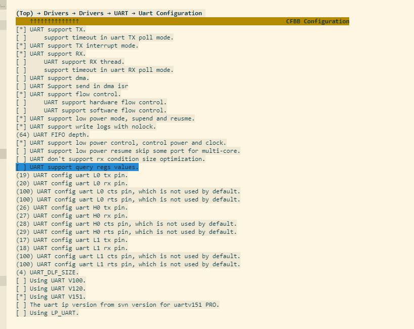

> **Note:** 
>If the images above are inconsistent with the table descriptions, the table prevails.

The specific descriptions of the configuration macros are shown in [Table 1](#table16629938173916).

**Table 1**  Descriptions of macros related to UART

<a name="table16629938173916"></a>
<table><thead align="left"><tr id="row1462913813915"><th class="cellrowborder" valign="top" width="22.62773722627737%" id="mcps1.2.7.1.1"><p id="p1962923853920"><a name="p1962923853920"></a><a name="p1962923853920"></a>Macro name (CONFIG_ is the prefix added by default)</p>
</th>
<th class="cellrowborder" valign="top" width="21.137886211378863%" id="mcps1.2.7.1.2"><p id="p962916388395"><a name="p962916388395"></a><a name="p962916388395"></a>Specific description displayed on the Kconfig interface</p>
</th>
<th class="cellrowborder" valign="top" width="19.878012198780123%" id="mcps1.2.7.1.3"><p id="p18731420115119"><a name="p18731420115119"></a><a name="p18731420115119"></a>Usage scenario</p>
</th>
<th class="cellrowborder" valign="top" width="10.608939106089391%" id="mcps1.2.7.1.4"><p id="p537485457"><a name="p537485457"></a><a name="p537485457"></a>Implemented</p>
</th>
<th class="cellrowborder" valign="top" width="11.348865113488651%" id="mcps1.2.7.1.5"><p id="p1162915382392"><a name="p1162915382392"></a><a name="p1162915382392"></a>Depends on other macros</p>
</th>
<th class="cellrowborder" valign="top" width="14.3985601439856%" id="mcps1.2.7.1.6"><p id="p1162923893911"><a name="p1162923893911"></a><a name="p1162923893911"></a>Whether to enable or modify the configuration</p>
</th>
</tr>
</thead>
<tbody><tr id="row16629338103916"><td class="cellrowborder" valign="top" width="22.62773722627737%" headers="mcps1.2.7.1.1 "><p id="p166291338133910"><a name="p166291338133910"></a><a name="p166291338133910"></a>CONFIG_UART_BAUD_RATE_DIV_8</p>
</td>
<td class="cellrowborder" valign="top" width="21.137886211378863%" headers="mcps1.2.7.1.2 "><p id="p1773165692817"><a name="p1773165692817"></a><a name="p1773165692817"></a>UART Baud rate div 8.</p>
</td>
<td class="cellrowborder" valign="top" width="19.878012198780123%" headers="mcps1.2.7.1.3 "><p id="p148018553156"><a name="p148018553156"></a><a name="p148018553156"></a>The baud rate after UART division by 8, which is not used in this product.</p>
</td>
<td class="cellrowborder" valign="top" width="10.608939106089391%" headers="mcps1.2.7.1.4 "><p id="p166297382397"><a name="p166297382397"></a><a name="p166297382397"></a>No</p>
</td>
<td class="cellrowborder" valign="top" width="11.348865113488651%" headers="mcps1.2.7.1.5 "><p id="p162983873917"><a name="p162983873917"></a><a name="p162983873917"></a>No</p>
</td>
<td class="cellrowborder" valign="top" width="14.3985601439856%" headers="mcps1.2.7.1.6 "><p id="p142312269162"><a name="p142312269162"></a><a name="p142312269162"></a>Enabled by default, but not yet used in this product; it is recommended to disable it.</p>
</td>
</tr>
<tr id="row166299383394"><td class="cellrowborder" valign="top" width="22.62773722627737%" headers="mcps1.2.7.1.1 "><p id="p14629173813920"><a name="p14629173813920"></a><a name="p14629173813920"></a>CONFIG_UART_SUPPORT_TX</p>
</td>
<td class="cellrowborder" valign="top" width="21.137886211378863%" headers="mcps1.2.7.1.2 "><p id="p130716441711"><a name="p130716441711"></a><a name="p130716441711"></a>UART support TX.</p>
</td>
<td class="cellrowborder" valign="top" width="19.878012198780123%" headers="mcps1.2.7.1.3 "><p id="p1373182005115"><a name="p1373182005115"></a><a name="p1373182005115"></a>UART supports TX transmission. Enable it as appropriate. At least one of CONFIG_UART_SUPPORT_RX and CONFIG_UART_SUPPORT_TX must be enabled. It is recommended to enable both.</p>
</td>
<td class="cellrowborder" valign="top" width="10.608939106089391%" headers="mcps1.2.7.1.4 "><p id="p166291838143916"><a name="p166291838143916"></a><a name="p166291838143916"></a>Yes</p>
</td>
<td class="cellrowborder" valign="top" width="11.348865113488651%" headers="mcps1.2.7.1.5 "><p id="p2629138193917"><a name="p2629138193917"></a><a name="p2629138193917"></a>No</p>
</td>
<td class="cellrowborder" valign="top" width="14.3985601439856%" headers="mcps1.2.7.1.6 "><p id="p16717115134416"><a name="p16717115134416"></a><a name="p16717115134416"></a>Enabled by default. Recommended to enable.</p>
</td>
</tr>
<tr id="row7443329313"><td class="cellrowborder" valign="top" width="22.62773722627737%" headers="mcps1.2.7.1.1 "><p id="p14441132153111"><a name="p14441132153111"></a><a name="p14441132153111"></a>CONFIG_SUPPORT_UART_TX_POLL_TIMEOUT</p>
</td>
<td class="cellrowborder" valign="top" width="21.137886211378863%" headers="mcps1.2.7.1.2 "><p id="p194433211318"><a name="p194433211318"></a><a name="p194433211318"></a>UART support timeout in uart TX poll mode.</p>
</td>
<td class="cellrowborder" valign="top" width="19.878012198780123%" headers="mcps1.2.7.1.3 "><p id="p144832103113"><a name="p144832103113"></a><a name="p144832103113"></a>Whether the UART TX interface enables the timeout mechanism</p>
</td>
<td class="cellrowborder" valign="top" width="10.608939106089391%" headers="mcps1.2.7.1.4 "><p id="p1044133210317"><a name="p1044133210317"></a><a name="p1044133210317"></a>Yes</p>
</td>
<td class="cellrowborder" valign="top" width="11.348865113488651%" headers="mcps1.2.7.1.5 "><p id="p74453217310"><a name="p74453217310"></a><a name="p74453217310"></a>CONFIG_UART_SUPPORT_TX</p>
</td>
<td class="cellrowborder" valign="top" width="14.3985601439856%" headers="mcps1.2.7.1.6 "><p id="p184413243117"><a name="p184413243117"></a><a name="p184413243117"></a>Disabled by default. Enable it as appropriate.</p>
</td>
</tr>
<tr id="row3629193823919"><td class="cellrowborder" valign="top" width="22.62773722627737%" headers="mcps1.2.7.1.1 "><p id="p262983811395"><a name="p262983811395"></a><a name="p262983811395"></a>CONFIG_UART_SUPPORT_TX_INT</p>
</td>
<td class="cellrowborder" valign="top" width="21.137886211378863%" headers="mcps1.2.7.1.2 "><p id="p1584710182301"><a name="p1584710182301"></a><a name="p1584710182301"></a>UART support TX interrupt mode.</p>
</td>
<td class="cellrowborder" valign="top" width="19.878012198780123%" headers="mcps1.2.7.1.3 "><p id="p117352016518"><a name="p117352016518"></a><a name="p117352016518"></a>UART supports transmission in TX interrupt mode. Enable it as appropriate.</p>
</td>
<td class="cellrowborder" valign="top" width="10.608939106089391%" headers="mcps1.2.7.1.4 "><p id="p3629133873917"><a name="p3629133873917"></a><a name="p3629133873917"></a>Yes</p>
</td>
<td class="cellrowborder" valign="top" width="11.348865113488651%" headers="mcps1.2.7.1.5 "><p id="p062910387397"><a name="p062910387397"></a><a name="p062910387397"></a>No</p>
</td>
<td class="cellrowborder" valign="top" width="14.3985601439856%" headers="mcps1.2.7.1.6 "><p id="p732198195217"><a name="p732198195217"></a><a name="p732198195217"></a>Disabled by default. It is recommended to disable it.</p>
</td>
</tr>
<tr id="row962920381394"><td class="cellrowborder" valign="top" width="22.62773722627737%" headers="mcps1.2.7.1.1 "><p id="p1629738173912"><a name="p1629738173912"></a><a name="p1629738173912"></a>CONFIG_UART_SUPPORT_RX</p>
</td>
<td class="cellrowborder" valign="top" width="21.137886211378863%" headers="mcps1.2.7.1.2 "><p id="p6473114617301"><a name="p6473114617301"></a><a name="p6473114617301"></a>UART support RX.</p>
</td>
<td class="cellrowborder" valign="top" width="19.878012198780123%" headers="mcps1.2.7.1.3 "><p id="p7601132985220"><a name="p7601132985220"></a><a name="p7601132985220"></a>UART supports RX reception. Enable it as appropriate. At least one of CONFIG_UART_SUPPORT_RX and CONFIG_UART_SUPPORT_TX must be enabled. It is recommended to enable both.</p>
</td>
<td class="cellrowborder" valign="top" width="10.608939106089391%" headers="mcps1.2.7.1.4 "><p id="p7630938143910"><a name="p7630938143910"></a><a name="p7630938143910"></a>Yes</p>
</td>
<td class="cellrowborder" valign="top" width="11.348865113488651%" headers="mcps1.2.7.1.5 "><p id="p56301938153913"><a name="p56301938153913"></a><a name="p56301938153913"></a>No</p>
</td>
<td class="cellrowborder" valign="top" width="14.3985601439856%" headers="mcps1.2.7.1.6 "><p id="p55269547522"><a name="p55269547522"></a><a name="p55269547522"></a>Enabled by default. Recommended to enable.</p>
</td>
</tr>
<tr id="row1368714403372"><td class="cellrowborder" valign="top" width="22.62773722627737%" headers="mcps1.2.7.1.1 "><p id="p20687104019377"><a name="p20687104019377"></a><a name="p20687104019377"></a>CONFIG_SUPPORT_UART_RX_POLL_TIMEOUT</p>
</td>
<td class="cellrowborder" valign="top" width="21.137886211378863%" headers="mcps1.2.7.1.2 "><p id="p168774083713"><a name="p168774083713"></a><a name="p168774083713"></a>UART support timeout in uart RX poll mode.</p>
</td>
<td class="cellrowborder" valign="top" width="19.878012198780123%" headers="mcps1.2.7.1.3 "><p id="p868784017376"><a name="p868784017376"></a><a name="p868784017376"></a>Whether the UART RX interface enables the timeout mechanism</p>
</td>
<td class="cellrowborder" valign="top" width="10.608939106089391%" headers="mcps1.2.7.1.4 "><p id="p106876408372"><a name="p106876408372"></a><a name="p106876408372"></a>Yes</p>
</td>
<td class="cellrowborder" valign="top" width="11.348865113488651%" headers="mcps1.2.7.1.5 "><p id="p66871040183717"><a name="p66871040183717"></a><a name="p66871040183717"></a>CONFIG_UART_SUPPORT_RX</p>
</td>
<td class="cellrowborder" valign="top" width="14.3985601439856%" headers="mcps1.2.7.1.6 "><p id="p14687194073718"><a name="p14687194073718"></a><a name="p14687194073718"></a>Disabled by default. Enable it as appropriate.</p>
</td>
</tr>
<tr id="row1279742495"><td class="cellrowborder" valign="top" width="22.62773722627737%" headers="mcps1.2.7.1.1 "><p id="p10803194681011"><a name="p10803194681011"></a><a name="p10803194681011"></a>CONFIG_UART_SUPPORT_RX_THREAD</p>
</td>
<td class="cellrowborder" valign="top" width="21.137886211378863%" headers="mcps1.2.7.1.2 "><p id="p2794422917"><a name="p2794422917"></a><a name="p2794422917"></a>UART support RX thread.</p>
</td>
<td class="cellrowborder" valign="top" width="19.878012198780123%" headers="mcps1.2.7.1.3 "><p id="p187910421994"><a name="p187910421994"></a><a name="p187910421994"></a>UART supports the RX thread, which is not used in this product.</p>
</td>
<td class="cellrowborder" valign="top" width="10.608939106089391%" headers="mcps1.2.7.1.4 "><p id="p8794422912"><a name="p8794422912"></a><a name="p8794422912"></a>Yes</p>
</td>
<td class="cellrowborder" valign="top" width="11.348865113488651%" headers="mcps1.2.7.1.5 "><p id="p77914210916"><a name="p77914210916"></a><a name="p77914210916"></a>CONFIG_UART_SUPPORT_RX</p>
</td>
<td class="cellrowborder" valign="top" width="14.3985601439856%" headers="mcps1.2.7.1.6 "><p id="p147911421296"><a name="p147911421296"></a><a name="p147911421296"></a>Disabled by default. It is not yet used in this product. It is recommended to disable it.</p>
</td>
</tr>
<tr id="row62681237271"><td class="cellrowborder" valign="top" width="22.62773722627737%" headers="mcps1.2.7.1.1 "><p id="p112401826112812"><a name="p112401826112812"></a><a name="p112401826112812"></a>CONFIG_UART_SUPPORT_DMA</p>
</td>
<td class="cellrowborder" valign="top" width="21.137886211378863%" headers="mcps1.2.7.1.2 "><p id="p73358962919"><a name="p73358962919"></a><a name="p73358962919"></a>UART support dma.</p>
</td>
<td class="cellrowborder" valign="top" width="19.878012198780123%" headers="mcps1.2.7.1.3 "><p id="p2865183705310"><a name="p2865183705310"></a><a name="p2865183705310"></a>UART supports the DMA mode. Enable it as appropriate. If the UART DMA mode is selected, the KCONFIG configuration of the DMA driver must be selected as well. For details, refer to "<a href="KCONFIG配置-27.md">KCONFIG Configuration</a>"</p>
</td>
<td class="cellrowborder" valign="top" width="10.608939106089391%" headers="mcps1.2.7.1.4 "><p id="p5269202314277"><a name="p5269202314277"></a><a name="p5269202314277"></a>Yes</p>
</td>
<td class="cellrowborder" valign="top" width="11.348865113488651%" headers="mcps1.2.7.1.5 "><p id="p115505376560"><a name="p115505376560"></a><a name="p115505376560"></a>CONFIG_DRIVER_SUPPORT_DMA</p>
</td>
<td class="cellrowborder" valign="top" width="14.3985601439856%" headers="mcps1.2.7.1.6 "><p id="p91685144576"><a name="p91685144576"></a><a name="p91685144576"></a>Disabled by default. Enable it as appropriate.</p>
</td>
</tr>
<tr id="row17817572040"><td class="cellrowborder" valign="top" width="22.62773722627737%" headers="mcps1.2.7.1.1 "><p id="p109831846175713"><a name="p109831846175713"></a><a name="p109831846175713"></a>CONFIG_UART_SUPPORT_INT_TRIGGER_DMA</p>
</td>
<td class="cellrowborder" valign="top" width="21.137886211378863%" headers="mcps1.2.7.1.2 "><p id="p36957616613"><a name="p36957616613"></a><a name="p36957616613"></a>UART support rx interrupt trigger dma.</p>
</td>
<td class="cellrowborder" valign="top" width="19.878012198780123%" headers="mcps1.2.7.1.3 "><p id="p0369111616584"><a name="p0369111616584"></a><a name="p0369111616584"></a>UART supports triggering DMA in the RX interrupt. Enable it as appropriate.</p>
</td>
<td class="cellrowborder" valign="top" width="10.608939106089391%" headers="mcps1.2.7.1.4 "><p id="p17919571246"><a name="p17919571246"></a><a name="p17919571246"></a>Yes</p>
</td>
<td class="cellrowborder" valign="top" width="11.348865113488651%" headers="mcps1.2.7.1.5 "><p id="p12620160105914"><a name="p12620160105914"></a><a name="p12620160105914"></a>CONFIG_UART_SUPPORT_DMA</p>
</td>
<td class="cellrowborder" valign="top" width="14.3985601439856%" headers="mcps1.2.7.1.6 "><p id="p182001731221"><a name="p182001731221"></a><a name="p182001731221"></a>Disabled by default. Enable it as appropriate.</p>
</td>
</tr>
<tr id="row13208965433"><td class="cellrowborder" valign="top" width="22.62773722627737%" headers="mcps1.2.7.1.1 "><p id="p188394434"><a name="p188394434"></a><a name="p188394434"></a>CONFIG_UART_SUPPORT_SEND_IN_DMA_ISR</p>
</td>
<td class="cellrowborder" valign="top" width="21.137886211378863%" headers="mcps1.2.7.1.2 "><p id="p158893437"><a name="p158893437"></a><a name="p158893437"></a>UART support send in dma isr.</p>
</td>
<td class="cellrowborder" valign="top" width="19.878012198780123%" headers="mcps1.2.7.1.3 "><p id="p148599438"><a name="p148599438"></a><a name="p148599438"></a>UART supports sending data in the DMA interrupt. Enable it as appropriate. If the UART DMA mode is selected, the KCONFIG configuration of the DMA driver must be selected as well. For details, refer to "<a href="KCONFIG配置-27.md">KCONFIG Configuration</a>"</p>
</td>
<td class="cellrowborder" valign="top" width="10.608939106089391%" headers="mcps1.2.7.1.4 "><p id="p198093439"><a name="p198093439"></a><a name="p198093439"></a>Yes</p>
</td>
<td class="cellrowborder" valign="top" width="11.348865113488651%" headers="mcps1.2.7.1.5 "><p id="p1381298438"><a name="p1381298438"></a><a name="p1381298438"></a>CONFIG_DRIVER_SUPPORT_DMA</p>
</td>
<td class="cellrowborder" valign="top" width="14.3985601439856%" headers="mcps1.2.7.1.6 "><p id="p13839124310"><a name="p13839124310"></a><a name="p13839124310"></a>Disabled by default. Enable it as appropriate.</p>
</td>
</tr>
<tr id="row1564512592210"><td class="cellrowborder" valign="top" width="22.62773722627737%" headers="mcps1.2.7.1.1 "><p id="p864665912219"><a name="p864665912219"></a><a name="p864665912219"></a>CONFIG_UART_SUPPORT_DMA_LLI</p>
</td>
<td class="cellrowborder" valign="top" width="21.137886211378863%" headers="mcps1.2.7.1.2 "><p id="p1164665915220"><a name="p1164665915220"></a><a name="p1164665915220"></a>UART Support DMA lli transport.</p>
</td>
<td class="cellrowborder" valign="top" width="19.878012198780123%" headers="mcps1.2.7.1.3 "><p id="p126463593210"><a name="p126463593210"></a><a name="p126463593210"></a>UART supports DMA LLI transmission</p>
</td>
<td class="cellrowborder" valign="top" width="10.608939106089391%" headers="mcps1.2.7.1.4 "><p id="p14646165910211"><a name="p14646165910211"></a><a name="p14646165910211"></a>Yes</p>
</td>
<td class="cellrowborder" valign="top" width="11.348865113488651%" headers="mcps1.2.7.1.5 "><p id="p16646125912218"><a name="p16646125912218"></a><a name="p16646125912218"></a>CONFIG_DRIVER_SUPPORT_DMA</p>
</td>
<td class="cellrowborder" valign="top" width="14.3985601439856%" headers="mcps1.2.7.1.6 "><p id="p1364612591122"><a name="p1364612591122"></a><a name="p1364612591122"></a>Disabled by default. Enable it as appropriate.</p>
</td>
</tr>
<tr id="row196625101645"><td class="cellrowborder" valign="top" width="22.62773722627737%" headers="mcps1.2.7.1.1 "><p id="p11662161017417"><a name="p11662161017417"></a><a name="p11662161017417"></a>CONFIG_UART_LLI_BAUDRATE</p>
</td>
<td class="cellrowborder" valign="top" width="21.137886211378863%" headers="mcps1.2.7.1.2 "><p id="p0662110849"><a name="p0662110849"></a><a name="p0662110849"></a>UART LLI BAUDRATE. Depends on hardware constraints.</p>
</td>
<td class="cellrowborder" valign="top" width="19.878012198780123%" headers="mcps1.2.7.1.3 "><p id="p56620108415"><a name="p56620108415"></a><a name="p56620108415"></a>The baud rate used when UART transmits through DMA</p>
</td>
<td class="cellrowborder" valign="top" width="10.608939106089391%" headers="mcps1.2.7.1.4 "><p id="p2662610146"><a name="p2662610146"></a><a name="p2662610146"></a>Yes</p>
</td>
<td class="cellrowborder" valign="top" width="11.348865113488651%" headers="mcps1.2.7.1.5 "><p id="p966215105412"><a name="p966215105412"></a><a name="p966215105412"></a>CONFIG_UART_SUPPORT_DMA_LLI</p>
</td>
<td class="cellrowborder" valign="top" width="14.3985601439856%" headers="mcps1.2.7.1.6 "><p id="p566214107413"><a name="p566214107413"></a><a name="p566214107413"></a>The default value is 115200. Select it based on hardware constraints.</p>
</td>
</tr>
<tr id="row887119364519"><td class="cellrowborder" valign="top" width="22.62773722627737%" headers="mcps1.2.7.1.1 "><p id="p1787173619519"><a name="p1787173619519"></a><a name="p1787173619519"></a>CONFIG_UART_DMA_LLI_MAX_MEMBER</p>
</td>
<td class="cellrowborder" valign="top" width="21.137886211378863%" headers="mcps1.2.7.1.2 "><p id="p128713364511"><a name="p128713364511"></a><a name="p128713364511"></a>Max lli member number.</p>
</td>
<td class="cellrowborder" valign="top" width="19.878012198780123%" headers="mcps1.2.7.1.3 "><p id="p48715366511"><a name="p48715366511"></a><a name="p48715366511"></a>The depth of the UART LLI sending queue.</p>
</td>
<td class="cellrowborder" valign="top" width="10.608939106089391%" headers="mcps1.2.7.1.4 "><p id="p5871153615515"><a name="p5871153615515"></a><a name="p5871153615515"></a>Yes</p>
</td>
<td class="cellrowborder" valign="top" width="11.348865113488651%" headers="mcps1.2.7.1.5 "><p id="p587143619510"><a name="p587143619510"></a><a name="p587143619510"></a>CONFIG_UART_SUPPORT_DMA_LLI</p>
</td>
<td class="cellrowborder" valign="top" width="14.3985601439856%" headers="mcps1.2.7.1.6 "><p id="p1087116369520"><a name="p1087116369520"></a><a name="p1087116369520"></a>The default value is 6. Select it as appropriate.</p>
</td>
</tr>
<tr id="row35161934135"><td class="cellrowborder" valign="top" width="22.62773722627737%" headers="mcps1.2.7.1.1 "><p id="p125165321316"><a name="p125165321316"></a><a name="p125165321316"></a>CONFIG_UART_TX_DMA_NEED_HEADER</p>
</td>
<td class="cellrowborder" valign="top" width="21.137886211378863%" headers="mcps1.2.7.1.2 "><p id="p1451613319138"><a name="p1451613319138"></a><a name="p1451613319138"></a>Whether DMA need send head or not.</p>
</td>
<td class="cellrowborder" valign="top" width="19.878012198780123%" headers="mcps1.2.7.1.3 "><p id="p105164311316"><a name="p105164311316"></a><a name="p105164311316"></a>Whether UART sends the packet header information.</p>
</td>
<td class="cellrowborder" valign="top" width="10.608939106089391%" headers="mcps1.2.7.1.4 "><p id="p1516143111314"><a name="p1516143111314"></a><a name="p1516143111314"></a>Yes</p>
</td>
<td class="cellrowborder" valign="top" width="11.348865113488651%" headers="mcps1.2.7.1.5 "><p id="p15161138136"><a name="p15161138136"></a><a name="p15161138136"></a>CONFIG_UART_SUPPORT_DMA_LLI</p>
</td>
<td class="cellrowborder" valign="top" width="14.3985601439856%" headers="mcps1.2.7.1.6 "><p id="p25161339131"><a name="p25161339131"></a><a name="p25161339131"></a>Enabled by default. It can be disabled if the packet length to be sent is fixed.</p>
</td>
</tr>
<tr id="row1071318918131"><td class="cellrowborder" valign="top" width="22.62773722627737%" headers="mcps1.2.7.1.1 "><p id="p671319910134"><a name="p671319910134"></a><a name="p671319910134"></a>CONFIG_UART_SUPPORT_FLOW_CTRL</p>
</td>
<td class="cellrowborder" valign="top" width="21.137886211378863%" headers="mcps1.2.7.1.2 "><p id="p20713179151319"><a name="p20713179151319"></a><a name="p20713179151319"></a>UART support flow control.</p>
</td>
<td class="cellrowborder" valign="top" width="19.878012198780123%" headers="mcps1.2.7.1.3 "><p id="p17131797138"><a name="p17131797138"></a><a name="p17131797138"></a>UART supports flow control. This macro takes effect only when the flow_ctrl parameter is set to 3 when calling the initialization interface; otherwise, it is useless.</p>
</td>
<td class="cellrowborder" valign="top" width="10.608939106089391%" headers="mcps1.2.7.1.4 "><p id="p1571316971311"><a name="p1571316971311"></a><a name="p1571316971311"></a>Yes</p>
</td>
<td class="cellrowborder" valign="top" width="11.348865113488651%" headers="mcps1.2.7.1.5 "><p id="p37135917132"><a name="p37135917132"></a><a name="p37135917132"></a>No</p>
</td>
<td class="cellrowborder" valign="top" width="14.3985601439856%" headers="mcps1.2.7.1.6 "><p id="p57965521033"><a name="p57965521033"></a><a name="p57965521033"></a>Disabled by default. Enable it as appropriate.</p>
</td>
</tr>
<tr id="row1663153711314"><td class="cellrowborder" valign="top" width="22.62773722627737%" headers="mcps1.2.7.1.1 "><p id="p13663183721310"><a name="p13663183721310"></a><a name="p13663183721310"></a>CONFIG_UART_SUPPORT_HW_FLOW_CTRL</p>
</td>
<td class="cellrowborder" valign="top" width="21.137886211378863%" headers="mcps1.2.7.1.2 "><p id="p066323716134"><a name="p066323716134"></a><a name="p066323716134"></a>UART support hardware flow control.</p>
</td>
<td class="cellrowborder" valign="top" width="19.878012198780123%" headers="mcps1.2.7.1.3 "><p id="p1166311372137"><a name="p1166311372137"></a><a name="p1166311372137"></a>UART supports hardware flow control, which is not used in this product.</p>
</td>
<td class="cellrowborder" valign="top" width="10.608939106089391%" headers="mcps1.2.7.1.4 "><p id="p186635371131"><a name="p186635371131"></a><a name="p186635371131"></a>No</p>
</td>
<td class="cellrowborder" valign="top" width="11.348865113488651%" headers="mcps1.2.7.1.5 "><p id="p1366323711131"><a name="p1366323711131"></a><a name="p1366323711131"></a>CONFIG_UART_SUPPORT_FLOW_CTRL</p>
</td>
<td class="cellrowborder" valign="top" width="14.3985601439856%" headers="mcps1.2.7.1.6 "><p id="p5326122414510"><a name="p5326122414510"></a><a name="p5326122414510"></a>Disabled by default, but not yet implemented in this product; it is recommended to disable it.</p>
</td>
</tr>
<tr id="row1115204491314"><td class="cellrowborder" valign="top" width="22.62773722627737%" headers="mcps1.2.7.1.1 "><p id="p20115184431314"><a name="p20115184431314"></a><a name="p20115184431314"></a>CONFIG_UART_SUPPORT_SW_FLOW_CTRL</p>
</td>
<td class="cellrowborder" valign="top" width="21.137886211378863%" headers="mcps1.2.7.1.2 "><p id="p1211594421319"><a name="p1211594421319"></a><a name="p1211594421319"></a>UART support software flow control.</p>
</td>
<td class="cellrowborder" valign="top" width="19.878012198780123%" headers="mcps1.2.7.1.3 "><p id="p4115184491311"><a name="p4115184491311"></a><a name="p4115184491311"></a>UART supports software flow control, which is not used in this product.</p>
</td>
<td class="cellrowborder" valign="top" width="10.608939106089391%" headers="mcps1.2.7.1.4 "><p id="p9115124411312"><a name="p9115124411312"></a><a name="p9115124411312"></a>No</p>
</td>
<td class="cellrowborder" valign="top" width="11.348865113488651%" headers="mcps1.2.7.1.5 "><p id="p5115544151311"><a name="p5115544151311"></a><a name="p5115544151311"></a>CONFIG_UART_SUPPORT_FLOW_CTRL</p>
</td>
<td class="cellrowborder" valign="top" width="14.3985601439856%" headers="mcps1.2.7.1.6 "><p id="p1518312251351"><a name="p1518312251351"></a><a name="p1518312251351"></a>Disabled by default, but not yet implemented in this product; it is recommended to disable it.</p>
</td>
</tr>
<tr id="row9686349171316"><td class="cellrowborder" valign="top" width="22.62773722627737%" headers="mcps1.2.7.1.1 "><p id="p2068610490135"><a name="p2068610490135"></a><a name="p2068610490135"></a>CONFIG_UART_SUPPORT_LPM</p>
</td>
<td class="cellrowborder" valign="top" width="21.137886211378863%" headers="mcps1.2.7.1.2 "><p id="p16686174971317"><a name="p16686174971317"></a><a name="p16686174971317"></a>UART support low power mode, supend and reusme.</p>
</td>
<td class="cellrowborder" valign="top" width="19.878012198780123%" headers="mcps1.2.7.1.3 "><p id="p77352085114"><a name="p77352085114"></a><a name="p77352085114"></a>This macro is used only in low-power scenarios.</p>
</td>
<td class="cellrowborder" valign="top" width="10.608939106089391%" headers="mcps1.2.7.1.4 "><p id="p12686184941312"><a name="p12686184941312"></a><a name="p12686184941312"></a>Yes</p>
</td>
<td class="cellrowborder" valign="top" width="11.348865113488651%" headers="mcps1.2.7.1.5 "><p id="p26871249111313"><a name="p26871249111313"></a><a name="p26871249111313"></a>No</p>
</td>
<td class="cellrowborder" valign="top" width="14.3985601439856%" headers="mcps1.2.7.1.6 "><p id="p0629838133914"><a name="p0629838133914"></a><a name="p0629838133914"></a>Enabled by default. Enable it as appropriate; it is recommended to enable it.</p>
</td>
</tr>
<tr id="row1688144313116"><td class="cellrowborder" valign="top" width="22.62773722627737%" headers="mcps1.2.7.1.1 "><p id="p12881043133120"><a name="p12881043133120"></a><a name="p12881043133120"></a>CONFIG_UART_LOG_WRITE_WITH_NOLOCK</p>
</td>
<td class="cellrowborder" valign="top" width="21.137886211378863%" headers="mcps1.2.7.1.2 "><p id="p12881343163110"><a name="p12881343163110"></a><a name="p12881343163110"></a>UART support write logs with nolock.</p>
</td>
<td class="cellrowborder" valign="top" width="19.878012198780123%" headers="mcps1.2.7.1.3 "><p id="p17881843193112"><a name="p17881843193112"></a><a name="p17881843193112"></a>UART supports writing logs without locking interrupts</p>
</td>
<td class="cellrowborder" valign="top" width="10.608939106089391%" headers="mcps1.2.7.1.4 "><p id="p78914430312"><a name="p78914430312"></a><a name="p78914430312"></a>Yes</p>
</td>
<td class="cellrowborder" valign="top" width="11.348865113488651%" headers="mcps1.2.7.1.5 "><p id="p38913431312"><a name="p38913431312"></a><a name="p38913431312"></a>No</p>
</td>
<td class="cellrowborder" valign="top" width="14.3985601439856%" headers="mcps1.2.7.1.6 "><p id="p689164303111"><a name="p689164303111"></a><a name="p689164303111"></a>Enabled by default. Enable it as appropriate; it is recommended to enable it.</p>
</td>
</tr>
<tr id="row10100123917141"><td class="cellrowborder" valign="top" width="22.62773722627737%" headers="mcps1.2.7.1.1 "><p id="p6359290154"><a name="p6359290154"></a><a name="p6359290154"></a>CONFIG_UART_FIFO_DEPTH</p>
</td>
<td class="cellrowborder" valign="top" width="21.137886211378863%" headers="mcps1.2.7.1.2 "><p id="p5100113916144"><a name="p5100113916144"></a><a name="p5100113916144"></a>UART FIFO depth.</p>
</td>
<td class="cellrowborder" valign="top" width="19.878012198780123%" headers="mcps1.2.7.1.3 "><p id="p151004394147"><a name="p151004394147"></a><a name="p151004394147"></a>UART FIFO depth configuration. The default FIFO depth is 64 in this product. It is recommended to keep the default value.</p>
</td>
<td class="cellrowborder" valign="top" width="10.608939106089391%" headers="mcps1.2.7.1.4 "><p id="p131001439161420"><a name="p131001439161420"></a><a name="p131001439161420"></a>Yes</p>
</td>
<td class="cellrowborder" valign="top" width="11.348865113488651%" headers="mcps1.2.7.1.5 "><p id="p110083912148"><a name="p110083912148"></a><a name="p110083912148"></a>No</p>
</td>
<td class="cellrowborder" valign="top" width="14.3985601439856%" headers="mcps1.2.7.1.6 "><p id="p126297381398"><a name="p126297381398"></a><a name="p126297381398"></a>The default value is 64. It is recommended not to modify it.</p>
</td>
</tr>
<tr id="row9604124541418"><td class="cellrowborder" valign="top" width="22.62773722627737%" headers="mcps1.2.7.1.1 "><p id="p1198461021518"><a name="p1198461021518"></a><a name="p1198461021518"></a>CONFIG_UART_SUPPORT_LPC</p>
</td>
<td class="cellrowborder" valign="top" width="21.137886211378863%" headers="mcps1.2.7.1.2 "><p id="p18604645131413"><a name="p18604645131413"></a><a name="p18604645131413"></a>UART support low power control, control power and clock.</p>
</td>
<td class="cellrowborder" valign="top" width="19.878012198780123%" headers="mcps1.2.7.1.3 "><p id="p1605194513147"><a name="p1605194513147"></a><a name="p1605194513147"></a>UART working clock</p>
</td>
<td class="cellrowborder" valign="top" width="10.608939106089391%" headers="mcps1.2.7.1.4 "><p id="p1860512452145"><a name="p1860512452145"></a><a name="p1860512452145"></a>Yes</p>
</td>
<td class="cellrowborder" valign="top" width="11.348865113488651%" headers="mcps1.2.7.1.5 "><p id="p13605145101411"><a name="p13605145101411"></a><a name="p13605145101411"></a>No</p>
</td>
<td class="cellrowborder" valign="top" width="14.3985601439856%" headers="mcps1.2.7.1.6 "><p id="p1459646100"><a name="p1459646100"></a><a name="p1459646100"></a>Enabled by default. Mandatory.</p>
</td>
</tr>
<tr id="row4155553141"><td class="cellrowborder" valign="top" width="22.62773722627737%" headers="mcps1.2.7.1.1 "><p id="p2119131217152"><a name="p2119131217152"></a><a name="p2119131217152"></a>CONFIG_UART_MULTI_CORE_RESUME</p>
</td>
<td class="cellrowborder" valign="top" width="21.137886211378863%" headers="mcps1.2.7.1.2 "><p id="p1615125519141"><a name="p1615125519141"></a><a name="p1615125519141"></a>UART support low power resume skip some port for multi-core.</p>
</td>
<td class="cellrowborder" valign="top" width="19.878012198780123%" headers="mcps1.2.7.1.3 "><p id="p815135541416"><a name="p815135541416"></a><a name="p815135541416"></a>This macro is used only for UART low-power resume in multi-core scenarios, which is not used in this product.</p>
</td>
<td class="cellrowborder" valign="top" width="10.608939106089391%" headers="mcps1.2.7.1.4 "><p id="p201555511146"><a name="p201555511146"></a><a name="p201555511146"></a>No</p>
</td>
<td class="cellrowborder" valign="top" width="11.348865113488651%" headers="mcps1.2.7.1.5 "><p id="p1280317457132"><a name="p1280317457132"></a><a name="p1280317457132"></a>CONFIG_UART_SUPPORT_LPM</p>
</td>
<td class="cellrowborder" valign="top" width="14.3985601439856%" headers="mcps1.2.7.1.6 "><p id="p31511558144"><a name="p31511558144"></a><a name="p31511558144"></a>Disabled by default. It is not yet used in this product. It is recommended to disable it.</p>
</td>
</tr>
<tr id="row155854071519"><td class="cellrowborder" valign="top" width="22.62773722627737%" headers="mcps1.2.7.1.1 "><p id="p1289513201519"><a name="p1289513201519"></a><a name="p1289513201519"></a>CONFIG_UART_NOT_SUPPORT_RX_CONDITON_SIZE_OPTIMIZE</p>
</td>
<td class="cellrowborder" valign="top" width="21.137886211378863%" headers="mcps1.2.7.1.2 "><p id="p1158530101513"><a name="p1158530101513"></a><a name="p1158530101513"></a>UART don't support rx condition size optimization.</p>
</td>
<td class="cellrowborder" valign="top" width="19.878012198780123%" headers="mcps1.2.7.1.3 "><p id="p25855014155"><a name="p25855014155"></a><a name="p25855014155"></a>UART does not support RX condition size optimization, which is mainly used to affect the callback trigger condition</p>
</td>
<td class="cellrowborder" valign="top" width="10.608939106089391%" headers="mcps1.2.7.1.4 "><p id="p145852091517"><a name="p145852091517"></a><a name="p145852091517"></a>Yes</p>
</td>
<td class="cellrowborder" valign="top" width="11.348865113488651%" headers="mcps1.2.7.1.5 "><p id="p178719416558"><a name="p178719416558"></a><a name="p178719416558"></a>CONFIG_UART_SUPPORT_RX</p>
</td>
<td class="cellrowborder" valign="top" width="14.3985601439856%" headers="mcps1.2.7.1.6 "><p id="p12585190171517"><a name="p12585190171517"></a><a name="p12585190171517"></a>Disabled by default. It is recommended to disable it.</p>
</td>
</tr>
<tr id="row1120612316161"><td class="cellrowborder" valign="top" width="22.62773722627737%" headers="mcps1.2.7.1.1 "><p id="p12207162314169"><a name="p12207162314169"></a><a name="p12207162314169"></a>CONFIG_UART_SUPPORT_QUERY_REGS</p>
</td>
<td class="cellrowborder" valign="top" width="21.137886211378863%" headers="mcps1.2.7.1.2 "><p id="p2020717234168"><a name="p2020717234168"></a><a name="p2020717234168"></a>UART support query regs values.</p>
</td>
<td class="cellrowborder" valign="top" width="19.878012198780123%" headers="mcps1.2.7.1.3 "><p id="p22076234162"><a name="p22076234162"></a><a name="p22076234162"></a>UART supports reading back all related register values. Enable it as appropriate.</p>
</td>
<td class="cellrowborder" valign="top" width="10.608939106089391%" headers="mcps1.2.7.1.4 "><p id="p10207202331613"><a name="p10207202331613"></a><a name="p10207202331613"></a>Yes</p>
</td>
<td class="cellrowborder" valign="top" width="11.348865113488651%" headers="mcps1.2.7.1.5 "><p id="p22077234164"><a name="p22077234164"></a><a name="p22077234164"></a>No</p>
</td>
<td class="cellrowborder" valign="top" width="14.3985601439856%" headers="mcps1.2.7.1.6 "><p id="p3285141385920"><a name="p3285141385920"></a><a name="p3285141385920"></a>Disabled by default. Enable it as appropriate.</p>
</td>
</tr>
<tr id="row18951740131615"><td class="cellrowborder" valign="top" width="22.62773722627737%" headers="mcps1.2.7.1.1 "><p id="p197481234181715"><a name="p197481234181715"></a><a name="p197481234181715"></a>CONFIG_UART_L0_TX_PIN</p>
</td>
<td class="cellrowborder" valign="top" width="21.137886211378863%" headers="mcps1.2.7.1.2 "><p id="p1795194031611"><a name="p1795194031611"></a><a name="p1795194031611"></a>UART config uart L0 tx pin.</p>
</td>
<td class="cellrowborder" valign="top" width="19.878012198780123%" headers="mcps1.2.7.1.3 "><p id="p139544011168"><a name="p139544011168"></a><a name="p139544011168"></a>The TX pin of BUS 0 (L0) configured by UART. SMGPIO19 is used by default in this product.</p>
</td>
<td class="cellrowborder" valign="top" width="10.608939106089391%" headers="mcps1.2.7.1.4 "><p id="p16957407165"><a name="p16957407165"></a><a name="p16957407165"></a>Yes</p>
</td>
<td class="cellrowborder" valign="top" width="11.348865113488651%" headers="mcps1.2.7.1.5 "><p id="p395194031613"><a name="p395194031613"></a><a name="p395194031613"></a>No</p>
</td>
<td class="cellrowborder" valign="top" width="14.3985601439856%" headers="mcps1.2.7.1.6 "><p id="p13953404160"><a name="p13953404160"></a><a name="p13953404160"></a>The default value is 19. It is recommended not to modify it.</p>
</td>
</tr>
<tr id="row16469746171619"><td class="cellrowborder" valign="top" width="22.62773722627737%" headers="mcps1.2.7.1.1 "><p id="p13831935111710"><a name="p13831935111710"></a><a name="p13831935111710"></a>CONFIG_UART_L0_RX_PIN</p>
</td>
<td class="cellrowborder" valign="top" width="21.137886211378863%" headers="mcps1.2.7.1.2 "><p id="p946904611617"><a name="p946904611617"></a><a name="p946904611617"></a>UART config uart L0 rx pin.</p>
</td>
<td class="cellrowborder" valign="top" width="19.878012198780123%" headers="mcps1.2.7.1.3 "><p id="p56134571811"><a name="p56134571811"></a><a name="p56134571811"></a>The RX pin of BUS 0 (L0) configured by UART. SMGPIO20 is used by default in this product.</p>
</td>
<td class="cellrowborder" valign="top" width="10.608939106089391%" headers="mcps1.2.7.1.4 "><p id="p154691146191615"><a name="p154691146191615"></a><a name="p154691146191615"></a>Yes</p>
</td>
<td class="cellrowborder" valign="top" width="11.348865113488651%" headers="mcps1.2.7.1.5 "><p id="p746920467167"><a name="p746920467167"></a><a name="p746920467167"></a>No</p>
</td>
<td class="cellrowborder" valign="top" width="14.3985601439856%" headers="mcps1.2.7.1.6 "><p id="p91371523322"><a name="p91371523322"></a><a name="p91371523322"></a>The default value is 20. It is recommended not to modify it.</p>
</td>
</tr>
<tr id="row17463553171619"><td class="cellrowborder" valign="top" width="22.62773722627737%" headers="mcps1.2.7.1.1 "><p id="p8789036121717"><a name="p8789036121717"></a><a name="p8789036121717"></a>CONFIG_UART_H0_TX_PIN</p>
</td>
<td class="cellrowborder" valign="top" width="21.137886211378863%" headers="mcps1.2.7.1.2 "><p id="p184631653181611"><a name="p184631653181611"></a><a name="p184631653181611"></a>UART config uart H0 tx pin.</p>
</td>
<td class="cellrowborder" valign="top" width="19.878012198780123%" headers="mcps1.2.7.1.3 "><p id="p2463115311616"><a name="p2463115311616"></a><a name="p2463115311616"></a>The TX pin of BUS 1 (H0) configured by UART. SMGPIO17 is used by default in this product.</p>
</td>
<td class="cellrowborder" valign="top" width="10.608939106089391%" headers="mcps1.2.7.1.4 "><p id="p10463185313162"><a name="p10463185313162"></a><a name="p10463185313162"></a>Yes</p>
</td>
<td class="cellrowborder" valign="top" width="11.348865113488651%" headers="mcps1.2.7.1.5 "><p id="p1246320533166"><a name="p1246320533166"></a><a name="p1246320533166"></a>No</p>
</td>
<td class="cellrowborder" valign="top" width="14.3985601439856%" headers="mcps1.2.7.1.6 "><p id="p858814111435"><a name="p858814111435"></a><a name="p858814111435"></a>The default value is 17. It is recommended not to modify it.</p>
</td>
</tr>
<tr id="row14602145714168"><td class="cellrowborder" valign="top" width="22.62773722627737%" headers="mcps1.2.7.1.1 "><p id="p1677313715179"><a name="p1677313715179"></a><a name="p1677313715179"></a>CONFIG_UART_H0_RX_PIN</p>
</td>
<td class="cellrowborder" valign="top" width="21.137886211378863%" headers="mcps1.2.7.1.2 "><p id="p1360215761612"><a name="p1360215761612"></a><a name="p1360215761612"></a>UART config uart H0 rx pin.</p>
</td>
<td class="cellrowborder" valign="top" width="19.878012198780123%" headers="mcps1.2.7.1.3 "><p id="p8602115731614"><a name="p8602115731614"></a><a name="p8602115731614"></a>The RX pin of BUS 1 (H0) configured by UART. SMGPIO18 is used by default in this product.</p>
</td>
<td class="cellrowborder" valign="top" width="10.608939106089391%" headers="mcps1.2.7.1.4 "><p id="p2602175711166"><a name="p2602175711166"></a><a name="p2602175711166"></a>Yes</p>
</td>
<td class="cellrowborder" valign="top" width="11.348865113488651%" headers="mcps1.2.7.1.5 "><p id="p10602125711615"><a name="p10602125711615"></a><a name="p10602125711615"></a>No</p>
</td>
<td class="cellrowborder" valign="top" width="14.3985601439856%" headers="mcps1.2.7.1.6 "><p id="p542416131533"><a name="p542416131533"></a><a name="p542416131533"></a>The default value is 18. It is recommended not to modify it.</p>
</td>
</tr>
<tr id="row135198402166"><td class="cellrowborder" valign="top" width="22.62773722627737%" headers="mcps1.2.7.1.1 "><p id="p45191940181615"><a name="p45191940181615"></a><a name="p45191940181615"></a>CONFIG_UART_H0_CTS_PIN</p>
</td>
<td class="cellrowborder" valign="top" width="21.137886211378863%" headers="mcps1.2.7.1.2 "><p id="p16519540161619"><a name="p16519540161619"></a><a name="p16519540161619"></a>UART config uart H0 cts pin, which is not used by default.</p>
</td>
<td class="cellrowborder" valign="top" width="19.878012198780123%" headers="mcps1.2.7.1.3 "><p id="p751914081619"><a name="p751914081619"></a><a name="p751914081619"></a>The CTS pin of BUS 1 (H0) configured by UART</p>
</td>
<td class="cellrowborder" valign="top" width="10.608939106089391%" headers="mcps1.2.7.1.4 "><p id="p351934016163"><a name="p351934016163"></a><a name="p351934016163"></a>Yes</p>
</td>
<td class="cellrowborder" valign="top" width="11.348865113488651%" headers="mcps1.2.7.1.5 "><p id="p1451954014169"><a name="p1451954014169"></a><a name="p1451954014169"></a>CONFIG_UART_SUPPORT_FLOW_CTRL</p>
</td>
<td class="cellrowborder" valign="top" width="14.3985601439856%" headers="mcps1.2.7.1.6 "><p id="p451910406169"><a name="p451910406169"></a><a name="p451910406169"></a>The default value is 100. This value does not take effect. Configure it based on the actual situation.</p>
</td>
</tr>
<tr id="row1773113105199"><td class="cellrowborder" valign="top" width="22.62773722627737%" headers="mcps1.2.7.1.1 "><p id="p11524131681917"><a name="p11524131681917"></a><a name="p11524131681917"></a>CONFIG_UART_H0_RTS_PIN</p>
</td>
<td class="cellrowborder" valign="top" width="21.137886211378863%" headers="mcps1.2.7.1.2 "><p id="p13524121691916"><a name="p13524121691916"></a><a name="p13524121691916"></a>UART config uart H0 rts pin, which is not used by default.</p>
</td>
<td class="cellrowborder" valign="top" width="19.878012198780123%" headers="mcps1.2.7.1.3 "><p id="p195243161196"><a name="p195243161196"></a><a name="p195243161196"></a>The RTS pin of BUS 1 (H0) configured by UART</p>
</td>
<td class="cellrowborder" valign="top" width="10.608939106089391%" headers="mcps1.2.7.1.4 "><p id="p1652481612197"><a name="p1652481612197"></a><a name="p1652481612197"></a>Yes</p>
</td>
<td class="cellrowborder" valign="top" width="11.348865113488651%" headers="mcps1.2.7.1.5 "><p id="p45241016121917"><a name="p45241016121917"></a><a name="p45241016121917"></a>CONFIG_UART_SUPPORT_FLOW_CTRL</p>
</td>
<td class="cellrowborder" valign="top" width="14.3985601439856%" headers="mcps1.2.7.1.6 "><p id="p0524616181916"><a name="p0524616181916"></a><a name="p0524616181916"></a>The default value is 100. This value does not take effect. Configure it based on the actual situation.</p>
</td>
</tr>
<tr id="row15351447199"><td class="cellrowborder" valign="top" width="22.62773722627737%" headers="mcps1.2.7.1.1 "><p id="p93512417190"><a name="p93512417190"></a><a name="p93512417190"></a>CONFIG_UART_DLF_SIZE</p>
</td>
<td class="cellrowborder" valign="top" width="21.137886211378863%" headers="mcps1.2.7.1.2 "><p id="p193514491918"><a name="p193514491918"></a><a name="p193514491918"></a>UART_DLF_SIZE.</p>
</td>
<td class="cellrowborder" valign="top" width="19.878012198780123%" headers="mcps1.2.7.1.3 "><p id="p73511143194"><a name="p73511143194"></a><a name="p73511143194"></a>UART DLF SIZE, which is not used in this product.</p>
</td>
<td class="cellrowborder" valign="top" width="10.608939106089391%" headers="mcps1.2.7.1.4 "><p id="p1335117461910"><a name="p1335117461910"></a><a name="p1335117461910"></a>No</p>
</td>
<td class="cellrowborder" valign="top" width="11.348865113488651%" headers="mcps1.2.7.1.5 "><p id="p173517401914"><a name="p173517401914"></a><a name="p173517401914"></a>No</p>
</td>
<td class="cellrowborder" valign="top" width="14.3985601439856%" headers="mcps1.2.7.1.6 "><p id="p1848835517417"><a name="p1848835517417"></a><a name="p1848835517417"></a>The default value is 4. It is not used in this product. It is recommended not to modify it.</p>
</td>
</tr>
<tr id="row1471759124912"><td class="cellrowborder" valign="top" width="22.62773722627737%" headers="mcps1.2.7.1.1 "><p id="p101381201495"><a name="p101381201495"></a><a name="p101381201495"></a>CONFIG_UART_USING_V100</p>
</td>
<td class="cellrowborder" valign="top" width="21.137886211378863%" headers="mcps1.2.7.1.2 "><p id="p613882074918"><a name="p613882074918"></a><a name="p613882074918"></a>Using UART V100.</p>
</td>
<td class="cellrowborder" valign="top" width="19.878012198780123%" headers="mcps1.2.7.1.3 "><p id="p913832074920"><a name="p913832074920"></a><a name="p913832074920"></a>This macro indicates the UART V100 driver specification, which is not used in this product.</p>
</td>
<td class="cellrowborder" valign="top" width="10.608939106089391%" headers="mcps1.2.7.1.4 "><p id="p113892019499"><a name="p113892019499"></a><a name="p113892019499"></a>Yes</p>
</td>
<td class="cellrowborder" valign="top" width="11.348865113488651%" headers="mcps1.2.7.1.5 "><p id="p16138182017498"><a name="p16138182017498"></a><a name="p16138182017498"></a>No</p>
</td>
<td class="cellrowborder" valign="top" width="14.3985601439856%" headers="mcps1.2.7.1.6 "><p id="p9138720194915"><a name="p9138720194915"></a><a name="p9138720194915"></a>Disabled by default. It must be disabled.</p>
</td>
</tr>
<tr id="row1680219818199"><td class="cellrowborder" valign="top" width="22.62773722627737%" headers="mcps1.2.7.1.1 "><p id="p18024819197"><a name="p18024819197"></a><a name="p18024819197"></a>CONFIG_UART_USING_V120</p>
</td>
<td class="cellrowborder" valign="top" width="21.137886211378863%" headers="mcps1.2.7.1.2 "><p id="p128021084193"><a name="p128021084193"></a><a name="p128021084193"></a>Using UART V120.</p>
</td>
<td class="cellrowborder" valign="top" width="19.878012198780123%" headers="mcps1.2.7.1.3 "><p id="p16500105619513"><a name="p16500105619513"></a><a name="p16500105619513"></a>This macro indicates the UART V120 driver specification, which is not used in this product.</p>
</td>
<td class="cellrowborder" valign="top" width="10.608939106089391%" headers="mcps1.2.7.1.4 "><p id="p168021812199"><a name="p168021812199"></a><a name="p168021812199"></a>Yes</p>
</td>
<td class="cellrowborder" valign="top" width="11.348865113488651%" headers="mcps1.2.7.1.5 "><p id="p4802983199"><a name="p4802983199"></a><a name="p4802983199"></a>No</p>
</td>
<td class="cellrowborder" valign="top" width="14.3985601439856%" headers="mcps1.2.7.1.6 "><p id="p1780211812190"><a name="p1780211812190"></a><a name="p1780211812190"></a>Disabled by default. It must be disabled.</p>
</td>
</tr>
<tr id="row281619136194"><td class="cellrowborder" valign="top" width="22.62773722627737%" headers="mcps1.2.7.1.1 "><p id="p3816201315190"><a name="p3816201315190"></a><a name="p3816201315190"></a>CONFIG_UART_USING_V151</p>
</td>
<td class="cellrowborder" valign="top" width="21.137886211378863%" headers="mcps1.2.7.1.2 "><p id="p16816101312194"><a name="p16816101312194"></a><a name="p16816101312194"></a>Using UART V151.</p>
</td>
<td class="cellrowborder" valign="top" width="19.878012198780123%" headers="mcps1.2.7.1.3 "><p id="p1559411017615"><a name="p1559411017615"></a><a name="p1559411017615"></a>This macro indicates the UART V151 driver specification, which is used by default in this product.</p>
</td>
<td class="cellrowborder" valign="top" width="10.608939106089391%" headers="mcps1.2.7.1.4 "><p id="p981621371911"><a name="p981621371911"></a><a name="p981621371911"></a>Yes</p>
</td>
<td class="cellrowborder" valign="top" width="11.348865113488651%" headers="mcps1.2.7.1.5 "><p id="p1816413131911"><a name="p1816413131911"></a><a name="p1816413131911"></a>No</p>
</td>
<td class="cellrowborder" valign="top" width="14.3985601439856%" headers="mcps1.2.7.1.6 "><p id="p139131454172"><a name="p139131454172"></a><a name="p139131454172"></a>Enabled by default. Mandatory.</p>
</td>
</tr>
<tr id="row205961436131915"><td class="cellrowborder" valign="top" width="22.62773722627737%" headers="mcps1.2.7.1.1 "><p id="p14596113651914"><a name="p14596113651914"></a><a name="p14596113651914"></a>CONFIG_UART_IP_VERSION_V151_PRO</p>
</td>
<td class="cellrowborder" valign="top" width="21.137886211378863%" headers="mcps1.2.7.1.2 "><p id="p10596123616191"><a name="p10596123616191"></a><a name="p10596123616191"></a>The uart ip version from svn version for uartv151 PRO.</p>
</td>
<td class="cellrowborder" valign="top" width="19.878012198780123%" headers="mcps1.2.7.1.3 "><p id="p1159613360195"><a name="p1159613360195"></a><a name="p1159613360195"></a>UART V151 PRO is not used in this product.</p>
</td>
<td class="cellrowborder" valign="top" width="10.608939106089391%" headers="mcps1.2.7.1.4 "><p id="p4647261666"><a name="p4647261666"></a><a name="p4647261666"></a>Yes</p>
</td>
<td class="cellrowborder" valign="top" width="11.348865113488651%" headers="mcps1.2.7.1.5 "><p id="p1559663611199"><a name="p1559663611199"></a><a name="p1559663611199"></a>No</p>
</td>
<td class="cellrowborder" valign="top" width="14.3985601439856%" headers="mcps1.2.7.1.6 "><p id="p238311131790"><a name="p238311131790"></a><a name="p238311131790"></a>Disabled by default. It is not yet used in this product. It is recommended to disable it.</p>
</td>
</tr>
<tr id="row1227014402193"><td class="cellrowborder" valign="top" width="22.62773722627737%" headers="mcps1.2.7.1.1 "><p id="p192701740141919"><a name="p192701740141919"></a><a name="p192701740141919"></a>CONFIG_UART_RX_EMPTY_TRIG_H</p>
</td>
<td class="cellrowborder" valign="top" width="21.137886211378863%" headers="mcps1.2.7.1.2 "><p id="p527054081917"><a name="p527054081917"></a><a name="p527054081917"></a>The rx empty high trigger for uartv151 PRO.</p>
</td>
<td class="cellrowborder" valign="top" width="19.878012198780123%" headers="mcps1.2.7.1.3 "><p id="p12702400196"><a name="p12702400196"></a><a name="p12702400196"></a>This macro is used only for the RX empty trigger of UART V151 PRO, which is not used in this product.</p>
</td>
<td class="cellrowborder" valign="top" width="10.608939106089391%" headers="mcps1.2.7.1.4 "><p id="p1883112261263"><a name="p1883112261263"></a><a name="p1883112261263"></a>Yes</p>
</td>
<td class="cellrowborder" valign="top" width="11.348865113488651%" headers="mcps1.2.7.1.5 "><p id="p14414181113105"><a name="p14414181113105"></a><a name="p14414181113105"></a>CONFIG_UART_IP_VERSION_V151_PRO</p>
</td>
<td class="cellrowborder" valign="top" width="14.3985601439856%" headers="mcps1.2.7.1.6 "><p id="p1873711103127"><a name="p1873711103127"></a><a name="p1873711103127"></a>Disabled by default. It is not yet used in this product. It is recommended to disable it.</p>
</td>
</tr>
<tr id="row159961392215"><td class="cellrowborder" valign="top" width="22.62773722627737%" headers="mcps1.2.7.1.1 "><p id="p1723219153212"><a name="p1723219153212"></a><a name="p1723219153212"></a>CONFIG_UART_USING_LP_UART</p>
</td>
<td class="cellrowborder" valign="top" width="21.137886211378863%" headers="mcps1.2.7.1.2 "><p id="p29960992114"><a name="p29960992114"></a><a name="p29960992114"></a>Using LP_UART.</p>
</td>
<td class="cellrowborder" valign="top" width="19.878012198780123%" headers="mcps1.2.7.1.3 "><p id="p498745791310"><a name="p498745791310"></a><a name="p498745791310"></a>Not used in this product.</p>
</td>
<td class="cellrowborder" valign="top" width="10.608939106089391%" headers="mcps1.2.7.1.4 "><p id="p08380271667"><a name="p08380271667"></a><a name="p08380271667"></a>Yes</p>
</td>
<td class="cellrowborder" valign="top" width="11.348865113488651%" headers="mcps1.2.7.1.5 "><p id="p119965914210"><a name="p119965914210"></a><a name="p119965914210"></a>No</p>
</td>
<td class="cellrowborder" valign="top" width="14.3985601439856%" headers="mcps1.2.7.1.6 "><p id="p399613952110"><a name="p399613952110"></a><a name="p399613952110"></a>Disabled by default. It is not yet used in this product. It is recommended to disable it.</p>
</td>
</tr>
</tbody>
</table>

## Development Guide<a name="ZH-CN_TOPIC_0000001664984014"></a>

The following uses UART1 as an example. The data transmission and reception process is as follows:

1.  Configure the IO mux. Set the corresponding IOs to the TX, RX, RTS, and CTS functions of UART1.

    If hardware flow control is not required, configure only TX and RX.

    ```
    void usr_uart_io_config(void)
    {
        /* The following IO mux configuration can also be centralized in the usr_io_init function in the SDK */
        uapi_pin_set_mode(S_AGPIO5, HAL_PIO_UART_H0_RTS); /* uart1 rts */
        uapi_pin_set_mode(S_AGPIO6, HAL_PIO_UART_H0_CTS); /* uart1 cts */
        uapi_pin_set_mode(S_AGPIO12, HAL_PIO_UART_H0_TXD); /* uart1 tx */
        uapi_pin_set_mode(S_AGPIO13, HAL_PIO_UART_H0_RXD); /* uart1 rx */
    }
    ```

2.  Initialize UART. Configure attributes such as the baud rate and data bits of UART, and enable UART.

    ```
    #define TEST_UART_RX_BUFF_SIZE　0x40
    unsigned char g_uart_rx_buff[TEST_UART_RX_BUFF_SIZE] = { 0 };
    uart_buffer_config_t g_uart_buffer_config = {
        .rx_buffer = g_uart_rx_buff,
        .rx_buffer_size = TEST_UART_RX_BUFF_SIZE
    };
    errcode_t usr_uart_init_config(void)
    {
        errcode_t errcode;
        uart_attr_t attr = {
            .baud_rate = 115200, /* Baud rate */
            .data_bits = 3,      /* 8-bit data bits */
            .stop_bits = 0,      /* 1-bit stop bit */
            .parity = 0,         /* Parity bit */
            .flow_ctrl = 0       /* Flow control */
        };
        uart_pin_config_t pin_config = {
            .tx_pin = S_AGPIO12, /* uart1 tx */
            .rx_pin = S_AGPIO13, /* uart1 rx */
            .cts_pin = S_AGPIO6, /* Flow control function, optional */
            .rts_pin = S_AGPIO5  /* Flow control function, optional */
        };
        uapi_uart_deinit(UART_BUS_1);   /* The deinitialization here is intended to clear some configurations used elsewhere previously to avoid interference */
        errcode = uapi_uart_init(UART_BUS_1, &pin_config, &attr, NULL, &g_uart_buffer_config);
        if (errcode != ERRCODE_SUCC) {
            osal_printk("uart init fail\r\n");
        }
        return errcode;
    }
    ```

3.  Send and receive UART data. Call the UART polling read/write interfaces to send and receive data.

    ```
    void usr_uart_read_data(void)
    {
        int len;
        unsigned char g_test_uart_rx_buffer[64];
        len = uapi_uart_read(UART_BUS_1, g_test_uart_rx_buffer, 64, 0);
        if(len > 0) {
            /* process */
        }
    }
    int usr_uart_write_data(unsigned int size, char* buff)
    {
        unsigned char tx_buff[64] = { 0 };
        if (memcpy_s(tx_buff, 64, buff, size) != EOK) {
            return ERRCODE_FAIL;
        }
        int ret = uapi_uart_write(UART_BUS_1, tx_buff, size, 0);
        if(ret == -1) {
            return ERRCODE_FAIL;
        }
        return ERRCODE_SUCC;
    }
    ```

The process of sending data in UART DMA mode is as follows:

1.  Configure the IO mux. Set the corresponding IOs to the TX, RX, RTS, and CTS functions of UART1.

    If hardware flow control is not required, configure only TX and RX.

    ```
    void usr_uart_io_config(void)
    {
        /* The following IO mux configuration can also be centralized in the usr_io_init function in the SDK */
        uapi_pin_set_mode(S_MGPIO21, HAL_PIO_UART_H0_RTS); /* uart1 rts */
        uapi_pin_set_mode(S_MGPIO22, HAL_PIO_UART_H0_CTS); /* uart1 cts */
        uapi_pin_set_mode(S_MGPIO17, HAL_PIO_UART_H0_TXD); /* uart1 tx */
        uapi_pin_set_mode(S_MGPIO18, HAL_PIO_UART_H0_RXD); /* uart1 rx */
    }
    ```

2.  Initialize UART. Configure attributes such as the baud rate and data bits of UART, and enable UART.

    ```
    errcode_t usr_uart_init_config(void)
    {
        errcode_t errcode;
        uart_attr_t attr = {
            .baud_rate = 115200, /* Baud rate */
            .data_bits = 3,      /* 8-bit data bits */
            .stop_bits = 0,      /* 1-bit stop bit */
            .parity = 0,         /* Parity bit */
            .flow_ctrl = 0       /* Flow control */
        };
        uart_pin_config_t pin_config = {
            .tx_pin = S_MGPIO17, /* uart1 tx */
            .rx_pin = S_MGPIO18, /* uart1 rx */
            .cts_pin = S_MGPIO22, /* Flow control function, optional */
            .rts_pin = S_MGPIO21/* Flow control function, optional */
        };
        uart_extra_attr_t ext_config = {
            .tx_dma_enable = true,
            .tx_int_threshold = UART_FIFO_INT_TX_LEVEL_EQ_0_CHARACTER,
            .rx_dma_enable = true,
            .rx_int_threshold = UART_FIFO_INT_RX_LEVEL_1_CHARACTER
        }
        errcode = uapi_uart_init(UART_BUS_1, &pin_config, &attr, &ext_config, &g_uart_buffer_config);
        if (errcode != ERRCODE_SUCC) {
            osal_printk("uart init fail\r\n");
        }
        return errcode;
    }
    ```

3.  Send and receive UART data through DMA.

    ```
    #define TEST_UART_DMA_SEND_BUFF_SIZE 1024
    
    
    static errcode_t test_uart_read_by_dma(void)
    {
        int len;
        unsigned char g_test_uart_rx_buffer[TEST_UART_DMA_SEND_BUFF_SIZE] = { 0 };
        uart_write_dma_config_t dma_cfg = {
            .src_width = HAL_DMA_TRANSFER_WIDTH_8,              /* 0 indicates 8-bit */
            .dest_width = HAL_DMA_TRANSFER_WIDTH_8,             /* 0 indicates 8-bit */
            .burst_length = HAL_DMA_BURST_TRANSACTION_LENGTH_1, /* Indicates 1 byte */
            .priority = 0                                       /* Priority 0 */
        };
        len = uapi_uart_read_by_dma(UART_BUS_1, g_test_uart_rx_buffer, TEST_UART_DMA_SEND_BUFF_SIZE, &dma_cfg);
        if(len > 0) {
            /* process */
        }
    }
    static errcode_t test_uart_write_by_dma(void)
    {
        uint8_t dma_buff[TEST_UART_DMA_SEND_BUFF_SIZE] = { 0 };
        if (memset_s(dma_buff, TEST_UART_DMA_SEND_BUFF_SIZE, 0XA5, TEST_UART_DMA_SEND_BUFF_SIZE) != 0) {
            return ERRCODE_FAIL;
        }
        uart_write_dma_config_t dma_cfg = {
            .src_width = HAL_DMA_TRANSFER_WIDTH_8,              /* 0 indicates 8-bit */
            .dest_width = HAL_DMA_TRANSFER_WIDTH_8,             /* 0 indicates 8-bit */
            .burst_length = HAL_DMA_BURST_TRANSACTION_LENGTH_1, /* Indicates 1 byte */
            .priority = 0                                       /* Priority 0 */
        };
        if (uapi_uart_write_by_dma(UART_BUS_1, dma_buff, len, &dma_cfg) != len) {
            osal_printk("[UART] *** memory to uart fail!\r\n");
            return ERRCODE_FAIL;
        }
        return ERRCODE_SUCC;
    }
    ```

For the complete code of UART transmission and reception in the three modes (polling, interrupt, and DMA), see the following code:

```
#include "pinctrl.h"
#include "uart.h"
#include "watchdog.h"
#include "soc_osal.h"
#include "app_init.h"
#if defined(CONFIG_UART_SUPPORT_DMA)
#include "dma.h"
#include "hal_dma.h"
#endif

#define UART_BAUDRATE                      115200
#define CONFIG_UART_INT_WAIT_MS            5

#define UART_TASK_PRIO                     24
#define UART_TASK_STACK_SIZE               0x1000

static uint8_t g_app_uart_rx_buff[CONFIG_UART_TRANSFER_SIZE] = { 0 };
#if defined(CONFIG_UART_SUPPORT_INT_MODE)
static uint8_t g_app_uart_int_rx_flag = 0;
static volatile uint8_t g_app_uart_int_index = 0;
static uint8_t g_app_uart_int_rx_buff[CONFIG_UART_TRANSFER_SIZE] = { 0 };
#endif
static uart_buffer_config_t g_app_uart_buffer_config = {
    .rx_buffer = g_app_uart_rx_buff,
    .rx_buffer_size = CONFIG_UART_TRANSFER_SIZE
};

#if defined(CONFIG_UART_SUPPORT_DMA)
uart_write_dma_config_t g_app_dma_cfg = {
    .src_width = HAL_DMA_TRANSFER_WIDTH_8,
    .dest_width = HAL_DMA_TRANSFER_WIDTH_8,
    .burst_length = HAL_DMA_BURST_TRANSACTION_LENGTH_1,
    .priority = HAL_DMA_CH_PRIORITY_0
};
#endif

static void app_uart_init_pin(void)
{
#if defined(CONFIG_PINCTRL_SUPPORT_IE)
    uapi_pin_set_ie(CONFIG_UART_RXD_PIN, PIN_IE_1);
#endif /* CONFIG_PINCTRL_SUPPORT_IE */
    uapi_pin_set_mode(CONFIG_UART_TXD_PIN, CONFIG_UART_TXD_PIN_MODE);
    uapi_pin_set_mode(CONFIG_UART_RXD_PIN, CONFIG_UART_RXD_PIN_MODE);
}

static void app_uart_init_config(void)
{
    uart_attr_t attr = {
        .baud_rate = UART_BAUDRATE,
        .data_bits = UART_DATA_BIT_8,
        .stop_bits = UART_STOP_BIT_1,
        .parity = UART_PARITY_NONE，
        .flow_ctrl = 0       /* Flow control. Setting it to 0 means flow control is disabled */
    };

    uart_pin_config_t pin_config = {
        .tx_pin = CONFIG_UART_TXD_PIN,
        .rx_pin = CONFIG_UART_RXD_PIN,
        .cts_pin = PIN_NONE,
        .rts_pin = PIN_NONE
    };

#if defined(CONFIG_UART_SUPPORT_DMA)
    uart_extra_attr_t extra_attr = {
        .tx_dma_enable = true,
        .tx_int_threshold = UART_FIFO_INT_TX_LEVEL_EQ_0_CHARACTER,
        .rx_dma_enable = true,
        .rx_int_threshold = UART_FIFO_INT_RX_LEVEL_1_CHARACTER
    };
    uapi_dma_init();
    uapi_dma_open();
    uapi_uart_deinit(CONFIG_UART_BUS_ID); /* The call here is only to exclude configurations used elsewhere to avoid interference. */
    uapi_uart_init(CONFIG_UART_BUS_ID, &pin_config, &attr, &extra_attr, &g_app_uart_buffer_config);
#else
    uapi_uart_deinit(CONFIG_UART_BUS_ID);
    uapi_uart_init(CONFIG_UART_BUS_ID, &pin_config, &attr, NULL, &g_app_uart_buffer_config);
#endif
}

#if defined(CONFIG_UART_SUPPORT_INT_MODE)
static void app_uart_read_int_handler(const void *buffer, uint16_t length, bool error)
{
    unused(error);
    if (buffer == NULL || length == 0) {
        osal_printk("uart%d int mode transfer illegal data!\r\n", CONFIG_UART_BUS_ID);
        return;
    }

    uint8_t *buff = (uint8_t *)buffer;
    if (memcpy_s(g_app_uart_rx_buff, length, buff, length) != EOK) {
        osal_printk("uart%d int mode data copy fail!\r\n", CONFIG_UART_BUS_ID);
        return;
    }
    if (memcpy_s(g_app_uart_int_rx_buff + g_app_uart_int_index, length, g_app_uart_rx_buff, length) != EOK) {
        g_app_uart_int_index = 0;
        osal_printk("uart%d int mode data2 copy fail!\r\n", CONFIG_UART_BUS_ID);
    }
    g_app_uart_int_index += length;
    g_app_uart_int_rx_flag = 1;
}

static void app_uart_write_int_handler(const void *buffer, uint32_t length, const void *params)
{
    unused(params);
    uint8_t *buff = (void *)buffer;
    for (uint8_t i = 0; i < length; i++) {
        osal_printk("uart%d write data[%d] = %d\r\n", CONFIG_UART_BUS_ID, i, buff[i]);
    }
}

static void app_uart_register_rx_callback(void)
{
    osal_printk("uart%d int mode register receive callback start!\r\n", CONFIG_UART_BUS_ID);
    if (uapi_uart_register_rx_callback(CONFIG_UART_BUS_ID, UART_RX_CONDITION_FULL_OR_SUFFICIENT_DATA_OR_IDLE,
                                       1, app_uart_read_int_handler) == ERRCODE_SUCC) {
        osal_printk("uart%d int mode register receive callback succ!\r\n", CONFIG_UART_BUS_ID);
    }
}
#endif

static void *uart_task(const char *arg)
{
    unused(arg);
#if defined(CONFIG_UART_SUPPORT_DMA)
    int32_t ret = CONFIG_UART_TRANSFER_SIZE;
#if defined(CONFIG_UART_USING_V151)
    ret = ERRCODE_SUCC;
#endif
#endif
    /* UART pinmux. */
    app_uart_init_pin();

    /* UART init config. */
    app_uart_init_config();

#if defined(CONFIG_UART_SUPPORT_INT_MODE)
    app_uart_register_rx_callback();
#endif

    while (1) {
#if defined(CONFIG_UART_SUPPORT_INT_MODE)
        while (g_app_uart_int_rx_flag != 1) { osal_msleep(CONFIG_UART_INT_WAIT_MS); }
        g_app_uart_int_rx_flag = 0;
        osal_printk("uart%d int mode send back!\r\n", CONFIG_UART_BUS_ID);
        if (uapi_uart_write_int(CONFIG_UART_BUS_ID, g_app_uart_int_rx_buff, CONFIG_UART_TRANSFER_SIZE, 0,
                                app_uart_write_int_handler) == ERRCODE_SUCC) {
            osal_printk("uart%d int mode send back succ!\r\n", CONFIG_UART_BUS_ID);
        }
#elif defined(CONFIG_UART_SUPPORT_DMA)
        osal_printk("uart%d dma mode receive start!\r\n", CONFIG_UART_BUS_ID);
        if (uapi_uart_read_by_dma(CONFIG_UART_BUS_ID, g_app_uart_rx_buff, CONFIG_UART_TRANSFER_SIZE,
            &g_app_dma_cfg) == ret) {
            osal_printk("uart%d dma mode receive succ!\r\n", CONFIG_UART_BUS_ID);
        }
        osal_printk("uart%d dma mode send back!\r\n", CONFIG_UART_BUS_ID);
        if (uapi_uart_write_by_dma(CONFIG_UART_BUS_ID, g_app_uart_rx_buff, CONFIG_UART_TRANSFER_SIZE,
            &g_app_dma_cfg) == ret) {
            osal_printk("uart%d dma mode send back succ!\r\n", CONFIG_UART_BUS_ID);
        }
#else
        osal_printk("uart%d poll mode receive start!\r\n", CONFIG_UART_BUS_ID);
        (void)uapi_watchdog_kick();
        if (uapi_uart_read(CONFIG_UART_BUS_ID, g_app_uart_rx_buff, CONFIG_UART_TRANSFER_SIZE,
            0) == CONFIG_UART_TRANSFER_SIZE) {
            osal_printk("uart%d poll mode receive succ!\r\n", CONFIG_UART_BUS_ID);
        }
        osal_printk("uart%d poll mode send back!\r\n", CONFIG_UART_BUS_ID);
        if (uapi_uart_write(CONFIG_UART_BUS_ID, g_app_uart_rx_buff, CONFIG_UART_TRANSFER_SIZE,
            0) == CONFIG_UART_TRANSFER_SIZE) {
            osal_printk("uart%d poll mode send back succ!\r\n", CONFIG_UART_BUS_ID);
        }
#endif
    }

    return NULL;
}

static void uart_entry(void)
{
    osal_task *task_handle = NULL;
    osal_kthread_lock();
    task_handle = osal_kthread_create((osal_kthread_handler)uart_task, 0, "UartTask", UART_TASK_STACK_SIZE);
    if (task_handle != NULL) {
        osal_kthread_set_priority(task_handle, UART_TASK_PRIO);
    }
    osal_kthread_unlock();
}

/* Run the uart_entry. */
app_run(uart_entry);

------------------------------------------------------------------

For the complete code of two-board UART DMA linked-list transmission and reception, see the following code:
Master-side code:
#include <string.h>
#include <stdlib.h>
#include <time.h>
#include "app_init.h"
#include "osal_task.h"
#include "dma.h"
#include "uart.h"
#include "osal_debug.h"
#define UART_TASK_PRIO                     24
#define UART_TASK_DURATION_MS              500
#define UART_TASK_STACK_SIZE               0x1000
#define UART_PAYLOAD_LEN                   255
rn uart_pin_config_t g_pin_config_map[UART_BUS_MAX_NUM];
static uint8_t g_app_uart_tx_payload_buff[UART_PAYLOAD_LEN] = { 0 };
static uint8_t g_app_uart_rx_payload_buff[UART_PAYLOAD_LEN] = { 0 };
volatile uint32_t g_success = 0;
volatile uint32_t g_fail = 0;
static void uart_dma_lli_write_cb(uint8_t channel, errcode_t result)
{
    unused(result);
    unused(channel);
}
static bool uart_dma_lli_read_cb(uint8_t channel, uint16_t length, errcode_t result)
{
    unused(channel);
    unused(length);
    unused(result);
    if (memcmp(g_app_uart_rx_payload_buff, g_app_uart_tx_payload_buff, UART_PAYLOAD_LEN) == 0) {
        g_success++;
    } else {
        g_fail++;
        for (uint32_t i = 0; i < UART_PAYLOAD_LEN; i++) {
            osal_printk("[%d] tx:0x%x,rx:0x%x\r\n", i, g_app_uart_tx_payload_buff[i], g_app_uart_rx_payload_buff[i]);
        }
    }
    if ((g_success + g_fail) % 0x400 == 0) {
        osal_printk("g_success:%d\r\n", g_success);
        osal_printk("g_fail:%d\r\n", g_fail);
    }
    for (uint16_t i = 0; i < UART_PAYLOAD_LEN; i++) {
        g_app_uart_tx_payload_buff[i] = rand() % 0xff;
    }
    uapi_uart_dma_send(CONFIG_UART_BUS_ID, g_app_uart_tx_payload_buff, UART_PAYLOAD_LEN, uart_dma_lli_write_cb);
    return true;
}
static void uart_dma_lli_master_entry(void)
{
    for (uint16_t i = 0; i < UART_PAYLOAD_LEN; i++) {
        g_app_uart_tx_payload_buff[i] = rand() % 0xff;
    }
    uapi_pin_set_pull(g_pin_config_map[bus].rx_pin, PIN_PULL_UP);
    uart_port_lli_init_config(CONFIG_UART_BUS_ID);
    uapi_uart_dma_recv_register(CONFIG_UABUS_ID, g_app_uart_rx_payload_buff, UART_PAYLOAD_LEN, uart_dma_lli_read_cb);
    uapi_uart_dma_send(CONFIG_UART_BUS_ID, g_app_uart_tx_payload_buff, UART_PAYLOAD_LEN, uart_dma_lli_write_cb);
    return;
}
/* Run the uart_dma_lli_master_entry. */
app_run(uart_dma_lli_master_entry);

#include "app_init.h"
#include "uart.h"
#include "osal_debug.h"
#define UART_TASK_PRIO                     24
#define UART_TASK_DURATION_MS              500
#define UART_TASK_STACK_SIZE               0x1000
#define UART_PAYLOAD_LEN                   255
extern uart_pin_config_t g_pin_config_map[UART_BUS_MAX_NUM];
static uint8_t g_app_uart_tx_payload_buff[UART_PAYLOAD_LEN] = { 0 };
static uint8_t g_app_uart_rx_payload_buff[UART_PAYLOAD_LEN] = { 0 };
static uint8_t g_app_uart_rx_payload_buff1[UART_PAYLOAD_LEN] = { 0 };
static bool g_double_rx_buffer = true;
volatile uint32_t g_recv_count = 0;
static void uart_dma_lli_write_cb(uint8_t channel, errcode_t result)
{
    unused(result & channel);
}
static bool uart_dma_lli_read_cb(uint8_t channel, uint16_t length, errcode_t result)
{
    unused(channel);
    unused(length);
    unused(result);
    if (g_recv_count++ % 0x200 == 0) {
        osal_printk("g_recv_count:%d\r\n", g_recv_count);
    }
    if (g_double_rx_buffer) {
        uapi_uart_dma_send(CONFIG_UART_BUS_ID, g_app_uart_rx_payload_buff, UART_PAYLOAD_LEN, uart_dma_lli_write_cb);
        uapi_uart_update_dma_recv_buff(CONFIG_UART_BUS_ID, g_app_uart_rx_payload_buff1, UART_PAYLOAD_LEN);
        g_double_rx_buffer = false;
    } else {
        uapi_uart_dma_send(CONFIG_UART_BUS_ID, g_app_uart_rx_payload_buff1, UART_PAYLOAD_LEN, uart_dma_lli_write_cb);
        uapi_uart_update_dma_recv_buff(CONFIG_UART_BUS_ID, g_app_uart_rx_payload_buff, UART_PAYLOAD_LEN);
        g_double_rx_buffer = true;
    }
    return true;
}
static void uart_dma_lli_slave_entry(void)
{
    uapi_pin_set_pull(g_pin_config_map[bus].rx_pin, PIN_PULL_UP);
    uart_port_lli_init_config(CONFIG_UART_BUS_ID);
    uapi_uart_dma_recv_register(CONFIG_UART_BUS_ID, g_app_uart_rx_payload_buff, UART_PAYLOAD_LEN,
                                uart_dma_lli_read_cb);
    return;
}
/* Run the uart_dma_lli_slave_entry. */
app_run(uart_dma_lli_slave_entry);
```

## Precautions<a name="ZH-CN_TOPIC_0000001664983946"></a>

-   In the SDK, UART0 (UART\_L0) is used by default as the shared serial port for program burning, Testsuite, AT, and data printing.
-   In the SDK, UART1 (UART\_H0) is used by default as the data channel for DebugKits maintenance and testing.
-   When DMA transmission is used, the RX pin of UART must be configured as input pull-up during initialization.
-   The UART pin configuration takes effect in the global variable g\_pin\_config\_map in drivers/chips/bs2x/porting/uart/uart\_porting.c.

# SPI<a name="ZH-CN_TOPIC_0000001713023517"></a>


## Overview<a name="ZH-CN_TOPIC_0000001664983958"></a>

SPI (Serial Peripheral Interface) is a high-speed, full-duplex, synchronous communication bus. It enables the MCU to communicate with various peripheral devices in a serial manner to exchange information. The SPI bus can be directly connected to a variety of standard peripheral devices produced by various manufacturers, including FLASH, RAM, network controllers, LCD display drivers, A/D converters, and MCUs. A standard SPI bus generally uses four lines: the serial clock line (SCLK), the master input/slave output data line MISO, the master output/slave input data line MOSI, and the active-low slave select line CS.

This product provides three groups of configurable full-duplex standard SPI peripherals, SPI0 to SPI2. The SPI specifications are as follows:

-   All three groups support Master/Slave mode.
-   Each SPI has separate 32-bit x 8 FIFOs for transmission and reception.
-   The maximum transmission bit width of 32 bits is supported.
-   All three groups support single-line (standard) and three-line modes.

## Function Description<a name="ZH-CN_TOPIC_0000001664983954"></a>

> **Note:** 
>If the SPI driver needs to configure DMA mode to read/write data, ensure that the DMA driver has been initialized. For DMA initialization, refer to “[DMA](DMA.md)”.

SPI master mode supports read/write in polling, interrupt, and DMA modes; slave mode supports read/write in interrupt and DMA modes.

BS2X SPI supports single-line SPI and three-line SPI:

-   Single-line SPI, namely the standard SPI, has four pins: CLK, CS, MISO, and MOSI. Standard SPI is full-duplex, where MISO and MOSI transmit data in different directions, and data transmission and reception can proceed simultaneously. The default configuration in the library is standard SPI, and no modification is required except for the pin configuration.
-   Three-line SPI has three pins: CLK, CS, and MOSI. In this case, SPI is half-duplex, with only one line for data transmission and reception. The master can only send or receive slave data, and transmission and reception cannot proceed simultaneously.

The interfaces and functions provided by the SPI module are as follows:

-   uapi\_spi\_init（spi\_bus\_t bus, spi\_attr\_t \*attr, spi\_extra\_attr\_t \*extra\_attr）：Initialize SPI (including settings such as master/slave device, polarity, phase, frame protocol, transmission frequency, and transmission bit width)（bus indicates the SPI bus in use，attr indicates the basic configuration parameters of SPI，extra\_attr indicates the advanced configuration parameters of SPI）。
-   uapi\_spi\_deinit（spi\_bus\_t bus）：Deinitialize SPI (close the corresponding SPI unit and release resources)（bus indicates the SPI bus in use）。
-   uapi\_spi\_set\_tmod（spi\_bus\_t bus, hal\_spi\_trans\_mode\_t tmod, uint8\_t data\_frame\_num）：Set the SPI transmission mode（bus indicates the SPI bus in use，tmod indicates the SPI transmission mode，data\_frame\_num indicates the number of SPI RX data frames）。
-   uapi\_spi\_set\_attr（spi\_bus\_t bus, spi\_attr\_t \*attr）：Set the basic configuration parameters of SPI（bus indicates the SPI bus in use，attr indicates the basic configuration parameters of SPI）。
-   uapi\_spi\_get\_attr（spi\_bus\_t bus, spi\_attr\_t \*attr）:  Get the basic configuration parameters of SPI (master/slave mode, clock polarity, clock phase, clock divider coefficient, SPI working frequency, serial transmission protocol, SPI frame format, SPI frame length, SPI transmission mode, etc.)（bus indicates the SPI bus in use，attr indicates the basic configuration parameters of SPI）。
-   uapi\_spi\_set\_extra\_attr（spi\_bus\_t bus, spi\_extra\_attr\_t \*extra\_attr）：Set the advanced configuration parameters of SPI（bus indicates the SPI bus in use，attr indicates the advanced configuration parameters of SPI）。
-   uapi\_spi\_get\_extra\_attr（spi\_bus\_t bus, spi\_extra\_attr\_t \*extra\_attr）：Get the advanced configuration parameters of SPI (whether SPI uses DMA for data sending and reception, QSPI parameters, etc.)（bus indicates the SPI bus in use，attr indicates the advanced configuration parameters of SPI）。
-   uapi\_spi\_set\_dma\_mode（spi\_bus\_t bus, bool en, const spi\_dma\_config\_t \*dma\_cfg）：Enable/disable SPI transmission in DMA mode（bus indicates the SPI bus in use，en indicates whether to enable DMA transmission，dma\_cfg indicates the DMA configuration of SPI）。(It can be used only when the CONFIG\_SPI\_SUPPORT\_DMA macro is enabled and the CONFIG\_SPI\_SUPPORT\_POLL\_AND\_DMA\_AUTO\_SWITCH macro is disabled.)
-   uapi\_spi\_set\_irq\_mode（spi\_bus\_t bus, bool irq\_en, spi\_rx\_callback\_t rx\_callback, spi\_tx\_callback\_t tx\_callback）：Enable/disable SPI data transmission in interrupt mode on the master（bus indicates the SPI bus in use，irq\_en indicates whether to enable interrupt transmission，rx\_callback indicates the callback function called when data reception is complete，tx\_callback indicates the callback function called when data sending is complete）。(It can be used only when the CONFIG\_SPI\_SUPPORT\_INTERRUPT macro is enabled and the CONFIG\_SPI\_SUPPORT\_POLL\_AND\_DMA\_AUTO\_SWITCH macro is disabled.)
-   uapi\_spi\_set\_loop\_back\_mode（spi\_bus\_t bus, bool loopback\_en）：Set the loopback test mode（bus indicates the SPI bus in use，loopback\_en indicates whether to enable loopback mode transmission）。(It can be used only when the CONFIG\_SPI\_SUPPORT\_LOOPBACK macro is enabled. It is not implemented in this product.)
-   uapi\_spi\_set\_crc\_mode（spi\_bus\_t bus, const spi\_crc\_config\_t \*crc\_config, spi\_crc\_err\_callback\_t cb）：Set the SPI transmission and reception CRC mode（bus indicates the SPI bus in use，crc\_config indicates the CRC parameters of SPI，cb indicates the CRC check error callback function）。(It can be used only when the CONFIG\_SPI\_SUPPORT\_CRC macro is enabled. It is not implemented in this product.)
-   uapi\_spi\_select\_slave（spi\_bus\_t bus, spi\_slave\_t cs）：Select the slave device to communicate with in master mode（bus indicates the SPI bus in use，cs indicates the selected slave device）。(It can be used only when the CONFIG\_SPI\_SUPPORT\_MASTER macro is enabled.)
-   uapi\_spi\_master\_write（spi\_bus\_t bus, const spi\_xfer\_data\_t \*data, uint32\_t timeout）：The SPI master sends data to the slave（bus indicates the SPI bus in use，data indicates the data transmitted by SPI，timeout indicates the timeout period of the current transmission）。(It can be used only when the CONFIG\_SPI\_SUPPORT\_MASTER macro is enabled.)
-   uapi\_spi\_master\_read（spi\_bus\_t bus, const spi\_xfer\_data\_t \*data, uint32\_t timeout）：The SPI master reads data from the slave（bus indicates the SPI bus in use，data indicates the data transmitted by SPI，timeout indicates the timeout period of the current transmission）。(It can be used only when the CONFIG\_SPI\_SUPPORT\_MASTER macro is enabled.)
-   uapi\_spi\_master\_writeread（spi\_bus\_t bus, const spi\_xfer\_data\_t \*data, uint32\_t timeout）：The SPI master transmits and receives data in full-duplex mode（bus indicates the SPI bus in use，data indicates the data transmitted by SPI，timeout indicates the timeout period of the current transmission）。(It can be used only when the CONFIG\_SPI\_SUPPORT\_MASTER macro is enabled.)
-   uapi\_spi\_slave\_write（spi\_bus\_t bus, const spi\_xfer\_data\_t \*data, uint32\_t timeout）：The SPI slave sends data to the master（bus indicates the SPI bus in use，data indicates the data transmitted by SPI，timeout indicates the timeout period of the current transmission）。(It can be used only when the CONFIG\_SPI\_SUPPORT\_SLAVE macro is enabled.)
-   uapi\_spi\_slave\_read（spi\_bus\_t bus, const spi\_xfer\_data\_t \*data, uint32\_t timeout）：The SPI slave reads data from the master（bus indicates the SPI bus in use，data indicates the data transmitted by SPI，timeout indicates the timeout period of the current transmission）。(It can be used only when the CONFIG\_SPI\_SUPPORT\_SLAVE macro is enabled.)
-   uapi\_spi\_slave\_writeread（spi\_bus\_t bus, const spi\_xfer\_data\_t \*data, uint32\_t timeout）：The SPI slave transmits and receives data in full-duplex mode（bus indicates the SPI bus in use，data indicates the data transmitted by SPI，timeout indicates the timeout period of the current transmission）。(It can be used only when the CONFIG\_SPI\_SUPPORT\_SLAVE macro is enabled.)
-   uapi\_spi\_suspend（uintptr\_t arg）：Suspend all SPI channels for low-power scenarios（arg indicates the parameters required for suspension）。(It can be used only when the CONFIG\_SPI\_SUPPORT\_LPM macro is enabled.)
-   uapi\_spi\_resume（uintptr\_t arg）：Resume all SPI channels for low-power scenarios（arg indicates the parameters required for resume）。(It can be used only when the CONFIG\_SPI\_SUPPORT\_LPM macro is enabled.)
-   spi\_porting\_set\_rx\_mode\(spi\_bus\_t bus, uint16\_t num\)：Configure SPI to receive data in EEPROM mode. num indicates how many data units form one transmission.
-   spi\_porting\_set\_tx\_mode\(spi\_bus\_t bus\)：Configure SPI to send data in TX mode.
-   spi\_porting\_set\_txrx\_mode\(spi\_bus\_t bus\)：Configure SPI to transmit and receive data in TXRX mode.

## KCONFIG Configuration<a name="ZH-CN_TOPIC_0000001896207234"></a>

The Kconfig macro configuration of single-line (standard) SPI is as follows:

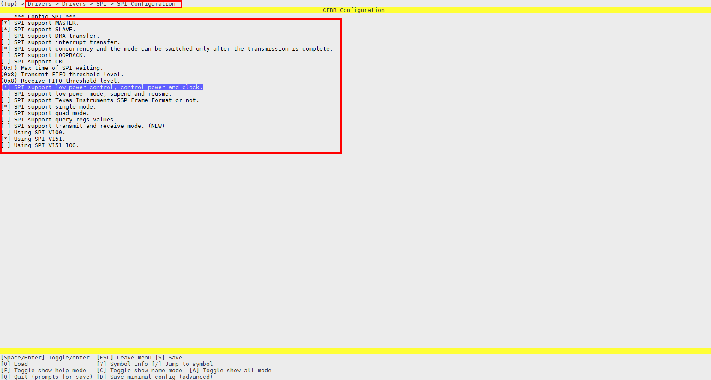

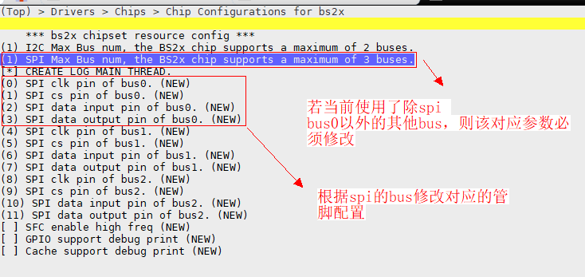

> **Note:** 
>If the images above are inconsistent with the table descriptions, the table prevails.

The specific descriptions of the configuration macros are shown in [Table 1](#table16629938173916).

**Table 1**  Descriptions of macros related to SPI

<a name="table16629938173916"></a>
<table><thead align="left"><tr id="row1462913813915"><th class="cellrowborder" valign="top" width="22.62773722627737%" id="mcps1.2.7.1.1"><p id="p1962923853920"><a name="p1962923853920"></a><a name="p1962923853920"></a>Macro name (CONFIG_ is the prefix added by default)</p>
</th>
<th class="cellrowborder" valign="top" width="21.07789221077892%" id="mcps1.2.7.1.2"><p id="p962916388395"><a name="p962916388395"></a><a name="p962916388395"></a>Specific description displayed on the Kconfig interface</p>
</th>
<th class="cellrowborder" valign="top" width="19.938006199380062%" id="mcps1.2.7.1.3"><p id="p18731420115119"><a name="p18731420115119"></a><a name="p18731420115119"></a>Usage scenario</p>
</th>
<th class="cellrowborder" valign="top" width="10.608939106089391%" id="mcps1.2.7.1.4"><p id="p537485457"><a name="p537485457"></a><a name="p537485457"></a>Implemented</p>
</th>
<th class="cellrowborder" valign="top" width="11.348865113488651%" id="mcps1.2.7.1.5"><p id="p1162915382392"><a name="p1162915382392"></a><a name="p1162915382392"></a>Depends on other macros</p>
</th>
<th class="cellrowborder" valign="top" width="14.3985601439856%" id="mcps1.2.7.1.6"><p id="p1162923893911"><a name="p1162923893911"></a><a name="p1162923893911"></a>Whether to enable or modify the configuration</p>
</th>
</tr>
</thead>
<tbody><tr id="row16629338103916"><td class="cellrowborder" valign="top" width="22.62773722627737%" headers="mcps1.2.7.1.1 "><p id="p166291338133910"><a name="p166291338133910"></a><a name="p166291338133910"></a>CONFIG_SPI_SUPPORT_MASTER</p>
</td>
<td class="cellrowborder" valign="top" width="21.07789221077892%" headers="mcps1.2.7.1.2 "><p id="p1773165692817"><a name="p1773165692817"></a><a name="p1773165692817"></a>SPI support MASTER.</p>
</td>
<td class="cellrowborder" valign="top" width="19.938006199380062%" headers="mcps1.2.7.1.3 "><p id="p182789183235"><a name="p182789183235"></a><a name="p182789183235"></a>SPI supports master selection. Enable it as appropriate.</p>
</td>
<td class="cellrowborder" valign="top" width="10.608939106089391%" headers="mcps1.2.7.1.4 "><p id="p166297382397"><a name="p166297382397"></a><a name="p166297382397"></a>Yes</p>
</td>
<td class="cellrowborder" valign="top" width="11.348865113488651%" headers="mcps1.2.7.1.5 "><p id="p162983873917"><a name="p162983873917"></a><a name="p162983873917"></a>No</p>
</td>
<td class="cellrowborder" valign="top" width="14.3985601439856%" headers="mcps1.2.7.1.6 "><p id="p142312269162"><a name="p142312269162"></a><a name="p142312269162"></a>Enabled by default. Recommended to enable.</p>
</td>
</tr>
<tr id="row166299383394"><td class="cellrowborder" valign="top" width="22.62773722627737%" headers="mcps1.2.7.1.1 "><p id="p14629173813920"><a name="p14629173813920"></a><a name="p14629173813920"></a>CONFIG_SPI_SUPPORT_SLAVE</p>
</td>
<td class="cellrowborder" valign="top" width="21.07789221077892%" headers="mcps1.2.7.1.2 "><p id="p6314610193820"><a name="p6314610193820"></a><a name="p6314610193820"></a>SPI support SLAVE.</p>
</td>
<td class="cellrowborder" valign="top" width="19.938006199380062%" headers="mcps1.2.7.1.3 "><p id="p750495852813"><a name="p750495852813"></a><a name="p750495852813"></a>SPI supports slave selection. Enable it as appropriate.</p>
</td>
<td class="cellrowborder" valign="top" width="10.608939106089391%" headers="mcps1.2.7.1.4 "><p id="p166291838143916"><a name="p166291838143916"></a><a name="p166291838143916"></a>Yes</p>
</td>
<td class="cellrowborder" valign="top" width="11.348865113488651%" headers="mcps1.2.7.1.5 "><p id="p2629138193917"><a name="p2629138193917"></a><a name="p2629138193917"></a>No</p>
</td>
<td class="cellrowborder" valign="top" width="14.3985601439856%" headers="mcps1.2.7.1.6 "><p id="p16717115134416"><a name="p16717115134416"></a><a name="p16717115134416"></a>Enabled by default. Recommended to enable.</p>
</td>
</tr>
<tr id="row3629193823919"><td class="cellrowborder" valign="top" width="22.62773722627737%" headers="mcps1.2.7.1.1 "><p id="p262983811395"><a name="p262983811395"></a><a name="p262983811395"></a>CONFIG_SPI_SUPPORT_DMA</p>
</td>
<td class="cellrowborder" valign="top" width="21.07789221077892%" headers="mcps1.2.7.1.2 "><p id="p53508282388"><a name="p53508282388"></a><a name="p53508282388"></a>SPI support DMA transfer.</p>
</td>
<td class="cellrowborder" valign="top" width="19.938006199380062%" headers="mcps1.2.7.1.3 "><p id="p1164428144915"><a name="p1164428144915"></a><a name="p1164428144915"></a>SPI supports the DMA mode. Enable it as appropriate. If the SPI DMA mode is selected, the KCONFIG configuration of the DMA driver must be selected as well. For details, refer to "<a href="KCONFIG配置-27.md">KCONFIG Configuration</a>".</p>
</td>
<td class="cellrowborder" valign="top" width="10.608939106089391%" headers="mcps1.2.7.1.4 "><p id="p3629133873917"><a name="p3629133873917"></a><a name="p3629133873917"></a>Yes</p>
</td>
<td class="cellrowborder" valign="top" width="11.348865113488651%" headers="mcps1.2.7.1.5 "><p id="p8473437181816"><a name="p8473437181816"></a><a name="p8473437181816"></a>CONFIG_DRIVER_SUPPORT_DMA</p>
</td>
<td class="cellrowborder" valign="top" width="14.3985601439856%" headers="mcps1.2.7.1.6 "><p id="p732198195217"><a name="p732198195217"></a><a name="p732198195217"></a>Disabled by default. Enable it as appropriate.</p>
</td>
</tr>
<tr id="row962920381394"><td class="cellrowborder" valign="top" width="22.62773722627737%" headers="mcps1.2.7.1.1 "><p id="p1629738173912"><a name="p1629738173912"></a><a name="p1629738173912"></a>CONFIG_SPI_SUPPORT_POLL_AND_DMA_AUTO_SWITCH</p>
</td>
<td class="cellrowborder" valign="top" width="21.07789221077892%" headers="mcps1.2.7.1.2 "><p id="p1326114416384"><a name="p1326114416384"></a><a name="p1326114416384"></a>SPI support poll and dma mode switch.</p>
</td>
<td class="cellrowborder" valign="top" width="19.938006199380062%" headers="mcps1.2.7.1.3 "><p id="p7601132985220"><a name="p7601132985220"></a><a name="p7601132985220"></a>SPI supports automatically switching between polling and DMA modes based on the set threshold. Enable it as appropriate.</p>
</td>
<td class="cellrowborder" valign="top" width="10.608939106089391%" headers="mcps1.2.7.1.4 "><p id="p7630938143910"><a name="p7630938143910"></a><a name="p7630938143910"></a>Yes</p>
</td>
<td class="cellrowborder" valign="top" width="11.348865113488651%" headers="mcps1.2.7.1.5 "><p id="p184291153201819"><a name="p184291153201819"></a><a name="p184291153201819"></a>CONFIG_SPI_SUPPORT_DMA</p>
</td>
<td class="cellrowborder" valign="top" width="14.3985601439856%" headers="mcps1.2.7.1.6 "><p id="p55269547522"><a name="p55269547522"></a><a name="p55269547522"></a>Disabled by default. Enable it as appropriate.</p>
</td>
</tr>
<tr id="row62681237271"><td class="cellrowborder" valign="top" width="22.62773722627737%" headers="mcps1.2.7.1.1 "><p id="p112401826112812"><a name="p112401826112812"></a><a name="p112401826112812"></a>CONFIG_SPI_AUTO_SWITCH_DMA_THRESHOLD</p>
</td>
<td class="cellrowborder" valign="top" width="21.07789221077892%" headers="mcps1.2.7.1.2 "><p id="p1844945715385"><a name="p1844945715385"></a><a name="p1844945715385"></a>SPI indicates the threshold of the automatic switchover mode.</p>
</td>
<td class="cellrowborder" valign="top" width="19.938006199380062%" headers="mcps1.2.7.1.3 "><p id="p1369200125313"><a name="p1369200125313"></a><a name="p1369200125313"></a>The threshold set for automatically switching between polling and DMA modes. The default value is 32.</p>
</td>
<td class="cellrowborder" valign="top" width="10.608939106089391%" headers="mcps1.2.7.1.4 "><p id="p5269202314277"><a name="p5269202314277"></a><a name="p5269202314277"></a>Yes</p>
</td>
<td class="cellrowborder" valign="top" width="11.348865113488651%" headers="mcps1.2.7.1.5 "><p id="p115505376560"><a name="p115505376560"></a><a name="p115505376560"></a>CONFIG_SPI_SUPPORT_POLL_AND_DMA_AUTO_SWITCH</p>
</td>
<td class="cellrowborder" valign="top" width="14.3985601439856%" headers="mcps1.2.7.1.6 "><p id="p91685144576"><a name="p91685144576"></a><a name="p91685144576"></a>The default value is 32. Configure it as appropriate.</p>
</td>
</tr>
<tr id="row17817572040"><td class="cellrowborder" valign="top" width="22.62773722627737%" headers="mcps1.2.7.1.1 "><p id="p109831846175713"><a name="p109831846175713"></a><a name="p109831846175713"></a>CONFIG_SPI_SUPPORT_INTERRUPT</p>
</td>
<td class="cellrowborder" valign="top" width="21.07789221077892%" headers="mcps1.2.7.1.2 "><p id="p124319334619"><a name="p124319334619"></a><a name="p124319334619"></a>SPI support interrupt transfer.</p>
</td>
<td class="cellrowborder" valign="top" width="19.938006199380062%" headers="mcps1.2.7.1.3 "><p id="p0369111616584"><a name="p0369111616584"></a><a name="p0369111616584"></a>SPI supports the interrupt mode. Enable it as appropriate.</p>
</td>
<td class="cellrowborder" valign="top" width="10.608939106089391%" headers="mcps1.2.7.1.4 "><p id="p17919571246"><a name="p17919571246"></a><a name="p17919571246"></a>Yes</p>
</td>
<td class="cellrowborder" valign="top" width="11.348865113488651%" headers="mcps1.2.7.1.5 "><p id="p12620160105914"><a name="p12620160105914"></a><a name="p12620160105914"></a>No</p>
</td>
<td class="cellrowborder" valign="top" width="14.3985601439856%" headers="mcps1.2.7.1.6 "><p id="p182001731221"><a name="p182001731221"></a><a name="p182001731221"></a>Disabled by default. Enable it as appropriate.</p>
</td>
</tr>
<tr id="row1071318918131"><td class="cellrowborder" valign="top" width="22.62773722627737%" headers="mcps1.2.7.1.1 "><p id="p671319910134"><a name="p671319910134"></a><a name="p671319910134"></a>CONFIG_SPI_SUPPORT_CONCURRENCY</p>
</td>
<td class="cellrowborder" valign="top" width="21.07789221077892%" headers="mcps1.2.7.1.2 "><p id="p438114181463"><a name="p438114181463"></a><a name="p438114181463"></a>SPI support concurrency and the mode can be switched only after the transmission is complete.</p>
</td>
<td class="cellrowborder" valign="top" width="19.938006199380062%" headers="mcps1.2.7.1.3 "><p id="p17131797138"><a name="p17131797138"></a><a name="p17131797138"></a>If this macro is enabled, the integrity of the current transmission can be ensured. The next transmission starts only after the current transmission is complete. This macro must be enabled when no lock is added.</p>
</td>
<td class="cellrowborder" valign="top" width="10.608939106089391%" headers="mcps1.2.7.1.4 "><p id="p1571316971311"><a name="p1571316971311"></a><a name="p1571316971311"></a>Yes</p>
</td>
<td class="cellrowborder" valign="top" width="11.348865113488651%" headers="mcps1.2.7.1.5 "><p id="p37135917132"><a name="p37135917132"></a><a name="p37135917132"></a>No</p>
</td>
<td class="cellrowborder" valign="top" width="14.3985601439856%" headers="mcps1.2.7.1.6 "><p id="p57965521033"><a name="p57965521033"></a><a name="p57965521033"></a>Disabled by default. Enable it as appropriate.</p>
</td>
</tr>
<tr id="row1663153711314"><td class="cellrowborder" valign="top" width="22.62773722627737%" headers="mcps1.2.7.1.1 "><p id="p13663183721310"><a name="p13663183721310"></a><a name="p13663183721310"></a>CONFIG_SPI_SUPPORT_LOOPBACK</p>
</td>
<td class="cellrowborder" valign="top" width="21.07789221077892%" headers="mcps1.2.7.1.2 "><p id="p066323716134"><a name="p066323716134"></a><a name="p066323716134"></a>SPI support LOOPBACK.</p>
</td>
<td class="cellrowborder" valign="top" width="19.938006199380062%" headers="mcps1.2.7.1.3 "><p id="p185305517595"><a name="p185305517595"></a><a name="p185305517595"></a>SPI supports the loopback mode, which is not implemented in this product.</p>
</td>
<td class="cellrowborder" valign="top" width="10.608939106089391%" headers="mcps1.2.7.1.4 "><p id="p186635371131"><a name="p186635371131"></a><a name="p186635371131"></a>No</p>
</td>
<td class="cellrowborder" valign="top" width="11.348865113488651%" headers="mcps1.2.7.1.5 "><p id="p1366323711131"><a name="p1366323711131"></a><a name="p1366323711131"></a>No</p>
</td>
<td class="cellrowborder" valign="top" width="14.3985601439856%" headers="mcps1.2.7.1.6 "><p id="p5326122414510"><a name="p5326122414510"></a><a name="p5326122414510"></a>Disabled by default, but not yet implemented in this product; it is recommended to disable it.</p>
</td>
</tr>
<tr id="row1115204491314"><td class="cellrowborder" valign="top" width="22.62773722627737%" headers="mcps1.2.7.1.1 "><p id="p20115184431314"><a name="p20115184431314"></a><a name="p20115184431314"></a>CONFIG_SPI_SUPPORT_CRC</p>
</td>
<td class="cellrowborder" valign="top" width="21.07789221077892%" headers="mcps1.2.7.1.2 "><p id="p1211594421319"><a name="p1211594421319"></a><a name="p1211594421319"></a>SPI support CRC.</p>
</td>
<td class="cellrowborder" valign="top" width="19.938006199380062%" headers="mcps1.2.7.1.3 "><p id="p4115184491311"><a name="p4115184491311"></a><a name="p4115184491311"></a>SPI supports the CRC mode, which is not implemented in this product.</p>
</td>
<td class="cellrowborder" valign="top" width="10.608939106089391%" headers="mcps1.2.7.1.4 "><p id="p9115124411312"><a name="p9115124411312"></a><a name="p9115124411312"></a>No</p>
</td>
<td class="cellrowborder" valign="top" width="11.348865113488651%" headers="mcps1.2.7.1.5 "><p id="p5115544151311"><a name="p5115544151311"></a><a name="p5115544151311"></a>No</p>
</td>
<td class="cellrowborder" valign="top" width="14.3985601439856%" headers="mcps1.2.7.1.6 "><p id="p1518312251351"><a name="p1518312251351"></a><a name="p1518312251351"></a>Disabled by default, but not yet implemented in this product; it is recommended to disable it.</p>
</td>
</tr>
<tr id="row9686349171316"><td class="cellrowborder" valign="top" width="22.62773722627737%" headers="mcps1.2.7.1.1 "><p id="p2068610490135"><a name="p2068610490135"></a><a name="p2068610490135"></a>CONFIG_SPI_MAX_TIMEOUT</p>
</td>
<td class="cellrowborder" valign="top" width="21.07789221077892%" headers="mcps1.2.7.1.2 "><p id="p16686174971317"><a name="p16686174971317"></a><a name="p16686174971317"></a>Max time of SPI waiting.</p>
</td>
<td class="cellrowborder" valign="top" width="19.938006199380062%" headers="mcps1.2.7.1.3 "><p id="p1534582015113"><a name="p1534582015113"></a><a name="p1534582015113"></a>The maximum timeout for SPI transmission</p>
</td>
<td class="cellrowborder" valign="top" width="10.608939106089391%" headers="mcps1.2.7.1.4 "><p id="p12686184941312"><a name="p12686184941312"></a><a name="p12686184941312"></a>Yes</p>
</td>
<td class="cellrowborder" valign="top" width="11.348865113488651%" headers="mcps1.2.7.1.5 "><p id="p26871249111313"><a name="p26871249111313"></a><a name="p26871249111313"></a>No</p>
</td>
<td class="cellrowborder" valign="top" width="14.3985601439856%" headers="mcps1.2.7.1.6 "><p id="p0629838133914"><a name="p0629838133914"></a><a name="p0629838133914"></a>The default value is 0xF. Configure it as appropriate. It is recommended not to modify it.</p>
</td>
</tr>
<tr id="row10100123917141"><td class="cellrowborder" valign="top" width="22.62773722627737%" headers="mcps1.2.7.1.1 "><p id="p6359290154"><a name="p6359290154"></a><a name="p6359290154"></a>CONFIG_SPI_TXFTLR</p>
</td>
<td class="cellrowborder" valign="top" width="21.07789221077892%" headers="mcps1.2.7.1.2 "><p id="p1057216107476"><a name="p1057216107476"></a><a name="p1057216107476"></a>Transmit FIFO threshold level.</p>
</td>
<td class="cellrowborder" valign="top" width="19.938006199380062%" headers="mcps1.2.7.1.3 "><p id="p151004394147"><a name="p151004394147"></a><a name="p151004394147"></a>SPI TX FIFO threshold</p>
</td>
<td class="cellrowborder" valign="top" width="10.608939106089391%" headers="mcps1.2.7.1.4 "><p id="p131001439161420"><a name="p131001439161420"></a><a name="p131001439161420"></a>Yes</p>
</td>
<td class="cellrowborder" valign="top" width="11.348865113488651%" headers="mcps1.2.7.1.5 "><p id="p110083912148"><a name="p110083912148"></a><a name="p110083912148"></a>No</p>
</td>
<td class="cellrowborder" valign="top" width="14.3985601439856%" headers="mcps1.2.7.1.6 "><p id="p126297381398"><a name="p126297381398"></a><a name="p126297381398"></a>The default value is 8. It is recommended not to modify it.</p>
</td>
</tr>
<tr id="row9604124541418"><td class="cellrowborder" valign="top" width="22.62773722627737%" headers="mcps1.2.7.1.1 "><p id="p1198461021518"><a name="p1198461021518"></a><a name="p1198461021518"></a>CONFIG_SPI_RXFTLR</p>
</td>
<td class="cellrowborder" valign="top" width="21.07789221077892%" headers="mcps1.2.7.1.2 "><p id="p32191422114710"><a name="p32191422114710"></a><a name="p32191422114710"></a>Receive FIFO threshold level.</p>
</td>
<td class="cellrowborder" valign="top" width="19.938006199380062%" headers="mcps1.2.7.1.3 "><p id="p61281017113016"><a name="p61281017113016"></a><a name="p61281017113016"></a>SPI RX FIFO threshold</p>
</td>
<td class="cellrowborder" valign="top" width="10.608939106089391%" headers="mcps1.2.7.1.4 "><p id="p1860512452145"><a name="p1860512452145"></a><a name="p1860512452145"></a>Yes</p>
</td>
<td class="cellrowborder" valign="top" width="11.348865113488651%" headers="mcps1.2.7.1.5 "><p id="p13605145101411"><a name="p13605145101411"></a><a name="p13605145101411"></a>No</p>
</td>
<td class="cellrowborder" valign="top" width="14.3985601439856%" headers="mcps1.2.7.1.6 "><p id="p876127301"><a name="p876127301"></a><a name="p876127301"></a>The default value is 8. It is recommended not to modify it.</p>
</td>
</tr>
<tr id="row4155553141"><td class="cellrowborder" valign="top" width="22.62773722627737%" headers="mcps1.2.7.1.1 "><p id="p2119131217152"><a name="p2119131217152"></a><a name="p2119131217152"></a>CONFIG_SPI_SUPPORT_LPC</p>
</td>
<td class="cellrowborder" valign="top" width="21.07789221077892%" headers="mcps1.2.7.1.2 "><p id="p879573724713"><a name="p879573724713"></a><a name="p879573724713"></a>SPI support low power control, control power and clock.</p>
</td>
<td class="cellrowborder" valign="top" width="19.938006199380062%" headers="mcps1.2.7.1.3 "><p id="p1605194513147"><a name="p1605194513147"></a><a name="p1605194513147"></a>SPI working clock</p>
</td>
<td class="cellrowborder" valign="top" width="10.608939106089391%" headers="mcps1.2.7.1.4 "><p id="p201555511146"><a name="p201555511146"></a><a name="p201555511146"></a>Yes</p>
</td>
<td class="cellrowborder" valign="top" width="11.348865113488651%" headers="mcps1.2.7.1.5 "><p id="p1280317457132"><a name="p1280317457132"></a><a name="p1280317457132"></a>No</p>
</td>
<td class="cellrowborder" valign="top" width="14.3985601439856%" headers="mcps1.2.7.1.6 "><p id="p31511558144"><a name="p31511558144"></a><a name="p31511558144"></a>Enabled by default. Mandatory.</p>
</td>
</tr>
<tr id="row155854071519"><td class="cellrowborder" valign="top" width="22.62773722627737%" headers="mcps1.2.7.1.1 "><p id="p1289513201519"><a name="p1289513201519"></a><a name="p1289513201519"></a>CONFIG_SPI_SUPPORT_LPM</p>
</td>
<td class="cellrowborder" valign="top" width="21.07789221077892%" headers="mcps1.2.7.1.2 "><p id="p148922050174717"><a name="p148922050174717"></a><a name="p148922050174717"></a>SPI support low power mode, supend and reusme.</p>
</td>
<td class="cellrowborder" valign="top" width="19.938006199380062%" headers="mcps1.2.7.1.3 "><p id="p77352085114"><a name="p77352085114"></a><a name="p77352085114"></a>This macro is used only in low-power scenarios.</p>
</td>
<td class="cellrowborder" valign="top" width="10.608939106089391%" headers="mcps1.2.7.1.4 "><p id="p145852091517"><a name="p145852091517"></a><a name="p145852091517"></a>Yes</p>
</td>
<td class="cellrowborder" valign="top" width="11.348865113488651%" headers="mcps1.2.7.1.5 "><p id="p178719416558"><a name="p178719416558"></a><a name="p178719416558"></a>No</p>
</td>
<td class="cellrowborder" valign="top" width="14.3985601439856%" headers="mcps1.2.7.1.6 "><p id="p12585190171517"><a name="p12585190171517"></a><a name="p12585190171517"></a>Disabled by default. Enable it as appropriate.</p>
</td>
</tr>
<tr id="row1120612316161"><td class="cellrowborder" valign="top" width="22.62773722627737%" headers="mcps1.2.7.1.1 "><p id="p12207162314169"><a name="p12207162314169"></a><a name="p12207162314169"></a>CONFIG_SPI_NOT_SUPPORT_TEXAS_FORMAT</p>
</td>
<td class="cellrowborder" valign="top" width="21.07789221077892%" headers="mcps1.2.7.1.2 "><p id="p1374816884814"><a name="p1374816884814"></a><a name="p1374816884814"></a>SPI support Texas Instruments SSP Frame Format or not.</p>
</td>
<td class="cellrowborder" valign="top" width="19.938006199380062%" headers="mcps1.2.7.1.3 "><p id="p1477573283217"><a name="p1477573283217"></a><a name="p1477573283217"></a>SPI supports the Texas Instruments SSP frame format</p>
</td>
<td class="cellrowborder" valign="top" width="10.608939106089391%" headers="mcps1.2.7.1.4 "><p id="p10207202331613"><a name="p10207202331613"></a><a name="p10207202331613"></a>Yes</p>
</td>
<td class="cellrowborder" valign="top" width="11.348865113488651%" headers="mcps1.2.7.1.5 "><p id="p22077234164"><a name="p22077234164"></a><a name="p22077234164"></a>No</p>
</td>
<td class="cellrowborder" valign="top" width="14.3985601439856%" headers="mcps1.2.7.1.6 "><p id="p3285141385920"><a name="p3285141385920"></a><a name="p3285141385920"></a>Disabled by default. Enable it as appropriate.</p>
</td>
</tr>
<tr id="row152811134161910"><td class="cellrowborder" valign="top" width="22.62773722627737%" headers="mcps1.2.7.1.1 "><p id="p13281173411919"><a name="p13281173411919"></a><a name="p13281173411919"></a>CONFIG_SPI_SUPPORT_SINGLE_SPI</p>
</td>
<td class="cellrowborder" valign="top" width="21.07789221077892%" headers="mcps1.2.7.1.2 "><p id="p3282133471911"><a name="p3282133471911"></a><a name="p3282133471911"></a>SPI support single mode.</p>
</td>
<td class="cellrowborder" valign="top" width="19.938006199380062%" headers="mcps1.2.7.1.3 "><p id="p49436402184"><a name="p49436402184"></a><a name="p49436402184"></a>SPI supports single-line mode (SCLK, CS, and DATA lines)</p>
</td>
<td class="cellrowborder" valign="top" width="10.608939106089391%" headers="mcps1.2.7.1.4 "><p id="p17282183411919"><a name="p17282183411919"></a><a name="p17282183411919"></a>Yes</p>
</td>
<td class="cellrowborder" valign="top" width="11.348865113488651%" headers="mcps1.2.7.1.5 "><p id="p19282143413191"><a name="p19282143413191"></a><a name="p19282143413191"></a>No</p>
</td>
<td class="cellrowborder" valign="top" width="14.3985601439856%" headers="mcps1.2.7.1.6 "><p id="p20595241182012"><a name="p20595241182012"></a><a name="p20595241182012"></a>Enabled by default. Enable it as appropriate. It is recommended to disable it.</p>
</td>
</tr>
<tr id="row152919554295"><td class="cellrowborder" valign="top" width="22.62773722627737%" headers="mcps1.2.7.1.1 "><p id="p1955124143113"><a name="p1955124143113"></a><a name="p1955124143113"></a>CONFIG_SPI_SUPPORT_QUAD_SPI</p>
</td>
<td class="cellrowborder" valign="top" width="21.07789221077892%" headers="mcps1.2.7.1.2 "><p id="p92921755102918"><a name="p92921755102918"></a><a name="p92921755102918"></a>SPI support quad mode.</p>
</td>
<td class="cellrowborder" valign="top" width="19.938006199380062%" headers="mcps1.2.7.1.3 "><p id="p1292155112913"><a name="p1292155112913"></a><a name="p1292155112913"></a>SPI supports four-line mode</p>
</td>
<td class="cellrowborder" valign="top" width="10.608939106089391%" headers="mcps1.2.7.1.4 "><p id="p2292145513291"><a name="p2292145513291"></a><a name="p2292145513291"></a>Yes</p>
</td>
<td class="cellrowborder" valign="top" width="11.348865113488651%" headers="mcps1.2.7.1.5 "><p id="p829212557292"><a name="p829212557292"></a><a name="p829212557292"></a>No</p>
</td>
<td class="cellrowborder" valign="top" width="14.3985601439856%" headers="mcps1.2.7.1.6 "><p id="p1919510457322"><a name="p1919510457322"></a><a name="p1919510457322"></a>Not supported by BS2X</p>
</td>
</tr>
<tr id="row18951740131615"><td class="cellrowborder" valign="top" width="22.62773722627737%" headers="mcps1.2.7.1.1 "><p id="p197481234181715"><a name="p197481234181715"></a><a name="p197481234181715"></a>CONFIG_SPI_SUPPORT_QUERY_REGS</p>
</td>
<td class="cellrowborder" valign="top" width="21.07789221077892%" headers="mcps1.2.7.1.2 "><p id="p14910182004815"><a name="p14910182004815"></a><a name="p14910182004815"></a>SPI support query regs values.</p>
</td>
<td class="cellrowborder" valign="top" width="19.938006199380062%" headers="mcps1.2.7.1.3 "><p id="p139544011168"><a name="p139544011168"></a><a name="p139544011168"></a>SPI supports reading back all related register values for maintenance and testing</p>
</td>
<td class="cellrowborder" valign="top" width="10.608939106089391%" headers="mcps1.2.7.1.4 "><p id="p16957407165"><a name="p16957407165"></a><a name="p16957407165"></a>Yes</p>
</td>
<td class="cellrowborder" valign="top" width="11.348865113488651%" headers="mcps1.2.7.1.5 "><p id="p395194031613"><a name="p395194031613"></a><a name="p395194031613"></a>No</p>
</td>
<td class="cellrowborder" valign="top" width="14.3985601439856%" headers="mcps1.2.7.1.6 "><p id="p1817114179353"><a name="p1817114179353"></a><a name="p1817114179353"></a>Disabled by default. Enable it as appropriate.</p>
</td>
</tr>
<tr id="row1744519541612"><td class="cellrowborder" valign="top" width="22.62773722627737%" headers="mcps1.2.7.1.1 "><p id="p1644525191612"><a name="p1644525191612"></a><a name="p1644525191612"></a>CONFIG_SPI_SUPPORT_TXRX_TRANS_MODE</p>
</td>
<td class="cellrowborder" valign="top" width="21.07789221077892%" headers="mcps1.2.7.1.2 "><p id="p54451957163"><a name="p54451957163"></a><a name="p54451957163"></a>SPI support transmit and receive mode.</p>
</td>
<td class="cellrowborder" valign="top" width="19.938006199380062%" headers="mcps1.2.7.1.3 "><p id="p1144565111618"><a name="p1144565111618"></a><a name="p1144565111618"></a>SPI supports the full-duplex mode.</p>
</td>
<td class="cellrowborder" valign="top" width="10.608939106089391%" headers="mcps1.2.7.1.4 "><p id="p644620510169"><a name="p644620510169"></a><a name="p644620510169"></a>Yes</p>
</td>
<td class="cellrowborder" valign="top" width="11.348865113488651%" headers="mcps1.2.7.1.5 "><p id="p11446165121612"><a name="p11446165121612"></a><a name="p11446165121612"></a>No</p>
</td>
<td class="cellrowborder" valign="top" width="14.3985601439856%" headers="mcps1.2.7.1.6 "><p id="p3446135121614"><a name="p3446135121614"></a><a name="p3446135121614"></a>Disabled by default. Enable it as appropriate.</p>
</td>
</tr>
<tr id="row102331352100"><td class="cellrowborder" valign="top" width="22.62773722627737%" headers="mcps1.2.7.1.1 "><p id="p42341510109"><a name="p42341510109"></a><a name="p42341510109"></a>CONFIG_SPI_SUPPORT_DELAY_FOR_WRITEREAD</p>
</td>
<td class="cellrowborder" valign="top" width="21.07789221077892%" headers="mcps1.2.7.1.2 "><p id="p923410501011"><a name="p923410501011"></a><a name="p923410501011"></a>SPI support delay between write and read.</p>
</td>
<td class="cellrowborder" valign="top" width="19.938006199380062%" headers="mcps1.2.7.1.3 "><p id="p1093515477108"><a name="p1093515477108"></a><a name="p1093515477108"></a>This macro is used only in scenarios where more time is needed for preparation between TX and RX, and is currently used only for special sensors.</p>
</td>
<td class="cellrowborder" valign="top" width="10.608939106089391%" headers="mcps1.2.7.1.4 "><p id="p33262715111"><a name="p33262715111"></a><a name="p33262715111"></a>Yes</p>
</td>
<td class="cellrowborder" valign="top" width="11.348865113488651%" headers="mcps1.2.7.1.5 "><p id="p232637121112"><a name="p232637121112"></a><a name="p232637121112"></a>No</p>
</td>
<td class="cellrowborder" valign="top" width="14.3985601439856%" headers="mcps1.2.7.1.6 "><p id="p17326974112"><a name="p17326974112"></a><a name="p17326974112"></a>Disabled by default. Enable it as appropriate.</p>
</td>
</tr>
<tr id="row16613625171211"><td class="cellrowborder" valign="top" width="22.62773722627737%" headers="mcps1.2.7.1.1 "><p id="p19613122510126"><a name="p19613122510126"></a><a name="p19613122510126"></a>CONFIG_SPI_AUTO_TMOD</p>
</td>
<td class="cellrowborder" valign="top" width="21.07789221077892%" headers="mcps1.2.7.1.2 "><p id="p17613102515125"><a name="p17613102515125"></a><a name="p17613102515125"></a>SPI support auto tmod switch.</p>
</td>
<td class="cellrowborder" valign="top" width="19.938006199380062%" headers="mcps1.2.7.1.3 "><p id="p561352517129"><a name="p561352517129"></a><a name="p561352517129"></a>SPI supports automatic TMOD switching</p>
</td>
<td class="cellrowborder" valign="top" width="10.608939106089391%" headers="mcps1.2.7.1.4 "><p id="p163451157121216"><a name="p163451157121216"></a><a name="p163451157121216"></a>Yes</p>
</td>
<td class="cellrowborder" valign="top" width="11.348865113488651%" headers="mcps1.2.7.1.5 "><p id="p134555721215"><a name="p134555721215"></a><a name="p134555721215"></a>No</p>
</td>
<td class="cellrowborder" valign="top" width="14.3985601439856%" headers="mcps1.2.7.1.6 "><p id="p1534515577129"><a name="p1534515577129"></a><a name="p1534515577129"></a>Disabled by default. Enable it as appropriate.</p>
</td>
</tr>
<tr id="row16469746171619"><td class="cellrowborder" valign="top" width="22.62773722627737%" headers="mcps1.2.7.1.1 "><p id="p13831935111710"><a name="p13831935111710"></a><a name="p13831935111710"></a>CONFIG_SPI_USING_V100</p>
</td>
<td class="cellrowborder" valign="top" width="21.07789221077892%" headers="mcps1.2.7.1.2 "><p id="p163157475481"><a name="p163157475481"></a><a name="p163157475481"></a>Using SPI V100.</p>
</td>
<td class="cellrowborder" valign="top" width="19.938006199380062%" headers="mcps1.2.7.1.3 "><p id="p56134571811"><a name="p56134571811"></a><a name="p56134571811"></a>This macro indicates the SPI V100 driver specification, which is not used in this product.</p>
</td>
<td class="cellrowborder" valign="top" width="10.608939106089391%" headers="mcps1.2.7.1.4 "><p id="p154691146191615"><a name="p154691146191615"></a><a name="p154691146191615"></a>Yes</p>
</td>
<td class="cellrowborder" valign="top" width="11.348865113488651%" headers="mcps1.2.7.1.5 "><p id="p746920467167"><a name="p746920467167"></a><a name="p746920467167"></a>No</p>
</td>
<td class="cellrowborder" valign="top" width="14.3985601439856%" headers="mcps1.2.7.1.6 "><p id="p1633165718345"><a name="p1633165718345"></a><a name="p1633165718345"></a>Disabled by default. It must be disabled.</p>
</td>
</tr>
<tr id="row17463553171619"><td class="cellrowborder" valign="top" width="22.62773722627737%" headers="mcps1.2.7.1.1 "><p id="p8789036121717"><a name="p8789036121717"></a><a name="p8789036121717"></a>CONFIG_SPI_USING_V151</p>
</td>
<td class="cellrowborder" valign="top" width="21.07789221077892%" headers="mcps1.2.7.1.2 "><p id="p37632529481"><a name="p37632529481"></a><a name="p37632529481"></a>Using SPI V151.</p>
</td>
<td class="cellrowborder" valign="top" width="19.938006199380062%" headers="mcps1.2.7.1.3 "><p id="p2463115311616"><a name="p2463115311616"></a><a name="p2463115311616"></a>This macro indicates the SPI V151 driver specification, which is used by default in this product.</p>
</td>
<td class="cellrowborder" valign="top" width="10.608939106089391%" headers="mcps1.2.7.1.4 "><p id="p10463185313162"><a name="p10463185313162"></a><a name="p10463185313162"></a>Yes</p>
</td>
<td class="cellrowborder" valign="top" width="11.348865113488651%" headers="mcps1.2.7.1.5 "><p id="p1246320533166"><a name="p1246320533166"></a><a name="p1246320533166"></a>No</p>
</td>
<td class="cellrowborder" valign="top" width="14.3985601439856%" headers="mcps1.2.7.1.6 "><p id="p20821243153619"><a name="p20821243153619"></a><a name="p20821243153619"></a>Enabled by default. Mandatory.</p>
</td>
</tr>
<tr id="row178551721398"><td class="cellrowborder" valign="top" width="22.62773722627737%" headers="mcps1.2.7.1.1 "><p id="p285517212919"><a name="p285517212919"></a><a name="p285517212919"></a>CONFIG_SPI_USING_V151_100</p>
</td>
<td class="cellrowborder" valign="top" width="21.07789221077892%" headers="mcps1.2.7.1.2 "><p id="p1485522117910"><a name="p1485522117910"></a><a name="p1485522117910"></a>Using SPI V151_100.</p>
</td>
<td class="cellrowborder" valign="top" width="19.938006199380062%" headers="mcps1.2.7.1.3 "><p id="p17855152115916"><a name="p17855152115916"></a><a name="p17855152115916"></a>This macro indicates the SPI V151_100 driver specification, which is not used in this product.</p>
</td>
<td class="cellrowborder" valign="top" width="10.608939106089391%" headers="mcps1.2.7.1.4 "><p id="p1485519211792"><a name="p1485519211792"></a><a name="p1485519211792"></a>Yes</p>
</td>
<td class="cellrowborder" valign="top" width="11.348865113488651%" headers="mcps1.2.7.1.5 "><p id="p178551211491"><a name="p178551211491"></a><a name="p178551211491"></a>No</p>
</td>
<td class="cellrowborder" valign="top" width="14.3985601439856%" headers="mcps1.2.7.1.6 "><p id="p78557211499"><a name="p78557211499"></a><a name="p78557211499"></a>Disabled by default. It must be disabled.</p>
</td>
</tr>
<tr id="row183271017204017"><td class="cellrowborder" valign="top" width="22.62773722627737%" headers="mcps1.2.7.1.1 "><p id="p0328717114020"><a name="p0328717114020"></a><a name="p0328717114020"></a>CONFIG_SPI_BUS_MAX_NUM</p>
</td>
<td class="cellrowborder" valign="top" width="21.07789221077892%" headers="mcps1.2.7.1.2 "><p id="p10328517204012"><a name="p10328517204012"></a><a name="p10328517204012"></a>SPI Max Bus num, the BS2x chip supports a maximum of 3 buses.</p>
</td>
<td class="cellrowborder" valign="top" width="19.938006199380062%" headers="mcps1.2.7.1.3 "><p id="p1232891710407"><a name="p1232891710407"></a><a name="p1232891710407"></a>This macro indicates the maximum number of SPI buses. The default value is 1. If a bus other than SPI BUS0 is used, this macro must be modified accordingly; otherwise, an exception may occur.</p>
</td>
<td class="cellrowborder" valign="top" width="10.608939106089391%" headers="mcps1.2.7.1.4 "><p id="p123283175403"><a name="p123283175403"></a><a name="p123283175403"></a>Yes</p>
</td>
<td class="cellrowborder" valign="top" width="11.348865113488651%" headers="mcps1.2.7.1.5 "><p id="p9328151794011"><a name="p9328151794011"></a><a name="p9328151794011"></a>CONFIG_DRIVER_SUPPORT_SPI</p>
</td>
<td class="cellrowborder" valign="top" width="14.3985601439856%" headers="mcps1.2.7.1.6 "><p id="p12328191719406"><a name="p12328191719406"></a><a name="p12328191719406"></a>The default value is 1. Modify the configuration based on actual SPI bus usage.</p>
</td>
</tr>
</tbody>
</table>

## Development Guide<a name="ZH-CN_TOPIC_0000001664983974"></a>

SPI is used to connect devices that support the SPI protocol. The SPI unit can act as a master or slave device. The following uses the SPI unit as a master device as an example. The write operation is as follows:

1.  Use IO mux to set the pins used by the SPI function to the SPI function.

    For the pin mux functions, refer to the definitions of each pin function in platform\_core.h.

    ```
    #define SPI_PIN_MISO_PINMUX     HAL_PIO_SPI2_RXD
    #define SPI_PIN_MOSI_PINMUX     HAL_PIO_SPI2_TXD
    #define SPI_PIN_CLK_PINMUX      HAL_PIO_SPI2_CLK
    #define SPI_PIN_CS_PINMUX       HAL_PIO_SPI2_CS0
    #define SPI_PIN_MISO    S_MGPIO16
    #define SPI_PIN_MOSI    S_MGPIO17
    #define SPI_PIN_CLK     S_MGPIO18
    #define SPI_PIN_CS      S_MGPIO19
    void usr_spi_io_init(void)
    {
        /* Set the SPI pinmux */
        uapi_pin_set_mode(SPI_PIN_MISO, SPI_PIN_MISO_PINMUX);       /* Set the SPI MISO pinmux */
        uapi_pin_set_mode(SPI_PIN_MOSI, SPI_PIN_MOSI_PINMUX);       /* Set the SPI MOSI pinmux */
        uapi_pin_set_mode(SPI_PIN_CLK, SPI_PIN_CLK_PINMUX);         /* Set the SPI CLK pinmux */
        uapi_pin_set_mode(SPI_PIN_CS, SPI_PIN_CS_PINMUX);           /* Set the SPI CS pinmux */
    }
    ```

2.  Call uapi\_spi\_init to initialize SPI resources, select the SPI function unit, and configure SPI parameters.

    ```
    #define TEST_SPI                SPI_BUS_2
    #define BUS_CLOCK               32000000    /* 32M */
    #define SPI_FREQUENCY           2
    errcode_t usr_spi_init(void)
    {
        spi_attr_t config = { 0 };
        spi_extra_attr_t ext_config = { 0 };
        ext_config.sspi_param.wait_cycles = 0x10;
        usr_spi_io_init();
        config.freq_mhz = SPI_FREQUENCY;                            /* Working frequency after SPI frequency division */
        config.is_slave = false;                                    /* Master mode */
        config.frame_size = HAL_SPI_FRAME_SIZE_8;                   /* SPI frame size, 8 bits */
        config.salve_num = 1;                                       /* Use chip select 0 */
        config.spi_frame_format = HAL_SPI_FRAME_FORMAT_STANDARD;    /* SPI transmission mode: standard SPI */
        config.bus_clk = BUS_CLOCK;                                 /* SPI clock source frequency */
        config.frame_format = SPI_CFG_FRAME_FORMAT_MOTOROLA_SPI;    /* SPI protocol format: Motorola SPI protocol format */
        config.tmod = HAL_SPI_TRANS_MODE_TXRX;                      /* SPI transmission mode: transmit/receive mode */
        config.clk_phase = SPI_CFG_CLK_CPHA_0;                      /* SPI phase: SPI_CFG_CLK_CPHA_0 */
        config.clk_polarity = SPI_CFG_CLK_CPOL_0;                   /* SPI polarity: SPI_CFG_CLK_CPOL_0 */
        /* Initialize SPI */
        errcode_t err = uapi_spi_init(TEST_SPI, &config, &ext_config);
        return err;
    }
    ```

3.  Call uapi\_spi\_master\_writeread to perform the SPI master write/read operation.

    The following uses the master write/read as an example:

    ```
    errcode_t usr_spi_writeread(uint8_t *wdata, uint8_t wlen, uint8_t *rdata, uint8_t rlen)
    {
        spi_xfer_data_t spi_recv_xfer = { 0 };
        spi_recv_xfer.tx_buff = wdata;                               /* Set the TX buffer */
        spi_recv_xfer.tx_bytes = wlen;                               /* Set the TX buffer length */
        spi_recv_xfer.rx_buff = rdata;                               /* Set the RX buffer */
        spi_recv_xfer.rx_bytes = rlen;                               /* Set the RX buffer length */
        spi_porting_set_rx_mode(TEST_SPI, rlen);                     /* Set the RX reception mode of the write/read interface */
        return uapi_spi_master_writeread(TEST_SPI, &spi_recv_xfer, 100); /* Read data */
    }
    ```

For the complete master/slave transmission and reception code of two-board SPI in three modes (polling, interrupt, and DMA), see the following code:

```
#include "pinctrl.h"
#include "spi.h"
#include "soc_osal.h"
#include "app_init.h"
#include "dma.h"

#define SPI_SLAVE_NUM                   1
#define SPI_FREQUENCY                   2
#define SPI_CLK_POLARITY                0
#define SPI_CLK_PHASE                   0
#define SPI_FRAME_FORMAT                0
#define SPI_FRAME_FORMAT_STANDARD       0
#define SPI_FRAME_SIZE                  0x1f
#define SPI_TMOD                        0
#define SPI_WAIT_CYCLES                 0x10
#if defined(CONFIG_SPI_SUPPORT_DMA) && !(defined(CONFIG_SPI_SUPPORT_POLL_AND_DMA_AUTO_SWITCH))
#define SPI_DMA_WIDTH                   2
#endif
#if defined(CONFIG_SPI_MASTER_SUPPORT_QSPI)
#define QSPI_WRITE_CMD                  0x38
#define QSPI_WRITE_ADDR                 0x123
#endif
#define SPI_TASK_DURATION_MS            500
#define SPI_TASK_PRIO                   24
#define SPI_TASK_STACK_SIZE             0x1000

static void app_spi_init_pin(void)
{
#if defined(CONFIG_PINCTRL_SUPPORT_IE)
    uapi_pin_set_ie(CONFIG_SPI_MASTER_DI_PIN, PIN_IE_1);
#endif /* CONFIG_PINCTRL_SUPPORT_IE */
    uapi_pin_set_mode(CONFIG_SPI_MASTER_CLK_PIN, CONFIG_SPI_MASTER_CLK_PIN_MODE);
    uapi_pin_set_mode(CONFIG_SPI_MASTER_CS_PIN, CONFIG_SPI_MASTER_CS_PIN_MODE);
    uapi_pin_set_mode(CONFIG_SPI_MASTER_DI_PIN, CONFIG_SPI_MASTER_DI_PIN_MODE);
    uapi_pin_set_mode(CONFIG_SPI_MASTER_DO_PIN, CONFIG_SPI_MASTER_DO_PIN_MODE);
}

#if defined(CONFIG_SPI_SUPPORT_INTERRUPT) && (CONFIG_SPI_SUPPORT_INTERRUPT == 1)
static void app_spi_master_write_int_handler(const void *buffer, uint32_t length)
{
    unused(buffer);
    unused(length);
    osal_printk("spi master write interrupt start!\r\n");
}

static void app_spi_master_rx_callback(const void *buffer, uint32_t length, bool error)
{
    if (buffer == NULL || length == 0) {
        osal_printk("spi master transfer illegal data!\r\n");
        return;
    }
    if (error) {
        osal_printk("app_spi_master_read_int error!\r\n");
        return;
    }

    uint8_t *buff = (uint8_t *)buffer;
    for (uint32_t i = 0; i < length; i++) {
        osal_printk("buff[%d] = %x\r\n", i, buff[i]);
    }
    osal_printk("app_spi_master_read_int success!\r\n");
}
#endif  /* CONFIG_SPI_SUPPORT_INTERRUPT */

static void app_spi_master_init_config(void)
{
    spi_attr_t config = { 0 };
    spi_extra_attr_t ext_config = { 0 };

    config.is_slave = false;
    config.slave_num = SPI_SLAVE_NUM;
    config.bus_clk = SPI_CLK_FREQ;
    config.freq_mhz = SPI_FREQUENCY;
    config.clk_polarity = SPI_CLK_POLARITY;
    config.clk_phase = SPI_CLK_PHASE;
    config.frame_format = SPI_FRAME_FORMAT;
    config.spi_frame_format = HAL_SPI_FRAME_FORMAT_STANDARD;
    config.frame_size = SPI_FRAME_SIZE;
    config.tmod = SPI_TMOD;
    config.sste = 0;

    ext_config.qspi_param.wait_cycles = SPI_WAIT_CYCLES;
    uapi_spi_init(CONFIG_SPI_MASTER_BUS_ID, &config, &ext_config);
#if defined(CONFIG_SPI_SUPPORT_DMA) && (CONFIG_SPI_SUPPORT_DMA == 1)
    uapi_dma_init();
    uapi_dma_open();
#ifndef CONFIG_SPI_SUPPORT_POLL_AND_DMA_AUTO_SWITCH
    spi_dma_config_t dma_cfg = {
        .src_width = SPI_DMA_WIDTH,
        .dest_width = SPI_DMA_WIDTH,
        .burst_length = 0,
        .priority = 0
    };
    if (uapi_spi_set_dma_mode(CONFIG_SPI_MASTER_BUS_ID, true, &dma_cfg) != ERRCODE_SUCC) {
        osal_printk("spi%d master set dma mode fail!\r\n");
    }
#endif
#endif  /* CONFIG_SPI_SUPPORT_DMA */

#if defined(CONFIG_SPI_SUPPORT_INTERRUPT) && (CONFIG_SPI_SUPPORT_INTERRUPT == 1)
    if (uapi_spi_set_irq_mode(CONFIG_SPI_MASTER_BUS_ID, true, app_spi_master_rx_callback,
        app_spi_master_write_int_handler) == ERRCODE_SUCC) {
        osal_printk("spi%d master set irq mode succ!\r\n", CONFIG_SPI_MASTER_BUS_ID);
    }
#endif  /* CONFIG_SPI_SUPPORT_INTERRUPT */
}

static void *spi_master_task(const char *arg)
{
    unused(arg);
    /* SPI pinmux. */
    app_spi_init_pin();

    /* SPI master init config. */
    app_spi_master_init_config();

    /* SPI data config. */
    uint8_t tx_data[CONFIG_SPI_TRANSFER_LEN] = { 0 };
    for (uint32_t loop = 0; loop < CONFIG_SPI_TRANSFER_LEN; loop++) {
        tx_data[loop] = (loop & 0xFF);
    }
    uint8_t rx_data[CONFIG_SPI_TRANSFER_LEN] = { 0 };
    spi_xfer_data_t data = {
        .tx_buff = tx_data,
        .tx_bytes = CONFIG_SPI_TRANSFER_LEN,
        .rx_buff = rx_data,
        .rx_bytes = CONFIG_SPI_TRANSFER_LEN,
#if defined(CONFIG_SPI_MASTER_SUPPORT_QSPI)
        .cmd = QSPI_WRITE_CMD,
        .addr = QSPI_WRITE_ADDR,
#endif
    };

    while (1) {
        osal_msleep(SPI_TASK_DURATION_MS);
#ifndef CONFIG_SPI_MASTER_SUPPORT_WRITEREAD
        osal_printk("spi%d master send start!\r\n", CONFIG_SPI_MASTER_BUS_ID);
        if (uapi_spi_master_write(CONFIG_SPI_MASTER_BUS_ID, &data, 0xFFFFFFFF) == ERRCODE_SUCC) {
            osal_printk("spi%d master send succ!\r\n", CONFIG_SPI_MASTER_BUS_ID);
        } else {
            continue;
        }
        osal_printk("spi%d master receive start!\r\n", CONFIG_SPI_MASTER_BUS_ID);
        if (uapi_spi_master_read(CONFIG_SPI_MASTER_BUS_ID, &data, 0xFFFFFFFF) == ERRCODE_SUCC) {
#ifndef CONFIG_SPI_SUPPORT_INTERRUPT
            for (uint32_t i = 0; i < data.rx_bytes; i++) {
                osal_printk("spi%d master receive data is %x\r\n", CONFIG_SPI_MASTER_BUS_ID, data.rx_buff[i]);
            }
#endif
            osal_printk("spi%d master receive succ!\r\n", CONFIG_SPI_MASTER_BUS_ID);
        }
#else
        osal_printk("spi%d master writeread start!\r\n", CONFIG_SPI_MASTER_BUS_ID);
        if (uapi_spi_master_writeread(CONFIG_SPI_MASTER_BUS_ID, &data, 0xFFFFFFFF) == ERRCODE_SUCC) {
            for (uint32_t i = 0; i < data.rx_bytes; i++) {
                osal_printk("spi%d master writeread data is %x\r\n", CONFIG_SPI_MASTER_BUS_ID, data.rx_buff[i]);
            }
            osal_printk("spi%d master writeread succ!\r\n", CONFIG_SPI_MASTER_BUS_ID);
        }
#endif
    }

    return NULL;
}

static void spi_master_entry(void)
{
    osal_task *task_handle = NULL;
    osal_kthread_lock();
    task_handle = osal_kthread_create((osal_kthread_handler)spi_master_task, 0, "SpiMasterTask", SPI_TASK_STACK_SIZE);
    if (task_handle != NULL) {
        osal_kthread_set_priority(task_handle, SPI_TASK_PRIO);
    }
    osal_kthread_unlock();
}

/* Run the spi_master_entry. */
app_run(spi_master_entry);

------------------------------------------------------------------------------

#include "pinctrl.h"
#include "spi.h"
#include "soc_osal.h"
#include "app_init.h"
#include "dma.h"

#define SPI_SLAVE_NUM                   1
#define SPI_FREQUENCY                   2
#define SPI_CLK_POLARITY                0
#define SPI_CLK_PHASE                   0
#define SPI_FRAME_FORMAT                0
#define SPI_FRAME_FORMAT_STANDARD       0
#define SPI_FRAME_SIZE                  0x1f
#define SPI_TMOD                        0
#define SPI_WAIT_CYCLES                 0x10
#if defined(CONFIG_SPI_SUPPORT_DMA) && !(defined(CONFIG_SPI_SUPPORT_POLL_AND_DMA_AUTO_SWITCH))
#define SPI_DMA_WIDTH                   2
#endif

#define SPI_TASK_DURATION_MS            500
#define SPI_TASK_PRIO                   24
#define SPI_TASK_STACK_SIZE             0x1000

static void app_spi_init_pin(void)
{
#if defined(CONFIG_PINCTRL_SUPPORT_IE)
    uapi_pin_set_ie(CONFIG_SPI_SLAVE_CLK_PIN, PIN_IE_1);
    uapi_pin_set_ie(CONFIG_SPI_SLAVE_CS_PIN, PIN_IE_1);
    uapi_pin_set_ie(CONFIG_SPI_SLAVE_DI_PIN, PIN_IE_1);
#endif /* CONFIG_PINCTRL_SUPPORT_IE */
    uapi_pin_set_mode(CONFIG_SPI_SLAVE_CLK_PIN, CONFIG_SPI_SLAVE_CLK_PIN_MODE);
    uapi_pin_set_mode(CONFIG_SPI_SLAVE_CS_PIN, CONFIG_SPI_SLAVE_CS_PIN_MODE);
    uapi_pin_set_mode(CONFIG_SPI_SLAVE_DI_PIN, CONFIG_SPI_SLAVE_DI_PIN_MODE);
    uapi_pin_set_mode(CONFIG_SPI_SLAVE_DO_PIN, CONFIG_SPI_SLAVE_DO_PIN_MODE);
}

#if defined(CONFIG_SPI_SUPPORT_INTERRUPT) && (CONFIG_SPI_SUPPORT_INTERRUPT == 1)
static void app_spi_slave_write_int_handler(const void *buffer, uint32_t length)
{
    unused(buffer);
    unused(length);
    osal_printk("spi slave write interrupt start!\r\n");
}

static void app_spi_slave_rx_callback(const void *buffer, uint32_t length, bool error)
{
    if (buffer == NULL || length == 0) {
        osal_printk("spi slave transfer illegal data!\r\n");
        return;
    }
    if (error) {
        osal_printk("app_spi_slave_read_int error!\r\n");
        return;
    }

    uint8_t *buff = (uint8_t *)buffer;
    for (uint32_t i = 0; i < length; i++) {
        osal_printk("buff[%d] = %x\r\n", i, buff[i]);
    }
    osal_printk("app_spi_slave_read_int success!\r\n");
}
#endif  /* CONFIG_SPI_SUPPORT_INTERRUPT */

static void app_spi_slave_init_config(void)
{
    spi_attr_t config = { 0 };
    spi_extra_attr_t ext_config = { 0 };

    config.is_slave = true;
    config.slave_num = SPI_SLAVE_NUM;
    config.bus_clk = SPI_CLK_FREQ;
    config.freq_mhz = SPI_FREQUENCY;
    config.clk_polarity = SPI_CLK_POLARITY;
    config.clk_phase = SPI_CLK_PHASE;
    config.frame_format = SPI_FRAME_FORMAT;
    config.spi_frame_format = HAL_SPI_FRAME_FORMAT_STANDARD;
    config.frame_size = SPI_FRAME_SIZE;
    config.tmod = SPI_TMOD;
    config.sste = 0;

    ext_config.qspi_param.wait_cycles = SPI_WAIT_CYCLES;

    uapi_spi_init(CONFIG_SPI_SLAVE_BUS_ID, &config, &ext_config);
#if defined(CONFIG_SPI_SUPPORT_DMA) && (CONFIG_SPI_SUPPORT_DMA == 1)
    uapi_dma_init();
    uapi_dma_open();
#ifndef CONFIG_SPI_SUPPORT_POLL_AND_DMA_AUTO_SWITCH
    spi_dma_config_t dma_cfg = {
        .src_width = SPI_DMA_WIDTH,
        .dest_width = SPI_DMA_WIDTH,
        .burst_length = 0,
        .priority = 0
    };
    if (uapi_spi_set_dma_mode(CONFIG_SPI_SLAVE_BUS_ID, true, &dma_cfg) != ERRCODE_SUCC) {
        osal_printk("spi%d slave set dma mode fail!\r\n");
    }
#endif
#endif  /* CONFIG_SPI_SUPPORT_DMA */

#if defined(CONFIG_SPI_SUPPORT_INTERRUPT) && (CONFIG_SPI_SUPPORT_INTERRUPT == 1)
    if (uapi_spi_set_irq_mode(CONFIG_SPI_SLAVE_BUS_ID, true, app_spi_slave_rx_callback,
        app_spi_slave_write_int_handler) == ERRCODE_SUCC) {
        osal_printk("spi%d slave set irq mode succ!\r\n", CONFIG_SPI_SLAVE_BUS_ID);
    }
#endif  /* CONFIG_SPI_SUPPORT_INTERRUPT */
}

static void *spi_slave_task(const char *arg)
{
    unused(arg);
    /* SPI pinmux. */
    app_spi_init_pin();

    /* SPI slave init config. */
    app_spi_slave_init_config();

    /* SPI data config. */
    uint8_t tx_data[CONFIG_SPI_TRANSFER_LEN] = { 0 };
    for (uint32_t loop = 0; loop < CONFIG_SPI_TRANSFER_LEN; loop++) {
        tx_data[loop] = (loop & 0xFF);
    }
    uint8_t rx_data[CONFIG_SPI_TRANSFER_LEN] = { 0 };
    spi_xfer_data_t data = {
        .tx_buff = tx_data,
        .tx_bytes = CONFIG_SPI_TRANSFER_LEN,
        .rx_buff = rx_data,
        .rx_bytes = CONFIG_SPI_TRANSFER_LEN,
    };

    while (1) {
        osal_msleep(SPI_TASK_DURATION_MS);
#ifndef CONFIG_SPI_SLAVE_SUPPORT_WRITEREAD
        osal_printk("spi%d slave receive start!\r\n", CONFIG_SPI_SLAVE_BUS_ID);
        if (uapi_spi_slave_read(CONFIG_SPI_SLAVE_BUS_ID, &data, 0xFFFFFFFF) == ERRCODE_SUCC) {
#ifndef CONFIG_SPI_SUPPORT_INTERRUPT
            for (uint32_t i = 0; i < data.rx_bytes; i++) {
                osal_printk("spi%d slave receive data is %x\r\n", CONFIG_SPI_SLAVE_BUS_ID, data.rx_buff[i]);
            }
#endif
            osal_printk("spi%d slave receive succ!\r\n", CONFIG_SPI_SLAVE_BUS_ID);
        }
        osal_printk("spi%d slave send start!\r\n", CONFIG_SPI_SLAVE_BUS_ID);
        if (uapi_spi_slave_write(CONFIG_SPI_SLAVE_BUS_ID, &data, 0xFFFFFFFF) == ERRCODE_SUCC) {
            osal_printk("spi%d slave send succ!\r\n", CONFIG_SPI_SLAVE_BUS_ID);
        } else {
            continue;
        }
#else
        osal_printk("spi%d slave writeread start!\r\n", CONFIG_SPI_SLAVE_BUS_ID);
        if (uapi_spi_slave_writeread(CONFIG_SPI_SLAVE_BUS_ID, &data, 0xFFFFFFFF) == ERRCODE_SUCC) {
            for (uint32_t i = 0; i < data.rx_bytes; i++) {
                osal_printk("spi%d slave writeread data is %x\r\n", CONFIG_SPI_SLAVE_BUS_ID, data.rx_buff[i]);
            }
            osal_printk("spi%d slave writeread succ!\r\n", CONFIG_SPI_SLAVE_BUS_ID);
        }
#endif
    }

    return NULL;
}

static void spi_slave_entry(void)
{
    osal_task *task_handle = NULL;
    osal_kthread_lock();
    task_handle = osal_kthread_create((osal_kthread_handler)spi_slave_task, 0, "SpiSlaveTask", SPI_TASK_STACK_SIZE);
    if (task_handle != NULL) {
        osal_kthread_set_priority(task_handle, SPI_TASK_PRIO);
    }
    osal_kthread_unlock();
}

/* Run the spi_slave_entry. */
app_run(spi_slave_entry);
```

Pay attention to the following two points when using three-line SPI:

1.  The CS pin of SPI cannot be configured in chip select mode. It must be configured in GPIO mode to output a high level:

    ```
    void spi_set_pinctrl(void)
    {
    #if defined(CONFIG_PINCTRL_SUPPORT_IE)
        uapi_pin_set_ie(CONFIG_MOUSE_PIN_SPI_MISO, PIN_IE_1);
    #endif
        uapi_pin_set_mode(CONFIG_MOUSE_PIN_SPI_MISO, SPI_PIN_MISO_PINMUX);
        uapi_pin_set_mode(CONFIG_MOUSE_PIN_SPI_MOSI, SPI_PIN_MOSI_PINMUX);
        uapi_pin_set_mode(CONFIG_MOUSE_PIN_SPI_CLK, SPI_PIN_CLK_PINMUX);
        uapi_pin_set_pull(CONFIG_MOUSE_PIN_SPI_CLK, PIN_PULL_UP);
        uapi_pin_set_mode(CONFIG_MOUSE_PIN_SPI_CS, HAL_PIO_FUNC_GPIO);
        uapi_gpio_set_dir(CONFIG_MOUSE_PIN_SPI_CS, GPIO_DIRECTION_OUTPUT);
        uapi_gpio_set_val(CONFIG_MOUSE_PIN_SPI_CS, GPIO_LEVEL_HIGH);
    }
    ```

2.  Each time the SPI read/write interface is called, manually change the CS pin level to keep it low during SPI read/write.

    The following uses the master write/read as an example:

    ```
    errcode_t usr_spi_writeread(uint8_t *wdata, uint8_t wlen, uint8_t *rdata, uint8_t rlen)
    {
        spi_xfer_data_t spi_recv_xfer = { 0 };
        spi_recv_xfer.tx_buff = wdata;                               /* Set the TX buffer */
        spi_recv_xfer.tx_bytes = wlen;                               /* Set the TX buffer length */
        spi_recv_xfer.rx_buff = rdata;                               /* Set the RX buffer */
        spi_recv_xfer.rx_bytes = rlen;                               /* Set the RX buffer length */
        spi_porting_set_rx_mode(TEST_SPI, rlen);                     /* Set the RX reception mode of the write/read interface */
        uapi_gpio_set_val(TEST_SPI, GPIO_LEVEL_LOW);                 /* Set the CS pin to low level */
        return uapi_spi_master_writeread(TEST_SPI, &spi_recv_xfer, 100); /* Read data */
        uapi_gpio_set_val(TEST_SPI, GPIO_LEVEL_HIGH);                /* Set the CS pin to high level */
    }
    ```

## Precautions<a name="ZH-CN_TOPIC_0000001713103533"></a>

-   When SPI is no longer used, uapi\_spi\_deinit must be called to release resources. Otherwise, an error will be returned during the next initialization.
-   When the microwire frame protocol is used, the master can only send 8-bit data due to the limitations of the microwire frame protocol.
-   When the chip acts as a master device and the slave device is slow, add an appropriate delay after each read/write interface call to prevent data errors caused by the slave being too slow to read/write data.

# I2C<a name="ZH-CN_TOPIC_0000001665143690"></a>


## Overview<a name="ZH-CN_TOPIC_0000001713023553"></a>

IIC (Inter-Integrated Circuit), also called I2C, is translated as the inter-integrated circuit bus. It is a serial communication bus that uses a master-slave architecture to facilitate communication between the MCU and peripheral device components.

The I2C bus consists of two lines: SDA (Serial Data Line) and SCL (Serial Clock Line), where SDA is the data line and SCL is the clock line. Each device on the I2C bus has a unique address, through which the master can communicate with the device.

Two groups of I2C peripherals, I2C0 to I2C1, supporting Master/Slave mode are provided. The I2C specifications are as follows:

-   Three working modes are supported: standard, fast, and high-speed. In serial 8-bit bidirectional data transmission scenarios, the standard mode can reach 100 kbit/s, the fast mode can reach 400 kbit/s, and the high-speed mode can reach 3.4 Mbit/s.
-   A FIFO with a bit width of 32 bits x 8 is supported.
-   7-bit/10-bit addressing modes are supported.

## Function Description<a name="ZH-CN_TOPIC_0000001713023509"></a>

> **Note:** 
>If the I2C driver needs to configure DMA mode to read/write data, ensure that the DMA driver has been initialized. For DMA initialization, refer to “[DMA](DMA.md)”.

The interfaces and functions provided by the I2C module are as follows:

-   uapi\_i2c\_master\_init（i2c\_bus\_t bus, uint32\_t baudrate, uint8\_t hscode）：Initialize this I2C device as a master. The parameters to be passed include the bus number, baud rate, and high-speed mode host code (required only in high-speed mode, ranging from 0 to 7)（bus indicates the I2C bus in use，baudrate indicates the I2C baud rate，hscode indicates the I2C high-speed mode host code）。(It can be used only when the CONFIG\_I2C\_SUPPORT\_MASTER macro is enabled.)
-   uapi\_i2c\_master\_write（i2c\_bus\_t bus, uint16\_t dev\_addr, i2c\_data\_t \*data）：The I2C master sends data to the target slave（bus indicates the I2C bus in use，dev\_addr indicates the target slave address，data indicates the data sent by I2C）。(It can be used only when the CONFIG\_I2C\_SUPPORT\_MASTER macro is enabled.)
-   uapi\_i2c\_master\_read（i2c\_bus\_t bus, uint16\_t dev\_addr, i2c\_data\_t \*data）：The master receives data from the target I2C slave（bus indicates the I2C bus in use，dev\_addr indicates the target slave address，data indicates the data received by I2C）。(It can be used only when the CONFIG\_I2C\_SUPPORT\_MASTER macro is enabled.)
-   uapi\_i2c\_master\_writeread（i2c\_bus\_t bus, uint16\_t dev\_addr, i2c\_data\_t \*data）：The master sends data to the target I2C slave and receives data from it（bus indicates the I2C bus in use，dev\_addr indicates the target slave address，data indicates the I2C data configuration）。(It can be used only when the CONFIG\_I2C\_SUPPORT\_MASTER macro is enabled.)
-   uapi\_i2c\_slave\_init（i2c\_bus\_t bus, uint32\_t baudrate, uint16\_t addr）：Initialize this I2C device as a slave. The parameters to be passed include the bus number, baud rate, and slave address (supports 7-bit/10-bit address addressing)（bus indicates the I2C bus in use，baudrate indicates the I2C baud rate，addr indicates the slave address when I2C works as a slave）。(It can be used only when the CONFIG\_I2C\_SUPPORT\_SLAVE macro is enabled.)
-   uapi\_i2c\_slave\_write（i2c\_bus\_t bus, i2c\_data\_t \*data）：The slave sends data to the master（bus indicates the I2C bus in use，data indicates the data sent by I2C）。(It can be used only when the CONFIG\_I2C\_SUPPORT\_SLAVE macro is enabled.)
-   uapi\_i2c\_slave\_read（i2c\_bus\_t bus, i2c\_data\_t \*data）：The slave receives data from the master（bus indicates the I2C bus in use，data indicates the data received by I2C）。(It can be used only when the CONFIG\_I2C\_SUPPORT\_SLAVE macro is enabled.)
-   uapi\_i2c\_deinit（i2c\_bus\_t bus）：Deinitialize the I2C device, supporting both master and slave（bus indicates the I2C bus in use）。
-   uapi\_i2c\_set\_baudrate（i2c\_bus\_t bus, uint32\_t baudrate）：Reset the baud rate of an initialized I2C device, supporting both master and slave（bus indicates the I2C bus in use，baudrate indicates the I2C baud rate）。
-   uapi\_i2c\_set\_dma\_mode（i2c\_bus\_t bus, bool en）：Enable/disable I2C transmission in DMA mode（bus indicates the I2C bus in use，en indicates whether to enable DMA transmission）。(It can be used only when the CONFIG\_I2C\_SUPPORT\_DMA macro is enabled.)
-   uapi\_i2c\_set\_irq\_mode（i2c\_bus\_t bus, bool irq\_en）：Set whether to transmit data in interrupt mode（bus indicates the I2C bus in use，en indicates whether to enable interrupt mode transmission）。(It can be used only when the CONFIG\_I2C\_SUPPORT\_INT macro is enabled.)
-   uapi\_i2c\_register\_irq\_callback（i2c\_bus\_t bus, i2c\_irq\_callback\_t callback）：Register the I2C interrupt event callback function（bus indicates the I2C bus in use，callback indicates the I2C interrupt event callback function）。(It can be used only when the CONFIG\_I2C\_SUPPORT\_INT macro is enabled.)
-   uapi\_i2c\_unregister\_irq\_callback（i2c\_bus\_t bus）：Unregister the I2C interrupt event callback function（bus indicates the I2C bus in use）。(It can be used only when the CONFIG\_I2C\_SUPPORT\_INT macro is enabled.)
-   uapi\_i2c\_suspend（uintptr\_t arg）：Suspend all I2C channels for low-power scenarios（arg indicates the parameters required for suspension）。(It can be used only when the CONFIG\_I2C\_SUPPORT\_LPM macro is enabled.)
-   uapi\_i2c\_resume（uintptr\_t arg）：Resume all I2C channels for low-power scenarios（arg indicates the parameters required for resume）。(It can be used only when the CONFIG\_I2C\_SUPPORT\_LPM macro is enabled.)
-   uapi\_i2c\_master\_writeread\_with\_flag\(i2c\_bus\_t bus, uint16\_t dev\_addr, i2c\_buffer\_wrap\_t \*write\_buffer, i2c\_buffer\_wrap\_t \*read\_buffer\) ：The master sends data to the target I2C slave and receives data from it（bus indicates the I2C bus in use，dev\_addr indicates the target slave address，write\_buffer indicates the information pointer of the data sent by I2C，read\_buffer indicates the information pointer of the data received by I2C）。(It can be used only when the CONFIG\_I2C\_SUPPORT\_MASTER macro is enabled.)

## KCONFIG Configuration<a name="ZH-CN_TOPIC_0000001937047161"></a>

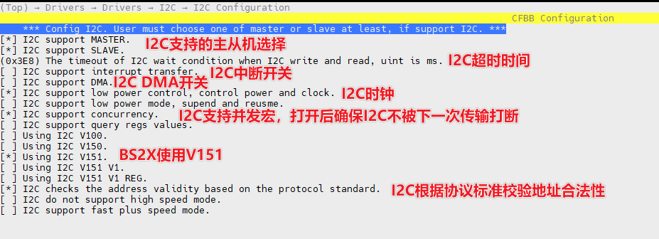

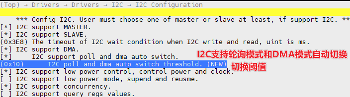

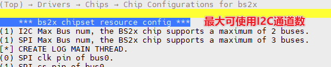

> **Note:** 
>If the images above are inconsistent with the table descriptions, the table prevails.

The specific descriptions of the configuration macros are shown in [Table 1](#table16629938173916).

**Table 1**  I2C macro descriptions

<a name="table16629938173916"></a>
<table><thead align="left"><tr id="row1462913813915"><th class="cellrowborder" valign="top" width="22.62773722627737%" id="mcps1.2.7.1.1"><p id="p1962923853920"><a name="p1962923853920"></a><a name="p1962923853920"></a>Macro name (CONFIG_ is the prefix added by default)</p>
</th>
<th class="cellrowborder" valign="top" width="21.137886211378863%" id="mcps1.2.7.1.2"><p id="p962916388395"><a name="p962916388395"></a><a name="p962916388395"></a>Specific description displayed on the Kconfig interface</p>
</th>
<th class="cellrowborder" valign="top" width="19.878012198780123%" id="mcps1.2.7.1.3"><p id="p18731420115119"><a name="p18731420115119"></a><a name="p18731420115119"></a>Usage scenario</p>
</th>
<th class="cellrowborder" valign="top" width="10.608939106089391%" id="mcps1.2.7.1.4"><p id="p537485457"><a name="p537485457"></a><a name="p537485457"></a>Implemented</p>
</th>
<th class="cellrowborder" valign="top" width="11.348865113488651%" id="mcps1.2.7.1.5"><p id="p1162915382392"><a name="p1162915382392"></a><a name="p1162915382392"></a>Depends on other macros</p>
</th>
<th class="cellrowborder" valign="top" width="14.3985601439856%" id="mcps1.2.7.1.6"><p id="p1162923893911"><a name="p1162923893911"></a><a name="p1162923893911"></a>Whether to enable or modify the configuration</p>
</th>
</tr>
</thead>
<tbody><tr id="row16629338103916"><td class="cellrowborder" valign="top" width="22.62773722627737%" headers="mcps1.2.7.1.1 "><p id="p166291338133910"><a name="p166291338133910"></a><a name="p166291338133910"></a>CONFIG_I2C_SUPPORT_MASTER</p>
</td>
<td class="cellrowborder" valign="top" width="21.137886211378863%" headers="mcps1.2.7.1.2 "><p id="p28673381813"><a name="p28673381813"></a><a name="p28673381813"></a>I2C support MASTER.</p>
</td>
<td class="cellrowborder" valign="top" width="19.878012198780123%" headers="mcps1.2.7.1.3 "><p id="p182789183235"><a name="p182789183235"></a><a name="p182789183235"></a>I2C supports master selection. Enable it as appropriate.</p>
</td>
<td class="cellrowborder" valign="top" width="10.608939106089391%" headers="mcps1.2.7.1.4 "><p id="p166297382397"><a name="p166297382397"></a><a name="p166297382397"></a>Yes</p>
</td>
<td class="cellrowborder" valign="top" width="11.348865113488651%" headers="mcps1.2.7.1.5 "><p id="p162983873917"><a name="p162983873917"></a><a name="p162983873917"></a>No</p>
</td>
<td class="cellrowborder" valign="top" width="14.3985601439856%" headers="mcps1.2.7.1.6 "><p id="p142312269162"><a name="p142312269162"></a><a name="p142312269162"></a>Enabled by default. Recommended to enable.</p>
</td>
</tr>
<tr id="row166299383394"><td class="cellrowborder" valign="top" width="22.62773722627737%" headers="mcps1.2.7.1.1 "><p id="p14629173813920"><a name="p14629173813920"></a><a name="p14629173813920"></a>CONFIG_I2C_SUPPORT_SLAVE</p>
</td>
<td class="cellrowborder" valign="top" width="21.137886211378863%" headers="mcps1.2.7.1.2 "><p id="p6314610193820"><a name="p6314610193820"></a><a name="p6314610193820"></a>I2C support SLAVE.</p>
</td>
<td class="cellrowborder" valign="top" width="19.878012198780123%" headers="mcps1.2.7.1.3 "><p id="p750495852813"><a name="p750495852813"></a><a name="p750495852813"></a>I2C supports slave selection. Enable it as appropriate.</p>
</td>
<td class="cellrowborder" valign="top" width="10.608939106089391%" headers="mcps1.2.7.1.4 "><p id="p166291838143916"><a name="p166291838143916"></a><a name="p166291838143916"></a>Yes</p>
</td>
<td class="cellrowborder" valign="top" width="11.348865113488651%" headers="mcps1.2.7.1.5 "><p id="p2629138193917"><a name="p2629138193917"></a><a name="p2629138193917"></a>No</p>
</td>
<td class="cellrowborder" valign="top" width="14.3985601439856%" headers="mcps1.2.7.1.6 "><p id="p16717115134416"><a name="p16717115134416"></a><a name="p16717115134416"></a>Enabled by default. Recommended to enable.</p>
</td>
</tr>
<tr id="row3629193823919"><td class="cellrowborder" valign="top" width="22.62773722627737%" headers="mcps1.2.7.1.1 "><p id="p262983811395"><a name="p262983811395"></a><a name="p262983811395"></a>CONFIG_I2C_WAIT_CONDITION_TIMEOUT</p>
</td>
<td class="cellrowborder" valign="top" width="21.137886211378863%" headers="mcps1.2.7.1.2 "><p id="p1534374635"><a name="p1534374635"></a><a name="p1534374635"></a>The timeout of I2C wait condition when I2C write and read, uint is ms.</p>
</td>
<td class="cellrowborder" valign="top" width="19.878012198780123%" headers="mcps1.2.7.1.3 "><p id="p1534582015113"><a name="p1534582015113"></a><a name="p1534582015113"></a>Maximum timeout for I2C to wait</p>
</td>
<td class="cellrowborder" valign="top" width="10.608939106089391%" headers="mcps1.2.7.1.4 "><p id="p3629133873917"><a name="p3629133873917"></a><a name="p3629133873917"></a>Yes</p>
</td>
<td class="cellrowborder" valign="top" width="11.348865113488651%" headers="mcps1.2.7.1.5 "><p id="p8473437181816"><a name="p8473437181816"></a><a name="p8473437181816"></a>No</p>
</td>
<td class="cellrowborder" valign="top" width="14.3985601439856%" headers="mcps1.2.7.1.6 "><p id="p97001027124119"><a name="p97001027124119"></a><a name="p97001027124119"></a>The default value is 0x3E8. Configure it as appropriate. It is recommended not to modify it.</p>
</td>
</tr>
<tr id="row962920381394"><td class="cellrowborder" valign="top" width="22.62773722627737%" headers="mcps1.2.7.1.1 "><p id="p1629738173912"><a name="p1629738173912"></a><a name="p1629738173912"></a>CONFIG_I2C_SUPPORT_INT</p>
</td>
<td class="cellrowborder" valign="top" width="21.137886211378863%" headers="mcps1.2.7.1.2 "><p id="p1326114416384"><a name="p1326114416384"></a><a name="p1326114416384"></a>I2C support interrupt transfer.</p>
</td>
<td class="cellrowborder" valign="top" width="19.878012198780123%" headers="mcps1.2.7.1.3 "><p id="p0369111616584"><a name="p0369111616584"></a><a name="p0369111616584"></a>I2C supports interrupt mode. Enable it as appropriate.</p>
</td>
<td class="cellrowborder" valign="top" width="10.608939106089391%" headers="mcps1.2.7.1.4 "><p id="p7630938143910"><a name="p7630938143910"></a><a name="p7630938143910"></a>Yes</p>
</td>
<td class="cellrowborder" valign="top" width="11.348865113488651%" headers="mcps1.2.7.1.5 "><p id="p184291153201819"><a name="p184291153201819"></a><a name="p184291153201819"></a>No</p>
</td>
<td class="cellrowborder" valign="top" width="14.3985601439856%" headers="mcps1.2.7.1.6 "><p id="p55269547522"><a name="p55269547522"></a><a name="p55269547522"></a>Disabled by default. Enable it as appropriate.</p>
</td>
</tr>
<tr id="row62681237271"><td class="cellrowborder" valign="top" width="22.62773722627737%" headers="mcps1.2.7.1.1 "><p id="p112401826112812"><a name="p112401826112812"></a><a name="p112401826112812"></a>CONFIG_I2C_SUPPORT_IN_CHIP_LOOPBACK</p>
</td>
<td class="cellrowborder" valign="top" width="21.137886211378863%" headers="mcps1.2.7.1.2 "><p id="p824263818316"><a name="p824263818316"></a><a name="p824263818316"></a>I2C support loopback, which can read and write in one chip with two diferrent I2C buses.</p>
</td>
<td class="cellrowborder" valign="top" width="19.878012198780123%" headers="mcps1.2.7.1.3 "><p id="p185305517595"><a name="p185305517595"></a><a name="p185305517595"></a>I2C supports interrupt loopback mode on different buses of the same board</p>
</td>
<td class="cellrowborder" valign="top" width="10.608939106089391%" headers="mcps1.2.7.1.4 "><p id="p5269202314277"><a name="p5269202314277"></a><a name="p5269202314277"></a>Yes</p>
</td>
<td class="cellrowborder" valign="top" width="11.348865113488651%" headers="mcps1.2.7.1.5 "><p id="p115505376560"><a name="p115505376560"></a><a name="p115505376560"></a>CONFIG_I2C_SUPPORT_INT</p>
</td>
<td class="cellrowborder" valign="top" width="14.3985601439856%" headers="mcps1.2.7.1.6 "><p id="p198015734219"><a name="p198015734219"></a><a name="p198015734219"></a>Disabled by default. Enable it as appropriate.</p>
</td>
</tr>
<tr id="row17817572040"><td class="cellrowborder" valign="top" width="22.62773722627737%" headers="mcps1.2.7.1.1 "><p id="p109831846175713"><a name="p109831846175713"></a><a name="p109831846175713"></a>CONFIG_I2C_SUPPORT_DMA</p>
</td>
<td class="cellrowborder" valign="top" width="21.137886211378863%" headers="mcps1.2.7.1.2 "><p id="p1092835010319"><a name="p1092835010319"></a><a name="p1092835010319"></a>I2C support DMA.</p>
</td>
<td class="cellrowborder" valign="top" width="19.878012198780123%" headers="mcps1.2.7.1.3 "><p id="p1164428144915"><a name="p1164428144915"></a><a name="p1164428144915"></a>I2C supports DMA mode. Enable it as appropriate. If you choose the I2C DMA mode, you also need to enable the KCONFIG configuration of the DMA driver. See <a href="KCONFIG配置-27.md">KCONFIG Configuration</a>.</p>
</td>
<td class="cellrowborder" valign="top" width="10.608939106089391%" headers="mcps1.2.7.1.4 "><p id="p17919571246"><a name="p17919571246"></a><a name="p17919571246"></a>Yes</p>
</td>
<td class="cellrowborder" valign="top" width="11.348865113488651%" headers="mcps1.2.7.1.5 "><p id="p151126287424"><a name="p151126287424"></a><a name="p151126287424"></a>CONFIG_DRIVER_SUPPORT_DMA</p>
</td>
<td class="cellrowborder" valign="top" width="14.3985601439856%" headers="mcps1.2.7.1.6 "><p id="p182001731221"><a name="p182001731221"></a><a name="p182001731221"></a>Disabled by default. Enable it as appropriate.</p>
</td>
</tr>
<tr id="row1071318918131"><td class="cellrowborder" valign="top" width="22.62773722627737%" headers="mcps1.2.7.1.1 "><p id="p671319910134"><a name="p671319910134"></a><a name="p671319910134"></a>CONFIG_I2C_SUPPORT_POLL_AND_DMA_AUTO_SWITCH</p>
</td>
<td class="cellrowborder" valign="top" width="21.137886211378863%" headers="mcps1.2.7.1.2 "><p id="p2086620416410"><a name="p2086620416410"></a><a name="p2086620416410"></a>I2C support poll and dma auto switch.</p>
</td>
<td class="cellrowborder" valign="top" width="19.878012198780123%" headers="mcps1.2.7.1.3 "><p id="p7601132985220"><a name="p7601132985220"></a><a name="p7601132985220"></a>I2C supports automatically switching between polling and DMA modes based on the configured threshold. Enable it as appropriate.</p>
</td>
<td class="cellrowborder" valign="top" width="10.608939106089391%" headers="mcps1.2.7.1.4 "><p id="p1571316971311"><a name="p1571316971311"></a><a name="p1571316971311"></a>Yes</p>
</td>
<td class="cellrowborder" valign="top" width="11.348865113488651%" headers="mcps1.2.7.1.5 "><p id="p15555194716423"><a name="p15555194716423"></a><a name="p15555194716423"></a>CONFIG_I2C_SUPPORT_DMA</p>
</td>
<td class="cellrowborder" valign="top" width="14.3985601439856%" headers="mcps1.2.7.1.6 "><p id="p57965521033"><a name="p57965521033"></a><a name="p57965521033"></a>Disabled by default. Enable it as appropriate.</p>
</td>
</tr>
<tr id="row1663153711314"><td class="cellrowborder" valign="top" width="22.62773722627737%" headers="mcps1.2.7.1.1 "><p id="p13663183721310"><a name="p13663183721310"></a><a name="p13663183721310"></a>CONFIG_I2C_POLL_AND_DMA_AUTO_SWITCH_THRESHOLD</p>
</td>
<td class="cellrowborder" valign="top" width="21.137886211378863%" headers="mcps1.2.7.1.2 "><p id="p1030517151649"><a name="p1030517151649"></a><a name="p1030517151649"></a>I2C poll and dma auto switch threshold.</p>
</td>
<td class="cellrowborder" valign="top" width="19.878012198780123%" headers="mcps1.2.7.1.3 "><p id="p1369200125313"><a name="p1369200125313"></a><a name="p1369200125313"></a>Threshold configured when I2C automatically switches between polling and DMA modes. The default value is 16.</p>
</td>
<td class="cellrowborder" valign="top" width="10.608939106089391%" headers="mcps1.2.7.1.4 "><p id="p186635371131"><a name="p186635371131"></a><a name="p186635371131"></a>Yes</p>
</td>
<td class="cellrowborder" valign="top" width="11.348865113488651%" headers="mcps1.2.7.1.5 "><p id="p16793105954210"><a name="p16793105954210"></a><a name="p16793105954210"></a>CONFIG_I2C_SUPPORT_POLL_AND_DMA_AUTO_SWITCH</p>
</td>
<td class="cellrowborder" valign="top" width="14.3985601439856%" headers="mcps1.2.7.1.6 "><p id="p125242276524"><a name="p125242276524"></a><a name="p125242276524"></a>The default value is 16. Configure it as appropriate.</p>
</td>
</tr>
<tr id="row1115204491314"><td class="cellrowborder" valign="top" width="22.62773722627737%" headers="mcps1.2.7.1.1 "><p id="p20115184431314"><a name="p20115184431314"></a><a name="p20115184431314"></a>CONFIG_I2C_SUPPORT_LPC</p>
</td>
<td class="cellrowborder" valign="top" width="21.137886211378863%" headers="mcps1.2.7.1.2 "><p id="p1038192719410"><a name="p1038192719410"></a><a name="p1038192719410"></a>I2C support low power control, control power and clock.</p>
</td>
<td class="cellrowborder" valign="top" width="19.878012198780123%" headers="mcps1.2.7.1.3 "><p id="p1539110454437"><a name="p1539110454437"></a><a name="p1539110454437"></a>I2C working clock</p>
</td>
<td class="cellrowborder" valign="top" width="10.608939106089391%" headers="mcps1.2.7.1.4 "><p id="p9115124411312"><a name="p9115124411312"></a><a name="p9115124411312"></a>Yes</p>
</td>
<td class="cellrowborder" valign="top" width="11.348865113488651%" headers="mcps1.2.7.1.5 "><p id="p5115544151311"><a name="p5115544151311"></a><a name="p5115544151311"></a>No</p>
</td>
<td class="cellrowborder" valign="top" width="14.3985601439856%" headers="mcps1.2.7.1.6 "><p id="p4131579442"><a name="p4131579442"></a><a name="p4131579442"></a>Enabled by default. Mandatory.</p>
</td>
</tr>
<tr id="row9686349171316"><td class="cellrowborder" valign="top" width="22.62773722627737%" headers="mcps1.2.7.1.1 "><p id="p2068610490135"><a name="p2068610490135"></a><a name="p2068610490135"></a>CONFIG_I2C_SUPPORT_LPM</p>
</td>
<td class="cellrowborder" valign="top" width="21.137886211378863%" headers="mcps1.2.7.1.2 "><p id="p1699112401448"><a name="p1699112401448"></a><a name="p1699112401448"></a>I2C support low power mode, supend and reusme.</p>
</td>
<td class="cellrowborder" valign="top" width="19.878012198780123%" headers="mcps1.2.7.1.3 "><p id="p1435013136441"><a name="p1435013136441"></a><a name="p1435013136441"></a>This macro is used only in low-power scenarios.</p>
</td>
<td class="cellrowborder" valign="top" width="10.608939106089391%" headers="mcps1.2.7.1.4 "><p id="p12686184941312"><a name="p12686184941312"></a><a name="p12686184941312"></a>Yes</p>
</td>
<td class="cellrowborder" valign="top" width="11.348865113488651%" headers="mcps1.2.7.1.5 "><p id="p26871249111313"><a name="p26871249111313"></a><a name="p26871249111313"></a>No</p>
</td>
<td class="cellrowborder" valign="top" width="14.3985601439856%" headers="mcps1.2.7.1.6 "><p id="p10435326114414"><a name="p10435326114414"></a><a name="p10435326114414"></a>Disabled by default. Enable it as appropriate.</p>
</td>
</tr>
<tr id="row10100123917141"><td class="cellrowborder" valign="top" width="22.62773722627737%" headers="mcps1.2.7.1.1 "><p id="p6359290154"><a name="p6359290154"></a><a name="p6359290154"></a>CONFIG_I2C_SUPPORT_CONCURRENCY</p>
</td>
<td class="cellrowborder" valign="top" width="21.137886211378863%" headers="mcps1.2.7.1.2 "><p id="p23825532410"><a name="p23825532410"></a><a name="p23825532410"></a>I2C support concurrency.</p>
</td>
<td class="cellrowborder" valign="top" width="19.878012198780123%" headers="mcps1.2.7.1.3 "><p id="p17131797138"><a name="p17131797138"></a><a name="p17131797138"></a>If this macro is enabled, the integrity of the current transmission can be ensured. The next transmission starts only after the current transmission is complete. This macro must be enabled when no lock is added.</p>
</td>
<td class="cellrowborder" valign="top" width="10.608939106089391%" headers="mcps1.2.7.1.4 "><p id="p131001439161420"><a name="p131001439161420"></a><a name="p131001439161420"></a>Yes</p>
</td>
<td class="cellrowborder" valign="top" width="11.348865113488651%" headers="mcps1.2.7.1.5 "><p id="p110083912148"><a name="p110083912148"></a><a name="p110083912148"></a>No</p>
</td>
<td class="cellrowborder" valign="top" width="14.3985601439856%" headers="mcps1.2.7.1.6 "><p id="p49849494449"><a name="p49849494449"></a><a name="p49849494449"></a>Enabled by default. Recommended to enable.</p>
</td>
</tr>
<tr id="row9604124541418"><td class="cellrowborder" valign="top" width="22.62773722627737%" headers="mcps1.2.7.1.1 "><p id="p1198461021518"><a name="p1198461021518"></a><a name="p1198461021518"></a>CONFIG_I2C_SUPPORT_QUERY_REGS</p>
</td>
<td class="cellrowborder" valign="top" width="21.137886211378863%" headers="mcps1.2.7.1.2 "><p id="p142671250514"><a name="p142671250514"></a><a name="p142671250514"></a>I2C support query regs values.</p>
</td>
<td class="cellrowborder" valign="top" width="19.878012198780123%" headers="mcps1.2.7.1.3 "><p id="p438154074512"><a name="p438154074512"></a><a name="p438154074512"></a>I2C supports reading back the values of all related registers. Enable it as appropriate.</p>
</td>
<td class="cellrowborder" valign="top" width="10.608939106089391%" headers="mcps1.2.7.1.4 "><p id="p1860512452145"><a name="p1860512452145"></a><a name="p1860512452145"></a>Yes</p>
</td>
<td class="cellrowborder" valign="top" width="11.348865113488651%" headers="mcps1.2.7.1.5 "><p id="p13605145101411"><a name="p13605145101411"></a><a name="p13605145101411"></a>No</p>
</td>
<td class="cellrowborder" valign="top" width="14.3985601439856%" headers="mcps1.2.7.1.6 "><p id="p1817114179353"><a name="p1817114179353"></a><a name="p1817114179353"></a>Disabled by default. Enable it as appropriate.</p>
</td>
</tr>
<tr id="row4155553141"><td class="cellrowborder" valign="top" width="22.62773722627737%" headers="mcps1.2.7.1.1 "><p id="p2119131217152"><a name="p2119131217152"></a><a name="p2119131217152"></a>CONFIG_I2C_USING_V100</p>
</td>
<td class="cellrowborder" valign="top" width="21.137886211378863%" headers="mcps1.2.7.1.2 "><p id="p879573724713"><a name="p879573724713"></a><a name="p879573724713"></a>Using I2C V100.</p>
</td>
<td class="cellrowborder" valign="top" width="19.878012198780123%" headers="mcps1.2.7.1.3 "><p id="p1605194513147"><a name="p1605194513147"></a><a name="p1605194513147"></a>This macro indicates using the I2C V100 driver specification. This specification is not used in this product.</p>
</td>
<td class="cellrowborder" valign="top" width="10.608939106089391%" headers="mcps1.2.7.1.4 "><p id="p201555511146"><a name="p201555511146"></a><a name="p201555511146"></a>Yes</p>
</td>
<td class="cellrowborder" valign="top" width="11.348865113488651%" headers="mcps1.2.7.1.5 "><p id="p1280317457132"><a name="p1280317457132"></a><a name="p1280317457132"></a>No</p>
</td>
<td class="cellrowborder" valign="top" width="14.3985601439856%" headers="mcps1.2.7.1.6 "><p id="p7644175334613"><a name="p7644175334613"></a><a name="p7644175334613"></a>Disabled by default. It must be disabled.</p>
</td>
</tr>
<tr id="row155854071519"><td class="cellrowborder" valign="top" width="22.62773722627737%" headers="mcps1.2.7.1.1 "><p id="p1289513201519"><a name="p1289513201519"></a><a name="p1289513201519"></a>CONFIG_I2C_USING_V150</p>
</td>
<td class="cellrowborder" valign="top" width="21.137886211378863%" headers="mcps1.2.7.1.2 "><p id="p191602044299"><a name="p191602044299"></a><a name="p191602044299"></a>Using I2C V150.</p>
</td>
<td class="cellrowborder" valign="top" width="19.878012198780123%" headers="mcps1.2.7.1.3 "><p id="p123612018467"><a name="p123612018467"></a><a name="p123612018467"></a>This macro indicates using the I2C V150 driver specification. This specification is not used in this product.</p>
</td>
<td class="cellrowborder" valign="top" width="10.608939106089391%" headers="mcps1.2.7.1.4 "><p id="p145852091517"><a name="p145852091517"></a><a name="p145852091517"></a>Yes</p>
</td>
<td class="cellrowborder" valign="top" width="11.348865113488651%" headers="mcps1.2.7.1.5 "><p id="p178719416558"><a name="p178719416558"></a><a name="p178719416558"></a>No</p>
</td>
<td class="cellrowborder" valign="top" width="14.3985601439856%" headers="mcps1.2.7.1.6 "><p id="p2184155224611"><a name="p2184155224611"></a><a name="p2184155224611"></a>Disabled by default. It must be disabled.</p>
</td>
</tr>
<tr id="row1120612316161"><td class="cellrowborder" valign="top" width="22.62773722627737%" headers="mcps1.2.7.1.1 "><p id="p12207162314169"><a name="p12207162314169"></a><a name="p12207162314169"></a>CONFIG_I2C_USING_V151</p>
</td>
<td class="cellrowborder" valign="top" width="21.137886211378863%" headers="mcps1.2.7.1.2 "><p id="p1744711148101"><a name="p1744711148101"></a><a name="p1744711148101"></a>Using I2C V151.</p>
</td>
<td class="cellrowborder" valign="top" width="19.878012198780123%" headers="mcps1.2.7.1.3 "><p id="p1357732211468"><a name="p1357732211468"></a><a name="p1357732211468"></a>This macro indicates using the I2C V151 driver specification, which is used by default in this product.</p>
</td>
<td class="cellrowborder" valign="top" width="10.608939106089391%" headers="mcps1.2.7.1.4 "><p id="p10207202331613"><a name="p10207202331613"></a><a name="p10207202331613"></a>Yes</p>
</td>
<td class="cellrowborder" valign="top" width="11.348865113488651%" headers="mcps1.2.7.1.5 "><p id="p22077234164"><a name="p22077234164"></a><a name="p22077234164"></a>No</p>
</td>
<td class="cellrowborder" valign="top" width="14.3985601439856%" headers="mcps1.2.7.1.6 "><p id="p7730154612468"><a name="p7730154612468"></a><a name="p7730154612468"></a>Enabled by default. Mandatory.</p>
</td>
</tr>
<tr id="row18951740131615"><td class="cellrowborder" valign="top" width="22.62773722627737%" headers="mcps1.2.7.1.1 "><p id="p197481234181715"><a name="p197481234181715"></a><a name="p197481234181715"></a>CONFIG_I2C_ADDR_VALID_CHECK</p>
</td>
<td class="cellrowborder" valign="top" width="21.137886211378863%" headers="mcps1.2.7.1.2 "><p id="p199591808107"><a name="p199591808107"></a><a name="p199591808107"></a>I2C checks the address validity based on the protocol standard.</p>
</td>
<td class="cellrowborder" valign="top" width="19.878012198780123%" headers="mcps1.2.7.1.3 "><p id="p139544011168"><a name="p139544011168"></a><a name="p139544011168"></a>I2C validates the address legality based on the protocol standard</p>
</td>
<td class="cellrowborder" valign="top" width="10.608939106089391%" headers="mcps1.2.7.1.4 "><p id="p16957407165"><a name="p16957407165"></a><a name="p16957407165"></a>Yes</p>
</td>
<td class="cellrowborder" valign="top" width="11.348865113488651%" headers="mcps1.2.7.1.5 "><p id="p395194031613"><a name="p395194031613"></a><a name="p395194031613"></a>No</p>
</td>
<td class="cellrowborder" valign="top" width="14.3985601439856%" headers="mcps1.2.7.1.6 "><p id="p6820628174715"><a name="p6820628174715"></a><a name="p6820628174715"></a>Enabled by default. Recommended to enable.</p>
</td>
</tr>
<tr id="row16469746171619"><td class="cellrowborder" valign="top" width="22.62773722627737%" headers="mcps1.2.7.1.1 "><p id="p13831935111710"><a name="p13831935111710"></a><a name="p13831935111710"></a>CONFIG_I2C_NOT_SUPPORT_HIGH_SPEED</p>
</td>
<td class="cellrowborder" valign="top" width="21.137886211378863%" headers="mcps1.2.7.1.2 "><p id="p19991173441010"><a name="p19991173441010"></a><a name="p19991173441010"></a>I2C do not support high speed mode.</p>
</td>
<td class="cellrowborder" valign="top" width="19.878012198780123%" headers="mcps1.2.7.1.3 "><p id="p56134571811"><a name="p56134571811"></a><a name="p56134571811"></a>I2C does not support the high-speed baud rate and is not used in this product.</p>
</td>
<td class="cellrowborder" valign="top" width="10.608939106089391%" headers="mcps1.2.7.1.4 "><p id="p154691146191615"><a name="p154691146191615"></a><a name="p154691146191615"></a>Yes</p>
</td>
<td class="cellrowborder" valign="top" width="11.348865113488651%" headers="mcps1.2.7.1.5 "><p id="p746920467167"><a name="p746920467167"></a><a name="p746920467167"></a>No</p>
</td>
<td class="cellrowborder" valign="top" width="14.3985601439856%" headers="mcps1.2.7.1.6 "><p id="p33021419134716"><a name="p33021419134716"></a><a name="p33021419134716"></a>Disabled by default. It is not yet used in this product. It is recommended to disable it.</p>
</td>
</tr>
<tr id="row17463553171619"><td class="cellrowborder" valign="top" width="22.62773722627737%" headers="mcps1.2.7.1.1 "><p id="p8789036121717"><a name="p8789036121717"></a><a name="p8789036121717"></a>CONFIG_I2C_SUPPORT_FAST_PLUS_SPEED</p>
</td>
<td class="cellrowborder" valign="top" width="21.137886211378863%" headers="mcps1.2.7.1.2 "><p id="p58451146121010"><a name="p58451146121010"></a><a name="p58451146121010"></a>I2C support fast plus speed mode.</p>
</td>
<td class="cellrowborder" valign="top" width="19.878012198780123%" headers="mcps1.2.7.1.3 "><p id="p2463115311616"><a name="p2463115311616"></a><a name="p2463115311616"></a>I2C supports the fast-plus baud rate</p>
</td>
<td class="cellrowborder" valign="top" width="10.608939106089391%" headers="mcps1.2.7.1.4 "><p id="p10463185313162"><a name="p10463185313162"></a><a name="p10463185313162"></a>Yes</p>
</td>
<td class="cellrowborder" valign="top" width="11.348865113488651%" headers="mcps1.2.7.1.5 "><p id="p1246320533166"><a name="p1246320533166"></a><a name="p1246320533166"></a>No</p>
</td>
<td class="cellrowborder" valign="top" width="14.3985601439856%" headers="mcps1.2.7.1.6 "><p id="p697712013479"><a name="p697712013479"></a><a name="p697712013479"></a>Disabled by default. Enable it as appropriate.</p>
</td>
</tr>
<tr id="row133512133512"><td class="cellrowborder" valign="top" width="22.62773722627737%" headers="mcps1.2.7.1.1 "><p id="p0328717114020"><a name="p0328717114020"></a><a name="p0328717114020"></a>CONFIG_I2C_BUS_MAX_NUM</p>
</td>
<td class="cellrowborder" valign="top" width="21.137886211378863%" headers="mcps1.2.7.1.2 "><p id="p117931759173519"><a name="p117931759173519"></a><a name="p117931759173519"></a>I2C Max Bus num, the BS2x chip supports a maximum of 2 buses.</p>
</td>
<td class="cellrowborder" valign="top" width="19.878012198780123%" headers="mcps1.2.7.1.3 "><p id="p1232891710407"><a name="p1232891710407"></a><a name="p1232891710407"></a>This macro indicates the maximum number of I2C buses. The default value is 1. If a bus other than I2C BUS0 is used, you must modify this macro accordingly. Otherwise, exceptions may occur.</p>
</td>
<td class="cellrowborder" valign="top" width="10.608939106089391%" headers="mcps1.2.7.1.4 "><p id="p123283175403"><a name="p123283175403"></a><a name="p123283175403"></a>Yes</p>
</td>
<td class="cellrowborder" valign="top" width="11.348865113488651%" headers="mcps1.2.7.1.5 "><p id="p9328151794011"><a name="p9328151794011"></a><a name="p9328151794011"></a>CONFIG_DRIVER_SUPPORT_I2C</p>
</td>
<td class="cellrowborder" valign="top" width="14.3985601439856%" headers="mcps1.2.7.1.6 "><p id="p12328191719406"><a name="p12328191719406"></a><a name="p12328191719406"></a>The default value is 1. Modify the configuration based on the actual I2C bus usage.</p>
</td>
</tr>
</tbody>
</table>

## Development Guide<a name="ZH-CN_TOPIC_0000001665143718"></a>

I2C is used to connect to devices that support the I2C protocol. The I2C unit can work as a master or slave device. The following uses the I2C unit working as a master device as an example:

1.  Configure the pins to be used as I2C functions through IO multiplexing.
2.  Call the uapi\_i2c\_init interface to initialize I2C resources. The following uses initializing the I2C master as an example:

    ```
    #define TEST_I2C                I2C_BUS_0
    #define I2C_BAUDRATE            400000    /* 400kHz */
    #define I2C_PIN_CLK_PINMUX      HAL_PIO_I2C0_CLK
    #define I2C_PIN_DAT_PINMUX      HAL_PIO_I2C0_DATA
    #define I2C_PIN_CLK             S_MGPIO24
    #define I2C_PIN_DAT             S_MGPIO25
    errcode_t sample_i2c_init(void)
    {
        /* Configure i2c pinmux */
        uapi_pin_set_mode(I2C_PIN_CLK, I2C_PIN_CLK_PINMUX);       /* Configure i2c clk pinmux */
        uapi_pin_set_mode(I2C_PIN_DAT, I2C_PIN_DAT_PINMUX);       /* Configure i2c dat pinmux */
        /* Initialize i2c */
        return uapi_i2c_master_init(TEST_I2C, I2C_BAUDRATE, 0);     /* Initialize i2c0 */
    }
    ```

3.  Call the uapi\_i2c\_master\_write interface to enable the master to send data.

    ```
    errcode_t sample_i2c_write(uint8_t *data, uint8_t len, uint16_t addr)
    {
        i2c_data_t i2c_send_data = { 0 };
        i2c_send_data.send_buf = data;                                   /* Set the TX buffer */
        i2c_send_data.send_len = len;                                    /* Set the TX buffer length */
        return uapi_i2c_master_write(TEST_I2C, addr, &i2c_send_data);     /* Send data */
    }
    ```

The complete master/slave send and receive code flow of the two-board I2C in three modes (polling mode, interrupt mode, and DMA mode) can refer to the following code:

```
#include "pinctrl.h"
#include "i2c.h"
#include "soc_osal.h"
#include "app_init.h"
#if defined(CONFIG_I2C_SUPPORT_DMA) && (CONFIG_I2C_SUPPORT_DMA == 1)
#include "dma.h"
#endif

#define I2C_MASTER_ADDR                   0x0
#define I2C_SLAVE_ADDR                    0x8
#define I2C_SET_BAUDRATE                  400000
#define I2C_TASK_DURATION_MS              500
#if defined(CONFIG_I2C_SUPPORT_INT) && (CONFIG_I2C_SUPPORT_INT == 1)
#define I2C_INT_TRANSFER_DELAY_MS         800
#endif

#define I2C_TASK_PRIO                     24
#define I2C_TASK_STACK_SIZE               0x1000

static i2c_data_t data = { 0 };
static uint8_t tx_buff[CONFIG_I2C_TRANSFER_LEN] = { 0 };
static uint8_t rx_buff[CONFIG_I2C_TRANSFER_LEN] = { 0 };

static void app_i2c_init_pin(void)
{
#if defined(CONFIG_PINCTRL_SUPPORT_IE)
    uapi_pin_set_ie(CONFIG_I2C_MASTER_SCL_PIN, PIN_IE_1);
    uapi_pin_set_ie(CONFIG_I2C_MASTER_SDA_PIN, PIN_IE_1);
#endif /* CONFIG_PINCTRL_SUPPORT_IE */
    /* I2C pinmux. */
    uapi_pin_set_mode(CONFIG_I2C_MASTER_SCL_PIN, CONFIG_I2C_MASTER_SCL_PIN_MODE);
    uapi_pin_set_mode(CONFIG_I2C_MASTER_SDA_PIN, CONFIG_I2C_MASTER_SDA_PIN_MODE);
}

static void app_i2c_data_config(void)
{
    /* I2C data config. */
    for (uint32_t loop = 0; loop < CONFIG_I2C_TRANSFER_LEN; loop++) {
        tx_buff[loop] = (loop & 0xFF);
    }
    data.send_buf = tx_buff;
    data.send_len = CONFIG_I2C_TRANSFER_LEN;
    data.receive_buf = rx_buff;
    data.receive_len = CONFIG_I2C_TRANSFER_LEN;
}

static void *i2c_master_task(const char *arg)
{
    unused(arg);

    uint32_t baudrate = I2C_SET_BAUDRATE;
    uint8_t hscode = I2C_MASTER_ADDR;
    uint16_t dev_addr = I2C_SLAVE_ADDR;

#if defined(CONFIG_I2C_SUPPORT_DMA) && (CONFIG_I2C_SUPPORT_DMA == 1)
    uapi_dma_init();
    uapi_dma_open();
#ifndef CONFIG_I2C_SUPPORT_POLL_AND_DMA_AUTO_SWITCH
    uapi_i2c_set_dma_mode(CONFIG_I2C_MASTER_BUS_ID, true);
#endif
#endif  /* CONFIG_I2C_SUPPORT_DMA */

    /* I2C master init config. */
    app_i2c_init_pin();
    uapi_i2c_master_init(CONFIG_I2C_MASTER_BUS_ID, baudrate, hscode);

#if defined(CONFIG_I2C_SUPPORT_INT) && (CONFIG_I2C_SUPPORT_INT == 1)
    uapi_i2c_set_irq_mode(CONFIG_I2C_MASTER_BUS_ID, true);
#endif  /* CONFIG_I2C_SUPPORT_INT */

    app_i2c_data_config();

    while (1) {
        osal_msleep(I2C_TASK_DURATION_MS);
#ifndef CONFIG_I2C_MASTER_SUPPORT_WRITEREAD
        osal_printk("i2c%d master send start!\r\n", CONFIG_I2C_MASTER_BUS_ID);
        if (uapi_i2c_master_write(CONFIG_I2C_MASTER_BUS_ID, dev_addr, &data) == ERRCODE_SUCC) {
            osal_printk("i2c%d master send succ!\r\n", CONFIG_I2C_MASTER_BUS_ID);
        } else {
            continue;
        }
#if defined(CONFIG_I2C_SUPPORT_INT) && (CONFIG_I2C_SUPPORT_INT == 1)
        osal_msleep(I2C_INT_TRANSFER_DELAY_MS);
#endif
        osal_printk("i2c%d master receive start!\r\n", CONFIG_I2C_MASTER_BUS_ID);
        if (uapi_i2c_master_read(CONFIG_I2C_MASTER_BUS_ID, dev_addr, &data) == ERRCODE_SUCC) {
            for (uint32_t i = 0; i < data.receive_len; i++) {
                osal_printk("i2c%d master receive data is %x\r\n", CONFIG_I2C_MASTER_BUS_ID, data.receive_buf[i]);
            }
            osal_printk("i2c%d master receive succ!\r\n", CONFIG_I2C_MASTER_BUS_ID);
        }
#else
        osal_printk("i2c%d master writeread start!\r\n", CONFIG_I2C_MASTER_BUS_ID);
        if (uapi_i2c_master_writeread(CONFIG_I2C_MASTER_BUS_ID, dev_addr, &data) == ERRCODE_SUCC) {
            for (uint32_t i = 0; i < data.receive_len; i++) {
                osal_printk("i2c%d master writeread data is %x\r\n", CONFIG_I2C_MASTER_BUS_ID, data.receive_buf[i]);
            }
            osal_printk("i2c%d master writeread succ!\r\n", CONFIG_I2C_MASTER_BUS_ID);
        }
#endif
    }

    return NULL;
}

static void i2c_master_entry(void)
{
    osal_task *task_handle = NULL;
    osal_kthread_lock();
    task_handle = osal_kthread_create((osal_kthread_handler)i2c_master_task, 0, "I2cMasterTask", I2C_TASK_STACK_SIZE);
    if (task_handle != NULL) {
        osal_kthread_set_priority(task_handle, I2C_TASK_PRIO);
    }
    osal_kthread_unlock();
}

/* Run the i2c_master_entry. */
app_run(i2c_master_entry);

----------------------------------------------------------------

#include "pinctrl.h"
#include "i2c.h"
#include "soc_osal.h"
#include "app_init.h"
#if defined(CONFIG_I2C_SUPPORT_DMA) && (CONFIG_I2C_SUPPORT_DMA == 1)
#include "dma.h"
#endif

#define I2C_SLAVE_ADDR                    0x8
#define I2C_SET_BAUDRATE                  500000
#define I2C_TASK_DURATION_MS              100
#if defined(CONFIG_I2C_SUPPORT_DMA) && (CONFIG_I2C_SUPPORT_DMA == 1)
#define I2C_DMA_TRANSFER_DELAY_MS         500
#endif

#define I2C_TASK_PRIO                     24
#define I2C_TASK_STACK_SIZE               0x1000

static void app_i2c_init_pin(void)
{
#if defined(CONFIG_PINCTRL_SUPPORT_IE)
    uapi_pin_set_ie(CONFIG_I2C_SLAVE_SCL_PIN, PIN_IE_1);
    uapi_pin_set_ie(CONFIG_I2C_SLAVE_SDA_PIN, PIN_IE_1);
#endif /* CONFIG_PINCTRL_SUPPORT_IE */
    /* I2C pinmux. */
    uapi_pin_set_mode(CONFIG_I2C_SLAVE_SCL_PIN, CONFIG_I2C_SLAVE_SCL_PIN_MODE);
    uapi_pin_set_mode(CONFIG_I2C_SLAVE_SDA_PIN, CONFIG_I2C_SLAVE_SDA_PIN_MODE);
}

void *i2c_slave_task(const char *arg)
{
    unused(arg);
    i2c_data_t data = { 0 };

    uint32_t baudrate = I2C_SET_BAUDRATE;
    uint16_t dev_addr = I2C_SLAVE_ADDR;

#if defined(CONFIG_I2C_SUPPORT_DMA) && (CONFIG_I2C_SUPPORT_DMA == 1)
    uapi_dma_init();
    uapi_dma_open();
#ifndef CONFIG_I2C_SUPPORT_POLL_AND_DMA_AUTO_SWITCH
    uapi_i2c_set_dma_mode(CONFIG_I2C_SLAVE_BUS_ID, true);
#endif
#endif  /* CONFIG_I2C_SUPPORT_DMA */

    /* I2C slave init config. */
    app_i2c_init_pin();
    uapi_i2c_slave_init(CONFIG_I2C_SLAVE_BUS_ID, baudrate, dev_addr);

#if defined(CONFIG_I2C_SUPPORT_INT) && (CONFIG_I2C_SUPPORT_INT == 1)
    uapi_i2c_set_irq_mode(CONFIG_I2C_SLAVE_BUS_ID, true);
#endif /* CONFIG_I2C_SUPPORT_INT */

    /* I2C data config. */
    uint8_t tx_buff[CONFIG_I2C_TRANSFER_LEN] = { 0 };
    for (uint32_t loop = 0; loop < CONFIG_I2C_TRANSFER_LEN; loop++) {
        tx_buff[loop] = (loop & 0xFF);
    }

    uint8_t rx_buff[CONFIG_I2C_TRANSFER_LEN] = { 0 };
    data.send_buf = tx_buff;
    data.send_len = CONFIG_I2C_TRANSFER_LEN;
    data.receive_buf = rx_buff;
    data.receive_len = CONFIG_I2C_TRANSFER_LEN;

    while (1) {
        osal_msleep(I2C_TASK_DURATION_MS);
        osal_printk("i2c%d slave receive start!\r\n", CONFIG_I2C_SLAVE_BUS_ID);
        if (uapi_i2c_slave_read(CONFIG_I2C_SLAVE_BUS_ID, &data) == ERRCODE_SUCC) {
            for (uint32_t i = 0; i < data.receive_len; i++) {
                osal_printk("i2c slave receive data is %x\r\n", data.receive_buf[i]);
            }
            osal_printk("i2c%d slave receive succ!\r\n", CONFIG_I2C_SLAVE_BUS_ID);
        } else {
            continue;
        }
        osal_printk("i2c%d slave send start!\r\n", CONFIG_I2C_SLAVE_BUS_ID);
#if defined(CONFIG_I2C_SUPPORT_DMA) && (CONFIG_I2C_SUPPORT_DMA == 1)
        osal_msleep(I2C_DMA_TRANSFER_DELAY_MS);
#endif
        if (uapi_i2c_slave_write(CONFIG_I2C_SLAVE_BUS_ID, &data) == ERRCODE_SUCC) {
            osal_printk("i2c%d slave send succ!\r\n", CONFIG_I2C_SLAVE_BUS_ID);
        }
    }

    return NULL;
}

static void i2c_slave_entry(void)
{
    osal_task *task_handle = NULL;
    osal_kthread_lock();
    task_handle = osal_kthread_create((osal_kthread_handler)i2c_slave_task, 0, "I2cSlaveTask", I2C_TASK_STACK_SIZE);
    if (task_handle != NULL) {
        osal_kthread_set_priority(task_handle, I2C_TASK_PRIO);
    }
    osal_kthread_unlock();
}

/* Run the i2c_slave_entry. */
app_run(i2c_slave_entry);

```

## Precautions<a name="ZH-CN_TOPIC_0000001665143726"></a>

-   The uapi\_i2c\_set\_baudrate function must be called after initialization, so that the baud rate can be modified. If the I2C is not initialized and uapi\_i2c\_set\_baudrate is called directly, the error code ERRCODE\_I2C\_NOT\_INIT is returned.
-   Ensure that the data send pointer send\_buf and the data receive pointer receive\_buf are not null pointers.
-   If the data to be sent exceeds the acceptable range of the connected device, sending fails. If sending fails and another I2C device is switched to continue sending, the bus will be suspended, and all I2C devices cannot send data properly.
-   uapi\_i2c\_master\_init cannot be called for initialization multiple times. After use, call uapi\_i2c\_deinit for deinitialization.

# ADC<a name="ZH-CN_TOPIC_0000001665143710"></a>


## Overview<a name="ZH-CN_TOPIC_0000001713023537"></a>

An ADC (Analog-to-Digital Converter) is a device that converts continuously changing analog signals into discrete digital signals.

Analog signals in the real world, such as temperature, pressure, sound, or images, need to be converted into digital signals that are easier to store, process, and send. An analog-to-digital converter can implement this function and can be applied to battery level detection, key detection, and so on.

Two modes are provided for developers to choose from: GAFE (General Analog Front End) and AAFE (Audio Analog Front End):

-   GAFE: 8-channel 13-bit 1.6 Msps SAR ADC, providing oversampling and buffer functions. It is used in low-frequency single-ended/differential measurement scenarios such as Tag-ID, battery voltage measurement, and NTC temperature measurement.
-   AAFE: 40 dB pre-amplification, reusing the SAR ADC, with the data domain downsampled to 16 ksps or 32 ksps. It is suitable for analog microphone sampling scenarios.

## Function Description<a name="ZH-CN_TOPIC_0000001713023585"></a>

The interfaces and functions provided by the ADC module are as follows:

-   uapi\_adc\_init（adc\_clock\_t clock）：Initializes the ADC module（clock indicates the clock for ADC sampling）.
-   uapi\_adc\_deinit（void）：Deinitializes the ADC.
-   uapi\_adc\_power\_en（afe\_scan\_mode\_t afe\_scan\_mode, bool en）：Powers on/off and enables or disables the ADC（afe\_scan\_mode indicates the AFE precision mode to use，en indicates the power-on or power-off state）.
-   uapi\_adc\_is\_using（void）：Checks whether the ADC is in use.
-   adc\_calibration: ADC calibration, including 4-step calibration.
-   uapi\_adc\_open\_channel（uint8\_t channel）：Opens an ADC channel\(applicable to all channels\)（channel indicates the ADC channel to open）.
-   uapi\_adc\_close\_channel（uint8\_t channel）：Closes an ADC channel\(applicable to all channels\)（channel indicates the ADC channel to close）.
-   uapi\_adc\_open\_differential\_channel（uint8\_t postive\_ch, uint8\_t negative\_ch）：Opens a differential ADC channel\(applicable to GADC\_CHANNEL\_6 and GADC\_CHANNEL\_7\)（postive\_ch indicates the ADC positive channel，negative\_ch indicates the ADC negative channel）。(It can be used only when the CONFIG\_ADC\_SUPPORT\_DIFFERENTIAL macro is enabled.)
-   uapi\_adc\_close\_differential\_channel（uint8\_t postive\_ch, uint8\_t negative\_ch）：Closes a differential ADC channel\(applicable to GADC\_CHANNEL\_6 and GADC\_CHANNEL\_7\)（postive\_ch indicates the ADC positive channel，negative\_ch indicates the ADC negative channel）。(It can be used only when the CONFIG\_ADC\_SUPPORT\_DIFFERENTIAL macro is enabled.)
-   uapi\_adc\_auto\_sample（uint8\_t channel）：ADC sampling interface. The reported value is the code word value relative to the reference voltage\(a 32-bit signed number\), which needs to be converted into a voltage value using a formula（channel indicates the ADC channel）.(It can be used only when the CONFIG\_ADC\_SUPPORT\_AFE macro is enabled.)
-   adc\_port\_gadc\_entirely\_open\(adc\_channel\_t channel, bool self\_cali\)：Includes the whole flow of initializing a GADC channel. The self\_cali parameter indicates whether to calibrate the ADC during this initialization. If calibration is required, it takes about 170 ms. If the calibration value has been stored, you can pass false.
-   adc\_port\_gadc\_entirely\_sample\(adc\_channel\_t channel\)：Includes the whole flow of sampling a GADC channel. The return value is the voltage value converted to mV.
-   adc\_port\_gadc\_entirely\_close\(adc\_channel\_t channel\)：Includes the whole flow of closing a GADC channel and records the current calibration value.

## KCONFIG Configuration<a name="ZH-CN_TOPIC_0000001896048146"></a>

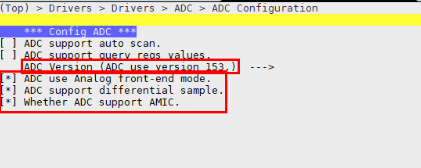

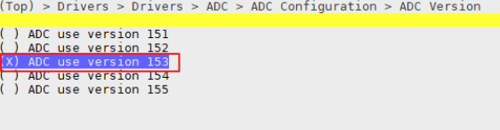

> **Note:** 
>If the images above are inconsistent with the table descriptions, the table prevails.

The specific descriptions of the configuration macros are shown in [Table 1](#table16629938173916).

**Table 1**  ADC macro descriptions

<a name="table16629938173916"></a>
<table><thead align="left"><tr id="row1462913813915"><th class="cellrowborder" valign="top" width="22.62773722627738%" id="mcps1.2.7.1.1"><p id="p1962923853920"><a name="p1962923853920"></a><a name="p1962923853920"></a>Macro name (CONFIG_ is the prefix added by default)</p>
</th>
<th class="cellrowborder" valign="top" width="21.137886211378866%" id="mcps1.2.7.1.2"><p id="p962916388395"><a name="p962916388395"></a><a name="p962916388395"></a>Specific description displayed on the Kconfig interface</p>
</th>
<th class="cellrowborder" valign="top" width="19.878012198780127%" id="mcps1.2.7.1.3"><p id="p18731420115119"><a name="p18731420115119"></a><a name="p18731420115119"></a>Usage scenario</p>
</th>
<th class="cellrowborder" valign="top" width="10.618938106189384%" id="mcps1.2.7.1.4"><p id="p537485457"><a name="p537485457"></a><a name="p537485457"></a>Implemented</p>
</th>
<th class="cellrowborder" valign="top" width="11.338866113388663%" id="mcps1.2.7.1.5"><p id="p1162915382392"><a name="p1162915382392"></a><a name="p1162915382392"></a>Depends on other macros</p>
</th>
<th class="cellrowborder" valign="top" width="14.398560143985604%" id="mcps1.2.7.1.6"><p id="p1449914917569"><a name="p1449914917569"></a><a name="p1449914917569"></a>Whether to enable or modify the configuration</p>
</th>
</tr>
</thead>
<tbody><tr id="row16629338103916"><td class="cellrowborder" valign="top" width="22.62773722627738%" headers="mcps1.2.7.1.1 "><p id="p166291338133910"><a name="p166291338133910"></a><a name="p166291338133910"></a>CONFIG_ADC_SUPPORT_AUTO_SCAN</p>
</td>
<td class="cellrowborder" valign="top" width="21.137886211378866%" headers="mcps1.2.7.1.2 "><p id="p1185915431020"><a name="p1185915431020"></a><a name="p1185915431020"></a>ADC support auto scan.</p>
</td>
<td class="cellrowborder" valign="top" width="19.878012198780127%" headers="mcps1.2.7.1.3 "><p id="p77352085114"><a name="p77352085114"></a><a name="p77352085114"></a>ADC supports automatic scan sampling</p>
</td>
<td class="cellrowborder" valign="top" width="10.618938106189384%" headers="mcps1.2.7.1.4 "><p id="p166297382397"><a name="p166297382397"></a><a name="p166297382397"></a>No</p>
</td>
<td class="cellrowborder" valign="top" width="11.338866113388663%" headers="mcps1.2.7.1.5 "><p id="p162983873917"><a name="p162983873917"></a><a name="p162983873917"></a>No</p>
</td>
<td class="cellrowborder" valign="top" width="14.398560143985604%" headers="mcps1.2.7.1.6 "><p id="p0629838133914"><a name="p0629838133914"></a><a name="p0629838133914"></a>Disabled by default. It is recommended to disable it. Not used by BS2X.</p>
</td>
</tr>
<tr id="row166299383394"><td class="cellrowborder" valign="top" width="22.62773722627738%" headers="mcps1.2.7.1.1 "><p id="p14629173813920"><a name="p14629173813920"></a><a name="p14629173813920"></a>CONFIG_ADC_SUPPORT_LONG_SAMPLE</p>
</td>
<td class="cellrowborder" valign="top" width="21.137886211378866%" headers="mcps1.2.7.1.2 "><p id="p1564384212"><a name="p1564384212"></a><a name="p1564384212"></a>ADC support long sample mode.</p>
</td>
<td class="cellrowborder" valign="top" width="19.878012198780127%" headers="mcps1.2.7.1.3 "><p id="p592505317814"><a name="p592505317814"></a><a name="p592505317814"></a>ADC supports periodic automatic sampling</p>
</td>
<td class="cellrowborder" valign="top" width="10.618938106189384%" headers="mcps1.2.7.1.4 "><p id="p166291838143916"><a name="p166291838143916"></a><a name="p166291838143916"></a>Yes</p>
</td>
<td class="cellrowborder" valign="top" width="11.338866113388663%" headers="mcps1.2.7.1.5 "><p id="p1883235116213"><a name="p1883235116213"></a><a name="p1883235116213"></a>CONFIG_ADC_SUPPORT_AUTO_SCAN</p>
</td>
<td class="cellrowborder" valign="top" width="14.398560143985604%" headers="mcps1.2.7.1.6 "><p id="p126297381398"><a name="p126297381398"></a><a name="p126297381398"></a>Disabled by default. It is recommended to disable it.</p>
</td>
</tr>
<tr id="row3629193823919"><td class="cellrowborder" valign="top" width="22.62773722627738%" headers="mcps1.2.7.1.1 "><p id="p262983811395"><a name="p262983811395"></a><a name="p262983811395"></a>CONFIG_ADC_SUPPORT_QUERY_REGS</p>
</td>
<td class="cellrowborder" valign="top" width="21.137886211378866%" headers="mcps1.2.7.1.2 "><p id="p29813275215"><a name="p29813275215"></a><a name="p29813275215"></a>ADC support query regs values.</p>
</td>
<td class="cellrowborder" valign="top" width="19.878012198780127%" headers="mcps1.2.7.1.3 "><p id="p438154074512"><a name="p438154074512"></a><a name="p438154074512"></a>ADC supports reading back the values of all related registers. Enable it as appropriate.</p>
</td>
<td class="cellrowborder" valign="top" width="10.618938106189384%" headers="mcps1.2.7.1.4 "><p id="p3629133873917"><a name="p3629133873917"></a><a name="p3629133873917"></a>Yes</p>
</td>
<td class="cellrowborder" valign="top" width="11.338866113388663%" headers="mcps1.2.7.1.5 "><p id="p062910387397"><a name="p062910387397"></a><a name="p062910387397"></a>No</p>
</td>
<td class="cellrowborder" valign="top" width="14.398560143985604%" headers="mcps1.2.7.1.6 "><p id="p1963621910"><a name="p1963621910"></a><a name="p1963621910"></a>Disabled by default. Enable it as appropriate.</p>
</td>
</tr>
<tr id="row962920381394"><td class="cellrowborder" valign="top" width="22.62773722627738%" headers="mcps1.2.7.1.1 "><p id="p1629738173912"><a name="p1629738173912"></a><a name="p1629738173912"></a>CONFIG_ADC_USING_V153</p>
</td>
<td class="cellrowborder" valign="top" width="21.137886211378866%" headers="mcps1.2.7.1.2 "><p id="p158881061121"><a name="p158881061121"></a><a name="p158881061121"></a>ADC use version 153.</p>
</td>
<td class="cellrowborder" valign="top" width="19.878012198780127%" headers="mcps1.2.7.1.3 "><p id="p1391712438269"><a name="p1391712438269"></a><a name="p1391712438269"></a>This macro indicates using the ADC V153 driver specification, which is used by default in this product.</p>
</td>
<td class="cellrowborder" valign="top" width="10.618938106189384%" headers="mcps1.2.7.1.4 "><p id="p7630938143910"><a name="p7630938143910"></a><a name="p7630938143910"></a>Yes</p>
</td>
<td class="cellrowborder" valign="top" width="11.338866113388663%" headers="mcps1.2.7.1.5 "><p id="p56301938153913"><a name="p56301938153913"></a><a name="p56301938153913"></a>No</p>
</td>
<td class="cellrowborder" valign="top" width="14.398560143985604%" headers="mcps1.2.7.1.6 "><p id="p19630238203917"><a name="p19630238203917"></a><a name="p19630238203917"></a>Enabled by default. Mandatory.</p>
</td>
</tr>
<tr id="row62681237271"><td class="cellrowborder" valign="top" width="22.62773722627738%" headers="mcps1.2.7.1.1 "><p id="p112401826112812"><a name="p112401826112812"></a><a name="p112401826112812"></a>CONFIG_ADC_SUPPORT_AFE</p>
</td>
<td class="cellrowborder" valign="top" width="21.137886211378866%" headers="mcps1.2.7.1.2 "><p id="p1923311414113"><a name="p1923311414113"></a><a name="p1923311414113"></a>ADC use Analog front-end mode.</p>
</td>
<td class="cellrowborder" valign="top" width="19.878012198780127%" headers="mcps1.2.7.1.3 "><p id="p826922312278"><a name="p826922312278"></a><a name="p826922312278"></a>Supports the analog front-end ADC</p>
</td>
<td class="cellrowborder" valign="top" width="10.618938106189384%" headers="mcps1.2.7.1.4 "><p id="p5269202314277"><a name="p5269202314277"></a><a name="p5269202314277"></a>Yes</p>
</td>
<td class="cellrowborder" valign="top" width="11.338866113388663%" headers="mcps1.2.7.1.5 "><p id="p882352916313"><a name="p882352916313"></a><a name="p882352916313"></a>CONFIG_ADC_USING_V153</p>
</td>
<td class="cellrowborder" valign="top" width="14.398560143985604%" headers="mcps1.2.7.1.6 "><p id="p12269623182717"><a name="p12269623182717"></a><a name="p12269623182717"></a>Enabled by default. Recommended to enable.</p>
</td>
</tr>
<tr id="row17817572040"><td class="cellrowborder" valign="top" width="22.62773722627738%" headers="mcps1.2.7.1.1 "><p id="p53019141514"><a name="p53019141514"></a><a name="p53019141514"></a>CONFIG_ADC_SUPPORT_DIFFERENTIAL</p>
</td>
<td class="cellrowborder" valign="top" width="21.137886211378866%" headers="mcps1.2.7.1.2 "><p id="p20825133117020"><a name="p20825133117020"></a><a name="p20825133117020"></a>ADC support differential sample.</p>
</td>
<td class="cellrowborder" valign="top" width="19.878012198780127%" headers="mcps1.2.7.1.3 "><p id="p391457342"><a name="p391457342"></a><a name="p391457342"></a>ADC supports sampling using differential channels</p>
</td>
<td class="cellrowborder" valign="top" width="10.618938106189384%" headers="mcps1.2.7.1.4 "><p id="p17919571246"><a name="p17919571246"></a><a name="p17919571246"></a>Yes</p>
</td>
<td class="cellrowborder" valign="top" width="11.338866113388663%" headers="mcps1.2.7.1.5 "><p id="p1343315396319"><a name="p1343315396319"></a><a name="p1343315396319"></a>CONFIG_ADC_USING_V153</p>
</td>
<td class="cellrowborder" valign="top" width="14.398560143985604%" headers="mcps1.2.7.1.6 "><p id="p4964172110154"><a name="p4964172110154"></a><a name="p4964172110154"></a>Enabled by default. Recommended to enable.</p>
</td>
</tr>
<tr id="row040511461781"><td class="cellrowborder" valign="top" width="22.62773722627738%" headers="mcps1.2.7.1.1 "><p id="p2085465116817"><a name="p2085465116817"></a><a name="p2085465116817"></a>CONFIG_ADC_SUPPORT_AMIC</p>
</td>
<td class="cellrowborder" valign="top" width="21.137886211378866%" headers="mcps1.2.7.1.2 "><p id="p1134919919020"><a name="p1134919919020"></a><a name="p1134919919020"></a>Whether ADC support AMIC.</p>
</td>
<td class="cellrowborder" valign="top" width="19.878012198780127%" headers="mcps1.2.7.1.3 "><p id="p19643163201514"><a name="p19643163201514"></a><a name="p19643163201514"></a>ADC supports AMIC</p>
</td>
<td class="cellrowborder" valign="top" width="10.618938106189384%" headers="mcps1.2.7.1.4 "><p id="p1640513469812"><a name="p1640513469812"></a><a name="p1640513469812"></a>Yes</p>
</td>
<td class="cellrowborder" valign="top" width="11.338866113388663%" headers="mcps1.2.7.1.5 "><p id="p1528213471933"><a name="p1528213471933"></a><a name="p1528213471933"></a>CONFIG_ADC_USING_V153</p>
</td>
<td class="cellrowborder" valign="top" width="14.398560143985604%" headers="mcps1.2.7.1.6 "><p id="p154053469813"><a name="p154053469813"></a><a name="p154053469813"></a>Enabled by default. Recommended to enable.</p>
</td>
</tr>
<tr id="row1835411465910"><td class="cellrowborder" valign="top" width="22.62773722627738%" headers="mcps1.2.7.1.1 "><p id="p235571412597"><a name="p235571412597"></a><a name="p235571412597"></a>CONFIG_AFE_SAMPLE_TIMES</p>
</td>
<td class="cellrowborder" valign="top" width="21.137886211378866%" headers="mcps1.2.7.1.2 "><p id="p13355191414594"><a name="p13355191414594"></a><a name="p13355191414594"></a>The numbers ADC sample to average.</p>
</td>
<td class="cellrowborder" valign="top" width="19.878012198780127%" headers="mcps1.2.7.1.3 "><p id="p105932017171618"><a name="p105932017171618"></a><a name="p105932017171618"></a>Default length of the ADC data acquisition configuration, not used in this product</p>
</td>
<td class="cellrowborder" valign="top" width="10.618938106189384%" headers="mcps1.2.7.1.4 "><p id="p1235501495919"><a name="p1235501495919"></a><a name="p1235501495919"></a>Yes</p>
</td>
<td class="cellrowborder" valign="top" width="11.338866113388663%" headers="mcps1.2.7.1.5 "><p id="p895101445"><a name="p895101445"></a><a name="p895101445"></a>No</p>
</td>
<td class="cellrowborder" valign="top" width="14.398560143985604%" headers="mcps1.2.7.1.6 "><p id="p97001027124119"><a name="p97001027124119"></a><a name="p97001027124119"></a>The default value is 4. It is not used in this product. It is recommended not to modify it.</p>
</td>
</tr>
</tbody>
</table>

## Development Guide<a name="ZH-CN_TOPIC_0000001665143746"></a>

The configurable items are mainly in the porting-layer header file corresponding to the ADC. The following describes the functions of important configurable items.

GAFE:

-   cfg\_adc\_data0.b.data\_num: In counting mode, the number of sampling points is 2<sup>x</sup>.
-   cfg\_adc\_data0.b.wait\_num: The number of sampling values discarded while waiting for the data link to stabilize.
-   cfg\_adc\_data1.b.osr\_len: The number of accumulated samples in oversampling.
-   cfg\_adc\_data1.b.osr\_sel: The number of averaged samples in oversampling. It is configured to the same value as the number of accumulated samples. The reported value is (data1+data2+...+data\_osr\_len)/osr\_sel.
-   To shorten the GADC sampling time, you can reduce the values of the preceding four variables. A set of limit values is given here:
-   .cfg\_adc\_data0.b.data\_num = 0xa,

    .cfg\_adc\_data0.b.wait\_num = 4,

    .cfg\_adc\_data1.b.osr\_len= 2,

    .cfg\_adc\_data1.b.osr\_sel= 2,

AAFE:

-   .pga\_gain: The PGA gain multiplier of the pre-amplifier of the AAFE circuit.

Example:

GAFE enable:

```
static void test_afe_set_io(uint8_t channel)
{
    pin_t adc_pin[] = {S_MGPIO2, S_MGPIO3, S_MGPIO4, S_MGPIO5, S_MGPIO28, S_MGPIO29, S_MGPIO30, S_MGPIO31};
    uapi_pin_set_mode(adc_pin[channel], PIN_MODE_0);
    uapi_gpio_set_dir(adc_pin[channel], GPIO_DIRECTION_INPUT);
    uapi_pin_set_pull(adc_pin[channel], PIN_PULL_NONE);
    uapi_pin_set_ie(adc_pin[channel], PIN_IE_1);
}
int gadc_open_demo(void)
{
)   uint8_t channel = GADC_CHANNEL_0;
    if (channel >= ADC_CHANNEL_MAX_NUM) {
        return ERROR_BAD_PARAMS;
    }
    test_afe_set_io(channel);
    uapi_adc_init(ADC_CLOCK_NONE);
    uapi_adc_power_en(AFE_GADC_MODE, true);
    uapi_adc_open_channel(channel);
    adc_calibration(AFE_GADC_MODE, true, true, true);
    return TEST_OK;
}

```

GAFE sampling:

```
#define ADC_AUTO_SAMPLE_TEST_TIMES 10
int adc_auto_sample_demo(void)
{
    adc_v153_gadc_channel_sel_t channel = GADC_CHANNEL_1;  // Select the channel to sample during sampling
    uapi_adc_open_channel(channel);
    int adc_value = 0;
    for (int i = 0; i < ADC_AUTO_SAMPLE_TEST_TIMES; i++) {
        adc_value =  adc_port_gadc_entirely_sample(channel);
        test_suite_log_stringf("adc:%dmV%x\n", adc_value);
    }
    return TEST_OK;
}

```

GAFE channel switching sampling:

```
int adc_auto_sample_demo(void)
{
    adc_v153_gadc_channel_sel_t channel = GADC_CHANNEL_1;  // Select the channel to sample during sampling
 
    int adc_value = 0;
    for (int i = 0; i < ADC_AUTO_SAMPLE_TEST_TIMES; i++) {
        adc_value =  adc_port_gadc_entirely_sample(channel);
        test_suite_log_stringf("adc: %dmV%x\n", adc_value);
    }
    channel = GADC_CHANNEL_3;  // Switch to the next channel to sample
    for (int i = 0; i < ADC_AUTO_SAMPLE_TEST_TIMES; i++) {
        adc_value =  adc_port_gadc_entirely_sample(channel);
        test_suite_log_stringf("adc: %dmV%x\n", adc_value);
    }
    return TEST_OK;
}

Using the GAFE entire interfaces:
void adc_entire_demo(void) {
    uint8_t gadc_channel1 = GADC_CHANNEL_0;
    uint8_t gadc_channel2 = GADC_CHANNEL_5;
    int adc_value = 0;
    adc_port_gadc_entirely_open(gadc_channel1,true); // First time the ADC is enabled, pass true to indicate this calibration.
    adc_value =  adc_port_gadc_entirely_sample(gadc_channel1);
    osal_printk("gadc: %dmv\n", adc_value );
    adc_port_gadc_entirely_close(gadc_channel1);    // The calibration value is recorded when it is closed
    adc_port_gadc_entirely_open(gadc_channel1, false);  // False indicates that the recorded calibration value is used for this enabling.
    adc_value =  adc_port_gadc_entirely_sample(gadc_channel2);
    osal_printk("gadc_channel2: %dmv\n", adc_value);
    adc_port_gadc_entirely_close(gadc_channel2);
}

```

```
AAFE enable & sampling:
int amic_open_demo(void)
{
    test_afe_set_io(AMIC_CHANNEL_0);
    test_afe_set_io(AMIC_CHANNEL_1);
    uapi_adc_init(ADC_CLOCK_NONE);
    uapi_adc_power_en(AFE_AMIC_MODE, true);
    uapi_adc_open_differential_channel(AMIC_CHANNEL_0, AMIC_CHANNEL_1);
    adc_calibration(AFE_AMIC_MODE, true, true, true);
    uapi_adc_auto_sample(AMIC_CHANNEL_0);  // After sampling is enabled, the data needs to be moved away by the audio driver
    return TEST_OK;
}
```

## Precautions<a name="ZH-CN_TOPIC_0000001713103493"></a>

-   GAFE analog input voltage range.

    Due to the limitation of the GPIO supply voltage for digital-analog multiplexing, the ADC reference voltage is 1.5 V. Therefore, the eight ports can only accept 0\~1.5 V input. Voltages above 1.5 V are forbidden. For higher voltages, it is recommended to divide the voltage to within 1.5 V using external resistors before connecting to the GAFE input. **Before developing a board with a voltage divider circuit, communicate with the hardware engineer**. After adding the voltage divider circuit, capacitance may introduce charge/discharge time, which needs to be determined through actual measurement.

-   Method for processing audio signals collected by AAFE.

    The audio signal collected through uapi\_adc\_auto\_sample has the same format as the battery signal collected by GAFE, including 13 valid bits and 1 sign bit. The processed value is sent through the PDM module. For the specific implementation, see the "[Development Guide](开发指引-77.md)" section.

-   It is recommended to use the three interfaces with entirely, which is simpler. Calibrate during the first initialization after power-on.

# DMA<a name="ZH-CN_TOPIC_0000001713023505"></a>


## Overview<a name="ZH-CN_TOPIC_0000001665143702"></a>

DMA (Direct Memory Access) is a working mode in which data exchange is entirely executed by hardware. In this mode, the DMA controller (DMAC) directly transfers data between memory and peripherals, between peripherals, and between memory and memory, reducing processor intervention and overhead.

The DMA mode is generally used for high-speed transmission of grouped data. After receiving a DMA transfer request, the DMAC starts the bus master controller according to the CPU configuration of the channel, sends address and control signals to the memory and peripherals, counts the number of transferred data items, and reports the completion or error of the transfer operation to the CPU by means of an interrupt.

The DMA specifications are as follows:

-   Memory-to-memory, memory-to-peripheral, peripheral-to-memory, and peripheral-to-peripheral transfer types are supported.
-   The MCU-side DMA supports 8 channels and 16 hardware handshaking interfaces, and the channel parameter priority is configurable.
-   All channels support a maximum single-packet length of 4095 bytes of data. 4K data must be within the same sector.
-   The endian is configurable.

## Function Description<a name="ZH-CN_TOPIC_0000001713103545"></a>

> **Note:** 
>If DMA is needed to transfer data in SPI/UART/I2C/I2S/PDM, DMA initialization must be performed during system startup.

The interfaces and functions provided by the DMA module are as follows:

-   uapi\_dma\_init（void）：Initializes the DMA.
-   uapi\_dma\_deinit（void）：Deinitializes the DMA.
-   uapi\_dma\_open（void）：Opens the DMA.
-   uapi\_dma\_close（void）：Closes the DMA.
-   uapi\_dma\_start\_transfer（uint8\_t channel）：Starts DMA transfer on the specified channel（channel indicates the DMA channel number to open）.
-   uapi\_dma\_end\_transfer（uint8\_t channel）：Stops DMA transfer on the specified channel（channel indicates the DMA channel number to stop）.
-   uapi\_dma\_get\_block\_ts（uint8\_t channel）：Obtains the amount of data transferred by DMA（channel indicates the DMA channel number）.
-   uapi\_dma\_transfer\_memory\_single（const dma\_ch\_user\_memory\_config\_t \*user\_cfg, dma\_transfer\_cb\_t callback, uintptr\_t arg）：Transfers memory-to-memory data through the DMA channel（user\_cfg indicates the DMA channel transfer configuration，callback indicates the channel transfer completion callback function，arg indicates the parameter passed back to the callback function when the transfer is complete）.
-   uapi\_dma\_configure\_peripheral\_transfer\_single（const dma\_ch\_user\_peripheral\_config\_t \*user\_cfg, uint8\_t \*channel, dma\_transfer\_cb\_t callback, uintptr\_t arg）：Transfers memory-to-peripheral or peripheral-to-memory data through the DMA channel（user\_cfg indicates the DMA channel transfer configuration，channel indicates the selected DMA channel number，callback indicates the channel transfer completion callback function，arg indicates the parameter passed back to the callback function when the transfer is complete）.
-   uapi\_dma\_get\_lli\_channel（uint8\_t burst\_length, uint8\_t handshaking）：Obtains the DMA linked-list transfer channel（burst\_length indicates the DMA burst transfer length，handshaking indicates the DMA transfer peripheral type）.(It can be used only when the CONFIG\_DMA\_SUPPORT\_LLI macro is enabled.)
-   uapi\_dma\_transfer\_memory\_lli（uint8\_t channel, const dma\_ch\_user\_memory\_config\_t \*user\_cfg, dma\_transfer\_cb\_t callback）：Transfers memory-to-memory data through the DMA channel in linked-list mode（channel indicates the DMA channel number，user\_cfg indicates the DMA channel transfer configuration，callback indicates the channel transfer completion callback function）.(It can be used only when the CONFIG\_DMA\_SUPPORT\_LLI macro is enabled.)
-   uapi\_dma\_configure\_peripheral\_transfer\_lli（uint8\_t channel, const dma\_ch\_user\_peripheral\_config\_t \*user\_cfg, dma\_transfer\_cb\_t callback）：Transfers memory-to-peripheral or peripheral-to-memory data through the DMA channel in linked-list mode（channel indicates the DMA channel number，user\_cfg indicates the DMA channel transfer configuration，callback indicates the channel transfer completion callback function）.(It can be used only when the CONFIG\_DMA\_SUPPORT\_LLI macro is enabled.)
-   uapi\_dma\_enbale\_lli（uint8\_t channel, dma\_transfer\_cb\_t callback, uintptr\_t arg）：Enables DMA linked-list transfer（channel indicates the DMA channel number，callback indicates the channel transfer completion callback function，arg indicates the parameter passed back to the callback function when the transfer is complete）.

    (It can be used only when the CONFIG\_DMA\_SUPPORT\_LLI macro is enabled.)

## KCONFIG Configuration<a name="ZH-CN_TOPIC_0000001896048578"></a>

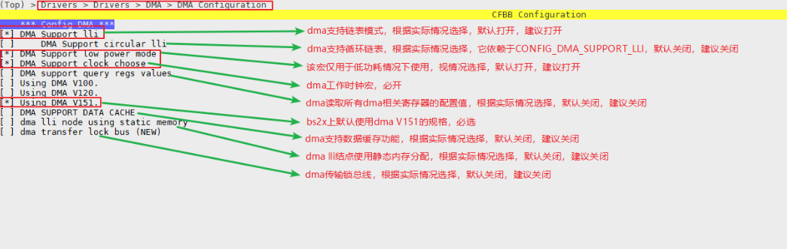

> **Note:** 
>If the images above are inconsistent with the table descriptions, the table prevails.

The specific descriptions of the configuration macros are shown in [Table 1](#table16629938173916).

**Table 1**  DMA macro descriptions

<a name="table16629938173916"></a>
<table><thead align="left"><tr id="row1462913813915"><th class="cellrowborder" valign="top" width="22.62773722627738%" id="mcps1.2.7.1.1"><p id="p1962923853920"><a name="p1962923853920"></a><a name="p1962923853920"></a>Macro name (CONFIG_ is the prefix added by default)</p>
</th>
<th class="cellrowborder" valign="top" width="21.137886211378866%" id="mcps1.2.7.1.2"><p id="p962916388395"><a name="p962916388395"></a><a name="p962916388395"></a>Specific description displayed on the Kconfig interface</p>
</th>
<th class="cellrowborder" valign="top" width="19.878012198780127%" id="mcps1.2.7.1.3"><p id="p18731420115119"><a name="p18731420115119"></a><a name="p18731420115119"></a>Usage scenario</p>
</th>
<th class="cellrowborder" valign="top" width="10.618938106189384%" id="mcps1.2.7.1.4"><p id="p537485457"><a name="p537485457"></a><a name="p537485457"></a>Implemented</p>
</th>
<th class="cellrowborder" valign="top" width="11.338866113388663%" id="mcps1.2.7.1.5"><p id="p1162915382392"><a name="p1162915382392"></a><a name="p1162915382392"></a>Depends on other macros</p>
</th>
<th class="cellrowborder" valign="top" width="14.398560143985604%" id="mcps1.2.7.1.6"><p id="p1449914917569"><a name="p1449914917569"></a><a name="p1449914917569"></a>Whether to enable or modify the configuration</p>
</th>
</tr>
</thead>
<tbody><tr id="row16629338103916"><td class="cellrowborder" valign="top" width="22.62773722627738%" headers="mcps1.2.7.1.1 "><p id="p166291338133910"><a name="p166291338133910"></a><a name="p166291338133910"></a>CONFIG_DMA_SUPPORT_LLI</p>
</td>
<td class="cellrowborder" valign="top" width="21.137886211378866%" headers="mcps1.2.7.1.2 "><p id="p14396164714308"><a name="p14396164714308"></a><a name="p14396164714308"></a>DMA support lli.</p>
</td>
<td class="cellrowborder" valign="top" width="19.878012198780127%" headers="mcps1.2.7.1.3 "><p id="p77352085114"><a name="p77352085114"></a><a name="p77352085114"></a>DMA supports the linked-list mode</p>
</td>
<td class="cellrowborder" valign="top" width="10.618938106189384%" headers="mcps1.2.7.1.4 "><p id="p166297382397"><a name="p166297382397"></a><a name="p166297382397"></a>Yes</p>
</td>
<td class="cellrowborder" valign="top" width="11.338866113388663%" headers="mcps1.2.7.1.5 "><p id="p162983873917"><a name="p162983873917"></a><a name="p162983873917"></a>No</p>
</td>
<td class="cellrowborder" valign="top" width="14.398560143985604%" headers="mcps1.2.7.1.6 "><p id="p0629838133914"><a name="p0629838133914"></a><a name="p0629838133914"></a>Enabled by default. Enable it as appropriate; it is recommended to enable it.</p>
</td>
</tr>
<tr id="row166299383394"><td class="cellrowborder" valign="top" width="22.62773722627738%" headers="mcps1.2.7.1.1 "><p id="p14629173813920"><a name="p14629173813920"></a><a name="p14629173813920"></a>CONFIG_DMA_SUPPORT_CIRCULAR_LLI</p>
</td>
<td class="cellrowborder" valign="top" width="21.137886211378866%" headers="mcps1.2.7.1.2 "><p id="p11482105911301"><a name="p11482105911301"></a><a name="p11482105911301"></a>DMA support circular lli.</p>
</td>
<td class="cellrowborder" valign="top" width="19.878012198780127%" headers="mcps1.2.7.1.3 "><p id="p269811784116"><a name="p269811784116"></a><a name="p269811784116"></a>DMA supports the circular linked-list mode</p>
</td>
<td class="cellrowborder" valign="top" width="10.618938106189384%" headers="mcps1.2.7.1.4 "><p id="p166291838143916"><a name="p166291838143916"></a><a name="p166291838143916"></a>Yes</p>
</td>
<td class="cellrowborder" valign="top" width="11.338866113388663%" headers="mcps1.2.7.1.5 "><p id="p17391013114112"><a name="p17391013114112"></a><a name="p17391013114112"></a>CONFIG_DMA_SUPPORT_LLI</p>
</td>
<td class="cellrowborder" valign="top" width="14.398560143985604%" headers="mcps1.2.7.1.6 "><p id="p126297381398"><a name="p126297381398"></a><a name="p126297381398"></a>Disabled by default. It is recommended to disable it.</p>
</td>
</tr>
<tr id="row3629193823919"><td class="cellrowborder" valign="top" width="22.62773722627738%" headers="mcps1.2.7.1.1 "><p id="p262983811395"><a name="p262983811395"></a><a name="p262983811395"></a>CONFIG_DMA_SUPPORT_LPM</p>
</td>
<td class="cellrowborder" valign="top" width="21.137886211378866%" headers="mcps1.2.7.1.2 "><p id="p889162011315"><a name="p889162011315"></a><a name="p889162011315"></a>DMA support low power mode.</p>
</td>
<td class="cellrowborder" valign="top" width="19.878012198780127%" headers="mcps1.2.7.1.3 "><p id="p1746412917425"><a name="p1746412917425"></a><a name="p1746412917425"></a>This macro is used only in low-power scenarios.</p>
</td>
<td class="cellrowborder" valign="top" width="10.618938106189384%" headers="mcps1.2.7.1.4 "><p id="p3629133873917"><a name="p3629133873917"></a><a name="p3629133873917"></a>Yes</p>
</td>
<td class="cellrowborder" valign="top" width="11.338866113388663%" headers="mcps1.2.7.1.5 "><p id="p062910387397"><a name="p062910387397"></a><a name="p062910387397"></a>No</p>
</td>
<td class="cellrowborder" valign="top" width="14.398560143985604%" headers="mcps1.2.7.1.6 "><p id="p1963621910"><a name="p1963621910"></a><a name="p1963621910"></a>Enabled by default. Enable it as appropriate.</p>
</td>
</tr>
<tr id="row962920381394"><td class="cellrowborder" valign="top" width="22.62773722627738%" headers="mcps1.2.7.1.1 "><p id="p1629738173912"><a name="p1629738173912"></a><a name="p1629738173912"></a>CONFIG_DMA_SUPPORT_CLOCK</p>
</td>
<td class="cellrowborder" valign="top" width="21.137886211378866%" headers="mcps1.2.7.1.2 "><p id="p183421327311"><a name="p183421327311"></a><a name="p183421327311"></a>DMA choose clock.</p>
</td>
<td class="cellrowborder" valign="top" width="19.878012198780127%" headers="mcps1.2.7.1.3 "><p id="p1391712438269"><a name="p1391712438269"></a><a name="p1391712438269"></a>DMA working clock</p>
</td>
<td class="cellrowborder" valign="top" width="10.618938106189384%" headers="mcps1.2.7.1.4 "><p id="p7630938143910"><a name="p7630938143910"></a><a name="p7630938143910"></a>Yes</p>
</td>
<td class="cellrowborder" valign="top" width="11.338866113388663%" headers="mcps1.2.7.1.5 "><p id="p56301938153913"><a name="p56301938153913"></a><a name="p56301938153913"></a>No</p>
</td>
<td class="cellrowborder" valign="top" width="14.398560143985604%" headers="mcps1.2.7.1.6 "><p id="p19630238203917"><a name="p19630238203917"></a><a name="p19630238203917"></a>Enabled by default. Mandatory.</p>
</td>
</tr>
<tr id="row62681237271"><td class="cellrowborder" valign="top" width="22.62773722627738%" headers="mcps1.2.7.1.1 "><p id="p112401826112812"><a name="p112401826112812"></a><a name="p112401826112812"></a>CONFIG_DMA_SUPPORT_QUERY_REGS</p>
</td>
<td class="cellrowborder" valign="top" width="21.137886211378866%" headers="mcps1.2.7.1.2 "><p id="p914354217316"><a name="p914354217316"></a><a name="p914354217316"></a>DMA support query regs values.</p>
</td>
<td class="cellrowborder" valign="top" width="19.878012198780127%" headers="mcps1.2.7.1.3 "><p id="p438154074512"><a name="p438154074512"></a><a name="p438154074512"></a>DMA supports reading back the values of all related registers. Enable it as appropriate.</p>
</td>
<td class="cellrowborder" valign="top" width="10.618938106189384%" headers="mcps1.2.7.1.4 "><p id="p5269202314277"><a name="p5269202314277"></a><a name="p5269202314277"></a>Yes</p>
</td>
<td class="cellrowborder" valign="top" width="11.338866113388663%" headers="mcps1.2.7.1.5 "><p id="p882352916313"><a name="p882352916313"></a><a name="p882352916313"></a>No</p>
</td>
<td class="cellrowborder" valign="top" width="14.398560143985604%" headers="mcps1.2.7.1.6 "><p id="p137491622194215"><a name="p137491622194215"></a><a name="p137491622194215"></a>Disabled by default. Enable it as appropriate.</p>
</td>
</tr>
<tr id="row17817572040"><td class="cellrowborder" valign="top" width="22.62773722627738%" headers="mcps1.2.7.1.1 "><p id="p53019141514"><a name="p53019141514"></a><a name="p53019141514"></a>CONFIG_DMA_USING_V100</p>
</td>
<td class="cellrowborder" valign="top" width="21.137886211378866%" headers="mcps1.2.7.1.2 "><p id="p20825133117020"><a name="p20825133117020"></a><a name="p20825133117020"></a>Using DMA V100.</p>
</td>
<td class="cellrowborder" valign="top" width="19.878012198780127%" headers="mcps1.2.7.1.3 "><p id="p391457342"><a name="p391457342"></a><a name="p391457342"></a>This macro indicates using the DMA V100 driver specification. This specification is not used in this product.</p>
</td>
<td class="cellrowborder" valign="top" width="10.618938106189384%" headers="mcps1.2.7.1.4 "><p id="p17919571246"><a name="p17919571246"></a><a name="p17919571246"></a>Yes</p>
</td>
<td class="cellrowborder" valign="top" width="11.338866113388663%" headers="mcps1.2.7.1.5 "><p id="p1343315396319"><a name="p1343315396319"></a><a name="p1343315396319"></a>No</p>
</td>
<td class="cellrowborder" valign="top" width="14.398560143985604%" headers="mcps1.2.7.1.6 "><p id="p1421054374413"><a name="p1421054374413"></a><a name="p1421054374413"></a>Disabled by default. It must be disabled.</p>
</td>
</tr>
<tr id="row040511461781"><td class="cellrowborder" valign="top" width="22.62773722627738%" headers="mcps1.2.7.1.1 "><p id="p2085465116817"><a name="p2085465116817"></a><a name="p2085465116817"></a>CONFIG_DMA_USING_V120</p>
</td>
<td class="cellrowborder" valign="top" width="21.137886211378866%" headers="mcps1.2.7.1.2 "><p id="p8562112919367"><a name="p8562112919367"></a><a name="p8562112919367"></a>Using DMA V120.</p>
</td>
<td class="cellrowborder" valign="top" width="19.878012198780127%" headers="mcps1.2.7.1.3 "><p id="p1605194513147"><a name="p1605194513147"></a><a name="p1605194513147"></a>This macro indicates using the DMA V120 driver specification. This specification is not used in this product.</p>
</td>
<td class="cellrowborder" valign="top" width="10.618938106189384%" headers="mcps1.2.7.1.4 "><p id="p1640513469812"><a name="p1640513469812"></a><a name="p1640513469812"></a>Yes</p>
</td>
<td class="cellrowborder" valign="top" width="11.338866113388663%" headers="mcps1.2.7.1.5 "><p id="p1528213471933"><a name="p1528213471933"></a><a name="p1528213471933"></a>No</p>
</td>
<td class="cellrowborder" valign="top" width="14.398560143985604%" headers="mcps1.2.7.1.6 "><p id="p154053469813"><a name="p154053469813"></a><a name="p154053469813"></a>Disabled by default. It must be disabled.</p>
</td>
</tr>
<tr id="row1835411465910"><td class="cellrowborder" valign="top" width="22.62773722627738%" headers="mcps1.2.7.1.1 "><p id="p235571412597"><a name="p235571412597"></a><a name="p235571412597"></a>CONFIG_DMA_USING_V151</p>
</td>
<td class="cellrowborder" valign="top" width="21.137886211378866%" headers="mcps1.2.7.1.2 "><p id="p13355191414594"><a name="p13355191414594"></a><a name="p13355191414594"></a>Using DMA V151.</p>
</td>
<td class="cellrowborder" valign="top" width="19.878012198780127%" headers="mcps1.2.7.1.3 "><p id="p105932017171618"><a name="p105932017171618"></a><a name="p105932017171618"></a>This macro indicates using the DMA V151 driver specification, which is used by default in this product.</p>
</td>
<td class="cellrowborder" valign="top" width="10.618938106189384%" headers="mcps1.2.7.1.4 "><p id="p1235501495919"><a name="p1235501495919"></a><a name="p1235501495919"></a>Yes</p>
</td>
<td class="cellrowborder" valign="top" width="11.338866113388663%" headers="mcps1.2.7.1.5 "><p id="p895101445"><a name="p895101445"></a><a name="p895101445"></a>No</p>
</td>
<td class="cellrowborder" valign="top" width="14.398560143985604%" headers="mcps1.2.7.1.6 "><p id="p72841723184417"><a name="p72841723184417"></a><a name="p72841723184417"></a>Enabled by default. Mandatory.</p>
</td>
</tr>
<tr id="row15869683373"><td class="cellrowborder" valign="top" width="22.62773722627738%" headers="mcps1.2.7.1.1 "><p id="p7870131514375"><a name="p7870131514375"></a><a name="p7870131514375"></a>CONFIG_DMA_TRANSFER_LOCK_BUS</p>
</td>
<td class="cellrowborder" valign="top" width="21.137886211378866%" headers="mcps1.2.7.1.2 "><p id="p208701185372"><a name="p208701185372"></a><a name="p208701185372"></a>DMA transfer lock bus.</p>
</td>
<td class="cellrowborder" valign="top" width="19.878012198780127%" headers="mcps1.2.7.1.3 "><p id="p587038153717"><a name="p587038153717"></a><a name="p587038153717"></a>DMA supports bus locking, not used in this product</p>
</td>
<td class="cellrowborder" valign="top" width="10.618938106189384%" headers="mcps1.2.7.1.4 "><p id="p48701288378"><a name="p48701288378"></a><a name="p48701288378"></a>Yes</p>
</td>
<td class="cellrowborder" valign="top" width="11.338866113388663%" headers="mcps1.2.7.1.5 "><p id="p47969352373"><a name="p47969352373"></a><a name="p47969352373"></a>CONFIG_DMA_USING_V151</p>
</td>
<td class="cellrowborder" valign="top" width="14.398560143985604%" headers="mcps1.2.7.1.6 "><p id="p13614102414451"><a name="p13614102414451"></a><a name="p13614102414451"></a>Disabled by default. It is not yet used in this product. It is recommended to disable it.</p>
</td>
</tr>
<tr id="row934483818326"><td class="cellrowborder" valign="top" width="22.62773722627738%" headers="mcps1.2.7.1.1 "><p id="p3864842337"><a name="p3864842337"></a><a name="p3864842337"></a>CONFIG_DMA_SUPPORT_SMDMA</p>
</td>
<td class="cellrowborder" valign="top" width="21.137886211378866%" headers="mcps1.2.7.1.2 "><p id="p134514381325"><a name="p134514381325"></a><a name="p134514381325"></a>DMA support SMDMA.</p>
</td>
<td class="cellrowborder" valign="top" width="19.878012198780127%" headers="mcps1.2.7.1.3 "><p id="p63451738133213"><a name="p63451738133213"></a><a name="p63451738133213"></a>Supports using SMDMA,</p>
<p id="p9453417114710"><a name="p9453417114710"></a><a name="p9453417114710"></a>Not used in this product</p>
</td>
<td class="cellrowborder" valign="top" width="10.618938106189384%" headers="mcps1.2.7.1.4 "><p id="p3345173819320"><a name="p3345173819320"></a><a name="p3345173819320"></a>Yes</p>
</td>
<td class="cellrowborder" valign="top" width="11.338866113388663%" headers="mcps1.2.7.1.5 "><p id="p137053279382"><a name="p137053279382"></a><a name="p137053279382"></a>CONFIG_DMA_USING_V100</p>
</td>
<td class="cellrowborder" valign="top" width="14.398560143985604%" headers="mcps1.2.7.1.6 "><p id="p914192814612"><a name="p914192814612"></a><a name="p914192814612"></a>Disabled by default. It is not yet used in this product. It is recommended to disable it.</p>
</td>
</tr>
<tr id="row2891124283218"><td class="cellrowborder" valign="top" width="22.62773722627738%" headers="mcps1.2.7.1.1 "><p id="p19452172613352"><a name="p19452172613352"></a><a name="p19452172613352"></a>CONFIG_SUPPORT_DATA_CACHE</p>
</td>
<td class="cellrowborder" valign="top" width="21.137886211378866%" headers="mcps1.2.7.1.2 "><p id="p8891174273220"><a name="p8891174273220"></a><a name="p8891174273220"></a>DMA support DATA CACHE.</p>
</td>
<td class="cellrowborder" valign="top" width="19.878012198780127%" headers="mcps1.2.7.1.3 "><p id="p489174216326"><a name="p489174216326"></a><a name="p489174216326"></a>DMA supports data caching</p>
</td>
<td class="cellrowborder" valign="top" width="10.618938106189384%" headers="mcps1.2.7.1.4 "><p id="p489117427322"><a name="p489117427322"></a><a name="p489117427322"></a>Yes</p>
</td>
<td class="cellrowborder" valign="top" width="11.338866113388663%" headers="mcps1.2.7.1.5 "><p id="p489144243219"><a name="p489144243219"></a><a name="p489144243219"></a>No</p>
</td>
<td class="cellrowborder" valign="top" width="14.398560143985604%" headers="mcps1.2.7.1.6 "><p id="p9229105374715"><a name="p9229105374715"></a><a name="p9229105374715"></a>Disabled by default. Enable it as appropriate.</p>
</td>
</tr>
<tr id="row19625232143511"><td class="cellrowborder" valign="top" width="22.62773722627738%" headers="mcps1.2.7.1.1 "><p id="p8294036143513"><a name="p8294036143513"></a><a name="p8294036143513"></a>CONFIG_DMA_LLI_NODE_FIX_MEM</p>
</td>
<td class="cellrowborder" valign="top" width="21.137886211378866%" headers="mcps1.2.7.1.2 "><p id="p1262510321355"><a name="p1262510321355"></a><a name="p1262510321355"></a>DMA lli node using static memory.</p>
</td>
<td class="cellrowborder" valign="top" width="19.878012198780127%" headers="mcps1.2.7.1.3 "><p id="p66258325359"><a name="p66258325359"></a><a name="p66258325359"></a>DMA linked-list nodes are allocated using static memory</p>
</td>
<td class="cellrowborder" valign="top" width="10.618938106189384%" headers="mcps1.2.7.1.4 "><p id="p1262573233514"><a name="p1262573233514"></a><a name="p1262573233514"></a>Yes</p>
</td>
<td class="cellrowborder" valign="top" width="11.338866113388663%" headers="mcps1.2.7.1.5 "><p id="p262516326357"><a name="p262516326357"></a><a name="p262516326357"></a>No</p>
</td>
<td class="cellrowborder" valign="top" width="14.398560143985604%" headers="mcps1.2.7.1.6 "><p id="p2625103283514"><a name="p2625103283514"></a><a name="p2625103283514"></a>Disabled by default. Enable it as appropriate.</p>
</td>
</tr>
<tr id="row515824115353"><td class="cellrowborder" valign="top" width="22.62773722627738%" headers="mcps1.2.7.1.1 "><p id="p12606144419357"><a name="p12606144419357"></a><a name="p12606144419357"></a>CONFIG_DMA_LLI_NODE_MAX</p>
</td>
<td class="cellrowborder" valign="top" width="21.137886211378866%" headers="mcps1.2.7.1.2 "><p id="p4158144115359"><a name="p4158144115359"></a><a name="p4158144115359"></a>DMA lli node max count.</p>
</td>
<td class="cellrowborder" valign="top" width="19.878012198780127%" headers="mcps1.2.7.1.3 "><p id="p1815874110356"><a name="p1815874110356"></a><a name="p1815874110356"></a>Maximum number of DMA linked-list node allocations. The default value is 4.</p>
</td>
<td class="cellrowborder" valign="top" width="10.618938106189384%" headers="mcps1.2.7.1.4 "><p id="p19158241133512"><a name="p19158241133512"></a><a name="p19158241133512"></a>Yes</p>
</td>
<td class="cellrowborder" valign="top" width="11.338866113388663%" headers="mcps1.2.7.1.5 "><p id="p11441554394"><a name="p11441554394"></a><a name="p11441554394"></a>CONFIG_DMA_LLI_NODE_FIX_MEM</p>
</td>
<td class="cellrowborder" valign="top" width="14.398560143985604%" headers="mcps1.2.7.1.6 "><p id="p131586414353"><a name="p131586414353"></a><a name="p131586414353"></a>The default value is 4. Configure it as appropriate. It is recommended not to modify it.</p>
</td>
</tr>
</tbody>
</table>

## Development Guide<a name="ZH-CN_TOPIC_0000001665143686"></a>

The DMA interface only provides the memory-to-memory copy function to the outside (for other copy modes, see the development guide of the corresponding peripheral driver in this document). The operation steps are as follows:

1.  Call the uapi\_dma\_init interface to initialize the DMA module.
2.  Call the uapi\_dma\_open interface to open the DMA channel.
3.  Call the uapi\_dma\_transfer interface to start DMA transfer. The block parameter can be used to set whether it is blocking mode.

Example:

```
#include "dma.h"
#include "hal_dma.h"
/* Process the callback function after the transfer is complete */
static bool g_dma_trans_done;
static bool g_dma_trans_succ;
void test_dma_trans_done_callback(uint8_t intr, uint8_t channel, uintptr_t arg)
{
    unused(channel);
    unused(arg);
    switch (intr) {
        case HAL_DMA_INTERRUPT_TFR:
            g_dma_trans_done = true;
            g_dma_trans_succ = true;
            break;
        case HAL_DMA_INTERRUPT_BLOCK:
            g_dma_trans_done = true;
            g_dma_trans_succ = true;
            break;
        case HAL_DMA_INTERRUPT_ERR:
            g_dma_trans_done = true;
            g_dma_trans_succ = false;
            break;
        default:
            break;
    }
    osal_printk("[DMA] int_type is %d. \r\n", intr);
}
static void test_fill_test_buffer(void *data, unsigned int length)
{
    for (unsigned int i = 0; i < length; i++) {
        *((unsigned char *)data + i) = (unsigned char)i;
    }
}
static void test_clear_test_buffer(void *data, unsigned int length)
{
    memset_s(data, length, 0, length);
}
errcode_t test_dma_mem_to_mem_single(void)
{
    dma_ch_user_memory_config_t transfer_config;
    /* Fill the data to be sent to the source address */
    test_fill_test_buffer((void *)(uintptr_t)g_dma_src_data, sizeof(g_dma_src_data));
    /* Clear the data at the destination address */
    test_clear_test_buffer((void *)(uintptr_t)g_dma_desc_data, sizeof(g_dma_desc_data));
    /* Initialize the DMA */
    uapi_dma_init();
    /* Open the DMA module */
    uapi_dma_open();
    /* Source address */
    transfer_config.src = ((uint32_t)(uintptr_t)g_dma_src_data);
    /* Destination address */
    transfer_config.dest = ((uint32_t)(uintptr_t)g_dma_desc_data);
    /* Transfer number */
    transfer_config.transfer_num = 100;
    /* Priority 0-3, 0 is the lowest */
    transfer_config.priority = 0;
    /* Transfer width 0: 1 byte 1: 2 bytes 2: 4 bytes */
    transfer_config.width = 0;
    /* Call the block-send interface and register the callback function */
    if (uapi_dma_transfer_memory_single(&transfer_config, test_dma_trans_done_callback, 0) != ERRCODE_SUCC) {
        return ERRCODE_FAIL;
    }
    /* Wait for sending to complete */
    while (!g_dma_trans_done) { }
    if (!g_dma_trans_succ) {
        return ERRCODE_FAIL;
    }
    return ERRCODE_SUCC;
}

The complete DMA code flow can refer to the following code:
#include "hal_dma.h"
#include "soc_osal.h"
#include "securec.h"
#include "app_init.h"
#include "dma.h"

#define DMA_TRANSFER_WORD_NUM       32
#define DMA_TRANSFER_PRIORITY       0
#define DMA_TRANSFER_WIDTH          2
#define DMA_TASK_DURATION_MS        500

#define DMA_TASK_PRIO               24
#define DMA_TASK_STACK_SIZE         0x1000

static uint32_t g_app_dma_src_data[DMA_TRANSFER_WORD_NUM] = { 0 };
static uint32_t g_app_dma_desc_data[DMA_TRANSFER_WORD_NUM] = { 0 };
static uint8_t g_dma_trans_done = 0;

static void app_dma_trans_done_callback(uint8_t int_type, uint8_t channel, uintptr_t arg)
{
    unused(arg);
    unused(channel);
    switch (int_type) {
        case HAL_DMA_INTERRUPT_TFR:
            g_dma_trans_done = 1;
            break;
        case HAL_DMA_INTERRUPT_BLOCK:
            g_dma_trans_done = 1;
            break;
        case HAL_DMA_INTERRUPT_ERR:
            osal_printk("DMA transfer error.\r\n");
            break;
        default:
            break;
    }
}

static void *dma_task(const char *arg)
{
    unused(arg);
    /* DMA init. */
    uapi_dma_deinit();
    uapi_dma_init();
    uapi_dma_open();

#if defined(CONFIG_DMA_MEMORY_LLI_TRANSFER_MODE)
    dma_channel_t dma_channel = DMA_CHANNEL_NONE;
    /* The following two input parameters need to be adapted according to the actual situation when using SMDMA. */
    dma_channel = uapi_dma_get_lli_channel(0, HAL_DMA_HANDSHAKING_MAX_NUM);
#endif

    for (uint32_t i = 0; i < DMA_TRANSFER_WORD_NUM; i++) {
        g_app_dma_src_data[i] = i;
    }
    memset_s(g_app_dma_desc_data, DMA_TRANSFER_WORD_NUM, 0, DMA_TRANSFER_WORD_NUM);

    dma_ch_user_memory_config_t transfer_config = { 0 };
    transfer_config.src = (uint32_t)(uintptr_t)g_app_dma_src_data;
    transfer_config.dest = (uint32_t)(uintptr_t)g_app_dma_desc_data;
    transfer_config.transfer_num = DMA_TRANSFER_WORD_NUM;
    transfer_config.priority = DMA_TRANSFER_PRIORITY;
    transfer_config.width = DMA_TRANSFER_WIDTH;

    while (1) {
        osal_msleep(DMA_TASK_DURATION_MS);
        g_dma_trans_done = 0;
#if defined(CONFIG_DMA_MEMORY_LLI_TRANSFER_MODE)
/* Here, only one node is configured in the linked list and the memory-to-memory transfer is performed. For the interfaces used for peripheral-to-memory transfer, refer to the sample code of other drivers */
        osal_printk("dma config link list item of memory to memory start!\r\n");
        if (uapi_dma_transfer_memory_lli(dma_channel, &transfer_config, app_dma_trans_done_callback) == ERRCODE_SUCC) {
            osal_printk("dma config link list item of memory to memory succ!\r\n");
        }
        osal_printk("dma enable lli memory transfer start!\r\n");
        if (uapi_dma_enable_lli(dma_channel, app_dma_trans_done_callback, (uintptr_t)NULL) == ERRCODE_SUCC) {
            osal_printk("dma enable lli memory transfer succ!\r\n");
        }
        while (!g_dma_trans_done) {}
        if (uapi_dma_end_transfer(dma_channel) == ERRCODE_SUCC) {
            osal_printk("dma channel transfer finish!\r\n");
        }
#else
        osal_printk("dma single memory transfer start!\r\n");
        if (uapi_dma_transfer_memory_single(&transfer_config, app_dma_trans_done_callback,
                                            (uintptr_t)NULL) == ERRCODE_SUCC) {
            osal_printk("dma single memory transfer succ!\r\n");
        }
        while (!g_dma_trans_done) {}
        osal_printk("dma checking transfer from 0x%08x to 0x%08x...\r\n", transfer_config.src, transfer_config.dest);
        if (memcmp((void *)transfer_config.src, (void *)transfer_config.dest, transfer_config.transfer_num) == 0) {
            osal_printk("dma memory copy test succ, length = %d block\r\n", transfer_config.transfer_num);
        }
#endif
    }

    return NULL;
}

static void dma_entry(void)
{
    osal_task *task_handle = NULL;
    osal_kthread_lock();
    task_handle = osal_kthread_create((osal_kthread_handler)dma_task, 0, "DmaTask", DMA_TASK_STACK_SIZE);
    if (task_handle != NULL) {
        osal_kthread_set_priority(task_handle, DMA_TASK_PRIO);
    }
    osal_kthread_unlock();
}

/* Run the dma_entry. */
app_run(dma_entry);

```

## Precautions<a name="ZH-CN_TOPIC_0000001713023549"></a>

-   It is recommended to use DMA only in scenarios where non-blocking data copy is required. In this case, the CPU can be released. After the transfer is complete, the CPU reports an interrupt, and the transfer success or failure can be determined in the callback function based on the event type. In blocking transfer scenarios, it is still recommended to use memcpy\_s for data copy.
-   The DMA IDLE interrupt is not triggered when the FIFO is empty. It is triggered only when the FIFO has data but the waterline is not reached within a period of time. Therefore, even if the waterline is set to 1 byte, the IDLE interrupt is not triggered.

# PWM<a name="ZH-CN_TOPIC_0000001713103501"></a>


## Overview<a name="ZH-CN_TOPIC_0000001713023561"></a>

PWM (Pulse Width Modulation) modulates the width of a series of pulses to produce the required waveform equivalently. That is, the analog signal level is digitally encoded, and the signal changes are adjusted by adjusting the frequency and duty cycle.

The PWM specifications are as follows:

-   12 channels of PWM output are supported, and the registers can be configured separately.
-   PWM grouping is supported. Multiple channels can be allocated to one group, and the same channel cannot be in different groups at the same time.
-   Both the low-level width and the high-level width are adjustable.
-   A fixed-cycle-count sending mode is supported.
-   Transfer-complete interrupts, interrupt clearing, and interrupt query are supported.
-   Only the low 16-bit phase-control counting, frequency-control counting, and duty-cycle counting are supported.

## Function Description<a name="ZH-CN_TOPIC_0000001713103505"></a>

The interfaces and functions provided by the PWM module are as follows:

-   uapi\_pwm\_init（void）：Initializes the PWM.
-   uapi\_pwm\_deinit（void）：Deinitializes the PWM.
-   uapi\_pwm\_open（uint8\_t channel, const pwm\_config\_t \*cfg）：Opens a PWM channel（channel indicates the PWM channel number，cfg indicates the configuration information of the PWM device）.
-   uapi\_pwm\_close（uint8\_t channel）：Closes a PWM channel（channel indicates the PWM channel number）.
-   uapi\_pwm\_get\_frequency（uint8\_t channel）：Obtains the PWM working frequency（channel indicates the PWM channel number）.
-   uapi\_pwm\_start（uint8\_t channel）：Starts PWM signal output（channel indicates the PWM channel number）.
-   uapi\_pwm\_isr（uint8\_t channel）：PWM interrupt service routine（channel indicates the PWM channel number）.
-   uapi\_pwm\_register\_interrupt（uint8\_t channel, pwm\_callback\_t callback）：Registers an interrupt callback for the PWM（channel indicates the PWM channel number，callback indicates the callback function called when the PWM channel transfer is complete）.
-   uapi\_pwm\_unregister\_interrupt（uint8\_t channel）：Deregisters the interrupt callback of the PWM（channel indicates the PWM channel number）.
-   uapi\_pwm\_set\_group（uint8\_t group, const uint8\_t \*channel\_set, uint32\_t channel\_set\_len）：Groups PWM channels（group indicates the number of PWM groups，channel\_set indicates the channel set to be grouped，channel\_set\_len indicates the length of the channel set to be grouped）.(It can be used only when the CONFIG\_PWM\_USING\_V151 macro is enabled.)
-   uapi\_pwm\_clear\_group（uint8\_t group）：Clears the PWM channel groups（group indicates the number of PWM groups）.(It can be used only when the CONFIG\_PWM\_USING\_V151 macro is enabled.)
-   uapi\_pwm\_start\_group（uint8\_t group）：Starts the PWM of the specified group（group indicates the number of PWM groups）.(It can be used only when the CONFIG\_PWM\_USING\_V151 macro is enabled.)
-   uapi\_pwm\_stop\_group（uint8\_t group）：Stops the PWM of the specified group（group indicates the number of PWM groups）.(It can be used only when the CONFIG\_PWM\_USING\_V151 macro is enabled.)
-   uapi\_pwm\_update\_cfg（uint8\_t channel, const pwm\_config\_t \*cfg）：Updates the configuration of the specified PWM channel（channel indicates the PWM channel number，cfg indicates the configuration information of the PWM device）.(It can be used only when the CONFIG\_PWM\_USING\_V151 macro is enabled.)
-   uapi\_pwm\_config\_preload（uint8\_t group, uint8\_t channel, const pwm\_config\_t \*cfg）：PWM preconfiguration. When the previous PWM configuration is complete, this configuration is automatically loaded（group indicates the number of PWM groups，channel indicates the PWM channel number，cfg indicates the configuration information of the PWM device）.(It can be used only when the CONFIG\_PWM\_USING\_V151 and CONFIG\_PWM\_PRELOAD macros are enabled.)
-   uapi\_pwm\_suspend（uintptr\_t arg）：Suspends all PWM channels for low-power scenarios（arg indicates the parameters required for suspension）.(It can be used only when the CONFIG\_PWM\_SUPPORT\_LPM macro is enabled.)
-   uapi\_pwm\_resume（uintptr\_t arg）：Resumes all PWM channels for low-power scenarios（arg indicates the parameters required for resume）.(It can be used only when the CONFIG\_PWM\_SUPPORT\_LPM macro is enabled.)

## KCONFIG Configuration<a name="ZH-CN_TOPIC_0000001937049169"></a>

> **Note:** 
>If the images above are inconsistent with the table descriptions, the table prevails.

The specific descriptions of the configuration macros are shown in [Table 1](#table16629938173916).

**Table 1**  PWM macro descriptions

<a name="table16629938173916"></a>
<table><thead align="left"><tr id="row1462913813915"><th class="cellrowborder" valign="top" width="22.62773722627737%" id="mcps1.2.7.1.1"><p id="p1962923853920"><a name="p1962923853920"></a><a name="p1962923853920"></a>Macro name (CONFIG_ is the prefix added by default)</p>
</th>
<th class="cellrowborder" valign="top" width="21.137886211378863%" id="mcps1.2.7.1.2"><p id="p962916388395"><a name="p962916388395"></a><a name="p962916388395"></a>Specific description displayed on the Kconfig interface</p>
</th>
<th class="cellrowborder" valign="top" width="19.878012198780123%" id="mcps1.2.7.1.3"><p id="p18731420115119"><a name="p18731420115119"></a><a name="p18731420115119"></a>Usage scenario</p>
</th>
<th class="cellrowborder" valign="top" width="10.598940105989401%" id="mcps1.2.7.1.4"><p id="p537485457"><a name="p537485457"></a><a name="p537485457"></a>Implemented</p>
</th>
<th class="cellrowborder" valign="top" width="11.358864113588641%" id="mcps1.2.7.1.5"><p id="p1162915382392"><a name="p1162915382392"></a><a name="p1162915382392"></a>Depends on other macros</p>
</th>
<th class="cellrowborder" valign="top" width="14.3985601439856%" id="mcps1.2.7.1.6"><p id="p1449914917569"><a name="p1449914917569"></a><a name="p1449914917569"></a>Whether to enable or modify the configuration</p>
</th>
</tr>
</thead>
<tbody><tr id="row16629338103916"><td class="cellrowborder" valign="top" width="22.62773722627737%" headers="mcps1.2.7.1.1 "><p id="p166291338133910"><a name="p166291338133910"></a><a name="p166291338133910"></a>CONFIG_PWM_SUPPORT_LPM</p>
</td>
<td class="cellrowborder" valign="top" width="21.137886211378863%" headers="mcps1.2.7.1.2 "><p id="p82401455135819"><a name="p82401455135819"></a><a name="p82401455135819"></a>PWM support low power mode, supend and reusme.</p>
</td>
<td class="cellrowborder" valign="top" width="19.878012198780123%" headers="mcps1.2.7.1.3 "><p id="p1746412917425"><a name="p1746412917425"></a><a name="p1746412917425"></a>This macro is used only in low-power scenarios.</p>
</td>
<td class="cellrowborder" valign="top" width="10.598940105989401%" headers="mcps1.2.7.1.4 "><p id="p166297382397"><a name="p166297382397"></a><a name="p166297382397"></a>Yes</p>
</td>
<td class="cellrowborder" valign="top" width="11.358864113588641%" headers="mcps1.2.7.1.5 "><p id="p162983873917"><a name="p162983873917"></a><a name="p162983873917"></a>No</p>
</td>
<td class="cellrowborder" valign="top" width="14.3985601439856%" headers="mcps1.2.7.1.6 "><p id="p0629838133914"><a name="p0629838133914"></a><a name="p0629838133914"></a>Disabled by default. Enable it as appropriate.</p>
</td>
</tr>
<tr id="row166299383394"><td class="cellrowborder" valign="top" width="22.62773722627737%" headers="mcps1.2.7.1.1 "><p id="p14629173813920"><a name="p14629173813920"></a><a name="p14629173813920"></a>CONFIG_PWM_USING_V150</p>
</td>
<td class="cellrowborder" valign="top" width="21.137886211378863%" headers="mcps1.2.7.1.2 "><p id="p4944112916213"><a name="p4944112916213"></a><a name="p4944112916213"></a>Using PWM V150.</p>
</td>
<td class="cellrowborder" valign="top" width="19.878012198780123%" headers="mcps1.2.7.1.3 "><p id="p118818331937"><a name="p118818331937"></a><a name="p118818331937"></a>This macro indicates using the PWM V150 driver specification. This specification is not used in this product.</p>
</td>
<td class="cellrowborder" valign="top" width="10.598940105989401%" headers="mcps1.2.7.1.4 "><p id="p166291838143916"><a name="p166291838143916"></a><a name="p166291838143916"></a>Yes</p>
</td>
<td class="cellrowborder" valign="top" width="11.358864113588641%" headers="mcps1.2.7.1.5 "><p id="p104251259727"><a name="p104251259727"></a><a name="p104251259727"></a>No</p>
</td>
<td class="cellrowborder" valign="top" width="14.3985601439856%" headers="mcps1.2.7.1.6 "><p id="p126297381398"><a name="p126297381398"></a><a name="p126297381398"></a>Disabled by default. It must be disabled.</p>
</td>
</tr>
<tr id="row3629193823919"><td class="cellrowborder" valign="top" width="22.62773722627737%" headers="mcps1.2.7.1.1 "><p id="p262983811395"><a name="p262983811395"></a><a name="p262983811395"></a>CONFIG_PWM_USING_V151</p>
</td>
<td class="cellrowborder" valign="top" width="21.137886211378863%" headers="mcps1.2.7.1.2 "><p id="p92293371213"><a name="p92293371213"></a><a name="p92293371213"></a>Using PWM V151.</p>
</td>
<td class="cellrowborder" valign="top" width="19.878012198780123%" headers="mcps1.2.7.1.3 "><p id="p7781949410"><a name="p7781949410"></a><a name="p7781949410"></a>This macro indicates using the PWM V151 driver specification, which is used by default in this product.</p>
</td>
<td class="cellrowborder" valign="top" width="10.598940105989401%" headers="mcps1.2.7.1.4 "><p id="p3629133873917"><a name="p3629133873917"></a><a name="p3629133873917"></a>Yes</p>
</td>
<td class="cellrowborder" valign="top" width="11.358864113588641%" headers="mcps1.2.7.1.5 "><p id="p062910387397"><a name="p062910387397"></a><a name="p062910387397"></a>No</p>
</td>
<td class="cellrowborder" valign="top" width="14.3985601439856%" headers="mcps1.2.7.1.6 "><p id="p1963621910"><a name="p1963621910"></a><a name="p1963621910"></a>Enabled by default. Mandatory.</p>
</td>
</tr>
<tr id="row962920381394"><td class="cellrowborder" valign="top" width="22.62773722627737%" headers="mcps1.2.7.1.1 "><p id="p1629738173912"><a name="p1629738173912"></a><a name="p1629738173912"></a>CONFIG_PWM_PRELOAD</p>
</td>
<td class="cellrowborder" valign="top" width="21.137886211378863%" headers="mcps1.2.7.1.2 "><p id="p17631164919215"><a name="p17631164919215"></a><a name="p17631164919215"></a>Using PWM preload.</p>
</td>
<td class="cellrowborder" valign="top" width="19.878012198780123%" headers="mcps1.2.7.1.3 "><p id="p1391712438269"><a name="p1391712438269"></a><a name="p1391712438269"></a>This macro is mainly used to reconfigure the related parameters of the PWM</p>
<p id="p83281914415"><a name="p83281914415"></a><a name="p83281914415"></a></p>
</td>
<td class="cellrowborder" valign="top" width="10.598940105989401%" headers="mcps1.2.7.1.4 "><p id="p7630938143910"><a name="p7630938143910"></a><a name="p7630938143910"></a>Yes</p>
</td>
<td class="cellrowborder" valign="top" width="11.358864113588641%" headers="mcps1.2.7.1.5 "><p id="p1183214531423"><a name="p1183214531423"></a><a name="p1183214531423"></a>CONFIG_PWM_USING_V151</p>
</td>
<td class="cellrowborder" valign="top" width="14.3985601439856%" headers="mcps1.2.7.1.6 "><p id="p6329334103"><a name="p6329334103"></a><a name="p6329334103"></a>Disabled by default. Enable it as appropriate.</p>
</td>
</tr>
<tr id="row62681237271"><td class="cellrowborder" valign="top" width="22.62773722627737%" headers="mcps1.2.7.1.1 "><p id="p112401826112812"><a name="p112401826112812"></a><a name="p112401826112812"></a>CONFIG_PWM_GROUP_NUM</p>
</td>
<td class="cellrowborder" valign="top" width="21.137886211378863%" headers="mcps1.2.7.1.2 "><p id="p1669719161435"><a name="p1669719161435"></a><a name="p1669719161435"></a>The number of groups in PWM.</p>
</td>
<td class="cellrowborder" valign="top" width="19.878012198780123%" headers="mcps1.2.7.1.3 "><p id="p438154074512"><a name="p438154074512"></a><a name="p438154074512"></a>Number of groups configured for the PWM. The default value is 6.</p>
</td>
<td class="cellrowborder" valign="top" width="10.598940105989401%" headers="mcps1.2.7.1.4 "><p id="p5269202314277"><a name="p5269202314277"></a><a name="p5269202314277"></a>Yes</p>
</td>
<td class="cellrowborder" valign="top" width="11.358864113588641%" headers="mcps1.2.7.1.5 "><p id="p882352916313"><a name="p882352916313"></a><a name="p882352916313"></a>No</p>
</td>
<td class="cellrowborder" valign="top" width="14.3985601439856%" headers="mcps1.2.7.1.6 "><p id="p137491622194215"><a name="p137491622194215"></a><a name="p137491622194215"></a>The default value is 6. Configure it as appropriate. It is recommended not to modify it.</p>
</td>
</tr>
<tr id="row17817572040"><td class="cellrowborder" valign="top" width="22.62773722627737%" headers="mcps1.2.7.1.1 "><p id="p53019141514"><a name="p53019141514"></a><a name="p53019141514"></a>CONFIG_PWM_CHANNEL_NUM</p>
</td>
<td class="cellrowborder" valign="top" width="21.137886211378863%" headers="mcps1.2.7.1.2 "><p id="p20825133117020"><a name="p20825133117020"></a><a name="p20825133117020"></a>PWM channel number.</p>
</td>
<td class="cellrowborder" valign="top" width="19.878012198780123%" headers="mcps1.2.7.1.3 "><p id="p391457342"><a name="p391457342"></a><a name="p391457342"></a>Number of PWM channels configured. The default value is 12.</p>
</td>
<td class="cellrowborder" valign="top" width="10.598940105989401%" headers="mcps1.2.7.1.4 "><p id="p17919571246"><a name="p17919571246"></a><a name="p17919571246"></a>Yes</p>
</td>
<td class="cellrowborder" valign="top" width="11.358864113588641%" headers="mcps1.2.7.1.5 "><p id="p1343315396319"><a name="p1343315396319"></a><a name="p1343315396319"></a>No</p>
</td>
<td class="cellrowborder" valign="top" width="14.3985601439856%" headers="mcps1.2.7.1.6 "><p id="p142715574917"><a name="p142715574917"></a><a name="p142715574917"></a>The default value is 12. Configure it as appropriate. It is recommended not to modify it.</p>
</td>
</tr>
</tbody>
</table>

## Development Guide<a name="ZH-CN_TOPIC_0000001713103561"></a>

The PWM uses the digital output of the microprocessor to control analog circuits. The operation steps are as follows:

1.  Call the uapi\_pin\_set\_mode interface to configure the IO as a PWM function through multiplexing.
2.  Call uapi\_pwm\_init to initialize the PWM.
3.  Call uapi\_pwm\_set\_group to group the PWM.
4.  Call uapi\_pwm\_open to configure PWM parameters and open the specified channel.
5.  Call the uapi\_pwm\_register\_interrupt interface to register the callback function of the PWM interrupt.
6.  Call the uapi\_pwm\_start or uapi\_pwm\_start\_group interface to enable PWM signal output of the specified ID or the specified group.
7.  Call the uapi\_pwm\_stop\_group interface to stop PWM signal output of the specified group.
8.  Call the uapi\_pwm\_close interface to close PWM signal output of the specified ID.
9.  Call the uapi\_pwm\_deinit interface to deinitialize the PWM module.

Example:

```
#include "pwm.h"
#include "pwm_porting.h"
#define TEST_MAX_TIMES 10
#define TEST_DELAY_MS 1000
#define GROUP_ID      0
/* Register the interrupt callback function of the PWM */
static errcode_t pwm_test_callback(pwm_channel_t channel)
{
    osal_printk("PWM channel number is %d, func of interrupt start. \r\n", channel);
    uapi_pwm_isr(channel);
    return ERRCODE_SUCC;
}
void test_pwm_sample(pin_t pin, pin_mode_t mode, pwm_channel_t channel)
{
    /* Set the number of loops */
    unsigned int test_times;
    /* Configure low_time, high_time, cycles, repeat. When repeat is true, cycles is invalid */
    /* offset_time is not used, so configure it to 0 */
    pwm_config_t cfg_repeat = { 100, 100, 0, 0, true };
    /* Set the mode that can be used as a PWM IO */
    uapi_pin_set_mode(pin, mode);
    uapi_pwm_init();
    uint8_t channel_id = channel;
    uapi_pwm_set_group(GROUP_ID, channel_id, 1);
    /* Open the PWM of the specified channel */
    uapi_pwm_open(channel, &cfg_repeat);
    /* Register the callback function */
    uapi_pwm_register_interrupt(channel, pwm_test_callback);
    /* Start the pwm output of the specified channel */
    uapi_pwm_start(channel);
    /* Currently set to cyclic output. Loop TEST_MAX_TIMES times, delay TEST_DELAY_MS each time, then close the pwm output */
    for (test_times = 0; test_times <= TEST_MAX_TIMES; test_times++) {
    if (test_times == TEST_MAX_TIMES) {
            uapi_pwm_stop_group(GROUP_ID);
            uapi_pwm_close(channel);
            osal_printk("now close the pwm output and trigger interrupt \r\n");
        }
        osal_mdelay(TEST_DELAY_MS);
    }
    uapi_pwm_deinit();
    return;
}

The complete PWM code flow can refer to the following code:
#if defined(CONFIG_PWM_SUPPORT_LPM)
#include "pm_veto.h"
#endif
#include "common_def.h"
#include "pinctrl.h"
#include "pwm.h"
#include "tcxo.h"
#include "soc_osal.h"
#include "app_init.h"

#define TEST_TCXO_DELAY_500MS      500
#define PWM_LOW_TIME_CYC           0
#define PWM_HIGH_TIME_CYC          20
#define PWM_TASK_PRIO              24
#define PWM_TASK_STACK_SIZE        0x1000

static uint32_t g_pwm_cyc_done_cnt = 0;
static errcode_t pwm_sample_callback(uint8_t channel)
{
    unused(channel);
    g_pwm_cyc_done_cnt++;
    return ERRCODE_SUCC;
}

void pwm_repeat_mode(void)
{
    pwm_config_t cfg_repeat = {
        PWM_LOW_TIME_CYC,
        PWM_HIGH_TIME_CYC,
        0,
        0xFF,
        true
    };

    uapi_pwm_init();
    uapi_pwm_open(CONFIG_PWM_CHANNEL, &cfg_repeat);
    uapi_pwm_register_interrupt(CONFIG_PWM_CHANNEL, pwm_sample_callback);
#if defined(CONFIG_PWM_SUPPORT_LPM)
    /* veto sleep, or pwm will stop after sleep */
    uapi_pm_add_sleep_veto(PM_USER0_VETO_ID);
#endif
#ifdef CONFIG_PWM_USING_V151
    uint8_t channel_id = CONFIG_PWM_CHANNEL;
    uapi_pwm_set_group(CONFIG_PWM_GROUP_ID, &channel_id, 1);
    uapi_pwm_start_group(CONFIG_PWM_GROUP_ID);
#else
    uapi_pwm_start(CONFIG_PWM_CHANNEL);
#endif
    uapi_tcxo_delay_ms((uint32_t)TEST_TCXO_DELAY_500MS);

#ifdef CONFIG_PWM_USING_V151
    /* update duty ratio config */
    while (cfg_repeat.low_time <= PWM_HIGH_TIME_CYC) {
        uapi_pwm_update_cfg(CONFIG_PWM_CHANNEL, &cfg_repeat);
        uapi_tcxo_delay_ms((uint32_t)TEST_TCXO_DELAY_500MS);
        osal_printk("pwm cyc_done_cnt:%u, duty_radio:[%u/%u]\r\n", g_pwm_cyc_done_cnt,
            cfg_repeat.high_time, cfg_repeat.high_time + cfg_repeat.low_time);
        cfg_repeat.low_time++;
        cfg_repeat.high_time--;
    }
    uapi_pwm_stop_group(CONFIG_PWM_GROUP_ID);
#endif

#if defined(CONFIG_PWM_SUPPORT_LPM)
    uapi_pm_remove_sleep_veto(PM_USER0_VETO_ID);  /* remove veto sleep */
#endif
    uapi_pwm_close(CONFIG_PWM_CHANNEL);
    uapi_pwm_deinit();
}

static void *pwm_task(const char *arg)
{
    unused(arg);
    pwm_config_t cfg_no_repeat = {
        100,
        100,
        0,
        0xFF,
        false
    };

    uapi_pin_set_mode(CONFIG_PWM_PIN, CONFIG_PWM_PIN_MODE);
    uapi_pwm_init();
    uapi_pwm_open(CONFIG_PWM_CHANNEL, &cfg_no_repeat);
    uapi_pwm_register_interrupt(CONFIG_PWM_CHANNEL, pwm_sample_callback);
#ifdef CONFIG_PWM_USING_V151
    uint8_t channel_id = CONFIG_PWM_CHANNEL;
    /* channel_id can also choose to configure multiple channels, and the third parameter also needs to be adjusted
        accordingly. */
    uapi_pwm_set_group(CONFIG_PWM_GROUP_ID, &channel_id, 1);
    /* Here you can also call the uapi_pwm_start interface to open each channel individually. */
    uapi_pwm_start_group(CONFIG_PWM_GROUP_ID);
#else
    uapi_pwm_start(CONFIG_PWM_CHANNEL);
#endif

    uapi_tcxo_delay_ms((uint32_t)TEST_TCXO_DELAY_500MS);
    uapi_pwm_close(CONFIG_PWM_CHANNEL);
    uapi_pwm_deinit();

    /* pwm repeat mode */
    pwm_repeat_mode();

    return NULL;
}

static void pwm_entry(void)
{
    osal_task *task_handle = NULL;
    osal_kthread_lock();
    task_handle = osal_kthread_create((osal_kthread_handler)pwm_task, 0, "PwmTask", PWM_TASK_STACK_SIZE);
    if (task_handle != NULL) {
        osal_kthread_set_priority(task_handle, PWM_TASK_PRIO);
    }
    osal_kthread_unlock();
}

/* Run the pwm_entry. */
app_run(pwm_entry);

```

## Precautions<a name="ZH-CN_TOPIC_0000001664983942"></a>

-   Before calling the uapi\_pwm\_deinit interface, you need to call the uapi\_pwm\_close interface first.
-   The PWM supports a duty cycle of 0.
-   The PWM supports multi-channel complementary output.
-   After deep sleep wakeup, configure the multiplexing relationship first, then call the uapi\_pwm\_deinit interface to deinitialize, and then call the uapi\_pwm\_init interface for initialization.

# WDT<a name="ZH-CN_TOPIC_0000001713103557"></a>


## Overview<a name="ZH-CN_TOPIC_0000001713023501"></a>

WDT (Watch Dog Timer) is generally used to recover from exceptions when the CPU runs abnormally. If the system runs normally, the dog is fed regularly to prevent the timer from timing out. If the system stops running or fails to feed the dog normally for some reason, so that the timer is not reset within the set timeout period, the watchdog considers that the system has failed and triggers the corresponding handling measures, such as resetting the system or executing a specific error handling program.

The WDT specifications are as follows:

-   There is one CPU watchdog and one PMU watchdog. The PMU watchdog is not open to users.
-   The CPU watchdog timeout is adjustable from 2s to 32768s.
-   The CPU watchdog supports two working modes: direct reset and reset after interrupt.

## Function Description<a name="ZH-CN_TOPIC_0000001664983938"></a>

The interfaces and functions provided by the WDT module are as follows:

-   uapi\_watchdog\_init（uint32\_t timeout）：Initializes the watchdog function and sets the watchdog timeout period in seconds（timeout indicates the watchdog timeout period）.
-   uapi\_watchdog\_deinit（void）：Deinitializes the watchdog function.
-   uapi\_watchdog\_set\_time（uint32\_t timeout）：Sets the watchdog timeout period in seconds (if not set, the default is 8s)（timeout indicates the watchdog timeout period）.
-   uapi\_watchdog\_kick（void）：Restarts the counter.
-   uapi\_watchdog\_enable（wdt\_mode\_t mode）：Enables the watchdog（mode indicates the watchdog mode）.
-   uapi\_watchdog\_disable（void）：Disables the watchdog.
-   uapi\_watchdog\_get\_left\_time（uint32\_t \*timeout）：Obtains the remaining time of the watchdog in ms（timeout indicates the remaining time value）.
-   uapi\_register\_watchdog\_callback（watchdog\_callback\_t callback）：Registers a watchdog callback（callback indicates the callback function that handles exceptions after the watchdog times out）.
-   uapi\_watchdog\_suspend（uintptr\_t arg）：Suspends the watchdog module for low-power scenarios（arg indicates the parameters required for suspension）.(It can be used only when the CONFIG\_WATCHDOG\_SUPPORT\_LPM macro is enabled.)
-   uapi\_watchdog\_resume（uintptr\_t arg）：Resumes the watchdog module for low-power scenarios（arg indicates the parameters required for resume）.(It can be used only when the CONFIG\_WATCHDOG\_SUPPORT\_LPM macro is enabled.)

## KCONFIG Configuration<a name="ZH-CN_TOPIC_0000001896049970"></a>

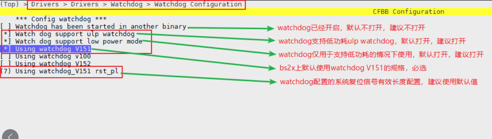

> **Note:** 
>If the images above are inconsistent with the table descriptions, the table prevails.

The specific descriptions of the configuration macros are shown in [Table 1](#table16629938173916).

**Table 1**  WATCHDOG macro descriptions

<a name="table16629938173916"></a>
<table><thead align="left"><tr id="row1462913813915"><th class="cellrowborder" valign="top" width="22.62773722627738%" id="mcps1.2.7.1.1"><p id="p1962923853920"><a name="p1962923853920"></a><a name="p1962923853920"></a>Macro name (CONFIG_ is the prefix added by default)</p>
</th>
<th class="cellrowborder" valign="top" width="21.137886211378866%" id="mcps1.2.7.1.2"><p id="p962916388395"><a name="p962916388395"></a><a name="p962916388395"></a>Specific description displayed on the Kconfig interface</p>
</th>
<th class="cellrowborder" valign="top" width="19.878012198780127%" id="mcps1.2.7.1.3"><p id="p18731420115119"><a name="p18731420115119"></a><a name="p18731420115119"></a>Usage scenario</p>
</th>
<th class="cellrowborder" valign="top" width="10.618938106189384%" id="mcps1.2.7.1.4"><p id="p537485457"><a name="p537485457"></a><a name="p537485457"></a>Implemented</p>
</th>
<th class="cellrowborder" valign="top" width="11.338866113388663%" id="mcps1.2.7.1.5"><p id="p1162915382392"><a name="p1162915382392"></a><a name="p1162915382392"></a>Depends on other macros</p>
</th>
<th class="cellrowborder" valign="top" width="14.398560143985604%" id="mcps1.2.7.1.6"><p id="p1449914917569"><a name="p1449914917569"></a><a name="p1449914917569"></a>Whether to enable or modify the configuration</p>
</th>
</tr>
</thead>
<tbody><tr id="row16629338103916"><td class="cellrowborder" valign="top" width="22.62773722627738%" headers="mcps1.2.7.1.1 "><p id="p166291338133910"><a name="p166291338133910"></a><a name="p166291338133910"></a>CONFIG_WATCHDOG_ALREADY_START</p>
</td>
<td class="cellrowborder" valign="top" width="21.137886211378866%" headers="mcps1.2.7.1.2 "><p id="p4239943111619"><a name="p4239943111619"></a><a name="p4239943111619"></a>Watchdog has been started in another binary.</p>
</td>
<td class="cellrowborder" valign="top" width="19.878012198780127%" headers="mcps1.2.7.1.3 "><p id="p882925153018"><a name="p882925153018"></a><a name="p882925153018"></a>This macro indicates that the WATCHDOG has been enabled and does not need to be configured again</p>
</td>
<td class="cellrowborder" valign="top" width="10.618938106189384%" headers="mcps1.2.7.1.4 "><p id="p166297382397"><a name="p166297382397"></a><a name="p166297382397"></a>Yes</p>
</td>
<td class="cellrowborder" valign="top" width="11.338866113388663%" headers="mcps1.2.7.1.5 "><p id="p162983873917"><a name="p162983873917"></a><a name="p162983873917"></a>No</p>
</td>
<td class="cellrowborder" valign="top" width="14.398560143985604%" headers="mcps1.2.7.1.6 "><p id="p12981192883014"><a name="p12981192883014"></a><a name="p12981192883014"></a>Disabled by default. Enable it as appropriate.</p>
</td>
</tr>
<tr id="row166299383394"><td class="cellrowborder" valign="top" width="22.62773722627738%" headers="mcps1.2.7.1.1 "><p id="p14629173813920"><a name="p14629173813920"></a><a name="p14629173813920"></a>CONFIG_WATCHDOG_SUPPORT_ULP_WDT</p>
</td>
<td class="cellrowborder" valign="top" width="21.137886211378866%" headers="mcps1.2.7.1.2 "><p id="p4944112916213"><a name="p4944112916213"></a><a name="p4944112916213"></a>Watchdog support ulp watchdog.</p>
</td>
<td class="cellrowborder" valign="top" width="19.878012198780127%" headers="mcps1.2.7.1.3 "><p id="p118818331937"><a name="p118818331937"></a><a name="p118818331937"></a>Supports the low-power ulp WATCHDOG</p>
</td>
<td class="cellrowborder" valign="top" width="10.618938106189384%" headers="mcps1.2.7.1.4 "><p id="p166291838143916"><a name="p166291838143916"></a><a name="p166291838143916"></a>Yes</p>
</td>
<td class="cellrowborder" valign="top" width="11.338866113388663%" headers="mcps1.2.7.1.5 "><p id="p104251259727"><a name="p104251259727"></a><a name="p104251259727"></a>No</p>
</td>
<td class="cellrowborder" valign="top" width="14.398560143985604%" headers="mcps1.2.7.1.6 "><p id="p466161893814"><a name="p466161893814"></a><a name="p466161893814"></a>Enabled by default. Recommended to enable.</p>
</td>
</tr>
<tr id="row3629193823919"><td class="cellrowborder" valign="top" width="22.62773722627738%" headers="mcps1.2.7.1.1 "><p id="p262983811395"><a name="p262983811395"></a><a name="p262983811395"></a>CONFIG_WATCHDOG_SUPPORT_LPM</p>
</td>
<td class="cellrowborder" valign="top" width="21.137886211378866%" headers="mcps1.2.7.1.2 "><p id="p6888342162111"><a name="p6888342162111"></a><a name="p6888342162111"></a>Watchdog support low power mode.</p>
</td>
<td class="cellrowborder" valign="top" width="19.878012198780127%" headers="mcps1.2.7.1.3 "><p id="p1746412917425"><a name="p1746412917425"></a><a name="p1746412917425"></a>This macro is used only in low-power scenarios.</p>
</td>
<td class="cellrowborder" valign="top" width="10.618938106189384%" headers="mcps1.2.7.1.4 "><p id="p3629133873917"><a name="p3629133873917"></a><a name="p3629133873917"></a>Yes</p>
</td>
<td class="cellrowborder" valign="top" width="11.338866113388663%" headers="mcps1.2.7.1.5 "><p id="p062910387397"><a name="p062910387397"></a><a name="p062910387397"></a>No</p>
</td>
<td class="cellrowborder" valign="top" width="14.398560143985604%" headers="mcps1.2.7.1.6 "><p id="p0629838133914"><a name="p0629838133914"></a><a name="p0629838133914"></a>Enabled by default. Enable it as appropriate; it is recommended to enable it.</p>
</td>
</tr>
<tr id="row962920381394"><td class="cellrowborder" valign="top" width="22.62773722627738%" headers="mcps1.2.7.1.1 "><p id="p1629738173912"><a name="p1629738173912"></a><a name="p1629738173912"></a>CONFIG_WATCHDOG_USING_V100</p>
</td>
<td class="cellrowborder" valign="top" width="21.137886211378866%" headers="mcps1.2.7.1.2 "><p id="p17631164919215"><a name="p17631164919215"></a><a name="p17631164919215"></a>Using watchdog V100.</p>
</td>
<td class="cellrowborder" valign="top" width="19.878012198780127%" headers="mcps1.2.7.1.3 "><p id="p1391712438269"><a name="p1391712438269"></a><a name="p1391712438269"></a>This macro indicates using the WATCHDOG V100 driver specification. This specification is not used in this product.</p>
<p id="p83281914415"><a name="p83281914415"></a><a name="p83281914415"></a></p>
</td>
<td class="cellrowborder" valign="top" width="10.618938106189384%" headers="mcps1.2.7.1.4 "><p id="p7630938143910"><a name="p7630938143910"></a><a name="p7630938143910"></a>Yes</p>
</td>
<td class="cellrowborder" valign="top" width="11.338866113388663%" headers="mcps1.2.7.1.5 "><p id="p1183214531423"><a name="p1183214531423"></a><a name="p1183214531423"></a>No</p>
</td>
<td class="cellrowborder" valign="top" width="14.398560143985604%" headers="mcps1.2.7.1.6 "><p id="p165302711299"><a name="p165302711299"></a><a name="p165302711299"></a>Disabled by default. It must be disabled.</p>
</td>
</tr>
<tr id="row62681237271"><td class="cellrowborder" valign="top" width="22.62773722627738%" headers="mcps1.2.7.1.1 "><p id="p112401826112812"><a name="p112401826112812"></a><a name="p112401826112812"></a>CONFIG_WATCHDOG_USING_V151</p>
</td>
<td class="cellrowborder" valign="top" width="21.137886211378866%" headers="mcps1.2.7.1.2 "><p id="p421072052213"><a name="p421072052213"></a><a name="p421072052213"></a>Using watchdog v151.</p>
</td>
<td class="cellrowborder" valign="top" width="19.878012198780127%" headers="mcps1.2.7.1.3 "><p id="p167838112284"><a name="p167838112284"></a><a name="p167838112284"></a>This macro indicates using the WATCHDOG V151 driver specification, which is used by default in this product.</p>
</td>
<td class="cellrowborder" valign="top" width="10.618938106189384%" headers="mcps1.2.7.1.4 "><p id="p5269202314277"><a name="p5269202314277"></a><a name="p5269202314277"></a>Yes</p>
</td>
<td class="cellrowborder" valign="top" width="11.338866113388663%" headers="mcps1.2.7.1.5 "><p id="p882352916313"><a name="p882352916313"></a><a name="p882352916313"></a>No</p>
</td>
<td class="cellrowborder" valign="top" width="14.398560143985604%" headers="mcps1.2.7.1.6 "><p id="p997411916292"><a name="p997411916292"></a><a name="p997411916292"></a>Enabled by default. Mandatory.</p>
</td>
</tr>
<tr id="row17817572040"><td class="cellrowborder" valign="top" width="22.62773722627738%" headers="mcps1.2.7.1.1 "><p id="p53019141514"><a name="p53019141514"></a><a name="p53019141514"></a>CONFIG_WATCHDOG_USING_V152</p>
</td>
<td class="cellrowborder" valign="top" width="21.137886211378866%" headers="mcps1.2.7.1.2 "><p id="p4395254122619"><a name="p4395254122619"></a><a name="p4395254122619"></a>Using watchdog v152.</p>
</td>
<td class="cellrowborder" valign="top" width="19.878012198780127%" headers="mcps1.2.7.1.3 "><p id="p52954333289"><a name="p52954333289"></a><a name="p52954333289"></a>This macro indicates using the WATCHDOG V152 driver specification. This specification is not used in this product.</p>
</td>
<td class="cellrowborder" valign="top" width="10.618938106189384%" headers="mcps1.2.7.1.4 "><p id="p17919571246"><a name="p17919571246"></a><a name="p17919571246"></a>Yes</p>
</td>
<td class="cellrowborder" valign="top" width="11.338866113388663%" headers="mcps1.2.7.1.5 "><p id="p1343315396319"><a name="p1343315396319"></a><a name="p1343315396319"></a>No</p>
</td>
<td class="cellrowborder" valign="top" width="14.398560143985604%" headers="mcps1.2.7.1.6 "><p id="p142715574917"><a name="p142715574917"></a><a name="p142715574917"></a>Disabled by default. It must be disabled.</p>
</td>
</tr>
<tr id="row177121859141412"><td class="cellrowborder" valign="top" width="22.62773722627738%" headers="mcps1.2.7.1.1 "><p id="p6712259101414"><a name="p6712259101414"></a><a name="p6712259101414"></a>CONFIG_WATCHDOG_USING_V151_RST_PL</p>
</td>
<td class="cellrowborder" valign="top" width="21.137886211378866%" headers="mcps1.2.7.1.2 "><p id="p167121459141412"><a name="p167121459141412"></a><a name="p167121459141412"></a>Using watchdog V151 rst_pl.</p>
</td>
<td class="cellrowborder" valign="top" width="19.878012198780127%" headers="mcps1.2.7.1.3 "><p id="p17712259141415"><a name="p17712259141415"></a><a name="p17712259141415"></a>Effective length of the system reset configured by the WATCHDOG</p>
</td>
<td class="cellrowborder" valign="top" width="10.618938106189384%" headers="mcps1.2.7.1.4 "><p id="p11713185971415"><a name="p11713185971415"></a><a name="p11713185971415"></a>Yes</p>
</td>
<td class="cellrowborder" valign="top" width="11.338866113388663%" headers="mcps1.2.7.1.5 "><p id="p163714292912"><a name="p163714292912"></a><a name="p163714292912"></a>CONFIG_WATCHDOG_USING_V151</p>
</td>
<td class="cellrowborder" valign="top" width="14.398560143985604%" headers="mcps1.2.7.1.6 "><p id="p671315931413"><a name="p671315931413"></a><a name="p671315931413"></a>The default value is 7. Configure it as appropriate. It is recommended not to modify it.</p>
</td>
</tr>
</tbody>
</table>

## Development Guide<a name="ZH-CN_TOPIC_0000001713103569"></a>

The WDT is generally used to detect whether the system hangs. If the dog is not fed within the configured feeding wait time, a system reset is generated or a dog interrupt is reported according to the watchdog enable mode. See the following reference code:

1.  Call uapi\_watchdog\_init to initialize and set the watchdog timeout period.
2.  Call uapi\_watchdog\_enable to enable the watchdog module. The reset mode and interrupt mode are configurable.
3.  Call uapi\_watchdog\_kick to feed the dog. At this point, the dog feeding operation has been implemented in the idle task.
4.  Call uapi\_watchdog\_get\_left\_time to obtain the remaining time of the watchdog timer (optional).
5.  Call uapi\_watchdog\_disable to disable the watchdog (it is not recommended to disable the watchdog under normal circumstances).

Example:

```
#include "watchdog.h"
#include "watchdog_porting.h"
void sample_wdt(void)
{
    uint32_t sample_remain_ms;
    /* Set the watchdog timeout period */
    uapi_watchdog_init(CHIP_WDT_TIMEOUT_32S);/* Set the timeout period */
    uapi_watchdog_enable(WDT_MODE_RESET);/* Enable the watchdog */
    osal_mdelay(5000); /* delay 5000 ms */
    uapi_watchdog_kick(); /* Feed the dog */
    uapi_watchdog_get_left_time(&sample_remain_ms); /* Obtain the remaining timeout period */
    osal_printk("sample_remain_ms = %x! \n", sample_remain_ms);
    uapi_watchdog_disable();/* Disable the watchdog */
}
```

## Precautions<a name="ZH-CN_TOPIC_0000001664983970"></a>

-   If the obtained time is 0xFFFFFFFF, the watchdog is in the disabled state.
-   The watchdog has been enabled in the SDK and the dog feeding action already exists. In special scenarios, if the CPU needs to be occupied for a long time, you can disable the watchdog or add dog feeding operations in the business code to prevent the watchdog from resetting in normal business scenarios.
-   The default watchdog timeout period is 8s. In flashboot, the dog is reconfigured to 32s. Pay attention to this when using it. In general, it is not recommended to modify the timeout period.

# Timer<a name="ZH-CN_TOPIC_0000001713023573"></a>


## Overview<a name="ZH-CN_TOPIC_0000001665143754"></a>

A Timer is an important module used for timing and generating timed events. It usually consists of a counter and some related registers. The core function of the timer is to count based on the configured clock source and the preset count value, and to generate an interrupt or trigger other events under specific conditions.

The Timer specifications are as follows:

-   4 timers (Timer0 to 3) are provided.
-   Each timer provides two 32-bit registers for counting.
-   Timeout interrupts and reload values are supported.

## Function Description<a name="ZH-CN_TOPIC_0000001664983994"></a>

The interfaces and functions provided by the Timer module are as follows:

-   uapi\_timer\_adapter（timer\_index\_t index, uint32\_t int\_id, uint16\_t int\_priority）：Adapts the timer configuration（index indicates the hardware timer index，int\_id indicates the hardware timer interrupt ID，int\_priority indicates the hardware timer interrupt priority）.
-   uapi\_timer\_init（void）：Initializes the Timer.
-   uapi\_timer\_deinit（void）：Deinitializes the Timer.
-   uapi\_timer\_create（timer\_index\_t index, timer\_handle\_t \*timer）：Creates a timer（index indicates the hardware timer index，timer indicates the timer handle return value）.
-   uapi\_timer\_delete（timer\_handle\_t timer）：Deletes the specified timer（timer indicates the created timer）.
-   uapi\_timer\_start（timer\_handle\_t timer, uint32\_t time\_us, timer\_callback\_t callback, uintptr\_t data）：Starts the specified timer and begins timing（timer indicates the created timer，time\_us indicates the timer timeout period，callback indicates the timer callback function，data indicates the parameter passed to the timer callback function）.
-   uapi\_timer\_stop（timer\_handle\_t timer）：Stops the current timer timing（timer indicates the created timer）.
-   uapi\_timer\_get\_max\_us（void）：The user can obtain the maximum delay time (us) that the Timer can be set to.
-   uapi\_timer\_get\_current\_time\_us（timer\_index\_t index, uint32\_t \*current\_time\_us）：Obtains the current time (us) of the specified underlying Timer（index indicates the underlying Timer index，current\_time\_us indicates the current time in us of the underlying Timer）.
-   uapi\_timer\_start\_high\_precision（timer\_index\_t index, timer\_trigger\_mode\_t mode, uint32\_t time\_us, timer\_irq\_info\_t\* irq\_info, high\_precision\_timer\_callback\_t callback）：Starts a dedicated high-precision timer（index indicates the hardware timer index，mode indicates the timing mode，time\_us indicates the timer timeout period，irq\_info indicates the interrupt information，callback indicates the timer callback function）.(It can be used only when the CONFIG\_TIMER\_SUPPORT\_HIGH\_PRECISION macro is enabled.)
-   uapi\_timer\_reset\_high\_precision（timer\_index\_t index, timer\_trigger\_mode\_t mode, uint32\_t time\_us）：Restarts a dedicated high-precision timer（index indicates the hardware timer index，mode indicates the timing mode，time\_us indicates the timer timeout period）.

    (It can be used only when the CONFIG\_TIMER\_SUPPORT\_HIGH\_PRECISION macro is enabled.)

-   uapi\_timer\_stop\_high\_precision（timer\_index\_t index）：Stops a dedicated high-precision timer（index indicates the hardware timer index）.(It can be used only when the CONFIG\_TIMER\_SUPPORT\_HIGH\_PRECISION macro is enabled.)
-   uapi\_timer\_suspend（uintptr\_t val）：Suspends the timer module for low-power scenarios（val indicates the parameter required for suspension）.(It can be used only when the CONFIG\_TIMER\_SUPPORT\_LPM macro is enabled.)
-   uapi\_timer\_resume（uintptr\_t val）：Resumes the timer module for low-power scenarios（val indicates the parameter required for resume）.(It can be used only when the CONFIG\_TIMER\_SUPPORT\_LPM macro is enabled.)

## KCONFIG Configuration<a name="ZH-CN_TOPIC_0000001896050934"></a>

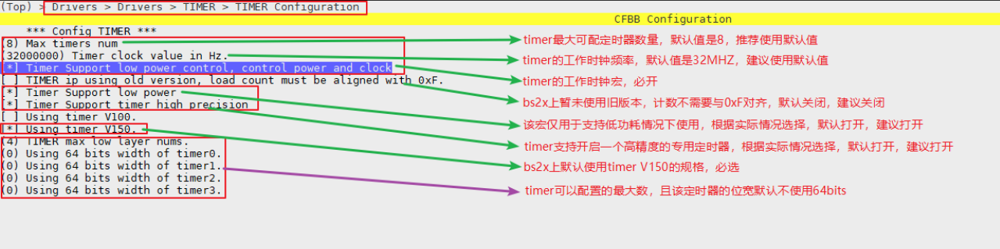

> **Note:** 
>If the images above are inconsistent with the table descriptions, the table prevails.

The specific descriptions of the configuration macros are shown in [Table 1](#table16629938173916).

**Table 1**  TIMER macro descriptions

<a name="table16629938173916"></a>
<table><thead align="left"><tr id="row1462913813915"><th class="cellrowborder" valign="top" width="22.62773722627738%" id="mcps1.2.7.1.1"><p id="p1962923853920"><a name="p1962923853920"></a><a name="p1962923853920"></a>Macro name (CONFIG_ is the prefix added by default)</p>
</th>
<th class="cellrowborder" valign="top" width="21.137886211378866%" id="mcps1.2.7.1.2"><p id="p962916388395"><a name="p962916388395"></a><a name="p962916388395"></a>Specific description displayed on the Kconfig interface</p>
</th>
<th class="cellrowborder" valign="top" width="19.878012198780127%" id="mcps1.2.7.1.3"><p id="p18731420115119"><a name="p18731420115119"></a><a name="p18731420115119"></a>Usage scenario</p>
</th>
<th class="cellrowborder" valign="top" width="10.618938106189384%" id="mcps1.2.7.1.4"><p id="p537485457"><a name="p537485457"></a><a name="p537485457"></a>Implemented</p>
</th>
<th class="cellrowborder" valign="top" width="11.338866113388663%" id="mcps1.2.7.1.5"><p id="p1162915382392"><a name="p1162915382392"></a><a name="p1162915382392"></a>Depends on other macros</p>
</th>
<th class="cellrowborder" valign="top" width="14.398560143985604%" id="mcps1.2.7.1.6"><p id="p1449914917569"><a name="p1449914917569"></a><a name="p1449914917569"></a>Whether to enable or modify the configuration</p>
</th>
</tr>
</thead>
<tbody><tr id="row16629338103916"><td class="cellrowborder" valign="top" width="22.62773722627738%" headers="mcps1.2.7.1.1 "><p id="p166291338133910"><a name="p166291338133910"></a><a name="p166291338133910"></a>CONFIG_TIMER_MAX_TIMERS_NUM</p>
</td>
<td class="cellrowborder" valign="top" width="21.137886211378866%" headers="mcps1.2.7.1.2 "><p id="p1643543516587"><a name="p1643543516587"></a><a name="p1643543516587"></a>Max timers num.</p>
</td>
<td class="cellrowborder" valign="top" width="19.878012198780127%" headers="mcps1.2.7.1.3 "><p id="p882925153018"><a name="p882925153018"></a><a name="p882925153018"></a>Maximum number of configurable TIMER timers. The default value is 8.</p>
</td>
<td class="cellrowborder" valign="top" width="10.618938106189384%" headers="mcps1.2.7.1.4 "><p id="p166297382397"><a name="p166297382397"></a><a name="p166297382397"></a>Yes</p>
</td>
<td class="cellrowborder" valign="top" width="11.338866113388663%" headers="mcps1.2.7.1.5 "><p id="p162983873917"><a name="p162983873917"></a><a name="p162983873917"></a>No</p>
</td>
<td class="cellrowborder" valign="top" width="14.398560143985604%" headers="mcps1.2.7.1.6 "><p id="p1815310485618"><a name="p1815310485618"></a><a name="p1815310485618"></a>The default value is 8. Configure it as appropriate. It is recommended not to modify it.</p>
</td>
</tr>
<tr id="row166299383394"><td class="cellrowborder" valign="top" width="22.62773722627738%" headers="mcps1.2.7.1.1 "><p id="p14629173813920"><a name="p14629173813920"></a><a name="p14629173813920"></a>CONFIG_TIMER_CLOCK_VALUE</p>
</td>
<td class="cellrowborder" valign="top" width="21.137886211378866%" headers="mcps1.2.7.1.2 "><p id="p4944112916213"><a name="p4944112916213"></a><a name="p4944112916213"></a>Timer clock value in Hz.</p>
</td>
<td class="cellrowborder" valign="top" width="19.878012198780127%" headers="mcps1.2.7.1.3 "><p id="p118818331937"><a name="p118818331937"></a><a name="p118818331937"></a>TIMER working clock frequency. The default is 32 MHz.</p>
</td>
<td class="cellrowborder" valign="top" width="10.618938106189384%" headers="mcps1.2.7.1.4 "><p id="p166291838143916"><a name="p166291838143916"></a><a name="p166291838143916"></a>Yes</p>
</td>
<td class="cellrowborder" valign="top" width="11.338866113388663%" headers="mcps1.2.7.1.5 "><p id="p104251259727"><a name="p104251259727"></a><a name="p104251259727"></a>No</p>
</td>
<td class="cellrowborder" valign="top" width="14.398560143985604%" headers="mcps1.2.7.1.6 "><p id="p466161893814"><a name="p466161893814"></a><a name="p466161893814"></a>The default value is 32000000. It is recommended not to modify it.</p>
</td>
</tr>
<tr id="row3629193823919"><td class="cellrowborder" valign="top" width="22.62773722627738%" headers="mcps1.2.7.1.1 "><p id="p262983811395"><a name="p262983811395"></a><a name="p262983811395"></a>CONFIG_TIMER_SUPPORT_LPC</p>
</td>
<td class="cellrowborder" valign="top" width="21.137886211378866%" headers="mcps1.2.7.1.2 "><p id="p6888342162111"><a name="p6888342162111"></a><a name="p6888342162111"></a>Timer support low power control, control power and clock.</p>
</td>
<td class="cellrowborder" valign="top" width="19.878012198780127%" headers="mcps1.2.7.1.3 "><p id="p5454183113"><a name="p5454183113"></a><a name="p5454183113"></a>TIMER working clock</p>
</td>
<td class="cellrowborder" valign="top" width="10.618938106189384%" headers="mcps1.2.7.1.4 "><p id="p3629133873917"><a name="p3629133873917"></a><a name="p3629133873917"></a>Yes</p>
</td>
<td class="cellrowborder" valign="top" width="11.338866113388663%" headers="mcps1.2.7.1.5 "><p id="p062910387397"><a name="p062910387397"></a><a name="p062910387397"></a>No</p>
</td>
<td class="cellrowborder" valign="top" width="14.398560143985604%" headers="mcps1.2.7.1.6 "><p id="p0629838133914"><a name="p0629838133914"></a><a name="p0629838133914"></a>Enabled by default. Mandatory.</p>
</td>
</tr>
<tr id="row962920381394"><td class="cellrowborder" valign="top" width="22.62773722627738%" headers="mcps1.2.7.1.1 "><p id="p1629738173912"><a name="p1629738173912"></a><a name="p1629738173912"></a>CONFIG_TIMER_USING_OLD_VERSION</p>
</td>
<td class="cellrowborder" valign="top" width="21.137886211378866%" headers="mcps1.2.7.1.2 "><p id="p137922171306"><a name="p137922171306"></a><a name="p137922171306"></a>Timer ip using old version, load count must be aligned with 0xF.</p>
</td>
<td class="cellrowborder" valign="top" width="19.878012198780127%" headers="mcps1.2.7.1.3 "><p id="p83281914415"><a name="p83281914415"></a><a name="p83281914415"></a>Old version not used in this product. Counting does not need to be aligned with 0xF.</p>
</td>
<td class="cellrowborder" valign="top" width="10.618938106189384%" headers="mcps1.2.7.1.4 "><p id="p7630938143910"><a name="p7630938143910"></a><a name="p7630938143910"></a>Yes</p>
</td>
<td class="cellrowborder" valign="top" width="11.338866113388663%" headers="mcps1.2.7.1.5 "><p id="p1183214531423"><a name="p1183214531423"></a><a name="p1183214531423"></a>No</p>
</td>
<td class="cellrowborder" valign="top" width="14.398560143985604%" headers="mcps1.2.7.1.6 "><p id="p165302711299"><a name="p165302711299"></a><a name="p165302711299"></a>Disabled by default. It is not used in this product. It is recommended to disable it.</p>
</td>
</tr>
<tr id="row62681237271"><td class="cellrowborder" valign="top" width="22.62773722627738%" headers="mcps1.2.7.1.1 "><p id="p112401826112812"><a name="p112401826112812"></a><a name="p112401826112812"></a>CONFIG_TIMER_SUPPORT_LPM</p>
</td>
<td class="cellrowborder" valign="top" width="21.137886211378866%" headers="mcps1.2.7.1.2 "><p id="p35371214103514"><a name="p35371214103514"></a><a name="p35371214103514"></a>Timer support low power mode, supend and reusme.</p>
</td>
<td class="cellrowborder" valign="top" width="19.878012198780127%" headers="mcps1.2.7.1.3 "><p id="p1746412917425"><a name="p1746412917425"></a><a name="p1746412917425"></a>This macro is used only in low-power scenarios.</p>
</td>
<td class="cellrowborder" valign="top" width="10.618938106189384%" headers="mcps1.2.7.1.4 "><p id="p5269202314277"><a name="p5269202314277"></a><a name="p5269202314277"></a>Yes</p>
</td>
<td class="cellrowborder" valign="top" width="11.338866113388663%" headers="mcps1.2.7.1.5 "><p id="p882352916313"><a name="p882352916313"></a><a name="p882352916313"></a>No</p>
</td>
<td class="cellrowborder" valign="top" width="14.398560143985604%" headers="mcps1.2.7.1.6 "><p id="p997411916292"><a name="p997411916292"></a><a name="p997411916292"></a>Enabled by default. Enable it as appropriate; it is recommended to enable it.</p>
</td>
</tr>
<tr id="row17817572040"><td class="cellrowborder" valign="top" width="22.62773722627738%" headers="mcps1.2.7.1.1 "><p id="p53019141514"><a name="p53019141514"></a><a name="p53019141514"></a>CONFIG_TIMER_SUPPORT_HIGH_PRECISION</p>
</td>
<td class="cellrowborder" valign="top" width="21.137886211378866%" headers="mcps1.2.7.1.2 "><p id="p168891142503"><a name="p168891142503"></a><a name="p168891142503"></a>Timer support timer high precision.</p>
</td>
<td class="cellrowborder" valign="top" width="19.878012198780127%" headers="mcps1.2.7.1.3 "><p id="p52954333289"><a name="p52954333289"></a><a name="p52954333289"></a>Supports a dedicated high-precision timer</p>
</td>
<td class="cellrowborder" valign="top" width="10.618938106189384%" headers="mcps1.2.7.1.4 "><p id="p17919571246"><a name="p17919571246"></a><a name="p17919571246"></a>Yes</p>
</td>
<td class="cellrowborder" valign="top" width="11.338866113388663%" headers="mcps1.2.7.1.5 "><p id="p1343315396319"><a name="p1343315396319"></a><a name="p1343315396319"></a>No</p>
</td>
<td class="cellrowborder" valign="top" width="14.398560143985604%" headers="mcps1.2.7.1.6 "><p id="p142715574917"><a name="p142715574917"></a><a name="p142715574917"></a>Enabled by default. Recommended to enable.</p>
</td>
</tr>
<tr id="row177121859141412"><td class="cellrowborder" valign="top" width="22.62773722627738%" headers="mcps1.2.7.1.1 "><p id="p6712259101414"><a name="p6712259101414"></a><a name="p6712259101414"></a>CONFIG_TIMER_USING_V100</p>
</td>
<td class="cellrowborder" valign="top" width="21.137886211378866%" headers="mcps1.2.7.1.2 "><p id="p20237175914112"><a name="p20237175914112"></a><a name="p20237175914112"></a>Using Timer V100.</p>
</td>
<td class="cellrowborder" valign="top" width="19.878012198780127%" headers="mcps1.2.7.1.3 "><p id="p1391712438269"><a name="p1391712438269"></a><a name="p1391712438269"></a>This macro indicates using the TIMER V100 driver specification. This specification is not used in this product.</p>
</td>
<td class="cellrowborder" valign="top" width="10.618938106189384%" headers="mcps1.2.7.1.4 "><p id="p11713185971415"><a name="p11713185971415"></a><a name="p11713185971415"></a>Yes</p>
</td>
<td class="cellrowborder" valign="top" width="11.338866113388663%" headers="mcps1.2.7.1.5 "><p id="p15514045111319"><a name="p15514045111319"></a><a name="p15514045111319"></a>No</p>
</td>
<td class="cellrowborder" valign="top" width="14.398560143985604%" headers="mcps1.2.7.1.6 "><p id="p27481819161514"><a name="p27481819161514"></a><a name="p27481819161514"></a>Disabled by default. It must be disabled.</p>
</td>
</tr>
<tr id="row34351345185210"><td class="cellrowborder" valign="top" width="22.62773722627738%" headers="mcps1.2.7.1.1 "><p id="p7435474536"><a name="p7435474536"></a><a name="p7435474536"></a>CONFIG_TIMER_USING_V150</p>
</td>
<td class="cellrowborder" valign="top" width="21.137886211378866%" headers="mcps1.2.7.1.2 "><p id="p154351045205212"><a name="p154351045205212"></a><a name="p154351045205212"></a>Using Timer V150.</p>
</td>
<td class="cellrowborder" valign="top" width="19.878012198780127%" headers="mcps1.2.7.1.3 "><p id="p1942744612315"><a name="p1942744612315"></a><a name="p1942744612315"></a>This macro indicates using the TIMER V150 driver specification, which is used by default in this product.</p>
</td>
<td class="cellrowborder" valign="top" width="10.618938106189384%" headers="mcps1.2.7.1.4 "><p id="p17361155861310"><a name="p17361155861310"></a><a name="p17361155861310"></a>Yes</p>
</td>
<td class="cellrowborder" valign="top" width="11.338866113388663%" headers="mcps1.2.7.1.5 "><p id="p143584516525"><a name="p143584516525"></a><a name="p143584516525"></a>No</p>
</td>
<td class="cellrowborder" valign="top" width="14.398560143985604%" headers="mcps1.2.7.1.6 "><p id="p436365811413"><a name="p436365811413"></a><a name="p436365811413"></a>Enabled by default. Mandatory.</p>
</td>
</tr>
<tr id="row1374155013523"><td class="cellrowborder" valign="top" width="22.62773722627738%" headers="mcps1.2.7.1.1 "><p id="p7386158145310"><a name="p7386158145310"></a><a name="p7386158145310"></a>CONFIG_TIMER_MAX_NUM</p>
</td>
<td class="cellrowborder" valign="top" width="21.137886211378866%" headers="mcps1.2.7.1.2 "><p id="p07435018521"><a name="p07435018521"></a><a name="p07435018521"></a>Timer max low layer nums.</p>
</td>
<td class="cellrowborder" valign="top" width="19.878012198780127%" headers="mcps1.2.7.1.3 "><p id="p074135019525"><a name="p074135019525"></a><a name="p074135019525"></a>Maximum number of TIMER timers that can be configured</p>
</td>
<td class="cellrowborder" valign="top" width="10.618938106189384%" headers="mcps1.2.7.1.4 "><p id="p1274135013525"><a name="p1274135013525"></a><a name="p1274135013525"></a>Yes</p>
</td>
<td class="cellrowborder" valign="top" width="11.338866113388663%" headers="mcps1.2.7.1.5 "><p id="p174155020526"><a name="p174155020526"></a><a name="p174155020526"></a>No</p>
</td>
<td class="cellrowborder" valign="top" width="14.398560143985604%" headers="mcps1.2.7.1.6 "><p id="p1274115014524"><a name="p1274115014524"></a><a name="p1274115014524"></a>The default value is 4. Configure it as appropriate. It is recommended not to modify it.</p>
</td>
</tr>
<tr id="row208303537521"><td class="cellrowborder" valign="top" width="22.62773722627738%" headers="mcps1.2.7.1.1 "><p id="p33336914539"><a name="p33336914539"></a><a name="p33336914539"></a>CONFIG_TIMER_0_WIDTH_64</p>
</td>
<td class="cellrowborder" valign="top" width="21.137886211378866%" headers="mcps1.2.7.1.2 "><p id="p1422772618212"><a name="p1422772618212"></a><a name="p1422772618212"></a>Using 64 bits width of Timer0.</p>
</td>
<td class="cellrowborder" valign="top" width="19.878012198780127%" headers="mcps1.2.7.1.3 "><p id="p118301653105211"><a name="p118301653105211"></a><a name="p118301653105211"></a>Timer 0 uses a bit width of 64 bits by default</p>
</td>
<td class="cellrowborder" valign="top" width="10.618938106189384%" headers="mcps1.2.7.1.4 "><p id="p188300538525"><a name="p188300538525"></a><a name="p188300538525"></a>Yes</p>
</td>
<td class="cellrowborder" valign="top" width="11.338866113388663%" headers="mcps1.2.7.1.5 "><p id="p19830135385212"><a name="p19830135385212"></a><a name="p19830135385212"></a>CONFIG_TIMER_USING_V150 &amp;&amp;</p>
<p id="p1246835961715"><a name="p1246835961715"></a><a name="p1246835961715"></a>CONFIG_TIMER_MAX_NUM</p>
</td>
<td class="cellrowborder" valign="top" width="14.398560143985604%" headers="mcps1.2.7.1.6 "><p id="p528392119184"><a name="p528392119184"></a><a name="p528392119184"></a>The default value is 0. Configure it as appropriate. It is recommended not to modify it.</p>
</td>
</tr>
<tr id="row966925717524"><td class="cellrowborder" valign="top" width="22.62773722627738%" headers="mcps1.2.7.1.1 "><p id="p182637104539"><a name="p182637104539"></a><a name="p182637104539"></a>CONFIG_TIMER_1_WIDTH_64</p>
</td>
<td class="cellrowborder" valign="top" width="21.137886211378866%" headers="mcps1.2.7.1.2 "><p id="p267015572520"><a name="p267015572520"></a><a name="p267015572520"></a>Using 64 bits width of Timer1.</p>
</td>
<td class="cellrowborder" valign="top" width="19.878012198780127%" headers="mcps1.2.7.1.3 "><p id="p209725851610"><a name="p209725851610"></a><a name="p209725851610"></a>Timer 1 uses a bit width of 64 bits by default</p>
</td>
<td class="cellrowborder" valign="top" width="10.618938106189384%" headers="mcps1.2.7.1.4 "><p id="p46701957165210"><a name="p46701957165210"></a><a name="p46701957165210"></a>Yes</p>
</td>
<td class="cellrowborder" valign="top" width="11.338866113388663%" headers="mcps1.2.7.1.5 "><p id="p98681632189"><a name="p98681632189"></a><a name="p98681632189"></a>CONFIG_TIMER_USING_V150 &amp;&amp;</p>
<p id="p138687313182"><a name="p138687313182"></a><a name="p138687313182"></a>CONFIG_TIMER_MAX_NUM</p>
</td>
<td class="cellrowborder" valign="top" width="14.398560143985604%" headers="mcps1.2.7.1.6 "><p id="p5243175114182"><a name="p5243175114182"></a><a name="p5243175114182"></a>The default value is 0. Configure it as appropriate. It is recommended not to modify it.</p>
</td>
</tr>
<tr id="row134868485542"><td class="cellrowborder" valign="top" width="22.62773722627738%" headers="mcps1.2.7.1.1 "><p id="p5487104819549"><a name="p5487104819549"></a><a name="p5487104819549"></a>CONFIG_TIMER_2_WIDTH_64</p>
</td>
<td class="cellrowborder" valign="top" width="21.137886211378866%" headers="mcps1.2.7.1.2 "><p id="p748764895413"><a name="p748764895413"></a><a name="p748764895413"></a>Using 64 bits width of Timer2.</p>
</td>
<td class="cellrowborder" valign="top" width="19.878012198780127%" headers="mcps1.2.7.1.3 "><p id="p1185735819161"><a name="p1185735819161"></a><a name="p1185735819161"></a>Timer 2 uses a bit width of 64 bits by default</p>
</td>
<td class="cellrowborder" valign="top" width="10.618938106189384%" headers="mcps1.2.7.1.4 "><p id="p448754835418"><a name="p448754835418"></a><a name="p448754835418"></a>Yes</p>
</td>
<td class="cellrowborder" valign="top" width="11.338866113388663%" headers="mcps1.2.7.1.5 "><p id="p213145181818"><a name="p213145181818"></a><a name="p213145181818"></a>CONFIG_TIMER_USING_V150 &amp;&amp;</p>
<p id="p111315561820"><a name="p111315561820"></a><a name="p111315561820"></a>CONFIG_TIMER_MAX_NUM</p>
</td>
<td class="cellrowborder" valign="top" width="14.398560143985604%" headers="mcps1.2.7.1.6 "><p id="p1620445201815"><a name="p1620445201815"></a><a name="p1620445201815"></a>The default value is 0. Configure it as appropriate. It is recommended not to modify it.</p>
</td>
</tr>
<tr id="row1346415537543"><td class="cellrowborder" valign="top" width="22.62773722627738%" headers="mcps1.2.7.1.1 "><p id="p146425319548"><a name="p146425319548"></a><a name="p146425319548"></a>CONFIG_TIMER_3_WIDTH_64</p>
</td>
<td class="cellrowborder" valign="top" width="21.137886211378866%" headers="mcps1.2.7.1.2 "><p id="p1046415539549"><a name="p1046415539549"></a><a name="p1046415539549"></a>Using 64 bits width of Timer3.</p>
</td>
<td class="cellrowborder" valign="top" width="19.878012198780127%" headers="mcps1.2.7.1.3 "><p id="p124933591164"><a name="p124933591164"></a><a name="p124933591164"></a>Timer 3 uses a bit width of 64 bits by default</p>
</td>
<td class="cellrowborder" valign="top" width="10.618938106189384%" headers="mcps1.2.7.1.4 "><p id="p7464155325414"><a name="p7464155325414"></a><a name="p7464155325414"></a>Yes</p>
</td>
<td class="cellrowborder" valign="top" width="11.338866113388663%" headers="mcps1.2.7.1.5 "><p id="p1561739151819"><a name="p1561739151819"></a><a name="p1561739151819"></a>CONFIG_TIMER_USING_V150 &amp;&amp;</p>
<p id="p136171392182"><a name="p136171392182"></a><a name="p136171392182"></a>CONFIG_TIMER_MAX_NUM</p>
</td>
<td class="cellrowborder" valign="top" width="14.398560143985604%" headers="mcps1.2.7.1.6 "><p id="p1171195318186"><a name="p1171195318186"></a><a name="p1171195318186"></a>The default value is 0. Configure it as appropriate. It is recommended not to modify it.</p>
</td>
</tr>
<tr id="row11117570546"><td class="cellrowborder" valign="top" width="22.62773722627738%" headers="mcps1.2.7.1.1 "><p id="p101195785410"><a name="p101195785410"></a><a name="p101195785410"></a>CONFIG_TIMER_4_WIDTH_64</p>
</td>
<td class="cellrowborder" valign="top" width="21.137886211378866%" headers="mcps1.2.7.1.2 "><p id="p311175775415"><a name="p311175775415"></a><a name="p311175775415"></a>Using 64 bits width of Timer4.</p>
</td>
<td class="cellrowborder" valign="top" width="19.878012198780127%" headers="mcps1.2.7.1.3 "><p id="p14294190161718"><a name="p14294190161718"></a><a name="p14294190161718"></a>Timer 4 uses a bit width of 64 bits by default</p>
</td>
<td class="cellrowborder" valign="top" width="10.618938106189384%" headers="mcps1.2.7.1.4 "><p id="p81116577548"><a name="p81116577548"></a><a name="p81116577548"></a>Yes</p>
</td>
<td class="cellrowborder" valign="top" width="11.338866113388663%" headers="mcps1.2.7.1.5 "><p id="p15728465187"><a name="p15728465187"></a><a name="p15728465187"></a>CONFIG_TIMER_USING_V150 &amp;&amp;</p>
<p id="p17728663189"><a name="p17728663189"></a><a name="p17728663189"></a>CONFIG_TIMER_MAX_NUM</p>
</td>
<td class="cellrowborder" valign="top" width="14.398560143985604%" headers="mcps1.2.7.1.6 "><p id="p10209185501812"><a name="p10209185501812"></a><a name="p10209185501812"></a>The default value is 0. Configure it as appropriate. It is recommended not to modify it.</p>
</td>
</tr>
<tr id="row28477017553"><td class="cellrowborder" valign="top" width="22.62773722627738%" headers="mcps1.2.7.1.1 "><p id="p198472001554"><a name="p198472001554"></a><a name="p198472001554"></a>CONFIG_TIMER_5_WIDTH_64</p>
</td>
<td class="cellrowborder" valign="top" width="21.137886211378866%" headers="mcps1.2.7.1.2 "><p id="p48471901553"><a name="p48471901553"></a><a name="p48471901553"></a>Using 64 bits width of Timer5.</p>
</td>
<td class="cellrowborder" valign="top" width="19.878012198780127%" headers="mcps1.2.7.1.3 "><p id="p181303112173"><a name="p181303112173"></a><a name="p181303112173"></a>Timer 5 uses a bit width of 64 bits by default</p>
</td>
<td class="cellrowborder" valign="top" width="10.618938106189384%" headers="mcps1.2.7.1.4 "><p id="p11847140135512"><a name="p11847140135512"></a><a name="p11847140135512"></a>Yes</p>
</td>
<td class="cellrowborder" valign="top" width="11.338866113388663%" headers="mcps1.2.7.1.5 "><p id="p1794067191815"><a name="p1794067191815"></a><a name="p1794067191815"></a>CONFIG_TIMER_USING_V150 &amp;&amp;</p>
<p id="p12941275186"><a name="p12941275186"></a><a name="p12941275186"></a>CONFIG_TIMER_MAX_NUM</p>
</td>
<td class="cellrowborder" valign="top" width="14.398560143985604%" headers="mcps1.2.7.1.6 "><p id="p1134105651819"><a name="p1134105651819"></a><a name="p1134105651819"></a>The default value is 0. Configure it as appropriate. It is recommended not to modify it.</p>
</td>
</tr>
<tr id="row11822625519"><td class="cellrowborder" valign="top" width="22.62773722627738%" headers="mcps1.2.7.1.1 "><p id="p28215665518"><a name="p28215665518"></a><a name="p28215665518"></a>CONFIG_TIMER_6_WIDTH_64</p>
</td>
<td class="cellrowborder" valign="top" width="21.137886211378866%" headers="mcps1.2.7.1.2 "><p id="p2839611551"><a name="p2839611551"></a><a name="p2839611551"></a>Using 64 bits width of Timer6.</p>
</td>
<td class="cellrowborder" valign="top" width="19.878012198780127%" headers="mcps1.2.7.1.3 "><p id="p1191881191711"><a name="p1191881191711"></a><a name="p1191881191711"></a>Timer 6 uses a bit width of 64 bits by default</p>
</td>
<td class="cellrowborder" valign="top" width="10.618938106189384%" headers="mcps1.2.7.1.4 "><p id="p88346105515"><a name="p88346105515"></a><a name="p88346105515"></a>Yes</p>
</td>
<td class="cellrowborder" valign="top" width="11.338866113388663%" headers="mcps1.2.7.1.5 "><p id="p532010112180"><a name="p532010112180"></a><a name="p532010112180"></a>CONFIG_TIMER_USING_V150 &amp;&amp;</p>
<p id="p1832021117185"><a name="p1832021117185"></a><a name="p1832021117185"></a>CONFIG_TIMER_MAX_NUM</p>
</td>
<td class="cellrowborder" valign="top" width="14.398560143985604%" headers="mcps1.2.7.1.6 "><p id="p1561715731814"><a name="p1561715731814"></a><a name="p1561715731814"></a>The default value is 0. Configure it as appropriate. It is recommended not to modify it.</p>
</td>
</tr>
<tr id="row7824121255510"><td class="cellrowborder" valign="top" width="22.62773722627738%" headers="mcps1.2.7.1.1 "><p id="p18241112145511"><a name="p18241112145511"></a><a name="p18241112145511"></a>CONFIG_TIMER_7_WIDTH_64</p>
</td>
<td class="cellrowborder" valign="top" width="21.137886211378866%" headers="mcps1.2.7.1.2 "><p id="p08241012175519"><a name="p08241012175519"></a><a name="p08241012175519"></a>Using 64 bits width of Timer7.</p>
</td>
<td class="cellrowborder" valign="top" width="19.878012198780127%" headers="mcps1.2.7.1.3 "><p id="p1667815219171"><a name="p1667815219171"></a><a name="p1667815219171"></a>Timer 7 uses a bit width of 64 bits by default</p>
</td>
<td class="cellrowborder" valign="top" width="10.618938106189384%" headers="mcps1.2.7.1.4 "><p id="p68241412125513"><a name="p68241412125513"></a><a name="p68241412125513"></a>Yes</p>
</td>
<td class="cellrowborder" valign="top" width="11.338866113388663%" headers="mcps1.2.7.1.5 "><p id="p11484181241819"><a name="p11484181241819"></a><a name="p11484181241819"></a>CONFIG_TIMER_USING_V150 &amp;&amp;</p>
<p id="p54844123183"><a name="p54844123183"></a><a name="p54844123183"></a>CONFIG_TIMER_MAX_NUM</p>
</td>
<td class="cellrowborder" valign="top" width="14.398560143985604%" headers="mcps1.2.7.1.6 "><p id="p154421586181"><a name="p154421586181"></a><a name="p154421586181"></a>The default value is 0. Configure it as appropriate. It is recommended not to modify it.</p>
</td>
</tr>
</tbody>
</table>

## Development Guide<a name="ZH-CN_TOPIC_0000001713103521"></a>

Use the Timer driver interface to create a timer that triggers an interrupt with a 5 ms period. See the following steps:

1.  Call the uapi\_timer\_adapter interface to configure the timer index, timer interrupt number, and interrupt priority.
2.  Call the uapi\_timer\_init interface to initialize the timer function.
3.  Call the uapi\_timer\_create interface to create a timer. The function parameter handle is the unique timer identifier.
4.  Call the uapi\_timer\_start interface to set the timeout period, timeout callback function, callback function input parameters, and start the timer.
5.  Call the uapi\_timer\_stop interface to stop the current timer timing.
6.  Call the uapi\_timer\_delete interface to delete the current timer.

Example:

```
#include "timer.h"
#define DELAY_5MS       5000
#define DELAY_1S        1000000
#define TIMER_IRQ_PRIO  3      /* Interrupt priority range, from high to low: 0~7 */
static timer_handle_t timer1_handle = 0;
static void timer1_callback(uintptr_t data);
void timer1_callback(uintptr_t data)
{
    unused(data);
    osal_printk("Timer1 5ms int test!\r\n");
    /* Enable the next timer interrupt */
    uapi_timer_start(timer1_handle, DELAY_5MS, timer1_callback, 0);
}
errcode_t test_timer_sample(void)
{
    errcode_t ret;
    /* Timer software initialization */
    uapi_timer_init();
    /* Configure timer1 hardware initialization, set the interrupt number, and configure the priority */
    ret = uapi_timer_adapter(TIMER_INDEX_1, TIMER_1_IRQN, TIMER_IRQ_PRIO);
    /* Create the timer1 software timer control handle */
    uapi_timer_create(TIMER_INDEX_1, &timer1_handle);
    /* Start the timer */
    uapi_timer_start(timer1_handle, DELAY_5MS, timer1_callback, 0);
    osal_mdelay(DELAY_1S);
    /* Stop the timer */
    uapi_timer_stop(timer1_handle);
    /* Delete the timer */
    uapi_timer_delete(timer1_handle);
    return ret;
}
```

## Precautions<a name="ZH-CN_TOPIC_0000001713023565"></a>

-   The timeout period of a timer created by the Timer is in μs.
-   By default, a maximum of 3 high-precision timers (Timer0 to 2) can be created at the same time.
-   Timer3 is used as the system clock source of LiteOS by default. Do not use the uapi interface to configure it.
-   In non-low-power mode, the maximum configurable timeout period of the Timer is about 4294s.
-   After confirming that the current high-precision timer is no longer needed, call the uapi\_timer\_delete interface to release the timer resources.
-   Do not call interfaces such as uapi\_timer\_stop and uapi\_timer\_delete in the Timer callback function.

# Systick<a name="ZH-CN_TOPIC_0000001665143734"></a>


## Overview<a name="ZH-CN_TOPIC_0000001713103553"></a>

Systick is a hardware device or functional module in a microcontroller system, used to provide a precise time reference and timing function.

The system timing specifications are as follows:

-   Systick provides two 32-bit registers for storing count values, with a maximum count of 264-1.
-   An external 32.768 kHz crystal oscillator or an internal 32 kHz clock can be used as the clock source.

## Function Description<a name="ZH-CN_TOPIC_0000001713103509"></a>

The interfaces and functions provided by the Systick module are as follows:

-   uapi\_systick\_init（void）：Initializes the Systick.
-   uapi\_systick\_deinit（void）：Deinitializes the Systick.
-   uapi\_systick\_count\_clear（void）：Clears the Systick count.
-   uapi\_systick\_get\_count（void）：Obtains the Systick count value.
-   uapi\_systick\_get\_s（void）：Obtains the Systick count value in seconds.
-   uapi\_systick\_get\_ms（void）：Obtains the Systick count value in milliseconds.
-   uapi\_systick\_get\_us（void）：Obtains the Systick count value in microseconds.
-   uapi\_systick\_delay\_count（uint64\_t c\_delay）：Delays by count（c\_delay indicates the delay time）.
-   uapi\_systick\_delay\_s（uint32\_t s\_delay）：Delays by seconds（s\_delay indicates the delay time）.
-   uapi\_systick\_delay\_ms（uint32\_t m\_delay）：Delays by milliseconds（m\_delay indicates the delay time）.
-   uapi\_systick\_delay\_us（uint32\_t u\_delay）：Delays by microseconds（us\_delay indicates the delay time）.
-   uapi\_systick\_suspend（uintptr\_t arg）：Suspends the Systick module for low-power scenarios（arg indicates the parameters required for suspension）.(It can be used only when the CONFIG\_SYSTICK\_SUPPORT\_LPM macro is enabled.)
-   uapi\_systick\_resume（uintptr\_t arg）：Resumes the Systick module for low-power scenarios（arg indicates the parameters required for resume）.(It can be used only when the CONFIG\_SYSTICK\_SUPPORT\_LPM macro is enabled.)

## KCONFIG Configuration<a name="ZH-CN_TOPIC_0000001896053166"></a>

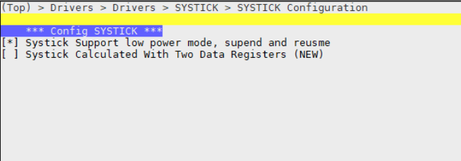

The specific descriptions of the configuration macros are shown in [Table 1](#table16629938173916).

**Table 1**  SYSTICK macro descriptions

<a name="table16629938173916"></a>
<table><thead align="left"><tr id="row1462913813915"><th class="cellrowborder" valign="top" width="22.62773722627738%" id="mcps1.2.7.1.1"><p id="p1962923853920"><a name="p1962923853920"></a><a name="p1962923853920"></a>Macro name (CONFIG_ is the prefix added by default)</p>
</th>
<th class="cellrowborder" valign="top" width="21.137886211378866%" id="mcps1.2.7.1.2"><p id="p962916388395"><a name="p962916388395"></a><a name="p962916388395"></a>Specific description displayed on the Kconfig interface</p>
</th>
<th class="cellrowborder" valign="top" width="19.878012198780127%" id="mcps1.2.7.1.3"><p id="p18731420115119"><a name="p18731420115119"></a><a name="p18731420115119"></a>Usage scenario</p>
</th>
<th class="cellrowborder" valign="top" width="10.618938106189384%" id="mcps1.2.7.1.4"><p id="p537485457"><a name="p537485457"></a><a name="p537485457"></a>Implemented</p>
</th>
<th class="cellrowborder" valign="top" width="11.338866113388663%" id="mcps1.2.7.1.5"><p id="p1162915382392"><a name="p1162915382392"></a><a name="p1162915382392"></a>Depends on other macros</p>
</th>
<th class="cellrowborder" valign="top" width="14.398560143985604%" id="mcps1.2.7.1.6"><p id="p1449914917569"><a name="p1449914917569"></a><a name="p1449914917569"></a>Whether to enable or modify the configuration</p>
</th>
</tr>
</thead>
<tbody><tr id="row16629338103916"><td class="cellrowborder" valign="top" width="22.62773722627738%" headers="mcps1.2.7.1.1 "><p id="p166291338133910"><a name="p166291338133910"></a><a name="p166291338133910"></a>CONFIG_SYSTICK_SUPPORT_LPM</p>
</td>
<td class="cellrowborder" valign="top" width="21.137886211378866%" headers="mcps1.2.7.1.2 "><p id="p205561537172212"><a name="p205561537172212"></a><a name="p205561537172212"></a>Systick support low power mode, supend and reusme.</p>
</td>
<td class="cellrowborder" valign="top" width="19.878012198780127%" headers="mcps1.2.7.1.3 "><p id="p1746412917425"><a name="p1746412917425"></a><a name="p1746412917425"></a>This macro is used only in low-power scenarios.</p>
</td>
<td class="cellrowborder" valign="top" width="10.618938106189384%" headers="mcps1.2.7.1.4 "><p id="p166297382397"><a name="p166297382397"></a><a name="p166297382397"></a>Yes</p>
</td>
<td class="cellrowborder" valign="top" width="11.338866113388663%" headers="mcps1.2.7.1.5 "><p id="p162983873917"><a name="p162983873917"></a><a name="p162983873917"></a>No</p>
</td>
<td class="cellrowborder" valign="top" width="14.398560143985604%" headers="mcps1.2.7.1.6 "><p id="p997411916292"><a name="p997411916292"></a><a name="p997411916292"></a>Enabled by default. Enable it as appropriate; it is recommended to enable it.</p>
</td>
</tr>
<tr id="row166299383394"><td class="cellrowborder" valign="top" width="22.62773722627738%" headers="mcps1.2.7.1.1 "><p id="p14629173813920"><a name="p14629173813920"></a><a name="p14629173813920"></a>CONFIG_SYSTICK_WITH_TWO_DATA_REGS</p>
</td>
<td class="cellrowborder" valign="top" width="21.137886211378866%" headers="mcps1.2.7.1.2 "><p id="p4944112916213"><a name="p4944112916213"></a><a name="p4944112916213"></a>Systick calculated with two data registers.</p>
</td>
<td class="cellrowborder" valign="top" width="19.878012198780127%" headers="mcps1.2.7.1.3 "><p id="p118818331937"><a name="p118818331937"></a><a name="p118818331937"></a>This macro indicates using two data registers to calculate data</p>
</td>
<td class="cellrowborder" valign="top" width="10.618938106189384%" headers="mcps1.2.7.1.4 "><p id="p166291838143916"><a name="p166291838143916"></a><a name="p166291838143916"></a>Yes</p>
</td>
<td class="cellrowborder" valign="top" width="11.338866113388663%" headers="mcps1.2.7.1.5 "><p id="p104251259727"><a name="p104251259727"></a><a name="p104251259727"></a>No</p>
</td>
<td class="cellrowborder" valign="top" width="14.398560143985604%" headers="mcps1.2.7.1.6 "><p id="p165302711299"><a name="p165302711299"></a><a name="p165302711299"></a>Disabled by default. It is recommended to disable it.</p>
</td>
</tr>
</tbody>
</table>

## Development Guide<a name="ZH-CN_TOPIC_0000001665143738"></a>

1.  Call the uapi\_systick\_init interface to initialize the Systick module.
2.  Call the uapi\_systick\_get\_count interface to obtain the current Systick count value.
3.  Call the uapi\_systick\_delay\_ms interface to delay the time passed in the input parameter.
4.  Call the uapi\_systick\_get\_count interface again to obtain the current Systick count value.

Example:

```
#include "systick.h"
void test_systick_sample(void)
{
    uint64_t count_before_delay_count;
    uint64_t count_after_delay_count;
    /* Initialize the systick module */
    uapi_systick_init();
    /* Verify the delay time through the difference of count values */
    count_before_delay_count= uapi_systick_get_count();
    uapi_systick_delay_ms(1000);
    count_after_delay_count = uapi_systick_get_count();
    osal_printk("test case delay count %lu.\r\n", count_before_delay_count - count_after_delay_count);
}
```

## Precautions<a name="ZH-CN_TOPIC_0000001664984010"></a>

-   The Systick clock source uses the external 32.768k or internal 32k clock. The minimum counting unit is about 30μs. Pay attention when using the μs delay interface.
-   Systick is generally used to provide a stable clock signal as the reference clock of the entire microcontroller system. For high-precision delays, use TCXO.

# TCXO<a name="ZH-CN_TOPIC_0000001664983986"></a>


## Overview<a name="ZH-CN_TOPIC_0000001664984002"></a>

TCXO (Temperature Compensated Crystal Oscillator) is a temperature-compensated crystal oscillator. It reduces the impact of temperature on the oscillation frequency by introducing a temperature sensor and a temperature compensation circuit into the circuit, thereby providing a more stable clock signal. The chip has a built-in TCXO crystal oscillator and its counting unit, used for counting and delay. Users can also modify the clock configuration to use an external crystal oscillator as the clock input of the TCXO counting unit. The TCXO specifications are as follows:

-   The internal TCXO is up to 32 MHz, and the minimum counting unit is about 32 ns.
-   The TCXO counter provides two 32-bit registers for storing count values, with a maximum count of 2^64-1.

## Function Description<a name="ZH-CN_TOPIC_0000001664983998"></a>

The interfaces and functions provided by the TCXO module are as follows:

-   uapi\_tcxo\_init（void）：Initializes the TCXO.
-   uapi\_tcxo\_deinit（void）：Deinitializes the TCXO.
-   uapi\_tcxo\_get\_count（void）：Obtains the TCXO count value.
-   uapi\_tcxo\_get\_ms（void）：Obtains the TCXO count value in milliseconds.
-   uapi\_tcxo\_get\_us（void）：Obtains the TCXO count value in microseconds.
-   uapi\_tcxo\_delay\_ms（uint32\_t m\_delay）：Sets the delay in milliseconds（m\_delay indicates the delay in milliseconds）.
-   uapi\_tcxo\_delay\_us（uint32\_t u\_delay）：Sets the delay in microseconds（u\_delay indicates the delay in microseconds）.
-   uapi\_tcxo\_suspend（uintptr\_t arg）：Suspends the TCXO module for low-power scenarios（arg indicates the parameters required for suspension）.(It can be used only when the CONFIG\_TCXO\_SUPPORT\_LPM macro is enabled.)
-   uapi\_tcxo\_resume（uintptr\_t arg）：Resumes the TCXO module for low-power scenarios（arg indicates the parameters required for resume）.(It can be used only when the CONFIG\_TCXO\_SUPPORT\_LPM macro is enabled.)

## KCONFIG Configuration<a name="ZH-CN_TOPIC_0000001896053322"></a>

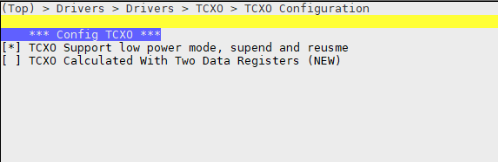

The specific descriptions of the configuration macros are shown in [Table 1](#table16629938173916).

**Table 1**  TCXO macro descriptions

<a name="table16629938173916"></a>
<table><thead align="left"><tr id="row1462913813915"><th class="cellrowborder" valign="top" width="22.62773722627738%" id="mcps1.2.7.1.1"><p id="p1962923853920"><a name="p1962923853920"></a><a name="p1962923853920"></a>Macro name (CONFIG_ is the prefix added by default)</p>
</th>
<th class="cellrowborder" valign="top" width="21.137886211378866%" id="mcps1.2.7.1.2"><p id="p962916388395"><a name="p962916388395"></a><a name="p962916388395"></a>Specific description displayed on the Kconfig interface</p>
</th>
<th class="cellrowborder" valign="top" width="19.878012198780127%" id="mcps1.2.7.1.3"><p id="p18731420115119"><a name="p18731420115119"></a><a name="p18731420115119"></a>Usage scenario</p>
</th>
<th class="cellrowborder" valign="top" width="10.618938106189384%" id="mcps1.2.7.1.4"><p id="p537485457"><a name="p537485457"></a><a name="p537485457"></a>Implemented</p>
</th>
<th class="cellrowborder" valign="top" width="11.338866113388663%" id="mcps1.2.7.1.5"><p id="p1162915382392"><a name="p1162915382392"></a><a name="p1162915382392"></a>Depends on other macros</p>
</th>
<th class="cellrowborder" valign="top" width="14.398560143985604%" id="mcps1.2.7.1.6"><p id="p1449914917569"><a name="p1449914917569"></a><a name="p1449914917569"></a>Whether to enable or modify the configuration</p>
</th>
</tr>
</thead>
<tbody><tr id="row16629338103916"><td class="cellrowborder" valign="top" width="22.62773722627738%" headers="mcps1.2.7.1.1 "><p id="p166291338133910"><a name="p166291338133910"></a><a name="p166291338133910"></a>CONFIG_TCXO_SUPPORT_LPM</p>
</td>
<td class="cellrowborder" valign="top" width="21.137886211378866%" headers="mcps1.2.7.1.2 "><p id="p205561537172212"><a name="p205561537172212"></a><a name="p205561537172212"></a>TCXO support low power mode, supend and reusme.</p>
</td>
<td class="cellrowborder" valign="top" width="19.878012198780127%" headers="mcps1.2.7.1.3 "><p id="p1746412917425"><a name="p1746412917425"></a><a name="p1746412917425"></a>This macro is used only in low-power scenarios.</p>
</td>
<td class="cellrowborder" valign="top" width="10.618938106189384%" headers="mcps1.2.7.1.4 "><p id="p166297382397"><a name="p166297382397"></a><a name="p166297382397"></a>Yes</p>
</td>
<td class="cellrowborder" valign="top" width="11.338866113388663%" headers="mcps1.2.7.1.5 "><p id="p162983873917"><a name="p162983873917"></a><a name="p162983873917"></a>No</p>
</td>
<td class="cellrowborder" valign="top" width="14.398560143985604%" headers="mcps1.2.7.1.6 "><p id="p997411916292"><a name="p997411916292"></a><a name="p997411916292"></a>Enabled by default. Enable it as appropriate; it is recommended to enable it.</p>
</td>
</tr>
<tr id="row166299383394"><td class="cellrowborder" valign="top" width="22.62773722627738%" headers="mcps1.2.7.1.1 "><p id="p14629173813920"><a name="p14629173813920"></a><a name="p14629173813920"></a>CONFIG_TCXO_WITH_TWO_DATA_REGS</p>
</td>
<td class="cellrowborder" valign="top" width="21.137886211378866%" headers="mcps1.2.7.1.2 "><p id="p14167949112712"><a name="p14167949112712"></a><a name="p14167949112712"></a>TCXO calculated with two data registers.</p>
</td>
<td class="cellrowborder" valign="top" width="19.878012198780127%" headers="mcps1.2.7.1.3 "><p id="p118818331937"><a name="p118818331937"></a><a name="p118818331937"></a>This macro indicates using two data registers to calculate data</p>
</td>
<td class="cellrowborder" valign="top" width="10.618938106189384%" headers="mcps1.2.7.1.4 "><p id="p166291838143916"><a name="p166291838143916"></a><a name="p166291838143916"></a>Yes</p>
</td>
<td class="cellrowborder" valign="top" width="11.338866113388663%" headers="mcps1.2.7.1.5 "><p id="p104251259727"><a name="p104251259727"></a><a name="p104251259727"></a>No</p>
</td>
<td class="cellrowborder" valign="top" width="14.398560143985604%" headers="mcps1.2.7.1.6 "><p id="p165302711299"><a name="p165302711299"></a><a name="p165302711299"></a>Disabled by default. It is recommended to disable it.</p>
</td>
</tr>
</tbody>
</table>

## Development Guide<a name="ZH-CN_TOPIC_0000001665143770"></a>

1.  Call the uapi\_tcxo\_init interface to initialize the TCXO module.
2.  Call the uapi\_tcxo\_get\_count interface to obtain the current TCXO count value.
3.  Call the uapi\_tcxo\_delay\_ms interface to delay the time passed in the input parameter.

Example:

```
#include "tcxo.h"
void test_tcxo_sample(void)
{
    uint64_t count_before_delay_count;
    uint64_t count_after_delay_count;
    /* Initialize the tcxo module */
    uapi_tcxo_init();
    /* Verify the delay time through the difference of count values */
    count_before_delay_count = uapi_tcxo_get_count();
    uapi_tcxo_delay_ms(1000);
    count_after_delay_count= uapi_tcxo_get_count();
    osal_printk("test case delay count %lu.\r\n", count_before_delay_count - count_after_delay_count);
    return;
}
```

## Precautions<a name="ZH-CN_TOPIC_0000001713023557"></a>

None.

# Flash<a name="ZH-CN_TOPIC_0000001664983962"></a>


## Overview<a name="ZH-CN_TOPIC_0000001664983978"></a>

Flash is a non-volatile flash memory technology, also called flash memory, which usually supports the SPI protocol. Flash can implement various commands such as read, write, and erase through the SPI protocol.

## Function Description<a name="ZH-CN_TOPIC_0000001664983990"></a>

The interfaces and functions provided by the Flash module are as follows:

-   uapi\_flash\_init（flash\_id\_t id）：Initializes the Flash（id indicates the flash id）.
-   uapi\_flash\_deinit（flash\_id\_t id）：Deinitializes the Flash（id indicates the flash id）.
-   uapi\_flash\_write\_data（flash\_id\_t id, uint32\_t addr, const uint8\_t \*src, uint32\_t length）：Writes data to the Flash（id indicates the flash id，addr indicates the flash write address，src indicates the data address，length indicates the data length）.
-   uapi\_flash\_write\_data\_without\_align（flash\_id\_t id, uint32\_t addr, const uint8\_t \*src, uint32\_t length）：Writes data to the Flash at an unaligned address（id indicates the flash id，addr indicates the flash write address，src indicates the data address，length indicates the data length）.
-   uapi\_flash\_read\_data（flash\_id\_t id, uint32\_t addr, uint8\_t \*dst, uint32\_t length）：Reads data from the Flash（id indicates the flash id，addr indicates the flash read address，dst indicates the data address，length indicates the data length）.
-   uapi\_flash\_read\_data\_without\_align（flash\_id\_t id, uint32\_t addr, uint8\_t \*dst, uint32\_t length）：Reads data from the Flash at an unaligned address（id indicates the flash id，addr indicates the flash read address，dst indicates the data address，length indicates the data length）.
-   uapi\_flash\_chip\_erase（flash\_id\_t id）：Erases the data of the entire Flash chip（id indicates the flash id）.
-   uapi\_flash\_block\_erase（flash\_id\_t id, uint32\_t addr, uint32\_t length, bool is\_wait）：Erases Flash data by block（id indicates the flash id，addr indicates the flash erase address，length indicates the erase length，is\_wait indicates whether to wait for the erase to complete）.
-   uapi\_flash\_sector\_erase（flash\_id\_t id, uint32\_t addr, bool is\_wait）：Erases Flash data by sector（id indicates the flash id，addr indicates the flash erase address，is\_wait indicates whether to wait for the erase to complete）.
-   uapi\_flash\_suspend（flash\_id\_t id）：Puts the Flash to sleep（id indicates the flash id）.
-   uapi\_flash\_resume（flash\_id\_t id）：Wakes up the Flash from sleep（id indicates the flash id）.
-   uapi\_flash\_switch\_to\_deeppower（flash\_id\_t id）：Makes the Flash enter deep power-down mode（id indicates the flash id）.
-   uapi\_flash\_resume\_from\_deeppower（flash\_id\_t id）：Wakes up the Flash from deep power-down mode（id indicates the flash id）.
-   uapi\_flash\_read\_security\_status（flash\_id\_t id, uint8\_t \*read\_data）：Reads the Flash security register status（id indicates the flash id，read\_data indicates the read data）.
-   uapi\_flash\_send\_cmd\_exe（flash\_id\_t id, flash\_cmd\_exe\_t \*cmd\_exe）：Sends a command to the Flash（id indicates the flash id，cmd\_exe indicates the flash command）.
-   uapi\_flash\_get\_info（flash\_id\_t id, flash\_info\_t \*flash\_info）：Obtains the current Flash information（id indicates the flash id，flash\_info indicates the flash information）.
-   uapi\_flash\_reset（flash\_id\_t id）：Resets the Flash（id indicates the flash id）.
-   uapi\_flash\_is\_processing（flash\_id\_t id）：Checks whether the Flash is working（id indicates the flash id）.
-   uapi\_flash\_read\_id（flash\_id\_t id, uint32\_t \*manufacture\_id）：Reads the Flash manufacturer ID（id indicates the flash id，manufacture\_id indicates the flash manufacturer id）.
-   uapi\_flash\_read\_unique\_id\(flash\_id\_t id, uint8\_t \*unique\_id：Reads the Flash unique ID（id indicates the flash id，manufacture\_id indicates the flash unique id）.
-   uapi\_flash\_read\_device\_id（flash\_id\_t id, uint16\_t \*device\_id）：Reads the Flash device ID（id indicates the flash id，device\_id indicates the flash device id）.
-   uapi\_flash\_read\_status（flash\_id\_t id, uint8\_t \*status）：Reads the Flash status and waits for idle（id indicates the flash id，status indicates the flash status）.
-   uapi\_flash\_save\_manufacture（flash\_id\_t id, uint32\_t manufacture\_id）：Saves the Flash manufacturer ID（id indicates the flash id，manufacture\_id indicates the flash manufacturer id）.
-   uapi\_flash\_set\_spi\_baud（flash\_id\_t id, uint32\_t bus\_clk, uint32\_t freq\_mhz）：Sets the SPI baud rate（id indicates the flash id，bus\_clk indicates the bus clock，freq\_mhz indicates the SPI working clock frequency）.

## KCONFIG Configuration<a name="ZH-CN_TOPIC_0000001989357845"></a>

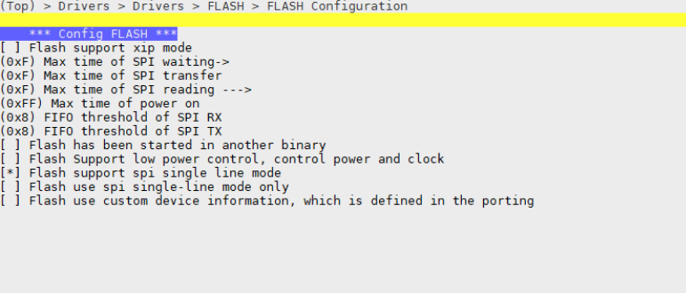

The specific descriptions of the configuration macros are shown in [Table 1](#table16629938173916).

**Table 1**  FLASH macro descriptions

<a name="table16629938173916"></a>
<table><thead align="left"><tr id="row1462913813915"><th class="cellrowborder" valign="top" width="22.62773722627738%" id="mcps1.2.7.1.1"><p id="p1962923853920"><a name="p1962923853920"></a><a name="p1962923853920"></a>Macro name (CONFIG_ is the prefix added by default)</p>
</th>
<th class="cellrowborder" valign="top" width="21.137886211378866%" id="mcps1.2.7.1.2"><p id="p962916388395"><a name="p962916388395"></a><a name="p962916388395"></a>Specific description displayed on the Kconfig interface</p>
</th>
<th class="cellrowborder" valign="top" width="19.878012198780127%" id="mcps1.2.7.1.3"><p id="p18731420115119"><a name="p18731420115119"></a><a name="p18731420115119"></a>Usage scenario</p>
</th>
<th class="cellrowborder" valign="top" width="10.618938106189384%" id="mcps1.2.7.1.4"><p id="p537485457"><a name="p537485457"></a><a name="p537485457"></a>Implemented</p>
</th>
<th class="cellrowborder" valign="top" width="11.338866113388663%" id="mcps1.2.7.1.5"><p id="p1162915382392"><a name="p1162915382392"></a><a name="p1162915382392"></a>Depends on other macros</p>
</th>
<th class="cellrowborder" valign="top" width="14.398560143985604%" id="mcps1.2.7.1.6"><p id="p1449914917569"><a name="p1449914917569"></a><a name="p1449914917569"></a>Whether to enable or modify the configuration</p>
</th>
</tr>
</thead>
<tbody><tr id="row16629338103916"><td class="cellrowborder" valign="top" width="22.62773722627738%" headers="mcps1.2.7.1.1 "><p id="p166291338133910"><a name="p166291338133910"></a><a name="p166291338133910"></a>CONFIG_FLASH_SUPPORT_XIP</p>
</td>
<td class="cellrowborder" valign="top" width="21.137886211378866%" headers="mcps1.2.7.1.2 "><p id="p205561537172212"><a name="p205561537172212"></a><a name="p205561537172212"></a>Flash support xip mode.</p>
</td>
<td class="cellrowborder" valign="top" width="19.878012198780127%" headers="mcps1.2.7.1.3 "><p id="p1746412917425"><a name="p1746412917425"></a><a name="p1746412917425"></a>Flash supports XIP mode, not used in this product</p>
</td>
<td class="cellrowborder" valign="top" width="10.618938106189384%" headers="mcps1.2.7.1.4 "><p id="p166297382397"><a name="p166297382397"></a><a name="p166297382397"></a>Yes</p>
</td>
<td class="cellrowborder" valign="top" width="11.338866113388663%" headers="mcps1.2.7.1.5 "><p id="p162983873917"><a name="p162983873917"></a><a name="p162983873917"></a>No</p>
</td>
<td class="cellrowborder" valign="top" width="14.398560143985604%" headers="mcps1.2.7.1.6 "><p id="p997411916292"><a name="p997411916292"></a><a name="p997411916292"></a>Disabled by default. It is not actually used in this product. It is recommended to disable it.</p>
</td>
</tr>
<tr id="row166299383394"><td class="cellrowborder" valign="top" width="22.62773722627738%" headers="mcps1.2.7.1.1 "><p id="p14629173813920"><a name="p14629173813920"></a><a name="p14629173813920"></a>CONFIG_SPI_WAIT_FIFO_LONG_TIMEOUT</p>
</td>
<td class="cellrowborder" valign="top" width="21.137886211378866%" headers="mcps1.2.7.1.2 "><p id="p815093564710"><a name="p815093564710"></a><a name="p815093564710"></a>Max time of SPI waiting.</p>
</td>
<td class="cellrowborder" valign="top" width="19.878012198780127%" headers="mcps1.2.7.1.3 "><p id="p118818331937"><a name="p118818331937"></a><a name="p118818331937"></a>Maximum SPI waiting timeout</p>
</td>
<td class="cellrowborder" valign="top" width="10.618938106189384%" headers="mcps1.2.7.1.4 "><p id="p166291838143916"><a name="p166291838143916"></a><a name="p166291838143916"></a>Yes</p>
</td>
<td class="cellrowborder" valign="top" width="11.338866113388663%" headers="mcps1.2.7.1.5 "><p id="p104251259727"><a name="p104251259727"></a><a name="p104251259727"></a>No</p>
</td>
<td class="cellrowborder" valign="top" width="14.398560143985604%" headers="mcps1.2.7.1.6 "><p id="p97001027124119"><a name="p97001027124119"></a><a name="p97001027124119"></a>The default value is 0xF. It is recommended not to modify it.</p>
</td>
</tr>
<tr id="row987405934816"><td class="cellrowborder" valign="top" width="22.62773722627738%" headers="mcps1.2.7.1.1 "><p id="p91931020155011"><a name="p91931020155011"></a><a name="p91931020155011"></a>CONFIG_SPI_TRAN_MAX_TIMEOUT</p>
</td>
<td class="cellrowborder" valign="top" width="21.137886211378866%" headers="mcps1.2.7.1.2 "><p id="p1487519596487"><a name="p1487519596487"></a><a name="p1487519596487"></a>Max time of SPI transfer.</p>
</td>
<td class="cellrowborder" valign="top" width="19.878012198780127%" headers="mcps1.2.7.1.3 "><p id="p1487535944815"><a name="p1487535944815"></a><a name="p1487535944815"></a>Maximum SPI transfer timeout</p>
</td>
<td class="cellrowborder" valign="top" width="10.618938106189384%" headers="mcps1.2.7.1.4 "><p id="p1169992145119"><a name="p1169992145119"></a><a name="p1169992145119"></a>Yes</p>
</td>
<td class="cellrowborder" valign="top" width="11.338866113388663%" headers="mcps1.2.7.1.5 "><p id="p13805209155118"><a name="p13805209155118"></a><a name="p13805209155118"></a>No</p>
</td>
<td class="cellrowborder" valign="top" width="14.398560143985604%" headers="mcps1.2.7.1.6 "><p id="p8875145915486"><a name="p8875145915486"></a><a name="p8875145915486"></a>The default value is 0xF. It is recommended not to modify it.</p>
</td>
</tr>
<tr id="row1117187104919"><td class="cellrowborder" valign="top" width="22.62773722627738%" headers="mcps1.2.7.1.1 "><p id="p1758216226512"><a name="p1758216226512"></a><a name="p1758216226512"></a>CONFIG_SPI_WAIT_READ_TIMEOUT</p>
</td>
<td class="cellrowborder" valign="top" width="21.137886211378866%" headers="mcps1.2.7.1.2 "><p id="p411727104913"><a name="p411727104913"></a><a name="p411727104913"></a>Max time of SPI reading.</p>
</td>
<td class="cellrowborder" valign="top" width="19.878012198780127%" headers="mcps1.2.7.1.3 "><p id="p0117277493"><a name="p0117277493"></a><a name="p0117277493"></a>Maximum SPI data read timeout</p>
</td>
<td class="cellrowborder" valign="top" width="10.618938106189384%" headers="mcps1.2.7.1.4 "><p id="p05781317514"><a name="p05781317514"></a><a name="p05781317514"></a>Yes</p>
</td>
<td class="cellrowborder" valign="top" width="11.338866113388663%" headers="mcps1.2.7.1.5 "><p id="p14453121114511"><a name="p14453121114511"></a><a name="p14453121114511"></a>No</p>
</td>
<td class="cellrowborder" valign="top" width="14.398560143985604%" headers="mcps1.2.7.1.6 "><p id="p2011714713496"><a name="p2011714713496"></a><a name="p2011714713496"></a>The default value is 0xF. It is recommended not to modify it.</p>
</td>
</tr>
<tr id="row181391113491"><td class="cellrowborder" valign="top" width="22.62773722627738%" headers="mcps1.2.7.1.1 "><p id="p12139141154911"><a name="p12139141154911"></a><a name="p12139141154911"></a>CONFIG_FLASH_POWER_ON_TIMEOUT</p>
</td>
<td class="cellrowborder" valign="top" width="21.137886211378866%" headers="mcps1.2.7.1.2 "><p id="p913911194915"><a name="p913911194915"></a><a name="p913911194915"></a>Max time of power on.</p>
</td>
<td class="cellrowborder" valign="top" width="19.878012198780127%" headers="mcps1.2.7.1.3 "><p id="p181391811124914"><a name="p181391811124914"></a><a name="p181391811124914"></a>Maximum Flash power-on timeout</p>
</td>
<td class="cellrowborder" valign="top" width="10.618938106189384%" headers="mcps1.2.7.1.4 "><p id="p136210415120"><a name="p136210415120"></a><a name="p136210415120"></a>Yes</p>
</td>
<td class="cellrowborder" valign="top" width="11.338866113388663%" headers="mcps1.2.7.1.5 "><p id="p12850121016519"><a name="p12850121016519"></a><a name="p12850121016519"></a>No</p>
</td>
<td class="cellrowborder" valign="top" width="14.398560143985604%" headers="mcps1.2.7.1.6 "><p id="p14139311164910"><a name="p14139311164910"></a><a name="p14139311164910"></a>The default value is 0xFF. It is recommended not to modify it.</p>
</td>
</tr>
<tr id="row6148111564916"><td class="cellrowborder" valign="top" width="22.62773722627738%" headers="mcps1.2.7.1.1 "><p id="p10148171515498"><a name="p10148171515498"></a><a name="p10148171515498"></a>CONFIG_SPI_RX_FIFO_THRESHOLD</p>
</td>
<td class="cellrowborder" valign="top" width="21.137886211378866%" headers="mcps1.2.7.1.2 "><p id="p21481815204919"><a name="p21481815204919"></a><a name="p21481815204919"></a>FIFO threshold of SPI RX.</p>
</td>
<td class="cellrowborder" valign="top" width="19.878012198780127%" headers="mcps1.2.7.1.3 "><p id="p6148111554917"><a name="p6148111554917"></a><a name="p6148111554917"></a>SPI RX FIFO waterline</p>
</td>
<td class="cellrowborder" valign="top" width="10.618938106189384%" headers="mcps1.2.7.1.4 "><p id="p122759535118"><a name="p122759535118"></a><a name="p122759535118"></a>Yes</p>
</td>
<td class="cellrowborder" valign="top" width="11.338866113388663%" headers="mcps1.2.7.1.5 "><p id="p153123121515"><a name="p153123121515"></a><a name="p153123121515"></a>No</p>
</td>
<td class="cellrowborder" valign="top" width="14.398560143985604%" headers="mcps1.2.7.1.6 "><p id="p014821513494"><a name="p014821513494"></a><a name="p014821513494"></a>The default value is 0x8. It is recommended not to modify it.</p>
</td>
</tr>
<tr id="row589491834910"><td class="cellrowborder" valign="top" width="22.62773722627738%" headers="mcps1.2.7.1.1 "><p id="p1989471864918"><a name="p1989471864918"></a><a name="p1989471864918"></a>CONFIG_SPI_TX_FIFO_THRESHOLD</p>
</td>
<td class="cellrowborder" valign="top" width="21.137886211378866%" headers="mcps1.2.7.1.2 "><p id="p848384635420"><a name="p848384635420"></a><a name="p848384635420"></a>FIFO threshold of SPI TX.</p>
</td>
<td class="cellrowborder" valign="top" width="19.878012198780127%" headers="mcps1.2.7.1.3 "><p id="p138075213543"><a name="p138075213543"></a><a name="p138075213543"></a>SPI TX FIFO waterline</p>
</td>
<td class="cellrowborder" valign="top" width="10.618938106189384%" headers="mcps1.2.7.1.4 "><p id="p49001257515"><a name="p49001257515"></a><a name="p49001257515"></a>Yes</p>
</td>
<td class="cellrowborder" valign="top" width="11.338866113388663%" headers="mcps1.2.7.1.5 "><p id="p17991141205114"><a name="p17991141205114"></a><a name="p17991141205114"></a>No</p>
</td>
<td class="cellrowborder" valign="top" width="14.398560143985604%" headers="mcps1.2.7.1.6 "><p id="p1889411180497"><a name="p1889411180497"></a><a name="p1889411180497"></a>The default value is 0x8. It is recommended not to modify it.</p>
</td>
</tr>
<tr id="row20484202318497"><td class="cellrowborder" valign="top" width="22.62773722627738%" headers="mcps1.2.7.1.1 "><p id="p11484142344916"><a name="p11484142344916"></a><a name="p11484142344916"></a>CONFIG_FLASH_ALREADY_START</p>
</td>
<td class="cellrowborder" valign="top" width="21.137886211378866%" headers="mcps1.2.7.1.2 "><p id="p2484323184915"><a name="p2484323184915"></a><a name="p2484323184915"></a>Flash has been started in another binary.</p>
</td>
<td class="cellrowborder" valign="top" width="19.878012198780127%" headers="mcps1.2.7.1.3 "><p id="p148472334912"><a name="p148472334912"></a><a name="p148472334912"></a>This macro indicates that the Flash has been enabled and does not need to be configured again. Not used in this product.</p>
</td>
<td class="cellrowborder" valign="top" width="10.618938106189384%" headers="mcps1.2.7.1.4 "><p id="p8589186125116"><a name="p8589186125116"></a><a name="p8589186125116"></a>No</p>
</td>
<td class="cellrowborder" valign="top" width="11.338866113388663%" headers="mcps1.2.7.1.5 "><p id="p665020131511"><a name="p665020131511"></a><a name="p665020131511"></a>No</p>
</td>
<td class="cellrowborder" valign="top" width="14.398560143985604%" headers="mcps1.2.7.1.6 "><p id="p154841523134912"><a name="p154841523134912"></a><a name="p154841523134912"></a>Disabled by default. It is not yet used in this product. It is recommended to disable it.</p>
</td>
</tr>
<tr id="row121856369581"><td class="cellrowborder" valign="top" width="22.62773722627738%" headers="mcps1.2.7.1.1 "><p id="p10185113665819"><a name="p10185113665819"></a><a name="p10185113665819"></a>CONFIG_FLASH_SUPPORT_LPC</p>
</td>
<td class="cellrowborder" valign="top" width="21.137886211378866%" headers="mcps1.2.7.1.2 "><p id="p4185123695818"><a name="p4185123695818"></a><a name="p4185123695818"></a>Flash support low power control, control power and clock.</p>
</td>
<td class="cellrowborder" valign="top" width="19.878012198780127%" headers="mcps1.2.7.1.3 "><p id="p1218643665815"><a name="p1218643665815"></a><a name="p1218643665815"></a>This macro is used only in low-power scenarios.</p>
</td>
<td class="cellrowborder" valign="top" width="10.618938106189384%" headers="mcps1.2.7.1.4 "><p id="p318683695810"><a name="p318683695810"></a><a name="p318683695810"></a>Yes</p>
</td>
<td class="cellrowborder" valign="top" width="11.338866113388663%" headers="mcps1.2.7.1.5 "><p id="p1218617361580"><a name="p1218617361580"></a><a name="p1218617361580"></a>No</p>
</td>
<td class="cellrowborder" valign="top" width="14.398560143985604%" headers="mcps1.2.7.1.6 "><p id="p181861436195817"><a name="p181861436195817"></a><a name="p181861436195817"></a>Disabled by default. Enable it as appropriate.</p>
</td>
</tr>
<tr id="row5844174075812"><td class="cellrowborder" valign="top" width="22.62773722627738%" headers="mcps1.2.7.1.1 "><p id="p148441405583"><a name="p148441405583"></a><a name="p148441405583"></a>CONFIG_FLASH_SUPPORT_SPI_SINGLE_LINE_MODE</p>
</td>
<td class="cellrowborder" valign="top" width="21.137886211378866%" headers="mcps1.2.7.1.2 "><p id="p20844114016586"><a name="p20844114016586"></a><a name="p20844114016586"></a>Flash support spi single line mode.</p>
</td>
<td class="cellrowborder" valign="top" width="19.878012198780127%" headers="mcps1.2.7.1.3 "><p id="p118441240205815"><a name="p118441240205815"></a><a name="p118441240205815"></a>Flash supports using the SPI single-line mode, not used in this product</p>
</td>
<td class="cellrowborder" valign="top" width="10.618938106189384%" headers="mcps1.2.7.1.4 "><p id="p17844124075819"><a name="p17844124075819"></a><a name="p17844124075819"></a>No</p>
</td>
<td class="cellrowborder" valign="top" width="11.338866113388663%" headers="mcps1.2.7.1.5 "><p id="p15844154025817"><a name="p15844154025817"></a><a name="p15844154025817"></a>No</p>
</td>
<td class="cellrowborder" valign="top" width="14.398560143985604%" headers="mcps1.2.7.1.6 "><p id="p813510551770"><a name="p813510551770"></a><a name="p813510551770"></a>Enabled by default, but not yet used in this product; it is recommended to disable it.</p>
</td>
</tr>
<tr id="row1185364845816"><td class="cellrowborder" valign="top" width="22.62773722627738%" headers="mcps1.2.7.1.1 "><p id="p285310486584"><a name="p285310486584"></a><a name="p285310486584"></a>CONFIG_FLASH_USE_SPI_SINGLE_LINE_MODE_ONLY</p>
</td>
<td class="cellrowborder" valign="top" width="21.137886211378866%" headers="mcps1.2.7.1.2 "><p id="p1885314895816"><a name="p1885314895816"></a><a name="p1885314895816"></a>Flash use spi single-line mode only.</p>
</td>
<td class="cellrowborder" valign="top" width="19.878012198780127%" headers="mcps1.2.7.1.3 "><p id="p17991333084"><a name="p17991333084"></a><a name="p17991333084"></a>Flash supports only the SPI single-line mode</p>
</td>
<td class="cellrowborder" valign="top" width="10.618938106189384%" headers="mcps1.2.7.1.4 "><p id="p68531848155815"><a name="p68531848155815"></a><a name="p68531848155815"></a>Yes</p>
</td>
<td class="cellrowborder" valign="top" width="11.338866113388663%" headers="mcps1.2.7.1.5 "><p id="p14853748185819"><a name="p14853748185819"></a><a name="p14853748185819"></a>No</p>
</td>
<td class="cellrowborder" valign="top" width="14.398560143985604%" headers="mcps1.2.7.1.6 "><p id="p1764293714815"><a name="p1764293714815"></a><a name="p1764293714815"></a>Disabled by default. Enable it as appropriate.</p>
</td>
</tr>
<tr id="row178031753105817"><td class="cellrowborder" valign="top" width="22.62773722627738%" headers="mcps1.2.7.1.1 "><p id="p1780385305811"><a name="p1780385305811"></a><a name="p1780385305811"></a>CONFIG_FLASH_USE_CUSTOMIZED_DEVICE_INFO</p>
</td>
<td class="cellrowborder" valign="top" width="21.137886211378866%" headers="mcps1.2.7.1.2 "><p id="p680385313586"><a name="p680385313586"></a><a name="p680385313586"></a>Flash use custom device information, which is defined in the porting.</p>
</td>
<td class="cellrowborder" valign="top" width="19.878012198780127%" headers="mcps1.2.7.1.3 "><p id="p168037534585"><a name="p168037534585"></a><a name="p168037534585"></a>Flash uses custom device information</p>
</td>
<td class="cellrowborder" valign="top" width="10.618938106189384%" headers="mcps1.2.7.1.4 "><p id="p158036534582"><a name="p158036534582"></a><a name="p158036534582"></a>Yes</p>
</td>
<td class="cellrowborder" valign="top" width="11.338866113388663%" headers="mcps1.2.7.1.5 "><p id="p1380385355819"><a name="p1380385355819"></a><a name="p1380385355819"></a>No</p>
</td>
<td class="cellrowborder" valign="top" width="14.398560143985604%" headers="mcps1.2.7.1.6 "><p id="p4803253155812"><a name="p4803253155812"></a><a name="p4803253155812"></a>Disabled by default. Enable it as appropriate.</p>
</td>
</tr>
</tbody>
</table>

## Development Guide<a name="ZH-CN_TOPIC_0000001664984022"></a>

The development and adaptation of the external Flash must be selected and adapted by the customer. Part of the reference code is in the files: drivers/chips/bs2x/porting/flash/flash\_porting.c and drivers/chips/bs2x/main\_init/main\_init.c

```
/* drivers/chips/bs2x/porting/flash/flash_porting.c */
static flash_cfg_t g_flash_porting_config[FLASH_MAX] = {
    {
        .isinit = 0,
        .flash_manufacturer = FLASH_MANUFACTURER_MAX,
        .unique_id = 0,
        .bus = SPI_BUS_1,
        .mode = HAL_SPI_FRAME_FORMAT_STANDARD,
        .is_xip = false,
        .attr = {
            .is_slave = false,
            .slave_num = 1,
            .bus_clk = SPI_CLK_FREQ,
            .freq_mhz = 4,
            .clk_polarity = (uint32_t)SPI_CFG_CLK_CPOL_0,
            .clk_phase = (uint32_t)SPI_CFG_CLK_CPHA_0,
            .frame_format = SPI_CFG_FRAME_FORMAT_MOTOROLA_SPI,
            .spi_frame_format = (uint32_t)HAL_SPI_FRAME_FORMAT_STANDARD,
            .frame_size = (uint32_t)HAL_SPI_FRAME_SIZE_8,
            .sste = SPI_CFG_SSTE_DISABLE,
        },
        .extra_attr = {
            .tx_use_dma = false,
            .rx_use_dma = false,
            .qspi_param = { 0 },
        },
    },
};

/* drivers/chips/bs2x/main_init/main_init.c */
static void ota_extern_flash_init(void)
{
#if defined(SUPPORT_EXTERN_FLASH)
    flash_porting_pinmux_cfg(0);
    uint32_t manufacture_id = 0;
    uapi_flash_init(0);
    uapi_flash_read_id(0, &manufacture_id);
    flash_save_manufacturer(0, manufacture_id);
#endif
}

```

**To adapt a newly selected external Flash, you need to maintain the global variable g\_flash\_device\_parameter in drivers/chips/bs2x/porting/flash/flash\_config\_info\_porting.h. The structure type of this global variable is flash\_device\_parameter\_t:**

```
typedef struct flash_device_parameter {
    uint32_t manufacturer_id;                               /*!< @if Eng Flash manufacturer id.
    @else Flash manufacturer id.@endif */
    uint32_t flash_size;                                    /*!< @if Eng Flash size.
    @else Flash size.@endif */
    uint8_t security_reg_cmd;                               /*!< @if Eng Security reg cmd.
    @else Security register command.@endif */
    uint8_t suspend_cmd;                                    /*!< @if Eng Suspend cmd.
    @else Suspend command.@endif */
    uint8_t resume_cmd;                                     /*!< @if Eng Resume cmd.
    @else Resume command.@endif *
}
```

-   manufacturer\_id: It can be read in single-line mode. Send 0x9F to read the id, look it up in the manual, and compare whether the results obtained by the two methods are consistent. The manufacturer\_id locations of some common manufacturers are listed below.

    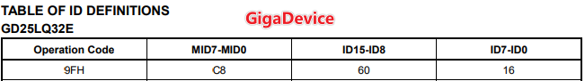

    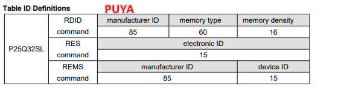

    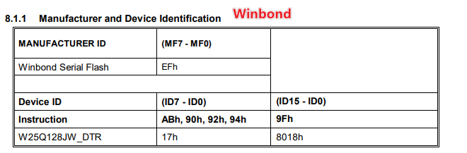

    ```
    uint32_t manufacture_id;
    uapi_flash_init(FLASH_0);
    uapi_flash_read_id(FLASH_0, &manufacture_id);
    ```

-   flash\_size: The total Flash space is usually introduced in Chapter 1

    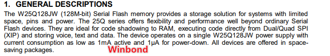

    

    

-   security\_reg\_cmd: The command to read the Flash status register. Search for Read Security Registers in the manual. It can be found in the Commands Table.
-   suspend\_cmd and resume\_cmd: For Flash that supports sleep, search for suspend and resume in the manual. They can be found in the Commands Table.

    **drivers/chips/bs2x/porting/flash/flash\_config\_info\_porting.h also maintains a global variable g\_flash\_need\_set\_qe. This global variable stores the manufacturer id of the Flash that needs to enable the QE bit before enabling quad-line access, and the operation to enable the QE bit. Whether the QE bit needs to be enabled can be determined by searching for Quad Enable \(QE\) in the manual.**

## Precautions<a name="ZH-CN_TOPIC_0000001713023545"></a>

-   XIP mode is not supported.
-   When performing read, write, or erase operations on the Flash, ensure that the Flash has been initialized.
-   Customers need to adapt based on the Flash selection.

# SFC<a name="ZH-CN_TOPIC_0000001664984018"></a>


## Overview<a name="ZH-CN_TOPIC_0000001713023581"></a>

SFC (SPI Flash Controller) is an AHB SPI Flash controller. The Flash mounted on the SFC module can be operated by accessing the SFC mapped address range as an AHB Slave. It also supports accessing the mounted Flash through the APB Slave method in a form similar to traditional SPI.

## Function Description<a name="ZH-CN_TOPIC_0000001713103573"></a>

-   uapi\_sfc\_init（sfc\_flash\_config\_t \*config）: Initializes the SFC module. The configuration parameters include the configuration of the mapped address space and the read/write form（config indicates the initialization parameters）.
-   uapi\_sfc\_init\_rom（sfc\_flash\_config\_t \*config）: Initializes the SFC module in compatibility mode. In this interface, only the mapping\_addr parameter takes effect, and the read/write forms use the common Flash read (0x03) and write (0x02) commands. This configuration is also applied when the return value of uapi\_sfc\_init is ERRCODE\_SFC\_FLASH\_NOT\_SUPPORT (0x80001341)（config indicates the initialization parameters）.
-   uapi\_sfc\_deinit（void）: Deinitializes the SFC driver.
-   uapi\_sfc\_reg\_read（uint32\_t flash\_addr, uint8\_t \*read\_buffer, uint32\_t read\_size）: Provides the read function in register mode. The read data is stored in read\_buffer byte by byte. Do not call it in an interrupt（flash\_addr indicates the first address of the Flash where the data resides，read\_buffer indicates the buffer used to receive data，read\_size indicates the number of bytes to read）.
-   uapi\_sfc\_reg\_write（uint32\_t flash\_addr, uint8\_t \*write\_data, uint32\_t write\_size）: Provides the write function in register mode. The data to be written is stored in write\_data byte by byte. Do not call it in an interrupt（flash\_addr indicates the first address of the target Flash，write\_data indicates the data to be written，write\_size indicates the number of bytes of the written data）.
-   uapi\_sfc\_reg\_erase（uint32\_t flash\_addr, uint32\_t erase\_size）: Erases the Flash in register mode. When write-back is not enabled, the address and size are required to be aligned by sector. Do not call it in an interrupt（flash\_addr indicates the first address to erase，erase\_size indicates the size of the Flash space to erase）.
-   uapi\_sfc\_reg\_erase\_chip（void）: Erases the entire Flash chip in register mode. Do not call it in an interrupt.
-   uapi\_sfc\_regs\_other\_flash\_opt（sfc\_flash\_op\_t cmd\_type, uint8\_t cmd, uint8\_t \*buffer, uint32\_t length）: Reads and writes Flash attributes in register mode. Do not call it in an interrupt（cmd\_type indicates the read/write type of the setting command，cmd indicates the SPI command，buffer indicates the data buffer，length indicates the length of the data to read/write，and its value must be less than 4）.
-   uapi\_sfc\_lock\_protect（sfc\_flash\_protect\_region\_t region）: Enables the SFC write protection（region indicates the Flash protected region）.(It can be used only when the CONFIG\_SFC\_SUPPORT\_WRITE\_PROTECT macro is enabled.)
-   uapi\_sfc\_unlock\_protect（void）: Encapsulated interface to disable the Flash write protection.(It can be used only when the CONFIG\_SFC\_SUPPORT\_WRITE\_PROTECT macro is enabled.)
-   uapi\_sfc\_dma\_write（uint32\_t flash\_addr, uint8\_t \*write\_buffer, uint32\_t write\_size）：Provides the DMA mode write function. The data to be written is stored in write\_buffer byte by byte. Do not call it in an interrupt（flash\_addr indicates the first address of the target Flash，write\_buffer indicates the data to be written，write\_size indicates the number of bytes of the written data）.(It can be used only when the CONFIG\_SFC\_SUPPORT\_DMA macro is enabled.)
-   uapi\_sfc\_dma\_read（uint32\_t flash\_addr, uint8\_t \*read\_buffer, uint32\_t read\_size）：Provides the DMA mode read function. The read data is stored in read\_buffer byte by byte. Do not call it in an interrupt（flash\_addr indicates the first address of the Flash where the data resides，read\_buffer indicates the buffer used to receive data，read\_size indicates the number of bytes to read）.(It can be used only when the CONFIG\_SFC\_SUPPORT\_DMA macro is enabled.)
-   uapi\_sfc\_suspend（uintptr\_t arg）：Suspends the SFC module for low-power scenarios（arg indicates the parameters required for suspension）.(It can be used only when the CONFIG\_SFC\_SUPPORT\_LPM macro is enabled.)
-   uapi\_sfc\_resume（uintptr\_t arg）：Resumes the SFC module for low-power scenarios（arg indicates the parameters required for resume）.(It can be used only when the CONFIG\_SFC\_SUPPORT\_LPM macro is enabled.)

## KCONFIG Configuration<a name="ZH-CN_TOPIC_0000001937055097"></a>

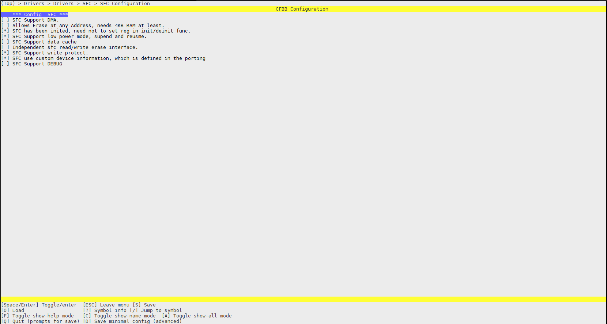

The specific descriptions of the configuration macros are shown in [Table 1](#table16629938173916).

**Table 1**  SFC macro descriptions

<a name="table16629938173916"></a>
<table><thead align="left"><tr id="row1462913813915"><th class="cellrowborder" valign="top" width="22.62773722627737%" id="mcps1.2.7.1.1"><p id="p1962923853920"><a name="p1962923853920"></a><a name="p1962923853920"></a>Macro name (CONFIG_ is the prefix added by default)</p>
</th>
<th class="cellrowborder" valign="top" width="21.10788921107889%" id="mcps1.2.7.1.2"><p id="p962916388395"><a name="p962916388395"></a><a name="p962916388395"></a>Specific description displayed on the Kconfig interface</p>
</th>
<th class="cellrowborder" valign="top" width="19.908009199080094%" id="mcps1.2.7.1.3"><p id="p18731420115119"><a name="p18731420115119"></a><a name="p18731420115119"></a>Usage scenario</p>
</th>
<th class="cellrowborder" valign="top" width="10.608939106089391%" id="mcps1.2.7.1.4"><p id="p537485457"><a name="p537485457"></a><a name="p537485457"></a>Implemented</p>
</th>
<th class="cellrowborder" valign="top" width="11.348865113488651%" id="mcps1.2.7.1.5"><p id="p1162915382392"><a name="p1162915382392"></a><a name="p1162915382392"></a>Depends on other macros</p>
</th>
<th class="cellrowborder" valign="top" width="14.3985601439856%" id="mcps1.2.7.1.6"><p id="p1449914917569"><a name="p1449914917569"></a><a name="p1449914917569"></a>Whether to enable or modify the configuration</p>
</th>
</tr>
</thead>
<tbody><tr id="row16629338103916"><td class="cellrowborder" valign="top" width="22.62773722627737%" headers="mcps1.2.7.1.1 "><p id="p166291338133910"><a name="p166291338133910"></a><a name="p166291338133910"></a>CONFIG_SFC_SUPPORT_DMA</p>
</td>
<td class="cellrowborder" valign="top" width="21.10788921107889%" headers="mcps1.2.7.1.2 "><p id="p205561537172212"><a name="p205561537172212"></a><a name="p205561537172212"></a>SFC support DMA.</p>
</td>
<td class="cellrowborder" valign="top" width="19.908009199080094%" headers="mcps1.2.7.1.3 "><p id="p137814538264"><a name="p137814538264"></a><a name="p137814538264"></a>SFC supports DMA mode. The SFC specification of this product does not support APB_MASTER DMA access, so the uapi_sfc_dma_xxx interfaces under this definition are unavailable.</p>
</td>
<td class="cellrowborder" valign="top" width="10.608939106089391%" headers="mcps1.2.7.1.4 "><p id="p166297382397"><a name="p166297382397"></a><a name="p166297382397"></a>Yes</p>
</td>
<td class="cellrowborder" valign="top" width="11.348865113488651%" headers="mcps1.2.7.1.5 "><p id="p162983873917"><a name="p162983873917"></a><a name="p162983873917"></a>No</p>
</td>
<td class="cellrowborder" valign="top" width="14.3985601439856%" headers="mcps1.2.7.1.6 "><p id="p779420187284"><a name="p779420187284"></a><a name="p779420187284"></a>Disabled by default. It is not actually supported in this product. It is recommended to disable it.</p>
</td>
</tr>
<tr id="row166299383394"><td class="cellrowborder" valign="top" width="22.62773722627737%" headers="mcps1.2.7.1.1 "><p id="p14629173813920"><a name="p14629173813920"></a><a name="p14629173813920"></a>CONFIG_SFC_ALLOW_ERASE_WRITEBACK</p>
</td>
<td class="cellrowborder" valign="top" width="21.10788921107889%" headers="mcps1.2.7.1.2 "><p id="p89961436254"><a name="p89961436254"></a><a name="p89961436254"></a>Allows Erase at Any Address, needs 4KB RAM at least.</p>
</td>
<td class="cellrowborder" valign="top" width="19.908009199080094%" headers="mcps1.2.7.1.3 "><p id="p1850314917285"><a name="p1850314917285"></a><a name="p1850314917285"></a>The erase interface performs automatic write-back internally, requiring 8K of DTCM space as global variables. It is not recommended to enable it for the specification of this product.</p>
</td>
<td class="cellrowborder" valign="top" width="10.608939106089391%" headers="mcps1.2.7.1.4 "><p id="p166291838143916"><a name="p166291838143916"></a><a name="p166291838143916"></a>Yes</p>
</td>
<td class="cellrowborder" valign="top" width="11.348865113488651%" headers="mcps1.2.7.1.5 "><p id="p104251259727"><a name="p104251259727"></a><a name="p104251259727"></a>No</p>
</td>
<td class="cellrowborder" valign="top" width="14.3985601439856%" headers="mcps1.2.7.1.6 "><p id="p165302711299"><a name="p165302711299"></a><a name="p165302711299"></a>Disabled by default. Enable it as appropriate.</p>
</td>
</tr>
<tr id="row4358183692215"><td class="cellrowborder" valign="top" width="22.62773722627737%" headers="mcps1.2.7.1.1 "><p id="p335883682215"><a name="p335883682215"></a><a name="p335883682215"></a>CONFIG_SFC_ALREADY_INIT</p>
</td>
<td class="cellrowborder" valign="top" width="21.10788921107889%" headers="mcps1.2.7.1.2 "><p id="p163581036122213"><a name="p163581036122213"></a><a name="p163581036122213"></a>SFC has been inited, need not to set reg in init/deinit func.</p>
</td>
<td class="cellrowborder" valign="top" width="19.908009199080094%" headers="mcps1.2.7.1.3 "><p id="p10358153642219"><a name="p10358153642219"></a><a name="p10358153642219"></a>This macro indicates that the SFC has been initialized and no repeated operation is performed</p>
</td>
<td class="cellrowborder" valign="top" width="10.608939106089391%" headers="mcps1.2.7.1.4 "><p id="p21931525112314"><a name="p21931525112314"></a><a name="p21931525112314"></a>Yes</p>
</td>
<td class="cellrowborder" valign="top" width="11.348865113488651%" headers="mcps1.2.7.1.5 "><p id="p793553232311"><a name="p793553232311"></a><a name="p793553232311"></a>No</p>
</td>
<td class="cellrowborder" valign="top" width="14.3985601439856%" headers="mcps1.2.7.1.6 "><p id="p10354145515340"><a name="p10354145515340"></a><a name="p10354145515340"></a>Enabled by default. Enable it as appropriate; it is recommended to enable it.</p>
</td>
</tr>
<tr id="row20546154010224"><td class="cellrowborder" valign="top" width="22.62773722627737%" headers="mcps1.2.7.1.1 "><p id="p1154619402221"><a name="p1154619402221"></a><a name="p1154619402221"></a>CONFIG_SFC_SUPPORT_LPM</p>
</td>
<td class="cellrowborder" valign="top" width="21.10788921107889%" headers="mcps1.2.7.1.2 "><p id="p15461140192213"><a name="p15461140192213"></a><a name="p15461140192213"></a>SFC support low power mode, supend and reusme.</p>
</td>
<td class="cellrowborder" valign="top" width="19.908009199080094%" headers="mcps1.2.7.1.3 "><p id="p1746412917425"><a name="p1746412917425"></a><a name="p1746412917425"></a>This macro is used only in low-power scenarios. It supports SFC low-power field save and restore. The low-power process inside the SDK has been implemented by default. When debugging low power consumption, be sure to enable this configuration item.</p>
</td>
<td class="cellrowborder" valign="top" width="10.608939106089391%" headers="mcps1.2.7.1.4 "><p id="p14823162552316"><a name="p14823162552316"></a><a name="p14823162552316"></a>Yes</p>
</td>
<td class="cellrowborder" valign="top" width="11.348865113488651%" headers="mcps1.2.7.1.5 "><p id="p18809333172314"><a name="p18809333172314"></a><a name="p18809333172314"></a>No</p>
</td>
<td class="cellrowborder" valign="top" width="14.3985601439856%" headers="mcps1.2.7.1.6 "><p id="p997411916292"><a name="p997411916292"></a><a name="p997411916292"></a>Enabled by default. Enable it as appropriate; it is recommended to enable it.</p>
</td>
</tr>
<tr id="row13118124518221"><td class="cellrowborder" valign="top" width="22.62773722627737%" headers="mcps1.2.7.1.1 "><p id="p1611815458228"><a name="p1611815458228"></a><a name="p1611815458228"></a>CONFIG_SFC_SUPPORT_DATA_CACHE</p>
</td>
<td class="cellrowborder" valign="top" width="21.10788921107889%" headers="mcps1.2.7.1.2 "><p id="p6118104510227"><a name="p6118104510227"></a><a name="p6118104510227"></a>SFC support data cache.</p>
</td>
<td class="cellrowborder" valign="top" width="19.908009199080094%" headers="mcps1.2.7.1.3 "><p id="p8118194510229"><a name="p8118194510229"></a><a name="p8118194510229"></a>SFC supports data caching</p>
</td>
<td class="cellrowborder" valign="top" width="10.608939106089391%" headers="mcps1.2.7.1.4 "><p id="p86954265232"><a name="p86954265232"></a><a name="p86954265232"></a>Yes</p>
</td>
<td class="cellrowborder" valign="top" width="11.348865113488651%" headers="mcps1.2.7.1.5 "><p id="p16327183415238"><a name="p16327183415238"></a><a name="p16327183415238"></a>No</p>
</td>
<td class="cellrowborder" valign="top" width="14.3985601439856%" headers="mcps1.2.7.1.6 "><p id="p654061114350"><a name="p654061114350"></a><a name="p654061114350"></a>Disabled by default. Enable it as appropriate.</p>
</td>
</tr>
<tr id="row18158164922218"><td class="cellrowborder" valign="top" width="22.62773722627737%" headers="mcps1.2.7.1.1 "><p id="p6158204918223"><a name="p6158204918223"></a><a name="p6158204918223"></a>CONFIG_SFC_SUPPORT_RWE_INDEPENDENT</p>
</td>
<td class="cellrowborder" valign="top" width="21.10788921107889%" headers="mcps1.2.7.1.2 "><p id="p121581549192215"><a name="p121581549192215"></a><a name="p121581549192215"></a>Independent sfc read/write erase interface.</p>
</td>
<td class="cellrowborder" valign="top" width="19.908009199080094%" headers="mcps1.2.7.1.3 "><p id="p31586493228"><a name="p31586493228"></a><a name="p31586493228"></a>Supports independent sfc read/write erase interfaces</p>
</td>
<td class="cellrowborder" valign="top" width="10.608939106089391%" headers="mcps1.2.7.1.4 "><p id="p19395727182320"><a name="p19395727182320"></a><a name="p19395727182320"></a>Yes</p>
</td>
<td class="cellrowborder" valign="top" width="11.348865113488651%" headers="mcps1.2.7.1.5 "><p id="p89401234132319"><a name="p89401234132319"></a><a name="p89401234132319"></a>No</p>
</td>
<td class="cellrowborder" valign="top" width="14.3985601439856%" headers="mcps1.2.7.1.6 "><p id="p0133759123611"><a name="p0133759123611"></a><a name="p0133759123611"></a>Disabled by default. Enable it as appropriate.</p>
</td>
</tr>
<tr id="row1312817533227"><td class="cellrowborder" valign="top" width="22.62773722627737%" headers="mcps1.2.7.1.1 "><p id="p61281653122210"><a name="p61281653122210"></a><a name="p61281653122210"></a>CONFIG_SFC_SUPPORT_WRITE_PROTECT</p>
</td>
<td class="cellrowborder" valign="top" width="21.10788921107889%" headers="mcps1.2.7.1.2 "><p id="p1128135382214"><a name="p1128135382214"></a><a name="p1128135382214"></a>SFC support write protect.</p>
</td>
<td class="cellrowborder" valign="top" width="19.908009199080094%" headers="mcps1.2.7.1.3 "><p id="p15128135342214"><a name="p15128135342214"></a><a name="p15128135342214"></a>Enables the write protection interface encapsulated inside the SDK</p>
</td>
<td class="cellrowborder" valign="top" width="10.608939106089391%" headers="mcps1.2.7.1.4 "><p id="p15153528142319"><a name="p15153528142319"></a><a name="p15153528142319"></a>Yes</p>
</td>
<td class="cellrowborder" valign="top" width="11.348865113488651%" headers="mcps1.2.7.1.5 "><p id="p151321236132315"><a name="p151321236132315"></a><a name="p151321236132315"></a>No</p>
</td>
<td class="cellrowborder" valign="top" width="14.3985601439856%" headers="mcps1.2.7.1.6 "><p id="p91282053102219"><a name="p91282053102219"></a><a name="p91282053102219"></a>Enabled by default. Enable it as appropriate; it is recommended to enable it.</p>
</td>
</tr>
<tr id="row101239583227"><td class="cellrowborder" valign="top" width="22.62773722627737%" headers="mcps1.2.7.1.1 "><p id="p512315872212"><a name="p512315872212"></a><a name="p512315872212"></a>CONFIG_SFC_USE_CUSTOMIZED_DEVICE_INFO</p>
</td>
<td class="cellrowborder" valign="top" width="21.10788921107889%" headers="mcps1.2.7.1.2 "><p id="p1312305815225"><a name="p1312305815225"></a><a name="p1312305815225"></a>SFC use custom device information, which is defined in the porting.</p>
</td>
<td class="cellrowborder" valign="top" width="19.908009199080094%" headers="mcps1.2.7.1.3 "><p id="p01231658102213"><a name="p01231658102213"></a><a name="p01231658102213"></a>When enabled, the custom configuration group adapted in the porting layer is used. When disabled, the default adapted configuration items in include/driver/sfc/sfc_config_info.h inside the SDK are used. The co-packaged Flash has been adapted in the custom configuration group in the SDK. Enable this macro to use it.</p>
</td>
<td class="cellrowborder" valign="top" width="10.608939106089391%" headers="mcps1.2.7.1.4 "><p id="p59541285235"><a name="p59541285235"></a><a name="p59541285235"></a>Yes</p>
</td>
<td class="cellrowborder" valign="top" width="11.348865113488651%" headers="mcps1.2.7.1.5 "><p id="p3945736192320"><a name="p3945736192320"></a><a name="p3945736192320"></a>No</p>
</td>
<td class="cellrowborder" valign="top" width="14.3985601439856%" headers="mcps1.2.7.1.6 "><p id="p15123115817224"><a name="p15123115817224"></a><a name="p15123115817224"></a>Enabled by default. Enable it as appropriate; it is recommended to enable it.</p>
</td>
</tr>
<tr id="row7231614315"><td class="cellrowborder" valign="top" width="22.62773722627737%" headers="mcps1.2.7.1.1 "><p id="p11230115315"><a name="p11230115315"></a><a name="p11230115315"></a>CONFIG_SFC_DEBUG</p>
</td>
<td class="cellrowborder" valign="top" width="21.10788921107889%" headers="mcps1.2.7.1.2 "><p id="p8235113317"><a name="p8235113317"></a><a name="p8235113317"></a>SFC support DEBUG.</p>
</td>
<td class="cellrowborder" valign="top" width="19.908009199080094%" headers="mcps1.2.7.1.3 "><p id="p12341103118"><a name="p12341103118"></a><a name="p12341103118"></a>SFC supports debug debugging</p>
</td>
<td class="cellrowborder" valign="top" width="10.608939106089391%" headers="mcps1.2.7.1.4 "><p id="p18235119318"><a name="p18235119318"></a><a name="p18235119318"></a>Yes</p>
</td>
<td class="cellrowborder" valign="top" width="11.348865113488651%" headers="mcps1.2.7.1.5 "><p id="p12311111312"><a name="p12311111312"></a><a name="p12311111312"></a>No</p>
</td>
<td class="cellrowborder" valign="top" width="14.3985601439856%" headers="mcps1.2.7.1.6 "><p id="p1762719286324"><a name="p1762719286324"></a><a name="p1762719286324"></a>Disabled by default. Enable it as appropriate.</p>
</td>
</tr>
</tbody>
</table>

-   SFC\_SUPPORT\_DMA: The SFC specification does not support APB\_MASTER DMA access, so the uapi\_sfc\_dma\_xxx interfaces under this definition are unavailable.
-   SFC\_ALLOW\_ERASE\_WRITEBACK：The erase interface performs automatic write-back internally, requiring 8K of DTCM space as global variables. It is not recommended to enable it for the specification of this product.
-   SFC\_SUPPORT\_LPM: Supports SFC low-power field save and restore. The low-power process inside the SDK has been implemented by default. When debugging low power consumption, be sure to enable this configuration item.
-   SFC\_SUPPORT\_WRITE\_PROTECT：Enables the write protection interface encapsulated inside the SDK.
-   SFC\_USE\_CUSTOMIZED\_DEVICE\_INFO: When enabled, the custom configuration group adapted in the porting layer is used. When disabled, the default adapted configuration items in include/driver/sfc/sfc\_config\_info.h inside the SDK are used. The co-packaged Flash has been adapted in the custom configuration group in the SDK. Enable this macro to use it.

## Development Guide<a name="ZH-CN_TOPIC_0000001713103541"></a>

The SDK initializes the SFC driver by default. When using the APB Slave interface, no initialization is required. The sample code is as follows:

```
#include "soc_osal.h"
#include "securec.h"
#include "sfc.h"
#include "sfc_porting.h"
#include "app_init.h"
#include "memory_config_common.h"

#define SFC_TASK_PRIO                   24
#define SFC_TASK_STACK_SIZE             0x1000
#define SFC_SAMPLE_LEN                  0x80000
#define SFC_PRINT_BUFF_LEN              32
uint8_t g_print_data_buff[SFC_PRINT_BUFF_LEN] = {0};
uint8_t g_write_data_buff[SFC_PRINT_BUFF_LEN] = {0};

static void sfc_sample_start_api_test(void)
{
    osal_printk("API test start\r\n");
    uint32_t remained_len = CONFIG_SFC_SAMPLE_USER_SIZE;
    uint32_t start_addr = CONFIG_SFC_SAMPLE_USER_ADDR;
    while (remained_len > 0) {
        uint32_t cur_len = remained_len > SFC_PRINT_BUFF_LEN ? SFC_PRINT_BUFF_LEN : remained_len;
        uapi_sfc_reg_read(start_addr, g_print_data_buff, cur_len);
        for (uint8_t i = 0; i < cur_len; i++) {
            osal_printk("%02x ", g_print_data_buff[i]);
        }
        uapi_sfc_reg_write(start_addr, g_write_data_buff, cur_len);
        start_addr += cur_len;
        remained_len -= cur_len;
        osal_printk("\r\n");
    }
    start_addr = CONFIG_SFC_SAMPLE_USER_ADDR;
    remained_len = CONFIG_SFC_SAMPLE_USER_SIZE;
    while (remained_len > 0) {
        uint32_t cur_len = remained_len > SFC_PRINT_BUFF_LEN ? SFC_PRINT_BUFF_LEN : remained_len;
        uapi_sfc_reg_read(start_addr, g_print_data_buff, cur_len);
        for (uint8_t i = 0; i < cur_len; i++) {
            osal_printk("%02x ", g_print_data_buff[i]);
        }
        start_addr += cur_len;
        remained_len -= cur_len;
        osal_printk("\r\n");
    }
}

static void *sfc_task(const char *arg)
{
    unused(arg);
    for (uint8_t i = 0; i < SFC_PRINT_BUFF_LEN; i++) {
        g_write_data_buff[i] = i;
    }
    /* Erase User space */
    osal_printk("Erasing for API sample...\r\n");
    errcode_t ret = uapi_sfc_reg_erase(CONFIG_SFC_SAMPLE_USER_ADDR, CONFIG_SFC_SAMPLE_USER_SIZE);
    if (ret != ERRCODE_SUCC) {
        osal_printk("flash erase failed! ret = %x\r\n", ret);
        return NULL;
    }
    osal_printk("Start API read sample...\r\n");
    sfc_sample_start_api_test();
    return NULL;
}

static void sfc_entry(void)
{
    osal_task *task_handle = NULL;
    osal_kthread_lock();
    task_handle = osal_kthread_create((osal_kthread_handler)sfc_task, 0, "SFCTask", SFC_TASK_STACK_SIZE);
    if (task_handle != NULL) {
        osal_kthread_set_priority(task_handle, SFC_TASK_PRIO);
        osal_kfree(task_handle);
    }
    osal_kthread_unlock();
}

```

## Precautions<a name="ZH-CN_TOPIC_0000001665143742"></a>

-   The SFC-related code must be placed in the ITCM. The SFC driver of this product is the only means to maintain the XIP execution chain.
-   During XIP execution, the instruction fetch performance will be reduced by 10 to 60 times (depending on the Flash performance and aging degree). Therefore, drivers with performance requirements must not be placed on the Flash for XIP execution.
-   For the uapi-form APB slave interfaces provided by the driver, the passed address is the real Flash address rather than the mapped address.
-   According to chip limitations, it is strictly forbidden to write the co-packaged Flash by directly accessing the mapped address.

# QDEC<a name="ZH-CN_TOPIC_0000001665143694"></a>


## Overview<a name="ZH-CN_TOPIC_0000001713103549"></a>

QDEC (Quadrature Decoder) is a quadrature encoder that provides buffered decoding of quadrature encoder sensor signals. The encoder has 2 monitoring points with a 90° phase difference, which means that the level of one monitoring point always changes before that of the other. When the wheel moves one notch, the 2 monitoring points each detect one pulse. When the quadrature encoder starts, the decoder continuously samples the two input waveforms and compares the current sample \(n\) with the previous sample \(n-1\) for decoding. The comparison results are shown in [Table 1](#table1934195705217).

**Table 1**  QDEC input waveform sampling result comparison

<a name="table1934195705217"></a>
<table><thead align="left"><tr id="row15277582522"><th class="cellrowborder" colspan="2" valign="top" id="mcps1.2.9.1.1"><p id="p1827155818529"><a name="p1827155818529"></a><a name="p1827155818529"></a><span>Previous sample</span> (n-1)</p>
</th>
<th class="cellrowborder" colspan="2" valign="top" id="mcps1.2.9.1.2"><p id="p9273585528"><a name="p9273585528"></a><a name="p9273585528"></a><span>Current sample</span> (n)</p>
</th>
<th class="cellrowborder" valign="top" id="mcps1.2.9.1.3"><p id="p127105811525"><a name="p127105811525"></a><a name="p127105811525"></a>Sampling register</p>
</th>
<th class="cellrowborder" valign="top" id="mcps1.2.9.1.4"><p id="p52795816528"><a name="p52795816528"></a><a name="p52795816528"></a>Accumulation register</p>
</th>
<th class="cellrowborder" valign="top" id="mcps1.2.9.1.5"><p id="p52705812522"><a name="p52705812522"></a><a name="p52705812522"></a>Double-scroll register</p>
</th>
<th class="cellrowborder" valign="top" id="mcps1.2.9.1.6"><p id="p7279581526"><a name="p7279581526"></a><a name="p7279581526"></a>Description</p>
</th>
</tr>
</thead>
<tbody><tr id="row927135855218"><td class="cellrowborder" valign="top" width="9.509049095090493%" headers="mcps1.2.9.1.1 "><p id="p927135805219"><a name="p927135805219"></a><a name="p927135805219"></a>A</p>
</td>
<td class="cellrowborder" valign="top" width="9.509049095090493%" headers="mcps1.2.9.1.1 "><p id="p227155815219"><a name="p227155815219"></a><a name="p227155815219"></a>B</p>
</td>
<td class="cellrowborder" valign="top" width="8.589141085891413%" headers="mcps1.2.9.1.2 "><p id="p1927175845216"><a name="p1927175845216"></a><a name="p1927175845216"></a>A</p>
</td>
<td class="cellrowborder" valign="top" width="8.589141085891413%" headers="mcps1.2.9.1.2 "><p id="p928185811527"><a name="p928185811527"></a><a name="p928185811527"></a>B</p>
</td>
<td class="cellrowborder" valign="top" width="14.258574142585745%" headers="mcps1.2.9.1.3 "><p id="p32835815521"><a name="p32835815521"></a><a name="p32835815521"></a>-</p>
</td>
<td class="cellrowborder" valign="top" width="11.518848115188483%" headers="mcps1.2.9.1.4 "><p id="p152895835214"><a name="p152895835214"></a><a name="p152895835214"></a>-</p>
</td>
<td class="cellrowborder" valign="top" width="15.538446155384467%" headers="mcps1.2.9.1.5 "><p id="p42895865217"><a name="p42895865217"></a><a name="p42895865217"></a>-</p>
</td>
<td class="cellrowborder" valign="top" width="22.487751224877517%" headers="mcps1.2.9.1.6 "><p id="p1228195811529"><a name="p1228195811529"></a><a name="p1228195811529"></a>-</p>
</td>
</tr>
<tr id="row72825895215"><td class="cellrowborder" valign="top" width="9.509049095090493%" headers="mcps1.2.9.1.1 "><p id="p728205816522"><a name="p728205816522"></a><a name="p728205816522"></a>0</p>
</td>
<td class="cellrowborder" valign="top" width="9.509049095090493%" headers="mcps1.2.9.1.1 "><p id="p1128115817522"><a name="p1128115817522"></a><a name="p1128115817522"></a>0</p>
</td>
<td class="cellrowborder" valign="top" width="8.589141085891413%" headers="mcps1.2.9.1.2 "><p id="p172818587520"><a name="p172818587520"></a><a name="p172818587520"></a>0</p>
</td>
<td class="cellrowborder" valign="top" width="8.589141085891413%" headers="mcps1.2.9.1.2 "><p id="p9286581525"><a name="p9286581525"></a><a name="p9286581525"></a>0</p>
</td>
<td class="cellrowborder" valign="top" width="14.258574142585745%" headers="mcps1.2.9.1.3 "><p id="p182815813522"><a name="p182815813522"></a><a name="p182815813522"></a>0</p>
</td>
<td class="cellrowborder" valign="top" width="11.518848115188483%" headers="mcps1.2.9.1.4 "><p id="p82825825217"><a name="p82825825217"></a><a name="p82825825217"></a>No change</p>
</td>
<td class="cellrowborder" valign="top" width="15.538446155384467%" headers="mcps1.2.9.1.5 "><p id="p102815835214"><a name="p102815835214"></a><a name="p102815835214"></a>No change</p>
</td>
<td class="cellrowborder" valign="top" width="22.487751224877517%" headers="mcps1.2.9.1.6 "><p id="p1228558145216"><a name="p1228558145216"></a><a name="p1228558145216"></a>No movement</p>
</td>
</tr>
<tr id="row172845865213"><td class="cellrowborder" valign="top" width="9.509049095090493%" headers="mcps1.2.9.1.1 "><p id="p192813586522"><a name="p192813586522"></a><a name="p192813586522"></a>0</p>
</td>
<td class="cellrowborder" valign="top" width="9.509049095090493%" headers="mcps1.2.9.1.1 "><p id="p228105865215"><a name="p228105865215"></a><a name="p228105865215"></a>0</p>
</td>
<td class="cellrowborder" valign="top" width="8.589141085891413%" headers="mcps1.2.9.1.2 "><p id="p12281158155220"><a name="p12281158155220"></a><a name="p12281158155220"></a>0</p>
</td>
<td class="cellrowborder" valign="top" width="8.589141085891413%" headers="mcps1.2.9.1.2 "><p id="p1028115855219"><a name="p1028115855219"></a><a name="p1028115855219"></a>1</p>
</td>
<td class="cellrowborder" valign="top" width="14.258574142585745%" headers="mcps1.2.9.1.3 "><p id="p9283586528"><a name="p9283586528"></a><a name="p9283586528"></a>1</p>
</td>
<td class="cellrowborder" valign="top" width="11.518848115188483%" headers="mcps1.2.9.1.4 "><p id="p19289586525"><a name="p19289586525"></a><a name="p19289586525"></a>Increment</p>
</td>
<td class="cellrowborder" valign="top" width="15.538446155384467%" headers="mcps1.2.9.1.5 "><p id="p52895811523"><a name="p52895811523"></a><a name="p52895811523"></a>No change</p>
</td>
<td class="cellrowborder" valign="top" width="22.487751224877517%" headers="mcps1.2.9.1.6 "><p id="p2281958175214"><a name="p2281958175214"></a><a name="p2281958175214"></a>Movement in positive direction</p>
</td>
</tr>
<tr id="row3288587526"><td class="cellrowborder" valign="top" width="9.509049095090493%" headers="mcps1.2.9.1.1 "><p id="p2028758165213"><a name="p2028758165213"></a><a name="p2028758165213"></a>0</p>
</td>
<td class="cellrowborder" valign="top" width="9.509049095090493%" headers="mcps1.2.9.1.1 "><p id="p228205895212"><a name="p228205895212"></a><a name="p228205895212"></a>0</p>
</td>
<td class="cellrowborder" valign="top" width="8.589141085891413%" headers="mcps1.2.9.1.2 "><p id="p1228135812523"><a name="p1228135812523"></a><a name="p1228135812523"></a>1</p>
</td>
<td class="cellrowborder" valign="top" width="8.589141085891413%" headers="mcps1.2.9.1.2 "><p id="p1428158145217"><a name="p1428158145217"></a><a name="p1428158145217"></a>0</p>
</td>
<td class="cellrowborder" valign="top" width="14.258574142585745%" headers="mcps1.2.9.1.3 "><p id="p42815813529"><a name="p42815813529"></a><a name="p42815813529"></a>-1</p>
</td>
<td class="cellrowborder" valign="top" width="11.518848115188483%" headers="mcps1.2.9.1.4 "><p id="p228195813524"><a name="p228195813524"></a><a name="p228195813524"></a>Decrement</p>
</td>
<td class="cellrowborder" valign="top" width="15.538446155384467%" headers="mcps1.2.9.1.5 "><p id="p02885814521"><a name="p02885814521"></a><a name="p02885814521"></a>No change</p>
</td>
<td class="cellrowborder" valign="top" width="22.487751224877517%" headers="mcps1.2.9.1.6 "><p id="p112810584524"><a name="p112810584524"></a><a name="p112810584524"></a>Movement in negative direction</p>
</td>
</tr>
<tr id="row11289586526"><td class="cellrowborder" valign="top" width="9.509049095090493%" headers="mcps1.2.9.1.1 "><p id="p1828658125212"><a name="p1828658125212"></a><a name="p1828658125212"></a>0</p>
</td>
<td class="cellrowborder" valign="top" width="9.509049095090493%" headers="mcps1.2.9.1.1 "><p id="p1628115865218"><a name="p1628115865218"></a><a name="p1628115865218"></a>0</p>
</td>
<td class="cellrowborder" valign="top" width="8.589141085891413%" headers="mcps1.2.9.1.2 "><p id="p192845865218"><a name="p192845865218"></a><a name="p192845865218"></a>1</p>
</td>
<td class="cellrowborder" valign="top" width="8.589141085891413%" headers="mcps1.2.9.1.2 "><p id="p228165816529"><a name="p228165816529"></a><a name="p228165816529"></a>1</p>
</td>
<td class="cellrowborder" valign="top" width="14.258574142585745%" headers="mcps1.2.9.1.3 "><p id="p82895812526"><a name="p82895812526"></a><a name="p82895812526"></a>2</p>
</td>
<td class="cellrowborder" valign="top" width="11.518848115188483%" headers="mcps1.2.9.1.4 "><p id="p19283584525"><a name="p19283584525"></a><a name="p19283584525"></a>No change</p>
</td>
<td class="cellrowborder" valign="top" width="15.538446155384467%" headers="mcps1.2.9.1.5 "><p id="p92819589527"><a name="p92819589527"></a><a name="p92819589527"></a>Increment</p>
</td>
<td class="cellrowborder" valign="top" width="22.487751224877517%" headers="mcps1.2.9.1.6 "><p id="p1429155819522"><a name="p1429155819522"></a><a name="p1429155819522"></a>Error: Double transition</p>
</td>
</tr>
<tr id="row12925817524"><td class="cellrowborder" valign="top" width="9.509049095090493%" headers="mcps1.2.9.1.1 "><p id="p192945865212"><a name="p192945865212"></a><a name="p192945865212"></a>0</p>
</td>
<td class="cellrowborder" valign="top" width="9.509049095090493%" headers="mcps1.2.9.1.1 "><p id="p62985811525"><a name="p62985811525"></a><a name="p62985811525"></a>1</p>
</td>
<td class="cellrowborder" valign="top" width="8.589141085891413%" headers="mcps1.2.9.1.2 "><p id="p18295587527"><a name="p18295587527"></a><a name="p18295587527"></a>0</p>
</td>
<td class="cellrowborder" valign="top" width="8.589141085891413%" headers="mcps1.2.9.1.2 "><p id="p929165885217"><a name="p929165885217"></a><a name="p929165885217"></a>0</p>
</td>
<td class="cellrowborder" valign="top" width="14.258574142585745%" headers="mcps1.2.9.1.3 "><p id="p20291858125217"><a name="p20291858125217"></a><a name="p20291858125217"></a>-1</p>
</td>
<td class="cellrowborder" valign="top" width="11.518848115188483%" headers="mcps1.2.9.1.4 "><p id="p429958125214"><a name="p429958125214"></a><a name="p429958125214"></a>Decrement</p>
</td>
<td class="cellrowborder" valign="top" width="15.538446155384467%" headers="mcps1.2.9.1.5 "><p id="p1529125845216"><a name="p1529125845216"></a><a name="p1529125845216"></a>No change</p>
</td>
<td class="cellrowborder" valign="top" width="22.487751224877517%" headers="mcps1.2.9.1.6 "><p id="p4291458175211"><a name="p4291458175211"></a><a name="p4291458175211"></a>Movement in negative direction</p>
</td>
</tr>
<tr id="row1929185855217"><td class="cellrowborder" valign="top" width="9.509049095090493%" headers="mcps1.2.9.1.1 "><p id="p15291458145214"><a name="p15291458145214"></a><a name="p15291458145214"></a>0</p>
</td>
<td class="cellrowborder" valign="top" width="9.509049095090493%" headers="mcps1.2.9.1.1 "><p id="p182985814526"><a name="p182985814526"></a><a name="p182985814526"></a>1</p>
</td>
<td class="cellrowborder" valign="top" width="8.589141085891413%" headers="mcps1.2.9.1.2 "><p id="p1329165875213"><a name="p1329165875213"></a><a name="p1329165875213"></a>0</p>
</td>
<td class="cellrowborder" valign="top" width="8.589141085891413%" headers="mcps1.2.9.1.2 "><p id="p9292583529"><a name="p9292583529"></a><a name="p9292583529"></a>1</p>
</td>
<td class="cellrowborder" valign="top" width="14.258574142585745%" headers="mcps1.2.9.1.3 "><p id="p1029958145217"><a name="p1029958145217"></a><a name="p1029958145217"></a>0</p>
</td>
<td class="cellrowborder" valign="top" width="11.518848115188483%" headers="mcps1.2.9.1.4 "><p id="p132925819528"><a name="p132925819528"></a><a name="p132925819528"></a>No change</p>
</td>
<td class="cellrowborder" valign="top" width="15.538446155384467%" headers="mcps1.2.9.1.5 "><p id="p1829258115219"><a name="p1829258115219"></a><a name="p1829258115219"></a>No change</p>
</td>
<td class="cellrowborder" valign="top" width="22.487751224877517%" headers="mcps1.2.9.1.6 "><p id="p16295582525"><a name="p16295582525"></a><a name="p16295582525"></a>No movement</p>
</td>
</tr>
<tr id="row1829145875219"><td class="cellrowborder" valign="top" width="9.509049095090493%" headers="mcps1.2.9.1.1 "><p id="p15295587529"><a name="p15295587529"></a><a name="p15295587529"></a>0</p>
</td>
<td class="cellrowborder" valign="top" width="9.509049095090493%" headers="mcps1.2.9.1.1 "><p id="p1429195855217"><a name="p1429195855217"></a><a name="p1429195855217"></a>1</p>
</td>
<td class="cellrowborder" valign="top" width="8.589141085891413%" headers="mcps1.2.9.1.2 "><p id="p132917586521"><a name="p132917586521"></a><a name="p132917586521"></a>1</p>
</td>
<td class="cellrowborder" valign="top" width="8.589141085891413%" headers="mcps1.2.9.1.2 "><p id="p1829175885220"><a name="p1829175885220"></a><a name="p1829175885220"></a>0</p>
</td>
<td class="cellrowborder" valign="top" width="14.258574142585745%" headers="mcps1.2.9.1.3 "><p id="p1529155817529"><a name="p1529155817529"></a><a name="p1529155817529"></a>2</p>
</td>
<td class="cellrowborder" valign="top" width="11.518848115188483%" headers="mcps1.2.9.1.4 "><p id="p1629155835211"><a name="p1629155835211"></a><a name="p1629155835211"></a>No change</p>
</td>
<td class="cellrowborder" valign="top" width="15.538446155384467%" headers="mcps1.2.9.1.5 "><p id="p1229858155216"><a name="p1229858155216"></a><a name="p1229858155216"></a>Increment</p>
</td>
<td class="cellrowborder" valign="top" width="22.487751224877517%" headers="mcps1.2.9.1.6 "><p id="p229145855219"><a name="p229145855219"></a><a name="p229145855219"></a>Error: Double transition</p>
</td>
</tr>
<tr id="row102925815520"><td class="cellrowborder" valign="top" width="9.509049095090493%" headers="mcps1.2.9.1.1 "><p id="p629165895217"><a name="p629165895217"></a><a name="p629165895217"></a>0</p>
</td>
<td class="cellrowborder" valign="top" width="9.509049095090493%" headers="mcps1.2.9.1.1 "><p id="p152955845213"><a name="p152955845213"></a><a name="p152955845213"></a>1</p>
</td>
<td class="cellrowborder" valign="top" width="8.589141085891413%" headers="mcps1.2.9.1.2 "><p id="p829658185217"><a name="p829658185217"></a><a name="p829658185217"></a>1</p>
</td>
<td class="cellrowborder" valign="top" width="8.589141085891413%" headers="mcps1.2.9.1.2 "><p id="p182995825213"><a name="p182995825213"></a><a name="p182995825213"></a>1</p>
</td>
<td class="cellrowborder" valign="top" width="14.258574142585745%" headers="mcps1.2.9.1.3 "><p id="p1829958205217"><a name="p1829958205217"></a><a name="p1829958205217"></a>1</p>
</td>
<td class="cellrowborder" valign="top" width="11.518848115188483%" headers="mcps1.2.9.1.4 "><p id="p6297584528"><a name="p6297584528"></a><a name="p6297584528"></a>Increment</p>
</td>
<td class="cellrowborder" valign="top" width="15.538446155384467%" headers="mcps1.2.9.1.5 "><p id="p5290581529"><a name="p5290581529"></a><a name="p5290581529"></a>No change</p>
</td>
<td class="cellrowborder" valign="top" width="22.487751224877517%" headers="mcps1.2.9.1.6 "><p id="p42915835214"><a name="p42915835214"></a><a name="p42915835214"></a>Movement in positive direction</p>
</td>
</tr>
<tr id="row7291058155217"><td class="cellrowborder" valign="top" width="9.509049095090493%" headers="mcps1.2.9.1.1 "><p id="p132916588529"><a name="p132916588529"></a><a name="p132916588529"></a>1</p>
</td>
<td class="cellrowborder" valign="top" width="9.509049095090493%" headers="mcps1.2.9.1.1 "><p id="p142914589525"><a name="p142914589525"></a><a name="p142914589525"></a>0</p>
</td>
<td class="cellrowborder" valign="top" width="8.589141085891413%" headers="mcps1.2.9.1.2 "><p id="p12995816528"><a name="p12995816528"></a><a name="p12995816528"></a>0</p>
</td>
<td class="cellrowborder" valign="top" width="8.589141085891413%" headers="mcps1.2.9.1.2 "><p id="p130558105213"><a name="p130558105213"></a><a name="p130558105213"></a>0</p>
</td>
<td class="cellrowborder" valign="top" width="14.258574142585745%" headers="mcps1.2.9.1.3 "><p id="p13025845211"><a name="p13025845211"></a><a name="p13025845211"></a>1</p>
</td>
<td class="cellrowborder" valign="top" width="11.518848115188483%" headers="mcps1.2.9.1.4 "><p id="p5300582523"><a name="p5300582523"></a><a name="p5300582523"></a>Increment</p>
</td>
<td class="cellrowborder" valign="top" width="15.538446155384467%" headers="mcps1.2.9.1.5 "><p id="p1030558165212"><a name="p1030558165212"></a><a name="p1030558165212"></a>No change</p>
</td>
<td class="cellrowborder" valign="top" width="22.487751224877517%" headers="mcps1.2.9.1.6 "><p id="p93055815210"><a name="p93055815210"></a><a name="p93055815210"></a>Movement in positive direction</p>
</td>
</tr>
<tr id="row1430458185213"><td class="cellrowborder" valign="top" width="9.509049095090493%" headers="mcps1.2.9.1.1 "><p id="p630125810521"><a name="p630125810521"></a><a name="p630125810521"></a>1</p>
</td>
<td class="cellrowborder" valign="top" width="9.509049095090493%" headers="mcps1.2.9.1.1 "><p id="p15301158105216"><a name="p15301158105216"></a><a name="p15301158105216"></a>0</p>
</td>
<td class="cellrowborder" valign="top" width="8.589141085891413%" headers="mcps1.2.9.1.2 "><p id="p143065818524"><a name="p143065818524"></a><a name="p143065818524"></a>0</p>
</td>
<td class="cellrowborder" valign="top" width="8.589141085891413%" headers="mcps1.2.9.1.2 "><p id="p9301858105213"><a name="p9301858105213"></a><a name="p9301858105213"></a>1</p>
</td>
<td class="cellrowborder" valign="top" width="14.258574142585745%" headers="mcps1.2.9.1.3 "><p id="p830558135215"><a name="p830558135215"></a><a name="p830558135215"></a>2</p>
</td>
<td class="cellrowborder" valign="top" width="11.518848115188483%" headers="mcps1.2.9.1.4 "><p id="p18304586522"><a name="p18304586522"></a><a name="p18304586522"></a>No change</p>
</td>
<td class="cellrowborder" valign="top" width="15.538446155384467%" headers="mcps1.2.9.1.5 "><p id="p93005819521"><a name="p93005819521"></a><a name="p93005819521"></a>Increment</p>
</td>
<td class="cellrowborder" valign="top" width="22.487751224877517%" headers="mcps1.2.9.1.6 "><p id="p33085815212"><a name="p33085815212"></a><a name="p33085815212"></a>Error: Double transition</p>
</td>
</tr>
<tr id="row8307588524"><td class="cellrowborder" valign="top" width="9.509049095090493%" headers="mcps1.2.9.1.1 "><p id="p330058165216"><a name="p330058165216"></a><a name="p330058165216"></a>1</p>
</td>
<td class="cellrowborder" valign="top" width="9.509049095090493%" headers="mcps1.2.9.1.1 "><p id="p163016582528"><a name="p163016582528"></a><a name="p163016582528"></a>0</p>
</td>
<td class="cellrowborder" valign="top" width="8.589141085891413%" headers="mcps1.2.9.1.2 "><p id="p8306586521"><a name="p8306586521"></a><a name="p8306586521"></a>1</p>
</td>
<td class="cellrowborder" valign="top" width="8.589141085891413%" headers="mcps1.2.9.1.2 "><p id="p1830158115216"><a name="p1830158115216"></a><a name="p1830158115216"></a>0</p>
</td>
<td class="cellrowborder" valign="top" width="14.258574142585745%" headers="mcps1.2.9.1.3 "><p id="p4301558155215"><a name="p4301558155215"></a><a name="p4301558155215"></a>0</p>
</td>
<td class="cellrowborder" valign="top" width="11.518848115188483%" headers="mcps1.2.9.1.4 "><p id="p13301858195212"><a name="p13301858195212"></a><a name="p13301858195212"></a>No change</p>
</td>
<td class="cellrowborder" valign="top" width="15.538446155384467%" headers="mcps1.2.9.1.5 "><p id="p9306585527"><a name="p9306585527"></a><a name="p9306585527"></a>No change</p>
</td>
<td class="cellrowborder" valign="top" width="22.487751224877517%" headers="mcps1.2.9.1.6 "><p id="p43095810525"><a name="p43095810525"></a><a name="p43095810525"></a>No movement</p>
</td>
</tr>
<tr id="row133015825210"><td class="cellrowborder" valign="top" width="9.509049095090493%" headers="mcps1.2.9.1.1 "><p id="p73010581528"><a name="p73010581528"></a><a name="p73010581528"></a>1</p>
</td>
<td class="cellrowborder" valign="top" width="9.509049095090493%" headers="mcps1.2.9.1.1 "><p id="p93055816526"><a name="p93055816526"></a><a name="p93055816526"></a>0</p>
</td>
<td class="cellrowborder" valign="top" width="8.589141085891413%" headers="mcps1.2.9.1.2 "><p id="p193055816525"><a name="p193055816525"></a><a name="p193055816525"></a>1</p>
</td>
<td class="cellrowborder" valign="top" width="8.589141085891413%" headers="mcps1.2.9.1.2 "><p id="p183012588521"><a name="p183012588521"></a><a name="p183012588521"></a>1</p>
</td>
<td class="cellrowborder" valign="top" width="14.258574142585745%" headers="mcps1.2.9.1.3 "><p id="p1330115818525"><a name="p1330115818525"></a><a name="p1330115818525"></a>-1</p>
</td>
<td class="cellrowborder" valign="top" width="11.518848115188483%" headers="mcps1.2.9.1.4 "><p id="p73085805220"><a name="p73085805220"></a><a name="p73085805220"></a>Decrement</p>
</td>
<td class="cellrowborder" valign="top" width="15.538446155384467%" headers="mcps1.2.9.1.5 "><p id="p530158195212"><a name="p530158195212"></a><a name="p530158195212"></a>No change</p>
</td>
<td class="cellrowborder" valign="top" width="22.487751224877517%" headers="mcps1.2.9.1.6 "><p id="p153035819522"><a name="p153035819522"></a><a name="p153035819522"></a>Movement in negative direction</p>
</td>
</tr>
<tr id="row23016582521"><td class="cellrowborder" valign="top" width="9.509049095090493%" headers="mcps1.2.9.1.1 "><p id="p23075805213"><a name="p23075805213"></a><a name="p23075805213"></a>1</p>
</td>
<td class="cellrowborder" valign="top" width="9.509049095090493%" headers="mcps1.2.9.1.1 "><p id="p13301558155220"><a name="p13301558155220"></a><a name="p13301558155220"></a>1</p>
</td>
<td class="cellrowborder" valign="top" width="8.589141085891413%" headers="mcps1.2.9.1.2 "><p id="p43025875218"><a name="p43025875218"></a><a name="p43025875218"></a>0</p>
</td>
<td class="cellrowborder" valign="top" width="8.589141085891413%" headers="mcps1.2.9.1.2 "><p id="p1230135816529"><a name="p1230135816529"></a><a name="p1230135816529"></a>0</p>
</td>
<td class="cellrowborder" valign="top" width="14.258574142585745%" headers="mcps1.2.9.1.3 "><p id="p1030158195219"><a name="p1030158195219"></a><a name="p1030158195219"></a>2</p>
</td>
<td class="cellrowborder" valign="top" width="11.518848115188483%" headers="mcps1.2.9.1.4 "><p id="p20311958165215"><a name="p20311958165215"></a><a name="p20311958165215"></a>No change</p>
</td>
<td class="cellrowborder" valign="top" width="15.538446155384467%" headers="mcps1.2.9.1.5 "><p id="p831858115211"><a name="p831858115211"></a><a name="p831858115211"></a>Increment</p>
</td>
<td class="cellrowborder" valign="top" width="22.487751224877517%" headers="mcps1.2.9.1.6 "><p id="p0312058175212"><a name="p0312058175212"></a><a name="p0312058175212"></a>Error: Double transition</p>
</td>
</tr>
<tr id="row123115825213"><td class="cellrowborder" valign="top" width="9.509049095090493%" headers="mcps1.2.9.1.1 "><p id="p431858105216"><a name="p431858105216"></a><a name="p431858105216"></a>1</p>
</td>
<td class="cellrowborder" valign="top" width="9.509049095090493%" headers="mcps1.2.9.1.1 "><p id="p1131115813527"><a name="p1131115813527"></a><a name="p1131115813527"></a>1</p>
</td>
<td class="cellrowborder" valign="top" width="8.589141085891413%" headers="mcps1.2.9.1.2 "><p id="p831758115216"><a name="p831758115216"></a><a name="p831758115216"></a>0</p>
</td>
<td class="cellrowborder" valign="top" width="8.589141085891413%" headers="mcps1.2.9.1.2 "><p id="p931175820524"><a name="p931175820524"></a><a name="p931175820524"></a>1</p>
</td>
<td class="cellrowborder" valign="top" width="14.258574142585745%" headers="mcps1.2.9.1.3 "><p id="p031145835213"><a name="p031145835213"></a><a name="p031145835213"></a>-1</p>
</td>
<td class="cellrowborder" valign="top" width="11.518848115188483%" headers="mcps1.2.9.1.4 "><p id="p13311058115218"><a name="p13311058115218"></a><a name="p13311058115218"></a>Decrement</p>
</td>
<td class="cellrowborder" valign="top" width="15.538446155384467%" headers="mcps1.2.9.1.5 "><p id="p1632135810521"><a name="p1632135810521"></a><a name="p1632135810521"></a>No change</p>
</td>
<td class="cellrowborder" valign="top" width="22.487751224877517%" headers="mcps1.2.9.1.6 "><p id="p193217588520"><a name="p193217588520"></a><a name="p193217588520"></a>Movement in negative direction</p>
</td>
</tr>
<tr id="row103211583528"><td class="cellrowborder" valign="top" width="9.509049095090493%" headers="mcps1.2.9.1.1 "><p id="p1132758195215"><a name="p1132758195215"></a><a name="p1132758195215"></a>1</p>
</td>
<td class="cellrowborder" valign="top" width="9.509049095090493%" headers="mcps1.2.9.1.1 "><p id="p1632125865212"><a name="p1632125865212"></a><a name="p1632125865212"></a>1</p>
</td>
<td class="cellrowborder" valign="top" width="8.589141085891413%" headers="mcps1.2.9.1.2 "><p id="p73218584526"><a name="p73218584526"></a><a name="p73218584526"></a>1</p>
</td>
<td class="cellrowborder" valign="top" width="8.589141085891413%" headers="mcps1.2.9.1.2 "><p id="p1932155855219"><a name="p1932155855219"></a><a name="p1932155855219"></a>0</p>
</td>
<td class="cellrowborder" valign="top" width="14.258574142585745%" headers="mcps1.2.9.1.3 "><p id="p33285875214"><a name="p33285875214"></a><a name="p33285875214"></a>1</p>
</td>
<td class="cellrowborder" valign="top" width="11.518848115188483%" headers="mcps1.2.9.1.4 "><p id="p11325588521"><a name="p11325588521"></a><a name="p11325588521"></a>Increment</p>
</td>
<td class="cellrowborder" valign="top" width="15.538446155384467%" headers="mcps1.2.9.1.5 "><p id="p832115865210"><a name="p832115865210"></a><a name="p832115865210"></a>No change</p>
</td>
<td class="cellrowborder" valign="top" width="22.487751224877517%" headers="mcps1.2.9.1.6 "><p id="p17321958105219"><a name="p17321958105219"></a><a name="p17321958105219"></a>Movement in positive direction</p>
</td>
</tr>
<tr id="row7321458145216"><td class="cellrowborder" valign="top" width="9.509049095090493%" headers="mcps1.2.9.1.1 "><p id="p1332185885218"><a name="p1332185885218"></a><a name="p1332185885218"></a>1</p>
</td>
<td class="cellrowborder" valign="top" width="9.509049095090493%" headers="mcps1.2.9.1.1 "><p id="p113235816527"><a name="p113235816527"></a><a name="p113235816527"></a>1</p>
</td>
<td class="cellrowborder" valign="top" width="8.589141085891413%" headers="mcps1.2.9.1.2 "><p id="p133210587526"><a name="p133210587526"></a><a name="p133210587526"></a>1</p>
</td>
<td class="cellrowborder" valign="top" width="8.589141085891413%" headers="mcps1.2.9.1.2 "><p id="p432458115215"><a name="p432458115215"></a><a name="p432458115215"></a>1</p>
</td>
<td class="cellrowborder" valign="top" width="14.258574142585745%" headers="mcps1.2.9.1.3 "><p id="p1632458125215"><a name="p1632458125215"></a><a name="p1632458125215"></a>0</p>
</td>
<td class="cellrowborder" valign="top" width="11.518848115188483%" headers="mcps1.2.9.1.4 "><p id="p103235818522"><a name="p103235818522"></a><a name="p103235818522"></a>No change</p>
</td>
<td class="cellrowborder" valign="top" width="15.538446155384467%" headers="mcps1.2.9.1.5 "><p id="p1632205855218"><a name="p1632205855218"></a><a name="p1632205855218"></a>No change</p>
</td>
<td class="cellrowborder" valign="top" width="22.487751224877517%" headers="mcps1.2.9.1.6 "><p id="p83212588524"><a name="p83212588524"></a><a name="p83212588524"></a>No movement</p>
</td>
</tr>
</tbody>
</table>

## Function Description<a name="ZH-CN_TOPIC_0000001664983966"></a>

The interfaces and functions provided by the QDEC module are as follows:

-   uapi\_qdec\_init（qdec\_config\_t const \*config）：Initializes the QDEC module（config indicates the initialization configuration parameters）.
-   uapi\_qdec\_deinit（void）：Deinitializes the QDEC.
-   uapi\_qdec\_enable（void）：Enables the QDEC.
-   uapi\_qdec\_disable（void）：Disables the QDEC.
-   uapi\_qdec\_read\_accumulators（int16\_t \*acc, int16\_t \*accdbl）：Reads the QDEC accumulation registers（acc indicates the accumulated number of effective conversions registered，accdbl indicates the accumulated number of repeated conversions detected and registered）.
-   uapi\_qdec\_register\_callback（qdec\_callback\_t callback）：Registers the QDEC interrupt callback function（callback indicates the QDEC interrupt callback function）.
-   qdec\_port\_set\_acc\_per\_roll\(uint8\_t acc\_per\_roll\)：Configures the value added to the accumulator when the wheel rolls once. It is applicable to relatively special grating sensors.

## Development Guide<a name="ZH-CN_TOPIC_0000001713023513"></a>

Example:

1.  First, call the qdec\_port\_pinmux\_init interface to configure the IO as a QDEC function through multiplexing.
2.  Then, call the uapi\_qdec\_init interface to initialize the QDEC. The configurable parameters during initialization are shown in the structure.

    Input parameter structure of uapi\_qdec\_init:

    ```
    typedef struct {
        hal_qdec_report_per_t reportper;            /*!< @if Eng Report period in samples.
                                                         @else   Sample reporting period @endif */
        hal_qdec_sample_per_t sampleper;            /*!< @if Eng Sampling period in microseconds.
                                                         @else   Sampling period (in microseconds) @endif */
        hal_qdec_defen_num_t  defen_num;            /*!< @if Eng Debounce num.
                                                         @else   Debounce period @endif */
        uint32_t              psela;                /*!< @if Eng Pin number for A input.
                                                         @else   Pin number of input A @endif */
        uint32_t              pselb;                /*!< @if Eng Pin number for B input.
                                                         @else   Pin number of input B @endif */
        uint32_t              pselled;              /*!< @if Eng Pin number for LED output.
                                                         @else   Pin number of LED output @endif */
        uint32_t              ledpre;               /*!< @if Eng Time of LED is switched on before sampling in microseconds
                                                         @else   Time of LED switched on before sampling (in microseconds) @endif */
        hal_qdec_led_pol_t    ledpol;               /*!< @if Eng Active LED polarity.
                                                         @else   Active LED polarity @endif */
        bool                  defence;              /*!< @if Eng Switch of debouncing filter.
                                                         @else   Switch of the debounce filter function @endif */
        bool                  sample_inten;         /*!< @if Eng Enabling sample ready interrupt.
                                                         @else   Enable the sample-ready interrupt @endif */
        uint8_t               interrupt_priority;   /*!< @if Eng QDEC interrupt priority.
                                                         @else   QDEC interrupt priority @endif */
    } qdec_config_t;
    #define QDEC_DEFAULT_CONFIG                                              \
    {                                                                        \
        .reportper           = QDEC_REPORTPER_1,                             \
        .sampleper           = QDEC_SAMPLEPER_512US,                         \
        .defen_num           = QDEC_DEBOUNCE_NUM_2,                          \
        .psela               = QDEC_CONFIG_PIO_A,                            \
        .pselb               = QDEC_CONFIG_PIO_B,                            \
        .pselled             = QDEC_CONFIG_PIO_LED,                          \
        .ledpre              = 256,                                          \
        .ledpol              = QDEC_LED_POL_ACTIVE_HIGH,                     \
        .defence             = true,                                         \
        .sample_inten        = false,                                        \
        .interrupt_priority  = IRQ_QDEC,                                     \
    }
    ```

3.  Call the uapi\_qdec\_register\_callback and uapi\_qdec\_enable interfaces to register the callback function for QDEC interrupt triggering and enable the QDEC.

    ```
    static qdec_config_t g_qdec_config = QDEC_DEFAULT_CONFIG;
    static int32_t qdec_report_callback(int argc, char *argv[])
    {
        UNUSED(argv);
        g_qdec_count += argc;
        printf("curren count is: %d. \r\n", g_qdec_count);
        return ERRCODE_SUCC;
    }
    int32_t test_qdec_open(void)
    {
        uapi_qdec_init(&g_qdec_config);
        uapi_qdec_register_callback(qdec_report_callback);
        uapi_qdec_enable();
        return TEST_SUITE_OK;
    }
    ```

## Precautions<a name="ZH-CN_TOPIC_0000001713103565"></a>

If the grounding is wrong, double-scroll errors or false scroll reports are likely to occur. During the first initialization, the pins may generate level changes, causing one double-scroll error to be reported. This error can be ignored.

# KEYSCAN<a name="ZH-CN_TOPIC_0000001665143750"></a>


## Overview<a name="ZH-CN_TOPIC_0000001665143774"></a>

KEYSCAN is a keyboard scanning module that supports row scan and column scan modes, with a maximum of a 16 x 8 matrix keyboard. Unused pins can be disabled by configuring registers. It supports the chip algorithm for ghost key prevention and supports a debounce design where IO ports can be bypassed.

## Function Description<a name="ZH-CN_TOPIC_0000001713023529"></a>

The interfaces and functions provided by the KEYSCAN module are as follows:

-   uapi\_keyscan\_init（keyscan\_pulse\_time\_t time, keyscan\_mode\_t mode, keyscan\_int\_t event\_type）：Initializes KEYSCAN（time indicates the Keyscan scan duration，mode indicates the Keyscan scan mode，event\_type indicates the Keyscan interrupt type）.
-   uapi\_keyscan\_deinit（void）：Deinitializes KEYSCAN.
-   uapi\_keyscan\_enable（void）：Enables KEYSCAN.
-   uapi\_keyscan\_disable（void）：Disables KEYSCAN.
-   uapi\_keyscan\_register\_callback（keyscan\_report\_callback\_t callback）：Registers a KEYSCAN callback（callback indicates the Keyscan callback function）.
-   uapi\_keyscan\_unregister\_callback（keyscan\_report\_callback\_t callback）：Deregisters a KEYSCAN callback（callback indicates the Keyscan callback function）.
-   uapi\_set\_keyscan\_value\_map（uint8\_t \*\*map\_addr, uint16\_t row, uint8\_t col）：Registers the KEYSCAN key-value map（map\_addr indicates the key-value matrix address，row indicates the number of rows of the key-value matrix，col indicates the number of columns of the key-value matrix）.
-   uapi\_keyscan\_suspend（uintptr\_t arg）：Suspends all Keyscan channels for low-power scenarios（arg indicates the parameters required for suspension）.(It can be used only when the CONFIG\_KEYSCAN\_SUPPORT\_LPM macro is enabled.)
-   uapi\_keyscan\_resume（uintptr\_t arg）：Resumes all Keyscan channels for low-power scenarios（arg indicates the parameters required for resume）.(It can be used only when the CONFIG\_KEYSCAN\_SUPPORT\_LPM macro is enabled.)

## KCONFIG Configuration<a name="ZH-CN_TOPIC_0000001937055885"></a>

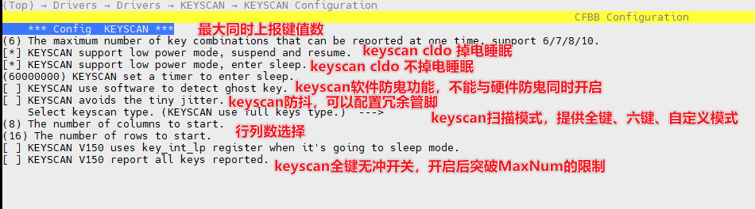

> **Note:** 
>Note: If the images above are inconsistent with the table descriptions, the table prevails.

The specific descriptions of the configuration macros are shown in [Table 1](#table16629938173916).

**Table 1**  KEYSCAN macro descriptions

<a name="table16629938173916"></a>
<table><thead align="left"><tr id="row1462913813915"><th class="cellrowborder" valign="top" width="22.62773722627738%" id="mcps1.2.7.1.1"><p id="p1962923853920"><a name="p1962923853920"></a><a name="p1962923853920"></a>Macro name (CONFIG_ is the prefix added by default)</p>
</th>
<th class="cellrowborder" valign="top" width="21.137886211378866%" id="mcps1.2.7.1.2"><p id="p962916388395"><a name="p962916388395"></a><a name="p962916388395"></a>Specific description displayed on the Kconfig interface</p>
</th>
<th class="cellrowborder" valign="top" width="19.878012198780127%" id="mcps1.2.7.1.3"><p id="p18731420115119"><a name="p18731420115119"></a><a name="p18731420115119"></a>Usage scenario</p>
</th>
<th class="cellrowborder" valign="top" width="10.618938106189384%" id="mcps1.2.7.1.4"><p id="p537485457"><a name="p537485457"></a><a name="p537485457"></a>Implemented</p>
</th>
<th class="cellrowborder" valign="top" width="11.338866113388663%" id="mcps1.2.7.1.5"><p id="p1162915382392"><a name="p1162915382392"></a><a name="p1162915382392"></a>Depends on other macros</p>
</th>
<th class="cellrowborder" valign="top" width="14.398560143985604%" id="mcps1.2.7.1.6"><p id="p1449914917569"><a name="p1449914917569"></a><a name="p1449914917569"></a>Whether to enable or modify the configuration</p>
</th>
</tr>
</thead>
<tbody><tr id="row16629338103916"><td class="cellrowborder" valign="top" width="22.62773722627738%" headers="mcps1.2.7.1.1 "><p id="p166291338133910"><a name="p166291338133910"></a><a name="p166291338133910"></a>CONFIG_KEYSCAN_REPORT_MAX_NUMS</p>
</td>
<td class="cellrowborder" valign="top" width="21.137886211378866%" headers="mcps1.2.7.1.2 "><p id="p212917397349"><a name="p212917397349"></a><a name="p212917397349"></a>The maximum number of key combinations that can be reported at one time, support 6/7/8/10.</p>
</td>
<td class="cellrowborder" valign="top" width="19.878012198780127%" headers="mcps1.2.7.1.3 "><p id="p77352085114"><a name="p77352085114"></a><a name="p77352085114"></a>Maximum number of keys reported by KEYSCAN at the same time. The default value is 6.</p>
</td>
<td class="cellrowborder" valign="top" width="10.618938106189384%" headers="mcps1.2.7.1.4 "><p id="p166297382397"><a name="p166297382397"></a><a name="p166297382397"></a>Yes</p>
</td>
<td class="cellrowborder" valign="top" width="11.338866113388663%" headers="mcps1.2.7.1.5 "><p id="p162983873917"><a name="p162983873917"></a><a name="p162983873917"></a>No</p>
</td>
<td class="cellrowborder" valign="top" width="14.398560143985604%" headers="mcps1.2.7.1.6 "><p id="p29271419451"><a name="p29271419451"></a><a name="p29271419451"></a>The default value is 6. Configure it as appropriate. It is recommended not to modify it.</p>
</td>
</tr>
<tr id="row166299383394"><td class="cellrowborder" valign="top" width="22.62773722627738%" headers="mcps1.2.7.1.1 "><p id="p14629173813920"><a name="p14629173813920"></a><a name="p14629173813920"></a>CONFIG_KEYSCAN_SUPPORT_LPM</p>
</td>
<td class="cellrowborder" valign="top" width="21.137886211378866%" headers="mcps1.2.7.1.2 "><p id="p1850294718349"><a name="p1850294718349"></a><a name="p1850294718349"></a>KEYSCAN support low power mode, suspend and resume.</p>
</td>
<td class="cellrowborder" valign="top" width="19.878012198780127%" headers="mcps1.2.7.1.3 "><p id="p1746412917425"><a name="p1746412917425"></a><a name="p1746412917425"></a>This macro is used only in low-power scenarios. Enable it as appropriate.</p>
</td>
<td class="cellrowborder" valign="top" width="10.618938106189384%" headers="mcps1.2.7.1.4 "><p id="p166291838143916"><a name="p166291838143916"></a><a name="p166291838143916"></a>Yes</p>
</td>
<td class="cellrowborder" valign="top" width="11.338866113388663%" headers="mcps1.2.7.1.5 "><p id="p13977417409"><a name="p13977417409"></a><a name="p13977417409"></a>No</p>
</td>
<td class="cellrowborder" valign="top" width="14.398560143985604%" headers="mcps1.2.7.1.6 "><p id="p158811250184312"><a name="p158811250184312"></a><a name="p158811250184312"></a>Enabled by default. Enable it as appropriate; it is recommended to enable it.</p>
</td>
</tr>
<tr id="row3629193823919"><td class="cellrowborder" valign="top" width="22.62773722627738%" headers="mcps1.2.7.1.1 "><p id="p262983811395"><a name="p262983811395"></a><a name="p262983811395"></a>CONFIG_KEYSCAN_SUPPORT_SLEEP</p>
</td>
<td class="cellrowborder" valign="top" width="21.137886211378866%" headers="mcps1.2.7.1.2 "><p id="p1432210183513"><a name="p1432210183513"></a><a name="p1432210183513"></a>KEYSCAN support low power mode, enter sleep.</p>
</td>
<td class="cellrowborder" valign="top" width="19.878012198780127%" headers="mcps1.2.7.1.3 "><p id="p28881144184315"><a name="p28881144184315"></a><a name="p28881144184315"></a>This macro is used only when KEYSCAN enters sleep in low-power scenarios</p>
</td>
<td class="cellrowborder" valign="top" width="10.618938106189384%" headers="mcps1.2.7.1.4 "><p id="p3629133873917"><a name="p3629133873917"></a><a name="p3629133873917"></a>Yes</p>
</td>
<td class="cellrowborder" valign="top" width="11.338866113388663%" headers="mcps1.2.7.1.5 "><p id="p062910387397"><a name="p062910387397"></a><a name="p062910387397"></a>No</p>
</td>
<td class="cellrowborder" valign="top" width="14.398560143985604%" headers="mcps1.2.7.1.6 "><p id="p16847613194811"><a name="p16847613194811"></a><a name="p16847613194811"></a>Enabled by default. Enable it as appropriate; it is recommended to enable it.</p>
</td>
</tr>
<tr id="row962920381394"><td class="cellrowborder" valign="top" width="22.62773722627738%" headers="mcps1.2.7.1.1 "><p id="p1629738173912"><a name="p1629738173912"></a><a name="p1629738173912"></a>CONFIG_KEYSCAN_IDLE_WAIT_US</p>
</td>
<td class="cellrowborder" valign="top" width="21.137886211378866%" headers="mcps1.2.7.1.2 "><p id="p183421327311"><a name="p183421327311"></a><a name="p183421327311"></a>KEYSCAN set a timer to enter sleep.</p>
</td>
<td class="cellrowborder" valign="top" width="19.878012198780127%" headers="mcps1.2.7.1.3 "><p id="p1391712438269"><a name="p1391712438269"></a><a name="p1391712438269"></a>Sets the time for KEYSCAN to enter sleep. The default value is 60000000us.</p>
</td>
<td class="cellrowborder" valign="top" width="10.618938106189384%" headers="mcps1.2.7.1.4 "><p id="p7630938143910"><a name="p7630938143910"></a><a name="p7630938143910"></a>Yes</p>
</td>
<td class="cellrowborder" valign="top" width="11.338866113388663%" headers="mcps1.2.7.1.5 "><p id="p56301938153913"><a name="p56301938153913"></a><a name="p56301938153913"></a>No</p>
</td>
<td class="cellrowborder" valign="top" width="14.398560143985604%" headers="mcps1.2.7.1.6 "><p id="p958622210495"><a name="p958622210495"></a><a name="p958622210495"></a>The default value is 60000000. Configure it as appropriate. It is recommended not to modify it.</p>
</td>
</tr>
<tr id="row6616111510320"><td class="cellrowborder" valign="top" width="22.62773722627738%" headers="mcps1.2.7.1.1 "><p id="p11616181516313"><a name="p11616181516313"></a><a name="p11616181516313"></a>CONFIG_KEYSCAN_SUPPORT_SW_DEFENCE</p>
</td>
<td class="cellrowborder" valign="top" width="21.137886211378866%" headers="mcps1.2.7.1.2 "><p id="p2616121518311"><a name="p2616121518311"></a><a name="p2616121518311"></a>KEYSCAN avoids the tiny jitter.</p>
</td>
<td class="cellrowborder" valign="top" width="19.878012198780127%" headers="mcps1.2.7.1.3 "><p id="p1161610154317"><a name="p1161610154317"></a><a name="p1161610154317"></a>This macro is used in the KEYSCAN debounce scenario to filter glitch jitter</p>
</td>
<td class="cellrowborder" valign="top" width="10.618938106189384%" headers="mcps1.2.7.1.4 "><p id="p156163151530"><a name="p156163151530"></a><a name="p156163151530"></a>Yes</p>
</td>
<td class="cellrowborder" valign="top" width="11.338866113388663%" headers="mcps1.2.7.1.5 "><p id="p176164153317"><a name="p176164153317"></a><a name="p176164153317"></a>No</p>
</td>
<td class="cellrowborder" valign="top" width="14.398560143985604%" headers="mcps1.2.7.1.6 "><p id="p21673172913"><a name="p21673172913"></a><a name="p21673172913"></a>Disabled by default. Enable it as appropriate.</p>
</td>
</tr>
<tr id="row1873511419311"><td class="cellrowborder" valign="top" width="22.62773722627738%" headers="mcps1.2.7.1.1 "><p id="p1735104137"><a name="p1735104137"></a><a name="p1735104137"></a>CONFIG_KEYSCAN_ANOTHER_COL</p>
</td>
<td class="cellrowborder" valign="top" width="21.137886211378866%" headers="mcps1.2.7.1.2 "><p id="p97361845316"><a name="p97361845316"></a><a name="p97361845316"></a>This pulled down column makes all rows continuously scanning if the software defence function is open.</p>
</td>
<td class="cellrowborder" valign="top" width="19.878012198780127%" headers="mcps1.2.7.1.3 "><p id="p117369416318"><a name="p117369416318"></a><a name="p117369416318"></a>This macro is used to configure the redundant column pins when the debounce function is enabled. The default value is 0.</p>
</td>
<td class="cellrowborder" valign="top" width="10.618938106189384%" headers="mcps1.2.7.1.4 "><p id="p1273612411315"><a name="p1273612411315"></a><a name="p1273612411315"></a>Yes</p>
</td>
<td class="cellrowborder" valign="top" width="11.338866113388663%" headers="mcps1.2.7.1.5 "><p id="p207368412315"><a name="p207368412315"></a><a name="p207368412315"></a>CONFIG_KEYSCAN_SUPPORT_SW_DEFENCE</p>
</td>
<td class="cellrowborder" valign="top" width="14.398560143985604%" headers="mcps1.2.7.1.6 "><p id="p16736241632"><a name="p16736241632"></a><a name="p16736241632"></a>Disabled by default. The default value is 0. Enable it as appropriate.</p>
</td>
</tr>
<tr id="row62681237271"><td class="cellrowborder" valign="top" width="22.62773722627738%" headers="mcps1.2.7.1.1 "><p id="p112401826112812"><a name="p112401826112812"></a><a name="p112401826112812"></a>CONFIG_KEYSCAN_USE_FULL_KEYS_TYPE</p>
</td>
<td class="cellrowborder" valign="top" width="21.137886211378866%" headers="mcps1.2.7.1.2 "><p id="p9468113615407"><a name="p9468113615407"></a><a name="p9468113615407"></a>KEYSCAN use full keys type.</p>
</td>
<td class="cellrowborder" valign="top" width="19.878012198780127%" headers="mcps1.2.7.1.3 "><p id="p438154074512"><a name="p438154074512"></a><a name="p438154074512"></a>KEYSCAN supports the full-key mode</p>
</td>
<td class="cellrowborder" valign="top" width="10.618938106189384%" headers="mcps1.2.7.1.4 "><p id="p5269202314277"><a name="p5269202314277"></a><a name="p5269202314277"></a>Yes</p>
</td>
<td class="cellrowborder" valign="top" width="11.338866113388663%" headers="mcps1.2.7.1.5 "><p id="p882352916313"><a name="p882352916313"></a><a name="p882352916313"></a>No</p>
</td>
<td class="cellrowborder" valign="top" width="14.398560143985604%" headers="mcps1.2.7.1.6 "><p id="p137491622194215"><a name="p137491622194215"></a><a name="p137491622194215"></a>Enabled by default. Enable it as appropriate; it is recommended to enable it.</p>
</td>
</tr>
<tr id="row17817572040"><td class="cellrowborder" valign="top" width="22.62773722627738%" headers="mcps1.2.7.1.1 "><p id="p53019141514"><a name="p53019141514"></a><a name="p53019141514"></a>CONFIG_KEYSCAN_USE_SIX_KEYS_TYPE</p>
</td>
<td class="cellrowborder" valign="top" width="21.137886211378866%" headers="mcps1.2.7.1.2 "><p id="p14544194924012"><a name="p14544194924012"></a><a name="p14544194924012"></a>KEYSCAN use six keys type.</p>
</td>
<td class="cellrowborder" valign="top" width="19.878012198780127%" headers="mcps1.2.7.1.3 "><p id="p14269192913525"><a name="p14269192913525"></a><a name="p14269192913525"></a>KEYSCAN supports the six-key mode</p>
</td>
<td class="cellrowborder" valign="top" width="10.618938106189384%" headers="mcps1.2.7.1.4 "><p id="p17919571246"><a name="p17919571246"></a><a name="p17919571246"></a>Yes</p>
</td>
<td class="cellrowborder" valign="top" width="11.338866113388663%" headers="mcps1.2.7.1.5 "><p id="p1343315396319"><a name="p1343315396319"></a><a name="p1343315396319"></a>No</p>
</td>
<td class="cellrowborder" valign="top" width="14.398560143985604%" headers="mcps1.2.7.1.6 "><p id="p1421054374413"><a name="p1421054374413"></a><a name="p1421054374413"></a>Disabled by default. Enable it as appropriate.</p>
</td>
</tr>
<tr id="row040511461781"><td class="cellrowborder" valign="top" width="22.62773722627738%" headers="mcps1.2.7.1.1 "><p id="p2085465116817"><a name="p2085465116817"></a><a name="p2085465116817"></a>CONFIG_KEYSCAN_USER_CONFIG_TYPE</p>
</td>
<td class="cellrowborder" valign="top" width="21.137886211378866%" headers="mcps1.2.7.1.2 "><p id="p14393171311411"><a name="p14393171311411"></a><a name="p14393171311411"></a>KEYSCAN user config type.</p>
</td>
<td class="cellrowborder" valign="top" width="19.878012198780127%" headers="mcps1.2.7.1.3 "><p id="p10124183720522"><a name="p10124183720522"></a><a name="p10124183720522"></a>KEYSCAN supports the custom key mode</p>
</td>
<td class="cellrowborder" valign="top" width="10.618938106189384%" headers="mcps1.2.7.1.4 "><p id="p1640513469812"><a name="p1640513469812"></a><a name="p1640513469812"></a>Yes</p>
</td>
<td class="cellrowborder" valign="top" width="11.338866113388663%" headers="mcps1.2.7.1.5 "><p id="p1528213471933"><a name="p1528213471933"></a><a name="p1528213471933"></a>No</p>
</td>
<td class="cellrowborder" valign="top" width="14.398560143985604%" headers="mcps1.2.7.1.6 "><p id="p154053469813"><a name="p154053469813"></a><a name="p154053469813"></a>Disabled by default. Enable it as appropriate.</p>
</td>
</tr>
<tr id="row1835411465910"><td class="cellrowborder" valign="top" width="22.62773722627738%" headers="mcps1.2.7.1.1 "><p id="p235571412597"><a name="p235571412597"></a><a name="p235571412597"></a>CONFIG_KEYSCAN_ENABLE_COL</p>
</td>
<td class="cellrowborder" valign="top" width="21.137886211378866%" headers="mcps1.2.7.1.2 "><p id="p154901910164216"><a name="p154901910164216"></a><a name="p154901910164216"></a>The number of columns to start.</p>
</td>
<td class="cellrowborder" valign="top" width="19.878012198780127%" headers="mcps1.2.7.1.3 "><p id="p1574795965220"><a name="p1574795965220"></a><a name="p1574795965220"></a>KEYSCAN column number configuration</p>
</td>
<td class="cellrowborder" valign="top" width="10.618938106189384%" headers="mcps1.2.7.1.4 "><p id="p1235501495919"><a name="p1235501495919"></a><a name="p1235501495919"></a>Yes</p>
</td>
<td class="cellrowborder" valign="top" width="11.338866113388663%" headers="mcps1.2.7.1.5 "><p id="p895101445"><a name="p895101445"></a><a name="p895101445"></a>No</p>
</td>
<td class="cellrowborder" valign="top" width="14.398560143985604%" headers="mcps1.2.7.1.6 "><p id="p72841723184417"><a name="p72841723184417"></a><a name="p72841723184417"></a>The number of columns in the default full-key mode is 8. If configured to other keyboard modes, adjust it by yourself.</p>
</td>
</tr>
<tr id="row15869683373"><td class="cellrowborder" valign="top" width="22.62773722627738%" headers="mcps1.2.7.1.1 "><p id="p7870131514375"><a name="p7870131514375"></a><a name="p7870131514375"></a>CONFIG_KEYSCAN_ENABLE_ROW</p>
</td>
<td class="cellrowborder" valign="top" width="21.137886211378866%" headers="mcps1.2.7.1.2 "><p id="p192463257425"><a name="p192463257425"></a><a name="p192463257425"></a>The number of rows to start.</p>
</td>
<td class="cellrowborder" valign="top" width="19.878012198780127%" headers="mcps1.2.7.1.3 "><p id="p721822011539"><a name="p721822011539"></a><a name="p721822011539"></a>KEYSCAN row number configuration</p>
</td>
<td class="cellrowborder" valign="top" width="10.618938106189384%" headers="mcps1.2.7.1.4 "><p id="p48701288378"><a name="p48701288378"></a><a name="p48701288378"></a>Yes</p>
</td>
<td class="cellrowborder" valign="top" width="11.338866113388663%" headers="mcps1.2.7.1.5 "><p id="p145114119409"><a name="p145114119409"></a><a name="p145114119409"></a>No</p>
</td>
<td class="cellrowborder" valign="top" width="14.398560143985604%" headers="mcps1.2.7.1.6 "><p id="p167962272585"><a name="p167962272585"></a><a name="p167962272585"></a>The number of rows in the default full-key mode is 16. If configured to other keyboard modes, adjust it by yourself.</p>
</td>
</tr>
<tr id="row934483818326"><td class="cellrowborder" valign="top" width="22.62773722627738%" headers="mcps1.2.7.1.1 "><p id="p3864842337"><a name="p3864842337"></a><a name="p3864842337"></a>CONFIG_KEYSCAN_USE_LP</p>
</td>
<td class="cellrowborder" valign="top" width="21.137886211378866%" headers="mcps1.2.7.1.2 "><p id="p10305154754211"><a name="p10305154754211"></a><a name="p10305154754211"></a>KEYSCAN V150 uses key_int_lp register when it's going to sleep mode.</p>
</td>
<td class="cellrowborder" valign="top" width="19.878012198780127%" headers="mcps1.2.7.1.3 "><p id="p63451738133213"><a name="p63451738133213"></a><a name="p63451738133213"></a>This macro is used only in sleep scenarios</p>
</td>
<td class="cellrowborder" valign="top" width="10.618938106189384%" headers="mcps1.2.7.1.4 "><p id="p3345173819320"><a name="p3345173819320"></a><a name="p3345173819320"></a>Yes</p>
</td>
<td class="cellrowborder" valign="top" width="11.338866113388663%" headers="mcps1.2.7.1.5 "><p id="p1160114311393"><a name="p1160114311393"></a><a name="p1160114311393"></a>CONFIG_KEYSCAN_SUPPORT_SLEEP</p>
</td>
<td class="cellrowborder" valign="top" width="14.398560143985604%" headers="mcps1.2.7.1.6 "><p id="p914192814612"><a name="p914192814612"></a><a name="p914192814612"></a>Disabled by default. It is recommended to disable it.</p>
</td>
</tr>
<tr id="row2891124283218"><td class="cellrowborder" valign="top" width="22.62773722627738%" headers="mcps1.2.7.1.1 "><p id="p19452172613352"><a name="p19452172613352"></a><a name="p19452172613352"></a>CONFIG_KEYSCAN_ENABLE_REP_ALL_KEY</p>
</td>
<td class="cellrowborder" valign="top" width="21.137886211378866%" headers="mcps1.2.7.1.2 "><p id="p3968125954216"><a name="p3968125954216"></a><a name="p3968125954216"></a>KEYSCAN V150 report all keys reported.</p>
</td>
<td class="cellrowborder" valign="top" width="19.878012198780127%" headers="mcps1.2.7.1.3 "><p id="p489174216326"><a name="p489174216326"></a><a name="p489174216326"></a>KEYSCAN full-key anti-ghosting switch. After enabling it, the MaxNum configuration has no effect.</p>
</td>
<td class="cellrowborder" valign="top" width="10.618938106189384%" headers="mcps1.2.7.1.4 "><p id="p489117427322"><a name="p489117427322"></a><a name="p489117427322"></a>Yes</p>
</td>
<td class="cellrowborder" valign="top" width="11.338866113388663%" headers="mcps1.2.7.1.5 "><p id="p489144243219"><a name="p489144243219"></a><a name="p489144243219"></a>No</p>
</td>
<td class="cellrowborder" valign="top" width="14.398560143985604%" headers="mcps1.2.7.1.6 "><p id="p9229105374715"><a name="p9229105374715"></a><a name="p9229105374715"></a>Disabled by default. Enable it as appropriate.</p>
</td>
</tr>
<tr id="row16902048181514"><td class="cellrowborder" valign="top" width="22.62773722627738%" headers="mcps1.2.7.1.1 "><p id="p690254814156"><a name="p690254814156"></a><a name="p690254814156"></a>CONFIG_KEYSCAN_SOFTWARE_GHOST_DETECT</p>
</td>
<td class="cellrowborder" valign="top" width="21.137886211378866%" headers="mcps1.2.7.1.2 "><p id="p13902174811153"><a name="p13902174811153"></a><a name="p13902174811153"></a>KEYSCAN use software to detect ghost key</p>
</td>
<td class="cellrowborder" valign="top" width="19.878012198780127%" headers="mcps1.2.7.1.3 "><p id="p8902164820157"><a name="p8902164820157"></a><a name="p8902164820157"></a>KEYSCAN software ghost prevention switch. It cannot be enabled together with hardware ghost prevention.</p>
</td>
<td class="cellrowborder" valign="top" width="10.618938106189384%" headers="mcps1.2.7.1.4 "><p id="p10902194891513"><a name="p10902194891513"></a><a name="p10902194891513"></a>Yes</p>
</td>
<td class="cellrowborder" valign="top" width="11.338866113388663%" headers="mcps1.2.7.1.5 "><p id="p11902164818158"><a name="p11902164818158"></a><a name="p11902164818158"></a>No</p>
</td>
<td class="cellrowborder" valign="top" width="14.398560143985604%" headers="mcps1.2.7.1.6 "><p id="p12902114814151"><a name="p12902114814151"></a><a name="p12902114814151"></a>Disabled by default. Enable it as appropriate.</p>
</td>
</tr>
</tbody>
</table>

## Development Guide<a name="ZH-CN_TOPIC_0000001713103513"></a>

The configurable items are mainly in the porting-layer header file corresponding to KEYSCAN. The following describes the functions of important configurable items.

```
#define KEYSCAN_DEFAULT_CONFIG                       \
{                                                    \
.direction             = ROW_SCAN_DIR,               \    Row/column scan direction
.scan_mode             = HAL_KEYSCAN_MODE_0,         \    Row/column scan mode
.pulse_time            = EVERY_ROW_PULSE_10_US,      \   Scan pulse duration
.wait_time             = WAITING_30_AND_5_US,        \  Scan duration
.idle_time             = IDLE_3_MS_AFTER_SCAN,       \  Wait duration between multiple scans
.defence_time          = SAMPLE_3TIMES_DEFENCE,      \   Debounce count
.ghost_check           = false,                      \Hardware ghost prevention switch
.io_de                = true,                      \
}
//  Configuration of the frequency division ratio of the two-stage keyscan frequency divider. The division coefficient is CLK_HIGH_DIV*CLK_LOW_DIV. The default configuration is
#define CLK_HIGH_DIV 0x28
#define CLK_LOW_DIV  0xa
//  To reduce the division ratio to optimize the keyscan delay, the recommended configuration is 8M, that is,
#define CLK_HIGH_DIV 0x2
#define CLK_LOW_DIV  0x2
```

Example:

1.  If the custom mode is used, first call the keyscan\_porting\_set\_gpio interface to confirm the gpio to use. Write row first, then column.

    ```
    #if defined(CONFIG_KEYSCAN_USER_CONFIG_TYPE)
        uint8_t user_gpio_map[CONFIG_KEYSCAN_ENABLE_ROW + CONFIG_KEYSCAN_ENABLE_COL] = { 31, 24, 14, 23, 27, 28, 10, 11, 30, 13, 15, 16, 25, 26, 12, 22, 2, 3, 4, 5, 6, 21, 9, 29};
    if (keyscan_porting_set_gpio(user_gpio_map)) {
    return;
    }
    #endif
    ```

2.  Call the uapi\_set\_keyscan\_value\_map interface to register the key-value map. The rows and columns of the key-value map array must be consistent with the maximum row and column values. Fill unused keys with 0x00.

    ```
    uint8_t g_key_map_test[KEY_SCAN_MAX_ROW][KEY_SCAN_MAX_COL] = {
        { 0x29, 0x2B, 0x14, 0x35, 0x04, 0x1E, 0x1D, 0x00 },
        { 0x3D, 0x3C, 0x08, 0x3B, 0x07, 0x20, 0x06, 0x00 },
        { 0x00, 0x39, 0x1A, 0x3A, 0x16, 0x1F, 0x1B, 0x00 },
        { 0x00, 0x00, 0x00, 0xE0, 0x00, 0x00, 0xE4, 0x00 },
        { 0x0A, 0x17, 0x15, 0x22, 0x09, 0x21, 0x19, 0x05 },
        { 0x0B, 0x1C, 0x18, 0x23, 0x0D, 0x24, 0x10, 0x11 },
        { 0x3F, 0x30, 0x0C, 0x2E, 0x0E, 0x25, 0x36, 0x00 },
        { 0x00, 0x00, 0x12, 0x40, 0x0F, 0x26, 0x37, 0x00 },
        { 0x34, 0x2F, 0x13, 0x2D, 0x33, 0x27, 0x00, 0x38 },
        { 0x3E, 0x2A, 0x00, 0x41, 0x31, 0x42, 0x28, 0x2C },
        { 0x00, 0x00, 0xE3, 0x00, 0x00, 0x43, 0x00, 0x51 },
        { 0xE2, 0x00, 0x00, 0x00, 0x00, 0x45, 0xE5, 0xE6 },
        { 0x00, 0x53, 0x00, 0x00, 0xE1, 0x44, 0x00, 0x4F },
        { 0x52, 0x00, 0x00, 0x00, 0x00, 0x00, 0x4C, 0x50 },
        { 0x5F, 0x5C, 0x61, 0x5E, 0x59, 0x62, 0x55, 0x5B },
        { 0x54, 0x60, 0x56, 0x57, 0x5D, 0x5A, 0x58, 0x63 },
    };
    uapi_set_keyscan_value_map((uint8_t **)g_key_map_test, KEY_SCAN_MAX_ROW, KEY_SCAN_MAX_COL);
    ```

3.  Call the uapi\_keyscan\_init interface to initialize KEYSCAN. The current input parameters are the pulse time (param1), scan mode (param2), and interrupt time (param3). The default values are 0, 0, 3.

    ```
    uapi_keyscan_init(pulse, mode, scan_int);
    ```

4.  Call the uapi\_keyscan\_register\_callback and uapi\_keyscan\_enable interfaces to register the KEYSCAN interrupt callback function and enable KEYSCAN.

    ```
    int test_key_scan_funcs(void)
    {
        errcode_t ret = ERRCODE_FAIL;
        ret = uapi_keyscan_register_callback(key_scan_report_callback);
        if (ret != ERRCODE_SUCC) {
            return TEST_SUITE_TEST_FAILED;
        }
        uapi_keyscan_enable();
        return TEST_SUITE_OK;
    }
    ```

**Full-key anti-ghosting mode<a name="section17811101414518"></a>**

After CONFIG\_KEYSCAN\_ENABLE\_REP\_ALL\_KEY is enabled, the interrupt report is replaced with keyscan\_porting\_all\_keys\_report, which reports all keys pressed at the same time. When a key is held down, it is reported once per scan cycle. Users need to adjust the interrupt response threshold according to the scan frequency.

**Debounce mode<a name="section11396202710511"></a>**

After the CONFIG\_KEYSCAN\_SUPPORT\_SW\_DEFENCE macro is enabled, configure an idle pin to CONFIG\_KEYSCAN\_ANOTHER\_COL and increase the number of column pins by 1. Then, no false key reports under slight jitter will occur during keyscan execution. Because enabling the key debounce function occupies one gpio pin, the CONFIG\_KEYSCAN\_SUPPORT\_SW\_DEFENCE macro is disabled by default and needs to be configured by users according to the actual situation.

**Software ghost prevention mode<a name="section48517365510"></a>**

BS2X provides the software ghost key prevention function. After CONFIG\_KEYSCAN\_SOFTWARE\_GHOST\_DETECT is enabled, keyscan\_sw\_ghost\_detect is added to the Keyscan callback function. The third key that forms the ghost key and the fourth key reported by the ghost key are deleted from the reporting buffer, and only the initially pressed two keys are reported. Meanwhile, other newly pressed keys are no longer reported, so as to inform users that a ghost key phenomenon has occurred. The software ghost prevention function cannot be enabled together with hardware ghost prevention.

## Precautions<a name="ZH-CN_TOPIC_0000001713103489"></a>

When using KEYSCAN, ensure proper grounding. Otherwise, false key-value reports may occur.

# PDM<a name="ZH-CN_TOPIC_0000001713023521"></a>


## Overview<a name="ZH-CN_TOPIC_0000001713023541"></a>

PDM (Pulse Density Modulation) is a modulation method that uses digital signals to represent analog signals. Another commonly used method for converting analog quantities to digital quantities, PCM, uses equally spaced sampling to represent the amplitude of the analog component of each sample as an N-bit digital component (N = quantization depth). Therefore, in the PCM mode, the result of each sample is data with an N-bit word length. PDM samples and modulates the analog component using a clock much higher than the PCM sampling rate. When there is only a 1-bit output, it is 0 or 1. Therefore, digital audio represented by the PDM mode is also called oversampled 1-bit audio.

The audio digital-to-analog conversion module carried by 282X samples using the PDM method and **outputs PCM data** after processing. The data source can be DMIC or AMIC.

## Function Description<a name="ZH-CN_TOPIC_0000001713023569"></a>

The interfaces and functions provided by the PDM module are as follows:

-   uapi\_pdm\_init（void）：Initializes the PDM.
-   uapi\_pdm\_deinit（void）：Deinitializes the PDM.
-   uapi\_pdm\_set\_attr（uint8\_t mic, const pdm\_config\_t \*attr）：Sets the attributes of a PDM channel（mic indicates the channel to configure，attr indicates the configuration parameters）.
-   uapi\_pdm\_get\_attr（uint8\_t mic, pdm\_config\_t \*attr）：Obtains the attributes of a PDM channel（mic indicates the channel to obtain，attr indicates the attribute parameters used to store the obtained values）.
-   uapi\_pdm\_start（void）：Starts PDM sampling.
-   uapi\_pdm\_stop（void）：Stops PDM sampling.
-   uapi\_pdm\_get\_fifo\_addr（void）：Obtains the FIFO base address of the PDM.
-   uapi\_pdm\_get\_fifo\_deepth（void）：Obtains the FIFO depth of the PDM.

## KCONFIG Configuration<a name="ZH-CN_TOPIC_0000001937056313"></a>

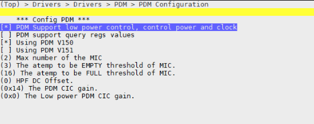

The specific descriptions of the configuration macros are shown in [Table 1](#table16629938173916).

**Table 1**  PDM macro descriptions

<a name="table16629938173916"></a>
<table><thead align="left"><tr id="row1462913813915"><th class="cellrowborder" valign="top" width="22.62773722627738%" id="mcps1.2.7.1.1"><p id="p1962923853920"><a name="p1962923853920"></a><a name="p1962923853920"></a>Macro name (CONFIG_ is the prefix added by default)</p>
</th>
<th class="cellrowborder" valign="top" width="21.137886211378866%" id="mcps1.2.7.1.2"><p id="p962916388395"><a name="p962916388395"></a><a name="p962916388395"></a>Specific description displayed on the Kconfig interface</p>
</th>
<th class="cellrowborder" valign="top" width="19.878012198780127%" id="mcps1.2.7.1.3"><p id="p18731420115119"><a name="p18731420115119"></a><a name="p18731420115119"></a>Usage scenario</p>
</th>
<th class="cellrowborder" valign="top" width="10.618938106189384%" id="mcps1.2.7.1.4"><p id="p537485457"><a name="p537485457"></a><a name="p537485457"></a>Implemented</p>
</th>
<th class="cellrowborder" valign="top" width="11.338866113388663%" id="mcps1.2.7.1.5"><p id="p1162915382392"><a name="p1162915382392"></a><a name="p1162915382392"></a>Depends on other macros</p>
</th>
<th class="cellrowborder" valign="top" width="14.398560143985604%" id="mcps1.2.7.1.6"><p id="p1449914917569"><a name="p1449914917569"></a><a name="p1449914917569"></a>Whether to enable or modify the configuration</p>
</th>
</tr>
</thead>
<tbody><tr id="row16629338103916"><td class="cellrowborder" valign="top" width="22.62773722627738%" headers="mcps1.2.7.1.1 "><p id="p166291338133910"><a name="p166291338133910"></a><a name="p166291338133910"></a>CONFIG_PDM_SUPPORT_LPC</p>
</td>
<td class="cellrowborder" valign="top" width="21.137886211378866%" headers="mcps1.2.7.1.2 "><p id="p212917397349"><a name="p212917397349"></a><a name="p212917397349"></a>PDM support low power control, control power and clock.</p>
</td>
<td class="cellrowborder" valign="top" width="19.878012198780127%" headers="mcps1.2.7.1.3 "><p id="p77352085114"><a name="p77352085114"></a><a name="p77352085114"></a>PDM working clock</p>
</td>
<td class="cellrowborder" valign="top" width="10.618938106189384%" headers="mcps1.2.7.1.4 "><p id="p166297382397"><a name="p166297382397"></a><a name="p166297382397"></a>Yes</p>
</td>
<td class="cellrowborder" valign="top" width="11.338866113388663%" headers="mcps1.2.7.1.5 "><p id="p162983873917"><a name="p162983873917"></a><a name="p162983873917"></a>No</p>
</td>
<td class="cellrowborder" valign="top" width="14.398560143985604%" headers="mcps1.2.7.1.6 "><p id="p1049793984718"><a name="p1049793984718"></a><a name="p1049793984718"></a>Enabled by default. Mandatory.</p>
</td>
</tr>
<tr id="row166299383394"><td class="cellrowborder" valign="top" width="22.62773722627738%" headers="mcps1.2.7.1.1 "><p id="p14629173813920"><a name="p14629173813920"></a><a name="p14629173813920"></a>CONFIG_PDM_SUPPORT_QUERY_REGS</p>
</td>
<td class="cellrowborder" valign="top" width="21.137886211378866%" headers="mcps1.2.7.1.2 "><p id="p15501102411376"><a name="p15501102411376"></a><a name="p15501102411376"></a>PDM support query regs values.</p>
</td>
<td class="cellrowborder" valign="top" width="19.878012198780127%" headers="mcps1.2.7.1.3 "><p id="p9684133534814"><a name="p9684133534814"></a><a name="p9684133534814"></a>PDM supports reading back the values of all related registers. Enable it as appropriate.</p>
</td>
<td class="cellrowborder" valign="top" width="10.618938106189384%" headers="mcps1.2.7.1.4 "><p id="p166291838143916"><a name="p166291838143916"></a><a name="p166291838143916"></a>Yes</p>
</td>
<td class="cellrowborder" valign="top" width="11.338866113388663%" headers="mcps1.2.7.1.5 "><p id="p13977417409"><a name="p13977417409"></a><a name="p13977417409"></a>No</p>
</td>
<td class="cellrowborder" valign="top" width="14.398560143985604%" headers="mcps1.2.7.1.6 "><p id="p158811250184312"><a name="p158811250184312"></a><a name="p158811250184312"></a>Disabled by default. Enable it as appropriate.</p>
</td>
</tr>
<tr id="row3629193823919"><td class="cellrowborder" valign="top" width="22.62773722627738%" headers="mcps1.2.7.1.1 "><p id="p262983811395"><a name="p262983811395"></a><a name="p262983811395"></a>CONFIG_PDM_USING_V150</p>
</td>
<td class="cellrowborder" valign="top" width="21.137886211378866%" headers="mcps1.2.7.1.2 "><p id="p1432210183513"><a name="p1432210183513"></a><a name="p1432210183513"></a>Using PDM V150.</p>
</td>
<td class="cellrowborder" valign="top" width="19.878012198780127%" headers="mcps1.2.7.1.3 "><p id="p28881144184315"><a name="p28881144184315"></a><a name="p28881144184315"></a>This macro indicates using the PDM V150 driver specification, which is used by default in this product.</p>
</td>
<td class="cellrowborder" valign="top" width="10.618938106189384%" headers="mcps1.2.7.1.4 "><p id="p3629133873917"><a name="p3629133873917"></a><a name="p3629133873917"></a>Yes</p>
</td>
<td class="cellrowborder" valign="top" width="11.338866113388663%" headers="mcps1.2.7.1.5 "><p id="p062910387397"><a name="p062910387397"></a><a name="p062910387397"></a>No</p>
</td>
<td class="cellrowborder" valign="top" width="14.398560143985604%" headers="mcps1.2.7.1.6 "><p id="p16847613194811"><a name="p16847613194811"></a><a name="p16847613194811"></a>Enabled by default. Mandatory.</p>
</td>
</tr>
<tr id="row962920381394"><td class="cellrowborder" valign="top" width="22.62773722627738%" headers="mcps1.2.7.1.1 "><p id="p1629738173912"><a name="p1629738173912"></a><a name="p1629738173912"></a>CONFIG_PDM_USING_V151</p>
</td>
<td class="cellrowborder" valign="top" width="21.137886211378866%" headers="mcps1.2.7.1.2 "><p id="p13179182754416"><a name="p13179182754416"></a><a name="p13179182754416"></a>Using PDM V151.</p>
</td>
<td class="cellrowborder" valign="top" width="19.878012198780127%" headers="mcps1.2.7.1.3 "><p id="p173853198511"><a name="p173853198511"></a><a name="p173853198511"></a>This macro indicates using the PDM V151 driver specification. This specification is not used in this product.</p>
</td>
<td class="cellrowborder" valign="top" width="10.618938106189384%" headers="mcps1.2.7.1.4 "><p id="p7630938143910"><a name="p7630938143910"></a><a name="p7630938143910"></a>Yes</p>
</td>
<td class="cellrowborder" valign="top" width="11.338866113388663%" headers="mcps1.2.7.1.5 "><p id="p56301938153913"><a name="p56301938153913"></a><a name="p56301938153913"></a>No</p>
</td>
<td class="cellrowborder" valign="top" width="14.398560143985604%" headers="mcps1.2.7.1.6 "><p id="p6118155155211"><a name="p6118155155211"></a><a name="p6118155155211"></a>Disabled by default. It must be disabled.</p>
</td>
</tr>
<tr id="row62681237271"><td class="cellrowborder" valign="top" width="22.62773722627738%" headers="mcps1.2.7.1.1 "><p id="p112401826112812"><a name="p112401826112812"></a><a name="p112401826112812"></a>CONFIG_MIC_CH_NUM</p>
</td>
<td class="cellrowborder" valign="top" width="21.137886211378866%" headers="mcps1.2.7.1.2 "><p id="p18634144924414"><a name="p18634144924414"></a><a name="p18634144924414"></a>Max number of the MIC.</p>
</td>
<td class="cellrowborder" valign="top" width="19.878012198780127%" headers="mcps1.2.7.1.3 "><p id="p438154074512"><a name="p438154074512"></a><a name="p438154074512"></a>Number of MIC channels supported by the PDM</p>
</td>
<td class="cellrowborder" valign="top" width="10.618938106189384%" headers="mcps1.2.7.1.4 "><p id="p5269202314277"><a name="p5269202314277"></a><a name="p5269202314277"></a>Yes</p>
</td>
<td class="cellrowborder" valign="top" width="11.338866113388663%" headers="mcps1.2.7.1.5 "><p id="p5506649114616"><a name="p5506649114616"></a><a name="p5506649114616"></a>CONFIG_PDM_USING_V150</p>
</td>
<td class="cellrowborder" valign="top" width="14.398560143985604%" headers="mcps1.2.7.1.6 "><p id="p131586414353"><a name="p131586414353"></a><a name="p131586414353"></a>The default value is 2. Configure it as appropriate. It is recommended not to modify it.</p>
</td>
</tr>
<tr id="row17817572040"><td class="cellrowborder" valign="top" width="22.62773722627738%" headers="mcps1.2.7.1.1 "><p id="p53019141514"><a name="p53019141514"></a><a name="p53019141514"></a>CONFIG_PDM_AFIFO_AEMPTY_TH</p>
</td>
<td class="cellrowborder" valign="top" width="21.137886211378866%" headers="mcps1.2.7.1.2 "><p id="p7184481450"><a name="p7184481450"></a><a name="p7184481450"></a>The atemp to be EMPTY threshold of MIC.</p>
</td>
<td class="cellrowborder" valign="top" width="19.878012198780127%" headers="mcps1.2.7.1.3 "><p id="p14269192913525"><a name="p14269192913525"></a><a name="p14269192913525"></a>Threshold for configuring the PDM FIFO to be empty. The default value is 3.</p>
</td>
<td class="cellrowborder" valign="top" width="10.618938106189384%" headers="mcps1.2.7.1.4 "><p id="p17919571246"><a name="p17919571246"></a><a name="p17919571246"></a>Yes</p>
</td>
<td class="cellrowborder" valign="top" width="11.338866113388663%" headers="mcps1.2.7.1.5 "><p id="p1343315396319"><a name="p1343315396319"></a><a name="p1343315396319"></a>No</p>
</td>
<td class="cellrowborder" valign="top" width="14.398560143985604%" headers="mcps1.2.7.1.6 "><p id="p271622620218"><a name="p271622620218"></a><a name="p271622620218"></a>The default value is 3. Configure it as appropriate. It is recommended not to modify it.</p>
</td>
</tr>
<tr id="row040511461781"><td class="cellrowborder" valign="top" width="22.62773722627738%" headers="mcps1.2.7.1.1 "><p id="p2085465116817"><a name="p2085465116817"></a><a name="p2085465116817"></a>CONFIG_PDM_AFIFO_AFULL_TH</p>
</td>
<td class="cellrowborder" valign="top" width="21.137886211378866%" headers="mcps1.2.7.1.2 "><p id="p1061343484519"><a name="p1061343484519"></a><a name="p1061343484519"></a>The atemp to be FULL threshold of MIC.</p>
</td>
<td class="cellrowborder" valign="top" width="19.878012198780127%" headers="mcps1.2.7.1.3 "><p id="p144901341918"><a name="p144901341918"></a><a name="p144901341918"></a>Threshold for configuring the PDM FIFO to be full. The default value is 16.</p>
</td>
<td class="cellrowborder" valign="top" width="10.618938106189384%" headers="mcps1.2.7.1.4 "><p id="p1640513469812"><a name="p1640513469812"></a><a name="p1640513469812"></a>Yes</p>
</td>
<td class="cellrowborder" valign="top" width="11.338866113388663%" headers="mcps1.2.7.1.5 "><p id="p1528213471933"><a name="p1528213471933"></a><a name="p1528213471933"></a>No</p>
</td>
<td class="cellrowborder" valign="top" width="14.398560143985604%" headers="mcps1.2.7.1.6 "><p id="p154053469813"><a name="p154053469813"></a><a name="p154053469813"></a>The default value is 16. Configure it as appropriate. It is recommended not to modify it.</p>
</td>
</tr>
<tr id="row1835411465910"><td class="cellrowborder" valign="top" width="22.62773722627738%" headers="mcps1.2.7.1.1 "><p id="p235571412597"><a name="p235571412597"></a><a name="p235571412597"></a>CONFIG_PDM_ADC_DC_OFFSET</p>
</td>
<td class="cellrowborder" valign="top" width="21.137886211378866%" headers="mcps1.2.7.1.2 "><p id="p154901910164216"><a name="p154901910164216"></a><a name="p154901910164216"></a>HPF DC Offset.</p>
</td>
<td class="cellrowborder" valign="top" width="19.878012198780127%" headers="mcps1.2.7.1.3 "><p id="p1574795965220"><a name="p1574795965220"></a><a name="p1574795965220"></a>Configures the DC offset value of the PDM ADC HPF. The default value is 0.</p>
</td>
<td class="cellrowborder" valign="top" width="10.618938106189384%" headers="mcps1.2.7.1.4 "><p id="p1235501495919"><a name="p1235501495919"></a><a name="p1235501495919"></a>Yes</p>
</td>
<td class="cellrowborder" valign="top" width="11.338866113388663%" headers="mcps1.2.7.1.5 "><p id="p895101445"><a name="p895101445"></a><a name="p895101445"></a>No</p>
</td>
<td class="cellrowborder" valign="top" width="14.398560143985604%" headers="mcps1.2.7.1.6 "><p id="p189401051515"><a name="p189401051515"></a><a name="p189401051515"></a>The default value is 0. It is recommended not to modify it.</p>
</td>
</tr>
<tr id="row15869683373"><td class="cellrowborder" valign="top" width="22.62773722627738%" headers="mcps1.2.7.1.1 "><p id="p7870131514375"><a name="p7870131514375"></a><a name="p7870131514375"></a>CONFIG_PDM_CIC_GAIN</p>
</td>
<td class="cellrowborder" valign="top" width="21.137886211378866%" headers="mcps1.2.7.1.2 "><p id="p3426121019467"><a name="p3426121019467"></a><a name="p3426121019467"></a>The PDM CIC gain.</p>
</td>
<td class="cellrowborder" valign="top" width="19.878012198780127%" headers="mcps1.2.7.1.3 "><p id="p721822011539"><a name="p721822011539"></a><a name="p721822011539"></a>Configures the CIC gain value of the PDM ADC. The default value is 0x14.</p>
</td>
<td class="cellrowborder" valign="top" width="10.618938106189384%" headers="mcps1.2.7.1.4 "><p id="p48701288378"><a name="p48701288378"></a><a name="p48701288378"></a>Yes</p>
</td>
<td class="cellrowborder" valign="top" width="11.338866113388663%" headers="mcps1.2.7.1.5 "><p id="p145114119409"><a name="p145114119409"></a><a name="p145114119409"></a>No</p>
</td>
<td class="cellrowborder" valign="top" width="14.398560143985604%" headers="mcps1.2.7.1.6 "><p id="p9742182910615"><a name="p9742182910615"></a><a name="p9742182910615"></a>The default value is 0x14. It is recommended not to modify it.</p>
</td>
</tr>
<tr id="row934483818326"><td class="cellrowborder" valign="top" width="22.62773722627738%" headers="mcps1.2.7.1.1 "><p id="p3864842337"><a name="p3864842337"></a><a name="p3864842337"></a>CONFIG_PDM_LP_CIC_GAIN</p>
</td>
<td class="cellrowborder" valign="top" width="21.137886211378866%" headers="mcps1.2.7.1.2 "><p id="p827732113463"><a name="p827732113463"></a><a name="p827732113463"></a>The low power PDM CIC gain.</p>
</td>
<td class="cellrowborder" valign="top" width="19.878012198780127%" headers="mcps1.2.7.1.3 "><p id="p16151648363"><a name="p16151648363"></a><a name="p16151648363"></a>Configures the CIC gain value of the PDM ADC in low-power scenarios. The default value is 0x0.</p>
</td>
<td class="cellrowborder" valign="top" width="10.618938106189384%" headers="mcps1.2.7.1.4 "><p id="p3345173819320"><a name="p3345173819320"></a><a name="p3345173819320"></a>Yes</p>
</td>
<td class="cellrowborder" valign="top" width="11.338866113388663%" headers="mcps1.2.7.1.5 "><p id="p1160114311393"><a name="p1160114311393"></a><a name="p1160114311393"></a>No</p>
</td>
<td class="cellrowborder" valign="top" width="14.398560143985604%" headers="mcps1.2.7.1.6 "><p id="p14446111712711"><a name="p14446111712711"></a><a name="p14446111712711"></a>The default value is 0x0. It is recommended not to modify it.</p>
</td>
</tr>
</tbody>
</table>

## Development Guide<a name="ZH-CN_TOPIC_0000001664983950"></a>

Example:

1.  First, configure the PDM channel parameters. The currently configurable parameters are shown in the following structure.

    ```
    When the signal source is DMIC, configure it as follows:
    int test_pdm_config(void)
    {
        pdm_config_t config = { 0 };
        if (argc != PDM_CONFIG_PARAM_NUM) {
            return ERRCODE_TEST_SUITE_ERROR_BAD_PARAMS;
        }
        pdm_mic_t mic = (pdm_mic_t)HAL_PDM_DMIC_0;
        config.srcdn_src_mode = DOUBLE_EXTRACT;
        errcode_t ret = uapi_pdm_set_attr(mic, &config);
        if (ret != ERRCODE_SUCC) {
            return ERRCODE_TEST_SUITE_CONFIG_FAILED;
        }
        return ERRCODE_TEST_SUITE_OK;
    }
    When the signal source is AMIC, configure it as follows:
    void test_pdm_config(void)
    {
        uint8_t mic = HAL_PDM_AMIC;
        pdm_config_t config = { 0 };
        config.srcdn_src_mode = TRIPLE_EXTRACT;
        if (uapi_pdm_set_attr(mic, &config) == ERRCODE_SUCC) {
            osal_printk("pdm config attr succ!\r\n");
        } else {
            osal_printk("pdm config attr fail!\r\n");
        }
    }
    ```

2.  Enable PDM sampling and read the sampled values from the FIFO.

    ```
    int32_t app_pdm_start_dma_transfer(uint32_t *pdm_buffer, dma_transfer_cb_t trans_done, dma_channel_t *channel)
    {
        dma_ch_user_peripheral_config_t transfer_config;
    
        transfer_config.src = uapi_pdm_get_fifo_addr();
        transfer_config.dest = (uint32_t)(uintptr_t)pdm_buffer;
        transfer_config.transfer_num = CONFIG_PDM_TRANSFER_LEN_BY_DMA;
        transfer_config.src_handshaking = HAL_DMA_HANDSHAKING_MIC45_UPLINK_REQ;
        transfer_config.dest_handshaking = 0;
        transfer_config.trans_type = HAL_DMA_TRANS_PERIPHERAL_TO_MEMORY_DMA;
        transfer_config.trans_dir = HAL_DMA_TRANSFER_DIR_PERIPHERAL_TO_MEM;
        transfer_config.priority = PDM_DMA_PRIORITY;
        transfer_config.src_width = HAL_DMA_TRANSFER_WIDTH_32;
        transfer_config.dest_width = HAL_DMA_TRANSFER_WIDTH_32;
        transfer_config.burst_length = 0;
        transfer_config.src_increment = HAL_DMA_ADDRESS_INC_NO_CHANGE;
        transfer_config.dest_increment = HAL_DMA_ADDRESS_INC_INCREMENT;
        transfer_config.protection = HAL_DMA_PROTECTION_CONTROL_BUFFERABLE;
    
        if (uapi_dma_configure_peripheral_transfer_single(&transfer_config, channel, trans_done,
                                                          (uintptr_t)NULL) != ERRCODE_SUCC) {
            osal_printk("DMA configure fail.\r\n");
            return 1;
        }
    
        if (uapi_dma_start_transfer((uint8_t)*channel) != ERRCODE_SUCC) {
            osal_printk("DMA start transfer fail.\r\n");
            return 1;
        }
    
        return 0;
    }
    static void app_dma_transfer_done_callback(uint8_t int_type, uint8_t channel, uintptr_t arg)
    {
        unused(arg);
        unused(channel);
        switch (int_type) {
            case HAL_DMA_INTERRUPT_TFR:
                g_dma_trans_done = 1;
                break;
            case HAL_DMA_INTERRUPT_BLOCK:
                g_dma_trans_done = 1;
                break;
            case HAL_DMA_INTERRUPT_ERR:
                osal_printk("DMA transfer error.\r\n");
                break;
            default:
                break;
        }
    }
    When the signal source is DMIC, configure it as follows:
    void *pdm_task(const char *arg)
    {
        unused(arg);
        dma_channel_t channel;
        app_pdm_init_pin();
        /* PDM init. */
        uapi_pdm_deinit();
        uapi_pdm_init();
        app_pdm_set_config();
        if (uapi_pdm_start() == ERRCODE_SUCC) {
            osal_printk("pdm start transfer succ!\r\n");
        }
        uapi_dma_init();
        uapi_dma_open();
        while (1) {
            g_dma_trans_done = 0;
            if (app_pdm_start_dma_transfer(g_app_pdm_dma_data, app_dma_transfer_done_callback, &channel) != 0) {
                continue;
            }
            while (!g_dma_trans_done) {
                uapi_watchdog_kick();
            }
            uapi_dma_end_transfer(channel);
            for (uint32_t i = 0; i < CONFIG_PDM_TRANSFER_LEN_BY_DMA; i++) {
                g_app_pdm_buffer[g_app_pdm_buffer_filled_count++] = (uint8_t)(g_app_pdm_dma_data[i] >> PDM_OFFSET_16);
                g_app_pdm_buffer[g_app_pdm_buffer_filled_count++] = (uint8_t)(g_app_pdm_dma_data[i] >> PDM_OFFSET_24);
            }
            if (g_app_pdm_buffer_filled_count < CONFIG_PDM_MAX_RECORD_DATA) {
                continue;
            } else {
                osal_printk("The current number of records in PDM exceeds the maximum allowed limit,addr:0x%x\r\n",
                            (uintptr_t)(&g_app_pdm_buffer));
                uapi_pdm_stop();
                return NULL;
            }
        }
        return NULL;
    }
    When the signal source is AMIC, configure it as follows:
    void *pdm_amic_task(const char *arg)
    {
        unused(arg);
        dma_channel_t channel;
        app_pdm_init_pin(CONFIG_ADC_USE_PIN1);
        app_pdm_init_pin(CONFIG_ADC_USE_PIN2);
        uapi_adc_init(ADC_CLOCK_NONE);
        uapi_adc_power_en(AFE_AMIC_MODE, true);
        uapi_adc_open_differential_channel(ADC_POSTIVE_CHANNEL, ADC_NEGATIVE_CHANNEL);
        adc_calibration(AFE_AMIC_MODE, true, true, true);
        /* PDM init. */
        uapi_pdm_init();
        app_pdm_set_config();
        if (uapi_pdm_start() == ERRCODE_SUCC) {
            osal_printk("pdm start transfer succ!\r\n");
        }  else {
            osal_printk("pdm start transfer fail!\r\n");
        }
        uapi_dma_init();
        uapi_dma_open();
        while (1) {
            g_dma_trans_done = 0;
            if (app_pdm_start_dma_transfer(g_app_pdm_dma_data, app_dma_transfer_done_callback, &channel) != 0) {
                continue;
            }
            while (!g_dma_trans_done) {
                uapi_watchdog_kick();
            }
            uapi_dma_end_transfer(channel);
            for (uint32_t i = 0; i < CONFIG_PDM_TRANSFER_LEN_BY_DMA; i++) {
                g_app_pdm_buffer[g_app_pdm_buffer_filled_count++] = (uint8_t)(g_app_pdm_dma_data[i] >> PDM_OFFSET_16);
                g_app_pdm_buffer[g_app_pdm_buffer_filled_count++] = (uint8_t)(g_app_pdm_dma_data[i] >> PDM_OFFSET_24);
            }
            if (g_app_pdm_buffer_filled_count < CONFIG_PDM_MAX_RECORD_DATA_SIZE) {
                osal_msleep(1);
                continue;
            } else {
                osal_printk("The current number of records in PDM exceeds the maximum allowed limit,addr:0x%x\r\n",
                            (uintptr_t)(&g_app_pdm_buffer));
                uapi_pdm_stop();
                dma_port_clock_disable();
                return NULL;
            }
        }
        return NULL;
    }
    
    ```

## Precautions<a name="ZH-CN_TOPIC_0000001713103497"></a>

If the FIFO is not read in time, a FIFO full error occurs. After reading the FIFO, write the CLR bit to clear the corresponding status.

# USB\_HID<a name="ZH-CN_TOPIC_0000001665143706"></a>


## Overview<a name="ZH-CN_TOPIC_0000001665143698"></a>

USB\_HID is a standard device class of USB devices. It is a human-machine interaction device, including mice, keyboards, and so on, mainly used for interaction between humans and computers. It can also be used to transmit data and control devices. For example, a video display device may use the HID interface for software control of brightness and contrast, while using the traditional video interface to transmit the data to be displayed. A USB loudspeaker can use real-time transfers to play audio, while using the HID interface to control the volume. HID devices can be used as low-speed, full-speed, and high-speed devices. Because HID devices require timely responses to user input, the interrupt transfer method is usually adopted.

## Function Overview<a name="ZH-CN_TOPIC_0000001665143714"></a>

The HID module provides the following interfaces and functions:

-   usb\_init: Initializes USB.
-   usb\_deinit: Deinitializes USB.

-   usbd\_set\_device\_info: Sets the VID, PID, device version number, and manufacturer, product, and serial number string information of the device.
-   hid\_add\_report\_desc\_hid: Configures the report descriptor information to set the report data format and functions.
-   fhid\_send\_data: Sends mouse data.
-   fhid\_recv\_data: Receives mouse data. The maximum receive length is 64 bytes. This is a blocking interface and must be called in a separate thread.

## KCONFIG Configuration<a name="ZH-CN_TOPIC_0000001896056968"></a>

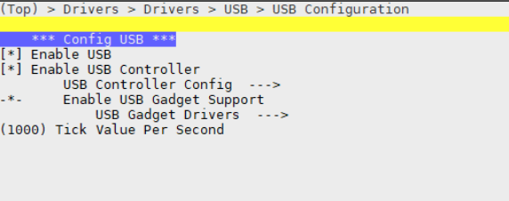

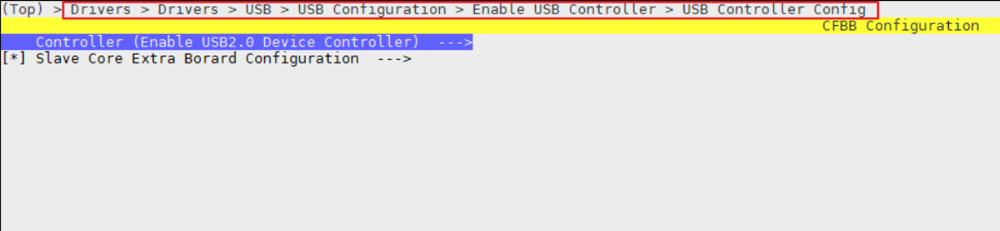

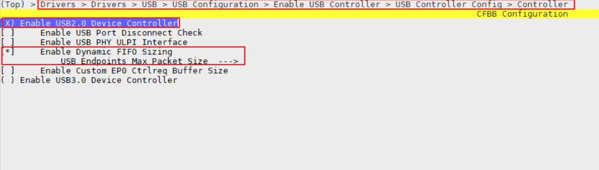

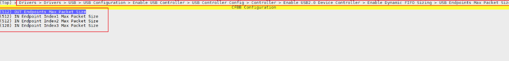

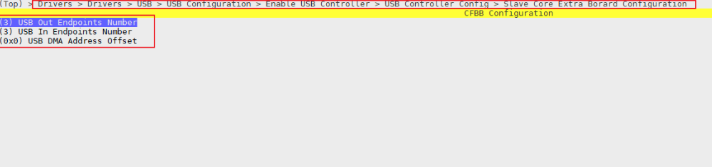

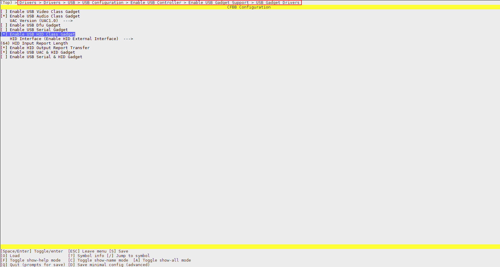

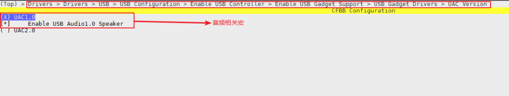

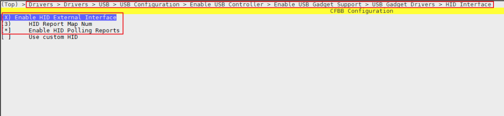

## Development Guide<a name="ZH-CN_TOPIC_0000001664984026"></a>

Example:

1.  Configure the report descriptor information to set the report data format and functions.

    ```
    int tesetsuit_usb_set_report_desc_hid(void)
    {
        return hid_add_report_descriptor(g_report_desc_hid, sizeof(g_report_desc_hid), 0);
    }
    ```

    g\_report\_desc\_hid is the report descriptor, and the return value is the index of the descriptor, used in the sending interface in “[4](#li129087107101)”.

1.  First configure the VID, PID, device version number, and manufacturer, product, and serial number string information of the device.

    ```
        const char manufacturer[TEST_USB_MANUFACTURER_LEN] =  TEST_USB_MANUFACTURER;  /* manufacturer ID */
        struct device_string str_manufacturer = {
            .str = manufacturer,
            .len = TEST_USB_MANUFACTURER_LEN  /* manufacturer ID length */
        };
        const char product[TEST_USB_PRODUCT_LEN] = TEST_USB_PRODUCT;  /* product ID */
        struct device_string str_product = {
            .str = product,
            .len = TEST_USB_PRODUCT_LEN  /* product ID length */
        };
        const char serial[TEST_USB_SERIAL_LEN] = TEST_USB_SERIAL;  /* serial number */
        struct device_string str_serial_number = {
            .str = serial,
            .len = TEST_USB_SERIAL_LEN  /* serial number length */
        };
        struct device_id dev_id = {
            .vendor_id = 0x1111,  /* VID */
            .product_id = 0x0009,  /* PID */
            .release_num = 0x0800  /* version number */
        };
    
        if (usbd_set_device_info(dtype, &str_manufacturer, &str_product, &str_serial_number, dev_id) != 0) {
            test_suite_log_stringf("set device info fail!\n");
            return TEST_SUITE_TEST_FAILED;
        }
    ```

1.  Initialize USB. The device type is DEV\_HID.

    ```
    if (usb_init(DEVICE, dtype) != 0) {
            test_suite_log_stringf("usb_init failed!\n");
            return TEST_SUITE_TEST_FAILED;
    }
    ```

2.  <a name="li129087107101"></a>Send mouse data. Here, sending data in the SOF interrupt is used as an example. You can also call the data sending interface by yourself.

    ```
    uint8_t g_mouse_init_flag = 0;
    void usb_sof_intr_callback(void)
    {
        if (g_mouse_init_flag == 0) {
            return;
        }
        static uint8_t usb_sof_cnt = 0;
        usb_sof_cnt = (usb_sof_cnt + 1) % g_usb_mouse_polling_rate;
        if (usb_sof_cnt != 0) {
            return;
        }
        int16_t x = 0;
        int16_t y = 0;
        g_usb_hid_hs_mouse_operator.get_xy(&x, &y);
        g_send_mouse_msg.x = x;
        g_send_mouse_msg.y = y;
        fhid_send_data(g_mouse_index, (char *)&g_send_mouse_msg, USB_MOUSE_REPORTER_LEN);
    }
    ```

    Because the data receiving interface is a blocking interface, receive host data in a new thread. The fhid\_recv\_data return value is the length of the actually received data. A negative return value indicates that the current device is not connected, the parameters are incorrect, or the device is disconnected.

    The following example receives the data sent by the host and determines whether the data is a command for switching to the dfu device. If so, it deinitializes the device and then initializes it as a dfu device (dfu devices are generally used for upgrading. For details, see the USB\_DFU chapter).

    ```
    osal_kthread_create(usb_recv_task, NULL, "lcd_task", USB_RECV_STACK_SIZE); // Start a thread
    int usb_recv_task(void *para) // Data receiving thread
    {
        UNUSED(para);
        uint8_t recv_data[RECV_MAX_LENGTH];
        for (;;) {
            int32_t ret = fhid_recv_data(tesetsuit_usb_get_hid_index(), (char*)recv_data, RECV_MAX_LENGTH); // Receive data
            if (ret <= 0) {
                osDelay(USB_RECV_TASK_DELAY);
                continue;
            }
            if (ret == RECV_MAX_LENGTH && recv_data[0] == CUSTUMER_PAGE_REPORT_ID) { // Determine the received data type
                seboot_switch_dfu_t command;
                if (memcpy_s(&command, sizeof(seboot_switch_dfu_t), &recv_data[1], RECV_MAX_LENGTH - 1) != EOK) {
                    continue;
                }
                osal_printk("start_flag:%x\r\n", command.start_flag);
                osal_printk("packet_size:%x\r\n", command.packet_size);
                osal_printk("frame_type:%x\r\n", command.frame_type);
                osal_printk("frame_type_reserve:%x\r\n", command.frame_type_reserve);
                osal_printk("flag:%x\r\n", command.flag);
                osal_printk("check_sum:%x\r\n", command.check_sum);
                if (command.frame_type == SWITCH_TO_DFU_FLAG) {
                    osal_printk("start dfu\n");
                    usb_deinit();
                    usb_dfu_init(); // Initialize as a dfu device. For details, see the USB_DFU chapter.
                    break;
                }
            }
        }
        osal_printk("usb recv task over\n");
        return 0;
    }
    
    ```

## Precautions<a name="ZH-CN_TOPIC_0000001665143730"></a>

The index returned after configuring the HID report descriptor must be consistent with the first parameter of the data sending interface. In addition, the format of the sent data is defined based on the report descriptor, so it must also be consistent.

The first byte of the data sent by the host must be consistent with the report\_id in the report descriptor, and the byte length must also be consistent with the report descriptor.

> **Note:** 
>If the usb\_deinit interface is not called in the same thread as fhid\_recv\_data, ensure that the priority of the thread where fhid\_recv\_data resides is higher than that of the thread where usb\_deinit resides. This ensures that fhid\_recv\_data can exit in time during usb\_deinit, preventing deinit failure.

# USB\_DFU<a name="ZH-CN_TOPIC_0000001713023589"></a>


## Overview<a name="ZH-CN_TOPIC_0000001664983982"></a>

The USB DFU device, short for Device Firmware Upgrade, supports receiving new firmware from the host for upgrading.

## Function Overview<a name="ZH-CN_TOPIC_0000001713103529"></a>

The DFU device is a universal serial bus device that supports receiving large amounts of data from the host and is generally used for device upgrading.

## KCONFIG Configuration<a name="ZH-CN_TOPIC_0000001937056821"></a>

None.

## Development Guide<a name="ZH-CN_TOPIC_0000001665143758"></a>

1.  Configure the VID, PID, device version number, and manufacturer, product, and serial number string information of the device.

    ```
    #define DFU_MANUFACTURER  { 'H', 0, 'H', 0, 'H', 0, 'H', 0, 'l', 0, 'i', 0, 'c', 0, 'o', 0, 'n', 0 }
    #define DFU_MANUFACTURER_LEN   20
    #define DFU_PRODUCT  { 'H', 0, 'H', 0, '6', 0, '6', 0, '6', 0, '6', 0, ' ', 0, 'U', 0, 'S', 0, 'B', 0 }
    #define DFU_PRODUCT_LEN        22
    #define DFU_SERIAL   { '2', 0, '0', 0, '2', 0, '0', 0, '0', 0, '6', 0, '2', 0, '4', 0 }
    #define DFU_SERIAL_LEN         16
    int usb_dfu_init(void)
    {
        int ret;
        const char manufacturer[DFU_MANUFACTURER_LEN] = DFU_MANUFACTURER;
        struct device_string str_manufacturer = {
            .str = manufacturer,
            .len = DFU_MANUFACTURER_LEN
        };
        const char product[DFU_PRODUCT_LEN] = DFU_PRODUCT;
        struct device_string str_product = {
            .str = product,
            .len = DFU_PRODUCT_LEN
        };
        const char serial[DFU_SERIAL_LEN] = DFU_SERIAL;
        struct device_string str_serial_number = {
            .str = serial,
            .len = DFU_SERIAL_LEN
        };
        struct device_id dev_id = {
            .vendor_id = 0x1111,
            .product_id = 0xa,
            .release_num = 0x0119
        };
        ret = usbd_set_device_info(DEV_DFU, &str_manufacturer, &str_product, &str_serial_number, dev_id); // Configure the device type and device information
        if (ret != 0) {
            osal_printk("set device info fail!\n");
            return -1;
        }
        ret = usb_init(DEVICE, DEV_DFU);  // Initialize USB as a dfu device
        if (ret != 0) {
            osal_printk("usb_init failed!\n");
            return -1;
        }
        return 0;
    }
    ```

2.  Data receiving and processing.

    usb\_dfu\_download\_callback\(const uint8\_t \*buf, uint32\_t len\) is the callback function for data receiving of the dfu device. When the device receives data, this function is called automatically. The parameters indicate the data address and length. The following example shows the dfu upgrade process:

    ```
    
    void usb_dfu_download_callback(const uint8_t *buf, uint32_t len)
    {
        static bool is_pack_header = true;
        if (buf == NULL || len == 0) {
            printf("upgrade done\r\n");  // Data receiving is complete
            return;
        }
        if (is_pack_header) {
            dfu_packge_header_t *head = (dfu_packge_header_t *)buf;
            osal_printk("is_pack_header:%x\r\n", is_pack_header);
            osal_printk("start_flag:%x\r\n", head->start_flag);
            osal_printk("packet_size:%x\r\n", head->packet_size);
            osal_printk("frame_type:%x\r\n", head->frame_type);
            osal_printk("frame_type_reverse:%x\r\n", head->frame_type_reverse);
            osal_printk("file_addr:%x\r\n", head->file_addr);
            osal_printk("file_len:%x\r\n", head->file_len);
            osal_printk("erase_size:%x\r\n", head->erase_size);
            osal_printk("formal:%x\r\n", head->formal);
            osal_printk("formal_reverse:%x\r\n", head->formal_reverse);
            osal_printk("checksum:%x\r\n", head->checksum);
            is_pack_header = false;
            return;
        }
        osal_printk("          buf:");
        for (int i = 0; i < DFU_SERIAL_LEN; i++) {
            osal_printk("%x  ", buf[i]);
        }
        osal_printk("\n");
        uapi_eflash_erase((uint32_t)g_dfu_data, len);  // Erase len bytes of the flash space starting from g_dfu_data
        uapi_eflash_write((uint32_t)g_dfu_data, (uint32_t *)(uintptr_t)buf, len); // Write the received data to flash
        g_dfu_write_len += len;
        if (uapi_crc16(0, buf, len) != uapi_crc16(0, (uint8_t *)(g_dfu_data + EMBED_FLASH_START), len)) {  // Verify that the data written to flash is consistent with the received data
            osal_printk("check fail!\r\n");
            uapi_eflash_erase(FRAME_DOWNLOAD_OFFSET, g_dfu_write_len);
            cpu_utils_reset_chip_with_log((cores_t)APPS, REBOOT_CAUSE_APPLICATION_SYSRESETREQ);
        }
        for (int i = 0; i < DFU_SERIAL_LEN; i++) {
            osal_printk("%x  ", *(char *)(g_dfu_data + EMBED_FLASH_START + i));
        }
        osal_printk("\ng_dfu_write_len:%u  \n", g_dfu_write_len);
        g_dfu_data += len;
    }
    
    ```

## Precautions<a name="ZH-CN_TOPIC_0000001713103517"></a>

After USB is switched to a DFU device, other functions cannot be used normally. For example, if the device was originally an HID mouse device, the mouse function does not take effect after the device is switched to a DFU device for upgrading.

The PID of a DFU device must be different from that of a device with normal functions. For example, if an HID mouse device has PID 0x9, the PID of the DFU device must be configured not equal to 0x9 when the device is switched to a DFU device for upgrading. Otherwise, after the device is switched to a DFU device, the host still identifies the device as an HID mouse device instead of a DFU device.

# I2S<a name="ZH-CN_TOPIC_0000001965127884"></a>


## Overview<a name="ZH-CN_TOPIC_0000001965130048"></a>

I2S（Inter-IC Sound, Integrated Interchip Sound, or IIS for short）is a digital audio transmission standard used to transmit digital audio data between internal devices in a system, such as codecs (CODEC), DSP, digital input/output interfaces, ADC, DAC, and digital filters. I2S is a simple digital interface protocol without an address or device selection mechanism. Only one master device and one sending device can exist at a time. On the I2S bus, the device that provides clocks (SCK and WS) is the master device. I2S functions are mainly implemented through the SIO (Serial Input&Output) serial input/output module. The SIO interface supports the I2S mode. The I2S interface is usually used in high-fidelity audio applications, such as audio players, audio recording devices, and audio processors.

The I2S bus contains four lines: the clock signal SCK, the left/right channel selection signal WS, the data input signal DI, and the data output signal DO.

This product provides only the I2S0 group of I2S peripherals that support the Master/Slave mode. The I2S specifications are as follows:

-   Two operating modes are supported: master mode and slave mode. In master mode, the SCK needs to be generated by the module internally, while in slave mode, the SCK is provided externally.
-   A FIFO with a bit width of 32 bits x 8 is supported.

## Function Description<a name="ZH-CN_TOPIC_0000002001610297"></a>

> **Note:** 
>If the I2S driver needs to be configured in DMA mode to read and write data, ensure that the DMA driver has been initialized. For DMA initialization, refer to "[DMA](DMA.md)" for configuration.

The I2S module provides the following interfaces and functions:

-   uapi\_i2s\_init（sio\_bus\_t bus, i2s\_callback\_t callback）: Initializes the I2S module (bus indicates the I2S bus currently used, and callback indicates the callback function of the I2S device).
-   uapi\_i2s\_deinit（sio\_bus\_t bus）: Deinitializes the I2S module (bus indicates the I2S bus currently used).
-   uapi\_i2s\_set\_config（sio\_bus\_t bus, const i2s\_config\_t \*config）: Sets the configuration information of the I2S device (bus indicates the I2S bus currently used, and config indicates the configuration information of the I2S device).
-   uapi\_i2s\_get\_config（sio\_bus\_t bus, i2s\_config\_t \*config）: Obtains the configuration information of the I2S device (bus indicates the I2S bus currently used, and config indicates the configuration information of the I2S device).
-   uapi\_i2s\_write\_data（sio\_bus\_t bus, i2s\_tx\_data\_t \*data）: I2S sends data (bus indicates the I2S bus currently used, and data indicates the data to be sent by I2S).
-   uapi\_i2s\_read\_start（sio\_bus\_t bus）: Enables the I2S RX and starts to receive data (bus indicates the I2S bus currently used).
-   uapi\_i2s\_loopback（sio\_bus\_t bus, bool en）: Sets the I2S loopback self-test mode (bus indicates the I2S bus currently used, and en indicates whether to configure the I2S loopback self-test mode). (It can be used only when the CONFIG\_I2S\_SUPPORT\_LOOPBACK macro is enabled.)
-   uapi\_i2s\_loop\_trans（sio\_bus\_t bus, i2s\_tx\_data\_t \*data）: Starts the I2S loopback self-test (bus indicates the I2S bus currently used, and data indicates the data transmission configuration of I2S).
-   uapi\_i2s\_dma\_config（sio\_bus\_t bus, i2s\_dma\_attr\_t \*i2s\_dma\_cfg）: Configures the I2S DMA transmission parameters (bus indicates the I2S bus currently used, and i2s\_dma\_cfg indicates the configuration parameters during I2S DMA transmission). (It can be used only when the CONFIG\_I2S\_SUPPORT\_DMA macro is enabled.)
-   uapi\_i2s\_merge\_write\_by\_dma（sio\_bus\_t bus, const void \*buffer, uint32\_t length, i2s\_dma\_config\_t \*dma\_cfg, uintptr\_t arg, bool block）: In merge mode, I2S writes data through DMA (bus indicates the I2S bus currently used, buffer indicates the data to be sent by I2S, length indicates the length of the data to be sent, dma\_cfg indicates the configuration parameters during I2S DMA transmission, arg indicates a custom parameter pointer that can be passed to the interrupt handler, and block indicates whether the transmission is blocking or non-blocking). (It can be used only when the CONFIG\_I2S\_SUPPORT\_DMA macro is enabled.)
-   uapi\_i2s\_merge\_read\_by\_dma（sio\_bus\_t bus, const void \*buffer, uint32\_t length, i2s\_dma\_config\_t \*dma\_cfg, uintptr\_t arg, bool block）: In merge mode, I2S reads data through DMA (bus indicates the I2S bus currently used, buffer indicates the buffer for I2S to read data, length indicates the length of the data to be read, dma\_cfg indicates the configuration parameters during I2S DMA transmission, arg indicates a custom parameter pointer that can be passed to the interrupt handler, and block indicates whether the transmission is blocking or non-blocking). (It can be used only when the CONFIG\_I2S\_SUPPORT\_DMA macro is enabled.)

## KCONFIG Configuration<a name="ZH-CN_TOPIC_0000002001450849"></a>

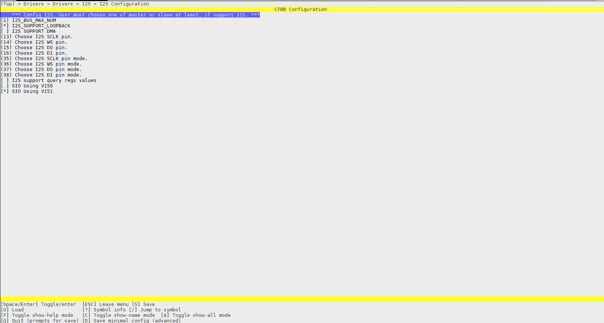

> **Note:** 
>If the images above are inconsistent with the table descriptions, the table prevails.

For details about the macros, see [Table 1](#table124761510114).

**Table 1**  Descriptions of I2S-related macros

<a name="table124761510114"></a>
<table><thead align="left"><tr id="row1248415121110"><th class="cellrowborder" valign="top" width="22.62773722627738%" id="mcps1.2.7.1.1"><p id="p1348201516115"><a name="p1348201516115"></a><a name="p1348201516115"></a>Macro name (CONFIG_ is the prefix added by default)</p>
</th>
<th class="cellrowborder" valign="top" width="21.137886211378866%" id="mcps1.2.7.1.2"><p id="p74861571119"><a name="p74861571119"></a><a name="p74861571119"></a>Specific description displayed on the Kconfig interface</p>
</th>
<th class="cellrowborder" valign="top" width="19.878012198780127%" id="mcps1.2.7.1.3"><p id="p04818159112"><a name="p04818159112"></a><a name="p04818159112"></a>Usage scenario</p>
</th>
<th class="cellrowborder" valign="top" width="10.608939106089393%" id="mcps1.2.7.1.4"><p id="p948111510117"><a name="p948111510117"></a><a name="p948111510117"></a>Implemented</p>
</th>
<th class="cellrowborder" valign="top" width="11.328867113288673%" id="mcps1.2.7.1.5"><p id="p948181514115"><a name="p948181514115"></a><a name="p948181514115"></a>Depends on other macros</p>
</th>
<th class="cellrowborder" valign="top" width="14.418558144185583%" id="mcps1.2.7.1.6"><p id="p1162923893911"><a name="p1162923893911"></a><a name="p1162923893911"></a>Whether to enable or modify the configuration</p>
</th>
</tr>
</thead>
<tbody><tr id="row548141591113"><td class="cellrowborder" valign="top" width="22.62773722627738%" headers="mcps1.2.7.1.1 "><p id="p134819151113"><a name="p134819151113"></a><a name="p134819151113"></a>CONFIG_I2S_BUS_MAX_NUM</p>
</td>
<td class="cellrowborder" valign="top" width="21.137886211378866%" headers="mcps1.2.7.1.2 "><p id="p28673381813"><a name="p28673381813"></a><a name="p28673381813"></a>I2S_BUS_MAX_NUM.</p>
</td>
<td class="cellrowborder" valign="top" width="19.878012198780127%" headers="mcps1.2.7.1.3 "><p id="p182789183235"><a name="p182789183235"></a><a name="p182789183235"></a>Maximum number of configurable I2S buses. This product supports only one group (I2S BUS0).</p>
</td>
<td class="cellrowborder" valign="top" width="10.608939106089393%" headers="mcps1.2.7.1.4 "><p id="p12489158112"><a name="p12489158112"></a><a name="p12489158112"></a>Yes</p>
</td>
<td class="cellrowborder" valign="top" width="11.328867113288673%" headers="mcps1.2.7.1.5 "><p id="p248815101112"><a name="p248815101112"></a><a name="p248815101112"></a>No</p>
</td>
<td class="cellrowborder" valign="top" width="14.418558144185583%" headers="mcps1.2.7.1.6 "><p id="p151371543346"><a name="p151371543346"></a><a name="p151371543346"></a>The default value is 1. It is recommended not to modify it.</p>
</td>
</tr>
<tr id="row1048121512114"><td class="cellrowborder" valign="top" width="22.62773722627738%" headers="mcps1.2.7.1.1 "><p id="p5486153111"><a name="p5486153111"></a><a name="p5486153111"></a>CONFIG_I2S_SUPPORT_LOOPBACK</p>
</td>
<td class="cellrowborder" valign="top" width="21.137886211378866%" headers="mcps1.2.7.1.2 "><p id="p6314610193820"><a name="p6314610193820"></a><a name="p6314610193820"></a>I2S_SUPPORT_LOOPBACK.</p>
</td>
<td class="cellrowborder" valign="top" width="19.878012198780127%" headers="mcps1.2.7.1.3 "><p id="p750495852813"><a name="p750495852813"></a><a name="p750495852813"></a>I2S supports the single-board loopback mode</p>
</td>
<td class="cellrowborder" valign="top" width="10.608939106089393%" headers="mcps1.2.7.1.4 "><p id="p14483159117"><a name="p14483159117"></a><a name="p14483159117"></a>Yes</p>
</td>
<td class="cellrowborder" valign="top" width="11.328867113288673%" headers="mcps1.2.7.1.5 "><p id="p2629138193917"><a name="p2629138193917"></a><a name="p2629138193917"></a>No</p>
</td>
<td class="cellrowborder" valign="top" width="14.418558144185583%" headers="mcps1.2.7.1.6 "><p id="p16717115134416"><a name="p16717115134416"></a><a name="p16717115134416"></a>Enabled by default. Recommended to enable.</p>
</td>
</tr>
<tr id="row174821511118"><td class="cellrowborder" valign="top" width="22.62773722627738%" headers="mcps1.2.7.1.1 "><p id="p164871501115"><a name="p164871501115"></a><a name="p164871501115"></a>CONFIG_I2S_SUPPORT_DMA</p>
</td>
<td class="cellrowborder" valign="top" width="21.137886211378866%" headers="mcps1.2.7.1.2 "><p id="p1534374635"><a name="p1534374635"></a><a name="p1534374635"></a>I2S SUPPORT DMA.</p>
</td>
<td class="cellrowborder" valign="top" width="19.878012198780127%" headers="mcps1.2.7.1.3 "><p id="p1534582015113"><a name="p1534582015113"></a><a name="p1534582015113"></a>I2S supports the DMA mode</p>
</td>
<td class="cellrowborder" valign="top" width="10.608939106089393%" headers="mcps1.2.7.1.4 "><p id="p1481815141111"><a name="p1481815141111"></a><a name="p1481815141111"></a>Yes</p>
</td>
<td class="cellrowborder" valign="top" width="11.328867113288673%" headers="mcps1.2.7.1.5 "><p id="p8473437181816"><a name="p8473437181816"></a><a name="p8473437181816"></a>No</p>
</td>
<td class="cellrowborder" valign="top" width="14.418558144185583%" headers="mcps1.2.7.1.6 "><p id="p97001027124119"><a name="p97001027124119"></a><a name="p97001027124119"></a>Disabled by default. Enable it as appropriate.</p>
</td>
</tr>
<tr id="row1848115131117"><td class="cellrowborder" valign="top" width="22.62773722627738%" headers="mcps1.2.7.1.1 "><p id="p548181571118"><a name="p548181571118"></a><a name="p548181571118"></a>CONFIG_I2S_SCLK_PIN</p>
</td>
<td class="cellrowborder" valign="top" width="21.137886211378866%" headers="mcps1.2.7.1.2 "><p id="p1326114416384"><a name="p1326114416384"></a><a name="p1326114416384"></a>Choose I2S SCLK pin.</p>
</td>
<td class="cellrowborder" valign="top" width="19.878012198780127%" headers="mcps1.2.7.1.3 "><p id="p0369111616584"><a name="p0369111616584"></a><a name="p0369111616584"></a>I2S clock pin</p>
</td>
<td class="cellrowborder" valign="top" width="10.608939106089393%" headers="mcps1.2.7.1.4 "><p id="p154813150114"><a name="p154813150114"></a><a name="p154813150114"></a>Yes</p>
</td>
<td class="cellrowborder" valign="top" width="11.328867113288673%" headers="mcps1.2.7.1.5 "><p id="p184291153201819"><a name="p184291153201819"></a><a name="p184291153201819"></a>No</p>
</td>
<td class="cellrowborder" valign="top" width="14.418558144185583%" headers="mcps1.2.7.1.6 "><p id="p621764843713"><a name="p621764843713"></a><a name="p621764843713"></a>The default value is 13. Configure it as appropriate.</p>
</td>
</tr>
<tr id="row194815159113"><td class="cellrowborder" valign="top" width="22.62773722627738%" headers="mcps1.2.7.1.1 "><p id="p124801510112"><a name="p124801510112"></a><a name="p124801510112"></a>CONFIG_I2S_WS_PIN</p>
</td>
<td class="cellrowborder" valign="top" width="21.137886211378866%" headers="mcps1.2.7.1.2 "><p id="p824263818316"><a name="p824263818316"></a><a name="p824263818316"></a>Choose I2S WS pin.</p>
</td>
<td class="cellrowborder" valign="top" width="19.878012198780127%" headers="mcps1.2.7.1.3 "><p id="p9328125416384"><a name="p9328125416384"></a><a name="p9328125416384"></a>I2S left and right channel pin</p>
</td>
<td class="cellrowborder" valign="top" width="10.608939106089393%" headers="mcps1.2.7.1.4 "><p id="p348215161113"><a name="p348215161113"></a><a name="p348215161113"></a>Yes</p>
</td>
<td class="cellrowborder" valign="top" width="11.328867113288673%" headers="mcps1.2.7.1.5 "><p id="p115505376560"><a name="p115505376560"></a><a name="p115505376560"></a>No</p>
</td>
<td class="cellrowborder" valign="top" width="14.418558144185583%" headers="mcps1.2.7.1.6 "><p id="p188515553711"><a name="p188515553711"></a><a name="p188515553711"></a>The default value is 14. Configure it as appropriate.</p>
</td>
</tr>
<tr id="row1048181518112"><td class="cellrowborder" valign="top" width="22.62773722627738%" headers="mcps1.2.7.1.1 "><p id="p109831846175713"><a name="p109831846175713"></a><a name="p109831846175713"></a>CONFIG_I2S_DO_PIN</p>
</td>
<td class="cellrowborder" valign="top" width="21.137886211378866%" headers="mcps1.2.7.1.2 "><p id="p1092835010319"><a name="p1092835010319"></a><a name="p1092835010319"></a>Choose I2S DO pin.</p>
</td>
<td class="cellrowborder" valign="top" width="19.878012198780127%" headers="mcps1.2.7.1.3 "><p id="p590039143911"><a name="p590039143911"></a><a name="p590039143911"></a>I2S output pin</p>
</td>
<td class="cellrowborder" valign="top" width="10.608939106089393%" headers="mcps1.2.7.1.4 "><p id="p24911531115"><a name="p24911531115"></a><a name="p24911531115"></a>Yes</p>
</td>
<td class="cellrowborder" valign="top" width="11.328867113288673%" headers="mcps1.2.7.1.5 "><p id="p49831518183718"><a name="p49831518183718"></a><a name="p49831518183718"></a>No</p>
</td>
<td class="cellrowborder" valign="top" width="14.418558144185583%" headers="mcps1.2.7.1.6 "><p id="p0846144113716"><a name="p0846144113716"></a><a name="p0846144113716"></a>The default value is 15. Configure it as appropriate.</p>
</td>
</tr>
<tr id="row1071318918131"><td class="cellrowborder" valign="top" width="22.62773722627738%" headers="mcps1.2.7.1.1 "><p id="p671319910134"><a name="p671319910134"></a><a name="p671319910134"></a>CONFIG_I2S_DI_PIN</p>
</td>
<td class="cellrowborder" valign="top" width="21.137886211378866%" headers="mcps1.2.7.1.2 "><p id="p2086620416410"><a name="p2086620416410"></a><a name="p2086620416410"></a>Choose I2S DI pin..</p>
</td>
<td class="cellrowborder" valign="top" width="19.878012198780127%" headers="mcps1.2.7.1.3 "><p id="p71937216399"><a name="p71937216399"></a><a name="p71937216399"></a>I2S input pin</p>
</td>
<td class="cellrowborder" valign="top" width="10.608939106089393%" headers="mcps1.2.7.1.4 "><p id="p1571316971311"><a name="p1571316971311"></a><a name="p1571316971311"></a>Yes</p>
</td>
<td class="cellrowborder" valign="top" width="11.328867113288673%" headers="mcps1.2.7.1.5 "><p id="p3642132173716"><a name="p3642132173716"></a><a name="p3642132173716"></a>No</p>
</td>
<td class="cellrowborder" valign="top" width="14.418558144185583%" headers="mcps1.2.7.1.6 "><p id="p348812572375"><a name="p348812572375"></a><a name="p348812572375"></a>The default value is 16. Configure it as appropriate.</p>
</td>
</tr>
<tr id="row1663153711314"><td class="cellrowborder" valign="top" width="22.62773722627738%" headers="mcps1.2.7.1.1 "><p id="p13663183721310"><a name="p13663183721310"></a><a name="p13663183721310"></a>CONFIG_I2S_SCLK_PIN_MODE</p>
</td>
<td class="cellrowborder" valign="top" width="21.137886211378866%" headers="mcps1.2.7.1.2 "><p id="p1030517151649"><a name="p1030517151649"></a><a name="p1030517151649"></a>Choose I2S SCLK pin mode.</p>
</td>
<td class="cellrowborder" valign="top" width="19.878012198780127%" headers="mcps1.2.7.1.3 "><p id="p116051364020"><a name="p116051364020"></a><a name="p116051364020"></a>Mode configured for the I2S clock pin</p>
</td>
<td class="cellrowborder" valign="top" width="10.608939106089393%" headers="mcps1.2.7.1.4 "><p id="p186635371131"><a name="p186635371131"></a><a name="p186635371131"></a>Yes</p>
</td>
<td class="cellrowborder" valign="top" width="11.328867113288673%" headers="mcps1.2.7.1.5 "><p id="p116001823133710"><a name="p116001823133710"></a><a name="p116001823133710"></a>No</p>
</td>
<td class="cellrowborder" valign="top" width="14.418558144185583%" headers="mcps1.2.7.1.6 "><p id="p125242276524"><a name="p125242276524"></a><a name="p125242276524"></a>The default value is 35. Configure it as appropriate.</p>
</td>
</tr>
<tr id="row1115204491314"><td class="cellrowborder" valign="top" width="22.62773722627738%" headers="mcps1.2.7.1.1 "><p id="p20115184431314"><a name="p20115184431314"></a><a name="p20115184431314"></a>CONFIG_I2S_WS_PIN_MODE</p>
</td>
<td class="cellrowborder" valign="top" width="21.137886211378866%" headers="mcps1.2.7.1.2 "><p id="p1038192719410"><a name="p1038192719410"></a><a name="p1038192719410"></a>Choose I2S WS pin mode.</p>
</td>
<td class="cellrowborder" valign="top" width="19.878012198780127%" headers="mcps1.2.7.1.3 "><p id="p2584933174017"><a name="p2584933174017"></a><a name="p2584933174017"></a>Mode configured for the I2S left and right channel pin</p>
</td>
<td class="cellrowborder" valign="top" width="10.608939106089393%" headers="mcps1.2.7.1.4 "><p id="p9115124411312"><a name="p9115124411312"></a><a name="p9115124411312"></a>Yes</p>
</td>
<td class="cellrowborder" valign="top" width="11.328867113288673%" headers="mcps1.2.7.1.5 "><p id="p5115544151311"><a name="p5115544151311"></a><a name="p5115544151311"></a>No</p>
</td>
<td class="cellrowborder" valign="top" width="14.418558144185583%" headers="mcps1.2.7.1.6 "><p id="p1581862173810"><a name="p1581862173810"></a><a name="p1581862173810"></a>The default value is 36. Configure it as appropriate.</p>
</td>
</tr>
<tr id="row9686349171316"><td class="cellrowborder" valign="top" width="22.62773722627738%" headers="mcps1.2.7.1.1 "><p id="p2068610490135"><a name="p2068610490135"></a><a name="p2068610490135"></a>CONFIG_I2S_DO_PIN_MODE</p>
</td>
<td class="cellrowborder" valign="top" width="21.137886211378866%" headers="mcps1.2.7.1.2 "><p id="p1699112401448"><a name="p1699112401448"></a><a name="p1699112401448"></a>Choose I2S DO pin mode.</p>
</td>
<td class="cellrowborder" valign="top" width="19.878012198780127%" headers="mcps1.2.7.1.3 "><p id="p104611368409"><a name="p104611368409"></a><a name="p104611368409"></a>Mode configured for the I2S output pin</p>
</td>
<td class="cellrowborder" valign="top" width="10.608939106089393%" headers="mcps1.2.7.1.4 "><p id="p12686184941312"><a name="p12686184941312"></a><a name="p12686184941312"></a>Yes</p>
</td>
<td class="cellrowborder" valign="top" width="11.328867113288673%" headers="mcps1.2.7.1.5 "><p id="p26871249111313"><a name="p26871249111313"></a><a name="p26871249111313"></a>No</p>
</td>
<td class="cellrowborder" valign="top" width="14.418558144185583%" headers="mcps1.2.7.1.6 "><p id="p19767274385"><a name="p19767274385"></a><a name="p19767274385"></a>The default value is 37. Configure it as appropriate.</p>
</td>
</tr>
<tr id="row10100123917141"><td class="cellrowborder" valign="top" width="22.62773722627738%" headers="mcps1.2.7.1.1 "><p id="p6359290154"><a name="p6359290154"></a><a name="p6359290154"></a>CONFIG_I2S_DI_PIN_MODE</p>
</td>
<td class="cellrowborder" valign="top" width="21.137886211378866%" headers="mcps1.2.7.1.2 "><p id="p15555612193419"><a name="p15555612193419"></a><a name="p15555612193419"></a>Choose I2S DI pin mode.</p>
</td>
<td class="cellrowborder" valign="top" width="19.878012198780127%" headers="mcps1.2.7.1.3 "><p id="p84591138144018"><a name="p84591138144018"></a><a name="p84591138144018"></a>Mode configured for the I2S input pin</p>
</td>
<td class="cellrowborder" valign="top" width="10.608939106089393%" headers="mcps1.2.7.1.4 "><p id="p131001439161420"><a name="p131001439161420"></a><a name="p131001439161420"></a>Yes</p>
</td>
<td class="cellrowborder" valign="top" width="11.328867113288673%" headers="mcps1.2.7.1.5 "><p id="p110083912148"><a name="p110083912148"></a><a name="p110083912148"></a>No</p>
</td>
<td class="cellrowborder" valign="top" width="14.418558144185583%" headers="mcps1.2.7.1.6 "><p id="p3987163313819"><a name="p3987163313819"></a><a name="p3987163313819"></a>The default value is 38. Configure it as appropriate.</p>
</td>
</tr>
<tr id="row9604124541418"><td class="cellrowborder" valign="top" width="22.62773722627738%" headers="mcps1.2.7.1.1 "><p id="p1198461021518"><a name="p1198461021518"></a><a name="p1198461021518"></a>CONFIG_I2S_SUPPORT_QUERY_REGS</p>
</td>
<td class="cellrowborder" valign="top" width="21.137886211378866%" headers="mcps1.2.7.1.2 "><p id="p142671250514"><a name="p142671250514"></a><a name="p142671250514"></a>I2S support query regs values.</p>
</td>
<td class="cellrowborder" valign="top" width="19.878012198780127%" headers="mcps1.2.7.1.3 "><p id="p14915153115"><a name="p14915153115"></a><a name="p14915153115"></a>I2S supports reading back the values of all related registers. Enable it as appropriate.</p>
</td>
<td class="cellrowborder" valign="top" width="10.608939106089393%" headers="mcps1.2.7.1.4 "><p id="p1860512452145"><a name="p1860512452145"></a><a name="p1860512452145"></a>Yes</p>
</td>
<td class="cellrowborder" valign="top" width="11.328867113288673%" headers="mcps1.2.7.1.5 "><p id="p13605145101411"><a name="p13605145101411"></a><a name="p13605145101411"></a>No</p>
</td>
<td class="cellrowborder" valign="top" width="14.418558144185583%" headers="mcps1.2.7.1.6 "><p id="p1817114179353"><a name="p1817114179353"></a><a name="p1817114179353"></a>Disabled by default. Enable it as appropriate.</p>
</td>
</tr>
<tr id="row4155553141"><td class="cellrowborder" valign="top" width="22.62773722627738%" headers="mcps1.2.7.1.1 "><p id="p2119131217152"><a name="p2119131217152"></a><a name="p2119131217152"></a>CONFIG_SIO_USING_V150</p>
</td>
<td class="cellrowborder" valign="top" width="21.137886211378866%" headers="mcps1.2.7.1.2 "><p id="p879573724713"><a name="p879573724713"></a><a name="p879573724713"></a>SIO Using V150.</p>
</td>
<td class="cellrowborder" valign="top" width="19.878012198780127%" headers="mcps1.2.7.1.3 "><p id="p174918153116"><a name="p174918153116"></a><a name="p174918153116"></a>This macro indicates using the SIO V150 driver specification, which is not used in this product.</p>
</td>
<td class="cellrowborder" valign="top" width="10.608939106089393%" headers="mcps1.2.7.1.4 "><p id="p201555511146"><a name="p201555511146"></a><a name="p201555511146"></a>Yes</p>
</td>
<td class="cellrowborder" valign="top" width="11.328867113288673%" headers="mcps1.2.7.1.5 "><p id="p1280317457132"><a name="p1280317457132"></a><a name="p1280317457132"></a>No</p>
</td>
<td class="cellrowborder" valign="top" width="14.418558144185583%" headers="mcps1.2.7.1.6 "><p id="p7644175334613"><a name="p7644175334613"></a><a name="p7644175334613"></a>Disabled by default. It must be disabled.</p>
</td>
</tr>
<tr id="row155854071519"><td class="cellrowborder" valign="top" width="22.62773722627738%" headers="mcps1.2.7.1.1 "><p id="p1289513201519"><a name="p1289513201519"></a><a name="p1289513201519"></a>CONFIG_DATA_LEN_MAX</p>
</td>
<td class="cellrowborder" valign="top" width="21.137886211378866%" headers="mcps1.2.7.1.2 "><p id="p191602044299"><a name="p191602044299"></a><a name="p191602044299"></a>DATA_LEN_MAX.</p>
</td>
<td class="cellrowborder" valign="top" width="19.878012198780127%" headers="mcps1.2.7.1.3 "><p id="p123612018467"><a name="p123612018467"></a><a name="p123612018467"></a>Maximum length of the I2S data to be sent. Not used in this product.</p>
</td>
<td class="cellrowborder" valign="top" width="10.608939106089393%" headers="mcps1.2.7.1.4 "><p id="p145852091517"><a name="p145852091517"></a><a name="p145852091517"></a>Yes</p>
</td>
<td class="cellrowborder" valign="top" width="11.328867113288673%" headers="mcps1.2.7.1.5 "><p id="p9786113516223"><a name="p9786113516223"></a><a name="p9786113516223"></a>CONFIG_SIO_USING_V150</p>
</td>
<td class="cellrowborder" valign="top" width="14.418558144185583%" headers="mcps1.2.7.1.6 "><p id="p2184155224611"><a name="p2184155224611"></a><a name="p2184155224611"></a>Disabled by default. It must be disabled.</p>
</td>
</tr>
<tr id="row1120612316161"><td class="cellrowborder" valign="top" width="22.62773722627738%" headers="mcps1.2.7.1.1 "><p id="p12207162314169"><a name="p12207162314169"></a><a name="p12207162314169"></a>CONFIG_I2S_RX_THRESHOLD</p>
</td>
<td class="cellrowborder" valign="top" width="21.137886211378866%" headers="mcps1.2.7.1.2 "><p id="p1744711148101"><a name="p1744711148101"></a><a name="p1744711148101"></a>Threshold of the I2S RX channel.</p>
</td>
<td class="cellrowborder" valign="top" width="19.878012198780127%" headers="mcps1.2.7.1.3 "><p id="p1357732211468"><a name="p1357732211468"></a><a name="p1357732211468"></a>RX watermark threshold of I2S. Not used in this product.</p>
</td>
<td class="cellrowborder" valign="top" width="10.608939106089393%" headers="mcps1.2.7.1.4 "><p id="p10207202331613"><a name="p10207202331613"></a><a name="p10207202331613"></a>Yes</p>
</td>
<td class="cellrowborder" valign="top" width="11.328867113288673%" headers="mcps1.2.7.1.5 "><p id="p160038202210"><a name="p160038202210"></a><a name="p160038202210"></a>CONFIG_SIO_USING_V150</p>
</td>
<td class="cellrowborder" valign="top" width="14.418558144185583%" headers="mcps1.2.7.1.6 "><p id="p102101238132610"><a name="p102101238132610"></a><a name="p102101238132610"></a>Disabled by default. It must be disabled.</p>
</td>
</tr>
<tr id="row18951740131615"><td class="cellrowborder" valign="top" width="22.62773722627738%" headers="mcps1.2.7.1.1 "><p id="p197481234181715"><a name="p197481234181715"></a><a name="p197481234181715"></a>CONFIG_I2S_TX_THRESHOLD</p>
</td>
<td class="cellrowborder" valign="top" width="21.137886211378866%" headers="mcps1.2.7.1.2 "><p id="p199591808107"><a name="p199591808107"></a><a name="p199591808107"></a>Threshold of the I2S TX channel.</p>
</td>
<td class="cellrowborder" valign="top" width="19.878012198780127%" headers="mcps1.2.7.1.3 "><p id="p18943035112516"><a name="p18943035112516"></a><a name="p18943035112516"></a>TX watermark threshold of I2S. Not used in this product.</p>
</td>
<td class="cellrowborder" valign="top" width="10.608939106089393%" headers="mcps1.2.7.1.4 "><p id="p16957407165"><a name="p16957407165"></a><a name="p16957407165"></a>Yes</p>
</td>
<td class="cellrowborder" valign="top" width="11.328867113288673%" headers="mcps1.2.7.1.5 "><p id="p1747283962219"><a name="p1747283962219"></a><a name="p1747283962219"></a>CONFIG_SIO_USING_V150</p>
</td>
<td class="cellrowborder" valign="top" width="14.418558144185583%" headers="mcps1.2.7.1.6 "><p id="p10101124013263"><a name="p10101124013263"></a><a name="p10101124013263"></a>Disabled by default. It must be disabled.</p>
</td>
</tr>
<tr id="row16469746171619"><td class="cellrowborder" valign="top" width="22.62773722627738%" headers="mcps1.2.7.1.1 "><p id="p13831935111710"><a name="p13831935111710"></a><a name="p13831935111710"></a>CONFIG_I2S_BCLK_DIV_NUM</p>
</td>
<td class="cellrowborder" valign="top" width="21.137886211378866%" headers="mcps1.2.7.1.2 "><p id="p19991173441010"><a name="p19991173441010"></a><a name="p19991173441010"></a>NUM of the I2S BCLK DIV.</p>
</td>
<td class="cellrowborder" valign="top" width="19.878012198780127%" headers="mcps1.2.7.1.3 "><p id="p56134571811"><a name="p56134571811"></a><a name="p56134571811"></a>I2S BCLK division value. Not used in this product.</p>
</td>
<td class="cellrowborder" valign="top" width="10.608939106089393%" headers="mcps1.2.7.1.4 "><p id="p154691146191615"><a name="p154691146191615"></a><a name="p154691146191615"></a>Yes</p>
</td>
<td class="cellrowborder" valign="top" width="11.328867113288673%" headers="mcps1.2.7.1.5 "><p id="p4914440172218"><a name="p4914440172218"></a><a name="p4914440172218"></a>CONFIG_SIO_USING_V150</p>
</td>
<td class="cellrowborder" valign="top" width="14.418558144185583%" headers="mcps1.2.7.1.6 "><p id="p121651642142612"><a name="p121651642142612"></a><a name="p121651642142612"></a>Disabled by default. It must be disabled.</p>
</td>
</tr>
<tr id="row133512133512"><td class="cellrowborder" valign="top" width="22.62773722627738%" headers="mcps1.2.7.1.1 "><p id="p0328717114020"><a name="p0328717114020"></a><a name="p0328717114020"></a>CONFIG_SIO_USING_V151</p>
</td>
<td class="cellrowborder" valign="top" width="21.137886211378866%" headers="mcps1.2.7.1.2 "><p id="p117931759173519"><a name="p117931759173519"></a><a name="p117931759173519"></a>SIO Using V151.</p>
</td>
<td class="cellrowborder" valign="top" width="19.878012198780127%" headers="mcps1.2.7.1.3 "><p id="p187131459122518"><a name="p187131459122518"></a><a name="p187131459122518"></a>This macro indicates using the SIO V151 driver specification, which is used by default in this product.</p>
</td>
<td class="cellrowborder" valign="top" width="10.608939106089393%" headers="mcps1.2.7.1.4 "><p id="p123283175403"><a name="p123283175403"></a><a name="p123283175403"></a>Yes</p>
</td>
<td class="cellrowborder" valign="top" width="11.328867113288673%" headers="mcps1.2.7.1.5 "><p id="p9328151794011"><a name="p9328151794011"></a><a name="p9328151794011"></a>No</p>
</td>
<td class="cellrowborder" valign="top" width="14.418558144185583%" headers="mcps1.2.7.1.6 "><p id="p12328191719406"><a name="p12328191719406"></a><a name="p12328191719406"></a>Enabled by default. Mandatory.</p>
</td>
</tr>
</tbody>
</table>

## Development Guide<a name="ZH-CN_TOPIC_0000001964970260"></a>

I2S is used to connect to devices that support the I2S protocol. An I2S unit can act as a master device or a slave device. The following takes the I2S unit acting as a master device as an example:

1.  Call the sio\_porting\_i2s\_pinmux interface to perform IO multiplexing and multiplex the used pins as the I2S function.
2.  Call the uapi\_i2s\_init and uapi\_i2s\_set\_config interfaces to initialize the I2S resources. The following takes initializing the I2S host as an example:

    ```
    void sample_i2s_init(void)
    {
        i2s_config_t config = {
            .drive_mode= MASTER,
            .transfer_mode = STD_MODE,
            .data_width = TWENTY_FOUR_BIT,
            .channels_num = TWO_CH,
            .timing = NONE_TIMING_MODE,
            .clk_edge = RISING_EDGE,
            .div_number = I2S_DIV_NUM,
            .number_of_channels = I2S_NUMBER_OF_CHANNELS,
        };
        /* Set the i2s pinmux */
        sio_porting_i2s_pinmux();       /* Set the i2s pinmux */
        /* Initialize i2s0 */
        uapi_i2s_init(SIO_BUS_0, app_i2s_rx_callback);
        uapi_i2s_set_config(SIO_BUS_0, &config);
    }
    ```

3.  Call the uapi\_i2s\_write\_data interface to enable the host to send data.

    ```
    errcode_t sample_i2s_write(i2s_tx_data_t *data)
    {
        return uapi_i2s_write_data(SIO_BUS_0, &data);     /* Send data */
    }
    ```

The following code shows the complete I2S DMA master-slave transceiving process:

```
#include "i2s.h"
#include "watchdog.h"
#include "hal_sio.h"
#include "hal_dma.h"
#include "soc_osal.h"
#include "app_init.h"

#define I2S_DIV_NUMBER              32
#define I2S_CHANNEL_NUMBER          2
#define I2S_TX_INT_THRESHOLD        7
#define I2S_RX_INT_THRESHOLD        1
#define I2S_DMA_SRC_WIDTH           2
#define I2S_DMA_DEST_WIDTH          2
#define I2S_DMA_BURST_LENGTH        0
#define I2S_DMA_TRANS_STEP          2

#define I2S_TASK_PRIO               24
#define I2S_TASK_STACK_SIZE         0xc00

static uint32_t g_i2s_first_data = 0x10000000;    /* 32 bits */
static uint32_t g_i2s_send_dma_data[CONFIG_I2S_TRANSFER_LEN_OF_DMA] = { 0 };

static void *i2s_dma_master_task(const char *arg)
{
    unused(arg);
    int32_t ret = CONFIG_I2S_TRANSFER_LEN_OF_DMA;
#if defined(CONFIG_SIO_USING_V151)
    ret = ERRCODE_SUCC;
#endif
    uapi_i2s_deinit(SIO_BUS_0);
    uapi_dma_deinit();
    uapi_i2s_init(SIO_BUS_0, NULL);
    sio_porting_i2s_pinmux();
    i2s_config_t config = {
        .drive_mode= MASTER,
        .transfer_mode = STD_MODE,
        .data_width = THIRTY_TWO_BIT,
        .channels_num = TWO_CH,
        .timing = NONE_TIMING_MODE,
        .clk_edge = RISING_EDGE,
        .div_number = I2S_DIV_NUMBER,
        .number_of_channels = I2S_CHANNEL_NUMBER,
    };
    i2s_dma_attr_t attr = {
        .tx_dma_enable = 1,
        .tx_int_threshold = I2S_TX_INT_THRESHOLD,
        .rx_dma_enable = 0,
        .rx_int_threshold = I2S_RX_INT_THRESHOLD,
    };
    i2s_dma_config_t dma_cfg = {
        .src_width = I2S_DMA_SRC_WIDTH,
        .dest_width = I2S_DMA_DEST_WIDTH,
        .burst_length = I2S_DMA_BURST_LENGTH,
        .priority = 0,
    };
    uapi_i2s_set_config(SIO_BUS_0, &config);
    uapi_i2s_dma_config(SIO_BUS_0, &attr);

    for (uint32_t i = 0; i < CONFIG_I2S_TRANSFER_LEN_OF_DMA; i += I2S_DMA_TRANS_STEP) {
        g_i2s_send_dma_data[i] = g_i2s_first_data;
        g_i2s_send_dma_data[i + 1] = g_i2s_first_data;
        g_i2s_first_data++;
    }
    /* DMA init. */
    uapi_dma_init();
    uapi_dma_open();

    osal_printk("DMA master transfer start.\r\n");
    while (1) {
        uapi_watchdog_kick();
        if (uapi_i2s_merge_write_by_dma(SIO_BUS_0, &g_i2s_send_dma_data, CONFIG_I2S_TRANSFER_LEN_OF_DMA, &dma_cfg,
            (uintptr_t)NULL, true) != ret) {
            osal_printk("master uapi_i2s_merge_write_by_dma error.\r\n");
        }
    }
    return NULL;
}

static void i2s_entry(void)
{
    osal_task *task_handle = NULL;
    osal_kthread_lock();
    task_handle = osal_kthread_create((osal_kthread_handler)i2s_dma_master_task, 0, "I2sDmaMasterTask",
                                      I2S_TASK_STACK_SIZE);
    if (task_handle != NULL) {
        osal_kthread_set_priority(task_handle, I2S_TASK_PRIO);
    }
    osal_kthread_unlock();
}

/* Run the i2s_entry. */
app_run(i2s_entry);

-----------------------------------------------------------------

#include "i2s.h"
#include "watchdog.h"
#include "hal_sio.h"
#include "hal_dma.h"
#include "soc_osal.h"
#include "app_init.h"

#define I2S_DIV_NUMBER              32
#define I2S_CHANNEL_NUMBER          2
#define I2S_TX_INT_THRESHOLD        7
#define I2S_RX_INT_THRESHOLD        1
#define I2S_DMA_TRANSFER_EVENT      1
#define I2S_RING_BUFFER_NUMBER      4

#define I2S_TASK_PRIO               24
#define I2S_TASK_STACK_SIZE         0xc00

static uint32_t g_i2s_dma_data0[CONFIG_I2S_TRANSFER_LEN_OF_DMA] = { 0 };
static uint32_t g_i2s_dma_data1[CONFIG_I2S_TRANSFER_LEN_OF_DMA] = { 0 };
static uint32_t g_i2s_dma_data2[CONFIG_I2S_TRANSFER_LEN_OF_DMA] = { 0 };
static uint32_t g_i2s_dma_data3[CONFIG_I2S_TRANSFER_LEN_OF_DMA] = { 0 };
static uint32_t *g_i2s_dma_data[I2S_RING_BUFFER_NUMBER] = {
    g_i2s_dma_data0, g_i2s_dma_data1, g_i2s_dma_data2, g_i2s_dma_data3};
static uint8_t g_read_buffer_state = 0;
static osal_event g_i2s_dma_id;

static void i2s_dma_transfer_restart(void);

static int32_t i2s_start_dma_transfer(uint32_t *i2s_buffer, dma_transfer_cb_t trans_done)
{
    dma_ch_user_peripheral_config_t transfer_config;
    uint8_t channel = 0;

    transfer_config.src = i2s_porting_rx_merge_data_addr_get(SIO_BUS_0);
    transfer_config.dest = (uint32_t)(uintptr_t)i2s_buffer;
    transfer_config.transfer_num = (uint16_t)CONFIG_I2S_TRANSFER_LEN_OF_DMA;
    transfer_config.src_handshaking = HAL_DMA_HANDSHAKING_I2S_RX;
    transfer_config.dest_handshaking = 0;
    transfer_config.trans_type = HAL_DMA_TRANS_PERIPHERAL_TO_MEMORY_DMA;
    transfer_config.trans_dir = HAL_DMA_TRANSFER_DIR_PERIPHERAL_TO_MEM;
    transfer_config.priority = 0;
    transfer_config.src_width = HAL_DMA_TRANSFER_WIDTH_32;
    transfer_config.dest_width = HAL_DMA_TRANSFER_WIDTH_32;
    transfer_config.burst_length = 0;
    transfer_config.src_increment = HAL_DMA_ADDRESS_INC_NO_CHANGE;
    transfer_config.dest_increment = HAL_DMA_ADDRESS_INC_INCREMENT;
    transfer_config.protection = HAL_DMA_PROTECTION_CONTROL_BUFFERABLE;

    errcode_t ret = uapi_dma_configure_peripheral_transfer_single(&transfer_config, &channel,
                                                                  trans_done, (uintptr_t)NULL);
    if (ret != ERRCODE_SUCC) {
        osal_printk("%s Configure the DMA fail. %x\r\n", "i2s dma", ret);
        return 1;
    }
    ret = uapi_dma_start_transfer(channel);
    if (ret != ERRCODE_SUCC) {
        osal_printk("%s Start the DMA fail. %x\r\n", "i2s dma", ret);
        return 1;
    }
    hal_sio_set_rx_enable(SIO_BUS_0, 1);
    return 0;
}

static void i2s_dma_trans_done_callback(uint8_t intr, uint8_t channel, uintptr_t arg)
{
    unused(channel);
    unused(arg);
    switch (intr) {
        case HAL_DMA_INTERRUPT_TFR:
            i2s_dma_transfer_restart();
            break;
        case HAL_DMA_INTERRUPT_ERR:
            osal_printk("i2s DMA transfer error.\r\n");
            break;
        default:
            break;
    }
}

static void i2s_dma_transfer_restart(void)
{
    g_read_buffer_state = (g_read_buffer_state + 1) % I2S_RING_BUFFER_NUMBER;
    if (osal_event_write(&g_i2s_dma_id, I2S_DMA_TRANSFER_EVENT) != OSAL_SUCCESS) {
        osal_printk("osal_event_write fail!\r\n");
        return;
    }
    if (i2s_start_dma_transfer(g_i2s_dma_data[g_read_buffer_state], i2s_dma_trans_done_callback) != 0) {
        return;
    }
}

static void *i2s_dma_slave_task(const char *arg)
{
    unused(arg);
    if (osal_event_init(&g_i2s_dma_id) != OSAL_SUCCESS) {
        return NULL;
    }
    uapi_i2s_deinit(SIO_BUS_0);
    uapi_dma_deinit();
    uapi_i2s_init(SIO_BUS_0, NULL);
    sio_porting_i2s_pinmux();
    i2s_config_t config = {
        .drive_mode= SLAVE,
        .transfer_mode = STD_MODE,
        .data_width = THIRTY_TWO_BIT,
        .channels_num = TWO_CH,
        .timing = NONE_TIMING_MODE,
        .clk_edge = RISING_EDGE,
        .div_number = I2S_DIV_NUMBER,
        .number_of_channels = I2S_CHANNEL_NUMBER,
    };
    i2s_dma_attr_t attr = {
        .tx_dma_enable = 0,
        .tx_int_threshold = I2S_TX_INT_THRESHOLD,
        .rx_dma_enable = 1,
        .rx_int_threshold = I2S_RX_INT_THRESHOLD,
    };

    uapi_i2s_set_config(SIO_BUS_0, &config);
    uapi_i2s_dma_config(SIO_BUS_0, &attr);

    /* DMA init. */
    uapi_dma_init();
    uapi_dma_open();
    if (i2s_start_dma_transfer(g_i2s_dma_data[g_read_buffer_state], i2s_dma_trans_done_callback) != 0) {
        return NULL;
    }
    osal_printk("DMA slave receive start.\r\n");
    while (1) {
        if (!(osal_event_read(&g_i2s_dma_id, I2S_DMA_TRANSFER_EVENT, OSAL_WAIT_FOREVER,
                              OSAL_WAITMODE_AND | OSAL_WAITMODE_CLR))) {
            uapi_watchdog_kick();
            continue;
        }
    }
    return NULL;
}

static void i2s_entry(void)
{
    osal_task *task_handle = NULL;
    osal_kthread_lock();
    task_handle = osal_kthread_create((osal_kthread_handler)i2s_dma_slave_task, 0, "I2sDmaSlaveTask",
                                      I2S_TASK_STACK_SIZE);
    if (task_handle != NULL) {
        osal_kthread_set_priority(task_handle, I2S_TASK_PRIO);
    }
    osal_kthread_unlock();
}

/* Run the i2s_entry. */
app_run(i2s_entry);

The following code shows the complete I2S DMA circular linked list master-slave transceiving process (here the slave end uses a DMA circular linked list to fully receive data):
#include "i2s.h"
#include "watchdog.h"
#include "hal_sio.h"
#include "hal_dma.h"
#include "soc_osal.h"
#include "app_init.h"
#include "dma.h"

#define I2S_DIV_NUMBER              32
#define I2S_CHANNEL_NUMBER          2
#define I2S_TX_INT_THRESHOLD        7
#define I2S_RX_INT_THRESHOLD        1
#define I2S_DMA_SRC_WIDTH           2
#define I2S_DMA_DEST_WIDTH          2
#define I2S_DMA_BURST_LENGTH        0
#define I2S_DMA_TRANS_STEP          2

#define I2S_TASK_PRIO               24
#define I2S_TASK_STACK_SIZE         0xc00

static uint32_t g_i2s_first_data = 0x10000000;    /* 32 bits */
static uint32_t g_i2s_send_dma_data[CONFIG_I2S_TRANSFER_LEN_OF_DMA_LLI] = { 0 };

static void *i2s_dma_master_task(const char *arg)
{
    unused(arg);
    int32_t ret = CONFIG_I2S_TRANSFER_LEN_OF_DMA_LLI;
#if defined(CONFIG_SIO_USING_V151)
    ret = ERRCODE_SUCC;
#endif
    uapi_i2s_deinit(SIO_BUS_0);
    uapi_i2s_init(SIO_BUS_0, NULL);
    sio_porting_i2s_pinmux();
    i2s_config_t config = {
        .drive_mode= MASTER,
        .transfer_mode = STD_MODE,
        .data_width = THIRTY_TWO_BIT,
        .channels_num = TWO_CH,
        .timing = NONE_TIMING_MODE,
        .clk_edge = RISING_EDGE,
        .div_number = I2S_DIV_NUMBER,
        .number_of_channels = I2S_CHANNEL_NUMBER,
    };
    i2s_dma_attr_t attr = {
        .tx_dma_enable = 1,
        .tx_int_threshold = I2S_TX_INT_THRESHOLD,
        .rx_dma_enable = 0,
        .rx_int_threshold = I2S_RX_INT_THRESHOLD,
    };
    i2s_dma_config_t dma_cfg = {
        .src_width = I2S_DMA_SRC_WIDTH,
        .dest_width = I2S_DMA_DEST_WIDTH,
        .burst_length = I2S_DMA_BURST_LENGTH,
        .priority = 0,
    };
    uapi_i2s_set_config(SIO_BUS_0, &config);
    uapi_i2s_dma_config(SIO_BUS_0, &attr);

    for (uint32_t i = 0; i < CONFIG_I2S_TRANSFER_LEN_OF_DMA_LLI; i += I2S_DMA_TRANS_STEP) {
        g_i2s_send_dma_data[i] = g_i2s_first_data;
        g_i2s_send_dma_data[i + 1] = g_i2s_first_data;
        g_i2s_first_data++;
    }
    /* DMA init. */
    uapi_dma_init();
    uapi_dma_open();

    osal_printk("DMA master transfer start.\r\n");
    while (1) {
        uapi_watchdog_kick();
        if (uapi_i2s_merge_write_by_dma(SIO_BUS_0, &g_i2s_send_dma_data, CONFIG_I2S_TRANSFER_LEN_OF_DMA_LLI, &dma_cfg,
            (uintptr_t)NULL, true) != ret) {
            osal_printk("master uapi_i2s_merge_write_by_dma error.\r\n");
        }
    }
    return NULL;
}

static void i2s_entry(void)
{
    osal_task *task_handle = NULL;
    osal_kthread_lock();
    task_handle = osal_kthread_create((osal_kthread_handler)i2s_dma_master_task, 0, "I2sDmaMasterTask",
                                      I2S_TASK_STACK_SIZE);
    if (task_handle != NULL) {
        osal_kthread_set_priority(task_handle, I2S_TASK_PRIO);
    }
    osal_kthread_unlock();
}

/* Run the i2s_entry. */
app_run(i2s_entry);
#include "i2s.h"
#include "watchdog.h"
#include "hal_sio.h"
#include "hal_dma.h"
#include "soc_osal.h"
#include "app_init.h"
#include "dma.h"

#define I2S_DIV_NUMBER              32
#define I2S_CHANNEL_NUMBER          2
#define I2S_TX_INT_THRESHOLD        7
#define I2S_RX_INT_THRESHOLD        1
#define I2S_DMA_SRC_WIDTH           2
#define I2S_DMA_DEST_WIDTH          2
#define I2S_DMA_BURST_LENGTH        0
#define I2S_DMA_TRANS_STEP          2

#define I2S_TASK_PRIO               24
#define I2S_TASK_STACK_SIZE         0xc00

static uint32_t g_i2s_first_data = 0x10000000;    /* 32 bits */
static uint32_t g_i2s_send_dma_data[CONFIG_I2S_TRANSFER_LEN_OF_DMA_LLI] = { 0 };

static void *i2s_dma_master_task(const char *arg)
{
    unused(arg);
    int32_t ret = CONFIG_I2S_TRANSFER_LEN_OF_DMA_LLI;
#if defined(CONFIG_SIO_USING_V151)
    ret = ERRCODE_SUCC;
#endif
    uapi_i2s_deinit(SIO_BUS_0);
    uapi_i2s_init(SIO_BUS_0, NULL);
    sio_porting_i2s_pinmux();
    i2s_config_t config = {
        .drive_mode= MASTER,
        .transfer_mode = STD_MODE,
        .data_width = THIRTY_TWO_BIT,
        .channels_num = TWO_CH,
        .timing = NONE_TIMING_MODE,
        .clk_edge = RISING_EDGE,
        .div_number = I2S_DIV_NUMBER,
        .number_of_channels = I2S_CHANNEL_NUMBER,
    };
    i2s_dma_attr_t attr = {
        .tx_dma_enable = 1,
        .tx_int_threshold = I2S_TX_INT_THRESHOLD,
        .rx_dma_enable = 0,
        .rx_int_threshold = I2S_RX_INT_THRESHOLD,
    };
    i2s_dma_config_t dma_cfg = {
        .src_width = I2S_DMA_SRC_WIDTH,
        .dest_width = I2S_DMA_DEST_WIDTH,
        .burst_length = I2S_DMA_BURST_LENGTH,
        .priority = 0,
    };
    uapi_i2s_set_config(SIO_BUS_0, &config);
    uapi_i2s_dma_config(SIO_BUS_0, &attr);

    for (uint32_t i = 0; i < CONFIG_I2S_TRANSFER_LEN_OF_DMA_LLI; i += I2S_DMA_TRANS_STEP) {
        g_i2s_send_dma_data[i] = g_i2s_first_data;
        g_i2s_send_dma_data[i + 1] = g_i2s_first_data;
        g_i2s_first_data++;
    }
    /* DMA init. */
    uapi_dma_init();
    uapi_dma_open();

    osal_printk("DMA master transfer start.\r\n");
    while (1) {
        uapi_watchdog_kick();
        if (uapi_i2s_merge_write_by_dma(SIO_BUS_0, &g_i2s_send_dma_data, CONFIG_I2S_TRANSFER_LEN_OF_DMA_LLI, &dma_cfg,
            (uintptr_t)NULL, true) != ret) {
            osal_printk("master uapi_i2s_merge_write_by_dma error.\r\n");
        }
    }
    return NULL;
}

static void i2s_entry(void)
{
    osal_task *task_handle = NULL;
    osal_kthread_lock();
    task_handle = osal_kthread_create((osal_kthread_handler)i2s_dma_master_task, 0, "I2sDmaMasterTask",
                                      I2S_TASK_STACK_SIZE);
    if (task_handle != NULL) {
        osal_kthread_set_priority(task_handle, I2S_TASK_PRIO);
    }
    osal_kthread_unlock();
}

/* Run the i2s_entry. */
app_run(i2s_entry);

---------------------------------------------------------------------

#include "i2s.h"
#include "watchdog.h"
#include "hal_sio.h"
#include "hal_dma.h"
#include "soc_osal.h"
#include "app_init.h"
#include "dma.h"

#define I2S_DIV_NUMBER              32
#define I2S_CHANNEL_NUMBER          2
#define I2S_TX_INT_THRESHOLD        7
#define I2S_RX_INT_THRESHOLD        1
#define I2S_DMA_TRANSFER_EVENT      1
#define I2S_RING_BUFFER_NUMBER      4
#define I2S_DMA_DATA_CMP_MIDDLE     9
#define I2S_DMA_DATA_CMP_END        (CONFIG_I2S_TRANSFER_LEN_OF_DMA_LLI - 1)

#define I2S_TASK_PRIO               24
#define I2S_TASK_STACK_SIZE         0xc00

static uint32_t g_i2s_dma_data0[CONFIG_I2S_TRANSFER_LEN_OF_DMA_LLI] = { 0 };
static uint32_t g_i2s_dma_data1[CONFIG_I2S_TRANSFER_LEN_OF_DMA_LLI] = { 0 };
static uint32_t g_i2s_dma_data2[CONFIG_I2S_TRANSFER_LEN_OF_DMA_LLI] = { 0 };
static uint32_t g_i2s_dma_data3[CONFIG_I2S_TRANSFER_LEN_OF_DMA_LLI] = { 0 };
static uint32_t *g_i2s_dma_data[I2S_RING_BUFFER_NUMBER] = {
    g_i2s_dma_data0, g_i2s_dma_data1, g_i2s_dma_data2, g_i2s_dma_data3};
static osal_event g_i2s_dma_id;
static uint8_t g_transfer_err_flag = 0;
static uint32_t g_cb_count = 0;

static int32_t i2s_add_dma_lli_node(uint8_t index, dma_channel_t dma_channel, dma_transfer_cb_t trans_done)
{
    dma_ch_user_peripheral_config_t transfer_config;

    transfer_config.src = i2s_porting_rx_merge_data_addr_get(SIO_BUS_0);
    transfer_config.dest = (uint32_t)(uintptr_t)g_i2s_dma_data[index];
    transfer_config.transfer_num = (uint16_t)CONFIG_I2S_TRANSFER_LEN_OF_DMA_LLI;
    transfer_config.src_handshaking = HAL_DMA_HANDSHAKING_I2S_RX;
    transfer_config.dest_handshaking = 0;
    transfer_config.trans_type = HAL_DMA_TRANS_PERIPHERAL_TO_MEMORY_DMA;
    transfer_config.trans_dir = HAL_DMA_TRANSFER_DIR_PERIPHERAL_TO_MEM;
    transfer_config.priority = 0;
    transfer_config.src_width = HAL_DMA_TRANSFER_WIDTH_32;
    transfer_config.dest_width = HAL_DMA_TRANSFER_WIDTH_32;
    transfer_config.burst_length = 0;
    transfer_config.src_increment = HAL_DMA_ADDRESS_INC_NO_CHANGE;
    transfer_config.dest_increment = HAL_DMA_ADDRESS_INC_INCREMENT;
    transfer_config.protection = HAL_DMA_PROTECTION_CONTROL_BUFFERABLE;

    errcode_t ret = uapi_dma_configure_peripheral_transfer_lli(dma_channel, &transfer_config, trans_done);
    if (ret != ERRCODE_SUCC) {
        osal_printk("%s Configure the DMA fail. %x\r\n", "i2s dma lli", ret);
        return 1;
    }
    return 0;
}

void app_printf_err(void)
{
    if (g_cb_count >= I2S_RING_BUFFER_NUMBER && g_transfer_err_flag)
    {
        if ((g_i2s_dma_data0[0] == g_i2s_dma_data1[0]) && (g_i2s_dma_data1[0] == g_i2s_dma_data2[0]) &&
            (g_i2s_dma_data2[0] == g_i2s_dma_data3[0]) &&
            (g_i2s_dma_data0[I2S_DMA_DATA_CMP_MIDDLE] == g_i2s_dma_data1[I2S_DMA_DATA_CMP_MIDDLE]) &&
            (g_i2s_dma_data1[I2S_DMA_DATA_CMP_MIDDLE] == g_i2s_dma_data2[I2S_DMA_DATA_CMP_MIDDLE]) &&
            (g_i2s_dma_data2[I2S_DMA_DATA_CMP_MIDDLE] == g_i2s_dma_data3[I2S_DMA_DATA_CMP_MIDDLE]) &&
            (g_i2s_dma_data0[I2S_DMA_DATA_CMP_END] == g_i2s_dma_data1[I2S_DMA_DATA_CMP_END]) &&
            (g_i2s_dma_data1[I2S_DMA_DATA_CMP_END] == g_i2s_dma_data2[I2S_DMA_DATA_CMP_END]) &&
            (g_i2s_dma_data2[I2S_DMA_DATA_CMP_END] == g_i2s_dma_data3[I2S_DMA_DATA_CMP_END]))
        {
            osal_printk("recv OK\r\n");
        } else {
            for (uint32_t j = 0; j < I2S_RING_BUFFER_NUMBER; j++) {
                for (uint32_t i = 0; i < CONFIG_I2S_TRANSFER_LEN_OF_DMA_LLI; i += 2) {
                    osal_printk("%d, %d  ~  %x\r\n", j, i, g_i2s_dma_data[j][i]);
                }
            }
        }
        g_transfer_err_flag = 0;
    }
}

static void i2s_dma_trans_done_callback(uint8_t intr, uint8_t channel, uintptr_t arg)
{
    unused(channel);
    unused(arg);
    switch (intr) {
        case HAL_DMA_INTERRUPT_TFR:
            g_cb_count++;
            if (g_cb_count >= I2S_RING_BUFFER_NUMBER) {
                g_transfer_err_flag = 1;
            }
            if (osal_event_write(&g_i2s_dma_id, I2S_DMA_TRANSFER_EVENT) != OSAL_SUCCESS) {
                osal_printk("osal_event_write fail!\r\n");
                return;
            }
            break;
        case HAL_DMA_INTERRUPT_ERR:
            osal_printk("i2s DMA transfer error.\r\n");
            break;
        default:
            break;
    }
}

static void *i2s_dma_slave_task(const char *arg)
{
    unused(arg);
    if (osal_event_init(&g_i2s_dma_id) != OSAL_SUCCESS) {
        return NULL;
    }
    uapi_i2s_deinit(SIO_BUS_0);
    uapi_i2s_init(SIO_BUS_0, NULL);
    sio_porting_i2s_pinmux();
    i2s_config_t config = {
        .drive_mode= SLAVE,
        .transfer_mode = STD_MODE,
        .data_width = THIRTY_TWO_BIT,
        .channels_num = TWO_CH,
        .timing = NONE_TIMING_MODE,
        .clk_edge = RISING_EDGE,
        .div_number = I2S_DIV_NUMBER,
        .number_of_channels = I2S_CHANNEL_NUMBER,
    };
    i2s_dma_attr_t attr = {
        .tx_dma_enable = 0,
        .tx_int_threshold = I2S_TX_INT_THRESHOLD,
        .rx_dma_enable = 1,
        .rx_int_threshold = I2S_RX_INT_THRESHOLD,
    };

    uapi_i2s_set_config(SIO_BUS_0, &config);
    uapi_i2s_dma_config(SIO_BUS_0, &attr);

    /* DMA init. */
    uapi_dma_init();
    uapi_dma_open();

    dma_channel_t dma_channel = uapi_dma_get_lli_channel(0, HAL_DMA_HANDSHAKING_MAX_NUM);
    for (uint8_t i = 0; i < I2S_RING_BUFFER_NUMBER; i++) {
        if (i2s_add_dma_lli_node(i, dma_channel, i2s_dma_trans_done_callback) != 0) {
            osal_printk("i2s_add_dma_lli_node fail!\r\n");
            return NULL;
        }
    }

    if (uapi_dma_enable_lli(dma_channel, i2s_dma_trans_done_callback, (uintptr_t)NULL) == ERRCODE_SUCC) {
        osal_printk("dma enable lli memory transfer succ!\r\n");
    }
    hal_sio_set_rx_enable(SIO_BUS_0, 1);

    while (1) {
        if (!(osal_event_read(&g_i2s_dma_id, I2S_DMA_TRANSFER_EVENT, OSAL_WAIT_FOREVER,
                              OSAL_WAITMODE_AND | OSAL_WAITMODE_CLR))) {
            uapi_watchdog_kick();
            continue;
        }
        app_printf_err();
    }
    return NULL;
}

static void i2s_entry(void)
{
    osal_task *task_handle = NULL;
    osal_kthread_lock();
    task_handle = osal_kthread_create((osal_kthread_handler)i2s_dma_slave_task, 0, "I2sDmaSlaveTask",
                                      I2S_TASK_STACK_SIZE);
    if (task_handle != NULL) {
        osal_kthread_set_priority(task_handle, I2S_TASK_PRIO);
    }
    osal_kthread_unlock();
}

/* Run the i2s_entry. */
app_run(i2s_entry);

```

## Precautions<a name="ZH-CN_TOPIC_0000001965130052"></a>

To ensure the continuity of received data, it is recommended that the slave end use an I2S DMA circular linked list to receive data. Due to master-slave timing issues, ordinary I2S interfaces cannot fully guarantee the continuity of received data, and data loss or receiving 0 may occur.

# TRNG<a name="ZH-CN_TOPIC_0000002452195066"></a>


## Overview<a name="ZH-CN_TOPIC_0000002452036650"></a>

TRNG is an interface for obtaining random numbers.

## Function Description<a name="ZH-CN_TOPIC_0000002485276037"></a>

The TRNG module provides the following interfaces and functions:

-   uapi\_drv\_cipher\_trng\_get\_random\(uint32\_t \*randnum\): Obtains a hardware random number (randnum indicates a pointer to the buffer that stores the generated random number).
-   uapi\_drv\_cipher\_trng\_get\_random\_bytes\(uint8\_t \*randnum, uint32\_t size\): Obtains a hardware random number of the specified size (randnum indicates a pointer to the buffer that stores the generated random number, and size indicates the size of the random number to be generated).

## KCONFIG Configuration<a name="ZH-CN_TOPIC_0000002485162365"></a>

None.

## Development Guide<a name="ZH-CN_TOPIC_0000002452042950"></a>

None.

## Precautions<a name="ZH-CN_TOPIC_0000002452202554"></a>

None.

# Appendix: MIDDLEWARE<a name="ZH-CN_TOPIC_0000001992677677"></a>

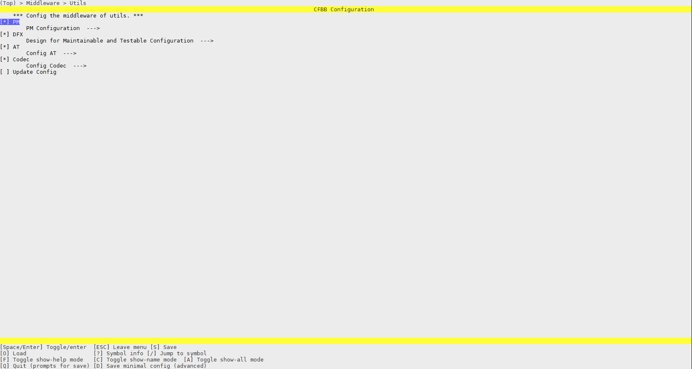

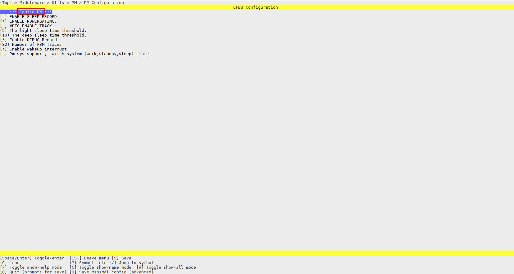

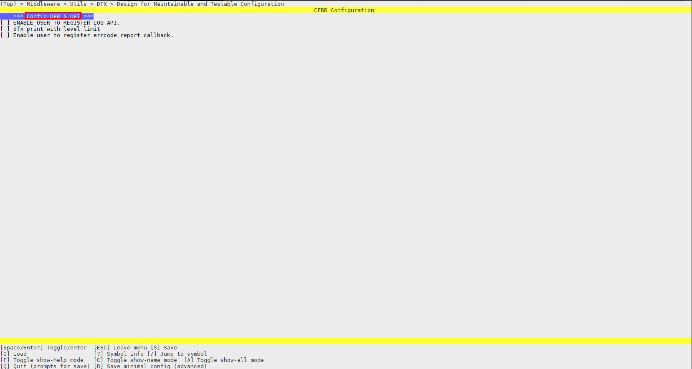

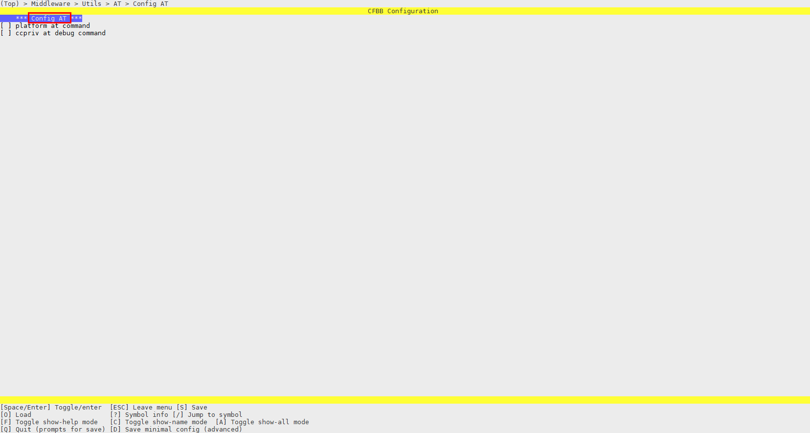

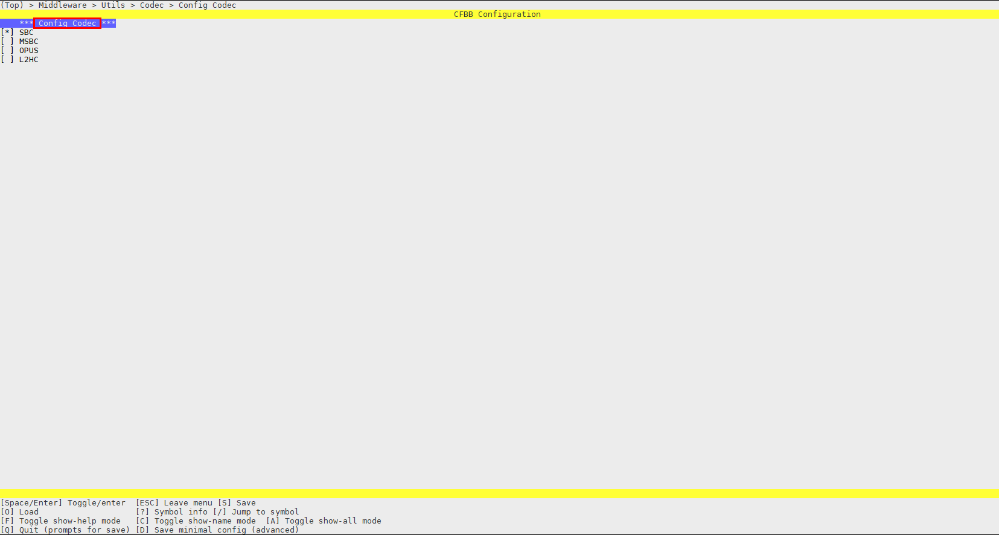

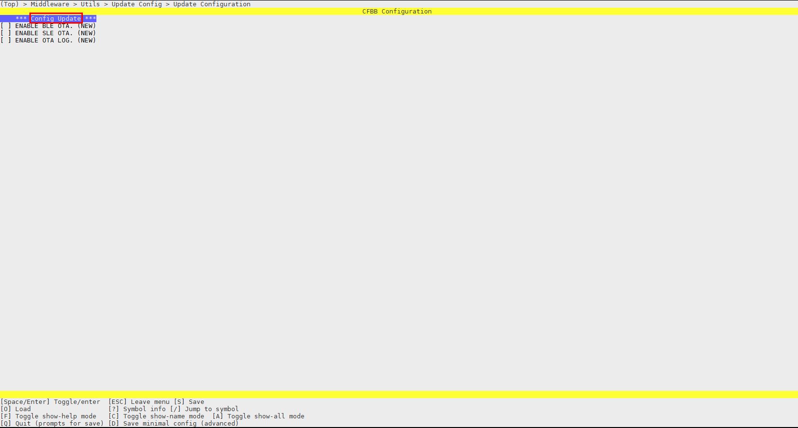

The specific descriptions of the configuration macros are shown in [Table 1](#table16629938173916).

**Table 1**  Descriptions of middleware-related macros

<a name="table16629938173916"></a>
<table><thead align="left"><tr id="row1462913813915"><th class="cellrowborder" valign="top" width="11.65883411658834%" id="mcps1.2.8.1.1"><p id="p6525134791719"><a name="p6525134791719"></a><a name="p6525134791719"></a>Belonging menu</p>
</th>
<th class="cellrowborder" valign="top" width="16.78832116788321%" id="mcps1.2.8.1.2"><p id="p1962923853920"><a name="p1962923853920"></a><a name="p1962923853920"></a>Macro name (CONFIG_ is the prefix added by default)</p>
</th>
<th class="cellrowborder" valign="top" width="19.548045195480455%" id="mcps1.2.8.1.3"><p id="p962916388395"><a name="p962916388395"></a><a name="p962916388395"></a>Specific description displayed on the Kconfig interface</p>
</th>
<th class="cellrowborder" valign="top" width="18.378162183781622%" id="mcps1.2.8.1.4"><p id="p18731420115119"><a name="p18731420115119"></a><a name="p18731420115119"></a>Usage scenario</p>
</th>
<th class="cellrowborder" valign="top" width="9.819018098190181%" id="mcps1.2.8.1.5"><p id="p537485457"><a name="p537485457"></a><a name="p537485457"></a>Implemented</p>
</th>
<th class="cellrowborder" valign="top" width="10.48895110488951%" id="mcps1.2.8.1.6"><p id="p1162915382392"><a name="p1162915382392"></a><a name="p1162915382392"></a>Depends on other macros</p>
</th>
<th class="cellrowborder" valign="top" width="13.318668133186684%" id="mcps1.2.8.1.7"><p id="p1449914917569"><a name="p1449914917569"></a><a name="p1449914917569"></a>Whether to enable or modify the configuration</p>
</th>
</tr>
</thead>
<tbody><tr id="row16629338103916"><td class="cellrowborder" rowspan="11" valign="top" width="11.65883411658834%" headers="mcps1.2.8.1.1 "><p id="p15921858201814"><a name="p15921858201814"></a><a name="p15921858201814"></a>PM</p>
</td>
<td class="cellrowborder" valign="top" width="16.78832116788321%" headers="mcps1.2.8.1.2 "><p id="p166291338133910"><a name="p166291338133910"></a><a name="p166291338133910"></a>CONFIG_PM_SLEEP_RECORD_ENABLE</p>
</td>
<td class="cellrowborder" valign="top" width="19.548045195480455%" headers="mcps1.2.8.1.3 "><p id="p1413663112225"><a name="p1413663112225"></a><a name="p1413663112225"></a>ENABLE SLEEP RECORD.</p>
</td>
<td class="cellrowborder" valign="top" width="18.378162183781622%" headers="mcps1.2.8.1.4 "><p id="p77352085114"><a name="p77352085114"></a><a name="p77352085114"></a>Records sleep status information</p>
</td>
<td class="cellrowborder" valign="top" width="9.819018098190181%" headers="mcps1.2.8.1.5 "><p id="p166297382397"><a name="p166297382397"></a><a name="p166297382397"></a>Yes</p>
</td>
<td class="cellrowborder" valign="top" width="10.48895110488951%" headers="mcps1.2.8.1.6 "><p id="p162983873917"><a name="p162983873917"></a><a name="p162983873917"></a>No</p>
</td>
<td class="cellrowborder" valign="top" width="13.318668133186684%" headers="mcps1.2.8.1.7 "><p id="p0629838133914"><a name="p0629838133914"></a><a name="p0629838133914"></a>Disabled by default. Enable it as appropriate.</p>
</td>
</tr>
<tr id="row166299383394"><td class="cellrowborder" valign="top" headers="mcps1.2.8.1.1 "><p id="p14629173813920"><a name="p14629173813920"></a><a name="p14629173813920"></a>CONFIG_PM_POWER_GATING_ENABLE</p>
</td>
<td class="cellrowborder" valign="top" headers="mcps1.2.8.1.2 "><p id="p3472184016222"><a name="p3472184016222"></a><a name="p3472184016222"></a>ENABLE POWERGATING.</p>
</td>
<td class="cellrowborder" valign="top" headers="mcps1.2.8.1.3 "><p id="p269811784116"><a name="p269811784116"></a><a name="p269811784116"></a>Enables POWERGATING</p>
</td>
<td class="cellrowborder" valign="top" headers="mcps1.2.8.1.4 "><p id="p166291838143916"><a name="p166291838143916"></a><a name="p166291838143916"></a>Yes</p>
</td>
<td class="cellrowborder" valign="top" headers="mcps1.2.8.1.5 "><p id="p32111666307"><a name="p32111666307"></a><a name="p32111666307"></a>No</p>
</td>
<td class="cellrowborder" valign="top" headers="mcps1.2.8.1.6 "><p id="p126297381398"><a name="p126297381398"></a><a name="p126297381398"></a>Enabled by default. Recommended to enable.</p>
</td>
</tr>
<tr id="row3629193823919"><td class="cellrowborder" valign="top" headers="mcps1.2.8.1.1 "><p id="p262983811395"><a name="p262983811395"></a><a name="p262983811395"></a>CONFIG_PM_VETO_TRACK_ENABLE</p>
</td>
<td class="cellrowborder" valign="top" headers="mcps1.2.8.1.2 "><p id="p37191448152210"><a name="p37191448152210"></a><a name="p37191448152210"></a>VETO ENABLE TRACK.</p>
</td>
<td class="cellrowborder" valign="top" headers="mcps1.2.8.1.3 "><p id="p1746412917425"><a name="p1746412917425"></a><a name="p1746412917425"></a>Mainly used for sleep voting</p>
</td>
<td class="cellrowborder" valign="top" headers="mcps1.2.8.1.4 "><p id="p3629133873917"><a name="p3629133873917"></a><a name="p3629133873917"></a>Yes</p>
</td>
<td class="cellrowborder" valign="top" headers="mcps1.2.8.1.5 "><p id="p062910387397"><a name="p062910387397"></a><a name="p062910387397"></a>No</p>
</td>
<td class="cellrowborder" valign="top" headers="mcps1.2.8.1.6 "><p id="p1963621910"><a name="p1963621910"></a><a name="p1963621910"></a>Disabled by default. Enable it as appropriate.</p>
</td>
</tr>
<tr id="row962920381394"><td class="cellrowborder" valign="top" headers="mcps1.2.8.1.1 "><p id="p1629738173912"><a name="p1629738173912"></a><a name="p1629738173912"></a>CONFIG_PM_LIGHT_SLEEP_THRESHOLD_MS</p>
</td>
<td class="cellrowborder" valign="top" headers="mcps1.2.8.1.2 "><p id="p0760135522218"><a name="p0760135522218"></a><a name="p0760135522218"></a>The light sleep time threshold.</p>
</td>
<td class="cellrowborder" valign="top" headers="mcps1.2.8.1.3 "><p id="p1391712438269"><a name="p1391712438269"></a><a name="p1391712438269"></a>Light sleep time threshold</p>
</td>
<td class="cellrowborder" valign="top" headers="mcps1.2.8.1.4 "><p id="p7630938143910"><a name="p7630938143910"></a><a name="p7630938143910"></a>Yes</p>
</td>
<td class="cellrowborder" valign="top" headers="mcps1.2.8.1.5 "><p id="p56301938153913"><a name="p56301938153913"></a><a name="p56301938153913"></a>No</p>
</td>
<td class="cellrowborder" valign="top" headers="mcps1.2.8.1.6 "><p id="p19630238203917"><a name="p19630238203917"></a><a name="p19630238203917"></a>The default value is 5 ms. It is recommended not to modify it.</p>
</td>
</tr>
<tr id="row62681237271"><td class="cellrowborder" valign="top" headers="mcps1.2.8.1.1 "><p id="p112401826112812"><a name="p112401826112812"></a><a name="p112401826112812"></a>CONFIG_PM_DEEP_SLEEP_THRESHOLD_MS</p>
</td>
<td class="cellrowborder" valign="top" headers="mcps1.2.8.1.2 "><p id="p8213143162319"><a name="p8213143162319"></a><a name="p8213143162319"></a>The deep sleep time threshold.</p>
</td>
<td class="cellrowborder" valign="top" headers="mcps1.2.8.1.3 "><p id="p1276438103319"><a name="p1276438103319"></a><a name="p1276438103319"></a>Deep sleep time threshold</p>
</td>
<td class="cellrowborder" valign="top" headers="mcps1.2.8.1.4 "><p id="p5269202314277"><a name="p5269202314277"></a><a name="p5269202314277"></a>Yes</p>
</td>
<td class="cellrowborder" valign="top" headers="mcps1.2.8.1.5 "><p id="p882352916313"><a name="p882352916313"></a><a name="p882352916313"></a>No</p>
</td>
<td class="cellrowborder" valign="top" headers="mcps1.2.8.1.6 "><p id="p137491622194215"><a name="p137491622194215"></a><a name="p137491622194215"></a>The default value is 10 ms. It is recommended not to modify it.</p>
</td>
</tr>
<tr id="row17817572040"><td class="cellrowborder" valign="top" headers="mcps1.2.8.1.1 "><p id="p53019141514"><a name="p53019141514"></a><a name="p53019141514"></a>CONFIG_PM_DEBUG</p>
</td>
<td class="cellrowborder" valign="top" headers="mcps1.2.8.1.2 "><p id="p19391191717233"><a name="p19391191717233"></a><a name="p19391191717233"></a>Enable DEBUG Record.</p>
</td>
<td class="cellrowborder" valign="top" headers="mcps1.2.8.1.3 "><p id="p391457342"><a name="p391457342"></a><a name="p391457342"></a>Mainly used for PM debugging and tracing</p>
</td>
<td class="cellrowborder" valign="top" headers="mcps1.2.8.1.4 "><p id="p17919571246"><a name="p17919571246"></a><a name="p17919571246"></a>Yes</p>
</td>
<td class="cellrowborder" valign="top" headers="mcps1.2.8.1.5 "><p id="p1343315396319"><a name="p1343315396319"></a><a name="p1343315396319"></a>No</p>
</td>
<td class="cellrowborder" valign="top" headers="mcps1.2.8.1.6 "><p id="p5875145793416"><a name="p5875145793416"></a><a name="p5875145793416"></a>Enabled by default. Recommended to enable.</p>
</td>
</tr>
<tr id="row040511461781"><td class="cellrowborder" valign="top" headers="mcps1.2.8.1.1 "><p id="p2085465116817"><a name="p2085465116817"></a><a name="p2085465116817"></a>CONFIG_PM_FSM_TRACE_NUM</p>
</td>
<td class="cellrowborder" valign="top" headers="mcps1.2.8.1.2 "><p id="p8562112919367"><a name="p8562112919367"></a><a name="p8562112919367"></a>Number of FSM Traces.</p>
</td>
<td class="cellrowborder" valign="top" headers="mcps1.2.8.1.3 "><p id="p1605194513147"><a name="p1605194513147"></a><a name="p1605194513147"></a>Configures the number of PM FSM system state machines. It is used for debugging.</p>
</td>
<td class="cellrowborder" valign="top" headers="mcps1.2.8.1.4 "><p id="p1640513469812"><a name="p1640513469812"></a><a name="p1640513469812"></a>Yes</p>
</td>
<td class="cellrowborder" valign="top" headers="mcps1.2.8.1.5 "><p id="p1528213471933"><a name="p1528213471933"></a><a name="p1528213471933"></a>No</p>
</td>
<td class="cellrowborder" valign="top" headers="mcps1.2.8.1.6 "><p id="p154053469813"><a name="p154053469813"></a><a name="p154053469813"></a>The default value is 32. It is recommended not to modify it.</p>
</td>
</tr>
<tr id="row1835411465910"><td class="cellrowborder" valign="top" headers="mcps1.2.8.1.1 "><p id="p235571412597"><a name="p235571412597"></a><a name="p235571412597"></a>CONFIG_PM_ENABLE_WAKEUP_INTERRUPT</p>
</td>
<td class="cellrowborder" valign="top" headers="mcps1.2.8.1.2 "><p id="p13355191414594"><a name="p13355191414594"></a><a name="p13355191414594"></a>Enable wakeup interrupt.</p>
</td>
<td class="cellrowborder" valign="top" headers="mcps1.2.8.1.3 "><p id="p105932017171618"><a name="p105932017171618"></a><a name="p105932017171618"></a>Mainly used to enable the wakeup interrupt</p>
</td>
<td class="cellrowborder" valign="top" headers="mcps1.2.8.1.4 "><p id="p1235501495919"><a name="p1235501495919"></a><a name="p1235501495919"></a>Yes</p>
</td>
<td class="cellrowborder" valign="top" headers="mcps1.2.8.1.5 "><p id="p895101445"><a name="p895101445"></a><a name="p895101445"></a>No</p>
</td>
<td class="cellrowborder" valign="top" headers="mcps1.2.8.1.6 "><p id="p72841723184417"><a name="p72841723184417"></a><a name="p72841723184417"></a>Enabled by default. Recommended to enable.</p>
</td>
</tr>
<tr id="row15869683373"><td class="cellrowborder" valign="top" headers="mcps1.2.8.1.1 "><p id="p7870131514375"><a name="p7870131514375"></a><a name="p7870131514375"></a>CONFIG_PM_SYS_SUPPORT</p>
</td>
<td class="cellrowborder" valign="top" headers="mcps1.2.8.1.2 "><p id="p208701185372"><a name="p208701185372"></a><a name="p208701185372"></a>Pm sys support, switch system (work,standby,sleep) state.</p>
</td>
<td class="cellrowborder" valign="top" headers="mcps1.2.8.1.3 "><p id="p587038153717"><a name="p587038153717"></a><a name="p587038153717"></a>Mainly used for PM state switching</p>
</td>
<td class="cellrowborder" valign="top" headers="mcps1.2.8.1.4 "><p id="p48701288378"><a name="p48701288378"></a><a name="p48701288378"></a>Yes</p>
</td>
<td class="cellrowborder" valign="top" headers="mcps1.2.8.1.5 "><p id="p47969352373"><a name="p47969352373"></a><a name="p47969352373"></a>No</p>
</td>
<td class="cellrowborder" valign="top" headers="mcps1.2.8.1.6 "><p id="p13614102414451"><a name="p13614102414451"></a><a name="p13614102414451"></a>Disabled by default. It is recommended to disable it.</p>
</td>
</tr>
<tr id="row934483818326"><td class="cellrowborder" valign="top" headers="mcps1.2.8.1.1 "><p id="p3864842337"><a name="p3864842337"></a><a name="p3864842337"></a>CONFIG_PM_SYS_SUPPORT_MSGQUEUE</p>
</td>
<td class="cellrowborder" valign="top" headers="mcps1.2.8.1.2 "><p id="p134514381325"><a name="p134514381325"></a><a name="p134514381325"></a>Pm sys support message queue.</p>
</td>
<td class="cellrowborder" valign="top" headers="mcps1.2.8.1.3 "><p id="p9453417114710"><a name="p9453417114710"></a><a name="p9453417114710"></a>The PM state machine supports using the message queue</p>
</td>
<td class="cellrowborder" valign="top" headers="mcps1.2.8.1.4 "><p id="p3345173819320"><a name="p3345173819320"></a><a name="p3345173819320"></a>Yes</p>
</td>
<td class="cellrowborder" valign="top" headers="mcps1.2.8.1.5 "><p id="p1297535924114"><a name="p1297535924114"></a><a name="p1297535924114"></a>CONFIG_PM_SYS_SUPPORT</p>
</td>
<td class="cellrowborder" valign="top" headers="mcps1.2.8.1.6 "><p id="p914192814612"><a name="p914192814612"></a><a name="p914192814612"></a>Disabled by default. It is recommended to disable it.</p>
</td>
</tr>
<tr id="row2891124283218"><td class="cellrowborder" valign="top" headers="mcps1.2.8.1.1 "><p id="p19452172613352"><a name="p19452172613352"></a><a name="p19452172613352"></a>CONFIG_PM_SYS_STACK_SIZE</p>
</td>
<td class="cellrowborder" valign="top" headers="mcps1.2.8.1.2 "><p id="p5334153904411"><a name="p5334153904411"></a><a name="p5334153904411"></a>Pm sys stack size.</p>
</td>
<td class="cellrowborder" valign="top" headers="mcps1.2.8.1.3 "><p id="p457616320447"><a name="p457616320447"></a><a name="p457616320447"></a>Stack size of the message queue used by the PM state machine</p>
</td>
<td class="cellrowborder" valign="top" headers="mcps1.2.8.1.4 "><p id="p489117427322"><a name="p489117427322"></a><a name="p489117427322"></a>Yes</p>
</td>
<td class="cellrowborder" valign="top" headers="mcps1.2.8.1.5 "><p id="p1312362394418"><a name="p1312362394418"></a><a name="p1312362394418"></a>CONFIG_PM_SYS_SUPPORT_MSGQUEUE</p>
</td>
<td class="cellrowborder" valign="top" headers="mcps1.2.8.1.6 "><p id="p9229105374715"><a name="p9229105374715"></a><a name="p9229105374715"></a>Disabled by default. Enable it as appropriate.</p>
</td>
</tr>
<tr id="row515824115353"><td class="cellrowborder" rowspan="3" valign="top" width="11.65883411658834%" headers="mcps1.2.8.1.1 "><p id="p145469360302"><a name="p145469360302"></a><a name="p145469360302"></a>DFX</p>
</td>
<td class="cellrowborder" valign="top" width="16.78832116788321%" headers="mcps1.2.8.1.2 "><p id="p12606144419357"><a name="p12606144419357"></a><a name="p12606144419357"></a>CONFIG_DFX_SUPPORT_USERS_PRINT</p>
</td>
<td class="cellrowborder" valign="top" width="19.548045195480455%" headers="mcps1.2.8.1.3 "><p id="p189901729183119"><a name="p189901729183119"></a><a name="p189901729183119"></a>ENABLE USER TO REGISTER LOG API.</p>
</td>
<td class="cellrowborder" valign="top" width="18.378162183781622%" headers="mcps1.2.8.1.4 "><p id="p1815874110356"><a name="p1815874110356"></a><a name="p1815874110356"></a>Mainly used to enable the user-defined register log information interface</p>
</td>
<td class="cellrowborder" valign="top" width="9.819018098190181%" headers="mcps1.2.8.1.5 "><p id="p19158241133512"><a name="p19158241133512"></a><a name="p19158241133512"></a>Yes</p>
</td>
<td class="cellrowborder" valign="top" width="10.48895110488951%" headers="mcps1.2.8.1.6 "><p id="p11441554394"><a name="p11441554394"></a><a name="p11441554394"></a>No</p>
</td>
<td class="cellrowborder" valign="top" width="13.318668133186684%" headers="mcps1.2.8.1.7 "><p id="p3121172263210"><a name="p3121172263210"></a><a name="p3121172263210"></a>Disabled by default. Enable it as appropriate.</p>
</td>
</tr>
<tr id="row1591518240300"><td class="cellrowborder" valign="top" headers="mcps1.2.8.1.1 "><p id="p1714019579303"><a name="p1714019579303"></a><a name="p1714019579303"></a>CONFIG_DFX_SUPPORT_PRINT</p>
</td>
<td class="cellrowborder" valign="top" headers="mcps1.2.8.1.2 "><p id="p7915124133016"><a name="p7915124133016"></a><a name="p7915124133016"></a>dfx print with level limit.</p>
</td>
<td class="cellrowborder" valign="top" headers="mcps1.2.8.1.3 "><p id="p658392923418"><a name="p658392923418"></a><a name="p658392923418"></a>Mainly used to print DFX log information</p>
</td>
<td class="cellrowborder" valign="top" headers="mcps1.2.8.1.4 "><p id="p199151424193020"><a name="p199151424193020"></a><a name="p199151424193020"></a>Yes</p>
</td>
<td class="cellrowborder" valign="top" headers="mcps1.2.8.1.5 "><p id="p159158247303"><a name="p159158247303"></a><a name="p159158247303"></a>No</p>
</td>
<td class="cellrowborder" valign="top" headers="mcps1.2.8.1.6 "><p id="p5871559143311"><a name="p5871559143311"></a><a name="p5871559143311"></a>Disabled by default. Enable it as appropriate.</p>
</td>
</tr>
<tr id="row183852963015"><td class="cellrowborder" valign="top" headers="mcps1.2.8.1.1 "><p id="p18174195893012"><a name="p18174195893012"></a><a name="p18174195893012"></a>CONFIG_CONFIG_ERRCODE_SUPPORT_REPORT</p>
</td>
<td class="cellrowborder" valign="top" headers="mcps1.2.8.1.2 "><p id="p13838152920309"><a name="p13838152920309"></a><a name="p13838152920309"></a>Enable user to register errcode report callback.</p>
</td>
<td class="cellrowborder" valign="top" headers="mcps1.2.8.1.3 "><p id="p12838192993014"><a name="p12838192993014"></a><a name="p12838192993014"></a>Mainly used to enable the errcode report callback of the user-defined interface</p>
</td>
<td class="cellrowborder" valign="top" headers="mcps1.2.8.1.4 "><p id="p0838132943014"><a name="p0838132943014"></a><a name="p0838132943014"></a>Yes</p>
</td>
<td class="cellrowborder" valign="top" headers="mcps1.2.8.1.5 "><p id="p1483992911309"><a name="p1483992911309"></a><a name="p1483992911309"></a>No</p>
</td>
<td class="cellrowborder" valign="top" headers="mcps1.2.8.1.6 "><p id="p24797411348"><a name="p24797411348"></a><a name="p24797411348"></a>Disabled by default. Enable it as appropriate.</p>
</td>
</tr>
<tr id="row788515183396"><td class="cellrowborder" rowspan="2" valign="top" width="11.65883411658834%" headers="mcps1.2.8.1.1 "><p id="p157380348397"><a name="p157380348397"></a><a name="p157380348397"></a>AT</p>
</td>
<td class="cellrowborder" valign="top" width="16.78832116788321%" headers="mcps1.2.8.1.2 "><p id="p088516189396"><a name="p088516189396"></a><a name="p088516189396"></a>CONFIG_AT_SUPPORT_PLT</p>
</td>
<td class="cellrowborder" valign="top" width="19.548045195480455%" headers="mcps1.2.8.1.3 "><p id="p178859187395"><a name="p178859187395"></a><a name="p178859187395"></a>platform at command.</p>
</td>
<td class="cellrowborder" valign="top" width="18.378162183781622%" headers="mcps1.2.8.1.4 "><p id="p488561893916"><a name="p488561893916"></a><a name="p488561893916"></a>Mainly used for platform AT commands</p>
</td>
<td class="cellrowborder" valign="top" width="9.819018098190181%" headers="mcps1.2.8.1.5 "><p id="p16885318103913"><a name="p16885318103913"></a><a name="p16885318103913"></a>Yes</p>
</td>
<td class="cellrowborder" valign="top" width="10.48895110488951%" headers="mcps1.2.8.1.6 "><p id="p148851018193918"><a name="p148851018193918"></a><a name="p148851018193918"></a>No</p>
</td>
<td class="cellrowborder" valign="top" width="13.318668133186684%" headers="mcps1.2.8.1.7 "><p id="p68853185396"><a name="p68853185396"></a><a name="p68853185396"></a>Disabled by default. Enable it as appropriate.</p>
</td>
</tr>
<tr id="row2644192310391"><td class="cellrowborder" valign="top" headers="mcps1.2.8.1.1 "><p id="p164492317399"><a name="p164492317399"></a><a name="p164492317399"></a>CONFIG_AT_DEBUG_REGISTER_CCPRIV</p>
</td>
<td class="cellrowborder" valign="top" headers="mcps1.2.8.1.2 "><p id="p2644823143913"><a name="p2644823143913"></a><a name="p2644823143913"></a>ccpriv at debug command.</p>
</td>
<td class="cellrowborder" valign="top" headers="mcps1.2.8.1.3 "><p id="p7441640194213"><a name="p7441640194213"></a><a name="p7441640194213"></a>Mainly used for debug AT commands</p>
</td>
<td class="cellrowborder" valign="top" headers="mcps1.2.8.1.4 "><p id="p1864452319390"><a name="p1864452319390"></a><a name="p1864452319390"></a>Yes</p>
</td>
<td class="cellrowborder" valign="top" headers="mcps1.2.8.1.5 "><p id="p16644102319398"><a name="p16644102319398"></a><a name="p16644102319398"></a>No</p>
</td>
<td class="cellrowborder" valign="top" headers="mcps1.2.8.1.6 "><p id="p11644202311393"><a name="p11644202311393"></a><a name="p11644202311393"></a>Disabled by default. Enable it as appropriate.</p>
</td>
</tr>
<tr id="row1922691064311"><td class="cellrowborder" rowspan="4" valign="top" width="11.65883411658834%" headers="mcps1.2.8.1.1 "><p id="p97101628134319"><a name="p97101628134319"></a><a name="p97101628134319"></a>CODEC</p>
</td>
<td class="cellrowborder" valign="top" width="16.78832116788321%" headers="mcps1.2.8.1.2 "><p id="p722612101435"><a name="p722612101435"></a><a name="p722612101435"></a>CONFIG_CODEC_ENABLE_SBC</p>
</td>
<td class="cellrowborder" valign="top" width="19.548045195480455%" headers="mcps1.2.8.1.3 "><p id="p1122691054313"><a name="p1122691054313"></a><a name="p1122691054313"></a>SBC</p>
</td>
<td class="cellrowborder" valign="top" width="18.378162183781622%" headers="mcps1.2.8.1.4 "><p id="p622611064318"><a name="p622611064318"></a><a name="p622611064318"></a>Supports SBC encoding and decoding</p>
</td>
<td class="cellrowborder" valign="top" width="9.819018098190181%" headers="mcps1.2.8.1.5 "><p id="p822611064316"><a name="p822611064316"></a><a name="p822611064316"></a>Yes</p>
</td>
<td class="cellrowborder" valign="top" width="10.48895110488951%" headers="mcps1.2.8.1.6 "><p id="p11226111054310"><a name="p11226111054310"></a><a name="p11226111054310"></a>No</p>
</td>
<td class="cellrowborder" valign="top" width="13.318668133186684%" headers="mcps1.2.8.1.7 "><p id="p72266107436"><a name="p72266107436"></a><a name="p72266107436"></a>Enabled by default. Enable it as appropriate.</p>
</td>
</tr>
<tr id="row1895141484313"><td class="cellrowborder" valign="top" headers="mcps1.2.8.1.1 "><p id="p8952201484316"><a name="p8952201484316"></a><a name="p8952201484316"></a>CONFIG_CODEC_ENABLE_MSBC</p>
</td>
<td class="cellrowborder" valign="top" headers="mcps1.2.8.1.2 "><p id="p2218189104516"><a name="p2218189104516"></a><a name="p2218189104516"></a>MSBC</p>
</td>
<td class="cellrowborder" valign="top" headers="mcps1.2.8.1.3 "><p id="p32472038164517"><a name="p32472038164517"></a><a name="p32472038164517"></a>Supports MSBC encoding and decoding</p>
</td>
<td class="cellrowborder" valign="top" headers="mcps1.2.8.1.4 "><p id="p18952101404310"><a name="p18952101404310"></a><a name="p18952101404310"></a>Yes</p>
</td>
<td class="cellrowborder" valign="top" headers="mcps1.2.8.1.5 "><p id="p1395221414439"><a name="p1395221414439"></a><a name="p1395221414439"></a>No</p>
</td>
<td class="cellrowborder" valign="top" headers="mcps1.2.8.1.6 "><p id="p169524144438"><a name="p169524144438"></a><a name="p169524144438"></a>Disabled by default. Enable it as appropriate.</p>
</td>
</tr>
<tr id="row9351151917438"><td class="cellrowborder" valign="top" headers="mcps1.2.8.1.1 "><p id="p1735111193437"><a name="p1735111193437"></a><a name="p1735111193437"></a>CONFIG_CODEC_ENABLE_OPUS</p>
</td>
<td class="cellrowborder" valign="top" headers="mcps1.2.8.1.2 "><p id="p5351151917436"><a name="p5351151917436"></a><a name="p5351151917436"></a>OPUS</p>
</td>
<td class="cellrowborder" valign="top" headers="mcps1.2.8.1.3 "><p id="p1725734219456"><a name="p1725734219456"></a><a name="p1725734219456"></a>Supports OPUS encoding and decoding</p>
</td>
<td class="cellrowborder" valign="top" headers="mcps1.2.8.1.4 "><p id="p14351619104313"><a name="p14351619104313"></a><a name="p14351619104313"></a>Yes</p>
</td>
<td class="cellrowborder" valign="top" headers="mcps1.2.8.1.5 "><p id="p1351619184314"><a name="p1351619184314"></a><a name="p1351619184314"></a>No</p>
</td>
<td class="cellrowborder" valign="top" headers="mcps1.2.8.1.6 "><p id="p113511519164311"><a name="p113511519164311"></a><a name="p113511519164311"></a>Disabled by default. Enable it as appropriate.</p>
</td>
</tr>
<tr id="row9220182364311"><td class="cellrowborder" valign="top" headers="mcps1.2.8.1.1 "><p id="p422082364318"><a name="p422082364318"></a><a name="p422082364318"></a>CONFIG_CODEC_ENABLE_L2HC</p>
</td>
<td class="cellrowborder" valign="top" headers="mcps1.2.8.1.2 "><p id="p1522042334319"><a name="p1522042334319"></a><a name="p1522042334319"></a>L2HC</p>
</td>
<td class="cellrowborder" valign="top" headers="mcps1.2.8.1.3 "><p id="p4213155012454"><a name="p4213155012454"></a><a name="p4213155012454"></a>Supports L2HC encoding and decoding</p>
</td>
<td class="cellrowborder" valign="top" headers="mcps1.2.8.1.4 "><p id="p10220162374320"><a name="p10220162374320"></a><a name="p10220162374320"></a>Yes</p>
</td>
<td class="cellrowborder" valign="top" headers="mcps1.2.8.1.5 "><p id="p1822082314433"><a name="p1822082314433"></a><a name="p1822082314433"></a>No</p>
</td>
<td class="cellrowborder" valign="top" headers="mcps1.2.8.1.6 "><p id="p7220723124314"><a name="p7220723124314"></a><a name="p7220723124314"></a>Disabled by default. Enable it as appropriate.</p>
</td>
</tr>
</tbody>
</table>

