# Preface<a name="ZH-CN_TOPIC_0000001713124201"></a>

**Overview<a name="section4537382116410"></a>**

This document mainly describes how to use BurnTool. It guides engineers to quickly use the BurnTool tool to burn images to boards.

**Product Version<a name="section27775771"></a>**

The product version corresponding to this document is as follows.

<a name="table52250146"></a>
<table><thead align="left"><tr id="row55967882"><th class="cellrowborder" valign="top" width="39.39%" id="mcps1.1.3.1.1"><p id="p37104584"><a name="p37104584"></a><a name="p37104584"></a><strong id="b48174912328"><a name="b48174912328"></a><a name="b48174912328"></a>Product Name</strong></p>
</th>
<th class="cellrowborder" valign="top" width="60.61%" id="mcps1.1.3.1.2"><p id="p52681331"><a name="p52681331"></a><a name="p52681331"></a><strong id="b682239163211"><a name="b682239163211"></a><a name="b682239163211"></a>Product Version</strong></p>
</th>
</tr>
</thead>
<tbody><tr id="row39329394"><td class="cellrowborder" valign="top" width="39.39%" headers="mcps1.1.3.1.1 "><p id="p31080012"><a name="p31080012"></a><a name="p31080012"></a>BS2X</p>
</td>
<td class="cellrowborder" valign="top" width="60.61%" headers="mcps1.1.3.1.2 "><p id="p34453054"><a name="p34453054"></a><a name="p34453054"></a>V100</p>
</td>
</tr>
</tbody>
</table>

**Reader Audience<a name="section4378592816410"></a>**

This document is intended for the following engineers:

-   Technical support engineer
-   Software engineer
-   Hardware engineer

**Symbol Conventions<a name="section133020216410"></a>**

The following symbols may appear in this document. Their meanings are as follows.

<a name="table2622507016410"></a>
<table><thead align="left"><tr id="row1530720816410"><th class="cellrowborder" valign="top" width="20.580000000000002%" id="mcps1.1.3.1.1"><p id="p6450074116410"><a name="p6450074116410"></a><a name="p6450074116410"></a><strong id="b2136615816410"><a name="b2136615816410"></a><a name="b2136615816410"></a>Symbol</strong></p>
</th>
<th class="cellrowborder" valign="top" width="79.42%" id="mcps1.1.3.1.2"><p id="p5435366816410"><a name="p5435366816410"></a><a name="p5435366816410"></a><strong id="b5941558116410"><a name="b5941558116410"></a><a name="b5941558116410"></a>Description</strong></p>
</th>
</tr>
</thead>
<tbody><tr id="row1372280416410"><td class="cellrowborder" valign="top" width="20.580000000000002%" headers="mcps1.1.3.1.1 "><p id="p3734547016410"><a name="p3734547016410"></a><a name="p3734547016410"></a><a name="image2670064316410"></a><a name="image2670064316410"></a><span></span></p>
</td>
<td class="cellrowborder" valign="top" width="79.42%" headers="mcps1.1.3.1.2 "><p id="p1757432116410"><a name="p1757432116410"></a><a name="p1757432116410"></a>Indicates a hazard with a high level of risk which, if not avoided, will result in death or serious injury.</p>
</td>
</tr>
<tr id="row466863216410"><td class="cellrowborder" valign="top" width="20.580000000000002%" headers="mcps1.1.3.1.1 "><p id="p1432579516410"><a name="p1432579516410"></a><a name="p1432579516410"></a><a name="image4895582316410"></a><a name="image4895582316410"></a><span></span></p>
</td>
<td class="cellrowborder" valign="top" width="79.42%" headers="mcps1.1.3.1.2 "><p id="p959197916410"><a name="p959197916410"></a><a name="p959197916410"></a>Indicates a hazard with a medium level of risk which, if not avoided, could result in death or serious injury.</p>
</td>
</tr>
<tr id="row123863216410"><td class="cellrowborder" valign="top" width="20.580000000000002%" headers="mcps1.1.3.1.1 "><p id="p1232579516410"><a name="p1232579516410"></a><a name="p1232579516410"></a><a name="image1235582316410"></a><a name="image1235582316410"></a><span></span></p>
</td>
<td class="cellrowborder" valign="top" width="79.42%" headers="mcps1.1.3.1.2 "><p id="p123197916410"><a name="p123197916410"></a><a name="p123197916410"></a>Indicates a hazard with a low level of risk which, if not avoided, could result in minor or moderate injury.</p>
</td>
</tr>
<tr id="row5786682116410"><td class="cellrowborder" valign="top" width="20.580000000000002%" headers="mcps1.1.3.1.1 "><p id="p2204984716410"><a name="p2204984716410"></a><a name="p2204984716410"></a><a name="image4504446716410"></a><a name="image4504446716410"></a><span></span></p>
</td>
<td class="cellrowborder" valign="top" width="79.42%" headers="mcps1.1.3.1.2 "><p id="p4388861916410"><a name="p4388861916410"></a><a name="p4388861916410"></a>Used to convey equipment or environment safety warnings. If not avoided, it may result in equipment damage, data loss, degraded equipment performance, or other unpredictable results.</p>
<p id="p1238861916410"><a name="p1238861916410"></a><a name="p1238861916410"></a>“Caution” does not involve personal injury.</p>
</td>
</tr>
<tr id="row2856923116410"><td class="cellrowborder" valign="top" width="20.580000000000002%" headers="mcps1.1.3.1.1 "><p id="p5555360116410"><a name="p5555360116410"></a><a name="p5555360116410"></a><a name="image799324016410"></a><a name="image799324016410"></a><span></span></p>
</td>
<td class="cellrowborder" valign="top" width="79.42%" headers="mcps1.1.3.1.2 "><p id="p4612588116410"><a name="p4612588116410"></a><a name="p4612588116410"></a>Supplementary description of key information in the main text.</p>
<p id="p1232588116410"><a name="p1232588116410"></a><a name="p1232588116410"></a>“Note” is not a safety warning and does not involve personal, equipment, or environmental injury information.</p>
</td>
</tr>
</tbody>
</table>

**Modification Record<a name="section2467512116410"></a>**

<a name="table1557726816410"></a>
<table><thead align="left"><tr id="row2942532716410"><th class="cellrowborder" valign="top" width="19.009999999999998%" id="mcps1.1.4.1.1"><p id="p3778275416410"><a name="p3778275416410"></a><a name="p3778275416410"></a><strong id="b5687322716410"><a name="b5687322716410"></a><a name="b5687322716410"></a>Document Version</strong></p>
</th>
<th class="cellrowborder" valign="top" width="25.629999999999995%" id="mcps1.1.4.1.2"><p id="p5627845516410"><a name="p5627845516410"></a><a name="p5627845516410"></a><strong id="b5800814916410"><a name="b5800814916410"></a><a name="b5800814916410"></a>Release Date</strong></p>
</th>
<th class="cellrowborder" valign="top" width="55.36%" id="mcps1.1.4.1.3"><p id="p2382284816410"><a name="p2382284816410"></a><a name="p2382284816410"></a><strong id="b3316380216410"><a name="b3316380216410"></a><a name="b3316380216410"></a>Modification Description</strong></p>
</th>
</tr>
</thead>
<tbody><tr id="row1614184205220"><td class="cellrowborder" valign="top" width="19.009999999999998%" headers="mcps1.1.4.1.1 "><p id="p116141544527"><a name="p116141544527"></a><a name="p116141544527"></a>04</p>
</td>
<td class="cellrowborder" valign="top" width="25.629999999999995%" headers="mcps1.1.4.1.2 "><p id="p126151940522"><a name="p126151940522"></a><a name="p126151940522"></a>2025-01-14</p>
</td>
<td class="cellrowborder" valign="top" width="55.36%" headers="mcps1.1.4.1.3 "><p id="p266742611532"><a name="p266742611532"></a><a name="p266742611532"></a>Updated the content of the “<a href="手动烧写.md">Manual Burning</a>” section.</p>
</td>
</tr>
<tr id="row5519411065"><td class="cellrowborder" valign="top" width="19.009999999999998%" headers="mcps1.1.4.1.1 "><p id="p125191111767"><a name="p125191111767"></a><a name="p125191111767"></a>03</p>
</td>
<td class="cellrowborder" valign="top" width="25.629999999999995%" headers="mcps1.1.4.1.2 "><p id="p175191612613"><a name="p175191612613"></a><a name="p175191612613"></a>2024-09-14</p>
</td>
<td class="cellrowborder" valign="top" width="55.36%" headers="mcps1.1.4.1.3 "><a name="ul19109414794"></a><a name="ul19109414794"></a><ul id="ul19109414794"><li>Updated the content of the “<a href="BurnTool-Dfu.md">BurnTool-Dfu</a>” section.</li><li>Updated the content of the “<a href="手动烧写.md">Manual Burning</a>” section.</li><li>Updated the content of the “<a href="DFU烧写-2.md">DFU Burning</a>” section.</li><li>Updated the content of the “<a href="导出镜像.md">Exporting Images</a>” section.</li></ul>
</td>
</tr>
<tr id="row174812450910"><td class="cellrowborder" valign="top" width="19.009999999999998%" headers="mcps1.1.4.1.1 "><p id="p94815451096"><a name="p94815451096"></a><a name="p94815451096"></a>02</p>
</td>
<td class="cellrowborder" valign="top" width="25.629999999999995%" headers="mcps1.1.4.1.2 "><p id="p248204517917"><a name="p248204517917"></a><a name="p248204517917"></a>2024-07-05</p>
</td>
<td class="cellrowborder" valign="top" width="55.36%" headers="mcps1.1.4.1.3 "><a name="ul91788569910"></a><a name="ul91788569910"></a><ul id="ul91788569910"><li>Updated the content of the “<a href="应用场景.md">Application Scenarios</a>” section.</li><li>Updated the content of the “<a href="界面说明.md">Interface Description</a>” section.</li><li>Added the content of the “<a href="OTA升级.md">OTA Upgrade</a>” section.</li></ul>
</td>
</tr>
<tr id="row15142143811166"><td class="cellrowborder" valign="top" width="19.009999999999998%" headers="mcps1.1.4.1.1 "><p id="p182910614321"><a name="p182910614321"></a><a name="p182910614321"></a>01</p>
</td>
<td class="cellrowborder" valign="top" width="25.629999999999995%" headers="mcps1.1.4.1.2 "><p id="p52917613321"><a name="p52917613321"></a><a name="p52917613321"></a>2024-05-15</p>
</td>
<td class="cellrowborder" valign="top" width="55.36%" headers="mcps1.1.4.1.3 "><p id="p1290663212"><a name="p1290663212"></a><a name="p1290663212"></a>First official release.</p>
</td>
</tr>
<tr id="row937915514614"><td class="cellrowborder" valign="top" width="19.009999999999998%" headers="mcps1.1.4.1.1 "><p id="p12379125554615"><a name="p12379125554615"></a><a name="p12379125554615"></a>00B03</p>
</td>
<td class="cellrowborder" valign="top" width="25.629999999999995%" headers="mcps1.1.4.1.2 "><p id="p1737917556463"><a name="p1737917556463"></a><a name="p1737917556463"></a>2024-01-08</p>
</td>
<td class="cellrowborder" valign="top" width="55.36%" headers="mcps1.1.4.1.3 "><a name="ul14863155364119"></a><a name="ul14863155364119"></a><ul id="ul14863155364119"><li>Updated the content of the “<a href="界面说明.md">Interface Description</a>” section.</li></ul>
</td>
</tr>
<tr id="row15301143316224"><td class="cellrowborder" valign="top" width="19.009999999999998%" headers="mcps1.1.4.1.1 "><p id="p1830203372219"><a name="p1830203372219"></a><a name="p1830203372219"></a>00B02</p>
</td>
<td class="cellrowborder" valign="top" width="25.629999999999995%" headers="mcps1.1.4.1.2 "><p id="p1130253320226"><a name="p1130253320226"></a><a name="p1130253320226"></a>2023-10-27</p>
</td>
<td class="cellrowborder" valign="top" width="55.36%" headers="mcps1.1.4.1.3 "><p id="p39765564222"><a name="p39765564222"></a><a name="p39765564222"></a>Deleted the “Command Line Burning” section.</p>
</td>
</tr>
<tr id="row5947359616410"><td class="cellrowborder" valign="top" width="19.009999999999998%" headers="mcps1.1.4.1.1 "><p id="p2149706016410"><a name="p2149706016410"></a><a name="p2149706016410"></a>00B01</p>
</td>
<td class="cellrowborder" valign="top" width="25.629999999999995%" headers="mcps1.1.4.1.2 "><p id="p648803616410"><a name="p648803616410"></a><a name="p648803616410"></a>2023-09-27</p>
</td>
<td class="cellrowborder" valign="top" width="55.36%" headers="mcps1.1.4.1.3 "><p id="p1946537916410"><a name="p1946537916410"></a><a name="p1946537916410"></a>First temporary release.</p>
</td>
</tr>
</tbody>
</table>

# BurnTool Tool Introduction<a name="ZH-CN_TOPIC_0000001713045789"></a>


## Function Description<a name="ZH-CN_TOPIC_0000001713125793"></a>

BurnTool is a burning tool provided with the chip. It burns image files to the board by interrupting program startup.

## Application Scenarios<a name="ZH-CN_TOPIC_0000001665006266"></a>

BurnTool is mainly applicable to the following scenarios:

-   Image burning
-   Exporting images

## Interface Description<a name="ZH-CN_TOPIC_0000001665165990"></a>


### Selecting Chip<a name="ZH-CN_TOPIC_0000001985906928"></a>

Click “Option”-“Change chip” to open the chip selection dialog for selecting the chip type that matches the board. For some chips, you can also select the required burning method. The interface is shown in [Figure 1](#zh-cn_topic_0000001906927033_fig131614316534).

**Figure 1**  Chip selection interface<a name="zh-cn_topic_0000001906927033_fig131614316534"></a>  
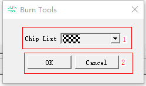

**Table 1**  Chip selection interface description

<a name="zh-cn_topic_0000001906927033_table1923619111210"></a>
<table><thead align="left"><tr id="zh-cn_topic_0000001906927033_row8232019141213"><th class="cellrowborder" valign="top" width="13.66%" id="mcps1.2.3.1.1"><p id="zh-cn_topic_0000001906927033_p12351913126"><a name="zh-cn_topic_0000001906927033_p12351913126"></a><a name="zh-cn_topic_0000001906927033_p12351913126"></a>Area</p>
</th>
<th class="cellrowborder" valign="top" width="86.33999999999999%" id="mcps1.2.3.1.2"><p id="zh-cn_topic_0000001906927033_p9232199124"><a name="zh-cn_topic_0000001906927033_p9232199124"></a><a name="zh-cn_topic_0000001906927033_p9232199124"></a>Description</p>
</th>
</tr>
</thead>
<tbody><tr id="zh-cn_topic_0000001906927033_row1623119111212"><td class="cellrowborder" valign="top" width="13.66%" headers="mcps1.2.3.1.1 "><p id="zh-cn_topic_0000001906927033_p1723219201211"><a name="zh-cn_topic_0000001906927033_p1723219201211"></a><a name="zh-cn_topic_0000001906927033_p1723219201211"></a>1</p>
</td>
<td class="cellrowborder" valign="top" width="86.33999999999999%" headers="mcps1.2.3.1.2 "><a name="zh-cn_topic_0000001906927033_ul15231719181215"></a><a name="zh-cn_topic_0000001906927033_ul15231719181215"></a><ul id="zh-cn_topic_0000001906927033_ul15231719181215"><li>Chip List: List of selectable chips.</li></ul>
</td>
</tr>
<tr id="zh-cn_topic_0000001906927033_row3237195120"><td class="cellrowborder" valign="top" width="13.66%" headers="mcps1.2.3.1.1 "><p id="zh-cn_topic_0000001906927033_p2023219131213"><a name="zh-cn_topic_0000001906927033_p2023219131213"></a><a name="zh-cn_topic_0000001906927033_p2023219131213"></a>2</p>
</td>
<td class="cellrowborder" valign="top" width="86.33999999999999%" headers="mcps1.2.3.1.2 "><a name="zh-cn_topic_0000001906927033_ul1231919191217"></a><a name="zh-cn_topic_0000001906927033_ul1231919191217"></a><ul id="zh-cn_topic_0000001906927033_ul1231919191217"><li>OK: Confirm the selection.</li><li>Cancel: Cancel the selection.</li></ul>
</td>
</tr>
</tbody>
</table>

### BurnTool<a name="ZH-CN_TOPIC_0000001713045793"></a>

The BurnTool interface is shown in [Figure 1](#zh-cn_topic_0000001207721967_zh-cn_topic_0279549098_toc17452416).

**Figure 1**  BurnTool interface<a name="zh-cn_topic_0000001207721967_zh-cn_topic_0279549098_toc17452416"></a>  

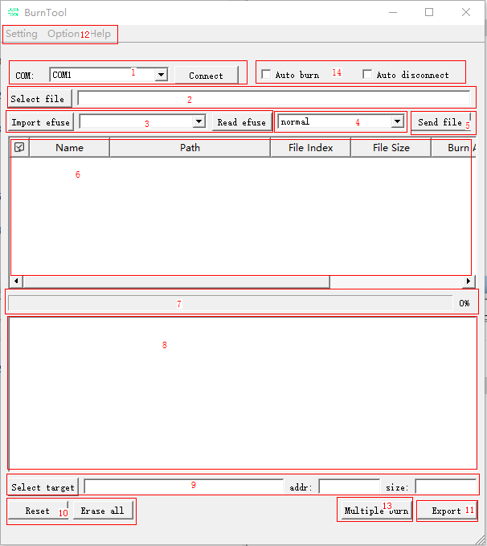

**Table 1**  BurnTool interface description

<a name="zh-cn_topic_0000001207721967_zh-cn_topic_0279549098_table156913141826"></a>
<table><thead align="left"><tr id="zh-cn_topic_0000001207721967_zh-cn_topic_0279549098_row0695148215"><th class="cellrowborder" valign="top" width="13.669999999999998%" id="mcps1.2.3.1.1"><p id="zh-cn_topic_0000001207721967_zh-cn_topic_0279549098_p5455981"><a name="zh-cn_topic_0000001207721967_zh-cn_topic_0279549098_p5455981"></a><a name="zh-cn_topic_0000001207721967_zh-cn_topic_0279549098_p5455981"></a>Area</p>
</th>
<th class="cellrowborder" valign="top" width="86.33%" id="mcps1.2.3.1.2"><p id="zh-cn_topic_0000001207721967_zh-cn_topic_0279549098_p39281331"><a name="zh-cn_topic_0000001207721967_zh-cn_topic_0279549098_p39281331"></a><a name="zh-cn_topic_0000001207721967_zh-cn_topic_0279549098_p39281331"></a>Description</p>
</th>
</tr>
</thead>
<tbody><tr id="zh-cn_topic_0000001207721967_zh-cn_topic_0279549098_row10707148214"><td class="cellrowborder" valign="top" width="13.669999999999998%" headers="mcps1.2.3.1.1 "><p id="zh-cn_topic_0000001207721967_zh-cn_topic_0279549098_p47714657"><a name="zh-cn_topic_0000001207721967_zh-cn_topic_0279549098_p47714657"></a><a name="zh-cn_topic_0000001207721967_zh-cn_topic_0279549098_p47714657"></a>1</p>
</td>
<td class="cellrowborder" valign="top" width="86.33%" headers="mcps1.2.3.1.2 "><a name="zh-cn_topic_0000001207721967_zh-cn_topic_0279549098_ul85142597204"></a><a name="zh-cn_topic_0000001207721967_zh-cn_topic_0279549098_ul85142597204"></a><ul id="zh-cn_topic_0000001207721967_zh-cn_topic_0279549098_ul85142597204"><li>Connect: Open the serial port and send the interruption message.</li><li>COM: Serial port number list, displaying the currently available serial port numbers.</li></ul>
</td>
</tr>
<tr id="zh-cn_topic_0000001207721967_zh-cn_topic_0279549098_row7702141527"><td class="cellrowborder" valign="top" width="13.669999999999998%" headers="mcps1.2.3.1.1 "><p id="zh-cn_topic_0000001207721967_zh-cn_topic_0279549098_p63739165"><a name="zh-cn_topic_0000001207721967_zh-cn_topic_0279549098_p63739165"></a><a name="zh-cn_topic_0000001207721967_zh-cn_topic_0279549098_p63739165"></a>2</p>
</td>
<td class="cellrowborder" valign="top" width="86.33%" headers="mcps1.2.3.1.2 "><a name="zh-cn_topic_0000001207721967_zh-cn_topic_0279549098_ul1083103511613"></a><a name="zh-cn_topic_0000001207721967_zh-cn_topic_0279549098_ul1083103511613"></a><ul id="zh-cn_topic_0000001207721967_zh-cn_topic_0279549098_ul1083103511613"><li>Select file: Select the image to burn.</li><li>Delete: Delete the selected row from the table.</li></ul>
</td>
</tr>
<tr id="zh-cn_topic_0000001207721967_zh-cn_topic_0279549098_row107011141123"><td class="cellrowborder" valign="top" width="13.669999999999998%" headers="mcps1.2.3.1.1 "><p id="zh-cn_topic_0000001207721967_zh-cn_topic_0279549098_p4179377"><a name="zh-cn_topic_0000001207721967_zh-cn_topic_0279549098_p4179377"></a><a name="zh-cn_topic_0000001207721967_zh-cn_topic_0279549098_p4179377"></a>3</p>
</td>
<td class="cellrowborder" valign="top" width="86.33%" headers="mcps1.2.3.1.2 "><a name="zh-cn_topic_0000001207721967_zh-cn_topic_0279549098_ul121341840460"></a><a name="zh-cn_topic_0000001207721967_zh-cn_topic_0279549098_ul121341840460"></a><ul id="zh-cn_topic_0000001207721967_zh-cn_topic_0279549098_ul121341840460"><li>Import Efuse: Import the eFuse configuration file.</li><li>Efuse list: Display the names of the eFuses that can be read.</li><li>Read Efuse: Send the read message based on the selected eFuse.</li></ul>
</td>
</tr>
<tr id="zh-cn_topic_0000001207721967_zh-cn_topic_0279549098_row1770214822"><td class="cellrowborder" valign="top" width="13.669999999999998%" headers="mcps1.2.3.1.1 "><p id="zh-cn_topic_0000001207721967_zh-cn_topic_0279549098_p57396781"><a name="zh-cn_topic_0000001207721967_zh-cn_topic_0279549098_p57396781"></a><a name="zh-cn_topic_0000001207721967_zh-cn_topic_0279549098_p57396781"></a>4</p>
</td>
<td class="cellrowborder" valign="top" width="86.33%" headers="mcps1.2.3.1.2 "><a name="zh-cn_topic_0000001207721967_zh-cn_topic_0279549098_ul33174514213"></a><a name="zh-cn_topic_0000001207721967_zh-cn_topic_0279549098_ul33174514213"></a><ul id="zh-cn_topic_0000001207721967_zh-cn_topic_0279549098_ul33174514213"><li>Erase Mode: Select the erase mode.<a name="zh-cn_topic_0000001207721967_zh-cn_topic_0279549098_ul11788427400"></a><a name="zh-cn_topic_0000001207721967_zh-cn_topic_0279549098_ul11788427400"></a><ul id="zh-cn_topic_0000001207721967_zh-cn_topic_0279549098_ul11788427400"><li>normal: Erase the flash based on the parameters in the firmware package.</li><li>erase all: Perform full-chip erase on the first burning item, and no erase operation is performed on the remaining burning items.</li><li>no erase: No erase operation is performed. Note that in this mode, the flash must be blank or have been fully erased.</li></ul>
</li></ul>
</td>
</tr>
<tr id="zh-cn_topic_0000001207721967_zh-cn_topic_0279549098_row14707149214"><td class="cellrowborder" valign="top" width="13.669999999999998%" headers="mcps1.2.3.1.1 "><p id="zh-cn_topic_0000001207721967_zh-cn_topic_0279549098_p23568328"><a name="zh-cn_topic_0000001207721967_zh-cn_topic_0279549098_p23568328"></a><a name="zh-cn_topic_0000001207721967_zh-cn_topic_0279549098_p23568328"></a>5</p>
</td>
<td class="cellrowborder" valign="top" width="86.33%" headers="mcps1.2.3.1.2 "><p id="zh-cn_topic_0000001207721967_zh-cn_topic_0279549098_p543412584714"><a name="zh-cn_topic_0000001207721967_zh-cn_topic_0279549098_p543412584714"></a><a name="zh-cn_topic_0000001207721967_zh-cn_topic_0279549098_p543412584714"></a>Send file: Burn the images one by one based on the selected information in the table.</p>
</td>
</tr>
<tr id="zh-cn_topic_0000001207721967_zh-cn_topic_0279549098_row37018141229"><td class="cellrowborder" valign="top" width="13.669999999999998%" headers="mcps1.2.3.1.1 "><p id="zh-cn_topic_0000001207721967_zh-cn_topic_0279549098_p49697568"><a name="zh-cn_topic_0000001207721967_zh-cn_topic_0279549098_p49697568"></a><a name="zh-cn_topic_0000001207721967_zh-cn_topic_0279549098_p49697568"></a>6</p>
</td>
<td class="cellrowborder" valign="top" width="86.33%" headers="mcps1.2.3.1.2 "><p id="zh-cn_topic_0000001207721967_zh-cn_topic_0279549098_p9951144310910"><a name="zh-cn_topic_0000001207721967_zh-cn_topic_0279549098_p9951144310910"></a><a name="zh-cn_topic_0000001207721967_zh-cn_topic_0279549098_p9951144310910"></a>Image table: Displays the information of the images that can be burned. The meaning of each column is as follows:</p>
<a name="zh-cn_topic_0000001207721967_zh-cn_topic_0279549098_ul1989564910910"></a><a name="zh-cn_topic_0000001207721967_zh-cn_topic_0279549098_ul1989564910910"></a><ul id="zh-cn_topic_0000001207721967_zh-cn_topic_0279549098_ul1989564910910"><li>Name: Name.</li><li>Path: Path.</li><li>File Index: Start index of the image in the file.</li><li>File Size: Size of the image.</li><li>Burn Addr: Start address of the Flash for burning.</li><li>Burn Size: Size of the Flash to be erased.</li><li>Type: General type, including:<a name="zh-cn_topic_0000001207721967_zh-cn_topic_0279549098_ul885418294117"></a><a name="zh-cn_topic_0000001207721967_zh-cn_topic_0279549098_ul885418294117"></a><ul id="zh-cn_topic_0000001207721967_zh-cn_topic_0279549098_ul885418294117"><li>0: Loader.</li><li>1: General image file.</li><li>2: Parameter file.</li><li>3: eFuse file.</li></ul>
<p id="zh-cn_topic_0000001207721967_zh-cn_topic_0279549098_p14365142618416"><a name="zh-cn_topic_0000001207721967_zh-cn_topic_0279549098_p14365142618416"></a><a name="zh-cn_topic_0000001207721967_zh-cn_topic_0279549098_p14365142618416"></a>Other numbers are defined by each product and are not listed here.</p>
</li></ul>
</td>
</tr>
<tr id="zh-cn_topic_0000001207721967_zh-cn_topic_0279549098_row1388672115219"><td class="cellrowborder" valign="top" width="13.669999999999998%" headers="mcps1.2.3.1.1 "><p id="zh-cn_topic_0000001207721967_zh-cn_topic_0279549098_p55310098"><a name="zh-cn_topic_0000001207721967_zh-cn_topic_0279549098_p55310098"></a><a name="zh-cn_topic_0000001207721967_zh-cn_topic_0279549098_p55310098"></a>7</p>
</td>
<td class="cellrowborder" valign="top" width="86.33%" headers="mcps1.2.3.1.2 "><p id="zh-cn_topic_0000001207721967_zh-cn_topic_0279549098_p1612521515910"><a name="zh-cn_topic_0000001207721967_zh-cn_topic_0279549098_p1612521515910"></a><a name="zh-cn_topic_0000001207721967_zh-cn_topic_0279549098_p1612521515910"></a>Burning progress.</p>
</td>
</tr>
<tr id="zh-cn_topic_0000001207721967_zh-cn_topic_0279549098_row288620211526"><td class="cellrowborder" valign="top" width="13.669999999999998%" headers="mcps1.2.3.1.1 "><p id="zh-cn_topic_0000001207721967_zh-cn_topic_0279549098_p36189605"><a name="zh-cn_topic_0000001207721967_zh-cn_topic_0279549098_p36189605"></a><a name="zh-cn_topic_0000001207721967_zh-cn_topic_0279549098_p36189605"></a>8</p>
</td>
<td class="cellrowborder" valign="top" width="86.33%" headers="mcps1.2.3.1.2 "><p id="zh-cn_topic_0000001207721967_zh-cn_topic_0279549098_p31461811102010"><a name="zh-cn_topic_0000001207721967_zh-cn_topic_0279549098_p31461811102010"></a><a name="zh-cn_topic_0000001207721967_zh-cn_topic_0279549098_p31461811102010"></a>Echo view: Displays the data reported by the board after the interruption.</p>
</td>
</tr>
<tr id="zh-cn_topic_0000001207721967_zh-cn_topic_0279549098_row1539045322012"><td class="cellrowborder" valign="top" width="13.669999999999998%" headers="mcps1.2.3.1.1 "><p id="zh-cn_topic_0000001207721967_zh-cn_topic_0279549098_p1139015311202"><a name="zh-cn_topic_0000001207721967_zh-cn_topic_0279549098_p1139015311202"></a><a name="zh-cn_topic_0000001207721967_zh-cn_topic_0279549098_p1139015311202"></a>9</p>
</td>
<td class="cellrowborder" valign="top" width="86.33%" headers="mcps1.2.3.1.2 "><a name="zh-cn_topic_0000001207721967_zh-cn_topic_0279549098_ul113165792216"></a><a name="zh-cn_topic_0000001207721967_zh-cn_topic_0279549098_ul113165792216"></a><ul id="zh-cn_topic_0000001207721967_zh-cn_topic_0279549098_ul113165792216"><li>Select target: Select the location for exporting the image.</li><li>addr: Enter the start address of the Flash to be exported.</li><li>size: Enter the size of the Flash to be exported.</li></ul>
</td>
</tr>
<tr id="zh-cn_topic_0000001207721967_zh-cn_topic_0279549098_row579172745311"><td class="cellrowborder" valign="top" width="13.669999999999998%" headers="mcps1.2.3.1.1 "><p id="zh-cn_topic_0000001207721967_zh-cn_topic_0279549098_p1479220277536"><a name="zh-cn_topic_0000001207721967_zh-cn_topic_0279549098_p1479220277536"></a><a name="zh-cn_topic_0000001207721967_zh-cn_topic_0279549098_p1479220277536"></a>10</p>
</td>
<td class="cellrowborder" valign="top" width="86.33%" headers="mcps1.2.3.1.2 "><p id="zh-cn_topic_0000001207721967_zh-cn_topic_0279549098_p13684748173011"><a name="zh-cn_topic_0000001207721967_zh-cn_topic_0279549098_p13684748173011"></a><a name="zh-cn_topic_0000001207721967_zh-cn_topic_0279549098_p13684748173011"></a>Reset: Restart the board. (This function takes effect only after the loader is burned)</p>
<p id="zh-cn_topic_0000001207721967_zh-cn_topic_0279549098_p025717111612"><a name="zh-cn_topic_0000001207721967_zh-cn_topic_0279549098_p025717111612"></a><a name="zh-cn_topic_0000001207721967_zh-cn_topic_0279549098_p025717111612"></a>Erase all: Full-chip erase. (This function takes effect only after the loader is burned)</p>
</td>
</tr>
<tr id="zh-cn_topic_0000001207721967_zh-cn_topic_0279549098_row649954692020"><td class="cellrowborder" valign="top" width="13.669999999999998%" headers="mcps1.2.3.1.1 "><p id="zh-cn_topic_0000001207721967_zh-cn_topic_0279549098_p13499164652019"><a name="zh-cn_topic_0000001207721967_zh-cn_topic_0279549098_p13499164652019"></a><a name="zh-cn_topic_0000001207721967_zh-cn_topic_0279549098_p13499164652019"></a>11</p>
</td>
<td class="cellrowborder" valign="top" width="86.33%" headers="mcps1.2.3.1.2 "><p id="zh-cn_topic_0000001207721967_zh-cn_topic_0279549098_p10745162311459"><a name="zh-cn_topic_0000001207721967_zh-cn_topic_0279549098_p10745162311459"></a><a name="zh-cn_topic_0000001207721967_zh-cn_topic_0279549098_p10745162311459"></a>Export: Export the image. (This function takes effect only after the loader is burned)</p>
</td>
</tr>
<tr id="zh-cn_topic_0000001207721967_zh-cn_topic_0279549098_row1588515211226"><td class="cellrowborder" valign="top" width="13.669999999999998%" headers="mcps1.2.3.1.1 "><p id="zh-cn_topic_0000001207721967_zh-cn_topic_0279549098_p41303584"><a name="zh-cn_topic_0000001207721967_zh-cn_topic_0279549098_p41303584"></a><a name="zh-cn_topic_0000001207721967_zh-cn_topic_0279549098_p41303584"></a>12</p>
</td>
<td class="cellrowborder" valign="top" width="86.33%" headers="mcps1.2.3.1.2 "><a name="zh-cn_topic_0000001207721967_zh-cn_topic_0279549098_ul218617351719"></a><a name="zh-cn_topic_0000001207721967_zh-cn_topic_0279549098_ul218617351719"></a><ul id="zh-cn_topic_0000001207721967_zh-cn_topic_0279549098_ul218617351719"><li>Setting: Includes the following menus:<a name="zh-cn_topic_0000001207721967_zh-cn_topic_0279549098_ul15707193414267"></a><a name="zh-cn_topic_0000001207721967_zh-cn_topic_0279549098_ul15707193414267"></a><ul id="zh-cn_topic_0000001207721967_zh-cn_topic_0279549098_ul15707193414267"><li>Settings: Configure serial port parameters.</li><li>Burn interval: Set the interruption interval (selecting 2ms means the interruption message is sent at 2ms intervals during interruption; the same applies to 10ms).</li><li>Import config: Import the configuration file.</li><li>Save config: Save the configuration file.</li><li>Language: Change the language.</li></ul>
</li><li>Option: Includes the following menus<a name="zh-cn_topic_0000001207721967_ul14619118971"></a><a name="zh-cn_topic_0000001207721967_ul14619118971"></a><ul id="zh-cn_topic_0000001207721967_ul14619118971"><li>Change chip: Switch the chip.</li></ul>
</li><li>Help: Display the version number.</li></ul>
</td>
</tr>
<tr id="zh-cn_topic_0000001207721967_zh-cn_topic_0279549098_row925116613581"><td class="cellrowborder" valign="top" width="13.669999999999998%" headers="mcps1.2.3.1.1 "><p id="zh-cn_topic_0000001207721967_zh-cn_topic_0279549098_p225114685817"><a name="zh-cn_topic_0000001207721967_zh-cn_topic_0279549098_p225114685817"></a><a name="zh-cn_topic_0000001207721967_zh-cn_topic_0279549098_p225114685817"></a>13</p>
</td>
<td class="cellrowborder" valign="top" width="86.33%" headers="mcps1.2.3.1.2 "><p id="zh-cn_topic_0000001207721967_zh-cn_topic_0279549098_p5251156195814"><a name="zh-cn_topic_0000001207721967_zh-cn_topic_0279549098_p5251156195814"></a><a name="zh-cn_topic_0000001207721967_zh-cn_topic_0279549098_p5251156195814"></a>Multiple burn: Enter the factory burning interface.</p>
</td>
</tr>
<tr id="zh-cn_topic_0000001207721967_zh-cn_topic_0279549098_row161301845171317"><td class="cellrowborder" valign="top" width="13.669999999999998%" headers="mcps1.2.3.1.1 "><p id="zh-cn_topic_0000001207721967_zh-cn_topic_0279549098_p613164517135"><a name="zh-cn_topic_0000001207721967_zh-cn_topic_0279549098_p613164517135"></a><a name="zh-cn_topic_0000001207721967_zh-cn_topic_0279549098_p613164517135"></a>14</p>
</td>
<td class="cellrowborder" valign="top" width="86.33%" headers="mcps1.2.3.1.2 "><a name="zh-cn_topic_0000001207721967_zh-cn_topic_0279549098_ul11104195221319"></a><a name="zh-cn_topic_0000001207721967_zh-cn_topic_0279549098_ul11104195221319"></a><ul id="zh-cn_topic_0000001207721967_zh-cn_topic_0279549098_ul11104195221319"><li>Auto burn: After the interruption succeeds, you do not need to click the “Send file” button. The tool burns the images one by one based on the selected information in the table.<p id="zh-cn_topic_0000001207721967_p6318450978"><a name="zh-cn_topic_0000001207721967_p6318450978"></a><a name="zh-cn_topic_0000001207721967_p6318450978"></a>Note: This function is used only for burning. Do not select it if you need to export images or read eFuse.</p>
</li><li>Auto disconnect: Automatically disconnect after the burning is completed.</li></ul>
</td>
</tr>
</tbody>
</table>

### BurnTool-Dfu<a name="ZH-CN_TOPIC_0000002022466549"></a>

The DFU upgrade interface is shown in [Figure 1](#zh-cn_topic_0000001860864884_fig67031058134814), the Auto DFU burning interface is shown in [Figure 2](#zh-cn_topic_0000001860864884_fig450363243119), and the Hid DFU upgrade interface is shown in [Figure 3](#zh-cn_topic_0000001860864884_fig965583135018).

**Figure 1**  DFU upgrade interface<a name="zh-cn_topic_0000001860864884_fig67031058134814"></a>  
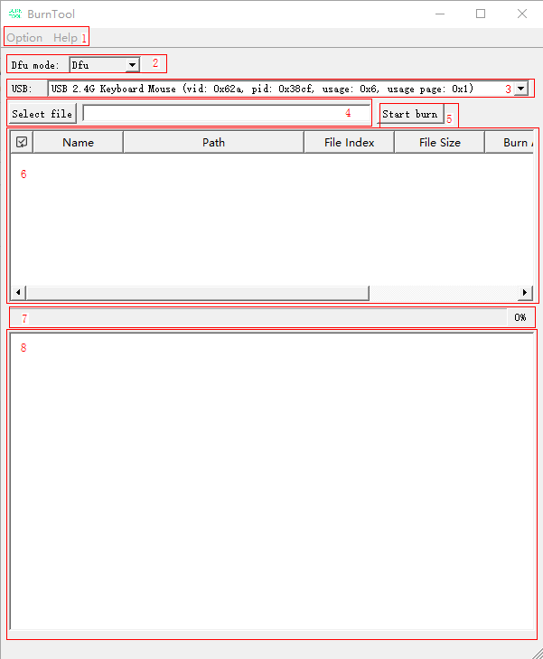

**Figure 2**  Auto DFU burning interface<a name="zh-cn_topic_0000001860864884_fig450363243119"></a>  


**Figure 3**  Hid DFU upgrade interface<a name="zh-cn_topic_0000001860864884_fig965583135018"></a>  
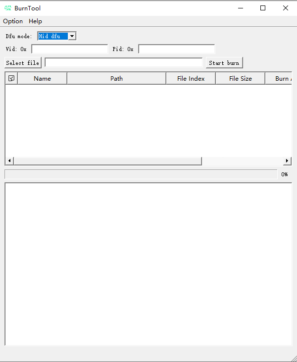

**Table 1**  Dfu burning interface description

<a name="zh-cn_topic_0000001860864884_table1923619111210"></a>
<table><thead align="left"><tr id="zh-cn_topic_0000001860864884_row8232019141213"><th class="cellrowborder" valign="top" width="13.66%" id="mcps1.2.3.1.1"><p id="zh-cn_topic_0000001860864884_p12351913126"><a name="zh-cn_topic_0000001860864884_p12351913126"></a><a name="zh-cn_topic_0000001860864884_p12351913126"></a>Area</p>
</th>
<th class="cellrowborder" valign="top" width="86.33999999999999%" id="mcps1.2.3.1.2"><p id="zh-cn_topic_0000001860864884_p9232199124"><a name="zh-cn_topic_0000001860864884_p9232199124"></a><a name="zh-cn_topic_0000001860864884_p9232199124"></a>Description</p>
</th>
</tr>
</thead>
<tbody><tr id="zh-cn_topic_0000001860864884_row1623119111212"><td class="cellrowborder" valign="top" width="13.66%" headers="mcps1.2.3.1.1 "><p id="zh-cn_topic_0000001860864884_p1723219201211"><a name="zh-cn_topic_0000001860864884_p1723219201211"></a><a name="zh-cn_topic_0000001860864884_p1723219201211"></a>1</p>
</td>
<td class="cellrowborder" valign="top" width="86.33999999999999%" headers="mcps1.2.3.1.2 "><a name="zh-cn_topic_0000001860864884_ul15231719181215"></a><a name="zh-cn_topic_0000001860864884_ul15231719181215"></a><ul id="zh-cn_topic_0000001860864884_ul15231719181215"><li>Option: Includes the following menus:<a name="zh-cn_topic_0000001860864884_ul1886910264194"></a><a name="zh-cn_topic_0000001860864884_ul1886910264194"></a><ul id="zh-cn_topic_0000001860864884_ul1886910264194"><li>Change Chip: Change the product.</li><li>Language: Change the language.</li></ul>
</li><li>Help: Includes the following menus:<a name="zh-cn_topic_0000001860864884_ul449165114915"></a><a name="zh-cn_topic_0000001860864884_ul449165114915"></a><ul id="zh-cn_topic_0000001860864884_ul449165114915"><li>About: Display version information.</li></ul>
</li></ul>
</td>
</tr>
<tr id="zh-cn_topic_0000001860864884_row8226123835212"><td class="cellrowborder" valign="top" width="13.66%" headers="mcps1.2.3.1.1 "><p id="zh-cn_topic_0000001860864884_p19226143818521"><a name="zh-cn_topic_0000001860864884_p19226143818521"></a><a name="zh-cn_topic_0000001860864884_p19226143818521"></a>2</p>
</td>
<td class="cellrowborder" valign="top" width="86.33999999999999%" headers="mcps1.2.3.1.2 "><a name="zh-cn_topic_0000001860864884_ul19532650175210"></a><a name="zh-cn_topic_0000001860864884_ul19532650175210"></a><ul id="zh-cn_topic_0000001860864884_ul19532650175210"><li>Dfu mode: Select the DFU upgrade mode<a name="zh-cn_topic_0000001860864884_ul8603024165318"></a><a name="zh-cn_topic_0000001860864884_ul8603024165318"></a><ul id="zh-cn_topic_0000001860864884_ul8603024165318"><li>Dfu:  Switch from the hid state to the dfu upgrade mode to perform a dfu upgrade.</li><li>Auto dfu: Enter the dfu upgrade mode directly.</li><li>Hid dfu: Perform the upgrade directly in the hid state.</li></ul>
</li></ul>
</td>
</tr>
<tr id="zh-cn_topic_0000001860864884_row3237195120"><td class="cellrowborder" valign="top" width="13.66%" headers="mcps1.2.3.1.1 "><p id="zh-cn_topic_0000001860864884_p2023219131213"><a name="zh-cn_topic_0000001860864884_p2023219131213"></a><a name="zh-cn_topic_0000001860864884_p2023219131213"></a>3</p>
</td>
<td class="cellrowborder" valign="top" width="86.33999999999999%" headers="mcps1.2.3.1.2 "><a name="zh-cn_topic_0000001860864884_ul1231919191217"></a><a name="zh-cn_topic_0000001860864884_ul1231919191217"></a><ul id="zh-cn_topic_0000001860864884_ul1231919191217"><li>USB: Display all USB-HID devices.</li></ul>
</td>
</tr>
<tr id="zh-cn_topic_0000001860864884_row723919141213"><td class="cellrowborder" valign="top" width="13.66%" headers="mcps1.2.3.1.1 "><p id="zh-cn_topic_0000001860864884_p1623141971211"><a name="zh-cn_topic_0000001860864884_p1623141971211"></a><a name="zh-cn_topic_0000001860864884_p1623141971211"></a>4</p>
</td>
<td class="cellrowborder" valign="top" width="86.33999999999999%" headers="mcps1.2.3.1.2 "><a name="zh-cn_topic_0000001860864884_ul1023719141210"></a><a name="zh-cn_topic_0000001860864884_ul1023719141210"></a><ul id="zh-cn_topic_0000001860864884_ul1023719141210"><li>Select file: Select the burning image in fwpkg format and display the path of the burning image.</li></ul>
</td>
</tr>
<tr id="zh-cn_topic_0000001860864884_row19231319171216"><td class="cellrowborder" valign="top" width="13.66%" headers="mcps1.2.3.1.1 "><p id="zh-cn_topic_0000001860864884_p17231219121216"><a name="zh-cn_topic_0000001860864884_p17231219121216"></a><a name="zh-cn_topic_0000001860864884_p17231219121216"></a>5</p>
</td>
<td class="cellrowborder" valign="top" width="86.33999999999999%" headers="mcps1.2.3.1.2 "><a name="zh-cn_topic_0000001860864884_ul153732715383"></a><a name="zh-cn_topic_0000001860864884_ul153732715383"></a><ul id="zh-cn_topic_0000001860864884_ul153732715383"><li>Start burn: Burn the images one by one based on the selected information in the table.</li></ul>
</td>
</tr>
<tr id="zh-cn_topic_0000001860864884_row112481931213"><td class="cellrowborder" valign="top" width="13.66%" headers="mcps1.2.3.1.1 "><p id="zh-cn_topic_0000001860864884_p1324219121220"><a name="zh-cn_topic_0000001860864884_p1324219121220"></a><a name="zh-cn_topic_0000001860864884_p1324219121220"></a>6</p>
</td>
<td class="cellrowborder" valign="top" width="86.33999999999999%" headers="mcps1.2.3.1.2 "><p id="zh-cn_topic_0000001860864884_p20241719121218"><a name="zh-cn_topic_0000001860864884_p20241719121218"></a><a name="zh-cn_topic_0000001860864884_p20241719121218"></a>Image table: Displays the information of the images that can be burned. The meaning of each column is as follows:</p>
<a name="zh-cn_topic_0000001860864884_ul1824161981218"></a><a name="zh-cn_topic_0000001860864884_ul1824161981218"></a><ul id="zh-cn_topic_0000001860864884_ul1824161981218"><li>Name: Name.</li><li>Path: Path.</li><li>File Index: Start index of the image in the file.</li><li>File Size: Size of the image.</li><li>Burn Addr: Start address of the Flash for burning.</li><li>Burn Size: Size of the Flash to be erased.</li><li>Type: General type, including:<a name="zh-cn_topic_0000001860864884_zh-cn_topic_0279549098_ul885418294117"></a><a name="zh-cn_topic_0000001860864884_zh-cn_topic_0279549098_ul885418294117"></a><ul id="zh-cn_topic_0000001860864884_zh-cn_topic_0279549098_ul885418294117"><li>0: Loader.</li><li>1: General image file.</li><li>2: Parameter file.</li><li>3: eFuse file.</li></ul>
<a name="zh-cn_topic_0000001860864884_ul41646461563"></a><a name="zh-cn_topic_0000001860864884_ul41646461563"></a><ul id="zh-cn_topic_0000001860864884_ul41646461563"><li>32: fota file.</li></ul>
</li></ul>
</td>
</tr>
<tr id="zh-cn_topic_0000001860864884_row824119151216"><td class="cellrowborder" valign="top" width="13.66%" headers="mcps1.2.3.1.1 "><p id="zh-cn_topic_0000001860864884_p1024719131211"><a name="zh-cn_topic_0000001860864884_p1024719131211"></a><a name="zh-cn_topic_0000001860864884_p1024719131211"></a>7</p>
</td>
<td class="cellrowborder" valign="top" width="86.33999999999999%" headers="mcps1.2.3.1.2 "><a name="zh-cn_topic_0000001860864884_ul19822102410408"></a><a name="zh-cn_topic_0000001860864884_ul19822102410408"></a><ul id="zh-cn_topic_0000001860864884_ul19822102410408"><li>Burning progress.</li></ul>
</td>
</tr>
<tr id="zh-cn_topic_0000001860864884_row2024101919122"><td class="cellrowborder" valign="top" width="13.66%" headers="mcps1.2.3.1.1 "><p id="zh-cn_topic_0000001860864884_p82411911120"><a name="zh-cn_topic_0000001860864884_p82411911120"></a><a name="zh-cn_topic_0000001860864884_p82411911120"></a>8</p>
</td>
<td class="cellrowborder" valign="top" width="86.33999999999999%" headers="mcps1.2.3.1.2 "><a name="zh-cn_topic_0000001860864884_ul68661610184110"></a><a name="zh-cn_topic_0000001860864884_ul68661610184110"></a><ul id="zh-cn_topic_0000001860864884_ul68661610184110"><li>Log view: Displays the logs reported by the board and printed by the tool during the burning process.</li></ul>
</td>
</tr>
<tr id="zh-cn_topic_0000001860864884_row2842044193219"><td class="cellrowborder" valign="top" width="13.66%" headers="mcps1.2.3.1.1 "><p id="zh-cn_topic_0000001860864884_p14842124413213"><a name="zh-cn_topic_0000001860864884_p14842124413213"></a><a name="zh-cn_topic_0000001860864884_p14842124413213"></a>9</p>
</td>
<td class="cellrowborder" valign="top" width="86.33999999999999%" headers="mcps1.2.3.1.2 "><a name="zh-cn_topic_0000001860864884_ul465664163310"></a><a name="zh-cn_topic_0000001860864884_ul465664163310"></a><ul id="zh-cn_topic_0000001860864884_ul465664163310"><li>Vid: Vendor ID of the device.</li></ul>
</td>
</tr>
<tr id="zh-cn_topic_0000001860864884_row5572238203214"><td class="cellrowborder" valign="top" width="13.66%" headers="mcps1.2.3.1.1 "><p id="zh-cn_topic_0000001860864884_p1257363817326"><a name="zh-cn_topic_0000001860864884_p1257363817326"></a><a name="zh-cn_topic_0000001860864884_p1257363817326"></a>10</p>
</td>
<td class="cellrowborder" valign="top" width="86.33999999999999%" headers="mcps1.2.3.1.2 "><a name="zh-cn_topic_0000001860864884_ul1845617330340"></a><a name="zh-cn_topic_0000001860864884_ul1845617330340"></a><ul id="zh-cn_topic_0000001860864884_ul1845617330340"><li>Pid: Product ID of the device.</li></ul>
</td>
</tr>
</tbody>
</table>

### BurnTool-Jlink<a name="ZH-CN_TOPIC_0000001985747196"></a>

The Jlink burning interface is shown in [Figure 1](#zh-cn_topic_0000001906904645_fig12224550243).

**Figure 1**  Jlink burning interface<a name="zh-cn_topic_0000001906904645_fig12224550243"></a>  
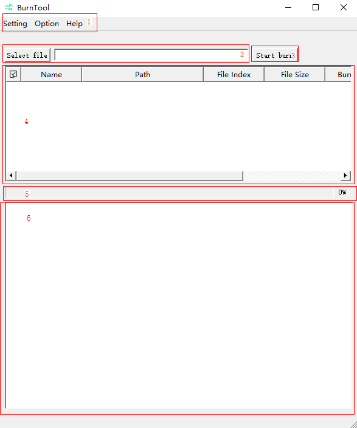

**Table 1**  Jlink burning interface description

<a name="zh-cn_topic_0000001906904645_table1923619111210"></a>
<table><thead align="left"><tr id="zh-cn_topic_0000001906904645_row8232019141213"><th class="cellrowborder" valign="top" width="13.66%" id="mcps1.2.3.1.1"><p id="zh-cn_topic_0000001906904645_p12351913126"><a name="zh-cn_topic_0000001906904645_p12351913126"></a><a name="zh-cn_topic_0000001906904645_p12351913126"></a>Area</p>
</th>
<th class="cellrowborder" valign="top" width="86.33999999999999%" id="mcps1.2.3.1.2"><p id="zh-cn_topic_0000001906904645_p9232199124"><a name="zh-cn_topic_0000001906904645_p9232199124"></a><a name="zh-cn_topic_0000001906904645_p9232199124"></a>Description</p>
</th>
</tr>
</thead>
<tbody><tr id="zh-cn_topic_0000001906904645_row1623119111212"><td class="cellrowborder" valign="top" width="13.66%" headers="mcps1.2.3.1.1 "><p id="zh-cn_topic_0000001906904645_p1723219201211"><a name="zh-cn_topic_0000001906904645_p1723219201211"></a><a name="zh-cn_topic_0000001906904645_p1723219201211"></a>1</p>
</td>
<td class="cellrowborder" valign="top" width="86.33999999999999%" headers="mcps1.2.3.1.2 "><a name="zh-cn_topic_0000001906904645_ul15231719181215"></a><a name="zh-cn_topic_0000001906904645_ul15231719181215"></a><ul id="zh-cn_topic_0000001906904645_ul15231719181215"><li>Setting:<div class="p" id="zh-cn_topic_0000001906904645_p8924153174517"><a name="zh-cn_topic_0000001906904645_p8924153174517"></a><a name="zh-cn_topic_0000001906904645_p8924153174517"></a>Includes the following menus:<a name="zh-cn_topic_0000001906904645_ul1077410220134"></a><a name="zh-cn_topic_0000001906904645_ul1077410220134"></a><ul id="zh-cn_topic_0000001906904645_ul1077410220134"><li>Jlink Settings: Configure the path of the Jlink executable file.</li><li>Language: Change the language.</li></ul>
</div>
</li><li>Option:<div class="p" id="zh-cn_topic_0000001906904645_p381645954511"><a name="zh-cn_topic_0000001906904645_p381645954511"></a><a name="zh-cn_topic_0000001906904645_p381645954511"></a>Includes the following menus:<a name="zh-cn_topic_0000001906904645_ul1886910264194"></a><a name="zh-cn_topic_0000001906904645_ul1886910264194"></a><ul id="zh-cn_topic_0000001906904645_ul1886910264194"><li>Change Chip: Change the product.</li></ul>
</div>
</li><li>Help:<div class="p" id="zh-cn_topic_0000001906904645_p45421933465"><a name="zh-cn_topic_0000001906904645_p45421933465"></a><a name="zh-cn_topic_0000001906904645_p45421933465"></a>Includes the following menus:<a name="zh-cn_topic_0000001906904645_ul449165114915"></a><a name="zh-cn_topic_0000001906904645_ul449165114915"></a><ul id="zh-cn_topic_0000001906904645_ul449165114915"><li>About: Display version information.</li></ul>
</div>
</li></ul>
</td>
</tr>
<tr id="zh-cn_topic_0000001906904645_row3237195120"><td class="cellrowborder" valign="top" width="13.66%" headers="mcps1.2.3.1.1 "><p id="zh-cn_topic_0000001906904645_p2023219131213"><a name="zh-cn_topic_0000001906904645_p2023219131213"></a><a name="zh-cn_topic_0000001906904645_p2023219131213"></a>2</p>
</td>
<td class="cellrowborder" valign="top" width="86.33999999999999%" headers="mcps1.2.3.1.2 "><p id="zh-cn_topic_0000001906904645_p17153174519450"><a name="zh-cn_topic_0000001906904645_p17153174519450"></a><a name="zh-cn_topic_0000001906904645_p17153174519450"></a>Select file: Select the burning image in fwpkg format.</p>
</td>
</tr>
<tr id="zh-cn_topic_0000001906904645_row1723121921215"><td class="cellrowborder" valign="top" width="13.66%" headers="mcps1.2.3.1.1 "><p id="zh-cn_topic_0000001906904645_p7232019151215"><a name="zh-cn_topic_0000001906904645_p7232019151215"></a><a name="zh-cn_topic_0000001906904645_p7232019151215"></a>3</p>
</td>
<td class="cellrowborder" valign="top" width="86.33999999999999%" headers="mcps1.2.3.1.2 "><p id="zh-cn_topic_0000001906904645_p19153145184516"><a name="zh-cn_topic_0000001906904645_p19153145184516"></a><a name="zh-cn_topic_0000001906904645_p19153145184516"></a>Start burn: Burn the images one by one based on the selected information in the table.</p>
</td>
</tr>
<tr id="zh-cn_topic_0000001906904645_row723919141213"><td class="cellrowborder" valign="top" width="13.66%" headers="mcps1.2.3.1.1 "><p id="zh-cn_topic_0000001906904645_p1623141971211"><a name="zh-cn_topic_0000001906904645_p1623141971211"></a><a name="zh-cn_topic_0000001906904645_p1623141971211"></a>4</p>
</td>
<td class="cellrowborder" valign="top" width="86.33999999999999%" headers="mcps1.2.3.1.2 "><p id="zh-cn_topic_0000001906904645_p858114453113"><a name="zh-cn_topic_0000001906904645_p858114453113"></a><a name="zh-cn_topic_0000001906904645_p858114453113"></a>Image table: Displays the information of the images that can be burned. The meaning of each column is as follows.</p>
<a name="zh-cn_topic_0000001906904645_ul9925203813115"></a><a name="zh-cn_topic_0000001906904645_ul9925203813115"></a><ul id="zh-cn_topic_0000001906904645_ul9925203813115"><li>Name: Name.</li><li>Path: Path.</li><li>File Index: Start index of the image in the file.</li><li>File Size: Size of the image.</li><li>Burn Addr: Start address of the Flash for burning.</li><li>Burn Size: Size of the Flash to be erased.</li><li>Type: Type of the burning file.</li></ul>
</td>
</tr>
<tr id="zh-cn_topic_0000001906904645_row19231319171216"><td class="cellrowborder" valign="top" width="13.66%" headers="mcps1.2.3.1.1 "><p id="zh-cn_topic_0000001906904645_p17231219121216"><a name="zh-cn_topic_0000001906904645_p17231219121216"></a><a name="zh-cn_topic_0000001906904645_p17231219121216"></a>5</p>
</td>
<td class="cellrowborder" valign="top" width="86.33999999999999%" headers="mcps1.2.3.1.2 "><p id="zh-cn_topic_0000001906904645_p15731542194514"><a name="zh-cn_topic_0000001906904645_p15731542194514"></a><a name="zh-cn_topic_0000001906904645_p15731542194514"></a>Burning progress.</p>
</td>
</tr>
<tr id="zh-cn_topic_0000001906904645_row112481931213"><td class="cellrowborder" valign="top" width="13.66%" headers="mcps1.2.3.1.1 "><p id="zh-cn_topic_0000001906904645_p1324219121220"><a name="zh-cn_topic_0000001906904645_p1324219121220"></a><a name="zh-cn_topic_0000001906904645_p1324219121220"></a>6</p>
</td>
<td class="cellrowborder" valign="top" width="86.33999999999999%" headers="mcps1.2.3.1.2 "><p id="zh-cn_topic_0000001906904645_p77481142134518"><a name="zh-cn_topic_0000001906904645_p77481142134518"></a><a name="zh-cn_topic_0000001906904645_p77481142134518"></a>Log view: Displays the logs reported by the board and printed by the tool during the burning process.</p>
</td>
</tr>
</tbody>
</table>

### BurnTool-OTA Upgrade<a name="ZH-CN_TOPIC_0000002022347001"></a>

The OTA upgrade interface is shown in [Figure 1](#zh-cn_topic_0000001938380988_fig9360446113611).

**Figure 1**  OTA upgrade interface<a name="zh-cn_topic_0000001938380988_fig9360446113611"></a>  


**Table 1**  Jlink burning interface description

<a name="zh-cn_topic_0000001938380988_table1923619111210"></a>
<table><thead align="left"><tr id="zh-cn_topic_0000001938380988_row8232019141213"><th class="cellrowborder" valign="top" width="13.66%" id="mcps1.2.3.1.1"><p id="zh-cn_topic_0000001938380988_p12351913126"><a name="zh-cn_topic_0000001938380988_p12351913126"></a><a name="zh-cn_topic_0000001938380988_p12351913126"></a>Area</p>
</th>
<th class="cellrowborder" valign="top" width="86.33999999999999%" id="mcps1.2.3.1.2"><p id="zh-cn_topic_0000001938380988_p9232199124"><a name="zh-cn_topic_0000001938380988_p9232199124"></a><a name="zh-cn_topic_0000001938380988_p9232199124"></a>Description</p>
</th>
</tr>
</thead>
<tbody><tr id="zh-cn_topic_0000001938380988_row1623119111212"><td class="cellrowborder" valign="top" width="13.66%" headers="mcps1.2.3.1.1 "><p id="zh-cn_topic_0000001938380988_p1723219201211"><a name="zh-cn_topic_0000001938380988_p1723219201211"></a><a name="zh-cn_topic_0000001938380988_p1723219201211"></a>1</p>
</td>
<td class="cellrowborder" valign="top" width="86.33999999999999%" headers="mcps1.2.3.1.2 "><a name="zh-cn_topic_0000001938380988_ul15231719181215"></a><a name="zh-cn_topic_0000001938380988_ul15231719181215"></a><ul id="zh-cn_topic_0000001938380988_ul15231719181215"><li>Option:<div class="p" id="zh-cn_topic_0000001938380988_p381645954511"><a name="zh-cn_topic_0000001938380988_p381645954511"></a><a name="zh-cn_topic_0000001938380988_p381645954511"></a>Includes the following menus:<a name="zh-cn_topic_0000001938380988_ul1886910264194"></a><a name="zh-cn_topic_0000001938380988_ul1886910264194"></a><ul id="zh-cn_topic_0000001938380988_ul1886910264194"><li>Change Chip: Change the product.</li><li>Language: Change the language.</li></ul>
</div>
</li><li>Help:<div class="p" id="zh-cn_topic_0000001938380988_p45421933465"><a name="zh-cn_topic_0000001938380988_p45421933465"></a><a name="zh-cn_topic_0000001938380988_p45421933465"></a>Includes the following menus:<a name="zh-cn_topic_0000001938380988_ul449165114915"></a><a name="zh-cn_topic_0000001938380988_ul449165114915"></a><ul id="zh-cn_topic_0000001938380988_ul449165114915"><li>About: Display version information.</li></ul>
</div>
</li></ul>
</td>
</tr>
<tr id="zh-cn_topic_0000001938380988_row3237195120"><td class="cellrowborder" valign="top" width="13.66%" headers="mcps1.2.3.1.1 "><p id="zh-cn_topic_0000001938380988_p2023219131213"><a name="zh-cn_topic_0000001938380988_p2023219131213"></a><a name="zh-cn_topic_0000001938380988_p2023219131213"></a>2</p>
</td>
<td class="cellrowborder" valign="top" width="86.33999999999999%" headers="mcps1.2.3.1.2 "><a name="zh-cn_topic_0000001938380988_ul1231919191217"></a><a name="zh-cn_topic_0000001938380988_ul1231919191217"></a><ul id="zh-cn_topic_0000001938380988_ul1231919191217"><li>USB: Display all USB-HID devices.</li></ul>
</td>
</tr>
<tr id="zh-cn_topic_0000001938380988_row1723121921215"><td class="cellrowborder" valign="top" width="13.66%" headers="mcps1.2.3.1.1 "><p id="zh-cn_topic_0000001938380988_p7232019151215"><a name="zh-cn_topic_0000001938380988_p7232019151215"></a><a name="zh-cn_topic_0000001938380988_p7232019151215"></a>3</p>
</td>
<td class="cellrowborder" valign="top" width="86.33999999999999%" headers="mcps1.2.3.1.2 "><a name="zh-cn_topic_0000001938380988_ul613819284312"></a><a name="zh-cn_topic_0000001938380988_ul613819284312"></a><ul id="zh-cn_topic_0000001938380988_ul613819284312"><li>Open: Open the selected USB device.</li></ul>
</td>
</tr>
<tr id="zh-cn_topic_0000001938380988_row20975142974318"><td class="cellrowborder" valign="top" width="13.66%" headers="mcps1.2.3.1.1 "><p id="zh-cn_topic_0000001938380988_p49753294437"><a name="zh-cn_topic_0000001938380988_p49753294437"></a><a name="zh-cn_topic_0000001938380988_p49753294437"></a>4</p>
</td>
<td class="cellrowborder" valign="top" width="86.33999999999999%" headers="mcps1.2.3.1.2 "><a name="zh-cn_topic_0000001938380988_ul159069338435"></a><a name="zh-cn_topic_0000001938380988_ul159069338435"></a><ul id="zh-cn_topic_0000001938380988_ul159069338435"><li>Address: Scan the device address when Open is clicked, and add the scanned devices to the list.</li></ul>
</td>
</tr>
<tr id="zh-cn_topic_0000001938380988_row1244919287444"><td class="cellrowborder" valign="top" width="13.66%" headers="mcps1.2.3.1.1 "><p id="zh-cn_topic_0000001938380988_p444917280440"><a name="zh-cn_topic_0000001938380988_p444917280440"></a><a name="zh-cn_topic_0000001938380988_p444917280440"></a>5</p>
</td>
<td class="cellrowborder" valign="top" width="86.33999999999999%" headers="mcps1.2.3.1.2 "><a name="zh-cn_topic_0000001938380988_ul17307123213442"></a><a name="zh-cn_topic_0000001938380988_ul17307123213442"></a><ul id="zh-cn_topic_0000001938380988_ul17307123213442"><li>Connect: Connect to the device.</li></ul>
</td>
</tr>
<tr id="zh-cn_topic_0000001938380988_row18390124874411"><td class="cellrowborder" valign="top" width="13.66%" headers="mcps1.2.3.1.1 "><p id="zh-cn_topic_0000001938380988_p19390174824415"><a name="zh-cn_topic_0000001938380988_p19390174824415"></a><a name="zh-cn_topic_0000001938380988_p19390174824415"></a>6</p>
</td>
<td class="cellrowborder" valign="top" width="86.33999999999999%" headers="mcps1.2.3.1.2 "><a name="zh-cn_topic_0000001938380988_ul17987823104519"></a><a name="zh-cn_topic_0000001938380988_ul17987823104519"></a><ul id="zh-cn_topic_0000001938380988_ul17987823104519"><li>File: Select the upgrade file.</li></ul>
</td>
</tr>
<tr id="zh-cn_topic_0000001938380988_row163871658164519"><td class="cellrowborder" valign="top" width="13.66%" headers="mcps1.2.3.1.1 "><p id="zh-cn_topic_0000001938380988_p19388165811459"><a name="zh-cn_topic_0000001938380988_p19388165811459"></a><a name="zh-cn_topic_0000001938380988_p19388165811459"></a>7</p>
</td>
<td class="cellrowborder" valign="top" width="86.33999999999999%" headers="mcps1.2.3.1.2 "><a name="zh-cn_topic_0000001938380988_ul3363171394620"></a><a name="zh-cn_topic_0000001938380988_ul3363171394620"></a><ul id="zh-cn_topic_0000001938380988_ul3363171394620"><li>Start: Start the upgrade (it changes to Stop when the upgrade starts; click it to interrupt the upgrade).</li></ul>
</td>
</tr>
<tr id="zh-cn_topic_0000001938380988_row723919141213"><td class="cellrowborder" valign="top" width="13.66%" headers="mcps1.2.3.1.1 "><p id="zh-cn_topic_0000001938380988_p1623141971211"><a name="zh-cn_topic_0000001938380988_p1623141971211"></a><a name="zh-cn_topic_0000001938380988_p1623141971211"></a>8</p>
</td>
<td class="cellrowborder" valign="top" width="86.33999999999999%" headers="mcps1.2.3.1.2 "><p id="zh-cn_topic_0000001938380988_p858114453113"><a name="zh-cn_topic_0000001938380988_p858114453113"></a><a name="zh-cn_topic_0000001938380988_p858114453113"></a>Image table: Displays the information of the images that can be burned. The meaning of each column is as follows.</p>
<a name="zh-cn_topic_0000001938380988_ul9925203813115"></a><a name="zh-cn_topic_0000001938380988_ul9925203813115"></a><ul id="zh-cn_topic_0000001938380988_ul9925203813115"><li>Name: Name.</li><li>Path: Path.</li><li>File Index: Start index of the image in the file.</li><li>File Size: Size of the image.</li><li>Burn Addr: Start address of the Flash for burning.</li><li>Burn Size: Size of the Flash to be erased.</li><li>Type: Type of the burning file.</li></ul>
</td>
</tr>
<tr id="zh-cn_topic_0000001938380988_row19231319171216"><td class="cellrowborder" valign="top" width="13.66%" headers="mcps1.2.3.1.1 "><p id="zh-cn_topic_0000001938380988_p17231219121216"><a name="zh-cn_topic_0000001938380988_p17231219121216"></a><a name="zh-cn_topic_0000001938380988_p17231219121216"></a>9</p>
</td>
<td class="cellrowborder" valign="top" width="86.33999999999999%" headers="mcps1.2.3.1.2 "><a name="zh-cn_topic_0000001938380988_ul165671022164719"></a><a name="zh-cn_topic_0000001938380988_ul165671022164719"></a><ul id="zh-cn_topic_0000001938380988_ul165671022164719"><li>Burning progress.</li></ul>
</td>
</tr>
<tr id="zh-cn_topic_0000001938380988_row112481931213"><td class="cellrowborder" valign="top" width="13.66%" headers="mcps1.2.3.1.1 "><p id="zh-cn_topic_0000001938380988_p1324219121220"><a name="zh-cn_topic_0000001938380988_p1324219121220"></a><a name="zh-cn_topic_0000001938380988_p1324219121220"></a>10</p>
</td>
<td class="cellrowborder" valign="top" width="86.33999999999999%" headers="mcps1.2.3.1.2 "><a name="zh-cn_topic_0000001938380988_ul113511026488"></a><a name="zh-cn_topic_0000001938380988_ul113511026488"></a><ul id="zh-cn_topic_0000001938380988_ul113511026488"><li>Log view: Displays the logs reported by the board and printed by the tool during the burning process.</li></ul>
</td>
</tr>
</tbody>
</table>

### Factory Burning<a name="ZH-CN_TOPIC_0000001985906940"></a>

The factory burning function is used for mass burning scenarios. After the interruption, files are sent in the selected order in the table. The factory burning interface is shown in [Figure 1](#zh-cn_topic_0000001162441960_zh-cn_topic_0281207084_fig24712267).

**Figure 1**  Factory burning interface<a name="zh-cn_topic_0000001162441960_zh-cn_topic_0281207084_fig24712267"></a>  
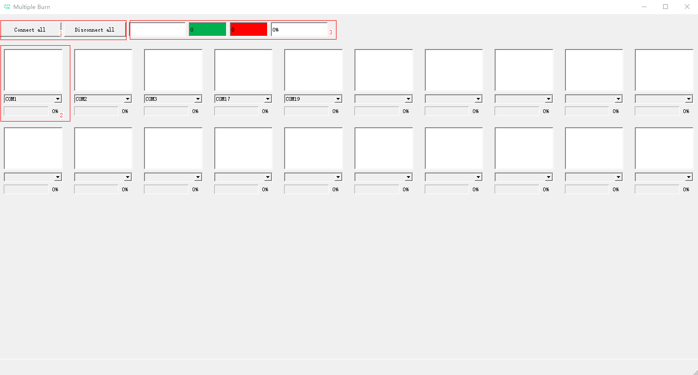

**Table 1**  Factory burning interface description

<a name="zh-cn_topic_0000001162441960_zh-cn_topic_0281207084_table1435556181"></a>
<table><thead align="left"><tr id="zh-cn_topic_0000001162441960_zh-cn_topic_0281207084_row1835656183"><th class="cellrowborder" valign="top" width="17.77%" id="mcps1.2.3.1.1"><p id="zh-cn_topic_0000001162441960_zh-cn_topic_0281207084_p115311511086"><a name="zh-cn_topic_0000001162441960_zh-cn_topic_0281207084_p115311511086"></a><a name="zh-cn_topic_0000001162441960_zh-cn_topic_0281207084_p115311511086"></a>Area</p>
</th>
<th class="cellrowborder" valign="top" width="82.23%" id="mcps1.2.3.1.2"><p id="zh-cn_topic_0000001162441960_zh-cn_topic_0281207084_p5531145116817"><a name="zh-cn_topic_0000001162441960_zh-cn_topic_0281207084_p5531145116817"></a><a name="zh-cn_topic_0000001162441960_zh-cn_topic_0281207084_p5531145116817"></a>Description</p>
</th>
</tr>
</thead>
<tbody><tr id="zh-cn_topic_0000001162441960_zh-cn_topic_0281207084_row1778202182511"><td class="cellrowborder" valign="top" width="17.77%" headers="mcps1.2.3.1.1 "><p id="zh-cn_topic_0000001162441960_zh-cn_topic_0281207084_p1978218222513"><a name="zh-cn_topic_0000001162441960_zh-cn_topic_0281207084_p1978218222513"></a><a name="zh-cn_topic_0000001162441960_zh-cn_topic_0281207084_p1978218222513"></a>1</p>
</td>
<td class="cellrowborder" valign="top" width="82.23%" headers="mcps1.2.3.1.2 "><a name="zh-cn_topic_0000001162441960_zh-cn_topic_0281207084_ul137862022513"></a><a name="zh-cn_topic_0000001162441960_zh-cn_topic_0281207084_ul137862022513"></a><ul id="zh-cn_topic_0000001162441960_zh-cn_topic_0281207084_ul137862022513"><li>Connect all: Connect all serial ports.</li><li>Disconnect all: Disconnect all opened serial ports.</li></ul>
</td>
</tr>
<tr id="zh-cn_topic_0000001162441960_zh-cn_topic_0281207084_row1235619611820"><td class="cellrowborder" valign="top" width="17.77%" headers="mcps1.2.3.1.1 "><p id="zh-cn_topic_0000001162441960_zh-cn_topic_0281207084_p195316518818"><a name="zh-cn_topic_0000001162441960_zh-cn_topic_0281207084_p195316518818"></a><a name="zh-cn_topic_0000001162441960_zh-cn_topic_0281207084_p195316518818"></a>2</p>
</td>
<td class="cellrowborder" valign="top" width="82.23%" headers="mcps1.2.3.1.2 "><a name="zh-cn_topic_0000001162441960_zh-cn_topic_0281207084_ul05676417267"></a><a name="zh-cn_topic_0000001162441960_zh-cn_topic_0281207084_ul05676417267"></a><ul id="zh-cn_topic_0000001162441960_zh-cn_topic_0281207084_ul05676417267"><li>Echo view: Displays the board burning status “Doing”, “PASS”, “Fail”, and “Waiting”.</li><li>Serial port number list: Displays the currently available serial port numbers.</li></ul>
</td>
</tr>
<tr id="zh-cn_topic_0000001162441960_zh-cn_topic_0281207084_row735616614819"><td class="cellrowborder" valign="top" width="17.77%" headers="mcps1.2.3.1.1 "><p id="zh-cn_topic_0000001162441960_zh-cn_topic_0281207084_p15531251083"><a name="zh-cn_topic_0000001162441960_zh-cn_topic_0281207084_p15531251083"></a><a name="zh-cn_topic_0000001162441960_zh-cn_topic_0281207084_p15531251083"></a>3</p>
</td>
<td class="cellrowborder" valign="top" width="82.23%" headers="mcps1.2.3.1.2 "><p id="zh-cn_topic_0000001162441960_zh-cn_topic_0281207084_p193431818246"><a name="zh-cn_topic_0000001162441960_zh-cn_topic_0281207084_p193431818246"></a><a name="zh-cn_topic_0000001162441960_zh-cn_topic_0281207084_p193431818246"></a>Burning result statistics: number of successes, number of failures, success rate, and burning time of this round.</p>
</td>
</tr>
</tbody>
</table>

### Settings Interface<a name="ZH-CN_TOPIC_0000002022466557"></a>

The settings interface is mainly used to configure serial port parameters. The settings interface is shown in [Figure 1](#zh-cn_topic_0000001161963482_fig392365342019).

**Figure 1**  Settings interface<a name="zh-cn_topic_0000001161963482_fig392365342019"></a>  


**Table 1**  Settings interface description

<a name="zh-cn_topic_0000001161963482_zh-cn_topic_0000001138051779_table1435556181"></a>
<table><thead align="left"><tr id="zh-cn_topic_0000001161963482_zh-cn_topic_0000001138051779_row1835656183"><th class="cellrowborder" valign="top" width="17.77%" id="mcps1.2.3.1.1"><p id="zh-cn_topic_0000001161963482_zh-cn_topic_0000001138051779_p115311511086"><a name="zh-cn_topic_0000001161963482_zh-cn_topic_0000001138051779_p115311511086"></a><a name="zh-cn_topic_0000001161963482_zh-cn_topic_0000001138051779_p115311511086"></a>Area</p>
</th>
<th class="cellrowborder" valign="top" width="82.23%" id="mcps1.2.3.1.2"><p id="zh-cn_topic_0000001161963482_zh-cn_topic_0000001138051779_p5531145116817"><a name="zh-cn_topic_0000001161963482_zh-cn_topic_0000001138051779_p5531145116817"></a><a name="zh-cn_topic_0000001161963482_zh-cn_topic_0000001138051779_p5531145116817"></a>Description</p>
</th>
</tr>
</thead>
<tbody><tr id="zh-cn_topic_0000001161963482_zh-cn_topic_0000001138051779_row1778202182511"><td class="cellrowborder" valign="top" width="17.77%" headers="mcps1.2.3.1.1 "><p id="zh-cn_topic_0000001161963482_zh-cn_topic_0000001138051779_p1978218222513"><a name="zh-cn_topic_0000001161963482_zh-cn_topic_0000001138051779_p1978218222513"></a><a name="zh-cn_topic_0000001161963482_zh-cn_topic_0000001138051779_p1978218222513"></a>1</p>
</td>
<td class="cellrowborder" valign="top" width="82.23%" headers="mcps1.2.3.1.2 "><a name="zh-cn_topic_0000001161963482_zh-cn_topic_0000001138051779_ul137862022513"></a><a name="zh-cn_topic_0000001161963482_zh-cn_topic_0000001138051779_ul137862022513"></a><ul id="zh-cn_topic_0000001161963482_zh-cn_topic_0000001138051779_ul137862022513"><li>Baud: Baud rate. The supported baud rate ranges vary by product. The tool lists all commonly used baud rates. Whether they can be used normally is subject to product constraints.</li><li>Data Bit: Data bits.</li><li>Stop Bit: Stop bits.</li><li>Parity: Parity bit.</li><li>Flow ctrl: Flow control.</li></ul>
</td>
</tr>
<tr id="zh-cn_topic_0000001161963482_zh-cn_topic_0000001138051779_row1235619611820"><td class="cellrowborder" valign="top" width="17.77%" headers="mcps1.2.3.1.1 "><p id="zh-cn_topic_0000001161963482_zh-cn_topic_0000001138051779_p195316518818"><a name="zh-cn_topic_0000001161963482_zh-cn_topic_0000001138051779_p195316518818"></a><a name="zh-cn_topic_0000001161963482_zh-cn_topic_0000001138051779_p195316518818"></a>2</p>
</td>
<td class="cellrowborder" valign="top" width="82.23%" headers="mcps1.2.3.1.2 "><a name="zh-cn_topic_0000001161963482_zh-cn_topic_0000001138051779_ul05676417267"></a><a name="zh-cn_topic_0000001161963482_zh-cn_topic_0000001138051779_ul05676417267"></a><ul id="zh-cn_topic_0000001161963482_zh-cn_topic_0000001138051779_ul05676417267"><li>Package size: Size of each data transfer packet. Generally, only 1024 bytes are supported. It should not be modified unless the product provides special support.</li><li>Force Read Time: Time interval for reading the serial port periodically, indicating that the interval between two serial port receptions is at least N ms. It is selected by default with an interval of 10 ms (after version 4.4, it is forcibly selected by default and cannot be modified). Selecting it by default can prevent the following scenarios:<a name="zh-cn_topic_0000001161963482_ul121434109233"></a><a name="zh-cn_topic_0000001161963482_ul121434109233"></a><ul id="zh-cn_topic_0000001161963482_ul121434109233"><li>BurnTool cannot be used properly in some PC environments.</li><li>CPU usage is too high in one-to-many scenarios.</li></ul>
</li><li>Switch baud rate after loader: Switch to the configured baud rate after the loader is burned. When the loader cannot be burned at a high baud rate but other files can be burned at this baud rate, selecting this option can improve the burning speed.</li></ul>
</td>
</tr>
<tr id="zh-cn_topic_0000001161963482_zh-cn_topic_0000001138051779_row829518303389"><td class="cellrowborder" valign="top" width="17.77%" headers="mcps1.2.3.1.1 "><p id="zh-cn_topic_0000001161963482_zh-cn_topic_0000001138051779_p229616307382"><a name="zh-cn_topic_0000001161963482_zh-cn_topic_0000001138051779_p229616307382"></a><a name="zh-cn_topic_0000001161963482_zh-cn_topic_0000001138051779_p229616307382"></a>3</p>
</td>
<td class="cellrowborder" valign="top" width="82.23%" headers="mcps1.2.3.1.2 "><a name="zh-cn_topic_0000001161963482_zh-cn_topic_0000001138051779_ul12554334173812"></a><a name="zh-cn_topic_0000001161963482_zh-cn_topic_0000001138051779_ul12554334173812"></a><ul id="zh-cn_topic_0000001161963482_zh-cn_topic_0000001138051779_ul12554334173812"><li>Independent Burn: Independent burning. When selected, all serial ports on the factory interface are completely independent, with no overall flow control and no total burning time calculation. This applies to factories where fixtures burn independently. When not selected, all serial ports on the factory interface are managed together, and the fixture lifting operation is judged together after burning is completed.</li><li>Total num: Total number of windows on the factory interface.</li><li>Num per line: Number of windows per row on the factory interface.</li><li>Reopen Com Everytime: When selected, the serial port is reopened after each burning on the factory burning interface and before the next burning starts.</li><li>Reset after success: When selected, the board is restarted after each burning on the factory burning interface.</li></ul>
</td>
</tr>
</tbody>
</table>

### Selecting the Jlink Executable Interface<a name="ZH-CN_TOPIC_0000001985747204"></a>

Click “Setting”-“Jlink Settings” to open the Jlink settings, which is used to configure the path of the Jlink executable. The interface is shown in [Figure 1](#zh-cn_topic_0000001907005225_fig4811422716).

**Figure 1**  Selecting the Jlink executable interface<a name="zh-cn_topic_0000001907005225_fig4811422716"></a>  
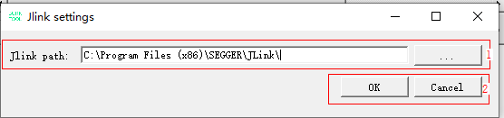

**Table 1**  Selecting the Jlink executable interface description

<a name="zh-cn_topic_0000001907005225_zh-cn_topic_0000001138051779_table1435556181"></a>
<table><thead align="left"><tr id="zh-cn_topic_0000001907005225_zh-cn_topic_0000001138051779_row1835656183"><th class="cellrowborder" valign="top" width="17.77%" id="mcps1.2.3.1.1"><p id="zh-cn_topic_0000001907005225_zh-cn_topic_0000001138051779_p115311511086"><a name="zh-cn_topic_0000001907005225_zh-cn_topic_0000001138051779_p115311511086"></a><a name="zh-cn_topic_0000001907005225_zh-cn_topic_0000001138051779_p115311511086"></a>Area</p>
</th>
<th class="cellrowborder" valign="top" width="82.23%" id="mcps1.2.3.1.2"><p id="zh-cn_topic_0000001907005225_zh-cn_topic_0000001138051779_p5531145116817"><a name="zh-cn_topic_0000001907005225_zh-cn_topic_0000001138051779_p5531145116817"></a><a name="zh-cn_topic_0000001907005225_zh-cn_topic_0000001138051779_p5531145116817"></a>Description</p>
</th>
</tr>
</thead>
<tbody><tr id="zh-cn_topic_0000001907005225_zh-cn_topic_0000001138051779_row1778202182511"><td class="cellrowborder" valign="top" width="17.77%" headers="mcps1.2.3.1.1 "><p id="zh-cn_topic_0000001907005225_zh-cn_topic_0000001138051779_p1978218222513"><a name="zh-cn_topic_0000001907005225_zh-cn_topic_0000001138051779_p1978218222513"></a><a name="zh-cn_topic_0000001907005225_zh-cn_topic_0000001138051779_p1978218222513"></a>1</p>
</td>
<td class="cellrowborder" valign="top" width="82.23%" headers="mcps1.2.3.1.2 "><a name="zh-cn_topic_0000001907005225_zh-cn_topic_0000001138051779_ul137862022513"></a><a name="zh-cn_topic_0000001907005225_zh-cn_topic_0000001138051779_ul137862022513"></a><ul id="zh-cn_topic_0000001907005225_zh-cn_topic_0000001138051779_ul137862022513"><li>Jlink path: Click “...” to select the folder where the Jlink executable is located.</li></ul>
</td>
</tr>
<tr id="zh-cn_topic_0000001907005225_row732424895812"><td class="cellrowborder" valign="top" width="17.77%" headers="mcps1.2.3.1.1 "><p id="zh-cn_topic_0000001907005225_p1232404855812"><a name="zh-cn_topic_0000001907005225_p1232404855812"></a><a name="zh-cn_topic_0000001907005225_p1232404855812"></a>2</p>
</td>
<td class="cellrowborder" valign="top" width="82.23%" headers="mcps1.2.3.1.2 "><a name="zh-cn_topic_0000001907005225_ul1773251165910"></a><a name="zh-cn_topic_0000001907005225_ul1773251165910"></a><ul id="zh-cn_topic_0000001907005225_ul1773251165910"><li>OK: Confirm the modification.</li><li>Cancel: Cancel the modification and use the last selection.</li></ul>
</td>
</tr>
</tbody>
</table>

# Operation Guide<a name="ZH-CN_TOPIC_0000001713125801"></a>


## Manual Burning<a name="ZH-CN_TOPIC_0000001906979257"></a>


### Serial Port Burning<a name="ZH-CN_TOPIC_0000001860859784"></a>

1.  In the BurnTool interface, click the “Select file” button, select the firmware package generated by compiling the product, and click “OK”.
2.  In the table, select the files to be burned (refer to the burning section in the product document).
3.  Choose “Setting”→“Com settings” to configure the serial port parameters. The default configuration is shown in [Figure 1](zh-cn_topic_0000001860836886.md#fig323525813325).

    > **Note:** 
    >Force Read Time: Time for periodic reading, in milliseconds. When selected, the serial port is read periodically; when not selected, the serial port is read on an event-triggered basis. This applies to scenarios where burning cannot be performed normally if this option is not selected.

    **Figure 1**  Serial port settings example<a name="zh-cn_topic_0000001860836886_fig323525813325"></a>  
    

4.  Select the target serial port number and click the “Connect” button (after clicking, “Connect” changes to “Disconnect”) to reset the board. The effect after interruption is shown in [Figure 2](#zh-cn_topic_0000001860836886_zh-cn_topic_0279549073_fig1957511242357).

    **Figure 2**  Effect after interruption<a name="zh-cn_topic_0000001860836886_zh-cn_topic_0279549073_fig1957511242357"></a>  
    

5.  When the string “CCC” is displayed on the interface, click the “Send file” button. The string above “CCC” may differ among products.
6.  After the transfer is completed, the burning ends. “All images burn successfully” appears when the burning is complete. The effect after burning is shown in [Figure 3](#zh-cn_topic_0000001860836886_zh-cn_topic_0279549073_fig11410377529).

    **Figure 3**  Burning completion<a name="zh-cn_topic_0000001860836886_zh-cn_topic_0279549073_fig11410377529"></a>  
    

> **Note:** 
>If image burning fails repeatedly under an external state with an unsatisfactory transfer rate, copy the image to the local disk for burning.

### DFU Burning<a name="ZH-CN_TOPIC_0000001861019624"></a>

1.  Open the program with administrator permissions (right-click the application and click Run as administrator, as shown in [Figure 1](#zh-cn_topic_0000001906956365_fig127414312457)).

    **Figure 1**  Run as administrator<a name="zh-cn_topic_0000001906956365_fig127414312457"></a>  
    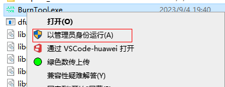

2.  Refer to the “[Selecting Chip](选择Chip.md#ZH-CN_TOPIC_0000001985906928)” section to select a chip with the DFU suffix, such as “XXX-USB”.
3.  <a name="zh-cn_topic_0000001906956365_li637125023912"></a>Select the burning mode, such as the dfu upgrade mode, as shown in [Figure 2](#zh-cn_topic_0000001906956365_fig1636825093917).

    **Figure 2**  Selecting the burning mode<a name="zh-cn_topic_0000001906956365_fig1636825093917"></a>  
    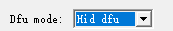

4.  Select the device or enter the device information based on the mode selected in [3](#zh-cn_topic_0000001906956365_li637125023912). In Dfu mode, select the device information as shown in [Figure 3](#zh-cn_topic_0000001906956365_fig196045434581). In Auto dfu and Hid dfu modes, enter the device information as shown in [Figure 4](#zh-cn_topic_0000001906956365_fig18275145418455).

    **Figure 3**  Selecting a USB device<a name="zh-cn_topic_0000001906956365_fig196045434581"></a>  
    

    **Figure 4**  Entering USB device information<a name="zh-cn_topic_0000001906956365_fig18275145418455"></a>  
    

5.  In the BurnTool interface, click the “Select file” button, select the firmware package generated by compiling the product, and click “Open”.
6.  In the table, select the files to be burned.
7.  Click the “Start burn” button (after clicking, “Start burn” changes to “Stop burn”).
8.  After the transfer is completed, the burning ends. “All images burn successfully” appears when the burning is complete. The effect after burning is shown in [Figure 5](#zh-cn_topic_0000001906956365_fig10497621143610).

    **Figure 5**  Burning completion<a name="zh-cn_topic_0000001906956365_fig10497621143610"></a>  
    

    > **Warning:** 
    >Warning: Do not power off before “All images burn successfully” is printed; otherwise, the board may become abnormal.

## Factory Burning<a name="ZH-CN_TOPIC_0000001713125805"></a>

1.  In the BurnTool interface, click the “Select file” button, select the firmware package generated by compiling the product, and click “OK”.
2.  In the table, select the files to be burned.
3.  Choose “Setting”→“Com settings” to configure the serial port parameters. The default configuration is shown in [Figure 1](#zh-cn_topic_0000001162441958_zh-cn_topic_0281207485_fig12141552194715).

    **Figure 1**  Serial port settings example<a name="zh-cn_topic_0000001162441958_zh-cn_topic_0281207485_fig12141552194715"></a>  
    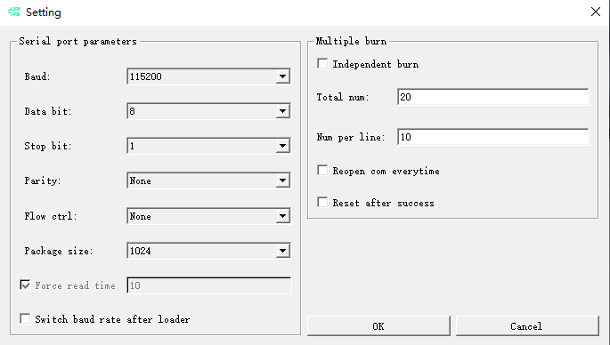

    > **Note:** 
    >Total num: The maximum number tested in R&D is 20. In practice, the theoretical maximum number of burning targets is unlimited and generally depends on the PC performance, fixtures, and wiring stability.

4.  Click the “Multiple burn” button to open the factory burning window. If a configuration already exists, it is read automatically. If no configuration exists, you can manually select the serial ports and then choose “Setting”→“Save config” to generate the configuration.
5.  Click the “Connect all” button and reset all boards.
6.  Wait until all echo views display green “PASS” or red “Fail”.

    

## Command Line Burning<a name="ZH-CN_TOPIC_0000001906899545"></a>


### Serial Port Burning<a name="ZH-CN_TOPIC_0000001906979261"></a>

In the Windows environment, BurnTool.exe supports invocation from the command line and can be integrated into existing factory production line burning programs. The invocation command is as follows:

```
BurnTool.exe params
```

Commands are separated by spaces. If a command has parameters, the command and its parameters are separated by colons. The simplest example is as follows:

```
BurnTool.exe -com:1 -bin:C:\test_bin\xxx.fwpkg -signalbaud:921600 
```

The params that can be configured for the BurnTool.exe burning command are listed in [Table 1](#zh-cn_topic_0000001906960121_zh-cn_topic_0279549078_table51147202142).

**Table 1**  BurnTool.exe burning command parameters

<a name="zh-cn_topic_0000001906960121_zh-cn_topic_0279549078_table51147202142"></a>
<table><thead align="left"><tr id="zh-cn_topic_0000001906960121_zh-cn_topic_0279549078_row111472021414"><th class="cellrowborder" valign="top" width="13.72137213721372%" id="mcps1.2.4.1.1"><p id="zh-cn_topic_0000001906960121_zh-cn_topic_0279549078_p1782320288143"><a name="zh-cn_topic_0000001906960121_zh-cn_topic_0279549078_p1782320288143"></a><a name="zh-cn_topic_0000001906960121_zh-cn_topic_0279549078_p1782320288143"></a>Command</p>
</th>
<th class="cellrowborder" valign="top" width="15.02150215021502%" id="mcps1.2.4.1.2"><p id="zh-cn_topic_0000001906960121_zh-cn_topic_0279549078_p4823202816141"><a name="zh-cn_topic_0000001906960121_zh-cn_topic_0279549078_p4823202816141"></a><a name="zh-cn_topic_0000001906960121_zh-cn_topic_0279549078_p4823202816141"></a>Parameter</p>
</th>
<th class="cellrowborder" valign="top" width="71.25712571257125%" id="mcps1.2.4.1.3"><p id="zh-cn_topic_0000001906960121_zh-cn_topic_0279549078_p782372815142"><a name="zh-cn_topic_0000001906960121_zh-cn_topic_0279549078_p782372815142"></a><a name="zh-cn_topic_0000001906960121_zh-cn_topic_0279549078_p782372815142"></a>Description</p>
</th>
</tr>
</thead>
<tbody><tr id="zh-cn_topic_0000001906960121_zh-cn_topic_0279549078_row4114220111417"><td class="cellrowborder" valign="top" width="13.72137213721372%" headers="mcps1.2.4.1.1 "><p id="zh-cn_topic_0000001906960121_zh-cn_topic_0279549078_p6464935131411"><a name="zh-cn_topic_0000001906960121_zh-cn_topic_0279549078_p6464935131411"></a><a name="zh-cn_topic_0000001906960121_zh-cn_topic_0279549078_p6464935131411"></a>-com:</p>
</td>
<td class="cellrowborder" valign="top" width="15.02150215021502%" headers="mcps1.2.4.1.2 "><p id="zh-cn_topic_0000001906960121_zh-cn_topic_0279549078_p146415352140"><a name="zh-cn_topic_0000001906960121_zh-cn_topic_0279549078_p146415352140"></a><a name="zh-cn_topic_0000001906960121_zh-cn_topic_0279549078_p146415352140"></a>x</p>
</td>
<td class="cellrowborder" valign="top" width="71.25712571257125%" headers="mcps1.2.4.1.3 "><p id="zh-cn_topic_0000001906960121_zh-cn_topic_0279549078_p846410354145"><a name="zh-cn_topic_0000001906960121_zh-cn_topic_0279549078_p846410354145"></a><a name="zh-cn_topic_0000001906960121_zh-cn_topic_0279549078_p846410354145"></a>Serial port number on the PC (for example: 1).</p>
</td>
</tr>
<tr id="zh-cn_topic_0000001906960121_zh-cn_topic_0279549078_row211482013145"><td class="cellrowborder" valign="top" width="13.72137213721372%" headers="mcps1.2.4.1.1 "><p id="zh-cn_topic_0000001906960121_zh-cn_topic_0279549078_p10464135131419"><a name="zh-cn_topic_0000001906960121_zh-cn_topic_0279549078_p10464135131419"></a><a name="zh-cn_topic_0000001906960121_zh-cn_topic_0279549078_p10464135131419"></a>-bin:</p>
</td>
<td class="cellrowborder" valign="top" width="15.02150215021502%" headers="mcps1.2.4.1.2 "><p id="zh-cn_topic_0000001906960121_zh-cn_topic_0279549078_p3464163511416"><a name="zh-cn_topic_0000001906960121_zh-cn_topic_0279549078_p3464163511416"></a><a name="zh-cn_topic_0000001906960121_zh-cn_topic_0279549078_p3464163511416"></a>path\xxx.bin</p>
</td>
<td class="cellrowborder" valign="top" width="71.25712571257125%" headers="mcps1.2.4.1.3 "><p id="zh-cn_topic_0000001906960121_zh-cn_topic_0279549078_p9464133571410"><a name="zh-cn_topic_0000001906960121_zh-cn_topic_0279549078_p9464133571410"></a><a name="zh-cn_topic_0000001906960121_zh-cn_topic_0279549078_p9464133571410"></a>Absolute path of the firmware package xxx.bin. The name and file type of the firmware package may vary depending on the actual situation of each product. (The path must not contain space characters.)</p>
</td>
</tr>
<tr id="zh-cn_topic_0000001906960121_zh-cn_topic_0279549078_row2114162071419"><td class="cellrowborder" valign="top" width="13.72137213721372%" headers="mcps1.2.4.1.1 "><p id="zh-cn_topic_0000001906960121_zh-cn_topic_0279549078_p146433513144"><a name="zh-cn_topic_0000001906960121_zh-cn_topic_0279549078_p146433513144"></a><a name="zh-cn_topic_0000001906960121_zh-cn_topic_0279549078_p146433513144"></a>-signalbaud:</p>
</td>
<td class="cellrowborder" valign="top" width="15.02150215021502%" headers="mcps1.2.4.1.2 "><p id="zh-cn_topic_0000001906960121_zh-cn_topic_0279549078_p19464193571410"><a name="zh-cn_topic_0000001906960121_zh-cn_topic_0279549078_p19464193571410"></a><a name="zh-cn_topic_0000001906960121_zh-cn_topic_0279549078_p19464193571410"></a>115200</p>
</td>
<td class="cellrowborder" valign="top" width="71.25712571257125%" headers="mcps1.2.4.1.3 "><p id="zh-cn_topic_0000001906960121_zh-cn_topic_0279549078_p54641835181410"><a name="zh-cn_topic_0000001906960121_zh-cn_topic_0279549078_p54641835181410"></a><a name="zh-cn_topic_0000001906960121_zh-cn_topic_0279549078_p54641835181410"></a>Baud rate of the serial port for transferring the firmware package in RomBoot. The default value is 115200 bit/s. It is recommended to configure it to 921600 bit/s or a higher baud rate based on hardware support to improve the burning efficiency.</p>
</td>
</tr>
<tr id="zh-cn_topic_0000001906960121_zh-cn_topic_0279549078_row2646161518281"><td class="cellrowborder" valign="top" width="13.72137213721372%" headers="mcps1.2.4.1.1 "><p id="zh-cn_topic_0000001906960121_zh-cn_topic_0279549078_p1564761512282"><a name="zh-cn_topic_0000001906960121_zh-cn_topic_0279549078_p1564761512282"></a><a name="zh-cn_topic_0000001906960121_zh-cn_topic_0279549078_p1564761512282"></a>-2ms</p>
</td>
<td class="cellrowborder" valign="top" width="15.02150215021502%" headers="mcps1.2.4.1.2 "><p id="zh-cn_topic_0000001906960121_zh-cn_topic_0279549078_p12647715112818"><a name="zh-cn_topic_0000001906960121_zh-cn_topic_0279549078_p12647715112818"></a><a name="zh-cn_topic_0000001906960121_zh-cn_topic_0279549078_p12647715112818"></a>None</p>
</td>
<td class="cellrowborder" valign="top" width="71.25712571257125%" headers="mcps1.2.4.1.3 "><p id="zh-cn_topic_0000001906960121_zh-cn_topic_0279549078_p86472156282"><a name="zh-cn_topic_0000001906960121_zh-cn_topic_0279549078_p86472156282"></a><a name="zh-cn_topic_0000001906960121_zh-cn_topic_0279549078_p86472156282"></a>Send the interruption message at 2 ms intervals. This is commonly used in fast startup scenarios. When this parameter is not included, the interval is 10 ms.</p>
</td>
</tr>
<tr id="zh-cn_topic_0000001906960121_zh-cn_topic_0279549078_row1715818567399"><td class="cellrowborder" valign="top" width="13.72137213721372%" headers="mcps1.2.4.1.1 "><p id="zh-cn_topic_0000001906960121_zh-cn_topic_0279549078_p51584560397"><a name="zh-cn_topic_0000001906960121_zh-cn_topic_0279549078_p51584560397"></a><a name="zh-cn_topic_0000001906960121_zh-cn_topic_0279549078_p51584560397"></a>-forceread:</p>
</td>
<td class="cellrowborder" valign="top" width="15.02150215021502%" headers="mcps1.2.4.1.2 "><p id="zh-cn_topic_0000001906960121_zh-cn_topic_0279549078_p915875623915"><a name="zh-cn_topic_0000001906960121_zh-cn_topic_0279549078_p915875623915"></a><a name="zh-cn_topic_0000001906960121_zh-cn_topic_0279549078_p915875623915"></a>10</p>
</td>
<td class="cellrowborder" valign="top" width="71.25712571257125%" headers="mcps1.2.4.1.3 "><p id="zh-cn_topic_0000001906960121_zh-cn_topic_0279549078_p17683185835817"><a name="zh-cn_topic_0000001906960121_zh-cn_topic_0279549078_p17683185835817"></a><a name="zh-cn_topic_0000001906960121_zh-cn_topic_0279549078_p17683185835817"></a>Including this parameter enables the periodic serial port reading function, with a data reading interval of 10 ms.</p>
<p id="zh-cn_topic_0000001906960121_zh-cn_topic_0279549078_p6501124013157"><a name="zh-cn_topic_0000001906960121_zh-cn_topic_0279549078_p6501124013157"></a><a name="zh-cn_topic_0000001906960121_zh-cn_topic_0279549078_p6501124013157"></a>Generally, it does not need to be enabled. It can be considered in the following scenarios:</p>
<a name="zh-cn_topic_0000001906960121_zh-cn_topic_0279549078_ul54691647111514"></a><a name="zh-cn_topic_0000001906960121_zh-cn_topic_0279549078_ul54691647111514"></a><ul id="zh-cn_topic_0000001906960121_zh-cn_topic_0279549078_ul54691647111514"><li>BurnTool cannot be used properly in some PC environments.</li><li>CPU usage is too high in one-to-many scenarios.</li></ul>
</td>
</tr>
<tr id="zh-cn_topic_0000001906960121_zh-cn_topic_0279549078_row164607487544"><td class="cellrowborder" valign="top" width="13.72137213721372%" headers="mcps1.2.4.1.1 "><p id="zh-cn_topic_0000001906960121_zh-cn_topic_0279549078_p16460174814546"><a name="zh-cn_topic_0000001906960121_zh-cn_topic_0279549078_p16460174814546"></a><a name="zh-cn_topic_0000001906960121_zh-cn_topic_0279549078_p16460174814546"></a>-erasemode:</p>
</td>
<td class="cellrowborder" valign="top" width="15.02150215021502%" headers="mcps1.2.4.1.2 "><p id="zh-cn_topic_0000001906960121_zh-cn_topic_0279549078_p346034875416"><a name="zh-cn_topic_0000001906960121_zh-cn_topic_0279549078_p346034875416"></a><a name="zh-cn_topic_0000001906960121_zh-cn_topic_0279549078_p346034875416"></a>x</p>
</td>
<td class="cellrowborder" valign="top" width="71.25712571257125%" headers="mcps1.2.4.1.3 "><p id="zh-cn_topic_0000001906960121_zh-cn_topic_0279549078_p57861027194111"><a name="zh-cn_topic_0000001906960121_zh-cn_topic_0279549078_p57861027194111"></a><a name="zh-cn_topic_0000001906960121_zh-cn_topic_0279549078_p57861027194111"></a>Erase mode. Where:</p>
<a name="zh-cn_topic_0000001906960121_zh-cn_topic_0279549078_ul209361847134110"></a><a name="zh-cn_topic_0000001906960121_zh-cn_topic_0279549078_ul209361847134110"></a><ul id="zh-cn_topic_0000001906960121_zh-cn_topic_0279549078_ul209361847134110"><li>0: Normal erase</li><li>1: Full-chip erase</li><li>2: No erase</li></ul>
</td>
</tr>
<tr id="zh-cn_topic_0000001906960121_zh-cn_topic_0279549078_row114172595516"><td class="cellrowborder" valign="top" width="13.72137213721372%" headers="mcps1.2.4.1.1 "><p id="zh-cn_topic_0000001906960121_zh-cn_topic_0279549078_p13410258557"><a name="zh-cn_topic_0000001906960121_zh-cn_topic_0279549078_p13410258557"></a><a name="zh-cn_topic_0000001906960121_zh-cn_topic_0279549078_p13410258557"></a>-timeout:</p>
</td>
<td class="cellrowborder" valign="top" width="15.02150215021502%" headers="mcps1.2.4.1.2 "><p id="zh-cn_topic_0000001906960121_zh-cn_topic_0279549078_p74114253559"><a name="zh-cn_topic_0000001906960121_zh-cn_topic_0279549078_p74114253559"></a><a name="zh-cn_topic_0000001906960121_zh-cn_topic_0279549078_p74114253559"></a>x</p>
</td>
<td class="cellrowborder" valign="top" width="71.25712571257125%" headers="mcps1.2.4.1.3 "><p id="zh-cn_topic_0000001906960121_zh-cn_topic_0279549078_p134162513558"><a name="zh-cn_topic_0000001906960121_zh-cn_topic_0279549078_p134162513558"></a><a name="zh-cn_topic_0000001906960121_zh-cn_topic_0279549078_p134162513558"></a>Timeout for interruption, in ms.</p>
</td>
</tr>
<tr id="zh-cn_topic_0000001906960121_zh-cn_topic_0279549078_row684720710565"><td class="cellrowborder" valign="top" width="13.72137213721372%" headers="mcps1.2.4.1.1 "><p id="zh-cn_topic_0000001906960121_zh-cn_topic_0279549078_p1484718711568"><a name="zh-cn_topic_0000001906960121_zh-cn_topic_0279549078_p1484718711568"></a><a name="zh-cn_topic_0000001906960121_zh-cn_topic_0279549078_p1484718711568"></a>-console</p>
</td>
<td class="cellrowborder" valign="top" width="15.02150215021502%" headers="mcps1.2.4.1.2 "><p id="zh-cn_topic_0000001906960121_zh-cn_topic_0279549078_p88479725614"><a name="zh-cn_topic_0000001906960121_zh-cn_topic_0279549078_p88479725614"></a><a name="zh-cn_topic_0000001906960121_zh-cn_topic_0279549078_p88479725614"></a>None</p>
</td>
<td class="cellrowborder" valign="top" width="71.25712571257125%" headers="mcps1.2.4.1.3 "><p id="zh-cn_topic_0000001906960121_zh-cn_topic_0279549078_p284777145614"><a name="zh-cn_topic_0000001906960121_zh-cn_topic_0279549078_p284777145614"></a><a name="zh-cn_topic_0000001906960121_zh-cn_topic_0279549078_p284777145614"></a>Use standard input and output to prepare for redirection.</p>
</td>
</tr>
<tr id="zh-cn_topic_0000001906960121_zh-cn_topic_0279549078_row22810183011"><td class="cellrowborder" valign="top" width="13.72137213721372%" headers="mcps1.2.4.1.1 "><p id="zh-cn_topic_0000001906960121_zh-cn_topic_0279549078_p122121053012"><a name="zh-cn_topic_0000001906960121_zh-cn_topic_0279549078_p122121053012"></a><a name="zh-cn_topic_0000001906960121_zh-cn_topic_0279549078_p122121053012"></a>-clearlog</p>
</td>
<td class="cellrowborder" valign="top" width="15.02150215021502%" headers="mcps1.2.4.1.2 "><p id="zh-cn_topic_0000001906960121_zh-cn_topic_0279549078_p7217100308"><a name="zh-cn_topic_0000001906960121_zh-cn_topic_0279549078_p7217100308"></a><a name="zh-cn_topic_0000001906960121_zh-cn_topic_0279549078_p7217100308"></a>None</p>
</td>
<td class="cellrowborder" valign="top" width="71.25712571257125%" headers="mcps1.2.4.1.3 "><p id="zh-cn_topic_0000001906960121_zh-cn_topic_0279549078_p132101073010"><a name="zh-cn_topic_0000001906960121_zh-cn_topic_0279549078_p132101073010"></a><a name="zh-cn_topic_0000001906960121_zh-cn_topic_0279549078_p132101073010"></a>Suppress the logs printed by the board.</p>
</td>
</tr>
<tr id="zh-cn_topic_0000001906960121_zh-cn_topic_0279549078_row1349413213114"><td class="cellrowborder" valign="top" width="13.72137213721372%" headers="mcps1.2.4.1.1 "><p id="zh-cn_topic_0000001906960121_zh-cn_topic_0279549078_p174941321818"><a name="zh-cn_topic_0000001906960121_zh-cn_topic_0279549078_p174941321818"></a><a name="zh-cn_topic_0000001906960121_zh-cn_topic_0279549078_p174941321818"></a>-onlyeraseall</p>
</td>
<td class="cellrowborder" valign="top" width="15.02150215021502%" headers="mcps1.2.4.1.2 "><p id="zh-cn_topic_0000001906960121_zh-cn_topic_0279549078_p1494221212"><a name="zh-cn_topic_0000001906960121_zh-cn_topic_0279549078_p1494221212"></a><a name="zh-cn_topic_0000001906960121_zh-cn_topic_0279549078_p1494221212"></a>None</p>
</td>
<td class="cellrowborder" valign="top" width="71.25712571257125%" headers="mcps1.2.4.1.3 "><p id="zh-cn_topic_0000001906960121_zh-cn_topic_0279549078_p149452120110"><a name="zh-cn_topic_0000001906960121_zh-cn_topic_0279549078_p149452120110"></a><a name="zh-cn_topic_0000001906960121_zh-cn_topic_0279549078_p149452120110"></a>Perform full-chip erase only.</p>
</td>
</tr>
<tr id="zh-cn_topic_0000001906960121_zh-cn_topic_0279549078_row596472420110"><td class="cellrowborder" valign="top" width="13.72137213721372%" headers="mcps1.2.4.1.1 "><p id="zh-cn_topic_0000001906960121_zh-cn_topic_0279549078_p19964132412117"><a name="zh-cn_topic_0000001906960121_zh-cn_topic_0279549078_p19964132412117"></a><a name="zh-cn_topic_0000001906960121_zh-cn_topic_0279549078_p19964132412117"></a>-onlyburn:</p>
</td>
<td class="cellrowborder" valign="top" width="15.02150215021502%" headers="mcps1.2.4.1.2 "><p id="zh-cn_topic_0000001906960121_zh-cn_topic_0279549078_p1696419248120"><a name="zh-cn_topic_0000001906960121_zh-cn_topic_0279549078_p1696419248120"></a><a name="zh-cn_topic_0000001906960121_zh-cn_topic_0279549078_p1696419248120"></a>name</p>
</td>
<td class="cellrowborder" valign="top" width="71.25712571257125%" headers="mcps1.2.4.1.3 "><p id="zh-cn_topic_0000001906960121_zh-cn_topic_0279549078_p7964152410112"><a name="zh-cn_topic_0000001906960121_zh-cn_topic_0279549078_p7964152410112"></a><a name="zh-cn_topic_0000001906960121_zh-cn_topic_0279549078_p7964152410112"></a>Specify the file with the corresponding name to burn. This parameter can be passed multiple times, and the effects are cumulative.</p>
</td>
</tr>
<tr id="zh-cn_topic_0000001906960121_zh-cn_topic_0279549078_row778594311418"><td class="cellrowborder" valign="top" width="13.72137213721372%" headers="mcps1.2.4.1.1 "><p id="zh-cn_topic_0000001906960121_zh-cn_topic_0279549078_p17861143101412"><a name="zh-cn_topic_0000001906960121_zh-cn_topic_0279549078_p17861143101412"></a><a name="zh-cn_topic_0000001906960121_zh-cn_topic_0279549078_p17861143101412"></a>-reset</p>
</td>
<td class="cellrowborder" valign="top" width="15.02150215021502%" headers="mcps1.2.4.1.2 "><p id="zh-cn_topic_0000001906960121_zh-cn_topic_0279549078_p878694313143"><a name="zh-cn_topic_0000001906960121_zh-cn_topic_0279549078_p878694313143"></a><a name="zh-cn_topic_0000001906960121_zh-cn_topic_0279549078_p878694313143"></a>None</p>
</td>
<td class="cellrowborder" valign="top" width="71.25712571257125%" headers="mcps1.2.4.1.3 "><p id="zh-cn_topic_0000001906960121_zh-cn_topic_0279549078_p87869435143"><a name="zh-cn_topic_0000001906960121_zh-cn_topic_0279549078_p87869435143"></a><a name="zh-cn_topic_0000001906960121_zh-cn_topic_0279549078_p87869435143"></a>Automatically restart the device after burning is completed.</p>
</td>
</tr>
<tr id="zh-cn_topic_0000001906960121_row391712289530"><td class="cellrowborder" valign="top" width="13.72137213721372%" headers="mcps1.2.4.1.1 "><p id="zh-cn_topic_0000001906960121_p169181028125315"><a name="zh-cn_topic_0000001906960121_p169181028125315"></a><a name="zh-cn_topic_0000001906960121_p169181028125315"></a>-packagesize:</p>
</td>
<td class="cellrowborder" valign="top" width="15.02150215021502%" headers="mcps1.2.4.1.2 "><p id="zh-cn_topic_0000001906960121_p69181628165310"><a name="zh-cn_topic_0000001906960121_p69181628165310"></a><a name="zh-cn_topic_0000001906960121_p69181628165310"></a>x</p>
</td>
<td class="cellrowborder" valign="top" width="71.25712571257125%" headers="mcps1.2.4.1.3 "><p id="zh-cn_topic_0000001906960121_p0918172819535"><a name="zh-cn_topic_0000001906960121_p0918172819535"></a><a name="zh-cn_topic_0000001906960121_p0918172819535"></a>Size of each transfer packet. Currently, 1024, 2048, 4096, and 8192 are supported.</p>
</td>
</tr>
<tr id="zh-cn_topic_0000001906960121_row5728175013533"><td class="cellrowborder" valign="top" width="13.72137213721372%" headers="mcps1.2.4.1.1 "><p id="zh-cn_topic_0000001906960121_p16728450185313"><a name="zh-cn_topic_0000001906960121_p16728450185313"></a><a name="zh-cn_topic_0000001906960121_p16728450185313"></a>-switchafterloader</p>
</td>
<td class="cellrowborder" valign="top" width="15.02150215021502%" headers="mcps1.2.4.1.2 "><p id="zh-cn_topic_0000001906960121_p7728450105310"><a name="zh-cn_topic_0000001906960121_p7728450105310"></a><a name="zh-cn_topic_0000001906960121_p7728450105310"></a>None</p>
</td>
<td class="cellrowborder" valign="top" width="71.25712571257125%" headers="mcps1.2.4.1.3 "><p id="zh-cn_topic_0000001906960121_p97283501536"><a name="zh-cn_topic_0000001906960121_p97283501536"></a><a name="zh-cn_topic_0000001906960121_p97283501536"></a>Switch the baud rate after the loader is loaded.</p>
</td>
</tr>
</tbody>
</table>

**Other Typical Scenarios<a name="zh-cn_topic_0000001906960121_section173263145463"></a>**

-   If you need to use standard input and output to obtain the burning process print, use the following command:

    ```
    BurnTool.exe -com:1 -bin:C:\test_bin\xxx.fwpkg -signalbaud:921600 -console
    ```

-   If you need to burn two bin files in a firmware package, use the following command:

    ```
    BurnTool.exe -com:1 -bin:C:\test_bin\xxx.fwpkg -signalbaud:921600 -onlyburn:a.bin -onlyburn:b.bin
    ```

-   If you need to perform a full-chip erase and automatically reset the board after burning, use the following command:

    ```
    BurnTool.exe -com:1 -bin:C:\test_bin\xxx.fwpkg -signalbaud:921600 -erasemode:1 -reset
    ```

### DFU Burning<a name="ZH-CN_TOPIC_0000001860859788"></a>

> **Note:** 
>For command line burning, open the Windows command line program in the installation path.

BurnTool.exe supports burning without opening the interface by configuring parameters and starting and scheduling the tool directly through the command line. It can be integrated into existing factory production line burning programs. Run the command with administrator permissions. The invocation command is as follows:

```
BurnTool.exe params
```

The following is an example of calling with administrator permissions using C++ code:

```
#include <windows.h>
int main(int argc, char *argv[])
{
    char cmd[] = "D:\\BurnTool\\BurnTool.exe";
    ShellExecuteA(NULL, "runas", cmd, "-dfu -vid:0x01 -pid:0x01 -usage:0x01 -usagepage:0x01 -bin:C:\test_bin\xxx.fwpkg -console", NULL, SW_NORMAL);
    return 0;
}
```

Commands are separated by spaces. If a command has parameters, the command and its parameters are separated by colons. The simplest example is as follows:

```
BurnTool.exe -dfu -pid:0x01 -vid:0x01 -usage:0x01 -usagepage:0x01 -bin:C:\test_bin\xxx.fwpkg
```

The params that can be configured for the BurnTool.exe dfu mode burning command are listed in [Table 1](#zh-cn_topic_0000001906880417_zh-cn_topic_0279549078_table51147202142).

**Table 1**  BurnTool.exe dfu mode burning command parameters

<a name="zh-cn_topic_0000001906880417_zh-cn_topic_0279549078_table51147202142"></a>
<table><thead align="left"><tr id="zh-cn_topic_0000001906880417_zh-cn_topic_0279549078_row111472021414"><th class="cellrowborder" valign="top" width="16.071607160716074%" id="mcps1.2.4.1.1"><p id="zh-cn_topic_0000001906880417_zh-cn_topic_0279549078_p1782320288143"><a name="zh-cn_topic_0000001906880417_zh-cn_topic_0279549078_p1782320288143"></a><a name="zh-cn_topic_0000001906880417_zh-cn_topic_0279549078_p1782320288143"></a>Command</p>
</th>
<th class="cellrowborder" valign="top" width="18.971897189718973%" id="mcps1.2.4.1.2"><p id="zh-cn_topic_0000001906880417_zh-cn_topic_0279549078_p4823202816141"><a name="zh-cn_topic_0000001906880417_zh-cn_topic_0279549078_p4823202816141"></a><a name="zh-cn_topic_0000001906880417_zh-cn_topic_0279549078_p4823202816141"></a>Parameter</p>
</th>
<th class="cellrowborder" valign="top" width="64.95649564956494%" id="mcps1.2.4.1.3"><p id="zh-cn_topic_0000001906880417_zh-cn_topic_0279549078_p782372815142"><a name="zh-cn_topic_0000001906880417_zh-cn_topic_0279549078_p782372815142"></a><a name="zh-cn_topic_0000001906880417_zh-cn_topic_0279549078_p782372815142"></a>Description</p>
</th>
</tr>
</thead>
<tbody><tr id="zh-cn_topic_0000001906880417_zh-cn_topic_0279549078_row4114220111417"><td class="cellrowborder" valign="top" width="16.071607160716074%" headers="mcps1.2.4.1.1 "><p id="zh-cn_topic_0000001906880417_p21061752165315"><a name="zh-cn_topic_0000001906880417_p21061752165315"></a><a name="zh-cn_topic_0000001906880417_p21061752165315"></a>-dfu</p>
</td>
<td class="cellrowborder" valign="top" width="18.971897189718973%" headers="mcps1.2.4.1.2 "><p id="zh-cn_topic_0000001906880417_zh-cn_topic_0279549078_p146415352140"><a name="zh-cn_topic_0000001906880417_zh-cn_topic_0279549078_p146415352140"></a><a name="zh-cn_topic_0000001906880417_zh-cn_topic_0279549078_p146415352140"></a>-</p>
</td>
<td class="cellrowborder" valign="top" width="64.95649564956494%" headers="mcps1.2.4.1.3 "><p id="zh-cn_topic_0000001906880417_p35265717538"><a name="zh-cn_topic_0000001906880417_p35265717538"></a><a name="zh-cn_topic_0000001906880417_p35265717538"></a>Dfu burning mode in the hid state. It is mutually exclusive with -autodfu and -hiddfu.</p>
</td>
</tr>
<tr id="zh-cn_topic_0000001906880417_row36221954111716"><td class="cellrowborder" valign="top" width="16.071607160716074%" headers="mcps1.2.4.1.1 "><p id="zh-cn_topic_0000001906880417_p1187415222489"><a name="zh-cn_topic_0000001906880417_p1187415222489"></a><a name="zh-cn_topic_0000001906880417_p1187415222489"></a>-autodfu</p>
</td>
<td class="cellrowborder" valign="top" width="18.971897189718973%" headers="mcps1.2.4.1.2 "><p id="zh-cn_topic_0000001906880417_p16874152219484"><a name="zh-cn_topic_0000001906880417_p16874152219484"></a><a name="zh-cn_topic_0000001906880417_p16874152219484"></a>-</p>
</td>
<td class="cellrowborder" valign="top" width="64.95649564956494%" headers="mcps1.2.4.1.3 "><p id="zh-cn_topic_0000001906880417_p88741422134814"><a name="zh-cn_topic_0000001906880417_p88741422134814"></a><a name="zh-cn_topic_0000001906880417_p88741422134814"></a>Direct burning mode in the dfu state. It is mutually exclusive with -dfu and -hiddfu.</p>
</td>
</tr>
<tr id="zh-cn_topic_0000001906880417_row101031547012"><td class="cellrowborder" valign="top" width="16.071607160716074%" headers="mcps1.2.4.1.1 "><p id="zh-cn_topic_0000001906880417_p2010314541005"><a name="zh-cn_topic_0000001906880417_p2010314541005"></a><a name="zh-cn_topic_0000001906880417_p2010314541005"></a>-hiddfu</p>
</td>
<td class="cellrowborder" valign="top" width="18.971897189718973%" headers="mcps1.2.4.1.2 "><p id="zh-cn_topic_0000001906880417_p41031954908"><a name="zh-cn_topic_0000001906880417_p41031954908"></a><a name="zh-cn_topic_0000001906880417_p41031954908"></a>-</p>
</td>
<td class="cellrowborder" valign="top" width="64.95649564956494%" headers="mcps1.2.4.1.3 "><p id="zh-cn_topic_0000001906880417_p8103654802"><a name="zh-cn_topic_0000001906880417_p8103654802"></a><a name="zh-cn_topic_0000001906880417_p8103654802"></a>Perform USB burning directly in the hid state. It is mutually exclusive with -autodfu and -dfu.</p>
</td>
</tr>
<tr id="zh-cn_topic_0000001906880417_zh-cn_topic_0279549078_row211482013145"><td class="cellrowborder" valign="top" width="16.071607160716074%" headers="mcps1.2.4.1.1 "><p id="zh-cn_topic_0000001906880417_zh-cn_topic_0279549078_p10464135131419"><a name="zh-cn_topic_0000001906880417_zh-cn_topic_0279549078_p10464135131419"></a><a name="zh-cn_topic_0000001906880417_zh-cn_topic_0279549078_p10464135131419"></a>-bin:</p>
</td>
<td class="cellrowborder" valign="top" width="18.971897189718973%" headers="mcps1.2.4.1.2 "><p id="zh-cn_topic_0000001906880417_zh-cn_topic_0279549078_p3464163511416"><a name="zh-cn_topic_0000001906880417_zh-cn_topic_0279549078_p3464163511416"></a><a name="zh-cn_topic_0000001906880417_zh-cn_topic_0279549078_p3464163511416"></a>path\xxx.fwpkg</p>
</td>
<td class="cellrowborder" valign="top" width="64.95649564956494%" headers="mcps1.2.4.1.3 "><p id="zh-cn_topic_0000001906880417_zh-cn_topic_0279549078_p9464133571410"><a name="zh-cn_topic_0000001906880417_zh-cn_topic_0279549078_p9464133571410"></a><a name="zh-cn_topic_0000001906880417_zh-cn_topic_0279549078_p9464133571410"></a>Absolute path of the firmware package xxx.fwpkg. The name and file type of the firmware package may vary depending on the actual situation of each product.</p>
<div class="note" id="zh-cn_topic_0000001906880417_zh-cn_topic_0279615088_note11987903"><a name="zh-cn_topic_0000001906880417_zh-cn_topic_0279615088_note11987903"></a><a name="zh-cn_topic_0000001906880417_zh-cn_topic_0279615088_note11987903"></a><span class="notetitle"> Note: </span><div class="notebody"><p id="zh-cn_topic_0000001906880417_p4141645658"><a name="zh-cn_topic_0000001906880417_p4141645658"></a><a name="zh-cn_topic_0000001906880417_p4141645658"></a>The path must not contain space characters.</p>
</div></div>
</td>
</tr>
<tr id="zh-cn_topic_0000001906880417_zh-cn_topic_0279549078_row2114162071419"><td class="cellrowborder" valign="top" width="16.071607160716074%" headers="mcps1.2.4.1.1 "><p id="zh-cn_topic_0000001906880417_zh-cn_topic_0279549078_p146433513144"><a name="zh-cn_topic_0000001906880417_zh-cn_topic_0279549078_p146433513144"></a><a name="zh-cn_topic_0000001906880417_zh-cn_topic_0279549078_p146433513144"></a>-pid:</p>
</td>
<td class="cellrowborder" valign="top" width="18.971897189718973%" headers="mcps1.2.4.1.2 "><p id="zh-cn_topic_0000001906880417_zh-cn_topic_0279549078_p19464193571410"><a name="zh-cn_topic_0000001906880417_zh-cn_topic_0279549078_p19464193571410"></a><a name="zh-cn_topic_0000001906880417_zh-cn_topic_0279549078_p19464193571410"></a>0x...</p>
</td>
<td class="cellrowborder" valign="top" width="64.95649564956494%" headers="mcps1.2.4.1.3 "><p id="zh-cn_topic_0000001906880417_zh-cn_topic_0279549078_p54641835181410"><a name="zh-cn_topic_0000001906880417_zh-cn_topic_0279549078_p54641835181410"></a><a name="zh-cn_topic_0000001906880417_zh-cn_topic_0279549078_p54641835181410"></a>PID of the device to be burned.</p>
<div class="note" id="zh-cn_topic_0000001906880417_note993072585219"><a name="zh-cn_topic_0000001906880417_note993072585219"></a><a name="zh-cn_topic_0000001906880417_note993072585219"></a><span class="notetitle"> Note: </span><div class="notebody"><p id="zh-cn_topic_0000001906880417_p34064714513"><a name="zh-cn_topic_0000001906880417_p34064714513"></a><a name="zh-cn_topic_0000001906880417_p34064714513"></a>The parameter is a hexadecimal number.</p>
</div></div>
</td>
</tr>
<tr id="zh-cn_topic_0000001906880417_zh-cn_topic_0279549078_row2646161518281"><td class="cellrowborder" valign="top" width="16.071607160716074%" headers="mcps1.2.4.1.1 "><p id="zh-cn_topic_0000001906880417_zh-cn_topic_0279549078_p1564761512282"><a name="zh-cn_topic_0000001906880417_zh-cn_topic_0279549078_p1564761512282"></a><a name="zh-cn_topic_0000001906880417_zh-cn_topic_0279549078_p1564761512282"></a>-vid:</p>
</td>
<td class="cellrowborder" valign="top" width="18.971897189718973%" headers="mcps1.2.4.1.2 "><p id="zh-cn_topic_0000001906880417_zh-cn_topic_0279549078_p12647715112818"><a name="zh-cn_topic_0000001906880417_zh-cn_topic_0279549078_p12647715112818"></a><a name="zh-cn_topic_0000001906880417_zh-cn_topic_0279549078_p12647715112818"></a>0x...</p>
</td>
<td class="cellrowborder" valign="top" width="64.95649564956494%" headers="mcps1.2.4.1.3 "><p id="zh-cn_topic_0000001906880417_p1092351313560"><a name="zh-cn_topic_0000001906880417_p1092351313560"></a><a name="zh-cn_topic_0000001906880417_p1092351313560"></a>VID of the device to be burned.</p>
<div class="note" id="zh-cn_topic_0000001906880417_note720952155617"><a name="zh-cn_topic_0000001906880417_note720952155617"></a><a name="zh-cn_topic_0000001906880417_note720952155617"></a><span class="notetitle"> Note: </span><div class="notebody"><p id="zh-cn_topic_0000001906880417_p1820914214569"><a name="zh-cn_topic_0000001906880417_p1820914214569"></a><a name="zh-cn_topic_0000001906880417_p1820914214569"></a>The parameter is a hexadecimal number.</p>
</div></div>
</td>
</tr>
<tr id="zh-cn_topic_0000001906880417_row278116507568"><td class="cellrowborder" valign="top" width="16.071607160716074%" headers="mcps1.2.4.1.1 "><p id="zh-cn_topic_0000001906880417_p183111125586"><a name="zh-cn_topic_0000001906880417_p183111125586"></a><a name="zh-cn_topic_0000001906880417_p183111125586"></a>-usage:</p>
</td>
<td class="cellrowborder" valign="top" width="18.971897189718973%" headers="mcps1.2.4.1.2 "><p id="zh-cn_topic_0000001906880417_p3781650125618"><a name="zh-cn_topic_0000001906880417_p3781650125618"></a><a name="zh-cn_topic_0000001906880417_p3781650125618"></a>0x...</p>
</td>
<td class="cellrowborder" valign="top" width="64.95649564956494%" headers="mcps1.2.4.1.3 "><p id="zh-cn_topic_0000001906880417_p490610205582"><a name="zh-cn_topic_0000001906880417_p490610205582"></a><a name="zh-cn_topic_0000001906880417_p490610205582"></a>Usage of the device to be burned.</p>
<div class="note" id="zh-cn_topic_0000001906880417_note890652035817"><a name="zh-cn_topic_0000001906880417_note890652035817"></a><a name="zh-cn_topic_0000001906880417_note890652035817"></a><span class="notetitle"> Note: </span><div class="notebody"><p id="zh-cn_topic_0000001906880417_p1190616202584"><a name="zh-cn_topic_0000001906880417_p1190616202584"></a><a name="zh-cn_topic_0000001906880417_p1190616202584"></a>The parameter is a hexadecimal number.</p>
</div></div>
</td>
</tr>
<tr id="zh-cn_topic_0000001906880417_row883524665614"><td class="cellrowborder" valign="top" width="16.071607160716074%" headers="mcps1.2.4.1.1 "><p id="zh-cn_topic_0000001906880417_p122421040115816"><a name="zh-cn_topic_0000001906880417_p122421040115816"></a><a name="zh-cn_topic_0000001906880417_p122421040115816"></a>-usagepage:</p>
</td>
<td class="cellrowborder" valign="top" width="18.971897189718973%" headers="mcps1.2.4.1.2 "><p id="zh-cn_topic_0000001906880417_p15835646115617"><a name="zh-cn_topic_0000001906880417_p15835646115617"></a><a name="zh-cn_topic_0000001906880417_p15835646115617"></a>0x...</p>
</td>
<td class="cellrowborder" valign="top" width="64.95649564956494%" headers="mcps1.2.4.1.3 "><p id="zh-cn_topic_0000001906880417_p482603316588"><a name="zh-cn_topic_0000001906880417_p482603316588"></a><a name="zh-cn_topic_0000001906880417_p482603316588"></a>UsagePage of the device to be burned.</p>
<div class="note" id="zh-cn_topic_0000001906880417_note1682603312581"><a name="zh-cn_topic_0000001906880417_note1682603312581"></a><a name="zh-cn_topic_0000001906880417_note1682603312581"></a><span class="notetitle"> Note: </span><div class="notebody"><p id="zh-cn_topic_0000001906880417_p13826113395820"><a name="zh-cn_topic_0000001906880417_p13826113395820"></a><a name="zh-cn_topic_0000001906880417_p13826113395820"></a>The parameter is a hexadecimal number.</p>
</div></div>
</td>
</tr>
<tr id="zh-cn_topic_0000001906880417_zh-cn_topic_0279549078_row684720710565"><td class="cellrowborder" valign="top" width="16.071607160716074%" headers="mcps1.2.4.1.1 "><p id="zh-cn_topic_0000001906880417_zh-cn_topic_0279549078_p1484718711568"><a name="zh-cn_topic_0000001906880417_zh-cn_topic_0279549078_p1484718711568"></a><a name="zh-cn_topic_0000001906880417_zh-cn_topic_0279549078_p1484718711568"></a>-console</p>
</td>
<td class="cellrowborder" valign="top" width="18.971897189718973%" headers="mcps1.2.4.1.2 "><p id="zh-cn_topic_0000001906880417_zh-cn_topic_0279549078_p88479725614"><a name="zh-cn_topic_0000001906880417_zh-cn_topic_0279549078_p88479725614"></a><a name="zh-cn_topic_0000001906880417_zh-cn_topic_0279549078_p88479725614"></a>None</p>
</td>
<td class="cellrowborder" valign="top" width="64.95649564956494%" headers="mcps1.2.4.1.3 "><p id="zh-cn_topic_0000001906880417_zh-cn_topic_0279549078_p284777145614"><a name="zh-cn_topic_0000001906880417_zh-cn_topic_0279549078_p284777145614"></a><a name="zh-cn_topic_0000001906880417_zh-cn_topic_0279549078_p284777145614"></a>Use standard input and output to prepare for redirection.</p>
</td>
</tr>
</tbody>
</table>

**Other Typical Scenarios<a name="zh-cn_topic_0000001906880417_section173263145463"></a>**

If you need to use standard input and output to obtain the burning process print, use the following command:

```
BurnTool.exe -dfu -pid:0x01 -vid:0x01 -usage:0x01 -usagepage:0x01 -bin:C:\test_bin\xxx.fwpkg -console
```

## Reading eFuse<a name="ZH-CN_TOPIC_0000001713125809"></a>

1.  Burn the loader file as described in “[Serial Port Burning](串口烧写.md#ZH-CN_TOPIC_0000001860859784)”.
2.  Click the “Import Efuse” button and select the eFuse configuration file.

    The eFuse configuration file is an ini file (the format is shown in [Figure 1](#zh-cn_topic_0000001161963486_zh-cn_topic_0279549086_fig866670194315)). An eFuse item needs to include three configurations:

    -   EFUSE\_NAMEX: Name displayed in BurnTool.
    -   EFUSE\_START\_BITX: Bit index at which the eFuse starts.
    -   EFUSE\_BIT\_WIDTHX: Number of bits occupied by the eFuse. The X at the end of each parameter represents a natural number ranging from 1 to 1000.

    **Figure 1**  eFuse configuration file format example<a name="zh-cn_topic_0000001161963486_zh-cn_topic_0279549086_fig866670194315"></a>  
    

3.  Select the eFuse items to be read and click the “Read Efuse” button.
4.  View the reported content, as shown in [Figure 2](#zh-cn_topic_0000001161963486_zh-cn_topic_0279549086_fig1371821614187).

    **Figure 2**  eFuse reading result example<a name="zh-cn_topic_0000001161963486_zh-cn_topic_0279549086_fig1371821614187"></a>  
    

## Exporting Images<a name="ZH-CN_TOPIC_0000001665006282"></a>

1.  Burn the loader file as described in “[Serial Port Burning](串口烧写.md)”.
2.  Click the “Select target” button and select the location to store the exported file.
3.  Enter the start address of the Flash to be read in the “addr” edit box, and enter the size of the Flash to be read in the “size” edit box.

    Note: In “addr”, enter the flash relative address. The relative address is equal to the absolute address minus the base address 0x90100000.

4.  Click the “Export” button, as shown in [Figure 1](#zh-cn_topic_0000001162282012_zh-cn_topic_0279549096_fig1371821614187).

    **Figure 1**  Export completion example<a name="zh-cn_topic_0000001162282012_zh-cn_topic_0279549096_fig1371821614187"></a>  
    

## OTA Upgrade<a name="ZH-CN_TOPIC_0000001945683032"></a>

1.  Refer to the “[Selecting Chip](选择Chip.md#ZH-CN_TOPIC_0000001985906928)” section to select a chip with the SLE suffix, such as “XXX-SLE”.
2.  Select the device information as shown in [Figure 1](#zh-cn_topic_0000001966789053_fig11818313201417).

    **Figure 1**  Selecting device information<a name="zh-cn_topic_0000001966789053_fig11818313201417"></a>  
    

3.  Click the “Open” button to open the selected device and load the scanned peer device address into Address.
4.  Select the address to upgrade and click “Connect” to connect to the device. “Device connected successfully” indicates a successful connection, as shown in [Figure 2](#zh-cn_topic_0000001966789053_fig388834812306).

    **Figure 2**  Connection successful<a name="zh-cn_topic_0000001966789053_fig388834812306"></a>  
    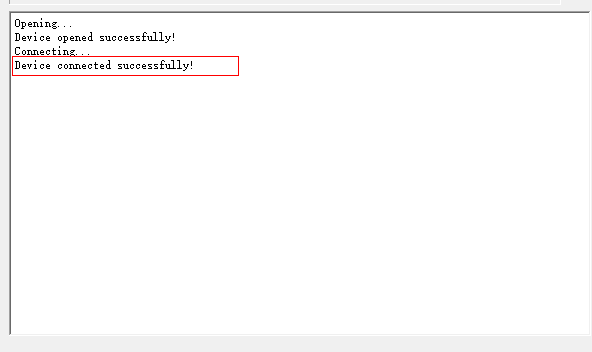

5.  Select the file to upgrade, as shown in [Figure 3](#zh-cn_topic_0000001966789053_fig768310475299).

    **Figure 3**  Selecting the file<a name="zh-cn_topic_0000001966789053_fig768310475299"></a>  
    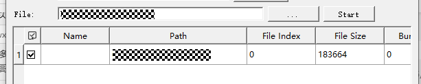

6.  Click “Start” to start the upgrade. The “Start” button changes to the “Stop” button (clicking the “Stop” button stops the upgrade). “Upgrade successfully” is printed when the upgrade succeeds. As shown in [Figure 4](#zh-cn_topic_0000001966789053_fig114879911381).

    **Figure 4**  Upgrade successful<a name="zh-cn_topic_0000001966789053_fig114879911381"></a>  
    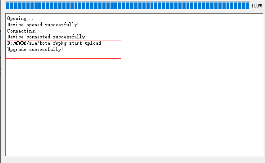

# FAQ<a name="ZH-CN_TOPIC_0000001861171510"></a>


## The Tool Does Not Enter the Interruption State<a name="ZH-CN_TOPIC_0000001861331362"></a>

**Problem Description<a name="zh-cn_topic_0000001207563437_zh-cn_topic_0279549084_section11476770"></a>**

After clicking Connect and powering off and restarting, the tool does not enter the interruption state.

**Solution<a name="zh-cn_topic_0000001207563437_zh-cn_topic_0279549084_section36182073"></a>**

-   The serial port may be selected incorrectly or the serial port may not be connected properly. Check the serial port configuration.
-   The board may be configured with 1 ms fast startup. Select the 2 ms interval in BurnTool “Setting”→“Burn interval”.
-   Some compatibility issues may occur when using the Windows 7 system. Try switching to Windows 10.

## How to Obtain a Firmware Package in the Required Format<a name="ZH-CN_TOPIC_0000001907171289"></a>

**Problem Description<a name="zh-cn_topic_0000001207843445_zh-cn_topic_0279549069_section11476770"></a>**

How to obtain a firmware package that BurnTool can recognize.

**Solution<a name="zh-cn_topic_0000001207843445_zh-cn_topic_0279549069_section1639218138286"></a>**

Refer to the product documents about compilation or firmware generation.

## An Error Prompt Appears When Loading the Configuration File<a name="ZH-CN_TOPIC_0000001907290969"></a>

**Problem Description<a name="zh-cn_topic_0000001162123484_zh-cn_topic_0000001163417487_section11476770"></a>**

After BurnTool is started, if a configuration file exists in the same directory or in the BurnTool path on the C drive, the prompt “Load the existing configuration file?” is displayed. If you choose to load the configuration file and its format is incorrect, the prompt “File format error. Continue?” is displayed.

**Solution<a name="zh-cn_topic_0000001162123484_zh-cn_topic_0000001163417487_section1427474415433"></a>**

The prompt “File format error. Continue?” indicates that some content in the current configuration file is not configured or the configured values do not meet expectations. This may be caused by manually modifying the configuration file or by the current version not actively saving the configuration file. In this case, you can choose not to load the configuration file and reconfigure and save the configuration file manually.

## A Random Serial Port Cannot Enter the Doing State During Factory Burning<a name="ZH-CN_TOPIC_0000001861171514"></a>

**Problem Description<a name="zh-cn_topic_0000001207563435_zh-cn_topic_0000001166752747_section11476770"></a>**

Due to serial port driver compatibility issues, a random serial port may fail to enter the working (doing) state during factory burning.

**Solution<a name="zh-cn_topic_0000001207563435_zh-cn_topic_0000001166752747_section1427474415433"></a>**

Check the selection status of “Reopen Com Everytime” in “Setting”→“Settings”.

If it is not selected, try selecting it and restart the factory burning. If it is already selected, try deselecting it and restart the factory burning.

## How to Improve the Image Burning Speed<a name="ZH-CN_TOPIC_0000001861331366"></a>

**Problem Description<a name="zh-cn_topic_0000001861324198_zh-cn_topic_0279549084_section11476770"></a>**

Burning large images on the production line takes too long, increasing production costs.

**Solution<a name="zh-cn_topic_0000001861324198_section669815717311"></a>**

1.  Set the baud rate of the burning tool to the maximum supported value (currently, the maximum baud rate supported by the board is 6M, which requires the serial port adapter to support a baud rate of 6M or higher).
2.  Set the packet size to 20480. As shown in [Figure 1](#zh-cn_topic_0000001861324198_fig196168229).

    **Figure 1**  Burning tool configuration<a name="zh-cn_topic_0000001861324198_fig196168229"></a>  
    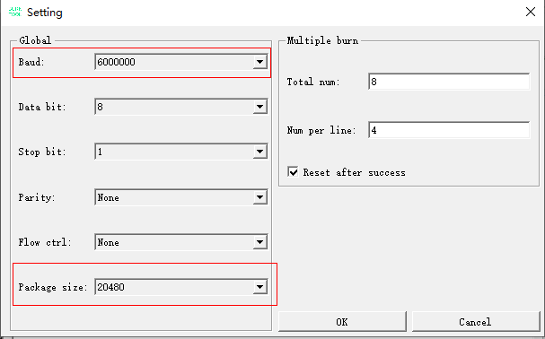

3.  Burn the images by following the steps in the “[Manual Burning](zh-cn_topic_0000001401914169.md)” section.

## How to Resolve Repeated Burning in One-to-Many Burning<a name="ZH-CN_TOPIC_0000001907171293"></a>

**Problem Description<a name="zh-cn_topic_0000001907283793_zh-cn_topic_0279549084_section11476770"></a>**

In one-to-many burning, burning restarts after each burning is completed. Specifically, without a manual reset, the progress bar restarts from 0% after reaching 100%.

**Solution<a name="zh-cn_topic_0000001907283793_section1437042610496"></a>**

Deselect “Reset after success” in the settings.

