# Preface<a name="ZH-CN_TOPIC_0000002222115730"></a>

**Overview<a name="section4537382116410"></a>**

This document mainly describes the installation and usage of the IDE tool. The IDE tool used is HiSpark Studio, which is mainly used for code editing, compilation, and image burning.

**Intended Audience<a name="section4378592816410"></a>**

This document mainly applies to the following engineers:

-   Technical support engineer
-   Hardware development engineer

**Symbol Conventions<a name="section133020216410"></a>**

The following symbols may appear in this document, and their meanings are as follows.

<a name="table2622507016410"></a>
<table><thead align="left"><tr id="row1530720816410"><th class="cellrowborder" valign="top" width="20.580000000000002%" id="mcps1.1.3.1.1"><p id="p6450074116410"><a name="p6450074116410"></a><a name="p6450074116410"></a><strong id="b2136615816410"><a name="b2136615816410"></a><a name="b2136615816410"></a>Symbol</strong></p>
</th>
<th class="cellrowborder" valign="top" width="79.42%" id="mcps1.1.3.1.2"><p id="p5435366816410"><a name="p5435366816410"></a><a name="p5435366816410"></a><strong id="b5941558116410"><a name="b5941558116410"></a><a name="b5941558116410"></a>Description</strong></p>
</th>
</tr>
</thead>
<tbody><tr id="row1372280416410"><td class="cellrowborder" valign="top" width="20.580000000000002%" headers="mcps1.1.3.1.1 "><p id="p3734547016410"><a name="p3734547016410"></a><a name="p3734547016410"></a><a name="image2670064316410"></a><a name="image2670064316410"></a><span></span></p>
</td>
<td class="cellrowborder" valign="top" width="79.42%" headers="mcps1.1.3.1.2 "><p id="p1757432116410"><a name="p1757432116410"></a><a name="p1757432116410"></a>Indicates a high-level risk hazard that will cause death or serious injury if not avoided.</p>
</td>
</tr>
<tr id="row466863216410"><td class="cellrowborder" valign="top" width="20.580000000000002%" headers="mcps1.1.3.1.1 "><p id="p1432579516410"><a name="p1432579516410"></a><a name="p1432579516410"></a><a name="image4895582316410"></a><a name="image4895582316410"></a><span></span></p>
</td>
<td class="cellrowborder" valign="top" width="79.42%" headers="mcps1.1.3.1.2 "><p id="p959197916410"><a name="p959197916410"></a><a name="p959197916410"></a>Indicates a medium-level risk hazard that may cause death or serious injury if not avoided.</p>
</td>
</tr>
<tr id="row123863216410"><td class="cellrowborder" valign="top" width="20.580000000000002%" headers="mcps1.1.3.1.1 "><p id="p1232579516410"><a name="p1232579516410"></a><a name="p1232579516410"></a><a name="image1235582316410"></a><a name="image1235582316410"></a><span></span></p>
</td>
<td class="cellrowborder" valign="top" width="79.42%" headers="mcps1.1.3.1.2 "><p id="p123197916410"><a name="p123197916410"></a><a name="p123197916410"></a>Indicates a low-level risk hazard that may cause minor or moderate injury if not avoided.</p>
</td>
</tr>
<tr id="row5786682116410"><td class="cellrowborder" valign="top" width="20.580000000000002%" headers="mcps1.1.3.1.1 "><p id="p2204984716410"><a name="p2204984716410"></a><a name="p2204984716410"></a><a name="image4504446716410"></a><a name="image4504446716410"></a><span></span></p>
</td>
<td class="cellrowborder" valign="top" width="79.42%" headers="mcps1.1.3.1.2 "><p id="p4388861916410"><a name="p4388861916410"></a><a name="p4388861916410"></a>Used to convey equipment or environment safety warning information. If not avoided, it may cause device damage, data loss, degraded device performance, or other unpredictable results.</p>
<p id="p1238861916410"><a name="p1238861916410"></a><a name="p1238861916410"></a>Notice does not involve personal injury.</p>
</td>
</tr>
<tr id="row2856923116410"><td class="cellrowborder" valign="top" width="20.580000000000002%" headers="mcps1.1.3.1.1 "><p id="p5555360116410"><a name="p5555360116410"></a><a name="p5555360116410"></a><a name="image799324016410"></a><a name="image799324016410"></a><span></span></p>
</td>
<td class="cellrowborder" valign="top" width="79.42%" headers="mcps1.1.3.1.2 "><p id="p4612588116410"><a name="p4612588116410"></a><a name="p4612588116410"></a>Supplementary description of the key information in the text.</p>
<p id="p1232588116410"><a name="p1232588116410"></a><a name="p1232588116410"></a>Note is not safety warning information and does not involve personal, equipment, or environmental injury information.</p>
</td>
</tr>
</tbody>
</table>

**Revision History<a name="section2467512116410"></a>**

<a name="table1557726816410"></a>
<table><thead align="left"><tr id="row2942532716410"><th class="cellrowborder" valign="top" width="20.72%" id="mcps1.1.4.1.1"><p id="p3778275416410"><a name="p3778275416410"></a><a name="p3778275416410"></a><strong id="b5687322716410"><a name="b5687322716410"></a><a name="b5687322716410"></a>Document Version</strong></p>
</th>
<th class="cellrowborder" valign="top" width="26.119999999999997%" id="mcps1.1.4.1.2"><p id="p5627845516410"><a name="p5627845516410"></a><a name="p5627845516410"></a><strong id="b5800814916410"><a name="b5800814916410"></a><a name="b5800814916410"></a>Release Date</strong></p>
</th>
<th class="cellrowborder" valign="top" width="53.16%" id="mcps1.1.4.1.3"><p id="p2382284816410"><a name="p2382284816410"></a><a name="p2382284816410"></a><strong id="b3316380216410"><a name="b3316380216410"></a><a name="b3316380216410"></a>Change Description</strong></p>
</th>
</tr>
</thead>
<tbody><tr id="row143517419579"><td class="cellrowborder" valign="top" width="20.72%" headers="mcps1.1.4.1.1 "><p id="p1643610417576"><a name="p1643610417576"></a><a name="p1643610417576"></a>04</p>
</td>
<td class="cellrowborder" valign="top" width="26.119999999999997%" headers="mcps1.1.4.1.2 "><p id="p843614111576"><a name="p843614111576"></a><a name="p843614111576"></a>2025-12-01</p>
</td>
<td class="cellrowborder" valign="top" width="53.16%" headers="mcps1.1.4.1.3 "><p id="p112227533586"><a name="p112227533586"></a><a name="p112227533586"></a>Updated the content of the "<a href="工具链toolchain配置.md">Toolchain Configuration</a>" section.</p>
</td>
</tr>
<tr id="row8125121616245"><td class="cellrowborder" valign="top" width="20.72%" headers="mcps1.1.4.1.1 "><p id="p1812512163241"><a name="p1812512163241"></a><a name="p1812512163241"></a>03</p>
</td>
<td class="cellrowborder" valign="top" width="26.119999999999997%" headers="mcps1.1.4.1.2 "><p id="p3125141613244"><a name="p3125141613244"></a><a name="p3125141613244"></a>2025-11-07</p>
</td>
<td class="cellrowborder" valign="top" width="53.16%" headers="mcps1.1.4.1.3 "><a name="ul1488017437263"></a><a name="ul1488017437263"></a><ul id="ul1488017437263"><li>Updated the content of the "<a href="工具链toolchain配置.md">Toolchain Configuration</a>" section.</li><li>Updated the content of the "<a href="配置工程的烧录选项.md">Configuring Project Burning Options</a>" section.</li><li>Updated the content of the "<a href="启动调试.md">Starting Debugging</a>" section.</li><li>Updated the content of the "<a href="扩展工具使用.md">Using Extension Tools</a>" section.</li></ul>
</td>
</tr>
<tr id="row121221241101914"><td class="cellrowborder" valign="top" width="20.72%" headers="mcps1.1.4.1.1 "><p id="p171231841111915"><a name="p171231841111915"></a><a name="p171231841111915"></a>02</p>
</td>
<td class="cellrowborder" valign="top" width="26.119999999999997%" headers="mcps1.1.4.1.2 "><p id="p151231941101920"><a name="p151231941101920"></a><a name="p151231941101920"></a>2025-08-07</p>
</td>
<td class="cellrowborder" valign="top" width="53.16%" headers="mcps1.1.4.1.3 "><p id="p3123104121911"><a name="p3123104121911"></a><a name="p3123104121911"></a>Updated the content of the "<a href="工具简介.md">Tool Introduction</a>" section.</p>
</td>
</tr>
<tr id="row5281780716410"><td class="cellrowborder" valign="top" width="20.72%" headers="mcps1.1.4.1.1 "><p id="p559mcpsimp"><a name="p559mcpsimp"></a><a name="p559mcpsimp"></a>01</p>
</td>
<td class="cellrowborder" valign="top" width="26.119999999999997%" headers="mcps1.1.4.1.2 "><p id="p561mcpsimp"><a name="p561mcpsimp"></a><a name="p561mcpsimp"></a>2025-04-24</p>
</td>
<td class="cellrowborder" valign="top" width="53.16%" headers="mcps1.1.4.1.3 "><p id="p563mcpsimp"><a name="p563mcpsimp"></a><a name="p563mcpsimp"></a>First official release.</p>
</td>
</tr>
</tbody>
</table>

# Tool Introduction<a name="ZH-CN_TOPIC_0000002378877440"></a>

The HiSpark Studio for VS Code plugin provides a one-stop integrated development environment for smart device developers. It provides developers with functions such as code editing, compilation, burning, and debugging, and supports the C/C++ language and 64-bit Windows 10 or Windows 11 operating systems. The plugin has the following features:

-   Supports code search, code highlighting, automatic code completion, code input hints, and code checking, allowing developers to code easily and efficiently.
-   Supports step-by-step debugging and viewing debugging information such as memory, variables, and call stacks.
-   Supports automatically detecting whether the toolchains required by each chip/development board are complete, and provides one-click download and installation of missing toolchains.

The HiSpark Studio for VS Code plugin is mainly divided into the following six functional areas, as shown in [Figure 1](#zh-cn_topic_0000002293219986_fig19904573445).

① WELCOME: Provides options such as the welcome page, usage guide, and creating/importing projects.

② PROJECT EXPLORER: Project area file display area

③ COMMANDS: Provides function buttons such as new project, open project, clean, compile, and burn, and controls the display/hiding of buttons in the status bar

④ Code editing area: Provides functions such as code viewing, editing, navigation, and highlighting.

⑤ Output console: Provides functions such as printing operation logs, entering debugging commands, and command-line tools.

⑥ Status bar: Provides commonly used function buttons, including new project, import project, project configuration, clean, compile, and burn, and displays information such as the encoding format, line count, and column count of the current file.

**Figure 1**  Functional area diagram<a name="zh-cn_topic_0000002293219986_fig19904573445"></a>  
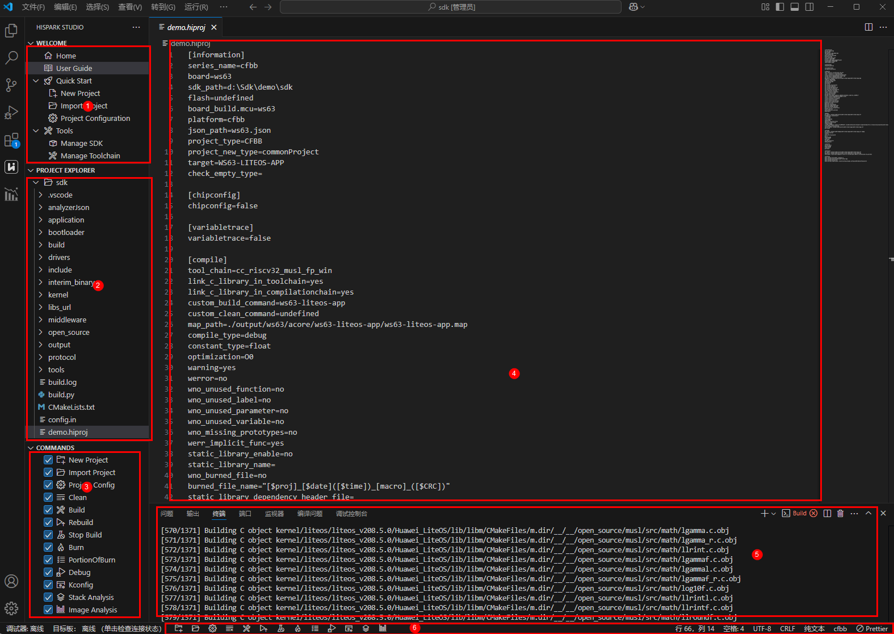

The chips currently supported by the HiSpark Studio for VS Code plugin and their corresponding features are shown in [Table 1](#zh-cn_topic_0000002293219986_table82241939151116).

**Table 1**  Chips supported by the HiSpark Studio for VS Code plugin and their features

<a name="zh-cn_topic_0000002293219986_table82241939151116"></a>
<table><thead align="left"><tr id="zh-cn_topic_0000002293219986_row1022415396111"><th class="cellrowborder" align="center" valign="top" width="14.190000000000003%" id="mcps1.2.8.1.1"><p id="zh-cn_topic_0000002293219986_p922433961112"><a name="zh-cn_topic_0000002293219986_p922433961112"></a><a name="zh-cn_topic_0000002293219986_p922433961112"></a>Chip Series</p>
</th>
<th class="cellrowborder" align="center" valign="top" width="13.040000000000001%" id="mcps1.2.8.1.2"><p id="zh-cn_topic_0000002293219986_p222453971118"><a name="zh-cn_topic_0000002293219986_p222453971118"></a><a name="zh-cn_topic_0000002293219986_p222453971118"></a>Chip Name</p>
</th>
<th class="cellrowborder" align="center" valign="top" width="13.200000000000003%" id="mcps1.2.8.1.3"><p id="zh-cn_topic_0000002293219986_p1822423917119"><a name="zh-cn_topic_0000002293219986_p1822423917119"></a><a name="zh-cn_topic_0000002293219986_p1822423917119"></a>Project Management</p>
</th>
<th class="cellrowborder" align="center" valign="top" width="13.250000000000004%" id="mcps1.2.8.1.4"><p id="zh-cn_topic_0000002293219986_p1628513136102"><a name="zh-cn_topic_0000002293219986_p1628513136102"></a><a name="zh-cn_topic_0000002293219986_p1628513136102"></a>Build and Run</p>
</th>
<th class="cellrowborder" align="center" valign="top" width="13.040000000000001%" id="mcps1.2.8.1.5"><p id="zh-cn_topic_0000002293219986_p1791011019106"><a name="zh-cn_topic_0000002293219986_p1791011019106"></a><a name="zh-cn_topic_0000002293219986_p1791011019106"></a>One-click Burning</p>
</th>
<th class="cellrowborder" align="center" valign="top" width="15.050000000000002%" id="mcps1.2.8.1.6"><p id="zh-cn_topic_0000002293219986_p681611181416"><a name="zh-cn_topic_0000002293219986_p681611181416"></a><a name="zh-cn_topic_0000002293219986_p681611181416"></a>Burning Configuration</p>
</th>
<th class="cellrowborder" align="center" valign="top" width="18.23%" id="mcps1.2.8.1.7"><p id="zh-cn_topic_0000002293219986_p178217711010"><a name="zh-cn_topic_0000002293219986_p178217711010"></a><a name="zh-cn_topic_0000002293219986_p178217711010"></a>Stack and Image Analysis</p>
</th>
</tr>
</thead>
<tbody><tr id="zh-cn_topic_0000002293219986_row8752133319518"><td class="cellrowborder" rowspan="11" align="center" valign="top" width="14.190000000000003%" headers="mcps1.2.8.1.1 "><p id="zh-cn_topic_0000002293219986_p3752153355114"><a name="zh-cn_topic_0000002293219986_p3752153355114"></a><a name="zh-cn_topic_0000002293219986_p3752153355114"></a>Short-range IoT</p>
</td>
<td class="cellrowborder" align="center" valign="top" width="13.040000000000001%" headers="mcps1.2.8.1.2 "><p id="zh-cn_topic_0000002293219986_p1575233325112"><a name="zh-cn_topic_0000002293219986_p1575233325112"></a><a name="zh-cn_topic_0000002293219986_p1575233325112"></a>BS20</p>
</td>
<td class="cellrowborder" align="center" valign="top" width="13.200000000000003%" headers="mcps1.2.8.1.3 "><p id="zh-cn_topic_0000002293219986_p77527337518"><a name="zh-cn_topic_0000002293219986_p77527337518"></a><a name="zh-cn_topic_0000002293219986_p77527337518"></a>√</p>
</td>
<td class="cellrowborder" align="center" valign="top" width="13.250000000000004%" headers="mcps1.2.8.1.4 "><p id="zh-cn_topic_0000002293219986_p137521133115114"><a name="zh-cn_topic_0000002293219986_p137521133115114"></a><a name="zh-cn_topic_0000002293219986_p137521133115114"></a>√</p>
</td>
<td class="cellrowborder" align="center" valign="top" width="13.040000000000001%" headers="mcps1.2.8.1.5 "><p id="zh-cn_topic_0000002293219986_p1475293315119"><a name="zh-cn_topic_0000002293219986_p1475293315119"></a><a name="zh-cn_topic_0000002293219986_p1475293315119"></a>√</p>
</td>
<td class="cellrowborder" align="center" valign="top" width="15.050000000000002%" headers="mcps1.2.8.1.6 "><p id="zh-cn_topic_0000002293219986_p0752633185112"><a name="zh-cn_topic_0000002293219986_p0752633185112"></a><a name="zh-cn_topic_0000002293219986_p0752633185112"></a>√</p>
</td>
<td class="cellrowborder" align="center" valign="top" width="18.23%" headers="mcps1.2.8.1.7 "><p id="zh-cn_topic_0000002293219986_p375313334512"><a name="zh-cn_topic_0000002293219986_p375313334512"></a><a name="zh-cn_topic_0000002293219986_p375313334512"></a>√</p>
</td>
</tr>
<tr id="zh-cn_topic_0000002293219986_row856371715552"><td class="cellrowborder" align="center" valign="top" headers="mcps1.2.8.1.1 "><p id="zh-cn_topic_0000002293219986_p3564191720552"><a name="zh-cn_topic_0000002293219986_p3564191720552"></a><a name="zh-cn_topic_0000002293219986_p3564191720552"></a>BS20C</p>
</td>
<td class="cellrowborder" align="center" valign="top" headers="mcps1.2.8.1.2 "><p id="zh-cn_topic_0000002293219986_p12564181712557"><a name="zh-cn_topic_0000002293219986_p12564181712557"></a><a name="zh-cn_topic_0000002293219986_p12564181712557"></a>√</p>
</td>
<td class="cellrowborder" align="center" valign="top" headers="mcps1.2.8.1.3 "><p id="zh-cn_topic_0000002293219986_p7564141755514"><a name="zh-cn_topic_0000002293219986_p7564141755514"></a><a name="zh-cn_topic_0000002293219986_p7564141755514"></a>√</p>
</td>
<td class="cellrowborder" align="center" valign="top" headers="mcps1.2.8.1.4 "><p id="zh-cn_topic_0000002293219986_p135641417175520"><a name="zh-cn_topic_0000002293219986_p135641417175520"></a><a name="zh-cn_topic_0000002293219986_p135641417175520"></a>√</p>
</td>
<td class="cellrowborder" align="center" valign="top" headers="mcps1.2.8.1.5 "><p id="zh-cn_topic_0000002293219986_p1156412171554"><a name="zh-cn_topic_0000002293219986_p1156412171554"></a><a name="zh-cn_topic_0000002293219986_p1156412171554"></a>√</p>
</td>
<td class="cellrowborder" align="center" valign="top" headers="mcps1.2.8.1.6 "><p id="zh-cn_topic_0000002293219986_p195641117105513"><a name="zh-cn_topic_0000002293219986_p195641117105513"></a><a name="zh-cn_topic_0000002293219986_p195641117105513"></a>√</p>
</td>
</tr>
<tr id="zh-cn_topic_0000002293219986_row222433913117"><td class="cellrowborder" align="center" valign="top" headers="mcps1.2.8.1.1 "><p id="zh-cn_topic_0000002293219986_p3224133916116"><a name="zh-cn_topic_0000002293219986_p3224133916116"></a><a name="zh-cn_topic_0000002293219986_p3224133916116"></a>BS21</p>
</td>
<td class="cellrowborder" align="center" valign="top" headers="mcps1.2.8.1.2 "><p id="zh-cn_topic_0000002293219986_p165292113250"><a name="zh-cn_topic_0000002293219986_p165292113250"></a><a name="zh-cn_topic_0000002293219986_p165292113250"></a>√</p>
</td>
<td class="cellrowborder" align="center" valign="top" headers="mcps1.2.8.1.3 "><p id="zh-cn_topic_0000002293219986_p91102414261"><a name="zh-cn_topic_0000002293219986_p91102414261"></a><a name="zh-cn_topic_0000002293219986_p91102414261"></a>√</p>
</td>
<td class="cellrowborder" align="center" valign="top" headers="mcps1.2.8.1.4 "><p id="zh-cn_topic_0000002293219986_p733410487269"><a name="zh-cn_topic_0000002293219986_p733410487269"></a><a name="zh-cn_topic_0000002293219986_p733410487269"></a>√</p>
</td>
<td class="cellrowborder" align="center" valign="top" headers="mcps1.2.8.1.5 "><p id="zh-cn_topic_0000002293219986_p42591226173614"><a name="zh-cn_topic_0000002293219986_p42591226173614"></a><a name="zh-cn_topic_0000002293219986_p42591226173614"></a>√</p>
</td>
<td class="cellrowborder" align="center" valign="top" headers="mcps1.2.8.1.6 "><p id="zh-cn_topic_0000002293219986_p14948201272712"><a name="zh-cn_topic_0000002293219986_p14948201272712"></a><a name="zh-cn_topic_0000002293219986_p14948201272712"></a>√</p>
</td>
</tr>
<tr id="zh-cn_topic_0000002293219986_row1151735116505"><td class="cellrowborder" align="center" valign="top" headers="mcps1.2.8.1.1 "><p id="zh-cn_topic_0000002293219986_p1851755155020"><a name="zh-cn_topic_0000002293219986_p1851755155020"></a><a name="zh-cn_topic_0000002293219986_p1851755155020"></a>BS21E</p>
</td>
<td class="cellrowborder" align="center" valign="top" headers="mcps1.2.8.1.2 "><p id="zh-cn_topic_0000002293219986_p10517951165020"><a name="zh-cn_topic_0000002293219986_p10517951165020"></a><a name="zh-cn_topic_0000002293219986_p10517951165020"></a>√</p>
</td>
<td class="cellrowborder" align="center" valign="top" headers="mcps1.2.8.1.3 "><p id="zh-cn_topic_0000002293219986_p151719518507"><a name="zh-cn_topic_0000002293219986_p151719518507"></a><a name="zh-cn_topic_0000002293219986_p151719518507"></a>√</p>
</td>
<td class="cellrowborder" align="center" valign="top" headers="mcps1.2.8.1.4 "><p id="zh-cn_topic_0000002293219986_p551819510501"><a name="zh-cn_topic_0000002293219986_p551819510501"></a><a name="zh-cn_topic_0000002293219986_p551819510501"></a>√</p>
</td>
<td class="cellrowborder" align="center" valign="top" headers="mcps1.2.8.1.5 "><p id="zh-cn_topic_0000002293219986_p13518155155017"><a name="zh-cn_topic_0000002293219986_p13518155155017"></a><a name="zh-cn_topic_0000002293219986_p13518155155017"></a>√</p>
</td>
<td class="cellrowborder" align="center" valign="top" headers="mcps1.2.8.1.6 "><p id="zh-cn_topic_0000002293219986_p115181051165013"><a name="zh-cn_topic_0000002293219986_p115181051165013"></a><a name="zh-cn_topic_0000002293219986_p115181051165013"></a>√</p>
</td>
</tr>
<tr id="zh-cn_topic_0000002293219986_row113809589516"><td class="cellrowborder" align="center" valign="top" headers="mcps1.2.8.1.1 "><p id="zh-cn_topic_0000002293219986_p1438014581514"><a name="zh-cn_topic_0000002293219986_p1438014581514"></a><a name="zh-cn_topic_0000002293219986_p1438014581514"></a>BS22</p>
</td>
<td class="cellrowborder" align="center" valign="top" headers="mcps1.2.8.1.2 "><p id="zh-cn_topic_0000002293219986_p11380105875115"><a name="zh-cn_topic_0000002293219986_p11380105875115"></a><a name="zh-cn_topic_0000002293219986_p11380105875115"></a>√</p>
</td>
<td class="cellrowborder" align="center" valign="top" headers="mcps1.2.8.1.3 "><p id="zh-cn_topic_0000002293219986_p1380145835113"><a name="zh-cn_topic_0000002293219986_p1380145835113"></a><a name="zh-cn_topic_0000002293219986_p1380145835113"></a>√</p>
</td>
<td class="cellrowborder" align="center" valign="top" headers="mcps1.2.8.1.4 "><p id="zh-cn_topic_0000002293219986_p1238055865117"><a name="zh-cn_topic_0000002293219986_p1238055865117"></a><a name="zh-cn_topic_0000002293219986_p1238055865117"></a>√</p>
</td>
<td class="cellrowborder" align="center" valign="top" headers="mcps1.2.8.1.5 "><p id="zh-cn_topic_0000002293219986_p4380558165110"><a name="zh-cn_topic_0000002293219986_p4380558165110"></a><a name="zh-cn_topic_0000002293219986_p4380558165110"></a>√</p>
</td>
<td class="cellrowborder" align="center" valign="top" headers="mcps1.2.8.1.6 "><p id="zh-cn_topic_0000002293219986_p16380175814513"><a name="zh-cn_topic_0000002293219986_p16380175814513"></a><a name="zh-cn_topic_0000002293219986_p16380175814513"></a>√</p>
</td>
</tr>
<tr id="zh-cn_topic_0000002293219986_row1099920117520"><td class="cellrowborder" align="center" valign="top" headers="mcps1.2.8.1.1 "><p id="zh-cn_topic_0000002293219986_p2999911165217"><a name="zh-cn_topic_0000002293219986_p2999911165217"></a><a name="zh-cn_topic_0000002293219986_p2999911165217"></a>BS26</p>
</td>
<td class="cellrowborder" align="center" valign="top" headers="mcps1.2.8.1.2 "><p id="zh-cn_topic_0000002293219986_p89991411175217"><a name="zh-cn_topic_0000002293219986_p89991411175217"></a><a name="zh-cn_topic_0000002293219986_p89991411175217"></a>√</p>
</td>
<td class="cellrowborder" align="center" valign="top" headers="mcps1.2.8.1.3 "><p id="zh-cn_topic_0000002293219986_p1699941117521"><a name="zh-cn_topic_0000002293219986_p1699941117521"></a><a name="zh-cn_topic_0000002293219986_p1699941117521"></a>√</p>
</td>
<td class="cellrowborder" align="center" valign="top" headers="mcps1.2.8.1.4 "><p id="zh-cn_topic_0000002293219986_p69990117528"><a name="zh-cn_topic_0000002293219986_p69990117528"></a><a name="zh-cn_topic_0000002293219986_p69990117528"></a>√</p>
</td>
<td class="cellrowborder" align="center" valign="top" headers="mcps1.2.8.1.5 "><p id="zh-cn_topic_0000002293219986_p2999191195219"><a name="zh-cn_topic_0000002293219986_p2999191195219"></a><a name="zh-cn_topic_0000002293219986_p2999191195219"></a>√</p>
</td>
<td class="cellrowborder" align="center" valign="top" headers="mcps1.2.8.1.6 "><p id="zh-cn_topic_0000002293219986_p12999121125217"><a name="zh-cn_topic_0000002293219986_p12999121125217"></a><a name="zh-cn_topic_0000002293219986_p12999121125217"></a>√</p>
</td>
</tr>
<tr id="zh-cn_topic_0000002293219986_row432645295215"><td class="cellrowborder" align="center" valign="top" headers="mcps1.2.8.1.1 "><p id="zh-cn_topic_0000002293219986_p18326115216527"><a name="zh-cn_topic_0000002293219986_p18326115216527"></a><a name="zh-cn_topic_0000002293219986_p18326115216527"></a>BS21A</p>
</td>
<td class="cellrowborder" align="center" valign="top" headers="mcps1.2.8.1.2 "><p id="zh-cn_topic_0000002293219986_p83261529520"><a name="zh-cn_topic_0000002293219986_p83261529520"></a><a name="zh-cn_topic_0000002293219986_p83261529520"></a>√</p>
</td>
<td class="cellrowborder" align="center" valign="top" headers="mcps1.2.8.1.3 "><p id="zh-cn_topic_0000002293219986_p17326125216521"><a name="zh-cn_topic_0000002293219986_p17326125216521"></a><a name="zh-cn_topic_0000002293219986_p17326125216521"></a>√</p>
</td>
<td class="cellrowborder" align="center" valign="top" headers="mcps1.2.8.1.4 "><p id="zh-cn_topic_0000002293219986_p3326185275211"><a name="zh-cn_topic_0000002293219986_p3326185275211"></a><a name="zh-cn_topic_0000002293219986_p3326185275211"></a>√</p>
</td>
<td class="cellrowborder" align="center" valign="top" headers="mcps1.2.8.1.5 "><p id="zh-cn_topic_0000002293219986_p1632675295211"><a name="zh-cn_topic_0000002293219986_p1632675295211"></a><a name="zh-cn_topic_0000002293219986_p1632675295211"></a>√</p>
</td>
<td class="cellrowborder" align="center" valign="top" headers="mcps1.2.8.1.6 "><p id="zh-cn_topic_0000002293219986_p1132695218524"><a name="zh-cn_topic_0000002293219986_p1132695218524"></a><a name="zh-cn_topic_0000002293219986_p1132695218524"></a>√</p>
</td>
</tr>
<tr id="zh-cn_topic_0000002293219986_row13345165719131"><td class="cellrowborder" align="center" valign="top" headers="mcps1.2.8.1.1 "><p id="zh-cn_topic_0000002293219986_p10345175731316"><a name="zh-cn_topic_0000002293219986_p10345175731316"></a><a name="zh-cn_topic_0000002293219986_p10345175731316"></a>BS25</p>
</td>
<td class="cellrowborder" align="center" valign="top" headers="mcps1.2.8.1.2 "><p id="zh-cn_topic_0000002293219986_p992218259"><a name="zh-cn_topic_0000002293219986_p992218259"></a><a name="zh-cn_topic_0000002293219986_p992218259"></a>√</p>
</td>
<td class="cellrowborder" align="center" valign="top" headers="mcps1.2.8.1.3 "><p id="zh-cn_topic_0000002293219986_p7602154114264"><a name="zh-cn_topic_0000002293219986_p7602154114264"></a><a name="zh-cn_topic_0000002293219986_p7602154114264"></a>√</p>
</td>
<td class="cellrowborder" align="center" valign="top" headers="mcps1.2.8.1.4 "><p id="zh-cn_topic_0000002293219986_p1075134812263"><a name="zh-cn_topic_0000002293219986_p1075134812263"></a><a name="zh-cn_topic_0000002293219986_p1075134812263"></a>√</p>
</td>
<td class="cellrowborder" align="center" valign="top" headers="mcps1.2.8.1.5 "><p id="zh-cn_topic_0000002293219986_p151964296373"><a name="zh-cn_topic_0000002293219986_p151964296373"></a><a name="zh-cn_topic_0000002293219986_p151964296373"></a>√</p>
</td>
<td class="cellrowborder" align="center" valign="top" headers="mcps1.2.8.1.6 "><p id="zh-cn_topic_0000002293219986_p1432713122713"><a name="zh-cn_topic_0000002293219986_p1432713122713"></a><a name="zh-cn_topic_0000002293219986_p1432713122713"></a>√</p>
</td>
</tr>
<tr id="zh-cn_topic_0000002293219986_row8258515586"><td class="cellrowborder" align="center" valign="top" headers="mcps1.2.8.1.1 "><p id="zh-cn_topic_0000002293219986_p7251957588"><a name="zh-cn_topic_0000002293219986_p7251957588"></a><a name="zh-cn_topic_0000002293219986_p7251957588"></a><span id="zh-cn_topic_0000002293219986_ph495858135813"><a name="zh-cn_topic_0000002293219986_ph495858135813"></a><a name="zh-cn_topic_0000002293219986_ph495858135813"></a>BS27A</span></p>
</td>
<td class="cellrowborder" align="center" valign="top" headers="mcps1.2.8.1.2 "><p id="zh-cn_topic_0000002293219986_p182520535814"><a name="zh-cn_topic_0000002293219986_p182520535814"></a><a name="zh-cn_topic_0000002293219986_p182520535814"></a><span id="zh-cn_topic_0000002293219986_ph1066516232218"><a name="zh-cn_topic_0000002293219986_ph1066516232218"></a><a name="zh-cn_topic_0000002293219986_ph1066516232218"></a>√</span></p>
</td>
<td class="cellrowborder" align="center" valign="top" headers="mcps1.2.8.1.3 "><p id="zh-cn_topic_0000002293219986_p6251258589"><a name="zh-cn_topic_0000002293219986_p6251258589"></a><a name="zh-cn_topic_0000002293219986_p6251258589"></a><span id="zh-cn_topic_0000002293219986_ph11867142492118"><a name="zh-cn_topic_0000002293219986_ph11867142492118"></a><a name="zh-cn_topic_0000002293219986_ph11867142492118"></a>√</span></p>
</td>
<td class="cellrowborder" align="center" valign="top" headers="mcps1.2.8.1.4 "><p id="zh-cn_topic_0000002293219986_p4251351580"><a name="zh-cn_topic_0000002293219986_p4251351580"></a><a name="zh-cn_topic_0000002293219986_p4251351580"></a><span id="zh-cn_topic_0000002293219986_ph20361128102120"><a name="zh-cn_topic_0000002293219986_ph20361128102120"></a><a name="zh-cn_topic_0000002293219986_ph20361128102120"></a>√</span></p>
</td>
<td class="cellrowborder" align="center" valign="top" headers="mcps1.2.8.1.5 "><p id="zh-cn_topic_0000002293219986_p825553584"><a name="zh-cn_topic_0000002293219986_p825553584"></a><a name="zh-cn_topic_0000002293219986_p825553584"></a><span id="zh-cn_topic_0000002293219986_ph88833257217"><a name="zh-cn_topic_0000002293219986_ph88833257217"></a><a name="zh-cn_topic_0000002293219986_ph88833257217"></a>√</span></p>
</td>
<td class="cellrowborder" align="center" valign="top" headers="mcps1.2.8.1.6 "><p id="zh-cn_topic_0000002293219986_p925165125819"><a name="zh-cn_topic_0000002293219986_p925165125819"></a><a name="zh-cn_topic_0000002293219986_p925165125819"></a><span id="zh-cn_topic_0000002293219986_ph11520122692111"><a name="zh-cn_topic_0000002293219986_ph11520122692111"></a><a name="zh-cn_topic_0000002293219986_ph11520122692111"></a>√</span></p>
</td>
</tr>
<tr id="zh-cn_topic_0000002293219986_row579411241563"><td class="cellrowborder" align="center" valign="top" headers="mcps1.2.8.1.1 "><p id="zh-cn_topic_0000002293219986_p167946241168"><a name="zh-cn_topic_0000002293219986_p167946241168"></a><a name="zh-cn_topic_0000002293219986_p167946241168"></a>WS53</p>
</td>
<td class="cellrowborder" align="center" valign="top" headers="mcps1.2.8.1.2 "><p id="zh-cn_topic_0000002293219986_p379442412619"><a name="zh-cn_topic_0000002293219986_p379442412619"></a><a name="zh-cn_topic_0000002293219986_p379442412619"></a>√</p>
</td>
<td class="cellrowborder" align="center" valign="top" headers="mcps1.2.8.1.3 "><p id="zh-cn_topic_0000002293219986_p1979442414619"><a name="zh-cn_topic_0000002293219986_p1979442414619"></a><a name="zh-cn_topic_0000002293219986_p1979442414619"></a>√</p>
</td>
<td class="cellrowborder" align="center" valign="top" headers="mcps1.2.8.1.4 "><p id="zh-cn_topic_0000002293219986_p15794202411618"><a name="zh-cn_topic_0000002293219986_p15794202411618"></a><a name="zh-cn_topic_0000002293219986_p15794202411618"></a>×</p>
</td>
<td class="cellrowborder" align="center" valign="top" headers="mcps1.2.8.1.5 "><p id="zh-cn_topic_0000002293219986_p167941224762"><a name="zh-cn_topic_0000002293219986_p167941224762"></a><a name="zh-cn_topic_0000002293219986_p167941224762"></a>×</p>
</td>
<td class="cellrowborder" align="center" valign="top" headers="mcps1.2.8.1.6 "><p id="zh-cn_topic_0000002293219986_p7794182412617"><a name="zh-cn_topic_0000002293219986_p7794182412617"></a><a name="zh-cn_topic_0000002293219986_p7794182412617"></a>×</p>
</td>
</tr>
<tr id="zh-cn_topic_0000002293219986_row176314319149"><td class="cellrowborder" align="center" valign="top" headers="mcps1.2.8.1.1 "><p id="zh-cn_topic_0000002293219986_p126310321414"><a name="zh-cn_topic_0000002293219986_p126310321414"></a><a name="zh-cn_topic_0000002293219986_p126310321414"></a>WS63</p>
</td>
<td class="cellrowborder" align="center" valign="top" headers="mcps1.2.8.1.2 "><p id="zh-cn_topic_0000002293219986_p1550712232518"><a name="zh-cn_topic_0000002293219986_p1550712232518"></a><a name="zh-cn_topic_0000002293219986_p1550712232518"></a>√</p>
</td>
<td class="cellrowborder" align="center" valign="top" headers="mcps1.2.8.1.3 "><p id="zh-cn_topic_0000002293219986_p593142112617"><a name="zh-cn_topic_0000002293219986_p593142112617"></a><a name="zh-cn_topic_0000002293219986_p593142112617"></a>√</p>
</td>
<td class="cellrowborder" align="center" valign="top" headers="mcps1.2.8.1.4 "><p id="zh-cn_topic_0000002293219986_p19192124920269"><a name="zh-cn_topic_0000002293219986_p19192124920269"></a><a name="zh-cn_topic_0000002293219986_p19192124920269"></a>√</p>
</td>
<td class="cellrowborder" align="center" valign="top" headers="mcps1.2.8.1.5 "><p id="zh-cn_topic_0000002293219986_p564492953710"><a name="zh-cn_topic_0000002293219986_p564492953710"></a><a name="zh-cn_topic_0000002293219986_p564492953710"></a>√</p>
</td>
<td class="cellrowborder" align="center" valign="top" headers="mcps1.2.8.1.6 "><p id="zh-cn_topic_0000002293219986_p178569132279"><a name="zh-cn_topic_0000002293219986_p178569132279"></a><a name="zh-cn_topic_0000002293219986_p178569132279"></a>√</p>
</td>
</tr>
<tr id="zh-cn_topic_0000002293219986_row1613915128"><td class="cellrowborder" rowspan="4" align="center" valign="top" width="14.190000000000003%" headers="mcps1.2.8.1.1 "><p id="zh-cn_topic_0000002293219986_p96123991212"><a name="zh-cn_topic_0000002293219986_p96123991212"></a><a name="zh-cn_topic_0000002293219986_p96123991212"></a>Phone & Wearables</p>
</td>
<td class="cellrowborder" align="center" valign="top" width="13.040000000000001%" headers="mcps1.2.8.1.2 "><p id="zh-cn_topic_0000002293219986_p16616394125"><a name="zh-cn_topic_0000002293219986_p16616394125"></a><a name="zh-cn_topic_0000002293219986_p16616394125"></a>BRANDY</p>
</td>
<td class="cellrowborder" align="center" valign="top" width="13.200000000000003%" headers="mcps1.2.8.1.3 "><p id="zh-cn_topic_0000002293219986_p142053192513"><a name="zh-cn_topic_0000002293219986_p142053192513"></a><a name="zh-cn_topic_0000002293219986_p142053192513"></a>√</p>
</td>
<td class="cellrowborder" align="center" valign="top" width="13.250000000000004%" headers="mcps1.2.8.1.4 "><p id="zh-cn_topic_0000002293219986_p563714262617"><a name="zh-cn_topic_0000002293219986_p563714262617"></a><a name="zh-cn_topic_0000002293219986_p563714262617"></a>√</p>
</td>
<td class="cellrowborder" align="center" valign="top" width="13.040000000000001%" headers="mcps1.2.8.1.5 "><p id="zh-cn_topic_0000002293219986_p7666164910261"><a name="zh-cn_topic_0000002293219986_p7666164910261"></a><a name="zh-cn_topic_0000002293219986_p7666164910261"></a>√</p>
</td>
<td class="cellrowborder" align="center" valign="top" width="15.050000000000002%" headers="mcps1.2.8.1.6 "><p id="zh-cn_topic_0000002293219986_p1614093013378"><a name="zh-cn_topic_0000002293219986_p1614093013378"></a><a name="zh-cn_topic_0000002293219986_p1614093013378"></a>√</p>
</td>
<td class="cellrowborder" align="center" valign="top" width="18.23%" headers="mcps1.2.8.1.7 "><p id="zh-cn_topic_0000002293219986_p826461492716"><a name="zh-cn_topic_0000002293219986_p826461492716"></a><a name="zh-cn_topic_0000002293219986_p826461492716"></a>√</p>
</td>
</tr>
<tr id="zh-cn_topic_0000002293219986_row1514014131196"><td class="cellrowborder" align="center" valign="top" headers="mcps1.2.8.1.1 "><p id="zh-cn_topic_0000002293219986_p41409138198"><a name="zh-cn_topic_0000002293219986_p41409138198"></a><a name="zh-cn_topic_0000002293219986_p41409138198"></a>SOCMN2</p>
</td>
<td class="cellrowborder" align="center" valign="top" headers="mcps1.2.8.1.2 "><p id="zh-cn_topic_0000002293219986_p2140313121920"><a name="zh-cn_topic_0000002293219986_p2140313121920"></a><a name="zh-cn_topic_0000002293219986_p2140313121920"></a>√</p>
</td>
<td class="cellrowborder" align="center" valign="top" headers="mcps1.2.8.1.3 "><p id="zh-cn_topic_0000002293219986_p13141171317194"><a name="zh-cn_topic_0000002293219986_p13141171317194"></a><a name="zh-cn_topic_0000002293219986_p13141171317194"></a>√</p>
</td>
<td class="cellrowborder" align="center" valign="top" headers="mcps1.2.8.1.4 "><p id="zh-cn_topic_0000002293219986_p1414151321913"><a name="zh-cn_topic_0000002293219986_p1414151321913"></a><a name="zh-cn_topic_0000002293219986_p1414151321913"></a>√</p>
</td>
<td class="cellrowborder" align="center" valign="top" headers="mcps1.2.8.1.5 "><p id="zh-cn_topic_0000002293219986_p20141413131919"><a name="zh-cn_topic_0000002293219986_p20141413131919"></a><a name="zh-cn_topic_0000002293219986_p20141413131919"></a>√</p>
</td>
<td class="cellrowborder" align="center" valign="top" headers="mcps1.2.8.1.6 "><p id="zh-cn_topic_0000002293219986_p20141313131920"><a name="zh-cn_topic_0000002293219986_p20141313131920"></a><a name="zh-cn_topic_0000002293219986_p20141313131920"></a>√</p>
</td>
</tr>
<tr id="zh-cn_topic_0000002293219986_row8385122535814"><td class="cellrowborder" align="center" valign="top" headers="mcps1.2.8.1.1 "><p id="zh-cn_topic_0000002293219986_p113851625125815"><a name="zh-cn_topic_0000002293219986_p113851625125815"></a><a name="zh-cn_topic_0000002293219986_p113851625125815"></a><span id="zh-cn_topic_0000002293219986_ph1237103135810"><a name="zh-cn_topic_0000002293219986_ph1237103135810"></a><a name="zh-cn_topic_0000002293219986_ph1237103135810"></a>SW21</span></p>
</td>
<td class="cellrowborder" align="center" valign="top" headers="mcps1.2.8.1.2 "><p id="zh-cn_topic_0000002293219986_p4385162515813"><a name="zh-cn_topic_0000002293219986_p4385162515813"></a><a name="zh-cn_topic_0000002293219986_p4385162515813"></a><span id="zh-cn_topic_0000002293219986_ph1846752210218"><a name="zh-cn_topic_0000002293219986_ph1846752210218"></a><a name="zh-cn_topic_0000002293219986_ph1846752210218"></a>√</span></p>
</td>
<td class="cellrowborder" align="center" valign="top" headers="mcps1.2.8.1.3 "><p id="zh-cn_topic_0000002293219986_p143851125205818"><a name="zh-cn_topic_0000002293219986_p143851125205818"></a><a name="zh-cn_topic_0000002293219986_p143851125205818"></a><span id="zh-cn_topic_0000002293219986_ph9671222122117"><a name="zh-cn_topic_0000002293219986_ph9671222122117"></a><a name="zh-cn_topic_0000002293219986_ph9671222122117"></a>√</span></p>
</td>
<td class="cellrowborder" align="center" valign="top" headers="mcps1.2.8.1.4 "><p id="zh-cn_topic_0000002293219986_p8385025125819"><a name="zh-cn_topic_0000002293219986_p8385025125819"></a><a name="zh-cn_topic_0000002293219986_p8385025125819"></a><span id="zh-cn_topic_0000002293219986_ph35691021152111"><a name="zh-cn_topic_0000002293219986_ph35691021152111"></a><a name="zh-cn_topic_0000002293219986_ph35691021152111"></a>√</span></p>
</td>
<td class="cellrowborder" align="center" valign="top" headers="mcps1.2.8.1.5 "><p id="zh-cn_topic_0000002293219986_p1638512258582"><a name="zh-cn_topic_0000002293219986_p1638512258582"></a><a name="zh-cn_topic_0000002293219986_p1638512258582"></a><span id="zh-cn_topic_0000002293219986_ph4101192192111"><a name="zh-cn_topic_0000002293219986_ph4101192192111"></a><a name="zh-cn_topic_0000002293219986_ph4101192192111"></a>√</span></p>
</td>
<td class="cellrowborder" align="center" valign="top" headers="mcps1.2.8.1.6 "><p id="zh-cn_topic_0000002293219986_p13385225155818"><a name="zh-cn_topic_0000002293219986_p13385225155818"></a><a name="zh-cn_topic_0000002293219986_p13385225155818"></a><span id="zh-cn_topic_0000002293219986_ph263632020211"><a name="zh-cn_topic_0000002293219986_ph263632020211"></a><a name="zh-cn_topic_0000002293219986_ph263632020211"></a>√</span></p>
</td>
</tr>
<tr id="zh-cn_topic_0000002293219986_row034352451918"><td class="cellrowborder" align="center" valign="top" headers="mcps1.2.8.1.1 "><p id="zh-cn_topic_0000002293219986_p1934302419196"><a name="zh-cn_topic_0000002293219986_p1934302419196"></a><a name="zh-cn_topic_0000002293219986_p1934302419196"></a>3322</p>
</td>
<td class="cellrowborder" align="center" valign="top" headers="mcps1.2.8.1.2 "><p id="zh-cn_topic_0000002293219986_p14343102441910"><a name="zh-cn_topic_0000002293219986_p14343102441910"></a><a name="zh-cn_topic_0000002293219986_p14343102441910"></a>√</p>
</td>
<td class="cellrowborder" align="center" valign="top" headers="mcps1.2.8.1.3 "><p id="zh-cn_topic_0000002293219986_p33431824191918"><a name="zh-cn_topic_0000002293219986_p33431824191918"></a><a name="zh-cn_topic_0000002293219986_p33431824191918"></a>√</p>
</td>
<td class="cellrowborder" align="center" valign="top" headers="mcps1.2.8.1.4 "><p id="zh-cn_topic_0000002293219986_p123431224121915"><a name="zh-cn_topic_0000002293219986_p123431224121915"></a><a name="zh-cn_topic_0000002293219986_p123431224121915"></a>√</p>
</td>
<td class="cellrowborder" align="center" valign="top" headers="mcps1.2.8.1.5 "><p id="zh-cn_topic_0000002293219986_p834442416196"><a name="zh-cn_topic_0000002293219986_p834442416196"></a><a name="zh-cn_topic_0000002293219986_p834442416196"></a>√</p>
</td>
<td class="cellrowborder" align="center" valign="top" headers="mcps1.2.8.1.6 "><p id="zh-cn_topic_0000002293219986_p934417242193"><a name="zh-cn_topic_0000002293219986_p934417242193"></a><a name="zh-cn_topic_0000002293219986_p934417242193"></a>√</p>
</td>
</tr>
<tr id="zh-cn_topic_0000002293219986_row67644412126"><td class="cellrowborder" rowspan="6" align="center" valign="top" width="14.190000000000003%" headers="mcps1.2.8.1.1 "><p id="zh-cn_topic_0000002293219986_p180416585556"><a name="zh-cn_topic_0000002293219986_p180416585556"></a><a name="zh-cn_topic_0000002293219986_p180416585556"></a>Wide-area IoT</p>
</td>
<td class="cellrowborder" align="center" valign="top" width="13.040000000000001%" headers="mcps1.2.8.1.2 "><p id="zh-cn_topic_0000002293219986_p19764114115121"><a name="zh-cn_topic_0000002293219986_p19764114115121"></a><a name="zh-cn_topic_0000002293219986_p19764114115121"></a>NB17</p>
</td>
<td class="cellrowborder" align="center" valign="top" width="13.200000000000003%" headers="mcps1.2.8.1.3 "><p id="zh-cn_topic_0000002293219986_p854012302516"><a name="zh-cn_topic_0000002293219986_p854012302516"></a><a name="zh-cn_topic_0000002293219986_p854012302516"></a>√</p>
</td>
<td class="cellrowborder" align="center" valign="top" width="13.250000000000004%" headers="mcps1.2.8.1.4 "><p id="zh-cn_topic_0000002293219986_p10125174312611"><a name="zh-cn_topic_0000002293219986_p10125174312611"></a><a name="zh-cn_topic_0000002293219986_p10125174312611"></a>√</p>
</td>
<td class="cellrowborder" align="center" valign="top" width="13.040000000000001%" headers="mcps1.2.8.1.5 "><p id="zh-cn_topic_0000002293219986_p29616507262"><a name="zh-cn_topic_0000002293219986_p29616507262"></a><a name="zh-cn_topic_0000002293219986_p29616507262"></a>√</p>
</td>
<td class="cellrowborder" align="center" valign="top" width="15.050000000000002%" headers="mcps1.2.8.1.6 "><p id="zh-cn_topic_0000002293219986_p10614153017372"><a name="zh-cn_topic_0000002293219986_p10614153017372"></a><a name="zh-cn_topic_0000002293219986_p10614153017372"></a>√</p>
</td>
<td class="cellrowborder" align="center" valign="top" width="18.23%" headers="mcps1.2.8.1.7 "><p id="zh-cn_topic_0000002293219986_p468915140272"><a name="zh-cn_topic_0000002293219986_p468915140272"></a><a name="zh-cn_topic_0000002293219986_p468915140272"></a>√</p>
</td>
</tr>
<tr id="zh-cn_topic_0000002293219986_row2177728131414"><td class="cellrowborder" align="center" valign="top" headers="mcps1.2.8.1.1 "><p id="zh-cn_topic_0000002293219986_p617772817147"><a name="zh-cn_topic_0000002293219986_p617772817147"></a><a name="zh-cn_topic_0000002293219986_p617772817147"></a>NB17E</p>
</td>
<td class="cellrowborder" align="center" valign="top" headers="mcps1.2.8.1.2 "><p id="zh-cn_topic_0000002293219986_p918064132516"><a name="zh-cn_topic_0000002293219986_p918064132516"></a><a name="zh-cn_topic_0000002293219986_p918064132516"></a>√</p>
</td>
<td class="cellrowborder" align="center" valign="top" headers="mcps1.2.8.1.3 "><p id="zh-cn_topic_0000002293219986_p13615843162613"><a name="zh-cn_topic_0000002293219986_p13615843162613"></a><a name="zh-cn_topic_0000002293219986_p13615843162613"></a>√</p>
</td>
<td class="cellrowborder" align="center" valign="top" headers="mcps1.2.8.1.4 "><p id="zh-cn_topic_0000002293219986_p8559125018268"><a name="zh-cn_topic_0000002293219986_p8559125018268"></a><a name="zh-cn_topic_0000002293219986_p8559125018268"></a>√</p>
</td>
<td class="cellrowborder" align="center" valign="top" headers="mcps1.2.8.1.5 "><p id="zh-cn_topic_0000002293219986_p39123110372"><a name="zh-cn_topic_0000002293219986_p39123110372"></a><a name="zh-cn_topic_0000002293219986_p39123110372"></a>√</p>
</td>
<td class="cellrowborder" align="center" valign="top" headers="mcps1.2.8.1.6 "><p id="zh-cn_topic_0000002293219986_p1624131817275"><a name="zh-cn_topic_0000002293219986_p1624131817275"></a><a name="zh-cn_topic_0000002293219986_p1624131817275"></a>√</p>
</td>
</tr>
<tr id="zh-cn_topic_0000002293219986_row175351302145"><td class="cellrowborder" align="center" valign="top" headers="mcps1.2.8.1.1 "><p id="zh-cn_topic_0000002293219986_p1053513304143"><a name="zh-cn_topic_0000002293219986_p1053513304143"></a><a name="zh-cn_topic_0000002293219986_p1053513304143"></a>NB18</p>
</td>
<td class="cellrowborder" align="center" valign="top" headers="mcps1.2.8.1.2 "><p id="zh-cn_topic_0000002293219986_p127882452512"><a name="zh-cn_topic_0000002293219986_p127882452512"></a><a name="zh-cn_topic_0000002293219986_p127882452512"></a>√</p>
</td>
<td class="cellrowborder" align="center" valign="top" headers="mcps1.2.8.1.3 "><p id="zh-cn_topic_0000002293219986_p109334432614"><a name="zh-cn_topic_0000002293219986_p109334432614"></a><a name="zh-cn_topic_0000002293219986_p109334432614"></a>√</p>
</td>
<td class="cellrowborder" align="center" valign="top" headers="mcps1.2.8.1.4 "><p id="zh-cn_topic_0000002293219986_p812810510265"><a name="zh-cn_topic_0000002293219986_p812810510265"></a><a name="zh-cn_topic_0000002293219986_p812810510265"></a>√</p>
</td>
<td class="cellrowborder" align="center" valign="top" headers="mcps1.2.8.1.5 "><p id="zh-cn_topic_0000002293219986_p3500431143718"><a name="zh-cn_topic_0000002293219986_p3500431143718"></a><a name="zh-cn_topic_0000002293219986_p3500431143718"></a>√</p>
</td>
<td class="cellrowborder" align="center" valign="top" headers="mcps1.2.8.1.6 "><p id="zh-cn_topic_0000002293219986_p146971118102718"><a name="zh-cn_topic_0000002293219986_p146971118102718"></a><a name="zh-cn_topic_0000002293219986_p146971118102718"></a>√</p>
</td>
</tr>
<tr id="zh-cn_topic_0000002293219986_row437904310588"><td class="cellrowborder" align="center" valign="top" headers="mcps1.2.8.1.1 "><p id="zh-cn_topic_0000002293219986_p12379124310581"><a name="zh-cn_topic_0000002293219986_p12379124310581"></a><a name="zh-cn_topic_0000002293219986_p12379124310581"></a><span id="zh-cn_topic_0000002293219986_ph492484719589"><a name="zh-cn_topic_0000002293219986_ph492484719589"></a><a name="zh-cn_topic_0000002293219986_ph492484719589"></a>Hi2113</span></p>
</td>
<td class="cellrowborder" align="center" valign="top" headers="mcps1.2.8.1.2 "><p id="zh-cn_topic_0000002293219986_p1937916431586"><a name="zh-cn_topic_0000002293219986_p1937916431586"></a><a name="zh-cn_topic_0000002293219986_p1937916431586"></a><span id="zh-cn_topic_0000002293219986_ph01604177216"><a name="zh-cn_topic_0000002293219986_ph01604177216"></a><a name="zh-cn_topic_0000002293219986_ph01604177216"></a>√</span></p>
</td>
<td class="cellrowborder" align="center" valign="top" headers="mcps1.2.8.1.3 "><p id="zh-cn_topic_0000002293219986_p937964335818"><a name="zh-cn_topic_0000002293219986_p937964335818"></a><a name="zh-cn_topic_0000002293219986_p937964335818"></a><span id="zh-cn_topic_0000002293219986_ph1656761717212"><a name="zh-cn_topic_0000002293219986_ph1656761717212"></a><a name="zh-cn_topic_0000002293219986_ph1656761717212"></a>√</span></p>
</td>
<td class="cellrowborder" align="center" valign="top" headers="mcps1.2.8.1.4 "><p id="zh-cn_topic_0000002293219986_p837913433581"><a name="zh-cn_topic_0000002293219986_p837913433581"></a><a name="zh-cn_topic_0000002293219986_p837913433581"></a><span id="zh-cn_topic_0000002293219986_ph12115518122115"><a name="zh-cn_topic_0000002293219986_ph12115518122115"></a><a name="zh-cn_topic_0000002293219986_ph12115518122115"></a>√</span></p>
</td>
<td class="cellrowborder" align="center" valign="top" headers="mcps1.2.8.1.5 "><p id="zh-cn_topic_0000002293219986_p11379184345816"><a name="zh-cn_topic_0000002293219986_p11379184345816"></a><a name="zh-cn_topic_0000002293219986_p11379184345816"></a><span id="zh-cn_topic_0000002293219986_ph1287212182213"><a name="zh-cn_topic_0000002293219986_ph1287212182213"></a><a name="zh-cn_topic_0000002293219986_ph1287212182213"></a>√</span></p>
</td>
<td class="cellrowborder" align="center" valign="top" headers="mcps1.2.8.1.6 "><p id="zh-cn_topic_0000002293219986_p4379143175818"><a name="zh-cn_topic_0000002293219986_p4379143175818"></a><a name="zh-cn_topic_0000002293219986_p4379143175818"></a><span id="zh-cn_topic_0000002293219986_ph5297619192117"><a name="zh-cn_topic_0000002293219986_ph5297619192117"></a><a name="zh-cn_topic_0000002293219986_ph5297619192117"></a>√</span></p>
</td>
</tr>
<tr id="zh-cn_topic_0000002293219986_row1942754735817"><td class="cellrowborder" align="center" valign="top" headers="mcps1.2.8.1.1 "><p id="zh-cn_topic_0000002293219986_p1542784735818"><a name="zh-cn_topic_0000002293219986_p1542784735818"></a><a name="zh-cn_topic_0000002293219986_p1542784735818"></a>Hi2131</p>
</td>
<td class="cellrowborder" align="center" valign="top" headers="mcps1.2.8.1.2 "><p id="zh-cn_topic_0000002293219986_p204271747175813"><a name="zh-cn_topic_0000002293219986_p204271747175813"></a><a name="zh-cn_topic_0000002293219986_p204271747175813"></a>√</p>
</td>
<td class="cellrowborder" align="center" valign="top" headers="mcps1.2.8.1.3 "><p id="zh-cn_topic_0000002293219986_p154282475587"><a name="zh-cn_topic_0000002293219986_p154282475587"></a><a name="zh-cn_topic_0000002293219986_p154282475587"></a>√</p>
</td>
<td class="cellrowborder" align="center" valign="top" headers="mcps1.2.8.1.4 "><p id="zh-cn_topic_0000002293219986_p10428194775820"><a name="zh-cn_topic_0000002293219986_p10428194775820"></a><a name="zh-cn_topic_0000002293219986_p10428194775820"></a>√</p>
</td>
<td class="cellrowborder" align="center" valign="top" headers="mcps1.2.8.1.5 "><p id="zh-cn_topic_0000002293219986_p13428194711582"><a name="zh-cn_topic_0000002293219986_p13428194711582"></a><a name="zh-cn_topic_0000002293219986_p13428194711582"></a>√</p>
</td>
<td class="cellrowborder" align="center" valign="top" headers="mcps1.2.8.1.6 "><p id="zh-cn_topic_0000002293219986_p542854735815"><a name="zh-cn_topic_0000002293219986_p542854735815"></a><a name="zh-cn_topic_0000002293219986_p542854735815"></a>√</p>
</td>
</tr>
<tr id="zh-cn_topic_0000002293219986_row22191153205817"><td class="cellrowborder" align="center" valign="top" headers="mcps1.2.8.1.1 "><p id="zh-cn_topic_0000002293219986_p92191653185816"><a name="zh-cn_topic_0000002293219986_p92191653185816"></a><a name="zh-cn_topic_0000002293219986_p92191653185816"></a>Hi2131C</p>
</td>
<td class="cellrowborder" align="center" valign="top" headers="mcps1.2.8.1.2 "><p id="zh-cn_topic_0000002293219986_p18219253135817"><a name="zh-cn_topic_0000002293219986_p18219253135817"></a><a name="zh-cn_topic_0000002293219986_p18219253135817"></a>√</p>
</td>
<td class="cellrowborder" align="center" valign="top" headers="mcps1.2.8.1.3 "><p id="zh-cn_topic_0000002293219986_p182191653185811"><a name="zh-cn_topic_0000002293219986_p182191653185811"></a><a name="zh-cn_topic_0000002293219986_p182191653185811"></a>√</p>
</td>
<td class="cellrowborder" align="center" valign="top" headers="mcps1.2.8.1.4 "><p id="zh-cn_topic_0000002293219986_p621935375813"><a name="zh-cn_topic_0000002293219986_p621935375813"></a><a name="zh-cn_topic_0000002293219986_p621935375813"></a>√</p>
</td>
<td class="cellrowborder" align="center" valign="top" headers="mcps1.2.8.1.5 "><p id="zh-cn_topic_0000002293219986_p021985315814"><a name="zh-cn_topic_0000002293219986_p021985315814"></a><a name="zh-cn_topic_0000002293219986_p021985315814"></a>√</p>
</td>
<td class="cellrowborder" align="center" valign="top" headers="mcps1.2.8.1.6 "><p id="zh-cn_topic_0000002293219986_p221935314588"><a name="zh-cn_topic_0000002293219986_p221935314588"></a><a name="zh-cn_topic_0000002293219986_p221935314588"></a>√</p>
</td>
</tr>
</tbody>
</table>

<a name="zh-cn_topic_0000002293219986_table96567201482"></a>
<table><thead align="left"><tr id="zh-cn_topic_0000002293219986_row2657720174815"><th class="cellrowborder" align="center" valign="top" width="16.13%" id="mcps1.1.7.1.1"><p id="zh-cn_topic_0000002293219986_p865715205483"><a name="zh-cn_topic_0000002293219986_p865715205483"></a><a name="zh-cn_topic_0000002293219986_p865715205483"></a>Chip Series</p>
</th>
<th class="cellrowborder" align="center" valign="top" width="16.79%" id="mcps1.1.7.1.2"><p id="zh-cn_topic_0000002293219986_p765712064811"><a name="zh-cn_topic_0000002293219986_p765712064811"></a><a name="zh-cn_topic_0000002293219986_p765712064811"></a>Chip Name</p>
</th>
<th class="cellrowborder" align="center" valign="top" width="14.82%" id="mcps1.1.7.1.3"><p id="zh-cn_topic_0000002293219986_p17657820164818"><a name="zh-cn_topic_0000002293219986_p17657820164818"></a><a name="zh-cn_topic_0000002293219986_p17657820164818"></a>Project Debugging</p>
</th>
<th class="cellrowborder" align="center" valign="top" width="17.560000000000002%" id="mcps1.1.7.1.4"><p id="zh-cn_topic_0000002293219986_p1065792019487"><a name="zh-cn_topic_0000002293219986_p1065792019487"></a><a name="zh-cn_topic_0000002293219986_p1065792019487"></a>Serial Console</p>
</th>
<th class="cellrowborder" align="center" valign="top" width="18.33%" id="mcps1.1.7.1.5"><p id="zh-cn_topic_0000002293219986_p66572209480"><a name="zh-cn_topic_0000002293219986_p66572209480"></a><a name="zh-cn_topic_0000002293219986_p66572209480"></a>Kconfig</p>
</th>
<th class="cellrowborder" align="center" valign="top" width="16.37%" id="mcps1.1.7.1.6"><p id="zh-cn_topic_0000002293219986_p16164541155117"><a name="zh-cn_topic_0000002293219986_p16164541155117"></a><a name="zh-cn_topic_0000002293219986_p16164541155117"></a>CodeSize</p>
</th>
</tr>
</thead>
<tbody><tr id="zh-cn_topic_0000002293219986_row1275813324531"><td class="cellrowborder" rowspan="11" align="center" valign="top" width="16.13%" headers="mcps1.1.7.1.1 "><p id="zh-cn_topic_0000002293219986_p27588321539"><a name="zh-cn_topic_0000002293219986_p27588321539"></a><a name="zh-cn_topic_0000002293219986_p27588321539"></a>Short-range IoT</p>
</td>
<td class="cellrowborder" align="center" valign="top" width="16.79%" headers="mcps1.1.7.1.2 "><p id="zh-cn_topic_0000002293219986_p6758183235313"><a name="zh-cn_topic_0000002293219986_p6758183235313"></a><a name="zh-cn_topic_0000002293219986_p6758183235313"></a>BS20</p>
</td>
<td class="cellrowborder" align="center" valign="top" width="14.82%" headers="mcps1.1.7.1.3 "><p id="zh-cn_topic_0000002293219986_p2075893216533"><a name="zh-cn_topic_0000002293219986_p2075893216533"></a><a name="zh-cn_topic_0000002293219986_p2075893216533"></a>√</p>
</td>
<td class="cellrowborder" align="center" valign="top" width="17.560000000000002%" headers="mcps1.1.7.1.4 "><p id="zh-cn_topic_0000002293219986_p975813255319"><a name="zh-cn_topic_0000002293219986_p975813255319"></a><a name="zh-cn_topic_0000002293219986_p975813255319"></a>√</p>
</td>
<td class="cellrowborder" align="center" valign="top" width="18.33%" headers="mcps1.1.7.1.5 "><p id="zh-cn_topic_0000002293219986_p37586329531"><a name="zh-cn_topic_0000002293219986_p37586329531"></a><a name="zh-cn_topic_0000002293219986_p37586329531"></a>√</p>
</td>
<td class="cellrowborder" align="center" valign="top" width="16.37%" headers="mcps1.1.7.1.6 "><p id="zh-cn_topic_0000002293219986_p7758163215312"><a name="zh-cn_topic_0000002293219986_p7758163215312"></a><a name="zh-cn_topic_0000002293219986_p7758163215312"></a>√</p>
</td>
</tr>
<tr id="zh-cn_topic_0000002293219986_row156021450145517"><td class="cellrowborder" align="center" valign="top" headers="mcps1.1.7.1.1 "><p id="zh-cn_topic_0000002293219986_p14602050185512"><a name="zh-cn_topic_0000002293219986_p14602050185512"></a><a name="zh-cn_topic_0000002293219986_p14602050185512"></a>BS20C</p>
</td>
<td class="cellrowborder" align="center" valign="top" headers="mcps1.1.7.1.2 "><p id="zh-cn_topic_0000002293219986_p0602155035519"><a name="zh-cn_topic_0000002293219986_p0602155035519"></a><a name="zh-cn_topic_0000002293219986_p0602155035519"></a>√</p>
</td>
<td class="cellrowborder" align="center" valign="top" headers="mcps1.1.7.1.3 "><p id="zh-cn_topic_0000002293219986_p12602250185511"><a name="zh-cn_topic_0000002293219986_p12602250185511"></a><a name="zh-cn_topic_0000002293219986_p12602250185511"></a>√</p>
</td>
<td class="cellrowborder" align="center" valign="top" headers="mcps1.1.7.1.4 "><p id="zh-cn_topic_0000002293219986_p20602135015559"><a name="zh-cn_topic_0000002293219986_p20602135015559"></a><a name="zh-cn_topic_0000002293219986_p20602135015559"></a>√</p>
</td>
<td class="cellrowborder" align="center" valign="top" headers="mcps1.1.7.1.5 "><p id="zh-cn_topic_0000002293219986_p8602350135518"><a name="zh-cn_topic_0000002293219986_p8602350135518"></a><a name="zh-cn_topic_0000002293219986_p8602350135518"></a>√</p>
</td>
</tr>
<tr id="zh-cn_topic_0000002293219986_row166617208485"><td class="cellrowborder" align="center" valign="top" headers="mcps1.1.7.1.1 "><p id="zh-cn_topic_0000002293219986_p966192034812"><a name="zh-cn_topic_0000002293219986_p966192034812"></a><a name="zh-cn_topic_0000002293219986_p966192034812"></a>BS21</p>
</td>
<td class="cellrowborder" align="center" valign="top" headers="mcps1.1.7.1.2 "><p id="zh-cn_topic_0000002293219986_p6661120144815"><a name="zh-cn_topic_0000002293219986_p6661120144815"></a><a name="zh-cn_topic_0000002293219986_p6661120144815"></a>√</p>
</td>
<td class="cellrowborder" align="center" valign="top" headers="mcps1.1.7.1.3 "><p id="zh-cn_topic_0000002293219986_p1766152020481"><a name="zh-cn_topic_0000002293219986_p1766152020481"></a><a name="zh-cn_topic_0000002293219986_p1766152020481"></a>√</p>
</td>
<td class="cellrowborder" align="center" valign="top" headers="mcps1.1.7.1.4 "><p id="zh-cn_topic_0000002293219986_p366113202489"><a name="zh-cn_topic_0000002293219986_p366113202489"></a><a name="zh-cn_topic_0000002293219986_p366113202489"></a>√</p>
</td>
<td class="cellrowborder" align="center" valign="top" headers="mcps1.1.7.1.5 "><p id="zh-cn_topic_0000002293219986_p10628143205115"><a name="zh-cn_topic_0000002293219986_p10628143205115"></a><a name="zh-cn_topic_0000002293219986_p10628143205115"></a>√</p>
</td>
</tr>
<tr id="zh-cn_topic_0000002293219986_row208491395553"><td class="cellrowborder" align="center" valign="top" headers="mcps1.1.7.1.1 "><p id="zh-cn_topic_0000002293219986_p7850173965510"><a name="zh-cn_topic_0000002293219986_p7850173965510"></a><a name="zh-cn_topic_0000002293219986_p7850173965510"></a>BS21E</p>
</td>
<td class="cellrowborder" align="center" valign="top" headers="mcps1.1.7.1.2 "><p id="zh-cn_topic_0000002293219986_p16850193920551"><a name="zh-cn_topic_0000002293219986_p16850193920551"></a><a name="zh-cn_topic_0000002293219986_p16850193920551"></a>√</p>
</td>
<td class="cellrowborder" align="center" valign="top" headers="mcps1.1.7.1.3 "><p id="zh-cn_topic_0000002293219986_p14850173919554"><a name="zh-cn_topic_0000002293219986_p14850173919554"></a><a name="zh-cn_topic_0000002293219986_p14850173919554"></a>√</p>
</td>
<td class="cellrowborder" align="center" valign="top" headers="mcps1.1.7.1.4 "><p id="zh-cn_topic_0000002293219986_p58501439105515"><a name="zh-cn_topic_0000002293219986_p58501439105515"></a><a name="zh-cn_topic_0000002293219986_p58501439105515"></a>√</p>
</td>
<td class="cellrowborder" align="center" valign="top" headers="mcps1.1.7.1.5 "><p id="zh-cn_topic_0000002293219986_p8850339135516"><a name="zh-cn_topic_0000002293219986_p8850339135516"></a><a name="zh-cn_topic_0000002293219986_p8850339135516"></a>√</p>
</td>
</tr>
<tr id="zh-cn_topic_0000002293219986_row102766536552"><td class="cellrowborder" align="center" valign="top" headers="mcps1.1.7.1.1 "><p id="zh-cn_topic_0000002293219986_p1276135313554"><a name="zh-cn_topic_0000002293219986_p1276135313554"></a><a name="zh-cn_topic_0000002293219986_p1276135313554"></a>BS22</p>
</td>
<td class="cellrowborder" align="center" valign="top" headers="mcps1.1.7.1.2 "><p id="zh-cn_topic_0000002293219986_p142771953155520"><a name="zh-cn_topic_0000002293219986_p142771953155520"></a><a name="zh-cn_topic_0000002293219986_p142771953155520"></a>√</p>
</td>
<td class="cellrowborder" align="center" valign="top" headers="mcps1.1.7.1.3 "><p id="zh-cn_topic_0000002293219986_p162771853185520"><a name="zh-cn_topic_0000002293219986_p162771853185520"></a><a name="zh-cn_topic_0000002293219986_p162771853185520"></a>√</p>
</td>
<td class="cellrowborder" align="center" valign="top" headers="mcps1.1.7.1.4 "><p id="zh-cn_topic_0000002293219986_p13277853155520"><a name="zh-cn_topic_0000002293219986_p13277853155520"></a><a name="zh-cn_topic_0000002293219986_p13277853155520"></a>√</p>
</td>
<td class="cellrowborder" align="center" valign="top" headers="mcps1.1.7.1.5 "><p id="zh-cn_topic_0000002293219986_p192771153205514"><a name="zh-cn_topic_0000002293219986_p192771153205514"></a><a name="zh-cn_topic_0000002293219986_p192771153205514"></a>√</p>
</td>
</tr>
<tr id="zh-cn_topic_0000002293219986_row1327712530556"><td class="cellrowborder" align="center" valign="top" headers="mcps1.1.7.1.1 "><p id="zh-cn_topic_0000002293219986_p4277135310557"><a name="zh-cn_topic_0000002293219986_p4277135310557"></a><a name="zh-cn_topic_0000002293219986_p4277135310557"></a>BS26</p>
</td>
<td class="cellrowborder" align="center" valign="top" headers="mcps1.1.7.1.2 "><p id="zh-cn_topic_0000002293219986_p1227725318554"><a name="zh-cn_topic_0000002293219986_p1227725318554"></a><a name="zh-cn_topic_0000002293219986_p1227725318554"></a>√</p>
</td>
<td class="cellrowborder" align="center" valign="top" headers="mcps1.1.7.1.3 "><p id="zh-cn_topic_0000002293219986_p1827705317556"><a name="zh-cn_topic_0000002293219986_p1827705317556"></a><a name="zh-cn_topic_0000002293219986_p1827705317556"></a>√</p>
</td>
<td class="cellrowborder" align="center" valign="top" headers="mcps1.1.7.1.4 "><p id="zh-cn_topic_0000002293219986_p112771953125518"><a name="zh-cn_topic_0000002293219986_p112771953125518"></a><a name="zh-cn_topic_0000002293219986_p112771953125518"></a>√</p>
</td>
<td class="cellrowborder" align="center" valign="top" headers="mcps1.1.7.1.5 "><p id="zh-cn_topic_0000002293219986_p1927712539551"><a name="zh-cn_topic_0000002293219986_p1927712539551"></a><a name="zh-cn_topic_0000002293219986_p1927712539551"></a>√</p>
</td>
</tr>
<tr id="zh-cn_topic_0000002293219986_row156985158569"><td class="cellrowborder" align="center" valign="top" headers="mcps1.1.7.1.1 "><p id="zh-cn_topic_0000002293219986_p12698171525617"><a name="zh-cn_topic_0000002293219986_p12698171525617"></a><a name="zh-cn_topic_0000002293219986_p12698171525617"></a>BS21A</p>
</td>
<td class="cellrowborder" align="center" valign="top" headers="mcps1.1.7.1.2 "><p id="zh-cn_topic_0000002293219986_p569812158565"><a name="zh-cn_topic_0000002293219986_p569812158565"></a><a name="zh-cn_topic_0000002293219986_p569812158565"></a>√</p>
</td>
<td class="cellrowborder" align="center" valign="top" headers="mcps1.1.7.1.3 "><p id="zh-cn_topic_0000002293219986_p146981615185619"><a name="zh-cn_topic_0000002293219986_p146981615185619"></a><a name="zh-cn_topic_0000002293219986_p146981615185619"></a>√</p>
</td>
<td class="cellrowborder" align="center" valign="top" headers="mcps1.1.7.1.4 "><p id="zh-cn_topic_0000002293219986_p18698121516562"><a name="zh-cn_topic_0000002293219986_p18698121516562"></a><a name="zh-cn_topic_0000002293219986_p18698121516562"></a>√</p>
</td>
<td class="cellrowborder" align="center" valign="top" headers="mcps1.1.7.1.5 "><p id="zh-cn_topic_0000002293219986_p1669831515567"><a name="zh-cn_topic_0000002293219986_p1669831515567"></a><a name="zh-cn_topic_0000002293219986_p1669831515567"></a>√</p>
</td>
</tr>
<tr id="zh-cn_topic_0000002293219986_row17661182054815"><td class="cellrowborder" align="center" valign="top" headers="mcps1.1.7.1.1 "><p id="zh-cn_topic_0000002293219986_p136611520154812"><a name="zh-cn_topic_0000002293219986_p136611520154812"></a><a name="zh-cn_topic_0000002293219986_p136611520154812"></a>BS25</p>
</td>
<td class="cellrowborder" align="center" valign="top" headers="mcps1.1.7.1.2 "><p id="zh-cn_topic_0000002293219986_p7662152074813"><a name="zh-cn_topic_0000002293219986_p7662152074813"></a><a name="zh-cn_topic_0000002293219986_p7662152074813"></a>√</p>
</td>
<td class="cellrowborder" align="center" valign="top" headers="mcps1.1.7.1.3 "><p id="zh-cn_topic_0000002293219986_p766292011482"><a name="zh-cn_topic_0000002293219986_p766292011482"></a><a name="zh-cn_topic_0000002293219986_p766292011482"></a>√</p>
</td>
<td class="cellrowborder" align="center" valign="top" headers="mcps1.1.7.1.4 "><p id="zh-cn_topic_0000002293219986_p116621320194811"><a name="zh-cn_topic_0000002293219986_p116621320194811"></a><a name="zh-cn_topic_0000002293219986_p116621320194811"></a>√</p>
</td>
<td class="cellrowborder" align="center" valign="top" headers="mcps1.1.7.1.5 "><p id="zh-cn_topic_0000002293219986_p662823213516"><a name="zh-cn_topic_0000002293219986_p662823213516"></a><a name="zh-cn_topic_0000002293219986_p662823213516"></a>√</p>
</td>
</tr>
<tr id="zh-cn_topic_0000002293219986_row179291357165814"><td class="cellrowborder" align="center" valign="top" headers="mcps1.1.7.1.1 "><p id="zh-cn_topic_0000002293219986_p892918575589"><a name="zh-cn_topic_0000002293219986_p892918575589"></a><a name="zh-cn_topic_0000002293219986_p892918575589"></a><span id="zh-cn_topic_0000002293219986_ph179041018590"><a name="zh-cn_topic_0000002293219986_ph179041018590"></a><a name="zh-cn_topic_0000002293219986_ph179041018590"></a>BS27a</span></p>
</td>
<td class="cellrowborder" align="center" valign="top" headers="mcps1.1.7.1.2 "><p id="zh-cn_topic_0000002293219986_p18929115716587"><a name="zh-cn_topic_0000002293219986_p18929115716587"></a><a name="zh-cn_topic_0000002293219986_p18929115716587"></a><span id="zh-cn_topic_0000002293219986_ph152181515122111"><a name="zh-cn_topic_0000002293219986_ph152181515122111"></a><a name="zh-cn_topic_0000002293219986_ph152181515122111"></a>√</span></p>
</td>
<td class="cellrowborder" align="center" valign="top" headers="mcps1.1.7.1.3 "><p id="zh-cn_topic_0000002293219986_p49291857115818"><a name="zh-cn_topic_0000002293219986_p49291857115818"></a><a name="zh-cn_topic_0000002293219986_p49291857115818"></a><span id="zh-cn_topic_0000002293219986_ph46291141215"><a name="zh-cn_topic_0000002293219986_ph46291141215"></a><a name="zh-cn_topic_0000002293219986_ph46291141215"></a>√</span></p>
</td>
<td class="cellrowborder" align="center" valign="top" headers="mcps1.1.7.1.4 "><p id="zh-cn_topic_0000002293219986_p792975775810"><a name="zh-cn_topic_0000002293219986_p792975775810"></a><a name="zh-cn_topic_0000002293219986_p792975775810"></a><span id="zh-cn_topic_0000002293219986_ph89194419218"><a name="zh-cn_topic_0000002293219986_ph89194419218"></a><a name="zh-cn_topic_0000002293219986_ph89194419218"></a>×</span></p>
</td>
<td class="cellrowborder" align="center" valign="top" headers="mcps1.1.7.1.5 "><p id="zh-cn_topic_0000002293219986_p39291457135810"><a name="zh-cn_topic_0000002293219986_p39291457135810"></a><a name="zh-cn_topic_0000002293219986_p39291457135810"></a><span id="zh-cn_topic_0000002293219986_ph959514511214"><a name="zh-cn_topic_0000002293219986_ph959514511214"></a><a name="zh-cn_topic_0000002293219986_ph959514511214"></a>×</span></p>
</td>
</tr>
<tr id="zh-cn_topic_0000002293219986_row3662152014814"><td class="cellrowborder" align="center" valign="top" headers="mcps1.1.7.1.1 "><p id="zh-cn_topic_0000002293219986_p566242064819"><a name="zh-cn_topic_0000002293219986_p566242064819"></a><a name="zh-cn_topic_0000002293219986_p566242064819"></a>WS53</p>
</td>
<td class="cellrowborder" align="center" valign="top" headers="mcps1.1.7.1.2 "><p id="zh-cn_topic_0000002293219986_p1366292044815"><a name="zh-cn_topic_0000002293219986_p1366292044815"></a><a name="zh-cn_topic_0000002293219986_p1366292044815"></a>×</p>
</td>
<td class="cellrowborder" align="center" valign="top" headers="mcps1.1.7.1.3 "><p id="zh-cn_topic_0000002293219986_p1866232015485"><a name="zh-cn_topic_0000002293219986_p1866232015485"></a><a name="zh-cn_topic_0000002293219986_p1866232015485"></a>×</p>
</td>
<td class="cellrowborder" align="center" valign="top" headers="mcps1.1.7.1.4 "><p id="zh-cn_topic_0000002293219986_p156621120124816"><a name="zh-cn_topic_0000002293219986_p156621120124816"></a><a name="zh-cn_topic_0000002293219986_p156621120124816"></a>×</p>
</td>
<td class="cellrowborder" align="center" valign="top" headers="mcps1.1.7.1.5 "><p id="zh-cn_topic_0000002293219986_p262833265116"><a name="zh-cn_topic_0000002293219986_p262833265116"></a><a name="zh-cn_topic_0000002293219986_p262833265116"></a>√</p>
</td>
</tr>
<tr id="zh-cn_topic_0000002293219986_row15662020134810"><td class="cellrowborder" align="center" valign="top" headers="mcps1.1.7.1.1 "><p id="zh-cn_topic_0000002293219986_p16629207481"><a name="zh-cn_topic_0000002293219986_p16629207481"></a><a name="zh-cn_topic_0000002293219986_p16629207481"></a>WS63</p>
</td>
<td class="cellrowborder" align="center" valign="top" headers="mcps1.1.7.1.2 "><p id="zh-cn_topic_0000002293219986_p1266317207489"><a name="zh-cn_topic_0000002293219986_p1266317207489"></a><a name="zh-cn_topic_0000002293219986_p1266317207489"></a>√</p>
</td>
<td class="cellrowborder" align="center" valign="top" headers="mcps1.1.7.1.3 "><p id="zh-cn_topic_0000002293219986_p7663172054810"><a name="zh-cn_topic_0000002293219986_p7663172054810"></a><a name="zh-cn_topic_0000002293219986_p7663172054810"></a>√</p>
</td>
<td class="cellrowborder" align="center" valign="top" headers="mcps1.1.7.1.4 "><p id="zh-cn_topic_0000002293219986_p1766311204489"><a name="zh-cn_topic_0000002293219986_p1766311204489"></a><a name="zh-cn_topic_0000002293219986_p1766311204489"></a>√</p>
</td>
<td class="cellrowborder" align="center" valign="top" headers="mcps1.1.7.1.5 "><p id="zh-cn_topic_0000002293219986_p1628123265117"><a name="zh-cn_topic_0000002293219986_p1628123265117"></a><a name="zh-cn_topic_0000002293219986_p1628123265117"></a>√</p>
</td>
</tr>
<tr id="zh-cn_topic_0000002293219986_row066322014487"><td class="cellrowborder" rowspan="4" align="center" valign="top" width="16.13%" headers="mcps1.1.7.1.1 "><p id="zh-cn_topic_0000002293219986_p10663820184817"><a name="zh-cn_topic_0000002293219986_p10663820184817"></a><a name="zh-cn_topic_0000002293219986_p10663820184817"></a>Wearables</p>
</td>
<td class="cellrowborder" align="center" valign="top" width="16.79%" headers="mcps1.1.7.1.2 "><p id="zh-cn_topic_0000002293219986_p18663420134812"><a name="zh-cn_topic_0000002293219986_p18663420134812"></a><a name="zh-cn_topic_0000002293219986_p18663420134812"></a>BRANDY</p>
</td>
<td class="cellrowborder" align="center" valign="top" width="14.82%" headers="mcps1.1.7.1.3 "><p id="zh-cn_topic_0000002293219986_p146631120144818"><a name="zh-cn_topic_0000002293219986_p146631120144818"></a><a name="zh-cn_topic_0000002293219986_p146631120144818"></a>√</p>
</td>
<td class="cellrowborder" align="center" valign="top" width="17.560000000000002%" headers="mcps1.1.7.1.4 "><p id="zh-cn_topic_0000002293219986_p17663320174810"><a name="zh-cn_topic_0000002293219986_p17663320174810"></a><a name="zh-cn_topic_0000002293219986_p17663320174810"></a>√</p>
</td>
<td class="cellrowborder" align="center" valign="top" width="18.33%" headers="mcps1.1.7.1.5 "><p id="zh-cn_topic_0000002293219986_p466312064817"><a name="zh-cn_topic_0000002293219986_p466312064817"></a><a name="zh-cn_topic_0000002293219986_p466312064817"></a>×</p>
</td>
<td class="cellrowborder" align="center" valign="top" width="16.37%" headers="mcps1.1.7.1.6 "><p id="zh-cn_topic_0000002293219986_p2062919321517"><a name="zh-cn_topic_0000002293219986_p2062919321517"></a><a name="zh-cn_topic_0000002293219986_p2062919321517"></a>√</p>
</td>
</tr>
<tr id="zh-cn_topic_0000002293219986_row258119818219"><td class="cellrowborder" align="center" valign="top" headers="mcps1.1.7.1.1 "><p id="zh-cn_topic_0000002293219986_p5581118142119"><a name="zh-cn_topic_0000002293219986_p5581118142119"></a><a name="zh-cn_topic_0000002293219986_p5581118142119"></a>SOCMN2</p>
</td>
<td class="cellrowborder" align="center" valign="top" headers="mcps1.1.7.1.2 "><p id="zh-cn_topic_0000002293219986_p105810872118"><a name="zh-cn_topic_0000002293219986_p105810872118"></a><a name="zh-cn_topic_0000002293219986_p105810872118"></a>√</p>
</td>
<td class="cellrowborder" align="center" valign="top" headers="mcps1.1.7.1.3 "><p id="zh-cn_topic_0000002293219986_p19581198132117"><a name="zh-cn_topic_0000002293219986_p19581198132117"></a><a name="zh-cn_topic_0000002293219986_p19581198132117"></a>√</p>
</td>
<td class="cellrowborder" align="center" valign="top" headers="mcps1.1.7.1.4 "><p id="zh-cn_topic_0000002293219986_p658212882112"><a name="zh-cn_topic_0000002293219986_p658212882112"></a><a name="zh-cn_topic_0000002293219986_p658212882112"></a>×</p>
</td>
<td class="cellrowborder" align="center" valign="top" headers="mcps1.1.7.1.5 "><p id="zh-cn_topic_0000002293219986_p175829814215"><a name="zh-cn_topic_0000002293219986_p175829814215"></a><a name="zh-cn_topic_0000002293219986_p175829814215"></a>√</p>
</td>
</tr>
<tr id="zh-cn_topic_0000002293219986_row457619918597"><td class="cellrowborder" align="center" valign="top" headers="mcps1.1.7.1.1 "><p id="zh-cn_topic_0000002293219986_p557710917597"><a name="zh-cn_topic_0000002293219986_p557710917597"></a><a name="zh-cn_topic_0000002293219986_p557710917597"></a><span id="zh-cn_topic_0000002293219986_ph628019113593"><a name="zh-cn_topic_0000002293219986_ph628019113593"></a><a name="zh-cn_topic_0000002293219986_ph628019113593"></a>SW21</span></p>
</td>
<td class="cellrowborder" align="center" valign="top" headers="mcps1.1.7.1.2 "><p id="zh-cn_topic_0000002293219986_p195774965916"><a name="zh-cn_topic_0000002293219986_p195774965916"></a><a name="zh-cn_topic_0000002293219986_p195774965916"></a><span id="zh-cn_topic_0000002293219986_ph1819215319264"><a name="zh-cn_topic_0000002293219986_ph1819215319264"></a><a name="zh-cn_topic_0000002293219986_ph1819215319264"></a>√</span></p>
</td>
<td class="cellrowborder" align="center" valign="top" headers="mcps1.1.7.1.3 "><p id="zh-cn_topic_0000002293219986_p95772911596"><a name="zh-cn_topic_0000002293219986_p95772911596"></a><a name="zh-cn_topic_0000002293219986_p95772911596"></a><span id="zh-cn_topic_0000002293219986_ph1181375311264"><a name="zh-cn_topic_0000002293219986_ph1181375311264"></a><a name="zh-cn_topic_0000002293219986_ph1181375311264"></a>√</span></p>
</td>
<td class="cellrowborder" align="center" valign="top" headers="mcps1.1.7.1.4 "><p id="zh-cn_topic_0000002293219986_p1057712955913"><a name="zh-cn_topic_0000002293219986_p1057712955913"></a><a name="zh-cn_topic_0000002293219986_p1057712955913"></a><span id="zh-cn_topic_0000002293219986_ph765181182112"><a name="zh-cn_topic_0000002293219986_ph765181182112"></a><a name="zh-cn_topic_0000002293219986_ph765181182112"></a>×</span></p>
</td>
<td class="cellrowborder" align="center" valign="top" headers="mcps1.1.7.1.5 "><p id="zh-cn_topic_0000002293219986_p145773915920"><a name="zh-cn_topic_0000002293219986_p145773915920"></a><a name="zh-cn_topic_0000002293219986_p145773915920"></a><span id="zh-cn_topic_0000002293219986_ph178894120218"><a name="zh-cn_topic_0000002293219986_ph178894120218"></a><a name="zh-cn_topic_0000002293219986_ph178894120218"></a>×</span></p>
</td>
</tr>
<tr id="zh-cn_topic_0000002293219986_row09611137214"><td class="cellrowborder" align="center" valign="top" headers="mcps1.1.7.1.1 "><p id="zh-cn_topic_0000002293219986_p189671302115"><a name="zh-cn_topic_0000002293219986_p189671302115"></a><a name="zh-cn_topic_0000002293219986_p189671302115"></a>3322</p>
</td>
<td class="cellrowborder" align="center" valign="top" headers="mcps1.1.7.1.2 "><p id="zh-cn_topic_0000002293219986_p1961613152111"><a name="zh-cn_topic_0000002293219986_p1961613152111"></a><a name="zh-cn_topic_0000002293219986_p1961613152111"></a>√</p>
</td>
<td class="cellrowborder" align="center" valign="top" headers="mcps1.1.7.1.3 "><p id="zh-cn_topic_0000002293219986_p396201315213"><a name="zh-cn_topic_0000002293219986_p396201315213"></a><a name="zh-cn_topic_0000002293219986_p396201315213"></a>√</p>
</td>
<td class="cellrowborder" align="center" valign="top" headers="mcps1.1.7.1.4 "><p id="zh-cn_topic_0000002293219986_p996101332113"><a name="zh-cn_topic_0000002293219986_p996101332113"></a><a name="zh-cn_topic_0000002293219986_p996101332113"></a>×</p>
</td>
<td class="cellrowborder" align="center" valign="top" headers="mcps1.1.7.1.5 "><p id="zh-cn_topic_0000002293219986_p18971013102116"><a name="zh-cn_topic_0000002293219986_p18971013102116"></a><a name="zh-cn_topic_0000002293219986_p18971013102116"></a>×</p>
</td>
</tr>
<tr id="zh-cn_topic_0000002293219986_row136637202484"><td class="cellrowborder" rowspan="6" align="center" valign="top" width="16.13%" headers="mcps1.1.7.1.1 "><p id="zh-cn_topic_0000002293219986_p76631120184812"><a name="zh-cn_topic_0000002293219986_p76631120184812"></a><a name="zh-cn_topic_0000002293219986_p76631120184812"></a>Wide-area IoT</p>
</td>
<td class="cellrowborder" align="center" valign="top" width="16.79%" headers="mcps1.1.7.1.2 "><p id="zh-cn_topic_0000002293219986_p15663620104818"><a name="zh-cn_topic_0000002293219986_p15663620104818"></a><a name="zh-cn_topic_0000002293219986_p15663620104818"></a>NB17</p>
</td>
<td class="cellrowborder" align="center" valign="top" width="14.82%" headers="mcps1.1.7.1.3 "><p id="zh-cn_topic_0000002293219986_p146641920164814"><a name="zh-cn_topic_0000002293219986_p146641920164814"></a><a name="zh-cn_topic_0000002293219986_p146641920164814"></a>√</p>
</td>
<td class="cellrowborder" align="center" valign="top" width="17.560000000000002%" headers="mcps1.1.7.1.4 "><p id="zh-cn_topic_0000002293219986_p966420206489"><a name="zh-cn_topic_0000002293219986_p966420206489"></a><a name="zh-cn_topic_0000002293219986_p966420206489"></a>√</p>
</td>
<td class="cellrowborder" align="center" valign="top" width="18.33%" headers="mcps1.1.7.1.5 "><p id="zh-cn_topic_0000002293219986_p06641420124814"><a name="zh-cn_topic_0000002293219986_p06641420124814"></a><a name="zh-cn_topic_0000002293219986_p06641420124814"></a>×</p>
</td>
<td class="cellrowborder" align="center" valign="top" width="16.37%" headers="mcps1.1.7.1.6 "><p id="zh-cn_topic_0000002293219986_p1162912326519"><a name="zh-cn_topic_0000002293219986_p1162912326519"></a><a name="zh-cn_topic_0000002293219986_p1162912326519"></a>×</p>
</td>
</tr>
<tr id="zh-cn_topic_0000002293219986_row1266442019481"><td class="cellrowborder" align="center" valign="top" headers="mcps1.1.7.1.1 "><p id="zh-cn_topic_0000002293219986_p2664620144816"><a name="zh-cn_topic_0000002293219986_p2664620144816"></a><a name="zh-cn_topic_0000002293219986_p2664620144816"></a>NB17E</p>
</td>
<td class="cellrowborder" align="center" valign="top" headers="mcps1.1.7.1.2 "><p id="zh-cn_topic_0000002293219986_p16664122013486"><a name="zh-cn_topic_0000002293219986_p16664122013486"></a><a name="zh-cn_topic_0000002293219986_p16664122013486"></a>√</p>
</td>
<td class="cellrowborder" align="center" valign="top" headers="mcps1.1.7.1.3 "><p id="zh-cn_topic_0000002293219986_p19664182084811"><a name="zh-cn_topic_0000002293219986_p19664182084811"></a><a name="zh-cn_topic_0000002293219986_p19664182084811"></a>√</p>
</td>
<td class="cellrowborder" align="center" valign="top" headers="mcps1.1.7.1.4 "><p id="zh-cn_topic_0000002293219986_p16640206489"><a name="zh-cn_topic_0000002293219986_p16640206489"></a><a name="zh-cn_topic_0000002293219986_p16640206489"></a>×</p>
</td>
<td class="cellrowborder" align="center" valign="top" headers="mcps1.1.7.1.5 "><p id="zh-cn_topic_0000002293219986_p462913215518"><a name="zh-cn_topic_0000002293219986_p462913215518"></a><a name="zh-cn_topic_0000002293219986_p462913215518"></a>×</p>
</td>
</tr>
<tr id="zh-cn_topic_0000002293219986_row116641220134820"><td class="cellrowborder" align="center" valign="top" headers="mcps1.1.7.1.1 "><p id="zh-cn_topic_0000002293219986_p16664120184816"><a name="zh-cn_topic_0000002293219986_p16664120184816"></a><a name="zh-cn_topic_0000002293219986_p16664120184816"></a>NB18</p>
</td>
<td class="cellrowborder" align="center" valign="top" headers="mcps1.1.7.1.2 "><p id="zh-cn_topic_0000002293219986_p1966512205489"><a name="zh-cn_topic_0000002293219986_p1966512205489"></a><a name="zh-cn_topic_0000002293219986_p1966512205489"></a>√</p>
</td>
<td class="cellrowborder" align="center" valign="top" headers="mcps1.1.7.1.3 "><p id="zh-cn_topic_0000002293219986_p16665192034819"><a name="zh-cn_topic_0000002293219986_p16665192034819"></a><a name="zh-cn_topic_0000002293219986_p16665192034819"></a>√</p>
</td>
<td class="cellrowborder" align="center" valign="top" headers="mcps1.1.7.1.4 "><p id="zh-cn_topic_0000002293219986_p15665152017489"><a name="zh-cn_topic_0000002293219986_p15665152017489"></a><a name="zh-cn_topic_0000002293219986_p15665152017489"></a>×</p>
</td>
<td class="cellrowborder" align="center" valign="top" headers="mcps1.1.7.1.5 "><p id="zh-cn_topic_0000002293219986_p156291932115113"><a name="zh-cn_topic_0000002293219986_p156291932115113"></a><a name="zh-cn_topic_0000002293219986_p156291932115113"></a>×</p>
</td>
</tr>
<tr id="zh-cn_topic_0000002293219986_row5612131955914"><td class="cellrowborder" align="center" valign="top" headers="mcps1.1.7.1.1 "><p id="zh-cn_topic_0000002293219986_p15612419145910"><a name="zh-cn_topic_0000002293219986_p15612419145910"></a><a name="zh-cn_topic_0000002293219986_p15612419145910"></a><span id="zh-cn_topic_0000002293219986_ph7129922175918"><a name="zh-cn_topic_0000002293219986_ph7129922175918"></a><a name="zh-cn_topic_0000002293219986_ph7129922175918"></a>Hi2113</span></p>
</td>
<td class="cellrowborder" align="center" valign="top" headers="mcps1.1.7.1.2 "><p id="zh-cn_topic_0000002293219986_p186122197597"><a name="zh-cn_topic_0000002293219986_p186122197597"></a><a name="zh-cn_topic_0000002293219986_p186122197597"></a><span id="zh-cn_topic_0000002293219986_ph17935612182111"><a name="zh-cn_topic_0000002293219986_ph17935612182111"></a><a name="zh-cn_topic_0000002293219986_ph17935612182111"></a>√</span></p>
</td>
<td class="cellrowborder" align="center" valign="top" headers="mcps1.1.7.1.3 "><p id="zh-cn_topic_0000002293219986_p156124196593"><a name="zh-cn_topic_0000002293219986_p156124196593"></a><a name="zh-cn_topic_0000002293219986_p156124196593"></a><span id="zh-cn_topic_0000002293219986_ph1744521322113"><a name="zh-cn_topic_0000002293219986_ph1744521322113"></a><a name="zh-cn_topic_0000002293219986_ph1744521322113"></a>√</span></p>
</td>
<td class="cellrowborder" align="center" valign="top" headers="mcps1.1.7.1.4 "><p id="zh-cn_topic_0000002293219986_p46121219125913"><a name="zh-cn_topic_0000002293219986_p46121219125913"></a><a name="zh-cn_topic_0000002293219986_p46121219125913"></a><span id="zh-cn_topic_0000002293219986_ph10235676211"><a name="zh-cn_topic_0000002293219986_ph10235676211"></a><a name="zh-cn_topic_0000002293219986_ph10235676211"></a>×</span></p>
</td>
<td class="cellrowborder" align="center" valign="top" headers="mcps1.1.7.1.5 "><p id="zh-cn_topic_0000002293219986_p1861217190592"><a name="zh-cn_topic_0000002293219986_p1861217190592"></a><a name="zh-cn_topic_0000002293219986_p1861217190592"></a><span id="zh-cn_topic_0000002293219986_ph18737157162114"><a name="zh-cn_topic_0000002293219986_ph18737157162114"></a><a name="zh-cn_topic_0000002293219986_ph18737157162114"></a>×</span></p>
</td>
</tr>
<tr id="zh-cn_topic_0000002293219986_row254113313534"><td class="cellrowborder" align="center" valign="top" headers="mcps1.1.7.1.1 "><p id="zh-cn_topic_0000002293219986_p20541183115315"><a name="zh-cn_topic_0000002293219986_p20541183115315"></a><a name="zh-cn_topic_0000002293219986_p20541183115315"></a>Hi2131</p>
</td>
<td class="cellrowborder" align="center" valign="top" headers="mcps1.1.7.1.2 "><p id="zh-cn_topic_0000002293219986_p1554112385319"><a name="zh-cn_topic_0000002293219986_p1554112385319"></a><a name="zh-cn_topic_0000002293219986_p1554112385319"></a>√</p>
</td>
<td class="cellrowborder" align="center" valign="top" headers="mcps1.1.7.1.3 "><p id="zh-cn_topic_0000002293219986_p145418355316"><a name="zh-cn_topic_0000002293219986_p145418355316"></a><a name="zh-cn_topic_0000002293219986_p145418355316"></a>√</p>
</td>
<td class="cellrowborder" align="center" valign="top" headers="mcps1.1.7.1.4 "><p id="zh-cn_topic_0000002293219986_p1254118325310"><a name="zh-cn_topic_0000002293219986_p1254118325310"></a><a name="zh-cn_topic_0000002293219986_p1254118325310"></a>√</p>
</td>
<td class="cellrowborder" align="center" valign="top" headers="mcps1.1.7.1.5 "><p id="zh-cn_topic_0000002293219986_p10541173165316"><a name="zh-cn_topic_0000002293219986_p10541173165316"></a><a name="zh-cn_topic_0000002293219986_p10541173165316"></a>√</p>
</td>
</tr>
<tr id="zh-cn_topic_0000002293219986_row3715149145317"><td class="cellrowborder" align="center" valign="top" headers="mcps1.1.7.1.1 "><p id="zh-cn_topic_0000002293219986_p16716129165311"><a name="zh-cn_topic_0000002293219986_p16716129165311"></a><a name="zh-cn_topic_0000002293219986_p16716129165311"></a>Hi2131C</p>
</td>
<td class="cellrowborder" align="center" valign="top" headers="mcps1.1.7.1.2 "><p id="zh-cn_topic_0000002293219986_p15716593532"><a name="zh-cn_topic_0000002293219986_p15716593532"></a><a name="zh-cn_topic_0000002293219986_p15716593532"></a>√</p>
</td>
<td class="cellrowborder" align="center" valign="top" headers="mcps1.1.7.1.3 "><p id="zh-cn_topic_0000002293219986_p1871610914538"><a name="zh-cn_topic_0000002293219986_p1871610914538"></a><a name="zh-cn_topic_0000002293219986_p1871610914538"></a>√</p>
</td>
<td class="cellrowborder" align="center" valign="top" headers="mcps1.1.7.1.4 "><p id="zh-cn_topic_0000002293219986_p5716119145311"><a name="zh-cn_topic_0000002293219986_p5716119145311"></a><a name="zh-cn_topic_0000002293219986_p5716119145311"></a>√</p>
</td>
<td class="cellrowborder" align="center" valign="top" headers="mcps1.1.7.1.5 "><p id="zh-cn_topic_0000002293219986_p971615925314"><a name="zh-cn_topic_0000002293219986_p971615925314"></a><a name="zh-cn_topic_0000002293219986_p971615925314"></a>√</p>
</td>
</tr>
</tbody>
</table>

> **Note:** 
>Among the chip series, "Short-range IoT", "Wearables", and "Wide-area IoT" all belong to the FBB series. In this document, FBB series chips refer to these three chip series.

# Development Environment Setup<a name="ZH-CN_TOPIC_0000002412436853"></a>


## Overview<a name="ZH-CN_TOPIC_0000002378717588"></a>

The current version supports only Windows 10 and Windows 11 systems. This chapter mainly introduces how to set up the development environment on Windows 10 and Windows 11 systems.

## Installation Requirements<a name="ZH-CN_TOPIC_0000002412317005"></a>

-   OS requirement: Supports 64-bit Windows 10 or 64-bit Windows 11.
-   VS Code version requirement: 1.80.2-1.103.2.
-   Disk space requirement: At least 900 MB of disk space is required to install the HiSpark Studio for VS Code plugin.
-   Memory requirement: The HiSpark Studio for VS Code plugin requires at least 1 GB RAM. It is recommended to have at least 4 GB RAM to install and run the HiSpark Studio for VS Code plugin.
-   CPU: The HiSpark Studio for VS Code plugin requires a processor of at least 1.6 GHz or higher.
-   C drive space requirement: It is recommended to have at least 1 GB of free space on the C drive.

## Installing the HiSpark Studio for VS Code Plugin<a name="ZH-CN_TOPIC_0000002378877444"></a>

> **Note:** 
>If DevEco-related plugins have been installed previously, manually disable or uninstall all DevEco-related plugins; otherwise, they will conflict with the functions of the HiSpark Studio for VS Code plugin.

1.  Open the VS Code extension market and search for HiSpark Studio in the search box.

    **Figure 1**  VS Code extension market search box<a name="zh-cn_topic_0000002293219990_fig155444514303"></a>  
    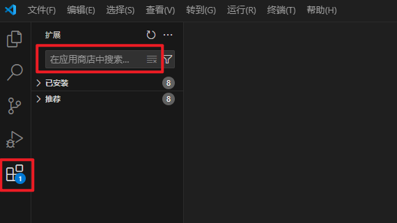

2.  In the search results, select HiSpark Studio for VS Code and click Install.

## Toolchain Configuration<a name="ZH-CN_TOPIC_0000002412436857"></a>

The HiSpark Studio for VS Code plugin depends on the toolchain, Python, and pip.pyz dependency environments when performing operations such as compiling projects. You can use the Download Toolchain function in the plugin to automatically download and install the toolchain and other components.

**Figure 1**  Download Toolchain function<a name="zh-cn_topic_0000002337256433_fig4608724245"></a>  
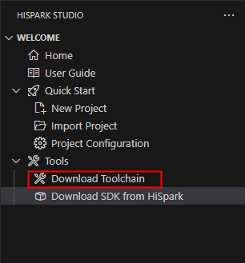

After clicking the Download Toolchain function, python3.11.4, pip.pyz, the dependencies of pip.pyz (wheel, setuptools, cmake, kconfiglib, pycparser, pillow, numpy, opencv\_python, windows\_curses, and tkinter-embed), and the tools required for compilation are downloaded in sequence. During the download, the notification bar in the lower right corner of VS Code shows the corresponding download prompts and progress. Because the compiler file is large, the download takes a long time; please wait patiently.

**Figure 2**  Toolchain download progress (partial)<a name="zh-cn_topic_0000002337256433_fig13993195610574"></a>  
")

After the download is complete, the downloaded content is located in the "..\\.vscode\\extensions\\hispark.hisparkstudio-X.X.X\\downloads" directory under the user directory.

**Figure 3**  Toolchain download directory<a name="zh-cn_topic_0000002337256433_fig1964666125817"></a>  
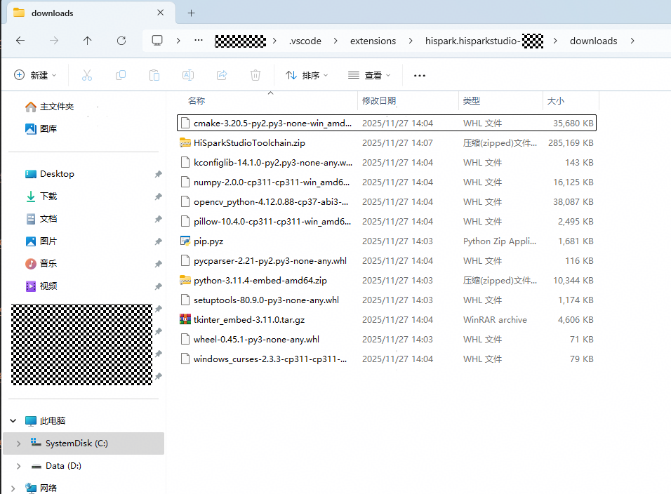

After python3.11.4 is installed, the dependencies of pip.pyz are installed and the compilation toolchain is decompressed. Corresponding notification pop-ups appear in the lower right corner, and when all installations are complete, a prompt indicates that the environment preparation is complete.

**Figure 4**  Decompression prompts for pip.pyz dependencies and toolchain after python3.11.4 installation<a name="zh-cn_topic_0000002337256433_fig7778922205811"></a>  
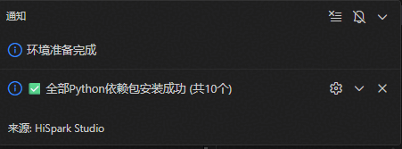

During environment preparation, the zip package downloaded to "....\\.vscode\\extensions\\hispark.hisparkstudio-X.X.X\\downloads\\HiSparkStudioToolchain.zip" under the user directory is decompressed to "..\\.vscode\\extensions\\hispark.hisparkstudio-X.X.X\\tools" under the user directory.

**Figure 5**  Compilation toolchain decompression result<a name="zh-cn_topic_0000002337256433_fig136041725175413"></a>  
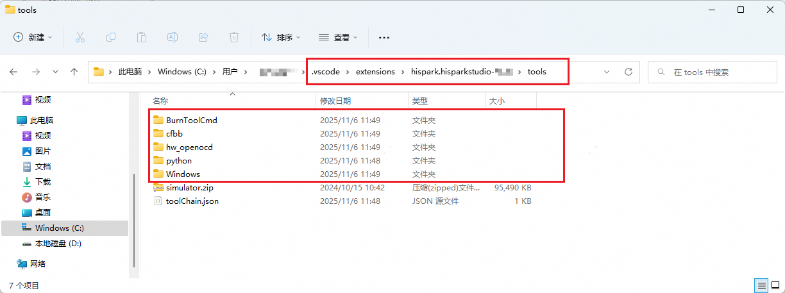

The Python environment can be verified by opening a cmd (Command Prompt) window under the "..\\.vscode\\extensions\\hispark.hisparkstudio-X.X.X\\tools\\python" path in the user directory. If running ".\\python.exe --version" outputs 'Python 3.11.4', and running ".\\python.exe C:\\username\\.vscode\\extensions\\hispark.hisparkstudio-X.X.X\\downloads\\pip.pyz list" displays the pip.pyz dependencies (wheel, setuptools, cmake, kconfiglib, pycparser, pillow, numpy, opencv\_python, windows\_curses, and tkinter-embed) and their versions, the Python environment is verified to be correct.

**Figure 6**  Python environment verification<a name="zh-cn_topic_0000002337256433_fig1757924515812"></a>  
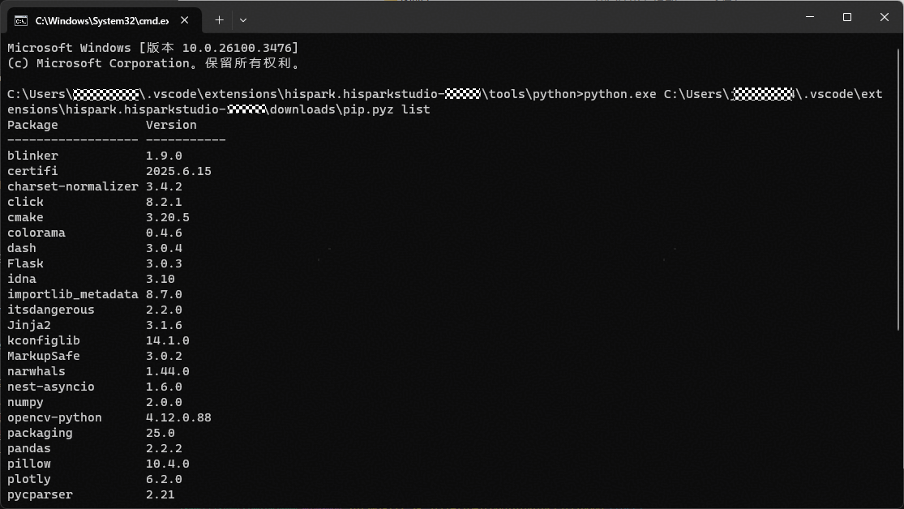

> **Note:** 
>If automatic toolchain environment configuration fails due to environmental or other reasons, you can also configure it manually:
>-   Python manual download link: [https://mirrors.huaweicloud.com/python/3.11.4/python-3.11.4-embed-amd64.zip](https://mirrors.huaweicloud.com/python/3.11.4/python-3.11.4-embed-amd64.zip). Decompress this file to the "..\\.vscode\\extensions\\hispark.hisparkstudio-X.X.X\\tools" directory (the tools directory must be created manually), and name the decompressed file python.
>    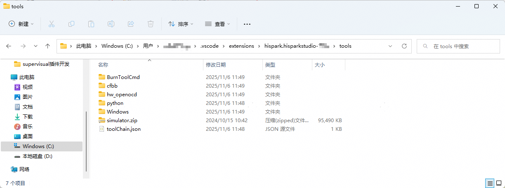
>-   Download the "pip.pyz" file to the "..\\.vscode\\extensions\\hispark.hisparkstudio-X.X.X\\tools\\python" directory, and copy the downloaded "pip.pyz" file to the "..\\.vscode\\extensions\\hispark.hisparkstudio-X.X.X\\downloads" directory. If the downloads directory does not exist, create a downloads folder manually.
>    pip.pyz：[https://bootstrap.pypa.io/pip/pip.pyz](https://bootstrap.pypa.io/pip/pip.pyz)
>-   Modify the "..\\.vscode\\extensions\\hispark.hisparkstudio-X.X.X\\tools\\python\\python311.\_pth" file and delete the \# before "\#import site".
>    
>-   To prepare the pip.pyz dependencies, download the whl files of the corresponding dependencies to the "..\\.vscode\\extensions\\hispark.hisparkstudio-X.X.X\\tools\\python" directory, open cmd in that directory, and run the ".\\python.exe pip.pyz install xx.whl" command. For example, if the cmake whl file is "cmake-3.20.5-py2.py3-none-win\_amd64.whl", open cmd in the download directory and run ".\\python.exe pip.pyz install cmake-3.20.5-py2.py3-none-win\_amd64.whl". The download links of the whl files of each dependency are as follows:
>    wheel：
>    [https://mirrors.cloud.tencent.com/pypi/packages/0b/2c/87f3254fd8ffd29e4c02732eee68a83a1d3c346ae39bc6822dcbcb697f2b/wheel-0.45.1-py3-none-any.whl](https://mirrors.cloud.tencent.com/pypi/packages/0b/2c/87f3254fd8ffd29e4c02732eee68a83a1d3c346ae39bc6822dcbcb697f2b/wheel-0.45.1-py3-none-any.whl)
>    setuptools：
>    [https://mirrors.cloud.tencent.com/pypi/packages/a3/dc/17031897dae0efacfea57dfd3a82fdd2a2aeb58e0ff71b77b87e44edc772/setuptools-80.9.0-py3-none-any.whl](https://mirrors.cloud.tencent.com/pypi/packages/a3/dc/17031897dae0efacfea57dfd3a82fdd2a2aeb58e0ff71b77b87e44edc772/setuptools-80.9.0-py3-none-any.whl)
>    cmake：
>    [https://mirrors.cloud.tencent.com/pypi/packages/65/7f/80cf681cd376834b442af8af48e6f17b4197d20b7255aa2f76d8d93a9e44/cmake-3.20.5-py2.py3-none-win\_amd64.whl](https://mirrors.cloud.tencent.com/pypi/packages/65/7f/80cf681cd376834b442af8af48e6f17b4197d20b7255aa2f76d8d93a9e44/cmake-3.20.5-py2.py3-none-win_amd64.whl)
>    kconfiglib：
>    [https://mirrors.cloud.tencent.com/pypi/packages/8a/f1/d98a89231e779b079b977590efcc31249d959c8f1d4b5858cad69695ff9c/kconfiglib-14.1.0-py2.py3-none-any.whl](https://mirrors.cloud.tencent.com/pypi/packages/8a/f1/d98a89231e779b079b977590efcc31249d959c8f1d4b5858cad69695ff9c/kconfiglib-14.1.0-py2.py3-none-any.whl)
>    pycparser：
>    [https://mirrors.cloud.tencent.com/pypi/packages/62/d5/5f610ebe421e85889f2e55e33b7f9a6795bd982198517d912eb1c76e1a53/pycparser-2.21-py2.py3-none-any.whl](https://mirrors.cloud.tencent.com/pypi/packages/62/d5/5f610ebe421e85889f2e55e33b7f9a6795bd982198517d912eb1c76e1a53/pycparser-2.21-py2.py3-none-any.whl)
>    pillow：
>    [https://mirrors.cloud.tencent.com/pypi/packages/c1/d0/5866318eec2b801cdb8c82abf190c8343d8a1cd8bf5a0c17444a6f268291/pillow-10.4.0-cp311-cp311-win\_amd64.whl](https://mirrors.cloud.tencent.com/pypi/packages/c1/d0/5866318eec2b801cdb8c82abf190c8343d8a1cd8bf5a0c17444a6f268291/pillow-10.4.0-cp311-cp311-win_amd64.whl)
>    numpy：
>    [https://mirrors.cloud.tencent.com/pypi/packages/9b/0f/022ca4783b6e6239a53b988a4d315d67f9ae7126227fb2255054a558bd72/numpy-2.0.0-cp311-cp311-win\_amd64.whl](https://mirrors.cloud.tencent.com/pypi/packages/9b/0f/022ca4783b6e6239a53b988a4d315d67f9ae7126227fb2255054a558bd72/numpy-2.0.0-cp311-cp311-win_amd64.whl)
>    opencv\_python：
>    [https://mirrors.cloud.tencent.com/pypi/packages/fa/80/eb88edc2e2b11cd2dd2e56f1c80b5784d11d6e6b7f04a1145df64df40065/opencv\_python-4.12.0.88-cp37-abi3-win\_amd64.whl](https://mirrors.cloud.tencent.com/pypi/packages/fa/80/eb88edc2e2b11cd2dd2e56f1c80b5784d11d6e6b7f04a1145df64df40065/opencv_python-4.12.0.88-cp37-abi3-win_amd64.whl)
>    windows\_curses：
>    [https://mirrors.cloud.tencent.com/pypi/packages/18/1b/e06eb41dad1c74f0d3124218084f258f73a5e76c67112da0ba174162670f/windows\_curses-2.3.3-cp311-cp311-win\_amd64.whl](https://mirrors.cloud.tencent.com/pypi/packages/18/1b/e06eb41dad1c74f0d3124218084f258f73a5e76c67112da0ba174162670f/windows_curses-2.3.3-cp311-cp311-win_amd64.whl)
>-   Download the tkinter package to the "..\\.vscode\\extensions\\hispark.hisparkstudio-X.X.X\\tools\\python" directory, open cmd in that directory, and run the ".\\python.exe pip.pyz install --target .\\ tkinter\_embed-3.11.0.tar.gz" command
>    tkinter package:
>    [https://mirrors.cloud.tencent.com/pypi/packages/a2/b5/01fa4f6b1b78b01c1602d8e6e28879dcbef2d399d934f28d3324c1114552/tkinter\_embed-3.11.0.tar.gz](https://mirrors.cloud.tencent.com/pypi/packages/a2/b5/01fa4f6b1b78b01c1602d8e6e28879dcbef2d399d934f28d3324c1114552/tkinter_embed-3.11.0.tar.gz)
>-   Add "toolChain.json" to the "..\\.vscode\\extensions\\hispark.hisparkstudio-X.X.X\\tools" directory and add the Python path content to "toolChain.json".
>    ```
>    {
>        "pythonDir": "..\\.vscode\\extensions\\hispark.hisparkstudio-X.X.X\\tools\\python"
>    }
>    ```
>    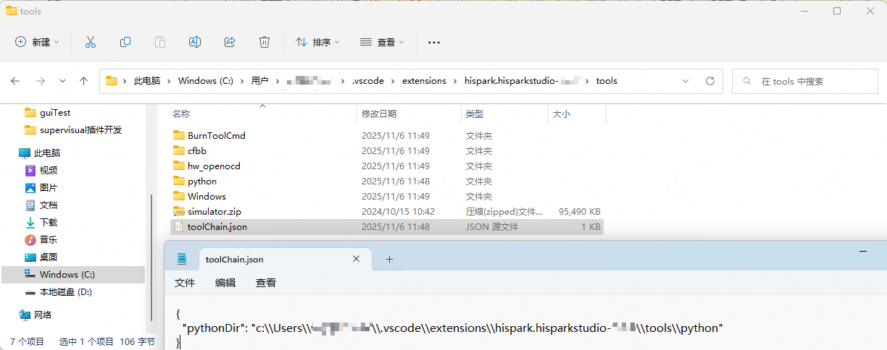
>-   The toolchain can be downloaded manually via the [https://hispark-obs.obs.cn-east-3.myhuaweicloud.com/HiSparkStudioToolchain.zip](https://hispark-obs.obs.cn-east-3.myhuaweicloud.com/HiSparkStudioToolchain.zip) link and then decompressed to the "..\\.vscode\\extensions\\hispark.hisparkstudio-X.X.X\\tools" directory.
>-   For verification of the toolchain environment and Python environment, refer to [Figure 5](#zh-cn_topic_0000002337256433_fig136041725175413) and [Figure 6](#zh-cn_topic_0000002337256433_fig1757924515812).

## SDK Download<a name="ZH-CN_TOPIC_0000002378717596"></a>

Creating a project in the HiSpark Studio for VS Code plugin requires the SDK software package. The plugin currently provides SDK downloads for the WS63 and BS2X series.

**Figure 1**  Download SDK from HiSpark function<a name="zh-cn_topic_0000002303416852_fig16959181457"></a>  
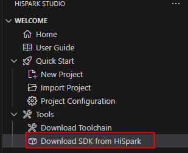

After clicking "Download SDK from HiSpark", the SDK download list is displayed.

**Figure 2**  SDK download list<a name="zh-cn_topic_0000002303416852_fig862702418516"></a>  
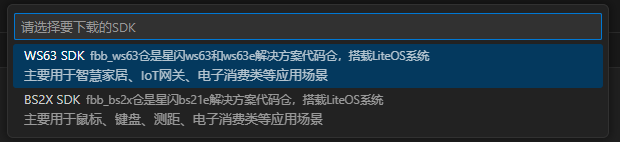

After selecting any SDK, the "Select SDK save location" option is displayed.

**Figure 3**  SDK save location selection<a name="zh-cn_topic_0000002303416852_fig109016331355"></a>  
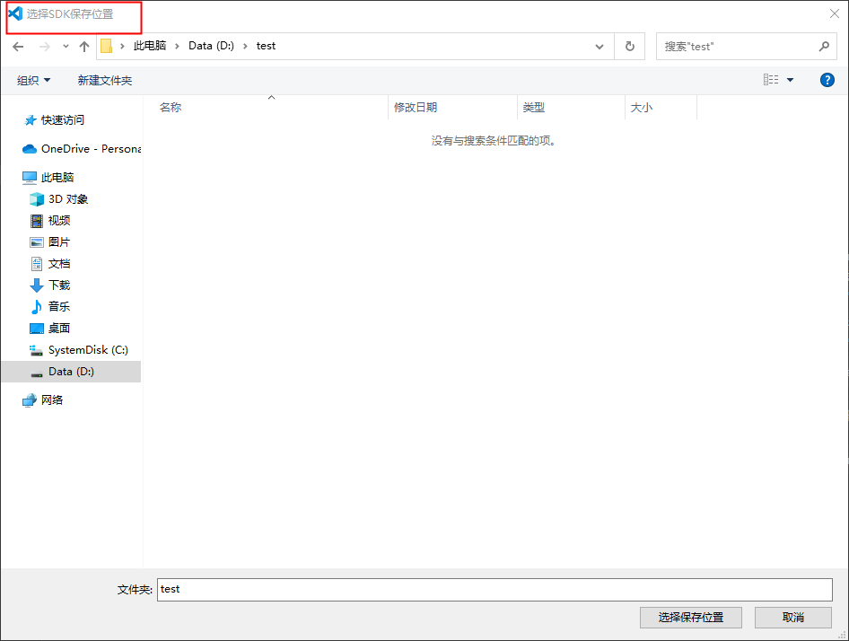

After the save folder is selected, a pop-up in the lower right corner indicates that the SDK is being downloaded. If the waiting time is too long, it may be due to environmental reasons or lack of permission to download from gitee. In this case, manually download Git, add it to the environment variables, close the VS Code window and reopen it to ensure the environment variables are added successfully, and then perform the download again.

Git download link: [https://github.com/git-for-windows/git/releases/download/v2.48.1.windows.1/Git-2.48.1-64-bit.exe](https://github.com/git-for-windows/git/releases/download/v2.48.1.windows.1/Git-2.48.1-64-bit.exe)

**Figure 4**  SDK download prompt box<a name="zh-cn_topic_0000002303416852_fig1437317573111"></a>  
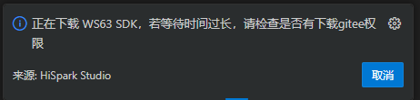

After the SDK download is complete, you can create a project based on the SDK.

> **Notice:** 
>-   To prevent the SDK from affecting other folders after download, it is recommended to select an empty folder as the SDK save location.
>-   The WS63 SDK is downloaded online via git clone [https://gitee.com/HiSpark/fbb\_ws63.git](https://gitee.com/HiSpark/fbb_ws63.git). If you do not have permission to download gitee code, the download will take too long and eventually fail.
>-   The BS2X SDK is downloaded online via git clone [https://gitee.com/HiSpark/fbb\_bs2x.git](https://gitee.com/HiSpark/fbb_bs2x.git). If you do not have permission to download gitee code, the download will take too long and eventually fail.

## bash Environment Preparation<a name="ZH-CN_TOPIC_0000002412317009"></a>

This section applies only to Hi2131, Hi2131C, and 3322 projects that require the bash environment to be compiled.

To compile Hi2131, Hi2131C, or 3322 projects, you need to manually download Git and add the bash path to the environment variables.

Download link: [https://github.com/git-for-windows/git/releases/download/v2.48.1.windows.1/Git-2.48.1-64-bit.exe](https://github.com/git-for-windows/git/releases/download/v2.48.1.windows.1/Git-2.48.1-64-bit.exe)

If "bash.exe" exists by default under System32 of the Windows system, delete the "bash.exe" in the system directory and use the built-in "bash.exe" from the installed Git.

After completing the above steps, restart VS Code to make the new environment variables take effect, and then the project can be compiled normally.

**Figure 1**  Deleting the bash in the Windows system library<a name="zh-cn_topic_0000002304004976_fig9843191112367"></a>  


> **Note:** 
>If you are prompted that you do not have permission when deleting bash in the Windows system library, right-click the bash.exe to be deleted and select "Properties". In the pop-up window, click the "Security" tab, then "Advanced", and then click the "Change" button under the "Owner" tab. Select a new owner (for example, the current user), and click "Apply" and "OK". Return to the "Security" tab and click "Edit". Assign appropriate permissions (such as Full Control, Read, etc.) to the added user or group. After clicking "Apply" and "OK", you can delete the selected bash.exe file.

**Figure 2**  Configuring the deletion permission of bash.exe<a name="zh-cn_topic_0000002304004976_fig31821532142019"></a>  


**Figure 3**  bash path under Git<a name="zh-cn_topic_0000002304004976_fig664202311363"></a>  
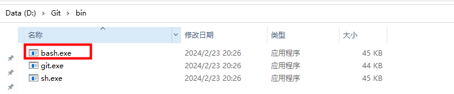

**Figure 4**  Adding to the environment variables<a name="zh-cn_topic_0000002304004976_fig1687216294365"></a>  
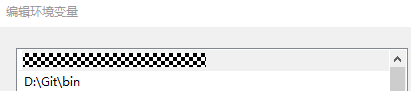

**Figure 5**  Ensuring that the bash under Git is called<a name="zh-cn_topic_0000002304004976_fig14591538123614"></a>  
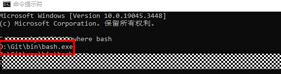

# Project Management<a name="ZH-CN_TOPIC_0000002378877448"></a>


## Creating a Project<a name="ZH-CN_TOPIC_0000002412436861"></a>

1.  Open the HiSpark Studio for VS Code plugin, enter the welcome page, click "New Project", and enter the new project page.

    **Figure 1**  HiSpark Studio for VS Code plugin welcome page<a name="zh-cn_topic_0000002327179609_fig6514428113718"></a>  
    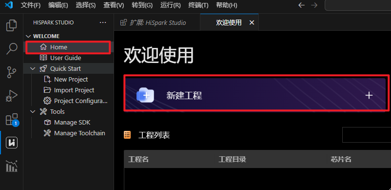

2.  Configure the project parameters on the interface shown in [Figure 2](#zh-cn_topic_0000002327179609_fig2784311111318), and click "Finish".

    **Figure 2**  New project window<a name="zh-cn_topic_0000002327179609_fig2784311111318"></a>  
    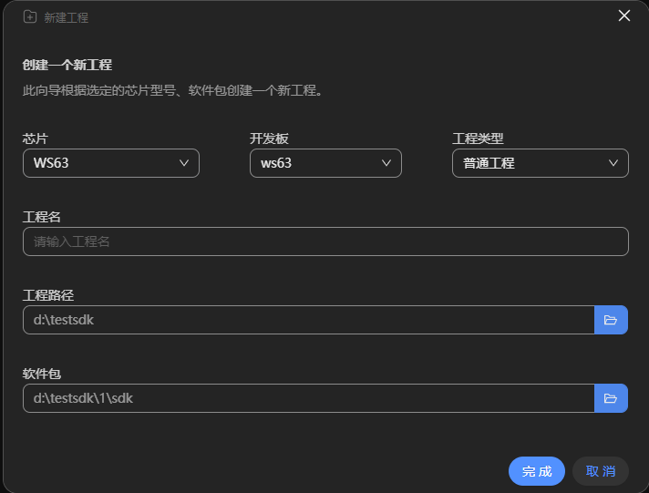

    -   Chip: Select the name of the chip used by the project.
    -   Development board: Select the name of the development board used by the project. When you do not need to customize the development board, the chip name is used as the development board name by default.
    -   Project type: Select the type of the project to be created. There are normal projects and sample projects. Sample projects currently support only the WS63 chip.
    -   Project name: Enter the project name.
    -   Project path: Select the directory for storing the project files.
    -   Software package: Select the root directory of the software development package (SDK) folder used by the project.

    When the chip is WS63 and the project type is "sample project", the "sample" path and the "sample selection" option are added to the project interface, as shown in [Figure 3](#zh-cn_topic_0000002327179609_fig16606922141519).

    **Figure 3**  sample project creation page<a name="zh-cn_topic_0000002327179609_fig16606922141519"></a>  
    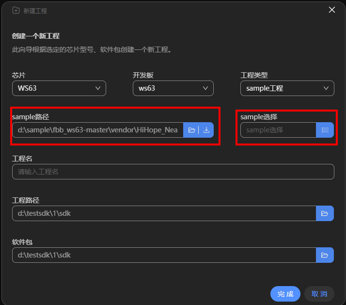

    The sample path can be imported locally (the path directory should contain the "build\_config.json file"), or you can directly select an empty folder directory and click the download icon button. The sample files are automatically downloaded to the selected empty folder directory. Then click sample selection, and the interface shown in [Figure 4](#zh-cn_topic_0000002327179609_fig111743454160) is displayed.

    **Figure 4**  sample selection page<a name="zh-cn_topic_0000002327179609_fig111743454160"></a>  
    

    After selecting the required sample, close the sample selection page. The name of the selected sample option is filled in "sample selection" on the new project page, as shown in [Figure 5](#zh-cn_topic_0000002327179609_fig9923152471712).

    > **Caution:** 
    >The sample is downloaded online via git clone [https://gitee.com/HiSpark/fbb\_ws63.git](https://gitee.com/HiSpark/fbb_ws63.git). If you do not have permission to download gitee code, the download will take too long and eventually fail.

    **Figure 5**  Page after sample selection is complete<a name="zh-cn_topic_0000002327179609_fig9923152471712"></a>  
    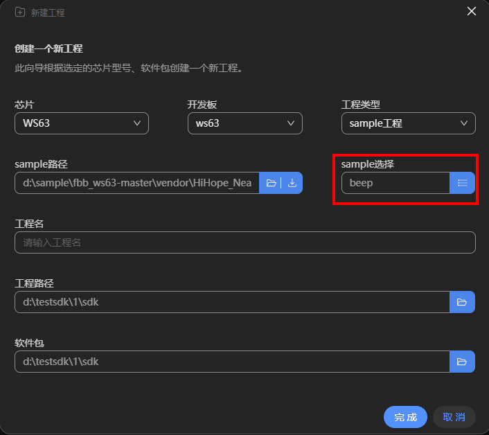

    Then select an appropriate project name, project path, and WS63 software package, and click "Finish" to create the project.

3.  View the project creation result.

    The HiSpark Studio for VS Code plugin automatically opens the newly created project and displays the created project in the project list on the welcome page, as shown in [Figure 6](#zh-cn_topic_0000002327179609_fig551738161718).

    **Figure 6**  Project creation result page<a name="zh-cn_topic_0000002327179609_fig551738161718"></a>  
    

## Importing a Project<a name="ZH-CN_TOPIC_0000002378717600"></a>

1.  Open the HiSpark Studio for VS Code plugin, enter the welcome page, click "Import Project", and enter the import project page.

    **Figure 1**  HiSpark Studio for VS Code plugin import project page<a name="zh-cn_topic_0000002293379666_fig19540125184016"></a>  
    

2.  Select the path to import from, and all projects under that path are found. Check the projects to be imported and click "Finish".

    **Figure 2**  Import project configuration page<a name="zh-cn_topic_0000002293379666_fig3640203910157"></a>  
    

3.  After the project import is complete, the project folder is displayed in the project area, and the imported project is displayed in the project list on the welcome page.

    **Figure 3**  Project import complete<a name="zh-cn_topic_0000002293379666_fig1617152231818"></a>  
    

# Project Configuration<a name="ZH-CN_TOPIC_0000002412317013"></a>

Project configuration is mainly used to configure project configuration items such as basic information, compilation, debugging, and burning. Click the "" button to open the project configuration interface, as shown in [Figure 1](#zh-cn_topic_0000002327179613_fig672755464817).

**Figure 1**  Clicking the project configuration button<a name="zh-cn_topic_0000002327179613_fig672755464817"></a>  


## Basic Information Configuration<a name="ZH-CN_TOPIC_0000002378877452"></a>

Click the "Basic Information" tab on the left side of the project configuration interface to enter the basic information configuration interface, as shown in [Figure 1](#zh-cn_topic_0000002293379670_fig18947542448). This interface contains the project chip series, development board model, and software package path. You can modify the software package path corresponding to the project.

**Figure 1**  Basic information configuration interface<a name="zh-cn_topic_0000002293379670_fig18947542448"></a>  
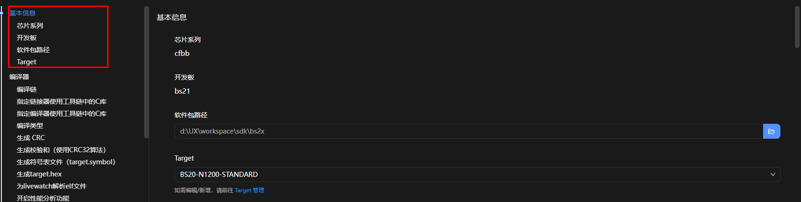

-   In the basic series configuration interface, the Target selection box and the associated Target management function are available only for some FBB chips:

    BS20, BS20C, BS21, BS21E, BS21A, BS22, and BS26 support both Target selection and Target management. Other projects that contain Target support only Target selection.

-   The following guide applies only to the above chips that involve the Target function:
    1.  As shown in [Figure 2](#zh-cn_topic_0000002293379670_fig1942333014511), different build products can be generated by selecting different Targets during compilation.

        **Figure 2**  Target selection interface<a name="zh-cn_topic_0000002293379670_fig1942333014511"></a>  
        

    2.  Click "Target Management" below the Target selection box to enter the Target management interface, as shown in [Figure 3](#zh-cn_topic_0000002293379670_fig1648301431310).

        **Figure 3**  Target management interface<a name="zh-cn_topic_0000002293379670_fig1648301431310"></a>  
        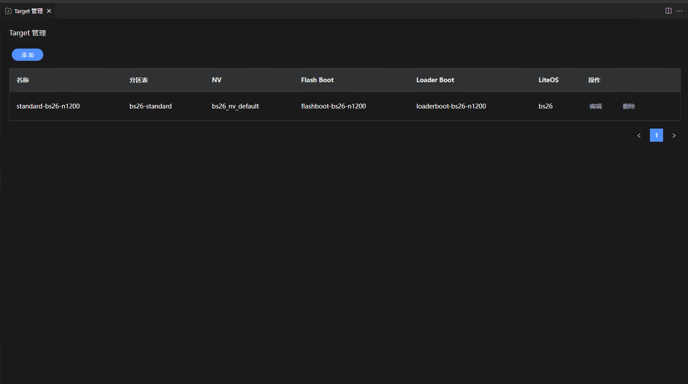

        ① SDK default Targets that do not support editing or deletion.

        ② Targets that support compilation and deletion.

    3.  Click "Add" on the Target management interface to enter the add Target interface, as shown in [Figure 4](#zh-cn_topic_0000002293379670_fig13409104010130).

        **Figure 4**  Add Target interface<a name="zh-cn_topic_0000002293379670_fig13409104010130"></a>  
        

    4.  When you add or delete a Target and switch back to the Target option on the project configuration interface, the change takes effect synchronously. Taking adding a Target as an example, after a new Target named demo is added, as shown in [Figure 5](#zh-cn_topic_0000002293379670_fig899411161410), the Target drop-down box on the project configuration interface is also updated with the DEMO option synchronously, as shown in [Figure 6](#zh-cn_topic_0000002293379670_fig38170493913).

        **Figure 5**  Adding a Target named demo<a name="zh-cn_topic_0000002293379670_fig899411161410"></a>  
        

        **Figure 6**  Target drop-down box updated with DEMO synchronously<a name="zh-cn_topic_0000002293379670_fig38170493913"></a>  
        

        As shown in [Figure 7](#zh-cn_topic_0000002293379670_fig8566412205415), the Target parameter macro information after configuration is generated in the ".config" file under the target\_config directory.

        **Figure 7**  Target configuration file<a name="zh-cn_topic_0000002293379670_fig8566412205415"></a>  
        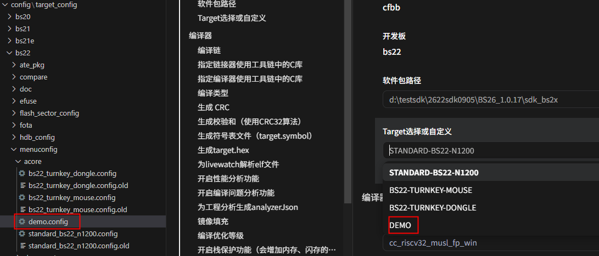

        Target supports selection and customization. You can select the required Target from the Target list by clicking the Target selection box, and you can also customize the Target and the compilation commands.

        **Figure 8**  Target customization<a name="zh-cn_topic_0000002293379670_fig94764713276"></a>  
        

        > **Notice:** 
        >-   Target supports selection and customization. Each time you customize a Target, you need to manually enter the complete custom Target and command. Secondary editing based on a selected or customized Target is not supported; that is, each time you customize a Target, you must enter and edit from the first character.
        >-   When customizing a Target, if the entered Target already exists in the list and you add other compilation commands on this basis, as long as the compilation passes normally, both debugging and burning can be executed normally.
        >-   When customizing a Target, if the entered Target is not in the list and you compile on this basis, if the compilation passes normally, the debugging, stack analysis, and image analysis functions will be affected because no elf and map files are bound. In addition, after customizing a Target that is not in the list and reopening the project configuration, a prompt indicating that launch.json is missing and affects the debugging function will appear. This is normal.

## Compiler Configuration<a name="ZH-CN_TOPIC_0000002412436865"></a>

Click the "Compiler" tab on the left side of the project configuration interface to enter the compiler configuration interface, as shown in [Figure 1](#zh-cn_topic_0000002327219389_fig177671416389), [Figure 2](#zh-cn_topic_0000002327219389_fig892832183814), [Figure 3](#zh-cn_topic_0000002327219389_fig1020319297387), and [Figure 4](#zh-cn_topic_0000002327219389_fig1514082619416). This interface allows you to configure items such as the compilation toolchain, compilation type, compilation options, compilation commands, compilation result file path, and static libraries used by the project.

**Figure 1**  Compiler configuration interface-1<a name="zh-cn_topic_0000002327219389_fig177671416389"></a>  

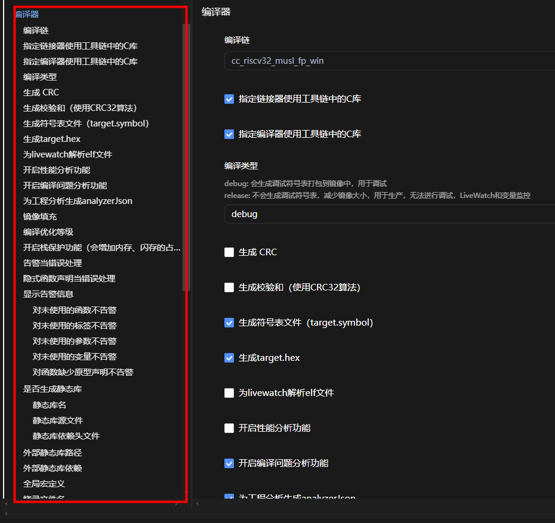

**Figure 2**  Compiler configuration interface-2<a name="zh-cn_topic_0000002327219389_fig892832183814"></a>  

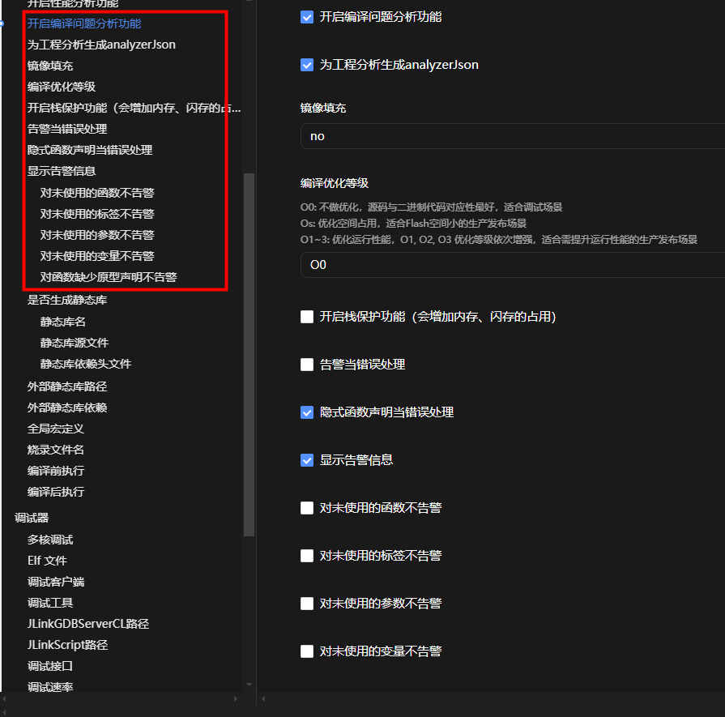

**Figure 3**  Compiler configuration interface-3<a name="zh-cn_topic_0000002327219389_fig1020319297387"></a>  

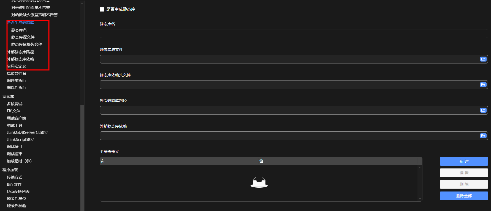

**Figure 4**  Compiler configuration interface-4<a name="zh-cn_topic_0000002327219389_fig1514082619416"></a>  

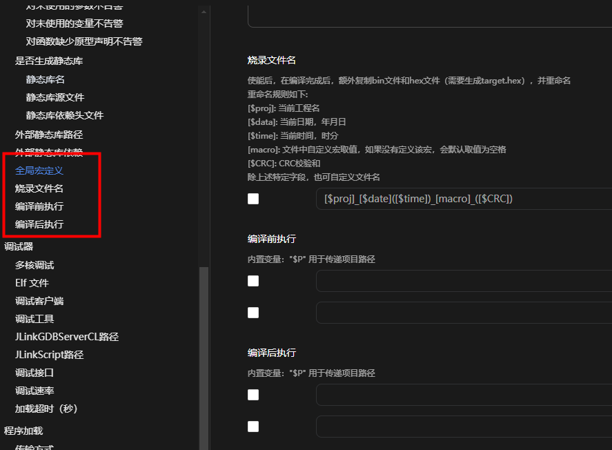

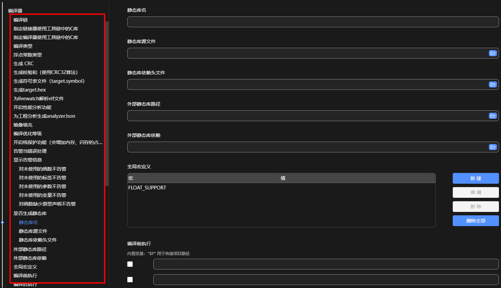

-   Compilation toolchain: The toolchain used for compilation.
-   Specify the linker to use the C library in the toolchain: Specify the linker to use the C library in the toolchain.
-   Specify the compiler to use the C library in the toolchain: Specify the compiler to use the C library in the toolchain.
-   Compilation type: Divided into debug and release.
    -   debug generates a debugging symbol table and packages it into the image, which is convenient for debugging.
    -   release does not generate a debugging symbol table, reducing the image size and being used for production.

-   Floating-point constant type: Divided into float and double.
    -   float can improve the running speed of the program, but may cause precision loss, because single-precision floating-point numbers can only represent a limited range and precision of numbers.
    -   double can improve the calculation precision of floating-point operations, but occupies more memory space and also increases the time consumption.

-   Generate CRC: Used to control whether the CRC algorithm calculation result is inserted at the end of "target.bin" and "target.hex" during compilation.
-   Generate checksum (using the CRC32 algorithm): The CRC algorithm calculation result is not inserted into the executable file, but is saved in the "checksum\_list.txt" file in the same directory and printed during the compilation process.
-   Generate the symbol table file (target.symbol): After compilation, the "target.symbol" symbol table file can be generated from the "target.elf" file in the "out/bin" directory. The file is located in the "out/bin" directory.
-   Generate target.hex: Used to control whether "target.hex" is generated during compilation.
-   Parse the elf file for Live Watch: Used to control whether the global variables in the elf are parsed during compilation. The parsing results are used in the Live Watch function during debugging.
-   Generate analyzerJson for project analysis: Used to control whether the project is statically analyzed during compilation. The analysis results are used for stack analysis and image analysis.
-   Image padding.
    -   no: No padding.
    -   0: Fill the extra space with 0.
    -   1: Fill the extra space with 1.

-   Compilation optimization level: Compilation optimization options.
    -   O0: No optimization is performed. The correspondence between source code and binary code is the best, making it suitable for debugging scenarios.
    -   Os: Optimizes space usage, suitable for production release scenarios with small Flash space.
    -   O1\~3: Optimizes running performance. The O1, O2, and O3 optimization levels increase in sequence, suitable for production release scenarios that need to improve running performance.

-   Enable the stack protection function (this increases the memory and flash usage).
-   Treat warnings as errors.
-   Display warning information.
    -   Do not warn on unused functions: Ignore warnings issued for declared but unused static functions.
    -   Do not warn on unused labels: Ignore warnings issued for declared but unused labels.
    -   Do not warn on unused parameters: Ignore warnings issued for declared but unused parameters.
    -   Do not warn on unused variables: Ignore warnings issued for declared but unused variables.
    -   Do not warn on missing function prototypes: Ignore warnings issued when a function is used before it is declared.

-   Whether to generate static libraries: If selected, the selected files are compiled to generate static library files; if not selected, no static library files are generated during compilation.
    -   Static library name

        Enter the name of the static library, such as "demo". After compilation, "libdemo.a" is generated in the "out\\libs" directory.

    -   Static library source files

        Select the files or folders to be compiled into a static library.

    -   Static library dependency header files

        Select the header files that the static library compilation depends on. Files and folders are supported.

-   External static library path.

    Configure static library files that are not under the current project directory to participate in compilation.

-   External static library dependency.

    Configure the static library dependency headers that are not under the current project directory to participate in compilation.

-   Global macro definitions.

    Configure macro definitions that are valid throughout the entire project.

-   Execute before compilation.

    Customize 1 to 2 commands. The checked commands are executed before compilation. The built-in variable $P (current project path) can be used in the commands.

-   Execute after compilation.

    Customize 1 to 2 commands. The checked commands are executed after compilation. The built-in variable $P (current project path) can be used in the commands.

    > **Note:** 
    >The configuration is automatically saved and takes effect after modification. Modifications in the text input box are automatically saved and take effect when the input box loses focus.

## Flasher Configuration<a name="ZH-CN_TOPIC_0000002378717604"></a>

Click the "Program Loading" tab on the left side of the project configuration interface to enter the program loading configuration interface, as shown in [Figure 1](#zh-cn_topic_0000002327179617_fig1851473982716). This interface supports configuring the burning transmission mode and the parameters corresponding to the transmission mode.

**Figure 1**  Program loading configuration interface<a name="zh-cn_topic_0000002327179617_fig1851473982716"></a>  
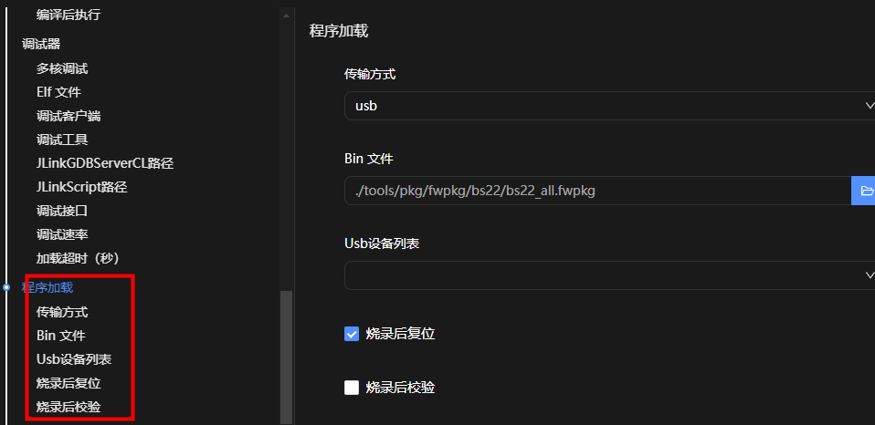

-   Transmission mode: Select the data transmission mode. Different parameter configuration items appear for different transmission modes.
    -   serial: Select transmission through the serial port. As shown in [Figure 2](#zh-cn_topic_0000002327179617_fig58771855184310).

        -   Port
        -   Baud rate

        **Figure 2**  Interface for selecting the serial configuration<a name="zh-cn_topic_0000002327179617_fig58771855184310"></a>  
        
        

    -   usb: Select to complete burning and upgrading through USB devices. As shown in [Figure 3](#zh-cn_topic_0000002327179617_fig10468263017). (The current usb mode supports BS20, BS20C, BS21, BS21A, BS21E, BS22, BS25, and BS26 series chips.)
        -   USB device list

            **Figure 3**  Interface for selecting the usb configuration<a name="zh-cn_topic_0000002327179617_fig10468263017"></a>  
            
            

        -   As shown in the figure, when switching to usb mode, the default Bin file is modified, and only program loading is supported. Burning configuration is not supported.

            **Figure 4**  Changing the transmission mode to usb mode<a name="zh-cn_topic_0000002327179617_fig21511259311"></a>  
            

-   Bin file: Specifies the file to be burned.
-   Reset after burning: After the burning is complete, the board performs a soft reset.
-   Verify after burning: After burning, the burned file is read back and compared to verify the integrity of the file.

> **Note:** 
>-   The configuration is automatically saved and takes effect after modification.

## Debugger Configuration<a name="ZH-CN_TOPIC_0000002412317017"></a>

Click the "Debugger" tab on the left side of the project configuration interface, and select the Jlink executable software in the JlinkGDBServerCL path, as shown in [Figure 1](#zh-cn_topic_0000002340080528_fig205561635163111).

**Figure 1**  Selecting the JlinkGDBServerCL path in the project configuration interface<a name="zh-cn_topic_0000002340080528_fig205561635163111"></a>  
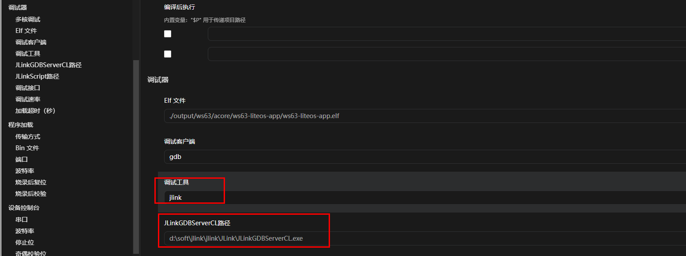

# Compilation and Running<a name="ZH-CN_TOPIC_0000002378877456"></a>


## Compilation Buttons<a name="ZH-CN_TOPIC_0000002412436869"></a>

**Figure 1**  Compilation buttons<a name="zh-cn_topic_0000002293383670_fig7871826336"></a>  
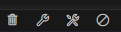

The buttons in [Figure 1](#zh-cn_topic_0000002293383670_fig7871826336) are, in order: Clean, Compile, Recompile, and Stop Compilation.

-   : Click to trigger project cleaning, which deletes the intermediate files generated during compilation.
-   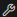: Click to trigger project compilation.
-   : Click to trigger cleaning the target first and then compiling.
-   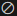: Click to trigger stopping the compilation.

> **Note:** 
>-   The recompile function first clears the contents of the current target in the output directory, such as the folders named target in the acore directory and the fwpkg directory. If such a folder exists, it is deleted; if not, no files or folders are cleared. After the clearing is complete, the compilation function is executed again.
>-   To delete the output folder, simply execute the "Clean" function.

## Compilation Results<a name="ZH-CN_TOPIC_0000002378717608"></a>

Click the "" button to start compilation. After a successful compilation, the terminal window output is as shown in [Figure 1](#zh-cn_topic_0000002293224006_fig9925105200), and an output directory is generated in the project directory, as shown in [Figure 2](#zh-cn_topic_0000002293224006_fig114873277206).

**Figure 1**  Compilation successful<a name="zh-cn_topic_0000002293224006_fig9925105200"></a>  
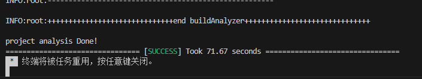

**Figure 2**  Compilation generates the output directory<a name="zh-cn_topic_0000002293224006_fig114873277206"></a>  

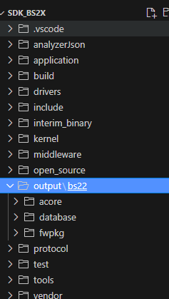

Click the  button to start cleaning the files generated by compilation. After a successful cleaning, the terminal window output is as shown in [Figure 3](#zh-cn_topic_0000002293224006_fig1710335292011). Project cleaning clears the output folder in the project directory.

**Figure 3**  Project cleaning successful<a name="zh-cn_topic_0000002293224006_fig1710335292011"></a>  


## Compiling to Generate a Static Library<a name="ZH-CN_TOPIC_0000002412317021"></a>

Applicable scenario: You want to package some source files in the project to generate a static library file.

1.  Enter the project configuration page and go to the "Generate Static Library" configuration item.

    **Figure 1**  Static library configuration<a name="zh-cn_topic_0000002327223373_fig18878132542220"></a>  
    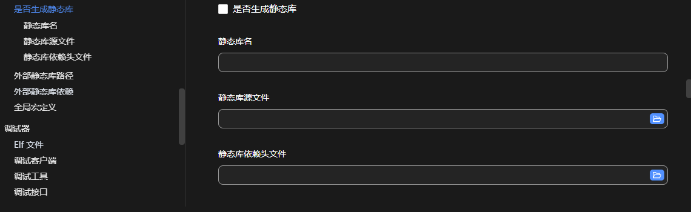

    Enable or disable generating a static library. If you do not want to generate a static library, you can turn it off again through this option.

2.  Enter the desired static library name. For example, enter "demo". When the static library is finally generated, a "lib" prefix and a ".a" suffix are added to generate "libdemo.a".

    **Figure 2**  Entering the static library name<a name="zh-cn_topic_0000002327223373_fig484053232210"></a>  
    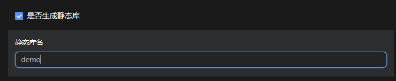

3.  Select the folders or files that contain the source files of the static library from the current project files. Multiple selection is supported. The tool automatically filters out .c files. After the selection, click Finish.

    **Figure 3**  Selecting the source files for generating the static library<a name="zh-cn_topic_0000002327223373_fig296914348228"></a>  
    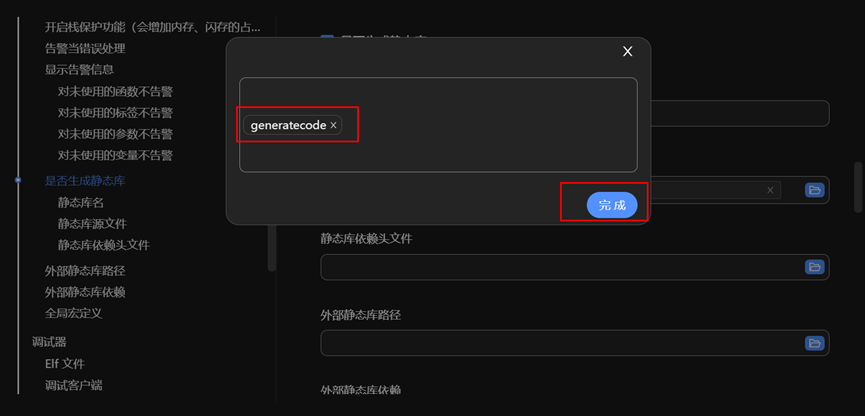

4.  Select the header file paths required for compiling static dependencies from the current project files. Folders or files can be selected, and multiple selection is supported. The tool automatically filters out .h files. After the selection, click Finish.

    **Figure 4**  Selecting the header file paths for generating the static library<a name="zh-cn_topic_0000002327223373_fig875163710220"></a>  
    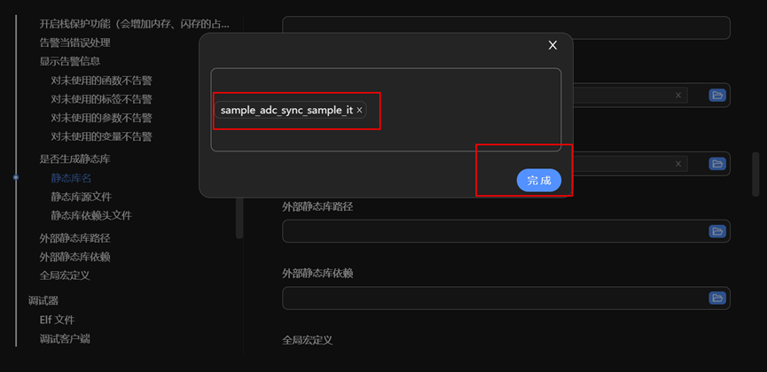

5.  Click "" to compile. After a successful compilation, the static library file is generated in "out\\libs".

    **Figure 5**  Generation path of the static library<a name="zh-cn_topic_0000002327223373_fig2079334113225"></a>  
    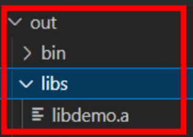

## Using a Static Library in Compilation<a name="ZH-CN_TOPIC_0000002378877460"></a>

**Using the Static Library Files in the Project<a name="zh-cn_topic_0000002327183621_section18863661645"></a>**

1.  Move the .a files corresponding to the custom static library generated in the "out\\libs" path to the "thirdparty\\sysroot\\lib" path.

    > **Note:** 
    >Do not place .a files in the "out\\libs" directory; otherwise, they will be cleared during clean.

2.  Move the .h files corresponding to the static library to the "thirdparty\\sysroot\\include" path.
3.  Include the corresponding header files in the project, and you can call the interfaces in the custom static library.

**Using Static Library Files Outside the Project<a name="zh-cn_topic_0000002327183621_section1866313180420"></a>**

1.  In the External Static Library Path, select the path of the .a file of the referenced external static library. In External Static Library Dependencies, select the directory of the header files on which the corresponding static library depends.

    **Figure 1**  External static library configuration items<a name="zh-cn_topic_0000002327183621_fig57631244152214"></a>  
    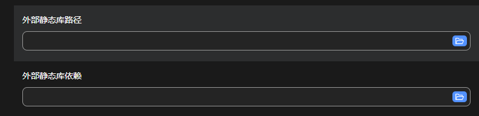

2.  After the selection, click Rebuild to compile, and include the header files on which the referenced static library depends in the project.

# Package Burning<a name="ZH-CN_TOPIC_0000002412436873"></a>

The burning function supports only serial port burning.


## Connecting the Burning Serial Cable<a name="ZH-CN_TOPIC_0000002378717612"></a>

Software image burning uses the serial port communication protocol. The computer running the HiSpark Studio for VS Code plugin and the target board need to be connected with a serial cable. Common serial cables include standard serial cables and USB-to-serial cables. If you use a USB-to-serial cable, you need to install the USB-to-serial driver in advance.

**Figure 1**  Serial cable connection for burning<a name="zh-cn_topic_0000002327223389_fig8881486226"></a>  
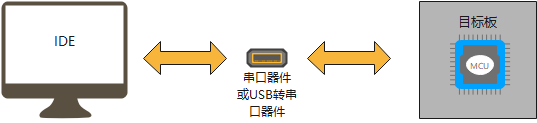

## Configuring Project Burning Options<a name="ZH-CN_TOPIC_0000002412317029"></a>

1.  Set up the hardware environment properly.

    Connect the computer and the development board to be burned with a serial cable.

2.  <a name="zh-cn_topic_0000002327183641_li207851059104511"></a>Determine the serial port number of the connected port.

    Open Device Manager on the computer, and view and record the serial port number corresponding to the serial cable.

    **Figure 1**  Serial port selection<a name="zh-cn_topic_0000002327183641_fig55913473219"></a>  
    

    > **Notice:** 
    >If you burn through a USB-to-serial cable, install the USB-to-serial driver.

3.  Enter the project configuration interface.

    After opening the project to be burned, click the "" button of the project configuration to enter the project configuration interface.

    **Figure 2**  Project configuration entry<a name="zh-cn_topic_0000002327183641_fig337113913219"></a>  
    

4.  Click "Transmission Mode" under "Program Loading". The default is "serial" serial port transmission. In "Bin File", the Bin file to be burned is selected by default. Select the port number as described in [Step 2](#zh-cn_topic_0000002327183641_li207851059104511). The default baud rate is 115200.

    **Figure 3**  Serial port burning configuration<a name="zh-cn_topic_0000002327183641_fig99981772213"></a>  
    

    > **Notice:** 
    >When FBB series chips use the "serial" burning mode, because it is a USB-to-serial connection, differences in hardware devices may limit the burning baud rate supported by the chips. To support a higher baud rate, the board needs to be modified. The burning baud rate of BRANDY series chips is limited to no more than 500000 by default, that of BS2X series chips is limited to no more than 2000000 by default, and that of 3322 is limited to no more than 750000 by default.

5.  Click the burn button  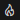 in the toolbar to start burning.

    **Figure 4**  Burn button entry<a name="zh-cn_topic_0000002327183641_fig1518855418224"></a>  
    

6.  Reset the device as prompted. After a successful burning, the terminal window output is as shown in [Figure 5](#zh-cn_topic_0000002327183641_fig9672125742319).

    **Figure 5**  Burning successful<a name="zh-cn_topic_0000002327183641_fig9672125742319"></a>  
    

## Burning Configuration<a name="ZH-CN_TOPIC_0000002378877464"></a>

This section mainly introduces how to selectively burn bin files. If the compilation succeeds before using this function, start directly from [1](#zh-cn_topic_0000002293383702_p913mcpsimp) in this section. If the project has not been compiled, see the "[Compilation Results](编译结果.md#ZH-CN_TOPIC_0000002378717608)" section to compile it first, and then perform the operations according to the steps in this section.

1.  <a name="zh-cn_topic_0000002293383702_p913mcpsimp"></a>Click the "Burning Configuration"    button in the toolbar to enter the burning configuration interface.

    **Figure 1**  Burning configuration button and interface<a name="zh-cn_topic_0000002293383702_fig18205858181719"></a>  
    
    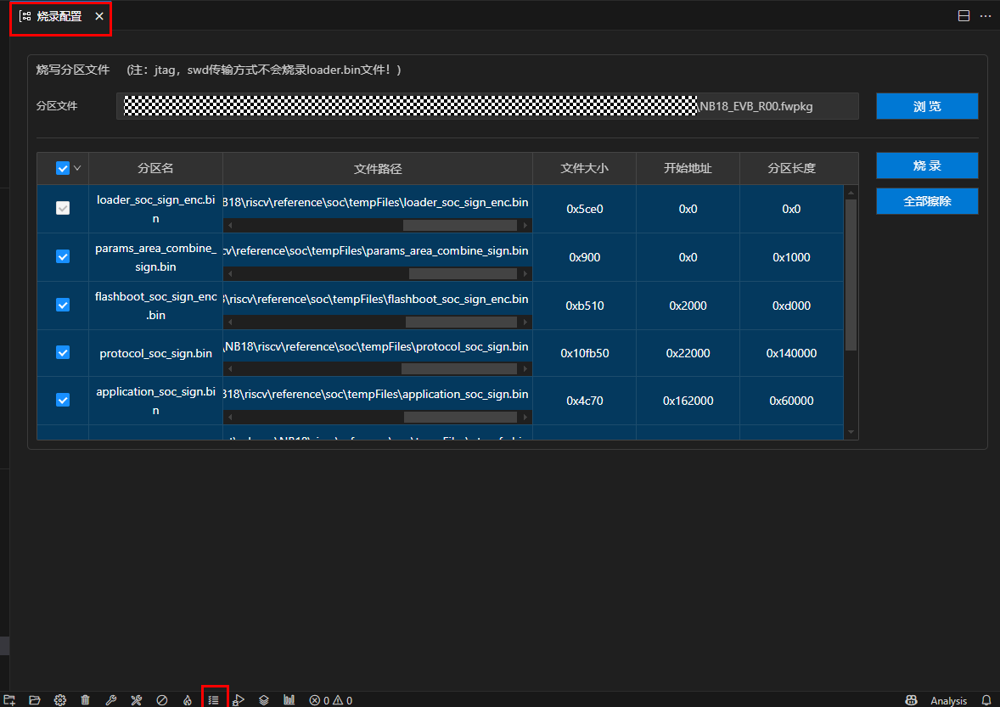

2.  The FBB partition file is the packaged .fwpkg file by default, or you can click the "Browse" button to select a packaged .fwpkg file from local files. After the selection, the burning tool automatically lists the bin contents contained in the .fwpkg file.

    **Figure 2**  FBB burning configuration partition file path<a name="zh-cn_topic_0000002293383702_fig7273738121914"></a>  
    
    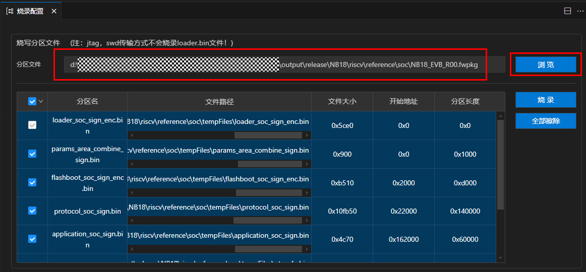

3.  Check the .bin files to be burned. All .bin files are checked by default. The editing state of rows containing the partition name attribute of loader.bin or ssb.bin in the table cannot be modified. Other .bin files can be checked or unchecked as needed for burning.
4.  Before burning, you need to configure the transmission mode and other parameter information. For details, see the "[Flasher Configuration](烧录器配置.md#ZH-CN_TOPIC_0000002378717604)" section.
5.  Click the "Burn" button and restart the development board as prompted to start burning.

    **Figure 3**  Burning<a name="zh-cn_topic_0000002293383702_fig7508701238"></a>  
    
    

6.  After burning starts, a burning progress bar is displayed below the partition file for you to view the burning progress. After burning starts, the related command information is printed in the terminal. Finally, after a successful burning, the word "successfully" is displayed on the interface.

    **Figure 4**  Burning progress<a name="zh-cn_topic_0000002293383702_fig19626111222410"></a>  
    
    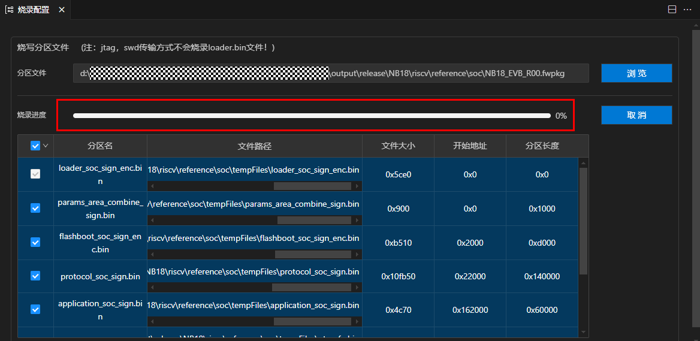

    **Figure 5**  Burning start printing<a name="zh-cn_topic_0000002293383702_fig377133292415"></a>  
    
    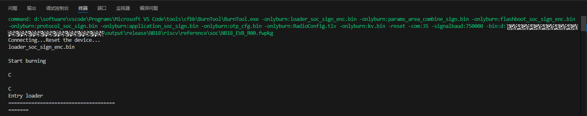

    **Figure 6**  Burning start printing<a name="zh-cn_topic_0000002293383702_fig17310339133719"></a>  
    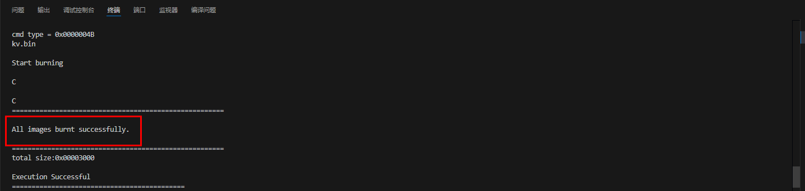

# Stack Analysis and Image Analysis<a name="ZH-CN_TOPIC_0000002412436881"></a>

The HiSpark Studio for VS Code plugin integrates the Stack Analysis tool and the Image Analysis tool to analyze problems such as insufficient memory and memory overflow during development, helping developers analyze and locate problems more accurately.

-   The Stack Analysis tool is based on static binary analysis. It provides task stack overhead estimates and function call relationship diagrams, providing relatively accurate static memory analysis data references for development scenarios such as stack memory usage, analysis, optimization, and problem location.
-   The Image Analysis tool analyzes the memory usage of the .elf file built from the project, helping developers quickly evaluate the usage of memory segments and symbol tables.


## Stack Analysis<a name="ZH-CN_TOPIC_0000002378717620"></a>

**Function Introduction<a name="zh-cn_topic_0000002293224062_section148321529151417"></a>**

The Stack Analysis tool is based on static binary analysis. It provides task stack overhead estimates and function call relationship diagrams, providing relatively accurate static memory analysis data references for development scenarios such as stack memory usage, analysis, optimization, and problem location.

**Function Entry<a name="zh-cn_topic_0000002293224062_section17325123961615"></a>**

After creating a project and compiling it successfully, click the "" button in the toolbar to perform stack analysis.

**Stack Analysis Function Page<a name="zh-cn_topic_0000002293224062_section125419179175"></a>**

The stack analysis results are displayed as a function list and call relationships. As shown in [Figure 1](#zh-cn_topic_0000002293224062_fig4596122219257), the function list page displays the name, internal stack overhead, and location information of each function. The unit of internal stack overhead is Byte. Keyword search and sorting are supported.

**Figure 1**  Function list page<a name="zh-cn_topic_0000002293224062_fig4596122219257"></a>  


The call relationship interface is shown in [Figure 2](#zh-cn_topic_0000002293224062_fig1384164712519). It displays the call relationships of each function, including the function name, call depth, maximum stack overhead, and internal stack overhead. Keyword search and sorting are supported.

**Figure 2**  Call graph page<a name="zh-cn_topic_0000002293224062_fig1384164712519"></a>  
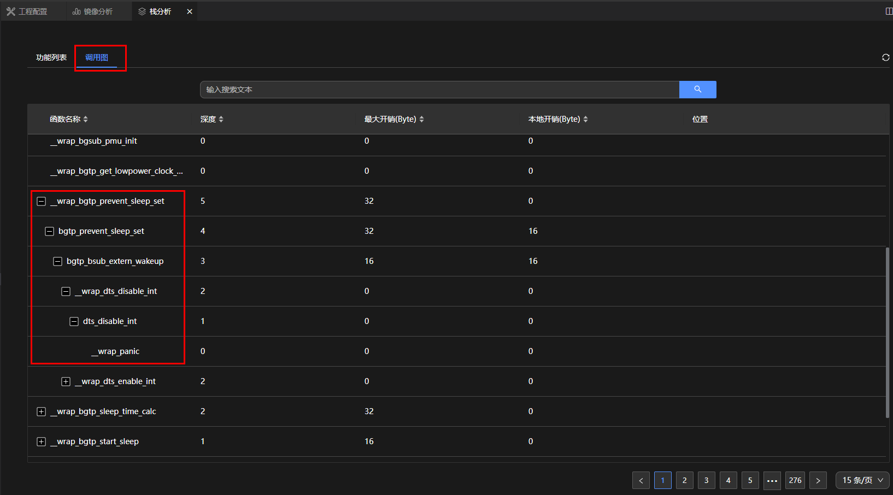

**Statistics Item Description<a name="zh-cn_topic_0000002293224062_section618mcpsimp"></a>**

-   Maximum overhead: The product of the maximum stack overhead among all subfunctions of the current function and the number of loop calls, plus its own overhead.

    Calculation formula: max(own stack overhead of subfunction 1, own stack overhead of subfunction 2, own stack overhead of subfunction 3, ...) × number of loop calls + own stack overhead of the function

-   Local overhead: The own stack overhead of the current function.
-   Depth: For each additional level of subfunction of the current function, the depth increases by one level.

## Image Analysis<a name="ZH-CN_TOPIC_0000002412317033"></a>

**Function Introduction<a name="zh-cn_topic_0000002327223425_section538803119292"></a>**

The Image Analysis tool analyzes the .elf file and graphically displays the usage of RAM and ROM.

**Function Entry<a name="zh-cn_topic_0000002327223425_section1582295611297"></a>**

After creating a project and compiling it successfully, click the "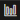" button in the toolbar.

**Function Interface<a name="zh-cn_topic_0000002327223425_section1533673619307"></a>**

The memory region page (as shown in [Figure 1](#zh-cn_topic_0000002327223425_fig1787391122717)) evaluates and analyzes the detailed memory usage of the project. For example, for WS63, the displayed memory regions include RAM, SRAM, ITCM, and others. The displayed information includes the name, start memory address, end memory address, total size, free size, used size, and usage ratio of each memory region. Keyword search and sorting are supported, as shown in [Figure 1](#zh-cn_topic_0000002327223425_fig1787391122717).

**Figure 1**  Memory region page<a name="zh-cn_topic_0000002327223425_fig1787391122717"></a>  
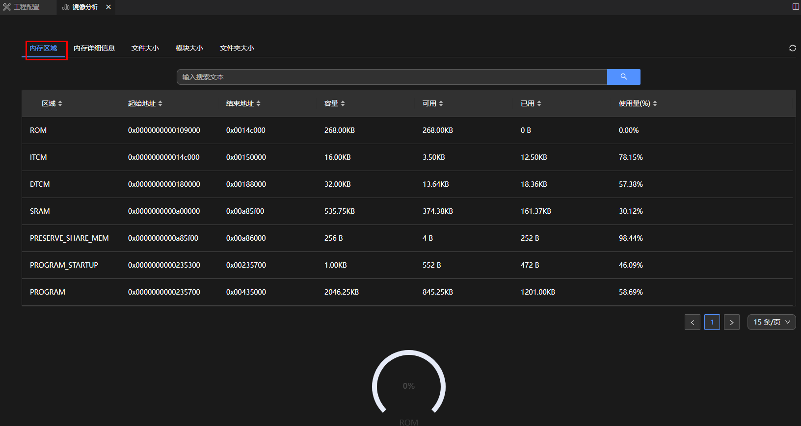

The memory details page (as shown in [Figure 2](#zh-cn_topic_0000002327223425_fig15591937172713)) displays the details of the memory sections contained in each memory region and the symbols contained in each memory section. For example, FLASH contains memory sections such as .text, .entry, and .data, and each memory section contains the program symbols allocated to it. Keyword search and sorting are supported.

The information displayed in each row includes the runtime address VMA (Virtual Memory Address, indicating the memory address where the program is loaded), the load address LMA (Load Memory Address, indicating the memory address where the program runs), and the size of the memory section/symbol.

**Figure 2**  Memory details page<a name="zh-cn_topic_0000002327223425_fig15591937172713"></a>  


The file size page (as shown in [Figure 3](#zh-cn_topic_0000002327223425_fig9261641289)) displays which memory space each linked .o file occupies and the size of the occupied space. Keyword search and sorting are supported.

**Figure 3**  File size page<a name="zh-cn_topic_0000002327223425_fig9261641289"></a>  


The module size page (as shown in [Figure 4](#zh-cn_topic_0000002327223425_fig1367222122813)) displays the hierarchy of modules and components and the memory usage of different modules. Keyword search and sorting are supported.

**Figure 4**  Module size page<a name="zh-cn_topic_0000002327223425_fig1367222122813"></a>  
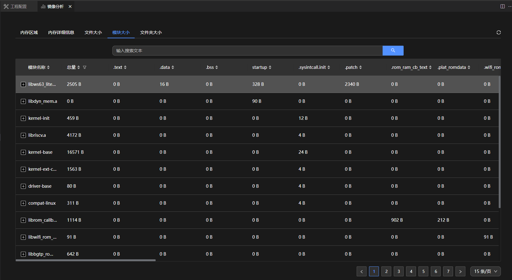

The folder size page (as shown in [Figure 5](#zh-cn_topic_0000002327223425_fig1075993892817)) displays the memory usage of modules under different folders. Keyword search and sorting are supported, and export to Excel is supported.

**Figure 5**  Folder size<a name="zh-cn_topic_0000002327223425_fig1075993892817"></a>  


# Project Debugging<a name="ZH-CN_TOPIC_0000002378877472"></a>


## Debug Configuration Options<a name="ZH-CN_TOPIC_0000002412436885"></a>

> **Note:** 
>The JlinkGDBServerCL driver in the debug configuration options needs to be downloaded from the J-Link official website. The official website address is: [https://www.segger.com/products/debug-probes/j-link/models/j-link-base/](https://www.segger.com/products/debug-probes/j-link/models/j-link-base/)

1.  Select the project to debug: In the main interface of the HiSpark Studio for VS Code plugin, select the project to debug and open "Project Configuration".
2.  Modify the debug options and select the corresponding debugger.

    **Figure 1**  Modifying debug options<a name="zh-cn_topic_0000002293383734_fig4891141904416"></a>  
    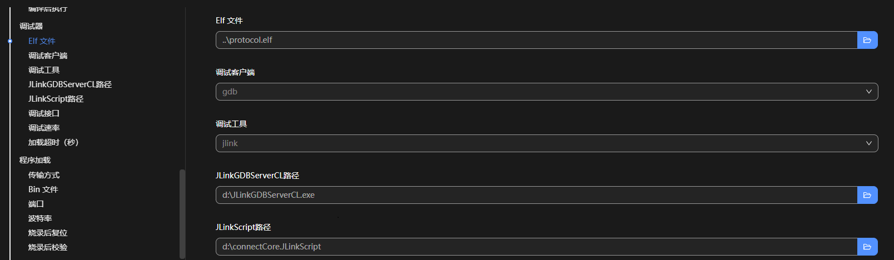

## Starting Debugging<a name="ZH-CN_TOPIC_0000002378717632"></a>

1.  Click the debug button "" in the IDE toolbar, and select the required debug mode in the pop-up at the top.

    **Figure 1**  Debug mode selection<a name="zh-cn_topic_0000002293224078_fig0277550163411"></a>  
    

    -   GDB Launch (Acore): The A core restarts, the CPU pauses, and the PC pointer is set to run the program from the beginning (a virtual breakpoint is set at the beginning of the A core).
    -   GDB Attach (Acore): While the A core is running, the CPU pauses, and the program stops directly at the CPU Halt.
    -   GDB Launch (Pcore): The P core restarts, the CPU pauses, and the PC pointer is set to run the program from the beginning (a virtual breakpoint is set at the beginning of the P core).
    -   GDB Attach (Pcore): While the P core is running, the CPU pauses, and the program stops directly at the CPU Halt.

2.  Debugging starts successfully. An example of a successful debugging start is shown in the figure below. If the following prompt message and the toolbar debug icon appear, it indicates that debugging has been started successfully.

    **Figure 2**  Prompt information, debug icons, and debug interface after a successful debugging start<a name="zh-cn_topic_0000002293224078_fig1214081317358"></a>  
    

    

    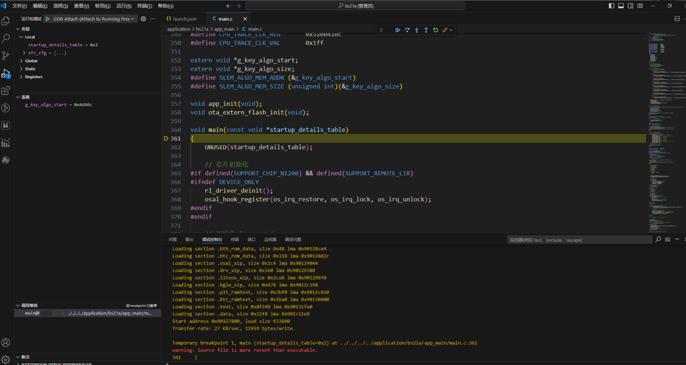

## Common Debugging Functions<a name="ZH-CN_TOPIC_0000002412317037"></a>


### Debugging Page<a name="ZH-CN_TOPIC_0000002378877476"></a>

The debugging work interface is shown in [Figure 1](#zh-cn_topic_0000002327183693_fig132922116210), which mainly consists of the following three parts:

① Debugging sidebar

② Debugging function area

③ Debugging console

**Figure 1**  Debugging work interface<a name="zh-cn_topic_0000002327183693_fig132922116210"></a>  


#### Debugging Sidebar<a name="ZH-CN_TOPIC_0000002412436889"></a>

The debugging sidebar provides common debugging functions, including variables, watch, call stack, breakpoints, and others.

#### Debugging Function Area<a name="ZH-CN_TOPIC_0000002378717640"></a>

After debugging starts, when the code execution reaches a set breakpoint, the program pauses. You can debug the code using the buttons in the debugging function area.

**Figure 1**  Debug icons<a name="zh-cn_topic_0000002293224090_fig1952516244357"></a>  
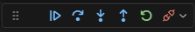

-   : Continue ("F5"). When the program execution reaches a breakpoint, it stops. Click this button to continue the program execution.
-   : Step Over ("F10"). During step debugging, it moves directly to the next line (if the function contains subfunctions, it does not step into the subfunctions, but executes the entire subfunction as one step).
-   : Step Into ("F11"). During step debugging, when a subfunction is encountered, it enters the subfunction and continues step-by-step execution.
-   : Step Out ("Shift+F11"). When step debugging executes into a subfunction, clicking Step Out executes the remaining part of the subfunction and returns to the upper-level function.
-   : Restart Debugging ("Ctrl+Shift+F5"), to restart debugging.
-   : Stop Debugging ("Shift+F5"), to stop the debugging task and disconnect.

#### Debugging Console<a name="ZH-CN_TOPIC_0000002412317041"></a>

The debugging console is used to output printing information during debugging, and you can also enter commands to interact with the debugger.

-   View variables

    When the program pauses at a breakpoint, you can view the current values of variables on the variables interface.

    **Figure 1**  Viewing the current value of a variable<a name="zh-cn_topic_0000002327223477_fig122981731183513"></a>  
    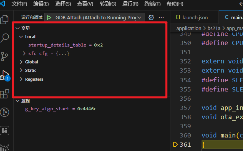

    The following four variable types are supported:

    -   Local variables
    -   Global variables (may be optimized by the compiler. You can use the volatile keyword to avoid this problem.)
    -   Static variables (may be optimized by the compiler. You can use the volatile keyword to avoid this problem.)
    -   Registers

-   Watch function

    During debugging, you can use "Watch" to view the values of variables (including local, global, and static variables) and specific addresses to determine whether the program running result is correct.

    **Figure 2**  Watch function<a name="zh-cn_topic_0000002327223477_fig154504387355"></a>  
    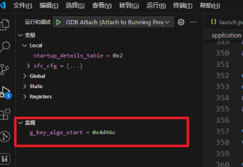

-   View call stack

    During debugging, you can view the call stack to analyze the call relationships among the subprograms called by the main program, as shown in the following figure.

    **Figure 3**  Call stack function<a name="zh-cn_topic_0000002327223477_fig102391744183516"></a>  
    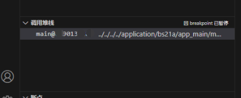

    **----End**

# Serial Port Console Tool<a name="ZH-CN_TOPIC_0000002378877480"></a>

This section mainly introduces the monitor tool for serial port operations in the HiSpark Studio for VS Code plugin. Its main functions include displaying the serial port list, connecting to a serial port, disconnecting a serial port, receiving serial port messages, sending messages to a serial port, clearing the serial port output area, and enabling\\disabling automatic screen scrolling.

> **Note:** 
>The serial port tool uses "\\r\\n" as the separator for each line. Therefore, each line of the printed string must end with "\\r\\n"; otherwise, the printing at the end of the program may be lost.


## Opening the Monitor<a name="ZH-CN_TOPIC_0000002412436893"></a>

After running the HiSpark Studio for VS Code plugin, open the VS Code terminal, find the terminal area, and switch to the "Monitor" tab, as shown in [Figure 1](#zh-cn_topic_0000002293224166_fig17771812125220).

**Figure 1**  Switching to the "Monitor" tab<a name="zh-cn_topic_0000002293224166_fig17771812125220"></a>  
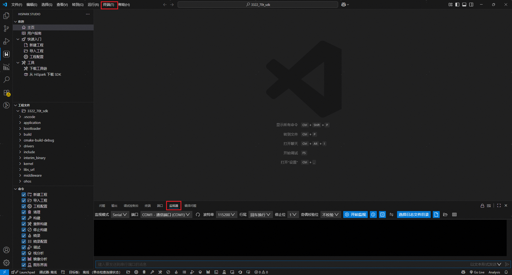

**Figure 2**  Monitor interface introduction<a name="zh-cn_topic_0000002293224166_fig14318546512"></a>  

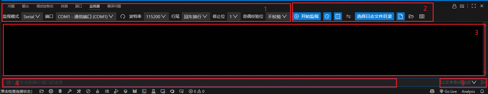

-   ①: Serial port configuration area

    Port: Displays the serial port devices connected to the current computer. Click the "" button to refresh the serial port list.

    Baud rate: Select the serial port baud rate. Range: 300 to 250000.

    Line ending: When sending messages to the serial port, the tool automatically appends characters based on this option.

    -   CRLF represents "\\r\\n".
    -   CR represents "\\r".
    -   LF represents "\\n".

-   ②: Function button area

    : Connect serial port button. After the serial port is connected, the button state changes to . Clicking this button disconnects the serial port.

    : Timestamp button. When enabled, a timestamp is added before each line of output. If the button is off, no timestamp is displayed, as shown in [Figure 3](#zh-cn_topic_0000002293224166_fig1040102615572).

    **Figure 3**  Example of the timestamp setting effect<a name="zh-cn_topic_0000002293224166_fig1040102615572"></a>  
    

    : Hide input box. The interfaces for hiding/showing the input box are shown in [Figure 4](#zh-cn_topic_0000002293224166_fig209583373583) and [Figure 5](#zh-cn_topic_0000002293224166_fig17214483580).

    **Figure 4**  Showing the input box<a name="zh-cn_topic_0000002293224166_fig209583373583"></a>  
    

    **Figure 5**  Hiding the input box<a name="zh-cn_topic_0000002293224166_fig17214483580"></a>  
    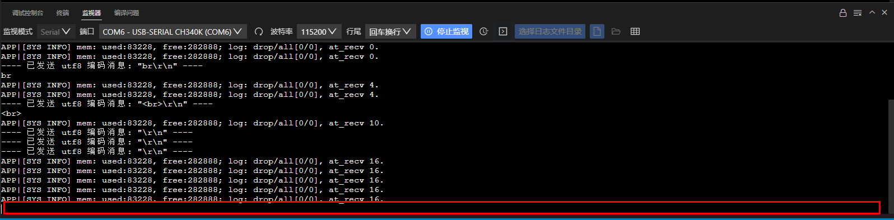

    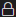: Enable/disable automatic screen scrolling.

    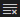: Clear the output area.

    : Maximize the panel.

    : Close the panel

-   ③: Output area.
-   ④: Input area.
-   ⑤: Send message button. Click the button or press Enter to send the information in the input area to the serial port. The default encoding is UTF-8.

## Connecting to a Serial Port<a name="ZH-CN_TOPIC_0000002378717648"></a>

Click "" to connect to the serial port. Before connecting, the input area is inactive by default (cannot be entered or clicked). After connecting, the input area becomes active, and the monitoring mode option in the serial port configuration area becomes inactive.

**Figure 1**  Starting the monitoring function<a name="zh-cn_topic_0000002327223529_fig58721954163517"></a>  


## Viewing Messages<a name="ZH-CN_TOPIC_0000002412317045"></a>

You can view the messages sent by the serial port in the output area.

**Figure 1**  Viewing serial port messages<a name="zh-cn_topic_0000002327183793_fig15659205953510"></a>  


## Sending Messages<a name="ZH-CN_TOPIC_0000002378877488"></a>

Enter a message in the input area below, and click the send button or press the Enter key on the keyboard to send the message.

**Figure 1**  Sending a message<a name="zh-cn_topic_0000002293383846_fig1571552215364"></a>  


## Disconnecting<a name="ZH-CN_TOPIC_0000002412436897"></a>

Click the "" button to disconnect the serial port.

**Figure 1**  Stopping monitoring<a name="zh-cn_topic_0000002293224182_fig4728173953619"></a>  


## Using Extension Tools<a name="ZH-CN_TOPIC_0000002378717652"></a>

Extension tools are mainly used to add some commonly used commands. After adding, you can click a name to send the command. The extension tools include some common commands by default. If you do not need these commands, you can clear the table and manually add the required commands, or add them by importing an Excel table. In addition, the extension tools also provide a loop sending function, which will be described in detail in the following sections.

-   Open the extension tools. Click the extension button, and the extension page expands on the right side.

    **Figure 1**  Extension tools<a name="zh-cn_topic_0000002327223541_fig1786951684210"></a>  
    

    Click this button to maximize the panel.

    **Figure 2**  Maximize button of the monitor panel<a name="zh-cn_topic_0000002327223541_fig11226132364210"></a>  
    

-   Click the clear list button to clear the list.

    **Figure 3**  Clear list function<a name="zh-cn_topic_0000002327223541_fig6150152913426"></a>  
    

    If you need to restore the cleared factory table, you can import the "rawData.xlsx" table under "C:\\Users\\username\\.vscode\\extensions\\hispark.hisparkstudio-x.x.x\\dist\\resources\\terminal\\resources\\excelFile" in the installation directory.

-   Manually add a command line. Click the "Add a Row" button.

    **Figure 4**  Adding a row function<a name="zh-cn_topic_0000002327223541_fig1455312345424"></a>  
    

    Data addition rules:

    Data format: Drop-down box mode. The drop-down options are utf8, bin, and hex.

    Command: The command string sent to the serial port.

    Name: The string used to identify the command function. Click this button to immediately send the command to the serial port (provided that the tool is in the listening state).

    Order: When using the loop sending function, the loop sending is performed only when the order is greater than 0. If the order of multiple commands is greater than 0 and the values are the same, the commands are sent from top to bottom.

    Delayed sending: Send once first, and then delay. Unit: ms.

    Operation: There are two options, Edit and Delete. Click Edit to modify the command line, and click Delete to delete the command line.

-   Add commands in batches.
    1.  Download the import template. The import template is automatically saved to "C:\\Users\\username\\.vscode\\extensions\\hispark.hisparkstudio-x.x.x\\resources\\terminal\\resources\\excelFile\\template.xlsx".

        **Figure 5**  Downloading the import template function<a name="zh-cn_topic_0000002327223541_fig131081446114215"></a>  
        

        The import template shows the columns to be imported and the rules for each column.

        **Figure 6**  Import template<a name="zh-cn_topic_0000002327223541_fig4205125119425"></a>  
        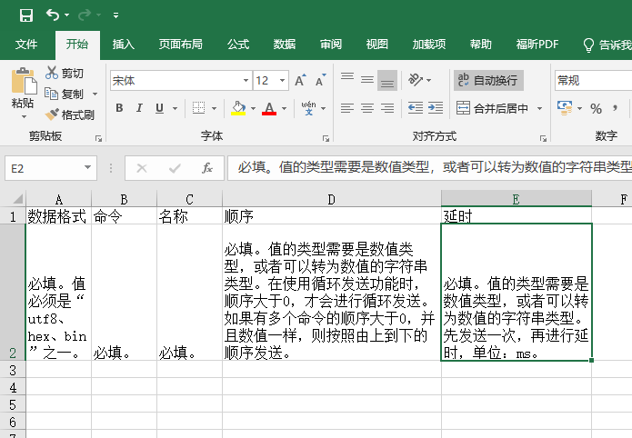

    2.  Fill in the import template.

        **Figure 7**  Filling in the import template data<a name="zh-cn_topic_0000002327223541_fig249315718422"></a>  
        

    3.  Import the "Import Template" file.

        **Figure 8**  Importing template data<a name="zh-cn_topic_0000002327223541_fig11424622434"></a>  
        

        

    4.  View the imported data.

        **Figure 9**  Viewing the imported data<a name="zh-cn_topic_0000002327223541_fig18481158134314"></a>  
        

        

    5.  View the import result table. The Import Result column displays the reasons for the failed imports.

        **Figure 10**  Viewing the import results<a name="zh-cn_topic_0000002327223541_fig1017011484311"></a>  
        

-   Loop sending.
    1.  Set the order and delay.

        **Figure 11**  Setting the order and delay function<a name="zh-cn_topic_0000002327223541_fig6466102611434"></a>  
        

        The order in which the commands in the above table are executed:

        First, send the "Start Bluetooth" command and delay for 1000ms. Then, send the "Keyboard Mode" command and delay for 1000ms. Finally, send the "Mouse Mode" command and delay for 1000ms. End. This is one cycle of loop sending, and the loop sending keeps repeating this cycle.

        The "Modify Bluetooth Address" command is not sent because its order is not greater than 0.

    2.  Enable serial port listening.

        **Figure 12**  Serial port listening function<a name="zh-cn_topic_0000002327223541_fig5219203116435"></a>  
        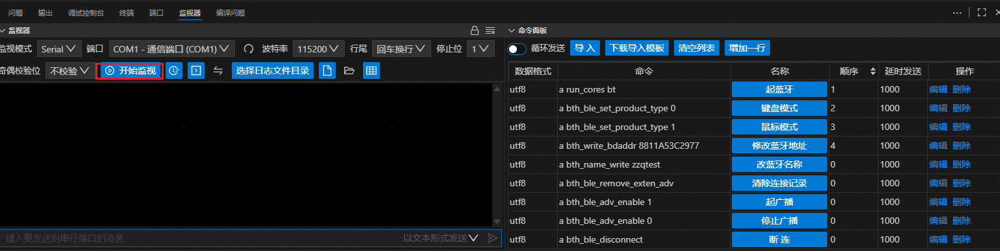

    3.  Enable the loop sending switch (the sent commands carry "carriage return and line feed" by default). After it is enabled, the sent commands can be seen in the output column on the left.

        **Figure 13**  Loop sending function<a name="zh-cn_topic_0000002327223541_fig734614365431"></a>  
        

        Red text indicates that the command is being sent or the delay is in progress.

# Kconfig Configuration<a name="ZH-CN_TOPIC_0000002412317049"></a>

This function is mainly used to control the compilation and building of the project, and supports managing the compilation configuration through a graphical interface.

After opening the project, click the system configuration "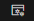" button in the toolbar, as shown in [Figure 1](#zh-cn_topic_0000002327183797_fig1334674314438).

**Figure 1**  System configuration entry<a name="zh-cn_topic_0000002327183797_fig1334674314438"></a>  


The system configuration interface is shown in [Figure 2](#zh-cn_topic_0000002327183797_fig11641828725).

**Figure 2**  System configuration interface<a name="zh-cn_topic_0000002327183797_fig11641828725"></a>  


## Button Functions<a name="ZH-CN_TOPIC_0000002378877492"></a>

The button functions on the system configuration interface are as follows:

① save: The configuration file is saved to \`$\{menu\_config\_build\_target\}\` by default.

② save as: Customize the save path. The default configuration file name is \`$\{menu\_config\_build\_target\}\`.config.

③ save\(minimal\): Customize the save path and the configuration file name, and save only the modified configuration items.

④ open: Customize the loading of a configuration file.

⑤ jump to: Search for configuration items.

⑥ show name: Display the column names (Option-Name).

⑦ show all: Display hidden configuration items.

⑧ Single-menu mode: Single menu mode.

# GUI Project Creation and Usage<a name="ZH-CN_TOPIC_0000002412436901"></a>

HiSpark Studio supports creating GUI projects and using the GUI simulator. After creating a Brandy project as described in "[3.1 Creating a Project](新建工程.md#ZH-CN_TOPIC_0000002412436861)", click the "Create GUI Application" icon under the toolbar menu to create a GUI project in the Brandy project.

**Figure 1**  Creating a GUI project<a name="zh-cn_topic_0000002399739733_fig1874373411538"></a>  


-   Pixel value: The default 454×454 corresponds to the generated canvas size. When the shape is circle, the resolution is diameter×diameter. When the shape is rectangle, the resolution is length×width. The pixel value can be customized within the range of 1 to 600.
-   Shape: Divided into circle and rectangle. If you do not actively select one, the default is circle.


## GUI Interface Introduction<a name="ZH-CN_TOPIC_0000002378717656"></a>


### GUI Drag-and-Drop Interface Introduction<a name="ZH-CN_TOPIC_0000002412317053"></a>

After the GUI project is created, a GUI file named after the project is created in the "application/wearable/nativeapp/nativeui/application name" directory of the project. When opened, it presents the shape of a watch face, and the watch face content can be customized.

Currently supported components include Button, Image, Progress, List, Label, ToggleButton, CheckBox, RadioButton, LabelButton, ScrollView, CircleProgress, ArcLabel, SwipeView, TextureMapper, Slider, Picker, TimePicker, Chart, EditText, ImageAnimator, DigitalClock, Qrcode, AnalogClock, SweepClock, Coverflow, Barcode, CardPage, CrossView, MapView, RollerView, HexagonsList, IcosahedronView, CanvasExt, TransformList, SlipflowView, TransformGroup, Coverflow2, ParticleView, and the Root component.

**Figure 1**  GUI drag-and-drop interface<a name="zh-cn_topic_0000002399619865_fig1973444016553"></a>  

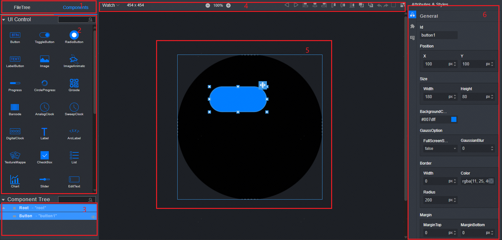

-   FileTree: Page tree. You can add or delete pages, modify page titles, and set the main page.
-   UI Control: UI component bar. You can select the corresponding component and drag it to the canvas (Canvas) to add the component.
-   Component Tree: Component tree. In the low-code development interface, developers can intuitively view the hierarchical structure and summary information of components. By selecting a component in the component tree (the corresponding component in the canvas is selected simultaneously), developers can quickly locate the component in the canvas. Clicking the "" after the component can hide/show the corresponding component.
-   Panel: Function panel, including the subcomponent switching used by the CrossView and Coverflow2 components, as well as common operations such as zooming the canvas in/out, aligning components left, vertically centered, right, top, horizontally centered, and bottom, layer switching, undo, showing/hiding the virtual borders of components, and generating C++ code with one click.
-   Canvas: Canvas. Developers can perform visual operations such as dragging and stretching components in this area to build the UI layout.
-   Attributes & Styles: Attribute and style bar. After selecting the corresponding component in the canvas, you can configure the attributes and styles of the component in the attribute and style bar on the right.
    -   General: Corresponding to the icon , used to set common styles such as Width, Height, Background, Position, and Display.
    -   Feature: Corresponding to the icon , used to set the specific styles of the component, such as the FontSize style describing the text size of the Text component.
    -   Events: Corresponding to the icon , used to bind related events to the component and set the callback functions of the bound events.

### Component Introduction<a name="ZH-CN_TOPIC_0000002378877496"></a>


#### Copying, Pasting, and Deleting a Component<a name="ZH-CN_TOPIC_0000002412436905"></a>

Take the Button component as an example. Perform the operations on the premise that a Button component has been dragged into the canvas:

-   Deleting a component

    A component can be deleted in two ways:

    -   Right-click the Button component in the canvas to display the operation bar, and click Delete in the popped-up operation bar.
    -   Select the Button component and press the Del key on the keyboard to delete it.

    **Figure 1**  Deleting a component<a name="zh-cn_topic_0000002399739737_fig1276601114010"></a>  
    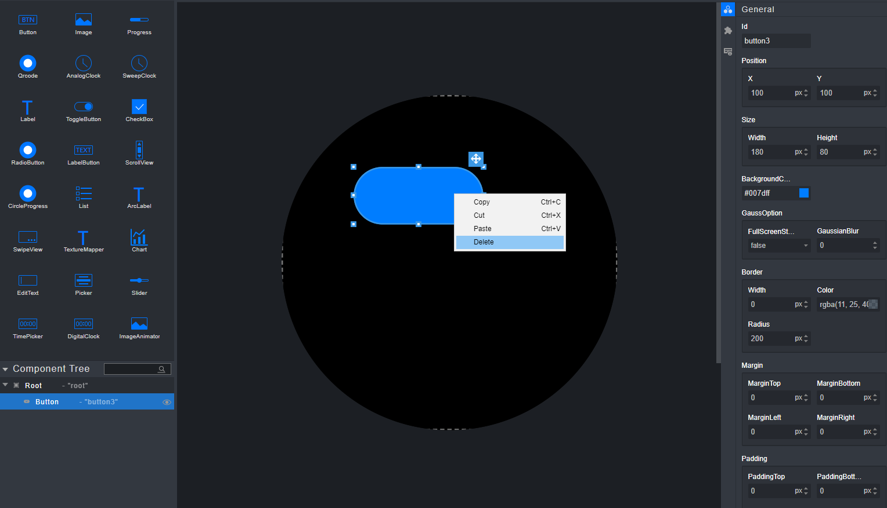

-   Copying a component

    A component can be copied in two ways:

    -   Right-click the Button component in the canvas to display the operation bar, click Copy in the popped-up operation bar, then right-click again and select Paste to implement copy and paste.
    -   Select the Button component, and use Ctrl+C and Ctrl+V on the keyboard to implement copy and paste.

    **Figure 2**  Copying a component<a name="zh-cn_topic_0000002399739737_fig1175415591409"></a>  
    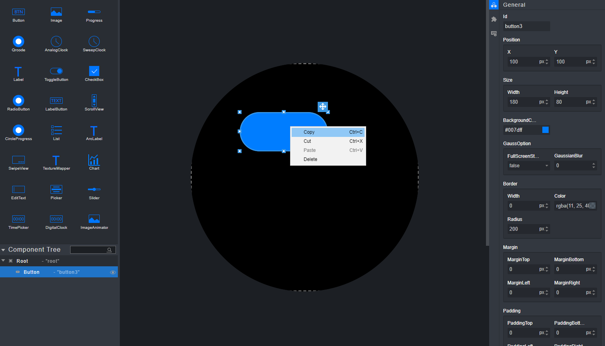

    **Figure 3**  Pasting a component<a name="zh-cn_topic_0000002399739737_fig14301013164114"></a>  
    

#### Common Attributes of a Component<a name="ZH-CN_TOPIC_0000002378717660"></a>

Take the Button component as an example. Select the Button component in the component bar, drag it to the central canvas area, and release the mouse to add a Button component. (The component is generated at the position of coordinate (100, 100) on the canvas.)

**Figure 1**  Dragging a component<a name="zh-cn_topic_0000002366099954_fig10331115148"></a>  
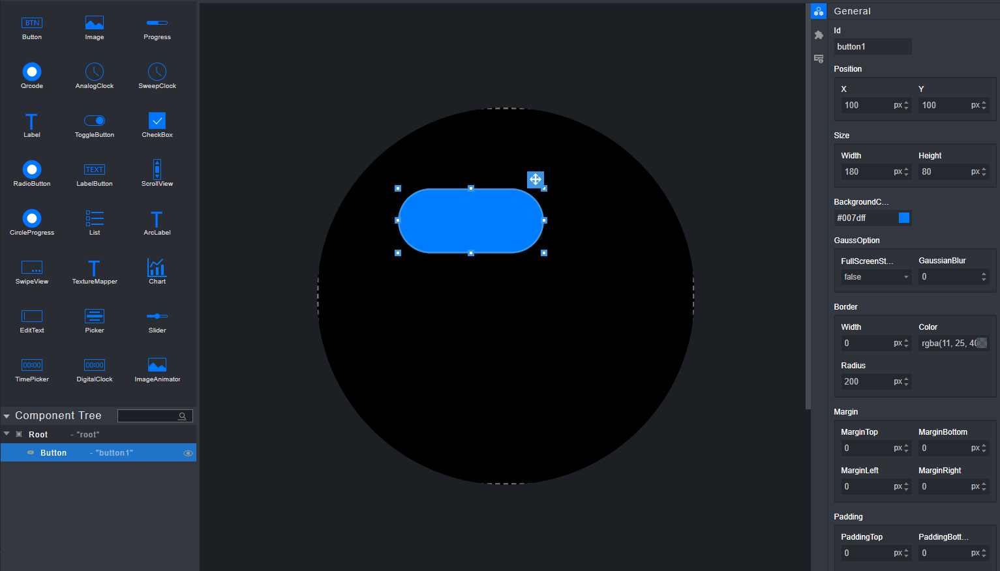

The following operations need to be performed on the premise that a Button component has been dragged into the canvas.

-   Select the Button component in the canvas, and modify the ID of the Button component in the expanded General bar through the  style icon (General) in the attribute and style bar on the right. The ID is not the variable name used when generating code, so multiple components can be set to the same ID.

    **Figure 2**  Common attribute configuration: Id<a name="zh-cn_topic_0000002366099954_fig1333343519513"></a>  
    

-   Select the Button component in the canvas, and modify the width, height, and position of the Button component in the expanded General bar through the  style icon (General) in the attribute and style bar on the right. In addition, you can also zoom in/out the Button component and change its position by dragging.

    **Figure 3**  Common attribute configuration<a name="zh-cn_topic_0000002366099954_fig9966191695113"></a>  
    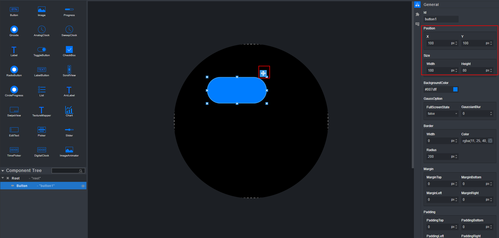

-   Select the Button component, click the  style icon (General) in the attribute and style bar on the right, and modify the BackgroundColor attribute of the Button component in the expanded General bar to change the background color.

    **Figure 4**  Modifying the background color<a name="zh-cn_topic_0000002366099954_fig759121615415"></a>  
    

-   Select the Button component in the canvas, and modify the FullScreenState and GaussianBlur attributes in the GaussOption box of the Button component in the expanded General bar through the  style icon (General) in the attribute and style bar on the right, to change the Gaussian blur of the component. This is performed on the premise that two components are dragged at the same time. When FullScreenState is false, the Gaussian blur setting does not take effect. When FullScreenState is true, the Gaussian blur setting takes effect. The GaussianBlur attribute controls the blur degree of the Gaussian blur. For details, see "[Gaussian Blur Attribute](高斯模糊属性.md#ZH-CN_TOPIC_0000002378877540)".

    **Figure 5**  Gaussian blur<a name="zh-cn_topic_0000002366099954_fig48601252103118"></a>  
    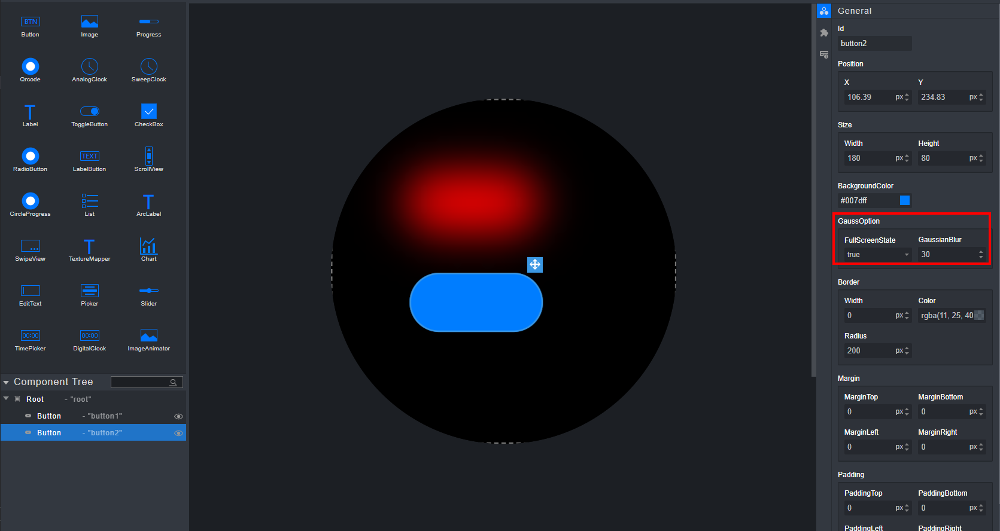

-   Select the Button component in the canvas, and modify the Width, Color, and Radius attributes in the Border box of the Button component in the expanded General bar through the  style icon (General) in the attribute and style bar on the right, to change the border style.

    **Figure 6**  Modifying the component border style<a name="zh-cn_topic_0000002366099954_fig421010341275"></a>  
    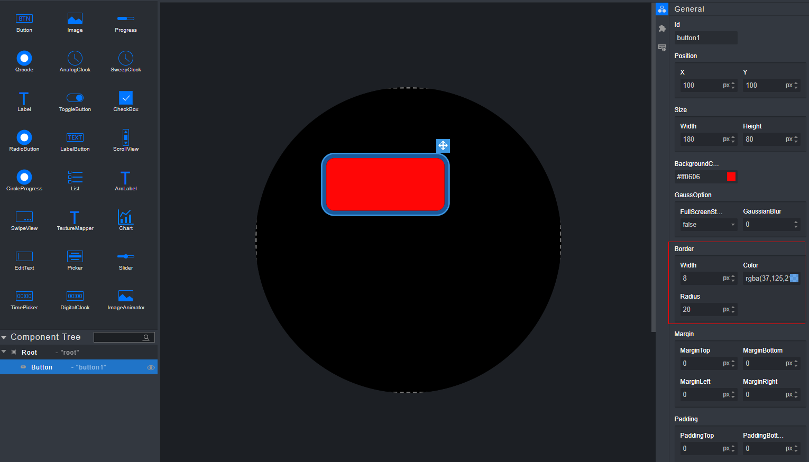

-   Select the Button component, click the  style icon (General) in the attribute and style bar on the right, and modify the MarginTop and MarginLeft attributes in the Margin box of the Button component in the expanded General bar to adjust the position of the component relative to the watch face.

    **Figure 7**  Modifying the component position relative to the window<a name="zh-cn_topic_0000002366099954_fig19389527155313"></a>  
    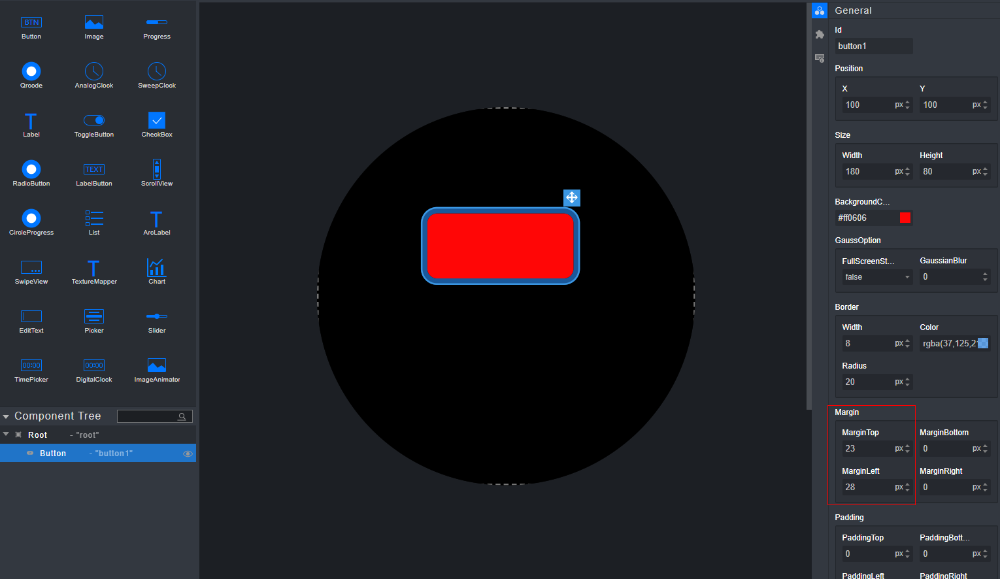

-   Select the Button component, click the  style icon (General) in the attribute and style bar on the right, and modify Padding in the expanded General bar to change the width of the padding part of the component in the four directions.

    **Figure 8**  Component position relative to the border<a name="zh-cn_topic_0000002366099954_fig88161839549"></a>  
    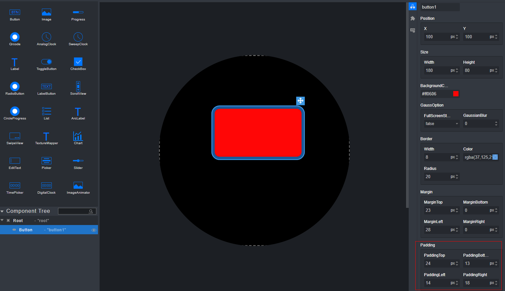

#### Button Component<a name="ZH-CN_TOPIC_0000002412317057"></a>

For the usage of common attributes, see "[Common Attributes of a Component](组件的共有属性.md#ZH-CN_TOPIC_0000002378717660)".

-   Select the Button component in the canvas, and modify the DefaultImgSrc attribute of the Button component in the expanded Feature bar through the  style icon (Feature) in the attribute and style bar on the right, to load an image.

    **Figure 1**  DefaultImgSrc attribute configuration<a name="zh-cn_topic_0000002399619869_fig1930105513132"></a>  
    

-   Select the Button component in the canvas. Use the  style icon (Feature) in the attribute and style bar on the right, and modify the ImageX and ImageY attributes of the Button component in the expanded Feature bar to adjust the image position (you need to set the DefaultImgSrc attribute before modification).

    **Figure 2**  ImageX/ImageY attribute configuration<a name="zh-cn_topic_0000002399619869_fig11684412161613"></a>  
    

-   Select the Button component in the canvas. Use the  style icon (Feature) in the attribute and style bar on the right, and modify the ImageOpacity attribute of the Button component in the expanded Feature bar to adjust the image transparency (you need to set DefaultImgSrc).

    **Figure 3**  ImageOpacity attribute configuration<a name="zh-cn_topic_0000002399619869_fig11511623928"></a>  
    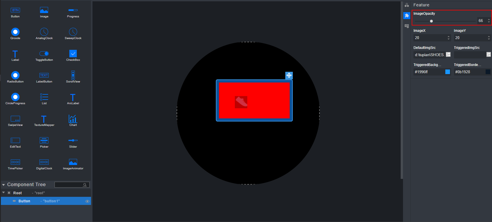

-   Select the Button component in the canvas. Use the  style icon (Events) in the attribute and style bar on the right, and configure the callback events in the expanded Events bar.

    The events supported by the Button component include: OnClick, OnLongPress, OnPress, OnCancel, and OnRelease.

    **Figure 4**  Callback event configuration<a name="zh-cn_topic_0000002399619869_fig141561846154620"></a>  
    

> **Note:** 
>-   The MarginBottom and MarginRight attributes under the General page have no interface rendering effect.
>-   The TriggeredImgSrc, TriggeredBackgroundColor, and TriggeredBorderColor attributes under the Feature page have no interface rendering effect. You can view the rendering effect in the simulator.
>-   DefaultImgSrc and TriggeredImgSrc do not support Chinese paths.

#### Image Component<a name="ZH-CN_TOPIC_0000002378877500"></a>

For the usage of common attributes, see the "[Common Attributes of a Component](组件的共有属性.md#ZH-CN_TOPIC_0000002378717660)" section.

-   Select the Image component in the canvas. Use the  style icon (Feature) in the attribute and style bar on the right, and modify the ImagePath attribute of the Image component in the expanded Feature bar to load an image.

    If the same image is selected again after an image has already been selected, or if the window is closed or Cancel is clicked while browsing files, the interface rendering effect will not change. To clear the image, delete the text in the input box.

    **Figure 1**  Specific attribute configuration: ImagePath<a name="zh-cn_topic_0000002365940058_fig1383616220353"></a>  
    

    > **Note:** 
    >ImagePath does not support Chinese paths.
    >The imported Bin file must be a Bin converted from an image; otherwise, the simulator will behave abnormally.

-   Select the Image component in the canvas. Use the  style icon (Feature) in the attribute and style bar on the right, and modify the ImageOpacity attribute of the Image component in the expanded Feature bar to adjust the image transparency.

    **Figure 2**  Specific attribute configuration: ImageOpacity<a name="zh-cn_topic_0000002365940058_fig19953128113813"></a>  
    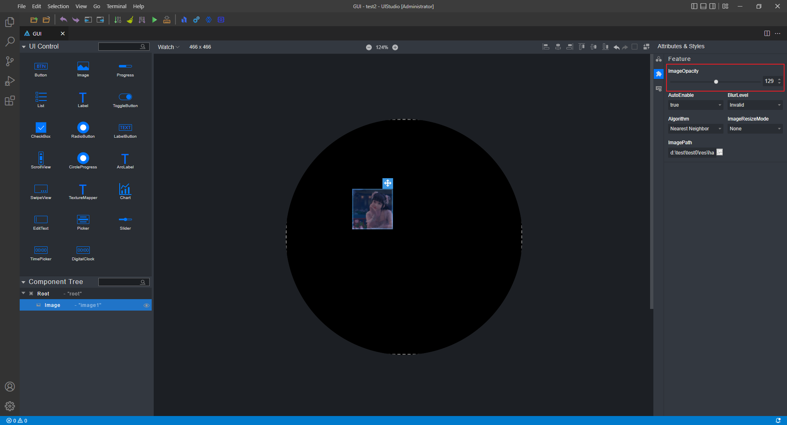

-   Select the Image component in the canvas. Use the  style icon (Feature) in the attribute and style bar on the right, and modify the AutoEnable attribute of the Image component in the expanded Feature bar.

    -   When the AutoEnable attribute is set to true, the component is limited to the size of the image itself, and the display effect of the component cannot be modified by dragging the component or directly modifying the Width/Height values.
    -   When the AutoEnable attribute is set to false, the image is displayed according to the component size. Different ImageResizeMode attribute values present different display effects.

    **Figure 3**  Specific attribute configuration: AutoEnable<a name="zh-cn_topic_0000002365940058_fig32031181480"></a>  
    

-   Select the Image component in the canvas. Use the  style icon (Feature) in the attribute and style bar on the right, and modify the ImageResizeMode attribute of the Image component in the expanded Feature bar.

    -   When the AutoEnable attribute is set to true, the ImageResizeMode attribute does not take effect.
    -   When the AutoEnable attribute is set to false, ImageResizeMode takes effect, corresponding to different display effects.

    The effect examples corresponding to the 6 modes are as follows (the original size of the image is 80×80):

    -   ImageResizeMode - None

        **Figure 4**  Image tiling (component size in the figure is 200×200)<a name="zh-cn_topic_0000002365940058_fig137143716018"></a>  
        ")

    -   ImageResizeMode - Cover

        **Figure 5**  Image covering the component 1 (component size in the figure is 100×200)<a name="zh-cn_topic_0000002365940058_fig203183291602"></a>  
        ")

        **Figure 6**  Image covering the component 2 (component size in the figure is 200×100)<a name="zh-cn_topic_0000002365940058_fig119815431203"></a>  
        ")

    -   ImageResizeMode - Contain

        **Figure 7**  Image contained in the component (component size in the figure is 100×200)<a name="zh-cn_topic_0000002365940058_fig9776119513"></a>  
        ")

        **Figure 8**  Image contained in the component (component size in the figure is 200×100)<a name="zh-cn_topic_0000002365940058_fig1741815478118"></a>  
        ")

    -   ImageResizeMode - Fill

        **Figure 9**  Image filling the component (component size in the figure is 200×100)<a name="zh-cn_topic_0000002365940058_fig143226171166"></a>  
        ")

    -   ImageResizeMode - Center

        **Figure 10**  Image at the center of the component (component size in the figure is 100×100)<a name="zh-cn_topic_0000002365940058_fig78523241168"></a>  
        ")

        > **Note:** 
        >When either the width or height of the component is 0, the image is hidden.

    -   ImageResizeMode - Scale Down

        **Figure 11**  When the component width and height are large, the image is displayed at its original size<a name="zh-cn_topic_0000002365940058_fig1319195718418"></a>  
        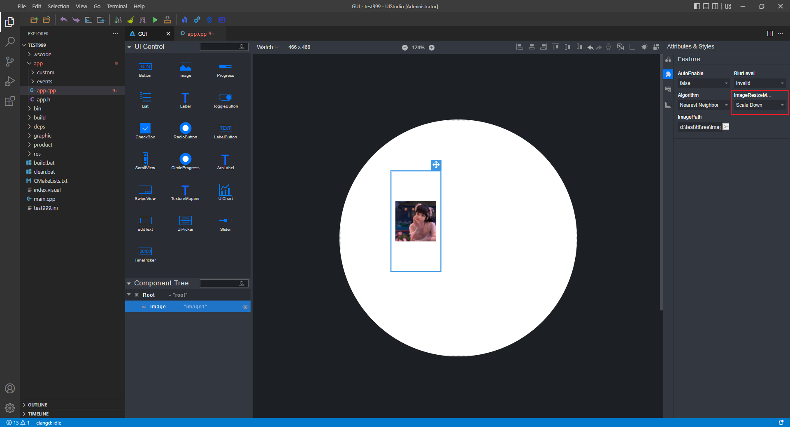

        **Figure 12**  When the component width and height are small, the image is scaled down and contained in the component<a name="zh-cn_topic_0000002365940058_fig89661415359"></a>  
        

> **Note:** 
>-   When the specific attribute ImagePath of the component is not set, the component is not displayed in the simulator.
>-   The MarginBottom and MarginRight attributes under the General page have no interface rendering effect. You can view the effect in the simulator.
>-   The BlurLevel and Algorithm attributes under the Feature page have no interface rendering effect. You can view the effect in the simulator.
>-   The Image component does not support configuring callback events.

#### Progress Component<a name="ZH-CN_TOPIC_0000002412436909"></a>

For the usage of common attributes, see the "[Common Attributes of a Component](组件的共有属性.md#ZH-CN_TOPIC_0000002378717660)" section.

-   Select the Progress component and click the  style icon (Feature) in the attribute and style bar on the right. Modify the foreground color of the Progress component in the ForegroundStyle window of the expanded Feature bar.

    **Figure 1**  Modifying the foreground color<a name="zh-cn_topic_0000002399739741_fig117331435123510"></a>  
    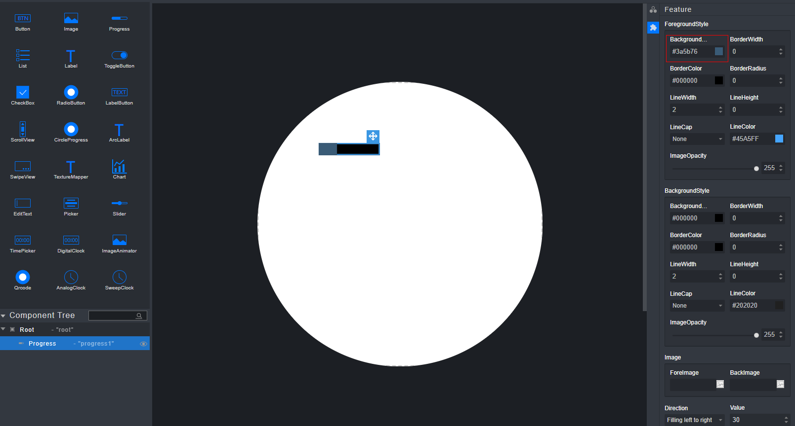

-   Select the Progress component and click the  style icon (Feature) in the attribute and style bar on the right. Modify the background color of the Progress component in the BackgroundStyle window of the expanded Feature bar.

    **Figure 2**  Modifying the background color<a name="zh-cn_topic_0000002399739741_fig879142417363"></a>  
    

-   Select the Progress component and click the  style icon (Feature) in the attribute and style bar on the right. Modify the ProgressWidth and ProgressHeight attributes of the Progress component in the expanded Feature bar to change the width and height of the component.

    **Figure 3**  Modifying the component width and height<a name="zh-cn_topic_0000002399739741_fig119251539922"></a>  
    

-   Select the Progress component and click the  style icon (Feature) in the attribute and style bar on the right. Modify the Direction attribute of the Progress component in the expanded Feature bar to change the direction of the progress bar.

    **Figure 4**  Modifying the direction of the progress bar<a name="zh-cn_topic_0000002399739741_fig4795118183012"></a>  
    

-   Select the Progress component and click the  style icon (Feature) in the attribute and style bar on the right. Modify the Value attribute of the Progress component in the expanded Feature bar to change the progress.

    **Figure 5**  Modifying the progress<a name="zh-cn_topic_0000002399739741_fig18362191916365"></a>  
    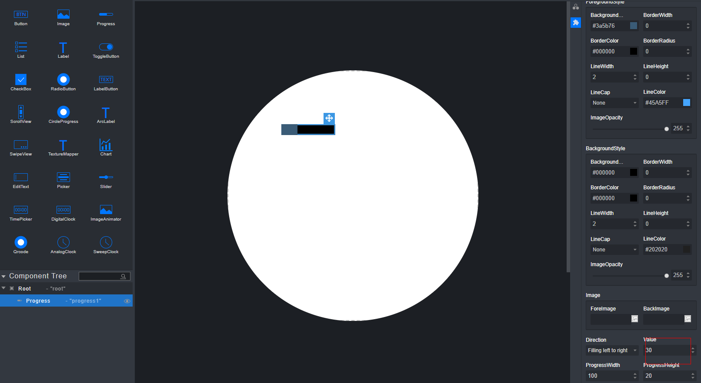

-   Select the Progress component and click the  style icon (Feature) in the attribute and style bar on the right. In the expanded Feature bar, modify the ForeImage attribute of the Progress component to add the image of the progress already passed and the BackImage attribute to add the overall image of the progress bar. The path cannot be empty and Chinese paths are not supported.

    **Figure 6**  Adding images<a name="zh-cn_topic_0000002399739741_fig9386125012810"></a>  
    

> **Note:** 
>-   The BackgroungColor, MarginBottom, and MarginRight attributes under the General page have no rendering effect for the time being.
>-   The sub-attributes BorderWidth, BorderColor, BorderRadius, LineWidth, LineHeight, LineColor, and ImageOpacity of ForegroundStyle and BackgroundStyle under the Feature page have no rendering effect for the time being.
>-   The Progress component does not support configuring callback events.

#### List Component<a name="ZH-CN_TOPIC_0000002378717664"></a>

For the usage of common attributes, see the "[Common Attributes of a Component](组件的共有属性.md#ZH-CN_TOPIC_0000002378717660)" section.

-   Select the List component and click the  style icon (Feature) in the attribute and style bar on the right. In the expanded Feature bar, modify the itemHeight attribute to set the height of all items, modify the itemWidth attribute to set the width of all items, modify the imageWidth attribute to set the width of the images of all items, modify the imageHeight attribute to set the height of the images of all items, and modify the FontSize attribute to set the font size of all items. Click the plus sign on the right of the Item column to add an item, and modify the Text and ImagePath attributes of the item to add text and images.

    **Figure 1**  Adding an item<a name="zh-cn_topic_0000002366099958_fig28061923305"></a>  
    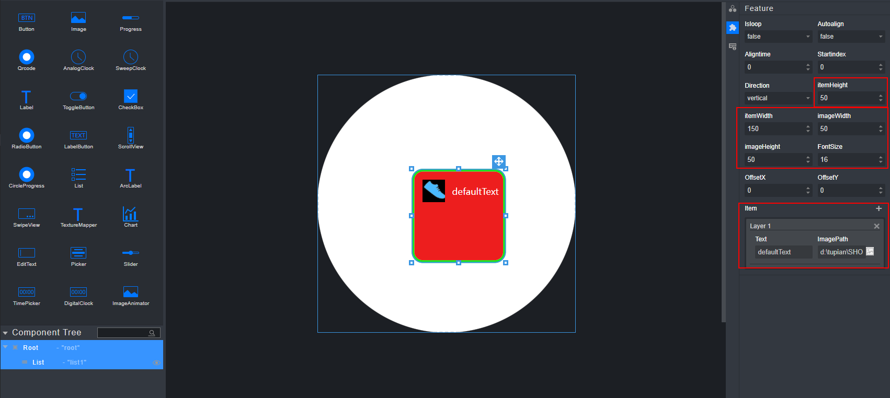

-   Select the List component and click the  style icon (Feature) in the attribute and style bar on the right. In the expanded Feature bar, modify the OffsetX attribute of the List component to set the horizontal offset of all items, and modify the OffsetY attribute to set the vertical offset of all items.

    **Figure 2**  Modifying the offset of items<a name="zh-cn_topic_0000002366099958_fig1020210122313"></a>  
    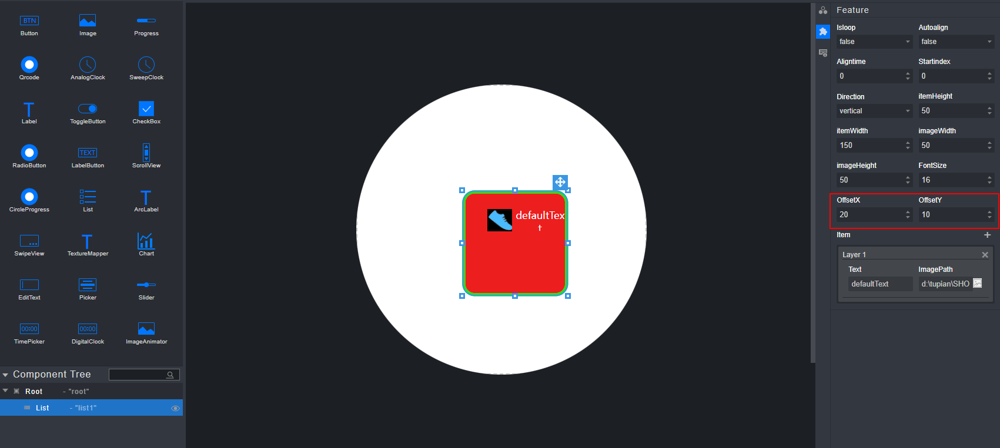

-   Select the List component and click the  style icon (Feature) in the attribute and style bar on the right. In the expanded Feature bar, modify the Direction attribute of the List component to set the arrangement direction of the list.

    **Figure 3**  Modifying the arrangement direction of the list<a name="zh-cn_topic_0000002366099958_fig56791215114412"></a>  
    

-   Select the List component in the canvas. Use the  style icon (Events) in the attribute and style bar on the right, and configure the callback events in the expanded Events bar.

    The events supported by the List component include: OnClick, OnLongPress, OnDrag, OnDragStart, OnDragEnd, OnPress, OnCancel, OnRelease, OnFocus, and OnBlur.

    **Figure 4**  Callback event configuration<a name="zh-cn_topic_0000002366099958_fig186332171075"></a>  
    

> **Note:** 
>-   The MarginBottom and MarginRight attributes under the General page have no rendering effect.
>-   The Isloop, Autoalign, Aligntime, and Startindex attributes under the Feature page have no interface rendering effect. After adding child elements, you can view the effect in the simulator.
>-   Currently, there is an issue where the last element of an item cannot be deleted. To delete it, you can delete the listItemText and listItemPath attributes in index.visual with the interface closed.

#### Label Component<a name="ZH-CN_TOPIC_0000002412317061"></a>

For the usage of common attributes, see the "[Common Attributes of a Component](组件的共有属性.md#ZH-CN_TOPIC_0000002378717660)" section.

-   Select the Label component in the canvas. Use the  style icon (Feature) in the attribute and style bar on the right, and modify the Text attribute of the Label component in the expanded Feature bar to edit the text content (the default text content of a newly added component is "default").

    **Figure 1**  Specific attribute configuration: Text content<a name="zh-cn_topic_0000002399619873_fig455274919252"></a>  
    

-   Select the Label component in the canvas. Use the  style icon (Feature) in the attribute and style bar on the right, and set the Font attribute of the Label component in the expanded Feature bar:

    -   Color: Font color
    -   Size: Font size
    -   LetterSpace: Letter spacing
    -   LineSpace: Line spacing
    -   LineHeight: Line height (when the line height is smaller than the font size, the font size prevails, and the final line height = line height + line spacing)
    -   TextDirection: Text direction

    **Figure 2**  Common attribute configuration: text-related attributes<a name="zh-cn_topic_0000002399619873_fig15826115915219"></a>  
    

-   Select the Label component in the canvas. Use the  style icon (Feature) in the attribute and style bar on the right, and modify the TextAlign attribute of the Label component in the expanded Feature bar to change the horizontal and vertical arrangement of the text.

    **Figure 3**  Changing the text arrangement<a name="zh-cn_topic_0000002399619873_fig195425918268"></a>  
    

-   Select the Label component in the canvas. Use the  style icon (Feature) in the attribute and style bar on the right, and modify the LineBreakMode attribute of the Label component in the expanded Feature bar. LineBreakMode corresponds to 6 line-break modes, described in detail as follows:
    -   Adapt: The component size adapts to the text, and the text is not automatically wrapped.

        > **Note:** 
        >The component width and height are not affected by the common Width/Height attribute values, so the component width and height cannot be changed by dragging the component or directly modifying the Width/Height values.

        **Figure 4**  LineBreakMode - Adapt<a name="zh-cn_topic_0000002399619873_fig1679161320461"></a>  
        

    -   Stretch: The component height is displayed according to the set Height value, the width is determined by the longest line in the text, and the text is not automatically wrapped.

        > **Note:** 
        >The component width is not affected by the common Width attribute value, so the component width cannot be changed by dragging the component or directly modifying the Width value.

        **Figure 5**  LineBreakMode - Stretch<a name="zh-cn_topic_0000002399619873_fig8791181319462"></a>  
        

    -   Wrap: The component width is displayed according to the set Width value, the text is automatically wrapped, and the component height is determined by the number of text lines.

        > **Note:** 
        >The component height is not affected by the common Height attribute value, so the component height cannot be changed by dragging the component or directly modifying the Height value.

        **Figure 6**  LineBreakMode - Wrap<a name="zh-cn_topic_0000002399619873_fig177911513124619"></a>  
        

    -   Ellipsis: The component size is displayed according to the set Height and Width values, the text is automatically wrapped, and the text exceeding the component is displayed with an ellipsis at the end.

        **Figure 7**  LineBreakMode - Ellipsis<a name="zh-cn_topic_0000002399619873_fig1179181314462"></a>  
        

    -   Clip: The component size is displayed according to the set Height and Width values, the text is automatically wrapped, and the text exceeding the component is automatically hidden at the end.

        **Figure 8**  LineBreakMode - Clip<a name="zh-cn_topic_0000002399619873_fig14791191324610"></a>  
        

    -   Marquee: The component size is displayed according to the set Height and Width values, the text is not automatically wrapped, and the text exceeding the component is automatically hidden.

        > **Note:** 
        >In this mode, if the length of a single line of text does not exceed the component, the text is aligned according to the set TextAlign.
        >When the text length exceeds the component, the text automatically scrolls to the left in a loop.

        **Figure 9**  LineBreakMode - Marquee<a name="zh-cn_topic_0000002399619873_fig530611174710"></a>  
        

-   Select the Label component in the canvas. Use the  style icon (Feature) in the attribute and style bar on the right, and modify the RollAnimation attribute of the Label component in the expanded Feature bar.

    The RollAnimation attribute takes effect only when LineBreakMode is Marquee and the text length exceeds the component. RollAnimation includes the scrolling speed (Speed) and the scrolling start position (Pos).

    **Figure 10**  Specific attribute configuration: RollAnimation<a name="zh-cn_topic_0000002399619873_fig19196141194615"></a>  
    

> **Note:** 
>-   The MarginBottom and MarginRight attributes under the General page have no interface rendering effect. You can view the effect in the simulator.
>-   The Label component does not support configuring callback events.

#### ToggleButton Component<a name="ZH-CN_TOPIC_0000002378877504"></a>

For the usage of common attributes, see the "[Common Attributes of a Component](组件的共有属性.md#ZH-CN_TOPIC_0000002378717660)" section.

-   Select the ToggleButton component in the canvas and click the  style icon (Feature) in the attribute and style bar on the right. Modify the ImageOpacity attribute of the ToggleButton component in the expanded Feature bar to change the image transparency.

    **Figure 1**  Modifying the image transparency<a name="zh-cn_topic_0000002365940062_fig18996545134711"></a>  
    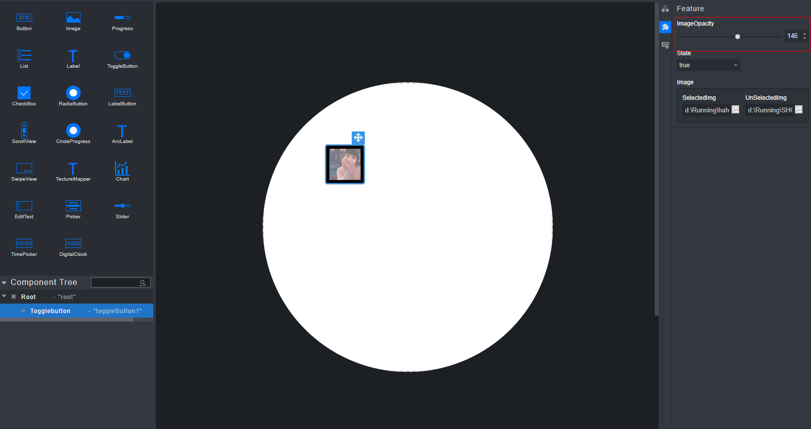

-   Select the ToggleButton component and click the  style icon (Feature) in the attribute and style bar on the right. Modify the State attribute of the ToggleButton component in the expanded Feature bar to change the component state. When the attribute value is true, the component is in the selected state; otherwise, it is in the unselected state.

    **Figure 2**  Modifying the component state<a name="zh-cn_topic_0000002365940062_fig28061923305"></a>  
    

-   Select the ToggleButton component and click the  style icon (Feature) in the attribute and style bar on the right. In the expanded Feature bar, modify the UnSelectedImg attribute of the ToggleButton component to add the image for the unselected state and the SelectedImg attribute to add the image for the selected state. The rendering effect is produced only when both images exist at the same time. You can delete the image by restoring the UnSelectedImg and SelectedImg attributes to empty (deleting them manually).

    > **Note:** 
    >The image path does not support Chinese paths and spaces cannot be entered in the path.

    **Figure 3**  Adding images<a name="zh-cn_topic_0000002365940062_fig1150615503413"></a>  
    

-   Select the ToggleButton component in the canvas. Use the  style icon (Events) in the attribute and style bar on the right, and configure the callback events in the expanded Events bar.

    The events supported by the ToggleButton component include OnClick, OnLongPress, OnPress, OnCancel, OnRelease, and OnChange.

    **Figure 4**  Callback event configuration<a name="zh-cn_topic_0000002365940062_fig560310204504"></a>  
    

> **Note:** 
>The MarginBottom and MarginRight attributes under the General page have no rendering effect for the time being.

#### CheckBox Component<a name="ZH-CN_TOPIC_0000002412436913"></a>

For the usage of common attributes, see the "[Common Attributes of a Component](组件的共有属性.md#ZH-CN_TOPIC_0000002378717660)" section.

-   Select the CheckBox component in the canvas. On the premise that an image has been added, click the  style icon (Feature) in the attribute and style bar on the right, and modify the ImageOpacity attribute of the CheckBox component in the expanded Feature bar to change the image transparency.

    **Figure 1**  Modifying the image transparency<a name="zh-cn_topic_0000002399739745_fig2853208115915"></a>  
    

-   Select the CheckBox component and click the  style icon (Feature) in the attribute and style bar on the right. Modify the State attribute of the CheckBox component in the expanded Feature bar to change the component state. When the attribute value is Selected, the component is in the selected state; otherwise, it is in the unselected state.

    **Figure 2**  Modifying the component state<a name="zh-cn_topic_0000002399739745_fig3771124145810"></a>  
    

-   Select the CheckBox component and click the  style icon (Feature) in the attribute and style bar on the right. In the expanded Feature bar, modify the UnSelectedImg attribute of the CheckBox component to add the image for the unselected state and the SelectedImg attribute to add the image for the selected state. The rendering effect is produced only when both images exist at the same time. You can delete the image by restoring the UnSelectedImg and SelectedImg attributes to empty (deleting them manually).

    > **Note:** 
    >The image path does not support Chinese paths and spaces cannot be entered in the path.

    **Figure 3**  Adding images<a name="zh-cn_topic_0000002399739745_fig1581184025416"></a>  
    

-   Select the CheckBox component in the canvas. Use the  style icon (Events) in the attribute and style bar on the right, and configure the callback events in the expanded Events bar.

    The events supported by the CheckBox component include OnClick, OnLongPress, OnPress, OnCancel, OnRelease, and OnChange.

    **Figure 4**  Callback event configuration<a name="zh-cn_topic_0000002399739745_fig15393131421110"></a>  
    

> **Note:** 
>The MarginTop and MarginRight attributes under the General page have no rendering effect.

#### RadioButton Component<a name="ZH-CN_TOPIC_0000002378717668"></a>

For the usage of common attributes, see [Common Attributes of a Component](组件的共有属性.md#ZH-CN_TOPIC_0000002378717660).

-   Select the RadioButton component in the canvas. On the premise that an image has been added, click the  style icon (Feature) in the attribute and style bar on the right, and modify the ImageOpacity attribute of the RadioButton component in the expanded Feature bar to change the image transparency.

    **Figure 1**  Modifying the image transparency<a name="zh-cn_topic_0000002366099962_fig2853208115915"></a>  
    

-   Select the RadioButton component and click the  style icon (Feature) in the attribute and style bar on the right. Modify the State attribute of the RadioButton component in the expanded Feature bar to change the component state. When the attribute value is Selected, the component is in the selected state; otherwise, it is in the unselected state.

    **Figure 2**  Modifying the component state<a name="zh-cn_topic_0000002366099962_fig82077222339"></a>  
    

-   Select the RadioButton component and click the  style icon (Feature) in the attribute and style bar on the right. In the expanded Feature bar, modify the SelectedImg attribute of the RadioButton component to add the image for the selected state and the UnSelectedImg attribute to add the image for the unselected state. The rendering effect is produced only when both images exist at the same time. You can delete the image by restoring the SelectedImg and UnSelectedImg attributes to empty (deleting them manually).

    **Figure 3**  Displaying the effect of adding images<a name="zh-cn_topic_0000002366099962_fig02076225333"></a>  
    

    > **Note:** 
    >The SelectedImg and UnSelectedImg attributes do not support Chinese paths.

-   Select the RadioButton component in the canvas. Use the  style icon (Events) in the attribute and style bar on the right, and configure the callback events in the expanded Events bar.

    The events supported by the RadioButton component include OnClick, OnLongPress, OnPress, OnCancel, OnRelease, and OnChange.

    **Figure 4**  Callback event configuration<a name="zh-cn_topic_0000002366099962_fig14875143917147"></a>  
    

> **Note:** 
>-   The MarginBottom and MarginRight attributes under the General page have no rendering effect.
>-   The Name attribute under the Feature page has no interface rendering effect. When there are 2 components on the interface and their Name attributes are the same, the simulator can implement state switching.

#### LabelButton Component<a name="ZH-CN_TOPIC_0000002412317065"></a>

For the usage of common attributes, see the "[Common Attributes of a Component](组件的共有属性.md#ZH-CN_TOPIC_0000002378717660)" section.

-   Select the LabelButton component and click the  style icon (Feature) in the attribute and style bar on the right. Modify the ImageOpacity attribute of the LabelButton component in the expanded Feature bar to change the transparency of the image.

    **Figure 1**  Modifying the image transparency<a name="zh-cn_topic_0000002399619877_fig59341711182514"></a>  
    

-   Select the LabelButton component and click the  style icon (Feature) in the attribute and style bar on the right. Modify the ImageX and ImageY attributes of the LabelButton component in the expanded Feature bar to adjust the position of the image.

    **Figure 2**  Effect of modifying the ImageX and ImageY attributes<a name="zh-cn_topic_0000002399619877_fig1747911404612"></a>  
    

-   Select the LabelButton component and click the  style icon (Feature) in the attribute and style bar on the right. Modify the Text attribute of the LabelButton component in the expanded Feature bar to add text.

    **Figure 3**  Adding text<a name="zh-cn_topic_0000002399619877_fig115151856956"></a>  
    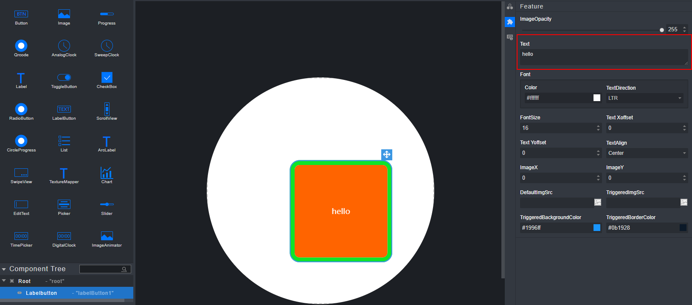

-   Select the LabelButton component and click the  style icon (Feature) in the attribute and style bar on the right. Set the Font attribute of the LabelButton component in the expanded Feature bar:

    -   Color: Font color
    -   FontSize: Font size
    -   TextDirection: Text direction

    **Figure 4**  Text-related attributes<a name="zh-cn_topic_0000002399619877_fig11349122424720"></a>  
    

-   Select the LabelButton component and click the  style icon (Feature) in the attribute and style bar on the right. Modify the Text Xoffset and Text Yoffset attributes of the LabelButton component in the expanded Feature bar to adjust the position of the text.

    **Figure 5**  Adjusting the position of the text<a name="zh-cn_topic_0000002399619877_fig335933815438"></a>  
    

-   Select the LabelButton component and click the  style icon (Feature) in the attribute and style bar on the right. Modify the TextAlign attribute of the LabelButton component in the expanded Feature bar to adjust the horizontal alignment of the text.

    **Figure 6**  Modifying the alignment of the text<a name="zh-cn_topic_0000002399619877_fig0812161817195"></a>  
    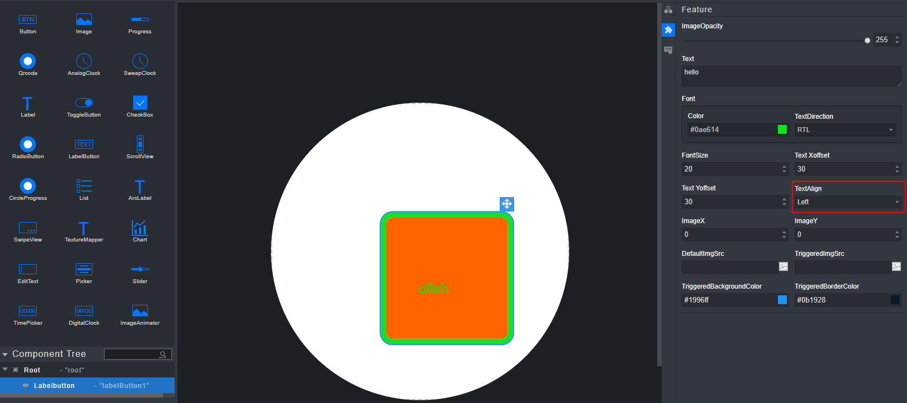

-   Select the LabelButton component and click the  style icon (Feature) in the attribute and style bar on the right. Modify the DefaultImgSrc attribute of the LabelButton component in the expanded Feature bar to add an image. You can delete the image by restoring the DefaultImgSrc attribute to empty (deleting it manually).

    **Figure 7**  Adding an image<a name="zh-cn_topic_0000002399619877_fig245413171610"></a>  
    

    > **Note:** 
    >The DefaultImgSrc attribute does not support Chinese paths.

-   Select the LabelButton component in the canvas. Use the  style icon (Events) in the attribute and style bar on the right, and configure the callback events in the expanded Events bar.

    The events supported by the LabelButton component include OnClick, OnLongPress, OnPress, OnCancel, and OnRelease.

    **Figure 8**  Callback event configuration<a name="zh-cn_topic_0000002399619877_fig1068120358476"></a>  
    

> **Note:** 
>-   The MarginBottom and MarginRight attributes under the General page have no rendering effect.
>-   The TriggeredImgSrc, TriggeredBackgroundColor, and TriggeredborderColor attributes under the Feature page have no interface rendering effect. You can view the effect in the simulator.

#### ScrollView Component<a name="ZH-CN_TOPIC_0000002378877508"></a>

For the usage of common attributes, see the "[Common Attributes of a Component](组件的共有属性.md#ZH-CN_TOPIC_0000002378717660)" section.

-   Select other components in the component bar and drag them into the ScrollView component, then adjust the styles of other components. The position of a child component is relative to the upper-left corner of the parent container. When a component already exists on the interface, clicking the center of the component can drag the component into the container.

    **Figure 1**  Dragging other components into the ScrollView component<a name="zh-cn_topic_0000002365940066_fig192648563920"></a>  
    

-   Select the ScrollView component and click the  style icon (Feature) in the attribute and style bar on the right. Modify the Direction attribute of the ScrollView component in the expanded Feature bar to control the direction in which the component can scroll.

    **Figure 2**  Modifying the component state<a name="zh-cn_topic_0000002365940066_fig1335145711333"></a>  
    

-   Select the ScrollView component in the canvas. Use the  style icon (Events) in the attribute and style bar on the right, and configure the callback events in the expanded Events bar.

    The events supported by the ScrollView component include OnDrag, OnDragStart, OnDragEnd, OnFocus, OnBlur, and OnScroll.

    **Figure 3**  Callback event configuration<a name="zh-cn_topic_0000002365940066_fig159041157202714"></a>  
    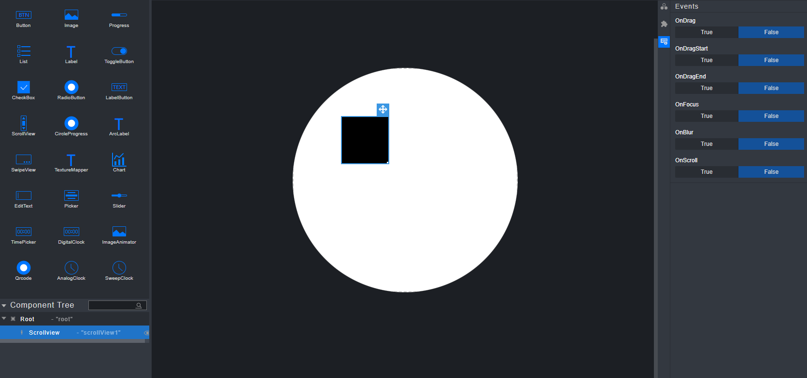

> **Note:** 
>-   When other components are not directly dragged from the UI Control bar on the left, other components may appear outside the ScrollView component and cannot be seen. In addition, when components are dragged from the UI Control bar on the left multiple times, they repeatedly appear at the component position (100, 100).
>-   The MarginBottom and MarginRight attributes under the General page have no rendering effect.
>-   Except the Direction attribute, other attributes under the Feature page have no interface rendering effect. You can view the effect in the simulator.
>-   The scroll bar of the ScrollView is always hidden, and the normal drag mode is still maintained.

#### CircleProgress Component<a name="ZH-CN_TOPIC_0000002412436917"></a>

For the usage of common attributes, see the "[Common Attributes of a Component](组件的共有属性.md#ZH-CN_TOPIC_0000002378717660)" section.

-   Select the CircleProgress component in the canvas. Use the  style icon (Feature) in the attribute and style bar on the right. In the expanded Feature bar, modify the LineWidth attribute in the ForegroundStyle and BackgroundStyle windows of the CircleProgress component to change the width of the progress bar, and modify the LineColor attribute to change the color of the progress bar.

    **Figure 1**  Modifying the width of the progress bar<a name="zh-cn_topic_0000002399739749_fig815243422317"></a>  
    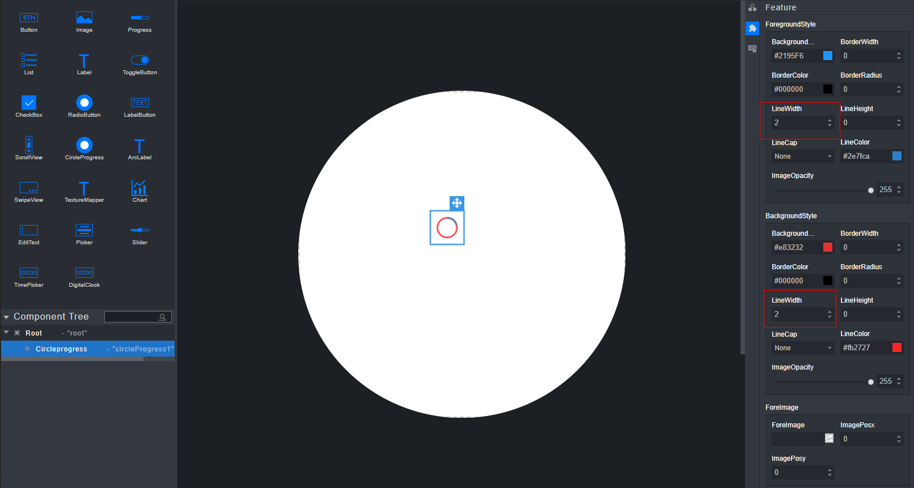

    **Figure 2**  Modifying the color of the progress bar<a name="zh-cn_topic_0000002399739749_fig969345712413"></a>  
    

-   Select the CircleProgress component in the canvas. Use the  style icon (Feature) in the attribute and style bar on the right. In the expanded Feature bar, modify RangeMax and RangeMin of the CircleProgress component to limit the value of the progress bar, and modify value to change the progress value.

    **Figure 3**  Modifying the progress value<a name="zh-cn_topic_0000002399739749_fig762919369274"></a>  
    

-   Select the CircleProgress component in the canvas. Use the  style icon (Feature) in the attribute and style bar on the right. In the expanded Feature bar, modify the Radius, CenterX, and CenterY attributes of the CircleProgress component to limit the ring.

    **Figure 4**  Modifying the ring size<a name="zh-cn_topic_0000002399739749_fig1581711211515"></a>  
    

-   Select the CircleProgress component in the canvas. Use the  style icon (Feature) in the attribute and style bar on the right. In the expanded Feature bar, modify the StartAngel and EndAngel attributes of the CircleProgress component to limit the drawing angle.

    **Figure 5**  Modifying the angle<a name="zh-cn_topic_0000002399739749_fig1267654717373"></a>  
    

-   Select the CircleProgress component in the canvas. Use the  style icon (Feature) in the attribute and style bar on the right. In the expanded Feature bar, modify the sub-attributes of ForeImage or BackImage of the CircleProgress component to add foreground or background images and modify the image position.

    > **Note:** 
    >The image path does not support Chinese paths and spaces cannot be entered in the path.

    **Figure 6**  Adding an image<a name="zh-cn_topic_0000002399739749_fig836417515157"></a>  
    

> **Note:** 
>-   The MarginBottom and MarginRight attributes under the General page have no rendering effect.
>-   The sub-attributes BackgroundColor, BorderWidth, BorderColor, BorderRadius, LineHeight, and ImageOpacity of ForegroundStyle and BackgroundStyle under the Feature page have no rendering effect.
>-   The CircleProgress component does not support configuring callback events.

#### ArcLabel Component<a name="ZH-CN_TOPIC_0000002378717672"></a>

The common attributes of this component do not include the Position and Size attributes. For the usage of other common attributes, see the "[Common Attributes of a Component](组件的共有属性.md#ZH-CN_TOPIC_0000002378717660)" section.

-   Select the ArcLabel component in the canvas and click the  style icon (Feature) in the attribute and style bar on the right. Modify the LetterSpace attribute of the ArcLabel component in the expanded Feature bar to change the interval between texts.

    **Figure 1**  Modifying the text color<a name="zh-cn_topic_0000002366099966_fig19959125910167"></a>  
    

-   Select the ArcLabel component in the canvas. Use the  style icon (Feature) in the attribute and style bar on the right, and modify the TextAlign attribute of the ArcLabel component in the expanded Feature bar to change the alignment of the text on the ring.

    **Figure 2**  Modifying the text alignment<a name="zh-cn_topic_0000002366099966_fig6210165422115"></a>  
    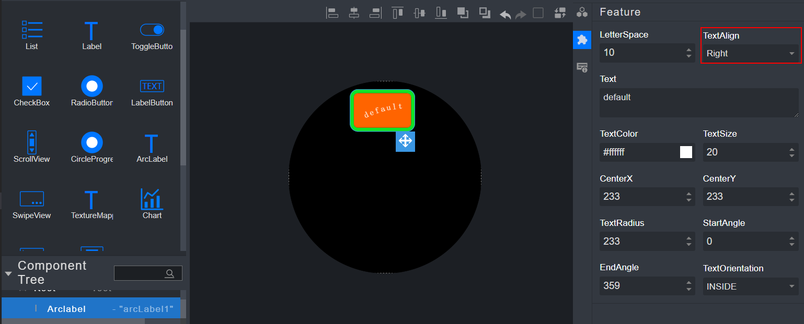

-   Select the ArcLabel component in the canvas. Use the  style icon (Feature) in the attribute and style bar on the right, and modify the Text attribute of the ArcLabel component in the expanded Feature bar to change the displayed text.

    **Figure 3**  Modifying the displayed text<a name="zh-cn_topic_0000002366099966_fig10896149152219"></a>  
    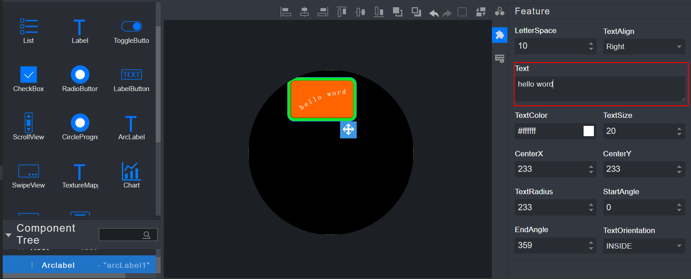

-   Select the ArcLabel component in the canvas and click the  style icon (Feature) in the attribute and style bar on the right. Modify the TextColor attribute of the ArcLabel component in the expanded Feature bar to change the color of the text.

    **Figure 4**  Modifying the text color<a name="zh-cn_topic_0000002366099966_fig181046357190"></a>  
    

-   Select the ArcLabel component in the canvas. Use the  style icon (Feature) in the attribute and style bar on the right, and modify the TextSize of the ArcLabel component in the expanded Feature bar to change the size of the text.

    **Figure 5**  Modifying the text size<a name="zh-cn_topic_0000002366099966_fig13754615153218"></a>  
    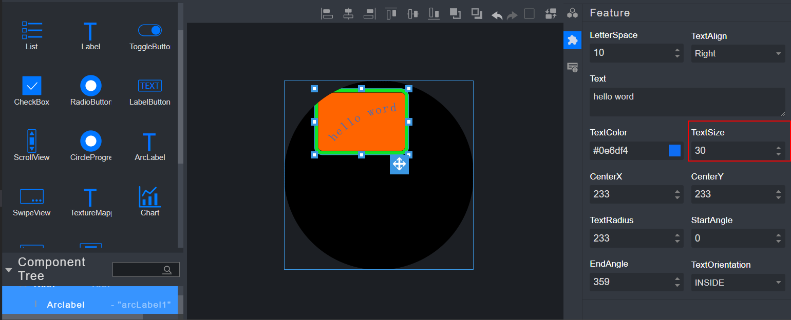

-   Select the ArcLabel component in the canvas. Use the  style icon (Feature) in the attribute and style bar on the right, and modify the CenterX and CenterY attributes of the ArcLabel component in the expanded Feature bar to change the center position of the circle where the text is located.

    **Figure 6**  Modifying the center of the circle where the text is located<a name="zh-cn_topic_0000002366099966_fig16333532113418"></a>  
    

-   Select the ArcLabel component in the canvas. Use the  style icon (Feature) in the attribute and style bar on the right, and modify the TextRadius of the ArcLabel component in the expanded Feature bar to change the radius of the circle where the text is located.

    **Figure 7**  Modifying the radius of the circle where the text is located<a name="zh-cn_topic_0000002366099966_fig13296111602013"></a>  
    

-   Select the ArcLabel component in the canvas. Use the  style icon (Feature) in the attribute and style bar on the right, and modify the StartAngle and EndAngle attributes of the ArcLabel component in the expanded Feature bar to change the range in which the text appears on the circle.

    **Figure 8**  Modifying the range in which the text appears on the circle<a name="zh-cn_topic_0000002366099966_fig1867192510273"></a>  
    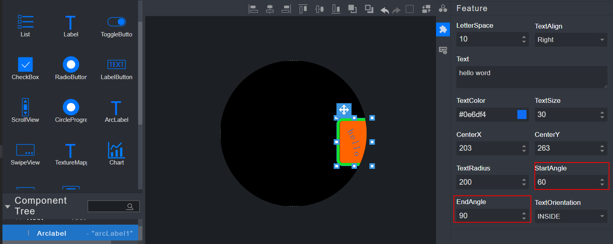

-   Select the ArcLabel component in the canvas. Use the  style icon (Feature) in the attribute and style bar on the right, and modify the TextOrientation of the ArcLabel component in the expanded Feature bar to change the orientation of the text.

    **Figure 9**  Modifying the orientation of the text<a name="zh-cn_topic_0000002366099966_fig035742622712"></a>  
    

> **Note:** 
>-   The MarginBottom and MarginRight attributes under the General page have no rendering effect.
>-   The ArcLabel component does not support configuring callback events.

#### SwipeView Component<a name="ZH-CN_TOPIC_0000002412317069"></a>

The common attributes of this component do not include the Border, Margin, and Padding attributes. For the usage of other common attributes, see the "[Common Attributes of a Component](组件的共有属性.md#ZH-CN_TOPIC_0000002378717660)" section.

-   Select the SwipeView component and click the  style icon (Feature) in the attribute and style bar on the right. Modify the Direction attribute of the SwipeView component in the expanded Feature bar to change the scrolling direction of the component. The position of a child component is relative to the upper-left corner of the parent container. When a component already exists on the interface, clicking the center of the component can drag the component into the container.

    **Figure 1**  Modifying the scroll bar position<a name="zh-cn_topic_0000002399619881_fig85221029131212"></a>  
    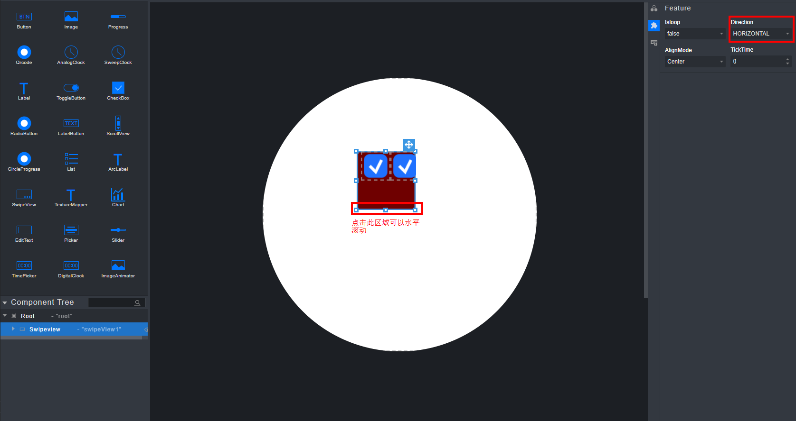

    

    > **Note:** 
    >The scroll bar is hidden. When the child components in the space exceed the range, they can be dragged. HORIZONTAL means horizontal scrolling, and VERTICAL means vertical scrolling.

-   Select the SwipeView component in the canvas. Use the  style icon (Events) in the attribute and style bar on the right, and configure the callback events in the expanded Events bar.

    The events supported by the SwipeView component include: OnDrag, OnDragStart, OnDragEnd, and OnSwipe.

    **Figure 2**  Callback event configuration<a name="zh-cn_topic_0000002399619881_fig968711173355"></a>  
    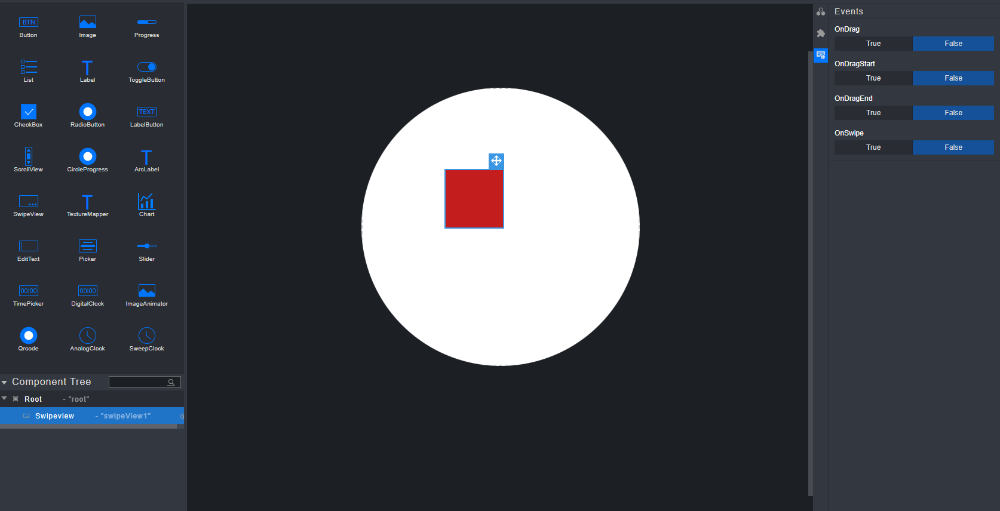

> **Note:** 
>-   The Isloop, AlignMode, and TickTime attributes under the Feature page have no rendering effect for the time being.
>-   In horizontal mode, the top alignment , bottom alignment , and vertical centering alignment  in the upper toolbar are unavailable.
>-   In vertical mode, the left alignment , right alignment , and horizontal centering alignment  in the upper toolbar are unavailable.
>-   The scroll bar of the SwipeView is always hidden, and the normal drag mode is still maintained.

#### TextureMapper Component<a name="ZH-CN_TOPIC_0000002378877512"></a>

For the usage of common attributes, see the "[Common Attributes of a Component](组件的共有属性.md#ZH-CN_TOPIC_0000002378717660)" section.

-   Select the TextureMapper component and click the  style icon (Feature) in the attribute and style bar on the right. In the expanded Feature bar, modify the ImagePath attribute of the TextureMapper component to add an image. You can delete the image by restoring the ImagePath attribute to empty (deleting it manually).

    **Figure 1**  Adding an image<a name="zh-cn_topic_0000002365940070_fig15600147102714"></a>  
    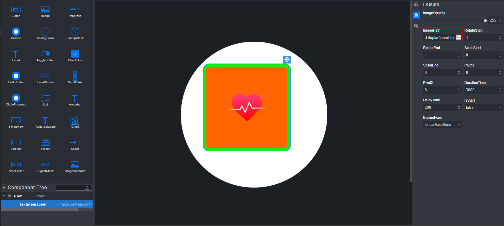

    > **Note:** 
    >The ImagePath attribute does not support Chinese paths.

-   Select the TextureMapper component and click the  style icon (Feature) in the attribute and style bar on the right. In the expanded Feature bar, modify the ImageOpacity attribute of the TextureMapper component to change the transparency of the image.

    **Figure 2**  Modifying the image transparency<a name="zh-cn_topic_0000002365940070_fig1859224515129"></a>  
    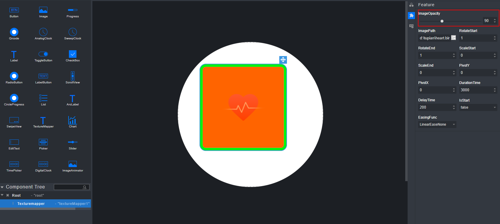

-   Select the TextureMapper component in the canvas. Use the  style icon (Events) in the attribute and style bar on the right, and configure the callback events in the expanded Events bar.

    The events supported by the TextureMapper component include OnMapper.

    **Figure 3**  Callback event configuration<a name="zh-cn_topic_0000002365940070_fig833815411471"></a>  
    

> **Note:** 
>-   The MarginBottom and MarginRight attributes under the General page have no rendering effect.
>-   Except the ImagePath attribute, other attributes under the Feature page have no interface rendering effect. You can view the effect in the simulator. Add an image before displaying the animation effect and set the IsStart attribute on the Feature page to true.
>-   After the image is added, the component size is fixed to the size of the image, and modifying the component width and height does not take effect.

#### Slider Component<a name="ZH-CN_TOPIC_0000002412436921"></a>

For the usage of common attributes, see the "[Common Attributes of a Component](组件的共有属性.md#ZH-CN_TOPIC_0000002378717660)" section.

-   Select the Slider component and click the  style icon (Feature) in the attribute and style bar on the right. Modify the SliderValue attribute of the Slider component in the expanded Feature bar to change the position of the knob.

    **Figure 1**  Modifying the knob position<a name="zh-cn_topic_0000002399739753_fig520210134916"></a>  
    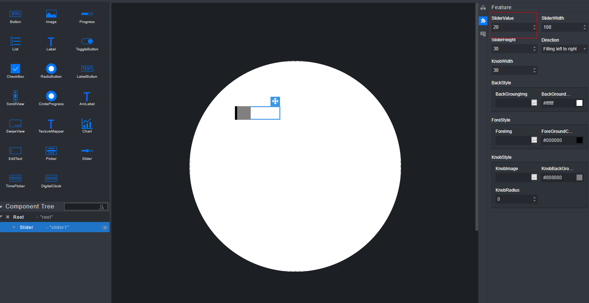

-   Select the Slider component and click the  style icon (Feature) in the attribute and style bar on the right. Modify the SliderWidth attribute of the Slider component in the expanded Feature bar to change the width of the track.

    **Figure 2**  Modifying the track width<a name="zh-cn_topic_0000002399739753_fig19400118164911"></a>  
    

-   Select the Slider component and click the  style icon (Feature) in the attribute and style bar on the right. Modify the SliderHeight attribute of the Slider component in the expanded Feature bar to change the height of the track. SliderHeight cannot exceed the height of the border.

    **Figure 3**  Modifying the track height<a name="zh-cn_topic_0000002399739753_fig54931822183517"></a>  
    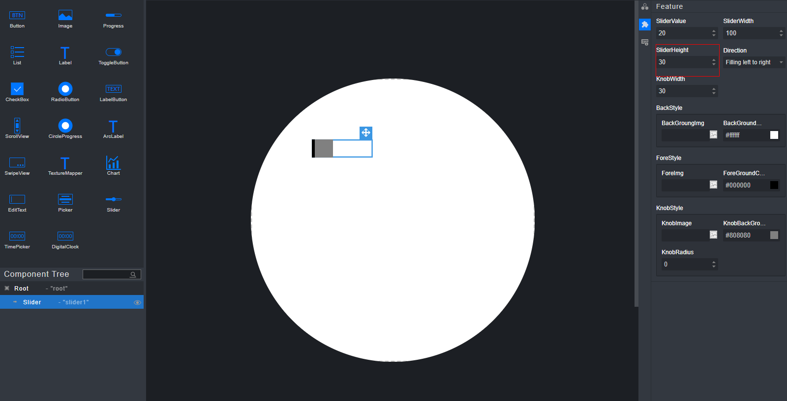

-   Select the Slider component and click the  style icon (Feature) in the attribute and style bar on the right. Modify the Direction attribute of the Slider component in the expanded Feature bar to change the direction of the track.

    **Figure 4**  Modifying the sliding direction<a name="zh-cn_topic_0000002399739753_fig1164616545365"></a>  
    

-   Select the Slider component and click the  style icon (Feature) in the attribute and style bar on the right. Modify the KnobWidth attribute of the Slider component in the expanded Feature bar to change the width of the knob.

    **Figure 5**  Modifying the knob size<a name="zh-cn_topic_0000002399739753_fig2041221915013"></a>  
    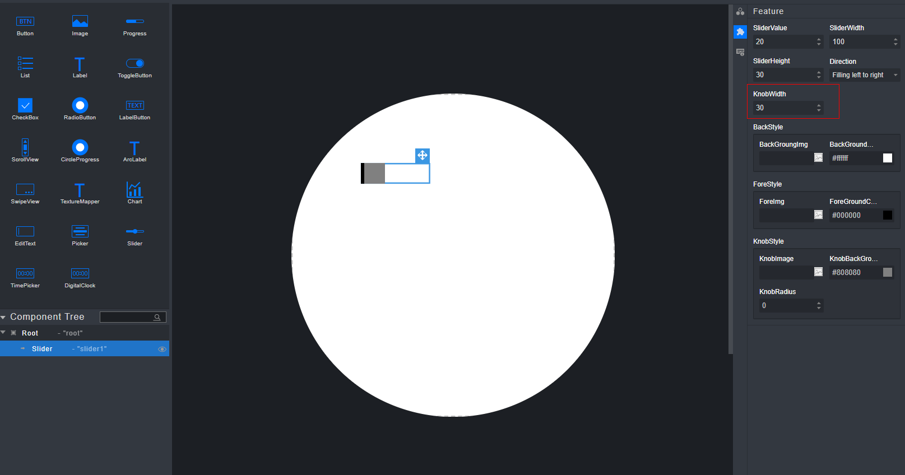

-   Select the Slider component and click the  style icon (Feature) in the attribute and style bar on the right. In the expanded Feature bar, modify the BackGroundImage attribute of the Slider component to change the background image of the track, and modify the BackGroundColor attribute of the Slider component to change the background color of the track.

    > **Note:** 
    >The image path does not support Chinese paths and spaces cannot be entered in the path.

    **Figure 6**  Adding an image<a name="zh-cn_topic_0000002399739753_fig20840845145018"></a>  
    

    **Figure 7**  Setting the color<a name="zh-cn_topic_0000002399739753_fig1623652355120"></a>  
    

-   Select the Slider component and click the  style icon (Feature) in the attribute and style bar on the right. In the ForeStyle window of the expanded Feature bar, modify the ForeImg attribute of the Slider component to change the foreground image of the track, and modify ForeGroundColor to change the foreground color of the track.

    > **Note:** 
    >The image path does not support Chinese paths and spaces cannot be entered in the path.

    **Figure 8**  Adding an image<a name="zh-cn_topic_0000002399739753_fig71361938195220"></a>  
    

    **Figure 9**  Modifying the background color<a name="zh-cn_topic_0000002399739753_fig53181218398"></a>  
    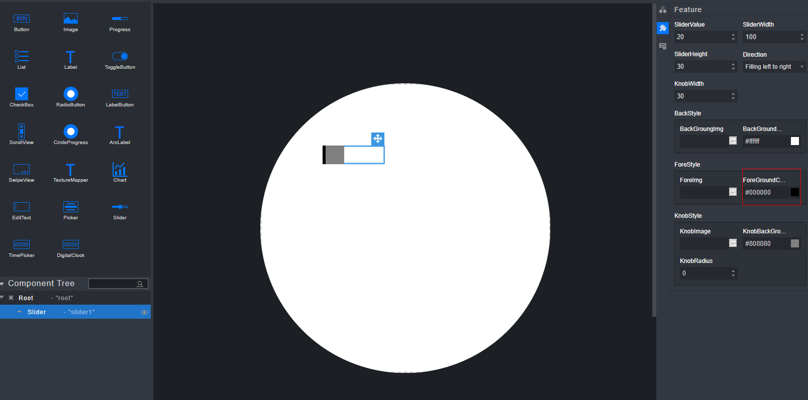

-   Select the Slider component and click the  style icon (Feature) in the attribute and style bar on the right. In the KnobStyle window of the expanded Feature bar, modify the KnobImage attribute of the Slider component to add an image, modify the KnobBackGroundColor attribute to change the color of the knob, and modify the KnobRadius attribute to change the border radius of the knob.

    **Figure 10**  Adding an image<a name="zh-cn_topic_0000002399739753_fig4198162695412"></a>  
    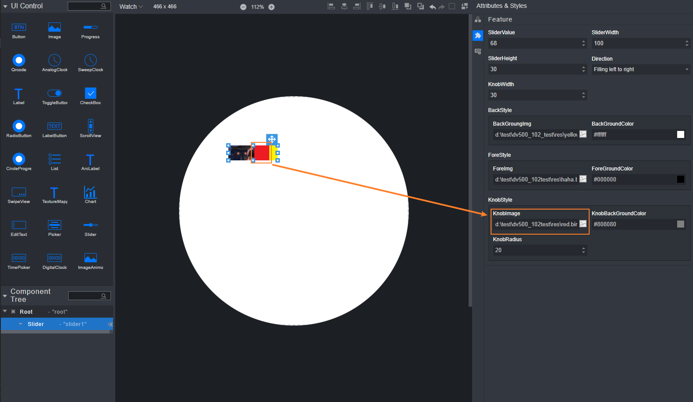

    > **Note:** 
    >The image path does not support Chinese paths and spaces cannot be entered in the path.

    **Figure 11**  Modifying the background color<a name="zh-cn_topic_0000002399739753_fig561313503547"></a>  
    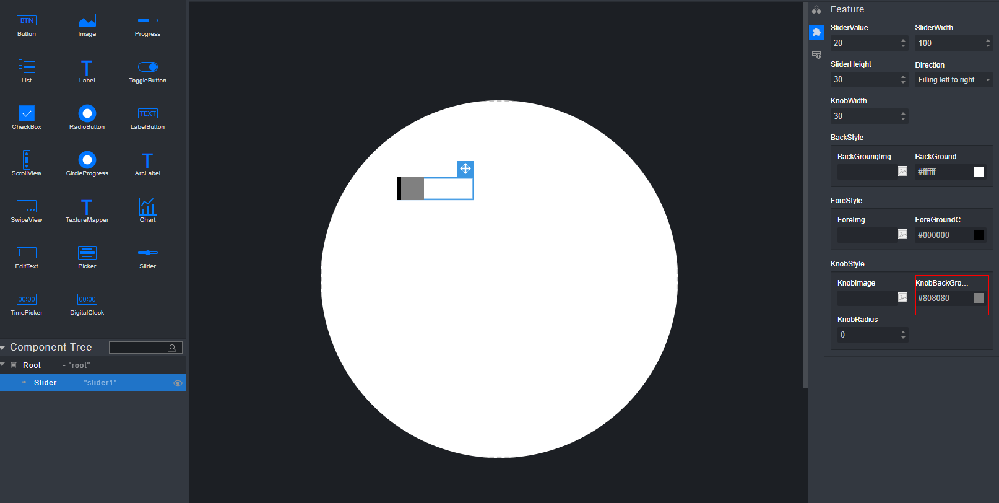

    **Figure 12**  Modifying the radius<a name="zh-cn_topic_0000002399739753_fig620717512485"></a>  
    

-   Select the Slider component in the canvas. Use the  style icon (Events) in the attribute and style bar on the right, and configure the callback events in the expanded Events bar.

    The events supported by the Slider component include OnClick, OnLongPress, OnDrag, OnDragStart, OnDragEnd, OnPress, OnCancel, OnRelease, OnFocus, and OnBlur.

    **Figure 13**  Callback event configuration<a name="zh-cn_topic_0000002399739753_fig325561020"></a>  
    

> **Note:** 
>-   The GaussianBlur, MarginBottom, and MarginRight attributes under the General page have no rendering effect.
>-   After the image is added, the component size is fixed to the size of the image, and modifying the component width and height does not take effect.

#### Picker Component<a name="ZH-CN_TOPIC_0000002378717676"></a>

For the usage of common attributes, see the "[Common Attributes of a Component](组件的共有属性.md#ZH-CN_TOPIC_0000002378717660)" section.

-   Select the Picker component and click the  style icon (Feature) in the attribute and style bar on the right. Modify the Normal attribute of the Picker component in the expanded Feature bar to change the font color of the unselected state of the component.

    **Figure 1**  Modifying the font color of the unselected state<a name="zh-cn_topic_0000002366099970_fig19778846182613"></a>  
    

-   Select the Picker component and click the  style icon (Feature) in the attribute and style bar on the right. Modify the HighLight attribute of the Picker component in the expanded Feature bar to change the font color of the selected state of the component.

    **Figure 2**  Modifying the font color of the selected state<a name="zh-cn_topic_0000002366099970_fig13923214192715"></a>  
    

-   Select the Picker component and click the  style icon (Feature) in the attribute and style bar on the right. Modify the ItemHeight attribute of the Picker component in the expanded Feature bar to change the item height of the component.

    **Figure 3**  Modifying the item height<a name="zh-cn_topic_0000002366099970_fig1048834002714"></a>  
    

-   Select the Picker component and click the  style icon (Feature) in the attribute and style bar on the right. Modify the LoopState attribute of the Picker component in the expanded Feature bar to make the component content loop.

    **Figure 4**  Setting the loop<a name="zh-cn_topic_0000002366099970_fig5493192817"></a>  
    

-   Select the Picker component and click the  style icon (Feature) in the attribute and style bar on the right. Modify the Values attribute of the Picker component in the expanded Feature bar to change the text displayed by the component. The data format is: "x1", "x2", "x3"... (the double quotes are required)

    **Figure 5**  Modifying the text<a name="zh-cn_topic_0000002366099970_fig1959462262820"></a>  
    

-   Select the Picker component and click the  style icon (Feature) in the attribute and style bar on the right. Synchronize the Count attribute value in the expanded Feature bar (it must be equal to the number of child elements in the input array).

    **Figure 6**  Adding the element count value<a name="zh-cn_topic_0000002366099970_fig9995037194619"></a>  
    

-   Select the Picker component and click the  style icon (Feature) in the attribute and style bar on the right. Modify the TextDirection attribute value of the Picker component in the expanded Feature bar to change the writing direction of the text. LTR indicates that the text direction is from left to right, and RTL indicates from right to left. As shown in [Figure 7](#zh-cn_topic_0000002366099970_fig0726183665610), the first value is "12345". After setting the TextDirection attribute value to RTL, the text displayed in the canvas is "54321".

    **Figure 7**  Modifying the text direction<a name="zh-cn_topic_0000002366099970_fig0726183665610"></a>  
    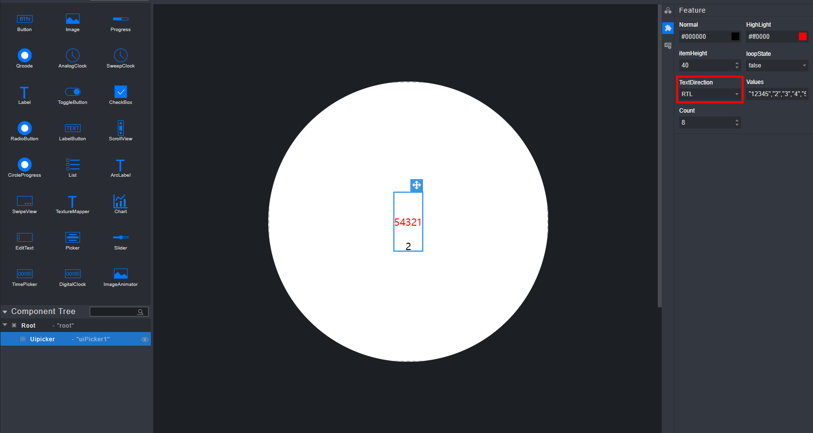

-   Select the Picker component in the canvas. Use the  style icon (Events) in the attribute and style bar on the right, and configure the callback events in the expanded Events bar.

    The events supported by the Picker component include OnFocus and OnBlur.

    **Figure 8**  Callback event configuration<a name="zh-cn_topic_0000002366099970_fig325561020"></a>  
    

> **Note:** 
>-   The MarginBottom and MarginRight attributes under the General page have no rendering effect.
>-   Keep the Count attribute value consistent with the number of array elements.

#### TimePicker Component<a name="ZH-CN_TOPIC_0000002412317073"></a>

For the usage of common attributes, see the "[Common Attributes of a Component](组件的共有属性.md#ZH-CN_TOPIC_0000002378717660)" section.

-   Select the TimePicker component and click the  style icon (Feature) in the attribute and style bar on the right. Modify the ItemHeight attribute of the TimePicker component in the expanded Feature bar to change the item height of the component.

    **Figure 1**  Modifying the item height<a name="zh-cn_topic_0000002399619885_fig13492156123017"></a>  
    

-   Select the TimePicker component and click the  style icon (Feature) in the attribute and style bar on the right. Modify the Values attribute of the TimePicker component in the expanded Feature bar to change the text displayed by the component.

    **Figure 2**  Modifying the text<a name="zh-cn_topic_0000002399619885_fig1536141613118"></a>  
    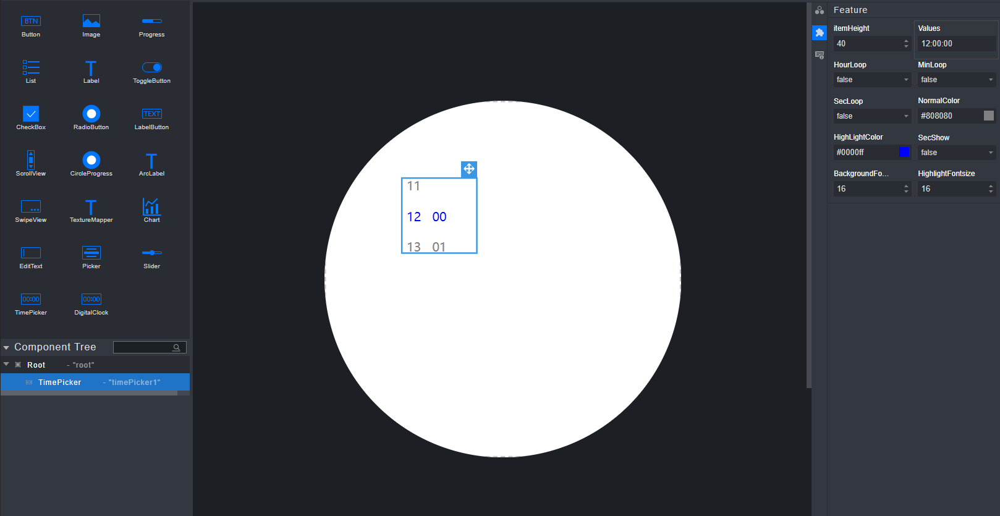

-   Select the TimePicker component and click the  style icon (Feature) in the attribute and style bar on the right. Modify the HourLoop attribute of the TimePicker component in the expanded Feature bar to change whether the hour window of the component loops.

    **Figure 3**  Setting the loop<a name="zh-cn_topic_0000002399619885_fig172573812312"></a>  
    

-   Select the TimePicker component and click the  style icon (Feature) in the attribute and style bar on the right. Modify the MinLoop attribute of the TimePicker component in the expanded Feature bar to change whether the minute window of the component loops.

    **Figure 4**  Setting the loop<a name="zh-cn_topic_0000002399619885_fig1741193616326"></a>  
    

-   Select the TimePicker component and click the  style icon (Feature) in the attribute and style bar on the right. Modify the SecLoop attribute of the TimePicker component in the expanded Feature bar to change whether the second window of the component loops. (When the SecShows attribute is true)

    **Figure 5**  Setting the loop<a name="zh-cn_topic_0000002399619885_fig1031192215331"></a>  
    

-   Select the TimePicker component and click the  style icon (Feature) in the attribute and style bar on the right. Modify the NormalColor attribute of the TimePicker component in the expanded Feature bar to change the font color of the unselected state of the component.

    **Figure 6**  Modifying the font color<a name="zh-cn_topic_0000002399619885_fig689444916334"></a>  
    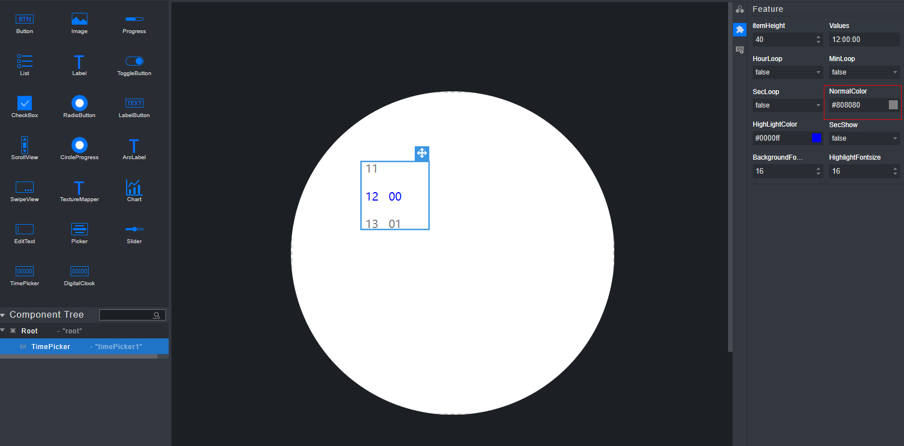

-   Select the TimePicker component and click the  style icon (Feature) in the attribute and style bar on the right. Modify the HighLightColor attribute of the TimePicker component in the expanded Feature bar to change the font color of the selected state of the component.

    **Figure 7**  Modifying the font color<a name="zh-cn_topic_0000002399619885_fig1820476173413"></a>  
    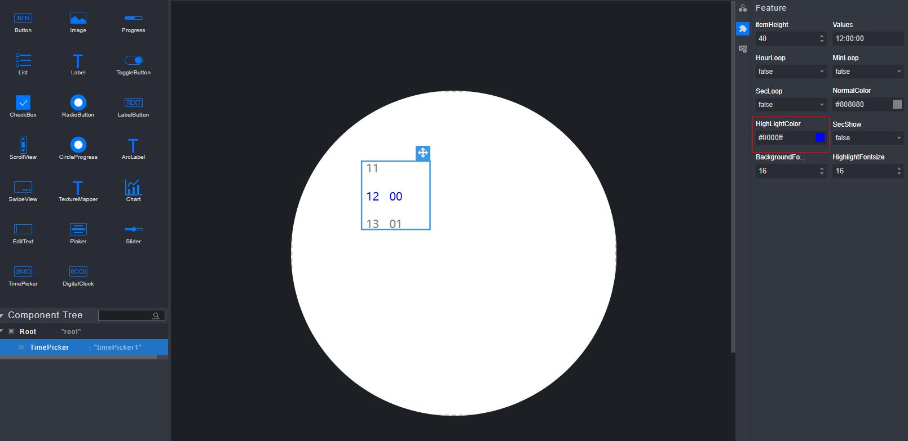

-   Select the TimePicker component and click the  style icon (Feature) in the attribute and style bar on the right. Modify the SecShow attribute of the TimePicker component in the expanded Feature bar to set whether the second window is displayed.

    **Figure 8**  Setting the display of the second window<a name="zh-cn_topic_0000002399619885_fig732614223349"></a>  
    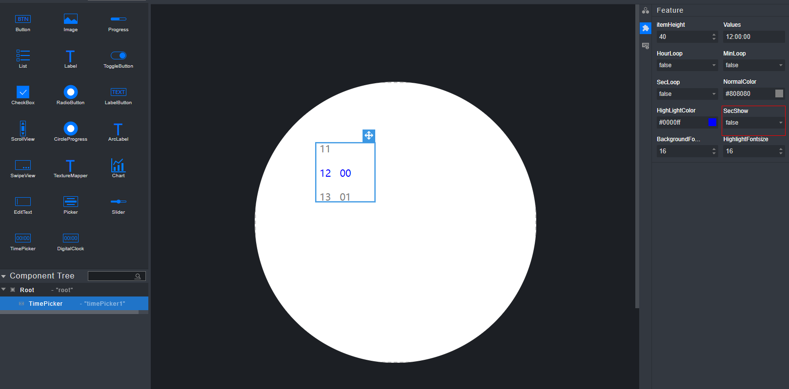

-   Select the TimePicker component and click the  style icon (Feature) in the attribute and style bar on the right. Modify the BackgroundFontsize attribute of the TimePicker component in the expanded Feature bar to change the font size of the unselected state of the component.

    **Figure 9**  Setting the font size<a name="zh-cn_topic_0000002399619885_fig7257450143415"></a>  
    

-   Select the TimePicker component and click the  style icon (Feature) in the attribute and style bar on the right. Modify the HighlightFontsize attribute of the TimePicker component in the expanded Feature bar to change the font size of the selected state of the component.

    **Figure 10**  Setting the font size<a name="zh-cn_topic_0000002399619885_fig1568281294514"></a>  
    

-   Select the TimePicker component in the canvas. Use the  style icon (Events) in the attribute and style bar on the right, and configure the callback events in the expanded Events bar.

    The events supported by the TimePicker component include OnFocus and OnBlur.

    **Figure 11**  Callback event configuration<a name="zh-cn_topic_0000002399619885_fig325561020"></a>  
    

> **Note:** 
>The MarginBottom and MarginRight attributes under the General page have no rendering effect.

#### Chart Component<a name="ZH-CN_TOPIC_0000002378877516"></a>

For the usage of common attributes, see the "[Common Attributes of a Component](组件的共有属性.md#ZH-CN_TOPIC_0000002378717660)" section.

-   Select the Chart component and click the  style icon (Feature) in the attribute and style bar on the right. Modify the attributes in the XAxis column in the expanded Feature bar to change the style of the horizontal axis.

    -   MarkNum attribute: Changes the number of points on the axis
    -   RangMin and RangMax: Change the value range of the axis
    -   Color: Changes the color of the axis
    -   Visible: Controls whether the axis is visible

    **Figure 1**  Modifying the horizontal axis attributes<a name="zh-cn_topic_0000002365940078_fig8661439164210"></a>  
    

-   Select the Chart component and click the  style icon (Feature) in the attribute and style bar on the right. Modify the attributes in the YAxis column in the expanded Feature bar to change the style of the vertical axis. The details are the same as those of the horizontal axis. For details, see [Figure 2](#zh-cn_topic_0000002365940078_fig16661839194210).

    **Figure 2**  Modifying the vertical axis style<a name="zh-cn_topic_0000002365940078_fig16661839194210"></a>  
    

-   Select the Chart component and click the  style icon (Feature) in the attribute and style bar on the right. In the expanded Feature bar, click the plus sign on the right of the DataSerial attribute to add data. Multiple groups of data can be added.

    **Figure 3**  Adding data<a name="zh-cn_topic_0000002365940078_fig10661113994214"></a>  
    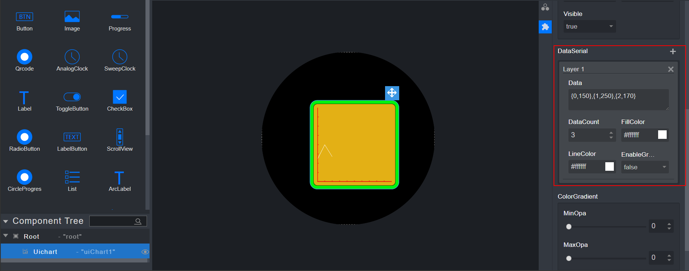

-   Select the Chart component and click the  style icon (Feature) in the attribute and style bar on the right. In the expanded Feature bar, add data and then change the style of the data. The Data attribute is the data to be filled in, the DataCount attribute is the number of data items, FillColor is the color of the fill gradient, LineColor is the color of the line, and the EnableGradient attribute controls whether the gradient color is filled.

    **Figure 4**  Displaying the effect of adding data<a name="zh-cn_topic_0000002365940078_fig96611939204217"></a>  
    

-   Select the Chart component and click the  style icon (Feature) in the attribute and style bar on the right. In the ColorGradient window of the expanded Feature bar, the MinOpa and MaxOpa attributes change the range of the gradient color. MaxOpa controls the transparency of the upper gradient color, and MinOpa controls the transparency of the lower gradient color.

    **Figure 5**  Modifying the gradient color transparency<a name="zh-cn_topic_0000002365940078_fig46611739184215"></a>  
    

-   Select the Chart component and click the  style icon (Feature) in the attribute and style bar on the right. Modify the Type attribute of the Chart component in the expanded Feature bar to change the type of the chart.

    **Figure 6**  Modifying the type of the chart<a name="zh-cn_topic_0000002365940078_fig19661139164218"></a>  
    

> **Note:** 
>-   The MarginBottom and MarginRight attributes under the General page have no rendering effect.
>-   The format of the data when adding data is: \{x1,y1\},\{x2,y2\};
>    The data cannot contain spaces, and the horizontal coordinates should increase sequentially starting from 0. In addition, the number in the DataCount attribute cannot be smaller than the number of data items. When the number in the DataCount attribute is larger than the number of data items, it automatically connects back to \{0,0\}. For a bar chart, the MarkNum of the horizontal axis also cannot be smaller than the number of data items.
>-   The ColorGradient attribute is useful only for line charts.
>-   Currently, the Chart component has an issue where the attribute interface cannot change when the DataSerial attributes are modified for the first time. The interface can be changed by modifying other attributes in the DataSerial attributes again.
>-   The Chart component does not support configuring callback events.

#### EditText Component<a name="ZH-CN_TOPIC_0000002412436925"></a>

For the usage of common attributes, see the "[Common Attributes of a Component](组件的共有属性.md#ZH-CN_TOPIC_0000002378717660)" section.

-   Select the EditText component and click the  style icon (Feature) in the attribute and style bar on the right. Modify the Placeholder attribute of the EditText component in the expanded Feature bar to change the background hint text.

    **Figure 1**  Modifying the background hint text<a name="zh-cn_topic_0000002399739757_fig688611508216"></a>  
    

-   Select the EditText component and click the  style icon (Feature) in the attribute and style bar on the right. Modify the Text attribute of the EditText component in the expanded Feature bar to change the content of the foreground text. When the foreground text exists, the background text cannot be displayed.

    **Figure 2**  Modifying the foreground text<a name="zh-cn_topic_0000002399739757_fig18400183213561"></a>  
    

-   Select the EditText component and click the  style icon (Feature) in the attribute and style bar on the right. Modify the EditTextColor attribute of the EditText component in the expanded Feature bar to change the color of the foreground text.

    **Figure 3**  Modifying the color of the foreground text<a name="zh-cn_topic_0000002399739757_fig581421214573"></a>  
    

-   Select the EditText component and click the  style icon (Feature) in the attribute and style bar on the right. Modify the MaxLength attribute of the EditText component in the expanded Feature bar to limit the input length of the foreground text.

    **Figure 4**  Limiting the length of the foreground text<a name="zh-cn_topic_0000002399739757_fig8651102555710"></a>  
    

-   Select the EditText component and click the  style icon (Feature) in the attribute and style bar on the right. Modify the InputType attribute of the EditText component in the expanded Feature bar to change the input mode.

    -   text mode: The input text is displayed normally
    -   password mode: The input text is displayed in password mode (replaced by "·")

    **Figure 5**  Changing the input mode<a name="zh-cn_topic_0000002399739757_fig13869958175715"></a>  
    

-   Select the EditText component and click the  style icon (Feature) in the attribute and style bar on the right. Modify the PlaceholderColor attribute of the EditText component in the expanded Feature bar to change the color of the background hint text.

    **Figure 6**  Modifying the color of the background hint text<a name="zh-cn_topic_0000002399739757_fig1530813191564"></a>  
    

-   Select the EditText component and click the  style icon (Feature) in the attribute and style bar on the right. Modify the CursorColor attribute of the EditText component in the expanded Feature bar to change the color of the cursor.

    **Figure 7**  Cursor color<a name="zh-cn_topic_0000002399739757_fig14857161318582"></a>  
    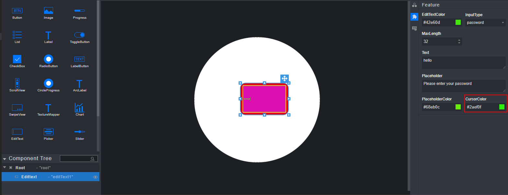

-   Select the EditText component in the canvas. Use the  style icon (Events) in the attribute and style bar on the right, and configure the callback events in the expanded Events bar.

    The events supported by the EditText component include OnClick, OnLongPress, OnPress, OnCancel, and OnRelease.

    **Figure 8**  Callback event configuration<a name="zh-cn_topic_0000002399739757_fig325561020"></a>  
    

> **Note:** 
>-   The MarginBottom and MarginRight attributes under the General page have no rendering effect.
>-   Text modification can only be performed through the specific attributes on the right. When deleting text through the keyboard on the interface, there is an issue where the component is deleted. To modify the foreground text, use the Text field on the right.

#### DigitalClock Component<a name="ZH-CN_TOPIC_0000002378717680"></a>

For the usage of common attributes, see the "[Common Attributes of a Component](组件的共有属性.md#ZH-CN_TOPIC_0000002378717660)" section.

-   Select the DigitalClock component and click the  style icon (Feature) in the attribute and style bar on the right. Modify the Color attribute of the DigitalClock component in the expanded Feature bar to change the font color.

    **Figure 1**  Modifying the font color<a name="zh-cn_topic_0000002366099978_fig28061923305"></a>  
    

-   Select the DigitalClock component and click the  style icon (Feature) in the attribute and style bar on the right. Modify the DisplayMode attribute of the DigitalClock component in the expanded Feature bar to change the display state of the component.

    **Figure 2**  Component display state<a name="zh-cn_topic_0000002366099978_fig13710344441"></a>  
    

-   Select the DigitalClock component and click the  style icon (Feature) in the attribute and style bar on the right. Modify the DisplayLeadigZero attribute of the DigitalClock component in the expanded Feature bar to set whether to add 0 before the hour.

    **Figure 3**  Whether to add 0<a name="zh-cn_topic_0000002366099978_fig9371123494418"></a>  
    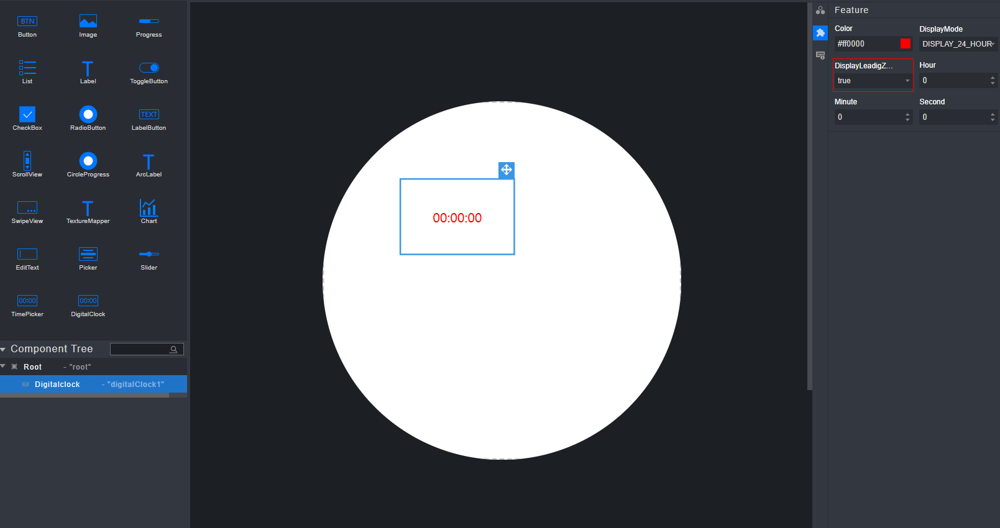

-   Select the DigitalClock component and click the  style icon (Feature) in the attribute and style bar on the right. Modify the Hour attribute of the DigitalClock component in the expanded Feature bar to set the hour.

    **Figure 4**  Setting the hour<a name="zh-cn_topic_0000002366099978_fig67661353475"></a>  
    

-   Select the DigitalClock component and click the  style icon (Feature) in the attribute and style bar on the right. Modify the Minute attribute of the DigitalClock component in the expanded Feature bar to set the minute.

    **Figure 5**  Setting the minute<a name="zh-cn_topic_0000002366099978_fig711219924715"></a>  
    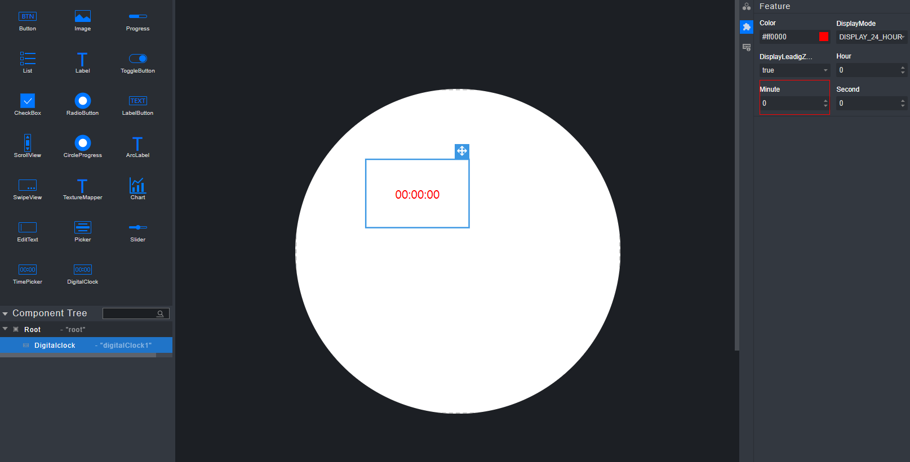

-   Select the DigitalClock component and click the  style icon (Feature) in the attribute and style bar on the right. Modify the Second attribute of the DigitalClock component in the expanded Feature bar to set the second.

    **Figure 6**  Setting the second<a name="zh-cn_topic_0000002366099978_fig177318106475"></a>  
    

> **Note:** 
>-   The MarginBottom and MarginRight attributes under the General page have no rendering effect.
>-   The DigitalClock component does not support configuring callback events.

#### ImageAnimator Component<a name="ZH-CN_TOPIC_0000002412317077"></a>

For the usage of common attributes, see the "[Common Attributes of a Component](组件的共有属性.md#ZH-CN_TOPIC_0000002378717660)" section.

-   Select the ImageAnimator component and click the  style icon (Feature) in the attribute and style bar on the right. Add the image path in the expanded Feature bar.

    **Figure 1**  Image path<a name="zh-cn_topic_0000002399619889_fig28061923305"></a>  
    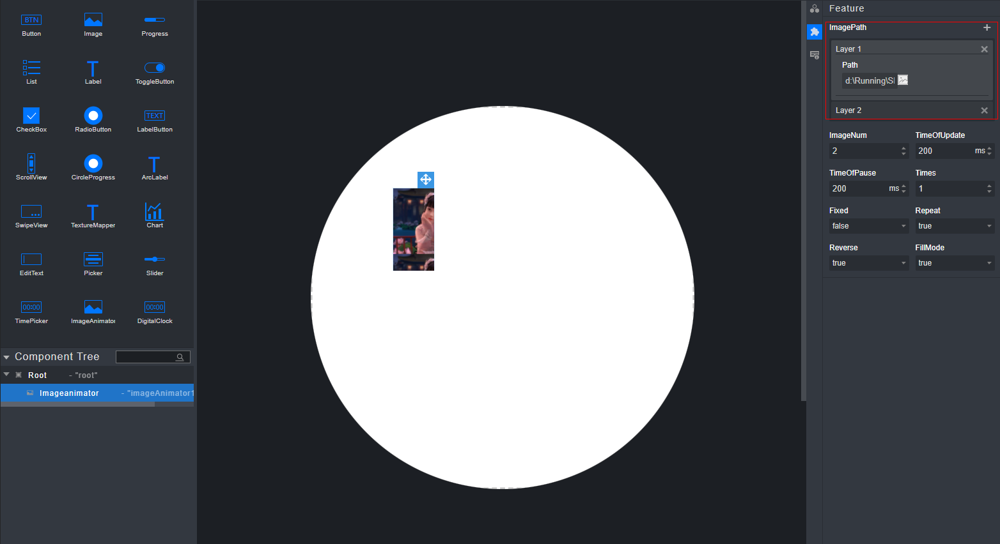

-   Select the ImageAnimator component and click the  style icon (Feature) in the attribute and style bar on the right. Modify the ImageNum attribute of the ImageAnimator component in the expanded Feature bar to ensure that the number of displayed images is equal to the number of input image paths.

    **Figure 2**  Number of images<a name="zh-cn_topic_0000002399619889_fig13710344441"></a>  
    

-   Select the ImageAnimator component and click the  style icon (Feature) in the attribute and style bar on the right. Modify the Times attribute of the ImageAnimator component in the expanded Feature bar to control the number of loops. This attribute takes effect only when Repeat is false.

    **Figure 3**  Number of loops<a name="zh-cn_topic_0000002399619889_fig9371123494418"></a>  
    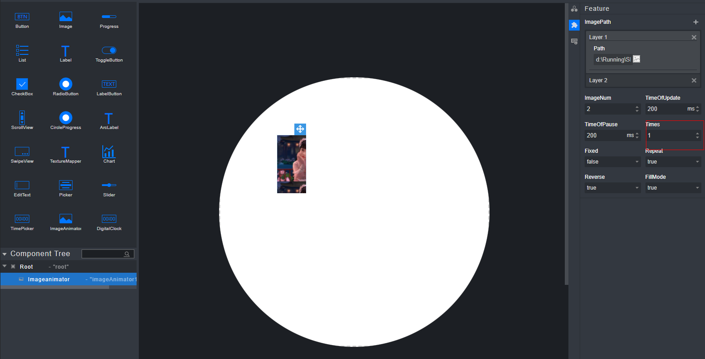

-   Select the ImageAnimator component and click the  style icon (Feature) in the attribute and style bar on the right. Modify the Fixed attribute of the ImageAnimator component in the expanded Feature bar to adapt to the image size.

    **Figure 4**  Whether to adapt to the image size<a name="zh-cn_topic_0000002399619889_fig67661353475"></a>  
    

-   Select the ImageAnimator component and click the  style icon (Feature) in the attribute and style bar on the right. Modify the Repeat attribute of the ImageAnimator component in the expanded Feature bar to control whether the image loops.

    **Figure 5**  Setting whether the images loop<a name="zh-cn_topic_0000002399619889_fig711219924715"></a>  
    

-   Select the ImageAnimator component and click the  style icon (Feature) in the attribute and style bar on the right. Modify the Reverse attribute of the ImageAnimator component in the expanded Feature bar to set the loop direction of the images.

    **Figure 6**  Setting the loop direction of the images<a name="zh-cn_topic_0000002399619889_fig137012812132"></a>  
    

-   Select the ImageAnimator component and click the  style icon (Feature) in the attribute and style bar on the right. Modify the FillMode attribute of the ImageAnimator component in the expanded Feature bar to set the image displayed at the last frame of the animation. true is the first image of the animation in the current loop mode, and false is the last one. The Reverse attribute value affects the order of the images in the loop animation.

    **Figure 7**  Setting the last frame<a name="zh-cn_topic_0000002399619889_fig142541859122517"></a>  
    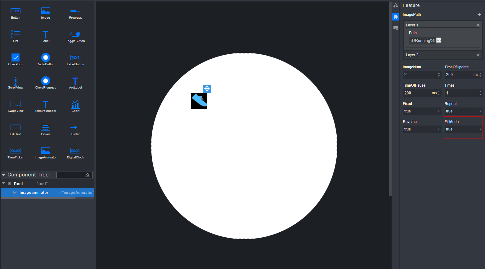

> **Note:** 
>-   The MarginBottom and MarginRight attributes under the General page have no rendering effect.
>-   The TimeOfUpdate and TimeOfPause attributes under the Feature page have no rendering effect.
>-   The ImageAnimator component does not support configuring callback events.

#### Qrcode Component<a name="ZH-CN_TOPIC_0000002378877520"></a>

For the usage of common attributes, see the "[Common Attributes of a Component](组件的共有属性.md#ZH-CN_TOPIC_0000002378717660)" section.

-   Select the Qrcode component in the canvas and click the  style icon (Feature) in the attribute and style bar on the right. Modify the ImageOpacity attribute of the Qrcode component in the expanded Feature bar to change the transparency of the QR code.

    **Figure 1**  Modifying the QR code transparency<a name="zh-cn_topic_0000002365940082_fig19959125910167"></a>  
    

-   Select the Qrcode component in the canvas. Use the  style icon (Feature) in the attribute and style bar on the right, and modify the BackColor attribute of the Qrcode component in the expanded Feature bar to change the background color of the QR code.

    **Figure 2**  Modifying the background color<a name="zh-cn_topic_0000002365940082_fig6210165422115"></a>  
    

-   Select the Qrcode component in the canvas. Use the  style icon (Feature) in the attribute and style bar on the right, and modify the QrcodeColor attribute of the Qrcode component in the expanded Feature bar to change the color of the QR code.

    **Figure 3**  Modifying the QR code color<a name="zh-cn_topic_0000002365940082_fig10896149152219"></a>  
    

> **Note:** 
>-   The BackgroungColor, MarginBottom, and MarginRight attributes under the General page have no rendering effect.
>-   The Text attribute under the Feature page has no interface rendering effect. You can view the specific effect in the simulator.
>-   The Qrcode component does not support configuring callback events.

#### AnalogClock Component<a name="ZH-CN_TOPIC_0000002412436929"></a>

For the usage of common attributes, see the "[Common Attributes of a Component](组件的共有属性.md#ZH-CN_TOPIC_0000002378717660)" section.

-   Select the AnalogClock component and click the  style icon (Feature) in the attribute and style bar on the right. In the expanded Feature bar, modify the PositionX and PositionY attributes in the Hour window to change the position of the hour hand. In addition, the PositionX and PositionY attributes in the Minute and Second windows can separately modify the positions of the minute hand and the second hand.

    **Figure 1**  Modifying the position of the hands<a name="zh-cn_topic_0000002399739761_fig678011363619"></a>  
    

-   Select the AnalogClock component and click the  style icon (Feature) in the attribute and style bar on the right. In the expanded Feature bar, modify the CenterX and CenterY attributes in the Hour window to change the rotation center of the hour hand (this coordinate is in the coordinate system with the point where PositionX and PositionY are located as the origin). This coordinate is relative to the position of the hand rather than the upper-left corner of the component. In addition, the CenterX and CenterY attributes in the Minute and Second windows can separately modify the rotation centers of the minute hand and the second hand.

    **Figure 2**  Modifying the rotation center of the hands<a name="zh-cn_topic_0000002399739761_fig821320214408"></a>  
    

-   Select the AnalogClock component and click the  style icon (Feature) in the attribute and style bar on the right. In the expanded Feature bar, modify the Color attribute in the Hour window to change the color of the hour hand. In addition, the Color attributes in the Minute and Second windows can separately modify the colors of the minute hand and the second hand.

    **Figure 3**  Modifying the color of the hands<a name="zh-cn_topic_0000002399739761_fig16383193311422"></a>  
    

-   Select the AnalogClock component and click the  style icon (Feature) in the attribute and style bar on the right. In the expanded Feature bar, modify the Width attribute in the Hour window to change the width of the hour hand. In addition, the Width attributes in the Minute and Second windows can separately modify the widths of the minute hand and the second hand.

    **Figure 4**  Modifying the width of the hands<a name="zh-cn_topic_0000002399739761_fig133511819144416"></a>  
    

-   Select the AnalogClock component and click the  style icon (Feature) in the attribute and style bar on the right. In the expanded Feature bar, modify the Length attribute in the Hour window to change the length of the hour hand. In addition, the Length attributes in the Minute and Second windows can separately modify the lengths of the minute hand and the second hand.

    **Figure 5**  Modifying the length of the hands<a name="zh-cn_topic_0000002399739761_fig189181575451"></a>  
    

-   Select the AnalogClock component and click the  style icon (Feature) in the attribute and style bar on the right. In the expanded Feature bar, modify the Opacity attribute in the Hour window to change the color transparency of the hour hand. In addition, the Opacity attributes in the Minute and Second windows can separately modify the color transparencies of the minute hand and the second hand.

    **Figure 6**  Modifying the color transparency of the hands<a name="zh-cn_topic_0000002399739761_fig1717814924613"></a>  
    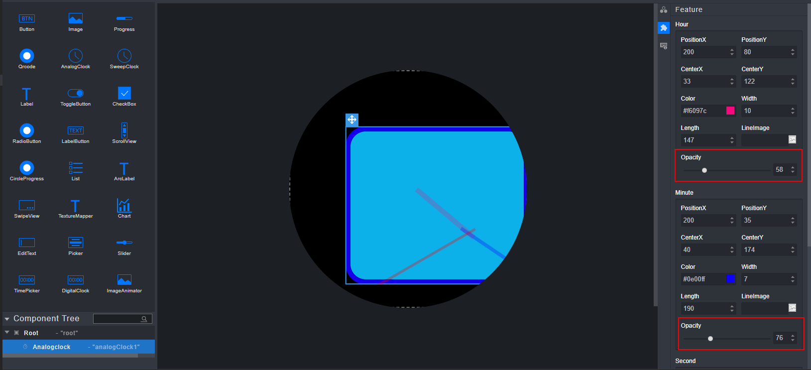

-   Select the AnalogClock component and click the  style icon (Feature) in the attribute and style bar on the right. In the expanded Feature bar, modify the LineImage attribute in the Hour window to add an image to the hour hand. In addition, the LineImage attributes in the Minute and Second windows can add images to the minute hand and the second hand respectively.

    **Figure 7**  Adding images to the hands<a name="zh-cn_topic_0000002399739761_fig194842357484"></a>  
    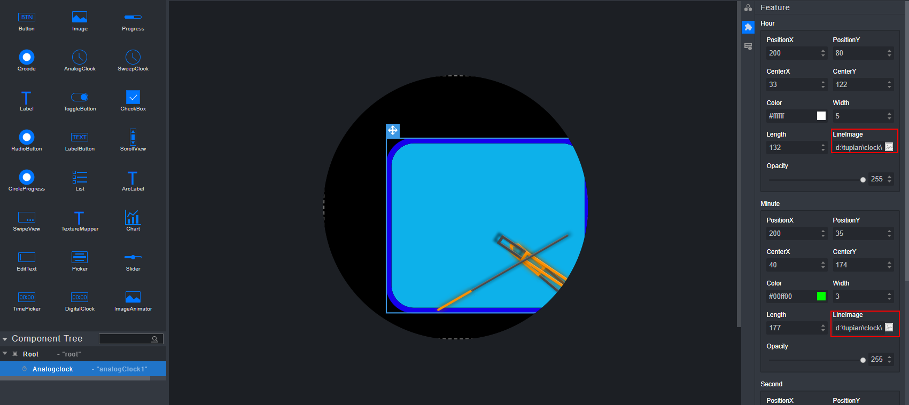

    > **Note:** 
    >The LineImage attribute does not support Chinese paths.

-   Select the AnalogClock component and click the  style icon (Feature) in the attribute and style bar on the right. Modify the NewMode attribute of the AnalogClock component in the expanded Feature bar to control the display of the second hand.

    **Figure 8**  Controlling the display of the second hand<a name="zh-cn_topic_0000002399739761_fig7341154611512"></a>  
    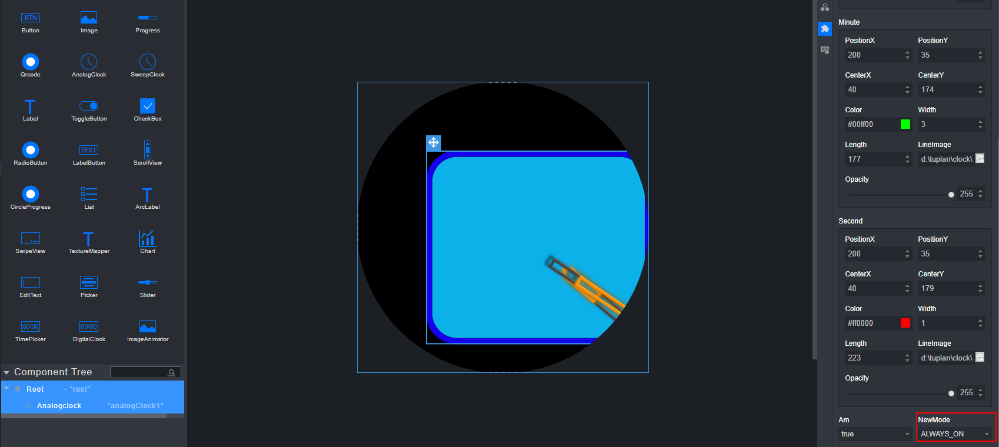

-   Select the AnalogClock component in the canvas. Use the  style icon (Events) in the attribute and style bar on the right, and configure the callback events in the expanded Events bar.

    The events supported by the AnalogClock component include OnClick, OnLongPress, OnPress, OnCancel, and OnRelease.

    **Figure 9**  Callback event configuration<a name="zh-cn_topic_0000002399739761_fig052871717486"></a>  
    

-   Select other components in the component bar and drag them into the AnalogClock component, then adjust the styles of other components. The position of a child component is relative to the upper-left corner of the parent container. When a component already exists on the interface, clicking the center of the component can drag the component into the container.

    **Figure 10**  Dragging other components into the AnalogClock component<a name="zh-cn_topic_0000002399739761_fig192648563920"></a>  
    

> **Note:** 
>-   The MarginBottom and MarginRight attributes under the General page have no rendering effect.
>-   The Am attribute under the Feature page has no interface rendering effect.

#### SweepClock Component<a name="ZH-CN_TOPIC_0000002378717684"></a>

This component contains all the attributes of the AnalogClock component and is similar to it. Therefore, the same attributes are not introduced here. For details, see the "[AnalogClock Component](AnalogClock组件.md#ZH-CN_TOPIC_0000002412436929)" description.

-   Select the SweepClock component and click the  style icon (Feature) in the attribute and style bar on the right. In the expanded Feature bar, modify the CenterImage attribute in the Hour window to add an image to the center point of the hour hand. In addition, the CenterImage attributes in the Minute and Second windows can add images to the center points of the minute hand and the second hand respectively.

    **Figure 1**  Adding an image to the center circle<a name="zh-cn_topic_0000002366099982_fig194842357484"></a>  
    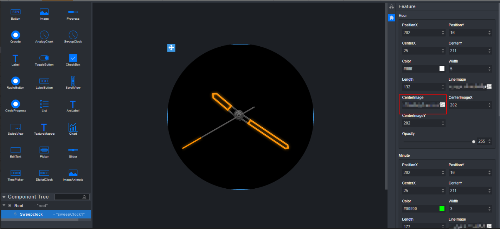

    > **Note:** 
    >The CenterImage attribute does not support Chinese paths.

-   Select the SweepClock component and click the  style icon (Feature) in the attribute and style bar on the right. In the expanded Feature bar, modify the CenterImageX and CenterImageY attributes in the Hour window to change the position of the center image of the hour hand. In addition, the CenterImage attributes in the Minute and Second windows can separately modify the positions of the center images of the minute hand and the second hand.

    **Figure 2**  Controlling the display of the second hand<a name="zh-cn_topic_0000002366099982_fig7341154611512"></a>  
    

-   Select other components in the component bar and drag them into the SweepClock component, then adjust the styles of other components. The position of a child component is relative to the upper-left corner of the parent container. When a component already exists on the interface, clicking the center of the component can drag the component into the container.

    **Figure 3**  Dragging other components into the SweepClock component<a name="zh-cn_topic_0000002366099982_fig192648563920"></a>  
    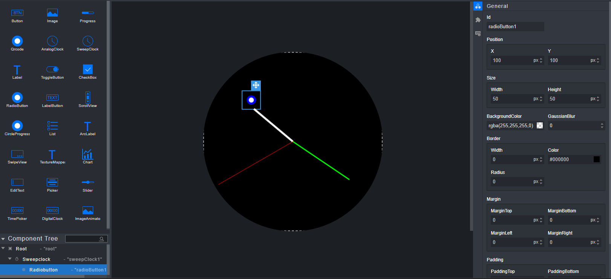

> **Note:** 
>-   The MarginBottom and MarginRight attributes under the General page have no rendering effect.
>-   The Am attribute under the Feature page has no interface rendering effect.
>-   The SweepClock component does not support configuring callback events.

#### Coverflow Component<a name="ZH-CN_TOPIC_0000002412317081"></a>

The common attributes of this component do not include Border, Margin, and Padding. For the usage of other common attributes, see the "[Common Attributes of a Component](组件的共有属性.md#ZH-CN_TOPIC_0000002378717660)" section.

-   Select the Coverflow component and click the  style icon (Feature) in the attribute and style bar on the right. Import one or more images in the expanded Feature bar (you can adjust the canvas size to make the image display effect better). The first image is located in the center of the canvas by default.

    **Figure 1**  Specific attribute configuration: ImagePath<a name="zh-cn_topic_0000002399619893_fig144651235202314"></a>  
    

    > **Note:** 
    >ImagePath does not support Chinese paths.
    >The imported Bin file must be a Bin converted from an image; otherwise, the simulator will behave abnormally.

-   Select the Coverflow component in the canvas. Use the  style icon (Feature) in the attribute and style on the right, and modify ImgWidth and ImgHeight of the Coverflow component in the expanded Feature bar to adjust the image width and height.

    After the image width and height are changed, the width and height of all images imported into the Coverflow component change accordingly, and the first image is always located in the center of the component.

    **Figure 2**  Specific attribute configuration: ImgWidth and ImgHeight<a name="zh-cn_topic_0000002399619893_fig1549113615248"></a>  
    

-   Select the Coverflow component in the canvas. Use the  style icon (Feature) in the attribute and style on the right, and modify RotateAngle of the Coverflow component in the expanded Feature bar to adjust the rotation angle.

    **Figure 3**  Specific attribute configuration: RotateAngle<a name="zh-cn_topic_0000002399619893_fig1917017159243"></a>  
    

-   Select the Coverflow component in the canvas. Use the  style icon (Feature) in the attribute and style on the right, and modify Padding of the Coverflow component in the expanded Feature bar to adjust the spacing between images.

    **Figure 4**  Specific attribute configuration: Padding<a name="zh-cn_topic_0000002399619893_fig2142192232415"></a>  
    

-   Select the Coverflow component in the canvas. Use the  style icon (Feature) in the attribute and style on the right, and modify IsShowMirrorImg of the Coverflow component in the expanded Feature bar to set whether to display the image mirror.

    **Figure 5**  Specific attribute configuration: IsShowMirrorImg<a name="zh-cn_topic_0000002399619893_fig25262913248"></a>  
    

-   Select the Coverflow component in the canvas. Use the  style icon (Feature) in the attribute and style on the right, and modify MirrorOpa of the Coverflow component in the expanded Feature bar to set the transparency of the image mirror.

    **Figure 6**  Specific attribute configuration: MirrorOpa<a name="zh-cn_topic_0000002399619893_fig96581036102413"></a>  
    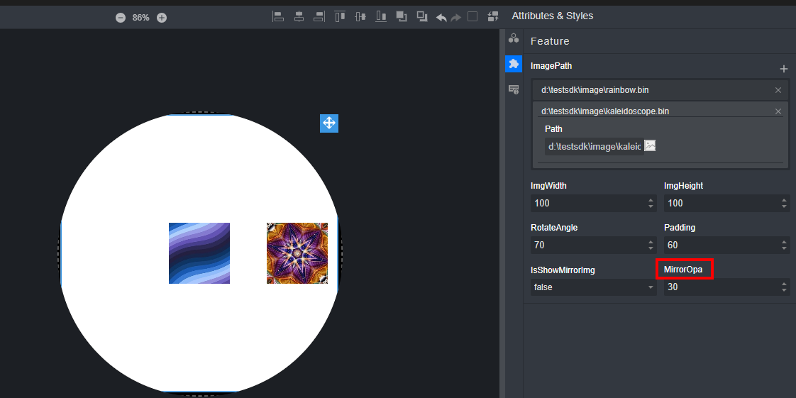

-   Select the Coverflow component in the canvas. Use the  style icon (Events) in the attribute and style bar on the right, and configure the callback events in the expanded Events bar.

    The events supported by the Coverflow component include OnDrag, OnDragStart, OnDragEnd, and OnCoverflow.

    **Figure 7**  Callback event configuration<a name="zh-cn_topic_0000002399619893_fig4163730162310"></a>  
    

> **Note:** 
>-   RotateAngle, IsShowMirrorImg, and MirrorOpa under the Feature page have no rendering effect for now. You can view the specific effect in the simulator.
>-   The callback function of the Coverflow callback event is named "OnScroll()" in the generated XXXPresenter.cpp file.

#### Barcode Component<a name="ZH-CN_TOPIC_0000002378877524"></a>

For the usage of common attributes, see the "[11.1.2.2 Common Attributes of a Component](组件的共有属性.md#ZH-CN_TOPIC_0000002378717660)" section.

Select the Barcode component in the canvas and click the  style icon (Feature) in the attribute and style bar on the right. In the expanded Feature bar, there is a BarcodeInfo attribute that provides the Barcode information. It cannot be empty. If it is set to empty, the barcode fails to be displayed in the simulator after the code is generated.

**Figure 1**  Specific attribute configuration: BarcodeInfo<a name="zh-cn_topic_0000002365940086_fig191081212257"></a>  


> **Note:** 
>-   The BarcodeInfo attribute under the Feature page has no page rendering effect.
>-   The Barcode component does not support configuring callback events.
>-   BarcodeInfo cannot be set to empty and does not support Chinese characters. If it is set to empty or to Chinese characters, the barcode fails to be displayed in the simulator.
>-   After setting BarcodeInfo, click another position and then generate the code.

#### CardPage Component<a name="ZH-CN_TOPIC_0000002412436933"></a>

For the General attributes of this component, see the description in "[11.1.2.2 Common Attributes of a Component](组件的共有属性.md#ZH-CN_TOPIC_0000002378717660)".

-   Select the CardPage component in the canvas and click the   style icon (Feature) in the attribute and style bar on the right. In the expanded Feature bar, there is an IsCoverable attribute, which defaults to false. It determines whether the previous CardPage component is covered when another CardPage component is dragged in and displayed.

    **Figure 1**  Specific attribute configuration: IsCoverable<a name="zh-cn_topic_0000002399739765_fig195722386343"></a>  
    

-   Select the CardPage component in the canvas. Use the  style icon (Events) in the attribute and style bar on the right, and configure the callback events in the expanded Events bar.

    The event types supported by the CardPage component include OnClick, OnLongPress, OnDrag, OnDragStart, OnDragEnd, OnPress, OnCancel, OnRelease, OnFocus, OnBlur, OnRotate, OnRotateStart, and OnRotateEnd.

    **Figure 2**  Callback event configuration<a name="zh-cn_topic_0000002399739765_fig1790072115352"></a>  
    

> **Note:** 
>-   The attributes under the Feature page have no interface rendering effect.
>-   CardPage is a container component and is mainly used as a child component of CrossView.

#### CrossView Component<a name="ZH-CN_TOPIC_0000002378717688"></a>

For the General attributes of this component, see the description in "[11.1.2.2 Common Attributes of a Component](组件的共有属性.md#ZH-CN_TOPIC_0000002378717660)".

-   Select the CrossView component and click the  style icon (Feature) in the attribute and style bar on the right. In the expanded Feature bar, you can see the EnableScreenCap attribute. A drop-down box for setting the bool variable value is displayed, which determines whether the screenshot mode is enabled when switching cards.

    **Figure 1**  Specific attribute configuration: EnableScreenCap<a name="zh-cn_topic_0000002366099986_fig1358134319354"></a>  
    
    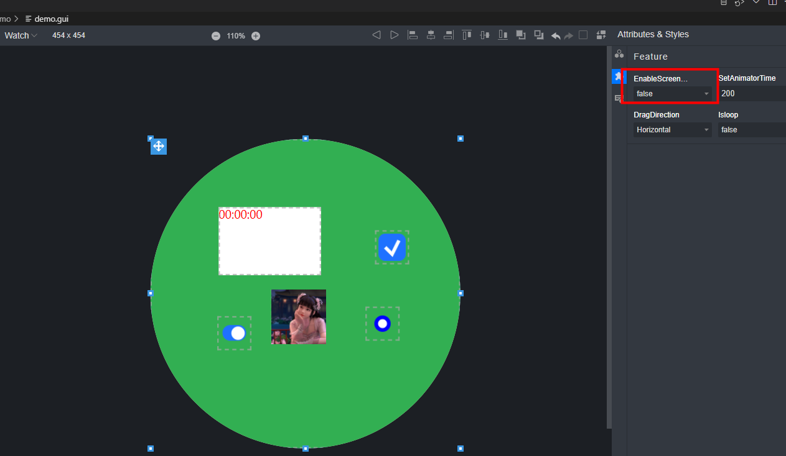

-   Select the CrossView component and click the  style icon (Feature) in the attribute and style bar on the right. In the expanded Feature bar, you can see the SetAnimatorTime attribute. It determines the release animation time in the simulator, in milliseconds (ms).

    **Figure 2**  Specific attribute configuration: SetAnimatorTime<a name="zh-cn_topic_0000002366099986_fig2959881495"></a>  
    
    

-   Select the CrossView component and click the  style icon (Feature) in the attribute and style bar on the right. In the expanded Feature bar, you can see the DragDirection attribute. It determines the direction from which child components are dragged in.

    **Figure 3**  Specific attribute configuration: DragDirection<a name="zh-cn_topic_0000002366099986_fig1772818954716"></a>  
    
    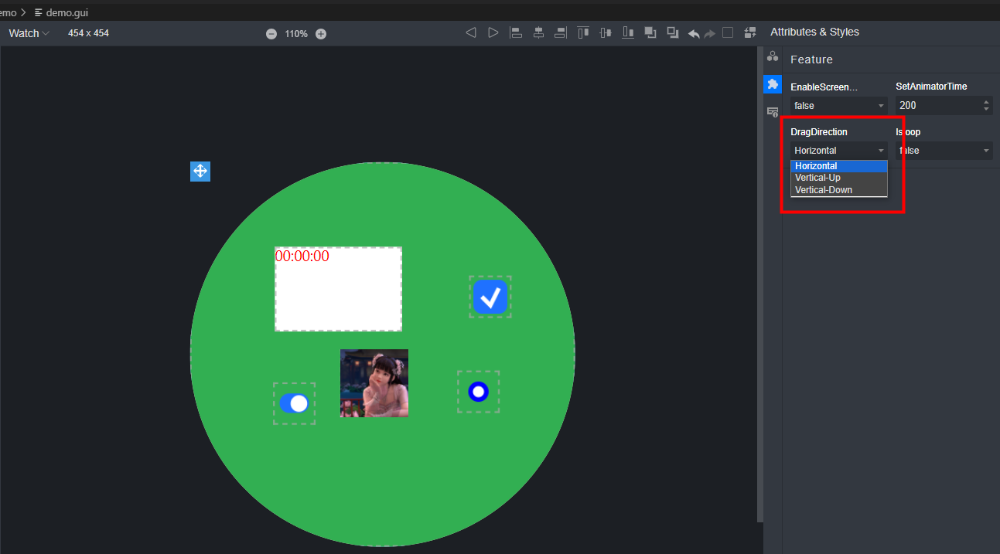

    When the dragged-in component is not of the CardPage type, the message "Only supports cardpage component" or "Only CardPage components can be dragged in" is displayed in the lower-right corner, and the dragged-in child component is not displayed on the canvas.

    **Figure 4**  Specific attribute configuration: DragDirection (only CardPage-type child components can be dragged in)<a name="zh-cn_topic_0000002366099986_fig634965194814"></a>  
    ")

    The front-end rendering interface of the CrossView component displays only one of its CardPage child components:

    -   When a CardPage component is added, the most recently dragged-in CardPage component is displayed by default, and the previous ones are hidden.
    -   When a CardPage component is deleted, the CardPage component dragged in last time is displayed by default, and the others are hidden.

    To implement the switching, click the  button on the Panel panel described in "[GUI Drag Interface Description](GUI拖拽界面介绍.md#ZH-CN_TOPIC_0000002412317053)". The usage of this button is as follows:

    1.  Left/right switching displays the previous and next dragged-in CardPage child components respectively.
    2.  Whether cyclic switching between components is supported is consistent with the setting rules of the simulator. You can select True or False for Isloop in the Feature bar. When it is set to False, clicking the left button on the first component and the right button on the last component has no switching effect. When it is set to True, clicking the left button on the first component and the right button on the last component switches between them.
    3.  The switching buttons take effect only when a CardPage child component whose parent component is CrossView is selected. To select it, click the CardPage in the component tree on the left or click the CardPage on the rendering interface, and then click the left and right buttons to display the previous and next components of the selected component, as shown in [Figure 5](#zh-cn_topic_0000002366099986_fig10608162418201).
    4.  If the selected component is not a CardPage child component whose parent component is CrossView, a pop-up message is displayed, as shown in [Figure 6](#zh-cn_topic_0000002366099986_fig560918241207).

    **Figure 5**  Specific attribute configuration: DragDirection (CardPage switching display logic)<a name="zh-cn_topic_0000002366099986_fig10608162418201"></a>  
    ")

    **Figure 6**  Specific attribute configuration: DragDirection (pop-up reminder for switching non-CrossView child components)<a name="zh-cn_topic_0000002366099986_fig560918241207"></a>  
    ")

    When DragDirection is set to Horizontal, there is no limit on the number of CardPage components to drag in. Each time a new CardPage component is dragged in, the other CardPage child components are hidden.

    **Figure 7**  Specific attribute configuration: DragDirection (CardPage-type child components dragged in from the horizontal direction)<a name="zh-cn_topic_0000002366099986_fig12609112419209"></a>  
    ")

    When DragDirection is set to Vertical-Up, dragging in a new CardPage component also hides the other CardPage child components. However, only one component can be dragged in. When you drag in another CardPage child component in this direction, the message "UpPage direction only supports one component" or "Only one CardPage component can be dragged in the upward direction" is displayed in the lower-right corner.

    **Figure 8**  Specific attribute configuration: DragDirection (only one child component can be dragged in the upward direction)<a name="zh-cn_topic_0000002366099986_fig1260952419208"></a>  
    ")

    When DragDirection is set to Vertical-Down, dragging in a new CardPage component also hides the other CardPage child components, and only one component can be dragged in. When you drag in another CardPage child component in this direction, the message "DownPage direction only supports one component" or "Only one CardPage component can be dragged in the downward direction" is displayed in the lower-right corner.

    **Figure 9**  Specific attribute configuration: DragDirection (only one child component can be dragged in the downward direction)<a name="zh-cn_topic_0000002366099986_fig16609142412208"></a>  
    ")

-   Select the CrossView component and click the  style icon (Feature) in the attribute and style bar on the right. In the expanded Feature bar, click the Isloop attribute. A drop-down box for setting the bool variable value is displayed, which determines the horizontal card loop mode.

    **Figure 10**  Specific attribute configuration: Isloop<a name="zh-cn_topic_0000002366099986_fig18540511191815"></a>  
    
    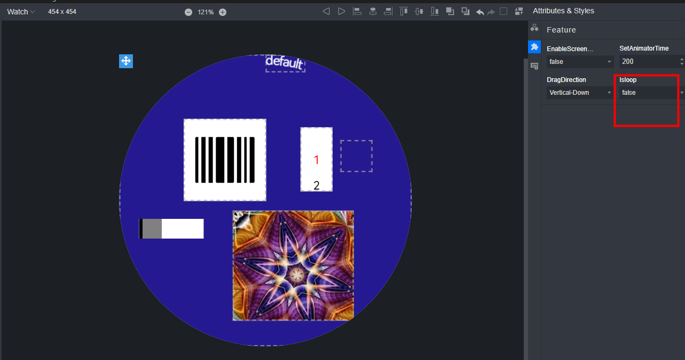

-   Select the CrossView component. Use the  style icon (Events) in the attribute and style bar on the right, and configure the callback events in the expanded Events bar.

    The events supported by the CrossView component include OnClick, OnLongPress, OnDrag, OnDragStart, OnDragEnd, OnPress, OnCancel, OnRelease, OnFocus, OnBlur, OnRotate, OnRotateStart, OnRotateEnd, and OnSwipe. OnSwipe defaults to True.

    **Figure 11**  Callback event configuration<a name="zh-cn_topic_0000002366099986_fig5540511151817"></a>  
    
    

> **Note:** 
>-   On the Feature page, except for the DragDirection feature and Isloop, which are associated with the front-end rendering of the GUI interface, the other attributes have no interface rendering effect. You can view them in the simulator.
>-   The CrossView component supports dragging in only CardPage-type child components.
>-   All pop-up messages of the CrossView component support both Chinese and English.

#### MapView Component<a name="ZH-CN_TOPIC_0000002412317085"></a>

For the General attributes of this component, see the description in "[11.1.2.2 Common Attributes of a Component](组件的共有属性.md#ZH-CN_TOPIC_0000002378717660)".

-   Select the MapView component and click the  style icon (Feature) in the attribute and style bar on the right. In the expanded Feature bar, click the icon on the right of SvgPath. An interface for selecting an Svg file is displayed. Decompress the Svg file corresponding to the map to any directory, click to select it, and then open the directory again and refresh it. You can see that a bin file with the same name as the Svg file is generated. This file is read and displayed by the simulator. Meanwhile, the map file is drawn on the canvas.

    **Figure 1**  Specific attribute configuration: SvgPath - Selecting an Svg file<a name="zh-cn_topic_0000002399619897_fig1556381810504"></a>  
    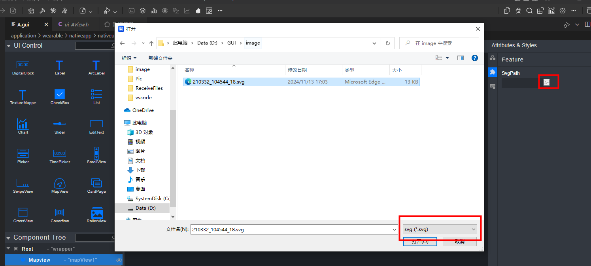

    **Figure 2**  Specific attribute configuration: SvgPath - Drawing an Svg image<a name="zh-cn_topic_0000002399619897_fig761210910508"></a>  
    

-   Select the MapView component. Use the  style icon (Events) in the attribute and style bar on the right, and configure the callback events in the expanded Events bar.

    The events supported by the MapView component include OnClick, OnLongPress, OnDrag, OnDragStart, OnDragEnd, OnPress, OnCancel, OnRelease, OnFocus, OnBlur, OnRotate, OnRotateStart, OnRotateEnd, and OnPOIClick.

    **Figure 3**  Callback event configuration<a name="zh-cn_topic_0000002399619897_fig982152854217"></a>  
    

> **Note:** 
>-   MapView is a map component. You should display the map file on the canvas and in the simulator.
>-   The General attributes of MapView contain only two options, ID and Position, for users to set. The tool and the simulator display the original size of the Svg image by default. You can adjust the Position parameter based on the actual effect in the simulator.

#### RollerView Component<a name="ZH-CN_TOPIC_0000002378877528"></a>

The common attributes of this component do not include Border, Margin, and Padding. For the usage of other common attributes, see the "[Common Attributes of a Component](组件的共有属性.md#ZH-CN_TOPIC_0000002378717660)" section.

-   Select the RollerView component and click the  style icon (Feature) in the attribute and style bar on the right. Import one or more images in the expanded Feature bar (you can adjust the canvas size to make the image display effect better). The first image is located in the center of the canvas by default.

    **Figure 1**  Specific attribute configuration: ImagePath<a name="zh-cn_topic_0000002365940090_fig144651235202314"></a>  
    

    > **Note:** 
    >ImagePath does not support Chinese paths.
    >The imported Bin file must be a Bin converted from an image; otherwise, the simulator will behave abnormally.

-   Select the RollerView component in the canvas. Use the  style icon (Feature) in the attribute and style on the right, and modify ImageWidth and ImageHeight of the RollerView component in the expanded Feature bar to adjust the image width and height.

    After the image width and height are changed, the width and height of all images imported into the RollerView component change accordingly, and the first image is always located in the center of the component.

    **Figure 2**  Specific attribute configuration: ImageWidth and ImageHeight<a name="zh-cn_topic_0000002365940090_fig1549113615248"></a>  
    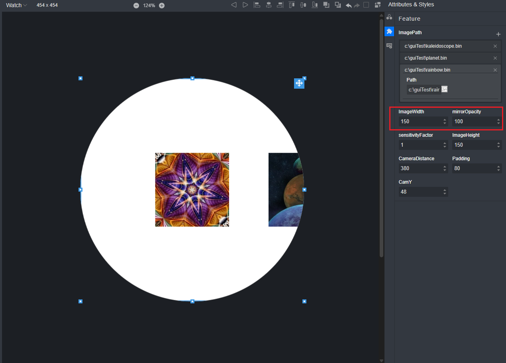

-   Select the RollerView component in the canvas. Use the  style icon (Feature) in the attribute and style on the right, and modify MirrorOpacity of the RollerView component in the expanded Feature bar to adjust the transparency of the mirror images of the roller elements.

    **Figure 3**  Specific attribute configuration: MirrorOpacity<a name="zh-cn_topic_0000002365940090_fig514874910116"></a>  
    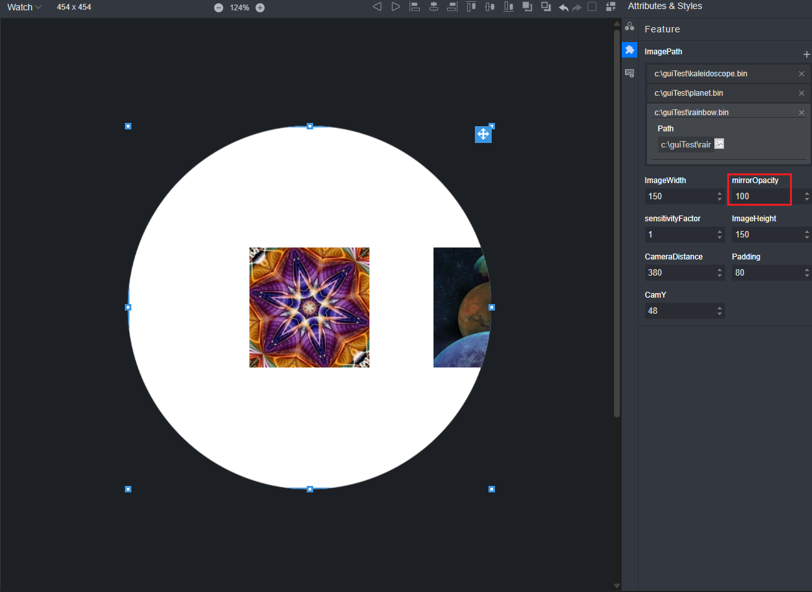

-   Select the RollerView component in the canvas. Use the  style icon (Feature) in the attribute and style on the right, and modify SensitivityFactor of the RollerView component in the expanded Feature bar to adjust the sensitivity of the roller.

    **Figure 4**  Specific attribute configuration: SensitivityFactor<a name="zh-cn_topic_0000002365940090_fig2991158101319"></a>  
    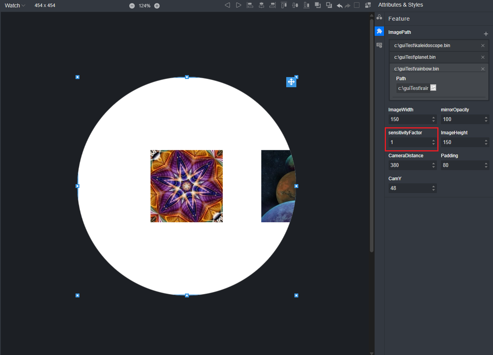

-   Select the RollerView component in the canvas. Use the  style icon (Feature) in the attribute and style on the right, and modify Padding of the RollerView component in the expanded Feature bar to adjust the spacing between images.

    **Figure 5**  Specific attribute configuration: Padding<a name="zh-cn_topic_0000002365940090_fig2142192232415"></a>  
    

-   Select the RollerView component in the canvas. Use the  style icon (Feature) in the attribute and style on the right, and modify CameraDistance of the RollerView component in the expanded Feature bar to set the camera distance in the simulator.

    **Figure 6**  Specific attribute configuration: CameraDistance<a name="zh-cn_topic_0000002365940090_fig25262913248"></a>  
    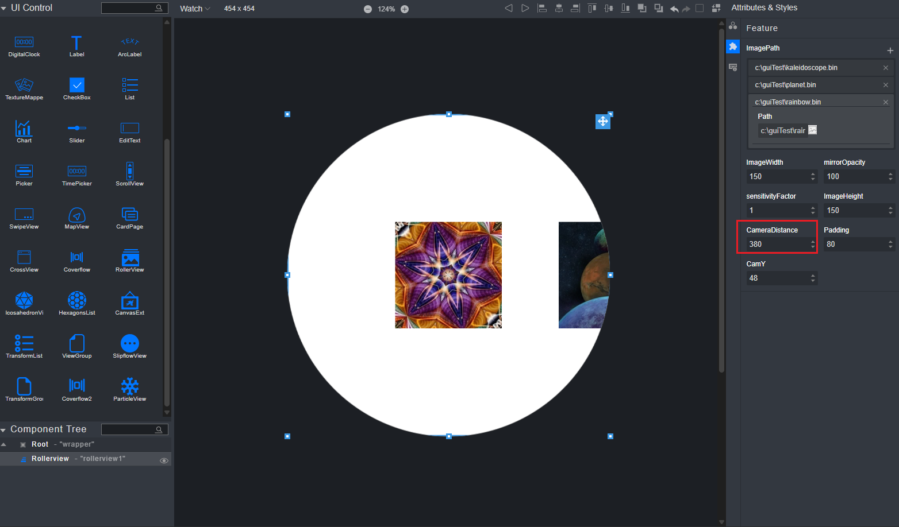

-   Select the RollerView component in the canvas. Use the  style icon (Feature) in the attribute and style on the right, and modify CamY of the RollerView component in the expanded Feature bar to set the Y coordinate of the camera in the simulator.

    **Figure 7**  Specific attribute configuration: CamY<a name="zh-cn_topic_0000002365940090_fig96581036102413"></a>  
    

-   Select the RollerView component in the canvas. Use the  style icon (Events) in the attribute and style bar on the right, and configure the callback events in the expanded Events bar.

    The events supported by the RollerView component include OnClick, OnLongPress, OnDrag, OnDragStart, OnDragEnd, OnPress, OnCancel, OnRelease, OnFocus, OnBlur, OnScroll, and OnModeChange.

    **Figure 8**  Callback event configuration<a name="zh-cn_topic_0000002365940090_fig17698142911119"></a>  
    

> **Note:** 
>CameraDistance and CamY under the Feature page have no rendering effect for now. You can view the specific effect in the simulator.
>In the simulator, the RollerView component can arrange images in the horizontal direction in the form of a roller and supports scrolling interaction.

#### HexagonsList Component<a name="ZH-CN_TOPIC_0000002412436937"></a>

The common attributes of this component do not include Border, Margin, and Padding. For the usage of other common attributes, see the "[Common Attributes of a Component](组件的共有属性.md#ZH-CN_TOPIC_0000002378717660)" section.

-   Select the HexagonsList component and click the  style icon (Feature) in the attribute and style bar on the right. Import one or more images in the expanded Feature bar (you can adjust the canvas size to make the image display effect better). The first image is located in the center of the canvas by default.

    **Figure 1**  Specific attribute configuration: ImagePath<a name="zh-cn_topic_0000002399739769_fig144651235202314"></a>  
    

    > **Note:** 
    >ImagePath does not support Chinese paths.
    >The imported Bin file must be a Bin converted from an image; otherwise, the simulator will behave abnormally.

-   Select the HexagonsList component in the canvas. Use the  style icon (Feature) in the attribute and style on the right, and modify ImageWidth and ImageHeight of the HexagonsList component in the expanded Feature bar to adjust the image width and height.

    After the image width and height are changed, the width and height of all images imported into the HexagonsList component change accordingly, and the first image is always located in the center of the component.

    **Figure 2**  Specific attribute configuration: ImageWidth and ImageHeight<a name="zh-cn_topic_0000002399739769_fig1549113615248"></a>  
    

-   Select the HexagonsList component in the canvas. Use the  style icon (Feature) in the attribute and style on the right, and modify Padding of the HexagonsList component in the expanded Feature bar to adjust the spacing between images.

    **Figure 3**  Specific attribute configuration: Padding<a name="zh-cn_topic_0000002399739769_fig2142192232415"></a>  
    

-   Select the HexagonsList component in the canvas. Use the  style icon (Feature) in the attribute and style on the right, and modify the OriImgDistance attribute of the HexagonsList component in the expanded Feature bar to set the original image distance between the centers of two adjacent images in the simulator.

    **Figure 4**  Specific attribute configuration: OriImgDistance<a name="zh-cn_topic_0000002399739769_fig25262913248"></a>  
    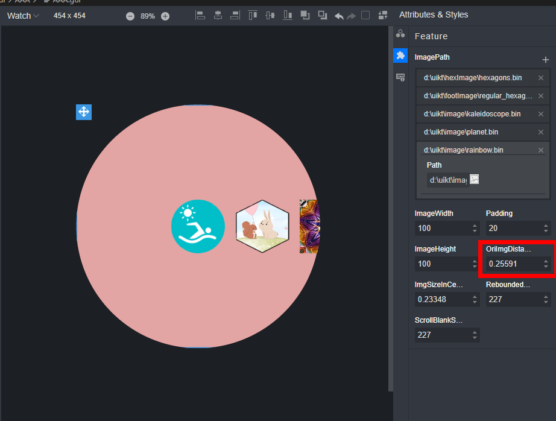

-   Select the HexagonsList component in the canvas. Use the  style icon (Feature) in the attribute and style on the right, and modify the ImgSizeInCenter attribute of the HexagonsList component in the expanded Feature bar to set the size of the image at the center in the simulator.

    **Figure 5**  Specific attribute configuration: ImgSizeInCenter<a name="zh-cn_topic_0000002399739769_fig9701121017913"></a>  
    

-   Select the HexagonsList component in the canvas. Use the  style icon (Feature) in the attribute and style on the right, and modify the ReboundedSize attribute of the HexagonsList component in the expanded Feature bar to set the rebound size, that is, the distance for which the component rebounds to the list edge after being dragged beyond the list edge and released.

    **Figure 6**  Specific attribute configuration: ReboundedSize<a name="zh-cn_topic_0000002399739769_fig17864205617814"></a>  
    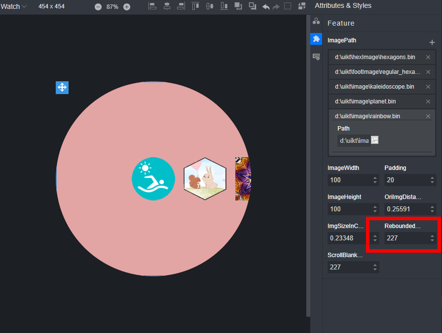

-   Select the HexagonsList component in the canvas. Use the  style icon (Feature) in the attribute and style on the right, and modify the ScrollBlankSize attribute of the HexagonsList component in the expanded Feature bar to set the blank size when the component scrolls in the simulator.

    **Figure 7**  Specific attribute configuration: ScrollBlankSize<a name="zh-cn_topic_0000002399739769_fig1256315491283"></a>  
    

-   Select the HexagonsList component in the canvas. Use the  style icon (Events) in the attribute and style bar on the right, and configure the callback events in the expanded Events bar.

    The events supported by the HexagonsList component include OnClick, OnLongPress, OnDrag, OnDragStart, OnDragEnd, OnPress, OnCancel, OnRelease, OnFocus, OnBlur, OnRotate, OnRotateStart, and OnRotateEnd.

    **Figure 8**  Callback event configuration<a name="zh-cn_topic_0000002399739769_fig17698142911119"></a>  
    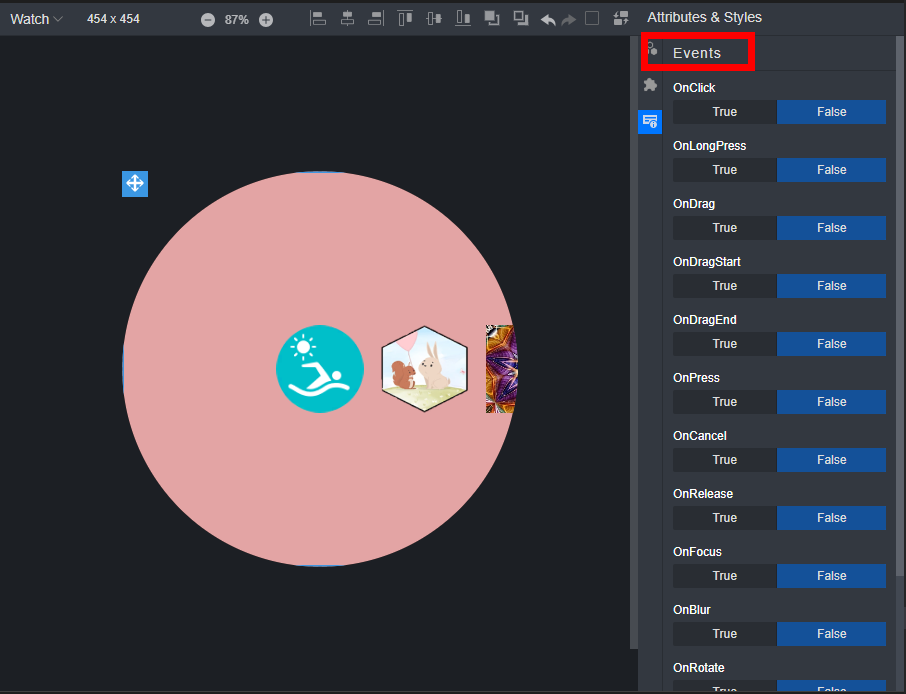

> **Note:** 
>OriImgDistance, ImgSizeInCenter, ReboundedSize, and ScrollBlankSize under the Feature page have no rendering effect for now. You can view the specific effect in the simulator.
>ImageWidth, Padding, and ImageHeight can be used to set the image size when multiple components are displayed on the interface.
>The initial values of Rebounded and ScrollBlankSize are 227, when the default component Position is \(0, 0, 454, 454\), that is, the entire dial. The specific value can be adjusted based on the actual display effect in the simulator. Usually, this value is half of the component width.
>The product of the OriImgDistance and ImgSizeInCenter attributes and the component width determines the layout position relationship of the images in the simulator.

#### IcosahedronView Component<a name="ZH-CN_TOPIC_0000002378717692"></a>

The common attributes of this component do not include Position, Border, Margin, and Padding. For the usage of other common attributes, see the "[Common Attributes of a Component](组件的共有属性.md#ZH-CN_TOPIC_0000002378717660)" section.

-   Select the IcosahedronView component and click the  style icon (Feature) in the attribute and style bar on the right. Import an image in the expanded Feature bar (you can adjust the canvas size to make the image display effect better). The image fills the entire canvas by default.

    **Figure 1**  Specific attribute configuration: DefaultSrc<a name="zh-cn_topic_0000002366099990_fig1411916381693"></a>  
    

-   Select the IcosahedronView component and click the  style icon (Feature) in the attribute and style bar on the right. Modify the LuminanceFactor attribute of the IcosahedronView component in the expanded Feature bar to set the luminance compensation factor and adjust the brightness in the simulator.

    **Figure 2**  Specific attribute configuration: LuminanceFactor<a name="zh-cn_topic_0000002366099990_fig51391045174012"></a>  
    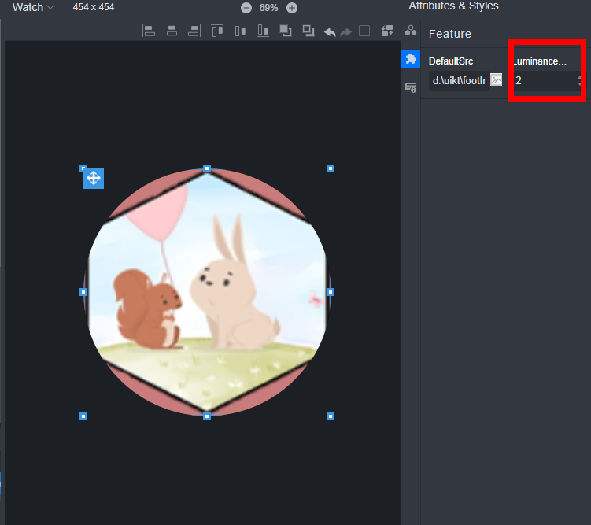

-   The IcosahedronView component supports importing only Image components. The DefaultSrc attribute of the IcosahedronView component sets the default image. If fewer than 20 images are imported into the Image component, the default image is used for filling, to achieve a simulator effect similar to a soccer ball.

    **Figure 3**  Only Image components can be imported<a name="zh-cn_topic_0000002366099990_fig14703195575718"></a>  
    

-   Select the IcosahedronView component in the canvas. Use the  style icon (Events) in the attribute and style bar on the right, and configure the callback events in the expanded Events bar.

    The events supported by the RollerView component include OnClick, OnLongPress, OnDrag, OnDragStart, OnDragEnd, OnPress, OnCancel, OnRelease, OnFocus, OnBlur, OnRotate, OnRotateStart, and OnRotateEnd.

    **Figure 4**  Callback event configuration<a name="zh-cn_topic_0000002366099990_fig1859035515919"></a>  
    

> **Note:** 
>The IcosahedronView component supports only width and height adjustment, and its coordinate position is fixed.

#### CanvasExt Component<a name="ZH-CN_TOPIC_0000002412317089"></a>

For the usage of common attributes, see the "[Common Attributes of a Component](组件的共有属性.md#ZH-CN_TOPIC_0000002378717660)" section.

-   Select the CanvasExt component in the canvas. Use the  style icon (Events) in the attribute and style bar on the right, and configure the callback events in the expanded Events bar. The events supported by the CanvasExt component include OnClick, OnLongPress, OnPress, OnCancel, and OnRelease.

    **Figure 1**  Callback event configuration<a name="zh-cn_topic_0000002399619901_fig863319505301"></a>  
    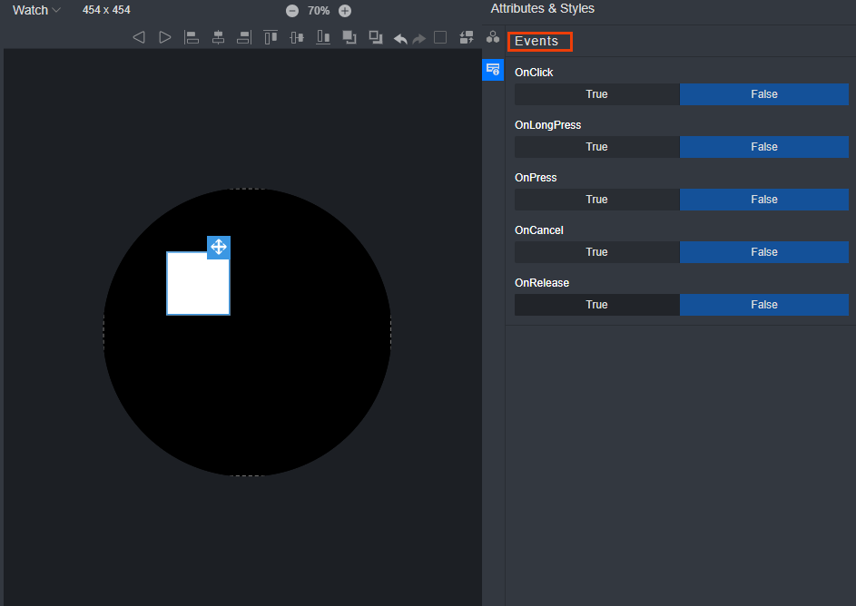

#### TransformList Component<a name="ZH-CN_TOPIC_0000002378877532"></a>

For the usage of common attributes, see the "[Common Attributes of a Component](组件的共有属性.md#ZH-CN_TOPIC_0000002378717660)" section.

-   Select the TransformList component and click the  style icon (Feature) in the attribute and style bar on the right. In the expanded Feature bar, modify the itemHeight attribute to set the height of all child items, modify the itemWidth attribute to set the width of all child items, modify the itemSpace attribute to set the gap between child items, modify the imageHeight attribute to set the height of the images of all child items, and modify the FontSize attribute to set the font size of all child items. Click the plus sign on the right of the Item bar to add a child item, and modify the Text and ImagePath attributes in the child item to add text and images.

    **Figure 1**  Adding a child item<a name="zh-cn_topic_0000002365940094_fig1424214304315"></a>  
    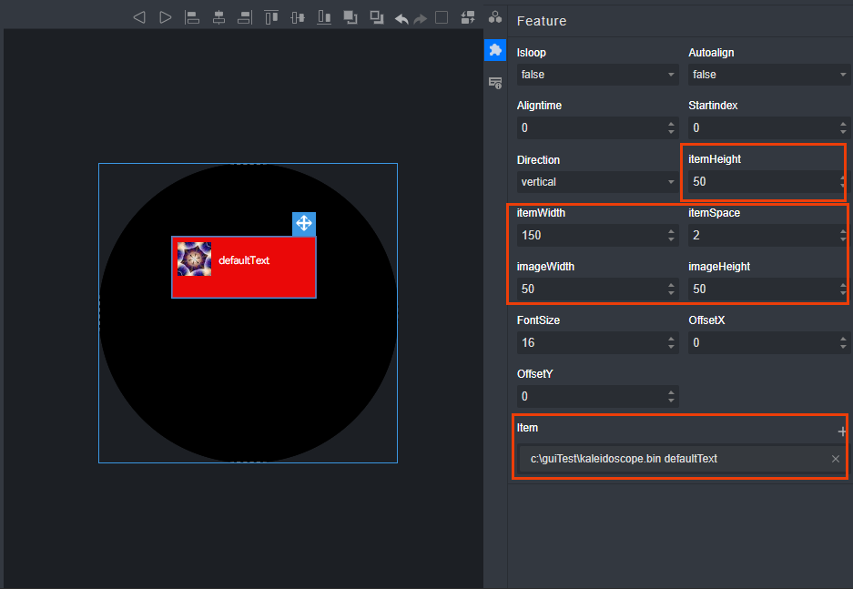

-   Select the TransformList component and click the  style icon (Feature) in the attribute and style bar on the right. In the expanded Feature bar, modify the OffsetX attribute of the List component to set the horizontal offset of all child items, and modify the OffsetY attribute to set the vertical offset of all child items.

    **Figure 2**  Modifying the offset of the child items<a name="zh-cn_topic_0000002365940094_fig8644443123216"></a>  
    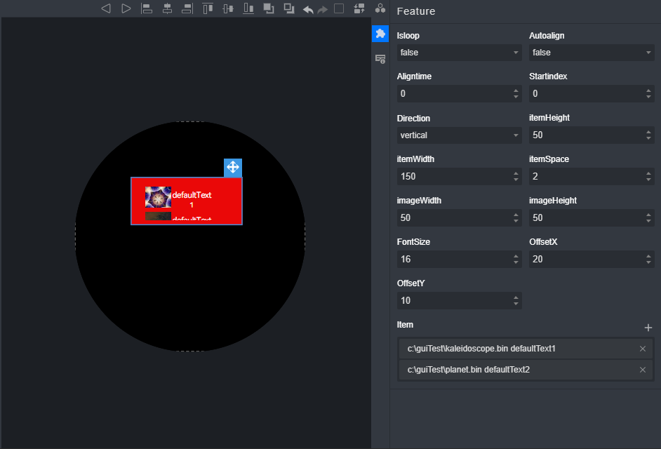

-   Select the TransformList component and click the  style icon (Feature) in the attribute and style bar on the right. In the expanded Feature bar, modify the Direction attribute of the TransformList component to set the arrangement direction of the list.

    **Figure 3**  Modifying the arrangement direction of the list<a name="zh-cn_topic_0000002365940094_fig640685910323"></a>  
    

-   Select the TransformList component in the canvas. Use the  style icon (Events) in the attribute and style bar on the right, and configure the callback events in the expanded Events bar.

    The events supported by the List component include OnClick, OnLongPress, OnDrag, OnDragStart, OnDragEnd, OnPress, OnCancel, OnRelease, OnFocus, and OnBlur.

    **Figure 4**  Callback event configuration<a name="zh-cn_topic_0000002365940094_fig186332171075"></a>  
    

#### SlipflowView Component<a name="ZH-CN_TOPIC_0000002412436941"></a>

The common attributes of this component do not include Position, Size, GaussOption, Border, Margin, and Padding. For the usage of other common attributes, see the description in "[11.1.2.2 Common Attributes of a Component](组件的共有属性.md#ZH-CN_TOPIC_0000002378717660)".

-   Select the SlipflowView component in the canvas. Use the  style icon (Feature) in the attribute and style on the right, and modify ImgWidth and ImgHeight of the SlipflowView component in the expanded Feature bar to adjust the image width and height.

    After the image width and height are changed, the width and height of all images imported into the SlipflowView component change accordingly, and the first image is always located in the center of the component.

    **Figure 1**  Specific attribute configuration: ImgWidth and ImgHeight<a name="zh-cn_topic_0000002399739773_fig186308234339"></a>  
    

-   Select the SlipflowView component in the canvas. Use the  style icon (Feature) in the attribute and style on the right, and modify isEnableBackImage of the SlipflowView component in the expanded Feature bar to control whether the background image is enabled.

    **Figure 2**  Specific attribute configuration: isEnableBackImage<a name="zh-cn_topic_0000002399739773_fig951023617338"></a>  
    

-   Select the SlipflowView component and click the  style icon (Feature) in the attribute and style bar on the right. In the expanded Feature bar, modify backImagePath of the SlipflowView component to set the resource path of the background image.

    **Figure 3**  Specific attribute configuration: backImagePath<a name="zh-cn_topic_0000002399739773_fig1650517572334"></a>  
    

-   Select the SlipflowView component and click the  style icon (Feature) in the attribute and style bar on the right. Import one or more images in the expanded Feature bar (you can adjust the canvas size to make the image display effect better). The first image is located in the center of the canvas by default.

    **Figure 4**  Specific attribute configuration: ImagePath<a name="zh-cn_topic_0000002399739773_fig144651235202314"></a>  
    
    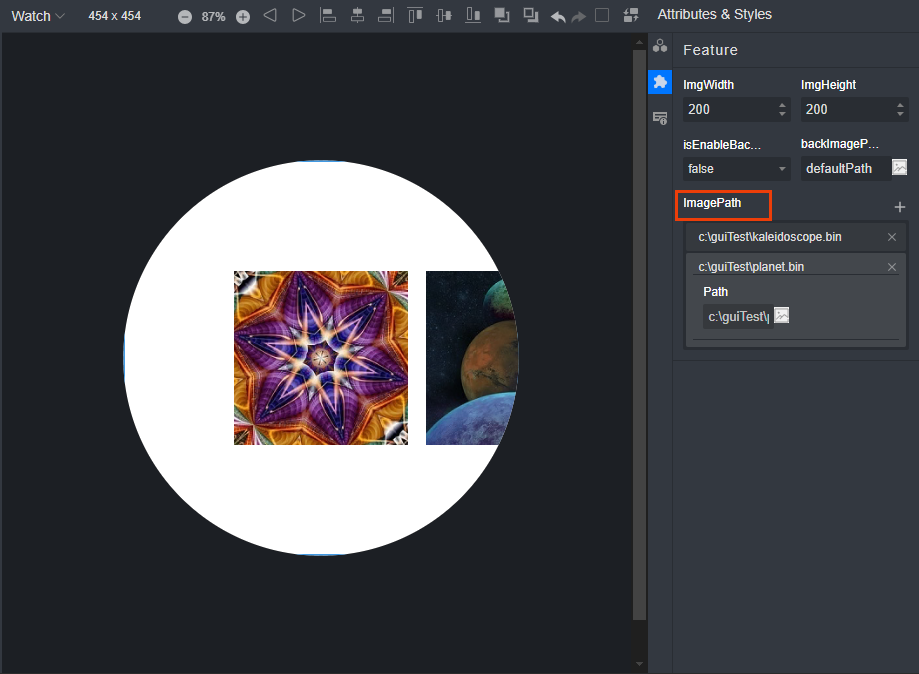

    > **Note:** 
    >ImagePath does not support Chinese paths.
    >The imported Bin file must be a Bin converted from an image; otherwise, the simulator will behave abnormally.

-   Select the SlipflowView component in the canvas. Use the  style icon (Events) in the attribute and style bar on the right, and configure the callback events in the expanded Events bar.

    The events supported by the SlipflowView component include OnClick, OnLongPress, OnPress, OnCancel, OnRelease, OnScroll, OnScrollUpStart, OnScrollUpEnd, OnRemove, and OnRefreshPageOpaScale.

    **Figure 5**  Callback event configuration<a name="zh-cn_topic_0000002399739773_fig4163730162310"></a>  
    

> **Note:** 
>-   The coordinate position and size of the SlipflowView component are fixed.
>-   isEnableBackImage and backImagePath under the Feature page have no rendering effect for now. You can view the specific effect in the simulator.

#### TransformGroup Component<a name="ZH-CN_TOPIC_0000002378717696"></a>

For the usage of common attributes, see the "[Common Attributes of a Component](组件的共有属性.md#ZH-CN_TOPIC_0000002378717660)" section.

-   Select the TransformGroup component in the canvas. Use the  style icon (Events) in the attribute and style bar on the right, and configure the callback events in the expanded Events bar.

    The event types supported by the TransformGroup component include OnClick, OnLongPress, OnPress, OnCancel, and OnRelease.

    **Figure 1**  Callback event configuration<a name="zh-cn_topic_0000002366099994_fig1790072115352"></a>  
    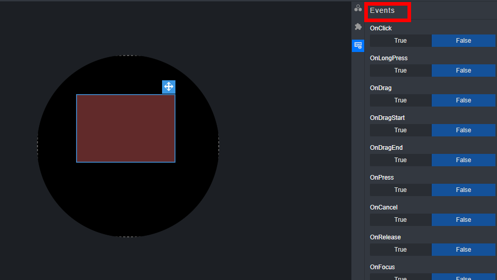

> **Note:** 
>TransformGroup is a container component and is mainly used as a child component of Coverflow2.

#### Coverflow2 Component<a name="ZH-CN_TOPIC_0000002412317093"></a>

For the usage of common attributes, see the "[Common Attributes of a Component](组件的共有属性.md#ZH-CN_TOPIC_0000002378717660)" section.

-   Select the Coverflow2 component in the canvas. Use the  style icon (Feature) in the attribute and style on the right, and modify RotateAngle of the Coverflow2 component in the expanded Feature bar to adjust the rotation angle.

    **Figure 1**  Specific attribute configuration: RotateAngle<a name="zh-cn_topic_0000002399619905_fig1917017159243"></a>  
    
    

-   Select the Coverflow2 component in the canvas. Use the  style icon (Feature) in the attribute and style on the right, and modify Padding of the Coverflow2 component in the expanded Feature bar to adjust the spacing between images.

    **Figure 2**  Specific attribute configuration: Padding<a name="zh-cn_topic_0000002399619905_fig2142192232415"></a>  
    
    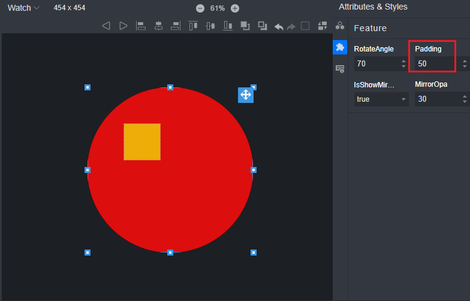

-   Select the Coverflow2 component in the canvas. Use the  style icon (Feature) in the attribute and style on the right, and modify IsShowMirrorImg of the Coverflow2 component in the expanded Feature bar to set whether to display the image mirror.

    **Figure 3**  Specific attribute configuration: IsShowMirrorImg<a name="zh-cn_topic_0000002399619905_fig25262913248"></a>  
    
    

-   Select the Coverflow2 component in the canvas. Use the  style icon (Feature) in the attribute and style on the right, and modify MirrorOpa of the Coverflow2 component in the expanded Feature bar to set the transparency of the image mirror.

    **Figure 4**  Specific attribute configuration: MirrorOpa<a name="zh-cn_topic_0000002399619905_fig96581036102413"></a>  
    
    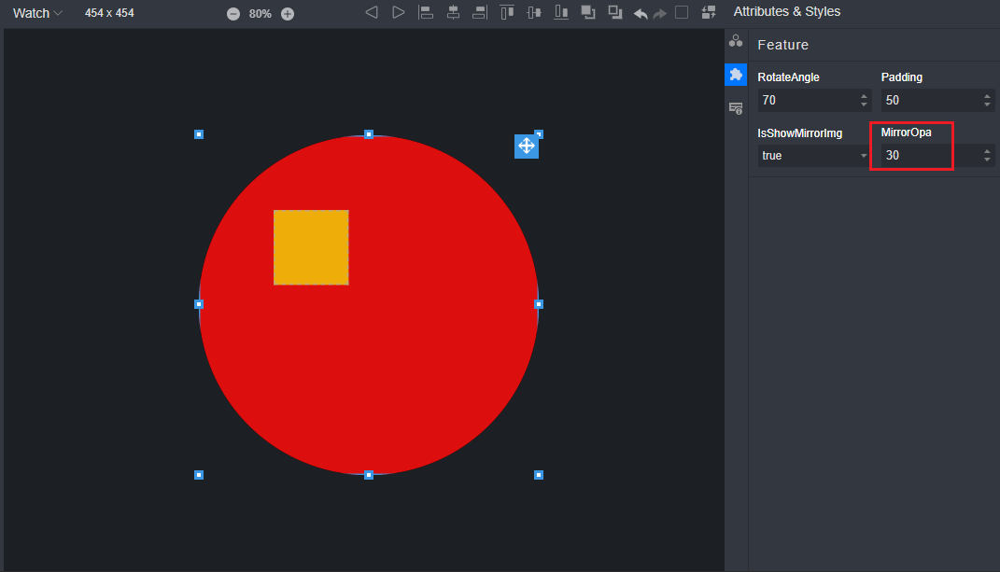

    When the dragged-in component is not of the TransformGroup type, the message "Only supports transformgroup component" or "Only TransformGroup components can be dragged in" is displayed in the lower-right corner, and the dragged-in child component is not displayed on the canvas.

    **Figure 5**  Dragging a component into the Coverflow2 component<a name="zh-cn_topic_0000002399619905_fig1535915143218"></a>  
    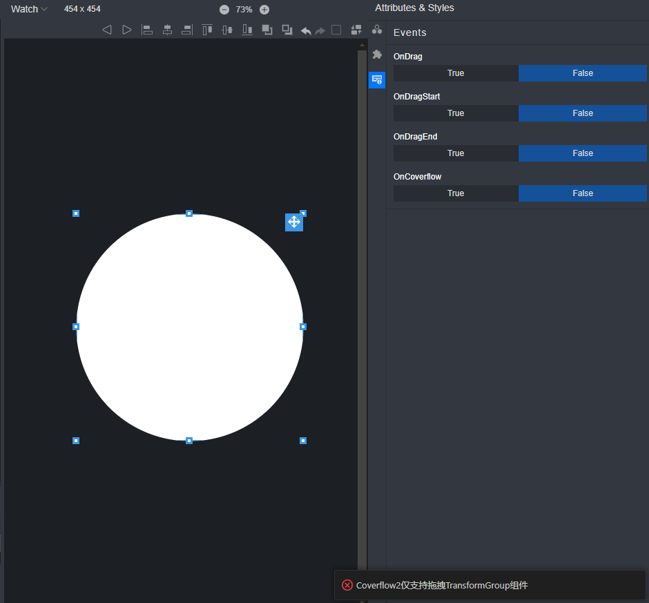

The front-end rendering interface of the Coverflow2 component displays only one of its TransformGroup child components:

-   When a TransformGroup component is added, the most recently dragged-in TransformGroup component is displayed by default, and the previous ones are hidden.
-   When a TransformGroup component is deleted, the TransformGroup component dragged in last time is displayed by default, and the others are hidden.

To implement the switching, click the  button on the Panel panel described in "[GUI Drag Interface Description](GUI拖拽界面介绍.md#ZH-CN_TOPIC_0000002412317053)". The usage of this button is as follows:

1.  Left/right switching displays the previous and next dragged-in TransformGroup child components respectively.
2.  The switching buttons take effect when a TransformGroup child component whose parent component is Coverflow2 is selected. To select it, click the TransformGroup in the component tree on the left or click the TransformGroup on the rendering interface, and then click the left and right buttons to display the previous and next components of the selected component, as shown in [Figure 6](#zh-cn_topic_0000002399619905_fig14330923143518).
3.  If the selected component is not a TransformGroup child component whose parent component is Coverflow2, a pop-up message is displayed, as shown in [Figure 7](#zh-cn_topic_0000002399619905_fig1459413716407).

**Figure 6**  TransformGroup switching display logic<a name="zh-cn_topic_0000002399619905_fig14330923143518"></a>  


**Figure 7**  Pop-up reminder for switching non-Coverflow2 child components<a name="zh-cn_topic_0000002399619905_fig1459413716407"></a>  
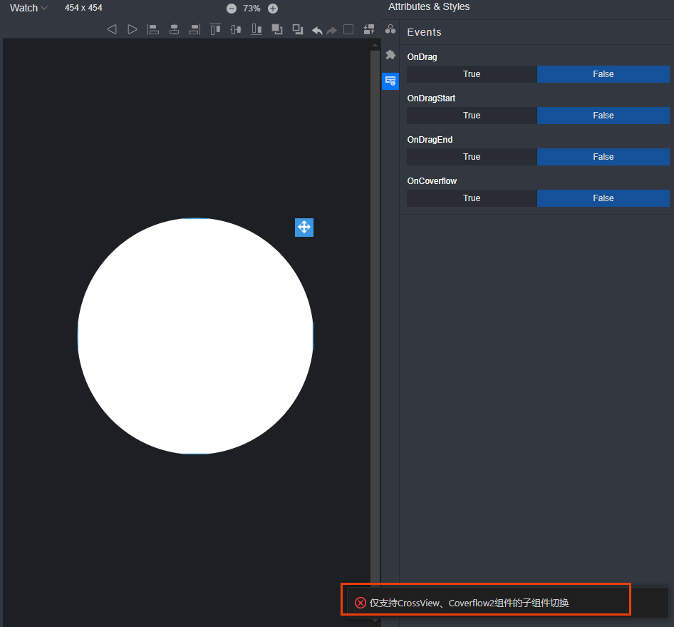

#### Root Component<a name="ZH-CN_TOPIC_0000002378877536"></a>

This component is the background canvas of the central area.

**Figure 1**  Root component<a name="zh-cn_topic_0000002365940098_fig1548711534020"></a>  
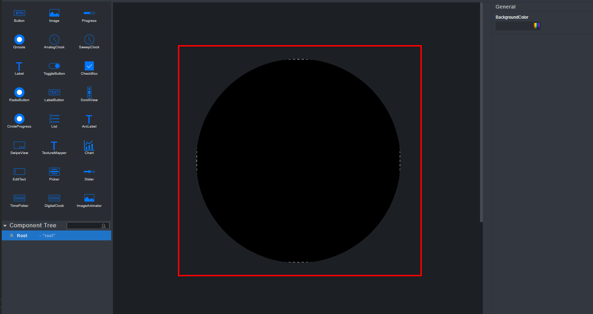

Select the Root component and modify the BackgroundColor attribute in the expanded General bar on the right to change the color of the Root component.

**Figure 2**  Modifying the background color<a name="zh-cn_topic_0000002365940098_fig1728445112456"></a>  


> **Note:** 
>-   The Root component is the parent component of all components.
>-   The Root component is unique and automatically created. No operation other than changing the color can be performed on it.

#### User Code Editing<a name="ZH-CN_TOPIC_0000002412436945"></a>

Click "Convert to C++ files" in the upper-right corner of the canvas. The code corresponding to the interface style is generated in the project files.

**Figure 1**  Generate code button<a name="zh-cn_topic_0000002399739777_fig36701735185010"></a>  
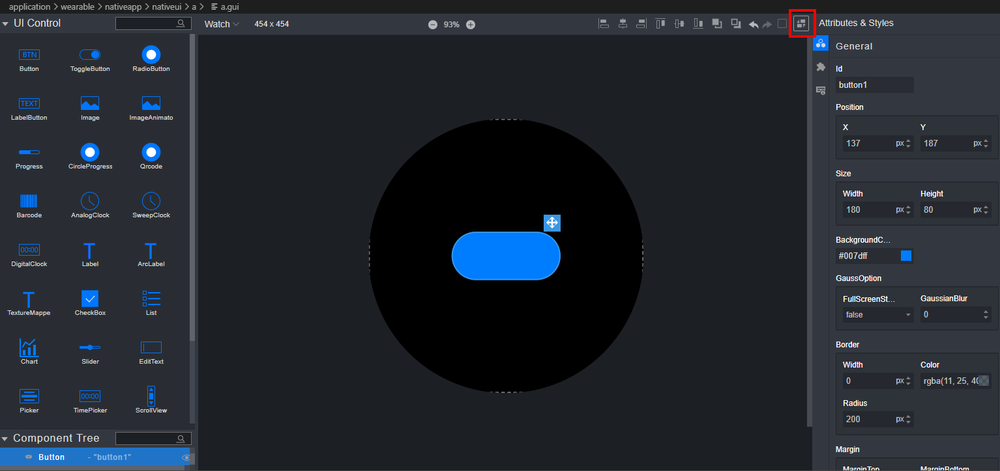

Take the aaaa.gui project named aaaa and the Button component as an example. The generated code directory is located at "application/wearable/nativeapp/gui project name" under the project directory, and the specific structure is shown in [Figure 2](#zh-cn_topic_0000002399739777_fig084021814113). You can add your own callback events in the xxxPresenter.cpp file according to the template. The template code is shown in [Figure 3](#zh-cn_topic_0000002399739777_fig113311395104). The rest is generated automatically and is refreshed every time the generate code button is clicked.

**Figure 2**  Directory structure of the generated code<a name="zh-cn_topic_0000002399739777_fig084021814113"></a>  


> **Note:** 
>-   When you switch from another component to the CrossView component, or switch from the CrossView component to another component, and then generate the code, due to the particularity of adding child components to the CrossView component, you need to manually delete the existing "/src/$\{AppName\}View.cpp" first, and then click to convert and generate the code.
>-   The other files in the "ui\_xxView.h" format cannot be modified. The GUI overwrites and regenerates them every time the generate code button is clicked.

**Figure 3**  Template code of the callback event<a name="zh-cn_topic_0000002399739777_fig113311395104"></a>  


Take the click callback event as an example. If only one component in the current canvas has the click callback set to true, you can directly add the callback event in the OnClick callback function. If multiple components in the current canvas have the click callback set to true, you need to distinguish the components according to the prompt to implement their respective callbacks, as shown in [Figure 4](#zh-cn_topic_0000002399739777_fig171118207109).

**Figure 4**  Code implementation of the same callback event for multiple components<a name="zh-cn_topic_0000002399739777_fig171118207109"></a>  
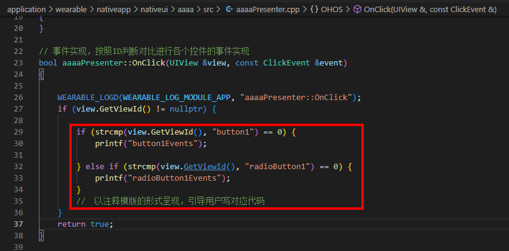

#### Component Alignment<a name="ZH-CN_TOPIC_0000002378717700"></a>

Component alignment is implemented by selecting a component and then clicking the alignment button  in the toolbar at the top of the interface.

The alignment effects include left alignment , left-right center alignment , right alignment , top alignment , top-bottom center alignment 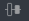, and bottom alignment .

Based on the number of selected components, the alignment operation is divided into two types:

-   Select one component

    When only one component is selected, the selected component is used as the component to be aligned, and its parent component is used as the reference for alignment. You can view the parent-child relationship of components in the component tree.

    > **Note:** 
    >It is invalid when only the Root component is selected.

-   Select multiple components (click multiple components while holding down the Ctrl key)

    When more than one component is selected, the last selected component is used as the reference, and the other selected components are aligned as the components to be aligned.

    > **Note:** 
    >The selected components can only be the Root component or its direct child components.

#### Component Hierarchy Movement<a name="ZH-CN_TOPIC_0000002412317097"></a>

Component hierarchy movement is implemented by selecting a component and then clicking the hierarchy movement button in the toolbar at the top of the interface.

**Figure 1**  Component hierarchy movement<a name="zh-cn_topic_0000002399619909_fig84841225105411"></a>  


 moves the component forward one layer, and  moves the component backward one layer.

> **Note:** 
>-   Each click can move the component forward/backward only one layer.
>-   When multiple components are selected at the same time, the hierarchy movement operation takes effect only on the last selected component.
>-   Hierarchy movement cannot adjust the parent component of the current component (for example, if the current component is a child component of ScrollView/SwipeView, the hierarchy movement operation cannot move the component out).
>-   In the component tree, the closer a component is to the top, the lower its hierarchy; the closer it is to the bottom, the higher its hierarchy.

#### Gaussian Blur Attribute<a name="ZH-CN_TOPIC_0000002378877540"></a>

To set the Gaussian blur attribute of a component, click the  style icon (General) in the attribute and style bar on the right, and modify the GaussianBlur attribute of the component in the expanded General bar, as shown in [Figure 1](#zh-cn_topic_0000002365940102_fig12812852164217).

**Figure 1**  Gaussian blur<a name="zh-cn_topic_0000002365940102_fig12812852164217"></a>  


After the Gaussian blur is set for a component, the other components whose hierarchy is lower than that of this component are blurred, as shown in [Figure 2](#zh-cn_topic_0000002365940102_fig17715201710478).

**Figure 2**  Example of the Gaussian blur effect<a name="zh-cn_topic_0000002365940102_fig17715201710478"></a>  
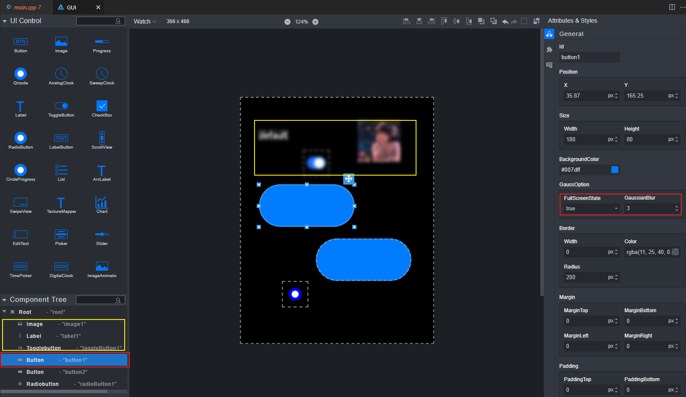

> **Note:** 
>-   The Gaussian blur takes effect only when FullScreenState is true and GaussianBlur is not 0 at the same time.
>-   Due to different rendering methods, the component rendering effect in the GUI interface differs to some extent from the actual effect in the simulator.
>-   When multiple components are all set with the Gaussian blur effect, only the Gaussian blur of the lowest component takes effect.
>-   The component hierarchy can be viewed in the component tree. For the hierarchy movement method and detailed description, see "[Component Hierarchy Movement](组件层级移动.md#ZH-CN_TOPIC_0000002412317097)".
>-   The GaussianBlur attribute determines the degree of the Gaussian blur effect. A reasonable range is \[0, 32\].
>-   Event addition: In the current version, enabling an event in the Events attribute of a control does not generate event code. You need to manually add the event code. The specific method is to add the expected event to the specified control in the setupUi method of the application code (take an application named gui6 as an example, at sdk root directory/application/wearable/nativeapp/nativeui/gui6/include/ui\_gui6View.h). For example, to add the OnLongPress event to the control whose id name is "button1", add "button1-\>SetOnLongPressListener\(gui6presenter\_\);" at the end of the setupUi method, where "button1\_" is the variable name of the control in the code, and "gui6presenter\_" is the automatically generated pointer in the code associated with the application name.

## Methods for Displaying the Simulator Effect<a name="ZH-CN_TOPIC_0000002412436949"></a>


### Running the Demo<a name="ZH-CN_TOPIC_0000002378717704"></a>

Click "App Debug" in the figure. The compilation and debugging are started and the simulator is displayed. The effect of running the default demo is shown in [Figure 2](#zh-cn_topic_0000002366100002_fig771416101317).

The log information during the running process is recorded in the "simulator\_build/error.txt" file under the root directory of the currently opened project.

**Figure 1**  App Debug button<a name="zh-cn_topic_0000002366100002_fig599934320100"></a>  


**Figure 2**  Display of the simulator effect<a name="zh-cn_topic_0000002366100002_fig771416101317"></a>  


### Debugging and Running<a name="ZH-CN_TOPIC_0000002412317101"></a>

After clicking the "App Debug" button, the compilation and debugging functions are automatically started. You can add breakpoints and debug as needed. For the debugging function, see the "[8 Project Debugging](工程调试.md#ZH-CN_TOPIC_0000002378877472)" chapter.

**Figure 1**  Display of the debugging function<a name="zh-cn_topic_0000002399619913_fig28521758191013"></a>  
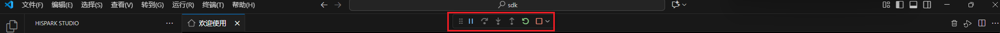

### Running the Code Generated Through GUI Drag-and-Drop<a name="ZH-CN_TOPIC_0000002378877544"></a>

After adding components, changing attributes, or enabling callbacks on the canvas and starting the simulator, you can follow the operation in [Figure 1](#zh-cn_topic_0000002365940106_fig18197143416124) to view the function list added on the canvas.

**Figure 1**  Viewing the added component functions from the simulator<a name="zh-cn_topic_0000002365940106_fig18197143416124"></a>  
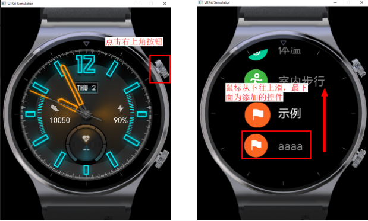

> **Note:** 
>When the simulator displays the main interface, clicking the button in the upper-right corner automatically jumps to the function list page, and the bottom of the list is the added component list. When the simulator displays a non-main interface, clicking the button in the upper-right corner automatically jumps to the main interface.

As can be seen from the figure, the name of the currently added function defaults to the name of the created GUI project, and the icon defaults to the "Example" icon. To modify the icon and name of the GUI project in the simulator, you can modify them in the "Register.cpp" file in the generated code directory of the corresponding GUI project.

**Figure 2**  Modifying the default GUI project name and the icon before the list<a name="zh-cn_topic_0000002365940106_fig21411933131311"></a>  


In the corresponding cpp file, you can modify the icon or name of the corresponding component in the simulator by modifying these four parameters.

①: Icon displayed when the icon mode (default mode) is selected on the desktop. The file format is .bin.

②: Icon displayed when the honeycomb mode is selected on the desktop. The file format is .bin.

③: Icon displayed when the football mode is selected on the desktop. The file format is .bin.

④: Name corresponding to the component.

For the icon mode selected by default, you only need to change the parameters in ① and ④ to modify the icon and component name corresponding to the component in the simulator.

### Setting the Simulator Size and Shape<a name="ZH-CN_TOPIC_0000002412436953"></a>

After creating a GUI project, if you want to change the size and shape of the canvas or simulator again, you can search for the "graphic\_config.h" file in the project. It is located in the "application/brandy/simulator/libui" directory under the project directory. Change the three parameters HORIZONTAL\_RESOLUTION, VERTICAL\_RESOLUTION, and DEVICE\_SHAPE, which correspond to the diameter (length and width) and the shape of the simulator respectively.

**Figure 1**  Changing the size and shape of the simulator<a name="zh-cn_topic_0000002399739785_fig5357185214137"></a>  


## Introduction to Graphics Tools<a name="ZH-CN_TOPIC_0000002378717708"></a>

Click the "Graphics Tools" icon on the plugin page or in the status bar.

**Figure 1**  "Graphics Tools" icon on the plugin page or in the status bar<a name="zh-cn_topic_0000002366100006_fig135900300384"></a>  


A function tab is displayed, which currently contains two functions: "Image Decompression" and "Video First-Frame Extraction".

**Figure 2**  "GUI Graphics Tools" tab<a name="zh-cn_topic_0000002366100006_fig5647114212381"></a>  


### Environment Configuration<a name="ZH-CN_TOPIC_0000002412317105"></a>

Before using the "Graphics Tools" function, you need to configure the Python environment. For details, see "[Toolchain Configuration](工具链toolchain配置.md#ZH-CN_TOPIC_0000002412436857)".

After Python is installed successfully, you need to install the dependency modules of pip.

-   opencv module
-   numpy module
-   Pillow module
-   matplotlib module

After the installation is complete, open cmd in the "tools/python/Scripts" directory under the VS Code installation directory and run "pip.exe list" to check whether each dependency is installed successfully.

**Figure 1**  Checking the installation of pip dependencies<a name="zh-cn_topic_0000002399619917_fig138293814396"></a>  

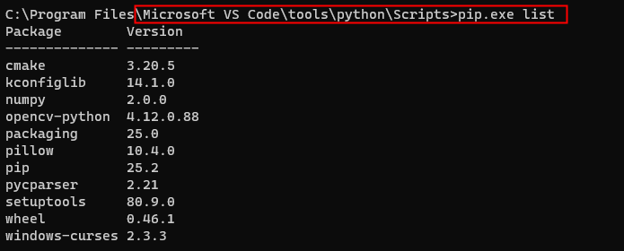

### Image Decompression Tool<a name="ZH-CN_TOPIC_0000002378877548"></a>

Functions of the image decompression tool: based on the compression algorithm and pixel format information configured in the xml file, pack each subdirectory in the specified directory into a resource file and generate the resource index file "ImageResources.cpp"; or pack each image file in the specified directory into a resource file. In the decompression mode, the images in .bin files are decompressed into images in .png format. In the compression mode, the images in .png, .jpg, or .bmp format are compressed into the .bin file format.

**Figure 1**  Image decompression interface<a name="zh-cn_topic_0000002365940110_fig2012249183513"></a>  
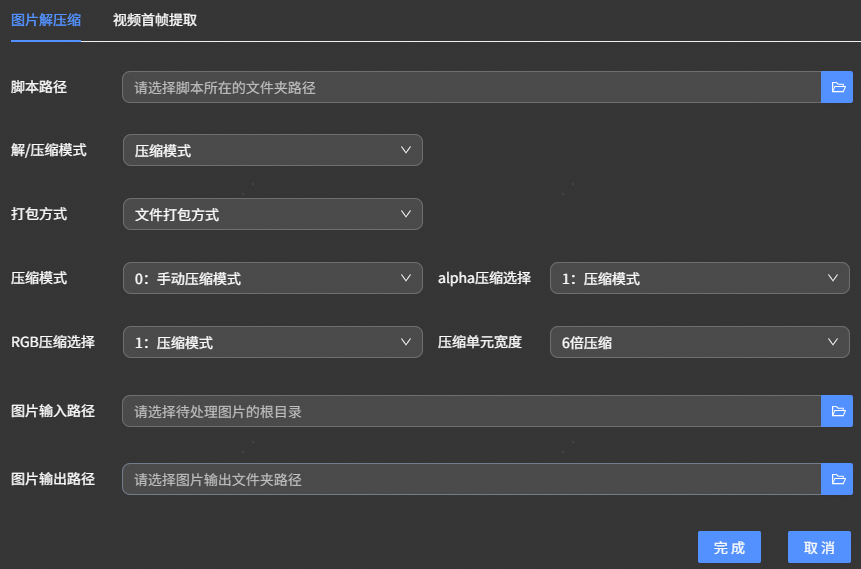

-   Script path: Select the folder path where the "images\_convert.py" script is located, generally "tools\\DebugKits\\graphic\_tools\\image\_converter\_tool".
-   Decompression/compression mode: Specify the decompression or compression mode. The compression mode is selected by default.
-   Packing method: It is divided into the file packing method and the folder packing method. The file packing method is selected by default.
    -   File packing method: Pack each image as a unit.
    -   Folder packing method: After packing the images, pack the packed images contained in each subfolder together as a unit.

-   Compression mode: Manual compression mode by default.
-   alpha compression mode: 0: uncompressed; 1: compressed. Default value: 1 (compressed).
-   rgb compression mode: 0: uncompressed; 1: compressed. Default value: 1 (compressed).
-   Compression unit width: 4--4x4; 6--6x4; 8--8x4; 16--16x4. It is also called the compression ratio. In the ARGB8888 format, it corresponds to 4x, 6x, 8x, and 16x compression respectively. In RGB888, it corresponds to 3x, 4.5x, 6x, and 12x compression respectively. In RGB565, it corresponds to 2x, 3x, 4x, and 8x compression respectively. Default value: 6x compression.
-   Image input path: Specify the root directory of the images to be processed. The images in the image directory can be in formats such as ".jpg, .png, and .bmp".
-   Image output path: Specify the output folder.

> **Notice:** 
>-   Image compression supports only the compression of .png, .bmp, and .jpg files (the file suffix cannot be uppercase), and the image resolution cannot exceed 1280\*800 (width\*height).
>-   The subfolder names and file names must be a combination of digits and letters.
>-   When the decompression/compression mode is set to the decompression mode, the compression mode, alpha compression mode, rgb compression mode, and compression unit width options are hidden.
>-   When both alpha and rgb are 0, it is the uncompressed mode. Pay attention to the adaptation.
>-   The compression ratio is compared with the size of the raw data rather than the size of the source file. For example, for a 466×466 RGBA image, the uncompressed size is 848 KB, the size is 142 KB with 6x compression, and approximately 54 KB with 16x compression.
>-   The compression operation is lossy compression. The larger the compression ratio, the greater the image loss.

**Compression Mode Example<a name="zh-cn_topic_0000002365940110_section19664105194515"></a>**

**Figure 2**  Specific selection example of image compression<a name="zh-cn_topic_0000002365940110_fig611581334117"></a>  


After all options are selected, click Done to execute the compression function. The output displayed on the terminal interface is as follows:

**Figure 3**  Terminal interface output during image compression<a name="zh-cn_topic_0000002365940110_fig753304214242"></a>  
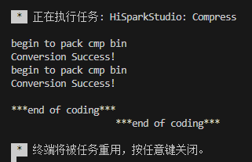

"Conversion Success!" indicates that the compression is successful. The following shows the comparison of the folder where the images are located before and after. Two images in png format were successfully converted into the bin file format:

**Figure 4**  Effect display before and after image compression<a name="zh-cn_topic_0000002365940110_fig954913529412"></a>  


**Decompression Mode Example<a name="zh-cn_topic_0000002365940110_section15836552114418"></a>**

Set the decompression/compression mode to the decompression mode. The compression mode, alpha compression mode, rgb compression mode, and compression unit width options are hidden.

**Figure 5**  Specific selection example of image decompression<a name="zh-cn_topic_0000002365940110_fig7235124264318"></a>  


After all options are selected, click Done to execute the decompression function. The output displayed on the terminal interface is as follows:

**Figure 6**  Terminal interface output during image decompression<a name="zh-cn_topic_0000002365940110_fig188091156104319"></a>  


"Decmpress Success" indicates that the decompression is successful. The following shows the comparison of the folder where the images are located before and after. Two images in bin format were successfully decompressed into the png file format:

**Figure 7**  Comparison before and after image decompression<a name="zh-cn_topic_0000002365940110_fig5433744191910"></a>  


### Video First-Frame Extraction Tool<a name="ZH-CN_TOPIC_0000002412436957"></a>

Before the video is loaded, the first frame is a black frame. You need to manually set a starting preview image. This function provides the capability to extract the first frame of the video and convert it into an image in BMP format.

**Figure 1**  Video first-frame extraction tool page<a name="zh-cn_topic_0000002399739789_fig111561422134515"></a>  


-   Script path: Select the folder path where the "convert\_2\_bmp.py" script is located, generally "tools\\DebugKits\\graphic\_tools\\convert\_2\_bmp".
-   Video path: The path of the video file to be extracted.
-   Video frame width/video frame height: Specify the width and height of the video frame. They must be consistent with the video resource and must be manually entered.
-   Image generation path: The path for generating the image.

> **Caution:** 
>-   Currently, only YUV444 and YUV420 video formats are supported.
>-   The video supports only MJPEG encoding and .mp4 packaging. You can use the ffmpeg tool to adjust the video format and size. Example: "ffmpeg -i video.mp4 -vf crop=454:454 -b:v 4228k -vcodec mjpeg out.mp4".
>-   The video frame width/height can be viewed in the properties--\>details of the video. If the video frame width and height are inconsistent with the actual values, the generated image will be distorted.

Video first-frame extraction example:

**Figure 2**  Specific option example of video first-frame extraction<a name="zh-cn_topic_0000002399739789_fig28171353184518"></a>  
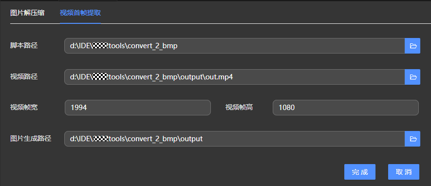

After all options are selected, click Done to execute the video first-frame extraction function. The output displayed on the terminal interface is as follows:

**Figure 3**  Terminal interface output during video first-frame extraction<a name="zh-cn_topic_0000002399739789_fig1474664164615"></a>  


"success" indicates that the extraction is successful. The following shows the comparison of the folder where the video is located before and after. The adapted first frame in mp4 format was successfully extracted and saved as an image in bmp format:

**Figure 4**  Comparison before and after adaptive conversion<a name="zh-cn_topic_0000002399739789_fig7243352114711"></a>  


### 3D Modeling Tool<a name="ZH-CN_TOPIC_0000002378717712"></a>


#### Usage<a name="ZH-CN_TOPIC_0000002412317109"></a>

**Running<a name="zh-cn_topic_0000002399619921_section1992610916599"></a>**

Click Modeling Tools in COMMANDS and select "3D Modeling Tool" at the top.


**Interface Introduction<a name="zh-cn_topic_0000002399619921_section114256515596"></a>**

-   **Main interface after tool startup**

    After the tool is started, the main interface is shown in the following figure:

    **Figure 1**  Main interface after the 3D modeling tool is started<a name="zh-cn_topic_0000002399619921_fig14212923556"></a>  
    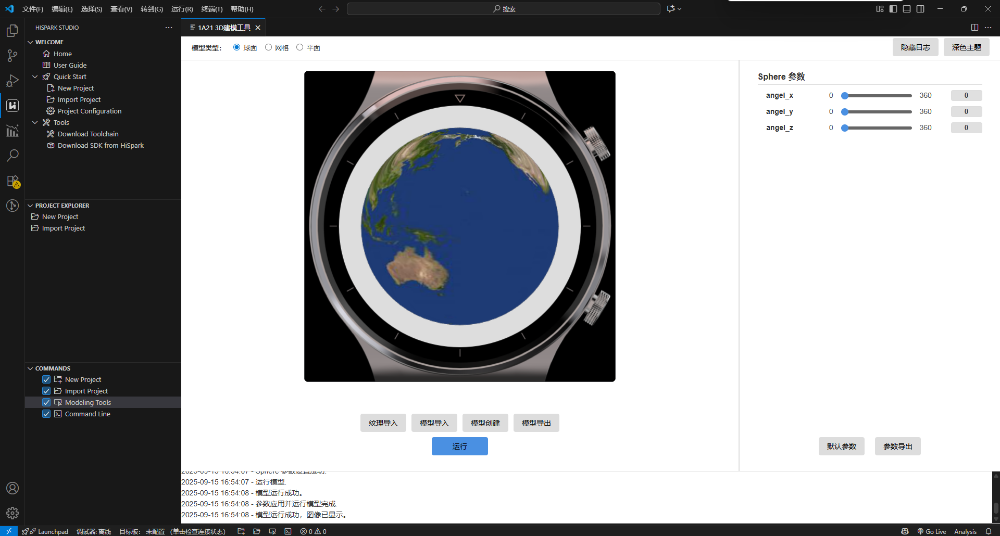

    The functions of the buttons are described as follows:

    -   Model type: Select the model to be used (sphere: sphere; mesh: mesh; plane: cylinder). The default parameters are loaded and the model runs automatically.
    -   Texture import: Select the texture material file.
    -   Model import: Select the model file.
    -   Model creation: Open the sub-interface, configure the model parameters, and generate the model.
    -   Model export: Export the model file generated in the corresponding mode of the tool to the local device.
    -   Run: Run the use case in the corresponding mode and display the running effect.
    -   Default parameters: Restore all parameters to their default values with one click.
    -   Parameter export: Adjust the parameters based on the mode configured on the current interface. After obtaining the ideal effect, you can save the group of parameters in this mode to a file.
    -   Show log/Hide log: Turn on/off the log box below.

-   **Model creation interface**

    ① mesh interface: After selecting mesh in the model selection and clicking model creation, the interface shown in the figure is displayed:

    **Figure 2**  mesh interface<a name="zh-cn_topic_0000002399619921_fig179479235556"></a>  
    

    ② cylinder interface: After selecting plane in the model selection and clicking model creation, the interface shown in the figure is displayed:

    **Figure 3**  cylinder interface<a name="zh-cn_topic_0000002399619921_fig1460543113556"></a>  
    

    ③ sphere interface: After selecting sphere in the model selection and clicking model creation, the interface shown in the figure is displayed:

    **Figure 4**  sphere interface<a name="zh-cn_topic_0000002399619921_fig18331542125514"></a>  
    

    Click the save button to save the configuration values. After saving, the sub-window closes automatically.

**Operation Steps<a name="zh-cn_topic_0000002399619921_section1371818221405"></a>**

-   **mesh mode:**

    mesh is divided into seven sub-modes. Among them, type0 and type6 are strong interaction modes, in which the model is generated online without offline generation and loading. type1 to type5 are weak interaction modes, in which you need to generate the model offline or load the model before running the use case. You can choose either of the two.

    1.  Click the mesh radio button on the main interface to select the mesh mode.
    2.  Click the model creation button on the main interface to set the model parameters.
    3.  Click the type input box to select the sub-mode and configure the related parameters:

        type0: It is recommended to configure thr as 1.0 and len as 5, configure cx and cy at non-center positions, and keep the other parameters at their default values.

        type1: It is recommended to configure len as 0.0. cx and cy only support configuration at the center point. It is recommended to keep the other parameters at their default values.

        type2: It is recommended to configure len as 4.52. cx and cy only support configuration at the center point. It is recommended to keep the other parameters at their default values.

        type3: It is recommended to configure len as 1. cx and cy only support configuration at the center point. It is recommended to keep the other parameters at their default values.

        type4: It is recommended to configure len as 3. cx and cy only support configuration at the center point. It is recommended to keep the other parameters at their default values.

        type5: It is recommended to configure len as 9.33. cx and cy only support configuration at the center point. It is recommended to keep the other parameters at their default values.

        type6: It is recommended to configure thr as 0.1 and keep the other parameters at their default values.

    4.  Click the save button to save and return to the main interface.
    5.  Click the texture import button on the main interface to select the texture material.
    6.  Click the run button.
    7.  Drag the mesh\_ctrl slider on the right to observe the effect.

-   **cylinder mode:**
    1.  Click the plane radio button on the main interface to select the cylinder mode.
    2.  Click the model creation button on the main interface to set the model parameters. It is recommended to use the default values.
    3.  Click the save button to save and return to the main interface.
    4.  Click the texture import button to select the texture material.
    5.  Click the run button.
    6.  Drag the cylinder\_ctrl slider on the right (mainly slide cylinder\_ctl) to observe the effect.

-   **sphere mode:**
    1.  Click the sphere radio button on the main interface to select the sphere mode.
    2.  Click the model creation button on the main interface to set the model parameters. It is recommended to use the default values.
    3.  Click the save button to save and return to the main interface.
    4.  Click the texture import button to select the texture material.
    5.  Click the run button.
    6.  Drag the three sliders angel\_x, angel\_y, and angel\_z on the right to observe the effect.

**Default Paths of Materials<a name="zh-cn_topic_0000002399619921_section88057444012"></a>**

> **Notice:** 
>The following paths cannot be deleted; otherwise, the program will fail to run.

-   Default texture material path: C:/Users/$\{Username\}/.vscode/extensions/hispark.hisparkstudio-$\{Version\}/dist/source\_file/texture/

-   Default model material path: C:/Users/$\{Username\}/.vscode/extensions/hispark.hisparkstudio-$\{Version\}/dist/source\_file/model/, that is, the default saving path after the model is created.
-   Default mask material path: C:/Users/$\{Username\}/.vscode/extensions/hispark.hisparkstudio-$\{Version\}/dist/source\_file/mask/. This path is used only in the sphere mode. The purpose is to keep a smooth transition at the junction when the texture is superimposed on the model. The width and height of the generated sphere mask must be consistent with dst\_width/dst\_height, and the sphere mask must be ARGB8888.
-   $\{Username\} is the user name of the current Windows login account, and $\{Version\} is the version number of this plug-in.

#### Parameter Table<a name="ZH-CN_TOPIC_0000002378877552"></a>

**Roller Calendar<a name="zh-cn_topic_0000002365940114_section19555544673"></a>**

**Table 1**  Roller calendar model parameters

<a name="zh-cn_topic_0000002365940114_table9440155420336"></a>
<table><thead align="left"><tr id="zh-cn_topic_0000002365940114_row2587354183315"><th class="cellrowborder" valign="top" width="12.98%" id="mcps1.2.5.1.1"><p id="zh-cn_topic_0000002365940114_p165871154173319"><a name="zh-cn_topic_0000002365940114_p165871154173319"></a><a name="zh-cn_topic_0000002365940114_p165871154173319"></a>No.</p>
</th>
<th class="cellrowborder" valign="top" width="24.2%" id="mcps1.2.5.1.2"><p id="zh-cn_topic_0000002365940114_p18587205433319"><a name="zh-cn_topic_0000002365940114_p18587205433319"></a><a name="zh-cn_topic_0000002365940114_p18587205433319"></a>Parameter</p>
</th>
<th class="cellrowborder" valign="top" width="26.3%" id="mcps1.2.5.1.3"><p id="zh-cn_topic_0000002365940114_p558755412337"><a name="zh-cn_topic_0000002365940114_p558755412337"></a><a name="zh-cn_topic_0000002365940114_p558755412337"></a>Description</p>
</th>
<th class="cellrowborder" valign="top" width="36.52%" id="mcps1.2.5.1.4"><p id="zh-cn_topic_0000002365940114_p6587155473316"><a name="zh-cn_topic_0000002365940114_p6587155473316"></a><a name="zh-cn_topic_0000002365940114_p6587155473316"></a>Range &amp; demo parameter</p>
</th>
</tr>
</thead>
<tbody><tr id="zh-cn_topic_0000002365940114_row12587205417331"><td class="cellrowborder" valign="top" width="12.98%" headers="mcps1.2.5.1.1 "><p id="zh-cn_topic_0000002365940114_p135878543337"><a name="zh-cn_topic_0000002365940114_p135878543337"></a><a name="zh-cn_topic_0000002365940114_p135878543337"></a>1</p>
</td>
<td class="cellrowborder" valign="top" width="24.2%" headers="mcps1.2.5.1.2 "><p id="zh-cn_topic_0000002365940114_p15587654143310"><a name="zh-cn_topic_0000002365940114_p15587654143310"></a><a name="zh-cn_topic_0000002365940114_p15587654143310"></a>dst_width</p>
</td>
<td class="cellrowborder" valign="top" width="26.3%" headers="mcps1.2.5.1.3 "><p id="zh-cn_topic_0000002365940114_p4587145443312"><a name="zh-cn_topic_0000002365940114_p4587145443312"></a><a name="zh-cn_topic_0000002365940114_p4587145443312"></a>Screen width</p>
</td>
<td class="cellrowborder" valign="top" width="36.52%" headers="mcps1.2.5.1.4 "><p id="zh-cn_topic_0000002365940114_p11587195473319"><a name="zh-cn_topic_0000002365940114_p11587195473319"></a><a name="zh-cn_topic_0000002365940114_p11587195473319"></a>-</p>
</td>
</tr>
<tr id="zh-cn_topic_0000002365940114_row1758785413339"><td class="cellrowborder" valign="top" width="12.98%" headers="mcps1.2.5.1.1 "><p id="zh-cn_topic_0000002365940114_p1558714540336"><a name="zh-cn_topic_0000002365940114_p1558714540336"></a><a name="zh-cn_topic_0000002365940114_p1558714540336"></a>2</p>
</td>
<td class="cellrowborder" valign="top" width="24.2%" headers="mcps1.2.5.1.2 "><p id="zh-cn_topic_0000002365940114_p2587185415330"><a name="zh-cn_topic_0000002365940114_p2587185415330"></a><a name="zh-cn_topic_0000002365940114_p2587185415330"></a>dst_height</p>
</td>
<td class="cellrowborder" valign="top" width="26.3%" headers="mcps1.2.5.1.3 "><p id="zh-cn_topic_0000002365940114_p18587125412333"><a name="zh-cn_topic_0000002365940114_p18587125412333"></a><a name="zh-cn_topic_0000002365940114_p18587125412333"></a>Screen height</p>
</td>
<td class="cellrowborder" valign="top" width="36.52%" headers="mcps1.2.5.1.4 "><p id="zh-cn_topic_0000002365940114_p55871054173311"><a name="zh-cn_topic_0000002365940114_p55871054173311"></a><a name="zh-cn_topic_0000002365940114_p55871054173311"></a>-</p>
</td>
</tr>
<tr id="zh-cn_topic_0000002365940114_row3587105412330"><td class="cellrowborder" valign="top" width="12.98%" headers="mcps1.2.5.1.1 "><p id="zh-cn_topic_0000002365940114_p1058712545336"><a name="zh-cn_topic_0000002365940114_p1058712545336"></a><a name="zh-cn_topic_0000002365940114_p1058712545336"></a>3</p>
</td>
<td class="cellrowborder" valign="top" width="24.2%" headers="mcps1.2.5.1.2 "><p id="zh-cn_topic_0000002365940114_p1587115423310"><a name="zh-cn_topic_0000002365940114_p1587115423310"></a><a name="zh-cn_topic_0000002365940114_p1587115423310"></a>cylinder_radius</p>
</td>
<td class="cellrowborder" valign="top" width="26.3%" headers="mcps1.2.5.1.3 "><p id="zh-cn_topic_0000002365940114_p758725417337"><a name="zh-cn_topic_0000002365940114_p758725417337"></a><a name="zh-cn_topic_0000002365940114_p758725417337"></a>Cylinder radius</p>
</td>
<td class="cellrowborder" valign="top" width="36.52%" headers="mcps1.2.5.1.4 "><p id="zh-cn_topic_0000002365940114_p1588195410337"><a name="zh-cn_topic_0000002365940114_p1588195410337"></a><a name="zh-cn_topic_0000002365940114_p1588195410337"></a>(0,cylinder_dst_width]; 230</p>
</td>
</tr>
<tr id="zh-cn_topic_0000002365940114_row1858865413338"><td class="cellrowborder" valign="top" width="12.98%" headers="mcps1.2.5.1.1 "><p id="zh-cn_topic_0000002365940114_p25882544336"><a name="zh-cn_topic_0000002365940114_p25882544336"></a><a name="zh-cn_topic_0000002365940114_p25882544336"></a>4</p>
</td>
<td class="cellrowborder" valign="top" width="24.2%" headers="mcps1.2.5.1.2 "><p id="zh-cn_topic_0000002365940114_p155881854133320"><a name="zh-cn_topic_0000002365940114_p155881854133320"></a><a name="zh-cn_topic_0000002365940114_p155881854133320"></a>cylinder_width</p>
</td>
<td class="cellrowborder" valign="top" width="26.3%" headers="mcps1.2.5.1.3 "><p id="zh-cn_topic_0000002365940114_p658815544331"><a name="zh-cn_topic_0000002365940114_p658815544331"></a><a name="zh-cn_topic_0000002365940114_p658815544331"></a>Cylinder width</p>
</td>
<td class="cellrowborder" valign="top" width="36.52%" headers="mcps1.2.5.1.4 "><p id="zh-cn_topic_0000002365940114_p1588145410335"><a name="zh-cn_topic_0000002365940114_p1588145410335"></a><a name="zh-cn_topic_0000002365940114_p1588145410335"></a>(0,cylinder_dst_height]; 230</p>
</td>
</tr>
<tr id="zh-cn_topic_0000002365940114_row8588654143319"><td class="cellrowborder" valign="top" width="12.98%" headers="mcps1.2.5.1.1 "><p id="zh-cn_topic_0000002365940114_p16588754123314"><a name="zh-cn_topic_0000002365940114_p16588754123314"></a><a name="zh-cn_topic_0000002365940114_p16588754123314"></a>5</p>
</td>
<td class="cellrowborder" valign="top" width="24.2%" headers="mcps1.2.5.1.2 "><p id="zh-cn_topic_0000002365940114_p1958819542339"><a name="zh-cn_topic_0000002365940114_p1958819542339"></a><a name="zh-cn_topic_0000002365940114_p1958819542339"></a>cylinder_height</p>
</td>
<td class="cellrowborder" valign="top" width="26.3%" headers="mcps1.2.5.1.3 "><p id="zh-cn_topic_0000002365940114_p1458845493318"><a name="zh-cn_topic_0000002365940114_p1458845493318"></a><a name="zh-cn_topic_0000002365940114_p1458845493318"></a>Cylinder height</p>
</td>
<td class="cellrowborder" valign="top" width="36.52%" headers="mcps1.2.5.1.4 "><p id="zh-cn_topic_0000002365940114_p1558855403315"><a name="zh-cn_topic_0000002365940114_p1558855403315"></a><a name="zh-cn_topic_0000002365940114_p1558855403315"></a>(0,cylinder_dst_height]; 230</p>
</td>
</tr>
<tr id="zh-cn_topic_0000002365940114_row65881054173318"><td class="cellrowborder" valign="top" width="12.98%" headers="mcps1.2.5.1.1 "><p id="zh-cn_topic_0000002365940114_p458895415338"><a name="zh-cn_topic_0000002365940114_p458895415338"></a><a name="zh-cn_topic_0000002365940114_p458895415338"></a>6</p>
</td>
<td class="cellrowborder" valign="top" width="24.2%" headers="mcps1.2.5.1.2 "><p id="zh-cn_topic_0000002365940114_p1258865418336"><a name="zh-cn_topic_0000002365940114_p1258865418336"></a><a name="zh-cn_topic_0000002365940114_p1258865418336"></a>cylinder_x_step</p>
</td>
<td class="cellrowborder" valign="top" width="26.3%" headers="mcps1.2.5.1.3 "><p id="zh-cn_topic_0000002365940114_p105881954173311"><a name="zh-cn_topic_0000002365940114_p105881954173311"></a><a name="zh-cn_topic_0000002365940114_p105881954173311"></a>Sampling step in the x direction of the model</p>
</td>
<td class="cellrowborder" valign="top" width="36.52%" headers="mcps1.2.5.1.4 "><p id="zh-cn_topic_0000002365940114_p058818544336"><a name="zh-cn_topic_0000002365940114_p058818544336"></a><a name="zh-cn_topic_0000002365940114_p058818544336"></a>[4 ,8];4</p>
</td>
</tr>
<tr id="zh-cn_topic_0000002365940114_row8588135415332"><td class="cellrowborder" valign="top" width="12.98%" headers="mcps1.2.5.1.1 "><p id="zh-cn_topic_0000002365940114_p3588754193314"><a name="zh-cn_topic_0000002365940114_p3588754193314"></a><a name="zh-cn_topic_0000002365940114_p3588754193314"></a>7</p>
</td>
<td class="cellrowborder" valign="top" width="24.2%" headers="mcps1.2.5.1.2 "><p id="zh-cn_topic_0000002365940114_p158845483312"><a name="zh-cn_topic_0000002365940114_p158845483312"></a><a name="zh-cn_topic_0000002365940114_p158845483312"></a>cylinder_y_step</p>
</td>
<td class="cellrowborder" valign="top" width="26.3%" headers="mcps1.2.5.1.3 "><p id="zh-cn_topic_0000002365940114_p958814542335"><a name="zh-cn_topic_0000002365940114_p958814542335"></a><a name="zh-cn_topic_0000002365940114_p958814542335"></a>Sampling step in the y direction of the model</p>
</td>
<td class="cellrowborder" valign="top" width="36.52%" headers="mcps1.2.5.1.4 "><p id="zh-cn_topic_0000002365940114_p6588254103318"><a name="zh-cn_topic_0000002365940114_p6588254103318"></a><a name="zh-cn_topic_0000002365940114_p6588254103318"></a>[4 , 8];4</p>
</td>
</tr>
</tbody>
</table>

> **Note:** 
>-   cylinder\_x\_step: logically constrains cylinder\_dst\_width / cylinder\_x\_step
>-   cylinder\_y\_step: logically constrains cylinder\_dst\_height / cylinder\_y\_step
>Note: For the material in cylinder mode, it is recommended that the width be 1/2 of the screen and the height be at least 2048.

**Table 2**  Roller calendar demo parameters

<a name="zh-cn_topic_0000002365940114_table13448145419338"></a>
<table><thead align="left"><tr id="zh-cn_topic_0000002365940114_row185881054183311"><th class="cellrowborder" valign="top" width="14.41%" id="mcps1.2.5.1.1"><p id="zh-cn_topic_0000002365940114_p35881654133318"><a name="zh-cn_topic_0000002365940114_p35881654133318"></a><a name="zh-cn_topic_0000002365940114_p35881654133318"></a>No.</p>
</th>
<th class="cellrowborder" valign="top" width="23.16%" id="mcps1.2.5.1.2"><p id="zh-cn_topic_0000002365940114_p18588115433315"><a name="zh-cn_topic_0000002365940114_p18588115433315"></a><a name="zh-cn_topic_0000002365940114_p18588115433315"></a>Parameter</p>
</th>
<th class="cellrowborder" valign="top" width="26.040000000000003%" id="mcps1.2.5.1.3"><p id="zh-cn_topic_0000002365940114_p135881654163320"><a name="zh-cn_topic_0000002365940114_p135881654163320"></a><a name="zh-cn_topic_0000002365940114_p135881654163320"></a>Description</p>
</th>
<th class="cellrowborder" valign="top" width="36.39%" id="mcps1.2.5.1.4"><p id="zh-cn_topic_0000002365940114_p175881154133315"><a name="zh-cn_topic_0000002365940114_p175881154133315"></a><a name="zh-cn_topic_0000002365940114_p175881154133315"></a>Range &amp; demo parameter</p>
</th>
</tr>
</thead>
<tbody><tr id="zh-cn_topic_0000002365940114_row16588205417333"><td class="cellrowborder" valign="top" width="14.41%" headers="mcps1.2.5.1.1 "><p id="zh-cn_topic_0000002365940114_p1158825411336"><a name="zh-cn_topic_0000002365940114_p1158825411336"></a><a name="zh-cn_topic_0000002365940114_p1158825411336"></a>1</p>
</td>
<td class="cellrowborder" valign="top" width="23.16%" headers="mcps1.2.5.1.2 "><p id="zh-cn_topic_0000002365940114_p15588175415335"><a name="zh-cn_topic_0000002365940114_p15588175415335"></a><a name="zh-cn_topic_0000002365940114_p15588175415335"></a>angle</p>
</td>
<td class="cellrowborder" valign="top" width="26.040000000000003%" headers="mcps1.2.5.1.3 "><p id="zh-cn_topic_0000002365940114_p13588175415334"><a name="zh-cn_topic_0000002365940114_p13588175415334"></a><a name="zh-cn_topic_0000002365940114_p13588175415334"></a>Rotation angle</p>
</td>
<td class="cellrowborder" valign="top" width="36.39%" headers="mcps1.2.5.1.4 "><p id="zh-cn_topic_0000002365940114_p1658865413318"><a name="zh-cn_topic_0000002365940114_p1658865413318"></a><a name="zh-cn_topic_0000002365940114_p1658865413318"></a>[0,360]； 0</p>
</td>
</tr>
<tr id="zh-cn_topic_0000002365940114_row8588654173319"><td class="cellrowborder" valign="top" width="14.41%" headers="mcps1.2.5.1.1 "><p id="zh-cn_topic_0000002365940114_p3588105415334"><a name="zh-cn_topic_0000002365940114_p3588105415334"></a><a name="zh-cn_topic_0000002365940114_p3588105415334"></a>2</p>
</td>
<td class="cellrowborder" valign="top" width="23.16%" headers="mcps1.2.5.1.2 "><p id="zh-cn_topic_0000002365940114_p758811546331"><a name="zh-cn_topic_0000002365940114_p758811546331"></a><a name="zh-cn_topic_0000002365940114_p758811546331"></a>v_fov</p>
</td>
<td class="cellrowborder" valign="top" width="26.040000000000003%" headers="mcps1.2.5.1.3 "><p id="zh-cn_topic_0000002365940114_p115881554113315"><a name="zh-cn_topic_0000002365940114_p115881554113315"></a><a name="zh-cn_topic_0000002365940114_p115881554113315"></a>Viewport</p>
</td>
<td class="cellrowborder" valign="top" width="36.39%" headers="mcps1.2.5.1.4 "><p id="zh-cn_topic_0000002365940114_p10588454163311"><a name="zh-cn_topic_0000002365940114_p10588454163311"></a><a name="zh-cn_topic_0000002365940114_p10588454163311"></a>[0,180]； 0</p>
</td>
</tr>
<tr id="zh-cn_topic_0000002365940114_row15588125419334"><td class="cellrowborder" valign="top" width="14.41%" headers="mcps1.2.5.1.1 "><p id="zh-cn_topic_0000002365940114_p195891054143319"><a name="zh-cn_topic_0000002365940114_p195891054143319"></a><a name="zh-cn_topic_0000002365940114_p195891054143319"></a>3</p>
</td>
<td class="cellrowborder" valign="top" width="23.16%" headers="mcps1.2.5.1.2 "><p id="zh-cn_topic_0000002365940114_p758985453318"><a name="zh-cn_topic_0000002365940114_p758985453318"></a><a name="zh-cn_topic_0000002365940114_p758985453318"></a>aspect_ratio</p>
</td>
<td class="cellrowborder" valign="top" width="26.040000000000003%" headers="mcps1.2.5.1.3 "><p id="zh-cn_topic_0000002365940114_p1958925453315"><a name="zh-cn_topic_0000002365940114_p1958925453315"></a><a name="zh-cn_topic_0000002365940114_p1958925453315"></a>Screen aspect ratio</p>
</td>
<td class="cellrowborder" valign="top" width="36.39%" headers="mcps1.2.5.1.4 "><p id="zh-cn_topic_0000002365940114_p1758915548334"><a name="zh-cn_topic_0000002365940114_p1758915548334"></a><a name="zh-cn_topic_0000002365940114_p1758915548334"></a>aspect_ratio (0,1]； 1</p>
</td>
</tr>
<tr id="zh-cn_topic_0000002365940114_row12589854183313"><td class="cellrowborder" valign="top" width="14.41%" headers="mcps1.2.5.1.1 "><p id="zh-cn_topic_0000002365940114_p185890543339"><a name="zh-cn_topic_0000002365940114_p185890543339"></a><a name="zh-cn_topic_0000002365940114_p185890543339"></a>4</p>
</td>
<td class="cellrowborder" valign="top" width="23.16%" headers="mcps1.2.5.1.2 "><p id="zh-cn_topic_0000002365940114_p1058920549333"><a name="zh-cn_topic_0000002365940114_p1058920549333"></a><a name="zh-cn_topic_0000002365940114_p1058920549333"></a>z_near</p>
</td>
<td class="cellrowborder" valign="top" width="26.040000000000003%" headers="mcps1.2.5.1.3 "><p id="zh-cn_topic_0000002365940114_p16589195414334"><a name="zh-cn_topic_0000002365940114_p16589195414334"></a><a name="zh-cn_topic_0000002365940114_p16589195414334"></a>Near plane</p>
</td>
<td class="cellrowborder" valign="top" width="36.39%" headers="mcps1.2.5.1.4 "><p id="zh-cn_topic_0000002365940114_p8589175433317"><a name="zh-cn_topic_0000002365940114_p8589175433317"></a><a name="zh-cn_topic_0000002365940114_p8589175433317"></a>z_near [0,10]； 0</p>
</td>
</tr>
<tr id="zh-cn_topic_0000002365940114_row75891854203313"><td class="cellrowborder" valign="top" width="14.41%" headers="mcps1.2.5.1.1 "><p id="zh-cn_topic_0000002365940114_p1758914549336"><a name="zh-cn_topic_0000002365940114_p1758914549336"></a><a name="zh-cn_topic_0000002365940114_p1758914549336"></a>5</p>
</td>
<td class="cellrowborder" valign="top" width="23.16%" headers="mcps1.2.5.1.2 "><p id="zh-cn_topic_0000002365940114_p10589155423314"><a name="zh-cn_topic_0000002365940114_p10589155423314"></a><a name="zh-cn_topic_0000002365940114_p10589155423314"></a>z_far</p>
</td>
<td class="cellrowborder" valign="top" width="26.040000000000003%" headers="mcps1.2.5.1.3 "><p id="zh-cn_topic_0000002365940114_p1858925411336"><a name="zh-cn_topic_0000002365940114_p1858925411336"></a><a name="zh-cn_topic_0000002365940114_p1858925411336"></a>Far plane</p>
</td>
<td class="cellrowborder" valign="top" width="36.39%" headers="mcps1.2.5.1.4 "><p id="zh-cn_topic_0000002365940114_p16589754193318"><a name="zh-cn_topic_0000002365940114_p16589754193318"></a><a name="zh-cn_topic_0000002365940114_p16589754193318"></a>z_far [0,10]； 0</p>
</td>
</tr>
<tr id="zh-cn_topic_0000002365940114_row14589205453312"><td class="cellrowborder" valign="top" width="14.41%" headers="mcps1.2.5.1.1 "><p id="zh-cn_topic_0000002365940114_p75891054113312"><a name="zh-cn_topic_0000002365940114_p75891054113312"></a><a name="zh-cn_topic_0000002365940114_p75891054113312"></a>6</p>
</td>
<td class="cellrowborder" valign="top" width="23.16%" headers="mcps1.2.5.1.2 "><p id="zh-cn_topic_0000002365940114_p7589135403316"><a name="zh-cn_topic_0000002365940114_p7589135403316"></a><a name="zh-cn_topic_0000002365940114_p7589135403316"></a>axis_x</p>
</td>
<td class="cellrowborder" valign="top" width="26.040000000000003%" headers="mcps1.2.5.1.3 "><p id="zh-cn_topic_0000002365940114_p5589155423311"><a name="zh-cn_topic_0000002365940114_p5589155423311"></a><a name="zh-cn_topic_0000002365940114_p5589155423311"></a>Rotation axis x in 3D space</p>
</td>
<td class="cellrowborder" valign="top" width="36.39%" headers="mcps1.2.5.1.4 "><p id="zh-cn_topic_0000002365940114_p115891754113319"><a name="zh-cn_topic_0000002365940114_p115891754113319"></a><a name="zh-cn_topic_0000002365940114_p115891754113319"></a>[-180,180]； 0</p>
</td>
</tr>
<tr id="zh-cn_topic_0000002365940114_row2589135433312"><td class="cellrowborder" valign="top" width="14.41%" headers="mcps1.2.5.1.1 "><p id="zh-cn_topic_0000002365940114_p35895542331"><a name="zh-cn_topic_0000002365940114_p35895542331"></a><a name="zh-cn_topic_0000002365940114_p35895542331"></a>7</p>
</td>
<td class="cellrowborder" valign="top" width="23.16%" headers="mcps1.2.5.1.2 "><p id="zh-cn_topic_0000002365940114_p1058985414334"><a name="zh-cn_topic_0000002365940114_p1058985414334"></a><a name="zh-cn_topic_0000002365940114_p1058985414334"></a>axis_y</p>
</td>
<td class="cellrowborder" valign="top" width="26.040000000000003%" headers="mcps1.2.5.1.3 "><p id="zh-cn_topic_0000002365940114_p4589175418339"><a name="zh-cn_topic_0000002365940114_p4589175418339"></a><a name="zh-cn_topic_0000002365940114_p4589175418339"></a>Rotation axis y in 3D space</p>
</td>
<td class="cellrowborder" valign="top" width="36.39%" headers="mcps1.2.5.1.4 "><p id="zh-cn_topic_0000002365940114_p19589854203319"><a name="zh-cn_topic_0000002365940114_p19589854203319"></a><a name="zh-cn_topic_0000002365940114_p19589854203319"></a>[-180,180]； 0</p>
</td>
</tr>
<tr id="zh-cn_topic_0000002365940114_row1158985493315"><td class="cellrowborder" valign="top" width="14.41%" headers="mcps1.2.5.1.1 "><p id="zh-cn_topic_0000002365940114_p11589115493317"><a name="zh-cn_topic_0000002365940114_p11589115493317"></a><a name="zh-cn_topic_0000002365940114_p11589115493317"></a>8</p>
</td>
<td class="cellrowborder" valign="top" width="23.16%" headers="mcps1.2.5.1.2 "><p id="zh-cn_topic_0000002365940114_p1458917549335"><a name="zh-cn_topic_0000002365940114_p1458917549335"></a><a name="zh-cn_topic_0000002365940114_p1458917549335"></a>axis_z</p>
</td>
<td class="cellrowborder" valign="top" width="26.040000000000003%" headers="mcps1.2.5.1.3 "><p id="zh-cn_topic_0000002365940114_p13589125413331"><a name="zh-cn_topic_0000002365940114_p13589125413331"></a><a name="zh-cn_topic_0000002365940114_p13589125413331"></a>Rotation axis z in 3D space</p>
</td>
<td class="cellrowborder" valign="top" width="36.39%" headers="mcps1.2.5.1.4 "><p id="zh-cn_topic_0000002365940114_p658910548333"><a name="zh-cn_topic_0000002365940114_p658910548333"></a><a name="zh-cn_topic_0000002365940114_p658910548333"></a>[-180,180]； 0</p>
</td>
</tr>
<tr id="zh-cn_topic_0000002365940114_row165892544337"><td class="cellrowborder" valign="top" width="14.41%" headers="mcps1.2.5.1.1 "><p id="zh-cn_topic_0000002365940114_p1458985414333"><a name="zh-cn_topic_0000002365940114_p1458985414333"></a><a name="zh-cn_topic_0000002365940114_p1458985414333"></a>9</p>
</td>
<td class="cellrowborder" valign="top" width="23.16%" headers="mcps1.2.5.1.2 "><p id="zh-cn_topic_0000002365940114_p125892545332"><a name="zh-cn_topic_0000002365940114_p125892545332"></a><a name="zh-cn_topic_0000002365940114_p125892545332"></a>scale_x</p>
</td>
<td class="cellrowborder" valign="top" width="26.040000000000003%" headers="mcps1.2.5.1.3 "><p id="zh-cn_topic_0000002365940114_p18589155411334"><a name="zh-cn_topic_0000002365940114_p18589155411334"></a><a name="zh-cn_topic_0000002365940114_p18589155411334"></a>Scale factor along the x axis</p>
</td>
<td class="cellrowborder" valign="top" width="36.39%" headers="mcps1.2.5.1.4 "><p id="zh-cn_topic_0000002365940114_p155891754193314"><a name="zh-cn_topic_0000002365940114_p155891754193314"></a><a name="zh-cn_topic_0000002365940114_p155891754193314"></a>(0,10]；1</p>
</td>
</tr>
<tr id="zh-cn_topic_0000002365940114_row1358917549338"><td class="cellrowborder" valign="top" width="14.41%" headers="mcps1.2.5.1.1 "><p id="zh-cn_topic_0000002365940114_p13589125493313"><a name="zh-cn_topic_0000002365940114_p13589125493313"></a><a name="zh-cn_topic_0000002365940114_p13589125493313"></a>10</p>
</td>
<td class="cellrowborder" valign="top" width="23.16%" headers="mcps1.2.5.1.2 "><p id="zh-cn_topic_0000002365940114_p1558913549335"><a name="zh-cn_topic_0000002365940114_p1558913549335"></a><a name="zh-cn_topic_0000002365940114_p1558913549335"></a>scale_y</p>
</td>
<td class="cellrowborder" valign="top" width="26.040000000000003%" headers="mcps1.2.5.1.3 "><p id="zh-cn_topic_0000002365940114_p8589654153310"><a name="zh-cn_topic_0000002365940114_p8589654153310"></a><a name="zh-cn_topic_0000002365940114_p8589654153310"></a>Scale factor along the y axis</p>
</td>
<td class="cellrowborder" valign="top" width="36.39%" headers="mcps1.2.5.1.4 "><p id="zh-cn_topic_0000002365940114_p958965423314"><a name="zh-cn_topic_0000002365940114_p958965423314"></a><a name="zh-cn_topic_0000002365940114_p958965423314"></a>(0,10]；1</p>
</td>
</tr>
<tr id="zh-cn_topic_0000002365940114_row558995412336"><td class="cellrowborder" valign="top" width="14.41%" headers="mcps1.2.5.1.1 "><p id="zh-cn_topic_0000002365940114_p8589105423315"><a name="zh-cn_topic_0000002365940114_p8589105423315"></a><a name="zh-cn_topic_0000002365940114_p8589105423315"></a>11</p>
</td>
<td class="cellrowborder" valign="top" width="23.16%" headers="mcps1.2.5.1.2 "><p id="zh-cn_topic_0000002365940114_p1758925412330"><a name="zh-cn_topic_0000002365940114_p1758925412330"></a><a name="zh-cn_topic_0000002365940114_p1758925412330"></a>scale_z</p>
</td>
<td class="cellrowborder" valign="top" width="26.040000000000003%" headers="mcps1.2.5.1.3 "><p id="zh-cn_topic_0000002365940114_p155901654143315"><a name="zh-cn_topic_0000002365940114_p155901654143315"></a><a name="zh-cn_topic_0000002365940114_p155901654143315"></a>Scale factor along the z axis</p>
</td>
<td class="cellrowborder" valign="top" width="36.39%" headers="mcps1.2.5.1.4 "><p id="zh-cn_topic_0000002365940114_p19590145463313"><a name="zh-cn_topic_0000002365940114_p19590145463313"></a><a name="zh-cn_topic_0000002365940114_p19590145463313"></a>(0,10]；1</p>
</td>
</tr>
<tr id="zh-cn_topic_0000002365940114_row0590054193316"><td class="cellrowborder" valign="top" width="14.41%" headers="mcps1.2.5.1.1 "><p id="zh-cn_topic_0000002365940114_p85901854113310"><a name="zh-cn_topic_0000002365940114_p85901854113310"></a><a name="zh-cn_topic_0000002365940114_p85901854113310"></a>12</p>
</td>
<td class="cellrowborder" valign="top" width="23.16%" headers="mcps1.2.5.1.2 "><p id="zh-cn_topic_0000002365940114_p175901542333"><a name="zh-cn_topic_0000002365940114_p175901542333"></a><a name="zh-cn_topic_0000002365940114_p175901542333"></a>translation_x</p>
</td>
<td class="cellrowborder" valign="top" width="26.040000000000003%" headers="mcps1.2.5.1.3 "><p id="zh-cn_topic_0000002365940114_p9590454133312"><a name="zh-cn_topic_0000002365940114_p9590454133312"></a><a name="zh-cn_topic_0000002365940114_p9590454133312"></a>Translation factor along the x axis</p>
</td>
<td class="cellrowborder" valign="top" width="36.39%" headers="mcps1.2.5.1.4 "><p id="zh-cn_topic_0000002365940114_p459035415339"><a name="zh-cn_topic_0000002365940114_p459035415339"></a><a name="zh-cn_topic_0000002365940114_p459035415339"></a>[-cylinder_width, cylinder_width ];-230</p>
</td>
</tr>
<tr id="zh-cn_topic_0000002365940114_row19590115412339"><td class="cellrowborder" valign="top" width="14.41%" headers="mcps1.2.5.1.1 "><p id="zh-cn_topic_0000002365940114_p1559016549337"><a name="zh-cn_topic_0000002365940114_p1559016549337"></a><a name="zh-cn_topic_0000002365940114_p1559016549337"></a>13</p>
</td>
<td class="cellrowborder" valign="top" width="23.16%" headers="mcps1.2.5.1.2 "><p id="zh-cn_topic_0000002365940114_p2590135473316"><a name="zh-cn_topic_0000002365940114_p2590135473316"></a><a name="zh-cn_topic_0000002365940114_p2590135473316"></a>translation_y</p>
</td>
<td class="cellrowborder" valign="top" width="26.040000000000003%" headers="mcps1.2.5.1.3 "><p id="zh-cn_topic_0000002365940114_p12590155418336"><a name="zh-cn_topic_0000002365940114_p12590155418336"></a><a name="zh-cn_topic_0000002365940114_p12590155418336"></a>Translation factor along the y axis</p>
</td>
<td class="cellrowborder" valign="top" width="36.39%" headers="mcps1.2.5.1.4 "><p id="zh-cn_topic_0000002365940114_p1159085413333"><a name="zh-cn_topic_0000002365940114_p1159085413333"></a><a name="zh-cn_topic_0000002365940114_p1159085413333"></a>[-cylinder_width, cylinder_width ];230</p>
</td>
</tr>
<tr id="zh-cn_topic_0000002365940114_row0590135493314"><td class="cellrowborder" valign="top" width="14.41%" headers="mcps1.2.5.1.1 "><p id="zh-cn_topic_0000002365940114_p1759005417330"><a name="zh-cn_topic_0000002365940114_p1759005417330"></a><a name="zh-cn_topic_0000002365940114_p1759005417330"></a>14</p>
</td>
<td class="cellrowborder" valign="top" width="23.16%" headers="mcps1.2.5.1.2 "><p id="zh-cn_topic_0000002365940114_p1059095483312"><a name="zh-cn_topic_0000002365940114_p1059095483312"></a><a name="zh-cn_topic_0000002365940114_p1059095483312"></a>translation_z</p>
</td>
<td class="cellrowborder" valign="top" width="26.040000000000003%" headers="mcps1.2.5.1.3 "><p id="zh-cn_topic_0000002365940114_p17590854103310"><a name="zh-cn_topic_0000002365940114_p17590854103310"></a><a name="zh-cn_topic_0000002365940114_p17590854103310"></a>Translation factor along the z axis</p>
</td>
<td class="cellrowborder" valign="top" width="36.39%" headers="mcps1.2.5.1.4 "><p id="zh-cn_topic_0000002365940114_p35901954173320"><a name="zh-cn_topic_0000002365940114_p35901954173320"></a><a name="zh-cn_topic_0000002365940114_p35901954173320"></a>[-cylinder_radius,cylinder_radius]，500</p>
</td>
</tr>
<tr id="zh-cn_topic_0000002365940114_row20590185463311"><td class="cellrowborder" valign="top" width="14.41%" headers="mcps1.2.5.1.1 "><p id="zh-cn_topic_0000002365940114_p6590115416332"><a name="zh-cn_topic_0000002365940114_p6590115416332"></a><a name="zh-cn_topic_0000002365940114_p6590115416332"></a>15</p>
</td>
<td class="cellrowborder" valign="top" width="23.16%" headers="mcps1.2.5.1.2 "><p id="zh-cn_topic_0000002365940114_p959020544338"><a name="zh-cn_topic_0000002365940114_p959020544338"></a><a name="zh-cn_topic_0000002365940114_p959020544338"></a>look_from_x</p>
</td>
<td class="cellrowborder" valign="top" width="26.040000000000003%" headers="mcps1.2.5.1.3 "><p id="zh-cn_topic_0000002365940114_p459095418332"><a name="zh-cn_topic_0000002365940114_p459095418332"></a><a name="zh-cn_topic_0000002365940114_p459095418332"></a>Coordinate of the camera position on the x axis</p>
</td>
<td class="cellrowborder" valign="top" width="36.39%" headers="mcps1.2.5.1.4 "><p id="zh-cn_topic_0000002365940114_p8590145416339"><a name="zh-cn_topic_0000002365940114_p8590145416339"></a><a name="zh-cn_topic_0000002365940114_p8590145416339"></a>[-cylinder_radius, cylinder_radius]，-500</p>
</td>
</tr>
<tr id="zh-cn_topic_0000002365940114_row12590115473311"><td class="cellrowborder" valign="top" width="14.41%" headers="mcps1.2.5.1.1 "><p id="zh-cn_topic_0000002365940114_p7590205413334"><a name="zh-cn_topic_0000002365940114_p7590205413334"></a><a name="zh-cn_topic_0000002365940114_p7590205413334"></a>16</p>
</td>
<td class="cellrowborder" valign="top" width="23.16%" headers="mcps1.2.5.1.2 "><p id="zh-cn_topic_0000002365940114_p1359045443317"><a name="zh-cn_topic_0000002365940114_p1359045443317"></a><a name="zh-cn_topic_0000002365940114_p1359045443317"></a>look_from_y</p>
</td>
<td class="cellrowborder" valign="top" width="26.040000000000003%" headers="mcps1.2.5.1.3 "><p id="zh-cn_topic_0000002365940114_p11590554133312"><a name="zh-cn_topic_0000002365940114_p11590554133312"></a><a name="zh-cn_topic_0000002365940114_p11590554133312"></a>Coordinate of the camera position on the y axis</p>
</td>
<td class="cellrowborder" valign="top" width="36.39%" headers="mcps1.2.5.1.4 "><p id="zh-cn_topic_0000002365940114_p15590125463312"><a name="zh-cn_topic_0000002365940114_p15590125463312"></a><a name="zh-cn_topic_0000002365940114_p15590125463312"></a>(-1000,1000)，-400</p>
</td>
</tr>
<tr id="zh-cn_topic_0000002365940114_row115901954113311"><td class="cellrowborder" valign="top" width="14.41%" headers="mcps1.2.5.1.1 "><p id="zh-cn_topic_0000002365940114_p959055414331"><a name="zh-cn_topic_0000002365940114_p959055414331"></a><a name="zh-cn_topic_0000002365940114_p959055414331"></a>17</p>
</td>
<td class="cellrowborder" valign="top" width="23.16%" headers="mcps1.2.5.1.2 "><p id="zh-cn_topic_0000002365940114_p10590454163312"><a name="zh-cn_topic_0000002365940114_p10590454163312"></a><a name="zh-cn_topic_0000002365940114_p10590454163312"></a>look_from_z</p>
</td>
<td class="cellrowborder" valign="top" width="26.040000000000003%" headers="mcps1.2.5.1.3 "><p id="zh-cn_topic_0000002365940114_p1159016541335"><a name="zh-cn_topic_0000002365940114_p1159016541335"></a><a name="zh-cn_topic_0000002365940114_p1159016541335"></a>Coordinate of the camera position on the z axis</p>
</td>
<td class="cellrowborder" valign="top" width="36.39%" headers="mcps1.2.5.1.4 "><p id="zh-cn_topic_0000002365940114_p185903542332"><a name="zh-cn_topic_0000002365940114_p185903542332"></a><a name="zh-cn_topic_0000002365940114_p185903542332"></a>(-1000, 1000)，200</p>
</td>
</tr>
</tbody>
</table>

**Moon-Phase Planet Dial<a name="zh-cn_topic_0000002365940114_section1102111018816"></a>**

**Table 3**  Moon-phase planet dial model parameters

<a name="zh-cn_topic_0000002365940114_table20462115423315"></a>
<table><thead align="left"><tr id="zh-cn_topic_0000002365940114_row115901354193313"><th class="cellrowborder" valign="top" width="14.149999999999999%" id="mcps1.2.5.1.1"><p id="zh-cn_topic_0000002365940114_p145901544335"><a name="zh-cn_topic_0000002365940114_p145901544335"></a><a name="zh-cn_topic_0000002365940114_p145901544335"></a>No.</p>
</th>
<th class="cellrowborder" valign="top" width="22.64%" id="mcps1.2.5.1.2"><p id="zh-cn_topic_0000002365940114_p1759045415333"><a name="zh-cn_topic_0000002365940114_p1759045415333"></a><a name="zh-cn_topic_0000002365940114_p1759045415333"></a>Parameter</p>
</th>
<th class="cellrowborder" valign="top" width="26.56%" id="mcps1.2.5.1.3"><p id="zh-cn_topic_0000002365940114_p195901354133313"><a name="zh-cn_topic_0000002365940114_p195901354133313"></a><a name="zh-cn_topic_0000002365940114_p195901354133313"></a>Description</p>
</th>
<th class="cellrowborder" valign="top" width="36.65%" id="mcps1.2.5.1.4"><p id="zh-cn_topic_0000002365940114_p5590185473317"><a name="zh-cn_topic_0000002365940114_p5590185473317"></a><a name="zh-cn_topic_0000002365940114_p5590185473317"></a>Range &amp; demo parameter</p>
</th>
</tr>
</thead>
<tbody><tr id="zh-cn_topic_0000002365940114_row559015413316"><td class="cellrowborder" valign="top" width="14.149999999999999%" headers="mcps1.2.5.1.1 "><p id="zh-cn_topic_0000002365940114_p135901354143316"><a name="zh-cn_topic_0000002365940114_p135901354143316"></a><a name="zh-cn_topic_0000002365940114_p135901354143316"></a>1</p>
</td>
<td class="cellrowborder" valign="top" width="22.64%" headers="mcps1.2.5.1.2 "><p id="zh-cn_topic_0000002365940114_p1590135415333"><a name="zh-cn_topic_0000002365940114_p1590135415333"></a><a name="zh-cn_topic_0000002365940114_p1590135415333"></a>dst_width</p>
</td>
<td class="cellrowborder" valign="top" width="26.56%" headers="mcps1.2.5.1.3 "><p id="zh-cn_topic_0000002365940114_p7591185418339"><a name="zh-cn_topic_0000002365940114_p7591185418339"></a><a name="zh-cn_topic_0000002365940114_p7591185418339"></a>Screen width</p>
</td>
<td class="cellrowborder" valign="top" width="36.65%" headers="mcps1.2.5.1.4 "><p id="zh-cn_topic_0000002365940114_p2059135473315"><a name="zh-cn_topic_0000002365940114_p2059135473315"></a><a name="zh-cn_topic_0000002365940114_p2059135473315"></a>-</p>
</td>
</tr>
<tr id="zh-cn_topic_0000002365940114_row1759114541331"><td class="cellrowborder" valign="top" width="14.149999999999999%" headers="mcps1.2.5.1.1 "><p id="zh-cn_topic_0000002365940114_p45911054103312"><a name="zh-cn_topic_0000002365940114_p45911054103312"></a><a name="zh-cn_topic_0000002365940114_p45911054103312"></a>2</p>
</td>
<td class="cellrowborder" valign="top" width="22.64%" headers="mcps1.2.5.1.2 "><p id="zh-cn_topic_0000002365940114_p105916548338"><a name="zh-cn_topic_0000002365940114_p105916548338"></a><a name="zh-cn_topic_0000002365940114_p105916548338"></a>dst_height</p>
</td>
<td class="cellrowborder" valign="top" width="26.56%" headers="mcps1.2.5.1.3 "><p id="zh-cn_topic_0000002365940114_p2591254113316"><a name="zh-cn_topic_0000002365940114_p2591254113316"></a><a name="zh-cn_topic_0000002365940114_p2591254113316"></a>Screen height</p>
</td>
<td class="cellrowborder" valign="top" width="36.65%" headers="mcps1.2.5.1.4 "><p id="zh-cn_topic_0000002365940114_p8591175420334"><a name="zh-cn_topic_0000002365940114_p8591175420334"></a><a name="zh-cn_topic_0000002365940114_p8591175420334"></a>-</p>
</td>
</tr>
<tr id="zh-cn_topic_0000002365940114_row759115413320"><td class="cellrowborder" valign="top" width="14.149999999999999%" headers="mcps1.2.5.1.1 "><p id="zh-cn_topic_0000002365940114_p5591205420334"><a name="zh-cn_topic_0000002365940114_p5591205420334"></a><a name="zh-cn_topic_0000002365940114_p5591205420334"></a>3</p>
</td>
<td class="cellrowborder" valign="top" width="22.64%" headers="mcps1.2.5.1.2 "><p id="zh-cn_topic_0000002365940114_p18591175415335"><a name="zh-cn_topic_0000002365940114_p18591175415335"></a><a name="zh-cn_topic_0000002365940114_p18591175415335"></a>sphere_radius</p>
</td>
<td class="cellrowborder" valign="top" width="26.56%" headers="mcps1.2.5.1.3 "><p id="zh-cn_topic_0000002365940114_p125914547331"><a name="zh-cn_topic_0000002365940114_p125914547331"></a><a name="zh-cn_topic_0000002365940114_p125914547331"></a>Sphere radius</p>
</td>
<td class="cellrowborder" valign="top" width="36.65%" headers="mcps1.2.5.1.4 "><p id="zh-cn_topic_0000002365940114_p1259118541334"><a name="zh-cn_topic_0000002365940114_p1259118541334"></a><a name="zh-cn_topic_0000002365940114_p1259118541334"></a>(0, +∞) ；150</p>
</td>
</tr>
<tr id="zh-cn_topic_0000002365940114_row1591254163317"><td class="cellrowborder" valign="top" width="14.149999999999999%" headers="mcps1.2.5.1.1 "><p id="zh-cn_topic_0000002365940114_p2059185413332"><a name="zh-cn_topic_0000002365940114_p2059185413332"></a><a name="zh-cn_topic_0000002365940114_p2059185413332"></a>4</p>
</td>
<td class="cellrowborder" valign="top" width="22.64%" headers="mcps1.2.5.1.2 "><p id="zh-cn_topic_0000002365940114_p1159155493310"><a name="zh-cn_topic_0000002365940114_p1159155493310"></a><a name="zh-cn_topic_0000002365940114_p1159155493310"></a>sphere_cx</p>
</td>
<td class="cellrowborder" valign="top" width="26.56%" headers="mcps1.2.5.1.3 "><p id="zh-cn_topic_0000002365940114_p15591205483317"><a name="zh-cn_topic_0000002365940114_p15591205483317"></a><a name="zh-cn_topic_0000002365940114_p15591205483317"></a>x coordinate of the sphere center</p>
</td>
<td class="cellrowborder" valign="top" width="36.65%" headers="mcps1.2.5.1.4 "><p id="zh-cn_topic_0000002365940114_p105911754133319"><a name="zh-cn_topic_0000002365940114_p105911754133319"></a><a name="zh-cn_topic_0000002365940114_p105911754133319"></a>(0, +∞); center of dst_surface</p>
</td>
</tr>
<tr id="zh-cn_topic_0000002365940114_row155914542335"><td class="cellrowborder" valign="top" width="14.149999999999999%" headers="mcps1.2.5.1.1 "><p id="zh-cn_topic_0000002365940114_p1359115413338"><a name="zh-cn_topic_0000002365940114_p1359115413338"></a><a name="zh-cn_topic_0000002365940114_p1359115413338"></a>5</p>
</td>
<td class="cellrowborder" valign="top" width="22.64%" headers="mcps1.2.5.1.2 "><p id="zh-cn_topic_0000002365940114_p959105453310"><a name="zh-cn_topic_0000002365940114_p959105453310"></a><a name="zh-cn_topic_0000002365940114_p959105453310"></a>sphere_cy</p>
</td>
<td class="cellrowborder" valign="top" width="26.56%" headers="mcps1.2.5.1.3 "><p id="zh-cn_topic_0000002365940114_p85911754123316"><a name="zh-cn_topic_0000002365940114_p85911754123316"></a><a name="zh-cn_topic_0000002365940114_p85911754123316"></a>y coordinate of the sphere center</p>
</td>
<td class="cellrowborder" valign="top" width="36.65%" headers="mcps1.2.5.1.4 "><p id="zh-cn_topic_0000002365940114_p1591185443315"><a name="zh-cn_topic_0000002365940114_p1591185443315"></a><a name="zh-cn_topic_0000002365940114_p1591185443315"></a>(0, +∞); center of dst_surface</p>
</td>
</tr>
<tr id="zh-cn_topic_0000002365940114_row1259113549337"><td class="cellrowborder" valign="top" width="14.149999999999999%" headers="mcps1.2.5.1.1 "><p id="zh-cn_topic_0000002365940114_p195914548331"><a name="zh-cn_topic_0000002365940114_p195914548331"></a><a name="zh-cn_topic_0000002365940114_p195914548331"></a>6</p>
</td>
<td class="cellrowborder" valign="top" width="22.64%" headers="mcps1.2.5.1.2 "><p id="zh-cn_topic_0000002365940114_p1459120548337"><a name="zh-cn_topic_0000002365940114_p1459120548337"></a><a name="zh-cn_topic_0000002365940114_p1459120548337"></a>sphere_step_x</p>
</td>
<td class="cellrowborder" valign="top" width="26.56%" headers="mcps1.2.5.1.3 "><p id="zh-cn_topic_0000002365940114_p8591115416339"><a name="zh-cn_topic_0000002365940114_p8591115416339"></a><a name="zh-cn_topic_0000002365940114_p8591115416339"></a>Sampling step in the x direction of the model</p>
</td>
<td class="cellrowborder" valign="top" width="36.65%" headers="mcps1.2.5.1.4 "><p id="zh-cn_topic_0000002365940114_p1591175411337"><a name="zh-cn_topic_0000002365940114_p1591175411337"></a><a name="zh-cn_topic_0000002365940114_p1591175411337"></a>[4, 8];4；</p>
</td>
</tr>
<tr id="zh-cn_topic_0000002365940114_row19591354173315"><td class="cellrowborder" valign="top" width="14.149999999999999%" headers="mcps1.2.5.1.1 "><p id="zh-cn_topic_0000002365940114_p1591195410337"><a name="zh-cn_topic_0000002365940114_p1591195410337"></a><a name="zh-cn_topic_0000002365940114_p1591195410337"></a>7</p>
</td>
<td class="cellrowborder" valign="top" width="22.64%" headers="mcps1.2.5.1.2 "><p id="zh-cn_topic_0000002365940114_p7591054193314"><a name="zh-cn_topic_0000002365940114_p7591054193314"></a><a name="zh-cn_topic_0000002365940114_p7591054193314"></a>sphrere_step_y</p>
</td>
<td class="cellrowborder" valign="top" width="26.56%" headers="mcps1.2.5.1.3 "><p id="zh-cn_topic_0000002365940114_p1659116547335"><a name="zh-cn_topic_0000002365940114_p1659116547335"></a><a name="zh-cn_topic_0000002365940114_p1659116547335"></a>Sampling step in the y direction of the model</p>
</td>
<td class="cellrowborder" valign="top" width="36.65%" headers="mcps1.2.5.1.4 "><p id="zh-cn_topic_0000002365940114_p4591175423311"><a name="zh-cn_topic_0000002365940114_p4591175423311"></a><a name="zh-cn_topic_0000002365940114_p4591175423311"></a>[4, 8];4；</p>
</td>
</tr>
</tbody>
</table>

> **Note:** 
>-   sphere\_step\_x: logically constrains dst\_height / sphere\_step\_x < 128
>-   sphere\_step\_y: logically constrains dst\_width / sphere\_step\_y < 128

**Table 4**  Moon-phase planet dial demo parameters

<a name="zh-cn_topic_0000002365940114_table4468175418337"></a>
<table><thead align="left"><tr id="zh-cn_topic_0000002365940114_row4591454193316"><th class="cellrowborder" valign="top" width="14.799999999999999%" id="mcps1.2.5.1.1"><p id="zh-cn_topic_0000002365940114_p19591115473310"><a name="zh-cn_topic_0000002365940114_p19591115473310"></a><a name="zh-cn_topic_0000002365940114_p19591115473310"></a>No.</p>
</th>
<th class="cellrowborder" valign="top" width="24.34%" id="mcps1.2.5.1.2"><p id="zh-cn_topic_0000002365940114_p4591105413316"><a name="zh-cn_topic_0000002365940114_p4591105413316"></a><a name="zh-cn_topic_0000002365940114_p4591105413316"></a>Parameter</p>
</th>
<th class="cellrowborder" valign="top" width="26.169999999999998%" id="mcps1.2.5.1.3"><p id="zh-cn_topic_0000002365940114_p9591115433319"><a name="zh-cn_topic_0000002365940114_p9591115433319"></a><a name="zh-cn_topic_0000002365940114_p9591115433319"></a>Description</p>
</th>
<th class="cellrowborder" valign="top" width="34.69%" id="mcps1.2.5.1.4"><p id="zh-cn_topic_0000002365940114_p259111541331"><a name="zh-cn_topic_0000002365940114_p259111541331"></a><a name="zh-cn_topic_0000002365940114_p259111541331"></a>Range &amp; demo value</p>
</th>
</tr>
</thead>
<tbody><tr id="zh-cn_topic_0000002365940114_row11591554153319"><td class="cellrowborder" valign="top" width="14.799999999999999%" headers="mcps1.2.5.1.1 "><p id="zh-cn_topic_0000002365940114_p1959113544330"><a name="zh-cn_topic_0000002365940114_p1959113544330"></a><a name="zh-cn_topic_0000002365940114_p1959113544330"></a>1</p>
</td>
<td class="cellrowborder" valign="top" width="24.34%" headers="mcps1.2.5.1.2 "><p id="zh-cn_topic_0000002365940114_p175924548336"><a name="zh-cn_topic_0000002365940114_p175924548336"></a><a name="zh-cn_topic_0000002365940114_p175924548336"></a>sphere_angle_x</p>
</td>
<td class="cellrowborder" valign="top" width="26.169999999999998%" headers="mcps1.2.5.1.3 "><p id="zh-cn_topic_0000002365940114_p8592175433314"><a name="zh-cn_topic_0000002365940114_p8592175433314"></a><a name="zh-cn_topic_0000002365940114_p8592175433314"></a>Rotation angle along the x axis</p>
</td>
<td class="cellrowborder" valign="top" width="34.69%" headers="mcps1.2.5.1.4 "><p id="zh-cn_topic_0000002365940114_p4592145423319"><a name="zh-cn_topic_0000002365940114_p4592145423319"></a><a name="zh-cn_topic_0000002365940114_p4592145423319"></a>[0,360];0</p>
</td>
</tr>
<tr id="zh-cn_topic_0000002365940114_row15592854163311"><td class="cellrowborder" valign="top" width="14.799999999999999%" headers="mcps1.2.5.1.1 "><p id="zh-cn_topic_0000002365940114_p3592165418335"><a name="zh-cn_topic_0000002365940114_p3592165418335"></a><a name="zh-cn_topic_0000002365940114_p3592165418335"></a>2</p>
</td>
<td class="cellrowborder" valign="top" width="24.34%" headers="mcps1.2.5.1.2 "><p id="zh-cn_topic_0000002365940114_p14592185473314"><a name="zh-cn_topic_0000002365940114_p14592185473314"></a><a name="zh-cn_topic_0000002365940114_p14592185473314"></a>sphere_angle_y</p>
</td>
<td class="cellrowborder" valign="top" width="26.169999999999998%" headers="mcps1.2.5.1.3 "><p id="zh-cn_topic_0000002365940114_p659265433312"><a name="zh-cn_topic_0000002365940114_p659265433312"></a><a name="zh-cn_topic_0000002365940114_p659265433312"></a>Rotation angle along the y axis</p>
</td>
<td class="cellrowborder" valign="top" width="34.69%" headers="mcps1.2.5.1.4 "><p id="zh-cn_topic_0000002365940114_p1959214546339"><a name="zh-cn_topic_0000002365940114_p1959214546339"></a><a name="zh-cn_topic_0000002365940114_p1959214546339"></a>[0,360];0</p>
</td>
</tr>
<tr id="zh-cn_topic_0000002365940114_row1659245411332"><td class="cellrowborder" valign="top" width="14.799999999999999%" headers="mcps1.2.5.1.1 "><p id="zh-cn_topic_0000002365940114_p205921454103319"><a name="zh-cn_topic_0000002365940114_p205921454103319"></a><a name="zh-cn_topic_0000002365940114_p205921454103319"></a>3</p>
</td>
<td class="cellrowborder" valign="top" width="24.34%" headers="mcps1.2.5.1.2 "><p id="zh-cn_topic_0000002365940114_p1959210549334"><a name="zh-cn_topic_0000002365940114_p1959210549334"></a><a name="zh-cn_topic_0000002365940114_p1959210549334"></a>sphere_angle_z</p>
</td>
<td class="cellrowborder" valign="top" width="26.169999999999998%" headers="mcps1.2.5.1.3 "><p id="zh-cn_topic_0000002365940114_p759235493317"><a name="zh-cn_topic_0000002365940114_p759235493317"></a><a name="zh-cn_topic_0000002365940114_p759235493317"></a>Rotation angle along the z axis</p>
</td>
<td class="cellrowborder" valign="top" width="34.69%" headers="mcps1.2.5.1.4 "><p id="zh-cn_topic_0000002365940114_p115923542337"><a name="zh-cn_topic_0000002365940114_p115923542337"></a><a name="zh-cn_topic_0000002365940114_p115923542337"></a>[0,360];0</p>
</td>
</tr>
</tbody>
</table>

**MESH Dial Interaction<a name="zh-cn_topic_0000002365940114_section178548341816"></a>**

**Table 5**  MESH dial interaction model parameters

<a name="zh-cn_topic_0000002365940114_table14471185473311"></a>
<table><thead align="left"><tr id="zh-cn_topic_0000002365940114_row105922547330"><th class="cellrowborder" valign="top" width="15.45%" id="mcps1.2.5.1.1"><p id="zh-cn_topic_0000002365940114_p14592125413316"><a name="zh-cn_topic_0000002365940114_p14592125413316"></a><a name="zh-cn_topic_0000002365940114_p14592125413316"></a>No.</p>
</th>
<th class="cellrowborder" valign="top" width="24.6%" id="mcps1.2.5.1.2"><p id="zh-cn_topic_0000002365940114_p65921549331"><a name="zh-cn_topic_0000002365940114_p65921549331"></a><a name="zh-cn_topic_0000002365940114_p65921549331"></a>Parameter</p>
</th>
<th class="cellrowborder" valign="top" width="25.650000000000002%" id="mcps1.2.5.1.3"><p id="zh-cn_topic_0000002365940114_p13592155453318"><a name="zh-cn_topic_0000002365940114_p13592155453318"></a><a name="zh-cn_topic_0000002365940114_p13592155453318"></a>Description</p>
</th>
<th class="cellrowborder" valign="top" width="34.300000000000004%" id="mcps1.2.5.1.4"><p id="zh-cn_topic_0000002365940114_p4592105473314"><a name="zh-cn_topic_0000002365940114_p4592105473314"></a><a name="zh-cn_topic_0000002365940114_p4592105473314"></a>Range &amp; demo value</p>
</th>
</tr>
</thead>
<tbody><tr id="zh-cn_topic_0000002365940114_row1459285463317"><td class="cellrowborder" valign="top" width="15.45%" headers="mcps1.2.5.1.1 "><p id="zh-cn_topic_0000002365940114_p659255410338"><a name="zh-cn_topic_0000002365940114_p659255410338"></a><a name="zh-cn_topic_0000002365940114_p659255410338"></a>1</p>
</td>
<td class="cellrowborder" valign="top" width="24.6%" headers="mcps1.2.5.1.2 "><p id="zh-cn_topic_0000002365940114_p8592054113314"><a name="zh-cn_topic_0000002365940114_p8592054113314"></a><a name="zh-cn_topic_0000002365940114_p8592054113314"></a>src_width</p>
</td>
<td class="cellrowborder" valign="top" width="25.650000000000002%" headers="mcps1.2.5.1.3 "><p id="zh-cn_topic_0000002365940114_p17592254163317"><a name="zh-cn_topic_0000002365940114_p17592254163317"></a><a name="zh-cn_topic_0000002365940114_p17592254163317"></a>Width of the material</p>
</td>
<td class="cellrowborder" valign="top" width="34.300000000000004%" headers="mcps1.2.5.1.4 "><p id="zh-cn_topic_0000002365940114_p19592175493313"><a name="zh-cn_topic_0000002365940114_p19592175493313"></a><a name="zh-cn_topic_0000002365940114_p19592175493313"></a>It is recommended to keep it consistent with the width of the screen.</p>
</td>
</tr>
<tr id="zh-cn_topic_0000002365940114_row95923541336"><td class="cellrowborder" valign="top" width="15.45%" headers="mcps1.2.5.1.1 "><p id="zh-cn_topic_0000002365940114_p155921454133314"><a name="zh-cn_topic_0000002365940114_p155921454133314"></a><a name="zh-cn_topic_0000002365940114_p155921454133314"></a>2</p>
</td>
<td class="cellrowborder" valign="top" width="24.6%" headers="mcps1.2.5.1.2 "><p id="zh-cn_topic_0000002365940114_p959215443320"><a name="zh-cn_topic_0000002365940114_p959215443320"></a><a name="zh-cn_topic_0000002365940114_p959215443320"></a>src_height</p>
</td>
<td class="cellrowborder" valign="top" width="25.650000000000002%" headers="mcps1.2.5.1.3 "><p id="zh-cn_topic_0000002365940114_p85921545334"><a name="zh-cn_topic_0000002365940114_p85921545334"></a><a name="zh-cn_topic_0000002365940114_p85921545334"></a>Height of the material</p>
</td>
<td class="cellrowborder" valign="top" width="34.300000000000004%" headers="mcps1.2.5.1.4 "><p id="zh-cn_topic_0000002365940114_p259285413311"><a name="zh-cn_topic_0000002365940114_p259285413311"></a><a name="zh-cn_topic_0000002365940114_p259285413311"></a>It is recommended to keep it consistent with the height of the screen.</p>
</td>
</tr>
<tr id="zh-cn_topic_0000002365940114_row16592115411335"><td class="cellrowborder" valign="top" width="15.45%" headers="mcps1.2.5.1.1 "><p id="zh-cn_topic_0000002365940114_p45929540334"><a name="zh-cn_topic_0000002365940114_p45929540334"></a><a name="zh-cn_topic_0000002365940114_p45929540334"></a>3</p>
</td>
<td class="cellrowborder" valign="top" width="24.6%" headers="mcps1.2.5.1.2 "><p id="zh-cn_topic_0000002365940114_p1459225413331"><a name="zh-cn_topic_0000002365940114_p1459225413331"></a><a name="zh-cn_topic_0000002365940114_p1459225413331"></a>dst_width</p>
</td>
<td class="cellrowborder" valign="top" width="25.650000000000002%" headers="mcps1.2.5.1.3 "><p id="zh-cn_topic_0000002365940114_p3592145418335"><a name="zh-cn_topic_0000002365940114_p3592145418335"></a><a name="zh-cn_topic_0000002365940114_p3592145418335"></a>Screen width</p>
</td>
<td class="cellrowborder" valign="top" width="34.300000000000004%" headers="mcps1.2.5.1.4 "><p id="zh-cn_topic_0000002365940114_p1259255463313"><a name="zh-cn_topic_0000002365940114_p1259255463313"></a><a name="zh-cn_topic_0000002365940114_p1259255463313"></a>-</p>
</td>
</tr>
<tr id="zh-cn_topic_0000002365940114_row6593954203313"><td class="cellrowborder" valign="top" width="15.45%" headers="mcps1.2.5.1.1 "><p id="zh-cn_topic_0000002365940114_p75931254143316"><a name="zh-cn_topic_0000002365940114_p75931254143316"></a><a name="zh-cn_topic_0000002365940114_p75931254143316"></a>4</p>
</td>
<td class="cellrowborder" valign="top" width="24.6%" headers="mcps1.2.5.1.2 "><p id="zh-cn_topic_0000002365940114_p16593154113316"><a name="zh-cn_topic_0000002365940114_p16593154113316"></a><a name="zh-cn_topic_0000002365940114_p16593154113316"></a>dst_heigth</p>
</td>
<td class="cellrowborder" valign="top" width="25.650000000000002%" headers="mcps1.2.5.1.3 "><p id="zh-cn_topic_0000002365940114_p45931542336"><a name="zh-cn_topic_0000002365940114_p45931542336"></a><a name="zh-cn_topic_0000002365940114_p45931542336"></a>Screen height</p>
</td>
<td class="cellrowborder" valign="top" width="34.300000000000004%" headers="mcps1.2.5.1.4 "><p id="zh-cn_topic_0000002365940114_p17593145423318"><a name="zh-cn_topic_0000002365940114_p17593145423318"></a><a name="zh-cn_topic_0000002365940114_p17593145423318"></a>-</p>
</td>
</tr>
<tr id="zh-cn_topic_0000002365940114_row159355410334"><td class="cellrowborder" valign="top" width="15.45%" headers="mcps1.2.5.1.1 "><p id="zh-cn_topic_0000002365940114_p6593115413315"><a name="zh-cn_topic_0000002365940114_p6593115413315"></a><a name="zh-cn_topic_0000002365940114_p6593115413315"></a>5</p>
</td>
<td class="cellrowborder" valign="top" width="24.6%" headers="mcps1.2.5.1.2 "><p id="zh-cn_topic_0000002365940114_p1959395416337"><a name="zh-cn_topic_0000002365940114_p1959395416337"></a><a name="zh-cn_topic_0000002365940114_p1959395416337"></a>mesh_x_block_num</p>
</td>
<td class="cellrowborder" valign="top" width="25.650000000000002%" headers="mcps1.2.5.1.3 "><p id="zh-cn_topic_0000002365940114_p195931054123319"><a name="zh-cn_topic_0000002365940114_p195931054123319"></a><a name="zh-cn_topic_0000002365940114_p195931054123319"></a>Number of blocks divided in the horizontal direction</p>
</td>
<td class="cellrowborder" valign="top" width="34.300000000000004%" headers="mcps1.2.5.1.4 "><p id="zh-cn_topic_0000002365940114_p20593105414335"><a name="zh-cn_topic_0000002365940114_p20593105414335"></a><a name="zh-cn_topic_0000002365940114_p20593105414335"></a>(0,32];32</p>
</td>
</tr>
<tr id="zh-cn_topic_0000002365940114_row19593115453312"><td class="cellrowborder" valign="top" width="15.45%" headers="mcps1.2.5.1.1 "><p id="zh-cn_topic_0000002365940114_p95931454123317"><a name="zh-cn_topic_0000002365940114_p95931454123317"></a><a name="zh-cn_topic_0000002365940114_p95931454123317"></a>6</p>
</td>
<td class="cellrowborder" valign="top" width="24.6%" headers="mcps1.2.5.1.2 "><p id="zh-cn_topic_0000002365940114_p185931954153319"><a name="zh-cn_topic_0000002365940114_p185931954153319"></a><a name="zh-cn_topic_0000002365940114_p185931954153319"></a>mesh_y_block_num</p>
</td>
<td class="cellrowborder" valign="top" width="25.650000000000002%" headers="mcps1.2.5.1.3 "><p id="zh-cn_topic_0000002365940114_p13593185418335"><a name="zh-cn_topic_0000002365940114_p13593185418335"></a><a name="zh-cn_topic_0000002365940114_p13593185418335"></a>Number of blocks divided in the vertical direction</p>
</td>
<td class="cellrowborder" valign="top" width="34.300000000000004%" headers="mcps1.2.5.1.4 "><p id="zh-cn_topic_0000002365940114_p45931545332"><a name="zh-cn_topic_0000002365940114_p45931545332"></a><a name="zh-cn_topic_0000002365940114_p45931545332"></a>(0,32];32</p>
</td>
</tr>
<tr id="zh-cn_topic_0000002365940114_row1259314540335"><td class="cellrowborder" valign="top" width="15.45%" headers="mcps1.2.5.1.1 "><p id="zh-cn_topic_0000002365940114_p195931154143312"><a name="zh-cn_topic_0000002365940114_p195931154143312"></a><a name="zh-cn_topic_0000002365940114_p195931154143312"></a>7</p>
</td>
<td class="cellrowborder" valign="top" width="24.6%" headers="mcps1.2.5.1.2 "><p id="zh-cn_topic_0000002365940114_p1359345419339"><a name="zh-cn_topic_0000002365940114_p1359345419339"></a><a name="zh-cn_topic_0000002365940114_p1359345419339"></a>mesh_cx</p>
</td>
<td class="cellrowborder" valign="top" width="25.650000000000002%" headers="mcps1.2.5.1.3 "><p id="zh-cn_topic_0000002365940114_p559315413337"><a name="zh-cn_topic_0000002365940114_p559315413337"></a><a name="zh-cn_topic_0000002365940114_p559315413337"></a>x coordinate of the deformation center point</p>
</td>
<td class="cellrowborder" valign="top" width="34.300000000000004%" headers="mcps1.2.5.1.4 "><p id="zh-cn_topic_0000002365940114_p3207730201312"><a name="zh-cn_topic_0000002365940114_p3207730201312"></a><a name="zh-cn_topic_0000002365940114_p3207730201312"></a>Weak interaction: mesh_dst_width / 2</p>
<p id="zh-cn_topic_0000002365940114_p115931454113310"><a name="zh-cn_topic_0000002365940114_p115931454113310"></a><a name="zh-cn_topic_0000002365940114_p115931454113310"></a>Strong interaction: it is recommended to be in [0, mesh_dst_width).</p>
</td>
</tr>
<tr id="zh-cn_topic_0000002365940114_row1259335414335"><td class="cellrowborder" valign="top" width="15.45%" headers="mcps1.2.5.1.1 "><p id="zh-cn_topic_0000002365940114_p15593554133315"><a name="zh-cn_topic_0000002365940114_p15593554133315"></a><a name="zh-cn_topic_0000002365940114_p15593554133315"></a>8</p>
</td>
<td class="cellrowborder" valign="top" width="24.6%" headers="mcps1.2.5.1.2 "><p id="zh-cn_topic_0000002365940114_p359395418333"><a name="zh-cn_topic_0000002365940114_p359395418333"></a><a name="zh-cn_topic_0000002365940114_p359395418333"></a>mesh_cy</p>
</td>
<td class="cellrowborder" valign="top" width="25.650000000000002%" headers="mcps1.2.5.1.3 "><p id="zh-cn_topic_0000002365940114_p1593754173320"><a name="zh-cn_topic_0000002365940114_p1593754173320"></a><a name="zh-cn_topic_0000002365940114_p1593754173320"></a>y coordinate of the deformation center point</p>
</td>
<td class="cellrowborder" valign="top" width="34.300000000000004%" headers="mcps1.2.5.1.4 "><p id="zh-cn_topic_0000002365940114_p986613280132"><a name="zh-cn_topic_0000002365940114_p986613280132"></a><a name="zh-cn_topic_0000002365940114_p986613280132"></a>Weak interaction: mesh_dst_height / 2</p>
<p id="zh-cn_topic_0000002365940114_p125931854203313"><a name="zh-cn_topic_0000002365940114_p125931854203313"></a><a name="zh-cn_topic_0000002365940114_p125931854203313"></a>Strong interaction: it is recommended to be in [0, mesh_dst_height).</p>
</td>
</tr>
<tr id="zh-cn_topic_0000002365940114_row15593454133310"><td class="cellrowborder" valign="top" width="15.45%" headers="mcps1.2.5.1.1 "><p id="zh-cn_topic_0000002365940114_p175931954143320"><a name="zh-cn_topic_0000002365940114_p175931954143320"></a><a name="zh-cn_topic_0000002365940114_p175931954143320"></a>9</p>
</td>
<td class="cellrowborder" valign="top" width="24.6%" headers="mcps1.2.5.1.2 "><p id="zh-cn_topic_0000002365940114_p3593115416333"><a name="zh-cn_topic_0000002365940114_p3593115416333"></a><a name="zh-cn_topic_0000002365940114_p3593115416333"></a>mesh_len</p>
</td>
<td class="cellrowborder" valign="top" width="25.650000000000002%" headers="mcps1.2.5.1.3 "><p id="zh-cn_topic_0000002365940114_p1759316549330"><a name="zh-cn_topic_0000002365940114_p1759316549330"></a><a name="zh-cn_topic_0000002365940114_p1759316549330"></a>Degree of deformation</p>
</td>
<td class="cellrowborder" valign="top" width="34.300000000000004%" headers="mcps1.2.5.1.4 "><p id="zh-cn_topic_0000002365940114_p759365443318"><a name="zh-cn_topic_0000002365940114_p759365443318"></a><a name="zh-cn_topic_0000002365940114_p759365443318"></a>[0,10]；</p>
</td>
</tr>
<tr id="zh-cn_topic_0000002365940114_row359315547335"><td class="cellrowborder" valign="top" width="15.45%" headers="mcps1.2.5.1.1 "><p id="zh-cn_topic_0000002365940114_p13593254183312"><a name="zh-cn_topic_0000002365940114_p13593254183312"></a><a name="zh-cn_topic_0000002365940114_p13593254183312"></a>10</p>
</td>
<td class="cellrowborder" valign="top" width="24.6%" headers="mcps1.2.5.1.2 "><p id="zh-cn_topic_0000002365940114_p559325417331"><a name="zh-cn_topic_0000002365940114_p559325417331"></a><a name="zh-cn_topic_0000002365940114_p559325417331"></a>mesh_thr</p>
</td>
<td class="cellrowborder" valign="top" width="25.650000000000002%" headers="mcps1.2.5.1.3 "><p id="zh-cn_topic_0000002365940114_p15593155463319"><a name="zh-cn_topic_0000002365940114_p15593155463319"></a><a name="zh-cn_topic_0000002365940114_p15593155463319"></a>Deformation threshold</p>
</td>
<td class="cellrowborder" valign="top" width="34.300000000000004%" headers="mcps1.2.5.1.4 "><p id="zh-cn_topic_0000002365940114_p75937548334"><a name="zh-cn_topic_0000002365940114_p75937548334"></a><a name="zh-cn_topic_0000002365940114_p75937548334"></a>[0,10]；</p>
</td>
</tr>
<tr id="zh-cn_topic_0000002365940114_row12593175413336"><td class="cellrowborder" valign="top" width="15.45%" headers="mcps1.2.5.1.1 "><p id="zh-cn_topic_0000002365940114_p2593125453317"><a name="zh-cn_topic_0000002365940114_p2593125453317"></a><a name="zh-cn_topic_0000002365940114_p2593125453317"></a>11</p>
</td>
<td class="cellrowborder" valign="top" width="24.6%" headers="mcps1.2.5.1.2 "><p id="zh-cn_topic_0000002365940114_p959413544336"><a name="zh-cn_topic_0000002365940114_p959413544336"></a><a name="zh-cn_topic_0000002365940114_p959413544336"></a>mesh_type</p>
</td>
<td class="cellrowborder" valign="top" width="25.650000000000002%" headers="mcps1.2.5.1.3 "><p id="zh-cn_topic_0000002365940114_p85942054163319"><a name="zh-cn_topic_0000002365940114_p85942054163319"></a><a name="zh-cn_topic_0000002365940114_p85942054163319"></a>mesh model type</p>
</td>
<td class="cellrowborder" valign="top" width="34.300000000000004%" headers="mcps1.2.5.1.4 "><p id="zh-cn_topic_0000002365940114_p1459417542333"><a name="zh-cn_topic_0000002365940114_p1459417542333"></a><a name="zh-cn_topic_0000002365940114_p1459417542333"></a>Seven types of models from [0,6] are supported, among which type=0/6 are strong interaction models.</p>
</td>
</tr>
<tr id="zh-cn_topic_0000002365940114_row2594165413312"><td class="cellrowborder" valign="top" width="15.45%" headers="mcps1.2.5.1.1 "><p id="zh-cn_topic_0000002365940114_p1159415548334"><a name="zh-cn_topic_0000002365940114_p1159415548334"></a><a name="zh-cn_topic_0000002365940114_p1159415548334"></a>12</p>
</td>
<td class="cellrowborder" valign="top" width="24.6%" headers="mcps1.2.5.1.2 "><p id="zh-cn_topic_0000002365940114_p259417540332"><a name="zh-cn_topic_0000002365940114_p259417540332"></a><a name="zh-cn_topic_0000002365940114_p259417540332"></a>region_w</p>
</td>
<td class="cellrowborder" valign="top" width="25.650000000000002%" headers="mcps1.2.5.1.3 "><p id="zh-cn_topic_0000002365940114_p15941254143320"><a name="zh-cn_topic_0000002365940114_p15941254143320"></a><a name="zh-cn_topic_0000002365940114_p15941254143320"></a>Width of the animation display area</p>
</td>
<td class="cellrowborder" valign="top" width="34.300000000000004%" headers="mcps1.2.5.1.4 "><p id="zh-cn_topic_0000002365940114_p15594854143312"><a name="zh-cn_topic_0000002365940114_p15594854143312"></a><a name="zh-cn_topic_0000002365940114_p15594854143312"></a>[0,32]</p>
</td>
</tr>
<tr id="zh-cn_topic_0000002365940114_row9594105453317"><td class="cellrowborder" valign="top" width="15.45%" headers="mcps1.2.5.1.1 "><p id="zh-cn_topic_0000002365940114_p15594105483315"><a name="zh-cn_topic_0000002365940114_p15594105483315"></a><a name="zh-cn_topic_0000002365940114_p15594105483315"></a>13</p>
</td>
<td class="cellrowborder" valign="top" width="24.6%" headers="mcps1.2.5.1.2 "><p id="zh-cn_topic_0000002365940114_p359465417338"><a name="zh-cn_topic_0000002365940114_p359465417338"></a><a name="zh-cn_topic_0000002365940114_p359465417338"></a>region_h</p>
</td>
<td class="cellrowborder" valign="top" width="25.650000000000002%" headers="mcps1.2.5.1.3 "><p id="zh-cn_topic_0000002365940114_p1459495415334"><a name="zh-cn_topic_0000002365940114_p1459495415334"></a><a name="zh-cn_topic_0000002365940114_p1459495415334"></a>Height of the animation display area</p>
</td>
<td class="cellrowborder" valign="top" width="34.300000000000004%" headers="mcps1.2.5.1.4 "><p id="zh-cn_topic_0000002365940114_p25941054123312"><a name="zh-cn_topic_0000002365940114_p25941054123312"></a><a name="zh-cn_topic_0000002365940114_p25941054123312"></a>[0,32]</p>
</td>
</tr>
</tbody>
</table>

> **Note:** 
>-   mesh\_x\_block\_num: logically constrains mesh\_dst\_width / x\_step < 128. The performance constraint of the software algorithm is that it does not exceed 32.
>-   mesh\_y\_block\_num: logically constrains mesh\_dst\_height / y\_step < 128. The performance constraint of the software algorithm is that it does not exceed 32.
>Weak interaction: Only the crown is rotated. The model needs to be loaded.
>Strong interaction: The touch screen is supported. The model does not need to be loaded.

**Table 6**  MESH dial interaction demo parameters

<a name="zh-cn_topic_0000002365940114_table1148016549337"></a>
<table><thead align="left"><tr id="zh-cn_topic_0000002365940114_row659465413334"><th class="cellrowborder" valign="top" width="18.45%" id="mcps1.2.5.1.1"><p id="zh-cn_topic_0000002365940114_p1559495412335"><a name="zh-cn_topic_0000002365940114_p1559495412335"></a><a name="zh-cn_topic_0000002365940114_p1559495412335"></a>No.</p>
</th>
<th class="cellrowborder" valign="top" width="25.119999999999997%" id="mcps1.2.5.1.2"><p id="zh-cn_topic_0000002365940114_p7594654103317"><a name="zh-cn_topic_0000002365940114_p7594654103317"></a><a name="zh-cn_topic_0000002365940114_p7594654103317"></a>Parameter</p>
</th>
<th class="cellrowborder" valign="top" width="31.430000000000003%" id="mcps1.2.5.1.3"><p id="zh-cn_topic_0000002365940114_p185945548335"><a name="zh-cn_topic_0000002365940114_p185945548335"></a><a name="zh-cn_topic_0000002365940114_p185945548335"></a>Description</p>
</th>
<th class="cellrowborder" valign="top" width="25%" id="mcps1.2.5.1.4"><p id="zh-cn_topic_0000002365940114_p85941754143315"><a name="zh-cn_topic_0000002365940114_p85941754143315"></a><a name="zh-cn_topic_0000002365940114_p85941754143315"></a>Range &amp; demo value</p>
</th>
</tr>
</thead>
<tbody><tr id="zh-cn_topic_0000002365940114_row759412543330"><td class="cellrowborder" valign="top" width="18.45%" headers="mcps1.2.5.1.1 "><p id="zh-cn_topic_0000002365940114_p059455410332"><a name="zh-cn_topic_0000002365940114_p059455410332"></a><a name="zh-cn_topic_0000002365940114_p059455410332"></a>1</p>
</td>
<td class="cellrowborder" valign="top" width="25.119999999999997%" headers="mcps1.2.5.1.2 "><p id="zh-cn_topic_0000002365940114_p959414548337"><a name="zh-cn_topic_0000002365940114_p959414548337"></a><a name="zh-cn_topic_0000002365940114_p959414548337"></a>mesh_ctl</p>
</td>
<td class="cellrowborder" valign="top" width="31.430000000000003%" headers="mcps1.2.5.1.3 "><p id="zh-cn_topic_0000002365940114_p1659414543335"><a name="zh-cn_topic_0000002365940114_p1659414543335"></a><a name="zh-cn_topic_0000002365940114_p1659414543335"></a>Continuous frame control</p>
</td>
<td class="cellrowborder" valign="top" width="25%" headers="mcps1.2.5.1.4 "><p id="zh-cn_topic_0000002365940114_p3594154113313"><a name="zh-cn_topic_0000002365940114_p3594154113313"></a><a name="zh-cn_topic_0000002365940114_p3594154113313"></a>[0,10];</p>
</td>
</tr>
</tbody>
</table>

### Mask Tool<a name="ZH-CN_TOPIC_0000002412436961"></a>

The mask creation tool supports displaying/generating three types of mask files: circle, Gaussian blur, and HSV.


#### Usage<a name="ZH-CN_TOPIC_0000002378717716"></a>

**Running<a name="zh-cn_topic_0000002366100014_section17318245565"></a>**

Click Modeling Tools in COMMANDS and select "Mask Tool" at the top.


**Interface Introduction<a name="zh-cn_topic_0000002366100014_section1021463835619"></a>**

After the tool is started, the main interface is shown in the following figure:

**Figure 1**  Mask tool startup interface<a name="zh-cn_topic_0000002366100014_fig39911508561"></a>  


The functions of the buttons are described as follows:

-   Model type: Select the model to be used (Gaussian blur mask, circle screenshot mask, HSV mask).
-   Generate mask: Generate the mask image in the left area of the interface.
-   Save mask: Save the mask file.
-   Show log/Hide log: Turn on/off the log box below.

**Operation Steps<a name="zh-cn_topic_0000002366100014_section17766850105615"></a>**

1.  Select the model type.
2.  Modify the control parameters on the right (optional).
3.  Click "Generate Mask" to view the effect.
4.  Click "Save Mask" to save the mask file.

**Default Path of the Material<a name="zh-cn_topic_0000002366100014_section1982618594564"></a>**

The generation of the HSV mask depends on the material file. The tool provides a default material file, and you can replace it as needed. The path and file name of the material file are as follows:

C:/Users/$\{Username\}/.vscode/extensions/hispark.hisparkstudio-$\{Version\}/dist/resources/mask/mask\_test/res/input/hsv\_img\_w454\_h454.data

$\{Username\} is the user name of the current Windows login account, and $\{Version\} is the version number of this plug-in.

> **Notice:** 
>**Note: Do not delete this file or modify its file name; otherwise, the program will fail to run.**

**Method for Generating the Path Parameter of the Gaussian Blur Mask<a name="zh-cn_topic_0000002366100014_section710141005719"></a>**

1.  Open the website: [https://www.jyshare.com/more/svgeditor/](https://www.jyshare.com/more/svgeditor/)
2.  Draw the graphics: Currently, only graphics starting with path are supported.
3.  Note: When drawing the graphics, you need to set the resolution on the far right when no graphics are selected.
4.  Click menu bar-\>View-\>Source code.
5.  Copy the string after "d=" in the path to the path.

#### Control Parameters<a name="ZH-CN_TOPIC_0000002412317113"></a>

Path: String (required only in the Gaussian blur mask mode)

Width: width of the material (maximum 640)

Height: height of the material (maximum 600)

Channel: channel of the material (only 3: RGB and 4: ARGB are supported)

#### Precautions<a name="ZH-CN_TOPIC_0000002378877556"></a>

-   Only the Gaussian blur mask requires the path. In the other two modes, the path is empty by default.
-   The circle screenshot mask supports only perfect circles.
-   The HSV mask tool does not support the RGB format currently.

## Common Problems in Using GUI Projects<a name="ZH-CN_TOPIC_0000002412436965"></a>


### Log Record Location of the Started Simulator<a name="ZH-CN_TOPIC_0000002378717720"></a>

During the running of the started simulator, the log information is recorded in the "simulator\_build/error.txt" file in the root directory of the currently opened project. For details, see "[Section 11.2.1](Demo运行.md#ZH-CN_TOPIC_0000002378717704)".

# Using Advanced Analysis Functions<a name="ZH-CN_TOPIC_0000002412317117"></a>


## Functions<a name="ZH-CN_TOPIC_0000002378877560"></a>

FBB series projects support the advanced analysis functions, which are as follows:

-   Supports the memory statistics function, which can display the specific memory information of each file in each directory, and supports filtering by memory region and symbol type.
-   Supports saving the current memory statistics as a baseline version and comparing the current memory statistics with the baseline version.
-   Supports exporting the memory statistics as JSON/HTML files. The "export format" and "export path" can be configured in the settings.
-   Supports parsing the CPU trace logs.
-   Supports parsing the CPU trace binary files.
-   Supports parsing the malloc trace logs (applicable to BS20, BS20C, BS21, BS21A, BS21E, BS22, BS25, and BS26 series chips).
-   Supports parsing the IRQ trace logs.

## Function Demonstration<a name="ZH-CN_TOPIC_0000002412436969"></a>


### Memory Statistics Function<a name="ZH-CN_TOPIC_0000002378717724"></a>

After the FBB series project is compiled to generate the output directory, click the Analysis button in the lower right corner and select Memory Statistics in the pop-up menu bar (sometimes this window pops up slowly; please wait patiently), as shown in [Memory Statistics](内存统计功能.md#ZH-CN_TOPIC_0000002378717724).

**Figure 1**  Open the memory statistics function<a name="zh-cn_topic_0000002293383866_fig10508109124015"></a>  
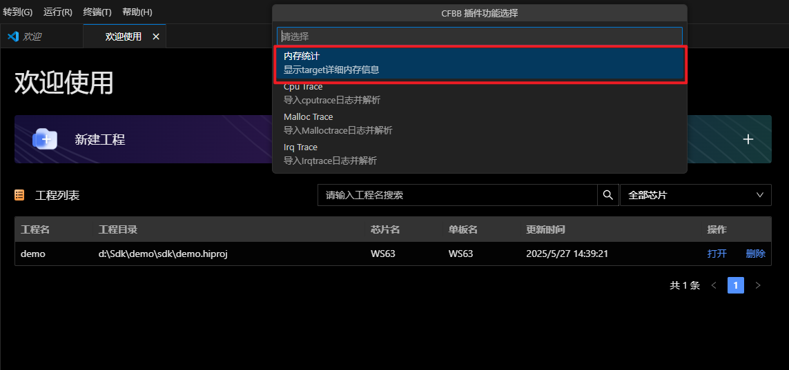

Select the corresponding target to collect memory statistics. The memory statistics interface is shown in [Figure 2](#zh-cn_topic_0000002293383866_fig642651812595).

**Figure 2**  Memory statistics function display<a name="zh-cn_topic_0000002293383866_fig642651812595"></a>  


### Baseline Comparison Function<a name="ZH-CN_TOPIC_0000002412317121"></a>

You can quickly compare the memory usage before and after code changes:

1.  Click the Save as Baseline button to save the current memory as a baseline.
2.  Modify the code or switch the target.
3.  Refresh the statistics.
4.  Click the Compare button, as shown in [Figure 1](#zh-cn_topic_0000002293224194_fig948185817020). An example of the comparison result is shown in [Figure 2](#zh-cn_topic_0000002293224194_fig68321937318).

    **Figure 1**  Buttons for saving the baseline version and comparing with the baseline version<a name="zh-cn_topic_0000002293224194_fig948185817020"></a>  
    

    **Figure 2**  Example of the comparison result with the baseline version<a name="zh-cn_topic_0000002293224194_fig68321937318"></a>  
    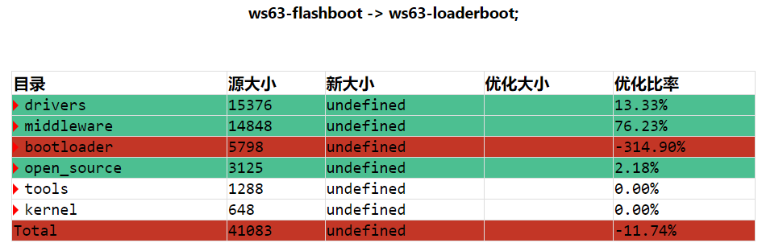

### CPU Trace Log Parsing Function<a name="ZH-CN_TOPIC_0000002378877564"></a>

When the chip crashes, the crash log is usually printed through the serial port, which contains the cpu\_trace information (that is, the function call chain for a period of time before the crash).

Following the steps in "[Memory Statistics](内存统计功能.md#ZH-CN_TOPIC_0000002378717724)", click the cfbb button in the lower right corner, select Cpu Trace in the pop-up menu bar, select the corresponding target, copy the cpu\_trace log printed during the crash to the text box, and then click the Trace button, as shown in [Figure 1](#zh-cn_topic_0000002327223553_fig2078817371822).

**Figure 1**  Cpu Trace function<a name="zh-cn_topic_0000002327223553_fig2078817371822"></a>  


### Heap Memory Usage Statistics (Applicable to BS2X and BS25 Series Chips)<a name="ZH-CN_TOPIC_0000002412436973"></a>

This function can parse the heap memory detection log to quickly analyze the heap memory usage.

1.  Click the Analysis button in the lower right corner.
2.  In the pop-up menu bar, select Malloc Trace, and select the corresponding target. To enable heap memory detection, simply click the button shown in the figure. A rebuild is required. After it is enabled, send the AT command AT+TASKMALLOC= \(the parameter following the command is the task ID\) over the serial port, or call print\_os\_all\_sys\_task\_heap to print the heap memory detection log.

    **Figure 1**  Malloc Trace function<a name="zh-cn_topic_0000002327183813_fig02211941443"></a>  
    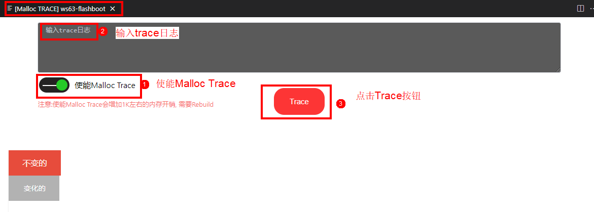

3.  Copy the heap memory detection log to the text box.
4.  Click the Trace button to display the statistics chart, as shown in [Figure 2](#zh-cn_topic_0000002327183813_fig1836521310443).

    **Figure 2**  Example of the comparison result with the baseline version<a name="zh-cn_topic_0000002327183813_fig1836521310443"></a>  
    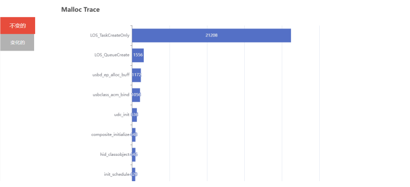

### Detection of Lock Interruption Duration Statistics and Interruption Function Execution Duration Statistics<a name="ZH-CN_TOPIC_0000002378717728"></a>

**Enabling Lock Interruption Detection<a name="zh-cn_topic_0000002293383870_section6996192714500"></a>**

To enable lock interruption detection, add "set\(PUBLIC\_DEFINESOSAL\_IRQ\_RECORD\_INTTER OSAL\_IRQ\_RECORD\_DEBUG\) " at the position shown in the figure in the "kernel/osal\_adapter/CMakeLists.txt" file in the SDK root directory. Note: A rebuild is required.

**Figure 1**  Modification of CMakeLists.txt<a name="zh-cn_topic_0000002293383870_fig1883953718473"></a>  


**Using Lock Interruption Detection<a name="zh-cn_topic_0000002293383870_section470364455017"></a>**

-   Call the "osal\_irq\_record\_flag\_set\(\)" interface to enable or disable lock interruption detection. Its parameter ranges from 0 to 3, and the parameter description is as follows:

    0: Disable interruption detection.

    1: Enable the detection of lock interruption duration statistics.

    2: Enable the detection of interruption function execution duration statistics.

    3: Enable the detection of both lock interruption and interruption function execution duration statistics.

-   Call the "osal\_print\_irq\_record\(\)" interface to print the recorded detection information. Its parameter is empty.

**Parsing the Detection Information<a name="zh-cn_topic_0000002293383870_section6885916125218"></a>**

1.  Click the cfbb button in the lower right corner.
2.  In the pop-up menu bar, select Irq Trace.
3.  Select the corresponding target.
4.  Copy the detection log to the text box, and click the "Trace" button.

**Figure 2**  Irq Trace function<a name="zh-cn_topic_0000002293383870_fig15230162419526"></a>  
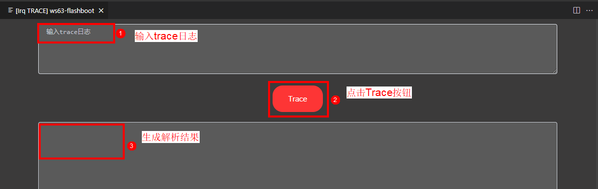

# Common Errors<a name="ZH-CN_TOPIC_0000002412317125"></a>


## The SDK Root Directory Path Is Too Long<a name="ZH-CN_TOPIC_0000002378877568"></a>

The SDK root directory path is too long:

On Windows 10 and Windows 11, the path has a length limit of 260 bytes. An overlong path causes related files to be unavailable during compilation, or the compilation keeps looping certain printed information without executing the actual compilation content. It is recommended to place the SDK code in the root directory of a drive letter, or shorten the path where the SDK is stored.

**Figure 1**  The SDK root directory path is too long<a name="zh-cn_topic_0000002293383942_fig13895175443715"></a>  


## Invalid Path<a name="ZH-CN_TOPIC_0000002412436977"></a>

The default paths for debugging, stack analysis, and image analysis become invalid due to problems with the imported project path.

-   Debugging: Modify the default debug\_elf path.

    **Figure 1**  Modify the default debug\_elf path<a name="zh-cn_topic_0000002293224282_fig1326371603814"></a>  
    

## Error Messages About Python or Other Dependencies During Compilation or Execution of System Configuration Functions<a name="ZH-CN_TOPIC_0000002378717732"></a>

Error messages about the Python environment during compilation or execution of system configuration functions:

**Figure 1**  Python environment error dialog box<a name="zh-cn_topic_0000002327183901_fig155352138378"></a>  
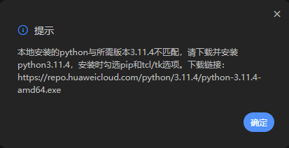

Or an error message such as "Python is not installed locally" or "The Python installed locally is unavailable" is displayed. The cause is that Python is not installed locally, or the installed Python version is not 3.11.4. To avoid affecting normal compilation or system configuration functions, it is recommended to refer to the Python environment configuration in Chapter 2.4, download the Python 3.11.4 installation package, and manually install it. During the installation, select the "pip" and "tcl/tk options".

Error message about the failure to download a component (XX) during compilation or execution of system configuration functions:

**Figure 2**  Dialog box for the failure to download a pip component<a name="zh-cn_topic_0000002327183901_fig2582192913375"></a>  
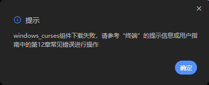

Alternatively, the download of cmake, pycparser, kconfiglib, or pillow fails. The cause is that the required dependencies fail to be downloaded through the pip component of the installed Python during compilation or execution of system configuration functions. This may be because pip install fails due to the local environment, or the download fails because there is no network connection currently.

Solution: Download the whl file of the corresponding component based on the error message about the failed component. The correspondence between components and download links is as follows:

cmake：[https://files.pythonhosted.org/packages/65/7f/80cf681cd376834b442af8af48e6f17b4197d20b7255aa2f76d8d93a9e44/cmake-3.20.5-py2.py3-none-win\_amd64.whl](https://files.pythonhosted.org/packages/65/7f/80cf681cd376834b442af8af48e6f17b4197d20b7255aa2f76d8d93a9e44/cmake-3.20.5-py2.py3-none-win_amd64.whl)

pycparser：[https://files.pythonhosted.org/packages/62/d5/5f610ebe421e85889f2e55e33b7f9a6795bd982198517d912eb1c76e1a53/pycparser-2.21-py2.py3-none-any.whl](https://files.pythonhosted.org/packages/62/d5/5f610ebe421e85889f2e55e33b7f9a6795bd982198517d912eb1c76e1a53/pycparser-2.21-py2.py3-none-any.whl)

kconfiglib：[https://files.pythonhosted.org/packages/8a/f1/d98a89231e779b079b977590efcc31249d959c8f1d4b5858cad69695ff9c/kconfiglib-14.1.0-py2.py3-none-any.whl](https://files.pythonhosted.org/packages/8a/f1/d98a89231e779b079b977590efcc31249d959c8f1d4b5858cad69695ff9c/kconfiglib-14.1.0-py2.py3-none-any.whl)

windows\_curses：[https://files.pythonhosted.org/packages/18/1b/e06eb41dad1c74f0d3124218084f258f73a5e76c67112da0ba174162670f/windows\_curses-2.3.3-cp311-cp311-win\_amd64.whl](https://files.pythonhosted.org/packages/18/1b/e06eb41dad1c74f0d3124218084f258f73a5e76c67112da0ba174162670f/windows_curses-2.3.3-cp311-cp311-win_amd64.whl)

pillow：

[https://files.pythonhosted.org/packages/c1/d0/5866318eec2b801cdb8c82abf190c8343d8a1cd8bf5a0c17444a6f268291/pillow-10.4.0-cp311-cp311-win\_amd64.whl](https://files.pythonhosted.org/packages/c1/d0/5866318eec2b801cdb8c82abf190c8343d8a1cd8bf5a0c17444a6f268291/pillow-10.4.0-cp311-cp311-win_amd64.whl)

After the download is complete, open the command prompt (cmd) in the directory where the file is located (it is recommended to store it in the installation directory of Python 3.11.4), and execute the command "pip install  the corresponding whl file". Take cmake and windows\_curses as an example:

**Figure 3**  Example of downloading whl files<a name="zh-cn_topic_0000002327183901_fig8902128123817"></a>  
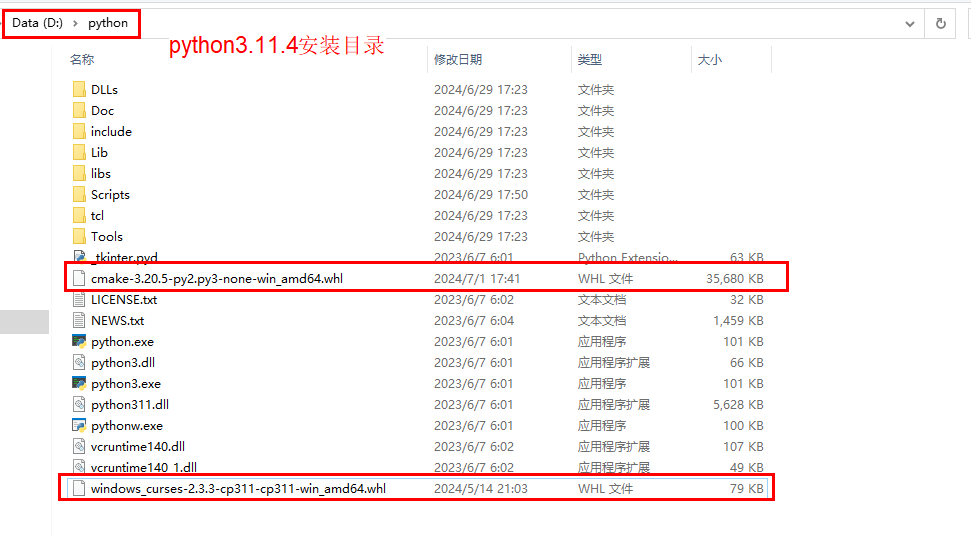

Commands to execute:

**Figure 4**  Executing the pip install command<a name="zh-cn_topic_0000002327183901_fig1058514345386"></a>  


To check whether the execution is successful, for cmake, open the command prompt and run "cmake --version". If the corresponding version number is displayed, cmake is downloaded successfully. For other components, run "pip show component name". If information about the corresponding component is displayed, the dependencies are downloaded successfully:

**Figure 5**  Checking that the dependencies are downloaded successfully<a name="zh-cn_topic_0000002327183901_fig15897171463910"></a>  
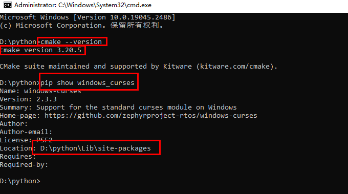

If all environments are configured successfully but the compilation still fails with the error "is the command line too long", the cmake version does not match the required version. You need to download cmake-3.20.5-py2.py3-none-win\_amd64.whl in the installation directory of Python 3.11.4 and run "pip install  the downloaded cmake whl file" in this directory.

Download link:

[https://files.pythonhosted.org/packages/65/7f/80cf681cd376834b442af8af48e6f17b4197d20b7255aa2f76d8d93a9e44/cmake-3.20.5-py2.py3-none-win\_amd64.whl](https://files.pythonhosted.org/packages/65/7f/80cf681cd376834b442af8af48e6f17b4197d20b7255aa2f76d8d93a9e44/cmake-3.20.5-py2.py3-none-win_amd64.whl)

**Figure 6**  Error message: is the command line too long<a name="zh-cn_topic_0000002327183901_fig57321230113917"></a>  


If the Python environment is normal but the pip install component fails:

**Figure 7**  Failure to execute pip install<a name="zh-cn_topic_0000002327183901_fig10490436153913"></a>  
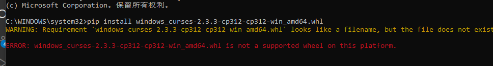

The cause is that the pip version is inconsistent with the Python version. That is, the environment variable of Python 3.11.4 or another compliant Python version is added to the environment variables, but the environment variable of Python311\\Scripts in the corresponding Python installation directory is not added. You can manually add the environment variable of Python\\Scripts to the head of the environment variables. After the pip dependencies are downloaded successfully, close all VS Code windows and open them again.

**Figure 8**  Adding the environment variable of Python311<a name="zh-cn_topic_0000002327183901_fig227546143910"></a>  


## Error "NameError: name 're' is not defined" Reported for Searching in the Kconfig Jump to Dialog Box<a name="ZH-CN_TOPIC_0000002412317129"></a>

1.  After opening Kconfig, click the "Jump to..." button and search for the related content in the dialog box.

    **Figure 1**  Opening the search box from Jump to<a name="zh-cn_topic_0000002293383962_fig252132311619"></a>  
    

2.  If the following abnormal print appears:

    **Figure 2**  Abnormal print of Kconfig<a name="zh-cn_topic_0000002293383962_fig17981081134"></a>  
    

    You need to modify the "guiconfig.py" file: before calling the re module, add import re, as shown in [Figure 3](#zh-cn_topic_0000002293383962_fig23065516141).

    **Figure 3**  Adding import re<a name="zh-cn_topic_0000002293383962_fig23065516141"></a>  
    

3.  After the code is added, the search can be performed normally, as shown in [Figure 4](#zh-cn_topic_0000002293383962_fig1265846121315).

    **Figure 4**  Schematic diagram of normal search<a name="zh-cn_topic_0000002293383962_fig1265846121315"></a>  
    

## Compilation Error "Invalid argument"<a name="ZH-CN_TOPIC_0000002378877572"></a>

If the error "Invalid argument" is reported during compilation.

**Figure 1**  Compilation error "Invalid argument" of ws63<a name="zh-cn_topic_0000002304197682_fig1489361241813"></a>  


Cause: The elf file cannot be parsed because of the lack of administrator permissions. Solution: Open VS Code with administrator permissions and compile again.

## Error Reported by the Python Environment Check<a name="ZH-CN_TOPIC_0000002412436981"></a>

**Figure 1**  Error reported by the Python environment check<a name="zh-cn_topic_0000002339901405_fig1449715297549"></a>  
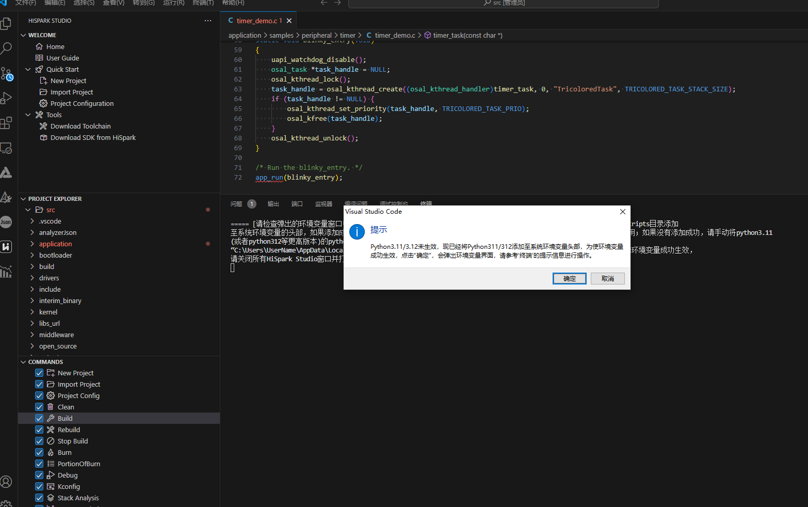

If an error is reported during Python installation, as shown in the preceding figure, you can run "Python --version" in cmd and check the environment variables to verify whether Python is installed correctly. If the problem is still not resolved, check whether other plug-ins installed in VS Code conflict with it, and you can disable the other plug-ins for troubleshooting.

