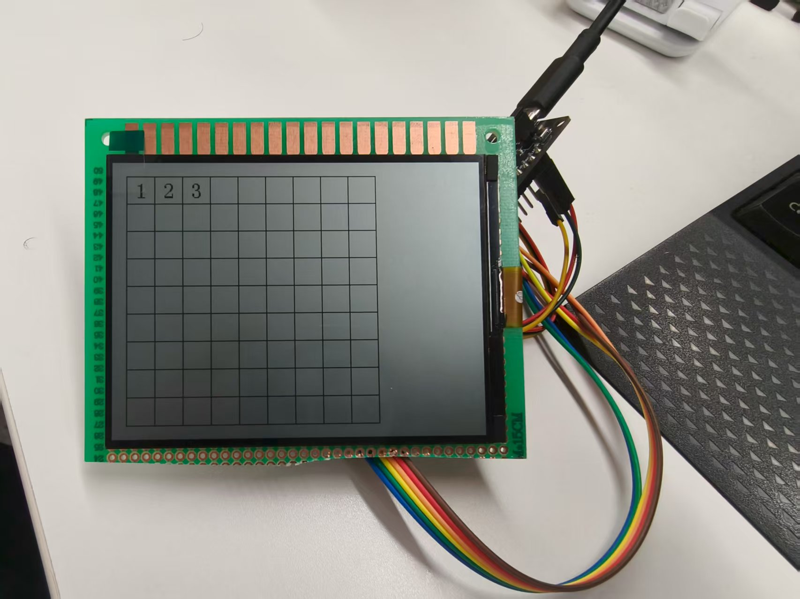

# SPI点亮半反射液晶屏

## 1.1 介绍

**功能介绍：** 由于BS21的性能限制，点亮彩色液晶屏的效果并不会太好，这里选择点亮超省电黑白半反射液晶，应该也是一种不错的显示方案

**效果图：** 

# 1.2 使用介绍

* 步骤一：最简单的测试步骤，在xxx\src\application\samples\peripheral\spi文件夹里面的东西删除，把案例的文件都拷贝进去，本案例已经包含了CMake文件和Kconfig文件

* 步骤二：IDE界面点击Kconfig配置功能，打开samples和spi，保存后，点击“build”编译

* 步骤三：编译完毕烧录即可，接线可以参考Kconfig文件里面的配置