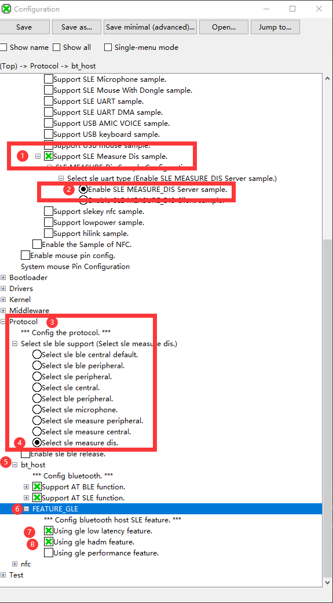
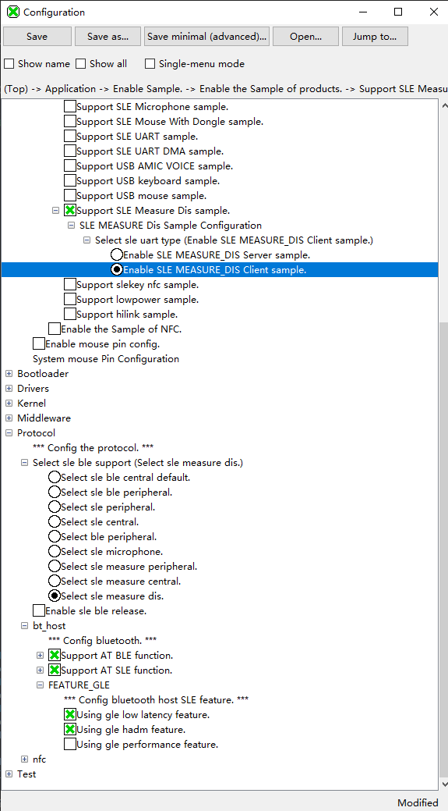
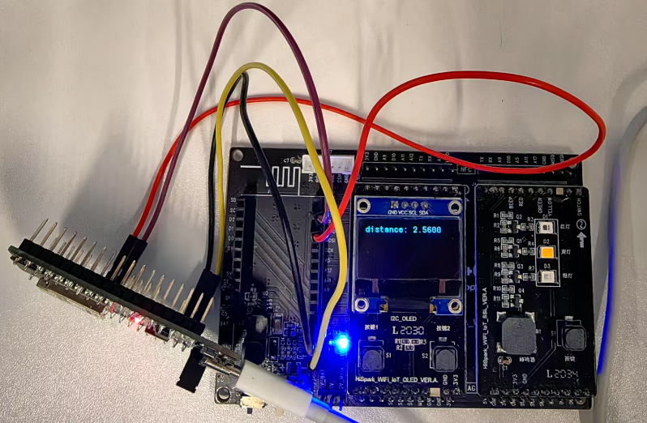

# Ranging

- Step 1: Modify `#define TASK_COMMON_APP_DELAY_MS       20000` in `drivers\chips\bs2x\main_init\app_os_init.c` to `#define TASK_COMMON_APP_DELAY_MS       7000`

  ```
  #define TASK_COMMON_APP_DELAY_MS       7000
  ```

- Step 2: Copy the `vendor\HH-D03\demo\sle_measure_dis` folder to `application\samples\products`, and select to overwrite the same files.

- Step 3: Compile the server side, check the places shown in the figure below, and then burn/flash it to the server development board. Note that the hardware server side needs to be equipped with a screen.

  

- Step 4: Compile the client side, check the places shown in the figure below, and then burn/flash it to the client development board. Note that the client development board does not need a screen.

  
  
- For details, refer to the <a href="../../../../docs/zh-CN/debug/SDK Sample使用指南/SDK Sample使用指南.md">BS2XV100 SDK Sample Usage Guide</a>.
  
- Effect display: The server side needs a screen to display data; the client side does not need a screen.

  
