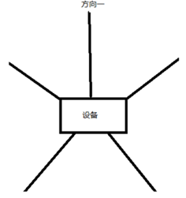

# 测距

## 概述

此Sample基于SLE实现了一种一对多的测距方案。Server 端通过广播信号，Client端通过扫描建立连接，并依次与多个 Server 进行轮询测距。在测距过程中，Client端负责采集本地 IQ 数据并发送给 Server，Server端接收后计算出最终的距离。本Sample测距稳定、轮询顺畅、数据传输精准，适用于室内定位、智能家居、物联网（IoT）等场景。

## 编译流程

- 步骤一：修改drivers\chips\bs2x\main_init\app_os_init.c中\#define TASK_COMMON_APP_DELAY_MS       20000修改为\#define TASK_COMMON_APP_DELAY_MS       7000

  ```
  #define TASK_COMMON_APP_DELAY_MS       7000
  ```

- 步骤二：根据需要连接的锚点数量，在sle_measure_dis_client.h中，修改MAX_SERVERS的值，如下图所示（最大为5）


- 步骤三：根据需要连接的锚点数量，在sle_measure_dis_client.c中的measure_dis_slem_set_param函数中，修改变量con_anchor_num的值，如下图，如下图所示（最大为5)

   

- 步骤四：在sle_measure_dis_sever.c中的g_measure_dis_server_addr中，为每个sever设置不同的地址，如下图所示

   

- 步骤五：在HiSpark Studio里面点击KConfig，进入如图所示页面。

   

-  步骤五：如果选择编译server sample，在弹出框中选择如下图所示的内容，点击Save，关闭弹窗；

   

-  步骤六：如果选择编译client sample，在弹出框中选择如下图所示的内容，点击Save，关闭弹窗。（需要准备多块开发板，选择不同的编译选项，烧录不同的镜像）

   

   

- 步骤七：KConfig配置完成后，点击“Build”即可开始编译相应sample。若编译出错，可查看日志确定寻找错误原因。

## 烧录

- 步骤一：在HiSpark Studio工具中点击“工程配置”按钮，选择“程序加载”，传输方式选择“serial”，端口选择“comxxx”，com口在设备管理器中查看（如果找不到com口，请参考windows环境搭建）。

  

- 步骤二：配置完成后，点击工具“程序加载”按钮烧录。

  

- 步骤三：出现“Connecting, please reset device...”字样时，复位开发板，等待烧录结束。

  

- 步骤四：“软件烧录成功后，按一下开发板的RESET按键复位开发板，可以通过交通灯板上的按键控制红色LED灯亮灭。

## 运行

  此sample运行流程如下：

- 步骤一：准备多块开发板，其中一块烧录Client端程序，其余烧录Server端程序。

- 步骤二：上电后，Server端开始广播信号，Client端通过扫描连接多个Server，并逐个进行测距。

- 步骤三：Client端在测距过程中采集本地IQ数据，并发送给当前测距Server。

- 步骤四：Server端接收Remote IQ数据后，计算测距结果并记录数据。

- 步骤五：测距完成后，Client端自动切换到下一个Server，并重复测距过程，实现多个 Server的轮询测距。

- 步骤六：测距数据可通过日志输出，观察Client端与多个Server之间的测距切换情况。

  5、校准

  在锚点周围 3m 范围内空旷无遮挡、无墙体、柱体、金属等遮挡物的环境下测试。按照下图所示在设备周围5个方向的1m位置，进行5次测距，5次测距值的其平均值减1为锚点 A 的校准值。

   

  每个锚点都要进行校准，得到校准值后，在sle_measure_dis_server_alg.c中如图所示的位置输入校准值

   

- 步骤七：效果如下

  
