# Ranging

## Overview

This Sample implements a one-to-many ranging scheme based on SLE. The Server broadcasts signals, the Client establishes connections through scanning, and sequentially performs polling ranging with multiple Servers. During the ranging process, the Client is responsible for collecting local IQ data and sending it to the Server, which calculates the final distance after receiving it. This Sample features stable ranging, smooth polling, and precise data transmission, making it suitable for scenarios such as indoor positioning, smart homes, and the Internet of Things (IoT).

## Compilation Process

- Step 1: Modify `#define TASK_COMMON_APP_DELAY_MS       20000` in `drivers\chips\bs2x\main_init\app_os_init.c` to `#define TASK_COMMON_APP_DELAY_MS       7000`

  ```
  #define TASK_COMMON_APP_DELAY_MS       7000
  ```

- Step 2: Modify the value of `MAX_SERVERS` in `sle_measure_dis_client.h` according to the number of anchor points to be connected, as shown in the figure below.

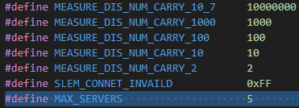

- Step 3: Modify the value of the variable `con_anchor_num` in the `measure_dis_slem_set_param` function in `sle_measure_dis_client.c` according to the number of anchor points to be connected, as shown in the figure below. 

   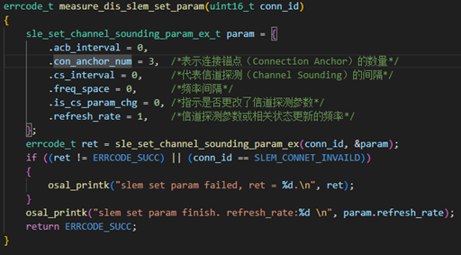

 Ps: The value of the variable `cs_interval` needs to be modified based on the actual number of connected anchors to select different ranging frequencies. Currently, the sample provides three ranging frequency interfaces: 2Hz, 1Hz, and 0.5Hz. The corresponding relationship is shown in the table below.

| Macro | Ranging Frequency | Maximum Connections per Client |
|:------|:-----:|:-----:|
| CARKEY_SLE_SLEM_2HZ | 2Hz | 2 |
| CARKEY_SLE_SLEM_1HZ | 1Hz | 5 |
| CARKEY_SLE_SLEM_05HZ | 0.5Hz | 8 |

- Step 4: In `g_measure_dis_server_addr` in `sle_measure_dis_sever.c`, set a different address for each server, as shown in the figure below.

   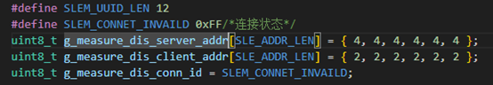

- Step 5: Click KConfig in HiSpark Studio to enter the page as shown in the figure.

   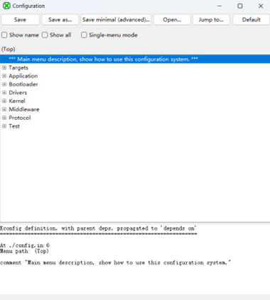

- Step 5: If you choose to compile the server sample, select the content shown in the figure below in the pop-up box, click Save, and close the pop-up window;

   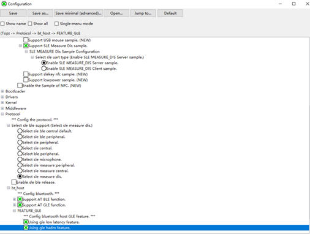

- Step 6: If you choose to compile the client sample, select the content shown in the figure below in the pop-up window, click Save, and close the pop-up. (Multiple development boards need to be prepared, different compilation options selected, and different images burned.)

   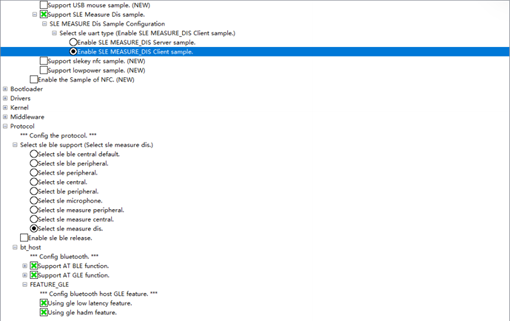

   

- Step 7: After completing the KConfig configuration, click "Build" to start compiling the corresponding sample. If a compilation error occurs, check the log to identify the cause of the error.

## Flashing

- Step 1: In the HiSpark Studio tool, click the "Project Configuration" button, select "Program Loading", choose "serial" as the transmission method, and select "comxxx" as the port. Check the COM port in Device Manager (if the COM port cannot be found, refer to the Windows environment setup).

  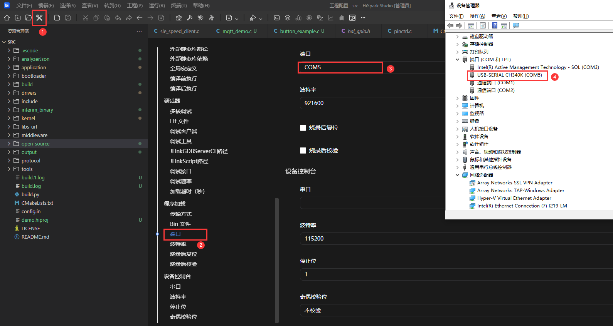

- Step 2: After configuration is complete, click the tool's "Program Load" button to burn.

  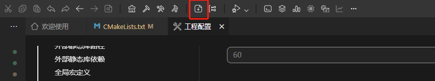

- Step 3: When the message "Connecting, please reset device..." appears, reset the development board and wait for the flashing to complete.

  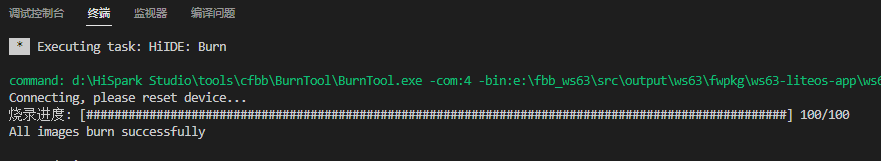

- Step 4: "After the software is successfully burned, press the RESET button on the development board to reset it. The red LED light on the traffic light board can be controlled to turn on and off via the button."

## Operation

The operation flow of this sample is as follows:

- Step 1: Prepare multiple development boards. Burn the Client program on one board and the Server program on the others.

- Step 2: After powering on, the Server starts broadcasting signals. The Client scans and connects to multiple Servers, performing distance measurement with each one in turn.

- Step 3: During the distance measurement process, the Client collects local IQ data and sends it to the currently connected Server.

- Step 4: After receiving the Remote IQ data, the Server calculates the distance measurement result and records the data.

- Step 5: Once the distance measurement is complete, the Client automatically switches to the next Server and repeats the measurement process, achieving polling distance measurement with multiple Servers.

- Step 6: The distance measurement data can be output via logs to observe the switching of distance measurement between the Client and multiple Servers.

5. Calibration

Test in an environment within a 3m range around the anchor point that is open, unobstructed, and free of walls, pillars, metal, or other obstacles. As shown in the figure below, perform three distance measurements at 1m positions in three directions around the device. The average of the three distance measurement values minus 1 is the calibration value for anchor A.

   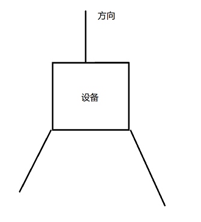

  Each anchor point must be calibrated. After obtaining the calibration values, input them at the positions shown in the figure in sle_measure_dis_server_alg.c.

   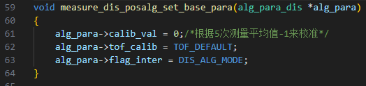

- Step 7: The effect is as follows

  