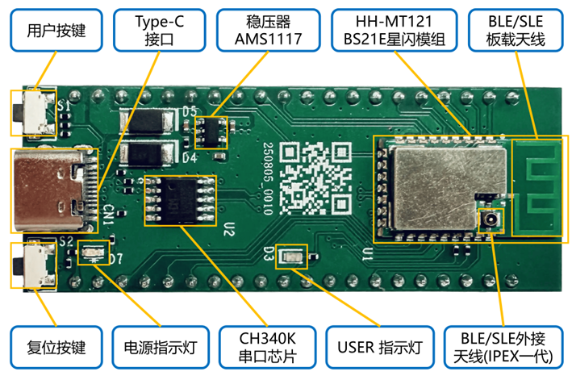
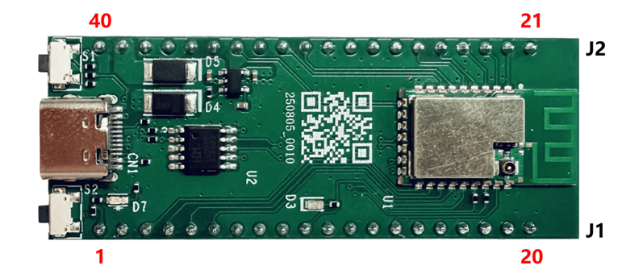

## HH-D121 SparkLink Development Board Specification

### I. Overview

#### 1. Development Board Introduction

**Model:** HH-D121

The HH-D121 main board is a solution based on the HiSilicon SparkLink BS21E, integrating high performance, SLE 1.0, BLE 5.4, and RF circuits. The RF section includes a power amplifier (PA), a low-noise amplifier, an antenna, and power management modules. SparkLink SLE supports three bandwidths of 1M/2M/4M, with a maximum PHY-layer rate of 12 Mbps. The module integrates a high-performance 32-bit RISC-V microprocessor (MCU), with on-board large-capacity SRAM and Flash. It supports running programs on the Flash, supports the hardware security engine, and offers a rich set of peripheral interfaces. It supports the LiteOS operating system and can be widely used in IoT smart terminal fields such as PC accessories and IoT devices.

The HH-D121 main board has the following features:

* **Rich SDK**

  * SDK supports USB, HID, Battery, HeartRate

  * Provides various application Examples such as Keyboard, Mouse, and Microphone

  * Provides complete manuals and documentation, plus open, easy-to-use software SDKs and tools

* **Stable and reliable communication capability**

  - Smaller air interface time slots, significantly reducing end-to-end latency

  - Uses Polar codes, providing >7dB coverage gain and strong anti-interference capability

  - Supports centrally scheduled spectrum allocation and efficient channel scanning and selection

  - Supports wider air interface bandwidth and higher-order modulation

* **High compute power, sub-threshold ultra-low power consumption**

  - RISC-V open-source MCU ecosystem, supporting floating-point computation

  - Built-in 1MB Flash, no external Flash needed, built-in 160KB SRAM to satisfy large application overhead

  - uA-level power consumption, supporting Normal/Sleep/DeepSleep and other working and sleep modes

* **Powerful security engine**

  - Supports AES128/256 encryption/decryption algorithms

  - Supports the SM4 encryption/decryption algorithm

  - Supports the TRNG true random number module

  - Internal integrated efuse

  - Internal integrated PMP feature, supporting memory isolation

* **Open operating system**
  - Supports the LiteOS operating system

#### 2. Main Specifications

Table 1.1 HH-D121 SparkLink development board main specifications

| **Module** | **Specification Description** |
| --- | --- |
| **BLE** | Supports BLE4.0/4.1/4.2/5.0/5.1/5.2/5.3/5.4  Supports data rates: 1Mbps, 2Mbps, 500kbps, and 125kbps |
| **SLE** | SparkLink low-power SLE1.0  Supports SLE 1MHz/2MHz/4MHz  Maximum air interface rate 12Mbps  Supports Polar channel coding  Supports radio frame type 1 (GFSK frames) and radio frame type 2 (low-latency frames)  Supports G frames and T frames, supports unicast/multicast functions  Supports high-precision ranging |
| **MCU Subsystem** | High-performance RISC-V 32-bit MCU  Operating frequency up to 64MHz  Built-in 160KB SRAM  Built-in 1MB Flash  Supports eFuse/Chinese national standard SM4  Supports secure storage/secure boot |
| **Peripheral Interfaces** | AFE (Analog Front-End)  Supports 2 * I2C, supports master and slave modes  Supports 1 2-channel I2S/PCM  Supports 2-channel PDM  Supports 3 * SPI, master and slave modes configurable  Supports 3 * UART, maximum rate 4Mbit/s; 2 of them are 4-wire UARTs supporting flow control  Supports 2 * PWM  Supports USB 2.0 HS/FS, maximum 480Mbit/s  Supports 6 13-bit ADC channels, maximum sampling rate 1.6M  Supports NFC Type2 Tag function, supports NFC wake-on-field function  Supports the QDEC interface  Supports the KeyScan function  Supports 22*GPIO (full pin multiplexing) |
| **AFE** | Supports ADC multiplexed for audio AMIC sampling  Sensor path: supports 8-channel 13-bit 1.6Msps SAR ADC, supports single-ended/differential/scan modes, supports oversampling and buffer functions  Audio path: supports multiplexed 13-bit SAR ADC, downsampled to 16ksps/8ksps; supports 40dB amplification |
| **Other Information** | Power supply voltage input: typical 5V  Operating temperature: -40℃ ~ +85℃  Storage temperature: -40℃ ~ +105℃ |

### II. Hardware Description

#### 1. Functional Layout

 

**1)** **User Button**

S1 is the USER custom button. Switch S2 reports the "pressed/released" status to the BS21E through the GPIO25 pin; the function is customized by software.

**2)** **Type-C Interface**

Can power the main board and the entire kit, or connect to a computer for serial debugging and system flashing. The development board's USB_DP and USB_DM pins are routed out through Type-C.

**3)** **Reset Button**

S2 is the RST reset button, which can reset the main board.

**4)** **Power Indicator Light (Green)**

Used to indicate the power status. After normal power-on, the power indicator light stays on.

5) **USER Indicator Light (Yellow)**

Used to indicate the status of the related IO pins; the user controls it through GPIO18.

**6)** **Voltage Regulator AMS1117**

Used to convert the serial port's 5V power supply to the chip's 3.3V power supply.

**7)** **CH340K USB-to-Serial Chip**

When using the serial port function, the driver for this chip needs to be installed on the PC.

**8)** **HH-MT121 Module**

Highly integrated BLE and SLE, featuring high-speed transmission, low latency, high performance, and low power consumption, with a Type-C USB interface and rich pin functions.

**9)** **SLE On-Board Antenna**

Used to enhance the SLE/BLE signal.

**10)** **SLE External Antenna (Optional)**

Used to enhance the SLE/BLE signal. It uses the 1st-generation IPEX interface and can be used in special scenarios requiring a very strong signal, implemented by replacing the soldered resistor.

#### 2. Pin Definitions

#### 3. Dimensions

